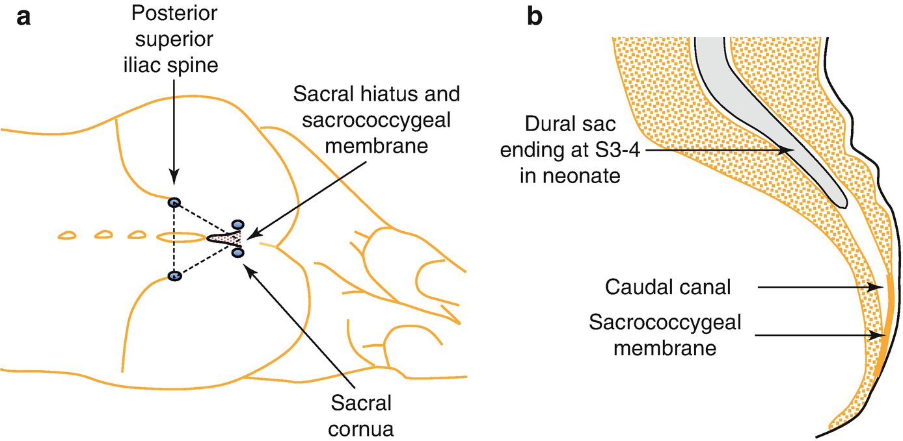
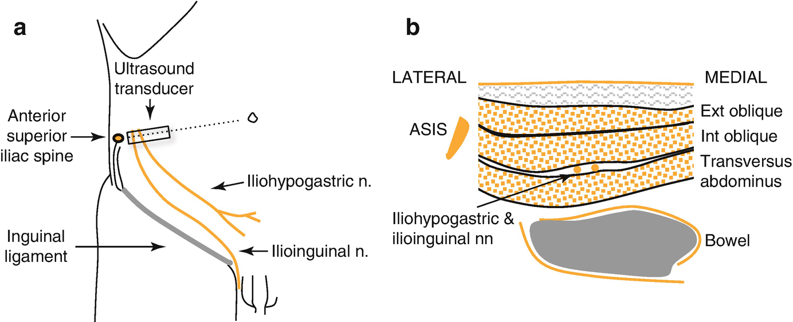
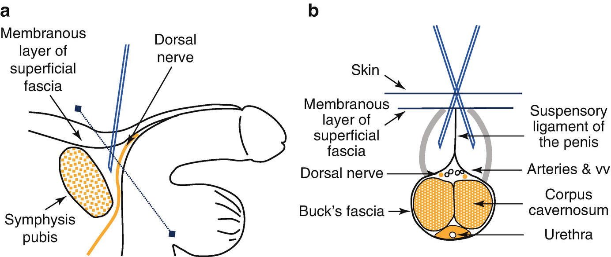

Regional Anesthesia for Infants and Children

© Springer Nature Switzerland AG 2020

Craig Sims, Dana Weber and Chris Johnson (eds.) A Guide to Pediatric Anesthesia[https://doi.org/10.1007/978-3-030-19246-4\_10](https://doi.org/10.1007/978-3-030-19246-4_10)

# 10. Regional Anesthesia for Infants and Children

Chris Johnson[1](#Aff4)     and Chris Gibson[2](#Aff5)    

(1)

Formerly Department of Anaesthesia and Pain Management, Princess Margaret Hospital for Children, Subiaco, WA, Australia

(2)

Department of Anaesthesia and Pain Management, Perth Children’s Hospital, Nedlands, WA, Australia

Chris Johnson (Corresponding author)

Chris Gibson

Email: [Christopher.Gibson@health.wa.gov.au](mailto:Christopher.Gibson@health.wa.gov.au)

### Keywords

Local anesthetic pharmacology in childrenPediatric epiduralCaudal blockSacral hiatusDorsal nerve block

Regional anesthesia is an important part of pediatric anesthesia. A comfortable child is less likely to be agitated after surgery, less likely to dislodge dressings and drains, and less likely to be psychologically traumatized by their experience. Continuous regional analgesia is useful where pain is likely to be severe and prolonged and or difficult to assess such as in children with severe cerebral palsy and subsequent communication difficulties. This chapter will concentrate on areas specific to pediatric regional anesthesia, and it is assumed the reader is familiar with the various blocks also used in adults. Rather than repeating their description here, the focus will be on important differences when performing peripheral nerve blocks in children.

## 10.1 The Pharmacology of Local Anesthetic Agents in Infants and Children

As is the case with many drugs, the pharmacokinetics of local anesthetic agents are different in neonates and young children compared with adults. The three most important differences are reduced protein binding, reduced metabolism and increased volume of distribution.

Local anesthetics are highly bound to proteins in the plasma, especially alpha-1-glycoprotein. The level of this protein is low during the first year, and the concentration of free (unbound) local anesthetic is higher. Liver cytochrome P450 enzymes metabolize local anesthetics and these enzymes do not mature until 6–12 months of age. Hence, toxicity is a high risk in neonates and infants. During an epidural infusion in smaller infants the plasma concentration of bupivacaine increases over time, but plateaus in children (Fig. [10.1](#Fig1)). To avoid toxicity, the infusion rate or concentration of the local anesthetic is reduced in neonates, and the infusion is stopped within 24–36 h. The risk of toxicity after bolus doses is counteracted by the increased volume of distribution for local anesthetics in neonates and infants—a high plasma concentration is prevented by the anesthetic distributing into a relatively larger volume. In clinical practice, the volume in mL/kg of a single, bolus dose is the same across all ages.

Fig. 10.1

Plasma concentration of bupivacaine increases towards toxic levels over time in neonates, but plateaus in infants and children older than 6 months. Based on Meunier et al. Pharmacokinetics of bupivacaine after continuous epidural infusion in infants with and without biliary atresia. Anesthesiology 2001;95: 87–95

### Keypoint

There is a high risk of local anesthetic toxicity in neonates and infants during infusions because protein binding and metabolism are reduced. Regional infusions should be stopped after 24–36 h in neonates and infants. The dose of a single, bolus injection is similar in all ages.

Other developmental changes affect local anesthetics in children. Nerve fibers at birth are thin, about half the diameter of adult nerves, and they are less myelinated during the first several years. As a result, low concentrations of local anesthetics in children achieve a block of similar duration and intensity to higher concentrations in adults. The volume of local anesthetic needed is however relatively large due to increased tissue blood flow and tissue spread, and more rapid local clearance.

The maximum dose of bupivacaine in children has been extrapolated to l\-bupivacaine and ropivacaine (Table [10.1](#Tab1)). Although the newer local anesthetic agents have less cardiotoxicity, the maximum doses were extrapolated because they have been found safe and effective in clinical practice and result in safe plasma levels after a variety of regional blocks. Although some suggest a maximum dose of ropivacaine of 3 mg/kg in the setting of combined (more than one) block in the same child, the doses in Table [10.1](#Tab1) above should be adhered to for single shot blocks. In practice, a maximum dose of 1 mL/kg of ropivacaine 0.2% (2 mg/mL) for a single shot block is a simple method without complex calculations.

Table 10.1

Maximum doses for single injection blocks and infusions of ropivacaine, l\-bupivacaine and bupivacaine in neonates and children

| 
Age group | Maximum bolus injection dose (mg/kg) | Maximum infusion dose (mg/kg/h)

 |
| --- | --- | --- |
| 

Neonate and infant <6 months | 2.5 | 0.2

 |
| 

Child | 2.5 | 0.4

 |

Based on Berde C. J Ped 1993; 122: S14–20

### Keypoint

The recommended maximum single dose of ropivacaine or l\-bupivacaine in children is 2.5 mg/kg.

## 10.2 Additives to Regional Blocks

Additives to regional blocks and infusions prolong the duration of the block, improve analgesia and provide concurrent sedation. In general, they are avoided in neonates and infants less than 3 months of age due to the risk of sedation and apnea.

Adrenaline (epinephrine) is now rarely used because of concerns about spinal cord ischemia, although it mildly prolongs the duration of caudal analgesia.

Clonidine provides postoperative sedation for the difficult toddler group, as well as analgesia. It can be added to a single shot caudal (1–1.5 μg/kg) or to epidural infusions. A simple mix is to add 1 μg/mL of clonidine to the local anesthetic infusion and run it at the usual rate. Clonidine should be used with caution in infants under 12 months as they can become very sedated, but is otherwise free of side effects apart from occasional mild bradycardia. It prolongs and improves the quality of peripheral blocks in adults, but there is not strong evidence of these effects in children. Small studies in children have not always shown a significant benefit of clonidine, and a large review of a regional block database in Philadelphia found benefit only when very dilute local anesthetic solutions had been used.

Opioids may be added to epidural infusions just as with adults. An alternative is to use opioids by the oral or IV routes to supplement the epidural as required. Some centers do not allow nursing staff to titrate epidural infusion doses. By combining epidural and systemic analgesic techniques, the epidural can provide background analgesia, and opioids can be titrated by nursing staff as required. Dexamethasone is not recommended as an additive in children because safety and efficacy have not yet been established. Ketamine prolongs caudal analgesia, but is not used due to possible neurotoxicity.

## 10.3 Ultrasound Guidance of Local Anesthetic Blocks

Similar to adult practice, ultrasound facilitates regional anesthesia in children. Ultrasound enables smaller doses of local anesthetic to be more easily, safely and accurately placed in close proximity to nerves, whilst avoiding inadvertent damage to adjacent structures. Ultrasound based techniques are similar to those described in adults with a few exceptions. Smaller probes, depths and needle lengths are often required to optimize the image. Anatomical structures and tissue planes are generally smaller, shallower and better defined. Particular care needs to be taken not to ‘overshoot’ when passing through shallow elastic tissue structures. Maintaining needle visualization throughout a short tissue trajectory can be challenging. Using a sharp hypodermic needle to puncture through the tough elastic skin before inserting a blunt short-bevel needle, helps maintain needle visualization and avoid inadvertent overshoot.

## 10.4 Complications of Local Anesthetic Blocks

Most pediatric regional blocks are placed after the induction of anesthesia to provide post-operative analgesia. Performing blocks with the child asleep is safe, and may even be safer than with the patient awake. Several large surveys with more than 100,000 patients show complications after blocks in children are uncommon. The most recent prospective survey in 2018 from the Pediatric Regional Anesthesia Network (PRAN), showed complications were uncommon, with a similar, low incidence of complications in peripheral and neuraxial blocks.

### 10.4.1 Overdose and Systemic Toxicity

These complications are usually due to arithmetic error or accidental use of the wrong strength of solution. It is best to always calculate the maximum allowable amount in milligrams and never draw up more than this, regardless of the volume required. A simple and conservative rule is to limit dosage to 1 mL/kg of ropivacaine 0.2%, l\-bupivacaine 0.25% or bupivacaine 0.25%, giving a maximum dose of 2.5 mg/kg (Table [10.1](#Tab1)). Overdose with cardiac arrest or convulsion is rare, but infants are more likely to develop these complications. Real-time ultrasound guided blocks reduce the volume required by 30–50% and allow visualization and avoidance of vessels, reducing the risk of intravascular injection. In an audit of over 100,000 pediatric regional blocks by the PRAN group, the rate of severe local anesthetic toxicity was 0.76: 10,000.

Test doses containing adrenaline (epinephrine) have been extensively studied in children, but changes in heart rate, BP and T waves are not sufficiently sensitive or specific, and vary between different volatile agents and propofol. Aspiration tests are also unreliable. It is therefore prudent to give larger volumes of local anesthetic in divided doses, watching for changes in respiration, T wave amplitude, ST segments and heart rate or onset of nodal rhythm.

### 10.4.2 Neurological Injury

There are few pediatric series of sufficient size to draw definite conclusions, but lasting injury after major plexus and single shot caudal block appears to be extremely rare. Infants less than 4 months of age and pre-teens appear to be most at risk. In a prospective multicenter cohort of more than 100,000 peripheral nerve and neuraxial blocks in children there were no cases of permanent neurological deficit associated with regional anesthesia. The rate of transient neurological deficit was low at 2.4 per 10,000. A UK pediatric epidural audit of 10,000 epidurals reported only one incident with residual effects 12 months after surgery in a 4 month old.

### 10.4.3 Injury to Visceral Structures

Is a concern during blocks of the anterior abdominal wall. Rectal damage during caudal block has also been reported.

### 10.4.4 Minor Complications

Pressure areas during continuous blocks in children are not uncommon, usually manifesting as heel redness or rarely skin loss. Urinary retention is common with continuous epidural blockade and warrants catheterization at all ages. Lower limb weakness and delayed ambulation may occur after caudal blockade with high concentrations of local anesthetic, or after Iliohypogastric block with inadvertent spread to the femoral nerve. Block failure is usually due to depositing the local anesthetic too deeply, as most peripheral nerves are quite superficial. Accurate visualization of nerves using ultrasound may reduce the incidence of this to zero.

## 10.5 Neuraxial Blocks

There are important anatomical and physiological differences of the neuraxis between children and adults:

-   The anatomical curves of the spine are absent at birth and not fully fixed until puberty, altering the spread of spinal and epidural local anesthetics.
    
-   There is less variation in the angulation of the spinous processes in children, allowing easier access to thoracic and lumbo-sacral epidural spaces.
    
-   The spinal cord ends at L3 at birth and moves to the adult position around L1 by 12 months of age.
    
-   The sacrum is not fully ossified with intervertebral spaces still present, allowing sacral epidural access.
    
-   The dural sac ends at S3-4 in the neonate, moving to the adult level around S2 by 12 months of age. This is variable and it occasionally extends to the sacral hiatus in infancy.
    
-   The line joining the two superior iliac crests (the intercristal line) is through L5 in children and L5-S1 in neonates.
    
-   Hypotension, even with extensive block, is uncommon under 8 years of age unless hypovolemia is present. (Related to reduced resting sympathetic tone).
    

### 10.5.1 Caudal Epidural Blockade

Caudal blocks are best used as a single shot block for procedures below the umbilicus in infants and small children. The inferior termination of the epidural space can be approached via the sacral hiatus which is covered by skin and the sacrococcygeal membrane (the continuation of the ligamentum flavum). There is usually a clear loss of resistance or ‘pop’ as the membrane is penetrated. The relationship between volume of solution injected and extent of the block are reasonably predictable since only cephalad spread is possible. Recent studies show the anatomical spread of local anesthetic seen on ultrasound is less than the clinical block obtained, perhaps suggesting the mechanism of epidural blockade is still not fully understood.

#### 10.5.1.1 Technique

Placing the child slightly beyond the lateral position with the top leg over (rather than strictly at 90°) stabilizes the pelvis and slightly stretches the skin, making it easier to feel the sacral hiatus. This is located either at the apex of an inverted equilateral triangle using the two posterior superior iliac crests (Fig. [10.2](#Fig2)), or by placing the tip of the index finger on the tip of the coccyx—the hiatus lies opposite the second inter-phalangeal skin fold for those with average hand size. This distance from coccyx to hiatus does not change from around 4–6 months of age and remains the same for life. For this reason, the hiatus appears to be very cephalad in neonates and infants, and failure usually relates to aiming too low. The apex of the hiatus should be carefully located with an index finger and the needle inserted as cephalad as possible within the apex—this is where the sacral canal is deepest and the needle is less likely to impinge on the anterior wall of the canal. Reversing the needle bevel so it faces anteriorly (away from the anesthetist) also reduces this possibility.

Fig. 10.2

Anatomy of the caudal block. Injection is through the sacral hiatus, located in the lower sacrum between the two sacral cornua. (**a**) The sacral hiatus is at the apex of an equilateral triangle formed by it and the two posterior superior iliac spines. (**b**) The caudal canal is largest cephalad rather than caudally, and the needle is best inserted towards the top part of the triangular sacral hiatus

### Tip

If you are having trouble finding the sacral hiatus, you are probably too low on the back.

The sacrum is a flat structure in infants and children and the technique of needle puncture, flattening and advancing is inappropriate and may cause bloody tap or dural puncture. The needle should be advanced at an angle of 45–60° to the skin at the apex of the hiatus and not advanced once the sacrococcygeal membrane is penetrated, as the dural sac may be very close, particularly in babies. Extreme care is needed to prevent needle dislodgement during aspiration and slow injection. This is best done by stabilizing the needle with a hand resting along the child’s back and either making a window between your thumb and index finger or an underhand technique to allow for early visualization of subcutaneous sacral swelling during injection, a warning of incorrect needle placement. Importantly, there should be minimal resistance to injection. If injection is difficult it is invariably an indication of incorrect placement. Many would advocate always using a similar sized syringe to get a consistent feel for injection.

#### 10.5.1.2 Anatomical Difficulties

The anatomy of the sacral hiatus and caudal canal is highly variable. Sacral variations such as absent cornua, a bony septum or a presacral fat pad can make locating the hiatus technically challenging. Difficulty in locating the sacral hiatus has been reported in at least 11% of children under 7 years of age. Occasionally the sacral hiatus extends one or two segments more cephalad than usual, making dural puncture more likely if needle placement is in the most cephalad point of the long, slit-like hiatus. The correct site for needle placement can be judged using the above two methods. Some advocate ultrasound guidance to aid placement, particularly if there are concerns regarding the anatomy, although routine use of this practice is not widespread.

Cutaneous anomalies including sacral angioma, hairtuft, nevus or dimples near the puncture site may indicate abnormalities of the underlying spine. Midline sacral dimples are found in 2–4% of children and are usually of no significance. Rarely, they are associated with an occult spina bifida. Warning signs of an underlying abnormality include multiple dimples, or high on the back (should be below caudal insertion site, less than 2.5 cm above the anal verge), or more than 5 mm diameter, or associated with an underlying lump or a deviated or double gluteal cleft. Ultrasound can be used to clarify the underlying anatomy, or the block can be abandoned and a pediatric opinion obtained after surgery. Finally, if the sacral hiatus doesn’t feel normal, it might be safer to use different analgesia rather than persisting and causing problems.

#### 10.5.1.3 Needles for Caudal Epidural Blocks

The short-bevel styletted regional or spinal needles have the lowest risk of actual and theoretical complications. They give an obvious sensation or ‘pop’ passing through the membrane, and venous and dural puncture is less likely than with standard needles. The 22G needle is suitable for all ages. Fine gauge needles introduce the risk of unrecognized intra-osseous injection in neonates and infants. Intravenous needles (bloody tap rate 10%) and cannulae (require advancement into epidural space and may kink) still remain popular. Needles without stylettes introduce a small theoretical risk of implantation dermoid which most practitioners do not regard as significant.

#### 10.5.1.4 Local Anesthetic Agents and Doses for Caudal Block

The Armitage formula (Table [10.2](#Tab2)) is simple and reliable for infants and pre-school children, but the doses and volumes must be reduced for older children. Older children are also more likely to be troubled by leg numbness or weakness, and hence peripheral blocks are often a better alternative.

Table 10.2

Relationship between volume and block height for caudals in children, based on the classical paper: Armitage EN, Anaesthesia 1979;34: 396

| 
Volume of local anesthetic | Height of caudal block | Example surgical procedure

 |
| --- | --- | --- |
| 

0.5 mL/kg | Sacral block | Circumcision

 |
| 

1 mL/kg (maximum 20 mL) | Block to umbilicus (T10) | Herniotomy, orchidopexy, orthopedic procedures

 |
| 

1.25 mL/kga (maximum 20 mL) | Block to mid-thoracic | Upper abdomen (but care with mg/kg dose, upper block first to wear off)

 |

aDilute local anesthetic solutions are used so the dose is below the maximum recommended dose

The duration of analgesia varies with the site of surgery and the patient’s age. For example, 1–2 h after infant herniotomy, compared with around 5 h after a perineal procedure in a pre-school aged child. Block regression is quickest in the most cephalad dermatomes. Adding clonidine 1–2 μg/kg can prolong the block duration in younger children by 50–100%.

#### 10.5.1.5 Complications and Safety

Caudal analgesia is one of the commonest pediatric blocks and has a very low risk. Several series demonstrate the risks of a major complication (seizure, cardiac arrest, total spinal) are around 1–6 per 10,000. The incidence of death, persistent neurological injury, epidural abscess and meningitis was zero. Motor block (inability to walk unaided) is usually the most troubling side effect in school aged children. Urinary retention is rare despite sacral blockade, as children invariably pass urine later once home.

Caudal catheters may be threaded to thoracic levels with a reasonable degree of certainty in infants under 9–12 months. The catheter entry site in the ‘nappy zone’ appears to be a theoretical rather than actual infection risk. Incomplete vertebral ossification allows ultrasound to be used to confirm catheter tip position in most infants up to this age. Ultrasound also reliably demonstrates epidural space expansion with single shot blocks in children up to 2 years of age.

### 10.5.2 Sacral Epidural Blockade

The sacrum is only partly ossified and there are still discrete sacral vertebrae with intervertebral spaces in pre-school children. The S1-2 interspace lies above, and the S2-3 space below, the line joining the posterior superior iliac spines. An epidural catheter can be placed for continuous analgesia as an alternative to either a caudal or lumbar approach, particularly for urological or foot surgery. This is a technically simple block to perform, with good landmarks and wide, easy spaces. Equipment, technique and postoperative infusion rates are as for a lumbar approach. Initial bolus doses are the same as for caudal blockade.

### 10.5.3 Lumbar Epidural Blockade

This technique is often used to provide pain relief after major urological and lower limb surgery.

#### 10.5.3.1 Technique

Pediatric epidural kits containing short (5 cm), 18 or 19g Tuohy needles are suitable for all ages, although some centers use 22g needles for infants. Technical problems including kinking, occlusion, leakage and failure are common with smaller diameter catheters.

Precision is required as it is easy to stray from midline, the ligaments are soft and the distance to the epidural space is short. A useful guide for epidural depth in the lumbar area is around 10 mm in newborns and infants and around 1 mm per kg in older children, reaching the adult range around 10–12 years of age. Loss of resistance to saline is used as it usually gives a more definite end point. It is best to rely on loss to resistance with limited injection of saline in order to minimize confusion with dural puncture.

For children up to about 8 years, an initial bolus dose of 0.5 mL per kg reliably blocks to T12 (watch dose in mg/kg). This is a conservative maximum bolus dose for a well-sited effective epidural. Older children require smaller volumes, with a maximum of 1 mL per segment blocked by 10–12 years. Analgesic duration is about 90 min and the same volume but at half the strength should be repeated before this time to maintain intra-operative blockade. With repeated top-ups during long operations the total dose of ropivacaine/l\-bupivacaine should not exceed 2 mg/kg per 4 h. This rule is also useful for calculating maximum postoperative infusion rates.

### 10.5.4 Thoracic Epidural Blockade

Thoracic epidural block is a sub-specialist technique with real risk of cord damage and is reserved for major thoraco-abdominal procedures. Although the needle angulation is less than required in adults, penetration of the ligamentum flavum may be quite subtle. For children up to around 8 years, an initial bolus dose of 0.2–0.3 mL/kg gives an extensive thoracic block. Again, older children require less.

### 10.5.5 Postoperative Epidural Infusions

The absolute maximum infusion rate for epidurals in children is 0.5 mg/kg/h of l\-bupivacaine or ropivacaine. This dose must be halved in neonates and small infants because of reduced clearance in these age groups. A requirement to run maximum rate suggests that the catheter is sited at the wrong dermatome or the technique is marginally successful and may need supplementation with alternative analgesia. Typical infusion rates are shown in Table [10.3](#Tab3).

Table 10.3

Infusion rates in mL/k/h of local anesthetics in children and neonates

| 
Agent | Child infusion dose (mL/kg/h) | Neonate infusion dose (mL/kg/h)

 |
| --- | --- | --- |
| 

l\-bupivacaine or bupivacaine 0.125% | 0–0.3 | 0–0.15a

 |
| 

Ropivacaine 0.2% | 0–0.2 | 0–0.1

 |

aAn alternative bupivacaine dose for neonates is half strength bupivacaine 0.0625% 0–0.3 mL/kg/h

### 10.5.6 Spinal Anesthesia

Awake spinal anesthesia avoids the difficulties of managing the neonatal and infant airway, but its use is limited by the technical difficulties of lumbar puncture and the short duration of spinal anesthesia in infants (Table [10.4](#Tab4)). It is used in many parts of the world as an alternative to general anesthesia for procedures in children of all ages, often with sedation. In contemporary western practice, its main role is for infant herniotomy in preterm infants. Although spinal anesthesia was thought to avoid the risk of postoperative apnea, recent work suggests it does not reduce the risk of apnea compared to general anesthesia. However the number of early apneas in PACU and amount of stimulation needed to resolve apnea are less with spinal than general anesthesia.

Table 10.4

Advantages and disadvantages of spinal anesthesia in infants

| 
Advantages | Disadvantages

 |
| --- | --- |
| 

Avoids volatile anesthetic that may be neurotoxic to developing brain | Technically difficult (failure rate over 10%)

 |
| 

Avoids airway problems | Short duration—less than 40–60 min

 |
| 

Reduces early postoperative apnea in former preterm infants | More difficult to perform lumbar puncture and surgery if infant larger and older than 6–12 months

 |

#### 10.5.6.1 Technique

Trained assistance is essential to maintain the infant in an optimal flexed position but with neck extension to prevent airway obstruction and desaturation. Either the sitting or lateral decubitus position is used. A 22g or 25g short neonatal spinal needle is inserted in the midline below where the spinal cord ends at L3. Lumbar puncture at the level of the intercristal line will always be below the spinal cord in infants. The distance from the skin to the dural sac varies with weight: distance = 7 + (weight in kg × 2) mm. Ultrasound gives a reliable estimate of depth and may help to reduce the common tendency to go too deep.

### Note

The spinal cord ends at L3 in neonates and infants and the intercristal line is at L5-S1 in neonates.

During lumbar puncture, the needle can be inserted at L5-S1 or L4-5. Some suggest L3-4 is too high, but others suggest it can be used—probably best to avoid L3-4 unless not successful at lower levels.

The per-kilogram dose of local anesthetic is much larger in infants compared with adults. Recent MRI studies in neonates and older children have shown that the differences in CSF volume per kg in the spinal canal below T1 (relevant to LA dilution) and CSF turnover are much less than previously believed, so there are likely to be pharmacodynamic or other factors to account for this requirement for high doses. Spinal CSF volume correlates closely with weight in both preterm and term infants, but duration is significantly shorter in preterm infants for unknown reasons. A dose of 0.2 mL/kg (1 mg/kg) of hyperbaric or isobaric 0.5% bupivacaine is injected using a 1 mL syringe without compensation for needle dead space. No attempt is made to aspirate CSF at the beginning or end of injection. Infants have no spinal curvature to restrict the spread of local anesthetic, and high block is the biggest concern. To control local anesthetic spread, the infant is turned supine and slightly head up immediately after injection. The block can be accidentally extended cephalad if the legs and torso are lifted to attach the diathermy plate.

Motor block occurs within seconds as a sign of a successful spinal block. There is minimal change in blood pressure with spinal blockade in infants—the low resting sympathetic tone of infants is not changed by the block. Even total spinal anesthesia is associated with hemodynamic stability in neonates, although it always causes apnea and sometimes bradycardia. The intravenous line can be placed in a foot after onset of blockade to minimize distress and the BP cuff should also be placed on a leg. The baby’s arms can be kept away from the operative field by clipping the surgical drapes onto the operating table sheet near the baby’s axillae.

With minimal stimulation and deafferentation from the block, babies often sleep. A dummy or soother with or without glucose may also help. Block duration is a maximum of 45–60 min so the surgeon needs to be scrubbed and ready as the block is inserted. All advantage of reducing early post-operative apnea is lost if supplemental sedatives are required. Spinal anesthesia compared with general anesthesia does not appear to reduce the risk of apnea in the first 12 h in at-risk infants. For this reason, post-operative apnea monitoring is still necessary after unsupplemented spinal anesthesia in at risk former preterm infants.

Awake caudal anesthesia can be used as an alternative to spinal anesthesia, but requires high doses of local anesthetic. With large, difficult herniotomies in preterm babies, the best surgical conditions may still be provided by general anesthesia.

### Keypoint

Infants need a larger weight-based dose of local anesthetic for spinal anesthesia compared with adults, but their block is brief and does not cause hypotension.

## 10.6 Upper Extremity Blocks

The techniques for upper limb peripheral nerve blocks used in pediatrics do not differ significantly from those in adults. Ultrasound has improved the confidence and safety in performing brachial plexus blocks in children. Complications include hematoma, intravascular injection, nerve injury and pneumothorax. Ultrasound should always be used when performing brachial plexus blocks to reduce these risks. The interscalene approach is not commonly used due to limited indications and the increased incidence of complications in pediatric patients. The supra and infraclavicular approaches can both be safety performed by those experienced with ultrasound guided blocks. The supraclavicular approach is preferred as the brachial plexus is generally more superficial and easily accessible. Both approaches can be used for most procedures on the arm below the mid humeral level. The axillary approach can be safely performed as both a landmark and ultrasound guided technique and can be used for procedures of the forearm and hand. Recommended local anesthetic doses of 0.2% ropivacaine or 0.25% bupivacaine are 0.2–0.4 mL/kg.

## 10.7 Blocks of the Anterior Abdominal Wall

These blocks provide analgesia to the anterior abdominal wall, muscles and parietal peritoneum but do not block visceral (peritoneal) structures. They are useful alternatives to caudal or epidural blocks, particularly for minor day case procedures such as inguinal and umbilical hernia repair. Numerous landmark-based blocks are described although ultrasound techniques are becoming the mainstay.

### 10.7.1 Iliohypogastric and Ilioinguinal Nerve Block

This is a simple and generally effective somatic block, providing analgesia for herniotomy and orchidopexy. Separate scrotal infiltration is also required for orchidopexy. The incision for pediatric herniotomy and orchidopexy is higher and more medial than for adult herniorrhaphy, and lies in the iliohypogastric nerve distribution. The ilioinguinal is incidentally blocked but this is not required to provide analgesia. About 50% of children having unilateral herniotomy require no further postoperative analgesia following successful iliohypogastric nerve block. Both caudal block and wound infiltration at the end of surgery are equally effective, but the latter does not provide intraoperative analgesia.

This block was traditionally carried out using short-beveled needles and a loss of resistance technique, introducing the risk of intraperitoneal injection.

Ultrasound-guided techniques have been shown to provide better quality intra and post-operative analgesia with smaller volumes of local anesthetic. A linear transducer is placed medial to and against the anterior superior iliac spine (ASIS), oriented on a line joining the ASIS with the umbilicus. The three muscle layers are identified—external oblique, internal oblique and transversus abdominis. The nerves are often but not always seen as hypoechoic ovals in the plane between the internal oblique and transversus abdominus muscles. A short-beveled needle is advanced in plane from medial to lateral. Two ‘pops’ are often felt passing through the external and then internal oblique aponeurosis. Following aspiration, an initial 1–2 mL bolus is injected, which should be easy to inject and be seen to spread along the plane between the internal oblique and transversus abdominus muscles. If the local anesthetic appears to be intramuscular the needle should be advanced or withdrawn 1–2 mm and another small bolus injected until spread along the plane is seen. This is repeated until the correct needle position is achieved. Total dose can be reduced to 0.1–0.2 mL/kg.

Inadvertent femoral nerve block occurs in up to 10% of patients secondary to diffusion of solution when larger volumes are injected. Intraperitoneal injection and bowel injury are possible (and described) however this risk is reduced with real time ultrasound guidance (Fig. [10.3](#Fig3)).

Fig. 10.3

(**a**) Schematic of Ilioinguinal and iliohypogastric nerves. The ultrasound transducer is positioned just medial to the anterior superior iliac spine (ASIS), parallel and below a line between the ASIS and the umbilicus. (**b**) Transverse plane at the level of the transducer showing abdominal wall muscles and location of Ilioinguinal and iliohypogastric nerves below the internal oblique and above the transversus abdominus muscle, below which is the peritoneal and bowel. The external oblique often appears as a hyperechoic aponeurotic layer during ultrasound

### 10.7.2 Rectus Sheath Block

This simple block provides effective pain relief for umbilical or epigastric hernia repair and other surgical incisions of the midline abdominal wall. Direct infiltration of local anesthetic can obliterate landmarks and make surgery difficult.

The anterior cutaneous branches of the ninth, tenth and eleventh thoracic nerves can be blocked distally in the space between anterior rectus sheath and rectus abdominus muscle where they pass before exiting to supply sensation to the anterior abdominal wall. Spread is limited in this space by three fibrous intersections between the sheath and muscle and medially by the linea alba, but only a limited spread is required. The injection point is at the apex of the bulge of rectus abdominus, slightly cephalad to the hernia at right angles to the skin using a 22G short-bevel needle. A small volume is also injected subcutaneously to cover the anatomical variant of subcutaneous passage of the nerves. A definite pop is felt as the needle passes through the anterior rectus sheath and a volume of 0.2 mL/kg is injected on both sides. The anterior sheath is a clear landmark making it difficult to inadvertently penetrate into the abdominal cavity.

An alternative technique aims to block the thoracic nerves (T7-T11) where they run posterior to the rectus abdominus muscle just anterior to the posterior sheath. Here spread is not limited by the fibrous intersections. This technique appears to be more effective but there is poor correlation between child size and depth to the space, leading to an increased risk of penetrating the peritoneal cavity. This block should only be performed using real time ultrasound. A linear ultrasound probe is placed lateral to the umbilicus and the rectus abdominus muscle is identified. Using an in-plane technique a 22G short bevel needle is advanced in a lateral to medial direction to deposit local in a potential space between the rectus abdominus muscle and its posterior sheath. Injection between the two layers of the posterior rectus sheath will result in block failure. This is an effective technique with children requiring no additional analgesia in the perioperative period. 0.2–0.3 mL/kg is adequate to provide excellent analgesia for umbilical hernia repair.

### 10.7.3 Transversus Abdominus Plane (TAP) Block

The TAP block provides analgesia to the anterior abdominal wall from T8 to L1. The nerves lie in the plane between the internal oblique and transversus abdominus muscles. TAP block has been used for laparoscopic procedures to provide analgesia for port placement sites as well as for larger abdominal incisions. Few studies have looked at the efficacy and safety of TAP blocks in children and its use among pediatric anesthetists remains limited. Landmark and ultrasound-based techniques are the same as those used in adult practice. The dose is 0.2–0.4 mL/kg to a maximum of 20 mL.

## 10.8 Dorsal Penile Nerve Block (DPNB)

The dorsal nerve of the penis is the terminal branch of the pudendal nerve (S2-4). Dorsal nerve block is used for circumcision, hypospadias repair and other penile procedures. Both landmark and ultrasound guided techniques are commonly used. A large randomized controlled trial in children comparing the effectiveness of the ultrasound-guided and landmark-based dorsal nerve block found no differences in pain scores or analgesia requirements after circumcision. No adverse events were noted however ultrasound guidance may reduce the risk of deep puncture and damage to the neurovascular bundle within Buck’s fascia.

### 10.8.1 Landmark-Based Technique

The block is performed in the sub-space between the pubic symphysis and corpora cavernosa (Fig. [10.4a](#Fig4)). At this level, the left and right dorsal nerves, veins and arteries are enclosed within Buck’s fascia, on top of the corpora cavernosa and shaft of the penis. Superficial to Bucks fascia is the pear-shaped sub-pubic space, divided by the midline suspensory ligament of the penis (Fig. [10.4b](#Fig4)). Local anesthetic is injected into this space, which is deep to the membranous layer of the superficial fascia (Scarpas fascia). By injecting into this space rather than deeper (through Buck’s fascia), damage to the accompanying vessels and penile ischemia is avoided.

Fig. 10.4

Landmark-based technique for dorsal nerve block of penis. (**a**) Sagittal section through pelvis and penis showing needle inserted through membranous layer of superficial fascia within potential space between it and buck’s fascia of penis. (**b**) Cross section of base of penis (through dotted line in **a**) showing needle directed first one side and then the other of the midline suspensory ligament, deep to the superficial fascia. Local anesthetic diffuses through Buck’s fascia to block dorsal nerves. Based on Brown et al., Anaesth Intens Care 1989;17: 34–8

The base of the penis is retracted caudally and a short-bevel needle inserted in the midline a few millimeters cephalad of the junction between the penile shaft and abdominal wall. The needle is gently touched onto the pubic bone for depth orientation and then redirected vertically and to one side by 10–20° and advanced until it pops through Scarpa’s fascia. This is often surprisingly deep. There should be no resistance to injection. After injection, it is withdrawn to just under the skin and redirected in the mirror image to the other side. l\-bupivacaine 0.5% is used with a volume for each side of 1 mL + an extra 0.1 mL/kg—a total of 2 mL for neonates, 10 mL for adults. Adrenaline (epinephrine)-containing solutions must not be used. This relatively large volume ensures block of the nerves that supply the ventral side of the foreskin. These ventral branches can also be blocked with a subcutaneous injection of local on either side of the midline at the peno-scrotal junction.

### 10.8.2 Ultrasound-Guided Technique

In the technique described by Sandeman, the ultrasound probe is positioned to give a sagittal view of the penile shaft and subpubic space. The needle is inserted on each side of the into the triangular sub pubic space and local anesthetic injected until either the space is filled or the calculated volume (as above) injected. The probe is rotated into the transverse plane to confirm bilateral spread. An alternative approach is described using a transverse ultrasound position as described above. Local anesthetic is injected into each side of the subpubic space, using either an in plane or out of plane approach. The description of both techniques includes a separate injection of local anesthetic to block the ventral branches, as described with the landmark-based technique.

## 10.9 Lower Extremity Blocks

Many of these blocks used in children are the same as used in adults, and detailed descriptions will not be given here.

### 10.9.1 Fascia Iliaca Block

This reliably blocks the femoral and lateral femoral cutaneous nerves where they run under the fascia iliaca. It is commonly used for burn graft donor sites, femoral shaft fracture or osteotomy, quadriceps muscle biopsy and surgery to the patella, distal femur and anterior part of the knee. It is a volume-block and relies on local anesthetic spreading in the plane between the fascia iliaca and iliacus (iliopsoas) muscle.

Performing this block with ultrasound increases ease, reliability, and safety by allowing visualization of the needle path, fascial planes and local anesthetic spread. A linear probe is placed transversely, immediately below the inguinal crease. The femoral artery is identified then the transducer is moved laterally to identify the triangular looking femoral nerve, the fascia lata, fascia iliaca and the iliopsoas muscle. A short-beveled needle is used and the block can be performed with an in plane or out of plane approach. Two fascial ‘pops’ are often felt as the needle tip passes though the fascia lata then iliaca. This brings the needle tip under the fascia iliaca and lateral to the femoral nerve. On injecting the local anesthetic, the fascia iliaca should be seen to separate from the iliopsoas muscle with local spreading both medially towards the femoral nerve and laterally to block the lateral femoral cutaneous nerve. If above the fascia iliaca or in the iliopsoas muscle the needle will have to be adjusted before further injection. A volume of 0.5 mL/kg is required to a maximum of 30 mL. A catheter can be reliably passed into the space for prolonged postoperative analgesia, infusing at 0.2 mL/kg/h. Leakage is common but does not usually impair efficacy.

### 10.9.2 Femoral Nerve Block

Femoral nerve block can be safely performed as a landmark-based technique, however real-time in plane or out of plane ultrasound has become the new standard. The ultrasound-guided technique is similar to the fascia iliaca technique described above, but smaller volumes of local anesthetic (0.2–0.3 mL/kg) can be placed around the triangular femoral nerve. Block duration is around 6 h. Parents and children should be warned that weight bearing activities must be avoided until resolution of the blockade.

### 10.9.3 Saphenous (Adductor Canal) Block

The saphenous nerve is a purely sensory terminal branch of the femoral nerve which innervates the anteromedial aspects of the lower leg from the distal thigh to foot. This block is used to provide analgesia without causing quadriceps weakness for knee and tibia surgery, and in combination with a sciatic nerve block for major foot surgery to cover the medial aspect of the ankle and foot. It is commonly blocked using an ultrasound-guided technique in the mid-thigh, where it runs in the adductor canal underneath the sartorius muscle, directly lateral to the superficial femoral artery and vein. The technique is the same as in adult practice and 0.1–0.2 mL/kg of local anesthetic is used.

### 10.9.4 Sciatic Nerve Block

Landmark and ultrasound approaches at both the gluteal and popliteal areas are similar to adult techniques and provide analgesia to all superficial and deep structures below the knee, apart from the medial aspect of the calf and foot. This block is useful as an alternative to epidural analgesia in major foot surgery (talipes, tarsal osteotomy), combined with femoral or saphenous nerve block if surgery involves the medial side of the foot. The volume required is 0.3–0.5 mL/kg to a maximum of 20 mL.

## 10.10 Peripheral Nerve and Wound Catheters

Peripheral catheters are popular in pediatric anesthesia to provide prolonged analgesia for surgery associated with moderate to severe postoperative pain. They are used primarily for major limb surgery but can also be used for truncal blocks or as wound catheters. Catheters offer a longer duration of analgesia over single shot blocks, improving postoperative pain management and facilitating early rehabilitation. They are also used for various chronic pain states. Peripheral catheter techniques are considered safer than neuraxial techniques as the sequelae from complications such as bleeding and infection are likely to be less severe. Minor complications such as catheter dislodgement, occlusion and leakage are common. A prospective study of over 2000 peripheral nerve block catheters in children by the PRAN group showed a complication rate 10.7–13.5%, similar to adult practice. There were no reports of persistent neurological problems, serious infection or local anesthetic systemic toxicity. Catheter tip position should be confirmed with ultrasound and generally no more than 2–3 cm of catheter needs to inserted beyond the tip. Tunneling the catheter helps to minimize the risk of accidental dislodgement and application of tissue glue at the puncture site reduces leakage under the dressing. The catheter should be flushed once it has been tunneled and secured as catheters can easily become kinked. Recommended rates using ropivacaine 0.2% (2 mg/mL) or levobupivacaine 0.125% (1.25 mg/mL) are 0.1–0.2 mL/kg/h to a maximum of 5 mL/h.

## Review Questions

1.  1.
    
    Describe anatomy and technique to perform caudal epidural block for postoperative pain relief for circumcision in a 3 year old. What volume and concentration of agents will be required?
    
    Why isn’t a fluid load required before performing the block?
    
2.  2.
    
    What factors need to be considered when running local anesthetic infusions in neonates?
    
3.  3.
    
    What are the local anesthetic options to provide pain relief after bilateral inguinal hernia repair in a 2 year old? What are the risks and benefits of each technique?
    
4.  4.
    
    You are about to perform a caudal block for a 8 month old baby and you notice a midline indentation in the skin in the sacral region. How will you decide if it is still safe to proceed with the caudal?
    
5.  5.
    
    You plan to perform a spinal block in 3 month old baby. What level will you insert the needle? What local anesthetic will you use, and how much will you inject? How long is this block likely to last? If the baby becomes apneic, what might this indicate?
    

### Further Reading

1.  Davidson A, et al. Apnea after awake regional and general anesthesia in infants. The general anesthesia compared to spinal anesthesia study—comparing apnea and neurodevelopmental outcomes, a RCT. Anesthesiology. 2015;123:38–54.[Crossref](https://doi.org/10.1097/ALN.0000000000000709)
    
2.  Frawley G, Ingelmo P. Spinal anaesthesia in the neonate. Best Pract Res Clin Anaesthesiol. 2010;24:337–51. A detailed description of anatomy and technique of spinal anesthesia from the Royal Children’s Hospital in Melbourne.[Crossref](https://doi.org/10.1016/j.bpa.2010.02.018)
    
3.  Ingelmo P, et al. The optimum initial pediatric epidural bolus: a comparison of four local anesthetic solutions. Pediatr Anesth. 2007;17:1166–75.[Crossref](https://doi.org/10.1111/j.1460-9592.2007.02327.x)
    
4.  Ivani G, Mossetti V. Continuous central and perineural infusions for postoperative pain control in children. Curr Opin Anesthesiol. 2010;23:637–42.[Crossref](https://doi.org/10.1097/ACO.0b013e32833d4f81)
    
5.  Johr M. Regional anesthesia in neonates, infants and children. An educational review. Eur J Anesthesiol. 2015;32:1–9.[Crossref](https://doi.org/10.1097/EJA.0000000000000239)
    
6.  Wiegele M et al. Caudal epidural blocks in paediatric patients. BJA. 2019;122:509–17.
    
7.  Lees D, et al. A review of the surface and internal anatomy of the caudal canal in children. Pediatr Anesth. 2014;24:799–805.[Crossref](https://doi.org/10.1111/pan.12392)
    
8.  Llewellyn N, Moriarty A. The national pediatric epidural audit. Pediatr Anesth. 2007;17:520–33.[Crossref](https://doi.org/10.1111/j.1460-9592.2007.02230.x)
    
9.  Lonnqvist PA. Adjuncts should always be used in pediatric regional anesthesia. Pediatr Anesth. 2015;25:100–6.[Crossref](https://doi.org/10.1111/pan.12526)
    
10.  Lundbald M, Lonnqvist P. Adjunct analgesic drugs to local anesthetics for neuraxial blocks in children. Curr Opin Anesthesiol. 2016;29:626–31.[Crossref](https://doi.org/10.1097/ACO.0000000000000372)
     
11.  Marhofer P. Regional blocks carried out during general anesthesia: myths and facts. Curr Opin Anesthesiol. 2017;30:621–6. A review article showing in adults and children, blocks performed under anesthesia are as safe or safer than awake_._[Crossref](https://doi.org/10.1097/ACO.0000000000000504)
     
12.  Mossetti B, Ivani G. Controversial issues in pediatric regional anesthesia. Pediatr Anesth. 2012;22:109–14. Discussion of test doses.[Crossref](https://doi.org/10.1111/j.1460-9592.2011.03655.x)
     
13.  Rochette A, et al. Cerebrospinal fluid volume in neonates undergoing spinal anaesthesia: a descriptive magnetic resonance imaging study. Br J Anaesth. 2016;117:214–9.[Crossref](https://doi.org/10.1093/bja/aew185)
     
14.  Sandeman DJ, et al. Ultrasound guided dorsal penile nerve block in children. Anesth Intens Care. 2007;35:266–9.[Crossref](https://doi.org/10.1177/0310057X0703500217)
     
15.  Suresh S, Sawardekar A, Shah R. Ultrasound for regional anesthesia in children. Anesthesiol Clin. 2014;32:263–9.[Crossref](https://doi.org/10.1016/j.anclin.2013.10.008)
     
16.  Teunkens A, Van de Velde M, et al. Dorsal penile nerve block for circumcision in pediatric patients: a prospective, observer-blinded, randomized controlled clinical trial for the comparison of ultrasound-guided vs landmark technique. Pediatr Anesth. 2018;28:703–9.[Crossref](https://doi.org/10.1111/pan.13429)
     
17.  Tsui BCH, Suresh S. Ultrasound Imaging for regional anesthesia in infants, children and adolescents. Anesthesiology. 2010;112:473–92 and 719–28.[Crossref](https://doi.org/10.1097/ALN.0b013e3181c5dfd7)
     
18.  Walker BJ, et al. Complications in pediatric regional anesthesia; an analysis of more than 100,000 blocks from the pediatric regional anesthesia network. Anesthesiology. 2018;129:721–32. A large prospective study from the multicenter PRAN group.[Crossref](https://doi.org/10.1097/ALN.0000000000002372)
     
19.  Visoiu M. Paediatric regional anaesthesia: a current perspective. Curr Opin Anesthesiol. 2015;28:577–82.[Crossref](https://doi.org/10.1097/ACO.0000000000000238)
     
20.  Willschke H, et al. Current trends in paediatric regional anaesthesia. Anaesthesia. 2010;65(Suppl 1):97–104.[Crossref](https://doi.org/10.1111/j.1365-2044.2010.06242.x)
     
21.  Zywicke HA, Rozzelle CJ. Sacral dimples. Pediatr Rev. 2011;32:109–13.[Crossref](https://doi.org/10.1542/pir.32-3-109)