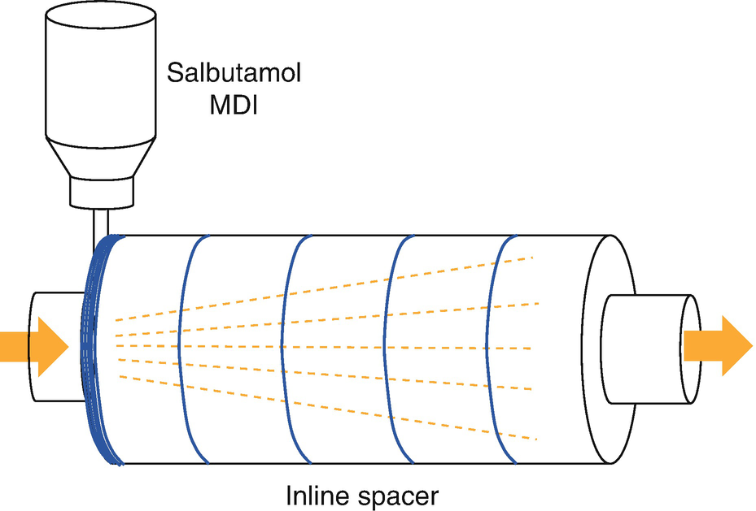
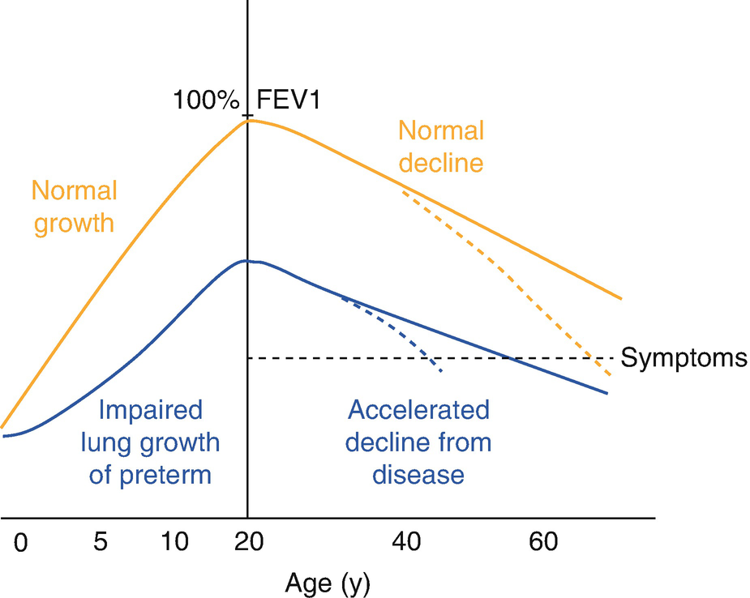

Respiratory Illnessesrespiratory diseases and Their Influence on Anesthesia in Children

© Springer Nature Switzerland AG 2020

Craig Sims, Dana Weber and Chris Johnson (eds.) A Guide to Pediatric Anesthesia[https://doi.org/10.1007/978-3-030-19246-4\_11](https://doi.org/10.1007/978-3-030-19246-4_11)

# 11. Respiratory Illnesses and Their Influence on Anesthesia in Children

Britta von Ungern-Sternberg[1](#Aff4), [2](#Aff5)     and David Sommerfield[1](#Aff4)    

(1)

Department of Anaesthesia and Pain Management, Perth Children’s Hospital, Nedlands, WA, Australia

(2)

Medical School, The University of Western Australia, Perth, WA, Australia

Britta von Ungern-Sternberg (Corresponding author)

Email: [Britta.Regli-VonUngern@health.wa.gov.au](mailto:Britta.Regli-VonUngern@health.wa.gov.au)

David Sommerfield

Email: [David.Sommerfield@health.wa.gov.au](mailto:David.Sommerfield@health.wa.gov.au)

### Keywords

Asthma and anesthesiaBronchospasm during anesthesia childrenUpper respiratory tract infection and anesthesia childrenAnesthesia for cystic fibrosisAirway irritability during anesthesia

Respiratory disease is a frequent co-morbidity in children, and is the commonest reason for hospital admission in children aged 4 years and younger. Illnesses of the upper airway and respiratory tract are often the cause of adverse events during pediatric anesthesia. Approximately two thirds of critical incidents and one third of cardiac arrests in pediatric anesthesia have a respiratory cause. Whilst arrests due to a cardiovascular problem occur mainly in children with known cardiac disease, critical incidents or cardiac arrests with an underlying respiratory cause are seen in children who were previously healthy. This is particularly important in younger children since the risk for respiratory events decreases by about 10% for each year older the child becomes. Many of the risk factors for respiratory events are associated with airway inflammation and subsequent hyper-reactivity of the airway and bronchi, such as asthma, recent upper respiratory tract infection (URTI) or passive smoke exposure. These risk factors are common in the pediatric population and easily detectable by thorough history taking. They are cumulative and the risk of adverse events correlates with the number of risk factors better than with tests of airway inflammation such as blood markers of allergy or exhaled nitric oxide.

## 11.1 Bronchial Hyper-Reactivity

Recent upper respiratory tract infection (URTI), passive smoke exposure, chronic lung diseases such as asthma or cystic fibrosis, and atopy are associated with bronchial hyper-reactivity and increased airway reflexes (an ‘irritable’ airway). Mechanical stimuli during procedures such as laryngoscopy, intubation and suctioning of the airway can lead to bronchospasm or laryngospasm, particularly in those with increased reactivity. These reflex responses are mainly under vagal control and are more active in younger children. Thus, induction and extubation are the commonest periods for these problems to occur. This section highlights how to identify and manage at risk children.

Atopy, a general tendency to allergic hypersensitivity, may be present in children with eczema, hay fever, asthma or environmental allergies. Eczema, and to a lesser extent hay fever, are early risk factors for development of recurrent wheeze and asthma. These conditions or even a family history of them, is associated with a higher risk of respiratory events during anesthesia. A history of eczema is of importance in the younger child as symptoms of bronchial hyper-reactivity might not yet have become apparent. Additionally, about 10–15% of parents report respiratory symptoms such as nocturnal cough, wheezing, or wheezing with exercise even when asthma has not been diagnosed. These symptoms usually reflect underlying bronchial hyper-reactivity and increased risk (Table [11.1](#Tab1)).

Table 11.1

Risk factors for respiratory events during anesthesia

| 
Key points from history associated with risk of respiratory events during anesthesia

 |
| --- |
| 

Young age

 |
| 

History of prematurity, chronic lung diseases including asthma or cystic fibrosis

 |
| 

Recent upper respiratory tract infection

 |
| 

Symptoms associated with bronchial hyper-reactivity: wheeze, nocturnal cough, purulent nasal discharge, fever

 |
| 

Symptoms of sleep disordered breathing: snoring, apnea, mouth breathing

 |
| 

Personal or family history (>1 first degree relative) of atopy (asthma, eczema, hay fever)

 |
| 

Exposure to passive (parental) smoking

 |

## 11.2 Asthma

For unknown reasons, the incidence of both allergy and asthma have increased in recent decades, with the prevalence of asthma around 20% in western societies. The rise appears to be levelling off.

### 11.2.1 Background

Asthma is a chronic inflammatory disorder of the airway associated with variable airflow obstruction and airway re-modelling. Wheezing is the main symptom, but there is underlying airway inflammation and increased airway reactivity. Children without a history of allergy tend to outgrow their asthma, making asthma more common in children than adults. Of children aged 3 years who wheeze, 60% will stop wheezing by school age, and even more by adolescence.

Treatment is directed at the airway inflammation and resulting bronchospasm (Table [11.2](#Tab2)). All children should use metered dose inhalers (MDI) via a spacer device and facemask, rather than the inhaler directly. The spacer is a tubular container placed between the inhaler and mask. The inhaler dose mixes with air in the spacer, and is then inhaled over several breaths. The combination of an MDI with a spacer gives better deposition of the inhaled drug into the bronchioles compared to a nebulizer. If no spacer is available, a nebulizer is better than an MDI with no spacer. Although the dose in the nebulizer bowl is much larger than an MDI dose, only a tiny proportion of the nebulizer dose is inhaled, and most is lost to the atmosphere. Nebulizers are also noisy and may frighten young children.

Table 11.2

Commonly used medications for treatment of asthma in children

| 
Group | Agent | Example product | Route | Role

 |
| --- | --- | --- | --- | --- |
| 

Beta-2 agonists:

 |   |   |   |   |
| 

 – Short acting | Salbutamol | Ventolin | Inhal/Neb | Treatment of bronchospasm

Pre-op optimization

 |
| 

 – Long acting | Salmeterol | Serevent

 |   |   |
| 

Inhaled steroids | Fluticasone

Budesonide | Flixotide

Pulmicort | Inhal | Treatment of airway inflammation

Prevention of bronchospasm

 |
| 

Leukotriene modifiers | Montelukast | Singulair | Oral | Anti-inflammatory and b/dilator effects. Reduce frequency exacerbations

 |
| 

Cromolyns | Cromolyn, Nedocromil | Intal, Tilade | Inhal | Prevention of bronchospasm

 |
| 

Prednisolone

 |   |   | 

Oral/IV | Rescue therapy for acute exacerbation

 |

Oral steroids are only used in short courses to control an acute flare in symptoms, as long-term systemic steroids affect growth. Most children have mild asthma that is well controlled and characterized by infrequent episodes, perhaps only related to URTIs in the winter months. Children particularly at risk are those with recent hospital admissions, escalating therapy or use of oral steroids, and those who have had episodes of sudden, severe asthma requiring intensive care.

### Note

Although asthma causes wheezing, the underlying chronic airway inflammation is the focus for long-term treatment. This is why bronchospasm may occur from a stimulus that would not normally cause bronchospasm.

### 11.2.2 Anesthesia and Asthma

Airway instrumentation during anesthesia is a potent stimulus that can trigger bronchospasm. Perioperative management of asthmatic children aims to optimize asthma treatment and minimize the effects of increased airway reactivity. Although asthmatic children have an increased risk of respiratory events, the risk of bronchospasm and morbidity is low in the child with stable asthma.

### Keypoint

Audible wheeze at the time of preoperative assessment indicates a high risk of intraoperative respiratory adverse events. The child should be wheeze-free at induction.

#### 11.2.2.1 Preoperative Treatment for Asthmatic Patients

Children with stable asthma should continue their regular medications. Children who have had recent symptoms or are undergoing tonsillectomy benefit from preoperative salbutamol. Children who are wheezing at the time of the preoperative assessment are at high risk for respiratory complications and should therefore always be given inhaled salbutamol preoperatively. If the child’s symptoms are poorly controlled, a short course of oral steroids could be discussed with the child’s physician. Steroids need to be given at least 24 h before surgery because their effect on airway reactivity begins after 6–8 h and is maximal after 12–36 h. Children taking long-term inhaled steroids do not have suppression of the hypothalamic-pituitary axis and do not need perioperative steroid supplementation, unlike the rare child taking long-term oral steroids.

### Note

An inhaler used with a spacer is the best way to give salbutamol to young children. If this combination is not available, use a nebulizer. The nebulizer dose for salbutamol in children is 0.05 mg/kg (minimum 1.25 mg, maximum 2.5 mg) in 3 mL saline.

#### 11.2.2.2 Intraoperative Management of Asthmatic Children

Bronchospasm can be avoided by choosing appropriate anesthetic techniques (Table [11.3](#Tab3)). It is most likely to occur with airway manipulation such as the insertion or removal of an airway device, and particularly an endotracheal tube. A bolus dose of propofol 1–3 mg/kg suppresses airway reflexes and should be considered in the absence of contraindications. Although there is little difference between the effect of sevoflurane and isoflurane on the airway, desflurane increases airway resistance in all children and should be avoided. IV induction with propofol is also protective compared with an inhalational induction with sevoflurane—although inhalational agents are bronchodilators, airway obstruction and other respiratory events are common during the slower induction with them. Agents that may blunt reflex bronchoconstriction or cause bronchodilation such as clonidine, ketamine or propofol are preferred. Atracurium and morphine and are associated with histamine release, although usually only cutaneous histamine release occurs in children and these drugs are often used in asthmatic children. Non-steroidal anti-inflammatory drugs can worsen bronchospasm by increasing leukotrienes. However apart from children with nasal polyps or severe, uncontrolled asthma, the risk from NSAIDs is low (2% compared to 7% in adults) and generally easily treated.

Table 11.3

List of factors during anesthesia that may contribute to incidence of bronchospasm in children with bronchial hyper-reactivity

| 
Less likely to trigger | More likely to trigger

 |
| --- | --- |
| 

Preoperative inhaled salbutamol

 |   |
| 

α2 agonists, clonidine

IV induction with propofol | Inhalational induction with sevoflurane

 |
| 

Ketamine

Fentanyl

Maintenance with Propofol, sevoflurane or isoflurane | Desflurane

Morphine

Atracurium and neostigmine

 |
| 

Face mask or LMA | Endotracheal intubation

 |
| 

Deep removal of airway device | Awake removal of airway device

 |
| 

Specialist pediatric anesthetist

 |   |

### Tip

A bolus of propofol 1–3 mg/kg reduces the risk of airway and respiratory events during insertion or deep removal of any airway device.

### Tip

Deepening anesthesia is an important step because infants and young children often cough, breath hold, develop rigidity of the chest and abdominal muscles and become very difficult to ventilate as anesthesia is lightened. This is often confused with severe bronchospasm.

#### 11.2.2.3 Treatment of Bronchospasm During Anesthesia

As soon as a bronchospasm is suspected, 100% oxygen is given and anesthesia deepened. Deepening anesthesia is an important step because infants and young children often cough, breath hold, and develop rigidity of the chest and abdominal muscles as anesthesia is lightened. Repeated doses of salbutamol are given until bronchospasm is relieved. Less than 3% of aerosolized drug given through a supraglottic airway or endotracheal tube reaches the patient. Many factors reduce the delivery of the drug, and the disease itself will favor delivery to areas of the lung that are already better ventilated. Only very limited drug delivery is achieved with ‘home made’ devices such as a 50 mL syringe delivering into the angle piece or trachea, and the devices are not without risk. The most effective method during anesthesia is to use an MDIs with an inline spacer (Fig. [11.1](#Fig1)). Second best is directly connecting the outlet of the aerosol canister to the airway device. If repeated doses of salbutamol from an MDI are insufficient, then give IV salbutamol 10–15 μg/kg IV bolus over 10 min and consider infusion 1–5 μg/kg/min. In severe resistant cases ketamine, magnesium sulfate (40 mg/kg/IV over 20 min) and adrenaline (epinephrine) (0.01 mg/kg IV) can be considered. Neuromuscular blockade may also help.

Fig. 11.1

An inline inhaler as close as possible to the ETT or LMA is the best method to deliver salbutamol into the anesthetic circuit

Consider that suctioning of airway secretions via the ETT is a powerful stimulus that may worsen bronchoconstriction. Ventilation with slow breaths, a long expiratory time and plateau pressures less than 30 cm–35 cmH2O all aim to allow full expiration and reduce air trapping. Flow-time loops can be monitored to ensure expiratory flow has finished and avoid raising intrinsic PEEP.

## 11.3 Upper Respiratory Tract Infection (URTI)

Over 200 viruses are associated with the common cold, or URTI, and there is often superimposed bacterial infection. Rhinoviruses account for about 80% of URTIs and have a predilection for the nasal mucosa and upper respiratory tract. Respiratory syncytial virus (RSV) can cause cold-like symptoms but causes a more severe infection particularly affecting the bronchi. The viral infections causing URTIs also cause airway inflammation, increased secretions and hyper-reactivity of the airway and bronchi, much like asthma. It can be difficult to decide whether or not to proceed with elective surgery in a child with a recent URTI. Between a third and a half of children presenting for surgery have had an URTI in the preceding 6 weeks. Preschool-aged children undergoing ENT surgery have an average of six to eight URTIs per year, potentially leaving only a few weeks of the year when the child is well and not recently had an URTI.

### Note

Although called upper respiratory tract infections, the lower respiratory tract is often affected, causing bronchial hyper-reactivity and a susceptibility to atelectasis.

### 11.3.1 Risks of Anesthesia After a Recent URTI

The risk of adverse respiratory events are two to three times more likely with a current or recent URTI. Increased reactivity of the airway can persist for 6 weeks or longer, well beyond clinical symptoms. The risk for adverse events is highest 2 weeks after an URTI. During the acute URTI itself, the incidence is increased compared to healthy children but is still less than the risk 2 weeks after the URTI. By 4 weeks, the risk for respiratory adverse events is similar to, or even lower, than in healthy children—probably due to endogenous mechanisms counteracting the hyper-reactivity.

A child with an URTI or recent URTI is prone to laryngospasm, coughing and bronchospasm and tends to desaturate more rapidly during disconnection for positioning or transfer (Table [11.4](#Tab4)). They often need oxygen for an hour or two postoperatively and occasionally develop a chesty cough that was not present before surgery. Factors affecting the risk from URTI are listed in Table [11.5](#Tab5).

Table 11.4

List of risks and reasons to proceed with anesthesia despite recent URTI in a child

| 
Possible risks | Reasons to proceed

 |
| --- | --- |
| 

Risk of laryngospasm and bronchospasm | Risk does not reduce for 2–3 weeks

 |
| 

Irritable airway with coughing and desaturation | URTIs frequent so difficult to find URTI free time

 |
| 

Possibly increased risk chest infection | Family disruption and inconvenience

 |
| 

Brief oxygen dependency postoperatively | Most airway problems minor and easily managed

 |
|   | 

Maintain efficiency of theatre utilization

 |

Table 11.5

Risk factors for developing perioperative adverse respiratory event or complications from URTI

| 
Factor | Clinical feature

 |
| --- | --- |
| 

Child | Infant or young child

Former preterm baby

Pre-existing cardiac or respiratory disease

Comorbidities, ASA 3

Clinical signs:

 • Green or yellow nasal secretions

 • Productive, moist cough

 • Wheezing or crepitations

 • Fever >38°

 • Headache; irritability; not feeding

Lethargic or generally unwell

Passive smoking

 |
| 

Anesthesia | Intubation required

 |
| 

Surgery | Major elective surgery with post-op stress response

Painful wound likely to inhibit coughing

Surgery involving airway

 |
| 

Logistics | Limited expertise in team managing child with URTI or of this age

Hospital facilities (private day hospital vs tertiary center

 |

### 11.3.2 Reasons to Proceed Despite a Recent URTI

There are several practical reasons to proceed with anesthesia in a child who has had a recent URTI. Airway incidents can occur in children with or without an URTI and any anesthetist caring for children should be able to manage these incidents. Although there is an increased risk, with careful management children can undergo procedures safely. Also, URTIs are frequent and it may be difficult to arrange theatre time when the child is well. Finally, cancellation creates practical problems for the family and health service. Parents may have travelled from far away, arranged time off work, and arranged child care for siblings. Time in a busy operating theatre may be wasted. Clearly the child’s safety is paramount and these various practical problems can be considered, but placed into context (Table [11.4](#Tab4)).

### 11.3.3 Decision on Whether to Proceed or Cancel

Anesthetizing a child with a recent URTI is sometimes unavoidable. There are however, children in whom the likelihood of problems is so high that most anesthetists would not proceed with elective surgery. Factors to help identify these children are listed in Table [11.5](#Tab5). In children with symptoms of a lower respiratory tract infection (productive moist cough, crackles or wheeze on auscultation or positive chest-x ray findings) or with a fever, elective surgery should be postponed for approximately 3–4 weeks. These children are usually off-color and look ill. Parents are helpful in determining the child’s condition, as they are usually able to clarify the severity of symptoms and report if the child is getting better or worse. In chronically ill children with recurrent (aspiration) pneumonia it can be very difficult to assess whether the child is fit for surgery or not. Often a decision can be made based on the parent’s assessment that the child is as well as possible. If proceeding, children should be observed longer post operatively or kept overnight and should be advised to seek review early if respiratory symptoms develop.

### 11.3.4 Management of Anesthesia in a Child with Recent URTI

If the risk-benefit ratio suggests proceeding with anesthesia, management is similar to that of a child with asthma. IV induction and avoiding intubation if possible are worthwhile steps. It is important to minimize instrumentation of the airway, ensure adequate depth during instrumentation and to maintain end-expiratory lung volume with recruitment maneuvers and PEEP to reduce atelectasis. Maintaining CPAP for a short time after extubation will also prevent atelectasis. Positioning the patient on their side with 30° head up is also useful to help maintain the airway open and reduce basal atelectasis. Removal of any airway device under deep anesthesia should be considered, or otherwise with the child well awake. However, as anesthesia lightens the irritable airway is likely to result in a combination of coughing, breath-holding, chest and abdominal muscle rigidity and desaturation, which is often mistaken as bronchospasm.

### Tip

Steps to manage coughing and desaturation during anesthesia or at extubation:

-   Deepen anesthesia with propofol or volatile agent
    
-   Confirm airway remains patent with capnography. Ventilate or assist inspiration holding CPAP with 80–100% O2
    
-   If desaturation, include a recruitment maneuver to reverse atelectasis. Give 5–10 slow breaths held for 5–10 s up to 35–40 cmH2O, then restart ventilation or allow spontaneous breathing with PEEP or CPAP.
    
-   Slow emergence with propofol or clonidine, and consider deep extubation if appropriate
    

## 11.4 Bronchiolitis

Bronchiolitis is a lower respiratory tract infection with coryza, cough, respiratory distress and wheeze mostly affecting infants. One third of children are affected in the first 2 years of life, and one in ten of these children are hospitalized, including a small number who develop respiratory failure requiring ventilation. Most cases are caused by the respiratory syncytial virus (RSV) causing bronchial inflammation with airway plugging, increased work of breathing, atelectasis and hypoxia. It may also cause apneas in neonates. Mortality is low, but young infants and those with underlying cardio-respiratory disease are vulnerable. The difficulty with bronchiolitis and anesthesia is the underlying ventilation-perfusion mismatch and increased airway reactivity. These changes persist after the acute illness and gradually improve over several weeks. The considerations are similar to children with URTI, though in this case the patient group is typically younger and the disease process more severe. When possible, postponing anesthesia and surgery for several weeks after the acute episode is best.

## 11.5 Passive and Active Smoking

Young children are exposed to cigarette smoke in the home, car and outdoors. Passive smoking results in airway hyper-reactivity and increases respiratory complications with anesthesia. Carboxyhemoglobin and nicotine levels are also increased in children exposed to passive smoking. Cessation of passive or active smoking 48 h before surgery partly reverses these changes, although in adults it takes 4–6 weeks after cessation to improve pulmonary function.

## 11.6 Chronic Lung Disease of Infancy and Bronchopulmonary Dysplasia

Chronic lung disease of infancy is a group of disorders starting in the neonatal period. Several pulmonary conditions and their treatment (high FiO2 or ventilation) in the neonate produce airway and parenchymal inflammation and then limit development of the airways, leading to chronic airflow obstruction and airway hyper-reactivity. The commonest disorder is bronchopulmonary dysplasia (BPD). BPD is defined by the requirement for supplemental oxygen at 28 days of life. Severity is graded by the oxygen requirement and respiratory support needed at 36 weeks post menstrual age. Advances in neonatal care have made BPD infrequent in infants born after 30 weeks. The commonest cause of BPD is Respiratory Distress Syndrome (RDS) of the newborn. RDS is a clinical and radiological diagnosis made shortly after birth in preterm neonates with difficulty breathing due to surfactant deficiency. It was previously known as hyaline membrane disease (HMD) based on histopathological characteristics seen in babies that died before modern neonatal care.

In normal human lung development, alveolarization begins around 36 weeks gestation, and alveoli grow in size and number until 8 years of age. In BPD, lung development limits the final branching divisions of the alveoli and the lungs have larger but far fewer alveoli available for gas exchange. Inflammation from disease or supportive treatments superimposed on the under-developed lung can lead to more reactive airways in the long term, and lower capacity lungs that will be symptomatic at an earlier stage and with a lesser reserve (Fig. [11.2](#Fig2)).

Fig. 11.2

Effect of lung disease on subsequent lung function later in life. Bronchopulmonary dysplasia in the neonatal period slows lung development, and former preterm children do not reach the same lung function at age 20 years. After that age, lung function deteriorates in all adults, but former preterm patients are starting at a lower level and develop symptoms earlier in adulthood. The decline in lung function is accelerated by other injuries, such as smoking (dashed line)

Infants with BPD may require low flow oxygen therapy at home after discharge. They are often ‘chronically chesty’, have lower respiratory reserve and are prone to respiratory failure from viral chest infections. Pulmonary vasoconstriction is more likely as BPD renders the pulmonary capillary network sensitive to stimuli such as hypothermia, pain or acidosis. A small number of infants with severe BPD have impaired right ventricular function which can worsen during anesthesia. Those with mild disease eventually become asymptomatic by 2–3 years, but still have abnormal reactivity and poorer function compared to the normal population through life (Fig. [11.2](#Fig2)).

### Note

Babies born very preterm and who developed BPD have abnormal pulmonary function throughout childhood. Pulmonary function improves as the child grows older but is starting from a lower reserve. Risk factors for significant BPD include being born before 28 weeks, needing more than brief mechanical ventilation, oxygen therapy after 40 weeks and re-admissions for chest infections.

## 11.7 Cystic Fibrosis

Cystic fibrosis (CF) is an autosomal recessively inherited, multisystem disorder predominately affecting the lungs. It has a very broad spectrum of severity but in general worsens as the patient becomes older. Molecular subtype diagnosis and therapy have improved immensely over the years and most children with CF are reasonably well. The end stages of the disease have mainly shifted into adulthood.

### 11.7.1 Background

The underlying problem in CF is mutation of the transmembrane conductance regulator (CFTR) gene on chromosome 7 causing abnormal chloride transport in epithelial cells. Ultimately, this affects electrolyte transport in the airway, sweat ducts, pancreas, intestine and vas deferens of males. The severity of the clinical illness is variable, but progressive, obstructive lung disease is the main cause of morbidity and death. The underlying epithelial defect causes thickening of airway mucus and abnormal clearance of secretions in the lung. This in turn causes mucus plugging, mechanical obstruction of the airway, atelectasis and recurrent bacterial infections. Thickening of intestinal secretions often leads to intestinal obstruction, including meconium ileus in newborns. Many children with CF develop progressive pancreatic disease which causes intestinal malabsorption and malnutrition. Pancreatic enzyme replacement therapy before meals is routine. Diabetes becomes common in adolescence. Hepatic dysfunction also gradually develops as the patient grows older. Abnormal mucous clearance in the upper airway causes chronic sinusitis (Table [11.6](#Tab6)).

Table 11.6

Manifestations of cystic fibrosis

| 
Organ system | Manifestation

 |
| --- | --- |
| 

General | Failure to thrive (malabsorption)

 |
| 

Respiratory | Bronchiectasis

Bronchial Hyper-reactivity

Eventual respiratory failure

Large FRC, decreased FEV1, obstructive pattern on VFT’s

 |
| 

Cardiac | Eventual right ventricular hypertrophy and Cor pulmonale

 |
| 

ENT | Nasal polyps and sinusitis

 |
| 

Gastrointestinal | Meconium ileus or intestinal atresia as neonate

intestinal obstruction

Eventual cirrhosis and portal hypertension

Gastro-esophageal reflux (rarely a problem in children)

Hypersplenism

 |
| 

Bone | Osteoporosis and uncommonly recurrent arthritis

 |
| 

Reproductive | Delayed puberty, infertility

 |

Not all manifestations are present in childhood and many become apparent only as the disease progresses throughout adulthood

Multiple chest infections cause diffuse airway inflammation and damage to the airways and surrounding lung parenchyma. This leads to bronchiectasis, emphysema, fibrotic cavitations and diffuse cystic changes on chest X-ray in adulthood (Table [11.7](#Tab7)). Inflammation and infection begin early in life and infants who have CF may have considerable pulmonary dysfunction despite appearing asymptomatic.

Table 11.7

Progression of lung disease with advancing age in cystic fibrosis

| 
Age group | Lung pathology

 |
| --- | --- |
| 

Infancy

to

Childhood | Mucous plugging

Recurrent bacterial infections

Colonization with resistant organisms

Progressive parenchymal disease

 |
| 

Adolescence

to

Adulthood | Bronchiectasis

Cystic, fibrotic changes

Emphysema

Respiratory failure

Cor pulmonale

 |

Proactive medical treatment has greatly improved prognosis with a median predicted survival age of nearly 38 years. Infants born now with CF would be expected to live into their 50s. The past decade has seen the development of orally bioavailable small molecule drugs that target some of the defective CFTR proteins and are disease-modifying in some patient subsets. Management aims to prevent infections causing this lung damage, either with regularly scheduled intravenous antibiotics independent of clinical status, or therapy in response to acute changes. Both approaches require anesthesia for vascular access. Some centers also regularly perform surveillance bronchoscopy with CT scanning, which also requires anesthesia.

### 11.7.2 Anesthesia and CF

Anesthesia is frequently required for endoscopy, bronchoscopy, ENT and vascular access procedures. Since these children now have stratified follow-ups, perioperative therapy should be optimized by the treating specialist physician. This will usually include physical therapy and preoperative antibiotic therapy. For emergency surgery, the treating specialist physician would be involved in at least the postoperative care.

Pulmonary function is assessed through exercise tolerance, recent infections or requirement for admission, changes in sputum and oxygen saturation on air. Chest X-ray and pulmonary function tests may have been performed recently or can be requested in selected children. Arterial blood gases are rarely helpful and are painful. Children with CF have a lot to do with hospitals and they and their parents will be useful sources of information about their condition and past anesthetic experiences and preferences. CF children often benefit from premedication.

### Tip

Principles of anesthesia in cystic fibrosis are:

-   Maintain lung volume
    
-   Prevent secretions drying and accumulating
    
-   Be alert to bronchial hyper-reactivity
    
-   Tailor anesthesia and analgesia to allow child to cough as soon as possible
    

Although CF is associated with gastro-esophageal reflux, aspiration does not appear to be a problem in children with CF. Pulmonary disease slows the uptake of volatile agents but inhalational induction is usually straightforward. Chronic infection and airway inflammation mean precautions similar to those taken in an asthmatic child to avoid bronchospasm and airway irritation are advisable. Other precautions taken during anesthesia are humidification to prevent further drying of secretions, maintenance of end-expiratory lung volume, avoidance of nitrous oxide to reduce atelectasis and enabling the child to cough effectively soon after the procedure. Most children tolerate anesthesia for minor surgery as well as any other child, though perhaps requiring oxygen briefly afterwards. Children at risk are mainly those who are older with more noticeable lung disease having major surgery, particularly surgery that inhibits coughing afterwards. This is a high-risk group needing special care with anesthesia and postoperative management. Recent data suggests that CF children with mild to moderate lung disease do not experience significant deterioration in central or peripheral airway function following GA and have a low rate of complications.

## 11.8 Obstructive Sleep Apnea

Sleep disordered breathing encompasses a range of upper airway obstruction during sleep. The mildest form is primary snoring without other symptoms. Intermediate forms have associated symptoms or changes in PaCO2 or PaO2. The most severe form is obstructive sleep apnea (OSA). The incidence of perioperative respiratory complications is ten times higher for children with OSA compared to those without OSA.

OSA is characterized by repeated collapse of the upper airway with periods of obstructive or central apnea. Narrowing of the upper airway is not confined to a discrete region, but rather occurs in the entire upper two-thirds of the airway where adenoids and tonsils overlap. Children in the preschool and primary school years have the highest incidence of OSA, as this is the age when their tonsils are largest relative to the rest of their airway. Adenotonsillar hypertrophy is the main cause of OSA in children and tonsillectomy is the initial treatment (Table [11.8](#Tab8)). In contrast to adults, there is little relationship between OSA and obesity in children—only 10% of children with OSA are obese and up to a quarter of children are undernourished. Teenagers with OSA, however, follow the adult pattern of causation and symptoms. Obesity is still a common reason for unanticipated readmission and residual disease after adenotonsillectomy. There are three broad reasons for OSA in children: enlarged soft tissues, small bony upper airway and poor neuromuscular control of the upper airway (Table [11.9](#Tab9)).

Table 11.8

C omparison of features of OSA in children and adults

|   | 
Child with OSA | Adult with OSA

 |
| --- | --- | --- |
| 

Most common age | 2–6 years | Middle-aged

 |
| 

Main cause | Adenotonsillar hypertrophy | Obesity

 |
| 

Sleep architecture | Normal, restless sleep. Obstruction during REM sleep | Decreased REM, arousal after apnea. Obstruction during non-REM and REM sleep

 |
| 

Consequences | Behavioral changes, hyperactivity, enuresis. Day time somnolence may occur but uncommon | Day time somnolence

 |
| 

Treatment | Surgical (tonsillectomy) | Medical (CPAP)

 |

Table 11.9

The three underlying mechanisms of OSA in children with common examples

| 
Mechanisms | Examples

 |
| --- | --- |
| 

Enlarged soft tissues | Adenotonsillar hypertrophy

Macroglossia

Obesity

 |
| 

Small bony upper airway

(Small midface or mandible) | Craniofacial syndromes

Down syndrome

Pierre Robin

Achondroplasia

 |
| 

Hypotonia of upper airway | Cerebral palsy

Neuromuscular disorders

 |

### 11.8.1 Diagnosis

Parental history is relied upon for a clinical diagnosis. Nearly all children with OSA snore and children who do not snore are unlikely to have OSA. Primary, unobstructed snoring occurs in 3–12% of preschool aged children, whereas OSA with obstructed snoring occurs in only 2% of this age group. A large number of children with OSA show behavioral changes including lack of concentration at school, hyperactivity and enuresis, which contrasts with the day time somnolence seen in adults. Long-standing, untreated OSA in older children can lead to pulmonary hypertension and cor pulmonale, though this is rarely seen in contemporary practice. History and examination do not reliably distinguish between primary snoring and OSA. Overnight polysomnography is the gold standard for diagnosis, but other modalities such as nap polysomnography or oximetry are occasionally used. A hypopnea is an episode of restricted flow in breathing. The Apnea Hypopnea Index (AHI) is the number of obstructive, central or mixed apneas and hypopneas per hour of sleep and is the parameter from polysomnography used to quantify the severity of the sleep disordered breathing. Only obstructive apneas are used to make the diagnosis, with one or more regarded as significant. Severe OSA is defined as 10 or more obstructions per hour (this would be regarded as mild disease in an adult), or saturations falling below 80%. Central apneas are common in very young children even without OSA, and AHI can be divided into central and obstructive indexes. Central apneas will also have anesthetic implications for the level of postoperative monitoring and risk from opioids.

### 11.8.2 Anesthetic Implications

Since tonsillectomy is the main treatment of OSA in children, these children are most likely to be encountered on ENT lists. Management of anesthesia for tonsillectomy in these children is covered in Chap. [16](467929_2_En_16_Chapter.xhtml) Sect. [16.​2](467929_2_En_16_Chapter.xhtml#Sec5). In summary, the main issues are airway obstruction in the postoperative period and sensitivity to opioid analgesia. Characteristics of children with OSA who are particularly at risk are listed in Table [11.10](#Tab10). Children who have had tonsillectomy are amongst the highest risk for postoperative airway obstruction. Children with OSA who are undergoing anesthesia for other procedures seem to be at much lower risk and can usually be managed as day cases. The 5 point STBUR (Snoring/Trouble Breathing/Un-Refreshing sleep) is a brief, validated preoperative questionnaire with a score >2 predicting desaturation events post operatively.

Table 11.10

Risk factors for airway obstruction after anesthesia in children with OSA

| 
Children with OSA at higher risk after anesthesia

 |
| --- |
| 

Age less than 2 years, and especially less than 1 year

 |
| 

Airway surgery (including tonsillectomy, adenoidectomy)

 |
| 

Facial abnormality with reduced oropharyngeal size

 |
| 

Downs Syndrome

Serious comorbidity (neuromuscular disease, cardiac)

Preterm birth

Obesity

 |
| 

Severe OSA on polysomnography or saturation <85% on overnight pulse oximetry

SpO2 nadir of <80% or peak pCO2 > 60 mmHg (8 kPa)

 |

Sedative premedication can be used with caution if required. Midazolam occasionally causes airway obstruction in these children and a reduced dose of around 0.3 mg/kg may be safer. Clonidine is a better choice as it does not lead to hypercarbia or hypoxemia. Children having an inhalational induction can enter a phase with quite an obstructed airway needing CPAP, when they are still too light to accept an oral airway. Bag-mask ventilation after an IV induction may be awkward, but is facilitated by jaw thrust and by inserting an oral airway. Intraoperative management is directed at minimizing postoperative airway obstruction. The principles include maintaining a level of anesthesia that facilitates rapid awakening, minimizing opioid use and arranging appropriate monitoring postoperatively. This may include HDU/ICU for high risk children undergoing airway procedures, or additional time in the day ward before discharge home or overnight stay with pulse oximetry.

The clinical features of OSA are usually improved after tonsillectomy, although it can take a number of days to weeks after surgery. Overall 20% of children are not improved by surgery, but the improvement depends on the severity of the OSA before tonsillectomy. One hundred percent of children with mild OSA resolve their symptoms, but only 64% of those with severe OSA (AHI > 20/h) resolve their symptoms. In children with comorbid conditions such as obesity, craniofacial abnormalities, age less than 3 years, or severe OSA, the cure rate as gauged by sleep study can be as low as 40%. Thus, high-risk patients are likely to have some residual disease which accounts for much of their increased risk of respiratory adverse events post operatively. For those deemed suitable for discharge with opioids, a test dose with monitoring should be considered.

### Note

OSA may not improve for several days or weeks after adenotonsillectomy and around 20% of children are not improved by surgery.

## Review Questions

1.  1.
    
    A 2 year old child is being ventilated through a 4.5 mmID ETT using a constant pressure ventilator. The ETCO2 has risen, and you suspect bronchospasm.
    
    1.  (a)
        
        List the common potential triggers of intraoperative bronchospasm
        
    2.  (b)
        
        What other causes of increased ETCO2 should you consider?
        
    3.  (c)
        
        What is the management of intraoperative moderate to severe bronchospasm?
        
    
2.  2.
    
    Why are children with OSA more likely to develop respiratory problems after tonsillectomy than those without OSA?
    
3.  3.
    
    Why is a 3 year old who has an URTI scheduled to undergo tonsillectomy at greater risk of complications compared with a 6 year old who has an URTI scheduled for circumcision?
    
4.  4.
    
    A 4 year old ex-preterm child presents for myringotomy and grommet insertion as a day case. On arriving you notice a nasal discharge.
    
    1.  (d)
        
        What features in the history and examination are associated with an increased risk of airway complications?
        
    2.  (e)
        
        Apart from history and examination what factors (surgical, social, institutional) would you consider in deciding whether this child should be deferred or not?
        
    3.  (f)
        
        If the case proceeded, what anesthetic strategies could be used to reduce the risk of complications?
        
    

### Further Reading

### Asthma

1.  Doherty GM, et al. Anesthesia and the child with asthma. Paediatr Anaesth. 2005;15:446–54.[Crossref](https://doi.org/10.1111/j.1460-9592.2005.01602.x)
    
2.  Guill MF. Asthma update: epidemiology and pathophysiology (part 1). Pediatr Rev. 2004;25:299–305.[Crossref](https://doi.org/10.1542/pir.25-9-299)
    
3.  Regli A, von Ungern-Sternberg B. Anesthesia and ventilation strategies in children with asthma: part I & II. Curr Opin Anaesthesiol. 2014;27:288–94, 295–302.[Crossref](https://doi.org/10.1097/ACO.0000000000000080)
    
4.  Trend S, et al. Current options in aerosolised drug therapy for children receiving respiratory support. Anesthesia. 2017;72:1388–97.[Crossref](https://doi.org/10.1111/anae.14011)
    

### URTI

1.  Cote CJ. The upper respiratory tract infection dilemma: fear of a complication or litigation? Anesthesiol. 2001;95:283–5. An excellent editorial that discusses the overarching issue of balancing risks with various reality factors when presented with children with a recent URTI needing anesthesia_._[Crossref](https://doi.org/10.1097/00000542-200108000-00006)
    
2.  Parnis S, Barker DS, Van Der Walt JH. Clinical predictors of anesthetic complications in children with respiratory tract infections. Pediatr Anesth. 2001;11:29–40.[Crossref](https://doi.org/10.1046/j.1460-9592.2001.00607.x)
    
3.  Regli A, Becke K, von Ungern-Sternberg BS. An update on the perioperative management of children with upper respiratory tract infections. Curr Opin Anaesthesiol. 2017;30:362–7.[Crossref](https://doi.org/10.1097/ACO.0000000000000460)
    
4.  von Ungern-Sternberg BS, et al. Risk assessment for respiratory complications in paediatric anaesthesia: a prospective cohort study. Lancet. 2010;376:773–83.[Crossref](https://doi.org/10.1016/S0140-6736\(10\)61193-2)
    

### Bronchiolitis

1.  Zorc JJ, Hall CB. Bronchiolitis: Recent evidence on diagnosis and management. Pediatr Rev. 2010;125:342–9. A review that gives detailed information about pathophysiology and medical management. Anesthesia issues are not discussed_._
    

### Cystic Fibrosis

1.  Cutting G. Cystic fibrosis genetics: from molecular understanding to clinical application. Nat Rev. Genet. 2015;16:45–56.[Crossref](https://doi.org/10.1038/nrg3849)
    
2.  Della Rocca G. Anesthesia in patients with cystic fibrosis. Curr Opin Anesthesiol. 2002;15:95–101.[Crossref](https://doi.org/10.1097/00001503-200202000-00014)
    
3.  Pandit C, Valentin R, De Lima J. Effect of general anesthesia on pulmonary function and clinical status on children with cystic fibrosis. Pediatr Anesth. 2014;24:164–9.[Crossref](https://doi.org/10.1111/pan.12256)
    

### OSA

1.  Gipson K, Lu M. Sleep-disordered breathing in children. Pediatr Rev. 2019;40:3–13. An excellent review of the causes, diagnosis and management of OSA in children_._[Crossref](https://doi.org/10.1542/pir.2018-0142)
    
2.  Scalzitti N, Sarber K. Diagnosis and perioperative management in pediatric sleep disordered breathing. Pediatr Anesth. 2018;28:940–6.[Crossref](https://doi.org/10.1111/pan.13506)