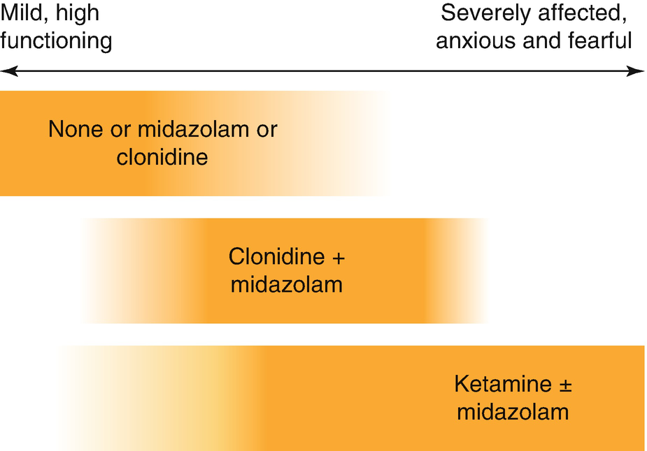

Chronic Disease of Childhood

© Springer Nature Switzerland AG 2020

Craig Sims, Dana Weber and Chris Johnson (eds.) A Guide to Pediatric Anesthesia[https://doi.org/10.1007/978-3-030-19246-4\_12](https://doi.org/10.1007/978-3-030-19246-4_12)

# 12. Chronic Disease of Childhood

Alison Carlyle[1](#Aff4)     and Soo-Im Lim[1](#Aff4)    

(1)

Department of Anaesthesia and Pain Management, Perth Children’s Hospital, Nedlands, WA, Australia

Alison Carlyle (Corresponding author)

Email: [Alison.Carlyle@health.wa.gov.au](mailto:Alison.Carlyle@health.wa.gov.au)

Soo-Im Lim

Email: [Soo-Im.Lim@health.wa.gov.au](mailto:Soo-Im.Lim@health.wa.gov.au)

### Keywords

Cerebral palsy, anesthesia, analgesiaAnesthesia, rhabdomyolysisMalignant hyperthermiaAnesthesia mucopolysaccharidosisAnesthesia, Hunter Hurler syndromeAutism spectrum disorder and anesthesiaPerioperative management diabetes children

This chapter describes several important non-respiratory diseases that may affect anesthesia in children. Optimal anesthetic management of these children requires careful planning and a collaborative approach with the multidisciplinary teams involved in their care.

## 12.1 Cerebral Palsy

Cerebral Palsy (CP) is an umbrella term used to describe a spectrum of neurological motor disorders that can be associated with other conditions such as seizure disorders and intellectual impairment. Most children have increased muscle tone or spasticity in one of more muscle group or limb. A minority of children have ataxia or dystonia rather than spasticity. Cerebral palsy results from pathogenic insults to the developing brain in utero or in the post-natal period. These insults include intracerebral hemorrhage, genetic disorders, fetal infection such as rubella and CMV, pre-eclampsia, peri-partum hemorrhage and maternal hyperthyroidism. Extreme prematurity and low birth weight are important risk factors. Approximately 80% of cases develop antenatally with the remainder in the first 2 years of life. The incidence is 1–2.5/1000 live births in western countries and has remained steady with the increase in survival rates of premature infants.

These children present with a broad range in the severity of their symptoms. Some have an isolated limb spasticity and normal intellect, while others have severe spasticity, limb deformity and developmental delay. The Gross Motor Function Classification System (GMFCS) categorizes the severity into mild (level 1) to severe (level 5) based on the level of movement and activity a child can perform. Children with the severe GMFCS 5 level often have difficulty swallowing and feeding and may require nasogastric or gastrostomy feeds. Despite this, they often have weight loss and may have nutritional deficiencies, dehydration or anemia. Chronic low fluid intake coupled with pre-operative fasting may increase the risks of developing pre-renal renal failure.

Children with cerebral palsy require a multidisciplinary approach of community and hospital care. The aims are to improve mobility and posture by minimizing muscle contractures, spasticity and spasms, as well as controlling symptoms of accompanying disorders such as seizures and gastro-esophageal reflux with pulmonary aspiration. Management includes a combination of physical therapies, surgical procedures and medical treatments to reduce spasticity such as diazepam, baclofen, vigabatrin and botulinum toxin. Anesthesia is commonly required in these children for orthopedic or dental procedures, feeding gastrostomy, fundoplication and botulinum toxin injections.

Botulinum neurotoxin is derived from clostridium botulinum bacteria and blocks the release of acetyl choline at the neuromuscular junction. An intramuscular injection produces muscle weakness lasting between 2 and 6 months, with peak effects at 4 weeks post-procedure. Treatment involves injections into multiple muscles at regular intervals, improving function across the CP spectrum. In children with mild CP (GMFCS 1 and 2) it improves movement and gait, whilst in more severely affected children (GMFCS 4 and 5) it assists with supine positioning and basic quality-of-life care by preventing limb contractures. Systemic absorption and generalized weakness are extremely rare side effects.

### 12.1.1 Anesthesia Management

Cerebral palsy patients present a number of challenges (Table [12.1](#Tab1)). Communication may be difficult because of developmental delay, and children with normal or delayed intellect may be anxious because of past hospital experiences. Parents are usually a reliable source of information about past medical history and previous anesthesia. Some children have mild respiratory failure requiring CPAP ventilation at home. Premedication is often worthwhile in this patient group, taking care to minimize the likelihood of respiratory side effects.

Table 12.1

Summary of important anesthetic issues in care of children with cerebral palsy

| 
Key anesthetic issues in children with severe cerebral palsy

 |
| --- |
| 

Anxious; communication may be difficult

 |
| 

Bulbar problems and poor swallowing of saliva; postop secretion clearance

 |
| 

Some are at risk of reflux and aspiration

 |
| 

Poor cough, frequent chest infections, kypho-scoliosis; risk of pneumonia or respiratory failure

 |
| 

Limb contractures; positioning for surgery may be difficult; pressure area risk

 |
| 

Altered thermoregulation and risk of hypothermia

 |
| 

Pain assessment difficult; painful muscle spasms after orthopedic surgery common

 |
| 

Pre-existing seizure disorder

 |

### Keypoint

Children with severe CP have many potential anesthetic problems depending on the procedure, but the most important are the potential postoperative respiratory complications and pain management issues.

Many of the children with severe cerebral palsy are at risk of reflux and aspiration, but unfortunately also often have very difficult venous access. In children who have not had multiple previous episodes of pulmonary aspiration, a careful inhalational induction is a reasonable approach. Although neck and jaw contractures can occur, airway management is usually straightforward. Suxamethonium does not cause rhabdomyolysis in children with cerebral palsy, but there is resistance to non-depolarizing muscle relaxants because of an up-regulation in the number of acetylcholine receptors. Nevertheless, a non-depolarizing relaxant would be used more often than suxamethonium for a rapid sequence induction. MAC values are reduced in the children most severely affected (GMFCS 4 and 5).

Positioning can be difficult as a result of limb contractures and spasticity. Great care must be taken to protect pressure areas and to avoid neuropraxia. Hypothermia is a significant problem. These children have abnormal thermoregulatory control and cool quickly as they have minimal subcutaneous fat and muscle mass and a high surface area to volume ratio. Active warming is needed even for short procedures.

### 12.1.2 Post-operative Care

Respiratory care and pain management are the major postoperative problems in children with severe cerebral palsy. These children often have a weak cough and diminished respiratory drive leading to sputum retention, atelectasis, chest infection and respiratory depression. Some may require a period of respiratory support or close observation in a high dependency area.

Pain can be difficult to assess in children with cerebral palsy, and input from their parents is useful to gauge the effectiveness of analgesia. Muscle spasms triggered by pain and anxiety are a particular problem in this patient group. They cause paroxysms of intense pain that can be difficult to prevent and treat. Post-operative analgesia is optimized using a combination of non-opioid analgesics, intravenous opioid infusion, epidural analgesia or other regional technique, and sometimes a ketamine infusion. Regional techniques are particularly useful in reducing spasms. Epidural clonidine helps reduce spasms and may produce mild sedation which is often useful in the early postoperative period. Intravenous opioid infusions are commonly used, but require caution in this vulnerable patient group who are at risk from cough suppression, sedation and respiratory depression.

## 12.2 Muscle Disease

Muscle diseases, or myopathies, are uncommon conditions that have important implications for anesthesia. There are three specific risks—the risk of rhabdomyolysis from suxamethonium in any child with a myopathy; the risk of rhabdomyolysis from volatile agents in a child with muscular dystrophy, and finally the risk of malignant hyperthermia (MH) in some children with rare, specific muscle disorders. With increasing age and progression of the disease, myopathies become multi-organ diseases affecting cardiac and pulmonary function.

### Practice Point

Before anesthetizing a child with a known or suspected myopathy, consider the following:

-   Is the health care facility suitable?
    
-   Is there a risk of MH?
    
-   Is there a risk of rhabdomyolysis from volatile agents?
    
-   Is there a risk of metabolic acidosis from propofol anesthesia?
    
-   Are there cardiac or respiratory problems?
    

### 12.2.1 Categories of Muscle Disease

There are a large number of rare, eponymously named myopathies in children, but a simple classification of the more important ones with their specific anesthesia problems is listed in Table [12.2](#Tab2). Some myopathies have a causative or genetic link with MH, although there is variation within these, reflecting the rarity and complexity of the disease. As the child gets older, other consequences of the underlying muscle fiber problem become more apparent. Cardiac muscle is often affected, leading to arrhythmias, conduction defects and cardiomyopathy. Postural and mobility changes occur with limb deformities, contractures and scoliosis. Respiratory muscle weakness causes poor swallow and cough, a propensity to chest infection and respiratory failure. Developmental delay and seizures occur with some myopathies.

Table 12.2

Overview of specific anesthesia problems related to muscle diseases

| 
Muscle disease | Specific concerns

 |
| --- | --- |
| 

All myopathies | Rhabdomyolysis with suxamethonium

 |
| 

Muscular dystrophies | Rhabdomyolysis with volatile agents

Cardio-respiratory problems later in life

 |
| 

Mitochondrial myopathies | Lactic acidosis with fasting

 |
| 

King Denborough

Central Core, Multi-Minicore, Centronuclear

Congenital myopathy with cores & rods

Nemaline rod

Congenital fiber type disproportion

KDS, idiopathic hyperCK-emia

Native American myopathy

Exercise induced rhabdomyolysis | Known association with MH

 |

Based on Litman et al. Anesthesiology 2018;128: 159–67

### 12.2.2 Rhabdomyolysis with Suxamethonium

Every child with a muscle disorder is at risk of hyperkalemic cardiac arrest from suxamethonium, and it should not be used under any circumstances. Suxamethonium causes depolarization of the muscle cell membrane, causing a prolonged contraction of the abnormal muscle fiber with breakdown of the cell membrane and release of potassium. The breakdown of the muscle cell membrane destroys the muscle fiber and is called rhabdomyolysis. It is the depolarisation caused specifically by suxamethonium that is the problem, and non-depolarizing relaxants are safe to use.

Treatment of a suspected hyperkalemic cardiac arrest follows APLS guidelines but specific therapies to consider are calcium, sodium bicarbonate and dextrose-insulin. Resuscitation should continue until the plasma potassium has been normalized.

### Tip

If laryngospasm occurs in a child with myopathy, suxamethonium cannot be used to treat it. Options are a bolus of propofol 3–5 mg/kg and a non-depolarizing relaxant. The dose of relaxant needed to relax the vocal cords is not known, but is likely to be small, such as 0.2 mg/kg atracurium or 0.2 mg/kg rocuronium (the latter could be antagonized with sugammadex).

### 12.2.3 Muscular Dystrophy (Duchenne and Becker )

The muscular dystrophies are characterized by the absence of dystrophin in the muscle fiber (including cardiac), making the sarcolemma unstable. They occur only in males. Asymptomatic female carriers have no specific risks with anesthesia. The disease usually presents during the first years of childhood, so there is small a group of yet-to-be diagnosed preschool boys with the condition. However, up to half of the children with muscular dystrophy have a positive family history. There were several deaths from rhabdomyolysis each year in the USA in this group of children when suxamethonium was routinely used for elective intubation.

Young children with muscular dystrophy are active and reasonably well but later develop multi-organ problems, most commonly during the teenage years. Limb contractures and scoliosis develop, and ventilatory failure progresses from respiratory muscle weakness and restrictive lung defects secondary to kyphoscoliosis. Autonomic dysfunction may occur, suggested by a resting tachycardia. Dysphagia results from weakness of striated muscle in the upper pharynx and smooth muscle of esophagus which can result in aspiration and passive regurgitation during anesthesia. Cardiomyopathy becomes more of a concern over the age of 10 years—30–50% of teenagers and 100% of 18 year olds have cardiomyopathy.

### Note

The muscular dystrophies are not associated with MH. The same triggers as MH may however, cause rhabdomyolysis and an MH-like clinical picture.

#### 12.2.3.1 Anesthesia for Children with Muscular Dystrophies

There are several problems with anesthesia in these children (Table [12.3](#Tab3)). Suxamethonium is contra-indicated. Non-depolarizing relaxants can be used, but the block is likely to be more profound and longer lasting than usual.

Table 12.3

Anesthesia-related problems in children with Duchenne’s and Becker’s muscular dystrophy

<table style="border-collapse: collapse;border-top: 0.5pt solid ; border-bottom: 0.5pt solid ; border-left: 0.5pt solid ; border-right: 0.5pt solid ; "><colgroup><col class="tcol1 align-left"></colgroup><tbody><tr><td style="border-bottom: 0.5pt solid ; text-align: left;">
<strong class="EmphasisTypeBold ">Anesthesia-related problems in DMD and Becker’s</strong>
</td></tr><tr><td style="border-bottom: 0.5pt solid ; text-align: left;">
Dystrophinopathy with hyperkalemia from suxamethonium and probably volatiles
</td></tr><tr><td style="border-bottom: 0.5pt solid ; text-align: left;">
At risk of ventilatory failure from anesthesia and surgery in later childhood
</td></tr><tr><td style="border-bottom: 0.5pt solid ; text-align: left;">
Cardiomyopathy in later childhood
</td></tr><tr><td style="border-bottom: 0.5pt solid ; text-align: left;">
Dysphagia and pulmonary aspiration in later childhood
</td></tr><tr><td style="border-bottom: 0.5pt solid ; text-align: left;">
<strong class="EmphasisTypeBold ">Solutions:</strong>
</td></tr><tr><td style="border-bottom: 0.5pt solid ; text-align: left;">
Avoid suxamethonium
</td></tr><tr><td style="border-bottom: 0.5pt solid ; text-align: left;">
Avoid volatile agents
</td></tr><tr><td style="border-bottom: 0.5pt solid ; text-align: left;">
Use propofol-remifentanil anesthesia and avoid muscle relaxants
</td></tr><tr><td style="border-bottom: 0.5pt solid ; text-align: left;">
Avoid post-op deterioration in respiratory function
</td></tr><tr><td style="text-align: left;">
Take precautions for cardiomyopathy and aspiration in older children
</td></tr></tbody></table>

The safety of volatile anesthetic agents in these children is controversial. Volatile agents have been used without problems in the past, but there are regular case reports of them causing hyperkalemic cardiac arrest. Volatile agents probably trigger rhabdomyolysis under unknown predisposing factors, and their inconsistent effect has led to discussion about their safety in muscular dystrophy patients—most would completely avoid volatiles.

### Practice Point

When presenting for anesthesia, young children with DMD have the problem of rhabdomyolysis with suxamethonium and volatiles; older children and adults also have the problems of cardiac and respiratory failure, and steroid dependency.

### 12.2.4 Malignant Hyperthermia

Malignant hyperthermia (MH) is a rare, inherited disorder of the skeletal muscle that predisposes to a life threatening hypermetabolic state after suxamethonium and volatile anesthetics. MH reactions are rare, but approximately half occur in children younger than 15 years. It is very rare in the first year of life, and an uneventful anesthetic in the past is meaningless. Most children at risk of MH are asymptomatic, with only a few myopathies known to be associated with an MH risk (Table [12.2](#Tab2)).

#### 12.2.4.1 Diagnosis

Intraoperative MH causes a hypermetabolic state with lactic acidosis. Masseter muscle rigidity or spasm in response to suxamethonium may be the first sign, but is not specific to MH (see Chap. [2](467929_2_En_2_Chapter.xhtml), Sect. [2.​9.​3](467929_2_En_2_Chapter.xhtml#Sec34)). Early signs are increased CO2 production, tachycardia, and metabolic acidosis. Fever develops, but it is often a late sign. Subsequently, muscle cell membrane pumps fail and there is leakage of intracellular elements with hyperkalemia, myoglobinemia and disseminated intravascular coagulation. Rarely, MH may begin in the postoperative period, up to several hours after anesthesia.

#### 12.2.4.2 Management of a MH Reaction

A brief overview of management is listed in Table [12.4](#Tab4), but is more comprehensively covered in the guidelines from the Australian and New Zealand College of Anaesthetists and the Association of Anaesthetists in Great Britain and Ireland. The dose of dantrolene in children is the same as in adults, 2.5 mg/kg. There is no need to eliminate the anesthetic machine because the load of volatile agent in the patient will higher than that in the machine. High flow oxygen should be used though to wash-out the volatile from the patient and machine. The role of charcoal filters is still being determined.

Table 12.4

Overview of management of suspected MH reaction in children

| 
Management of MH reaction

 |
| --- |
| 

Call for help

 |
| 

Hyperventilate with 100% oxygen

 |
| 

Intravenous anesthesia if clinically appropriate.

 |
| 

Dantrolene 2.5 mg/kg and 1 mg/kg dose can be repeated to maximum of 10 mg/kg

 |
| 

Start active cooling to less than 39 °C

 |
| 

Treat arrhythmias, hyperkalemia, acidosis

 |
| 

Transfer to ICU for continuing treatment and monitoring

 |

#### 12.2.4.3 MH Testing of Children

The in-vitro contracture test is the gold standard test for MH susceptibility. It is not usually performed in children under 10 years or 30 kg as they do not have an adequate thigh muscle from which to obtain a muscle sample. Genetic testing is used but not as a first-line test for index cases or their relatives. MH genetics remain heterogeneous and multiple mutations are likely to be involved, although a handful of mutations can definitely be characterized as MH causative. A negative genetic test does not rule out the disease.

#### 12.2.4.4 Management of a Child with a Family History of MH

Many children who present for anesthesia have a family history of an MH reaction, but their susceptibility is not certain as they cannot be tested. Children who should be considered particularly at risk are those where the reaction was in a close relative, or more than one relative in the family. The history of an MH reaction however, is often in a more distant relative. In this situation, a pragmatic approach is usually taken and the child treated as susceptible, even though the real risk is not known but likely to be low.

Fortunately, trigger-free anesthesia is simple to achieve in most circumstances. The principles are the same as in adults: propofol-based anesthesia, volatile-free equipment and avoidance of suxamethonium. Elective cases are scheduled first on the list—anesthesia workstations can take up to an hour to prepare and flush so their residual agent concentration is less than 5–10 parts per million. Activated charcoal filters can shorten this time. There are also alternatives to the machine preparation if the circle circuit and positive pressure ventilation are not needed. One alternative is to use a disposable T-piece circuit with oxygen from a wall source. Another is to use the machine’s common gas outlet, which can usually be prepared by flushing with oxygen at 10 L/min for 10 min.

Reactions after trigger-free anesthesia are rare. MH-susceptible children may be safely managed as day procedure cases with standard times for postoperative monitoring and care, although some units observe for fever for several hours before discharge. Like any other child undergoing anesthesia, these children are at risk of laryngospasm. Although a bolus of propofol is a reasonable first treatment, having a non-depolarizing relaxant drawn up and ready to use is wise in any child with a contraindication to suxamethonium.

### 12.2.5 Metabolic and Mitochondrial Myopathies

Disorders of fatty acid metabolism in the mitochondria affect muscle and other organs such as the brain and heart. This group of disorders is termed metabolic myopathies, or mitochondrial myopathies. These children present with neurological and muscle symptoms, cardiomyopathy, respiratory failure and metabolic disorders. Fasting may initiate fatty acid metabolism and trigger lactic acidosis, so the duration of fasting is minimized and IV fluids containing 2.5–5% glucose given. These children are considered at risk of developing propofol infusion syndrome at relatively low doses of propofol. An induction dose of propofol is safe, as is volatile anesthesia. Brief propofol-based anesthesia may also be safe, although there is debate about this technique in these children. Suxamethonium is contraindicated as with all myopathies.

### 12.2.6 Anesthesia for Muscle Biopsy

A muscle disorder might be suspected in infants who are hypotonic (‘floppy’) or have other clinical signs, and these infants might require anesthesia for muscle biopsy. Anesthetic management is tailored to the suspected diagnosis and any possible link to MH or propofol infusion syndrome, as well as any cardiac or respiratory problem. Apart from avoiding suxamethonium, many types of anesthesia have been used without apparent problem. If the child’s creatine kinase is elevated, it would seem reasonable to avoid volatile agents, and if the lactate level is elevated, minimize propofol anesthesia. Alternatives such as ketamine or regional techniques can also be considered.

## 12.3 Mucopolysaccharidoses (MPS)

This is a group of inborn errors of mucopolysaccharide (also known as glycosaminoglycans) metabolism. Mucopolysaccharides are long chain carbohydrates forming connective tissues and bones. An enzyme deficiency in the degradation pathway causes deposition of these molecules throughout the body. Hurler syndrome is the most severe form. The other mucopolysaccharidoses include Hunter, San Filippo and Morquio syndromes and share some or all of the Hurler characteristics in a somewhat milder form (Table [12.5](#Tab5)). Patients with Hurler’s syndrome present early in infancy with hernias, macrocephaly, recurrent respiratory infections and limited hip abduction. These children gradually develop the characteristic features and complications over time as more mucopolysaccharides deposit in tissues, and developmental delay is apparent by 1 year of age. Stem cell transplant or enzyme replacement therapy is now available for many forms of mucopolysaccharidosis. If started at a young age, it improves long term outcome and reduces the severity of airway changes. It does not however prevent neurocognitive, cardiac valvular or skeletal changes.

Table 12.5

Characteristics of Hurler syndrome

| 
System | Features

 |
| --- | --- |
| 

Airway | Coarse facies, macrocephaly

Micrognathia and macroglossia

Decreased mobility of cervical spine and TMJ

Atlanto-axial instability with subluxation common

Tracheal narrowing from deposition of mucopolysaccharides

 |
| 

Respiratory | Obstructive sleep apnea

Ventilatory failure and respiratory infections related to skeletal and neurological abnormalities

 |
| 

Cardiovascular | Cardiomyopathy, valvular defects, arteriosclerosis, coronary artery involvement

Difficult IV access

 |
| 

Neurological | Progressive decline in intellect with eventual severe mental and motor retardation, poor gag and swallowing reflexes

 |
| 

Other | Progressive skeletal dysplasia, joint contractures, kyphoscoliosis

 |

### 12.3.1 Anesthetic Management

Anesthesia for these children in infancy is relatively straightforward as airway and other changes are mild. However as the child becomes older, airway management becomes difficult as more and more mucopolysaccharides are deposited in the tongue, oropharynx, neck and periglottic structures. Extremely difficult and failed intubations are common, and these airway difficulties generally worsen over time as the disease progresses. As the child grows older, progressive anxiety and intellectual impairment may cause increasingly difficult behavior at induction. IV cannulation also becomes difficult, sedative premeds become risky to use and inhalational induction often ends up being a hurried, ‘guerilla’ induction rather than a smooth, gradual descent into anesthesia. The mask airway is often difficult to manage and obstructed. The LMA is not always a reliable method of obtaining a clear airway.

A fiberoptic intubation under anesthesia with spontaneous ventilation is often attempted. Unfortunately, as the child grows older their airway becomes even more difficult to manage and they are more likely to have cardiovascular disease that makes deep, inhalational anesthesia problematic. For these reasons, this group of children is one of the most difficult and challenging for pediatric anesthetists.

### Note

Children with MPS have the combination of difficult airway, difficult behavior, difficult venous access and reduced myocardial function. This group of children are one of the trickiest for pediatric anesthetists.

## 12.4 Sickle Cell Disease

Sickle cell disease is an inherited hemoglobinopathy originating in areas of Central Africa, India, the Mediterranean and Middle East. Patients with sickle cell disease have the abnormal hemoglobin S (HbS) that becomes insoluble in its deoxygenated form. The HbS precipitates, causing red blood cells to take on the rigid, characteristic sickle shape, obstructing the microvasculature and causing ischemia in distal tissues.

Most of the hemoglobin in patients with sickle cell disease is HbS, and sickling occurs at oxygen saturations of approximately 85%. Sickle cell patients have chronic hemolytic anemia (Hb 50–100 g/L) and may have episodes of pain related to vaso-occlusive episodes and gradually worsening organ damage. Sickle cell patients rarely survive past their fifth decade. Patients with sickle cell trait (30–40% HbS) are largely asymptomatic because sickling only occurs at sub normal venous oxygen saturation. Children with sickle cell disease rarely present before 6 months of age because of the masking effects of fetal hemoglobin. Acute pain related to a vaso-occlusive crisis is the commonest presenting symptom. Vaso-occlusive crisis can affect any part of the body and can be associated with concurrent infection, dehydration, nausea and vomiting, extreme hypothermia, fatigue and psychosocial stress. Treatment of a vaso-occlusive crisis is supportive: rehydration, antibiotic treatment if necessary and opioid analgesia.

Sickle cell disease is diagnosed by high performance liquid chromatography (HPLC). Peripheral blood films are an alternative and show target cells, elongated RBCs and sickle cells. The “Sickledex test” is a rapid test of hemoglobin solubility but does not differentiate between sickle cell disease and sickle cell trait and can give false negative results in the presence of severe anemia and fetal hemoglobin. In practice, preoperative screening is at the discretion of the individual anesthetist. It is often omitted, particularly if it delays urgent surgical management, because a well-formulated anesthetic and analgesic plan as aimed for in every patient, would minimize the chances of triggering a crisis.

Screening for Sickle cell disease before anesthesia and surgery remains controversial: guidelines such as those for NICE in the UK suggest testing should be performed in susceptible populations. Newborn screening is performed routinely in some countries including the UK, and targeted testing occurs in Australia based on the antenatal histories of parents. If screening is not performed, children will generally have had a crisis and be diagnosed by 5–10 years of age.

### 12.4.1 Anesthesia for Children with Sickle Cell Disease

It is important to assess the severity of the disease and identify triggers. Signs and symptoms of pre-existing organ dysfunction should be looked for and investigated if clinically indicated. Traditionally, blood transfusions were given to sickle patients to reduce the HbS concentration to 30% in an effort to minimize post-operative complications such as cerebral-vascular accident and vaso-occlusive crises. Aggressive transfusion regimens are probably unnecessary for outpatient and minor procedures, and put patients at higher risk of problems related to transfusion. The decision to transfuse an individual child before surgery should be made following consultation between the hematologist, anesthetist and surgeon caring for the child.

The anesthetic aims are to minimize RBC sickling by avoiding dehydration, maintaining normal levels of oxygen, promoting venous return through careful patient positioning and treating infection aggressively (Table [12.6](#Tab6)). Surgical tourniquets have been safely used but carry a risk of sickling. After surgery, patients are monitored for complications related to the disease such as acute chest syndrome. Optimal pain control is vital because untreated pain can trigger sickling. Opioid requirements may be higher in sickle cell patients than the normal population.

Table 12.6

Key points for anesthesia of children with sickle cell disease (Children with sickle cell trait can be managed as normal)

| 
Key anesthetic issues in sickle cell disease

 |
| --- |
| 

Careful pre-op assessment of pre-existing organ damage

 |
| 

Plan anesthetic to avoid the conditions in which RBC sickle

 |
| 

Optimal post-op analgesia

 |

## 12.5 Diabetes

The prevalence of diabetes mellitus in the pediatric population is increasing. Approximately ninety percent of children with diabetes present with type 1 diabetes (insulin-dependent), 10% with type 2 diabetes (non-insulin-dependent) and a few children present with rare types. The prevalence of type 2 diabetes is growing as the number of obese children increases. Insulin pumps giving a continuous infusion of subcutaneous short-acting insulin are common in pediatric practice. In contrast to adult diabetics, secondary organ damage (renal, cardiac, ophthalmic and gastroparesis) is not a major concern in pediatric patients and instead the focus is on control of glucose homeostasis in the peri-operative period. Pediatric diabetic physicians are commonly involved in the care of children undergoing surgery, and many hospitals have agreed guidelines and protocols for these children.

### 12.5.1 Anesthesia for the Child with Diabetes

A formal plan for diabetes management is made before admission. Careful management aims to keep the child’s blood glucose level (BGL) at 5–10 mmol/L and to avoid ketosis. Scheduling surgery as the first case in the morning simplifies management (Table [12.7](#Tab7)). Hypoglycemia is the greatest risk and it is safer to have the child’s blood glucoses a little higher than normal. Consider IV fluids while the child is fasting, although this is not always necessary. If hypoglycemia develops while the child is fasting, IV glucose is given. If there is no IV access, the parent can give the child oral clear fluids containing glucose as part of their usual hypoglycemia management. This clear fluid is unlikely to affect theatre scheduling with the recent acceptance of short fasting times for children (see Chap. [6](467929_2_En_6_Chapter.xhtml), Sect. [6.​2](467929_2_En_6_Chapter.xhtml#Sec11)).

Table 12.7

Key points for anesthesia of children with diabetes

| 
Key anesthetic issues in children with diabetes

 |
| --- |
| 

First on morning list

 |
| 

Continue pump at basal or reduce by 20%

 |
| 

Check BGL

 |
| 

Aim for BGL 5–10 mmol/L and avoid hypoglycemia

 |
| 

5% dextrose with normal saline is a suitable fluid

 |
| 

Input from diabetic physician useful in the peri-operative period

 |

#### 12.5.1.1 Minor Surgery in the Morning

Minor surgery lasts less than 2 h, is not associated with major metabolic disturbance, and the child is able to eat soon after. It includes endoscopy and tonsillectomy.

_**If the child has an insulin pump**_ the basal rate is continued or reduced by 20% at 0300 h, especially if they usually tend to a low BGL in the morning. The pump is continued during anesthesia, and can be stopped for no more than 30 min to treat mild hypoglycemia. BGL is checked every 30–60 min. Consider fluids without glucose, at least initially, if the BGL is within the target range of 5–10 mmol/L.

_**If the child is receiving injections of insulin,**_ the dose of long-acting insulin on the evening before surgery is reduced by 30–50%, and the next morning’s dose of short-acting insulin is omitted. IV fluid 5% dextrose with normal saline should be given at maintenance rate during surgery.

#### 12.5.1.2 Minor Surgery in the Afternoon

If the child has an insulin pump, it is continued as normal for breakfast and thereafter. Their pump will be at basal rate by the time of admission. For children receiving intermittent injections, they are given their usual dose of long-acting insulin and 50% of their short-acting insulin with breakfast. BGL is monitored and IV fluid 5% dextrose and normal saline at maintenance started before surgery.

**Major surgery** usually lasts more than 2 h, is associated with major metabolic changes and prevents the child eating soon after surgery. The child’s diabetic physician should be involved with management, which will include admission to hospital before surgery and a dextrose-insulin infusion started at least 2 h before surgery. Most children require between 0.1 and 0.2 Units/kg/h (maximum 5 Units/h) of insulin, adapted regularly to the BGL.

**BGL during surgery** is monitored every 30–60 min. If the BGL is <4 mmol/L, 10% dextrose 1–2 mL/kg is given. If BGL is >14 mmol/L for longer than 1 h, subcutaneous short-acting insulin is given and blood ketones measured. The dose is the same as the child’s usual correcting dose, or 5–10% of their total daily dose. Many children have continuous glucose monitors. These may be left attached to the patient, although there are some reports of inaccurate readings during anesthesia and surgery, and cross checking abnormal readings is advised.

## 12.6 Obesity

Obesity is an increasingly common problem in children, with 50% of obese children becoming obese adults. Apart from rare syndromes, most childhood obesity is due to diet, inactivity and behavioral tendencies. The definition of obesity in children varies, clouding research into obesity. The normal range of BMI varies with gender and age in children, although BMI is still often used for diagnosis. Alternative definitions use the 85th centile of BMI for age and gender, or the Cole definition using centile curves. There is an increased incidence of hypertension, type 2 diabetes and asthma in obese children. Additionally, functional residual capacity and forced vital capacity are reduced in obese children and the incidence of OSA is higher than in non-obese children.

Anesthesia for obese children is associated with an increased risk of minor morbidity, but care of this group of patients is not as challenging as that of obese adults. Tact and sensitivity are required in the preoperative assessment. Exercise tolerance is a useful measure of cardio respiratory function. Gastro-esophageal reflux is not increased as there is normal gastric emptying. Ultrasound guidance for IV access is useful, or inserting a fine-gauge cannula for induction and replacing it later with a large cannula is an alternative. Initial drug doses are based on ideal weight and then titrated to effect. The induction dose of propofol is based on ideal weight, but an increased maintenance rate is needed when using intravenous anesthesia. Airway management in obese children is more straightforward than obese adults. Although obese children may be more awkward to mask ventilate due to their fleshy cheeks, large tongue and flaps of soft tissue, they are not usually difficult to intubate.

## 12.7 Attention-Deficit Hyperactivity Disorder

Attention-deficit hyperactivity disorder (ADHD) is a behavioral disorder in which inattention, hyperactivity and impulsivity is more frequent and severe than is normal in similar aged children. It has a worldwide prevalence of 6–12% in schoolchildren compared with 1% in adults. It is much more common in boys, though no single cause has been identified. About half of children diagnosed with ADHD are medicated, although this seems to be decreasing. Treatment is usually with stimulants such as dexamphetamine, a methylphenidate or the norepinephrine reuptake inhibitor atomexetine. These stimulants enhance central nervous system catecholamine action in areas regulating attention, arousal, and impulse control. Non-stimulant agents used in children with ADHD include clonidine.

A potential issue when anaesthetizing children with ADHD is a perioperative deterioration of behavior. Children with ADHD are twice as likely to be uncooperative at induction and more likely to have maladaptive behavior postoperatively than other children. Interactions between ADHD and the drugs used to treat it are not apparent clinically, and stimulant medications do not affect the bispectral index and depth of anesthesia. Continuing or withholding ADHD medication before anesthesia is probably best decided in conjunction with the child’s parent, who will know what will be best for their child’s behavior. There is no evidence to support stopping or continuing these medications. Some children with ADHD may benefit from premedication. Clonidine might a reasonable choice given its use in the treatment of ADHD, but there is no data comparing it with the anxiolytic midazolam in these children.

## 12.8 Autism Spectrum Disorder

Autism spectrum disorder (‘autism’) is a group of disorders characterized by deficits in social interaction and communication, and repetitive behaviors and restricted interests. Autism varies in its severity, with some children only mildly affected, or ‘high functioning’. It is more common in boys, occurring in 6/1000, and becomes apparent by the age of 3 years. Affected children find difficulty forming bonds with their parents, are upset by changes in their routines, and may have repetitive or ritualistic behaviors. They often have poor speech, refuse to cooperate, do not like being touched and refuse oral medicines. Some are treated with antipsychotic medications such as risperidone to reduce aggressive tendencies. Managing their perioperative behavior and enabling a non-traumatic induction and smooth emergence in recovery are the main challenges for anesthesia.

Admission for surgery changes the child’s routine and can distress the child. Their behavior often deteriorates as a result and is upsetting for the parents, other patients and staff. Several steps can be implemented to minimize the stress on the child and family (Table [12.8](#Tab8)). Notification before admission highlighting the child’s needs allows planning of the perioperative care. The time between admission and surgery can be minimized, information regarding the child’s likes, dislikes or behavioral triggers can be used to tailor management in an appropriate area of the admissions ward. Parents can also be asked to bring any calming objects such as weighted blankets, noise cancelling headphones or favorite objects. Some autistic children use alternative communication devices such as picture charts. Parents are well informed and know many effective strategies for their child.

Table 12.8

Key points in the management of autistic children presenting for anesthesia and surgery

| 
Important steps in perioperative care of the autistic child

 |
| --- |
| 

Notification before admission

 |
| 

Coordinate multiple procedures to one anesthetic if possible

 |
| 

Minimize admission to surgery time

 |
| 

Admit to quiet room

 |
| 

Premedication

 |
| 

Flexible approach to induction

 |
| 

PONV prophylaxis

 |
| 

Remove IV cannula as soon as possible

 |
| 

Discharge as soon as possible

 |

### 12.8.1 Premedication of Children and Young People with Autism

Preoperative assessment determines how communicative and cooperative the child is—some will not allow any form of examination. Older children with autism may exhibit extraordinary strength when under stress and restraining them can be difficult, as well as putting the child and care givers at risk of injury.

As the severity of autism increases along the spectrum, the optimal type of premedication changes (Fig. [12.1](#Fig1)). Distraction and other behavioural techniques are useful. The parent will know their child’s preferences.

Fig. 12.1

Different types of pharmacological premeds are needed for children with different severities of autism

Children with mild, high functioning autism might not need a premed, while some will benefit from oral midazolam or clonidine. Children with more severe autism may need more than these agents. Oral clonidine followed by oral midazolam is one such strategy—clonidine 3–4 μg/kg (maximum 150 μg) given 60 min before induction is followed by oral midazolam 0.3 mg/kg (maximum 15 mg) given 30 min later. This combination may produce deep sedation and airway obstruction, and it should be given in an area with adequate monitoring and airway equipment. Children and young people with severe, non-verbal autism may be very difficult to restrain and become violent if they become stressed or agitated. In this group of children, oral ketamine 2–5 mg/kg 30 min before induction is often more effective. Alternatively, lower doses of ketamine 1–3 mg/kg can be combined with midazolam 0.3 mg/kg mixed together 30 min before induction. This combination may produce deep sedation and airway obstruction in some children. Ketamine may contribute to postoperative vomiting. If it is used, antiemetics, IV fluids and reduced doses of opioids are suggested. The IV preparation of ketamine is used to make these premeds, and the taste is masked with the child’s favorite flavoring (often cola, lemonade or apple).

The child may be reluctant to drink the premed, but parents have often developed their own strategies to enable their child to take medicines. Intranasal premeds can be used, but may be difficult to administer to a large and uncooperative child. Intranasal premeds include dexmedetomidine 3 μg/kg, or ketamine, or midazolam. Another premed option is intramuscular ketamine 3–4 mg/kg into the deltoid muscle or thigh. Most children can be persuaded to take an oral premed if managed carefully, and fortunately IM premeds are rarely required.

An IV or inhalational induction is used, depending on the effect of the premed and child’s behavior at induction. In large children who are not well sedated despite premedication, an IV induction is often easier than restraint and an inhalational induction. In this case, have all equipment ready, insert a fine cannula and inject induction agent as soon as possible. Tape or connect the giving set after induction. Thiopentone has a smaller volume than propofol and is worth considering as one of the rare uses of thiopentone nowadays.

To minimize distress in the postoperative period, the parent should be present early in recovery, and the IV cannula removed as soon as the child starts to wake. IV fluids and antiemetics are routinely given during anesthesia to minimize PONV and avoid the need to retain the IV cannula. Reducing the time that the child stays in hospital after the procedure minimizes stress on the child and helps the parents return the child to their usual environment. As soon as the child meets discharge criteria, they should be allowed to go home.

## 12.9 Anorexia Nervosa

Anorexia is a psychiatric disorder with multi-system physiological sequelae. It consists of reduced body weight (at least 15% below expected), weight loss that is self-induced by food avoidance or vomiting and distorted body image. It is most common in teenage girls. There are two types: restrictive anorexia, and purging/bulimic anorexia (although bulimia can also occur without anorexia). A specialist team including a psychiatrist and gastroenterologist usually looks after these patients.

There are many possible sequelae which depend on the severity of the disease (Table [12.9](#Tab9)). Most patients are thin but generally well and pose no problems with anesthesia. Some are desperately ill and need intensive care, although this group will look ill from the end of the bed! Investigations before anesthesia would depend on symptoms, examination and previous tests, with anesthetic management adjusted according to the severity of the illness.

Table 12.9

Systemic complications arising from anorexia nervosa

| 
Organ system | Possible problems (notes)

 |
| --- | --- |
| 

Cardiovascular | Hypotension, bradycardia from decreased metabolic rate

ECG changes, arrhythmias (including during anesthesia)

Reduced contractility via anorexia and also if abusing ipecac to induce vomiting

Mitral valve prolapse

(A bradycardia would suggest ECG needed. ECHO would be needed if other clinical features indicate CVS problems)

 |
| 

Respiratory | Pneumothorax

Aspiration pneumonitis

Reduced compliance from starvation

(CXR not routinely performed)

 |
| 

Renal | Reduced GFR common

Electrolyte disorders from vomiting or abuse of diuretics, laxatives or purgatives: low Mg or phosphate, low calcium

 |
| 

Gastrointestinal | Strict dieting appears to prolong gastric emptying time

 |
| 

Hematological | Leucopenia and thrombocytopenia common

Anemia unusual

 |
| 

Endocrine | Panhypopituitarism, diabetes insipidus

 |
| 

Musculo-skeletal | Muscle weakness from electrolyte disturbance, osteoporosis with fractures at young age

 |

Most patients, however, are thin but pose no major problems with anesthesia

### 12.9.1 Refeeding Syndrome

During starvation, cellular metabolism slows and there is intracellular depletion of electrolytes (especially potassium, magnesium and phosphate), proteins and B vitamins. Refeeding syndrome refers to the metabolic and fluid disturbances that can occur after severe, prolonged starvation. With the initial reintroduction of nutrition, cellular metabolism increases and cells start to take up electrolytes, which can cause significant disturbance in their circulating levels with metabolic effects on organ function (and in particular, cardiac arrhythmias).

## 12.10 von Willebrand’s Disease

von Willebrand disease (vWD) is a bleeding disorder caused by inherited defects in the concentration, structure or function of von Willebrand factor (vWF). About 1% of the population has some form of the disease.

Von Willebrand factor is released from platelets and endothelial cells and mediates the adhesion of platelets and stabilizes factor VIII. There are three categories of von Willebrand disease. Type I makes up 70% of cases, and vWF function is mildly reduced (about 20–50% of normal levels). These children have no problems in daily life from the disease. Type II has four subtypes, but all are severe forms with significant bleeding problems. Type III is an absence of vWF and is characterized by bleeding unresponsive to treatment with desmopressin (DDAVP).

vWf levels are measured using several techniques, including ristocetin activity. The activated partial thromboplastin time (APPT) is mildly prolonged in 50% of patients with vWD due to low factor VIII. PT is normal. Bleeding time is non-specific and does not help predict whether patients will have problematic bleeding during surgery. For all but the most straightforward minor surgeries, a pre-operative discussion with a hematologist is warranted regarding specific treatment advice for the child’s von Willebrand subtype.

Desmopressin (DDAVP) is effective in 95% of children with vWD and 0.3 μg/kg IV over 30 min causes a three to five times increase of vWF in patients with Type I. The maximal effect is 30–60 min, and duration 6–10 h. It is given at 12 h intervals if needed postop. The effect of DDAVP in Type II is variable. Children with vWD not responsive to DDAVP need vWF-containing FVIII concentrates. Local antifibrinolytic activity in the oral mucosa compromises hemostasis, and antifibrinolytics such as tranexamic acid may be used peri- and postoperatively to stop breakdown of blood clots after dental extractions and oral surgery (including tonsillectomy). Tranexamic mouth washes and oral administration have been described in these settings.

## 12.11 Latex Allergy

Latex allergy in children is relatively common, often being detected by a history of lip swelling after blowing up balloons. There is known cross-reactivity with avocado, banana and kiwi fruits (amongst others). Fortunately, allergic reactions during anesthesia and surgery are rare. Children with spina bifida have a higher incidence of latex sensitization than any other patient group due to the frequency and duration of exposure to latex. It is possibly due to immune changes rather than direct exposure to latex. Current practice is to take latex-free precautions from birth. Children with urinary tract malformations are also at high risk due to multiple urinary catheterizations. Of children who have had multiple operations (an average of 7.7 operations), more than half are sensitized to latex independent of their underlying diseases. Standardizing on a latex-free anesthetic environment is a logical approach and nearly all equipment for pediatric anesthesia is now available without latex. Maintaining a standardized latex-free anesthetic environment is a logical approach. Chemoprophylaxis using histamine receptor antagonists in children with latex allergy is ineffective. Routine use of non-powdered gloves in most theaters has eliminated the problem of aeroallergens and order of scheduling latex allergic patients on the OR list.

## Review Questions

1.  1.
    
    Why is suxamethonium contraindicated in patients with muscular dystrophy?
    
2.  2.
    
    How would you initiate treatment for suspected MH? What is the dose of Dantrolene?
    
3.  3.
    
    Why do patients with Hurler’s syndrome have difficult airways?
    
4.  4.
    
    Why might a child with Trisomy 21 have a difficult airway?
    

### Further Reading

### Cerebral Palsy

1.  Nolan J, et al. Anaesthesia and pain management in cerebral palsy. Anaesthesia. 2000;55:32–41.[Crossref](https://doi.org/10.1046/j.1365-2044.2000.01065.x)
    
2.  Prosser DP, Sharma N. Cerebral palsy and anaesthesia. Contin Educ Anaesth Crit Care Pain. 2010;10:72–6.[Crossref](https://doi.org/10.1093/bjaceaccp/mkq013)
    

### Muscle Disorders

1.  Barnes C, et al. Safe duration of postoperative monitoring for malignant hyperthermia patients administered non-triggering anesthesia: an update. Anaesth Intensive Care. 2015;43:98–103. A survey of 206 patients showing standard postoperative monitoring times are safe and appropriate.[Crossref](https://doi.org/10.1177/0310057X1504300115)
    
2.  Brandon BW, Veyckemans F. Neuromuscular diseases in children: a practical approach. Pediatr Anesth. 2013;23:765–9_._ A very good review from a practical viewpoint of anesthetizing a child with a known or suspected myopathy.[Crossref](https://doi.org/10.1111/pan.12246)
    
3.  Cripe LH, Tobias JD. Cardiac considerations in the operative management of the patient with Duchenne or Becker muscular dystrophy. Pediatr Anesth. 2013;23:777–84.[Crossref](https://doi.org/10.1111/pan.12229)
    
4.  Gupta PK, Hopkins PM. Diagnosis and management of malignant hyperthermia. BJA Educ. 2017;17:249–54.[Crossref](https://doi.org/10.1093/bjaed/mkw079)
    
5.  Hopkins PM. Anaesthesia and the sex linked dystrophies: between a rock and a hard place. Br J Anaesth. 2010;104:397–400.[Crossref](https://doi.org/10.1093/bja/aeq036)
    
6.  Lerman J. Perioperative management of the paediatric patient with coexisting neuromuscular disease. Br J Anaesth. 2011;107(S1):i79–89. A comprehensive and well written review.[Crossref](https://doi.org/10.1093/bja/aer335)
    
7.  Litman R, et al. Malignant hyperthermia susceptibility and related diseases. Anesthesiology. 2018;128:159–67.[Crossref](https://doi.org/10.1097/ALN.0000000000001877)
    
8.  Schieren M, et al. Anaesthetic management of patients with myopathies. Eur J Anesthesiol. 2017;34:641–9.[Crossref](https://doi.org/10.1097/EJA.0000000000000672)
    

### Mucopolysaccharidoses

1.  Hack HA, Walker R, Gardiner P. Anaesthetic implications of the changing management of patients with mucopolysaccharidosis. Anaesth Intensive Care. 2016;44:660–8. Excellent review.[Crossref](https://doi.org/10.1177/0310057X1604400612)
    
2.  Walker R, et al. Anaesthesia and airway management in mucopolysaccharidosis. J Inherit Metab Dis. 2013;36:211–9.[Crossref](https://doi.org/10.1007/s10545-012-9563-1)
    

### Sickle Cell Disease

1.  Hyder O. Surgical procedures and outcomes among children with sickle cell disease. Anesth Analg. 2013;117:1192–6.[Crossref](https://doi.org/10.1213/ANE.0b013e3182a44d74)
    
2.  Jemmett K, Williams A. Preoperative screening for sickle cell disease in children: a pragmatic solution in a UK district hospital. Pediatr Anesth. 2016;26:48–51.[Crossref](https://doi.org/10.1111/pan.12773)
    
3.  McCavit TL. Sickle cell disease. Pediatr Rev. 2012;33:195–204. A medical review article with a good description of the pathophysiology of sickle cell disease.[Crossref](https://doi.org/10.1542/pir.33-5-195)
    

### Diabetes

1.  Jefferies C, et al. ISPAD clinical guidelines 2018: management of children and adolescents with diabetes requiring surgery. Pediatr Diabetes. 2018;19:227–36.[Crossref](https://doi.org/10.1111/pedi.12733)
    
2.  Simha V, Shah P. Perioperative glucose control in patients with diabetes undergoing elective surgery. JAMA. 2019; [https://​doi.​org/​10.​1001/​jama.​2018.​20922](https://doi.org/10.1001/jama.2018.20922). This short, contemporary article reviews management in adults with diabetes, but is still very useful.[Crossref](https://doi.org/10.1001/jama.2018.20922)
    
3.  Tjen C, Wilkinson K. Perioperative care of children and young people with diabetes. BJA Educ. 2016;16:124–9.[Crossref](https://doi.org/10.1093/bjaed/mkv038)
    

### Obesity

1.  Baines D. Anaesthetic considerations for the obese child. Paediatr Resp Rev. 2011;12:144–7.[Crossref](https://doi.org/10.1016/j.prrv.2010.10.002)
    
2.  Lerman J, Becke K. Perioperative considerations for airway management and drug dosing in obese children. Curr Opin Anesthesiol. 2018;31:320–6.[Crossref](https://doi.org/10.1097/ACO.0000000000000600)
    

### ADHD

1.  Floet AMW, Scheiner C, Grossman L. Attention-deficit/hyperactivity disorder. Pediatr Rev. 2010;31:56–68. Review article aimed at pediatricians but with much interesting information for anesthetists.[Crossref](https://doi.org/10.1542/pir.31-2-56)
    
2.  Tait AR, et al. Anesthesia induction, emergence and postoperative behaviors in children with attention-deficit/hyperactivity disorders. Pediatr Anesth. 2010;20:323–9.[Crossref](https://doi.org/10.1111/j.1460-9592.2010.03268.x)
    

### Autism Spectrum Disorder

1.  Rainey L, Van der Walt JH. The anaesthetic management of autistic children. Anaesth Intensive Care. 1998;26:682–6. An overview of autism as well as practical advice about premedication. Old but still good.[Crossref](https://doi.org/10.1177/0310057X9802600615)
    
2.  Short JA, Calder AC. Anaesthesia for children with special needs, including autistic spectrum disorder. Contin Educ Anaesth Crit Care Pain. 2013;13:107–12.[Crossref](https://doi.org/10.1093/bjaceaccp/mks065)
    
3.  Taghizadeh N, et al. Autism spectrum disorder (ASD) and its perioperative management. Pediatr Anesth. 2015;25:1076–84.[Crossref](https://doi.org/10.1111/pan.12732)
    
4.  Vlassakova BG, Emmanoui DE. Perioperative considerations in children with autism spectrum disorder. Curr Opin Anesthesiol. 2016;26:359–66.[Crossref](https://doi.org/10.1097/ACO.0000000000000325)
    

### Anorexia Nervosa

1.  Goldstein MA, et al. Eating disorders. Pediatr Rev. 2011;32:508–20.[Crossref](https://doi.org/10.1542/pir.32-12-508)
    
2.  Hirose K, et al. Perioperative management of severe anorexia nervosa. Br J Anaesth. 2014;112:246–54.[Crossref](https://doi.org/10.1093/bja/aet415)
    

### Von Willebrand’s Disease

1.  Mensah PK, Gooding R. Surgery in patients with inherited bleeding disorders. Anesthesia. 2015;70:112–20.[Crossref](https://doi.org/10.1111/anae.12899)
    
2.  Sarangi SN, Acharya SS. Bleeding disorders in congenital syndromes. Pediatrics. 2017;139:e20154360.[Crossref](https://doi.org/10.1542/peds.2015-4360)
    

### Latex Allergy

1.  Wu M, et al. Current prevalence rate of latex allergy: why it remains a problem? J Occup Health. 2016;58:138–44.[Crossref](https://doi.org/10.1539/joh.15-0275-RA)