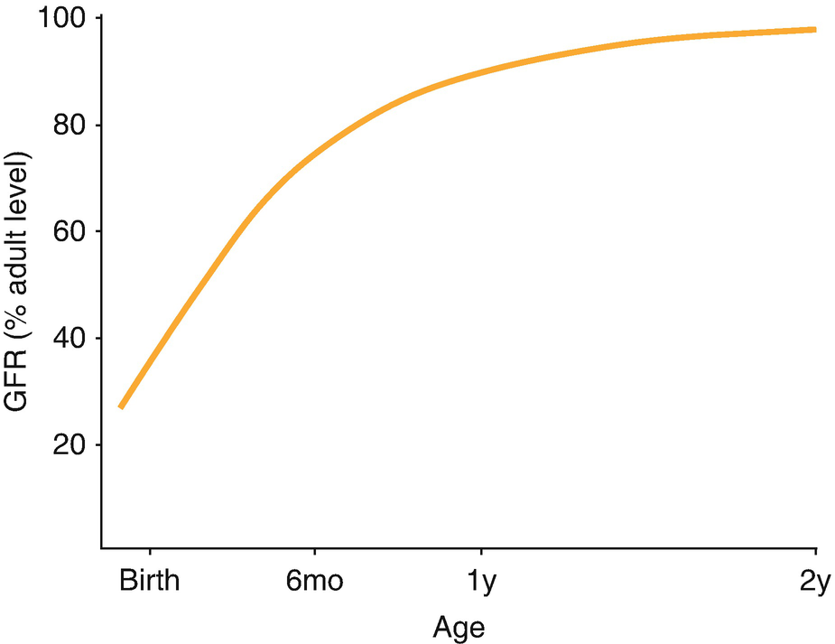
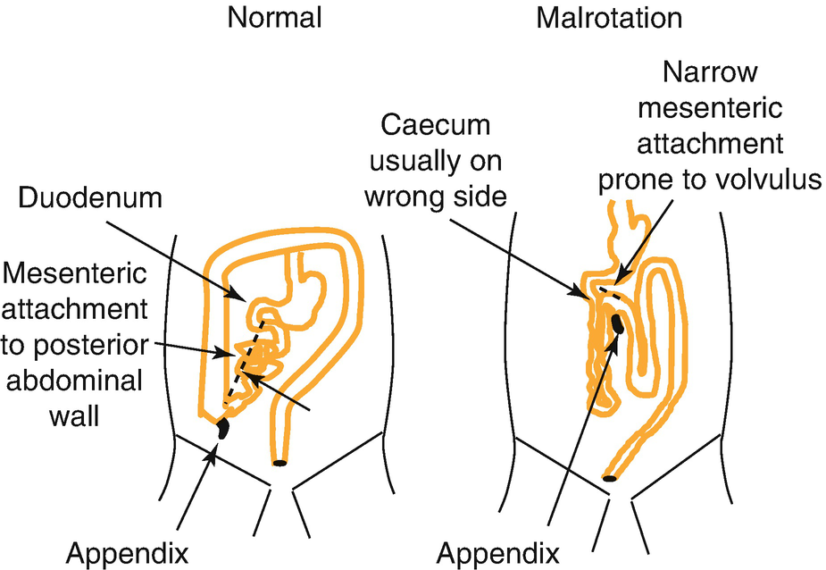
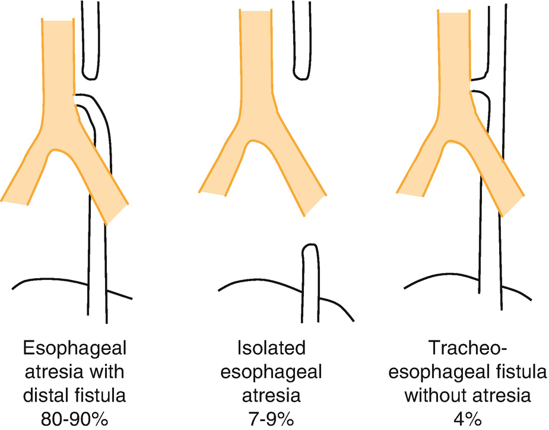
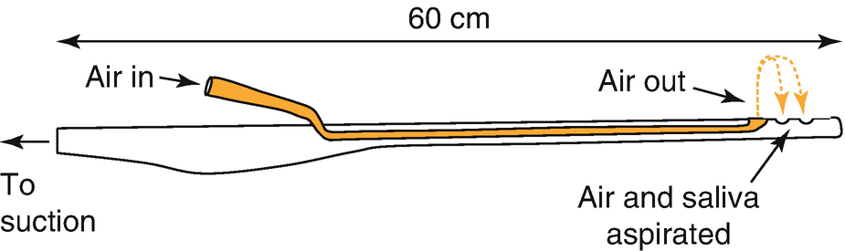

Neonatal Anesthesianeonatal anesthesia

© Springer Nature Switzerland AG 2020

Craig Sims, Dana Weber and Chris Johnson (eds.) A Guide to Pediatric Anesthesia[https://doi.org/10.1007/978-3-030-19246-4\_14](https://doi.org/10.1007/978-3-030-19246-4_14)

# 14.  Neonatal Anesthesia

Chris Johnson[1](#Aff4)     and Dan Durack[2](#Aff5)    

(1)

Formerly Department of Anaesthesia and Pain Management, Princess Margaret Hospital for Children, Subiaco, WA, Australia

(2)

Department of Anaesthesia and Pain Management, Perth Children’s Hospital, Nedlands, WA, Australia

Chris Johnson (Corresponding author)

Dan Durack

Email: [Daniel.Durack@health.wa.gov.au](mailto:Daniel.Durack@health.wa.gov.au)

### Keywords

Endotracheal intubation, neonateTracheo-esophageal fistula, anesthesiaNeonatal apnea and anesthesiaNeonatal pharmacologyNeonatal laparotomy anesthesia

This chapter outlines differences between the neonate and older patients, some common neonatal conditions, and some aspects to consider in the care of the preterm neonate so that trainees will have some background knowledge if they are involved with these patients.

## 14.1 The Neonate

A neonate is a baby in the first 4 weeks of life. Preterm neonates are those born at less than 37 weeks gestation. Several terms are used to describe the age of former preterm infants (Table [14.1](#Tab1)). The neonatal period is when physiological and pharmacological changes are greatest and technical and equipment needs most specialized. Great changes and differences occur even within the neonatal period, particularly in the first few days of life when the changes from birth are stabilizing.

Table 14.1

Various terms used to describe the age of preterm neonates

| 
Term | Description

 |
| --- | --- |
| 

Gestational age | Time between the first day of the last menstrual period and delivery. A term baby is 37–40 weeks gestation

 |
| 

Chronological age

(Post-natal age) | Time since birth. A baby celebrates its first birthday 52 weeks after birth

 |
| 

Postmenstrual age (PMA) or Post-conceptual age (PCA) | Gestational age + chronological age. A 6 week old baby born at 35 weeks gestation has a PMA of 41 weeks

 |
| 

Corrected age | Chronological age minus the number of weeks born before 40 weeks of gestation. A 6 week old baby born at 35 weeks has a corrected age of 1 week

 |

Postconceptual age is no longer used

## 14.2 The Neonatal Cardiovascular System

When based on weight, the neonate has twice the metabolic rate of an adult. As a result, neonates have twice the oxygen consumption, twice the minute ventilation and twice the cardiac output of an adult (Table [14.2](#Tab2)). As the cardiac output in a neonate is already high, there is less ability to increase it in response to illness. Other differences of the cardiovascular system of neonates are listed in Table [14.3](#Tab3). Term neonates have a heart rate of 100–160 bpm and normal systolic blood pressure of approximately 60–70 mmHg. Preterm neonates have a lower blood pressure.

Table 14.2

Respiratory and cardiovascular differences between neonate and adult

| 
Parameter | Neonate | Adult

 |
| --- | --- | --- |
| 

Oxygen consumption | 7 mL/kg/min | 3 mL/kg/min

 |
| 

RR (breaths/min) | 30–60 | 15–20

 |
| 

MV | 220 mL/kg/min | 100 mL/kg/min

 |
| 

Tidal volume | 6 mL/kg | 7 mL/kg

 |
| 

FRC | 30 mL/kg | 34 mL/kg

 |
| 

Anatomical dead space | 2.2 mL/kg | 2.2 mL/kg

 |
| 

Cardiac output | 200 mL/kg/min | 70 mL/kg/min

 |

Note increased oxygen consumption, cardiac output and increased minute ventilation achieved by increased respiratory rate

Table 14.3

Characteristics of the cardiovascular system in neonates

| 
Cardiovascular system characteristics | Reason

 |
| --- | --- |
| 

Contractility dependent on extracellular calcium concentration | Poorly developed sarcoplasmic reticulum

 |
| 

Rate dependent cardiac output | Relatively fixed stroke volume from non- compliant ventricle

 |
| 

Poorly developed sympathetic nervous system | Unable to increase systemic vascular resistance

 |
| 

Parasympathetic nervous system predominance | Prone to bradycardia

 |

### 14.2.1 Patent Ductus Arteriosus (PDA)

The ductus arteriosus is a vascular communication between the pulmonary artery and descending aorta, and is an essential component of fetal life. It generally closes soon after birth but in some types of congenital heart disease, ongoing patency may be essential for survival. A small PDA is usually benign and NSAIDs may be used to promote closure. Left-to-right shunting through a large PDA risks pulmonary overload and congestive heart failure. This is managed with fluid restriction and diuretics. Surgical closure may be required, either by cardiac catheter or by thoracotomy.

## 14.3 The Neonatal Airway

Differences in the airway (Table [14.4](#Tab4)) (see also Chap. [4](467929_2_En_4_Chapter.xhtml)) make the larynx appear anterior at laryngoscopy and have the potential to make intubation more difficult. However, intubation is readily achieved in most neonates with a straight Miller blade laryngoscope and laryngeal pressure. The routine use of a videolaryngoscope for intubation of neonates is also a reasonable approach nowadays.

Table 14.4

Summary of airway differences

| 
Neonatal airway features

 |
| --- |
| 

Occiput relatively large—more difficult to position for optimal intubating conditions

 |
| 

Obligate nasal breathing, most resistance in nose, don’t cope with nasal obstruction. 40% of term babies can convert to oral breathing if nasal obstruction

 |
| 

Underdeveloped mandible with little space in mouth for tongue

 |
| 

Larynx higher in neck with fewer vertebral joints above larynx that can flex

 |
| 

Long, floppy, U-shaped epiglottis

 |
| 

Larynx appears to be more anterior at laryngoscopy

 |
| 

Vocal cords angled forward (more likely to catch ETT on anterior commissure)

 |
| 

Short trachea makes right endobronchial intubation more likely

 |

### Note

Positioning for intubation is different in neonates compared to adults: A head ring to stabilize the relatively large head; a small roll under the shoulders if the head is particularly large; mild head extension (too much and the epiglottis may be pushed against the tongue base); no neck flexion needed because of their high larynx.

## 14.4 The Neonatal Respiratory System

Neonates have several differences that place them at risk of respiratory and ventilatory failure.

### 14.4.1 Lung Development

The lung is underdeveloped at birth—alveoli develop late in gestation and lung development continues after birth. A preterm baby has only terminal sacs with underdeveloped alveolar ducts. Term babies have 20–50 million alveoli and the number increases to the adult number of 300 million by 8 years. Surfactant production begins around 23 weeks gestation and sufficient levels are present from early in the third trimester through to birth. Surfactant deficiency is a problem in preterm neonates, resulting in reduced compliance, atelectasis and respiratory distress syndrome (RDS). Surfactant is so important for lung function in neonates that antenatal steroids are given to mothers to stimulate surfactant production if delivering at 34 weeks or less. Preterm neonates born at less than 30 weeks gestation are given surfactant via an ETT. Bronchopulmonary dysplasia (BPD) refers to lung damage caused by mechanical ventilation and subsequent inflammatory reaction.

### 14.4.2 Airway and Respiratory Mechanics

Respiration is less efficient and the work of breathing higher because of the characteristics of the chest wall, diaphragm and tracheobronchial tree (Table [14.5](#Tab5)). The neonatal larynx is high in the neck and the posterior oral airway is potentially obstructed by the high and long epiglottis in proximity to the soft palate and tongue. This allows simultaneous feeding and breathing, but in combination with immature coordination between respiratory and pharyngeal muscles, neonates and young infants preferentially breathe through their nose. Only about 40% of term babies can convert to oral breathing if the nose is obstructed, but nearly all can convert by the age of 5 months.

Table 14.5

List of the major differences in respiratory physiology in neonates compared to children and adults

| 
Respiratory physiology in neonate

 |
| --- |
| 

Horizontal ribs rather than ‘bucket handle’

 |
| 

Piston-like, diaphragmatic breathing which is compromised by gastric or abdominal distension

 |
| 

Diaphragm has less type I muscle fibers (25% vs adult 60%; adult levels by 9 months) and copes with increased work of breathing poorly. Diaphragm is flatter and develops less pressure for any given muscle tension

 |
| 

Compliant rib cage which in-draws if upper airway obstruction

 |
| 

Small diameter, poorly supported airways

 |
| 

Immature respiratory control

 |

### Note

Neonates and infants younger than 3 months are termed ‘obligate nasal breathers’ because less than half can quickly convert to breathing through their mouth if their nose is obstructed.

### 14.4.3 Control of Respiration

The respiratory center in the brain stem of the neonate is immature, and respiratory control is not fully developed. Neonates have periodic breathing- the respiratory rate varies and includes periods of self-correcting apnea lasting 5 or 10 s. Neonates also have a biphasic response to hypoxia—they increase ventilation initially, but then become apneic. After about 3 weeks of age the response to hypoxia is sustained hyperventilation as in children and adults. Neonates also have a reduced response to hypercarbia compared with children and adults. Finally, neonates have increased sensitivity to stimulation in the superior laryngeal nerve territory and respond with hypoventilation, apnea or bradycardia.

### 14.4.4 Apnea and Anesthesia in Neonates

As a further indication of their immature respiratory control, neonates, and especially preterm neonates, are prone to apnea after anesthesia. An apnea is considered significant if it lasts longer than 15 s, or is associated with oxygen desaturation <90% or bradycardia (<100 bpm). They usually occur in the first 2 h after anesthesia, but may occur anytime during the first 12 h. The incidence of apnea after anesthesia increases with increasing prematurity—7% of neonates born at 34–35 weeks will have apneas, but 80% born at less than 30 weeks will have apneas. Anesthesia or sedation may cause apnea even if the infant wasn’t having them before. These apneas are not self-correcting and are a life-threatening risk of anesthesia in preterm infants. It is the reason for overnight admission even after minor surgery (Table [14.6](#Tab6)). Apneas are often seen in these infants immediately after anesthesia while still in the OR (sometimes while still intubated and awaiting extubation). They sometimes respond to stimulation, and sometimes need IPPV briefly. Apnea in the PACU indicates a higher risk of apnea later on the ward. Overall, 6–10% of preterm neonates aged 44 weeks PMA or less will have apnea after anesthesia.

Table 14.6

Summary of apnea in infants after anesthesia and sedation

| 
Key features | Notes

 |
| --- | --- |
| 

‘Apnea’ | Longer then 15 s, or 10 s if associated desaturation or bradycardia

Usually within first few hours after anesthesia

Risk period extends to 12 h post op

Usually responds to stimulation; some require IPPV

 |
| 

Risk groups | Other preterm baby (less than 35 weeks) until 52 weeks PMA

Mildly preterm baby (35–37 weeks) until 48 weeks PMA

Term baby until 44 weeks PMA

 |
| 

Other risk factors in preterm infants | Co-morbidities (especially neurological, respiratory)

Intraoperative opioids or sedatives

Anesthesia technique and agents

Anemia?

 |
| 

Prevention | Analgesia without opioids

Light GA with low-solubility volatile and regional analgesia

Caffeine base 10 mg/kg

Spinal anesthesia

 |

_PMA_ post menstrual age

#### 14.4.4.1 Risk Factors for Apnea After Anesthesia

Preterm infants aged less than 52 weeks PMA are at risk of apnea after anesthesia or sedation. The risk declines with age, is very low after 46 weeks PMA and is negligible after 52 weeks PMA. Preterm infants under 44 weeks PMA are most at risk. The degree of prematurity at birth also affects the risk—infants born mildly preterm at 35–37 weeks have a lower risk of apnea than neonates born before 35 weeks. Term neonates (born at 37 weeks gestation or more) are at a lower risk of apnea than preterm neonates, but a risk exists until 44 weeks PMA. Co-morbidities including anemia (Hb <100 g/L), lung disease, neurological problems and pre-existing apnea increase the risk of postop apnea.

### Keypoint

Term neonates require admission and monitoring for postoperative apnea until a postmenstrual age of 44 weeks, and preterm infants until 52 weeks (some centers still use 60 weeks).

#### 14.4.4.2 Prevention Strategies to Reduce Apnea

The risk of postoperative apnea can be reduced by postponing elective surgery until the infant is older. Term infants should not have day-stay surgery until they are 44 weeks PMA (that is, 4 weeks old if born at 40 weeks gestation, 7 weeks old if born at 37 weeks). Preterm infants should not have day-stay surgery until they are 52 weeks PMA (some centers use 60 weeks). The risk in infants born mildly preterm (35–37 weeks) is lower and some centers allow day-stay surgery after 48 weeks PMA in these infants if there are no other risk factors. This last group still needs to be monitored for 6–8 apnea-free hours before discharge. Although anemia increases apnea risk, many centers accept mild anemia unless there are other reasons for transfusion.

General anesthesia can be modified to reduce the risk. Regional or local anesthesia should be used in place of opioids, allowing a light plane of anesthesia with relatively insoluble agents such as sevoflurane. Longer acting drugs of all classes should be avoided.

Spinal anesthesia was thought to greatly reduce the risk of postop apnea. More recent work suggests spinal anesthesia does not reduce the overall incidence of apnea compared to general anesthesia. However, it does reduce the number of infants needing any intervention greater than stimulation to resolve their apnea, and the number of apneas in the PACU. Spinal anesthesia is discussed in Chap. [10](467929_2_En_10_Chapter.xhtml), Sect. [10.​5.​4](467929_2_En_10_Chapter.xhtml#Sec18). In summary, its disadvantages are technical difficulties with lumbar puncture in small infants, and the short duration of spinal anesthesia in infants.

IV caffeine during anesthesia reduces the incidence of postop apnea. Preterm infants at high risk (44 weeks PMA or less) are given caffeine base 10 mg/kg IV (equivalent to caffeine citrate 20 mg/kg) during anesthesia to prevent apnea. Caffeine is also used in the neonatal nursery to prevent apnea in premature neonates, so it is important to check the baby has not already been given caffeine. Aminophylline can be used if IV caffeine is not available, although it has more cardiovascular side effects.

### Keypoint

Spinal anesthesia was thought to greatly reduce the risk of postop apnea. It is now realized it does not affect the overall incidence of postop apnea, but does reduce the severity of apneas and incidence of early apneas.

#### 14.4.4.3 Monitoring for Apnea

Detection of apnea prevents hypoxia or hypoxic cardiac arrest. An ‘apnea monitor’ is used, usually in combination with pulse oximetry. The monitor uses ECG leads on the chest and detects respiratory movement via the impedance between the leads and measures heart rate via the ECG. It will not detect obstructive apnea (chest moving but no air flow) until bradycardia develops. Most apnea begins in the first few of hours after anesthesia. The risk diminishes with time and monitoring is ceased when there has been no apnea for 12 h.

Apneas nearly always respond to stimulation alone and rarely require bag-mask ventilation. Groups of infants that require monitoring are those in the ‘risk group’ of Table [14.6](#Tab6).

## 14.5 Fluid and Glucose Requirements

Neonates have a greater proportion of their bodies as water, a larger blood volume and higher fluid, glucose and sodium requirements than older children and adults (Table [14.7](#Tab7)). Body water makes up 80% of weight at birth, falling to 60% at age 1 year. The extracellular fluid volume is larger than the intracellular fluid volume (the opposite of children) until about 3 months of age. Fluid requirements are low for the first few days after birth while lung water is reabsorbed, and then high in keeping with the neonate’s high metabolic rate.

Table 14.7

Differences in body fluid compartments and fluid requirements between neonate and adult

| 
Fluid compartment | Neonate | Adult

 |
| --- | --- | --- |
| 

Total body water | 70–75% | 65%

 |
| 

Extracellular fluid volume | 50% | 25%

 |
| 

Blood volume | 90 mL/kg | 70 mL/kg

 |
| 

Sodium requirement | 3 mmol/kg/day

 |   |
| 

Glucose requirement | 6–8 mg/kg/min

 |   |
| 

**Fluid requirements**

 |
| 

Day 1 | 60 mL/kg/24/h

 |
| 

Day 2 | 75

 |
| 

Day 3 | 90

 |
| 

Day 4 | 105

 |
| 

Day 5 | 120

 |
| 

Day 7 onwards | 150

 |

Fluid requirements are low initially because fluid is being absorbed from the lungs after birth. Based on data from Newborn clinical guidelines, Starship Children’s

Glucose requirements are high in neonates to match their metabolic rate and limited gluconeogenesis. A commonly used maintenance fluid is 10% glucose with 0.2% saline. Hypoglycemia is defined as <2.6 mmol/L in neonates (4.0 mmol/L in children). In the neonatal unit, hypoglycemia is corrected gradually by increasing feeds or the rate of glucose administration. Boluses of glucose are avoided and very rarely used. Renal function is immature at birth with reduced glomerular filtration rate (GFR) and poor concentrating ability. GFR reaches 50% of the adult level by 48 weeks PMA, 90% of the adult rate by 1 year, and reaches the adult rate by 2 years (Fig. [14.1](#Fig1)).

Fig. 14.1

Glomerular filtration rate (GFR) at birth is roughly one quarter of the adult, but reaches the adult level at 2 years of age. Modified from Anderson BJ, Holford NHG. Negligible impact of birth on renal function and drug metabolism. Pediatr Anesth 2018;28: 1015–21

### 14.5.1 Neonatal Blood

The neonate has predominantly fetal hemoglobin (HbF) which has an oxygen dissociation curve shifted to the left—oxygen extraction at the tissue level is impaired due to the higher venous oxygen levels after birth. The hemoglobin level at birth is variable, but commonly about 16 g/dL. Adult hemoglobin (HbA) is produced from birth, but red cell production is inadequate and the hemoglobin falls, reaching a low point of 8–11 g/dL at 2–3 months (called the ‘physiological anemia’). Nearly all of the hemoglobin at this stage is HbA, and so tissue oxygen delivery is actually improved compared to earlier with HbF.

### Note

The presence of HbF in neonates is a key reason for a higher transfusion-trigger hemoglobin in neonates than children.

The coagulation system of the neonate is immature and does not reach adult levels until about 6 months of age. The coagulation changes are due to reduced levels of the vitamin K dependent factors and reduced levels of coagulation inhibitors (Antithrombin III, Protein C and S). Vitamin K is often given to neonates because of this coagulopathy. Platelet numbers are normal, but they do not reach adult activity until the neonate is 2 weeks old. Neonates do not have blood group antibodies in their plasma apart from some transferred through the placenta from the mother. Cross match of blood is performed on maternal serum.

## 14.6 Temperature

Neonates can only control body temperature over narrow range of environmental temperatures compared to children and adults. Their thermoneutral temperature depends on the age and weight of the baby, but for a naked term baby it is 32–35 °C. Methods to maintain body temperature are during surgery are described in Sect. [14.9.2](#Sec23).

### 14.6.1 Heat Loss and Production

Neonates have large heat losses and a decreased ability to generate heat, so are at great risk of hypothermia during transport and while in theatre. Losses are through the skin, particularly by convection and radiation. Evaporation is also an important source of heat loss in preterm infants because of their thin skin. Heat losses are high because of the neonate’s large surface area to weight ratio and poor insulation from subcutaneous fat. The head (20% of surface area) is a significant site of heat loss and should be kept covered.

Heat production is limited—neonates do not shiver, or at least not enough to generate any heat. They do however have brown fat that is rich in mitochondria located around the great vessels in the neck and thorax, and also in the axilla and between the scapulae. This fat is used for non-shivering thermogenesis, which can double heat production in neonates and infants until 2 years of age. Non-shivering thermogenesis is inhibited by anesthesia, as is shivering in older children and adults.

### Tip

Think of heat loss when you uncover an infant to insert an IV.

Consider underbody or overhead warming, covering patient with a clear plastic sheet, insulating cap for the head.

## 14.7 Pharmacology of Anesthetic Agents in Neonates

In general, neonates have an increased volume of distribution but reduced metabolism and clearance. Initial doses however, are still often lower than in older children because of pharmacodynamic differences arising from immature end organs (Table [14.8](#Tab8)). Immaturity of the blood brain barrier was thought to be responsible for apparent sensitivity of the neonate to some drugs such as morphine, but it is now realized that pharmacokinetic differences are responsible. Doses have a fast onset due to the high cardiac output in neonates that predominantly goes to the vessel rich group of tissues. Non-depolarizing relaxants for example, work very quickly in neonates. Neonates are slow to wake after propofol—they have low fat and muscle content, and as a result the induction agents have less mass to redistribute into and the brain concentration remains higher for longer. Also, propofol causes prolonged hypotension in a proportion of neonates. Table [14.9](#Tab9) lists some common agents and differences in their use in neonates.

Table 14.8

Factors affecting drug action in neonates

| 
Factors affecting drug action in neonates | Example

 |
| --- | --- |
| 

Increased volume of distribution due to increased body water | Prolonged action of vecuronium; less respiratory depression from bolus dose of fentanyl

 |
| 

Microsomal enzyme activity reduced by about 50% | Reduced infusion doses

 |
| 

Reduced glomerular filtration and tubular secretion | Reduced excretion of morphine and metabolites

 |
| 

Reduced protein binding | Reduced dose of thiopentone

 |
| 

Increased cardiac output and distribution to VRG | Fast onset of NMBD’s

 |
| 

Low proportion of fat and muscle | Less redistribution of induction agents, slow to wake

 |
| 

Immaturity of end organ function | Reduced MAC, sensitivity to NMBD’s

 |

Table 14.9

Drug doses in neonates

| 
Agent | Effect/dose | Comment

 |
| --- | --- | --- |
| 

Propofol | 2–3 mg/kg | May cause significant hypotension for up to 1 h after bolus

 |
| 

Volatile agents | Reduced MAC compared to infants; high rate of uptake/washout | Immature CNS; high cardiac output & minute ventilation

 |
| 

Muscle relaxants | Fast onset; first dose same as children, second dose will have longer duration | High cardiac output; increased volume of distribution offset by reduced acetylcholine release

 |
| 

Suxamethonium | 2 mg/kg | High dose to overcome very short duration of action in neonate

 |
| 

Vecuronium | 0.1 mg/kg—Long duration of action in neonates | Large volume of distribution

 |
| 

Rocuronium | 0.3–0.45 mg/kg to allow for sensitivity and long duration of action | Prolonged duration of action

 |
| 

Atracurium | 0.5 mg/kg | Very fast onset, shorter duration

 |
| 

Morphine | Reduced dose needed | Reduced clearance morphine and metabolites; caution with infusions

 |
| 

Fentanyl | Similar/reduced dose | Reduced clearance

 |
| 

Remifentanil | No dose change required | Increased volume of distribution offset by increased clearance

 |
| 

Local anesthetics | Reduced initial dose; avoid infusions | Markedly reduced metabolism of bupivacaine, reduced protein binding, high risk of toxicity

 |

### Note

Remifentanil is unique among the opioids for neonates. The enzyme which metabolizes remifentanil is fully active at birth. The dose of remifentanil is unchanged or slightly higher in neonates than children because of a larger relative volume of distribution, offset by increased clearance.

### Practice Point

Five anesthetic drugs different in neonates compared to children:

-   Sevoflurane—reduced MAC
    
-   Propofol—reduced dose, may cause prolonged hypotension after single bolus dose
    
-   Vecuronium—long acting in neonates
    
-   Remifentanil—fully active enzyme system, increased dose
    
-   Local anesthetics—reduced metabolism, reduced dose
    

## 14.8 The Effects of Prematurity

A preterm infant is defined as being born at less than 37 weeks gestation. Extreme preterm neonates are born before 28 weeks gestation. All of the organ systems are immature in the preterm infant and the problems they face depend on both the gestational age and weight of the baby (Table [14.10](#Tab10)). A short overview of these problems is listed in Table [14.11](#Tab11).

Table 14.10

50th percentile birth weight of babies born at different gestational ages

| 
Gestational age (weeks) | 50th centile birth weight (g)

 |
| --- | --- |
| 

40 | 3500

 |
| 

34 | 2300

 |
| 

30 | 1450

 |
| 

28 | 1140

 |
| 

26 | 890

 |

Table 14.11

Some of the changes in different organ systems associated with prematurity

| 
System | Changes associated with prematurity

 |
| --- | --- |
| 

CVS | Increased incidence of PDA

Increased blood volume (100 mL/kg)

More pronounced physiological anemia later

 |
| 

Respiratory | Only terminal sacs rather than alveoli

Reduced surfactant

Increased risk of RDS

Increased risk of apnea with or without anesthesia

More likely to need respiratory support after birth or anesthesia

 |
| 

Gastrointestinal | Increased risk of hypoglycemia

Unable to suck-feed if less than 34 weeks (need NGT)

Increased risk of necrotizing enterocolitis

 |
| 

CNS | Increased risk of intraventricular hemorrhage and neurodevelopmental defects

Risk of retinopathy of prematurity

 |

### 14.8.1 Respiratory Distress Syndrome (RDS)

RDS or hyaline membrane disease (HMD) is a common lung disease in preterm infants. It is caused by surfactant deficiency in alveoli that are not completely developed. There is an influx of inflammatory cells and edema of airways, and a proteinaceous exudate forms a hyaline membrane in the distal alveolar sacs. RDS begins within 4 h of birth and causes the signs of respiratory distress listed in Table [14.12](#Tab12). Lung compliance is reduced and there is atelectasis and ventilation-perfusion mismatch. The CXR classically shows a diffuse, ‘ground glass’ appearance in both lung fields with air bronchograms and loss of the heart borders. Treatment includes respiratory support, oxygen and surfactant. There is a trend towards CPAP rather than intubation and ventilation.

Table 14.12

Signs of neonatal respiratory distress

| 
Signs of neonatal respiratory distress

 |
| --- |
| 

Tachypnea (respiratory rate more than 60)

 |
| 

Nasal flaring

 |
| 

Expiratory grunting

 |
| 

Chest retractions

 |
| 

Desaturation

 |

### 14.8.2 Retinopathy of Prematurity (ROP)

ROP is an eye disease of prematurity, particularly infants less than 32 weeks gestation or of extreme low birth weight (<1500 g). Excessively high arterial oxygen concentration is a major cause, but other factors are involved as it can occur in very small preterm infants despite maintaining normal oxygen levels. ROP is a two phase disease, the first phase being a hyperoxic state after exposure to high oxygen concentrations. Hyperoxia causes retinal vasoconstriction, resulting in vaso-obliteration of some existing peripheral retinal vessels. In the second phase, increased metabolism in the developing eye results in the non-perfused peripheral retina becoming hypoxic, which then triggers the release of vascular endothelial growth factor. This leads to retinal neovascularization. In some cases, the neovascularization eventually results in the development of retinal detachment and visual loss. The inspired oxygen concentration should be reduced during anesthesia and transport to keep the oxygen saturation in the low to mid 90s in neonates younger than 32 weeks or weighing less than 2.5 kg.

## 14.9 An Overview of Anesthesia for Neonates

Neonatal anesthesia is a specialized area and is generally performed by fellowship-trained pediatric anesthetists in tertiary centers. This section gives a brief overview of neonatal anesthesia techniques for trainees involved in neonatal cases (Table [14.13](#Tab13)).

Table 14.13

List of main considerations in neonatal anesthesia

| 
Aspect of anesthesia | Important considerations in neonate

 |
| --- | --- |
| 

Temperature | Vulnerable to hypothermia

 |
| 

BSL | Ensure glucose supply and monitor BSL

 |
| 

Airway | Use a 3 mm ID cuffed or uncuffed ETT (3.5 uncuffed if term infant), straight blade laryngoscope or videoscope

Rapid desaturation and hypercarbia with apnea

 |
| 

Ventilation | Fast rates, short inspiratory time

Small tidal volumes, care with equipment dead space

Apnea after anesthesia

Adverse effects of high FiO2 for lungs and retina

 |
| 

CVS | Sick neonates vulnerable to hypotension from propofol and volatile agents

Fentanyl-based anesthesia

Careful use of volatile agents (reduced MAC)

Fluid load—consider 4% Albumin

Small blood volume—consider group & hold or cross match

Ensure vitamin K has been given

Umbilical catheters may need to be removed for some abdominal operations

2Fr long lines are not suitable for large or rapid fluid boluses

 |
| 

Drugs | Metabolism and elimination of most drugs reduced. At risk of prolonged effect

 |

Most neonatal surgery is performed under general anesthesia. Awake spinal anesthesia can be used for abdominal and lower limb procedures, and some centers have extensive experience in this technique. Spinal anesthesia (see Chap. [10](467929_2_En_10_Chapter.xhtml), Sect. [10.​5.​4](467929_2_En_10_Chapter.xhtml#Sec18)) reduces the risk of airway and respiratory problems and avoids the concern of potential neurotoxicity from volatile agents. The lumbar puncture however can be difficult, and the block only lasts 45 min.

### 14.9.1 Assessment

Pre-anesthetic evaluation determines the consequences of the surgical condition and any coexisting conditions. The parents may still be at the birthing place and away from their baby, which may make preop discussions more difficult. Weight and postmenstrual age are important as these determine the degree of physiological changes present, including apnea risk. Current management of the baby’s airway, breathing and circulation are noted. Fluid and glucose management in NICU forms a basis for ongoing treatment in theatre. Investigations vary according to the baby’s condition, but most surgical cases have had the hemoglobin and electrolytes measured. A newborn’s hemoglobin is often higher than other pediatric patients at 160 g/L, but the value depends on the time of cord clamping and how much blood was left in the placenta. Several conditions requiring surgery are associated with a higher incidence of cardiovascular abnormalities, and a pre-operative echocardiogram may be required. These conditions include tracheo-esophageal fistula, congenital diaphragmatic hernia, VACTERL & CHARGE associations, and exomphalos.

### 14.9.2 Temperature

The body temperature of neonates and infants is maintained during anesthesia by warming the operating room, using a forced air warmer, warming IV fluid boluses and using passive humidification of anesthetic gases. Although a theater temperature of over 25 °C for neonatal cases is traditional, it is a very uncomfortable temperature for staff (who may already be stressed caring for a sick neonate). A contemporary approach is to keep the OR cooler and create a microclimate around the baby with a forced air warmer.

### Note

Some neonates have a fine, 2FG PICC line in situ. This line is very thin and even anesthetic drugs need to be given slowly and gently. The PICC line is not suitable for fluid bolus or blood. Another IV line needs to be established for surgery.

### 14.9.3 Induction

Some anesthetists give IV atropine before induction in view of the parasympathetic predominance in neonates, but its routine use is probably not necessary with current agents and techniques. Inhalational induction has the advantage of more gradual loss of consciousness with more time to assess airway and take over breathing. IV induction is rapid, but preoxygenation is difficult and usually inadequate, so reliance is placed on the rapid establishment of mask ventilation after induction. Rapid sequence induction in neonates is modified from the adult technique. The majority of anesthetists do not use cricoid pressure because it compresses the trachea (preventing mask ventilation before intubation) and distorts the airway for laryngoscopy. Instead, reliance is placed on the fast onset of induction agents and relaxants in neonates. Mask ventilation after induction and before intubation is crucial to avoid hypoxia.

### Tip

During intubation of the neonate, insert miller blade into mouth and laryngopharynx under direct vision—don’t blindly insert the blade.

Keep the tongue swept to left side of blade (not bulging over right side of blade) and keep blade out of corner of mouth

Lift the epiglottis directly or indirectly and use laryngeal pressure to improve view if needed

### 14.9.4 Intubation

Neonates are intubated and ventilated for most procedures for several reasons: their airway may be technically difficult to manage and difficult to access after surgery starts, and hypoxia occurs very quickly if airway obstruction develops. Furthermore, they are susceptible to respiratory depression from anesthetic drugs and do not tolerate increases in the work of breathing. Assisted ventilation via an LMA may be a suitable technique for simple cases when access to the airway during the case is possible.

### Note

If intubation of the neonate is not successful at the first attempt, it is vital to concentrate on bag mask ventilation to restore lung volume before the next intubation attempt. Apneic periods during intubation cause loss of lung volume and relatively high pressures are usually required to recruit lung volume. Hypoxia is inevitable by the second or third attempt at intubation if recruitment is not performed. Following intubation, the requirement for high pressures diminishes as further recruitment occurs. NB: Empty gas from stomach. Gentle cricoid pressure may be handy during recruitment to prevent stomach distension.

In practice, neonates are usually easy to intubate despite all their airway differences. A small head ring stabilizes the head during intubation and the head is tilted back slightly as during an adult intubation. Sometimes, the large head flexes the neck when they are supine, and either removing the head ring or placing a small pad under the shoulders overcomes this. The larynx is not actually located anteriorly, but appears anterior at laryngoscopy. A straight blade laryngoscope and external pressure to bring the larynx into view are key points. A videoscope is an alternative. A size 1 Miller blade and 3.0 mmID cuffed ETT can be used in babies from 3 kg or if there is a large leak using an uncuffed ETT. For smaller babies a 3.0 uncuffed ETT is first choice. The largest uncuffed ETT that still has a leak at 20 cm H2O is best to facilitate suctioning & reduce risk of occlusion postop. Very small preterm neonates weighing less than about 1 kg are best intubated using the size 0 Miller blade and a 2.5 mm ID uncuffed ETT. Small curved Macintosh blades are anatomically unsuitable for neonates and it is illogical to use a scaled-down adult blade for neonatal intubation.

### Tip

A term neonate weighing more than 3 kg will most likely accept a 3.5 mm uncuffed or 3.0 mm cuffed ETT. Intubation of smaller neonates should initially be with a 3.0 uncuffed ETT.

### 14.9.5 Maintenance

Maintenance techniques vary according to the medical condition of the baby. Healthy, term neonates will tolerate volatile agents if doses are adjusted (allowing for reduced MAC) and fluid boluses given if required. Most neonatal surgery is abdominal, and nitrous oxide is avoided to minimize bowel distension. Sick neonates undergoing emergency procedures may only tolerate low doses of volatile agents without hypotension. As this group is usually ventilated postop, a common technique is to rely on remifentanil or fentanyl, relaxant, fluid boluses, and then add a volatile agent as required and tolerated. Depth is assessed on the basis of hemodynamic changes in response to surgical stimulation. A dose of fentanyl in the order of 10–50 μg/kg would be considered an adequate anesthetic in a sick, preterm neonate.

### Tip

A starting point for anesthesia for major neonatal surgery when postop ventilation is planned:

-   Inhalational induction with Sevoflurane and oxygen/air
    
-   Muscle relaxation, pressure controlled ventilation with air/oxygen, minimize FiO2 if preterm
    
-   Fluid load with 10 mL/kg warm saline or 4% Albumin
    
-   Fentanyl incrementally to 10 μg/kg
    
-   Additional fentanyl or low dose volatile as tolerated.
    

#### 14.9.5.1 Ventilation

Initial ventilator settings for neonates with normal lungs are rate 25–30 breaths/min, inspiratory pressure 15–20 cmH2O, inspiratory time < 1 s and PEEP 5 cmH2O. Neonates have short alveolar time constants and do not need long inspiratory times. Neonatal intensive care units ventilate at rates of 50–60 breaths/min and inspiratory times of only 0.3–0.5 s to facilitate synchronization with the ventilator when awake, and to reduce volutrauma. A large proportion of carbon dioxide production is from the work of breathing in the neonate and this work is eliminated with muscle paralysis. Distal sampling of ETCO2 is important (see Chap. [6](467929_2_En_6_Chapter.xhtml) Sect. [6.​5.​2](467929_2_En_6_Chapter.xhtml#Sec26)).

#### 14.9.5.2 Blood Pressure

Blood pressure and fluid management aim to maintain adequate cerebral perfusion pressure. It is not really known what the blood pressure of a neonate should be during anesthesia, nor is there and a well-defined lower limit for blood pressure. Cerebral oximetry studies suggest blood pressure under anesthesia does not need to be as high as in the awake state to maintain cerebral perfusion.

Observational studies have documented the values in Table [14.14](#Tab14). These values were recorded during anesthesia, but there is no information on outcomes to help decide if they are safe and acceptable as limits. These are often lower than blood pressures suggested in pediatric life support documents. Another rule used for guidance is that the mean blood pressure (in mmHg) should be no lower than the neonate’s gestational age. This rule is not evidence-based. NIBP devices also vary in the accuracy of diastolic measurement in small babies and the resulting calculated mean pressure.

Table 14.14

Observed mean BP values in infants during anesthesia

| 
Weight (kg) | Mean BP values one standard deviation below average under anesthesia (mmHg)

 |
| --- | --- |
| 

2 | 29

 |
| 

3 | 31

 |
| 

4 | 34

 |
| 

5 | 36

 |

Values given are 1 SD below the average BP observed. They give an indication of lower blood pressures commonly present during neonatal anesthesia, but it is not known if they are safe or desirable blood pressures. Adapted from de Graaff et al. Anesthesiology 2016; 125:904–13

There is a great deal of interest in blood pressure during neonatal anesthesia, because of concerns that hypotension may contribute to neurodevelopmental changes. However, a causative relation between low BP and outcome has not been established. There are concerns also that excessive fluid administration may cause pulmonary or peripheral edema. In general, neonates usually need a fluid bolus initially to prevent hypotension, and then to replace losses. The balance between continuing fluid or giving vasopressors or inotropes varies between centers based on experience and preference. Vasopressors must be used carefully, as they carry a risk of causing intraventricular hemorrhage (IVH) in neonates.

#### 14.9.5.3 Fluid Management

Maintenance fluids containing glucose are continued during anesthesia and surgery, usually via a volumetric pump. Blood glucose levels are measured during all but the shortest procedures, aiming to keep BSL above 3.0 mmol/L. Fluid losses are treated with boluses of crystalloid or albumin. As these fluid volumes are small (10 mL/kg is 30 mL in a neonate!), syringes of fluid are often used. The fluid is warmed either by placing the syringe under a warming blanket or by drawing fluid from a reservoir via a blood warmer. Blood transfusion is uncommon during neonatal surgery. The transfusion trigger is around 120 g/L—higher than children because of the neonate’s high level of HbF and limited cardiovascular reserve. Transfusion blood is drawn into a syringe via a macrofilter and warmed before administration.

#### 14.9.5.4 Postoperative Care

Extubation is possible only if the baby is warm, well perfused, has no significant pulmonary problems, and is medically stable. Local policies also play a role, as some NICU prefer to ventilate neonates after a laparotomy while receiving morphine, whereas other units are comfortable managing such a patient awake and breathing spontaneously. All neonates, including term babies, are considered at risk of postoperative apnea.

### Note

A blood transfusion cannot be given in the same line as 10% Dextrose. They are not compatible, and the blood will clot and block the IV line and cannula.

## 14.10 Some Neonatal Surgical Conditions

### 14.10.1 Malrotation and Subsequent Volvulus

Intestinal malrotation occurs when the embryological midgut does not rotate normally in the fetus. As a result, the small intestine is mostly on the right side and has a narrow mesenteric attachment making it prone to volvulus (Fig. [14.2](#Fig2)). Neonatal volvulus causes intestinal obstruction and intestinal ischemia, and is a ‘true’ surgical emergency. Some of these infants have hypovolemia and sepsis. A pragmatic approach is required, balancing the need for volume resuscitation against the desirability of immediate surgery. Anesthesia should only be delayed until reasonable hemodynamic stability is achieved. The Ladd procedure surgically corrects the malrotation. Anesthesia usually consists of low-dose opioid, volatile anesthesia and muscle relaxation. Invasive monitoring is not always required, and extubation at the end of procedure is often possible, followed by low-dose opioid infusion for analgesia.

Fig. 14.2

Schematic representation of anatomical changes in malrotation of intestine

### 14.10.2 Necrotizing Enterocolitis (NEC)

NEC is a condition of preterm neonates in which there is inflammation of the bowel wall causing intramural gas, wall necrosis, perforation and shock.

#### 14.10.2.1 Background

NEC is mostly a condition of preterm neonates, and the more preterm, the more likely it becomes. It most commonly begins within the first 2 weeks of age. It presents with abdominal distension, bilious NGT aspirates, bloody stools and intramural and intrahepatic gas on abdominal X-ray. The neonate becomes septic and unwell with the systemic consequences listed in Table [14.15](#Tab15). Mortality in the acute phase is up to 40% in infants <1 kg. Conservative management includes antibiotics, ventilation and cardiovascular support, ceasing oral intake and starting TPN. Babies with NEC requiring surgery are usually very small—less than 1–1.5 kg. Surgical management is either by insertion of a peritoneal drain (often performed in NICU), or laparotomy with bowel resection and ostomy formation.

Table 14.15

Systemic effects in neonate of necrotizing enterocolitis (NEC)

| 
Changes during NEC

 |
| --- |
| 

Thrombocytopenia

 |
| 

Anaemia

 |
| 

Metabolic acidosis

 |
| 

Electrolyte changes

 |
| 

Coagulation changes

 |

#### 14.10.2.2 Assessment

The baby’s general condition is assessed, paying particular attention to circulating volume status, level of cardio-respiratory support, and presence of changes in Table [14.15](#Tab15). Blood should be cross matched.

#### 14.10.2.3 Management

Anesthetic issues are listed in Table [14.16](#Tab16). These babies are often very small, very sick, and very challenging for the anesthetist. The neonate will already be intubated and ventilated in NICU and have IV access with or without inotropic support. Alternative IV access is useful if it can be obtained, because bleeding can occur during surgery from the inflamed, friable tissues. If blood is transfused through the same IV line as maintenance 10% glucose or TPN, the blood will clot and block the IV cannula and line. Even if there is minimal blood loss, fluid requirements are high and several boluses of 10 mL/kg of saline or albumin are usually required. An opioid-based anesthetic technique is used and volatile agents added only if hemodynamically tolerated. The baby is returned to NICU ventilated postop. Long-term problems include loss of intestinal length from bowel resection.

Table 14.16

Concerns and problems for anesthesia of neonate with necrotizing enterocolitis for laparotomy

| 
Anesthesia issues in NEC

 |
| --- |
| 

Usually very small, preterm neonate weighing less than 1.5 kg

 |
| 

Septic shock, thrombocytopenia, coagulopathy

 |
| 

Large fluid requirement

 |
| 

Potential for significant blood loss from inflamed, friable tissue

 |
| 

Blood not compatible with maintenance IV 10% glucose

 |

### 14.10.3 Gastroschisis and Exomphalos

These are abdominal wall defects in which the intestines and sometimes other organs protrude from the abdominal cavity and expose the newborn to the risks of infection, fluid loss and gut ischemia.

#### 14.10.3.1 Background

Both conditions are often associated with prematurity. Gastroschisis is more common and is possibly due to an early vascular incident. The defect is located to the right of the umbilicus and the herniated intestines are not within any type of membranous sac. The intestines are exposed to the amniotic fluid in utero and are inflamed and thick-walled. Associated anomalies are present in 10–15%, but they usually involve the GI tract and are of little consequence to anesthesia. Exomphalos is rarer, and consists of a large central herniation into a membranous sac that was part of the umbilical cord. Associated anomalies are present in 70%, with cardiac and chromosomal defects most common. Lung development and function are also affected. It is associated with Beckwith-Wiedemann syndrome (macroglossia, visceromegaly and hypoglycemia). The blood sugar level is checked in case the baby has this syndrome and is hypoglycemic.

Immediately after delivery, babies with abdominal wall defects have a plastic sheet or bowel bag placed over the herniated intestines or over the entire lower body. The bag reduces infection and also fluid and heat loss. The bowel is observed for vascular compromise, as kinking of the mesentery can occur. Surgery aims to return the protruding organs into the abdominal cavity and close the abdominal wall. It is usually done within several hours of birth, or urgently if there is bowel ischemia. Non-operative management is often used: the herniated intestines are placed within a tubular plastic silo while the baby is in neonatal intensive care. The silo is reduced in size over several days to return the intestines to the abdominal cavity. Anesthesia may be required for final closure of the abdominal wound.

#### 14.10.3.2 Assessment

Preoperative assessment determines the baby’s size and gestational age, assesses the lungs, and detects any associated anomalies. Fluid status is also assessed. An echocardiogram is performed in all neonates with exomphalos, but usually only in gastroschisis if there is cyanosis or a heart murmur that might indicate a cardiac defect.

#### 14.10.3.3 Induction and Maintenance

These neonates might be considered at risk of regurgitation and aspiration, but a classic rapid sequence induction is not usually performed because of the reasons discussed previously. Maintenance of anesthesia usually includes muscle relaxation and controlled ventilation. There are two major intraoperative issues apart from the usual neonatal anesthesia concerns. The first is fluid loss and the second is intra-abdominal pressure after the herniated organs are returned to the abdominal cavity.

Fluid is lost by evaporation from the bowel surface and into the lumen of the intestine. Intravascular depletion follows and large amounts of fluid are often required during surgery. This fluid can be either salt-rich crystalloid or a colloid such as albumin. Volumes up to 70–100 mL/kg may be needed according to the hemodynamic state of the child and length of surgery. This fluid is in addition to the maintenance glucose/saline that is continuously infused during surgery. Replacement fluid is given as 10 mL/kg boluses, usually warmed in syringes. Concerns about postoperative pulmonary problems from excessive fluid administration have resulted in a reappraisal of fluid management of these babies and there is an argument to use smaller volumes and add inotropic support early.

Intra-abdominal pressure rises after the herniated organs are returned to the abdominal cavity. This pressure may compromise ventilation as well as the vascular supply to the mesentery, kidneys and lower limbs. The ability to safely close the abdominal cavity is often a matter of surgical judgement. An assessment of lung compliance and ease of ventilation is often requested. Closure is too tight if airway pressures over 30 cmH2O are needed to maintain adequate ventilation. Intra-abdominal pressure can be measured if closure has been completed. An alternative to closure is to construct a tubular ‘silo’ with plastic to hold and protect the intestines outside of the abdomen, with gradual reduction of bowel into the peritoneal cavity over several days.

#### 14.10.3.4 Postop Management

If the abdominal wall hernia was very small and there are no concerns about raised Intra-abdominal pressure or coexisting anomalies, extubation at the end of surgery can be considered after planning for post op analgesia. Usually, the neonate is sedated and ventilated postop while the adequacy of ventilation and analgesia are assessed. If a silo was created, it is gradually made smaller over several days while the neonate is sedated and ventilated.

### 14.10.4 Congenital Diaphragmatic Hernia

Neonates with congenital diaphragmatic hernia (CDH) have a defect in the diaphragm with abdominal viscera in the chest and abnormally developed lungs. The primary defect in CDH is probably pulmonary hypoplasia, which in turn causes a defect in the diaphragm during development. The pulmonary hypoplasia is also the main problem for the baby rather than the hernia itself.

#### 14.10.4.1 Background

The pathological features of pulmonary hypoplasia affect both lungs, although the lung on the opposite side to the hernia is well formed and expanded. The lung is hypoplastic with abnormal airways, alveoli, and vasculature. There is reduced bronchial budding and inhibited development of alveolar sacs, & pulmonary arterioles have increased muscularity. These changes cause pulmonary hypertension and persistent fetal circulation with right-to-left shunting through the ductus arteriosus. The degree of pulmonary hypoplasia affects outcome. Fetal surgery and other interventions have been tried to improve lung development, but are not beneficial. Cardiac and other anomalies are commonly present.

Eighty-five percent of the hernias are on the left side through the foramen of Bochdalek. The liver usually herniates in a right-sided defect, perhaps limiting intestinal herniation and lung compression (however, there is no difference in outcome between right and left hernias). Diaphragm eventration is where the diaphragm is still intact but thin and ineffective.

After birth, mechanical ventilation is begun with the aims to oxygenate and reverse pulmonary hypertension while avoiding barotrauma to the hypoplastic lung. This ‘gentle ventilation’ strategy includes keeping airway pressure below 25 cmH2O, keeping preductal saturation >85% and allowing permissive hypercapnia. High frequency oscillatory ventilation (HFOV) can be used either as a rescue mode or primary mode of ventilation, but its exact role in management is not clear. Inhaled nitric oxide and ECMO are also occasionally used when pulmonary hypertension and right heart failure are problematic. However, their effectiveness is controversial and their role in treatment is not clear. ECMO improves short but not long-term outcome.

Surgery may be performed several days after birth when the degree of pulmonary hypoplasia and its effect on the circulation have been assessed and the baby’s condition stabilized. The sickest babies who are difficult to ventilate and have poorly controlled pulmonary hypertension do not usually go to theatre. Some babies require HFOV, nitric oxide and sildenafil therapy to maintain oxygenation. If they have been stable for a couple of days and there is some reserve to deal with any post-op deterioration, then surgery may go ahead while still on HFOV. These babies are often operated on in NICU to reduce the risks of transfer to theatre.

Surgery is via an abdominal incision; the abdominal viscera are removed from the thorax and the diaphragm closed. A patch is used if needed to close either the diaphragm or abdomen. Thoracoscopic repair is being increasingly used. One-lung ventilation is not required as intraoperative inflation of the hypoplastic lung is not a problem. After the diaphragm is repaired, the hypoplastic lung only partly fills the thoracic cavity, leaving a pneumothorax. This is not drained, but the cavity fills with fluid and the lung expands over several weeks. Surgical repair of the hernia does not improve ventilation.

#### 14.10.4.2 Anesthetic Management

The neonate is transferred from NICU intubated, ventilated and with invasive monitoring in situ. Anesthesia is usually reasonably straightforward, as only those babies with stable ventilation and pulmonary pressures go to surgery. The major concerns are to avoid pulmonary hypertension and barotrauma. A high-dose opioid technique is frequently used to blunt changes in pulmonary vascular resistance in response to surgical stress. Inhaled nitric oxide can be used if pulmonary hypertension occurs, but is not commonly required. Ventilation is usually straightforward during anesthesia. The baby is returned to NICU ventilated postop.

### Keypoint

The main problem in congenital diaphragmatic hernia is pulmonary rather than diaphragmatic.

#### 14.10.4.3 Postop Management

A ‘honeymoon period’ after surgery lasts for hours to days, but the neonate can then deteriorate with worsening thoracic compliance, ventilation and pulmonary hypertension. There is a significant post op mortality. Long term problems are common, including reduced pulmonary function, gastro-esophageal reflux and neurodevelopmental delay.

### 14.10.5 Tracheo-esophageal Fistula

Tracheo-esophageal fistula is an uncommon neonatal surgical condition that presents several unique challenges for anesthesia. It refers to several combinations of esophageal atresia and fistula formation between the esophagus and trachea (Fig. [14.3](#Fig3)).

Fig. 14.3

The three most common variants of tracheo-esophageal fistula. Only the first, most common variant is associated with the problem of gastric inflation that is difficult to reverse. The third variant, tracheo-esophageal fistula without esophageal atresia, is also called ‘H-type’

#### 14.10.5.1 Background

In most variants, a fistula between the trachea and esophagus allows gas to enter the stomach which inflates and pushes the diaphragm upwards, restricting ventilation. In the most common variant, there is no access to the stomach other than through the fistula, and no simple way to decompress the stomach if it inflates. The second most common variant has no fistula but only esophageal atresia, making anesthetic management much more straightforward. The ‘H-type’ variant has a patent esophagus which allows passage of a NGT to decompress the stomach if it inflates. However, connecting the stomach to the atmosphere with a NGT or gastrostomy may create a passage between the trachea and stomach of such low resistance that gases follow this path rather than ventilating the lungs. Decompression of the stomach is a temporizing measure allowing some time for the surgeon to clamp the fistula, but it is not a complete solution.

Inadvertent inflation of the stomach during ventilation of the lungs is a serious problem, but it is often overstated. In practice, the stomach does not often significantly inflate with gentle ventilation of normal lungs. Neonates with abnormal, poorly compliant lungs are more at risk, although often they are ventilated in NICU before surgery.

The commonest variant has a blind upper esophageal pouch with the lower esophagus joining the posterior wall of the trachea just above the carina. Neonates with this variant of TOF have trouble clearing saliva and may cough, choke or have desaturation episodes from saliva or attempted feeds irritating the larynx. Diagnosis is confirmed by trying to pass a NGT that then curls in the esophageal pouch on X-ray. The H-type variant usually presents later—at a few weeks of age with coughing during feeds. The fistula is often in the neck, and a neck approach used for surgery.

About 50% of neonates with tracheo-esophageal fistula have with other congenital anomalies. These anomalies include cardiac defects (27%), VACTERL (19%) and urogenital defects (18%). Prematurity and cardiac problems both increase the mortality from TOF—the mortality is very high in preterm neonates <1500 g with cardiac problems.

A Repogle tube (Fig. [14.4](#Fig4)) is inserted orally into the upper esophageal pouch to remove saliva, and the baby may be nursed head up to reduce lung soiling. Surgery is usually performed within 24 h of birth to prevent lung damage from either saliva through the larynx, or stomach acid through the fistula. Some small, preterm babies have surgery sooner (even in the middle of the night) if there is concern that their lung function will worsen and require ventilation—surgery is brought forward to close the fistula while lung function is good. Surgery is usually via a right thoracotomy, but if the aortic arch is abnormally located on the right, a left thoracotomy may be used. An extrapleural approach is most commonly used, providing some protection if an anastomotic leak occurs, and avoiding the need for an intercostal drain postop. Very preterm babies or those with a large gap may undergo a staged procedure in which initial surgery closes the fistula and a later procedure anastomoses or replaces the esophagus.

Fig. 14.4

A Repogle tube

#### 14.10.5.2 Anesthetic Management

There are several specific concerns during anesthesia and surgery for tracheo-esophageal fistula (Table [14.17](#Tab17)). Although a thoracotomy is performed, one-lung ventilation is not used and instead the lung is retracted out of the way. TOF repair can also be carried out thoracoscopically, during which one-lung ventilation helps greatly with surgical access but is technically difficult to provide. Blood loss is not usually a problem and transfusion is not required unless there is a major surgical complication.

Table 14.17

Summary of anesthesia concerns and problems (in addition to the usual neonatal anesthesia concerns) in neonates with trachea-esophageal fistula

| 
Anesthesia concerns in TOF repair

 |
| --- |
| 

Coexisting anomalies, particularly cardiac

 |
| 

Potential for lung problems and difficult ventilation

 |
| 

Rigid bronchoscopy commonly performed to determine fistula location

 |
| 

Inflation of stomach, compression of diaphragm, difficult ventilation

 |
| 

Compression of trachea and great vessels during surgery

 |
| 

Blood in trachea with possible occlusion of ETT

 |
| 

Tension on anastomosis between the two ends of esophagus postop

 |

Many strategies have been described to reduce the risk of gastric inflation via the fistula. However, this is most likely to be a problem if the lungs are poorly compliant and require high airway pressures for ventilation.

#### 14.10.5.3 Induction

The Repogle tube is removed just before induction as it prevents mask seal and takes up room in the mouth during laryngoscopy. Some centers routinely perform a rigid bronchoscopy before thoracotomy to determine the location of the fistula. This generally requires a spontaneous ventilation technique during bronchoscopy. A balloon catheter can be passed during bronchoscopy to occlude the fistula, but this is technically difficult, uses equipment not specifically designed for the purpose and adds the risk of the balloon shifting and occluding the tracheal lumen.

A rapid sequence induction is used in some centers because of concern about aspiration of saliva. However, the Repogle tube (removed immediately before induction) reduces the volume of saliva present, and aspiration of saliva into the lungs is not as dangerous as acid aspiration. Inhalational induction is more controlled than a rapid sequence induction, and allows time to assess the airway and ability to gently assist ventilation.

#### 14.10.5.4 Intubation

Some intubation strategies have been described to reduce the risk of gastric inflation via the fistula. The first is to position the ETT below the level of the fistula by deliberately performing an endobronchial intubation and then withdrawing the ETT to just above the carina. This is a reasonable approach in theory, but in practice the neonatal trachea is so short that nearly all intubations end up quite distal in the trachea anyway. In addition, the fistula is often very close to the carina. The second is to turn the ETT bevel away from the fistula hoping that this will increase resistance for gas entering the fistula. However, there is a gap around the ETT within the tracheal lumen, and gas will flow in the gap to enter the fistula no matter which way the bevel faces. In practice, keeping airway pressure low seems to be the most important strategy rather than any tweaking of ETT position. If gastric insufflation occurs and ventilation is inadequate, deliberate endobronchial intubation can be used to temporize the situation. Deliberate left sided intubation is best, as the right lung will be retracted during thoracotomy to ligate the fistula. Deliberate left endobronchial intubation can be achieved by turning the baby’s head to the right, and facing the ETT bevel to left while advancing the ETT.

#### 14.10.5.5 Maintenance

Maintenance of anesthesia usually includes muscle relaxation and controlled ventilation, avoiding high PEEP and accepting hypercapnia until the fistula is ligated. This technique maintains oxygenation and allows an opioid based anesthetic technique to be used.

A spontaneous ventilation technique aims to avoid positive pressure within the trachea and fistula. However, it is difficult to achieve satisfactory operating conditions and adequate oxygenation during spontaneous ventilation because of cardiovascular and respiratory depression. This is especially true once the chest has been opened. The upper lung is then at atmospheric pressure and makes no contribution to ventilation and ventilation of the lower lung is impaired by mediastinal flap. It is a difficult technique to make work in practice.

An arterial line is commonly inserted and occasionally also a CVC, although neither is mandatory. Their insertion may significantly lengthen the duration of anesthesia before the fistula is occluded. The major problem during surgery is rapid changes to ventilation because of compression of the trachea and bronchi. Vascular compression with changes in cardiac output is also a problem, but less common. Close attention needs to be paid to compliance and tidal volume, which can be done by either hand ventilation, (especially with the T-piece), or measurement of respiratory parameters on modern ventilators. The anesthetist needs to liaise with the surgeon about issues such as tracheal compression or occlusion, and work with the surgeon to facilitate surgery. There may be brief periods when ventilation needs to be stopped while the trachea is occluded to enable a surgical manoeuver. Almost all of these infants have some degree of tracheomalacia, but this does not usually cause any troubles during repair.

### Tip

In practice, the major problem during TOF surgery is intermittent compression of the trachea and its effect on ventilation and oxygenation.

It is a difficult situation if the stomach inflates and compromises ventilation during surgery. One approach is to quickly tie off the fistula, although in practice this takes considerable time. Another is to perform a gastrostomy, either percutaneously with a needle or by a mini-laparotomy. However, a gastrostomy creates a tracheo-cutaneous fistula and ventilation will go out through this path if it offers the least resistance. A needle gastrostomy offers a higher resistance to ventilation and may be better. If ventilation is compromised, the quickest and simplest option is to push the ETT in for a deliberate left-sided endobronchial intubation. Any of these techniques should be seen only as a way to temporize until surgery occludes the fistula.

After the fistula is controlled, the two ends of the esophagus are anastomosed. This usually involves passing a NGT through the proximal esophagus and into the surgical field for the surgeon to thread though the distal esophagus before completing the anastomosis. The NGT is left in for several days post op while it is used for feeds and then removed and oral feeds begun.

##### Postop Management

Sedation and ventilation are usually continued after surgery because of concerns about tension on the anastomosis. The duration varies from 1or 2 days to several days, depending on the degree of tension and institutional preferences. Longer term problems in these babies include tracheomalacia which leads to a weak cough (‘TOF-cough”) and esophageal strictures that require dilatation.

## Review Questions

1.  1.
    
    Why are neonates usually intubated and ventilated during anesthesia?
    
2.  2.
    
    What are the problems that occur as a result of pulmonary hypoplasia in a neonate with congenital diaphragmatic hernia?
    
3.  3.
    
    What are the anesthetic issues surrounding prematurity and the very young? (organize your answer by systems, and apply the physiological changes to anesthetic management)
    

### Further Reading

1.  American Academy of Pediatrics. Age terminology during the perinatal period. Pediatrics. 2004;114:1362–4.[Crossref](https://doi.org/10.1542/peds.114.2.506)
    
2.  Davidson AJ. Apnea after awake regional and general anesthesia in infants. Anesthesiology. 2015;123:38–54.[Crossref](https://doi.org/10.1097/ALN.0000000000000709)
    
3.  de Graff JC. Intraoperative blood pressure levels in young and anaesthetised children: are we getting any closer to the truth? Curr Opin Anesthesiol. 2018;31:313–9.[Crossref](https://doi.org/10.1097/ACO.0000000000000594)
    
4.  Frawley G, Ingelmo P. Spinal anaesthesia in the neonate. Best Pract Res Clin Anaesthesiol. 2010;24:337–51.[Crossref](https://doi.org/10.1016/j.bpa.2010.02.018)
    
5.  Glass HC, et al. Outcomes for extremely premature infants. Anesthesiology. 2015;120:1337–51. An interesting article about what happens to the 10% of babies born preterm in the longer term.
    
6.  Jones LJ, et al. Regional (spinal, epidural, caudal) versus general anaesthesia in preterm infants undergoing inguinal herniorrhaphy in early infancy. Cochrane Database Syst Rev. 2015;6. [https://​doi.​org/​10.​1002/​14651858.​CD003669.​pub2](https://doi.org/10.1002/14651858.CD003669.pub2).
    
7.  Kair LR, et al. Bronchopulmonary dysplasia. Pediatr Rev. 2012;33:255–61.[Crossref](https://doi.org/10.1542/pir.33-6-255)
    
8.  Kurth CD, Cote CJ. Postoperative apnea in former preterm infants. Anesthesiology. 2015;123:15–7. This editorial nicely summarizes the postop apnea findings from the GAS study that compared the effect on neurodevelopment of general and spinal anesthesia.[Crossref](https://doi.org/10.1097/ALN.0000000000000710)
    
9.  Lissauer T, et al. Neonatology at a glance. 3rd ed. Massachusetts: Wiley-Blackwell; 2015.
    
10.  Lonnqvist P. A different perspective: anesthesia for extreme premature infants: is there an age limitation or how low should we go? Curr Opin Anesthesiol. 2018;31:308–12. An interesting discussion about ethics of caring for extremely sick infants, and some advance tips about anesthesia of neonates with NEC.[Crossref](https://doi.org/10.1097/ACO.0000000000000581)
     
11.  Sale SM. Neonatal apnoea. Best Pract Res Clin Anaesthesiol. 2010;24:323–36.[Crossref](https://doi.org/10.1016/j.bpa.2010.04.002)
     
12.  Vutskits L, Skowno J. Perioperative hypotension in infants: insights from the GAS study. Anesth Analg. 2017;125:719–20. An editorial discussing links between BP and cerebral oximetry.[Crossref](https://doi.org/10.1213/ANE.0000000000001959)
     
13.  Wolf AR, Humphry AT. Limitations and vulnerabilities of the neonatal cardiovascular system: considerations for anesthetic management. Pediatr Anesth. 2014;24:5–9. A detailed discussion of the cardiovascular system and physiology in neonates.[Crossref](https://doi.org/10.1111/pan.12290)
     

### Surgical Conditions

1.  King H, Booker PD. Congenital diaphragmatic hernia in the neonate. Contin Educ Anaesth Crit Care Pain. 2005;5:171–4.[Crossref](https://doi.org/10.1093/bjaceaccp/mki045)
    
2.  Poddar R, Hartley L. Exomphalos and gastroschisis. Contin Educ Anaesth Crit Care Pain. 2009;9:48–51.[Crossref](https://doi.org/10.1093/bjaceaccp/mkp001)
    
3.  Rich BS, Dolgin SE. Necrotizing enterocolitis. Pediatr Rev. 2017;38:552–7. A good review article of medical aspects of NEC.[Crossref](https://doi.org/10.1542/pir.2017-0002)