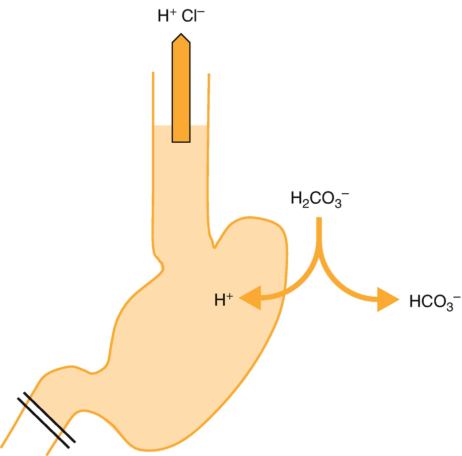
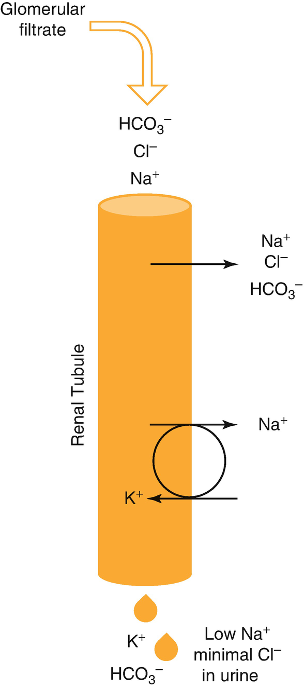
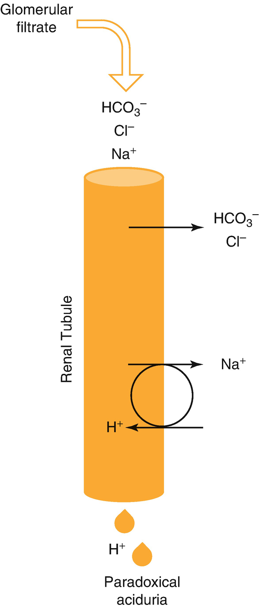

Anesthesia for Pediatric General Surgerygeneral surgery

© Springer Nature Switzerland AG 2020

Craig Sims, Dana Weber and Chris Johnson (eds.) A Guide to Pediatric Anesthesia[https://doi.org/10.1007/978-3-030-19246-4\_15](https://doi.org/10.1007/978-3-030-19246-4_15)

# 15. Anesthesia for Pediatric General Surgery

Claudia Rebmann[1](#Aff4)    

(1)

Department of Anaesthesia and Pain Management, Perth Children’s Hospital, Nedlands, WA, Australia

Claudia Rebmann

Email: [Claudia.Rebmann@health.wa.gov.au](mailto:Claudia.Rebmann@health.wa.gov.au)

### Keywords

Dorsal nerve block of penisCaudal analgesiaPyloric stenosis, anesthesiaInfant hernia, anesthesiaPediatric laparoscopyAnesthesia for intussusception

Children having general surgery present an enormous diversity of ages, conditions and procedures. The majority of procedures involve simple, superficial surgery and are performed on healthy children managed as day cases who require little or no pre-operative investigations. Local anesthetic techniques are useful for these surgeries, and some suitable techniques are summarized in Table [15.1](#Tab1). Children also undergo major surgery that may require special considerations, and these are discussed later.

Table 15.1

Summary of local anesthetic techniques common to several general surgical procedures

| 
Procedure | Local anesthetic technique

 |
| --- | --- |
| 

Herniotomy | Caudal or ilioinguinal/iliohypogastric

 |
| 

Orchidopexy | Caudal or ilioinguinal/iliohypogastric

 |
| 

Umbilical hernia repair | Rectus sheath block or local infiltration

 |
| 

Circumcision | Caudal or dorsal nerve block or ring block

 |
| 

Exploration scrotal contents | Local infiltration

 |
| 

Laparoscopic appendicectomy | Infiltration of port sites

 |

## 15.1 Herniotomy

Inguinal hernias are common in children. They occur in three percent of term infants and are more common in preterm infants, who are also more likely to have bilateral hernias. In adults, hernias are due to a defect in the abdominal wall, but in children they are due to a patent processus vaginalis. This leaves a peritoneal diverticulum that intestine can herniate into, or for fluid to accumulate and cause a scrotal hydrocele. An inguinal hernia usually presents as a groin lump that can be reduced. An irreducible or obstructed hernia is more common in infants and causes bowel obstruction and compression of the testicular or ovarian vessels. Infants and children with an obstructed hernia undergoing emergency surgery are at risk of regurgitation and aspiration and are intubated after a modified rapid sequence induction. Preterm neonates are more prone to obstructed hernias and their hernias are electively repaired at an early age, often before they are discharged home from the neonatal nursery.

### Note

Hernia repair in children—herniotomy, during which the patent processus vaginalis is tied off. Hernia repair in adults—herniorrhaphy during which the abdominal wall defect is repaired. Different cause and different procedure.

### 15.1.1 Anesthesia for Herniotomy in Children

Beyond infancy, general anesthesia is given using a laryngeal mask airway (LMA), and either an ilioinguinal/iliohypogastric block or local infiltration is used to supplement postoperative analgesia. Surgery takes 30–60 min.

### 15.1.2 Anesthesia for Herniotomy in Neonates and Infants

There are four issues related to anesthesia in this age group: general or regional anesthesia, management of the airway, analgesia and the risk of apnea after anesthesia. Although neurotoxicity from general anesthesia has been raised as a concern in these infants, the surgery cannot be delayed until an older age because of the risk of the hernia causing obstruction, and there is no evidence of a neurotoxic effect in humans from a single brief anesthetic.

#### 15.1.2.1 General or Regional Anesthesia

General anesthesia is most commonly used for herniotomy. Awake spinal anesthesia can be used for neonates if surgery is shorter than 30–40 min. It doesn’t reliably give adequate surgical conditions in older infants. Regional anesthesia avoids the risk of airway management in the neonate, avoids respiratory problems in some very small preterm neonates with chronic lung disease, and avoids the possibility of neurotoxicity from anesthesia. It also reduces early apnea after anesthesia (see below). The disadvantages are the high technical failure rate performing the spinal block (more than 10%), and its short duration (see Chap. [10](467929_2_En_10_Chapter.xhtml), Sect. [10.​5.​4](467929_2_En_10_Chapter.xhtml#Sec18)). Awake caudal anesthesia can be used, but the block is slower in onset and not as dense, and leg movement during surgery can be a problem. If a spinal block is used for surgery, wound infiltration or an iliohypogastric block is done for analgesia after surgery.

#### 15.1.2.2 Airway Management

Most neonates and young infants are intubated for herniotomy. There are advantages and disadvantages of intubation compared to the LMA in this age group (Table [15.2](#Tab2)). Intubation is common because access to the airway is limited due to its proximity to the surgical site, and hypoxia develops rapidly if the airway is lost. Beyond about 3 months of age, the LMA may be associated with less adverse respiratory events than intubation.

Table 15.2

Options for managing the airway of neonates and infants during general anesthesia

| 
Technique | Comments

 |
| --- | --- |
| 

LMA

 |
| 

Pros | May reduce respiratory events associated with extubation

 |
| 

Laryngospasm and obstruction possible during surgery

 |
| 

Cons | Necessitates deeper plane of anesthesia

 |
| 

Low leak pressure may prevent IPPV

 |
| 

Size 1 classic LMA unreliable

 |
| 

Intubation

 |
| 

Pros | Secures airway

 |
| 

Avoids airway obstruction during anesthesia

 |
| 

Facilitates IPPV and PEEP

 |
| 

Facilitates light plane of anesthesia without risk of laryngospasm

 |
| 

Cons | Awake extubation may be associated with coughing and desaturation

 |

#### 15.1.2.3 Analgesia

There are three options for analgesia.

1.  1.
    
    Caudal analgesia is safe and reliable, and is a good choice for neonates and infants, particularly for bilateral repair. Caudal analgesia has the advantage of providing good quality analgesia during surgery, allowing a light plane of anesthesia to potentially reduce the risk of postoperative apnea in former preterm neonates. A block to T10 is required, achieved by a dose of 1 mL/kg of ropivacaine 2 mg/mL.
    
2.  2.
    
    The second option is an ilioinguinal-iliohypogastric nerve block (see Chap. [10](467929_2_En_10_Chapter.xhtml), Sect. [10.​7.​1](467929_2_En_10_Chapter.xhtml#Sec24)). This is a good choice in older children who may be upset by leg weakness and numbness resulting from caudal epidural analgesia. A suitable volume is about 0.2 mL/kg of ropivacaine 2 mg/mL per side as required.
    
3.  3.
    
    The final option is wound infiltration with local anesthesia by the surgeon. This option does not provide intraoperative analgesia, and supplementation with opioids is needed.
    

Preschool-aged children may still benefit from a small dose of fentanyl during surgery, even if a regional block has been given. Emergence delirium is common in this group, and fentanyl reduces its incidence (see Chap. [1](467929_2_En_1_Chapter.xhtml), Sect. [1.​8.​1](467929_2_En_1_Chapter.xhtml#Sec19)). After discharge, pain is not severe and is managed with paracetamol, and ibuprofen if the patient is older than 3 months.

#### 15.1.2.4 Postoperative Apnea

Neonates, and especially former preterm neonates, are at risk of apnea after anesthesia. This occurs in 6–10% of former preterm infants age 44 weeks postmenstrual age (PMA) or younger. Awake spinal anesthesia does not reduce the overall incidence but reduces the number of early apneas in PACU and the level of intervention needed to treat apnea. Intravenous caffeine base 10 mg/kg (equivalent to 20 mg/kg caffeine citrate) reduces the incidence of post-operative apnea after general anesthesia and is given to former preterm infants with a postmenstrual age of less than 44 weeks at the time of surgery. Former preterm infants who are younger than 52 weeks PMA (60 weeks in some centers) and term neonates younger than 44 weeks PMA must be admitted overnight for apnea monitoring (see Chap. [14](467929_2_En_14_Chapter.xhtml), Sect. [14.​4.​4](467929_2_En_14_Chapter.xhtml#Sec9)).

### Keypoints

Children with obstructed hernia are at risk of aspiration.

Former preterm infants are at risk of apnea after anesthesia.

## 15.2 Undescended Testis and Orchidopexy

About 3% of term boys are born with an undescended testis. Most undescended testes can be palpated in the inguinal canal and the majority will descend into the scrotum during the first year. They are associated with infertility, testicular tumors and psychological problems. They are also more susceptible to testicular torsion and infarction and are often associated with inguinal hernias. If the testis has not descended by 6–9 months of age it is unlikely to ever descend and is surgically brought into the scrotum (orchidopexy).

Orchidopexy surgery uses the same groin incision as herniotomy, as well as a scrotal incision. An ilioinguinal/iliohypogastric nerve block provides good analgesia but does not cover the scrotum. Subcutaneous infiltration over the symphysis pubis blocks the genitofemoral nerve, or the surgeon can infiltrate the scrotal incision during surgery. Opioid analgesia is usually required. A caudal block with of 1 mL/kg of local anesthetic to block to about T10 is a good choice for young children. Antiemetics are routinely given to children older than 2–3 years. Orchidopexy pain tends to be more severe and longer lasting than the pain after herniotomy and many other day stay procedures in children. Despite this, analgesia on discharge is usually successfully managed with paracetamol and ibuprofen. Older boys (pre-teens) may need oral opioids for the first 24 h after surgery.

If the testis is not even palpable in the inguinal canal, the 2-stage Fowler Stevens procedure is performed. Firstly, laparoscopy is performed and if the testis is present, the testicular vessels are clipped. In the second stage several months later, laparoscopy is performed again, and the testis is pushed into the scrotum and fixed there through a scrotal incision.

## 15.3 Torsion of the Testis and Surgery to Explore Scrotal Contents

Acute scrotal pain may be due to torsion of the testis or the appendix of the testis (Hydatid of Morgagni). The majority of cases occur around puberty and are due to torsion of the appendix of the testis. Surgery to explore the scrotal contents is performed urgently because of concern of testicular ischemia. Pain is not usually severe enough to delay gastric emptying, and face mask or LMA anesthesia is reasonable unless the child is not fasted or is vomiting beforehand. The procedure is not particularly painful afterwards. These children are usually too old for caudal analgesia, and instead wound infiltration is used with opioid analgesia and antiemetics.

## 15.4 Circumcision

Male circumcision is commonly performed for recurrent balanitis or balanitis xerotica obliterans (BXO) that results in phimosis (inability to retract the foreskin). Some children undergo circumcision during infancy for social or religious reasons. On the one hand, during infancy the risk of anesthesia is higher and there is the possibility of neurotoxicity from anesthesia. On the other hand, the risk of anesthesia is reduced if the anesthetist cares for large numbers of children each year, and a single, short anesthetic does not affect neurodevelopment in humans.

### 15.4.1 Analgesia for Circumcision

The procedure is very stimulating, and laryngospasm is a concern early in surgery when anesthetic depth might not have been optimized. Caudal analgesia, dorsal nerve block and ring block are suitable alternatives for analgesia after circumcision (Table [15.3](#Tab3)). A caudal block to the level of only S2–4 is needed for circumcision. This requires a dose of 0.5 mL/kg ropivacaine 2 mg/mL or L-bupivacaine 0.25%, maximum of 10–15 mL. An alternative caudal technique is to aim for a saddle block using a small volume of more concentrated solution (L-bupivacaine 0.5% 0.2–0.3 mL/kg), but in practice motor block is difficult to avoid. Caudal block is probably best used for children younger than 6–8 years. It often causes paresthesia of the legs in older children, which is annoying to them. A ring block of the penile shaft is simple to perform, but local swelling or hematoma from the local anesthetic may affect surgery, and its duration is shorter than other techniques. A Cochrane review of the three alternatives for analgesia found no difference in the need for rescue or other analgesia between the three. In day-case surgery, penile block may be preferable to caudal block in children old enough to walk due to the possibility of temporary leg weakness after caudal block. After discharge, analgesia is provided with a local anesthetic cream and simple oral analgesics.

Table 15.3

Comparison of local analgesia techniques for circumcision in children

| 
Block | Duration | Comments

 |
| --- | --- | --- |
| 

Caudal | 2–4 h | More reliable block in younger children

Major central block

May delay walking

 |
| 

Penile | 4–6 h | May be technically difficult (ultrasound may improve success rate)

Rare penile ischemia

May not cover ventral surface of penis

 |
| 

Ring block | 2–4 h | May cause local swelling and interfere with surgery

May cause local hematoma

Less reliable in younger children

 |
| 

Antiseptic/local anesthetic creams | Can be reapplied | Variably effective, good supplement after discharge

No intraoperative analgesic effect

 |

## 15.5 Hypospadias Repair

Hypospadias is a condition in which the urethral opening is not at the tip of the penis, located instead at some point further down the ventral side of the glans penis or shaft of the penis. More proximal urethral defects are more likely to have an associated ventral shortening and curvature, called a chordee. Several surgical repairs are used (Magpi , Wackmans), but all involve laying open the upper urethra and then closing it over a catheter to create a new, distal urinary opening. The initial repairs are usually carried out in infancy, although some mild cases are not detected until later in childhood when the boy begins to stand to urinate. Caudal analgesia is ideal for this procedure as it reliably blocks the sacral segments. Major hypospadias repairs require strong analgesia for 24–48 h. Either a caudal catheter and local anesthetic infusion can be used, or if a single-shot caudal was used, an intravenous morphine infusion is started in recovery in preparation for the caudal wearing off. Ring blocks of the penis cause local swelling and may interfere with surgery, and penile blocks may be used, but they do not cover the ventral surface well. Retrospective studies comparing penile block and caudal block for hypospadias surgery have found an association between caudal block and the occurrence of urethral fistula after surgery. However, the overall incidence of this complication is low and it is unclear if caudal analgesia causes the complication, or if it occurs because a caudal block is more likely to be performed in more difficult, proximal hypospadias cases.

## 15.6 Division of Tongue Tie

Although a short and simple surgical procedure, anesthesia for division of tongue tie is challenging. The frenulum tethers the tongue (tongue tie) and affects feeding in infants and speech in children. A scalpel or diathermy is used to divide the frenulum, usually with minimal bleeding. A shoulder roll helps to open the infant’s mouth and improves access for the surgeon. Anesthesia is challenging for several reasons. The procedure is commonly performed in infants and their small airway is shared with the surgeon. The procedure is brief, but very stimulating and may trigger laryngospasm. An LMA is commonly used to manage the airway. The risk is loss of the airway, either due to displacement of the LMA or laryngospasm. A key point is to ensure adequate depth of anesthesia before incision—a bolus of propofol 1–3 mg/kg is wise if there is any doubt. Fentanyl is given so the baby is not in pain after awakening, and paracetamol is adequate for analgesia after surgery.

## 15.7 Umbilical Hernia Repair

Umbilical hernia repair is performed under general anesthesia, most often with an LMA. There are three points of note about this procedure. Firstly, the peritoneal cavity is entered, and omentum or bowel can protrude into the wound during surgery. Although this could be prevented with muscle relaxation, acceptable operating conditions are provided by maintaining a deep plane of anesthesia with apnea and positive pressure ventilation—if the child breathes spontaneously, the tone in the abdominal wall may push the omentum into the wound. Secondly, the procedure is more painful than inguinal hernias, and a multimodal approach is needed, including a rectus sheath block or wound infiltration. Simple oral analgesics are adequate after discharge. Finally, it is associated with a high incidence of nausea and vomiting, and dual antiemetic therapy is indicated.

## 15.8 Laparoscopic Surgery

Laparoscopic surgery is performed for a widening range of procedures in children of all ages, including neonates. It is considered to improve outcome by minimizing tissue trauma and pain, speeding recovery and shortening hospital stay.

### 15.8.1 Physiological Effects of Laparoscopy

Young children absorb proportionally more carbon dioxide through the peritoneum than older children and adults. This is due to a proportionally large peritoneal surface area and a lack of intraperitoneal fat that reduces the distance between capillaries and peritoneum and would otherwise buffer carbon dioxide. Children appear to handle this increased carbon dioxide load without significant acidosis.

As in adults, carbon dioxide insufflation in children increases intra-abdominal pressure, decreases total lung compliance and functional residual capacity (FRC), and causes atelectasis and ventilation-perfusion mismatch. Infants and neonates are particularly at risk of respiratory compromise—their closing lung capacity is already close to FRC and their oxygen consumption is high. The severity of these pulmonary effects depends on the abdominal pressure, and for these reasons a lower pressure is used in neonates and infants than in children and adults. Fortunately, the infant abdominal wall is very pliable and the abdominal contents can be visualized at lower pressures.

The cardiovascular effects of the pneumoperitoneum depend on the intra-abdominal pressure and age. They are the result of four factors—mechanical compression of splanchnic vessels, postural changes, increased sympathetic tone and the release of vasoconstrictors including renin and vasopressin. At low abdominal pressures, venous return and cardiac output increase, and the systemic and pulmonary vascular resistance increases. Blood pressure and heart rate commonly increase. Cardiac output falls at pressures above 15–20 mmHg. Neonates and infants are more sensitive to the cardiovascular effects from pneumoperitoneum. Bradycardia may occur with peritoneal stretching from rapid carbon dioxide insufflation, although tachycardia more commonly occurs. Children with cyanotic heart disease are at risk of paradoxical gas embolism and may not be suitable for laparoscopic surgery.

### Note

Typical pneumoperitoneum pressure to reduce respiratory and cardiovascular effects during laparoscopy

Neonates and infants younger than 4 months: 5–6 mmHg

Small children: 8–10 mmHg

Older children and adults: 10–15 mmHg

### 15.8.2 Anesthesia Management

Intubation and ventilation is usual practice. Endobronchial intubation may occur in infants because of cephalad displacement of the diaphragm and shift of the carina during the pneumoperitoneum and reverse Trendelenburg position. Venous access ideally should be in the upper limbs to avoid problems from inferior vena cava (IVC) compression, although in practice the pneumoperitoneum should be stopped if there are any problems. Invasive monitoring may be warranted in some neonates or unwell children having prolonged procedures. The pneumoperitoneum reduces lung compliance, and the inspiratory pressure must be increased if pressure-controlled ventilation is used.

Nitrous oxide is probably best avoided, although 50% inspired nitrous oxide is used by many anesthetists without problems. Carbon dioxide is insufflated in children using an open cut-down technique rather than a Verres needle or trocar to reduce the risk of intravascular injection of gas. The flow rate is limited to 0.5–1 L/min in neonates and small infants, and only increased to adult values of 4 L/min in larger, healthy children. The gas is warmed to prevent hypothermia. Neuromuscular blockade usually facilitates lower intra-abdominal pressures. Observation of the flow rate and pressure helps predict and prevent physiological changes and potential crisis situations. If carbon dioxide is inadvertently given subcutaneously, it is rapidly absorbed and the ETCO2 may abruptly rise to high levels.

After surgery, non-parenteral analgesia is often adequate for many procedures. However many children benefit from either an opioid infusion or oral opioids for the first 24 h. Children may also develop referred shoulder-tip pain from sub-diaphragmatic gas.

## 15.9 Appendicectomy

Appendicitis presents late in young children, nearly always after the appendix has perforated. Anesthetic management is broadly similar to adults—a modified rapid sequence induction after fluid replacement with Ringer’s lactate or saline. Morphine 0.15–0.2 mg/kg, paracetamol and NSAIDs are often given during surgery. Children recovery quickly after straightforward appendicectomy. If the appendix was not perforated, they are able to begin oral fluids immediately after surgery and given oral analgesia with oxycodone or morphine, paracetamol and ibuprofen. Children who have a perforated appendix recover slowly after surgery and usually need IV opioids for analgesia. This group of children are often old enough to use patient-controlled analgesia (PCA). Some children with perforated appendicitis require total parenteral nutrition until gut function returns.

## 15.10 Infantile Hypertrophic Pyloric Stenosis

Hypertrophy of the muscular layers of the pyloric causes gastric outlet obstruction, leading to projectile vomiting. Pyloric stenosis is a common reason for intra-abdominal surgery during the first 12 weeks of life. Although surgery is required to relieve the obstruction, pyloric stenosis is a medical rather than a surgical emergency. Early rehydration and correction of electrolyte and acid base abnormalities contribute to a perioperative mortality of less than 0.3%.

Pyloric stenosis usually occurs in term infant boys aged between 2 and 8 weeks. Infants of this age weigh roughly 4 kg. Most babies are usually otherwise well. There is a short history of non-bilious projectile vomiting after feeds, and the hypertrophied pyloric muscle may be felt in the upper abdomen during a test feed. Clinical examination will show varying degrees of dehydration and possible muscle wasting. An abdominal ultrasound may assist in the diagnosis. Blood tests classically reveal a hypochloremic, hypokalemic metabolic alkalosis. Early recognition and treatment is important to avoid severe dehydration, metabolic derangements and eventual hypovolemic shock.

### 15.10.1 Pathophysiology

There are three stages in the pathophysiology of pyloric stenosis:

1.  1.
    
    Hypochloremic, hypokalemic metabolic alkalosis with dehydration and alkaline urine
    
2.  2.
    
    Potassium depletion with paradoxical acidic urine
    
3.  3.
    
    Shock, lactic acidosis and starvation ketosis.
    

Gastric outlet obstruction from pyloric stenosis causes the loss of hydrogen chloride, water and small amounts of sodium and potassium. Bicarbonate formed during the production of hydrogen chloride enters the plasma, causing metabolic alkalosis (Fig. [15.1](#Fig1)). This causes the characteristic hypochloremic, hypokalemic metabolic alkalosis, with varying degrees of dehydration. (In contrast, vomiting without gastric outlet obstruction causes loss of hydrogen from the stomach and bicarbonate from the duodenum, with a neutral effect on acid-base balance).

Fig. 15.1

Pathophysiology of pyloric stenosis. Gastric outlet obstruction causes vomiting and loss of hydrogen and chloride ions. Bicarbonate produced during formation of gastric acid enters blood stream (‘alkaline tide’), raising plasma-bicarbonate concentration

In the kidney, bicarbonate, chloride and sodium are filtered in the renal glomerulus. Sodium is reabsorbed in the tubule to maintain the extracellular fluid (ECF) volume. Some sodium also accompanies the bicarbonate in the urine, and so the urine contains small amounts of sodium, which is different to other clinical situations with low ECF volumes. Reabsorption of chloride in the renal tubule is maximal because of hypochloremia, but there is insufficient chloride to reabsorb alongside sodium (to maintain electroneutrality), and some bicarbonate is also reabsorbed. While there is insufficient chloride ion, the kidney cannot excrete all the bicarbonate needed to correct the metabolic alkalosis. This is the reason resuscitation fluid must contain chloride.

Dehydration and reduced ECF volume stimulate aldosterone secretion, and sodium reabsorption in the tubule in exchange for potassium (Fig. [15.2](#Fig2)). This causes kaliuresis and depletion of total body potassium—most potassium loss in infants with pyloric stenosis occurs in the urine. The plasma potassium concentration is a poor guide of this depletion and is often normal because potassium is an intracellular ion.

Fig. 15.2

In the kidney, sodium and chloride are reabsorbed in the renal tubule and excess bicarbonate excreted. Potassium is lost in exchange for sodium reabsorption

If untreated, pyloric stenosis causes severe dehydration, forcing the kidney to maintain the ECF volume rather than the pH, and sodium reabsorption in the renal tubule is maximized by exchanging for H+ ions. Hydrogen ions are then secreted in the urine, causing paradoxical aciduria that makes the metabolic alkalosis even worse (Fig. [15.3](#Fig3)). Later, hypovolemic shock and lactic acidosis develop and are superimposed on the metabolic alkalosis.

Fig. 15.3

Severe dehydration causes the kidney to maintain ECF volume rather than maintain correct pH. Sodium is absorbed in exchange for hydrogen, causing a paradoxical aciduria

### Note

Pyloric stenosis causes a hypochloremic, hypokalemic metabolic alkalosis. The key to reversing the metabolic alkalosis is chloride and volume. Only when chloride is given (usually as sodium chloride) can the kidney excrete enough bicarbonate to correct the alkalosis.

### 15.10.2 Assessment and Preparation for Surgery

Hypovolemia and electrolyte and acid/base abnormalities must be corrected before surgery. Most cases now are mild, and the metabolic disturbance can be corrected in 12–24 h. Infants with more severe disturbance have a chloride level of 85 mmol/L or less, are more likely to be very dehydrated or shocked, and may take 36–72 h to correct (Table [15.4](#Tab4)).

Table 15.4

Classification of severity of electrolyte disturbance in pyloric stenosis before resuscitation

| 
Severity | Serum chloride concentration | Serum bicarbonate concentration

 |
| --- | --- | --- |
| 

Mild | 90 mmol/L or more | 35 mmol/L or less

 |
| 

Severe | 85 mmol/L or less | 42 mmol/L or more

 |

Preparation before surgery includes fasting, inserting a 8–10F nasogastric tube, and rehydrating with IV fluids. Fluid therapy for the commonest, mild cases is typically a bolus of normal saline 20 mL/kg followed by 5% dextrose in normal saline with added potassium (KCl 20 mmol/L) at 1–1.5 times maintenance rate. Nasogastric losses are replaced with additional normal saline. More severe cases may need extra boluses of saline for initial resuscitation.

Surgery can proceed when the baby is rehydrated, the plasma chloride is more than 100 mmol/L, and bicarbonate levels less than 30 mmol/L (Table [15.5](#Tab5)). Urine output should also be adequate, usually judged on the number of wet nappies (because these babies don’t usually have a urinary catheter inserted). The urinary chloride concentration is also a good marker of assessing metabolic resuscitation, but is seldom measured. Correction of the metabolic disturbance is important—uncorrected alkalosis may delay recovery from anesthesia and will increase the risk of postoperative apnea.

Table 15.5

Electrolyte and acid/base targets for resuscitation

| 
Measured parameter | Target level

 |
| --- | --- |
| 

Serum Cl− | 100 mmol/L or higher

 |
| 

Serum Na+ | 132 mmol/L or higher

 |
| 

Serum K+ | 3.2 mmol/L or higher

 |
| 

Serum HCO3− | Below 30 mmol/L

 |
| 

pH | 7.35–7.45

 |
| 

Urine Cl− | 20 mmol/L or higher (if measured)

 |

### 15.10.3 Surgery

The Ramstedt pyloromyotomy splits the serosa and underlying muscular layers of the pylorus through to the mucosal layer. The procedure is usually performed laparoscopically, although it is not certain if this has benefits compared to an open approach through a right upper quadrant or umbilical incision. Surgery is associated with minimal blood or extravascular space losses.

### 15.10.4 Anesthesia

Infants with pyloric stenosis usually arrive in theatre with an IV cannula in situ. It is vital that the stomach is emptied before induction as these infants often still have milk in their stomach. The fine-bore nasogastric tube used in the baby’s medical management does not reliably empty the stomach, and is best replaced with a larger orogastric tube (10F or 12F). Aspiration of the stomach is done with the baby supine and then in the lateral (both sides) and prone positions. The nasogastric or orogastric tube is then often removed before induction because it may affect the mask-seal for ventilation or obscure the view at laryngoscopy. It does, however, usually need to be reinserted during surgery to deflate the stomach. Some surgeons will ask for air to be injected into the stomach so they can push it into the duodenum to test for mucosal perforation and the adequacy of the myotomy.

An intravenous, modified rapid sequence induction or an inhalational induction can be used. Both have advantages and disadvantages.

#### 15.10.4.1 Modified Rapid Sequence Induction

This technique is particularly popular in North America. It includes IV induction, with or without cricoid pressure and either suxamethonium or a non-depolarizing muscle relaxant. Gentle ventilation after induction and before intubation is vital, as preoxygenation is difficult to perform and an apneic baby will desaturate very quickly. Many anesthetists do not use cricoid pressure in infants because it may compress the trachea and distort the larynx at laryngoscopy. This technique prioritizes the risk of regurgitation and aspiration above other risks. The disadvantage of this technique is its rapidity—mask ventilation must be established within seconds of induction. There is little time to adjust hand or mask position, or to correct a mask leak affecting ventilation. It is a technique that relies on excellent airway skills to avoid hypoxia or a hurried, traumatic intubation.

#### 15.10.4.2 Inhalational Induction

Many anesthetists favor inhalational induction because of concerns of loss of airway control after an IV induction. The safety of the inhalational induction relies on emptying the stomach as above before induction. Induction is slower, and allows more time to assess the airway and potential issues as the baby loses consciousness. Cricoid pressure can be applied if desired after loss of consciousness, and a small dose of non-depolarizing relaxant is given to facilitate intubation.

#### 15.10.4.3 Maintenance

These babies are usually intubated with a size 3.0 cuffed or 3.5 uncuffed ETT. Surgery is stimulating, and tachycardia usual. Nitrous oxide is useful for intraoperative analgesia. Opioids are avoided to minimize postoperative apnea, which is a risk in these infants due to persisting CSF alkalosis, even after plasma electrolytes have returned to normal. Some suggest a small dose of alfentanil or remifentanil to reduce intraoperative tachycardia. Hypocarbia should be avoided during lung ventilation as it increases the risk of postoperative respiratory depression. Analgesia is provided by intravenous paracetamol and infiltration of wound and port sites with local anesthesia.

Intraoperative fluids are reduced to maintenance rate as there are minimal blood or extravascular fluid losses. After completion of surgery, neuromuscular blockade is reversed, the orogastric tube aspirated and removed, and the infant is extubated awake in the lateral position.

#### 15.10.4.4 Postoperative Care

Infants must be monitored for apnea in the post-operative period. Opioids may potentiate the risk and are not usually needed after surgery. Analgesia is with oral or IV paracetamol (these infants are usually too young for ibuprofen). Postoperative vomiting is common (15–35%) after pyloromyotomy, although usually self-limiting. Persistent vomiting suggests incomplete myotomy or mucosal perforation.

Intravenous fluids are continued at maintenance rate until oral feeding is established. The speed at which feeds are restarted may be slow, fast or on-demand, depending on institutional preferences. Most feeding regimens have babies on full feeds by 16–24 h. Otherwise healthy infants may be discharged once they have tolerated two to three full feeds. Infants with significant pre-operative vomiting, severe electrolyte imbalance or malnutrition may need a longer period of recovery. The key points of anesthesia for a baby with pyloric stenosis are listed in Table [15.6](#Tab6).

Table 15.6

Anesthesia considerations for pyloromyotomy

| 
Key points about pyloric stenosis

 |
| --- |
| 

Pyloric stenosis is a medical but not a surgical emergency

 |
| 

Correction of volume deficit, electrolyte and acid-base abnormalities with chloride-containing IV fluid. Endpoint: adequate urine output and normal Cl− and HCO3− levels

 |
| 

Functional gastric outlet obstruction with an increased risk of pulmonary aspiration. Careful suctioning of large bore gastric tube with infant supine, lateral and prone

 |
| 

Neonatal anesthesia with consideration of respiratory and cardiovascular physiology and temperature control. Intubation with 3.0 mmID cuffed ETT

 |
| 

Avoid opioids if possible

 |
| 

Postoperative analgesia with paracetamol. Monitor for apnea and hypoglycemia

 |

## 15.11 Intussusception

Intussusception is the telescoping of a length of bowel into the lumen of more distal bowel. In classical infant intussusception (ileocolic intussusception) the ileum invaginates through the ileo-cecal junction into distal bowel. Occasionally the lead point is a polyp or Meckel’s diverticulum, but more commonly there is no apparent cause. It usually occurs in infants between 4 and 10 months of age. Intussusception often follows a viral gastroenteritis or upper respiratory tract infection and presents with abdominal pain, vomiting and blood-stained mucous stools. If not treated promptly, the trapped bowel becomes ischemic and may perforate. The infant can be hypovolemic, and initial therapy may involve stomach decompression with a gastric tube and fluid resuscitation. Initial diagnosis is made with ultrasound. This is followed by a barium or air enema, which will confirm the diagnosis and reduce the intussusception in 80% of cases. If reduction is unsuccessful or if there are signs of peritonitis, urgent laparotomy is performed. If the intussusception cannot be reduced at laparotomy, bowel resection is performed.

Infants with intussusception vary in the severity of illness, but are often hypovolemic, look unwell and at risk of vomiting and aspiration (Table [15.7](#Tab7)). Resuscitation with isotonic crystalloid or colloid must be aggressive and may need to take place whilst initiating and maintaining anesthesia. Large volumes of fluid may be needed, and hypotension and shock may worsen with reperfusion of the ischemic bowel. The aim is to make sure the baby has received at least 20–30 mL/kg of fluid before induction and then more depending on the infant’s condition and test results. Induction aims to minimize cardiovascular depression. Depending on how unwell and shocked the infant is, doses may be as low as fentanyl 1–2 μg/kg followed by propofol 2 mg/kg or ketamine 1–2 mg/kg followed by a relaxant. These infants may need a period of stabilization postoperatively before extubation.

Table 15.7

Important considerations for anesthesia for laparotomy for intussusception. General principles of anesthesia for an infant are also relevant

| 
Intussusception keypoints

 |
| --- |
| 

Hypovolemia from vomiting, bowel losses and rectal bleeding

 |
| 

May have sepsis from ischemic bowel

 |
| 

High risk of pulmonary aspiration of stomach contents

 |
| 

May require large volumes of fluid

 |

Postoperative analgesia includes intravenous paracetamol, wound infiltration, and morphine infusion. Although a lower abdominal incision is used for surgery, caudal analgesia is not usually used because of concerns about sepsis.

## 15.12 Abdominal Tumors

The commonest solid abdominal tumors in childhood are Wilms tumor (nephroblastoma) and neuroblastoma. Both present similar anesthetic problems (Table [15.8](#Tab8)). Children have anesthesia for tumor removal and for procedures connected with chemotherapy including bone marrow biopsy (to exclude metastases), IV access and imaging procedures.

Table 15.8

Anesthetic considerations for surgical resection of Wilms tumor and neuroblastoma

| 
Wilms tumor and neuroblastoma keypoints

 |
| --- |
| 

Lengthy, major abdominal surgery in infants or small children with high postop analgesia requirements

 |
| 

Often large tumor with significant mass effect

 |
| 

Significant fluid shifts and the potential for rapid and major hemorrhage

 |
| 

Intermittent IVC compression during tumor resection

 |
| 

Thermoregulation

 |
| 

Consequences of paraneoplastic phenomena, such as hypertension and acquired von Willebrand’s disease

 |
| 

Vascular tumor thrombus extension into the proximal IVC or right atrium

 |
| 

Preoperative or previous treatment with chemotherapeutic drugs

 |

### 15.12.1 Wilms Tumor

Wilms tumor (nephroblastoma ) is a malignant tumor of the kidney. It is bilateral in 5–10% of cases, and mostly occurs in young children aged 6 months to 5 years. It presents late, usually as an asymptomatic abdominal mass, or sometimes causing fever, hematuria, malaise, anemia or weight loss. Abdominal pain usually indicates an acute complication such as hemorrhage into the tumor. About 10% of children are hypertensive due to increased renin secretion that can be managed with ACE-inhibitors. The tumors can become very large, predisposing the child to regurgitation and aspiration under anesthesia. Some invade the inferior vena cava, and can even extend into the atrium, placing the child at risk of the tumor embolizing into the pulmonary circulation before or during surgery.

Treatment is with nephrectomy or with chemotherapy before and after surgery for advanced tumors. The timing of chemotherapy may vary with different oncologists. Surgery involves a large transverse transperitoneal incision and may range from nephrectomy with lymph node sampling to a very extensive dissection of intra- and retroperitoneal structures. Overall cure rates exceed 85% with modern multimodal treatment strategies.

### 15.12.2 Neuroblastoma

Neuroblastoma is a tumor of ganglion cells, the same stem cell of the neural crest causing pheochromocytoma. It makes up about 7% of all childhood cancers. Most are located in the abdomen (40% of all neuroblastomas are in the adrenal glands, 25% parasympathetic chain), but can also be within the thorax, pelvis and elsewhere. It is a cancer of young children—40% of children are less than 1 year old, and it is rare after 10 years of age. Metastases are present in more than 50% of children at presentation, more in infants. Survival, however, is higher in infants than older children. Urinary catecholamines (HMMA and HVA) are present in the urine of most children with neuroblastoma. Only about a fifth of children, however, have hypertension. The proportion is lower than in pheochromocytoma because neuroblastoma tissue has fewer norepinephrine storage vesicles. The release of catecholamines may also produce fever, sweating, flushing and diarrhea. Paroxysmal or sustained preoperative hypertension requires perioperative anti-hypertensive therapy. Even with adequate preparation, significant hemodynamic changes may occur during surgery. The related tumor, ganglioneuroma, is benign and does not secrete catecholamines.

Treatment of localized tumors is by resection, and children with advanced tumors are given chemotherapy before and after surgery. Hypertension only occurs during tumor removal, and especially if the tumor has not been shrunk with chemotherapy preoperatively. Hypertension and tachycardia during tumor manipulation is generally controlled by increasing the depth of anesthesia.

## 15.13 Ureteric Reimplantation

Ureteric reflux, or vesicoureteric reflux, is retrograde flow of urine from the bladder into the ureters. It can cause recurrent urinary tract infections, ureteric dilatation, hydronephrosis, and eventually scarred, poorly functioning kidneys. It is a common childhood urological anomaly, affecting 0.5–1% of children. Treatment for reflux includes either an injection of bulking agents such as Deflux® or Vantris® at the insertion point of the ureter into the bladder to create a valve, or surgically re-implanting the ureters into the bladder. Ureteric reimplantation is performed through a lower abdominal incision and the main concern for anesthesia is postoperative analgesia. Wound pain is moderate but bladder spasm related to the surgery and ureteric/suprapubic catheters can be difficult to manage. Strategies include caudal or lumbar epidural analgesia, and antispasmodics such as oxybutinin, NSAIDs and intravesical pethidine. Infants and babies tend to tolerate bladder spasms better than older children and have lower analgesic requirements.

## 15.14 Pyeloplasty

Pyeloplasty is a surgical reconstruction of the renal pelvis to relieve pelvi-ureteric junction (PUJ) obstruction. It is performed in infants and children as an open or laparoscopic procedure. Infants are sometimes diagnosed by ultrasound in utero. The incision for open pyeloplasty is painful, though less so in infants. A caudal block can be performed for analgesia, but a large volume of dilute local anesthetic is needed to raise the block high enough to cover the wound. The high point of the block is also the first part not covered when the block recedes. Paracetamol and ibuprofen are routinely used, and an opioid infusion is usually required in children. An alternative is a local anesthetic wound infusion combined with opioid infusion. After laparoscopic pyeloplasty, local anesthetic infiltration of the port sites and simple analgesics are usually adequate, though some children will benefit from an opioid infusion for 24 h after surgery.

## Review Questions

1.  1.
    
    An 8 week old baby has pyloric stenosis. Fluid resuscitation has been performed and the baby is fit for anesthesia.
    
    1.  (a)
        
        What induction technique will you use and why?
        
    2.  (b)
        
        What size ETT would you use for intubation?
        
    3.  (c)
        
        What postop analgesia would you use, and what is the rationale for your treatment?
        
    
2.  2.
    
    A 7 month old has a short history of vomiting and blood stained stools. You suspect intussusception. The infants pulse is 140 bpm, the peripheries are cool and blood pressure is 78/50 mmHg.
    
    1.  (a)
        
        Describe your immediate management
        
    2.  (b)
        
        What are the possible options if you are unable to insert a peripheral IV?
        
    
3.  3.
    
    A 6 week old infant (born at 36 weeks gestation) presents for herniotomy. Can the infant be discharged home on the day of surgery? Justify your answer.
    
4.  4.
    
    An otherwise well 7 year old boy who weighs 25 kg requires laparoscopic appendicectomy. List the drugs and doses you would use for induction. Discuss the steps during your induction up to intubation of the trachea.
    
5.  5.
    
    Describe the anesthesia and analgesia considerations in an 18 month old boy for elective day case orchidopexy.
    

### Further Reading

### Infant Herniotomy

1.  Davidson A. Risk factors for apnea after infant inguinal hernia repair. Pediatr Anesth. 2009;19:402–23.[Crossref](https://doi.org/10.1111/j.1460-9592.2009.02938.x)
    
2.  Davidson A, et al. Apnea after awake regional and general anesthesia in infants. Anesthesiology. 2015;123:38–54.[Crossref](https://doi.org/10.1097/ALN.0000000000000709)
    
3.  Kurth CD, Cote C. Postoperative apnea in former preterm infants. General anesthesia or spinal anesthesia—do we have an answer? Anesthesiology. 2015;123:15–7.[Crossref](https://doi.org/10.1097/ALN.0000000000000710)
    

### Laparoscopy

1.  Bannister CF. The effect of insufflation pressure on pulmonary mechanics in infants during laparoscopic surgical procedures. Pediatr Anesth. 2003;13:785–9.[Crossref](https://doi.org/10.1046/j.1460-9592.2003.01149.x)
    
2.  Bhavani-Shanker K. Negative arterial to end-tidal CO2 gradients in children. Can J Anaesth. 1994;41:1125–6.[Crossref](https://doi.org/10.1007/BF03015669)
    
3.  De Waal E. Hemodynamic changes during low-pressure carbon dioxide pneumoperitoneum in young children. Pediatr Anesth. 2003;13:18–25.[Crossref](https://doi.org/10.1046/j.1460-9592.2003.00973.x)
    
4.  Truchon R. Anesthetic considerations for laparoscopic surgery in neonates and infants: a practical review. Best Pract Res Clin Anaesthesiol. 2004;18:343–55.[Crossref](https://doi.org/10.1016/j.bpa.2003.10.002)
    

### Circumcision and Hypospadius

1.  Cyna AM, Middleton P. Caudal epidural block versus other methods of postoperative pain relief for circumcision in boys. Cochrane Database Syst Rev. 2008;(4):CD003005.
    
2.  Gandhi M, Vashisht R. Anaesthesia for paediatric urology. Contin Educ Anaesth Crit Care Pain. 2010;10:152–7.[Crossref](https://doi.org/10.1093/bjaceaccp/mkq025)
    
3.  Taicher BM, et al. The association between caudal anesthesia and increased risk of postoperative surgical complications in boys undergoing hypospadias repair. Pediatr Anesth. 2017;27:688–94.[Crossref](https://doi.org/10.1111/pan.13119)
    
4.  Teunkens A, et al. Dorsal penile nerve bock for circumcision in pediatric patients: a prospective, observer-blinded, randomized controlled clinical trial for the comparison of ultrasound-guided vs landmark technique. Pediatr Anesth. 2018;28:703–9.[Crossref](https://doi.org/10.1111/pan.13429)
    

### Pyloric Stenosis

1.  Kamata M, Cartabuke RS, Tobias JD. Perioperative care of infants with pyloric stenosis. Pediatr Anesth. 2015;25:1193–206.[Crossref](https://doi.org/10.1111/pan.12792)
    
2.  Scrimgeour GE, et al. Gas induction for pyloromyotomy. Pediatr Anesth. 2015;25:677–80. A survey of induction techniques in pyloric stenosis babies in the UK. Only 2 of 269 had classic RSI, while 94% had gas induction.[Crossref](https://doi.org/10.1111/pan.12633)
    
3.  Wang JT, Mancuso TJ. How to best induce anesthesia in infants with pyloric stenosis? Pediatr Anesth. 2015;25:652–3. An editorial advocating the use of RSI.[Crossref](https://doi.org/10.1111/pan.12690)
    

### Wilms/Neuroblastoma

1.  Freiedman AD. Wilms tumor. Pediatr Rev. 2013;34:328–30. A medical review of Wilms tumor.[Crossref](https://doi.org/10.1542/pir.34-7-328)
    
2.  Whyte SD. Anesthetic considerations in the management of Wilms’ tumor. Pediatr Anesth. 2006;16:504–13.[Crossref](https://doi.org/10.1111/j.1460-9592.2006.01866.x)