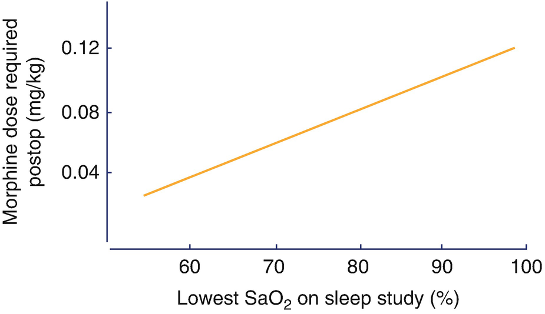
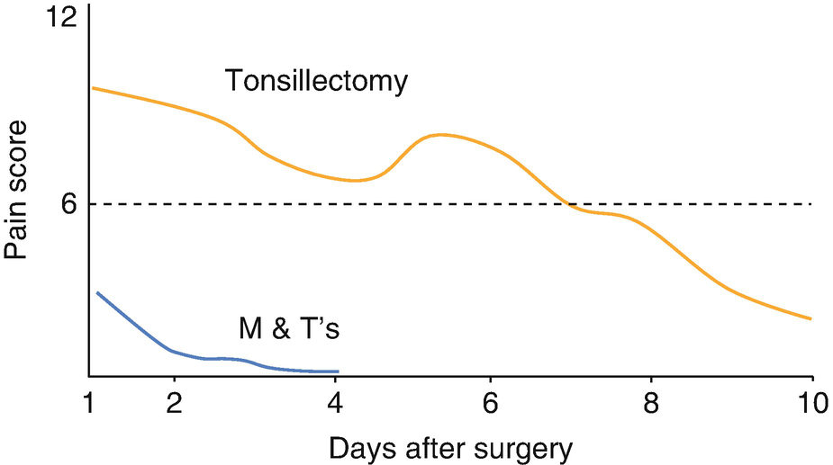

Anesthesia for Ear, Nose and Throat Surgery in Children

© Springer Nature Switzerland AG 2020

Craig Sims, Dana Weber and Chris Johnson (eds.) A Guide to Pediatric Anesthesia[https://doi.org/10.1007/978-3-030-19246-4\_16](https://doi.org/10.1007/978-3-030-19246-4_16)

# 16. Anesthesia for Ear, Nose and Throat Surgery in Children

Ian Forsyth[1](#Aff4)     and Rohan Mahendran[1](#Aff4)    

(1)

Department of Anaesthesia and Pain Management, Perth Children’s Hospital, Nedlands, WA, Australia

Ian Forsyth

Email: [Ian.Forsyth@health.wa.gov.au](mailto:Ian.Forsyth@health.wa.gov.au)

Rohan Mahendran (Corresponding author)

Email: [Rohan.Mahendran@health.wa.gov.au](mailto:Rohan.Mahendran@health.wa.gov.au)

### Keywords

Anesthesia for tonsillectomyAnesthesia for neck abscesses in childrenPediatric OSADexamethasone in tonsillectomy

Ear, nose and throat (ENT) surgery is the most common reason for anesthesia in children—1.5% of all children in Western Australia have an anesthetic for an ENT procedure each year. It involves the challenges of managing a shared and potentially soiled airway as well as the possibility of airway obstruction in the postoperative period. Safe anesthesia requires vigilance, good communication with the surgical team and flexibility of anesthetic technique. This chapter outlines the principles of anesthesia for common ENT procedures in children. Bronchoscopy of the airway is discussed in the next chapter.

## 16.1 Anesthesia for Ear Surgery

### 16.1.1 Myringotomy and Tubes (M&T)

Abnormal function of the eustachian tubes is common in children and may lead to otitis media with effusion (OME), or ‘glue-ear’. Small ventilation tubes, or grommets, are placed through the tympanic membrane to ventilate the middle ear and prevent hearing loss and speech delay. It is uncomplicated surgery lasting 10–15 min, with anesthesia using a LMA or facemask. Nitrous oxide is safe to use. The ears may be sore for a short time after surgery, and analgesia is required or the child may wake up distressed. Paracetamol with or without a small dose of opioid is usually sufficient for analgesia. Some anesthetists do not obtain intravenous (IV) access during anesthesia for M&T insertion. Proponents argue this saves time and avoids ‘handing over’ the airway while the IV is inserted. Analgesia is either omitted, given orally preoperatively, or with intranasal fentanyl intraoperatively. The obvious risk of this approach is the inability to administer IV drugs in an emergency, and prevention of emergence delirium is limited to fentanyl. It seems difficult to justify this risk when IV insertion only takes a matter of seconds in skilled hands.

### 16.1.2 Myringoplasty and Tympanoplasty

Myringoplasty is the repair of a chronic perforation of the tympanic membrane. Tympanoplasty is a more extensive repair that may include surgery to the middle ear bones. The surgical approach for both procedures is either transcanal or via an incision behind the ear. Anesthetic considerations include minimizing bleeding that may obscure the operative field and prevention of nausea and vomiting. Nitrous oxide may lift the graft off the tympanic membrane and should be discussed with the surgeon.

### 16.1.3 Cochlear Implant

Cochlear implant surgery can be life changing for children with severe sensorineural deafness by restoring hearing, speech development and communication. Electrodes run from a receiver under the soft tissue behind the ear through the mastoid and into the cochlea. These patients may have an underlying syndrome associated with their sensorineural deafness (such as Treacher Collins syndrome and Klippel-Feil anomaly), which may be associated with airway difficulties. Facial nerve monitoring is used during surgery, and the child is either intubated without a muscle relaxant or using a short-acting relaxant. TIVA is commonly used to help maintain tight blood pressure control and to reduce bleeding, and nausea and vomiting (PONV). Small doses of opioid and local infiltration by the surgeon achieve analgesia.

## 16.2 Tonsillectomy and Adenoidectomy

Tonsillectomy is a common procedure usually performed for obstructive sleep apnea (OSA) in preschool-aged children, and for recurrent tonsillitis in older children. Three percent of all children undergo tonsillectomy, and 80% of tonsillectomies are performed for OSA. Pre-operatively, children require assessment of co-existing conditions that affect upper airway size, such as Trisomy 21 or craniofacial abnormalities, and for bleeding disorders such as Von Willebrands disease. Most tonsillectomies are extracapsular, and the tonsil is removed by dissecting between the capsule and muscular wall. For intracapsular tonsillectomy, the capsule is left intact making the procedure less painful, but the tonsil may regrow later.

### 16.2.1 Obstructive Sleep Apnea

OSA is characterized by severely reduced or obstructed airflow during sleep caused by abnormal upper airway anatomy. The symptoms of OSA in children are different to adults. OSA is discussed further in Chap. [11](467929_2_En_11_Chapter.xhtml), Sect. [11.​8](467929_2_En_11_Chapter.xhtml#Sec19). In summary however, there are three broad causes of OSA in children. The first is soft tissue occupying the limited space in the upper airway, most commonly adenotonsillar hypertrophy, but also a large tongue in Trisomy 21. Secondly it is caused by hypotonia or discoordination of the pharyngeal muscles, and finally by bony abnormalities in craniofacial syndromes. The cause is frequently a combination of these three factors, for example a child with Robin sequence has a reduced airway size from micrognathia, but also has tonsillar hypertrophy of a degree that might not be a problem in a normal-sized airway.

OSA is common in preschool-aged children because their tonsils and adenoids are large relative to the size of their airway. Adenotonsillectomy is the initial treatment for OSA in children, and improves sleep study parameters, behavior and quality of life in both obese and non-obese children. Non-surgical treatment for OSA includes noninvasive ventilation during sleep, and nasal steroid sprays to reduce inflammation of the adenoids. The ENT surgeon usually diagnoses OSA clinically, and not all children require a sleep study to confirm the diagnosis before tonsillectomy. There is no consensus however, on which sub-group of children need a pre-operative sleep study. Typical criteria include suspicion of severe OSA, presence of a craniofacial syndrome, morbid obesity, neuromuscular disorders and young age. In addition, children who are a high anesthetic risk (such as those with cardiac or pulmonary disease) should have a pre-operative sleep study, as a normal result might avoid surgery.

Very rarely, children with severe OSA and co-morbidities (such as morbid obesity or a craniofacial syndrome) may have chronic hypoxia and hypercarbia with a reduced ventilatory response to both. This is rare in modern practice, and screening with ECG or CXR is not warranted unless there are clinical signs of cardiac dysfunction or unusually long-standing and untreated severe OSA. These children may be polycythemic with pulmonary hypertension and right ventricular hypertrophy. The presence of polycythemia and a right ventricular strain pattern on ECG (increased P wave lead 2 and large R wave V1) would suggest a sleep study and echocardiogram should be performed. In very severely affected children with pulmonary hypertension secondary to OSA, a brief period of non-invasive ventilation (BIPAP) may optimize them preoperatively.

### Keypoint

OSA significantly increases anesthetic risk for tonsillectomy, particularly in children younger than 3 years.

Children with OSA have an increased risk of respiratory depression from opioids and anesthetic agents, and of upper airway obstruction and apnea after tonsillectomy. The first few hours and first night after surgery are the times of maximal risk due to airway edema, bleeding, splinting of pharyngeal muscles and effects of opioids. Methods to reduce this risk include the cautious use of opioids during anesthesia, and continuous pulse oximetry and observation after surgery. Some children with OSA are at particularly high risk of upper airway obstruction and are best monitored in HDU or ICU (Table [16.1](#Tab1)).

Table 16.1

Factors that increase the risk of airway obstruction after tonsillectomy in children with OSA

| 
Risk factors for postoperative problems in children with OSA

 |
| --- |
| 

Young age, especially less than 3 years

 |
| 

Obesity

 |
| 

Craniofacial abnormality with reduced oropharyngeal size (e.g. Trisomy 21)

 |
| 

Severe OSA on polysomnography (10 or more obstruction/h, or SaO2 below 80%; RDI > 20)

 |
| 

Co-morbidities such as cardiac disease

 |

Postoperative monitoring in HDU or ICU might be required in these children

_RDI_ respiratory disturbance index

### 16.2.2 Anesthesia Technique

Experienced anesthetists successfully use many different techniques to ensure safe and smooth anesthesia for tonsillectomy. Tonsillectomy is a short, highly stimulating procedure involving a shared and potentially bloody airway. Respiratory incidents occur in between 1 and 20% of children after adenotonsillectomy (depending on the population studied), and are twice as common in children younger than 3 years. Children are at risk of laryngospasm and post-operative airway obstruction, and it can be challenging to achieve adequate analgesia while avoiding over-sedation and airway obstruction. To maximize safety, the anesthetic technique may need to vary depending on the indication for surgery, local procedures and the postoperative monitoring available. Airway obstruction can occur in PACU, and a person with adequate skills must be readily available. It is important the anesthetic technique ensures airway issues are avoided in recovery, particularly if the anesthetist is alone and possibly has started the next case when problems in PACU occur. One approach is listed in Table [16.2](#Tab2), but is likely to vary depending in different centers. Sedative premedication may cause airway obstruction in young children with severe OSA. Small doses of clonidine and midazolam may be used if required and the child is monitored after the premed is given.

Table 16.2

There are many different techniques for anesthesia for tonsillectomy

| 
Anesthetic component | Reason

 |
| --- | --- |
| 

IV or inhalational induction

 |
| 

Flexible LMA, oral RAE ETT in young children | More secure airway than LMA in young children

 |
| 

Pressure support ventilation or IPPV | Control CO2, maintain lung volume & reduce atelectasis

 |
| 

Paracetamol 15 mg preop or IV intraop | Multimodal analgesia

 |
| 

Fentanyl 1–2 μg/kg plus morphine 0.05 mg/kg IV | Comfortable once awake, but not obstructed

 |
| 

Parecoxib 0.6–0.9 mg/kg (max 40 mg) | Multimodal analgesia

 |
| 

Dexamethasone 0.15 mg/kg (max 8 mg) | Antiemetic, improves analgesia

 |
| 

Ondansetron 0.15 mg/kg (max 4 mg) | Antiemetic

 |
| 

Hartmanns 10–20 mL/kg, continue maintenance rate postoperatively | Maintain hydration despite reduced oral intake postop

 |
| 

Extubate awake | Safe airway for recovery

 |
| 

Opioid boluses once awake in recovery if required | Use small dose opioid intraoperatively, titrate further doses once child awake

 |
| 

Paracetamol 15 mg/kg, 6 hourly postop oral or IV

Oxycodone 0.05–0.1 mg/kg, 6 hourly prn | Analgesia required after discharge. Conservative paracetamol dose as likely to require for 7 days or more

 |
| 

Monitor oxygen saturation, observe for upper airway obstruction, excessive sedation, respiratory depression | Risk of OSA persists or may even be higher immediately postop

 |

Above is one technique, given as a suggestion to form a backbone or starting point for an individual’s own technique and depending on the surgical preferences, child’s age and medical conditions

#### 16.2.2.1 Airway Management

In many centers, endotracheal intubation is the routine airway of choice, but elsewhere the LMA is routinely used with endotracheal intubation reserved for small children and others at higher risk of airway obstruction during surgery.

##### Endotracheal Intubation

A south-facing oral RAE tube is used for intubation in tonsillectomy. In small children, intubation can be achieved without the use of muscle relaxants (using a bolus of propofol after inhalational induction instead), although in larger children a small dose of relaxant (such as 0.25 mg/kg of atracurium) may be required to optimize intubating conditions. The ETT sits in the midline between the blade of the mouth gag and the tongue and gives a secure airway unlikely to be displaced and does not impede the operative field. Throat packs are not used as they obscure the surgical view, although the surgeon may place a gauze swab above the vocal cords to limit air leak if an uncuffed ETT is used. One must consider if the advantages of intubation (better surgical access in a shared airway, more definitive airway securement) outweigh some of the disadvantages (risks of intubation, time taken for airway instrumentation for an often high-turnover list). Occasionally a malpositioned or incorrectly sized surgical gag can obstruct the ETT after insertion, and it is best to test ventilate following the gag insertion and before commencing surgery.

##### Laryngeal Mask Airway

Flexible, reinforced LMAs are often used instead of ETTs. Their advantages and disadvantages are listed in Table [16.3](#Tab3). Their main advantage is they are fast to insert and can be left _in situ_ for awake removal in recovery. Their biggest disadvantage is they may dislodge or kink and become obstructed when the gag is inserted or opened. As a general rule, children less than 15 kg are more difficult to manage using an LMA, as tightening of the surgical gag tends to obstruct or dislodge the LMA. LMAs also reduce the ability for recruitment maneuvers, which may be particularly important in small children who are more at risk of atelectasis due to their small airways and often baseline chronic respiratory tract infections.

Table 16.3

Advantages and disadvantages of airway management using the LMA during tonsillectomy in children

| 
Advantages of LMA | Disadvantages of LMA

 |
| --- | --- |
| 

Simple insertion | Does not prevent laryngospasm during surgery

 |
| 

Maintain airway until child awake | Airway may obstruct when gag inserted, particularly in young children

 |
| 

Protect lower airway from soiling with blood | May obstruct surgical field

 |
| 

Not all surgeons comfortable with their use

 |
| 

Not as easy to give positive pressure recruitment maneuvers

 |

### Keypoint

The ETT and LMA are both suitable for anesthesia in larger children. The ETT is better for small children as it improves surgical access, secures the airway with less likelihood of obstruction, and assists in maintaining end-expiratory lung volume. Whichever technique is used, airway patency must be checked when the surgical gag is inserted and opened.

### Tip

To improve the likelihood of obtaining an adequate airway with a LMA during tonsillectomy, choose a size that errs on the small size for the child’s weight, do not tape the LMA shaft until the gag is inserted, and use lubricant on the gag so it does not grip the LMA and push it inwards.

#### 16.2.2.2 Anesthesia Maintenance

Positive pressure ventilation has some advantages over spontaneous ventilation during tonsillectomy, particularly in smaller children (Table [16.4](#Tab4)). The choice between spontaneous and controlled ventilation is also made based on experience and familiarity with the technique. Spontaneous ventilation is commonly used if the airway is managed with a LMA, but gentle positive pressure ventilation is also a reasonable approach.

Table 16.4

Advantages of spontaneous and controlled ventilation during tonsillectomy in children

| 
Spontaneous ventilation with LMA | IPPV with ETT

 |
| --- | --- |
| 

May allow titration of opioid against respiratory rate | Permits lighter GA with lower inhalational agent dose

 |
| 

May simplify conclusion of anesthesia and extubation | May facilitate awake extubation

 |
| 

Avoids hypoventilation and atelectasis by maintaining end-expiratory lung volume

 |

IV fluids are routinely given to tonsillectomy patients to compensate for fasting, bleeding and reluctance of the child to drink post operatively. A volume 10–20 mL/kg of an isotonic fluid such as normal saline or Hartmann’s with is usually given, and the IV is left in place postoperatively in case of bleeding within the first 24 h (primary bleeding).

#### 16.2.2.3 Airway Obstruction and Desaturation During Tonsillectomy

Ventilation can become difficult at any stage during tonsillectomy. The gag may cause airway obstruction and this is usually detected soon after the gag is inserted. Nevertheless, if there is obstruction without apparent cause, the gag should be released as soon as possible. Desaturation during tonsillectomy has several common causes (Table [16.5](#Tab5)). One cause is the child coughing and straining, with chest wall rigidity preventing ventilation except between coughing ‘spasms’. This is common as anesthesia is lightened in preparation for extubation, and in children with reactive airways from recent URTIs. Treatment is to synchronize manual ventilation with gaps between the child’s coughing and to consider deepening anesthesia with propofol 1–2 mg/kg. If anesthesia is maintained with an LMA, malposition or laryngospasm are other common causes to consider (see Chap. [8](467929_2_En_8_Chapter.xhtml), Sect. [8.​3](467929_2_En_8_Chapter.xhtml#Sec15)).

Table 16.5

A list of common reasons for airway obstruction or desaturation during tonsillectomy

| 
Common problems during tonsillectomy

 |
| --- |
| 

Obstructed mask ventilation at induction due to large tonsils (CPAP or oral airway may help)

 |
| 

Obstruction or kinking of ETT or LMA due to the mouth gag

 |
| 

Circuit disconnections

 |
| 

Endobronchial intubation

 |
| 

Occlusion of ETT or breathing filter with blood or mucus

 |
| 

Coughing or straining

 |
| 

Atelectasis due to hypoventilation, presence of URTI, aspiration of blood

 |
| 

Bronchospasm

 |
| 

Laryngospasm

 |

#### 16.2.2.4 Extubation

At the end of surgery, the posterior pharynx is inspected for clots and bleeding points. Clots may form in the posterior pharyngeal space behind the uvula and need to be looked for carefully—‘the coroners clot’. There is debate about awake or deep extubation or removal of the LMA. There is no correct answer as it depends on a number of factors including the presence of OSA, experience of the recovery staff and immediate availability of an anesthetist if another case is being started. Experienced and competent anesthetists do both. The safest method is probably to have the patient extubated in the left lateral position when fully awake. This is particularly important in children with OSA. The ‘tonsil position’ (left lateral, slightly head-down to minimize bleeding onto the vocal cords) is commonly used.

### Note

Choosing to extubate a deeply anesthetized child comes with a responsibility to ensure someone is available to manage the child’s airway in recovery if laryngospasm or other problems develop.

### 16.2.3 Analgesia

Tonsillectomy is painful, and children will wake very unhappily if analgesia is inadequate. Furthermore, crying and screaming causes venous congestion and may contribute to bleeding early after surgery. There are many successful intra-operative analgesic regimens used. The principles are to minimize sedation and respiratory obstruction. Most analgesic regimens for tonsillectomies will involve the use of an opioid and paracetamol. It is important to remember that all children with OSA, and particularly younger children, have an increased sensitivity to respiratory depression and obstruction and require judicious dosing of opioids. There are no conclusive studies comparing different opioids for tonsillectomy, and how opioids are used is probably more important than the choice of opioid. In spontaneous ventilation, titration against respiratory rate is an option used by some, although the intense stimulation during surgery likely counteracts the respiratory effects of opioids at that time. Children with severe OSA (as determined by lowest saturation level during sleep study of <85%) require half the morphine dose to achieve the same analgesia as children with milder or no OSA (Fig. [16.1](#Fig1)). Tramadol causes less sedation and respiratory depression, which is useful in the setting of OSA. Teenagers and older children experience more pain after tonsillectomy than younger children, because the tonsil is more integrated into surrounding tissue and more difficult to dissect.

Fig. 16.1

Severe OSA (low SaO2 during sleep study) is associated with less opioid to achieve adequate analgesia. Adapted from Brown KA. Anesthesiol 2004;100: 806

### Keypoint

Children with OSA are sensitive to opioids and require smaller doses for analgesia and are at higher risk of respiratory depression or obstruction.

Non-steroidal anti-inflammatory drugs (NSAIDs) reduce pain, opioid requirement and nausea and vomiting after tonsillectomy. There is controversy about the safety of non-steroidal anti-inflammatory drugs (NSAIDs) after tonsillectomy, and some surgeons avoid their use.

The Cochrane review found there is insufficient evidence to exclude an increased risk of bleeding when NSAIDs are used in pediatric tonsillectomy. Ketorolac increases bleeding after tonsillectomy and should not be used. Diclofenac is widely used with a safe history. Of the non-selective NSAIDs, diclofenac affects platelet function the least, but is not available commercially in a liquid form for oral use. Ibuprofen is also widely used. There is limited data on its safety, and some studies show an increased incidence of bleeding in older children or increased severity of bleeding. Although ibuprofen was included in the Cochrane Review, it did not constitute a large proportion of the sample size studied. A small study showed the off-label use of parecoxib during surgery reduced pain, although previous pharmacokinetic work has suggested a dose of parecoxib lower than that studied. There are no liquid preparations of COX-2 selective NSAIDs available for oral use in children, although some centers prepare their own.

Local anesthesia of the tonsil bed for post op analgesia has been well studied in recent years and provides a modest reduction in pain relief in recovery, but may extend into the longer-term postoperative period. Topical application and injection of local anesthetics appear to provide the same benefit. There have also been small studies using adjuvants to local anesthetic including dexamethasone, magnesium, pethidine, ketamine and tramadol with some suggestion of reduced postoperative pain and vomiting. Infiltration of the tonsillar bed with local anesthesia has risks—the carotid arteries run superior to the tonsil bed and there are case reports of death from intra-arterial injection. Drug-spread in the lateral pharyngeal space can also rarely block the vagus nerve causing recurrent laryngeal nerve and vocal cord paralysis. It is also theoretically possible to disrupt the nerve supply to the carotid body, affecting the ventilatory response to hypoxia.

### 16.2.4 Antiemetics and Dexamethasone

About 40% of children will vomit after tonsillectomy if an antiemetic is not given, and although avoided in the past, multi-agent antiemetic prophylaxis is now standard. Ondansetron (0.15 mg/kg, max 4 mg) is given both during and after tonsillectomy if required. Dexamethasone (0.15 mg/kg maximum 8 mg) is also given as an anti-emetic and to reduce post-operative swelling and morbidity. It shortens the time to eating post-tonsillectomy and reduces pain by 1 on a scale of 0–10. The minimum effective dose required is not known, although one study suggests a dose of 0.0625 mg/kg is effective as an antiemetic. Some studies show an association between dexamethasone and bleeding after tonsillectomy, but the evidence is not strong and dexamethasone is still routinely given.

### Tip

Ondansetron 0.15 mg/kg plus dexamethasone 0.15 mg/kg IV is commonly given during anesthesia for tonsillectomy as PONV prophylaxis.

### 16.2.5 Postoperative Care After Tonsillectomy

Tonsillectomy is a big operation for a child. They mount a stress response, and are weak and washed out for a week or 2 after. Nearly half visit a general practitioner, most often because of pain. It takes 7 days until they return to a normal sleep pattern. The predominant post-operative issue is adequate analgesia balanced against the risk of airway obstruction or apnea. Fatal respiratory complications after tonsillectomy are two times more likely in children than adults. This risk is greatest on the first operative night. Vigilance and well-trained recovery staff are essential, as is the availability of an anesthetist to immediately deal with any airway obstruction. Removal of tonsils may not improve obstruction immediately. There is the potential for edema, bleeding, and residual anesthetic agents or opioids may make these children even more prone to obstruction during the first night after surgery. Pre-existing syndromes or craniofacial abnormalities further increase the risk of obstruction, and are likely to need HDU or ICU monitoring after surgery.

Overnight monitoring and observation in an appropriate environment is important. All patients with OSA should be monitored with pulse oximetry overnight, and those with severe OSA may require admission to HDU or ICU. Some centers allow older children who do not have OSA to be discharged home several hours after tonsillectomy (‘day-stay tonsillectomy’). This is becoming more common and relies on an anesthetic technique that ensures the child is comfortable, not vomiting and not at risk of sedation or airway obstruction. It is also important that the child has responsible parents who have ready access to transport to return to the hospital if necessary. Children with OSA and all young children need overnight hospital admission after tonsillectomy for monitoring.

Post-operative pain varies significantly, but is often difficult for the parents to manage after discharge. While some children are seemingly comfortable on paracetamol alone, others have significant pain and become reluctant to swallow and take fluids or medicines. The temporary use of 2% viscous lidocaine gargle, rectal paracetamol and NSAIDs, such as diclofenac, can be useful in this situation to get pain under control and initiate eating, drinking and taking oral medicines. Care needs to be taken, however, that the child is adequately hydrated before administering NSAIDs. The pain after tonsillectomy is more severe than many other types of surgery, and often worsens again between days 4 and 7 after surgery, when the tonsillar bed scab sloughs away. By day 10 most children are recovering well (Fig. [16.2](#Fig2)). Although most children have their sleep disordered breathing improved by tonsillectomy, this may take several weeks to occur, and there is no improvement in one third.

Fig. 16.2

Average pain scores assessed by parents at home after surgery. Pain after tonsillectomy remains significant (score > 6) for 1 week, including a period of increased pain towards the end of the first week. In comparison, pain after myringotomy and tubes is minor. Based on Stewart DW. Pediatr Anesth 2012;22: 136–43 and Wilson CA. Pediatr Anesth 2016;26: 992–1001

A multimodal approach to analgesia after tonsillectomy is individually tailored to the child depending on their age, co-morbidities and severity of OSA. Parents are given clear instruction and education of the expected pain requirements to optimize analgesia and anticipate the pain requirements with pre-emptive dosing. As discussed earlier, children with OSA are sensitive to opioids and are at risk of respiratory depression and obstruction after tonsillectomy. It would be ideal to avoid opioids in these children, and some surgical groups have reported success with paracetamol and NSAIDs alone. More commonly however the pain at rest and with swallowing will require stronger analgesia.

Oxycodone and morphine are commonly used as strong analgesics after tonsillectomy because they are available in liquid preparations. A series of deaths in children with OSA after tonsillectomy were thought to be due to the ultra-rapid metabolism of codeine to morphine, causing respiratory depression. Codeine is now contraindicated after tonsillectomy in children in most countries. Tramadol may cause less respiratory depression, but is not available in a suitable preparation for children (liquid drops marketed for palliative care of adults are extremely concentrated and risk accidental overdose in children). Some children are also ultra-rapid metabolizers of tramadol placing them at risk of respiratory depression. The FDA in the United States has issued a warning against the use of tramadol in children, but this has been rejected by professional bodies in Europe and Australasia, and tramadol is still used in many centers. Nevertheless, all of the opioids have the risk of causing life-threatening respiratory depression. The risk is highest in small, young children with severe OSA. Doses should always be conservative. The risks and problems of opioids are listed in Table [16.6](#Tab6), and their typical doses in Table [16.7](#Tab7). Opioid side effects such as constipation, nausea and dysphoria are common.

Table 16.6

Problems with the different oral opioids used for analgesia after tonsillectomy

| 
Agent | Problems other than respiratory depression

 |
| --- | --- |
| 

Morphine elixir | Low and variable bioavailability (30–40%)

Perhaps more sedating than oxycodone

Limited evidence of safety in OSA

 |
| 

Oxycodone elixir | Not licensed for children

No studies in children with OSA

Few studies of efficacy of oral administration in children

 |
| 

Tramadol drops | Some children are ultra-rapid metabolizers and at risk of respiratory depression (although lower risk than codeine)

Not licensed for young children

Concentrated oral formulation with risk of overdose

 |

All opioids cause respiratory depression in children with OSA

Table 16.7

Doses of oral opioids for analgesia after tonsillectomy

| 
Agent | Oral dose

 |
| --- | --- |
| 

Morphine | 0.1–0.2 mg/kg 4–6 hourly as required

 |
| 

Oxycodone | 0.05–0.1 mg/kg 6 hourly as required

 |
| 

Tramadol | 1–2 mg/kg 6 hourly as required

 |

All opioids cause respiratory depression in children with OSA, and the dose should be at the lower end of the range for young children with OSA

## 16.3 Adenoidectomy Without Tonsillectomy

Adenoidectomy is performed to correct nasal obstruction and dysfunction of the eustachian tube affecting hearing. The airway can often be managed with an LMA, as it does not obscure the surgical field. Children younger than 12–18 months are better intubated to give a more secure airway that is less prone to obstruction. Small children having an adenoidectomy alone often still have large tonsils and are vulnerable to obstruction in PACU. Postoperative analgesia requirements are far less than tonsillectomy, and paracetamol and ibuprofen alone or in combination with a small dose of opioid is usually adequate. Most children are discharged home on the same day of surgery.

## 16.4 Lingual Tonsillectomy

The vast majority of tonsillectomies are palatine. A lingual tonsillectomy is an uncommon procedure to remove tonsillar tissue from the posterior tongue. Nasal intubation may be required. There is a small risk of post-operative bleeding and swelling of the tongue, and careful postoperative monitoring is required.

## 16.5 Bleeding After Tonsillectomy

About 1% of children bleed from the tonsillar bed after tonsillectomy. Adenoidal bleeding is rare. Primary hemorrhage occurs in the first 24 h after surgery, whereas secondary hemorrhage may be related to infection and occurs up to 14 days after surgery. It occurs after discharge from hospital. The hemorrhage varies from mild ooze to arterial bleeding with anemia and hemodynamic instability or even death. The child may swallow large amounts of blood before presentation, making assessment of the amount of bleeding difficult. Before anesthesia, information about the duration of bleeding, previous anesthetic (including intubation grade), and any predisposing reasons for the bleeding (infection, NSAIDs, or family history of bleeding disorder) is collected. The child is carefully examined to assess blood loss, paying attention to pallor, pulse rate, and capillary refill. Beware of the pale, listless and somnolent child who may be shocked. Resuscitation with isotonic crystalloid or colloid is begun, and a group and hold or cross match are often appropriate. The hemoglobin and clotting screen should be checked but should not delay surgery to stop the bleeding.

Ultimately the anesthetic technique used will depend on the airway and hemodynamic status of the child as well as the experience of the anesthetist. A bleeding tonsil is an emergency with the potential problems of a difficult, soiled and shared airway in a child with a full stomach and hypovolemia. Most cases have only minor bleeding that needs brief cauterization to control and are straightforward to manage. Others, however, have arterial bleeding with edematous vocal cords that are completely obscured by blood that rapidly fills the mouth during intubation and may block the sucker during removal. If intubation proves to be very difficult, inserting an LMA may retrieve the airway and permit control of the bleeding.

The commonest approach to induction is a rapid sequence induction in the supine position taking care with drug doses in a child who is hypovolemic. An alternative is induction with the child in the lateral, head down position to reduce aspiration of blood and using an inhalational technique to avoid paralysis in the presence of a difficult airway. Although this approach has some advantages, it tends to be used less as this position for intubation is unfamiliar and may contribute to difficulty. An ETT that is 0.5 mm smaller than the size used for the original surgery is often selected to allow for upper airway edema.

In addition to the standard anesthetic equipment, it is important to ensure that there are two anesthetic suction units at induction in case one blocks with blood clots (Table [16.8](#Tab8)). The difficult-intubation trolley should be in theatre and the brightest available laryngoscope should be available as blood readily absorbs light and a dim laryngoscope can give a surprisingly poor view. A videolaryngoscope is likely to have its image obscured by blood. The surgeon and assistant should be scrubbed and ready in theatre. An orogastric tube should be inserted to empty the stomach at the end of the surgery and the patient should be extubated in the left lateral position, wide-awake. See also Chap. [8](467929_2_En_8_Chapter.xhtml), Sect. [8.​2](467929_2_En_8_Chapter.xhtml#Sec10).

Table 16.8

List of important details of anesthesia for bleeding after tonsillectomy

| 
Bleeding tonsil checklist

 |
| --- |
| 

Adequate fluid resuscitation

 |
| 

Low threshold for cross match and coagulation screen

 |
| 

Check previous intubation grade

 |
| 

Two anesthetic suction units

 |
| 

Difficult intubation trolley immediately available

 |
| 

Two bright laryngoscopes

 |
| 

Surgeon and assistant scrubbed in theatre

 |
| 

Orogastic tube to empty stomach after intubation

 |
| 

Extubate awake

 |

### Tip

Most children with bleeding tonsils have a small bleeding point and the main anesthetic issue is blood in their stomach. Others have a serious bleeding point, and their mouth fills with blood between induction and laryngoscopy. The severity of bleeding is usually apparent before anesthesia.

## 16.6 Neck Abscesses

Neck abscesses are fairly common in children. Most are superficial abscesses caused by infected lymph nodes in the parapharyngeal region. The infection is superficial to the deep fascia of the neck and the airway is not affected. An LMA is most often used for their brief, surgical drainage.

Deeper neck abscesses are rare. Peritonsillar abscess, or quinsy tonsillitis, is an abscess in the connective tissues between the tonsillar capsule and pharyngeal muscles. It usually occurs in one tonsil of older children and adolescents and is treated with antibiotics if small, or surgical drainage if large. In co-operative, older children, the abscess can be at least partly drained using a syringe and needle while awake. A neck ultrasound or CT may be useful to quantify the severity and extent of large abscesses. Mouth opening is limited by pain (trismus) but will usually relax after induction. The vocal cords can usually be seen easily, but the airway must be instrumented without rupturing the abscess. Rarely, the abscess extends to cause supralaryngeal edema, indicated by signs of airway obstruction. Airway edema is still a risk after drainage and children are monitored in an area where signs of obstruction can be immediately recognized and acted on. If the airway is very edematous at intubation, consider ventilation and extubation in ICU after the infection and swelling have resolved.

Abscesses of the submandibular space (Ludwig’s angina) originate from an abscess of the molar teeth. They occur in teenagers or adults, and are uncommon in children because their deciduous teeth are rooted high in the mandible (see Chap. [18](467929_2_En_18_Chapter.xhtml), Sect. [18.​2](467929_2_En_18_Chapter.xhtml#Sec2)). Submandibular abscesses cause airway obstruction and make intubation difficult—a tense floor of the mouth and inability to protrude the tongue indicate significant swelling and risk.

Retropharyngeal abscesses originate from infected lymph nodes and usually occur in young children. Pus may track along deep fascial planes to the upper mediastinum. These deeper abscesses are more concerning for airway management. Signs of airway obstruction, including stridor, drooling, muffled voice or hoarse cry indicate significant swelling and airway involvement.

## Review Questions

1.  1.
    
    A 3 year old child has been intubated and ventilated for tonsillectomy. Part-way through surgery, the ETCO2 trace becomes irregular and the oxygen saturation falls. What will you do?
    
2.  2.
    
    A 6-year-old boy with Trisomy 21 syndrome presents with a day 6 post tonsillectomy bleed pale and lethargic. He was previously a grade 3 intubation. What is your anesthetic plan?
    
3.  3.
    
    You have just induced a child for ear grommet insertion. Just before you are about to place the LMA you get an urgent call from recovery telling you that the previous tonsillectomy patient is blue and not breathing. You are the sole anesthetist in the hospital at this time. What is your approach?
    
4.  4.
    
    A child with Von Willebrand’s disease presents for elective tonsillectomy. Describe your management
    
5.  5.
    
    You are asked to see a 16-year-old boy with a large tonsillar abscess.
    
    1.  (a)
        
        What are the treatment options?
        
    2.  (b)
        
        What clinical signs and symptoms would particularly concern you?
        
    3.  (c)
        
        How would you anesthetize this patient?
        
    
6.  6.
    
    A 10 year old girl with Trisomy 21 presents for adenotonsillectomy. She has recurrent respiratory infections and tires easily when playing. On examination SaO2 is 93% in air, temperature 37.2 °C and she has a non-radiating grade 3/6 systolic murmur.
    
7.  7.
    
    Why might it be best not to proceed with anesthesia
    

### Further Reading

### OSA

1.  Gipson K, Lu M. Sleep-disordered breathing in children. Pediatr Rev. 2019;40:3–13. An excellent review of the causes, diagnosis and management of OSA in children.[Crossref](https://doi.org/10.1542/pir.2018-0142)
    
2.  McGrath B, Lerman J. Pediatric sleep-disordered breathing: an update on diagnostic testing. Curr Opin Anaesthesiol. 2017;30:357–61.[Crossref](https://doi.org/10.1097/ACO.0000000000000458)
    

### Analgesia

1.  Bellis JR, et al. Dexamethasone and haemorrhage risk in paediatric tonsillectomy: a systematic review and meta-analysis. Br J Anaesth. 2014;113:23–42.[Crossref](https://doi.org/10.1093/bja/aeu152)
    
2.  Grainger J, Saravanappa N. Local anesthetic for post-tonsillectomy pain: a systematic review and meta-analysis. Clin Otolaryngol. 2008;33(5):411–9.[Crossref](https://doi.org/10.1111/j.1749-4486.2008.01815.x)
    
3.  Lewis SR, et al. Nonsteroidal anti-inflammatory drugs and perioperative bleeding in paediatric tonsillectomy. Cochrane Database Syst Rev. 2013;(7):CD003591. [https://​doi.​org/​10.​1002/​14651858.​CD003591.​pub3](https://doi.org/10.1002/14651858.CD003591.pub3).
    
4.  Li X, et al. Parecoxib sodium reduces the need for opioids after tonsillectomy in children: a double-blind placebo-controlled randomized clinical trial. Can J Anesth. 2016;63:268–74.[Crossref](https://doi.org/10.1007/s12630-015-0560-3)
    
5.  Tan L, et al. Pharmacokinetics and analgesic effectiveness of intravenous parecoxib for tonsillectomy and adenoidectomy. Pediatr Anesth. 2016;26:1126–35.[Crossref](https://doi.org/10.1111/pan.13009)
    
6.  Tonsillectomy and adenoidectomy in children with sleep related breathing disorders. Consensus statement of a UK multidisciplinary working party. 2010. [https://​www.​rcoa.​ac.​uk/​document-store/​tonsillectomy-and-adenoidectomy-children-sleep-related-breathing-disorders](https://www.rcoa.ac.uk/document-store/tonsillectomy-and-adenoidectomy-children-sleep-related-breathing-disorders). Accessed July 2019.
    

### Neck Abscesses

1.  Davies I, Jenkins I. Paediatric airway infections. BJA Educ. 2017;17:341–5.[Crossref](https://doi.org/10.1093/bjaed/mkx006)
    
2.  Morosan M, Parbhoo A, Curry N. Anaesthesia and common oral and maxilla-facial emergencies. Contin Educ Anaesth Crit Care Pain. 2012;12:257–62.[Crossref](https://doi.org/10.1093/bjaceaccp/mks031)