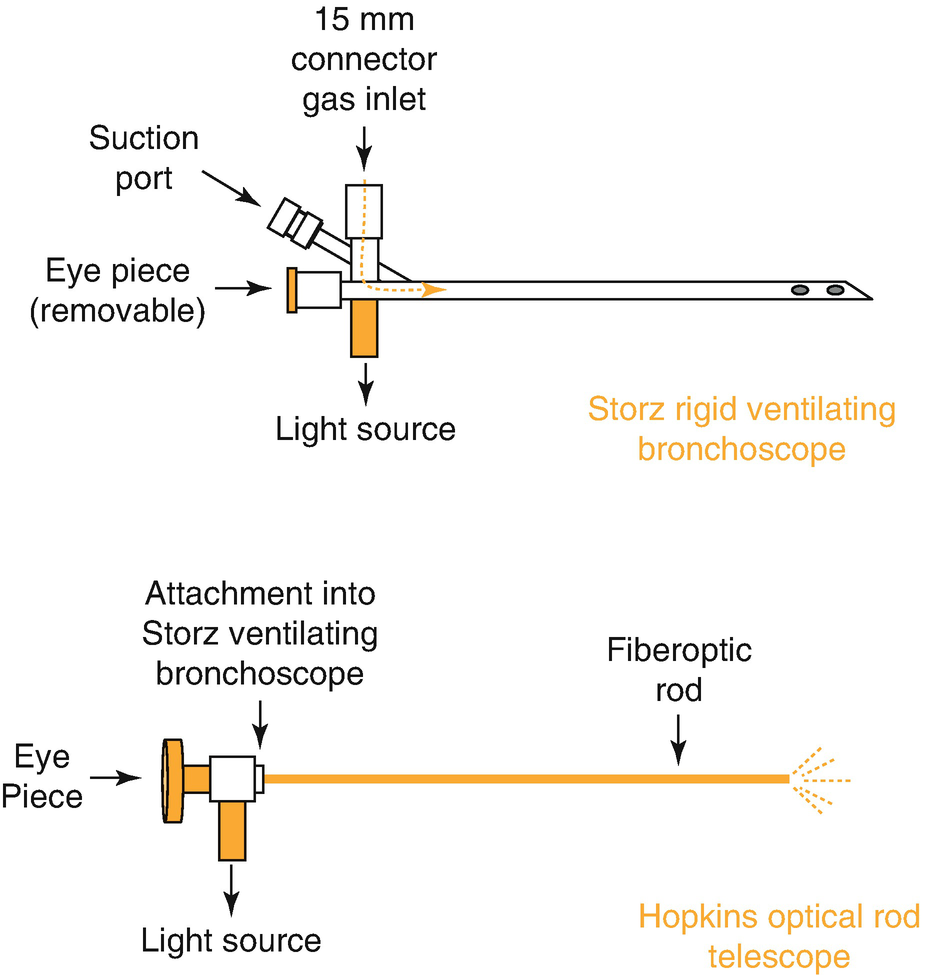
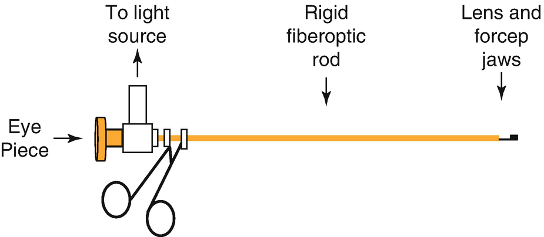
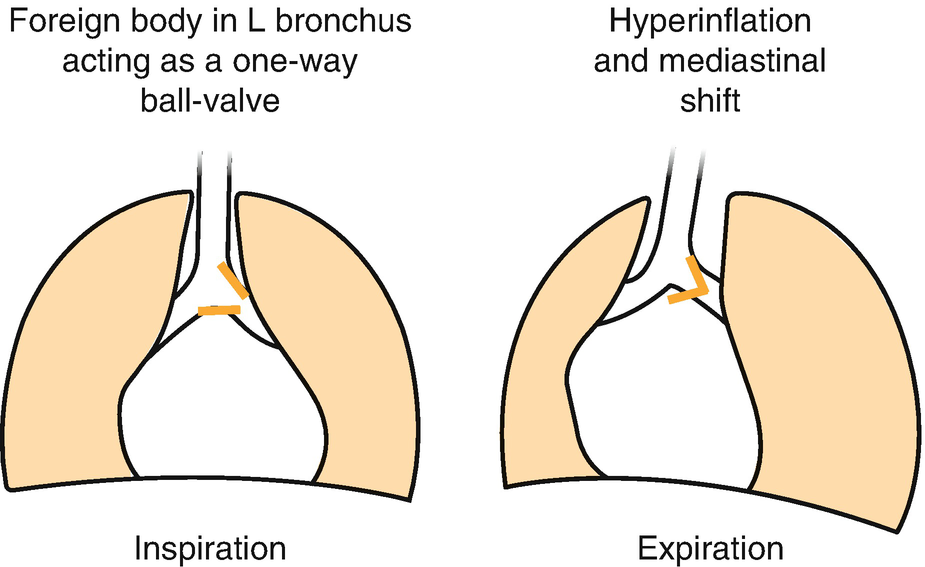
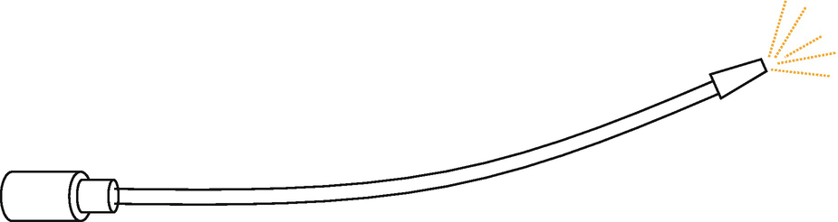
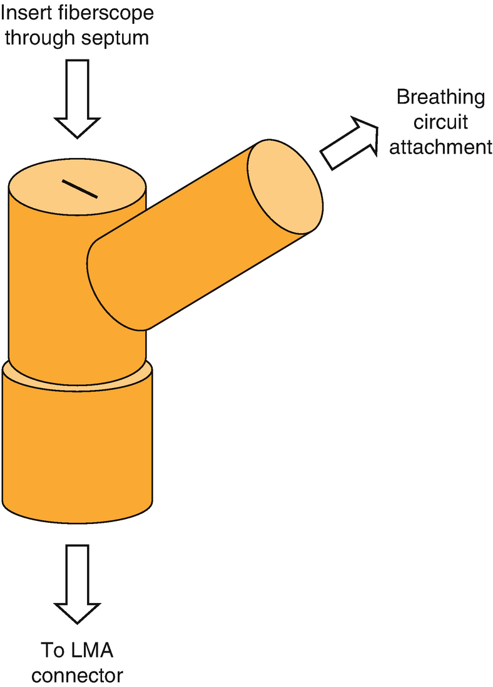

bronchoscopy for foreign body Bronchoscopy and Removal of Foreign Bodies from the Trachea

© Springer Nature Switzerland AG 2020

Craig Sims, Dana Weber and Chris Johnson (eds.) A Guide to Pediatric Anesthesia[https://doi.org/10.1007/978-3-030-19246-4\_17](https://doi.org/10.1007/978-3-030-19246-4_17)

# 17.  Bronchoscopy and Removal of Foreign Bodies from the Trachea

Marlene Johnson[1](#Aff4)     and Craig Sims[1](#Aff4)    

(1)

Department of Anaesthesia and Pain Management, Perth Children’s Hospital, Nedlands, WA, Australia

Marlene Johnson (Corresponding author)

Email: [Marlene.Johnson@health.wa.gov.au](mailto:Marlene.Johnson@health.wa.gov.au)

Craig Sims

Email: [craig.sims@health.wa.gov.au](mailto:craig.sims@health.wa.gov.au)

### Keywords

Inhaled foreign bodies childrenStorz ventilating bronchoscopeOptical grasping forcepsAnesthesia for bronchoscopy

Bronchoscopy is performed to assess the airway in a child who has suspected laryngeal or tracheal anomalies, for investigation of stridor and obstruction, and for the removal of foreign bodies. Anesthesia is challenging as the airway is shared with the surgeon and unprotected.

## 17.1 Types of Bronchoscopes

There are many types of bronchoscopes used for assessment and management of airway conditions. Commonly used scopes include:

-   Ventilating bronchoscope (rigid)
    
-   Rod telescope (rigid)
    
-   Optical grasper (rigid)
    
-   Fiberoptic bronchoscope (flexible)
    

Each scope has distinct advantages and uses in specific scenarios, which are outlined below.

### 17.1.1 Storz Ventilating Bronchoscope

The most commonly used rigid bronchoscope is the Storz ventilating bronchoscope (Fig. [17.1](#Fig1)). This is a hollow tube with a removable flat glass eyepiece at the proximal end. Next to the eyepiece are connectors for the fiberoptic light source and anesthetic gases, and a rarely-used port for suction or biopsy. The distal end is open and has fenestrations that allow for gases to pass if the distal scope is partly occluded.

Fig. 17.1

The Storz ventilating bronchoscope and accompanying rod telescope

An anesthetic circuit can be connected to the side arm of the bronchoscope. A T-piece circuit is often preferred as it is lightweight and in close reach of the anesthetist. The circle circuit can be used, but there is uncertainty about how much gas passes through the filter into the patient rather than back down the expiratory limb of the circle. In addition, the APL valve is located at a distance on the anesthetic machine and needs to be frequently adjusted during ventilation because of the variable leak around the bronchoscope. When the eyepiece and instrument ports are occluded, manual ventilation through the side arm of the bronchoscope is possible.

The bronchoscope is available in a range of sizes. Careful attention must be paid to the size of the bronchoscope selected. Too large, and it will cause damage to the tracheal mucosa and mucosal edema; too small, and manual ventilation will be difficult. The correct size is one in which there is an air leak at 20 cmH2O. Instruments, such as a rod telescope (see below), graspers or suction may be passed through the lumen of the Storz scope.

This scope is particularly useful for removing airway foreign bodies in the trachea and proximal bronchial tree. To retrieve a foreign body, the glass eyepiece is removed and a long forceps is passed down the lumen of the scope to grasp the foreign body. The view of the foreign body down the scope can be poor, as it is viewed down the length of the bore of the scope and the view is partly obscured when the forceps are inserted. The optical grasper (see below) gives a much better view and is growing in popularity among surgeons.

### 17.1.2 Hopkins Rod Telescope

The Hopkins rod telescope may be used alone or passed through the lumen of the ventilating bronchoscope to examine the larynx and trachea. The rod telescope is rigid, has its own light source and magnifies the view for the surgeon. It is much narrower than the Storz ventilating bronchoscope. Subsequently, it is likely to cause less damage to the mucosa and may be inserted further down the bronchial tree.

There is no gas channel on the rod telescope, so alternative methods to provide oxygen or anesthetic gases are required. Supplemental oxygen may be provided using nasal prongs. Alternatively, anesthetic gases and oxygen may be delivered through an ETT in the oropharynx or the nasopharynx.

When used in conjunction with the ventilating bronchoscope, it greatly narrows the lumen of the bronchoscope and increases the resistance to breathing. This is particularly a problem with the small bronchoscopes that are used in infants.

### 17.1.3 The Optical Grasper

The optical grasper is a rod telescope with distally placed forceps operated by a lever near the eyepiece (Fig. [17.2](#Fig2)). Surgeons are using the optical grasper more frequently because it gives a clear, magnified view of the foreign body. However, it has no channel for anesthetic gases and ventilation through it is not possible. If the surgeon uses these forceps, a spontaneous ventilation technique must be used. This technique is described later in the section ‘Assessment of stridor’.

Fig. 17.2

Optical grasper, which is similar to a rod telescope with grasping forceps attached. It is not possible to ventilate or insufflate gas with this instrument

### Keypoint

Foreign body removal with a ventilating bronchoscope—spontaneous or controlled ventilation are possible. Foreign body removal with optical grasping forceps—spontaneous ventilation is the only option.

### 17.1.4 Fiberoptic Bronchoscope

A flexible fiberoptic bronchoscope is often used by respiratory physicians to perform diagnostic procedures. This is discussed further at the end of this chapter.

## 17.2 Inhaled Foreign Bodies

Inhalation of a foreign body is a potentially life-threatening event. A small reduction in airway radius will result in a large increase in resistance to airflow. Organic foreign bodies may result in airway hyper-reactivity as well as mucosal edema, which will cause further airway narrowing. These factors coupled with the high oxygen consumption of infants and small children cause hypoxia to occur rapidly. Inhaled peanuts are one of the most challenging foreign bodies to manage, as they cause local granulation and generalized tracheobronchitis within hours of aspiration. They may also fragment and be extremely difficult to remove.

The typical patient is a toddler or preschool-aged child. Children of this age are at higher risk because they display oral exploration behavior and lack molars for grinding food. The onset of symptoms is usually sudden. Following aspiration, there is great variation in the severity of airway obstruction ranging from asymptomatic to severe distress or asphyxia. Specific symptoms and signs will depend on the site, size and type of foreign body:

-   Signs of laryngeal or tracheal obstruction: coughing, choking, respiratory distress, cyanosis, stridor, tachypnea
    
-   Signs of obstruction of a main bronchus: respiratory distress, tachypnea, wheeze or absent breath sounds on the affected side
    

The larger the foreign body, the higher up in the airway it will have lodged and the more severe or life threatening the symptoms. However, there may also be no symptoms or signs if the item is small or not significantly occluding the airway. In these cases, it can be challenging to differentiate from other common pediatric respiratory conditions, such as croup, asthma and pneumonia. A thorough history from the caregiver is key.

Inspiratory and expiratory chest X-rays (CXR) and a lateral X-ray of the neck are performed as part of the diagnostic work up. However their diagnostic value is low. The CXR is often normal, and most foreign bodies aspirated by children are radiolucent. Air trapping with hyperinflation might be seen on the expiratory film due to a ‘ball valve effect’, but while this is the classical X-ray finding, it is not common and usually the chest X-ray is normal. The presentation may also be more chronic with a cough or chest infection, or with atelectasis or consolidation on the CXR. CT can also be considered, but may require sedation, and there are concerns about radiation exposure. Diagnosis from history and radiology can be challenging, and bronchoscopy is often required for both diagnosis and management (Fig. [17.3](#Fig3)).

Fig. 17.3

Classical CXR of an inhaled foreign body (FB) in the left main bronchus. The inspiratory film is normal, but on expiration there is obstructive emphysema with diaphragmatic, tracheal and mediastinal shift. The FB itself is usually radiolucent. It is more common however to find a normal CXR

It is preferable that the child is fasted before anesthesia as the airway cannot be fully protected during the procedure. Clearly however, the risk of waiting needs to be balanced against the fasting duration. Anesthesia of a small child for bronchoscopy and removal of a foreign body is difficult. It is preferable to have two anesthetists, one of whom should be well trained in pediatric anesthesia.

## 17.3 Anesthetic Techniques for the Removal of Foreign Bodies in Children

Although children are at greater risk of developing laryngospasm or hypoxia during bronchoscopy compared to adults, they are easier to keep motionless under anesthesia without muscle relaxants and there is usually an adequate seal to allow ventilation with a ventilating bronchoscope (Table [17.1](#Tab1)). Sedative premedication should only be used if the benefits outweigh the risk of its effects on respiratory function. This depends on the degree of respiratory distress and the anxiety of the child. Anticholinergic agents can be used to dry the airway but are not routinely necessary with current agents and techniques. The anesthetic issues specific to bronchoscopy are listed in Table [17.2](#Tab2). One hundred percent oxygen is used throughout the procedure to avoid hypoxia caused by obstruction, hypoventilation and one lung ventilation during endobronchial scope placement.

Table 17.1

Anesthetic technique for rigid bronchoscopy and removal of foreign body—differences between adult and pediatric patients

| 
Child | Adult

 |
| --- | --- |
| 

Gas induction fast, simple, safe (though slowed if tracheal or main bronchus obstruction) | Gas induction slow

 |
| 

Usually able to ventilate via bronchoscope | Large leak around bronchoscope may mandate spontaneous or jet ventilation techniques

 |
| 

Usually able to obtain satisfactory operating conditions with local anesthetic spray & volatile agents | Usually require muscle relaxants or remifentanil to obtain satisfactory operating conditions

 |

Table 17.2

Anesthetic issues for removal of foreign body from trachea or bronchus

| 
Anesthetic issues

 |
| --- |
| 

Short, stimulating procedure, the duration of which is difficult to predict

 |
| 

Massive air leak when eyepiece removed

 |
| 

Often co-existing diseases or airway problems

 |

Either intravenous or inhalational induction is a reasonable approach. Inhalational induction is usually fast in children, but will be slowed if there is total occlusion of a main stem bronchus causing ventilation-perfusion mismatch. Inhalational induction is often preferred, as there is a more gradual loss of airway tone and more time for the anesthetist to assess the child’s airway and respiratory efforts during induction. If an IV line is in situ, many would give a small dose of propofol, maintaining spontaneous ventilation, and then deepen anesthesia with volatile agents.

After induction, the vocal cords and trachea are sprayed with local anesthetic, which reduces coughing and laryngospasm during bronchoscopy. To spray the larynx, the child is preoxygenated, deepened and the cords and trachea sprayed with lidocaine (lignocaine) 3–4 mg/kg under direct laryngoscopy. Use the 2% IV preparation to give a suitable volume to spray through a MAD (mucosal atomizer device) sprayer (Fig. [17.4](#Fig4)). Laryngospasm may occur from the stimulation of the local anesthetic spray but will usually settle rapidly as the local anesthetic takes effect. Intubation is not usually performed at this stage as it may cause trauma to the larynx and cause diagnostic confusion, or it may push any foreign body distally. Topical lignocaine has a duration of effect of 20–25 min. Repeat administration of lignocaine may be required for prolonged procedures, but the total dose should not exceed 4 mg/kg.

Fig. 17.4

The flexible, plastic MAD device to spray local anesthetic onto the vocal cords and trachea

After induction of anesthesia, there are two options for anesthesia maintenance—controlled or spontaneous ventilation (Table [17.3](#Tab3)). There is debate over the superior method of ventilation, and technique differs between pediatric centers. Current evidence suggests there is little difference in complications, operative time and recovery time between the two techniques.

Table 17.3

Advantages and disadvantages of spontaneous and controlled ventilation during bronchoscopy

| 
Controlled ventilation | Spontaneous ventilation

 |
| --- | --- |
| 

Always- Spray vocal cords and trachea with lidocaine 3–4 mg/kg

 |
| 

Better oxygenation and depth control | Unlikely to dislodge a foreign body

 |
| 

Better surgical conditions (less coughing, laryngospasm)

Limited time for surgical instrumentation | Allows prolonged instrumentation down scope

 |
| 

May need to use IV anesthesia or supplement volatile technique with IV agents

Risk of ball valve hyperinflation and pneumothorax | May be difficult to keep motionless and avoid hypoventilation and hypoxemia

 |

### Note

A foreign body that shifts proximally or is dropped within the trachea during removal causing total obstruction of the trachea can be pushed distally to allow at least one lung to ventilate.

### 17.3.1 Controlled Ventilation

While the eyepiece of the bronchoscope is in place, the Storz bronchoscope gives a closed circuit that makes ventilation possible. When the eyepiece is removed for instrumentation, there is a huge leak and ventilation is not possible. Gentle, positive-pressure ventilation while the eyepiece is in place avoids hypoxemia and atelectasis. There is a concern that a foreign body might be ‘blown’ distally during inspiration, but this does not seem to be a problem in practice. Indeed, the peak inspiratory flow rates in the trachea would be higher when the child is awake and crying! However, controlled ventilation does mean that the child is left apneic when the eyepiece is removed, limiting the time the surgeon has to pass instruments through the bronchoscope before desaturation occurs and the eyepiece must be replaced and ventilation restarted. In most cases, quite a lengthy time of apnea is possible as ventilation permits the child to be well oxygenated beforehand.

### 17.3.2 Spontaneous Ventilation

For removal of a foreign body, spontaneous ventilation has the advantage of not dislodging the foreign body distally into the bronchial tree, which might make it harder to retrieve or create a ‘ball-valve’ obstruction. The other advantage is the lack of a disruption of ventilation when there is a massive leak in the circuit while the surgeon is retrieving the foreign body with the bronchoscope’s eye-piece removed. However, it can be difficult to maintain the correct depth of anesthesia—adequate to prevent movement and coughing, which in turn may result in desaturation that is difficult to resolve, but also avoiding a depth that results in hypoventilation and desaturation. A bolus of propofol helps resolve the first problem, while intermittently assisting with respiration with the eyepiece in place may resolve the latter problem.

### Keypoint

Spontaneous ventilation must be used if the bronchoscopy is to look for airway collapse or obstruction, as in the investigation of stridor.

### 17.3.3 Maintenance of Anesthesia

Anesthesia during rigid bronchoscopy can be maintained with volatile or intravenous agents. The simplest approach is to use sevoflurane supplemented with 1–2 mg/kg boluses of propofol to quickly deepen anesthesia if required. Sevoflurane anesthesia is simple to perform and maintain spontaneous ventilation, but air entrainment diluting the sevoflurane and pollution are problems.

An intravenous technique removes the link between ventilation and depth of anesthesia, and avoids pollution. Propofol with remifentanil is a common technique. Preschool children and infants tolerate higher doses of remifentanil than adults while still maintaining spontaneous ventilation, and require roughly twice the maintenance dose of propofol compared to adults. This IV technique requires experience to achieve an adequate depth with maintenance of spontaneous ventilation, making a volatile-based technique simpler for many anesthetists.

Propofol and dexmedetomidine is becoming a popular technique for rigid bronchoscopy. Compared to propofol and remifentanil, it causes less respiratory depression and is more hemodynamically stable. A loading dose followed by an infusion of dexmedetomidine is usually required to gain satisfactory surgical conditions. Dexmedetomidine should be used cautiously in neonates as they have reduced drug clearance.

### Tip

Often the most straightforward anesthetic technique for rigid bronchoscopy is to gently control ventilation with volatile agents through a T-piece circuit on the side arm of the bronchoscope, supplemented with small boluses of propofol as required.

During bronchoscopy, a gentle hand on the upper abdomen provides useful information on respiratory rate, adequacy of ventilation and depth of anesthesia, whilst simultaneously permitting the anesthetist to watch the procedure. Watching the bronchoscopy allows the anesthetist to know whether the scope is in the trachea ventilating both lungs, or endobronchial with consequently reduced compliance, reduced leak around the scope, and reduced oxygenation. About one third of children cough and desaturate during bronchoscopy, with little difference between IV and inhalational techniques. Dexamethasone is often given IV to reduce edema at the level of the cricoid ring. The dose is 0.5–0.6 mg/kg (up to 12 mg).

After the bronchoscopy is finished and the scope removed, the child can either be intubated and allowed to wake up, or more commonly an anesthetic facemask is used to administer oxygen and monitor respiration before transfer to recovery. Children who have had occlusion of a bronchus and lung collapse from the foreign body, or a prolonged procedure, may benefit from intubation and a brief period of ventilation with PEEP to re-expand the lung after the foreign body is removed. Postoperatively, the child should be monitored for signs of stridor and airway obstruction due to edema. Stridor is not common, but children who have had multiple insertions of the bronchoscope during foreign body removal are at high risk. If worsening stridor occurs, nebulized adrenaline (epinephrine) 1:1000 may be useful (0.5 mL/kg, maximum 5 mL) (See Chap. [1](467929_2_En_1_Chapter.xhtml), Sect. [1.​9.​2](467929_2_En_1_Chapter.xhtml#Sec25)).

### Note

A child with lung or lobar collapse will benefit from a short period of ventilation to restore lung volume after the foreign body is removed.

## 17.4 Anesthetic Techniques for Assessment of Stridor in Children

Inspiratory stridor is caused by extrathoracic airway obstruction, and laryngomalacia is the commonest cause in infants (Table [17.4](#Tab4)). In laryngomalacia the supraglottic structures collapse during inspiration, resulting in stridor and impedance to the flow of air. It is thought to be due to the immature development of neuromuscular pathways required to maintain airway patency. Most children will have resolution of symptoms by 24 months of age and can be managed conservatively. Children with severe or persisting symptoms may require surgical intervention, most commonly in the form of a supraglottoplasty.

Table 17.4

List of common causes of stridor in children

| 
Cause of stridor

 |
| --- |
| 

Laryngomalacia

 |
| 

Vocal cord dysfunction

 |
| 

Tracheomalacia, tracheal stenosis

 |
| 

Croup (viral laryngotracheitis)

 |
| 

Foreign body

 |

The list is not exhaustive, and many other diagnoses are possible depending on the age of the child, duration of symptoms and clinical features

Expiratory stridor is caused by intrathoracic obstruction, most commonly tracheomalacia. In tracheomalacia, there is increased compliance of the central airways, so when there is positive intrathoracic pressure relative to the tracheal lumen, the airway has a tendency to collapse. Congenital causes may present in isolation, or with conditions such as tracheo-esophageal fistula, craniofacial anomalies and chromosomal defects. Acquired cases may occur after trauma, positive pressure ventilation (especially in premature neonates), infection or compression by external structures. Resolution of symptoms often depends on the underlying cause.

Biphasic stridor is caused by obstruction at the glottis or subglottis, most commonly subglottic stenosis.

Children with stridor have their larynx and trachea examined for dynamic airway collapse and anatomical anomalies while under anesthesia. A flexible bronchoscope via an LMA (see below) or a rigid Hopkins rod telescope is used for the procedure. To use the rod telescope, the surgeon performs a laryngoscopy with either the suspension laryngoscope attached onto the operating table, or a hand-held anesthetic laryngoscope. With one of these laryngoscopes in place, the vocal cords and trachea are examined with the telescope. Spontaneous ventilation is always required so that dynamic collapse of the airway during respiration can be assessed.

### 17.4.1 Anesthetic Technique

The same spontaneous ventilation technique for removal of foreign body with the Storz bronchoscope and optical grasper may be used for assessment of stridor. After induction, the vocal cords and trachea are sprayed with local anesthetic to reduce coughing and laryngospasm (Table [17.5](#Tab5)). There are concerns that local anesthetic may worsen laryngomalacia because of its sensorimotor effects on the laryngeal muscles. However, topicalization of the airway is still usually performed, as it is very difficult to perform bronchoscopy without this.

Table 17.5

Steps in anesthesia for diagnostic bronchoscopy

| 
Step | Reason

 |
| --- | --- |
| 

Spontaneous ventilation | Assess dynamic airway compliance

 |
| 

Spray cords with lidocaine (lignocaine) | Reduce coughing and laryngospasm

 |
| 

Surgeon inserts laryngoscope | Holds upper airway open, lines up mouth and trachea for rigid bronchoscope

 |
| 

Gasses insufflated into oral/laryngopharynx | Maintains anesthesia and inspired oxygen; entrainment of room air and pollution though

 |
| 

If ventilation needed, remove laryngoscope and bag-mask ventilate, or surgeon temporarily intubates via laryngoscope | Airway is open, with no seal that would permit positive pressure ventilation

 |

Before the bronchoscope is inserted by the surgeon, the vocal cords must be brought into view. The surgeon either holds an anesthetic laryngoscope in one hand, or inserts a suspension laryngoscope. As the telescope has no gas channel, oxygen and anesthetic gases must be given into the mouth and laryngopharynx. Two methods are commonly used. The first is to connect gases onto the side port of the suspension laryngoscope. The second is to insufflate gas into the mouth either through a nasopharyngeal airway, nasal prongs or by having the surgeon hold an ETT along the blade of the laryngoscope. The method and exact details depend on the technique being used by the surgeon to perform the laryngoscopy and bronchoscopy, and discussion with the surgeon beforehand is vital to decide on a plan to manage the airway. With either of these methods, gas is being insufflated into the mouth, to be inhaled by the child. There is also entrainment of room air diluting the anesthetic gases and oxygen concentration and pollution from excess gas. Both of these factors are considered when choosing between volatile or intravenous anesthesia techniques. Most importantly however, the airway is not sealed and there is no way of ventilating or assisting ventilation if apnea or hypoventilation occurs. There is also growing interest in a possible role for high flow nasal oxygen during this procedure.

Although spontaneous ventilation is required and aimed for, apnea or hypoventilation can occur. Positive pressure ventilation is then given either by intubating the trachea, or by removing the bronchoscope and laryngoscope and using a facemask or LMA. At the end of the procedure, the laryngoscope is removed and the child placed in the lateral position and allowed to wake. Some surgeons ask for the child to wake up with the laryngoscope is in place so that the respiratory effort will be greater, inspiratory and expiratory flow rates greater, and any airway collapse maximal.

### Note

By paying attention to the chest movement and position of the vocal cords during the bronchoscopy, it can be immediately determined if apnea is from respiratory depression or from breath holding or laryngospasm as a result of light anesthesia. Immediately starting correct management avoids desaturation episodes.

## 17.5 Flexible Fiberoptic Bronchoscopy

Fiberoptic bronchoscopy is usually performed in children as a diagnostic procedure by respiratory physicians. Spontaneous ventilation is required to allow dynamic assessment of the airway. After induction, the cords and trachea are often sprayed with local anesthetic followed by insertion of an LMA. The fiberscope is passed through a Bodai connector (Fig. [17.5](#Fig5)), into the LMA and trachea. The connector maintains an airtight seal around the scope. The scope narrows the lumen of the LMA shaft and increases resistance to breathing, depending on the relative sizes of the scope and LMA. Broncho-alveolar lavage is performed during bronchoscopy in children with cystic fibrosis or other respiratory diseases. Saline is injected through the bronchoscope into the lung and then suctioned into a collecting chamber to be examined for cells and inflammatory markers. Only a small proportion of the injected fluid is retrieved, and although the procedure is usually fairly well tolerated, oxygen therapy is often needed for a few hours after anesthesia.

Fig. 17.5

Bodai swivel connector for use of fiberscope through an LMA

Rather than passing the bronchoscope through an LMA, it can be passed through a bronchoscopy mask. This mask has an extra opening that the bronchoscope is passed through. Its advantage over the LMA is that the bronchoscope can be passed through the nostril rather than mouth and there is no distortion of the laryngopharynx from the LMA.

## Review Questions

1.  1.
    
    How would you assess a 3 year old child who may have inhaled a small bead and is booked for bronchoscopy?
    
2.  2.
    
    What are the differences in anesthesia for rigid bronchoscopy in adults in children?
    
3.  3.
    
    Why are peanuts particularly dangerous as inhaled foreign bodies in children?
    
4.  4.
    
    What are some causes of stridor in infants?
    
5.  5.
    
    What are the possible causes if a child coughs and then desaturates during a rigid bronchoscopy for removal of a bronchial foreign body? How would you manage this situation?
    

### Further Reading

1.  Chen K-Z, et al. Dexmedetomidine vs remifentanil intravenous anaesthesia and spontaneous ventilation for airway foreign body removal in children. Br J Anaesth. 2014;112:892–7.[Crossref](https://doi.org/10.1093/bja/aet490)
    
2.  Fidkowski CW, Zheng H, Firth PG. The Anesthetic considerations of tracheobronchial foreign bodies in children: a literature review of 12,979 cases. Anesth Analg. 2010;111:1016–25.[PubMed](http://www.ncbi.nlm.nih.gov/entrez/query.fcgi?cmd=Retrieve&db=PubMed&dopt=Abstract&list_uids=20802055)
    
3.  Green S. Ingested and aspirated foreign bodies. Pediatr Rev. 2015;36:430–7. A medical review of different types of foreign bodies and their diagnosis.[Crossref](https://doi.org/10.1542/pir.36-10-430)
    
4.  Oshan V, Walker R. Anaesthesia for complex airway surgery in children. BJA Contin Educ Anaesth Crit Care Pain. 2013;13:47–51.[Crossref](https://doi.org/10.1093/bjaceaccp/mks058)
    
5.  Roberts MH, Gildersleeve CD. Lignocaine topicalization of the pediatric airway. Pediatr Anesth. 2016;26:337–44.[Crossref](https://doi.org/10.1111/pan.12868)
    
6.  Salih AM, Alfaki M, Alam-Elhuda M. Airway foreign bodies: a critical review for a common pediatric emergency. World J Emerg Med. 2016;7:5–12.[Crossref](https://doi.org/10.5847/wjem.j.1920-8642.2016.01.001)
    
7.  Thorne MC, Garetz SL. Laryngomalacia: review and summary of current clinical practice in 2015. Paediatr Respir Rev. 2016;17:3–8.[PubMed](http://www.ncbi.nlm.nih.gov/entrez/query.fcgi?cmd=Retrieve&db=PubMed&dopt=Abstract&list_uids=25802018)
    
8.  Virbalas J, Smith L. Upper airway obstruction. Pediatr Rev. 2015;36:62–73.[Crossref](https://doi.org/10.1542/pir.36-2-62)
    
9.  Zur KB, Litman RS. Pediatric airway foreign body retrieval: surgical and anesthetic perspectives. Pediatr Anesth. 2009;19:109–17.[Crossref](https://doi.org/10.1111/j.1460-9592.2009.03006.x)