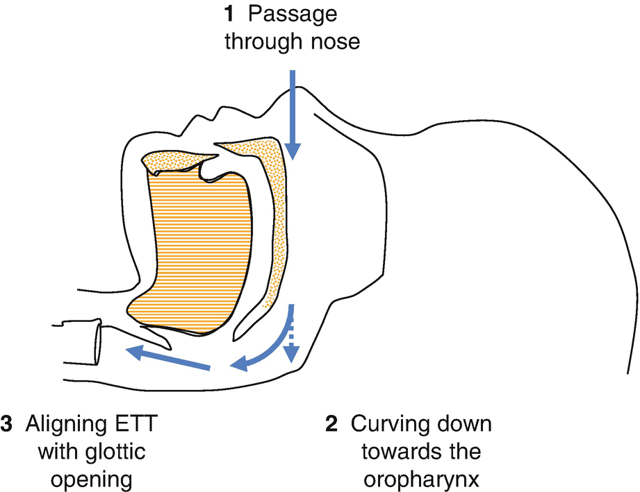
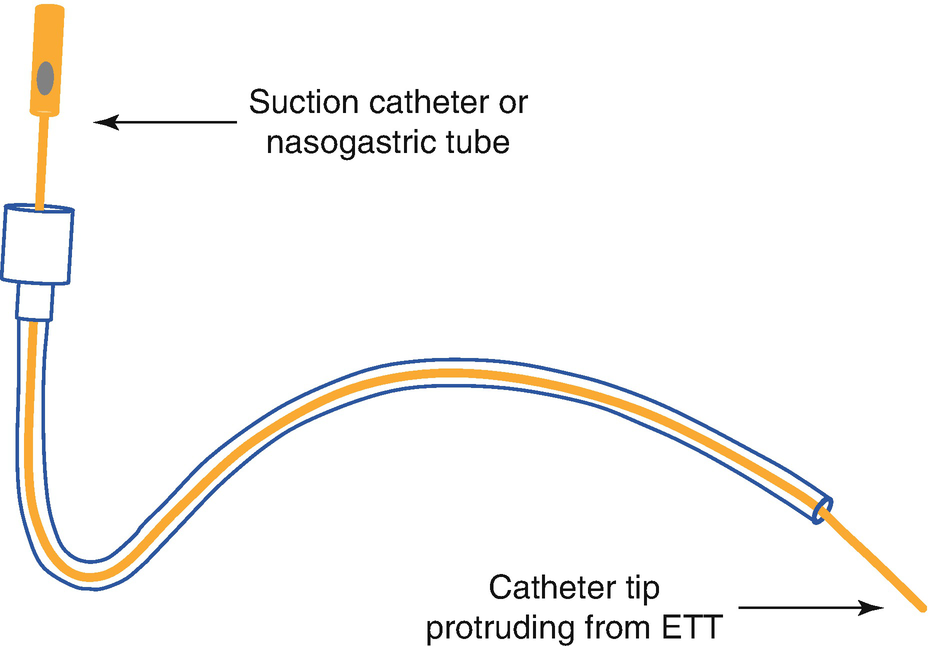
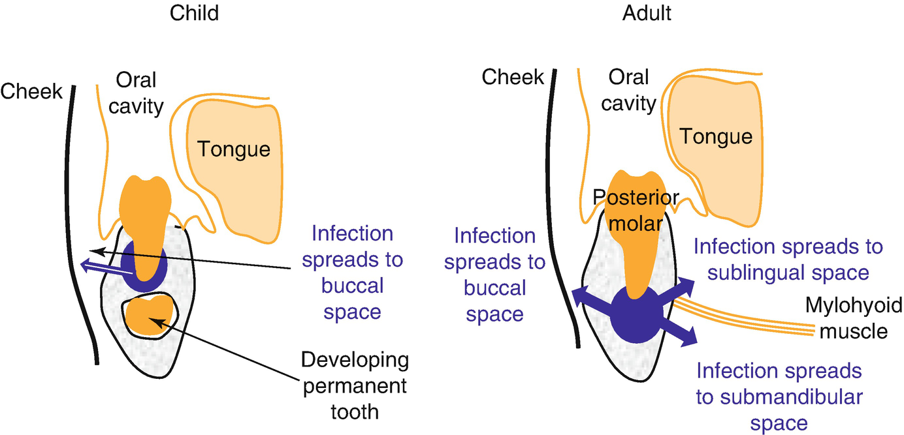

Anesthesia for Dental Procedures in Children

© Springer Nature Switzerland AG 2020

Craig Sims, Dana Weber and Chris Johnson (eds.) A Guide to Pediatric Anesthesia[https://doi.org/10.1007/978-3-030-19246-4\_18](https://doi.org/10.1007/978-3-030-19246-4_18)

# 18. Anesthesia for Dental Procedures in Children

Lisa Khoo[1](#Aff4)    

(1)

Department of Anaesthesia and Pain Management, Perth Children’s Hospital, Nedlands, WA, Australia

Lisa Khoo

Email: [Lisa.Khoo@health.wa.gov.au](mailto:Lisa.Khoo@health.wa.gov.au)

### Keywords

Endotracheal intubation, nasalExtraction of teeth, anesthesiaEndocarditis prophylaxis for dental proceduresAnesthesia for dental abscessRestorative dental treatment in children, anesthesia

Dental procedures are the third commonest reason for general anesthesia in children. These procedures vary in duration from a few minutes for removal of a tooth, to a few hours for dental restoration procedures. Anesthesia for pediatric dental procedures can be challenging because it involves sharing the airway with the dentist, care of a pediatric patient and management of an uncooperative child who was unable to have their treatment while awake in the dental chair.

Dentists gain the cooperation of children during dental procedures in the dental chair with a combination of behavioral techniques, local anesthesia, and inhalational sedation with nitrous oxide through a nose (Wesson) mask. A proportion of children do not tolerate treatment despite these techniques, and deeper sedation or general anesthesia is required. If a sedated child is not alert enough to hold open their mouth, then they are more sedated than ‘conscious sedation’. Office-based sedation of children that is deeper than conscious sedation is fraught with hazard and is not recommended. In the United Kingdom, there were deaths in children being sedated in the dental chair, and now sedation of children younger than 16 years with anything other than nitrous oxide can only be performed in a hospital. In Australia and New Zealand, there are ANZCA Guidelines regarding sedation. These guidelines mandate broadly the same staffing, monitoring and facilities as would be present for general anesthesia in a hospital. Apart from reasons of safety, dentists may opt to treat a child requiring extensive treatment under general anesthesia in a hospital to avoid several separate treatments in the dental chair and possible psychological trauma to the child.

## 18.1 Nasal Endotracheal Intubation

Nasal intubation is performed in children for two groups of reasons. The first is for ventilation in intensive care or for transport—a nasal ETT is more secure than an oral ETT. For example, when postoperative ventilation is planned for a child, a nasal tube is inserted. The second is for some procedures requiring access to mouth (not tonsillectomy however). Nasal intubation is often used during dental procedures to allow unrestricted access to the child’s mouth and teeth. ETTs used for oral intubation can be used for nasal intubation. The depth of insertion is best judged by observing the depth of the ETT during laryngoscopy and noting the marking at the nose. Alternatively, a formula or table can be used, by adding 20% to the distance from the oral formula. So, for children over the age of 1 year, the depth at the nose for nasal intubation is:

For dental procedures, a preformed, nasal (north-facing) RAE impinges least on the dentist’s work (Fig. [18.2](#Fig2)). These tubes are inserted until the pre-formed curve is against the child’s nose. There is limited availability of pediatric, cuffed nasal RAE tubes. Some tubes are too long and likely to cause endobronchial intubation if inserted with the curve against the nose, and uncuffed nasal RAE tubes are often used instead. An alternative is to use a wire reinforced ETT and curve the ETT upwards away from the mouth. The tubes have a slightly larger outside diameter than a standard tube with the same size internal diameter. They are also expensive and may place pressure on the nostril as the tube curves upwards.

Preparation for nasal intubation includes spraying the nasal mucosa with vasoconstrictor after induction, softening the ETT with warm water and lubricating the outside of the ETT. The same sized tube is used for nasal and oral intubation in children—the diameter of the cricoid determines the size of the ETT in children, whereas the nose limits the size of the ETT in adults. Nasal intubation is often more difficult than oral intubation, with three areas that can cause problems during passage of the ETT (Fig. [18.1](#Fig1)).

Fig. 18.1

The three sites of difficulty during a nasal intubation—passing the ETT through the bony part of the nose, making the ETT turn downwards into the oropharynx towards the larynx, and aligning the axis of the ETT with the trachea

### Note

The same sized ETT is used for oral and nasal intubation in children.

The first area is the bony turbinates in the nose. The patency of the nostrils can be assessed before induction, but the child needs to be cooperative to do this. Resistance at the turbinates can be overcome by firm but careful, constant pressure. Rotation of the tube to change the orientation of the bevel may also help. Passing the endotracheal tube along the nasal floor, under the inferior turbinate, avoids the complications of passing it above the inferior turbinates. The middle turbinate, which sits above the inferior turbinate, is porous, fragile and vascular, and trauma from an endotracheal tube may result in fracture, CSF leak and olfactory nerve dysfunction. Inserting a suction catheter as a guide for the endotracheal tube increases the chances of passing below the inferior turbinates.

The second area that may cause problems is the nasopharynx, as the ETT often hits the posterior wall of the nasopharynx or adenoidal tissue in its passage towards the larynx. Softening the tube by placing it in warm water helps it to curve downwards with gentle pressure. Orientating the tube so the bevel is facing the posterior wall may also help. It is important not to just push harder—forcing the tube may traumatize the posterior pharyngeal wall, and there even are case reports of nasal ETT’s entering the brain in neonates. If the tube will not curve downwards towards the larynx, the most successful strategy is to insert a suction catheter through the ETT and use it as a guide (Fig. [18.2](#Fig2)). The catheter is passed through the nose and into the oropharynx, then the ETT can then be “railroaded” over the catheter. The catheter may also prevent mucus and tissue from plugging the lumen of the ETT. Some use this technique routinely for nasal intubation because of these advantages.

Fig. 18.2

A suction catheter passed through the nasal (north-facing) RAE tube to act as a guide. The free end of the catheter is passed through the nose into the oropharynx, and then the ETT is railroaded over it. This minimizes trauma from the ETT to the posterior wall of the nasopharynx, and prevents nasal secretions entering the lumen of the ETT

The third problem is aligning the ETT with the laryngeal opening. Sometimes, the Magill forceps will bring the ETT tip into the opening between the vocal cords, but the ETT will not pass into the trachea—the tube becomes caught on the posterior arytenoids or the anterior wall of the trachea. There are three alternatives to align the axes of the trachea and the ETT. The first is to apply external laryngeal pressure to alter the angle between the ETT and larynx. The second is to lower the laryngoscope (the view of the larynx is temporarily lost) to help align the larynx and ETT then gently pushing the ETT inwards. A third option is to change the direction of the bevel by rotating the ETT to stop it catching on the vocal cords or arytenoids.

### Tip

Sometimes during nasal intubation, the ETT will not curve downwards from the nose towards the larynx. The best strategy is to insert a catheter through it, pass the catheter through the nose and into the oropharynx, then railroad the ETT over it.

Another reason for difficulty passing the ETT through the larynx is that the ETT may be the wrong size. If there is concern that the ETT may be too large, it can be ‘sized’ by intubating orally first to assess ease of passage through the cricoid ring, and then reinserted nasally. If an uncuffed tube is used, a throat pack may tamponade small leaks. A throat pack is routinely used during dental procedures to prevent aspiration of blood and solid fragments, and to stop blood entering the stomach and possibly causing vomiting later. A small child needs a small pack—it is useful to cut the pack and shorten it. If an adult-sized pack is inserted into a child’s mouth, it takes up a lot of space, pushes the tongue forward and restricts access to the mouth for the dentist. The entire throat pack is placed within the mouth and there should be an alternate visual cue that it has been inserted. Each anesthetist must take steps to ensure the pack is removed before extubation. The role of throat packs is being questioned, with concerns there is little evidence for any benefit, but real risks to their continued use.

### Tip

Throat packs risk being left behind after anesthesia. Follow strategies to ensure they are removed. The greatest risk is when no part of the pack is protruding from the mouth. Minimize this—if there is an ETT coming out of the mouth, then the ‘tail’ of the pack can also come out of the mouth.

## 18.2 Dental Extraction

Removal of teeth may be needed for impacted teeth, dental trauma or dental abscess. There may be blood in the airway or stomach after dental trauma, but this is rarely an issue with the falls and accidents that damage children’s teeth.

Dental abscesses may reduce mouth opening due to pain, but rarely cause airway problems in children. Children’s deciduous teeth are more anterior and higher in the mandible than permanent teeth. The mandibular bone is thin, and the abscess usually ruptures through the buccal side into the mouth or facial and neck tissues (Fig. [18.3](#Fig3)). It is rare for a young child’s dental abscess to rupture into the submandibular or other deep tissue layers that may affect the airway. Nevertheless, it is wise to assess the child’s airway, checking the floor of the mouth and neck tissues are soft, and that there are no signs of obstructed breathing.

Fig. 18.3

Different patterns of spread from dental abscesses in young children compared to older children and adults (adapted from Morosan et al.)

In older children and adults on the other hand, abscesses of the third (wisdom) molar are posterior in the mandible and usually rupture at the apex of the root. They spread into the submandibular space and deep tissue planes (Ludwig’s angina). In this case, the airway is at high risk, and intubation is difficult—infection and edema of the floor of the mouth stop tongue compression during laryngoscopy, and edema in the laryngopharynx may obstruct the airway. Some of these patients need tracheostomy before induction.

Some permanent teeth require removal of bone using a low-speed drill to free their roots. If a high-speed drill designed for dental restorations is used for this, air from the drill may enter the tooth sockets and cause surgical emphysema of the face and neck.

The anesthetic technique for dental extraction in children is dependent on the number and position of teeth to be removed. A nasal mask can be used, or even a facemask (removed briefly to allow access to the mouth) for short procedures on anterior teeth. Nowadays however, the LMA is a better option as it stops blood and fragments entering the airway from the mouth, and allows ongoing anesthesia without time limits or theater pollution. A throat pack is not usually needed when an LMA is used. A nasal ETT may be required for multiple or difficult extractions in a small mouth. Dental extractions are usually brief, straightforward procedures in generally well children. Problems are more likely if anesthesia is not adequate, when laryngospasm may occur due to strong surgical stimulation (Table [18.1](#Tab1)). The airway must be carefully monitored as the LMA may become dislodged during the procedure. The LMA can be removed either deep or awake after suctioning the pharynx with the child in the lateral position.

Table 18.1

Keypoints for anesthesia for dental extraction in children

| 
Keypoints for anesthesia for dental extraction in children

 |
| --- |
| 

Common procedure—abscess or trauma

 |
| 

Strong surgical stimulation may cause laryngospasm if inadequate anesthesia

 |
| 

Shared airway

 |
| 

Blood in the airway

 |

Local anesthesia used by the dentist reduces pain, but may cause distress in small children because of the lip numbness. Some small children will also bite their numb lip or chew at sutures while the local anesthetic is working, causing traumatic ulcers. A small dose of opioid may be used for analgesia instead, and simple analgesics such as paracetamol and ibuprofen provide adequate postoperative analgesia for most children.

## 18.3 Restorative Dental Treatment

Nasal intubation with a nasal (north-facing) RAE tube allows unlimited access to the patient’s mouth and enables accurate x-rays. A throat pack is usually placed to prevent soiling of the airway by blood, secretions and water from the dental hand-piece. These procedures may last a few hours, and care of pressure areas is needed. These areas include the ETT at the nares and forehead, and the child’s eyes to prevent injury should the dentist rest on them. Patients who are very young or underweight should have their temperature monitored and be actively warmed if required. IV fluids are infused to replace the patient’s deficit and maintenance requirements.

There is a moderate amount of trauma to the gums during the procedure, and a small dose of opioid decreases pain and emergence delirium. Reducing minor morbidity is important to facilitate same-day discharge, and antiemetics such as dexamethasone and ondansetron may be helpful. Dexamethasone also decreases swelling and pain following extractions.

## 18.4 Antibiotic Prophylaxis in Children with Cardiac Disease

Bacteremia may occur even with tooth brushing, although these bacteria do not cause infective endocarditis. More serious bacteremia, most commonly with streptococcus viridans, occurs with invasive dental procedures, and antibiotic prophylaxis may be required to prevent infective endocarditis. Invasive dental procedures in children include extractions, clamping dental dams onto teeth, and fitting stainless steel crowns. These procedures disrupt the gingiva or periapical region of teeth. Treatment such as scaling and cleaning, or injecting local anesthetic are not considered invasive. Endocarditis prophylaxis is required for some children with cardiac conditions having invasive dental treatment (Table [18.2](#Tab2)).

Table 18.2

Cardiac conditions in children requiring antibiotic prophylaxis during invasive dental procedures

| 
Cardiac condition

 |
| --- |
| 

Unrepaired cyanotic congenital heart disease, even if palliated with a shunt or conduit

 |
| 

Repaired congenital heart disease either with prosthetic material within last 6 months or with a residual defect next to the repair (preventing endothelialization)

 |
| 

Prosthetic valve or valve repair with prosthetic material

 |
| 

Previous infective endocarditis

 |
| 

Cardiac transplantation recipients with valvulopathy

 |

Guidelines for prophylaxis in Australia include rheumatic heart disease in indigenous children and others at significant socioeconomic disadvantage.

In the UK, the guidelines of the National Institute for Health and Care Excellence are less prescriptive. They state that the vast majority of patients at increased risk of infective endocarditis do not need prophylaxis, but prophylaxis should be considered for some patients in consultation with the patient and their cardiologist. These patients have the conditions listed in Table [18.2](#Tab2), similar to Australia and the rest of Europe.

Intravenous prophylaxis is with amoxycillin 50 mg/kg IV (max 2 g) at induction, or cefazolin 50 mg/kg (max 1 g) IV if non-anaphylactic allergy to penicillin. If the child has had anaphylaxis to penicillin in the past, clindamycin 20 mg/kg IV (max 600 mg) over 20 min is recommended.

## Review Questions

1.  1.
    
    A 6 year old child is having restorative dental treatment under general anesthesia. A nasal endotracheal tube is required. What size tube will you use?
    
2.  2.
    
    A 6 year old child with Trisomy 21 is having dental treatment which includes extractions and stainless steel crowns to four teeth. A nasal endotracheal tube is required. Past history includes a fully repaired atrio-ventricular septal defect during infancy. Does this child require endocarditis prophylaxis? What size tube will you use?
    

### Further Reading

1.  Adewale L. Anaesthesia for paediatric dentistry. Contin Educ Anaesth Crit Care Pain. 2012;12:288–94.[Crossref](https://doi.org/10.1093/bjaceaccp/mks045)
    
2.  ANZCA Guideline PS09 (2010). Guidelines on sedation and/or analgesia for diagnostic and interventional medical, dental or surgical procedures; 2014.
    
3.  Bailey CR, Nouraie R, Huitink JM. Have we reached the end for throat packs inserted by anaesthetists? Anesthesia. 2018;73:535–8. An editorial questioning why packs are used when there seems little benefit but significant risk_._[Crossref](https://doi.org/10.1111/anae.14168)
    
4.  Frassica JJ, Miller EC. Anesthesia management in pediatric and special needs patients undergoing dental and oral surgery. Int Anesthesiol Clin. 1989;27:109–15.[Crossref](https://doi.org/10.1097/00004311-198902720-00008)
    
5.  Lim CW, et al. The use of a nasogastric tube to facilitate nasotracheal intubation: a randomized controlled trial. Anaesthesia. 2014;69:591–7.[Crossref](https://doi.org/10.1111/anae.12627)
    
6.  Morosan M, Parbhoo A, Curry N. Anaesthesia and common oral and maxillo-facial emergencies. Contin Educ Anaesth Crit Care Pain. 2012;12:257–62.[Crossref](https://doi.org/10.1093/bjaceaccp/mks031)
    
7.  National Institute for Health and Care Excellence (NICE). Prophylaxis against infective endocarditis: antimicrobial prophylaxis against infective endocarditis in adults and children undergoing interventional procedures. NICE Clinical Guideline No 64. 2016. [https://​www.​nice.​org.​uk/​guidance/​cg64/​chapter/​Recommendations](https://www.nice.org.uk/guidance/cg64/chapter/Recommendations). Accessed Jan 2019.
    

### Endocarditis Prophylaxis

1.  Baltimore RS, et al. Infective endocarditis in childhood: 2015 update. Circulation. 2015;132:1487–515.[Crossref](https://doi.org/10.1161/CIR.0000000000000298)
    
2.  Daly CG. Antibiotic prophylaxis for dental procedures. Aust Prescr. 2017;40:184–8.[Crossref](https://doi.org/10.18773/austprescr.2017.054)
    
3.  NICE Guideline 64. Prophylaxis against infective endocarditis: antimicrobial prophylaxis against infective endocarditis in adults and children undergoing interventional procedures. National Institute for Health and Care Excellence; 2016. [www.​nice.​org.​uk/​guidance/​cg64](https://www.nice.org.uk/guidance/cg64). Accessed Feb 2019.
    
4.  Scottish Dental Clinical Effectiveness Programme. Antibiotic prophylaxis against infective endocarditis: implementation advice. 2018. [http://​www.​sdcep.​org.​uk/​wp-content/​uploads/​2018/​08/​SDCEP-Antibiotic-Prophylaxis-Implementation-Advice.​pdf](http://www.sdcep.org.uk/wp-content/uploads/2018/08/SDCEP-Antibiotic-Prophylaxis-Implementation-Advice.pdf). Accessed Feb 2019.
    
5.  Thornhill MH, et al. Antibiotic prophylaxis of infective endocarditis. Curr Infect Dis Rep. 2017;19:9.[Crossref](https://doi.org/10.1007/s11908-017-0564-y)