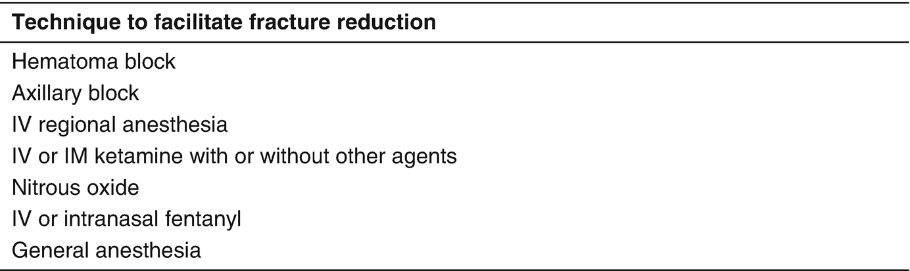

Anesthesia for Orthopedic Surgery in Children

© Springer Nature Switzerland AG 2020

Craig Sims, Dana Weber and Chris Johnson (eds.) A Guide to Pediatric Anesthesia[https://doi.org/10.1007/978-3-030-19246-4\_19](https://doi.org/10.1007/978-3-030-19246-4_19)

# 19. Anesthesia for Orthopedic Surgery in Children

Martyn Lethbridge[1](#Aff4)     and Erik Anderson[1](#Aff4)    

(1)

Department of Anaesthesia and Pain Management, Perth Children’s Hospital, Nedlands, WA, Australia

Martyn Lethbridge (Corresponding author)

Email: [martyn.lethbridge@health.wa.gov.au](mailto:martyn.lethbridge@health.wa.gov.au)

Erik Anderson

Email: [Erik.Andersen@health.wa.gov.au](mailto:Erik.Andersen@health.wa.gov.au)

### Keywords

Anesthesia forearm fracturesScoliosis surgery, anesthesiaAnesthesia cerebral palsy

Children commonly need anesthesia for orthopedic surgery, either urgently because of limb fractures in previously well children, or electively in children who often have coexisting diseases such as cerebral palsy or myopathies. These medical issues are dealt with elsewhere in this book, and this chapter focuses on issues unique to orthopedic surgery. It also outlines the management of anesthesia for scoliosis surgery, so that trainees who are involved with these cases will understand some of the background to their care.

## 19.1 Emergency Anesthesia for Forearm Fractures

Fractures of the upper limb are a very common reason for a child to have emergency anesthesia. Greenstick fractures only occur in young, preschool aged children. These fractures are nearly always reduced in the Emergency Department using an analgesia technique described in Fig. [19.1](#Fig1).

Fig. 19.1

Anesthesia and analgesia techniques used for reduction of forearm fractures in children

Complete fracture-displacements may be reduced with a variety of techniques in either the ED or the OR. Many of the techniques require skill and patience to perform in frightened young children, and depend on local expertise, preferences and practical issues relating to staff and theatre availability. All of the techniques require proper monitoring, safety guidelines and ability to resuscitate the child if necessary.

Although fasting beforehand to ensure an empty stomach would seem wise, fasting requirements vary from center to center, depending on the anesthetic technique used. Many emergency departments accept fasting durations much shorter than those for anesthesia. The safety of intravenous sedation in the emergency department and the point at which sedation becomes anesthesia are controversial subjects. Nevertheless, general anesthesia is still very commonly used during fracture reduction because it always results in satisfactory conditions for the procedure and has a high level of safety.

### 19.1.1 General Anesthesia

Children needing surgery for a forearm fracture are usually fit and healthy, and pulmonary aspiration of stomach contents is the main concern. Evidence about minimizing the risk of aspiration for this procedure is scarce and anecdotal, and it would be simple to recommend rapid sequence induction and intubation for all cases. Rapid sequence induction however, is not without risks, does not entirely protect against aspiration, and can be technically challenging to perform for a brief procedure such as this. Although not formally studied, stratification of the risk of aspiration can be attempted by considering several factors. These include the fasting periods before and after injury, the amount of pain and use of opioid analgesics, the age and level of anxiety of the child, and presence of hunger or bowel sounds.

In children undergoing closed reduction of forearm fractures, experience shows children anesthetized with a facemask rarely vomit, even if they have significant stomach contents. This presupposes that an adequate depth of anesthesia is maintained during fracture manipulation to avoid any coughing, straining, or triggering a vomiting reflex. A laryngeal mask airway (LMA) is commonly used for this procedure, and it would seem prudent to use a second generation LMA with an esophageal drainage tube to mitigate the risk of gastric reflux. Intubation should still be considered for patients who are thought more likely to regurgitate. Identifying those children with a forearm fracture who are more likely to regurgitate relies on factors such as a short interval between food and injury, short fasting time or ongoing pain and opioid requirement. As discussed in Chap. [1](467929_2_En_1_Chapter.xhtml), an inhalational induction may be an acceptable option even in this group of children when there is difficult venous access.

Fractures above the elbow (supracondylar fractures) are more painful, frequently require opioid analgesia, and tend to be brought to theater sooner than children with forearm fractures. These patients are more at risk of aspiration, and are more commonly intubated—possibly requiring a rapid sequence induction.

### 19.1.2 Compartment Syndrome

In adults, compartment syndrome is said to be associated with the five ‘P’s of symptoms (pain, paresthesia, paralysis, pallor, pulselessness). In young children, it is said to be associated with the three ‘A’s: anxiety, agitation and analgesia requirements that are increasing. Children are often unsettled after surgery and analgesia is increased in response, and compartment syndrome can easily be missed. It is particularly a concern after supracondylar and tibial fractures, but can occur after other orthopedic and non-orthopedic procedures. Regional analgesia using low concentrations of local anesthetic probably do not prevent the detection of compartment syndrome.

### Tip

Children at increased risk of gastric aspiration for fracture manipulation include short interval between food and injury, children in more pain or with anxiety, opioid use and supracondylar fractures. Coughing while lightly anesthetized is the most likely mechanism for regurgitation and aspiration during facemask or LMA anesthesia.

## 19.2 Common Orthopedic Procedures

### 19.2.1 Procedures for Hip Dislocation and Dysplasia

Hip dislocation can occur in children for congenital reasons such as breech position in-utero, or for acquired reasons such as muscular imbalance around the hip joint. This can occur in children with neuromuscular disorders such as cerebral palsy. The femoral head can be immobilized in the acetabulum in infants using a SPICA cast. General anesthesia may be required for this. The child is positioned at the end of the theater bed and elevated on a box that allows the cast to be placed circumferentially from the umbilicus to the knees or feet. The cast must be applied to allow unimpaired abdominal movement. Because it is awkward to manipulate the airway while the infant is elevated on the box, tracheal intubation is often best.

Open surgical procedures for hip dislocation include the Salter pelvic osteotomy, and the varus de-rotational osteotomy (VDRO). Both procedures carry risks of significant blood loss, although rarely require transfusion. Post-operative pain and muscle spasms can be significant. Regional techniques, such as caudal block or a lumbar epidural are useful if not contraindicated. Sometimes a SPICA cast is applied, limiting access to an epidural site for inspection and catheter removal. If this is the case, a single-shot caudal and opioid infusion may be preferred. Muscle relaxants such as diazepam are useful for controlling spasm, but with caution as the child is also receiving opioids.

### 19.2.2 Procedures for Talipes Equino Varus

Talipes or ‘club foot’ can be managed with serial casting but surgically releasing the Achilles tendon is often required. This operation is commonly performed transcutaneously under either local or general anesthesia. Factors in considering the best approach to anesthesia include the age of the child, whether the procedure is unilateral or bilateral, and local practice. Local anesthesia for this procedure avoids exposure to general anesthesia and a possible risk of neurotoxicity, and fasting may be avoided. A local anesthetic cream can be applied to the medial side of the Achilles tendon before injection of a mixture of quick acting (lidocaine) and longer lasting (ropivacaine) local anesthetic. Care must be taken to calculate the maximum combined dose of local anesthetic. Other techniques such as awake spinal anesthesia have been described.

### 19.2.3 Slipped Upper Femoral Epiphysis (SUFE)

The upper femoral epiphysis is prone to subluxing on the femoral neck in adolescence, threatening the vascular supply of the femoral head. It is more common in obese children. The traditional surgery to stabilize the femoral head included placement of pins or screws through the femoral neck into the femoral head. This procedure is performed using a traction table, and anesthetic management requires consideration of the airway in patients with increased body mass, risk of aspiration, comorbidities such as obstructive sleep apnea, and post-operative pain. Femoral nerve blocks are useful for controlling post-op pain, in combination with multi-modal analgesia and the use of judicious doses of opioids. Some recent surgical techniques for the condition are more extensive and prolonged, but require similar anesthetic considerations.

## 19.3 Cerebral Palsy and Orthopedic Surgery

Orthopedic surgery is required by children with cerebral palsy for three main reasons—to correct hip dysplasia, to relieve limb contractures and improve posture, and to improve gait. Surgery often involves tenotomies, tendon transfers or osteotomies. Pain and muscle spasms can be significant issues after these procedures. Anesthetic care of children with cerebral palsy is discussed further in Chap. [12](467929_2_En_12_Chapter.xhtml), Sect. [12.​1](467929_2_En_12_Chapter.xhtml#Sec1).

## 19.4 Scoliosis

Scoliosis consists of spine curvature, rotation of the vertebrae and rib cage deformity. The commonest form is idiopathic scoliosis in otherwise well adolescent girls, but the most difficult form is caused by neuromuscular disease. The spinal curvature is usually ‘S’ shaped in idiopathic cases, but neuromuscular cases tends to involve whole thoracolumbar spine in a long ‘C’ shaped curve. The degree of curvature is measured from the angle of the vertebral bodies (the Cobb angle). Surgery is considered if the spinal curve is greater than 40°, or less in neuromuscular cases. The anesthetic considerations are summarized in Table [19.1](#Tab1), and discussed below.

Table 19.1

List of issues that need to be considered during anesthesia and surgery for correction of scoliosis

| 
Anesthetic considerations for scoliosis surgery

 |
| --- |
| 

Risk of poor respiratory function postop

 |
| 

Risk of rhabdomyolysis in neuromuscular cases

 |
| 

Prone position

 |
| 

Spinal cord monitoring:

 – SSEP, MEP, CMAP

 – Wake up test

 |
| 

Blood loss and transfusion

 |
| 

Hypothermia

 |
| 

Postop analgesia and respiratory function

 |

### 19.4.1 Lung Changes

A restrictive lung defect commonly results from the rib cage and vertebral changes, especially if the spinal curvature is greater than 65°. Ventilation-perfusion mismatch and pulmonary hypertension may also occur, but usually only in severe cases with a curvature greater than 100°. Patients with neuromuscular disease are at greater risk of respiratory complications: they also have parenchymal lung disease from recurrent lung infections as a result of a weak cough, aspiration and immobility. Surgery stops, but does not reverse, the progression of lung changes. It also improves the wheelchair posture in adolescents with neuromuscular disease.

### 19.4.2 Surgical Approach

Surgery is most commonly via a posterior approach with the patient prone. An anterior approach (via thoracic or abdominal incisions) is used along with the posterior approach in severe cases. Anterior and posterior surgery can be performed as a staged or single procedure. Surgery is extensive and causes blood loss from bone and soft tissue. It carries a 0.3–0.6% risk of spinal cord damage from implant related trauma, spinal ischemia, distraction injury or epidural hematoma. The risk of spinal cord ischemia may be greater for more severe curves and curves associated with spinal cord tethering. Spinal ischemia may be caused by direct vascular injury, reduced perfusion from hypotension, stretching of the cord or epidural hematoma. To reduce the risk of spinal cord damage, intraoperative spinal cord monitoring is routine, although cord ischemia may cause neurological problems up to 48 h postoperatively.

### 19.4.3 Spinal Cord Monitoring

Neurophysiological monitoring continuously assesses the spinal cord and has replaced the ‘wake-up test’ in many centers. Monitoring has limitations of low signal strength, interference from background electrical noise and anesthetic agents, and false negative results. Somatosensory evoked potentials (SSEP) are performed by stimulating the peripheral nerves and detecting either a spinal response with epidural electrodes, or a cortical response with scalp electrodes. It monitors only the sensory path (posterior columns), not the more vulnerable motor path in the spinal cord (anterior columns). Motor evoked potentials (MEP) monitor motor pathways by transcranial stimulation of the motor cortex and detecting either a signal in the spinal cord with epidural electrodes or a compound muscle action potential (CMAP) with a skin electrode. CMAP monitoring is the most commonly used technique as it assesses the motor pathway, avoids cumbersome epidural electrodes and detects problems affecting the nerve roots.

In the past, a wake-up test was used to assess lower limb function and may still occasionally be required in cases of neurophysiological monitoring failure. In this test, the patient is woken up during surgery by reducing anesthetic agents while maintaining analgesia with remifentanil. The aim is to have the child cooperative and able to move their toes on command. It is challenging to avoid excessive movement but be awake enough to cooperate, and there are concerns that spontaneous ventilation during the test may predispose to venous air embolism. Also, the test only assesses the spinal cord at one point in time and irreversible damage may have already occurred before the test. The clonus test can be performed as anesthesia is lightened for a wake-up test, as clonus is easy to elicit at this stage due to the lack of cortical inhibition. It can also be used as a way of deciding if a full wake up test is needed.

### 19.4.4 Preoperative Assessment for Scoliosis Surgery

Respiratory and cardiac function affect the risk of complications. Exercise tolerance is a good measure in otherwise well patients with idiopathic scoliosis. Asymptomatic mitral valve prolapse is present in 25% of these patients. Cardiorespiratory assessment in children who are wheelchair-bound or developmentally delayed is more difficult, and consultation with the child’s respiratory team and cardiologist may help to optimize the child’s condition preoperatively. Performance of activities of daily living, and need for assisted ventilation and cough-assist machines are two indicators. Spirometry commonly shows a mild restrictive defect. Postoperative ventilation is more likely to be needed if the forced vital capacity is less than 30% of predicted. Muscular dystrophy patients may have cardiomyopathy that may not be detectable by a resting preoperative echocardiogram.

### 19.4.5 Anesthesia Techniques

The patient’s condition and requirements of the neurophysiological monitoring affect the anesthesia technique for scoliosis surgery. Muscle relaxants, especially suxamethonium, are used with caution in children with underlying neuromuscular disease, and volatile agents are avoided if the child has muscular dystrophy. The SSEP and MEP are suppressed in a dose-dependent manner by volatile agents and propofol, but may be enhanced by ketamine and etomidate. They are also suppressed by nitrous oxide, but this can be overcome with epidural recording. Opioids and dexmedetomidine do not effect monitoring. Motor evoked potentials are abolished by profound muscle relaxation, but not by lesser degrees of relaxation (train-of-four count equaling 2 or 3) and may be useful for reducing background noise. A common anesthetic technique is to use remifentanil and low dose volatiles or propofol infusion. Invasive arterial pressure monitoring is essential and central venous pressures monitoring is commonly performed. Prone positioning can place pressure on the sternum, which can impair an already reduced cardiac function. Trans-esophageal ECHO may assist in guiding fluid and inotrope use during scoliosis surgery.

### 19.4.6 Blood Loss

The amount of blood loss depends on the number of segments operated on, but is typically more than 50% of the blood volume. About a third of the blood loss occurs in the postoperative period. Patients with neuromuscular disease lose more blood because surgery is longer and more extensive; they often have subclinical coagulation abnormalities; and they have osteopenic bone that needs more instrumentation. Surgical technique is the most important determinant of blood loss, but patient positioning to minimize epidural venous congestion is helpful. Controlled hypotension is not used because of concerns about spinal ischemia, but instead blood pressure aims to be normalized (MAP 70) and hypertension avoided. Tranexamic acid reduces blood loss, especially in neuromuscular disease patients. Blood transfusion is commonly needed during scoliosis surgery. Techniques to reduce transfusion include autologous pre-donation, acute normovolemic hemodilution, and cell savers. With these techniques, some patients with idiopathic scoliosis avoid donor blood, but losses are so large in patients with neuromuscular disease that transfusion of donor blood is usual.

### 19.4.7 Postoperative Management

Respiratory problems are the main postoperative concern. Analgesia and chest physiotherapy are important in optimizing respiratory function. The analgesic requirements for these children are high and for a prolonged duration. Intravenous opioids are often required for the first 5–7 days, followed by oral opioids for a further 1 or 2 weeks. Intrathecal opioids and analgesic doses of ketamine are also options. Bony fusion after surgery is critical and some surgeons prohibit the use of NSAIDS.

## Review Questions

1.  1.
    
    A 11 year old boy with Duchenne muscular dystrophy presents for correction of scoliosis. What complications from anesthesia is he particularly at risk of, and how can the risk of these be minimized?
    
2.  2.
    
    A 4 year old girl presents for MUA of forearm fracture at 6 pm after having fallen off the swing at 1:30 pm. She has been assessed in ED and given three doses of morphine for pain. Discuss how you are going to proceed and the reasons for your choice.
    
3.  3.
    
    You are scheduled to anesthetize a 15 year old girl with idiopathic scoliosis. What are the key issues in your anesthetic management of this patient?
    

### Further Reading

1.  Brady M, et al. Preoperative fasting for preventing perioperative complications in children. Cochrane Database Syst Rev. 2005;(2):CD005285. [https://​doi.​org/​10.​1002/​14651858.​CD005285](https://doi.org/10.1002/14651858.CD005285).
    
2.  Gibson PRJ. Anaesthesia for correction of scoliosis in children. Anaesth Intensive Care. 2004;32:548–59.[Crossref](https://doi.org/10.1177/0310057X0403200413)
    
3.  Glover CD, Carling NP. Neuromonitoring for scoliosis surgery. Anesthesiol Clin. 2014;32:101–14.[Crossref](https://doi.org/10.1016/j.anclin.2013.10.001)
    
4.  Marcus RJ, Thompson JP. Anesthesia for manipulation of forearm fractures in children: a survey of current practice. Paediatr Anaesth. 2000;10:273–7.[Crossref](https://doi.org/10.1046/j.1460-9592.2000.00494.x)
    
5.  Tobias JD, et al. Effects of dexmedetomidine on intraoperative motor and somatosensory evoked potential monitoring during spinal surgery in adolescents. Paediatr Anaesth. 2008;18:1082–8.[Crossref](https://doi.org/10.1111/j.1460-9592.2008.02733.x)
    
6.  Nagarajan L, Ghosh S, Dillon D, Palumbo L, Woodland P, Thalayasingam P, Lethbridge M. Intraoperative neurophysiology monitoring in scoliosis surgery in children. Clin Neurophysiol Pract. 2019;4:11–7.[Crossref](https://doi.org/10.1016/j.cnp.2018.12.002)