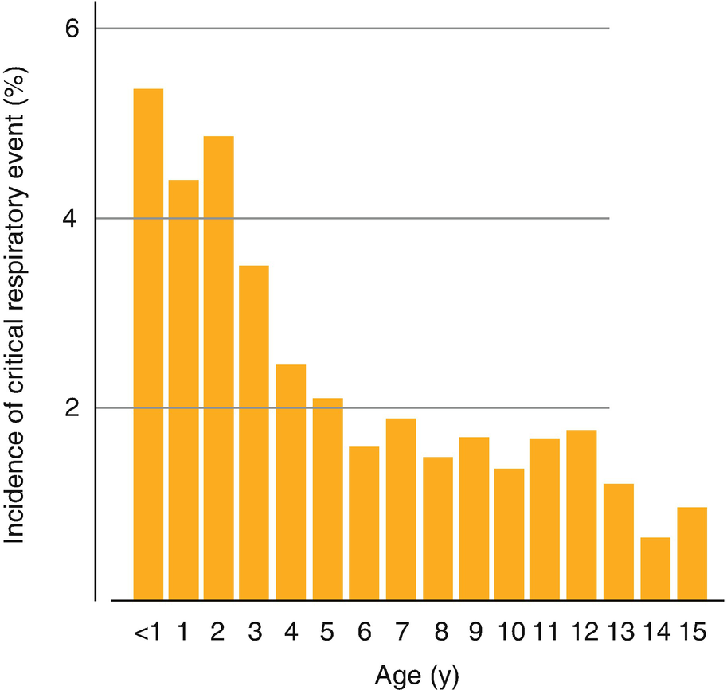
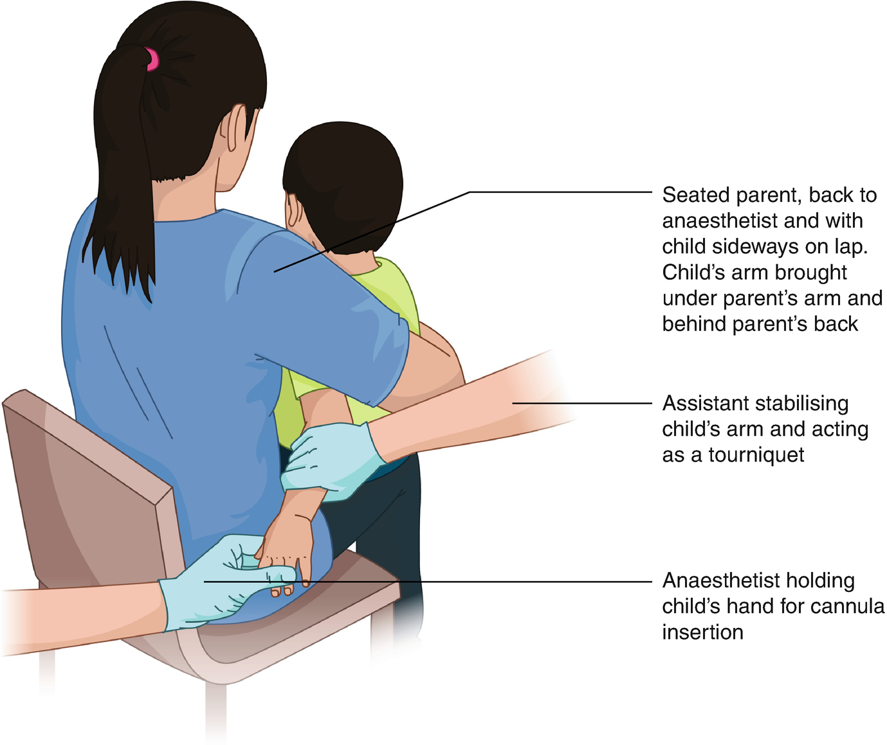
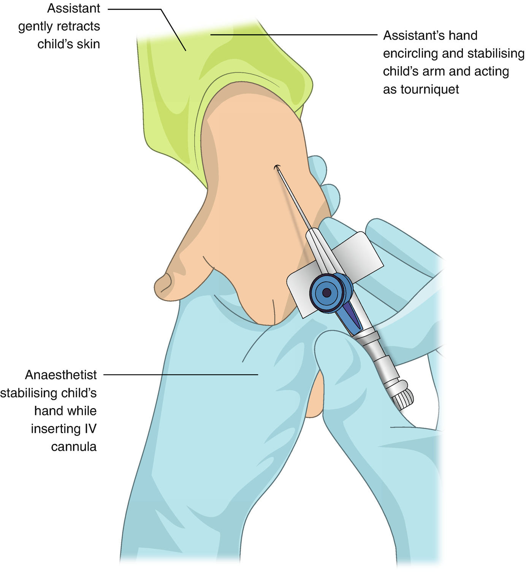
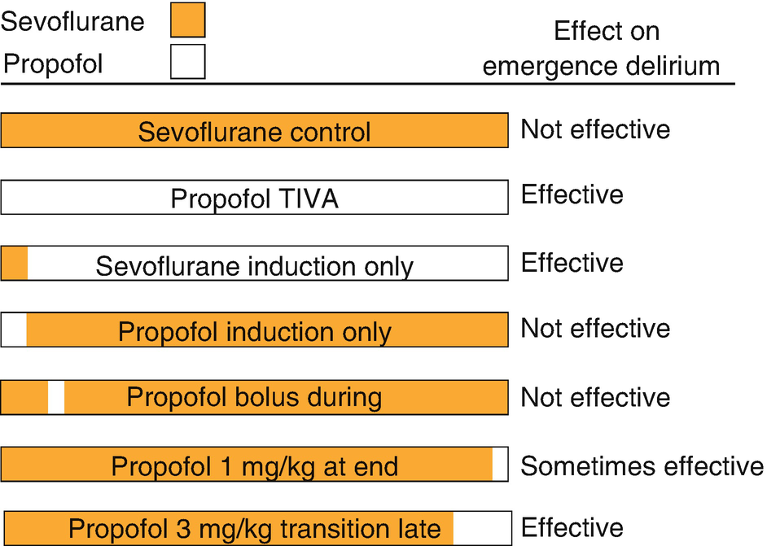
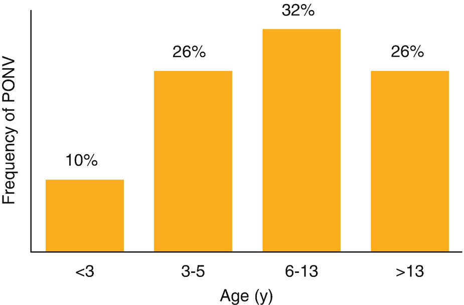

An Overview of Pediatric Anesthesia

© Springer Nature Switzerland AG 2020

Craig Sims, Dana Weber and Chris Johnson (eds.) A Guide to Pediatric Anesthesia[https://doi.org/10.1007/978-3-030-19246-4\_1](https://doi.org/10.1007/978-3-030-19246-4_1)

# 1. An Overview of Pediatric Anesthesia

Craig Sims[1](#Aff4)     and Tanya Farrell[1](#Aff4)    

(1)

Department of Anaesthesia and Pain Management, Perth Children’s Hospital, Nedlands, WA, Australia

Craig Sims (Corresponding author)

Email: [craig.sims@health.wa.gov.au](mailto:craig.sims@health.wa.gov.au)

Tanya Farrell

Email: [Tanya.Farrell@health.wa.gov.au](mailto:Tanya.Farrell@health.wa.gov.au)

### Keywords

Safety of pediatric anesthesiaEmergence deliriumInhalational inductionDay surgery in childrenPost extubation stridorPediatric anesthesia services

‘Pediatric’ or ‘child’ applies to someone aged less than 18 years. The American Academy of Pediatrics defines ‘pediatric’ as less than 21 years, while some centers use 16 years. An infant is a child aged between 1 and 12 months. The term ‘neonate’ applies to the first 4 weeks of life. Children make up a quarter of the population in most Western countries and a higher proportion in developing countries. Pediatric anesthesia is very common—5.5% of children have an anesthetic each year, and about half are preschool age. The commonest indication for anesthesia is ENT surgery, but children often need anesthesia for procedures such as scans and dental treatment that an adult would tolerate without anesthesia.

Pediatric anesthetists have several special attributes described by the late Dr. Kester Brown: they have expertise in caring for neonates and infants during anesthesia and surgery; they understand the anesthetic implications of congenital disease and disability; and they have knowledge of the psychological, physiological, pharmacological and anatomical differences with age.

## 1.1 Safety of Pediatric Anesthesia

Anesthesia for children has become very safe. Parents can be reassured that the profession has taken many steps over the years to reduce risk. These steps include analysis of past incidents (anesthesia was the first specialty to perform incident monitoring), embracing new monitoring technologies, improved specialist training and taking advantage of safer drugs. The overall mortality from anesthesia alone in a healthy, older child is approximately 1 in 50,000 to 1 in 100,000. Tertiary pediatric centers report overall mortality at 24 h after anesthesia and surgery at about 13 per 10,000 anesthetics. Anesthesia-related mortality in this group is reported as 0.7 per 10,000.

Morbidity is common with anesthesia in children. More than half of critical incidents are respiratory incidents and are mostly airway related such as laryngospasm, bronchospasm, hypoxia, and hypoventilation. The risk increases with decreasing age, because of smaller airway diameter and a predisposition to develop apnea and airway obstruction from airway irritation (Fig. [1.1](#Fig1)). Infants and young children also desaturate rapidly. Children 3 years and younger have a higher risk than older children. Infants are particularly at risk, with critical incidents four times more likely compared to older children. Surveys show critical incidents (again most commonly respiratory) occurring in 3–5% of infants. Risk is also increased by underlying pathology including congenital disease, the urgency of the procedure, and the hospital setting (Table [1.1](#Tab1)).

Fig. 1.1

The incidence of critical respiratory events (those requiring immediate intervention and that led (or could have led) to major disability or death) during anesthesia in children of different age groups. Based on data from APRICOT study, Lancet Respir Med 2017; 5:412–25

Table 1.1

Patient, surgical and anesthetist factors that may increase the risk of anesthesia in children

| 
Factors increasing risk of morbidity and mortality

 |
| --- |
|   | High risk | Medium risk | Low risk |
| --- | --- | --- | --- |
| 

Age | Neonates, infants | 1–3 years | \>3 years

 |
| 

ASA status | 3–5 | 2 (includes recent URTI) | 1

 |
| 

Surgery | Cardiothoracic, neurosurgery, scoliosis surgery | Airway and dental surgery | Peripheral, minor surgery

 |
| 

Emergency surgery | Increases risk

 |
| 

Experience of the anaesthetist | Increased risk with small case load of children of similar age to patient

 |

### Keypoint

Most critical incidents are respiratory and airway related. Proficiency in airway management is the cornerstone of safe pediatric anesthesia practice.

The risk of morbidity is lower if the anesthetist is experienced and has a large pediatric case load (Table [1.2](#Tab2)). Although there are no formal requirements for anesthetists caring for children, it is generally agreed that practitioners anesthetizing children aged 3 years and less should regularly anesthetize this age group, and anesthetists caring for children aged less than 1 year should regularly anesthetize infants. Neonatal anesthesia should be performed by those who have a fellowship in pediatric anesthesia.

Table 1.2

The pediatric caseload of the anesthetist affects the rate of complications

| 
Number of anesthetics given per year | Complications

 |
| --- | --- |
| 

1–100 children | 7/1000

 |
| 

100–200 children | 2.8/1000

 |
| 

More than 200 children | 1.3/1000

 |

Based on Auroy and Ecoffey, Anesth Analg 1997

### Keypoint

Children aged less than 3 years, and especially aged less than 1 year are at a higher risk from anesthesia than older children.

## 1.2 Organization of Services

If you are anesthetizing a child in a non-pediatric hospital it is important to make sure it is safe to do so. Several factors determine if a child can be safely cared for at a particular facility. Broadly, there are factors relating to the patient and the type of surgery planned (Table [1.3](#Tab3)), and factors relating to the hospital such as the level of staffing, equipment and facilities (Table [1.4](#Tab4)). An older child undergoing day stay surgery has different health facility requirements compared with an infant with coexisting medical problems requiring overnight admission after surgery.

Table 1.3

Patient factors to consider in determining level of staff and facilities needed to safely care for children

| 
Patient factor

 |
| --- |
| 

Age of child, esp. if <12 months

 |
| 

Type of surgery

 |
| 

ASA status/General health of the child

 |
| 

Overnight admission

 |
| 

Emergency procedure

 |

Table 1.4

Summary of requirements to safely anesthetize children (based on ANZCA PS29 and RCOA guidelines)

| 
Organization of services

 |
| --- |
| 

Staff | Experience and case load to maintain competency in relevant ages and case mix of:

 anesthetist

 assistant

 recovery

 ward nurses

 |
| 

Equipment | In addition to equipment and facilities needed to safely anesthetize adult patients:

 Size-appropriate breathing circuit, airway equipment and monitoring

 Anesthetic machine and ventilator suitable for ages of children being anesthetized

 Suitable fluid administration devices (may include burette)

 Resuscitation drugs and equipment (including defibrillator and pads suitable for children)

 Ability to control temperature of OR

 Beds and cots suitable to contain child and prevent falls

 |
| 

Facilities | Ability for parents to accompany child to theater and be present in recovery

Separated areas from adults-wards, OR, PACU

Accommodation for parents if overnight admission

Links to tertiary pediatric centers for advice and transfer of patients if postoperative problems occur

Pharmacy knowledgeable in pediatric doses

Acute pain service, HDU/ICU if relevant to case-mix

 |
| 

Governance | Local hospital group with oversight of scope of practice and suitability of staff involved

Local protocols and regulations for selection of patients and aspects of their care

Gradual implementation of any changes and ongoing quality assurance

 |

The Australian and New Zealand College (ANZCA) guideline PS29 (2019) and the United Kingdom College guidelines (2018) discuss staffing for the care of children in non-pediatric hospitals. These policies particularly apply to infants and neonates because of their greater risk. Anesthetists looking after children should have training in the relevant age group, and should not anesthetize children if they are not comfortable to do so due to either lack of recent experience or inadequate case load. Having a second anesthetist to help should be considered for infants and children ASA3 status or higher. The anesthetic assistant and perioperative staff should have training in the care of children. Not all children can be cared for in tertiary children’s hospitals, so most countries have networks in which information, guidelines and training are exchanged between central specialist and peripheral general hospitals. As part of this, there is generally a lead consultant to oversee provision of pediatric anesthetic services in general hospitals.

## 1.3 Preoperative Assessment

As in adults, assessment of children before anesthesia includes a history and examination, aiming to assess previous anesthetic problems and the severity of co-existing diseases. It is also an opportunity to establish rapport with the child and parents, assess the child’s behavior and reassure the parents with your manner and professionalism. Most children are healthy and active, although there is always the possibility of an unrecognized abnormality or syndrome. Some children have dysmorphic features suggesting an underlying syndrome (Table [1.5](#Tab5)). If a child has one congenital malformation it is more likely that there will be another. Common conditions to specifically ask about include preterm delivery, recent upper respiratory tract infection, obstructive sleep disorder, developmental concerns and bleeding disorders.

Table 1.5

Facial dysmorphic features that may indicate a congenital syndrome

| 
Dysmorphic feature

 |
| --- |
| 

Widely spaced eyes (hypertelorism)

 |
| 

Beaked or other nose abnormality

 |
| 

Low hairline on forehead

 |
| 

Low slung or malformed ears

 |
| 

Craniosynostosis

 |
| 

Microcephaly

 |

Examination needs to take into consideration the modesty of the child, particularly with school-aged children and adolescents. Examination may occasionally reveal a previously unrecognized heart murmur (see Chap. [20](467929_2_En_20_Chapter.xhtml), Sect. [20.​3.​1](467929_2_En_20_Chapter.xhtml#Sec26)), signs of asthma or URTI (see Chap. [11](467929_2_En_11_Chapter.xhtml), Sects. [11.​2](467929_2_En_11_Chapter.xhtml#Sec2) and [11.​3](467929_2_En_11_Chapter.xhtml#Sec8)), or loose teeth. The most important aspect of airway assessment is mandibular size (see Chap. [4](467929_2_En_4_Chapter.xhtml), Sect. [4.​2](467929_2_En_4_Chapter.xhtml#Sec5)). Investigations such as hemoglobin, CXR and urinalysis are not routinely performed in healthy children undergoing minor surgery. Hemoglobin is not tested because significant anemia is rare in children and mild anemia does not affect the decision to proceed with anesthesia. Some centers use the Sickledex test in patients at risk of sickle cell anemia.

Pre-anesthetic clinics are not always used for healthy children. Clinics are unlikely to reveal significant medical problems, are inconvenient for the family, and do not influence the most likely reason for cancellation of surgery, which is a viral illness just before surgery. Assessment is commonly by a telephone interview before admission and review by the anesthetist on the day of surgery. However, this approach reduces the time available for informed consent for anesthesia.

### 1.3.1 Loose Teeth

Children lose deciduous teeth from 5 years of age. A very loose tooth may dislodge and be aspirated during anesthesia and is sometimes removed (with parental permission) after induction. The tooth needs to be very loose before trying this, and usually has no visible root (it is resorbed). If the tooth is not very loose it can be surprisingly difficult and unpleasant to remove, and the gum may bleed. A tooth that is not on the verge of falling out can be watched carefully during airway manipulation and checked at the end of the case to make sure it has not been dislodged.

## 1.4 Consent

The legal age for consent is usually between 16 and 18 years, depending on the jurisdiction. Consent for a child is therefore obtained from the parent or legal guardian. However, there is growing recognition of the rights of younger people. It is usual to at least obtain the _assent_ (permission) to proceed with anesthesia and surgery in older school aged children, even though they may not be able to give legal consent. Further complicating this area is the increasing recognition by courts of children’s abilities to make their own decisions about treatment. Some health areas have policies in place that allow children as young as 14 years to consent to treatment. However, these policies are not a replacement for laws and it is still usual to obtain parental consent when the child is younger than 16–18 years.

Young people at 16 years of age have the legal ability in most countries to make decisions about their own care, and they must be presumed to be competent to make such decisions unless it can be shown otherwise. A valid refusal of surgery by a child who is competent should usually be respected. Legal advice should be sought if the procedure is felt to be in their best interests despite their refusal, especially if the refusal of treatment could result in death or serious harm.

Children younger than 16 years can consent if they demonstrate Gillick-competency. The Gillick competency test establishes the legal principles to decide a child’s ability to make health care decisions. The Gillick case considered consent for prescription of the oral contraceptive to a 16 year old girl, and whether or not a parent’s permission was required. The findings of this case have been used to determine consent issues in general. For a child to be deemed competent to decide about their healthcare they must have the ability to understand the factual, moral and emotional consequences of their decision. Competence is not reliant on a fixed age, and competence for one situation does not imply competence for all. The child’s age is still considered—the younger the child, the less likely the child can understand the implications of their decision and be considered Gillick-competent.

### Keypoint

Although some adolescents are mature enough to consent to anesthesia and surgery, it is wise to obtain the parent’s consent in most perioperative situations.

In certain life-threatening circumstances, society allows the wishes of a child or the parents to be overridden. This is firstly because a child is unlikely to competently rationalize life and death decisions, especially when they are so easily influenced by authority figures. Secondly, society is unwilling to allow any person to make life and death decisions for someone else, including one’s own child. Hence laws make it possible in an emergency to override the wishes of a person aged less than 18 years. The exact legal mechanisms for this vary between jurisdictions, and the involvement of the hospital’s medical administrator is usual. These emergency provisions only apply if the procedure is critical and life-saving—a blood transfusion in severe hypovolemic shock may be permitted, but not force feeding an anorexic child who is not critically ill. As a practical matter, it is best to negotiate a compromise before proceeding to the courts for permission. Consent to treatment is more likely to be given when the child’s and parent’s wishes and concerns are considered.

Fortunately for pediatric anesthetists, consent issues are usually resolved by the time a child presents for surgery. However, consent issues for anesthetists may arise at the time of induction—is it reasonable to proceed when the child withdraws their hand from the IV cannula, or pushes away the facemask? Children older than about 8–10 years who are developmentally normal probably should not be restrained. Fear is often a large part of the child’s refusal, and this can be allayed with discussion, parental involvement, involvement of play therapists in children having many anesthetics, and pharmacological premedication if agreed. Younger children are probably not able to understand the importance of their treatment and it may be reasonable to restrain the child and proceed if other strategies fail. Supervising the parent to help restrain a younger child can help parents to accept this course of action. Although restraining a 2 or 3 year old child is straightforward and not uncommon, restraining a young school-aged child is unpleasant for the child, parent and staff, and should be avoided as much as possible by paying attention to the behavioral management aspects of the child. The age beyond which restraint is not reasonable depends on many surgical, patient, practical, societal and reality factors. A great deal of judgement is involved from case to case. Sometimes during induction, a decision must be made quickly to take one path or another before the child’s cooperation deteriorates further.

### 1.4.1 Blood Transfusion in a Jehovah’s Witness Child

A blood transfusion critical to survival of the child (usually as determined by more than one doctor) can be given legally without the consent of the parents. In fact, doctors have a legal obligation not to allow a child to die by withholding treatment. In the elective situation, children older than 14–16 years may be able to refuse a transfusion themselves, but the legality of this would need to be determined before proceeding with surgery.

When a child’s parents refuse permission for a blood transfusion, they are usually only trying to do what is best for their child. Indeed, anesthetists should be trying to minimize blood transfusion in every child-there are many risks of transfusion, and children have a long life ahead for these risks to become apparent.

Confrontation over this issue can be minimized by listening to the parents, telling them all the things that you will do to try and avoid blood products, and telling them that you are legally obliged not to let their child die. There is no need to force parents to explicitly agree with this plan and thus refute their own beliefs. There is also little to be gained from a confrontation with parents who are under stress about their child’s anesthesia and surgery when the likelihood of transfusion is extremely low. As medical providers, the legal obligation is straightforward and most parents are aware of this. Ongoing argument serves only to put parents and sometimes the child under further stress.

## 1.5 Intravenous Access

A short 24G or 22G cannula in the dorsum of the hand is the commonest method of securing IV access in children. The finer 24G cannula may be more difficult to insert, but it is less likely to be felt by the child. The lack of feeling may allow a second attempt to insert the IV if the first attempt failed. The 24G cannula is the usual size for neonates and small infants, but in older children it tends to kink when the child moves post op.

### 1.5.1 Positioning of the Awake Child for IV Access

Tapes and equipment should be prepared before inserting the cannula to facilitate quick fixation, as the child may move and dislodge the cannula. If the child lies on the bed, blankets can be placed to hide their hand and restrict movement. Younger children can also sit across the parent’s lap, with the child’s arm brought under the parent’s arm (Fig. [1.2](#Fig2)). This position hides the hand from the view of the child and parent and helps to keep the hand still by placing the child at a mechanical disadvantage.

Fig. 1.2

Positioning the clingy or uncooperative toddler for insertion of an IV. All equipment, including tape, is prepared beforehand. The child sits sideways across the seated parent’s lap and is distracted with stickers or a toy. The parent’s arm hugs the child’s back and the child’s arm is brought under the parent’s arm. An assistant stabilizes the child’s arm and squeezes it as a tourniquet. The anesthetist holds the child’s hand and stabilizes it for insertion of the cannula

### 1.5.2 Assistance

A good assistant is vital to maximize the chances of successful venipuncture. Just using a tourniquet for a young child is unlikely to work. It is important that the assistant holds the child’s hand and arm correctly, aiming to distend the veins and prevent withdrawal of the child’s hand. The assistant needs to hold the forearm tight enough to act as a tourniquet, but not so tight that the hand turns white from arterial compression. The assistant also gently retracts the child’s skin up the limb, which helps to fix the vein. The assistant’s other hand can be placed across the child’s elbow joint, which helps prevent sudden limb movement if the child feels the needle (Fig. [1.3](#Fig3)). The anesthetist can stabilize their own arm by resting their elbow on something to compensate for sudden movements by the child.

Fig. 1.3

The assistant’s hand encircles the child’s forearm. It acts as a tourniquet, retracts the skin on the dorsum of the hand, and prevents the child pulling away

### 1.5.3 Tips for Venipuncture

If no veins are visible, using the index finger to very gently feel the dorsum of the hand may detect the faint bulge of an underlying vein. It is best to try this before using antiseptic, as this makes the skin very slightly sticky and much harder to feel subtle variations. Sometimes a faint blue tinge can be seen as an indication of a vein. The child’s feet can also be used for induction. IV insertion in the foot, however, is more painful than in the hand. An IV can be left in the foot for post op use depending on the child’s age, length of stay and postoperative ambulation.

Some veins are constant in position and can be accessed on the basis of landmarks only. These sites are:

1.  1.
    
    The long saphenous vein just in front of the medial malleolus—feel for the groove in the malleolus that contains the vein.
    
2.  2.
    
    Between the fourth and fifth metacarpal bones on the dorsum of the hand;
    
3.  3.
    
    The cephalic vein on the lateral aspect of the forearm—it tends to be in line with the skin crease between the thumb and index finger, 1–3 cm proximal to the wrist.
    

Injection of air bubbles is always avoided in children as they may have undiagnosed congenital heart disease or a patent foramen ovale allowing bubbles to cross into the arterial circulation. Care to remove air bubbles is required every time a venous line is used.

### 1.5.4 Equipment to Find Veins

Transillumination with visible light can help find veins in some neonates. Several devices use near infrared light to highlight veins. These are sometimes useful for superficial veins, but do not necessarily increase the rate of first attempt success. They have not been rigorously studied and are difficult to recommend. Ultrasound is useful for vascular access, but not so much for superficial, collapsible veins on the dorsum of the hand. Nevertheless, in difficult cases it can help identify veins in the cubital fossa, forearm or saphenous vein. Some have suggested using a thin gel pad between the probe and skin to increase the distance between the probe and vein, and to reduce compression of the vein by the probe.

## 1.6 Induction

Both inhalational and intravenous induction are suitable for children, and there is often an institutional preference for one or the other. There are advantages and disadvantages to each induction type (Table [1.6](#Tab6)). IV induction became more popular after the introduction of topical anesthetic creams. However, an IV can still be sited using nitrous oxide/oxygen and distraction. Possibly the greatest advantage of the IV induction is that IV access is present from the outset, and IV inductions have a lower incidence of adverse respiratory events compared to inhalational induction.

Table 1.6

Advantages and disadvantages of IV and inhalational induction

| 
IV induction | Inhalational induction

 |
| --- | --- |
| 

IV access present | No needle

 |
| 

Less cooperation from child required | Gradual loss of airway

 |
| 

Less excitatory movement | No pain from propofol

 |
| 

No smelly gas | Faster wake up than after IV induction

 |
| 

Less pollution | Parent can see what is happening to child

 |

Some children still hate needles even though they may be old enough to understand the anesthetic cream will work. Inhalational induction requires skill in distraction and behavioral management to enable the child to keep the mask on long enough for the volatile agent to work. Parental presence at induction is standard in most pediatric hospitals and is discussed in the Chap. [3](467929_2_En_3_Chapter.xhtml).

During induction, there is a period in which the child can be distracted and kept calm, but after which stress and fear can make the induction increasingly difficult. It is important to be organized with an induction plan, to brief your assistant before starting and make sure that all equipment is ready to use.

### 1.6.1 Inhalational Induction

Sevoflurane is the only available inhalational agent suitable for induction. A routine induction includes 66% nitrous oxide in oxygen for 20–40 s, followed by 8% sevoflurane. The timing of nitrous administration is critical—if too short, the child may reject the mask when sevoflurane is started, and if too long the child will either lose interest and cooperation or become dysphoric from the nitrous oxide. Induction is possible without nitrous, but it is more likely that the mask will be rejected. If the T-piece is used for induction, it is best to give the child a few breaths at 0.5% sevoflurane before increasing to 8% (the fresh gas flow enters T-piece very close to the facemask, and the sudden smell of 8% sevoflurane may be noticed by the child). In a circle circuit, sevoflurane washes into the circuit more slowly and can be started at 8% after nitrous oxide has been given as before. There is no need to incrementally increase the sevoflurane during induction as this slows induction and increases excitatory phenomena. The child’s cooperation is needed for a calm inhalational induction, and techniques to help achieve this are discussed in Chap. [3](467929_2_En_3_Chapter.xhtml), Sect. [3.​4](467929_2_En_3_Chapter.xhtml#Sec14).

### Keypoint

There is no need to incrementally increase sevoflurane concentration during gas induction—this slows induction and increases the incidence of excitatory phenomena. The incremental technique is a hangover from the technique of halothane induction.

Some airway obstruction is common after consciousness is lost due partly to excitatory phenomena that occur with sevoflurane (see Chap. [2](467929_2_En_2_Chapter.xhtml), Sect. [2.​6.​5](467929_2_En_2_Chapter.xhtml#Sec25)), and partly due to loss of upper airway tone. CPAP and gentle jaw thrust are used to overcome this. Nitrous oxide can be eliminated at this stage if desired and sevoflurane given in 100% oxygen. An oral airway should not be inserted at this stage. It is important to maintain the sevoflurane at 8% until a deeper level of anesthesia is reached and this partly obstructed, excitatory stage has ended. Listening to the heart rate and observing tidal volume will also give a guide to depth and the need to reduce the sevoflurane concentration. Cardiovascular depression occurs with high concentrations of sevoflurane, but in these early stages of inhalational induction it is the airway that will cause problems, not hypotension.

### 1.6.2 Intravenous Induction

IV access is obtained and anesthesia is induced with propofol. Co-induction techniques using benzodiazepines and opioids are uncommonly used in children because it is less important in children to blunt the hemodynamic responses to induction and intubation, and the priority is often to induce an upset child as quickly as possible. Preoxygenation and application of monitors before induction are omitted in many centers to reduce the child’s anxiety.

### 1.6.3 Rapid Sequence Induction

The classic rapid sequence induction technique used in adults is not suitable for children. Children quickly become hypoxic during apnea, and although preoxygenation can reduce this, children may be difficult to preoxygenate correctly. The consequence of these factors is a hurried, ‘crash’ intubation with the risk of morbidity. Children must be gently mask- ventilated between induction and intubation. Cricoid pressure protects the stomach from inflation during mask ventilation. If mask ventilation cannot be achieved during cricoid pressure, the pressure is reduced or it is removed completely if ventilation is still difficult.

### Keypoint

The adult technique of RSI with apnea before intubation is a dangerous technique in children. RSI in children includes gentle mask ventilation before intubation.

The technique of RSI is now questioned as it prioritizes aspiration over everything else and increases other risks. These risks include hypoxia, awareness, hemodynamic changes, and a hurried, traumatic intubation that may be more stressful and difficult than it might otherwise have been. The role of cricoid pressure is also questioned, as there is no clear evidence it is of benefit. It is difficult to perform correctly, and anatomical variations mean even properly performed cricoid might not compress the esophagus. Young children have a soft, compliant trachea and cricoid pressure can obstruct their airway. As a result, cricoid pressure is often omitted in neonates and infants, and some anesthetists also omit it in older children. Head-up tilt and the child’s lower esophageal sphincter tone are relied on instead of cricoid pressure. Cricoid pressure is still strongly recommended in children with intestinal obstruction.

### Keypoint

Cricoid pressure is often omitted in neonates and infants because it compresses and obstructs the soft trachea. Its role in older children is also being questioned. Cricoid pressure is still recommended in children with intestinal obstruction.

Classic rapid sequence induction includes intubation within 1 min of induction. In children, ‘rapid’ does not need to be so rapid because there is mask ventilation and no period of apnea to manage. Whether intubation is performed within 1 min or a longer period becomes less important. Some authors argue it is more important to check there is complete muscle relaxation before intubation, rather than intubating within an arbitrary time. As a result, the rapid onset of muscle relaxation becomes less important. Although suxamethonium may be used for rapid sequence induction in children, non-depolarizing relaxants are commonly used—they have a relatively fast onset in children and ventilation with volatile anesthetic agents before intubation enhances their effect. The high doses of relaxants used in adults is not necessary in younger children.

Finally, use of a rapid sequence induction does not mandate a cuffed ETT. Either a cuffed or uncuffed ETT may be chosen for children with full stomachs—uncuffed ETTs have a long history of safe use in children in this situation. If suxamethonium has been used to facilitate intubation with an uncuffed ETT that then needs to be changed because of excessive leak, consider giving a long-acting relaxant before the tube change. Many would re-apply the cricoid pressure during the tube change if it was used for the initial intubation.

## 1.7 Maintenance

The choice of technique during maintenance follows the same principles as with adults. The choice of airway management and type of ventilation depends on a variety of patient, procedure and anesthetic factors. Neonates and small infants are commonly intubated and ventilated for all but the briefest case. Otherwise great care must be taken with the issues of rebreathing, respiratory muscle fatigue, and loss of a clear airway. Furthermore, as the patient is so small, the surgical field is close to the airway and it is difficult to instrument the airway during surgery if problems arise.

Another important difference between children (especially preschool age) and adults is that more care is required during maintenance to ensure calm and safe emergence. Pain and delirium are two important reasons for children waking upset and distressed, and these can be minimized during maintenance. Unlike adults who may suffer in silence from inadequate analgesia, children will let everyone know if they are uncomfortable or distressed.

### 1.7.1 Hypothermia

Hypothermia during anesthesia is common in both children and adults. Children, however, are more at risk—they have a large surface area relative to body weight, so heat production is relatively low compared to environmental losses. Infants and neonates also have reduced ability to generate heat because of absent or reduced shivering. A child’s head is large in proportion to the rest of the body, and the head is a site of significant heat loss if it is not covered.

Most heat is lost through the skin via radiation and convection. Losses are minimized by keeping the child covered, warming the OR (typically to about 21 °C for children, higher for neonates) and using a forced air warmer.

Conductive heat loss may be large if gel pads are placed under the child to prevent pressure injuries. These gel pads are made of dense visco-elastic polymer with a large thermal mass and will draw heat from the child. They should either not be used, or pre-warmed with a forced air warmer. Only about 10% of heat loss is through the airway, and passive humidification is adequate in pediatric anesthesia. Equipment to keep children warm during surgery is discussed in the Chap. [5](467929_2_En_5_Chapter.xhtml).

## 1.8 Recovery

The facilities required for pediatric recovery are the same as for adults and are covered in professional and College guidelines. Staff should have experience in pediatric recovery and receive ongoing training in resuscitation. Staffing numbers in pediatric recovery need to be higher as even an awake child needs to be watched closely. For example, a child may try to climb out of their cot or bed. As in theater, pediatric recovery requires the full-size range of airway and resuscitation equipment.

Parents are usually allowed into recovery. This requires staff to escort them into recovery, having enough room around the bed space for them, and a method to ensure privacy for other patients. Most centers wait until the child is awake and not at risk of airway problems before allowing the parent in.

### 1.8.1 Common Recovery Problems

#### 1.8.1.1 Emergence Delirium and Agitation

Children will soon let everyone know if they wake up sore or unhappy. Anesthetists looking after children are careful to ensure good analgesia on awakening. Children can be agitated when they wake up for many different reasons, however pain is the most important one to exclude before considering other causes (Table [1.7](#Tab7)). Agitated children cry and are unhappy, but are consolable, recognize their parent and can usually communicate. This is quite different to a child with delirium.

Table 1.7

Causes of a child waking agitated and crying after anesthesia

| 
Cause of agitation at awakening

 |
| --- |
| 

Pain; full bladder

 |
| 

Unfamiliar surroundings; feeling unwell or out of sorts; parent not present

 |
| 

Hungry; bad taste in mouth

 |
| 

Hypoxia

 |
| 

Delirium

 |
| 

Difficult induction; child’s temperament

 |

Although the terms ‘emergence delirium’ and ‘emergence agitation’ are often used interchangeably, emergence delirium tends to refer to the anesthesia-induced disorientation, and agitation to a broad group of causes for an unhappy child at wake-up

Emergence delirium is a drug-induced disorientation. The reported incidence varies enormously because of differences in definition, but is typically up to 18% in children 3–7 years old. The child cries or screams, may be hallucinating, is uncooperative, inconsolable and thrashes around. The child often does not appear to recognize their parent. This scenario is different to children who are agitated children for other reasons—they cry and are unhappy, but are consolable, recognize their parent and can usually communicate. Delirium begins as the child awakens and usually lasts less than 30 min, although it can be longer. It is common in preschool-aged children, especially preschool aged boys, after anesthesia with sevoflurane and desflurane. Other risk factors are listed in Table [1.8](#Tab8). Midazolam may cause emergence delirium in some children, particularly when used at higher doses in young children for short procedures, when the child is still affected by midazolam at the time of wake-up.

Table 1.8

Signs indicating a child is likely to have emergence delirium, and factors making emergence delirium more likely to happen after anesthesia

| 
Signs of emergence delirium | Risk factors

 |
| --- | --- |
| 

No eye contact

Non-purposeful movement

Unaware of surroundings or parent

Restless, inconsolable | Patient:

Preschool age, especially boys

Child’s temperament, particularly anxiety

 |
|   | 

Surgery:

ENT and ophthalmology

 |
|   | 

Anesthesia:

Emergence from sevoflurane or desflurane

Rapid awakening

Midazolam in some children

 |

The Cochrane review found four effective ways of reducing emergence delirium: propofol, fentanyl, dexmedetomidine and clonidine. Propofol anesthesia is the most effective way of preventing emergence delirium. The greater the proportion of anesthesia that is propofol, the better the effect (Fig. [1.4](#Fig4)). Fentanyl is effective and worth giving to at-risk children, even if a regional block is adequate for analgesia. Any increased risk of PONV from fentanyl can be effectively reduced. Dexmedetomidine is expensive, making clonidine an attractive alternative. Clonidine however, is not effective in reducing emergence delirium after tonsillectomy or adenoidectomy.

Fig. 1.4

The effect of propofol on emergence delirium when used alone or in conjunction with sevoflurane anesthesia. From D Costi, Australian and New Zealand College of Anaesthetists Annual Scientific Meeting, Adelaide 2015

Treatment begins with eliminating other causes including hypoxia (although it can be difficult to get accurate oximeter readings on a thrashing child) and pain. Reassure the parents who are usually very distressed at seeing their child behaving like this and ensure that the child avoids injury. Most children just need observation and time to settle, but others benefit from intervention. Consider small doses of propofol 0.5–2 mg/kg (ensuring equipment is available in case of apnea), IV clonidine (0.5–1 μg/kg), or fentanyl 0.5–1 μg/kg. Ketamine or dexmedetomidine may also be effective, but midazolam is not. It often helps if the child sleeps again for 10 or 15 min and re-awakens gradually. Sedation calms the child but also gives the recovery staff and parents time to regroup from what can be a very harrowing experience.

#### 1.8.1.2 Oxygen Dependence

A proportion of children require oxygen to maintain their oxygen saturation at 96% or above. Oxygen is given by facemask or with a mask nearby (‘blow-by’ oxygen). Most children won’t tolerate nasal prongs. Small infants can be given oxygen using a nasopharyngeal catheter and flow rates of 1 L/min or less. Prolonged oxygen dependence after anesthesia is abnormal and a cause needs to be determined. The commonest reason is a resolving URTI where the child has some underlying pneumonitis and simply needs time to wake up, cough, clear secretions and re-expand their lungs. However, causes such as aspiration and other pulmonary events need to be borne in mind and excluded if appropriate. A CXR will help if the child looks unwell or if oxygen is still required for more than an hour or two. Routine chest X-rays are not taken because of concerns about radiation exposure.

### 1.8.2 Discharge from Recovery

This is usually based on criteria or a scoring system rather than time. Scoring systems such as the modified Aldrete or Steward scores are commonly used. These measure several parameters to give a score, and discharge occurs when a certain score is reached. In general, the score ensures the child is conscious, maintaining their airway, has acceptable oxygen saturation, good pain control, and is not agitated.

## 1.9 Complications

This section deals with some of the causes of morbidity after anesthesia in children.

### 1.9.1 Postoperative Nausea and Vomiting (PONV)

PONV is a common problem in children, as it is in adults. Several factors indicate the child is at increased risk of PONV (Table [1.9](#Tab9)). There is no evidence nitrous oxide increases PONV in children.

Table 1.9

There are several indicators a child has an increased risk of PONV and may require more than a single antiemetic

| 
Risk factor

 |   |
| --- | --- |
| 

Anesthetic | Volatile agents

Excess opioids relative to level of pain

 |
| 

Patient | Age 3 years and older

History of motion sickness or PONV

Post pubertal female

 |
| 

Procedure | Longer than 30 min

Strabismus correction

Umbilical hernia repair

Orchidopexy

Prominent ear correction

Tonsillectomy

 |

Children under 3 years of age are at low risk of PONV and are not usually given prophylactic antiemetic therapy (Fig. [1.5](#Fig5)). However, PONV is a common problem after this age. The incidence is the same in boys and girls until puberty, after which it is higher in girls. There are several procedures with a particularly high incidence of PONV. These include strabismus repair (up to 70% PONV incidence if no antiemetic given), umbilical hernia repair, prominent ear correction, middle ear surgery, and procedures longer than 30 min. An important reason for PONV in all types of surgery is too much opioid relative to the amount of pain.

Fig. 1.5

PONV rates in children of different ages. Data from Bourdaud et al. Pediatr Anesth 2014;24:945–52

Antiemetic drugs are discussed in Chap. [2](467929_2_En_2_Chapter.xhtml), Sect. [2.​13](467929_2_En_2_Chapter.xhtml#Sec49). The Association of Paediatric Anaesthetists of Great Britain and Ireland have released guidelines for the PONV management. It recommends ondansetron 0.15 mg/kg when there is a risk of PONV, and ondansetron in conjunction with dexamethasone 0.15 mg/kg when there is an increased risk of PONV.

### 1.9.2 Post Extubation Stridor

A croupy cough or inspiratory stridor is uncommon if care is taken with ETT size selection. However, these symptoms occasionally occur and are due to edema at the cricoid ring which narrows the airway and causes turbulent or obstructed airflow. It is more likely in small children (who already have a small diameter airway), children with a recent URTI (where there may already be some inflammation and edema of the upper airway), or if an oversized ETT was used (ie no leak at 20 cmH2O pressure or cuff too large to gently pass through cricoid ring). Observation alone may be appropriate if there is no significant obstruction. IV dexamethasone would be appropriate if obstruction is mild and not accompanied by increased work of breathing or oxygen dependence, or if there is concern that obstruction may worsen. Dexamethasone may work much quicker than expected by its mechanism of action—oral prednisone reduces symptoms of croup in the emergency department in under 30 min. Nebulized adrenaline (epinephrine) is given if obstruction is significant (Table [1.10](#Tab10)). Racemic adrenaline was incorrectly believed to cause less arrhythmias and is no longer used. A 1% adrenaline (epinephrine) solution for nebulizers is now used. If this is not available, the 1:1000 (0.1%) IV form of adrenaline can be used. If treatment with adrenaline is required, overnight admission for observation should be considered.

Table 1.10

Treatment of post extubation croup in recovery

| 
Treatment for post extubation croup

 |
| --- |
| 

Dexamethasone IV 0.5–0.6 mg/kg

 |
| 

Nebulized adrenaline (epinephrine)—two types available:

 |
| 

 1. l\-isomer adrenaline 1% nebulizer solution 0.05 mL/kg diluted with normal saline to 4 mL

**OR**

 |
| 

 2. Adrenaline 1:1000 (IV preparation) 0.5 mL/kg (maximum 5 mL), use undiluted in nebulizer bowl

 |

### 1.9.3 Venous Thromboembolism (VTE) and Deep Vein Thrombosis (DVT)

VTE is rare in children, possibly due to their high levels of the thrombin-inhibitor alpha-2 macroglobulin, which only reduces to adult levels during adolescence. Seventy percent of VTE’s occur in neonates and teenagers. Sick neonates in ICU who have a central venous catheter are at high risk for venous thromboembolism, but also for complications from thromboprophylaxis. Factor V Leiden and deficiencies of the regulatory proteins C, S, or Anti-Thrombin III do not appear to be important until puberty. Teenagers 13 years and older are at increased risk of DVT, especially if they have malignancy, are undergoing major surgery of the pelvis or lower limbs, or have a past history of VTE. Additional risk factors are listed in Table [1.11](#Tab11). Mechanical prophylaxis is suggested if one or more of these factors are present in a teenager, and pharmacotherapy (in the absence of contraindications) in teenagers with more than two of these factors. Anti-embolic and compression stockings are used for DVT prevention in children at risk and large enough for them to fit, usually about 40 kg. Low molecular weight heparin (enoxaparin) 0.75 mg/kg (maximum 20 mg) twice a day is given to children older than 6 months by vertical subcutaneous injection in the lower abdomen. This is preferably given 2 h before surgery, but otherwise after induction. The adult dose of 40 mg once a day can be used in children heavier than 40 kg. Factor Xa levels and platelet count are checked on day one if heparin is continued postop. Heparin induced thrombocytopenia is less common in children than adults.

Table 1.11

Adolescents 13 years and older are at increased risk of VTE and DVT

| 
Risk factor

 |   |
| --- | --- |
| 

Patient | Underlying cancer, sepsis or systemic medical comorbidity

Personal or strong family history VTE

Severe trauma or burns

 |
| 

Procedure | Surgery and anesthesia longer than 90 min

Major pelvic or lower limb procedure

Reduced mobility 3 or more days postop

 |

Additional risk factors are listed above. Mechanical DVT prophylaxis is suggested if one or more of these factors are present in an adolescent, and pharmacotherapy (in the absence of contraindications) in adolescents with more than two of these factors

### 1.9.4 Aspiration

Aspiration is rare but slightly more common in children than adults. The incidence in children is about 1 in 2–3000. Children have less sequelae than adults, and even when there are chest X-ray changes, usually improve very quickly without specific therapy. Reflux symptoms are common in infants and young children, but are not necessarily an indication for a rapid sequence induction. Medications to reduce the risk of aspiration are not usually used in children because of the rarity of aspiration and sequelae. A child who aspirates a small amount is usually oxygen dependent for a period after anesthesia and is admitted for observation.

### 1.9.5 Awareness

Awareness in children (0.5–1.0%) is quite different to adults (0.1–0.2%). It is more common, may occur in non-paralyzed children without signs of inadequate anesthesia, and does not seem to cause distress or post-traumatic stress disorder. The reason for the high incidence of awareness in children is not known. There is concern that it may reflect problems in the questionnaire methodology used in studies of awareness—children may be more suggestible and more likely to report memories on repeated questioning. They may also have a diminished ability to encode and consolidate memory, making it difficult to differentiate true memories from actual events and dreams.

### 1.9.6 Laryngospasm

Laryngospasm most commonly occurs at induction and emergence, but occasionally in recovery. All pediatric recovery areas should have the equipment, training and procedures to deal with this. It can be prevented by having all children awake on arrival in recovery. However, the rapid awakening required to achieve this may not always be practicable and may increase the likelihood of emergence agitation. Laryngospasm is discussed in detail in the Chap. [4](467929_2_En_4_Chapter.xhtml), Sect. [4.​11](467929_2_En_4_Chapter.xhtml#Sec44).

### Note

Always remember to let the child’s parent know about any intraoperative problems—it is unprofessional and unfair for the parent to find out later from nursing staff and increases the likelihood of a complaint.

## 1.10 Day Surgery

At least half of all procedures in children are performed as day cases, although the proportion at any given center varies with its case mix.

### 1.10.1 Suitability for Day Surgery

As with adults, suitability for day surgery depends on the type of procedure and the requirements for postoperative observation, care and pain control, underlying medical conditions, age of child, ability of the parent to care for the child and the location of the child’s home relative to the hospital. Not all infants are suitable for day surgery: Former preterm infants whose postmenstrual age (PMA) is less than 52–60 weeks and term infants who are less than 44 weeks PMA are at risk of apnea after anesthesia and must be admitted for observation (see Chap. [14](467929_2_En_14_Chapter.xhtml), Sect. [14.​4.​4](467929_2_En_14_Chapter.xhtml#Sec9)). Children at risk of malignant hyperthermia who have been given a trigger-free anesthetic are suitable for day surgery.

### 1.10.2 Discharge Criteria

Discharge occurs when a set of criteria are met. The exact criteria vary between centers, but all aim to allow time to detect any complications that may cause problems at home after discharge (Table [1.12](#Tab12)).

Table 1.12

Discharge criteria after anesthesia

| 
Criteria for discharge after anesthesia in children

 |
| --- |
| 

Awake, not dizzy

 |
| 

Observations, including oxygen saturations, satisfactory

 |
| 

Pain controlled, with no intravenous analgesics recently (usually within last 60–90 min)

 |
| 

No nausea and vomiting. Tolerating, (or likely to tolerate) oral fluids

 |
| 

No croup or upper airway obstruction

 |
| 

Parent or carer willing to take child home, preferably by car or taxi

 |
| 

Instructions (preferably written and procedure specific) about postoperative care (surgical and anesthetic) including a contact if problems

 |

If the child was intubated, some centers include a minimum time to stay to observe for post extubation stridor. However, stridor usually develops within the first hour after extubation and most centers do not alter their criteria for discharge according to anesthetic technique. Voiding of urine is not usually required, even if the child had a caudal block. Two adults are recommended to accompany the child home in the car—the child may be sleepy, is likely to be in the back seat or even a rear-facing seat, and it is difficult for the driver to closely observe the child. Patients who live in the country or regional areas distant to the hospital may still be able to undergo day surgery. This depends on institutional preferences, surgical procedure and how well the child recovers early on. Well children who have undergone short procedures or scans with a very low risk of complications and a good early recovery may be allowed to return to the country if it is not too late in the day. However, nausea and vomiting during a long car journey home is a concern of this approach.

### 1.10.3 Problems After Day Surgery

About 1% of children require unplanned hospital admission after day surgery, although the exact number varies according to the case mix of the center. The unplanned admission rate is used to audit the effectiveness of the day surgery unit’s preparation and selection processes. The main reasons for admission are shown in Table [1.13](#Tab13).

Table 1.13

Reasons for unplanned overnight hospital admission after day surgery

| 
Reasons for admission

 |
| --- |
| 

Nausea and vomiting

 |
| 

Uncontrolled pain

 |
| 

Drowsiness or dizziness

 |
| 

More complicated surgery than planned

 |
| 

Family request

 |

#### 1.10.3.1 Postoperative Fever

Fever on the night after surgery is not uncommon, although the incidence depends on the definition of fever used and the patient population. It is common for no definite cause to be found, but it is important to make sure the fever is not due to an infection. A persistent fever (not just a spike) needs examination and investigation. Possibilities to consider in the child with a fever postoperative are listed in Table [1.14](#Tab14).

Table 1.14

Causes of fever after anesthesia and surgery in children

| 
Cause of postoperative fever

 |
| --- |
| 

Chest infection

 |
| 

Other infection

 |
| 

Unrelated viral illness

 |
| 

Inflammatory reaction to surgery

 |
| 

Malignant hyperthermia

 |

An inflammatory reaction to surgery is thought to be the most common reason for postoperative fever. However, the chest is a likely source in a child with a pre-existing URTI or after an undetected endobronchial intubation. Atelectasis alone is no longer thought to cause fever. MH is rare and may cause a high fever up to 10 h post op in susceptible patients.

## 1.11 Vaccinations Before and During Anesthesia

Parents sometimes ask for their child to be given their vaccinations during anesthesia to avoid them feeling the needle. They may also ask if their child’s vaccination can go ahead in the days before surgery. Anesthesia, stress and trauma modulate the immune system and may influence the effectiveness of the vaccination. However, there is no clear evidence on this topic. Most countries have routine immunization schemes which include several vaccinations within the first year of life and many anesthetic procedures are performed in this age group without apparent sequelae. Vaccinations can cause systemic effects such as fever, rash, malaise and myalgia for several days afterwards. If the child is vaccinated just before surgery, these symptoms may be confused with an URTI and delay surgery. Alternatively, if the child is vaccinated during anesthesia, these symptoms may be confused with a febrile reaction or illness secondary to anesthesia and surgery. For these reasons, it is suggested to schedule or even delay (if possible) surgery so it does not affect the child’s immunization schedule. Surgery is delayed 48 h if possible after vaccination with inactivated viruses. These include influenza and polio, which may cause systemic symptoms as above. Some in the UK suggest no delay after vaccination with live attenuated viruses (measles/mumps/rubella, chickenpox), but others in Australia suggest 3 weeks. It is preferable not to vaccinate during anesthesia and surgery, but if the child is otherwise unlikely to be vaccinated, it would seem best to go ahead so the child does not miss out.

## Review Questions

1.  1.
    
    A healthy but anxious 4 year old girl has anesthesia for myringotomy and tubes. She was given oral paracetamol as a premed. She had an inhalational induction, but did not willingly accept the mask at induction. After induction she was given sevoflurane 2% in nitrous oxide/oxygen for surgery and transferred to PACU. She woke soon after crying and thrashing. Why might she have woken like this? Could anesthesia have been different to prevent this outcome?
    
2.  2.
    
    Justify your use of perioperative antiemetics in children.
    
3.  3.
    
    A 2 year old child requires anesthesia for myringotomy and tube (ear grommets) insertion. What risks would you discuss with the parent?
    
4.  4.
    
    A 12 year old girl is brought to theatre to have her broken arm treated. She is frightened, crying, and refuses to let you look at her hand to insert an IV for induction. What will you do?
    
5.  5.
    
    A 15 year old has refused consent for open reduction of her forearm fracture. She was told there was a risk of nerve damage from the surgery, and is concerned this will stop her playing her much-loved musical instrument. Do you have to accept the child’s refusal? Can you seek consent from the parent instead? What would you discuss with the child?
    
6.  6.
    
    An 18 month old boy has woken after anesthesia for laparotomy for intussusception and has a croupy cough and hoarse cry. What is the likely cause, and how will you decide if treatment is required? What are the treatment options?
    
7.  7.
    
    You are asked to anaesthetize a 5 year old at a day surgery unit where you have not worked at before. How will you decide if is safe to anaesthetize the child there?
    
8.  8.
    
    You are called to the day surgery ward to see a 2 year old who has a fever 1 h postop. She had a 2 h orthopedic procedure with an uneventful GA. The esophageal temperature at the end of anesthesia was 37.4°, and it was 37.7° when discharged from PACU. Why might this child have a fever and what will you do?
    

### Further Reading

### Anesthesia Risk and Provision of Services

1.  ANZCA Guideline PS29 Statement on anaesthesia care of children in healthcare facilities without dedicated paediatric facilities. [http://​www.​anzca.​edu.​au/​resources/​professional-documents](http://www.anzca.edu.au/resources/professional-documents). Accessed Feb 2019.
    
2.  Brown TCK. Helping trainees to become good pediatric anesthetists. Pediatr Anesth. 2013;23:751–3.[Crossref](https://doi.org/10.1111/pan.12188)
    
3.  Guidelines for the provision of paediatric anaesthetic services. In: Guidelines for the provision of anaesthetic services 2019. Chapter 10. Royal College of Anaesthetists 2018. [https://​www.​rcoa.​ac.​uk/​gpas2019](https://www.rcoa.ac.uk/gpas2019). Accessed July 2019.
    
4.  Habre W. Pediatric anesthesia after APRICOT (Anaesthesia PRactice In Children Observational Trial): who should do it? Curr Opin Anesthesiol. 2018;31:292–6. A commentary written by one of the authors of the large European APRICOT study of critical events during anesthesia.[Crossref](https://doi.org/10.1097/ACO.0000000000000580)
    
5.  Zgleszewski SE, et al. Anesthesiologist and system-related risk factors for risk-adjusted pediatric anesthesia-related cardiac arrest. Anesth Analg. 2016;122:482–9. A US study showing a link between anesthetist pediatric case load and outcome.[Crossref](https://doi.org/10.1213/ANE.0000000000001059)
    

### Preoperative Assessment

1.  Von Ungern-Sternberg BS, Habre W. Pediatric anesthesia—potential risks and their assessment: part II. Pediatr Anesth. 2007;17:311–20.[Crossref](https://doi.org/10.1111/j.1460-9592.2006.02098.x)
    

### Consent

1.  Bird S. Consent to medical treatment: the mature minor. Aust Fam Physician. 2011;40:159–60.[PubMed](http://www.ncbi.nlm.nih.gov/entrez/query.fcgi?cmd=Retrieve&db=PubMed&dopt=Abstract&list_uids=21597522)
    
2.  General Medical Council of UK Ethical Guidance for Doctors. 0-18 years. Updated 2018. [https://​www.​gmc-uk.​org/​ethical-guidance/​ethical-guidance-for-doctors/​0-18-years/​appendix-1](https://www.gmc-uk.org/ethical-guidance/ethical-guidance-for-doctors/0-18-years/appendix-1). Accessed July 2019.
    
3.  Hivey S, Pace N, Garside JP, Wolf AR. Religious practice, blood transfusion, and major medical procedures. Pediatr Anesth. 2009;19:934–46. A long and detailed discussion from medical and legal points of view. General issues in pediatric consent are covered as well as the specific issue of blood transfusion in Jehovah’s Witness patients.[Crossref](https://doi.org/10.1111/j.1460-9592.2009.03139.x)
    
4.  Lauro H. Pediatric anesthesia informed consent: “that’s the signpost up ahead—your next stop, the twilight zone!”. Anesth Analg. 2018;127:1289–91.[Crossref](https://doi.org/10.1213/ANE.0000000000003808)
    
5.  RCOA Consent and Ethics; Children and young people. [https://​www.​rcoa.​ac.​uk/​consent-ethics/​children-young-people](https://www.rcoa.ac.uk/consent-ethics/children-young-people). Accessed July 2019. This webpage from the Royal College includes links to various UK sites, and some very good scenario-based discussions about children refusing treatment.
    

### IV Access

1.  Haile D, Suominen PK. Technologies in pediatric vascular access: have we improved the success rate in peripheral vein cannulation? Acta Anesthesiol Scand. 2017;61:710–3.[Crossref](https://doi.org/10.1111/aas.12916)
    
2.  Lampert M, Pittiruti M. Difficult peripheral veins: turn on the lights. Br J Anaesth. 2013;110:888–91. An editorial summarizing studies on NIR devices to find veins_._[Crossref](https://doi.org/10.1093/bja/aet078)
    

### Induction and Aspiration

1.  Englehardt T. Rapid sequence induction has no use in pediatric anesthesia. Pediatr Anesth. 2015;25:5–8.[Crossref](https://doi.org/10.1111/pan.12544)
    
2.  Naik K, Frerk C. Cricoid force: time to put it to one side. Anesthesia. 2019;74:6–8.[Crossref](https://doi.org/10.1111/anae.14470)
    
3.  Neuhaus D, et al. Controlled rapid sequence induction and intubation—an analysis of 1001 children. Pediatr Anesth. 2013;23:734–40.[Crossref](https://doi.org/10.1111/pan.12213)
    
4.  Newton R, Hack H. Place of rapid sequence induction in paediatric anaesthesia. BJA Educ. 2016;16:120–3.[Crossref](https://doi.org/10.1093/bjaceaccp/mkv024)
    
5.  Sommerfield D, Von Ungern Sternberg BS. The mask or the needle? Which induction should we go for? Curr Opin Anesthesiol. 2019;32:377–83.[Crossref](https://doi.org/10.1097/ACO.0000000000000729)
    

### Recovery

1.  ANZCA Guideline PS4. Recommendations for the post-anaesthesia recovery room. 2006. [http://​www.​anzca.​edu.​au/​resources/​professional-documents](http://www.anzca.edu.au/resources/professional-documents). Accessed Feb 2019.
    
2.  Costi D, et al. Effects of sevoflurane versus other general anaesthesia on emergence agitation in children. Cochrane Database Syst Rev. 2014;(9):CD007084. [https://​doi.​org/​10.​1002/​14651858.​CD007084.​pub2](https://doi.org/10.1002/14651858.CD007084.pub2).
    
3.  Martin S, et al. Guidelines on the prevention of post-operative nausea and vomiting in children. Association Paediatric Anaesthetists Great Britain & Ireland; 2016. [www.​apagbi.​org.​uk](http://www.apagbi.org.uk).
    

### DVT Prophylaxis

1.  Gordan RJ, Lombard FW. Perioperative venous thrombembolism: a review. Anesth Analg. 2017;125:403–12. An adult-focused review which is contemporary and comprehensive.[Crossref](https://doi.org/10.1213/ANE.0000000000002183)
    
2.  Morgan J, et al. On behalf of the Association of Paediatric Anaesthetists of Great Britain and Ireland Guidelines Working Group on Thromboprophylaxis in Children. Prevention of perioperative venous thromboembolism in paediatric patients: guidelines from the Association of Paediatric Anaesthetists of Great Britain and Ireland (APAGBI). Pediatr Anesth. 2018;28:382–91.[Crossref](https://doi.org/10.1111/pan.13355)
    

### Awareness

1.  Malviya S, et al. The incidence of intraoperative awareness in children: childhood awareness and recall evaluation. Anesth Analg. 2009;109:1421–7.[Crossref](https://doi.org/10.1213/ANE.0b013e3181b620b0)
    

### Vaccination During Anesthesia

1.  Currie J, et al. The timing of vaccination with respect to anaesthesia and surgery. Association of Paediatric Anaesthetists of Great Britain and Ireland. [https://​www.​apagbi.​org.​uk/​sites/​default/​files/​inline-files/​Final%20​Immunisation%20​apa.​pdf](https://www.apagbi.org.uk/sites/default/files/inline-files/Final%2520Immunisation%2520apa.pdf). Accessed July 2019.
    
2.  Bertolizio G, et al. The implications of immunization in the daily practice of pediatric anesthesia. Curr Opin Anesthesiol. 2017;30:368–75.[Crossref](https://doi.org/10.1097/ACO.0000000000000462)