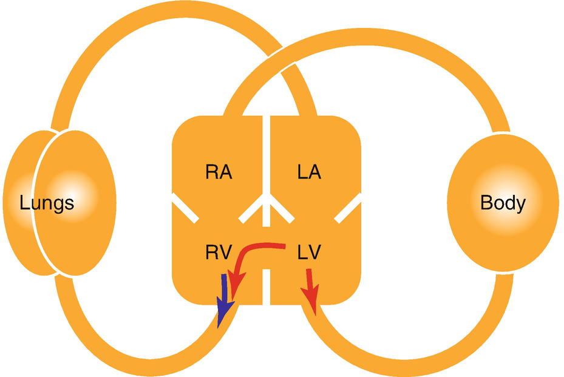
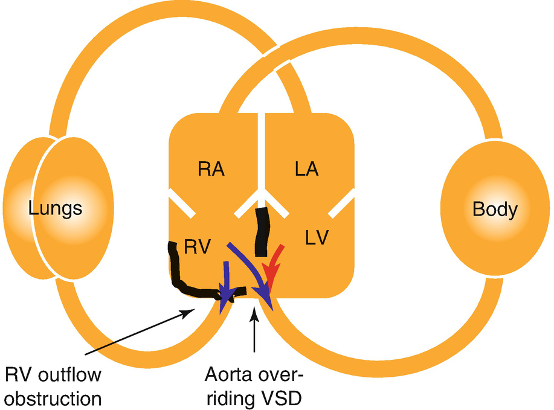
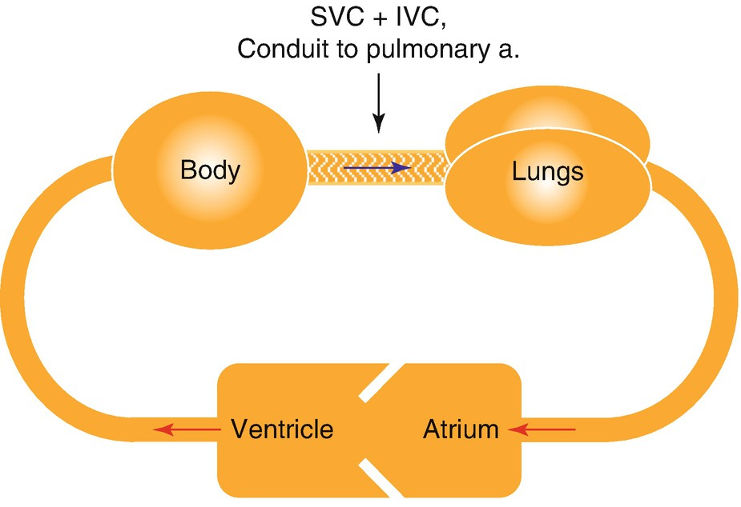

Congenital Heart Disease

© Springer Nature Switzerland AG 2020

Craig Sims, Dana Weber and Chris Johnson (eds.) A Guide to Pediatric Anesthesia[https://doi.org/10.1007/978-3-030-19246-4\_20](https://doi.org/10.1007/978-3-030-19246-4_20)

# 20. Congenital Heart Disease

Serge Kaplanian[1](#Aff4)    

(1)

Department of Anaesthesia and Pain Management, Perth Children’s Hospital, Nedlands, WA, Australia

Serge Kaplanian

Email: [Serge.Kaplanian@health.wa.gov.au](mailto:Serge.Kaplanian@health.wa.gov.au)

### Keywords

Non-cardiac anesthesia in cardiac childPediatric anesthesia, heart murmurAnesthesia and the Fontan circulationEndocarditis prophylaxisCongenital heart disease, preoperative assessment

Congenital heart disease occurs in 6–10 per 1000 births and is one of the most common congenital defects.

Ninety percent of children born with congenital heart disease survive into adulthood and will present for non-cardiac surgery having had varying levels of surgical correction. This chapter focuses on the management of children for non-cardiac surgery, and the assessment of a child with a murmur.

## 20.1 Types of Congenital Heart Disease

There are numerous classifications of congenital heart disease, but the most useful for anesthetists is based on physiology. Lesions fall into one of four groups as shown in Table [20.1](#Tab1).

Table 20.1

Classification of congenital heart disease by main physiological defect

| 
Types of congenital heart disease

 |
| --- |
| 

1\. ‘Simple’ left-to-right shunt with **increased** pulmonary blood flow

 Atrial septal defect (ASD)

 Ventricular septal defect (VSD)

 Patent ductus arteriosus (PDA)

 Atrioventricular septal defect (AVSD)

 |
| 

2\. ‘Simple’ right-to-left shunt with **decreased** pulmonary blood flow

 Tetralogy of Fallot (TOF)

 Pulmonary atresia (with shunting of blood through associated defect

 Tricuspid atresia (with shunting of blood through associated defect)

 Ebstein’s anomaly (Tricuspid obstruction with ASD or patent foramen ovale)

 |
| 

3\. ‘Complex’ shunts: mixing of pulmonary and systemic blood flow causing cyanosis

 Transposition of the Great Arteries (TGA)

 Truncus arteriosus

 Total anomalous pulmonary venous drainage

 Double-Outlet Right Ventricle (DORV)

 Hypoplastic Left Heart Syndrome (HLHS)

 |
| 

4\. Obstructive lesions

 Aortic stenosis

 Pulmonary stenosis

 Coarctation of the aorta

 Hypoplastic aortic arch

 |

Commonly used abbreviations are in parentheses

### 20.1.1 Shunting of Blood Between the Systemic and Pulmonary Circulations

#### 20.1.1.1 Left-to-Right Shunts

Blood flows through a defect from the high pressure systemic side of the circulation to the lower pressure pulmonary side. This increases pulmonary blood flow in proportion with the size of the defect and the difference in resistance between the systems. This occurs in lesions such as a ventricular septal defect (VSD) (Fig. [20.1](#Fig1)). Oxygenated blood from the left side of the heart enters the right side of the heart and lungs, and arterial oxygen saturations are normal. Pulmonary blood pressure increases because of the higher pulmonary flow, but pulmonary vascular resistance is relatively normal in the short term and not problematic. Eventually however, muscle in the walls of the pulmonary vasculature hypertrophies and pulmonary vascular resistance rises, causing Eisenmenger’s syndrome. This is a major problem, and surgical treatment is timed to avoid this. Left-to-right shunts cause a volume overload of the right ventricle that is relatively well tolerated. Anesthesia is also well tolerated provided myocardial contractility is not significantly depressed.

Fig. 20.1

VSD with left-to-right shunting of blood. Oxygenated blood from the left ventricle (LV) enters the right ventricle (RV) and increases pulmonary blood flow

#### 20.1.1.2 Right-to-Left Shunts (Cyanotic Heart Disease)

De-oxygenated blood from the right side of the heart bypasses the lungs and mixes into the systemic circulation, causing cyanosis. This occurs in lesions such as a Tetralogy of Fallot (TOF). This is a more debilitating condition than left-to-right shunting as pulmonary blood flow is often reduced. Most cyanotic heart conditions have complex defects allowing variable mixing of blood between the right and left side of the heart, and the degree of mixing is affected by the balance between the pulmonary and systemic vascular resistances. If pulmonary vascular resistance increases, pulmonary blood flow decreases. However, the pulmonary blood flow is also affected by the systemic vascular resistance. If the systemic vascular resistance falls, more blood is shunted to the left side of the heart and pulmonary blood flow decreases. The balance between the pulmonary and systemic vascular resistances is the critical factor with anesthesia for children with cyanotic heart disease.

Anesthesia for this group of patients is much more problematic than for children with left-to-right shunts because pulmonary blood flow must not be reduced any further. Right-to-left shunts slow inhalational induction due to a reduction in pulmonary blood flow (Table [20.2](#Tab2)). Intravenous induction is rapid and with a danger of overdose because a proportion of the induction agent bypasses the lungs and is immediately available to the cerebral circulation. Air bubbles from the IV line can cross to the arterial circulation and must be avoided. Filters are available for IV lines to prevent air bubbles entering the patient.

Table 20.2

Differences between the two types of pulmonary-systemic shunting of blood

| 
Shunt type | Example | Effects

 |
| --- | --- | --- |
| 

Left-to-right | VSD | Normal arterial SaO2

Inhalational induction faster

IV induction slower

Risk from IV air bubbles slightly raised

Anesthesia generally well tolerated

 |
| 

Right-to-left | TOF | Cyanosed, minimal improvement with high FiO2

High risk from IV air bubbles

Inhalational induction slower

IV induction faster, reduced dose required

 |

### Keypoint

The balance between the pulmonary and systemic vascular resistances is the critical factor in anesthesia for children with cyanotic heart disease.

#### 20.1.1.3 Duct-Dependent Heart Disease

Some children with cyanotic heart disease have very little blood flow from the right ventricle into the pulmonary artery and lungs. Although this is not a problem while the placenta is in the circulation, after birth it results in poor oxygenation and may not be compatible with survival. Some of these children rely on the ductus arteriosus that directs blood from the aorta into the pulmonary artery. This oxygenated blood from the aorta mixes with any de-oxygenated blood already in the pulmonary artery and then passes into the lungs. Although this is not efficient for oxygenation, it often permits survival, albeit with persisting cyanosis. These babies have duct-dependent cyanotic heart disease, and their ductus is kept open with prostaglandins until other methods of augmenting pulmonary blood flow can be achieved. These methods depend on the underlying cardiac problem but include atrial septostomy (in transposition of the great arteries) or a modified Blalock-Taussig shunt (modified BT shunt). A modified BT shunt connects the left or right subclavian artery to the left or right pulmonary artery with a synthetic graft.

### Note

If an infant has a modified BT shunt, pulmonary blood flow depends on the systemic blood pressure. Increasing the SVR and blood pressure will improve the child’s saturation.

### 20.1.2 ASD and VSD

Children with an atrial septal defect (ASD) or ventricular septal defect (VSD) have a predominantly left-to-right shunt that increases pulmonary blood flow and causes volume overload of the right ventricle. The size of the defect and difference in chamber pressures determine the amount of shunting. Patients with small restrictive defects have minimal left to right shunting and minimal increase in pulmonary blood flow. On the other hand, patients with large non-restrictive defects have greatly increased pulmonary blood flow.

Both defects are associated with a systolic murmur maximal at the left sternal edge. Small defects may eventually close without treatment. Others require either surgical closure under cardio-pulmonary bypass or using a transvenous approach in the catheter lab.

As long as pulmonary hypertension has not developed, anesthetic management is relatively straightforward. Preload should be maintained, and the fall in systemic vascular resistance that tends to accompany anesthesia reduces left-to-right shunting. Although increasing pulmonary vascular resistance also reduces shunting, PVR is not deliberately manipulated. Inhalational induction is very rapid because of the increase in pulmonary blood flow, but intravenous induction is delayed because of recirculation of agent through the shunt and pulmonary circulation (Table [20.2](#Tab2)). In practice however, the change from the normal speed of induction is not great. Paradoxical air embolism can occur during ventilation if high airway pressures are used—IPPV and PEEP increase right atrial pressure and can induce R-to-L shunting.

### 20.1.3 Tetralogy of Fallot

Tetralogy of Fallot (TOF) is the commonest ‘simple’ right-to-left defect resulting in cyanosis. It consists of four abnormalities:

1.  1.
    
    VSD
    
2.  2.
    
    Overriding aorta (the aorta is positioned over the VSD, communicating with the left and right ventricles)
    
3.  3.
    
    Right ventricular hypertrophy
    
4.  4.
    
    Right ventricular outflow tract obstruction (subvalvular, valvular and/or supravalvular)
    

Obstruction of the right ventricular outflow tract increases right ventricular pressure. Deoxygenated blood passes through the VSD and into the overriding aorta, causing cyanosis. Obstruction at the level of the pulmonary valve (valvular) or pulmonary artery (supravalvular) is constant, and the child is always cyanosed. The classical outflow tract obstruction in Tetralogy is due to hypertrophy of the infundibular myocardium at the subvalvular level (Fig. [20.2](#Fig2)). The obstruction is dynamic and behaves in a similar fashion to hypertrophic obstructive cardiomyopathy—if myocardial contractility increases or the right ventricular volume decreases, the opposing ventricular walls at the level of the obstruction become closer and the outlet obstruction worsens. Outlet obstruction diverts blood from the right ventricle through the VSD, away from pulmonary artery and the lungs. Cyanosis worsens, and a hypercyanotic spell or ‘Tet spell’ occurs. The intensity of the systolic murmur also decreases during a Tet spell. Children with a dynamic obstruction may be acyanotic between spells.

Fig. 20.2

Tetralogy of Fallot during ‘Tet spell’. RV pressure is increased by the dynamic RV obstruction causing right-to-left shunting, reduced pulmonary blood flow and cyanosis

Spells are triggered by reduced right ventricular volume (dehydration), and by increased myocardial contractility (sympathetic stimulation from hypothermia, hunger or pain). The first aim of anesthetic management is to stop spells occurring, as they can be frighteningly severe and difficult to reverse. Treatment includes fluid to increase the volume of the right ventricle, opioids and beta blockers to reduce contractility of the infundibular myocardium, and peripheral vasoconstriction with a pure alpha agonist agent (e.g. phenylephrine) to increase the left ventricular pressure above the right ventricular pressure to reduce shunting (Table [20.3](#Tab3)).

Table 20.3

Perioperative management of hypercyanotic ‘Tet spells’ in TOF patients

| 
Management of hypercyanotic ‘Tet spell’

 |
| --- |
| 

100% oxygen

 |
| 

Fluid bolus (consider repeating)

 |
| 

Pressure on the groins to compress the femoral arteries and increase afterload

 |
| 

Reduce sympathetic stimulation with opioids and deepening anesthesia

 |
| 

Peripheral vasoconstriction with phenylephrine

 |
| 

Reduce infundibular contraction with a short acting beta blocker such as esmolol

 |

### 20.1.4 Fontan Procedure

A Fontan circulation is created when a child is born with complex heart disease and a biventricular repair is not possible. The Fontan procedure is a multi-stage operation that uses the child’s single functioning ventricle to supply the systemic arterial system, and creates a passive venous conduit for blood from the systemic circulation to pass through the lungs to be oxygenated (Fig. [20.3](#Fig3)). This procedure is the last of three stages. A complete Fontan operation is not possible in the first several months of life as the pulmonary vascular resistance is too high. The first step therefore is to increase pulmonary blood flow with a modified Blalock-Taussig shunt where a Gore-tex graft is used to connect the subclavian artery to the ipsilateral pulmonary artery. This shunt permits survival and growth of the child.

Fig. 20.3

Schematic representation of Fontan circulation. The child’s single ventricle supplies the systemic circulation. Venous return from the body passively returns to the lungs through a Gore-tex graft joining the great veins and pulmonary artery. There is no ventricle supplying the lungs. The low pressure in the graft is not able to overcome any increase in pulmonary vascular resistance

The second stage is at approximately 6 months when pulmonary vascular resistance has fallen. Typically, the superior vena cava and right pulmonary artery are joined so that venous return from the upper body passively enters the pulmonary circulation without a pumping chamber. It is also during this stage that the BT shunt is taken down. The final stage takes place at approximately 1–5 years of age, when the inferior vena cava and right pulmonary artery are joined via an extracardiac conduit, or occasionally an intra-atrial baffle. All systemic venous return now passes passively through the lungs to be oxygenated—the systemic and pulmonary circulations are now in series. However, if the pulmonary vascular resistance were to rise, forward (passive) flow of blood through the lungs would stop, and cardiac output would fall. To minimize the impact of a rise in pulmonary vascular resistance, some Fontan repairs are ‘fenestrated’ between the conduit and the atrium, which creates a shunt path between the systemic and pulmonary circulations. If pulmonary vascular resistance increases, blood can pass through the fenestration to the single ventricle of the heart and maintain cardiac output, albeit with deoxygenated blood. The existence of the fenestration allows some level of mixing, hence a degree of slight desaturation. Many patients with a Fontan circulation do well for some years, while others fare less well. Complications are common and include diminished ventricular function, thromboembolic events, conduction disturbances, peripheral edema and protein losing enteropathy.

#### 20.1.4.1 Anesthesia and the Fontan Circulation

Anesthesia in children after a Fontan procedure can be difficult and is best done in a tertiary center. In the child with Fontan circulation, the pulmonary vascular resistance must stay low to allow the entirely passive flow of blood through the lungs. The pressure gradient for the pulmonary circulation is the difference between the CVP and common atrial pressure, and it cannot rise to overcome an increase in resistance. Spontaneous ventilation may help blood flow through lungs because of negative intrathoracic pressure, but controlled ventilation is usually well tolerated and facilitates an anesthetic technique that minimizes myocardial depression (Table [20.4](#Tab4)).

Table 20.4

List of important management goals in anesthesia of child with Fontan circulation

| 
Goal of anesthetic management | Reason

 |
| --- | --- |
| 

Avoid hypovolemia, use fluid load | The Fontan circulation is very preload dependent. Maintain CVP to maintain pulmonary perfusion

 |
| 

Keep pulmonary vascular resistance low

 – Avoid hypoxia, hypercarbia, acidosis | Prevent resistance to pulmonary blood flow

 |
| 

Keep intrathoracic pressure as low as possible

 – Consider spontaneous ventilation; minimize PEEP and aim for low inspiratory pressures if IPPV | Prevent extrinsic compression of pulmonary vasculature; negative intrathoracic pressure during breathing may help blood flow through lungs

 |
| 

Avoid myocardial depression | Function of ventricle supplying systemic circulation may be marginal

 |

### 20.1.5 Eisenmenger Syndrome

Children with large left-to-right shunts have increased pulmonary blood flow. The vessel walls in the pulmonary circulation hypertrophy leading to a rise in pulmonary vascular resistance. Over time, pulmonary hypertension develops. Eventually, pulmonary arterial pressures are so high that the pressure in the right ventricle becomes higher than the pressure in the left ventricle. Blood now shunts from right-to-left and cyanosis develops. Pulmonary hypertension with a reversed central shunt is termed Eisenmenger syndrome. Anesthesia in patients with this syndrome carries an extremely high risk.

### 20.1.6 Obstructive Lesions

The left ventricular outflow tract can be obstructed at the subvavular, valvular or supravalvular level. Congenital aortic stenosis, hypoplastic aortic arch and coarctation of the aorta are the most common lesions. The pathophysiology is similar to that seen in adults with relatively fixed cardiac output, myocardial hypertrophy causing reduced ventricular compliance and cardiac failure, and a predisposition to arrhythmias. Anesthetic management also follows the same principles as in adults and aims to maintain a balance of myocardial oxygen supply and demand. This is achieved by maintaining normal heart rate and systemic vascular resistance and avoiding myocardial depression.

## 20.2 Perioperative Approach to the Child with Congenital Heart Disease

The preceding sections give background information about the common types of cardiac defects. This section focuses on anesthesia in a child with congenital heart disease for non-cardiac surgery. Utilizing a perioperative approach to their management simplifies the process and involves going through three steps:

1.  1.
    
    What type of disease does the child have and what are the anesthetic implications?
    
2.  2.
    
    Does this child have major long-term consequences of congenital heart disease?
    
3.  3.
    
    Are there any special concerns?
    

### 20.2.1 What Type of Disease Does the Child Have and What Are the Anesthetic Implications?

Children with congenital heart disease fall into one of four categories:

-   Children who have never had surgical correction
    
-   Children who have undergone reparative surgery with no residual sequelae
    
-   Children who have undergone reparative surgery with residual sequelae
    
-   Children who have undergone a palliative procedure (e.g. Fontan circulation)
    

#### 20.2.1.1 Children Who Have Never Had Surgical Correction

These children have uncorrected heart defects shown in Table [20.1](#Tab1). Management depends on the underlying lesion and whether any of the long-term consequences of congenital heart disease have developed.

#### 20.2.1.2 Children Who Have Undergone Reparative Surgery with No Residual Sequelae

These are children with some of the most common congenital abnormalities, such as a PDA or small ASD. Correction of the defect returns the circulation to a physiologically normal state, and anesthetic management is no different to a non-cardiac patient. Antibiotic prophylaxis is not required.

#### 20.2.1.3 Children Who Have Undergone Reparative Surgery with Residual Sequelae

In these children, the main defect has been corrected but there is a residual defect. Residual defects are common after corrective surgery, particularly if the original defect was complex or if repair was later in life than is optimal. Table [20.5](#Tab5) lists some of the more commonly repaired congenital cardiac lesions and their residual sequelae.

Table 20.5

Residual sequelae after some types of cardiac surgery

| 
Disease | Residual sequelae after repair

 |
| --- | --- |
| 

ASD, VSD | Arrhythmias

Residual shunt

Pulmonary hypertension (if delayed repair)

 |
| 

Coarctation of the aorta | Residual gradient or re-stenosis

Systemic hypertension

Inaccurate blood pressure & SpO2 on side of shunt if subclavian artery divided for repair

 |
| 

Tetralogy of Fallot | Ventricular dysfunction, arrhythmias, pulmonary regurgitation

Residual VSD or RV outlet obstruction

 |
| 

Transposition of the great arteries | Stenosis at great vessel anastomoses

Ventricular dysfunction

Coronary artery stenosis

Arrhythmias

 |

Although surgery has reconnected the elements of the circulation into a normal arrangement, the patients remain at risk from short- and long-term changes to the heart and circulation

#### 20.2.1.4 Children Who Have Undergone a Palliative Procedure

Palliative procedures do not reconnect the heart and vessels into a normal sequence with a normal circulation, but they create adequate systemic and pulmonary blood flow for survival. Palliative surgery is performed for complex heart defects such as univentricular heart, in which there is atresia of one of the ventricles. These patients are the most complicated and challenging group. The Fontan procedure is one of the most common palliative procedures.

### Keypoint

Children with cyanotic heart disease should be managed in specialist pediatric centers.

### 20.2.2 Does this Child Have Any of the Major Long-Term Consequences of Congenital Heart Disease?

The next step in the perioperative approach to the child with congenital heart disease is to assess if any long-term consequences of congenital heart disease are present. Pulmonary hypertension, arrhythmias and heart failure are not uncommon, and chronic cyanosis has long term complications of its own.

#### 20.2.2.1 Pulmonary Hypertension

Pulmonary hypertension is defined as a mean pulmonary arterial pressure greater than 25 mmHg at rest or more than 30 mmHg during exercise. Large left-to-right shunts are the most common cause of pulmonary hypertension in children. Echocardiography is able to quantify pulmonary pressures, and children with supra-systemic pulmonary pressures have high risk of complications under anesthesia. The main goal of anesthesia in these children is to avoid triggering a pulmonary hypertensive crisis by avoiding hypoxia, hypercarbia, acidosis, stress, pain, or hypothermia. Treatment includes controlled hyperventilation with 100% oxygen, correcting acidosis, minimizing sympathetic stimulation and considering inhaled nitric oxide.

#### 20.2.2.2 Arrhythmias

Children who have undergone reparative or palliative surgery are the most likely to develop arrhythmias. Atrial surgery often leads to supraventricular arrhythmias while children who have undergone ventriculotomies are more likely to develop ventricular arrhythmias. Some of these children may have permanent pacemakers that require checking perioperatively.

#### 20.2.2.3 Heart Failure

Heart failure is most common in infants with large unrestrictive left-to-right shunts or in the child with the terminal phase of their cardiac disease. Treatment with diuretics and converting enzyme inhibitors as well as consultation with a pediatric cardiologist is essential.

#### 20.2.2.4 Cyanosis

Chronic cyanosis (SaO2 <85% and >50 g/L deoxy-Hb) induces multiple coagulation factor deficiencies, thrombocytopenia, and abnormalities in prothrombin and partial thromboplastin times. Cyanotic children have an increased risk of bleeding, and clotting studies should be reviewed and fresh frozen plasma and platelets organized preoperatively. Polycythemia is also common in cyanotic congenital heart disease as a result of overproduction of erythropoietin. This increases the risk of thrombosis and stroke, particularly if the child is dehydrated. Some children are taking aspirin for this reason. Blood flow is redistributed to the brain and heart, and renal dysfunction common. Chronic hypoxia may also affect neurodevelopment (Table [20.6](#Tab6)).

Table 20.6

Chronic hypoxia in cyanotic heart disease affects several systems of the body

| 
Effects of chronic cyanosis

 |
| --- |
| 

Coagulation factor deficiencies and risk of bleeding

 |
| 

Thrombocytopenia

 |
| 

Polycythemia (increased erythropoietin) and risk of cerebral thrombosis

 |
| 

Neurodevelopmental changes

 |
| 

Renal dysfunction

 |

### 20.2.3 Are There Any Special Concerns?

The third and final step in the perioperative approach to the child with congenital heart disease is to consider any special concerns that may be specific to the child or procedure. These children have often had multiple anesthetics, and the parent will know about their child’s preferred induction, behavior at induction and need for premed.

### 20.2.4 Infective Endocarditis Prophylaxis

Some children with congenital heart disease having certain procedures require endocarditis prophylaxis (Table [20.7](#Tab7)). Congenital heart disease with left-to-right shunt, including ASD and VSD, generally don’t require prophylaxis. Some of these conditions are closed with a device using transcatheter technique, and children with these devices will need prophylaxis for at-risk procedures for the first 6 months, until the device is endothelialized. Children with cyanotic heart disease are a high-risk group whether unrepaired, palliated with a shunt or conduit, or repaired but with a residual defect. A child with a Fontan circulation is in a high risk group, whereas a child with a repaired Tetralogy of Fallot with no residual defect would not need prophylaxis from six months after any repair using prosthetic material.

Table 20.7

Groups of children with congenital heart disease that need to be given endocarditis prophylaxis for procedures with a risk of causing bacteremia

| 
Cardiac conditions needing prophylaxis for certain procedures

 |
| --- |
| 

Unrepaired cyanotic congenital heart disease, even if palliated with a shunt or conduit

 |
| 

Repaired congenital heart disease either with prosthetic material within last 6 months or with a residual defect next to the repair (preventing endothelialization)

 |
| 

Repaired CHD with residual defect at or adjacent to prosthetic patch or device

 |
| 

Prosthetic valve or valve repair with prosthetic material

 |
| 

Previous infective endocarditis

 |
| 

Cardiac transplantation recipients with valvulopathy

 |
| 

In Australia: Rheumatic heart disease in indigenous children and others at significant socioeconomic disadvantage

 |
| 

 |
| 

Procedures needing endocarditis prophylaxis if one of the cardiac conditions above is present

 |
| 

Dental procedures involving manipulation of the gingival tissue or the periapical region of teeth or perforation of the oral mucosa

 |
| 

Procedures on the respiratory tract involving mucosal incision (includes tonsillectomy and adenoidectomy, but not bronchoscopy without biopsy), or infected skin, skin structures or musculoskeletal tissue

 |

In the United Kingdom, ENT procedures are not considered an indication for prophylaxis

Only certain procedures necessitate endocarditis prophylaxis. Prophylaxis is not required during upper and lower gastrointestinal procedures including gastroscopy and colonoscopy, genitourinary or reproductive tract procedures. Adenotonsillectomy is considered an indication for prophylaxis in most countries, but not the United Kingdom.

## 20.3 Preoperative Assessment of the Child with Congenital Heart Disease

As with adults, assessment of the functional state is an important component in determining risk. Adult measures such as the New York Heart Association classification are not usually applicable to children. Exercise tolerance can be easily assessed in older children, often by asking about their performance compared to their peers at school. Functional state in preschool-aged children is assessed by information from the parents. In infants, cardiac symptoms manifest as poor feeding or failure to thrive. Children with defects that shunt blood through the lungs are predisposed to respiratory infections. Many children have had multiple procedures or complex cardiac conditions. A hospital record review and deliberation about the physiology of the child’s cardiovascular system and its response to changes in pulmonary and systemic vascular resistance is vital.

Physical examination includes observation for dysmorphic features, as about 1 in 5 children with congenital heart disease have other anomalies or syndromes. Routine observations include the oxygen saturation while breathing room air, blood pressure, and the pulses in all extremities to detect reduced distal pulses from coarctation of the aorta. Tachypnea, tachycardia, a gallop rhythm, hepatomegaly, and pulmonary congestion are all indicative of heart failure in the infant. Mottling is a sign of severe disease. Clubbing and peripheral edema are more relevant in the older child.

The most useful investigation is echocardiography, as it will give an indication on function, anatomy, shunting and evidence of pulmonary hypertension. Coagulation studies should be performed in children with cyanotic heart disease. Other investigations depend on the child’s pathology, functional state, procedure, and recent investigations.

### 20.3.1 The Child with an Incidental Murmur

Cardiac murmurs are commonly noted when assessing children before surgery. Up to 70% of infants and 50% of school age children may have a murmur, but the majority are innocent and not caused by any cardiac pathology. Innocent murmurs are common throughout childhood and adolescence, but particularly common in children aged 7 years and younger. The commonest type of innocent murmur is a vibratory (Still’s) murmur, but other types are the pulmonary flow murmur and venous hum. The latter is due to flow in the systemic great veins and is a continuous murmur that is sometimes confused with a patent ductus arteriosus (PDA). A venous hum murmur, however, varies with respiration and disappears when supine. It is important to differentiate these innocent murmurs from the relatively uncommon pathological murmur. In most cases, the anesthetist is able to distinguish between the two types from a detailed cardiac-specific history and examination (Table [20.8](#Tab8)).

Table 20.8

Clinical features that suggest either innocent or pathological cause for murmur in a child

| 
Innocent | Likely to be pathological

 |
| --- | --- |
| 

Asymptomatic

Soft, no associated thrill

Ejection systolic

Lower sternal edge and does not radiate | Child has chromosomal abnormality or syndrome Cardiac symptoms, frequent respiratory symptoms Failure to thrive

Family history

Infant <12 months

Harsh, loudness 3/6 or more

Pansystolic or diastolic

 |

When taking a cardiac-specific history in the child with a murmur, the important points are family history of congenital heart disease, co-existing syndromes, symptoms and a functional assessment. Respiratory problems such as cough, wheeze or recurrent respiratory infections can be caused by cardiac dysfunction but are also very common in all children. Physical examination assesses the child’s general appearance, and observations include SpO2 and pulses in the upper and lower extremities. Pathological murmurs are loud, have a harsh quality, may radiate and are associated with an early or mid-systolic click or an abnormal second heart sound. The timing of the murmur is also important-pathological murmurs tend to be pansystolic (VSD) or diastolic, whereas innocent murmurs are soft early systolic or ejection systolic. If the child is less than one year old or has features suggestive of a pathological murmur, then referral to a pediatric cardiologist is warranted.

### 20.3.2 The Pediatric ECG

The ECG is different during infancy and early childhood due to the significant cardiac and circulatory changes compared to adults. The anatomical dominance of the right ventricle during neonatal life is responsible for many of these changes. Apart from the normal, faster heart rate, a smaller cardiac muscle mass leads to a shorter PR interval and QRS duration in infants and young children compared to adults. There is also a shift from right ventricular dominance in the newborn period (reflecting the neonate’s elevated pulmonary vascular resistance) to left ventricular dominance by 1 year of age.

## Review Questions

1.  1.
    
    A 4 year old girl with Trisomy 21 had an VSD repaired while an infant. She is active and well and is scheduled for a dental procedure. Could her procedure be performed in a regional hospital? Does she need endocarditis prophylaxis?
    
2.  2.
    
    A 6 month old infant with hypoplastic right ventricle had a modified Blalock Taussig shunt performed soon after birth and is now scheduled for surgery. Why would this child have had a shunt so soon after birth? What factors will affect the child’s SpO2 during anesthesia?
    

### Further Reading

1.  Apitz C, Webb GD, Redington AN. Tetralogy of Fallot. Lancet. 2009;374:1462–71.[Crossref](https://doi.org/10.1016/S0140-6736\(09\)60657-7)
    
2.  Baltimore RS, et al. Infective endocarditis in childhood: 2015 update. Circulation. 2015;132:1487–515.[Crossref](https://doi.org/10.1161/CIR.0000000000000298)
    
3.  Kelleher AA. Adult congenital heart disease (grown-up congenital heart disease). Contin Educ Anaesth Crit Care Pain. 2012;12:28–32.[Crossref](https://doi.org/10.1093/bjaceaccp/mkr045)
    
4.  Miller-Hance WC. Anesthesia for noncardiac surgery in children with congenital heart disease. In: Cote CJ, Lerman J, Anderson BJ, editors. A practice of anesthesia for infants and children. 6th ed. Amsterdam: Elsevier; 2019.
    
5.  Nayak S, Booker PD. The Fontan circulation. Contin Educ Anaesth Crit Care Pain. 2008;8:26–30.[Crossref](https://doi.org/10.1093/bjaceaccp/mkm047)
    
6.  Puri K, Allen HD, Qureshi AM. Congenital heart disease. Pediatr Rev. 2017;38:471–84.[Crossref](https://doi.org/10.1542/pir.2017-0032)
    
7.  White M. Approach to managing children with heart disease for noncardiac surgery. Paediatr Anaesth. 2011;21:522–9.[Crossref](https://doi.org/10.1111/j.1460-9592.2010.03416.x)
    
8.  Wise-Faberowski L, Asija R, McElhinney DB. Tetralogy of Fallot: everything you wanted to know but were afraid to ask. Paediatr Anaesth. 2019;29:475–82.[Crossref](https://doi.org/10.1111/pan.13569)
    

### Endocarditis Prophylaxis

1.  Baltimore RS, et al. Infective endocarditis in childhood: 2015 update. Circulation. 2015;132:1487–515.[Crossref](https://doi.org/10.1161/CIR.0000000000000298)
    
2.  NICE Guideline 64. Prophylaxis against infective endocarditis: antimicrobial prophylaxis against infective endocarditis in adults and children undergoing interventional procedures. National Institute for Health and Care Excellence. 2016. [www.​nice.​org.​uk/​guidance/​cg64](http://www.nice.org.uk/guidance/cg64). Accessed July 2019.
    
3.  Therapeutic Guidelines: Antibiotic. Version 16. 2019. Electronic Therapeutic Guidelines Complete. [https://​tgldcdp.​tg.​org.​au/​index](https://tgldcdp.tg.org.au/index). Accessed July 2019.