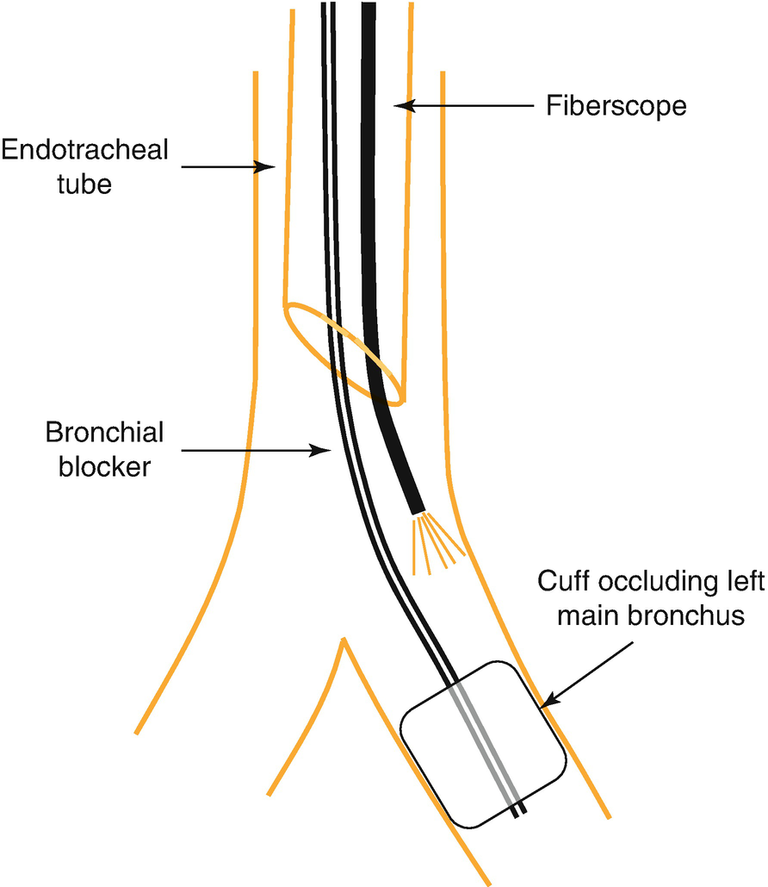

Anesthesia for Thoracic Surgery in Children

© Springer Nature Switzerland AG 2020

Craig Sims, Dana Weber and Chris Johnson (eds.) A Guide to Pediatric Anesthesia[https://doi.org/10.1007/978-3-030-19246-4\_21](https://doi.org/10.1007/978-3-030-19246-4_21)

# 21. Anesthesia for Thoracic Surgery in Children

Neil Chambers[1](#Aff4)     and Siva Subramaniam[1](#Aff4)    

(1)

Department of Anaesthesia and Pain Management, Perth Children’s Hospital, Nedlands, WA, Australia

Neil Chambers

Email: [Neil.Chambers@health.wa.gov.au](mailto:Neil.Chambers@health.wa.gov.au)

Siva Subramaniam (Corresponding author)

Email: [Sivanesan.Subramaniam@health.wa.gov.au](mailto:Sivanesan.Subramaniam@health.wa.gov.au)

### Keywords

One lung ventilationDouble lumen endotracheal tubesBronchial blockersArndt endobronchial blockerCongenital pulmonary airway malformations

This chapter outlines the differences between children and adults undergoing thoracic surgery and discusses some aspects of applied physiology and clinical practice. Anesthetic management of these cases requires an understanding of the relevance of age and pathophysiology, and knowledge of the risks of surgery and anesthesia. These risks include equipment problems, perioperative loss of airway and ventilation problems, bleeding, pneumothorax, and lung soiling.

## 21.1 Background

Pathologies in children requiring thoracic surgery involve congenital, neoplastic, infective, traumatic and cystic lesions (Table [21.1](#Tab1)). Congenital lung malformations are a collection of uncommon conditions that primarily present in childhood and are not commonly seen in adult practice (Table [21.2](#Tab2)).

Table 21.1

Indications for thoracic surgery in children of different age groups

| 
Age group | Indication

 |
| --- | --- |
| 

Neonate and infant | PDA and coarctation of the aorta Congenital lung malformations

Tracheo-esophageal fistula

 |
| 

Child | Tumor

 |
| 

Adolescent | Tumor

Scoliosis anterior repair

Correction chest wall deformity

 |

Table 21.2

Congenital lung malformations likely to require surgery

| 
Condition | Abnormalities

 |
| --- | --- |
| 

Congenital pulmonary airway malformations (CPMA; formerly called CCAM) | Cystic or solid mass connected to a bronchus, usually within one lobe of the lung. Commonest congenital lung malformation.

 |
| 

Bronchial mucocele (bronchial atresia) | Focal narrowing or obliteration of distal segment of bronchus causing a mucous-filled cyst.

 |
| 

Bronchogenic cyst | Embryologic duplication cyst filled with mucous and not communicating with a bronchus. Can compress adjacent structures.

 |
| 

Congenital lobar emphysema | Hyperinflation of one or more lobes. Symptoms if large; may cause pneumothorax.

 |
| 

Pulmonary sequestration | Non-functioning lung tissue supplied by anomalous systemic artery and not communicating with a bronchus

 |

Thoracic surgery is carried out by thoracotomy or thoracoscopy (Video Assisted Thoracoscopic Surgery, VATS). Thoracic surgery in adults almost always requires lung isolation and one-lung ventilation (OLV), usually with a double lumen tube. Children’s lungs are usually healthy and respond differently to surgical intervention compared to chronically diseased adult lungs, and one-lung ventilation is not always needed. Thoracoscopy with a low intrapleural pressure (below 8–10 mmHg) is well tolerated by children, who do not usually get significant mediastinal shift or cardiovascular changes. Although two-lung ventilation has been used for many years in children, and can be used during some procedures such as thoracoscopic sympathectomy, surgical access is often better if one-lung ventilation is performed. Some of the equipment issues for one-lung ventilation in children have been addressed, and one-lung ventilation is being increasingly used in children.

## 21.2 One-Lung Ventilation in Children

The indications for one-lung ventilation in children are similar to those for adults, although no indication can be regarded as absolute in children (Table [21.3](#Tab3)). One-lung ventilation can be technically difficult in small children and has potential risks such as airway trauma or obstruction. These risks need to be balanced against the potential gain in surgical access. It is generally well tolerated in children, although reinflation of the lung is associated with a mild acute lung injury. Distribution of ventilation in the lateral position during IPPV is similar in children and adults. During spontaneous ventilation however, the compressible thoracic cage and reduced effect of gravity on lung perfusion has the potential to worsen ventilation-perfusion mismatch in the dependent infant lung. There are three different techniques for one-lung ventilation in children, each having their own advantages and disadvantages.

Table 21.3

Indications and contraindications for one-lung ventilation

| 
Indication | Comments

 |
| --- | --- |
| 

Major indications | Air leak (actual or potential)

Risk of contamination with pus or blood

Differential ventilation

 |
| 

Other indications | Surgical exposure

 |
| 

Contraindications | Inability to maintain oxygenation

Technical or equipment problems

 |

### Note

One-lung ventilation for VATS in small children is not always necessary, and its risks and benefits should be discussed with the surgeon.

### 21.2.1 Double-Lumen Tubes (DLT)

The smallest double lumen tube available is size 26F, and this can be used for children over 8 years of age or 35 kg (Table [21.4](#Tab4)). The size of the DLT can be estimated with the formula Size (in FG) = (age × 1.5) + 14, or the tracheal diameter measured on CT. A left-sided tube is usually selected because of the rarity of peri-hilar pathology and young elastic tissues in children, and it is usually easy to position. Placement is best confirmed using a fiberoptic bronchoscope. The advantages of the double lumen tube in older children include a good safety record, ease of insertion, stable positioning, and the ability to suction, oxygenate and apply CPAP to the upper lung. It remains the gold standard when absolute lung isolation is required to prevent contralateral soiling. The disadvantages of double lumen tubes are the lack of small sizes, an inability to ventilate during placement, the need to replace the tube for post-operative ventilation and their potential to cause tracheo-bronchial injury.

### Keypoint

Double lumen tubes are less likely to shift during patient positioning and surgery, and allow suction and CPAP to the collapsed lung. They are usually the best choice for OLV. Their problems however, are their large size and high incidence of sore throat.

### 21.2.2 Endobronchial Intubation

Selective endobronchial intubation of the dependent lung is a simple technique that may be the one of choice in emergencies such as airway hemorrhage or major bronchopleural fistula. A tube that is normal sized or a half size smaller is inserted with its bevel angled towards the lung intended for ventilation. Turning the child’s head in the opposite direction helps guide the tube. Using a cuffed tube can potentially improve the seal. Confirmation of correct placement is made clinically or by bronchoscopy. Problems with this technique include failure to achieve an adequate seal in the bronchus (preventing deflation of the contralateral lung or failing to protect the lung from soiling), upper lobe orifice obstruction, and inability to deflate, suction or provide CPAP to upper lung.

### 21.2.3 Endobronchial Blockers

Endobronchial blockers are placed either inside or outside the lumen of the endotracheal tube and occlude the mainstem bronchus of the operative lung. Their position is checked with either the fiberoptic bronchoscope or image intensifier. Various types of catheters have been used as endobronchial blockers, and the technique is suitable for children from infancy onwards (Table [21.4](#Tab4)). Historically, catheters designed for other purposes, such as embolectomy, urinary, pulmonary artery and atrial septostomy catheters have all been used. They share the significant problems of being difficult to position and their high-pressure cuffs may shift to occlude the tracheal lumen. Furthermore, suction is not possible through any blocker and the size of the central lumen of most is too small to be useful. Other blockers, such as the Cohen® blocker, do not have pediatric sizes available.

Table 21.4

Devices available to achieve one-lung ventilation in children

| 
Tube | Smallest device size | Minimum age/weight | Comments

 |
| --- | --- | --- | --- |
| 

Double lumen tube (DLT) | 26F | 8 years/35 kg | Usually left-sided tube used

 |
| 

Bronchial blockers

 |
| 

Fogarty embolectomy etc | 3F | Infants and older | Technically difficult and prone to complications

 |
| 

Arndt | 5F | 18 months | Most widely used. Positional stability may be a problem

 |
| 

Univent | 3.5 mm (7.5 mmOD) | 6–8 years | Similar age group to DLT (which is preferable to use)

 |

The Arndt endobronchial blocker is designed specifically for one-lung ventilation and is now the most popular because it has a large central lumen to allow lung deflation and oxygenation to the non-ventilated lung, as well as a low pressure endobronchial cuff that has a lower risk of displacement. The blocker is positioned while observing through a small diameter bronchoscope (Fig. [21.1](#Fig1)). The smallest Arndt blocker is 5FR, which requires an endotracheal tube of at least 4.5 mm ID (using a 2.2 mm diameter bronchoscope) to accommodate the catheter and a bronchoscope to position it. This means that they can only be used in children over about 18 months, depending on the child’s size. The blocker can be used outside the endotracheal tube, allowing its use in even younger children but risking localized pressure from the catheter on the cricoid cartilage.

Fig. 21.1

The Arndt endobronchial blocker positioned in the left mainstem bronchus. A fine fiberscope passed alongside the blocker is used to visualize the cuff of the blocker

The Univent® tube (Fuji) is a single lumen ETT with moveable bronchial blocker incorporated into the side of the tube. It is easy to place and allows both one- and two-lung ventilation. It is easier to place compared to the double lumen tube if laryngoscopy is difficult, and there is no need to change the tube if post op ventilation is required. However, they have a large external diameter and are only suitable for older children, in whom a double lumen tube is preferable.

## 21.3 Anesthesia Maintenance

Intraoperative management of anesthesia during thoracic surgery is based on the underlying pathophysiology and planned surgery. Invasive arterial monitoring can be helpful but is not essential in children undergoing one-lung ventilation. The lack of pulmonary and cardiovascular disease in most children means that both thoracotomy and one-lung ventilation are generally well tolerated. ETCO2 can be an unreliable indicator of arterial CO2 during one-lung ventilation, but trends and changes are still useful. Positioning of the child for surgery or intraoperative surgical maneuvers can alter the precisely positioned endobronchial blocker, which is not as secure as a DLT. For this reason, a fiberoptic bronchoscope needs to be readily available throughout surgery.

Most children undergo surgery for a focal lesion and otherwise have normal lungs. They usually tolerate one-lung ventilation well, and may need only a small increase in FiO2. Nevertheless, there should be a plan to manage hypoxemia during one-lung ventilation (Table [21.5](#Tab5)). If constant pressure ventilation is being used, airway pressure will not increase during one-lung ventilation, but the tidal volume will fall. The respiratory rate and inspiratory pressure will need adjusting. Blood loss and fluid shifts during surgery may be considerable, and heat loss is large. Fluid replacement should match losses, but excessive fluid may cause lung edema and postoperative respiratory complications.

Table 21.5

Causes and management of hypoxemia during one-lung ventilation in a small child

| 
Hypoxia during one-lung ventilation

 |
| --- |
| 

Causes | Bronchial tube too far in or out, or blocking trachea

Tube lumen obstructed

Under-ventilation

Diminished hypoxic pulmonary vasoconstriction

 |
| 

Management | Increase FiO2

Check tube position and equipment function

Oxygenate operative lung (O2 insufflation, CPAP, intermittent re-expansion)

Optimize ventilation (hand ventilate, tidal volume, I:E ratio, PEEP)

Suction

Ensure optimal cardiac output

Ask surgeon to wait until oxygenation is adequate

 |

## 21.4 Postoperative Management

Thoracotomy is a painful procedure in children as it is in adults. It is less painful in infants however, due to their cartilaginous ribs and costovertebral junctions. Postoperative analgesia in children follows the same principles as adults: multimodal, incorporating a regional or local technique when possible, and aiming to facilitate extubation and postoperative recovery.

Children with previously good lung function can usually be extubated in theatre. Postoperative ventilation may sometimes be required if there is underlying lung pathology, atelectasis or soiling, or if management of the child is facilitated by maintaining sedation for a period of time. Recovery and return to normal function is generally faster in younger children compared to adolescents and adults.

## Review Questions

1.  1.
    
    How would you manage hypoxemia during one lung ventilation in children?
    
2.  2.
    
    What are the signs of significant mediastinal shift during videoscopic assisted thoracic surgery?
    

### Further Reading

1.  Fabilia TS, Menghraj SJ. One lung ventilation strategies for infants and children undergoing video assisted thoracoscopic surgery. Indian J Anaesth. 2013;57:339–44. A comprehensive review article with color pictures and free download_._[Crossref](https://doi.org/10.4103/0019-5049.118539)
    
2.  Hammer GB. Single-lung ventilation in infants and children. Pediatr Anesth. 2004;14:98–102.[Crossref](https://doi.org/10.1046/j.1460-9592.2003.01197.x)
    
3.  Letal M. Paediatric lung isolation. BJA Edu. 2017;17:57–62.[Crossref](https://doi.org/10.1093/bjaed/mkw047)
    
4.  Templeton TW. Bending the rules: a novel approach to placement and respective experience with the 5 French Arndt endobronchial blocker in children <2 years. Pediatr Anesth. 2016;26:512–20.[Crossref](https://doi.org/10.1111/pan.12882)
    
5.  Tobias JD. Anesthetic implications of thoracoscopic surgery in children. Pediatr Anesth. 1999;1:103–10.[Crossref](https://doi.org/10.1046/j.1460-9592.1999.9220281.x)
    
6.  Wald SH, Mahajan A, Kaplan MB, Atkinson JB. Experience with the Arndt paediatric bronchial blocker. Br J Anaesth. 2005;94:92–4.[Crossref](https://doi.org/10.1093/bja/aeh292)