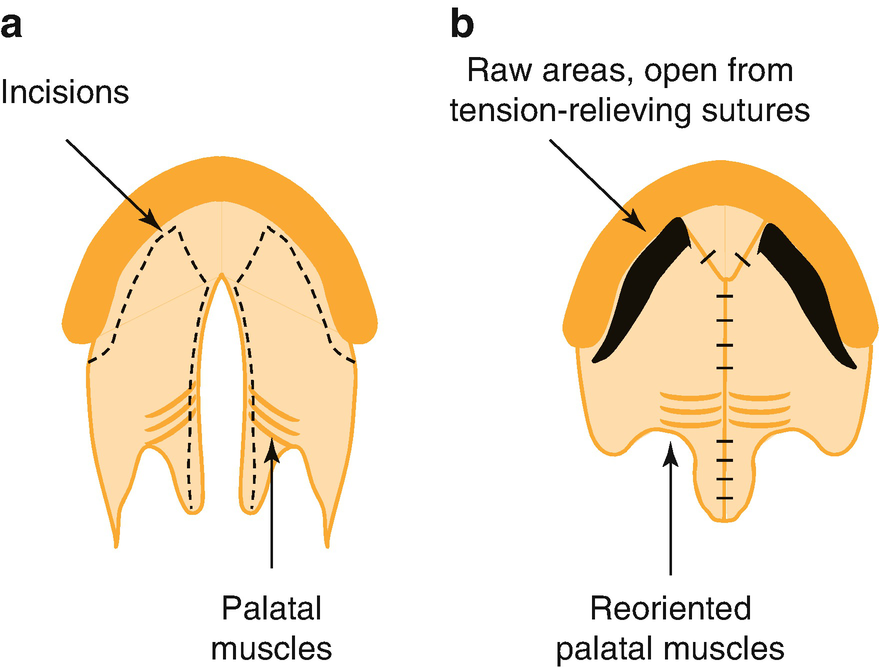

Anesthesia for Plastic Surgeryplastic surgery in Children

© Springer Nature Switzerland AG 2020

Craig Sims, Dana Weber and Chris Johnson (eds.) A Guide to Pediatric Anesthesia[https://doi.org/10.1007/978-3-030-19246-4\_22](https://doi.org/10.1007/978-3-030-19246-4_22)

# 22. Anesthesia for Plastic Surgery in Children

Rohan Mahendran[1](#Aff4)    

(1)

Department of Anaesthesia and Pain Management, Perth Children’s Hospital, Nedlands, WA, Australia

Rohan Mahendran

Email: [Rohan.Mahendran@health.wa.gov.au](mailto:Rohan.Mahendran@health.wa.gov.au)

### Keywords

Anesthesia for cleft lip palate surgeryCraniosynostosisAnesthesiaPharyngoplastyNasal intubationCleft palate surgeryAirway

Anesthesia is often required for small traumatic injuries such as lacerations, which would be treated under local anesthesia in an adult. It is also required for plastic surgery to correct congenital deformities, sometimes in children with other congenital anomalies that affect anesthesia.

## 22.1 Anesthesia for Cleft Lip and Palate Repair

Cleft lip and palate is the most common craniofacial disorder in children, with an overall incidence of 1 in 600 births. It occurs from the failure of fusion of the components of the nasal and maxillary prominences during early gestation. Children can have an isolated cleft clip, cleft palate only, or both cleft lip and palate. Babies with cleft lip and palate are usually otherwise well. Babies with cleft palate alone are less common (about 1 in 2000 births), but are more likely to have other congenital anomalies including cardiac disease (5–10%) or other syndromes including Trisomy 21, or Robin sequence. The cleft varies in severity and may be unilateral or bilateral. It can involve the nose, philtrum, lip vermillion, gum, hard and soft palate, uvula and Eustachian tubes.

There are many subsequent effects of the cleft. These include cosmetic and maternal attachment issues, sucking and feeding, hearing and speech development, and dental issues. Children with cleft palate are managed by a team including plastic surgeons, geneticists, ENT and speech pathology, dentistry and orthodontics, and nutritionists. An early issue for babies with cleft palate is developing an effective suck for feeding. Specialized teats or squeezy bottles are used for feeding. Orthodontic plates are used before surgical repair to align the gum margins. Infants with syndromes in association with cleft are particularly prone to gastro-esophageal reflux, which in turn inflames the upper airway and affects surgery.

### 22.1.1 Surgical Repair

Surgical procedures optimize function and cosmesis. The first procedure is lip repair at 3 months of age. Some centers perform this repair at ages as young as 1 week to reduce scarring, but this must be balanced against anesthesia and airway concerns. The anterior part of the gum is sometimes repaired at the same time as the lip, or otherwise later when the palate is repaired.

The cleft palate is repaired between 9 and 18 months of age. Repair at a young age improves speech development, whereas later repair allows more normal development of the midface. The age chosen for repair is a balance between these two opposing requirements. For this reason, some centers close the lip and soft palate early and leave the hard palate cleft until childhood. Repair is carried out using mucoperiosteal flaps, and intravelar veloplasty to re-orientate the muscles of the palate (Fig. [22.1](#Fig1)). Particular attention is paid to the levator muscle of the soft palate because it is important for speech. The bony defect of the gum is corrected later with an alveolar bone graft, usually taken from the iliac crest.

Fig. 22.1

Schematic of one of the surgical techniques used to repair cleft palate. (**a**) Isolated cleft of hard and soft palate, showing abnormal orientation of palatal muscles in the soft palate and surgical incision lines (dotted line). (**b**) Surgical repair of cleft palate using mucoperiosteal flaps and intravelar veloplasty. The repair leaves anterior raw areas that may bleed postoperatively

### 22.1.2 Anesthesia for Cleft Lip Repair

The lip is repaired during early infancy to reduce scarring and help with maternal bonding and feeding. The airway is managed during general anesthesia with a south-facing oral RAE tube. Intubation can be awkward if the baby also has a cleft palate, and is discussed below. The surgeon will infiltrate the area with local anesthetic or perform bilateral infra-orbital blocks. Although this provides adequate analgesia, intraoperative fentanyl may help to keep the baby settled and calmer in PACU. Although the lip defect has been closed, there is no major change to the infant’s upper airway after surgery, which facilitates postoperative management.

### 22.1.3 Anesthesia for Cleft Palate Repair

There are several important issues for anesthetic care, mostly relating to the airway (Table [22.1](#Tab1)). Intubation is usually straightforward, but may difficult in about 5% of cases—usually in children with a coexisting syndrome affecting the airway. Cleft palate babies are classically said to be awkward to intubate because the laryngoscope blade can fall into the cleft. However, this is not a common problem in practice, although it is more likely to occur if the cleft is left-sided. Techniques to avoid this problem include intubation using a laryngoscope with the broad Oxford cleft lip and palate blade, or using folded gauze to fill the cleft during intubation. Routine use of a videolaryngoscope would be a reasonable choice nowadays.

Table 22.1

Anesthetic issues for infants undergoing cleft palate surgery

<table style="border-collapse: collapse;border-top: 0.5pt solid ; border-bottom: 0.5pt solid ; border-left: 0.5pt solid ; border-right: 0.5pt solid ; "><colgroup><col class="tcol1 align-left"></colgroup><tbody><tr><td style="border-bottom: 0.5pt solid ; text-align: left;">
Anesthetic issues for cleft palate repair
</td></tr><tr><td style="border-bottom: 0.5pt solid ; text-align: left;">
Infant anesthesia, possible coexisting syndrome
</td></tr><tr><td style="border-bottom: 0.5pt solid ; text-align: left;">
Difficult/awkward intubation
</td></tr><tr><td style="border-bottom: 0.5pt solid ; text-align: left;">
Occlusion of ETT by oral gag during surgery
</td></tr><tr><td style="border-bottom: 0.5pt solid ; text-align: left;">
Dramatic change in airway patency and resistance after surgery
</td></tr><tr><td style="border-bottom: 0.5pt solid ; text-align: left;">
Bleeding into mouth and airway during and after repair
</td></tr><tr><td style="text-align: left;">
Analgesia after surgery
</td></tr></tbody></table>

After intubation, the head is significantly extended to bring the hard palate almost parallel to the floor to facilitate surgical access. A mouth gag is inserted and the surgical site is extensively infiltrated with local anesthetic containing adrenaline (epinephrine) to reduce bleeding. Maxillary nerve blocks are used by some surgeons. Blood loss is usually low, but can be higher and a group and hold or crossmatch of blood is often performed before surgery. Tranexamic acid may be given, although without direct evidence of benefit.

Issues during surgery include the partial occlusion of the ETT by the gag, or desaturation due to coughing and poor ventilation. The latter occurs at a stage when the infant is no longer paralyzed, lightly anesthetized and surgical stimulation triggers reflex movement or coughing.

After surgery, the main concern is airway obstruction, which may occur for multiple reasons. Closure of the cleft results in a sudden and significant narrowing of the upper airway, especially in infants with a pre-existing syndromic airway—the nose is often blocked by secretions or blood, and there is usually bleeding into the mouth from the raw surfaces of the palate created when the oral mucosa is mobilized to close the cleft. Some centers place a nasopharyngeal airway or a cut nasal tube at the end of surgery to splint the nose and nasopharyngeal airway.

At the end of surgery, the aim is to extubate the infant awake but settled to minimize coughing and crying, which can worsen venous congestion and bleeding. Opioid analgesia during surgery will facilitate this, but must not make the baby too sedated or apneic. Clonidine or dexmedetomidine may be useful adjuncts. Arm splints are used to prevent the infant picking at the repair, but they often irritate the baby and make it more difficult to settle. An opioid infusion is commonly required for analgesia during the first 24 h. Infants are usually admitted to a higher-care area after cleft palate surgery to allow close observation for airway obstruction, bleeding and adequacy of analgesia.

### 22.1.4 Subsequent Surgeries

Children born with cleft lip and palate often require a series of procedures during childhood and adolescence (Table [22.2](#Tab2)). They have often had a lot to do with hospitals, and some may benefit from premedication before induction, particularly children for alveolar bone graft who are older and more aware of their procedure.

Table 22.2

Children with cleft lip and palate often need a series of procedures during childhood and early adulthood

| 
Typical age at time of procedure | Procedure | Comments

 |
| --- | --- | --- |
| 

3 months | Cleft lip repair | Anesthesia of young infant

 |
| 

8–12 months | Cleft palate repair and ear tubes | Airway changes after surgery

 |
| 

5–6 years | Pharyngoplasty

 |   |
| 

5–6 years | Revision palatoplasty | Soft palate lengthened with Z-plasty as alternative to pharyngoplasty

 |
| 

8–10 years | Alveolar bone graft | Pain from iliac crest donor bone graft site

 |
| 

18–20 years | Maxillary advancement | Complex maxillofacial surgery, at age when facial growth finished

 |
| 

22 years+ | Rhinoplasty | Young adult, blocked nose and blood in airway postop

 |

However most children do not need all these procedures

About 15–20% of children with cleft palate require pharyngoplasty. This is performed in children with nasal-sounding speech and velopharyngeal incompetence. There are two common types of pharyngoplasty. In the first, a flap is raised from the posterior pharyngeal wall and is attached to the middle part of the soft palate, leaving two small, lateral passages for nasal breathing. In the second, the Jackson pharyngoplasty, the posterior tonsillar pillars are freed and rotated onto the soft palate, leaving a small, central passage. Children are older and larger at the time of this procedure, reducing the postoperative risk of airway obstruction from surgical narrowing of the airway. A longer-term effect of pharyngoplasty is obstructive sleep apnea.

Pharyngoplasty may affect subsequent nasal intubation. Some of these children subsequently require restorative dental treatment under anesthesia, and this treatment is facilitated by a nasal endotracheal tube. The pharyngeal flap can be badly damaged by the ETT as it passes through the nose. If nasal intubation is required in a child who has had a pharyngoplasty, consider contacting the previous surgeon who can describe the flap’s robustness and the size and location of the orifice into the oropharynx. Guiding the ETT with a fiberscope is usually recommended, but this technique can still traumatize the flap if the scope is not advanced gently and under direct vision. An alternative is to pass a soft suction catheter through the nose into the oral cavity and railroad a softened and lubricated ETT over it.

### Tip

If planning a nasal intubation in a school-aged child who has had a cleft palate repair, check if they have also had a pharyngoplasty.

## 22.2 Craniosynostosis Repair

Craniosynostosis is the premature fusion of one or more of the cranial sutures, stopping normal growth of the skull. This causes cosmetic changes and increased intracranial pressure, and may cause neurodevelopmental changes. Although commonly an isolated abnormality, 20% are associated with an identified syndrome or genetic disorder. Such syndromes include Crouzon’s, Apert’s, Pfeiffer’s, and Saethre-Chotzen’s. These usually involve multiple sutures and may affect the cranial vault and face, and are often associated with increased intracranial pressure.

Surgery for craniosynostosis is usually performed before the age of 12 months. Infants with a single, fused saggital suture may undergo spring cranioplasty, in which calibrated springs are applied across a strip craniectomy of the suture. These springs are normally removed 4–6 months later. Children with multiple sutures involved or abnormal bone shape are managed with cranial vault reconstruction. Although some children having this procedure have syndromes affecting the airway, the biggest challenge with these cases is managing blood loss that may equal one or two blood volumes. Venous air embolism is also a risk during surgery.

### Keypoint

Early replacement of blood loss with non-crystalloid replacement (albumin/blood/blood products) is prudent to prevent a dilutional coagulopathy and maintain normovolemia.

Reconstruction of the cranial vault is performed with bifronto-orbital advancement, which involves an extensive incision and exposure of the cranium along with a frontal craniotomy and removal of a band of bone above the orbits. These bones are then individually cut, shaped and repositioned using wires and resorbable plates and screws. Posterior cranial vault reconstruction is performed for saggital synostosis presenting later in childhood. The child is prone during surgery, and sections of the skull are removed and reshaped before being repositioned.

### Further Reading

1.  Abbott M. Cleft lip and palate. Ped Rev. 2014;35:177–80. A short medical review of the condition and associated problems.[Crossref](https://doi.org/10.1542/pir.35-5-177)
    
2.  Basta MN, et al. Predicting adverse perioperative events in patients undergoing primary cleft palate repair. Cleft Palate Craniofac J. 2018;55:574–81.[Crossref](https://doi.org/10.1177/1055665617744065)
    
3.  Gangopadhyay N, Mendonca DA, Woo AS. Pierre Robin sequence. Semin Plast Surg. 2012;26:76–82.[Crossref](https://doi.org/10.1055/s-0032-1320065)
    
4.  Nargozian C. The airway in patients with craniofacial abnormalities. Pediatr Anesth. 2004;14:53–9. A synopsis of the different syndromes and their airway anomalies.[Crossref](https://doi.org/10.1046/j.1460-9592.2003.01200.x)
    
5.  Thomas K, et al. Anesthesia for surgery related to craniosynostosis: a review. Part 1. Pediatr Anesth. 2012;22:1033–41.[Crossref](https://doi.org/10.1111/j.1460-9592.2012.03927.x)
    
6.  Thomas K, et al. Anesthesia for surgery related to craniosynostosis: a review. Part 2. Pediatr Anesth. 2013;23:22–7. A review of craniosynostosis and the operations to correct this.[Crossref](https://doi.org/10.1111/j.1460-9592.2012.03922.x)