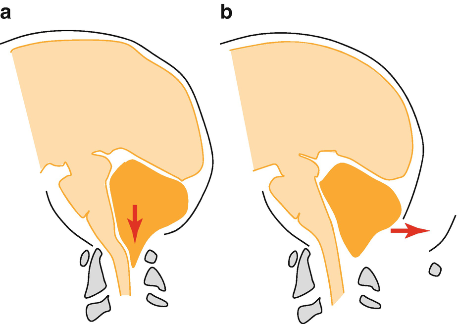

Pediatric Neuroanesthesianeuroanesthesia

© Springer Nature Switzerland AG 2020

Craig Sims, Dana Weber and Chris Johnson (eds.) A Guide to Pediatric Anesthesia[https://doi.org/10.1007/978-3-030-19246-4\_23](https://doi.org/10.1007/978-3-030-19246-4_23)

# 23. Pediatric Neuroanesthesia

Mairead Heaney[1](#Aff4), [2](#Aff5)    

(1)

Paediatric Critical Care Unit, Perth Children’s Hospital, Nedlands, WA, Australia

(2)

Department of Anaesthesia and Pain Management, Perth Children’s Hospital, Nedlands, WA, Australia

Mairead Heaney

Email: [Mairead.Heaney@health.wa.gov.au](mailto:Mairead.Heaney@health.wa.gov.au)

### Keywords

Pediatric neuroanesthesiaCerebral perfusion pressure in childrenAnesthesia children traumatic brain injuryAnesthesia spina bifida

Despite the evolution of anesthetic and surgical techniques over time, the goals of pediatric neuroanesthesia remain unchanged—to provide effective anesthesia and analgesia, reduce intracranial pressure, maintain cerebral perfusion pressure, and to allow rapid recovery after surgery.

## 23.1 Anatomy

The child’s brain and central nervous system is the fastest growing organ in the body. As in adults, brain tissue and extracellular fluid occupy 80% of the intracranial compartment, and cerebrospinal fluid (CSF) and blood occupy 10% each. The brain can grow during infancy because the cranial suture lines are not fused. The child’s skull however, is pliable and incomplete, and offers less protection than an adult’s. The posterior fontanelle closes by the second month of life. The anterior fontanelle stays open until approximately 18 months and it allows assessment of intracranial pressure (ICP) or ultrasound imaging of intracranial structures. The child’s brain is incompletely myelinized, has a higher water content than an adult’s, and is more homogenous and susceptible to diffuse axonal injury and cerebral edema. The blood brain barrier is freely permeable to water, and rapid changes in plasma osmolarity greatly affect the water content of the brain.

## 23.2 Physiology

Compared with adults, neonates have lower, and children higher, cerebral blood flow (CBF) and cerebral metabolic oxygen consumption (CMRO2) (neonate < adult < child) (Table [23.1](#Tab1)). The pediatric brain is probably less tolerant to reduced cerebral blood flow than the adult brain. Cerebral autoregulation occurs, but the pressure limits of regulation are not known with certainty. In neonates and infants, the lower limit of autoregulation is closer to the baseline mean arterial pressure than in older children—a fall in neonatal blood pressure is likely to reduce cerebral blood flow.

Table 23.1

Differences between adult and pediatric brain blood flow

|   | 
Brain mass (% body weight) | Cerebral blood flow (mL/100 g brain tissue/min) | Percentage of cardiac output | CMRO2 (mL/100 g/min)

 |
| --- | --- | --- | --- | --- |
| 

Adult | 2 | 55 | 15 | 3.5

 |
| 

Child | 10 | 100 | 25 | 5.5

 |
| 

Term neonate | 15–20 | 40

 |   | 

Lower than adult

 |
| 

Preterm neonate | 15–20 | 12

 |   | 

Lower than adult

 |

Intracranial pressure in neonates and infants is normally between 0 and 6 mmHg. In older children and adults, the range is between 13 and 15 mmHg. In infants, a gradual increase in intracranial volume will expand the head with only a small increase in ICP, such as with hydrocephalus. If volume rises rapidly, however, the non-elastic pericranium and dura mater means ICP rises rapidly, ultimately causing herniation of the brain stem through the foramen magnum. In infants, an increase in intracranial volume of only 10 mL results in a 10 mmHg increase in intracranial pressure, which is the reason children rapidly deteriorate after intracranial hemorrhage . The cerebral perfusion pressure is lower in younger children than adults (Table [23.4](#Tab4)).

### Keypoint

When intracranial pressure gradually rises in an infant, the fontanelles bulge, the suture lines open and the increase in ICP is accommodated. When intracranial pressure suddenly rises in an infant, the inelastic pericranium cannot suddenly stretch, and just as in adults, the ICP suddenly increases.

## 23.3 Pharmacology

The inhalational and intravenous anesthetics have broadly the same effects on cerebral blood flow and CMRO2 in children and adults. All inhalational agents increase CBF and reduce CMRO2. Low concentrations of isoflurane and sevoflurane (less than 1 MAC) with ventilation to maintain normocarbia minimally affect CBF and ICP. Propofol is a cerebral vasoconstrictor that reduces CBF and CMRO2 while preserving autoregulation in both children and adults. Ketamine does not increase ICP when ventilation is controlled, has favorable effects on cerebral perfusion pressure and may have neuroprotective effects. Fentanyl and remifentanil have only minor effects on CBF and CMRO2 in children and adults.

## 23.4 Pediatric Brain Tumors

Intracranial tumors are the second commonest childhood cancer after leukemia.

### 23.4.1 Background

Most pediatric brain tumors are primary tumors and more than half occur in the posterior fossa. The peak incidence is between 3 and 8 years of age. The commonest types in the posterior fossa are medulloblastoma, pilocytic (low grade) astrocytoma , glioma and ependymoma (Table [23.2](#Tab2)). Supratentorial tumors are more common in infants and older children.

Table 23.2

Types of brain tumors in children and their incidence

| 
Tumor type | Incidence

 |
| --- | --- |
| 

Posterior fossa tumors

Medulloblastoma (PNET of cerebellum)

Pilocytic (low Grade) astrocytoma

Brain stem glioma

Ependymoma | 55–60% (usually children 3–8 years)

20%

20%

15%

5%

 |
| 

Supratentorial tumors

Astrocytoma

Glioblastoma | 40–55% (usually infants and older children)

15%

10%

 |
| 

Midline

 |   |
| 

Craniopharyngioma

Optic glioma | 5%

3%

 |

_PNET_ primitive neuroectodermal cell tumor

Because of their location, childhood tumors present differently from adults. Children will often present with the triad of headache, nausea and vomiting (especially in the morning) and gait imbalance. Infants and young children may present with macrocephaly, or with fairly non-specific symptoms including vomiting, irritability, lethargy, failure to thrive, loss of developmental milestones or torticollis.

### 23.4.2 Assessment

The preoperative assessment focuses on identifying raised intracranial pressure and cranial nerve abnormalities. The preoperative MRI scan and the operative strategy should be discussed with the neurosurgeon, including positioning and potential complications. Posterior fossa tumors can delay gastric emptying and involvement of the cranial nerves can lead to an impaired gag reflex. Potential issues during surgery include the need for reduction in brain mass, blood loss, hemodynamic changes and electrolyte abnormalities. Supratentorial tumors are usually resected in the supine position with the head slightly elevated, whereas posterior fossa tumors are resected in the prone position. The sitting position is now rarely used in children, as they are even more likely than adults to have air embolism in this position.

It would be easy to say that sedative premedication should be avoided due to the potential for respiratory depression in children with brain tumors. These children however, have often been through multiple procedures in a short period of time, and the child and their parents are justifiably anxious about the neurosurgery procedure. Judicious use of premedication can often be considered in all children except those with critically raised ICP, who often have a depressed level of consciousness in any case.

### 23.4.3 Induction

Anesthesia may be induced by the IV or inhalational route. Although an IV induction might be desirable in a child with raised ICP, a smooth gas induction is preferable to repeated attempts to obtain an IV in an upset child with raised intracranial pressure. In addition to standard monitoring, an arterial line, large bore IV access and urinary catheter are inserted once the child is asleep. A central venous catheter is often inserted, most commonly in the femoral vein to avoid obstruction to cerebral venous drainage. A nasogastric tube may be inserted to drain gastric secretions during prolonged anesthesia. A south facing oral endotracheal tube (ETT) or armored orotracheal tube is used if the child is supine during surgery. An armored ETT will affect MRI scans if they are planned during or after surgery.

If the child will be prone for surgery, meticulous attention is paid to fixing the ETT in position. A nasal ETT can be more securely fastened than an oral tube, and is commonly used in prone children. In infants, a throat pack may be inserted to help stabilize the tube within the pharynx and to stop secretions loosening the tapes on the ETT. The pack is left part way out of the mouth so it is not left in after anesthesia. Ventilator tubing is secured to the operating table so that its weight does not dislodge the endotracheal tube. The head is placed in pins for prone positioning in children older than 3–4 years, but younger children have a thin cranium and the headrest is used instead.

### 23.4.4 Maintenance

Both volatile and intravenous anesthetic techniques are commonly used. There is no evidence to recommend one volatile agent over another in children. However, the volatile should be maintained at less than 1.0 MAC to minimize the effect on cerebral blood flow. There are concerns with high-dose propofol in children for prolonged periods (propofol infusion syndrome), but the dose can be reduced with concomitant remifentanil or volatile agent. Dexamethasone and anticonvulsants should be continued intraoperatively.

A potentially life-threatening complication of posterior fossa surgery is venous air embolism. Venous air emboli are detected very commonly when sensitive Doppler techniques are used. These techniques are so sensitive however, that even microbubbles in IV fluid are detected and cause false positives. The majority of venous air emboli are too small to be clinically significant. If hemodynamic compromise occurs (hypotension and loss of end tidal carbon dioxide) the surgical field should be flooded with saline, and air may be aspirated if there is a central venous line positioned in the right atrium (although this is not commonly successful at removing air). Negative intrathoracic pressure should be avoided and muscle paralysis ensured.

Surgery in the region of the pituitary, such as resection of a craniopharyngioma, may cause intraoperative diabetes insipidus. This will cause polyuria and if the urine output cannot be matched with dextrose-saline solutions and the serum sodium and osmolality increase, intravenous DDAVP or a vasopressin infusion may be required. Surgery around the brain stem may cause bradycardia or blood pressure changes.

Unless the brain is very edematous and surgery very complicated, patients are generally woken and extubated at the end of the case. Whatever anesthesia technique is employed, a rapid smooth emergence is desirable to allow early neurological evaluation. Posterior fossa surgery is much more painful than supratentorial surgery and painful muscle spasms occur postoperatively. Some children develop posterior fossa syndrome for a period of time after surgery. It includes combinations of cortical blindness, mutism, ataxia, irritation and nerve palsies.

## 23.5 Anesthesia for Children with Traumatic Brain Injury (TBI)

Injury is the leading cause of death of children in most developed countries, and 40% of these deaths are due to traumatic brain injury. There are two phases to traumatic brain injury. The first is the mechanical damage occurring at the time of injury. The secondary injury is caused by an inflammatory process resulting from a complex interplay of several events including hypoxia, raised ICP, cerebral edema, hydrocephalus, hyperglycemia and infection. The brain of a young child has incomplete myelinization and a high water content. As a result, blunt head trauma in children often results in diffuse axonal injury and diffuse cerebral edema. This diffuse process can be worsened by physiologic insults, most often hypoxia and hypotension.

Intracranial and extracranial collections are much less common in children than in adults. Children nevertheless undergo surgical procedures after brain trauma, including insertion of an external-ventricular drain (EVD), evacuation of extradural, subdural or intracerebral hematomas, or decompressive craniectomy for management of refractory intracranial hypertension. They also undergo surgery for extracranial injuries. The most important aspect of anesthesia is control of ICP and maintenance of cerebral perfusion pressure. Hypoxia and hypotension have been shown repeatedly to worsen outcome in head injured patients. Glycemic control is also important as hyperglycemia has been shown to worsen neuronal injury. These children will generally not have had their cervical spines cleared (see Chap. [25](467929_2_En_25_Chapter.xhtml), Sect. [25.​4](467929_2_En_25_Chapter.xhtml#Sec7)) and therefore maintenance of spinal precautions is vital.

### Note

Brain trauma in children tends to cause a diffuse axonal injury with subsequent edema and raised ICP. Intracranial and extracranial collections of blood are much less common than in adults.

### 23.5.1 Control of Intracranial Pressure

If measured, ICP should be maintained below 20 mmHg. If a monitor is not in place it may be estimated from the imaging studies. Steps to control ICP are outlined in Table [23.3](#Tab3). Cerebral perfusion pressure should be maintained at an appropriate level for the child’s age (Table [23.4](#Tab4)). This may require fluid boluses, central venous access and administration of pressors such as noradrenaline (norepinephrine) 0.1–0.5 μg/kg/min. If ICP is refractory medical therapy, a decompressive craniectomy may be considered.

Table 23.3

Overview of steps that can be used to control ICP in children

| 
System | Steps to control ICP

 |
| --- | --- |
| 

Physical | Confirm raised ICP: ensure transducers are correctly positioned and zeroed

Head up 30°

Avoid neck vein obstruction: head in neutral position, no constricting ETT tapes

Drain CSF if EVD in situ

Ensure ETT is not obstructed by secretions and no bronchospasm

 |
| 

Physiological | Temperature control: avoid hyperthermia and in emergency consider active cooling 33–35 °C

Maintain adequate oxygenation

Maintain CO2 low normal (35–40 mmHg; 4.7–5.3 kPa). In emergency consider hyperventilation CO2 25–30 mmHg; 3.3–4 kPa (temporizing measure only)

Avoid hyponatremia, in emergency consider hypertonic saline 3% 3mL/kg

Avoid hypovolemia

 |
| 

Pharmacological | Ensure adequate sedation and paralysis

Seek and treat seizures

Osmotherapy: hypertonic sodium chloride 3% 3mL/kg, or mannitol 20% 0.25–0.5 g/kg (given slowly to avoid hypotension)

Steroids if brain tumor, avoid steroids if TBI (increase mortality)

Consider barbiturate coma if standard treatments fail

 |
| 

Surgical | Drain any intracranial collection

Consider decompressive craniectomy

 |

Table 23.4

Target cerebral perfusion pressure (CPP) in children of different ages

| 
Age | CPP target (mmHg)

 |
| --- | --- |
| 

Infant | \>40

 |
| 

Child (1–10 years) | 50

 |
| 

Adolescent (10–16 years) | 50–60

 |
| 

Adult (>16 years) | 50–70

 |

## 23.6 Neural Tube Defects (Spina Bifida)

Neural tube defects are birth defects of the brain and spinal cord. They include spina bifida (myelomeningocele), in which the fetal spinal column fails to close during the first trimester. Maternal antenatal folate supplements have reduced the incidence of neural tube defects. Spinal nerve involvement causes at least some paralysis of the legs. Some defects are covered by skin and have less neural involvement (lipomyelomeningocele , lipomeningocele and tethered cord). Neurosurgery and plastic surgery are performed within the first day or two of life to cover the defect and prevent infection or rupture. Induction can be in the lateral or supine position (as long as the lesion is surrounded by padding to prevent rupture).

Surgery is performed in the prone position. Large lesions may require rotational flaps with the potential for significant blood loss. Wound infiltration with local anesthetic and paracetamol are sufficient for analgesia and these infants can usually be extubated postoperatively. Postoperative apnea is a concern and these infants are all monitored in the NICU.

Most children with myelomeningocele have Chiari malformation and require a ventriculo-peritoneal shunt for hydrocephalus. More than 70% of children with neural tube defects are sensitive to latex, possibly due to immune changes rather than direct exposure to latex. These children will frequently have multiple surgeries (VP shunt, orthopedic, scoliosis, bladder, bowel) during childhood and latex precautions should always be observed (See Chap. [12](467929_2_En_12_Chapter.xhtml) Sect. [12.​11](467929_2_En_12_Chapter.xhtml#Sec31)).

## 23.7 Hydrocephalus

Hydrocephalus is due to an imbalance between CSF production and absorption. Most hydrocephalus in children is congenital and causes include aqueductal stenosis, hemorrhage, infections, and Arnold-Chiari malformation. Over 50% of infants with intraventricular hemorrhage and 20% of children with posterior fossa tumors develop permanent hydrocephalus requiring shunting. The ventricles become dilated, and in infants there is a disproportionate increase in head size. Patients with hydrocephalus will present to theatre for insertion of a ventriculoperitoneal shunt (lateral ventricle to peritoneum) or endoscopic ventriculostomy.

### 23.7.1 Anesthesia for Ventriculoperitoneal (VP) Shunt Insertion

A large proportion of children having surgery for a VP shunt are neonates and babies having their initial shunt. The ICP is not markedly raised because of the compliance of the infant skull, and routine volatile anesthesia is commonly used. Intubation may be awkward if the head is large but this can be overcome by raising the infant up from the table on a rolled towel ensuring the neck is not flexed. Older children with a blocked VP shunt needing revision are often unwell and have raised ICP. In this group of patients, increases in ICP during anesthesia and intubation are minimized. Hypotension and bradycardia may occur when the shunt is inserted and the CSF pressure suddenly relieved. Tunneling the shunt’s catheter from the head down through the neck to the abdominal wall may cause tachycardia and hypertension. The entire length of the abdominal component of the shunt is inserted to allow for linear growth of the child, and as CSF circulation changes significantly in the first few years of life shunts now have a programmable valve which allows adjustments to be made to titrate the shunt’s flow rate to the growing child’s need. An important point to remember is that patients with VP shunts in situ who present unwell to hospital should be considered to have a blocked shunt until proven otherwise and may require emergency shunt revision.

### 23.7.2 Chiari Malformation

There are several types of Chiari malformation, which are a spectrum of congenital hindbrain abnormalities affecting the structural relationships between the cerebellum, brainstem, cervical spinal cord, and the bones of the base of the skull. Type II Chiari malformation is usually associated with spina bifida—the posterior fossa is shallow and the cerebellar tonsils, fourth ventricle and brainstem herniate through the foramen magnum into the upper cervical canal. These changes obstruct CSF flow, causing a syringomyelia of the spinal cord, as well as brainstem compression causing respiratory and cardiovascular changes. Treatment is craniectomy with expansion of the foramen magnum and a laminectomy of the first cervical vertebra (C1) (Fig. [23.1](#Fig1)). The neck is still stable after this procedure.

Fig. 23.1

(**a**) The Type II Chiari malformation with herniation of the cerebellum and brainstem into the upper cervical spinal canal. (**b**) After craniectomy with widening of the foramen magnum and C1 laminectomy, relieving pressure on the brainstem

## Review Question

1.  1.
    
    A 10 year old boy has been knocked unconscious by a blow to the head with a hockey stick and has arrived at your pediatric hospital. After appropriate initial management, a CT scan has shown an extradural hematoma. Discuss your anesthetic management for craniotomy.
    

### Further Reading

1.  Allen B, et al. Specific cerebral perfusion pressure thresholds and survival in children and adolescents with severe traumatic brain injury. Pediatr Crit Care Med. 2014;15:62–70.[Crossref](https://doi.org/10.1097/PCC.0b013e3182a556ea)
    
2.  Crawford J. Pediatric brain tumors. Pediatr Rev. 2013;34:63–76. A detailed medical review of the different brain tumors in children_._[Crossref](https://doi.org/10.1542/pir.34-2-63)
    
3.  Emeriaud G, Pettersen G, Ozanne B. Pediatric traumatic brain injury: an update. Curr Opin Anesthesiol. 2011;24:307–13.[Crossref](https://doi.org/10.1097/ACO.0b013e3283466b6b)
    
4.  Furay C, Howell T. Pediatric neuroanaesthesia. Cont Educ Anaesth Crit Care Pain. 2010;10:172–6.[Crossref](https://doi.org/10.1093/bjaceaccp/mkq036)
    
5.  Hardcastle N, Benzon HA, Vavilala MS. Update on the 2012 guidelines for the management of pediatric traumatic brain injury—information for the anesthesiologist. Pediatr Anesth. 2014;24:703–10.[Crossref](https://doi.org/10.1111/pan.12415)
    
6.  McClain CD, Soriano SG. Anesthesia for intracranial surgery in infants and children. Curr Opin Anesthesiol. 2014;27:465–9.[Crossref](https://doi.org/10.1097/ACO.0000000000000112)
    
7.  Szabo EZ, Luginbuehl I, Bissonnette B. Impact of anesthetic agents on cerebrovascular physiology in children. Pediatr Anesth. 2009;19:108–18. A good review of the factors that affect cerebral blood flow_._[Crossref](https://doi.org/10.1111/j.1460-9592.2008.02826.x)
    
8.  Wright Z, Larrew T, Eskandari R. Pediatric hydrocephalus: current state of diagnosis and treatment. Pediatr Rev. 2016;37:478–88.[Crossref](https://doi.org/10.1542/pir.2015-0134)