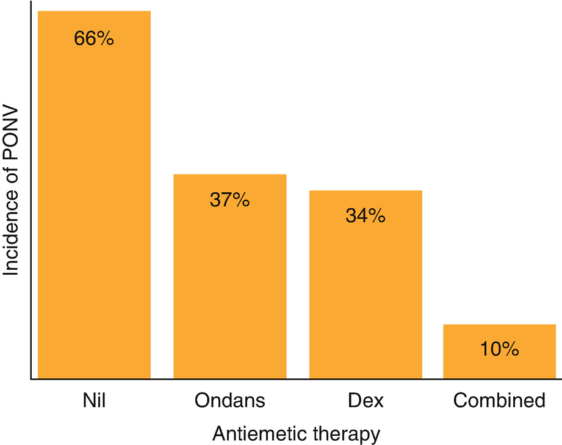

Anesthesia for Ophthalmic Surgery

© Springer Nature Switzerland AG 2020

Craig Sims, Dana Weber and Chris Johnson (eds.) A Guide to Pediatric Anesthesia[https://doi.org/10.1007/978-3-030-19246-4\_24](https://doi.org/10.1007/978-3-030-19246-4_24)

# 24. Anesthesia for Ophthalmic Surgery

Elaine Christiansen[1](#Aff4)    

(1)

Department of Anaesthesia and Pain Management, Perth Children’s Hospital, Nedlands, WA, Australia

Elaine Christiansen

Email: [Elaine.Christiansen@health.wa.gov.au](mailto:Elaine.Christiansen@health.wa.gov.au)

### Keywords

Oculocardiac reflexAnesthesia strabismusPostoperative nausea and vomitingAnesthesia for penetrating eye injury

Children may need general anesthesia for procedures that would be performed awake in adults, such as examination or refraction of the eyes, removal of superficial foreign bodies and cataract repair. Common procedures include strabismus surgery, tear duct surgery and management of the penetrating eye injury. Most of these children are well, but some may be very young or have associated syndromes. Anesthesia depth affects the intraocular pressure and eye position.

## 24.1 Airway Management

The airway can often be managed with an LMA. Considerations are size of the child, access to the airway should a problem arise during the procedure, duration of the procedure and adequacy of the airway obtained if an LMA is chosen initially. Full-head draping is often used during eye surgery and its removal to urgently access the airway is awkward and introduces the risk of wound infection.

## 24.2 Oculocardiac Reflex

The oculocardiac reflex is bradycardia, junctional rhythm or even asystole caused by traction on the extraocular muscles or compression of the eyeball. It occurs most commonly during strabismus surgery or enucleation. Anecdotally, the reflex is most likely to be triggered when traction is applied to the medial rectus muscle. The afferent path of the reflex is via the trigeminal nerve to the motor nucleus of the vagus nerve, from which efferent impulses affect the sino-atrial node. The incidence is increased when propofol is used for maintenance of anesthesia.

The oculocardiac reflex is very common, but severe bradycardia (30–40 bpm) is less common. Bradycardia gradually improves over a minute or two and usually resolves quickly if the stimulus is stopped. Sometimes, atropine or glycopyrrolate may be required. Pharmacologic treatment is not always needed and depends on the severity of the bradycardia or arrhythmia and the child’s hemodynamic state. Treatment, particularly with atropine, often results in tachycardia and hypertension unless small, judicious doses are titrated over a short period. Although some would routinely use anticholinergics to prevent the oculocardiac reflex developing, this is not generally necessary due to the potential for side-effects from these drugs and the potential for masking heart rate responses as an indicator of depth of anesthesia or analgesia requirements.

### Tip

The oculocardiac reflex can be frightening—there may only be one or two QRS complexes on the ECG screen! Ask the surgeon to stop traction on the muscle and check that there is still a plethysmograph trace from the oximeter to indicate a pulse is present. Prepare to give atropine 10–20 μg/kg if the heart rate does not quickly improve, or if the reflex recurs despite more gentle muscle traction next time.

## 24.3 Examination Under Anesthesia of the Eyes

Examination of the eyes under general anesthesia (EUA) may be required when a child is too young or uncooperative to allow examination while awake. EUA may be done to assess conditions such as retinoblastoma and congenital cataracts, or to screen for glaucoma or refraction errors. An inhalational technique with spontaneous ventilation is used, and the procedure is usually performed in a darkened room. Most anesthetic drugs, including sevoflurane and propofol, reduce intraocular pressure (IOP) by several mmHg. The effect on IOP is maximal soon after induction, when anesthetic depth is maximal. Some ophthalmologists will allow for this while measuring the IOP and others will measure IOP as the child awakens. Ketamine increases IOP by 2–3 mmHg. It is an alternative for anesthesia because some consider the IOP after ketamine is more reflective of the IOP in the awake child. Ketamine is not an ideal anesthetic agent because it may cause dysphoria and nausea. Children being screened for glaucoma often have multiple check-ups over time, and a pleasant anesthetic experience is important to maintain the child’s cooperation with subsequent anesthetics. Hypoxia and hypercarbia also increase intraocular pressure but mild changes produce clinically insignificant effects.

## 24.4 Tear Duct Surgery

Blocked lacrimal ducts are relatively common in babies and young children. Patency is restored by probing and syringing the tear duct. This is a short procedure allowing good access to the airway so an LMA is often used. Saline or fluoroscein is used to syringe the duct and enters the pharynx, so this needs to be suctioned away at the end of the procedure. Dacrocystorhinostomy is sometimes performed to create a patent tear duct if attempts at probing fail. It is often a long procedure with fluid and blood entering the pharynx so endotracheal intubation is often used.

## 24.5 Strabismus Surgery

Strabismus , or squint, is caused by an imbalance of the extraocular muscles so that the visual axes of the two eyes are not parallel. Surgical correction involves shortening or changing the insertion position onto the globe of one or more of the extraocular muscles. The airway can be managed with either an LMA or an ETT, but access to the airway during surgery is limited. The advantages of the LMA include a smoother induction and emergence and less postoperative coughing.

The oculocardiac reflex (OCR) is common in squint surgery. It is a trigeminal (ophthalmic division)-vagal reflex. It most commonly causes a sinus bradycardia, but can also cause junctional or other brady-arrhythmias. It is less likely if traction on the eye muscle by the surgeon is gentle and gradual, and the reflex fades over time. It is more common with anesthetic techniques that are associated with a reduced heart rate, including propofol, remifentanil and fentanyl. It is more likely during light planes of sevoflurane anesthesia compared to deep planes. Atropine given prophylactically causes a tachycardia, making assessment of depth and response to surgery more difficult. If OCR occurs, the surgeon can be asked to temporarily release the muscle, and atropine given if required. Small, incremental doses of atropine are preferable, as larger doses may cause severe hypertension and tachycardia.

Nausea and vomiting (PONV) occur in 50–70% of children when no antiemetic is given, and prophylaxis is routinely given. The greater the number of eye muscles repaired, the greater the likelihood of PONV. Ondansetron 0.15 mg/kg with dexamethasone 0.15 mg/kg decreases the incidence of PONV (Fig. [24.1](#Fig1)). Propofol anesthesia is as effective as the administration of dexamethasone and ondansetron in the prevention of PONV, but the incidence of the oculocardiac reflex is higher in propofol-based techniques. In practice, the oculocardiac reflex is not a great problem, and propofol anesthesia together with antiemetics and IV fluids facilitate day-stay strabismus surgery.

Fig. 24.1

Incidence of PONV after strabismus surgery in children with no antiemetic, ondansetron alone, dexamethasone alone, or ondansetron combined with dexamethasone. Based on data from Shen YD et al. Pediatr Anesth 2014;24: 490–8

Effective analgesia is required as the eyes are sore and itchy after surgery. Opioids can be avoided to reduce PONV, but this may result in the child being very unsettled afterwards—there is usually ointment in the eyes and the child cannot see clearly for a short while after awakening. Therefore, opioids are usually given during surgery to aid emergence. The important concerns for anesthesia of children for strabismus surgery are listed in Table [24.1](#Tab1).

Table 24.1

Concerns during anesthesia for strabismus surgery

| 
Anesthesia for strabismus surgery

 |
| --- |
| 

Head drape and limited access to airway

 |
| 

Oculo-cardiac reflex is common, increased by TIVA

 |
| 

High incidence PONV—double antiemetic, IV fluids, propofol anesthesia beyond toddler age group

 |
| 

Multimodal analgesia to reduce opioid dose

 |

### Note

Strabismus surgery is associated with the oculocardiac reflex and PONV. Propofol is often used for maintenance to reduce PONV, but may increase the oculocardiac reflex.

## 24.6 The Penetrating Eye Injury

Anesthesia for the repair of a penetrating eye injury may need to proceed without adequate preoperative fasting. The management of these unfasted patients has been a controversial issue due to long-held concerns regarding the potential for extrusion of intraocular contents with anesthesia induction and suxamethonium weighed against the need to secure the airway as quickly as possible. The controversy of this issue has declined with the acceptance of modified rapid sequence induction, in which the airway is secured at the time of best conditions rather than after a pre-determined time (see Chap. [1](467929_2_En_1_Chapter.xhtml), Sect. [1.​6.​3](467929_2_En_1_Chapter.xhtml#Sec15)).

Suxamethonium increases intraocular pressure for up to 10 min, but there have been no documented cases of extrusion of ocular contents after its use in patients with an open globe. Non-depolarizing relaxants do not increase IOP, but there are concerns about the child coughing if intubation is attempted too soon. Laryngoscopy and intubation also increase IOP, and this increase can be attenuated by a short acting opioid such as alfentanil. In practice, it is thought that the problem of IOP increasing with anesthesia may have been overstated. After all, children with a penetrating eye injury have usually cried and rubbed their eyes, both of which increase the IOP. A reasonable approach to anesthesia in these children is a modified rapid sequence induction using a dose of propofol at the upper end of its dose range, a non-depolarizing relaxant, gentle ventilation during cricoid pressure with high concentration of volatile agent while taking care that the face mask is not pressing against the eye. The aim is to avoid light anesthesia and incomplete paralysis and coughing.

## Review Questions

1.  1.
    
    A 3 years old penetrated his eye with sharp scissors 3 h ago, soon after finishing his dinner. The child has an IV in situ and is otherwise well. How will you anesthetize this child?
    
2.  2.
    
    What are the anesthetic issues in a healthy child undergoing squint surgery? The child develops a sinus bradycardia rate 38 during surgical traction on the eye muscle. What will you do?
    
3.  3.
    
    Would an LMA be reasonable as airway management during anesthesia of a 1 year old undergoing EUA of the eyes?
    
4.  4.
    
    Would an LMA be reasonable as airway management during anesthesia of a 1 year old undergoing an intraocular lens replacement?
    

### Further Reading

1.  James I. Anesthesia for paediatric eye surgery. Cont Educ Anaesth Crit Care Pain. 2008;8:5–10.[Crossref](https://doi.org/10.1093/bjaceaccp/mkm048)
    
2.  Rodgers A, Cox RG. Anesthetic management for pediatric strabismus surgery: continuing professional development. Can J Anesth. 2010;57:602–17.[Crossref](https://doi.org/10.1007/s12630-010-9300-x)
    
3.  Termuhlen J, et al. Does general anesthesia have a clinical impact on intraocular pressure in children? Pediatr Anesth. 2016;26:936–41.[Crossref](https://doi.org/10.1111/pan.12955)
    
4.  Vachon CA, Warner DO, Bacon DR. Succinylcholine and the open globe: tracing the teaching. Anesthesiology. 2003;99:220–3.[Crossref](https://doi.org/10.1097/00000542-200307000-00033)