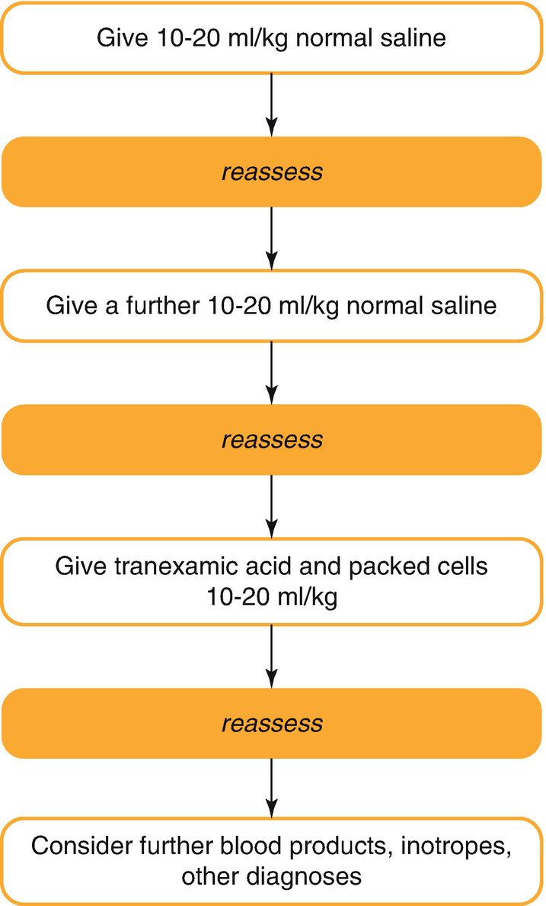

Trauma and Burns

© Springer Nature Switzerland AG 2020

Craig Sims, Dana Weber and Chris Johnson (eds.) A Guide to Pediatric Anesthesia[https://doi.org/10.1007/978-3-030-19246-4\_25](https://doi.org/10.1007/978-3-030-19246-4_25)

# 25. Trauma and Burns

Mary Hegarty[1](#Aff4)    

(1)

Department of Anaesthesia and Pain Management, Perth Children’s Hospital, Nedlands, WA, Australia

Mary Hegarty

Email: [Mary.Hegarty@health.wa.gov.au](mailto:Mary.Hegarty@health.wa.gov.au)

### Keywords

Pediatric traumaPediatric cervical spine injurySpinal cord injury without radiological abnormalityPediatric burn managementNon-accidental injuryPediatric burns resuscitation; Critical bleedingChildren

Trauma is the leading cause of morbidity and mortality in children aged over 1 year, accounting for 40% of all deaths. Children who survive serious injuries are often left with permanent disabilities which may be life-changing for the child and their family. Whilst the management of children after trauma follows the same principles as adults, there are unique features of pediatric trauma.

Children are at risk of injury because of their curiosity, risk taking behavior and lack of fear. Their small size means trauma is more likely to impact on multiple organs. Children have greater elasticity of their connective tissue, so shearing forces may cause tearing of major blood vessels and mediastinal structures. The flexible nature of a child’s skeletal system means that greenstick fractures are more common, and significant organ damage can occur with no overlying fractures. For example, blunt chest wall trauma may not result in rib fractures, but the force sustained during trauma may cause extensive injury to the thoracic organs. The abdominal wall of a child is less protected by fat and subcutaneous tissues so intra-abdominal organs are more prone to injury than in the adult population.

Physiological compensation may mask clinical signs of deterioration. This can lead to a delay in the recognition of injury and failure to respond appropriately to subtle clinical signs, particularly when there may be little external evidence of injury. Children may rapidly decompensate if these subtle signs are missed, so continual reassessment is required (Table [25.1](#Tab1)). Caution is therefore advisable when administering opioids and anesthetic drugs, which have the potential to cause cardiovascular instability in the injured child with unrecognized and untreated shock.

Table 25.1

Normal values for physiological variables in children. Expected systolic blood pressure = 80 + (age in years × 2) mmHg

| 
Age (years) | Heart rate (bpm) | Systolic blood pressure (mmHg)

 |
| --- | --- | --- |
| 

<1 | 110–150 | 70–90

 |
| 

2–5 | 95–140 | 80–100

 |
| 

5–12 | 80–120 | 90–110

 |
| 

\>12 | 60–100 | 100–120

 |

### Keypoint

The flexible skeleton of children allows them to withstand severe forces without incurring fractures. There may be few outward signs of injury when in fact there are severe internal injuries. Repeated reassessment of the child’s clinical condition is imperative.

### Keypoint

Children possess robust compensatory mechanisms, so a high index of suspicion for serious injury should be maintained even when a child appears initially stable. Once clinical signs of injury become evident this is often at a late stage when cardiac arrest may be imminent.

## 25.1 Types of Injury

Injuries in children tend to follow set patterns according to age and gender. As children grow, they increase in size and their body proportions change. With age, muscle mass increases and the body is able to withstand the effects of blunt trauma better.

Falls and transport-related incidents are the leading overall causes of injury, followed by accidental poisoning and burns. In children under 5 years, suffocation, drowning and burn injuries are more prevalent, whilst intentional self-harm, suicide and assaults are an increasing problem in adolescents. The commonest traumatic injuries in children are falls and transport-related incidents, and children have the highest death rates of occupants in motor vehicles (Table [25.2](#Tab2)). In pedestrian incidents, younger children hit by a car are more susceptible to thoracic and abdominal trauma than adolescents because of their low center of gravity, whilst older children are more likely to incur to limb injuries as their center of gravity is higher. Children are less visible to drivers, and driveway-reversing accidents are relatively common in pre-school age children. Head injuries cause the greatest mortality in children. Infants are particularly vulnerable as they have large heads with thin cranial bones, less head and neck control and incomplete myelination of brain tissue. Falls from a height, suffocation, drowning and burns are more likely to occur in children younger than 5 years. Two thirds of trauma related injuries occur in males, which may be related to a higher incidence of risk taking behavior.

Table 25.2

Causes of pediatric trauma

| 
Causes of trauma

 |
| --- |
| 

Transport related injuries

 |
| 

Falls

 |
| 

Drowning

 |
| 

Burns

 |
| 

Accidental poisoning

 |
| 

Non-accidental injury

 |
| 

Self-harm/suicide

 |
| 

Assaults

 |

### Keypoints

Pediatric trauma is different because:

Children have a smaller body size resulting in different patterns of injury.

Internal organs are less protected and more vulnerable to trauma.

There are anatomical differences e.g. airway, cervical spine.

They have a large body surface area and are more likely to lose heat and fluids.

Greater distribution of force is more likely to result in multi trauma than a single organ injury.

Increased metabolic rate and smaller functional residual capacity makes them more vulnerable to hypoxia.

Greater airway resistance and smaller airway diameter makes respiratory impairment more likely.

The large head in comparison to body makes head injuries more common.

Because they are able to increase systemic vascular resistance and heart rate to compensate for losses, children maintain their blood pressure until >30% blood volume is lost, causing sudden irreversible shock if not recognized early.

## 25.2 Initial Management

Advance preparation of drugs and equipment can be done if there is sufficient warning of an incoming trauma patient. Some centers use Broselow tapes to estimate the child’s weight and to determine drug doses and equipment sizes without any calculations (see Chap. [7](467929_2_En_7_Chapter.xhtml), Sect. [7.​1.​4](467929_2_En_7_Chapter.xhtml#Sec9)). The initial evaluation should identify life-threatening problems, using a primary survey followed by a secondary survey. The primary survey starts with assessment and control of the airway including cervical spine control followed by assessment of breathing and circulation. Appropriate life-saving interventions, such as endotracheal intubation, should be performed during the primary survey if indicated.

It is vital to uncover the child to ensure that a thorough secondary survey is performed and that no injuries are missed, but hypothermia from prolonged exposure must also be avoided. Infants have impaired thermoregulation and children have a larger surface area to body mass ratio so are more susceptible to heat loss than adults. Consider the use of warmed fluids, cling wrap, space blankets, forced air warmers and passive humidification of ventilator gases.

### Keypoint

The important first steps during the initial management of the child with trauma are to establish a clear airway, give oxygen, immobilize the cervical spine, control any bleeding and immobilize any fractures to minimize blood loss.

### 25.2.1 Airway

Intubation is needed if there is airway obstruction, depressed conscious state or if the child is combative and unmanageable (Table [25.3](#Tab3)). Children are more at risk than adults from edema of the upper airway caused by burns for example. A common problem is the use of an uncuffed endotracheal tube (ETT) that is too small and has an excessive leak preventing effective ventilation. Cuffed tubes are now more commonly used. When planning to intubate, it is important to prepare the appropriately sized equipment and to consider the choice of anesthetic agent that will be used to induce anesthesia. In the child with shock, ketamine may be preferable to propofol, or otherwise propofol in reduced doses. Suxamethonium is safe to use in children with head injuries and children with burns less than 24–48 h old.

Table 25.3

Indications for intubation and ventilation in pediatric trauma

| 
Indications for intubation and ventilation in pediatric trauma

 |
| --- |
| 

Airway obstruction unrelieved by simple airway maneuvers

 |
| 

Risk of aspiration due to loss of airway reflexes

 |
| 

Inadequate ventilation (e.g. secondary to chest trauma)

 |
| 

Hypoxia

 |
| 

Control of ETCO2 in head injuries

 |
| 

Transfer of patient (e.g. CT scan, inter-hospital transfer)

 |
| 

Anticipated airway obstruction (e.g. burns)

 |

### 25.2.2 Breathing

Chest trauma is usually caused by blunt trauma and there are usually associated injuries. Severe intra-thoracic injuries can occur without any obvious external signs on the chest. The main cause of cardiac arrest is respiratory failure. Children have a small respiratory reserve and may tire easily. Children who are tired will eventually have a decreased respiratory rate as a sign of an impending respiratory arrest. In children with chest trauma, respiratory compromise may be from direct injury to the chest wall or indirectly from shock or head injuries. Gastric distension may be caused by bag-mask ventilation and impedes ventilation, avoided by the insertion of gastric tubes to decompress the stomach early in resuscitation.

### 25.2.3 Circulation

Children have excellent compensatory mechanisms and will remain normotensive until they have lost 25–40% of their blood volume. Consequently, hypotension indicates severe blood loss. Tachycardia and peripheral vasoconstriction are earlier signs of hypovolemia—an important early sign is cool, clammy and mottled extremities (Table [25.4](#Tab4)). The blood volume should be calculated early in resuscitation (Table [25.5](#Tab5)). An algorithm for the initial management of hypovolemia is shown in Fig. [25.1](#Fig1).

Table 25.4

Hypotension is a late sign of hypovolemia in children due to their low resting sympathetic tone and excellent compensatory mechanisms

| 
Signs of impending circulatory failure in children

 |
| --- |
| 

Altered mentation (irritable, confused, combative, lethargic.)

 |
| 

Cool, clammy and mottled extremities

 |
| 

Prolonged capillary refill time >3 s

 |
| 

Poor urine output

 |
| 

Tachycardia or bradycardia

 |
| 

Poor pulse volume

 |
| 

Sunken fontanelle in children <1 year

 |

Earlier signs of hypovolemia should be sought

Table 25.5

Normal blood volumes in children of different ages

| 
Age group | Blood volume (mL/kg)

 |
| --- | --- |
| 

Preterm babies | 100

 |
| 

Neonates | 90

 |
| 

Infants and children | 70–80

 |

Fig. 25.1

An algorithm for the initial management of hypovolemia in children

### Keypoint

Blood pressure measurements are an unreliable indicator of shock in the pediatric patient. Children can compensate for 25–40% loss of their blood volume. Hypotension indicates severe blood loss.

Intravenous access in the arms or legs may be difficult, and an intraosseous needle inserted in the tibia if not fractured, should be considered early. The saphenous vein at the ankle is a vein that can be cannulated by landmarks alone—it is found just in front of the medial malleolus (there is a groove in the malleolus where the vein runs). Central venous access should only be performed by those skilled and familiar with the technique, but the femoral vein is a possible site for the occasional operator as it has a low risk of complications at the time of insertion (see Chap. [28](467929_2_En_28_Chapter.xhtml), Sect. [28.​4](467929_2_En_28_Chapter.xhtml#Sec7)).

Massive transfusion in children is defined as red cell transfusion of 50% of the total blood volume (TBV) in 3 h. Most hospitals now have a critical bleeding protocol to facilitate the supply of large amounts of blood products to a critically bleeding child. In time-critical situations, uncross matched O-negative blood or type-specific blood should be considered to avoid delay (see Chap. [5](467929_2_En_5_Chapter.xhtml), Sect. [5.​8.​2](467929_2_En_5_Chapter.xhtml#Sec27)). A fluid warmer is added to the IV fluid system as early as possible. As blood loss continues, coagulation is monitored with point of care devices such as ROTEM.

In a critical bleeding situation, tranexamic acid (TXA) should be administered early, with a loading dose of 15 mg/kg followed by an infusion of 2 mg/kg/h. Packed red blood cells are given at a dose of 10–20 mL/kg with cryoprecipitate at 5 mL/kg or human fibrinogen concentrate 70 mg/kg. Guided by laboratory tests, the patient may then require further packed red blood cells at a dose of 20 mL/kg with platelets at 10 mL/kg with or without fresh frozen plasma (FFP) 15 mL/kg (Table [25.6](#Tab6)). It is important to consider the critical triad of massive blood loss—hypothermia, acidosis and coagulopathy. In addition, calcium gluconate 30 mg/kg may be required to treat hypocalcemia.

Table 25.6

A guide to blood product administration in children

| 
Administration order | Blood product | Dose

 |
| --- | --- | --- |
| 

1 | TXA | 15 mg/kg

 |
| 

2 | Cryoprecipitate | 5 mL/kg

 |
| 

3 | Platelets | 10 mL/kg

 |
| 

4 | FFP | 15 mL/kg

 |

### Tip

Always remember to keep the child WARM, SWEET and PINK—remember to exclude hypoglycemia and avoid hypothermia.

## 25.3 Head Injuries

Half of children with major trauma have a head injury, and head injuries cause up to 40% of trauma deaths in children. Head injuries are common in children as they have a large head, prominent occiput and weaker neck muscles. Their brains are less able to tolerate acceleration and deceleration forces due to poor buoyancy within the CSF, thinner craniums and the delayed closure of the fontanelle at 12–18 months of age. The injury in children tends to be a diffuse axonal injury with cerebral edema rather than the focal collections seen in adults. Signs of raised ICP are similar to those in adults (Table [25.7](#Tab7)). Head injury outcomes are better in children than in adults with similar pathology, so aggressive early management is essential (see Chap. [23](467929_2_En_23_Chapter.xhtml), Sect. [23.​5](467929_2_En_23_Chapter.xhtml#Sec9)).

Table 25.7

Signs of increased ICP in children

| 
Signs of raised ICP

 |
| --- |
| 

Decreased level of consciousness—be wary of the silent child

 |
| 

Irritability

 |
| 

Unequal pupils

 |
| 

Dysconjugate gaze

 |
| 

Vomiting

 |
| 

Seizures

 |
| 

Cushing’s response

 |

The Glasgow Coma Score is not well validated in children, and is not reliable in children younger than 1 year. There is a modified version for pediatric trauma, which takes into account the age and the developmental stage of the child (Table [25.8](#Tab8)). An alternative scoring system is the AVPU (Table [25.9](#Tab9)).

Table 25.8

The Glasgow coma scale, modified for children

| 
Modified pediatric GCS scoring system

 |
| --- |
| 

Motor response | Verbal response | Eye opening

 |
| --- | --- | --- |
| 

6. Spontaneous | 5. Babbles, coos | 4. Eyes open spontaneously

 |
| 

5. Localises to pain | 4. Consolable cry | 3. Eye opening to shouting

 |
| 

4. Withdraws to pain | 3. Inconsolable cry | 2. Eye opening to pain

 |
| 

3. Flexion to pain | 2. Grunts or moans | 1. No eye opening

 |
| 

2. Extension to pain | 1. No verbal response

 |
| 

1. No motor response

 |

Table 25.9

The AVPU scoring system is used as an alternative to the GCS to assess head injuries in children

| 
AVPU scoring system

 |
| --- |
| 

A: alert

 |
| 

V: responds to voice

 |
| 

P: responds to pain

 |
| 

U: unresponsive

 |

Management of head injury in children follows the same principles used for adults. Children most at risk should be identified early and child with a GCS <9 should generate a trauma call and retrieval to the nearest pediatric neurosurgical center.

## 25.4 Cervical Spine Clearance

Cervical spine injuries only occur in 1–2%. In children under the age of 8 years, transport-related accidents are the most common cause of neck injuries. At this age, they have a large, heavy head on a neck with poorly developed muscles and lax ligaments. This affects the upper cervical spine especially, so spinal injury in children usually occurs at the higher level of C1 or C2. Many of these high cervical injuries result in death at the scene of the accident, so it is rare to see them in the hospital setting. Children older than 8 years tend to have a more adult pattern of injury with cervical spine injuries affecting the lower cervical vertebrae, and most commonly from sports-related activities. Non-accidental injuries involving shaking can lead to whiplash type injuries and are more likely to occur in babies.

### Keypoint

Unconscious children with an injury to the head, neck or upper torso area and all children involved in high speed motor vehicle accidents should be assumed to have a spinal injury until proven otherwise.

To assess a child for a C-spine injury, they must be alert, cooperative and of a sufficient developmental age for assessment (Table [25.10](#Tab10)). After taking a history to elicit symptoms of pain or neurological deficit, a gentle palpation of the neck in the posterior midline and lateral regions of the neck is undertaken. Active range of neck movements can be performed by the patient if there is no midline tenderness or abnormal neurological findings on the initial examination. If the child can move their neck without pain or neurological symptoms then the collar may be removed and the C-spine cleared. All C-spine assessment, clearance and radiological investigations should be performed in conjunction with an experienced senior clinician. If the C-spine is unable to be cleared, then immobilization is necessary (Table [25.11](#Tab11)).

Table 25.10

Indications for C-spine immobilization in children

| 
Indications for C-spine immobilization

 |
| --- |
| 

Fall from height >3 m

 |
| 

Pedestrian or cyclist collision >30 km/h

 |
| 

Passenger in MVA >60 km/h

 |
| 

Fall from horse

 |
| 

Reverse driveway collision

 |
| 

Ejection from vehicle

 |
| 

Severe electrical shock impact

 |
| 

Neck pain and/or limited neck movement

 |
| 

Suspicious mechanism of injury i.e. significant head, neck or upper torso injury

 |
| 

Traumatic torticollis

 |
| 

Distracting injury with suspicious mechanism

 |
| 

Neurological deficit

 |
| 

Reduced level of consciousness

 |
| 

Substance affected, with suspicious mechanism

 |
| 

Prior history of C-spine injury or neck problem

 |

Table 25.11

Technique for immobilization of C-spine in children

| 
Immobilization technique

 |
| --- |
| 

Apply manual in-line immobilization

 |
| 

Apply an appropriately sized collar

 |
| 

Collars may be inadvisable in the uncooperative child, where the correctly sized collar is unavailable and in children with torticollis

 |
| 

In the intubated patient, lateral bolsters e.g. rolled up towel can be placed either side of the collar

 |

### Keypoint

Manual in line stabilization (MILS) should be performed until a collar can be applied. The use of sandbags and tapes is no longer recommended. The choice between a hard or soft collar varies in different institutions.

The C-spine can be cleared once a history and examination have been done and the relevant investigations have been performed (Table [25.12](#Tab12)). There is a low probability of injury if on examination the child has no midline tenderness and no focal neurological deficit, but the child must be alert, asymptomatic and have no distracting injuries to make this assessment. Clinical assessment is often difficult in young patients, however, and interpretation of C-spine x-rays requires knowledge of pediatric normal variants. For example, pseudo-subluxation at C2/C3 is a normal finding in 24% of children under the age of 8 years. It may therefore be necessary to seek advice from a pediatric radiologist, as important injuries to exclude are fractures, ligamentous injuries and spinal cord injuries.

Table 25.12

Steps required to clear the cervical spine in children

| 
C-spine clearance

 |
| --- |
| 

Alert, asymptomatic children with normal examination can be cleared without need for radiology

 |
| 

Children with symptoms and/or signs require plain X-ray (AP, lateral and Odontoid peg views)

 |
| 

Children with impaired level of consciousness require careful evaluation and discussion with pediatric radiologist

 |
| 

Children with a neurological deficit or who are intubated require neurosurgical consult

 |
| 

Plain X-rays may need to be supplemented by CT ± MRI

 |

The best decision-making assessment tool to determine when imaging should be utilized in children under the age of 16 years is NEXUS (National X-ray Utilization Study). The Canadian C-spine rule is not validated for use in children. Current recommendations for imaging in patients who cannot be cleared are for 2-view radiographs in children <9 years and for 3 view radiographs in children >9 years of age. CT imaging is recommended as the first line investigation in obtunded children <10 years. MRI is indicated for obtunded children with a suspicious mechanism of injury, in those with a neurological deficit and in the presence of equivocal radiographs or CT images.

### Tip

In the uncooperative child, attempting to enforce rigid immobilization can cause more harm to the spinal cord. In this instance, apply a collar if possible and allow the child to adopt their own position until they are comfortable.

### 25.4.1 Spinal Cord Injury Without Radiographic Abnormality (SCIWONA)

SCIWONA is an injury in children defined as the presence of objective signs of cervical spinal cord damage without radiological evidence of fracture or ligamentous instability of the cervical spine. This occurs due to the elasticity of the spinal cord and a more tenuous blood supply to the spinal cord in the pediatric population. It is more common in children than adults, and accounts for about two thirds of severe cervical injuries in children younger than 8 years. It is primarily caused by flexion and extension injuries, but a combination of lateral bending, axial loading, rotation and distraction may also be implicated. MRI is the investigation of choice for investigation of soft tissue injuries of the C-spine and should be requested if there is evidence of a focal neurological deficit.

### Tip

In children with SCIWONA, a normal X-ray or CT scan does not exclude a spinal cord injury.

The mechanism of injury provides a clue to an increased risk of C-spine pathology—for example children injured as a result of falls from height, diving accidents, high speed motor vehicle accidents and any children with head, neck or back trauma are at risk of having a C-spine injury. An MRI of the spine may reveal SCIWONA, particularly if there is hemorrhage or edema of the spinal cord or evidence of subluxation. This type of spinal cord trauma is generally regarded as a stable injury and management involves specialized multidisciplinary care with immobilization of the C-spine in the immediate period and thereafter for up to 3 months. Some cases will require surgical stabilization.

### Tip

When intubating a child, it is preferable to remove the collar and perform MILS until the airway has been secured. The collar can then be replaced.

## 25.5 Non-accidental Injury

Child abuse is a common cause of traumatic injury in small children, especially babies under 6 months of age. The affected child may be undernourished and unkempt with signs of neglect. There may be evidence of multiple bruising and old injuries. The patient is often withdrawn and difficult to engage (Table [25.13](#Tab13)). In cases of suspected non-accidental injury, a detailed history, examination and documentation of the reported injury is mandatory. If non-accidental injury is suspected it is the responsibility of all health care workers to report their findings to the appropriate authorities (see Chap. [29](467929_2_En_29_Chapter.xhtml)).

Table 25.13

Indicators of non-accidental injury in children with trauma

| 
Non-accidental injury in trauma

 |
| --- |
| 

Injuries inconsistent with history

 |
| 

Child reports adult harm

 |
| 

Multiple injuries of differing ages

 |
| 

Delayed presentation

 |
| 

Unusual injuries (significant bruising, well demarcated burns, perianal or genital injuries, retinal hemorrhages, multiple fractures, intra-oral injuries)

 |
| 

Subdural hematoma

 |
| 

Injury to internal organs with no history of major trauma

 |

## 25.6 Burns

Burn injuries are very common in children, but the commonest type of burn is different in different age groups. There are several differences of children affecting burn management in them compared to adults (Table [25.14](#Tab14)).

Table 25.14

Differences in children affecting burn management compared to adults

| 
Difference in children

 |
| --- |
| 

Prone to airway edema

 |
| 

Vascular access more difficult

 |
| 

At risk of hypothermia

 |
| 

High metabolic rate and may become very catabolic

 |
| 

Prone to hyponatremia

 |

### 25.6.1 Type of Injury

Seventy percent of burns in children are due to scalds caused by hot drinks or from hot water immersion. Scald injuries tend to be superficial and may often be managed conservatively. Contact burns occur in ambulant children, such as toddlers, who may place their hands onto an electric heater or sustain friction burns from devices such as treadmills. Older children are more likely to suffer from flame burns, which may be associated with inhalational injuries and concomitant trauma. These types of burn are more likely to be full thickness and require surgical intervention. Up to 10% of burns are due to non-accidental injury, so a high index of suspicion is necessary when taking the initial history and examining the child. Detecting NAI is important as repeated injuries are common and up to 30% of these children will subsequently die (Table [25.15](#Tab15)).

Table 25.15

Burn types suspicious of non-accidental injury

| 
Burn Injury pattern in NAI

 |
| --- |
| 

Burns to sole, palms, buttocks, perineum

 |
| 

A well demarcated burn or burns in a pattern

 |
| 

No splash marks with a scald burn

 |
| 

Symmetrical burns

 |
| 

Restraint marks or bruises on limbs

 |
| 

‘Doughnut sign’—area of spared skin surrounded by scald burn

 |
| 

Other signs of neglect or previous trauma

 |

### 25.6.2 Physiology of Burns in Children

Large burns, greater than about 10–15% of body surface area (BSA), cause a systemic response due to the release of cytokines and other inflammatory mediators. The larger the burn area, the larger the systemic response. There is an initial fall in myocardial contractility and cardiac output, and systemic vasoconstriction that may affect the perfusion of essential organs. Capillary permeability is increased and there is loss of intravascular proteins and the development of interstitial fluid edema. Pulmonary pathology results from direct inhalational injury or indirect systemic effects which may cause interstitial edema, impaired cilia function and inactivation of surfactant. Inflammatory mediators can cause bronchoconstriction, even in the absence of inhalational burns, and in severe cases ARDS. The systemic response includes formation of extra-junctional receptors on muscle membranes and a hyperkalemic response to suxamethonium.

Basal metabolic rate increases threefold a few days after large burns. The child enters a catabolic state and early enteral feeding is important to counter this. It is vital to ensure that repeat visits to theatre for dressing changes, debridement and grafting do not interrupt nutrition unnecessarily. In children with large burns requiring numerous surgeries, continuous naso-jejunal feeding may be more appropriate as this allows anesthesia with shorter fasting intervals than oral intake. Some children develop burn encephalopathy, which may cause hallucinations, agitation and delirium. This can also be associated with raised intracranial pressure and hypertension.

### 25.6.3 Assessment of Burn Injury

Estimation of the burnt area is important because it determines the need for specialist referral and transfer of the child. Children who need referral for specialist plastic surgical assessment include those with more than 5% full or partial thickness burns, chemical and electrical burns, inhalational injury, children with pre-existing medical conditions or concomitant trauma, and infants and children with burns to the face, hands, perineum or feet.

The size of the burnt area also guides fluid requirements in resuscitation. However, estimating the size of a burn in children can be difficult. In adult burns the rule of nines is often used, but for children and infants the head is proportionately larger (nearly 20% of BSA), and the trunk and legs proportionately smaller. Age-specific burn diagrams are available to assess area (such as the Lund and Browder chart), but the easiest method is to use the palm of the child’s hand (palmar aspect including fingertips) as an estimate of 1% BSA. More recently, free smartphone apps have been developed (e.g. BurnMed® or Mersey Burns®) to estimate burn area and guide fluid resuscitation.

### 25.6.4 Airway Assessment in Burns

Airway assessment should begin with the history surrounding the injury and an examination to identify the patients at risk of airway compromise. Children with burns need regular observation of their respiratory rate and work of breathing. A history of inhalational burns in enclosed spaces should alert to the possibility of carbon monoxide poisoning or cyanide toxicity. Pulse oximetry may be inaccurate if there is carboxyhemoglobin present in the blood. Normal carboxyhemoglobin level is <13% and toxic levels >25%.

Management of the compromised airway in a burns patient includes oxygen, early intubation and transfer to a specialist pediatric burns center. There should be a low threshold for intubation in children with evidence of airway compromise. It is important to remember that in children with large burns not involving the airway there may be still be airway compromise as a result of systemic effects on pulmonary physiology. Cuffed endotracheal tubes may be preferable in these children, as their airway diameter may change as swelling occurs. Also, pulmonary pathology and decreased lung compliance mean that higher ventilation pressures may be required which will be difficult to achieve in the presence of a large leak around an un-cuffed tube.

### Tip

When selecting an endotracheal tube for intubation of the child with burns, allow for later airway swelling. A cuffed tube may be preferable. There is no need to shorten endotracheal tubes for children, particularly in burns children who may develop marked facial swelling.

### 25.6.5 Fluid Management in Burns

Fluid management in burns aims to maintain adequate circulating volume and organ perfusion, particularly renal function. Electrical burns or crush injuries add the possibility of myoglobinuria and the risk of renal failure. Intravenous access may become more difficult when swelling occurs in the burnt areas, so it is important to obtain access at an early stage. It is preferable to place the cannula through unburnt skin if possible or to consider alternatives such as intraosseous access if the child has large areas of burns.

Fluid therapy consists of resuscitation and maintenance fluids. In infants, the maintenance fluids should contain dextrose, and blood glucose monitored regularly. IV fluids should be started in all children with burns more than 10% BSA and should be calculated from the time of injury. There is no clear evidence as to whether crystalloids are better than colloids in the fluid management of burns. Most burns centers currently use crystalloid for initial resuscitation in the first 24 h, adding colloid (usually albumin) thereafter.

The volume of fluid required is estimated using various formulae. These formulae are only guides and require ongoing clinical assessment using acid base status, urine output, CVP, blood pressure measurements and the arterial waveform. Generalized edema is a significant problem in major burns, and the aim of fluid management is to maintain euvolemia and avoid excessive fluid. Assessment of fluid status is done hourly in the early stages of fluid management. Resuscitation is adequate when the child is comfortable, easily roused, with warm distal extremities, an adequate systolic blood pressure (80 mmHg + 2 × age in years), pulse rate 80–160, and urine output of 0.5–1 mL/kg/h.

The modified Parkland Formula (3–4 mL × kg × % burn; Table [25.16](#Tab16)) is commonly used, with 50% of the estimated fluid requirements given in the first 8 h since the time of the burn and the remaining 50% given in the next 16 h. However this formula commonly underestimates fluid requirements in children under 10 kg—more fluid is needed in younger children because they have higher fluid and calorie requirements relative to weight. Children with inhalational burns, electrical burns or delayed presentation to hospital may have increased fluid requirements. A urinary catheter should be considered in all children with moderate to severe burns and a urine output of 0.5–1 mL/kg/h should be the aim. A nasogastric tube may also be useful to prevent gastric distension and for nutritional purposes later on.

Table 25.16

Modified Parkland formula to estimate fluid resuscitation volume for children with burns

| 
Modified parkland formula

 |
| --- |
| 

3–4 mL/kg Hartmann solution × % burn

 |
| 

Therefore, for a 20 kg child with 25% burns:

Resuscitation fluid = 4 × 20 × 25 = 2000 mL in 24 h from the time of the burn

50% should be given in the first 8 h = 1000 mL in 8 h = 125 mL/h

Maintenance fluid = 100 mL/kg for first 10 kg + 50 mL/kg for second 10 kg = 1500 mL in 24 h = 62.5 mL/h

Therefore, in the first 8 h, fluid requirements = 125 mL + 62.5 mL = 187.5 mL/h

 |

Most children with burns injuries can tolerate oral fluids, and after the initial resuscitation intravenous fluids can be converted to oral. After the initial 24 h of fluid resuscitation, fluid replacement therapy should be guided by urine output, serum electrolytes and hemoglobin. Children with more severe burns may require longer term IV therapy. Care should be taken to avoid hyponatremia, particularly in younger children.

Blood losses during burns surgery can be large and difficult to monitor, with blood loss being proportional to the amount of necrotic tissue that is to be removed. It is estimated children can lose approximately 3% of their blood volume for every 1% burn surface area excised. Blood should be cross matched preoperatively and potential losses should be discussed with the burns surgeon. Measures to reduce intra-operative blood loss during burns surgery include the use of tourniquets, infiltration with adrenaline (epinephrine) containing local anesthetic solutions, electrocautery and good surgical technique.

### 25.6.6 Anesthesia and Pain Relief for Burns

Children with burns may require frequent visits to theatre for dressing changes, debridement and grafting. Early wound excision and grafting has been shown to improve survival rates. A thorough pre-operative assessment, with particular emphasis on airway assessment, fluid volume status and aspiration risk (burns patients are at increased risk of gastric stasis due to their injury and opioid analgesia) should be done. Pre-operative hemoglobin and electrolyte levels, coagulation studies and cross match will be required for major burns surgery. For some children, the experience of frequent procedures can cause anxiety and distress. This may be alleviated by explaining the process to the child in language they understand and having a low threshold for using premedication (see Chap. [9](467929_2_En_9_Chapter.xhtml), Sect. [9.​3.​4](467929_2_En_9_Chapter.xhtml#Sec24)).

Suxamethonium may be used in the first 24–48 h after a burn, but should be avoided thereafter for up to 2 years post burn injury to prevent hyperkalemia. Children with burns have an increased dose requirement for non-depolarizing muscle relaxants. The optimal first dose is 30–50% higher than the normal dose and is related to the depth and size of the burn. Consideration should also be given to intra-operative monitoring, temperature control and IV access which may be challenging in children with larger burns.

### Tip

Children with burns commonly require anesthesia. Have a low threshold to use premedication, and a low threshold to use an opioid infusion for postoperative analgesia.

Children with burns benefit from multi-modal analgesia, with intravenous morphine being the first line treatment. Their analgesia requirements are often surprising high. Management is aided by ensuring analgesia is adequate before the child wakes up from anesthesia, and liberal use of IV rather than oral analgesic techniques. A caudal block is often useful to cover the donor site for skin grafts.

### 25.6.7 Psychosocial Issues

Families may feel guilt after their child has had a burn injury or trauma injury. It is important to keep the family involved and informed about what is happening during the management of their child. Allow the parent or guardian to be with the child as much as possible. This has benefits both for the child and the family member. It is often a frightening time for a child who may have a fear of strangers, suffer separation anxiety and will often have a poor understanding of what is happening to them.

## Review Questions

1.  1.
    
    A 20 kg child suffered 20% full thickness burns 6 h ago. What would be the optimum volume of crystalloid fluid resuscitation for the first hour?
    
    1.  (a)
        
        160 mL
        
    2.  (b)
        
        260 mL
        
    3.  (c)
        
        360 mL
        
    4.  (d)
        
        460 mL
        
    5.  (e)
        
        660 mL
        
    
2.  2.
    
    A 2 year old child has burns to lower body from immersion into a hot bath. Describe your assessment and management of pain in the first 24 h following injury. Describe your assessment of a 5 year old child, who has been rescued from a house fire.
    
3.  3.
    
    A 4 year boy was injured in a traffic accident. On arrival at hospital, he has weak pulses and an unrecordable BP. Peripheral IV cannulation was unsuccessful. What are the alternative routes of vascular access and outline the disadvantages and complications of these routes?
    

### Further Reading

1.  Cullen PM. Pediatric trauma. Cont Educ Anesth Crit Care Pain. 2012;12:157–61.[Crossref](https://doi.org/10.1093/bjaceaccp/mks010)
    
2.  Goergen S et al. Pediatric cervical spine trauma. In: Education modules for appropriate imaging referrals: Royal Australian and New Zealand College of Radiologists. 2015. [https://​www.​ranzcr.​com/​our-work/​quality-standards/​education-modules](https://www.ranzcr.com/our-work/quality-standards/education-modules). Accessed July 2019.
    
3.  Gopinathan NR, Viswanathan VK, Crawford AH. Cervical spine evaluation in pediatric trauma: a review and an update of current concepts. Indian J Orthop. 2018;52:489–500.[Crossref](https://doi.org/10.4103/ortho.IJOrtho_607_17)
    
4.  Jamshedi R, Sato TT. Initial assessment and management of thermal burn injuries in children. Pediatr Rev. 2013;34:395.[Crossref](https://doi.org/10.1542/pir.34-9-395)
    
5.  Kanani AN, Hartshorn S. NICE clinical guideline NG39: major trauma: assessment and initial management. Arch Dis Child Educ Pract Ed. 2017;102(1):20–3.[Crossref](https://doi.org/10.1136/archdischild-2016-310869)
    
6.  McDougall RJ. Paediatric emergencies. Anaesthesia. 2013;68(Suppl.1):61–71.[Crossref](https://doi.org/10.1111/anae.12052)
    
7.  Mitchell RJ, Curtis K, Foster K. A 10-year review of child injury hospitalisations, health outcomes and treatment costs in Australia. Inj Prev. 2018;24:344–50.[Crossref](https://doi.org/10.1136/injuryprev-2017-042451)
    
8.  Sheridan RL. Burn care for children. Pediatr Rev. 2018;39:273–83. A very good, contemporary overview.[Crossref](https://doi.org/10.1542/pir.2016-0179)