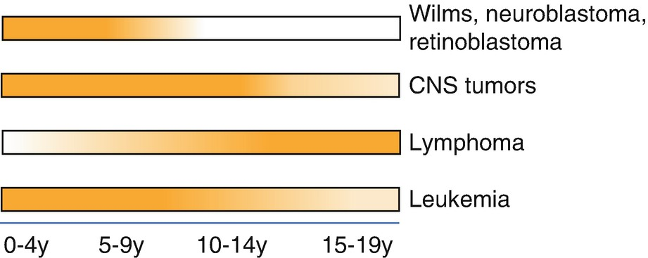

Malignancy and Treatment of Malignancies in Children

© Springer Nature Switzerland AG 2020

Craig Sims, Dana Weber and Chris Johnson (eds.) A Guide to Pediatric Anesthesia[https://doi.org/10.1007/978-3-030-19246-4\_26](https://doi.org/10.1007/978-3-030-19246-4_26)

# 26. Malignancy and Treatment of Malignancies in Children

Bruce Hullett[1](#Aff4)    

(1)

Department of Anaesthesia and Pain Management, Perth Children’s Hospital, Nedlands, WA, Australia

Bruce Hullett

Email: [Bruce.Hullett@health.wa.gov.au](mailto:Bruce.Hullett@health.wa.gov.au)

### Keywords

Anterior mediastinal mass anesthesiaAnesthesia for pediatric oncology proceduresMucositis in children

Children with cancer have multiple anesthetics during their treatment. Their clinical state may be related directly to the cancer or to the complications of therapy and they may be very unwell at times. The children and their families are under considerable stress and require an empathic approach from all of their health care providers

Cancer is uncommon in children compared to adults—15% of all cancer occurs in children, half of which occurs in children 4 years and younger. Cancers however are the second commonest cause of death in children after trauma (road accidents and drowning). One third of all cancers are leukemia, and 1 in 5 cancers are CNS tumors, although the different cancers occur at different rates in various age groups (Fig. [26.1](#Fig1)). Childhood cancers have a survival rate higher than for adults, approaching 85% for hematological malignancies.

Fig. 26.1

Incidence of the commonest tumor types in different age groups. Darker shading indicates higher incidence. Adapted from Steliarova-Foucher E. Lancet Oncology 2017;18: 719–31

Although the commonest cause of pain in children with cancer is chemotherapy treatment, these children report that medical procedures or surgery cause the worst pain during their treatment. General anesthesia during medical procedures such as lumbar punctures and bone marrow biopsies avoids this pain—anesthetists can make a huge contribution to the care of these children by reducing the most severe pain during cancer treatment. Anesthetists may also provide IV access, anesthesia for imaging procedures, surgical tumor resection, radiotherapy and pain management.

The issues arising in the oncology patient vary over the course of their treatment. Direct effects of the tumor give way to systemic effects of treatment—particularly hematopoietic effects of chemotherapy that can result in potentially life-threatening complications. Pain is often present at the time of diagnosis, but its character may change as therapy is begun and pain from procedures and mucositis become predominant. Many children participate in oncology trials that follow set treatment protocols. These protocols may be compromised by issues such as anesthesia not being available at the correct time in the treatment cycle, or simply by using dexamethasone as an antiemetic.

## 26.1 Chemotherapeutic Agents

Chemotherapy is based on the age of the child and the type and stage of the tumor. It may be used alone or in conjunction with surgery or radiotherapy. Chemotherapy has significant side effects, and multiple agents are usually used to improve outcome and reduce toxicity. Chemotherapeutic agents may be considered either as conventional agents directed at rapidly dividing cancer cells by various mechanisms, or as more modern molecularly targeted agents directed at tumor cell receptors or specific processes such as angiogenesis or immunomodulation. Conventional agents are commonly used at maximally tolerated doses, whilst molecular target agents have greater specificity with possibly fewer side effects. Many of these drugs, however, are in early development and their full potential is yet to be realized. Corticosteroids are also commonly used in treatment for their cytotoxic, immunosuppressive and antiemetic properties. Suppression of the hypothalamic-pituitary axis is common.

Chemotherapy is used to treat the commonest childhood leukemias—acute lymphatic leukemia (ALL) and acute myeloid leukemia (AML). The treatment for ALL is more protracted than for AML and has 3 phases—induction and intensification lasting about 1 month each, followed by a maintenance phase lasting 1 or 2 years. Treatment includes intrathecal methotrexate or cytarabine, which has decreased the need for central nervous system radiotherapy and its longer-term effects on neurodevelopment and body growth. The treatment of AML requires more aggressive chemotherapy with an increased risk of complications, but treatment is shorter and without a maintenance phase. Hematological malignancies with poor prognostic features or that have relapsed may be considered for a stem cell transplant if a suitable donor can be found.

### 26.1.1 Toxicity

Chemotherapeutic agents cause myelotoxicity with anemia, neutropenia and thrombocytopenia, as well as gastrointestinal toxicity with nausea, vomiting and mucositis. Toxicity may also affect every other organ system in the body. Myelotoxicity often causes anemia that may require transfusion before surgery, depending on the clinical status of the child. Transfused blood is usually leucodepleted to reduce fevers and infection, and irradiated to stop donor T-cell replication and reduce graft vs. host disease. Thrombocytopenia may delay procedures such as lumbar puncture or line insertion. Platelet levels of 30,000/μL or higher are usually acceptable in these children, although the lower acceptable limit varies as evidence-based guidelines are lacking. Children with severe leucopenia are vulnerable to infection and sepsis, and strict attention should be paid to aseptic techniques during anesthesia care. Many of these children have long term surgical IV lines (Hickman, Broviac, Portacath, Infusaport) that need to be accessed carefully to avoid infection—the anesthetist should wash their hands, clean the access point, wear gloves and use a no-touch technique to access the device. Early placement of indwelling venous devices reduces the need for multiple peripheral IV lines, reduces the child’s anxiety, and allows recovery from the surgical insertion before the effects of chemotherapy become problematic.

Fortunately for anesthetists, the oncology team are very experienced with the toxicity and problems from these chemotherapeutic agents and are careful to monitor for them and manage them. The anesthetist is usually alerted to their presence. Some chemotherapeutic agents have specific effects on organ systems—the most important are outlined in Table [26.1](#Tab1).

Table 26.1

Effects of chemotherapy on specific organ systems side effects

| 
System | Drug | Comment

 |
| --- | --- | --- |
| 

Cardiac | Doxorubicin

Daunorubicin

Cyclophosphamide

Cisplatin, 5-fluorouracil | Rhythm abnormality, cardiomyopathy

 |
| 

Pulmonary | Bleomycin | Pneumonitis, non-cardiogenic edema (may be increased by supplemental oxygen) Fibrosis

 |
| 

Mitomycin

 |   |
| 

Methotrexate | Pneumonitis, bronchospasm, effusion

 |
| 

Nervous system | Cisplatin | Sub-clinical neuropathy

 |

### 26.1.2 Tumor Lysis Syndrome

This syndrome results from the massive release of intracellular contents from tumor destruction at the start of chemotherapy. It most commonly occurs with leukemias and high-grade lymphomas where there is high tumor mass and rapid early response to treatment. It results in hyperkalemia, hypocalcaemia, hyperphosphatemia and hyperureacemia, which in turn can cause arrhythmias, seizures, multi-organ failure and death. A lactate dehydrogenase level (LDH) greater than 1000 U/L indicates tumor lysis in children. It is prevented with hyperhydration, urinary alkinization and supportive measures. Allopurinol inhibits xanthine oxidase and reduces the conversion of xanthine and hypoxanthine to uric acid, and may be used preventatively. Rasburicase is used to treat hyperuraecemia. It is a recombinant form of urate oxidase which converts uric acid to allantoin, which is readily excreted in the urine. Steroids should be avoided in newly diagnosed children at risk of tumor lysis, because it can be precipitated by even a single dose of dexamethasone.

### 26.1.3 Mucositis

Mucositis is the inflammation of gastrointestinal mucosa as a result of chemotherapy, or of radiation to the head and neck. The inflammation may occur anywhere in the GI tract from the mouth to the anus, causing ulceration and pain. The pain can be severe and usually begins after 3–5 days of chemotherapy, peaking a few days later before gradually subsiding. It can be severe enough to require IV opiates at high doses and possibly supplementation with adjuncts such as ketamine. The ulcerated and inflamed mouth and oropharynx means instrumentation of the airway should be done with care. It can rarely be so severe that airway obstruction becomes a concern.

### 26.1.4 Stem Cell Transplant

Anesthesia is usually required to harvest bone marrow from an allogenic, HLA-matched donor. Autologous transplants are possible but carry the risk of reintroducing malignant cells to the patient. Short-term side effects of stem cell transplant are related to bone marrow ablation from high dose chemotherapy. Late complications include graft versus host disease, endocrine changes, bone damage affecting growth, and secondary cancers.

## 26.2 Radiotherapy

Radiotherapy usually requires frequent, or even daily, treatments for 2–6 weeks. Treatment occurs in an environment that is often not familiar to the anesthetist, and not normally equipped to deal with anaesthetized patients, let alone children. The radiotherapy beam is highly focused and requires careful positioning of the child. If the radiation is to the neck or head, a plastic stabilizing device placed on the head to guide the beam may limit access to the airway. The child needs to be completely still for a few minutes while the treatment is given, and monitored from outside the room because of the radiation dose.

Oral sedation can be given to the child to facilitate the procedure but there are problems with reliability of effect, onset of sedation relative to the time of procedure and prolonged sedation after the (brief) treatment. Furthermore, there are often time pressures on the treatment sessions, with limited ability to delay other cases while waiting for a child to become settled in the treatment room. Anesthesia is therefore usually required for children younger than 6 years. These children often have long term IV access in situ, and an intravenous anesthetic technique is often preferred as it avoids the need for anesthetic machine and issues regarding waste anesthetic gases. From a practical point of view, minimizing the number of staff involved provides some anesthetic consistency and a better experience for the child and parents.

## 26.3 Anesthesia for Short Oncology Procedures

Although some children with cancer will have major surgery for tumor removal, most children will have multiple anesthetics for short diagnostic or therapeutic procedures. These are procedures that would often be performed without anesthesia in adults, but for which children will not remain still or tolerate while awake. Leukemia and lymphomas are the most common of childhood cancers and children with these usually first undergo anesthesia for diagnostic bone marrow aspiration, lumbar puncture and central venous access.

### 26.3.1 Patient Welfare

The importance of the child’s psychological welfare cannot be overstated. Many oncology patients will require multiple anesthetics during their therapy. The time around diagnosis is particularly difficult for the family and so it is important to make the process as smooth as possible right from the start. Some time spent by the anesthetist at this stage will benefit the child, family and health care providers down the track. It is important not to hurry assessment and discussion, and extra care taken with the behavioral management of the child. Oncology families become very informed about all aspects of their child’s care, which can be very useful in summarizing a complex medical history for an anesthetist caring for the child for the first time. Newly diagnosed patients and families are obviously stressed and for ‘routine’ low risk anesthesia, a restrained discussion of anesthetic risks should be considered.

### 26.3.2 Anesthesia Techniques

Anesthetics will often involve a particular routine and special requests, as the child may have had many anesthetic experiences to compare. Inspection of previous records is useful in providing consistent care and avoiding pitfalls or recurrence of minor morbidity. This is best done before preoperative assessment where possible to help reassure the parents that you are up to speed with their child’s case.

Most anesthetics are for short, stimulating diagnostic procedures. This facilitates an intravenous anesthetic technique which has a better recovery profile than volatile-based anesthesia (less emergence delirium, less PONV). Propofol with a short-acting opioid such as remifentanil or alfentanil improves immobility and reduces total propofol dose. Some children come to hate the taste or feel of IV propofol, and this can be reduced by giving it slowly, especially if via a central line.

### Note

Take great care with aseptic technique when accessing surgical lines, and take great care to flush the line after anesthetic drugs have been given—about 20 mL is needed to completely flush an Infusaport. The line will also need to be flushed with heparinized saline if not being used after anesthesia. The concentration of heparin used depends on the length of time before next access is planned.

## 26.4 Anterior Mediastinal Mass

The anterior mediastinum is the space between the sternum and middle mediastinum. It contains the thymus and some lymph nodes. In the middle mediastinum are the heart, great vessels and tracheobronchial tree. Tumors in the anterior mediastinum surround and may compress the tracheo-bronchial tree, the SVC, or the pulmonary trunk or artery. These tumors can cause life-threatening problems at induction of anesthesia. Lymphomas are the commonest tumor in this location in children. The initial anesthetic in these children is of tissue diagnosis—usually either bone marrow aspiration or biopsy of a lymph node in the neck. This is a very high-risk anesthetic, and treatment to shrink the tumor usually cannot begin until the tissue diagnosis is made. The commonest cause of the mass, T cell (Hodgkin’s) lymphoma, responds very quickly to chemotherapy, reducing the tumor mass and anesthetic risk. This rapid response raises the question of whether to begin treatment without a tissue diagnosis. In reality, treatment is rarely started before definitive diagnosis, for fear of never obtaining a satisfactory tissue sample to confidently direct treatment.

### 26.4.1 Consequences of Anterior Mediastinal Masses

Anterior mediastinal masses compress the structures in the middle mediastinum, particularly when the child is supine. The tracheobronchial tree and great vessels may all be compressed. The larger the mass, the more likely it will cause compression. Children younger than 1 or 2 years are at even higher risk due to their small airway diameter and very compliant airways. Compression of the airway over time may lead to tracheo-bronchomalacia, which further predisposes to airway obstruction during anesthesia. The pulmonary artery is protected by the aorta, but may still rarely be compressed. The pericardium may be infiltrated by tumor, causing effusion or pericarditis. The aorta is usually spared because of its intraluminal pressure and location. Compression of structures is less of a problem in adults because the tracheo-bronchial tree is more calcified and rigid.

The symptoms of tracheal compression are stridor, reduced exercise tolerance, wheeze and especially orthopnea and supine cough. A child who is reluctant to lay flat is likely to have significant airway compression. Compression of the superior vena cava causes facial swelling and plethora, especially in the morning after lying flat during the night. Syncope during valsalva (such as during bowel action) is a particularly worrying sign, as it indicates inability to compensate for reduced venous return. A lack of symptoms is reassuring but does not does exclude serious risks from anesthesia.

### Keypoint

Anesthesia for a child with an anterior mediastinal mass can be life-threatening. The risk comes from compression of the great vessels and airways. Muscle paralysis with the child supine is a consistent cause of problems.

### 26.4.2 Investigations

Chest X ray demonstrates the size of the mass and pleural effusions. Sometimes the tracheobronchial tree can be seen clearly enough to visualize any airway compression and pleural effusions. Many centers routinely perform echocardiography to search for great vessel compression, pulmonary outflow tract obstruction and pericardial effusion. It is an important investigation, as cardiovascular involvement increases the risk of morbidity and mortality. It gives dynamic information and can be performed in an upright position if the child is unable to lie down. A CT scan is useful to assess airway compression-if the trachea is compressed more than 50%, intraoperative airway obstruction is more likely. Unfortunately, CT scans usually require anesthesia in young children and the risk involved needs to be balanced against the additional information gained. New scanners are able to perform very fast, partial scans that may provide some information without the need for anesthesia. Respiratory function testing will reveal obstruction with flow-volume loops, but is seldom performed as it is difficult in small, uncooperative children, and has a poor correlation with the degree of airway obstruction. Clinical features that indicate extreme risk and high desirability to avoid general anesthesia entirely are listed in Table [26.2](#Tab2).

Table 26.2

Factors that indicate extreme risk of anesthesia in children with anterior mediastinal mass

| 
Important risk factors

 |
| --- |
| 

Stridor, orthopnea or syncope

 |
| 

Large tumor >4 cm or mass to mediastinal ratio >45%

 |
| 

Tracheal compression >50% or main bronchi compressed on CT

 |
| 

Signs of SVC obstruction or vessel compression on echocardiogram

 |

General anesthesia is best avoided if at all possible if these factors are present

### 26.4.3 Induction

General anesthesia usually requires the child to be supine, which is often poorly tolerated. Induction of anesthesia relaxes airway and chest wall muscles and reduces functional residual capacity (FRC) of the lung. If the child is positioned supine and muscle relaxation used, lung volume falls further and reduces forces that may have been holding the mass off vital structures while the child was awake. Induction may then precipitate airway obstruction or cardiovascular collapse. The key considerations for anesthesia are listed in Table [26.3](#Tab3). Maintaining lung volume is the over-arching principle, and of the techniques to achieve this, maintaining spontaneous ventilation is particularly important as it produces a negative intrapleural pressure that expands the airways. The requirement to maintain spontaneous ventilation means that many of these cases are performed using a LMA for airway maintenance.

Table 26.3

Key considerations for safe anesthesia for cervical lymph node biopsy in a child with anterior mediastinal mass

| 
Anesthesia for the child with anterior mediastinal mass

 |
| --- |
| 

Communication and consultation with all specialties involved

 |
| 

Thorough assessment to allow risk stratification and planning

 |
| 

Consider performing biopsy awake with local anesthesia in older children

 |
| 

Maintain lung volume:

 – Consider semi-recumbent or sitting position for anesthesia and surgery

 – Avoid muscle relaxants

 – Maintain spontaneous ventilation with CPAP

 – Use local anesthetic to facilitate ‘light’ general anesthesia

 – Consider anesthesia using ketamine and dexmedetomidine to maintain FRC

 |
| 

Fluid load to maintain cardiac filling pressures in face of SVC obstruction

 – IV access in leg if SVC obstruction suspected

 |
| 

Plan for options if obstruction occurs

 – Lateral or prone positioning

 – Rigid bronchoscopy

 – Vasoconstrictors or inotropes for CVS collapse

 |

If obstruction develops, there are several options. Changing to a lateral or prone position is simple and readily performed. Intubation is an option, but there are concerns that either the ETT will not be able to pass through the compressed trachea, or the site of compression may be distal and not able to be bypassed by an ETT. It is therefore usually recommended that an ENT surgeon is available to perform rigid bronchoscopy. Cardiovascular collapse and cyanosis may respond to fluid loading, but vasoconstrictors to increase systemic vascular resistance and restore preload to both ventricles may be better. Cardiopulmonary bypass is not a realistic option given the speed at which deterioration occurs.

## Review Questions

1.  1.
    
    How do anterior mediastinal masses cause airway obstruction or cardiovascular collapse under anesthesia?
    
2.  2.
    
    Why is it important to maintain spontaneous ventilation during anesthesia in children with an anterior mediastinal mass?
    
3.  3.
    
    What are four factors which indicate higher risk in children with anterior mediastinal mass?
    
4.  4.
    
    What procedures are followed at your hospital to reduce the risk of line infection when anesthetic drugs are given through central lines to oncology patients?
    

### Further Reading

1.  Allan N, Siller C, Breen A. Anaesthetic implications of chemotherapy. Cont Educ Anaesth Pain Crit Care Pain. 2012;12:52–6.[Crossref](https://doi.org/10.1093/bjaceaccp/mkr055)
    
2.  Foerster MV, et al. Lumbar punctures in thrombocytopenic children with cancer. Peditr Anesth. 2015;25:206–10. A case series of 9000 lumbar punctures, including 25 with platelet counts <10,000/mm3 without incident.[Crossref](https://doi.org/10.1111/pan.12527)
    
3.  Latham GJ, Greenberg RS. Anesthetic considerations for the pediatric oncology patient-part 1: a review of anti-tumor therapy. Pediatr Anesth. 2010;20:295–304.[Crossref](https://doi.org/10.1111/j.1460-9592.2010.03257.x)
    
4.  Latham GJ, Greenberg RS. Anesthetic considerations for the pediatric oncology patient-part 2: systems-based approach to anesthesia. Pediatr Anesth. 2010;20:396–420.[Crossref](https://doi.org/10.1111/j.1460-9592.2010.03260.x)
    
5.  Latham GJ, Greenberg RS. Anesthetic considerations for the pediatric oncology patient-part 3: pain, cognitive dysfunction, and preoperative evaluation. Pediatr Anesth. 2010;20:479–89.[Crossref](https://doi.org/10.1111/j.1460-9592.2010.03261.x)
    
6.  Oduro-Dominah L, Brennan LJ. Anaesthetic management of the child with haematological malignancy. Cont Educ Anaesth Pain Crit Care Pain. 2013;13:158–64.[Crossref](https://doi.org/10.1093/bjaceaccp/mkt011)
    

### Anterior Mediastinal Mass

1.  Pullerits J, Holzman R. Anesthesia for patients with mediastinal masses. Can J Anaesth. 1989;36:681–8. An older article about adults and children, but contains excellent diagrams of the anatomy and contents of the mediastinum.[Crossref](https://doi.org/10.1007/BF03005421)
    
2.  Slinger P, Karsli. Management of the patient with a large anterior mediastinal mass: recurring myths. Curr Opin Anaesthesiol. 2007;20:1–3.[Crossref](https://doi.org/10.1097/ACO.0b013e328011390b)
    
3.  Kaplan JA. Leukemia in Children. Pediatrics in Review. 2019;40:319–31. A review of the medical aspects of leukemias in children.[Crossref](https://doi.org/10.1542/pir.2018-0192)