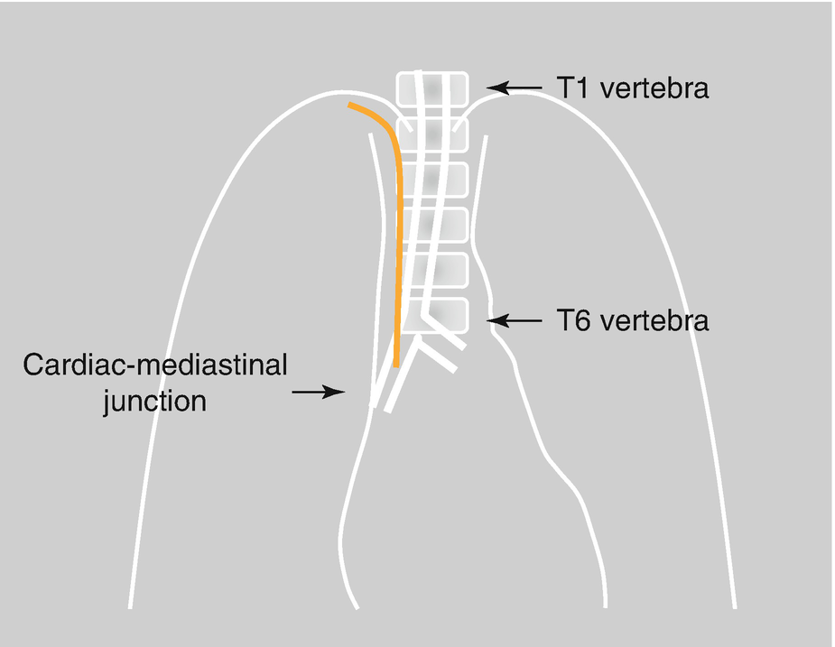
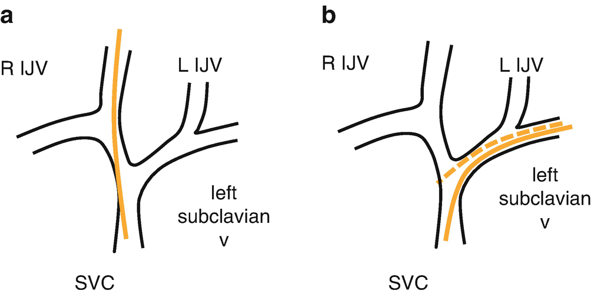
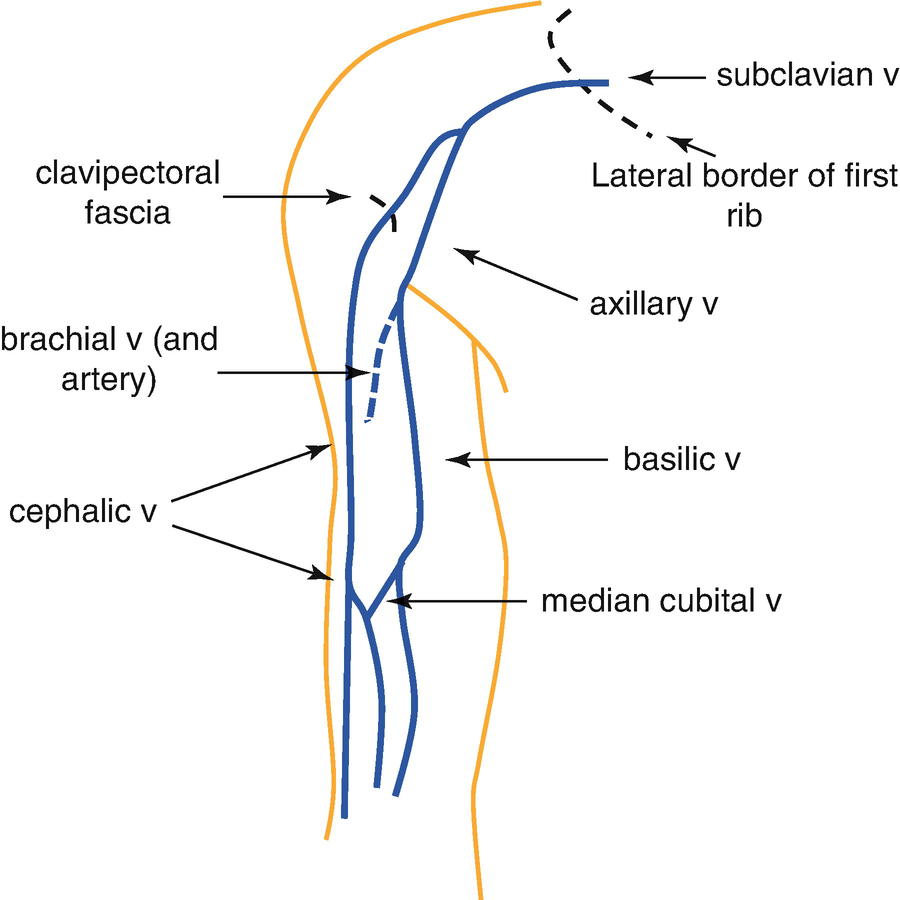
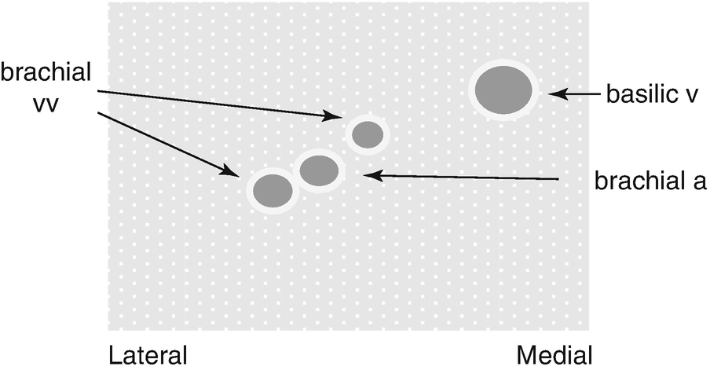

Central Venous and Arterial Access for Children

© Springer Nature Switzerland AG 2020

Craig Sims, Dana Weber and Chris Johnson (eds.) A Guide to Pediatric Anesthesia[https://doi.org/10.1007/978-3-030-19246-4\_28](https://doi.org/10.1007/978-3-030-19246-4_28)

# 28. Central Venous and Arterial Access for Children

Neil Chambers[1](#Aff4)     and Yu-Ping Chen[1](#Aff4)    

(1)

Department of Anaesthesia and Pain Management, Perth Children’s Hospital, Nedlands, WA, Australia

Neil Chambers (Corresponding author)

Email: [Neil.Chambers@health.wa.gov.au](mailto:Neil.Chambers@health.wa.gov.au)

Yu-Ping Chen

Email: [Yu-ping.Chen@health.wa.gov.au](mailto:Yu-ping.Chen@health.wa.gov.au)

### Keywords

Central venous access in childrenUltrasound for arterial cathetersPediatric central venous access devicesBroviac catheterPediatric infusaport

This chapter focuses on advanced vascular access techniques in children, and assumes that the reader is familiar with these techniques in adults. The intraosseous route is recommended for emergency resuscitation if peripheral IV access cannot be obtained, and both of these routes are discussed elsewhere in this book.

## 28.1 Central Venous Access in Children

Central venous access is challenging in children compared to adults because of their small-sized central veins, proximity to major structures and variation in their anatomical position. The success rate is lower and there are more complications compared to adults. Anesthesia or sedation is usually required for their insertion in children.

Ultrasound guidance and careful positioning of the child and equipment are important for insertion. The ultrasound probe, syringe and needle are held stabilized against the child’s body and equipment is positioned so there is no need to move or look away from the child or ultrasound screen. The child’s vein is small, superficial, mobile and easily collapsed by the needle so aspiration of blood is sometimes only seen when the needle is withdrawn. Arterial puncture is difficult to detect, especially in infants with cyanotic heart disease. Pressure transduction is the best technique to distinguish between vein and artery.

The risk of local complications with central venous catheter (CVC) insertion is higher in children than adults, primarily due to the proximity of structures. Central venous anatomy may vary, especially in children with congenital heart disease who are more likely to have a left-sided superior vena cava. Children, like adults, are at risk of infection while their CVC is in situ. The smallest diameter catheter with the minimum number of ports required reduces the risk of infection, as well as thrombosis of the vein. Although antimicrobial-impregnated catheters are sometimes recommended for adults, there is no firm evidence to support their use in children. Antibiotic prophylaxis is not needed at the time of insertion. Routine central catheter replacement is not generally recommended for children in critical care.

### 28.1.1 Position of the Catheter Tip

Correct positioning of the catheter tip reduces the risk of perforation of the vein wall or cardiac chamber, migration into other veins, and thrombosis or thrombophlebitis from the drugs being infused. The optimal position is in the lower third of the superior vena cava (SVC) or at the SVC-right atrium junction, but above the pericardial sac. The ideal tip position on fluoroscopy or chest X-ray is debated, however current best practice is to place the tip no more than two vertebral bodies below the carina (this position allows for the parallax error of the X-ray beam (Fig. [28.1](#Fig1)). Technologies using ECG or ultrasound to confirm the correct tip placement are either not available in pediatric sizes or are not adequately validated.

Fig. 28.1

Desired tip position on chest X-ray for central catheters in children is 1–2 vertebral bodies below the carina

All catheter tips should be positioned parallel to the vein wall to minimize the risk of perforation and thrombophlebitis. Catheters inserted on the right side are naturally more parallel to the SVC wall but catheters inserted on the left side need to be carefully positioned in the inferior third of the SVC to be parallel and not sticking into the wall of the SVC (Fig. [28.2](#Fig2)).

Fig. 28.2

(**a**) The distal part of right-sided catheters is usually parallel to the SVC wall. (**b**) The distal part of _left_\-sided catheters can push against the vein wall and perforate the SVC (dashed line). Advancing the catheter so the tip is in the correct distal position ensures the distal part of the catheter is parallel to the SVC wall (solid line)

## 28.2 Internal Jugular Vein CVC

The internal jugular vein (IJV) is often used in children for CVC insertion because it has the lowest risk of complications. The vein is more variably sized, smaller and closer to the carotid artery in children compared to adults. Its position relative to the carotid artery may vary—it is most commonly antero-lateral and partly overlapping the carotid artery. The amount of overlap may increase when the head is rotated to the side. It is completely lateral to the carotid artery in less than a quarter of children, and occasionally it is even medial to the carotid. It is usually at a depth of less than 1 cm, and is only about 5 mm in diameter in infants.

### 28.2.1 Technique

A shoulder roll extends the child’s neck and allows better access. The head is turned slightly so the needle will be clear of the chin. A head-down tilt usually has minimal effect on the size of the IJV in infants but reduces the risk of venous air embolism. Maneuvers to increase the diameter of the vein are not usually required. Simulated valsalva is probably the most effective. When it is combined with liver pressure and head-down tilt, the vein size increases about 65%. The effect of these maneuvers can be observed on ultrasound to assess any benefit.

Most commonly, a high approach to the IJV is used with the needle insertion lateral to the carotid pulsation at the level of the cricoid. The advancing needle can compress the vein, and blood is often aspirated only as it is being withdrawn. After entering the vein with the needle, the guide wire is passed gently to avoid perforating the vein. The J-tip of the wire has a curve larger than the vein diameter of infants and will either traumatize the vein or not advance into the vein. To overcome this problem, the stiffer, straight end of the wire may be inserted, or a short soft straight wire followed by a catheter long enough to act as a conduit into a larger, distal part of the vein for the J-wire. The length of the catheter inserted depends on the size of the child—4–5 cm for a right IJV insertion in a neonate, a little longer when inserted on the left side. The smallest 2-lumen catheter currently available is 4F and 5 cm long.

### Tip

The length of catheter to insert (in cm) for the right IJV (high approach) equals one tenth of the child’s height.

The external jugular vein is an unreliable route for central access because it has valves and an angled course that usually prevents a guidewire or catheter advancing. It can be useful however, for peripheral venous access.

## 28.3 Subclavian Vein CVC

Subclavian vein catheters have a higher risk of pneumothorax and arterial puncture during insertion. However, they are popular postoperatively because they are more comfortable and better tolerated by awake children, and less likely to kink with head movement. They may be preferable in trauma cases when urgent access is required but the neck needs to remain in a neutral position or is in a cervical collar. Subclavian insertion is also easier than IJV insertion using local anesthesia in the older, awake child. Although they are associated with a lower infection rate, they have a higher thrombosis and occlusion rate compared to internal jugular catheters.

### 28.3.1 Technique

The right subclavian approach may be preferable to avoid injury to the thoracic duct on the left. For insertion, the child is positioned with the head in a neutral position. The landmark-based infraclavicular approach is similar to adults with needle insertion at the midclavicular point where the clavicle bends sharply, aiming the needle medially and slightly cephalad towards the contralateral shoulder or sternal notch. Inserting the needle too far laterally increases the risk of pneumothorax. The guidewire should be relatively straight after insertion to avoid kinking when dilating the vein. Tips to achieve this include a slight laterally and inferiorly placed skin puncture with minimal skin traction and then advancing needle behind clavicle in a consistent direction. Real-time ultrasound guidance assists successful cannulation in less time, and reduces the risk of inadvertent subclavian artery puncture and pneumothorax. With the supraclavicular approach, the subclavian vein is accessed more medially where it joins the internal jugular vein to form the brachiocephalic vein. This approach was less popular in the past due to the greater risk of pneumothorax, however real-time ultrasound may reduce the risk of such complications and increase the safety of this approach.

### Keypoint

Subclavian catheters have several advantages over IJV catheters in children. The IJV route, however, is most commonly used in children to reduce the risks of arterial puncture and pneumothorax.

## 28.4 Femoral Venous and Arterial Catheters

The femoral vein and artery are frequently used when cannulation attempts elsewhere have failed, particularly in infants. It has a low risk of complications at the time of insertion and is a good choice for the occasional operator needing good IV access urgently. A roll is placed under the hips to bring the leg into a neutral position and the leg externally rotated. The needle is inserted 1–2 cm below the inguinal ligament, using ultrasound guidance. A normal length IV cannula is not suitable because patient movement shifts it out of the vessel, and various types of longer catheters are available. The catheter size should be 20G or smaller in the femoral vein and 4F in babies. Venous thrombosis is more common in young infants, especially if large diameter catheters are used. Femoral venous catheter tips should terminate in the inferior vena cava. They do not accurately measure central venous pressure, although trends in the recorded value can be useful. Migration of the catheter tip into the spinal venous plexus is a concern, and a lateral abdominal X-ray is taken to exclude this (the catheter tip should be anterior to the vertebral bodies). Transient venous congestion of the leg occasionally occurs, and requires close observation and sometimes exchange for a smaller catheter or removal of the catheter. Femoral arterial catheters can cause limb and intestinal ischemia—limb ischemia develops in 25% of neonates if a 20G cannula is used.

### Note

Femoral lines have few complications at insertion, however thrombosis and limb ischemia are concerns in neonates and infants.

## 28.5 Umbilical Catheters

Catheters inserted into the umbilical vein or artery are usually inserted by pediatricians using a cut down technique. The vessels can be cannulated in the first 3–5 days of life, but are constricted and thrombosed after that time. Umbilical artery catheters may cause emboli to the legs, intestinal ischemia and renal artery thrombosis, but overall are very safe. The tip of umbilical artery catheters is kept below the level of the renal arteries to minimize complications.

## 28.6 Longer-Term Central Venous Access Devices (CVAD)

Central venous devices in children provide secure access and protect vessels from thrombophlebitis caused by antibiotics and other irritant therapies. CVAD’s include Peripherally Inserted Central Catheters (PICC lines), short central lines inserted into the jugular or subclavian vein and tunneled under the skin, and surgically inserted long lines (Infusaport, Broviac, Hickman and others) (Table [28.1](#Tab1)). They all have in common a catheter tip in a central position in the inferior third of superior vena cava or at the cavo-atrial junction.

Table 28.1

Types of central venous access devices and their typical duration of use, problems and advantages

| 
CVAD | Comment

 |
| --- | --- |
| 

Non-tunneled IJV or Subclavian CVC | Short term device, infection risk after 1 week suitable for 1 week of treatment

 |
| 

Tunneled, uncuffed CVAD (e.g. IJV or subclavian | Medium term device, infection risk after 2 weeks

 |
| 

PICC | Medium term device, suitable for 4–8 weeks of therapy. Large proportion fail before end of therapy

 |
| 

Tunneled, cuffed CVAD (e.g. Broviac, Hickman) | Long term device, suitable for several months of therapy; often used in oncology children. Low failure rate

 |
| 

Infusaport | Long term device, implanted, lowest risk of infection, may remain in situ many years. Often used in oncology children or children requiring long term IV access (e.g. hemophilia)

 |

### 28.6.1 PICC Lines

PICC lines are inserted in a peripheral vein but the tip is positioned in a large, central vein less likely to be affected by irritant IV agents. They are often used in children to avoid multiple, traumatic peripheral IV insertions, but this compassionate indication needs to be balanced with the higher likelihood of complications in children as well as the probable need for general anesthesia. They are suitable for infants and children who need antibiotics or parenteral nutrition (TPN) for 2 weeks or longer, and are also used in some preterm neonates for TPN and drugs. Another advantage of PICC lines is they facilitate discharge from hospital by allowing IV therapy at home. Oncology patients usually require longer-term lines such as the Infusaport, or tunneled cuffed CVADs such as the Broviac® or Hickman® line**.**

PICC lines are usually inserted in the arm. The basilic vein on the medial side of the upper arm is one of the best sites for insertion in children (Figs. [28.3](#Fig3) and [28.4](#Fig4)). Insertion in the middle third of the upper arm allows the child to freely move their elbow and improves the function and patency of the PICC line. The catheter tip is also most likely to advance to a central location when inserted in the basilic vein due to its more direct route to the axillary vein. Although almost any vein can be used for insertion, there are problems with some insertion points: the cubital fossa is commonly used, but elbow movement is restricted and damages the catheter. Similarly, insertion in the distal forearm or leg exposes the catheter to movement and environmental contamination.

Fig. 28.3

Schematic of veins in right arm. The basilic vein in the medial side of the upper arm is one of the best veins to use as it has the most direct route into the axillary vein and thorax. The cephalic vein is commonly used but the catheter may catch at the clavipectoral fascia or at the valve where it joins the axillary vein. The pair of brachial veins beside the brachial artery can be accessed but with the risk of arterial puncture

Fig. 28.4

Schematic ultrasound image of anterior mid-upper arm showing basilic vein clear of other vessels, and brachial veins adjacent to the brachial artery

#### 28.6.1.1 Technique

In young children, PICC lines are usually inserted under sedation or general anesthesia and positioned using fluoroscopy. The smallest diameter catheter should be used to reduce the risk of subclavian or axillary vein thrombosis (3F in children, and 2F in neonates). The vein chosen should be at least three times the diameter of the catheter. The very fine 2F catheter is too small for fluid boluses or blood products, and may rupture with injection pressure. It is not suitable for intraoperative use and routine blood sampling.

The required length of the catheter is measured either externally on the surface of the child or more accurately by positioning a measured guide wire under fluoroscopy. The catheter is cut to length before insertion. Some PICC catheters include a ‘stiffening’ wire within the catheter to aid catheter manipulation and visibility during fluoroscopy. This wire must not be cut or damaged when shortening the catheter: there have been many reports of embolization of the cut wire. Insertion using fluoroscopy allows accurate positioning of the tip. If fluoroscopy is not available, a predetermined length catheter is inserted and its position checked with a chest X-ray. If this is done once the child is awake, repositioning of the catheter may not be possible.

The commonest problem during insertion is difficulty advancing the catheter. Changing the arm position, applying traction to the arm, or removing the stiffening wire and flushing with saline while advancing the catheter may help to advance the catheter. If the catheter is stopping at the clavipectoral fascia, applying infraclavicular pressure may be useful, but it may indicate vein stenosis from a previous PICC or spasm of the vein. Some proceduralists negotiate difficult, tortuous venous anatomy with guide wires under fluoroscopic control, then railroad the catheter over the wire.

The tip of the PICC should be in lower third of the SVC or at the junction of the SVC and right atrium. Catheters not in this position are more likely to cause venous thrombosis or infection, occlude earlier and are less likely to function for the length of time needed. If the catheter cannot be placed in this position, the risk of accepting a more peripheral position is balanced against the risks repeating the insertion. The position of the tip changes with arm movement—the catheter tip moves inferiorly (distally) another 1–2 cm when the arm is brought from an abducted position down to the side of the body with the elbow fixed.

### Note

The tip location affects the rate of complications. Catheter tips that are not correctly located are more likely to fail and increase morbidity.

### 28.6.2 Complications of CVADs

Although early complications related to insertion are uncommon, later complications and problems are very common (Table [28.2](#Tab2)). These include accidental removal, thrombosis, occlusion and leakage around the insertion site. A fibrin sheath often forms within the lumen of the catheter and prevents aspiration of blood samples while still allowing flushing. This sheath may contribute to occlusion or thrombosis of the catheter. Thrombolysis of clotted, blocked catheters appears safe and effective at restoring catheter patency. The consequence of these complications is some catheters, particularly in younger children, do not remain in place for the planned duration of treatment and may need replacing.

Table 28.2

Complications preventing completion of the planned duration of treatment

| 
Complications of CVADs

 |
| --- |
| 

Thrombosis of catheter or central vein

 |
| 

Accidental removal

 |
| 

Leakage

 |
| 

Inability to aspirate blood

 |
| 

Occlusion

 |
| 

Perforation of heart/pericardial tamponade

 |
| 

Infection

 |
| 

Fracture of catheter, embolism or knotting

 |
| 

Thrombophlebitis at insertion site

 |

Complications are more common if the catheter tip is not central—4% if central, 28% if not and includes an eight times increased risk of thrombosis. Thrombosis of the subclavian vein occurs in about 4% of children with a PICC line, but is symptomatic in only about one third of cases. Thrombosis is reduced by using a small diameter PICC, which keeps the catheter-to-vein diameter ratio small. Line infection depends on patient factors such as age, illness type and severity; and catheter factors such as insertion site, type of catheter type, urgency of placement, tunneling and tip position.

A structured central line service, usually nurse-led, decreases complications and re-insertion rates. A coordinated approach includes selecting the most appropriate CVAD for each child, overseeing the care of the line, managing complications, and involvement in the timing of removal or replacement. These are some of the simple but important interventions that ensure the most appropriate line is placed in a timely fashion that achieves the patient’s therapeutic and management goals.

## 28.7 Arterial Lines

Arterial line insertion may be technically difficult in infants and small children. Transillumination can be helpful in neonates, and real-time ultrasound improves the success rate in children of any age. The catheter inserted is often relatively large compared to the artery in neonates, and distal ischemia is a major concern. The radial, brachial and femoral arteries are the most commonly used sites. The ulnar artery is generally not recommended in children. The brachial artery can be used in neonates bigger than about 2 kg, but it is used only if more distal arteries can’t be cannulated as there is poor collateral circulation and an increased risk of ischemia. Brachial arterial lines are best placed using a short cannula to avoid obstructing collateral vessels. A 22G cannula is most commonly used in babies and children, but some prefer a 24 g cannula for all sites in newborns. Securing and splinting of arterial lines need to provide secure fixation and protection and allow visual inspection of distal perfusion and skin at insertion point.

## 28.8 Cutdowns

Venous or arterial cutdowns can be used as a last resort by those skilled at the technique. They should not be used for routine insertion.

## Review Question

1.  1.
    
    A 3 year old child has osteomyelitis of the tibia and IV antibiotics for at least 2 weeks. It is difficult to obtain peripheral IV access in the child. You are asked to help with IV access. Discuss the options for treatment and access in this child.
    

### Further Reading

1.  Amerasekera SSH, et al. Imaging of the complications of peripherally inserted central venous catheters. Clin Radiol. 2009;64:832–40. An article about PICC insertion in adults, but a very good discussion of anatomy and complications_._[Crossref](https://doi.org/10.1016/j.crad.2009.02.021)
    
2.  Baskin KM, et al. Cavoatrial junction and central venous anatomy: implications for central venous access tip position. J Vasc Interv Radiol. 2008;19:359–65.[Crossref](https://doi.org/10.1016/j.jvir.2007.09.005)
    
3.  Bodenham A, et al. Association of anaesthetists of Great Britain and Ireland—safe vascular access 2016. Anaesthesia. 2016;71:573–85.[Crossref](https://doi.org/10.1111/anae.13360)
    
4.  Connolly B, et al. Fluoroscopic landmark for SVC-RA junction for central venous catheter placement in children. Pediatr Radiol. 2000;30:692–5.[Crossref](https://doi.org/10.1007/s002470000297)
    
5.  Connolly B, et al. Influence of arm movement on central tip location of peripherally inserted central catheters (PICCS). Pediatr Radiol. 2006;36:845–50.[Crossref](https://doi.org/10.1007/s00247-006-0172-8)
    
6.  Gibson F, Bodenham A. Misplaced central catheters: applied anatomy and practical management. Br J Anesth. 2013;110:333–46. Detailed discussion of central venous anatomy, and anatomical variants causing central line misplacement_._[Crossref](https://doi.org/10.1093/bja/aes497)
    
7.  Gnannt R, et al. Variables decreasing tip movement of peripherally inserted central catheters in pediatric patients. Pediatr Radiol. 2016;46:1532–8.[Crossref](https://doi.org/10.1007/s00247-016-3648-1)
    
8.  Lamperti M, et al. International evidence-based recommendations on ultrasound-guided vascular access. Intensive Care Med. 2012;37:1105–17.[Crossref](https://doi.org/10.1007/s00134-012-2597-x)
    
9.  Menendez JJ, et al. Incidence and risk factors of superficial and deep vein thrombosis associated with peripherally inserted central catheters in children. J Thromb Haemost. 2016;14:2158–68.[Crossref](https://doi.org/10.1111/jth.13478)
    
10.  Schindler E, et al. Ultrasound for vascular access in pediatric patients. Pediatr Anesth. 2012;22:1002–7.[Crossref](https://doi.org/10.1111/pan.12005)
     
11.  Sharp R, et al. The catheter to vein ratio and rates of symptomatic venous thromboembolism in patients with a peripherally inserted central catheter (PICC): a prospective cohort study. Int J Nurs Stud. 2015;52:677–85.[Crossref](https://doi.org/10.1016/j.ijnurstu.2014.12.002)
     
12.  Souza Neto EP, et al. Ultrasonographic anatomic variations of the major veins in paediatric patients. Br J Anaesth. 2014;112:879–84.[Crossref](https://doi.org/10.1093/bja/aet482)
     
13.  Troianos CA, et al. Guidelines for performing ultrasound guided vascular cannulation: recommendations of the American Society of Echocardiography and the Society of Cardiovascular Anesthesiologists. J Am Soc Echocardiogr. 2011;24:1291–318.[Crossref](https://doi.org/10.1016/j.echo.2011.09.021)