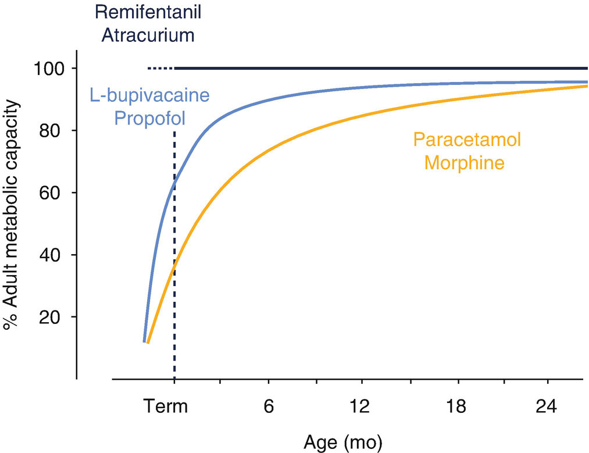
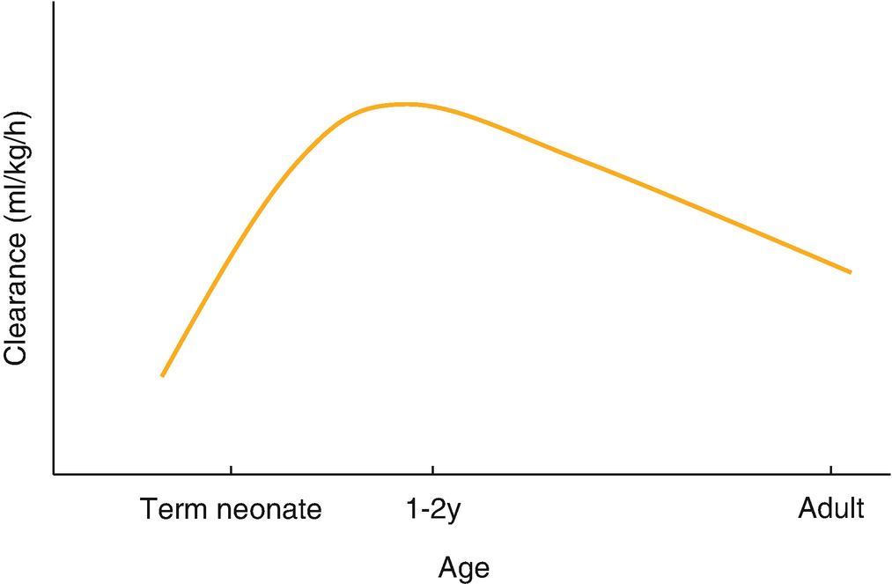
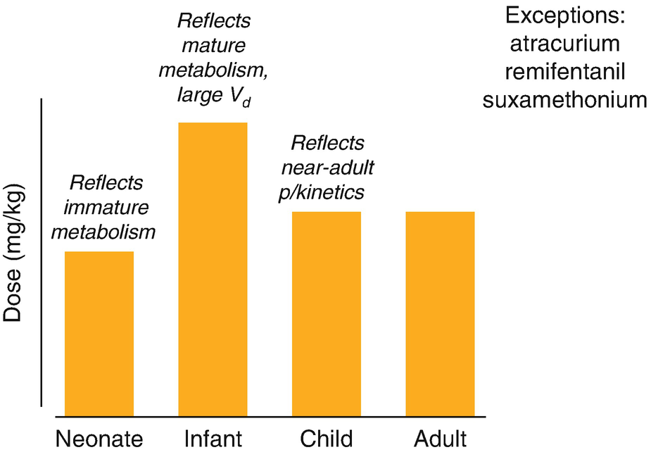
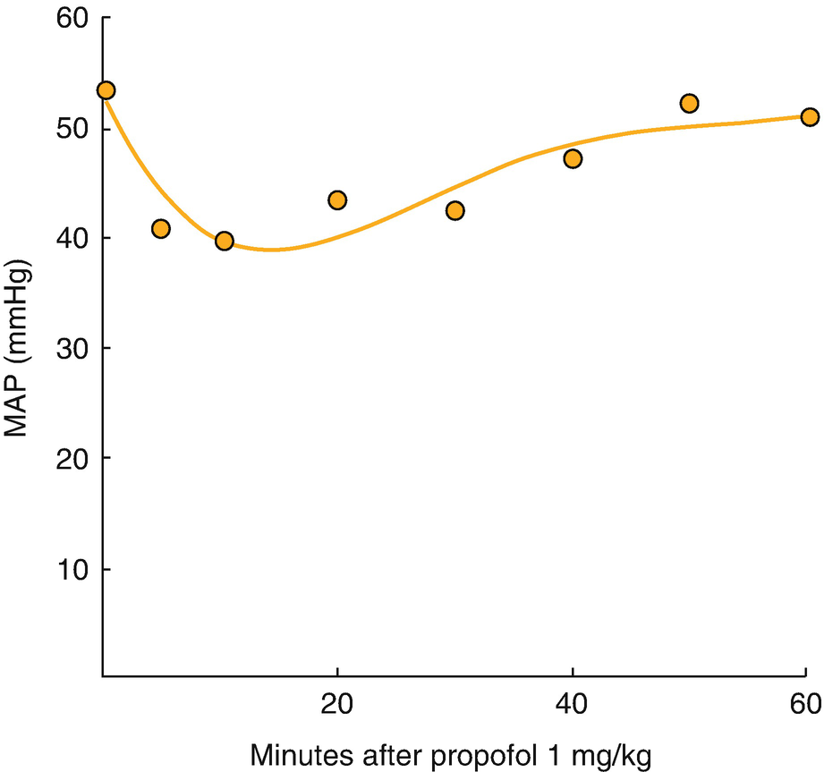
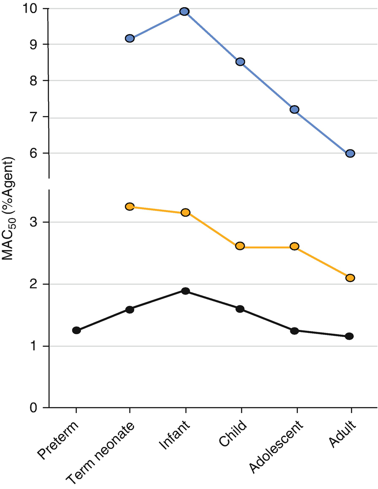
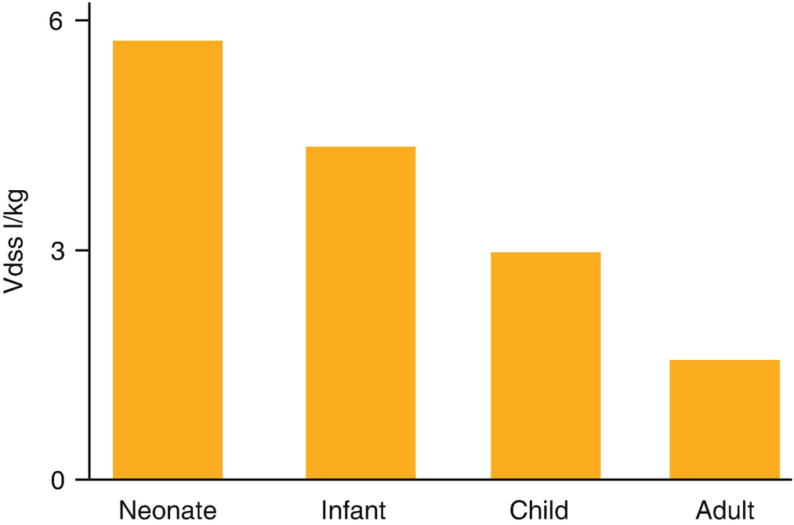
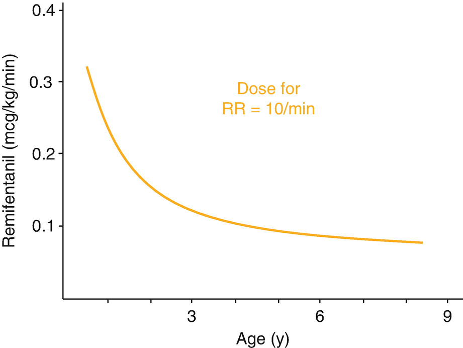
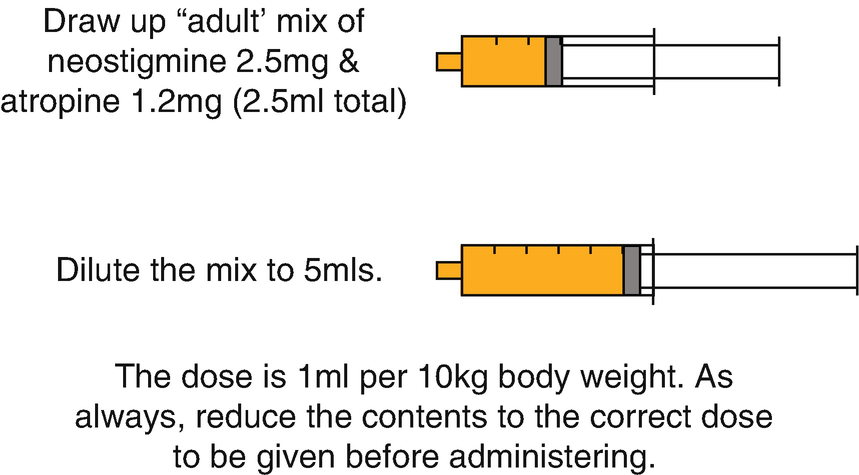

Pharmacologypharmacologyin children of Anesthetic Agents in Children

© Springer Nature Switzerland AG 2020

Craig Sims, Dana Weber and Chris Johnson (eds.) A Guide to Pediatric Anesthesia[https://doi.org/10.1007/978-3-030-19246-4\_2](https://doi.org/10.1007/978-3-030-19246-4_2)

# 2. Pharmacology of Anesthetic Agents in Children

Craig Sims[1](#Aff4)     and John Thompson[1](#Aff4)    

(1)

Department of Anaesthesia and Pain Management, Perth Children’s Hospital, Nedlands, WA, Australia

Craig Sims (Corresponding author)

Email: [craig.sims@health.wa.gov.au](mailto:craig.sims@health.wa.gov.au)

John Thompson

Email: [John.Thompson@health.wa.gov.au](mailto:John.Thompson@health.wa.gov.au)

### Keywords

PharmacokineticsChildrenPharmacodynamic changesChildrenPharmacologyNeonatesDrug clearanceChildrenPediatric drug dosesPediatric anesthetic drugs

As children grow, absorption, distribution and clearance change because anatomical and physiological processes mature. Many drugs are poorly studied in children. Data is often extrapolated from adults as there are financial and ethical problems with clinical pediatric studies. These problems often mean newer drugs are not approved for use in children. Fortunately, the pharmacokinetics of many drugs commonly used as part of anesthesia have been studied, though less so their pharmacodynamics. This chapter focuses on the pharmacological differences between children and adults.

## 2.1 Factors Affecting Dosage in Children

Size and age are the most important determinants of drug dose in children. Size is most commonly dealt with by weight-based dosing but age affects organ function and body composition, which require more complex adjustments to dosage.

### 2.1.1 Size

Children can be less than a kilogram or more than 100 kg. There are three alternatives to allow for this. The first is weight-based dosing (mg/kg, up to a maximum equal to the adult dose). This is simple, accurate enough for most drugs and commonly used in anesthetic practice. Size and metabolism are not linearly related however, and the other two methods of dosing try to allow for this. Body surface area is one method. This requires complex calculations and is used for drugs with low therapeutic margins such as chemotherapy agents. The other alternative is to scale the dose using a non-linear, allometric power technique. Allometric scaling describes the nonlinear relationship between size and organ function. It also requires complex calculations and is not used clinically.

### 2.1.2 Age

Pharmacokinetic and pharmacodynamic differences between children and adults are maximal in the first 2 years of life, making neonates and young infants at high risk of side effects.

### 2.1.3 Pharmacokinetic Changes

The pharmacokinetics of drugs change with age due to several factors (Table [2.1](#Tab1)). The two most important are differences in body composition and immature metabolic pathways.

Table 2.1

Pharmacokinetic differences in neonates and infants that affect their response to drugs

<table style="border-collapse: collapse;border-top: 0.5pt solid ; border-bottom: 0.5pt solid ; border-left: 0.5pt solid ; border-right: 0.5pt solid ; "><colgroup><col class="tcol1 align-left"></colgroup><tbody><tr><td style="border-bottom: 0.5pt solid ; text-align: left;">
<strong class="EmphasisTypeBold ">Absorption</strong>
</td></tr><tr><td style="border-bottom: 0.5pt solid ; text-align: left;">
 Slow gastric emptying until 6–8&nbsp;months and reduced gastric acidity in infancy

 Thin neonatal skin, increasing absorption of EMLA and chlorhexidine antiseptic
</td></tr><tr><td style="border-bottom: 0.5pt solid ; text-align: left;">
<strong class="EmphasisTypeBold ">Volume</strong> <strong class="EmphasisTypeBold ">of distribution</strong> <strong class="EmphasisTypeBold ">increased</strong>
</td></tr><tr><td style="border-bottom: 0.5pt solid ; text-align: left;">
 Increased total body water (mostly as increased ECF)
</td></tr><tr><td style="border-bottom: 0.5pt solid ; text-align: left;">
 Decreased fat and muscle as a proportion of body weight in neonate; increased and more sustained peak concentration of drugs that redistribute into fat and muscle
</td></tr><tr><td style="border-bottom: 0.5pt solid ; text-align: left;">
 Decreased albumin (and affinity), decreased alpha-1 acid glycoprotein
</td></tr><tr><td style="border-bottom: 0.5pt solid ; text-align: left;">
<strong class="EmphasisTypeBold ">Clearance</strong>
</td></tr><tr><td style="border-bottom: 0.5pt solid ; text-align: left;">
 Decreased metabolism in neonate, especially if preterm. Varies with different P450 isoenzymes. Most conjugation enzymes also decreased
</td></tr><tr><td style="text-align: left;">
 Renal function immature during first 6&nbsp;months, adult level by 1–2&nbsp;years
</td></tr></tbody></table>

_ECF_ extracellular fluid

Changes in body composition affect the physiological spaces into which drugs distribute. The high proportion of total body water (TBW) and extracellular fluid (ECF) in neonates (75% and 50% of body weight respectively) are the major factors, along with changes to fat, muscle, plasma protein levels and regional blood flow differences.

### Keypoint

Neonates are ‘wet’ and ‘skinny’ at birth, increasing the apparent volume of distribution for many drugs.

Metabolic pathways are immature at term. The activity of most enzymes responsible for drug metabolism is low at birth and increases after birth, but may take 2 years to reach adult levels (Fig. [2.1](#Fig1)). Drug metabolism begins developing even before birth, making the post menstrual age (PMA) more important than the age since birth for determining metabolism in former preterm children. Esterases are an exception to this pattern of development, and are fully developed at birth. As metabolism matures, clearance also increases and is highest at 1–2 years of age (Fig. [2.2](#Fig2)). Clearance peaks at this age because of a mathematical artefact caused by expressing clearance in terms of weight. Clearance and weight are not linearly related (doubling weight does not double clearance), and there comes an age when clearance has increased more than weight. Renal excretion also develops with age. At term, the glomerular filtration rate (GFR) is about one quarter that of an adult, and reaches adult levels by 1–2 years.

Fig. 2.1

Maturation of clearance, expressed as a percentage of adult capacity. Glucuronide conjugation, responsible for paracetamol and morphine metabolism, matures slower than the cytochrome P450 isoenzymes responsible for l\-bupivacaine metabolism. Cytochrome P450 isoenzymes also contribute to the metabolism of propofol during infancy, whereas propofol undergoes glucuronide conjugation in older children. Blood and tissue esterases which metabolise remifentanil and atracurium are fully active in term, and probably preterm, infants. Adapted from Anderson, Eur J Anaesthesiol 2012;29: 261–70

Fig. 2.2

Schematic representation of weight-based clearance of many drugs during childhood. Clearance is generally lower in neonates compared with adults due to reduced metabolism, then increases in toddlers and decreases gradually during childhood to the adult level. Although the shape of this curve is helpful in the clinical setting, it is an artefact caused by the weight-based calculation of clearance

These pharmacokinetic changes combine to affect drug doses in different ways as age increases. For the first several months of life, and especially the first 3 months, reduced metabolism is the most important factor determining dose. Doses are therefore generally lower in neonates and infants. With age, metabolism matures, clearance is relatively high, but body water volumes are relatively large too. Doses expressed in mg/kg are then even higher than in adults (Fig. [2.3](#Fig3)).

Fig. 2.3

The dose in mg/kg of many drugs is larger in infants and young children

### Keypoint

The speed of maturation of metabolism varies between children and increases inter-individual variability of drug effects in children.

### Note

The doses of three anesthetic drugs do not change with age because they are metabolized by esterases which are fully active at birth: suxamethonium, remifentanil and atracurium.

### 2.1.4 Pharmacodynamic Changes

The neuromuscular junction is not fully developed in neonates, affecting muscle relaxant action. The CNS is not fully developed, affecting the MAC of volatile agents. Although end-organ maturation has an effect on the action of other drugs, it is the pharmacokinetic changes that are most important beyond infancy.

### Keypoint

In general, drugs have longer duration of effect in neonates. Children aged 1–2 years need higher doses in mg/kg, and these doses are shorter in effect. The dose and effects of drugs in children beyond 2 years age gradually change to adult levels during childhood.

### 2.1.5 Pharmacogenomics

Genetic influences on drug metabolism is another factor affecting drug dosage. Genetic polymorphisms affect how a drug is used in an individual child, or what drug-drug interactions might occur. Phenotyping will become more available for children requiring treatment with drugs dependent on polymorphic enzymes for metabolism. The recent understanding of genetic influences on codeine metabolism has led to its removal from pediatric practice. Another example is the metabolism of tramadol.

## 2.2 Licensure of Drugs in Children

Many drugs commonly used in the care of children are not recommended for use in children by the drug’s manufacturer (Table [2.2](#Tab2)). This off-label use has occurred due to the pharmaceutical companies balancing the costs of research and licensure against potential market increase in a small market segment. Strict adherence to the licensure would severely restrict access to safe and useful agents for children. The defensibility of using drugs off-label relies on following contemporary practice and using drugs that are supported by evidence. Related to licensure, many useful drugs do not have a commercially made oral liquid preparation. Work-arounds include preparation by a compounding pharmacy or using the IV preparation orally, both with uncertain bioavailability. Various strategies are used to improve taste and tolerability of oral preparations.

Table 2.2

Commonly used drugs and minimum age recommended by manufacturer

| 
Drug | License age

 |
| --- | --- |
| 

Propofol | Over 3 years

 |
| 

Fentanyl | Over 2 years

 |
| 

Remifentanil | Over 1 year

 |
| 

Oxycodone | Adults

 |
| 

Ropivacaine | Term neonate

 |
| 

Atracurium | Over 1 month

 |
| 

Ondansetron | Over 2 years

 |
| 

Dolasetron, Tropisetron | Adults

 |
| 

Sugammadex | Over 2 years

 |

## 2.3 Drug Errors

Drug errors are common in pediatric anesthesia. The dose has to be calculated and taken from an adult-sized ampoule. Pediatric doses may not be a whole number and misplacing decimal places and trailing zeroes are risks. Medication errors are twice as common in children compared with adults, most commonly at the prescribing stage. The commonest error is a dosing error, and the commonest (and classic pediatric error) is a ten times overdose. Drug infusions are a high risk for errors because of the complexities of variable weight and concentration. Oral drugs have the added risk of different strengths (such as paracetamol elixir 120 mg or 250 mg per 5 mL). Finally, small amounts of drug remaining in a three-way tap, injection port or IV line can be enough to cause serious complications in children. A running IV does not remove residual drug traces, and each injected dose must be followed with a saline flush through the same injection site. Techniques to reduce errors specific to children are listed in Table [2.3](#Tab3).

Table 2.3

Reducing drug errors in children

| 
Techniques to reduce drug errors in children

 |
| --- |
| 

Have another person in theater check unusual doses, unusual drugs, or difficult calculations

 |
| 

Have another person in theater check the preparation of infusions

 |
| 

Label drugs carefully. Do not rely on color of a drug or memory

 |
| 

Avoid diluting drugs if possible, or always use the same or a standard dilution for each drug

 |
| 

For drugs that are not titrated to effect such as antibiotics, draw up only the dose to be given

 |
| 

Cross check by comparing the dose with an adult dose—“If an adult dose is for 50 kg and the child is 10 kg, how does the dose I’m about to give compare?”

 |
| 

Prescribe practical doses for postop use that are not complex for staff to calculate (such as 110 mg of paracetamol rather than 113 mg); or use increments of dose that match the strength of the drug preparation—paracetamol 24 mg/mL for example

 |
| 

Write ‘micrograms’ in full to prevent one thousand times overdose from misreading abbreviation

 |
| 

Flush the IV injection point after every dose of drug

 |

## 2.4 Local Anesthetic Creams

Local anesthetic creams are used to reduce the pain of venipuncture. However, children still often fear needles and do not believe the cream will work. EMLA ® is a eutectic mixture of lidocaine, prilocaine and excipients. It takes 45–60 min to work, although a longer duration is more effective. The larger the needle, the more likely it is to be felt. The cream continues to penetrate deeper and work better for at least the first few hours, though the skin can become ‘soggy’ if the cream is left on more than 3 or 4 h. It works for 1–2 h after removal, depending on duration of application. It vasoconstricts micro vessels which may make larger veins more obvious against a pale background. Prilocaine toxicity (methemoglobinemia ) is a concern in neonates. Absorption of EMLA through their thin skin is increased, and methemoglobin reductase activity is reduced. During the first 3 months, application to only one site for up to 1 h in a 24 h period is recommended.

Tetracaine (amethocaine ) gel (‘Ametop’ or ‘AnGEL’ cream) is faster in onset (30 min) and penetrates better than EMLA for IV insertion. It vasodilates microvessels and makes the skin red. Local skin reactions are rare, but more common than after EMLA. It should be left on no longer than 60 min and continues to work for 2 or 3 h after removal. Four percent of lidocaine cream (LMX-4) also takes 30 min to have a similar efficacy to EMLA.

## 2.5 IV Induction Agents

### 2.5.1 Propofol

Propofol is particularly useful in children because it suppresses airway reflexes and reduces emergence delirium.

#### 2.5.1.1 Pharmacokinetics

Children have a central volume of distribution almost twice that of adults and an increased rate of clearance (Table [2.4](#Tab4)). They need larger doses to achieve the same plasma concentrations as adults, mainly because of increased distribution from plasma to peripheral compartments. After its administration, more propofol remains in the body for any given plasma concentration, increasing the context sensitive half time and slowing recovery. Rapid awakening is not a feature of TIVA with propofol in children. Neonates and infants have lower clearance of propofol as glucuronidation, which is the major metabolic pathway for propofol metabolism. The immature glucuronidation is partially offset by the faster maturing P450 system. However, neonates remain at an increased risk for accumulation during either intermittent bolus or continuous administration of propofol.

Table 2.4

Pharmacokinetic data for propofol at different ages

| 
Age group | Vd (L/kg) | Clearance (mL/min/kg)

 |
| --- | --- | --- |
| 

Neonates | 5.6 | 20

 |
| 

Child <3 years | 9.5 | 53

 |
| 

Child >3 years | 9.7 | 34

 |
| 

Adult | 4.7 | 28

 |

#### 2.5.1.2 Clinical Use

The induction dose is often stated as 2.5–3.5 mg/kg in unpremedicated children. However, doses of 4–5 mg/kg are routinely used in younger children to reduce spontaneous movements and facilitate instrumentation of the airway (Table [2.5](#Tab5)). Lower doses are required in neonates, after sedative premedication, and if there is hypovolemia. Many children have food allergies to eggs and although propofol can still be used, more information should be sought if the history is of anaphylaxis to egg. Stinging with injection is a problem in children, as small veins on the dorsum of the hand are commonly used for induction. Lidocaine 0.2 mg/kg for every 3 mg/kg of propofol is effective. Propofol induction in children causes more hypotension than thiopentone, but propofol causes less hypotension in children than in adults. However in some neonates a bolus dose causes significant hypotension lasting up to an hour (Fig. [2.4](#Fig4)). Propofol causes apnea of more than 20 s in up to 50% of children and depresses pharyngeal and laryngeal reflexes (making a bolus of 1–2 mg/kg useful to avert coughing or laryngospasm). A propofol bolus or transition technique at the end of sevoflurane anesthesia, or TIVA are effective methods to prevent emergence delirium (see Chap. [1](467929_2_En_1_Chapter.xhtml), Sect. [1.​8.​1](467929_2_En_1_Chapter.xhtml#Sec19)).

Table 2.5

Summary of IV induction agent doses

|   | 
Age group

 |
| --- | --- |
| 

Agent (dose mg/kg) | Neonates | Infants and children

 |
| --- | --- | --- |
| 

Propofol | 3 | 3–5

 |
| 

Thiopentone | 3 | 5–7

 |
| 

Ketamine | 1–2 | 1–3

 |

Fig. 2.4

A propofol bolus may cause a prolonged fall in blood pressure in neonates. Based on Welzing et al., Pediatr Anesth 2010;21: 605–11

#### 2.5.1.3 Propofol Infusions in Children

Propofol infusions reduce airway responsiveness, emergence delirium and nausea and vomiting in children. Children do not usually wake quickly after propofol anesthesia due to the high doses needed and long context-sensitive half time. They tend to sleep for a period in recovery but then usually wake in a calmer and less distressed manner if analgesia is adequate. Starting an infusion at some point after an inhalational induction is quite acceptable, and most of the benefits of propofol are still gained. The propofol dose is reduced by the concomitant use of remifentanil or alfentanil, and to a lesser extent by nitrous oxide (Table [2.6](#Tab6)).

Table 2.6

Initial target propofol concentration in adolescents during maintenance with propofol given with analgesic agents

| 
Intraoperative analgesic | Target concentration propofol (μg/mL)

 |
| --- | --- |
| 

Propofol alone | 4–6

 |
| 

Remifentanil or regional block | 3–4

 |
| 

Nitrous oxide | 4–5

 |

Titration of dose according to observed anesthetic depth is critical. Adapted from McCormack, Curr Anesth Crit Care 2008;19:309–14

#### 2.5.1.4 Target Controlled Infusions (TCI)

There are two TCI models licensed in some countries for children—the Paedfusor and Kataria . Both have minimum age and weight settings and target plasma rather than effect site concentration. Age however is ignored as a variable by both models, although the Paedfusor does adjust assumed volumes when the when age is more than 12 years. In general, TCI pumps give children a bolus dose about 50% higher and a maintenance rate 25% higher compared to adult TCI models.

TCI propofol is a useful technique in children, but the algorithms can’t entirely allow for the marked inter-individual variability of propofol in children and for the pharmacokinetic changes over a broad range of ages. These issues and some practical points are given in Table [2.7](#Tab7).

Table 2.7

Problems and practical points of propofol TCI in children

| 
Propofol TCI in children | Comments

 |
| --- | --- |
| 

Problems | Pump algorithms use averaged pharmacokinetic variables. Titration of the dose is still needed to allow for interindividual differences

 |
|   | 

Target concentration in children is probably the same as in adults, but it is not known why this is the case when MAC for volatiles varies with age

 |
|   | 

Induction slower than manual propofol bolus which may prolong induction process in unhappy or uncooperative child

 |
| 

Practical points | If gas induction, start TCI target 1–2 μg/mL then increase as sevoflurane washes out. Closely observe depth of anesthesia and watch for hypotension

 |
|   | 

Always add an analgesic component to reduce propofol dose: An effective regional block; remifentanil infusion; alfentanil infusion if short anesthesia; even just nitrous

 |
|   | 

If propofol used alone, need target about 6 μg/mL or more to prevent involuntary movement. Huge dose and PACU recovery is prolonged

 |
|   | 

Wake-up concentration reported as 1.3–1.8 μg/mL

 |

#### 2.5.1.5 Manual Propofol Infusions

Manual infusions of propofol are commonly used because they can follow a manual IV induction or inhalational induction. The doses are much higher than in adults. One technique is the MacFarlan scheme, in which a 2.5 mg/kg induction dose is given followed by an infusion with the rate decreased at 15 min intervals (Table [2.8](#Tab8)).

Table 2.8

Macfarlan manual infusion scheme for propofol to achieve plasma concentration of 3 μg/mL in children aged 3–11 years

| 
Infusion rate | Time

 |
| --- | --- |
|   | 

First 15 min | 15–30 min | 30–60 min | Thereafter

 |
| --- | --- | --- | --- | --- |
| 

Propofol (mg/kg/h) | 15 | 13 | 11 | 10 and titrate

 |
| 

Propofol (μg/kg/min) | 250 | 220 | 180 | 170 and titrate

 |

Doses can be titrated lower with concomitant use of opioid, regional block or nitrous oxide

#### 2.5.1.6 Propofol Infusion After Inhalational Induction

Manual propofol infusions can be started after an inhalational induction, but either a small bolus or high initial infusion rate is needed to replace the volatile agent. TCI propofol after inhalational induction is started at a low target, then progressively increased as the volatile concentration falls. This approach avoids a large initial bolus which would cause hypotension. It is kinetically imprecise to change from a volatile to an IV technique because the volatile concentration in the brain is falling while the propofol concentration is rising, but is a practical solution to the problem. The anesthetic depth must be closely watched, and erring on the ‘too deep’ side while avoiding hypotension seems wise.

#### 2.5.1.7 Propofol Infusion Syndrome

Propofol infusion syndrome consists of metabolic acidosis , myocardial failure and rhabdomyolysis and has a mortality of 50%. The likely mechanism is disruption of mitochondrial fatty-acid oxidation, either by an unidentified metabolite or an underlying neuromuscular defect. It is triggered by the combination of high metabolic energy demand, low carbohydrate availability and high lipid availability. It is more common in children than adults, possibly because of their lower carbohydrate stores. The syndrome is associated with prolonged, high-dose propofol infusion in young children—more than 5 mg/kg/h for longer than 48 h. However, several large series have found prolonged propofol infusions to be safe, and children may need an underlying genetic predisposition to develop the syndrome. The development of lactic acidosis may be a warning sign, and dextrose-containing IV fluids may reduce the risk of the syndrome. Nevertheless, prolonged sedation of children in ICU with propofol is contraindicated, and it is probably best to limit the duration of anesthesia in children using a propofol infusion to less than 6 h and to reduce the dose of propofol with the concomitant use of remifentanil.

### 2.5.2 Ketamine

Ketamine is best reserved for special situations in children. Its strengths are preservation of airway tone, functional residual capacity of the lungs and cardiovascular stability. A dose of 1–2 mg/kg IV gives 5 min of anesthesia for short procedures. An intramuscular dose of 3–5 mg/kg is an alternative. When used as an induction agent, there is no clear ‘drop off point’, and the eyes often remain open. Oral secretions are increased and some anesthetists routinely give an antisialogogue.

Its use in theater is restricted to situations where cardiovascular depression from propofol is a concern (particularly in shock states, cyanotic congenital heart disease or pulmonary hypertension). It is also used by some for upper airway procedures, although apnea, coughing, airway obstruction and laryngospasm can occur. It is also useful for anesthesia in children with anterior mediastinal masses as it preserves the functional residual capacity of the lungs.

Outside the OR environment, it is used for short, painful procedures such as burns dressings because the relative preservation of airway tone may improve safety, although some would argue against this. The airway can still be lost during ketamine anesthesia, and there is concern about its use by non-anesthetists such as physicians providing sedation or anesthesia in the emergency department. In intensive care, it is useful for induction of the septic or shocked child.

The quality of recovery is often not good, and many anesthetists consider it a poor alternative to modern agents. Recovery is slow, and hallucinations, agitation and behavioral disturbances are a significant problem, although they are not as common in children aged 5 years or younger (5–10%) compared to adults (30–50%). Nausea and vomiting are also common after ketamine anesthesia. Other uses include premedication of autistic or combative patients, as discussed in Chap. [3](467929_2_En_3_Chapter.xhtml), Sect. [3.​3.​3](467929_2_En_3_Chapter.xhtml#Sec7).

## 2.6 Inhalational Agents

Inhalational agents are widely used in children. Pharmacokinetic differences facilitate inhalational induction, a technique that is very commonly used.

### 2.6.1 Speed of Induction

Inhalational induction is faster in children than in adults. The reasons for this are: firstly, alveolar ventilation is high relative to FRC in children (5–1 in neonates, 1.5–1 in adults) so that the alveolar concentration reaches the inspired concentration quickly. Secondly, a higher proportion of the cardiac output goes to the brain so that the brain concentration reaches the alveolar concentration quickly. A third reason is that volatile agents have lower tissue/blood solubility in neonates compared with adults. Although this difference was significant for halothane, it is not an important factor with modern insoluble agents such as sevoflurane.

### 2.6.2 MAC

The minimum alveolar concentration (MAC) at which 50% of patients do not move in response to incision changes with age. MAC is highest at age 1–6 months and then decreases with age (Fig. [2.5](#Fig5)). MAC is lower in neonates compared to both children and adults. MAC is probably even lower in preterm neonates, but this has only been studied with isoflurane. The mechanism for MAC changing with age is not known, but may be due to changes in regional blood flow or receptors. Sevoflurane differs from the other agents because its MAC is similar (not lower) in both neonates and infants.

Fig. 2.5

MAC for volatile agents at ages ranging from preterm neonates to adults. Note that generally MAC is highest in infants and decreases with age. Sevoflurane is different because MAC is not lower in neonates compared to infants

### 2.6.3 Nitrous Oxide

Nitrous oxide is still commonly used in pediatric practice. It facilitates inhalational induction and intubation under deep volatile anesthesia (Table [2.9](#Tab9)) and it is a potent analgesic for suppressing responses to intense stimulation during surgery. This is especially useful if postoperative pain is not expected to warrant opioids. Although nitrous oxide probably increases respiratory morbidity in adults, the ENIGMA trial results cannot be translated directly to children—adults often have co-morbidities, while most children have healthy lungs and do not develop respiratory effects. Finally, there is no evidence that nitrous oxide added to volatile agents increases nausea and vomiting in children.

Table 2.9

Effect of nitrous oxide on MAC for intubation in children

|   | 
MAC for intubation sevoflurane (%)

 |
| --- | --- |
| 

MAC in oxygen | 2.7–3.2

 |
| 

MAC in 60% N2O | 1.6

 |

### 2.6.4 Neurotoxicity of Anesthetic Agents

Studies in young animals consistently show anesthetic agents cause neuronal apoptosis (programmed cell death). All commonly used anesthetics including inhalational agents, nitrous oxide, ketamine, propofol, barbiturates, and benzodiazepines have this effect. Exceptions are opioids, dexmedetomidine, clonidine, and xenon. The applicability to humans of these animal studies is not certain.

Subsequent human studies have not consistently shown an effect of anesthesia at a young age on later neurodevelopment—some studies have found an association while others have not. However these studies are difficult to interpret. They are retrospective and aim to detect an effect from a brief exposure to anesthesia amongst all the confounding factors that could affect development during a child’s life, including the reason the child required surgery and anesthesia. Also, such studies can only detect an association, not causality. Further complicating the issue is a debate that careful control of respiratory, hemodynamic and metabolic variables might be more important than choice of a particular anesthetic agent in avoiding neurodevelopmental changes after anesthesia.

In response to these animal and human studies, the FDA issued a warning in 2016 to US physicians that anesthesia lasting more than 3 h in children younger than 3 years old may affect subsequent neurodevelopment. However the assertions of the warning have not been accepted by anesthetic associations outside the US.

More recently, results of the first prospective randomized trial became available. Infants were randomized to spinal or general anesthesia for herniotomy, and children’s development followed for 5 years (the GAS study). This study found general anesthesia did not affect developmental outcomes. The weakness of the study however, was that anesthetic exposure was less than 1 h. Another recent prospective study compared the development of twins, one of whom had received a GA and one of whom had not (the MASK study). This study also found general anesthesia did not affect developmental outcomes.

Parents may raise the issue of potential toxicity prior to surgery and this should prompt a discussion of the points above. At present, there is no good evidence anesthetic agents affect neurodevelopment of humans. There is currently no need to change practice or delay surgery, but children should not have surgery during infancy if it can be avoided (although there is no evidence for a ‘safe’ age with no risk, young infants are undergoing rapid brain development, and all risks from anesthesia are higher in the first year). Furthermore, delaying surgery to avoid an ambiguous and unknown risk of neurotoxicity must be balanced against the added real risk of delaying treatment.

### Tip

What to say to a parent who asks if anesthesia will damage their child’s brain?

There is animal work suggesting anesthesia affects brain development, but it is not clear how this research applies to children.

There is no evidence a single short GA affects brain development in humans.

Avoiding or delaying surgery and anesthesia may have a much greater risk.

There may be a possibility some brain delays occur in very specific areas and under very specific circumstances, but it is not known if this is due to anesthesia or the reason the child is having surgery, and it has to be balanced against the need for the procedure.

There is no evidence to suggest a specific ‘safe’ age with no risk.

### 2.6.5 Sevoflurane

Sevoflurane is widely used because it causes minimal irritation to the airway during induction and maintenance and is the only agent suitable for inhalational induction. It causes less cardiovascular depression and is a safer agent than halothane which was used in the past. It reduces laryngeal and pharyngeal muscle tone which contributes to upper airway obstruction, but also facilitates insertion of an oral airway or LMA.

Inhalational induction with sevoflurane using a circle circuit is achieved by giving the child 66% nitrous oxide in oxygen for 20–30 s, then 8% sevoflurane. Gradually increasing the sevoflurane concentration is a hangover from the halothane induction technique which slows induction and increases the incidence of excitatory phenomena. However, when the T-piece is used for induction, the sudden odor of 8% sevoflurane can cause mask rejection, and a couple of breaths at 0.25–0.5% before turning to 8% is better accepted. The inspired concentration should be kept at 6–8% until excitatory phenomena and respiratory obstruction have reduced.

#### 2.6.5.1 Excitatory Phenomena with Sevoflurane

A series of excitatory phenomena occur during inhalational induction with sevoflurane, including movements of the limbs, upper airway obstruction and hypertonicity of the trunk. They are a common and normal part of inhalational induction. Their incidence is reduced with premedication but increased if sevoflurane is incrementally raised during induction. Sevoflurane often causes seizure-like EEG changes at concentrations over 4%, and may rarely cause overt seizures in children who have a reduced seizure threshold. The seizures usually occur during induction shortly after consciousness is lost, when brain concentration of sevoflurane is highest.

Emergence delirium describes a condition in which children wake after anesthesia crying or screaming inconsolably, thrashing their limbs and appearing disorientated. However it can be difficult to determine if the child’s behavior is due to pain (see Chap. [1](467929_2_En_1_Chapter.xhtml), Sect. [1.​8.​1](467929_2_En_1_Chapter.xhtml#Sec19)). Emergence delirium is more common after sevoflurane and desflurane than after other agents. The incidence is highest in preschool aged boys and when children awake quickly after sevoflurane. Various strategies have been tried to reduce it, including giving clonidine and opioids during anesthesia, or giving propofol towards the end of anesthesia. There is no evidence changing to isoflurane after sevoflurane induction reduces emergence delirium, whereas changing to propofol is effective.

### 2.6.6 Isoflurane and Desflurane

Isoflurane and desflurane are pungent and irritant to the upper airway and will cause coughing, breath holding or laryngospasm if used for inhalational induction. Using isoflurane for anesthesia maintenance does not reduce the incidence of emergence delirium. The tachycardia that occurs in adults when desflurane is rapidly increased in concentration is less of a problem in children and easily blunted with opioids. The airway irritation caused by desflurane has prevented it from having a major impact in pediatric anesthesia.

## 2.7 Fentanyl

Fentanyl is commonly used in pediatric anesthesia, although perhaps not as often as in adult practice where it is used for hemodynamic stability. The clearance of fentanyl is higher in infants and children compared to adults, while it is reduced in neonates (reflecting reduced hepatic metabolism) and in cyanotic heart disease (reduced liver blood flow). However the volume of distribution is much higher in neonates than adults and the plasma concentration after a single bolus dose is a lower than in adults. As a result, neonates may tolerate high doses with less respiratory depression than in adults (Fig. [2.6](#Fig6)). However fentanyl has a reduced clearance in this age group, and it accumulates with repeat doses. It is popular as an anesthetic agent in neonatal and cardiac anesthesia, but in children it is generally used for its analgesic properties. It is useful as an analgesic component to anesthesia, particularly if neither nitrous oxide nor a regional technique is used. An intraoperative bolus has a short duration and does not provide adequate postoperative analgesia after many types of surgery. However, fentanyl 1–2 μg/kg reduces the incidence of emergence dysphoria after sevoflurane, albeit increasing the incidence of PONV. Intranasal fentanyl is used for procedural pain in the emergency department, and fentanyl infusions are used as an alternative to morphine for postoperative opioid infusions (see Chap. [9](467929_2_En_9_Chapter.xhtml), Sect. [9.​3.​3](467929_2_En_9_Chapter.xhtml#Sec13)).

Fig. 2.6

Volume of distribution at steady state (Vdss) for fentanyl at different ages. A bolus dose is distributed into a relatively large volume in neonates, and blood concentration is lower. Neonates can tolerate relatively high doses without respiratory depression. Clearance however is lower in neonates, prolonging the duration of any fentanyl given. Based on Johnson et al. Anesthesiology 1984;61: A441

## 2.8 Remifentanil

Remifentanil is unique among opioids because the non-specific esterases responsible for its metabolism are fully active at birth. It has an increased volume of distribution in infants and children, but also a higher clearance so that elimination half-life is similar at all ages. Remifentanil is the only opioid with a clearance that is higher in infants than children. As a result of these pharmacokinetic differences, infusion rates that would cause apnea in adults are possible in spontaneously breathing children (Fig. [2.7](#Fig7)). Children aged 3–11 years require about twice the infusion rate of adults during anesthesia to block the response to skin incision. The usual dose in controlled ventilation is 0.2–0.5 μg/kg/min, and doses as high as 0.3 μg/kg/min are tolerated during spontaneous ventilation in infants. A remifentanil bolus of 1–3 μg/kg has been used to facilitate intubation without muscle relaxants in children, although bradycardia is a concern with these doses. There is no TCI model for remifentanil in children.

Fig. 2.7

Remifentanil dose required for respiratory rate of 10 breaths/min at different ages. Spontaneous respiration is maintained at higher doses of remifentanil in infants and young children than older children. (Based on Barker et al., Pediatr Anesth 2007;17:948–55)

### Keypoint

Remifentanil is unique among opioids. The enzymes that metabolize it are fully active at birth, and its dose is higher in neonates than children—the opposite to every other opioid.

## 2.9 Muscle Relaxants

The role of muscle relaxants in pediatric anesthesia has changed over the years—intubation is less common since the LMA has been widely used and can be achieved with a combination of volatile agent, propofol and opioid in young children. Volatile anesthesia either alone or in combination with remifentanil can prevent involuntary movement, and muscle relaxation is not needed to be able to ventilate children. Nevertheless, relaxants retain a role in many cases.

### 2.9.1 Pharmacokinetic Changes

The volume of distribution of relaxants is higher throughout childhood compared with adults due to children’s larger ECF volume. Clearance is also higher throughout childhood compared to adults. As a result, children require higher doses in mg/kg compared to adults, and these doses have a shorter duration. The ED95 for most relaxants is higher in children compared to adults (Table [2.10](#Tab10)). The onset of relaxants is faster in children compared to adults because of the relatively high cardiac output in children (Table [2.11](#Tab11)).

Table 2.10

Approximate ED95 doses of muscle relaxants in children

|   | 
ED95 dose (μg/kg)

 |
| --- | --- |
|   | 

Infants | Child | Adult

 |
| --- | --- | --- | --- |
| 

Suxamethonium | 700 | 430 | 270

 |
| 

Atracurium | 165 | 200 | 220

 |
| 

Rocuronium | 240 | 400 | 350

 |

Note the higher doses in children compared to adults

Table 2.11

Onset time of muscle relaxants in children

|   | 
Onset time (min)

 |
| --- | --- |
|   | 

Infants | Child | Adult

 |
| --- | --- | --- | --- |
| 

Suxamethonium | 0.6 | 0.7 | 0.9

 |
| 

Atracurium | 1.2 | 1.7 | 2.2

 |
| 

Rocuronium | 1.1 | 1.3 | 1.6

 |

Note the faster onset due to increased cardiac output

### 2.9.2 Relaxants in the Neonate

Neonates are sensitive to non-depolarizing relaxants and have a reduced margin of safety. There are several reasons for this (Table [2.12](#Tab12)). The dose of most non-depolarizing relaxants is lower in neonates. Both vecuronium and rocuronium have a longer duration of action in neonates. A typical dose of rocuronium in neonates is 0.3–0.4 mg/kg. Most relaxants in neonates last longer. This general rule holds true except for two important relaxants that have a shorter duration in neonates than children: suxamethonium and atracurium , which are both metabolized by esterases that are fully active at birth.

Table 2.12

Neonates are sensitive to non-depolarizing relaxants

| 
Differences of relaxants in neonates

 |
| --- |
| 

Low proportion of muscle (10% body weight compared to 33% in child)

 |
| 

Neuromuscular junction is immature until 2 months of age

 – Less acetylcholine (ACh) is released with each action potential

 – ACh vesicles deplete during tetanic stimulation and muscle fade is normal

 – Full blockade is reached with only 40% receptor occupancy in neonates, compared to 75% in adults

 |
| 

Metabolic enzymes immature

 |
| 

More type II slow fibers resistant to blockade in respiratory muscles

 |

### Keypoint

Muscle relaxants have a faster onset and shorter duration in children. Neonates are sensitive to non-depolarizing relaxants but resistant to suxamethonium. Pharmacokinetic changes result in doses of relaxants being the same at all ages.

#### 2.9.2.1 Volatile Agents Potentiate Relaxants

As in adults, the dose and duration of relaxants are affected by the use of volatile agents. However, healthy children are better able to tolerate brief, high concentrations of volatile agents that can greatly improve the effect of small doses of relaxants. For example, 0.3 mg/kg of rocuronium or 0.3 mg/kg of atracurium given with sevoflurane are effective for intubation after 2 min and give a short blockade for brief procedures.

### 2.9.3 Suxamethonium

Suxamethonium is used less nowadays due to its poor side effect profile and the use of alternative drugs to achieve rapid intubation. It is not used in routine practice, but reserved for emergency airway management such as rapid sequence induction and laryngospasm with falling oxygen saturation. It has a faster onset and shorter duration throughout childhood compared to adults.

#### 2.9.3.1 Dosage and Administration

The dose in children is 2 mg/kg IV. The intramuscular route is used for the treatment of laryngospasm when no IV access is present. The dose is 4 mg/kg, onset is within 60 s and duration under 20 min. The deltoid muscle is the best site for injection. Although the tongue has been suggested, its use requires the facemask and oxygen to be removed and causes bleeding into the mouth and airway.

#### 2.9.3.2 Side Effects

Although a mild tachycardia is usual after suxamethonium, bradycardia very occasionally occurs, mostly in infants. There is no need to routinely give atropine before suxamethonium. However atropine should always be given before a second dose of suxamethonium to prevent severe bradycardia or asystole. Muscle fasciculations are milder in children and absent in infants, and muscle pain is uncommon until adolescence. Hyperkalemia occurs in the same patient groups as adults. Although rare, suxamethonium causing hyperkalemic cardiac arrest in children with an unrecognized myopathy (particularly boys with Duchenne dystrophy) is one of the causes of the declining use of the drug. Suxamethonium is contraindicated in any child with myopathy, recent large burn or spinal cord injury. It increases intraocular pressure for several minutes, but on balance, this is not an issue in the management of penetrating eye injuries (see Chap. [24](467929_2_En_24_Chapter.xhtml), Sect. [24.​7](467929_2_En_24_Chapter.xhtml#Sec7)).

### Keypoint

Atropine must always be given before a second dose of suxamethonium.

#### 2.9.3.3 Butyrylcholinesterase (Plasma Cholinesterase ) Deficiency

A mild form of plasma cholinesterase deficiency (heterozygous for one of several abnormal genes) is common but only increases the duration of suxamethonium by a few minutes, so it is not usually noticed. Children who are homozygote for the genes are rare (1 in 2000–4000, prolonging the action of suxamethonium to 2–12 h), but about 25% of the population have variants with some prolongation of duration (though usually by only a few minutes). Management is sedation and ventilation followed by measuring the cholinesterase activity. Although neonates and infants under 6 months have only about half the adult level of butyrylcholinesterase, this does not prolong the effect of suxamethonium.

#### 2.9.3.4 Masseter Spasm

The tone in the masseter muscle often increases slightly after suxamethonium , but the term ‘masseter muscle spasm’ refers to rigidity of the jaw that prevents mouth opening for more than 2 min. This rare occurrence has been described as ‘jaws of steel’. Many children with this later develop markedly raised creatine kinase (CK) levels and myoglobinuria and are found to have a myopathy. Masseter spasm after suxamethonium may be an early sign of malignant hyperthermia (MH), and 50% of patients who have masseter spasm later test positive for MH on muscle biopsy.

During masseter spasm, the mouth cannot be opened and intubation is impossible. Mask ventilation occurs through the nostrils and is not affected. It may be appropriate to terminate anesthesia after masseter spasm has occurred. However for urgent surgery anesthesia can be continued with a non-triggering technique providing other signs of MH are not present. There is no need to change the machine, but volatile agents should be stopped and high flows used to wash out any volatile agent from the patient and circuit. The child must be admitted for monitoring and measurement of CK levels post op.

### 2.9.4 Atracurium

Atracurium has a fast onset, short and predictable duration of action and is a good choice for routine use in all ages. The dose is 0.5 mg/kg, although it differs from all other relaxants in that it has a shorter duration in neonates than children. Smaller doses can be used if supplemented briefly by high concentrations of volatile agent, or short-acting opioids. Histamine release is uncommon in children.

### 2.9.5 Cisatracurium

Cisatracurium has a slower onset and longer duration compared to atracurium and has no advantage over atracurium in children. The dose is 0.15 mg/kg.

### 2.9.6 Vecuronium

Vecuronium should be considered a long acting relaxant in neonates and infants less than 12 months. It has a large volume of distribution in this age group so that the duration of block after 0.1 mg/kg is 1 h in neonates but only 20 min in children.

### 2.9.7 Rocuronium

Rocuronium has a faster onset than other relaxants, although the difference is less marked in children than adults. It has a longer duration in neonates and infants than in children. A dose of 0.6 mg/kg lasts about 50% longer in infants than children (42 min and 27 min respectively), but intubation can be readily achieved with lower doses such as 0.3 mg/kg supplemented with sevoflurane. A high dose of 1.2 mg/kg provides good intubating conditions in 33 s in children and lasts about 75 min. However this type of modified rapid sequence technique is being questioned, with concerns about the safety of trying to hurriedly secure the airway after a period of apnea (see Chap. [1](467929_2_En_1_Chapter.xhtml), Sect. [1.​6.​3](467929_2_En_1_Chapter.xhtml#Sec15)).

### 2.9.8 Reversal of Relaxants

Relaxants should always be reversed in neonates and infants. This age group are at risk of residual neuromuscular block because of increased sensitivity to relaxants, longer elimination half-life of relaxants, susceptibility to hypothermia and less type I muscle fibers in the diaphragm that leave it prone to fatigue. Furthermore, it is difficult to monitor neuromuscular blockade in small infants as direct muscle stimulation often occurs. However older children having long procedures often don’t need reversal (after checking with a nerve stimulator). Children are reversed faster and with smaller doses of antagonists than adults.

#### 2.9.8.1 Neostigmine

Neostigmine has a faster onset and slightly shorter duration in children compared with adults. The dose of neostigmine required in infants and children is 20–35 μg/kg, although 50 μg/kg mixed with atropine 20 μg/kg (the same dose as adults) is commonly used for simplicity. Calculating and drawing up the doses of neostigmine and atropine are complicated and prone to errors. A technique that dilutes the adult dose reduces calculation errors and is shown in Fig. [2.8](#Fig8). In this technique, 1 mL of the diluted mixture is given per 10 kg body weight. For neonates, a 1 mL syringe is used to withdraw the diluted mixture, and a portion given based on weight—a 4 kg baby would be given 4/10 of a milliliter.

Fig. 2.8

Method of drawing up neostigmine for children

Glycopyrrolate can be used in place of atropine. It is less commonly used in children as atropine rarely causes arrhythmias or problematic tachycardia. Both atropine and glycopyrrolate can cause flushing in the ‘blush’ area of the face and neck in infants. This is usually delayed and typically noticed in PACU. Parents should be reassured this is not an allergic reaction and will fade within hours.

#### 2.9.8.2 Sugammadex

The role of sugammadex in children is not as clear as in adults, as muscle relaxants have a shorter duration in children and the side effects of neostigmine are less problematic in children. It has not been investigated in children as much as adults. Nevertheless, sugammadex reverses rocuronium rapidly and more effectively than neostigmine. Dosing is based on the TOF response: 2 mg/kg if there are two or more twitches of the TOF, and 4 mg/kg if the block is deeper. The maximum dose of 16 mg/kg is used for reversal immediately following an intubating dose of 1.2 mg/kg of rocuronium, (an ‘off-label’ use of sugammadex in children).

## 2.10 Midazolam

Oral midazolam is commonly given as a premed at an oral dose of 0.3–0.5 mg/kg. IV midazolam is used as a co-induction agent in adolescents and for sedation of ventilated children in intensive care, but is uncommonly used during anesthesia in younger children. Hepatic metabolism and clearance of midazolam are reduced in neonates, causing a prolonged action in this age group. Children aged between 1 and 4 years have increased clearance but also are resistant to sedation from midazolam. This age group often requires higher doses than adults or infants. Flumazenil is rarely needed in children. The dose is 5 μg/kg to a maximum of 40 μg/kg.

## 2.11 Clonidine

Clonidine has sedative, anxiolytic and analgesic effects in children. It is used as a premedication, as an adjunct to epidural local anesthetics and to prevent or treat emergence delirium. It is also given orally to treat some children with ADHD, autism and to manage opioid withdrawal. Bioavailability is nearly 100% orally. Nasal administration is not recommended as absorption is unreliable. The elimination half-life is about 5 h, shorter than in adults, but in infants its clearance is reduced and half-life prolonged.

In clinical use, clonidine produces sedation and reduces heart rate and blood pressure although these hemodynamic responses are not usually of concern. Oral clonidine 3–4 μg/kg 60–90 min preoperatively is used as a premed. When combined with local anesthetics, clonidine 1–2 μg/kg prolongs analgesia by at least a few hours. Sedation and hypotension occur mostly in infants, and apnea may occur in neonates. Clonidine prevents emergence delirium, although the Cochrane review showed this was true only when anesthesia included a regional block. It does not reduce delirium after tonsillectomy. IV clonidine 1–2 mcg/kg can be used to treat emergence dysphoria in young children, but this dose often makes the child sleepy for up to 4 h after surgery.

## 2.12 Dexmedetomidine

Dexmedetomidine has many potential uses in pediatric anesthesia, but its eventual role is not yet known. It produces a sleep-like sedation. It causes little respiratory depression but can cause upper airway obstruction. It is used as a premed and to provide sedation for non-painful procedures such as radiology and EEG. In anesthesia, it is used as a TIVA-sparing agent when maintenance of spontaneous ventilation is important, such as during airway procedures. It also It is one of a few agents thought to be non-toxic to the developing brain. It is only licensed in children for ICU sedation where it is a useful to stabilize postoperative cardiac patients and possibly prevent junctional ectopic tachycardia.

Its advantage over clonidine is a shorter elimination half-life of about 2 h. Metabolism is reduced in the first 1–2 years, especially in infants in whom it has a longer half-life. The IV dose is 0.5 μg/kg gently titrated and repeated if required, followed by an infusion of 0.3–0.7 μg/kg/h. As a premed, 3–4 μg/kg given nasally is preferable, as oral bioavailability is low and variable. The buccal route is an alternative and with a lower dose.

Dexmedetomidine has some disadvantages apart from cost. It causes bradycardia in a dose dependent manner, which is often just monitored because anticholinergics given as treatment may cause significant hypertension if not carefully titrated. Hypotension can also be a problem in older children. Excessive postoperative sedation can be a problem, particularly for infusions longer than 1.5–2 h. It is usually best to halve the infusion rate at this time, and stop the infusion 20 or 30 min before the end of the procedure.

## 2.13 Antiemetics

The incidence of postoperative nausea and vomiting (PONV ) increases with age. It is low during infancy but increases from the age of 3 years. Prophylactic antiemetics are commonly given to older children.

### Tip

High-risk procedures for PONV are strabismus repair, prominent ear correction, umbilical hernia repair and open orthopedic procedures.

A common reason for PONV after all types of surgery is too much opioid relative to the severity of pain.

### 2.13.1 Ondansetron

Ondansetron is the only 5HT3 antagonist licensed for PONV in children, and has an optimal dose of 0.15 mg/kg (maximum 4 mg). The time it is given to children during anesthesia does not affect its efficacy. Doses can be repeated every 6–8 h if required. It is also available as an oral wafer in a dose of 4 mg, which can be used as a single dose in children without IV access weighing more than 20 kg. Ondansetron causes a clinically insignificant lengthening of the QT interval, but should be avoided in children with known or suspected prolonged QT interval. Tropisetron and granisetron are probably less effective than ondansetron and are not licensed in children. Dolasetron is contraindicated in children as it may change the QT interval and cause arrhythmias.

### APA PONV Guidelines

Children at risk of PONV: ondansetron 0.15 mg/kg.

Children at high risk of PONV: ondansetron 0.15 mg/kg plus dexamethasone 0.15 mg/kg.

### 2.13.2 Dexamethasone

Dexamethasone is an effective antiemetic by itself and in combination with ondansetron. The ideal dose of dexamethasone is not known, but 0.15 mg/kg (maximum 8 mg) is effective, recommended and simple as the dose is the same for the two drugs. Rather than acting on a cell-surface receptor like ondansetron, it enters cells and affects the expression of 37 different genes. The effects of this, and why dexamethasone has an anti-emetic effect are not known. Although dexamethasone is generally safe and is widely used, there are several concerns about its effects (Table [2.13](#Tab13)).

Table 2.13

Side effects and other concerns about dexamethasone in children

| 
Concerns about dexamethasone in children

 |
| --- |
| 

Unknown mechanism of action

 |
| 

Increases BSL for several hours postop and may affect control of BSL in children with labile diabetes

 |
| 

Increases the return-to-theatre rate after tonsillectomy

 |
| 

Causes sensation of perineal warmth when given to awake children

 |
| 

Some evidence it affects wound infection in adults

 |
| 

May cause tumor lysis syndrome in some children with untreated hematological malignancy

 |

### Note

Ondansetron combined with dexamethasone is more effective than ondansetron alone.

### 2.13.3 Droperidol

Droperidol is used in children as a rescue antiemetic, or in combination with ondansetron when dexamethasone cannot be used. It has mostly been superseded in children by more recent antiemetics with a better side effect profile. It causes sedation, and infrequently causes extrapyramidal effects at higher doses and in teenage girls. The FDA issued a warning about prolongation of the QT interval in adults and at higher doses, and it is obviously contraindicated in children with prolonged QT interval. The dose of droperidol is 10 μg/kg as a single dose.

### 2.13.4 Promethazine

Promethazine (phenergan) is a rescue treatment for PONV unresponsive to other treatments. Sedation and cardiovascular side effects are complications of its use. The dose is 0.1 mg/kg given slowly IV (maximum 12.5 mg). It should not be used in children at risk from sedation, including those with obstructive sleep disorder.

## Review Questions

1.  1.
    
    Why is remifentanil different to all other opioids in neonates?
    
2.  2.
    
    Name a suitable antiemetic and dose for routine use in children. What combination and doses is suitable for children at high risk of PONV?
    
3.  3.
    
    Why are neonates ‘sensitive’ to rocuronium?
    
4.  4.
    
    A child has been given suxamethonium as part of a rapid sequence induction for emergency surgery, but 1 min after giving it, the mouth cannot be opened at all. What might this signify? What will you do?
    

### Further Reading

### Pharmacology in Childhood

1.  Allegaert K, et al. Neonatal clinical pharmacology: recent observations of relevance for anaesthesiologists. Acta Anaesthesiol Belg. 2008;59:283–8.[PubMed](http://www.ncbi.nlm.nih.gov/entrez/query.fcgi?cmd=Retrieve&db=PubMed&dopt=Abstract&list_uids=19235528)
    
2.  Anderson BJ, Allegaert K. The pharmacology of anesthetics in the neonate. Best Pract Res Clin Anesthesiol. 2010;24:419–31. A comprehensive review of the pharmacokinetic and pharmacodynamic changes during the neonatal period and includes an introduction to allometric power analysis_._ [Crossref](https://doi.org/10.1016/j.bpa.2010.02.019)
    
3.  Anderson BJ. Drug error in paediatric anaesthesia: current status and where to go now. Curr Opin Anesthesiol. 2018;31:333–41.[Crossref](https://doi.org/10.1097/ACO.0000000000000593)
    
4.  Broome RI, Gibson AA. The importance of flushing injection ports. Anesthesia. 2019;74:394.[Crossref](https://doi.org/10.1111/anae.14547)
    
5.  Doherty DR, et al. Off-label drug use in pediatric anesthesia and intensive care according to official and pediatric reference formularies. Can J Anesth. 2010;57:1078–88. A survey in Canada that includes a good overview of off-label drug use in children.[Crossref](https://doi.org/10.1007/s12630-010-9395-0)
    
6.  Sumpter A, Anderson BJ. Pediatric pharmacology in the first year of life. Curr Opin Anesthesiol. 2009;22:469–75.[Crossref](https://doi.org/10.1097/ACO.0b013e32832bc7ff)
    

### Local Anesthetic Creams

1.  Zempsky WT. Pharmacologic approaches for reducing venous access pain in children. Pediatrics. 2008;122:S140–53.[Crossref](https://doi.org/10.1542/peds.2008-1055g)
    

### Volatile Agents

1.  Constant I, Seeman R. Inhalational anesthetics in pediatric anesthesia. Curr Opin Anesthesiol. 2005;18:277–81.[Crossref](https://doi.org/10.1097/01.aco.0000169235.83561.3a)
    
2.  Creeley CE, Olney JW. The young: neuroapoptosis induced by anesthetics and what to do about it. Anesth Analg. 2010;110:442–8.[Crossref](https://doi.org/10.1213/ANE.0b013e3181c6b9ca)
    
3.  Lerman J, Johr M. Pro-Con debate: inhalational anesthesia vs total intravenous anesthesia (TIVA) for pediatric anesthesia. Pediatr Anesth. 2009;19:521–34.[Crossref](https://doi.org/10.1111/j.1460-9592.2009.02962.x)
    

### Neurotoxicity

1.  Davidson A, Sun L. Clinical evidence of any effect of anesthesia on the developing brain. Anesthesiology. 2018;128:840–53.[Crossref](https://doi.org/10.1097/ALN.0000000000001972)
    
2.  Hansen TG, Engelhardt T. Long-term neurocognitive outcomes following surgery and anesthesia in early life. Curr Opin Anesthesiol. 2018;31:297–301.[Crossref](https://doi.org/10.1097/ACO.0000000000000577)
    
3.  McCann ME, et al. Neurodevelopmental outcome at 5 years of age after general anaesthesia or awake-regional anaesthesia in infancy (GAS): an international, multicentre, randomised, controlled equivalence trial. Lancet. 2019;393:664–77.[Crossref](https://doi.org/10.1016/S0140-6736\(18\)32485-1)
    
4.  Morton NS. Anesthesia and the developing nervous system: advice for clinicians and families. BJA Educ. 2015;15:118–22.[Crossref](https://doi.org/10.1093/bjaceaccp/mku020)
    

### Propofol

1.  Anderson BJ, Bagshaw O. Practicalities of total intravenous anesthesia and target-controlled infusion in children. Anesthesiology. 2019;131:164–85.[Crossref](https://doi.org/10.1097/ALN.0000000000002657)
    
2.  Constant I, Rigouzzo A. Which model for propofol TCI in children. Pediatr Anesth. 2010;20:233–9.[Crossref](https://doi.org/10.1111/j.1460-9592.2010.03269.x)
    
3.  Gaynor J, Ansermino JM. Paediatric total intravenous anesthesia. BJA Educ. 2016;11:369–73.[Crossref](https://doi.org/10.1093/bjaed/mkw019)
    
4.  Mani V, Morton N. Overview of total intravenous anesthesia in children. Pediatr Anaesth. 2010;20:211–22.[Crossref](https://doi.org/10.1111/j.1460-9592.2009.03112.x)
    
5.  McCormack JG. Total intravenous anesthesia in children. Curr Anesth Crit Care. 2008;19:309–14.[Crossref](https://doi.org/10.1016/j.cacc.2008.09.005)
    

### Ketamine

1.  Roelofse J. The evolution of ketamine applications in children. Pediatr Anesth. 2010;20:240–5.[Crossref](https://doi.org/10.1111/j.1460-9592.2009.03145.x)
    

### Opioids

1.  Marsh DF, Hodkinson B. Remifentanil in paediatric practice. Anaesthesia. 2009;64:301–8.[Crossref](https://doi.org/10.1111/j.1365-2044.2008.05731.x)
    

### Muscle Relaxants

1.  Bretlau C. Response to succinylcholine in patients carrying the K-variant of the butyrylcholinesterase gene. Anesth Analg. 2013;116:596–601.[Crossref](https://doi.org/10.1213/ANE.0b013e318280a3f3)
    
2.  Meakin G. Role of muscle relaxants in pediatric anesthesia. Curr Opin Anesthesiol. 2007;20:227–31.[Crossref](https://doi.org/10.1097/ACO.0b013e328108f430)
    
3.  Meretoja OA. Neuromuscular block and current treatment strategies for its reversal in children. Pediatr Anesth. 2010;20:591–604. A detailed review of the neuromuscular junction and blockade and reversal, including suggamadex.[Crossref](https://doi.org/10.1111/j.1460-9592.2010.03335.x)
    
4.  Rawicz M, Brandom BW, Wolf A. The place of suxamethonium in pediatric anesthesia. Pediatr Anesth. 2009;19:561–70. A pro-con debate that nicely summarizes the pharmacology and clinical uses of suxamethonium.[Crossref](https://doi.org/10.1111/j.1460-9592.2009.03032.x)
    
5.  Tobias JD. Current evidence for the use of sugammadex in children. Pediatr Anesth. 2017;27:118–25.[Crossref](https://doi.org/10.1111/pan.13050)
    

### Dexmedetomidine and Clonidine

1.  Mahmoud M, Mason KP. Dexmedetomidine: review, update and future considerations of paediatric perioperative and periprocedural applications and limitation. Br J Anaesth. 2015;115(2):171–82.[Crossref](https://doi.org/10.1093/bja/aev226)
    
2.  Mason KP. Sedation trends in the 21st century: the transition to dexmedetomidine for radiological imaging studies. Pediatr Anesth. 2010;20:265–72.[Crossref](https://doi.org/10.1111/j.1460-9592.2009.03224.x)
    
3.  Sottas CE, Anderson BJ. Dexmedetomidine: the new all-in-one drug in pediatric anesthesia. Curr Opin Anesthesiol. 2017;30:441–51.[Crossref](https://doi.org/10.1097/ACO.0000000000000488)
    
4.  Afshari A. Clonidine in pediatric anesthesia: the new panacea or a drug still looking for an indication? Curr Opin Anesthesiol. 2019;32:327–33.[Crossref](https://doi.org/10.1097/ACO.0000000000000724)
    

### Antiemetics

1.  Martin S, et al. Guidelines on the prevention of post-operative nausea and vomiting in children. Association Paediatric Anaesthetists Great Britain & Ireland; 2016. [www.​apagbi.​org.​uk](http://www.apagbi.org.uk).