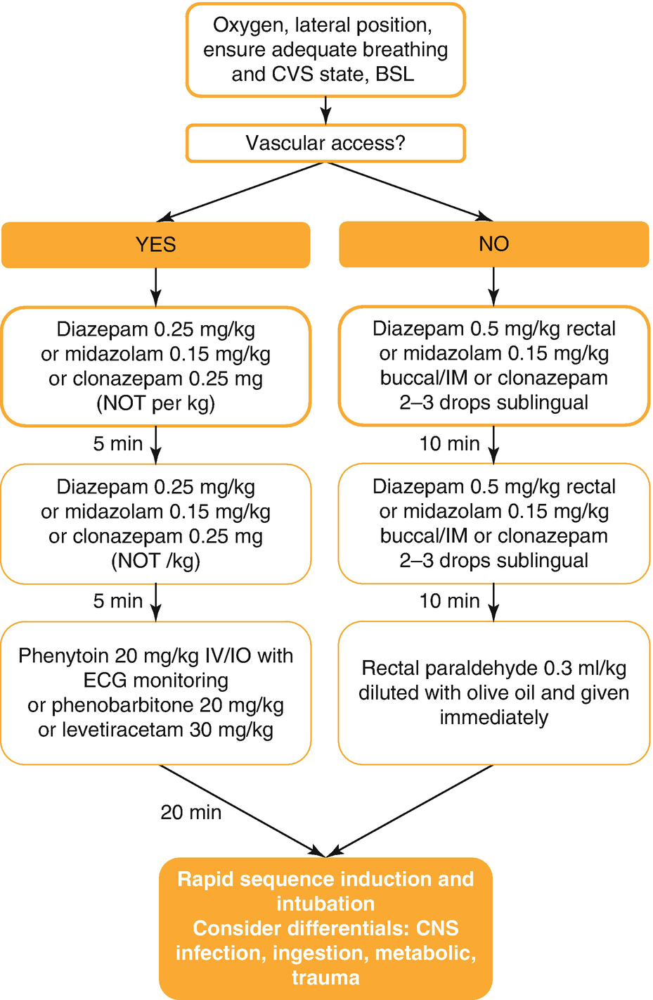

Pediatric Intensive Careintensive care

© Springer Nature Switzerland AG 2020

Craig Sims, Dana Weber and Chris Johnson (eds.) A Guide to Pediatric Anesthesia[https://doi.org/10.1007/978-3-030-19246-4\_30](https://doi.org/10.1007/978-3-030-19246-4_30)

# 30. Pediatric Intensive Care

Daniel Alexander[1](#Aff4)    

(1)

Paediatric Critical Care Unit, Perth Children’s Hospital, Nedlands, WA, Australia

Daniel Alexander

Email: [Daniel.Alexander@health.wa.gov.au](mailto:Daniel.Alexander@health.wa.gov.au)

### Keywords

Recognition of the seriously ill childTransfer to pediatric intensive careAcute severe asthma in childrenMeningococcemia, treatmentDiabetic ketoacidosis children

## 30.1 Recognition of the Seriously Ill Child

History, examination and judicious investigation will direct assessment of the pediatric patient. This process is easier for the anesthetist familiar with physiology in the young. However, there are several clear indicators of the critically ill infant. These are alertness and interaction, breathing, circulation and fluid balance over the preceding 24 h. Seriously ill children look tired or weak, do not resist examination or procedures such as IV insertion and are often pale or dusky. They are likely to be tachypneic, tachycardic and with signs of respiratory failure, cardiac failure, or both. The critically ill infant may also have a previously unrecognized congenital disorder. These and other conditions that should be considered in a critically unwell infant are listed in Table [30.1](#Tab1).

Table 30.1

Conditions to always consider in the critically ill infant

| 
Diagnoses to consider in the critically ill child

 |
| --- |
| 

Sepsis (Group B Streptococcus, Meningococcus, UTI, Meningitis)

 |
| 

Duct dependent congenital cardiac lesions (Coarctation, HLHS)

 |
| 

Gut obstruction (volvulus, malrotation, intussusception)

 |
| 

Metabolic disorders

 |
| 

Non-accidental injury

 |

_HLHS_ Hypoplastic Left Heart Syndrome

It is always wise to listen to the parent or caregivers who know their child best and are often able to detect changes from normal for their child. They can be of particular help with children who have complicated histories. ‘Red flags’ in the history include apnea, bilious vomiting (intestinal obstruction), seizures, intermittent abdominal pain and leg drawing (intussusception), rash (meningococcemia) and episodes of color change. Examination should assess the overall appearance of the child, vital signs including blood pressure (normal values Table [30.2](#Tab2)), the adequacy and effectiveness of breathing, and the adequacy of cardiac output. Perfusion of the peripheries is especially helpful in assessing circulation, as blood pressure is maintained until late in illness.

Table 30.2

Normal ranges for heart rate and respiratory rate

| 
Age | Heart rate (beats/min) | Respiratory rate (breaths/min)

 |
| --- | --- | --- |
| 

<30 days | 110–170 | 30–60

 |
| 

6 months | 100–160 | 30–40

 |
| 

1 year | 100–150 | 30–40

 |
| 

2 years | 95–140 | 25–30

 |
| 

4 years | 90–130 | 25–30

 |
| 

6 years | 80–120 | 20–25

 |
| 

8 years | 80–120 | 20–25

 |
| 

10 years | 80–110 | 15–20

 |
| 

12 years+ | 60–100 | 15–20

 |

Expected systolic blood pressure = 80 + (age in years × 2) mmHg

### Tip

There is little to lose by resuscitating a child whom in hindsight didn’t need it, but there is much to be lost in a delay.

A child who looks critically unwell (hypoxic, mottled, grey, poorly perfused, drowsy), is bradycardic and relatively hypoventilating has already reached the point of decompensation and is about to arrest. If ever there is doubt about the need to mask ventilate in this situation, the answer is a resounding “Yes!”. If ever there is doubt about the need to perform chest compressions, the answer will most likely be “Yes”, (and it probably needed to be started a couple of minutes earlier).

### Keypoint: Detecting the Seriously Ill Child

Alertness and interaction

Breathing: rate, effort and saturation

Circulation: heart rate and perfusion

Relative hypoventilation and bradycardia can be ominous

Fluid balance

## 30.2 Recognition of the Deteriorating Child

Early recognition of the deteriorating child followed by prompt and effective action can minimize events such as cardiac arrest, and may reduce the level of intervention required to stabilize the child. The evidence base for recognition and response systems for the deteriorating child is still developing. Changes in the child’s observations often occur 8–96 h before events such as cardiorespiratory arrest or unplanned admission to intensive care. Several tools have been developed to recognize the deteriorating child, most of which plot physiological observations in a graphical form to display trends. Graphical documentation is recommended because changes over time are easier to recognize.

The most important method to detect a child who is deteriorating is regular measurement, documentation and review analysis of observations. Standard observations include respiratory rate, oxygen saturation, heart rate, blood pressure, temperature and level of consciousness. The importance of monitoring blood pressure is often overlooked in institutions unfamiliar with dealing with critically unwell children. Other observations (such as seizure activity or BSL) may also be relevant for particular children.

Failure to respond to therapy may also indicate relative deterioration despite unchanged physiological parameters. For example, a child with severe upper airway obstruction who does not respond to multiple epinephrine (adrenaline) nebulizations and steroids may require intensification of management.

## 30.3 Intervention and Stabilization Before Transfer

After recognizing the child who is seriously ill or deteriorating, treatment is begun or increased to avoid cardio-respiratory arrest and to facilitate recovery. Most pediatric health care systems operate within a centralized model, with advice available from on call pediatric intensivists in specialized centers. Whilst anesthetists are well equipped to treat seriously ill children, early consultation with these centers ensures the appropriate interventions and transfer of patients. Management may be influenced by geographical and logistical considerations. For example, a child with acute severe asthma in an isolated rural hospital may be more safely managed locally with intravenous steroids, aminophylline and continuous salbutamol inhalation than with intubation, ventilation and transfer by aeromedical retrieval.

Several problems commonly occur during transfer to pediatric intensive care units. These problems are hypoventilation, hypoxemia, hypotension, hypoglycemia, hypothermia, unrecognized seizures, and lack of attention to cerebral perfusion pressure. Every patient needs at least one well-secured peripheral intravenous, intraosseous or central access. If transfer is expected to take some time, a second access site should be considered.

### Keypoint

Common problems during transfer to PICU are hypoventilation, hypoxemia, hypotension, hypoglycemia, hypothermia, unrecognized seizures, and inadequate cerebral perfusion pressure.

If the patient is ventilated, the endotracheal tube needs to be the correct size and well placed. If possible an X-ray should be taken after any intubation to ensure optimal position (neither endobronchial nor too high that may risk dislodgement). On chest x-ray the tip of the ETT should sit in the mid trachea, below the clavicular heads and well clear of the carina. The endotracheal tube needs to be of a size that there is not an excessive leak and ventilation can be assured. A cuffed ETT is preferable in most situations and highly desirable if high inspiratory pressures are anticipated. Cuffed ETT are routinely used in most critical care areas. They have the benefits of not needing to ‘up-size’ the ETT because of an excessive and unmanageable leak, and protection from airway soiling. Nasal ETTs are less mobile than oral tubes and are preferred by many units. Prolonged nasal intubation in adults may cause sinusitis, but this is not a problem in children. However, a secure, well placed oral ETT is perfectly acceptable and more straightforward to insert (See Chap. [18](467929_2_En_18_Chapter.xhtml) Dental Anesthesia, Sect. [18.​1](467929_2_En_18_Chapter.xhtml#Sec1)).

## 30.4 Specific Conditions

### 30.4.1 Croup

Tracheolaryngobronchitis (croup) is a viral infection causing inflammation and narrowing of the upper airway. It is usually caused by parainfluenza (type 1 and 2) although other viruses such as rhinovirus, influenza A and B, adenovirus, and respiratory syncytial virus can produce a similar clinical picture. Young children have small upper airways and so are more at risk of respiratory obstruction than older children. Croup is a common reason for admission to pediatric intensive care. Often there is a history of a prodromal illness and ‘seal-bark’ cough. Stridor is high pitched and initially inspiratory, but as obstruction worsens it becomes biphasic and at rest. Stridor is absent when the obstruction and respiratory distress worsen. Cyanosis in air is seen just before respiratory arrest. Using supplemental oxygen to treat a child who has upper airway obstruction removes desaturation and cyanosis as markers of deterioration. For this reason, supplemental oxygen is given with caution and in an area of high acuity.

Croup is diagnosed after other conditions have been excluded. A differential diagnosis includes epiglottitis, bacterial tracheitis, angioedema, foreign body and retropharyngeal abscess. At times croup will present with an element of reactive lower airway disease (‘Crasthma’ or ‘wheezy croup’). It is difficult to determine if a child has croup or epiglottitis. Children with croup have a hoarse voice (laryngo), cough (bronchitis) and are not systemically unwell despite having viremia and a high fever. Children with epiglottitis are septic and don’t cough (Table [30.3](#Tab3)).

Table 30.3

Comparison between signs and symptoms of croup and epiglottitis

| 
Croup | Epiglottitis

 |
| --- | --- |
| 

Common illness of childhood | Rare

 |
| 

Viral etiology | Bacterial etiology

 |
| 

Hoarse voice | Sit forward and drool

 |
| 

Cough | No cough

 |
| 

Not systemically unwell | Septic and look unwell

 |
| 

Fever | Fever

 |
| 

Vocal cords usually easily visualized | May be very difficult to visualize cords

 |

Some children who present with croup have underlying tracheal stenosis from previous neonatal intubation. These children should be identified beforehand because they can be problematic in medical management and at intubation due to their already narrowed trachea. They may have a history of symptoms even before the episode of croup.

Treatment for mild croup is with oral steroid, and hospital admission may not be required. Oral steroids are effective in less than 1 h. Severe croup with signs of airway obstruction is treated with steroids, observation in an appropriate environment and nebulized epinephrine (adrenaline) for acute obstruction while waiting for the steroids to take effect (Table [30.4](#Tab4)). Intubation is required in children with impending total airway obstruction, worsening sternal recession, restlessness, cyanosis in air or a silent chest (Table [30.5](#Tab5)). Intubation is required in less than 0.5% of all children presenting with croup. An arterial blood gas sample is not indicated as it will distress the child and worsen the condition. The decision to intubate is based on clinical signs.

Table 30.4

Steps in treatment of child with croup causing upper airway obstruction

| 
Treatment of severe croup

 |
| --- |
| 

Oxygen (being aware that may mask signs of deterioration)

 |
| 

Nebulized epinephrine (adrenaline) 1% 0.05 mL/kg made to 4 mL with 0.9% saline or 0.5 mL/kg 1:1000 neat (max 6 mL)

 |
| 

Dexamethasone 0.6 mg/kg (max 12 mg) iv, IM or oral

or prednisolone 4 mg/kg oral stat then 1 mg/kg 8 hourly

or budesonide (nebule) 2 mg stat

 |
| 

Intubation if threatened airway; worsening sternal recession, restlessness, cyanosis in air or a silent chest

 |

Table 30.5

Indicators used to decide if child with croup requires intubation

| 
Signs indicating intubation needed in child with croup

 |
| --- |
| 

Worsening respiratory distress—accessory muscle use, sternal recession, tracheal tug, intercostal recession

 |
| 

Child restless or tiring

 |
| 

Cyanosis while breathing air

 |

Note that ABG’s are not used

Most children with croup are straightforward to intubate. The vocal cords are readily seen, and the problem is with selecting an ETT that is small enough to pass through the cricoid ring with overlying edematous mucosa, but large enough to permit easy suctioning and reduce the risk of occlusion from secretions. Inhalational anesthesia in a controlled environment is preferable. If there is a suggestion of an alternate diagnosis such as epiglottitis, then consider the presence of a clinician able to provide a surgical airway in the advent of can’t intubate, can’t-oxygenate situation. Selection of the uncuffed ETT size is generally two half-sizes smaller than an age appropriate size (for example a 2 year old child who would normally require a 4.5 mm ETT would be intubated with a 3.5 mmID ETT). Croup is an unusual situation nowadays in that an UNcuffed ETT is desirable. Longer than usual uncuffed ‘croup tubes’ are available for older children needing intubation.

### Note

Acute upper airway obstruction in children:

Croup; epiglottitis, retropharyngeal abscess; bacterial tracheitis, angioedema, foreign body.

The majority of children with croup who require intubation have lower respiratory parenchyma disease (bronchitis) with reduced lung compliance and significant secretions. Despite this, the majority are easily managed with an uncuffed ETT.

### 30.4.2 Epiglottitis

Epiglottitis is a bacterial infection that causes the epiglottis and adjacent larynx to swell and occlude the airway. It is rare since the introduction of the highly efficacious Hemophilus influenza B vaccination program. It now usually occurs only in the unvaccinated or as consequence of a Group A streptococcus infection, and rarely in the immunocompromised such as post-varicella, oncology children and those on immunomodulation therapies. It may also be caused by burns and chemical ingestion. It is vital to recognize epiglottitis as it can cause a ‘can’t-intubate, can’t-oxygenate’ scenario. Epiglottitis should be considered as a diagnosis in children with acute upper airway obstruction.

Children with epiglottitis have a short history of fever and sore throat and are unwell and septic. They have a low-pitched biphasic stridor and sit forward in a ‘tripod’ position, refusing to swallow. They don’t cough and there is no preceding viral prodromal illness. Once identified, children with epiglottitis should be managed as having a precarious airway with the potential for sudden obstruction. They should be allowed to keep sitting up in their position of comfort, as lying down may result in total obstruction. Interventions are minimized as distressing the child may trigger obstruction.

Definitive control of the airway is obtained in an optimal environment with gaseous induction, maintenance of spontaneous ventilation and ENT presence. These children can be very difficult to intubate. The epiglottis is easily seen, but it is cherry red, swollen and may completely obscure the glottic opening. It can be very difficult to know where to pass the ETT, and sometimes the only clue is seeing a few bubbles under the epiglottis as the child exhales. Laryngeal pressure may help obtaining a view of the cords, and sometimes the ETT just has to be passed up and behind the epiglottis blindly, gently trying to feel where the glottic opening is. An ETT 0.5 mm smaller than usual is used. Once intubation has occurred, the epiglottis is swabbed, blood cultures taken and appropriate antibiotics such as a third-generation cephalosporin begun.

### 30.4.3 Bronchiolitis

Bronchiolitis represents inflammation of the distal respiratory tract. It is commonly cause by respiratory syncytial virus (RSV) though can be caused by other viruses (rhinovirus, influenza, parainfluenza). Occasionally no virus is isolated. Bronchiolitis results in a large number of PICU admissions each year. Most children with bronchiolitis have a mild illness and are nursed at home or in a hospital ward. Older children with these viruses have a milder illness. Small children are at increased risk because of the small diameter of their airways. Infants less than 3 months, former preterm infants and children with co-morbidities such as chronic lung disease or cardiac lesions are the most likely to require admission and escalation to respiratory support.

Infants with bronchiolitis present with increasing respiratory difficulty. They have a preceding viral illness followed by tachypnea, cough and poor feeding. Examination reveals features of respiratory distress and fine lung crepitations. About 20% of infants present with apneas alone, but develop lung crepitations over the next 12 h.

Management is supportive, with oxygen and fluids. Oral feeds are deferred during periods of respiratory distress, and often antibiotics are commenced after a limited septic screen. Nasopharyngeal aspirates are often sent to confirm RSV status, although this is not universal practice and is probably most useful only for cohorting purposes. The respiratory stimulant caffeine may have a place in the management in those who present primarily with apneas. A clinical trial of bronchodilators or steroids may be justified if there is a strong family history of atopy, though the evidence for this approach is conflicting. Respiratory support is given if clinically warranted. This support starts with high flow humidified oxygen, then non-invasive respiratory support such as nasal CPAP, followed by intubation and ventilation. The criteria for intubation and ventilation are broadly similar to those for croup.

### 30.4.4 Acute Severe Asthma

Asthma is common and can occasionally become life-threatening if not managed appropriately. With aggressive early medical management, it is rare for an asthmatic child to require ventilatory support. All efforts should be made to avoid ventilation as it is carries risks of hemodynamic changes at induction and then complications from positive pressure ventilation.

### Keypoint

Ventilation of the child with acute severe asthma carries risks of hemodynamic changes at induction and then complications from positive pressure ventilation.

Most children with exacerbations of asthma have a prior history of asthma or a family history of atopy. Often a trigger for the exacerbation is identified—either allergens or viral. Children with a mild exacerbation will respond to bronchodilator therapy given through a spacer device and a short course of oral steroids. Children with a severe exacerbation who are hypoxic should have salbutamol delivered as a nebulization with oxygen (8 L/min) and IV steroids. Bronchodilators are escalated according to clinical necessity (Table [30.6](#Tab6)). Frequent salbutamol nebulizations are escalated to continuous nebulizations if required, then to intravenous salbutamol therapy. Intravenous aminophylline and magnesium also have a role in treatment of severe asthma though there is conflicting evidence. In general, any child requiring more than four hourly salbutamol treatments should be an inpatient in a hospital and anyone requiring hourly bronchodilator therapy should be considered for intensive care management.

Table 30.6

Escalating management of severe asthma

| 
Treatment | Details

 |
| --- | --- |
| 

Oxygen | Subnasal, Hudson or non-rebreather mask to maintain SaO2 > 96%

 |
| 

Salbutamol | Nebulized 5 mg made to 4 mL with 0.9% saline 20 min × 3 doses

 |
| 

Ipratropium | Nebulized 250 μg given with salbutamol × 3 in first hour then 6 hourly

 |
| 

Steroids | IV hydrocortisone 4 mg/kg 6 hourly

 |
|   | 

**Intensify (or decrease treatment) sequentially as required**

 |
| 

Hourly Salbutamol | Give hourly salbutamol as above

 |
| 

Half Hourly Salbutamol | Give half hourly as above

 |
| 

Continuous Salbutamol | Continuous nebulized undiluted 0.5% salbutamol delivered with oxygen 8 L/min

 |
| 

Aminophylline

(will require dedicated line) | Load with 10 mg/kg over 1 h, if not on regular

Then consider continuing 6 mg/kg every 6 h intravenously if effective

 |
| 

Intravenous Salbutamol (will require dedicated line) | Add salbutamol infusion 0.5–10 μg/kg/min

(Salbutamol 3 mg/kg in 50 mL 5% dextrose, 1 mL/h = 1 μg/kg/min, consider loading 5 μg/kg/min for 1 h if not received significant inhaled therapy beforehand)

 |
| 

Magnesium sulfate | 0.2 mL/kg 50% magnesium sulfate over 1 h (beware hypotension)

 |
| 

Mechanical ventilation | Fluid bolus, ketamine induction, muscle relaxant

 |

In critical situations, it should be remembered that epinephrine (adrenaline) is a potent bronchodilator. Intramuscular or subcutaneous epinephrine (0.01 mL/kg 1:1000 epinephrine) at a time of crisis may be life-saving and grant extra time to prepare for emergency airway management.

Intubation should be contemplated only with extreme respiratory fatigue and respiratory failure as it is carries significant risk. Cardiovascular decompensation at induction is predictable and should be pre-empted with aggressive fluid resuscitation before induction and resuscitation drugs available. Ketamine is the drug of choice for induction because of its bronchodilator properties and relative cardiovascular stability. After intubation, high inspiratory pressures are required to achieve adequate tidal volumes. Goals for ventilation are tidal volumes of approximately 8 mL/kg with an expiratory time long enough to avoid air trapping. Normocapnea is not essential initially. After intubation, aggressive bronchodilator therapy is continued. Although nebulized salbutamol can be delivered to an intubated child with an adaptor, IV therapy is better at this stage. The management of acute severe asthma is also covered in Chap. [8](467929_2_En_8_Chapter.xhtml), Crisis Management, Sect. [8.​4](467929_2_En_8_Chapter.xhtml#Sec19).

### 30.4.5 Meningococcal Sepsis

Neisseria meningitidis exists in 13 serogroups with 6 serotypes associated with disease (A, B, C, W, X and Y). Historically A, B and C accounted for most disease burden internationally, although the pattern of distribution has changed dramatically with the introduction of immunization programs for five serotypes (A, B, C, W and Y). The organism is carried in the nasopharynx in 5–10% of most populations, and becomes invasive opportunistically. The incubation period is from 2 to 10 days with the prodromal illness often of a flu-like illness. Septic shock due to Neisseria meningitidis can be a devastating disease if not appreciated early and treated aggressively. Mortality from meningococcal septic shock is as high as 40%.

The classical presentation is in a previously healthy child who becomes unwell and septic with a non-blanching rash. Unfortunately, other presentations are common. Many children are not unwell in the early phases of the disease and may be too young to express myalgia or headache to their parents. Up to 25% of children do not have a rash on presentation, or if the rash is present, it may be polymorphic or blanching. To compound this, children are able to maintain blood pressure by increasing systemic vascular resistance and heart rate (having a relatively fixed stroke volume). Because of this and despite being unwell, they lack hemodynamic compromise until late, and then decompensate quickly with bradycardia, hypotension and arrest. Examination of an unwell child includes inspection for a rash and thorough and repeated examination for adequacy of circulation. Tachycardia, hypotension, poor capillary refill time, evidence of peripheral vasoconstriction (cold hands and feet) and end organ insufficiency (tachypnea, oliguria, raised lactate) should prompt vigorous resuscitation. It cannot be overstated that a robust blood pressure in isolation is not a reassuring observation. Any shocked child is given supplemental oxygen and the adequacy of breathing assessed. Intravenous (or intraosseous) access needs to be achieved without delay.

### Keypoint

Sick children can maintain a normal blood pressure until late, then decompensate quickly with bradycardia, hypotension and arrest. There is a high risk of cardiovascular collapse when inducing anesthesia to intubate a child.

The diagnosis is confirmed with blood cultures or a positive PCR (polymerase chain reaction). Lumbar puncture is contraindicated because the patient may have disseminated intravascular coagulation (DIC). Antibiotics are given urgently and although blood cultures are preferably taken beforehand, treatment is not delayed for this reason. If there is a delay in obtaining vascular access, intramuscular antibiotics is an alternative option.

Rapid resuscitation with 20 mL/kg 0.9% saline is followed by an assessment of response. Fluid challenges are repeated as clinically indicated. When 40–60 mL/kg of fluid has been given, other management strategies should be considered as well. Albumin 4%, inotropes (dopamine, norepinephrine or epinephrine) and mechanical ventilation maybe indicated, usually in consultation with intensive care. Hypoglycemia, hypocalcemia and coagulopathy often occur in meningococcemia and must be corrected early. Contact tracing and public health measures will need addressing on confirmation of the diagnosis.

### Note

The importance of vigorous fluid resuscitation in the face of meningococcal septic cannot be overstated. Aggressive resuscitation and reassessment of cardiovascular adequacy is the key to a good outcome, with many children requiring 80–120 mL/kg of fluid resuscitation in the first hour of arrival to PICU.

### 30.4.6 Status Epilepticus

Seizures may result from many processes including febrile convulsions, idiopathic seizure disorder, ingestion, changes to anti-epileptic medications, metabolic disturbances, trauma and CNS infection (Table [30.7](#Tab7)). Brief seizures are generally well tolerated in the absence of cardiovascular or metabolic compromise, but if protracted they cause metabolic and permanent brain changes (encephalomalacia). Seizures of any cause should be quickly controlled, hypoxia and hypoglycemia avoided and cerebral perfusion (blood pressure) optimized. After approximately 40 min, the seizures should be terminated by induction and intubation with thiopentone or propofol (Fig. [30.1](#Fig1)).

Table 30.7

The commonest causes of status epilepticus in children

| 
Common causes of status epilepticus in children

 |
| --- |
| 

Idiopathic (epilepsy)

 |
| 

Febrile convulsion

 |
| 

Tumour

 |
| 

Trauma

 |
| 

Infection (meningitis, encephalitis)

 |
| 

Metabolic (hypoglycaemia, hyponatremia, hypocalcaemia)

 |

Fig. 30.1

Emergency management of seizures in a child

Many children with epilepsy or recurrent febrile convulsions have an action plan and may have received treatment by parents or paramedics on the way to hospital. This treatment commonly includes rectal diazepam, intranasal or buccal midazolam or clonazepam. On occasion families are supplied paraldehyde that is administered rectally at the onset of seizures. All of these should be taken into account when assessing the child.

Once intubated effort must be made to ensure the patient stays free of seizures. This can be achieved by loading with additional anticonvulsants (a second agent—phenytoin, phenobarbitone and levetiracetam) or midazolam infusion. Occasionally a thiopentone infusion is required, but this requires central access and often leads to an inotropic requirement. If possible, ongoing muscle relaxation should be avoided to ensure recurrent seizures are detectable. If the clinical condition requires ongoing paralysis or there are concerns about ongoing seizures, then an EEG monitoring should be used.

### 30.4.7 Diabetic Ketoacidosis (DKA)

DKA is characterized by the triad of hyperglycemia (blood glucose >11 mmol/L), metabolic acidosis (venous pH < 7.3 or bicarbonate <15 mmol/L) and increased total body ketone concentration. This triad of metabolic derangement is caused by insulin deficiency and the effects of counter-regulatory hormones. This may happen in a newly diagnosed diabetic, a known diabetic with an inter-current illness or (most commonly) a known diabetic with missed insulin doses.

First presentation of diabetes may be heralded by a history of polydipsia, polyuria and unexplained weight loss. Early recognition may avoid development of the acidosis. With progression, nausea, vomiting and abdominal pains are common. Lethargy, drowsiness, an acute confusional state or loss of consciousness can occur. Occasionally there is a family history of diabetes or other autoimmune endocrinopathy. Dehydration is usually present with deep, rapid breathing (Kussmaul). Lethargy, drowsiness or altered consciousness can be present with more established ketoacidosis. A venous blood gas will show metabolic acidosis with respiratory compensation, hyperglycemia and ketonemia.

Initial management should follow the lines of all unwell patients—ensure adequacy of airway, oxygen supplementation and 10 mL/kg 0.9% saline if there is evidence of circulatory insufficiency. Insulin is begun after fluid resuscitation and diagnosis.

The goals of therapy in DKA are:

-   The correct of dehydration. The degree of dehydration is usually overestimated as there is a coexisting catabolic state with wasting. Rehydration after the initial fluid resuscitation is done slowly, and usually over a 24–48 h period to avoid cerebral edema. Normal saline (0.9%) is used initially to account for maintenance and deficit, and a dextrose-containing solution used as serum blood sugar levels normalize.
    
-   To correct acidosis, reverse ketosis and restore normal blood glucose level. Insulin is started usually as an infusion at 0.1 Unit/kg/h (maximum 5 Unit/h), although intermittent subcutaneous insulin is an option.
    
-   To avoid hypokalemia as metabolic acidosis resolves. Although there is hyperkalemia initially, there is underlying potassium depletion and hypokalemia will develop as the acidosis is corrected. Potassium will need to be supplemented and the levels monitored. Cardiac monitoring is required if the child is receiving >0.4 mmol/kg/h of potassium).
    
-   To avoid complications of therapy. Cerebral edema is a recognized cause of death. Neurological observation should be conducted frequently in the rehydration phase of a child managed for DKA. Hypoglycemia or hypokalemia are risks of initial therapy. To adequately monitor for these complications may require nursing in a high acuity area with a dedicated access point for frequent blood gas analysis.
    

## Review Questions

1.  1.
    
    You are called to the emergency department to assist in the assessment and resuscitation of an unwell 2 year old boy. He has had a fever for 24 h and has become increasingly lethargic. This morning he has developed a non-blanching rash. On examination he is pale, poorly perfused and is disinterested in his surrounds. His heart rate is 195 bpm and blood pressure 120/50 mmHg with an appropriate size cuff. A lactate obtained by an arterial stab before your arrival is 8 mmol/L. The resident has not been able to obtain intravenous access.
    
    1.  (a)
        
        Discuss your approach to this situation, in particular outlining priorities of management.
        
    2.  (b)
        
        Comment on the blood pressure measurement.
        
    
2.  2.
    
    The ward resident asks you to attend to a 4 year old child currently an inpatient on the pediatric ward. She had been admitted to the ward earlier in the evening with a 2 day history of a barking cough and a 6 h history of increasing stridor. She was admitted with a diagnosis of croup and was given a dose of oral steroids before admission to the ward 8 h ago. She has become increasingly agitated with a biphasic stridor. She is working hard to breathe. Her oxygen saturation before oxygen therapy was 92%, but now is fully saturated with a Hudson mask at 6 L/min.
    
    1.  (a)
        
        Outline your approach to management of this child’s airway issues.
        
    2.  (b)
        
        Comment on the use of oxygen therapy in this child.
        
    
3.  3.
    
    You have intubated a child for ongoing ICU care. Where is the best position for the tip of the ETT— not too high and not too low, but where? What is the best method to ensure correct depth of the ETT?
    

### Further Reading

1.  Gilpin D, Hancock S. Referral and transfer of the critically ill child. BJA Educ. 2016;16:253–7.[Crossref](https://doi.org/10.1093/bjaed/mkv050)
    
2.  Lampariello S, et al. Stabilization of critically ill children at the district general hospital prior to intensive care retrieval: a snapshot of current practice. Arch Dis Child. 2010;95:681–5.[Crossref](https://doi.org/10.1136/adc.2008.151266)
    
3.  McDougall RJ. Paediatric emergencies. Anaesthesia. 2013;68(S1):61–71.[Crossref](https://doi.org/10.1111/anae.12052)
    
4.  Virbalas J, Smith L. Upper airway obstruction. Pediatr Rev. 2015;36:62–72. A good review of croup, epiglottitis and tracheomalacia.[Crossref](https://doi.org/10.1542/pir.36-2-62)
    
5.  Yager P, Noviski N. Shock. Pediatr Rev. 2010;31:311–9.[Crossref](https://doi.org/10.1542/pir.31-8-311)