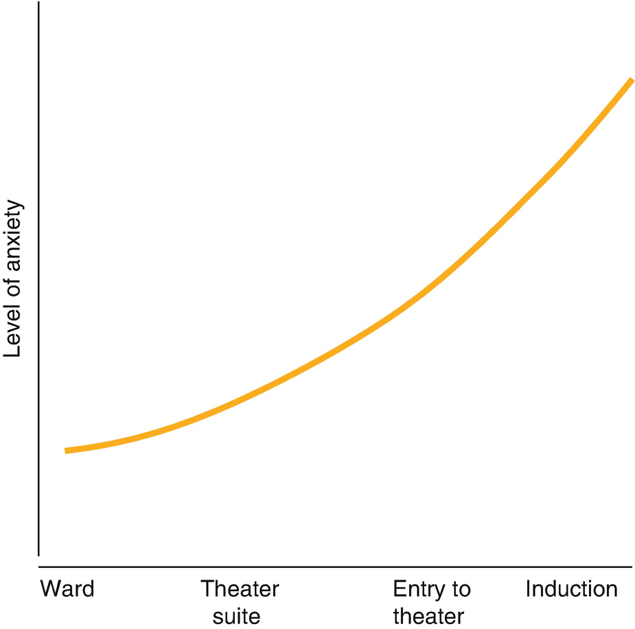
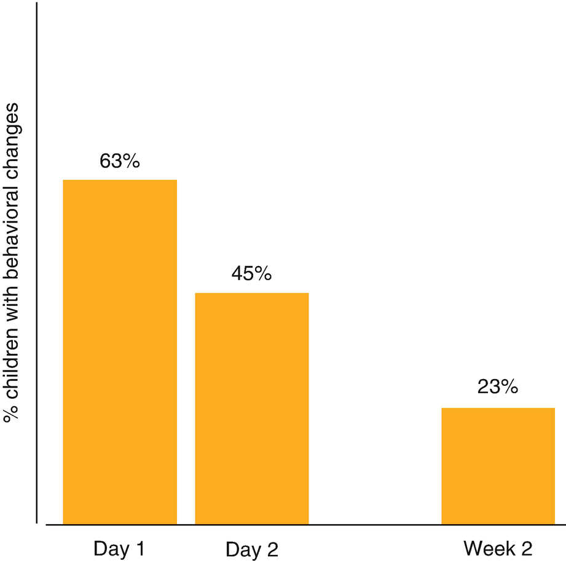
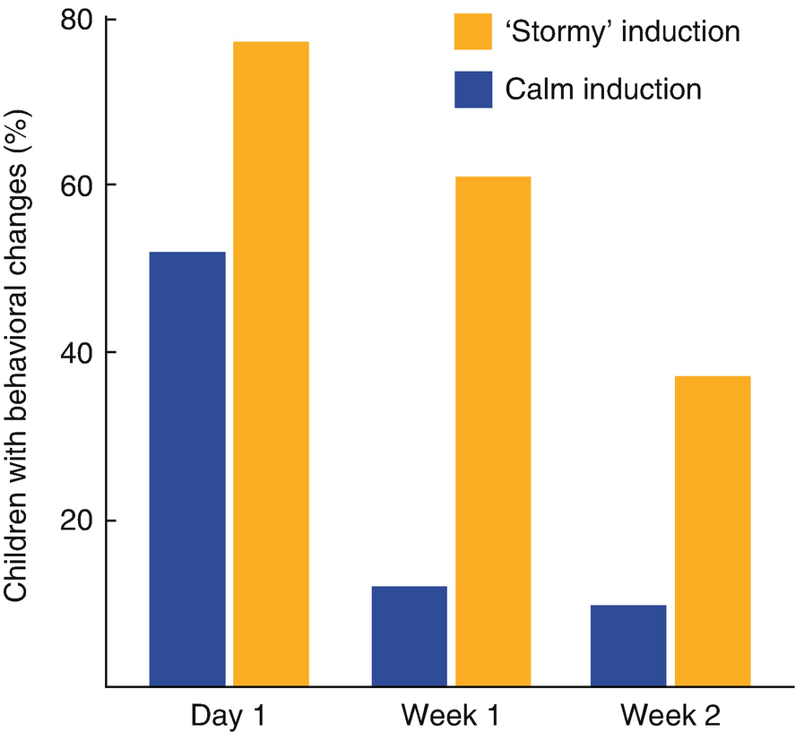
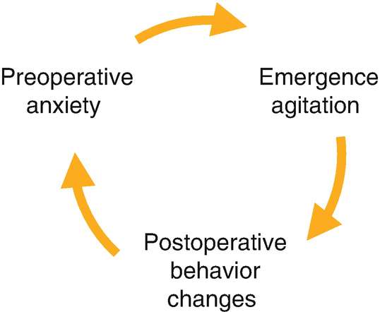
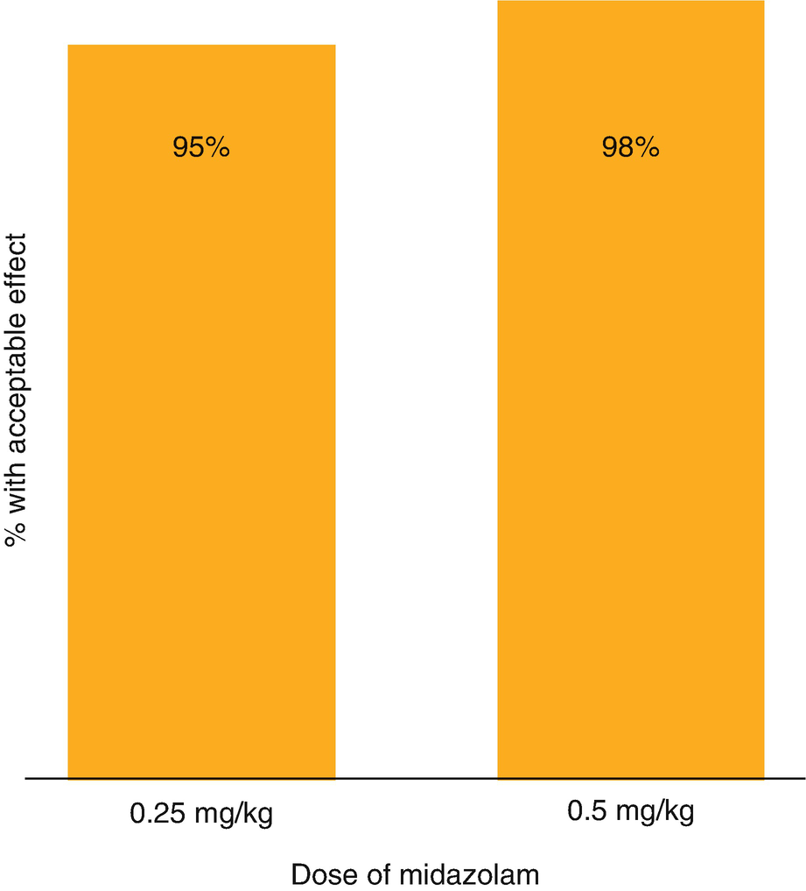
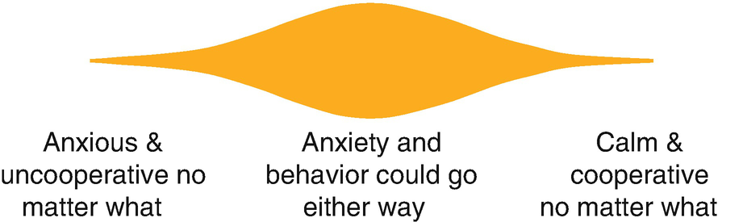

Behavioral Managementbehavioral management of Children

© Springer Nature Switzerland AG 2020

Craig Sims, Dana Weber and Chris Johnson (eds.) A Guide to Pediatric Anesthesia[https://doi.org/10.1007/978-3-030-19246-4\_3](https://doi.org/10.1007/978-3-030-19246-4_3)

# 3. Behavioral Management of Children

Craig Sims[1](#Aff4)     and Lisa Khoo[1](#Aff4)    

(1)

Department of Anaesthesia and Pain Management, Perth Children’s Hospital, Nedlands, WA, Australia

Craig Sims (Corresponding author)

Email: [craig.sims@health.wa.gov.au](mailto:craig.sims@health.wa.gov.au)

Lisa Khoo

Email: [Lisa.Khoo@health.wa.gov.au](mailto:Lisa.Khoo@health.wa.gov.au)

### Keywords

Perioperative anxietyAnesthetist behaviors and child anxietyDistraction techniques for anesthesia inductionParental presence at inductionPremedication for pediatric anesthesia

Children are anxious before anesthesia and surgery because of unfamiliar surroundings, a sense of loss of control, the presence of strangers, parental anxiety and many other perceived threats. Like adults, they respond to stress depending on their temperament and personality. At induction of anesthesia some children will say they are frightened, others will cry, withdraw, cling to their parent or become uncooperative. Unlike adults who will remain cooperative despite being nervous, young children will let you know one way or another they are frightened. Many anesthetists may be uncomfortable caring for children because of the potential for frightened children to become uncooperative. Behavioral management includes techniques to reduce children’s anxiety at induction and improve cooperation.

## 3.1 Anxiety at Induction of Anesthesia

Anxiety increases from admission to induction, with induction of anesthesia being the most stressful part of a child’s hospital admission (Fig. [3.1](#Fig1)). Children can display their anxiety with verbal or physical resistance, crying, screaming, becoming quiet and withdrawn, or expressing fear or sadness. These signs of anxiety are more frequent in younger children and are unfortunately very common: 42% of 2–10 year olds show one of these signs and 17% show three or more. Up to 25% of children who have not had a premed or parent present require restraint at induction. The anxiety experienced by the child depends on many factors, including temperament, their coping strategies, past experiences, the anxiety of parent and the behaviors of staff.

Fig. 3.1

A child’s anxiety increases during the different preoperative stages towards induction, although there is great variation between children depending on their temperament, past experiences and many other factors. Based on Chorney JM, Kain ZN. Anesth Analg 2009;109: 1434–40

## 3.2 Consequences of Anxiety at Induction

There are five consequences of anxiety at induction:

-   Reduced cooperation
    
-   Agitation during emergence from anesthesia
    
-   Possibly increased postoperative pain
    
-   Regression of behavior for up to several weeks afterwards.
    
-   Increased anxiety at subsequent hospital admissions and anesthetics.
    

The stress associated with hospitalization and surgery contributes to postoperative behavior changes (Table [3.1](#Tab1)). Initial studies have found these changes in children admitted overnight to hospital, and more recent studies also found them in children having surgery as outpatients. These behavioral changes may persist long after discharge, and a small proportion of children may have them for a few weeks or months (Fig. [3.2](#Fig2)). Their incidence depends on the temperament and personality of the child but they are more likely to occur in preschool-aged children and those who were anxious at induction. Children who have a ‘stormy’ induction are more likely to be agitated when awakening and more likely to have postoperative behavioral disturbances (Fig. [3.3](#Fig3)). They may also become more anxious about future anesthetics (Fig. [3.4](#Fig4)). These effects are probably reduced with premedication or other strategies to reduce pre-operative anxiety.

Table 3.1

A child’s behavior may regress to that of a younger child in response to the stress of hospitalization and surgery

| 
Behavior change after anesthesia and surgery

 |
| --- |
| 

Sleep disturbances and night terrors

 |
| 

Clingy and separation anxiety

 |
| 

Withdrawn and quiet

 |
| 

Fear of doctors or hospital

 |
| 

Food refusal; disobedience

 |
| 

Tantrums

 |
| 

Enuresis

 |

Fig. 3.2

Percentage of children aged 1–7 years with behavior changes at different times after anesthesia and surgery. Based on Kain ZN et al. Anesth Analg 1999;88: 1042–7

Fig. 3.3

A difficult, ‘stormy’ induction is associated with an increased incidence of behavioral changes after anesthesia. Since children can’t be randomized to calm or stormy inductions, it isn’t known if the child’s temperament that predisposed them to anxiety also predisposed them to behavioral changes afterwards. Data from Kain ZN et al. Anesth Analg 1999;88: 1042–7

Fig. 3.4

Preoperative anxiety may affect emergence from anesthesia and cause dysfunctional behavior in the postoperative period. This experience may then increase the child’s anxiety at the next anesthetic

## 3.3 Reduction of Anxiety at Induction

Most strategies to reduce anxiety are aimed at the child and parent, and include psychological preparation or education programs, parental presence at induction, and pharmacological premedication. The child’s anxiety however, is greatly affected by the behavior of the anesthetist.

### 3.3.1 Psychological Preparation for Anesthesia and Surgery

The aim of psychological preparation is to reduce the child’s anxiety and improve their behavior at induction. A range of preparation techniques are required and must be appropriate to the child’s developmental age, temperament and personality.

The most intensive preparation is performed by Child Life Therapists (Play Therapists) and Occupational therapists. They are experts in child development and promote coping strategies through play, education, and self-expression activities. This preparation teaches children coping and relaxation skills, provides information about events and procedures, and supports the child and parents during the preoperative period. Another form of preparation is modelling, in which the child indirectly experiences the theatre environment through video, puppet shows and other media. These programs are labor-intensive and expensive, and are usually reserved for children who have behavioral issues from frequent medical procedures. Unfortunately, although these techniques reduce anxiety leading up to anesthesia, they do not reduce the intense anxiety at the time of induction in most children. The anesthetist can teach simple relaxation techniques such as deep breathing and muscle relaxation on the day of surgery. Younger children can be taught to hold their breath. These techniques then can be brought out if anxiety and distress occur: “remember your job is to take a big breath and hold it still like a statue, so go ahead now and take that breath”.

Hospital tours are another form of preparation, but time and economic factors mean that in practice this high-level preparation is given only to a small proportion of children, and often to well-motivated families whose children are least likely to need or benefit from the preparation.

The commonest, though least effective form of preparation is written or video information for the child and parent (Table [3.2](#Tab2)). The information needs to be specific and contain a description of what will happen, as well as sensory information about what will be seen, heard, smelt, tasted or felt. Less information needs to be given to preschool children as they have a limited ability to conceive alternate physical states. In this age group, it is best to concentrate on giving information to prepare their parents. In the future, web-based programs will give information tailored to each child’s developmental age and personality, and may be more effective.

Table 3.2

Summary of recommendations for preoperative information to children

| 
Recommendations for preoperative information

 |
| --- |
| 

Methods of delivering information:

 – Video format

 – Written, especially with illustrations (book)

 |
| 

Information to be included:

 – Specific, age appropriate information

 – Include both what will happen and what will be felt or seen

 – Specifically mention pain if likely to happen, but care with word choices and suggestion

 – Choices or preferences for aspects of anesthesia can be discussed with adolescents to help them feel more in control and reduce anxiety, but younger children unlikely to comprehend

 – Provide all children opportunity for questions

 |
| 

Best time to give:

 – 6 years or younger, give closer to time of procedure

 – Older than 6 years, give more than 5 days beforehand

 |

### Note

Both the parent and child need to have their anxieties and concerns managed. Always remember the parent-parental anxiety increases the child’s anxiety and worsens their behavior at induction.

When to give information depends on the age of the child. Young children don’t retain information very long whilst older children may become more distressed if information is given too close to the time of the procedure. Children older than 6 years benefit from receiving information at least 5 days before the procedure. Closer to surgery, the information is better kept less specific and intimidating. Children younger than 6 years can receive information 1 or 2 days beforehand. Some parents do not tell their child that a procedure is going to happen, believing this will cause the child less stress. However, these children are nearly always very distressed at wakeup and afterwards, demonstrating the need to at least mention the procedure to the child beforehand.

If the anesthetist is not used to talking to children, a pragmatic alternative is to provide information to the parents, and then rely on them to explain to the child in an appropriate manner or language. This approach avoids inappropriate words or concepts, but perhaps risks misinformation.

### 3.3.2 The Behavior of the Anesthetist at Induction and Its Effect on the Anxiety of the Child

The behavior of an adult affects the behavior of a child. Observational studies of anesthetic staff and children at the time of induction show the behaviors of anesthetic staff can either worsen or reduce a child’s anxiety. Aspects including the staff’s posture, facial expression and position relative to the child may affect the child’s anxiety. The anesthetist can make a big difference to the child’s anxiety and experience of anesthesia by getting the child’s attention and keeping it. This stops the child from becoming internally focused due to fear, and then becoming inaccessible. Distracting the child at induction avoids behaviors that increase anxiety. Reassurance and empathic statements focus the child on their feelings or distress and increase anxiety. Distraction steers attention away from the medical procedure and reduces anxiety (Table [3.3](#Tab3)). The words chosen by the anesthetist also affect the child’s behavior. Framing discomfort using playful imaginative or abstract language is helpful—‘sparkles’ up the arm rather than ‘this may sting a little’, or ‘a beautiful perfume’ rather than ‘this gas might smell’.

Table 3.3

Reassuring, empathic statements focus the child on their feelings of distress and increase anxiety

| 
Anesthetist behaviors that increase a child’s anxiety | Anesthetist behaviors that reduce a child’s anxiety

 |
| --- | --- |
| 

**Reassurance, empathy and apologizing** | “You’ll be OK”

“Don’t worry”

“I know it’s hard”

“I’m sorry” | **Non-procedural talk** | Talking about toys, pets, favorite movies

Story telling

 |
| 

**Excessive technical or medical talk** | Too much information about procedure or equipment | **Humor** | Jokes

 |
| 

**Suggesting control when none exists** | “Are you ready to come to theatre now?”

“Can I put the mask on now?” | **Choices with clear limitations and does not allow avoidance of procedure** | “Walk or ride on trolley?”; “Strawberry or chocolate mask?”

“You can breathe on the mask or just blow it away”

 |
| 

**Multiple adults talking**

 |   | 

**Medical play** | ‘Astronaut space mask’

 |
| 

**Allowing child to delay**

 |   | 

**Firm warm confidence**

 |   |
| 

**Poor word choice** | Needle, sting, hurt

Focusing on what child _can’t_ do | **Good word choice** | Metal tube, plastic straw

Focusing on what child _can_ do

 |

Distraction steers attention away from the induction and reduces anxiety

Based on Martin et al. Anesthesiol 2011;115: 18–27

#### 3.3.2.1 Effective Distraction

Although some children will be relaxed with simple non-procedural talk about school or toys, other children are more anxious and benefit from stronger distraction. The choice of a distraction depends on a complex interaction between the anesthetist’s personality, the child’s age and temperament, equipment available and the theatre environment. Some anesthetists are great story tellers and are able to guide the child into an imaginary world; others can use pretty stickers or a toy, tell jokes, or do a few magic tricks. A popular technique uses video games or movies on a hand-held device. Effective distraction needs to start early, be continuous and increase as induction progresses (Table [3.4](#Tab4)).

Table 3.4

No matter the distraction used, there are several characteristics to maximize its effect

| 
Effective distraction

 |
| --- |
| 

Is interesting and new to the child

 |
| 

Begins with a sense of anticipation to build excitement

 |
| 

Gets child’s attention as soon as entering theatre

 |
| 

Increases as induction approaches and anxiety increases

 |
| 

Is continuous with no pauses or gaps that might lose child’s attention

 |
| 

Has the strongest distraction saved for the time of mask acceptance or IV insertion when anxiety is maximal

 |

### 3.3.3 Pharmacological Premedication

Premedication (premed) is the most reliable way to reduce a child’s anxiety and improve cooperation at induction. It also reduces parental anxiety and improves parental satisfaction. However, not every child requires a premed, and the skill is in choosing which child will benefit. A premed may slow wake up, cause dysphoria in recovery and carries a cost in nursing time. The premed is nearly always given orally, though this requires some cooperation from the child. The nasal or buccal route may be an alternative. The advantages and disadvantages of oral premeds are listed in Table [3.5](#Tab5). There are a few situations in which a premed should be avoided or used in a reduced dose. These are when a difficult airway is anticipated, there is severe sleep apnea, an increased risk of apnea, and when there is raised intracranial pressure.

Table 3.5

Comparison of oral premeds and their advantages and disadvantages

| 
Oral premed agent (time to give before induction) | Advantages | Disadvantages

 |
| --- | --- | --- |
| 

**Midazolam 0.3–0.5 mg/kg, max 15 mg (30 min)** | Rapid onset

Short duration

Anxiolytic

Doesn’t delay discharge | Bad taste

Dysphoria

Amnesia

 |
| 

**Clonidine 4 𝛍g/kg (60 min)** | No amnesia

Reduces emergence dysphoria

Timing of administration less critical

Tastes better than midazolam | Slow onset

Long duration- may delay discharge

Bradycardia

Child easily awakens with noise or stimulation at induction

 |
| 

**Dexmedetomidine 3 𝛍g/kg**

**(45 min)** | Well tolerated

Analgesic, sleep-like sedation

Possibly anxiolytic | Intranasal route may be better. Use 2 μg/kg

Expensive

 |
| 

**Ketamine 2–5 mg/kg (30 min)** | A ‘heavy’ premed for autism, developmental delay, uncooperative older child | PONV

Dysphoria

Potential for airway obstruction

Not suitable for routine use

 |

Midazolam is the most commonly used agent, though there is also strong support for clonidine

#### 3.3.3.1 Midazolam

Midazolam is widely used because it reliably provides anxiolysis, has a rapid onset and short duration. Oral midazolam has a bitter taste. When the IV preparation (5 mg/mL) is used for oral premedication, its taste is disguised by mixing it with ice cream topping, undiluted cordial or jam. A commercially-made midazolam is available for oral use in some countries.

Oral midazolam is mostly an anxiolytic with little sedation, making it relatively safe in obstructive sleep apnea and other situations where airway patency may be a concern. The oral dose is 0.3–0.5 mg/kg (max 12–15 mg). The lower dose is usually effective in all but the most anxious child, and reduces the risk of postop dysphoria (Fig. [3.5](#Fig5)). The dose can be ‘titrated’ against the desired effect, particularly in older children—some children appear as well-behaved and likely to be easy to distract at induction, but are scared. A dose towards the lower range might be appropriate. A younger child might be very fearful and have had difficult past anesthetic experiences, and a maximal dose might be appropriate. Midazolam can be given by the buccal route by squirting it between the teeth and cheek or lower lip. Either the IV preparation or midazolam marketed for seizure treatment can be used. The nasal route is another option in uncooperative children—the dose is lower (0.2 mg/kg) and the IV preparation is squirted into the nostril with an atomizer device. Intranasal administration is unpleasant, most children will need to be restrained and it is best used only in exceptional circumstances.

Fig. 3.5

Oral midazolam 0.25 and 0.5 mg/kg are almost equally effective. _Based on Cote, Anesth Analg 2002;94: 37–43_

Onset by either route is 12 min, with peak effect at 20–30 min. If midazolam is given too early, a proportion of children, particularly preschool-aged will develop a paradoxical reaction and become dysphoric, uncooperative and hallucinate. This effect usually occurs after 45–60 min and is the reason why it is important to time the administration of midazolam carefully. Midazolam reduces anesthetic requirements, delays emergence but does not generally delay discharge. It produces anterograde and retrograde amnesia, but there are concerns this loss of memory may be a distressing experience for the child, as it is in adults.

#### 3.3.3.2 Clonidine

Clonidine is commonly used as a premed at a dose of 3–4 μg/kg, much larger than the IV dose because bioavailability after oral administration is only 55%. Its onset is slow with peak effect at 60–90 min. It is mostly a sedative with some anxiolysis. It reduces anesthetic requirements and emergence dysphoria and improves postop analgesia. Significant bradycardia is very uncommon. There is no commercially available clonidine syrup in most countries, so the IV preparation is mixed with flavoring and given orally. The IV preparation is concentrated and has an unusual concentration (150 μg/mL) which increases the risk of a dose error. In practice, children are easily aroused from their sedated state and can become quite alert and anxious at the time of induction.

#### 3.3.3.3 Dexmedetomidine

Although not licensed for use in children, there are many studies of dexmedetomidine being used as a premed. The IV preparation is used for the oral and intranasal routes, though this preparation remains expensive. Bioavailability is 65% by the nasal route and 82% by the buccal route. It is only 16% by the oral route and so some authors suggest not giving dexmedetomidine as an oral premed. The intranasal dose is 2–3 μg/kg. Its onset is about 25 min, duration 85 min. Some, but not all studies show superiority over midazolam.

#### 3.3.3.4 Ketamine

Oral ketamine is considered a ‘strong’ premed used either alone or in conjunction with midazolam. Monitoring, oxygen and the ability to resuscitate need to be available. It is best reserved for more difficult patients such as autistic children, older developmentally delayed children or terrified school-aged children who would not otherwise be cooperative. The dose of oral ketamine is 2–5 mg/kg. Midazolam 0.2–0.5 mg/kg can be mixed with it to increase the effect. The higher dose range of ketamine with or without midazolam may produce unconsciousness and airway obstruction. Recovery time is similar to midazolam, however ketamine has a high incidence of PONV, especially if the dose of concurrent opioids is not reduced. Excessive oral secretions do not seem to be a problem after oral ketamine.

Intramuscular ketamine is used as a premed or ‘pre-induction’ agent in older autistic or developmentally delayed children who are combative and refuse oral premedication. A dose of ketamine 1–2 mg/kg into the deltoid or thigh muscle, through clothing if need be, stuns the patient and is effective. Higher doses (5–10 mg/kg) induce anesthesia and result in prolonged recovery and increased hallucinations.

### 3.3.4 Parental Presence at Induction

Having one parent present at the induction of anesthesia is routine in most centers. Parental presence prevents the tears and anxiety that would otherwise result from separation from the parent, but it does not reduce the anxiety associated with the induction itself. Premedication reduces anxiety at induction better than parental presence. Despite this there are several advantages to having the parent present (Table [3.6](#Tab6)). One of the most important is it allows the parent to witness the induction so that they don’t have to rely on their child’s description afterwards. If the induction was not the calm and happy one hoped for, the parent can see what happened and put into perspective their child’s recollection of events. There are however, concerns about the lack of parental education before participation in the induction, and that some parents may be passively involved or make negative remarks rather than be supportive. These can be addressed by explaining the plan for the induction and how the parent can help, and a warning of how the child may look during and after the induction. Very occasionally a parent may hesitate to leave after induction or want to stay during the surgery. Remind them firstly when the child wakens in recovery the parent will be there and as far as their child is concerned, the parent has never left. Secondly, it is safer for their child if they leave as soon as their child is asleep so staff will be able to look after the child rather than the parent. Many parents find it stressful and emotional to be present at the induction of anesthesia but most will wish to participate in subsequent inductions.

Table 3.6

Advantages and disadvantages of parental presence at induction

| 
Parental presence at induction

 |
| --- |
| 

Advantages:

 Stops separation anxiety/crying

 Allows parent involvement in care of child

 Improves parental satisfaction

 Raises profile of anesthesia as a specialty

 Allows parent to witness care and attention given to their child, even if induction is ‘stormy’

 |
| 

Disadvantages:

 Does not reduce anxiety at time of induction

 Requires escort for parent from theatre suite

 May be stressful for parent

 |

### Keypoint

Carefully explain to parents about what to expect at induction, and what is expected of them. They can then filter this information to their child.

### Tip

Stay calm and confident while the parent is present at induction as they will worry about their child if you look worried.

Warn the parent before and during induction about movement, sounds and appearance.

Reassure the parent that all is well when you ask them to leave.

### 3.3.5 Hypnosis

Hypnosis is an altered state of consciousness in which there is a state of inner absorption. It is based on the principle of dissociation, in which attention is focused and there is less awareness of the surroundings. Children older than 3 years may be more susceptible to hypnosis than adults as they are more likely to be absorbed by fantasy and storytelling. Some elements of hypnosis are used by anesthetists as part of their induction routine. These elements include guided imagery, storytelling, and speaking in a slow rhythmic manner with description of familiar sights and sounds. The words chosen can modify the sensation of pain by direct suggestion and promote relaxation. Formal hypnosis is used by some anesthetists. It is effective at reducing anxiety in children at induction, and reducing discomfort associated with procedures. The ‘magic glove’ and switch-wire imagery are two simple techniques.

### Keypoint

The behavior of a child regresses during times of stress. A young teenager may need to be treated more as a child, or a child as a younger child when under the intense stress of hospitalization and induction of anesthesia.

## 3.4 Assessment and Management on the Day of Surgery

The behavior of most children at induction will depend on their management, hence the importance of techniques to reduce anxiety. A small proportion is likely to be uncooperative despite any technique, and a small proportion will always be cooperative despite minimal behavior management (Fig. [3.6](#Fig6)). The behavior of most could go either way, and this section aims to give practical techniques to reduce children’s anxiety and maximize cooperation at induction.

Fig. 3.6

Anxiety and behavior of most children at induction can be influenced by the anesthetist’s use of premed and behavioral management techniques

### 3.4.1 Assessing Temperament and Establishing Rapport

It takes skill and ‘art’ to assess and prepare a child in the brief time available in a busy day-of-admission service. During the preoperative consultation, the anesthetist has the opportunity to assess the child’s behavior, determine whether a premed is likely to be required, provide relevant information, and attempt to establish rapport and trust with the child. The developmental stage of child is a starting point for assessment (Table [3.7](#Tab7)).

Table 3.7

A summary of age, developmental stage and behavior relevant to induction of anesthesia

| 
Child’s developmental stage

 |
| --- |
| 

**Infant <1 years** | Often cry with acts of daily living (nappy change, hunger). Unable to distract

 |
| 

**Preschool age**

**1–5 years** | High anxiety about separation and unfamiliar surroundings. Able to distract. Unlikely to be cooperative if anxious. Become aware of surgery and its implications if previous bad experience

 |
| 

**School age child**

**5–10 years** | Aware of surgery and its implications. May be very anxious. As become older may be able to remain cooperative despite anxiety

 |
| 

**Teenager/adolescent**

**\>10 years** | Aware of surgery and its implications. May be concerned about awareness and death. May be very anxious but will remain cooperative

 |

Questioning the parent and observing the child gives valuable indicators of the need for extra care or a premed. Smile and be friendly, introduce yourself to the parent and child, get down to the child’s eye level. Avoid speaking in a loud or strong, intimidating voice. Being at an angle rather than face-to-face is less intimidating. It is not obligatory to always talk to very young children, as they will often be watching and listening anyway. However, child-centered communication includes talking to the child first and getting their permission to talk to their parent. In a brief consultation, the parent can usually be relied on to talk to their child afterwards in an age appropriate manner using (or avoiding) any particular words with special meaning within that family. With teenagers, more of the conversation should be directed to the patient.

Before examining a young child, remember that you are invading their personal, private space. Make sure that a parent is present and the child knows you are a doctor. Proceed cautiously so as not to put them ‘on guard’. Privacy during the examination should be ensured for school-aged patients, especially girls. Try to move the child away from the TV or computer game while you are examining or interacting with them, because the child becomes preoccupied and it is hard to assess their temperament—they may appear relaxed and happy whilst watching, but are actually very scared. Toddlers are unlikely to allow a stranger to touch them unless they are sitting on the mother’s lap. A gradual start to auscultation of the chest is to listen through the child’s clothes, which gets them used to what is going to happen, and then light heartedly warning them about the cold stethoscope that’s coming. Sound effects or using play (listening to their toy) to introduce auscultation may help. The child’s response to auscultation is a useful sign of their anxiety and behavior. Some confidently pull up their top for you, others will shy away or even cry—a sign that a premed is worth considering.

### 3.4.2 Preoperative Discussion

Discussing a medical procedure in a clinic setting with a child who has a chronic disease is different to discussing anesthesia with an anxious child shortly before anesthesia. There is often limited time for the anesthetist to develop rapport or to talk and listen to the child. In the stressful situation, children are less able to absorb and process medical information, or to make decisions about themselves. In addition, detailed medical information close to induction increases the child’s anxiety. A balance is needed depending on the age and comprehension of the child, between information for consent versus how much is said in front of the child.

Teenagers and older children should be told about the IV insertion, or the options for induction. Some anesthetists discuss the IV with younger school aged children. This may or may not be useful and alternatively the IV can be described with a euphemism and allows the parent to describe it to the child at their discretion.

Younger children shouldn’t be given choices as they have a limited ability to conceive alternate physical states. It is often best to decide management in consultation with the parent and then tell the child. You need to be flexible and open to changes in strategy according to the child’s response. Some frightened children however will automatically ask for the opposite of your plan in the hope that they will be allowed to do nothing and just go home. Teenagers and older children are often concerned about awareness and not waking up afterwards, and both of these should be specifically mentioned in the discussion.

It is also worth preparing for the induction by either gently holding the child’s wrist as if to bring up their veins, or placing a cupped hand on their nose and mouth as if it were a mask. Once again, sound effects may help to make this invasion of personal space acceptable, and the child’s response gives another indication of their temperament. Finally, if a special distraction technique is going to be used at the time of induction (such as stickers, a toy, video game), it is worth mentioning it to build-up anticipation of something exciting or interesting for the child to look forward to.

### Keypoint

Pharmacological premedication and distraction are the two best techniques to reduce anxiety and maintain cooperation at induction.

### 3.4.3 Children Who May Benefit from a Premed

The child’s anxiety level usually increases leading up to induction (Fig. [3.1](#Fig1)) and allowance needs to be made for this at the time of assessment. There are several signs suggesting a premed may be beneficial (Table [3.8](#Tab8)). It would be uncommon for a premed to be given to children younger than 12 months, but practice varies with 1–2 year old children—they are not usually cooperative at induction, but also may not like taking a premed that won’t necessarily guarantee cooperation at induction, and may make the child dysphoric if the procedure is short and the premed still having an effect postop.

Table 3.8

Signs from history and examination that may indicate that a premed is needed

| 
Indicators at time of preoperative visit that premed is likely to be required

 |
| --- |
| 

Preschool age—5 years and younger

 |
| 

Previous hospitalizations or procedures

 |
| 

Previous difficult or traumatic induction

Boisterous, over-talkative school-aged child

 |
| 

Teary

 |
| 

Quiet, shy, clingy, withdrawn

 |
| 

Child remarks ‘doesn’t like mask or needle’

 |
| 

Poor eye contact

 |
| 

Very anxious parent

 |

Young preschool-aged children are the most likely to require a premed. Whether or not one is used depends on a complex interaction between the child’s temperament, their anxiety and their coping mechanisms, the procedure, and the anesthetist’s ability to distract and occupy the child at induction.

Some of the most difficult children to detect anxiety in are 8–10 year old girls. They are mature enough to initially appear confident and control overt signs of anxiety, but then become unable to control their anxiety and become fearful and uncooperative at induction. They are also an age group in which it is difficult to justify using restraint. It is therefore important to try and pick which children may benefit from a premed, or have a low threshold for giving a premed. Unusually boisterous, school-aged children are another group in whom it may be difficult to detect anxiety. While boisterous behavior reflects the personality of children, in others it is a sign of anxiety.

Children older than about 10–12 years tend to remain cooperative even if anxious, like adults. They often benefit from a ‘small’ premed (eg midazolam 0.25–0.3 mg/kg) to reduce anxiety and make their experience more pleasant.

Some children require a ‘stronger’ premed than midazolam or clonidine. These children include those with autism, previous bad anesthetic or surgical experience, and older anxious children who are defiant. Premed options include clonidine followed later by midazolam, and ketamine with or without midazolam.

### Tip

Beware the boisterous school aged boy—their chatty over talkative state may reflect underlying anxiety.

### 3.4.4 The Child Who Refuses to Drink the Premed

Sometimes, children won’t even cooperate to take an oral premed. Some may take the midazolam but then spit it out, though at least some will have been absorbed across the mucosa in the mouth. If the child refuses to take any premed, the next step depends on many factors. Options include giving the child more time to settle into the ward and get used to the surroundings and relax, or to try offering a favorite drink to encourage the child, or giving the parent time to talk or negotiate with their child. Nasal or buccal midazolam, or nasal dexmedetomidine don’t require cooperation, though coaxing (“grin and show me your sharp teeth” for buccal midazolam) or restraint might be needed. One could then argue however maybe this is just transferring the tears from the induction room to the ward. If the child has good veins, an IV induction might be most straightforward as it can be performed without the child cooperating. In an older child, surgery might need to be delayed to try again another day, though this risks the child learning refusal means avoiding the procedure and so may try the same strategy next time.

## 3.5 Practical Management at Induction

The child’s anxiety may be maximal at induction, but there are several simple things the anesthetist can do to reduce it (Table [3.9](#Tab9)). The theater environment is threatening with bright lights, medical equipment and many people in scrubs. Firstly, optimize the environment to make it less threatening—children’s theatres have posters, toys to look at and hold, murals and anything else to ‘de-hospitalize’ them. Consider the lighting level, the number of staff present in the room and the medical equipment in the child’s field of vision. Have everything ready to use with tapes, IV equipment, drugs and distractions all prepared.

Table 3.9

Summary of techniques leading up to induction that help anxious child stay calm

| 
Techniques to keep child relaxed before induction

 |
| --- |
| 

Minimize fasting duration

 |
| 

De hospitalize surroundings, allow child to wear own clothes if appropriate

 |
| 

Have drugs and equipment ready to minimize pauses; brief and prepare your team

 |
| 

Warm OR table before child lays down

 |
| 

Consider applying monitoring after induction

 |
| 

Stand at the side facing the child at an angle rather than at head end of table

 |
| 

One person talking and maintaining eye contact

 |
| 

Induce anxious child in ward bed or on parent’s lap if very anxious

 |
| 

Maintain rhythm and patter of distraction: start immediately child enters OR, no pauses

 |

If the child walks into theatre, a warm operating table (using a forced air warmer under the sheet) is more comfortable and may help. A few stickers on the theatre table may keep younger children relaxed about hopping onto the table. Walking an anxious child into theatre however carries a risk of the child refusing to hop onto the operating table or trying to leave. Consider taking anxious children into theatre on a stretcher, as the child is more likely to accept the stretcher in a less threatening environment away from theatre and then there is more control over the child’s movements. If the child is settled on the stretcher when entering theatre, the child could be induced there rather than shifting them and arousing anxiety and reducing cooperation. An anxious child might sit up on the table but not lay down. It is easier to control the child during induction if they lie down, but forcing them to lie down might tip them into becoming uncooperative there and then.

Consider standing beside the bed to face the child at an angle during induction—the airway is not the main concern at this point in the induction. Standing at the head end of the bed is a carry-over from adult anesthesia, stops eye contact with the child and is frightening for the child.

Distraction is the most important technique to reduce anxiety and maintain cooperation. The best distraction starts before entering theatre and then grabs their attention again the moment the child enters the OR. Only one person should be talking and getting the child’s attention. Keep talking, maintaining the patter and rhythm of the distraction you use. Many types of distraction are possible (Table [3.10](#Tab10)) depending on a mix of the anesthetist’s personality, the theatre environment and child’s age. Video clips, and probably virtual or augmented reality in the future, are effective distraction—passive animated video clips for preschool children and interactive games for older children. As children are already familiar with video clips, they need to be unique or special to be a strong distractor at induction when anxiety peaks. Some suggest they are better for IV induction, while inhalational induction is better with distraction that includes interaction between the anesthetist and child.

Table 3.10

Some distraction strategies for use at induction for children of different ages

| 
Distraction strategies

 |
| --- |
| 

• Bucket of stickers

Say a sentence or two about what’s on the sticker. Keep asking them to choose between two stickers; Keep showing new stickers to keep child’s attention. Parents can often help with this

 |
| 

• Magic tricks

Visit a magic store for some easy, close-up magic tricks. A magic coloring book is easy to use and a great relaxer for child and parent

 |
| 

• Play a video clip or game on a laptop computer or hand-held device

 |
| 

• Blow bubbles

 |
| 

• Pull a small toy out of your pocket

A dolphin, kaleidoscope, picture viewer, farm animal, dinosaur, something that lights up. Describe the toy to make up a little story

 |
| 

• Tell a story

Some include the smell of the volatile into their story (rocket fuel/dinosaur poo/seaweed/Mum’s perfume)

 |
| 

• Ask the child count the number of a certain thing on the ceiling in OR (lights, ceiling tiles)

 |

A relaxed anesthetist helps keep the child relaxed and cooperative. Being confident about airway management helps the anesthetist stay relaxed—another reason why the airway is such a key part of pediatric anesthesia training. While distracting the child, it is also important not to offer too many choices, or choices where the child has no real choice (“are you ready for mask now?”).

### Note

Keep the flow of the induction process and distraction going—gaps or pauses make it more likely that the child’s anxiety will increase.

### 3.5.1 Intravenous Induction

IV inductions have become the most common method in many countries. Less cooperation is required from the child compared to inhalational induction, but the anesthetist needs to be adept at pain-free IV cannulation. The techniques of IV cannulation are described in Chap. [1](467929_2_En_1_Chapter.xhtml), Sect. [1.​5](467929_2_En_1_Chapter.xhtml#Sec7). Some children will only allow one attempt, particularly if the needle is felt. Local anesthetic creams are not always entirely effective and there is often much anticipation and fear in the child’s mind. If distraction is not kept going through the induction, the child may focus on the needle, becoming more and more anxious. Sometimes with older children it is worth placing the facemask on to give oxygen with or without nitrous oxide so that the child focuses on the feel and smell of the mask rather than the needle.

Most anesthetists hide the child’s hand during the IV insertion. If the child is sitting sideways across the parent’s lap, the child’s arm that is closest to the parent is brought under the parent’s arm and behind their back (see Fig. [1.​2](467929_2_En_1_Chapter.xhtml#Fig2)). If the child is lying flat, the blanket or a child’s toy is used to hide the hand while the IV is inserted. The assistant holds the child’s forearm and uses their other hand to keep the child’s elbow straight against the bed so it is at a mechanical disadvantage. The assistant can also use their body to block the child’s view of the IV catheter. Adolescents generally remain cooperative with an IV induction but can be extremely nervous, vasoconstricted and have difficult veins. Consider applying an elastic tourniquet as early as possible to maximize the time to distend a vein, and using a fine catheter for induction before inserting and a larger catheter later.

### Tip

The facemask can be used to distract adolescents and older children nervous about needles. Give oxygen with or without nitrous oxide. Note that older children may become very dysphoric after 45–60 s of nitrous oxide so IV insertion needs to be prompt if using this technique.

### 3.5.2 Inhalational Induction

A pleasant inhalational induction requires more behavioral management than an IV induction because the child’s cooperation needs to be maintained for up to a minute. A pleasant inhalational induction means the next anesthetist who looks after the child will be permitted to do an inhalational induction. There are two stages: mask acceptance and delivery of anesthetic gases.

The face is a very personal area of the body and mask acceptance can be difficult. (This is why mask acceptance is often used as a measure of cooperation in studies of the effectiveness of premedication.) Having the child relaxed, trusting and distracted all help to facilitate mask acceptance. Your best, strongest distraction is handy to help get the mask on and keep it on—your best sticker, your best joke, the best toy out of your pocket. Some give the mask to the child in the theatre waiting area. However, if the child rejects the mask at this stage, it will be difficult to convince the child to accept it later, no matter how much distraction is used. Some put the mask onto the child’s face without any anesthetic circuit attached. However, the mask is no less threatening this way and it then has to be accepted by the child a second time with the circuit attached and gas flowing. It is however helpful to touch the mask onto the child’s hand or arm, showing them how soft it feels, before putting it on to their face. Scented, clear plastic masks help with acceptance and during nitrous oxide, but do not hide the smell of sevoflurane.

### Tip

Do not underestimate the achievement of getting a facemask onto a young child without losing their cooperation! Mask acceptance can be tricky, so it is best to have the mask connected to the circuit and nitrous oxide running. No point in getting the mask on the face once but without anything connected and then having to do it again.

Delivery of the anesthetic gases also has two stages. Initially, nitrous oxide 50–66% is given for 20–40 s before sevoflurane is introduced. If nitrous is given too long, the child may become dysphoric and reject the mask; too short and the sevoflurane will be smelt when it is introduced and the mask rejected. Nitrous does not help if the child is already crying, and some would say there is no need to use it for children younger than about 2 years. The second gas and concentration effects of nitrous oxide are clinically weak, and the reason for using nitrous oxide is to reduce the impact of the smell of sevoflurane. Although it is possible to perform an inhalational induction without nitrous oxide, it can be difficult to maintain mask acceptance as sevoflurane begins.

After nitrous oxide has been given, sevoflurane is introduced (if the sevoflurane is already flowing when the mask is placed, the acceptance rate is low). Sevoflurane can be started at 8% immediately if the child has had nitrous oxide and a circle circuit is used. Some incrementally increase the sevoflurane, but this prolongs induction, increases excitatory phenomena and is probably a leftover practice from halothane inductions. If a T-piece circuit is used however, it does seem better to use 0.25–0.5% for a few breaths before turning to 8%—perhaps the fresh gas hose directing vapor straight onto the nose under the T-piece connector is too strong with 8% sevoflurane.

### Keypoint

Be flexible in your induction strategy. Have a plan B ready to quickly change to if your first option looks likely to end in tears.

### 3.5.3 The Steal Induction

Children who arrive for induction already asleep can be safely anesthetized where they are—in the mother’s arms, in their ward beds, or even their pram or pushchair. With nitrous oxide flowing, the mask is placed as close as possible to the face, trying not to put the cold plastic onto the child’s skin initially in case they wake up. The aim is to induce anesthesia without the child waking. Success is termed a ‘steal induction’.

### 3.5.4 Restraint and Therapeutic Holding

Sometimes the smooth and happy induction we all strive for doesn’t happen. As a last resort and when other strategies have failed, restraint may be needed to insert an IV or to keep the mask on the child’s face during induction. Restraint is considered acceptable in infants, but becomes less acceptable as the child gets older. An induction requiring restraint is more likely to be associated with behavioral disturbances afterwards. Restraint of a child older than 8 or 10 years would be exceptional and is upsetting to the child, parent and staff. It is common at this age to return the child to the ward for a premed or to reschedule surgery for another time. The older the child, the more distressing it is for everyone involved. Behavioral management aims to predict and avoid this scenario as much as possible.

Various reality factors are considered at the time of induction to decide if restraint is reasonable. The urgency of surgery, parents having taken time off work, the ability to reschedule the operating list and the loss of time with returning the child to the ward are all factors to consider. Great care should be taken with the induction if the child will return to theatre for more surgery—you will succeed in holding the child down and ‘getting it over and done with’, but the anesthetist for the child next time will face a very difficult task and the child is likely to develop dysfunctional behavior.

There is a technique in restraining a young child lying down. The arms and hands are held to stop them pulling the mask or IV away and the shoulders are held down to keep them at a mechanical disadvantage and the head still. Constraining the legs (allowing movement but stopping kicking) is best as completely restraining the legs gives the child traction to push their pelvis and body up off the bed.

## 3.6 Refusal to Undergo Anesthesia

The legal and ethical issues involved in consent and informed refusal of treatment are dealt with in Chap. [1](467929_2_En_1_Chapter.xhtml). Children will often refuse anesthesia and surgery because of fear. Older children may decide rationally that proceeding with surgery might not be in their best interests, but immediately before surgery it is likely anxiety, fear and an aim of going home and away from the hospital is driving their decision. They are therefore not likely to be competent to understand the implications of not having surgery. The care of a school aged child who is scared and refuses induction can be a huge challenge. Restraining the child for induction is a last resort, and a combination of discussion, negotiation, premedication or returning another day are all strategies to have available (Table [3.11](#Tab11)).

Table 3.11

A series of strategies to progress through to deal with a school-aged child who refuses induction or surgery

| 
Strategies for older child who refuses treatment for elective surgery

 |
| --- |
| 

Discuss, build rapport, identify specific fears

 |
| 

Return to ward, premed with midazolam or use ketamine + midazolam if extreme anxiety and fear (increased risk of PONV with this combined premed)

 |
| 

If refuse oral premed, allow time for parent and child to come to an agreement

 |
| 

Consider seeking help from a colleague who may interact differently with the child

 |
| 

Discharge and reschedule. Consider counselling if circumstances dictate

 |

## 3.7 Conclusion

Remember that while this might be a routine day for you, this might be the biggest day of the child’s and their family’s life. Learn to identify, acknowledge and manage the parent’s and child’s anxiety and be rewarded by witnessing a grateful family’s journey through anesthesia and surgery. Bear in mind that at induction, some children will always be happy and cooperative but others will be teary and uncooperative no matter what you do. In between are the majority who could behave either way according to a variety of factors and things that you do. Use the techniques described in this chapter to maximize the number of calm and smooth inductions in your practice.

## Review Questions

1.  1.
    
    What factors are associated with increased anxiety in children at induction?
    
2.  2.
    
    An 11 year old girl has been brought to the induction room before a hernia repair under GA. She keeps her arms folded and refuses to put out her hand for an IV. What will you do?
    
3.  3.
    
    The mother of a 5 year old boy who has had multiple GA’s and appears frightened requests a premed for her son. What premed would you use, and why?
    

### Further Reading

### Child Development and Preparation

1.  Adler AC, et al. Preparing your pediatric patients and their families for the operating room: reducing fear of the unknown. Pediatr Rev. 2018;39:13–25.[Crossref](https://doi.org/10.1542/pir.2017-0011)
    
2.  Baxter A. Common office procedures and analgesia considerations. Pediatr Clin North Am. 2013;60:1163–83. A very good section about practical distraction and restraint.[Crossref](https://doi.org/10.1016/j.pcl.2013.06.012)
    
3.  Fortier MA, Kain ZN. Treating perioperative anxiety and pain in children: a tailored and innovative approach. Pediatr Anesth. 2015;25:27–35. A paper from the leading researcher in perioperative anxiety that includes a broad review of perioperative anxiety and its consequences.[Crossref](https://doi.org/10.1111/pan.12546)
    
4.  Kain ZN. Anesthesia and surgery in children: reducing pain and fear. Youtube video 2014. [https://​www.​youtube.​com/​watch?​v=​ImSBOecUmRY](https://www.youtube.com/watch?v=ImSBOecUmRY). Accessed July 2019.
    
5.  Kain ZN, Strom S. Commentaries on ‘Non-pharmacological interventions for assisting the induction of anesthesia in children’. Evid Based Child Health. 2011;6:137–40. A short article giving a concise overview of several behavioral techniques in pediatric anesthesia.[Crossref](https://doi.org/10.1002/ebch.671)
    
6.  Laing R, Cyna A. Hypnosis and communication in paediatric peri-operative care. In: Riley R, editor. Australasian anesthesia. Melbourne: Aust NZ College Anesthetists; 2017. p. 273–9.
    
7.  Duff AJA et al. Management of distressing procedures in children and young people: time to adhere to the guidelines. Arch Dis Child. 2012;97:1–4.[Crossref](https://doi.org/10.1136/archdischild-2011-300762)
    
8.  Royal College of Anaesthetists, UK. Information for children, carers and parents. [www.​rcoa.​ac.​uk/​node/​429](http://www.rcoa.ac.uk/node/429). (Cartoon style story books to download for children to read with their parents).
    

### Premedication and Induction

1.  Banchs RJ, Lerman J. Preoperative anxiety management, emergence delirium and postoperative behavior. Anesthesiol Clin. 2014;32:1–23.[Crossref](https://doi.org/10.1016/j.anclin.2013.10.011)
    
2.  Hearst D. The runaway child: managing anticipatory fear, resistance and distress in children undergoing surgery. Pediatr Anesth. 2009;19:1014–6. A case scenario of a 10y old child, and also a brief review of behavioral stages during growth.[Crossref](https://doi.org/10.1111/j.1460-9592.2009.03146.x)
    
3.  Lambert P, et al. Clonidine premedication for postoperative analgesia in children. Cochrane Database Syst Rev. 2014;(1):CD009633. [https://​doi.​org/​10.​1002/​14651858.​CD009633.​pub2](https://doi.org/10.1002/14651858.CD009633.pub2). [http://​onlinelibrary.​wiley.​com/​doi/​10.​1002/​14651858.​CD009633.​pub2/​epdf](http://onlinelibrary.wiley.com/doi/10.1002/14651858.CD009633.pub2/epdf).
    
4.  Litman RS. Allaying anxiety in children. Anesthesiology. 2011;115:4–5. Editorial accompanying paper about health care provider behaviors and their effect on anxiety at induction.[Crossref](https://doi.org/10.1097/ALN.0b013e318220860b)
    
5.  Rosenbaum A, Kain ZN, Larsson P, Lonnqvist P. The place of premedication in pediatric practice. Pediatr Anesth. 2009;19:817–28. A debate that discusses the advantages and disadvantages of pharmacological premedication, particularly clonidine.[Crossref](https://doi.org/10.1111/j.1460-9592.2009.03114.x)
    
6.  While A. Personal view. Br Med J. 1985;291:343. The APRICOT study of 2017 showed parents were present only 50% of inductions in Europe. In this old but still relevant letter, an ophthalmologist describes what happened and how he felt when his child was taken from him into theatre for a traumatic gas induction.[Crossref](https://doi.org/10.1136/bmj.291.6491.343)
    

### Hypnosis

1.  Kuttner L. Pediatric hypnosis: pre-, peri, and post-anesthesia. Pediatr Anesth. 2012;22:573–7. A review article giving an introduction to hypnosis, including the ‘magic glove’ technique for IV insertion.[Crossref](https://doi.org/10.1111/j.1460-9592.2012.03860.x)
    
2.  The ‘magic glove technique’ by Leora Kuttner from Vancouver Children’s Hospital: [youtube.​com/​watch?​v=​cyApK8Z\_​SQQ](http://youtube.com/watch?v=cyApK8Z_SQQ). Accessed July 2019.
    

### Restraint

1.  Homer JR, Bass S. Physically restraining children for induction of anesthesia: survey of consultant pediatric anesthetists. Pediatr Anesth. 2010;20:638–46.[Crossref](https://doi.org/10.1111/j.1460-9592.2010.03324.x)
    
2.  Walker H. The child who refuses to undergo anesthesia and surgery—a case based scenario-based discussion of the ethical and legal issues. Pediatr Anesth. 2009;19:1017–21.[Crossref](https://doi.org/10.1111/j.1460-9592.2009.03010.x)