Airway Managementairway management in Children

© Springer Nature Switzerland AG 2020

Craig Sims, Dana Weber and Chris Johnson (eds.) A Guide to Pediatric Anesthesia[https://doi.org/10.1007/978-3-030-19246-4\_4](https://doi.org/10.1007/978-3-030-19246-4_4)

# 4. Airway Management in Children

Britta von Ungern-Sternberg[1](#Aff4), [2](#Aff5)     and Craig Sims[1](#Aff4)    

(1)

Department of Anaesthesia and Pain Management, Perth Children’s Hospital, Nedlands, WA, Australia

(2)

Medical School, The University of Western Australia, Perth, WA, Australia

Britta von Ungern-Sternberg (Corresponding author)

Email: [Britta.Regli-VonUngern@health.wa.gov.au](mailto:Britta.Regli-VonUngern@health.wa.gov.au)

Craig Sims

Email: [craig.sims@health.wa.gov.au](mailto:craig.sims@health.wa.gov.au)

### Keywords

Upper airway, childUpper airway obstruction in pediatric anesthesiaPediatric endotracheal tubeSupraglottic airways in childrenPediatric difficult airwayLaryngospasm, managementCuffed tracheal tubes for children

The core airway skills for anesthetists caring for children are face mask ventilation, LMA insertion, laryngoscopy and intubation, and selecting the appropriate sized ETT. Airway management is such an important part of pediatric anesthesia because respiratory complications are the commonest cause of morbidity and mortality in children without cardiac malformations. Respiratory events cause over three quarters of critical incidents and nearly a third of perioperative cardiac arrests. Not surprisingly, airway obstruction leading to hypoxia and bradycardia or asystole is a huge fear for anesthetists who do not routinely look after children. Airway management, especially face mask ventilation, is the most important skill to learn during pediatric training. It is the technique that will be required when there is airway obstruction and hypoxia.

### Tip

Anesthetized children have airway problems more than cardiovascular problems. As a trainee, to gain more experience with airway management, avoid just inserting an LMA early on in the anesthetic then returning the child to recovery with the LMA in situ as you might with an adult.

## 4.1 Airway Anatomy

A child’s airway is different to an adult’s airway and is managed with different techniques and equipment (Table [4.1](#Tab1)). The differences are more pronounced in infants—airway problems are four times more common in infants than in older children.

Table 4.1

Anatomical differences in infants and children compared to adults and their consequences for clinical practice

| 
Difference in neonate and infant | Consequence

 |
| --- | --- |
| 

High metabolic rate | Desaturate quickly during apnea or airway obstruction

 |
| 

Large head | Use head ring rather than pillow (Fig. [4.3](#Fig3))

 |
| 

No nasal turbinates | Less resistance to passage of nasal ETT

 |
| 

Soft, compressible floor of mouth in infants | Pressure from anesthetist’s fingers can push tongue against roof of mouth obstructing the airway—be careful to place fingers only on bony structures during airway maneuvers

 |
| 

Obtuse mandibular angle of 140° (adult 120)

Large tongue relative to mouth size

Higher, slightly anterior larynx (vocal cords opposite C3; adult C5) | Tongue closer to roof of mouth and obstruction more likely. Harder to compress tongue with laryngoscope and align visual axes of mouth, pharynx and larynx. Larynx appears to be more anterior at intubation, and forward flexion of neck does not improve laryngeal view

 |
| 

Long, thin U-shaped epiglottis with small amount of cartilage. Broad and fleshy ary-epiglottic folds. Large, mobile arytenoids

Vocal cords angled slightly anterior (adult perpendicular) | Large floppy epiglottis more likely to require physical displacement to view glottis (lift directly with straight blade). More likely to have ETT catch on glottic opening

Supraglottic structures more likely to feature in pathology

 |
| 

Cricoid ring is narrowest part of airway until puberty (adult: glottic opening) | Determines ETT size

 |
| 

Trachea soft and compliant | Collapse of extrathoracic trachea in upper airway obstruction

 |
| 

Ribcage soft and compliant | Indrawing of chest in upper airway obstruction

 |

### 4.1.1 Nasal Breathing

Most infants are primarily nasal breathers for the first months of life. Their oral airway can easily be obstructed by a relatively large tongue and high epiglottis that may rest against the soft palate, and coordination between the respiratory and pharyngeal muscles is immature. Some neonates and infants can switch to mouth breathing if their nose is occluded (8% of preterm babies, 40% of term babies). Infants easily mouth breath after 3–5 months of age. The nose contributes only 25% of airway resistance in infants, compared to 60% in adults—most of an infant’s airway resistance is in the distal airways. Nevertheless, a young infant whose nose is blocked by secretions or a nasogastric tube may struggle and persist with nasal breathing rather than mouth breath.

### Keypoint

Infants can feed and breathe at the same time. This is possible because the larynx is high in the neck, bringing the epiglottis and soft palate together. This and other changes allow milk to enter the esophagus at the same time as air is entering the trachea. Two of the consequences of this anatomy are that young infants breath primarily through the nose and they cannot have articulated speech.

### 4.1.2 The Pharyngeal Airway

Infants have a collapsible pharyngeal airway due to lax tissues and a small muscular contribution to airway patency. Airway patency improves over the first 8 weeks as muscle coordination matures. Skeletal growth during the first year increases the size of the mandible and maxilla relative to the tongue and further improves airway patency.

### 4.1.3 The Larynx and Cricoid Cartilage

The larynx is higher in the neck to allow breathing during feeding (Fig. [4.1](#Fig1)). The larynx descends during the first 2 years, then remains in the same position until puberty when the thyroid cartilages grow and it descends to the adult position. Although the infant larynx is slightly more anterior than in the adult, it is its high position that makes it appear to be anterior at laryngoscopy because alignment of the visual axes of the mouth and glottis is more difficult.

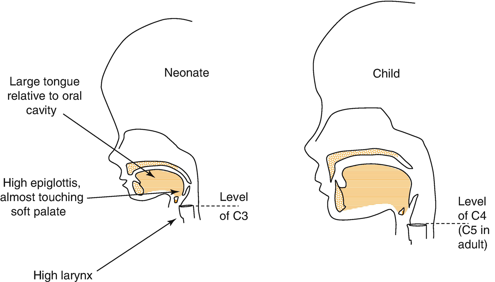

Fig. 4.1

Cross section of infant and child airway, showing anatomical changes that cause obligate nasal breathing (Modified from Isono, Pediatr Anesth 2006;16: 109–22 and Westhorpe, Anaesth Int Care 1987;15: 384–8)

The infant larynx is said to be funnel-shaped because when the vocal cords are widely abducted, its inlet tapers from the glottic opening to the smaller and almost circular cricoid ring. Although recent MRI studies suggest the narrowest part may be the glottis, this part of the airway is pliable and moves out of the way during intubation. The cricoid ring is the narrowest part of the airway until puberty and determines the size of an ETT in children. The cricoid is classically described as circular like a signet ring (because the posterior part is broader than the thin anterior part). It is however, slightly elliptical. Nevertheless, its almost circular shape means that a round ETT can usually make a sufficient seal without a cuff. Mucosal edema at the level of the cricoid is a concern in infants and young children. In a baby with a cricoid diameter of only 4 mm, even a small amount of edema over the cricoid greatly increases airway resistance and may cause post-extubation stridor (Fig. [4.2](#Fig2)).

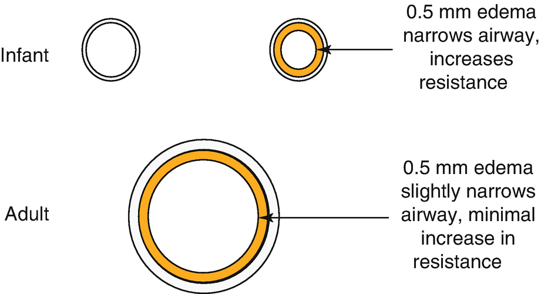

Fig. 4.2

A small amount of mucosal edema over the cricoid cartilage in the infant significantly narrows the airway diameter and increases airway resistance. The same edema in an adult does not significantly affect the airway

### Note

The larynx is higher in the neck of neonates and infants, making it appear more anterior at laryngoscopy.

### Keypoint

Airway trauma from intubation in a young child may cause edema and post extubation stridor in the short term, and subglottic stenosis in the long term.

## 4.2 Assessment of the Airway

Older children can be assessed as an adult would be, although the Mallampati score and thyromental distance tend not to be used because they are not validated in children. History is usually non-specific in routine cases, although symptoms of obstructive sleep apnea (OSA) may indicate adenotonsillar hypertrophy and more difficult mask ventilation. Younger children may not cooperate with a formal examination. Instead, they are observed for abnormalities of mouth opening and neck movement. Children differ from adults in that a child who is difficult to intubate will usually look difficult to intubate, whereas adults who are difficult to intubate may look normal. However, the unexpected difficult airway does exist and preparations for it need to be taken for any anesthetic.

The most important observation of the airway in children is the jaw size. A small jaw (retrognathia or micrognathia ) gives less space between the tongue and soft palate for a clear airway and less space to compress the tongue during laryngoscopy. It is the reason babies with Robin sequence can be difficult to intubate.

### Keypoint

Micrognathia is a common and important indicator of intubation difficulty. It makes direct laryngoscopy difficult because there is little room for the blade to compress the tongue and give a direct line-of-sight view of the vocal cords.

## 4.3 Upper Airway Obstruction

Anatomical differences predispose children to upper airway obstruction, and hypoxia may develop quickly because they have a high oxygen consumption and smaller oxygen reserve (lower functional residual capacity (FRC), higher closing volume).

### 4.3.1 Signs of Upper Airway Obstruction

The symptoms and signs of airway obstruction vary with the level and cause of obstruction and with the age of the child (Table [4.2](#Tab2)). Extrathoracic airway obstruction worsens during inspiration, and so inspiratory stridor and prolonged inspiration are the cardinal signs of upper airway obstruction. The pitch of the stridor may give clues to the location of the obstruction, as does the voice—a muffled voice indicates a supraglottic obstruction (for example, epiglottitis), whereas a hoarse voice or aphonia indicates glottic obstruction (eg laryngotracheobronchitis; croup).

Table 4.2

Signs of upper airway obstruction in children

| 
Signs of upper airway obstruction

 |
| --- |
| 

Inspiratory stridor and prolonged inspiration

Voice changes

 |
| 

Rocking chest and abdomen during breathing

 |
| 

Use of accessory muscles:

– Tracheal tug

– Flaring nostrils

– Intercostal chest retractions

 |
| 

Tachypnea and tachycardia

 |
| 

Anxious and restless initially, lethargic later

 |

Indrawing of the chest wall occurs during obstruction, especially in young children who have pliable, cartilaginous rib cages. Obstruction also causes a rocking paradoxical movement of the chest and abdomen—the abdomen moves outwards from descent of the diaphragm while the chest collapses inwards from negative intrapleural pressure. As obstruction worsens, the work of breathing increases and accessory muscles become active with flaring of the nostrils and tracheal tug. Initially, an awake child with airway obstruction is tachypneic and tachycardic. Eventually the child may tire and respiratory effort fades. Infants and neonates rapidly fatigue and may develop apneic episodes as a result of airway obstruction.

### 4.3.2 Site of Upper Airway Obstruction During Anesthesia in Children

In sedated or anesthetized children, loss of muscle tone in the airway reduces patency and narrows the entire upper airway. Most obstruction, however, is at the level of the soft palate and the epiglottis. In contrast, upper airway obstruction in adults occurs at the level of the base of the tongue from loss of tone in the genioglossus muscle. At either age, resistance during inspiration generates a negative airway pressure and worsens airway collapse.

## 4.4 The Mask Airway and Mask Ventilation

Many adult techniques are applicable for the management of a child’s airway. Always actively manage the child’s airway to learn the best way to obtain a clear airway in that child and to detect airway obstruction within a breath or two. Active airway management means holding the rebreathing bag and moving your hand gently with each breath, assisting the breathing and providing continuous positive airway pressure (CPAP) if needed.

### 4.4.1 Face Masks

Children have large cheeks and a relatively small nose bridge, resulting in their face being in one plane. This allows masks with a soft, flat cuff to form a seal—even a circular shape such as the Laerdal silicone resuscitation mask can be used. The cuff should be neither too soft nor too hard—soft enough to conform to facial contours, but not so soft that forming a seal is difficult and not so hard that the mask does not conform to the face. Adults have a more prominent nose bridge, and a contoured mask is needed to form a seal. Teenagers have a prominent nose bridge and may need an adult mask.

The size of the facemask should allow the mouth to be slightly open, but not cover the eyes—sit the top part of the cuff on the bridge of the nose and ensure the lower part sits in the mental groove on the chin. If the mask comes up onto the eyes or down onto the chin, it is too big. If an infant is settled with a soother or dummy in its mouth, sometimes a larger mask can be placed over the top of the soother during the early stages of induction, changing to a smaller mask later when the soother is removed.

### 4.4.2 Opening the Upper Airway

Table [4.3](#Tab3) outlines the most important maneuvers to open the upper airway. Mask ventilation during upper airway obstruction inflates the stomach. Gastric insufflation is common in young children when ventilation has been difficult, when no pressure relief valve is used on the circuit, or when the operator is not experienced in mask ventilating children.

Table 4.3

Summary of main airway maneuvers to obtain patent airway in a child

| 
Important airway maneuvers to overcome upper airway obstruction

 |
| --- |
| 

Head and neck position

 |
| 

Jaw thrust (not just chin lift)

 |
| 

CPAP

 |
| 

Oral (or nasal) airway

 |
| 

Positioning child on side may help

 |

### Tip

Gastric distension pushes the diaphragm upwards and inhibits ventilation. Remove the air by inserting a suction catheter through the mouth—suction may or may not be required.

#### 4.4.2.1 Head Position

Because the larynx is relatively high in a young child’s neck, flexion of the neck does not improve airway patency or the view at intubation—there aren’t enough cervical vertebral bodies above the larynx for flexion to have any effect. Children also have a relatively large head and don’t need a pillow to fill the gap between the back of the head and the bed. Instead, a head ring is used to stabilize the child’s head (Fig. [4.3](#Fig3)). Babies have an even larger head, and although a head ring alone is usually fine, occasionally a small roll under the shoulders may stop the neck from flexing. Flexion of the head of a neonate or baby may also cause airway obstruction. This is why it is often recommended that an infant’s head be in a neutral position. However, neonates and infants benefit from extension of the atlanto-occipital joint just as the older child does, provided extreme extension is avoided.

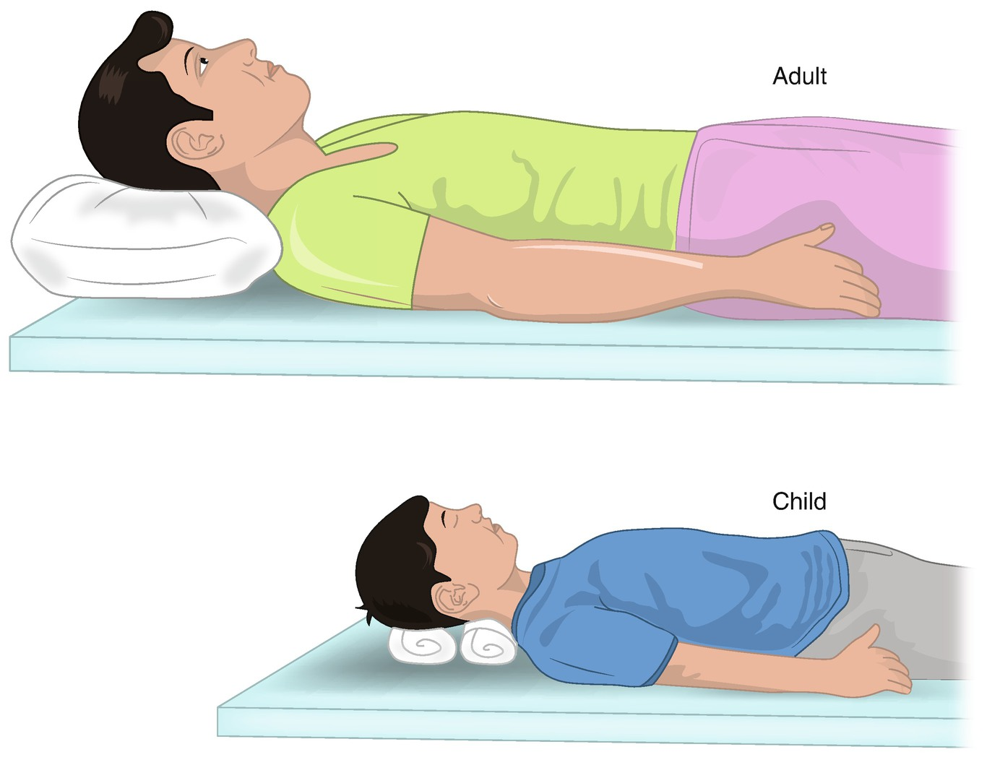

Fig. 4.3

Babies and children have a relatively large head, do not have a gap between the back of the head and their back, and do not need neck flexion for intubation. A head ring stabilizes the head and provides a suitable head position for intubation. Adults need a pillow to fill the gap and flex the neck to achieve the ‘sniffing’ position needed for intubation

### Note

Positioning for direct laryngoscopy is different in adults and children. Adults are placed in the ‘sniffing’ position (neck flexed, head extended). Children don’t benefit from neck flexion during intubation because their larynx is relatively high. Only extension of the atlanto-axial joint to tilt the head back is needed.

#### 4.4.2.2 Hand Position

In preschool children, the nasal passage is often blocked, making ventilation via the nose difficult. It is therefore important to hold the mouth open during mask ventilation. An oral airway can be used, but appropriate sizing is vital since it can irritate the airway and lead to respiratory adverse events or block the airway if the wrong size has been chosen. The most effective maneuvers to get an open airway are forward jaw thrust and CPAP. Jaw thrust can be achieved with the third or fourth (little) finger behind the angle of the jaw (Fig. [4.4](#Fig4)). Tilting the chin and head backwards is not as effective. It is important not to apply pressure to the floor of the mouth as this may compress the tongue against the palate.

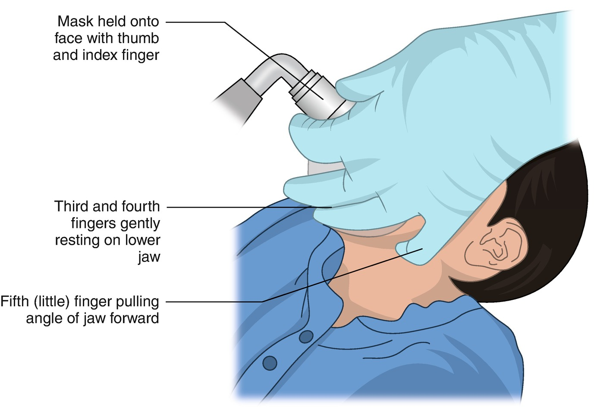

Fig. 4.4

Pulling the jaw forward is more effective than tilting the chin and head backwards. The fourth (little) finger is behind the angle of the jaw pulling it forwards while the mask is held by the thumb and index finger

### Tip

Try to hold the mask using a technique that incorporates jaw-thrust. This technique doesn’t force the mouth shut, doesn’t apply pressure to the floor of the mouth, and keeps one hand free for ventilation or CPAP. It avoids the need for a two-handed, two-person technique when difficulties arise.

#### 4.4.2.3 Oral and Nasal Airways

Oral airways may be useful, but are not routinely needed in children. The correct sized airway is chosen by measuring against the side of the face—with the flange at the level of the incisors, the tip should be adjacent to the angle of the mandible. If the airway is too small it is ineffective and if too large it may touch or fold down the epiglottis and cause obstruction or laryngospasm (Fig. [4.5](#Fig5)). Insertion of the airway at an inadequate depth of anesthesia can trigger laryngeal responses.

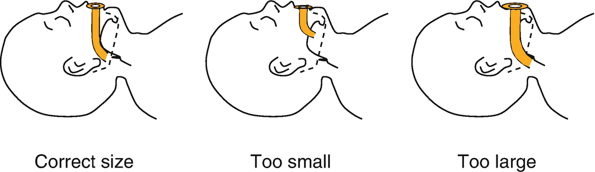

Fig. 4.5

Oral airway size selection. Correct size (left) sits over tongue and away from epiglottis. Too small (middle) is occluded by tongue, and may push the tongue backwards. Too large (right) may touch epiglottis and fold it down or trigger laryngospasm

Nasopharyngeal airways are occasionally used as they are better tolerated in the conscious patient. Small, soft nasopharyngeal airways are available, but some are too long if inserted fully with the collar against the nostril. The size of the airway is selected by matching its length to the distance between the nose and tragus of the ear. An alternative to a purpose-made made nasopharyngeal airway is a shortened, age-appropriate ETT taped or pinned in place so that it cannot migrate inwards or outwards, and labelled so that it is not mistaken for a tracheal tube. Position the nasal airway carefully so that it is just below the soft palate, but not touching the epiglottis. They can sometimes cause trauma and bleeding from the nose or adenoids.

#### 4.4.2.4 CPAP

Continuous positive airway pressure (CPAP) refers to a positive airway pressure maintained throughout spontaneous breathing. The aim is to keep the airway pressure positive during inspiration and stop collapse of the extra-thoracic part of the airway (Fig. [4.6a](#Fig6)). CPAP increases functional residual capacity, may reduce the work of breathing and improves oxygenation. It is a very important airway skill to learn, and is the technique needed during airway obstruction at induction or emergence.

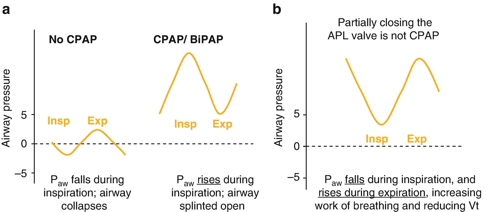

Fig. 4.6

Airway pressure during spontaneous ventilation. (**a**) Without CPAP (left curve), airway pressure becomes negative during inspiration and the extrathoracic airway may collapse and obstruct. In theater, CPAP is provided by gently squeezing the bag just before and during inspiration so that airway pressure is always above atmospheric pressure (right curve). (**b**) Some suggest CPAP by partially closing the adjustable pressure limiting (APL) valve, or partially occluding the T-Piece. When this is done, note that expiration is now the positive waveform, and airway pressure still falls during inspiration. Also, resistance to expiratory flow increases the work of breathing when the APL valve is partly closed. _Insp_ Inspiration, _Exp_ Expiration

### Keypoint

CPAP and jaw thrust are the most important maneuvers to learn to maintain an open airway in children.

### Tip: To Apply CPAP

Ensure you have an effective mask seal (use finesse, not force!) with one-handed jaw thrust.

Partially close the APL valve and keep the bag tight during the expiratory pause.

Feel the bag & watch the chest for the start of inspiration.

Gently squeeze the bag as soon as inspiration starts.

Squeeze gently, feeling for feedback that air has entered chest. If the bag is squeezed too hard before confirming this, the stomach might inflate.

Once you have the ‘feel’ for airway patency and respiratory rhythm, increase the bag squeeze and pressure support, and start to squeeze slightly before inspiration starts (anticipating when the next breath is about to start).

CPAP requires a circuit that can keep the airway pressure positive during inspiration. Simply closing the APL valve on a circle circuit or kinking the tail of a T-piece circuit does not produce CPAP (Fig. [4.6b](#Fig6)). The simplest method in practice is to gently squeeze the rebreathing bag at the very start of inspiration, keeping the bag slightly distended during expiration so that there is minimal lag between the start of the child’s inspiration and the bag producing a positive pressure. This technique is called CPAP, but is probably more correctly a manual form of pressure support ventilation. Some centers use the pressure-support mode of the anesthetic ventilator during induction.

#### 4.4.2.5 Difficult Facemask Ventilation

Unexpected difficult facemask ventilation is the commonest problem in clinical practice. Although imperfect technique, inadequate anesthetic depth and large adenoids and tonsils are the commonest causes, there are several others to consider (Table [4.4](#Tab4)). Difficult mask ventilation is resolved using the same steps as in adults: optimize the head position, open the mouth, and consider anesthetic depth, muscle relaxation and equipment issues. Then insert an oral airway, try an LMA or other SAD, and finally attempt intubation.

Table 4.4

Common causes of difficult facemask ventilation in children

| 
Common causes of difficult facemask ventilation

 |
| --- |
| 

Technique

 |
| 

Large tonsils and adenoids; obesity

 |
| 

Inadequate depth of anesthesia or paralysis

 |
| 

Laryngospasm

 |
| 

Congenital or pathological conditions

 |
| 

Alveolar collapse and reduced compliance

 |
| 

Air in stomach

 |
| 

Bronchospasm

 |

The first three are the commonest soon after induction

## 4.5 The LMA and Other Supraglottic Airway Devices

The LMA has become as popular in children as in adults for allowing a hands-free technique. Avoiding intubation of the easily irritated pediatric tracheobronchial tree confers additional benefits. There are fewer respiratory events during anesthesia in infants and children having minor elective surgery when an LMA is used rather than ETT (Fig. [4.7](#Fig7)).

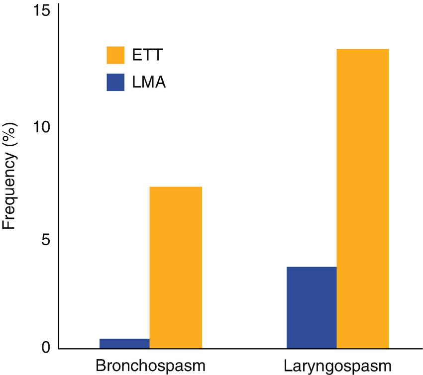

Fig. 4.7

The LMA is associated with a lower frequency of serious airway complications in infants older than 3 months and children. Data from Drake-Brockman TFE et al., Lancet 2017

### 4.5.1 Classic and Classic-Style LMA

The Classic LMA is a scaled-down model of the adult version, and disposable versions are available in pediatric sizes (Table [4.5](#Tab5)). The size 1 LMA tends to give a less reliable airway than the larger sizes, and the pre-formed second generation LMAs are superior to the classic model. Inflating the cuff to a pressure of 40 cmH2O gives the best airway seal in children with the least air leak and sore throat. Inflation of the cuff with a set volume or to a clinical end point causes hyperinflation and increases air leak and sore throat. If there is a leak around the cuff, deflation of the cuff or repositioning of the LMA have a higher rate of success than the often-performed additional inflation (which in turn leads to a stiffer cuff that does not mould to the pharyngeal shape). Insertion of sizes 2.5 and smaller can be straight-in as recommended by the manufacturer, or with a twisting, upside-down technique with a partially inflated LMA—similar to inserting a guedel airway. This rotational technique has a high success rate with the advantage of guiding the LMA tip past the tonsils and down behind the tongue without placing fingers in the patient’s mouth.

Table 4.5

Child weight and recommended LMA size

| 
Device size | LMA

Weight range (kg)

 |
| --- | --- |
| 

1 | 2–5

 |
| 

1.5 | 5–10

 |
| 

2 | 10–20

 |
| 

2.5 | 20–30

 |
| 

3 | \>30

 |

A clinically acceptable airway is obtained with the LMA in 92–99% of children (similar to adults), but the incidence of partial airway obstruction seen on fiberoptic assessment in children is up to 19% (higher than adults). In infants, the pharyngeal seal is not as good and there is a lower cuff leak pressure compared with older children. Malpositioning is more common with the smaller sizes of LMA, and is usually due to the epiglottis being caught within the LMA. Bilateral jaw thrust by a second person during insertion of the LMA improves positioning. The chest and abdomen sometimes have a rocking movement during spontaneous ventilation due to partial airway obstruction. Despite all of this, a clear airway is usually obtained with an LMA, although it is important to check that the tidal volume is adequate and that the child is not working too hard at breathing. Pressure support ventilation is usual nowadays with modern anesthesia ventilators.

### 4.5.2 Second Generation LMAs and Other Supraglottic Airway Devices

The first generation LMA is still commonly used in children because of cost, familiarity and good performance in clinical practice. However, there is good evidence second generation devices are superior, with the gastric channel being useful to release trapped air. The pediatric Proseal LMA® (PLMA) does not have the dorsal cuff of the adult sizes, and is not available in single-use versions. The iGel® is effective in infants and children, but there may be a large leak until the cuff warms, softens and conforms to the pharynx. It also has a tendency to migrate outwards, requiring extra taping or repositioning.

### 4.5.3 Removal of LMAs

LMAs are commonly removed while the child is still deeply anaesthetized. A deeply anaesthetized child in the lateral position usually has a clear airway (unlike adults) and so there is less to gain from leaving the LMA in situ in PACU. Although it is clear awake removal is better in adults, in children it is not so certain and studies point either way, partly because of differences in definitions of ‘awake’, or of complications. There is little difference in the incidence of laryngospasm if the LMA is removed deep or awake in healthy children. However, in children with increased bronchial hyper-reactivity or those with risk factors for respiratory adverse events, deep removal is superior to avoid complications. The experience of PACU staff must be considered before planning to leave the LMA in for later awake removal. If removing deep, the child should be in the lateral position. If awake, the child should be very awake, defined by Archie Brain as being after the onset of swallowing and when the child is either able to open the mouth to command or expel the LMA spontaneously.

## 4.6 Laryngoscopes

There are several blades for direct laryngoscopy available for children. However only two are needed for routine anesthesia in children—the size 1 Miller blade for neonates and infants, and the size 3 (adult) Mac blade for children.

### 4.6.1 The Miller Blade

The Miller blade is a straight blade for neonates and infants up to about 18 months. It is the classic blade for neonates because of their small mouth, high larynx and floppy epiglottis. Size 1 is the most commonly used size, and size 0 is best for neonates weighing less than about 1 kg. The technique requires some practice, and is outlined in Table [4.6](#Tab6). Common mistakes are failing to control the tongue and sweep it across to the left (same as when using a Mac blade), and failing to get the blade out of the corner of the mouth, so the ETT has to almost be passed down the bore of the Miller blade, blocking the view. Although the classic technique with the Miller blade is to lift the epiglottis directly, it is usually adequate to lift it indirectly, like a Mac blade, and use laryngeal pressure if needed to improve the view. This technique was described by Miller himself, and perhaps has the advantage of causing less stimulation during laryngoscopy.

Table 4.6

Tips for using the Miller blade in infants and neonates

| 
Technique for using the size 1 Miller blade in neonates

 |
| --- |
| 

Insert blade in right corner of mouth and sweep tongue swept across to the left

 |
| 

Look in the mouth as you gently advance the blade

 |
| 

Get the blade out of the corner of the mouth and have your assistant retract the right corner of the mouth

 |
| 

Lift the epiglottis indirectly and use external laryngeal pressure

 |

### Note

The infant Miller blade was first described in 1946 by RA Miller (NOT RD Miller of _Miller’s Anesthesia_). Free full text of the original description online. Anesthesiol 1946;7: 205.

### 4.6.2 The MacIntosh Blade

The adult size 3 MacIntosh blade is suitable for children of all ages, including older infants. In small children, only the thin, distal part of the blade is inserted, leaving plenty of room in the mouth. Small MacIntosh blades are available but are only scaled down adult blades without proper adjustment of their proportions. If these small blades are used for intubation, the thick part of the blade is in the mouth and takes up more space. They also have a significant curve requiring more mouth opening and force to obtain a direct line of vision. The size 1 MacIntosh and Miller blades have been shown to give an equivalent view in infants as young as 3 months. Although the Mac blade is tempting to use because it is familiar, the Miller blade is needed for neonates, so it is best to gain experience with it on larger infants as well.

### Tip

Most children are easy to intubate. If the cords are not clearly seen, resist pulling harder- use external laryngeal pressure (the ‘three-handed’ intubation technique).

### 4.6.3 Videolaryngoscopes

The Storz CMAC and McGrath videoscopes are available in pediatric sizes and have a familiar shape and technique for use. Their role in routine airway management is growing, and their role in difficult airway management is discussed later. It would seem reasonable nowadays to routinely use a videoscope with a Miller or Mac-shaped blade for intubation of all neonates and infants, to get the best view and to avoid the occasional awkward intubation using direct laryngoscopy.

## 4.7 Endotracheal Tubes

Although uncuffed endotracheal tubes (ETT) were traditionally used in pediatric anesthesia, cuffed ETTs are now routinely used in many centers.

### 4.7.1 Cuffed Endotracheal Tubes

Cuffed ETTs are now routinely used in pediatric anesthesia because of their advantages over uncuffed ETTs (Table [4.7](#Tab7)). The main advantages are the absence of leak and the benefits for ventilation and its monitoring, and the reduction in tube changes when the wrong sized uncuffed tube is initially selected. Cuffed tubes were traditionally avoided because of concerns about trauma and edema of the mucosa of the cricoid ring, but these concerns have been minimized with modern design and materials. Despite the advantages of cuffed tubes, there are still situations when uncuffed tubes are needed (Table [4.8](#Tab8)).

Table 4.7

A dvantages and disadvantages of cuffed and uncuffed ETTs in children

| 
Type of ETT | Advantages | Disadvantages

 |
| --- | --- | --- |
| 

Cuffed | No leak

– less pollution

– able to monitor tidal volume

– able to apply PEEP

Reduced laryngoscopies for ETT size change

Lower incidence sore throat | Smaller ID, increased resistance and blockage

Need to monitor and adjust cuff pressure

Maximum cuff pressure of 20 cmH2O used

Different cuff type, position and ETT OD between manufacturers

Slightly more expensive

 |
| 

Uncuffed | Long safety record

No problems with cuff position between manufacturers | Leak

– pollution

– problems applying PEEP

– problems measuring ETC02 and tidal volume

?Risk of aspiration (at least in ICU)

May require two or more laryngoscopies to select correct tube size

 |

_ID_ internal diameter, _OD_ outside diameter

Table 4.8

Even though cuffed ETTs are routinely used, uncuffed ETTs still have a role in certain clinical situations

| 
Role of uncuffed tubes in contemporary practice

 |
| --- |
| 

‘Sizing’ airway diameter in suspected subglottic stenosis

 |
| 

Neonates <3 kg

 |
| 

Some difficult airways where larger ID facilitates use of fiberscope

 |
| 

Children with croup

 |

However, cuffed tubes are not without problems. Firstly, sizing of a cuffed tube requires thought and careful technique. The internal diameter of a cuffed tube is smaller than an uncuffed tube to allow for the diameter of the cuff. In general, the correct sized ETT is calculated with the Motoyama formula:

For children 2 years and older: _**Internal diameter of cuffed ETT (in mm) = age/4 + 3.5**__._

However the formula does not calculate the correct size for every child. Sometimes the bulky cuff of the ETT will not pass through the cricoid ring. It is obvious when this is the problem—the tip of the ETT passes through the cords but then won’t advance. Passing the bulky cuff has the potential to traumatize the mucosa of the cricoid ring, and it is best to downsize 0.5 mm. There is a formula for tube size using 3.0 rather than 3.5, but it may result in tubes a little small for some children.

Secondly, cuffed pediatric tubes from different manufacturers have different specifications, so the external diameter of tubes with the same ID can be different. The Microcuff ® brand is thin-walled and has a smaller outside diameter than other brands. For this reason, a Microcuff tube larger than another brand’s tube can sometimes be used (Table [4.9](#Tab9)). Also, tubes from different manufacturers have different cuff positions and markings in different positions along the shaft (Fig. [4.8](#Fig8)). The position of the cuff on the tube is important—the cuff must sit below the cricoid while the tip of the tube is above the carina.

Table 4.9

Table showing cuffed ETT sizes for infants and young children

| 
Child’s age | Cuffed ETT ID (mm)

 |
| --- | --- |
| 

ETTs with standard, thick walls | Microcuff ETTs (Salgo formula)

 |
| --- | --- |
| 

<6 months | 3 | 3

 |
| 

6 to <12 months | 3 | 3.5

 |
| 

12 to <18 months | 3.5 | 3.5

 |
| 

18 months to <2 years | 3.5 | 4

 |
| 

2 to <3 years | 4 | 4

 |
| 

3 to <4 years | 4 | 4.5

 |
| 

4 to <5 years | 4.5 | 4.5

 |

The Microcuff® brand of ETT has a thin wall and low-profile cuff with a smaller outside diameter compared to other tubes, affecting the age range for different sized tubes. (Based on Salgo B. Acta Anaesthesiol Scand 2006;50: 557–61)

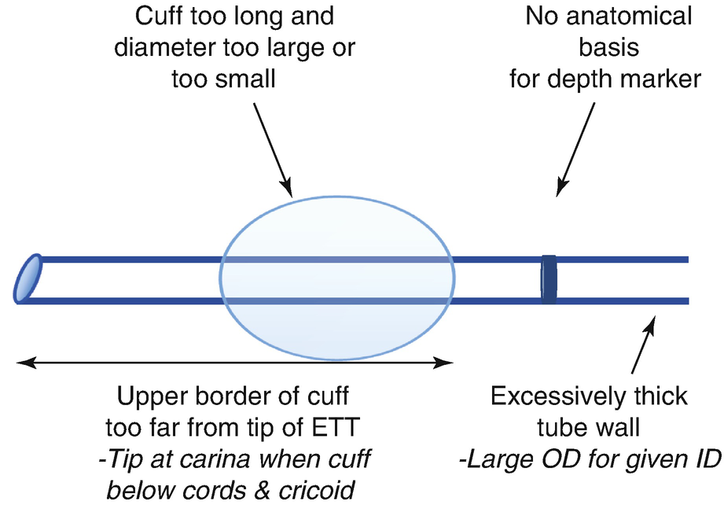

Fig. 4.8

Common design problems of many commercially available cuffed endotracheal tubes for children

Finally, the internal diameter of a cuffed tube in any given child is at least is 0.5 mm smaller than the uncuffed equivalent for that child. This is not usually a problem unless the child is breathing spontaneously through the tube for a prolonged duration. However, in neonates the difference between a 3 and 3.5 mmID is significant in terms of resistance, susceptibility to blockage or kinking, and ease of suctioning.

### 4.7.2 Uncuffed Tubes

Uncuffed tubes can be used in children because the narrowest part of the airway is the almost-circular cricoid ring, where the tube makes a seal. In adults, the narrowest part of the airway is the glottic opening between the vocal cords, and any tube able to pass through is too small to make a seal at the cricoid—so a cuff is needed. A small leak around the ETT in children is used as a surrogate indicator that there is not excessive pressure on the mucosa overlying the cricoid. However a leak does not entirely exclude mucosal pressure—the slightly elliptical shape of the cricoid allows some pressure from the ETT against the lateral walls of the cricoid. Nevertheless, uncuffed ETTs have a long record of safe and satisfactory use. Aspiration around them is rare, and there is a very low risk of post extubation edema and stridor.

#### 4.7.2.1 Uncuffed ETT Size

Tube size is based on age, and to a lesser extent, weight. A term baby will need a 3.5 or 3.0 ETT, depending on size (Table [4.10](#Tab10)). The size of ETT increases during infancy until around 2 years, when the modified Cole formula is used for the initial ETT:

Table 4.10

Initial ETT size and depth selection

| 
Age | Initial UNCUFFED ETT size (ID, mm) | Initial CUFFED ETT size (ID, mm) | Insertion depth Oral (cm) | Insertion Depth Nasal

 |
| --- | --- | --- | --- | --- |
| 

Neonate <1 kg | 2.5 | – | 5–6 | 6–7.5

 |
| 

Neonate | 3 | – | 7–9 | 9–11

 |
| 

Term baby <3 kg | 3 | – | 9 | 9–11

 |
| 

Term baby >3 kg | 3.5 | 3 | 9 | 11

 |
| 

6 months | 4 | 3.5 | 10–11 | 12–14

 |
| 

18 months | 4.5 | 3.5 | 11–12 | 14–15

 |
| 

2 years+ | Age/4 + 4 | Age/4 + 3.5a | 12 + Age/2 | 15 + Age/2

 |
| 

9–11 years | 6.5 | 6b

 |   |   |
| 

\>10 | – | 6+

 |   |   |

The final ETT size required may be different and the insertion depth should be adjusted to ensure bilateral air entry

aCare should be taken to judge whether the cuff is too large to pass through the cricoid ring

bThe cuffed 6.0 ETT has a very bulky cuff that may be held up at the cricoid even though the formula predicts it is the correct size

For children 2 years and older: _**Internal diameter of UNcuffed ETT (in mm) = 4 + age/4**__._

The calculated size is usually rounded up if the child is large for their age. It is often worth rounding down if the child has had a recent URTI. Some would use 4.5 rather than 4 in the formula because of the trend towards children being larger for age in western societies, but this is not common practice. In any event, the formula calculates only the initial, most likely size, hence the rule is to always have an ETT one size smaller and larger available. Once a child reaches puberty or around the age of 10–12 years, uncuffed ETTs are rarely used.

The formula calculates the internal diameter of the ETT. However, the external diameter forms the seal in the airway. The external diameter for any given internal diameter varies slightly between manufacturers, between standard ETT and preformed ETT’s, and particularly with armored (reinforced) ETTs which have a significantly larger external diameter than a plain ETT.

Children who are very small for age (eg cerebral palsy or other chronic illness) often still have a larynx that is a normal size for their age—although the child may look small, they often require the same sized ETT based on their age. However, the depth of insertion is likely to be less than usual in these children.

The size of the ETT is assessed during insertion. It is gently passed through the vocal cords, feeling for resistance at the subglottic, or cricoid, level. If gentle pressure does not allow the tube to pass, a smaller tube should be selected.

### Note

ETTs that are one size smaller and larger than the initial size should always be available. It is important the ETT should be the correct size—one allowing effective ventilation, use of PEEP and correct depth of insertion.

#### 4.7.2.2 Depth of Insertion of the ETT

At intubation, the depth of the tube is adjusted so it will neither fall out nor enter the right main bronchus. Intubation marks on the tube vary widely between different manufacturers and are often unsuitable. Microcuff tubes are more anatomical and have accurate markings. When cuffed tubes are used, the cuff needs to be below the cricoid cartilage. There are many formulae for insertion depth. A formula for cuffed tubes is:

A formula for cuffed or uncuffed oral tubes is:

On a supine CXR the tip should be more than 1 cm above the carina (0.5 cm in infants) and more than 1 cm below the cricoid (0.5 cm in infants). A simple way to position the depth is to watch the cuff pass just beyond the cords and note the measurement at the lips. Tables of suitable lengths are also available.

#### 4.7.2.3 No Leak Around the ETT

After intubation, ventilation is performed while listening for a leak around the uncuffed ETT (classically at a pressure of 20 cmH2O). If there is no leak, the tube would usually be changed for one that is 0.5 mm smaller.

#### 4.7.2.4 Excessive Leak Around the ETT

Another common problem is an excessive leak around the ETT, typically at pressures less than 15 cmH2O. A large leak can be heard or felt and the rebreathing bag may not fill adequately between positive pressure breaths after intubation. The leak is too large if a sustained pressure cannot be held without the rebreathing bag collapsing while being squeezed. Changing to a larger ETT would then be appropriate, as an excessive leak causes problems with ventilation, interpretation of the capnogram, application of PEEP and theater pollution.

### Note

The same sized ETT is used for both oral and nasal intubation in children—the narrowest part of pediatric airway is the cricoid cartilage. Adults have large turbinates and need a smaller nasal ETT.

### 4.7.3 Oral and Nasal Preformed Tubes

Preformed , curved tubes such as the RAE (Ring, Adair, Elwyn) tube are often used in children for head and neck procedures. They are available in oral and nasal (north-facing) types. Although the preformed shape reduces kinking, their length in the trachea is determined by the position of the curve at the lips or nose, rather than by positioning under direct vision. Furthermore, various brands of tubes differ in length which does not increase proportionally with size. All of these factors increase the incidence of endobronchial intubation. Oral (south-facing) RAE tubes can be more difficult to pass through the vocal cords—tips to help are in Fig. [4.9](#Fig9). Nasal RAE tubes are discussed in more detail in Chap. [18](467929_2_En_18_Chapter.xhtml), Sect. [18.​1](467929_2_En_18_Chapter.xhtml#Sec1).

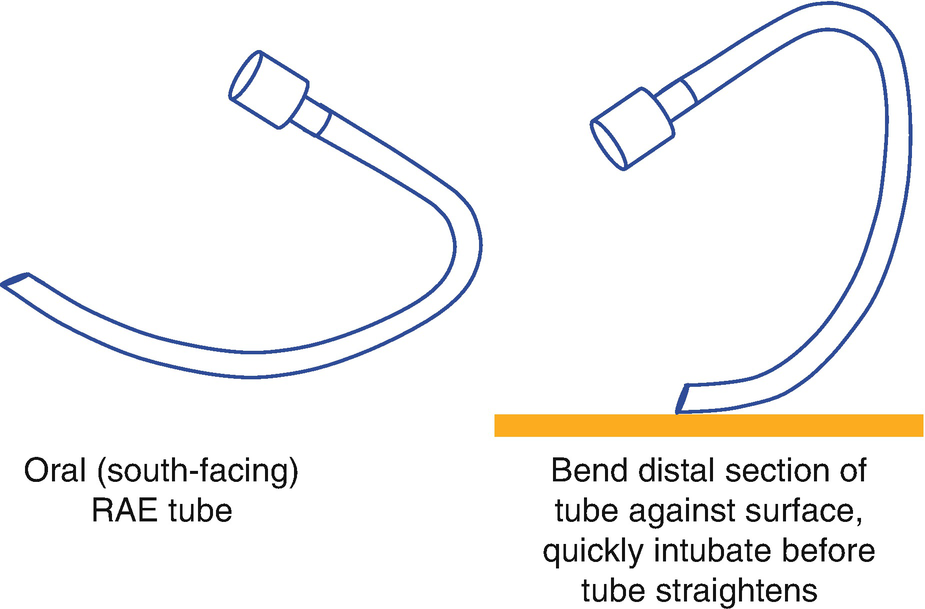

Fig. 4.9

Often, the distal part of the RAE tube ‘out of the packet’ has lost the curve which allows easy alignment with the laryngeal opening, resulting in the tip getting stuck on the posterior commissure. Re-establish the curve by bending the tip against a flat surface and quickly intubate before the tube straightens

### Note

Preformed ETTs are more likely to cause endobronchial intubation, especially if a larger size than usual for age has been used to prevent an excess leak, or if the neck has been flexed.

A gauze pad can be placed between the chin and ETT to pull the RAE tube outwards slightly if it is endobronchial.

### 4.7.4 Suction Catheters for the ETT

The correct size catheter is needed when suctioning pediatric ETTs. During suctioning, room air is entrained through the open end of the ETT and around the suction catheter. If the catheter is too large there is not enough space around it for air to pass and the tracheobronchial tree and lungs are exposed to negative pressure, possibly collapsing them. The correct size of the catheter (in French gauge) is twice the internal diameter of the ETT (eg 4.0 ETT, 8F catheter).

## 4.8 Intubation

Intubation in children is usually straightforward. The best view at laryngoscopy is achieved by extending the atlanto-occipital joint while keeping the head on a flat surface, stabilized by a head ring. With the high laryngeal position in children up to 4 years, there is no cervical spine above the larynx to flex and flexing the neck forwards like in adult intubation does not help.

### 4.8.1 What to Do When the Tube Won’t Pass

Occasionally, the vocal cords can be seen but the ETT won’t pass beyond them. The tube is usually being held up at the cricoid ring because the ETT is too large. Do not force the tube—the cricoid will be traumatized and become edematous, causing stridor post op. The first step is to try a smaller ETT which is sometimes needed and does not indicate pathology. Rarely, even a much smaller ETT won’t pass beyond the cords, and this may suggest subglottic stenosis—narrowing of the trachea just below the vocal cords, most commonly caused by intubation in the neonatal period. Options are gentle intubation with a smaller ETT, using an LMA or postponing surgery. The concern is that repeated attempts at intubation will cause subglottic edema and airway obstruction, especially in infants and young children. It would be prudent to give dexamethasone 0.5–0.6 mg/kg IV if there is concern about airway edema from intubation attempts, and arrange referral to an ENT surgeon for diagnostic bronchoscopy.

### 4.8.2 Intubation vs LMA in Neonates and Small Infants

There are advantages and disadvantages in managing a baby’s airway with an LMA during anesthesia. The LMA avoids problems related to intubation, but there are several concerns about a small baby breathing spontaneously through an LMA. Firstly, the size 1 LMA does not always give a reliable airway in neonates. Furthermore, the distance between the child’s airway and operative site is short, and it can be difficult to manipulate the airway during the case if any problems arise. Thirdly, there may be a leak around the LMA that prevents maneuvers to maintain end expiratory lung volume, or causes gastric inflation. Finally, spontaneous ventilation means that the deadspace, resistance and work of breathing from the circuit must be considered. Using pressure support ventilation or manually assisting the baby’s respirations can overcome most of these problems.

For these reasons, endotracheal intubation is commonly used for anesthesia in neonates and small infants. An LMA may be selected if the case is brief (less than 60 min), there are no other factors compromising respiration, and the anesthetist is able to adeptly and swiftly manipulate the airway if any problems occur. Generally in infants and young children, there are fewer respiratory events during in the perioperative period in those having an LMA rather than an ETT (Fig. [4.7](#Fig7)).

### 4.8.3 Intubation Without Muscle Relaxants

Acceptable intubating conditions in children are more frequently achieved when a muscle relaxant is used. However, muscle relaxants are not always needed and have their own side effects and problems. In young children, intubation without relaxants is easily achievable—their tissues are more elastic, volatile agents provide adequate muscle relaxation and quickly reach high concentrations, and larger doses of volatile agents can be used with less concern about cardiovascular depression. About half of pediatric anesthetists intubate without relaxants, so the advantages and disadvantages of the technique are debated (Table [4.11](#Tab11)). Even if relaxants are used, their action is potentiated by volatile agents in children so doses equivalent to the ED95 dose are sufficient (eg 0.3 mg/kg rocuronium, 0.25 mg/kg atracurium).

Table 4.11

Advantages and disadvantages of intubating without muscle relaxants in children

| 
Advantages | Disadvantages

 |
| --- | --- |
| 

Gives good intubating conditions in most children | Not ideal conditions

 |
| 

Muscle relaxation not needed for most surgery | Reduces blood pressure

 |
| 

Avoids relaxant and reversal agent side effects | Increased hoarseness and vocal damage in adults (unknown in children)

 |
| 

Useful for brief cases requiring intubation

 |   |

#### 4.8.3.1 Deep Sevoflurane

An end tidal concentration of sevoflurane of 4–4.5% is required for successful intubation. Nitrous oxide and fentanyl reduce the concentration required. The technique is improved by giving propofol 3 mg/kg after induction. A milliliter or two of lidocaine syringed distal to the tongue base followed by brief face mask ventilation reliably results in local anesthetic coating the larynx, further improving intubating conditions. Non-relaxant techniques using deep anesthesia will decrease blood pressure and are not suitable for children at risk from hypotension.

#### 4.8.3.2 IV Agents

Propofol 3–4 mg/kg with alfentanil 10–15 μg/kg (or remifentanil 2–3 μg/kg, although bradycardia is a concern) give satisfactory intubating conditions in most children. Higher doses of remifentanil increase the success rate but also increase the incidence of bradycardia and hypotension. Propofol alone is not usually adequate.

## 4.9 Extubation

Extubation awake or under deep anesthesia has the same advantages and disadvantages in children as in adults. However, many PACU staff are less familiar dealing with children and this should be considered if leaving an unconscious child in recovery. If deep extubation is performed in a young child, it is best for the anesthetist to personally monitor the child until awake (remembering that the anesthetist is ultimately responsible for the patient’s airway in PACU).

Neonates and infants are usually extubated wide awake to avoid laryngospasm, which quickly causes hypoxia and bradycardia in small babies. An infant is ready to be extubated when it is breathing regularly, neither breath-holding nor having apneas, and is moving the limbs semi-purposefully. While in well children there is no difference between deep and awake extubation, deep extubation is beneficial in children with risk factors for respiratory adverse events, particularly those with an upper respiratory tract infection or asthma.

### Tip

When anesthesia is lightened for extubation, young children may suddenly cough, strain, develop chest wall rigidity and either not breathe effectively or become hard to ventilate with high airway pressures. Cyanosis may develop. Infants and young children are especially prone because of their hyperactive airway reflexes. It can be frightening having a small, blue infant that you cannot ventilate through the ETT.

The solution is to hand ventilate with 100% oxygen while eliminating other causes (Table [4.12](#Tab12)). Keeping the rebreathing bag small helps to judge compliance and effectiveness of positive pressure breathing. Watch the chest closely for expansion, looking for pauses between coughs or strains when ventilation can be achieved. It is useful to keep the bag tightly distended and ready to squeeze so that there is minimal lag in achieving a positive pressure and any short gaps between coughs are not missed. If needed, deepen anesthesia with propofol 1–3 mg/kg or volatile agent, or paralyze.

Table 4.12

Differential diagnosis of causes of difficulty ventilating through ETT

| 
Causes of difficulty ventilating via ETT

 |
| --- |
| 

Emergence

 |
| 

Biting ETT

 |
| 

Obstructed ETT (secretions, blood, kinking)

 |
| 

Bronchospasm

 |
| 

Endobronchial intubation

 |
| 

Pneumothorax

 |

It is best to predict and watch for this ventilation problem in small children. Consider gently hand ventilating towards the end of the case to get the feel for the child’s compliance and instantly recognize a cough or change in respiration.

### 4.9.1 Biting on the ETT

Children have strong bite reflexes and are prone to bite the ETT before extubation. Some anesthetists will insert a guedel airway or gauze roll alongside the ETT to avoid this, but dental trauma is a concern. Usually there are gaps in the teeth preventing total occlusion of the ETT. If biting does obstruct the ETT, the jaws can be separated slightly using the thumb and first or second finger in a scissor action on the upper molars and lower incisors (Fig. [4.10](#Fig10)). This scissor action is also useful to prevent biting during pharyngeal suction before extubation. Rarely, biting may totally occlude the ETT, and hypoxia develops. A small dose of propofol or even suxamethonium can be used to relax the jaw if an emergency. Children often pass through this ‘biting stage’ during emergence and then enter a ‘mouth-opening’ phase, which usually signals a safe time for extubation.

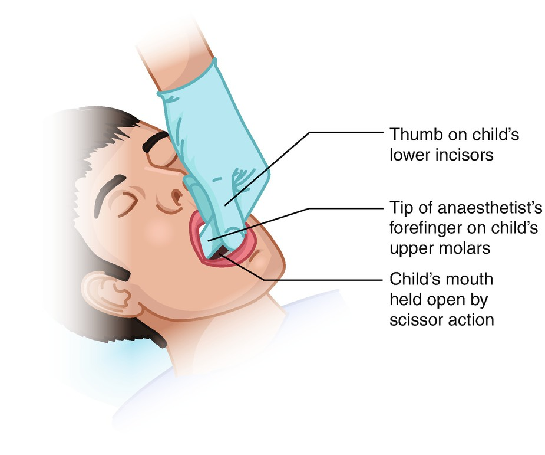

Fig. 4.10

Scissor action using forefinger and thumb to prevent the child biting the pharyngeal sucker and damaging teeth

### Tip

If the child is biting the ETT they are not ready for extubation. When sufficiently awake, the child will enter a ‘mouth opening’ phase, when it is safe to extubate.

### 4.9.2 Post Extubation Stridor

A croupy cough or inspiratory stridor is uncommon after anesthesia with modern endotracheal tubes. Post extubation stridor still occasionally occurs in small children. Contributing factors include intubation that is traumatic or with an ETT that is too large, movement of the ETT within the trachea during the procedure, and edema of at the level of the cricoid cartilage from surgery or pre-existing conditions such as an URTI. Management is detailed in the Chap. [1](467929_2_En_1_Chapter.xhtml) Sect. [1.​9.​2](467929_2_En_1_Chapter.xhtml#Sec25).

## 4.10 Tracheostomy Tubes

Unlike adults, most tracheostomies in children are long-term and are performed to bypass upper airway obstruction. The tracheostomy tube size is chosen according to the internal diameter using the same formula as for an ETT, although a smaller size may be used to facilitate speech. Different lengths are available so that endobronchial intubation does not occur. They are often uncuffed, and the leak around them may be too large to allow IPPV during anesthesia. For surgery, pediatric tracheostomy tubes are often replaced with a cuffed (usually reinforced) ETT after induction.

## 4.11 Laryngospasm

Laryngospasm occurs more frequently in children than in adults because of the child’s sensitive and reactive airway. It is usually easy to recognize and treat, but has the potential to cause morbidity and mortality if managed poorly. It is not a serious problem when managed early and quickly, and should not be feared. However, if poorly managed laryngospasm can bring the child to a bradycardic hypoxic arrest, may cause negative pressure pulmonary edema and will instill anxiety in parents about their child’s next anesthetic.

### 4.11.1 Definition

Laryngospasm is due to closure of the vocal cords. Supraglottic tissues may also contribute—there may be tilting of the arytenoids and epiglottis inward toward the glottis and closure of the false cords. Some argue that laryngospasm is an all or nothing phenomena and that there is no ‘partial’ laryngospasm. However, in practice there are varying degrees of severity and completeness that have implications for management.

### 4.11.2 Risk Factors

Some procedures and pre-existing conditions increase the risk of laryngospasm (Table [4.13](#Tab13))—current or recent URTI is a major risk factor. There is also no doubt that the risk of laryngospasm can be reduced by experience and attentiveness to the airway. Some preventative techniques have been suggested, but only propofol is useful in clinical practice (Table [4.14](#Tab14)).

Table 4.13

Factors affecting incidence of laryngospasm in children

| 
Risk factors for laryngospasm

 |
| --- |
| 

Patient

 Current or recent URTI within last 2 weeks

 Young age

 Passive smoking

 Asthma

 Nocturnal dry cough

 Wheezing during exercise

 History of hay fever or eczema

 Family history of asthma, eczema or hay fever

 |
| 

Procedure

 Blood or secretions in upper airway

 Shared airway

 Sudden surgical stimulation

 Emergence (compared to induction)

 |
| 

Technique

 Inhalational rather than IV induction

 Thiopentone rather than propofol as induction agent

 Desflurane as maintenance agent (lowest risk with propofol maintenance)

 ‘Light’ anesthesia, particularly during instrumentation of airway

 Invasive airway management (lowest risk with facemask and laryngeal mask airway)

 Probably no difference between ‘deep’ or ‘awake’ extubation

 |

Table 4.14

Techniques suggested to prevent laryngospasm

| 
Preventative method | Comments

 |
| --- | --- |
| 

‘Deep’ or ‘awake’ insertion and removal of device | Biting, coughing indicating anesthesia depth neither ‘deep’ nor ‘light’ enough

 |
| 

Pharyngeal suctioning then ‘pseudocough’ as ETT removed | Recommended

 |
| 

IV lidocaine | Effective for short time; exposure to potential toxicity

 |
| 

Propofol 0.5–1 mg/kg before removal of device. Perhaps more if anesthesia already ‘light’ | Only if planning ‘deep’ removal. Effective, also reduces emergence agitation. Recommended

 |

### 4.11.3 Mechanism

Laryngospasm is triggered by secretions or airway instrumentation stimulating the glottic and supraglottic mucosa. The resulting glottic closure continues after removal of the stimulation. This reflex closure can also be triggered by intense surgical stimulation in distant viscera. Propofol, and to a lesser extent sevoflurane, suppress laryngeal reflexes, contributing to their popularity in pediatric anesthesia. Although secretions on the vocal cords are thought to be a common cause, laryngospasm can also be caused by sudden surgical stimulation in the presence of inadequate anesthetic depth and analgesia (circumcision and anal dilatation are classic causes). Deep anesthesia reduces the likelihood of laryngospasm.

### 4.11.4 Clinical Presentation

The warning signs of impending laryngospasm are cough, breath holding and straining in inspiration and expiration. Signs of upper airway obstruction and inspiratory stridor may occur although total closure of the vocal cords is silent. Laryngospasm can develop over a period of time, but more often occurs instantly.

### Tip

A cough under anesthesia with a face mask or LMA is a warning sign of laryngospasm. Immediately deepening anesthesia with a bolus of propofol is worthwhile.

### 4.11.5 Management

Management depends on the severity of the obstruction and whether hypoxia is present. The first aim is to recognize and begin treatment before hypoxia develops so that there is more time to try basic maneuvers and assess options. The second aim is to resolve the laryngospasm reasonably quickly to avoid respiratory sequelae. Early treatment, using suxamethonium if appropriate, keeps the hypoxic period short (Fig. [4.11](#Fig11)).

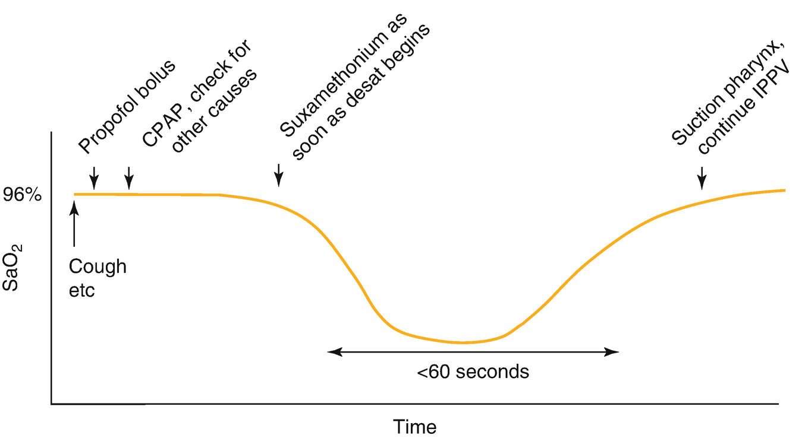

Fig. 4.11

A timeline of oxygen saturation during laryngospasm. A cough or signs of airway obstruction has been detected early, before desaturation. A bolus of propofol is given, then CPAP begun while also considering other causes of airway obstruction. If no breath has occurred, suxamethonium is given early, as soon as saturations begin to fall. Prolonged, severe hypoxia and bradycardia are avoided

#### 4.11.5.1 Jaw Thrust and CPAP with Oxygen

Initial therapy is jaw thrust and CPAP with 100% oxygen via a facemask—aim to assist any inspiratory effort by keeping the rebreathing bag tightly distended and ready to squeeze at, or even just before, inspiration. When there are minimal or irregular respiratory efforts, it may be worth keeping the bag distended and gently squeezing it at a rapid rate so that some oxygen will enter the lungs if the vocal cords partially relax and separate. Assisting inspiration in this way is often adequate therapy for partial laryngospasm. The stomach may distend with gas if vocal cord closure is complete and high pressure CPAP is used. If this happens, the stomach is aspirated when the laryngospasm has resolved.

#### 4.11.5.2 Propofol

Anesthesia can be quickly deepened with propofol. A bolus dose of 2–4 mg/kg can be given, depending on the severity of the upper airway obstruction and how lightly anesthetized the child is thought to be. This is reasonably successful and usually worth trying if hypoxia has not developed. However, it is not always successful and suxamethonium should always be at hand.

#### 4.11.5.3 Suxamethonium

Suxamethonium is always effective, and should be given if laryngospasm is causing complete airway obstruction and hypoxia. It should be given after airway maneuvers with or without propofol have been tried and when the oxygen saturation begins to fall. Even if IV suxamethonium is given when the saturation just starts to fall below 90%, the saturation will be very low by the time it has worked and mask ventilation is possible.

### Note

If the child is hypoxic from laryngospasm, it is too late to try a bolus of propofol.

The dose of suxamethonium to treat laryngospasm is 0.5–2 mg/kg IV. A small dose such as 0.1 mg/kg is able to relax the vocal cords. However, if only a small dose has been given there may then be doubt about whether enough has been given if the saturations are still not rising. By giving a larger dose of suxamethonium, this doubt is removed and the duration of paralysis is still only a few minutes. If laryngospasm occurs during a gas induction and there is no IV, IM suxamethonium is given once simple airway maneuvers have been tried. The dose is 4 mg/kg into the deltoid muscle. Although the peak effect by the IM route is 3 or 4 min, the vocal cords relax much sooner.

### Tip

Anesthetists become stressed about laryngospasm because they fear the consequences of hypoxia. Bail out early! The risk from suxamethonium is much lower than that of prolonged, severe hypoxia. Consider suxamethonium treatment early and when the oxygen saturation is in the low 90s and falling.

After giving suxamethonium, concentrate on watching the chest for expansion. Make sure that the chest is rising and falling and that the tidal volume is adequate. The saturation may stay low for a short while and cause some concern. However, the displayed reading is averaged over the last 12–15 s and is old data. It is best to watch the chest and concentrate on ventilation, being confident that if 100% oxygen is being given and ventilation is adequate, the saturation will improve.

After the saturations have improved and while the suxamethonium is still working, the pharynx is suctioned to remove any secretions that might irritate the larynx. If the stomach has been distended with gas, an orogastric catheter is inserted and the stomach aspirated. The aim is to do both of these things while the suxamethonium is working so that laryngospasm is not triggered again. Intubation is not routinely required in the treatment of laryngospasm, and it is reasonable to continue gentle mask ventilation until spontaneous respiration resumes. Intubation would be performed usually only if surgery has yet to be performed or if laryngospasm occurs a second time.

### Note

The aim during laryngospasm is to achieve mask ventilation with oxygen. Intubation is not mandatory.

Some anesthetists are reluctant to use suxamethonium to treat laryngospasm, or even pride themselves in not having to use it. The consequence of this approach is to bring some children close to cardiac arrest, creating stress for all concerned. Indeed, laryngospasm is the main respiratory cause of cardiac arrest in children. Although it has its side effects, suxamethonium is a safe drug. It has caused deaths from rhabdomyolysis in children with unrecognized myopathies, resulting in a ‘black-box’ warning in the US. This was at a time however, when suxamethonium was used almost routinely to intubate children. Infrequent use in situations such as laryngospasm has a low risk, and the risk of cardiac arrest or death from inadequately treated hypoxia is far greater than the risk from suxamethonium.

#### 4.11.5.4 Treatment of Laryngospasm When Suxamethonium Is Contraindicated

If suxamethonium is contraindicated, atracurium or rocuronium are alternatives. The laryngeal muscles are more sensitive than the diaphragm to neuromuscular blockade, so less than the intubating dose is effective and keeps the duration of blockade reasonably short. However the smallest effective dose has not been studied and is not known. The availability of sugammadex may make rocuronium more attractive in this situation, but the safety and effectiveness of this technique have not been studied.

### 4.11.6 Sequelae

Most children have no sequelae. The parents should be given a brief description of the problem and reassured that their child is usually not likely to have a problem with future anesthetics. Some children will be oxygen dependent for a few hours after they wake up, particularly if they have an underlying URTI. This is possibly due to loss of FRC and retention of secretions during the laryngospasm causing V/Q mismatch that resolves when the child wakes up, coughs and re-expands atelectatic segments. An alternative to bear in mind is the possibility of pulmonary aspiration of gastric contents or negative pressure pulmonary edema, though these are uncommon.

#### 4.11.6.1 Negative Pressure Pulmonary Edema

This is an uncommon problem usually due to prolonged upper airway obstruction from laryngospasm that has not been quickly resolved. The signs and symptoms are the same as for pulmonary edema in adults. Treatment is observation, IV frusemide and CPAP.

## 4.12 The Child with a Difficult Airway

Management of children’s airways is often mildly difficult, or ‘awkward’ as a result of imperfect technique or inadequate anesthesia, or anatomical changes associated with young age (Fig. [4.12](#Fig12)). Difficult airways due to pathology or syndromes are rare, and a child with a difficult airway usually looks difficult. Unless they are in a rare group with an isolated glottic or subglottic lesion, children with a difficult airway usually have syndromal or abnormal facies that alert the anesthetist (Table [4.15](#Tab15)). There are many different anesthetic approaches and equipment choices for these children. Usually, younger children will not tolerate awake techniques and so intubation is performed under general anesthesia.

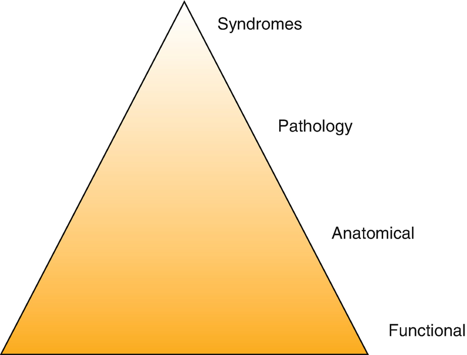

Fig. 4.12

Functional causes of difficult mask ventilation include “light” anesthesia, excitation during sevoflurane induction, poor head position or technique, and laryngospasm. Anatomical causes include obesity, tonsillar hypertrophy and the neonatal airway. Causes due to pathology and syndromes are less common

Table 4.15

Facial syndromes associated with a difficult airway

| 
Condition | Main cause of difficulty | Airway change with growth

 |
| --- | --- | --- |
| 

Robin Sequence | Micrognathia | Improves

 |
| 

Goldenhar (hemifacial microsomia) | Asymmetrical micrognathia

Vertebral abnormalities may limit neck movement | Worsens

 |
| 

Treacher Collins | Micrognathia, small mouth, funnel-shaped larynx | Worsens

 |
| 

Apert syndrome | Micrognathia, mid face anomalies | Worsens

 |
| 

Hunter and Hurler syndromes | Deposition of mucopolysaccharides in tongue and larynx | Worsens

 |

Children with a difficult airway who are younger than 1 year or smaller than 10 kg have more complications than older children. Most children with a difficult airway, and certainly young children with a difficult airway, need to be managed in a specialist center. Management of unexpected difficult mask ventilation and unexpected difficult intubation follow guidelines from professional organizations (Tables [4.16](#Tab16) and [4.17](#Tab17)). There is some evidence supporting making only three attempts at laryngoscopy rather than the currently suggested four.

Table 4.16

Management of unexpected difficult intubation in children

| 
Management of unexpected difficult intubation

 |
| --- |
| 

1 | Four or less attempts at laryngoscopy

– optimize position and technique

– consider videolaryngoscope

 |
| 

2 | LMA or other SAD

 |
| 

3 | Face mask ventilation, reverse paralysis, wake patient

 |
| 

4 | CICO pathway

 |

Based on DAS/APA guidelines 2015

Table 4.17

Glidescope blade size for children is based on weight

| 
Weight | Glidescope blade size

 |
| --- | --- |
| 

<1.5 kg | 0

 |
| 

1.5–3.6 | 1

 |
| 

1.8–10 | 2

 |
| 

10–28 | 2.5

 |
| 

\>10 kga | 3

 |

aThe camera position with the size 3 blade may be too proximal in some children at the lower end of the weight range

### Keypoint

Consider management in specialized centers for children, especially young children, with difficult airways.

### 4.12.1 Induction of the Child with a Known Difficult Airway

I nhalational induction with an IV in situ is the commonest technique for this group of patients. This gives a gradual induction during which the airway can be assessed—the facemask seal and ability to generate pressure within the breathing circuit can be checked; the ‘feel’ of the child’s jaw and effects of head position can also be assessed, and gentle CPAP tried. Strategies to assist achieving a patent airway after consciousness is lost include CPAP, placing the child in the lateral position and insertion of an oral or nasal airway. Applying CPAP and gently assisting ventilation is useful at this stage. Although traditional teaching is not to assist ventilation in this manner, it deepens anesthesia more quickly and takes the child through the lightly anesthetized, partially obstructed stage all children pass through. It also allows the anesthetist to assess the airway patency, the effectiveness of gentle ventilation, and positions or strategies that improve or worsen airway patency. Finally, it provides information to help the anesthetist to decide if paralysis can be used for intubation. Classically, only simple chin lift and jaw thrust are used during induction of a child with a difficult airway, but these provide little information to the anesthetist about the child’s airway.

### Tip

Gentle CPAP and inspiratory support during inhalational induction is a useful strategy to assess and improve the difficult airway.

### 4.12.2 The LMA

The LMA has a central role in the management of the child with a difficult airway. It gives a good or adequate airway in a large proportion of children with syndromes and other abnormalities, and is a common way of facilitating fiberoptic intubation. The LMA bypasses the problem such as jaw and tongue in Robin sequence, and often gives an adequate seal in the laryngopharynx of children with other conditions causing a difficult airway. Using an LMA for anesthesia in children with a known difficult airway has been shown to be a safe and useful strategy to avoid intubation for many procedures. However such a technique does require an assessment of the adequacy and security of the airway, the likely risk of airway obstruction during the procedure and how this would be managed.

### 4.12.3 Intubation

There are many different laryngoscopes available for endotracheal intubation. As in adults, multiple attempts at intubation increase complications in children. Direct laryngoscopy must be abandoned after no more than four attempts. If the child has a known or suspected difficult airway, direct laryngoscopy is a poor first choice for intubation and has a low success rate. A videolaryngoscope or fiberoptic technique should be used for the first attempt at intubation.

### Note

Direct laryngoscopy should not be used as the first technique when a child is suspected or known to have a difficult airway—the first-attempt success rate is less than 5%.

#### 4.12.3.1 Videolaryngoscopes

Although standard-shaped blades are adequate for normal or ‘awkward’ intubations, hyperangulated blades are needed for difficult intubations. Videoscopes with a pediatric, hyperangulated blade (CMAC D Blade Ped, Glidescope, McGrath X-blade and AirTraq) require a technique that must be practised. An introducer is used to shape the ETT before insertion, as the manufacturer’s stylets are too large for children. The recommended blade size of the Glidescope for different weights is shown in Table [4.17](#Tab17). The position of the camera on the blade relative to the larynx is important, with some work suggesting a Glidescope blade one size smaller than the size based on weight can be used to improve the view of the larynx. Some children with a difficult airway will still require a fiberoptic scope as a first technique (Fig. [4.13](#Fig13)).

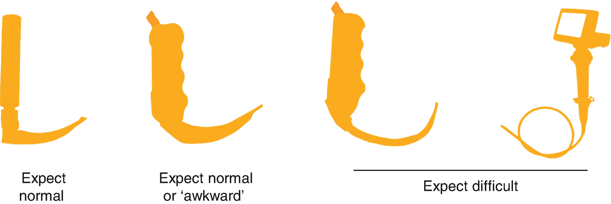

Fig. 4.13

A normal-shaped videolaryngoscope blade is satisfactory for routine or mildly difficult (‘awkward’) intubations, but difficult intubations need a hyperangulated blade or fiberoptic technique

### 4.12.4 Fiberoptic Intubation

Fiberoptic scopes are available in a range of pediatric sizes, including those small enough for neonates. They are passed either through a second generation LMA (via a Bodai swivel connector so that anesthetic gases can continue to be given) or through a special bronchoscopy facemask with a port for the scope to pass through. When a small diameter scope is available, an ETT (without its connector) can be rail-roaded over the scope into the trachea. If only a large scope is available, an indirect technique can be used by passing a guidewire through the suction channel into the trachea. The ETT is then passed over an airway exchange catheter. The indirect technique is difficult and has many potential problems.

The commonest technique for fiberoptic intubation in young children is general anesthesia and topicalization of the airway, followed by insertion of an LMA or other supraglottic airway device (SAD), then intubation through the LMA. A SAD without glottic bars is preferred, as the intubating LMA is not available in pediatric sizes. After intubation, the LMA is usually removed. The ETT needs to be held in place while the LMA is removed, but the ETT may not be long enough to safely do this. This problem is solved by either shortening the LMA shaft or lengthening the ETT by joining another ETT to it, or using a purpose-made pusher to hold the tube in place. A cuffed ETT is commonly used to avoid unnecessary changes of tube size. The smaller internal diameter of the cuffed tube may require a smaller diameter fiberscope compared with an uncuffed tube. The cuff of the tube also has a pilot balloon that makes it more difficult to remove the LMA over it.

### Tip

During fiberoptic intubation, the scope must be small enough to pass through the ETT, and the ETT must be small enough to pass through the LMA.

### 4.12.5 Can’t Intubate, Can’t Oxygenate (CICO)

CICO in children follows the same path as in adults—optimize mask ventilation attempts, try an LMA, paralyze, then proceed to front of neck access (Table [4.18](#Tab18)). Fortunately, this situation is rare, because front of neck access is more difficult in children than adults. In children, needle access tends to be the first step in management guidelines. This is because scalpel or surgical access in a child is more difficult and best done by an ENT surgeon. However, several factors also make needle access more difficult and more dangerous (Table [4.19](#Tab19)) and some suggest it should only be used in children older than 8 years. This is because the larynx is high in the neck, and there is little room between the chin and cricothyroid membrane to angle the needle, forcing a steep insertion angle. This in turn increases the risk of perforating the posterior wall of the soft and compliant trachea. A smaller needle reduces the risk of perforation, but increases resistance to gas flow. A needle size of 18G (neonates and infants) or 14G (children) is suggested.

Table 4.18

Steps to follow in CICO scenario in children

| 
Steps to follow in CICO

 |
| --- |
| 

1 | Optimize mask ventilation

 Oral airway

 Two-person technique

 |
| 

2 | Attempt ventilation via LMA

 |
| 

3 | Paralyze

 |
| 

4 | If ENT available: tracheostomy or rigid bronchoscopy

If ENT not available:

Needle cricothyroidotomy

 |
| 

5 | Scalpel cricothyroidotomy or other surgical airway

 |

Based on APA/DAS guidelines 2015

Table 4.19

Reasons front of neck access in CICO in children is more difficult and more dangerous than in adults

| 
Factors making front of neck access more difficult in children

 |
| --- |
| 

High larynx—needle insertion at steep angle

 |
| 

Soft, compressible trachea—may perforate anterior and posterior walls together

 |
| 

Small diameter trachea—perforation of posterior wall likely

 |
| 

Small cricothyroid membrane—risk of laryngeal damage, stenosis and vocal changes

 |
| 

Commercially available kits for emergency access not suitable for children and have a low success rate in vitro

 |
| 

Cricothyroid membrane difficult to identify in neonates and infants

 |
| 

Uncertain cannula size—small reduces posterior wall perforation but increases resistant to flow

 |

### Note

Saturations <80% are considered critical and warrant urgent management using a failed intubation or CICO guidelines. (<50% if cyanotic congenital heart disease).

An oxygen source is then connected to the needle and the chest observed. Purpose-made devices have a luer lock fitting. A T-piece or anesthetic circuit can be connected using the connector from a 3.5 mmETT, as this matches a luer fitting. High pressures are needed to generate enough flow. Commercially available jet ventilators such as the Manujet (VBM Medical) control both flow rate and pressure but do not allow expiration, so breath stacking and pneumothorax are a risk. Also, they do not allow detection of a kinked catheter. The expiratory profile of devices such as the Enk Flow Modulator and T-piece devices is better, and these are now recommended.

## 4.13 High Flow Nasal Oxygen (THRIVE)

High flow humidified air and oxygen given via nasal cannulae during spontaneous ventilation (Nasal CPAP) has been used for many years as part of neonatal intensive care, and has reduced the number of infants requiring intubation and positive pressure ventilation. High flow oxygen given via nasal cannulae to anesthetized, apneic children (THRIVE) delays the onset of desaturation as it does in adults. This technique may have benefit in difficult, prolonged intubation in children.

High flow oxygen given via nasal cannulae to anesthetized, spontaneously breathing children (HFNO) may have a role in airway procedures such as laryngotracheobronchoscopy or supraglottoplasty. Barotrauma is a significant risk of either high flow technique in small children. If a facemask is applied over the nasal cannulae during high flow oxygen for even a second or two, the delivered tidal volume is enormous.

## Review Questions

1.  1.
    
    You are to anesthetize a term baby weighing 3.5 kg. Why is a straight bladed laryngoscope usually used for intubation of babies? What sized cuffed and uncuffed tube would be appropriate for this baby?
    
2.  2.
    
    During intubation of a 3 year old, you are unable to pass an age-appropriate sized ETT. You try again with the next smaller sized ETT, but still can’t pass it beyond the cords. What might be the cause and what problems could occur after the child is awake?
    
3.  3.
    
    At the end of anesthesia but before extubation of 3 year old, you are having difficulty ventilating and the saturations are falling. You notice the child is biting the ETT. What will you do?
    
4.  4.
    
    Describe a technique for fiberoptic intubation in children.
    
5.  5.
    
    Regurgitation during LMA anesthesia. Describe your course of action. What might happen if regurgitated fluid enters the breathing circuit filter?
    
6.  6.
    
    You are going to anesthetize an 8 month old for orchidopexy. Discuss how you will manage this infant’s airway during anesthesia. Include discussion of the equipment you would have ready in case your initial airway plan was unsuccessful.
    

### Further Rewading

### Anatomy and General Management

1.  Holzki J, et al. The anatomy of the pediatric airway: has our knowledge changed in 120 years? A review of historic and recent investigations of the anatomy of the pediatric larynx. Pediatr Anesth. 2018;28:13–22. An advanced description discussing recent debate about the shape of the cricoid cartilage and narrowest point of a child’s airway.[Crossref](https://doi.org/10.1111/pan.13281)
    
2.  Karsli C. Managing the challenging pediatric airway. Can J Anesth. 2015;62:1000–16.[Crossref](https://doi.org/10.1007/s12630-015-0423-y)
    
3.  Schmidt AR, Weiss M, Engelhardt T. The paediatric airway: basic principles and current development. Eur J Anaesthesiol. 2014;31:293–9.[Crossref](https://doi.org/10.1097/EJA.0000000000000023)
    
4.  Sims C, von Ungern-Sternberg BS. The normal and challenging pediatric airway. Pediatr Anesth. 2012;22:521–6.[Crossref](https://doi.org/10.1111/j.1460-9592.2012.03858.x)
    

### Airway Obstruction

1.  Pfleger A, Eber E. Management of acute severe upper airway obstruction in children. Paediatr Respir Rev. 2013;14:70–7.[Crossref](https://doi.org/10.1016/j.prrv.2013.02.010)
    

### Airway Equipment

1.  Bailey CR. Time to stop using uncuffed tracheal tubes in children? Anaesthesia. 2018;73:147–50.[Crossref](https://doi.org/10.1111/anae.14163)
    
2.  Drake-Brockman TFE, et al. The effect of endotracheal tubes versus laryngeal mask airways on perioperative respiratory adverse events in infants: a randomised controlled trial. Lancet. 2017;389(10070):701–8.[Crossref](https://doi.org/10.1016/S0140-6736\(16\)31719-6)
    
3.  Jagannathan N, et al. An update on newer pediatric supraglottic airways with recommendations for clinical use. Pediatr Anesth. 2015;25:334–45.[Crossref](https://doi.org/10.1111/pan.12614)
    
4.  Kemper M, et al. Tracheal tube tip and cuff position using different strategies for placement of currently available tubes. Br J Anaesth. 2018;121:490–5.[Crossref](https://doi.org/10.1016/j.bja.2018.05.002)
    
5.  Mihara T, et al. A network meta-analysis of the clinical properties of various types of supraglottic airway device in children. Anaesthesia. 2017;72:1251–62.[Crossref](https://doi.org/10.1111/anae.13970)
    
6.  Norskov AK, et al. Closing in on the best supraglottic airway for paediatric anaesthesia? Anaesthesia. 2017;72:1167–84.[Crossref](https://doi.org/10.1111/anae.13985)
    
7.  Shmidt AR, Weiss M, Engelhardt T. The paediatric airway. Basic principles and current developments. Eur J Anaesthesiol. 2014;31:293–9.[Crossref](https://doi.org/10.1097/EJA.0000000000000023)
    
8.  Thomas-Kattappurathu G, et al. Best position and depth of anaesthesia for LMA removal in children. Eur J Anaesthesiol. 2015;32:624–30. An RCT that gives a good way in to the literature about removal of LMAs.[Crossref](https://doi.org/10.1097/EJA.0000000000000286)
    
9.  Xue F, et al. Paediatric video laryngoscopy and airway management: what’s the clinical evidence? Anaesth Crit Care Pain Med. 2018;37:459–66.[Crossref](https://doi.org/10.1016/j.accpm.2017.11.018)
    

### Intubation Without Relaxants

1.  Julien-Marsollier F, et al. Muscle relaxation for tracheal intubation during paediatric intubation: a meta-analysis and trial sequential analysis. Eur J Anaesthesiol. 2017;34:550–61.[Crossref](https://doi.org/10.1097/EJA.0000000000000608)
    
2.  Morton NS. Tracheal intubation without neuromuscular blocking drugs in children. Pediatr Anesth. 2009;19:199–201. Editorial for: [http://​onlinelibrary.​wiley.​com/​doi/​10.​1111/​j.​1460-9592.​2008.​02878.​x/​full](http://onlinelibrary.wiley.com/doi/10.1111/j.1460-9592.2008.02878.x/full); and against: [http://​bja.​oxfordjournals.​org/​content/​104/​5/​535.​full](http://bja.oxfordjournals.org/content/104/5/535.full).[Crossref](https://doi.org/10.1111/j.1460-9592.2008.02878.x)
    

### Laryngospasm

1.  Orliaguet GA, et al. Case scenario: perianesthetic management of laryngospasm in children. Anesth Analg. 2012;116:458–71. A well written description of management options of laryngospasm in a 10 month old.[Crossref](https://doi.org/10.1097/ALN.0b013e318242aae9)
    

### Difficult Airway

1.  Aziz M. Big data, small airways, big problems. Br J Anaesth. 2017;119:864–6. Editorial nicely summarising information in article from PediRegistry of difficult airways.[Crossref](https://doi.org/10.1093/bja/aex362)
    
2.  Black AE, et al. Development of a guideline for the management of the unanticipated difficult airway in pediatric practice. Pediatr Anesth. 2015;25:346–62.[Crossref](https://doi.org/10.1111/pan.12615)
    
3.  Doherty C, et al. Multidisciplinary guidelines for the management of paediatric tracheostomy emergencies. Anaesthesia. 2018;73:1400–17.[Crossref](https://doi.org/10.1111/anae.14307)
    
4.  Jagannathan N, Sohn L, Fiadjoe JE. Paediatric difficult airway management: what every anaesthetist should know! Br J Anaesth. 2016;117(S1):i3–5.[Crossref](https://doi.org/10.1093/bja/aew054)
    
5.  Long E, et al. Implementation of the NAP4 emergency airway management recommendations in a quaternary-level pediatric hospital. Pediatr Anesth. 2017;27:451–60. Describes the Melbourne Children’s difficult airway algorithm, including their Plan ABCD approach to CICO.[Crossref](https://doi.org/10.1111/pan.13128)
    
6.  Park R, et al. The efficacy of GlideScope videolaryngoscopy compared with direct laryngoscopy in children who are difficult to intubate: an analysis from the paediatric difficult intubation registry. Br J Anaesth. 2017;119:984–93. An important, multicenter data registry showing direct laryngoscopy is a poor choice for children with known difficult airways.[Crossref](https://doi.org/10.1093/bja/aex344)
    

### CICO

1.  APAGBI Paediatric Airway Guidelines. [https://​das.​uk.​com/​guidelines/​paediatric-difficult-airway-guidelines](https://das.uk.com/guidelines/paediatric-difficult-airway-guidelines). Accessed July 2019.
    
2.  Sabato SC, Long E. An institutional approach to the management of the ‘can’t intubate, can’t oxygenate’ emergency in children. Pediatr Anesth. 2016;26:784–96. A well written, comprehensive review of techniques with recommendations for children.[Crossref](https://doi.org/10.1111/pan.12926)
    

### High Flow Nasal Oxygen

1.  Humphreys S, et al. Transnasal humidified rapid-insufflation ventilator exchange (THRIVE) in children: a randomized controlled trial. Br J Anaesth. 2017;118:232–8.[Crossref](https://doi.org/10.1093/bja/aew401)
    
2.  Riva T, et al. Transnasal humidified rapid insufflation ventilatory exchange for oxygenation of children during apnoea: a prospective randomised controlled trial. Br J Anaesth. 2018;120:592–9.[Crossref](https://doi.org/10.1016/j.bja.2017.12.017)