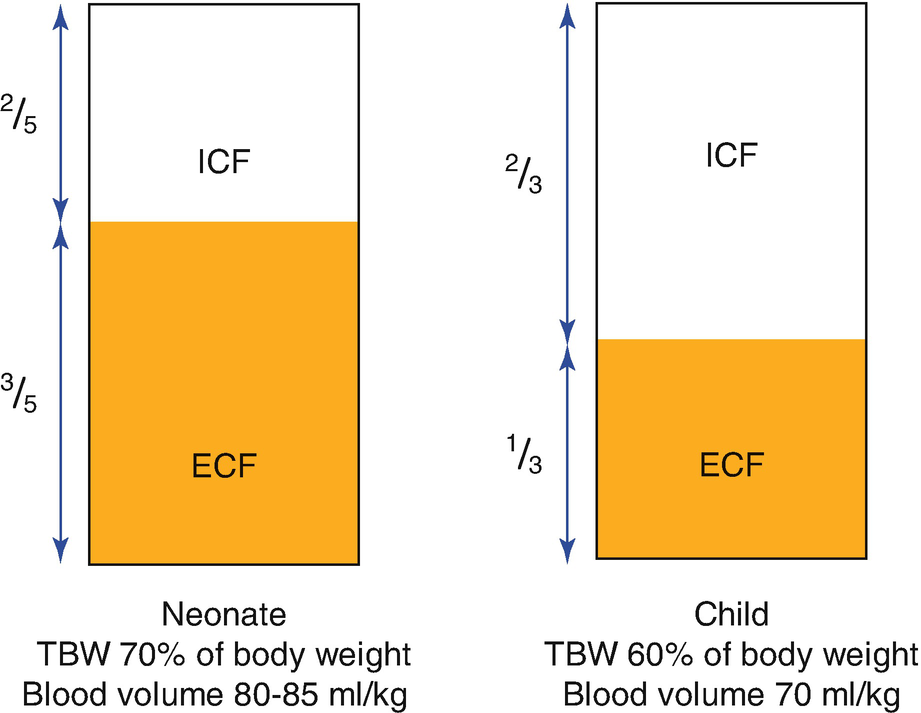
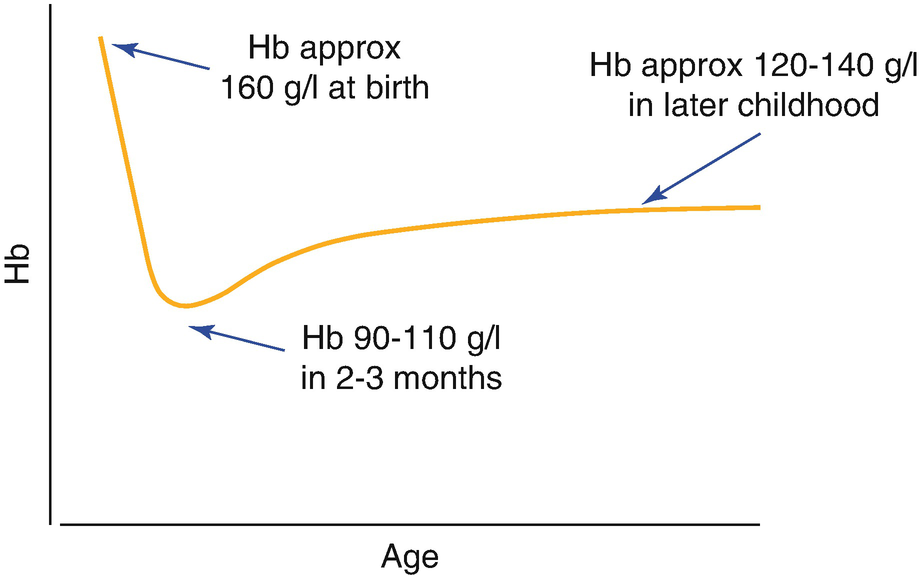
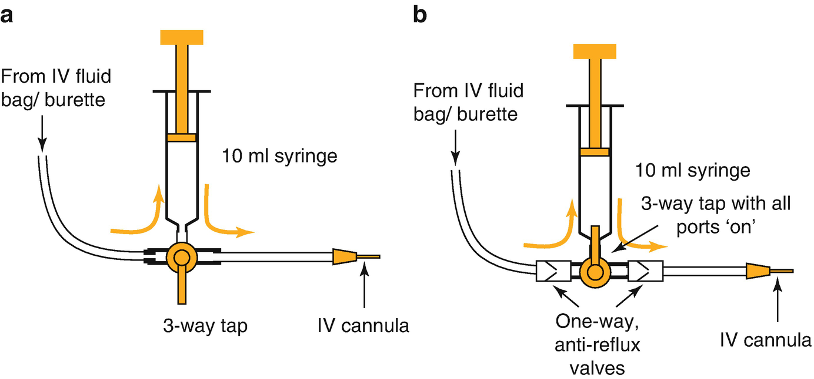
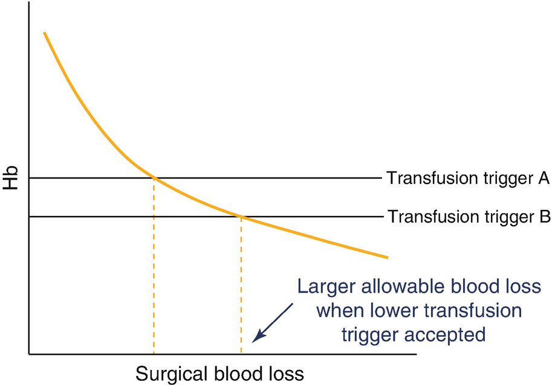
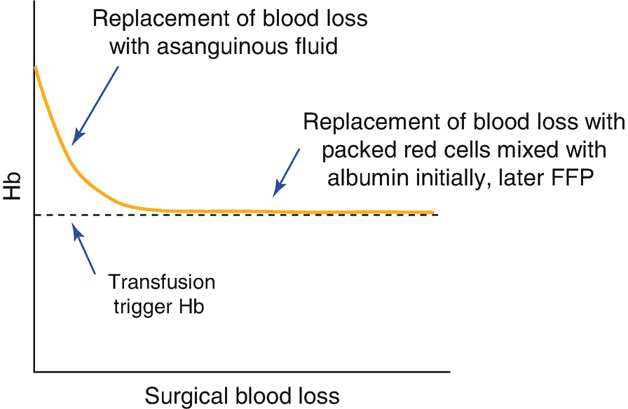
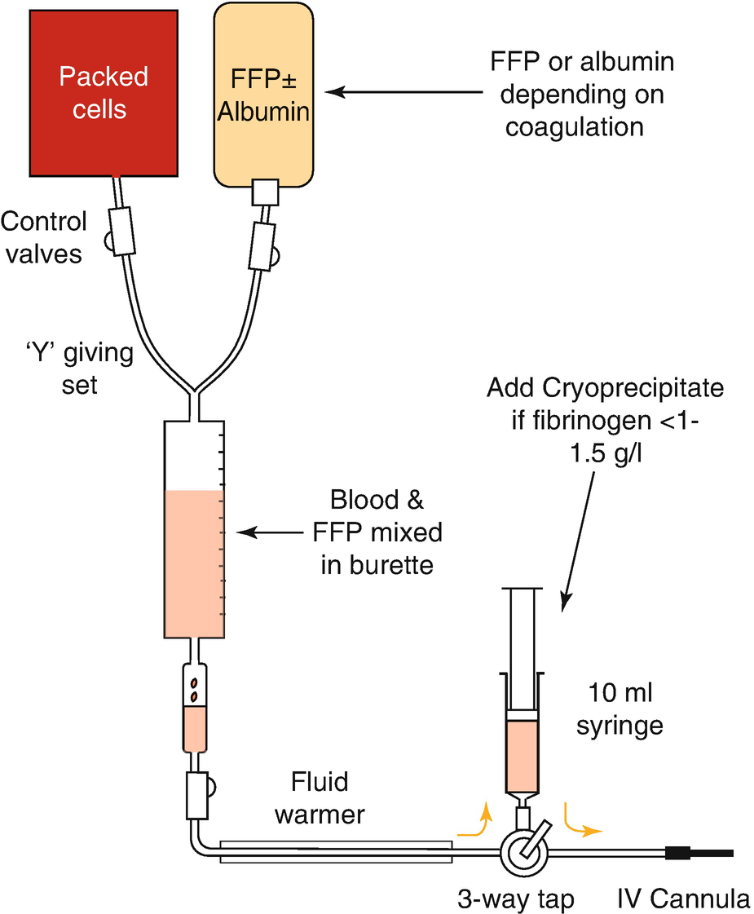

Fluid Managementfluid management in Children Undergoing Surgery and Anesthesia

© Springer Nature Switzerland AG 2020

Craig Sims, Dana Weber and Chris Johnson (eds.) A Guide to Pediatric Anesthesia[https://doi.org/10.1007/978-3-030-19246-4\_5](https://doi.org/10.1007/978-3-030-19246-4_5)

# 5. Fluid Management in Children Undergoing Surgery and Anesthesia

Ric Bergesio[1](#Aff4)     and Marlene Johnson[1](#Aff4)    

(1)

Department of Anaesthesia and Pain Management, Perth Children’s Hospital, Nedlands, WA, Australia

Ric Bergesio (Corresponding author)

Email: [Riccardo.Bergesio@health.wa.gov.au](mailto:Riccardo.Bergesio@health.wa.gov.au)

Marlene Johnson

Email: [Marlene.Johnson@health.wa.gov.au](mailto:Marlene.Johnson@health.wa.gov.au)

### Keywords

Preoperative fastingBlood transfusion in childrenPediatric intravenous fluidsPediatric fluid managementMassive transfusion in childrenCritical bleeding in childrenTransfusion trigger in children

As with drug treatment, fluid treatment in children demands more precision than in adults. This chapter explains the management of fluids in infants and children in the peri-operative period. Topics include fluid resuscitation, maintenance fluids and the replacement of ongoing losses. Fasting guidelines and the management of electrolyte disturbances are also included.

## 5.1 Body Fluid Composition

Babies are ‘wet’ at birth—total body water (TBW) is about 70–75% of body weight in neonates, higher in preterm neonates. It falls by 5% in the first week, accounting for the weight drop of newborn babies, and falls to the adult level of about 60% by 1 year of age. The extracellular fluid volume is greater than the intracellular fluid volume (the opposite of adults), until 1 month of age when they become equal. ICF then becomes larger than ECF through to adulthood (Fig. [5.1](#Fig1)). Adult values are achieved by 1 year of age. Blood volume is higher in neonates and falls with growth (Table [5.1](#Tab1)).

Fig. 5.1

Changes in body water composition with age. Modified from Jain, Pediatrics Rev 2015

Table 5.1

Blood volume at different ages

| 
Age | Estimated blood volume (mL/kg)

 |
| --- | --- |
| 

Preterm | 100

 |
| 

Term neonate | 90

 |
| 

Infants and children | 70–80

 |
| 

Adult | 70

 |

### 5.1.1 Hemoglobin

The hemoglobin concentration is high at birth because of the hypoxic environment in-utero. At birth, the hemoglobin level can be 160–200 g/L, depending on when the cord was clamped relative to uterine contraction. Most of the hemoglobin at birth is fetal hemoglobin (HbF). Although red blood cells containing adult hemoglobin (HbA) are produced from birth, production is low in response to the increased availability of oxygen and downregulation of erythropoietin. Eventually oxygen delivery is inadequate relative to metabolism, and erythropoietin production is stimulated again. These factors result in a falling hemoglobin, reaching a low point of 90–110 g/L at 2–3 months (called the ‘physiological anemia’ , Fig. [5.2](#Fig2)). The hemoglobin level in very preterm infants can decline even lower (80 g/L) due in part to repeated phlebotomy, and the effects of transfusions on endogenous erythropoiesis. Nearly all of the hemoglobin at the time of physiological anemia is HbA, so tissue oxygen delivery is actually improved due to the lower oxygen affinity of HbA compared to HbF. Platelet numbers are at adult levels from birth.

Fig. 5.2

The hemoglobin level dips in early infancy (‘physiological anemia of infancy’) as HbF production ceases and is replaced by HbA

### 5.1.2 Coagulation Changes

Coagulation factors are produced by the fetus and have low levels at birth, but this is balanced by lower levels of inhibitors than in adults, a stronger binding fibrinogen molecule and lower activity of the fibrinolytic system. Clotting tests can therefore be prolonged despite no bleeding tendency. The rotational thromboelastogram (ROTEM) of a neonate has clinically minor differences until about 4 months of age, when it becomes the same as that of an adult.

## 5.2 Preoperative Fasting

Minimizing fasting in children reduces anxiety and irritability as well as physiologic and metabolic derangements. Neonates in particular, have low glucose stores and are at risk of hypoglycemia—a 10% glucose in 0.22% saline infusion is started if the fasting time is longer than the usual time between the baby’s feeds.

The duration of fasting of children before anesthesia has traditionally followed the 6-4-2 rule: 6 h for light food and milk, 4 h for breast and formula milk, and 2 h for clear fluids. Recently, this has changed to the 6-4-1 rule in many countries and is discussed below.

### 5.2.1 Clear Fluids

Clear fluids include drinks that contain no fats or solids, such as clear apple juice, cordial, lemonade and pulp-free orange juice.

Many centers are moving away from a 2 h clear fluid fasting time, instead encouraging children to consume clear fluids (up to 3 mL/kg) until 1 h before elective or minor emergency surgery (the 6-4-1 rule). This is safe and does not increase the incidence of aspiration. Some centers accept even shorter fasting times (using a 6-4-0 rule).

### 5.2.2 Milk

Milk is cleared from the stomach in a biphasic pattern—an initial phase of rapid clearance of liquid followed by a slower phase of clearance of solids.

Gastric emptying times vary between milk products and depend on protein (whey and casein) and fat content. Breast milk has a higher whey-to-casein ratio than other milks and empties faster from the stomach. Because of this, many centers accept shorter fasting intervals for breast milk than other types of milk. Cow’s milk is rich in casein and fat, and empties slowly. Formula milk is intermediate in composition and emptying time.

While there is consensus about fasting periods with clear fluids, this is not the case with milk, and there is variation across different regions. A fasting duration of 3 h for breast milk and 4 h for formula is commonly used for infants, with fasting increased to 6 h for all types of milk in children 1 year and older.

The Australian College currently suggests these shorter durations for breast and formula milk only until 6 months of age, rather than 12 months. In infants older than 6 months, it suggests 6 h fasting for both breast and formula. Some centers include cow’s milk with formula, and some in Europe allow cow’s milk and products such as yoghurt in all ages up until 4 h before anesthesia. An example of a commonly used set of fasting times is listed in Table [5.2](#Tab2).

Table 5.2

Fasting times for children

| 
Substance | Fasting period

 |
| --- | --- |
| 

Clear fluids | 1 h

 |
| 

Breast milka | 3 h if <12 months age

 |
| 

Formula milka | 4 h if <12 months age

 |
| 

Solids, cow’s milk | 6 h

 |

Note the different fasting periods in infants for different milks that have different amounts of fat and protein

aThere is variation in fasting duration and age limits for milk—see text

### Note

Different types of milk have different fat and protein contents, and the fasting duration after ingestion of each type is different.

### 5.2.3 Solids

Solids tend to have variable gastric clearance times. Emptying may be prolonged with increasing fat and calorie content and the size of the meal, and the 6 h duration generally applies only to a ‘light’ meal.

In children with traumatic injuries, the time to complete gastric emptying is unknown. However, not all of these children need to be treated as if they have a full stomach. Factors that affect gastric emptying include the severity of trauma, pain, anxiety, administration of opioids and the time interval between trauma occurring and last meal.

### 5.2.4 Unusual Foods

Food that becomes liquid in the stomach (jelly, icy poles, and lollipops) can be considered the same as liquids. Chewing bubble gum is also considered a clear liquid for fasting, but if it is swallowed, it is treated as a solid. Fluid thickeners do not alter gastric emptying and fasting times should be determined by the type of fluid they are used to thicken.

### Note

Rare conditions affected by fasting:

Glycogen storage diseases, Fatty acid oxidation disorders, Urea cycle defects, Organic acidurias (including MMA), Homocystinuria.

## 5.3 Intravenous Fluid Requirements

There are three components to fluid management in children: replacement of existing deficits, maintenance requirements, and replacement of ongoing losses.

### 5.3.1 Replacement of Existing Deficits

Fluid deficit can cause dehydration or shock, and may be due to hemorrhage, gastrointestinal losses, insensible losses or sequestration from the intravascular space into tissues. These deficits can be estimated from weight loss, clinical signs and laboratory investigations.

Dehydration is difficult to assess, and individual clinical findings by themselves are unreliable. Symptoms and signs are more numerous and more severe with worsening dehydration (Table [5.3](#Tab3)). The best measure of fluid loss is serial weight measurements, but this is often unavailable.

Table 5.3

Signs and symptoms of dehydration and shock in children

| 
Signs and symptoms

 |
| --- |
| 

Dehydration | Shock

 |
| --- | --- |
| 

**Looks unwell or deteriorating** **a**

 |   |
| 

**Altered consciousness: lethargy, restless** **a** | Reduced consciousness

 |
| 

**Decreased skin turgor** **a**

 |   |
| 

**Sunken eyes** **a**

 |   |
| 

**Tachycardia** **a** | Tachycardia, then bradycardia

 |
| 

**Increased respiratory rate** **a** | Increased or decreased respiratory rate

 |
| 

Normal skin color | Mottled skin, pale

 |
| 

Warm extremities | Cold extremities

 |
| 

Dry mucous membranes

 |   |
| 

Normal blood pressure | Hypotensive

 |
| 

Capillary refill <2 s | Capillary refill >3 s

 |
| 

Normal peripheral pulses | Reduced peripheral pulses

 |
| 

Reduced urine output

 |   |

aThese signs of dehydration, if present, are suggested as ‘red flags’ warning of progression to shock or collapse. (Based on National Institute Clinical Excellence guideline CG84)

Dehydration may be detectable when a child is 2.5–5% dehydrated. Severe dehydration causes circulatory shock, and the child may become acidotic and hypotensive. Hypotension is a late, premorbid sign because young children are able to mount a strong sympathetic response and maintain blood pressure until severe hypovolemia develops. Clinical signs, serum electrolytes and glucose can guide replacement.

### Keypoint

If a child is 5% dehydrated, this means they have lost 5 mL per 100 g of body weight, or 50 mL/kg.

Clinical dehydration is detectable when a child is 2.5–5% dehydrated.

If a child presents with symptoms and signs of dehydration in the **absence** of shock, they are approximately 5% dehydrated.

If shock is present, there is at least 10% dehydration.

### Practice Point

The capillary refill time—Pressure on the skin for 5 s then observe the time for blanching to disappear. Normal refill time is 2 s or less. 2–3 s is borderline abnormal. The finger is the best site, the sternum is an alternative. Refill times are longer in the foot. Refill time doesn’t correlate with blood pressure, reflecting the child’s ability to maintain BP until late.

Skin turgor—Gently pinch a fold of skin for a few seconds and let go. Normally, the skin will recoil to its original position instantly. A delay in return to normal suggests dehydration. In a child, the best place to test skin turgor is on the abdomen.

### Keypoints

_Shock_

If the child has signs of shock or is at increased risk of developing shock (presence of red flags), 10–20 mL/kg of an isotonic crystalloid solution should be given immediately. A further 10–20 mL/kg bolus may be given if signs of shock persist. Judicious fluid boluses of 5–10 mL/kg should be used in cardiac disease and severe trauma.

After resolution of signs of shock, rehydration should occur with an isotonic crystalloid +/− glucose. 100 mL/kg (ie. 10% dehydration) should be given over 24–48 h in addition to maintenance fluid requirements.

_Dehydration_

For children presenting with dehydration in the absence of shock, 50 mL/kg (ie. 5% dehydration) of an isotonic crystalloid +/− glucose should be given over 24–48 h in addition to maintenance fluids.

### 5.3.2 Maintenance Fluids

Maintenance fluids replace fluid and solute losses from the kidney, gut, respiratory tract and skin. Approximately 50% of the losses are from the renal system and 50% from the lungs and skin. Maintenance fluid requirements are a function of metabolic rate and caloric requirements, and so are higher in neonates than in children and adults. They are also higher in the presence of fever, burns, or sepsis.

In the 1950s, Holliday and Segar linked water requirements and caloric expenditure to body weight, and then linked electrolyte requirements to the composition of milk. Their work resulted in the formula for maintenance fluid requirements. This formula calculates a full day’s fluid requirements: 100 mL/kg per day for the first 10 kg of body weight, then 50 mL/kg per day for the next 10 kg of body weight, and 20 mL/kg per day for the rest of the weight. The formula has been adapted to give a more practical, hourly calculation- the ‘4-2-1 rule’ (Table [5.4](#Tab4)). This formula is widely used, but there are concerns it overestimates the fluid requirements in the postoperative period or in sick, hospitalized children.

Table 5.4

The 4-2-1 formula for calculating hourly maintenance fluid requirements of children

| 
Weight | Fluid rate (mL/kg/h)

 |
| --- | --- |
| 

First 10 kg | 4

 |
| 

Next 10–20 kg | 2

 |
| 

Part of weight over 20 kg | 1

 |

For example, a 24 kg child would need 40 mL/h for the first 10 kg, 20 mL/h for the next 10 kg, and 4 mL/h for the rest of the weight, giving an hourly maintenance rate of 64 mL/h

Isotonic crystalloid fluids should be used for maintenance fluids. The choice of fluid varies between regions, but includes 0.9% saline, Ringer’s lactate (Hartmann’s solution), Plasmalyte or other balanced electrolyte solutions. A glucose-containing fluid (typically 2.5 or 5% glucose in saline) should also be considered if the child is fasting. However glucose-containing hypotonic fluids may cause hyponatremia. There have been numerous cases of hyponatremia in hospitalized children receiving hypotonic fluids such as 4% glucose with 0.18% saline and 0.25% glucose with 0.45% saline, and these fluids should not be kept in the wards or theatre.

### 5.3.3 Ongoing Losses

Ongoing losses are replaced with fluids that are similar to the fluid being lost from the body. Most losses are salt-rich and are replaced with an isotonic fluid such as 0.9% saline or Ringer’s lactate.

## 5.4 Fluid Management During Anesthesia

The main purpose of perioperative intravenous fluid is to restore or maintain homeostasis—blood volume, pH and electrolytes, tissue perfusion and metabolic function. Although a single fluid that is suitable for use during and after surgery in children would be simple, this is not possible and the anesthetist must think about each child’s requirements— which fluid and how much?

### 5.4.1 Which Fluid ?

Isotonic fluids are recommended for maintenance and replacement of losses during anesthesia and surgery. There are several types of fluids available (Table [5.5](#Tab5)). Although some of these fluids contain glucose, most children do not need glucose during surgery.

Table 5.5

Some IV fluids commonly used in the perioperative period and their potential problems

| 
Fluid | Uses | Concerns

 |
| --- | --- | --- |
| 

0.9% sodium chloride | Resuscitation boluses

Replacement of deficit/losses

Intraoperative boluses and maintenance | Hypoglycemia

Hyperchloremic metabolic acidosis if given in large volumes

 |
| 

Ringer’s lactate, Plasmalyte | Replacement of deficit/losses

Intraoperative boluses and maintenance | Hypoglycemia

 |
| 

0.9% sodium chloride +5% glucose | Post-operative maintenance | Hyperglycemia if given as bolus

 |
| 

Ringer’s lactate/Plasmalyte +5% glucose | Post-operative maintenance | Hyperglycemia if given as bolus

 |
| 

Balanced electrolyte solution +1% glucose | Replacement of deficit/losses

Intraoperative maintenance

Post-operative maintenance | Not commercially available in most countries

 |

#### 5.4.1.1 Glucose-Containing Fluids

Like adults, most children mount a hyperglycemic response to surgery. Exceptions are listed in Table [5.6](#Tab6). It may be difficult to identify all children at risk of hypoglycemia and a high index of suspicion should be maintained. Nevertheless, most children undergoing short surgical procedures do not require intraoperative fluids containing glucose. If the child is unable to drink and eat post-operatively, maintenance fluids containing glucose can be commenced after surgery.

Table 5.6

Risk factors in children for hypoglycemia during IV fluid therapy

| 
Groups of children at risk for hypoglycemia

 |
| --- |
| 

Neonates

 |
| 

Infants undergoing major or prolonged surgery

 |
| 

Children younger than 2–3 years who are malnourished, have failure-to-thrive (<3rd centile body weight), or have had a prolonged fast

 |
| 

Children with extensive regional blockade that may stop the hyperglycemic response during surgery

 |
| 

Children receiving TPN

 |
| 

Children with metabolic syndromes

 |

Neonates and young infants are at risk of hypoglycemia because they have reduced gluconeogenesis and low glycogen stores in the liver. These and other children who are at risk of hypoglycemia need glucose containing perioperative fluids and blood glucose monitoring. In these children, an intravenous fluid containing 1–2.5% glucose is appropriate, but is only available in some countries. Neonates have higher glucose requirements and their fluid management is described below (see Sect. [5.6](#Sec20)).

### Practice Point

Hypoglycemia in neonates is usually considered to be <2.6 mmol/L. In diabetic children, it’s 4.0 mmol/L.

### 5.4.2 How Much?

The volume of fluid given during surgery takes into account the pre-operative deficit (fasting and pre-operative losses such as bleeding or vomiting), maintenance requirements as well as ongoing intraoperative losses.

In longer surgeries, the volume should be adjusted to clinical parameters such as standard and invasive monitoring, serial blood gas measurements and surgical events such as bleeding. Urine output may decrease due to raised ADH, and can be an unreliable sign of volume status.

### 5.4.3 A Summary of Practical Fluid Management During Anesthesia

The volume, sodium and glucose requirements of the child are considered. For healthy children who are undergoing minor procedures and will resume oral intake soon after surgery, 10–20 mL/kg of IV fluid during the procedure is acceptable. The infusion can be ceased at the end of the operation or run at maintenance rate until drinking. Suitable fluids include Ringer’s lactate or 0.9% saline. This may also reduce the incidence of post-operative nausea and vomiting. Although there is usually no need to specifically replace the fasting deficit now short fasting times are used in children, many would still give 10–20 mL/kg of fluid in case of nausea or vomiting that might stop the child from drinking postoperatively.

For children undergoing major surgery associated with fluid and blood losses, Ringer’s lactate, Plasmalyte or other balanced salt solutions are appropriate. Large volumes of 0.9% saline may lead to hyperchloremia and subsequent metabolic acidosis, and should be used cautiously.

If the child is at risk of hypoglycemia (Table [5.6](#Tab6)) and is not a neonate, an isotonic crystalloid with 1–2.5% glucose can be used. In many centers, such a solution is not available and 0.9% saline with 5% glucose is used instead. This can be given as a bolus of 5 mL/kg during the procedure, or as an infusion at 0.5–1 times the maintenance rate. It is important to monitor blood glucose levels regularly when administering glucose.

Neonates who are not yet fasting between feeds should have 10% glucose with 0.22% saline continued at maintenance rate. Isotonic IV fluids are used in addition to this to replace salt-rich losses during surgery.

### 5.4.4 How to Give a Rapid Fluid Bolus to Small Children During Surgery

IV pump sets are not used in small children. Their priming volume is large and there is a large volume within the giving set between the fluid bag and patient. Instead, a three-way tap and short extension is placed between the fluid bag (which usually includes a burette) and the child (Fig. [5.3](#Fig3)).

Fig. 5.3

(**a**) A three-way tap and extension is used to rapidly syringe in fluid boluses to small children. This arrangement allows a large volume of fluid (5 or 10 mL/kg or more) to be given surprisingly quickly. The three-way tap is turned to fill the syringe from the fluid bag, then turned to inject. A 10 mL syringe is the most efficient syringe size to use. (**b**) Alternatively, one-way anti-reflux valves either side of the three-way tap allow the syringe to function as a ‘piston pump’ without turning the tap (O’Callaghan, Singh. Anaesthesia 2009)

### Practice Point

Children with short fasting durations presenting for minor surgery have a minor fluid deficit that does not need specific correction. However, a bolus of 10–20 mL/kg of Ringer’s lactate seems sensible to replace any deficits and reduce the impact of any delay in resumption of oral intake from nausea and vomiting.

Infants younger than 3–6 months presenting for minor surgery need some glucose-containing fluid. A 5–10 mL/kg bolus or infusion of saline or other isotonic fluid with 2.5–5% glucose is reasonable.

Neonates require special consideration (see below). If the neonate is receiving IV 10% glucose with 0.22% saline, it is continued at maintenance rate and losses replaced with isotonic IV fluid.

## 5.5 Postoperative Fluids

After minor surgery, oral fluids are quickly resumed and no postoperative IV therapy is needed. For major surgery, the postoperative fluid requirements depend on the expected postoperative fluid loss and the weight of the child.

Major surgery is associated with increased ADH secretion and fluid retention. Although the 4-2-1 formula for calculating maintenance requirements is widely used, there is concern the volumes calculated are too large and may contribute to hyponatremia. Many would reduce the maintenance rate of fluid in the postoperative period to two thirds or 80% of that calculated by the formula.

### Keypoint

In post-operative or unwell children, the calculated rate for maintenance fluids is reduced to two thirds or 80%. This is due to increased secretion of ADH.

Isotonic fluids are recommended for post-operative maintenance infusions in infants older than 3 months and all children. Although hypernatremia might be possible with isotonic fluids, the real and previously common risk of hyponatremia is avoided. If full maintenance fluids are continued post-operatively, serum electrolytes should be monitored at least daily. Children at risk of hypoglycemia or those not able to resume oral fluids after surgery will require the addition of glucose to their maintenance fluids (eg 5% glucose in 0.9% saline) and blood glucose monitoring. Neonatal fluid requirements are discussed in the next section.

### Keypoint

A child receiving full IV maintenance fluids needs daily electrolyte measurements.

## 5.6 Fluid Management in Neonates

Neonates have high fluid and caloric requirements but have a reduced renal capacity to excrete excess sodium and water. They are at risk of hypoglycemia because of low glycogen stores and reduced gluconeogenesis in the liver. After birth, pressure changes in the heart cause increased atrial natriuretic peptide levels. This stimulates a postnatal diuresis of sodium and water. This normally occurs 24–48 h after birth, but may be longer in the preterm neonate. It is common practice to withhold IV fluids containing sodium until this has occurred as the neonatal kidney has limited capacity to excrete excess sodium.

When fasting, neonates require a glucose infusion of 4–8 mg/kg/min (2.4–4.8 mL/kg/h of 10% glucose) to prevent hypoglycemia (Table [5.7](#Tab7)). Preterm neonates may require a higher rate. Ten percent glucose solution is commonly used in neonates in whom the postnatal diuresis has not yet occurred. After approximately 48 h of age, 10% glucose in 0.22% saline is the preferred solution.

Table 5.7

Maintenance fluid rates in neonates, commonly given as 10% glucose with 0.22% saline

| 
Age of neonate | Total fluid required mL/kg/day

 |
| --- | --- |
| 

Day 1 | 60

 |
| 

Day 2 | 80–90

 |
| 

Day 3 | 100–120

 |
| 

Day 4 | 120–150

 |

Older neonates who are able to fast between feeds are also able to fast before surgery without receiving IV glucose pre-operatively. However they should be given glucose during anesthesia.

An infusion pump should be used in all neonates to control the low maintenance fluid rate and prevent inadvertent boluses of glucose. Blood glucose should be monitored intraoperatively. Hypoglycemia is defined as a blood glucose level <2.6 mmol/L in a neonate.

Isotonic crystalloid solutions are required to replace intraoperative fluid losses. These can be administered via a separate lumen on the IV line or through a second cannula.

The volume of replacement fluid depends on the surgical condition. Herniotomy for example, is associated with minimal fluid shift and only maintenance fluid is required. Major surgery, such as laparotomy, is associated with fluid shifts that need to be corrected with an isotonic IV fluid such as 0.9% saline, Ringer’s lactate or 4% albumin. The volumes of these fluids are small because of the small size of the baby and they are often given as boluses from a syringe.

Fluid boluses are often given during neonatal anesthesia to counteract hypotension associated with anesthesia. Large volumes of fluid however may cause fluid retention and generalized edema in the neonate after surgery. There is growing belief that intraoperative fluids should be mildly restricted and greater reliance placed on inotropic support in neonates undergoing major surgery.

### Practice Fluid Calculations

**Q. A 10 kg child undergoing laparotomy for intussusception. They are given 30 mL/kg 4% albumin preoperatively to correct deficit. There is minimal blood loss. What are their intraoperative fluid requirements?**

A. Maintenance with isotonic crystalloid solution. 40 mL/h + ongoing 5–10 mL/kg/h = 90–140 mL/h. Any blood loss can be replaced with the same solution until the transfusion target is reached.

**Q. A 3 kg neonate, 24 h old, undergoing laparotomy for duodenal atresia. What are their preoperative and intraoperative fluid requirements?**

A. Preoperative: Maintenance of 10% glucose 10.8 mL/h (glucose = 6 mg/kg/h = 3.6 mL/kg/h). Intraoperative: continue maintenance fluids + ongoing 15–30 mL/h of isotonic crystalloid solution. Any blood loss or pre-op deficit is replaced with isotonic crystalloid or 4% albumin, until the transfusion threshold is reached.

**Q. A 5 kg 3 month old infant undergoing herniotomy. There is minimal blood loss. What are their perioperative fluid requirements?**

A. Pre-operative: IV fluids are not required if the fasting time is minimal. Intraoperative: maintenance of 20 mL/h (ie 4 mL/kg/h) of 0.9% saline with 5% glucose. A 10–20 mL/kg bolus of isotonic crystalloid solution (NOT this glucose containing solution) could be given in addition, to replace the fasting deficit. Postoperative: the baby will be able to feed immediately after surgery and fluids can be discontinued.

**Q. A 7 kg infant with a small bowel obstruction has signs of dehydration and shock. The estimated percentage dehydration is at least 10%. What are the pre-operative fluid requirements?**

A. 20 mL/kg rapid bolus (140 mL) of Hartmann’s solution or saline is given as initial therapy of shock. This is repeated if there are ongoing signs and symptoms of shock. 100 mL/kg to replace deficits is given over next 24 h in addition to normal maintenance requirements (100 mL/kg for the first 10 kg body weight). Total isotonic crystalloid fluid requirements: 700 mL (replacement) + 700 mL (maintenance) = 1400 mL. Infusion rate of 1400/24 = 58 mL/h.

## 5.7 Electrolyte Problems

### 5.7.1 Hyponatremia (Serum Na+ < 135 mmol/L)

Hyponatremia occurs when sodium losses are more than fluid losses, or there is water retention without simultaneous sodium retention, or if fluid losses are replaced with a fluid low in sodium. It can present with mild symptoms of irritability and confusion, or severe symptoms of unconsciousness and seizures associated with cerebral edema.

Management of hyponatremia depends on the sodium concentration and the severity of the symptoms. A sodium concentration greater than 125 mmol/L can be replaced slowly over 24 h with an isotonic solution, whilst a very low sodium (less than 120 mmol/L) or the presence of seizures require rapid correction to approximately 125 mmol/L with 3% saline then slow infusion with normal saline 0.9% as described below. The maintenance requirement for sodium is approximately 2 mmol/kg/day. Deficits can be estimated from the following calculation:

One mL/kg of 3% sodium chloride will normally raise the serum sodium by 1 mmol/L.

### 5.7.2 Hypokalemia

Maintenance potassium requirements are approximately 2–4 mmol/kg/day, but potassium is not usually required on the first postoperative day. The rate of intravenous replacement should not exceed 0.2–0.4 mmol/kg/h to avoid arrhythmias. In PICU potassium can be given by infusion via syringe driver and ECG monitoring. On general wards potassium can be added to the maintenance fluid with the dose added depending on the plasma potassium level.

### 5.7.3 Hyperkalemia

In infants and children, rapid transfusion of blood via a central catheter has been reported to result in hyperkalemia and cardiac arrest. Management of life threatening hyperkalemia follows the same principles as in adults. It includes hyperventilation to raise the pH and shift potassium into cells, and IV glucose (2 mL/kg of 50%) and insulin (0.1 units/kg). Calcium gluconate 10% (0.5 mL/kg) and sodium bicarbonate (1 mL/kg) can be given to stabilize the myocardium. Resonium (1 g/kg) may be given rectally or orally to reduce potassium absorption. Dialysis may be required in patients with severe hyperkalemia complicating acute renal failure.

## 5.8 Blood Transfusion

As in adults, fluid corrects hypovolemia, and blood corrects anemia. During surgical blood loss, normovolemia is maintained with asanguineous fluids and the hemoglobin falls in an exponential manner (Fig. [5.4](#Fig4)). The allowable blood loss for any child can then be calculated (Fig. [5.5](#Fig5)). This formula does not apply for a child who loses blood without simultaneous fluid replacement. Hemoglobin is still measured at regular intervals to monitor the child and determine when blood needs to be given.

Fig. 5.4

Hemoglobin falls exponentially during blood loss if normovolemia is maintained with asanguineous fluid. Accepting a lower transfusion trigger (B instead of A) permits much greater blood loss before transfusion is necessary

Fig. 5.5

A simplified formula to calculate allowable blood loss (ABL) in children and adults. ‘Initial Hb’ is the hemoglobin before blood loss and ‘final Hb’ is the lowest acceptable or ‘transfusion trigger’ Hb

There are no strictly agreed hemoglobin levels that trigger a transfusion in children, and the need for transfusion is based on an assessment of the clinical situation, the child’s age and their underlying condition. In general however, children usually tolerate acute anemia better than adults because they have normal cardio-respiratory systems that can compensate for anemia. In hemodynamically stable patients, transfusion is likely needed if the Hb is lower than 70 g/L, and unlikely to be needed if higher than 90 g/L. Hemoglobin concentrations of 100–120 g/L are commonly used in neonates or children with cyanotic heart disease. In certain situations, hemoglobin levels of 50–70 g/L are accepted in children. Previously well children given supplemental oral iron can increase their postoperative hemoglobin by about 10 g/L each week.

### Example

To calculate allowable blood loss (ABL) for a 10 kg child with initial Hb of 120 g/L who will tolerate a Hb of 80 g/L: estimated blood volume is 800 mL, therefore ABL = 800 × (12 − 8)/12 = 270 mL.

### 5.8.1 Amount of Blood to Give

Children are transfused using the same size bags of packed cells for adults. These bags contain approximately 250 mL of blood with a hematocrit of about 0.6–0.7. A burette is used as part of the IV giving set to measure the volume. In children who are not actively bleeding but are anemic, the volume of packed cells is calculated:

If there is ongoing bleeding, formulae such as above can only give a guide to volume needed before more blood loss has occurred. Packed cells may be mixed with albumin in the burette and given at a rate to correct hypovolemia. Mixing packed cells with albumin facilitates rapid administration through a fine-bore catheter. Blood should be warmed and given through appropriate filters. Caution should be taken whenever transfusing blood rapidly, especially via a central venous catheter as cardiac arrest can occur due to sudden hyperkalemia. The doses of other blood products are listed in Table [5.8](#Tab8).

Table 5.8

Doses of blood products and tranexamic acid in children

| 
Product | Dose

 |
| --- | --- |
| 

FFP | 10 mL/kg

 |
| 

Cryoprecipitate | 5–10 mL/kg

 |
| 

Platelets | 5–10 mL/kg

 |
| 

Fibrinogen concentrate | 70 mg/kg

 |
| 

Factor VII | 90 μg/kg

 |
| 

Tranexamic acid | 15 mg/kga

 |

aUsually followed by maintenance infusion 2 mg/kg/hr for 8 h (or bleeding cessation)

Some institutions irradiate blood before transfusion to prevent graft-versus-host disease in certain groups of children. Guidelines vary, but the groups can include neonates and infants less than 4 months age, cardiac surgery patients, ECMO or LVAD patients, directed donations from relatives, immuno-compromised patients and after intrauterine transfusion. Irradiation increases leakage of potassium from the red cells into the transfused plasma and shortens storage time.

### 5.8.2 Critical Bleeding and Massive Blood Transfusion

Massive transfusion in children is defined as red cell transfusion of 50% of the total blood volume (TBV) in 3 h, or of 100% TBV in 24 h, or >10% TBV per minute. Current critical bleeding protocols, based on traumatic blood loss in adults, favor early, concurrent use of platelets and coagulation factors. They lead to earlier administration of blood and blood products but are yet to be shown to reduce morbidity or mortality. The ideal dose and ratio of products to administer is unclear but can be guided by formal coagulation profile and point-of-care testing. Critical bleeding may be useful for situations such as trauma or unexpected massive surgical bleeding from a torn major vessel.

Massive blood loss can be expected to occur during some types of pediatric surgery. These surgeries include craniofacial reconstruction, neurosurgery, and surgery for tumor resection or scoliosis. Blood loss during surgery differs from that in trauma because normovolemia is maintained but hemoglobin concentration falls exponentially until the transfusion trigger is reached and red cells begun (Fig. [5.6](#Fig6)). The concentration of coagulation factors also falls, but there is some reserve in the concentrations needed for coagulation, and factors are required later than red cells if coagulation was initially normal. There is also some reserve in the number of platelets needed for clotting, as well as release from the spleen so thrombocytopenia is usually the last to develop during blood loss. Massive transfusion is especially challenging in small children and infants. The hematologic and metabolic changes in children during massive transfusion follow the volume of loss and replacement, and are summarized in Table [5.9](#Tab9).

Fig. 5.6

Hemoglobin concentration during surgical bleeding loss when lost blood is initially replaced with crystalloid or other asanguinous fluid, then red cells once the transfusion trigger has been reached

Table 5.9

Metabolic and hematologic changes follow a pattern in line with the degree of blood loss

| 
Number of blood volumes | Developing change

 |
| --- | --- |
| 

<0.4 | Dilutional anemia

 |
| 

0.4–1 | Dilutional coagulopathy

Possible hyperkalemia

 |
| 

1+ | Ionic hypocalcemia

Ionic hypomagnesemia

 |
| 

2+ | Thrombocytopenia

 |
| 

\>2 | Hypernatremia

 |

Differences between children and adults make practical management of critical bleeding more difficult. A unit of red cells may represent a large proportion of the child’s blood volume and it may need to be given in doses of less than one unit. It may also be difficult to perform calculations of volumes during rapid blood loss. The rapidity of blood loss and its replacement relative to the child’s blood volume may exceed that of adults, but IV access may be through small catheter. Finally, the priming volume of the IV fluid set and blood warmer may be large relative to the child’s body size.

A practical approach to managing massive blood loss in surgery is shown in Fig. [5.7](#Fig7). Initial blood loss is replaced with crystalloid. When red cell therapy is required, packed red bloods cells are mixed with iso-oncotic albumin and infused to replace ongoing losses. Adjusting the amount of albumin controls the hematocrit of the infused blood, and therefore the Hb level of the child. A proportion of 50–60% albumin to 40–50% packed cells usually maintains the Hb at 80–90 g/L. Diluting red cells facilitates administration through small diameter IV catheters and allows fast administration to maintain normovolemia. As blood loss continues, coagulation is monitored with point of care devices such as ROTEM. If coagulopathy develops, fresh frozen plasma (FFP) mixed with packed cells is infused, with this mixture continued until blood loss ends. Other factors and platelets are given as bolus doses if required.

Fig. 5.7

Suggested practical set-up for administering large volumes of blood and blood products to small children during surgery with massive blood loss (Acknowledgment: Brian McIntyre, Hospital for Sick Children, Toronto)

This approach separates the decision of what fluid to give from its speed of administration—the predetermined mixture is given rapidly when blood loss is rapid, and slowly when blood loss is slow. The infusion of blood also becomes like the infusion of a drug and maintains the hemoglobin at a constant level. Maintaining the hemoglobin concentration near the transfusion trigger minimizes the number of red cells lost into the wound, and once surgical loss has finished, the hemoglobin concentration is raised to the desired level for the postop period.

As in adults, maintaining normothermia, normal calcium and avoiding hyperkalemia are vital. Children are particularly at risk from hyperkalemia caused by rapid infusion of older, stored blood given via a central vein. The severity of hypocalcemia can be reduced with frequent small doses of calcium based on the measured calcium level (Table [5.10](#Tab10)). The calcium level is frequently measured to avoid marked and potentially lethal hypercalcemia.

Table 5.10

Dose of calcium to be given slowly IV to correct hypocalcemia during massive transfusion

| 
Patient ionized calcium (mmol/L) | Dose of Ca Chloride (mg/kg) | Dose of Ca Gluconate (mg/kg)

 |
| --- | --- | --- |
| 

0.9–1.0 | 10 | 30

 |
| 

0.8–0.9 | 20 | 60

 |
| 

<0.8 | 30 | 90

 |

### 5.8.3 Neonatal Blood Transfusion

Cross match of blood for neonates is not straightforward. Neonates have ABO antigens on the red cell surface, but no circulating ABO antibodies of their own for the first 4 months. Also, maternal ABO antibodies may be in the neonate’s blood. Because of this, a sample is needed from the neonate for the ABO group and direct antiglobulin test (DAT), and also blood from the mother to test for antibodies. The neonate may also have ABO hemolysins from the mother that would hemolyze ABO-compatible blood given to the neonate. For these reasons, some centers use type O blood for all neonates. Blood is irradiated in some centers to prevent graft vs host disease in neonates (who are unable to suppress infused lymphocytes). All blood is leuco-depleted and CMV safe.

‘Mini-packs’ of packed cells are sometimes available for neonatal blood transfusion. These are several (usually 4) small packs that all come from the same donor, and permit transfusions over a period of time without exposing the neonate to multiple blood donors. Blood for neonates needs to pass through a macrofilter (170 μM) before administration. A technique for intraoperative transfusion of neonates is to hang the packed cells via a filtered giving set, draw up the blood through the giving set into a syringe, then warm the blood in the syringe before administration.

## 5.9 Colloids

Albumin is the most commonly used colloid in children. Other colloids cause more allergic reactions and only have limited reported experience in children. There are not strong guidelines for the use of albumin— it may have a role in neonates and cardiac patients, but there is no evidence for its use in children with brain injury, burns or post-surgery. Crystalloids are an alternative for volume replacement or resuscitation in neonates and children, but edema in the postoperative period is a concern. A combination of albumin and crystalloid may be the best option.

Gelatins are associated with high incidence of allergic reactions and limited efficacy. When compared to albumin in neonates they have an increased risk of necrotizing enterocolitis. The third-generation tetra-starches have an improved side effect profile compared with previous generations of starches. They have a low molecular weight and accumulate less in the reticuloendothelial system, but still have an effect on the renal system. It is unlikely they offer any advantage over albumin, and they may increase bleeding.

## Review Question

1.  1.
    
    An 8 month old baby is diagnosed with intussusception and scheduled for laparotomy. The heart rate is 160 bpm and blood pressure is 75/45 mmHg. His serum electrolytes are:
    
    Na+ 132 mmol/L (normal 135–145)
    
    K+ 3.0 mmol/L (normal 3.5–5.5)
    
    Cl− 102 mmol/L (normal 95–110)
    
    Creatinine 90 μmol/L (normal 60–110)
    
    Lactate 3 mmol/L (normal 1–1.8)
    
    1.  (a)
        
        How severely dehydrated is this baby?
        
    2.  (b)
        
        Describe your fluid management before and after surgery
        
    

### Further Reading

### Fasting

1.  Andersson H, Schmitz A, Frykholm P. Preoperative fasting guidelines in pediatric anesthesia: are we ready for a change? Curr Opin Anesthesiol. 2018;31:342–8.[Crossref](https://doi.org/10.1097/ACO.0000000000000582)
    
2.  Association of Paediatric Anaesthesia. APA Consensus Statement on updated fluid fasting guidelines for children prior to elective general anaesthesia 2018. [www.​apagbi.​org.​uk](http://www.apagbi.org.uk).
    
3.  Frykholm P, et al. Preoperative fasting in children: review of existing guidelines and recent developments. Br J Anaesth. 2018;120:469–74.[Crossref](https://doi.org/10.1016/j.bja.2017.11.080)
    
4.  Thomas M, et al. Consensus statement on clear fluids fasting for elective pediatric general anesthesia. Pediatr Anesth. 2018;28:411–4.[Crossref](https://doi.org/10.1111/pan.13370)
    

### IV Fluids

1.  Arumainathan R, Stendall C, Visram A. Management of fluids in neonatal surgery. BJA Educ. 2018;18:199–203.[Crossref](https://doi.org/10.1016/j.bjae.2018.03.006)
    
2.  Association of Paediatric Anaesthesia. APA consensus guideline on perioperative fluid management in children 2007. [www.​apagbi.​org.​uk](http://www.apagbi.org.uk).
    
3.  Bailey AG, McNaull PP, Jooste E, Tuchman JB. Perioperative crystalloid and colloid fluid management in children: where are we and how did we get here? Anesth Analg. 2010;110(2):375–90.[Crossref](https://doi.org/10.1213/ANE.0b013e3181b6b3b5)
    
4.  Feld LG, et al. Clinical practice guideline: maintenance intravenous fluids in children. Pediatrics. 2018;142:e20183083.[Crossref](https://doi.org/10.1542/peds.2018-3083)
    
5.  McNab S, et al. Isotonic versus hypotonic solutions for maintenance intravenous fluid administration in children. Cochrane Database Syst Rev. 2014;(12):CD009457.
    
6.  National Institute for Health and Care Excellence. Intravenous fluid therapy in children and young people in hospital: NICE guideline 2015. [www.​nice.​org.​uk/​guidance/​ng29](http://www.nice.org.uk/guidance/ng29). Accessed July 2019.
    
7.  Saudan S. Is the use of colloids for fluid replacement harmless in children? Curr Opin Anesthesiol. 2010;23:363–7.[Crossref](https://doi.org/10.1097/ACO.0b013e328339384e)
    
8.  Sumpelmann R, et al. Perioperative intravenous fluid therapy in children: guidelines from the Association of the Scientific Medical Societies in Germany. Pediatr Anesth. 2017;27:10–8.[Crossref](https://doi.org/10.1111/pan.13007)
    

### Blood Transfusion

1.  Blain S, Paterson N. Paediatric massive transfusion. BJA Educ. 2016;16:269–75.[Crossref](https://doi.org/10.1093/bjaed/mkv051)
    
2.  Clebone A. Pediatric trauma transfusion and cognitive aids. Curr Opin Anesthesiol. 2018;31:201–6. Reviews damage control resuscitation in children and how outcomes differ from adults, as wells as studies of antifibrinolytics and new factor therapies in children_._
    
3.  Patient Blood Management Guidelines Module 6 Neonatal and Pediatrics: National Blood Authority 2016. [https://​www.​blood.​gov.​au/​pbm-module-6](https://www.blood.gov.au/pbm-module-6). Accessed July 2019.