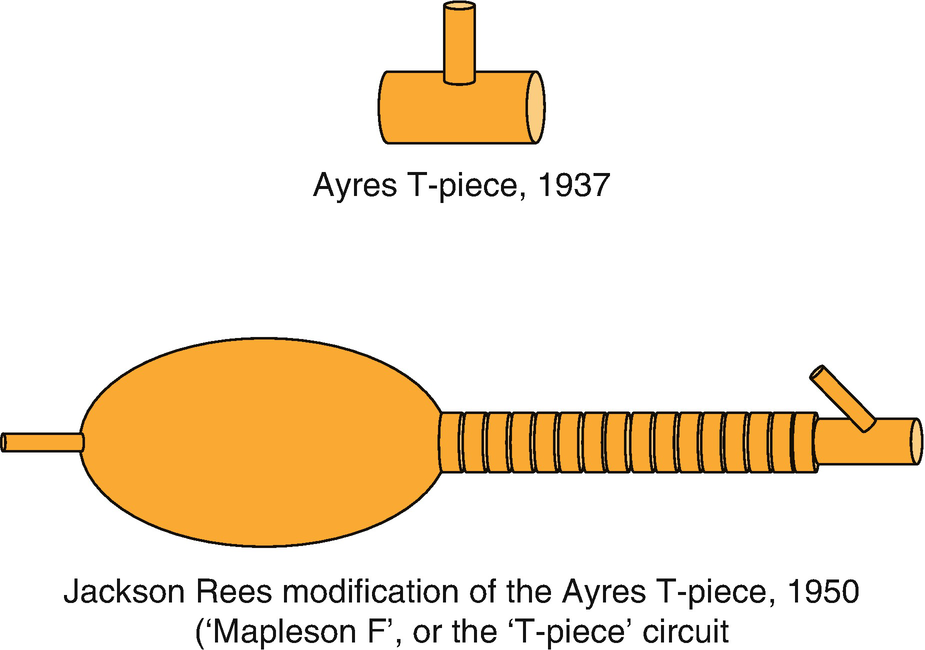
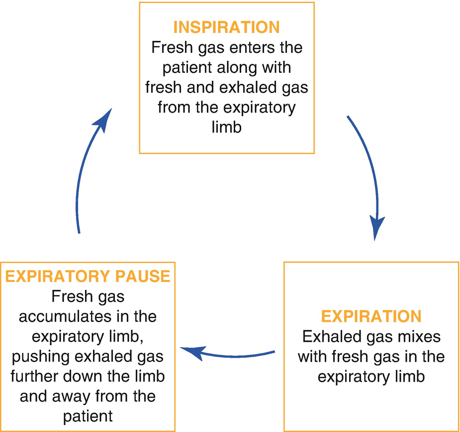
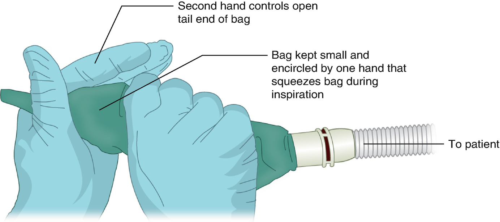
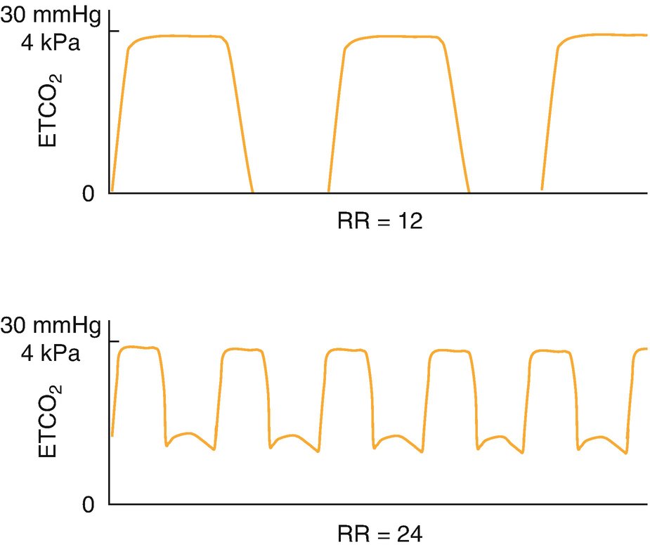
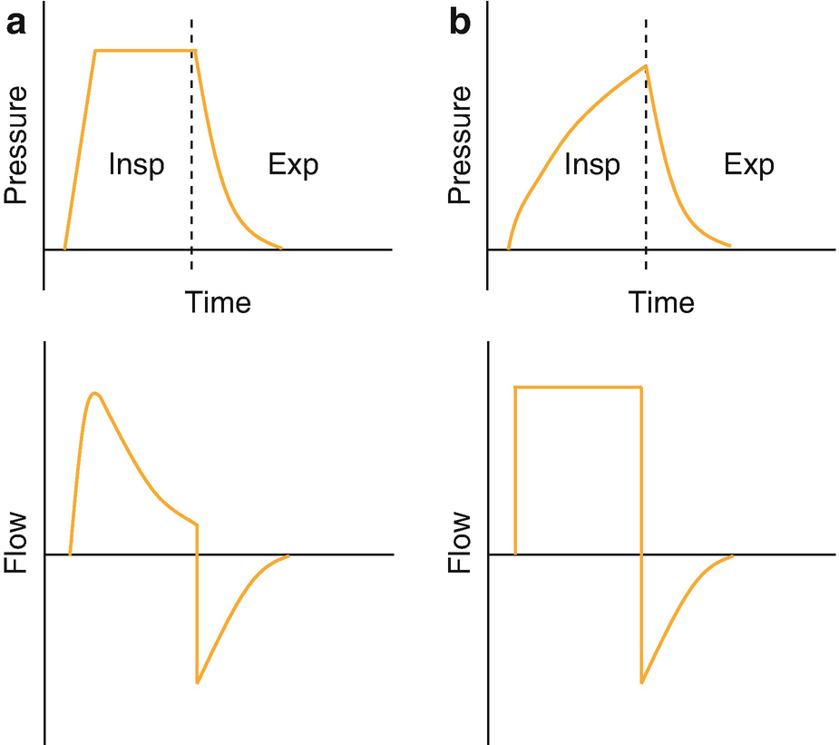
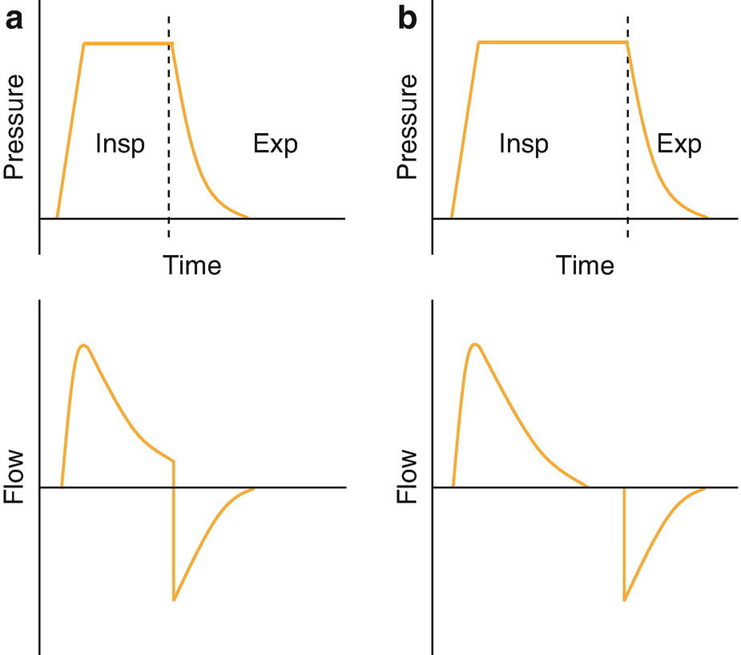
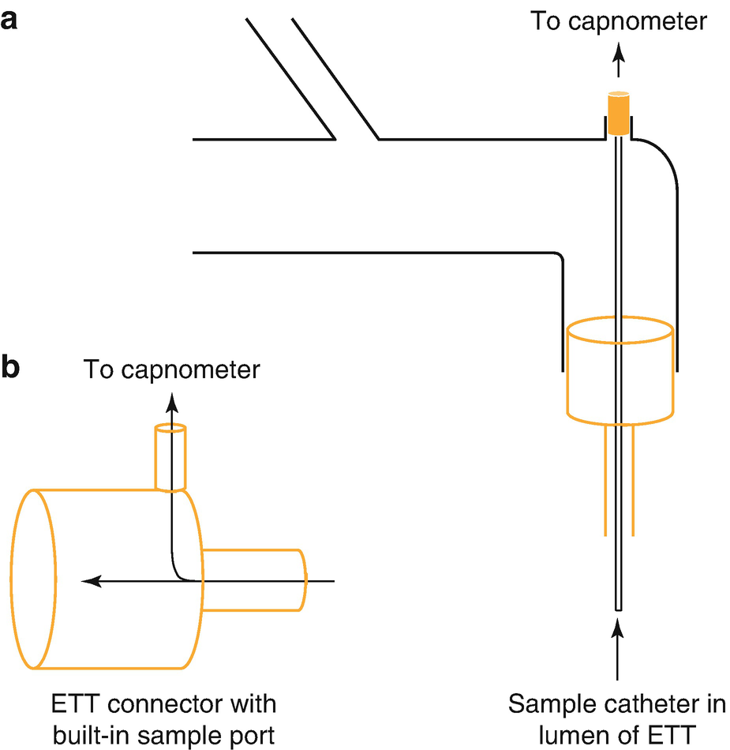
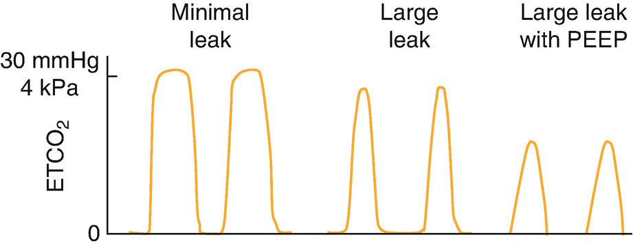
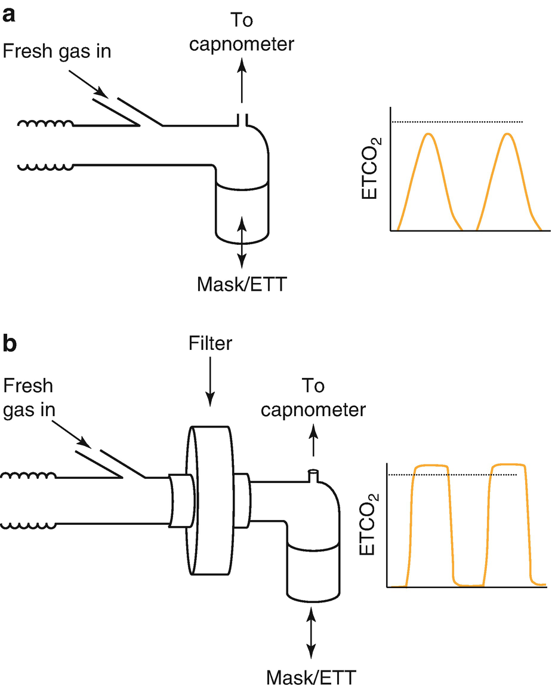

Equipmentequipment and Monitoring for Pediatric Anesthesia

© Springer Nature Switzerland AG 2020

Craig Sims, Dana Weber and Chris Johnson (eds.) A Guide to Pediatric Anesthesia[https://doi.org/10.1007/978-3-030-19246-4\_6](https://doi.org/10.1007/978-3-030-19246-4_6)

# 6. Equipment and Monitoring for Pediatric Anesthesia

Craig Sims[1](#Aff4)     and Tom Flett[1](#Aff4)    

(1)

Department of Anaesthesia and Pain Management, Perth Children’s Hospital, Nedlands, WA, Australia

Craig Sims (Corresponding author)

Email: [craig.sims@health.wa.gov.au](mailto:craig.sims@health.wa.gov.au)

Tom Flett

Email: [Thomas.Flett@health.wa.gov.au](mailto:Thomas.Flett@health.wa.gov.au)

### Keywords

Anesthetic breathing circuits for childrenT-piece circuitBreathing system deadspaceNeonatal ventilatorPressure controlled ventilation in children

Children can be as small as several hundred grams or as large as adults, and so a range of equipment sizes and types is required. This chapter focuses on aspects of equipment and monitoring specifically for children, and factors to consider when using adult equipment for children. Equipment for the airway is discussed in Chap. [4](467929_2_En_4_Chapter.xhtml), Sects. [4.​5](467929_2_En_4_Chapter.xhtml#Sec17)–[4.​7](467929_2_En_4_Chapter.xhtml#Sec25).

## 6.1 Breathing Circuits

Although the T-piece is the classic circuit for children, many circuits can be used safely for pediatric anesthesia. For a circuit to be suitable for children it must have low deadspace and low resistance. Preferably, the circuit should have a small compressible volume, be lightweight, compact, efficient and easy to use.

### 6.1.1 Deadspace

The deadspace of a circuit is the portion of the circuit between the patient and the point that fresh gas enters. For a circle this is at the Y-piece where inspiratory and expiratory limbs meet. For a T-piece this is at the side arm of the ‘T’ where the fresh gas enters. For a Bain circuit it is at the end of the circuit where the inner fresh gas line joins the expiratory limb. Deadspace is increased by angle connectors, filters, Cobbs connectors, respiratory monitors and facemasks. It causes rebreathing and requires the patient to increase minute ventilation to maintain normocarbia. Children have small tidal volumes and increased deadspace may form a significant proportion of tidal volume. For this reason, deadspace can be a problem particularly in small children who are breathing spontaneously, and is one of the reasons why neonates and infants tend to be ventilated during anesthesia.

### Note

An infant breathing spontaneously is most prone to the problem of deadspace as the tidal volume may be close to the equipment deadspace volume.

### 6.1.2 Resistance

Resistance of breathing circuits adds to the work of breathing. Neonates and infants have difficulty increasing their respiratory effort for more than a short period of time and are particularly at risk of problems from circuit resistance. Resistance in a circuit arises from the hoses, valves and attached filters. In practice however, the greatest source of resistance in anesthesia is the shaft of the ETT or LMA.

### 6.1.3 The T-Piece Circuit

The original T-piece was a simple metal ‘T’ designed by Dr. Phillip Ayre to use in babies undergoing cleft palate repair (Fig. [6.1](#Fig1)). This simple device offers no resistance and minimal deadspace, but there is entrainment of room air and dilution of the anesthetic gases. Dr. Jackson Rees from the Liverpool Children’s Hospital added an open-tailed bag. The bag allows breathing to be monitored or assisted. This is the circuit now referred to as the ‘T-piece circuit’.

Fig. 6.1

Evolution of the original T-piece to become the T-piece circuit in contemporary practice

The total volume of the expiratory limb and bag of the T-piece must be greater than the tidal volume. It does not matter if the expiratory limb is very long or short. Long expiratory limbs can be used when the patient is remote from the anesthetist, such as in MRI. Different sized bags can be used on the expiratory limb—commonly a 500 mL bag for neonates and infants, and a 1 L bag for children. Two liter bags are also available but difficult to hold and use properly. During mechanical ventilation, the bag is replaced by a hose between the expiratory limb and the ventilator.

#### 6.1.3.1 Rebreathing and Fresh Gas Flow

During expiration, exhaled gas mixes with fresh gas flow in the expiratory limb. During the expiratory pause (the time between end expiration and beginning of inspiration), more fresh gas accumulates in the expiratory limb, pushing exhaled gas further down the limb and away from the patient. During inspiration, fresh gas enters the patient along with fresh and exhaled gas from the expiratory limb (Fig. [6.2](#Fig2)). The proportions of fresh gas and exhaled gas breathed by the patient depend on several factors. These are the minute volume, including the rate and respiratory pattern, the CO2 production, and the fresh gas flow.

Fig. 6.2

The respiratory cycle and gas within the T-piece circuit

The fresh gas flow needs to be greater than the peak inspiratory flow rate, or five times the minute ventilation, to eliminate all rebreathing. However, a small amount of rebreathing is acceptable and provides humidification and reduced volatile agent use. Various formulae for the acceptable fresh gas flow have been suggested, but 2.5–3 times the minute ventilation is commonly used (although rates as low as 1.5 times minute ventilation are possible in adults with their slower respiratory patterns). These formulae pre-date ETCO2 monitoring and nowadays fresh gas flow can set to an initial level (Table [6.1](#Tab1)) and then adjusted individually according to an acceptable FiCO2.

Table 6.1

Advantages and disadvantages of the T-piece circuit

| 
Advantages of T-piece circuit | Disadvantages of T-piece circuit

 |
| --- | --- |
| 

Light weight | Complex to assemble if not familiar

 |
| 

Low resistance, no valves | Variable rebreathing

 |
| 

Low deadspace | Inefficient, with high FGF required for large child, particularly during spontaneous ventilation

 |
| 

Fast wash in | Low humidity

Requires learnt technique to hold rebreathing bag correctly

 |
| 

Low compliance (1 mL/cmH2O) and ability to ‘feel’ compliance of chest or detect leak in system | Can be difficult to scavenge, and the bag may twist and obstruct expiration and the outflow of gas

 |
| 

Portable for recovery or outside anesthetic locations | Not able to mechanically ventilate with modern anesthetic workstations

 |
| 

Compact with whole circuit in field of view

 |   |
| 

Whole circuit can be sterilized and no filter required

 |   |

The respiratory pattern also affects the circuit’s efficiency. During spontaneous ventilation, there is only a short pause between the end of expiration and the beginning of inspiration, so relatively high fresh gas flow is required. During IPPV, the expiratory pause is longer and a lower fresh gas flow is possible.

#### 6.1.3.2 Advantages

There are several advantages of the T-piece, as outlined in Table [6.2](#Tab2). The compact nature of the T-piece allows the whole circuit to be in the field of view with no need to reach out to adjust spill valves. The other major advantage is the small compression volume which allows lung compliance to be assessed, and easier manual ventilation of poorly compliant lungs.

Table 6.2

Suggested initial fresh gas rates for T-piece circuit in different age groups

| 
Patient size | Initial fresh gas rate (L/min)

 |
| --- | --- |
| 

Neonate and infant | 3

 |
| 

Child | 6

 |
| 

Adolescent | 9

 |

Fresh gas rates can be adjusted after monitoring ETCO2 and rebreathing (FiCO2) during use

The feedback, or feel of the lung compliance with the circuit has led to the term ‘educated hand’ for ventilation with the T-piece. There has been criticism that the educated hand does not exist and the anesthetist cannot feel or assess the child’s compliance any better than with mechanical ventilation. However, there are two points of detail to ensure that the hand is ‘educated’. The first is to keep the volume of the bag small. A suitable size bag is selected for the patient size and it is kept only partly filled. A large bag bulges out around the hand and increases compression volume. Small infants benefit from a two-handed bag squeeze technique, where one hand encircles a partly inflated bag and the second hand controls the occlusion of the tail (Fig. [6.3](#Fig3)). The second is to keep the fresh gas flow rate as low as possible while allowing for the size of the patient. A high fresh gas flow rate makes the bag feel tight and it becomes harder to assess compliance.

Fig. 6.3

Two-handed technique to ventilate small child with poorly compliant lungs. Keeping the T-piece bag small and avoiding an excessively high fresh gas flow rate allows the assessment of compliance and more effective ventilation

#### 6.1.3.3 Disadvantages

Perhaps the greatest disadvantage of the T-piece is the time it takes to become skilled in its use. It is held differently to all other circuits and skill is required to occlude the tail correctly to deliver continuous positive airway pressure (CPAP) and ventilation. The skill to perform this takes time to learn and discourages many from the circuit and its advantages.

Although it looks simple, the T-piece is complex in form and function. It is made up of several components that can be incorrectly assembled. Its function is complex because of the interaction between the factors that affect rebreathing and thus ETCO2. Squeezing the bag faster doesn’t necessarily reduce the ETCO2 as it would with a circle system (Fig. [6.4](#Fig4)). Faster respiratory rates shorten the expiratory pause, which then shortens the time for fresh gas to accumulate in the expiratory limb. The shorter expiratory pause increases rebreathing unless the fresh gas rate is also increased or is already high relative to the minute ventilation.

Fig. 6.4

Squeezing the bag faster on a T-piece circuit does not necessarily reduce the ETCO2. Increasing the respiratory rate and increase minute ventilation, but it also shortens the expiratory time and there is more rebreathing unless the fresh gas flow rate is increased

Another disadvantage is that the T-piece cannot be attached to modern ventilators that are integrated within the anesthetic machine and cannot be separated from the circle, thus preventing mechanical ventilation.

Finally, the circuit can be difficult to scavenge, and is used in some countries without scavenging. Scavengers may be difficult to attach and remove from the tail of the bag, and may kink the tail and obstruct outflow from the circuit and expose the child to barotrauma. Some variants of the T-piece include a valve with a scavenging port between the expiratory limb and bag, but this makes the circuit more cumbersome and introduces the risk of barotrauma if the valve is left closed. A convenient and safe scavenging system described by Keneally and Overton is used in many Australian and New Zealand centers.

### 6.1.4 The Circle Circuit

In the past, it was thought that the circle could only be used for larger children because of the resistance from the inspiratory and expiratory valves. This is now known to be incorrect, and the circle circuit is the commonest circuit in pediatric anesthesia.

Children of any age can be managed using an adult circle circuit provided ventilation is controlled or assisted in neonates and infants. When using a circle system, the standard 22 mm diameter hoses are usually replaced with 15 mm diameter hoses, and the 2 L bag replaced with a 500 or 1000 mL bag. These changes are not essential but reduce the bulk and weight of the circuit, reduce circuit volume and compression volume, and reduce wash-in time. The volume of the soda lime absorber also affects compression volume.

#### 6.1.4.1 Advantages

The advantages of the circle for pediatric anesthesia are familiarity, economy and efficiency, built-in scavenging, airway humidification and the ability to mechanically ventilate.

#### 6.1.4.2 Disadvantages

The circle circuit has a larger compression volume than the T-piece. As the rebreathing bag is squeezed, part of the volume enters the patient but a proportion goes into compressing the gas within the hoses and absorber. The compression volume can make it more difficult to assess lung compliance in neonates, and is one of the reasons why the T-piece remains popular in this patient group. Other minor disadvantages are the circle system’s bulk and weight, slower washin and washout rates, and need to use a filter to protect the absorber and hoses from contamination.

### Keypoint

The circle circuit is being used more commonly for small infants and children. The biggest advantage of the T-piece is its low compression volume, which allows successful manual ventilation of the smallest patient and in the most difficult-to-ventilate situations— the circle circuit is fine when ventilation is going well, but its large compression volume makes assessment of ventilation difficult when things aren’t going well.

## 6.2 Breathing Filters

As in adults, filters provide humidification and prevent microbial contamination of the anesthetic circuit. Although the same general considerations apply in children and adults, three areas are of importance when using filters for pediatric anesthesia.

### 6.2.1 Filter Deadspace and Resistance

Filters are usually placed between the patient and the T-piece or the Y-piece of the circle and add to the deadspace of the breathing system. During spontaneous breathing, the tidal volume may be only a few mL/kg and deadspace needs to be minimized to stop rebreathing. The deadspace of filters for infants and babies is usually 8–10 mL, and 20–25 mL for larger children.

Resistance from the filter increases work of breathing. It becomes important when a very small baby is breathing spontaneously through a filter, or when a filter that is too small is being used for a larger child. The resistance of the filter may reduce the amount of gas leaving the circuit during inhalational induction when there is no mask seal and there is neither a negative inspiratory pressure from the child nor a positive pressure on the rebreathing bag forcing gas out through the filter.

### 6.2.2 Anti-microbial Efficiency

Pleated, hydrophobic membrane filters are considered best for pediatric use, but there is wide variation in the performance of filters from different manufacturers. Their smaller size makes them inefficient and ineffective when tested under adult-sized conditions. However, when tested at conditions closer to the inspiratory flow rates that a small child would generate, the filters perform almost as well as adult sizes. However, some professional societies have guidelines that recommend a new sterile circuit be considered for each case.

### Note

Small filters are not suitable for large patients—the filter does not block pathogens and its resistance is too high.

## 6.3 Ventilators

Ventilators in modern anesthetic machines are usually suitable for neonates, children and adults. Features needed to permit ventilation of neonates during anesthesia are listed in Table [6.3](#Tab3). The most important is the ability to deliver a small tidal volume at a fast rate. To do this, the ventilator must be capable of delivering low inspiratory flow rates. For example, to deliver a 600 mL tidal volume to an adult patient over 2 s, the ventilator generates an inspiratory flow of 18 L/min (in other words, gas leaves the bellows at a rate of 18 L/min). But to deliver a 20 mL tidal volume to a neonate over half a second, the ventilator must generate a flow of only 2.4 L/min.

Table 6.3

Features of a ventilator suitable for neonates, infants and small children

| 
Features of a neonatal ventilator

 |
| --- |
| 

**Essential:**

 |
| 

Able to deliver small tidal volumes

 – Low inspiratory flow rate

 – Short inspiratory time

 |
| 

Fast respiratory rates (up to 60 breath/min for neonates)

 |
| 

Small compression volume

Able to control FiO2

 |
| 

**Desirable:**

 |
| 

Able to deliver PEEP and CPAP

 |
| 

Able to measure small expired tidal volumes

 |

Mechanical ventilators in adults are usually set to volume-controlled mode—the desired tidal volume is set on the ventilator. Ventilators in children are usually set to pressure-controlled mode—the desired inspiratory pressure is set (Fig. [6.5](#Fig5)). This is because pressure mode in children has some advantages over volume ventilation, although less so nowadays with modern ventilators.

Fig. 6.5

Proximal airway pressure and flows in pressure-controlled and volume-controlled modes. (**a**) During pressure controlled ventilation, a constant pressure is held during inspiration but flow declines exponentially. (**b**) During volume controlled ventilation, pressure gradually builds during inspiration

### 6.3.1 Pressure \-Controlled Ventilation

This is the commonest mode of ventilation in pediatric anesthesia. The delivered tidal volume is not affected by a small leak around the ETT, or by a change of fresh gas flow or change of circuit compliance. Similar inspiratory pressures are needed for adolescents and babies, reducing the risk of accidental barotrauma. Typical initial settings for a normal child are inspiratory pressure 15–20 cmH2O, I:E ratio 1:2, and rate 16 breaths/min for preschool ages, 18 breaths/min for infants, and >20 breaths/min for neonates. The ventilator delivers the set pressure for the set inspiratory time and inspiratory flow decreases during inspiration as alveolar pressure reaches proximal airway pressure (decelerating flow pattern).

Three factors affect the delivered tidal volume in pressure-controlled ventilation:

1.  1.
    
    Compliance of lung and chest wall, either from internal lung pathology, pneumoperitoneum or from external pressure on the chest or abdomen from the surgical team or drapes.
    
2.  2.
    
    Inspiratory pressure.
    
3.  3.
    
    Inspiratory time.
    

As inspiratory time lengthens, the inspiratory pressure is applied for longer and the delivered tidal volume increases. The I:E ratio affects inspiratory time and therefore affects the tidal volume. However, as inspiratory time lengthens the alveolar pressure eventually plateaus and equals the ventilator pressure, so no flow occurs and any further lengthening of the inspiratory time does not increase tidal volume (Fig. [6.6](#Fig6)). (In general, longer inspiratory times improve oxygenation by increasing the mean airway pressure and redistributing gas to less compliant alveoli, while allowing a lower peak pressure for the same volume. Longer inspiratory times however increase the risk of gas trapping, intrinsic peep and barotrauma by reducing expiratory time, and are not tolerated by the patient so well, necessitating a deeper level of anesthesia).

Fig. 6.6

The effect of inspiratory time during pressure-controlled pressure ventilation. (**a**) Inspiratory flow is still occurring at the end of inspiration. Lengthening inspiration will increase tidal volume. (**b**) Inspiratory flow has ended before inspiration has finished because alveolar pressure has reached airway pressure. Lengthening inspiration will have no effect on tidal volume

A significant disadvantage of pressure-controlled ventilation is the ventilator pressure alarm will not detect an obstruction or kinking of the ETT. If the ETT kinks, the ventilator will continue to cycle to the preset pressure with some movement of the bellows due to compression of circuit volume, even though no volume is delivered to the patient. If the obstruction is partial, there will be no pressure alarm, delivered volume will fall and the capnogram may show either hyper- or hypocarbia.

### 6.3.2 Volume-Controlled Ventilation

In this mode, the tidal volume is selected and the airway pressure varies with lung compliance. There are several traditional reasons why this mode is less commonly used in pediatric anesthesia.

1.  1.
    
    A variable leak around an uncuffed ETT affects the tidal volume.
    
2.  2.
    
    Changing the fresh gas flow may alter the delivered tidal volume:
    
    Inspired tidal volume is made up from two components—the volume from descent of the bellows plus the volume of fresh gas entering the circuit during inspiration. For example, if the fresh gas flow is 6 L/min, 100 mL of gas enters during a 1 s inspiration and is added to the volume coming out of the bellows. A small child may therefore have significant changes in their tidal volume as fresh gas flow is altered. The fresh gas flow affecting tidal volume is a problem of older anesthetic machines with stand-alone ventilators that are not integrated into the anesthetic machine. However, modern machines with built-in ventilators have ‘fresh gas compensation’ so changes in fresh gas flow do not affect the delivered tidal volume. Instead, the descent and volume of gas leaving the bellows varies as the fresh gas flow is altered. Drager machines do this by diverting fresh gas flow into the rebreathing bag during inspiration, and most other brands electronically measure the fresh gas flow and adjust the volume delivered from the ventilator.
    
3.  3.
    
    Circuit compliance affects the delivered tidal volume:
    
    The adult circle circuit has a compliance of 7 mL/cmH2O. With an inspiratory pressure of 20 cmH2O, 140 mL of the ventilator output is lost expanding the hoses and compressing the gas within. If a baby is being ventilated with a tidal volume of 60 mL, this circuit loss is significant and means that a stand-alone anesthetic ventilator would need to be set to 200 mL. However, modern anesthetic machines compensate for circuit compliance. On these machines, a setting of 60 mL will mean 60 mL is delivered to the patient.
    
4.  4.
    
    Concerns about barotrauma:
    
    If the ventilator has been used for an adolescent with a tidal volume of 600 mL and is then connected to an infant, the ventilator may cause barotrauma. However, modern ventilators include a pressure release function, usually at 40 cmH2O so that inspiration immediately stops when this pressure is reached and expiration begins. This safety feature provides some protection from accidentally large tidal volumes.
    
5.  5.
    
    Inability of older ventilators to deliver small tidal volumes:
    
    Modern ventilators however can deliver tidal volumes as low as 30–50 mL.
    

In summary, volume-controlled ventilation is less common in children because of several problems, though these have been mostly overcome with modern technology. Although there are some theoretical advantages with the decelerating flow pattern of pressure ventilation, either mode can safely be used provided chest expansion and patient variables are monitored and ventilation adjusted appropriately.

### Keypoint

Pressure-controlled ventilation is most commonly used in pediatrics because the delivered volume is not affected by circuit compliance, small leaks around an uncuffed ETT or changes in fresh gas flow. However, delivered volume is affected by changes in lung compliance and kinking or obstruction of the ETT.

### 6.3.3 Pressure Support Ventilation

Pressure support is a patient triggered, flow cycled mode that is attractive for pediatric ventilation as it splints open the upper airway by providing a positive airway pressure during inspiration. It overcomes minor upper airway obstruction during LMA use, reduces work of breathing caused by resistance in the breathing system and helps maintain end expiratory lung volume. However, some ventilators are not able to trigger and synchronize with the rapid small breaths of children. Ventilators that trigger inspiration using flow rather than airway pressure tend to synchronize better. Younger and smaller children usually need higher levels of pressure support than older, larger children. The time required for the ventilator to reach the set pressure from the start of inspiration is the rise time (or slope). Work from neonatal ICU shows neonates synchronize best with a 0 rise time. Clinically, children appear to do well with a rise time of 0.2–0.3 s.

### Tip

With modern ventilators offering pressure support ventilation, no patient should breath unassisted against the resistance of anesthetic equipment—even as little as a few cm H2O of assistance reduces work of breathing and should always be used.

## 6.4 Warming Devices

Children, especially infants, are prone to hypothermia. Children have a large surface area relative to basal metabolic rate (BMR). An adult has a BMR equivalent to a 100 W light bulb, but a neonate only has the equivalent of only a 2 W torch bulb. The main route of heat loss is cutaneous, mostly by radiation and convection as in adults but also by evaporation in preterm infants who have thin, porous skin. It is logical to stop heat loss through the skin and transfer heat back through it to prevent and treat hypothermia.

### 6.4.1 Forced Air Warmer

Forced air warmers transfer so much heat they compensate for any losses by other routes. They also allow the creation of a microclimate around neonates and infants so that heating the entire OR to uncomfortable temperatures has become unnecessary. Forced air warmers are more effective in children than adults because such a large proportion of the surface area of children can be covered in warm air. Pediatric sized blankets can be placed over the child, or small children can be placed on top of a purpose made blanket blowing warm air up and around the child while allowing unrestricted access. Care must be taken when using these blankets to ensure that the air channels are not compressed by the child’s limbs or equipment. Prewarming children with a forced air warmer prevents redistribution hypothermia after induction but is often not practical as not all children will tolerate the blanket while awake.

Burns readily occur if the warmer is used without a manufacturer’s blanket to disperse the hot air flow. Burns are also a risk even if the blanket is used correctly. The temperature at the insertion point of the hose into the blanket is high and a small child’s foot or hand up against the blanket at this point is exposed to air hotter than body temperature.

### 6.4.2 Overhead Radiant Heater

Overhead radiant heaters are infrequently used in OR but are still common in NICU. They are ineffective because only a small surface area is heated, and most infrared radiation produced strikes the skin at an angle and is reflected rather than absorbed. The heat is also uncomfortable on the top of the surgeon’s heads.

### 6.4.3 Warming Mattress

These are electric warming pads placed underneath the child. Their effectiveness is limited because not much heat is lost through the back, there is only a small surface area available for heat transfer, and compression of skin vessels in the back reduces heat transfer. Nevertheless, the electric mattress maintains normothermia and can be used in conjunction with a forced air warmer. The NICE guidelines from the UK suggest a heating mattress if a forced-air warming device is cannot be used.

### 6.4.4 Active Humidifier

Airway heating and humidification was common in the past. However, only about 10% of heat is lost through the airway and a proportion of this can be prevented with passive humidifier filters. Electrically powered active humidifiers introduce the risks of disconnections, leaks and burns, and are not usually used in the OR (Table [6.4](#Tab4)).

Table 6.4

Routine methods of reducing heat loss and actively warming children in OR

| 
Warming methods routinely used in children

 |
| --- |
| 

Forced air warmer

 |
| 

Warm OR (if can’t create warm microenvironment)

 |
| 

Warm IV fluids

 |
| 

Passive humidifier (Heat and moisture exchange filter)

 |
| 

Blanket or plastic covering over child

 |
| 

Electric heater mattress (Inditherm®)

 |

### 6.4.5 Fluid Warmers

Fluid warmers are often used for children. They help to prevent hypothermia, but do not transfer enough heat to re-warm a patient. Because of the slow infusion rates used in children, fluid is exposed to room temperatures as it travels along tubing between the warmer and the child. Therefore, fluid must be warmed as close as possible to the child’s IV catheter. This is done by positioning the warmer close to the child and minimizing the time fluid is exposed to room temperature. The Hotline® fluid warmer uses a heated water jacket that encloses and encircles the IV fluid tubing right up to the patient connection. It is very effective and useful in pediatric practice, but is not effective at very high flow rates.

### Keypoint

Children are at greater risk of hypothermia compared with adults because of reduced heat production relative to surface area. Forced air warmers are the most efficient method to maintain normothermia and treat hypothermia. Increasing ambient temperature and warming IV fluids are the two other commonly used methods in OR to prevent hypothermia.

## 6.5 Monitoring

Monitoring standards are the same in children and adults, and are set out in professional college and association documents or guidelines. Minimal monitoring tends to be applied before induction of children, at least in the wary child, so that they remain calm, relaxed and more likely to cooperate at the time of induction. The oximeter and other monitors are then applied at induction. This section focuses on the aspects of monitoring that are different in children.

### 6.5.1 Pulse Oximetry

The pulse oximeter is a vital and useful monitor for children during and after anesthesia and sedation. Oximeters average the signal over 10–12 s to reduce motion artefact, but in children the saturation can change very quickly and it is common to see a color change in the lips before the oximeter detects a change. Oximeters are accurate in neonates because fetal and adult hemoglobin have the same absorption spectrum. Small, wrap-around probes are commonly used. The right hand in neonates measures preductal saturation—it measures saturation of the blood flowing to the brain. The ductus arteriosus linking the pulmonary artery and aorta is normally closed, but in some children it is patent with left-to-right shunting of blood. If the neonate reverts to fetal circulation, there is right-to-left shunting of deoxygenated blood through the ductus to the aorta, causing lower saturations in the left arm and legs. In practice the left arm and legs are frequently used for measurements—it can be difficult to find a probe location on the neonate that works, and reversion to fetal circulation is rare.

There is a range of probes available to suit children. If a probe that is too large is used, such as an adult probe on the finger or toe of an infant, a proportion of the oximeter light bypasses the tissue and is directly detected. This penumbra effect may give a saturation reading in the 80s. Some spring clip probes compress a small child’s digit too much, affecting the reading or causing pressure marks. A final issue to bear in mind is that because children generally have healthy lungs, it is possible to have excellent saturations on oxygen despite severe hypoventilation.

### Tip

If a child is hypoxic and you are trying to improve oxygen saturation, watch the chest, not the oximeter. The chest MUST be going up and down if you are to succeed. The oximeter is giving you an averaged reading that is 10 or 12 s old.

### 6.5.2 Capnography

The rapid respiratory rates and small expired tidal volumes of children affect the accuracy of capnometers. Although main-stream analyzers are more accurate, the weight and bulk of the sensor have made side-stream analyzers more popular.

### Keypoint

While this section mostly deals with technical issues that cause underestimation of PaCO2, an important cause of false low ETCO2 is gross under ventilation. This is why it is important to always observe chest expansion and assess compliance with manual ventilation.

#### 6.5.2.1 Problems with Small, Rapid Tidal Volumes

With side-stream analyzers, the small volume of expired gas mixes with inspired gas along the length of the sample line, distorting the capnogram. Distortion may obliterate the plateau of the capnogram, and at respiratory rates faster than about 40 breaths per minute the inspired carbon dioxide appears elevated. Distal sampling (sampling closer to the alveoli) may be used in neonates and infants to increase the amount of expired gas and decrease the amount of contaminating fresh gas that is sampled (Fig. [6.7](#Fig7)). This can be done using a special 15 mm ETT connector, or placing a small diameter IV cannula down into the lumen of the ETT. The cannula is usually passed through the sampling port on the angle connector, narrowing the lumen of the ETT and increasing resistance. Another approach to improve the accuracy of capnography in children uses Microstream technology. These monitors use small diameter tubing and a lower sample rate than usual to reduce mixing within the sample line. Gas analysis is done using a narrow bandwidth of infrared radiation in a much smaller analyzer chamber.

Fig. 6.7

The accuracy of capnography in neonates and small children is improved by distal sampling to contamination of the expired gas sample with fresh gas. (**a**) A fine sampling catheter (such as an IV cannula) is inserted into the lumen of the ETT. (**b**) A purpose-made ETT connector with an in-built sample port replaces the usual ETT connector

#### 6.5.2.2 Leak Around the ETT

A leak around the ETT allows part of the exhaled gas to escape around the ETT. The error this causes is worsened by any pressure in the circuit, either during IPPV or PEEP. Any positive airway pressure during the expiratory pause forces first exhaled gas and then fresh gas back down the ETT and out around the leak, diluting the gas sample for capnography. The larger the leak around the ETT, the greater the error (Fig. [6.8](#Fig8)). Even if PEEP is not used, the ventilator causes a small amount of back pressure as the bellows fills and its spill valve opens, affecting the capnogram.

Fig. 6.8

The effect on the capnogram of a leak around the ETT. A large leak allows fresh gas to flow back down the ETT during the expiratory pause, diluting expired gas. Adding PEEP increases the back flow of fresh gas and worsens dilution and accuracy

### Tip

Be careful when the capnogram is peaked and does not plateau. Consider sampling more distally or reducing the size of the leak with either a larger ETT or a cuffed ETT, or even a throat pack. Consider manual ventilation to check that the ETCO2 is not low because of gross under ventilation.

#### 6.5.2.3 Fresh Gas Entrainment and the T-Piece

The CO2 sample port is located close to the fresh gas inlet on the T-piece circuit and fresh gas mixes with exhaled gas. Distal sampling helps to minimize this effect. Alternatively, placing a filter between the fresh gas and sample port separates fresh and exhaled gases, improving ETCO2 sampling and providing humidification (Fig. [6.9](#Fig9)).

Fig. 6.9

(**a**) Fresh gas in the anesthetic circuit dilutes expired gas, distorts the capnogram and reduces the ETCO2 value. (**b**) Placing a filter between the fresh gas inlet and the sample site reduces dilution of the expired gas

#### 6.5.2.4 Cyanotic Heart Disease

Children with congenital heart disease who are cyanosed have a right-to-left shunt of blood through the heart. As part of the cardiac output does not pass through the lungs, the ETCO2 underestimates the PaCO2.

### 6.5.3 Transcutaneous CO2 Monitoring

Transcutaneous CO2 monitoring (TcCO2) measures the PaCO2 with a sensor on the skin that is heated to arterialize the blood. It is mostly used in neonatal intensive care where the sensor is applied to the skin of the chest or abdomen. Several aspects of the technique limit its routine use in theatre. It requires calibration before use, may cause local skin problems, is affected by tissue edema or hypoperfusion and the response time is too slow for it to replace ETCO2. However, when properly set up, it measures PaCO2 more accurately than ETCO2, and has a role in theatre during high frequency ventilation when capnography cannot work.

### 6.5.4 Temperature

The esophagus, nasopharynx, rectum and axilla are all clinically useful sites for monitoring temperature in children. Core temperature is best measured in the distal third of the esophagus, where the probe is adjacent to the heart and great vessels, and least affected by respiratory gases. A nasopharyngeal probe is commonly used and is sufficiently accurate unless there is a large leak around the ETT that exposes the probe to inspiratory gas. The axillary site allows probes to be cleaned and reused, but the probe must be positioned high in the axilla adjacent to the axillary artery, and protected from ambient temperature by keeping the arm adducted.

### 6.5.5 Depth of Anesthesia Monitors

The EEG in young children is different from adults. The background frequency decreases from 10 Hz in adults to 7–8 Hz in 2 years olds and 5 Hz at 6 months of age. Children less than 5 years also have short bursts of EEG activity while awake, and have specific EEG patterns associated with transition in and out of drowsiness and sleep. Monitors based on the processed EEG including BIS, Entropy and Narcotrend using pediatric electrode systems have reasonable correlations with doses of volatile or intravenous anesthesia in older children. High concentrations of sevoflurane paradoxically increase the BIS, possibly by altering the raw EEG. These monitors cannot be used in children aged less than 1 year because of the EEG differences in infants compared to children. Furthermore, while there is some evidence in adults that anesthesia depth monitors improve outcomes, this has not been studied or proven in children. Nevertheless, for children aged 1–13 years, if BIS is maintained below 50 then wakefulness is unlikely, and BIS guidance of manual propofol infusions reduces the likelihood of over- or under-dosing.

### 6.5.6 Near Infrared Spectroscopy (NIRS)

Near Infrared Spectroscopy (NIRS) measures regional tissue oxygenation by measuring non-pulsatile oxyhemoglobin and deoxyhemoglobin saturation. Cerebral oxygen saturation (cSO2) assesses the brain venous compartment, and is correlated with jugular venous saturation. A sensor emitting light in the near infrared spectrum is applied to the forehead. Light takes a banana-shaped path through a tissue volume of about 10 mL to sensors 3–5 cm away, giving a composite measure of arterial and venous blood. The light follows two paths—superficial through the bone and cartilage of the skull, and deeper through the cerebral parenchyma. The absorption from the two paths is subtracted to estimate cortical oxygenation. The probes are age-specific and assume the cortex is at a certain depth below the probe. The lower weight limit for neonatal probes is 2.5 kg, and if the probe is used on smaller babies, it will measure oxygenation of deeper brain rather than cortex. Proprietary algorithms are used to calculate regional tissue oxygenation. Some monitors display oxy-hemoglobin as an absolute value, and others as a proportion of total hemoglobin or ‘index’. The value measured in the frontal cortex underneath the probe is assumed to reflect the cortex elsewhere. Normal cerebral saturation is 70%. cSO2 must be interpreted as a measure of balance between transport and consumption of oxygen in the brain. It rises in well perfused, inactive cerebral tissue (as during cooling or irreversibly damaged cerebral tissue), and falls in well perfused excessively active tissue (as during status epilepticus). NIRS is used during cardiac anesthesia and is being investigated as a measure of cerebral perfusion during anesthesia and surgery in sick neonates with poor cardiovascular status, aiming to achieve a satisfactory neurological outcome. In children, cerebral desaturations during congenital heart surgery are associated with increased neurological morbidity. Cerebral oximetry could be a useful monitoring technique during anesthesia in preterm neonates, due to the risk of impaired cerebral blood flow autoregulation in these patients.

## Review Questions

1.  1.
    
    What factors affect the FiCO2 with the T-piece circuit?
    
2.  2.
    
    What characteristics make a ventilator suitable for infants?
    
3.  3.
    
    What factors affect the delivered tidal volume during pressure-controlled ventilation?
    
4.  4.
    
    During pressure-controlled ventilation, why does changing the fresh gas flow rate affect how far the ventilator bellows moves? What happens if volume-controlled ventilation is used instead, and does it matter if the ventilator is integrated into the anesthesia machine or free-standing?
    
5.  5.
    
    What factors affect the accuracy of ETCO2 measurement in children?
    
6.  6.
    
    Does an adult oximeter give accurate readings on a neonate?
    
7.  7.
    
    Below what age is BIS not useable?
    

### Further Reading

### Breathing Systems

1.  Keneally JP, Overton JH. A scavenging device for the T-piece. Anaesth Intensive Care. 1977;5:267–8.[Crossref](https://doi.org/10.1177/0310057X7700500318)
    
2.  Oswald L, et al. The Ayre’s T-piece turns 80: a 21st century review. Pediatr Anesth. 2018;28(8):694–6.[Crossref](https://doi.org/10.1111/pan.13408)
    
3.  Pearsall MF, Feldman JM. When does apparatus dead space matter for the pediatric patient? Anesth Analg. 2014;118:776–80.[Crossref](https://doi.org/10.1213/ANE.0000000000000148)
    
4.  Stayer S, Olutoye O. Anesthesia ventilators: better options for children. Anesthesiol Clin North Am. 2005;23:677–91.[Crossref](https://doi.org/10.1016/j.atc.2005.08.002)
    
5.  Whitelock DE, deBeer DAH. The use of filters with small infants. Respir Care Clin N Am. 2006;12:307–20.[PubMed](http://www.ncbi.nlm.nih.gov/entrez/query.fcgi?cmd=Retrieve&db=PubMed&dopt=Abstract&list_uids=16828697)
    

### Warming Equipment

1.  John M, Ford J, Harper M. Perioperative warming devices: performance and clinical application. Anesthesia. 2014;69:623–38.[Crossref](https://doi.org/10.1111/anae.12626)
    
2.  National Institute for Clinical Excellence. Hypothermia: prevention and management in adults having surgery (NICE guideline 65). 2016. [https://​www.​nice.​org.​uk/​guidance/​Cg65](https://www.nice.org.uk/guidance/Cg65). Accessed July 2019.
    
3.  Sessler DI. Forced-air warming in infants and children. Pediatr Anesth. 2013;23:467–8.[Crossref](https://doi.org/10.1111/pan.12177)
    

### Monitoring

1.  Louvet N, et al. Bispectral index under propofol anesthesia in children: a comparative randomized study between TIVA and TCI. Pediatr Anesth. 2016;26:899–908.[Crossref](https://doi.org/10.1111/pan.12957)
    
2.  Sury M. Brain monitoring in children. Anesthesiol Clin. 2014;32:115–32.[Crossref](https://doi.org/10.1016/j.anclin.2013.10.013)
    
3.  Tobias TD. Transcutaneous carbon dioxide monitoring in infants and children. Pediatr Anesth. 2009;19:434–44.[Crossref](https://doi.org/10.1111/j.1460-9592.2009.02930.x)
    
4.  Wallin M, Lonnqvist PA. A healthy measure of monitoring fundamentals. Pediatr Anesth. 2018;28:580–7. An interesting dissertation pointing out limitations of some monitors, including BIS and NIRS_._[Crossref](https://doi.org/10.1111/pan.13372)