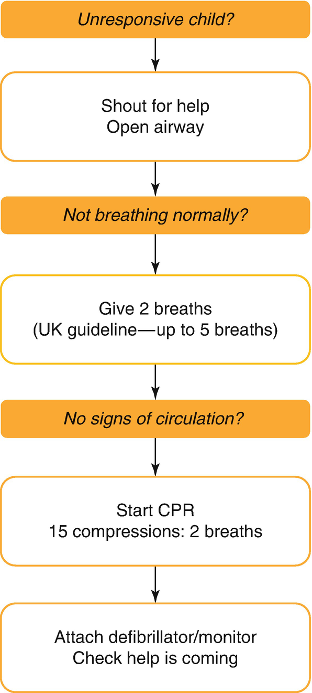
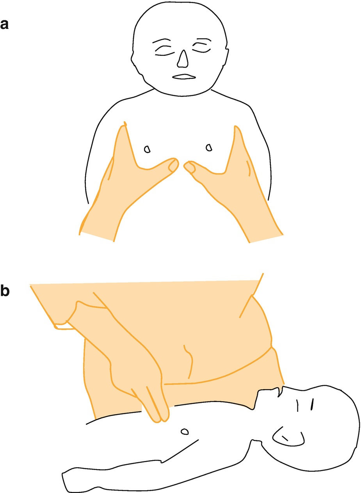
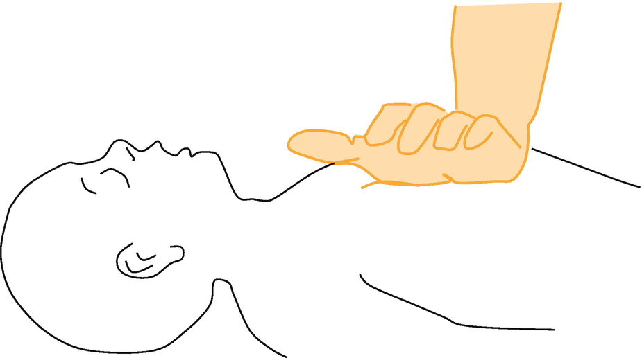
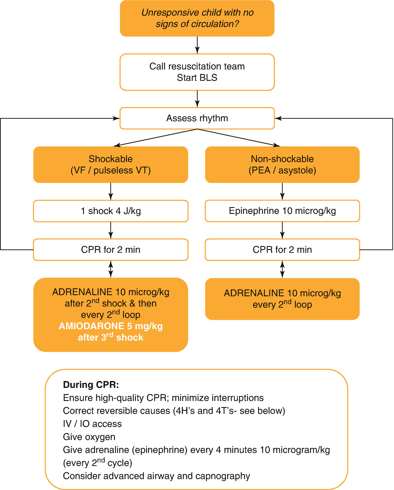
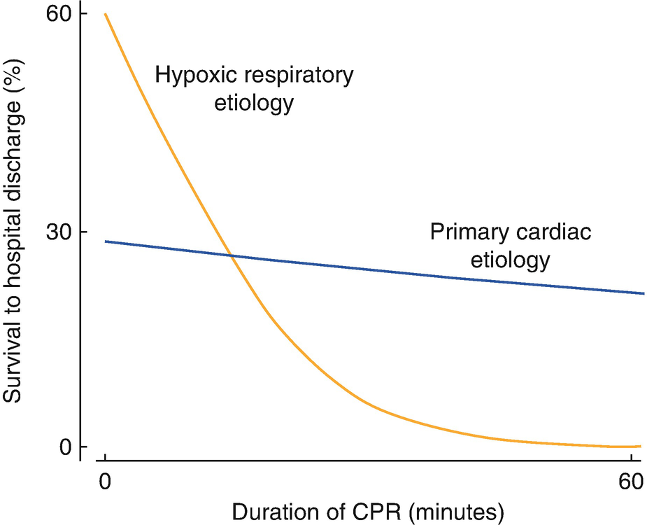
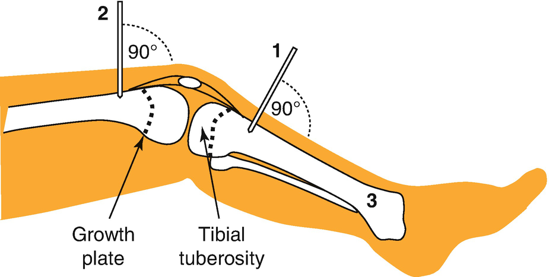
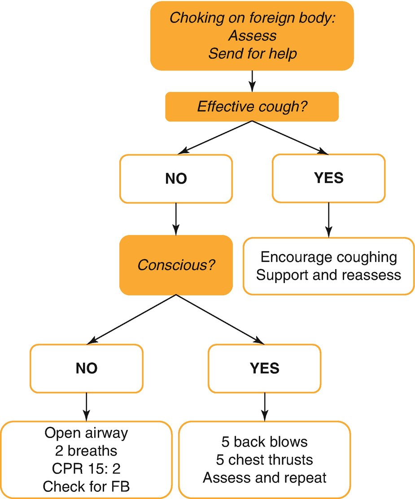
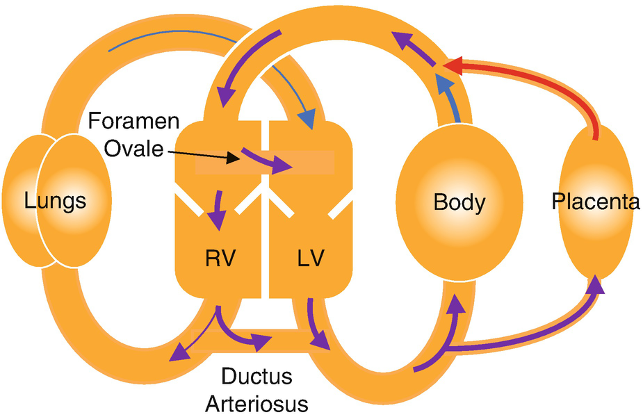
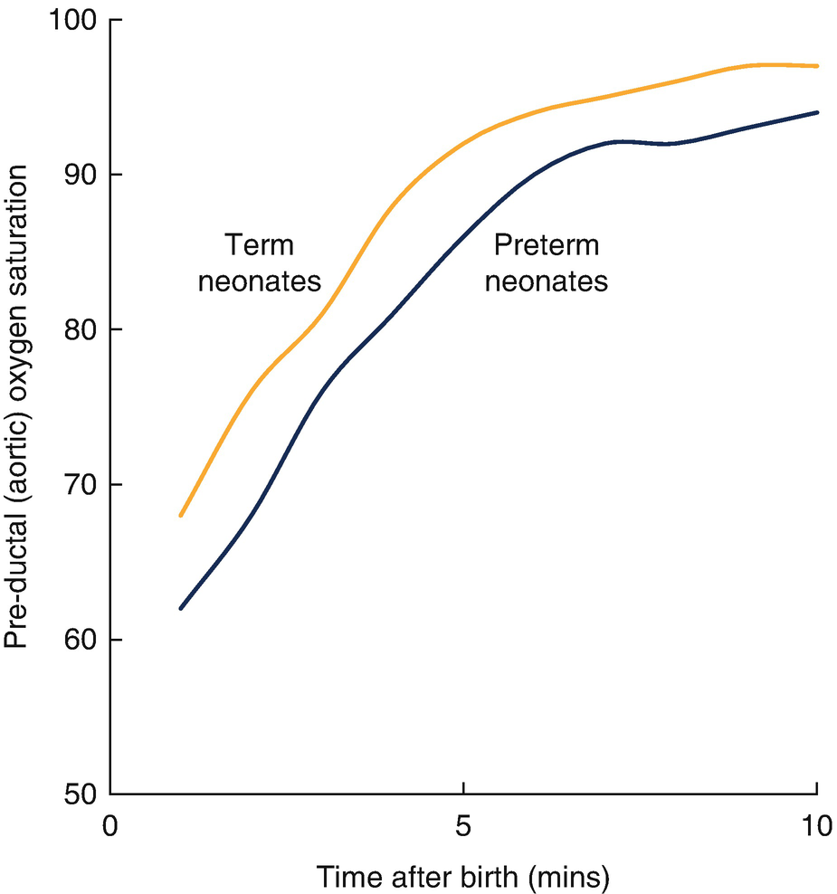
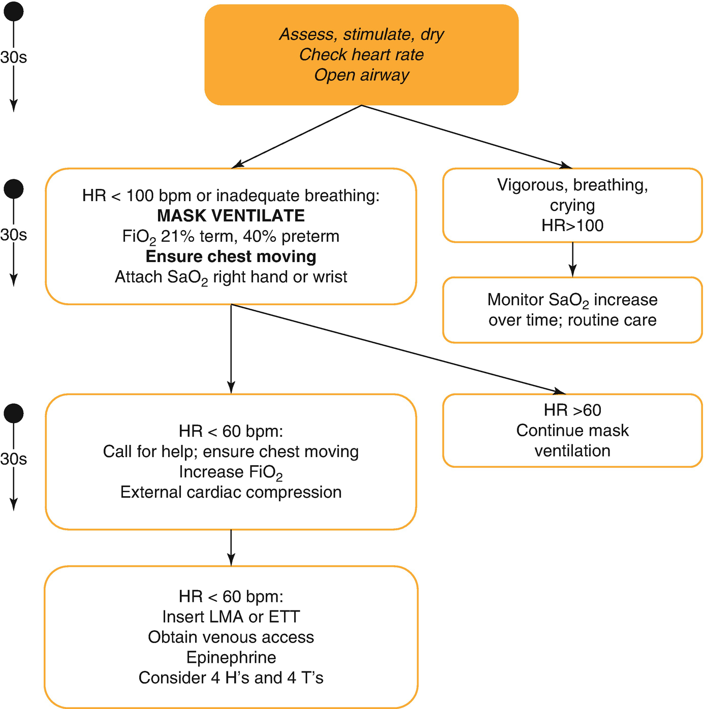

Resuscitation and Emergency Drugs

© Springer Nature Switzerland AG 2020

Craig Sims, Dana Weber and Chris Johnson (eds.) A Guide to Pediatric Anesthesia[https://doi.org/10.1007/978-3-030-19246-4\_7](https://doi.org/10.1007/978-3-030-19246-4_7)

# 7. Resuscitation and Emergency Drugs

Philip Russell[1](#Aff4)    

(1)

Western Anaesthesiology, Subiaco, WA, Australia

Philip Russell

Email: [philrussell@me.com](mailto:philrussell@me.com)

### Keywords

Neonatal resuscitationIntraosseous needleAnesthetic anaphylaxisManagement of cardiac arrest in childrenPediatric advanced life support

Any resuscitation is stressful for the staff involved, but even more so if the patient is a child. There are many differences when a child is involved— the causes of arrest may be different, staff are usually less familiar with CPR in children than in adults, doses of drugs need to be calculated, and parents are often present at the resuscitation.

## 7.1 Cardiac Arrest in Children

The causes of cardiorespiratory arrest in children are different from those in adults because most pediatric arrests are secondary to decompensated respiratory or circulatory failure. Causes of respiratory failure include birth asphyxia, bronchiolitis, asthma and airway obstruction either from inhalation of a foreign body or other causes. Respiratory arrest may also occur secondary to neurological dysfunction caused by events such as convulsion or poisoning. A smaller proportion of cardiac arrests in children are the end result of circulatory failure, either due to fluid or blood loss, or maldistribution of fluid within the circulatory system. Fluid loss may be due to gastroenteritis, burns or trauma. Fluid maldistribution may be due to sepsis or anaphylaxis.

Although most arrests in children are asystolic arrests secondary to underlying cardiorespiratory failure, 5–15% of cardiac arrests in children are due to a primary cardiac event. Ventricular fibrillation (VF) or pulseless ventricular tachycardia (VT) may be the primary event in a significant number of arrests on wards in hospitals with a cardiology or cardiac surgery unit. VF in children may also be caused by electrolyte disturbances, drug toxicity and hypothermia.

Whatever the cause, by the time of cardiac arrest there will usually be significant hypoxia and acidosis leading to cell damage and death. The initial cardiac rhythm is often severe bradycardia or asystole. Management of a child needing resuscitation follows guidelines published by the relevant resuscitation council, including those from Australia, New Zealand, Europe and the UK, and the American Heart Association.

The outcome for out-of-hospital cardiac arrest is better in children than in adults. The outcome in infants however, is worse than adults because of the poor outcome from sudden infant death syndrome (SIDS). Children also have a better outcome for in-hospital arrest, reflecting the underlying causes of arrest.

### Keypoint

Most cardiac arrests in children are the end result of decompensated respiratory or circulatory failure. Children with cardiac disease may also arrest from these causes, but are also more likely to have a primary cardiac arrest in VF or pulseless VT.

### 7.1.1 Perioperative Cardiac Arrest in Children

‘Wake Up Safe’ is the largest study of perioperative cardiac arrest in children and included over one million anesthetics. It found perioperative cardiac arrest occurs in 5.3 per 10,000 anesthetics, and arrest directly related to anesthesia occurs in 3.3 per 10,000 (Table [7.1](#Tab1)). The mortality rate for anesthetic related cardiac arrest was 10.9%, which was lower than arrests not related to anesthesia. Although this large study collected data from many institutions, it included data from very unwell children—half of the children who had a cardiac arrest had congenital heart disease, and 40% were receiving some form of physiologic support including oxygen, inotropes or extracorporeal membrane oxygenation. A lower incidence of arrest would be expected in healthier children not requiring tertiary pediatric hospital care. Other risk factors applicable to all children having anesthesia included age less than 6 months, ASA status 3–5, emergency surgery and after-hours surgery. The incidence of death related to anesthesia was 0.36 per 10,000 anesthetics.

Table 7.1

Etiology of pediatric cardiac arrest during anesthesia and surgery

| 
Etiology of anesthesia-related arrest | Details

 |
| --- | --- |
| 

Cardiovascular (49%) | Arrhythmia (16%), hemorrhage (9%), primary cardiac failure (9%), pulmonary hypertension (6%)

 |
| 

Respiratory (35%) | Airway obstruction (15%) including laryngospasm, Inability to intubate or ventilate, premature extubation

 |
| 

Medication related (7%) | Opioid, inhaled anesthetic, muscle relaxant

 |
| 

Central line related (3%) | Arrhythmia, cardiac tamponade

 |
| 

Blood products (1%)

 |   |
| 

Could not be determined (14%)

 |   |

Data from ‘Wake Up Safe’ study, Anesth Analg 2018;127: 472–7

### 7.1.2 Basic Life Support

Basic Life Support (BLS) algorithms for children have a greater emphasis on early management of airway and breathing. The critical first step is oxygen delivery rather than chest compressions and defibrillation (A-B-C in children, rather than C-A-B for adults). After opening the airway, if the patient is not breathing (or only gasping), two rescue breaths are given (Fig. [7.1](#Fig1)). In adults, chest compressions are started before ventilation, and an automated external defibrillator (AED) is applied as soon as available, reflecting the greater incidence of a primary cardiac cause of arrest.

Fig. 7.1

Pediatric BLS for health care providers

Cardiopulmonary resuscitation (CPR) should be started when cardiac arrest is suspected on the basis of lack of signs of circulation, which include lack of responsiveness (unconsciousness), lack of breathing, lack of movement, pallor or cyanosis. It is not necessary to attempt to feel a pulse before starting CPR as pulse detection by palpation is unreliable in children, even when performed by healthcare personnel. If an attempt is made to palpate a pulse, CPR should be started if a pulse has not been felt within 10 s or if there is uncertainty about its presence. Chest compressions should be commenced if the pulse is less than 60 per minute in an infant or less than 40 per minute in a child.

### Note

Palpating for a pulse is unreliable in children, even when performed by healthcare personnel. However, the most accurate sites for palpation in a child are the brachial and femoral arteries.

High quality CPR includes minimal interruption to chest compressions and ventilation. The compression rate during CPR for all ages is between 100 and 120 per minute. The ratio of compressions to ventilations is 15:2 for health-care rescuers.

Chest compressions should compress the lower half of the sternum by approximately one-third the depth of the anterior-posterior diameter of the chest (5 cm in children, 4 cm in infants). For infants (a child less than 1 year of age) a two-finger technique or two-thumb (hand-encircling) technique should be used (Fig. [7.2](#Fig2)). For children greater than 1 year of age, compress the lower half of the sternum with the heel of one hand (Fig. [7.3](#Fig3)). For larger children, a two-handed technique can be used. Children have a much more compliant chest wall compared with adults, therefore less force is required for chest compression.

Fig. 7.2

(**a**) Infant chest compression using encircling technique. (**b**) Infant chest compression using two-finger technique

Fig. 7.3

Child chest compression using one-hand technique

Compression-only CPR from bystanders produces no survival benefit in out of hospital cardiac arrest in children, whereas standard ventilation-compression CPR does result in a survival benefit. Compression rates of less than 100 per minute or greater than 140 per minute, and inadequate compression depth are associated with lower rates of survival. Apart from an interruption to summon help, BLS must not be interrupted unless the child moves or takes a breath.

### 7.1.3 Advanced Life Support

Advanced life support is the management of an arrested or peri-arrest patient by a team of health care providers. It builds on BLS by adding monitoring of cardiac rhythm and treatment with defibrillation or drugs, and the use of an advanced airway such as the LMA or tracheal tube for ventilation.

As in adults, the management of cardiac arrest is divided into shockable and non-shockable rhythms (Fig. [7.4](#Fig4)), and defibrillator and monitor should be attached as soon as possible to assess rhythm.

Fig. 7.4

Pediatric advanced life support algorithm

An advanced airway (LMA or ETT) improves ventilation compared with mask ventilation, and reduces interruptions to chest compressions, which in turn improves cardiac output. Endotracheal intubation provides better protection of the airway and control of ventilation, however insertion of an LMA is quicker and may be performed by those with less experience in airway management.

During CPR with an advanced airway in place, chest compressions should be continuous at a rate of 100–120 per minute, and ventilation at a rate of 10–12 per minute. If spontaneous cardiac output returns, a ventilation rate of 12–20 per minute is used. Capnography can be used to confirm ventilation and optimize the quality of CPR. If exhaled CO2 (ETCO2) is not detected, the position of the ETT should be checked by direct laryngoscopy. Although the absence of CO2 may reflect tube misplacement, it may also be caused by very low pulmonary blood flow (such as immediately following adrenaline administration). If the ETCO2 is consistently less than 10–15 mmHg (2 kPA), efforts should be made to improve chest compressions. Hyperventilation should be avoided due to the risk of reducing cerebral blood flow. An abrupt, sustained increase in ETCO2 may occur just before the return of spontaneous circulation.

### Note

A capnogram and detectable ETCO2 are present during effective CPR in cardiac arrest in children. Absence of ETCO2 usually suggests the ETT is not in the trachea. Avoid hyperventilation and optimize the quality of chest compressions, aiming to keep ETCO2 above 15 mmHg (2 kPA).

Hundred percent oxygen is still recommended for the arrested patient. There is no evidence to support the use of lower oxygen concentrations during resuscitation, but the inspired oxygen concentration is titrated to limit hyperoxia once spontaneous circulation has returned.

For both shockable and non-shockable rhythms, chest compressions are briefly paused to assess the cardiac rhythm at intervals of 2 min. If there is an organized rhythm, a pulse or signs of circulation are checked for at the end of that 2 min cycle. If there is a return of spontaneous circulation, post resuscitation care is continued.

#### 7.1.3.1 Non-shockable Rhythms

These are severe bradycardia, asystole, and pulseless electrical activity (PEA). Effective basic life support and treatment of the underlying cause of the arrest affect the outcome of the arrest. Drug treatment includes adrenaline (epinephrine) 10 μg/kg (0.1 mL/kg of 1:10,000 solution) via intravenous or intra-osseous route every 4 min (every second cycle) until the return of spontaneous circulation. Higher doses of intravascular adrenaline in children may worsen outcome. Adrenaline (epinephrine) may be given through a peripheral line in the emergency situation, followed by a normal saline flush. If the child has no existing IV access, the intraosseous route is recommended as it is rapid and effective (see below). A central venous catheter is recommended if the child has ongoing inotrope requirements. Drug delivery via a tracheal tube is no longer recommended.

Adequate ventilation and chest compression are the best way to reverse acidosis during arrest. Alkalizing agents are not used routinely in resuscitation care. However, in prolonged arrest, severe metabolic acidosis may be treated with sodium bicarbonate 1 mmol/kg. Sodium bicarbonate inactivates adrenaline, therefore the line must be flushed with saline if adrenaline is going to be given. Atropine has no role in the routine management of cardiac arrest.

#### 7.1.3.2 Shockable Rhythms

These include VF and pulseless VT. They are treated with a single asynchronous DC shock of 4 J/kg (either monophasic or biphasic). External chest compression is then immediately restarted and continued for 2 min before re-analyzing the cardiac rhythm. All subsequent shocks should be 4 J/kg and interruptions to chest compression minimized. Chest compression is only paused to check the child’s pulse if there has been a change in cardiac rhythm, or if the child shows signs of life such as spontaneous movement or resumption of normal breathing. The risk of harm from unnecessary chest compressions is minimal, whereas interruption of chest compressions reduces the chance of a successful outcome.

Three ‘stacked’ shocks of 4 J/kg may be used in special circumstances such as witnessed arrests in the cardiac catheter lab, and ICU or theatre after cardiac surgery. Synchronized shocks of 0.5–2 J/kg are used for VT when there is hypotension but a pulse is present.

Paddles and defibrillation pads are equally effective. There are two sizes of defibrillation pad or paddle:

Adult-size (8–12 cm diameter) for adults and children >10 kg (approximately 1 year); and infant-size (4.5 cm diameter) for infants less <10 kg. Their placement should follow their manufacturer’s recommendations—usually antero-apical with one electrode placed below the clavicle just to the right of the sternum, and the other over the apex in the mid-axillary line. In infants, anterior-posterior placement should be used if the pads cannot be adequately separated in the standard position. If infant pads are not available then standard adult pads can be used in the anterior-posterior position. Defibrillator pads must not touch, and a gap of least 3 cm between electrodes is preferable.

#### 7.1.3.3 Automated External Defibrillators (AEDs)

Manual defibrillators are preferred in children, however if they are not available a standard AED can be used in children over 8 years (Table [7.2](#Tab2)). AEDs in institutions caring for children at risk for arrhythmias and cardiac arrest (eg, hospitals, Emergency Departments) must be capable of recognizing pediatric cardiac rhythms. Many manufacturers supply pediatric pads or programs, which typically attenuate the output to 50–75 J. These devices are recommended for use in children between 1 and 8 years. If a manual defibrillator or pediatric attenuation system is not available, then a standard AED can be used.

Table 7.2

Recommendations for the use of automated external defibrillators (AEDs) in children

| 
Child’s age | Advice

 |
| --- | --- |
| 

8 years and older | Use unmodified adult AED

 |
| 

Younger than 8 years | AED can be used, preferably with energy attenuation (if not available use standard AED)

 |

Shockable rhythms are unusual in infants (particularly in out-of-hospital arrest), and the focus of resuscitation is on high quality CPR. However, there are rare case reports of successful use of AEDs in this age group. If an infant is arrested and in a shockable rhythm, current recommendations are to use an AED (preferably attenuated) if a manual defibrillator is not available.

### Keypoint

Defibrillation of infants:

Manual defibrillator preferable, 4 J/kg

Infant pads, anterior-apical or antero-posterior—left side of lower sternum and below left scapula

Defibrillation of children 1–8 years:

Manual defibrillator, 4 J/kg

Adult pads, apical (mid axillary line) and to right of sternum below clavicle

Gap of more than 3 cm between edge of the two pads

#### 7.1.3.4 Anti-arrhythmic Drugs

Defibrillation is the definitive treatment of VF and pulseless VT. Anti-arrhythmic drugs are given to stabilize the converted rhythm. Amiodarone 5 mg/kg IV/IO bolus, is the first-line agent and is given once, only after the third shock. Lidocaine 1 mg/kg may be used if amiodarone is not available. Magnesium (0.1–0.2 mmol/kg) is indicated in arrest due to polymorphic VT (torsades de pointes), or in the presence of hypomagnesaemia.

### 7.1.4 Estimation of Children’s Weight

In emergencies, it may not be practical to weigh children before starting treatment. Several methods have been devised to estimate children’s weight.

Formulae based on age include the APLS and “Best Guess” methods (Table [7.3](#Tab3)). Age-based formulae have a poor predictive accuracy, particularly in older children, and may require complex calculations in a stressful environment. However, they require no equipment and are taught in pediatric advanced life support courses.

Table 7.3

Formulae for weight of children based on age

| 
Age | APLS formula | Best Guess formula | UK Resuscitation Council

 |
| --- | --- | --- | --- |
| 

<1 year |  | 

 |   |
| 

1–5 years | _(2 × age) + 8_ | _(2 × age) + 10_ | _2 × (age + 4)_

 |
| 

5–10 years | _(3 × age) + 7_ | _4 × age_ | _2 × (age + 4)_

 |
| 

\>10 years | _Age × 3.3_

 |   |   |

Children older than 10 years have a large variation in body habitus and weight, and formulae are less accurate

Digital methods such as the Helix Weight Estimation Tool improve accuracy over other age-based estimates, as they allow calculations based on age in months, incorporate gender and body habitus, and reduce the risk of calculation errors. With these tools, the child’s data is entered and a page of values printed and included with the hospital notes. The page of values can be referred to in an emergency, and includes information about drug doses, ETT size, DC shock energy and fluid volumes. These are useful for children being cared for in non-pediatric hospitals if prepared at admission, before any emergency situation has begun.

Length- based methods such as the Broselow tape, are more accurate in estimation of weight and do not require the child’s age to be known. The tape is laid alongside the child and the length is used to estimate weight. Appropriate drug doses, ETT size and energy for DC shock are also indicated.

## 7.2 Reversible Causes of Cardiac Arrest in Children

During resuscitation, consider and correct precipitating causes that are reversible. These causes may be remembered as the 4H’s and 4T’s, as for adults:

**Hypoxia** is a prime cause of cardiac arrest in children and reversing it is essential to achieve a successful resuscitation.

**Hypovolemia** may be significant in trauma (due to hemorrhage), gastroenteritis, burns or surgical conditions such as intussusception and volvulus. Distributive shock may occur with septicemia or anaphylaxis. Initial resuscitation is with crystalloid 20 mL/kg boluses as required, followed by colloid or blood products as indicated. Most children are able to compensate very well for hypovolemia. Hypotension is usually a late and pre-terminal sign. By contrast, infants have a relatively fixed stroke volume and are less able to compensate for hypovolemia.

**Hyperkalemia**, hypokalemia, hypocalcemia and other metabolic abnormalities may be suggested by the child’s underlying condition, such as renal failure, or by ECG and blood tests taken during the arrest.

**Hypothermia** may be associated with drowning or environmental exposure. A low reading thermometer must be used to detect it, and active rewarming begun. VF may be resistant to defibrillation until the core temperature is increased to above 32 °C.

**Tension** pneumothorax and cardiac **tamponade** causing pulseless electrical activity may occur after trauma or surgery.

**Toxic** substances may be the result of accidental or deliberate overdose or iatrogenic error. Specific antidotes may be required and expert advice should be sought.

Local anesthetic toxicity may cause VT and VF. Resuscitation can be difficult and VF may be resistant to defibrillation, although outcome may be favorable if good quality CPR is quickly initiated. A bolus of lipid emulsion 2 mL/kg 20% lipid (such as Intralipid) followed by an infusion of 0.2 mL/kg/h may assist resuscitation.

**Thromboembolic** phenomena such as pulmonary embolism are less common in children than adults, but should still be considered. Children with Fontan circulation and cardiac conduits are at high risk of clot formation Spontaneous coronary thrombosis is very rare in children.

### Keypoint

Successful resuscitation requires identification and treatment of the underlying cause.

## 7.3 Hypoxia and Bradycardia as a Prelude to Cardiac Arrest

The commonest cause of cardio-pulmonary arrest during pediatric anesthesia is hypoxia due to an airway problem such as laryngospasm or loss of airway, or a respiratory problem causing inadequate ventilation. Severe hypoxia will lead to a progressively worsening bradycardia followed by asystole. The priority is to restore oxygenation and ventilation. External chest compressions should be started if the heart rate is less than 40 per minute in a child or less than 60 in an infant. Atropine (20 μg/kg IV) should be given early. Bradycardia may be worsen after suxamethonium is given (eg. to break laryngospasm), so co-administration of atropine in the hypoxic patient should be considered. Adrenaline (10 μg/kg IV) should be given in severe bradycardia if there are no signs of cardiac output or asystole. Resuscitation should follow the ALS algorithm for asystole.

## 7.4 Parental Presence During Resuscitation

Whenever possible, parents should be given the opportunity to be present during the resuscitation of an infant or child. It is important that a dedicated staff member stays with family members to provide support and an explanation of events.

## 7.5 Post-resuscitation Care

Return of spontaneous circulation (ROSC) may be recognized by:

-   Return of spontaneous movement or breathing
    
-   Return of pulse or blood pressure
    
-   Return of spontaneous arterial pressure waves with intra-arterial monitoring
    
-   An increase in ETCO2
    

The goals of post-resuscitation care are to preserve neurologic function, prevent secondary organ injury, diagnose and correct the underlying condition, and enable the patient to arrive at a pediatric tertiary-care facility in an optimal physiologic state.

Continuous monitoring is required to detect any improvement with therapy or deterioration. Ventilatory support is usually required and vasoactive drugs are frequently required for hemodynamic support. Hyperoxia should be avoided by adjusting the inspired oxygen concentration to the lowest that will maintain oxygen saturations above 94%.

Blood glucose should be checked frequently to avoid both hyper- and hypo-glycaemia. However, tight glucose control does not improve survival compared to moderate glucose control, and increases the risk of hypoglycemia. Glucose-containing fluids should not be given during CPR except in the treatment of hypoglycemia.

For infants and children remaining comatose after cardiac arrest, continuous measurement of temperature and targeted temperature management is recommended. Currently, there is insufficient evidence to recommend routine cooling over normothermia (36–37.5 °C for 5 days). Fever (>38 °C) in the post cardiac arrest setting results in poorer neurological outcomes, and active cooling should be used if the patient is febrile. If a child is severely hypothermic they should not be actively rewarmed post arrest unless core temperature is less than 33 °C. Rate of rewarming in severe hypothermia should not exceed 0.5 °C per hour. Multi-organ failure may occur after cardiac arrest with prolonged hypoxemia or hypotension, and supportive therapy may be required for many days.

## 7.6 Stopping Resuscitation

There is no single factor that predicts the likely outcome following resuscitation. Factors to consider when deciding to stop attempts at resuscitation include the circumstances of the arrest, initial rhythm, duration of resuscitation and quality of CPR, and other features such as hypothermia. Long term outcome from pediatric cardiopulmonary arrest is poor if it occurs out of hospital, but better if the arrest is respiratory alone or if cardiorespiratory arrest occurs in hospital. Perioperative cardiac arrest has significantly higher survival rates than other forms of in-hospital arrest.

The duration of cardiopulmonary resuscitation is not a reliable predictor of outcome. However, in cases of prolonged CPR, survival to hospital discharge is more likely with cardiac induced cardiac arrest, particularly in cardiac surgical patients. In the setting of respiratory failure induced arrest, survival declines exponentially after CPR duration of 15 min (Fig. [7.5](#Fig5)).

Fig. 7.5

The percentage of children surviving to discharge from hospital after in-hospital cardiac arrest. Most arrests in children are secondary to hypoxia and respiratory causes, and survival decreases markedly with prolonged CPR. Children who have a cardiac arrest due to a cardiac etiology have a worse initial outcome as a reflection of their underlying cardiac disease. Adapted from Berens RJ et al. Pediatr Anesth 2011;21: 834–40

## 7.7 Emergency Vascular Access

Achieving IV access in a seriously ill or arrested child is difficult, even for an experienced practitioner. The intra-osseous route has become the initial technique to use during resuscitation, or otherwise to be used if peripheral IV access cannot be obtained rapidly. Cannulation of the femoral vein using the Seldinger technique during ultrasound guidance is another useful, safe technique, though not in the arrest situation.

### 7.7.1 Intraosseous Access

Intraosseous (IO) access can often be achieved more rapidly than peripheral venous access. Unlike peripheral veins, bone marrow vessels will not collapse in shock or hypothermia. An IO needle with a stylet is most commonly inserted using an IO drill or gun. The success rate is 90% or higher, but lower in infants in whom manual insertion may have a higher success rate than drill insertion.

In infants and children, the preferred site is the anteromedial surface of the tibia, 2–3 cm below the tibial tuberosity, away from the growth plate (Fig. [7.6](#Fig6)). In young children, the tibial tuberosity may not have developed, and insertion point is about 3 cm distal and 1 cm medial to the lower border of the patella. In older children, the bone cortex can be thick and strong, and the medial side of the distal tibia, about 3 cm above the medial malleolus, can be used. An alternative site only for infants and small children is the medial side of the distal femur about 3 cm above the lateral condyle, which is above the growth plate. In any age group, the IO needle cannot be inserted into bones or limbs that are fractured.

Fig. 7.6

Intraosseous insertion sites in children. (**1**) Anteromedial surface of the tibia, 2–3 cm below the tibial tuberosity. (**2**) Anterior surface of distal femur, 3 cm above the level of the lateral condyle. (**3**) Alternative site for older children on medial aspect of distal tibia about 3 cm above medial malleolus

After sterile preparation of the skin, the needle is inserted at a 90-degree angle to the skin. A loss of resistance is felt when the cortex of the bone is penetrated— this may only be millimeters from the skin in babies. Correct needle placement may be confirmed by aspiration of blood or bone marrow (although not always) or free flow of fluid by gravity. If aspiration is not possible and there is no flow of fluid with gravity, then attempt infusion of fluid by syringe. Pressurized fluids should flow without difficulty and there should be no evidence of extravasation. Fluids may be administered more rapidly by infusion with pressure, and any drugs given IO should be followed by a saline flush to speed their entry into the central circulation. Injection and infusion into the medullary cavity causes severe pain in children who are conscious and aware. IO lidocaine or opioids may reduce the pain.

In older children and adults, IO access may be more difficult because of the thicker bone cortex. At this age, the intra-medullary space also becomes less vascular and fattier, resulting in slower infusion rates. Although the technique can be used in neonates, fracture or perforation of the bone are risks because it is difficult to feel the needle enter the marrow cavity, particularly when using a drill device, and umbilical vein catheterization may be preferable.

Blood or bone marrow may be aspirated and used to measure electrolytes (although the potassium level may be higher than with venous sample), glucose level and perform cross match. The receiving laboratory should be warned the sample is from the marrow cavity, as the marrow may block their equipment or the lab may suspect undiagnosed leukemia. The marrow sample can be used in glucometers, iSTAT® and similar point-of-care devices. All of the drugs used during resuscitation can be given via the IO route. The commonest complication is extravasation, which may cause compartment syndrome if not recognized. Infection is a concern and is related to the duration of IO access (Table [7.4](#Tab4)). Once the child is stabilized, definitive access should be obtained and IO access removed within 24 h.

Table 7.4

Complications of intraosseous insertion

| 
Potential complications of IO access

 |
| --- |
| 

Extravasation and compartment syndrome

 |
| 

Infection and osteomyelitis

 |
| 

Growth plate injury

 |
| 

Fracture

 |
| 

Fat embolism

 |

## 7.8 Management of the Choking Child

Airway obstruction with a foreign body should be suspected if there is a sudden onset of respiratory compromise associated with coughing, gagging and stridor. Management depends on the severity of the choking episode (Fig. [7.7](#Fig7)). If the child has mild airway obstruction with an effective cough, then the child is encouraged to cough and monitored for signs of recovery or deterioration. If the child is conscious but has severe airway obstruction and an ineffective cough, then the child is given up to five back blows between the shoulder blades. If this is not effective, up to five chest thrusts over the lower half of the sternum (as for chest compressions in CPR) are given. If the child has severe airway obstruction and is unconscious, then CPR is begun, starting with two breaths.

Fig. 7.7

Management of a child choking on a foreign body

## 7.9 Anaphylaxis

As in adults, the commonest causes of anaphylaxis (both immune and non-immune mediated) in the peri-operative setting are muscle relaxants, latex, antibiotics and radio-contrast media. The incidence of anaphylaxis appears to be increasing, especially in children and young adults. Environmental agents or over-the-counter medicines may play a role in sensitization of individuals and an increased risk of anaphylaxis with drugs such as muscle relaxants.

The management of anaphylaxis requires early administration of adrenaline (epinephrine), effective airway management, aggressive fluid resuscitation if shock is present, and escalation of therapy in refractory cases (Table [7.5](#Tab5)). If cardiac arrest has occurred (usually PEA), then the ALS guideline for non-shockable rhythm should be followed, using the arrest dose of epinephrine (10 μg/kg IV).

Table 7.5

Suggested initial adrenaline (epinephrine) treatment of anaphylaxis in children

| 
Route | Initial adrenaline (epinephrine) dose | Notes

 |
| --- | --- | --- |
| 

Intravenous | **Use 1:10,000 = 1 mg/10 mL**

Moderate anaphylaxis:

1–2 μg/kg 1–2 min prn

(0.01–0.02 mL/kg of 1:10,000)

Life threatening:

4–10 μg/kg 1–2 min prn

(0.04–0.1 mL/kg of 1:10,000) | Must be titrated carefully

Increase dose if unresponsive

Features of ‘life threatening anaphylaxis’ include:

Severe hypotension

Life threatening tachy- or brady-arrhythmia

Oxygen saturation <90%

Inspiratory pressure >40 cmH2O

 |
| 

Intramuscular | **Use 1:1000 = 1 mg/mL**

10 μg/kg 5 min prn

(0.01 mL/kg of **1:1000)**

up to 0.5 mg

If weight not known:

<6 years: 0.15 mL = 150 μg

6–12 years: 0.3 mL = 300 μg | Into lateral thigh

Consider if no IV access or hemodynamic monitoring, or awaiting epinephrine infusion

 |

Based on Australia & New Zealand Anaesthetic Allergy Group guidelines, 2017

Patients at known risk of anaphylaxis should carry self-administration auto-injector adrenaline pens (eg Epipen®), with two pens (twin-pack) now recommended in case a second dose is required for persistent symptoms. The standard dose pen (epinephrine 0.3 mg) is used for adults and children heavier than 30 kg, while the ‘junior’ pen (epinephrine 0.15 mg) is for children 15–30 kg. The recommended site for IM injection is the lateral thigh.

Any child who has a suspected anaphylactic reaction associated with anesthesia should be investigated fully with referral to a specialist allergy or immunology center. Blood samples for mast cell tryptase collected as soon as feasible after resuscitation has started and again 1–2 h after the onset of symptoms assist with diagnosis.

## 7.10 Neonatal Resuscitation at Birth

Neonatal resuscitation at birth is different to the resuscitation of other age groups because of the profound respiratory and cardiovascular changes occurring at birth. Immediate and adequate support of newborn infants who fail to adapt normally in the delivery room is critically important for their prognosis. The commonest causes of death in the neonatal period are related to prematurity, congenital malformations and perinatal asphyxia.

Neonatal resuscitation is a rapid sequence of steps to identify and manage babies with impaired breathing or circulation. Ventilation is the key. Most newborns are vigorous and do not need medical intervention. Approximately 10% require some sort of medical assistance, but only 0.1% need chest compressions or drugs for resuscitation after birth.

The neonatal resuscitation guidelines are appropriate for newborns and neonates with a transitional circulation, and in locations where the neonatal guidelines are commonly used, such as the delivery room, nursery or NICU. For neonates outside these locations and beyond the time of transitional circulation, it is reasonable to use pediatric resuscitation guidelines.

### Note

Neonatal resuscitation differs from adult resuscitation in four areas:

Head position of the neonate; position of hands for cardiac compression; reassessment in 30 s blocks of time; different epinephrine dose in asystole.

### 7.10.1 Major Changes at Birth: From Fetal to Neonatal Circulation

In utero, the pulmonary and systemic circulations are in parallel, with mixing of blood between the two circulations at the level of the ductus arteriosus and foramen ovale (Fig. [7.8](#Fig8)). This mixing allows oxygenated blood from the placenta to return to the right side of the heart to reach the arterial circulation. The lungs are filled with fluid, the left and right pulmonary arteries are constricted, and only about 7% of the cardiac output passes through the lungs.

Fig. 7.8

Schematic representation of the fetal circulation with patent ductus arteriosius and foramen ovale

Multiple stimuli initiate breathing after birth. A strong, negative intrathoracic pressure inflates the lungs for the first breath. Lung fluid is absorbed into the circulation and oxygen triggers prostacyclin release causing nitric oxide formation and a fall in pulmonary vascular resistance (PVR). Removal of the placenta from the circulation increases the systemic vascular resistance (SVR). The fall in PVR and rise in SVR causes functional closure of the ductus and foramen ovale, and right-to-left shunting of blood is markedly reduced and the pulmonary and systemic circulations become in-series with one another. Oxygen saturation rises shunting is reduced and lung function improves (Fig. [7.9](#Fig9)).

Fig. 7.9

Oxygen saturation after birth in term and preterm neonates. Oxygen saturation is 65% at birth and should reach 85–90% by 5–10 min after birth. Based on data from Wong C, Pediatrics 2010

#### 7.10.1.1 Pre- and Post-ductal Oxygen Saturations

The ductus arteriosus is not fully closed immediately after birth, and there is still some blood shunting through it. This shunting may be right-to-left (as in utero) or left-to-right depending on the balance between the SVR and PVR. The oxygen saturation distal to the ductus arteriosus (‘post-ductal’) may therefore vary. The pre-ductal saturation represents cerebral oxygenation and saturation is best measured in the right hand or wrist of newborns. The left hand is usually pre-ductal, but not always. The feet are post-ductal, and saturation is usually lower there during the first 15 min after birth because of R-to-L shunting across the duct. If post-ductal saturation remains lower, it suggests pulmonary hypertension or aortic lesions keeping the aortic pressure lower than the pulmonary pressure. A post-ductal saturation higher than the pre-ductal suggests transposition of the great arteries.

### 7.10.2 Preparation for Resuscitation

The equipment required for resuscitation of newborns (Tables [7.6](#Tab6) and [7.7](#Tab7)) is assembled and checked before delivery. The presence of risk factors may be helpful in predicting the need for resuscitation (Table [7.8](#Tab8)) and may also help determine the initial level of resuscitation. For example, if there is placental abruption and fetal bradycardia suggesting hypoxia before delivery, then immediate intubation would be considered. However, if there was no such history and the baby is born unexpectedly ‘flat’, then the baby might be observed for 30 s or a trial of bag-mask (or Neopuff®) ventilation given.

Table 7.6

Equipment required for neonatal resuscitation in the delivery room

| 
Equipment item

 |
| --- |
| 

Warm dry towels and radiant heat source

 |
| 

Oxygen supply and pressure-limited delivery system such as self-inflating bag, T-piece, or Neopuff® ventilator

 |
| 

Airway equipment including face masks, oro-pharyngeal airways, laryngoscopes, endotracheal tubes and introducer

 |
| 

Carbon dioxide detector (eg Pedicap®)

 |
| 

Suction apparatus

 |
| 

Stethoscope

 |
| 

Venous access equipment and drugs

 |

Table 7.7

ETT sizes for newborns

| 
Age | Uncuffed ETT size (ID, mm)

 |   | 

Cuffed ETT size (ID, mm)

 |
| --- | --- | --- | --- |
| 

Term baby | 3–3.5

 |   | 

3.0

 |
| 

Preterm | 3

 |   | 

Not recommended

 |
| 

Preterm <1 kg | 2.5

 |   | 

Not recommended

 |

Table 7.8

Some factors during pregnancy and delivery that may indicate a need for neonatal resuscitation

| 
Risk factor

 |
| --- |
| 

Antepartum | Preterm baby

 |
| --- | --- |
|   | 

Small for dates

 |
|   | 

Congenital abnormality diagnosed on screening

 |
| 

Intrapartum | Fetal distress

 |
|   | 

Antepartum hemorrhage

 |
|   | 

Meconium stained liquor

 |

### 7.10.3 Initial Assessment at Birth

The need for resuscitation is based on clinical observation and not the APGAR score (see later). The baby needs resuscitation if it is not vigorous and crying, or is bradycardic or not breathing adequately. Normal heart rate after birth is 110–160 beats/min. A baby at birth will initially appear cyanosed.

### 7.10.4 Neonatal Resuscitation

Resuscitation and assessment of the neonate is grouped into 30-s blocks. Initial actions are to assess the baby while drying and stimulating it, but also keeping it warm at the same time. Unlike resuscitation in other age groups, breathing and circulation are assessed together as heart rate is an important indicator of response. While the sequence of actions may differ from adult and pediatric resuscitation, the basic approach is still Airway, Breathing, and Circulation (Fig. [7.10](#Fig10)). Hypothermia is a risk and is avoided by drying the baby and using an external heat source.

Fig. 7.10

Flow diagram of the steps during neonatal resuscitation. Infants who have absent or ineffective spontaneous breathing must have assisted ventilation begun within 1 min

### Keypoint

Failure of a neonate to respond to resuscitation is most likely due to inadequate ventilation.

Bradycardia is almost always due to hypoxia due to inadequate ventilation.

#### 7.10.4.1 Airway

The baby’s head should be in a neutral position or slightly tilted back to maintain an open airway. Neck flexion occasionally occurs from the neonate’s relatively large head and can be overcome with a roll beneath the shoulders. Check for any obstruction of the airway such as meconium or blood. Chin support or jaw thrust may be required to achieve a patent airway.

#### 7.10.4.2 Breathing

Assisted ventilation should be commenced by 1 min in infants who have absent or ineffective spontaneous ventilation. If positive pressure ventilation is required, chest movement during the first few breaths may be minimal as lung fluid in the alveoli is replaced with air or oxygen. Sustained initial inflation breaths may be considered in preterm infants. After these initial breaths, ventilation is continued at 40–60 breaths/min while avoiding hyperventilation. Chest movement is observed to confirm airway patency. Ventilation is continued until regular breathing is established and heart rate remains faster than 100 bpm. Ventilation via a facemask or ETT can be performed with a self-inflating bag or T-piece circuit. The latter is recommended as they more reliably deliver PEEP or CPAP. PEEP allows faster establishment of functional residual capacity (FRC) and improved oxygenation. A Neopuff® ventilator is a T-piece type pressure-limited ventilator with a non-rebreathing valve at the patient connection. Suggested initial settings are 30 cmH2O for peak inspiratory pressure (20–25 cmH2O if <32 weeks or known lung disease), and PEEP at 5–8 cmH2O. An oxygen-air blender is used to control the inspired oxygen concentration.

#### 7.10.4.3 Oxygen During Resuscitation

Hundred percent oxygen is not routinely needed during neonatal resuscitation. There is no evidence that the neonate’s oxygen saturation of 65% at birth needs to be rapidly increased. High concentrations of oxygen may reduce cerebral blood flow, predispose to retinopathy of prematurity and also produce free radicals and a ‘reperfusion injury’ to the neonatal brain. Current recommendations are to use air for resuscitation of term infants at birth. If, despite effective ventilation, oxygenation remains unacceptable, use of a higher concentration of oxygen should be considered. Titration of oxygen concentration delivery should be guided by oximetry monitored from the right upper extremity. Saturation should reach 90% by 5–10 min.

#### 7.10.4.4 Circulation

Heart rate is counted with auscultation at the apex (for 6 s, multiply by 10) and later pulse oximetry.

ECG is also recommended as an adjunct for monitoring resuscitation. Palpation of the umbilical pulse can be used, but palpation of peripheral pulses is not practical. Chest compression should be started if the heart rate remains less than 60 bpm despite adequate ventilation. A hand-encircling technique is the best method to deliver chest compressions, using the thumbs to compress the chest by one third of its depth. A two-finger compression of the sternum allows better access for procedures such as vascular access. Perform three compressions and one breath every 2 s. Stop and recheck the heart rate every 30 s. Chest compressions should be continued until the heart rate is above 60 bpm. The most common reason for failure to respond is inadequate ventilation.

### Note

To detect neonatal heart rate: Auscultation; palpation of umbilical pulse; oximetry.

#### 7.10.4.5 Drugs

If chest compressions are needed, vascular access should be considered to enable administration of intravenous adrenaline (epinephrine). An umbilical venous catheter is the route of choice. Endotracheal adrenaline is no longer recommended. If drugs are required for resuscitation, the outcome is often poor. The dose of IV epinephrine in neonatal resuscitation is 10–30 μg/kg. However, a gestation-based chart for dose is commonly used as it avoids the need for estimating weight and performing calculations during resuscitation (Table [7.9](#Tab9)). Bicarbonate is no longer used, and bolus doses of dextrose are avoided. Hypoglycemia is managed with a 10% dextrose infusion. Normal saline may be used as a volume expander. Naloxone 100 μg/kg IV or IM is used only when the mother has received opioids during labor.

Table 7.9

Adrenaline (epinephrine) dose for neonatal resuscitation based on gestational age

| 
Gestational age (weeks) | Adrenaline dose (mL 1:10,000 adrenaline)

 |
| --- | --- |
| 

23–26 | 10 μg (0.1)

 |
| 

27–37 | 25 μg (0.25)

 |
| 

38–43 | 50 μg (0.5)

 |

Doses are absolute values, NOT per kg

#### 7.10.4.6 Pneumothorax

Pneumothorax is not uncommon, especially in preterm babies. Diagnosis can be difficult—auscultation is unlikely to detect it and chest expansion may appear normal. Transillumination through the axilla is often the best technique in pre-term babies, but is less useful in larger term babies. Emergency treatment is aspiration of the chest with a 22G needle connected to an IV extension tubing and a three-way tap. The needle is inserted through the second intercostal space in the anterior axillary line, or in the fourth space in the mid-axillary line. Have a high index of suspicion for pneumothorax and consider needle aspiration of the chest in any child not responding to resuscitation. Cardiopulmonary resuscitation of the neonate should not be stopped until both sides of the chest have been aspirated.

#### 7.10.4.7 Meconium

Although meconium\-stained liquor is common, meconium aspiration is rare. If meconium exposure has occurred and the baby is vigorous, only oropharyngeal suctioning is required. If the baby is not vigorous, not breathing or crying and has poor muscle tone, current guidelines no longer recommend the routine intubation or laryngoscopy for suctioning due to a lack of evidence of benefit in survival or incidence of meconium aspiration syndrome. Simple oropharyngeal suctioning (without laryngoscopy), and monitoring for signs of respiratory distress are recommended for these neonates.

### 7.10.5 APGAR Score

The APGAR score is a tool for recording an infant’s condition at birth as a score out of 10 (Table [7.10](#Tab10)), and is used as a prognostic guide for complications after resuscitation. It is recorded at 1 and 5 min after birth and for longer if the score is less than 7 or the baby is being resuscitated. An APGAR score of 3 or less beyond 10 min indicates an increased risk of hypoxic ischemic encephalopathy and long term adverse effects. It does not determine the need for resuscitation, as this is based on respiratory effort and heart rate rather than any particular score. However, the score will be low in a baby who needs resuscitation.

Table 7.10

Observations and values for the APGAR score

|   | 
Score

 |
| --- | --- |
| 

Observation | 0 | 1 | 2

 |
| --- | --- | --- | --- |
| 

Heart rate | Absent | Slow (<100/min) | \>100/min

 |
| 

Respiration | Absent | Slow, irregular | Good; crying or gasping

 |
| 

Muscle tone | Floppy | Some flexion | Active movement of extremities

 |
| 

Reflex irritability (response to stimulation) | No response | Grimace | Cough, sneeze, cry

 |
| 

Color | Blue or pale | Pink body, blue extremities | Pink

 |

### Note

The APGAR score does not determine the need for resuscitation. Resuscitation is needed when the baby has poor respiratory effort, a low heart rate, or both.

## Review Questions

1.  1.
    
    The emergency bell in the PACU is alarming. You arrive to find a child who is not responsive, grey, apneic, and has no pulse. Nursing staff are performing CPR. They tell you that the child has just had a tonsillectomy. Describe your resuscitation of the child.
    
2.  2.
    
    You are asked to provide assistance to resuscitate a baby. One minute after birth the baby has irregular respiratory effort, is blue all over, limp and has no reaction to suction. The umbilical cord stump pulse is felt at 60/min.
    
    Describe your resuscitation of the baby.
    
    _This baby needs resuscitation because it has poor respiratory effort, is blue and bradycardic. The baby has already been dried, suctioned and stimulated and 1 min has gone by. A 30 s trial of mask ventilation should be the next step. If the heart rate still doesn’t increase above 60, cardiac massage needs to be started and intubation considered._
    
    How is the Apgar score calculated, and what does it mean?
    
    _Virginia Apgar was an American anesthetist who devised the score in 1952. This baby gets 1 for HR, 1 for respiratory effort, but 0 for tone, color and response to suction. Its score is 2. Remember—the Apgar does not determine the need for resuscitation._
    
3.  3.
    
    You have performed a caudal block under GA with 1 mL/kg of ropivacaine 0.2% in a 4 year old who weighs 20 kg. One minute after completion of the block you see multiple ventricular ectopic beats. As you are checking the patient’s blood pressure, the ECG changes to this VF. What is the likely diagnosis? Describe your initial management of the patient
    
4.  4.
    
    The resuscitation trolley is brought into the theatre. The defibrillator is an AED but does not have pediatric pads. Can this be used? Where would you place the pads?
    

### Further Reading

### Perioperative Cardiac Arrest

1.  Berens RJ, Cassidy LD, Matchey J, et al. Probability of survival based on etiology of cardiopulmonary arrest in pediatric patients. Pediatr Anesth. 2011;21(8):834–40.[Crossref](https://doi.org/10.1111/j.1460-9592.2010.03479.x)
    
2.  Christensen RE, Lee AC, Gowen MS, et al. Pediatric perioperative cardiac arrest, death in the off hours: a report from wake up safe, the pediatric quality improvement initiative. Anesth Analg. 2018;127:472–7.[Crossref](https://doi.org/10.1213/ANE.0000000000003398)
    
3.  Shaffner D, Heitmiller E, Deshpande J. Pediatric perioperative life support. Anesth Analg. 2013;117:960–79.[Crossref](https://doi.org/10.1213/ANE.0b013e3182a1f3eb)
    
4.  van der Griend B, Lister N, McKenzie I, et al. Postoperative mortality in children after 101,885 anesthetics at a tertiary pediatric hospital. Anesth Analg. 2011;112:1440–7.[Crossref](https://doi.org/10.1213/ANE.0b013e318213be52)
    

### Resuscitation Guidelines

1.  Advanced Pediatric Life Support guidelines Jan 2016. [apls.​org.​au](http://apls.org.au). Accessed Jan 2019. [https://​www.​apls.​org.​au/​sites/​default/​files/​uploadedfiles/​Pediatric%20​advanced%20​life%20​support\_​0.​pdf](https://www.apls.org.au/sites/default/files/uploadedfiles/Pediatric%2520advanced%2520life%2520support_0.pdf).
    
2.  ANZCOR: Resuscitation guidelines. Australian Resuscitation Council/New Zealand Resuscitation Council. 2016. [https://​resus.​org.​au/​guidelines/​](https://resus.org.au/guidelines/). Accessed July 2019.
    
3.  de Caen AR, Berg MD, Chameides L, et al. Part 12: pediatric advanced life support: 2015 American Heart Association Guidelines Update for Cardiopulmonary Resuscitation and Emergency Cardiovascular Care. Circulation. 2015;132(Suppl 2):S526–42.[Crossref](https://doi.org/10.1161/CIR.0000000000000266)
    
4.  Maconochie I, Bingham B, Skellett S. Resuscitation Council UK. Pediatric advanced life support: guidelines 2015. [www.​resus.​org.​uk/​resuscitation-guidelines/​pediatric-advanced-life-support/​](http://www.resus.org.uk/resuscitation-guidelines/pediatric-advanced-life-support/). Accessed Jan 2019.
    
5.  Maconochie I, et al. Part 6: pediatric basic life support and pediatric advanced life support 2015 international consensus on cardiopulmonary resuscitation and emergency cardiovascular care science with treatment recommendations. Resuscitation. 2015;95:e149–70.[Crossref](https://doi.org/10.1016/j.resuscitation.2015.07.028)
    
6.  Nolan JP, et al. Part I. Executive summary: 2015 international consensus on cardiopulmonary resuscitation and emergency cardiovascular care science with treatment recommendations. Resuscitation. 2015;95:e1–e32.[Crossref](https://doi.org/10.1016/j.resuscitation.2015.07.039)
    
7.  Perkins G, et al. European Resuscitation Council guidelines for resuscitation: 2017 update. Resuscitation. 2018;123:43–50.[Crossref](https://doi.org/10.1016/j.resuscitation.2017.12.007)
    

### Intraosseous Access

1.  Morrison C, Disma N. Intraosseous access in children. New applications of an ancient technique. Trends Anaesth Crit Care. 2018;21:21–6.[Crossref](https://doi.org/10.1016/j.tacc.2018.04.004)
    
2.  Pifko EL, et al. Observational review of paediatric intraosseous needle placement in the paediatric emergency department. J Paediatr Child Health. 2018;54:546–50.[Crossref](https://doi.org/10.1111/jpc.13773)
    
3.  Scott-Warren VL, Morley RB. Paediatric vascular access. BJA Educ. 2015;15:199–206.[Crossref](https://doi.org/10.1093/bjaceaccp/mku050)
    

### Anaphylaxis

1.  Kolawole H, et al. Australian and New Zealand Anaesthetic Allergy Group/Australian and New Zealand College of Anaesthetists perioperative anaphylaxis management guidelines. Anaesth Intensive Care. 2017;45:151–8.[Crossref](https://doi.org/10.1177/0310057X1704500204)
    

### Neonatal Resuscitation

1.  Dawson J, Kamlin C, Vento M, Wong C, et al. Defining the reference range for oxygen saturation for infants after birth. Pediatrics. 2010;125:e1340–7. [https://​doi.​org/​10.​1542/​peds.​2009-1510](https://doi.org/10.1542/peds.2009-1510).[Crossref](https://doi.org/10.1542/peds.2009-1510)[PubMed](http://www.ncbi.nlm.nih.gov/entrez/query.fcgi?cmd=Retrieve&db=PubMed&dopt=Abstract&list_uids=20439604)
    
2.  Liley HG, Mildenhall L, Morley P. Australian and New Zealand committee on resuscitation neonatal resuscitation guidelines 2016. J Paediatr Child Health. 2017;53:621–7.[Crossref](https://doi.org/10.1111/jpc.13522)
    
3.  Welsford M, et al. Room air for initiating term newborn resuscitation: a systematic review with meta-analysis. Pediatrics. 2019;143:e20181825. Room air has a 27% relative reduction in short-term mortality compared to 100% oxygen for initiating neonatal resuscitation of infants 35 weeks gestation and older.[Crossref](https://doi.org/10.1542/peds.2018-1825)
    

### Estimation of Body Weight

1.  Appelbaum N, et al. Pediatric weight estimation by age in the digital era: optimizing a necessary evil. Resuscitation. 2018;122:29–35.[Crossref](https://doi.org/10.1016/j.resuscitation.2017.11.041)
    
2.  Tinning K, Acworth J. Make your Best Guess: an updated method for pediatric weight estimation in emergencies. Emerg Med Australasia. 2007;19:528–34.[PubMed](http://www.ncbi.nlm.nih.gov/entrez/query.fcgi?cmd=Retrieve&db=PubMed&dopt=Abstract&list_uids=18021105)