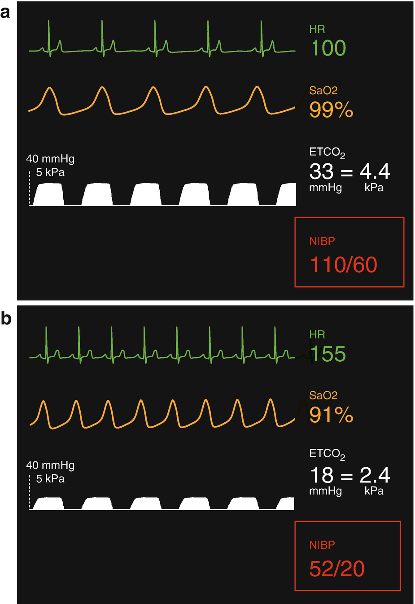
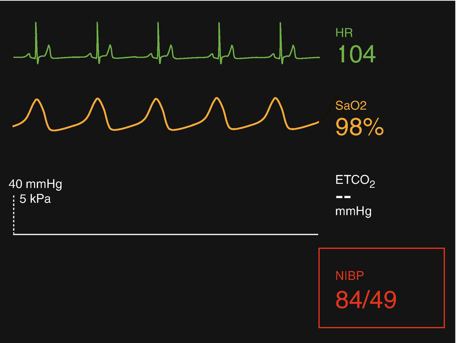
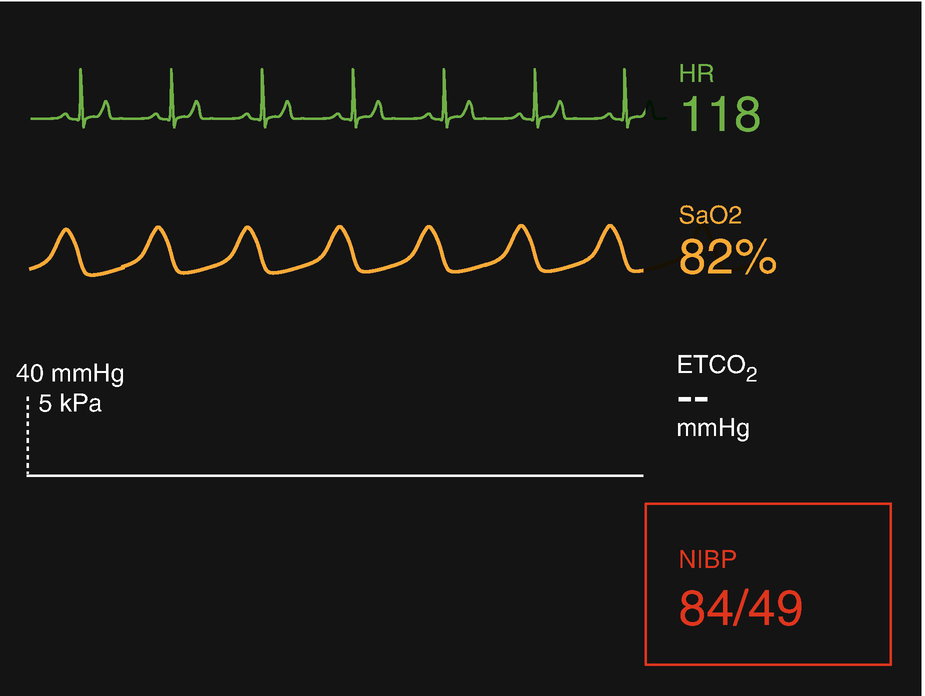
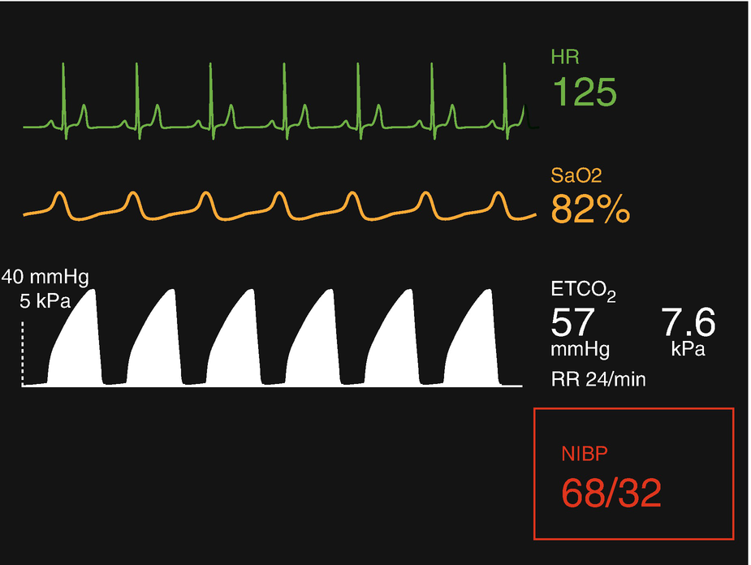
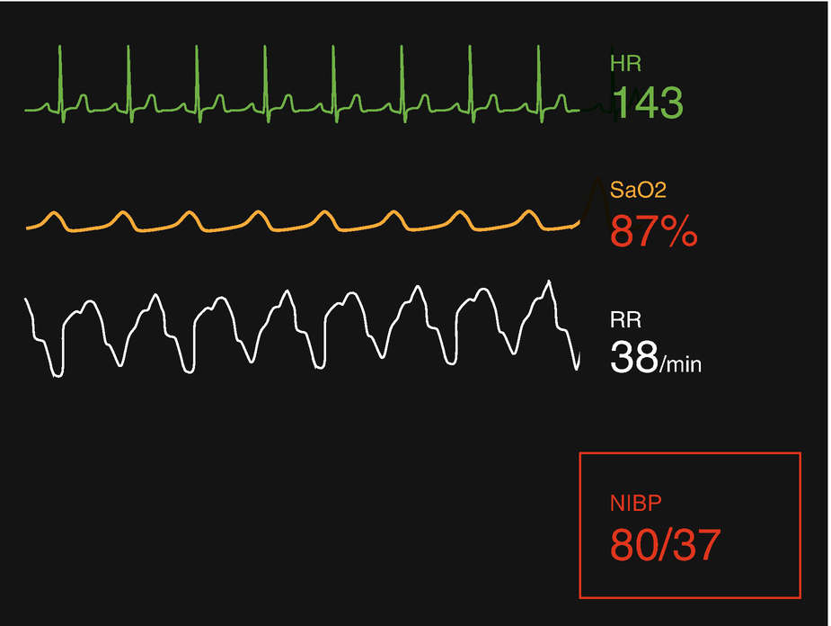

Crises and Other Scenarios in Pediatric Anesthesia

© Springer Nature Switzerland AG 2020

Craig Sims, Dana Weber and Chris Johnson (eds.) A Guide to Pediatric Anesthesia[https://doi.org/10.1007/978-3-030-19246-4\_8](https://doi.org/10.1007/978-3-030-19246-4_8)

# 8. Crises and Other Scenarios in Pediatric Anesthesia

Tom Rawlings[1](#Aff4)     and Tom Flett[1](#Aff4)    

(1)

Department of Anaesthesia and Pain Management, Perth Children’s Hospital, Nedlands, WA, Australia

Tom Rawlings (Corresponding author)

Email: [Thomas.Rawlings@health.wa.gov.au](mailto:Thomas.Rawlings@health.wa.gov.au)

Tom Flett

Email: [Thomas.Flett@health.wa.gov.au](mailto:Thomas.Flett@health.wa.gov.au)

### Keywords

Pediatric simulationPediatric anesthesia crisis managementPrimary tonsillar hemorrhagePost-extubation stridorCardiovascular collapse during laparoscopy

The successful management of a crisis is a multifactorial process. A combination of clinical skills and knowledge is required as well as the application of robust and effective non-technical skills. These non-technical skills incorporate cognitive and environmental factors to enhance a successful team environment to successfully manage a crisis.

The relevant non-technical skills include:

-   Leadership and follower-ship
    
-   Communication
    
-   Situational awareness
    
-   Calling for help
    
-   Role allocation
    
-   Right people, right roles
    
-   Avoidance of fixation error
    

Many experienced clinicians exhibit exceptional non-technical skills that are involuntary and learnt over time. Teaching and training in non-technical skills aim to teach ‘experience’ otherwise gained with time. While there is no substitute for experience, an early understanding of the multiple factors required to successfully manage a crisis allows trainees to work on their areas of weakness. Effective, targeted simulation training can help reduce the gap between the text book and reality. This training is particularly important in preparing for pediatric anesthetic crises because a child’s condition can change rapidly compared to an adult, and team members may be less familiar with children and their management during a crisis.

This chapter describes the practical management of some clinical scenarios in pediatric anesthesia. Some of the scenarios describe urgent situations, while others are less urgent but commonly seen and have the potential to become serious problems if mismanaged.

## 8.1 Cardiovascular Collapse During Laparoscopic Appendicectomy

An 8 year old boy is undergoing a laparoscopic appendicectomy. He has a two day history of abdominal pain, diarrhea and vomiting. He is otherwise previously fit and well and has never had an anesthetic before. There is no family history of problems with anesthesia.

The patient is intubated and ventilated and anesthesia is being maintained with sevoflurane, air and oxygen after an initial dose of fentanyl 2 μg/kg, propofol 120 mg, rocuronium 20 mg and antibiotic prophylaxis with piperacillin with tazobactam.

Shortly after the first port is inserted and insufflation of carbon dioxide begins, there is a drop in the ETCO2, tachycardia, desaturation and a fall in blood pressure. Figure [8.1](#Fig1) shows the monitor screen at this time.

Fig. 8.1

(**a**) Screenshot of anesthetic monitor displaying vital signs during anesthesia and before surgery has started. (**b**) Shortly after insufflation of carbon dioxide and creation of a pneumoperitoneum

What will you do?

### 8.1.1 Discussion

An initial approach to this situation could be to take an ‘ABC’ approach and consider acute ‘B’ Breathing or ‘C’ Circulation issues. The first step would be to ask the surgeon to stop insufflating gas and release the pneumoperitoneum, placing the child onto 100% oxygen and starting manual bag ventilation.

Breathing issues can be eliminated by checking there is no obstruction in the circuit and auscultating the chest to confirm bilateral air entry and normal breath sounds. Causes such as hypoventilation, endobronchial intubation and bronchospasm will cause desaturation, but are unlikely to cause profound, acute cardiovascular collapse. The most likely ‘Breathing’ cause of this scenario is a pneumothorax evolving into a tension pneumothorax from gas insufflation tracking into the pleural space. Pneumomediastinum is also possible but less likely.

Once establishing there is no acute ‘B’ problem a ‘C’ (cardiovascular) issue would be considered. Whatever the cardiovascular cause, initial management should always include asking the surgeon to cease what they are doing, give a fluid bolus of 10–20 mL/kg of isotonic crystalloid, give an alpha-agonist (either metaraminol 5–10 μg/kg or phenylephrine 1 μg/kg) and consider reducing the depth of anesthesia, balancing the management of the problem with the risk of awareness. More potent inotropes such as adrenaline (epinephrine) should be considered if cardiovascular collapse is severe and rapidly evolving. Treatment is required to establish a degree of cardiovascular stability whilst simultaneously attempting to identify the cause of the cardiovascular instability. If the patient continues to deteriorate despite these measures, they are likely to proceed towards cardiac arrest.

There are several potential causes of cardiovascular collapse during laparoscopic surgery. One is excessive gas insufflation and impairment of venous return, particularly if the patient is hypovolemic and has not been fluid loaded before the pneumoperitoneum. The child’s condition should resolve on release of pneumoperitoneum if this was the cause. If so, the pneumoperitoneum could be cautiously reapplied with low inflation pressures (less than 12 mmHg or 1.6 kPa. If the problem persists, consideration should be given to completing the procedure open.

Another possible cause is vagal response from stretching of the peritoneum, but this would likely result in bradycardia associated with cardiovascular instability.

Undiagnosed cardiac defects should always be considered in children, especially if the clinical condition is not improving, or if large volumes of fluid are making it worse. Although unlikely in an otherwise healthy child, acute cardiac failure from an undiagnosed cardiac condition can occur under the physiological stresses of pneumoperitoneum. An echocardiogram or other cardiac investigations could be considered if the diagnosis has not become apparent.

An anaphylactic cause should also be considered. There may be other signs such as rashes and lip or facial swelling, but these are not always present. The initial management is the same as described above, including a fluid bolus, with the addition of IV or IM adrenaline (epinephrine). The dose is based on the severity of the collapse and the speed of its progression (see Chap. [7](467929_2_En_7_Chapter.xhtml), Sect. [7.​9](467929_2_En_7_Chapter.xhtml#Sec18)). Intravenous adrenaline is potent and is best used in a very low dose initially until establishing how the patient will respond. In practice, adrenaline will also need dilution before being given. It is important be clear in your mind how to do this dilution, as it will likely be done under time pressure and stress, and a ten times dose error could have catastrophic consequences. A technique to dilute adrenaline is to take 1 mL of 1 in 10,000 adrenaline (100 μg/mL) and add 9 mL of normal saline to it in a 10 mL syringe. This now creates a concentration of 10 μg/mL. For infants, diluting again by a factor of 10 to create 1 μg/mL is often advised. IV adrenaline has a short half-life and repeat doses may be required. An infusion could be started if there is an ongoing requirement.

Another potential cause of this cardiovascular collapse is gas embolism from carbon dioxide used for insufflation of the pneumoperitoneum. This is another reason for stopping insufflation if is associated with any change in the child’s condition. Gas embolism occurs because the trocar is in an abdominal vein. If possible, the suspected entry site of the gas embolism is flooded with saline, and the patient placed head down. Accessing the heart via the right internal jugular vein to aspirate intracardiac gas can be considered, but is unlikely to remove a significant amount of gas. If gas embolism has been caused by this mechanism there is likely to be significant acute hemorrhage from the associated vascular injury.

Insertion of the trocar and port into the abdomen can also damage a major vascular structure such as the inferior vena cava or the aorta or iliac vessels. There may be blood coming up the port, or blood visible on the laparoscopic camera but it can be concealed and not immediately obvious. If concealed or contained in the retroperitoneal space, the abdomen will continue to distend despite deflating the pneumoperitoneum. An acute, major hemorrhage from these vessels will create a large, ongoing crisis. The abdomen will need to be opened to identify and stop the source of bleeding and to stop it. The role of the anesthetic team is to maintain the patient’s circulating volume and promote coagulation. This will require multiple team members and support, as this is likely to be an ongoing crisis. Activation of the hospital’s critical bleeding pathway will facilitate the rapid supply of blood products.

When it becomes apparent this is the cause of the child’s cardiovascular collapse, several crisis resource management principles become important in managing this scenario:

#### 8.1.1.1 Calling for Help

This should be done early and result in many people to assist you, especially in the initial stages.

#### 8.1.1.2 Leadership and Follower-Ship

Establish a leader or leadership group to assign roles and manage the clinical situation as it evolves. Ideally this person or persons should not be distracted by having to do any tasks during this crisis, although this is not always possible in reality.

#### 8.1.1.3 Communication and the Ability to Communicate

Communication is vital, but the ability to communicate is usually the problem. Too many people, too much noise and excitement can stop vital parts of the process being communicated. This is not an easy problem to solve. Options are:

-   Asking people to only communicate important information and to be quiet at other times
    
-   Politely asking people who have no particular role to leave the theatre
    
-   Establish an approach to major hemorrhage scenarios based on action cards. This prevents the need for loud, time consuming role allocation as each individual’s role is on the card; it speeds role allocation, and helps those without a role card to leave the theatre.
    
-   Have regular pause and discuss moments. At an appropriate moment silence the theatre and summarize where things are up to. This helps to bring some control and calm to the room and reduces noise; it gets everyone up to date on the clinical situation, and it invites useful suggestions from the room to the leadership group.
    

#### 8.1.1.4 Use of Cognitive Aids

Bring out the massive transfusion protocol and assign someone to work their way through it. The chances of the leader or leadership group remembering everything on the protocol under pressure is unlikely. This frees up the cognitive load of the leadership group to concentrate on other things.

#### 8.1.1.5 Role Allocation

Several roles are needed, and these roles will include people assigned to:

-   A, B, D—Airway, Breathing and ‘D’ anesthesia (This can all usually be done by one experienced person).
    
-   The patient essentially has a circulation issue but an airway, adequate ventilation and keeping the patient asleep still need to occur. Ketamine with or without midazolam may be appropriate. Muscle relaxation to facilitate ventilation and surgery is important.
    
-   C—Almost all the other team members will be focused on supporting circulation.
    
-   This will involve personnel assigned to insert lines for transfusion, monitoring and administration of vasoactive agents as well as preparing giving sets and monitoring equipment. The equipment required would include large bore IV catheters, an arterial line and central venous access. Team members could remind each other to gain IV access in the upper limbs when the IVC in the abdomen is damaged, or blood products and medications will extravasate into the peritoneal cavity.
    

A team should be assigned to ordering checking and giving blood products as well as medications useful for maintaining circulating volume, such as inotropes and calcium. Other members of the team could be assigned to keeping the patient warm, organizing cell salvage, running blood tests or ROTEM studies and communicating with the laboratory.

#### 8.1.1.6 Right People, Right Roles

Make sure you get the best available people in the right roles. For example, assigning someone skilled in the insertion of difficult pediatric lines in that role is a good option.

### 8.1.2 Summary for Management of Major Hemorrhage in the Pediatric Patient

-   Get help early as this is a protracted crisis and many skilled hands will be needed
    
-   Establish a leader or leadership group to manage the evolving crisis
    
-   Help effective communication in the theatre by using the methods described above
    
-   Assign roles either verbally or by an action card method to speed up vital parts of the massive transfusion protocol making sure they are the best available people for those roles.
    
-   Use cognitive aids to free up the cognitive load for the leader or leadership group.
    

## 8.2 Primary Tonsillar Hemorrhage in a 5-Year-Old Child

You have been called by the ENT surgeon who needs to take a child to theatre to control post-tonsillectomy bleeding. The child is a 5-year-old girl who had an adenotonsillectomy for OSA 6 h ago and is now on the post op ward. The ward nurse has reported the girl is distressed, sitting up spitting out teaspoon quantities of blood and crying when anyone goes near her. The surgeon is returning to the hospital and wants to take her back to theatre. She has iv fluids running. She has drunk a chocolate milk shake and eaten some ice-cream about 2 h ago. The child’s previous anesthetic was uneventful with the airway managed using an LMA. She is otherwise fit and well and there is no family history of anesthetic issues.

You arrive and she has already been transferred back to the theatre holding area. She will not let anyone near her and is sitting up spitting out large quantities of blood into a bowl. She is pale, sweaty and looks distressed. Her mother is with her and is very worried.

Her heart rate is 155 bpm and oxygen saturation is 96% in air.

What will you do?

### 8.2.1 Discussion

Most children with post-tonsillectomy bleeding have only small bleeding point, and blood in the airway isn’t a major problem. Some children however have a major bleeding point, and blood quickly fills the mouth after induction and blocks the view of the glottic opening.

#### 8.2.1.1 Preparation

There are a number of issues here to plan for.

-   You have to go to theatre, essentially straight away
    
-   Acute bleeding in the airway in an unfasted child, and the bleeding may fill the mouth and obscure the glottis opening during laryngoscopy
    
-   The level of bleeding at this age is difficult to assess as she may be swallowing blood, but it is potentially significant and might even require transfusion.
    
-   Distressed patient not letting people near her and distressed mother
    
-   Possible hypovolemia
    

Despite the urgency of the situation, a discussion is needed with the theatre team about the plan for the child, particularly the anesthetic induction plan. A rapid sequence induction with cricoid pressure would be the preferred technique, but there are several concerns around induction:

-   Inability to pre-oxygenate the child due to their distress
    
-   The child won’t lie flat
    
-   Possibility of a ‘can’t intubate can’t oxygenate’ scenario
    
-   High aspiration risk
    

The first step is a conversation with the whole theatre team about a plan for securing the airway. If intubation is not possible, it is likely face mask ventilation won’t be possible due to the volume of blood in the airway. The difficult airway algorithm should be discussed with the team in case it is required, with the final step being front of neck access (FONA) by the surgeon. Although this step is unlikely to be required, having the discussion before the case gets the team’s mind focused it could occur, and to prepare for it. On most occasions when FONA should have happened but has not been attempted, the team has been unable to shift their mindset in that direction as the crisis evolved.

The major failure in non-technical skills in the can’t intubate, can’t oxygenate scenario is fixation error and not being able to move forward through the algorithm. A robust discussion about the plan will help the lead anesthetist should this scenario occur. The person attempting to secure the airway is almost always the most fixated person, and empowering others to help that person move forward is a vital part of crisis resource management.

### Keypoint

Don’t underestimate the calming effect on your theatre team achieved by a discussion about a plan for when things don’t go as planned. You may feel stressed, but they are probably feeling more stressed. The more stress you can remove from the team environment the better they are likely to perform.

#### 8.2.1.2 Induction

Attempting pre-oxygenation is important and will buy you vital time in these circumstances. If the child patient refuses to accept the mask, a small dose of fentanyl or propofol for anxiolysis might help—the child can still sit upright and the dose should not be large enough to cause apnea. Without preoxygenation, the child is likely to desaturate almost immediately after induction.

A fluid load of 10 mL/kg of isotonic crystalloid and a co-induction technique to reduce the dose of propofol would be reasonable, because it is possible the child is hypovolemic. Inducing the child on the side is a possible option, but laryngoscopy may be made more difficult with this unfamiliar position for intubation.

The key part of the difficult airway algorithm that may be overlooked in acute tonsillar bleeds is the use of the laryngeal mask. If intubation is not possible with two attempts, as much blood as possible can be suctioned from the airway and an appropriately sized flexible (reinforced) LMA inserted while maintaining cricoid pressure. The LMA will sit distal to the bleeding point and should maintain the airway. The surgeon can then insert the mouth gag and control the bleeding, and then the LMA can be changed to an ETT to complete surgery. The LMA retrieves the airway, and although there is a risk of aspiration, and some blood will inevitably enter the airway, a small volume of blood is not terribly harmful to the lungs and retrieving the airway is more important.

Although focusing attention on the airway is appropriate, it must not be at the exclusion of attention to the cardiovascular status of the child. Assigning a separate, experienced anesthetist to manage this is useful, but if not available the case should not be delayed.

A fluid load of 10 mL/kg of isotonic crystalloid and a co-induction technique to reduce the dose of propofol would be reasonable, and if the bleed is large enough, use of vasoconstrictors and potentially transfusion. There may not have been time to arrange a blood typing sample before theatre. It could be collected and urgently sent after induction if the bleed seems large enough to warrant transfusion. If bleeding hypovolemia are life-threatening, uncross matched O negative blood can be transfused. The practicalities of obtaining this blood could be discussed with the team before the case. Although blood loss may look quite dramatic in post-tonsillectomy bleeds, transfusion is not often required. A calm appraisal of the child’s clinical state and laboratory or point-of-care tests by the team will guide decision making. Mild post-operative anemia is often acceptable, particularly if bleeding has stopped and the child is otherwise well.

### 8.2.2 Summary of Management of a Large Post-tonsillectomy Bleed

-   Prepare the whole theatre team for the possibility of a ‘can’t intubate, can’t oxygenate’ scenario, including FONA.
    
-   If necessary use a flexible LMA while the surgeon controls bleeding, and change to an ETT to finish the procedure
    
-   Make sure the anesthetic assistant knows about the possible use of a flexible LMA—they can suggest this if you have become fixated on intubation
    
-   Do not lose focus on the cardiovascular status of the patient particularly during induction and assign others to manage this if available.
    

## 8.3 Loss of the Airway During a Routine Tonsillectomy

A 4 year old is undergoing adenotonsillectomy for obstructive sleep apnea. The child is generally well, but had an upper respiratory tract infection 2 weeks ago. Surgery is progressing—the adenoids have been removed and removal of the first tonsil has begun. Anesthesia is maintained with 1.2% sevoflurane in 66% nitrous oxide. The child has a size 2 flexible LMA in place and spontaneous ventilation is being assisted with pressure support ventilation at a pressure of 10 cmH2O.

The case has been proceeding uneventfully, but now the capnogram has disappeared. Oxygen saturation is normal (Fig. [8.2](#Fig2)).

Fig. 8.2

Absent ETCO2 waveform during anesthesia

What will you do?

### 8.3.1 Discussion

This could be a mechanical problem related to the LMA—it might have shifted or been compressed by the mouth gag used during tonsillectomy. Airway obstruction like this can occur with the LMA and is a reason some anesthetists prefer to intubate children having tonsillectomy. Other circuit problems are unlikely to arise midway through the case, although a rebreathing filter can become blocked with blood or regurgitated stomach contents and would stop ventilation—a quick look at the filter will eliminate this cause. Bronchospasm is a possibility, but suddenly losing all ventilation seems unlikely.

This child is at risk of laryngospasm—there’s been a recent URTI and anesthesia is fairly ‘light’ with 1.2% sevoflurane in nitrous oxide. An LMA is a common and acceptable anesthesia technique for tonsillectomy, but it doesn’t stop laryngospasm from happening, and mechanical obstruction is more likely with an LMA than an ETT.

The first step is to change to manual ventilation and decide if a pressure can be generated in the circuit and so exclude disconnections or leaks. Let’s assume a pressure can be generated, but the bag is ‘tight’ and difficult to squeeze, suggesting an obstruction or poor lung compliance. It would be best now to change to 100% oxygen while continuing to deal with the situation. There’s some urgency now because although the saturation is normal, there’s no ventilation.

This finding suggests either a mechanical problem—the LMA could be obstructed by the mouth gag (either the lumen of the shaft occluded or the blade of the gag forcing the LMA against the larynx) or it could be rotated or shifted. Alternatively, there could be laryngeal spasm.

With ventilation feeling tight and no ETCO2 trace, it is best to simultaneously diagnose and treat. A bolus of propofol 2–3 mg/kg is given while asking the surgeon to stop operating and release the mouth gag to see if this solves the problem. If it does, the bolus of propofol will deepen anesthesia and cause apnea, which isn’t a problem. If releasing the gag doesn’t help, laryngospasm is now more likely, although a mechanical problem is still possible.

### 8.3.2 Further Information

While you have been doing these things, the child’s condition has worsened because there’s been no ventilation, and now the child is hypoxic (Fig. [8.3](#Fig3)).

Fig. 8.3

Hypoxia and absent ETCO2 waveform during anesthesia

What will you do now?

This is an urgent situation and a decision has to be made about the likely cause. There may be some clues the problem is mechanical— the LMA doesn’t look like it’s sitting correctly, or looks like it has flipped over. The surgeon will have the LMA on view and may help. Laryngospasm can’t be excluded, and even if the initial problem was mechanical obstruction, this might have contributed to lightening of anesthesia and laryngospasm. Lack of response to the earlier propofol bolus does not exclude laryngospasm.

Unless there’s an obvious mechanical problem with the LMA, it would be reasonable to assume this has been caused by laryngospasm and begin appropriate management. Other possibilities can be considered concurrently or if there is not rapid resolution. There is hypoxia and the saturations will become very low, very quickly now that the child is on the steep part of the oxygen-hemoglobin dissociation curve. It’s too late for propofol to treat this laryngospasm.

The next step in this scenario is IV suxamethonium 1–2 mg/kg. Although a smaller dose may be effective (the aim is to relax the vocal cords, not provide ideal intubating conditions) there may then be doubt about whether enough has been given if the saturations are still not rising. By giving a larger dose of suxamethonium, this doubt is removed and the duration of paralysis is still only a few minutes. There is no bradycardia and atropine does not need to be given with the suxamethonium.

### Note

If the child is hypoxic from laryngospasm, it is too late to try a bolus of propofol.

After giving suxamethonium 1–2 mg/kg, concentrate on watching the chest for expansion. Make sure that the chest is rising and falling and that the tidal volume is adequate. The saturation may stay low for a short while, but the displayed reading is averaged over the last 12–15 s and will not record the higher saturation immediately.

After the saturations have improved, some lung recruitment breaths are given, anesthesia deepened and surgery restarted. Other options depend on the stage of surgery—the LMA probably can’t be removed because blood from the surgical dissection of the tonsil will enter the trachea. Although the LMA could be changed for an ETT, this probably isn’t necessary if anesthesia is deepened for the rest of the case (especially with propofol which suppresses laryngeal reflexes more than sevoflurane). Changing to an ETT might result in soiling of the airway with blood during intubation, and might require further paralysis to facilitate it.

Although there are concerns about the possible side effects of suxamethonium as discussed in Chap. [2](467929_2_En_2_Chapter.xhtml) Sect. [9.​3](467929_2_En_9_Chapter.xhtml#Sec5), the risks from suxamethonium are rare compared to the risks from severe hypoxia in this situation. If this scenario is not managed well, the child will become severely hypoxic and close to cardiac arrest.

### 8.3.3 Summary of Management of Lost Ventilation During Pediatric Tonsillectomy

-   Manual ventilation with 100% oxygen, assessing compliance and leaks
    
-   Ask surgeon to release mouth gag
    
-   Bolus of propofol 2–3 mg/kg
    
-   Consider LMA malposition, bronchospasm, circuit or filter problem, laryngospasm
    
-   If no other cause apparent, assume laryngospasm and give suxamethonium 1–2 mg/kg as soon as SaO2 falls
    
-   Lung recruitment breaths as SaO2 improves
    
-   Deepen anesthesia, continue surgery
    

## 8.4 Severe Asthma in the Emergency Department

You are called to the emergency department to assist with the management of an 8 year old with asthma who is in respiratory failure. The child has received appropriate treatment for severe bronchospasm but has not improved and is now exhausted and obtunded. The Emergency Department registrar intubates the child, and 45 s later the monitor appears as in Fig. [8.4](#Fig4).

Fig. 8.4

Screenshot during monitoring of intubated 8 year old child with asthma

What will you do?

### 8.4.1 Discussion

The monitor suggests the ETT is in the trachea, but the child is still hypoxic.

The most likely causes (assuming the oximeter reading is accurate) are:

-   ETT malposition or obstruction
    
-   Ongoing bronchospasm and dynamic hyperinflation, with suboptimal ventilation strategy)
    
-   Inadequate ventilation-perfusion matching (relative hypovolemia or excessive dose of induction drug)
    
-   Tension pneumothorax
    
-   Anaphylaxis
    
-   Inappropriate inspired oxygen concentration
    

The first step is to ventilate the child with 100% oxygen and assess lung compliance whilst auscultating the chest. Several other steps would then follow:

-   Confirm muscle relaxation (residual tone may affect compliance if the child has a high ETCO2 and attempting to breathe spontaneously)
    
-   Confirm the ETT position with direct laryngoscopy
    
-   Gently ‘sound’ the ETT with a suction catheter or bougie to exclude obstruction
    
-   Connect to a ventilator, auscultate chest, optimize ventilator settings (Table [8.1](#Tab1))
    
-   Clinically assess for pneumothorax or anaphylaxis
    
-   IV fluids and blood pressure support, continue bronchospasm treatment
    
-   Arrange chest X-ray to exclude complications and confirm ETT position whilst optimizing sedation and considering invasive arterial BP monitoring
    

Table 8.1

Optimal ventilator setting for child with acute severe asthma

| 
Ventilator settings

 |
| --- |
| 

FiO2 1.0

 |
| 

PEEP 0–5 cmH2O

 |
| 

Volume controlled, tidal volume 6 mL/kg

 |
| 

Rate 10/min, short inspiratory time and I:E ratio > 1:4

 |
| 

High inspiratory flow rate (80–100 L/min) so peak airway pressure is high but plateau pressure is low (decreased risk barotrauma)

 |
| 

Permissive hypercapnia (requiring sedation and paralysis while ventilated)

 |

### 8.4.2 Further Information

You diagnose endobronchial intubation, withdraw the ETT, and the child’s condition improves. Perhaps this occurred due to the inexperience of the Emergency Department registrar and the stress of the clinical situation. If this was missed for a longer time, it would likely cause rapid progression to dynamic hyperinflation, hypotension and progressive hypoxemia. If the unilateral air entry was incorrectly managed as a tension pneumothorax, then there could have been a fatal iatrogenic outcome.

There are several strategies to facilitate a safe intubation and prevent complications. These include:

-   Anticipating and discussing potential complications with the team present before intubation
    
-   Preloading the child’s circulation with IV fluid to reduce the risk of hypotension
    
-   Planning appropriate induction drugs and doses, ETT size and expected depth and ventilation after intubation
    
-   Trouble-shooting considerations
    

### 8.4.3 Summary of Management

Ideally an early request for help with the management would enable a team discussion before intubation and a decision about which member will be responsible for airway management in this child who would have been hypoxic before induction and likely to have become more hypoxic quickly during intubation. All efforts should be made to avoid ventilation, as it is carries significant risks of hemodynamic changes at induction and then complications from positive pressure ventilation. Adrenaline (epinephrine) is a potent bronchodilator, and a low dose at this time of crisis may be life-saving by granting extra time to prepare for emergency airway management. Hypotension occurs predictably at induction, and fluid loading is needed before induction with ketamine.

## 8.5 A Toddler in PACU with Stridor

An 18 month old child is awake in the PACU after surgery to repair a dog bite to the face. The child was previously well, and during the 70 min of surgery, was intubated with 4.0 cuffed oral (south facing) RAE tube. The ETT was removed with the child awake about 10 min earlier. The child now has a high pitched inspiratory noise, and tracheal tug. The attached monitor is alarming (Fig. [8.5](#Fig5)). What will you do?

Fig. 8.5

Monitor screenshot of child with stridor in PACU

### 8.5.1 Discussion

This child has stridor after having been intubated. An assessment of the degree of upper airway obstruction helps make a diagnosis, judge the severity of the obstruction and the type of treatment needed.

The most likely causes are:

-   Soft tissue obstruction at the level of the tongue or supraglottic area
    
-   Retained blood, surgical pack, mucus or vomit in the upper airway
    
-   Laryngospasm or glottic pathology
    
-   Subglottic inflammation and edema from the ETT.
    
-   Residual muscle relaxation
    
-   Anaphylaxis
    

The upper airway obstruction is significant because the child is hypoxic along with the signs of obstruction. The management depends on the likely cause and may include:

-   High flow oxygen by mask. Gently assisting inspiration (CPAP) if tolerated by the child
    
-   Considering the need for reversal of neuromuscular blocker
    
-   Nasal or oral airway if supraglottic obstruction if able to tolerate
    
-   Giving propofol and performing suctioning and laryngoscopy to examine the airway for foreign bodies
    
-   Nebulized adrenaline (epinephrine)
    
-   IV steroids
    
-   Considering reintubation with smaller-sized ETT if refractive to treatment
    

High-flow nasal oxygen could also be considered if available within a safe period of time. A helium-oxygen mixture (Heliox®) is only a temporizing measure, restricts the inspired oxygen concentration to 40%, is time consuming to set-up and has limited evidence to support its use. If this child is awake, and a retained surgical throat pack is not the cause, then the stridor is most likely caused by intubation and edema of the subglottic region.

This child is hypoxic and should be given oxygen if not already receiving it. Because of the signs of upper airway obstruction and significant hypoxia and, nebulized adrenaline (epinephrine) should be given, as a fast onset of action is needed for this child. Either the IV preparation of 1:1000 can be used, or the more concentrated nebulizer solution (1:100) (Chap. [1](467929_2_En_1_Chapter.xhtml), Sect. [1.​9.​2](467929_2_En_1_Chapter.xhtml#Sec25)). Sometimes, children have milder stridor, without signs of upper airway obstruction or hypoxia. Nebulized adrenaline (epinephrine) could be used, but an alternative is IV dexamethasone 0.6 mg/kg (up to 12 mg). The onset of this is adequate in this non-emergent clinical setting—within 20 or 30 min based on work using oral prednisolone for treatment of croup in the Emergency Department (Chap. [1](467929_2_En_1_Chapter.xhtml), Sect. [1.​9.​2](467929_2_En_1_Chapter.xhtml#Sec25)).

#### 8.5.1.1 Could Post-extubation Stridor Have Been Prevented in This Child?

There was always a chance the 4.0 ID cuffed ETT used for this child would be too large. The formulae for ETT size are for children 2 years and older. A child this age needs a 3.5 ID cuffed ETT. A Microcuff brand has a smaller outside diameter, and the 4.0 cuffed size of that brand might have been appropriate (see Chap. [4](467929_2_En_4_Chapter.xhtml), Table [4.​9](467929_2_En_4_Chapter.xhtml#Tab9)). If an uncuffed ETT was used, then a size 4.0 ID would have been appropriate as first choice, changed to 4.5 ID if there was an excessive leak. There is some judgement in selecting the ETT size for any individual child, no matter whether the ETT is cuffed or uncuffed—some children are larger than average, some smaller, and sometimes when their age is used in a formula, the result is an in-between size. When the ETT is passed through the glottis, an assessment is made whether the tube is tight. Sometimes the tube passes through the cords easily, but resistance can be felt beyond, at the level of the cricoid ring. If this resistance is more than slight, then the tube should not be passed, and the next size smaller used instead. Other important strategies are:

-   Monitor cuff pressure and keep below 20 cmH2O, especially during prolonged intubation
    
-   Consider possible effects of pre-existing airway pathology that might narrow the subglottic region (Trisomy 21, recent tonsillectomy, recent intubation, recent URTI)
    
-   Avoid airway trauma from multiple intubation attempts or self-extubation
    

### 8.5.2 Summary

Post-extubation stridor is uncommon, but can be a serious sign of upper airway obstruction in the PACU—perhaps the frequent use of dexamethasone for PONV prophylaxis has reduced the incidence. Careful thought is required in selecting ETT sizes in children, especially smaller ones, and the anesthetist needs a gentle technique during intubation to assess the suitability of the size of the ETT chosen.