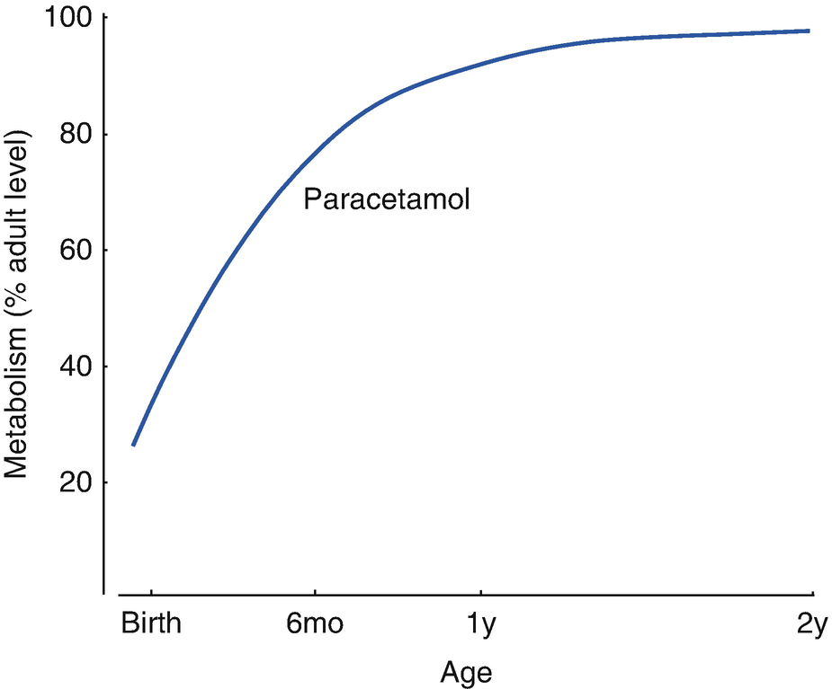
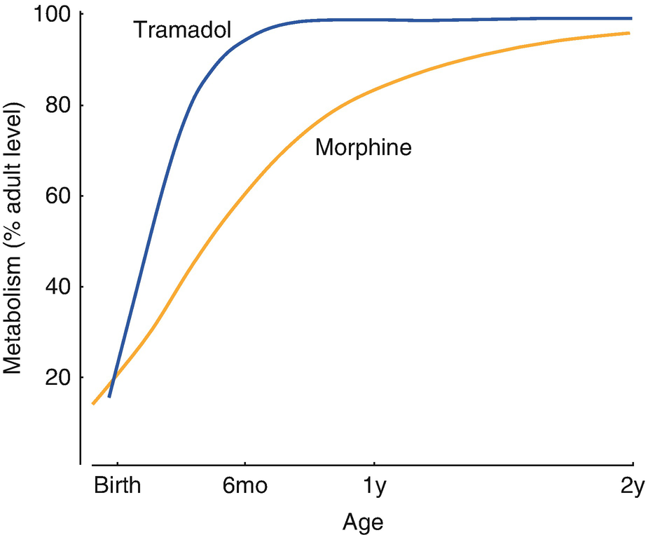

Acute Pain Management in Children

© Springer Nature Switzerland AG 2020

Craig Sims, Dana Weber and Chris Johnson (eds.) A Guide to Pediatric Anesthesia[https://doi.org/10.1007/978-3-030-19246-4\_9](https://doi.org/10.1007/978-3-030-19246-4_9)

# 9. Acute Pain Management in Children

Priya Thalayasingam[1](#Aff4)     and Dana Weber[1](#Aff4)    

(1)

Department of Anaesthesia and Pain Management, Perth Children’s Hospital, Nedlands, WA, Australia

Priya Thalayasingam (Corresponding author)

Email: [Priya.Thalayasingam@health.wa.gov.au](mailto:Priya.Thalayasingam@health.wa.gov.au)

Dana Weber

Email: [dana.weber@health.wa.gov.au](mailto:dana.weber@health.wa.gov.au)

### Keywords

Pediatric pain toolsMorphine metabolism childrenOpioid infusions childrenParacetamol in neonatesNurse controlled opioid infusionsPatient controlled analgesia in children

The International Association for the Study of Pain defines pain as ‘an unpleasant sensory and emotional experience associated with actual or potential tissue damage or described in terms of such damage’. However, the inability to communicate does not negate the possibility an individual is experiencing pain. The safe and effective management of pain in children includes the prevention, recognition and assessment of pain, the early and individualized treatment of pain and the evaluation of the effectiveness of treatment. This goal is the responsibility of all health care providers caring for children. This chapter describes the assessment of pain in children, and the management options available. Regional analgesia is also appropriate for children and is covered in Chap. [10](467929_2_En_10_Chapter.xhtml).

## 9.1 Pain Assessment

Children’s pain may be difficult to recognize and to measure reliably. Many pain assessment tools (PAT) have been developed to measure ‘pain scores’ (Table [9.1](#Tab1)). These tools must be age and developmentally appropriate because children’s understanding and ability to describe pain will change as they grow older. Additionally, the tools should be sensitive, specific and validated. There are three types of tools used for assessment of pain in children:

1.  1.
    
    Self-report: The preferred approach, which can be used in children older than 3–4 years who are not cognitively impaired.
    
2.  2.
    
    Observational or behavioral: An objective assessment by the carer or parent of signs of distress caused by pain.
    
3.  3.
    
    Physiological: measures physiological parameters of the pain arousal response. It is best combined with a behavioral assessment of pain. The measured parameters can be confounded by underlying illness (e.g. sepsis causing tachycardia) and have wide inter-individual variability
    

Table 9.1

Examples of pain assessment tools (PAT) validated in children

| 
Assessment tool | Age range | Assessment | Notes/limitations

 |
| --- | --- | --- | --- |
| 

Premature Infant Pain Profile (PIPP) | <33 weeks | Gestational age, behavioral state, HR, oxygen saturation, brow bulge, eye squeeze, nasolabial furrow | For procedural and postoperative pain

 |
| 

Neonatal Pain Assessment Tool | \>33 weeks | Behavioral indicators: posture, tone, sleep pattern, facial expression, color, cry

Physiological indicators: respiratory rate, HR, oxygen saturation, BP | Behavioral and physiological PAT and observation

 |
| 

The Faces, Legs, Activity, Cry and Consolability (FLACC) scale | 0–7 years | Facial expression, leg position, activity, cry, consolability | Behavioral PAT

May be adapted for cognitively impaired children

 |
| 

The Revised Faces Pain Scale | 4–12 years | Six faces with the first face scoring 0/10 and the last scoring 10/10 pain | Self-report PAT

 |
| 

Visual Analogue Scale (VAS) | 7–8 years to adult | A line expressing an increasing continuum of pain | Self-report PAT

 |
| 

Numerical Rating Scale (NRS) | 7–8 years to adult | 0/10 = no pain

10/10 = worst pain | Self-report PAT

 |

Of the available tools, the revised faces scale is commonly used for school aged children, whereas the FLACC scale is commonly used for preschool aged and cognitively impaired children. Although these are generally used, different institutions may have their own preferred tools. Pain scores form only one component of pain assessment. Holistic pain assessment accounts for factors influencing a child’s perception of pain, which contribute to different pain experiences in different children undergoing the same procedure (Table [9.2](#Tab2)).

Table 9.2

Factors influencing a child’s perception of pain

<table style="border-collapse: collapse;border-top: 0.5pt solid ; border-bottom: 0.5pt solid ; border-left: 0.5pt solid ; border-right: 0.5pt solid ; "><colgroup><col class="tcol1 align-left"></colgroup><tbody><tr><td style="border-bottom: 0.5pt solid ; text-align: left;">
Physiological factors—site or severity of surgery
</td></tr><tr><td style="border-bottom: 0.5pt solid ; text-align: left;">
Psychological and cognitive factors— age, gender and maturity
</td></tr><tr><td style="border-bottom: 0.5pt solid ; text-align: left;">
Behavioral factors—child’s coping style and parental response
</td></tr><tr><td style="border-bottom: 0.5pt solid ; text-align: left;">
Socio-cultural beliefs
</td></tr><tr><td style="text-align: left;">
Past health and hospitalization experiences
</td></tr></tbody></table>

### Keypoint

Pain assessment appropriate to the child’s age needs to be performed regularly so pain is treated early and effectively. Because pain is dynamic, regular pain assessments provide a trend for the patient’s progress.

## 9.2 Management Strategies

Anesthetists most often encounter children with acute pain related to surgery, medical conditions, cancer or trauma. Acute pain management includes a combination of pharmacological and non-pharmacological strategies.

### 9.2.1 Non-pharmacological Strategies

These strategies are techniques used to supplement analgesic drugs and are especially useful for procedural pain. They can be as simple as comforting an injured child, while others include physical methods such as massage, heat therapy and transcutaneous electrical nerve stimulation (TENS). The most important psychological technique is distraction with toys or electronic games and devices, while others include breathing techniques, imagery, play therapy and hypnosis. These techniques need to be appropriate to the child’s development, personality and circumstances, and ideally should be familiar to the child before they are used.

### 9.2.2 Pharmacological Strategies

Drug treatment is modelled on the 3-step analgesic ladder, starting with simple oral analgesia and progressing to opioid and regional analgesia if required. As in adults, simple analgesics reduce opioid use and side effects. Systemic analgesia is usually given by the oral or IV routes, but rectal, transdermal, intranasal, transmucosal or inhalational routes are alternatives. Intramuscular injections are avoided in children because of pain and erratic drug absorption.

Postoperative pain relief and side effects should be discussed preoperatively with the parents, child (if plausible) and surgeon. It should be safe, efficacious, titratable and appropriate for the surgery and patient age (for example, an ilio-inguinal block may be preferable to a caudal in an ambulating 5 year old for inguinal hernia repair). Regional techniques are useful but an alternative plan is needed if they fail, and parental education about analgesia when the block wears off is important.

Children’s analgesic needs fluctuate during the day—more analgesia is required whilst mobilizing, participating in physiotherapy or undergoing therapeutic procedures such as dressing changes. Thus, effective analgesic regimens need background analgesia and a pro-active plan for managing break-through pain, especially in preverbal or cognitively impaired children.

## 9.3 Analgesic Agents

### 9.3.1 Paracetamol

Paracetamol has a central analgesic effect mediated through activation of descending serotonergic pathways. The analgesic and antipyretic plasma concentration in children is the same as adults and is 10 mg/mL. Higher plasma concentrations only modestly increase efficacy but increase the risk of hepatotoxicity.

#### 9.3.1.1 Metabolism

Paracetamol undergoes glucuronidation and to a lesser extent, sulfation, in the liver. In neonates, sulfation is the main mechanism. Clearance increases with post menstrual age, but in a term neonate it is still only about a third that of an older child (Fig. [9.1](#Fig1)). Unconjugated hyperbilirubinemia is a crude measure of hepatic conjugating ability and is a reason to reduce the dosage of paracetamol.

Fig. 9.1

Schematic representation of metabolism of paracetamol with age. Metabolism of paracetamol in neonates is only 30–40% of the adult level, but reaches nearly 80% by 6 months of age as the enzymes responsible for glucuronidation mature. Modified from Anderson and Holford, Pediatr Anesth 2018

### Keypoint

Children taking maximal doses of paracetamol for several days are at risk of hepatotoxicity. The risk is even higher if they are malnourished or dehydrated.

#### 9.3.1.2 Oral Administration

Paracetamol is most often given orally. Absorption is rapid in children, though slower in neonates. Oral paracetamol undergoes 10–40% first pass elimination. Plasma concentration is maximal 30–60 min after oral administration, but the brain concentration rises slowly. Maximum analgesia develops up to 2 h after administration. Doses at various ages are shown in Table [9.3](#Tab3). The manufacturer’s dose of 60 mg/kg/day in children is often replaced by a dose of 90 mg/kg/day for the first 48 h, either by using a larger loading dose or using 20 mg/kg 6 hourly.

Table 9.3

ORAL paracetamol dose in neonates and children

| 
Age | Oral dose (mg/kg) | Interval (h) | Maximum daily dose

(mg/kg) | Maximum duration at maximum dose (h)

 |
| --- | --- | --- | --- | --- |
| 

28–32 weeks PMA | 10–15 | 8–12 | 30 | 48

 |
| 

32–52 weeks PMA | 10–15 | 6–8 | 60 | 48

 |
| 

3–6 months | 15 | 6 | 90a | 48

 |
| 

\>6 months | 15 | 6 | 90a | 48

 |

Some suggest a loading dose of 20 mg/kg in children older than 32 weeks. Dose adjustment is required in overweight and obese patients. Paracetamol dose must be reviewed every 48 h; beware of risk factors for paracetamol toxicity. If treatment >1 week, use minimum dosing interval of 6 h, and consider lowering maximum daily dose and monitoring LFT’s. _PMA_ Post menstrual age

aMaximum 4 g in 24 h for 48 h. After 48 h reduce dose to 60 mg/kg/24 h

#### 9.3.1.3 Intravenous Administration

IV paracetamol is more effective than oral paracetamol because there is no first pass metabolism or delay in absorption. The dose in children is 15 mg/kg infused over 15 min. The dose is reduced in neonates and is adjusted in obese children based on their ideal body weight (Table [9.4](#Tab4)).

Table 9.4

INTRAVENOUS paracetamol dose in neonates and children

| 
Age | Maintenance dose | Maximum daily dose (mg/kg per day)

 |
| --- | --- | --- |
| 

32–40 weeks PMA | 7.5 mg/kg 8 hourly | 30

 |
| 

40–44 weeks PMA | 10 mg/kg 6 hourly | 40

 |
| 

44 weeks PMA–18 years | 15 mg/kg (up to 1 g) 6 hourly | 60

 |

#### 9.3.1.4 Rectal Administration

Rectal administration has slow and variable absorption, with typical doses failing to give a therapeutic plasma level. The smallest suppository commercially available is 125 mg, but cannot be cut to reduce the dose because the paracetamol may not be evenly distributed through it. IV paracetamol is preferable in clinical practice.

#### 9.3.1.5 Toxicity of Paracetamol

A small amount of paracetamol is oxidized by the cytochrome P450 CYP2E1 enzymes to the reactive metabolite NAPQI. This metabolite binds to glutathione and is excreted. As sulfation and glucuronidation pathways become saturated, more paracetamol is shunted into the oxidative NAPQI pathway. However, once glutathione stores are depleted, hepatotoxicity develops from unbound NAPQI. Neonates have reduced P450 oxidation, but they can still form the reactive metabolite. This reduced oxidation paired with increased glutathione synthesis protects them from hepatotoxicity and gives paracetamol a high therapeutic ratio in neonates. The effect of liver disease on paracetamol metabolism is variable and difficult to determine in any given patient. Paracetamol may still be used in hepatic impairment, usually as a single dose or smaller, infrequent doses.

Although safe when used alone or in combination with other analgesics, severe or fatal hepatotoxicity can occur with analgesic doses of paracetamol. Children at risk are those who are malnourished, dehydrated, obese (and dosed with actual rather than ideal body weight), or have been receiving maximal doses for several days. Such conditions may exist in children after surgery who are not well hydrated and have been taking regular, maximal dose paracetamol for several days. In these groups of children, the dose must be reduced after a few days, and liver function tests performed regularly. When neonates and infants are given IV paracetamol, the volume of drug is small and they are at high risk of a ten times overdose. Prescribing in both mLs and mGs has been suggested as a way of avoiding overdose. It has also been recommended by the Safe Anesthesia Liaison Group to use 50 mL vials (where available) for children weighing less than 33 kg. The dose of IV paracetamol should be drawn up in a syringe and given, rather than hanging a full bag of paracetamol.

Paracetamol toxicity is treated with IV N-Acetylcysteine (NAC), which restores hepatic glutathione. The nomograms used for the management of paracetamol toxicity refer to oral overdose. The UK National Poisons Information Service advises NAC after a single IV dose of paracetamol larger than 60 mg/kg, and advise against waiting for a serum paracetamol level before NAC is started. If the dose of IV paracetamol is unknown, a level should be taken 4 h after the IV paracetamol dose and NAC started if the plasma paracetamol level is above 50 mg/L.

### 9.3.2 Non-steroidal Anti-inflammatory Drugs (NSAIDs)

NSAIDs are effective analgesics and antipyretics in children. As in adults, they reduce morphine requirements by approximately 30%. Although many NSAIDs are available for use in adults, few are marketed in a liquid form or in a suppository dose suitable for children. NSAIDs uncommonly exacerbate asthma in children younger than 10 years, and can be used in young asthmatic children unless there has been past sensitivity. Renal dysfunction is also uncommon in children, although dehydration is a predisposing factor as it is in adults. NSAIDs are not recommended for neonates—they reduce GFR by 20% and may affect cerebral and pulmonary blood flow. Aspirin is rarely used in children because of its association with Reye’s syndrome.

Ibuprofen is the most commonly used oral NSAID in children. The dose is 10 mg/kg every 6–8 h in children greater than 3 months old. It is not recommended for children under 3 months of age. It does not need to need to be taken with food in children. Ibuprofen is unlikely to increase the risk of bleeding after tonsillectomy and provides useful analgesia, however its use in this setting is surgeon and institution specific. An intravenous form of Ibuprofen is available and is dosed at 10 mg/kg (max daily dose 40 mg/kg or 2400 mg whichever is less) in children younger than 17 years. It must be diluted before administration and infused over 10 min. It may cause hemolysis if given undiluted and cannot be given intramuscularly.

Diclofenac is available orally, rectally and intravenously. The doses are 0.3 mg/kg IV, 0.5 mg/kg rectally and 1 mg/kg orally, usually 8–12 hourly. It is rapidly and well absorbed from the rectum with peak levels reached faster than either oral or rectal paracetamol. Parecoxib has not been extensively studied in children and is not approved for use in children younger than 16 years. However, its pharmacokinetics in children have been reported, and it is an effective analgesic in children after tonsillectomy.

### 9.3.3 Opioids

Although many different opioids are used for analgesia in adults, only a few are used in children because few have oral, liquid forms available and because experience with many opioids in children is limited. Neither transcutaneous patches nor opioid agonist-antagonist preparations are made in pediatric doses.

#### 9.3.3.1 Morphine

Morphine is the most widely studied and used opioid in children. It is available in an immediate release elixir (dose 0.2–0.5 mg/kg, 3–4 hourly PRN) or as a controlled-release preparation (MS Contin suspension or tablets). Morphine is the only opioid with a liquid, sustained release preparation suitable for small children who can’t swallow tablets. (Controlled-release tablets should never be crushed or chewed, as an unpredictably large dose of morphine is released immediately, resulting in opioid toxicity).

Morphine metabolism is reduced in neonates and infants (Fig. [9.2](#Fig2)). Furthermore, a larger proportion of morphine is metabolized to the active metabolite M6G in neonates. These pharmacokinetic differences place neonates at risk of respiratory depression compared to children and adults—the incidence of respiratory depression from opioids is almost ten times more in neonates than adults. Differences in the blood-brain barrier between neonates and children are minor and unlikely to be clinically important. Respiratory depression is the same in neonates and children at equivalent plasma concentrations of morphine, but the plasma concentration is reached in neonates with much smaller doses than in children (Table [9.5](#Tab5)).

Fig. 9.2

Metabolism of morphine and tramadol in neonates and young children. Tramadol undergoes phase I metabolism by CYP iso-enzymes that mature quickly. Morphine undergoes phase II glucuronidation, which matures more slowly. Modified from Anderson and Holford, Pediatr Anesth 2018

Table 9.5

Typical infusion rates for morphine infusions in children of different ages

| 
Age | Typical infusion rate of morphine (μg/kg/h)

 |
| --- | --- |
| 

Neonate | 5–10

 |
| 

Infant | 10–20

 |
| 

Child | 10–40

 |

The lower rates in neonates and infants reflect pharmacokinetic differences

### Keypoint

The CO2 response curve at any given morphine concentration is the same between the ages 2–570 days, suggesting neonates and infants do not have any pharmacodynamic sensitivity to morphine. Although neonates are ‘sensitive’ to respiratory depression from opioids, this is because of pharmacokinetic differences.

#### 9.3.3.2 Fentanyl

Fentanyl is also widely used in children. Its relatively rapid onset facilitates dose titration in severe, acute pain compared to morphine, and it causes less pruritus. Fentanyl is very lipophilic and thus can be administered via the intranasal, transmucosal and transdermal routes.

##### Intranasal Fentanyl

Intranasal fentanyl is an effective analgesic that is non-invasive and needle free, suitable for children older than 1 year for procedural and post traumatic pain. Onset of analgesia is within 2–10 min. It is delivered as a concentrated solution (300 μg/mL) via an atomizer to minimize volume. The dose is 1.5 μg/kg to a maximum of 100 μg, and it may be repeated after 5 min if analgesia is inadequate. The use of a conscious sedation protocol is recommended to monitor children given intranasal fentanyl.

##### Oral Transmucosal Fentanyl Citrate (OTFC)

OTFC is a flavored fentanyl lozenge that was initially developed for break-through pain management in opioid tolerant adult oncology patients and is not licensed for pediatric use. It is used in some tertiary pediatric centers.

##### Transdermal Fentanyl (‘Fentanyl Patches’)

Fentanyl patches should only be used in children who are opioid tolerant, have a stable analgesic requirement and are being cared for in a tertiary pediatric center. They are not suitable to treat postoperative pain, for which oral morphine is preferable because it is titratable and clinically more familiar.

#### 9.3.3.3 Hydromorphone

Hydromorphone is a semi-synthetic derivative of morphine. It has a prolonged duration of action (4–6 h) and half-life (3–4 h). Oral hydromorphone has a bioavailability of 50–60% and more than 90% is converted in the liver to an inactive metabolite. It has less metabolites than morphine and can be used in children with renal insufficiency. It results in lower pain scores and less pruritus compared with morphine. Hydromorphone is now the preferred second line opioid for infusions when the initial opioid provided inadequate analgesia or excessive side effects. It is also becoming the first line opioid in complex pain patients in the tertiary setting.

#### 9.3.3.4 Codeine

Codeine is now rarely used in children. The death of several children who had ultra-rapid metabolism of codeine to morphine prompted European, Australasian and North American agencies to restrict its use. It is now listed as contraindicated in all children having tonsillectomy, and for any reason in children younger than 12 years.

#### 9.3.3.5 Oxycodone

Oxycodone is popular for the treatment of moderate to severe pain and as a step-down from opioid infusions because it has a high bioavailability and a palatable and concentrated syrup formulation that requires only small volume to be ingested. Its bioavailability has less inter-individual variation compared to oral morphine, but it is not licensed for children in many countries. Although it has less affinity for the mu-opioid receptor than morphine, it is actively transported through the blood-brain barrier so its concentration in the brain is higher than the plasma. For this reason, oxycodone has a greater potency than morphine. Its metabolism to an active metabolite is subject to genetic polymorphism, but the metabolite is not particularly active and differences in its concentration have little clinical effect.

Oral formulations include an immediate release (syrup, tablet or capsule) and a controlled release preparation. Immediate release oxycodone at an oral dose of 0.1–0.2 mg/kg 4–6 hourly PRN may be recommended for the treatment of acute pain. Oxycodone is prescribed at lower doses (0.05–0.1 mg/kg 4–6 hourly PRN) in infants, and is avoided under the age of 3 months due to delayed clearance and greater inter-individual pharmacokinetic variability.

Controlled release tablets are suitable to give background analgesia in older children, but they must not be chewed or crushed due to the potential for dose-dumping and toxicity. They are dosed 12 hourly with up to 40% of the dose being released in the first hour after ingestion. Controlled release preparations may be combined with naloxone in a tablet (Targin), reducing common opioid side effects including constipation and itch. For children who are “stepped” down onto extended release oxycodone formulations it is important to ensure that they are sent home with a strict weaning plan for these medications. An IV form of oxycodone is available, but little used in the pediatric setting because it does not offer an advantage over morphine.

### Keypoint

Prescription of post-operative opioids (especially if discharged home) should be based on the previous analgesic requirements of the child and the expected severity and duration of their pain. Opioids should be dispensed only for children expected to have moderate to severe pain. A limited quantity of opioid may be dispensed after a thorough discussion with parents about appropriate use and side effects. A weaning plan and a cease date is recommended.

#### 9.3.3.6 Tramadol

Tramadol is used alone for mild to moderate pain in children and is also useful in the management of neuropathic pain or as an adjunct to stronger opioids. It has a lower incidence of respiratory depression and constipation than other opioids and is valuable in children with respiratory compromise from neuromuscular disease or severe obstructive sleep apnea.

Tramadol is converted to an active metabolite by a CYP iso-enzyme that matures earlier than the enzymes responsible for glucuronidation of morphine (Fig. [9.1](#Fig1)). Genetic polymorphism of the iso-enzyme includes an ultra-rapid metabolism form. There have been three deaths and several events in children receiving tramadol, prompting a FDA warning in the United States. Overdosing however, was the likely cause—the oral form of tramadol was intended for palliative care of adults and is extremely concentrated. Because there is no suitable liquid preparation, tramadol is not a first line analgesic agent in young children. Slow release tramadol tablets 1 mg/kg bd are usually well tolerated by adolescents (who can swallow tablets). It provides a background level of pain relief, which may be useful when stepping down from parenteral opioids and to reduce the need for break-through analgesia. Tramadol is not licensed for children younger than 12 years. Its dose in children is 1–2 mg/kg (max 400 mg) 6 hourly PRN up to a maximum daily dose of 8 mg/kg.

#### 9.3.3.7 Buprenorphine

Buprenorphine use has increased in the adult setting due to its low abuse potential, favorable immunological profile and lower risk of diversion. It is not licensed in children, however its use is increasing in the pediatric setting for similar reasons as in adults. It is mainly used for chronic and complex pain, such as cancer, long term opioid use and opioid rotation. Due to its potency, its use in very young patients is limited and there have been case reports of respiratory depression following opioid rotation to even very small morphine-equivalent doses of buprenorphine. As a result, the use of buprenorphine is restricted to tertiary pediatric centers with specialist oversight.

### 9.3.4 Ketamine

As in adults, ketamine may be used as an adjunct to opioid analgesia. It is useful for children who are opioid tolerant and in pain despite maximal doses of opioids, or who are sensitive to the sedative and respiratory effects of opioids. It may be given intra-operatively (0.5–1 mg/kg) and then as an infusion at 100–240 μg/kg/h. Low doses of ketamine generally do not cause troublesome dysphoria or hallucinations. Ketamine may also be used for procedural analgesia for fracture reduction or burns dressings, with an oral dose of 3–10 mg/kg, or intravenously (0.5–2 mg/kg). Use the lower end of the dose range if combining ketamine with other sedatives. Children receiving ketamine sedation should be appropriately fasted and appropriately monitored.

### 9.3.5 Adjuvants

#### 9.3.5.1 Alpha 2 Agonists

Clonidine and dexmedetomidine act on alpha 2 receptors pre-synaptically in the brain stem to reduce sympathetic outflow. Dexmedetomidine is more alpha 2 selective than clonidine. Their effects include anxiolysis, analgesia, behavioral modification and hemodynamic modulation. Dexmedetomidine is used in the intensive care setting, neuro and cardiac surgery. Some centers have utilized the intranasal formulation in the radiology suite for sedation in MRI.

Clonidine is widely used in the perioperative setting in children for premedication. Clonidine is used intra- and post- operatively as an adjuvant to analgesia in regional techniques such as caudal or epidural blocks at doses of 1–2 μg/kg. At this dose, it prolongs caudal analgesia by up to 4 h. Clonidine is also effective in facilitating weaning and prevention of withdrawal in children who have been on long term infusions of opioids, such as the intensive care setting, oncology patients or major burns.

#### 9.3.5.2 Gabapentenoids

Gabapentin and pregabalin are calcium channel neuromodulators and are used as anticonvulsants. In the acute pain setting they are indicated for prevention and treatment of neuropathic pain and anxiolysis. They can cause dizziness, delirium and sedation. They have been shown to reduce overall opioid consumption. However, the results are mixed in preventing post-surgical neuropathic pain and reduction of opioid side effects. Gabapentin is usually commenced at 5 mg/kg daily and titrated up to 5 mg/kg three times a day. It is also an effective premedication at 5 mg/kg. Patients are not usually discharged home on this medication and if so they are followed up to ensure the medication is weaned and ceased.

#### 9.3.5.3 Tricyclic Antidepressants

Amitriptyline and nortriptyline are used for the treatment of neuropathic pain. They act by inhibiting serotonergic and noradrenergic reuptake in the areas of the brain responsible for pain perception and modulation. Caution needs to be exercised as they can result in long QT. They also result in increased appetite, improved sleep when taken before bedtime and improved mood which are all factors that contribute to the pain experience. The usual starting dose is 5 or 10 mg at night. These medications need to be monitored closely and their use outside of a tertiary pediatric setting is limited.

#### 9.3.5.4 Melatonin

Melatonin acts on the M1 and M2 receptors in the anterior hypothalamus and is indicated in primary insomnia with poor sleep quality. Studies on the efficacy of melatonin at 1–2 mg have been performed in patients over the age of 55. As a result, its use is restricted to specialist prescription. It is utilized in chronic pain, palliative care and oncology.

## 9.4 Practical Use of Analgesics

### 9.4.1 Management of Analgesia in PACU

Children may be distressed in the PACU (recovery) for a variety of reasons, including anxiety, hunger, emergence delirium and pain. Experienced PACU staff are usually able to differentiate pain from other causes of distress using an age-appropriate PAT and indicators such as posture, type of cry and response to pacifiers. Moderate to severe pain in PACU is best treated with intermittent IV opioid boluses (Table [9.6](#Tab6)), with subsequent adjustment to the ward analgesia regimen if required (for example, increasing opioid infusion rate or checking extent of epidural block).

Table 9.6

Suggested dilutions and doses for intermittent IV opioid boluses in PACU

| 
Intermittent PACU opioid bolus protocol

 |
| --- |
|   | 

Morphine | Fentanyl

 |
| --- | --- | --- |
| 

Composition | 2.5 mg morphine diluted to 5 mL of normal saline | 100 μg diluted to 20 mL with normal saline

 |
| 

Concentration | 0.5 mg/mL | 5 μg/mL

 |
| 

Bolus dose | 0.05 mL/kg = 25 μg/kg | 0.05 mL/kg = 0.25 μg/kg

 |

Bolus doses can be given at 3–5 min intervals if the child is in pain, provided observations and conscious state are satisfactory. A review of the child’s pain is needed if five doses have not been adequate

### 9.4.2 Management of Intravenous Analgesia on the Wards

Intravenous opioids are the preferred route for the management of severe pain. They allow rapid titration for effect and may be administered as intermittent boluses, nurse controlled infusions or patient controlled analgesia (PCA). Intravenous opioid infusions should only be used in hospital ward settings with appropriate staffing, nursing education, patient monitoring and an around-the-clock contact for the Acute Pain service.

#### 9.4.2.1 Intermittent IV Ward Morphine Bolus Protocols

Intermittent IV ward morphine boluses are suitable for children older than 6 months. Indications include the management of severe, short-term pain or as a rescue for children recently weaned off continuous infusions (Table [9.7](#Tab7)).

Table 9.7

Intermittent IV ward morphine bolus protocols

| 
Ward morphine bolus protocol

 |
| --- |
| 

Age/weight | Morphine dose

 |
| --- | --- |
| 

Infant 6–12 months | 0.05 mL/kg = 25 μg/kg

 |
| 

Child older than 12 months and weighs under 40 kg | 0.05–0.1 mL/kg = 25–50 μg/kg

 |
| 

Child weighs more than 40 kg | 2–4 mL = 1–2 mg (2 mg max dose)

 |

The boluses may be administered at 15 min intervals to treat pain providing the conscious state and observations are satisfactory. A review of the child’s pain is needed if five doses have not been adequate, as the child may benefit from a continuous infusion

#### 9.4.2.2 Continuous, Nurse-Controlled Opioid Infusions

Continuous intravenous opioid infusions are used in children who cannot use a PCA because of young age, cognitive impairment or physical disability. The baseline rate of the infusion is titrated to the level of pain, with additional nurse-initiated boluses (at intervals of 15 min or more) to cover breakthrough pain. Fentanyl, morphine, hydromorphone and tramadol may be delivered as a continuous infusion after appropriate loading doses have been given. Lower opioid infusion rates are used in children younger than 1 year because of the pharmacokinetic differences compared with older children. Typical infusion rates at this age for morphine are 5–20 μg/kg/h, about half that of older children.

Infusions are made with a dose of opioid varying according to the weight of the child (Table [9.8](#Tab8)). This is done so the concentration in the syringe varies with the weight of the child, but the volume administered is similar regardless of age. There are three important reasons for doing this. Firstly, it standardizes volume independent of age and weight. For example, regardless of age, a child receiving a morphine infusion at 2 mL/h with a prescribed bolus of 1 mL, will receive 20 μg/kg/h of morphine by infusion, with a bolus of 10 μg/kg. Staff can see the infusion rate and are able to place that dose into context of the dose range usually given to children. Secondly, varying the concentration with weight avoids the problems of administering tiny volumes for small babies with subsequent issues of pump inaccuracy during delivery such of small volumes, and difficulty in overcoming the dead space of IV lines. Finally, the dilute concentration minimizes complications in the scenario of the IV becoming blocked and the IV-line filling with opioid solution, which is then infused as a bolus when the IV line is unblocked.

Table 9.8

A suggested protocol for intravenous opioid infusions on pediatric wards

| 
Intravenous opioid infusion guidelines

 |
| --- |
|   | 

Morphine | Fentanyl | Hydromorphone

 |
| --- | --- | --- | --- |
| 

Dose to add to 50 mL saline | 0.5 mg/kg | 20 μg/kg | 0.1 mg/kg

 |
| 

Concentration of solution relative to weight | 10 μg/kg/mL | 0.4 μg/kg/mL | 2 μg/kg/mL

 |
| 

Loading dose | 50–100 μg/kg | 0.5–1 μg/kg | 10–20 μg/kg

 |
| 

Infusion rate | 0–4 mL/ha

(10–40 μg/kg/h) | 0–4 mL/ha

(0.4–1.6 μg/kg/h) | 0–4 mL/ha

(2–8 μg/kg/h)

 |
| 

Bolus dose | 1–2 mL

10–20 μg/kg | 1–2 mL

0.4–0.8 μg/kg | 1–2 mL

2–4 μg/kg

 |

Varying the dose added to the infusion syringe results in a fixed concentration relative to the weight of the child, and subsequently the same infusion rate in mL/h for every child. The start rate for infusions should be in the lower half of the dose range

aLower infusion rates are used for infants

To further reduce complications in this last scenario, the opioid infusion is always connected to the IV line as close as possible to the cannula to minimize the amount of opioid that can accumulate in the IV tubing, and an anti-reflux valve is inserted in the IV line to prevent opioid backtracking and accumulating in the tubing if the IV stops running.

### Keypoint

The drug concentration in the syringe for opioid infusions varies with the weight of the child. This ensures that independent of weight, children receive a standard dose (μg/kg/h) at prescribed infusion rates. (e.g.: 1 mL/h always equals 10 μg/kg/h of morphine).

#### 9.4.2.3 Patient Controlled Analgesia (PCA)

The use of a PCA pump requires a cooperative, awake child who is able to comprehend analgesic delivery depends on pushing a button, and who is also physically able to push a button. Children aged from 6 years are usually able to use a PCA. Mature, younger children may be coached to use a PCA, but may forget to press the button and receive inadequate analgesia. The safety of PCA relies on an awake child being able to press the button independently and for this reason parents must be warned not to press the button if their child falls asleep.

Opioids for PCA are prepared in the same way as continuous, nurse controlled infusions and the concentration of the prepared infusion varies with the weight of the child (Table [9.9](#Tab9)). Unlike adults, background infusions are commonly used in children, particularly in younger children, within the first 24–48 h after major surgery, in oncology patients and in opioid tolerant patients. Low dose background infusions improve analgesia, promote sleep and do not increase adverse effects in children with severe and constant pain.

Table 9.9

PCA dosing guidelines in school aged children

| 
PCA dosing guidelines

 |
| --- |
|   | 

Morphine | Fentanyl | Hydromorphone

 |
| --- | --- | --- | --- |
| 

Loading dose (μg/kg) | 50–100 | 0.5–1 | 10–20

 |
| 

PCA bolus dose | 1–2 mL (20 μg/kg) | 1 mL (0.4 μg/kg) | 1–2 mL (2–4 μg/kg)

 |
| 

Maximum bolus dose | 1 mg | 20 μg | 200 μg

 |
| 

Lockout interval (min) | 5 | 5 | 5

 |
| 

Background infusion rate (μg/kg/h) | 0.5–1 mL/h

(5–10 μg/kg/h) | 0.5–1 mL/h

(0.2–0.4 μg/kg/h) | 0.25–0.5 mL/h

(0.5–1 μg/kg/h)

 |

Syringe concentrations are the same as for continuous, nurse-controlled infusions

#### 9.4.2.4 Transition from Parenteral to Oral Analgesia

Successful transition to oral analgesia may proceed when the child’s pain is mild to moderate in severity and without sudden or severe episodes of pain, and when a reliable oral route has been established with good absorption. If opioid use has been large and for a prolonged duration, then the parenteral requirement during the previous 24–48 h is converted to an equivalent oral dose of slow and immediate release drug. If opioid use in the previous 24–48 h has been low and there is no risk of withdrawal, then oral opioids are given as required along with regular non-opioid analgesia.

## 9.5 Management of Opioid Toxicity and Adverse Effects

Approximately one third of children will experience adverse effects from opioid infusions. These include pruritus, nausea and vomiting, ileus and constipation, urinary retention, sedation and respiratory depression (Table [9.10](#Tab10)). Although these side effects are common, they are often mild and may be tolerated or treated. Occasionally, adverse effects require opioid cessation or substitution. The addition of a low-dose naloxone infusion may reduce pruritus and nausea in children receiving an opioid PCA.

Table 9.10

Opioid side effects, mechanisms and treatment

| 
Side effect | Treatment

 |
| --- | --- |
| 

**Sedation**

 |   |
| 

– Sedation occurs before respiratory depression and should be monitored using a sedation scale (e.g.: University of Michigan Sedation Scale) | – Stop opioid & other sedative drugs

– ABC

– IV naloxone 1–2 μg/kg bolus, 1–2 min (max 5 doses)

– Re-sedation once naloxone wears off

– Reduce subsequent opioid dose

– Maximize use of non-opioid analgesics

– Exclude other causes of sedation

 |
| 

**Unrousable and/or respiratory depression/arrest**

 |   |
| 

Opioids reduce minute ventilation (slow RR and tidal volume), reduce ventilatory response to hypercapnia and hypoxia and suppress the cough reflex | – Stop opioid & other sedative drugs

– ABC

– IV naloxone 10 μg/kg bolus, 1–2 min (max 5 doses)

– Re-sedation once naloxone wears off, consider naloxone infusion

– Avoid routine oxygen supplementation, as it will hide opioid-induced hypoventilation

 |
| 

**Nausea/vomiting**

 |   |
| 

Children are at increased risk of PONV compared to adults

Risk factors:

– Age: risk progressively increases from 3 years to adolescence

– Post pubertal girls higher risk than boys; consider prophylactic antiemetics

– History of previous PONV

– Specific surgery: strabismus, adenotonsillectomy, otoplasty etc. | – Ensure adequate hydration, analgesia and exclude other causes of nausea

– Stop/reduce opioid if adequate analgesia or rotate opioid

– Chart antiemetic protocol for children more than 2 years old receiving continuous opioid and use 2–3 antiemetics from different classes in children at high risk

– Consider low dose naloxone infusion (0.25 μg/kg/h IV)

 |
| 

**Opioid induced pruritus**

 |   |
| 

– A frequent and early side effect seen with IV opioids (10–50%) and centro-neuroaxial opioids (20–100%)

– Face, neck and upper chest

– Mainly by activation of central μ opioid receptors. Also activation of dopamine and 5HT3 receptors and release of prostaglandins PGE1, PGE2

– Histamine release may contribute a small amount to OIP after systemic opioids | – Switch or cease opioid

– Low dose naloxone IV infusion (0.25 μg/kg/h) effective for treatment and prevention

– Prophylactic 5HT3 antagonist may reduce incidence and severity of pruritus from neuroaxial opioids

– Antihistamines poorly effective. No longer used as risk of over-sedation with concurrent opioids

 |
| 

**Constipation**

 |   |
| 

Common & persistent | – Increase fiber & fluid, mobilize patient, stool softeners & laxatives.

 |
| 

**Urinary retention**

 |   |
| 

Opioid related; exclude pain, bladder spasm, anxiety, epidural blockade | Treat retention, reduce opioid dose, low dose naloxone infusion

 |

Children particularly at risk of sedation and respiratory depression during opioid infusions include:

-   Infants younger than 6 months, and especially younger than 1 month
    
-   Children with serious co-morbidity (cardiorespiratory, central/obstructive sleep apnea, syndromes associated with airway obstruction, hepatic/renal insufficiency, neurodevelopmental disorders)
    
-   Those also receiving other sedative drugs (such as benzodiazepines, sedating antihistamines, clonidine, gabapentin)
    

Side effects in these groups can be minimized by adding non-opioid analgesics, reducing the opioid dose, vigilance, and monitoring for sedation and respiratory compromise using continuous oximetry and at least hourly assessment of heart rate, respiratory rate and sedation level. The depth of sedation can be assessed using an observational scale such as the University of Michigan Sedation Scale (UMSS) (Table [9.11](#Tab11)).

Table 9.11

The University of Michigan Sedation Scale (UMSS)

| 
Score | Observation of sedation level

 |
| --- | --- |
| 

0 | Awake and alert

 |
| 

1 | Minimally sedated, tired, appropriate response to verbal stimulation/sound

 |
| 

2 | Moderately sedated, sleepy, aroused with light tactile stimulation or verbal stimulation

 |
| 

3 | Deeply sedated, aroused only with deep physical stimulation

 |
| 

4 | Unrousable

 |

### Keypoint

Sedation occurs before opioid-induced respiratory depression. Respiratory depression (bradypnea and hypoxia) are late signs of opioid toxicity.

## 9.6 Opioid Withdrawal

Children on prolonged infusions of opioids for pain or sedation will develop tolerance and require increasing doses to achieve the same effect over time. Abruptly stopping opioids in these children may lead to a withdrawal syndrome causing CNS stimulation (irritability, tremors, seizures, uncontrolled crying), gastrointestinal disturbance (abdominal cramping, diarrhea, poor feeding) and sympathetic arousal (tachycardia, hypertension, tachypnea, fever, sneezing). Withdrawal symptoms and signs are easy to overlook unless specifically monitored with a validated withdrawal assessment scale. Withdrawal is minimized by controlled weaning (reducing the opioid dose no more than 10–20% per day) and using drugs such as clonidine or benzodiazepines to treat symptoms of withdrawal. Concurrent use of other sedatives, such as benzodiazepines for children who have had a prolonged stay in the intensive care unit, may also contribute to withdrawal.

## 9.7 Management of Pain After Ambulatory Day Case Surgery

Most pediatric surgery is performed on an ambulatory, day case basis with effective analgesia at home an important part of care. More than 30% of children will have moderate to severe pain at home after day surgery, and especially surgeries such as tonsillectomy and orchidopexy. Pain at home is often under-appreciated and under-treated by both families and medical staff. Strategies to improve analgesia at home after discharge include:

-   Parental education about the regular use of simple analgesics and when to begin them (especially if the child has had a regional technique that will wear off after discharge)
    
-   Parental education about the signs of pain
    
-   Providing analgesics at discharge in the correct dose and form for the child.
    
-   Dispelling misconceptions about the side effects of strong analgesics
    

If opioid analgesia after discharge is necessary, parents must be educated about dosing, side effects and safe and early disposal of unused drugs to their local pharmacy. Restricting the volume dispensed to only 10 or 20 doses is one strategy to improve safety regarding opioids that are taken at home.

## 9.8 Neonatal Pain

Neonatal pain pathways are present before birth, but are not mature and differ from adults. In neonates, pain produces specific behavioral changes, activates the somatosensory cortex and induces physiological and neuroendocrine stress responses. Initially, there is an excess of excitatory mechanisms, as the descending inhibitory pathways do not mature until later. Therefore, neonates (especially preterm neonates), may not be able to discriminate between noxious and non-noxious stimuli and may respond with a generalized and exaggerated response to low intensity stimuli—they may actually be more sensitive to pain than older children. The long-term consequences of untreated pain in the newborn period include exaggerated responses to future noxious stimuli that outlast the initial injury, hypervigilance and adverse neurological sequelae.

A number of pain assessment tools are validated for use in neonates. The appropriate selection depends on the age of the infant, the type of pain (procedural or postoperative) and the purpose of the measurement (clinical care or research). Examples of validated tools include the premature infant profile (PIPP), neonatal facial coding scale (NFCS) and children’s revised impact of event scale (CRIES ).

Reducing discomfort and reducing pain in neonates use strategies such as swaddling, breast feeding, tactile or aural stimulation and eye contact. Sucrose is an effective analgesic for stressful and painful procedures in neonates, possibly through endogenous opioid release. It is effective within 2 min of administration. In practice, the “dummy” is dipped in 12–24% sucrose, giving a dose of about 0.2 mL. A maximum of 2 mL can be used for term babies, less for preterm. Sucrose may cause coughing, choking and desaturation in very premature neonates. Sucking a pacifier without any sucrose (non-nutritive sucking) also causes analgesia through stimulation of oropharyngeal tactile and mechanoreceptors. Sucrose is not effective outside the neonatal period.

### 9.8.1 Pharmacological Management of Neonatal Pain

Doses of all analgesics are lower in neonates compared to children because of reduced metabolism. For example, the infusion rate for a morphine infusion in a neonate is 10–25% of the standard pediatric rate (Table [9.12](#Tab12)) Even with lower doses, neonates are at high risk of overdose and respiratory depression from opioids, and they require careful dose titration and close monitoring.

Table 9.12

Suggested neonatal opioid dosing guidelines

| 
Neonatal opioid dosing guidelines

 |
| --- |
|   | 

Preterm neonate | Term neonate

 |
| --- | --- | --- |
| 

Morphine

 |   |   |
| 

 IV bolus

 IV infusion | 10–25 μg/kg every 2–4 h

2–5 μg/kg/h | 25–50 μg/kg every 3–4 h

5–10 μg/kg/h

 |
| 

Fentanyl

 |   |   |
| 

 IV bolus

 IV infusion

 |   | 

0.25–1 μg/kg every 2–5 min

0.4–0.8 μg/kg/h

 |

### Keypoint

Neonates (even preterm neonates) perceive pain, and prolonged, untreated pain may result in adverse long-term consequences.

Like children, neonates need procedural pain minimized with safe and effective pharmacological and non-pharmacological strategies.

## 9.9 The Acute Pain Service for Children

There is no widely accepted definition of what constitutes an acute pain service—the structure of each service varies depending on the needs of the institution (number of patients, complexity of surgery and analgesic regimens), resources available and the expertise of available staff.

Within Australia and New Zealand, 91% of hospitals accredited for anesthetic training have an APS run by the anesthetic department. The APS in most tertiary pediatric centers is multidisciplinary and involves daily clinical input from APS nursing staff, pediatric anesthetists and possibly a pharmacist (Table [9.13](#Tab13)).

Table 9.13

The roles of the APS in adult and pediatric hospitals

| 
Roles of adult and pediatric APS | Roles unique to pediatric APS

 |
| --- | --- |
| 

Supervision of specialized analgesic techniques

Staff education and accreditation regarding all aspects of acute pain management

Development of guidelines/protocols & provision of clinical consultation as required

Teaching of junior medical staff, performance of quality assurance & participation in research | Education of parents regarding pain management particularly after discharge

Promotion of non-pharmacological techniques (e.g.: physical and psychological therapies which are especially important in the management of procedurally related pain)

Education of staff regarding age related differences (pharmacology, physiology, psychology) in the management of acute pain

 |

## 9.10 Chronic (Complex) Pain Services and Services to Reduce Anxiety Associated with Hospital

Tertiary pediatric centers are managing a growing number of children with complex pain. As oncology survival rates increase and our understanding of childhood presentations such as ‘abdominal migraines’ and ‘growing pains’ improves, the demand for these services will increase. Complex pain services include a multi-disciplinary team of chronic pain specialists, allied health, nursing and play therapy. These services treat not just the child but importantly the family in the context of childhood chronic pain. Children with a complex pain background should be flagged to the Acute Pain and Complex Pain Service if they present to hospital with illness or trauma so that they can be appropriately managed. Many tertiary pediatric hospitals have embraced programs to help children cope with anxiety, distress and trauma caused by hospitalization. This involves a hospital-wide education with an emphasis on non-pharmacological strategies (in addition to appropriate pharmacological management) to support children and parents whilst receiving treatment.

## Review Questions

1.  1.
    
    You are asked to review a 7 year old boy who has inadequate analgesia after open fixation of a fractured femur. His current treatment is with a nurse-controlled infusion of morphine. What will you do?
    
2.  2.
    
    Why are smaller doses of morphine than would be used in adults appropriate for infants?
    
3.  3.
    
    What are the post operative analgesic options available to manage a severe spastic quadriplegic 8 year old scheduled for elective major bilateral lower limb surgery? Discuss and justify your choices.
    
4.  4.
    
    Please discuss how paracetamol may be administered to children.
    
5.  5.
    
    What considerations should be given prior to prescribing procedural analgesia for ward patients?
    
6.  6.
    
    A 3 year old child has a broken leg. What is the best way to assess pain in this child?
    

### Further Reading

### Key Articles

1.  Anderson BJ, et al. Tramadol: keep calm and carry on. Pediatr Anesth. 2017;27:785–8. An editorial placing the FDA warning about tramadol for the United States into context.[Crossref](https://doi.org/10.1111/pan.13190)
    
2.  Anesthetists of Great Britain and Ireland. Good practice in postoperative pain management, 2nd edition, 2012. Pediatr Anesth. 2012;22(Suppl 1):1–79.
    
3.  Australian and New Zealand College of Anaesthetists. Chapter 9. The paediatric patient. In: Schug SA, Palmer GM, Scott DA, Halliwell R, Trinca J, editors. Acute pain management: scientific evidence. 4th ed. Melbourne: ANZCA & FPM; 2015.
    
4.  Brooks MR, Golianu B. Perioperative management in children with chronic pain. Pediatr Anesth. 2016;26:794–806.[Crossref](https://doi.org/10.1111/pan.12948)
    
5.  Ferland CE, Vega E, Ingelmo PM. Acute pain management in children: challenges and recent improvements. Curr Opin Anesthesiol. 2018;31:327–32.[Crossref](https://doi.org/10.1097/ACO.0000000000000579)
    
6.  Schnabel A, et al. Tramadol for postoperative pain treatment in children. Cochrane Database Syst Rev. 2015;(3). Art. No.: CD009574. [https://​doi.​org/​10.​1002/​14651858.​CD009574.​pub2](https://doi.org/10.1002/14651858.CD009574.pub2).
    
7.  Walker SE. Neonatal pain. Pediatr Anesth. 2014;24:39–48.[Crossref](https://doi.org/10.1111/pan.12293)
    
8.  Walker SM. Pain after surgery in children: clinical recommendations. Curr Opin Anesthesiol. 2015;28:570–6.[Crossref](https://doi.org/10.1097/ACO.0000000000000227)
    

### Pain After Day Surgery

1.  Walther-Larsen S, Aagaard GB, Friis SM. Structured intervention for management of pain following day surgery in children. Pediatr Anesth. 2016;26:151–7.[Crossref](https://doi.org/10.1111/pan.12811)
    
2.  Williams G, et al. The prevalence of pain at home and its consequences in children following two types of short stay surgery: a multicenter observational cohort study. Pediatr Anesth. 2015;25:1254–63.[Crossref](https://doi.org/10.1111/pan.12749)
    
3.  Wilson CA, et al. Pain after discharge following head and neck surgery in children. Pediatr Anesth. 2016;26:992–1001.[Crossref](https://doi.org/10.1111/pan.12974)
    
4.  Wilson C, et al. A Prospective audit of pain profiles following general and urological surgery in children. Pediatr Anesth. 2017;27:1155–64.[Crossref](https://doi.org/10.1111/pan.13256)
    

### Simple Analgesics

1.  Anderson BJ, Holford HG. Negligible impact of birth on renal function and drug metabolism. Pediatr Anesth. 2018;28:1015–21.[Crossref](https://doi.org/10.1111/pan.13497)
    
2.  Safe Liaison Group. Intravenous paracetamol. 2013. [https://​www.​rcoa.​ac.​uk/​system/​files/​CSQ-PSU-MARCH2013\_​1.​pdf](https://www.rcoa.ac.uk/system/files/CSQ-PSU-MARCH2013_1.pdf). Accessed July 2019.
    
3.  Standing JF, et al. Diclofenac pharmacokinetic meta-analysis and dose recommendations for surgical pain in children aged 1-12 years. Paediatr Anesth. 2011;21:316–24.[Crossref](https://doi.org/10.1111/j.1460-9592.2010.03509.x)
    
4.  Wright JA. An update of systemic analgesics in children. Anesth Int Care Med. 2016;17:280–5.[Crossref](https://doi.org/10.1016/j.mpaic.2016.03.001)
    

### Neonatal Pain

1.  Pacifici GM, Allegaert K. Clinical pharmacology of paracetamol in neonates: a review. Curr Ther Res Clin Exp. 2015;77:24–30.[Crossref](https://doi.org/10.1016/j.curtheres.2014.12.001)
    
2.  Walker SE. Neonatal pain. Pediatr Anesth. 2014;24:39–48.[Crossref](https://doi.org/10.1111/pan.12293)