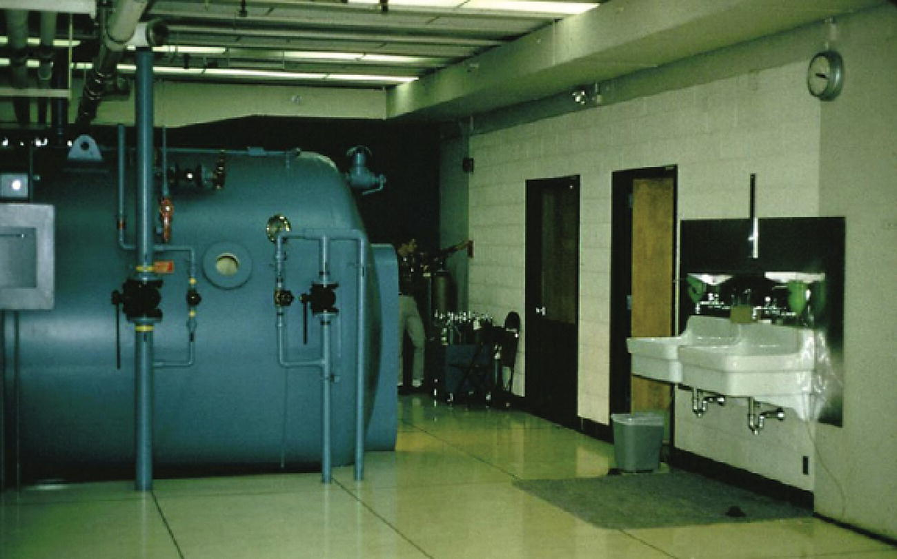
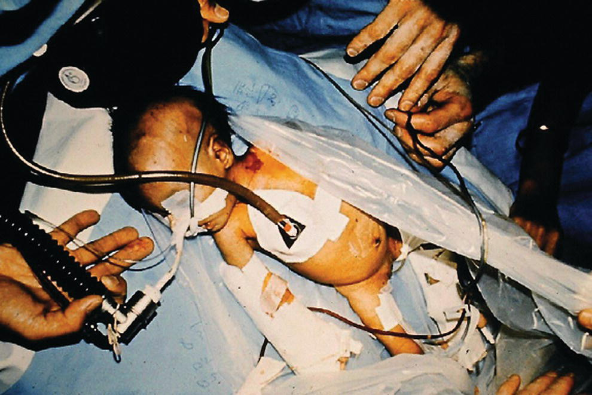
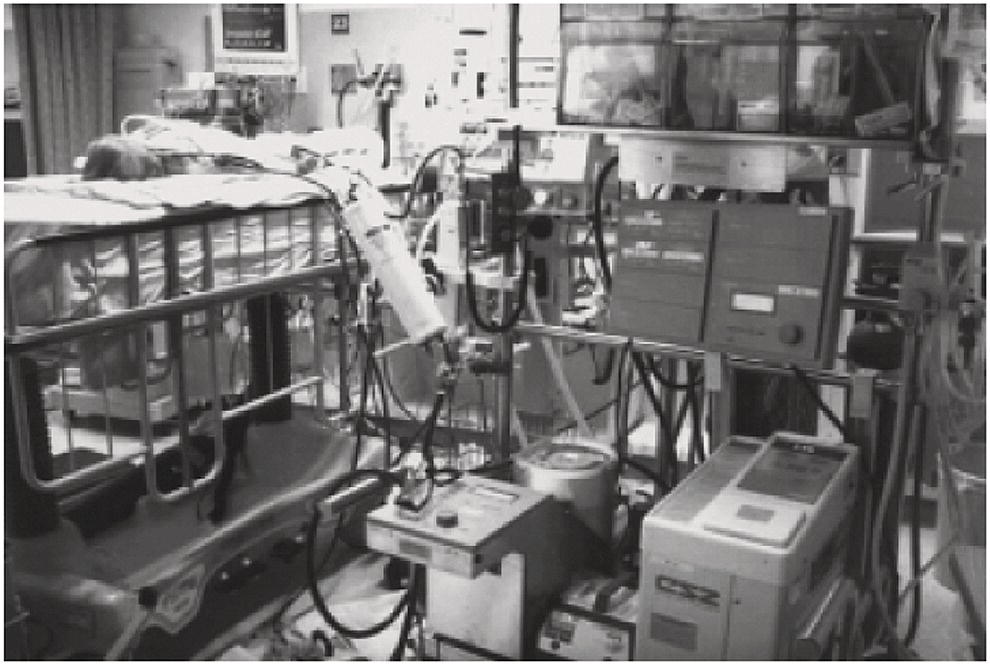
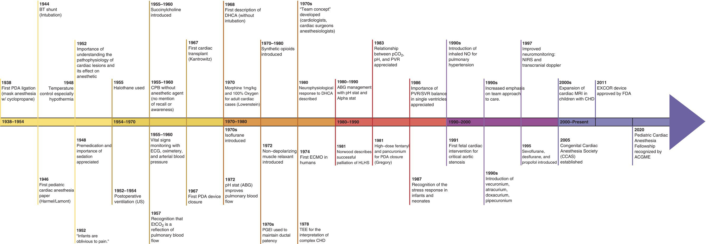

CHAPTER 1 History of Anesthesia for Congenital Heart Disease 

# CHAPTER 1  
History of Anesthesia for Congenital Heart Disease

_Katherine L. Zaleski and Viviane G. Nasr_

Department of Anesthesiology, Critical Care and Pain Medicine, Boston Children’s Hospital and Harvard Medical School, Boston, MA, USA

* * *

-   [**Introduction**](#head-2-2)
-   [**The first years: 1938–1954**](#head-2-3)
-   [**The heart–lung machine: 1954–1970**](#head-2-4)
-   [**Deep hypothermic circulatory arrest and the introduction of PGE1: 1970–1980**](#head-2-5)
-   [**PDA and the introduction of PGE1**](#head-2-6)
-   [**The story of HLHS: 1980–1990**](#head-2-7)
-   [**Fontan and the catheterization laboratory: 1990–2000**](#head-2-8)
-   [**Emergence of new technology – imaging (TEE, MRI) and ECMO: 2000–2010**](#head-2-9)
-   [**2011–2021 and the future**](#head-2-10)
-   [**Congenital heart disease – a growing specialty from the fetus to the adult patient**](#head-2-11)
-   [**Acknowledgments**](#head-2-12)
-   [**Selected references**](#head-2-13)

* * *

## Introduction

Over the last 80+ years, congenital cardiac anesthesia has developed as a subspecialty of pediatric and/or cardiac anesthesia, depending on one’s perspective. It is impossible to describe the evolution of congenital cardiac anesthesia without simultaneously referring to developments in the surgical and interventional management of congenital heart disease (CHD) due to the great interdependency of these fields. As pediatric anesthesia developed, surgical treatments and percutaneous interventions for children with CHD began to be devised, starting with the simple surgical ligation of a patent ductus arteriosus (PDA). Over the years, the continual development and refinement of surgical and interventional techniques has led to the introduction of staged palliations, increasingly sophisticated repairs of complex intracardiac lesions requiring cardiopulmonary bypass (CPB) and circulatory arrest, and most recently, of complex biventricular repairs. These advances were accompanied by concurrent changes in anesthetic management that overcame the technical challenges and mitigated the perioperative morbidity associated with these novel techniques.

This chapter will be organized primarily around the theme of how anesthesiologists met these new challenges using the anesthetic armamentarium that was available to them at the time. The secondary theme running through this history is the gradual shift from a purely intraoperative focus to one with a view of the entirety of the perioperative period. Not surprisingly, the drastic decreases in surgical mortality have led to an increased interest in the reduction of perioperative morbidity. The final theme is the progressive and ongoing expansion in the age range of patients routinely presenting for congenital cardiac surgery.

## The first years: 1938–1954

The first successful operation for CHD was performed in August 1938 when Robert E. Gross ligated the PDA of a 9‐year‐old girl. The operation and the postoperative course were smooth, but because of the interest in the case, the child was kept in the hospital until the 13th postoperative day. In the report of the case, Gross mentions that the operation was done under cyclopropane anesthesia, and continues: “The chest was closed, the lung being re‐expanded with positive pressure anesthesia just prior to placing the last stitch in the intercostal muscles.” A nurse using a “tight‐fitting” mask delivered the anesthetic. There was no intubation and, of course, no postoperative ventilation. The paper does not mention any particular pulmonary complications, so it cannot have been much different from the ordinary postoperative course of the day \[1\].

In 1952, Dr. Gross published a review of 525 PDA ligations where many, if not all, of the anesthetics were administered by the same nurse anesthetist, under surgical direction \[2\]. Here he states: “Formerly, we employed cyclopropane anesthesia for these cases, but since about half of the fatalities seemed to have been attributable to cardiac arrest or irregularities under this anesthetic, we have now completely abandoned cyclopropane and employ ether and oxygen as a routine.” It is probably correct that cyclopropane under these circumstances with insufficient airway control was more likely than ether to cause cardiac arrhythmias. An intralaryngeal airway was used, which also served “to facilitate suction removal of any secretions from the lower airway” (and, we may add, the stomach). Dr. Gross claims that the use of this airway reduced the incidence of postoperative pulmonary complications. Without a modern, rigorous review of this series, it is hard to know what other particular anesthetic challenges were confronted by the anesthetists, but we may assume that intraoperative desaturation from the collapsed left lung, postoperative pulmonary complications, and occasional major blood loss from an uncontrolled, ruptured ductus arteriosus were high on the list.

The next operation to be introduced, the systemic to pulmonary artery (PA) shunt, was billed as “corrective” for the child with cyanotic CHD. The procedure was proposed by Helen Taussig as an “artificial ductus arteriosus” and was first performed by Albert Blalock and the surgical technician Vivien Thomas at the Johns Hopkins Hospital in 1944. In a very detailed paper, Drs. Blalock and Taussig described the first three patients to undergo the Blalock–Taussig shunt operation, recently recognized as Blalock‐Thomas‐Taussig shunt. Dr. Harmel anesthetized the first and third patients, using ether and oxygen in an open drop method for the former and cyclopropane through an endotracheal tube for the latter. The second patient was given cyclopropane through an endotracheal tube by Dr. Lamont. Whether the first patient was intubated is unclear, but it is noted that in all three cases, positive pressure ventilation was used to reinflate the lung \[3\]. Interestingly, in this early kinder and gentler time, the surgical and pediatric authors reporting the Blalock–Taussig operation acknowledged by name the pediatricians and house officers who took such good care of the children postoperatively, but still did not acknowledge the contribution of the anesthesiologists, Lamont and Harmel. Although intubation of infants was described by Gillespie as early as 1939, it is difficult to say precisely when intubations became routine \[4\].

Drs. Harmel and Lamont reported in 1946 on their anesthetic experience of 100 operations for congenital malformations of the heart “in which there is pulmonary artery stenosis or atresia.” They reported 10 anesthetic‐related deaths in the series, so it is certain that they encountered formidable anesthetic problems during these surgical procedures \[5\]. In 1952, Damman and Muller reported a successful operation in which the main PA was reduced in size and a band was placed around the artery in a 6‐month‐old infant with a single ventricle (SV). They state that morphine and atropine were given preoperatively, but no further anesthetic agents are mentioned. At that time, infants were assumed to be oblivious to pain, so we can only speculate on what was used beyond oxygen and restraint \[6\].

Over the next 20 years, many palliative operations for CHD were developed and a number of papers describing the procedures and their anesthetic management appeared in the literature. In 1948, McQuiston described the anesthetic technique used at the Children’s Memorial Hospital in Chicago \[7\]. This is an excellent paper for its time, however, a number of the author’s conclusions are erroneous. The anesthetic technique for shunt operations (mostly Potts’ anastomosis) is discussed in some detail but is mostly of historical interest today. McQuiston explained that he had no experience of anesthetic management used in other centers, such as the pentothal–N2O–curare used at Minnesota or the ether technique used at the Mayo Clinic. McQuiston used heavy premedication with morphine, pentobarbital and atropine, and/or scopolamine; this is emphasized because it was important “to render the child sleepy and not anxious.” The effect of sedation with regard to a decrease in cyanosis (resulting in making the child look pinker) is noted by the authors. They also noted that children with severe pulmonic stenosis or atresia do not decrease their cyanosis “because of very little blood flow,” and that these children have the highest mortality. McQuiston pointed out that body temperature control was an important factor in predicting mortality and advocated the use of moderate hypothermia (i.e., “refrigeration” with ice bags), because of a frequently seen syndrome of hyperthermia. McQuiston worked from the assumption that hyperthermia is a disease in itself, but did not explore the idea that the rise in central temperature might be a symptom of low cardiac output with peripheral vasoconstriction. Given what we now know about shunt physiology, it is interesting to speculate that this “disease” was caused by pulmonary hyperperfusion after the opening of what would now be considered as an excessively large shunt, stealing a large portion of systemic blood flow.

In 1950, Harris described the anesthetic technique used at Mount Zion Hospital in San Francisco \[8\]. He emphasized the use of heavy premedication with morphine, atropine, and scopolamine. The “basal anesthetic agent” was Avertin (tribromoethanol) administered rectally and supplemented with N2O/O2 and very low doses of curare. Intubation was facilitated by cyclopropane with FiO2 titrated according to cyanosis throughout. Bucking or attempts at respiration were thought to be due to stimulation of the hilus of the lung and were treated with “cocainization” of the hilus \[8\].

In 1952, Dr. Robert M. Smith discussed the circulatory factors involved in the anesthetic management of patients with CHD \[9\]. The anesthetic agents recommended were mostly ether following premedication. He pointed out the necessity of understanding the pathophysiology of the lesion and also “the expected effect of the operation upon this unnatural physiology.” That is, he recognized that the operations were not curative. While most of the previous papers had been about tetralogy of Fallot (TOF), Dr. Smith also described the anesthetic challenges of surgery for coarctation of the aorta, introduced simultaneously in 1945 by Dr. Gross in the United States and Dr. Craaford in Sweden. He emphasized hypertension following clamping of the aorta and warned against excessive bleeding in children operated on at older ages using ganglionic blocking agents. This bleeding was far beyond what anesthesiologists now see in patients operated on at younger ages, before the development of substantial collateral arterial vessels \[9\].

## The heart–lung machine: 1954–1970

From 1954 to 1970 the development of what was then called the “heart–lung machine” allowed for the surgical repair of complex intracardiac congenital heart defects. Early CPB technology was associated with significant morbidity and mortality, especially in smaller children weighing less than 10 kg. In Kirklin’s initial report of intracardiac surgery utilizing a mechanical pump–oxygenator system at the Mayo Clinic, the only reference to anesthetic management was a brief remark that ether and oxygen were given \[10\]. In Lillehei’s description of direct vision intracardiac surgery in humans using a simple, disposable artificial oxygenator, there was no mention of anesthetic management \[11\]. What strikes a “modern” cardiac anesthesiologist in these two reports is the high mortality: 50% in Kirklin’s series and 14% in Lillehei’s series. All of these patients were children with CHD ranging in age from 1 month to 11 years.

Anesthetic challenges multiplied rapidly with the introduction of CPB and early attempts at intracardiac repairs. At that time, most anesthetics were performed by nurses under the supervision of the surgeon utilizing ether (first with open drop ether administration and later using various non‐rebreathing systems) or cyclopropane. In most early textbooks, cyclopropane was the recommended drug for pediatric anesthesia despite the fact that it was both explosive and difficult to use. CO2 absorption was necessary with cyclopropane in order to avoid hypercarbia and acidosis, which might precipitate ventricular arrhythmias. The use of a Waters’ absorber, however, could be technically difficult, especially as tracheal intubation was considered to be dangerous to the child’s “small, delicate airway.”

In all of the early reports, it is noted or implied that the patients were awake (more or less) and extubated at the end of the operation. In the description of the postoperative course, respiratory complications were frequent, in the form of either respiratory insufficiency or airway obstruction. The former problem was likely related to the morbidity of early bypass technology on the lung, while the latter problem was probably because “the largest tube which would fit through the larynx” was often used and/or that the red rubber tube was not tissue tested.

Arthur S. Keats, who worked with Denton A Cooley at the Texas Heart Institute and Texas Children’s Hospital starting in 1955, had significant experience with congenital heart surgery and anesthesia and provided the most extensive description of the anesthetic techniques used in this era. He described anesthesia for congenital heart surgery without bypass in 150 patients, the most common operations being PDA ligation, Potts’ operation, atrial septectomy (Blalock–Hanlon operation), and pulmonary valvotomy \[12\]. Patients were administered a generous premedication of pentobarbital or chloral hydrate along with meperidine or atropine. Endotracheal intubation was utilized, and ventilation was assisted using an Ayres T‐piece, to‐and‐fro absorption system, or a circle system. Cyclopropane was used for induction, and a venous cutdown provided vascular access. A succinylcholine bolus and infusion were used to maintain muscle relaxation. Light ether anesthesia was used for maintenance until the start of chest closure, at which point 50% N2O was used as needed. Electrocardiogram (ECG), ear oximeter, and intra‐arterial blood pressure (IABP) recordings were used for monitoring during this period, as were arterial blood gases and measurements of electrolytes and hemoglobin. The following year, he published his experiences with 200 patients undergoing surgery for CHD with CPB, almost all of whom were children \[13\]. Ventricular septal defect (VSD), atrial septal defect (ASD), TOF, and aortic stenosis were the most common indications for surgery. The anesthetic techniques were the same as described earlier, except that D‐tubocurare was given to maintain apnea during the bypass.

Perfusion rates of 40–50 mL/kg/min were used in infants and children, and lactic acidemia after bypass (average 4 mmol/L) was described. No anesthetic agent was added during the bypass procedure, and “patients tended to awaken during the period of bypass,” but apparently without recall or awareness. Arrhythmias noted ranged from frequent bradycardia with cyclopropane and succinylcholine to junctional or ventricular tachycardia, ventricular fibrillation (VF), heart block, and rapid atrial arrhythmias. Treatments included defibrillation, procainamide, digitalis, phenylephrine, ephedrine, isoproterenol, and atropine. Eleven out of 102 patients with VSD experienced atrioventricular block. Epicardial pacing was attempted in some of these patients but was never successful. Fresh citrated whole blood was used for small children throughout the case, and the transfusion of large amounts of blood was frequently necessary in small infants. The mortality rate was 13% in the first series (36% in the 42 patients less than 1‐year‐old) and 22.5% in the second series (47.5% in the 40 patients less than 1‐year‐old). Causes of death included low cardiac output after ventriculotomy, irreversible VF, coronary air emboli, postoperative atrioventricular block, hemorrhage, pulmonary hypertension, diffuse atelectasis, and aspiration of vomitus. No death was attributed to the anesthetic alone. Reading these reports provides an appreciation of the daunting task of providing anesthesia during these pioneering times. In 1957, in addition to ECG, IABP, and oximeter, Dr. Digby Leigh noted the importance of capnography in cardiac surgery. He described the effect of pulmonary blood flow on end‐tidal CO2 (EtCO2) and the decrease in EtCO2 after partial clamping of the PA during the Blalock–Taussig shunt procedure. However, it was not until 1995 that Smolinsky et al. reported the importance of EtCO2 during PA banding \[14–16\].

Tracheostomy after cardiac operations was not unusual, and in some centers, it was done “prophylactically” a week before the scheduled operation. These practices were certainly related to primitive (relative to the present) techniques and equipment used for both endotracheal intubation and CPB. Postoperative ventilatory support did not become routine until later when neonatologists and other intensive care specialists had proven that it could be done successfully. Successful management of prolonged respiratory support was first demonstrated in the great poliomyelitis epidemics in Europe and the United States in 1952–1954 \[17\].

Halothane was introduced into clinical practice in the mid‐1950s and rapidly became the most popular agent in pediatric anesthesia as it allowed for a smoother induction. Halothane was also widely used for pediatric cardiac anesthesia despite its depressive effect on the myocardium and its significant risk of arrhythmia. During this period, adult cardiac anesthesiologists, following the practice reported by Edward Lowenstein in 1970 \[18\], began to use opiate‐based intravenous anesthesia. Initially, morphine in doses up to 1 mg/kg was given with 100% oxygen and this technique became the anesthetic of choice for adult cardiac patients, but vasodilation and hypotension associated with its use slowed the incorporation of this technique in pediatric cardiac anesthesia until synthetic opiates became available.

Both prior to the development of CPB and during its early implementation, a number of modalities were utilized to improve outcomes in infants. Inflow occlusion (IO) was an elegant technique that required close cooperation between the entire operating room team, but most especially between the surgeon and the anesthesiologist. The technique was as follows: The chest was opened in the midline. After pericardiotomy, a side clamp was placed on the right atrial (RA) free wall and an incision made in the RA, or proximal on the PA, prior to placing the vascular clamps used to occlude caval return. Before application of the clamps, patients were hyperventilated with 100% O2. During IO, the superior vena cava (SVC) and inferior vena cava (IVC) inflow were occluded, ventilation held, and the RA or PA clamp released. The heart was allowed to empty and the septum primum was excised or the pulmonic valve dilated. After excision of the septum or valvotomy, one caval clamp was released to de‐air the atrium. The RA side clamp or the PA clamp was then reapplied and the other caval clamp was released. The heart was resuscitated with bolus calcium gluconate (range 30–150 mg/kg) and bicarbonate (range 0.3–3 mEq/kg). Occasionally, inotropes were administered, most often dopamine. It was important to titrate the inotropes so as not to aggravate rebound hypertension caused by endogenous catecholamines. The duration of the IO was between 1 and 3 minutes – terrifying minutes for the anesthesiologist, but quickly over.

Another modality used to try to improve the survival after shunt operations, PA banding, and atrial septectomy was to operate in the hyperbaric chamber, thereby benefiting from the increased amount of physically dissolved oxygen \[19\] ([Figure 1.1](#c1-fig-0001)). It was a cumbersome affair operating in crowded, closed quarters. There was only room for two surgeons, two nurses, one anesthesiologist, and one baby, as the number of emergency oxygen units limited access. Retired navy divers ran the chamber and kept track of how many minutes the personnel had been in the hyperbaric chamber in the previous week. Help was not readily available because the chamber was buried in a sub‐basement and people had to be sluiced in through a side arm that could be pressurized. The chamber was pressurized to 2–3 atmospheres so it was unpleasantly hot while increasing the O2 pressure and cold while decreasing the pressure. People with glasses were at a disadvantage. Providing anesthesia was also a challenge. Infants were anesthetized with ketamine and nitrous oxide. As the pressure in the chamber increased, the concentrations of N2O had to be decreased to avoid hypotension and bradycardia. The hyperbaric chamber did not seem to improve survival and was abandoned around 1974.

It was also during this era that the first infant cardiac transplant was performed by Kantrowitz in 1967 \[20\]. The recipient was an 18‐day‐old, 2.6 kg patient with severe Ebstein’s anomaly, who had undergone a Potts’ shunt on day 3 of life. The donor was an anencephalic newborn. The anesthetic technique is not described, and the infant died of pulmonary dysfunction 7 hours postoperatively.

[**Figure 1.1**](#R_c1-fig-0001) Hyperbaric chamber at Boston Children’s Hospital in 1972.

(Source: Odegard and Rockoff \[19\]. Reproduced with permission from John Wiley & Sons.)

## Deep hypothermic circulatory arrest and the introduction of PGE1: 1970–1980

Sometime around 1970, the physiological repair of CHD, or “correction,” began to come of age. Children were still treated as “small adults” because major physiological differences were not yet well appreciated, particularly as related to CPB morbidity. CPB was rarely employed during surgery on pediatric patients weighing less than 9 kg due to the very high morbidity and mortality experienced during the early years. The notion of repairing complex CHD in infancy was gaining attention but was hindered by the limitations of surgical, CPB and anesthetic techniques in infants. Theoretically, physiological repair early in life provides a more normal development of the cardiovascular and pulmonary systems and may altogether avoid palliative procedures and their adverse sequelae (e.g. anatomic distortions secondary to shunt and/or banding procedures and/or PA hypertension secondary to pulmonary vascular occlusive disease following Waterston and Potts’ shunts). Furthermore, parents could be spared the anxiety of repeated operations and the difficulties of raising a child with a partially palliated heart and abnormal physiology.

The perceived need for early repair, together with the high mortality of CPB procedures in infants and small children, led to the introduction of deep hypothermic circulatory arrest (DHCA). First practiced in Kyoto, Japan, the use of DHCA then spread to pediatric centers in Russia and the United States. The first description of DHCA in the English surgical literature was published by Horiuchi in 1963 \[21\]. This involved a simple technique of surface cooling and rewarming during resuscitation, using ether as the anesthetic agent without intubation. In 1972, Mori et al. reported details of a technique for cardiac surgery in neonates and infants using deep hypothermia \[22\]. The infants were surface‐cooled with ice bags and rewarmed on CPB. The anesthetic was maintained with halothane/N2O combined with muscle relaxant and CO2 was added to the anesthetic gas during cooling and rewarming (pH‐stat) in order to improve cerebral perfusion. Another paper from Toronto described an anesthetic regime with atropine premedication occasionally combined with morphine \[23\]. Halothane and 50% N2O were used, combined with D‐tubocurarine or pancuronium. CO2 was added to “improve tissue oxygenation by maintaining peripheral and cerebral perfusion.” The infants were cooled with surface cooling (plastic bags with melting ice) and rewarmed on CPB. It was noted that 6 of the 25 infants had VF when cooled below 30 °C.

Surprisingly, given the enormity of the physiological disturbances and challenges presented by DHCA, very few articles describing an anesthetic technique for DHCA were published in the anesthesia literature, perhaps because DHCA and early surgical repair were not widely accepted. The material that was published about these techniques was restricted to surgical journals and was largely unknown to cardiac and pediatric anesthesiologists. Given the lack of scientific data to guide the anesthetic management of such cases, a very simple technique with ketamine–O2–N2O and curare supplemented by small amounts of morphine (0.1–0.3 mg/kg) was used at Boston Children’s Hospital. Palliative cardiac surgical procedures were performed in the hyperbaric chamber. The infants were surface‐cooled in a bathtub filled with ice water to a core temperature of approximately 30 °C. The bathtub consisted of a green plastic bucket (for dishwashing) bought at a Sears‐Roebuck surplus store, keeping things as simple as possible \[19\] ([Figure 1.2](#c1-fig-0002)). This method was used in hundreds of infants over the next couple of years and only one infant developed VF, secondary to a coronary air embolus either from a peripheral IV or during an attempted placement of a central venous line, rather than the cooling itself ([Figure 1.3](#c1-fig-0003)).

[**Figure 1.2**](#R_c1-fig-0002) A neonate with hypoplastic left heart syndrome submerged in ice before surgery.

(Source: Odegard and Rockoff \[19\]. Reproduced with permission from John Wiley & Sons.)

[**Figure 1.3**](#R_c1-fig-0003) A neonate with hypoplastic left heart syndrome ready for surgery after being cooled in ice.

(Source: Odegard and Rockoff \[19\]. Reproduced with permission from John Wiley & Sons.)

During the first year of using DHCA in Boston, it was noticed that a number of the infants had “funny, jerky” movements of the face and tongue. A few also had transient seizures during the postoperative period, but as they had normal electroencephalograms (EEGs) at 1‐year follow‐up, it was felt that significant cerebral complications were not a problem. In view of the knowledge developed subsequently, these clues to neurological damage occurring during and after pediatric cardiac surgery involving DHCA were overlooked. In hindsight, it is perhaps more accurate to say that these clues were ignored, and as a result, a great opportunity to study this problem was delayed for almost two decades. The issue of neurological damage with DHCA was raised repeatedly by surgeons such as John Kirklin, but was not intensively studied until the group at Boston Children’s Hospital led by Jane Newburger and Richard Jonas systematically followed a cohort of infants who had undergone the arterial switch operation in the late 1980s using DHCA techniques \[24\]. In the late 1980s and early 1990s, Greeley et al. at Duke performed a series of human studies delineating the neurophysiological response to deep hypothermia and circulatory arrest \[25\]. These studies provided crucial data from which strategies for cooling and rewarming, length of safe DHCA, blood gas management (pH‐stat versus alpha‐stat during hypothermic CPB), and perfusion (DHCA with hypothermic low‐flow perfusion, hematocrit in the perfusate) were devised in order to maximize cerebral protection.

From the beginning of this period, surgical results as measured by mortality alone were excellent, with steady increases in raw survival statistics. Because anesthetic techniques were evolving over this period of time, it was difficult to definitively ascribe any outcome differences to different anesthetic agents. A 1984 study of 500 consecutive cases of cardiac surgery in infants and children looked at anesthetic mortality and morbidity. Both were very low – so low in fact that they were probably not universally believed \[26\].

As new synthetic opioids such as fentanyl and sufentanil were developed, they replaced morphine to provide more hemodynamic stability in opiate‐based anesthetic techniques for cardiac patients. This technique slowly and somewhat reluctantly made its way into pediatric anesthesia \[27\], replacing halothane, ketamine, and morphine, which had previously been the predominant choice of pediatric anesthesiologists dealing with patients with CHD. In 1981, Gregory et al. first described the use of “high‐dose” fentanyl 30–50 μg/kg combined with pancuronium in 10 infants undergoing PDA ligation \[28\]. It is noteworthy that transcutaneous oxygen tension was measured as part of this study. This paper was, in fact, the introduction of high‐dose narcotics in pediatric cardiac anesthesia \[28\]. The technique was a great success. One potential reason for this was determined several years later by Anand et. al. who demonstrated that fentanyl attenuated the stress response in infants undergoing PDA ligation \[29\].

In the years from 1983 to 1995, a number of papers were published showing the effect of different anesthetic agents on the cardiovascular system in children with CHD. Ketamine, nitrous oxide, fentanyl, and sufentanil were systematically studied. Some misconceptions stemming from studies of adult patients were corrected, such as the notion that N2O combined with ketamine raises PA pressure and pulmonary vascular resistance (PVR) \[30\]. On the other hand, increased PaCO2 and lower pH were shown to cause higher PVR immediately postoperatively \[31\]. A number of studies done at this time demonstrated (in a controlled fashion) the earlier clinical observation by Harmel and McQuiston in the late 1940s. \[5, 32\] that in cyanotic patients the O2 saturation would rise during the induction of anesthesia, almost irrespective of the agent used \[33\]. These events only serve to reinforce the value of acute clinical observation and provide an example of how the interpretation of such observations may well change as new knowledge is discovered.

It was also during this decade that the “team concept” developed at larger centers, with cardiologists, cardiac surgeons, and anesthesiologists working closely together in the OR and the intensive care unit (ICU). These teams were facilitated by the anesthesiologists’ “invasion” of weekly cardiology/cardiac surgery conferences where the scheduled operations for the week were discussed. Dr. Castaneda, the chief surgeon at Boston Children’s Hospital, was a leader in the creation of the cardiac team concept for pediatric cardiac surgery.

## PDA and the introduction of PGE1

The medical and surgical management of PDA presents an interesting story. In 1938, Dr. Robert Gross became the first to successfully correct a CHD lesion when he surgically ligated a PDA in a 9‐year‐old girl. \[1\]. Fifty years later, it would also be the first CHD lesion to be corrected in the catheterization laboratory \[34\]. In the intervening years, several discoveries were made that turned out to be of great clinical significance to the pediatric cardiac anesthesiologist and the entirety of the cardiac team. During this time, pharmacological treatment of PDA was developed, and perhaps more importantly, it was discovered that the intravenous infusion of PGE1 prevented the closure of the ductus arteriosus \[35\]. As the critical role of the ductus arteriosus in the pathophysiology and management of cyanotic and acyanotic CHD was increasingly appreciated, clinicians sought methods of maintaining ductal patency or achieving ductal closure, depending on the type of CHD encountered.

As neonatal intensive care advanced and the understanding of the physiology of this patient population expanded, the survival rates of very small and increasingly premature infants improved. It became apparent that in many of these infants, the ductus arteriosus would remain patent rather than undergo normal closure and that this continued patency had a deleterious effect on mechanical ventilation. In the 1970s, this appreciation led to the institution of medical therapy using aspirin (and later indomethacin, ibuprofen, and acetaminophen) in order to promote ducal closure. When such pharmacologic attempts at closure failed, it was increasingly understood that necrotizing enterocolitis (NEC) in the premature neonate was associated with decreased mesenteric blood flow secondary to the “steal” of systemic blood flow into the pulmonary circulation through a PDA. Thus, in cases when the PDA failed to close in premature infants, the need for operative treatment of the PDA arose as prophylaxis for necrotizing enterocolitis.

Pediatric and cardiac anesthesiologists were then faced with the task of anesthetizing these tiny patients safely. As the decade progressed, issues such as temperature, maintenance fluid, and the prevention of secondary injury arose and were addressed emerged and were addressed. In 1980, Neuman described the anesthetic management of 70 such infants using an O2/N2O muscle relaxant anesthesia technique with no mortality \[36\]. Low FiO2 was used to reduce the risk of retrolental fibroplasia and precautions were taken to prevent heat loss. In those days, 40% of the infants received a blood transfusion. Interestingly, the question of whether to operate in the neonatal intensive care unit (NICU) or the OR for closure of the PDA was debated at that time and remains unsettled even today.

Presently, if surgical closure is necessary, it is often done using a minimally invasive, thoracoscopic video‐assisted technique \[37\]. Thoracoscopy has the benefit of using four tiny incisions to insert the instruments, avoiding an open thoracotomy, and limiting dissection and trauma to the left lung. At the same time, this latest development of surgical techniques required the anesthesiologist once again to change the anesthetic approach to these patients. Unlike adult anesthesiologists, who can use double‐lumen endotracheal tubes for thoracoscopic procedures, pediatric anesthesiologists caring for 1–3 kg infants undergoing PDA ligation do not have the luxury of managing the left lung \[37\]. Another problem posed by thoracoscopic PDA ligation in the infant is the emerging need for neurophysiological monitoring of the recurrent laryngeal nerve’s innervation of the muscles of the larynx to avoid injury, a known complication of PDA surgery \[38\]. The last issue is tailoring the anesthetic so that the children are awake at the end of the operation, extubated, and spend an hour or so in the post‐anesthesia care unit, bypassing the cardiac ICU. In fact, in 2001, a group led by Hammer at Stanford published the first description of true outpatient PDA ligation in two infants aged 17 days and 8 months \[39\]. These patients were managed with epidural analgesia, extubated in the OR, and discharged home 10 hours postoperatively. This report brings PDA closure full circle from a 13‐day hospital stay following an ether mask anesthetic for an open thoracotomy to a day surgery procedure in an infant undergoing an endotracheal anesthetic for a thoracoscopic PDA ligation.

Maintaining the patency of the PDA using PGE1 is probably now of considerably greater importance than its closure. The introduction of PGE1 suddenly improved the survival rate of a large number of neonates with ductal‐dependent CHD. It also drastically changed the clinical practice of pediatric cardiac surgeons and anesthesiologists as frequent, middle‐of‐the‐night shunt operations with extremely cyanotic infants almost immediately became a thing of the past. These operations were particularly daunting when one realizes that these procedures were most commonly performed before the availability of pulse oximetry – the only warning signs of impending cardiovascular collapse were the very dark color of the blood and preterminal bradycardia. To get an arterial blood gas with a PaO2 in the low teens was not uncommon and PaO2 measurements in single digits in arterial blood samples from live neonates during such surgical procedures were reported. PGE1 also dramatically improved the care of the neonate with critical post‐ductal coarctation. Prior to PGE1, these infants were extremely acidotic, with a pH of 7.0 or less at the start of the procedure (if it was possible to obtain an arterial puncture); they looked mottled and almost dead below the nipples. With the advent of PGE1 therapy, they were resuscitated medically in the ICU and could be operated on the following day in substantially better condition than was previously the case.

But the introduction of PGE1 had an effect that was not clearly foreseen except possibly by few astute cardiologists. An increasing number of neonates with severe forms of CHD that had hitherto been considered a “rare” pathological diagnosis were now surviving and presenting for care. Foremost among these were the infants with hypoplastic left heart syndrome (HLHS) and some forms of the interrupted aortic arch. As further experience was gained, it became obvious that these forms of the disease were not so rare, but that infants who had survived with those forms of CHD were.

## The story of HLHS: 1980–1990

As mentioned in the previous section, the introduction of PGE1 brought major changes to the practice of pediatric cardiac anesthesia, solving some problems but at the same time, introducing new challenges. New diagnoses of CHD were recognized and presented for treatment while, as did some that had previously been known but until then had presented insurmountable obstacles to effective therapy. One of these latter types of lesions was HLHS.

HLHS had been accurately described in 1958 by Noonan and Nadas, but only as a pathological diagnosis \[40\]. In the beginning, most of the infants were misdiagnosed as having sepsis, and few babies reached a tertiary center without a telltale Band‐Aid®, indicating a lumbar puncture. HLHS is a ductal‐dependent lesion, with 100% mortality within a few days to weeks as the ductus undergoes physiological closure. HLHS was therefore of no practical interest from a therapeutic standpoint until ductal patency could be maintained. When this became possible with PGE1, these neonates rapidly became a problem that could not easily be ignored. Even with the ability to diagnose the defect in a live neonate temporarily kept alive with a PGE1 infusion, the outlook was not much better as there was no palliative operation yet devised. In some centers, such neonates were kept viable on a PGE1 infusion for weeks or even months in the (usually) vain attempt to get them to grow large enough for a surgical procedure to be attempted. Those were also the years during which President Ronald Reagan’s Baby Doe regulations were in effect. Anyone who thought an infant was being mistreated (i.e. not operated upon) could call a “hotline number” that was posted in all neonatal ICUs to report the physicians’ “mistreatment” of the infant. Fortunately, these regulations died a quiet death after a few chaotic years \[41\].

In subsequent years, several centers tried different approaches with ingenious conduits, attempting to create an outlet from the right ventricle to the aorta and the systemic circulation. The search for a palliative operation was spurred by the increasing success of the Fontan operation, which had been introduced in 1970 \[42\]. This meant that there now was a theoretical endpoint for HLHS as well as for other forms of the SV physiology. It was William Norwood at Boston Children’s Hospital who was the first person to devise a viable palliation and also to complete the repair with a Fontan operation the following year \[43\]. The publication of this landmark paper spurred considerable discussion. Many cardiologists and surgeons took the position that this operative procedure represented experimental and unethical surgery and that these infants “were better off dead.”

The current approach to these infants varies somewhat by center, but is most commonly a multistage palliation culminating with a Fontan operation. Another, albeit historical at present, alternative is neonatal transplantation as proposed by the group at Loma Linda in California \[44\]. Throughout the years, some cardiologists continued to be advocates of conservative “comfort care” for neonates with HLHS; however, with survival rates of about >70% being achieved in many centers, these infants are no longer being written off as untreatable. Now the question is more about the quality of survival, especially intellectual development. It is also recognized that many have both chromosomal and non‐chromosomal anomalies that affect the cerebral and gastrointestinal systems \[45\].

As was the case from the beginning of pediatric cardiac surgery, this new patient population presented a new management dilemma for the anesthesiologist that required a solution before acceptable operative results could be achieved. Patients with HLHS were hemodynamically unstable prior to CPB because of the large volume load on the heart coupled with coronary artery supply insufficiency. The coronary arteries in HLHS are supplied by the PDA in a retrograde fashion through a hypoplastic ascending and transverse aorta that terminates as a single “main” coronary artery. A common event at sternotomy and exposure of the heart was VF secondary to mechanical stimulation. This fibrillation was sometimes intractable, necessitating emergent CPB during internal cardiac massage. This was not an auspicious beginning to a major investigational open‐heart procedure.

It was during these years that there was a transition from morphine–halothane–N2O maintenance to a high‐dose narcotic technique (fentanyl or sufentanil) combined with 100% oxygen. This technique seemed to provide some protection against sudden VF events compared with historical controls \[46\]. Despite this modest progress in getting patients successfully onto CPB, it soon became painfully clear that not much progress was made in treating this lesion when trying to wean the patients from bypass. The infants were still unstable coming off bypass and severely hypoxemic, and it took some time before we discovered a way to deal with the problem.

A chance observation led to a solution. Infants who came off bypass with low PaO2 (around 30 mmHg) after the HLHS repair often did well, while those with immediate “excellent gases” (PaO2 ≥ 40–50 mmHg) became progressively unstable in the ICU a couple of hours later, developing severe metabolic acidosis and dying within the first 24 hours. This observation, combined with discussions with the cardiologists about PVR and systemic vascular resistance (SVR), led to attempts to influence these resistances to assure adequate systemic flow. In retrospect, infants with low PaO2 after bypass had smaller aortopulmonary shunts and adequate systemic blood flow, while those with larger shunts and higher initial PaO2 levels after weaning from bypass tended to “steal” systemic blood flow through the shunt. This would occur in the postoperative period, as the PVR that initially remained elevated as a result of CPB returned to more normal levels. These observations led to the technique of lowering the FiO2 (sometimes as low as 0.21) and allowing hypoventilation in order to increase PVR in patients with larger shunts so as to supply adequate systemic blood flow \[46\]. A different technique used at other institutions to deal with this problem was to add CO2 to the anesthetic gas flow, increasing PVR and continuing to use “normal ventilation” in children who had excessive pulmonary blood flow in the setting of larger shunts \[47\]. Both techniques represented different approaches to the same problem: finding ways to deal with the need to carefully balance PVR and SVR after bypass in a fragile parallel circulation where dynamic changes in ventricular function were taking place.

These observations, and the subsequent modifications in anesthetic and postoperative management, improved the survival for the stage I palliation (Norwood procedure). It should be noted that the pediatric cardiac anesthesiologist was a fully contributing partner in the progressive improvement in the outcome of this very complex and challenging lesion. More importantly, the techniques developed and the knowledge gained in this process also simplified the management of other patients with parallel circulation and SV physiology. The obvious example is truncus arteriosus, where the “usual” ST‐segment depression and frequent VF that occurred intraoperatively can almost always be avoided. Any decrease in PVR during anesthesia in a child with unrepaired truncus arteriosus can lead to pulmonary “steal” of systemic blood flow and decreased diastolic pressure through the common trunk to the aorta and PA, resulting in hypotension and insufficient systemic blood flow expressed initially as coronary insufficiency and ST depression (or elevation).

During the same decade, the surgical treatment of transposition of the great arteries (TGA) underwent several changes. The Mustard variant of the atrial switch operation was feared due to the risk of SVC obstruction. The arterial pressure during bypass and in the immediate post‐bypass period in the OR tended to be low and the pressure in the SVC high. Following a Mustard procedure, it was not uncommon to see a child with a grotesquely swollen head having to be taken back to the OR for immediate reoperation. Venous hypertension in the internal jugular veins and SVC led to low cerebral perfusion pressure during CPB with many of these children suffering brain damage, especially when reoperation was delayed. The extent and prevalence of such damage were never systematically studied. An article from Great Ormond Street in London demonstrated arrested hydrocephalus in Mustard patients \[48\]. The Senning operation (another variant of the atrial switch approach to TGA) was better but traded pulmonary venous obstruction for systemic venous obstruction. When the diagnosis was not promptly made and intervened upon, these infants were often quite sick by the time they came to reoperation.

The successful application of the arterial switch operation (ASO) as described by Jatene in 1975 revolutionized the surgical management of TGA \[49\]. The ASO eliminated the risk of pulmonary and systemic venous obstruction seen with atrial level switches. It also diminished the incidence of the subsequent sick sinus syndrome, a later complication thought to result from the extensive atrial suture lines required by these earlier repairs. The introduction of the ASO again heavily involved anesthesiologists. At many institutions, the learning curve was very steep with the initial ASOs performed resulting in a substantial number of infants with severe myocardial ischemia or frank infarcts. This was due to a variety of problems with the coronary artery transfer and reimplantation onto the “switched” aorta that had been moved to the left ventricle outflow tract. Pediatric cardiac anesthesiologists gained extensive experience with intraoperative pressor and inotropic support as well as nitroglycerin infusions. They were expected by surgeons to provide the support necessary to get infants through what later turned out to be iatrogenic myocardial ischemia. As surgeons refined coronary artery transfers, these problems largely disappeared, along with the need for major pressor and inotropic support as well as for nitroglycerin infusions inappropriately directed at major mechanical obstructions in the coronary arterial supply. At many centers, the ASO is now largely considered to be a “routine” procedure which presents, for the most part, no unique anesthetic challenges.

It was also during this period that a randomized controlled study of the stress response in infants undergoing cardiac surgery while anesthetized with high‐dose sufentanil was performed. It showed that a high‐dose narcotic technique suppresses but does not abolish stress responses. It also demonstrated a reduction in morbidity and possibly mortality \[50\]. However, when the study was refined 10 years later using only high‐dose narcotic anesthesia techniques, no mortality differences were seen between various high‐dose narcotic techniques. It must be pointed out that the patient population was older and the bypass technique had undergone some refinement \[51\].

## Fontan and the catheterization laboratory: 1990–2000

As the neonatal palliation of HLHS and other SV lesions improved and became more commonplace, a growing number of patients became candidates for the Fontan operation. The Fontan operation, however, became somewhat problematic as it was applied to younger patients with an increasing variety of SV CHD. Although many of the patients had technically perfect Fontan operations, they developed low cardiac output with massive pleural and pericardial effusions postoperatively in the cardiac ICU. Many died in the postoperative period. Their course over the first 24–48 hours was relentlessly downward and could only be reversed by taking them back to the OR, reversing the Fontan operation, and reconstructing a systemic to PA shunt. It was hard for the caretakers of these infants to accept the loss of children they had known from birth. Various treatment modalities were tried to avoid this sequence of events, from early extubation to the use of a G‐suit to improve venous return to the heart. In some centers, a large balloon was placed tightly around the child’s lower body and intermittently inflated by a Bird respirator asynchronous with ventilation.

After a couple of years, two innovations changed both management and prognosis. Both were linked to the understanding that a major limitation of the Fontan operation was the need for a normal or near‐normal PVR to allow survival through the postoperative period and that CPB, when used, causes a marked elevation of PVR in the early postoperative period through the release of inflammatory mediators and cytokines. This bypass‐related increase in PVR was associated with younger age (_<_2 years old) at the time of Fontan completion – the higher baseline PVR of the infant made the bypass‐related increase in PVR worse. This resulted in inadequate pulmonary blood flow and (single) ventricular filling in the early postoperative period, leading to a cycle of low cardiac output, pulmonary and systemic edema, further increases in PVR, acidosis, and death.

One solution was to interpose a bidirectional (Glenn) cavopulmonary anastomosis as the second stage of palliation 6–12 months before completion of the Fontan. This procedure and the related operation known as a “hemi‐Fontan,” directed only half of the systemic venous return through the lungs at a time when the infant’s PVR had not yet fallen to normal levels. By doing so, it preserved an alternative pathway for (single) ventricular filling by the systemic venous return not routed through the lungs. This enabled the patients to maintain reasonable cardiac output, although they were a bit “blue” during the early postoperative period when the PVR was elevated by CPB. The other innovation was the “fenestrated” Fontan where a small fenestration in the atrial baffle allowed systemic venous return to bypass the lungs as a right‐to‐left shunt, thereby maintaining ventricular filling and systemic cardiac output during the early postoperative period of high PVR. Over time, the fenestration closed as PVR fell and shunting decreased. Alternatively, a device delivered during an interventional cardiac catheterization could close the fenestration \[52\]. The process of testing the applicability of the Fontan principle and its various modifications involved a great deal of collaborative work among anesthesiologists, surgeons, and cardiologists, the net result of which was that the prognosis for a patient with HLHS, and indeed for all children with SV defects, greatly improved. As these improvements spread and were amplified by work done in other centers, local improvement became national and international.

Within institutions, this multidisciplinary collaborative effort spread naturally to the cardiac catheterization laboratory. Previously, nurses sedated children, operating under the supervision of the cardiologist performing the catheterization procedures. In many institutions, this involved high volumes of cases sedated by specially trained nurses, while in others with smaller pediatric caseloads, the practice of using general anesthesia for children undergoing cardiac catheterizations had been routine. As pediatric cardiologists began to develop interventional procedures, the need for greater control and support of hemodynamics and respiratory function became apparent. The interventional cardiologists increasingly turned to pediatric cardiac anesthesiologists to help manage these patients while the cardiologists themselves dealt with the complex demands of carrying out interventional procedures in infants and children with CHD. As was the case with the newly devised pediatric cardiac surgical procedures, the development of interventional procedures for CHD in the cardiac catheterization laboratory posed a novel set of challenges for the pediatric cardiac anesthesiologist. Not the least of these was providing anesthesia and hemodynamic support in the dark, foreign environment of the cardiac catheterization laboratory. The introduction of increasingly complex (e.g. vessel and valve dilations, miniaturized closure devices, transcatheter valves) and hemodynamically significant procedures placed progressively greater demands on the anesthesiologists, who became more integrally involved in these procedures.

[**Table 1.1**](#R_c1-tbl-0001) Cardiovascular surgery at Boston Children’s Hospital

|  | Total cases |
| --- | --- |
| 1982  
( _N_ \= 538) | 2008  
( _N_ \= 942) | 2014  
( _N_ \= 1,127) | 2019  
( _N_ \= 1,190) |
| --- | --- | --- | --- |
| **AAOCA** |  |  | 0.6% | 1.1% |
| **Valve repairs and replacements** |  |  |  |  |
| AoV plasty/replacement |  |  | 0.9/1.4% | 3.6/0.7% |
|  AVV plasty/replacement |  |  | 10.3/1.9% | 11.3/1.3% |
| **Septal defects** |  |  |  |  |
|  VSD repair | 12% | 7.5% | 7.3% | 5.6% |
|  ASD repair | 9.6% | 8.6% | 6.0% | 6.0% |
|  CAVC[_a_](#c1-note-0002) | 5.9% | 4% | 3.6% | 2.8% |
| DORV |  |  | 0.6% | 0.7% |
| **Cavopulmonary connection** |  |  |  |  |
|  Fontan procedure | 3% | 5.4% | 4.2% | 3.4% |
|  Bidirectional Glenn |  | 3.1% | 3.2% | 3.2% |
| **Systemic outflow obstruction** |  |  |  |  |
|  Coarctation/Arch | 7.7% | 5.1% | 4.5% | 6.3% |
|  LVOT repair | 11.7% | 13.8% | 4.2% | 2.4% |
|  Norwood procedure/stage 1 | 3% | 2.5% | 3.5% | 1.5% |
|  Biventricular repair[_b_](#c1-note-0003) |  |  | 0.4% | 4.6% |
| **Pulmonary outflow obstruction** |  |  |  |  |
|  Tetralogy of Fallot repair | 7.6% | 6.8% | 7.7% | 4.5% |
|  PA/VSD |  |  | 1.6% | 1.6% |
|  Conduit placement/revision | 2.8% | 2.3% | 2.4% | 2.2% |
|  Other RVOT reconstruction | 1.6% | 9% | 5.8% | 3.9% |
| **Pacemaker, ICD placement** | 5% | 3.8% | 4.6% | 5.6% |
| **Patent ductus arteriosus** | 8% | 6.2% | 3.9% | 2.1% |
| **Transposition of great arteries** |  | 5.6% | 3.6% | 4.3% |
| **Miscellaneous** [_c_](#c1-note-0004) | 15% | 16.1% |  | 21.2% |

AAOCA, anomalous aortic origin of a coronary artery; AoV, aortic valve; ASD, atrial septal defect; AVV, atrioventricular valve; CAVC, complete atrioventricular canal; ICD, internal cardiac defibrillator; LVOT, left ventricular outflow tract; PA/VSD, pulmonary atresia/ventricular septal defect; RVOT, right ventricular outflow tract; VSD, ventricular septal defect.

[_a_](#R_c1-note-0002) CAVC includes partial/transitional atrioventricular septal defects.

[_b_](#R_c1-note-0003) Biventricular repair includes 1.5 ventricle repair, biventricular recruitment, and biventricular repair.

[_c_](#R_c1-note-0004) Includes pulmonary vein stenosis repair, cardiac tumors.

The application and expansion of interventional electrophysiology procedures in the pediatric patient population further illustrate the progressive complexity encountered by anesthesiologists. When radiofrequency ablation procedures were exclusively employed in the management of paroxysmal atrial tachycardia (PAT) in healthy teenagers with structurally normal hearts, the anesthesia care was straightforward. Now, in contrast, many of these procedures are performed in children (or adults) with complex CHD (unrepaired, repaired, or partially palliated) and varying levels of cyanosis and cardiac output.

Despite these innovations, the defects encountered have remained largely the same ([Table 1.1](#c1-tbl-0001)). Two notable exceptions are the decrease in PDA ligations (neonates as small as 700 gm are now candidates for catheter‐based closure) and the increase in biventricular repairs that likely represent shifting treatment paradigms and changing referral patterns \[53\]. As Helen Taussig remarked in her paper about the global distribution of cardiac diagnoses, only surgical interventions change the numbers \[54\].

## Emergence of new technology – imaging (TEE, MRI) and ECMO: 2000–2010

The first decade of the 21st century saw numerous changes driven by the availability of new imaging technology, including transesophageal echocardiography (TEE) and cardiac MRI. The utility of TEE in congenital heart surgery was first demonstrated in the late 1980s by several groups in Japan and the United States, including Russell and Cahalan at the University of California, San Francisco. The use of two‐dimensional echocardiography, as well as three‐dimensional echocardiography, improved diagnosis both within and outside the OR. Utilizing TEE to interpret the anatomy of complex CHD and to judge the adequacy of intraoperative repairs is considerably more challenging in pediatric patients with CHD than in adults with acquired heart disease. Many centers have called upon pediatric echocardiographers to make such judgments, rather than make the pediatric cardiac anesthesiologist responsible for TEE imaging as well as the management of the patient in the post‐bypass period. The use of TEE has also expanded to the cardiac catheterization laboratory where it is used in parallel with fluoroscopy for device closure of septal defects and transcatheter valve placement, allowing for confirmation of the placement and location of the device \[55\]. It has likewise been useful in guiding the implantation of mechanical support devices, especially the ventricular assist device (VAD), confirming cannula placement and the absence of obstruction \[56\]. The main concerns for the anesthesiologist while using TEE remain oropharyngeal and/or esophageal trauma, airway obstruction, left atrial pressure alternation, and inadvertent extubation of the child in the middle of an operation “under the drapes.”

Similarly, the emerging availability of cardiac MRI (cMRI) and its expanded use for the diagnosis and follow‐up of CHD patients continue to challenge the congenital cardiac anesthesiologist. Although seen by many on the multidisciplinary care team as a simple, non‐invasive procedure, cMRIs involve relatively long anesthetics in a magnetic field with limited patient access and are often performed in patients with severe, complex CHD.

The early 2000s also saw increased utilization of another technical innovation of great importance to pediatric cardiac anesthesia – extracorporeal membrane oxygenation (ECMO) ([Figure 1.4](#c1-fig-0004)). First described in pediatric cardiogenic shock (2‐year‐old s/p Mustard) and neonatal respiratory failure in 1974 and 1976, respectively, ECMO use increased during the early 2000s due to expanded pediatric inclusion criteria as well as increased use in children with CHD, during extracorporeal cardiopulmonary resuscitation (ECPR), during failure to wean from CPB, and a bridge to transplantation \[57–62\]. In the history of the development of pediatric cardiac anesthesia, we have come a long way from the baby in the ice bath being prepared for DHCA to the complex technology necessary for ECMO resuscitation.

[**Figure 1.4**](#R_c1-fig-0004) Infant on extracorporeal membrane oxygenation in the cardiac intensive care unit.

The surgical and interventional management of CHD continues to evolve as surgeons and interventional cardiologists further develop and refine treatment approaches that cross the boundaries of traditional CHD care. Two such novel treatment modalities, intrauterine fetal cardiac catheter intervention (see [Chapter 19](c19.xhtml)) and the hybrid stage I Norwood palliation (see [Chapter 30](c30.xhtml)), were first described in humans in the early 2000s. The hybrid stage I palliation in the catheterization laboratory requires the anesthesiologist to anticipate and treat significant hemodynamic perturbations, blood loss, and arrhythmias while managing neonatal SV physiology without CPB and providing an anesthetic technique that offers the possibility of early tracheal extubation \[63, 64\]. Hybrid surgical procedures are increasing in the catheterization laboratory and include VSD closure, HLHS management, and percutaneous valve implantation. They require a multidisciplinary approach and the availability of cardiac interventionists, cardiac surgeons, and anesthesiologists \[65\].

## 2011–2021 and the future

With the understanding that certain cardiac lesions are progressive in nature, prenatal intervention is believed to halt the process _in utero_ and improve the postnatal outcome of these patients. Since the initiation of fetal cardiac interventions, the number of these procedures has been increasing and includes valvuloplasty of the aortic and pulmonary valve, balloon atrial septostomy for restrictive or intact interatrial septum in cases of HLHS and TGA, and fetal pacing in complete heart block. Improving delivery of oxygenated blood to the brain _in utero_ may affect neurodevelopmental outcomes of patients with congenital disease – an area of interest and research \[66, 67\]. Pediatric cardiac anesthesiologists have an integral role in planning for and carrying out these procedures. Fetal cardiac intervention for aortic valve stenosis or HLHS with intact atrial septum requires the anesthesia team(s) to provide anesthesia for the pregnant mother and the fetus with the fetus monitored by ultrasound throughout \[68\]. The success of the intrauterine procedures potentially allows for the growth of the hypoplastic ventricle such that a biventricular repair is possible during infancy. Although the reported success of these procedures is promising, the number of cases and series published is small and does not allow us to conclude superiority over neonatal surgeries or to discuss long‐term outcomes at this time \[69, 70\]. Studies comparing anesthetic techniques are likewise limited with most having been done in animal models. Prospective clinical trials in human fetuses would have multiple limitations, including the limited number and type of procedures, their associated complications, the maternal condition, and the lack of time to assess the fetal outcomes during the procedure itself \[71\].

In the past decade, extracorporeal life support (ECLS) has also evolved. Although ECMO remains the most widely used type of ELCS across centers, additional ventricular support devices have been introduced as a bridge to transplant, leading to an increase in the number of patients listed for pediatric cardiac transplant \[72\]. The EXCOR® pediatric VAD (Berlin Heart GmbH, The Woodlands, TX, United States) was approved by the US Food and Drug Administration in December 2011. A database study from 2007 to 2011 (the date of approval of the device) compared the 1‐year post‐transplant survival between patients who underwent heart transplant without VAD support and those who were bridged with EXCOR to transplant; it showed that the pediatric patients supported with EXCOR have similar survival rates to Open Procurement and Transplantation Network status 1A patients supported on either inotropes or ventilator \[73\]. Pre‐transplant mechanical support with a VAD has been shown to offer a post‐transplant survival advantage when compared to support with ECMO \[74\]. Children with ECLS awaiting cardiac transplantation may present for multiple procedures while awaiting transplantation. Periprocedural challenges include perioperative anticoagulation management, appropriate monitoring, and the maintenance of hemodynamic stability \[75–77\]. It is imperative that the care team is familiar with the device, the patient’s settings, and how the adjustment of the settings affects hemodynamics. A team approach, including a surgeon, intensivist, anesthesiologist, and mechanical support team, is of the utmost importance.

As survival has dramatically improved over the years, attention has gradually shifted from the reduction of mortality to the reduction of perioperative and long‐term morbidity. Recent concerns about the effect of anesthetic agents on the developing brain have prompted extensive efforts to study the magnitude and mechanism of the effect as well as whether alternative agents or protective strategies are warranted \[78\]. Neonatal cardiac surgery occurs at a particularly vulnerable age and exposes the patient to a number of potentially injurious factors including cyanosis, CPB, inflammation, low cardiac output, and/or mechanical support devices. The neurodevelopmental outcome was found impaired in approximately one‐third of children who underwent surgery at a neonatal age \[79\]. It has been shown that 23–40% of neonates presenting with a complex cardiac defect show evidence of cerebral injury on preoperative MRI \[80–84\]. Postoperatively, 36–73% of patients have evidence of new cerebral lesions on MRI \[80–86\]. Cardiac anesthesiologists may play a key role in the minimization of perioperative neurologic injury and have been involved in research to identify risk factors and ameliorate their deleterious effects on neurodevelopmental outcomes \[87–89\]. The American Heart Association/American Academy of Pediatrics guidelines on the evaluation and management of neurodevelopmental outcomes in children with CHD now identify brain biomarkers and EEG measurements that could be useful in managing patients during the perioperative period \[90, 91\].

Quality improvement and perioperative cost reduction have also come under the purview of the congenital cardiac anesthesiologist, providing new challenges and opportunities for the current generation of anesthesiologists. The development and adoption of Enhanced Recovery After Surgery (ERAS) protocols for cardiac surgery, and more specifically, for pediatric cardiac surgery, have generated a great deal of interest in recent years \[92\]. These protocols generally include minimization of _nil per os_ (NPO) time, incorporation of multimodal analgesia regimens, and clinical optimization for early extubation, mobilization, and ICU discharge. Such changes in care have associated risks that will require careful, ongoing assessment considering the advantages achieved with postoperative ventilation and sedation. For example, the incidence of arrhythmias and cardiac arrest following endotracheal suctioning in the ICU postoperatively was greatly diminished with the use of heavy sedation with fentanyl that prevented major swings in PA pressure \[93, 94\]. Careful selection of patients for early extubation and judicious use of shorter‐acting anesthetic agents may allow lengths of stay to be shortened without increasing risks. Other advances, such as limiting the total dose of anesthetic agents by developing ways to monitor the depth of anesthesia, so as to give sufficient doses to prevent awareness but still attenuate the stress response to CPB, are being explored, but remain elusive \[95\].

In recent years, there has been an increasing call for the regionalization of CHD care, both in the United States and around the world \[96, 97\]. CHD care within the United States is highly fragmented and there exists a high degree of variability in staffing, program structure, care processes, case volumes, and outcomes. At present, within the United States, there is no national mandate for the regionalization of pediatric cardiac care. A regionalization simulation by Welke et al. suggested that the consolidation of care from 153 hospitals with varying case volumes to 37 hospitals with case volumes of >300 cases/year would increase mean travel distance by 31 miles, but lead to a decrease of 263 deaths, 124,602 hospital days, and 1,504 major complications over a 4‐year period \[98\]. Challenges such as changes to staffing, revenue generation considerations, effects on post‐graduate medical education, and care coordination will have to be better understood before regionalization could become a viable tool for quality improvement.

Another area of growing interest is the development of cross‐center collaboration in order to share data and expertise so as to help establish best practices, reduce practice variation, and shift the mean toward better outcomes. Numerous organizations, consortiums, and collaboratives \[Society of Thoracic Surgeons (STS), Pediatric Cardiac Critical Care Consortium (PC4), Congenital Cardiac Anesthesia Society (CCAS), Pediatric Acute Care Cardiology Collaborative (PAC3), the American College of Cardiology’s IMPACT Registry®, National Pediatric Cardiology – Quality Improvement Collaborative (NPC‐QIC), Pediatric Interagency Registry for Mechanical Circulatory Support (Pedimacs), Extracorporeal Life Support Organization (ELSO), Pediatric Heart Transplant Society (PHTS), Cardiac Neurodevelopmental Outcome Collaborative (CNOC), Advanced Cardiac Therapies Improving Outcomes Network (ACTION)\] have been established to maintain multicenter registries of pediatric cardiovascular data. Collaborative projects have the potential to lead to profound improvements in outcomes as well as reduced costs. Since 2010, the CCAS has maintained an anesthesia database, and currently, more than 60 centers submit anesthetic data, and there are more than 100,000 anesthetics represented in the data. Together with the 120 centers submitting surgical data, this collaborative approach has led to publications about airway management and extubation practices, dexmedetomidine usage, bleeding and thrombosis, and vascular access practices \[99–104\]. Benchmarking by individual centers in comparison to all contributing centers for adverse outcomes is also made possible by this collaboration as a quality and outcomes tool.

## Congenital heart disease – a growing specialty from the fetus to the adult patient

_Tempora mutantur et nos in illis_ – “Time changes and we develop with time.” It has been over 80 years since Robert Gross first ligated a PDA and we have seen amazing developments in the treatment of CHD. Indeed today, surgical ligation of PDAs is increasingly uncommon as devices and approaches for percutaneous PDA occlusion have developed even for the smallest premature infants \[105\]. Concomitantly, anesthesiology has evolved and slowly defined pediatric anesthesia, and then cardiac anesthesia, and now, in the past two decades, pediatric cardiac anesthesia has developed as a distinct and separate area of subspecialization. Freisen documents the landmark publications from the 1930s to 2010s that have documented and disseminated the new knowledge that has continuously advanced the field \[106\].

In 2005, the Congenital Cardiac Anesthesia Society (CCAS; [www.pedsanesthesia.org/ccas](http://www.pedsanesthesia.org/ccas)) in the United States was formed and now has more than 1,300 members. It provides a forum for subspecialized educational meetings, a national database of congenital cardiac anesthesia cases (see [Chapter 3](c03.xhtml)), and recommends standards for training. Starting in 2010, leaders of the CCAS proposed a curriculum for a 12‐month fellowship in pediatric cardiac anesthesia, defined case numbers in 2012, in 2014 further refined the curriculum, and in 2018 proposed a detailed set of milestones for training in the field \[107–109\]. These efforts culminated in the recognition of the postgraduate training in pediatric cardiac anesthesia by the Accreditation Council for Graduate Medical Education in the United States in 2021 \[110\] (see [Chapter 2](c02.xhtml)). CCAS is a society organized within the larger Society for Pediatric Anesthesia, indicating that this specialty has chosen to align itself more closely with pediatric anesthesiology than with adult cardiac anesthesiology, although there are important common interests and principles in all three of these specialties caring for patients with CHD.

As part of the trend of increasing long‐term survival, the patient care group growing most rapidly at most centers is the adult with CHD. The prevalence of adults in the year 2000 was 49% of patients with CHD \[111\]. This is the somewhat unexpected result as care in childhood improves and more and more of these patients survive to adulthood and even into old age. At many institutions, special programs have been created to treat these patients and the problems they face. These problems include complications, reoperations, and socioeconomic barriers to normal education, employment, and the creation of families. The question of pregnancy and anesthetic management of delivery for these patients is also evolving. It is unclear who is most qualified to provide anesthesia for such patients during labor and delivery. But suddenly the pediatric cardiac anesthesiologist may find themselves having to care for adults \[112–114\] (see [Chapter 20](c20.xhtml)).

Although there has been much progress in pediatric cardiac anesthesia in providing safe anesthetic care and improving the outcome of treatment of CHD in the OR and catheterization laboratory for patients of all ages, much remains to be done. One can say with certainty that the intimate connection between advances in therapy, surgical or medical, and the anesthesia support services required to make those therapeutic advances possible will continue to present new challenges to the pediatric cardiac anesthesiologist ([Figure 1.5](#c1-fig-0005)). The pediatric cardiac anesthesiologists will, in turn, meet those challenges and in the process find ways to make yet more improvements. Thus, we progress in our art and science.

## Acknowledgments

We would like to acknowledge Dolly D. Hansen MD and Paul A. Hickey MD for their excellent contributions to previous editions of this chapter as well as for their enormous contributions to the field of congenital cardiac anesthesiology.

[**Figure 1.5**](#R_c1-fig-0005) Milestones in the anesthetic management of patients with congenital heart disease. ABG, arterial blood gas; ASD, atrial septal defect; ACGME, Accreditation Council for Graduate Medical Education; BT, Blalock–Taussig; DHCA, deep hypothermic circulatory arrest ECG, electrocardiogram; ECMO, extracorporeal membrane oxygenation; EtCO2, end‐tidal carbon dioxide; EXCOR, extracorporeal ventricular assist device; FDA, Food and Drug Administration; HLHS, hypoplastic left heart syndrome; MRI, magnetic resonance imaging; NIRS, near‐infrared spectroscopy; NO, nitric oxide; PDA, patent ductus arteriosus; PCO2, partial pressure of carbon dioxide; PVR, pulmonary vascular resistance; SVR, systemic vascular resistance; US, United States; U/S, ultrasound.

## Selected references

_A full reference list for this chapter is available at:_

[http://www.wiley.com/go/andropoulos/congenitalheart](http://www.wiley.com/go/andropoulos/congenitalheart)

1.  5 Harmel MH, Lamont A. Anesthesia in the surgical treatment of congenital pulmonic stenosis. Anesthesiology 1946; 7:477–98. _Describes the perioperative experience of administering 103 anesthestics to 100 patients undergoing surgical treatment of congenital pulmonic stenosis with Drs. Blalock and Taussig_.
2.  13 Ketas AS, Kurosu Y, Telford J, Cooley DA. Anesthetic problems in cardiopulmonary bypass for open‐heart surgery. Experiences with 200 patients. Anesthesiology 1958; 19:501–14. _Describes the anesthetic problems and management of 200 patients who underwent total cardiopulmonary bypass for intracardiac surgery_.
3.  19 Odegard KC, Rockoff MA. The “Mother of pediatric cardiac anesthesia”: an interview with Dr. Dolly D. Hansen, a pioneering woman in medicine. Paediatr Anaesth 2020; 30:964–9. _A wonderful interview with Dr. Hansen detailing the events surrounding cardiac surgery and anesthesia at Boston Children’s Hospital from the 1970s to 1990s, including the first Norwood Stage I palliation, first use of deep hypothermic circulatory arrest at the hospital, and use of the hyperbaric chamber for pediatric cardiac surgery_.
4.  25 Greeley WJ, Kern FH, Ungerleider RM, et al. The effect of hypothermic cardiopulmonary bypass and total circulatory arrest on cerebral metabolism in neonates, infants, and children. J Thorac Cardiovasc Surg 1991; 101:783–94. _Compares patients undergoing moderate hypothermic bypass (28°), deep hypothermic bypass (18–20°), and deep hypothermic circulatory arrest (18°). It estimates ischemic tolerance times and suggests an exponential relationship of temperature on bypass and cerebral metabolism_.
5.  29 Anand KJ, Sippell WG, Aynsley‐Green A. Randomised trial of fentanyl anaesthesia in preterm babies undergoing surgery. Effects on the stress response. Lancet 1987; 1:243–8. _RCT of preterm babies undergoing patent ductus arteriosus ligation with nitrous oxide and d‐tubocurarine with or without fentanyl (10 mcg/kg IV). Babies that received fentanyl had a significantly lessened hormonal stress response to surgery as well as less circulatory and metabolic complications post‐operatively_.
6.  35 Heymann MA. Pharmacologic use of prostaglandin E1 in infant with congenital heart disease. Am Heart J 1981; 101:837–43. _Progress report on the therapeutic use of prostaglandins in neonatal cardiac malformations_.
7.  43 Norwood WI, Lang P, Hansen DD. Physiologic repair of aortic atresia‐hypoplastic left heart syndrome. N Engl J Med 1983; 308:23–6. _Case report describing the first patient that underwent physiologically corrective surgery as part of a new program of staged surgical management of neonatal hypoplastic left heart syndrome_.
8.  70 Mäkikallio K, McElhinney DB, Levine JC, et al. Fetal aortic valve stenosis and the evolution of hypoplastic left heart syndrome. Patient selection for fetal intervention. Circulation 2006; 113:1401–5. _Identifies mid‐gestation echocardiographic features associated with progression of fetal aortic stenosis to hypoplastic left heart syndrome in an attempt to refine patient selection for fetal intervention_.
9.  90 Marino BS, Lipkin PH, Newburger JW, et al. Neurodevelopmental outcomes in children with congenital heart disease: evaluation and management: a scientific statement from the American Heart Association. Circulation 2012; 126:1143–72. _American Heart Association and Academy of Pediatrics review of the literature addressing developmental disorder/disability and developmental delay in the congenital heart disease population. Presents an algorithm for the surveillance, screening, reevaluation, and management of developmental disorder or disability for providers who care for patients with congenital heart disease_.
10.  106 Friesen RH. Landmark papers in pediatric cardiac anesthesia: documenting the history of the specialty. Paediatr Anaesth 2016; 26:1047–52. _An excellent review of important papers published from 1930s to 2010s, organized into anesthetic risk, cardiovascular effects of anesthetics, control of pulmonary vascular resistance, bypass and coagulopathy, and neurodevelopmental disability_.
11.  111 Marelli AJ, Ionescu‐Ittu R, Mackie AS, et al. Lifetime prevalence of congenital heart disease in the general population from 2000 to 2010. Circulation 2014; 130:749–56. _Estimates congenital heart disease prevalence in infants, children, and adults using population‐based date sources though 2010, illustrating the growing proportion of the congenital heart disease population comprised of adults_.