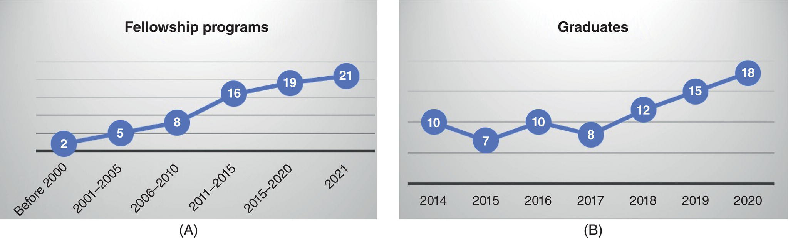
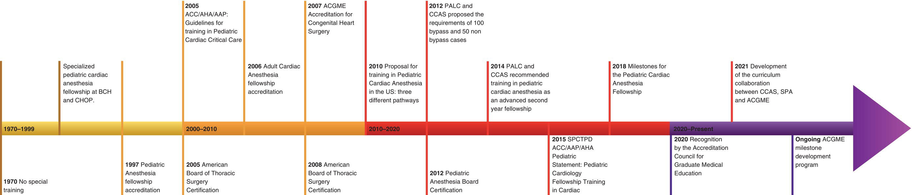

CHAPTER 2 Education for Anesthesia in Patients with Congenital Cardiac Disease 

# CHAPTER 2  
Education for Anesthesia in Patients with Congenital Cardiac Disease

_Viviane G. Nasr1 and Nina Deutsch2_

1 Department of Anesthesiology, Critical Care and Pain Medicine, Boston Children’s Hospital and Harvard Medical School, Boston, MA, USA

2 Department of Anesthesiology, Academic Affairs Children’s National Hospital, Professor of Anesthesiology and Critical Care Medicine, George Washington University School of Medicine and Health Sciences, Washington DC, USA

* * *

-   [**Introduction**](#head-2-14)
-   [**Why teach and learn congenital cardiac anesthesia?**](#head-2-15)
-   [**The current model**](#head-2-16)
-   [**Pediatric cardiac anesthesia training**](#head-2-17)
    -   [Problem identification and general needs assessment](#head-3-1)
    -   [Targeted needs assessment](#head-3-2)
    -   [Goals and objectives](#head-3-3)
    -   [Educational strategies](#head-3-4)
    -   [Implementation](#head-3-5)
    -   [Evaluation and feedback](#head-3-6)
-   [**Curriculum maintenance and enhancement**](#head-2-18)
-   [**Dissemination**](#head-2-19)
-   [**Role of professional societies**](#head-2-20)
-   [**Conclusion**](#head-2-21)
-   [**Acknowledgments**](#head-2-22)
-   [**Selected references**](#head-2-23)

* * *

## Introduction

Pediatric cardiac anesthesiology has developed as a sub‐subspecialty of anesthesiology over the past 50 years. It has been practiced since the first patent ductus arteriosus (PDA) was ligated by the cardiac surgeon Dr. Robert Gross in 1938. Initially, in the 1970s and 1980s, anesthesiologists interested in practicing pediatric cardiac anesthesia would spend additional months during residency training or as a staff member gaining experience in anesthesia care for these patients, the apprenticeship model. With further advances in surgical and catheter‐based interventions and technologies in patients with congenital heart disease (CHD), pediatric cardiac anesthesiology has evolved in parallel with pediatric cardiac surgery and pediatric cardiology as a distinct field. The evolution of this specialty has led to the establishment in 2005 of a dedicated professional society, the Congenital Cardiac Anesthesia Society (CCAS).

Before the advent of CCAS, there were very few resources in terms of providing training and experience in the specific field of pediatric cardiac anesthesia. The board of directors along with other pediatric anesthesiologists addressed the lack of training criteria in congenital cardiac anesthesia and have developed the resources that we have today culminated in recognition by ACGME \[1\].

## Why teach and learn congenital cardiac anesthesia?

Pediatric cardiac anesthesiology encompasses the care of neonates, infants, children, and adults with CHD and pediatric patients with acquired heart disease. Initially, practitioners interested in the field used to spend varying amounts of additional training time during their anesthesiology residency or as faculty members. However, the fields of congenital cardiac surgery and congenital cardiology have made significant strides which required ever‐increasing advances in the anesthetic care of these patients. While the subspecialty initially grew in concert with pediatric anesthesiology and adult cardiac anesthesiology programs, pediatric cardiac anesthesiology is now a distinct field which requires a unique fund of knowledge and skillset beyond that possessed by either the pediatric anesthesiologist or adult cardiac anesthesiologist alone.

In order to successfully care for patients with CHD and pediatric patients with acquired heart disease, it is necessary to gain expertise in the perioperative care of all forms of CHD from the simple to the most complex, and the pediatric acquired heart lesions. This includes a comprehensive understanding of congenital and acquired cardiovascular anatomy and pathophysiology. In addition, mastery of patient care along the continuum of care from the preoperative planning period, through the operative procedure itself, and through the postoperative recovery must be appreciated. In light of the wide spectrum of congenital cardiovascular anomalies and each condition having unique management considerations, the pediatric cardiac anesthesiologist must be adept at developing and executing an individualized perioperative anesthetic plan. Importantly, pediatric cardiac anesthesiologists must also master complex procedural skills to care for these patients with abnormal anatomy and physiology which go beyond those used to care for the patient with a normal cardiovascular system.

Today, an estimated 40,000 live births/year in the United States are affected with CHD \[2\]. These patients present for cardiac and noncardiac procedures. Given the increasing demands for well‐trained pediatric cardiac anesthesiologists, it is essential that a cohort of comprehensively trained practitioners of this craft be consistently produced. This is the only viable pathway to further advance the key objectives of providing improved clinical care and enhanced patient safety \[3–5\].

## The current model

In 2010, leaders in pediatric cardiac anesthesiology in the United States recognized the need for a standardized educational approach to the training of pediatric cardiac anesthesiologists, and accordingly several program guidelines were developed \[6\]. In 2014, the Pediatric Anesthesia Leadership Council (PALC) in conjunction with the CCAS recognized the need for a formalized training pathway \[7\]. They specifically recommended that pediatric cardiac anesthesiology be an additional 12‐month second‐year advanced fellowship following pediatric anesthesia. This recommendation clearly recognizes that attaining skills to become a competent pediatric cardiac anesthesiologist requires training beyond a standard pediatric anesthesia fellowship. In 2018, specific training milestones required during fellowship training were established by the CCAS leadership \[8\].

At present, the total number of 12‐month positions offered is 28. [Figure 2.1](#c2-fig-0001)A and B represent the number of programs and trainees over time. While the structure of these fellowship programs mostly follows the published guidelines as noted above, it is acknowledged by CCAS leadership, program directors, and individual pediatric cardiac anesthesiologists that central oversight of program quality is needed for educational and training consistency. Hence, as cardiology and cardiac surgery have done previously, the subspecialty has moved forward, aiming for a standardized approach to fellowship training with ACGME oversight ([Figure 2.2](#c2-fig-0002)).

## Pediatric cardiac anesthesia training

Curriculum development should employ a logical, systematic approach linked to specific healthcare needs. The Kern model of curriculum development for medical education could be used to develop a curriculum to teach and learn congenital cardiothoracic anesthesia \[9\]. This has a six‐step approach and consists of the following:

1.  Problem identification and general needs assessment
2.  Targeted needs assessment
3.  Goals and objectives
4.  Educational strategies
5.  Implementation
6.  Evaluation and feedback.

### Problem identification and general needs assessment

This comprises identification and characterization of the healthcare problem:

-   Whom does it affect?
-   What does it affect?
-   What is the qualitative and quantitative importance of the effects?

As detailed above, education in anesthesia for CHD covers a wide range of lesions – uncorrected, corrected, and palliative therapies. The trainee needs to be educated in all aspects of the six core competencies related to these topics.

The following points should be addressed to obtain adequate needs assessment:

-   What proficiencies (cognitive, affective, and psychomotor skills) currently exist among learners?
    
    
    
    [**Figure 2.1**](#R_c2-fig-0001) (A) Number of pediatric cardiac anesthesia programs over time; (B) number of graduating 12‐month fellows per year over time.
    
    
    
    [**Figure 2.2**](#R_c2-fig-0002) Timeline of major milestones in education and training in CHD. AAP, American Academy of Pediatrics; ACC, American College of Cardiology; ACGME, Accreditation Council for Graduate Medical Education; AHA, American Heart Association; BCH, Boston Children’s Hospital; CCAS, Congenital Cardiac Anesthesia Society; CHOP, Children’s Hospital of Philadelphia; PALC, Pediatric Anesthesia Leadership Council; SPA, Society for Pediatric Anesthesia; SPCTPD, Society of Pediatric Cardiology Training Program Directors; US, United States.
    
-   Previous training and experiences of fellows and residents in congenital cardiac anesthesia
-   Current training and experiences already planned for trainees
-   Resources available to learners (patients and clinical experiences, information resources, computers, audiovisual equipment, role models, teachers, mentors)
-   Perceived deficiencies and learning needs
-   Characteristics of the learners and barriers to learning and teaching.

The current state of the pediatric cardiac anesthesia training in CHD was most recently characterized in an email survey performed in 2019 addressed to program directors (_n_ = 19). The number of pediatric cardiac anesthesia programs in the United States offering pediatric cardiac anesthesiology training has continually grown from 2 in 2000 to 8 in 2010 and to 19 in 2020 ([Figure 2.1](#c2-fig-0001)A). Similarly, the number of 12‐month fellows graduating each year has increased ([Figure 2.1](#c2-fig-0001)B).

Following graduation, the majority of trainees (75%) work either exclusively as a pediatric cardiac anesthesiologist or divide their time as a general pediatric anesthesiologist and as a pediatric cardiac anesthesiologist. Seven percent work in combined pediatric cardiac and adult cardiac anesthesia programs. The remaining 15% work in a combination of anesthesia and critical care, adult cardiac anesthesia, or other settings.

### Targeted needs assessment

For the needs assessment to be an accurate reflection of what is required, it must involve the current trainees (learners) in pediatric cardiac anesthesia. Attempts should be made to assess the current strengths and weaknesses in knowledge, skills, and performance \[10\]. The environment in which education is currently happening needs to be evaluated as well. Is the operating room (OR) conducive to the education of some of the complex physiology or should the initial education happen in a simulated environment where the stress level of all concerned is much lower? It is vital that all the stakeholders (trainees, program directors, cardiologists, intensivists, and pediatric cardiac surgeons) are involved in the development at an early stage. Barriers and reinforcing factors that affect learning should be identified early on. Faculty development programs may be necessary to improve the quality of teaching and education in congenital cardiac anesthesia. Needs assessment should also include what resources are currently available to the trainees to facilitate learning in congenital cardiac anesthesia.

There is a dedicated body of science, knowledge, and skills related to the unique field of pediatric cardiac anesthesiology. There are chapters on the practice of pediatric cardiac anesthesia in every major anesthesia textbook, every major pediatric anesthesia textbook, and in several major cardiac surgical and pediatric interventional catheterization/electrophysiology textbooks. More importantly, there are numerous textbooks devoted entirely to the practice of pediatric cardiac anesthesia. In addition to textbooks and journals, dedicated pediatric cardiac anesthesia faculty at all the different respective programs constitute a body of knowledge and a source of education for the fellows in the field.

The case mix in the training programs, multidisciplinary faculty educators, and access to online journals and educational materials, including the availability of audiovisual equipment, are vital to the success of curricular delivery. The value of the hidden and informal curriculum that is currently in place should not be underestimated.

### Goals and objectives

Goals and objectives must, by necessity, be specific and measurable. They should measure the knowledge (cognitive), attitude (affective), and competence (psychomotor) of the learners. The goals and objectives are currently being developed by a task force which is comprised of ACGME leadership, a pediatric anesthesiologist, an adult cardiac anesthesiologist, and representative from the Society for Pediatric Anesthesia and CCAS. The goals and objectives should reflect the relationship of the educational process to the degree of participation of the learners, as well as the faculty response to the developed curriculum. To achieve goals, the program must be structured to ensure optimal patient care while providing trainees with the opportunity to develop skills in clinical care, judgment, teaching, and research. Consideration should be given to the use of learning goal‐scoring rubrics. Meyerson et al. performed needs assessment for an errors‐based curriculum on thoracoscopic lobectomy and structured the curriculum based on their observations using a standardized checklist \[11\].

The following goals and objectives are valuable in the OR to achieve competency in congenital cardiac anesthesia:

-   The subspecialist in congenital cardiac anesthesiology should be proficient in providing anesthesia care for both pediatric and adult patients undergoing congenital cardiac and vascular surgery as well as anesthesia for non‐cardiac surgery.
-   The subspecialist should demonstrate and conduct a preoperative patient evaluation; and demonstrate the ability to interpret imaging, cardiovascular, and pulmonary diagnostic test data.
-   The subspecialist should be able to evaluate and understand the anesthetic management of patients undergoing non‐operative diagnostic and interventional cardiac, thoracic, and electrophysiological procedures. Examples include angiography, arrhythmia mapping and ablation, stent placements, and device closures.
-   The clinical curriculum should include competency and demonstrate cognitive proficiency in the management of cardiopulmonary bypass (CPB), pharmacological and mechanical hemodynamic support as well as extracorporeal circulation.
-   The subspecialist should be able to create a plan for postoperative critical care, including ventilatory support, extracorporeal circulatory support, and pharmacologic hemodynamic support, as well as understand the implications of pain management.
-   The subspecialist should demonstrate effective communication skills in obtaining informed consent from families, discussing any complications that may have occurred as well as providing consultations as and when necessary.
-   The subspecialist should demonstrate skills in preparing materials and presenting at multidisciplinary conferences to allied health professionals.
-   The subspecialist must demonstrate professionalism in the work environment as evidenced by the ability to show compassionate care to the patient and their diverse needs, respecting other providers, as well as complying with program, department, and institutional policies and procedures.
-   The subspecialist should understand the value of multidisciplinary teams, be able to evaluate errors, and find solutions, thereby enhancing patient safety and improving outcomes for their patients.

The didactic curriculum provided through lectures, conferences, and workshops should supplement clinical experience as necessary for the fellow to acquire the knowledge to care for cardiothoracic patients with CHD and conditions outlined in the guidelines for the minimum clinical experience for each fellow. The didactic components should include the areas in the following list, with an emphasis on how cardiothoracic diseases affect the administration of anesthesia and life support to cardiothoracic patients with CHD.

These represent guidelines for the minimum didactic experience for each fellow:

-   Embryological and morphological development of the cardiothoracic structures; nomenclature of CHD
-   Pathophysiology, pharmacology, and clinical management of patients with all adult and pediatric CHD, including single ventricle lesions, septal defects, defects of semilunar and atrioventricular valves, left‐ and right‐sided obstructive lesions, transposition of the great vessels, defects of systemic and pulmonary venous return, cardiomyopathies, vascular rings, and tracheal lesions
-   Pathophysiology, pharmacology, and clinical management of patients requiring heart, lung, and heart‐lung transplantation, including immunosuppressant regimes and selection criteria
-   Non‐invasive cardiovascular evaluation: electrocardiography, echocardiography, cardiovascular computed tomography (CT), and magnetic resonance imaging (MRI)
-   Cardiac catheterization procedures and diagnostic interpretation; invasive cardiac catheterization procedures, including balloon dilatations and stent placement; device closure of septal defects, PDA and baffle leaks, and arrhythmia ablation
-   Pre‐anesthetic evaluation and preparation of pediatric and adult cardiothoracic patients
-   Pharmacokinetics and pharmacodynamics of medications prescribed for medical management of pediatric and adult cardiothoracic patients
-   Peri‐anesthetic monitoring methods, both non‐invasive and invasive, including use of ultrasound guidance: intra‐arterial, central venous, mixed venous saturation, cardiac output determination, transesophageal and epicardial echocardiography, neurological monitoring, including near‐infrared cerebral oximetry, transcranial Doppler, and processed electroencephalograms
-   Pharmacokinetics and pharmacodynamics of anesthetic medications prescribed for cardiothoracic patients. Pharmacokinetics and pharmacodynamics of medications prescribed for the management of hemodynamic instability: inotropes, chronotropes, vasoconstrictors, vasodilators
-   Extracorporeal circulation (including CPB, low‐flow CPB, deep hypothermic circulatory arrest, antegrade cerebral perfusion, extracorporeal membrane oxygenation (ECMO)), myocardial preservation, effects of extracorporeal circulation on pharmacokinetics and pharmacodynamics, cardiothoracic, respiratory, neurological, metabolic, endocrine, hematological, renal, and thermoregulatory effects of extracorporeal circulation and coagulation/anticoagulation before, during, and after extracorporeal circulation
-   Circulatory‐assist devices: left and right ventricular assist devices and biventricular assist devices
-   Pacemaker and automated internal cardiac defibrillator (AICD) insertion and modes of action
-   Perioperative ventilator management: intraoperative anesthetic and critical care unit ventilators and techniques
-   Postanesthetic critical care of pediatric cardiothoracic surgical patients
-   Pain management of pediatric and adult cardiothoracic surgical patients. Post‐anesthetic critical care of pediatric and adult cardiothoracic surgical patients
-   Research methodology and statistical analysis
-   Quality assurance and improvement
-   Ethical and legal issues
-   Practice management

#### What is the minimum level of anesthesia training required?

-   Subspecialty training in congenital cardiac anesthesiology should begin after satisfactory completion of a residency program in anesthesiology accredited by the ACGME or other training judged suitable by the program director and
-   Trainees should complete an ACGME‐accredited pediatric anesthesia fellowship of 12 months’ duration after anesthesia residency.
-   Alternatively, the trainees could enter the training following completion of an ACGME‐accredited adult cardiac anesthesia fellowship of 12 months’ duration after anesthesia residency if they have completed additional pediatric anesthesia rotations.

#### What are the ideal duration, case quantity, and scope of training?

The following represent suggested cases for the minimum clinical scope and duration of training:

-   Nine months of clinical anesthesia activity caring for patients with congenital cardiac problems in the OR, the cardiac catheterization laboratory, and other locations.
-   This experience should include a minimum of 100 anesthetic procedures, the majority of which must require CPB. At least 50 of these patients should be infants from birth to 1 year of age and should include at least 25 neonates (≤1 month of age). The trainee should also care for at least 25 adults (≥18 years of age).
-   This experience should also include a minimum of 50 patients undergoing diagnostic procedures (cardiac catheterization, echocardiography, MRI, etc.), as well as therapeutic procedures in the catheterization laboratory (arrhythmia ablation, pacemaker insertion, septal defect closure, and valve dilatation, etc.)
-   Suggested case numbers for specific lesions are described in [Table 2.1](#c2-tbl-0001) \[12\]
-   Adequate experience should be obtained in the preoperative evaluation of pediatric and adult cardiothoracic patients.
-   The fellow should understand how to use information from diagnostic studies and how to recognize when additional studies and/or consultations are indicated.

It is important to note that formal guidelines and case numbers are currently being developed by the ACGME task force. They will be available by end of 2021.

[**Table 2.1**](#R_c2-tbl-0001) Suggested case numbers for Anesthetic Management of Surgical Repairs and Diagnostic and Interventional Procedures

Source: Nasr et al. \[11\]. Reproduced with permission from Elsevier.

| Surgical cases bypass | Case numbers |
| --- | --- |
|  Hypoplastic left heart syndrome | 3 |
|  Transposition of great arteries | 3 |
|  Total anomalous pulmonary venous return | 1 |
|  Common atrioventricular canal | 6 |
|  Tetralogy of Fallot | 5 |
|  Ventricular/atrial septal defect | 10 |
|  Bidirectional Glenn | 5 |
|  Fontan | 4 |
|  Left ventricular assist device | 1 |
|  Right‐sided valvular lesions | 15 |
|  Left‐sided valvular lesions | 15 |
|  Heart/lung transplant | 2 |
|  Interrupted aortic arch | 1 |
|  Truncus arteriosus | 1 |
| **Surgical cases without bypass** | **Case numbers** |
|  Blalock‐Taussig shunt | 3 |
|  Aortic coarctation | 3 |
|  Patent ductus arteriosus | 3 |
|  Vascular ring | 2 |
| **Diagnostic and interventional (catheterization laboratory and imaging)** | **Case numbers** |
|  Hemodynamic catheterizations | 20 |
|  Pulmonary artery dilations | 7 |
|  Pulmonary vein dilations | 5 |
|  Endomyocardial biopsy | 5 |
|  Transcatheter valve placement | 2 |
|  Device closure (atrial septal defect/ventricular septal defect/PDA) | 2 |
|  Emergency cath cases (neonatal AS or PS, balloon atrial septostomy, stenting of Blalock‐Taussig/Sano shunts) | 3 |
|  Electrophysiology studies | 10 |
|  Cardiac magnetic resonance imaging/chest tomography | 2 |
|  Sedated transthoracic or transesophageal echocardiography | 5 |
|  Cases with extracorporeal support (extracorporeal membrane oxygenation) | 2 |

#### Relationship to other anesthesiology programs

The congenital cardiac anesthesiology program should function in direct association with one of the following ACGME‐accredited programs, preferably within the same institution: core anesthesiology, adult cardiothoracic anesthesiology, or pediatric anesthesiology. A congenital cardiac anesthesiology program may be conducted in either a general hospital or a children’s hospital. The division of responsibilities between trainees in the core anesthesiology program and an associated fellowship program(s) in adult cardiothoracic anesthesiology and/or pediatric anesthesiology must be clearly delineated. The presence of congenital cardiac anesthesiology fellows must not compromise the clinical experience and number of cases available to pediatric anesthesiology fellows and/or core anesthesiology residents. There must be close cooperation between the core anesthesiology program, the adult cardiothoracic anesthesiology program and/or the pediatric anesthesiology program, and the congenital cardiac anesthesiology program.

### Educational strategies

Educational strategies involve the content of materials to be delivered in the setting of the curriculum as well as the instructional methodology to be used to deliver the content. It will be beneficial to have the fellows involved in the planning of the educational activity. Consideration should be given to forming a committee of responsible faculty members to ensure that the best possible content is delivered.

#### Content of the curriculum

The driving force here is the learning objectives that have been created in the goals and objectives section. The program director should consider the development of a syllabus that includes learning objectives for the lectures, locations of the lectures, any readings that may have to be completed prior to arrival at the educational activity as well as additional resources for the educational activity. All of this information could be made available on a departmental intranet so the fellows have access to it at all times of the day (example: Open Pediatrics; [https://www.openpediatrics.org](https://www.openpediatrics.org)).

#### Educational methodology

To thrive in today’s technologically complex and information‐laden clinical environment, pediatric cardiac anesthesiology trainees must become self‐directed learners who are able to engage in self‐reflection and assessment of their learning needs. To facilitate self‐directed learning, program directors and trainees should work together to develop individualized educational plans, learning contracts, and milestone timelines. Here is a list of suggested educational strategies that may be used to address the cognitive, affective, and psychomotor objectives of the curriculum:

-   Strategies for achieving cognitive objectives
    -   Readings
    -   Lectures or large group interactive discussions
    -   Audiovisual materials
    -   Small group discussions
    -   Self‐study modules or web‐based learning materials
    -   Online discussion forums
    -   Podcasts or streaming video
    -   Fellow‐led didactic sessions
    -   Systematic reading of stored transesophageal echocardiogram (TEE) clips, if included in the curriculum
-   Strategies for achieving objectives effectively
    -   Exposure to, and discussion of, challenging clinical and ethical situations
    -   Simulated‐learning and cross‐training experiences with facilitated debriefing to gain experience in leadership, communication, task delegation, and team development skills
    -   Facilitation and modeling of openness, introspection, and reflection through the establishment of a safe learning environment
    -   Observation of role models, and serving as a role model for anesthesiology residents
    -   Standardized patients and role plays
-   Strategies for achieving psychomotor objectives
    -   Regular supervised clinical experiences with feedback
    -   Simulations: partial task trainers, full‐body manikins, virtual reality simulators
    -   Audiovisual reviews of skills
    -   Expert‐derived checklists of procedural competence.

In the digital age, there are several tools available to deliver content to the learners. However, all the different methods available may not be suitable for the various objectives to be achieved. The use of self‐directed readings, lectures, programmed learning, small group discussions, problem‐based discussions, and learning projects is helpful to advance cognitive knowledge. Team‐based training, problem‐based learning, and participation in learning projects all help to cultivate problem‐solving skills. However, to teach some of the affective objectives, reflective exercises, discussions, and observing role models in the OR may be helpful. To teach skills or competency objectives, the trainee may be taught using simulations, using standardized patients, supervised clinical experiences, artificial models, and role playing. All these methods of teaching have pros and cons. They have to be adapted for each individual program and only serve as a guide for program directors. The ideal methodology will encourage active learning, provide immediate feedback to the trainee, promote learning from experience, provide a safe learning environment, facilitate learning of higher cognitive objectives, and promote trainee motivation and responsibility. The utilization of low‐cost and less resource‐heavy methodologies is also more likely to succeed. Consideration should be given to faculty development if new instructional methodologies are to be utilized.

Conferences should be regularly attended by the trainee, including lectures, interactive conferences, hands‐on workshops, morbidity and mortality conferences, cardiac catheterization conferences, echocardiography conferences, cardiothoracic surgery case review conferences, journal reviews, and research seminars. While the faculty members should be the leaders of the majority of the sessions, active participation by the fellow in the planning and production of these conferences is essential. Attendance at multidisciplinary conferences, especially in cardiovascular medicine, pulmonary medicine, cardiothoracic surgery, vascular surgery, and pediatrics relevant to cardiothoracic anesthesiology, should be encouraged. Provision of an opportunity for fellows to participate in research or other scholarly activities is vital to the success of the educational strategies employed. The fellows must be encouraged to complete a minimum of one academic assignment. Projects may include grand rounds presentations, preparation and publication of review articles, book chapters, and manuals for teaching or clinical practice, clinical research investigation, or similar scholarly activities. A faculty supervisor must oversee each project.

In the context of practice‐based learning and improvement, trainees should be encouraged to participate in audits of their own patient care and be involved in critical appraisal of clinical practices and the literature. Trainees should be encouraged to develop learning portfolios as well as to create a learning plan for themselves. Learner‐driven teaching methodologies are likely to be more successful.

Congenital cardiac anesthesia lends itself nicely to education in the various aspects of systems‐based practice and teamwork. Trainees should be involved with quality improvement and attend case conferences focused on cost‐effectiveness, patient safety, and quality of care as part of a multidisciplinary team. _In situ_ team training has been associated with improved patient outcomes in the setting of pediatric emergencies.

Explicit education in professionalism in the cardiothoracic OR should be promoted by educating the trainees using faculty role models, trainee participation in writing professionalism goals and objectives, and trainee participation in ethics rounds in the intensive care unit (ICU) as part of a multidisciplinary team.

The use of the Internet to share educational materials is becoming the norm. As the number of physicians training to be providers of anesthesia for CHD is small, this option is attractive to allow for sharing of information between programs. Interesting case discussions, sharing of echocardiographic images, and recent articles pertaining to this area could be posted on the Internet as well. The MedEdPORTAL ([https://www.mededportal.org](https://www.mededportal.org)), Health Education Assets Library (HEAL) ([https://mwdl.org/collections/HealthEducationAssetsLibraryHEAL.php](https://mwdl.org/collections/HealthEducationAssetsLibraryHEAL.php)), Open Pediatrics ([https://www.openpediatrics.org](https://www.openpediatrics.org)), CCAS website ([https://pedsanesthesia.org/partner‐organizations‐sections/ccas](https://pedsanesthesia.org/partner-organizations-sections/ccas)), and Multimedia Educational Resource for Learning and Online Teaching ([https://www.merlot.org/merlot](https://www.merlot.org/merlot)) are some currently available resources that could house the curricular material related to congenital cardiac anesthesia. However, given this wealth of potential educational resources, it is important to keep in mind that the learner should be physically and mentally involved in the learning process.

The use of simulation in medical education continues to grow. Simulation allows complex clinical tasks to be broken down into their parts. Simulation‐based medical education can contribute considerably to improving medical care by boosting medical professionals’ performance and enhancing patient safety. Many surgical specialties are looking to simulation as a method for teaching and learning as well as evaluation. There is a role for simulation in learning procedural skills, especially in the climate of decreasing clinical exposure. A recent meta‐analysis of the use of simulation in anesthesia training showed inconsistency in the measurement of non‐technical skills and consistency in the (ineffective) design of debriefing \[13\]. More recent studies have demonstrated that adjunctive simulation‐based curriculum enhances learners’ management of clinical scenarios \[14\]. There is also evidence in the surgical literature that virtual reality training can improve OR performance. In a recent meta‐analysis, a simulation‐based airway management curriculum appeared superior to no intervention and non‐simulation intervention for important educational outcomes. Consideration should be given to the use of a clinical skills laboratory to pre‐teach some of the skills necessary in the management of a complex patient population \[15\]. Leaders in pediatric anesthesiology also advocate the use of a shared simulation‐based curriculum to improve education opportunities for fellowship programs, especially in light of the small size of many of them \[16\].

Anesthesia for CHD is a high‐risk, low‐error tolerance field. The fundamental knowledge and skills that congenital cardiac anesthesiologists will need to master if they are to increase their capacity to attain higher levels of performance are considerable. A clinical microsystems model may prove useful to facilitate the development of this fundamental knowledge and skills using the action‐learning theory and sound education principles to provide the opportunity to learn, test, and gain some degree of mastery.

### Implementation

Once a curriculum has been developed, it is the role of the program director to oversee its successful implementation. Success is achieved through insightful leadership, transparency and constant communication, forethought and general administration of the program, continuous quality improvement efforts, and establishment and maintenance of a stable educational environment. The program director must possess the requisite specialty expertise and have the relevant training and/or clinical experience in providing anesthesia care for congenital cardiac surgical patients that meet or exceed that associated with completion of a 1‐year congenital cardiac anesthesiology fellowship program. To implement a new curriculum, the program director must possess the necessary administrative and educational knowledge and skills to:

-   Identify necessary materials and resources
-   Obtain administrative and, if necessary, financial support
-   Identify and recruit qualified faculty members
-   Provide faculty development and teacher training
-   Develop administrative mechanisms to support the curriculum
-   Identify appropriate teaching space (e.g. in the OR, simulation center, or other appropriate clinical venues)
-   Anticipate and address barriers.

Above all else, the program director is responsible for keeping faculty, learners, and staff informed about plans for implementing a new curriculum. Individuals who are expected to support, teach, or participate in a program must be made aware of the program’s design, educational strategies, and assessment methods in order to ensure its smooth execution. The program director should also present curricular updates, especially any successes or milestones achieved, to identified stakeholders. Stakeholders are people with an interest in the program and its evaluation and may include the pediatric anesthesia department chair, cardiothoracic anesthesia division chief, anesthesia residency program director, other anesthesia subspecialty fellowship directors, funding agencies, and/or hospital administrators (e.g. the Vice President for Quality and Safety).

While the program director is responsible for overseeing the curriculum, this does not have to be done in isolation. There are a number of faculty and staff members who can provide support and advice regarding the design and teaching of a curriculum. As an added benefit, those involved at the front end of a program’s design and implementation are more likely to want to participate in teaching and assessing the curriculum. A junior faculty member with expertise in congenital cardiac anesthesiology and interest in medical education may be eager to help develop and present a curriculum. Pediatric anesthesia faculty members with previous curriculum development experience as well as clinician educators committed to anesthesiology training in CHD may be recruited as educational consultants and then asked to teach in the program. Involving other faculty members in the development and implementation of a curriculum also ensures a program’s continuity, stability, and sustainability.

There are several key decisions that must be made, and steps that must be taken, before implementing a congenital cardiac anesthesia curriculum. First, the program director needs to decide whether to introduce the curriculum as a pilot program, in stages or to present it in its entirety. There are arguments both for and against each approach; however, if stakeholders are wary of a new curriculum’s educational benefit, it is best to introduce a pilot program in order to collect evidence of its value and then gain support for its full implementation. Recruiting faculty members and then developing them to teach in the program are further essential steps. To present a successful and sustainable curriculum, there must be a sufficient number of faculty members with documented qualifications to instruct and adequately supervise all anesthesia fellows in the program. Although the number of faculty members involved in teaching will vary, there should be at least three, and these should be equal to or greater than two full‐time equivalents, including the program director. A ratio of no less than one full‐time equivalent faculty member to one subspecialty fellow must be maintained. The anesthesia faculty must possess the requisite congenital cardiac anesthesia specialty expertise, competence in clinical care, and teaching abilities, as well as documented educational and administrative abilities and experience in their field. There must be evidence of active participation by qualified physicians with training and/or expertise in congenital cardiac anesthesiology beyond the requirement for completion of a core anesthesiology residency. The faculty members should have training and experience that would generally meet or exceed that associated with the completion of a 1‐year congenital cardiac anesthesiology program. Faculty members in cardiology, cardiothoracic surgery, pediatrics, intensive care, and pulmonary medicine can provide teaching in multidisciplinary conferences. The responsibility for establishing and maintaining an environment of inquiry and scholarship of discovery, dissemination, and application rests with the program director and the faculty, and an active research component must be included in each program.

Equally important to recruiting qualified faculty members with the appropriate expertise and training in congenital cardiac anesthesiology is the development of their ability to teach the curriculum. It is a common error to assume that faculty members with the necessary clinical skills, knowledge and specialized expertise are also qualified to teach. They are rarely required to provide documentation of their teaching experience or evidence of teacher training, even for the most basic skills such as assessing and providing feedback to learners, leaving many ill‐prepared for their teaching responsibilities. The core components of a faculty development program in training congenital cardiac anesthesiology fellows should include:

-   Communication of curricular goals and objectives
-   Discussion of qualities that characterize effective and respected clinical educators
-   Suggestions of how to apply adult learning principles to congenital cardiac anesthesia clinical venues
-   Assurance that faculty members can effectively assess trainees and provide useful feedback on their performance
-   Review of best teaching practices for common educational strategies such as procedural teaching as well as large and small group facilitation skills
-   Specialized training sessions to teach faculty members how to communicate and explain clinical decision‐making; make teaching in the OR a priority; maintain a balance between supervision and autonomy; promote critical thinking skills; and provide clear, constructive, and developmental feedback.

### Evaluation and feedback

Evaluation and feedback are essential for the continuous improvement and development of a curriculum. The purpose of evaluation in medical education is to determine if the curricular goals and objectives have been met. In addition, an evaluation can determine if the time, resources, and effort spent producing the curriculum are merited. Evaluation results can be used to identify educational outcomes, assess teaching effectiveness, determine areas of strength and needed improvement, and make decisions about the level of support necessary to sustain or further develop a curriculum. “Feedback” is defined as the provision of information regarding an individual’s or program’s performance to trainees, faculty, stakeholders, and accrediting agencies. While the terms “evaluation” and “assessment” are often used interchangeably when measuring both individual learner and program outcomes, it is best to distinguish between them, adopting the term “evaluation” in relation to the measurement of the curriculum, and “assessment” in relation to the measurement of learners. As learner assessment often comprises a significant portion of a program’s evaluation, making this distinction will help to avoid confusion when planning and presenting results \[17\].

#### The process of curriculum evaluation and feedback

To conduct a comprehensive evaluation of a congenital cardiac anesthesiology program, multiple sources of data must be sought, which requires a systematic information collection process involving learners, faculty, other healthcare providers, and, in some cases, external evaluators. Data and information should be collected at the start of a curriculum, ‐ its midpoint, conclusion, and subsequent to completion (e.g. 6–12 months post‐fellowship). A program director’s effort in collecting evaluation data at the program’s mid‐ and endpoints will be less challenging if the requisite time and effort are put into creating specific and measurable learning objectives at the start of a curriculum, and into assessing the fellows’ knowledge, skills, and performance levels in congenital cardiac anesthesiology up‐front. With the appropriate administrative support, a program director can institute an iterative “plan–do–check–act” methodological approach to continuous curriculum improvement. This method involves _planning_ (the curriculum development steps 1 through 4 – problem identification through educational strategies); _doing_ (the implementation step); _checking_, in which data are collected to determine what is going well and what needs to be improved moving forward; and _acting_, in which the program director addresses identified curricular problems by determining their causes and applying countermeasures, standardizes what is working well, and communicates decisions, new standards and improvements to be made.

Kirkpatrick \[18\] described four levels to focus program evaluation, which Curran and Fleet \[19\] later adapted for use in medical education evaluation:

-   Reaction – this level of evaluation is intended to evaluate how well participants liked a program. It generally provides data concerning participants’ perceptions, and satisfaction with objectives, content, instruction, delivery, and/or instructors.
-   Learning outcomes – this level of evaluation involves some form of assessment of changes in skills, knowledge, or attitudes among learners; it is most commonly conducted through pre‐and post‐test study designs.
-   Performance improvement – this level of evaluation provides information on the extent to which learning has influenced the post‐learning behavior or performance of learners in their practice setting. Evaluating at this level attempts to answer the question: Are the newly acquired skills, knowledge, or attitudes being used in the everyday environment of the learner?
-   Patient/health outcomes – this level of evaluation is concerned with measuring tangible results which are influenced by the performance of the learner as a result of participation in the educational activity. These tangible results can be transferred to a health perspective (e.g. improving patient health or improving efficiencies). Evaluation at this level is challenging given the variety of uncontrollable variables a learner encounters when he or she leaves an educational program.

A program director needs first to determine the intention of the curriculum evaluation as well as the audience reviewing the results in order to choose which level(s) to focus his or her time and effort on. For example, if a department chair is mostly interested in whether the fellows are better able to perform advanced TEE in the OR, then evaluation results should report on learning outcomes. If, however, the Vice President of Healthcare Quality is interested to report to the board on the reduction of anesthesia‐related complications post‐CHD surgery, then the focus should be on patient/health outcomes.

#### Learner assessment methods

With the adoption of outcomes‐based training requirements in 2002, the focus of learner assessment for all residency programs has been on the ACGME’s six core competencies. The goal of competency‐based assessment is for trainees to meet discreet, transparent, achievable objectives at developmentally appropriate stages in training. The challenge for program directors of congenital cardiac anesthesia training programs is to ensure that the curriculum’s goals and objectives match the intended competencies.

Learner assessment should be thought of in terms of formative and summative purposes. Formative assessment should be provided consistently throughout a fellowship program, as it provides trainees with feedback on their performance towards defined educational objectives. It also steers learning towards desired outcomes and can focus high‐achieving learners towards more rapid skill advancement. The summative assessment determines how well learners achieved competency of specific objectives at developmentally appropriate stages in their training. These are conducted at the end of a rotation or program.

For formative and summative learner assessment to be considered reliable, performance data must be obtained from the predominant clinical units where congenital cardiac anesthesia trainees work and learn. Multidisciplinary cardiothoracic team members, including supervising anesthesiologists, surgeons, nurses, and other staff members in the OR or ICUs, should use multiple assessment methods and tools (e.g. standardized checklists, performance audits, case logs), in combination with the trainee’s own self‐assessment, to create a comprehensive performance appraisal system required in a competency‐based training model.

Learner assessment methods can be categorized as cognitive, affective, or psychomotor appraisals. Cognitive learner assessment methods are used to determine and provide feedback about trainees’ acquisition and application of biomedical, clinical, epidemiological, and social‐behavioral sciences knowledge, as well as their ability to problem‐solve, reason through clinical challenges, and use critical thinking skills. Methods include:

-   Written or computer‐interactive tests – multiple‐choice, essay‐type questions
-   Oral examinations
-   Questionnaires
-   Individual interviews
-   Procedural, operative, or case logs
-   Chart stimulated recall
-   Review of scholarly projects and research
-   Observation of a fellow’s ability to apply data from advanced monitoring devices.

Affective learner assessment methods are used to appraise and provided feedback about trainees’ attitudes, feelings, motivations, and decisions. Methods include the following:

-   Standardized patient exercises
-   Questionnaires
-   Written reflections and essays
-   Rating and forced ranking forms
-   Patient and family surveys
-   Teamwork exercises
-   Peer assessment of professionalism
-   Case‐based discussions that involve clinical uncertainty or ethical dilemmas
-   Individual interviews
-   Self‐report of adverse events and near misses related to pediatric cardiothoracic and vascular anesthesia rotations
-   Root cause analyses of medical errors or complications of patients under the fellows’ care.

Psychomotor learner assessment methods are used to appraise and provide feedback on trainees’ physical skills or the performance of actions. There are numerous methods to use for psychomotor assessment. Methods must be criterion‐based, anchored using demonstrable behaviors, and developmentally appropriate. The most common methods are as follows:

-   Simulation exercises
-   Portfolios of videotapes
-   Direct observation of discrete procedural skills (such as intubation or line placement)
-   Objective structured clinical examinations
-   Objective structured assessment of technical skills
-   Mini‐clinical evaluation exercise
-   Clinical encounter cards
-   Clinical work sampling
-   Practice metrics scoring using data collected as part of routine care via an existing perioperative information management system (e.g. central line insertion and temperature management).

The assessment process for congenital cardiac anesthesia trainees should emphasize learning, inspire confidence in the trainee, enhance the trainee’s ability to self‐monitor, and drive the institutions toward self‐assessment and curricular change when necessary. The primary endpoint should be the ability to demonstrate trainee competence in the care of their patients in accordance with the ACGME’s six core competencies – patient care, medical knowledge, systems‐based practice, professionalism, interpersonal and communication skills, and practice‐based learning and improvement.

In 2018, the CCAS published a consensus statement for the milestones of the ACGME based on the six core competencies \[8\] ([Table 2.2](#c2-tbl-0002)). Milestones are “specialty specific achievements that residents are expected to demonstrate at established intervals as they progress through training” \[20, 21\].

#### Program evaluation methods

Curriculum developers perform an evaluation of an educational program to make judgments about its successes and deficiencies; decide about resource allocation, administrative support, and material management; determine teaching performance; uncover influencing attitudes regarding the curriculum’s educational value; pinpoint areas that are effective and that are in need of improvement, conclude whether the curriculum met its intended learning goals and objectives and should continue to be incorporated into a training program.

A core component of the program evaluation process is to conduct and collect data from formative and summative learner assessment methods. The faculty must evaluate in a timely manner the fellows whom they supervise. In addition, the fellowship program must demonstrate that it has an effective mechanism for assessing fellow performance throughout the program and utilizes the results to improve fellow performance. At the minimum, faculty members responsible for teaching must provide a critical assessment of the six ACGME core competencies for each fellow at the end of 6 and 12 months of training. Learner assessment should include regular and timely performance feedback to fellows that includes at least semi‐annual written evaluations. Such evaluations should be communicated to each fellow in a timely manner and be maintained in a record that is accessible to each fellow. The program director or designee must inform each fellow of the results of the evaluations at least every 6 months during training, advise the fellow of areas needing improvement, and document the communication. Assessments should include the fellows’ fund of knowledge, clinical judgment and clinical psychomotor skills, patient management skills, and the ability to critically analyze complex clinical situations. Periodic evaluation of patient safety and teamwork is mandatory. Evidence of the congenital cardiac anesthesiology fellows’ scholarly projects and research, including those pertaining to continuous quality improvement and risk management, should be reviewed and summarized by designated faculty mentors.

[**Table 2.2**](#R_c2-tbl-0002) Core competencies and milestones for the pediatric cardiac anesthesia fellowship

Source: Nasr et al. \[8\]. Reproduced with permission from Wolters Kluwer Health, Inc.

<table border="1"><tbody class="tdcolor3"><tr><td class="left"><b>Six core competencies and milestones</b><ul class="none"><li><b>Patient care [4]</b><ul class="none"><li>Perioperative assessment, planning and management</li><li>Technical/Procedural Skills</li><li>Understanding cardiovascular surgical procedures</li><li>Understanding cardiac catheter‐based therapeutic procedures and electrophysiologic studies</li></ul></li><li><b>Medical knowledge [4]</b><ul class="none"><li>Congenital and acquired cardiovascular anatomy, physiology and pathophysiology</li><li>Pharmacology</li><li>Cardiopulmonary bypass, extracorporeal circulation and circulatory assist device principles</li><li>Understanding cardiac diagnostic procedures (e.g., echocardiography, magnetic resonance imaging, cardiac catheterization, computerized tomography) <b>Systems‐based practice [3]</b></li><li>Coordination of care</li><li>Incorporation of patient safety and quality improvement into clinical practice</li><li>Understanding of health care economics; cost awareness and cost‐benefit analysis</li></ul></li><li><b>Practice‐based learning and improvement [2]</b><ul class="none"><li>Self‐directed learning and scholarly activity</li><li>Education of team members and other health care providers</li></ul></li><li><b>Professionalism [3]</b><ul class="none"><li>Commitment to institution, department and colleagues</li><li>Receiving and giving feedback</li><li>Responsibility to maintain personal, emotional, physical and mental health</li></ul></li><li><b>Interpersonal and communications skills [2]</b><ul class="none"><li>Communication with patients and families</li><li>Interprofessional communication and transitions of care</li></ul></li></ul></td></tr></tbody></table>

The program director should conduct a final evaluation for each fellow who completes the program. This evaluation must include a review of the fellow’s performance during the final period of education and should verify that the fellow has demonstrated sufficient professional ability to practice competently and independently. Documentation of the congenital cardiac anesthesiology fellows’ successful completion of the program as well as subsequent training or career plans should be kept up to date, as this information will help to inform future program evaluation efforts. A program director should also maintain a listing of all graduating fellows’ scholarly activities as well as aggregate feedback from the ACGME’s resident fellow surveys. This survey provides feedback on the duty hours, faculty supervision and instruction, fellow evaluation processes, educational content and resources, patient safety and teamwork, as well as overall reflections on the quality of the training program.

#### Faculty members

As part of a comprehensive curriculum evaluation effort, faculty members should be evaluated on their congenital cardiac anesthesia teaching performance and supervisory capabilities. Clinical teaching assessment instruments should produce valid and reliable results and any findings should be provided to faculty members in a clear and concise format. The faculty members should be assessed on their medical knowledge, clinical competence, teaching effectiveness, scholarly activities, and professional attributes. Lombarts et al. found that existing tools could be adapted for the systematic evaluation and support of faculty members involved in residency programs. They suggest basing faculty evaluation on qualities established by the well‐known Stanford Faculty Development Program instrument. These qualities include the establishment of an effective learning climate, professional attitudes towards trainees, communication of goals, evaluation of trainees, and quality of feedback provided. Moreover, Baker’s study of resident assessment of educators in anesthesiology provides data about the positive impact that trainee evaluation can have in motivating clinicians to become better teachers \[22\].

#### Overall program effectiveness

Summative program evaluation provides information on the degree to which a curriculum has met its intended objectives and at what cost. It can also document the curriculum’s success in engaging and motivating its learners and faculty as well as associated subspecialty anesthesiology training programs. In addition to quantitative data, summative program evaluation may include qualitative information about educational barriers and unanticipated obstacles as well as means to streamline curriculum implementation. The results of summative program evaluations are often disseminated to stakeholders to obtain or maintain time, administrative support, funding, and other resources. The educational effectiveness of a program must be evaluated at least annually in a systematic manner.

Representative program personnel (at a minimum the program director, representative faculty, and one fellow) must be organized annually to review program goals and objectives, and the effectiveness with which they are achieved. In the evaluation process, the group must take into consideration written comments from the faculty, the most recent report of the graduate medical education committee of the sponsoring institution, and the fellows’ confidential written evaluations. If deficiencies are found, the group should prepare an explicit plan of action, which should be approved by the faculty and documented in the minutes of the meeting.

The program should use fellow performance and outcome assessment in its evaluation of the educational effectiveness of the fellowship program. The performance of program graduates in the certification examination should be used as one measure of evaluating program effectiveness. The program should maintain a process for using assessment results together with results of other program evaluations to improve the fellowship program.

## Curriculum maintenance and enhancement

Once a curriculum in congenital cardiac anesthesia has been developed, the next challenge is curriculum maintenance. A successful curriculum is continually developing by responding “to evaluation results and feedback, to changes in knowledge base and the material requiring mastery, to changes in resources (including faculty), to changes in its targeted learners, and to changes in institutional and societal values and needs”. Areas for curricular enhancement may include a review of the written or intended curriculum, assessment of the environment/setting of the curriculum, and determination of learner assessment methods to meet new accrediting agency requirements (such as the ACGME’s milestones). The following data can be collected and utilized to assess how well a curriculum is functioning:

-   Program evaluation
-   Learner/faculty/patient questionnaires
-   Patient quality metrics
-   Objective measures of learners’ skills and performance
-   Focus group of learners, faculty, staff, and patients
-   Other systematically collected data
-   Regular/periodic meetings with learners and faculty
-   Special retreats and strategic planning sessions
-   Site visits
-   Informal observation of curricular components, learners, faculty, and staff
-   Informal discussions with learners, faculty, and staff

Congenital cardiac anesthesia is a subspecialty in which there are significant interactions between anesthesiologists and cardiac surgeons, cardiologists, radiologists, and other pediatric subspecialists. Close alliance between these disciplines is vital to the growth and development of the subspecialty. Furthermore, curriculum enrichment is dependent on both intra‐ and inter‐subspecialty collaboration as well as combined faculty development efforts.

## Dissemination

There is a need for an international comprehensive curriculum in congenital cardiac anesthesia. Local adaptation of a core curriculum will be necessary to overcome technological and cultural care delivery obstacles. The following issues should be considered when considering the dissemination of core curriculum material:

-   What material should be disseminated?
-   How should the material be disseminated (publications, presentations, multi‐institutional interest groups or academic societies, educational clearing houses, online learning systems, digital communication, instructional videotapes or audiotapes, and/or instructional computer software)?
-   What resources are required (time and effort, personnel, equipment/facilities, funds)?
-   How can dissemination and impact be measured?

Dissemination of a curriculum can be a valuable process, benefiting many other congenital cardiac anesthesia trainees. A coherent strategy must be determined on what should be disseminated, appropriate methods of dissemination, and the best use of limited time and administrative resources.

## Role of professional societies

At present, the CCAS, in conjunction with the Society for Pediatric Anesthesia (SPA), has taken the lead in developing a core curriculum for fellowship training in congenital cardiac anesthesia. Collaboration with the ACGME and Residency Review Committee (RRC) is ongoing as the subspecialty matures to the point where it becomes a board‐certifiable specialty in its own right. As many children with CHD survive to adulthood and develop the adult cardiothoracic disease, the American Heart Association as well as the American College of Cardiology may be able to provide significant input into developing a holistic approach to the care of this complex patient population. A significant proportion will go on to become pregnant, and hence, both the American College of Obstetricians and the Society for Obstetric Anesthesia and Perinatology will need to contribute to the development of a curriculum.

## Conclusion

Developing durable new curricula will be challenging in the highly specialized area of congenital cardiac anesthesia. The use of a systematic approach to its development will facilitate efficient teaching and learning in this complex discipline. It is important to develop programs that give faculty members the necessary skills to develop curricula and that provide mentoring. Collaboration with ACGME for the development of the program requirements and the Milestones development program is ongoing. Finally, the challenge of transitioning trainees from fellow (learner) to the faculty member (provider and teacher) in congenital cardiac anesthesia will continue. The trainees should be encouraged to create a learning portfolio, preferably web‐based, that is a record of participation and achievement, career goals and professional development, physical evidence, and reflective writing.

## Acknowledgments

We would like to acknowledge Sugantha Sundar MD, Lori Newman, MD, PhD, and James A. DiNardo, MD for their contributions to previous editions of this chapter.

## Selected references

_A full reference list for this chapter is available at:_

[http://www.wiley.com/go/andropoulos/congenitalheart](http://www.wiley.com/go/andropoulos/congenitalheart)

1.  6 DiNardo JA, Andropoulos DB, Baum VC. Special article: a proposal for training in pediatric cardiac anesthesia. Anesth Analg 2010; 110:1121–5. _Despite a relatively universally applicable knowledge base and skill set, training and experience in pediatric cardiac anesthesia in currently organized basic anesthesia and adult cardiothoracic anesthesia fellowship programs are very limited and not uniformly available. The authors present a schema, developed by a working group of the CCAS, for training in pediatric cardiac anesthesia that should be considered by pediatric cardiac anesthesia educators internationally as a template to be modified as necessary_.
2.  8 Nasr VG, Guzzetta NA, Miller‐Hance WC, et al. Consensus statement by the congenital cardiac anesthesia society: milestones for the pediatric cardiac anesthesia fellowship. Anesth Analg 2018; 126(1):198–207. _Training in pediatric cardiac anesthesia is a 12‐months fellowship with 18 dedicated milestones based on the six core competencies of the ACGME_.
3.  9 Kern DE, Thomas PA, Hughes MT. Curriculum Development for Medical Education: A Six‐Step Approach, 2nd edn. Baltimore, MD: The Johns Hopkins University Press, 2009. _This is an excellent resource published by the faculty at Johns Hopkins University, discussing the different steps involved in new curriculum development. Problem identification and general needs assessment. Targeted needs assessment, goals and objectives, educational strategies, implementation, evaluation and feedback are discussed in detail_.
4.  10 Wong A. Review article: teaching, learning, and the pursuit of excellence in anesthesia education. Can J Anesth (2012); 59:171–81. _Excellent teaching is considered that which facilitates and maximizes learning. A conceptual framework of learning as a convergence of teacher, learner, assessment, and context is proposed in this article. The contribution of each component to learning is examined in order to enable anesthesia teachers to choose and adapt the most appropriate educational approaches for their particular contexts_.
5.  11 Nasr VG, Guzzetta NA, Mossad EB. Fellowship training in pediatric cardiac anesthesia: history, maturation and current status. J Cardiothorac Vasc Anesth 2019; 33(7):1828–34. _A comprehensive history and review of pediatric cardiac anesthesia training in the United States_.
6.  12 Lorello GR, Cook DA, Johnson RL, Brydges R. Simulation‐based training in anaesthesiology: a systematic review and meta‐analysis. Br J Anaesth 2014; 112:231–45. _Using meta‐analysis and critical narrative analysis, the authors synthesized the evidence for the effectiveness of simulation‐based anaesthesiology training. Their critical analysis showed inconsistency in the measurement of non‐technical skills and consistency in the (ineffective) design of debriefing. Simulation in anaesthesiology appears to be more effective than no intervention (except for patient outcomes) and non‐inferior to non‐simulation instruction_.
7.  16 Cook DA. Twelve tips for evaluating educational programs. Med Teacher 2010; 32:296–301. _This article helps educators to evaluate an educational program to determine its merit or worth. The two most important questions in any evaluation are, ‘Whose opinion matters?’ and ‘What would really be meaningful to them?’_.
8.  17 Ebert TJ, Fox CA. Competency‐based education in anesthesiology: history and challenges. Anesthesiology 2014; 120:24–31. _The Accreditation Council for Graduate Medical Education is transitioning to a competency‐based system with milestones to measure progress and define success of residents. Curriculum must be redesigned and assessments will need to be precise and in‐depth_.
9.  18 Nasca TJ, Philibert I, Brigham T, Flynn TC. The next GME accreditation system – rationale and benefits. New Engl J Med 2012; 366:1051–6. _This article discusses the merits and work that need to be done in the creation of the Next Accreditation System (NAS). Key benefits of the NAS include the creation of a national framework for assessment that includes comparison data, reduction in the burden associated with the current process‐based accreditation system, the opportunity for residents to learn in innovative programs, and enhanced resident education in quality, patient safety, and the new competencies_.