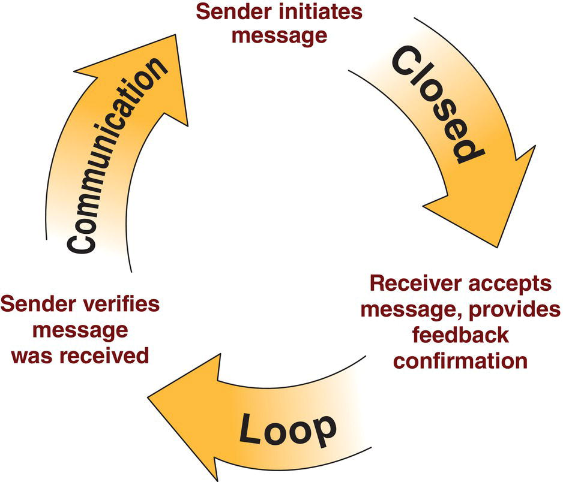

CHAPTER 3 Quality, Outcomes, and Databases in Congenital Cardiac Anesthesia 

# CHAPTER 3  
Quality, Outcomes, and Databases in Congenital Cardiac Anesthesia

_Lisa A. Caplan1, Ehrenfried Schindler2, and David F. Vener3_

1 Staff Cardiovascular Anesthesiologist, Arthur S. Keats Division of Pediatric Cardiovascular Anesthesiology, Department of Anesthesiology, Baylor College of Medicine, Houston, TX, USA

2 Department of Anesthesiology and Intensive Care Medicine, University Hospital, Bonn, Germany

3 Arthur S. Keats Division of Pediatric Cardiovascular Anesthesiology, Texas Children’s Hospital, Department of Anesthesiology, Baylor College of Medicine, Houston, TX, USA

* * *

-   [**Introduction**](#head-2-24)
-   [**Errors and outcomes in surgery and anesthesia**](#head-2-25)
-   [**The six “Cs”: communication and teamwork**](#head-2-26)
-   [**Databases in pediatric cardiac surgery and anesthesiology**](#head-2-27)
-   [**Prospective risk assessment in pediatric cardiac surgery and cardiology**](#head-2-28)
-   [**Closed claims analysis in anesthesia**](#head-2-29)
-   [**Pediatric and congenital cardiac anesthesia morbidity and mortality**](#head-2-30)
-   [**Congenital Cardiac Anesthesia Societyand the Congenital Cardiac AnesthesiaNetwork**](#head-2-31)
-   [**Joint CCAS–STS database initiative**](#head-2-32)
-   [**International efforts**](#head-2-33)
-   [**Selected references**](#head-2-34)

* * *

## Introduction

Patient safety in the operating room (OR) and beyond has long been a driving force in anesthesia care. Technical innovations such as pulse oximetry and capnography, combined with better trainee and practitioner education have dramatically increased safety for our patients and the quality of our anesthesia care. Additionally, newer medications, technologies, and monitoring modalities continue to advance the field. As a result of these systematic changes, anesthesia‐related patient morbidity and mortality have steadily declined across all patient populations. Non‐technical attempts to reduce perioperative complications such as perioperative time‐outs and checklists have become another major focus of various organizations such as the World Health Organization (WHO) and the Joint Commission, formerly the Joint Commission for the Accreditation of Hospital Organizations (JCAHO).

Efforts to delineate the frequency of complications related to anesthesia in patients undergoing congenital cardiac surgery and procedures in the cardiac catheterization laboratory and elsewhere have been difficult. This is due to the relatively low frequency of this surgery compared with other surgeries on children and the uncommon incidence of anesthesia‐related complications today. Busy cardiac anesthesia services at major North American pediatric institutions will each have contact with 2,000–3,000 congenital cardiac patients/year, and the majority of these cases are non‐surgical, such as diagnostic and therapeutic catheterizations and radiology procedures. The recognition of the need to systematically quantify and study outcomes in pediatric cardiac surgery, anesthesiology, cardiac critical care, and cardiology has led to the development of a variety of multi‐institutional and multinational efforts to systematically document and study this population.

Educational content reviewed by this chapter will include: (i) A discussion of errors and outcomes in surgery and anesthesia, emphasizing communication and teamwork; (ii) A discussion of systems for prospective risk assessment in pediatric cardiac surgery; (iii) An analysis of closed malpractice claims in anesthesia focusing on pediatric cardiac anesthesia, morbidity, and mortality; and (iv) Database initiatives in congenital cardiac anesthesia, surgery, and interventional catheterization.

## Errors and outcomes in surgery and anesthesia

The perioperative management of patients with congenital heart disease (CHD) is fraught and there are occasions when even small decision‐making errors can have catastrophic outcomes. James Reason has popularly described the “Swiss cheese model” for evaluating patient complications due to human errors \[1\]. For a complication to occur, all the “holes” in the cheese have to line up – that is, there is a sequential failure of various defense mechanisms in place to prevent, recognize, and/or treat unwanted physiologic changes ([Figure 3.1](#c3-fig-0001)). Many “anesthesia” complications are multifactorial in origin, and it can be difficult to assign the relative contributions of different clinical services. For example, failure to successfully separate from cardiopulmonary bypass may be due to issues such as technical difficulty (surgery and perfusion), residual lesions or bleeding (surgery), inotrope management or mistaken infusion pump programming (anesthesia and surgery), ventilator management (anesthesia), or underlying patient physiology such as intractable pulmonary hypertension (patient). These system factors are further exacerbated if there are communication difficulties between the various parties, including surgeons, anesthesiologists, perfusionists, cardiologists, and the pre‐ and post‐operative medical and nursing teams \[2\].

In a landmark study, de Leval and colleagues investigated the impact of human factors and teams on surgical outcomes in congenital cardiac patients, focusing on the neonatal arterial switch operation (ASO) as the prototype for complex, high‐risk surgery \[3\]. Patient and procedural data were collected on 243 operations performed by 21 cardiac surgeons in the United Kingdom in 16 centers over 18 months. Of these 243 patients, case study data were collected on 173 ASOs by two human factors researchers who followed each case from the time of induction of anesthesia until care was transferred to the intensive care team. The observed adverse events were subsequently divided into major and minor events depending on their impact on the safety of the patient. Analyses determined that, after adjustment for patient factors, the total number of minor and major events per case were both strong predictors of the probability of major morbidity or death or “near‐misses” (_P <_ 0.001). The authors concluded that minor events go largely unnoticed by the OR team and are therefore left uncompensated. A subsequent examination of the same data suggests that minor events impede the OR team’s ability to compensate for future major events \[4\]. This investigation only included perioperative care and did not begin to address patient care prior to surgery or after handoff to the intensive care team, which would have added even more events into the calculations.

In addition to the organizational factors, pediatric cardiac surgery procedures have a low error tolerance. The Bristol Royal Infirmary Inquiry and the Manitoba Inquiry reports both recognized the importance of human factors and systems research in improving pediatric cardiac surgical outcomes \[5, 6\]. The report of the Manitoba Pediatric Cardiac Surgery Inquest found that “serious organizational and personnel problems experienced by the Health Sciences Center’s Pediatric Cardiac Surgery Program during 1993 and throughout 1994 contributed to the deaths of these children.”

[**Figure 3.1**](#R_c3-fig-0001) The “Swiss cheese” model of accident causation.

(Source: Reason \[1\]. Reproduced with permission of Cambridge University Press.)

Galvan et al. published an observational study on complications in this complex patient population and recorded an average of 1.8 major compensated and nine minor compensated complications per case \[7\]. These complications were observed during the surgeries but were all recognized and treated by the medical team before injury resulted – all the “holes” in the Swiss cheese did not line up because one or more of the various systems in place to prevent patient injury worked appropriately. Barach et al. reported on a comprehensive process map in which they outlined the multiple steps involved in congenital cardiac anesthetic care and identified the potential sites for safety interventions \[8\]. They observed 108 open cardiac surgeries and found that communication failures were the most common underlying cause of major events. Examples of the organizational and human factors challenges that Barach et al. observed include:

-   Unplanned transfusion of blood products correlated with a breakdown of communication between the anesthesia team, the nurses, and the perfusionist.
-   Failure to identify a non‐functioning infusion pump was directly related to poor communication between the anesthesia attending physician and the resident who was performing several tasks simultaneously.
-   Detection of increased chest tube bleeding was delayed and may have been related to suboptimal communication between residents and the attending physician.

“Near‐misses” are important as they are 10–100 times more common than documented adverse events and yet share the same organizational and cognitive sources of error as major adverse events. Determining the frequency and nature of these events is potentially far more important than just looking at system failures resulting in patient injury, a process typically conducted in various quality improvement forums after the events. However, “near miss” analysis is difficult as it requires a trained, independent observer to accompany the patient through the entire care continuum – something that is clearly impractical except in very specific research settings.

Outcome transparency has become a key component of programmatic evaluation. For example, news articles have either disclosed or triggered congenital cardiac surgical program closures possibly related to adverse patient outcomes compared with their cohorts, while other institutions have made the decision to publicly release their pediatric heart surgery outcome data on a regular basis in an attempt to provide the most accurate data possible and fend off any accusations of a program intentionally obscuring their outcomes \[9–11\]. Although there is currently no mandatory reporting for congenital cardiac surgical or anesthesia programs in the United States, the Society of Thoracic Surgeons (STS) provides “Star” ratings on its website for adult heart surgery outcomes in isolated coronary artery bypass grafting or aortic valve replacement operations \[12\]. One “Star” programs have risk‐adjusted outcomes greater than expected, two “Stars” have risk‐adjusted outcomes equal to expected, and three “Star” programs have outcomes better than expected based upon the procedure being performed and the patient’s underlying preoperative risk factors. Attempts to utilize this same “Star” system in the STS Congenital Heart Surgery Database (STS‐CHSD) have not been as successful because of a large number of factors relating to appropriate risk adjustments and the wide variety of case types in CHD.

The STS‐CHSD has implemented a voluntary public reporting system that the vast majority of participants in the U.S. participate in. The STS‐CHSD public site reports 4‐year outcomes stratified by age grouping and adjusted for center case‐mix and complexity \[13\]. In Great Britain, congenital cardiac program mortality is reported publicly for all programs through the central cardiac audit database \[14\]. To date, there has been no similar effort to publish anesthesia morbidity and mortality, both because it is so infrequent and because of the absence of a national clearing house and the lack of risk adjustment.

* * *

### KEY POINTS: ERRORS AND OUTCOMES IN SURGERY AND ANESTHESIA

-   Reason’s Swiss cheese model has widely been cited in explaining patient complications in complex systems.
-   The total number of minor and major adverse events during complex congenital heart surgery were strong predictors of morbidity and mortality in de Leval’s study.
-   “Near‐miss” events are 10–100 times more common than adverse events yet they share the same sources of error.

* * *

## The six “Cs”: communication and teamwork

In complex environments like pediatric cardiac ORs or catheterization laboratories, errors cannot entirely be avoided. In his publication, _Normal Accidents_: _Living With High‐risk Technologies_, Perrow has postulated that even the best teams cannot eliminate every error \[15\]. What they can achieve at best is to prolong the time interval between errors. Therefore, it is of great importance for successful hospitals to create a culture of safety similar to the culture that the aviation industry promulgated to minimize the risk of human errors. More than a decade was required before hospitals were able to embed the concepts of checklists, team time‐outs and sign in/sign out procedures as components of daily safety procedures. In commercial aviation, one must realize that computers in modern airplanes have taken over the human function of checking lists. These computers are checking the lists themselves automatically because analysis of the human practice of using a checklist a hundred times reveals that this is a source of error in itself. The effort in the aviation industry now is focused more on team performance, simulation, and reducing errors due to hierarchy and authority issues. The six “Cs” – Communication, Cooperation, Coordination, Cognition (simulation and cross‐training), Conflict (managing disruptive behavior), and Coaching (team‐training) – are the key goals for successful working interdisciplinary teams. A comprehensive summary of this topic is presented by Wahr et al. \[16\].

[**Figure 3.2**](#R_c3-fig-0002) Closed‐loop communication.

(Source: Agency for Healthcare Research and Quality \[18\].)

The Joint Commission and WHO have both advocated instituting a time‐out system prior to procedures to minimize the risk of preventable complications such as wrong‐site surgery and failure to administer antibiotics in a timely manner \[17\]. In addition, “closed‐loop” communication has been encouraged to minimize system errors ([Figure 3.2](#c3-fig-0002)) \[18\]. This particular technique is very helpful in the OR environment, where there can be a wide variety of distractions from background noise, music, cellular telephones, computers, monitors, conversations, and alarms. Shaw and colleagues reviewed much of this literature in their chapter, “Operating room safety, communication and teamwork” in _Gregory_’_s Pediatric Anesthesia_ \[19\]. There are a variety of additional techniques to maximize communication in the OR (or any other procedural location) as well as documenting the flow patterns that may lead to adverse events \[17\].

* * *

### KEY POINTS: COMMUNICATION AND TEAMWORK

-   Six Cs: Communication, Cooperation, Coordination, Cognition, Conflict management, and Coaching are key goals for interdisciplinary teams.
-   Checklists and timeout procedures are now accepted as mandatory components of complex systems such as congenital cardiac surgery.
-   Closed‐loop communication is an accepted strategy to minimize system errors.

* * *

## Databases in pediatric cardiac surgery and anesthesiology

Pediatric and congenital cardiac care databases are among the most commonly utilized multicenter areas of study and are in place worldwide in surgery, cardiology, anesthesia, critical care medicine, hospital‐based care, outpatient care, echocardiography, and more \[20\]. These take the form of either clinical datasets, administrative datasets, or a combination of the two. Many, if not most, of the databases have settled upon a universal set of terms to define the spectrum of congenital heart defects and repairs, the International Paediatric and Congenital Cardiac Code (IPCCC) \[21\]. The IPCCC has been widely adopted and is now incorporated into the World Health Organization’s International Classification of Diseases (ICD), version 11 \[22\].

In order to better quantify both the incidence of adverse events and the outcomes of surgical procedures, the Society of Thoracic Surgeons’ database committee established a nationwide (and now international) voluntary and anonymized registry of congenital cardiac cases and outcomes in the 1990s \[23\]. This includes almost every congenital cardiac center in the United States and three in Canada. As of the Spring 2019 report, the STS Congenital Heart Surgery Database (STS‐CHSD) held information on over 515,659 patient surgical procedures. The European Association for Cardio‐Thoracic Surgery (EACTS) has developed a transnational system for congenital cardiac surgery throughout the European continent and the UK. The EACTS utilizes a shared nomenclature for both lesions and complications with the STS that allows pooling of the two datasets to create an even larger picture of worldwide congenital cardiac surgery and outcomes. Other databases in pediatric cardiac surgery worldwide either use the common STS‐EACTS nomenclature or similar tools.

The STS‐CHSD serves as an important resource for determining United States outcomes on a given congenital cardiac lesion and benchmarks by which individual hospitals and surgeons can compare their results against aggregate results on a lesion‐by‐lesion, complexity, risk, and age‐adjusted basis. Both public and private payers have begun to incorporate these data in evaluating programs. The state of Florida, for example, has mandated participation in this type of database as a requirement for participation in state‐run insurance programs such as Medicaid \[24\]. In New York and Pennsylvania states, the Departments of Health publish outcomes data on every program in their respective states, including whether they fall above or below 95% confidence intervals for expected outcomes after risk adjustment \[25\]. The private health insurer, United Healthcare, has established “Centers of Excellence” to facilitate referrals within their systems and to maximize their patient outcomes and satisfaction while minimizing the added expense of complications \[26, 27\]. Demonstration of superior outcomes through benchmarking is one element of the requirements for consideration as a preferred referral center, and the popular US News and World Report Hospital and Specialty annual rankings include database participation and benchmarking in their ranking algorithm \[28\].

Other important efforts that have come out of the STS‐CHSD include working groups that have established the consensus guidelines for defining lesion nomenclature, morbidity, and mortality \[29\]. All of these efforts have been coordinated internationally with other groups such as the EACTS to allow the free flow of comparative data across national boundaries.

Unlike many countries around the world that utilize a national insurance program and patient registry, the U.S. has not developed a patient identification system that accurately allows tracking of an individual throughout their lifetime and across both state and hospital boundaries. Utilization of something like a Social Security number is impractical due to privacy restrictions and, in the case of the Social Security number, availability at the time of admission, particularly for newborns or for international patients being treated within the United States. At this time, efforts to link the various congenital cardiac surgical and non‐surgical databases are relatively limited and rely upon post‐hoc linkage of various unique identifiers such as date and place of birth, patient gender at birth, and maternal name. Cardiac Networks United is a consortium of various specialty groups attempting to bridge this gap but its functionality is currently limited by the absence of surgical data from the STS‐CHSD \[30\].

Denmark might serve as a role model because the combined health registers with social registers on an individual level by a unique personal identification number called CPR which is used in all Danish national registers. In 2009, they established The National Centre for Register‐based Research \[31\]. This institution set up a register database in 2010 combining all available registers in Denmark open to researchers. Up to now, the database contains a detailed description of over 45 Danish registries \[32\].

One well‐recognized weakness of single‐site reporting systems is that a patient undergoing a procedure at one institution is completely separated from the same individual being cared for at a different institution subsequently, a circumstance which happens frequently with congenital heart care. In the case of an adverse event, the receiving facility becomes the center that reports the morbidity in their statistics, while the initial treating institution may not necessarily report the event. The STS‐CHSD is attempting to address this flaw by extending the mandatory follow‐up period from 30 days to 1‐year post‐procedure and through changes in the data collection form which reflect transfers and “salvage” care.

The Congenital Cardiac Anesthesia Society (CCAS) was incorporated in 2005 and one of its first initiatives was to approach the STS about developing anesthesia information to be included in the STS dataset \[33\]. The first iteration of this collaboration went “live” in January 2010 and has been updated regularly since then. The CCAS work with the STS subsequently served as a model for the Society of Cardiovascular Anesthesiologists (SCA) Adult Cardiothoracic Anesthesia Database, which is now working in conjunction with the appropriate STS dataset. The adult SCA database that began entering patient data in 2013 tends to focus more on patient diagnostic and therapeutic elements rather than outcomes or adverse events \[34\]. The CCAS is now working with the American College of Cardiology’s Improving Pediatric and Adult Congenital Treatment (IMPACT) registry, which collects information about pediatric interventional cardiology and electrophysiology procedures, to include an expanded number of data elements relative to anesthesia including anesthesia type and anesthesia‐related adverse events in its next update.

A major benefit of utilizing an annual data submission process across multiple institutions is that it allows for a more contemporaneous examination of patient outcomes. Publications from two centers with a long history of anesthesia data collection, the Boston Children’s Hospital and the Mayo Clinic, illustrate the difficulties with single‐center record‐keeping \[35, 36\]. Their data, critically important as it is, represents time periods ranging from 6 years (Boston Children’s Hospital) to 17 years (Mayo Clinic). During these time spans multiple factors may shift that significantly alter patient outcomes and potential complications. For example, personnel changes and experience (physician, nursing, and ancillary staff), surgical technique modifications, pharmacology, technical advances with better monitoring and equipment, and more sophisticated complication detection and tracking all impact patient outcome statistics.

In examining low‐frequency events, the only way in which to accurately estimate their occurrence is to investigate large numbers of patients. No single center can provide sufficient patients as a denominator in a relatively short period of time; therefore, it is necessary to either lengthen the epoch studied (with the weaknesses mentioned earlier) or increase the denominator by expanding the patient base by making the data multi‐institutional, recognizing that by increasing the sites participating one may decrease the relative consistency and accuracy of the data collected. One goal of the STS–CCAS collaboration is specifically to do the latter.

* * *

### KEY POINTS: DATABASES IN PEDIATRIC CARDIAC SURGERY AND ANESTHESIOLOGY

-   The STS Congenital Heart Surgery Database (CHSD) is the most widespread multi‐institutional effort to gather data on practice and outcomes in congenital heart surgery.
-   The EACTS has also developed a similar database for congenital heart surgery.
-   Cardiac anesthesia databases have been initiated by the CCAS and the SCA, appended to the surgical databases.

* * *

## Prospective risk assessment in pediatric cardiac surgery and cardiology

It is intuitive that different pediatric cardiac surgical procedures will have radically different long‐term outcomes related to the underlying severity of the defect(s) (including _in‐utero_ effects on blood flow patterns), the complexity of the operative repair, and the co‐morbidities found in a given patient as well as non‐defect related elements such as patient socio‐economic factors, racial disparities, parental education levels and insurance status \[37\].

In order to best estimate these potential outcomes, initial efforts were made at developing risk categories based upon “best guess” techniques in which groups of cardiac surgeons and cardiologists sat down in a room and assigned each individual operative procedure to a risk category pool based upon their collective years of experience. The most widely adopted categorization schema utilizing this technique is the Risk Adjustment for Congenital Heart Surgery (RACHS‐1) scoring system developed by Jenkins and colleagues \[38, 39\]. The Aristotle Basic Complexity (ABC) score is another attempt at preoperative risk assessment utilizing expert consensus based upon values being assigned to three components: the potential for perioperative mortality, the potential for perioperative morbidity, and the technical difficulty of the proposed repair \[40\]. The ABC system expanded the number of procedures evaluated, as compared with the RACHS‐1 system, but the RACHS‐1 appears to better discriminate at predicting mortality when the two are compared against each other \[41\]. The weakness of both these systems is that they are based upon a consensus estimation of experts in the field. The STS‐CHSD, in conjunction with the EACTS, subsequently developed a risk model developed from empirical outcome data from two large databases, the Society of Thoracic Surgeons–European Association for Cardio‐Thoracic Surgery Congenital Heart Surgery (STAT) mortality score. The initial STAT mortality scores were modeled utilizing over 70,000 records from the two societies and the pediatric cardiac surgical procedures were divided into five levels of mortality categories (“strata”); however, these are based upon the observed outcomes rather than _a priori_ assignment by expert opinion and this process was then validated by comparison to a larger sample set of over 111,000 pediatric cardiac surgical cases in both the STS and EACTS registries \[42\]. This STAT mortality score has recently been updated, incorporating more procedures and frequent combination procedures and updated based upon more current outcome data solely from the STS‐CHSD \[43\]. Each STAT mortality category was created so that the inter‐category differences were sufficient to warrant assignment to either a lesser or a greater score category. [Table 3.1](#c3-tbl-0001) contains a listing of the newest STAT‐assigned procedures or procedure combinations and their respective categories. The STAT, RACHS‐1, and ABC scores are all based upon in‐hospital mortality rates and do not fully account for either in‐hospital morbidity or out‐of‐hospital mortality, such as inter‐stage deaths that occur more than 30 days after the procedure or either hospital discharge, whichever is later. Another major component that is not fully accounted for in these systems is preoperative morbidity, such as prematurity, genetic abnormalities, or co‐existing diseases. Post‐operative mortality after hospital discharge, and residual surgical lesions are also not captured. Work is progressing on each of these issues as they relate to patient outcomes. Concerns within the STS‐CHSD related to differences in surgical outcomes based upon the patient’s underlying diagnosis have also led to ongoing research examining the impact of diagnosis‐procedural (D‐P) combinations. For example, the modified Blalock‐Taussig shunt palliative procedure may be performed for a very heterogeneous group of underlying anatomic diagnoses with inadequate or abnormal pulmonary artery blood flow. Ongoing research efforts using complex large machine‐learning models are currently underway to determine if these D‐P combinations impact patient mortality estimates differently than a purely procedure‐based model such as the current STS‐CHSD utilizes. This work has now shown that except for helping discriminate between very high risk procedures, the addition of diagnosis to the procedure did provide additional benefit in predicting post‐operative mortality \[44, 45\].

Pasquali et al. have drawn extensively from work done in adult cardiovascular surgery to determine the relevance of “failure to resuscitate” (FTR) as a marker for programmatic quality \[46\]. The authors start with the hypothesis that complications and morbidity will always occur in any complex system such as the surgical repair of congenital heart defects. A single‐site retrospective analysis by Agarwal and colleagues found an incidence of identified adverse events of 43% (126 of 325 patients); this was in a retrospective chart review, not in the type of prospective observational study performed years earlier by de Laval and Barach, which might identify more subtle minor events that occur without being recorded \[3, 8, 47\]. What distinguishes high‐performing programs from lesser‐performing ones is not the incidence of adverse events _per se_, but the response to them.

[**Table 3.1**](#R_c3-tbl-0001) Society of Thoracic Surgeons – European Association for Cardio‐Thoracic Surgery Congenital Heart Surgery (STAT) Mortality Score categories

Source: Adapted from Jacobs et al. \[43\].

| **STS expected hospital discharge mortality rate (95% confidence interval)** |
| --- |
| **Mortality category 1****(0.20–1.33%)** | **Mortality category 2****(1.43–2.94%)** | **Mortality category 3****(3.01–6.82%)** | **Mortality category 4****(6.88–13.00%)** | **Mortality category 5****(13.45–38.68%)** |
| --- | --- | --- | --- | --- |
| Aortic stenosis, subvalvar | Valvuloplasty, mitral | Coarctation + VSD repair | Unifocalization, bilateral complete | ASO + VSD + aortic arch repair |
| Valve replacement, pulmonic | Valvuloplasty, Aortic – converted to AVR | Pulmonary artery aneurysm repair | TAPVC repair | Unifocalization, bilateral, incomplete |
| ASD repair, patch +PAPVC | Atrial fenestration closure | MAPCA unifocalization | ASD + aortic arch + VSD | Shunt, Potts’ type |
| ASD repair, Patch | Arrhythmia surgery, ventricular | Systemic venous stenosis repair | Ross–Konno | Valve replacement, common AV valve |
| AVC repair, intermediate | Annular enlargement procedure | ASD partial closure | Fontan revision or conversion | Truncus + interrupted aortic arch |
| ASD repair, primary | PA reconstruction, Branch, Central | ccTGA, VSD closure | Ross–Konno, valvuloplasty converted to aortic valve replacement | Norwood |
| Conduit reoperation | Valve closure, semilunar | DORV repair | Senning | Unifocalization MAPCAs + Central shunt |
| PAPVC, baffle (Warren) | Glenn (unidirectional) | MAPCA occlusion | TOF – AVC repair | Hybrid stage 1 |
| AAOCA repair | Glenn (bidirectional) | Aortic arch repair | Valvuloplasty converted to a replacement, common AV valve | ASD partial closure + pulmonary venous repair |
| DCRV repair | PA band adjustment | Hepatic vein to azygous graft | Valve closure, tricuspid | Hybrid stage 1 + bilateral PA bands + PDA stent |
| Vascular ring repair | Arterial switch + aortic arch repair | TOF, RV‐PA conduit | Glenn + AV valvuloplasty | Ebstein’s repair + PDA closure |
| TOF, ventriculotomy, nontransannular | Shunt, ligation and takedown | Fontan, atrio‐pulmonary | PDA + modified BT shunt | Shunt, modified BT + DKS |
| Fontan, lateral tunnel, fenestrated | ASD + TOF repair, no ventriculotomy | ASD repair, common atrium | Yasui | Ross–Konno + valve replacement, mitral |
| PFO, primary | Mitral stenosis, supravalvar ring | Hybrid approach, transcardiac device placement | Aortic root replacement, homograft | Valvuloplasty, tricuspid + Norwood + RV‐PA conduit |
| VSD repair, patch | Conduit placement, RV to PA | Mustard procedure | VSD + ASD + PAPVC | PA Banding + valvuloplasty, common AV valve |
| PAPVC repair | PAPVC, Scimitar | Valvuloplasty converted to a replacement, Pulmonic | Cardiac tumor resection | Hybrid stage 1 + bilateral PA bands |
| TOF, no ventriculotomy | Coronary artery fistula ligation | Aortic root translocation | Pulmonary venous stenosis repair | TAPVC + shunt, systemic – pulmonic |
| Aortopexy | Anomalous coronary from the pulmonary artery | Coronary artery bypass | PA reconstruction (central) + modified BT shunt | TAPVC + shunt, systemic – pulmonic + PDA closure |
| Valvuloplasty, pulmonic | VSD creation/enlargement | Pericardial drainage procedure | Valvuloplasty converted to a replacement, tricuspid valve |  |
| Ross procedure | LV to aorta tunnel repair | Valve replacement, aortic, homograft | Central shunt |  |
| AVC repair, partial | PDA closure, surgical | TOF, ventriculotomy, transannular patch + vascular ring repair | Shunt, reoperation |  |
| Pacemaker procedure | Pulmonary atresia‐VSD repair s/p unifocalization | Transplant, heart | PA banding |  |
| VSD repair, primary | ASD repair, device | Valve replacement, mitral | Central shunt, Mee type |  |
| Aortic root replacement, bioprosthetic | Bilateral bidirectional Glenn | Valvuloplasty converted to replacement, mitral | PA reconstruction + heart transplant |  |
| RVOT procedure | ASD + PV replacement | Interrupted aortic arch repair | Transplant, lungs |  |
| Valve replacement, Aortic | ASD + PAPVC | Valvuloplasty, aortic + valvuloplasty, mitral | Aortic dissection repair |  |
| Valvuloplasty, Tricuspid | VSD repair + conduit | VSD patch + AVC repair | Truncus arteriosus repair |  |
| AS repair, subvalvar with myectomy | PA reconstruction, Branch, peripheral | Coarctation, subclavian flap | ASD + pulmonary atresia/VSD repair, including TOF pulm atresia |  |
| Valvuloplasty, aortic | VSD multiple, repair | Ventricular septation | Unifocalization + conduit placement |  |
| Pulmonary sling repair | Glenn + PA plasty | Ventricular septum fenestration | TOF – absent PV |  |
| Sinus of Valsalva aneurysm repair | VSD + valve replacement, pulmonic | REV | HLHS biventricular repair |  |
| PA reconstruction, main trunk | Conduit placement, Ventricle to aorta | Pulmonary embolectomy, chronic | Conduit, RV – PA + aortic root replacement |  |
| Valvuloplasty, Truncal valve | Removal of transcatheter delivered device from heart | Valve replacement, Tricuspid | AVC repair, complete + coarctation end‐end |  |
| Rastelli procedure | Batista procedure | Arterial switch + VSD | RV – PA conduit + PDA closure |  |
| Explantation of pacemaker | Valvuloplasty, common AVV | Unifocalization, MAPCAs | Hybrid stage 2 + aortic arch repair |  |
| Coarctation repair, end‐to‐end | PA debanding | Fontan, external, hepatic veins to PA, fenestrated | Pulmonary artery sling + tracheal repair |  |
| Aortic aneurysm repair | Anomalous systemic venous connection | Tricuspid valve excision without replacement |  |  |
| Hemi‐Fontan | VSD repair, device | Hybrid stage 2 without aortic arch repair |  |  |
| ASD, primary + VSD repair, patch | Arterial switch operation | Fontan, external conduit, fenestrated + pacemaker |  |  |
| Aortic root replacement, valve sparing | Valve excision, pulmonary | Fontan, external, hepatic veins to PA, nonfenestrated |  |  |
| Coarctation repair, patch | Acute pulmonary embolectomy | Hybrid, transcardiac |  |  |
| Valve replacement, Aortic, mechanical | Ligation, pulmonary artery | Damus‐Kaye‐Stansel |  |  |
| 1 1/2 Ventricular repair | Sternotomy wound drainage | ccTGA, atrial switch + Rastelli |  |  |
| AICD Implantation | VSD – MAPCA, single stage repair | Shunt, modified BT |  |  |
| Coarctation repair, interposition graft | Atrial baffle procedure | AVC + vascular Ring |  |  |
| Arrhythmia surgery | Pericardiectomy |  |  |  |
| Fontan, external conduit, nonfenestrated | Aortic stenosis repair, supravalvar |  |  |  |
| Aneurysm repair, right ventricle | ccTGA, double switch repair |  |  |  |
| Pacemaker implantation, permanent | cc TGA, LV to PA conduit |  |  |  |
| Fontan + AV Valve repair | DOLV repair |  |  |  |
| Hemitruncus repair | Pulmonary AV fistula repair |  |  |  |
| Fontan, external conduit, fenestrated | Conduit reoperation + AVR |  |  |  |
| Kawashima operation | Pulmonary atresia – VSD repair |  |  |  |
| Cor triatratum repair | Fontan, intra/extracardiac repair, nonfenestrated |  |  |  |
| AP window repair | Cardiac tumor resection |  |  |  |
| Fontan, intra/extracardiac, fenestrated | Aortic arch + VSD repair |  |  |  |
|  | Valve replacement, truncal |  |  |  |
|  | Fontan takedown |  |  |  |
|  | Glenn takedown |  |  |  |
|  | Vascular stent removal |  |  |  |
|  | ASD creation/enlargement |  |  |  |
|  | Konno procedure |  |  |  |
|  | Aneurysm repair, LV |  |  |  |
|  | Ebstein’s repair |  |  |  |
|  | Conduit, LV to PA |  |  |  |
|  | Atrial baffle, Mustard or Senning |  |  |  |
|  | Pulm valve replacement + pacing explant |  |  |  |
|  | Pulmonary atresia – VSD MAPCA s/p unifocalization |  |  |  |
|  | VSD + PAPVC |  |  |  |

AICD, automated internal cardiac defibrillator; AP, aortopulmonary; ASD, atrial septal defect; ASO, arterial switch operation; AVC, atrioventricular canal; AVR, aortic valve replacement; ccTGA, congenitally corrected transposition of the great arteries; DCRV, double‐chambered right ventricle; DKS, Damus–Kaye–Stansel; DOLV, double outlet left ventricle; DORV, double outlet right ventricle; HLHS, hypoplastic left heart syndrome; IAA, interrupted aortic arch; LV, left ventricle; MAPCAs, major aortopulmonary collateral arteries; PA, pulmonary artery; PAPVC, partial anomalous pulmonary venous connection; PDA, patent ductus arteriosus; PFO, patent foramen ovale; PVR, pulmonary valve replacement; REV, reparation a l’étage ventriculaire (REV procedure); RV, right ventricle; RVOT, right ventricular outflow tract; TAPVC, total anomalous pulmonary venous connection; TCPC, total cavopulmonary connection; TOF, tetralogy of Fallot; TVR, tricuspid valve replacement; VSD, ventricular septal defect.

Interventional cardiologists have also addressed predictive outcomes analysis. In 2007 the Congenital Cardiac Catheterization Project on Outcomes (C3PO) registry was created to establish standardized and comparable metrics across 15 pediatric cardiac catheterization laboratories, utilizing an internet‐based tool on all cardiac catheterization cases \[48\]. _Post hoc_ analyses utilizing multivariate modeling then determined four discrete procedural risk categories based upon the age of the patient and the type of procedure being performed (diagnostic, valvuloplasty, device or coil closure, angioplasty, stent placement, stent redilation, and others). Adverse events were categorized on a scale of 1–5, with 1 being no adverse event noted, and 5 catastrophic (i.e. resulting in death or emergent surgical intervention to prevent death). The risk scoring method was called the Catheterization for Congenital Heart Disease Adjustment for Risk Method (CHARM). The purpose of the C3PO and CHARM project is to allow for appropriate risk adjustments to be made when comparing outcomes at a given center with expected outcomes for their specific patient population. Over a 2‐year‐period approximately 10,000 cases were analyzed to develop predictors of adverse events which included hemodynamic parameters such as cardiac index, right ventricular pressures, and the right ventricular to systemic pressure ratio \[49\]. The C3PO‐QI database evolved from this endeavor in 2013 to address quality improvement issues in the catheterization laboratory. This prospective data registry includes over 13,000 cases and aims to improve standards of care in pediatric cath labs, including initiatives on radiation exposure \[50\]. This is a critical part of the quality improvement process that must occur at every institution.

Similarly, the IMPACT Registry was created in 2011 with the aim of creating risk stratification among common pediatric cath lab cases, and tracking outcomes comparing high versus low performing centers \[51\]. In order to achieve this, IMPACT created learning collaboration with the National Pediatric Cardiology‐Quality Improvement Collaborative (NPC‐QIC). The NPC‐QIC’s focus is to reduce themortality rate and improve the quality of life for small children with hypoplastic left heart syndrome in the interstage period between the Norwood and Glenn Procedures. The key drivers of this quality improvement initiative extend beyond the pediatric cath lab and include factors such as nutritional status, discharge coordination, and home medical surveillance. This quality improvement collaborative was able to demonstrate a 44% reduction in interstage mortality amongst the participating centers.

* * *

### KEY POINTS: PROSPECTIVE RISK ASSESSMENT IN PEDIATRIC CARDIAC SURGERY AND CARDIOLOGY

-   The STAT score is a risk model developed from empiric outcome data and is the most accurate method for estimating mortality risk preoperatively.
-   The CHARM and IMPACT projects estimate the risk of adverse outcomes according to the complexity of the interventional cardiac catheterization procedure.

* * *

## Closed claims analysis in anesthesia

The American Society of Anesthesiologists has sponsored multiple investigations using a “closed claims” analysis method to identify areas of concern for anesthesiologists, including claims for death and brain injury, central venous line injuries, nerve injury, and airway injury \[52–56\]. These reports have not generally examined the effects of age or type of surgery and do not have a denominator that is needed to determine the incidence of injury. Jimenez et al. used the closed claims data to investigate pediatric anesthesia liability and segregated the data by type of surgery \[57\]. This report found that thoracic and cardiac surgeries accounted for slightly less than 10% of all claims that were settled. This figure probably represents a disproportionately high number because of the relatively small number of thoracic and cardiac surgeries compared with all surgeries performed on pediatric patients. In general, malpractice data are a very insensitive tool for determining the incidence or causality of complications, as many different factors apart from medical error determine whether or not a claim is initiated or settled. The denominator of pediatric patients undergoing surgical and diagnostic procedures with anesthesia in the United States is not measurable with any accuracy due to the lack of a central reporting mechanism. Examining the caseload at children’s hospitals is insufficient because many procedures are performed in mixed adult–pediatric general hospitals, ambulatory surgical centers, or physicians’ offices. In addition, many adult congenital heart procedures are performed by adult cardiac surgeons and cardiologists and never entered into any congenital databases. For example, bicuspid aortic valve stenosis is very frequently treated in adult facilities but is widely acknowledged to be a congenital structural defect rather than an acquired disease, particularly when presenting at younger ages compared to acquired aortic valvular disease.

## Pediatric and congenital cardiac anesthesia morbidity and mortality

Numerous anesthesia‐related manuscripts concerning cardiac arrest in children have been published, some of which focused on children with CHD, with others focusing on children undergoing all types of surgical and non‐surgical procedures \[35, 36, 58, 59\]. The pediatric perioperative cardiac arrest (POCA) registry was a multi‐institutional effort in which participants anonymously reported all episodes of cardiac arrest in children aged 18 and younger that resulted in chest compressions or death at the time of surgery or within 24 hours. This project was begun in 1994 and data collection and analysis continued through 2004, at which time further data collection was put on hold. Subsequent examination of the detailed data forms allowed the investigators to assess the relative contribution of anesthesia to the cardiac arrest or death. A subsequent publication from the POCA group was a follow‐up to their original publication in 2000 and focused the analysis on arrests in patients with heart disease \[60, 61\]. The authors reported that cardiac arrests in these patients were more likely to be in unrepaired patients (59%) or palliated patients (26%) than in patients with repaired cardiac lesions (15%). Finally, in 2010, Ramamoorthy et al. re‐examined the POCA data, specifically assessing children with congenital heart defects \[62\]. Overall, they found that of the 373 anesthesia‐related cardiac arrests, 127 (34%) patients had congenital or acquired heart disease – a number, not surprisingly, far out of proportion to the incidence of heart disease in the pediatric population (0.8%). Patients with single ventricle physiology were those most likely to suffer a cardiac arrest, while those with aortic stenosis and cardiomyopathy were associated with the highest mortality rates.

Building on the scope of the POCA Registry, Wake Up Safe (WUS) was established in 2008 with the aim of improving perioperative processes and care for children receiving general anesthesia \[63\]. An initiative started by the Society for Pediatric Anesthesia (SPA), the mission of WUS is to provide ongoing monitoring of very rare adverse events under general anesthesia across multiple institutions, and to use these data to uncover ways to prevent them from recurring. Centers participating in WUS have grown from the initial 19 participating pediatric hospitals in the United States to 34 as of the time of this writing \[64\]. In order to study these events, WUS created an organized multicenter detailed voluntary registry to record serious adverse events during the perioperative period \[65\]. Data collected by WUS not only consist of cardiac arrest events like POCA but also includes “near miss” events such as acute lung injury, musculoskeletal injury, spinal cord injury, or surgery on the wrong patient/site. Because of the way in which the WUS initiative is structured, it should be possible to determine the incidence of these events and not just record their existence. Limitations to this database include reporting bias, as this is a voluntary non‐audited registry and the membership of a proportionately small number of US academic institutions. WUS does not reflect the events that may occur at ambulatory surgery centers, private offices (e.g. dental operatories), and general community hospitals; locations where the majority of pediatric anesthetics are provided in the United States.

Since the WUS project began, statements have been published on the WUS website concerning hyperkalemia, preventing wrong‐site procedures, and decreasing the risks of intravenous medication errors. In 2014, WUS published their first database analysis of adverse events from 2008 to 2013: of 736,365 pediatric anesthetics of all subspecialties in the database, there was a serious adverse event rate of 1.4/1,000 anesthetics (0.05%), with respiratory events most common (254 of 740) and cardiac arrest the next most frequent (241) \[65\]. Five years later, the event data from the 19 original institutions was examined along with a root cause analysis on the anesthetics performed from 2010 to 2015 \[64\]. Compared to the previous study, 0.104% of the 1,964,211 children receiving an anesthetic experienced an adverse event. Consistent with most studies, the incidence of adverse events was higher in neonates/infants and those with ASA status of IV or higher. The most commonly reported adverse events in this study were cardiac (31.6% total events, 3.3/10,000), respiratory (29.2% of total events, 3/10,000), medication (16.9% of total events, 1.8/10, 000), and perioperative death (8.5% of total events, 0.9/10, 000). However, after root cause analysis, events judged to be primarily caused by anesthesia demonstrated medication events as the most common (31.9%), followed by respiratory (24.1%), and finally cardiac arrest (18.5%). The findings of this study suggest that QI efforts aimed at the reduction of medication events would be the most impactful.

The investigators at Boston Children’s Hospital have been collecting anesthetic data on their own patients since January 2000, both for internal quality and for state reporting requirements in Massachusetts. The publication of this data through December 31, 2005 from their cardiac ORs represents a significant single‐site effort to determine contemporary complications specific to pediatric cardiac anesthesia‐related morbidity \[35\]. One of the difficulties associated with determining causality in this patient population is the interdependent nature of anesthesia, surgery, and patient physiology. The authors examined each incident with a panel of three pediatric cardiac anesthesiologists, with a subsequent review by a pediatric cardiac surgeon, before assigning causality. Boston Children’s Hospital reported that in their series of 5,213 cardiac surgical patients from 2000 to 2005, there were 41 cardiac arrests in 40 patients for an overall frequency of 0.79%, with anesthesia playing a significant role in 11 of the 41 cases; in other words, 21.1 cardiac arrests/10,000 anesthetics were reported. This compares with their previously reported anesthesia‐related incidence of 2.7 cardiac arrests or death/10,000 anesthetics in all pediatric patients during roughly the same period \[66\].

In 2013, the investigators from Boston Children’s Hospital again reviewed their institution’s database to examine the incidence of cardiac arrest in children with CHD undergoing cardiac catheterization and to describe potential risk factors for anesthesia \[58\]. In total, 7,289 catheterization procedures were performed between January 1, 2004 and December 31, 2009, and were classified as either a biopsy (19%), diagnostic (23%), or interventional catheterization (58%) \[58\]. Seventy procedures were associated with a cardiac arrest, with a reported frequency of 0.96/100 cardiac catheterizations. The authors acknowledge that although the frequency of arrest is higher than other multi‐institutional reports, it is comparable to the results of their prior study on the incidence of arrest in the cardiac OR. The incidence of cardiac arrest in the population studied was found to be statistically significantly higher for children undergoing interventional procedures and those who were younger at the time of the procedure (_P <_ 0.001). These authors concluded that these high‐risk patients should be managed by an anesthetic team familiar with the pathophysiology, cases, environment, and perioperative staff, in order to facilitate communication and prompt resuscitation should the need arise. There also appeared to be an overall decline in the incidence of cardiac arrest when sedation and anesthesia were provided more routinely by a dedicated pediatric cardiovascular anesthesia team in the latter half of the data collection period.

Another institution with a long history of anesthesia data collection, the Mayo Clinic in Rochester, MN, also reviewed their experience with cardiac arrests in children \[36\]. A consistent factor in all of these studies is that children with underlying congenital cardiac defects are at a much higher risk of cardiac arrest than children without these defects. The incidence of cardiac arrest at the Mayo Clinic for children during non‐cardiac procedures was 2.9/10,000, as compared with 127/10,000 for children undergoing cardiac procedures, a 30‐fold increase in risk. Sub‐analysis related to causality, age, and the type of surgery further stratified their data. Of their 92,881 patients, 4,242 were for cardiac procedures. Within the 54 children who suffered a cardiac arrest or death undergoing a cardiac procedure, age played a significant role, with neonates having the highest risk. Anesthesia was not identified as a causative factor in any of the cardiac surgical arrests or death. At the Royal Children’s Hospital, Melbourne, Australia, van der Griend and colleagues examined anesthesia‐related mortality in 101,885 anesthetics administered to 56,263 children from January 1, 2003 through August 2008 \[59\]. They, too, utilized an expert review panel of three senior anesthesiologists, examining the record of every patient who died during this period but who had received an anesthetic in the preceding 30 days. Overall anesthesia‐related mortality was found to be 1 in 10,188 cases (0.98/10,000). All 10 deaths where anesthesia was found to be a contributing factor had significant pre‐existing conditions, with pulmonary hypertension present in 50%. There were no anesthetic‐related morbidities in children without underlying medical problems. Overall mortality was significantly higher in children _<_30‐days old and those with cardiac disease (particularly after 30 days of life).

Recently, a group of collaborators coming from the European Pediatric Anesthesia community started two large Pan‐European studies funded by the European Society of Anaesthesiology Clinical Trial Network (ESA CTN) and supported by the European Society for Paediatric Anaesthesia (ESPA) to investigate the incidence of severe critical events in children and neonates undergoing general anesthesia in Europe. The main finding of the Incidence of Severe Critical Events in Paediatric Anesthesia (APRICOT) study was that the incidence of perioperative severe critical events was 5.2% (95% CI 5.0–5.5) with an incidence of respiratory critical events of 3.1% \[67\]. This was independent of the type of anesthesia administered. In the APRICOT study, 30,784 children from 33 countries, mainly from Europe, were included. Besides the main findings, the study revealed that the standard operating procedures differ enormously within not only the countries but also participating centers. One could observe more than 40 combinations for premedication, at least 100 different methods for anesthesia induction, and more than 40 different types of crystalloid infusions combined with or without glucose. Only 1.6% of anesthetics were cardiac surgery or catheterization, and the incidence of congenital heart disease in the entire group was not specifically reported. Cardiac surgery conferred a relative risk (RR) for cardiac severe critical events of 16.92 (95% CI 13.67–20.93, _p_ < 0.0001), and cardiac catheterization a RR of 3.20 (95% CI 1.71–5.85, _p_ < 0.0001). The NEonate and Children AudiT of Anaesthesia PRactice IN Europe (NECTARINE) study was of a similar design but the age group was neonates and infants up to 60 weeks’ postmenstrual age in 165 centers in 31 European countries \[68\]. A total of 6,542 anesthetics were performed; 12.7% of patients had congenital heart disease, which was not specifically analyzed as a risk factor for the entire group. Of 5,200 surgical procedures, 439 (8.4%) were for cardiac surgery, which was the second most common operation after inguinal herniorrhaphy. Cardiac surgery was consistently the highest risk factor for morbidity at 30 days (51.6%, RR 3.08, 95% CI 2.65–3.57, _p_ < 0.01) and 30‐ and 90‐day mortality (9.45%, RR 2.67, 95% CI 1.61–4.42, _p_ = 0.002). The findings of the two large multicenter, Pan‐European studies give important information regarding how to set up studies or databases within different countries. Moreover, in an accompanying editorial Lerman pointed out that the multivariate analysis revealed that senior anesthesiologists had 1% fewer critical respiratory events per year of experience \[69\]. Additionally, the frequency of critical events from centers that reported these events was inversely associated with the number of children anesthetized.

As is evident from the most recent data, even the busiest of programs only infrequently have anesthesia‐related cardiac arrests or death because of the low incidence of these events. As a consequence, it is necessary to harvest data over many years to collect any meaningful numbers, during which time major changes in patient management may occur. For example, the initial POCA study attributed many arrests to the use of the anesthetic agent, halothane, a known cardiac depressant \[61\]. By the time of the follow‐up publication 7 years later, halothane had been replaced almost entirely in North America by sevoflurane, an anesthetic agent with significantly less cardiotoxicity at the typically administered doses.

* * *

### KEY POINTS: PEDIATRIC AND CONGENITAL CARDIAC ANESTHESIA MORBIDITY AND MORTALITY

-   The POCA Registry reported that 34% of cardiac arrests under anesthesia had heart disease as a factor.
-   The Boston Children’s Hospital registry has reported a cardiac arrest rate of 0.79% for cardiac surgery, and 0.96% for cardiac catheterization.
-   The Mayo Clinic study reported a 30‐fold increase in the risk of cardiac arrest with cardiac surgery vs. noncardiac surgery in pediatric patients.
-   The Royal Children’s Hospital study reported that pulmonary hypertension was a factor in 50% of anesthesia‐related deaths.
-   The APRICOT and NECTARINE studies from Europe reported that cardiac surgery or catheterization was the highest risk factor for critical events, morbidity, or death with relative risk 2.6–16.9 times other procedures.

* * *

## Congenital Cardiac Anesthesia Society and the Congenital Cardiac Anesthesia Network

The Congenital Cardiac Anesthesia Society was formed in 2005 by representatives drawn from many of the busiest congenital cardiac surgical programs in North America. It is a subsidiary of the Society for Pediatric Anesthesia and its work is closely coordinated with that organization. Membership is open to all individuals providing anesthesia‐related care for children with heart defects or an interest in the field and it currently has almost 1,300 members both from the US and international programs. In addition to educational programs at its conferences and as a sponsor of other educational efforts, a major function of the organization is the development of a data registry linked to the STS‐CHSD. In the UK and Ireland, the Congenital Cardiac Anaesthesia Network (CCAN) is an informal organization of pediatric cardiac anesthetists numbering 70–80 physicians, which sponsors an annual meeting for presentation of timely topics and discussion/debate about clinical practices. CCAN also sponsors a mailing list for regular updates.

## Joint CCAS–STS database initiative

The Joint CCAS‐STS Congenital Cardiac Anesthesia Database is a collaborative project developed over the last decade by multiple parties interested in capturing anesthesia‐related information on these high‐risk patients. The process by which this project came about is described previously \[8\]. Anesthesia‐related data fields for the database are selected by a database committee of the CCAS in coordination with the existing fields in the STS‐CHSD. For an additional fee, STS‐CHSD participating centers may elect to submit their anesthetic data to be pooled anonymously with the other participating centers during their annual data harvest.

The interdependent relationship between congenital cardiac surgery and congenital cardiac anesthesia supports the creation of a common database for these subspecialties. Multiple potential benefits are being realized through the development of this joint database:

-   Minimization of data entry burden
-   Minimization of costs associated with data entry
-   Minimization of the cost associated with database maintenance
-   Utilization of common nomenclature based on the International Pediatric and Congenital Cardiac Code \[70\].
-   Utilization of common database fields
-   Utilization of common database definitions
-   Utilization of common database standards
-   Development of common strategies to report outcomes
-   Development of common quality improvement initiatives.

The Joint CCAS‐STS Congenital Cardiac Anesthesia Database began collecting data in January 2010. The data are harvested semi‐annually, though the STS is currently moving to a continuous harvest process with semi‐annual reporting and analysis. The most recent report from the STS‐CHSD was published in 2020 containing data for the 4‐year period ending June 30, 2019\[71\]. Reviewing only cardiac surgery procedures either with or without cardiopulmonary bypass (excluding minor procedures, ECMO or VAD or non‐surgical procedures), there were 66,655 cases in the dataset. Of these, 50,633 included bypass and 15,318 were non‐bypass cases such as repair of coarctation of the aorta or pacemaker placement. Adverse events were reported overall in 1,653 of the 66,655 (2.5% or else 2.47%) These data were derived from over 60 anesthesia reporting sites.

The STS‐CHSD, including the anesthesia component, is updated approximately every 3 years. The most recent update went live on July 1, 2021. The CCAS Database Committee has made several modifications to the data being collected, including multiple additions to the adverse outcome reporting options. The committee has also worked with the STS to consolidate and clarify duplication of data entry items, such as blood transfusion categories, and added additional medication and blood product categories to reflect newer pharmacologic options. The complete data collection forms are available on the STS website, as is information about how to become a participating center \[71\]. [Table 3.2](#c3-tbl-0002) lists the adverse events being collected by the CCAS–STS‐CHSD.

[**Table 3.2**](#R_c3-tbl-0002) Congenital Cardiac Anesthesia Society–Society of Thoracic Surgeons Database Adverse Event Fields (as of January 1, 2021)

Source: Data fields are from Vener et al. \[26\].

| Event | Definition |
| --- | --- |
| None | No anesthesia‐related adverse events noted in the perioperative period |
| **_Cardiac arrest events_** |  |
| Cardiac arrest – anesthesia‐related | Cardiac arrest requiring CPR during anesthesia care not related to surgical or catheter manipulation |
| Cardiac arrest – not anesthesia‐related | Cardiac arrest requiring CPR during surgical or catheter manipulation |
| **_Airway–related events_** |  |
| Difficult intubation/reintubation | Unplanned difficult intubation or reintubation |
| Unplanned extubation | Unplanned extubation (except if TEE‐related – see below) |
| Bronchospasm | Wheezing requiring medical intervention other than suctioning |
| Endotracheal tube malposition | Endotracheal tube needing to be repositioned in ICU on arrival chest X‐ray |
| Stridor/subglottic stenosis | New‐onset stridor noted after extubation requiring intervention |
| Oral/nasal injury – bleeding | Bleeding noted in oropharynx or epistaxis, dental, lip, or nasal injury |
| Laryngospasm requiring medication | Laryngospasm requiring medical intervention other than positive pressure |
| Hemoptysis/pulmonary hemorrhage | Bleeding either from the endotracheal tube or postoperative hemoptysis |
| Respiratory arrest | Need to intervene in airway management in an unplanned way (i.e. converting from the cannula to ETT or LMA to ETT) |
| Airway injury | Barotrauma/pneumothorax secondary to positive pressure ventilation |
| **_Medication‐related events_** |  |
| Protamine reaction | Significant reaction to protamine requiring intervention other than slowing administration |
| Anaphylaxis/anaphylactoid reaction | Suspected anaphylactic/anaphylactoid reaction requiring intervention for either hemodynamic support or respiratory intervention |
| Medication dosage | Wrong dosage of correct medication |
| Medication administration | Wrong medication administered |
| Non‐allergic drug reaction | A nonanaphylactic reaction such as “red man” syndrome or hypotension |
| Malignant hyperthermia | Suspected or confirmed malignant hyperthermia reaction requiring dantrolene |
| **_Vascular access events_** |  |
| Arrhythmia – CVL placement | Arrhythmia therapy needed other than withdrawing wire or catheter |
| Myocardial injury – CVL placement | Myocardial perforation |
| Vascular compromise – CVL placement | Extremity ischemia or compromise with CVL placement |
| Pneumothorax – CVL placement | Pneumothorax during placement of CVL |
| Vascular access | Inability to obtain desired vascular access within 1 hour of induction anesthesia (PIV/Aline/CVL) |
| Hematoma requiring relocation of the catheter | Significant hematoma that requires changing the site of desired access |
| Arterial puncture | Inadvertent arterial puncture during CVL placement |
| Intravenous/intra‐arterial air embolism | Air embolism causing hemodynamic change or ischemia |
| Arterial line placement – extremity ischemia | Extremity ischemia or compromise with the arterial line placement |
| Intravenous Infiltration | Peripheral or central IV infiltration |
| **_TEE‐related events_** |  |
| TEE‐related esophageal bleeding/injury | TEE‐related esophageal bleeding noted during or after TEE removal |
| Esophageal chemical burn | TEE‐related injury to esophageal mucosa due to TEE cleaning chemicals |
| TEE‐related airway compromise | TEE‐related compromise of ventilation or oxygenation requiring removal of TEE |
| TEE‐related extubation | TEE‐related inadvertent extubation of the patient |
| **_Positioning‐related_** |  |
| Complications during patient transfer | Any event occurring during movement of the patient into/out of the procedure, such as loss of IV or arterial line, airway compromise, disconnection of lines |
| Peripheral nerve injury due to positioning | Temporary or permanent nerve injury noted postoperatively due to positioning during the procedure |
| Integument injury under anesthesia | Skin breakdown or dehiscence or alopecia noted postoperatively due to positioning during the procedure |
| Ocular injury (corneal abrasion or injury) | Ocular injury noted postoperatively, such as corneal abrasion |
| **_Regional anesthetic events_** |  |
| Bleeding – regional anesthetic site | Bleeding at the site of regional anesthetic placement |
| Intrathecal puncture – regional | Inadvertent intrathecal puncture during caudal or epidural placement |
| Local anesthetic toxicity – regional | Systemic evidence of local anesthesia toxicity (ECG changes, CNS changes) |
| Neurologic injury – regional | Injury to the peripheral nerve during regional nerve block |
| **_Miscellaneous_** |  |
| Anesthesia equipment malfunction/failure | Any anesthesia equipment malfunction or failure during the procedure |
| Unplanned need to remain intubated due to anesthesia | Need to remain intubated at the conclusion of the procedure due to anesthesia factors (oversedation, muscle relaxation) |
| Hypercyanotic episode (“Tet” spell) | Hypercyanotic episode (decrease in SpO2 > 20% from baseline) requiring intervention other than establishing airway (“Tet” spell) |
| Pulmonary hypertensive crisis | Probable or definite PH crisis requiring intervention |
| Postoperative nausea/vomiting | PONV requiring unplanned admission |
| Vomiting / Aspiration | Vomiting or aspiration of gastric contents at either induction or emergence of anesthesia |
| Intraoperative recall | Recall of intraoperative events |
| Emergence delirium requiring medication | Emergence agitation or delirium requiring medication |
| Other | Any event related to anesthesia care not otherwise listed |

Aline, arterial line; CNS, central nervous system; CPR, cardiopulmonary resuscitation; CVL, central venous line; ECG, electrocardiogram; ETT, endotracheal tube; ICU, intensive care unit; LMA, laryngeal mask airway; PH, pulmonary hypertension; PIV, peripheral intravenous catheter; PONV, post‐operative nausea/vomiting; SpO2, pulse oximeter oxygen saturation; TEE, transesophageal echocardiography; TOF, tetralogy of Fallot.

## International efforts

Efforts are ongoing to make this database initiative a global project. Initial collaborative discussions have taken place about the possibility of linking this initiative with the European Association of Cardiothoracic Anaesthesiology and Intensive Care \[72\]. The final selection of database fields will be made through a collaborative effort involving surgeons and cardiologists from Europe and North America, as well as other continents. It is certainly possible and desirable that the STS‐CHSD has an identical anesthesia module in the congenital heart database of EACTS and The European Congenital Heart Surgeons Association. These European and North American congenital heart surgery databases have functioned as sister databases with identical nomenclature and database fields and definitions \[73, 74\]. The incorporation of anesthetic data into the effort should follow a similar strategy. This project should also ideally spread beyond North America and Europe. Efforts to involve Africa, Asia, Australia, and South America are necessary and already underway, under the leadership of The World Society for Pediatric and Congenital Heart Surgery \[75\].

The creation of a joint cardiac surgery and anesthesia database is another step toward the ultimate goal of creating a database for CHD that spans both geographic and subspecialty boundaries and can potentially capture a patient’s lifetime of cardiac care regardless of their location. The Pediatric Heart Network, a research consortium of major congenital cardiac centers, has recognized this need and is supporting the creation of linkage between various registries such as the CCAS, STS, EACTS, Congenital Heart Surgeons’ Society, the ACC IMPACT Interventional Cardiology registry, and the Pediatric Cardiac Critical Care Consortium (PC4) ICU registry, as well as others \[76\].

Measuring outcomes has become a critical component of all facets of medical practice today. It is important for anesthesia and, in particular, for practitioners of pediatric cardiac anesthesia because of the extremely high‐risk nature of this practice. Regular review of both caseload and outcomes in a structured manner through quality improvement conferences, mortality and morbidity, and individual case reviews can help to educate anesthesia departments and individuals and perhaps minimize future adverse outcomes. Open lines of communication with our surgeons, cardiologists, and intensive care physicians are a key component of this process, along with the recognition that adverse events are inevitable in such a system and our job is to always be vigilant and ready to act on the patient’s behalf.

* * *

### KEY POINTS: NETWORKS AND DATABASES

-   A major database effort has been initiated by CCAS in conjunction with the STS Congenital Heart Surgery Database.
-   Both cardiac surgical and non‐cardiac surgical anesthetics can be entered, and 66,655 anesthetics from over 60 US programs have been analyzed as of 2020.

* * *

## Selected references

_A full reference list for this chapter is available at:_

[http://www.wiley.com/go/andropoulos/congenitalheart](http://www.wiley.com/go/andropoulos/congenitalheart)

1.  3 de Leval MR, Carthey J, Wright DJ, et al. Human factors and cardiac surgery: a multicenter study. J Thorac Cardiovasc Surg 2000; 119:661–72. _The landmark study of human factors in cardiac surgery detailing the incidence of near‐misses and adverse events for the arterial switch operation_.
2.  20 Vener DF, Gaies M, Jacobs JP, Pasquali SK. Clinical databases and registries in congenital and pediatric cardiac surgery, cardiology, critical care, and anesthesiology worldwide. World J Pediatr Congenit Heart Surg 2017; 8:77–87. _An excellent overview of existing and planned databases and registries in congenital heart disease, and the actual and potential combined database capabilities_.
3.  33 Vener DF, Guzzetta N, Jacobs JP, Williams GD. Development and implementation of a new data registry in congenital cardiac anesthesia. Ann Thorac Surg 2012; 94:2159–65. _Description of the design, data fields, and processes for data collection, validation, and analysis in the first database of congenital cardiac anesthesia cases_.
4.  34 O’Brien SM, Clarke DR, Jacobs JP, et al. An empirically based tool for analyzing mortality associated with congenital heart surgery. J Thorac Cardiovasc Surg 2009; 138:1139–53. _The description of the STAT mortality score modelled utilizing over 70,000 records from two databases, and dividing pediatric cardiac surgical procedures into five levels of mortality categories based upon the observed outcomes rather than a priori assignment by expert opinion. This process was then validated by comparison to a larger sample set of over 111,000 pediatric cardiac surgical cases_.
5.  35 Odegard KC, DiNardo JA, Kussman BD, et al. The frequency of anesthesia‐related cardiac arrests in patients with congenital heart disease undergoing cardiac surgery. Anesth Analg 2007; 105:335–43. _A detailed description of anesthetic‐related cardiac arrests from a single‐center prospective registry of cardiac anesthetics_.
6.  36 Flick RP, Sprung J, Harrison TE, et al. Perioperative cardiac arrests in children between 1988 and 2005 at a tertiary referral center: a study of 92,881 patients. Anesthesiology 2007; 106:226–37. _An important description of a large single‐center database of pediatric anesthetics demonstrating a 30‐fold increase in mortality for pediatric cardiac surgery vs. non‐cardiac surgery_.
7.  38 Jenkins KJ, Gauvreau K. Center‐specific differences in mortality: preliminary analyses using the Risk Adjustment in Congenital Heart Surgery (RACHS‐1) method. J Thorac Cardiovasc Surg 2002; 124:97–104. _The description of the RACHS score, the first risk adjustment system for congenital cardiac surgery_.
8.  40 Lacour‐Gayet F, Clarke D, Jacobs J, et al. The Aristotle score: a complexity‐adjusted method to evaluate surgical results. Eur J Cardiothorac Surg 2004; 25:911–24. _The description of the Aristotle score, the second published system for risk assessment in congenital heart surgery_.
9.  43 Jacobs ML, Jacobs JP, Thibault D, et al. Updating an empirically based tool for analyzing congenital heart surgery mortality. World J Pediatr Congenit Heart Surg 2021; 12:246–281. _The latest iteration of the STAT score for surgical complexity and mortality in congenital heart surgery_.
10.  49 Bergersen L, Gauvreau K, Foerster SR, et al. Catheterization for congenital heart disease adjustment for risk method (CHARM). JACC Cardiovasc Interv 2011; 4:1037–46. _An important work describing a risk assessment method for interventional cardiac catheterization, using data generated from five large cardiac catheterization centers in the US_.
11.  51 Martin GR, Anderson JB, Vincent RN. IMPACT registry and national pediatric cardiology quality improvement collaboration: contributions to quality in congenital heart disease. World J Pediatr Congenit Heart Surg 2019; 10:72–80. _A description of the IMPACT registry for cardiac catheterization outcomes and risk factors_.
12.  58 Odegard KC, Bergersen L, Thiagarajan R, et al. The frequency of cardiac arrests in patients with congenital heart disease undergoing cardiac catheterization. Anesth Analg 2014; 118:175–82. _An important single‐center prospective registry of cardiac catheterization anesthetics, with a detailed description of cardiac arrests and associated factors_.
13.  62 Ramamoorthy C, Haberkern CM, Bhananker SM, et al. Anesthesia‐related cardiac arrest in children with heart disease: data from the Pediatric Perioperative Cardiac Arrest (POCA) registry. Anesth Analg 2010; 110:1376–82. _An important analysis of the POCA registry demonstrating that 34% of arrests were in patients with heart disease, and delineating the highest risk cardiac lesions_.