CHAPTER 4 Multidisciplinary Collaboration, Team Functioning, and Communication in Congenital Cardiac Care 

# CHAPTER 4  
Multidisciplinary Collaboration, Team Functioning, and Communication in Congenital Cardiac Care

_Dean B. Andropoulos_

Department of Anesthesiology, Perioperative and Pain Medicine, Department of Anesthesiology, Baylor College of Medicine, Texas Children’s Hospital, Houston, TX, USA

* * *

-   [**Introduction**](#head-2-35)
-   [**Texas Children’s Heart Center multidisciplinary approach**](#head-2-36)
    -   [Heart Center leadership structure](#head-3-7)
    -   [Clinical decision‐making](#head-3-8)
    -   [Heart Center Quality Improvement Conferences](#head-3-9)
    -   [Heart Center Wide Communication Activities](#head-3-10)
    -   [Anesthesiologist involvement in patient care and leadership activities](#head-3-11)
-   [**Communication and team functioning in periprocedural areas: surgery and catheterization laboratory**](#head-2-37)
    -   [Communication in the operating room](#head-3-12)
    -   [Communication during the operation](#head-3-13)
    -   [Other intraoperative multidisciplinary collaborations](#head-3-14)
    -   [Intensive care unit handoffs](#head-3-15)
    -   [The cardiac catheterization laboratory](#head-3-16)
    -   [Enhanced recovery after cardiac surgery](#head-3-17)
    -   [TCH handbook](#head-3-18)
    -   [Parent and family involvement in congenital cardiac care](#head-3-19)
    -   [Heart Center functioning during the COVID‐19 pandemic](#head-3-20)
-   [**Conclusions**](#head-2-38)
-   [**Selected references**](#head-2-39)

* * *

## Introduction

Caring for the patient with congenital heart disease (CHD) has become an increasingly complex endeavor, with the rapid increase in knowledge about each condition, and the diagnostic and therapeutic options available. Previously unimaginable procedures, such as a Stage I Palliation procedure for hypoplastic left heart syndrome (HLHS) being performed interventionally in the cardiac catheterization laboratory without surgery, are being contemplated and will be attempted soon \[1\]. Congenital cardiac care now encompasses the entire lifespan from the fetus and neonate to the adult with CHD \[2\]. The explosion of knowledge in pediatric and CHD makes it impossible for one practitioner, or a small group of caregivers, to possess the requisite knowledge about every condition to make an informed decision for the best care of the patient. Newer procedures such as transcatheter pulmonary and aortic valve replacement, stenting or occlusion of the patent ductus arteriosus (PDA) in small infants, and a variety of new short‐ and long‐term mechanical support devices have radically changed the older approaches to many lesions and clinical scenarios which formerly had been well established \[3, 4\]. There is a profusion of outcome studies of all of these new approaches published every year, and it is infeasible to be well versed in all of these new data. Over the past several decades, the development of pediatric and congenital cardiac anesthesiology, with a more formal and complete knowledge base, dedicated teams in many centers, and organized fellowship training now culminating in Accreditation Council for Graduate Medical Education (ACGME) certification in the United States, has given impetus for anesthesiologists to be formally involved in patient care decision‐making and leadership roles in systems of care \[5\]. The idea of multidisciplinary collaboration, where many experts discuss and contribute to patient care decisions and reach a consensus, has evolved as the desired model for many institutions, given the profound implications for outcomes and quality of life for patients. In addition, collaborative shared leadership for strategic and operational planning has emerged as a desired model in congenital cardiac care for many programs.

This chapter will review the concept of a Center for care in congenital cardiac disease from the perspective of the Texas Children’s Hospital (TCH) Heart Center as an example of one possible approach to multidisciplinary collaboration of a large number of providers from many disciplines, and its evolution over 25+ years. Undoubtedly, there are many varied paths taken by different institutions to achieve their current CHD programs, and TCH is but one example \[6, 7\]. The congenital cardiac anesthesiologists’ essential role as not only caregivers, but also as contributors to patient care decision making, and TCH Heart Center leadership, will be highlighted. Then, important issues in communication and team functioning in the periprocedural areas will be discussed, focusing on the anesthesiologist’s role in the cardiac surgical operating rooms (OR) and catheterization laboratories, and in the handoff of information postprocedure, to the intensive care unit (ICU) caregivers. Next, additional examples of multidisciplinary programs and teams will be described. Finally, a brief discussion of the COVID‐19 pandemic on team functioning in congenital cardiac care is presented.

## Texas Children’s Heart Center multidisciplinary approach

Over the past 25+ years, Texas Children’s Hospital congenital cardiac care has evolved from a small team of one surgeon, one anesthesiologist, three perfusionists, two OR nurses, and 10–15 cardiologists (many of whom doubled as cardiac intensivists), performing 450 surgeries and 500 cardiac catheterizations per year, to the current large system of seven surgeons, 14 anesthesiologists, 60 cardiologists, and 25 cardiac intensivists performing more than 1,000 surgeries, and 1,500 cardiac catheterizations annually. What formerly was essentially 2–3 possible personnel combinations for cardiac surgery, with great familiarity of the same team working together at least several times a week, has evolved into an almost infinite number of caregiver combinations where the same team is only infrequently together. The TCH Heart Center has developed a robust system of leadership, care, and communication that has enabled this evolution, from a simple system to a large complicated organization, and now to a very large complex organization, where all personnel strive to provide a consistent, high‐quality level of care to all patients. The concept of complex adaptive systems in health care is being realized \[8\], where the focus is on interactions of interdisciplinary team members with each other, rather than on the characteristics of individual team members, in their ability to adapt to the many changing conditions and challenges to the organization \[9\].

### Heart Center leadership structure

The TCH Heart Center Executive Committee (HCEC) consists of two Co‐Directors, the Service Chiefs of Congenital Heart Surgery, and Pediatric Cardiology. Additional members include the Service Chiefs of Congenital Cardiac Anesthesiology (CCA) and Cardiac Intensive Care. Finally, a Nursing Lead, Physician Business Development lead, Hospital Administrative Director, and several Leads for Philanthropy and Public Relations complete the Committee ([Table 4.1](#c4-tbl-0001)). This committee meets monthly or more often as needed, to set strategic directions and respond to current challenges. Of note, CCA has a major role “at the table” for all of these meetings and has an opportunity to contribute to all major questions facing the HCEC. The HCEC has a reporting relationship to a TCH Senior Leadership team consisting of the In‐Chiefs of the six hospital medical staff departments, and Executive Vice Presidents. Reporting to the HCEC are six multidisciplinary teams, each with representation from all major disciplines, that encompass the major priorities of the TCH Heart Center: clinical operations, research operations, teaching operations, data operations, patient and family experience, and marketplace competition.

[**Table 4.1**](#R_c4-tbl-0001) Texas Children’s Heart Center multidisciplinary leadership structure

<table border="1"><tbody class="tdcolor5"><tr><td class="left"><b>Heart Center executive committee members:</b><ul id="c4-list-0001"><li id="c4-li-0001">Chief of Pediatric Cardiology, Co‐Director</li><li id="c4-li-0002">Chief of Congenital Heart Surgery, Co‐Director</li><li id="c4-li-0003">Chief of Congenital Cardiac Anesthesiology</li><li id="c4-li-0004">Chief of Cardiac Intensive Care</li><li id="c4-li-0005">Business Development Lead (Physician)</li><li id="c4-li-0006">Nursing Lead</li><li id="c4-li-0007">Hospital Administrative Lead</li><li id="c4-li-0008">Philanthropy Lead</li><li id="c4-li-0009">Marketing/Public Relations Lead</li></ul> <b>Multidisciplinary distributive leadership teams:</b><ul id="c4-list-0002"><li id="c4-li-0010">Clinical operations</li><li id="c4-li-0011">Teaching operations</li><li id="c4-li-0012">Research operations</li><li id="c4-li-0013">Patient and family experience</li><li id="c4-li-0014">Marketplace competition</li><li id="c4-li-0015">Data operations</li></ul></td></tr></tbody></table>

### Clinical decision‐making

The TCH Heart Center has made a commitment that every patient presenting for a potential intervention, whether surgery or cardiac catheterization, should be presented before a wide audience of Heart Center members, and the clinical decision‐making conferences are open to all members of the TCH Heart Center. The only exception is an emergency case where time does not permit broad discussion or simple diagnostic catheterization cases that are scheduled per protocol such as myocardial biopsies. There is formal Heart Center time every day, Monday through Friday, to present new cases in need of a timely decision about surgery, catheterization, or complex medical care.

#### Presurgical planning conference

Presurgical planning conferences have remained a key component of congenital cardiac care for well over 50 years and are a familiar feature of most pediatric cardiology/cardiac surgery programs \[10\]. Traditionally this approach involved only cardiology and surgery; for example, in the author’s experience at the University of California, San Francisco, during Pediatric Residency training in the 1980s, a Cardiology Fellow would present the history and physical examination findings, and the additional data such as ECG, chest radiograph, cardiac catheterization angiograms and physiologic calculations, and laboratory data. In later years, echocardiography, computed tomography (CT), and magnetic resonance imaging (MRI) results were added to the data presented. After this presentation, a surgical plan was made after discussion among the (usually senior) cardiologists and surgeons. The junior members of the team were reluctant to speak and rarely did so. Duignan and colleagues prospectively evaluated clinical decision‐making in 107 consecutive patients in a joint Pediatric Cardiology‐Cardiac Surgery Conference, deeming 50% of the cases as complex \[11\]. Among these patients, Duignan and colleagues identified occasional patients with the same data sets that had different clinical decisions, some instances of the same complex patient being revisited, and two different treatment plans resulting. Anchoring bias (tendency to recommend procedures within one’s own field, i.e. surgery or interventional catheterization) was identified in several cases, and the lack of validated decision‐making algorithms in the field of congenital cardiac care was noted. The TCH Heart Center has attempted to minimize these issues with the following approaches.

At TCH, Surgical Case Conferences reviewing upcoming cases for the week have involved anesthesiologists, intensivists, nurses, consultants, radiologists, trainees in all disciplines, and any other interested clinician in the Heart Center for over 25 years; and in pre‐COVID 19 pandemic times often over 100 people gathered in the Helen B. Taussig Auditorium to discuss and confirm, and at times alter, the surgical plan ([Figure 4.1](#c4-fig-0001)). A structured template, with a clinical presentation by the cardiology, surgery, or intensive care fellow, followed by the display of pertinent imaging findings by an echocardiographer, or cardiac MRI/CT specialist dedicated for the conference and prepared in advance, is followed by proposed surgical plan and discussion, confirming or at times changing the plan. Ninety minutes on Monday morning is allotted to the presentation of approximately 15–20 patients; requiring presentation and discussion to be efficient and accomplished in 3–5 minutes for the straightforward patients. In the COVID‐19 pandemic era, this and all large Heart Center Conferences have been converted to a videoconference format ([Figure 4.2](#c4-fig-0002)). In both settings, all attendees are encouraged to voice their opinions about the proposed plan for a case, even if they are a member of the junior faculty or trainee groups.

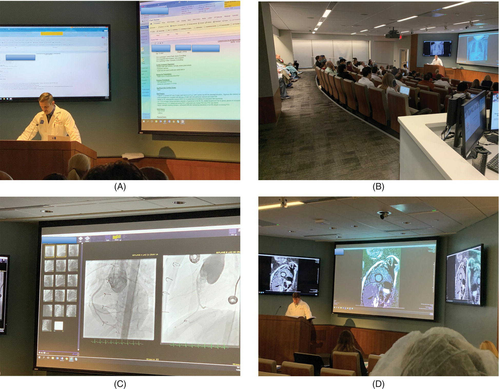

[**Figure 4.1**](#R_c4-fig-0001) Texas Children’s Hospital surgical case conference. (A) Pediatric cardiology fellow presenting the history and physical exam findings of a neonatal patient scheduled for cardiac surgery. (B) View of the surgical case conference audience, with chest radiograph displayed. (C) Large‐scale high‐resolution digital screens allow accurate review of angiograms from the Cardiac Catheterization Laboratory. (D) Cardiac magnetic resonance imaging is presented.

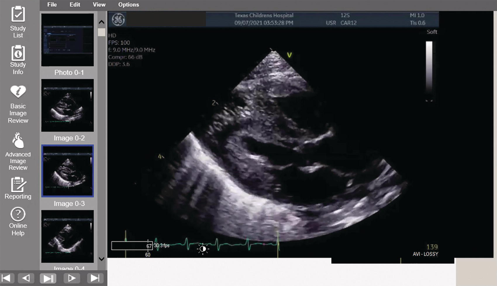

[**Figure 4.2**](#R_c4-fig-0002) Desktop computer view during urgent case presentation of the neonate with hypoplastic left heart syndrome requiring surgery. The echocardiogram is being discussed via videoconference during the COVID‐19 pandemic era.

#### New patient case conferences

Additional clinical decision‐making opportunities exist for new patients, and existing patients requiring decisions about the next steps in clinical care. Further, 90 minutes each on Monday and Wednesday afternoons are allotted to two such conferences, where primary cardiologists present to representatives from Cardiac Surgery and Catheterization Laboratory, to decide on a treatment plan.

A specialized conference for Adult Congenital Heart Disease (ACHD) patients is held once a week for 60 minutes, where a multidisciplinary group discusses the unique needs of this patient group, including medical, catheter, and surgical therapy. Representatives from surgery, ACHD cardiology, ACHD ICU, anesthesia, and nursing are present in these weekly conferences. As with the other patient decision‐making conferences, the entire Heart Center is invited to attend these conferences.

#### Morning report

In addition to these formal conferences, each day starts with a morning report where the entire Heart Center can attend; after a brief review of the inpatient Heart Center census and planned admissions and discharges there is an opportunity to present newly admitted patients, or patients otherwise in need of clinical treatment decisions urgently (within 24–48 hours) who cannot wait for the formal case conferences ([Figures 4.2](#c4-fig-0002) and [4.3](#c4-fig-0003)). As with the formal planning conferences, any attendee is encouraged to speak up and voice their views on a proposed treatment plan, and at the end of the presentation, a consensus is reached about the planned treatment. These presentations often result in cases added to the surgical or catheterization schedule the same day as the presentation. For example, on the day of this chapter writing, an infant with tetralogy of Fallot, and PDA stent with cyanotic spells was presented in morning report, and dilation of PDA stent vs. surgery was discussed, the consensus was for surgery and successful repair was accomplished that day.

#### Data, validation, and consistency in clinical decision‐making

This system of clinical decision‐making has evolved as the TCH Heart Center has grown in numbers of cases handled and personnel available, so that every patient has the advantage of the collective experience and wisdom of the entire Heart Center through a transparent process striving to attain consistency in decision‐making, e.g. all patients with the same condition will receive the same or similar treatment plan, that is data and outcomes‐driven and widely known to all who have an interest. The above‐noted Surgical Case Conference is an opportunity for a second review to confirm the surgical plan before the patient enters the OR and occasionally results in a change in the plan. Periodically, through additional Heart Center quality conferences noted below, outcome data for major lesions or other lesions of interest are reviewed, both for local cases, for large databases such as the Society of Thoracic Surgeons’ Congenital Heart Surgery Database, and recently published literature. Through this process, a consensus is reached to change approaches to specific lesions. Two recent examples include the decision to move to primary stenting of the PDA for most neonates with right‐sided obstructive lesions in need of a stable source of pulmonary blood flow instead of a Blalock‐Taussig‐Thomas shunt; and transcatheter occlusion of the PDA in premature and other small neonates instead of ligation by thoracotomy.

  
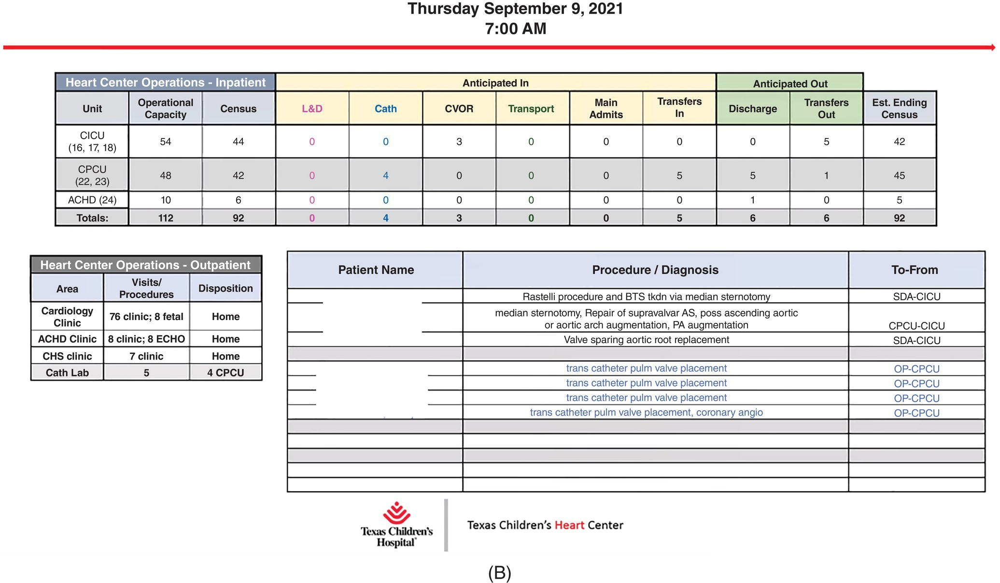

[**Figure 4.3**](#R_c4-fig-0003) Morning report. (A) An overview of heart center census and non‐scheduled admissions. ACHD, adult congenital heart disease unit; AS, aortic stenosis; ASD, atrial septal defect; AVSD, atrioventricular septal defect; CICU, cardiac intensive care unit; CoA, coarctation of aorta; CPCU, cardiology‐cardiac surgery inpatient ward; CVOR, cardiovascular operating rooms; DORV, double‐outlet right ventricle; EC, emergency center; FTT, failure to thrive; GI, gastrointestinal; HIE, hypoxic‐ischemic encephalopathy; ICD, implantable cardioverter‐defibrillator; MIS‐C, multisystem inflammatory syndrome in children associated with COVID‐19; PVS, pulmonary valve stenosis; PDA, patent ductus arteriosus; RRT, rapid response team; SOB, shortness of breath; TGA, transposition of the great arteries; VSD, ventricular septal defect (B) Anticipated admissions and discharges to inpatient units, and scheduled clinic visits. CHS, congenital heart surgery; ECHO, echocardiography laboratory; OP, outpatient; SDA, same‐day admission.

Although the field of validated decision‐making algorithms in CHD is relatively new, one example is an approach developed at TCH for Anomalous Aortic Origin of the Coronary Arteries (AAOCA), where the three treatment strategies are: observation without exercise restriction; exercise restriction; and surgical intervention \[12\]. Using decision analysis, a formal quantitative approach that analyzes different management strategies under conditions of uncertainly, an algorithm was developed utilizing outcomes from the published literature, and individual patient characteristics such as age and symptomatology. Life expectancy and quality‐adjusted life expectancy were the outcomes, and a cohort of 10,000 hypothetical identical patients underwent a first‐order Monte Carlo simulation, with further sensitivity analyses. Surgery was the preferred management strategy for most patients under 30 years of age for anomalous left coronary artery; and for patients <25 years of age for anomalous right coronary. Utilizing the principles proposed in this algorithm, 47 of 163 patients with AAOCA underwent surgery; 82% of the entire group was allowed unrestricted sports exercise activity; and of the surgical patients, 3 (6.4%) are restricted from sports exercise activity([Figure 4.4](#c4-fig-0004)) \[13\]. All patients in the cohort were alive, whether they underwent surgery or not, during the follow‐up period. The formation of a multidisciplinary team, with support from clinical data science specialists, is key to the success of this program.

#### Multidisciplinary Surgical Patient ICU Rounds

Because of the early start to the surgical cases and the additional early morning conferences, the practice of rounding on surgical patients in the Cardiac ICU (CICU) at 6:15 AM Monday–Friday has been practiced for many years. This has resulted in a large group of surgeons, surgical trainees, advanced practice providers, CICU physicians and trainees, nursing leadership, the bedside nurse, and even the parents present in (or mostly outside in the hall) the CICU, traveling from patient to patient. A brief, standardized presentation by the ICU, surgical, and nursing providers for the patient was followed by surgical plans, i.e. removal of the chest tubes, pacing wires, sternal closure, etc. for the day. It was typical to have limited sight and hearing lines to the presenter, the patient, the displayed radiographs, and the physiological monitors. The COVID‐19 pandemic has prevented the gathering of large groups near the bedside and given rise to some novel methods to present the patient’s data to a multidisciplinary group. At the time of this writing, Surgical Rounds are conducted over videoconferencing with all participants (20–40 on most days) logged in at their respective desks. The presenters communicate the data, while the chest radiograph and real‐time physiologic monitoring data are displayed on the screen ([Figure 4.5](#c4-fig-0005)). Joint decisions are made about surgical and major ICU issues, with all participants able to see and hear all the data, and with the ability to speak up to allow their perspectives to be communicated. The process is also more efficient in this manner, with as many as 30–40 active surgical patients presented in the allotted 45 minutes. The entire Heart Center is invited to these rounds, as with all of the other major patient care conferences.

### Heart Center Quality Improvement Conferences

The TCH Heart Center has several patient care Quality and Outcomes Improvement Conferences, which are protected in a legal framework from disclosure and outside discovery, allowing detailed and frank discussion of quality issues. Most of these conferences include the entire Heart Center on the invitation list.

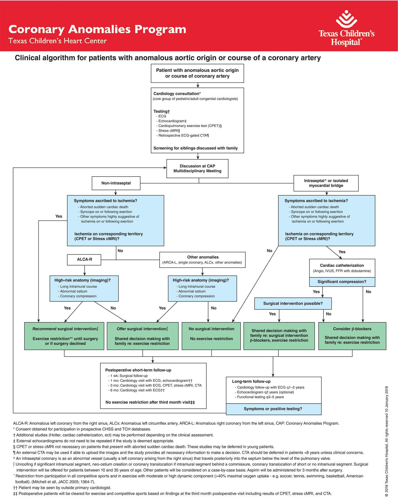

[**Figure 4.4**](#R_c4-fig-0004) Texas Children’s Hospital Heart Center Coronary Anomalies Program Algorithm for patients with the anomalous aortic origin of a coronary artery.

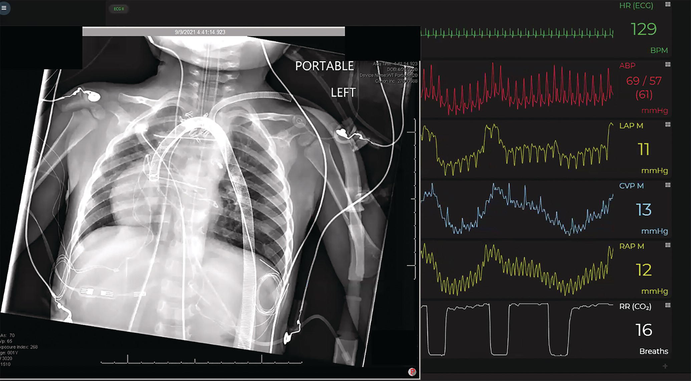

[**Figure 4.5**](#R_c4-fig-0005) Videoconference screen during surgical rounds on a patient on ECMO support. The surgical fellow is presenting data while chest radiograph and real‐time monitoring data are displayed during the COVID‐19 pandemic era.

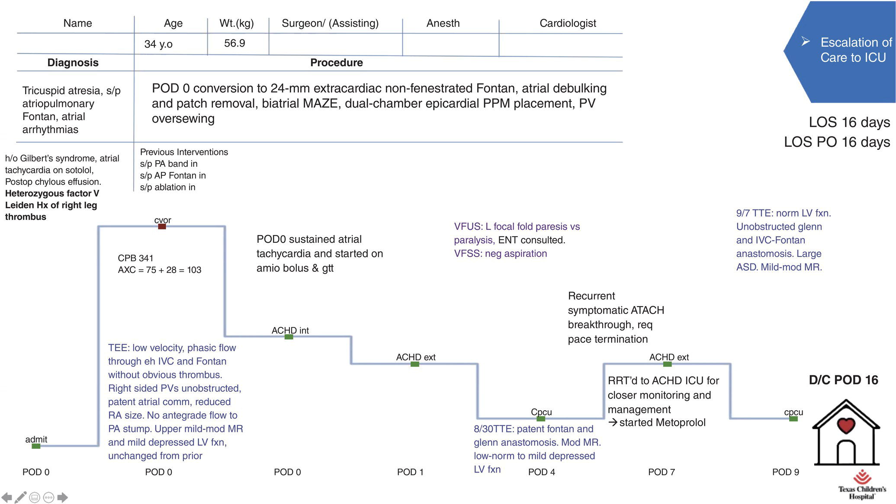

[**Figure 4.6**](#R_c4-fig-0006) Performance rounds infographic. Time in days is displayed on the horizontal axis; risk level on the vertical axis; and details of the operative course are reported. The upper right‐hand corner displays the major event prompting discussion; in this case, an arrhythmia requiring readmission to ICU which was recognized and treated appropriately. Note the stepwise decrease in risk level until postoperative day 7.

#### Performance Rounds

Once per week a 60‐minute meeting is devoted to Performance Rounds, where selected patients from surgery or the catheterization laboratory are presented in a standardized, visual, infographic time‐based format where the horizontal axis is time (days) and the vertical axis is the perceived risk level to the patient, from threats, errors, unintended clinical states and their linkage; risk increases with the intensity of the activity and decreases with the de‐escalation of care ([Figure 4.6](#c4-fig-0006)). Increased risk is conferred during surgery, generally the highest risk state in a patient’s journey, and decreased with tracheal extubation, sternal closure, weaning off inotropes, discharge to ward, and discharge to home. Data is collected from electronic medical records, bedside data, adverse event reporting mechanisms, and staff interviews. This approach was described by Hickey and colleagues, who reported on 524 patient care “flights” surrounding a surgical procedure \[14\]. In 12% of flights the patients failed to de‐escalate sequentially, and in the timeframe expected, through the risk levels. Failed de‐escalations were strongly associated with errors (426 in 257 flights, _p_ < 0.0001). More serious errors were associated with the 29% rate of failed de‐escalation, vs. 4% in flights with no consequential error (_p_ < 0.0001). Using this process at the TCH Heart Center, outcomes data for the major procedures have been developed, both internal center‐specific outcomes, and from national databases such as the Society of Thoracic Surgeons’ Congenital Heart Surgery Database. A team of outcome specialists develops the infographics and presents the data, and the entire Heart Center staff is invited. In recent years interventional cardiac catheterization procedures have been added to Performance Rounds. Before these rounds, the themes of psychological safety (see below), and confidentiality of the privileged patient care information are emphasized. Surgeons’, cardiologists’, and anesthesiologists’ names are listed on the infographic, and they are encouraged to explain any unexpected events for the benefit of the entire Heart Center, with the goal of collective learning, communication, and improving patient care, and not to direct blame to the individual practitioner. Themes and issues that are identified, i.e. communication errors, delayed care, technical errors, decision‐making errors, etc., are discussed, and if emerging patterns are perceived over multiple patients, they are referred formally to the Quality and Outcomes Team for a deeper dive into causes and solutions. These issues are brought back to the Heart Center for updates on changes to processes and outcomes. Routine simple surgery or catheterization laboratory cases, without unexpected progress in de‐escalation, are presented in a list format but not otherwise discussed.

#### Heart Center Quality Conference

Once per week a 60‐minute conference is devoted to quality and outcomes data and reports from each of the clinical disciplines in the Heart Center, on a rotating basis. This includes a Surgical Morbidity and Mortality conference, Catheterization Laboratory Quality Conference, CICU Quality and Outcomes presentation, Cardiovascular Anesthesiology Quality Presentation, and presentations from Nursing, Adult CHD, Outpatient Cardiology, Echocargiography, and other components of the Heart Center clinical enterprise.

#### Multidisciplinary meeting

Every Friday early morning, 45 minutes are devoted to a Quality and Outcomes Multidisciplinary Meeting, where only the attending physicians from Surgery, Anesthesiology, and CICU, plus a Nursing and Perfusion leader, are invited, for a discussion of each surgical case done in the past week, to review the immediate perioperative course and outcomes, communicate common important issues to the group, and give each member an opportunity to discuss their decision‐making process and how it may have contributed to the outcome. The surgeon starts by briefly presenting the case, and then the anesthesiologist and intensivist have an opportunity to add to the discussion. The smaller group is conducive to frank discussions about opportunities for improvement; identifying significant issues that affect the entire perioperative team that then can be assigned an individual to lead more data collection and solutions to the problem. Great successes are also discussed and celebrated, and those involved in the case can enlighten the group, again for the benefit of future patients.

[Figure 4.7](#c4-fig-0007) displays the calendar of the weekly multidisciplinary meetings in the TCH Heart Center.

### Heart Center Wide Communication Activities

#### Heart Center Town Hall

With a very large group of practitioners and supporting staff that now numbers greater than 500 individuals, it can be challenging to communicate important events, announcements, initiatives, and strategies to all Heart Center members. Quarterly Heart Center Town Halls, 60 minutes in length, are held, with the Heart Center Executive Committee leadership leading the agenda and introducing additional speakers; there are always at least 15–20 minutes left for comments and questions, and unanswered questions are addressed separately by email ([Figure 4.8](#c4-fig-0008)).

#### Heart Center annual retreat

Once every year, non‐emergent patient care is paused for 4 hours, and the entire Heart Center participates in a “retreat” – in reality on site at TCH. During these retreats, a theme is prepared, and after Heart Center leadership presentations, speakers from the Heart Center, or outside speakers make presentations followed by questions and comments from the audience. Once again, all Heart Center members at any level of seniority are encouraged to ask questions and make comments, for the benefit of the entire group. Some annual retreat themes have included: improving communication across silos, integrating teams and processes, transparency, psychological safety, shared decision‐making, patient/family experience, partnerships with external providers, and shared common purposes \[15, 16\]. In the pre‐pandemic era, several hundred people gathered in a large auditorium and enjoyed well‐prepared content, for example, presentations on psychological safety from a well‐regarded Rice University School of Business professor with substantive research in this area ([Figure 4.9](#c4-fig-0009)). In the current pandemic era, this activity is conducted by videoconference; with participants encouraged to write questions, or ask live if they prefer.

[**Figure 4.7**](#R_c4-fig-0007) Texas Children’s Hospital Heart Center Multidisciplinary Conference Schedule.

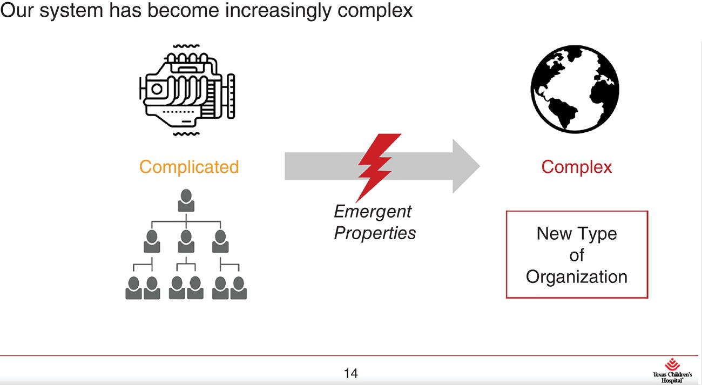

[**Figure 4.8**](#R_c4-fig-0008) Slide from recent TCH Heart Center Town Hall in the COVID‐19 pandemic era.

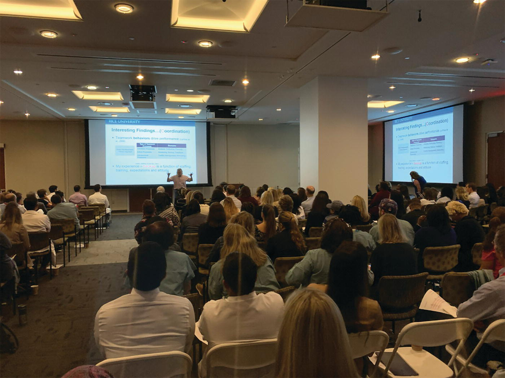

[**Figure 4.9**](#R_c4-fig-0009) TCH Heart Center Retreat in the pre‐pandemic era with an outside speaker presenting his research on team functioning in healthcare.

### Anesthesiologist involvement in patient care and leadership activities

TCH Heart Center anesthesiologists are often busy starting cases for the early 7–8 AM conferences and cannot attend all, but all conferences have anesthesiology representation for those without scheduled cases at that time. The anesthesiologists very often contribute to the discussion and the decision‐making process for all of these conferences and are valued full‐time members of the Heart Center team, whose opinion is often requested and is always respected. Presence and visibility at these conferences for the Anesthesiologists give them complete access and exposure to the broader Heart Center, increasing respect and affording opportunities, rather than being limited to surgeons in the operating room and interventional cardiologists in the catheterization laboratory. Having a full‐time division whose sole clinical activity is in the Heart Center also increases the reputation and trust of CCA, and affords leadership, quality, education and research opportunities that facilitate career advancement and satisfaction.

## Communication and team functioning in periprocedural areas: surgery and catheterization laboratory

In 2000, de Laval and colleagues published a landmark paper on human factors, errors, near misses, communication, and rescue from negative events in a multicenter study of 193 arterial switch operations (ASO) performed by 21 surgeons in all 16 institutions performing pediatric cardiac surgery in the United Kingdom in the late 1990s \[17\]. A self‐assessment questionnaire regarding performance was filled out at the end of the operation by the surgeon and surgical assistant, the anesthesiologist, perfusionist, and scrub nurse. Each case was independently observed by a human factor researcher, who wrote a detailed description of the operation, including individual and team performance, communication within and between teams, and situational and organizational data. Errors or failures were recorded and classified as minor (minor disruptions in surgical flow without consequences) or major (likely to have serious patient safety consequences) negative events. Events were also deemed compensated, or uncompensated, meaning resolved, or recovered after appropriate action by the perioperative team. There were 16 hospital deaths for mortality of 6.6% with 43 near misses (17.7%). The number of uncompensated major events per case conferred the strongest risk of death at an odds ratio of 13 (95% CI 2.1–83, _p_ = 0.006), and for each uncompensated major event, estimated odds of death increased by a factor of 5.7, and odds of death plus near miss were increased by a factor of 40. Interestingly, the self‐report questionnaires were not successful in capturing human factors in predicting outcomes. The finding that failure to rescue from complications was strongly associated with poor outcomes is consistent across medical specialties. The list of observed major and minor events in this paper details a number of team performance problems, e.g. not communicating significant deterioration during cannulation, delay in the administration of heparin, delay in recognition of myocardial ischemia post‐CPB, incorrect interpretation of serious deterioration during transport to ICU, failure to achieve sufficient vascular access, the inappropriate delegation of anesthetic tasks to inexperienced juniors, and many others ([Table 4.2](#c4-tbl-0002)). This widely cited study described in great detail the gaps in performance during a highly complex, but very reproducible operative procedure. The study serves as a roadmap to better team functioning and communication and has contributed to the ability not only to rescue from errors but even more important to prevent them from occurring in the first place.

[**Table 4.2**](#R_c4-tbl-0002) List of observed major and minor events during the arterial switch operation

Source: de Leval et al. \[17\]. Reproduced with permission from Elsevier.

| Stage (No.) | Description and examples |
| --- | --- |
| Major events Preoperative (4) | Serious errors and problems that are experienced before anesthetic induction for surgery, e.g. cardiac perforation during balloon atrial septostomy(BAS) |
| Anesthesia (8) | Errors and problems experienced during anesthesia and insertion of lines
-   Failure to gain sufficient vascular access
-   Pincushioning during insertion of lines, leading to a serious cardiac event
-   Delayed diagnosis of a major deterioration in the patient’s condition
-   Lack of monitoring delaying diagnosis of a serious event

 |
| Prebypass (27) | 

-   Hemodynamic instability of the patient due to rough surgical manipulations
-   Surgical errors, e.g. laceration of the ductus arteriosus before bypass
-   Serious cannulation problems
-   Severe unrecognized deterioration in the patient’s condition (low ABP and SaO2) before bypass caused by cognitive tunnel vision on surgical tasks and/or lack of monitoring
-   Delay in the administration of heparin

 |
| Bypass (44) | 

-   Decision‐making errors in deciding how to reimplant a difficult CAP (inexperienced surgeons)
-   Technical errors: aortic tear during the administration of the cardioplegic solution, accidental injury to a major coronary artery, malrotation of the main pulmonary artery, twisting the pulmonary artery during the Lecompte maneuver, damage to the neo‐aortic valve, tear during the closure of the ductus arteriosus, severe laceration of a pulmonary arterial branch requiring patch repair
-   Major perfusion problems
-   Anesthetic problems: failure to cool the cardioplegic solution, failure to flush the cardioplegia‐infusion set resulting in massive coronary air embolism

 |
| Postbypass (84) | 

-   Serious ischemic event: delay in diagnosis, incorrect interpretation, inappropriate strategy in the event of a serious ischemic event
-   Ventilation errors by consultant anesthetist
-   Surgical omissions; omission of pacing wires in a patient who has severe arrhythmias, omission of securing indwelling catheters such as the left atrial line
-   Delayed diagnosis; incorrect interpretation of a serious deterioration of the patient during the transfer from the operating theater to the ICU

 |
| Minor events Preoperative (17) | 

-   Coordination problems with the blood bank, problems with the availability of ICU beds
-   Communication problems between the ward and the theater team, scheduling of cases
-   Poor fasting policy

 |
| Anesthesia (67) | 

-   Cognitive tunnel vision on insertion of lines to the neglect of monitoring the ECG screen (where no major event results)
-   Inappropriate delegation of anesthetic tasks to an inexperienced junior
-   Equipment problems: failed alarm systems, incorrect ECG readings, or unavailability of equipment
-   Human resource problems, e.g. no junior anesthetic assistant available, no technical assistance

 |
| Prebypass (144) and bypass (732) | 

-   Positioning and tension error(s) by the surgical assistants
-   Instrument handing errors by the scrub nurse
-   Distracters: internal and external
-   Inappropriate task delegation (surgical, anesthetic, perfusion) to an inexperienced assistant
-   Problems with theater equipment
-   Communication errors: problems with passing information between theater teams
-   Absence of a senior team member in theater at safety‐critical times
-   Surgical tunnel vision, where the surgeon(s) focus(es) exclusively on the surgical aspects of the procedure at the expense of monitoring the ECG screen (but no serious problems develop); this usually occurs when closing the sternum
-   Perfusion problems: air locks, poor visibility because of unsatisfactory blood aspiration

 |
| Postbypass (73) | 

-   Positioning, tension, and instrument handing errors, communication errors, surgical tunnel vision, and equipment problems
-   Anesthetic problems: e.g., adjustment of ventilating parameters, not starting inotropic support and vasodilators at an appropriate time
-   Communication problems during hand‐over to ICU
-   Lack of seniority during transfer or in the team admitting the patient to ICU
-   Absence of monitoring for an excessive period of time during transfer to the ICU

 |

ABP, arterial blood pressure; BAS, balloon atrial septostomy; CAP, coronary artery pattern; ECG, electrocardiograph; ICU, intensive care unit; SaO2, arterial oxygen saturation.

### Communication in the operating room

A brief preoperative conversation between the anesthesiologist and surgeon is advisable before the patient is brought to the OR for induction of anesthesia. This is an informal “check‐in” to communicate unique aspects of the case that affect anesthetic and surgical approaches, and can include issues such as planned sites of vascular access, (i.e. are two arterial lines needed for an aortic arch repair?); are there special plans for CPB such as regional cerebral perfusion; of the surgical options listed on the consent form which is most likely, risk of cardiac or vascular injury during re‐entry sternotomy and plans for emergency bypass, high‐risk induction of anesthesia and need for the surgeon to be present and CPB circuit primed and ready, and other details about the case that often are not decided until the patient has had a detailed preoperative examination and individual plan made. This conversation can be the day before, or the morning of, surgery, and ensures that concerns about the case are communicated beforehand, and not only at the time of surgical timeout (see below) so that preparations can be made before entering the operating room. This conversation can help avoid unexpected requests or procedures that are only known during, or even after, the surgical timeout.

#### Surgical safety checklist

The effectiveness of a surgical safety checklist (SSCL) gained wide recognition after Gawande and colleagues conducted a study of eight hospitals in diverse settings and populations that instituted a process that required a pre‐induction checklist of patient identification, basic monitors, surgical and anesthetic factors; a time out before surgical incision introducing the team and role, re‐identifying the patient, and reviewing surgical and anesthetic procedures; and a sign out before the patient leaves the operating room reviewing sponge and instrument counts, disposition of the patient, and whether any concerns were identified \[18\]. Surgical mortality and complications were recorded in 3,733 patients before the institution of the SSCL, and in 3,955 after its introduction, and mortality decreased from 1.5% before to 0.8% after (_p_ = 0.003), and inpatient complications decreased from 11.0 to 7.0% (_p_ < 0.001). At TCH, the SSCL was introduced in 2009 and has gone through a number of iterations for various operating rooms and types of cases in the institution. The current version for cardiac surgery cases with bypass is displayed in [Figure 4.10](#c4-fig-0010). Institutional lessons learned in the evolution of the approach are numerous, perhaps most important that during each phase of the SSCL, all other activity is ceased and all involved are completely attentive to the checklist, and the checklist is read like a script and not recited from memory.

The preoperative briefing is initiated by the anesthesiologist and involves the anesthesia team, circulating nurse, patient, and parents and the parents are encouraged to listen and ask questions. Any questions are resolved, and the patient proceeds immediately to the operating room. The surgical timeout is initiated by the surgeon and occurs with the patient prepared and draped, and all surgical personnel scrubbed and in position for the operation, immediately before the incision. A crucial point is that all other activity is ceased, any extraneous noise such as music is silenced, and all in the operating room introduce themselves. If the patient needs attention due to instability the timeout is delayed. All personnel in the room, including the echocardiographers, all anesthesia personnel, any students or observers, are also part of the process. The timeout script is read so that no elements are missed, and any unexpected issues i.e. equipment or implant needs, are immediately addressed so they are ready when needed. Only when the checklist is completed, and the surgeon has asked about any concerns and any questions are resolved, does the operation commence. The SSCL, and particularly the surgical timeout, are observed and graded by a neutral observer periodically for correct and complete process and these data are reported regularly in the quality improvement efforts of the Heart Center.

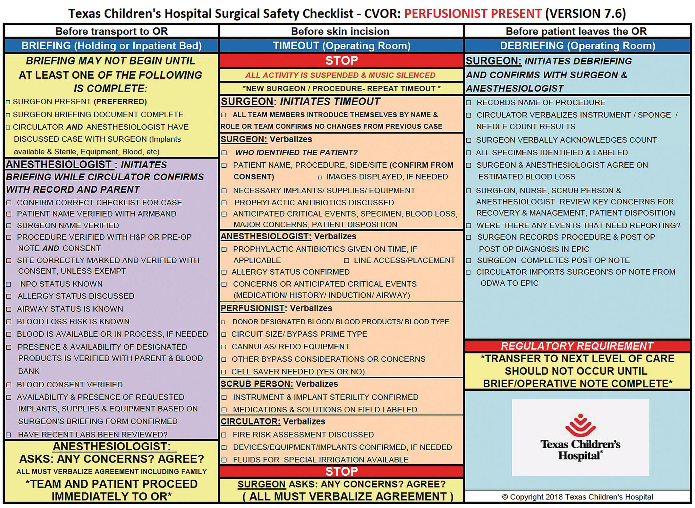

[**Figure 4.10**](#R_c4-fig-0010) Texas Children’s Hospital surgical safety checklist for cardiac surgery cases with bypass.

The surgical debriefing occurs in the OR after the attending surgeon has broken the scrub, and before the patient leaves the room; any issues or problems are verbalized, along with plans for disposition of the patient, i.e. extubation in the OR. The surgeon, anesthesiologist, and circulating nurse perform this activity in person.

#### Anesthesiology‐specific checklists

The anesthesia team performs a number of complex procedures at the beginning of a cardiac surgical case; simultaneously managing the time pressure of starting the case and the often complex pathophysiology of an unstable patient. Distraction from best procedural practices is possible during this often intense period of anesthetic care. Central venous access is achieved by the anesthesiology team in nearly every cardiac surgical case, and in order to ensure best practices are followed for prevention of central line‐associated bloodstream infection, and issues such as a retained guidewire, a checklist was introduced, to be reviewed once the anesthesiologist has scrubbed, gowned, gloved, and the patient is prepared and draped for the procedure ([Figure 4.11](#c4-fig-0011)). The anesthesiologist and the circulating nurse perform this checklist, and only when completed does line placement proceed. An important feature of the checklist is to announce when the central line guidewire has been removed, with the goal of preventing the rare but consequential complication of a retained guidewire.

Regional anesthesia is increasingly utilized in cardiac and thoracic surgical cases in congenital heart disease, and a checklist has been instituted to be completed before the procedure starts \[19\]. Of particular importance besides the site and laterally of the block or catheter, is the local anesthetic drug and dose, and any adjuvants such as opioids or alpha receptor agonists. A regional block may be performed by a team other than the primary anesthetic team, so this checklist is particularly important. [Chapter 24](c24.xhtml) contains a detailed presentation of regional anesthesia techniques for congenital cardiac surgery.

[**Figure 4.11**](#R_c4-fig-0011) Central venous catheter insertion checklist.

In the period after induction and before sterile preparation of the patient, many simultaneous procedures occur for patient positioning and padding, application of monitors such as backup pulse oximeter probes, near‐infrared spectroscopy probes, defibrillation pads, and many others. To avoid the omission of any of these elements and the necessity to institute them after the patient is draped and interrupt the flow of the surgical case, a “Pre‐Flight” anesthesia checklist was developed that was to be completed by the circulating nurse and anesthesiologist ([Table 4.3](#c4-tbl-0003)).

### Communication during the operation

Few procedures in medical practice are as complicated as congenital heart surgery, where the interdependence of surgical action, patient pathophysiology, anesthetic procedures, perfusion approaches, and surgical assistant and scrub personnel support depend on precise coordination and communication to achieve the goals of the operation, recognize and prevent adverse patient states, and rescue from such states, as they inevitably occur with significant frequency. The complexity of the surgical procedure flow demands consistent, clear communication, and omitting standardized elements of communication during cardiac surgery can lead to errors and adverse outcomes. With as many as 8–12 personnel directly involved in the care of the patient, consistency, protocols, and scripts are crucial, as well as a sense of when to communicate, and in what tone and frequency, i.e. anesthesiologist to the surgeon during periods of hypotension from surgical manipulation, and other events. For example, is the hypotension likely to be very short‐lived and easily recoverable when retraction by the surgeon on the right ventricle for placement of inferior vena cava purse string sutures for cannulation stops? Or, is this a surgically‐induced cardiac rhythm change resulting in hypotension that needs immediate action in the form of synchronized internal cardioversion? Congenital heart surgery cases each have a number of these moments, and the experience of the anesthesiologist with the surgical team will help determine the optimal frequency and level of communication, striking a balance between “needing to know” and changing the surgical flow, vs. “not needing to know” and keeping the flow of the surgery going. The intense concentration required by the surgeon argues for a quiet, calm operating room with minimal extraneous noise and conversation during the surgery. The concept of a “sterile cockpit,” borrowed from the aviation industry, means that during safety‐critical periods of the operation that unnecessary conversation is stopped, standardized terminology for communication is used, and instructions given by the surgeon are “read‐back” when tasks are completed, i.e. heparin administered \[20\]. The idea of creating shared mental models among the disciplines in the cardiac operating room, to agree on critical points during the operation and methods of communication during these important junctures, can improve the quality and efficiency of information exchange \[21\].

[**Table 4.3**](#R_c4-tbl-0003) Texas Children’s Hospital Cardiovascular Anesthesiology “Pre‐Flight” Checklist

<table border="1"><tbody class="tdcolor5"><tr><td class="left">To be completed by circulating nurse and anesthesiologist immediately prior to patient preparation. The nurse asks the questions, anesthesiologist responds “Yes/No” (not indicated, or will correct now)<ul id="c4-list-0011"><li id="c4-li-0054">Extremities, sacrum, and occiput positioned and padded properly?</li><li id="c4-li-0055">Vascular access connections and sites secure, padded, and lines are functioning?</li><li id="c4-li-0056">Five‐lead ECG in place and functioning, displaying multiple leads?</li><li id="c4-li-0057">Two pulse oximeter probes in place and functioning?</li><li id="c4-li-0058">Extra backup pulse oximeter probes in place for infants?</li><li id="c4-li-0059">Blood pressure cuff in place and functioning on different extremity than an arterial line?</li><li id="c4-li-0060">Bilateral NIRS probes in place and functioning?</li><li id="c4-li-0061">Three temperature probes (nasopharyngeal, rectal, skin) in place, properly labeled, and functioning?</li><li id="c4-li-0062">TEE probe in place and not compressing oral structures?</li><li id="c4-li-0063">Urinary catheter secured and draining clear urine?</li><li id="c4-li-0064">Surgical rack (for drapes) in place and secure?</li><li id="c4-li-0065">Defibrillation pads, if indicated, in place, and connected to the defibrillator, with ECG synchronization leads in place and functioning?</li><li id="c4-li-0066">Electrocautery pad in place and connected to the unit?</li><li id="c4-li-0067">Forced‐air warming blanket in place and functioning?</li><li id="c4-li-0068">Pacemaker box present and functioning?</li><li id="c4-li-0069">Adequate blood products in the operating room and checked?</li></ul></td></tr></tbody></table>

NIRS, near‐infrared spectroscopy; TEE, transesophageal echocardiography.

van Wijngaarden and colleagues performed a video recording study of six coronary artery bypass graft (CABG) surgeries, and by personal interviews and focus group meetings with surgeons, anesthesiologists, and perfusionists, arrived at 64 items to be critical to communicate for safe CABG surgery \[22\]. These items were classified as to which subteams were involved, and type of communication, i.e. open loop, call‐back, closed loop, and series ([Figure 4.12](#c4-fig-0012)); and exchange types classified by purpose ([Table 4.4](#c4-tbl-0004)). Quality, consistency, frequency, timeliness, and appropriateness of communications were graded by viewing the videos, with the goal of developing a quality standard for the critical verbal exchanges between surgeons, anesthesiologists, and perfusionists. There was an average of 219 sequences of exchanges per operation, with the surgeon initiating 45%; perfusionist 33%, and anesthesiologist 21%. The most common types of exchanges were “status” – shared understanding of the current state; followed by “direction” – command an action to transition to a new state. Of the 64 critical events, on average 60 (94%) were consistently verbalized during the same phase of surgery. Quality of communication was graded as “substantive,” e.g. specific information in a call back (e.g. “heparin is in” in response to “give heparin”), as opposed to insubstantive (e.g. “yes” or “OK” in response to “give heparin”). Substantive communication is less prone to error and was present in 40% of exchanges, instubstantive communication in 33%, and no call back (open loop communication not requiring a call back) in 27%. This study demonstrated that optimal high‐quality communication could be improved and provided an important patient safety standard for intra‐team communication during CABG operations.

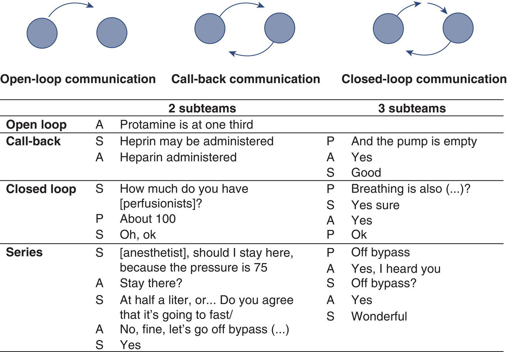

[**Figure 4.12**](#R_c4-fig-0012) Loop types and examples per number of subteams involved. Open loops are exchanges without call‐back and only involve one subteam. Call‐backs are exchanges with call‐backs from 1 or 2 subteams and in closed loops, the initiator fully “closes” the exchange loop with a final call after the receiver gave a call‐back. Series involve more sequences between 2 or 3 subteams. A, anesthetist; P, perfusionist; S, surgeon.

(Source: de Lind van Wijngaarden et al. \[22\] / Elsevier / CC BY 4.0.)

[**Table 4.4**](#R_c4-tbl-0004) List of critical events and critical subteam involved

Source: de Lind van Wijngaarden et al. \[22\] / Elsevier / CC BY 4.0.

| **Critical event** | **Critical subteams** |
| --- | --- |
| Regulate anticoagulation |  |
|  Administer heparin | S + A |
|  Heparin circulating | S + A |
|  Heparin circulating 2 minutes,[_a_](#c4-note-0003) | S + A |
|  Activated clotting time (ACT) started | A + P |
|  ACT is sufficient for cannulation (>300)/blue suction is on | S + P |
|  ACT is sufficient for extracorporeal circulation (>400) | S + A + P |
| Cannulation |  |
|  Test suction | S + P |
|  Suction is adequate | S + P |
|  Divide the arterial and venous line | S + P |
|  Prepare for cannulation | S + A + P |
|  Arterial cannula has been inserted | S + A + P |
|  Clamp removed from arterial cannula | S + P |
|  Sufficient pulsation and line pressure | S + A + P |
|  Permission to start retrograde autologous priming (RAP) | S + A + P |
|  Start RAP[_a_](#c4-note-0003) | S + A + P |
|  RAP is complete[_a_](#c4-note-0003) | A + P |
|  Clamp removed from venous canule | S + P |
| Start extracorporeal circulation (ECC) |  |
|  Start ECC | S + A + P |
|  Indicate ECC temperature | S + P |
|  Full flow achieved | S + A + P |
|  (Do not) adjust artificial breathing | S + A |
| Flush cardioplegia |  |
|  Flush cardioplegia | S + P |
|  Stop flushing | S + P |
| Place aortic cross clamp |  |
|  Low flow[_a_](#c4-note-0003) | S + A + P |
|  Aortic cross clamp placed | S + A + P |
|  Normal flow[_a_](#c4-note-0003) | S + A + P |
| Administer cardioplegia |  |
|  Start cardioplegia | S + A + P |
|  Pressure in root is adequate | S + P |
|  Flow is adequate | S + P |
|  Heart is still | S + A + P |
|  Cardioplegia circulating for 2 minutes | S + P |
|  Stop cardioplegia | S + P |
|  Suck yellow | S + P |
|  Last cardioplegia administered 15 minutes ago | S + A + P |
|  Last cardioplegia administered 20 minutes ago | S + A + P |
| Remove aortic cross clamp |  |
|  Low flow[_a_](#c4-note-0003) | S + A + P |
|  Aortic cross clamp removed | S + A + P |
|  Normal flow[_a_](#c4-note-0003) | S + A + P |
| Stop ECC |  |
|  Continue artificial breathing[_a_](#c4-note-0003) | S + A + P |
|  Make output | S + A + P |
|  Permission to reduce the flow | S + A + P |
|  Artificial breathing is on | S + A + P |
|  Heart rhythm is adequate | S + A + P |
|  Heart function is adequate | S + A + P |
|  Heart filling is adequate | S + A + P |
|  The patient body temperature is adequate | S + A + P |
|  Reduce flow/stop ECC | S + A + P |
|  ECC at 1 L index | S + A + P |
|  ECC at 1/2 L index | S + A + P |
|  Stop ECC | S + A + P |
| Decannulation |  |
|  Administer protamine | S + A + P |
|  Root needle removed | S + A + P |
|  Venous cannula removed | S + A + P |
|  Withdraw blood from the venous line | S + A + P |
|  Protamine at 1/3 | S + A + P |
|  Stop blue suction | A + P |
|  Blood volume left in the pump | S + A + P |
|  Empty pump | S + A + P |
|  Pomp is completely empty | S + A + P |
|  Arterial cannulae removed | S + A + P |
|  Protamine complete | S + A + P |
| Other events |  |
|  Table movements[_a_](#c4-note-0003) | S + A + P |
|  Hemodynamically compromising manipulation of the heart[_a_](#c4-note-0003) | S + A + P |
|  Sample taken from the anesthetic line during ECC[_a_](#c4-note-0003) | S + A + P |

A, anesthetic subteam, P, perfusion subteam; S, surgical subteam.

[_a_](#R_c4-note-0003) Only if applicable.

Congenital heart surgery possesses many similarities to the events specified in this important study, but there are unique aspects such as different perfusion techniques (deep hypothermic circulatory arrest, regional cerebral perfusion) utilized more commonly in CHD; assessment of intracardiac air by TEE before aortic unclamping; and others. Each institution should develop a consistent approach to communication that is specific to the procedures practiced locally. The potential for adverse clinical states is greater for congenital heart surgery, with complex anatomy and physiology, small patient sizes and equipment increasing the risk for cannula malposition impairing perfusion and venous return, and a smaller margin of error given increased metabolic rates and frequent arterial desaturation. The anesthesiologist, surgeon, and perfusionist, in particular, must work together to troubleshoot and communicate these abnormal states, for example, cerebral oxygen desaturation during bypass, and use a standardized system of clear communication to achieve these goals \[23\]. Particularly in a large system where there are multiple possible combinations of intraoperative personnel, a standardized approach to communication will minimize the risk of errors. Another crucial aspect of communication is that if any member of the team has a question, concern, or is uncertain about what was communicated or intended, they must speak up for clarification, for the benefit of the patient. This includes junior members of the team or those on the lower end of the authority gradient; i.e. a scrub technician with a concern or question directed at a senior surgeon. The concepts of psychological safety discussed previously apply to the OR; senior physicians, in particular, must pay attention to including the contributions of all members of the team in a non‐threatening manner, and voicing appreciation for their contribution to the optimal care of the patient. On the extreme end of the scale, the disruptive physician has severely detrimental effects on patient safety and should not be tolerated on the congenital heart surgery team \[24\].

In addition to the standardized approach to communication during surgery, at TCH the surgeon wears a lightweight, high‐definition camera on their headlight that reproduces exactly what they are viewing, so that caregivers, and learners in the room but not directly involved in the surgical team, can see accurately what phase of the surgery is ongoing, and have a better understanding of the surgical procedure ([Figure 4.13](#c4-fig-0013)). This view is displayed on multiple high‐definition monitors around the OR that produce a magnified image of the surgeon’s field of view. The advantage of this system over a fixed, overhead camera integrated into a surgical light source is the exact view that changes with the surgeon’s position, and is not obscured by the surgical team itself. Particularly important beneficiaries of this system are the perfusionist and the anesthesiologist.

#### Communication during emergencies

During congenital heart surgery, emergencies occur with some regularity that, while not unexpected, can catch the unprepared team off guard and lead to a disorganized or delayed response that can increase patient risk and result in adverse outcomes. One such event is massive bleeding during re‐entry sternotomy requiring an emergency institution of CPB. For higher‐risk patients, i.e. aortic position immediately behind and adjacent to the sternum, preparations such as the site of emergency cannulation, selection of emergency cannulas, assessment of femoral vessels preoperatively by ultrasound or other imaging, are crucially important. When the actual emergency occurs, it is also important to institute an approach consistent with the “sterile cockpit,” as noted above. The surgeon takes over communication, gives clear instructions which are read back and carried out, all extraneous noise and activity stops, and the entire team focuses on resuscitating the patient, instituting bypass as quickly as possible, and controlling the source of the bleeding. Development of protocols, and simulation scenarios of the emergent institution of CPB, especially for new team members, can facilitate team performance during actual emergencies \[25, 26\]. Cognitive aids can also facilitate team performance during sudden unexpected emergencies, to ensure that all necessary steps are carried out; one such cognitive aid has been developed for massive systemic air embolism on bypass \[27\] ([Figure 4.14](#c4-fig-0014)).

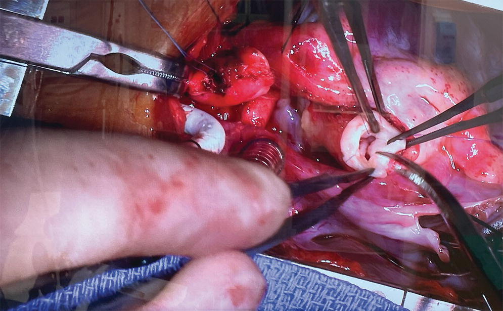

[**Figure 4.13**](#R_c4-fig-0013) View from the surgeon’s headlight camera displaying a high‐definition magnified image of repair of supravalvar aortic stenosis. The aorta has been transected and the sinuses of Valsalva are being incised to prepare for autologous pericardial patch augmentation. The aortic cross clamp is seen at the upper lefthand corner of the screen; just below it is the white‐colored polytetrafluoroethylene graft sewn to the innominate artery for arterial cannulation.

### Other intraoperative multidisciplinary collaborations

Variation in clinical care paradigms, either within an institution or between institutions, are very significant and there is increasing evidence that a standardized approach to similar clinical situations can improve outcomes and control costs of medical care. One such approach is the protocols for early tracheal extubation after congenital heart surgery, i.e. in the operating room or within 6 hours of ICU admission. The Collaborative Learning Project developed a clinical practice guideline for two common lesions, coarctation of the aorta and tetralogy of Fallot repair, among 10 congenital cardiac surgery programs in the Pediatric Heart Network of the U.S. National Heart, Lung, and Blood Institute (NHLBI) \[28\]. This guideline was developed using collaborative learning techniques that included site visits, and a number of meetings among the multidisciplinary investigators to develop approaches to decrease the time to tracheal extubation using the Delphi method. The principles of anesthetic care included limiting intraoperative opioid (fentanyl) to no more than 10 mcg/kg/hour of surgery; utilizing dexmedetomidine from the beginning of the anesthetic, and utilizing adjunct pain control techniques such as acetaminophen, and regional anesthesia where applicable ([Table 4.5](#c4-tbl-0005) for the TCH approach). Five sites actively instituted this protocol, and five did not change their usual standard of care. The rate of early extubation increased in the active sites from 11.7 to 66.9% (_p_ < 0.001) with no change in the reintubation rate. The median duration of postoperative ventilation among active sites decreased from 21.2 to 4.5 hours (_p_ < 0.001). The control sites experienced no significant change in these parameters. Implementation of the protocol was also associated with a significant decrease in intraoperative opioid and benzodiazepine dosages, with no change in volatile agent exposure. Intraoperative dexmedetomidine usage increased, and postoperatively there was a decrease in opioid, benzodiazepine, dexmedetomidine, and ketorolac dosages \[29\]. In addition to intraoperative protocols, training and communication to ICU nursing and physician staff are critically important when instituting early extubation protocols so that these staff are prepared to assess and support the airway of the extubated patient they receive from the OR, and intentionally make progress toward early extubation, when the patient is ready no matter what the timing. This approach is consistently applied at TCH, where in the past 4 years, 32% of patients are extubated in the operating room after cardiac surgery \[30\] ([Table 4.6](#c4-tbl-0006)). Additional information about early extubation is discussed in [Chapter 24](c24.xhtml).

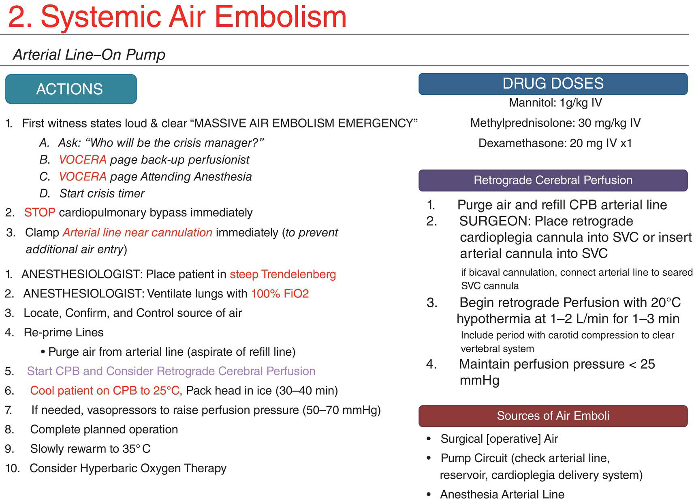

[**Figure 4.14**](#R_c4-fig-0014) Crisis checklist developed for systemic air embolism while on cardiopulmonary bypass. Troubleshooting directives are on the right, crisis protocol is on the left.

(Source: Tarola et al. \[27\]. Reproduced with permission from IEEE.)

[**Table 4.5**](#R_c4-tbl-0005) Texas Children’s Hospital Heart Center approach to operating room extubation

<table border="1"><tbody class="tdcolor5"><tr><td class="left">Preoperatively:<ul id="c4-list-0012"><li id="c4-li-0070">Patient at least 3 months old</li><li id="c4-li-0071">Surgery STAT category 1–3</li><li id="c4-li-0072">No preoperative respiratory support or difficult airway</li><li id="c4-li-0073">Stable hemodynamic status not receiving continuous inotropic support</li></ul> Intraoperative:<ul id="c4-list-0013"><li id="c4-li-0074">Opioids: limit to no more than 20–25 mcg/kg fentanyl; add incremental morphine 0.025 mg/kg per dose if needed at end of surgery</li><li id="c4-li-0075">Dexmedetomidine 0.5–0.7 mcg/kg/hour started at beginning of anesthetic, ±loading dose</li><li id="c4-li-0076">Volatile anesthetic agent: any agent at any MAC level required for anesthesia/hemodynamic stability</li><li id="c4-li-0077">Benzodiazepines: small doses as premedication/or during bypass only</li><li id="c4-li-0078">Intravenous acetaminophen 15 mg/kg, maximum dose 1,000 mg, post‐bypass</li><li id="c4-li-0079">Ondansetron 0.1 mg/kg, maximum dose 4 mg, post‐bypass</li><li id="c4-li-0080">Regional anesthesia/catheter at beginning of the case, or local anesthetic wound infiltration at end of the case whenever possible</li><li id="c4-li-0081">Order patient/nurse controlled morphine analgesia in the operating room and bring to ICU bedside</li><li id="c4-li-0082">Stable hemodynamics on minimal vasoactive support; no significant pulmonary hypertension</li><li id="c4-li-0083">No significant bleeding, ACT at or below baseline</li><li id="c4-li-0084">Favorable respiratory mechanics: low ventilating pressures including PEEP, minimal A‐a gradient if acyanotic, PaO2&gt;40 mm Hg on low FiO2 if cyanotic lesion</li><li id="c4-li-0085">Full reversal of neuromuscular blockade with sugammadex 4 mg/kg</li><li id="c4-li-0086">The oral airway in place</li><li id="c4-li-0087">Extubation in the OR when adequate spontaneous respiratory rate/tidal volumes achieved with no pressure support ventilation</li><li id="c4-li-0088">Goal: “sedated” extubation with zero end‐tidal volatile agent</li><li id="c4-li-0089">Adequate observation time to ensure stable airway; prepared to treat upper airway obstruction/laryngospasm</li></ul> Intensive care unit:<ul id="c4-list-0014"><li id="c4-li-0090">Transport to ICU with Jackson‐Rees circuit and 100% oxygen by anesthesia facemask to closely monitor ventilation</li><li id="c4-li-0091">Close attention to airway obstruction and ventilation by anesthesia team immediately after arrival to ICU</li><li id="c4-li-0092">Review first ABG and chest radiograph in ICU</li><li id="c4-li-0093">Patient/nurse‐controlled morphine analgesia</li></ul></td></tr></tbody></table>

Abbreviations: A‐a, alveolar‐to‐arterial gradient; ABG, arterial blood gas; ACT, activated clotting time; MAC, minimum alveolar concentration; PEEP, positive end‐expiratory pressure; STAT, Society of Thoracic Surgeons‐European Association for Cardiothoracic Surgery Risk Category Score.

Complex congenital cardiac operations consistently have a high rate of significant post‐bypass bleeding, and hypofibrinogenemia is a common cause, especially in neonates and small infants. Cryoprecipitate is frequently utilized in these situations and is often ordered and thawed in advance in anticipation of acute need; but if not needed the unit is wasted, resulting in significant cost to the patient and institution. At Texas Children’s Hospital, a multidisciplinary team consisting of anesthesiologists, blood bank coagulation specialists, surgeons, and nurses devised a standardized pathway utilizing rotational thromboelastometry during rewarming on CPB to help anticipate the need for fibrinogen. If indicated and the patient is less than 5 kg; 1–2 units of cryoprecipitate are ordered and thawed. If the patient is greater than 5 kg in weight, then lyophilized fibrinogen (Riastap®) is utilized. The institution of this protocol resulted in the reduction of wastage of cryoprecipitate by 61%, from 37 units/month in the year prior to the protocol, to 14 units/month in the first 5 months of the protocol \[31\] ([Figure 4.15](#c4-fig-0015)). See [Chapter 16](c16.xhtml) for further discussion of bleeding and coagulation.

[**Table 4.6**](#R_c4-tbl-0006) Operating room extubations after cardiac surgery at Texas Children’s Hospital 2017–2020

Source: Data courtesy of David F. Vener, M.D \[30\].

| **Age group** | **Percent extubated in the operating room, TCH**  
**(Number of patients extubated, % of age group)** | **Percent extubated in the operating room, STS‐CCAS database, _N_ = 118 programs** |
| --- | --- | --- |
| Neonates, 0–30 days | 0 | 4% |
| Infants, 1–12 months | 76 (9%) | 19% |
| Children, 1–17 years | 669 (60%) | 49% |
| Adults, >18 years | 59 (49%) | 37% |
| **Cardiac lesion** |  |
| ASD closure | 97 (85%) | 64% |
| VSD closure | 129 (48%) | 34% |
| Tetralogy of Fallot repair | 18 (15%) | 21% |
| Atrioventricular canal repair (partial, intermediate and complete) | 31 (26%) | 13% |
| Bidirectional cavopulmonary connection | 8 (5%) | 31% |
| Fontan operation | 142 (92%) | 52% |
| Norwood stage I palliation | 0 | 0 |
| **All procedures** | 32%, _N_ = 2,867 procedures | 22%, _N_ = 119,198 procedures |

**All procedures** include bypass and non‐bypass cardiac cases. ASD, atrial septal defect; CPB, cardiopulmonary bypass; STS‐CCAS, Society of Thoracic Surgeons’ Congenital Heart Surgery, and Congenital Cardiac Anesthesia Society Database; TCH, Texas Children’s Hospital; VSD, ventricular septal defect.

_a_ In OR, extubation is defined as extubation by the primary anesthesia team either in the OR or immediately upon arrival in the ICU by the anesthesia team without utilizing an ICU ventilator

### Intensive care unit handoffs

Transfer of care from the OR team to the ICU team after congenital heart surgery can be a time of intense activity, with multiple caregivers from a number of disciplines including nursing, respiratory therapy, surgery, anesthesia, intensive care, and involving all of their trainees and advanced practice providers (APP). At times there can be as many as 10–12 caregivers at the bedside in the immediate postoperative period. This can be a time of patient instability, and the interruption in monitoring that occurs can mask a destabilizing state. Delays in the communication of handoff information while the OR team stabilizes the patient can hamper the ability of the ICU team to provide fully informed care. Structured, consistent, clear, and scripted handoffs from the OR to ICU teams, and in many other healthcare settings, reduce technical and informational errors and lead to improved caregiver confidence and satisfaction when assuming care for a complex patient \[32, 33\].

TCH Heart Center implemented a structured handoff process over 20 years ago, which has been through a number of iterations and is now a standardized, process where the expected elements of communication are communicated in a consistent, efficient approach. The receiving ICU team consists of two bedside nurses, a respiratory therapist, and the ICU attending and fellow/APP. The patient is transported from the OR to ICU by the anesthesia team, surgical fellow, and circulating nurse, fully monitored with emergency drugs, volume expanders, and emergency airway equipment at hand. Upon arrival, and with the anesthesiologist’s permission after ascertaining that the patient is stable, the physiologic monitoring module is transferred from the transport monitor to the ICU monitor, a process that results in loss of monitoring for 10–15 seconds. Once this occurs, the respiratory therapist connects the ventilator with the anesthesiologist’s specified settings, and adequate ventilation is ascertained by auscultation, observation of chest rise, and ventilator parameters. Then, initial arterial blood gas and other admission laboratory studies are drawn. Vasoactive and sedative infusions are quickly reviewed and double‐checked by the nursing and anesthesia teams. Then the handoff begins after ensuring that all necessary personnel are present, and the nursing staff can devote their full attention. All activity in the room except direct patient care ceases, and all other conversations are silenced, much like the surgical time out, and the structured handoff process begins. First, the attending surgeon briefly introduces the patient’s pertinent demographic details, past surgical history, and preoperative anatomic and physiologic state. Then, s/he details the surgery performed including any change in surgical plan or unexpected findings. Any issues with bypass, or significant issues like bleeding or treatment of arrhythmias, are reviewed. The postoperative echocardiogram is summarized and desired plans for extubation and hemodynamic goals are communicated. Next, the anesthesiologist reports on preoperative medications and allergies and briefly summarizes the induction of anesthesia, any airway issues, and the pre‐bypass course. Bypass and aortic cross‐clamp times, as well as any CPB issues including neuromonitoring, are communicated. Weaning and post bypass periods are summarized as well as inotropic and vasoactive support, anesthetic drug doses, and blood product administration, as well as adequate filling pressures and systemic blood pressure, current cardiac rate and rhythm including the need for temporary pacing. Arterial blood gases and ventilatory status, as well as last time of administration of antibiotics, and opioids/sedatives/neuromuscular blockade reversal are reviewed. Any problems or unexpected events are communicated. A review of endotracheal tube size and position, central and arterial lines, mediastinal drains, transthoracic lines, and pacemaker wires, along with urine output and bleeding assessment completes the information transfer. Hemodynamic goals and plans for extubation or other therapies are then discussed among the surgical, anesthesia, ICU, and nursing teams. Inventory of blood products available at the bedside is reviewed. Questions are elicited and answered to complete the report. After the transfer of information, the ICU attending physician requests a summary of the immediate postoperative plans from their fellow/APP, and the primary bedside nurse also voices their understanding of the postoperative plans. Finally, the postoperative chest radiograph is performed and reviewed by the team, along with the first arterial blood gas, hematocrit, lactate, and electrolytes. When all are satisfied with the status of the patient and the handoff of information, the care is formally transferred to the ICU team. The handoff process is summarized in [Table 4.7](#c4-tbl-0007). The entire handoff process usually requires no more than 10 minutes, and of necessity must be this efficient in a busy CICU where the team has many other patients and responsibilities, including at times several patients arriving from the ORs at short intervals. See [Chapter 36](c36.xhtml) for an extensive presentation of CICU care.

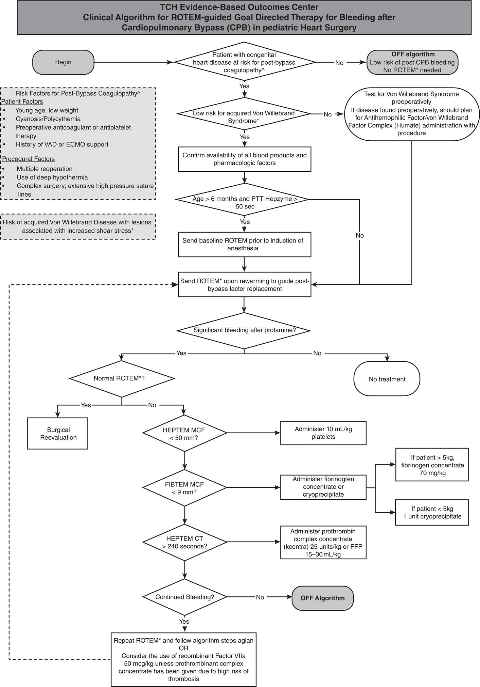

[**Figure 4.15**](#R_c4-fig-0015) Rotational thromboelastometry (ROTEM®) guided goal‐directed therapy algorithm for bleeding after cardiopulmonary bypass. CT, clotting time; ECMO, extracorporeal membrane oxygenation; FIBTEM, fibrinogen thromboelastometry; HEPTEM, heparin thromboelastometry MCF, maximum clot firmness; VAD, ventricular assist device.

[**Table 4.7**](#R_c4-tbl-0007) Texas Children’s Hospital cardiac operating room to cardiac intensive care unit handoff procedure

<table border="1"><tbody class="tdcolor5"><tr><td class="left"><ol class="decimal" id="c4-list-0015"><li id="c4-li-0094">After transfer of physiologic monitors, connection to the ventilator, and blood draw for ABG, electrolytes, hematocrit, lactate, all personnel cease conversation and unnecessary activity to participate in the handoff process</li><li id="c4-li-0095">Attending surgeon verbal report: <ul id="c4-list-0016"><li id="c4-li-0096">Brief demographics, past surgical history, preoperative anatomic/physiologic status</li><li id="c4-li-0097">Details of surgery, including any change in plans or unexpected findings</li><li id="c4-li-0098">Issues with bypass, hemodynamics, bleeding, other problems</li><li id="c4-li-0099">Postoperative echocardiogram</li><li id="c4-li-0100">Hemodynamic goals and plans for extubation</li></ul></li><li id="c4-li-0101">Attending anesthesiologist verbal report: <ul id="c4-list-0017"><li id="c4-li-0102">Preoperative concurrent medical problems, medications, allergies</li><li id="c4-li-0103">Induction of anesthesia including any airway problems</li><li id="c4-li-0104">Pre‐bypass course</li><li id="c4-li-0105">Bypass period: bypass duration, aortic cross‐clamp duration, lowest temperature, special techniques such as regional cerebral perfusion, neuromonitoring</li><li id="c4-li-0106">Bypass weaning and post‐bypass period: inotropic/vasoactive support, ventilation parameters, bleeding and blood product administration, antifibrinolytic/factor administration, urine output</li><li id="c4-li-0107">Hemodynamics: optimal heart rate, systemic arterial pressure, central venous/right and left atrial pressures, cardiac rhythm/arrhythmias, temporary pacing</li><li id="c4-li-0108">Anesthetic/sedative doses including last doses, muscle relaxation and reversal, time of the last dose of antibiotics</li><li id="c4-li-0109">Unexpected events or problems</li><li id="c4-li-0110">Review of support lines/tubes: endotracheal tube size, depth, cuff; vascular access: arterial/central/transthoracic/peripheral catheters – size, site, lumens; pacing wires, mediastinal/pleural drains, peritoneal dialysis catheter, urinary catheter</li><li id="c4-li-0111">Inventory of blood products/volume expanders available at the bedside</li></ul></li><li id="c4-li-0112">Attending intensivist verbal report: <ul id="c4-list-0018"><li id="c4-li-0113">Brief readback of the patient status</li><li id="c4-li-0114">Summary of early postoperative plans for sedation/analgesia, extubation, hemodynamic goals, bleeding</li></ul></li><li id="c4-li-0115">Bedside nurse verbal report:<ul id="c4-list-0019"><li id="c4-li-0116">Reads back early postoperative plans for sedation/analgesia, extubation, hemodynamic goals, bleeding</li></ul></li><li id="c4-li-0117">Questions/clarifications: any caregiver</li><li id="c4-li-0118">Chest radiograph, ABG/lab results: all review and order necessary adjustments</li><li id="c4-li-0119">The formal handover of care to ICU team</li></ol></td></tr></tbody></table>

### The cardiac catheterization laboratory

The modern cardiac catheterization laboratory (CCL) shares a number of teamwork and communication aspects with the cardiac operating room. The risk of patient instability, need for resuscitation, and adverse outcomes increase with younger age and smaller size of the patient, and complexity of the cardiac anatomy and pathophysiology. The degree of invasiveness of the catheter procedure also correlates with risk to the patient, with procedures such as PDA stent or occlusion in small infants, stenting of the right ventricular outflow tract, balloon dilation of aortic stenosis in infants, pulmonary vein interventions, and pulmonary hypertension studies some of the clinical scenarios conferring the highest risk \[3\]. In these patients, a preoperative discussion with the interventionalist, and plans for surgical backup, i.e. ECMO if indicated, must be made early, and scheduled appropriately so that the requisite equipment and personnel are available. At Texas Children’s Hospital, the Catheterization Safety Checklist has been developed and is closely similar to the SSCL ([Figure 4.16](#c4-fig-0016)). The pre‐catheterization timeout is performed before starting the procedure, to ensure that all are aware of the plans for the procedure. Communication among the interventionalist, anesthesiologist, and nursing teams is not usually as frequent or intense as in the cardiac OR, but the same principles of clear, standardized, consistent communication, with readback as necessary, apply. Especially important are the issues of which the team is giving common medications, i.e. heparin, drugs to elicit arrhythmias, etc. Emergency drugs and defibrillation/cardioversion capability must be in the room, with equipment tested regularly for proper function. [Chapter 34](c34.xhtml) presents a detailed discussion of cardiac catheterization anesthesia management.

### Enhanced recovery after cardiac surgery

Enhanced Recovery After Surgery (ERAS) programs are multidisciplinary collaborations designed to standardize the approach to patient care for a particular surgery or related surgeries, enhance preoperative preparation and education, intraoperative standardization, and postoperative approach to pain control, early mobility and nutrition, and preventing complications to allow earlier discharge and return to baseline normal activities of daily living. In adult surgery, ERAS programs for colorectal surgery are among the most detailed and advanced, and there is significant evidence that consistent application of such guidelines does result on average in earlier discharge and return to normal daily functioning \[34\]. In pediatric surgery, ERAS efforts began later, but the few guidelines that do exist also seem to be efficacious in earlier recovery \[35\]. Pediatric cardiac surgery would seem to be an appropriate area to study this concept because of the complicated perioperative protocols in place, that have a number of common features despite a variety of cardiac lesions. Roy and colleagues reported on 155 patients eligible for a new Enhanced Recovery After Congenital Cardiac Surgery (ERACS) program \[36\]. Eligibility criteria included patients 1 month of age or older undergoing lower complexity surgeries, of STAT score (Society of Thoracic Surgeons‐European Association for Cardiothoracic Surgery Risk Category) 1–3, with few comorbid conditions that could affect recovery. Patients were identified preoperatively and listed as ERACS patients on the surgical scheduling system. Approaches and protocols were devised by a multidisciplinary group of stakeholders, including surgeons, anesthesiologists, intensivists, cardiologists, perfusionists, nurses, APPs, dieticians, respiratory care, child life, and rehabilitation medicine specialists. Education of perioperative caregivers in the approaches and protocol was undertaken. A graphic depiction of the major components is displayed in [Figure 4.17](#c4-fig-0017). Adherence to the protocols was variable, ranging from perioperative nausea/vomiting prevention given in OR of 33%, multimodal analgesic regimen given in OR of 57%, ventilation <8 hours in 54%, to cell saver/tranexamic acid use in 97%; and multimodal pain regimen postoperatively in 100%. When compared to a historical matched control group of pre‐ERACS patients, major indices such as mechanical ventilation >8 hours, ICU length of stay >1.25 days, and percent of patients with complications, and numbers of complications, were not different. This important initial effort emphasizes both the potential for improvement in ERACS indices if all guidelines were to be followed; but also the complexity and a high number of components to this approach. Further data will be required to understand its benefits, and if simplification and reduction in numbers of the parameters will promote better compliance with ERACS protocols.

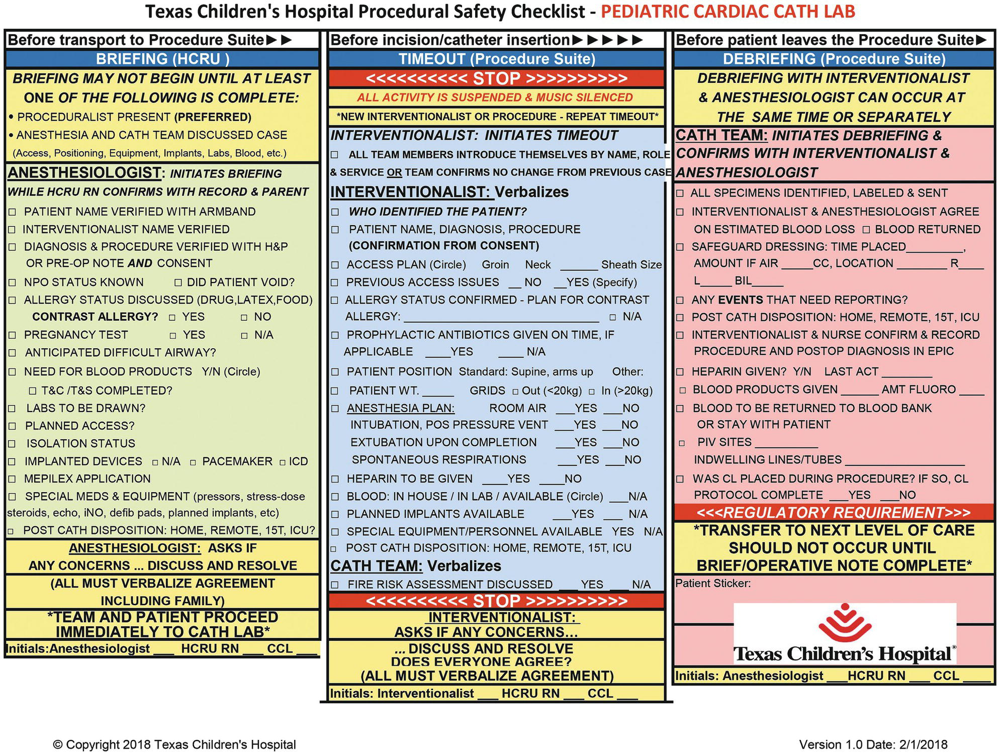

[**Figure 4.16**](#R_c4-fig-0016) Texas Children’s Hospital cardiac catheterization laboratory safety checklist.

### TCH handbook

The TCH Heart Center has a number of educational and research conferences, mostly specific to the various disciplines, that will not be further detailed. One important recent multidisciplinary educational effort was the production of the Texas Children’s Hospital Handbook of Congenital Heart Disease, created by a collaborative effort of authors from Surgery, Cardiology, Anesthesiology, ICU, Perfusion, Nursing, and other members of the Heart Center team \[37\]. The handbook is a series of short, informative, practical chapters about the approach to all of the major cardiac lesions at TCH, including the workup, surgical or catheter therapy, and ICU and postoperative care. The handbook has numerous echocardiogram, angiographic, and anatomical figures, and is designed to be a day‐to‐day source of information for all clinicians in the Heart Center, including trainees in all disciplines, APPs, and faculty level providers. The bedside nursing staff utilizes this resource frequently as well. The handbook is available in paper and electronic format for a nominal cost to the entire Heart Center, as well as to a wider audience through availability on major electronic platforms. An example from the handbook is displayed in [Figure 4.18](#c4-fig-0018).

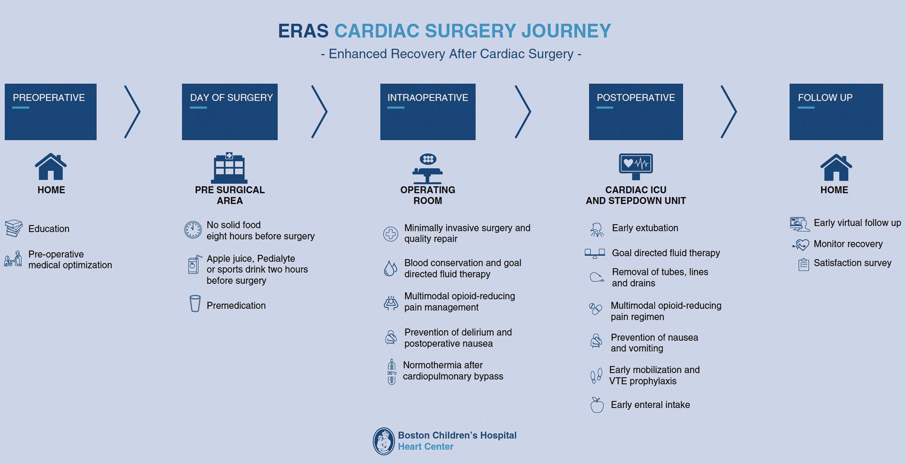

[**Figure 4.17**](#R_c4-fig-0017) Major components of the Enhanced Recovery after Surgery Cardiac Program at Boston Children’s Hospital throughout the patient’s surgical journey. Evidence‐based guidelines were developed for the program components, and targets were set by multidisciplinary stakeholders. ICU, intensive care unit; VTE, venous thromboembolism.

(Source: Roy et al. \[27\]. Reproduced with permission from Elsevier.)

### Parent and family involvement in congenital cardiac care

The multidisciplinary nature of congenital cardiac care also involves parents and family, and in the case of adult CHD often involves spouses and partners. This is a crucially important component of the overall care of the patient, and at the TCH Heart Center families are integrally involved in the care of their child; and invited to listen and contribute to patient care rounds in the ICU and wards, and ask questions of the caregiving team \[38, 39\]. The CICU is designed with sleeping and bathroom space for the family in the actual ICU room, and parents can be present 24 hours/day, with the exception of admission after procedures, or during certain emergencies. After discussion with parents, they are at times allowed to be present during invasive procedures and even resuscitation. Parental presence during induction of anesthesia for cardiac operations and catheterization procedures is not routinely offered but can be arranged in unique cases. Generous use of premedication, distraction with music, storytelling by child life specialists, and electronic devices, and allowing parents to be with the child until immediately before the transfer to the OR results in a smooth separation in almost all cases. Parents are informed of surgical progress every 1–2 hours, either in person by surgical APPs, or by a secure electronic communication system on their mobile phones. The surgeon meets with the family immediately after the surgery, and the parents are reunited with the child as soon as possible after ICU admission, usually within 60 minutes. After catheterization procedures, parents are allowed into the recovery area as soon as the handoff process to the nursing staff is complete. Parents of previous cardiac surgical patients were included in focus groups, and in the design committee for the Heart Center ICU and ward patient care areas.

### Heart Center functioning during the COVID‐19 pandemic

Prior to March 2020, the TCH Heart Center, as with most around the world, conducted conferences and meetings in person, often with 100+ clinicians and others present and seated adjacent to one another in the main auditorium, and in the smaller but still crowded conference and meeting rooms for smaller groups for in‐person meetings. Videoconferencing was occasionally offered to supplement the meetings, but the majority did not have this option. The COVID‐19 pandemic forced a rapid change to all meetings converting to videoconferencing because of social distancing protocols, that persists at the time of writing this chapter. Although still encountering many of our colleagues from all disciplines during clinical care and individually in office areas, the camaraderie and opportunity for social exchange and networking within our own Heart Center, before and after the many conferences, has sadly been limited by the current arrangement. However, the excellent visibility of all the data displayed on one’s office computer, and the ability to contribute opinions via the chat function in the videoconferencing system, have actually improved the quality of the conferences in these respects. The ability to join conferences from locations outside of the hospital has facilitated attendance and participation. Whether the TCH Heart Center will return to only in‐person conferences in the future has not been decided, but some form of hybrid in‐person/videoconferencing is likely.

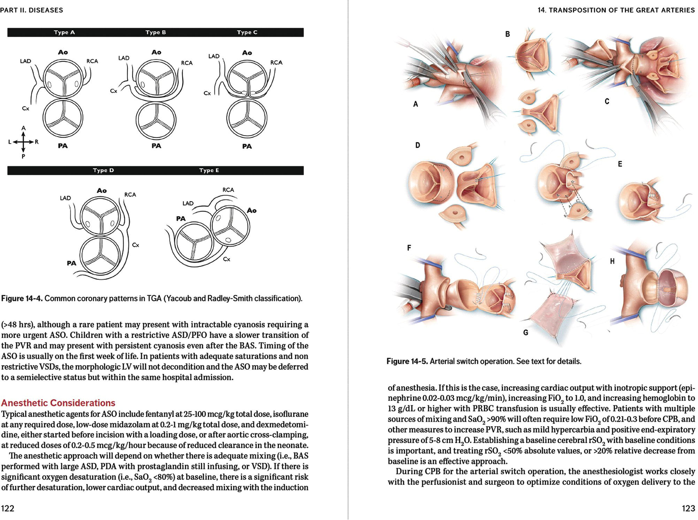

[**Figure 4.18**](#R_c4-fig-0018) Two pages from the Texas Children’s Hospital Handbook of Congenital Heart Disease, in the Transposition of the Great Arteries chapter.

(Source: Mery et al. \[37\] / Reproduced with permission from Texas Children’s Hospital.)

Patient care has also been profoundly affected by the COVID‐19 pandemic \[40, 41\]. Since April 2020, all patients coming for procedures requiring anesthesia have been tested within 72 hours of the procedure for SARS‐CoV2 infection via polymerase chain reaction RNA testing and a number of elective procedures postponed because of symptomatic or asymptomatic infection; personal protective equipment protocols for aerosol‐generating procedures were instituted and are still in place at the time of this writing \[42, 43\], and there have been several periods where Heart Center elective procedures have been limited because of high numbers of COVID‐19 admissions and the need to care for some of these patients in the CICU because the Pediatric Intensive Care Unit (a separate unit at TCH) itself had no available beds \[44\]. A number of COVID‐19 patients with cardiac involvement have also been a new category of medical admissions to the CICU \[45–47\]. Telemedicine, although limited in some CHD patients by the nature of their disease and the need to be seen in person, was initiated when appropriate and promises to change the way CHD patients are cared for after the COVID‐19 pandemic \[48\]. Although numbers of surgeries and procedures for non‐CHD areas of TCH decreased by as much as 20–30% during the height of the pandemic, CHD procedures in the operating rooms and catheterization laboratories decreased much less and only temporarily, again because of the nature of the diseases involved and the need for ongoing treatment. Finally, the longer‐term sequelae of COVID‐19 cardiac disease such as coronary artery aneurysms, and a decrease in myocardial function will be a concern for the Heart Center team in this new group of patients \[49, 50\].

## Conclusions

In no field of medicine are multidisciplinary collaboration, team functioning, and communication more important than in CHD. The number, variety, and complexity of available therapies increase continually, as does the patient population served by institutions providing this care. In this chapter, we presented a Heart Center model that has grown and evolved as both provider and patient population have grown at TCH. Each institution will develop its own specific approach, but practicing the principles in this chapter should lead to increased communication and collaboration in a variety of settings. All caregivers in this ever‐changing field owe this to the patients and families they serve, in order to maximize not just survival but the quality of life.

## Selected references

_A full reference list for this chapter is available at:_

[http://www.wiley.com/go/andropoulos/congenitalheart](http://www.wiley.com/go/andropoulos/congenitalheart)

1.  3 Daaboul DG, DiNardo JA, Nasr VG. Anesthesia for high‐risk procedures in the catheterization laboratory. Paediatr Anaesth 2019; 29(5):491–8. _An excellent review of the highest risk procedures for the cardiac catheterization laboratory, with anesthetic considerations, and a recommended approach to multidisciplinary planning with the cardiac interventionalist and surgery teams_.
2.  8 Pype P, Mertens F, Helewaut F, Krystallidou D. Healthcare teams as complex adaptive systems: understanding team behaviour through team members' perception of interpersonal interaction. BMC Health Serv Res 2018; 18(1):570. _A well written review of the theory of complex adaptive systems and the transformation from merely complicated to complex. The concept of complex adaptive systems in healthcare is being realized, where the focus is on interdisciplinary team members’ interactions with each other, rather than the characteristics of individual team members, in their ability to adapt to the many changing conditions and challenges to the organization_.
3.  11 Duignan S, Ryan A, O'Keeffe D, et al.Prospective analysis of decision making during joint cardiology cardiothoracic conference in treatment of 107 consecutive children with congenital heart disease. Pediatr Cardiol 2018; 39(7):1330–8. _A very interesting prospective evaluation of the approach of one congenital heart disease program’s to presenting complex cases, and the inconsistency in some of its decision‐making_.
4.  14 Hickey E, Pham‐Hung E, Nosikova Y, et al.NASA model of “Threat and Error” in pediatric cardiac surgery: patterns of error chains. Ann Thorac Surg 2017; 103(4):1300–7. _Presentation of a novel infographic approach to presenting the “flight” of congenital cardiac surgery patients, and assigning risk levels to their course, and determining whether threats and errors occur, and if they are responded to appropriately. In 12% of “flights” patients failed to de‐escalate sequentially and in the timeframe expected through the risk levels. Failed de‐escalations were strongly associated with errors (426 in 257 flights, p < 0.0001). More serious errors were associated with a 29% rate of failed de‐escalation, vs. 4% in flights with no consequential error (p < 0.0001)_.
5.  15 Torralba KD, Jose D, Byrne J.Psychological safety, the hidden curriculum, and ambiguity in medicine. Clin Rheumatol 2020; 39(3):667–71. _A well written review of psychological safety in medicine, and how if it is lacking, patient care and outcomes can suffer, as well as education of the learners_.
6.  17 de Leval MR, Carthey J, Wright DJ, et al.Human factors and cardiac surgery: a multicenter study. J Thorac Cardiovasc Surg 2000; 119(4 Pt 1):661–72. _The landmark study of human factors, errors, near misses, communication, and rescue from negative events in multicenter study of 193 arterial switch operations. The number of uncompensated major events per case conferred the strongest risk of death at an odds ratio of 13 (95% CI 2.1–83, p = 0.006), and for each uncompensated major event, estimated odds of death increased by a factor of 5.7, and odds of death plus near miss were increased by a factor of 40_.
7.  20 Hardie JA, Oeppen RS, Shaw G, et al.You have control: aviation communication application for safety‐critical times in surgery. Br J Oral Maxillofac Surg 2020; 58(9):1073–7. _A very well written comparison of aviation safety with the operating room environment focusing on providing a multidisciplinary “sterile cockpit” during critical periods of an operation and during emergencies_.
8.  22 de Lind van Wijngaarden RAF, Siregar S, Legué J, et al.Developing a quality standard for verbal communication during CABG procedures. Semin Thorac Cardiovasc Surg 2019; 31(3):383–91. _A video recording study of six coronary artery bypass graft (CABG) surgeries, and by personal interviews and focus group meetings with surgeons, anesthesiologists, and perfusionists, which arrived at 64 items deemed to be critical to communicate for safe CABG surgery. Substantive communication was present in 40% of exchanges, instubstantive communication in 33%, and no call back in 27%. This study demonstrated that optimal high quality communication could be improved, and provided an important patient safety standard for intra‐team communication during CABG operations_.
9.  28 Mahle WT, Nicolson SC, Hollenbeck‐Pringle D, et al.Utilizing a collaborative learning model to promote early extubation following infant heart surgery. Pediatr Crit Care Med 2016; 17(10):939–47. _A multicenter study to increase the rate of early extubation for coarctation and tetralogy of Fallot repair. The rate of early extubation increased in the active sites from 11.7 to 66.9% (p < 0.001) with no change in reintubation rate. The median duration of postoperative ventilation among active sites decreased from 21.2 to 4.5 hours (p < 0.001)_.
10.  37 Roy N, Parra MF, Brown ML, et al.Initial experience introducing an enhanced recovery program in congenital cardiac surgery (ERACS). J Thorac Cardiovasc Surg 2020; 160(5):1313–21. _A single center multidisciplinary approach to protocolized care designed to shorten length of stay and complications. When compared to a historical matched control group of pre‐ERACS patients, major indices such as mechanical ventilation >8 hours, ICU length of stay >1.25 days, and percent of patients with complications, and numbers of complications, were not different. This important initial effort emphasizes both the potential for improvement in ERACS indices if all guidelines were to be followed; but also the complexity and high number of components to this approach_.