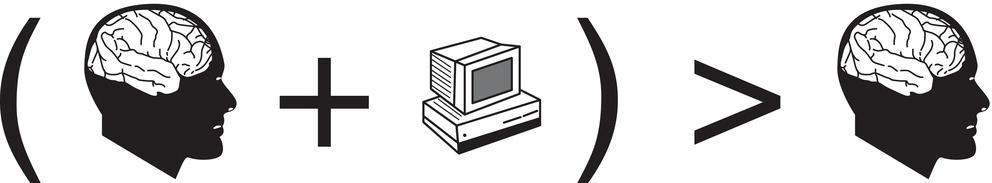
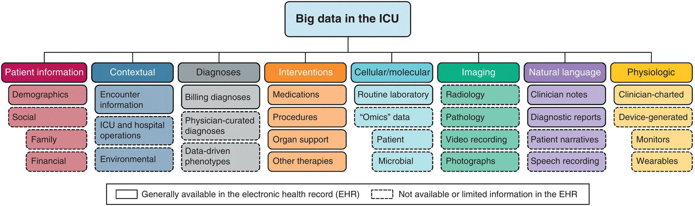
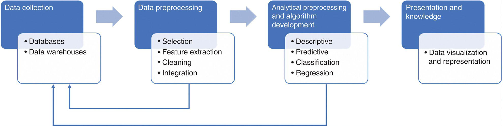
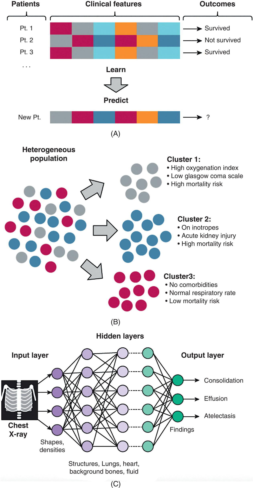
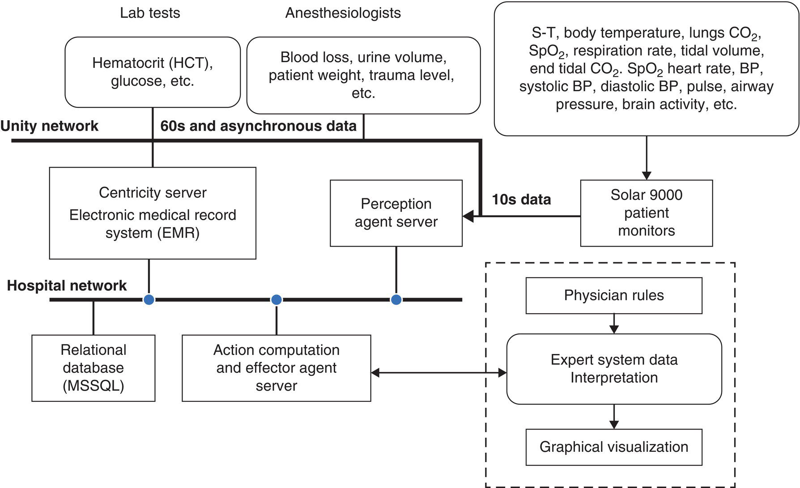
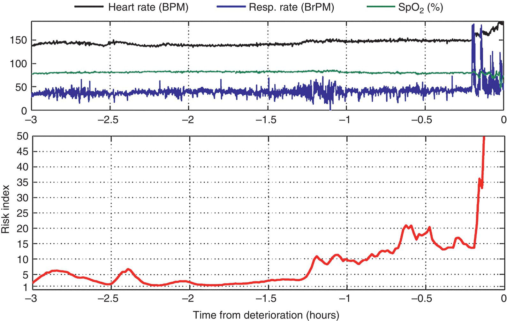
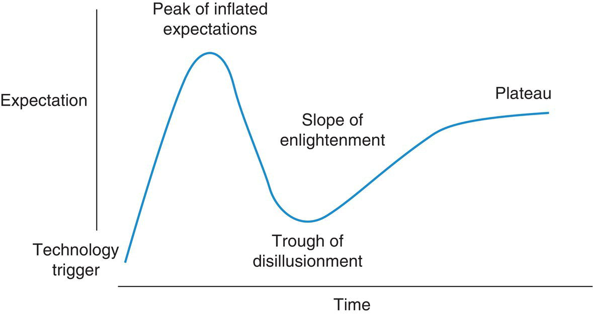

CHAPTER 5 Informatics and Artificial Intelligence in Congenital Heart Disease 

# CHAPTER 5  
Informatics and Artificial Intelligence in Congenital Heart Disease

_Eric L. Vu1, Craig G. Rusin2, and Kenneth M. Brady3_

1 Department of Anesthesiology, Cardiac Anesthesiology Lurie Children's Hospital of Chicago, Northwestern University Feinberg School of Medicine, Chicago, IL, USA

2 Department of Computational and Applied Mathematics, Predictive Analytics Lab, Texas Children's Hospital, Baylor College of Medicine, Rice University, Houston, TX, USA

3 Division of Cardiac Anesthesia Regenstein Cardiac Care Unit, Gracias Family Professor in Cardiac Critical Care, Department of Anesthesiology and Pediatrics, Lurie Children's Hospital of Chicago, Northwestern University Feinberg School of Medicine, Chicago, IL, USA

* * *

-   [**Introduction**](#head-2-40)
-   [**History of medical informatics**](#head-2-41)
-   [**Principles, terminology, and technologies**](#head-2-42)
    -   [How to work with big data](#head-3-21)
    -   [How is data represented](#head-3-22)
    -   [Data types within a hospital](#head-3-23)
    -   [Databases, data organization, and querying data](#head-3-24)
    -   [Data analysis and processing pipelines](#head-3-25)
-   [**Machine learning and artificial intelligence**](#head-2-43)
    -   [Supervised learning algorithms](#head-3-26)
    -   [Unsupervised learning algorithms](#head-3-27)
    -   [Deep learning algorithms](#head-3-28)
-   [**Advanced monitors in intensive care units and operating rooms**](#head-2-44)
-   [**Limitations and challenges**](#head-2-45)
-   [**Future of clinical informatics in congenital heart disease**](#head-2-46)
-   [**Selected references**](#head-2-47)

* * *

## Introduction

The amount of patient data which can be leveraged for decision‐making in critical care environments, such as operating rooms (ORs) and intensive care units (ICUs), continues to grow at an ever‐increasing rate. While working in a data‐rich environment has clear clinical benefits, the geometric growth of data generated per patient often leads to increasingly challenging situations for a single individual to manually review and assimilate all the data collected from a given patient with high fidelity. This is often referred to as the “data overload” problem. The field of informatics provides a structured framework for how to overcome this challenge. Applying the tools and technologies of informatics to the data, practices, and use cases inherent to anesthesia and critical care medicine yields powerful ways to enhance physician decision‐making and improve patient care and safety. With the development of these tools, there is anticipated improvement in healthcare access, efficiency, quality, and outcomes.

This chapter will provide an overview of the history of medical informatics and emerging technologies. A brief examination of the basics of various data, data types, and common techniques in data mining will be discussed with a focus on their relative strengths and limitations. Finally, clinical examples of advanced analytics for congenital heart disease (CHD) and pediatric critical care medicine will be presented.

## History of medical informatics

Biomedical informatics is a multidisciplinary field that studies the effective uses of biomedical data, information, and knowledge for scientific inquiry, problem‐solving, and decision‐making to improve the medical care and health of patients \[1\]. The term “medical informatics” first appeared in the 1960s and undoubtedly has historical origin from the first computer, which was developed in 1945. The world’s first electronic digital computer was developed at the University of Pennsylvania Moore School of Electrical Engineering. This computer was called the electronic numerical integrator and computer (ENIAC) and was utilized by the United States Army Ballistic Research Laboratory to study thermonuclear weapons and calculate artillery firing tables \[2\]. ENIAC played a role in the processing of Monte Carlo methods, which are a set of computational algorithms which rely on repeated random sampling to obtain numerical results \[3\]. The utilization of these methods and computational processing paved the way for applications in simulations, optimization problems, predictive modeling, probabilistic analyses, and applied statistics.

Machine learning was first described in 1959 by Arthur Samuel in reference to a computer program which could iteratively improve each time it played a game of checkers \[4\]. What began with programs and algorithms for simple pattern classifications has now grown to a robust field with symbolic methods to analyze data. Over the next few decades, a crossover of computer technology into healthcare emerged. Computer technology began appearing in the 1970s at Veterans Affairs Hospitals and Massachusetts General Hospital \[5, 6\]. Meanwhile, database and database management continued to evolve from primitive file processing to database management systems from the 1970s to 1980s. This included hierarchical and relational database systems and query languages, such as structured query language (SQL) \[7\]. In the 1980s, the improvement of computer hardware technology and processing speeds led to improved capabilities to store and process data. With the improvement in the management of more complex data, further integration of heterogeneous data sources, development of advanced data models and queries, and sophisticated database management systems, the landscape of data storage and analysis evolved. By the late 1980s, the business data warehouse was developed by International Business Machines (IBM) researchers Barry Devlin and Paul Murphy \[8\]. The business data warehouse is a repository of multiple heterogeneous data sources, organized under a schema to facilitate business intelligence and decision‐making. The applicability of data warehouses to medicine not only allowed for new techniques and fields to emerge but also created new problems to solve.

Meanwhile, a United States Defense Advanced Research Projects Agency (DARPA)‐funded project led to computer networks and the Internet in the 1960s. This system of interconnected computer networks grew to the World Wide Web in the late 1980s and early 1990s \[9\]. Information retrieval, data mining, and web‐based databases (XML or extensible markup language databases) soon became possible. Over the next few decades, the application of database and data warehouse technologies continued to expand from business to medical use.

With the adoption of the Health Information Technology for Economic and Clinical Health (HITECH) Act in 2009, there was a large movement toward the meaningful use of health information technology and the standardization of electronic health records in efforts to improve medical care \[10\]. The patient data generated on a day‐to‐day basis in healthcare has led to major advancements in the field of medical informatics, particularly in the perioperative setting and ICU \[11, 12\]. Modern physiologic monitors can provide more than 20 continuous values at frequencies >200 Hz regarding a patient’s status \[13\]. Similarly, the adoption of electronic health records, databases, and data warehouses has influenced medical informatics. The thoughtful design of these databases and communication standards is essential to ensure interoperability. Communication standards such as Health Level‐7 (messaging), Digital Imaging and Communications in Medicine (imaging), and Institute of Electrical and Electronics Engineers/International Organization for Standardization 11 073 (device interoperability) have played a pivotal role in medical informatics \[14\]. Today, medical informatics is a field which intersects with clinical sciences, medicine, mathematics, computer programming, bioengineering, decision analysis, probability, epidemiology, and statistics.

* * *

### KEY POINTS: HISTORY OF MEDICAL INFORMATICS

-   Biomedical informatics is a multidisciplinary field that studies the effective uses of biomedical data, information, and knowledge for scientific inquiry, problem‐solving, and decision‐making to improve the medical care and health of patients.
-   The development and application of computer technology, databases, and data warehouses in healthcare have led to important advancements in electronic health records, data science, and data mining.

* * *

## Principles, terminology, and technologies

This section provides an overview of medical informatics by describing basic principles, terminologies, and technologies. Its goal is to provide a framework to begin conceptualizing the use of data science in healthcare.

Friedman’s fundamental theorem of informatics states that: “A person working in partnership with an information resource is ‘better’ than that same person unassisted” ([Figure 5.1](#c5-fig-0001)) \[15\]. The theorem describes how information technology is capable of augmenting human reasoning, and information resources may provide information, knowledge, or advice to support an individual who is faced with a medical decision. Friedman’s fundamental theorem assumes that the resource offers something of benefit that the individual does not know. The interaction between the individual and information resource is critical.

For a technology to be truly useful, data is utilized to create information that the clinician utilizes and integrates with their knowledge. Through the repeated application of such knowledge, wisdom forms. The concept of knowledge and wisdom creation from data has been adopted from Ackoff’s data, information, knowledge, and wisdom hierarchy ([Figure 5.2](#c5-fig-0002)) \[16–18\].

[**Figure 5.1**](#R_c5-fig-0001) Friedman’s fundamental theorem of informatics.

(Source: Friedman \[15\]. Reproduced with permission of Oxford University Press.)

[**Figure 5.2**](#R_c5-fig-0002) Data, information, knowledge, and wisdom hierarchy.

Source: Adapted from Ackoff \[16\].

-   Data includes any number, text, symbol, image, and sound that may be stored and studied. Examples of data include vital signs (heart rate, respiratory rate, blood pressure, pulse oximetry), ventilator parameters, images, diagnoses codes, or free text in medical charts ([Figure 5.3](#c5-fig-0003)).
-   Information processed data. An example of this is the interpretation of hypoxia based on pulse oximetry data.
-   Knowledge is contextualized information where familiarity is gained by experience. In the perioperative environment, an example is an integration of information (hypoxia and high peak airway pressures) to utilize the knowledge and diagnose a mucous plug.
-   Wisdom encompasses testable, consistently successful beliefs and involves the synthesis of knowledge to an elevated and shared understanding that is robust and repeatable. The safe perioperative care of patients with congenital heart disease requires vast knowledge, experience, and understanding of physiology to comfortably treat conditions such as hypoxia.

### How to work with big data

Working with data is both an art and a science. Each data science project is unique in its goals and will therefore be unique in its design and execution. However, there are many best practices and frameworks that have been adopted by the data science community to ensure that high‐quality and reliable results are achieved. To understand how to work with data, we must first understand how data is represented, measured, collected, organized, and accessed.

### How is data represented

All data, from music to images to patient medical records, is ultimately stored as ones and zeros within a computer. These are referred to as bits. The bits are stored in the computer’s volatile memory (random‐access memory, RAM) or in nonvolatile memory (i.e. files on a hard drive which are preserved across reboots of a computer). Typically, sets of 8 bits are grouped together. This grouping is called a byte. Data size is often measured in units of bytes, with ever‐increasingly larger prefixes ([Table 5.1](#c5-tbl-0001)). There are various systems to encode the data. Two examples include binary, which consists of two digits (0 and 1), or base‐10, which consists of 10 digits (0 through 9).

To encode useful information, there are many ways to interpret patterns of bits. Different encoding types have different advantages and disadvantages. The most common data types for data science include the following.

_Integers_ – This data type represents whole numbers (1, 2, 3, etc.). They can be signed or unsigned (i.e. positive or negative). The range of values that integers can have depends on the number of bits that are used to express their values. For example, an unsigned integer that uses 16 bits (or 2 bytes) can represent a number between 0 and 65 535 (2^16 − 1), while an unsigned 8‐bit integer can represent a number between −128 and 127. Typical sizes for integers are 8, 16, 32, and 64 bits. The disadvantage of integers is that they cannot express a number that contains a decimal or a fraction value.

[**Figure 5.3**](#R_c5-fig-0003) Sources of data in the intensive care unit (ICU) setting.

(Source: Sanchez‐Pinto et al. \[21\]. Reproduced with permission of Elsevier).

[**Table 5.1**](#R_c5-tbl-0001) Units of data

Source: Gavin \[19\] and McKenna \[20\].

| Units | Binary system | Base‐10 system | Example |
| --- | --- | --- | --- |
| **1 Bit (b)** | Binary digit | Binary digit | ‘1’ or ‘0’ |
| **1 Byte (B)** | 8 Bits | 8 Bits | 1 typed character (i.e. ‘A’) |
| **1 Kilobyte (kB)** | 1024 Bytes | 1000 Bytes | 1 paragraph |
| **1 Megabyte (MB)** | 1024 Kilobytes | 1000 Kilobytes | 400‐page book |
| **1 Gigabyte (GB)** | 1024 Megabytes | 1000 Megabytes | 30 minutes of video. 1 DVD movie is 4–8 GB) |
| **1 Terabyte (TB)** | 1024 Gigabytes | 1000 Gigabytes | 500 hours of movies |
| **1 Petabyte (PB)** | 1024 Terabytes | 1000 Terabytes | 500 billion pages of typed text or 2000 years of MP3‐encoded music |
| **1 Exabyte (EB)** | 1024 Petabytes | 1000 Petabytes | 11 million 4k resolution videos |

_Floating‐point numbers_ – This data type represents positive and negative decimal numbers. The precision of floating‐point numbers is based on the number of representative bits. They are usually represented as a decimal with an exponent (i.e. 2.3456 × 105). A 32‐bit floating‐point number has eight digits of precision (i.e. seven digits after the decimal), while a 64‐bit float (usually called a double float) has 15 digits of precision.

_Character arrays, strings, and text_ – This data type represents text. Usually, 1 or 2 bytes of data are used to represent an individual character, and character encoding maps are used to associate a specific byte value with a letter or pictograph (i.e. a character byte that has a value of 65 represents the letter “A”). The most common encoding maps are American Standard Code for Information Interchange (ASCII) and a universal character encoding standard called UNICODE. Traditionally, a string is terminated with a NULL character (i.e. the byte value of 0).

More complicated data representations are constructed hierarchically from these basic types. For example, a grayscale image that has a resolution of 600 × 800 (such as that produced by an X‐ray) can be represented using an array of 480 000 integers (600 × 800 = 480 000), where each integer represents the intensity of the signal at a specific location in the image. An RGB color image is represented using a set of three integers to represent a color for each pixel or location in the image. While there may be complex ways that these data structures are stored (because they can get very large), all complex data structures can be broken down into these fundamental data types for subsequent analysis.

### Data types within a hospital

There are four main classes of data within a hospital: text‐based records in the electronic medical system (EMR)/electronic health system (EHR), imaging data held in the Picture Archive and Communication System (PACS) system, physiologic time‐series data generated by the bedside patient monitoring equipment, and genetic data from patients (‐omics data). The most common data on medical data science projects include text‐based records from the EMR. Within the EMR, there exists a further dichotomization of data: structured vs. unstructured data.

Structured data is data that has been captured in such a way that an unambiguous result can be ascertained from the user input. Conversely, unstructured data is data that is captured without such a rigorous process in place. For example, the entry of a patient’s weight into the EMR using the “weight” field or ordering of a medication from a drop‐down “medication list” are examples of creating structured data because there is a specific field on the form that was designed to capture “weight” and “medication name.” It is not the nature of the data itself that is structured, but rather the _way_ that the data is captured that determines if it is structured data. The limitation of a structured data capture system is that it can only capture data that it is designed to capture and nothing else. The benefit of a structured data capture system is that it facilitates data analyses and the data analysis pipeline (discussed later in this chapter).

Unstructured data is equivalent to the data generated while writing in the free‐text portion of a clinical progress note. The free‐text nature of unstructured data allows the user flexibility to add whatever information is important. The downside is that unstructured data is significantly more difficult to query than structured data. Imagine if a task is to obtain a list of the medication doses given to a set of patients. If these data were captured in a structured way, a spreadsheet could be generated with the medication name, corresponding dose, time, and patient (how this is done will be addressed later in this chapter). Unstructured data would require a manual chart review of all of the free text in the medical record to obtain the information. This process is time‐consuming and may create errors that would potentially invalidate any data analysis. Often the most flexible systems have a mix of both structured and unstructured data. Significant forethought is given to the design of the structured fields to be captured and how the unstructured data will be utilized for analysis.

It is important to note that not all data that is generated in the hospital may be captured for retrospective review and analysis. Just because a piece of data is generated does not mean that it is stored. Oftentimes, there may be temporary storage of data that is purged in the future. A summary of the major data types and sources in an ICU setting is presented in [Figure 5.3](#c5-fig-0003).

The lexicon of medical informatics and data science broadly encompasses terms related to various types of data, data analytics, and components of machine learning models ([Table 5.2](#c5-tbl-0002)).

[**Table 5.2**](#R_c5-tbl-0002) Definitions and terminologies in medical informatics and data science

Source: Sanchez‐Pinto et al. \[21\]. Reproduced with permission of Elsevier.

| Term | Definition |
| --- | --- |
| **Big data** | Data generated in high volume, variety, and velocity, resulting in datasets that are too large for traditional data‐processing systems. |
| **Data science** | A set of fundamental principles that support and guide principled extraction of information and knowledge from data. |
| **Data mining** | Extraction of knowledge from data via machine learning algorithms that incorporate data science principles. |
| **Domain expertise** | The understanding of real‐world problems in a given domain (e.g. critical care medicine) that helps frame and contextualize the application of data science to solve problems. |
| **Machine learning** | The field of study that focuses on how computers learn from data and on the development of algorithms to make learning possible. |
| **Features** | The data elements (independent variables) used to train a model. Features may be raw data, transformations of raw data, or complex transformations of data (such as ones performed by neural networks). |
| **Outcomes** | The data elements (dependent variables) which represent the target for training in a supervised learning model. Outcomes may be categorical (e.g. yes/no) or continuous (e.g. length of hospital stay). Binary outcomes are typically represented as Boolean logic (e.g. true/false) or fuzzy logic (e.g. range of probabilities). |
| **Supervised learning** | Algorithms used to uncover relationships between a set of features and one or more known outcomes. |
| **Unsupervised learning** | Algorithms used to uncover patterns or groupings in data without targeting a specific outcome. |
| **Model training** | The process where machine learning algorithms develop a model of the data by learning the relationships between features. In supervised learning, the relationship between a set of features and one or more known outcomes is utilized for training. This is also referred to as model derivation or data fitting. |
| **Model validation** | The process of measuring how well a model fits new, independent data. For example, evaluating the performance of a supervised model at predicting an outcome in new data. This is also referred to as model testing. |
| **Predictive model** | A model trained to predict the likelihood of a condition, event, or response. The US Food and Drug Administration specifically considers predictive strategies as those geared toward identifying groups of patients more likely to respond to an intervention. |
| **Prognostic model** | A model trained to predict the likelihood of a condition‐related endpoint or outcome such as mortality. In general, the goal is to estimate a prognosis given a set of baseline features, regardless of what ultimately leads to the outcome. |
| **Overfitting** | A phenomenon when an algorithm learns from idiosyncrasies in the training data, usually “noise.” The noisy data present in the training dataset do not represent generalizable truth in relationships between features and outcomes. Overfitting will typically lead to poor model performance in an independent validation dataset. |
| **Digitization** | The conversion of analog data (e.g. paper documents, printed images) into a digital format (e.g. bits) |
| **Digitalization** | The wide adoption of digital technologies by an organization to leverage digitized data with the goal of improving operations and performance. The adoption of electronic health records, picture archiving, and pharmacy management systems are examples of digitalization in healthcare. |
| **Data curation** | The process of integrating data from different sources into a structured dataset. It typically involves authenticating data to ensure quality and may involve annotation of data to facilitate use in the analysis. |
| **Structured data** | Data (usually discrete or numeric) that are easy to search, summarize, sort, and quantify. Examples include vital signs and laboratory test results (e.g. complete blood count, complete metabolic panel). |
| **Unstructured data** | Data that do not conform to a prespecified structure. Unstructured data are usually more difficult to search, sort, and quantify. Examples include clinician notes, written narratives, images, pathology slides, radiology images, video, or audio. |

### Databases, data organization, and querying data

Structured data can be organized and recorded in databases to enable efficient storage and retrieval of information. While there are many types of databases, the two most common are relational databases and key‐value storage systems (also called a NoSQL database or column stores). Relational databases allow a user to define relationships between sets of data so that data integrity and fidelity are rigorously and automatically enforced, while key‐value databases provide ways of storing and retrieving large amounts of data without requiring the complexities and overhead associated with these guarantees. For the purposes of this discussion, we will focus on relational databases as these will be the most common databases utilized within the healthcare setting.

The structure of a relational database is called a schema, which is the organization or blueprint of the database. The schema is the database described by a set of one or more tables. A table is similar to a spreadsheet. Each table has its own set of rows and columns. The columns of a table (also called fields) represent the specific aspects of a set of data (i.e. “first name,” “last name,” and “date of birth”). Each field also has a type (such as integer, float, or text) to allow the database to understand how to interpret the data within each field. The rows of the table (also called records) represent the specific data points that have been recorded (i.e. “John,” “Doe,” “1‐1‐1970”). Each table must contain a column that has a unique identifier for each row. This is called the “primary key” field of the table. This is the equivalent of the row number in a spreadsheet. For most tables, this field is called the “record number” and is represented as a 64‐bit integer, which allows for the unique identification of hundreds of millions of trillions of rows (or more precisely, 2^64 − 1 records).

The complexity of databases becomes evident when one considers the hundreds or even thousands of tables that need to be managed, linked, and organized. For example, a database associated with an EMR system may have more than 20 000 unique tables, and each table may have hundreds of fields. How is the subset of data located and retrieved in the haystack of tables defined in the database schema? The answer is through relationships. Generally, all tables in a database schema will be related to one another in some way, either directly or indirectly. A relationship between two tables is created by embedding the primary key of one table into a field within a different table. For example, imagine building a database to describe how beds are organized within a hospital ICU. Conceptually, hospital beds are organized into individual units, and each unit has one or more beds. The database schema can be represented using two tables: a “Units” table and a “Beds” table. Each table would have its own primary key and other fields related to the specifics of the table. The “Beds” table might have a field that is “bed name,” while the “Units” table might have a field called “unit name.” To create the relationship between the units and beds table, a field can be added to the beds' table, called unit ID, which can hold the record number of the record in the unit table that corresponds to the unit the bed is located. Therefore, to lookup what unit a given bed is located in, the following steps are executed:

1.  Search the bed table to find the record associated with the name of the bed.
2.  Extract the unit ID from the matching bed record.
3.  Search the units table to find the record with a primary key value equal to this unit ID.
4.  Extract the unit name from the matching record.

Executing this process manually for dozens or hundreds of relationships between a large number of tables would be very tedious, but computers can be programmed to execute such searches as quickly and efficiently as possible. Computer scientists have created a structured language for querying database tables in order to efficiently search and extract data from databases. This language is called SQL (structured query language). SQL is a standard language that can be used to query data across a wide variety of databases such as MSSQL (Microsoft SQL), Oracle, and PostgreSQL among others. There are many textbooks and online tutorials available for learning how to write SQL queries that the reader can reference for further learning.

### Data analysis and processing pipelines

Data processing pipelines are the processes by which heterogeneous data is collected and transformed into a standardized format for subsequent analysis ([Figure 5.4](#c5-fig-0004)). The data processing pipeline allows for the cleaning and integration of data. The process of creating knowledge from data includes the following steps:

1.  **Data collection:** Data may be collected via a variety of methods that may include physiological sensors, monitors, or manual entry. This phase also involves data curation, which is the process of integrating data from different sources into a structured dataset. Depending on the size of the dataset, large amounts of data are often stored in databases or data warehouses. Database systems or database management systems are utilized to manage and access data. Data warehouses are a set of databases which hold information collected from multiple sources or locations.
2.  **Data selection, feature extraction, and cleaning**: Relevant data is retrieved and may require transformation. Identification of relevant features, attributes, or dimensions of the data is imperative. Another essential process is the removal of noise and inconsistent data. There are techniques to filter, smooth, and estimate missing values by utilization of regression or outlier analyses. This stage also assesses the accuracy, consistency, completeness, interpretability, and believability of data. Occasionally, data integration (or the combination of multiple files, data sources, and databases) is necessary for the creation of a structured dataset.
3.  **Analytical processing and algorithms**: Methods and algorithms are designed and then applied to extract data patterns. Descriptive tasks that characterize data can lead to a fundamental understanding of datasets. Predictive tasks can be performed on the dataset to make inferences on future patterns. In this process, elements of pattern evaluation can identify trends that may represent knowledge.
4.  **Presentation and knowledge**: In this stage, data is visualized. Examples include data tables, bar charts, or pie charts. The processed data is represented as knowledge.

To ensure meaningful results, this process is often iterative and requires feedback from the data preprocessing or analytical processing steps. In addition, a strong understanding of the dataset via domain expertise is also imperative for meaningful inferences and insights.

* * *

### KEY POINTS: PRINCIPLES, TERMINOLOGY, AND TECHNOLOGIES

-   Friedman’s fundamental theorem of informatics states that: “A person working in partnership with an information resource is ‘better’ than that same person unassisted.”
-   The data, information, knowledge, wisdom (DIKW) pyramid or hierarchy describes the relationship between data, information, knowledge, and wisdom.
-   Common ways to encode data are with integers, floating‐point numbers, character strings or text, and complex representations such as images. Various data types which can be studied include text‐based records, imaging data, physiologic time‐series data, and genetic data.
-   Data science is a set of fundamental principles that support and guide principled extraction of information and knowledge from data.
-   Relational databases allow for the efficient storage and retrieval of data through the structured query language.
-   Data is converted to knowledge via processing pipelines that include data collection, data selection, feature extraction, data cleaning, analytical processing and algorithms, and presentation of knowledge.

* * *

## Machine learning and artificial intelligence

Machine learning and artificial intelligence have grown from the fields of computer science, applied mathematics, and statistical learning. In general, machine learning is a field of study that focuses on the development of algorithms and methodologies for automating pattern recognition problems \[22\]. Humans are great at pattern recognition as our brains have had years of training to be able to recognize important aspects of our environment. Computers, on the other hand, have been traditionally poor at pattern recognition tasks.

[**Figure 5.4**](#R_c5-fig-0004) Data processing steps and pipeline.

A pattern recognition task is a task that requires a decision to be made by utilizing previous experiential knowledge of a regularized structure in sets of data. For example, suppose an individual is given a picture of either a cat or a dog and asked to determine which animal is displayed. Even though the exact picture of the cat or dog may not have been seen before, this task can be performed very accurately. Over time, the telltale features that make a cat a cat or a dog and dog have been learned. Using this set of learned, implicit features, the class of animal when a new dog or a cat is encountered may be inferred with a high degree of accuracy. Machine learning is a method for building algorithms that can learn the important “features” embedded within a large set of data and allow a computer to perform pattern recognition tasks automatically without human intervention.

In the field of genetics, molecular medicine, and bioinformatics, these algorithms have fostered discovery through advanced machine learning algorithms, biomedical ontologies, and natural language processing tools. As this field expands into the medical informatics domain, applications to clinical decision‐making, methods for reasoning under uncertainty, knowledge representation, and systems integration are critical \[23\]. A large amount of available patient data has changed the way how we can approach clinical research and medical care \[24, 25\]. Machine learning is divided into three broad approaches: supervised learning algorithms, unsupervised learning algorithms, and broader, deep learning algorithms.

### Supervised learning algorithms

Supervised learning algorithms are utilized to discover clinical features and relationships between variables of interest and outcomes \[22\]. Each data point is labeled or associated with a category or value of interest. Training data or examples are used to infer these relationships via learning algorithms. A research question addressed by a supervised learning algorithm may involve determining the clinical features that predict mortality in patients after congenital heart surgery ([Figure 5.5](#c5-fig-0005)A). The supervised learning algorithm is applied to a large training dataset to determine the relevant clinical features that predict the outcomes of interest. The goal is for these models to be applied to new patients to predict the pertinent outcome in a specific condition, event, or response.

Examples of supervised learning algorithms include linear regression, logistic regression, naïve Bayes, decision trees, and K‐nearest neighbor. Once the algorithm is applied, the parameters of the model may then be adjusted and optimized on a subset/validation dataset. Once the learning algorithm is applied to the training dataset, performance is assessed via a testing dataset.

### Unsupervised learning algorithms

Unsupervised learning algorithms are utilized to discover patterns or groupings in datasets without targeting a specific outcome \[22\]. The outcomes are unlabeled in unsupervised learning algorithms. These algorithms are often used in exploratory data analyses to find similarities in subsets of data. A research question addressed by an unsupervised learning algorithm may be used to determine groups of patients after congenital heart surgery and emerging patterns of clinical outcomes ([Figure 5.5](#c5-fig-0005)B). In this way, the dataset is automatically split into groups based on similarities. The goal of unsupervised learning algorithm is to organize the data to better describe features of the dataset structure.

Examples of unsupervised learning algorithms include hierarchical clustering, centroid‐based/k‐means clustering, principal component analysis, and latent class analysis. These algorithms are more computationally complex than supervised learning algorithms.

### Deep learning algorithms

Deep learning algorithms or neural networks are a unique type of algorithm that consists of connected nodes or neurons, arranged in a series of layers to extract complex and meaningful features from data. Each node receives signal data, processes the data, and passes information to additional nodes. As learning proceeds in the neural network, the relative weights of each connection or edge are adjusted to strengthen the overall network \[26\]. A research question addressed by a deep learning algorithm may be utilized to extract meaningful diagnoses from patient chest radiographs ([Figure 5.5](#c5-fig-0005)C). The goal of deep learning algorithms is to solve complex medical problems with hierarchical complexity to make useful predictions.

Examples of deep learning algorithms include convolutional neural networks and generative adversarial networks. These algorithms require considerable computing resources and training sets. A summary of machine learning algorithms is presented in [Table 5.3](#c5-tbl-0003).

* * *

### KEY POINTS: MACHINE LEARNING AND ARTIFICIAL INTELLIGENCE

-   Machine learning focuses on how computers learn from data and the development of algorithms and methodologies to make learning possible by leveraging the vast amounts of data available.
-   Three broad categories of machine learning algorithms include supervised learning algorithms, unsupervised learning algorithms, and deep learning algorithms.
-   Supervised learning algorithms are utilized to discover clinical features and relationships between variables of interest and outcomes. Models are developed through a training dataset and then validated through a testing dataset. Robust models can then be utilized to predict outcomes.
-   Unsupervised learning algorithms are utilized to discover patterns or groupings in datasets without targeting a specific outcome. These algorithms are often used in exploratory data analyses to find similarities in subsets of data.
-   Deep learning algorithms or neural networks are connected nodes or neurons, arranged in a series of layers to extract complex and meaningful features from data. These algorithms are utilized to solve complex medical problems with hierarchical complexity with the ultimate goal of making useful predictions.

* * *

[**Figure 5.5**](#R_c5-fig-0005) Types of machine learning algorithms: (A) supervised learning algorithms; (B) unsupervised learning algorithms; (C) deep learning algorithms.

(Source: Sanchez‐Pinto et al. \[21\]. Reproduced with permission of Elsevier).

[**Table 5.3**](#R_c5-tbl-0003) Examples of machine learning algorithms

Source: Sanchez‐Pinto et al. \[21\]. Reproduced with permission of Elsevier.

| Algorithm class | Examples | Description |
| --- | --- | --- |
| **Classic regression** | Linear regression, logistic regression | Linear regression is a supervised learning algorithm that models the relationship between one or more features and a continuous outcome by fitting a regression line that minimizes the sum of all the residuals (distances between each feature in the training data and the line being fitted to model the data). Logistic regression is a generalization of the linear model that uses the logit function to estimate the probability of a binary outcome. To do this, the fitted sigmoid‐shaped curve of the logistic function maps the feature values into a probability between 0 and 1. |
| **Regularized regression** | Lasso, ridge regression, elastic net | An extension of the classic regression algorithms in which a penalty is imposed to the fitted model to reduce its complexity and decrease the risk of overfitting. |
| **Tree‐based** | Classification and regression trees, random forest, gradient boosted trees | A class of supervised learning algorithms based on decision trees. Decision trees are a sequence of “if‐then‐else” divisions that are derived by iteratively separating data into groups based on the relationship of the features with the outcome. Random forest and gradient boosted trees are examples of ensemble tree models. Ensemble models combine the output of many trained models to estimate an outcome. |
| **Support vector machines** | Linear, polynomial, radial basis kernel | A class of supervised learning algorithms that represents the data in a multidimensional feature space and then fits a “hyperplane” that best separates the data on the outcomes of interest. A hyperplane is a space with one dimension less than its space. For example, an n‐dimensional space, a hyperplane that separates the space has (n − 1) dimensions. |
| **K‐nearest neighbor** | K‐nearest neighbor | A type of supervised learning algorithm that represents data in a multidimensional feature space and uses local information about observations closest to a new example to predict the outcome for that example. |
| **Bayesian** | Naïve Bayes, Bayesian network | A class of supervised learning algorithms that use Bayes’ theorem of conditional probability, which is the probability that something will happen given that something else has already occurred. In general, Bayesian algorithms work by iteratively updating the probability of an outcome given new data. |
| **Neural network** | Artificial neural network, deep neural network | A class of nonlinear algorithms built using layers of nodes that extract features from the data and perform combinations that best represent the underlying structure, usually to predict an outcome. Neural networks can be shallow (e.g. perceptron with two layers) or deep (multiple layers), which form the basis for the field of deep learning. |
| **Dimensionality reduction algorithms** | Principal component analysis, linear discriminant analysis | A class of unsupervised learning algorithms that exploit the inherent structure in the data to describe data using less information. Principal components, for example, summarize a large set of correlated features into a smaller number of representative features. |
| **Latent class analysis** | Latent class analysis | A type of unsupervised learning algorithm that identifies unseen subgroups or latent classes, in the data. Class membership is unknown for each example, so the probability of class membership is indirectly estimated by measuring the patterns in the data. |
| **Cluster analysis** | K‐means, hierarchical cluster analysis | A class of unsupervised learning algorithms that uses the inherent structures in the data to best organize the data into subgroups of maximum commonality based on a distance measure between features. |

## Advanced monitors in intensive care units and operating rooms

With advancements in medical informatics, computational processors, ICU monitors, and methods of information storage, we have entered an era of data‐driven healthcare. The data analytics, algorithms, and methods described earlier in this chapter can be used in the development of new paradigms for the monitoring and treatment of patients with congenital heart disease. At present, monitoring systems are limited in scope for the prediction of adverse events, the opportunity of the development of intelligent monitoring systems is real.

Historical and real‐time physiologic patient data can now be synthesized to create an integrated representation of the patient’s overall state of health. For example, physiological trend graphs have been used to identify late‐onset sepsis in preterm infants with increased accuracy in neonatal ICUs \[27\]. In future ICU monitors, relevant medical information, including patient‐specific alarm conditions, risk‐index scores, and suggestions for care, may be displayed in a unified monitor. There is a substantial benefit in the creation of displays that not only integrate the sizable amount of ICU data in a meaningful way but also provide the medical team with a display that allows a patient’s clinical trajectory to be followed over time.

In addition to physiologic patient monitors, medical devices in the ICU and OR environments also have interfaces capable of submitting data that can be analyzed, i.e. infusion pumps, ventilators, extracorporeal membrane oxygenation (ECMO) machines, ventricular assist devices, dialysis machines, etc. In addition, EMR data, i.e. problem lists, prior procedures, chronic medications, allergies, etc., can be integrated into the predictive models for a more robust dataset \[28, 29\]. Besides predicting risk for adverse outcomes, models could be designed to predict readiness to wean from support, i.e. inotropic, mechanical, ventilatory, or renal support \[30\].

Current pediatric risk and acuity scores include the Pediatric Risk of Mortality, the third version of PRISM (PRISM III) and Pediatric Index of Mortality, second version (PIM II). These scores take discrete physiological values at a moment in time to calculate a risk for mortality and ICU length of stay \[31–34\]. Consequently, they are limited for real‐time analysis compared to high‐resolution, physiologic data, which may allow for the development of metrics that may be more specific and sensitive in defining a patient’s acute or impending acute condition.

Statistical or machine learning algorithms, such as classification trees, logistic regression, random forest algorithms, neural networks, or probabilistic network models have been utilized to create sophisticated models of disease \[35, 36\]. Data from the publicly available Physionet database has been utilized in artificial neural networks to create models for the detection of adult ICU patients at high risk of clinical deterioration with improved performance than traditional acuity scores \[37, 38\]. Neural networks have also been utilized to diagnose arrhythmogenic cardiac arrest, tension pneumothorax, pericardial tamponade, venous air embolism, and exsanguination \[39\]. In a multicenter study using electronic health record information, Churpek and colleagues have utilized machine learning methods to predict cardiac arrest, ICU transfers, and mortality in an adult hospital ward in a dataset of >250 000 hospital admissions \[40\].

The pursuit of such real‐time analytics and risk prediction is an evolving field. Most modern medical decision support systems, often Internet or software based, utilize an advanced display to allow clinicians to visualize solutions to medical problems \[41\]. At the University of Michigan, complex network infrastructures capture and link physiologic data from patient monitors, electronic health record data, and anesthesia records to SQL databases, which are then utilized to create patient risk scores and more intelligent alarms in the ICU and OR settings \[42\] ([Figure 5.6](#c5-fig-0006)). The system was designed to classify patient physiologic states (such as hypotension), generate alerts, and provide notifications to clinicians.

In the CHD population, single ventricle patients have a high risk of interstage mortality and cardiac arrest. Mortality rates have been observed to be 12% described in the Single Ventricle Reconstruction Trial \[43\]. Additional analyses of the Single Ventricle Reconstruction Trial data have identified mortality rates or need for cardiac transplantation at 12 months to be 36% for patients receiving a modified Blalock‐Taussig shunt and 26% for the right ventricle‐to‐pulmonary artery shunt. Most commonly, mortality was attributed to cardiovascular causes \[44\]. Rusin and colleagues have utilized continuous, high‐resolution, physiologic recordings to develop logistic regression models that predict cardiopulmonary deterioration 1–2 hours prior to the event with a model area under the receiver‐operating characteristic curve of 0.91–0.96 \[45–47\] ([Figure 5.7](#c5-fig-0007)). Ruiz et al. utilized naïve Bayesian models for the prediction of critical events 1–8 hours prior to the event with the area under the receiver‐operating characteristic curves ranging from 0.73 to 0.88 \[48\]. These results are encouraging and suggest that computational models are able to detect subtle physiological changes in high‐risk interstage patients and provide a real‐time risk assessment for clinical deterioration. The results of these models are to be tested and validated via further multicenter studies. Early recognition of impending deterioration allows the medical team time for interventions in hopes of reducing patient morbidity and mortality.

[**Figure 5.6**](#R_c5-fig-0006) Example network architecture and data flow diagram for a clinical decision support system. BP, blood pressure; MSSQL, Microsoft Structured Query Language.

(Source: Kruger \[42\] / The Open Cybernetics & Systemics Journal / CC BY‐SA 4.0).

[**Figure 5.7**](#R_c5-fig-0007) Real‐time risk index for cardiopulmonary deterioration based on vital sign monitoring. Classification algorithms were applied and optimized to create receiver operating characteristic curves of 0.91.

(Source: Rusin \[45\]. Reproduced with permission of Elsevier).

The future of monitoring congenital heart disease will continue beyond the OR and ICU environment. In single ventricle patients, home monitoring and telemedicine systems have been proposed to improve outcomes \[49–52\]. Surveillance through tablet or personal computer‐based solutions has been developed to facilitate communication between families and clinicians \[53\]. However, there are opportunities for growth and improvement as these home monitoring programs consist of basic vital sign monitoring. The expected future growth and expansion of home monitoring technologies and techniques beyond the hospital setting may continue to improve patient outcomes in the high‐risk single ventricle patient.

* * *

### KEY POINTS: ADVANCED MONITORS IN INTENSIVE CARE UNITS AND OPERATING ROOMS

-   The data analytics, algorithms, and methods described earlier in this chapter can be used in the development of new paradigms for the monitoring and treatment of patients with congenital heart disease.
-   Previous risk index and acuity scores include the Pediatric Risk of Mortality, third version (PRISM III), and Pediatric Index of Mortality, second version (PIM II) that use discrete values to predict mortality risk and ICU length of stay.
-   Real‐time analytics and risk prediction is an evolving field utilizing advanced data analytics. Logistic regression and naïve Bayes models have been utilized in single ventricle patients in the prediction of critical events such as cardiopulmonary arrest.

* * *

## Limitations and challenges

With the development of new technologies from the field of medical informatics, there are limitations and challenges not only in the development of the technology but also in the adoption of that new technology. This section will discuss some of the pitfalls with the development of this technology and data mining.

Many advances have been made in medical informatics in the digitalization and integration of medical devices. However, poor integration and interoperability between medical devices remain a challenge for the data scientist when attempting to contextualize vast amounts of data. As the field of medical informatics has grown, the development of domain expertise, which must bridge the areas of computer science, statistics, engineering, and medicine, becomes even more important over the next decades. An understanding of both the data science and clinical applicability is needed to avoid the failures that commonly face new medical technologies. Otherwise, data mining may lead to irrelevant, flawed, or low‐quality research \[54, 55\]. For example, an issue described earlier in this chapter includes the overfitting of models. A rigorous approach to statistical and data mining methods through validation and testing can be utilized to detect this problem.

The US medical system is burdened with 180 000–440 000 preventable medical errors leading to patient mortality on an annual basis \[56, 57\]. There are constant pursuits to use the techniques described in this chapter to design advanced monitors for earlier and more reliable detection of adverse patient events. However, the burden of alarm fatigue to the user is a significant challenge in the critical care, OR, and perioperative care settings. In a pediatric ICU study, it was found that 68% of alarms were false and 94% of alarms were clinically unimportant \[58\]. A national survey among Canadian anesthesiologists found that 58% of 789 respondents routinely deactivated alarms at the start of a case \[59\]. Simple, rule‐based decision support systems have been described for congestive heart failure. However, when the performance of the clinical decision support system was evaluated against manual review of records, the tool had a sensitivity of 79% and a positive predictive value of only 11% \[60\]. The system failed and was removed from clinical use, but it was able to highlight problems with false negatives, excessive alerts, and lack of physician response to alerts. In the design of clinical decision support systems, alarm management will play an essential role.

The widespread adoption of electronic health records and data warehouses has increased the accessibility of patient information. Information overload is an emerging concern, and the data from multiple devices that the medical provider can process, code, and integrate is finite \[13, 61\]. An important principle in the design of advanced monitors and clinical decision support tools is in the visual presentation of the information, which must be intuitive to the provider, who may not be familiar with the theory or evidence. The use of human factors science in the design of clinical decision support tools is pivotal to the success of new monitors.

The Gartner Hype Cycle describes a common pattern that arises with new technologies and innovations ([Figure 5.8](#c5-fig-0008)). The innovation trigger begins with a breakthrough and product launch. This is followed by a peak of inflated expectations where the expectations may be greater than the technological capabilities. A trough of disillusionment follows as problems with the technology lead to reduced expectations and slow adoption. Continued work and understanding of technology lead to a slope of enlightenment, and finally, a plateau of productivity forms where the technology finally finds productive and useful value \[62\]. The Gartner Hype Cycle highlights the challenge in the adoption of new technologies as perceptions and expectations of that technology must align with reality. In this way, the technology finally begins to impact patient care.

* * *

### KEY POINTS: LIMITATIONS AND CHALLENGES

As medical informatics, machine learning, and artificial intelligence continue to grow in the perioperative and critical care settings, there are challenges in domain expertise, appropriate application of algorithms, model overfitting, and adoption of new technologies.

* * *

## Future of clinical informatics in congenital heart disease

Though many clinical informatics systems in congenital heart disease are still in early stages of development, they will continue to evolve. As patient data, databases, and data warehouses continue to grow in scope and size, so will the medical system’s contextual knowledge base and ability to develop models through advanced computational techniques. Data‐driven systems will be transformative in guiding care for complex patient with congenital heart disease.

There have been several developments that have made the growth of medical informatics possible: (i) the increased collection and digitalization of data in medicine, (ii) the extraordinary expansion of computational power, (iii) the growth of the data science movement and its expansion into medical space, and (iv) the increasing availability of educational resources and tools for data science. These tools are a natural evolution in information technology, and as they continue to grow, so will the next‐generation monitors that can provide the medical team with more effective tools for the early recognition of patient conditions to facilitate improved patient care.

[**Figure 5.8**](#R_c5-fig-0008) Technology Hype Cycle.

(Source: Adapted from Gartner Hype Cycle for Artificial Intelligence, 2019 [gartner.com/smarterwithgartner](http://gartner.com/smarterwithgartner)).

This chapter has been designed to provide an overview of data science and machine learning techniques used in the development of future monitors and clinical decision support systems. We encourage further study in this complex field in those interested. Teams of engineers, computer scientists, data scientists, and clinical experts are required as the fields of clinical informatics, machine learning, and artificial intelligence expand in the perioperative setting. As the collection of data continues to grow, the data scientist and clinician can begin to embrace the complexities of congenital heart disease, critical care medicine, and emerging computational technologies \[63, 64\]. In the future, the multidisciplinary team will be responsible for the design of technologies for intelligent, safe, and effective patient care in patients with congenital heart disease.

## Selected references

_A full reference list for this chapter is available at:_

[http://www.wiley.com/go/andropoulos/congenitalheart](http://www.wiley.com/go/andropoulos/congenitalheart)

1.  1 Kulikowski CA, Shortliffe EH, Currie LM, et al. AMIA Board white paper: definition of biomedical informatics and specification of core competencies for graduate education in the discipline. J Am Med Inform Assoc 2012; 19(6):931–8. _The American Medical Informatics Association defines the field of biomedical informatics, its scope of practice, competencies, theory, methodology, and technical approaches_.
2.  21 Sanchez‐Pinto LN, Luo Y, Churpek MM. Big data and data science in critical care. Chest 2018; 154(5):1239–48. _An overview of various types of Big Data and methods of Data Mining in critical care environments_.
3.  22 Deo RC. Machine learning in medicine. Circulation 2015; 132(20):1920–30. _An overview of machine learning techniques in medicine and illustrative clinical examples of supervised and unsupervised machine learning techniques_.
4.  40 Churpek MM, Yuen TC, Winslow C,et al. Multicenter comparison of machine learning methods and conventional regression for predicting clinical deterioration on the wards. Crit Care Med. 2016; 44(2):368–74. _An observational, multicenter, cohort study examining accuracy of machine learning techniques for detecting clinical deterioration in the adult medicine ward. The random forest model was the most accurate model with an area under the receiver operating characteristic curve of 0.80_.
5.  42 Kruger G, Chen C, Blum J, Shih A, et al. Reactive software agent anesthesia decision support system. J Syst Cybern Inf 2011; 9:30–7. _Application of complex network infrastructures to capture and link physiologic data from anesthesia patient monitors, electronic health record data, anesthesia records, and Structured Query Language databases_.
6.  43 Ghanayem NS, Allen KR, Tabbutt S, et al. Interstage mortality after the Norwood procedure: results of the multicenter single ventricle reconstruction trial. J Thorac Cardiovasc Surg 2012; 144(4):896–906. _A review of mortality outcomes from the Single Ventricle Reconstruction Trial, the multicenter study randomizing subjects with single morphologic right ventricles to receive modified Blalock‐Taussig shunt or right ventricle‐to‐pulmonary artery shunts. Overall interstage mortality is 12%._
7.  46 Vu EL, Rusin CG, Penny DJ, et al. A novel electrocardiogram algorithm utilizing ST‐segment instability for detection of cardiopulmonary arrest in single ventricle physiology: a retrospective study. Pediatr Crit Care Med 2017; 18(1):44–53. _Signal processing of the electrocardiogram signal, quantifying ST‐segment instability is a metric associated with cardiopulmonary arrest in single ventricle physiology_.
8.  47 Rusin CG, Acosta SI, Vu EL, et al. Automated prediction of cardiorespiratory deterioration in patients with single ventricle. J Am Coll Cardiol 2021; 77(25):3184–92. _A real‐time computer algorithm utilizing a logistic regression model was developed and validated to automatically recognize physiological precursors of cardiopulmonary deterioration in children with single ventricle physiology during the interstage hospitalization. The algorithm is able to provide 1–2 hours of advanced warning for 62% of all cardiorespiratory deterioration events with an area under the receiver operating characteristic curve of 0.958_.
9.  48 Ruiz VM, Saenz L, Lopez‐Magallon A, et al. Early prediction of critical events for infants with single‐ventricle physiology in critical care using routinely collected data. J Thorac Cardiovasc Surg 2019; 158(1):234–243.e3. _Naïve Bayesian models were utilized to create predictive models for cardiopulmonary resuscitation, emergent intubation, or extracorporeal membrane oxygenation in single ventricle patients in the interstage hospitalization. Models predict critical events 1–8 hours prior to the event with an area under the receiver‐operating characteristic curve ranging from 0.73 to 0.88_.
10.  49 Ghanayem NS, Hoffman GM, Mussatto KA, et al. Home surveillance program prevents interstage mortality after the Norwood procedure. J Thorac Cardiovasc Surg 2003; 126(5):1367–77. _Institution of home surveillance programs, consisting of daily weight and pulse oximeter measurements, improves interstage survival after Norwood procedure_.