CHAPTER 6 Development of the Cardiovascular System 

# CHAPTER 6  
Development of the Cardiovascular System

_Barry D. Kussman1,2, Amy E. Roberts3, and Wanda C. Miller‐Hance4,5_

1 Department of Anesthesiology, Perioperative and Pain Medicine, Boston Children’s Hospital, Boston, MA, USA

2 Department of Anaesthesia, Harvard Medical School, Boston, MA, USA

3 Department of Cardiology and Division of Genetics, Department of Pediatrics, Boston Children’s Hospital and Harvard Medical School, Boston, MA, USA

4 Department of Anesthesiology, Perioperative and Pain Medicine, Arthur S. Keats Division of Pediatric Cardiovascular Anesthesiology, Baylor College of Medicine and Texas Children’s Hospital, Houston, TX, USA

5 Department of Pediatrics, Section of Cardiology; Baylor College of Medicine and Texas Children’s Hospital, Houston, TX, USA

* * *

-   [**Introduction**](#head-2-48)
-   [**Contemporary concepts of cardiac development**](#head-2-49)
-   [**Cardiovascular development: normal and abnormal**](#head-2-50)
    -   [Cardiogenic fields](#head-3-29)
    -   [Formation of the heart tube](#head-3-30)
        -   [Abnormalities of heart tube formation](#head-4-24)
    -   [Cardiac looping](#head-3-31)
        -   [Abnormalities of cardiac looping](#head-4-25)
    -   [Cardiac septation](#head-3-32)
        -   [Atrial septation](#head-4-26)
        -   [Ventricular septation](#head-4-27)
        -   [Atrioventricular canal septation and AV valve development](#head-4-28)
        -   [Outflow tract septation and semilunar valve development](#head-4-29)
    -   [Epicardium and coronary artery development](#head-3-33)
        -   [Abnormalities of epicardial development](#head-4-30)
    -   [Development of the conduction system](#head-3-34)
        -   [Abnormalities of conduction system development](#head-4-31)
    -   [Development of the aortic arches](#head-3-35)
        -   [Abnormalities of aortic arch development](#head-4-32)
    -   [Development of the pulmonary and systemic veins](#head-3-36)
        -   [Pulmonary veins](#head-4-33)
            -   [Abnormalities of pulmonary vein development](#head-5-5)
        -   [Systemic veins](#head-4-34)
            -   [Abnormalities of systemic vein development](#head-5-6)
    -   [Development of cardiac innervation](#head-3-37)
        -   -   [Abnormalities of cardiac innervation](#head-5-7)
    -   [Development of the cardiac lymphatics](#head-3-38)
-   [**Summary**](#head-2-51)
-   [**Selected references**](#head-2-52)

* * *

## Introduction

Congenital heart disease (CHD) is the most common birth defect, occurring in 0.8% of live births and accounting for almost one‐third of all major congenital anomalies \[1, 2\]. The etiology and mechanisms of congenital cardiac malformations are not yet fully understood, and much of our understanding is derived from vertebrate animal models and progress in genomics, proteomics, transgenesis, imaging, and integrative systems biology \[3\]. CHD is known to have genetic and non‐genetic causes, and the multifactorial inheritance of some lesions is probably due to the interactions between several genes, transcriptional programs, and modulating environmental factors, including known teratogens (such as alcohol, isotretinoin, excess vitamin A, thalidomide, anticonvulsants), infectious agents (such as rubella), or maternal diseases (such as diabetes mellitus, obesity, phenylketonuria) \[4, 5\]. Developmental mechanisms include genetic (somatic or germline variants, chromosomal aneuploidy, copy number variants, point mutations), epigenetic (transcriptional programs, chromatin remodeling factors, histone‐modifying proteins), and hemodynamic and contractile forces \[4, 6–10\]. Furthermore, the understanding of genes and developmental mechanisms producing CHD has provided an insight into adult cell lineages and has opened the door for using regenerative medicine and novel therapies to treat congenital and acquired heart diseases \[11\]. It must be stated that much of the knowledge and understanding we have regarding cardiovascular development was derived from research in non‐human species, which was performed with the hope that the same processes occur in humans.

We have used an anatomical approach to describe the development of the heart and vascular system and to demonstrate the relationships between abnormal development and specific congenital cardiac anomalies. Although a segmental approach is used to describe embryology, cardiovascular development is a three‐dimensional, spatiotemporal process with many elements occurring simultaneously.

## Contemporary concepts of cardiac development

Up until the 1990s, the conventional view of cardiac development was based on the _segmental model_, in which the primordia of all the future components of the heart were hypothesized to be present in the initial heart tube \[12\]. Many of the classic concepts have been challenged over the last two decades as advancements have been made in labeling and transgenic fate‐mapping techniques. Although the labeling studies performed by Stalsberg, de la Cruz, and Viragh from 1969 onward suggested that cells were added to the poles of the heart from the surrounding mesoderm \[13–15\], more recent research conducted by Buckingham, Markwald, and others have confirmed that cells are added to the heart after the initial stage of looping \[16–19\]. As discussed in detail in the following sections, it is now thought that the primitive heart tube contains little more than the precursors for the left ventricle, parts of the atria, and perhaps the atrioventricular (AV) canal, and that the precursor cells of the other cardiac components are added to both the venous and arterial poles from a second heart field outside the initial heart tube \[12, 20\]. As stated by Christoffels and Jensen, cardiac development is an iterative process of progenitor cell expansion, intercellular signaling, transcriptional responses, patterning, and differentiation into specialized cell types \[20\]. Elucidation of the genetic and transcriptional networks regulating cardiac development has provided new insights in that abnormal development not only results in CHD but also influences adult‐onset heart disease such as cardiomyopathies, conduction defects, and arrhythmias \[21\].

## Cardiovascular development: normal and abnormal

The human embryo has no heart or vascular system during the first 2 weeks of life. Instead, it relies on diffusion from the uteroplacental circulation. At the end of the second week, the embryo is a bilaminar disc made up of the epiblast and the hypoblast. In vertebrates, the cardiovascular system is the first organ system to develop and function; this begins during the third week of life when diffusion is no longer adequate to meet embryonic nutritional requirements and to remove metabolic waste. The embryo develops into a trilaminar disc by the process of gastrulation, thereby establishing all three germ layers – the ectoderm, mesoderm, and endoderm. Gastrulation involves cells in the epiblast migrating through the primitive streak caudal to the primitive node. These cells detach from the epiblast (invagination), and some displace the hypoblast to create the embryonic endoderm, others come to lie between the epiblast and endoderm to form the mesoderm, and the remaining epiblast cells form the ectoderm ([Figure 6.1](#c6-fig-0001)) \[22\]. The epiblast is therefore the source of the ectoderm, mesoderm, and endoderm.

### Cardiogenic fields

Cardiac progenitor cells are located in the epiblast just lateral to the primitive streak. After gastrulation, these progenitor cells in the lateral plate mesoderm migrate laterally and cranially to locate on either side of the midline under the head folds. The lateral plate mesoderm becomes split by the pericardial coelom into the somatic (dorsal) and splanchnic (ventral) layers ([Figure 6.2](#c6-fig-0002)). Cells in the somatic layer will form the pericardium and cardiac progenitor cells located in the splanchnic layer will form the bilateral cardiogenic or heart fields \[24\]. These cardiac progenitor fields express the transcription factor _NKX2.5_ throughout the left ventricle and atrial chambers, a member of the Homeobox‐containing genes that play critical roles in regulating tissue‐specific gene expression essential for tissue differentiation and for temporal and spatial patterns of development \[25\]. The heart fields merge in the midline, cranial to the stomatopharyngeal membrane, to form the _cardiac crescent_ ([Figure 6.3](#c6-fig-0003)A,B). There are at least two distinct lineages of cells within the cardiac crescent: one population is referred to as the “first heart field” (FHF), and the other is referred to as the “second heart field” (SHF) \[10\]. The SHF is contiguous with and located dorsal and medial to the FHF. The FHF will give rise to the linear heart tube and eventually gives rise to the left ventricle (LV) and parts of the right and left atria \[27\]. Cells from the SHF will be added at the inflow (venous) and outflow (arterial) poles during cardiac looping, ultimately giving rise to the right ventricle (RV), parts of the atria, septum and outflow tract, and base of the aorta and pulmonary trunk. Cardiac cell lineage and specification are shown in [Figure 6.4](#c6-fig-0004) \[27\]. Differentiation of the heart field cells into the myocardium is dependent on signals from the neural and dermal ectoderm and adjacent endoderm \[28\]. The proliferation and differentiation of SHF cells are delayed relative to those of the FHF cells. As discussed in the following sections, the embryonic cells that contribute to cardiac development arise not only from the heart field mesoderm but also from the cardiac neural crest \[29\] and the proepicardium \[30\].

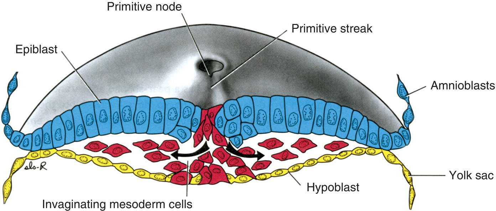

[**Figure 6.1**](#R_c6-fig-0001) Formation of three cell layers. Cross section through the cranial region of the streak at 15 days showing invagination of epiblast cells. The first cells to move inward displace the hypoblast to create the definitive endoderm. Once definitive endoderm is established, inwardly moving epiblast forms mesoderm.

(Source: Sadler \[22\]. Reproduced with permission of Wolters Kluwer.

* * *

### KEY POINTS: CARDIOGENIC FIELDS

-   Myocardial cells are derived from the bilateral cardiogenic or heart fields in the splanchnic layer of the lateral plate mesoderm.
-   The heart fields merge to create a cardiac crescent, giving rise to two lineages of cells referred to as the first and second heart fields.
-   Cells that contribute to cardiac development originate from the heart field mesoderm, cardiac neural crest, and the proepicardium.

* * *

### Formation of the heart tube

The primitive linear heart tube is formed during the fourth week of development from the FHF cells with the folding of the embryo. Contrary to originally held beliefs, the cardiogenic fields do not fuse cranially to caudally in a zipper‐like fashion. Folding of the embryo and invagination of the foregut brings the lateral portions of the cardiac crescent together that then fuse at the midline from anterior (cranial) to posterior (caudal) to form the ventral part of the heart tube \[20, 26\] ([Figure 6.2](#c6-fig-0002) and [Figure 6.3](#c6-fig-0003)C–G). The medial portions of the cardiac crescent will form the dorsal part of the heart tube, which is open to the ventral foregut endoderm and is suspended from the foregut by the dorsal mesocardium. The myocardium of the heart tube is called primitive or primary because, unlike adult working myocytes, the myocytes of the heart tube have few contractile elements, a poorly developed sarcoplasmic reticulum, a low density of gap junctions, and high automaticity \[12\]. The heart tube has two caudolateral inlets (venous pole) and one craniomedial outlet (arterial pole) \[26, 31\].

The endocardium is also derived from the splanchnic mesoderm and develops simultaneously with the myocardium in the cardiac crescent. Adjacent endodermal cells release promoters and antagonists of bone morphogenic protein (BMP), fibroblast growth factor (FGF), and wingless‐type (WNT) families of growth factors for differentiation of the cardiac crescent cells into cardiomyocytes (29). T‐box transcription factors are key regulators of the fate of cardiomyocytes. _Tbx5_ and Tbx20 are activators of the chamber program of gene expression. Antagonists of working myocardium gene expression, TBX2 and TBX3, allow the inflow tract, AV canal, and outflow tract myocardium to develop. Tbx1 is expressed in outflow tract precursors and Tbx18 at the venous pole \[26\]. There are direct correlations between this specific programming and the variants that alter protein function and lead to CHD in humans. Pathogenic germline variants, for example in _TBX1_, have been reported in tetralogy of Fallot \[32\]. A distinct population of mesodermal cells in each heart field undergoes _de novo_ vasculogenesis into two hollow endocardial tubes that join to form a single tube, which becomes enveloped by the cardiomyocytes. The endocardium becomes contiguous with the endothelium of the developing vasculature.

The cardiac jelly, a thick acellular matrix secreted by the myocardium, lies between the myocardium and endocardium. The initial heart tube is therefore a tubular structure with an inner endocardial layer, a middle layer of cardiac jelly, and an outer myocardial layer.

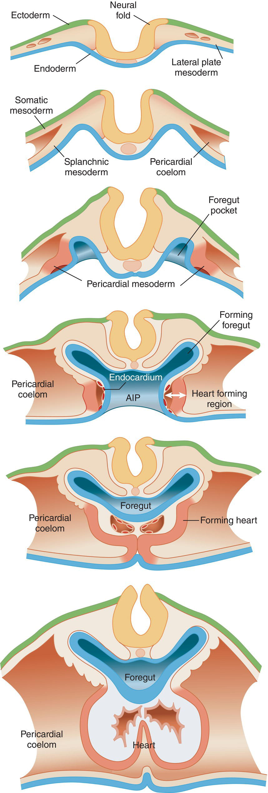

[**Figure 6.2**](#R_c6-fig-0002) Diagrammatic representation of the formation of the heart, foregut pocket, and coelom in the chick embryo. AIP, anterior intestinal portal.

(Source: Kirby \[23\]. Reproduced with permission of Oxford University Press.)

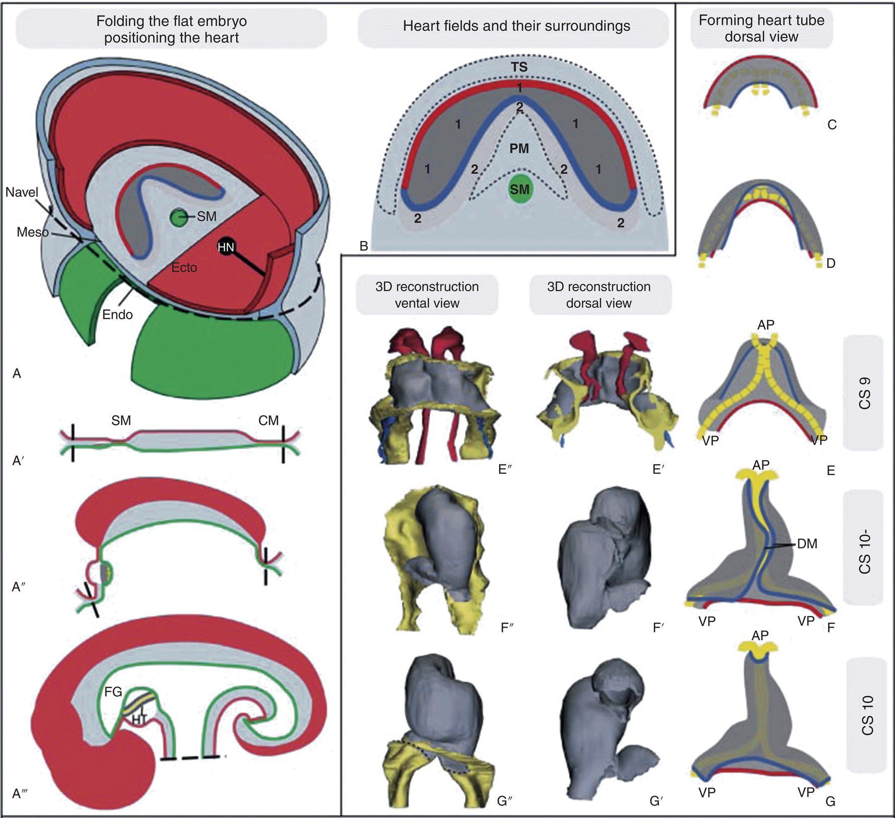

[**Figure 6.3**](#R_c6-fig-0003) Folding of the embryo and formation of the heart tube. (A) The embryo starts as a flat disc containing the three germ layers, the ectoderm (Ecto), mesoderm (Meso), and endoderm (Endo). (A–A‴) With the ongoing folding of the embryo, the embryonic gut that runs from the stomatopharyngeal membrane (SM) to the cloacal membrane (CM) is formed. The heart (HT) becomes positioned ventrally to the foregut (FG), caudally to the head, and cranially to the umbilical cord and transverse septum (TS). HN, Hensen’s node or primitive node. (B) Division of the heart‐forming field into the first heart field (1), which will give rise to the linear heart tube and the second heart field (2), which will remain in continuity with the first heart field during subsequent development and from which cardiomyocytes are added to the developing heart. In reality, the strict borders drawn here are gradual. PM, pharyngeal mesoderm. (C–G) Formation of the heart tube from a flat horseshoe‐shaped cardiac crescent to a tube. Folding of the embryo brings the lateral portions of the cardiac crescent (red line) together to form the ventral part of the heart tube, while the medial portions of the cardiac crescent (blue line) will form the dorsal part of the heart tube, which is suspended from the foregut by the dorsal mesocardium (DM). After the DM closes and the suspension from the foregut is lost, cells of the second heart field can only be added to the heart via the arterial and venous poles (AP and VP, respectively). CS, Carnegie stage (noted along right side of figure).

(Source: Sylva et al. \[26\]. Reproduced with permission of John Wiley & Sons.)

The schematic drawings in older embryology textbooks illustrating the presence of all the cardiac segments in the straight heart tube prior to looping are hypothetical constructions, as most of the segments are added to the primitive heart tube during the looping stages \[33\].

The primitive atria and ventricles begin to contract around day 22 as the heart tube loops to the right, with circulation through the embryo beginning around day 26. Flow in the valveless heart tube is unidirectional, and because the highest automaticity is found at the venous pole, traveling mechanical waves sweep blood from the venous to the arterial pole \[34\].

#### Abnormalities of heart tube formation

Clearly, failure of the heart tube to develop (_acardia_) leads to fetal demise, and as shown in the zebrafish, failure of the bilateral heart fields to fuse results in _cardia bifida_ (two separate hearts in lateral positions) \[35\].

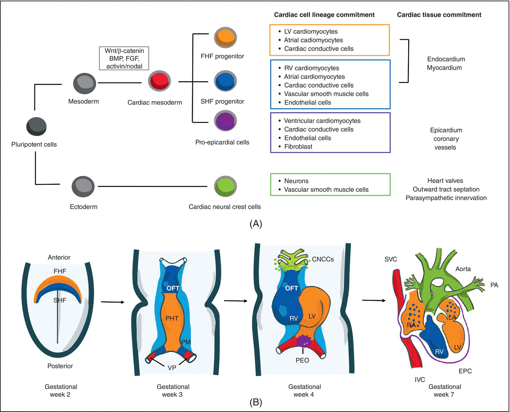

[**Figure 6.4**](#R_c6-fig-0004) Early cardiac development. (A) Cardiac cell lineage and specification during development demonstrate the commitment of pluripotent cells toward mature cardiac cell types within the heart development. (B) Schematic of cardiac morphogenesis in humans. At the second week of gestation, the cardiogenic mesodermal cells migrate toward the anterior side of the embryo to form the FHF or cardiac crescent and SHF that are specified to form specific segments of the PHT, which is patterned along the anteroposterior axis to form the various regions and chambers of the looped and mature heart during weeks 3 and 4. The FHF gives rise to the beating PHT and will eventually give rise to the LV and parts of the right and left atria (RA and LA, respectively). The SHF, located behind the PHT and within the pharyngeal mesoderm by gestational week 3, will contribute to the formation of the RV, parts of the atria and outflow tract, and later to the base of the aorta and pulmonary artery. At gestational week 3, the cells at the venous pole contribute to the formation of the superior and inferior vena cavas (IVC, respectively). By gestational week 4, the cardiac neural crest cells migrate in from the dorsal neural tube, forming smooth muscle cells within the aortic and pulmonary arteries. In addition, the proepicardial organ formed by the proepicardial progenitor cell clusters later contributes to the formation of the epicardium. The four chambers form by the end of week 7. Wnt, Wingles integrated; FGF, fibroblast growth factor; BMP, bone morphogenetic proteins; FHF, first heart field; SHF, second heart field; OFT, outflow tract; PHT, primary heart tube; PM, pharyngeal mesoderm; VP, venous pole; CNCCs, cardiac neural crest cells; LV, left ventricle; RV, right ventricle; PEO, proepicardial organ; SVC, superior vena cava; IVC, inferior vena cava; EPC, epicardium; and PA, pulmonary artery.

(Source: Tan \[27\] / S. Karger AG / CC BY 4.0)

* * *

### KEY POINTS: FORMATION OF THE HEART TUBE

-   The primitive heart tube forms during the fourth week of development.
-   Contractile activity initiates around day 22 and circulation through the embryo begins around day 26 of development.
-   Failure of the heart tube to develop results in fetal demise.

* * *

### Cardiac looping

Looping is a crucial process in cardiac morphogenesis that brings the tubular configuration of the primitive circulation into the correct conformation for chamber specification, septation, and the creation of systemic and pulmonary pathways \[33, 36\]. The heart is the first organ not only to function but also to develop a bilateral asymmetric form. Cardiac asymmetry is attained during the process of looping.

At first, the heart tube is straight in the ventral midline with paired venous limbs at its caudal end and a single arterial outlet connected to the aortic sac and pharyngeal arch arteries at its cranial end ([Figure 6.5](#c6-fig-0005)) \[37, 38\]. Looping begins with ventral bending (from dorsal to ventral) and the loss of the dorsal mesocardium, which suspends the heart tube from the foregut (ventral pharynx); these changes transform the straight tube into a curved tube ([Figure 6.6](#c6-fig-0006)). This is followed by a rotation around the craniocaudal axis to the right (_dextro_‐ or _D‐looping_), bringing the left side of the tube to a ventral (front) position, which is seen as a C‐shaped loop with the convexity to the right in a ventral, two‐dimensional view \[33\]. At this stage, the junction of the inflow and outflow limbs is at the deepest convexity. Externally, the junction corresponds to the bulboventricular groove, and internally it corresponds to the bulboventricular fold \[39\]. Subsequent looping produces a ventral, two‐dimensional, S‐shaped loop ([Figure 6.7](#c6-fig-0007)). The heart tube lengthens as cells are added in a continuous stream to the venous (inflow) and arterial (outflow) poles by the addition of myocardium (cardiomyocytes) and endocardium from the SHF in the adjacent pharyngeal mesoderm. The poles are the only entryway for new cells from the SHF \[40\]. The ventricular bend then shifts caudally from its cranial position above the atria, and the inflow region shifts cranially, thereby resulting in the convergence of the inflow and outflow poles. After looping, there is rotation (untwisting) of the outflow tract, which results in a leftward shift of the outflow tract. The complex process of cardiac looping is shown in schematic form in [Figure 6.8](#c6-fig-0008). _Wedging_ is the process in which the aorta will come to nestle between the mitral and tricuspid valves and behind the pulmonary trunk ([Figure 6.9](#c6-fig-0009)) \[36\]. When looping is complete, the named segments of the heart (which are extremely variable between authors) are the sinus venosus, common atrium, AV canal, presumptive left ventricle, presumptive right ventricle, conus arteriosus, and truncus arteriosus (frequently referred to as the conotruncus) \[41\].

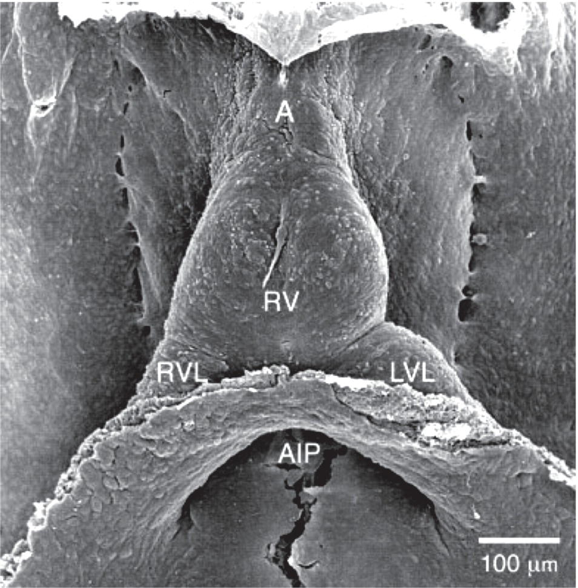

[**Figure 6.5**](#R_c6-fig-0005) Straight heart tube. Scanning electron micrograph of a chick embryo (HH‐stage 9), viewed from the front, showing the “straight heart tube” with paired venous limbs at its caudal end and an arterial outlet at its cranial end, which is connected to the aortic sac. A, arterial outlet; AIP, anterior intestinal portal; LVL, left venous limb; RV, primordium of the trabeculated portion of the morphologic right ventricle; RVL, right venous limb.

(Source: Männer \[33\]. Reproduced with permission of John Wiley & Sons.)

#### Abnormalities of cardiac looping

Cardiac looping is associated with the breaking of the initial bilateral symmetry of the embryo and the establishment of the left‐right axis \[36, 37\]. The left‐right axis is established during gastrulation by nodal cilia at the anterior border of the primitive streak. The cilia sweep from right to left, resulting in a leftward flow of extracellular fluid which concentrates a putative secreted factor on the left side of the embryo. Binding of this factor to its receptors triggers asymmetrical gene expression at the node and expression of _Nodal_ (a member of the TGFβ family), _Southpaw and Lefty2_ \[25, 42\]. The left‐sided expression of Nodal is crucial in establishing the left‐right axis. Animal models with absent Lefty1 demonstrate thoracic left isomerism and bilateral expression of Nodal, Lefty2, and Pitx2c, implying that Lefty1 restricts expression of Nodal and Lefty2 on the left side and the Nodal and/or Lefty2 signal development \[32\]. Pitx2c (a member of the homeobox gene transcription factor family) is a key regulator of cardiac left‐right patterning that acts downstream of Nodal. PITX2c expression on the left side persists long after Nodal expression \[26\]. Left ventricle chamber identity is associated with HAND1 expression and right ventricular chamber identity with HAND2 expression \[43\].

Left‐right signaling pathways determine not only the direction of looping and the topology of the future ventricular chambers but also the proper development of the atria, the arterial and venous poles, and the systemic vasculature. Abnormalities in left‐right patterning increase the incidence of cardiac malformations in both D‐ and L‐loop hearts; typical examples include mirror imagery, atrial isomerism, discordant connections, and heterotaxy \[44\]. The left‐right signaling cascade is hierarchical because abnormalities high in the cascade result in randomization of situs, whereas abnormalities lower down, which are associated with tissue‐specific signaling, produce discordant connections \[26\].

Normal cardiac looping to the right, referred to as _dextro‐looping_ or _D‐looping_, positions the right ventricle towards the right side and leaves the heart lying predominantly in the left hemithorax with a leftward apex (_levocardia_) ([Figure 6.10](#c6-fig-0010), left panel). _Situs solitus_ refers to normal looping with the liver, stomach, and spleen in their normal positions. Rotation around the craniocaudal axis to the left results in a _levo‐loop_ (_L‐loop_) heart ([Figure 6.10](#c6-fig-0010), right panel), in this position the right ventricle is positioned toward the left and the left ventricle toward the right. _Congenitally corrected transposition of the great arteries_ (CCTGA) arises when the heart (ventricle) loops to the left but the atria and outflow receive correct left‐right signals, resulting in both AV and ventriculoarterial (VA) discordance. CCTGA can also occur when the heart loops to the right with inversion of the atria and VA discordance. _Situs inversus totalis_ refers to an L‐loop heart with mirror‐image reversal, which means the heart lies predominantly in the right hemithorax with a rightward apex (_dextrocardia_) and there is a mirror‐image reversal of the liver, stomach, and spleen. _Mesocardia_ refers to a midline heart with the apex pointing inferiorly or anteriorly. Mesocardia and dextrocardia can be associated with a normal or abnormal arrangement of cardiac structures. _Atrial isomerism_ refers to a bilaterally symmetrical pattern of the atrial appendages (i.e. bilateral leftness or rightness) and is usually associated with severe complex cardiac malformations. Abnormal PITX2c expression results in both atria developing right atrial appendages, establishing a role of PITX2c in the differentiation of atrial sidedness \[45\]. _Mixed situs_ occurs when some organs, or components thereof, have normal situs and others have situs inversus. This usually results in complex heart defects known as _heterotaxia_ or _heterotaxy_ syndromes (discussed later in the chapter).

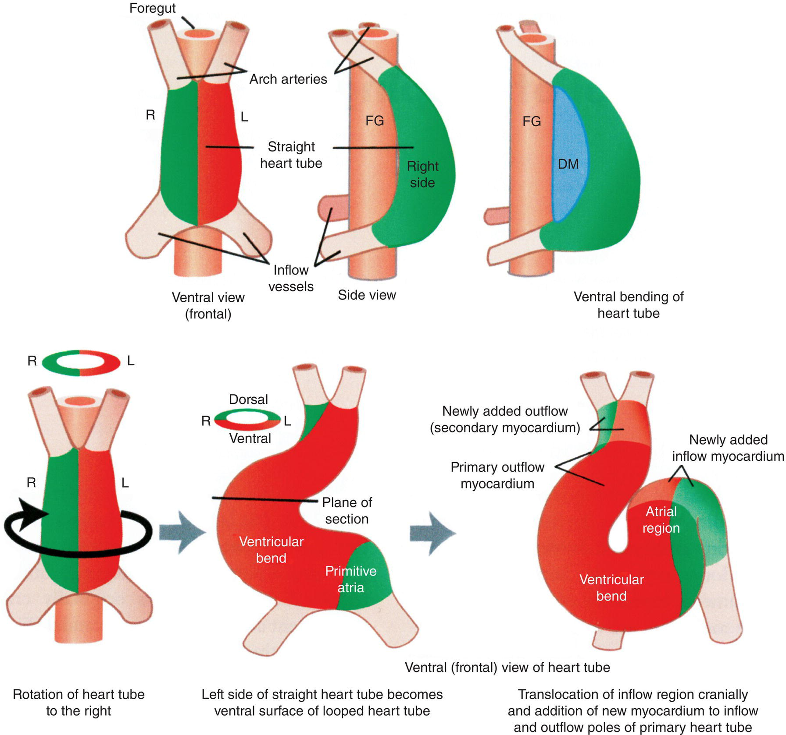

[**Figure 6.6**](#R_c6-fig-0006) Steps in looping of the heart tube. The heart tube forms ventral to the foregut and is open to it at first. Then the heart tube is suspended at its nascent inner curvature from the ventral foregut by the dorsal mesocardium which quickly disappears. Ventral bending occurs first, followed by rotation to the right which brings the left side of the tube to the front and the inner curvature to the left side. Subsequent looping to form the S‐shaped loop involves the addition of cells at the inflow and outflow poles. DM, dorsal mesocardium; FG, foregut.

(Source: Kirby \[23\]. Reproduced with permission of Oxford University Press.)

* * *

### KEY POINTS: CARDIAC LOOPING

-   Cardiac looping represents a crucial process in cardiac morphogenesis that determines the shape of the heart.
-   The process of cardiac looping is complex, resulting in right‐left asymmetry in the embryo.
-   Normal cardiac looping is to the right, referred to as dextro‐ or D‐looping; abnormal looping to the left results in Levo‐ or L‐looping.

* * *

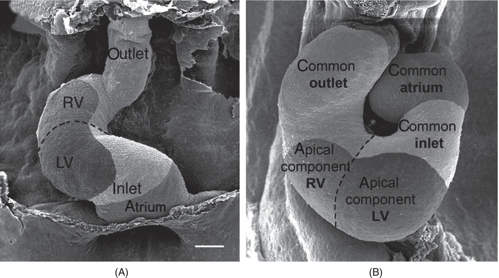

[**Figure 6.7**](#R_c6-fig-0007) Looping morphogenesis. Scanning electron micrographs of embryonic chick hearts, viewed from the front, showing the main positional changes of the developing heart chambers of higher vertebrate embryos during cardiac looping. (A) “C”‐shaped loop at early stages (HH‐stage 12). (B) “S”‐shaped loop at advanced stages (HH‐stage 17/18) of cardiac looping. RV, right ventricle; LV, left ventricle.

(Source: Männer \[37\]. Reproduced with permission of Elsevier.)

### Cardiac septation

Cardiac septation begins after looping of the heart tube. It consists of four contemporaneous processes that occur between 27 and 37 days of development, dividing the heart into four chambers and creating separate systemic and pulmonary circulations \[22\]. Septation is attributable to the muscular septa in the atrial and ventricular chambers, the AV endocardial cushions, the outflow tract endocardial cushions, and the dorsal mesenchymal protrusion. _TBX2/3_ and _BMP2/4_ are important repressors of chamber‐specific genes like _ANF_ to allow for the development of the nonchamber myocardium \[25\]. Indeed, deletion of either _Bmpr1a_ or _Tbx2_ leads to the development of additional myocardial connections \[46, 47\].

#### Atrial septation

Atrial septation takes place in phases to maintain right‐to‐left atrial shunting and involves the septum primum, septum secundum, and AV canal (AVC) septum. The _primary atrial septum_ (septum primum) grows as a muscular crescent from the craniodorsal wall of the atrium on the right of the pulmonary pit toward the AV endocardial cushions ([Figure 6.11](#c6-fig-0011)). The leading edge of the septum primum is covered by a mesenchymal cap produced by the endothelial‐to‐mesenchymal transformation (EMT) of the endocardium covering the septum \[40\]. EMT is a complex biologic process whereby endothelial cells lose their specific phenotype and evolve into cells with a mesenchymal phenotype that includes spindle‐shaped elongated cell morphology, loss of cell‐cell junctions and polarity, and acquisition of functions such as cellular motility, contractility, and invasiveness \[48\]. This mesenchymal cap is continuous with the protrusion of the dorsal mesocardium (dorsal mesenchymal protrusion) and the dorsal (superior) and ventral (inferior) AV endocardial cushions \[26\]. The communication between the leading edge of the septum primum and the AV cushions is known as the _primary atrial foramen_ (ostium primum), which closes when the septum primum becomes contiguous with the fused dorsal and ventral AV endocardial cushions. Communication between the left and right atria is maintained by the detachment of the septum primum from the roof of the atrial cavity to produce a secondary atrial foramen (ostium secundum) \[49\]. The _secondary atrial septum_ (septum secundum) is formed by the folding of the dorsal wall between the primary atrial septum and the left leaflet of the sinoatrial valve. The septum secundum does not fuse with the AV cushions but remains open as the _foramen ovale_. The cranial portion of the septum primum remains as a flap valve, which fuses with the edges of the foramen ovale after birth to form the fossa ovalis \[40\]. The muscular septum between the inferior rim of the fossa ovalis and the AV valves is called the AVC septum.

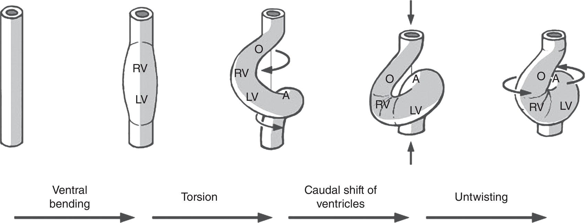

[**Figure 6.8**](#R_c6-fig-0008) Ventricular looping. Schematic drawing (frontal views) of the four components of normal ventricular looping: (1) ventral bending transforms a straight tube into a curved tube whose outer curvature is formed by its ventral wall; (2) torsion around its original cranio‐caudal axis transforms a curved tube into a helically wound loop which appears C‐shaped in frontal views; (3) caudal shift of the ventricular segment; (D) untwisting is characterized by ventral and leftward shift of the proximal outflow tract, ventral shift of the primitive right ventricle, and rightward shift of the atrioventricular canal. A, common atrium; LV, embryonic left ventricle; O, outflow tract; RV, embryonic right ventricle.

(Source: Männer \[33\]. Reproduced with permission of John Wiley & Sons.)

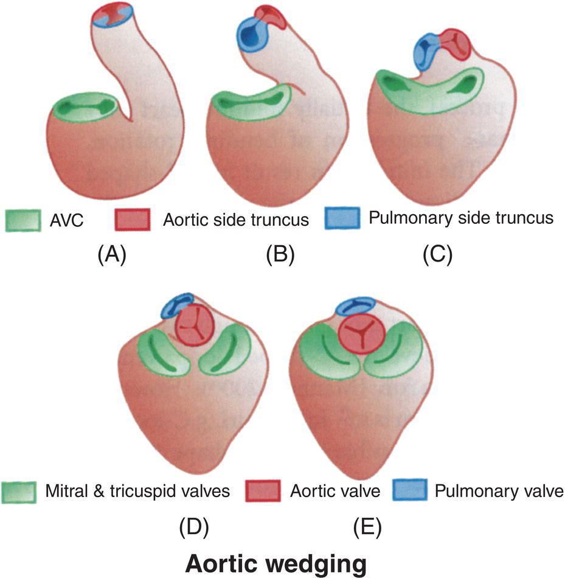

[**Figure 6.9**](#R_c6-fig-0009) Steps in aortic wedging (A–E). The aortic side of the outflow tract nestles between the mitral and tricuspid valves as the outflow myocardium is remodeled. AVC, atrioventricular canal.

(Source: Kirby \[23\]. Reproduced with permission of Oxford University Press.)

Early in development, the _venous pole_ of the heart has two channels (the left and right horns of the sinus venosus), returning blood from the embryo (via the cardinal, vitelline, and umbilical veins) to the sinus venosus and common atrium. During the convergence phase of looping, the common atrium expands to the right and left, forming two lateral pouches that will become the right and left atrial appendages \[33, 50\]. Remodeling results in the sinoatrial junction shifting to the right side of the common atrium. The right horn of the sinus venosus and the sinoatrial junction become incorporated into the dorsal (back) wall of the right atrium ([Figure 6.12](#c6-fig-0012)). The sinoatrial junction has left and right craniocaudally oriented valves (venous valves) that meet cranially to form the septum spurium \[50\]. As the distal portion of the left superior cardinal vein regresses (and thereby absent left superior vena cava), the left horn of the sinus venosus becomes smaller and is incorporated into the developing AV groove to become the coronary sinus. The dorsal (back) wall of the left atrium is also formed by the incorporation of the pulmonary vein and its surrounding myocardium \[39, 50\].

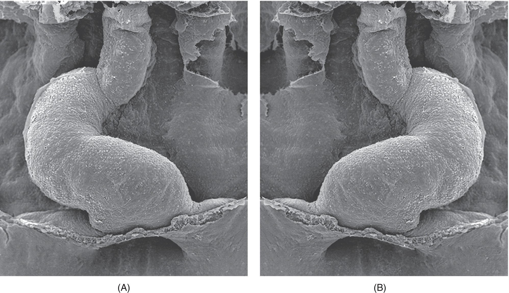

[**Figure 6.10**](#R_c6-fig-0010) Handedness of the cardiac loop. Scanning electron micrographs of embryonic chick hearts, viewed from the front, showing the so‐called D‐loop (dextral‐loop) (A) and L‐loop (levo‐loop) (B) configurations (“C‐shaped” loops; HH‐stage 12).

(Source: Männer \[37\]. Reproduced with permission of Elsevier.)

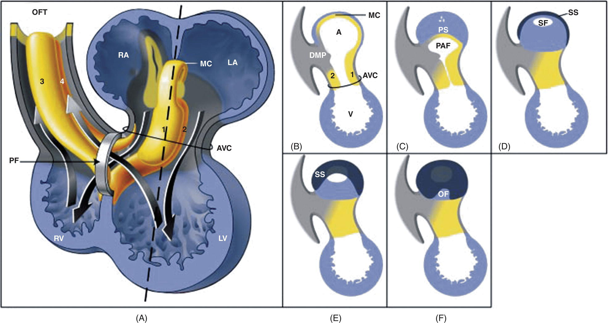

[**Figure 6.11**](#R_c6-fig-0011) Schematic drawing illustrating septation of the atria and primary foramen. (A) Chamber‐forming heart with the atrioventricular canal (AVC) and outflow tract (OFT) cushions and ridges. The two arrows going down through the AVC into the ventricle represent blood flow during diastole. The two arrows pointing toward the OFT represent blood flow during systole. Note that the primary foramen (PF) is the crossroad of the blood running from the right atrium (RA) to the right ventricle (RV), and the blood running from the left ventricle (LV) to the OFT. (B–F) Sagittal sections at the level of the dotted line in (A). (B) The ventral and dorsal endocardial cushions (1 and 2, respectively) are growing toward each other. (C) The primary atrial foramen (PAF, ostium primum) is closing due to ingrowing of the primary atrial septum (PS, septum primum), with its mesenchymal cap (MC), the dorsal mesenchymal protrusion (DMP), and the endocardial cushions. (C, D) In the PS, small holes appear and merge to form the secondary foramen (SF, ostium secundum). (D–F) The secondary septum (SS, septum secundum) grows to the right side of the PS covering the SF and the rest of the PS, and leaving at the right surface of the atrial septum only the oval fossa (OF) uncovered. A, atrium; LA, left atrium; V, ventricle; 3 and 4, septal and parietal outflow tract ridges, respectively.

(Source: Sylva et al. \[26\]. Reproduced with permission of John Wiley & Sons.)

##### _Defects in atrial septation_

The most common cause of an atrial‐level shunt is _a secundum atrial septal defect_ (ASD), which is located within the region of the fossa ovalis. It is usually due to a deficiency of the septum primum but, in rare cases, it can be caused by the deficiency of the septum secundum \[51\].

Failure of the septum primum and septum secundum to fuse completely during infancy results in a _patent foramen ovale_ (PFO). As long as the left atrial pressure exceeds the right atrial pressure and the flap valve is large enough to cover the boundaries of the fossa ovalis, the foramen remains functionally closed (probe patent foramen).

An _ostium primum defect_ results from the failure of the septum primum to fuse with the endocardial cushions. The defect is outside the confines of the fossa ovalis and extends from the inferior limbus of the fossa ovalis to the crest of the interventricular septum. An ostium primum defect is part of the family of AVC defects, also referred to as AV septal and endocardial cushion defects and may occur in isolation or in association with other abnormalities of the AV junction.

A _sinus venosus defect_ occurs in the area derived from the embryologic sinus venosus (posterior aspect of the right atrium) so is not strictly a defect in the atrial septum. It is an interatrial communication caused by a deficiency of the common wall between the superior vena cava (SVC) and the right‐sided pulmonary veins \[52, 53\]. The most common location for this defect is between the right upper pulmonary vein and the cardiac end of the SVC type, although in rare cases the right lower and/or middle pulmonary veins and more caudal atrial wall are involved (inferior vena cava \[IVC\] type) \[51\].

A _coronary sinus defect_ occurs because of unroofing of the normal course of a persistent left anterior cardinal/superior caval vein into the left horn of the sinus venous, i.e. the tissue between the coronary sinus and the left atrium is either partially or completely absent (unroofed) resulting in communication between the right and left atria via the coronary sinus orifice \[53\]. The left‐to‐right shunt causes enlargement of the coronary sinus orifice.

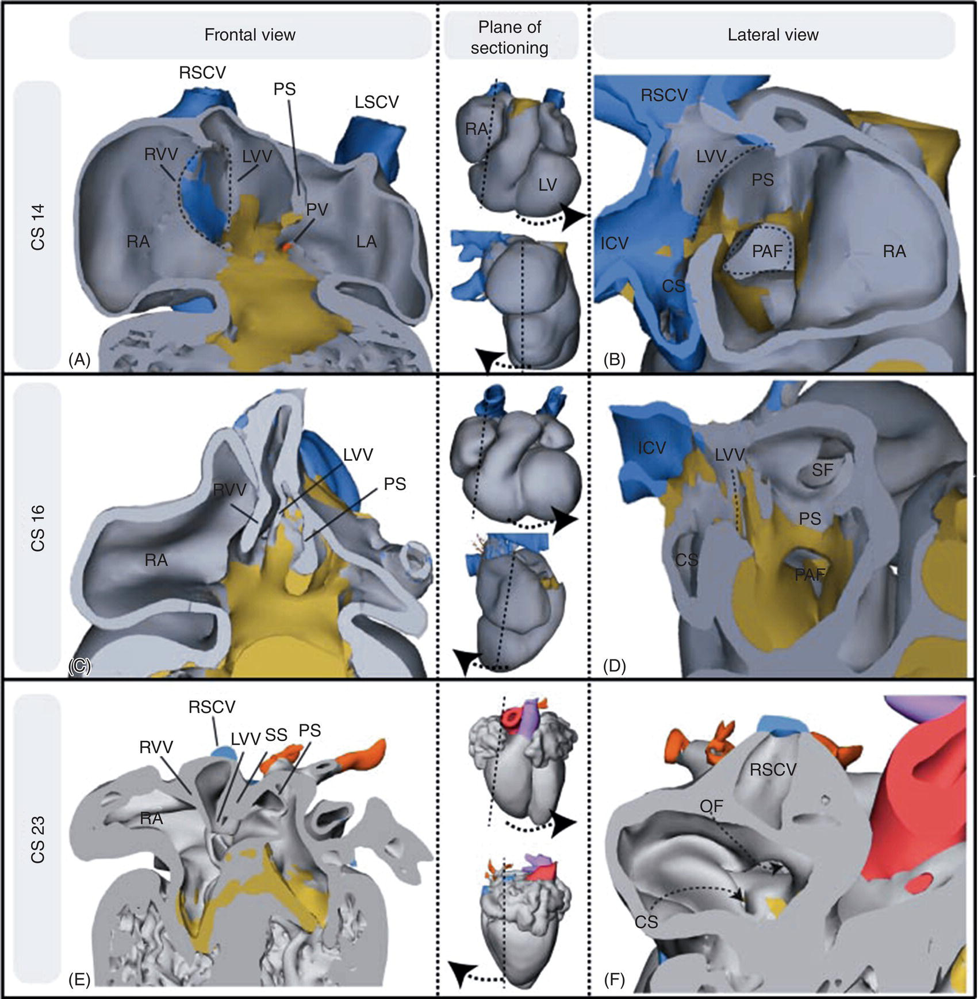

[**Figure 6.12**](#R_c6-fig-0012) Formation of the venous pole. (A–F) Cross‐sections of three‐dimensional (3D) reconstructions of human hearts (gray, myocardium; blue, systemic veins; orange, pulmonary veins; yellow, cardiac mesenchyme). (A, B) Developing right and left atrium (RA, LA); the RA is connected to both the right superior (RSCV) and inferior caval vein (ICV) as well as the left superior caval vein (LSCV), via the coronary sinus (CS). At this stage, the entire systemic venous pole is connected to the right atrium through one orifice, flanked by the left and right venous valves (LVV and RVV). The primary septum (PS) is growing to the right of the opening of the pulmonary vein (PV). (C, D) The RSCV and CS are still connected to the atrium via a single orifice, which has now been muscularized. The secondary foramen (SF) appears in the primary septum. (E, F) All veins connect separately to the atrium via myocardialized orifices. The primary atrial foramen (PAF) is closed, and the secondary septum (SS) is growing between the PS and the LVV, which is already partially fused to the secondary septum. The RVV can now be separated into a part that flanks the CS and a part that flanks the RSCV, the future Thebesian and Eustachian valves, respectively. OF, oval foramen; CS, Carnegie stage (noted on the left margin of figures).

(Source: Sylva et al. \[26\]. Reproduced with permission of John Wiley & Sons.)

A _common atrium_ is caused by the absence of the septum primum, septum secundum, and atrial portion of the AVC septum and is usually associated with the heterotaxy syndrome \[51\].

#### Ventricular septation

After looping of the heart tube occurs, differentiation and re‐initiation of cell division by the primary myocardium of the outer curvature cause the ventricles to expand caudally in a pouch‐like fashion on either side of the bulboventricular groove ([Figure 6.13](#c6-fig-0013)). De Boer and colleagues \[54\] have shown that growth of the trabeculae occurs by cellular proliferation at the bases, causing the ventricles to expand or “balloon outward” (ballooning model of chamber formation). The disappearance of the cardiac jelly results in the formation of trabeculations on the luminal side, producing a spongy‐type myocardium. Compact myocardium forms later when epicardially derived fibroblasts infiltrate the epicardial side, at which time proliferation in the trabeculations ceases.

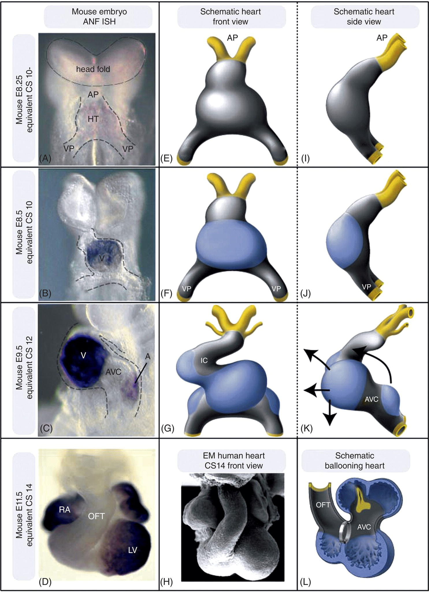

[**Figure 6.13**](#R_c6-fig-0013) Formation of the cardiac chambers. (A–D) Developmental series of mouse embryos. Whole‐mount RNA _in situ_ hybridization for the embryonic chamber marker atrial natriuretic factor (ANF) is used as a marker for differentiation into chamber myocardium. (E–G) and (I–L) Schematic drawings of these chamber‐forming hearts. Gray, primary myocardium; blue, chamber‐forming myocardium; arrows in K indicate the expansion of the chambers eventually leading to the adult configuration, with the ventricles positioned ventro‐caudally to the atria. (H) Electron micrograph of a CS14 human heart, demonstrating the similarity with the mouse E11.5 heart and the schematic shown in (L). For didactic purposes, in the schematic in (L), the outflow tract is hinged toward the right side, _in vivo_ it is positioned ventrally to the heart, as depicted in (D) and (H). (A, E, I) The heart tube (HT) consists solely of the primary myocardium from the venous (VP) to the arterial pole (AP). (B, F, J) The first chamber to start ballooning is the embryonic ventricle (V) at the outer curvature of the heart. (C, G, K) The heart tube has started to loop and acquire an S shape. An embryonic left and right ventricle are now visible. The atria (A) also start to balloon towards the left and right side. The myocardium of the outflow tract (OFT), inner curvature (IC), and atrioventricular canal (AVC) remain as the primary myocardium. RA, right atrium; LV, left ventricle; CS, equivalent Carnegie stage noted in the left margin of figures.

(Source: Sylva et al. \[26\]. Reproduced with permission of John Wiley & Sons.)

The _muscular_ portion of the interventricular septum is formed by apposition and merger of the medial walls of the expanding ventricles, with cells added mainly from the adjacent left ventricular free wall \[22\]. The septum represents the least changed part of the lumen of the embryonic heart and the superior portion expresses a transcriptional repressor, TBX3 \[55\]. It is initially crescent‐shaped, extending from the ventral (inferior) AV cushion posteriorly to the dorsal (superior) AV cushion anteriorly. The space between the free rim of the muscular septum and the fused AV cushions is the _primary interventricular foramen_. Although the primary interventricular foramen allows for communication between the primitive left and right ventricles, initially blood from the primitive atrium can only reach the primitive right ventricle via the interventricular foramen ([Figure 6.11](#c6-fig-0011)). It is only after the AV junction develops that the right atrium will communicate directly with the right ventricle. Closure of the interventricular foramen occurs by fusion of three tissue components: the dorsal (superior) and ventral (inferior) AV endocardial cushions, the muscular interventricular septum, and the endocardial cushions of the outflow tract (conal cushions). The septal conal cushion extends deep into the future right ventricle to merge with the dorsal AV cushion and the rightmost edge of the developing muscular septum \[56\]. The site where these three structures fuse constitutes the _membranous_ part of the ventricular septum. The ventricular septum is fully closed at an estimated gestational age of 9 1/7 weeks \[57\].

##### _Defects in ventricular septation_

A ventricular septal defect (VSD) is an opening or hole in the interventricular septum \[58\]. It may be found in isolation or may co‐exist with other congenital cardiovascular anomalies. Because the ventricular septum is composed of three components (muscular, AVC endocardial cushions, and outflow tract \[conal\] cushions), defects at the ventricular level may result from a deficiency of one or more of these structures and/or from their malalignment. The classification of VSDs can be confusing because of different nomenclatures used by various authors \[59\].

The most common VSDs are those that occur in the _muscular_ portion of the interventricular septum \[2\]. This type of VSD is surrounded by a rim made completely of muscle. They are often multiple and may be located anywhere in the muscular septum (apical, anterior, mid, or posterior).

The _membranous septum_ is a small, translucent structure. It is adjacent to the anteroseptal commissure of the tricuspid valve when viewed from the right side and is located below the non‐coronary leaflet of the aortic valve when viewed from the left. Small defects may spontaneously close after birth due to the presence of the surrounding fibrous tissue (also referred to as aneurysmal tissue). Defects that extend beyond the boundaries of the membranous septum are called _para‐_ or _perimembranous_ defects. Membranous VSDs are closely associated with the bundle of His, increasing the risk of causing conduction disturbances and complete heart block during the repair.

A _conoventricular_ or _subaortic defect_ is situated between the conal and muscular portions of the ventricular septum and is also close to the bundle of His. This defect is often related to malalignment of the muscular and conal portions of the ventricular septum.

A _subpulmonary_, _conal_, _supracristal_, or _doubly committed subarterial_ defect is located in the outflow tract (conal septum) just below the pulmonary valve. Fibrous continuity between the aortic and pulmonary valves is frequently present. The aortic valve (right cusp or non‐coronary cusp) may prolapse into the defect, which may result in aortic regurgitation.

An _inlet_ or _AVC‐type VSD_ occurs when the inferior endocardial cushion does not fuse with the muscular component of the ventricular septum. The defect is located in the _inlet_ portion of the right ventricle beneath the tricuspid valve and may be perimembranous or muscular \[59\]. The origin of the AV node and the course of the AV bundle (His) differ with respect to the normal heart, increasing the risk of injury during surgical repair.

A _common_ or _single ventricle_, defined as the presence of two AV valves with one ventricular chamber or a large dominant ventricle with a diminutive or hypoplastic opposing ventricle may result from various mechanisms. The pathology may be due to the arrest of or a defect in interventricular septation or from poor alignment of the common AV valve with the ventricles \[60\]. A wide spectrum of functional single ventricles is recognized. These ventricles include double‐inlet single ventricle (usually left), defects resulting from atresia or absence of either the right or left AV valves, such as tricuspid atresia, mitral atresia (part of hypoplastic left heart syndrome \[HLHS\]), those with an atretic semilunar valve (HLHS, pulmonary atresia with intact ventricular septum), unbalanced common AVC defects, and some forms of double‐outlet right ventricle.

#### Atrioventricular canal septation and AV valve development

The cardiac jelly at the AV junction (and outflow tract) forms into mounds by the myocardial synthesis of the extracellular matrix. The endocardial cushions arise from the cells of the endocardium overlying these swellings that invade the cardiac jelly and undergo EMT into fibroblast‐like mesenchymal cells \[61, 62\]. AV canal and outflow tract myocardium produce BMPs that signal through the cardiac jelly to the endocardium. As a result, TGF‐beta and Notch signals regulate the EMT of the cushions \[63\]. Prior to valve formation, the endocardial cushions and underlying myocardium prevent the backflow of blood. Four cushions develop in the AVC: the inferior (ventral) and superior (dorsal) cushions located centrally and two smaller cushions on the lateral walls (left and right). Central fusion of the inferior and superior cushions forms the AV septum, thereby separating the AVC into the left (mitral) and right (tricuspid) orifices \[64\]. The _atrial portion of the AV septum_ extends from the level of the valve annuli to fuse with the primary atrial septum, whereas the _ventricular portion of the AV septum_ extends from the level of the valve annuli to form the inlet portion of the interventricular septum. The AVC expands to the right, as does the right ventricle, to allow for direct communication between the presumptive right atrium and the presumptive right ventricle ([Figure 6.11](#c6-fig-0011)).

The septal leaflet of the tricuspid valve and the anterior leaflet of the mitral valve are derived from the fused inferior and superior endocardial cushions, whereas the mural leaflets are derived from the lateral cushions \[65\]. Mature AV valves and the subvalvular apparatus are formed by cavitation and remodeling of the cushions and excavation of the underlying ventricular myocardium to form leaflets and chordae tendinae ([Figure 6.14](#c6-fig-0014)) \[65, 66\]. Late in development, the primitive leaflets undergo lengthening and delamination with the disappearance of the myocardial layer.

After the endocardial cushions have fused, the fibroblast‐like cells of the cushions are replaced by myocardial cells in a process called myocardialization. Fusion of the nonmyocardial mesenchymal cushions and myocardialization create part of the atrial septum, ventricular septum, and conal septum, as well as the substrate for the crux of the heart.

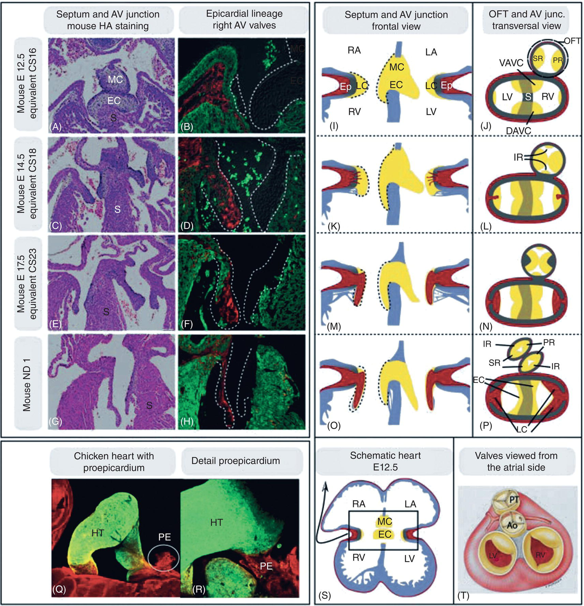

[**Figure 6.14**](#R_c6-fig-0014) Development of the atrioventricular (AV) and outflow tract (OFT) valves and their contributing tissues. (A–H) Sections through mouse hearts in a plane comparable to the schematic heart in panel (S). (B, D, F, H) The lineage contributions of the epicardium is displayed at different developmental stages. The epicardial lineage marker WT1 was used; epicardial lineage is depicted in red, myocardium in green. (I–P) Schematic drawings of valve development in both the atrioventricular canal and outflow tract. Red, epicardium (Ep); gray, primary myocardium; and yellow, endocardial cushion tissue (EC). Note that in the outflow tract the cells are primarily neural crest‐derived and not endocardial‐derived as in the AV canal. (P) The contribution of the different cushions and ridges to the eventual valves (panel T) is depicted. (Q, R) Display the proepicardium (PE) in a 3‐day‐old chick embryo. The PE is attached to the heart tube (HT) and spreads out to form the epicardium. Ao, aorta; DAVC, dorsal AV cushion; IR, intercalated ridge; LA, left atrium; LC, lateral cushion; LV, left ventricle; MC, mesenchymal cap; PR, parietal ridge; PT, pulmonary trunk; RA, right atrium; RV, right ventricle; S, septum; SR, septal ridge; VAVC, ventral AV cushion. Equivalent Carnegie stage (CS) is noted in the left margin of the figures.

(Source: Sylva et al. \[26\]. Reproduced with permission of John Wiley & Sons.)

##### _Defects of the AVC_

The endocardial cushions of the AVC contribute to the formation of the atrial septum, the ventricular septum, and the mitral and tricuspid valves. They form between the atrium and ventricle in a vascular endothelial growth factor‐dependent manner. Variants in vascular endothelial growth factor (VEGF) are implicated as a modifier gene in valvuloseptal CHD \[67\]. Endocardial cushion‐derived structures can have varying degrees of abnormalities producing a spectrum of lesions called endocardial cushion defects (as previously noted, they are also referred to as AVC or AV septal defects). Failure (incomplete or complete) of the endocardial cushions to fuse creates a defect in the AV septum.

A _partial (incomplete)_ AVC defect results from incomplete fusion of the superior endocardial cushion with the septum primum and consists of an _ostium primum ASD_ with distinct left and right valve annuli, and frequently there is a mitral valve cleft with varying degrees of regurgitation \[68\]. A _transitional_ AVC defect is typically an ostium primum defect with a very small to moderate (restrictive) inlet VSD, which is often occluded by AV valve tissue. Although there are two separate orifices, the valves are abnormal \[68\]. Lack of fusion of the superior and inferior endocardial cushions leads to a _complete AVC (CAVC)_ defect comprising an ostium primum ASD, a non‐restrictive VSD just below the AV valve (inlet VSD), and a common AV valve annulus that bridges both the left and right sides of the heart, i.e. the valve leaflets are shared between the left and right ventricles and are not adherent to the crest of the ventricular septum. In the normal heart, the septal leaflet of the tricuspid valve inserts lower (more apical) than the anterior leaflet of the mitral valve and the AV septum is that portion between the hinge points of the tricuspid and mitral valves. With AVC defects, the mitral valve (left AV valve) insertion is at the same level as the tricuspid valve (right AV valve). This displacement of the common hinge plane of the mitral valve towards the apex reduces the inlet‐to‐apex distance and increases the apex‐to‐outlet ventricular dimension, resulting in a “gooseneck” deformity of the left ventricular outflow tract with the potential to cause left ventricular outflow tract obstruction \[69\]. A _balanced_ CAVC defect has appropriately sized left and right ventricles and the common AV valve is distributed equally over the ventricular masses. In an _unbalanced_ CAVC _defect_, one ventricle is hypoplastic with the other ventricle receiving most of the AV valve tissue and ventricular blood flow because of _straddling_ (insertion of chordae in the opposite ventricle) or _override_ (insertion of chordae to the crest of the septum or the appropriate ventricle). AVC defects may be isolated or may appear as one element of a more complex lesion or syndrome. Approximately 40% of patients with trisomy 21 (Down syndrome) have AVC defects \[66\].

_Ebstein anomaly_ is the most important cause of congenital tricuspid regurgitation and is thought to be due to abnormal delamination of the inlet zone of the right ventricle \[70\]. The septal and posterior leaflets do not attach to the annulus but are displaced downward toward the right ventricular apex. The portion of the right ventricle that extends from the true tricuspid annuls to the level where the septal and posterior leaflets attach is thin due to partial absence of myocardium and is termed the “atrialized” portion, whereas the trabecular and outlet portions make up the functional right ventricle. The anterior leaflet is large (“sail‐like”) and dysplastic and can obstruct the right ventricular outflow tract. Ebstein anomaly can be associated with abnormalities in left ventricular morphology, such as ventricular non‐compaction and increased fibrosis of the wall and septum. Most patients with this anomaly have a PFO, and approximately 50% have an ASD \[71\]. Downward displacement of the leaflets is associated with discontinuity of the central fibrous body, thus producing a substrate for accessory AV connections and ventricular pre‐excitation \[70\].

_Tricuspid atresia_ is characterized by agenesis of the tricuspid valve and right ventricular hypoplasia. The region normally occupied by the tricuspid valve may be replaced by an atretic membrane, muscular tissue, or fibrofatty tissue, and an ASD is necessary for survival. With normally related great arteries, blood passes to the lungs through a VSD into a small right ventricle and pulmonary artery, whereas with transposition of the great arteries, blood reaches the lungs directly from the left ventricle. Isolated _tricuspid stenosis_ is exceedingly rare.

_Mitral valve stenosis_ is most commonly associated with other left‐sided obstructive lesions, HLHS being at the most severe end of the spectrum and coarctation of the aorta, aortic arch hypoplasia, and subvalvular or valvular aortic stenosis in Shone’s complex occurring with varying severity \[72\]. _Congenital mitral regurgitation_ is more common than mitral stenosis and is usually associated with AVC defects.

#### Outflow tract septation and semilunar valve development

Cardiac neural crest cells are a subpopulation of the cranial neural crest and are crucial for normal cardiovascular development \[29\]. Cardiac neural crest cells contribute to the formation and remodeling of the aortic (pharyngeal) arch arteries, outflow tract septation, semilunar valvulogenesis, cap of the interventricular septum, parasympathetic innervation of the heart (neurons and supporting cells of cardiac ganglia), and cardiac conduction system \[73, 74\].

The outflow tract connects the primitive ventricle to the aortic arch arteries and is traditionally divided into three sections: the conus (proximal), the truncus (middle), and the aortic sac (distal) \[75\]. Septation of the outflow tract begins with the formation of a shelf of mesenchyme in the dorsal wall of the aortic sac in the area between the fourth and sixth pairs of aortic arch arteries \[76\]. This shelf, called the aorticopulmonary septum, elongates toward the truncus, thereby dividing the lumen of the aortic sac into the future intrapericardial portions of the aorta and pulmonary trunk. Cardiac neural crest cells delaminate from the cranial portion of the neural tube and migrate into pharyngeal arches 3, 4, and 6, and a subset of these cells migrates into the outflow tract ([Figure 6.15](#c6-fig-0015)). The outflow endocardial cushions are ridges of mesenchyme, formed by EMT of the underlying endocardium, that spiral into the outflow tract. Mesenchymal cells from the pharynx, followed by neural crest cells, invade the truncal cushions to form two centrally placed columns, or prongs, in the shape of an upside‐down “U” ([Figure 6.16](#c6-fig-0016)) \[78\]. These prongs will fuse with the aorticopulmonary septum distally and with the conal cushions proximally. Rotation of the developing pulmonary valve (see later in the chapter) is associated with spiraling of the aorticopulmonary septum and prongs, so that the developing aorta will connect with the rightward and cranial component of the aortic sac and the developing pulmonary trunk will connect with the leftward and caudal component of the aortic sac \[79\].

[**Figure 6.15**](#R_c6-fig-0015) Cardiac neural crest. Migration of the cardiac neural crest to the circumpharyngeal ridge, caudal pharyngeal arches (3–6), and outflow tract depicted schematically. S1, S2, S3, S4, somites 1–4. Oto, otic vesicle; Ao, aorta; P, pulmonary artery.

(Source: Kirby \[23\]. Reproduced with permission of Oxford University Press.)

The convergence of the inflow and outflow poles during looping combined with the rotation and wedging processes brings the atria and outflow vessels into concordance with the AV valves and ventricles \[75, 78\]. In the conus, myocardial cells invade the cushions (myocardialization), which then bulge further into the lumen and subsequently meet and fuse in the midline. These conal cushions fuse most proximally with the AV cushion tissue and the crest of the muscular ventricular septum. Muscularization of the central conal cushion tissue and development of the adjacent aortic and pulmonary sinuses produce the _subpulmonary infundibulum_ and a plane of space between the infundibulum and aortic root \[79\].

The developing pulmonary valve is initially posterior to and left of the developing aortic valve. Morphogenetic movement of the pulmonary valve (posterior to anterior, left of the aortic valve) brings it to its final position anterior and lateral to the aortic valve ([Figure 6.9](#c6-fig-0009)) \[80\]. This movement of the pulmonary valve is thought to be caused by the development of the subpulmonary conus (infundibulum), which also causes the pulmonary valve to be in a superior position relative to the aortic valve. Early in development, both the subpulmonary conus and the subaortic conus are situated above the right ventricle. Following torsion and a leftward shift of the outflow tract, resorption and shortening of the subaortic conus cause the aortic valve to sink inferiorly and posteriorly so that it comes to lie directly over the left ventricle and in fibrous continuity with the mitral valve ([Figure 6.9](#c6-fig-0009)) \[81\]. The conversion from the primitive, single in‐series circulation to the double in‐series circulation takes place during the fifth week of development.

Following outflow tract septation, the semilunar valves are formed as the mesenchyme in the outflow cushions is remodeled into the tri‐leaflet aortic and pulmonary valves. Initially, three pairs of ridges, consisting of mesenchymal tissue covered by the endocardium, protrude into the lumen on each side of the divided truncus \[78\]. Valve sinuses are formed by excavation on the arterial (distal) face of the cusps. Thereafter, the leaflets are remodeled by mesenchymal apoptosis, blood flow, and shear stress to produce the delicate fibrous tissue seen in mature valves. Cells from the endocardium are the primary source of semilunar and AV valve fibroblasts, but fibroblasts derived from the epicardium also contribute to valve formation \[76\]. Cardiac neural crest cells are found at the tip of the leaflets and contribute to remodeling and maturation \[74\]. The role of cardiac neural crest in coronary vessel formation remains controversial.

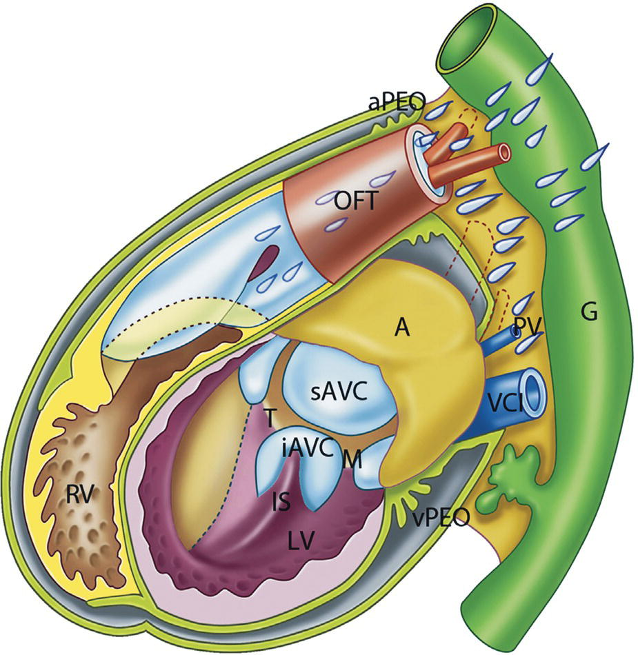

[**Figure 6.16**](#R_c6-fig-0016) Schematic representation of the developing heart. Simplified model of a heart prior to ventricular septation. The roof of the atrium (A, light brown) is closed; therefore, atrial septation is not shown here. The anterior walls of the left ventricle (LV) and right ventricle (RV) are opened to reveal the inside. The interventricular foramen (primary foramen) is present. The inlet septum (IS) is connected to the inferior AV cushion (iAVC). The epicardium (olive green) covers most of the surface of the heart, but the venous proepicardial organ (vPEO; between liver and venous pole) and the arterial PEO (aPEO) surrounding the arterial pole are still present. The second heart field‐derived part of the RV is shown in yellow, the endocardial cushions in light blue, neural crest cells in lavender, and the gut (G), including the liver, in green. AVC, atrioventricular canal; M, mitral ostium; OFT, outflow tract; PV, pulmonary vein; sAVC, superior AV cushion; T, tricuspid ostium; VCI, inferior cardinal vein.

(Source: Gittenberger‐de Groot et al. \[77\]. Reproduced with permission of Elsevier.)

##### Abnormalities of outflow tract septation

The loss or dysfunction of cardiac neural crest cells produces a wide spectrum of conotruncal and aortic arch abnormalities that are associated with syndromes linking defects in the heart with craniofacial and glandular (thyroid, parathyroid, and thymus) defects \[74\]. These include the 22q11 deletion syndromes, such as DiGeorge and velocardiofacial syndromes, CHARGE syndrome, fetal alcohol syndrome, retinoic acid embryopathy, Alagille syndrome, and Noonan and LEOPARD syndromes \[75\]. The association between thymus, thyroid and parathyroid abnormalities in these syndromes is explained by the fact that the neural crest cells contribute to the connective tissue of these three organs. Additionally, abnormalities of the SHF also produce outflow tract defects \[78\].

_Persistent truncus arteriosus_ results from a failure in outflow tract septation (conotruncus and aorticopulmonary septum) combined with a virtual absence of the subpulmonary infundibulum and, thus, a VSD \[69, 82\]. Typically, the aortic and pulmonary valves are fused to form a single semilunar truncal valve. The origin of the pulmonary arteries from the truncal root varies and is dependent on the degree of the septation deficiency \[83\]. Incomplete outflow tract septation results in an _aortopulmonary window_. Aortoventricular tunnels are thought to result from abnormal excavation and maturation of the outflow cushions during the formation of the semilunar valves \[79\]. Unequal septation can result in either the aorta or pulmonary artery being _hypoplastic_ relative to the other.

_Tetralogy of Fallot_ is thought to result from underdevelopment of the subpulmonary infundibulum (conus) \[84\]. The smaller infundibulum causes anterior deviation of the conal septum and malalignment of the conal septum with the muscular ventricular septum, producing right ventricular outflow tract obstruction and a subaortic VSD \[85\]. The pulmonary valve is usually abnormal, and the reduced blood flow contributes, to some degree, to pulmonary artery hypoplasia. Some patients have _tetralogy of Fallot with pulmonary valve atresia (TOF/PA)_ and varying degrees of hypoplasia of the main and branch pulmonary arteries.

Theories that have been proposed to explain TGA include resorption of the subpulmonary conus, causing the pulmonary valve to move inferiorly and posteriorly so that it comes to lie above the left ventricle and in fibrous continuity with the mitral and tricuspid valves \[80\], and failure of the aorticopulmonary septum to spiral \[86\]. Dextro‐ or D‐TGA refers to TGA with normal looping of the heart to the right, whereas L‐TGA refers to looping of the heart to the left. In D‐TGA, there is AV concordance and VA discordance. _Congenitally or physiologically corrected TGA_ is characterized by TGA and AV discordance (i.e. double discordance). In the more frequent form, referred to as L‐transposition, there is levocardia with situs solitus of the atria and L‐looping of the heart. The other form is a mirror image of the above with dextrocardia, inversion of the atria (situs inversus), and D‐looping of the heart \[87\].

Persistence of both the subpulmonary and subaortic coni results in a _double outlet right ventricle_, whereas a deficiency of both results in a _double outlet left ventricle_ (very rare); in either case, there is almost always a VSD.

Fused or absent pulmonary commissures produce _pulmonary valve stenosis_, in which the valve is typically mobile and dome‐shaped with a small and sometimes eccentric orifice \[88\]. _Critical pulmonary stenosis_ is a severe form of pulmonary stenosis in the neonate that is considered a ductal‐dependent lesion because a _patent ductus arteriosus_ (PDA) is essential for pulmonary blood flow.

Obstruction of the left ventricular outflow tract may occur at the valvular, subvalvular, or supravalvular levels. The most common aortic valve anomaly is a _bicuspid aortic valve_ \[2\]. This malformation is also thought to be the most common cardiac defect (occurring in 1–2% of the population). It may be an incidental finding or may result in a clinical presentation in childhood or adult life, and it can occur in isolation or in association with left‐sided obstructive lesions \[89\]. There are several variants, the most frequent being characterized by commissural fusion (most commonly between the coronary cusps), creating a functionally bicuspid structure, and the far less frequent “true” bicuspid valve. _Critical aortic valve stenosis_ in the neonate is a ductal‐dependent lesion in that a PDA is necessary for systemic perfusion. The valve is usually unicommisural or bicommisural and incompletely differentiated with thickened, redundant, and rolled cusps and leaflets consisting of immature loose connective tissue (myxomatous) \[90\]. Dysplastic valves, rather than commissural fusion, obstruct the orifice. Severe aortic stenosis or _aortic atresia_ can be part of a spectrum of left‐sided obstructive lesions associated with hypoplasia of the left ventricle, ascending aorta and/or arch, mitral valve stenosis or atresia, and endocardial fibroelastosis of the left ventricle (i.e. HLHS) \[64\].

_Subvalvular aortic stenosis_ has a number of embryologic etiologies. Malalignment of the conal septum with the muscular interventricular septum results in posterior projection of the conal septum into the left ventricular outflow tract and an associated VSD. This pathology may be seen within the context of an interrupted aortic arch. _Familial hypertrophic cardiomyopathy_ is an autosomal dominant developmental abnormality most commonly due to mutations in the contractile protein (sarcomere) genes, but it may also be due to mutations in non‐sarcomeric genes that are associated with mitochondrial defects, potassium channel abnormalities, and abnormalities of protein kinase A \[91\]. A _discrete fibromuscular ridge_ or _membrane_ below the aortic valve can also cause subaortic stenosis.

_Congenital supravalvular aortic stenosis_ (SVAS) is caused by the deletion of or a loss‐of‐function mutation in the elastin gene on chromosome 7q11.23. In the majority of cases, SVAS occurs in association with Williams–Beuren syndrome, which is frequently referred to as Williams syndrome (WS) \[92, 93\]. In other cases, SVAS is inherited as an autosomal dominant disorder or results from sporadic mutations and occurs without mental retardation, elfin facies, distinctive behavioral traits, and neonatal hypocalcemia associated with WS \[94\]. During the early stages of development, the smooth muscle cells from patients with WS and non‐syndromic SVAS express only about 15 and 50%, respectively, of the normal levels of the elastin‐precursor tropoelastin \[95\]. The resultant arterial media has a reduced elastin content, pathologic alignment of the elastin fibers, an increased collagen content, and an increased number of hypertrophied smooth muscle cells. The entire ascending aorta may be narrowed (aortopathy) in about 30% of patients, and up to 80% of patients will have peripheral pulmonary artery stenosis \[96\].

_Heritability and genetic etiologies of non‐syndromic left‐sided obstructive lesions_ are highly heritable. First‐degree relatives of an individual with a left‐sided obstructive lesion have a 20% chance of having CHD (most often a bicuspid aortic valve) \[97\]. The genetic causes of left‐sided obstructive lesions overlap due to genetic heterogeneity ([Table 6.1](#c6-tbl-0001), [Figure 6.17](#c6-fig-0017)) and help explain the phenotypic variability within families with the same genetic variant \[98–100\].

* * *

### KEY POINTS: CARDIAC SEPTATION

-   Cardiac septation begins after the looping stage with the eventual creation of four chambers and two distinct circulations.
-   The process of cardiac septation involves the muscular septa in the atrial and ventricular chambers, the AV and outflow tract endocardial cushions, and the dorsal mesenchymal protrusion.
-   Abnormalities in this process can result in septation defects at the atrial and/or ventricular levels, altered AV valve development, abnormalities of outflow tract septation, and semilunar valve pathology.

* * *

[**Table 6.1**](#R_c6-tbl-0001) Genes associated with left‐sided obstructive lesions based on CHD type

Source: Parker \[98\]. Reproduced with permission of John Wiley & Sons.

| Associated gene | Aortic valve | Left ventricle :HLHS | Aorta : CoA & IAA |
| --- | --- | --- | --- |
| AS | BAV |
| --- | --- |
| _ELN_ | X | X |  |  |
| _GATA4/GATA6_ |  | X |  |  |
| _ROBO4_ |  | X |  |  |
| _SMAD6_ | X | X |  | X |
| _TAB2_ |  | X |  |  |
| _NKX2‐5_ | X | X | X | X |
| _NOTCH1_ | X | X | X | X |
| _GJA1_ |  |  | X |  |
| _HAND1_ |  |  | X |  |
| _ZIC3_ |  |  | X |  |
| _MCTP2_ |  |  | X | X |
| _MYH6_ | X |  | X | X |
| _NR2F2_ | X |  | X | X |
| _CFC1_ |  |  |  | X |
| _FOXC1_ |  |  |  | X |
| _HEY2_ |  |  |  | X |
| _LEFTY2_ |  |  |  | X |
| _MATR3_ |  |  |  | X |
| _NFATC1_ |  |  |  | X |
| _TBL1Y_ |  |  |  | X |
| _TBX1_ |  |  |  | X |
| _TRPM2_ |  |  |  | X |
| _VEGF_ |  |  |  | X |

AS, aortic stenosis; BAV, bicuspid aortic valve; CoA, coarctation of the aorta; HLHS, hypoplastic left heart syndrome; IAA, interrupted aortic arch.

### Epicardium and coronary artery development

After looping of the linear heart tube, the epicardium covers the heart as well as the intrapericardial portion and roots of the great arteries. The epicardium develops from the proepicardial organ (PEO) comprising medusa‐like villi that arise from the _splanchnic mesoderm of the ventral pharynx_ ([Figure 6.16](#c6-fig-0016)) \[26, 30\]. The venous PEO (vPEO) is derived from mesenchyme near or in the liver and begins as protrusions of splanchnic mesoderm at the venous pole at the back of the pericardial cavity. The vPEO gives rise to the epicardium that will cover the atria, AVC, and ventricles. Likewise, the splanchnic mesoderm of the ventral pharynx at the arterial pole, which is analogous to the vPEO, gives rise to the arterial PEO (aPEO) that will cover the outflow tract with the epicardium. Gittenberger‐de Groot has shown that after the epicardium has invested the myocardium, a subset of cells undergoes EMT and migrates into the subepicardial space \[101\]. These epicardially derived cells (EPDCs) invade the myocardium and differentiate into fibroblasts, vascular (coronary) smooth muscle cells, endothelial cells, hematopoietic cells, fat cells, and pericytes \[102\]. The epicardially derived fibroblasts become the interstitial fibroblasts, the annulus fibrosus, and the adventitial coronary fibroblasts. The epicardium is necessary for myocardial growth, and interstitial fibroblasts are crucial to the formation of the thick compact myocardium.

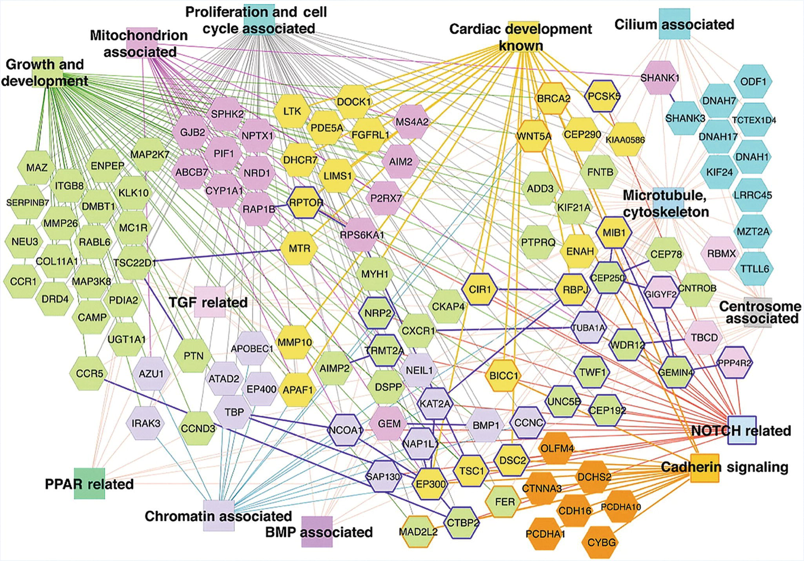

[**Figure 6.17**](#R_c6-fig-0017) Mutations recovered from HLHS patients. ToppCluster‐generated interactome network of multi‐hit genes recovered from subjects with HLHS and HLHS mutant mice. Genes (hexagons) associated with heart development and various gene ontology biological processes (color rectangles) are shown with corresponding color. Dark blue‐outlined hexagons are NOTCH‐related genes. Protein‐protein interactions are indicated as solid dark blue lines between genes.

(Source: Yagi et al. \[99\]. Reproduced with permission of Springer Nature.).

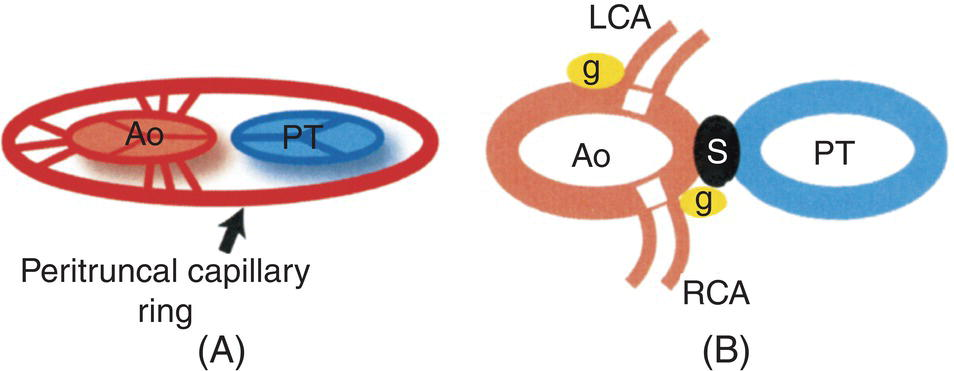

[**Figure 6.18**](#R_c6-fig-0018) Left (LCA) and right (RCA) coronary artery development. (A) Multiple channels penetrate the aortic (Ao) wall in all of the aortic sinuses from the peritruncal ring. (B) Only the ones in the right and left sinuses survive and coalesce to form the main stems of the LCA and RCA. PT, pulmonary trunk; g, cardiac ganglia; S, aorticopulmonary septum.

(Source: Waldo et al. \[103\]. Reproduced with permission of John Wiley & Sons.)

Nutrient delivery to the myocardium occurs in three sequential and overlapping phases. Although the early myocardium is avascular, the inner trabecular zone of the myocardial wall has venous sinusoids (trabecular channels) lined by the endocardium through which nutrients diffuse. With the formation of the epicardium after cardiac looping, a subepicardial endothelial plexus forms from the EPDCs and undergoes vasculogenesis, angiogenesis, and arteriogenesis \[103\]. Arteriogenesis is the coating of the initial coronary plexus by smooth muscle cells and pericytes. The coronary plexus penetrates the myocardium, and some of the channels will communicate with the intratrabecular venous sinusoids. The density of the coronary plexus is not uniform across the myocardial wall, being higher on the outer epicardial side than on the inner endocardial side \[104\]. The subepicardial vascular network later undergoes remodeling to produce the coronary arteries and veins with adult branching characteristics. As reported by Waldo et al. \[103\] and Smart et al. \[105\], the final step in the development of the coronary circulation is ingrowth of the peritruncal coronary capillary plexus into the base of the aorta ([Figure 6.18](#c6-fig-0018)). Multiple small vessels penetrate each aortic sinus. In the right and left aortic sinuses the multiple channels coalesce to form the main stems of the right and left coronary arteries, whereas the channels in the remaining (non‐coronary) sinus regress.

#### Abnormalities of epicardial development

Normal development of the compact myocardium requires a trophic interaction between the cardiomyocytes and EPDCs \[30\]. Abnormal EPDC function results in _ventricular non‐compaction_, a cardiomyopathy characterized by a spongy myocardium, and has a predilection for the left ventricle.

_Coronary artery fistulae_ may arise from either the right or left coronary artery and most frequently terminate in the right heart \[106\]. Fistulae can occur in isolation or in association with other lesions. In some cases of pulmonary atresia with an intact ventricular septum (PA/IVS) and in some forms of HLHS \[107\], a significant portion of the ventricle may be dependent on blood supply from the hypertensive right (PA/IVS) or left ventricle, respectively. Flow into a lower pressure chamber produces myocardial ischemia by a coronary steal and ventricular volume overload.

Vascular channels from the peritruncal ring normally penetrate the aortic sinuses. However, penetration of the pulmonary artery results in an _anomalous origin of the coronary artery from the pulmonary artery_, the most common form being the left coronary artery from the pulmonary artery (ALCAPA) \[108, 109\]. Coronary steal can occur, in which the blood flow is reversed into the pulmonary artery due to the lower vascular resistance of the pulmonary circulation and/or the higher pressure of collateral circulation from the normal coronary artery. Also, blood flowing antegrade through the anomalous coronary artery has a lower oxygen content than normal.

_Congenital atresia of the left coronary artery_ and _anomalous aortic origin of the left or right coronary artery from the right or left coronary sinus_, respectively, are generally rare but have been associated with sudden death \[108, 109\].

* * *

### KEY POINTS: EPICARDIUM AND CORONARY ARTERY DEVELOPMENT

-   The epicardium is derived from the proepicardial organ which comprises villi that arise from the splanchnic mesoderm of the ventral pharynx at the venous and arterial poles.
-   Epicardially derived cells undergo differentiation into fibroblasts, coronary smooth muscle cells, and endothelial and hematopoietic cells.
-   The development of the coronary circulation involves various steps, the last one consisting of ingrowth of the peritruncal coronary capillary plexus into the base of the aorta.
-   Abnormal epicardial development can result in certain types of cardiomyopathies and anomalies that involve the coronary arteries.

* * *

### Development of the conduction system

The myocardium of the primitive heart tube has no morphologically distinct conducting cells \[110\]. The primitive pacemaker (i.e. area with the cells with the fastest intrinsic rate) is located at the junction of the sinus venosus and the primitive atrium. Before the AV and semilunar valves develop, a unidirectional, slowly transmitted, depolarizing impulse (represented by a sinusoidal electrocardiogram) generates a mechanical contraction wave that pushes blood from the venous pole to the arterial pole \[34\].

With elongation of the heart tube, the myocardial cells of the developing ventricular and atrial chambers differentiate into a _working_ (contractile) myocardial phenotype characterized by fast‐conducting gap junctions and sarcomere components \[111\]. Myocardial cells at the venous pole, AVC, and outflow tract differentiate into specialized _conductive_ myocardium. Although these cells have elements of working myocardium (including contraction, autorhythmicity, intercellular conduction, and electromechanical coupling), they retain their primary phenotype of sparse gap junctions and slow conduction ([Figure 6.19](#c6-fig-0019)). The cardiomyocytes of the conduction system necessary for the generation and propagation of the electrical impulses for coordinated contraction comprise ~2% of the myocardial mass \[112\]. With the differentiation of myocytes into working and conductive myocardium, the electrocardiogram resembles that of the formed heart \[113\].

The _sinoatrial node_ (SAN) is detectable at approximately 32 days of gestation. It develops from myocardial cells located at the junction of the right common cardinal vein (which drains into the right horn of the sinus venosus) and the right atrium, ultimately becoming “comma‐shaped” with its head at the junction of the SVC and the right atrium and its tail incorporated into the crista terminalis \[114\]. Normal development of the cardiac conduction system is transcription factor‐dependent. TBX3 is expressed in the sinoatrial node and its deletion leads to abnormalities including VSD, Wolff‐Parkinson‐White arrhythmia, and sinus node dysfunction. It is both a positive regulator of the development of the normal atrioventricular conduction system and a negative regulator of abnormal accessory atrioventricular pathways \[115\]. Unlike other areas of myocardial development, normal sinus myocardium development (and thus normal sinus node development) depends upon the _absence_ of NKX2.5 expression due to suppression by SHOX2. The sinus myocardium is derived from TBX18‐positive cells, and the sinus node develops hypoplastically in its absence. Thus, a complex interplay between TBX18, SHOX2, and NKX2.5 is required for normal sinus myocardium and sinus node development \[26\]. Nodal cells in the left cardinal vein regress to become the ligament of Marshall \[110\]. It has been established that specific conduction pathways through the atrial myocardium do not exist \[116, 117\].

The _AV node_ (AVN) is detectable at approximately 33 days of gestation. It develops from slow‐conducting myocardium within the dorsal AVC. The AVN becomes located in the triangle of Koch, and the cells of the AVN are in direct continuity with the atrial and ventricular myocardium. The AVN retains its primary phenotype of slow conduction so that there is an appropriate AV delay. The development of AV node progenitor cells is dependent upon NKX2.5 transcription factor binding. Pathogenic variants that significantly alter the binding result in AV block, with or without CHD \[25\].

The _AV (His) bundle_, _left and right bundle branches_ and _Purkinje fibers_ develop from fast‐conducting ventricular myocardium; the AV bundle from cells in the crest of the interventricular septum, and the bundle branches and Purkinje network from subendocardial myocytes along the ventricular septum \[111\].

An important step in the development of the conduction system is establishing electrical discontinuity between the atrial and ventricular myocardium at the AV junction. Epicardial cell‐derived fibroblasts in the AV groove invade the AV myocardium inferior to the AVN and make contact with the endocardial cushion mesenchyme to form the _annulus fibrosus_, or crux of the heart. Because the annulus fibrosus insulates the atria from the ventricles, the AV conduction system provides the only myocardial continuity between the atria and ventricles. The complex genetics, transcription factors, and signaling pathways of cardiac conduction system development and function have recently been reviewed \[112, 118\].

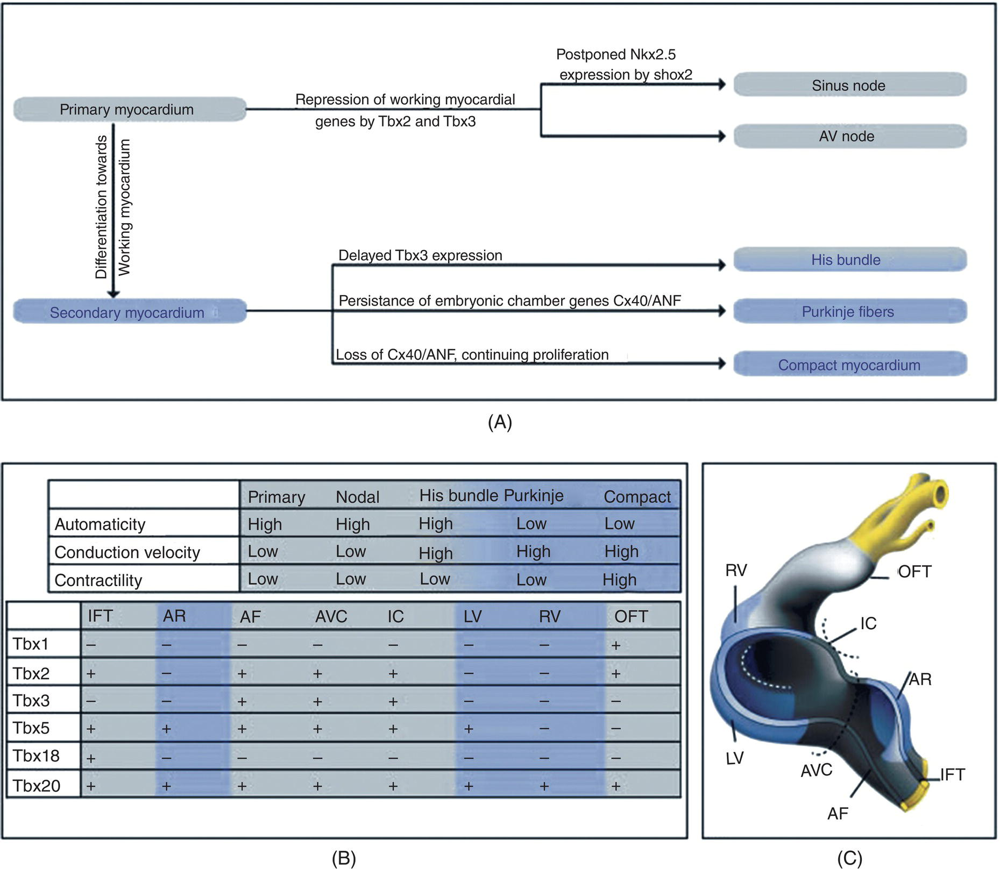

[**Figure 6.19**](#R_c6-fig-0019) Differentiation of the primary myocardium. (A) Flow chart of the differentiation of primary and secondary myocardium into the different kinds of adult‐type myocardium. (B, upper table) Characteristics of different kinds of myocardium in terms of their contraction and electrophysiological behavior. (B, lower table) Summary of the expression pattern of different T‐box transcription factors in different parts of the heart. Note that the primary myocardium always expresses either Tbx2, Tbx3, or both. (C) Schematic of the chamber‐forming (ballooning) heart (gray, primary myocardium; blue, secondary myocardium). The gray area at the top of ventricular septum (white dotted line) retains characteristics of the primary myocardium and will become the atrioventricular bundle. AF, atrial floor; AR, atrial roof; AVC, atrioventricular canal; IC, inner curvature; IFT, inflow tract; LV, left ventricle; OFT, outflow tract; RV, right ventricle.

(Source: Sylva et al. \[26\]. Reproduced with permission of John Wiley & Sons.)

#### Abnormalities of conduction system development

Normal development of the conduction system is dependent upon a concordance of the atrial and ventricular chambers, correct alignment of the atrial and ventricular septa, and complete closure of the ventricular septum \[119\]. Thus, from an embryologic perspective, abnormalities of the conduction system would be expected in lesions that involve AV concordance, the AVC, single ventricles, atrial isomerism, or combinations thereof \[120, 121\].

_Congenitally corrected TGA (CCTGA) with L‐loop ventricles_ is associated with displacement of the AVN within the right atrium to an anterior and lateral position beneath the opening of the right atrial appendage \[122\]. The AV bundle is longer than normal and passes across the anterior surface of the subpulmonary outflow tract to reach the morphologic right ventricle. Infants may be born with complete AV block, but for those born without block, the risk of natural onset complete AV block increases by 2%/year \[123\]. In _CCTGA with D‐loop ventricles and atrial situs inversus_, the AVN is typically in a left‐sided triangle of Koch.

In _AVC defects_, the AVN is displaced posteriorly and inferiorly to lie low in the atrial septum and anterior to the coronary sinus ostium. The AV bundle is displaced posteriorly, is elongated, and courses along the lower rim of the VSD; this gives rise to the superior (left) QRS axis seen on an electrocardiogram \[124\]. With _perimembranous VSDs_, the AV bundle can be longer and is typically located along the postero‐inferior rim of the defect. In _single ventricle_ abnormalities, the locations of the AVN and AV bundle can vary widely.

_Accessory pathways_ are accessory bundles of cardiomyocytes that electrically connect the atria and ventricles, providing the substrate for some supraventricular arrhythmias (as occurs in Wolff–Parkinson–White syndrome and Mahaim tachycardia) \[124\]. Right‐sided pathways and some left‐sided pathways run subendocardially. The most common right atrial locations in children are the left free wall and the posteroseptal right free wall \[119\]. Ebstein anomaly is frequently associated with Wolff–Parkinson–White syndrome and other accessory pathways.

Atrial conduction disturbances and arrhythmias are frequently related to sinus venosus myocardium and thus they tend to take place at particular anatomic sites, such as the crista terminalis, ostia of the caval veins, coronary sinus, pulmonary veins, and the ligament of Marshall \[124\]. The structure of the AVN is complex, both anatomically and electrophysiologically, and in many normal hearts, it provides the substrate (two pathways with different electrophysiological characteristics) for dual AVN physiology and _AV nodal re‐entry tachycardia_ (AVNRT).

Gene mutations that affect ion channels give rise to _cardiac channelopathies_; the most important of these are long QT syndrome, Brugada syndrome, catecholaminergic polymorphic ventricular tachycardia, and short QT syndrome \[125, 126\].

* * *

### KEY POINTS: DEVELOPMENT OF THE CONDUCTION SYSTEM

-   The primitive pacemaker is located at the junction of the sinus venosus and the primitive atrium.
-   The AV node retains its primary phenotype of slow conduction allowing for appropriate AV delay, whereas the AV bundle, left and right bundle branches and Purkinje fibers develop from fast‐conducting ventricular myocardium.
-   Abnormalities of the conduction system are expected in lesions that alter the AV concordance, proper alignment of the atrial and ventricular septa, and complete closure of the ventricular septum.

* * *

### Development of the aortic arches

Blood vessels are formed by the aggregation of angioblasts (splanchnic mesoderm that has differentiated into endothelial cell precursors) into small endothelial‐lined channels that connect to form vascular networks (vasculogenesis), which grow through the sprouting and branching of vessels (angiogenesis). Depending on the site of the vascular network, cells from the mesoderm, neural crest, or epicardium associate with the endothelial cells to form vascular smooth muscle, thereby stabilizing the vessel wall \[127\]. The dorsal aortae are bilateral, parallel, longitudinal channels that form in the mesoderm on either side of the notochord, adjacent to the ventral pharyngeal endoderm. The aortic sac is connected to the paired dorsal aortae by the artery of each pharyngeal arch; these vessels are referred to as pharyngeal arch arteries (PAAs) or aortic arch arteries \[9\]. Pioneering work by Kirby, and later by Poelmann and Gittenberger‐de Groot, demonstrated that cardiac neural crest cells migrate into the mesoderm of the pharyngeal arches (3, 4, and 6) and surround the endothelial cells to form the smooth muscle of the PAAs \[29, 128–130\]. The PAAs are not all present simultaneously but form over time in a symmetric pattern cranially to caudally. The neural crest cells are critical for remodeling, whereby some segments of the aortic arch apparatus and dorsal aortae regress, while other segments transform and persist to produce the mature asymmetric pattern ([Figure 6.20](#c6-fig-0020)).

The dorsal aortae fuse in a caudal‐to‐cranial direction up to the seventh somite. The seventh somite is supplied by the seventh intersegmental artery, which forms the left subclavian artery and contributes to the formation of the right subclavian artery. The dorsal aortae give off dorsal intersegmental arteries, which supply the spinal cord and developing somites \[132\]. Longitudinal anastomoses form between the intersegmental arteries, with those from the first to the seventh forming the vertebral artery. The first six intersegmental arteries regress after the vertebral artery is formed, and the vertebral artery arises from the seventh intersegmental artery, which itself forms part of the subclavian artery.

#### Abnormalities of aortic arch development

Abnormalities of the aortic arch occur when segments of the fourth aortic arch fail to regress or regression occurs at an abnormal site; this can be explained by Edwards’ hypothetical double aortic arch model ([Figure 6.21](#c6-fig-0021)) \[134\]. The aortic arch is referred to as left‐ or right‐sided to indicate which mainstem bronchus the arch crosses over. Congenital variants and aortic arch anomalies have been reviewed by Hanneman and colleagues \[135\]. The normal left aortic arch (LAA) results from regression of the segment of the right arch between the right subclavian artery and the descending aorta. Conversely, a _right aortic arch_ (RAA) with mirror‐image branching is produced when the LAA regresses between the left subclavian artery and the descending aorta. An RAA with mirror‐image branching is frequently associated with cardiac malformations. A _double aortic arch_ results from the persistence of both fourth aortic arches. Regression of the segment between the right carotid and right subclavian arteries results in an LAA with an _aberrant right subclavian artery_, whereas regression of the segment between the left carotid and left subclavian arteries results in an RAA with an _aberrant left subclavian artery_. An _interrupted aortic arch_ (IAA) results from the regression of both the right and left fourth aortic arches. The most common type of IAA is type B, in which there is an interruption between the left carotid and left subclavian arteries and normal regression of the right aortic arch. It is estimated that 50% of cases of IAA type B are due to 22q11.2 deletion syndrome \[136\]. Smooth muscle differentiation in the outflow tract is dependent upon the histone deacetylase _Hdac3_ and its loss in the neural crest of mouse models leads to IAA \[137\]. A _vascular ring_ is an aortic arch anomaly in which the trachea and esophagus are completely encircled by vascular structures, which may be patent or consist of fibrous remnants, such as the ligamentum arteriosum. When the trachea and esophagus are not completely encircled, the abnormality is referred to as a _vascular sling_. Aortic arch anomalies can be associated with tracheobronchial and/or esophageal compression and, in the case of a pulmonary artery sling, malformations of the trachea \[138\].

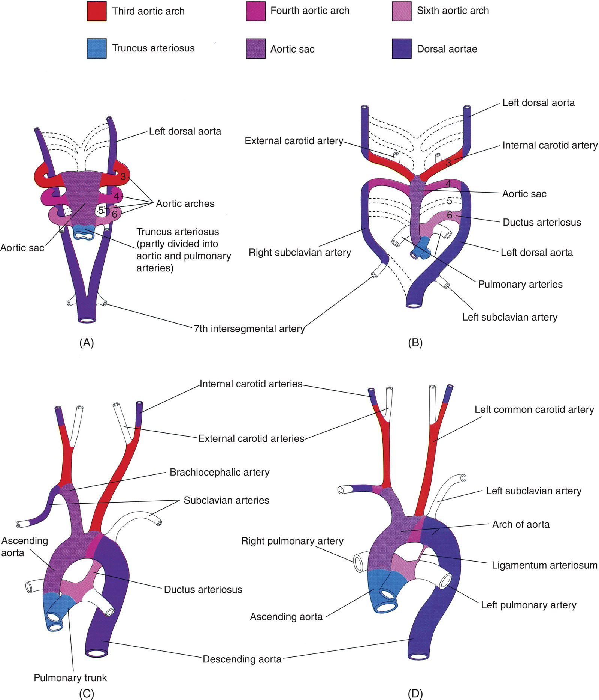

[**Figure 6.20**](#R_c6-fig-0020) Schematic drawings illustrating the arterial changes that result during the transformation of the truncus arteriosus, aortic sac, pharyngeal arch arteries, and dorsal aortae into the adult arterial pattern. The vessels that are not colored are not derived from these structures. (A) Pharyngeal arch arteries at 6 weeks; by this stage, the first two pairs of arteries have largely disappeared. (B) Pharyngeal arch arteries at 7 weeks; the parts of the dorsal aortae and pharyngeal arch arteries that normally disappear are indicated with _broken lines_. (C) Arterial arrangement at 8 weeks. (D) Sketch of the arterial vessels of a 6‐month‐old infant. Note that the ascending aorta and pulmonary arteries are considerably smaller in (C) than in (D). This represents the relative flow through these vessels at the different stages of development. Observe the large size of the ductus arteriosus in (C) and that it is essentially a direct continuation of the pulmonary trunk. The ductus arteriosus normally becomes functionally closed within the first few days after birth. Eventually, the ductus arteriosus becomes the ligamentum arteriosum, as shown in (D).

(Source: Moore et al. \[131\]. Reproduced with permission of Elsevier.)

[**Figure 6.21**](#R_c6-fig-0021) Diagram of Edward’s developmental model of the aortic arch. (A) Hypothetical double aortic arch system in which there is an aortic arch and ductus arteriosus on each side encircling the trachea (T) and esophagus (E), with the carotid and subclavian arteries arising bilaterally from the respective arches. The descending aorta is in the midline. (B) Normal arch branching results from interruption of the dorsal segment of the right arch between the right subclavian artery and descending aorta with regression of the right ductus arteriosus. AAo, ascending aorta; DAo, descending aorta; LCA, left carotid artery; LSA, left subclavian artery; PA, pulmonary artery; RCA, right carotid artery; RSA, right subclavian artery.

(Source: Turkvatan et al. \[133\]. Reproduced with permission of The Korean Radiological Society.)

_Coarctation of the aorta_ is a focal narrowing of the aorta, usually consisting of a discrete posterior shelf or ridge caused by infolding or thickening of the aortic media with the inner part of the ridge composed of ductal tissue \[139\]. The site of the coarctation may be preductal, juxta‐ or paraductal, or postductal. It is most commonly preductal in infants, both pre‐ and paraductal in young children, and postductal beyond about 15 years of age. The histological architecture does not vary with the location. Coarctation is thought to be due to ductal tissue extending into the wall of the aorta (ductus tissue theory) and an abnormal flow pattern due to lesions resulting in decreased flow into the ascending aorta (hemodynamic theory) \[140\]. Thus, it is frequently associated with a bicuspid aortic valve, aortic stenosis, hypoplasia of the aortic arch, small left‐sided structures, and VSDs.

_PDA_ is an open ductus arteriosus beyond the first three postnatal days, with the incidence being inversely proportional to gestational age at birth \[141\]. In a preterm infant, a PDA is thought to be due to immaturity of the smooth muscle and oxygen sensing mechanisms. An _isolated PDA_ in a full‐term infant is most likely a congenital malformation of the vessel wall with different histologic features and a genetic origin \[142\]. The molecular mechanisms underlying ductal closure and remodeling have recently been reviewed \[143\]. A PDA may occur in isolation, particularly with prematurity, or in association with almost any other congenital cardiac anomaly. It is lifesaving in some forms of CHD.

* * *

### KEY POINTS: DEVELOPMENT OF THE AORTIC ARCHES

-   During development, the initial arterial pattern becomes modified, and some vessels regress completely, allowing for a transformation into the definitive vascular pattern.
-   Neural crest cells are critical for the development of the aortic arches.
-   Abnormalities of the aortic arch occur when segments of the fourth aortic arch fail to regress or regression occurs at an abnormal site.

* * *

### Development of the pulmonary and systemic veins

#### Pulmonary veins

The lungs and tracheobronchial tree develop from the respiratory diverticulum, a ventral outgrowth from the foregut. Early in development, the lungs have the same venous drainage as the foregut, via the splanchnic plexus into the cardinal and umbilicovitelline (systemic) veins ([Figure 6.22](#c6-fig-0022)).

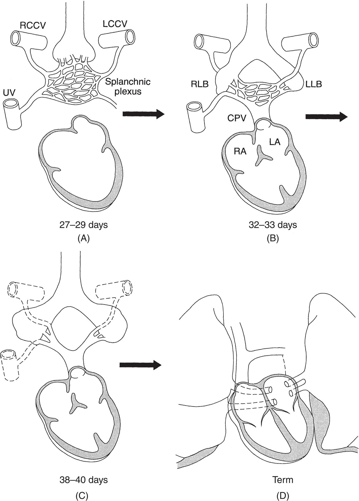

[**Figure 6.22**](#R_c6-fig-0022) Development of the pulmonary veins. (A) At 27–29 days of gestation, the primordial lung buds are enmeshed by the vascular plexus of the foregut (splanchnic plexus). No direct connection to the heart is present at this stage. Instead, multiple connections are present to the umbilicovitelline and cardinal venous systems. A small evagination can be seen in the posterior wall of the left atrium to the left of the developing septum secundum. (B) By the end of the first month of gestation, the common pulmonary vein establishes a connection between the pulmonary venous plexus and the sinoatrial portion of the heart. At this time, the connections between the pulmonary venous plexus and the splanchnic venous plexus are still patent. (C) Subsequently, the connections between the pulmonary venous plexus and the splanchnic venous plexus involute. (D) The common pulmonary vein (CPV) incorporates into the left atrium so that the individual pulmonary veins connect separately and directly to the left atrium. LA, left atrium; LCCV, left common cardinal vein; LLB, left lung bud; RA, right atrium; RCCV, right common cardinal vein; RLB, right lung bud; UV, umbilical vein.

(Source: Brown et al. \[144\]. Reproduced with permission of Wolters Kluwer.)

The primary pulmonary vein develops by canalization within the dorsal mesocardium to form a channel \[50\]. Endothelial invagination from the left side of the primitive atrium into the dorsal mesocardium delineates the future orifice of the primary pulmonary vein \[49\]. This invagination is surrounded by ridges of the dorsal mesocardium, forming a pit (pulmonary pit) cephalad to the junction of the left and right horns of the sinus venosus and to the left of the developing septum primum. Further canalization of the primary pulmonary vein brings it into continuity with the cavity of the developing left atrium, and by the end of the first month of gestation, the primary pulmonary vein has established a connection between the pulmonary venous plexus of the lung bud and the sinoatrial portion of the heart. Once a connection has been established between the primary pulmonary vein and the left atrium, the pulmonary venous plexus loses its connections with the systemic veins. Then, the common pulmonary vein incorporates into the left atrium so that the individual pulmonary veins connect separately and directly to the left atrium. At the connection of the developing pulmonary vein and atrium, pulmonary mesenchymal cells differentiate into pulmonary myocardial cells that form a sleeve of myocardium around the developing pulmonary vein. PITX2c is crucial in the differentiation of the pulmonary vein myocardium. Pitx2c‐deficient mice fail to form primary pulmonary myocardial cells and thus the pulmonary myocardial sleeve \[145\].

##### Abnormalities of pulmonary vein development

_Total anomalous pulmonary venous connection_ (TAPVC) results from a failure to establish the normal connection between the common pulmonary vein and the pulmonary venous plexus before the connections with the splanchnic venous system regress. All the pulmonary veins join a common horizontal or vertical vein behind the left atrium, which can drain via the supracardiac, cardiac, or infracardiac (infradiaphragmatic) route into the right heart circulation, producing a left‐to‐right shunt. Atresia of only the right or left portions of the common pulmonary vein before the connections with the splanchnic venous system regress results in _partial anomalous pulmonary venous connection_ (PAPVC) with drainage into derivatives of the left or right cardinal systems. Both TAPVC and PAPVC produce a left‐to‐right shunt and can be associated with pulmonary venous obstruction. Pulmonary veins can also be _hypoplastic_ or _atretic_, with the most common variation in the number of pulmonary veins being a _single pulmonary vein_ on either the right or left side (prevalence of about 24% in anatomic studies) \[146\]. _Cor triatriatum_ is an oblique fibromuscular membrane that divides the left atrium into two chambers: a postero‐superior chamber that receives the pulmonary veins and an antero‐inferior chamber that communicates with the mitral valve and left atrial appendage \[147\]. Cor triatriatum is thought to arise from incomplete incorporation of the common pulmonary vein into the primitive left atrium. _Sinus venosus ASDs_ are associated with drainage of some, and less frequently all, of the right pulmonary veins into the right SVC or right atrium and normal connection of the left and other right pulmonary veins to the left atrium. Congenital _pulmonary vein stenosis_ typically occurs at the pulmonary vein–left atrial junction but can be progressive in the length and degree of stenosis and number of pulmonary veins affected. The embryologic basis for this anomaly has been postulated to be abnormal incorporation of the common pulmonary vein into the left atrium \[148\].

* * *

### KEY POINTS: DEVELOPMENT OF THE PULMONARY VEINS

-   The lungs and tracheobronchial tree develop from a ventral outgrowth of the foregut.
-   Establishment of a normal connection between the primary pulmonary vein and the left atrium is linked to the loss of the initial connection of the pulmonary venous plexus to the systemic veins.
-   Abnormalities of pulmonary vein development result from failure of normal connections between rudimentary pulmonary venous structures to be established before the connections with the splanchnic venous system regress.

* * *

#### Systemic veins

By the end of the fourth week of development, the primitive venous system consists of three bilaterally symmetric systems that each drain into the right and left horns of the sinus venosus: the _vitelline_ veins, which drain the yolk sac and gastrointestinal derivatives and will develop into the portal system; the _umbilical_ veins, which carry oxygenated blood from the placenta and disappear after birth, and the _cardinal_ veins, which drain the head, neck, and body wall and will develop into the caval system ([Figure 6.23](#c6-fig-0023)). The shift of the systemic venous return to the right atrium is associated with regression and remodeling to yield the adult asymmetrical venous pattern.

The vitelline and umbilical veins are altered by the development of the liver in the septum transversum and the formation of the hepatic sinusoids. The vitelline veins pass from the foregut through the septum transversum and developing liver to connect with the hepatic sinusoids ([Figure 6.24](#c6-fig-0024)). When the left horn of the sinus venosus regresses to form the coronary sinus, the proximal (near the heart) left vitelline vein also regresses, causing blood from the left side of the abdominal viscera to be channeled to the right side with subsequent enlargement of the right vitelline vein. The portion of the right vitelline vein between the liver and heart becomes the suprahepatic (terminal) portion of the IVC. During the second and third months of gestation, the right vitelline vein inferior to the liver becomes the portal vein and superior mesenteric vein, and some of the left‐to‐right vitelline anastomoses become the splenic and inferior mesenteric veins.

The umbilical veins, which initially pass on either side of the liver, become connected to the hepatic sinusoids. The right umbilical vein regresses during the second month of gestation, whereas the left umbilical vein loses its connection to the left horn of the sinus venosus and forms a channel, the ductus venosus, which connects it to the right vitelline vein.

The anterior (superior) cardinal veins, which drain the cephalic part of the embryo, and the posterior (inferior) cardinal veins, which drain the remainder of the embryo, join to form the common cardinal veins, which enter the respective horns of the sinus venosus. During the eighth week of gestation, the proximal (terminal) portion of the right anterior cardinal vein and the right common cardinal vein form the SVC ([Figure 6.24](#c6-fig-0024)). An anastomosis develops between the left and right anterior cardinal veins to form the left brachiocephalic (innominate) vein; the portion of the right anterior cardinal vein superior to the anastomosis will become the right brachiocephalic (innominate) vein. The terminal portions of the left anterior and common cardinal veins regress. Although a large portion of the posterior cardinal veins regresses, the right and left subcardinal veins sprout from the base of the posterior cardinal veins and grow caudally \[150\]. The left subcardinal vein regresses, but the right subcardinal vein loses its connection with the posterior cardinal vein and joins with the right vitelline vein to form the portion of the IVC between the liver and kidneys (prerenal segment). The right and left supracardinal veins also sprout from the base of the posterior cardinal veins and receive drainage from the intercostal veins. Together with a portion of the posterior cardinal veins, the right and left supracardinal veins form the azygos vein on the right and the hemiazygos vein on the left. The right supracardinal vein also anastomoses with the right subcardinal vein to form the portion of the IVC below the kidneys (renal segment). The sacral segment of the IVC is derived from the right and left posterior cardinal veins and the sacral segment connecting them. Thus, the IVC is made up of elements from four separate venous systems: the right vitelline vein between the liver and heart; the right subcardinal vein between the liver and kidneys; the right supracardinal vein below the kidneys; and the right and left posterior cardinal veins with the sacral segment connecting them.

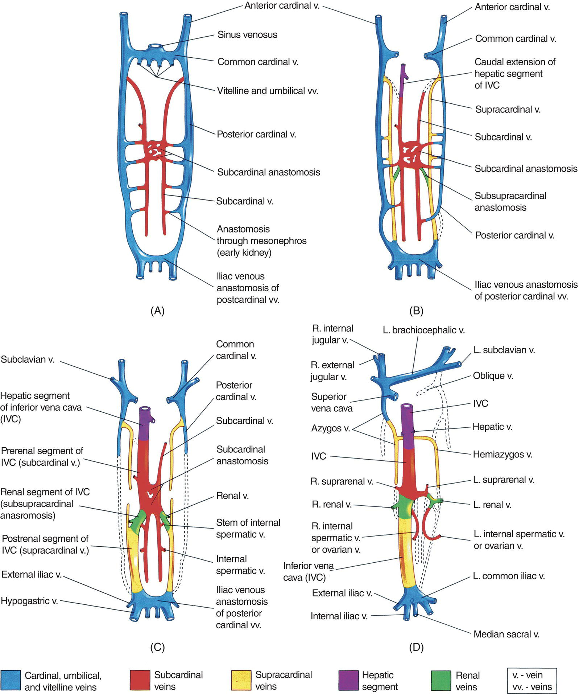

[**Figure 6.23**](#R_c6-fig-0023) Illustrations of the primordial veins of bodies (trunks) of embryos (ventral views). Initially, three systems of veins are present: the umbilical veins from the chorion, vitelline veins from the umbilical vesicle, and cardinal veins from the body of the embryos. Next the subcardinal veins appear, and finally, the supracardinal veins develop. (A) At 6 weeks. (B) At 7 weeks. (C) At 8 weeks. (D) Adult. This drawing illustrates the transformations that produce the adult venous pattern. IVC, Inferior vena cava; L., left; R., right; v., vein; vv., veins.

(Sources: Arey \[149\] and Moore et al. \[131\]. Reproduced with permission of Elsevier.)

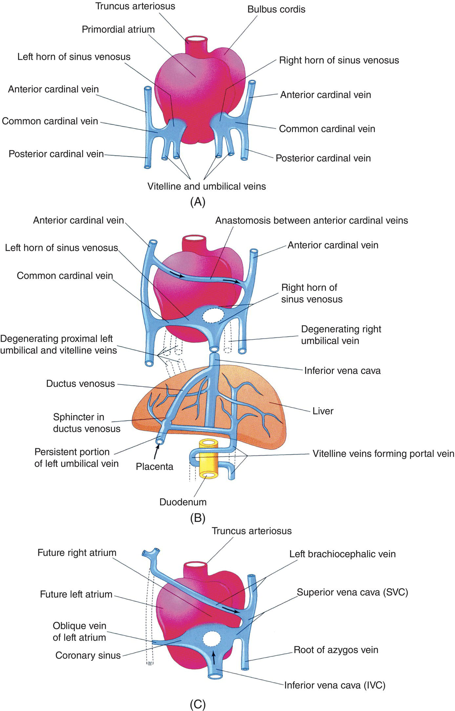

[**Figure 6.24**](#R_c6-fig-0024) Dorsal views of the developing heart. (A) During the fourth week (approximately 24 days), showing the primordial atrium and sinus venosus and the veins draining into them. (B) At 7 weeks, showing the enlarged right sinus horn and venous circulation through the liver. The organs are not drawn to scale. (C), At 8 weeks, indicating the adult derivatives of the cardinal veins shown in (A) and (B).

(Source: Moore et al. \[131\]. Reproduced with permission of Elsevier.)

##### Abnormalities of systemic vein development

The complex development of the venous system results in a wide spectrum of systemic venous anomalies. Heterotaxy syndromes result from disorders of left‐right axis determination during early embryonic development and are frequently associated with systemic venous abnormalities \[151\]. Failure of the left anterior and left common cardinal veins to regress results in a _persistent left SVC_ (LSVC), the prevalence of which is higher in patients with CHD. An LSVC may be found in association with a right SVC (_bilateral SVCs_) or may be the only SVC if the right anterior and right common cardinal veins have regressed. An LSVC will drain normally into the right atrium via the coronary sinus in the majority of cases, but it will drain into the left atrium if the coronary sinus is partially or completely unroofed. Bilateral SVCs with an unroofed coronary sinus usually occur in association with other congenital heart defects.

Failure of the hepatic segment of the IVC to form results in an _interrupted IVC_ with azygos continuation into the right or left SVC; the hepatic veins in this setting drain directly into the right atrium. Multiple variations of _bilateral IVCs_ can occur.

* * *

### KEY POINTS: DEVELOPMENT OF THE SYSTEMIC VEINS

-   The primitive systemic venous system consists of three bilaterally symmetric systems: the vitelline veins, the umbilical veins, and the cardinal veins.
-   The shift of the systemic venous return to the right atrium is associated with regression and remodeling, resulting in the adult asymmetrical venous pattern.
-   Alterations in the complex development of the venous system lead to a wide spectrum of systemic venous anomalies.

* * *

### Development of cardiac innervation

The development and anatomy of cardiac innervation are complex and have been reviewed in detail previously \[152, 153\]. Neural crest cells give rise to the parasympathetic preganglionic neurons (cranial neural crest), the sympathetic chain, and sympathetic postganglionic neurons (truncal neural crest), and the ganglia and neurons of the intrinsic cardiac plexuses \[154\].

The heart has both sensory (afferent) and motor (efferent) innervation (148). Sensory information is relayed from the heart to the brain via both parasympathetic and sympathetic nerve pathways ([Figure 6.25](#c6-fig-0025)). One set of afferent nerves travels with the vagus nerve via the nodose ganglion (inferior ganglion of the vagus nerve) to the nucleus of the solitary tract in the brainstem. The second set of sensory nerves travels with the sympathetic nerves to the dorsal root ganglion and spinal cord. The parasympathetic afferents play a role in controlling both sympathetic and parasympathetic output, whereas the sympathetic afferents do not have any tonic influence over autonomic activity but are mostly nociceptive, as they are activated by coronary occlusion and register cardiac pain.

The motor (efferent) pathways are part of the autonomic nervous system, and both the parasympathetic and sympathetic pathways use preganglionic to postganglionic relays. Parasympathetic preganglionic neurons originate from the nucleus ambiguus and dorsal motor nucleus of the vagus in the medulla oblongata and use the vagus tracts to connect with postganglionic relays in the cardiac ganglia. Sympathetic preganglionic neurons originate in the intermediolateral column in the thoracic spinal cord and synapse with postganglionic neurons in the ganglia of the lower cervical and upper thoracic sympathetic chain \[153\].

The cardiac plexuses are an accumulation of mixed neurons, both efferent and afferent, on the epicardial surface near the arterial and venous poles. These plexuses comprise ganglia that are interconnected by local neuronal circuits and regulate control of regional cardiac function \[153\]. The ganglia have an intrinsic activity that is modulated by sympathetic and parasympathetic (vagal) inputs. Postganglionic parasympathetic nerves extend to the SA and AV nodes to innervate the cardiac conduction system \[152\]. Innervation of myocardial cells in the right atrium is predominantly cholinergic and that of the left atrium and left and right ventricles is predominantly adrenergic \[155\].

The cardiac nervous system develops and matures slowly and is not fully functional until well after birth \[154\]. Parasympathetic innervation precedes sympathetic innervation, so the parasympathetic–cholinergic system becomes functional before the sympathetic–adrenergic system. Autonomic receptor‐mediated effector mechanisms are present before functional innervation (pre‐innervation phase), thereby allowing a cardiac response to circulating catecholamines to mitigate the effects of hypoxia and bradycardia \[152\].

##### Abnormalities of cardiac innervation

Development of cardiac innervation during the fetal period can be associated with innervation abnormalities in adult life \[152\].

_Dysautonomias_ result from impaired autonomic interactions due to inadequate development, migration, survival, and function of sensory and autonomic neurons; the sympathetic neurons are affected more often than the parasympathetic neurons \[156\]. _Familial dysautonomia_ (Riley–Day syndrome) is the best known of the hereditary sensory and autonomic neuropathies and is associated with orthostatic hypotension and an increased risk of sudden death. It is caused by mutations of the IKAP gene on chromosome 9q31 which affects the development of neurons and is associated with catecholamine hypersensitivity \[157, 158\].

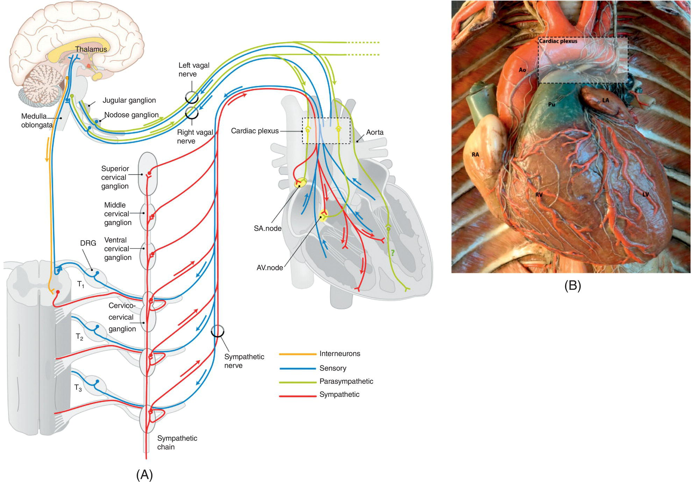

[**Figure 6.25**](#R_c6-fig-0025) Overview of cardiac innervation. (A) Schematic drawing of the cardiac visceral innervation system. Cardiac innervation starts with a signal from the heart or baroreceptors (e.g., on the aorta), relayed by sensory nerves (blue) giving feedback on, for instance, the levels of oxygen, carbon dioxide and blood pressure. The brain will give a signal to parasympathetic or sympathetic nerves to either relax or stimulate the heart. Parasympathetic innervation is achieved mainly via the vagal nerve (green) that will synapse in cardiac ganglia from where postganglionic nerves innervate the SA node and AV node, and potentially ventricular myocytes. Sympathetic neurons (red) start in the grey matter of the spinal cord, where interneurons (orange) from the brain project to the sympathetic neurons. Via the ventral root of the spinal cord, sympathetic nerves synapse in the sympathetic chain, from where postganglionic nerves will enter the heart. (B) This wax mold shows how cardiac nerves enter via the cardiac plexus and follow cardiac vessels over the heart.

Courtesy of: Museo delle Cere Anatomiche “Luigi Cattaneo”, University Museum System, Alma Mater Studiorum—University of Bologna, picture taken by Dr. E.A.J.F. Lakke. Ao, aorta; DRG, dorsal root ganglion; LV, left ventricle; Pu, pulmonary artery; RA, right atrium; RV, right ventricle. (Source: Végh et al. \[152\]. / MDPI / CC BY 4.0).

_Sudden infant death syndrome_ has been linked to abnormal development of the autonomic nervous system, with the final pathway thought to involve immature cardiorespiratory autonomic control with failure of the arousal responsiveness from sleep \[159\]. Multiple underlying candidate genes have been identified \[160\].

Autonomic dysfunction is present in individuals with Down syndrome as shown by chronotropic incompetence, reduced heart rate and blood pressure responses to autonomic tasks, and low work capacity \[161–163\]. This dysfunction may or may not be present at rest \[164\]. The risk of bradycardia is increased during induction of anesthesia in children with Down syndrome \[165\].

* * *

### KEY POINTS: INNERVATION OF THE DEVELOPING HEART

-   The heart has both sensory (afferent) and motor (efferent) innervation.
-   The cardiac nervous system develops and matures slowly and is not fully functional until well after birth.
-   Parasympathetic innervation precedes sympathetic innervation.
-   Abnormalities in cardiac innervation may result from impaired autonomic interactions and abnormal development of the autonomic nervous system.

* * *

### Development of the cardiac lymphatics

The heart has an extensive evolutionarily conserved lymphatic network. As reviewed by Gancz and colleagues, myocardial contractions force lymph in a unidirectional fashion from lymphatic capillaries in the endocardium and myocardium through extensive collecting vessels to the epicardium \[166\]. The lymph is then drained from the apex to the base and ultimately to the mediastinal lymph nodes. A reduction in lymph flow rate or an increased microvascular permeability leads to interstitial edema and myocardial dysfunction \[167\].

Lymphatic capillaries sprout from the mediastinal lymphatics around the eighth embryonic week \[166\]. By the beginning of the fourth month, these capillaries have extended from the base of the heart along the coronary arteries to cover most of the epicardial surface. Inward lymphatic growth then takes place in the myocardium and epicardium. Although the development of the cardiac lymphatic system ends prenatally, myocardial infarction is associated with a strong lymphangiogenic response in the infarcted zone \[168\]. Therapeutic strategies to boost this lymphangiogenesis are being evaluated to promote heart regeneration.

## Summary

[Table 6.2](#c6-tbl-0002) shows the stages of human development and provides a timeline of the corresponding events in the development of the cardiovascular system, summarizing the information discussed in this chapter \[26\]. Four cell lines (cardiomyocytes, endocardium, epicardium, and endothelium) are derived from the mesoderm to form the building blocks of the heart and vascular system ([Figure 6.26](#c6-fig-0026)) \[30\]. Cardiac neural crest cells are critical to the formation and remodeling of the aortic arch arteries, outflow tract septation, semilunar valvulogenesis, cardiac neuronal tissue, and the insulation of the conduction system \[169\]. Reactivation of cardiac stem cells has opened the door for using regenerative medicine and novel therapies for treating congenital and acquired heart disease \[11\].

[**Table 6.2**](#R_c6-tbl-0002) Stages of human development with corresponding events in cardiac development

Source: Sylva et al. \[26\]. Reproduced with permission of John Wiley & Sons.

| Carnegie stage | Human DPC | Mouse DPC |  |
| --- | --- | --- | --- |
| CS8 | 17–19 | 7 | The cardiac crescent forms |
| CS9 | 19–21 | 7.5 | The embryo folds, the pericardiac cavity is placed in its final position, the gully of myocardium forms, the endocardial plexus forms, cardiac jelly forms |
| CS10 | 22–23 | 8 | The heart beats, the endocardial tubes fuse, the **mesocardium** perforates, looping starts, the ventricle starts ballooning |
| CS11 | 23–26 | 8.5 | The atria balloon, the pro‐epicardium forms |
| CS12 | 26–30 | 9.5 | The septum primum appears, the right venous valve appears, the muscular part of the ventricular septum forms, cells appear in the cardiac jelly, the epicardial growth starts |
| CS13 | 28–32 | 10.5 | The atrioventricular cushions form, the pulmonary vein attaches to the atrium, the left venous valve appears, epicardial mesenchyme appears first in the atrioventricular sulcus |
| CS14 | 31–35 | 11.5 | The atrioventricular cushions form, the pulmonary vein attaches to the atrium, the left venous valve appears, epicardial mesenchyme appears first in the atrioventricular sulcus |
| CS15 | 35–38 | 12 | The atrioventricular cushions approach one another, the outflow ridges become apparent, capillaries form in the epicardial mesenchyme |
| CS16 | 37–42 | 12.5 | The primary atrial septum closes, the outflow tract ridges approach the interventricular septum. The entire heart is covered in epicardium |
| CS17 | 42–44 | 13.5 | Secondary atrial septum appears, the sinus node becomes discernible, the left and right atrioventricular connections become separate, the proximal outflow tract becomes septated, the semilunar valves develop |
| CS18 | 44–48 | 14.5 | Papillary muscles appear, the atrioventricular valves start to form |
| CS19 | 48–51 | 15 | The left venous valve fuses with the secondary septum, the mural leaflets of the mitral and tricuspid valve are released |
| CS21 | 53–54 | 16 | The main branches of the coronary artery become apparent |
| CS22 | 54–56 | 16.5 | The chordae tendinae form |
| CS23 | 56–60 | 17.5 | The septal leaflet of the tricuspid valve delaminates |

DPC, days _post coitum_.

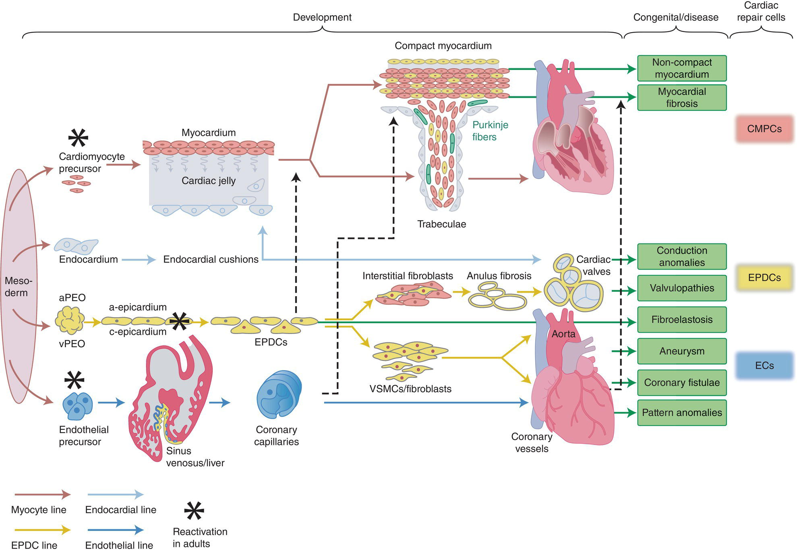

[**Figure 6.26**](#R_c6-fig-0026) Schematic presentation of cellular contribution to heart development with special focus on the role of epicardium and epicardially derived cells (EPDCs) during normal development, disease, and repair processes. Four mesodermal cell lines (cardiomyocytes, endocardium, epicardium, and endothelium) are considered to form the main building blocks of the heart. The differentiation of each line is depicted together with the main interactions with the other cell lines. The most frequent EPDC‐related congenital malformations and (acquired) disease processes are boxed in green, while three cardiac (stem) cell populations that may become reactivated are presented on the far right. aPEO, arterial proepicardial organ; vPEO, venous proepicardial organ; a‐epicardium, arterial epicardium (from aPEO); c‐epicardium, complete epicardium (from vPEO); VSMCs, vascular smooth muscle cells; CMPCs, cardiomyocyte progenitor cells; ECs, endothelial cells.

(Source: Gittenberger‐de Groot et al. \[30\]. Reproduced with permission of Elsevier.)

## Selected references

_A full reference list for this chapter is available at:_

[http://www.wiley.com/go/andropoulos/congenitalheart](http://www.wiley.com/go/andropoulos/congenitalheart)

1.  11 Srivastava D. Reprogramming approaches to cardiovascular disease: from developmental biology to regenerative medicine. In: Nakanishi T, Markwald RR, Baldwin HS, Keller BB, Srivastava D, Yamagishi H (eds). Etiology and Morphogenesis of Congenital Heart Disease: From Gene Function and Cellular Interaction to Morphology. Tokyo, Japan: Springer Japan, 2016, pp. 3–10. Review of the cardiac developmental biology discoveries that underpin direct reprogramming of cardiac fibroblasts into cardiomyocyte‐like cells for addressing cardiac regeneration and treatment of heart disease.
2.  17 Meilhac SM, Buckingham ME. The deployment of cell lineages that form the mammalian heart. Nat Rev Cardiol 2018; 15(11):705–24. Review of the diverse origins of cardiac cell types and the lineage relationships between cells of a given type that contribute to different parts of the heart.
3.  25 Morton S, Roberts AE. Genetic basis of congenital heart disease. NeoReviews 2015; 16(6):e340–52. Basic review of the genes important in heart development and current techniques for evaluating possible genetic causes of congenital heart disease in the neonate.
4.  35 Kirby ML. Molecular Control of Looping. Cardiac Development. Oxford, UK: Oxford University Press, 2007, p. 87–102. Excellent textbook by a leader in the field providing a well‐rounded perspective on all aspects of cardiac development. Recommended to those interested in cardiac embryology and wishing to move beyond the basic medical embryology.
5.   48 Piera‐Velazquez S, Jimenez SA. Endothelial to mesenchymal transition: role in physiology and in the pathogenesis of human diseases. Physiol Rev 2019; 99(2):1281–324. In‐depth review of the important process of EndMT with respect to its participation in key embryonic developmental processes and in the pathogenesis of many inherited and acquired diseases including malignant, vascular, inflammatory, and fibrotic disorders.
6.   98 Parker LE, Landstrom AP. Genetic etiology of left‐sided obstructive heart lesions: a story in development. J Am Heart Assoc 2021; 10(2):e019006. A basic science review for clinicians of the genes and variants associated with the different left‐sided obstructive lesions with a discussion of the research avenues needed to bridge the gaps in our current understanding of the genetic basis of nonsyndromic congenital heart disease.
7.  126 Skinner JR, Winbo A, Abrams D, et al. Channelopathies that lead to sudden cardiac death: clinical and genetic aspects. Heart Lung Circ 2019; 28(1):22–30. A clinically relevant review of the genetics, cellular mechanisms, risk stratification, and treatment of channelopathies that can lead to sudden cardiac death.
8.  142 Bökenkamp R, DeRuiter MC, van Munsteren C, Gittenberger‐de Groot AC. Insights into the pathogenesis and genetic background of patency of the ductus arteriosus. Neonatology 2010; 98(1):6–17. Review of the complex pathogenesis and genetic background of patent ductus arteriosus with the aim of developing better management strategies in premature infants, CHD with ductal‐dependant circulations, and patients with syndromic and non‐syndromic PDA.
9.  152 Végh AMD, Duim SN, Smits AM, et al. Part and parcel of the cardiac autonomic nerve system: unravelling its cellular building blocks during development. J Cardiovasc Dev Dis 2016; 3(3):28. Highly detailed review of the development of the cardiac autonomic nervous system (cANS). A later publication by the same authors discusses the anatomy of the cANS with respect to the clinical aspects for neuraxial modulation (thoracic epidural anesthesia, cardiac sympathectomy) \[153\].
10.  164 Carvalho TD, Massetti T, Silva TDD, et al. Heart rate variability in individuals with Down syndrome – A systematic review and meta‐analysis. Auton Neurosci 2018; 213:23–33.The autonomic dysfunction in patients with Down syndrome is highlighted in the context of a systematic review and meta‐analysis of heart rate variability, thereby providing a better understanding of the bradycardia associated with induction of general anesthesia.