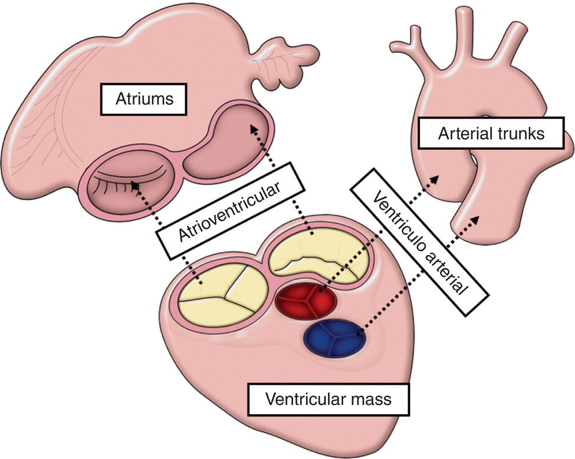
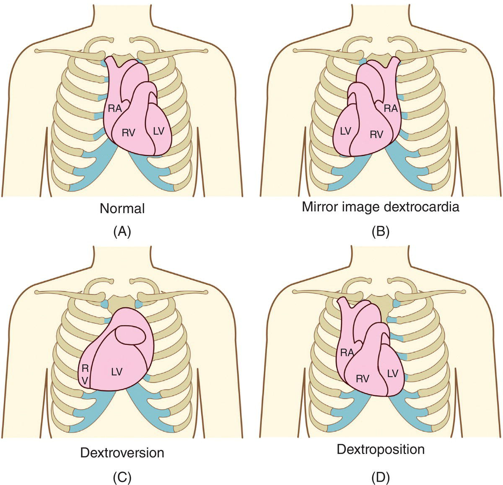
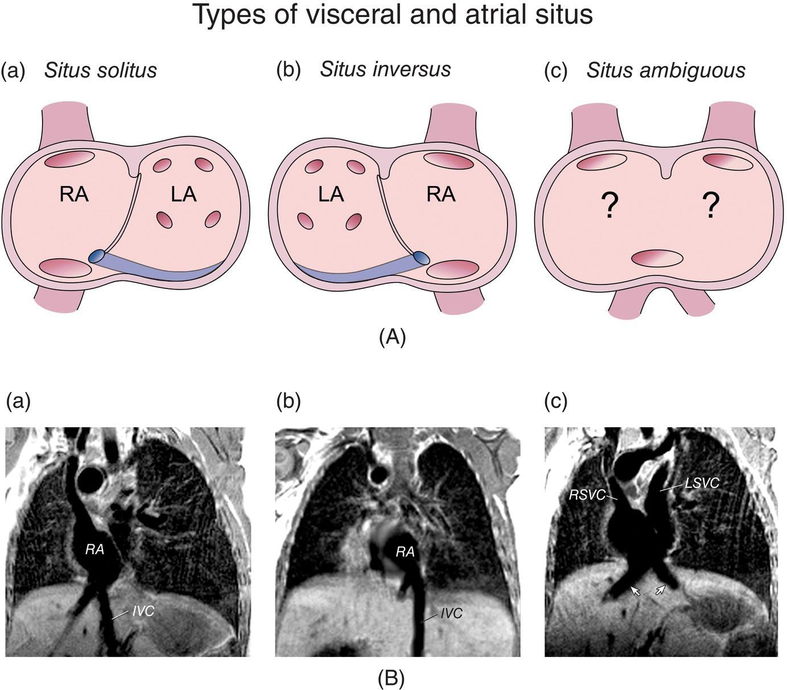
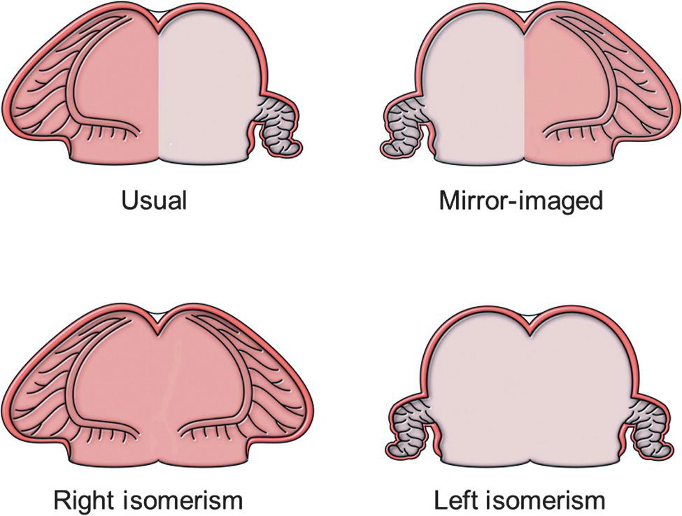
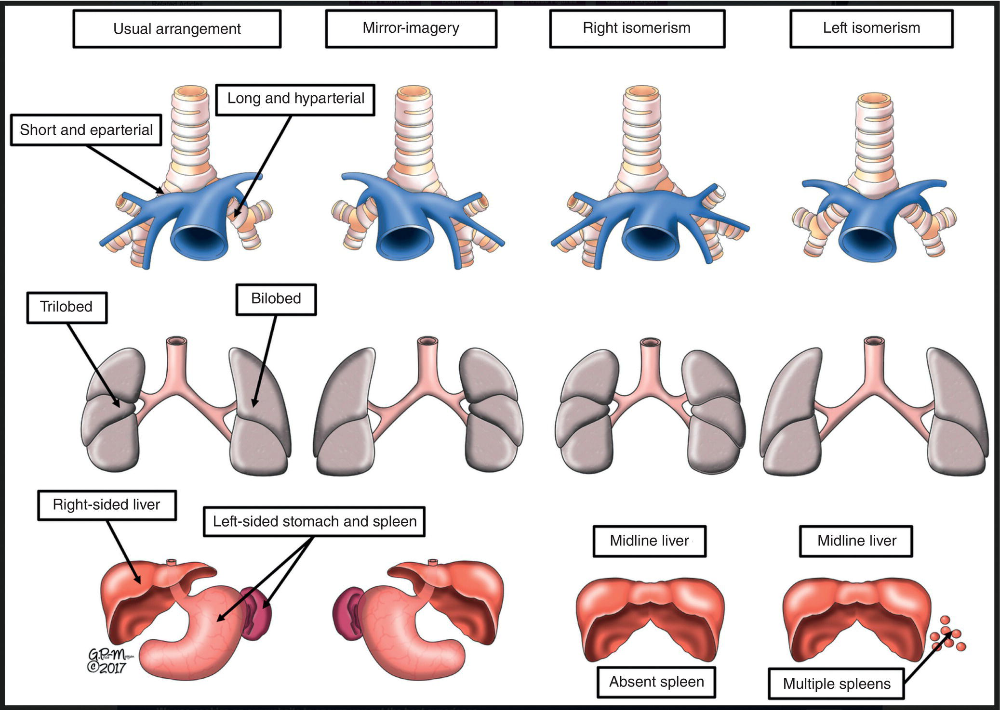
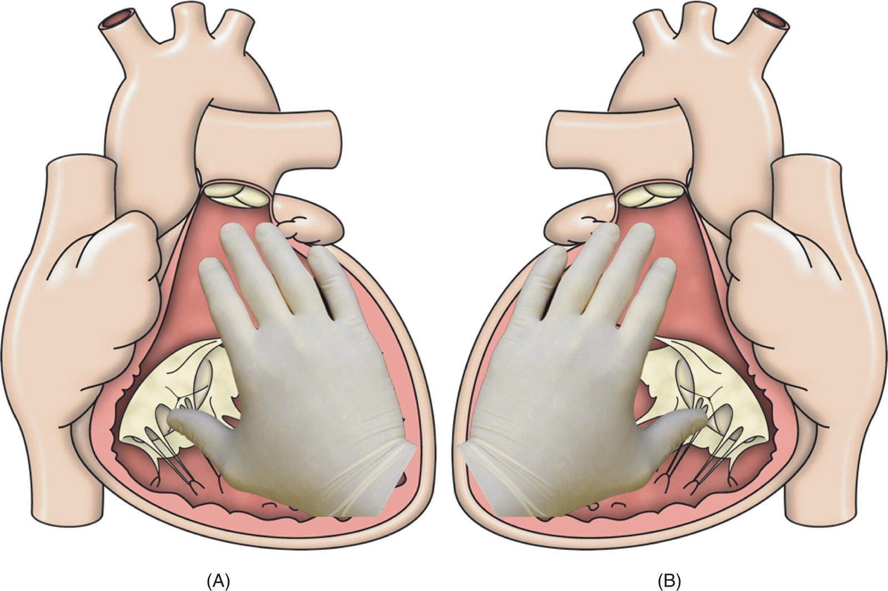
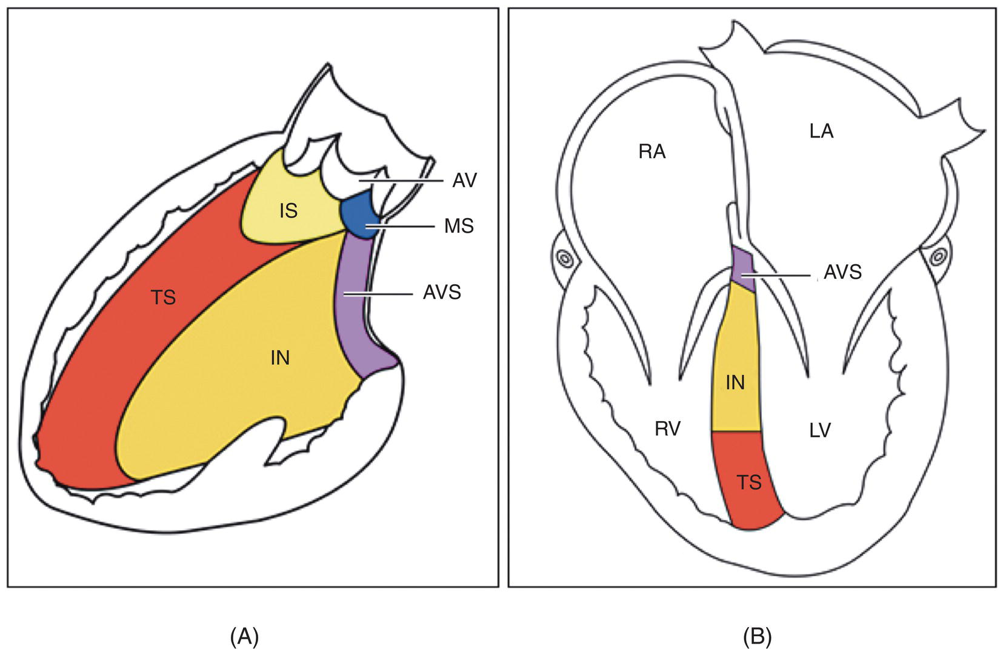
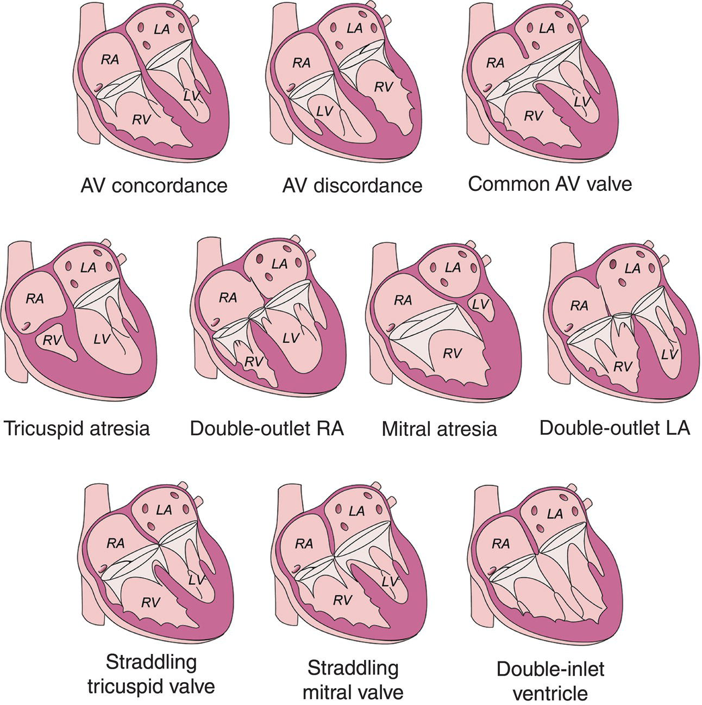
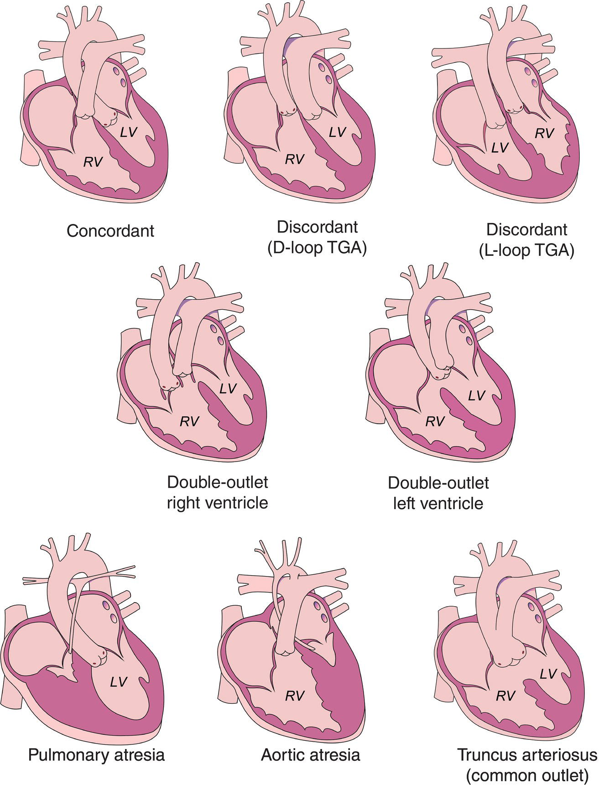
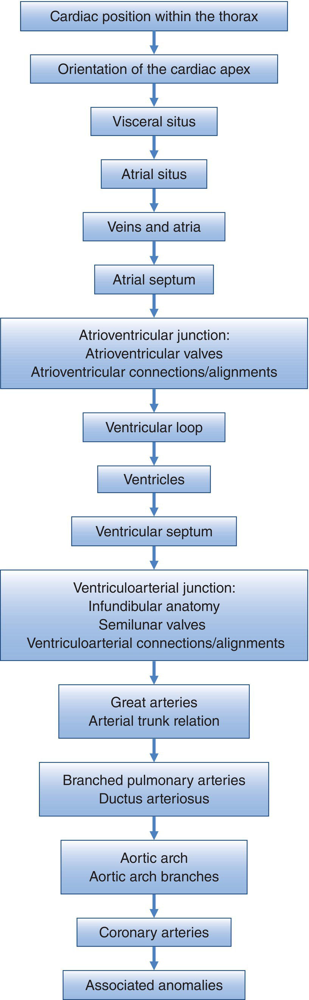

CHAPTER 7 Nomenclature and Anatomic Evaluation in Congenital Heart Disease 

# CHAPTER 7  
Nomenclature and Anatomic Evaluation in Congenital Heart Disease

_Wanda C. Miller‐Hance1,2 and Barry D. Kussman3,4_

1 Arthur S. Keats Division of Pediatric Cardiovascular Anesthesiology, Department of Anesthesiology, Perioperative and Pain Medicine, Baylor College of Medicine, Texas Children’s Hospital, Houston, TX, USA

2 Department of Pediatrics, Section of Cardiology, Baylor College of Medicine, Texas Children’s Hospital, Houston, TX, USA

3 Department of Anesthesiology, Perioperative and Pain Medicine, Boston Children’s Hospital, Boston, MA, USA

4 Department of Anaesthesia, Harvard Medical School, Boston, MA, USA

* * *

-   [**Introduction**](#head-2-53)
-   [**Congenital heart surgery nomenclature and database project**](#head-2-54)
-   [**Approaches for describing congenital heart disease**](#head-2-55)
    -   [The “Van Praaghian” and “Andersonian” nomenclature systems](#head-3-39)
    -   [The Van Praagh notation](#head-3-40)
-   [**Segmental approach to diagnosis of congenital heart disease**](#head-2-56)
    -   [Cardiac position and apex orientation](#head-3-41)
    -   [Visceral and atrial situs](#head-3-42)
    -   [Great veins and atria](#head-3-43)
    -   [Ventricles and ventricular septum](#head-3-44)
    -   [Atrioventricular junction](#head-3-45)
    -   [Atrioventricular valves](#head-3-46)
    -   [Atrioventricular connections](#head-3-47)
    -   [Ventriculoarterial junction](#head-3-48)
    -   [Conal or infundibular anatomy](#head-3-49)
    -   [Semilunar valves](#head-3-50)
    -   [Ventriculoarterial connections](#head-3-51)
    -   [Great arteries and their relationships](#head-3-52)
    -   [Branch pulmonary arteries and ductus arteriosus](#head-3-53)
    -   [Aortic arch](#head-3-54)
    -   [Coronary arteries](#head-3-55)
    -   [Description of associated malformations](#head-3-56)
-   [**Summary**](#head-2-57)
-   [**Selected references**](#head-2-58)

* * *

## Introduction

It is well recognized that the large number, wide spectrum, and complex nature of congenital malformations of the cardiovascular system can make it quite challenging to understand the corresponding structural abnormalities and their associated functional and hemodynamic consequences. This issue can be further complicated by the seemingly bewildering nomenclature and classification systems used in congenital and pediatric cardiology. In addition, the diverse terminology (at times, different terms can even be used to refer to the same anatomic structure, pathologic finding, or lesion) and the numerous classification schemes for categorizing individual anomalies can pose obvious difficulties \[1, 2\]. This variable taxonomy can be confusing for many, but it is even more perplexing for individuals with limited knowledge or familiarity with the subject, further adding to the intimidating aspects of congenital heart disease (CHD).

Many clinicians have acknowledged the critical need for a consistent nomenclature and classification system for CHD that can be widely accepted by all disciplines involved in the care of these patients. As far back as the late 1970s, Shinebourne et al. indicated that “for a nomenclature system to be of value, it needed to be capable of describing any combination of cardiac malformations which may be encountered” \[3\]. It was also noted that the scheme “should allow for precise classification of such malformations during a patient’s life.” The lack of a consistent nomenclature for describing the various defects or uniform classification scheme for CHD continues to be a source of frustration and confusion in everyday practice. Work in this area is still ongoing but over the last several years significant progress has been made in the development of comprehensive standardized nomenclature and a classification code with the goal of unifying the terminology for pediatric and congenital cardiac care as will be highlighted in this chapter.

An understanding of the approaches developed to describe CHD and the elements considered in the morphologic assessment of the heart are important aspects of the practice of pediatric/congenital cardiac anesthesiology. This chapter provides a brief overview of the essential steps involved in anatomic evaluation in CHD. It addresses the segmental analysis of the heart and other relevant components of the diagnostic assessment of the congenitally malformed heart, but it does not dwell on the specifics of one language or taxonomy over the other for describing CHD. Thus, the discussion is not meant to be comprehensive but, instead, it aims to emphasize important points related to the structural evaluation of a patient with CHD. A discussion of the various classification systems for congenital cardiac lesions is beyond the scope of this chapter but is addressed in various chapters throughout this textbook.

## Congenital heart surgery nomenclature and database project

In the late 1990s, the Society of Thoracic Surgeons, in collaboration with The European Association for Cardiothoracic Surgery, launched the International Congenital Heart Surgery Nomenclature and Database Project with the hope of standardizing the nomenclature used for CHD. One of the goals was to establish a foundation to facilitate multi‐institutional analysis of patient outcomes. This effort led to the adoption of a common nomenclature and classification system of pediatric and CHD by these professional organizations \[4\]. Concurrently, another international nomenclature system, the European Paediatric Cardiac Code, was developed for congenital cardiac disease \[5, 6\]. In 2000, The International Nomenclature Committee for Pediatric and Congenital Heart Disease was created, which evolved into a society with various components, including a Nomenclature Working Group. As a result, the _International Pediatric and Congenital Cardiac Code_ (IPCCC) was eventually developed, which allowed for cross‐mapping of the two nomenclature systems for CHD \[7\]. The aim of the project was to provide an all‐inclusive, internationally accepted, cohesive, and comprehensive system for describing pediatric cardiovascular diseases and CHD using a common nomenclature. This undertaking would ultimately enhance communication among healthcare providers; facilitate education, research, and patient care; and allow for multicenter assessment of clinical outcomes, quality assurance, risk stratification, and many other important benefits. In fact, the IPCCC nomenclature and classification code, in conjunction with the database created by the International Congenital Heart Surgery Nomenclature and Database Project can be freely downloaded from the internet ([www.ipccc.net](http://www.ipccc.net)) and is currently being used worldwide. It has served as a resource in extensive surgical outcome analyses involving large numbers of patients. The reader is referred to various publications related to these projects, which address the nomenclature for specific defects, consensus definitions for several complex cardiac anomalies, classification schemes, and applications \[8–24\]. Ongoing collaborations with the World Health Organization, other international groups addressing standard medical terminology, and the health care industry, are likely to further advance this effort. In fact, this classification system has been accepted for incorporation into the 11th iteration of the International Classification of Diseases (ICD‐11\], representing a major step for further standardization of nomenclature across the globe \[23, 25\]. Despite the remarkable efforts to establish a comprehensive standardized nomenclature and hierarchical classification system, it is well recognized that ongoing debate and discussion will continue to take place in clinical practice while these schemes continue to be refined \[24\].

* * *

### KEY POINTS: THE INTERNATIONAL PEDIATRIC AND CONGENITAL CARDIAC CODE (IPCCC)

-   When initially developed, the IPCCC allowed for cross‐mapping of two different nomenclature systems for CHD.
-   The goal of this effort was to overcome the limitations of various nomenclature systems by creating a comprehensive and consistent common language.
-   The IPCCC is used widely today and represents a standardized international nomenclature and classification system for pediatric and congenital heart disease.
-   This classification system has been accepted by the WHO for incorporation into the 11th iteration of the ICD coding system (ICD‐11 code).

* * *

## Approaches for describing congenital heart disease

Several publications have addressed, in detail, the applications of an organized anatomic analysis in the diagnosis of CHD and the steps involved in a comprehensive structural assessment \[3, 26–33\]. The _segmental approach_, as initially described by Richard Van Praagh and colleagues in the 1960s, relies upon an examination of cardiac anatomy in a series of segments or “building blocks” \[34, 35\]. These major units are considered the essential components of the heart, whether normal or diseased \[26\]. The anatomy of the various cardiac segments and their relationships to each other represent the foundation of the segmental analysis. Robert Anderson and colleagues expanded upon this concept but reduced the emphasis on relationships by proposing a scheme based on blood flow through the heart, which focused on characterizing the connections between the segments \[28, 32\]. Based on this approach, the _sequential segmental approach_ was developed.

The detailed methodology used in the sequential segment‐by‐segment approach allows for a stepwise examination of all cardiac segments by navigating through the heart in the direction of blood flow from the atria to the ventricles to the great arteries. The three main segments are the veins and atria, ventricles, and great arteries. The units are joined to each other by two connecting cardiac segments (or junctions): the atrioventricular (AV) junction (AV canal region), which connects the atria to the ventricles, and the ventriculoarterial (VA) junction (infundibulum/conus arteriosus), which connects the ventricles to the great arteries ([Figure 7.1](#c7-fig-0001)). This systematic examination offers an organized and rigorous method that facilitates the defining of congenital cardiovascular defects. The benefit of this analysis is that it can be applied to all congenital cardiac malformations, although it is particularly useful for characterizing complex defects. The merits of this approach are reflected in the fact that this system has been incorporated into clinical use within various disciplines related to CHD and applied in the evaluation of fetuses to adults \[36–42\].

### The “Van Praaghian” and “Andersonian” nomenclature systems

Historically, and based on the development of the nomenclature as previously described, there have been two major philosophies regarding the segmental assessment of the congenitally malformed heart. These schools of thought have been led by two world‐renowned leaders in the field: Drs. Richard Van Praagh and Robert H. Anderson. Colloquially, these have been referred to as the “Van Praaghian” and “Andersonian” nomenclature systems. The Van Praagh classification system was pioneered and evolved in Boston, Massachusetts and is widely used in North America, whereas that by Anderson was developed and is conventional throughout Europe.

[**Figure 7.1**](#R_c7-fig-0001) Sequential segmental analysis. Figure depicts the key components of the sequential segmental analysis: the three major building blocks (atria, ventricles, arterial trunks) and their joining segments (atrioventricular and ventriculoarterial junctions).

(Source: Ms. Gemma Price. Reproduced with permission.)

Although these approaches to describe cardiac anatomy share common elements, there are many important differences. A significant one relates to the shorthand notation used in the Van Praagh system to facilitate communication among providers involved in the diagnosis and management of patients with CHD as described to follow. Other divergent viewpoints include terminology and the methods used to describe morphology and cardiac pathology. The disparities between the two major schools of nomenclature have created disagreements among advocates and specialists in the field, sometimes resulting in heated arguments and controversies between the different camps. Efforts have been made to reconcile these two approaches in recognition of the fact that both of these systems have virtues and that, in many ways, they may complement each other \[43, 44\]. The reader is referred to the excellent resource entitled _Atlas of Congenital Heart Disease Nomenclature: An Illustrated Guide to the Van Praagh and Anderson Approaches to Describing Congenital Cardiac Pathology_ for an in‐depth discussion on these two nomenclature systems \[45\].

Although clinicians have generally been divided as followers of the teachings of one school or the other, many practitioners have opted for a stance somewhere in the middle recognizing that the likelihood of implementing a single, universally accepted system is remote, and they continue to see merits in the various schemes currently used \[46\]. It should also be recognized that even these systems have evolved in their thinking over time \[47\]. In some cases, an alternate approach has been to simply describe the anatomy without regard for either system. Despite personal preferences, the expectation in most cases is for providers of CHD patients to be fluent in these nomenclature systems. It should be emphasized that regardless of the nomenclature or scheme favored, it is more important that each institution has a uniform and consistent approach for describing and referring to the various defects or structural abnormalities to optimize communication among all practitioners involved in patient care.

### The Van Praagh notation

A unique feature of the Van Praagh style is the use of a three‐letter notation, or code, enclosed in braces or curly brackets {X,X,X}. The letters in the set are abbreviations separated by commas that represent the sidedness or anatomical organization (referred to as “situs”) of the three main cardiac segments of the heart in venoarterial sequence (atria, ventricles, great arteries) \[2, 30\]. In essence, the segments are to be considered in terms of the following:

-   the atrial situs or sidedness of atrial chambers
-   ventricular loop (ventricular topology)
-   spatial relationship of the arterial trunks

The possibilities for each segment are denoted by different letters as shown in [Box 7.1](#c7-fea-0001) (also refer to the discussion later in the chapter).

The normal anatomic configuration would be indicated by the notation coding of {S,D,S}. This notation corresponds to visceroatrial situs solitus or {S,‐,‐} with the vena cavae and the morphologic right atrium on the right side, and the morphologic left atrium on the left side; D‐loop ventricles {‐,D,‐} where the right ventricle is right‐handed, rightward and anterior to the morphologic left ventricle, whereas the left ventricle is left‐handed, leftward and posterior as a result of a cardiac tube curved rightward (dextro or D‐loop); and normal situs solitus of the great arteries {‐,‐,S} where the pulmonary artery is located anterior and leftward to the aorta. This shorthand system does not specify the “alignments” (AV or VA) between the cardiac segments, a term preferred by Van Praagh over “connections,” nomenclature favored by Anderson, to describe the segments between the atrial and ventricular chambers, and the ventricles and great arteries. In this system, the segmental alignments are noted separately \[30, 31, 48\]. As per Van Praagh, “significant abnormal VA alignments such as transposition of the great arteries (TGA) are indicated _before_ the braces: TGA {‐,‐,‐},” while “important abnormal segmental connections and other associated cardiovascular anomalies are listed _after_ the braces: {‐,‐,‐} with straddling tricuspid valve and ventricular septal defect of the AV canal type” \[2\].

* * *

### [Box 7.1](#R_c7-fea-0001): Van Praagh notation

In the Van Praagh notation the letters are abbreviations that represent the sidedness or anatomical organization (referred to as situs) of the three main cardiac segments of the heart in venoarterial sequence (atria, ventricles, and great arteries).

-   _For the atrial situs (first letter)_:
    -   “S” for “situs solitus” (normal arrangement)
    -   “I” for “situs inversus” (mirror image arrangement)
    -   “A” for “situs ambiguus”
-   _For the ventricular loop (second letter)_:
    -   “D” for “D‐loop” (rightward orientation)
    -   “L” for “L‐loop” (leftward orientation)
    -   “X” for cases where looping cannot be defined
-   _For the position and relationship of the great arteries (third letter):_
    -   “S” for normally related
    -   “I” for inverted or mirror image relationship
    -   “D” for D‐transposed or malposed great arteries, with aorta to the right of the main pulmonary artery
    -   “L” for L‐transposed or malposed great arteries, with the aorta to the left of the main pulmonary artery
    -   “A” for the aorta directly anterior to the main pulmonary artery

* * *

At first glance, this nomenclature system may appear relatively straightforward and easy to understand, in fact, it has been widely utilized in many aspects of diagnostic imaging including echocardiography and radiology \[41, 42\]. However, the combination of letters can be somewhat complex to decode or interpret, particularly for individuals who are not familiar with the shorthand nomenclature. In addition, although the segmental classification scheme can be used to describe most congenital heart defects, some anomalies, such as heterotaxy syndromes, can be difficult to define precisely using this scheme. Therefore, even though it is well recognized and widely applied, this system has not been universally embraced. Some consider a more descriptive approach less likely to cause confusion, particularly, in the case of complex CHD \[49\].

* * *

### KEY POINTS: APPROACHES FOR DESCRIBING CHD

-   The sequential segmental approach is the essence of diagnostic assessment for CHD.
-   This approach allows for a stepwise examination of all cardiac segments by navigating through the heart in the direction of blood flow.
-   There are two major philosophies regarding the segmental assessment of the congenitally malformed heart: one led by Dr. Richard Van Praagh and the other by Professor Robert H. Anderson.
-   An alternate approach consists of describing the anatomy without regard for either system, particularly in the case of complex CHD.
-   It is more relevant for each institution to have a uniform and consistent system for describing and referring to the various congenital cardiac anomalies.

* * *

## Segmental approach to diagnosis of congenital heart disease

For many decades, and with both the Van Praagh or Anderson systems, the _segmental approach_ has been used to characterize congenital anomalies that affect the heart and related vascular structures \[3, 26\]. The steps taken in this segmental analysis are described in the sections that follow.

### Cardiac position and apex orientation

The aspect of CHD evaluation related to cardiac position can be confusing because it is described differently by various sources and the terminology used ([Figure 7.2](#c7-fig-0002)). One approach describes the cardiac position as the spatial location of the majority of the cardiac mass within the thoracic cavity, using the sternum as the midline reference. The term _levocardia_ indicates that the heart occupies most of the left hemithorax (i.e., a left‐sided heart), _dextrocardia_ indicates that the heart is in the right hemithorax (i.e., right‐sided heart), and _mesocardia_ indicates that the heart is in the midline position. In addition, a distinction is made between primary and secondary dextrocardia; the former is due to a structural cardiac defect, whereas the latter results from the heart being displaced by extracardiac conditions.

A second approach specifies both the cardiac position and orientation, as these are not to be considered synonymous when describing cardiac location. In this scheme, as in the previously mentioned approach, cardiac position refers to the overall location of the cardiac mass relative to the midline; however, the terminology is used differently. In this algorithm, the terms _levoposition_, _dextroposition_, and _mesoposition_ are used to indicate that the cardiac mass is predominantly in the left hemithorax, right hemithorax, or middle, respectively. Furthermore, the terms levocardia, mesocardia, and dextrocardia are used to describe cardiac orientation, or alignment from the base (great arteries) to the apex (ventricular apex), instead of cardiac position. Levocardia indicates that the heart’s cardiac apex points to the left side of the chest, mesocardia indicates that the heart’s cardiac apex points straight inferiorly, and dextrocardia indicates that the heart’s apex points to the right. Displacement of the heart into the right or left thoracic cavity is described as _dextropositioning_ or _levopositioning_, respectively. Other terminology used related to the orientation of the cardiac apex is “levoversion” if it points to the left and “dextroversion” if it points to the right.

_In most cases, the cardiac position and base‐to‐apex orientation are in agreement_, _meaning that both are aligned in the same direction_. For example, in the case of the normal heart, the cardiac mass is in the left hemithorax and the ventricular apex is directed towards the left. Consequently, the distinction between these two parameters is irrelevant in most cases. However, when the heart is displaced, for example by the presence of abdominal contents in an infant with a congenital left diaphragmatic hernia, the cardiac mass may be pushed to the right hemithorax (dextroposition), while the cardiac apex still points to the left (levocardia). In such cases, the two descriptors should be noted. At times, these features are critically important for surgical planning.

_It should be recognized that cardiac position and apex orientation cannot be utilized to establish cardiovascular anatomy, nor do these have a predictable relationship to cardiac pathology_. A good example of this issue is the patient with dextrocardia in which complex CHD may be found or in some instances, a structurally normal heart.

* * *

### KEY POINTS: CARDIAC POSITION AND APEX ORIENTATION

-   Cardiac position refers to the spatial location of the majority of the cardiac mass within the thoracic cavity.
-   Cardiac orientation refers to the alignment from the base (great arteries) to the apex (ventricular apex).
-   In most cases, the cardiac position and base‐to‐apex orientation are in agreement.

* * *

[**Figure 7.2**](#R_c7-fig-0002) Pictorial representation of an anteroposterior view of the thorax showing (A) the normal position of the heart, (B) mirror image dextrocardia, (C) dextroversion, and (D) dextroposition.

(Source: Ahmad et al. \[50\]. Reproduced with permission of Elsevier.)

### Visceral and atrial situs

The first step of the sequential analysis, before defining the cardiac structures, is evaluating the anatomic relationships of the viscera (i.e., the abdominal and thoracic organs). This is referred to as determining the _visceral situs_, or pattern of anatomic organization (meaning sidedness). In clinical practice, to determine the visceral situs, the abdominal viscera are examined, focusing on the position of the liver, stomach, spleen, and abdominal great vessels (i.e., the aorta and inferior vena cava \[IVC\]). This examination is primarily performed using ultrasonography. The situs of the thorax can be evaluated by assessing bronchial morphology, as determined, for example, by chest radiography.

In the human body, there are distinct left‐sided and right‐sided structures \[51\]. In the normal arrangement, the liver is on the right side of the body, whereas the stomach and spleen are on the left. There is also a distinctive pattern to each lung in terms of lobes, anatomy of the bronchi, and course of the bronchi with respect to the associated pulmonary artery. The normal anatomic layout is characterized as follows: the right lung comprises three lobes, a short main bronchus, and a course of the bronchus above the right pulmonary artery (eparterial), whereas the left lung comprises two lobes and a longer left main bronchus (as compared with the right bronchus) that courses below the left pulmonary artery (hyparterial).

The normal (usual) arrangement of the thoracoabdominal organs is referred to as _visceral situs solitus_. In contrast, the mirror image arrangement, in which the left–right position and orientation of the organs is reversed, is referred to as _visceral situs inversus_. A third type of arrangement is referred to as _situs ambiguus_ (Latin spelling; the term “situs ambiguous” commonly used, as in this chapter), which is defined in Van Praagh’s school as “an abnormality in which there are components of situs solitus and situs inversus in the same person” \[17\]. In both situs solitus and situs inversus, an asymmetric pattern of the abdominal/thoracic organs is present. In contrast, in situs ambiguous there is symmetry of the abdominal/thoracic organs, but their position/orientation is variable. It has been proposed that “situs ambiguous can be considered to be present when the thoracic and abdominal organs are positioned in such a way with respect to each other as to be not clearly lateralized and thus have neither the usual, or normal, nor the mirror‐imaged arrangements” \[17\]. When this arrangement occurs, there is a tendency towards duplication of either right‐sided or left‐sided structures. This abnormal anatomic organization is frequently found within the context of _heterotaxy_, which is defined as “an abnormality where the internal thoraco‐abdominal organs demonstrate abnormal arrangement across the left‐right axis of the body” \[17\]. In heterotaxy syndromes, a spectrum of cardiac and extracardiac anomalies can be present, including absence of lateralization of the abdominal viscera, lack of a spleen or presence of multiple spleens (_asplenia_ and _polysplenia syndromes_), and rotation defects of the gastrointestinal system, among other defects.

_Atrial situs_ is a term used to describe the arrangement of the atria as determined by the position of the morphologic right and left atria. To evaluate the atrial situs, one must first morphologically identify the atrial chambers as described in the following section. The visceral anatomy may be used as an aid when defining atrial morphology because the atrial situs usually follows that of the viscera. Once the atrial chambers are identified, their arrangement (atrial situs) is defined ([Figure 7.3](#c7-fig-0003)). In _atrial situs solitus_ (the normal arrangement), the morphologic right atrium is to the right of and anterior to the morphologic left atrium. In _atrial situs inversus_, the morphologic right atrium is to the left of and anterior to the morphologic left atrium. In _atrial situs ambiguous_, it is not feasible to clearly define the atrial sidedness.

[**Figure 7.3**](#R_c7-fig-0003) Atrial situs. (A): Graphic depiction of the various types of atrial situs (solitus, inversus, and ambiguous). In atrial situs solitus (a), the right‐sided right atrium (RA) receives the caval veins and the orifice of the coronary sinus. The left‐sided left atrium (LA) receives the pulmonary veins. In atrial situs inversus (b), the RA is left‐sided and the LA is right‐sided. In atrial situs ambiguous (c), the situs cannot be determined, as is frequently the case in heterotaxy syndrome. (B) Coronal plane spin echo magnetic resonance imaging in patients with heterotaxy syndrome and atrial situs solitus (a), atrial situs inversus (b), and atrial situs ambiguous (c). IVC, inferior vena cava; LSVC, left superior vena cava; RA, right atrium; RSVC, right superior vena cava.

(Source: Geva \[52\]. Reproduced with permission of John Wiley & Sons.)

The approach by Anderson classifies the atrial arrangements into four different types based on the morphology of the atrial appendages. Two of these variants fall within the category of _isomerism_, a term used to describe symmetry of a body structure or a mirror‐image arrangement, in this case the atrial appendages. The four possible arrangements of the atrial chambers are _usual_ (normally arranged or situs solitus), _mirror‐imaged_ (situs inversus), and – when both appendages have either right or left morphologic characteristics – the pathologic variants are referred to as either _right_ or _left atrial isomerism_, respectively ([Figure 7.4](#c7-fig-0004)) \[53–55\]. Although the concept of isomerism as it relates to cardiac structures has been debated, the term is ubiquitous in day‐to‐day CHD parlance \[56\]. These atrial arrangements are associated with isomerism of the thoracic organs; _right isomerism_ is usually found with asplenia, and _left isomerism_ is found with polysplenia ([Figure 7.5](#c7-fig-0005)) \[58\].

[**Figure 7.4**](#R_c7-fig-0004) Atrial arrangements. The figure shows the four possible patterns of the atria (usual, mirror‐imaged, right isomerism, and left isomerism) based on the morphology of the atrial appendages.

(Source: Ms. Gemma Price. Reproduced with permission.)

[**Figure 7.5**](#R_c7-fig-0005) Variations of the bodily organs. The graphic displays the lateralized (left two columns) and isomeric (right two columns) arrangements of the bodily organs in the clinical settings. The _upper panels_ show the bronchial morphology, and the relations of the bronchi to the pulmonary arteries. The _middle panels_ show the pulmonary (lobar) morphology. The _lower panels_ show the arrangement of the abdominal organs.

(Source Anderson \[57\] / MDPI / CC BY 4.0.)

Because the atrial situs rarely differs from the visceral situs, as previously indicated, one may refer to this as the _visceroatrial situs_. In the Van Praagh shorthand notation \[59\], the types of visceroatrial situs are denoted as “S” for _situs solitus_, “I” for _situs inversus_, and “A” for _situs ambiguous_. Van Praagh has emphasized that the term situs ambiguous denotes that the visceroatrial situs is anatomically uncertain or indeterminate – as such, it is not a distinct or third type of situs, but rather a term used to indicate that the type of visceroatrial situs cannot be defined. As discussed under visceral situs ambiguous, this situs is usually seen in children with heterotaxy syndrome. In bilateral right‐sidedness, or _right visceroatrial isomerism_, the atria, lungs, and bronchi are morphologically right‐sided ([Figure 7.5](#c7-fig-0005)). Conversely, in bilateral left‐sidedness, or _left visceroatrial isomerism_, the atria, lungs, and bronchi are morphologically left‐sided. It must be emphasized that organ location, or situs, can differ, and discordance of the situs of different organs can exist ([Figure 7.5](#c7-fig-0005)).

* * *

### KEY POINTS: VISCERAL AND ATRIAL SITUS

-   The initial step of the sequential analysis involves assessing the visceral situs or anatomic relationships of the thoracoabdominal organs.
-   The atrial situs rarely differs from the visceral situs.
-   The three types of visceroatrial situs are situs soltitus (normal arrangement), situs inversus (mirror image arrangement), and situs ambiguous.
-   In both situs solitus and situs inversus, there is asymmetry in the pattern of the abdominal/thoracic organs; by contrast, in situs ambiguous, a symmetric pattern is present with a tendency towards duplication of either right‐sided or left‐sided structures.
-   Visceral situs ambiguous is usually associated with heterotaxy syndrome.

* * *

### Great veins and atria

The structures most frequently considered under the subject heading of great veins are the vena cavae, pulmonary veins, and coronary sinus. _Systemic venous drainage_ in the normal heart is via the superior vena cava (SVC) and IVC. These right‐sided structures drain into the right atrium. The coronary sinus receives blood from the cardiac veins and empties into the floor of the right atrium, near the inferior aspect of the atrial septum and the orifice of the IVC. _Pulmonary venous drainage_ is via the upper and lower right‐ and left‐sided pulmonary veins. Venous variants (e.g., left SVC to the coronary sinus) or anomalies (e.g., interrupted IVC with azygous continuation or anomalous pulmonary venous connections) may co‐exist with other defects in CHD; therefore, a complete anatomic examination includes an assessment of these structures to determine primarily their presence, patency, and sites of drainage.

Anatomic landmarks are the primary criteria used to identify and distinguish between the atrial chambers ([Box 7.2](#c7-fea-0002)). In a _morphologic right atrium_, the trabecular portion (pectinate muscles) extends from the crista terminalis to the base of the atrial appendage. A smooth sinusal portion is present between the crista terminalis and atrial septum. The septal aspect of the right atrium displays the superior and inferior limbic bands of the fossa ovale. The limbus is a thick muscular structure that can be used to identify the right atrium. The right atrial appendage has a broad base and a blunt tip (i.e. triangular shaped). In contrast, the _morphologic left atrium_ has a smooth wall, and the left atrial appendage is narrow and elongated, or “finger‐like.” The septal aspect displays the thin valve of the foramen ovale. In the sequential segmental approach proposed by Anderson, the morphology of the atrial appendages is used as the foundation for identifying the atrial chambers.

The right atrium normally receives blood from the vena cavae and coronary sinus, and the left atrium receives blood from the pulmonary veins. However, as the systemic and pulmonary venous drainage may be variable and/or anomalous, as previously indicated, these criteria cannot be relied upon to definitively determine atrial morphology. Although the morphology of the atrial appendages is frequently used to define the atria and, therefore, the atrial situs, as noted, because the shape of the appendages may be subject to changes under various conditions, concern has been raised as to whether atrial appendage morphology is a reliable marker for identifying atrial structures and distinguishing between them \[60\].

* * *

### [Box 7.2](#R_c7-fea-0002): Characteristics of the atrial chambers

#### Morphologic right atrium

-   Broad‐based (triangular‐shaped) appendage
-   Internal free wall has crista terminalis (also known as terminal crest), which is the boundary between the smooth‐walled posterior aspect and the muscular anterior aspect of the chamber
-   Extension of pectinate muscles toward the atrioventricular valve
-   Septum secundum (limbus of the fossa ovalis)
-   Normally receives the superior and inferior vena cavae and the coronary sinus

#### Morphologic left atrium

-   Long and narrow (finger‐like) appendage
-   Smooth posterior surface receiving pulmonary veins, no crista terminalis
-   Pectinate muscles contained within the appendage
-   Septum primum (flap valve of the foramen ovale)
-   Normally receives the pulmonary veins

* * *

The anatomic evaluation of the atria includes assessment of the interatrial septum and related areas for communications that may allow for atrial level shunting and the evaluation of pathology/variants that may be associated with structures such as the appendages and atrial cavities.

* * *

### KEY POINTS: GREAT VEINS AND ATRIA

-   In the normal heart, systemic venous drainage is via the superior and inferior vena cavae into the right atrium and pulmonary venous drainage is via the right‐ and left‐sided pulmonary veins into the left atrium.
-   Anatomic landmarks are the primary criteria used to identify and distinguish between the morphologic right and left atria.
-   Because systemic and pulmonary venous drainage can be variable and/or anomalous, these criteria cannot be relied upon to definitively determine atrial morphology.
-   The anatomic evaluation of the atria includes assessment of the interatrial septum and the cavities to evaluate for pathology.

* * *

### Ventricles and ventricular septum

An analysis of the ventricular segment includes determining the type of ventricular loop (topology or handedness of the ventricular mass; also referred to as describing the chirality) and the relative spatial relationship between the ventricles and the atria. _Ventricular looping_, as discussed in [Chapter 6](c06.xhtml), can result in either D‐loop (right‐handed topology) or L‐loop (left‐handed topology) ventricles. In the normal D‐loop heart, the morphologic right ventricle is right‐handed ([Figure 7.6](#c7-fig-0006)A) and the morphologic left ventricle is left‐handed, whereas in the L‐loop heart, the morphologic right ventricle is left‐handed ([Figure 7.6](#c7-fig-0006)B) and the morphologic left ventricle is right‐handed. L‐looping of the ventricles may also be referred to as ventricular inversion. The types of _ventricular situs_ (loop or topology) have been described in the Van Praagh system \[59\] as follows: _solitus_ or D‐loop ventricles (D); _inverted_ or L‐loop ventricles (L); and _ambiguous_ or X‐loop ventricles, where X indicates unknown situs (looping cannot be determined).

The ventricles are defined by their anatomy and not by where they are spatially located. Ventricular morphology is used to identify the ventricles and, therefore, their location ([Box 7.3](#c7-fea-0003)). The morphologic _right ventricle_ is triangular‐shaped in nature and characterized by a trileaflet AV valve (tricuspid valve), consisting of septal, anterior, and posterior leaflets. The tricuspid valve inserts inferiorly onto the interventricular septum relative to the mitral valve and is termed septophilic because of its septal leaflet attachments to the interventricular septum. The densely trabeculated right ventricle consists of several papillary muscles. The pulmonary valve rests on a muscular infundibulum above the tricuspid valve. In contrast, the morphologic _left ventricle_ is shaped similarly to a cone or bullet ellipse and is characterized by a bileaflet AV valve (mitral valve), consisting of anterior and posterior leaflets. There are no mitral valve attachments to the interventricular septum; therefore, the valve is referred to as septophobic. The left ventricle has a smooth wall (fine trabeculations) and contains two prominent papillary muscles. The anterolateral and posteromedial papillary muscles have chordal attachments supporting the anterior and posterior mitral valve leaflets. The aortic and mitral valves share fibrous continuity in the normal heart.

[**Figure 7.6**](#R_c7-fig-0006) Ventricular topology. The figure shows how the position of the palmar surface of either the right hand (A) or the left hand (B) can be oriented over the septal aspect of the morphologic right ventricle (thumb over the ventricular inlet and fingers over the ventricular outlet), corresponding to D‐loop (right‐hand topology) or L‐loop (left‐hand topology).

(Source: Ms. Gemma Price. Reproduced with permission.)

* * *

### [Box 7.3](#R_c7-fea-0003): Characteristics of the ventricular chambers

#### Morphologic right ventricle

-   Trileaflet atrioventricular (tricuspid) valve with septal leaflet attachments to the interventricular septum (septophilic)
-   Atrioventricular (tricuspid) valve more apically positioned on the interventricular septum when compared with the mitral valve
-   Coarse muscular trabeculations at the apical portion
-   Presence of moderator band and septomarginal trabeculation (characteristic muscle band on the septal aspect)
-   Tricuspid valve is separated from the pulmonary valve by the crista supraventricularis (supraventricular crest) or infundibulum
-   Chamber shaped like a triangle

#### Morphologic left ventricle

-   Bileaflet atrioventricular (mitral) valve without septal attachments (septophobic)
-   Atrioventricular (mitral) valve with superior position on the interventricular septum, as compared with the tricuspid valve
-   Smooth muscular trabeculations at the apical portion
-   Absence of moderator band, presence of paired papillary muscles
-   Mitral valve in fibrous continuity to aortic valve (infundibulum absent)
-   Chamber shaped like a cone

* * *

The _ventricular septum_ separates the right and left ventricles. A ventricular septal defect represents an opening or gap in the ventricular septum. This is one of the most common intracardiac defects and also the most common type of CHD requiring surgery. These defects vary in size, shape, and location and can occur anywhere in the ventricular septum as single or multiple entities. They are classified into various types depending on their location ([Figure 7.7](#c7-fig-0007)), also refer to [Chapter 6](c06.xhtml) \[24\]. The evaluation of the ventricular septum is complicated by the fact that it is not a straight wall that divides the ventricles but rather a three‐dimensional structure that includes the membranous, muscular (also known as trabecular), infundibular, inlet, and AV segments. Characterizing defects in the ventricular septum thus requires a detailed, systematic examination as they can be circumscribed to a specific area or span various regions.

* * *

### KEY POINTS: VENTRICLES AND VENTRICULAR SEPTUM

-   Analysis of the ventricular segment involves determining the type of ventricular loop and the relative spatial relationship between the ventricles and the atria.
-   Ventricular looping can result in D‐loop (right‐handed) or L‐loop (left‐handed) ventricular topology.
-   The ventricles are defined by their anatomy and not by where they are spatially located; ventricular morphology is used to identify the ventricles and, therefore, their location.
-   The ventricular septum is a three‐dimensional structure comprising various segments, implying complexity in its evaluation and in examining interventricular communications.

* * *

[**Figure 7.7**](#R_c7-fig-0007) Segments of the ventricular septum. Diagrammatic illustration of the various segments of the ventricular septum as viewed from the left ventricle (A) and along the length of interventricular septum (B): membranous (MS), infundibular (IS), trabecular (TS), inlet (IS), and atrioventricular (AVS) septum. AV, aortic valve; LA, left atrium; LV, left ventricle; RA, right atrium; RV, right ventricle.

(Source: Ammash \[61\]. Reproduced with permission of John Wiley & Sons.)

### Atrioventricular junction

The AV junction, or AV canal, consists of the AV valves and AV septum.

### Atrioventricular valves

An important aspect of the evaluation for CHD is an assessment of the AV valves (tricuspid and mitral valves). This analysis includes determining valvular patency, leaflet morphology (size, number, and commissures), annular dimensions and orifice shape, in addition to evaluating chordal structures and papillary muscles that comprise the support apparatus. Other features of the AV valves that are of interest include the point of septal insertion at the annulus and the presence/absence of chordal attachments to the ventricular septum. As indicated previously, these features facilitate the morphologic identification of the ventricles because the AV valves are _almost always_ associated with their respective ventricles (i.e., the tricuspid valve with the right ventricle and the mitral valve with the left ventricle).

### Atrioventricular connections

To ascertain the connection between the atria and ventricles, or the sequence of these structures, it is necessary to first fully analyze each of these segments and identify the chambers. Several AV connections/alignments may be possible, as depicted in [Figure 7.8](#c7-fig-0008). The AV connection can either be biventricular or univentricular. Biventricular connections can be classified into either concordant or discordant. A _concordant AV connection_ implies that the normal anatomic relationship exists, meaning the morphologic right atrium connects to the morphologic right ventricle and the morphologic left atrium connects to the morphologic left ventricle. In the case of a _discordant_ AV _connection_, the morphologic right atrium opens into the morphologic left ventricle and the morphologic left atrium opens into the morphologic right ventricle \[48\]. Examples of cardiac defects in which the AV relationship is discordant include corrected transposition (characterized by both AV and VA discordance) and isolated ventricular inversion (AV discordance and VA concordance). The term univentricular AV connection is used when only one ventricle is connected to the atrial chamber. In children with a single ventricle, the AV relationship may differ.

_The presence of concordant or discordant AV connections is independent of ventricular position_, meaning that either connection can be seen in situs solitus or situs inversus. In the sequential analysis, the AV connection/alignment can also be described as _common_ (e.g., common AV valve), _double inlet_ (double‐inlet left ventricle), _absent_ (AV valve atresia), _overriding_ (when the annulus of the valve sits above portions of both ventricles (or ventricle and outlet chamber; e.g. double outlet right atrium), or _straddling_ (where parts of the tensor apparatus of the valve attach on both sides of the septum; e.g., straddling mitral valve) ([Figure 7.8](#c7-fig-0008)).

[**Figure 7.8**](#R_c7-fig-0008) Atrioventricular alignments and connections. Diagrammatic representation of potential atrioventricular (AV) alignments and connections. LA, left atrium; LV, left ventricle; RA, right atrium; RV, right ventricle.

(Source: Geva \[52\]. Reproduced with permission of John Wiley & Sons.)

* * *

### KEY POINTS: ATRIOVENTRICULAR JUNCTION

-   An important aspect of morphologic evaluation in CHD is the assessment of the AV valves.
-   The AV valves are almost always associated with their respective ventricles.
-   To determine the AV connections or sequence of anatomic structures, each of the chambers should be identified first.
-   The AV connection can be either biventricular or univentricular; biventricular connections can be classified into either concordant or discordant.
-   The presence of concordant or discordant AV connections is independent of ventricular position.

* * *

### Ventriculoarterial junction

The VA junction (infundibulum/conus arteriosus) is the cardiac segment that connects the ventricles to the great arteries. Various aspects of this connection should be considered during a morphologic evaluation, as explained in the following sections.

### Conal or infundibular anatomy

The distal region of the conus arteriosus, identified by the muscular infundibulum, is normally found immediately underneath the pulmonary valve, separating the tricuspid valve from the pulmonary valve. In contrast, there is fibrous continuity between the mitral and aortic valves (mitro‐aortic continuity), and no intervening muscular tissue is present in the normal heart. An important element to include when describing cardiac anatomy is the morphology of the infundibulum, or outlet portion of the ventricles, which occurs essentially in four different anatomic types. These are depicted in [Figure 7.9](#c7-fig-0009). In the normal heart, as previously noted, the infundibulum is in the subpulmonary location. Alternatively, the muscular infundibulum can be in the subaortic location (e.g. in D‐transposition of the great arteries), bilateral (e.g. in a double‐outlet right ventricle), or deficient/absent (e.g. in the rare case of a double‐outlet left ventricle).

### Semilunar valves

The semilunar or arterial valves are the connecting structures between the ventricular masses and great arteries. The valvular components usually described during an anatomic evaluation include the annulus, cusps, commissures, sinuses, sinotubular junction, and supporting ventricular musculature. Other important elements to assess as part of the anatomic examination include valvular patency, degree of hypoplasia (when present), and potentially related abnormalities.

[**Figure 7.9**](#R_c7-fig-0009) Types of conus (infundibulum). The location of the muscular infundibulum categorizes the conal anatomy into four basic types: subpulmonary conus, as found in the normal heart; subaortic conus, as often found in transposition of the great arteries; bilateral conus (in subpulmonary and aortic locations), as usually identified in patients with double‐outlet right ventricle; and bilaterally absent (rare), as may be found in some patients with double‐outlet left ventricle.

(Source: Geva \[52\]. Reproduced with permission of John Wiley & Sons.)

### Ventriculoarterial connections

To determine the type of VA connection, one must examine the outflow tracts to define the ventricular origin of the great arteries and the relationship between the semilunar valves and the ventricles. There are no intrinsic features that distinguish between the great arteries, and therefore the branching pattern of the arterial trunks is used to establish their identity (see the sections that follow) \[33\]. Four basic VA connections are recognized: concordant, discordant, double‐outlet, and single‐outlet.

In _VA concordance_ (connection to an appropriate ventricle), the pulmonary artery arises from the right ventricle and the aorta arises from the left ventricle. This connection has been considered normal in solitus normal or inverted normal. This relationship is in contrast to a _discordant VA connection_ (connection to an inappropriate ventricle), in which the pulmonary artery arises from the left ventricle and the aorta arises from the right ventricle, as is most commonly seen in transposition of the great arteries (e.g. D‐transposition, L‐transposition, or A‐transposition). Other connection types include double outlet and single outlet, as shown in [Figure 7.10](#c7-fig-0010). The term _double outlet_ is used when both great arteries originate from one ventricle or when one vessel arises from the ventricle and the second one overrides the septum by over 50% (e.g. double‐outlet right ventricle). Another criterion used to identify this type of connection is a lack of fibrous continuity between the mitral valve and adjacent semilunar valve. A _single‐outlet connection_ refers to a solitary great artery arising from the ventricle, the other being atretic (e.g. pulmonary atresia and aortic atresia) or a common arterial trunk (e.g. truncus arteriosus).

[**Figure 7.10**](#R_c7-fig-0010) Ventriculoarterial alignments and connections. Diagrammatic representation of potential ventriculoarterial connections/alignments. D‐TGA, D‐loop transposition of the great arteries; L‐TGA, L‐loop transposition of the great arteries; LV, left ventricle; RV, right ventricle.

(Source: Geva \[52\]. Reproduced with permission of John Wiley & Sons.)

* * *

### KEY POINTS: VENTRICULOARTERIAL JUNCTION

-   A muscular infundibulum (conus) normally separates the tricuspid and pulmonary valves, in contrast to the presence of fibrous continuity between the mitral and aortic valves.
-   Examination of the semilunar valves is an important aspect of CHD evaluation.
-   Determination of the type of VA connection requires definition of the ventricular origin of the great arteries and the relationship between the semilunar valves and the ventricles.
-   No intrinsic feature distinguishes between the great arteries, and therefore the branching pattern of the arterial trunks is used to establish their identity.
-   The four basic VA connections are concordant, discordant, double outlet, and single outlet.

* * *

### Great arteries and their relationships

As described in detail in [Chapter 6](c06.xhtml), the developmental changes that occur in the conotruncal region during embryonic life result in a spiral or criss–cross relationship between the great arteries in the normal heart. In individuals with normally related great arteries, the main pulmonary artery is anterior to the aorta and courses leftwards before bifurcating into the left and right branches, whereas the aorta is posterior with respect to the main pulmonary artery and courses rightwards, giving rise to the coronary arteries, the vessels of the head and neck, and most systemic arteries. In addition, the pulmonary valve sits anterior to and leftwards of the aortic valve. This great artery/semilunar valve relationship may be altered, resulting in a parallel (i.e. side‐by‐side) relationship and other abnormal spatial orientations. As part of a complete examination, the spatial relations between the great arteries and the semilunar valves (anterior‐posterior and right–left position) are usually described. The Van Praagh system \[59\] defines the types of great arterial situs (i.e., spatial relations of the great arteries) as follows:

-   _Solitus_ (aortic valve right‐sided relative to pulmonary valve) – normally related great arteries (S), or D‐transposition/malposition (D)
-   _Inversus_ (aortic valve left‐sided relative to the pulmonary valve) – inverted (mirror image), normally related great arteries (I), or L‐transposition/malposition (L)
-   _Ambiguous_ (right‐left location of the aortic valve, directly anterior to the pulmonary valve, is equivocal, meaning neither right or left) – A‐transposition/malposition (A).

* * *

### KEY POINTS: GREAT ARTERIES AND THEIR RELATIONSHIPS

-   An important component of the morphologic examination in CHD is the description of the spatial relationships between the great arteries and the semilunar valves.
-   In the normal heart, there is a spiral or criss–cross relationship between the great arteries; this relationship may be altered, resulting in a parallel relationship and other abnormal spatial orientations.
-   The great arterial situs in the Van Praagh system is defined as solitus, inversus, or ambiguous.

* * *

### Branch pulmonary arteries and ductus arteriosus

In the normal heart, the main pulmonary artery emerges from the morphologic right ventricle and courses to the left of the ascending aorta. The main pulmonary artery bifurcates into right and left branches. The course of each branch is distinct: the right pulmonary artery originates almost in perpendicular fashion from the main pulmonary artery and travels beneath the aortic arch and posterior to the SVC, whereas the left pulmonary artery continues in a smooth arch‐like fashion from the pulmonary confluence over the left mainstem bronchus. As indicated previously, the thoracic organs are asymmetrical, which accounts for the different branching patterns of the right and left pulmonary arteries and their relationships to the tracheobronchial tree. These differences facilitate the determination of lung morphology and sidedness.

The ductus arteriosus is a vascular channel that serves as an essential communication between the pulmonary artery and the descending aorta during fetal life. In most cases, the ductus arteriosus originates from the postero‐superior aspect of the junction between the main and left pulmonary arteries and inserts into the anterolateral or ventral aspect of the descending thoracic aorta, just distal to the takeoff of the left subclavian artery. However, the site of origin and the course of the ductus arteriosus can be variable, which is most likely to be the case in complex cardiac pathology. This vascular channel should spontaneously close soon after birth. If it fails to close, a persistent connection between the great arteries is present, which allows for shunting (i.e. patent ductus arteriosus). In certain types of congenital malformations, patency of this communication is essential for either pulmonary or systemic blood flow and, therefore, for survival.

### Aortic arch

The aortic arch can be divided into three components: the ascending, transverse, and descending portions. The origin of the three arch vessels (brachiocephalic, carotid, and subclavian arteries) are routinely determined as part of the aortic arch evaluation. An examination of these structures should focus on assessing vessel patency and size, aortic arch position, arch sidedness, and branching pattern (i.e. origin of the head and neck vessels). Vascular anomalies or variants should also be identified. Aortic arch sidedness (left or right) is defined by which mainstem bronchus is crossed by the aortic arch or, likewise, by the position of the aortic arch relative to the trachea. The aortic arch is normally left‐sided, and the aortic arch vessels branch in sequence into the right innominate or brachiocephalic (which divides into the right subclavian and right common carotid arteries), left common carotid, and left subclavian arteries. Of note is that arch sidedness is not incorporated into the sequential segmental approach but nevertheless represents an important aspect of anatomic evaluation of the cardiovascular system.

* * *

### KEY POINTS: BRANCH PULMONARY ARTERIES, DUCTUS ARTERIOSUS, AND AORTIC ARCH

-   The main pulmonary artery arises anteriorly from the morphologic right ventricle and courses to the left of the ascending aorta bifurcating into its right and left branches.
-   The ductus arteriosus is an essential communication between the great arteries during fetal life. It usually originates at the junction between the main and left pulmonary arteries and inserts into the ventral aspect of the descending thoracic aorta, just distal to the origin of the left subclavian artery.
-   Important aspects of the aortic arch examination include determination of sidedness (normally left‐sided) and branching pattern.
-   Vascular anomalies or variants are also usually characterized.

* * *

### Coronary arteries

An examination of the major epicardial coronary arteries, including their origin, proximal course, and branching pattern, is an essential component of the anatomic evaluation for CHD. Normally, two major coronary arteries (the right and left main) arise from the aortic root from their respective sinuses of Valsalva facing the main pulmonary artery. The left main coronary artery bifurcates into the left anterior descending and circumflex coronary arteries. In the clinical setting, advanced imaging modalities are required to assess the more distal branches of the main vessels (e.g., diagonals, marginals, and septal perforators) and the dominant coronary system (determined by the origin of the posterior descending branch). The right and circumflex coronary arteries normally course along the AV groove and near the AV valves. The left anterior descending coronary artery travels along the interventricular septum. Variations from these patterns or abnormalities in the origin, course, or branching of the coronary arteries may be recognized clinically as incidental findings, and they can be found in isolation or in association with other cardiac defects. In some instances, variable coronary artery patterns can influence the type of surgical repair (e.g. in tetralogy of Fallot the left anterior descending can arise from the right coronary artery and cross the right ventricular outflow tract, thereby precluding placement of a patch).

### Description of associated malformations

In addition to the detailed examination described in previous sections, any morphologic approach for evaluating the cardiovascular system and major cardiac defects requires an accurate and detailed assessment of any co‐existing malformations as part of a comprehensive anatomic analysis for CHD.

## Summary

Caring for patients with structural malformations of the cardiovascular system is an important aspect of anesthesia practice and the main focus for those who specialize in pediatric cardiac anesthesiology. The variable spectrum of CHD ranging widely from relatively simple defects to complex ones, along with the different terminology, nomenclature and classification systems utilized in clinical practice, has created confusion and added to the already significant challenges. However, it is important for the practicing anesthesiologist who cares for these patients to understand the various nomenclature systems used to describe congenital cardiac pathology and not only be comfortable but well versed in these. Efforts in the medical community to establish a uniform naming system for pediatric and CHD have made significant strides in the last two decades. These will continue to incorporate the perspectives of many different disciplines and specialties to further refine this work while attempting to overcome many of the ongoing challenges.

To provide optimal care for patients with congenital cardiovascular malformations, one must have a solid understanding of the anatomic abnormalities, the altered pathophysiology, and the associated hemodynamic consequences of the disease. Important requirements in this regard include having a solid framework concerning the steps involved in the segmental anatomic evaluation of the heart as described in this chapter and summarized in [Figure 7.11](#c7-fig-0011).

[**Figure 7.11**](#R_c7-fig-0011) Segmental evaluation of congenital heart disease. Illustration of the steps involved in the segmental approach to diagnosis of congenital heart disease.

(Source: Geva \[52\]. Reproduced with permission of John Wiley & Sons.)

## Selected references

_A full reference list for this chapter is available at:_

[http://www.wiley.com/go/andropoulos/congenitalheart](http://www.wiley.com/go/andropoulos/congenitalheart)

1.  7 Franklin RC, Jacobs JP, Krogmann ON, et al. Nomenclature for congenital and paediatric cardiac disease: historical perspectives and The International Pediatric and Congenital Cardiac Code. Cardiol Young 2008; 18(Suppl 2):70–80. Important article describing the efforts of the cardiothoracic surgical groups over the years to establish a common diagnostic and therapeutic nomenclature in pediatric cardiac disease.
2.  23 Franklin RCG, Béland MJ, Colan SD et al. Nomenclature for congenital and paediatric cardiac disease: the International Paediatric and Congenital Cardiac Code (IPCCC) and the Eleventh Iteration of the International Classification of Diseases (ICD‐11). Cardiol Young 2017; 27:1872–938. Excellent article describing linking efforts between the International Nomenclature Society and the World Health Organization to obtain a globally accepted nomenclature tree for CHD within the 11th iteration of the International Classification of Diseases.
3.  33 Anderson RH, Shirali G. Sequential segmental analysis. Ann Pediatr Cardiol 2009; 2:24–35. Excellent review that outlines the steps involved in the sequential segmental analysis to categorize congenitally malformed hearts (Dr. Anderson’s approach).
4.  47 Anderson RH. Has the congenitally malformed heart changed its face? Journey from understanding morphology to surgical cure in congenital heart disease. Circ Res 2017; 120:901–3. Outstanding contemporary viewpoint from Dr. Robert H. Anderson addressing how our understanding of CHD has changed over time and differences in nomenclature of cardiac anomalies that can now be resolved by recent advances in our knowledge of cardiac development and genetics.
5.  59 Van Praagh R. Terminology of congenital heart disease. Glossary and commentary. Circulation 1977; 56:139–43. Excellent article that provides a comprehensive explanation of the terminology used in congenital heart disease and describes Dr. Van Praagh's short‐hand notation.