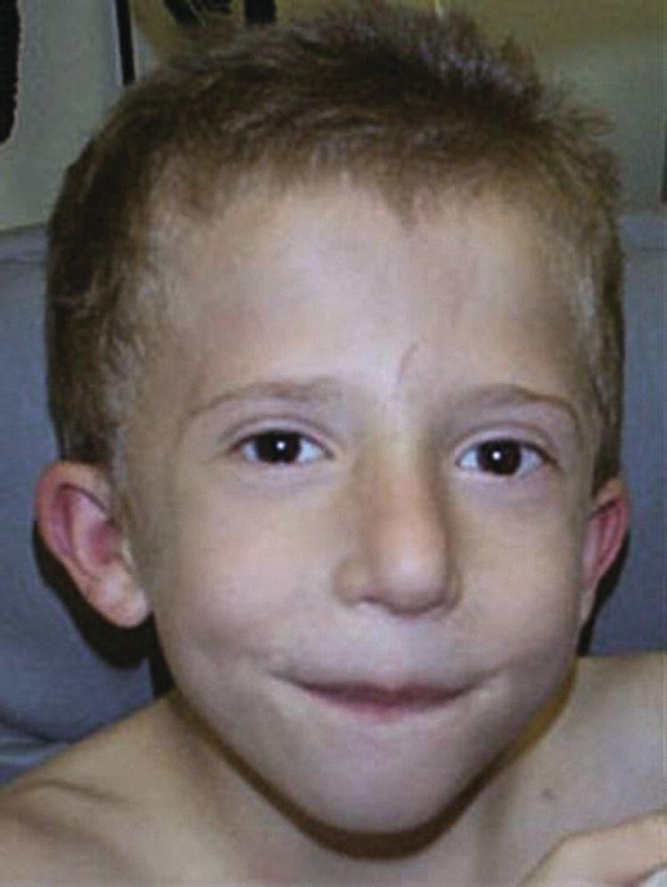
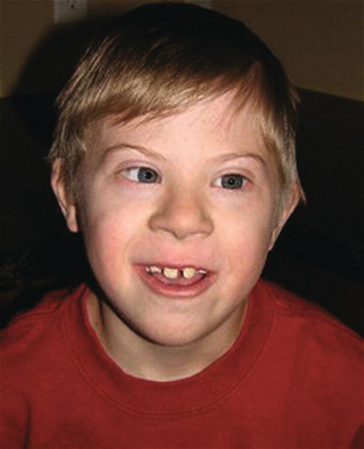
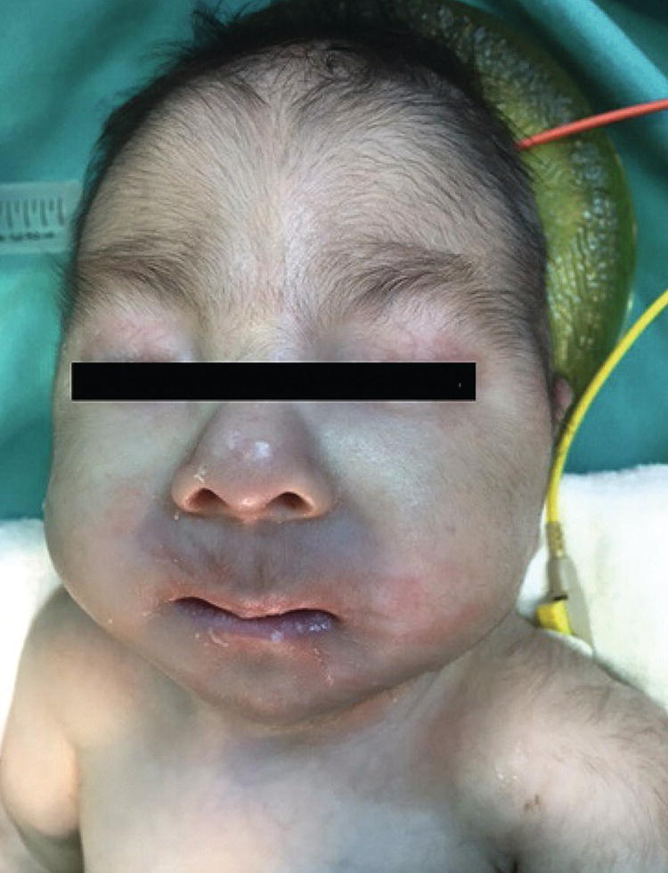
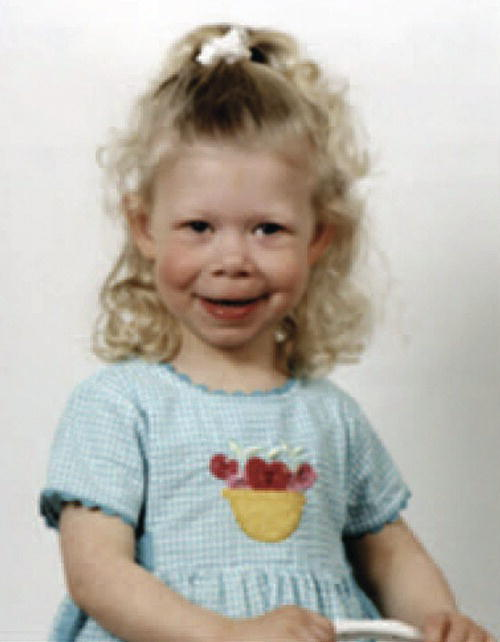
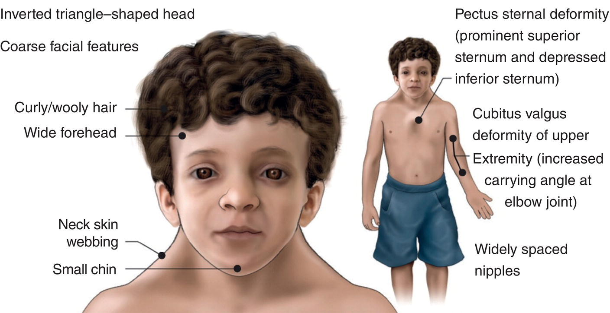
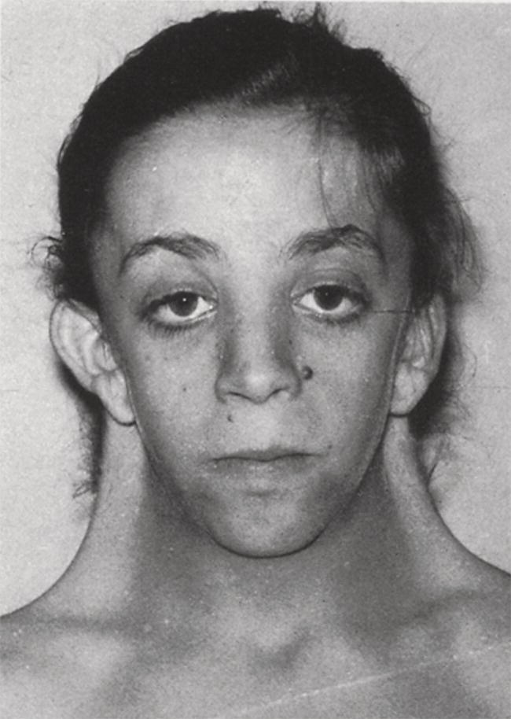
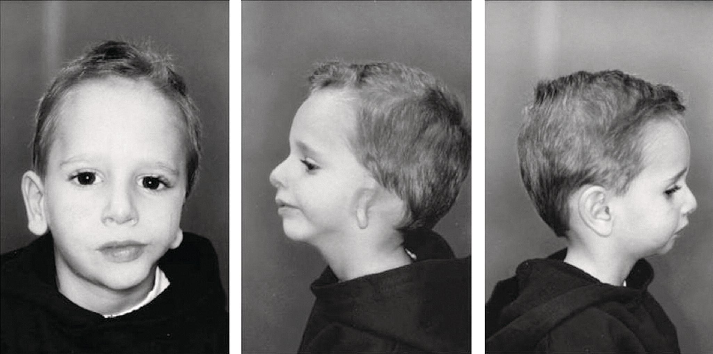
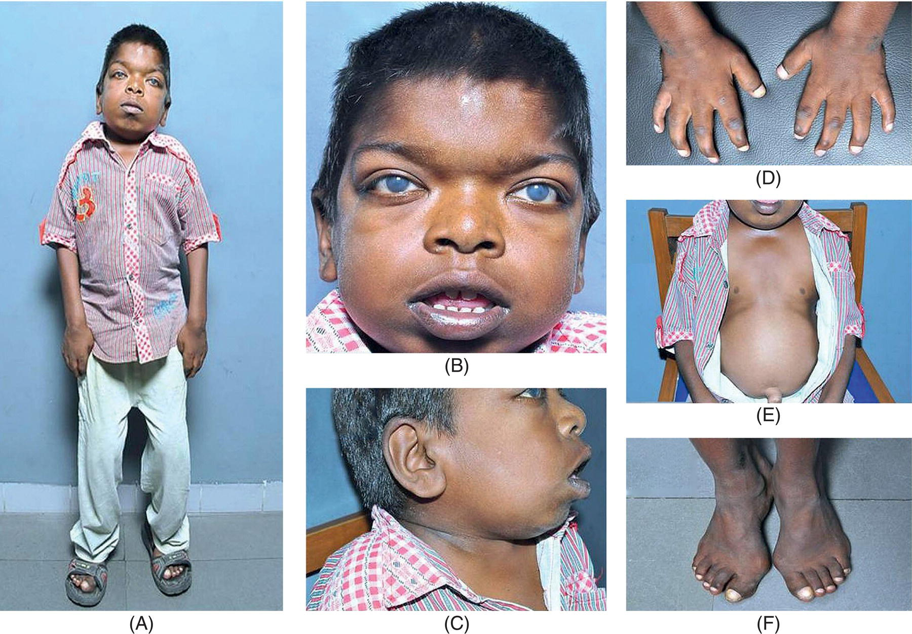
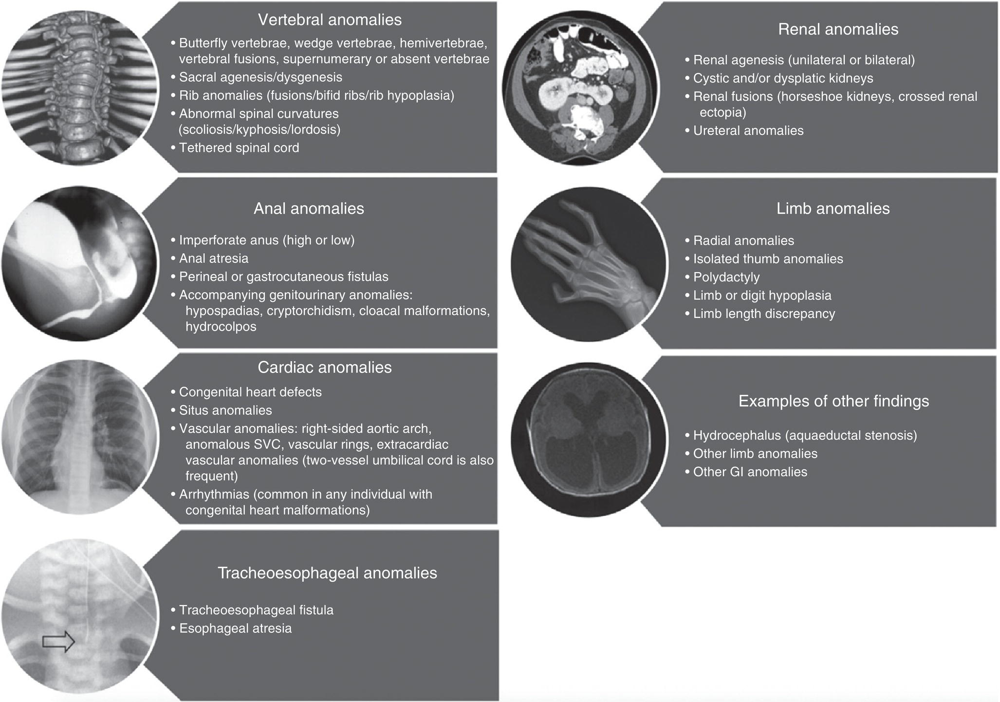
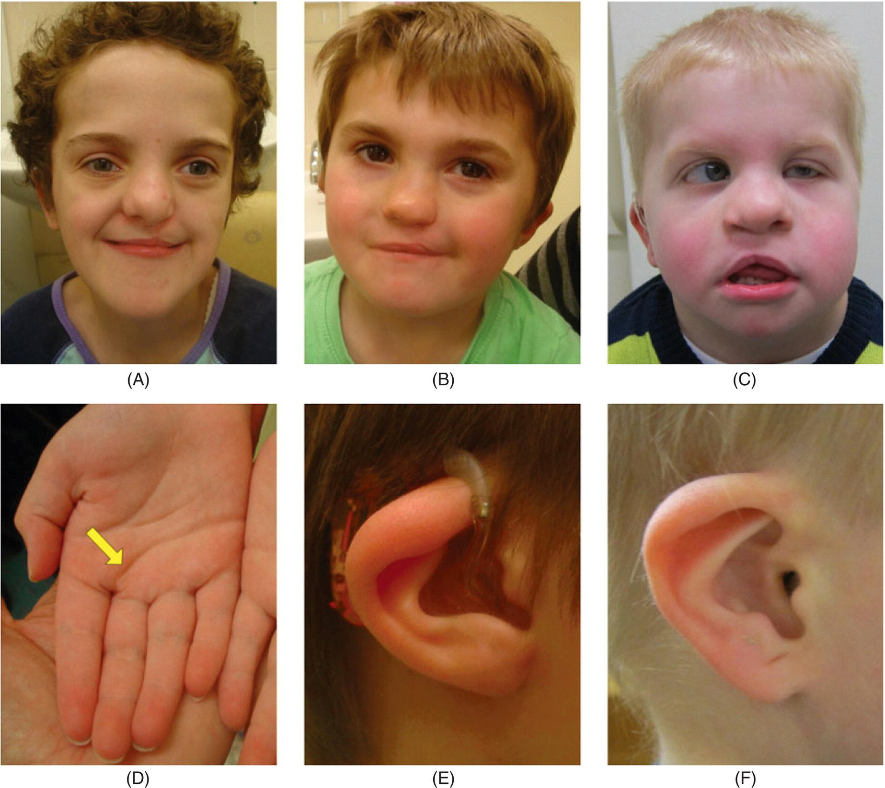

CHAPTER 8 Genetic Syndromes and Associations in Congenital Heart Disease 

# CHAPTER 8  
Genetic Syndromes and Associations in Congenital Heart Disease

_Erin A. Gottlieb1, Andrew Matisoff2, and Dean B. Andropoulos3_

1 Division of Pediatric Cardiac Anesthesiology, Department of Surgery and Perioperative Care, The University of Texas at Austin, Dell Children’s Medical Center of Central Texas, Associate Professor of Surgery and Perioperative Care Dell Medical School, Austin, TX, USA

2 Children’s National Medical Center, George Washington School of Medicine and Health Sciences, Washington, DC, USA

3 Department of Anesthesiology, Perioperative and Pain Medicine, Department of Anesthesiology, Baylor College of Medicine, Texas Children’s Hospital, Houston, TX, USA

* * *

1.  [**Introduction**](#head-2-63)
2.  [**Chromosome 22q11 deletion syndrome**](#head-2-64)
3.  [**Trisomy 21**](#head-2-65)
4.  [**Trisomy 18 and 13**](#head-2-66)
5.  [**Williams‐Beuren syndrome and Elastin arteriopathies**](#head-2-67)
6.  [**Noonan syndrome**](#head-2-68)
7.  [**Turner syndrome**](#head-2-69)
8.  [**Goldenhar syndrome**](#head-2-70)
9.  [**Mucopolysaccharidoses and glycogen storage diseases**](#head-2-71)
10.  [**Aortopathy syndromes**](#head-2-72)
     1.  [Marfan syndrome](#head-3-57)
     2.  [Loeys‐Dietz syndrome](#head-3-58)
     3.  [Ehlers‐Danlos syndrome](#head-3-59)
11.  [**VACTERL association**](#head-2-73)
12.  [**CHARGE syndrome**](#head-2-74)
13.  [**Heterotaxy syndrome**](#head-2-75)
14.  [**Table of genetic syndromes and associations**](#head-2-76)
15.  [**Genetic testing in CHD**](#head-2-77)
     1.  [Chromosomal microarray (CMA)](#head-3-60)
     2.  [Fluorescence in‐situ hybridization (FISH)](#head-3-61)
     3.  [Chromosomal karyotype](#head-3-62)
     4.  [Single gene sequencing](#head-3-63)
     5.  [Whole exome sequencing](#head-3-64)
16.  [**Ethics in congenital heart disease**](#head-2-78)
     1.  [Ethical considerations for treatment](#head-3-65)
     2.  [Palliative care in CHD](#head-2-66)
17.  [**Conclusions**](#head-2-79)
18.  [**Selected references**](#head-2-80)

* * *

## Abstract

In this chapter, common genetic syndromes and associations in patients with congenital heart disease including the genetic defect and inheritance, cardiac and noncardiac manifestations, along with some anesthetic considerations and risk mitigation, and the effect of the syndrome on surgical morbidity and mortality are explored. Detailed approaches to anesthetic and surgical management of the specific cardiac lesions are contained in the corresponding Chapters in this textbook. Patients with congenital heart disease and genetic and dysmorphic associations present complex diagnostic and management decisions because of multiorgan disease, and many of these patients have neurodevelopmental disabilities and some have limited life expectancy. Because of these issues, approaches to genetic testing, ethical considerations, and palliative care are also discussed.

## Introduction

Approximately 20–30% of patients with congenital heart disease (CHD) also have a genetic syndrome or association comprised of cardiac and extracardiac features \[1\]. Therefore, patients with genetic syndromes or associations are seen disproportionately in locations where care is provided to patients with CHD. The presence of a syndrome or genetic abnormality is a risk factor for perioperative morbidity/mortality for congenital heart surgery \[2\], and noncardiac and genetic abnormalities can be associated with additional risk factors such as prematurity and weight <2.5 kg \[1\]. Patel et al. analyzed the Society of Thoracic Surgeons Congenital Heart Surgery Database and reported on the overall prevalence of noncardiac congenital anatomic abnormalities, genetic abnormalities, and syndromes in neonates undergoing congenital heart surgery of 18.8%. The congenital heart lesions with the highest incidence of a noncardiac anomaly, genetic abnormality, or syndrome were an atrioventricular septal defect, interrupted aortic arch, truncus arteriosus, and tetralogy of Fallot. The most common genetic abnormalities were heterotaxy syndrome, 22q11 deletion, trisomy 21, and Turner syndrome \[3\]. The presence of a genetic syndrome or abnormality clearly makes a difference in in‐hospital mortality in hypoplastic left heart syndrome (HLHS) and in conotruncal anomalies. The reported in‐hospital mortality for HLHS in patients with a genetic abnormality is 26.7% compared with 19.8% in patients without a genetic abnormality \[4\]. Michielon et al. report that 22q11 deletion and Trisomy 21 are not risk factors for mortality after repair of conotruncal anomalies, but VACTERL association was associated with a higher risk of mortality \[5\]. In addition to the well‐known chromosomal disorders and genetic syndromic associations in CHD, newer genetic analysis tools such as whole‐exome sequencing (see below under Genetic Testing) are discovering many new, complex gene variants that are associated with CHD, and so the knowledge of the genetic basis of CHD is expanding and it is likely that an even higher percentage of CHD patients have variants that can explain both the cardiac disease and extracardiac manifestations \[6\]. Certain genetic syndromes are known to carry an increased anesthetic risk. An understanding of the genetic basis, manifestations, and impact of perioperative management in patients with these syndromes and associations is important for risk stratification, counseling, decision‐making, and mitigation of anesthetic and perioperative risk \[1\].

Historically, cardiac repair was not offered for patients with some genetic syndromes, including Trisomy 21. In the present day, cardiac repair is often expected, and cardiac transplantation has been performed in patients with Trisomy 21. This change in the pattern of care has increased the life expectancy of patients with Trisomy 21, and patients with Eisenmenger syndrome and other sequelae of longstanding unrepaired cardiac disease rarely present for anesthetic care in the modern era in developed countries. This same evolution is now being seen with other syndromes with Trisomy 21 being the model for nonbiased treatment of CHD \[7\]. As operative management becomes more common, it is important to tailor perioperative management to optimize outcomes. Genetic‐specific treatment and management protocols have been suggested to reduce perioperative morbidity and mortality \[7\].

In this chapter, common genetic syndromes and associations in patients with CHD are explored including the genetic defect and inheritance, cardiac and noncardiac manifestations, along with some anesthetic considerations and risk mitigation, and the effect of the syndrome on surgical morbidity and mortality. Detailed approaches to anesthetic and surgical management of the specific cardiac lesions are contained in the corresponding chapters in this textbook. Patients with congenital heart disease and genetic and dysmorphic associations present complex diagnostic and management decisions because of multiorgan disease, and many of these patients have neurodevelopmental disabilities, and some have limited life expectancy. Because of these issues, approaches to genetic testing, ethical considerations, and palliative care are also discussed.

## Chromosome 22q11 deletion syndrome

Velocardiofacial syndrome (VCFS), which is also termed DiGeorge syndrome or sequence, 22Q11 deletion syndrome, CATCH 22, and conotruncal anomalies face syndrome, has a broad spectrum of phenotypic variation with more than 180 clinical features. VCFS is one of the most common multiple anomaly syndromes, estimated to occur in approximately 1 : 2,000 live births. VCFS is inherited as an autosomal dominant disorder caused by a microdeletion at chromosome 22q11.2 \[8\]. The phenotype is extremely heterogeneous, and there is no single clinical feature present in all cases, therefore the diagnosis is established by the chromosome defect itself. Congenital heart disease is present in 70% of cases and comprises a high proportion of all conotruncal anomalies, including more than 50% of cases of interrupted aortic arch, over 15% of patients with tetralogy of Fallot, about 50% of truncus arteriosus patients, and about one third of posteriorly malaligned ventricular septal defects. Hemizygosity of the gene TBX1 is responsible for cardiac defects. Other defects commonly present are cleft palate, usually submucous clefts. Facial anomalies are often associated and include high arched palate, low set ears, and occasionally, varying degrees of micrognathia ([Figure 8.1](#c8-fig-0001)) \[8\]. Other important features present in a variable percentage of patients are partial hypoparathyroidism causing neonatal hypocalcemia, and relative immunodeficiency from abnormal lymphocyte function. Neurodevelopmental disability is common in VCFS, although in some patients intelligence is normal. The average mean full‐scale IQ is 70–75, with about 55% having an IQ range of 70–100; 45% having an IQ range of 55–70, and a few patients have moderate to severe disability \[9\]. Individuals with VCFS are at an increased risk for developing a number of neuropsychiatric disorders which include attention deficit with hyperactivity disorder, anxiety and mood disorders, autism spectrum disorder, psychotic disorders, and schizophrenia. Patients with the cardiac diseases noted above should be tested for the 22q11.2 deletion syndrome using fluorescence‐in‐situ hybridization (FISH) or chromosomal microarray (CMA), and other multisystem involvement should be assessed as well, especially hypocalcemia and immune dysfunction leading to increased infection risk, as these may affect anesthetic management. In patients with simpler forms of CHD and VCFS, i.e. tetralogy of Fallot, VSD, and simple truncus arteriosus, surgical outcomes are the same as patients without a chromosome defect. However, in the interrupted aortic arch, surgical outcomes are poorer with the 22q11.2 deletion. Finally, the later neurodevelopmental outcomes at one year or more after cardiac surgery are worse overall with 22q11.2 deletion \[10\]. In spite of the known mild craniofacial anomalies in this syndrome, airway management and tracheal intubation is most often not problematic.

[**Figure 8.1**](#R_c8-fig-0001) Facial features of the velocardiofacial syndrome. Note the small low‐set posteriorly rotated ears and slight retrognathia; the patient also has a high arched palate with submucous cleft.

(Source: Shprintzen \[53\]. Reproduced with permission from John Wiley & Sons.)

## Trisomy 21

The most common genetic syndrome, Down syndrome (DS) affects about 1/700 live births \[11\]. Resulting from an additional 21st chromosome, diagnosis often occurs _in utero_ with abnormal levels of maternal serum markers (alpha‐fetoprotein, human chorionic gonadotropin, pregnancy‐associated plasma protein‐A, and inhibin A), as well as increased nuchal translucency and a shortened nasal bone on ultrasound in the first trimester \[12, 13\]. Postnatal diagnosis is based on a physical exam and FISH to confirm the presence of an extra chromosome 21 (3). Children with DS are typically hypotonic with highly mobile joints and distinctive physical features, including a small head with a short neck, macroglossia, palpebral fissures, broad short hands with a single palmar crease, and Brushfield's spots on the iris (3) ([Figure 8.2](#c8-fig-0002)) \[14, 15\]. They typically have short stature and obesity is prevalent with increasing age. Prematurity and low birth weight (<2,500 g) occur more frequently compared to the general population \[11, 14\]. The presence of a flat nasal bridge, macroglossia, and a smaller hypopharynx with decreased muscle tone, and increased tonsillar and adenoid hypertrophy lead to airway obstruction and obstructive sleep apnea (OSA). In addition, children with DS may have smaller airways with an increased incidence of subglottic stenosis, as well as lower airway disease from reduced airway branching units due to a reduced number of alveolar acini \[14\]. As many as 8% of children with DS have hypothyroidism which should be screened for annually. Hematologic disturbances including neutrophilia, polycythemia, and thrombocytopenia are common in the newborn period and, in addition, 10% of neonates with DS will have a transient myeloproliferative disorder, also known as transient megakaryoblastic leukemia. Cervical spine abnormalities such as atlantoaxial instability are estimated to occur in 15% of children with DS.

[**Figure 8.2**](#R_c8-fig-0002) Typical facial features of Down syndrome. Note the epicanthal folds, upslanting palpebral fissures, flat facial profile, and relatively large tongue.

(Source: Davidson \[12\]. Reproduced with permission from Elsevier.)

Greater than 40% of children with DS are born with congenital heart disease with atrioventricular septal defect (AVSD), ventricular septal defect (particularly a canal type VSD), tetralogy of Fallot, and patent ductus arteriosus being most common. Racial differences exist in which black children with DS have a much higher incidence of AVSD. Despite a higher prevalence of prematurity and comorbidities than children without DS, no significant difference has been found in survival after congenital cardiac surgery in children with DS \[16–18\]. Children with DS who undergo mask induction with sevoflurane are known to have an increased risk of bradycardia. In a study of 209 children with DS, 57% experienced significant bradycardia unrelated to the presence of congenital heart disease \[11, 19\]. While the bradycardia is typically self‐limited, cases of cardiovascular collapse have been documented \[20\].

Down syndrome patients are known to be at higher risk of developing pulmonary hypertension (PH), especially in the neonatal period. While the lifetime incidence of PH in children with DS remains unknown, one large, retrospective study of children with DS reported an incidence of PH as high as 28% \[21\]. Prematurity and LBW increase the risk of the development of bronchopulmonary dysplasia‐related PH. Chronic airway obstruction and hypoxia result in increased arteriolar hypertrophy of the pulmonary vasculature which can develop into pulmonary hypertension. Cardiac defects such as AVSD and VSD with a large left to right shunt lead to increased pulmonary blood flow which can further increase the pulmonary vascular resistance. These factors in addition to pulmonary hypoplasia and intrinsic endothelial dysfunction lead to an increased risk of developing pulmonary hypertension.

All patients with DS who require anesthesia should have a preoperative evaluation to screen for the presence of multisystem disease. Patients should be examined for the presence of atlantoaxial instability with radiographic images such as MRI reserved for those with worsening muscle tone or increasing weakness. While the likelihood of a spinal injury under anesthesia in a child with DS is very low, efforts to limit extreme motions of the cervical spine are warranted in all patients with DS \[11\]. Patients with DS who require anesthesia should at some point have an ECG and echocardiogram to rule out the presence of congenital heart disease and pulmonary hypertension. Thyroid tests to detect hypothyroidism should be performed. Screening for snoring and obstructive sleep apnea should also be performed in all patients with DS who require anesthesia. Blood tests to evaluate for thrombocytopenia are warranted before procedures at high risk for blood loss.

Even with adequate preparation, patients with DS can be challenging for anesthesiologists. Difficult vascular access due to xeroderma and obesity is common. Patients may have increased procedural anxiety which can be worsened by hearing difficulty and language delays. DS patients may have difficulty expressing pain, yet they may be more sensitive to the effects of opioids due to OSA. While it has long been rumored that patients with DS require higher doses of anesthesia, there is no evidence supporting this, and recent studies have all but disproven this hypothesis \[22\]. Anesthetic risk in patients with DS is dependent on the severity and presence of comorbidities with younger, lower‐weight children with cardiac disease and pulmonary hypertension at the highest risk of complications. In a review of 930 non‐cardiac anesthetics in patients with DS, the cohort of patients with trisomy 21 had an increased incidence of perioperative respiratory adverse events mostly due to an increased incidence of obstructed ventilation \[23\].

## Trisomy 18 and 13

Trisomy 13 (Patau syndrome) and Trisomy 18 (Edwards syndrome), result from having three copies of chromosomes 13 and 18, respectively. Trisomy 18 is the second most common autosomal trisomy occurring in about 1/6,000 live births, while Trisomy 13 occurs in 1/10,000 live births \[24, 25\]. Antenatal diagnosis occurs in most cases due to maternal age, maternal serum markers (significantly lower human chorionic gonadotropin, unconjugated estriol, and alpha‐fetoprotein), and sonographic changes of the nasal bone and nuchal translucency \[23\]. Later sonographic findings identify up to 90% of cases. While preterm loss, stillbirth, and elective termination occur in a large majority of cases, survival to term increases with increasing gestational age. Among those who survive to term, the risk of early death is very high, with recent studies showing a survival to 1 year in only 5–10% of children with both Trisomy 13 and 18 \[24–26\].

Multiple congenital anomalies are often present in children with Trisomy 13 and 18, and invasive procedures are likely needed for survival in most children with the syndrome. Low birthweight occurs in most children with each syndrome. Central nervous system abnormalities are likely to present leading to central apnea, severe developmental delay, and seizures. Feeding difficulties, gastroesophageal reflux, and growth retardation occur in most patients, and a permanent feeding tube is required in many patients. Respiratory insufficiency is multifactorial. Central apnea is common, and hypotonia, micrognathia, laryngo‐tracheomalacia, and a high frequency of cleft lip and palate can lead to obstructive apnea. Because of this, many patients with Trisomy 18 and 13 require lifelong invasive ventilatory support.

Cardiac disease occurs in up to 80% of patients with Trisomy 18 and Trisomy 13, with ASD, VSD, patent ductus arteriosus (PDA), and valvular abnormalities being most common. Until recently, few centers chose to operate on patients with Trisomy 18. Today, most centers offer cardiac surgery for patients with Trisomy 18. A 2019 study of the Society of Thoracic Surgeons Congenital Heart Surgery Database of children with T13 and T18 who underwent cardiac surgery (2010–2017) demonstrated that while 70% of centers offered surgery on these patients, mortality remained high at 15% with a high rate of complications \[27\]. Those who required preoperative mechanical ventilation had an 8‐fold increased risk of mortality.

[**Figure 8.3**](#R_c8-fig-0003) A 3 month old infant with trisomy 18 (Edwards syndrome). Note the microphthalmia, micrognathia, short neck, and failure to thrive. The infant was also hypotonic with club foot, and had ventricular and atrial septal defects.

(Source: Bali et al. \[25\]. Reproduced with permission from Turkish Society of Anaesthesiology and Reanimation.)

Preoperative evaluation of the airway, severity of cardiac disease, and consequences of prematurity is necessary for all children with Trisomy 18 and 13. Difficult intubation and ventilation should be anticipated in patients with Trisomy 18 and 13 because of micrognathia, high prevalence of cleft lip and palate, and a narrow palate \[28\] ([Figure 8.3](#c8-fig-0003)). Most patients with these chromosomal disorders will require prolonged postoperative mechanical ventilation due to prematurity, central apnea and airway obstruction.

## Williams‐Beuren syndrome and Elastin arteriopathies

Williams syndrome (WS) is caused by a deletion on the long arm of chromosome 7q11.22 which most notably codes for the protein elastin, important in the elasticity of blood vessels. Nonsyndromic elastin arteriopathies have similar cardiovascular presentations of WS without the extravascular abnormalities. Diagnosis of WS is typically by FISH (see below under Genetic Testing), demonstrating a segment loss on chromosome 7. Patients with WS are known for their characteristic elfin facies, with a broad forehead, wide mouth, a short‐upturned nose, and epicanthal folds \[29\] ([Figure 8.4](#c8-fig-0004)). Many have a gregarious, friendly personality; however, periprocedural anxiety is common (14). Feeding difficulties and reflux are common and up to 50% of WS patients have hypercalcemia, especially in infancy. Up to 70% of patients with WS have cardiovascular diseases, most notably supravalvular aortic stenosis (SVAS), supravalvular pulmonary stenosis and ostial stenosis of coronary arteries. Patients with severe outflow tract obstructions and/or coronary disease are at high risk for myocardial ischemia with induction of anesthesia \[30, 31\]. In addition to a 25% lifetime risk of sudden death in patients with WS, there were several cases of cardiac arrest under anesthesia documented in the literature with an estimated incidence of 5%. Several methods of risk stratification have been proposed in the literature, though prospective studies evaluating their accuracy have not been performed. All patients with WS who present for anesthesia should undergo risk stratification and perioperative planning, and it has been demonstrated that with such planning, the incidence of cardiac arrest may be minimized. Echocardiograms to evaluate the severity of supravalvar aortic and pulmonary stenosis, ECGs screening for latent ischemia should be performed on all patients with WS before anesthetic care. Evaluation of the coronaries should be performed in those with stenosis of the thoracic aorta, moderate to severe SVAS and those with signs of symptoms of ischemia. Both cardiac CT angiography and cardiac catheterization can be used to image the patency of the coronary arteries, with CT angiography having the advantage of being done without general anesthesia and avoiding the temporary interruption of coronary blood flow during catheter‐based angiography which has been the cause of cardiac arrest in several patients with WS \[32\]. Younger patients (<3 years) with moderate to severe outflow tract gradients or those with biventricular outflow tract obstruction should be considered at high risk for myocardial ischemia during anesthesia (16). Such patients may benefit from preoperative hydration, the use of anesthesia drugs that maintain SVR and minimize myocardial oxygen consumption, and judicious use of vasopressors such as phenylephrine to maintain coronary perfusion pressure. All patients considered high risk should be cared for in centers with the capability for full resuscitation and the availability of extracorporeal membrane oxygenation (ECMO), as standard resuscitation measures may fail in patients with severe coronary stenosis or severe outflow tract obstruction. ECMO standby is used at several centers when caring for moderate to high‐risk WS patients. [Chapter 35](c35.xhtml) presents an extensive discussion of anesthetic risk stratification and approach in WS.

[**Figure 8.4**](#R_c8-fig-0004) Williams syndrome facies in a young child. Note the periorbital puffiness, flat nasal bridge, long philtrum, wide smile, full cheeks, and full lower lip.

(Source: Waxler et al. \[48\]. Reproduced with permission from SLACK Incorporated.)

## Noonan syndrome

Noonan syndrome (NS), occurring in 1/2,500 live births is the second most common genetic cause of congenital heart disease. Noonan syndrome typically occurs via autosomal dominant inheritance and is a heterogenous disease with a wide range of clinical characteristics. NS is considered a RASopathy, which results from germline mutations in the intracellular RAS/mitogen‐activated protein kinase (MAPK) pathway \[33, 34\]. Diagnosis is suspected from fetal ultrasound and fetal echocardiography and can be confirmed by DNA sequencing. Distinctive facial features in patients with NS include a tall forehead, hypertelorism with prominent eyes and down‐slanting palpebral fissures, a small jaw and short, webbed neck, and low‐set and posteriorly rotated ears and wide‐spaced nipples with pectus excavatum \[35\] ([Figure 8.5](#c8-fig-0005)). Hearing and intellectual difficulties are common. Children with NS have short stature, feeding difficulties, and cryptorchidism in up to 80% of males (17, 18). Congenital heart disease occurs in over 80% of children with NS. Pulmonary valve stenosis is the most common congenital heart defect, occurring in over 50% of patients. These dysplastic thickened pulmonary valve leaflets are often resistant to valvuloplasty. Atrial septal defect (ASD) is the second most common cardiac defect. Twenty percent of children with NS have hypertrophic cardiomyopathy often presenting as early as 6 months of age, far earlier than other forms of hypertrophic obstructive cardiomyopathy (HOCM) \[33, 34, 36\]. Among those NS patients with HOCM, obstruction of the left ventricular outflow tract and congestive heart failure are more common than typical HOCM patients. Earlier diagnosis and the presence of congestive heart failure symptoms are associated with worse long‐term survival in patients with NS‐associated HOCM \[36\].

[**Figure 8.5**](#R_c8-fig-0005) Noonan syndrome phenotypic features in a child.

(Source: Bhambhani and Muenke \[35\] / American Academy of Family Physicians / Public Domain.)

Patients with NS who require anesthesia should have recent echocardiograms to screen for cardiac defects and to assess the severity of outflow tract obstruction. Patients with HOCM with moderate to severe left ventricular outflow tract (LVOT) obstruction should have preoperative IV placed for prehydration. Careful titration of induction agents with preservation of systematic vascular resistance while avoiding hypovolemia and tachycardia should be performed to minimize myocardial ischemia during anesthesia. Older patients with NS can have limited mouth opening and more severe micrognathia than infants due to joint immobility with advancing age, and difficult laryngoscopy should be anticipated.

## Turner syndrome

Turner syndrome (TS), an X‐linked chromosomal syndrome occurs due to loss of one sex chromosome (45XO). Prenatal diagnosis is often from chorionic villous sampling or amniocentesis. Affected females typically have short stature, a webbed neck, a broad chest with wide‐spaced nipples, and gonadal dysgenesis \[37, 38\] ([Figure 8.6](#c8-fig-0006)). Airway anomalies include micrognathia, a narrow maxilla, and a high arched palate \[39\]. Swelling of the hands and feet due to lymphedema can occur and scoliosis is prevalent in up to 10% of children with Turner syndrome. Renal defects such as horseshoe kidney and renal agenesis can occur, and autoimmune diseases such as hypothyroidism and celiac disease occur with high prevalence \[37\].

[**Figure 8.6**](#R_c8-fig-0006) A 14‐year‐old female with Turner syndrome.

(Source: Acarturk \[38\]. Reproduced with permission from Springer Nature.)

The most common congenital heart defects in TS include a bicuspid aortic valve and coarctation of the aorta (CoA). Hypertension is common even in patients without CoA. These patients are at risk of aortic dissection and require lifelong evaluation of blood pressure and aortic dimensions \[37\].

A careful preoperative workup evaluating the presence and severity of cardiac disease, renal and thyroid function, and the airway is necessary before anesthetic care in patients with Turner syndrome. Difficult laryngoscopy and intubation should be anticipated due to limited neck mobility and retrognathia. Blood pressure lability as well as difficult vascular access may be encountered during anesthetic care \[39\].

## Goldenhar syndrome

Interruption of the blood supply to the first and second brachial arches during the first trimester leads to oculo‐auriculo‐vertebral syndrome, also known as Goldenhar syndrome. Diagnosis typically occurs after birth after noting unilateral facial hypoplasia. Facial asymmetry, mandibular hypoplasia, eye abnormalities, microtia or absent ear on the affected side, and dental abnormalities of varying degrees are typically present \[40\]. Vertebral abnormalities including cervical vertebral fusion and vertebral hypoplasia are present in up to 60% of patients \[40, 41\] ([Figure 8.7](#c8-fig-0007)). Various degrees of hearing loss and intellectual disability can occur. Congenital heart defects, commonly ventricular septal defects as well as conotruncal defects have been noted in anywhere from 5 to 58% of patients with Goldenhar syndrome, but the actual prevalence of CHD in Goldenhar syndrome is likely closer to 20% \[42\].

Anesthetic concerns typically focus on airway management, noting that these patients are among some of the most difficult patients to intubate due to severe micrognathia, a hypoplastic, arched palate, airway deviation towards the affected side, limited neck mobility, and mouth opening. Preparation for difficult mask ventilation and laryngoscopy is mandatory when anesthetizing all patients with Goldenhar syndrome. While various techniques such as intubation through a laryngeal mask airway and video laryngoscopy have been employed successfully, preservation of spontaneous ventilation and having a plan should intubation attempts fail is necessary to avoid harm \[43\]. These patients often undergo several airway reconstructive surgeries to advance the mandible, though the success of these procedures in patients with Goldenhar syndrome is reported to be less than with other syndromes \[44\].

## Mucopolysaccharidoses and glycogen storage diseases

Mucopolysaccharidoses (MPSs) are a collection of lysosomal storage diseases, caused by the functional deficiency of lysosomal enzymes from a genetic mutation in the pathways of the breakdown of glycosaminoglycans (GAG), which were previously termed mucopolysaccharides. These are rare metabolic disorders characterized by the accumulation of incompletely degraded GAGs in virtually all tissues of the body. Classic phenotypes result, including dwarfism, bone and joint deformities, dysmorphic facial characteristics, developmental delay in some patients, ocular and hearing abnormalities, hepatosplenomegaly, and inguinal or umbilical hernias. Cardiac findings are frequent, but much more common in MPS I (Hurler, Hurler‐Scheie Syndrome), MPS II (Hunter Syndrome), and MPS VI (Maroteaux‐Lamy Syndrome) \[45\]. [Table 8.1](#c8-tbl-0001) presents the genetic inheritance, involved chromosomes, frequency, and cardiac and non‐cardiac manifestations of these diseases \[46–48\]. In addition to the six major categories, each has several subtypes with a variable clinical phenotype that depends on the precise enzyme defect; thus presentation, including cardiac disease, is variable. The overall prevalence of these rare diseases together is 1 : 20,000 live births.

[**Figure 8.7**](#R_c8-fig-0007) Goldenhar syndrome in a 7‐year‐old male. Note the facial asymmetry with hypoplastic mandible and ear deformity on the left side.

(Source: Vendramini‐Pittoli and Kokitsu‐Nakata \[42\]. Reproduced with permission from Wolters Kluwer.)

Cardiac valvular pathology is the most common manifestation, and leaflet thickening with dysfunction has been reported in more than 80% of patients with MPS I, 50–60% of patients with MPS II, and in essentially all patients with MPS VI \[45\]. Valvular regurgitation, not stenosis, is more common, and the mitral valve is most commonly affected rather than the aortic. Right‐sided valvular disease is less severe. Markedly thickened mitral valve leaflets, and shortened cordae tendinae result in dysmorphic and poorly mobile leaflets. Coronary artery narrowing and occlusion by GAG deposition in proximal coronary arteries is most common in MPS I and II and can occur early, especially in rapidly progressing forms of the disease. Conduction abnormalities, consisting of bundle branch block or complete heart block are seen up to 40% of these patients, presumably from infiltration of the conduction system with GAGs. Valve repair or replacement is the most common cardiac surgery in patients with mucopolysaccharidoses.

In addition to the cardiac pathology, difficult intubation is the most common anesthetic challenge, and MPS I, II, and, VI have in common mucopolysaccharide deposits in the lips, tongue, epiglottis, tonsils, adenoids, and lower airway making them at high risk for airway obstruction and difficult laryngoscopy. In addition, many have a short, stiff neck, and cervical spine abnormalities including atlantoaxial instability and foraminal stenosis\[49\] ([Figure 8.8](#c8-fig-0008)). A complete pre‐anesthetic evaluation including these and other involved organ systems and a plan to manage them is crucially important for these diseases \[46\]. Of particular concern if regional anesthesia is contemplated are case reports of paralysis after combined general/epidural anesthesia in Hurler and Morquio Syndromes (MPS IV); avoiding neuraxial anesthesia is recommended in these patients \[50\].

Pompe Disease is a glycogen storage disease, which is a group of diseases that share defects in the enzymes that break down glycogen. Pompe Disease has an infantile, juvenile, and adult form, depending on the degree of alpha‐glucosidase deficiency \[51\]. Glycogen deposits within the cardiac myocytes result in hypertrophic cardiomyopathy, which varies with the enzyme deficiency and can be severe, resulting in biventricular outflow tract obstruction. Alternately, some patients demonstrate dilated cardiomyopathy. Danon Disease is an even more rare X‐linked disorder that can also result in hypertrophic or dilated cardiomyopathy. Imaging studies, non‐cardiac surgery, and cardiac surgery for resection of hypertrophied myocardium to relieve outflow tract obstruction are common anesthetics in this population.

Enzyme replacement therapy (ERT) has been available for the last decade or more for MPS I, II, IV, VI, and VII; which consists of weekly intravenous infusions of the defective enzyme, produced using recombinant DNA methods \[52\] ([Table 8.2](#c8-tbl-0002)). The uniform drawback of the current formulations is that they do not cross the blood‐brain barrier or effectively penetrate many tissues, and thus do not affect central nervous system pathology and have variable effects on other organ systems. Improvements in organ systems pathology are mixed; for the cardiac pathologies, it is generally acknowledged that long‐term ERT reduces or at least stabilizes LV mass index, septal hypertrophy, and ejection fraction in MPS I, II, IV, and VI in most studies. The valvular abnormalities are not improved \[53\]. Coronary artery pathology improvement has not been specifically addressed, but there are case reports of sudden unexpected death from coronary artery stenosis in ERT‐treated patients. For other pertinent systems, although there have been a few reports of improved obstructive sleep apnea, coarseness of facial features, and respiratory infections with ERT, studies have not yet demonstrated a reduction in adenoidal or tonsillar hypertrophy. Another therapy for MPS disorders has been hematopoietic stem cell transplant, which has shown promise in MPS I, but with mixed results in MPS II, III, IV, and VI. The overall message for the anesthesiologist caring for MPS patients is that each patient requires very careful multisystem evaluation, and because of variable outcomes, patients receiving ERT or who have had stem cell transplants should not be assumed to have significant improvement because these therapies do not appear to be consistently effective in reversing already established pathology even though they may prevent progression of the disease.

[**Table 8.1**](#R_c8-tbl-0001) Cardiac genetic syndromes

Source: Modified from Mann et al. \[46\].

| Syndrome: Name, Eponyms, Inheritance,Incidence,Gene Locus, Gene Product | HEENT/Airway | Central nervous system | Cardiovascular | Pulmonary/Thoracic | Other | Additional anesthetic considerations |
| --- | --- | --- | --- | --- | --- | --- |
| **Alagille syndrome** |  | Intracranial hemorrage/stroke; Developmental delay | 90% with cardiovascular anomalies; most commonly branch pulmonary artery stenosis | Spontaneous bleeding of unknown etiology | Airway: unusual facies, possible cervical spine abnormalities with no reports of difficult intubation |
| Alagille‐Watson syndrome, cholestasis with peripheral pulmonary stenosis, arteriohepatic dysplasia, syndromatic hepatic ductular hypoplasia | Other cardiac lesions: tetralogy of Fallot, tricuspid atesia, patent ductus arteriosus, ventricular septal defect | Biliary excretion abnormalities more than synthetic/metabolic hepatic abnormalities, | Abdominal distension may predispose to gastroesophageal reflux |
| Autosomal dominant |  |  |  |  | Butterfly Vertebrae; Possible shortened interpedicular distance, | Neurologic assessment, avoid succinylcholine with myopathies |
| 1 : 70,000 |  |  |  |  | exocrine pancreatic insufficiency | Cardiac work‐up |
| Chromosome 20p12 microdeletion |  |  |  |  | Renal disease | Assess coagulation profile – caution with neuraxial analgesia/anesthesia |
| JAG 1 signaling gene, encodes a ligand for the NOTCH1 receptor, critical for the determination of cell fates in early development |  |  |  | Vitamin K malabsorption – coagulopathies | Caution with positioning – rickets/hepatic osteodystrophy |
|  |  |  |  |  | Vitamin D malabsorption – rickets/pathologic fractures |
|  |  |  |  |  | Vitamin E malabsorption – peripheral myopathy/neuropathy |
|  |  |  |  |  | Liver transplant frequent in severe Alagille's |
|  |  |  |  |  |  |  |
| **CHARGE association** | Swallowing/sucking difficulties | Colobomata: typical iris coloboma to anophthalmos | Right‐sided congenital heart disease: tetralogy of Fallot, pulmonic stenosis, double outlet right ventricle | Atresia Choanae | Hypogenitalism | Possible difficult/impossible endotracheal intubation with micrognathia |
| Parental gonadal mosaicism in some cases; spontaneous mutation | Cleft palate associated with congenital heart disease, mostly tetralogy of Fallot | Cranial nerve dysfunction: CNI – anosmia, CN‐VII – facial palsy, CN‐VIII – hearing loss, CN‐IX/CN‐X – velopharyngeal incordination | atrioventricular septal congenital heart disease: ventricular/atrial septal defect associated with tetralogy of Fallot | tracheoesophageal fistula associated with congenital heart disease, mostly tetralogy of Fallot | Renal anomalies (malrotation, hydronephrosis, reflux) associated with congenital heart disease, mostly atrioventricular septal defect | May require continuous positive airway pressure to maintain airway patency with laryngomalacia/velopalatal insufficiency |
| 1 : 10,000 | Hypoplastic mandible (micrognathia) associated with congenital heart disease, mostly tetralogy of Fallot | Delayed motor development, may involve truncal hypotonia | Aberrant subclavian artery and/or right aortic arch | Vertebral anomalies (hemivertebrae, scoliosis) associated with congenital heart disease | May require smaller than expected endotracheal tube for subglottic stenosis |
| _Heterozygous mutation in the CHD7 on chromosome 8q12_. | Semicircular canal agenesis, sensorineural or conductive hearing loss | Developmental delay |  |  |  |  |
| Chromodomain helicase DNA binding protein 7 (CHD7) gene–neural crest epigenetic chromatin remodeling | Three major issues: micrognathia, laryngomalacia, subglottic stenosis |  |  |  | Aspiration risk with swallowing dysfunction, |
|  |  |  |  |  |  | cardiac work‐up for congenital heart defects, |
|  |  |  |  |  |  | Thyroid/Parathyroid functional studies for similarities between CHARGE and DiGeorge syndromes |
|  |  |  |  |  |  | High incidence of post‐operative airway events |
|  |  |  |  |  |  | Successful airway management with laryngeal mask airway has been reported |
| **DiGeorge (22q11‐) syndrome** | Craniofacial anomalies: Cleft palate, micrognathia, small mouth | Learning difficulties, other pyschiatric disorders | Cardiac defects: tetralogy of Fallot, interrupted aortic arch, ventricular septal defect, pulmonic stenosis, tricuspid atresia | Hypo‐ or aplasia of parathyroid gland resulting in hypocalcemia | Reports of vasomotor instability |
| (Velocardiofacial Syndrome, CATCH‐22, conotruncal anomalies face syndrome) | Small thyroid cartiledge with increased anterior angle |  |  |  | Hypo‐ or aplasia of thymus gland resulting in immune deficiencies | Cardiac work‐up for congenital heart disease |
| sporadic or autosomal dominant |  |  |  |  |  |  |
| One in two thousand | Short trachea with a reduced number of cartilage rings |  |  |  | Renal & Skeletal anomalies | Possible difficult airway with dysmorphic faces |
| 1.5‐ to 3.0‐Mb hemizygous deletion of chromosome 22q11.2 | Laryngobronchialmalacia |  |  |  | DiGeorge anomaly is likely a feature of Velocardiofacial Syndrome | Possible difficult extubation with velopharyngeal insufficiency |
| TXB1 deletion causes most cardiac defects and other phenotypic features; T‐box genes are transcription factors involved in the regulation of developmental processes | Tracheal bronchi |  |  |  |  | Recurrent infection risk with thymic dysfunction, |
|  |  |  |  |  |  | Persistent hypocalcemia with parathyroid dysfunction leading to seizures, |
|  |  |  |  |  |  | report of tachycardia from epinephrine injected with local anesthetics |
| **Down syndrome** | High arched narrow palate, macroglossia, subglottic stenosis | Variable intellectual disablity | 50% with congenital heart disease: Endocardial cushion defects (50%), ventricular septal defect, patent ductus arteriosus,tetralogy of Fallot | Upper airway obstruction/sleep apnea | Dental abnormalities | Radiologic cervical spine abnormalities do not correlate to neurologic symptoms |
| Trisomy 21 | Obstructive sleep apnea |  |  |  | Higher risk for leukemia |  |
| Errors in meiosis that lead to trisomy 21 are overwhelmingly of maternal origin; only about 5% occur during spermatogenesis. | Atlanto‐axial subluxation | Possible altered response to opioids | Predisposed to pulmonary hypertension | Duodenal atresia, Hirschsprung's disease with gastroesophageal reflux | Atlantoaxial instabilitity may increase with loss of muscle tone under anesthesia |
| 1 in 650–1,000 | Smaller tracheal lumen diameter | Hypotonia | Predisposed to bradycardia with inhaled induction; halothane, sevoflurane | Immunosuppression and hypothyroidism | Smaller enotracheal tube (0.5–1 mm)) to avert tracheal trauma |
| Transient myeloproliferative disorder and megakaryoblastic leukemia of Down syndrome are associated with mutations in the GATA1 gene. Somatic mutations in the JAK2 gene are associated with acute lymphoblastic leukemia | Possible difficult arterial/venous access | Hypotonia, hyperextensibility, dysplastic pelvis | Possible difficult vascular access, |
|  |  |  |  |  |  | Possible bradycardic response to high concentration volatile anesthetic agents |
| **Ehler‐Danlos Syndrome (EDS)** | Dysphonia ‐ hemi‐laryngeal weakness | Mild/mod weakness, myalgia, and easy fatigability in the majority of patients | Bleeding symptoms for all EDS types |  |  | Bleeding symptoms are responsive to desmopressin |
| EDS – Classical type |  |  | Mitral valve prolapse, aortic root/sinus of Valsalva dilatation, septal defects | Classic: I and II – Skin hyperextensibility, widened atrophic scars, joint hypermobility | Report of scoliosis correction using spinal fusion complicated by bleeding and wound dehiscence (D‐29.11) |
| autosomal dominant disorder type V collagen; chromosome 9q34.3; 1 : 20–50,000 |  |  |  |  |  |
| EDS – Hypermobility type |  | Decreased/absent analgesic effect from lidocaine given subcutaneously, or local anesthetic cream | Mitral valve prolapse, aortic root/sinus of Valsalva dilatation, septal defects | Hypermobility: III – Hyperextensibility ± smooth, velvety skin, generalized joint hypermobility |
| autosmal dominant or recessive mutation in tenascin X gene |  |  |  |  |  |  |
| EDS – Vascular type |  |  | Medium and large‐size vessel fragility leading to rupture | Vascular: IV – Translucent skin, arterial/intestinal/uterine fragility, extensive brusing, characteristic faces | Premature death from organ rupture (arterial, bowel, uterus) |
| Autosmal dominant mutation in type III collagen gene: 1 : 100–250,000 |  |  |  |  |  | Report of success using Recombinant Factor VIIa |
| EDS – Kyphoscoliosis type | Atlantoaxial subluxation may occur in Type IV |  |  |  | Kyphoscoliosis: VI – Joint laxity, muscle hypotonia, progressive scoliosis, scleral fragility | Report of scoliosis correction using spinal fusion complicated by arterial avulsion/rupture |
| autosomal recessive mutation in gene for lysyl hydroxylase: fewer than 60 cases |  |  |  |  |  |
| EDS – Arthrochalasia type |  |  |  |  | Arthrochalasia: VIIA/B – Joint laxity with recurrent subluxations, congenital B/L hip dislocation |
| Mutation in type I collagen gene; fewer than 30 cases |  |  |  |  |  | Careful positioning and skin protection |
| EDS – Dermatosparaxis type |  |  |  |  | Dermatosparaxis: VIIC – Severe skin fragility, sagging, redundant skin | Gentle intubation with minimal inspiratory pressures to avoid airway hematomas |
| 10 cases reported |  |  |  |  |  | Consider possible cervical instability |
| 13 subtypes recognized in 2017 reclassification |  |  |  |  |  | Cardiac work‐up to assess valves and great vessels |
|  |  |  |  |  |  | Avoid central vascular access or place under U/S visualization |
|  |  |  |  |  |  | Prepare for significant blood loss |
|  |  |  |  |  |  | Caution with neuraxial anesthesia/analgesia |
| **Pompe disease: glycogen storage disease type II** | Infantile onset: macroglossia | Infantile onset: rapidly progressive muscle weakness – axial hypotonia, areflexia | Infantile onset: cardiomegaly/cardiomyopathy leading to cardiac failure | Infantile onset: respiratory insufficiency with frequent infections | Infantile onset: hepatomegly, elevated creatine kinase | Respiratory insufficiency & hypertrophic cardiomyopathy pose a significant anesthetic risk |
| Acid maltase deficiency |  |  |  |  |  | Maintain intravascular volume and diastolic blood pressure for coronary perfusion |
| 1 : 60–140,000 |  |  |  |  |  | Reports of arrhythmias due to decreased coronary perfusion with propofol |
|  |  |  |  |  |  | Reports of successful regional anesthetic techniques |
|  | Late‐onset: macroglossia is infrequent | Late onset: progressive proximal muscle weakness – lower > upper extremity, Gower sign, decreased deep tendon reflexes | Late‐onset: cardiomegaly/cardiomyopathy is uncommon | Late onset: respiratory insufficiency/failure with infections, dyspnea on exertion,obstructive sleep apnea, Orthopnea | Late onset: moderate hepatomegaly, scoliosis/kyphosis/lordosis | Respiratory insufficiency poses anesthetic risk |
|  |  |  |  |  |  | Hypotonia/wheelchair‐bound – avoid neuromuscular blocking drugs and succinylcholine for prolonged weakness and hyperkalemia |
|  |  |  |  |  |  | Reports of prolonged respiratory depression with volatile agents |
| **Goldenhar syndrome** | Unilateral facial hypoplasia: prominent forehead, zygomatic hypoplasia, maxillar/mandibular hypoplasia | Epibulbar dermoid/ipodermoid, eye anomalies; microphthalmia, anophthalmia, etc | 30–60% CHD: 40% conotruncal, 30% septal, 15% targeted growth, 7% situs/looping, 4% left‐sided obstruction | Vertebral anomalies: hemivertebrae, fused vertebrae, scoliosis | Difficult airway – reports of failed intubation |
| Hemifacial microsomia, oculo‐auriculo‐vertebral syndrome, facio‐auriculo‐vertebral syndrome | Unilateral macrostomia – lateral facial cleft | Preauricular skin tag/blind fistulas, microtia or other external ear malformations |  | Often with rib/extremity anomalies | Reports of successful intubation with multiple techniques |
| Most cases are sporadic mutations; autosomal recessive or autosomal dominant reported | Vertebral anomalies: atlas occipitalization, synostosis | Vertebral anomalies; bifid spine |  |  | genitourinary anomalies: ectopic kidney, renal agenesis, vesiculoureteral reflux, ureteropelvic junction obstruction | Evaluate cervical spine for instability |
| 1 in 5,600 | Laryngotracheal anomalies: Cartilaginous tracheal sleeve | Often with occipital encephalocoele |  |  |  | Cardiac work‐up |
| Mutation in hemifacial microsomia gene on chromosome 14p32 in some patients | Significant incidence of C1–C2 instability | Often with complex retardation of development |  |  |  |
|  | Often with Cleft lip/palate/tongue, unilateral tongue hypoplasia, parotid gland aplasia |  |  |  |  |
|  | Often with tracheoesophageal fistula/esophageal atresia |  |  |  |  |  |
| **Heterotaxy syndrome** | Infrequent: cleft lip/palate, micrognathia, choanal atresia, laryngeal cleft | Rare: Neural tube defects, encephalocoele, cerebellar or corpus callosum agenesis | High prevalence of CHD | Abnormal ciliary function in up to 40%; frequent respiratory infections | Intestinal malrotation; polysplenia, asplenia, transverse liver, |
| X‐linked; chromosome Xq26.3; Autosomal dominant: heterozygous mutation in CFC1 gene on chromosome 2q21. |  | Single ventricle; DORV, TAPVR, right or left atrial isomerism,dual or absent SA nodes, bilateral SVC, interrupted IVC, unbalanced AVSD, | Bilateral right or left lungs and bronchi | Rare: hemivertebra, sacral agenesis, hypoplastic kidneys, hypospadias |
| Multiple additional genes in phenotypic series: on chromosomes 3p22.2, 6q21, 7p12.3,10q22.1, 10q26.2,15q21.3,18q21.1 |  | Cardiac arrhythmias: bradycardia in left atrial isomerism, atrial tachycardias in right atrial isomerism |  |
| 1 : 5,000–10,000 live births |  |  |  |  |  |  |
| **Hunter syndrome** | Dural hyperplasia/thickening ligamentum flavum lead to cervical myelopathy with UMN signs | Normal intelligence with progressive neurodegeneration leading to vegetative state as teenagers | Cardiac disease: cardiomyopathy, asymmetric ventricle septal thicking, mitral/aortic valve thickening | GI dysfunction: idiopathic diarrhea, spontaneous gastric perforation, bowel pseduo‐obstruction | Difficult airway: short neck, high larynx, large tongue, cervical instability |
| Mucopolysaccharidosis Type II | Coarse facies | Narrowing of the bony neural canal predisposing to cervical cord compression | Sudden death ‐ likely arrhythmia from coronary insufficiency | Treatment with enzyme replacement therapy or stem cell transplantation with limited success | Reports of post‐obstructive pulmonary edema at induction/extubation, |
| X‐linked recessive | temperomandibular joint stiffness and short, stiff neck | Compressive myelopathy from meningeal thickening causing communicating hydrocephalus |  | Reports of successful intubation using multiple techniques: blind nasal, fiber optic, LMA |
| 1 : 110–320,000 males | Adenotonsillar hypertrophy contributing to obstructive sleep apnea, progressive upper airway obstruction, infections |  |  | Reports of intubation failure using laryngeal mask airway |
| _Mutation in the gene encoding iduronate 2‐sulfatase (IDS) on chromosome Xq28_ | Glycosaminoglycan deposition in pharynx/larynx wall – laryngeal inlet prolapse/stridor/airway compromise |  |  | Report of delayed awakening following a single dose of opioid |
| Deficient enzyme, iduronate‐2‐sulfatase: is involved in the lysosomal degradation of the glycosaminoglycans heparan sulfate and dermatan sulfate | Progressive tracheal deformation; cricoid to lower bronchi |  |  |  |  |  |
|  | Trauma (airway instrumentation) may induce mucopolysaccharide deposition |  |  |  |  |
|  | C1 and C2 subluxation with odontoid dysplasia |  |  |  |  |  |
| **Hurler syndrome** | Facial dysmorphism, obstructive sleep apnea is nearly universal | Developmental disability | Cardiac disease: cardiomyopathy, asymmetric ventricle septal thicking, mitral/aortic valve thickening | Progressive joint stiffness with decreased mobility, severe back pain, lumbar spondylolisthesis with cord compression | Difficult airway: short neck, high larynx, large tongue, cervical instability |
| [Mucopolysaccharidosis type I](http://en.wikipedia.org/wiki/Mucopolysaccharidosis) | Coarse facies/gum hypertrophy, macroglossia | Possible hydrocephalus | Sudden death – likely arrhythmia from coronary insufficiency | Poor hand function likely from carpal tunnel syndrome | Epiglottis tip behind soft palate – oral airway exacerbates not relieves the obstruction |
| Autosomal recessive | TMJ stiffness and short stiff neck |  | mitral/aortic valve dysplasia, left ventricular hypertrophy, normal function – same or better following bone marrow transplant | Hepatosplenomegaly – likely leading to a high incidence of umbilical hernia | Reports of postobstructive pulmonary edema at induction/extubation |
| 1 : 100,000 | Adenotonsillar hypertrophy contributing to obstructive sleep apnea, progressive upper airway obstruction, infections |  | Treatment with enzyme replacement therapy, stem cell, or cord blood transplantation has had some good long term results | Reports of successful intubation using multiple techniques |
| homozygous or compound heterozygous mutation in the gene encoding alpha‐L‐iduronidase (IDUA) on chromosome 4p16.3 | Glycosaminoglycan deposition in pharynx/larynx wall – laryngeal inlet prolapse/stridor/airway compromise |  |  | Report of failed epidural anesthesia – likely from mucopolysaccharide deposits on meninges |
| Iduronidase deficiency: hydrolyzes the terminal alpha‐L‐iduronic acid residues of the glycosaminoglycans dermatan sulfate and heparan sulfate | Ocular findings: corneal clouding, glaucoma |  |  |  |  |  |
| Hurler‐Scheie, and Scheie are milder forms of disease |  |  |  |  |  |  |
| **Loeys‐Dietz syndrome** | Widely spaced eyes, bifid uvula/cleft palate | Cerebral aneurysms | Aortic, thoracic, and abdominal arterial aneurysms and/or dissections | Pectus excavatum or carinatum | Unstable vertebral subluxations. Arachnodactyly, camptodactyly, clubfoot deformity, scoliosis, joint laxity. | Similar to Marfan Syndrome but earlier/worse aortic aneurysms. |
| Furlong syndrome |  | Craniosynostosis |  |  |  | Possible micrognathia |
| Autosomal dominant |  | Normal intelligence |  |  |  | Possible cervical spine abnormalities |
| Transforming growth factor‐beta receptor 1 and 2 genes: 4 of the 5 types |  |  |  |  |  | Beta blocker and ACE receptor blocker/inhibitor therapy common |
|  |  |  |  |  |  | Control hypertension/tachycardia |
| **Marfan syndrome** | High‐arched palate | The widened lumbosacral canal may lead to increased cerebrospinal fluid volume: may need larger than normal doses of spinal or epidural anesthetics | Aortic dissection: avoid hypertension | Pectus excavatum | Characteristic facies: | Widened lumbosacral canal may lead to increased cerebrospinal fluid volume: may need larger than normal doses of spinal or epidural anesthetics |
|  | Crowded teeth | Spinal arachnoid cysts | Mitral valve prolapse | Pulmonary blebs with spontaneous pneumothoraces | Dolichocephaly, long and narrow facies | avoid hypertension |
| Variable inheritance; often autosomal dominant |  |  | Aortic or pulmonary artery dilatation: consider pre‐operative echocardiography to confirm the absence | Obstructive sleep apnea | Lens dislocation, elongated globe, myopia |
| 1 : 3–10,000 |  |  | Aortic insufficiency | Possible tracheomalacia | Increased risk of glaucoma, retinal detachment |
| _Heterozygous mutation in the fibrillin‐1 gene (FBN1; 134797) on chromosome 15q21.1_ |  | Possible progressive narrowing of coronary arteries | Possible emphysema and bronchogenic cysts | Orthopedic abnormalities: |  |
| Mutation fibrillin‐1 gene: connective tissue protein |  |  |  |  | Tall with arm span greater than height |  |
|  |  |  |  |  | Winged scapula |  |
|  |  |  |  |  | Joint laxity leading to recurrent dislocations |
|  |  |  |  |  | Ulnar deviation, arachnodactyly |  |
|  |  |  |  |  | Scoliosis, kyphosis |  |

<table border="1"><tbody class="tdcolor4"><tr><td class="left"></td><td class="left"></td><td class="left"></td><td class="left"></td><td class="left"></td><td class="left">Congenital contractures, flat feet</td><td class="left"></td></tr><tr><td class="left"></td><td class="left"></td><td class="left"></td><td class="left"></td><td class="left"></td><td colspan="2">Gastrointestinal/genitourinary abnormalities:</td></tr><tr><td class="left"></td><td class="left"></td><td class="left"></td><td class="left"></td><td class="left"></td><td class="left">Inguinal, umbilical, and femoral hernias</td><td class="left"></td></tr><tr><td class="left"><b>Maroteaux‐Lamy syndrome</b></td><td class="left">Possible difficult to impossible direct laryngoscopy and intubation:</td><td class="left">Normal intelligence</td><td class="left">Heart failure is the most common cause of death</td><td class="left">At risk for airway obstruction: possible post‐operative respiratory distress, post‐obstructive pulmonary edema</td><td class="left">Characteristic facies:</td><td class="left">Cervical spinal cord compression</td></tr><tr><td class="left">Mucopolysaccharidosis VI</td><td class="left">Frontal bossing</td><td class="left">Spinal compression from dural thickening, usually cervical: avoid neck extension</td><td class="left">Aortic valve calcifications</td><td class="left">Pectus carinatum</td><td class="left">Coarse face, “tight” skin</td><td class="left">Possible difficult intubation</td></tr><tr><td class="left">Arylsulfatase B deficiency</td><td class="left">Depressed nasal bridge</td><td class="left">Communicating hydrocephalus from lumbar stenosis</td><td class="left">Possible mitral valve involvement</td><td class="left">Recurrent upper respiratory infections</td><td class="left">Hirsutism</td><td class="left"></td></tr><tr><td class="left">Autosomal recessive</td><td class="left">Enlarged tongue, gingival hypertrophy</td><td class="left">Hearing loss: conductive and sensorineural</td><td class="left">Hypertension</td><td class="left">Sleep apnea</td><td class="left">Corneal clouding</td><td class="left"></td></tr><tr><td class="left">1 : 238–433,000</td><td class="left">Thick mucous secretions</td><td class="left">Atlanto‐axial instability from odontoid dysplasia</td><td class="left"></td><td class="left">Restrictive lung disease</td><td class="left">Orthopedic abnormalities:</td><td class="left"></td></tr><tr><td class="left"><i>Homozygous or compound heterozygous mutation in the ARSB gene on chromosome 5q14.1</i></td><td class="left">Short, stiff neck</td><td class="left"></td><td class="left"></td><td class="left"></td><td colspan="2">Normal growth for the first few years, then stops</td></tr><tr><td class="left">Deficient arylsulfatase B; the lysosomal enzyme that removes the C4 sulfate ester group from the <i>N</i>‐acetylgalactosamine sugar residue at the nonreducing terminus of the glycosaminoglycans dermatan sulfate and chondroitin sulfate</td><td class="left">Anterior larynx</td><td class="left"></td><td class="left"></td><td class="left"></td><td class="left">Hypoplasia of hip acetabulae with small flared iliac wings</td><td class="left"></td></tr><tr><td class="left"></td><td class="left">Possible atlanto‐axial instability</td><td class="left"></td><td class="left"></td><td class="left"></td><td colspan="2">Hypoplasia of L1–L2 vertebrae with lumbar kyphosis</td></tr><tr><td class="left"></td><td class="left">Intubation difficulty worsens with age</td><td class="left"></td><td class="left"></td><td class="left"></td><td class="left">Proximal femoral dysplasia</td><td class="left"></td></tr><tr><td class="left"></td><td class="left">At risk for airway obstruction due to mucopolysaccharide deposits in the lips, tongue, epiglottis, tonsils, adenoids, lower airway</td><td class="left"></td><td class="left"></td><td class="left"></td><td class="left">Contractures of joints due to deposits of polysaccharide in ligaments</td><td class="left"></td></tr><tr><td class="left"></td><td class="left">Loss of tonicity in the supraglottic region due to neuromuscular blockade might cause airway obstruction during manual ventilation; as such, consider not using neuromuscular blocking agents until the airway is secured.</td><td class="left"></td><td class="left"></td><td class="left"></td><td class="left">Restricted mobility of hips, knees, elbows</td><td class="left"></td></tr><tr><td class="left"></td><td class="left"></td><td class="left"></td><td class="left"></td><td class="left"></td><td class="left">Carpal tunnel syndrome, claw hand</td><td class="left"></td></tr><tr><td class="left"></td><td class="left"></td><td class="left"></td><td class="left"></td><td class="left"></td><td colspan="2">Hepatosplenomegaly with hypersplenism:</td></tr><tr><td class="left"></td><td class="left"></td><td class="left"></td><td class="left"></td><td class="left"></td><td class="left">Results in anemia, thrombocytopenia, genitourinary abnormalities: umbilical and inguinal hernias</td><td class="left"></td></tr><tr><td class="left"><b>Morquio syndrome</b></td><td class="left">Possible difficult mask ventilation, direct laryngoscopy, and intubation:</td><td class="left">Cervical spine instability, odontoid hypoplasia with atlantoaxial subluxation: evaluate cervical spine pre‐operatively</td><td class="left">Mitral and aortic valve disease, especially aortic insufficiency late in the disease</td><td class="left">Restrictive lung disease from kyphoscoliosis</td><td class="left">Type A: severe form</td><td class="left">Difficult airway tools that displace a significant amount of soft tissue in a rigid manner are preferable such as a video laryngoscope</td></tr><tr><td class="left">Mucopolysaccharidosis IV</td><td class="left">Short neck with limited movement</td><td class="left">Sensorineural or mixed hearing loss</td><td class="left">Possible pulmonary hypertension, cor pulmonale due to lung disease</td><td class="left">Pectus carinatum, rib flaring</td><td class="left">Type B: milder form</td><td class="left"></td></tr><tr><td class="left">Mucopolysaccharidosis IVA</td><td class="left">Neck flexion may occlude the airway</td><td class="left">Normal intelligence</td><td class="left"></td><td class="left">Obstructive or central sleep apnea</td><td class="left">Characteristic facies:</td><td class="left"></td></tr><tr><td class="left">Galactosamine‐6‐sulfatase deficiency</td><td class="left">Cervical spine instability</td><td class="left"></td><td class="left"></td><td class="left">Recurrent lower airway infections</td><td class="left">Dense calvarium</td><td class="left"></td></tr><tr><td class="left">Autosomal recessive</td><td class="left">Possible limited mouth opening</td><td class="left"></td><td class="left"></td><td class="left">Susceptible to pulmonary hemorrhage after bone marrow transplant</td><td class="left">Coarse facial features</td><td class="left"></td></tr><tr><td class="left">1 : 216–640,000 (A and B)</td><td class="left">Prominent mandible or maxilla</td><td class="left"></td><td class="left"></td><td class="left"></td><td class="left">Short, antevered nose</td><td class="left"></td></tr><tr><td class="left">Mutation chromosome 16q24.3</td><td class="left">Redundant pharyngeal mucosa</td><td class="left"></td><td class="left"></td><td class="left"></td><td class="left">Short neck with limited movement</td><td class="left"></td></tr><tr><td class="left">Deficiency in galactosamin‐6‐sulfatase; lysosomal enzyme involved in the catabolism of keratan and chondroitin sulfate</td><td class="left">Macroglossia</td><td class="left"></td><td class="left"></td><td class="left"></td><td colspan="2">Broad mouth with redundant pharyngeal mucosa</td></tr><tr><td class="left"></td><td class="left">Tonsillar and adenoid hypertrophy</td><td class="left"></td><td class="left"></td><td class="left"></td><td class="left">Macroglossia</td><td class="left"></td></tr><tr><td class="left">Mucopolysaccharidosis IVB</td><td class="left">Widely spaced maxillary anterior teeth</td><td class="left"></td><td class="left"></td><td class="left"></td><td class="left">Widely spaced maxillary anterior teeth</td><td class="left"></td></tr><tr><td class="left">Autosomal recessive</td><td class="left">May require smaller than predicted endotracheal tube</td><td class="left"></td><td class="left"></td><td class="left"></td><td class="left">Corneal clouding, glaucoma</td><td class="left"></td></tr><tr><td class="left">1 : 216–640,000 (A and B)</td><td class="left">Enamel hypoplasia with pitting (type A)</td><td class="left"></td><td class="left"></td><td class="left"></td><td class="left">Orthopedic abnormalities:</td><td class="left"></td></tr><tr><td class="left">Mutation chromosome 3p22.3</td><td class="left">Possible copious tracheobronchial secretions: consider antisialogogue</td><td class="left"></td><td class="left"></td><td class="left"></td><td colspan="2">Short stature due to shortened trunk and neck</td></tr><tr><td colspan="3">Deficiency in beta‐galactosidase; lysosomal hydrolase that cleaves the terminal beta‐galactose from ganglioside substrates and other glycoconjugates</td><td class="left"></td><td class="left"></td><td class="left">Shortened long bones, short hands,</td><td class="left"></td></tr><tr><td class="left"></td><td class="left"></td><td class="left"></td><td class="left"></td><td class="left"></td><td colspan="2">Odontoid hypoplasia with atlanto‐axial subluxation,</td></tr><tr><td class="left"></td><td class="left"></td><td class="left"></td><td class="left"></td><td class="left"></td><td colspan="2">Flattened vertebral bodies (platyspondyly)</td></tr><tr><td class="left"></td><td class="left"></td><td class="left"></td><td class="left"></td><td class="left"></td><td class="left">Kyphoscoliosis, lumbar lordosis</td><td class="left"></td></tr><tr><td class="left"></td><td class="left"></td><td class="left"></td><td class="left"></td><td class="left"></td><td class="left">Joint laxity and instability: needs careful intraoperative positioning,</td><td class="left"></td></tr><tr><td class="left"></td><td class="left"></td><td class="left"></td><td class="left"></td><td class="left"></td><td class="left">Genu valgum</td><td class="left"></td></tr><tr><td class="left"></td><td class="left"></td><td class="left"></td><td class="left"></td><td class="left"></td><td class="left">GI abnormality: hepatosplenomegaly</td><td class="left"></td></tr><tr><td class="left"><b>Noonan syndrome</b></td><td class="left">Possible difficult intubation:</td><td class="left">Arnold‐Chiari malformation</td><td class="left">Pulmonic stenosis</td><td class="left">Pectus excavatum</td><td class="left">Characteristic facies:</td><td class="left">May be difficult to place epidural due to relatively narrow spinal canal with normal‐sized spinal cord</td></tr><tr><td class="left">Male Turner syndrome; Female Pseudo‐Turner Syndrome; Turner Phenotype with Normal Karyotype</td><td class="left">Webbed, short neck</td><td class="left">Cerebral arteriovenous malformation</td><td class="left">Hypertrophic obstructive cardiomyopathy</td><td class="left">Kyphoscoliosis, thoracic lordosis</td><td class="left">Triangular face</td><td class="left">Possible difficult peripheral intravenous access due to subcutaneous edema</td></tr><tr><td class="left">Autosomal dominant</td><td class="left">Micrognathia</td><td class="left"></td><td class="left">Bleeding diathesis – coagulation factor deficiency, platelet dysfunction, thrombocytopenia</td><td class="left">Restrictive lung disease</td><td class="left">High‐ arched eyebrows,</td><td class="left"></td></tr><tr><td class="left">1 : 1,000–2,500</td><td class="left">Dental malocclusion</td><td class="left">Possible hearing loss</td><td class="left">Left ventricle hypertrophy</td><td class="left"></td><td class="left">Downward slanting palpebral fissures</td><td class="left"></td></tr><tr><td class="left"><i>Heterozygous mutation in the PTPN11 gene on chromosome 12q24.13(about 50% of patients; wide genotypic and phenotypic variability</i></td><td class="left">Flat midface with depressed nasal bridge</td><td class="left">Mild mental retardation</td><td class="left">Patent ductus arteriosus</td><td class="left"></td><td class="left">Epicanthal folds</td><td class="left"></td></tr><tr><td class="left">PTPN11 gene: protein tyrosine phosphatase SHP‐2: modulates intercellular signaling including epidermal growth factor receptor</td><td class="left">High arched palate</td><td class="left"></td><td class="left">Aortic stenosis</td><td class="left"></td><td class="left">Ptosis</td><td class="left"></td></tr><tr><td class="left"></td><td class="left">Possible cervical cystic hygroma</td><td class="left"></td><td class="left">Coarctation of the aorta</td><td class="left"></td><td class="left">Myopia</td><td class="left"></td></tr><tr><td class="left"></td><td class="left"></td><td class="left"></td><td class="left"></td><td class="left"></td><td class="left">Strabismus</td><td class="left"></td></tr><tr><td class="left"></td><td class="left"></td><td class="left"></td><td class="left"></td><td class="left"></td><td class="left">Nystagmus</td><td class="left"></td></tr><tr><td class="left"></td><td class="left"></td><td class="left"></td><td class="left"></td><td class="left"></td><td class="left">Low set ears with thickened helix</td><td class="left"></td></tr><tr><td class="left"></td><td class="left"></td><td class="left"></td><td class="left"></td><td class="left"></td><td class="left">Orthopedic abnormality: short stature</td><td class="left"></td></tr><tr><td class="left"></td><td class="left"></td><td class="left"></td><td class="left"></td><td class="left"></td><td class="left">gastrointestinal abnormalities:</td><td class="left"></td></tr><tr><td class="left"></td><td class="left"></td><td class="left"></td><td class="left"></td><td class="left"></td><td class="left">Hepatosplenomegaly</td><td class="left"></td></tr><tr><td class="left"></td><td class="left"></td><td class="left"></td><td class="left"></td><td class="left"></td><td class="left">Poor feeding in infancy</td><td class="left"></td></tr><tr><td class="left"></td><td class="left"></td><td class="left"></td><td class="left"></td><td class="left"></td><td class="left">genitourinary abnormalities:</td><td class="left"></td></tr><tr><td class="left"></td><td class="left"></td><td class="left"></td><td class="left"></td><td class="left"></td><td class="left">Renal dysfunction, cryptorchidism</td><td class="left"></td></tr><tr><td class="left"></td><td class="left"></td><td class="left"></td><td class="left"></td><td class="left"></td><td class="left">genitourinary abnormalities:</td><td class="left"></td></tr><tr><td class="left"></td><td class="left"></td><td class="left"></td><td class="left"></td><td class="left"></td><td class="left">Lymphatic dysplasia</td><td class="left"></td></tr><tr><td class="left"><b>Trisomy 13</b></td><td class="left">Possible difficult direct laryngoscopy and intubation:</td><td class="left">Hypotonia</td><td class="left">Congenital heart defects:</td><td class="left">Possible apnea: monitor post‐operatively</td><td class="left">Characteristic facies:</td><td class="left">Spinal dysraphism: confirm absence prior to neuraxial technique</td></tr><tr><td class="left">Patau syndrome</td><td class="left">Microcephaly: may require smaller than predicted endotracheal tube size</td><td class="left">Myelomeningocele</td><td class="left">Ventricular septal defect, Tetralogy of Fallot</td><td class="left">Pectus carinatum</td><td class="left">Microcephaly with occipital scalp defect</td><td class="left"></td></tr><tr><td class="left">Sporadic: meotic non‐dysjunction</td><td class="left">Wide sagittal suture and fontanelles</td><td class="left"></td><td class="left">Double‐outlet right ventricle</td><td class="left">Kyphoscoliosis</td><td class="left">Low‐set ears, abnormal helices</td><td class="left"></td></tr><tr><td class="left">1 : 10,000</td><td class="left">May require smaller than predicted endotracheal tube size</td><td class="left">Developmental delay</td><td class="left"></td><td class="left"></td><td class="left">Broad, flat nose</td><td class="left"></td></tr><tr><td class="left">Chromosome 13 trisomy</td><td class="left">Cleft lip or cleft palate</td><td class="left">Febrile seizures</td><td class="left"></td><td class="left"></td><td class="left">Microphthalmia, anophthalmia, cataracts</td><td class="left"></td></tr><tr><td class="left"></td><td class="left">Short neck</td><td class="left">Holoprosencephaly with agenesis of the corpus callosum</td><td class="left"></td><td class="left"></td><td class="left">Optic nerve hypoplasia, limited vision</td><td class="left"></td></tr><tr><td class="left"></td><td class="left">Micrognathia</td><td class="left">Cerebellar hypoplasia</td><td class="left"></td><td class="left"></td><td class="left">Short neck</td><td class="left"></td></tr><tr><td class="left"></td><td class="left"></td><td class="left"></td><td class="left"></td><td class="left"></td><td class="left">Capillary hemangioma on forehead,</td><td class="left"></td></tr><tr><td class="left"></td><td class="left"></td><td class="left"></td><td class="left"></td><td class="left"></td><td class="left">GI abnormalities:</td><td class="left"></td></tr><tr><td class="left"></td><td class="left"></td><td class="left"></td><td class="left"></td><td class="left"></td><td class="left">Microscopic pancreatic dysplasia</td><td class="left"></td></tr><tr><td class="left"></td><td class="left"></td><td class="left"></td><td class="left"></td><td class="left"></td><td colspan="2">Malrotation, omphalocele, Meckel's diverticulum,</td></tr><tr><td class="left"></td><td class="left"></td><td class="left"></td><td class="left"></td><td class="left"></td><td class="left">GU abnormalities:</td><td class="left"></td></tr><tr><td class="left"></td><td class="left"></td><td class="left"></td><td class="left"></td><td class="left"></td><td class="left">Unilateral renal agenesis, renal and urogenital duplication</td><td class="left"></td></tr><tr><td class="left"></td><td class="left"></td><td class="left"></td><td class="left"></td><td class="left"></td><td class="left">Hydronephrosis, polycystic kidneys</td><td class="left"></td></tr><tr><td class="left"></td><td class="left"></td><td class="left"></td><td class="left"></td><td class="left"></td><td class="left">Renal insufficiency</td><td class="left"></td></tr><tr><td class="left"></td><td class="left"></td><td class="left"></td><td class="left"></td><td class="left"></td><td class="left">Cryptorchidism, hypospadias</td><td class="left"></td></tr><tr><td class="left"></td><td class="left"></td><td class="left"></td><td class="left"></td><td class="left"></td><td class="left">Hypoplastic ovaries, abnormal insertion of fallopian tubes</td><td class="left"></td></tr><tr><td class="left"></td><td class="left"></td><td class="left"></td><td class="left"></td><td class="left"></td><td class="left">Orthopedic abnormalities:</td><td class="left"></td></tr><tr><td class="left"></td><td class="left"></td><td class="left"></td><td class="left"></td><td class="left"></td><td class="left">Polydactyly of hands, possibly feet</td><td class="left"></td></tr><tr><td class="left"></td><td class="left"></td><td class="left"></td><td class="left"></td><td class="left"></td><td colspan="2">Flexion deformities of hands, simian crease</td></tr><tr><td class="left"></td><td class="left"></td><td class="left"></td><td class="left"></td><td class="left"></td><td class="left">Radial aplasia</td><td class="left"></td></tr><tr><td class="left"></td><td class="left"></td><td class="left"></td><td class="left"></td><td class="left"></td><td colspan="2">Prominent heel, rocker‐bottom foot deformity, clubfoot deformity</td></tr><tr><td class="left"></td><td class="left"></td><td class="left"></td><td class="left"></td><td class="left"></td><td class="left">Joint subluxation</td><td class="left"></td></tr><tr><td class="left"><b>Trisomy 18</b></td><td class="left">Possible difficult direct laryngoscopy and intubation:</td><td class="left">Sensorineural hearing loss</td><td class="left">Greater than 95% incidence of cardiac defects:</td><td class="left">Short sternum</td><td class="left">Characteristic facies:</td><td class="left"></td></tr><tr><td class="left">Edwards syndrome</td><td class="left">Microcephaly, prominent occiput, narrow bifrontal diameter</td><td class="left">Severe mental retardation</td><td class="left">Ventricular septal defect, atrial septal defect, patent ductus arteriosus, bicuspid aortic valve</td><td class="left">Possible diaphragmatic muscle hypoplasia,</td><td class="left">Microcephaly, prominent occiput</td><td class="left"></td></tr><tr><td class="left">Sporadic: meotic non‐dysjunction</td><td class="left">Micrognathia</td><td class="left">Hypotonia in the neonatal period</td><td class="left">Pulmonic stenosis, coarctation of the aorta</td><td class="left">the absent or malformed right lung</td><td class="left">Short palpebral fissures</td><td class="left"></td></tr><tr><td class="left">1 : 6–8,000</td><td class="left">Cleft lip or cleft palate</td><td class="left">Hypertonia after the neonatal period</td><td class="left">Aberrant subclavian artery: confirm absence prior to placement of subclavian central venous line</td><td class="left">Recurrent apnea in the neonatal period</td><td class="left">Epicanthal folds, ptosis, corneal opacity</td><td class="left"></td></tr><tr><td class="left">Chromosome 18 trisomy</td><td class="left"></td><td class="left">Possible holoprosencephaly</td><td class="left"></td><td class="left"></td><td class="left">Low‐set, malformed ears</td><td class="left"></td></tr><tr><td class="left"></td><td class="left"></td><td class="left"></td><td class="left"></td><td class="left"></td><td class="left">gastrointestinal abnormalities:</td><td class="left"></td></tr><tr><td class="left"></td><td class="left"></td><td class="left"></td><td class="left"></td><td class="left"></td><td colspan="2">Omphalocele, Meckel's diverticulum, malrotation</td></tr><tr><td class="left"></td><td class="left"></td><td class="left"></td><td class="left"></td><td class="left"></td><td class="left">Anal anomalies, ectopic pancreatic or splenic tissue</td><td class="left"></td></tr><tr><td class="left"></td><td class="left"></td><td class="left"></td><td class="left"></td><td class="left"></td><td class="left">Failure to thrive</td><td class="left"></td></tr><tr><td class="left"></td><td class="left"></td><td class="left"></td><td class="left"></td><td class="left"></td><td class="left">genitourinary abnormalities:</td><td class="left"></td></tr><tr><td class="left"></td><td class="left"></td><td class="left"></td><td class="left"></td><td class="left"></td><td class="left">Cryptorchidism</td><td class="left"></td></tr><tr><td class="left"></td><td class="left"></td><td class="left"></td><td class="left"></td><td class="left"></td><td class="left">Ectopic kidneys, horseshoe kidney, polycystic kidney</td><td class="left"></td></tr><tr><td class="left"></td><td class="left"></td><td class="left"></td><td class="left"></td><td class="left"></td><td class="left">Hydronephrosis, duplication of the collecting system</td><td class="left"></td></tr><tr><td class="left"></td><td class="left"></td><td class="left"></td><td class="left"></td><td class="left"></td><td class="left">Renal insufficiency</td><td class="left"></td></tr><tr><td class="left"></td><td class="left"></td><td class="left"></td><td class="left"></td><td class="left"></td><td class="left">Orthopedic abnormalities:</td><td class="left"></td></tr><tr><td class="left"></td><td class="left"></td><td class="left"></td><td class="left"></td><td class="left"></td><td class="left">Clenched hands at birth, index finger overlaps third finger, fifth finger overlaps the fourth</td><td class="left"></td></tr><tr><td class="left"></td><td class="left"></td><td class="left"></td><td class="left"></td><td class="left"></td><td class="left">Short, hypoplastic, or absent thumb</td><td class="left"></td></tr><tr><td class="left"></td><td class="left"></td><td class="left"></td><td class="left"></td><td class="left"></td><td class="left">Small, narrow pelvis with limited hip abduction</td><td class="left"></td></tr><tr><td class="left"></td><td class="left"></td><td class="left"></td><td class="left"></td><td class="left"></td><td class="left">Clubfoot deformity, rocker‐bottom feet,</td><td class="left"></td></tr><tr><td class="left"></td><td class="left"></td><td class="left"></td><td class="left"></td><td class="left"></td><td class="left">syndactyly of second and third toes,</td><td class="left"></td></tr><tr><td class="left"></td><td class="left"></td><td class="left"></td><td class="left"></td><td class="left"></td><td class="left">short stature</td><td class="left"></td></tr></tbody></table>

<table border="1"><tbody class="tdcolor4"><tr><td class="left"><b>Turner syndrome</b></td><td class="left">Possible difficult intubation:</td><td class="left">Sensorineural hearing loss</td><td class="left">Congenital heart anomalies:</td><td class="left">Broad, “shield‐like” chest</td><td class="left">Occurs in females</td><td class="left"></td></tr><tr><td class="left">XO syndrome</td><td class="left">Short, webbed neck: possible endobronchial intubation</td><td class="left"></td><td class="left">Coarctation of the aorta</td><td class="left">Mild pectus excavatum</td><td class="left">Characteristic facies:</td><td class="left"></td></tr><tr><td class="left">gonadal dysgenesis</td><td class="left">High‐arched palate</td><td class="left"></td><td class="left">Bicuspid aortic valve</td><td class="left"></td><td class="left">Webbed neck</td><td class="left"></td></tr><tr><td class="left">meiotic nondisjunction, mosaicism</td><td class="left">Micrognathia</td><td class="left"></td><td class="left">Aortic dissection</td><td class="left"></td><td class="left">Ptosis, inner canthal folds</td><td class="left"></td></tr><tr><td class="left">1 : 2,500 females</td><td class="left"></td><td class="left"></td><td class="left">Partial anomalous venous return</td><td class="left"></td><td class="left">Protruding external ear</td><td class="left"></td></tr><tr><td class="left">monosomy chromosome X</td><td class="left"></td><td class="left"></td><td class="left">Possible prolonged QT</td><td class="left"></td><td class="left">Strabismus, amblyopia</td><td class="left"></td></tr><tr><td class="left">Half of the patients are mosaic (45 XO/46 XX) with milder manifestations</td><td class="left"></td><td class="left"></td><td class="left">Hypertension</td><td class="left"></td><td class="left">Orthopedic abnormalities:</td><td class="left"></td></tr><tr><td class="left"></td><td class="left"></td><td class="left"></td><td class="left">Hypercholesterolism</td><td class="left"></td><td class="left">Short stature</td><td class="left"></td></tr><tr><td class="left"></td><td class="left"></td><td class="left"></td><td class="left"></td><td class="left"></td><td class="left">Increased carrying angle of elbows</td><td class="left"></td></tr><tr><td class="left"></td><td class="left"></td><td class="left"></td><td class="left"></td><td class="left"></td><td class="left">Short fourth metacarpal and metatarsal</td><td class="left"></td></tr><tr><td class="left"></td><td class="left"></td><td class="left"></td><td class="left"></td><td class="left"></td><td class="left">Narrow, deeply set nails</td><td class="left"></td></tr><tr><td class="left"></td><td class="left"></td><td class="left"></td><td class="left"></td><td class="left"></td><td class="left">Dislocated hips, puffy hands and feet</td><td class="left"></td></tr><tr><td class="left"></td><td class="left"></td><td class="left"></td><td class="left"></td><td class="left"></td><td class="left">Scoliosis, kyphosis</td><td class="left"></td></tr><tr><td class="left"></td><td class="left"></td><td class="left"></td><td class="left"></td><td class="left"></td><td class="left">Dislocation of patella</td><td class="left"></td></tr><tr><td class="left"></td><td class="left"></td><td class="left"></td><td class="left"></td><td class="left"></td><td class="left">gastrointestinal abnormalities:</td><td class="left"></td></tr><tr><td class="left"></td><td class="left"></td><td class="left"></td><td class="left"></td><td class="left"></td><td class="left">Crohn's disease, ulcerative colitis</td><td class="left"></td></tr><tr><td class="left"></td><td class="left"></td><td class="left"></td><td class="left"></td><td class="left"></td><td class="left">genitourinary abnormalities:</td><td class="left"></td></tr><tr><td class="left"></td><td class="left"></td><td class="left"></td><td class="left"></td><td class="left"></td><td class="left">Gonadal dysgenesis or agenesis with streak ovaries</td><td class="left"></td></tr><tr><td class="left"></td><td class="left"></td><td class="left"></td><td class="left"></td><td class="left"></td><td class="left">Fertility is rare</td><td class="left"></td></tr><tr><td class="left"></td><td class="left"></td><td class="left"></td><td class="left"></td><td class="left"></td><td class="left">Horseshoe kidney</td><td class="left"></td></tr><tr><td class="left"></td><td class="left"></td><td class="left"></td><td class="left"></td><td class="left"></td><td class="left">Possible duplicated collecting system</td><td class="left"></td></tr><tr><td class="left"></td><td class="left"></td><td class="left"></td><td class="left"></td><td class="left"></td><td class="left">Endocrine abnormalities:</td><td class="left"></td></tr><tr><td class="left"></td><td class="left"></td><td class="left"></td><td class="left"></td><td class="left"></td><td class="left">Absent thelarche and menarche: may be on hormone therapy</td><td class="left"></td></tr><tr><td class="left"></td><td class="left"></td><td class="left"></td><td class="left"></td><td class="left"></td><td class="left">Sometimes receive growth hormone replacement therapy</td><td class="left"></td></tr><tr><td class="left"></td><td class="left"></td><td class="left"></td><td class="left"></td><td class="left"></td><td class="left">Insulin resistance with type II diabetes</td><td class="left"></td></tr><tr><td class="left"></td><td class="left"></td><td class="left"></td><td class="left"></td><td class="left"></td><td class="left">Hypothyroidism</td><td class="left"></td></tr><tr><td class="left"></td><td class="left"></td><td class="left"></td><td class="left"></td><td class="left"></td><td class="left">Obesity</td><td class="left"></td></tr><tr><td class="left"><b>VACTERL/VATER</b></td><td class="left">Laryngeal stenosis</td><td class="left">Vertebral anomalies: hemivertebrae, dysplastic vertebrae, vertebral fusion, tethered cord</td><td class="left">Cardiac malformations</td><td class="left">Tracheoesophageal fistula</td><td class="left">GI abnormalities:</td><td class="left"></td></tr><tr><td class="left"></td><td class="left">Tracheal atresia</td><td class="left"></td><td class="left"></td><td class="left">Ectopic bronchus</td><td class="left">Anal atresia</td><td class="left"></td></tr><tr><td class="left">Sporadic inheritance</td><td class="left">Possible choanal atresia: cannot place nasal airway, perform nasal intubation, or place nasogastric tube</td><td class="left"></td><td class="left"></td><td class="left"></td><td class="left">Trachoesophageal fistula</td><td class="left"></td></tr><tr><td class="left">1 : 17,000</td><td class="left"></td><td class="left"></td><td class="left"></td><td class="left"></td><td class="left">Esophageal atresia</td><td class="left"></td></tr><tr><td class="left">Possible defects at chromosome 2,7,16 (animal models)</td><td class="left"></td><td class="left"></td><td class="left"></td><td class="left"></td><td class="left">Duodenal atresia</td><td class="left"></td></tr><tr><td class="left">Candidate genes: SHH, FOX gli</td><td class="left"></td><td class="left"></td><td class="left"></td><td class="left"></td><td class="left">Orthopedic abnormalities:</td><td class="left"></td></tr><tr><td class="left"></td><td class="left"></td><td class="left"></td><td class="left"></td><td class="left"></td><td class="left">Radial dysplasia</td><td class="left"></td></tr><tr><td class="left"></td><td class="left"></td><td class="left"></td><td class="left"></td><td class="left"></td><td class="left">Vertebral anomalies: hemivertebrae, dysplastic vertebrae, vertebral fusion</td><td class="left"></td></tr><tr><td class="left"></td><td class="left"></td><td class="left"></td><td class="left"></td><td class="left"></td><td class="left">Dysplastic thumb</td><td class="left"></td></tr><tr><td class="left"></td><td class="left"></td><td class="left"></td><td class="left"></td><td class="left"></td><td class="left">Preaxial polydactyly, syndactyly</td><td class="left"></td></tr><tr><td class="left"></td><td class="left"></td><td class="left"></td><td class="left"></td><td class="left"></td><td class="left">Hip dysplasia</td><td class="left"></td></tr><tr><td class="left"></td><td class="left"></td><td class="left"></td><td class="left"></td><td class="left"></td><td class="left">GU abnormalities:</td><td class="left"></td></tr><tr><td class="left"></td><td class="left"></td><td class="left"></td><td class="left"></td><td class="left"></td><td class="left">Renal dysplasia</td><td class="left"></td></tr><tr><td class="left"></td><td class="left"></td><td class="left"></td><td class="left"></td><td class="left"></td><td class="left">Defects of external genitalia</td><td class="left"></td></tr><tr><td class="left"><b>Williams syndrome</b></td><td class="left">Possible difficult intubation:</td><td class="left">Cerebral artery stenosis</td><td class="left">Congenital heart defects:</td><td class="left"></td><td class="left">Characteristic facies:</td><td class="left">High incidence of coronary artery abnormalities and obstruction even if the supravalvar aortic stenosis is not severe. Avoid hypotension and hypovolemia, tachycardia. Avoid prolonged fasting and anesthetic drugs that excessively veno‐ and vasodilate. Have volume infusion, and bolus vasoconstrictor agents available (phenylephrine).</td></tr><tr><td class="left">Williams‐Beuren syndrome</td><td class="left">Flat mid‐face, wide mouth</td><td class="left">Infantile hypotonia with hypertonia later</td><td class="left">Aortic stenosis, usually supravalvular,can lead to sudden death,</td><td class="left"></td><td class="left">“Elfin” facies</td><td class="left"></td></tr><tr><td class="left">Autosomal dominant or spontaneous inheritance</td><td class="left">Dental malocclusion, poor dentition</td><td class="left">Visuospacial deficits</td><td class="left">Bicuspid aortic valve, mitral valve prolapse, mitral insufficiency</td><td class="left"></td><td class="left">Puffy eyes, lacy iris pattern</td><td class="left"></td></tr><tr><td class="left">1 : 10,000</td><td class="left"></td><td class="left">Attention deficit disorder</td><td class="left">Left coronary artery stenosis, myocardial ischemia</td><td class="left"></td><td class="left">Hyperacusis</td><td class="left"></td></tr><tr><td class="left">Deletion chromosome 7q11.23</td><td class="left"></td><td class="left">Hyperacusis</td><td class="left">Peripheral pulmonary artery stenosis</td><td class="left"></td><td colspan="2">Depressed nasal bridge with anteverted nares</td></tr><tr><td class="left">Gene: elastin</td><td class="left"></td><td class="left">Seizures</td><td class="left">Abdominal aortic coarctation</td><td class="left"></td><td class="left">Enamel hypoplasia with small teeth</td><td class="left"></td></tr><tr><td class="left"></td><td class="left"></td><td class="left"></td><td class="left">Tetralogy of Fallot, ventricular septal defect</td><td class="left"></td><td class="left">Harsh voice</td><td class="left"></td></tr><tr><td class="left"></td><td class="left"></td><td class="left"></td><td class="left">Possible narrowing of celiac, mesenteric, or renal arteries</td><td class="left"></td><td class="left">Orthopedic abnormalities:</td><td class="left"></td></tr><tr><td class="left"></td><td class="left"></td><td class="left"></td><td class="left">Hypertension</td><td class="left"></td><td class="left">Short stature</td><td class="left"></td></tr><tr><td class="left"></td><td class="left"></td><td class="left"></td><td colspan="2">Sudden cardiovascular collapse and death</td><td class="left">Hypoplastic nails</td><td class="left"></td></tr><tr><td class="left"></td><td class="left"></td><td class="left"></td><td class="left"></td><td class="left"></td><td class="left">Hallux valgus, progressive joint limitation</td><td class="left"></td></tr><tr><td class="left"></td><td class="left"></td><td class="left"></td><td class="left"></td><td class="left"></td><td class="left">gastrointestinal abnormalities:</td><td class="left"></td></tr><tr><td class="left"></td><td class="left"></td><td class="left"></td><td class="left"></td><td class="left"></td><td class="left">Chronic constipation, diverticulosis genitourinary abnormalities:</td><td class="left"></td></tr><tr><td class="left"></td><td class="left"></td><td class="left"></td><td class="left"></td><td class="left"></td><td class="left">Renal structural anomalies</td><td class="left"></td></tr><tr><td class="left"></td><td class="left"></td><td class="left"></td><td class="left"></td><td class="left"></td><td class="left">Nephrocalcinosis, recurrent UTIs</td><td class="left"></td></tr><tr><td class="left"></td><td class="left"></td><td class="left"></td><td class="left"></td><td class="left"></td><td class="left">Renal artery stenosis</td><td class="left"></td></tr><tr><td class="left"></td><td class="left"></td><td class="left"></td><td class="left"></td><td class="left"></td><td class="left">Endocrine abnormalities:</td><td class="left"></td></tr><tr><td class="left"></td><td class="left"></td><td class="left"></td><td class="left"></td><td class="left"></td><td class="left">Neonatal hypercalcemia</td><td class="left"></td></tr><tr><td class="left"></td><td class="left"></td><td class="left"></td><td class="left"></td><td class="left"></td><td class="left">Early menarche</td><td class="left"></td></tr><tr><td class="left"></td><td class="left"></td><td class="left"></td><td class="left"></td><td class="left"></td><td class="left">Possible hypothyroidism</td><td class="left"></td></tr><tr><td class="left"></td><td class="left"></td><td class="left"></td><td class="left"></td><td class="left"></td><td class="left">Musical ability</td><td class="left"></td></tr><tr><td class="left"></td><td class="left"></td><td class="left"></td><td class="left"></td><td class="left"></td><td class="left">Friendly, “cocktail party” personalities</td><td class="left"></td></tr><tr><td colspan="7">References for gene mapping, gene product, incidence, and inheritance: Reference 47: United States National Institutes of Health Mendelian Inheritance in Man; OMIM®: Online Mendelian Inheritance in Man; <a href="https://www.omim.org">https://www.omim.org</a>, accessed September 22, 2021; Reference 47: Orphanet: the portal for rare diseases and orphan drugs. <a href="https://www.orpha.net/consor/cgi-bin/index.php?lng=EN">https://www.orpha.net/consor/cgi‐bin/index.php?lng=EN</a>, accessed September 22, 2021.</td></tr></tbody></table>

[**Figure 8.8**](#R_c8-fig-0008) Twelve‐year‐old boy with Hurler Syndrome and corneal opacity who presented for ophthalmologic surgery, with typical phenotype. (A) Short stature. (B) Coarse facial features with mucopolysaccharide deposits in the lips, tongue, epiglottis, tonsils, adenoids. (C) Short neck with low set ears. (D) Short fingers with joint stiffness. (E) Enlarged liver and spleen with an umbilical hernia. (F) Hallux valgus. The authors commented that the case was performed with a laryngeal mask airway, “as intubation was not possible.”

(Source: Sati et al. \[49\]. Reproduced with permission from BMJ Publishing Group Ltd.)

ERT is available for Pompe disease, but not for Danon disease; a review of ERT for infantile‐onset Pompe disease showed that ERT markedly extended overall survival and ventilation‐free survival, and also improved cardiomyopathy \[54\]. ERT can also stabilize late‐onset Pompe disease but is not a cure for this condition. Gene therapy for this disease is being proposed as a better alternative given these mixed results of ERT after more than 10 years of use \[55\].

## Aortopathy syndromes

Hereditary aortopathy syndromes are a group of disorders resulting in thoracic aortic aneurysms, and are generally divided into syndromic (Marfan Syndrome, Loeys‐Dietz Syndrome, Ehlers‐Danlos Syndrome) and familial non‐syndromic thoracic aortic aneurysms \[56\]. The section will discuss the syndromic conditions, which are most commonly encountered by congenital cardiovascular anesthesiologist.

### Marfan syndrome

Marfan syndrome is an autosomal dominant disorder with a mutation in the fibrillin 1 (FBN‐1) gene on chromosome 15 (15q21.1) responsible for most cases, although more than 1,000 individual mutations in this gene have been associated with the syndrome\[57\]. Transforming growth factor‐beta (TGF‐beta) receptors 1 and 2 are also involved. Approximately 75% of patients with Marfan Syndrome have an affected parent and 25% are _de novo_ mutations, and the prevalence is estimated to be between 1 : 5,000 and 1 : 10,000 with both genders equally represented. Fibrillin‐1 is a glycoprotein that makes up the main constituent of the microfibrils of the extracellular matrix in multiple organs. The cardinal clinical features of this syndrome are aortic root aneurysms and ectopia lentis, with mitral valve prolapse another common clinical feature. Aortic dissection and rupture is the major cause of early morbidity and mortality in Marfan Syndrome, with the risk increasing significantly during adolescence, with death in up to 50% of undiagnosed patients by age 40 \[58\]. Skeletal features include kyphoscoliosis, pectus carinatum, tall stature, foot abnormalities, long fingers, and facial features such as malar hypoplasia and retrognathia. Dural ectasia is also frequently seen in Marfan Syndrome. Diagnosis is made by applying a scoring system known as the revised Ghent criteria ([Table 8.3](#c8-tbl-0003)), and genetic testing for the fibrillin 1 gene.

[**Table 8.2**](#R_c8-tbl-0002) Classification of mucopolysaccharidoses with enzyme replacement therapies

Source: Parini and Deodato \[52\] / MDPI / CC BY 4.0.

| Type | Syndrome | Phenotype MIM number (#) | Deficient Enzyme (EC Classification) | Gene symbol | Affected GAGs | Inheritance | Recombinant enzyme | Brand name |
| --- | --- | --- | --- | --- | --- | --- | --- | --- |
| MPSIH H/S S | Hurler Hurler/Scheie Scheie | 607,014‐  
607,015‐  
607,016 | Alpha‐L‐iduronidase (3.2.1.76) | IDUA | DS, HS | AR | Laronidase | Aldurazyme® |
| MPSII | Hunter | 309,900 | Iduronate 2‐sulfatase (3.1.6.13) | IDS | DS, HS | XL | Idursulfase alfa Idursulfase beta | Elaprase® Hunterase® |
| MPSIVA | Morquio A | 253,000 | Galactosamine‐6‐sulfatase (3.1.6.4) | GALNS | KS, CS | AR | Elosulfase | Vimizim® |
| MPSVI | Maroteax‐Lamy | 253,200 | Arylsulfatase B (3.1.6.12) | ARSB | DS | AR | Galsulfase | Naglazyme® |
| MPSVII | Sly | 253,220 | Beta‐glucuronidase (3.2.1.31) | GUSB | DS, HS, CS | AR | Vestronidase | Mepsevii® |

Classification of mucopolysaccharidoses (MPSs) with types, syndromes’ names, phenotype Mendelian Inheritance in Man (MIM) number (#), deficient enzymes with their Enzyme Commission (E.C.) classification, gene symbol, affected glycosaminoglycans (GAGs) (DS, dermatan sulfate; HS, heparan sulfate; KS, keratan sulfate; CS, chondroitin sulfate) inheritance (AR, autosomal recessive; XL, X‐linked), names of recombinant enzymes and their commercial name. Data obtained from Online Mendelian Inheritance in Man (OMIM) [https://www.ncbi.nlm.nih.gov/omim](https://www.ncbi.nlm.nih.gov/omim). Accessed on 7 April 2020.

Medical management of Marfan Syndrome consists of medications to control blood pressure, heart rate, and myocardial contractility to prevent aneurysm progression and usually include a beta blocker such as atenolol, and an angiotensin receptor blocker such as losartan. In addition to cardiac surgery for aortic root aneurysm and mitral valve prolapse, Marfan syndrome patients may need anesthetic care for eye surgery, spine surgery, and other orthopedic surgeries, as well as repeated imaging studies for assessment of the aortic root. In rare cases, Marfan Syndrome can present in infancy as Infantile Marfan Syndrome, with aortic root dilation as the major feature \[59\].

[**Table 8.3**](#R_c8-tbl-0003) Revised Ghent criteria for the diagnosis of Marfan syndrome

Source: Castellano et al. \[58\]. Reproduced with permission from SAGE Publications.

| **Criteria for diagnosis of MFS** |
| --- |
| In the absence of a family history of MFS: |
| 
1.  Aortic root Z score ≥2 AND ectopia lentis

 |
| 

1.  Aortic root Z score ≥2 AND an _FBNI_ mutation

 |
| 

1.  Aortic root Z score ≥2 AND a systemic scorea ≥7

 |
| 

1.  Ectopia lends AND an _FBNI_ mutation with a known aortic pathological abnormality

 |
| In the presence of a family history of MFS (as defined above): |
| 

1.  Ectopia lends

 |
| 

1.  Systemic scorea ≥7

 |
| 

1.  Aortic root Z score ≥2

 |

MFS, Marfan syndrome; FBNI, fibrillin‐I.

a Points for systemic score: wrist AND thumb sign = 3 (wrist OR thumb sign = I); pectus carinatum deformity = 2 (pectus excavatum or chest asymmetry = I); hindfoot deformity = 2 (plain pes planus = I); dural ectasia = 2; protrusio acetabuli = 2; reduced upper segment/lower segment ratio AND increased arm/height AND no severe scoliosis = I; scoliosis or thoracolumbar kyphosis = I; reduced elbow extension = I; facial features (3/5) = I (dolichocephaly, enophthalmos, downslanting palpebral fissures, malar hypoplasia, retrognathia); skin striae = I; myopia > 3 diopters = I; mitral valve prolapse = I.

### Loeys‐Dietz syndrome

Loeys‐Dietz syndrome (LDS) is also an autosomal dominant connective tissue disorder characterized by aortic aneurysms, arterial tortuosity, hypertelorism, and bifid uvula or cleft palate that was described in 2005 \[60\]. Other clinical features include joint laxity, pectus deformity, dural ectasia, cervical spine abnormalities, and scoliosis. Four genetic mutations are associated with this disease, including TGF‐beta receptors I and II, TGF‐beta ligand gene and the SMAD3 gene. The most important feature of this disorder is widespread arterial involvement, with vascular tortuosity, a high risk of aneurysms and dissections throughout the arterial tree, and an aggressive vascular course. Aortic root aneurysms are even more common and severe than in Marfan Syndrome. There are no specific clinical criteria; the diagnosis is confirmed by molecular test, with arterial aneurysm or dissection, and a family history of the disorder being sufficient features. Medical therapy for prevention/slowing of aortic aneurysm growth is similar to Marfan Syndrome. In a case series of 79 patients with LDS and 256 with Marfan syndrome, 16% of LDS patients’ initial presentation was acute aortic dissection, compared with 10% in the Marfan Syndrome group. The need for subsequent aortic surgery in LDS was 10–20 times greater with LDS than in Marfan Syndrome, ranging from 5 to 12%, and late mortality after aortic arch surgery in LDS was 33% \[61\]. Pregnancy in LDS has been associated with significant morbidity and mortality from an aortic dissection, but successful pregnancies and even cardiac surgery during pregnancy have been described with careful management plans \[62\].

### Ehlers‐Danlos syndrome

Ehlers‐Danlos syndrome (EDS) is a heterogeneous group of connective tissue disorders, with all subtypes exhibiting joint hypermobility, skin hyperextensibility, and tissue fragility. Up to 25% of EDS patients have aortic aneurysms. There are many forms of EDS, and recently they have been categorized by six different groups, each with several subtypes. The classic and hypermobile forms account for over 90% of the cases. Mutations in multiple genes have been implicated in this disorder, encoding collagen fibrils or proteins involved in the processing of these collagens \[63\] ([Table 8.1](#c8-tbl-0001)).

See [Chapter 31](c31.xhtml) for additional discussion of aortopathy syndromes and cardiac surgical and anesthetic approaches.

## VACTERL association

VATER association was first described in the early 1970s. The term “association” was used because it was a co‐occurrence of a group of congenital anomalies that was more than random. The original VATER malformations included **V**ertebral defects, **A**nal atresia, **T**racheoesophageal fistula with esophageal atresia, and **R**adial and **R**enal dysplasia. Later, the association became known as VACTERL; **V**ascular anomalies including single umbilical artery, **C**ardiac defects, and **L**imb abnormalities beyond radial were the added congenital malformations \[64\] ([Figure 8.9](#c8-fig-0009)). The incidence of the VACTERL association is between 1/10,000 and 1/40,000. This large range is due to the difficulty in “diagnosing” patients with the association. Most agree that the presence of ≥3 malformations is required, but there is no genetic or diagnostic test for VACTERL. In fact, there is no one unifying cause for VACTERL. There are some cases or clusters in which there appears to be a genetic basis, although signaling pathways including Hedgehog, FGF, and NOTCH have been implicated, as well as environmental contributions \[65, 66\].

[**Figure 8.9**](#R_c8-fig-0009) Examples of findings in the VACTERL association. The images in the circles represent radiological examples. Vertebral anomalies: 3D CT reconstruction showing thoracic segmentation anomalies; anal anomalies: contrast imaging showing rectoprostatic urethral fistula in a patient with ano‐rectal malformations (ARMs); cardiac anomalies: chest radiograph showing midline heart in a patient with situs anomalies as part of the VACTERL association; tracheo‐esophageal anomalies: radiograph showing the position of feeding tube placement (arrow) due to a tracheal pouch; renal anomalies: axial view from an abdominal CT showing horseshoe kidney; limb anomalies: skeletal anomalies affecting the radius, wrist, and thumb; examples of other findings: axial view from brain MRI showing hydrocephalus (due to aqueductal stenosis). GI, gastrointestinal; SVC, superior vena cava.

(Source: Solomon et al. \[31\]. Reproduced with permission from Elsevier.)

VACTERL may be suspected prenatally due to ultrasound findings including polyhydramnios or an absent gastric bubble suggestive of tracheoesophageal fistula/esophageal atresia (TEF/EA), colonic distension is suggestive of anal atresia, a single umbilical artery, renal and bony (vertebral, radial) abnormalities. After birth, inability to pass an oro‐ or nasogastric tube suggests TEF/EA, examination may suggest anal atresia, a single umbilical artery, cardiac and limb abnormalities. Patients with TEF/EA, anal atresia, single umbilical artery, or limb abnormalities should be considered at risk for VACTERL, and an echocardiogram should be performed. Of note, many other syndromes are associated with these malformations. For this reason, genetic testing should be undertaken. In addition, if patients have malformations that are not typical of VACTERL, this suggests that the patient may have a syndrome with overlapping features \[65\].

Vertebral abnormalities are present in 60–80% of patients with VACTERL and may include segmentation defects such as hemi‐, butterfly, and wedge vertebrae. Other vertebral abnormalities include fusions and extra or missing vertebrae. These vertebral findings may be asymptomatic and picked up on radiological studies or they may cause symptoms that need to be addressed medically or surgically.

Imperforate anus, anal atresia, or anorectal malformations are present in 55–90% of patients with VACTERL. These may be detected during the newborn examination while trying to measure rectal temperature, or later with obstruction. In the first few days of life, a colostomy may be necessary with definitive surgical management occurring 1–2 months later \[67\].

Cardiac defects are often found in patients with VACTERL. Cunningham et al. reported that congenital heart defects were found in 67% of the patients in the study with ventricular septal defect being present in 58% of the patients with a cardiac lesion. The congenital heart lesions ranged from the presence of persistent left superior vena cava or bicuspid aortic valve to lesions requiring repair or palliation in the neonatal period \[68\].

Tracheoesophageal fistula (TEF) with/without esophageal atresia is present in 50–80% of patients with VACTERL. Polyhydramnios or the absence of a gastric bubble on prenatal ultrasound may suggest the possibility of TEF. Postnatally, the inability to pass an oro‐ or nasogastric tube or choking with feeds may lead to the diagnosis. Surgery is generally necessary for the first days of life.

Renal anomalies may include unilateral agenesis, horseshoe kidney, and cystic or dysplastic kidneys. These may lead to decreased renal function. Limb malformations were originally confined to radial abnormalities, and these were found in approximately 50% of patients. Further characterization has led to the inclusion of lower limb anomalies and polydactyly \[65\].

Patients with VACTERL association may need surgical procedures in the first few days of life, most commonly a colostomy for anal atresia or a tracheoesophageal atresia repair. As the patient may not carry the diagnosis of VACTERL, one must consider the possibility of a coexisting cardiac lesion, and an echocardiogram should be performed. In addition, when a newborn patient presents to the neonatal or cardiovascular intensive care unit after birth, one must consider the possibility that other malformations including TEF/EA may exist \[2\]. A careful examination should be done. Patients presenting for cardiac surgery may have had a TEF/EA repair previously. Intraoperative transesophageal echocardiography may be contraindicated in these patients; epicardial echocardiography may be considered. Limb malformations, especially radial anomalies, may be associated with the difference in vascular anatomy. An ultrasound examination prior to line placement may be helpful. Renal anomalies should alert the perioperative team to the potential for preoperative or postoperative renal insufficiency. Markers of renal function should be analyzed pre‐and postoperatively.

## CHARGE syndrome

CHARGE syndrome was first described as an association of congenital anomalies in 1979, and the CHARGE acronym was coined in 1981: **C**oloboma, **H**eart defect, choanal **A**tresia, growth and developmental **R**etardation, **G**enital hypoplasia, and **E**ar anomalies/deafness. In 2004, Vissers et al. identified that a loss of function in the CHD7 gene (Chromodomain Helicase DNA‐binding protein 7) located on chromosome 8q12 was associated with the syndrome. The mutation in the CHD7 gene was found to almost always be de novo, with rare occurrences of autosomal dominant inheritance \[69\]. However, CHARGE syndrome is still usually a clinical diagnosis based on the presence of major and minor phenotypic criteria. Some clinical features of the CHARGE syndrome are illustrated in [Figure 8.10](#c8-fig-0010) \[70\].

The majority of patients have ocular abnormalities, most often coloboma. Coloboma can be associated with a variable reduction in visual acuity depending on the type of coloboma (iris, retina, choroid, etc.), with the chorioretinal coloboma being most common. Other ocular abnormalities may include microphthalmia, microcornea, cataracts, strabismus, ptosis, and refractive errors \[70\] ([Table 8.4](#c8-tbl-0004)).

Congenital heart disease is reported in 75–80% of patients with CHARGE syndrome \[71\]. The type of defect varies, but there is a relative overrepresentation of conotruncal anomalies, atrioventricular septal defects, and septal defects \[72\]. Tetralogy of Fallot is the most common cyanotic defect associated with the syndrome \[71\].

Choanal atresia and other upper respiratory tract abnormalities are very common in patients with CHARGE syndrome. In 65% of patients, choanal atresia is noted after birth. Other causes of airway obstruction in these patients include subglottic stenosis and laryngotracheomalacia. Of note, 15–20% of these patients have cleft lip or palate, and 15–20% have tracheoesophageal fistula \[70, 73\] Obstructive sleep apnea is also very common. Abnormalities in growth and development may also be present, and patients may exhibit varying degrees of intellectual ability. Genital hypoplasia, especially in males, is a feature of the syndrome, and renal anomalies may also be present.

Outer ear abnormalities are very common in patients with CHARGE syndrome and can alert the care team to the possibility of the syndrome. The most common inner ear abnormality is the absence of the lateral semicircular canals, although other abnormalities are common. Most result in some sensorineural hearing loss or poor balance \[70\]. Cranial nerve dysfunction is also common in patients with CHARGE syndrome. Anosmia is almost always present. Cranial nerve dysfunction can lead to poor oromotor function, difficulty in swallowing, reflux, and aspiration. Endocrine issues may include hypothyroidism and hypocortisolism. Immunodeficiency can also be encountered. Some patients are athymic, and atypical severe combined immunodeficiency syndrome (SCID) may be present. This may result in increased susceptibility to infection \[70\].

Patients with CHARGE syndrome have congenital abnormalities spanning multiple organ systems. They are often medically complex, requiring multiple procedures and surgeries, including tracheoesophageal fistula repair, choanal atresia repair, congenital heart surgery, gastrostomy tube placement, fundoplication, tracheostomy, myringotomy tube placement, cochlear implants, direct laryngoscopy and bronchoscopy, diagnostic imaging procedures, and others. Anesthetic care may be challenging due to multiple congenital anomalies. Difficult intubation may be encountered due to respiratory tract abnormalities. Patients with feeding tubes may be susceptible to hypoglycemia while fasting. Patients with CHARGE syndrome have been reported to have a significant risk of postoperative airway events. These events were noted in 35% of general anesthetics, most commonly cardiac, gastrointestinal tract, and airway scope procedures. These events were most likely to occur in patients with feeding difficulties who had a gastrostomy tube or a fundoplication, implicating cranial nerve issues and difficulties managing secretions \[74\]. Postoperative obstruction due to adenotonsillar hypertrophy, secretions, and other airway abnormalities is also common. There are multiple reports of increased postoperative mortality, especially in the neonatal period \[2, 75, 76\]. Potential risk mitigation strategies include multidisciplinary planning, combining multiple procedures under one anesthetic, and having a healthy respect for cranial nerve dysfunction, potential aspiration, and postoperative airway obstruction \[2, 75, 76\]. Due to these factors, early extubation after cardiac surgery may not be wise in patients with CHARGE syndrome. Refractory hypotension or failure to wean from cardiopulmonary bypass could be due to hypothyroidism or hypocortisolism in these patients. Treatment with liothyronine infusion or administration of a stress dose of hydrocortisone may be indicated.

[**Figure 8.10**](#R_c8-fig-0010) Clinical features of the CHARGE syndrome. (A) Cleft lip/palate repair, mild left facial palsy, and broad forehead in a 10‐year‐old girl. (B) Cleft lip/palate and square face with mild right facial palsy in a 6‐year‐old boy. (C) Left‐sided microphthalmia, with prosthesis in situ, and a square face with broad forehead and broad nasal root in a 2.5‐year‐old boy. (D) “J”‐shaped hockeystick palmar crease (yellow arrow). (E) Typical CHARGE ear with hypoplastic, overfolded helix and lobe, and a triangular concha. (F) Less typical appearing ear with a squared superior helix and crease on the lobe.

(Source: Hsu et al. \[35\]. Reproduced with permission from John Wiley & Sons.)

## Heterotaxy syndrome

Heterotaxy syndrome is a fascinating collection of disorders of left‐right sidedness of multiple visceral organs; because the heart is the first organ to express laterality early in gestation, abnormalities of cardiac situs are very frequent in this syndrome, occurring in 75% or more of these patients \[77\]. Other findings are intestinal malrotation in about 70%, abnormalities of pulmonary situs in a similar percentage, and abnormal situs of the stomach, spleen, and liver in a high percentage, including asplenia and polysplenia. Heterotaxy syndrome may be seen in up to 3–7% of CHD patients and is estimated to occur in 1 : 5,000 to 10,000 live births. Many heterotaxy patients have single ventricle lesions, and heterotaxy syndrome can be broadly separated into asplenia and polysplenia patients. The asplenic patients have more than 50% incidence of single ventricle lesions, with total anomalous pulmonary venous return common as well. Abnormalities of systemic venous return are very common, including bilateral superior vena cavae, or interrupted inferior vena cavae. Patients with right atrial isomerism have bilateral right atria and often have bilateral sinoatrial nodes; conversely, those with left atrial isomerism often have no sinoatrial node. A classification scheme dividing heterotaxy syndrome into isomerism of the left vs. right atrium is displayed in [Table 8.5](#c8-tbl-0005). indicating the major differences between these groups \[78\]. Because of these anatomic abnormalities of the conduction system, arrhythmias are very frequent in heterotaxy syndrome, including bradycardia syndromes in left atrial isomerism and atrial tachycardia syndromes with right atrial isomerism. Many of these patients undergo staged single ventricle palliation; and require procedures to correct TAPVR, provide pulmonary blood flow, or limit pulmonary blood flow in the neonatal period. The systemic venous abnormalities make these procedures particularly challenging, and survival for cardiac surgery in patients with heterotaxy syndrome is consistently lower than for the same cardiac operation in patients without heterotaxy, particularly for total anomalous pulmonary venous connection (TAPVC) and univentricular pathway \[79\]. In a large single‐institution series of 264 heterotaxy patients with CHD, the mortality rate was 40.2%, with a median follow‐up of 10.2 years (range 1–31 years), with no significant improvement in recent birth eras vs. patients born 1985–1991. Additional detail about surgical and anesthetic management of the cardiac lesions in heterotaxy syndrome is presented in [Chapter 30](c30.xhtml). These patients also may require abdominal surgery for complications of intestinal malrotation.

[**Table 8.4**](#R_c8-tbl-0004) Phenotypic features of the CHARGE syndrome

Source: Hsu et al. \[35\]. Reproduced with permission from John Wiley & Sons.

| Features | Details | Frequency |
| --- | --- | --- |
| Coloboma | Iris, retina, choroid, disk, or microphthalmia | 75–90% |
| Choanal atresia/stenosis | Unilateral or bilateral, bony or membranous | 65% |
| Cranial nerve anomalies | Facial nerve palsy, auditory, vestibular, or vagal (swallowing problems) | Facial: 50–90% |
|  | CNS abnormalities can also involve arhinencephaly, holoprosencephaly spectrum, or forebrain and hindbrain abnormalities | CNS abnormalities 55–85% |
| Characteristic ear anomalies | Outer ear tends to be symmetrically misshapen, low set, anteverted, cup‐shaped, and wide with reduced vertical height | Outer ear 95–100%  
Inner ear: 90% |
|  | Triangular concha is a common finding |  |
|  | Microtia, hypoplasia of the auditory canal, and preauricular tags can also be seen |  |
|  | Middle: ossicular malformation |  |
|  | Cochlear: Mondini defect |  |
|  | Temporal: absent/hypoplastic semicircular canals; highly predictive of the presence of a _CHD7_ mutation |  |
| Genital hypoplasia | Males: micropenis/cryptorchidism | 50–70% |
|  | Females: hypoplastic labia |  |
|  | Delayed puberty |  |
| Developmental delay | IQ <70 is present in over 70% | 70% |
| Cardiovascular malformation | Usually conotruncal, AV canal, and aortic arch abnormalities | 50–85% |
| Growth deficiency | Hypothalamo‐hypophyseal dysfunction leading to short stature and pubertal delay | 70–80% |
|  | Often birth centiles are low normal, around the 10th centile |  |
| Orofacial cleft | Cleft lip/palate | 15–20% |
| Distinctive facial features | Square face, prominent forehead, prominent nasal bridge and columella, and flat midface | NA |
| Additional features | Omphalocele/umbilical hernia | NA |
|  | Bony scoliosis/hemivertebrae |  |
|  | Renal anomalies: dysgenesis or horseshoe/ectopic kidney |  |
|  | Hand and limb anomalies in 37%: polydactyly, J‐shaped ‘hockey stick’ palmar flexion crease |  |
|  | Short neck, sloping shoulders, and nipple anomalies |  |
|  | Immune deficiency |  |

AV, atrioventricular; CNS, central nervous system; IQ, intelligence quotient; NA, not applicable.

The genetics of heterotaxy syndrome are complex and heterogeneous in both phenotype and genotype, with most cases appearing sporadically, and without disease history, and so suggesting de novo gene variants contribute \[47, 80\]. Abnormalities in the genes that determine cilia motility are involved in some heterotaxy cases. Cilia are microtubule‐based organelles protruding from the cell surface that if motile, result in extracellular fluid flow. If immotile, these cilia can act as important signaling nodes; signaling between these forms of cilia are instrumental in breaking left‐right symmetry during organogenesis; abnormal cilia genotypes have been associated with heterotaxy, and up to 40% of patients with heterotaxy have an abnormal respiratory ciliary function, leading to frequent respiratory complications. Patients with asplenia often have an abnormal immunologic function, but it is not always possible to assume even patients with polysplenia have normal immune systems, and so most of these patients are treated with daily amoxicillin prophylaxis as well as targeted vaccination programs to prevent bacterial infections and sepsis \[77\].

[**Table 8.5**](#R_c8-tbl-0005) Synopsis of cardiac and noncardiac anomalies in heterotaxy syndrome

Source: Mishra \[78\]. Reproduced with permission from Springer Nature.

| Morphological features | Isomerism of left atrial appendage | Isomerism of right atrial appendage |
| --- | --- | --- |
| **Heart position** | Any position (Dextrocardia, Mesocardia, Levocardia) Abnormal cardiac positions are common in 40–50% of patients. | Abnormal cardiac positions are more common in IRAA patients than the normal population. |
| **Systemic veins** | Interrupted IVC with azygos venous system continuation to SVC. Hepatic veins, isolated or in confluence drain into either of the atria. | IVC drains into one of the atria. Hepatic veins may drain separately in the contralateral atrium (morphological representation of duplication of IVC). |
| Bilateral SVC: Found in 40 % of cases and absent coronary sinus in 30–55% cases. | Bilateral SVC: Found in 50–60% cases and absent coronary sinus in 78% cases. |
| **Pulmonary veins** | PAPVC in >50% patients due to bilateral atrial connection of ipsilateral PVs or due to mal‐aligned septum. Less frequently. TAPVC or TAPVD can be seen (10–12%). Scimitar syndrome in 1%. | Obstructed TAPVC is a common finding in >50% cases. Unobstructed TAPVC can also be present. |
| **Atrial appendage** | Both atrial appendages are of left atrial morphology (See text) | Both atrial appendages are of right atrial morphology (see text) |
| **Atrial septum/Atrio‐ventricular junction/valve** | Partial AVSD, ostium primum ASD with two distinct AV orifices and cleft in left component of AV valve is common. | Common AV valve associated with complete AVSD or common atrium is frequently seen. |
| **Univentricular AV connection** | Less common (10–40%) | More common (more than 70%) |
| **Outflow obstruction** | Right outflow obstruction: less than 40%; Left ventricular outflow obstructions are seen more frequently (<50%) than IRA A. | Pulmonary stenosis/Atresia are common (>80%) |
| **VA connection** | The VA connection can be abnormal (TGA, DORV or single outlet) in around 50% of cases. | Abnormal ventriculo‐arterial connection (single outlet, TGA, DORV) are more common (90–96%) |
| **Significant CHD** | Less frequent | \>98% |
| **Conduction system** | Bilateral absence of sinus node may lead to bradyarrhythmias. | Two sinus nodes. The atrial tachyarrhythmias are common. |
| **Lungs and bronchi** | Bilateral morphological left bronchus and left lung rally (90%). Congenital lobar pneumonia and Scimital syndrome can be seen in few cases. | Bilateral morphological right bronchus and right lung (trilobed) (90%). |
| **Spleen** | Multiple spleens are commonly seen. In 5–10% cases, it may be absent or present singularly. Functional abnormalities are common. | The absence of a spleen is expected in this group. But in 10–15% of cases it may be present as a single or multiple masses. The spleen may be functionally abnormal. |
| **Liver and stomach** | Central liver is common in >70% cases. It may be asymmetrical, right or left‐sided in few cases. The stomach may be central, right or left sided. | The majority patients have central liver. The stomach can be central, right or left. |
| **Bowel malrotation and other abnormalities** | Common in ILAA group. | Less frequent in this group |
| **Pancreas** | Not rare | Rare |
| **Gall bladder** | Common | Not reported in the literature |

ASD, Atrial septal defect; AV, Atrio‐ventricular; AVSD, Atrio‐ventricular septal defect; CHD: Congenital heart disease; DORV: Double outlet right ventricle; ILA A, isomerism of left atrial appendage; IRA A, isomerism of right atrial appendage; IVC: Inferior vena cava; LVOTO: Left ventricular outflow tract obstruction; PAPVC: Partial anomalous pulmonary venous connection; PS/PA: Pulmonary stenosis or atresia; PV: Pulmonary valve; SVC: Superior vena cava; TAPVC/D: Total anomalous pulmonary venous connection/Drainage; TGA: Transposition of the great arteries; V‐A (Concordance/Discordance), Ventriculo‐Arterial (concordance or discordance).

## Table of genetic syndromes and associations

[Table 8.1](#c8-tbl-0001). Displays the major cardiac genetic syndromes, with their major features, prevalence, gene defect, and cardiac and multisystem involvement including anesthetic considerations.

## Genetic testing in CHD

Advances in both prenatal and postnatal genetic testing have prompted an earlier diagnosis of genetic syndromes in patients with congenital heart disease, which can inform prognosis, and assist the family and caregivers with therapeutic decision making. In addition, the genetic basis for CHD has seen an explosion of knowledge with advanced genetic testing. This section will review the most common genetic tests used in association with a CHD diagnosis. Prenatally, chorionic villus sampling between 10 and 13 weeks gestation, or amniocentesis after 15 weeks can be offered; and blood testing postnatally can be sent \[81\]. With increasing utilization of genetic testing, these studies are now sent at any time in the life of a CHD patient, not just the neonatal period, i.e. children and adults often undergo testing, and parents may undergo testing to add data to help determine inheritance and risk of recurrence in future children. Because of the complexity of CHD genetics, an expert in cardiac genetics should guide the choice of testing modalities and their interpretations. [Chapter 6](c06.xhtml) presents additional information about the genetics of cardiovascular development.

### Chromosomal microarray (CMA)

Chromosomal microarray (CMA) compares patient deoxyribonucleic acid (DNA) to normal reference DNA to detect copy number variations (CNVs), which are DNA deletions and duplications on chromosomes. There are four different types of CMA studies with unique advantages and disadvantages, but for most indications in CHD patients, a comprehensive CMA is ordered, which includes both array comparative genomic hybridization and single nucleotide polymorphism techniques to assess the whole genome \[82\]. This test is considered the first‐line evaluation for CHD patients with multiple congenital anomalies, developmental delay, or autism, and for all patients with major cardiovascular anomalies because of its high yield \[83\]. The main drawback for postnatal testing is a relatively long turnaround time of about 2 weeks; more rapid tests (see below) may be required for urgent clinical decision‐making.

### Fluorescence in‐situ hybridization (FISH)

FISH and a similar test called multiplex ligation probe‐dependent analysis are tests to detect copy number variations at specific regions, especially Trisomy 13, 18, 21, and sex chromosomes. The advantage of this approach is a more rapid turnaround time of 2–3 days, which can affect urgent management decisions in a neonate or unstable patient.

### Chromosomal karyotype

A chromosomal karyotype is a visual inspection of all chromosomes to detect the number, i.e. trisomy and aneuploidy, and large structural anomalies like duplications or deletions, and banding patterns. This is an older test that is no longer recommended for multiple congenital anomalies in CHD patients.

### Single gene sequencing

In diseases with known single‐gene causes, this test determines the nucleotide sequence of the specified gene when one of these disorders is suspected. Turnaround time is 3–4 weeks.

### Whole exome sequencing

Whole exome sequencing (WES) is a newer, large‐scale sequencing technology that determines the nucleotide sequences of all of the protein‐encoding regions of the entire genome, the exons. Analysis of this data is complex and depends significantly on the clinical information provided to focus the report on the relevant findings. This testing can also report incidental findings, and variants of unknown significance, i.e. not associated with a known disorder, which require family counseling about these results. This test is best for the assessment of multiple possible single‐gene disorders simultaneously in a patient with a complex phenotype. Turnaround time is 3–4 months.

Panels of tests have been developed for specific diseases and related entities; [Tables 8.6](#c8-tbl-0006) and [8.7](#c8-tbl-0007) display the approach utilized at Texas Children’s Hospital.

[**Table 8.6**](#R_c8-tbl-0006) Recommended genetic testing by the lesion

Source: D’Alessandro et al. \[82\]. Reproduced with permission from Texas Children’s Hospital.

| Left‐sided lesions |  |
| --- | --- |
| HLHS | Male: CMA  
Female: CMA and rapid FISH for sex chromosomes to screen for Turner syndrome (if outside the newborn period or non‐urgent, do only CMA)  
If CMA negative, with any of the following: renal anomalies, hypotonia, ear anomalies: consider Kabuki panel (may also do WES) |
| Coarctation of the aorta, moderate‐to‐severe aortic stenosis | CMA  
If CMA negative, with any of the following: renal anomalies, hypotonia, ear anomalies: consider Kabuki panel (may also do WES) |
| BAV in a female with any of the following: coarctation, PAPVR, LSVC, absent ductus arteriosus, cystic hygroma, lymphedema, shield chest, short stature, webbed neck | Karyotype |
| Supravalvar aortic stenosis | CMA  
If CMA negative, elastin gene (_ELN_) sequencing with deletion/duplication testing |
| **Right‐sided lesions** |  |
| Pulmonary stenosis with any of the following: hypertrophic cardiomyopathy, conduction abnormalities, fetal chylous effusions, short stature, webbed neck, shield chest, developmental delay, cryptorchidism, dysmorphic features | Noonan panel |
| **Conotruncal defects** |  |
| TOF (PS or PA‐VSD) | CMA  
If seen with bile duct paucity, cholestasis, butterfly vertebrae, ocular anomalies, growth delay, hearing loss, horseshoe kidney: also do _JAG1_ and _NOTCH2_ gene sequencing (or CHD panel that includes these) |
| Truncus arteriosus, DORV, IAA with VSD | CMA |
| Right aortic arch (even if isolated) | CMA |
| **Aortic disease** |  |
| Aortic root dilation without CHD and features concerning for Marfan‐like disorder | Aortopathy panel |
| Ascending aortic dilation with lung disease and/or pulmonary hypertension | Aortopathy panel |
| **Others** |  |
| AVSD | Features suggestive of T21: karyotype (unless diagnosis critical, then rapid FISH for chromosome 21)  
No concerning facial features, or features not consistent with T21: CMA (will also detect T21)  
With short stature, conduction abnormalities, hypertrophic cardiomyopathy, webbed neck, shield chest, developmental delay, cryptorchidism, abnormal facies: consider Noonan panel |
| Heterotaxy | CMA and heterotaxy panel |
| All other CHD with the exception of isolated muscular VSDs, nonsyndromic isolated ASDs, isolated BAV, isolated LSVC | CMA |

ASD, atrial septal defect; AVSD, atrioventricular septal defect; BAV, bicuspid aortic valve; CHD, congenital heart disease; CMA, chromosomal microarray; DORV, double‐outlet right ventricle; FISH, fluorescent in‐situ hybridization; HLHS, hypoplastic left heart syndrome; IAA, interrupted aortic arch; LSVC, left superior vena cava; PA, pulmonary atresia; PAPVR, partial anomalous pulmonary venous return; PS, pulmonary stenosis; T21, trisomy 21; TOF, tetralogy of Fallot; VSD, ventricular septal defect; WES: whole‐exome sequencing.

[**Table 8.7**](#R_c8-tbl-0007) Recommended genetic testing by suspected diagnosis

Source: D’Alessandro et al. \[82\]. Reproduced with permission from Texas Children’s Hospital.

| Suspected diagnosis | Testing |
| --- | --- |
| Down syndrome | Karyotype  
If the diagnosis is critical in the newborn period, rapid FISH for chromosome 21  
Will also be detected by CMA, but won’t identify rearrangement, low‐level mosaicism |
| Trisomy 13,18 | Newborn rapid FISH for chromosome 13,18 _and_ karyotype  
Will also be detected by CMA, but won’t identify rearrangement, low‐level mosaicism |
| Turner syndrome | With HLHS: rapid FISH for sex chromosomes  
If strongly suspect or to confirm the diagnosis: karyotype with FISH for Y centromere  
Will also be detected by CMA, but won’t identify rearrangement, low‐level mosaicism |
| Williams syndrome | Best: CMA  
Will also be detected with FISH for the Williams region  
If CMA negative or if family history of SVAS, strongly consider elastin gene (_ELN_) sequencing with deletion/duplication testing |
| 22q11.2 deletion syndrome (DiGeorge syndrome, velocardiofacial syndrome) | Best: CMA  
Will also be detected with FISH for DiGeorge (usually includes chromosomes 22 and 10) |
| Noonan syndrome | Best: Noonan syndrome panel (adding deletion/duplication will diagnose an additional 5%)  
Will also be detected on WES |
| Marfan syndrome | Best: Aortopathy panel  
Will also be detected on WES |
| Loeys‐Dietz syndrome | Best: Aortopathy panel  
Will also be detected on WES |
| Holt‐Oram syndrome | TBX5 gene sequencing  
Will also be detected on WES and most CHD gene panels |
| Ehlers‐Danlos syndrome |  |
| 
-   Hypermobile type (type 5)

 | There is no current diagnostic test (but there are clinical diagnostic criteria). If a personal history of easy bruising/bleeding, or abnormal skin (atrophic scars, poor wound healing, highly elastic), or family history of vascular/organ rupture, must exclude other types of EDS with EDS or aortopathy panel |
| 

-   Vascular EDS (type 4)

 | Best: EDS panel (unless there is root dilation, then do aortopathy panel)  
Will also be detected on aortopathy panel or WES |
| 

-   Classical EDS/Classical‐like EDS/Cardiac‐valvular EDS (types 1–3)

 | Best: EDS panel (unless there is root dilation, then do aortopathy panel)  
Will also be detected on aortopathy panel or WES |
| CHARGE syndrome | Best: CHD7 sequencing with deletion/duplication  
Will also be detected on WES |

CHD, congenital heart disease; CMA, chromosomal microarray; EDS, Ehlers‐Danlos syndrome; FISH, fluorescent in‐situ hybridization; HLHS, hypoplastic left heart syndrome; SVAS, supravalvar aortic stenosis; WES, whole‐exome sequencing.

## Ethics in congenital heart disease

### Ethical considerations for treatment

CHD patients with genetic syndromes often present with complex multisystem disease, in addition to congenital heart defects which may also be very complicated and may require multiple procedures for diagnosis and treatment in the catheterization laboratory and operating room. Long duration ICU stays are necessary for some of these patients, and neurodevelopmental disabilities, either associated with the genetic syndrome, or because of neurological morbidity associated with the CHD itself or the treatment, occur in a significant proportion of these patients, with up to 25% syndromic patients with severe impairment, and 65% with mild or combined disability \[84\]. Knowledge about the genetics of CHD, and the prognosis for these patients, has expanded significantly as well. At the same time, surgical mortality for complex CHD continues to decrease, and the ability to treat complex lesions successfully with comprehensive multidisciplinary approaches to surgery, catheter intervention, and ICU care has increased so that patients who a decade ago would not be offered treatment, are now being offered these interventions. Cardiac surgery for Trisomy 13 and 18 patients (see above) is one example of this change \[85\]. Finally, the use of mechanical support, both as an acute intervention such as for ECMO‐CPR (see [Chapters 25](c25.xhtml) and [37](c37.xhtml)) and failing to wean from bypass, and as a long‐term bridge to transplant or even as destination therapy, has expanded greatly \[86\]. The ethical implications of this progress are profound, and the expectations and ethical perspectives of both providers and parents have great variability, and so it is crucially important that each institution have a clinical ethics program in place and a committee or team that can bring all the stakeholders together and provide consultation and advice in a multidisciplinary manner. Parents’ understanding and perception of cardiac surgical risk vary greatly, and the relationships with the physicians involved in their child’s care are crucial to establishing trust in times of critical decision‐making \[87\]. In addition to the ICU team, interventional cardiologists and surgeons, the patient’s primary cardiologist, and support for the family by social workers, clergy, or patient advocates are important. Trained, experienced ethicists who are objective parties not directly involved in the treatment of the patient are very important team members. Palliative care specialists are often involved in the care of these patients as well. The ethics consultation service should be utilized whenever there are significant questions or disagreements about a treatment course \[88\]. The parents and family need to be integrally involved in the process. Discussions about prognosis, outcome, the benefit of further treatment vs. risk of death, severe morbidity, or ongoing pain are very important for this group of patients. Although anesthesiologists are not always included in such discussions, as part of comprehensive multidisciplinary care, they should be involved as much as possible, particularly to add perspective about anesthetic risk and outcome, and ongoing pain from the procedures planned.

### Palliative care in CHD

Palliative care is sometimes confused with hospice care, that provided at end of life to a patient with a terminal illness and limited life span, even by medical providers. Palliative care actually has a goal of improving the quality of life for patients and their families facing a life‐threatening or life‐limiting illness at any stage, not just the end of life, and the World Health Organization adds that for children, palliative care should begin with the diagnosis of a serious illness. An interdisciplinary team of physicians, nurses, chaplains, social workers, therapists, child life specialists, and others, is often involved. Palliative care objectives include defining goals of care, advance care planning, pain and symptom management, care coordination, and end of life assessment and management \[89\]. Palliative care in CHD can often start very early, even potentially in the prenatal period for some cardiac lesions. Involvement early in the neonatal period for genetic syndrome patients with critical heart disease can allow palliative care providers to establish a relationship with the parents and provide continuity between the obstetrical and pediatric environments and support short and long‐term decision‐making, in conjunction with treating physicians and other consultants \[90\]. For very high‐risk patients, including some with multiple extracardiac anomalies, early discussion of goals of treatment can help avoid burdensome or futile interventions, start possible end‐of‐life discussions, and allow parallel planning depending on outcomes of procedures. Involving palliative care specialists can also promote better communication and acquisition of primary palliative care skills among intensivists, cardiologists, and surgeons, with the goal of a multidisciplinary team of experts unifying goals of comforting and curing.

The anesthesiologist can be involved in discussions about goals of care and contribute to discussions about providing pain relief and comfort. It is also important to understand goals for resuscitation and other invasive procedures during anesthetic care, and plan, with the parents, ICU team, and the patient when appropriate, what the treatment course will be in case of arrest or clinical deterioration. A question that often arises is whether a patient is a candidate for ECMO after a cardiac arrest. These issues should be clarified before providing the anesthetic, and the anesthesiologist should not assume that all orders that limit resuscitative efforts are automatically suspended during anesthetic care \[91\].

The increasing population of adult congenital heart disease patients is providing additional opportunities to engage palliative care specialists in planning, with the patient if intellectually able to understand and participate, their goals of care, advanced directives, and end of life planning. In a survey of 150 ACHD patients in the outpatient setting, 69% were willing to discuss advance care planning, 79% were willing to have a meeting to discuss their goals and care preferences, and 91% to speak to a clinician who specializes in palliative care \[92\].

## Conclusions

With the high frequency of genetic syndromes with multisystem involvement in CHD, it is important for the anesthesiologist to have an understanding of the most common diagnoses to assist in planning for anesthetic care and in anticipating outcomes. This chapter has reviewed the genetic basis and clinical findings in the most common cardiac genetic syndromes. There are many additional, less common syndromes with cardiac involvement, and the reader is directed to comprehensive reference sources which can provide information about these rare patients \[46–48, 93\]. Finally, the anesthesiologist is a member of the multidisciplinary team providing expert, compassionate care to patients and families with these complex syndromes who often undergo multiple procedures, and should seek to be involved in clinical decision‐ making whenever possible.

## Selected references

_A full reference list for this chapter is available at:_

[http://www.wiley.com/go/andropoulos/congenitalheart](http://www.wiley.com/go/andropoulos/congenitalheart)

1.  3 Patel A, Costello JM, Backer CL, et al. Prevalence of non‐cardiac and genetic abnormalities in neonates undergoing cardiac surgery: analysis of The Society of Thoracic Surgeons Congenital Heart Surgery Database. Ann Thorac Surg 2016; 102:1607–14. A large database review reporting a nearly 20% incidence of noncardiac anomaly, genetic abnormality, or syndrome in neonates undergoing cardiac surgery. The presence of these anomalies was associated with worse mortality in hypoplastic left heart syndrome and conotruncal anomalies.
2.  11 Lewanda AF, Matisoff A, Revenis M, et al. Preoperative evaluation and comprehensive risk assessment for children with Down syndrome. Paediatr Anaesth 2016; 26(4):356–62. A review article that presents a comprehensive review of Down syndrome and anesthesia, with emphasis on thorough multisystem evaluation and risk assessment.
3.  27 Cooper DS, Riggs KW, Zafar F, et al. Cardiac surgery in patients with trisomy 13 and 18: an analysis of The Society of Thoracic Surgeons Congenital Heart Surgery Database. J Am Heart Assoc 2019; 8(13):e012349. A 2019 study of the Society of Thoracic Surgeons Congenital Heart Surgery Database of children with T13 and T18 who underwent cardiac surgery (2010–2017) demonstrated that while 70% of centers offered surgery on these patients, mortality remained high at 15% with a high rate of complications. Those who required preoperative mechanical ventilation had an 8 times increased risk of mortality.
4.  30 Matisoff AJ, Olivieri L, Schwartz JM, Deutsch N. Risk assessment and anesthetic management of patients with Williams syndrome: a comprehensive review. Paediatr Anaesth 2015; 25(12):1207–15. A comprehensive review of anesthesia risk assessment and management in patients with Williams Syndrome. Proposes a now widely‐used risk stratification scheme for adverse events with anesthesia.
5.  45 Braunlin EA, Harmatz PR, Scarpa M, et al. Cardiac disease in patients with mucopolysaccharidosis: presentation, diagnosis and management. J Inherit Metab Dis 2011; 34:1183–97. A very well written comprehensive review of cardiac disease and outcomes in patients with mucoopolysaccharidoses.
6.  58 Castellano JM, Silvay G, Castillo JG. Marfan syndrome: clinical, surgical, and anesthetic considerations. Semin Cardiothorac Vasc Anesth 2014; 18(3):260–71. A thoughtful and thorough review of Marfan syndrome with excellent discussion of genetics and pathophysiology, and then a presentation of surgical and anesthetic considerations.
7.  64 Solomon BD, Baker LA, Bear KA, et al. An approach to the identification of anomalies and etiologies in neonates with identified or suspected VACTERL (vertebral defects, anal atresia, tracheo‐esophageal fistula with esophageal atresia, cardiac anomalies, renal anomalies, and limb anomalies) association. J Pediatr 2014; 164(3):451–7.e1. A comprehensive review of VACTERL association, addressing all of the multiorgan involvement as well as the proposed genetic underpinnings of this condition.
8.  70 Hsu P, Ma A, Wilson M, et al. CHARGE syndrome: A review. J Paediatr Child Health 2014; 50:504–11. A review of CHARGE syndrome with excellent figures and tables as well as a clear presentation of the features, treatment, and outcomes of this complicated disorder.
9.  78 Mishra S. Cardiac and non‐cardiac abnormalities in heterotaxy syndrome. Ind J Pediatr 2015; 82(12):1135–46. A comprehensive review of heterotaxy syndrome clinical findings, with excellent tables and figures to illustrate this heterogeneous condition.
10.  90 Mazwi ML, Henner N, Kirsch R. The role of palliative care in critical congenital heart disease. Semin Perinatol 2017; 41(2):128–32. An excellent introduction to the principles of palliative care for the patient with congenital heart disease.