CHAPTER 9 Physiology and Cellular Biology of the Developing Circulation 

# CHAPTER 9  
Physiology and Cellular Biology of the Developing Circulation

_Dean B. Andropoulos1, Koichi Yuki2, and Sophia Koutsogiannaki3_

1 Department of Anesthesiology, Perioperative and Pain Medicine, Department of Anesthesiology, Baylor College of Medicine, Texas Children’s Hospital, Houston, TX, USA

2 Department of Anesthesiology, Critical Care and Pain Medicine, Harvard Medical School and Boston Children's Hospital, Boston, MA, USA

3 Department of Anesthesiology, Critical Care and Pain Medicine, Harvard Medical School and Boston Children's Hospital, Boston, MA, USA

* * *

-   [**Introduction**](#head-2-81)
-   [**Development from fetus to neonate**](#head-2-82)
    -   [Circulatory pathways](#head-3-67)
    -   [Myocardial contractility](#head-3-68)
-   [**Development from neonate to older infant and child**](#head-2-83)
    -   [Gene expression in cardiac development](#head-3-69)
    -   [The extracellular matrix](#head-3-70)
    -   [Cell‐to‐cell connectivity](#head-3-71)
    -   [Innervation of the heart](#head-3-72)
-   [**Development from child to adult**](#head-2-84)
-   [**Normal values for physiologic variables by age**](#head-2-85)
-   [**Myocardial sequelae of longstanding CHD**](#head-2-86)
-   [**Cardiomyocyte receptor function in normal and diseased hearts**](#head-2-87)
    -   [The adrenergic receptor](#head-3-73)
    -   [Developmental changes in adrenergic receptor signaling](#head-3-74)
    -   [Calcium cycling in the normal heart](#head-3-75)
    -   [Developmental changes in calcium cycling](#head-3-76)
    -   [Thyroid hormone](#head-3-77)
-   [**Regulation of vascular tone in systemic and pulmonary circulations**](#head-2-88)
    -   [Pulmonary circulation](#head-3-78)
    -   [Systemic circulation](#head-3-79)
-   [**Receptor signaling in myocardial dysfunction, CHD, and heart failure**](#head-2-89)
    -   [Receptor signaling in acute myocardial dysfunction](#head-3-80)
    -   [Receptor signaling in CHD](#head-3-81)
    -   [Receptor signaling in congestive heart failure and cardiomyopathy](#head-3-82)
-   [**Myocardial preconditioning**](#head-2-90)
-   [**Stem cell and other cell‐based therapy for congenital heart disease**](#head-2-91)
-   [**Selected references**](#head-2-92)

* * *

## Introduction

The circulatory system in congenital heart disease (CHD) continually changes and develops in response to both normal and pathologic stimuli. The response to anesthetic and surgical interventions must be understood in this framework and is often radically different from the usual, expected pediatric and adult situations with a “normal” cardiovascular system. This chapter will review developmental changes of the cardiovascular system from fetal life through to adulthood, in both the normal and pathophysiologic states associated with CHD. Not much is known about the development of the normal and diseased human heart. Much of the information discussed in this chapter was derived from animal models, and new information will undoubtedly be discovered as human myocardial tissue is studied.

## Development from fetus to neonate

### Circulatory pathways

The fetus receives oxygenated and nutrient‐rich blood from the placenta via the umbilical vein and ejects desaturated blood through the umbilical arteries to the placenta, thus, the placenta, not the lung, serves as the organ of respiration. Blood flow largely bypasses the lungs _in utero_, accounting for only about 7% of the fetal combined ventricular output \[1\]. Pulmonary vascular resistance (PVR) is high, and the lungs are collapsed and filled with amniotic fluid. This forms the basis for fetal circulation, which is a parallel circulation, rather than the series circulation seen postnatally. Three fetal circulatory shunts exist to carry better‐oxygenated blood from the umbilical vein to the systemic circulation: the ductus venosus, ductus arteriosus, and foramen ovale ([Figure 9.1](#c9-fig-0001)A) \[2\]. Approximately 50% of the umbilical venous blood, with an oxygen tension of about 30–35 mmHg, passes through the ductus venosus, and then goes into the right atrium. There it streams preferentially across the foramen ovale, guided by the valves of the sinus venosus and Chiari network into the left atrium. Thus, the brain and upper body preferentially receive this relatively well‐oxygenated blood, which accounts for 20–30% of the combined ventricular output. Blood returning in the inferior vena cava represents about 70% of the total venous return to the heart, and two thirds of this deoxygenated blood passes into the right atrium and ventricle. About 90% of the blood flows through the ductus arteriosus to supply the lower fetal body.

After birth, there is a dramatic fall in PVR and an increase in pulmonary blood flow, with inflation and oxygenation of the lungs ([Figure 9.2](#c9-fig-0002)) \[3\]. The placental circulation is removed, and all of these changes lead to the closure of the ductus venosus, constriction of the ductus arteriosus, and reversal of pressure gradients in the left and right atria, leading to the closure of the foramen ovale. This leads to a state called the transitional circulation ([Figure 9.1](#c9-fig-0001)B), which is characterized by high pulmonary artery pressures and resistance (much lower than _in utero_, however), and a small amount of left‐to‐right flow through the ductus arteriosus. This is a labile state, and failure to maintain lower PVR can rapidly lead to reversion to fetal circulatory pathways, and right‐to‐left shunting at the ductus arteriosus and foramen ovale. This maintenance of fetal circulatory pathways is necessary for survival in many CHDs, particularly those dependent on a patent ductus arteriosus (PDA) for all or a significant portion of systemic or pulmonary blood flow, or atresia of atrioventricular valves. Maintenance of ductal patency with prostaglandin E1 (PGE1) is crucial in these lesions. In a two‐ventricle heart with large intracardiac shunts, maintenance of the fetal circulation leads to right‐to‐left shunting at the foramen and ductal levels, and thus hypoxia results. Conversion to the mature circulation ([Figure 9.1](#c9-fig-0001)C) in the normal heart occurs over a period of several weeks, as the PVR falls further, and the ductus arteriosus closes permanently by thrombosis, intimal proliferation, and fibrosis. Factors favoring the transition from fetal to mature circulation include normal oxygen tensions and physical expansion of the lungs, normal pH, nitric oxide, and prostacyclin. Factors favoring reversion to fetal circulation include low oxygen tension, acidotic pH, lung collapse, and inflammatory mediators (leukotrienes, thromboxane A2, platelet‐activating factor) as seen in sepsis and other related conditions, and endothelin A receptor activators \[4\].

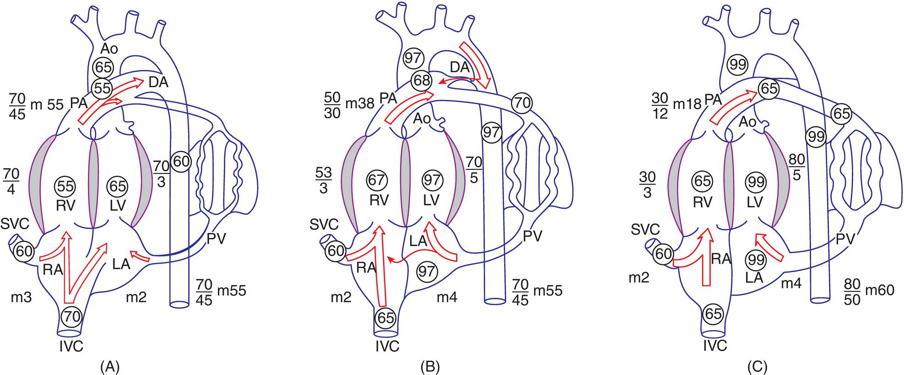

[**Figure 9.1**](#R_c9-fig-0001) Transition from fetal to mature circulation. (A) Fetal circulation. (B) Transitional circulation. (C) Mature circulation. Circled numbers are oxygen saturations, uncircled numbers are pressures in mmHg. Ao, aorta; DA, ductus arteriosus; IVC, inferior vena cava; LA, left atrium; LV, left ventricle; m, mean pressure; PA, pulmonary artery; PV, pulmonary vein; RA, right atrium; RV, right ventricle; SVC, superior vena cava.

(Source: Rudolph \[2\]. Reproduced with permission of John Wiley & Sons.)

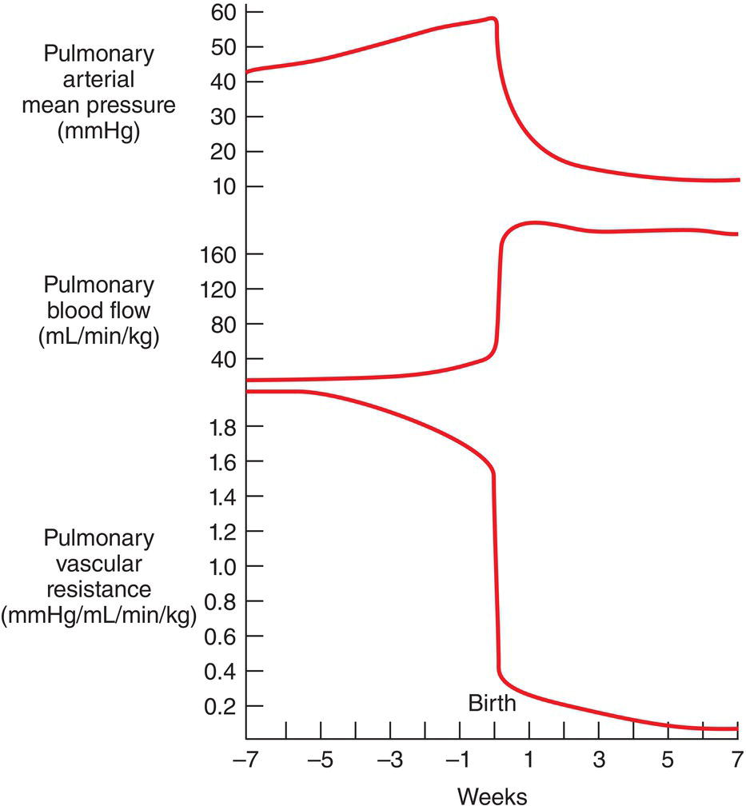

[**Figure 9.2**](#R_c9-fig-0002) Changes in pulmonary artery pressure, pulmonary blood flow, and pulmonary vascular resistance in the lamb after birth.

(Source: Rudolph \[3\]. Reproduced with permission of John Wiley & Sons.)

### Myocardial contractility

The fetal myocardium is characterized by poorly organized cellular arrangements, and fewer myofibrils with a random orientation, in contrast to the parallel, well‐organized myofibrillar arrangement of the adult myocardium \[5\] (see later in this chapter). Fetal hearts develop less tension per gram than adult hearts, because of increased water content and fewer contractile elements. Calcium cycling and excitation‐contraction coupling are also very different, with poorly organized T‐tubules and immature sarcoplasmic reticulum, leading to more dependence on free cytosolic ionized calcium for normal contractility. Despite this immature state, the fetal heart can increase its stroke volume in a limited fashion up to left atrial pressures of 10–12 mmHg according to the Frank‐Starling relationship, as long as afterload (i.e., arterial pressure) is kept low \[6\]. These features continue throughout the neonatal and early infancy periods.

* * *

### KEY POINTS: DEVELOPMENT FROM FETUS TO NEONATE

-   The transition from fetus to neonate involves a decrease in PVR, elevation of left heart pressures, and closure of shunts at the ductus arteriosus, foramen ovale, and ductus venosus.
-   The transitional circulation is an intermediate state between fetal and adult circulation and may revert to fetal circulation with the persistence of hypoxemia, acidosis, CHD, or other conditions with elevated pulmonary artery pressures.
-   The fetal heart develops less tension per gram of resistance than the mature heart and has limited ability to increase stroke volume up to left atrial pressure of only 10–12 mmHg.

* * *

## Development from neonate to older infant and child

At birth, the neonatal heart must suddenly change from a parallel circulation to a series circulation, and the left ventricle, in particular, must adapt immediately to dramatically increased preload from blood returning from the lungs, and increased afterload as the placental circulation is removed. The very high oxygen consumption by the newborn necessitates a high cardiac output for the first few months of life. However, animal models have demonstrated that both the fetal and newborn myocardia develop less tension in response to increasing preload (sarcomere length), and that cardiac output increases less for the same degree of volume loading \[7, 8\] ([Figure 9.3](#c9-fig-0003)). Resting tension, however, is greater in the newborn than in the mature heart. This information suggests that the newborn heart is operating near the top of its Frank‐Starling curve and that there is less reserve in response to both increased afterload and preload. This observation is borne out clinically in newborns (after complex heart surgery) who are often intolerant of even small increases in left atrial pressure or mean arterial pressure. The newborn myocardium also has only a limited ability to increase its inotropic state in response to exogenous catecholamines and is much more dependent on heart rate to maintain cardiac output than is the mature heart. One reason for this is the high levels of circulating endogenous catecholamines that appear after birth, which are necessary to make the transition to extrauterine life \[9\]. As these levels decrease in the weeks after birth, contractile reserve increases.

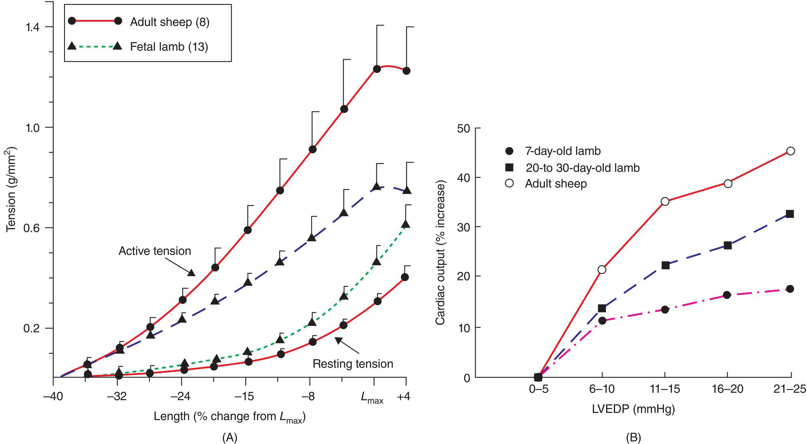

[**Figure 9.3**](#R_c9-fig-0003) (A) Isometric resting and active length‐tension relationships in fetal and adult lamb cardiac muscle strips.

(Source: Friedman \[7\]. Reproduced with permission of Elsevier.)

(B) Response to volume load of normal saline at 5 mL/kg/min, at constant heart rate. LVEDP, left ventricular end‐diastolic pressure, Lmax, maximum muscle strip length.

(Source: Friedman and George \[8\]. Reproduced with permission of Elsevier.)

The neonatal myocardium is less compliant than the mature myocardium, with increased resting tension as noted earlier, and a significantly greater increase in ventricular pressure with volume loading \[10\]. This implies that the diastolic function of the neonatal heart is also impaired compared with the mature heart \[11\]. The myofibrils of the newborn heart also appear to have a greater sensitivity to calcium, developing a greater tension than adult myofibrils when exposed to the same free Ca2+ concentration _in vitro_ \[12\].

It must again be emphasized that nearly all of this data was obtained from animal models, and although the information appears to agree with what is observed clinically, there is a need for more non‐invasive studies of normal human hearts from the neonatal period through adulthood to confirm these impressions of cardiac development.

### Gene expression in cardiac development

Progress has been made recently in understanding the genetic aspects of human cardiac development, and in contrast to the physiologic studies which are almost exclusively performed in animal models, small amounts of human cardiac tissue obtained from biopsy or autopsy specimens can be used for these studies. Some aspects of these developmental changes will be reviewed.

Cardiomyocyte maturation begins after birth and is crucial for efficient contractility and metabolism. A hallmark of cardiomyocyte maturation is isoform switching of contractile genes from the fetal to the adult state \[13\]. Myosin is the major protein component of the thick filaments of the cardiac myofibril, and differences in the expression of this protein may play a significant role in myocardial contractility. Chromosome 14 has the genetic material responsible for producing the myosin heavy chain (MHC) which makes up the backbone of the thick filaments, and two major isoforms, namely α and ß, exist. The ß isoform predominates at birth but the α isoform becomes predominates through maturation \[14\]. The myosin light chain has multiple isoforms, and the relative proportions of these isoforms change with development, and also in response to pressure loading of the heart. The isoforms that predominate in the newborn myocardium appear to confer a greater sensitivity to Ca2+ than those seen in the mature heart \[15\] and may contribute to the increased sensitivity of the neonatal myocardium to Ca2+.

Troponin I, C, and T are critical proteins that bind Ca2+ and regulate the interaction between myosin and actin, directly affecting the force of contraction. Troponin C, the Ca2+‐binding portion of the troponin moiety, does not change with development. Troponin I, however, has two major isoforms, a slow skeletal muscle type that predominates in the heart in fetal and neonatal life, and the cardiac isoform, which is the only isoform expressed in the mature heart \[16\]. Only the cardiac (mature) isoform responds to ß‐adrenergic stimulation, producing a faster twitch development and greater twitch tension. However, contractility in the neonatal myofibrils containing the immature myosin light chain (MLC) isoform is more resistant to acidosis. Four isoforms of troponin T are expressed in the fetal and neonatal heart, but only one in the mature heart. These isoforms exhibit different levels of ATPase activity and Ca2+ sensitivity (see later), with greater ATPase activity and Ca2+ sensitivity seen in the immature forms \[12\]. Tropomyosin \[17\] has two isoforms and actin \[18\] has three isoforms, which are expressed in different proportions as developmental changes occur, but the functional significance of these changes has yet to be elucidated.

Some enzymes are affected by the loading conditions of the heart. Protein kinase C (PKC) is an enzyme with a major role in transmembrane signal transduction through phosphorylation of a number of downstream intracellular components (see the section on “Calcium cycling in the normal heart”) \[19\]. There are six isoforms of this enzyme, and it is not affected during development. However, in aortic stenosis producing left ventricular hypertrophy, all isoforms except PKC‐β are dramatically upregulated, and in dilated cardiomyopathy, there is a dramatic upregulation of PKC‐β. Phosphodiesterase (PDE) is an enzyme involved in the termination of the action of cyclic adenosine monophosphate (cAMP), which regulates the contractile state of the myocardium (see later). Expression of the isoform PDE‐5 is dramatically increased in the hypertrophied human right ventricle in patients with pulmonary hypertension, and inhibition of this enzyme improves ventricular contractility \[20\].

New information is available on the molecular and cellular basis for normal cardiac development and the causes of CHD \[21\]. A missense mutation in the myocardial protein actin has been discovered to be the cause of isolated secundum atrial septal defect in some patients \[22\]. Pluripotent cardiac progenitor cells reside in the human neonatal myocardium in relatively high numbers during the first month of life \[23\]. This knowledge has given rise to the exciting notion that these stem cells could potentially be used to facilitate recovery from cardiac morbidity or to enhance surgical repair.

Recent advances in genomics, such as RNA sequencing (RNA‐Seq) have significantly contributed to the further understanding of cardiac development in humans. RNA‐Seq has provided a comprehensive transcriptomic analysis of human heart development during early gestation \[24\]. Nebulin‐related anchoring protein (NRAP) was among the genes that showed the largest fold change between 9‐ and 16‐week gestational age. This protein is expressed at intercalated discs in cardiac muscle and is an actin‐binding cytoskeletal protein \[25, 26\]. NRAP is involved during development in the myofibrillar assembly in the embryonic murine heart \[27\]. A patient with dilated cardiomyopathy with biventricular failure was found to have a homozygous truncating mutation (rs201084642) which introduced a stop codon to all NRAP isoforms \[28\]. Another study utilizing microarray RNA Seq analysis found that 316 genes were specifically associated with the human fetal heart, and 20 of those genes are the known candidates for congenital heart failure \[29\]. Specifically, the genes identified from the study associated with CHD include _PLN, NPPA, ANKRD1, MYH6, MYH7, ACTC1, CACNA1C, TBX20, HEY2, SLC8A1, RYR2, MYOCD, GJA1, ATP2A2, FBN2, SRPX, SCN5A, TBX5, HAND2,_ and _KCNJ2_. This network of specific genes in the human fetal heart could represent a candidate common pathway close related to the development of CHD. An example of the network is Notch‐signaling cascade‐related genes \[30, 31\]. Notch‐signaling cascade plays a crucial role in cardiac cell fate regulation and orchestrates the morphogenesis of cardiac chambers and valves \[32–34\]. A recent study has suggested that _NOTCH1_ haploinsufficiency alters specific gene networks affecting valve development and osteogenic factors, which in turn result in aortic valve disease \[35\]. _NOTCH1_ ligands _JAG1_ and _DLL4_ have been shown to cause Alagille syndrome and aortic valve disease in human and animal models \[36–38\]. In addition, Genome‐wide Copy Number Variant (CNV) analysis for congenital ventricular septal defects in the Chinese Han population revealed that VSD‐related candidate genes are enriched in chromatin binding and transcription regulation, which are the biological processes underlying heart development. Specifically, this study suggested that _PAX3_ and _LBX1_ (in duplications) and _CRKL, GP1BB, PDLIM3, TBX1, TXNRD2_ (in deletions) are associated with CHD. Enriched gene ontology (GO) revealed that these genes are involved in heart development, cardiovascular system development, and circulatory system development \[39\].

### The extracellular matrix

The extracellular matrix (ECM) of the heart is important in translating the force generated from the shortening of sarcomere length to the cardiac chambers, resulting in stroke volume. The major components of the ECM are collagen types I and II, glycoproteins, and proteoglycans and the expression of these elements changes with development. The neonatal heart has a higher content of both total and type I collagen (which is stiffer and less compliant than type III collagen) when compared with the total protein content of the heart \[40\]. The collagen to total protein ratio reaches mature levels by about 5 months of life. This change, along with the greater water content of the immature myocardium, may partially explain the diminished diastolic function. Also, this relative lack of contractile elements reduces the ability of the neonatal myocardium to increase its inotropic state. A network of collagen‐based connections, called the weave network, develops rapidly after birth, connecting myocytes and capillaries and allowing greater functional integrity to develop in response to the greater afterload stress on the heart \[41\]. This development of the ECM appears to be complete by approximately 6 months of age and results in a much more efficient transfer of force generated by sarcomere shortening to the cardiac chambers ([Figure 9.4](#c9-fig-0004)) \[12\].

The connection of the cardiac myocyte to the ECM is maintained by two specialized complexes that together comprise over 20 proteins. The costamere represents a major muscle multiprotein complex and produces a physical connection between the sarcomeres at the Z disk and the ECM. The integrin complex and the dystrophin‐associated glycoprotein complexes are two major components of the costamere \[42, 43\] ([Figure 9.5](#c9-fig-0005)). The integrins are transmembrane glycoproteins consisting of two subunits, α and ß, which express several isoforms. Integrins such as integrin α5β1and α7β1 bind to collagen and fibronectin, which causes the attachment of the ECM to the myocytes, allowing force transduction to occur \[44\]. These integrins' expression is very dynamic; For example, the α5 subunit is prevalent in fetal and neonatal cardiomyocytes, while α7 replaces α5 at the onset of postnatal development \[45\]. However, subunit expression can switch and return to the fetal form under stress‐producing myocyte hypertrophy and ischemia. Dystrophin‐associated glycoprotein complexes also contribute to a substantial mechanical linkage from the ECM to the cardiac cytoskeleton, and contribute to force transduction \[42, 43\]. The proteins dystrophin, sarcoglycans, dystroglycan, and dystrobrevins are included in these complexes. These complexes play an integral role in cardiac function, and mutations in these proteins can be associated with cardiomyopathies, especially muscular dystrophy‐associated cardiomyopathies. Reduction of dystrophin activity results in dilatation of all four cardiac chambers and reduced ventricular function. Mutations in dystrobrevins have been associated with left ventricular non‐compaction.

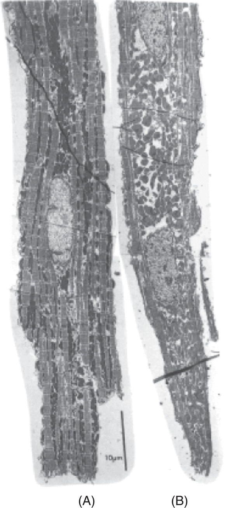

[**Figure 9.4**](#R_c9-fig-0004) Longitudinal sections through an adult rabbit cardiac myocyte (A) and a 3‐week‐old rabbit cardiac myocyte (B). Note the differences between myofibril organization and structure, as well as cell size.

(Source: Nassar et al. \[12\]. Reproduced with permission of Wolters Kluwer Health, Inc.)

### Cell‐to‐cell connectivity

The intercalated discs mediate the cell‐to‐cell interactions that coordinate cardiac myocyte activity resulting in synchronous contraction, and maintaining the structural integrity of cardiac tissue \[46\] ([Figure 9.6](#c9-fig-0006)). These discs are situated in between cardiac myocytes at the longitudinal ends of the cells and consist of three types of connections: desmosomes, fascia adherens junctions, and gap junctions. The desmosomes have both intracellular and intercellular components. These structures serve to integrate signals from both cell‐to‐matrix and cell‐to‐cell interactions, ensuring force transmission, cell membrane integrity, and biochemical signaling. The fascia adherens junctions are responsible for holding the cardiac myocytes tightly together, and they anchor myofibrils and ensure transmission of contractile forces from cell to cell. Finally, the gap junctions form the electrical coupling apparatus between individual myocytes, ensuring rapid propagation of the electrical impulse, forming an electrical syncytium, and thus triggering the coordinated contraction of cardiac myocytes. Mutations in intercalated disc proteins have recently been found to be associated with cardiac disorders. These include adherens junctions mutations associated with heart failure and dilated cardiomyopathy, and desmosome complex mutations associated with some forms of arrhythmogenic right ventricular cardiomyopathy.

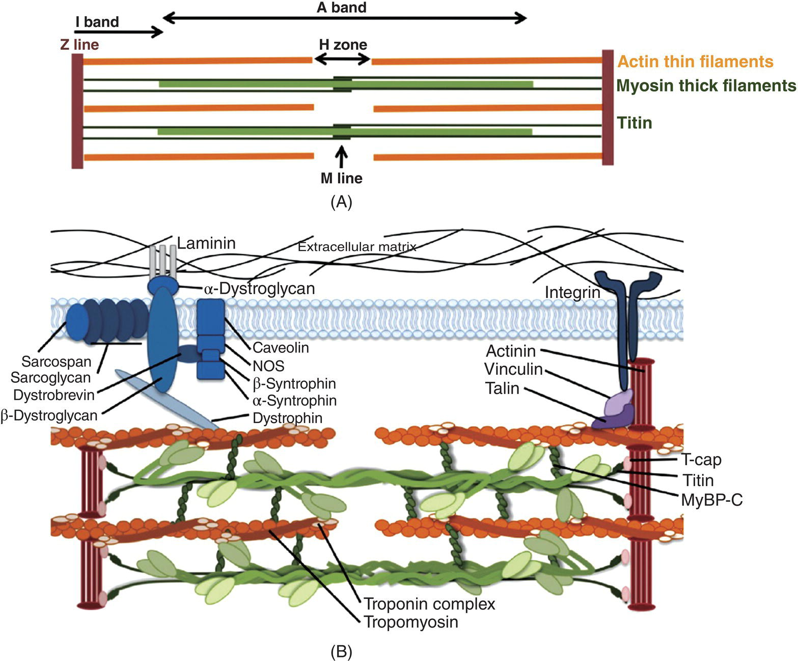

[**Figure 9.5**](#R_c9-fig-0005) Anatomy of the cardiac sarcomere. (A) The basic organization of the sarcomere. The sarcomere forms the basic contractile unit. Thin filaments composed of actin are anchored at the Z line and form transient sliding interactions with thick filaments composed of myosin molecules. The M line, I band, and A band are anatomical features defined by their components (actin, myosin, and cytoskeletal proteins) and appearance in polarized light. Titin connects the Z line with the M line and contributes to the elastic properties and force production of the sarcomere through its extensible region in the I band. Coordinated shortening of the sarcomere creates contraction of the cardiomyocyte. (B) Major proteins of the sarcomere. Attachment to the extracellular matrix is mediated by costameres composed of the dystroglycan–glycoprotein complex and the integrin complex. Force transduction and intracellular signaling are coordinated through the costamere. The unique roles of each of these proteins are critical to the appropriate function of the heart. T‐cap, titin cap; MyBP‐C, myosin‐binding protein C; NOS, nitric oxide synthase.

(Source: Harvey and Leinwand \[43\]. Reproduced with permission of Rockefeller University Press.)

The preceding short review is meant to give the reader an idea of some of the aspects of the cellular biology of the developing circulation. The explosion of new information in this area, especially new data from human tissue, will lead to a more thorough understanding of the pathophysiology of disease states and will suggest avenues for future treatment. For a more complete treatment of this area, the reader is referred to several excellent reviews \[47–49\].

### Innervation of the heart

Clinical observations in newborn infants have led to the hypothesis that the sympathetic innervation and control of the cardiovascular system are incomplete in the newborn infant compared with older children and adults and that the parasympathetic innervation is intact \[5\]. Examples of this include the frequency of bradycardia in the newborn in response to a number of stimuli, including vagal and vagotonic agents, and the relative lack of sensitivity in the newborn to sympathomimetic agents. Histologic studies in animal models have demonstrated incomplete sympathetic innervation in the neonatal heart when compared with the adult, but no differences in the number or density of parasympathetic nerves \[50, 51\].

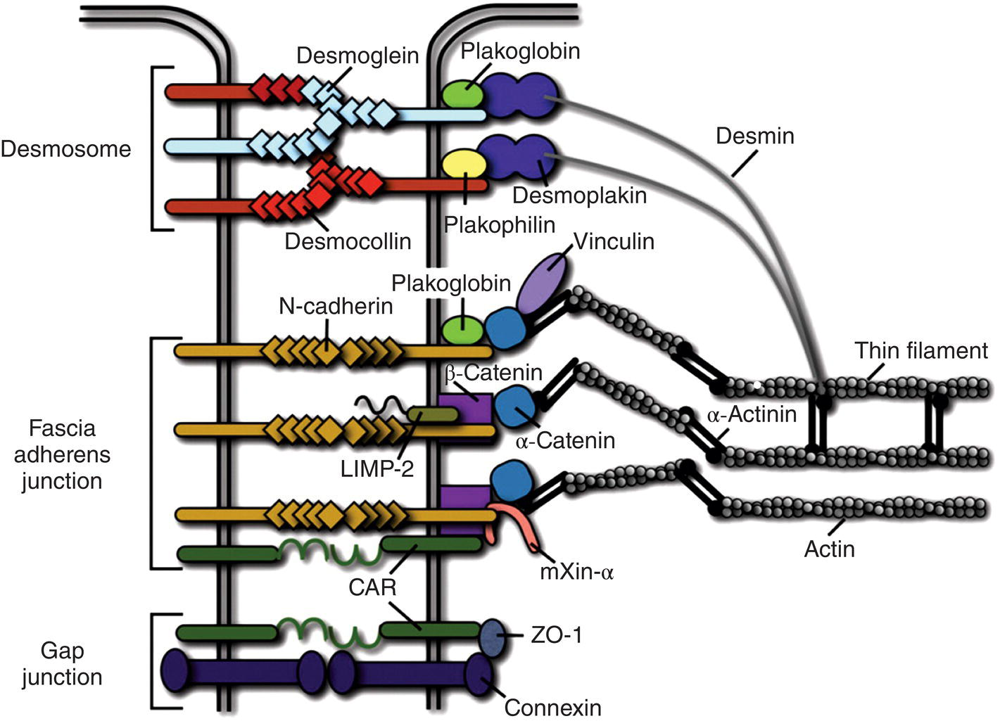

[**Figure 9.6**](#R_c9-fig-0006) Major complexes and components of the cardiac intercalated disc. CAR, coxsackievirus and adenovirus receptor; LIMP‐2, lysosomal integral membrane protein 2; mXinα, muscle‐specific mouse Xinα; ZO‐1, zona occludens 1.

(Source: Sheikh et al. \[46\]. Reproduced with permission of Elsevier.)

Autonomic cardiovascular control of cardiac activity can be evaluated by measuring heart rate variability in response to both respiration and beat‐to‐beat variability in systolic blood pressure \[52\]. The sympathetic and parasympathetic inputs into sinoatrial node activity contribute to heart rate variability changes, with greater heart rate variability resulting from greater parasympathetic input into sinoatrial node activity \[53\]. Studies using these methodologies for normal infants during sleep suggest that the parasympathetic predominance gradually diminishes until approximately 6 months of age, coinciding with greater sympathetic innervation of the heart similar to adult levels \[54\].

* * *

### KEY POINTS: DEVELOPMENT FROM NEONATE TO OLDER INFANT AND CHILD

-   The neonatal heart exhibits heart rate dependence, limited ability to increase contractile state, and limited tolerance for excessive afterload and preload.
-   The costameres and dystrophin‐associated glycoprotein complexes play central roles in connection of the cardiac myocyte to the ECM, thus forcing transduction in the heart.
-   The intercalated discs maintain cell‐to‐cell connectivity between cardiac myocytes, allowing tight adhesion and electrical impulse transition to facilitate coordinated cardiac contraction.

* * *

## Development from child to adult

Beyond the transition period from fetal to newborn life and into the first few months of postnatal life, there is not much human or animal information concerning the exact nature and extent of cardiac development at the cellular level. Most studies compare newborn or fetal animals with adult animals \[55\]. Cardiac chamber development is assumed to be influenced by blood flow \[56\]. Large flow or volume load in a ventricle result in ventricular enlargement. Small competent atrioventricular valves, as in tricuspid stenosis, result in lower blood flow and a small ventricle. Increases in myocardial mass with normal growth, as well as in ventricular outflow obstruction, are mainly due to hypertrophy of myocytes. Late gestational increases in blood cortisol are responsible for this growth pattern, and there is concern that antenatal glucocorticoids to induce lung maturity may inhibit cardiac myocyte proliferation. In the human infant, it is assumed that the cellular elements of the cardiac myocyte (i.e. adrenergic receptors, intracellular receptors and signaling, calcium cycling and regulation, and interaction of the contractile proteins) are similar to those in the adult by approximately 6 months of age. Similarly, cardiac depression by volatile anesthetic agents is greater in the newborn, changing to adult levels by approximately 6 months of age \[57\].

## Normal values for physiologic variables by age

It is useful for the anesthesiologist to be aware of normal ranges for physiologic variables in premature and full‐term newborns of all sizes and in infants and children of all ages ([Table 9.1](#c9-tbl-0001), [Figure 9.7)](#c9-fig-0007) \[58\]. Obviously, acceptable ranges for these variables are highly dependent on the individual patient's pathophysiology, but the wide range of “normal” values may reassure the practitioner to accept “low” blood pressure; for example, if other indices of cardiac function and tissue oxygen delivery are acceptable. Values for awake, healthy infants and children are often significantly different than in anesthetized patients and those with significant cardiac disease undergoing invasive procedures, especially with regard to the higher resting blood pressure values \[59–61\].

[**Table 9.1**](#R_c9-tbl-0001) Normal heart rates and systolic blood pressure as a function of age

Source: Blood pressure data are from references \[40–43\].

| Age | Range of normal heart rates (beats/minute) | Range of normal systolic blood pressures, measured by oscillometric blood pressure device (mmHg) |
| --- | --- | --- |
| Neonate (_<_30 days) | 120–160 | 60–75 |
| 1–6 months | 110–140 | 65–85 |
| 6–12 months | 100–140 | 70–90 |
| 1–2 years | 90–130 | 75–95 |
| 3–5 years | 80–120 | 80–100 |
| 6–8 years | 75–115 | 85–105 |
| 9–12 years | 70–110 | 90–115 |
| 13–16 years | 60–110 | 95–120 |
| \>16 years | 60–100 | 100–125 |

De Graaff and colleagues published an important study of over 116,000 ASA I and II patients from 10 centers undergoing non‐cardiac procedures with mostly sevoflurane anesthesia and reported the range of blood pressure values in the preparation (pre‐surgical) phase, and the surgical phase in patients from 0 to 18 years of age, measured by non‐invasive oscillometric method (NIBP) \[62\] ([Figure 9.8](#c9-fig-0008)). The data were reported from electronic anesthesia medical records and were carefully refined to remove any artifacts. Age‐ and gender‐specific reference curves were calculated which specified the systolic, diastolic, and mean blood pressures. The range at each age from +2 to −2 standard deviations (SD), representing 95% of all blood pressure values and thus constituting the range of “normal” blood pressures were included. For example, during the preparation phase before incision, the 50th percentile (0 SD) of mean arterial pressure ranged from 33 mmHg at birth to 66 mmHg at age 18 years in boys. The −2 SD (2.5th percentile) values for mean blood pressure ranged from 17 mmHg at birth to 47 mmHg at 18 years. The lowest reference ranges for anesthetized children are much lower (approximately 20 mmHg) than those for awake children; the 2.5th percentiles (−2 SD) of the systolic and mean non‐invasive blood pressure (NIBP) of a 4‐years‐old boy are 85 and 60 mmHg, respectively, when nonanesthetized, and 68 and 38 mmHg, respectively, when anesthetized. The blood pressure values during the surgical phase were slightly higher in the youngest age groups less than 6 months, but very little different at older ages. This population of patients without CHD undergoing non‐cardiac procedures with non‐invasive blood pressure monitoring is clearly very different from cardiac surgery patients with invasive blood pressure monitoring but still can serve as an important reference point for the cardiovascular anesthesiologist.

## Myocardial sequelae of longstanding CHD

Hypertrophy of the cardiac chambers is a common response to a number of different chronic pathophysiologic states. Wall thickness increases through hypertrophy of the cardiac myocytes and non‐contractile elements. Hypertrophy reduces wall stress in the dilated heart but also serves to reduce ventricular function, particularly diastolic function. This reduction in function serves to reduce myocardial oxygen consumption in response to a wide variety of chronic stresses, in both pressure and volume overloaded ventricles \[63\].

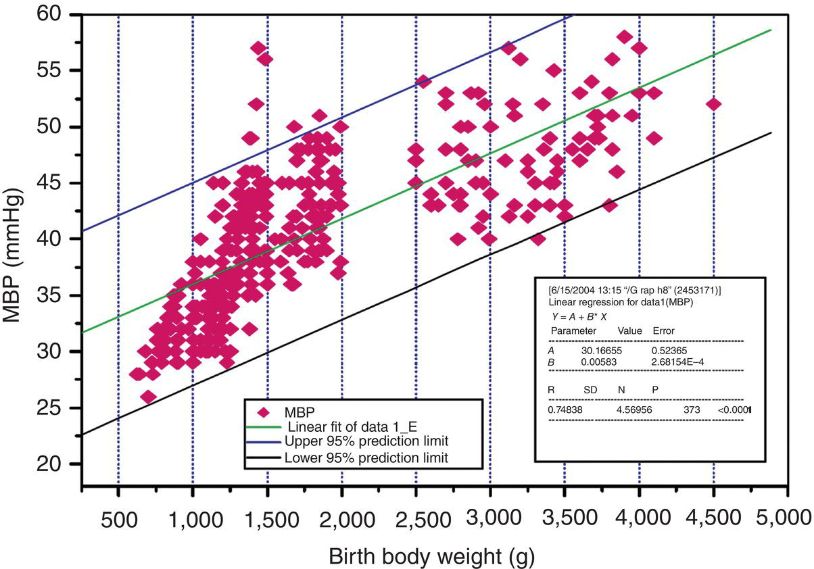

[**Figure 9.7**](#R_c9-fig-0007) Linear regression of mean arterial pressure in 1‐day‐old neonates free of cardiopulmonary disease, measured by oscillometric methods in the awake state – 292 were premature and 81 full‐term neonates. The middle green line is the 50th percentile, the upper blue line is the 95th percentile, and the lower black line is the 5th percentile. Note that in the 3.0 kg full‐term neonate, normal mean arterial pressure can range from 37 to 56 mmHg.

(Source: Pejovic et al. \[58\]. Reproduced with permission of Springer Nature.).

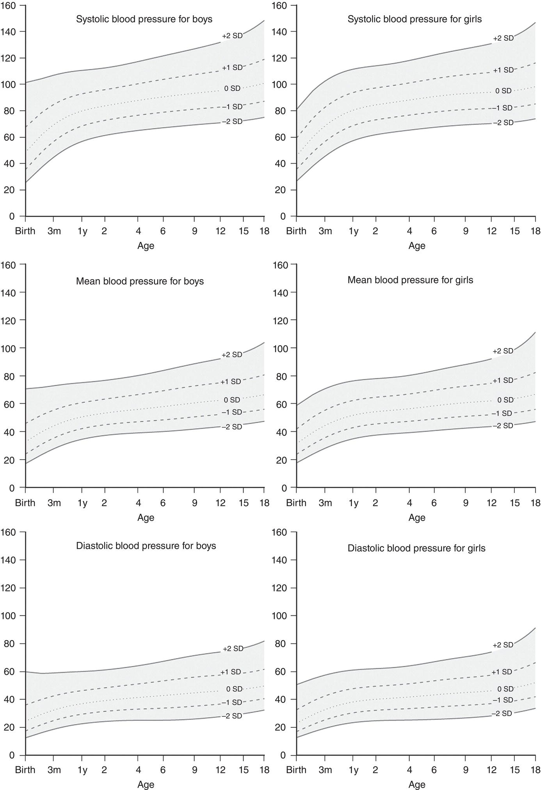

[**Figure 9.8**](#R_c9-fig-0008) Reference curves for non‐invasive blood pressure for boys and girls during anesthesia during the preparation phase before surgical incision, in relation to age.

(Source: de Graaff et al. \[62\]. Reproduced with permission of Wolters Kluwer Health, Inc.)

Pressure overload hypertrophy results in altered gene expression in the cardiomyocyte. Myosin isoform expression (see later) changes from the faster‐reacting α‐myosin to the slower ß‐myosin, reducing myocardial function \[64\]. Integrin‐linked kinase expression is increased in patients with hypertrophic cardiomyopathy and induces hypertrophy in an animal model \[65\]. Altered expression or mutations of other genes that regulate the production of cardiac cytoskeletal proteins, such as dystrophin, occur in patients with end‐stage cardiomyopathy \[66, 67\].

## Cardiomyocyte receptor function in normal and diseased hearts

### The adrenergic receptor

The adrenergic receptors (ARs) are a part of a large superfamily of receptors that mediate their biological responses through the coupling of a specific guanine nucleotide regulatory protein, or G protein \[68\]. This superfamily of receptors shares a common structural motif, characterized by seven hydrophobic domains spanning the lipid bilayer. The seven domains are attached by three internal loops and three external loops between the amine terminus and the cytoplasmic carboxy terminus. The function of this receptor family is dependent on a specific agonist (or ligand) binding to the receptor, which causes a conformational change in the receptor. This structural change permits the interaction between the intracellular portion of the receptor and the G protein. This interaction, also referred to as “coupling,” inevitably links the activated receptor to a specific biological response. The regulation of the biological response is initiated by the specificity of the receptor for a particular extracellular agonist and the coupling of a specific G protein to that activated receptor.

Once an extracellular ligand (or agonist) is specifically recognized by a cell surface receptor, the receptor goes through a conformational change that exposes a specific region of the receptor complex to the intracellular side of the plasma membrane \[69\] ([Figure 9.9](#c9-fig-0009)). This conformation change triggers the interaction of the G protein with the amino acids of the third intracellular loop of the receptor and hence leads to G protein activation. There are three different G proteins: stimulatory G protein (Gs), inhibitory G protein (Gi), and the Gq protein. Under normal conditions, all of the ß receptors interact with the Gs, the α1 interacts with Gq, and the α2 interacts with Gi. Each G protein is a heterotrimer made up of three subunits: α, ß, and γ. The activation of the G‐protein‐coupled receptor causes an exchange of bound guanosine diphosphate (GDP) for guanosine triphosphate (GTP) within the α subunit and initiates the disassociation of the ßγ subunit from the α subunit. The GTP‐activated α subunit modulates the activity of a specific effector enzyme within a specific signaling pathway by catalyzing the hydrolysis of GTP to GDP and inorganic phosphate. This causes the transference of a high‐energy phosphate group to an enzyme and, in turn, causes the deactivation of the α subunit. This process will eventually lead to the reassociation of the α subunit with the ßγ complex. This cycle is continuously repeated until the agonist becomes unbound from the receptor. Downstream of enzyme activation, the production of a second messenger regulates the biological response.

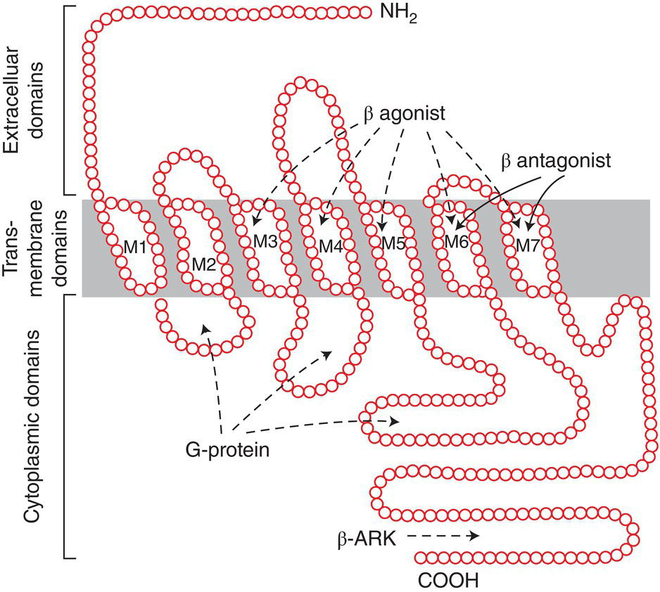

[**Figure 9.9**](#R_c9-fig-0009) Molecular structure of the β‐adrenergic receptor, demonstrating its three domains. The transmembrane domains serve as ligand‐binding pockets for agonists (dashed arrows) and antagonists (solid arrows). The cytoplasmic domains interact with G proteins and β‐adrenergic receptor kinases.

(Source: Moss and Renz \[68\]. Reproduced with permission of Elsevier.)

Adrenergic receptors have been subdivided into two groups of receptors based on the results of binding studies using a series of selective agonists and antagonists. In 1948 Ahlquist used the difference in rank orders of the potency of a series of agonists to separate the ARs into two principal receptor groups, the α and ß receptor groups \[70\]. These findings have been confirmed repeatedly with the development of drugs that function to selectively antagonize the α receptor with no effect on the ß receptor. Soon after the distinction between the α and ß receptor types was known, it became more evident that the separation of α and ß receptors was not sufficient to explain pharmacological studies using rank order of potency for an antagonist, differing from an agonist because it blocks the biological response. With the advent of radioligand‐labeled antagonists and new molecular cloning techniques examining receptor gene expression, it became clear that the two principal receptor groups could be further subdivided into additional subtypes.

To date, within the ß‐adrenergic group, four different subtypes have been identified: ß1, ß2, ß3, and ß4. Pharmacologically, ß1 and ß2 are differentiated by their affinities to different catecholamines: epinephrine, norepinephrine, and isoproterenol. ß1 has a similar affinity to epinephrine and norepinephrine, while ß2 has a higher affinity to epinephrine than to norepinephrine. Both ß1 and ß2 have the same affinity to isoproterenol. The ß3 and ß4 receptors have minor roles in cardiovascular function and will not be discussed further.

The expression and distribution of each subtype are highly dependent on the organ, which adds another level of specificity. The distribution of a particular receptor in two different tissue types may result in two different functions. When examining the cardiovascular response to adrenergic stimulation, the ß1 receptor is predominantly expressed in heart tissue. The stimulation of the receptor subtype leads to both inotropic and chronotropic effects on cardiac function, resulting in an increase in the myocardial contractile force and a shortening of contractile timing, respectively. While ß2 can also be found in the heart, it is mostly expressed in vascular smooth muscle tissue. The distribution and function relevance of this receptor subtype in the heart are controversial and may change with alterations in cardiac function. The percentage of ß2 receptors in the non‐failing heart averages about 20% in the ventricle \[71\] and 30% in the atrium. The ratio of ß1 to ß2 receptors is approximately 75: 25% in the ventricles of younger hearts \[72, 73\].

Each signaling pathway is specific to each adrenergic receptor. Once the agonist binds to the ß1 receptor causing the coupling of the G protein, the G‐protein α subunit becomes activated followed by an increase in adenylate cyclase activity, which induces the conversion of ATP to cAMP. The second messenger, cAMP, phosphorylates protein kinase A (PKA). The function of a kinase is to phosphorylate other target proteins, which initiates a biological response. PKA phosphorylates many intracellular targets, including calcium channels, troponin I, and ryanodine receptors. PKA also plays a central role in regulating calcium sensitivity \[74\].

The ß2 receptor has also been shown to function through the cAMP signaling pathway, causing the activation of PKA, but not nearly to the extent of ß1 in cardiomyocytes \[74\]. The response of this stimulation appears to have a larger effect on smooth muscle; for example, the vascular smooth muscle. In this tissue type, the stimulation of ß2 and the subsequent increase in cAMP promote the vasodilation of vascular smooth muscle and may lead to alterations in blood pressure. In these tissues, the effect of ß1 stimulation appears to be minimal, due to the lack of ß1 receptors in the smooth muscle.

Similar to the ß receptors, the α receptors can be pharmacologically subdivided into α1 and α2. The α receptor is distributed in most vascular smooth muscle and, to a lesser extent, in the heart. The α2 receptor has been found in some vascular smooth muscle; however, its major functional importance is as a presynaptic receptor in the central and peripheral nervous systems. The use of molecular techniques has identified three additional subtypes of the α1 receptor (α1A, α1B, and α1D) and three additional subtypes of the α2 receptor \[68\]. Binding of an agonist to an α1 receptor in the heart or vascular smooth muscle results in activation of the Gq subunit of the G protein, which activates phospholipase C (see later), producing diacylglycerol and inositol‐1,4,5‐triphosphate, which releases Ca2+ from the sarcoplasmic reticulum and increases vascular smooth muscle tone or cardiac contractility. A schematic classification of adrenergic receptors incorporating recent knowledge of molecular pharmacology and signal transduction is presented in [Figure 9.10](#c9-fig-0010) \[68\].

The adrenergic receptor concentration in cardiac tissue is very small and measured as fentomoles/mg protein. However, the response to stimulation of the receptor is significantly amplified by the signal that occurs downstream of the receptor. In rat ventricular myocytes, the ratio between the ß receptors and the next two downstream signaling components (ß receptor: G protein: adenylate cyclase) is 1 : 200 : 3 \[76\]. This demonstrates how a large response can be initiated by the activation of a small number of receptors. In addition, it also shows that the rate‐limiting component that ultimately regulates intracellular production of cAMP is receptor density and the enzyme concentration of adenylate cyclase.

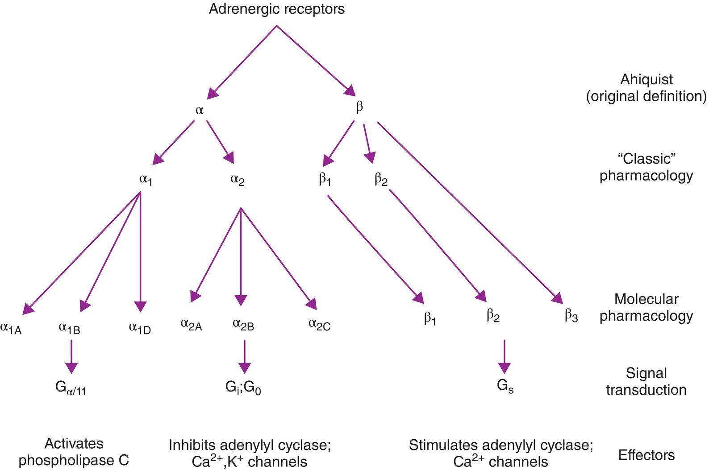

[**Figure 9.10**](#R_c9-fig-0010) A schematic classification of adrenergic receptors.

(Source: Moss and Renz \[68\]. Reproduced with permission of Elsevier.)

### Developmental changes in adrenergic receptor signaling

Information concerning changes in adrenergic receptor function during the transition from neonatal to more mature myocardial development is limited to a few animal studies. As noted above, the neonatal heart has a limited inotropic response to catecholamine administration.

ß‐Adrenergic receptor density is higher in the ventricular myocardium of neonatal versus adult rabbits, but the inotropic response to the same concentration of isoproterenol is significantly greater in adult tissue \[77\]. In the neonatal rat, the mechanism of the ß‐adrenergic‐mediated increase in contractility is entirely due to ß2 stimulation, whereas in the adult rat it is due solely to ß1 receptor activation. Coupling of the ß2 receptor to Gi protein action is apparently defective in the neonatal rat because the ratio of Gi to Gs subunits is much higher in the neonate. The relative proportion of ß1 and ß2 receptors is the same in neonatal and adult hearts (83% ß1, 17% ß2) and approximates the ratio measured in children with simple acyanotic CHD, which is about 78% ß1: 22% ß2 \[72\].

There is animal and human evidence that α‐adrenergic receptor‐mediated chronotropic and inotropic effects on the cardiac myocyte change with development. In the neonatal animal model, α‐stimulation produces positive inotropic and chronotropic effects, whereas in the adult it produces negative effects \[78, 79\]. The chronotropic response to α1 stimulation diminished with increasing age in children being evaluated for autonomic dysfunction after vagal and sympathetic blockade \[80\].

### Calcium cycling in the normal heart

Calcium assumes a central role in the process of myocardial contraction and relaxation, serving as the second messenger between depolarization of the cardiac myocyte and its contraction mediated by the actin‐myosin system. Calcium's role in this excitation‐contraction coupling in the normal mature heart will be reviewed briefly before discussion of developmental changes and changes with heart failure \[81\].

Cardiac muscle cell contraction depends on an increase in intracellular Ca2+ above a certain threshold, and relaxation ensues when intracellular Ca2+ falls below this threshold. Two major regions of Ca2+ flux occur: across the sarcolemmal membrane (slow response) and release from internal stores, the sarcoplasmic reticulum (rapid release and reuptake) \[82, 83\] ([Figure 9.11](#c9-fig-0011)). The primary site of entry of Ca2+ through the sarcolemmal membrane is through the L‐type, or low‐voltage‐dependent Ca2+ channels, which occurs in two types, a low‐threshold, rapidly inactivating channel, and a higher threshold, more slowly inactivating channel \[84\]. Depolarization of the sarcolemmal membrane triggers the opening of these channels, resulting in the release of a large amount of Ca2+ from the sarcoplasmic reticulum (SR), the major internal Ca2+ storage organelle. Ca2+ entry through the slowly inactivating channels serves to fill the SR with adequate Ca2+ stores. Removal of Ca2+ from the cytoplasm to the exterior of the cell occurs via two major mechanisms: the sodium‐calcium (Na+ ─ Ca2+) exchanger, and the calcium ATPase pump. The Na+ ─ Ca2+ exchanger usually serves to exchange three sodium ions (moving into the cell) for one Ca2+ (moving out of the cell), although the reverse action, as well as a 1 : 1 exchange, are possible \[85\]. The Ca2+‐ATPase pump actively transports Ca2+ (in a 1 : 1 Ca2+/ATP ratio) out of the cell in an energy‐dependent, high‐affinity but low‐capacity manner \[86\]. The affinity of the sarcolemmal Ca2+‐ATPase pump is enhanced by calmodulin, a binder of free cytoplasmic Ca2+. Although the calcium movement through the sarcolemma plays an important role in balancing internal and external Ca2+ concentrations and in supplying Ca2+ to replenish SR Ca2+ stores, and in initiating the Ca2+‐induced release of Ca2+ from the SR, it is important to recognize that the amount of Ca2+ flux is far less than across the SR, the far more important mechanism for excitation‐contraction coupling in the mature heart \[87\]. The sarcolemmal Ca2+ flux mechanisms play a much more important role in the excitation‐contraction coupling of the neonatal (immature) heart.

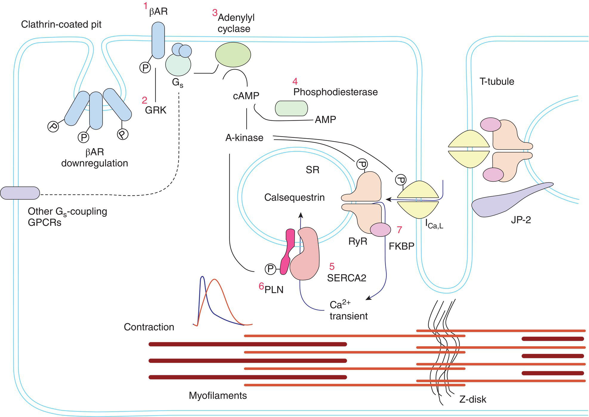

[**Figure 9.11**](#R_c9-fig-0011) Calcium cycling and its relationship to the β‐adrenergic receptor system and myocyte myofilaments. See text for discussion. A‐kinase, protein kinase A; βAR, β‐adrenergic receptor; cAMP, cyclic AMP; FKBP, FK‐506 binding protein; Gs, stimulatory G protein; GPCR, G‐protein coupling receptor; GRK, G‐receptor kinase; ICa,L, L‐type Ca2+ channel; JP‐2, junctophilin‐2; PLN, phospholamban; RyR, ryanodine receptor; SERCA2, sarcoplasmic reticulum Ca2+‐ATPase; SR, sarcoplasmic reticulum. Encircled P represents sites of phosphorylation by the various kinases. Numbers 1 through 7 represent targets for pharmacologic therapy in cardiac failure.

(Source: Hoshijima and Chien \[83\]. Reproduced with permission of American Society for Clinical Investigation.)

The massive release and reuptake of Ca2+ responsible for activation and deactivation of the actin‐myosin complex and cardiomyocyte contraction and relaxation occur at the level of the SR. The SR is a closed, intracellular membranous network that is intimately related to the myofilaments responsible for contraction \[88, 89\] ([Figure 9.12](#c9-fig-0012)). The SR is connected to the sarcolemmal membrane via the transverse tubule (T‐tubule) system. Depolarization of the sarcolemmal membrane results in the transfer of charge down the T‐tubules to the SR, resulting in the opening of SR Ca2+ channels and the release of large amounts of Ca2+ into the cytoplasm, where it can then bind to troponin and initiate the actin‐myosin interaction. The SR is divided into longitudinal SR and terminal cisternae; the latter connects to the T‐tubules. The terminal cisternae are primarily involved in the release of Ca2+, and the longitudinal SR in its reuptake \[90\].

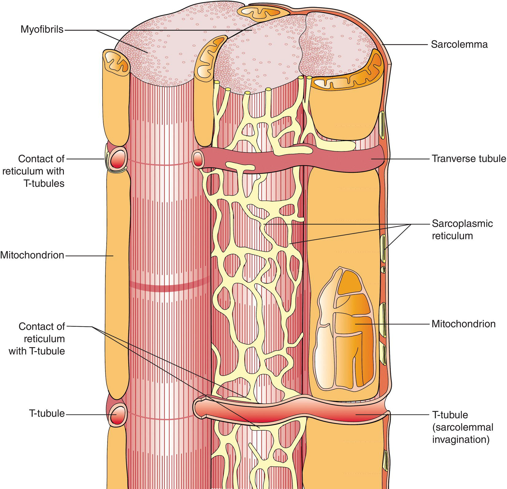

[**Figure 9.12**](#R_c9-fig-0012) Normal, mature cardiac myocyte structure.

(Source: Bloom and Fawcett \[89\]. Reproduced with permission of Elsevier.)

The primary Ca2+ release mechanism of the SR is the ligand‐gated Ca2+‐release channels (also known as the ryanodine receptors) that bind to the drug ryanodine. The channels are activated by two primary mechanisms: depolarization via the T‐tubules, and binding of intracellular Ca2+ itself. The predominance of one mechanism over the other differs in cardiac vs. skeletal muscle. The proximity of the L‐type sarcolemmal Ca2+ channels in the T‐tubules to the ligand‐gated Ca2+‐release channels allows the depolarization to rapidly allow Ca2+ into the cell and open the SR Ca2+ channels. These ligand‐gated Ca2+ release channels close when the cytosolic Ca2+ concentration increases; normally it opens at 0.6 μM Ca2+ and closes at 3.0 μM Ca2+.

The reuptake and sequestration of Ca2+ lead to the relaxation of the cardiac myocyte and is an active transport mechanism, primarily involving hydrolysis of ATP by the SR Ca2+‐ATPase (SERCA), located in the longitudinal SR \[91\]. It binds two Ca2+ ions with high affinity and rapidly transports them to the inside of the SR. This transport system differs from the sarcolemmal membrane: it has a higher affinity, allows for more rapid transport, and is not sensitive to calmodulin. Ca2+ is stored in the SR by calsequestrin, a high‐capacity, low‐affinity protein that acts as a Ca2+ sink.

There are two other proteins with essential roles in the regulation of Ca2+ flux: phospholamban and calmodulin \[92, 93\]. Phospholamban is associated with the sarco/endoplasmic reticulum Ca2+‐ATPase (SERCA) and can be phosphorylated by at least four different protein kinases (see earlier): cAMP‐dependent, Ca2+/calmodulin‐dependent, cyclic guanosine monophosphate (cGMP)‐dependent, or PKC. When phosphorylated, phospholamban increases the affinity of the SERCA for Ca2+, facilitating Ca2+ flux back into the SR, thus affecting the inotropic and lusitropic state of the heart. Phospholamban plays an important role in the ß‐adrenergic‐mediated increase in the inotropic state of the heart. Calmodulin is a Ca2+ storage protein with four binding sites, found in the cytoplasm, which interacts with the sarcolemmal Ca2+‐ATPase (increasing its affinity for Ca2+), the SR ligand‐gated Ca2+‐release channel (inhibits its activity at optimal cytoplasmic Ca2+), and binds to the Ca2+/calmodulin‐dependent protein kinase \[93\]. Mutations in the phospholamban gene have been described and may be a rare cause of dilated cardiomyopathy \[94\].

The increase in intracellular cytoplasmic Ca2+ initiates the contractile process. Myosin is the major component of the thick filaments, which make up the microscopic structure of the myofibril, and its interaction with actin (the major component of the thin filaments) provides the mechanical basis of cardiac muscle cell contraction \[95\]. Actin and myosin make up approximately 80% of the contractile apparatus and are arranged in a parallel, longitudinal fashion, projecting from a Z‐line or band ([Figure 9.13](#c9-fig-0013)) to form the basic contractile unit called the sarcomere \[96\]. A three‐dimensional lattice consisting of interdigitated thick and thin filaments in a hexagonal array, with three thin filaments in close proximity to each thick filament, is formed. The actin and myosin are linked by projections on the myosin protein called S1 cross‐bridges, which bind to actin, and, via an energy‐dependent hinge‐like mechanism, produce the sliding filament cross‐bridge action that is thought to produce sarcomere shortening and lengthening. The lattice is held together by connecting proteins such as titin, nebulin, and α‐actinin \[97\]. The actin‐myosin interaction is initiated when Ca2+ binds to troponin, a protein closely connected to actin, which consists of three subunits: a Ca2+‐binding subunit (TNC), a tropomyosin‐binding unit (TNT), and an inhibitory subunit (TNI). TNC can bind up to four Ca2+ ions, and this produces a conformational change on the thin filament, which allows the S1 myosin head cross‐bridges to attach \[98\]. This also changes the TNI subunit's conformation and allows tropomyosin, another protein integral in filament interaction, to move aside and expose the binding sites on actin, allowing the strong binding to the S1 cross‐bridges. With Ca2+ present, actin causes myosin ATPase to hydrolyze one ATP molecule, providing energy that results in the S1 myosin head pulling on the thin filament, resulting in sarcomere shortening. Troponin C is the most important aspect of the regulation of cardiocyte contraction and has a steep response curve to local levels of Ca2+. The reuptake of Ca2+ into the SR causes Ca2+ levels to rapidly decline, and the inhibitory form of the troponin, tropomyosin, actin complex returns, resulting in the reversal of the cross‐bridge binding and thus sarcomere relaxation.

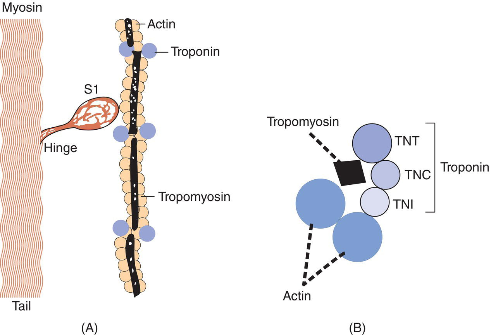

[**Figure 9.13**](#R_c9-fig-0013) (A) Single thick and thin filament showing the S1 cross‐bridge and hinge mechanism. (B) Relationship of actin to tropomyosin and the three troponin subunits. See text for explanation. TNC, a Ca2+‐binding subunit; TNI, inhibitory subunit; TNT, tropomyosin‐binding unit.

(Source: Michael \[96\]. Reproduced with permission of Wolters Kluwer.)

[**Table 9.2**](#R_c9-tbl-0002) Summary of major differences between neonatal and mature hearts

|  | Neonatal | Mature |
| --- | --- | --- |
| Physiology |  |  |
|  Contractility | Limited | Normal |
|  Heart rate dependence | High | Low |
|  Contractile reserve | Low | High |
|  Afterload tolerance | Low | Higher |
|  Preload tolerance | Limited | Better |
|  Ventricular interdependence | Significant | Less |
| Ca2+ cycling |  |  |
|  Predominant site of Ca2+ flux | Sarcolemma | SR |
|  Dependence on normal Ca2+ | High | Lower |
| Circulating catecholamines | High | Lower |
| Adrenergic receptors | Down‐regulated, insensitive | Normal |
|  | β2, α1 predominant | ß1 predominant |
| Innervation | Parasympathetic predominates; sympathetic incomplete | Complete |
| Cytoskeleton | High collagen and water content | Lower collagen and water content |
| Cellular elements | Incomplete SR, disorganized myofibrils | Mature SR, organized myofibrils |

SR, sarcoplasmic reticulum.

Besides calcium, many other regulatory mechanisms exist to influence the interaction and sensitivity of Ca2+ binding to troponin. These mechanisms include ß‐adrenergic stimulation, thyroid hormone, and phosphorylation by cAMP‐dependent protein kinases.

### Developmental changes in calcium cycling

Several aspects of the excitation‐contraction system are different in the immature heart. The T‐tubule is not fully formed \[99\], and the SR has less storage capacity and less structural organization \[100\], less mRNA expression \[101, 102\], and less responsiveness to chemical blockade \[103, 104\]. The TNI changes from a predominately cAMP‐insensitive form to a cAMP‐responsive form by 9 months of age, an additional factor contributing to the increased responsiveness seen with ß‐adrenergic stimulation after the neonatal period \[104\]. All of this information has led to the theory that the neonatal cardiac myocyte is more dependent than the mature heart on free cytosolic Ca2+ fluxes, and more susceptible to blockade of the L‐type Ca2+ sarcolemmal channels as a mechanism of myocardial depression. The latter is thought to be the mechanism producing greater myocardial depression observed with halothane in neonatal rat models compared with sevoflurane, and the same phenomenon is seen clinically \[105\]. A summary of the major differences in cardiac development and function between the neonatal and mature heart is presented in [Table 9.2](#c9-tbl-0002).

### Thyroid hormone

Tri‐iodothyronine (T3) has a critical role both in the development of the cardiovascular system and in acute regulation and performance. Normal T3 levels are essential for normal maturation and development of the heart through the expression of genes responsible for the production of the cardiac contractile proteins, elements of the calcium cycling apparatus, and development and density of ß‐adrenergic receptors \[106\]. There are cell nucleus‐mediated effects from exogenous T3 that occur from an increase in protein synthesis and require at least 8 hours to develop. These include upregulation of ß‐adrenergic receptors, an increase in cardiac contractile protein synthesis, an increase in mitochondrial density, volume, and respiration, an increase in SERCA mRNA, and changes in MHC isoforms. However, there are acute effects of T3 on cardiac myocytes that occur in minutes from interactions with specific sarcolemmal receptors and include stimulation of L‐type Ca2+‐pump activity, stimulation of SR Ca2+‐ATPase activity, increased protein kinase activity, and decrease in phospholamban \[107\]. Cardiac surgery and cardiopulmonary bypass interfere with the conversion of thyroxine (T4) to T3, and serum levels decrease significantly after cardiac surgery in infants and children \[108\]. T3 infusions improve myocardial function in children after cardiac surgery and reduce intensive care unit stay \[109\].

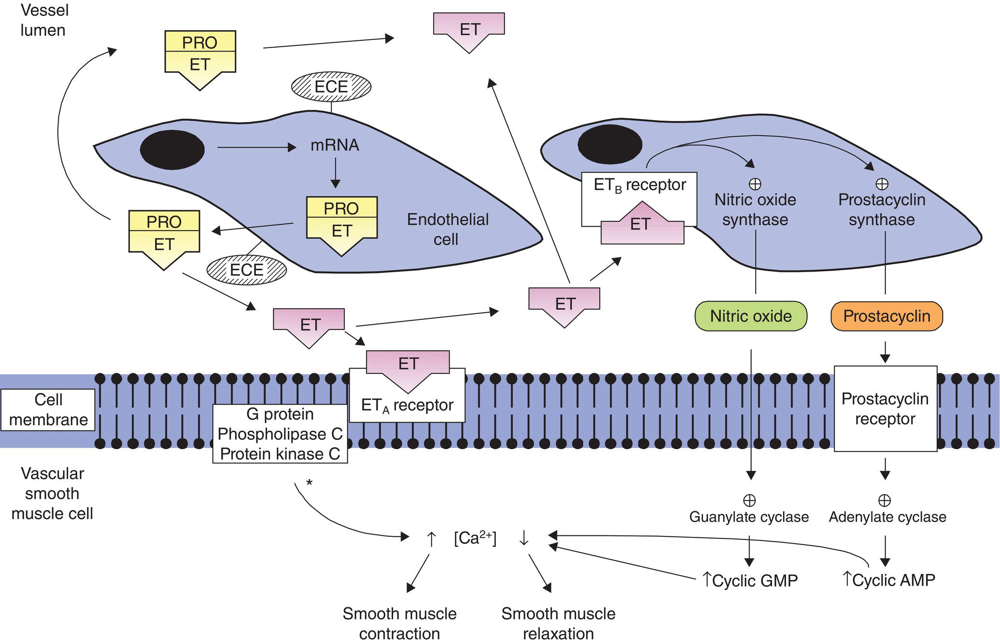

[**Figure 9.14**](#R_c9-fig-0014) Schematic of some major mediators of vascular tone in the pulmonary circulation. ECE, endothelin‐converting enzyme; ET, endothelin‐1; PROET, proendothelin‐1. See text for explanation.

(Source: Haynes and Webb \[110\]. Reproduced with permission of The Biochemical Society and the Medical Research Society.)

* * *

### KEY POINTS: CARDIOMYOCYTE RECEPTOR FUNCTION IN NORMAL AND DISEASED HEARTS

-   The adrenergic receptor system, particularly the β‐receptor system, plays a central role in regulating cardiac contractility through G protein and adenylate cyclase coupling.
-   Calcium cycling in the neonatal heart is characterized as immature, with underdeveloped T‐tubules and sarcoplasmic reticulum, not reaching a mature state until an estimated 6–12 months of age.
-   Thyroid hormone is essential for normal gene expression for production of cardiac contractile proteins, calcium cycling apparatus, and adrenergic receptor density, as well as acute effects to increase the sensitivity of adrenergic receptors and efficiency of calcium cycling.

* * *

## Regulation of vascular tone in systemic and pulmonary circulations

The regulation of vascular tone is an important consideration in the understanding and treatment of CHD. Both the systemic and pulmonary circulations have complex systems to maintain a delicate balance between vasodilating and vasoconstricting mediators in normal patients. Abnormal responses may develop that lead to pulmonary or systemic hypertension, or conversely vasodilation. A schematic representation of some of these mediators is shown in [Figure 9.14](#c9-fig-0014) \[110\]. To some extent, the control mechanisms reviewed are present in both the systemic and pulmonary circulations; however, certain mechanisms are more important in one circulation. For example, the endothelial‐mediated systems (nitric oxide–cGMP pathways and others) predominate in the pulmonary circulation (low‐resistance circulation), whereas the phospholipase systems predominate in the systemic circulation (high‐resistance circulation). The endothelium‐dependent control of vascular tone plays a significant role in the transition from fetal to postnatal circulation, with pathologic persistence of fetal endothelial milieu contributing to the transitional circulation and pulmonary hypertension, both of which may influence the pathophysiology of CHD \[111\].

### Pulmonary circulation

Metabolites of arachidonic acid, called eicosanoids, are produced from cells and a group of eicosanoids acts as vasoactive agents. Eicosanoids metabolized via the lipoxygenase pathway will form leukotrienes, and those metabolized via the cyclooxygenase pathway form the prostaglandins. Important vasodilating prostaglandins include PGE1, which also promotes and maintains patency of the ductus arteriosus. Prostacyclin, PGI2, is a potent pulmonary vasodilator \[112\]. Prostaglandins act on the vascular smooth muscle of the systemic and pulmonary circulations by binding to receptors in the smooth muscle cell membrane, activating adenylate cyclase, and increasing cAMP concentrations, which lead to lower Ca2+ levels and a reduction of vascular tone. Thromboxane A2 is a potent leukotriene that has the opposite effects of the prostaglandins, producing vasoconstriction and platelet aggregation. Imbalance in this system caused by chronic hypoxia can lead to chronic pulmonary hypertension \[113, 114\].

Nitric oxide (NO) is an endothelium‐derived relaxant factor that causes relaxation of vascular smooth muscle cells after diffusing into the cell and activating guanylate cyclase, increasing the concentration of cGMP, leading to a reduction in the local concentration of Ca2+ and thus reducing vascular tone \[115\]. Calcium‐sensitive potassium channels contribute to the vasodilatation caused by NO via a cGMP‐dependent protein kinase \[116\]. NO is formed from L‐arginine by NO synthase and is almost immediately inactivated by binding to hemoglobin. Phosphodiesterase V breaks down cGMP; hence, the phosphodiesterase‐inhibiting drugs, such as sildenafil, potentiate NO‐mediated vasodilation \[117\].

Endothelins are powerful endothelium‐derived vasoactive peptides, and endothelin‐1 (ET‐1) is the best characterized one. ET‐1 is produced from proendothelin‐1 by endothelin‐converting enzymes in the endothelial cells of the systemic and pulmonary vasculature. Increased pressure, shear stress, and hypoxia can lead to increased production of ET‐1 in the pulmonary circulation. Two ET‐1 receptors, ETA and ETB, mediate effects on smooth muscle vascular tone \[118\]. The ETA receptor is found on the smooth muscle cell membrane and mediates vasoconstriction, while the ETB receptor is located on the endothelial cell itself, and results in increased NO synthase activity, producing vasodilation. The primary activity of ET‐1 appears to be to stimulate the ETA receptor and indeed increased levels of ET‐1 are found in many pulmonary hypertensive states such as Eisenmenger syndrome and primary pulmonary hypertension \[119\]. ET‐1 increases in response to shear stress, hypoxia, or ischemia, and results in elevated intracellular Ca2+ and increased sensitivity to Ca2+, increasing pulmonary vascular tone and pressure \[114\].

### Systemic circulation

There are multiple levels of control over the peripheral circulation. Neural control by the sympathetic and parasympathetic nervous systems is produced from the stimulation of receptors on the afferent limb such as stretch receptors within the walls of the heart, and baroreceptors in the walls of arteries, such as the aortic arch and carotid sinuses. Stretch in the arterial wall stimulates the baroreceptors, producing vasodilation and heart rate slowing mediated by the vasomotor centers of the medulla \[120\]. Atrial stretch receptors inhibit the secretion of vasopressin from the hypothalamus. The efferent limb of the autonomic nervous system consists of sympathetic and parasympathetic nerve fibers. The sympathetic nerves can be divided into vasoconstrictor and vasodilator fibers. When stimulated, the vasoconstrictor fibers release norepinephrine, activating α‐adrenergic receptors and producing vasoconstriction. The vasodilator fibers release acetylcholine or epinephrine and are mainly present in skeletal muscle. Parasympathetic fibers are vital in the control of heart rate and function but have only a minor role in controlling peripheral circulation \[121\].

* * *

### KEY POINTS: REGULATION OF VASCULAR TONE IN SYSTEMIC AND PULMONARY CIRCULATIONS

-   The pulmonary vascular endothelium exerts major control of vascular tone and resistance, maintaining low resistance through complex pathways, including nitric oxide, prostaglandins, and cGMP.
-   Systemic vascular tone and resistance are maintained in a higher resistance state than the pulmonary vascular circulation with more neurohormonal activation that includes the sympathoadrenal, renin‐angiotensin‐aldosterone, and phospholipase‐C systems.
-   Pathophysiologic derangements in vascular tone of pulmonary and systemic circulations have led to therapeutic approaches such as inhaled nitric oxide and endothelin receptor antagonists.

* * *

Hormonal control and receptor‐mediated intracellular signaling are other important mechanisms. Norepinephrine primarily stimulates peripheral α receptors and causes vasoconstriction. It is secreted by the adrenal medulla and by sympathetic nerves in proximity to the systemic blood vessels. Epinephrine is also secreted by the adrenal medulla, but its primary action is to stimulate the ß2 receptors in the peripheral circulation, causing vasodilation through cAMP‐mediated reductions in intracellular Ca2+ concentrations.

Angiotensin II is produced by activation of the renin‐angiotensin‐aldosterone axis in response to reduced flow and pressure sensed by the juxtaglomerular apparatus in the kidney. Renin produces angiotensin I by cleaving angiotensinogen, and angiotensin II is produced when angiotensin I passes through the lung by angiotensin‐converting enzyme (ACE). Angiotensin II is a potent vasoconstrictor, and also induces the hypothalamus to secrete vasopressin (antidiuretic hormone), which also has vasoconstrictor properties.

Atrial natriuretic factor (ANF) is released from atrial myocytes in response to stretch (elevation of right or left atrial pressure) on the atrium. ANF has vasodilatory and cardioinhibitory effects and causes sodium retention from decreased tubular reabsorption of sodium in the kidney \[122\]. B‐type natriuretic peptide (BNP) is released by the ventricular myocardium, also in response to stretch, and causes an increase in cGMP, leading to vasodilatation in both arterial and venous systems. In addition, it increases urinary sodium and water excretion \[123\].

Second messenger systems affect the activation of receptors on systemic vascular cell membranes, leading to changes in vascular tone. The phosphoinositide signaling system is the common pathway for many of these agonists \[120\] ([Figure 9.15](#c9-fig-0015)). Membrane kinases phosphorylate phosphatidylinositol, which is an inositol lipid located mainly in the inner lamella of the plasma membrane, producing phosphatidylinositol 4,5 biphosphate. The second messenger, inositol 1,4,5‐triphosphate, is produced from this compound by the action of the enzyme phospholipase C (PLC) \[124\]. The sequence begins with the binding of an agonist, such as angiotensin II, vasopressin, norepinephrine, or endothelin, to a receptor with seven membrane‐spanning domains. This receptor is linked to the activated Gq‐protein subunit, which stimulates phosphatidylinositol‐specific PLC (PI‐PLC) to produce inositol 1,4,5,‐triphosphate, which acts to cause release of Ca2+ from the SR, activating the actin‐myosin system in the smooth muscle cells, producing vasoconstriction. Another second messenger, 1,2‐diacylglycerol, is also produced, which goes on to activate protein kinase C, which in turn has a role in mitogenesis and thus the proliferation of smooth muscle cells. There are many isozymes of PLC; the form implicated in this series of events is the PLCß form. The PLCγ isoform is activated when cell growth factors such as platelet‐derived growth factors bind to their receptors on the cell surface and active tyrosine kinases. This results in the production of phosphatidylinositol 3,4,5‐triphosphate, which is also implicated in mitogenesis.

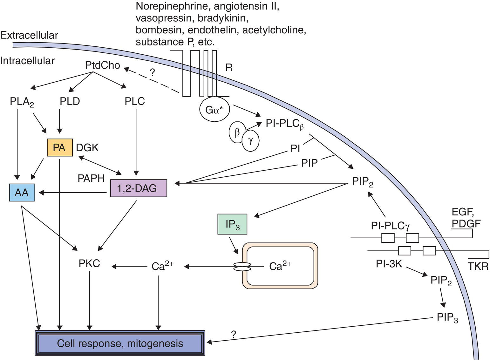

[**Figure 9.15**](#R_c9-fig-0015) Phospholipase C system. Diagram summarizing the major receptor‐activated pathways for the production of inositol 1,4,5‐triphosphate (IP3) and 1,2‐diacylglycerol (1,2‐DAG). The binding of an agonist to a receptor R with seven membrane‐spanning domains results in the activation of the phosphatidylinositol‐specific phospholipase Cß (PI‐PLCß), whereas the stimulation of tyrosine kinase receptors (TKRs) by polypeptide growth factors will activate phosphatidylinositol‐specific phospholipase Cγ (PI‐PLCγ). Both pathways will result in the hydrolysis of phosphatidylinositol 4,5‐biphosphate (PIP2) and the formation of IP3 and 1,2‐DAG. In addition, agonists that act on the heterotrimeric receptors may stimulate phosphatidylcholine (PtdCho) hydrolysis, and activation of tyrosine kinase receptors will stimulate the production of phosphatidylinositol 3,4,5‐triphosphate (PIP3). AA, arachidonic acid; β, β subunits; DGK, diacylglycerol kinase; EGF, epidermal growth factor; G\*, activated G‐protein subunit; PAPH, phosphatidic acid phosphohydrolase; PDGF, platelet‐derived growth factor; PI, phosphatidylinositol; PIP, phosphatidylinositol 4‐phosphate; PI‐3K, phosphatidylinositol 3‐kinase; PKC, protein kinase C; PLA2, phospholipase A2; PLD, phospholipase D.

(Source: Izzard et al. \[120\]. Reproduced with permission of Elsevier.)

Vasodilatation of the systemic circulation results from the formation of nitric oxide by nitrovasodilators, or by activation of ß2‐adrenergic receptors in the peripheral vasculature, both of which result in the activation of guanylate cyclase and the production of cGMP, which reduces intracellular Ca2+ concentrations, producing vasodilation \[125\].

The vascular beds in various peripheral tissues differ in the amount of local metabolic control of vascular tone. For example, pH has much more influence on the pulmonary circuit, with low pH leading to vasoconstriction and higher pH leading to vasodilatation, than in the vascular tone of other tissues. Local CO2 concentration is much more important to central nervous system vasculature, with high levels leading to vasodilatation. A decrease in oxygen tension will often lead to vasodilatation, as adenosine is released in response to the decreased oxygen delivery; however, decreased oxygen tension increases tone in the pulmonary circulation. Autoregulation, or maintaining relatively constant blood flow over a wide range of arterial pressures, predominates in the cerebral circulation but is not as critical in other tissue beds. Autoregulation and CO2 responsiveness are both blunted in the fetal and immature brain \[126\].

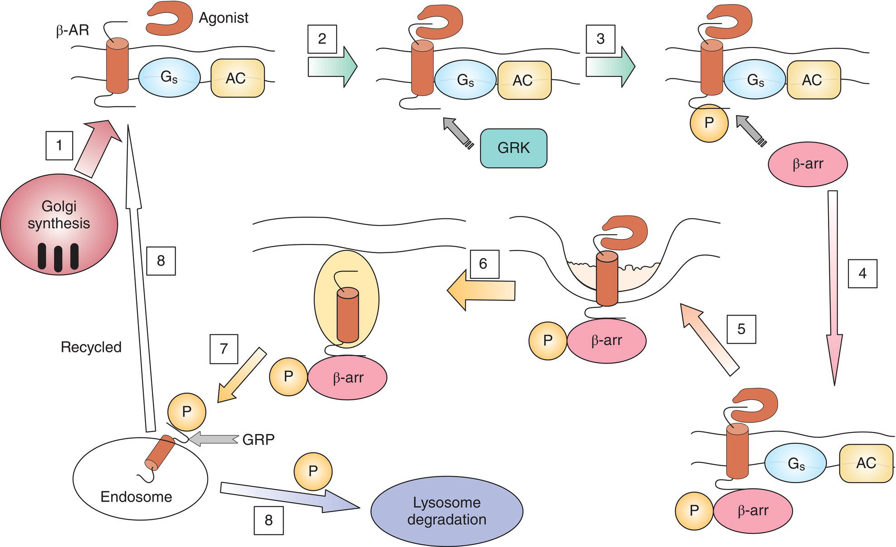

[**Figure 9.16**](#R_c9-fig-0016) Desensitization and downregulation of the ß adrenoreceptor (ß‐AR). 1, agonist binding; 2, phosphorylation of the ß‐AR by G‐protein‐coupled receptor kinases (GRK); 3, ß‐arrestin binds to the GRK‐phosphorylated ß‐AR, which is bound to the Gs protein. The receptor is then sequestrated to the endosomal compartment (4–7), to be dephosphorylated, and then either recycled back to the sarcolemma (8) or translocated to lysosomes for further degradation (8). AC, adenylate cyclase; GRP, G‐protein‐coupled receptor phosphatase; P, inorganic phosphate groups; ß‐arr, ß‐arrestin.

(Source: Booker \[69\].Reproduced with permission of John Wiley & Sons.)

## Receptor signaling in myocardial dysfunction, CHD, and heart failure

A discussion of receptor signaling and calcium cycling in myocardial dysfunction is useful to serve as the basis for understanding many of the therapies discussed later in this text, and this section will focus on receptor physiology and calcium flux in three settings: acute myocardial dysfunction as seen after cardiac surgery and cardiopulmonary bypass, changes seen as responses to chronic cyanotic heart disease, and those seen with chronic congestive heart failure and cardiomyopathy.

### Receptor signaling in acute myocardial dysfunction

Acute myocardial dysfunction, such as that sometimes seen after cardiopulmonary bypass, is often treated with catecholamines. These drugs are sometimes ineffective, especially when used in escalating doses. In children, the number and subtype distribution of ß‐adrenergic receptors in atrial tissue is not affected by cardiac surgery with bypass; however, the activation of adenylate cyclase by isoproterenol is significantly reduced after bypass \[127\]. There is an uncoupling of ß receptors from the Gs – protein–adenylate cyclase complex. Desensitization to moderate or high doses of catecholamines may occur after only a few minutes of administration because increased cAMP concentrations result in uncoupling from the Gs protein \[128\].

Only a few minutes of high‐dose catecholamine administration may result in the inactivation of the phosphorylated adrenergic receptors from sequestration. These receptors can be sequestered by endocytosis, in a process involving a protein called ß‐arrestin, which binds to the receptor and clathrin, a sarcolemmal protein ([Figure 9.16](#c9-fig-0016)) \[69\]. These sequestered receptors may be either recycled back to the cell membrane surface or destroyed by lysosomes \[129\]. This permanent destruction and degradation of receptors occur after hours of exposure to catecholamines and is accompanied by decreased mRNA and receptor protein synthesis, resulting in a prolonged decrease in adrenergic receptor concentrations, which is reversed by decreasing exogenous catecholamines, but only as fast as new receptors can be synthesized.

Neonatal hearts may exhibit a different response to the acute or prolonged administration of catecholamines. Instead of desensitization, neonatal animal models demonstrate an enhanced ß‐adrenergic receptor response, accompanied by an increase in adenylate cyclase activity \[130\]. Desensitization as described earlier occurs later in development. The exact translation of these data to humans is not clear.

Treatment with catecholamines may also increase the concentration of Gi protein subunits, decreasing the sensitivity of the ß‐adrenergic receptor. This relative decrease in the ratio of Gs to Gi protein subunits has been demonstrated in rat and dog models \[131, 132\]. Another possible mechanism of catecholamine‐induced desensitization of the neonatal myocyte was demonstrated in a rat model, where prolonged exposure to norepinephrine caused an initial increase in functional L‐type Ca2+ channels on the sarcolemmal membrane. Continued exposure caused a decrease in L‐type Ca2+ channel mRNA to 50% of control values \[133\]. SERCA concentrations are reduced with chronic norepinephrine administration in the dog \[134\]. Finally, exposing adult or neonatal rat myocytes to high concentrations of catecholamines for 24 hours leads to increased apoptosis of myocardial cells, a genetically programmed energy‐dependent mechanism for cell death and removal \[135, 136\]. This effect was mediated through ß‐adrenergic receptors in the adult model and α receptors in the neonatal model.

All of these studies provide the theoretical basis for the argument that the administration of catecholamines to patients with acute myocardial dysfunction should be limited in dose and duration. Obviously, this is difficult to accomplish in the setting of weaning a hemodynamically unstable patient from cardiopulmonary bypass. Strategies that may limit catecholamine dose include administering low doses of catecholamines together with phosphodiesterase inhibitors, as well as adding corticosteroids, tri‐iodothyronine, and vasopressin \[137\].

### Receptor signaling in CHD

In the past decade, new information concerning adrenergic receptor signaling in patients with CHD has come to light. A study of 71 infants and children undergoing cardiac surgery used tissue from the right atrial appendage to study ß‐adrenergic receptor density, distribution of ß1 and ß2 receptor subtypes, and coupling to adenylate cyclase \[138\]. This study found that patients with severe, or poorly compensated acyanotic (e.g. congestive heart failure) or cyanotic (e.g. severe cyanosis) disease had significantly reduced ß‐adrenergic receptor densities. Outside of the newborn period, this downregulation was ß1‐selective, but in newborns with critical aortic stenosis or transposition of the great arteries, there was additional significant downregulation of the ß2 subtype. In patients with the tetralogy of Fallot, those treated with propranolol had a significant increase in the number and density of ß‐adrenergic receptors, when compared with untreated patients. Beta‐adrenergic receptor downregulation was correlated with increased circulating norepinephrine levels. Finally, in severely affected patients, adenylate cyclase activity was reduced, demonstrating a partial decoupling, as noted earlier. Other studies have determined that symptomatic tetralogy of Fallot patients (i.e. those with cyanotic spells) have a significantly greater number of ß‐adrenergic receptors in their right ventricular outflow tract muscle, and their adenylate cyclase activity was greater than that in patients without cyanotic spells \[73\]. Alpha‐1‐adrenergic receptors are also affected by CHD. A study of atrial tissue excised at the surgery in 17 children evaluated α‐ vs. ß‐adrenergic receptor stimulation with pharmacologic agents. The α component was responsible for 0–44% of the inotropic response, and ß stimulation for 56–100% of the response, with the degree of right ventricular hypertrophy and pressure load correlating with the amount of stimulation found \[139\].

### Receptor signaling in congestive heart failure and cardiomyopathy

Like adults with heart failure, children with congestive heart failure due to chronic left‐to‐right shunting and volume overload of the heart have elevated levels of circulating norepinephrine. This leads to a downregulation in ß‐adrenergic receptor density \[140\]. The degree of elevation of pulmonary artery pressure and amount of left‐to‐right shunting correlates with the plasma catecholamine levels and is inversely correlated with ß‐adrenergic receptor density. All of these abnormalities return to normal levels after corrective surgery. The degree of receptor downregulation in congestive heart failure is correlated with postoperative morbidity in infants and children. Children with an intensive care unit stay of greater than 7 days or those who died during the early postoperative period (nine of 26) had significantly less ß1 and ß2 mRNA gene expression than those who had better outcomes \[141\]. In addition, the children receiving propranolol for treatment of their congestive heart failure had higher ß‐adrenergic receptor mRNA levels and tended to have improved outcomes. Finally, children with dilated cardiomyopathy also have a reduced response to catecholamines, with one study showing no significant increase in ejection fraction during the dobutamine stress test, with an infusion of dobutamine at 5 and then 10 μg/kg/min \[142\]. Generally, studies in excised right atrial tissue in infants and children with CHD or cardiomyopathy demonstrate decreased density of ß1 and ß2 receptors, and decreased downstream adenylate cyclase function, with larger decreases associated with worse ventricular function \[143\].

This has been a brief discussion of receptor signaling in pediatric heart disease. This emerging field has many implications for treatment strategies, and the reader is referred to excellent reviews for more detailed information on this subject \[144\].

* * *

### KEY POINTS: RECEPTOR SIGNALING IN MYOCARDIAL DYSFUNCTION, CHD, AND HEART FAILURE

-   High catecholamine doses in acute myocardial dysfunction can desensitize the myocardium through uncoupling of G‐protein adenylate cyclase complex, and sequestration of β‐adrenergic receptors.
-   Significant cyanotic or acyanotic CHD with heart failure can result in down‐regulation of β‐adrenergic receptors in neonatal or infant myocardium.
-   Longstanding decreased ventricular function is often associated with the decreased density of β‐adrenergic receptors and decreased adenylate cyclase function.

* * *

## Myocardial preconditioning

Myocardial preconditioning refers to the finding that repeated, brief exposures of the myocardium to ischemia, volatile anesthetics, or other stresses induces a protective effect to a later (i.e. 12–24 hours), more prolonged, ischemic insult, resulting in decreased myocardial infarction size and improved myocardial function after the insult \[145\]. Chronic cyanosis also induces a similar protective effect in the myocardium, although the effect size is smaller and more long‐lasting (i.e. beyond 24 hours). Another mechanism is remote ischemic preconditioning (RIPC), in which ischemia is produced in a tissue bed remote to the myocardium, for example, skeletal muscle of the arm or leg by repeated inflation of a blood pressure cuff which is thought to liberate as yet uncharacterized neurohumoral or hormonal substances that can protect the myocardium ([Figure 9.17](#c9-fig-0017)) \[146\]. The mechanisms of myocardial preconditioning are complex but are thought to involve the release of various neurohormonal agents and peptides such as adenosine, bradykinin, and nitric oxide via a cGMP‐dependent mechanism, which then triggers a series of signal transduction events within the cardiomyocyte that confer a “memory” effect that protects the myocardium from future ischemic insults. The signal transduction effects include PKC, tyrosine kinases, mitogen‐activated protein kinases, glycogen synthase kinase 3β, and other enzymes \[147\]. This series of events allows activation of mitochondrial and sacrolemmal KATP channels, which leads to the preconditioning by elusive mechanisms. One recently discovered candidate for this end effector is the mitochondrial permeability transition pore (MPTP) \[147\]. This is a non‐specific channel that spans both mitochondrial membranes, and when opened for a prolonged period results in a dissipation of mitochondrial electrical potential, inhibition of ATP synthesis, and ultimately mitochondrial swelling, rupture, failure of cellular energy metabolism, and cell death. Agents and stimuli that confer myocardial preconditioning have been found to keep the MPTP closed, thus possibly elucidating further the subcellular mechanisms involved.

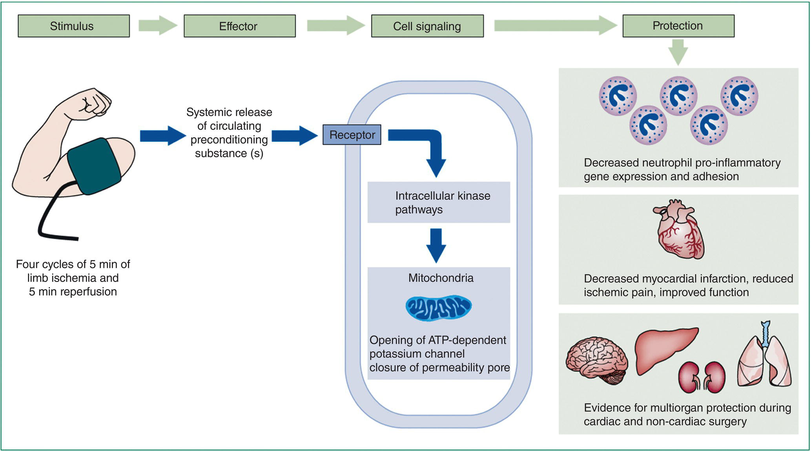

[**Figure 9.17**](#R_c9-fig-0017) Biological effects of remote ischemic preconditioning. Transient ischemia of the arm liberates a circulating effector that induces remote cellular adaptation to a subsequent, extended and potentially lethal period of ischemia in remote tissues.

(Source: Kharbanda et al. \[146\]. Reproduced with permission of Elsevier.)

Several recent pediatric cardiac surgery studies have been published elucidating the potential effects of myocardial preconditioning, which could have the beneficial effect of ameliorating the myocardial stunning effect seen in operations on infants with long aortic cross‐clamp times \[148\]. In a study of 90 infants randomized to sevoflurane, propofol, or midazolam anesthesia for maintenance, plus a sufentanil infusion for analgesia, patients receiving sevoflurane had a very strong trend toward lower troponin T concentrations in the first 24 hours after surgery, potentially signifying less myocardial injury due to the pre‐bypass exposure to sevoflurane \[150\]. Remote ischemic preconditioning produced by inflating a blood pressure cuff on a lower extremity to produce a 5‐minute period of limb ischemia, for four cycles before cardiopulmonary bypass, was studied in 37 children undergoing cardiac surgery. Patients who underwent RIPC had lower peak troponin I levels (17 vs. 22 μg/L, _P_ = 0.04), and lower inotrope score in the RIPC group at 3 and 6 hours post‐bypass \[149\]. This interesting phenomenon of RIPC may work via modulation of the inflammatory response through some as yet unknown humoral mechanism. Some recent small controlled trials of RIPC in children measured inflammatory and myocardial injury markers such as tumor necrosis factor‐alpha and interleukins (ILs). Several of these studies demonstrated decreases in creatine kinase, inflammatory mediators IL‐8 and ‐10, heat shock protein, and cardiac enzymes creatine kinase and troponin I with RIPC. However, none of these studies demonstrated a clinical difference in ventilation time, intensive care unit stay, end‐organ dysfunction, or death \[151–154\]. Thus, it would appear that despite the initial enthusiasm for this relatively simple clinical intervention, the studies to date demonstrate no clinical benefit. The exact mechanisms of RIPC are still not completely elucidated, and the small muscle mass of infants and children compared with adults, the different clinical approaches to anesthetic agent and corticosteroid use, and the small numbers of patients studied to date may prevent conclusive data. A large single‐center, blinded, randomized controlled trial published in 2014 by McCrindle and colleagues studied 299 children aged neonate to 17 years.

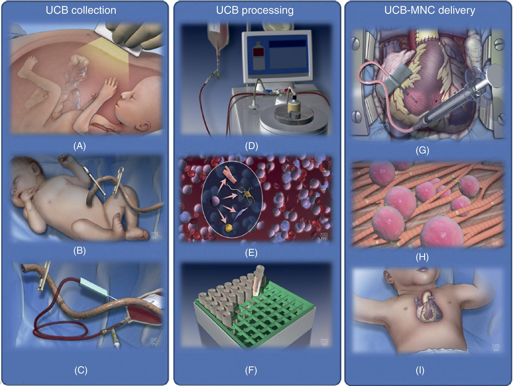

[**Figure 9.18**](#R_c9-fig-0018) Diagnosis of hypoplastic left heart syndrome is established by a fetal echocardiogram (A). Umbilical cord blood (_UCB_) collection kit is sent to the family before birth and used to maximize collection volume (B and C). UCB is collected by local hospital staff, packaged, and transported by a dedicated courier to a specialized laboratory where the sample is processed to isolate the mononuclear cell product via Ficoll density gradient separation (D and E). The final cell‐based product is cryopreserved in sterile 2 mL cryovials with 10% dimethyl sulfoxide at a predetermined concentration and stored in the vapor phase of liquid nitrogen (F). After the completion of superior cavopulmonary anastomosis, the UCB‐derived mononuclear cells (_UCB‐MNC_) are directly injected into the subepicardial myocardium (G). These autologous cells are transiently residing and contributing only to the paracrine influence within the myocardial microenvironment (H) establishing the safety and feasibility of this novel experimental therapy (I).

(Source: Burkhart et al. \[158\]. Reproduced with permission of Elsevier.)

\[155\] The RIPC group received four 5‐minute cuff inflations on the thigh of 15 mmHg above systolic pressure before bypass. There were no differences in the primary outcome of the duration of hospital stay, nor in secondary outcomes of the duration of mechanical ventilation or hospital stay. There were also no differences in physiologic or laboratory outcomes, including markers of cardiac, hepatic, renal, or hemotologic dysfunction; inflammatory markers, or physiologic measures of hemodynamic instability. An international multicenter controlled trial of RIPC in the study of 5,401 adult patients with suspected ST‐elevation myocardial infarction (STEMI) also did not show any difference in cardiac death or hospitalization for heart failure \[156\]. RIPC thus would appear to be an example of a promising therapy in the preclinical setting and small clinical studies, but when subjected to rigorous study design with an adequate sample size, does not change clinically important outcomes.

* * *

### KEY POINTS: MYOCARDIAL PRECONDITIONING

-   Myocardial preconditioning is a complex phenomenon by which repeated brief exposure of the myocardium to ischemia or other stresses induces a protective effect to later ischemic insults.
-   The mitochondrial permeability transition pore is a common pathway for the various forms of ischemic preconditioning, staying closed and preventing mitochondrial failure.
-   Remote ischemic preconditioning produced by inflation of a blood pressure cuff on a limb before CPB may reduce some inflammatory and ischemic cell death markers, but does not improve clinical outcomes.

* * *

## Stem cell and other cell‐based therapy for congenital heart disease

A very interesting and promising approach to regeneration and repair of cardiac myocytes damaged by chronic heart failure due to congenital heart disease, or cardiomyopathy is the administration of autologous or allogeneic stem cells, or other pre‐differentiated cells types, into the myocardium \[157\]. Hypoplastic left heart syndrome (HLHS) patients remain a challenging group because the systemic right ventricle often fails even with technically perfect surgery and a stable postoperative course after the Norwood stage I palliation. Autologous cells derived from a mononuclear population of umbilical cord blood (UCB‐MNC) at birth can assimilate into the myocardium. After processing to ensure sterility and a uniform population of mononuclear cells, umbilical cord blood‐derived mononuclear cell (**UCB‐MNC**) has been tested in an ongoing trial by injecting them directly into the right ventricular myocardium during the Stage II (bidirectional cavopulmonary anastomosis) operation for HLHS. A dose of 1–3 million umbilical cord‐derived mononuclear cells per kilogram is injected \[158\] ([Figure 9.18](#c9-fig-0018)). Vicenti and colleagues published results of a phase II study of seven HLHS patients injected with these cells, compared retrospectively to 17 controls \[159\]. By 6 months postoperatively, treated patients had a 3% increase in right ventricular contractility vs. a 5% decrease for controls (_p_ = 0.03). Somatic growth was also improved in the treated patients, up to 63rd percentile vs. decrease to the 8th percentile in the control group (_p_ = 0.02). Sano and colleagues reported intracoronary infusion of cardiosphere‐derived cells (CDC), a type of cardiac progenitor cells, harvested from the patient at the time of a previous Norwood stage I/II surgery, after stage II or stage III repair in 41 HLHS patients compared to 60 controls \[160\]. Two years after infusion, survival between groups was not different, but CDC treated patients had lower incidence of late heart failure (_p_ = 0.022), adverse events (_p_ = 0.013), and catheter interventions (_p_ = 0.005). In patients with heart failure with reduced ejection fraction, mortality and late complications were improved in CDC treated patients vs. controls. Interestingly, the paracrine hypothesis is thought to be the predominant mechanism of action of the UCB‐MNC and CDC. These cells reside only transiently in the myocardium, but can secrete factors that stimulate endogenous cellular proliferation, while shifting tissue remodeling pathways away from a fibrotic/inflammatory response, to one that can activate endogenous repair mechanisms. Several trials are ongoing and could provide a relatively simple method to improve cardiac function in single ventricle infants. Safety profile is reported to be excellent in the follow‐up to date.

## Selected references

_A full reference list for this chapter is available at:_

[http://www.wiley.com/go/andropoulos/congenitalheart](http://www.wiley.com/go/andropoulos/congenitalheart)

1.  21 Sander TL, Klinkner DB, Tomita‐Mitchell A, Mitchell ME. Molecular and cellular basis of congenital heart disease. Pediatr Clin N Am 2006; 53:989–1009. An overview of the emerging knowledge of the genetic, molecular, and cellular bases for the structural development of congenital heart disease as well as the pathophysiology related to cardiac function.
2.  43 Harvey PA, Leinwand LA. The cell biology of disease: cellular mechanisms of cardiomyopathy. J Cell Biol 2011; 194:355–65. A comprehensive modern review of established and new cellular mechanisms of inherited and acquired cardiomyopathy, with outstanding illustrations.
3.  46 Sheikh F, Ross RS, Chen J. Cell‐cell connection to cardiac disease. Trends Cardiovasc Med 2009; 19:182–90. A review article focusing on anatomy and function of the intercalated disc, which is the complex structure providing the electrical, biochemical, and structural connections between cardiac myocytes enabling coordinated function of the heart. New concepts are stressed, along with the contribution of genetic and acquired abnormalities of the cell‐to‐cell connections to cardiac disease states.
4.  68 Booker PD. Pharmacological support for children with myocardial dysfunction. Paediatr Anaesth 2002; 12:5–25. A classic review article in the pediatric anesthesia literature laying the receptor and cellular function foundation for approaches to inotropic treatment. The pharmacologic approaches are reviewed in the latter half of the paper.
5.  104 Prakash YS, Seckin I, Hunter IW, et al. Mechanisms underlying greater sensitivity of neonatal cardiac muscle to volatile anesthetics. Anesthesiology 2002; 96:893–906. A now classic review article summarizing the developmental differences in neonatal vs. more mature cardiac muscle, and presenting the animal model experiments that form the basis for greater depression of volatile anesthetics in the neonatal heart.
6.  110 Boegehold MA. Endothelium‐dependent control of vascular tone during early postnatal and juvenile growth. Microcirculation 2010; 17:394–406. A comprehensive review of well‐established and emerging concepts of the endothelial milieu and its control of both systemic and pulmonary vascular tone during the neonatal and young infant period.
7.  113 Gao Y, Raj JU. Regulation of the pulmonary circulation in the fetus and newborn. Physiol Rev 2010; 90:1291–335. A very extensive review of the well‐established principles of regulation of the pulmonary circulation in fetal and neonatal life, as well as newer and emerging concepts. Outstanding figures emphasizing new concepts.
8.  142 Buijs EA, Danser AH, Meijer NI, Tibboel D. Cardiovascular catecholamine receptors in children: their significance in cardiac disease. J Cardiovasc Pharmacol 2011; 58:9–19. A review of published human studies of catecholamine receptors studied in excised cardiac tissue in cardiovascular disease, emphasizing changes from normal hearts, and implications for pharmacological therapies.
9.  143 Schwartz SM, Duffy JY, Pearl JM, Nelson DP. Cellular and molecular aspects of myocardial dysfunction. Crit Care Med 2001; 29:S214–9. An overview of cellular and molecular derangements in acquired myocardial dysfunction, with implications for pharmacologic treatment.
10.  155 McCrindle BW, Clarizia NA, Khaikin S, et al. Remote ischemic preconditioning in children undergoing cardiac surgery with cardiopulmonary bypass: a single‐center double‐blinded randomized trial. J Am Heart Assoc 2014; 3:e000964. A large randomized trial of 299 infants and children undergoing congenital heart disease surgery randomized to remote ischemic precondition regimen pre‐bypass vs. sham treatment. There was no difference between groups in any clinical or laboratory outcome.
11.  160 Sano T, Ousaka D, Goto T, et al. Impact of cardiac progenitor cells on heart failure and survival in single ventricle congenital heart disease. Circ Res 2018; 122:994–1005. A trial of cardiosphere derived stem cells in hypoplastic left heart syndrome patients injected after stage II or III surgery. Improved heart failure symptoms, cardiac function, and somatic growth occurred in the treated patients 2 years after infusion of the cells.