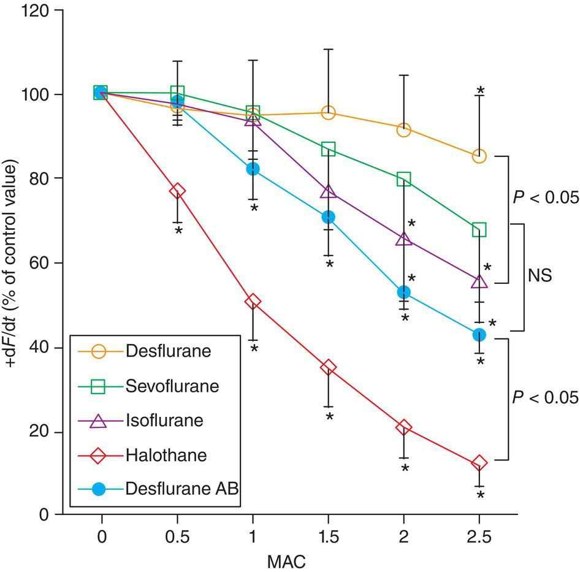
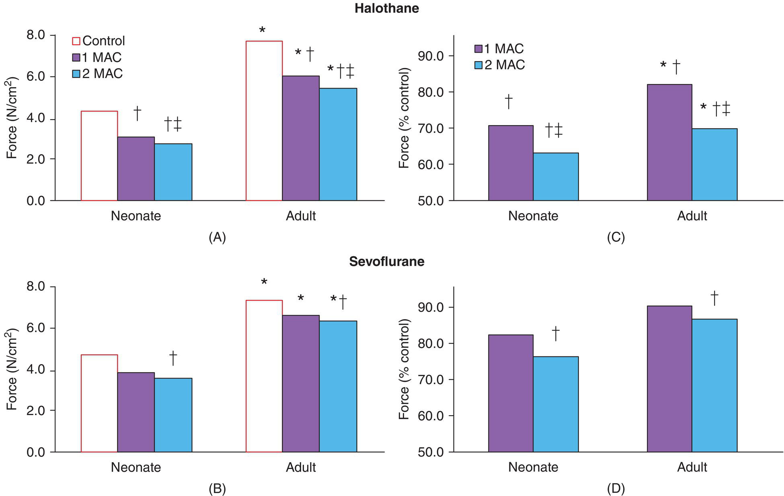
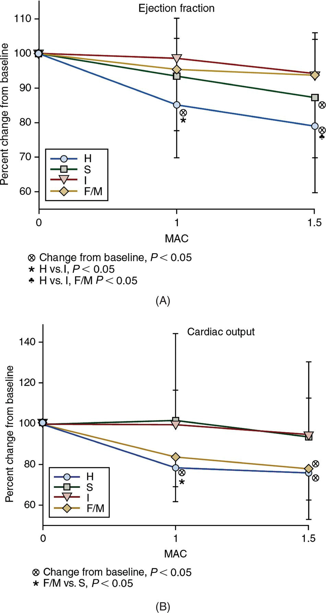
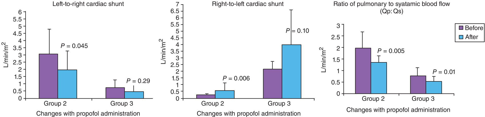
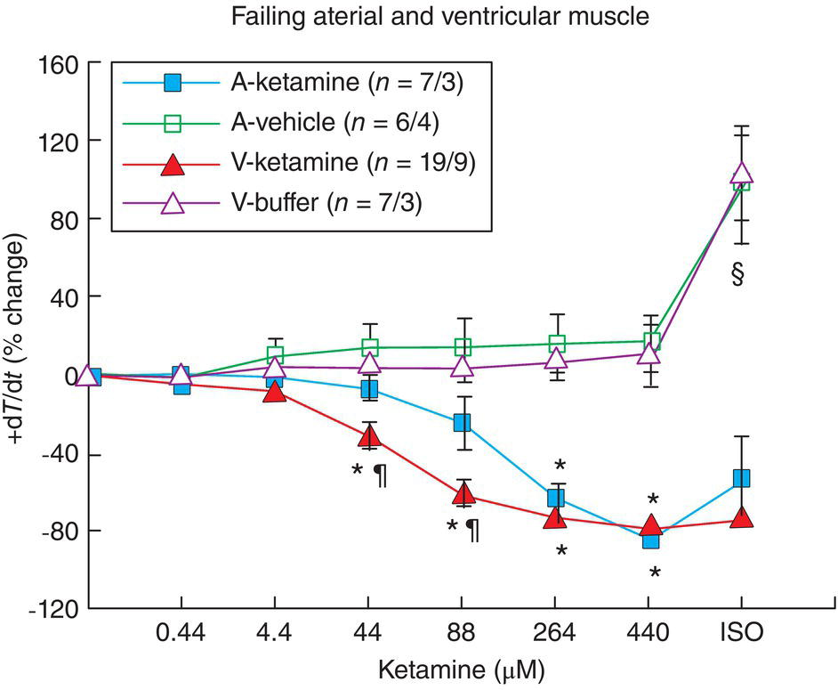
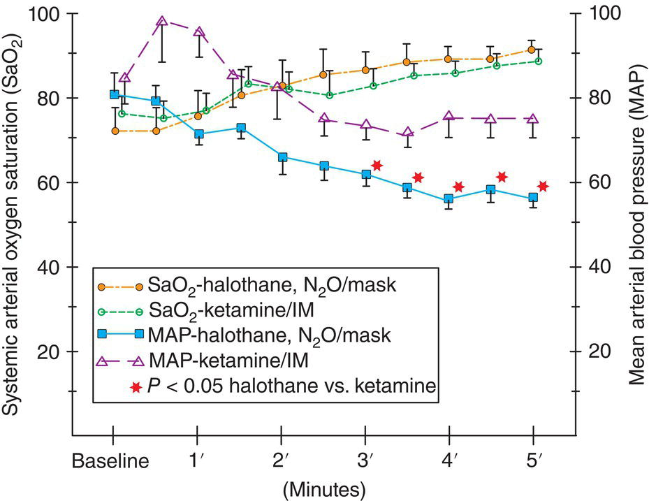
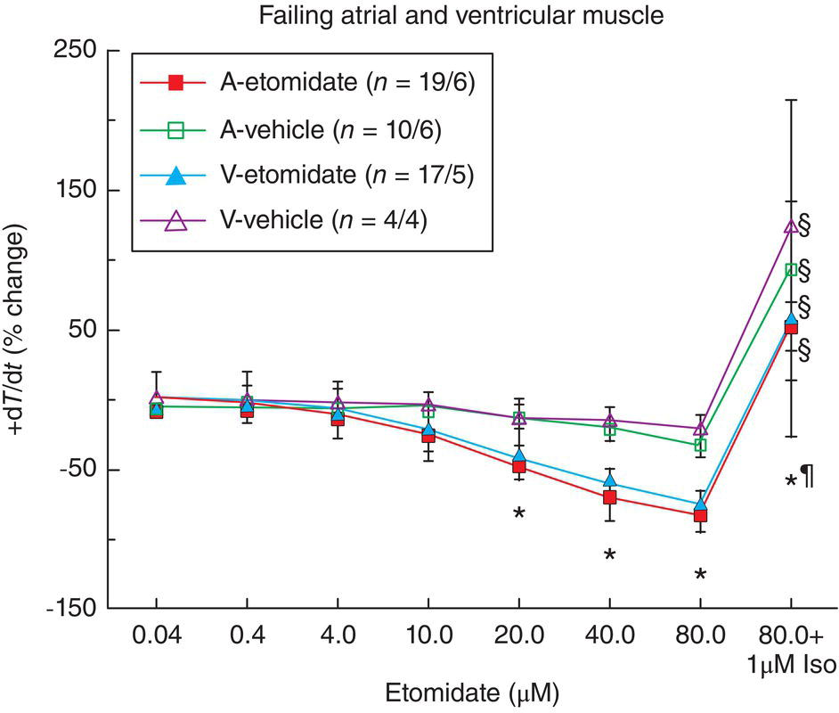
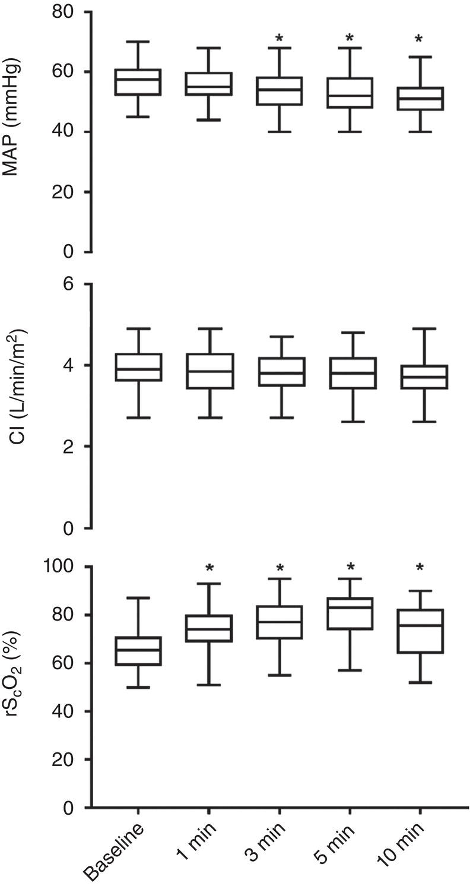
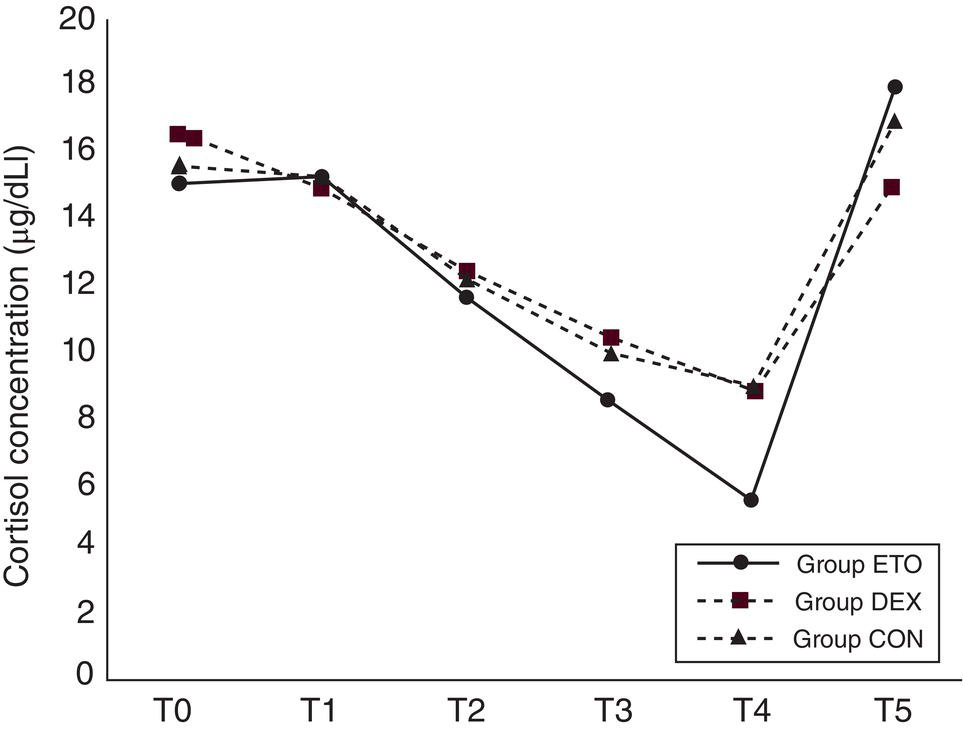
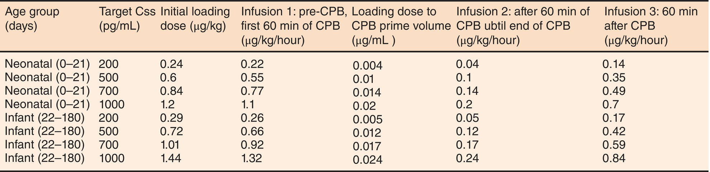

CHAPTER 10 

# CHAPTER 10  
Anesthetic Agents and Their Cardiovascular Effects

_Chinedu G. Otu1, Dean B. Andropoulos2, and Emad B. Mossad1_

1 Arthur S. Keats Division of Pediatric Cardiovascular Anesthesiology, Department of Anesthesiology, Texas Children’s Hospital, Baylor College of Medicine, Houston, TX, USA

2 Department of Anesthesiology, Perioperative and Pain Medicine, Department of Anesthesiology, Baylor College of Medicine, Texas Children’s Hospital, Houston, TX, USA

* * *

-   [**Introduction**](#head-2-93)
-   [**Volatile agents**](#head-2-94)
-   [**Nitrous oxide (N2 O)**](#head-2-95)
-   [**Opioids and benzodiazepines**](#head-2-96)
-   [**Propofol**](#head-2-97)
-   [**Ketamine**](#head-2-98)
-   [**Etomidate**](#head-2-99)
-   [**Dexmedetomidine**](#head-2-100)
-   [**Neuromuscular blocking agents and antagonists**](#head-2-101)
    -   [Succinylcholine](#head-3-82)
    -   [Pancuronium](#head-3-83)
    -   [Vecuronium](#head-3-84)
    -   [Rocuronium](#head-3-85)
    -   [Atracurium and cisatracurium](#head-3-86)
    -   [Antagonists](#head-3-87)
-   [**Special conditions affecting anesthetic pharmacokinetics and pharmacodynamics in congenital cardiac anesthesia**](#head-2-102)
    -   [Intracardiac shunts](#head-3-88)
    -   [Cardiopulmonary bypass](#head-3-89)
    -   [Hypothermia](#head-3-90)
-   [**Selection of anesthetic regimen in CHD**](#head-2-103)
-   [**Selected references**](#head-2-104)

* * *

## Introduction

A wide variety of anesthetic regimens are used for patients with congenital heart disease (CHD) undergoing cardiac or non‐cardiac surgery, procedures in the cardiac catheterization laboratory, or other diagnostic or therapeutic procedures such as magnetic resonance imaging (MRI). The goal of all of these regimens is to produce general anesthesia or adequate sedation while preserving systemic cardiac output (CO) and oxygen delivery. Many of these patients have a limited cardiac reserve, and if a cardiac arrest or other adverse cardiac event occurs, successful resuscitation is less frequent than in patients with normal hearts \[1\]. Thus, intelligent selection of regimen and dosage, with the patient's unique pathophysiology in mind, along with anesthetic requirements for the particular procedure they are undergoing, is essential. This chapter reviews the effects on hemodynamics and myocardial contractility of anesthetic agents and muscle relaxants commonly used for patients with CHD.

## Volatile agents

Although halothane is no longer available in the US, it is still used in some parts of the world, and it serves as the basis for comparison with newer agents because of the number of studies of its hemodynamic effects in children with and without heart disease. Therefore, data concerning halothane will be presented in this section. _In vitro_ studies of effects on contractility in isolated adult human atrial fibers indicate that direct myocardial contractility depression is at its greatest with halothane and that sevoflurane is equal to isoflurane and desflurane \[2\] ([Figure 10.1](#c10-fig-0001)). These studies of myocardium reveal that the differences among these agents occur primarily from differing effects on calcium flux through L‐type Ca2+ channels, both transsarcolemmal and in the sarcoplasmic reticulum (SR). Halothane reduces Ca2+ flux through the sarcolemma more than isoflurane, with the net result of less intracellular Ca2+ available to bind to the troponin–actin–myosin complex, which produces myocyte contraction. Another mechanism of myocardial depression is that halothane, but not isoflurane, directly activates ryanodine‐sensitive SR Ca2+ channels, thereby reducing Ca2+ storage in the SR and making it less available for release during contraction. The effects of sevoflurane and desflurane on Ca2+ flux are similar to those of isoflurane \[2\].

It is important to note that infants from the newborn period up to an age of approximately 6 months exhibit an exaggerated degree of depression of myocardial contractility and blood pressure in response to all volatile agents, but especially halothane \[3, 4\] ([Figure 10.2](#c10-fig-0002)). This is probably due to the immaturity of the Ca2+ release and reuptake system, necessitating higher levels of free cytosolic Ca2+ to be available to bind to the troponin–actin–myosin complex to produce myocyte contraction \[5\]. Sevoflurane, and to a greater extent halothane, interferes with both L‐type Ca2+ channel and Na+/Ca2+ exchanger Ca2+ flux at the plasmalemmal membrane more in neonatal than in adult rat myocytes \[6\]. The volatile anesthetics interfered with Ca2+ release from the SR more in adult rat myocytes. Ca2+ release from the SR is thought to be less contributory to cytosolic Ca2+ levels in neonatal rat myocytes \[7\]. This information provides a mechanism for what is commonly observed clinically.

[**Figure 10.1**](#R_c10-fig-0001) Force of contraction over time (+d_F_/d_t_) of isolated adult human atrial trabeculae in response to 0–2.5 minimum alveolar concentration (MAC) anesthetics. Desflurane AB = desflurane in the presence of α‐ and ß‐receptor blockade. Halothane depresses contractility significantly more than all other agents at every MAC.

(Source: Hanouz et al. \[2\]. Reproduced with permission of Wolters Kluwer Health, Inc.)

The effects of volatile agents on systemic vascular resistance (SVR), as measured by arterial blood pressure, differ between agents. Ca2+ flux in the smooth muscles of arterioles is reduced by all of these agents, resulting in less resting tone, and thus lower blood pressure and vascular resistance. Halothane exhibits the most pronounced reduction of blood pressure, due to the combination of reduction in arterial tone, as well as the more pronounced depression of myocardial contractility. Isoflurane and sevoflurane lower blood pressure primarily through a reduction in SVR \[8\].

Sevoflurane has largely replaced halothane throughout most of the world for induction and maintenance of anesthesia. The Pediatric Perioperative Cardiac Arrest Registry data demonstrated a decrease in anesthetic medication‐related cardiac arrests, from 37% of the total in 1994–1997 to 18% in 1998–2004; the authors primarily attributed this decrease to the less frequent use of halothane, leading to fewer arrests, particularly in young infants \[9\].

In patients with CHD, several studies have been performed comparing newer agents with halothane. A study using transthoracic echocardiography comparing halothane, isoflurane, and sevoflurane \[8\] in 54 children with two‐ventricle CHD ([Table 10.1](#c10-tbl-0001), [Figure 10.3](#c10-fig-0003)) reported that 1 and 1.5 MAC (minimum alveolar concentration) halothane caused significant myocardial depression, resulting in a decrease in mean arterial pressure (MAP, decline of 22 and 35%, respectively), ejection fraction (EF, decrease of 15 and 20%, respectively) and CO (decrease of 17 and 21%, respectively) in patients aged 1 month to 13 years undergoing cardiac surgery. Sevoflurane maintained both CO and heart rate (HR) and had less profound hypotensive (MAP decrease of 13 and 20% at 1 and 1.5 MAC, respectively) and negative inotropic (EF preserved at 1 MAC, 11% decrease at 1.5 MAC) effects than halothane. Isoflurane, at concentrations as high as 1.5 MAC, preserved CO and EF, caused less suppression of MAP (22 and 25%) than halothane, increased HR (17 and 20%), and decreased SVR (20 and 22%).

[**Table 10.1**](#R_c10-tbl-0001) Hemodynamic changes in response to four anesthetic regimens in 54 children with congenital heart disease with two ventricles

Source: Rivenes et al. \[8\]. Reproduced with permission of Wolters Kluwer Health, Inc.

| Measured and calculated hemodynamic and echocardiographic variables |
| --- |
| Agent | MAC | HR (beats/min) | (mmHg) | EF (%) | SF (%) | SVI (mL/m2) | LVEDVI (mL/m2) | CI (L/min/m2) | SVRI (dyn s/cm5/m2) |
| --- | --- | --- | --- | --- | --- | --- | --- | --- | --- |
| Halothane | 0 | 129 ± 22 | 77 ± 15 | 63 ± 9 | 40 ± 5 | 36 ± 16 | 44 ± 19 | 4.49 ± 1.87 | 1425 ± 622 |
|  | 1 | 130 ± 19 | 60 ± 11[_a_](#c10-note-0003) | 54 ± 12[_a_](#c10-note-0003) | 32 ± 7[_a_](#c10-note-0003),[_b_](#c10-note-0003) | 28 ± 11[_a_](#c10-note-0003) | 38 ± 14 | 3.47 ± 1.17 | 1331 ± 529 |
|  | 1.5 | 129 ± 17 | 49 ± 12[_a_](#c10-note-0003) | 50 ± 13[_a_](#c10-note-0003) | 30 ± 8[_a_](#c10-note-0003) ,[_b_](#c10-note-0004) | 26 ± 11[_a_](#c10-note-0003) | 39 ± 12 | 3.34 ± 1.36[_a_](#c10-note-0003) | 1132 ± 503[_a_](#c10-note-0003) |
| Sevoflurane | 0 | 123 ± 32 | 67 ± 8 | 68 ± 11 | 44 ± 7 | 56 ± 41 | 37 ± 15 | 6.91 ± 4.32 | 1014 ± 653 |
|  | 1 | 126 ± 26 | 58 ± 13[_a_](#c10-note-0003) | 62 ± 9 | 39 ± 7 | 52 ± 31 | 36 ± 18 | 6.59 ± 4.04 | 883 ± 592 |
|  | 1.5 | 128 ± 25 | 58 ± 13[_a_](#c10-note-0003) | 58 ± 10[_a_](#c10-note-0003) | 39 ± 9 | 46 ± 26 | 35 ± 14 | 5.78 ± 3.06 | 782 ± 390 |
| Isoflurane | 0 | 112 ± 27 | 69 ± 12 | 63 ± 7 | 39 ± 5 | 46 ± 2 | 46 ± 24 | 4.96 ± 2.74 | 1377 ± 809 |
|  | 1 | 125 ± 16[_a_](#c10-note-0003) | 54 ± 9[_a_](#c10-note-0003) | 62 ± 8 | 37 ± 4 | 39 ± 17 | 40 ± 17 | 4.82 ± 2.20 | 1022 ± 601[_a_](#c10-note-0003) |
|  | 1.5 | 128 ± 13[_a_](#c10-note-0003) | 50 ± 9[_a_](#c10-note-0003) | 59 ± 9 | 36 ± 5 | 39 ± 17 | 42 ± 19 | 4.59 + 2.12 | 950 ± 513[_a_](#c10-note-0003) |
| Fentanyl–midazolam | 0 | 106 ± 22[_c_](#c10-note-0005) | 66 ± 8 | 63 ± 6 | 40 ± 6 | 46 ± 34 | 54 ± 25 | 5.16 ± 4.39 | 1261 ± 644 |
|  | 1 | 87 ± 19[_a_](#c10-note-0003),[_d_](#c10-note-0006) | 59 ± 11[_a_](#c10-note-0003) | 60 ± 7 | 39 ± 5 | 42 ± 30 | 47 ± 25 | 3.79 ± 3.05[_a_](#c10-note-0003) | 1540 ± 806 |
|  | 1.5 | 82 ± 18[_a_](#c10-note-0003),[_d_](#c10-note-0006) | 56 ± 11[_a_](#c10-note-0003) | 59 ± 7 | 38 ± 7 | 43 ± 30 | 52 ± 24 | 3.67 ± 2.99[_a_](#c10-note-0003) | 1559 ± 875 |

All values are means ± SD.

CI, systemic cardiac index; EF, ejection fraction; HR, heart rate; LVEDVI, left ventricular end‐diastolic volume index; MAP, mean arterial pressure; SF, shortening fraction; SVI, stroke volume index; SVRI, systemic vascular resistance index.

[_a_](#R_c10-note-0003) _P <_ 0.05, one‐way analysis of variance (ANOVA), different from 0 minimum alveolar concentration (MAC) within the same anesthetic group.

[_b_](#R_c10-note-0004) _P <_ 0.05, two‐way ANOVA, halothane vs. sevoflurane and fentanyl‐midazolam at 1 and 1.5 MAC.

[_c_](#R_c10-note-0005) _P <_ 0.05, two‐way ANOVA, fentanyl–midazolam vs. halothane at 0 MAC.

[_d_](#R_c10-note-0006) _P <_ 0.05, two‐way ANOVA, fentanyl–midazolam vs. halothane, sevoflurane, and isoflurane at 1.0 and 1.5 MAC.

[**Figure 10.2**](#R_c10-fig-0002) Force of contraction (N/cm2) in neonatal vs. adult rat ventricular trabecular muscle. Baseline force of contraction is greater in adult tissue, and both halothane and sevoflurane depress contractility more in the neonatal than in adult ventricular muscle. Halothane depresses contractility to a greater extent in both age groups. Panels (A and B) report raw data, while panels (C and D) express results as a percentage of baseline contractility. \*Indicates a significant difference between ages (_P <_ 0.05; _n_ = 12 for controls, and _n_ = 6 for all other groups). †Indicates a significant difference between control and halothane groups. ‡Indicates a significant difference between 1 and 2 minimum alveolar concentration (MAC) anesthetic.

(Source: Prakash et al. \[4\]. Reproduced with permission of Wolters Kluwer Health, Inc.)

Russell and colleagues \[10\] compared sevoflurane to halothane in the pre‐bypass period in 180 children with a variety of cardiac diagnoses, including 14 with single‐ventricle physiology and 40 with tetralogy of Fallot (TOF). The incidence of significant hypotension, bradycardia, and arrhythmia requiring drug treatment with atropine, phenylephrine, epinephrine, or ephedrine was higher with halothane (two events per patient vs. one with sevoflurane). Serum lactate also increased slightly with halothane.

In a randomized crossover comparison study of 1 MAC isoflurane vs. sevoflurane, Dalal and colleagues studied 10 children with a variety of CHD, including both single‐ and two‐ventricle diseases \[11\]. Stroke volume, EF, and cardiac index were determined for the systemic ventricle using cardiac MRI techniques. There were no differences between agents for these parameters, or differences in MAP or HR in this small study.

The effects of these agents on pulmonary (Qp) and systemic blood flow (Qs) in 30 biventricular patients with left‐to‐right shunts (secundum ASD, VSD) have also been assessed. Halothane, isoflurane, and sevoflurane did not change Qp:Qs as measured by echocardiography \[12\].

Wang and colleagues assessed differences in HR, cardiac rhythm, and blood pressure in 55 infants aged 2–12 months during 8% sevoflurane induction \[13\]. Twenty‐nine had increased pulmonary blood flow (PBF) (atrial septal defect \[ASD\], ventricular septal defect \[VSD\], patent ductus arteriosus \[PDA\]), and 26 had decreased PBF (TOF, pulmonic stenosis). The first 10 minutes of the anesthetic were assessed, and differences between groups compared. HR decreased from baseline in both groups, with a greater decrease in patients with decreased PBF. Blood pressure decreased significantly in the increased PBF group but was unchanged in the patients with decreased PBF. Junctional rhythm was observed in one patient in the increased PBF group.

Patients with a single functional ventricle comprise an increasing proportion of patients undergoing anesthetics for both cardiac and non‐cardiac surgery, and studies of the hemodynamic effects of anesthetic agents are limited. Ikemba and colleagues \[14\] studied 30 infants with a single functional ventricle immediately before their bidirectional cavopulmonary connection, randomized to receive sevoflurane at 1 and 1.5 MAC or fentanyl/midazolam at equivalent doses. Myocardial performance index (MPI), a transthoracic echocardiographic measurement of combined systolic and diastolic ventricular function that can be applied to single‐ventricle patients, was not changed with any of these regimens when compared with baseline, indicating that either sevoflurane or fentanyl/midazolam can be used in this population to maintain hemodynamic stability.

The effect of sevoflurane on systolic ventricular function has been studied in specific populations of CHD patients. Muyskens and colleagues \[15\] performed a retrospective review of patients with repaired Tetralogy of Fallot (rTOF) undergoing cardiac magnetic resonance imaging (CMR). After propensity score matching, the rTOF patients who required general anesthesia with maintenance sevoflurane (range 0.83–2.83%) were found to have a significant decrease in the CMR‐derived left ventricular ejection fraction (49 vs. 56%) and CMR‐derived right ventricular ejection fraction (41 vs. 48%). Elhoff and colleagues \[16\] assessed changes in ventricular function during 17 instances of sevoflurane‐based general anesthesia for pediatric heart transplant recipients undergoing cardiac catheterization with endomyocardial biopsies. A baseline, pre‐anesthetic echocardiogram was obtained. A significant decrease in ventricular function from baseline, as measured by repeat echocardiography was noted after attainment of a stable maintenance phase of general anesthesia with sevoflurane (MAC 0.7–1.0). There was, however, no consistent evidence of alteration of diastolic function under general anesthesia.

In normal children, desflurane commonly produces tachycardia and hypertension during the induction phase, followed by a slight reduction in HR and systolic blood pressure during steady state at 1 MAC anesthetic level \[17, 18\]. There are no reports of its hemodynamic profile in patients with CHD. In a study of 47 children (mean age 12.8 years) undergoing electrophysiological study for supraventricular tachycardia (SVT), desflurane allowed for induction of the SVT in all patients and demonstrated no clinically important differences in any electrophysiologic measurement, as compared with a fentanyl‐based anesthetic \[19\]. The very low arrhythmogenic potential of desflurane has been demonstrated to be similar to that of isoflurane \[20\].

Some patients (6–12%) exposed to sevoflurane develop arrhythmias, mostly atrial or junctional \[21, 22\]. A study performed in infants (mean age 7.5 months) found that sevoflurane induction caused a 20% incidence of junctional bradycardia (less than 80 beats/min). Isoflurane, when utilized in children for electrophysiologic studies and radiofrequency ablation for SVT, does not affect sinoatrial or atrioventricular (AV) node conduction, and all arrhythmias were easily induced \[23\]. There are case reports of sevoflurane causing torsade de pointes in children with congenital long QT syndrome; this effect may be due to the increase in HR often seen with induction of anesthesia with this agent \[24\].

In a study of sevoflurane inhalation induction using electronic anesthesia data, Kraemer and colleagues \[25\] compared 209 children with Down syndrome with or without CHD with 268 healthy controls without Down syndrome or CHD. Fifty‐seven percent of the Down syndrome patients experienced age‐defined hypotension and bradycardia during the first 6 minutes of anesthesia, as compared with 12% of patients without Down syndrome or CHD (odds ratio, 9.56; 95% confidence interval 6.06–15.09). Bradycardia was not further characterized, i.e., sinus vs. junctional. Nogami and colleagues \[26\] describe a case of transient cardiac arrest in a 14‐year‐old Down syndrome patient with repaired ASD, VSD, and PDA during inhalational induction with 5% sevoflurane for a dental procedure. Severe bradycardia (HR <30 bpm) developed 1 minute after induction, followed by asystole. The mechanism for cardiac arrest was postulated to be secondary to autonomic cardiac dysfunction commonly seen in the Down syndrome population.

Few studies to date have addressed the effects of the different anesthetics on an important group of pediatric patients with heart disease: patients with cardiomyopathy or significantly decreased systolic ventricular function. Volatile agents were commonly employed in two retrospective series of anesthesia in children with cardiomyopathy. Lynch and colleagues administered volatile agents in 26% of 236 inductions, and only four patients (1.7%) had cardiac arrest on induction; none of the four received volatile agents \[27\]. Kipps and colleagues reported a series of 33 children; 12% received volatile agents for induction and 64% received them for maintenance \[28\]. Although there were 15 patients with severe complications, defined as significant hypotension, arrhythmia, cardiac arrest, extracorporeal membrane oxygenation cannulation, or death, no conclusions could be drawn about any association with use of volatile agents. Rather, severe ventricular dysfunction (shortening fraction _<_16%) was the most important predictor of complications.

Diastolic function with halothane and isoflurane has been studied in animal models of cardiomyopathy \[29, 30\]. The two agents differ, with halothane producing negative lusitropic effects, while isoflurane conserves or may even improve diastolic function. There are no reports measuring diastolic function in response to anesthetic agents in patients with CHD.

* * *

### KEY POINTS: VOLATILE AGENTS

-   Depression of myocardial contractility and CO is greatest with halothane, minimal with sevoflurane, and least with isoflurane and desflurane at end‐tidal concentrations up to 1.5 MAC.
-   All volatile agents may depress myocardial contractility and CO at high doses; infants less than 6 months of age are at the greatest risk.
-   Patients with significantly decreased ventricular systolic function are presumed to be at greatest risk for further myocardial depression from any volatile agent.

* * *

## Nitrous oxide (N2O)

Despite its ubiquitous use as an adjunct to anesthetic induction and maintenance in patients with CHD, information regarding the effect of N2O on hemodynamics in patients with CHD is very limited. Its use may be relatively contraindicated where increased FiO2 is employed, or where enlargement of enclosed air collections is possible, such as in any intracardiac or intrathoracic surgery. Reports of increased pulmonary vascular resistance (PVR), sympathetic stimulation, or significantly decreased CO in response to N2O in adult patients have not been substantiated in children with or without the cardiac disease \[31, 32\].

In infants and small children with normal hearts, Murray and colleagues found that addition of 30 and 60% N2O to 1 MAC halothane or isoflurane resulted in a decreased HR and cardiac index, without changing EF and stroke volume measured echocardiographically \[33\]. These authors also demonstrated that when 0.6 MAC halothane or isoflurane was substituted for 60% N2O during 0.9 MAC isoflurane or halothane anesthesia, HR, MAP, and cardiac index were unchanged \[34\].

In 14 patients with CHD recovering from surgery, Hickey and colleagues \[35\] administered 50% N2O and observed a decrease of 9% in HR, 12% in MAP, and 13% in systemic cardiac index. However, mean pulmonary artery pressure and PVR were not significantly changed in these well‐ventilated patients with a PaCO2 of 34–35, and pH of 7.47–7.49, even in patients with elevated PVR at baseline. This single report represents the total number of patients with CHD in which N2O administration has been carefully studied. Despite this paucity of information, extensive clinical experience has demonstrated N2O to be safe and effective, particularly as an adjunct to inhaled induction of anesthesia for congenital heart surgery.

## Opioids and benzodiazepines

Fentanyl and sufentanil have been studied as a sole anesthetic in patients with CHD. Hickey, Hansen, and colleagues \[36–38\] provided the basis for this technique with a series of studies in neonates and infants less than 1 year of age undergoing complex repairs, ranging from the Norwood operation to complete repair of biventricular lesions. Fentanyl doses of 50–75 μg/kg, and sufentanil doses of 5–40 μg/kg, administered with pancuronium 0.1–0.15 mg/kg, provided excellent hemodynamic stability with minimal changes in HR and blood pressure throughout the surgery. The increase in pulmonary artery pressure and resistance in response to suctioning in infants recovering from cardiac surgery was eliminated with 25 μg/kg fentanyl. Moore and colleagues \[39\] demonstrated that 5, 10, or 20 μg/kg sufentanil in children aged 4–12 years had no effect on EF as measured by echocardiography in patients undergoing repair of biventricular lesions. Increases in HR, blood pressure, and stress hormones were more effectively blunted by the higher doses. Glenski and colleagues \[40\] reported M‐mode echocardiographic measures of contractility, blood pressure, and HR response using fentanyl (100 μg/kg) or sufentanil (20 μg/kg) in children aged 6 months to 9 years. Measurements were made at three different times: after a premedication with morphine and scopolamine, after induction, and after tracheal intubation. These opioids decreased both EF and shortening fraction after induction, but they returned to or above baseline after intubation.

Midazolam is often added to fentanyl anesthesia to provide sedation and amnesia, as a substitute for low‐dose volatile anesthetic agent, particularly in hemodynamically unstable patients and young infants, where the myocardial depressant effects of volatile agents are more pronounced. Fentanyl and midazolam combinations have been studied in two different clinically utilized dose regimens to simulate 1 and 1.5 MAC of volatile agents (fentanyl 8–18 μg bolus followed by 1.7–4.3 μg/kg/h infusion, then repeat bolus at 50% of the original doses followed by increase of infusion by 50%, depending on age; midazolam 0.29 mg/kg bolus followed by 139 μg/kg/h infusion, then repeat bolus 50% of the original dose, followed by increase in infusion of 50% for all ages) for induction and the pre‐bypass period in congenital heart surgery in biventricular patients \[8\] ([Figure 10.3](#c10-fig-0003)). Vecuronium was used for muscle relaxation in order to isolate the effects of the other two agents on hemodynamics. Measurements of CO and contractility were made by echocardiography. Fentanyl/midazolam caused a significant decrease (22%) in CO despite preservation of contractility. This was predominantly due to a decrease in HR. Co‐administration of a vagolytic agent such as atropine \[41\] or pancuronium would probably preserve CO. The added effect of midazolam on echocardiographic indices of contractility has not been previously reported, however, increased inotropic support requirements have been documented in infants receiving sedation after cardiac surgery with the addition of midazolam bolus totaling 0.3 mg/kg, and infusion of 0.1–0.2 mg/kg/h in the early postoperative period \[42\].

[**Figure 10.3**](#R_c10-fig-0003) Hemodynamic changes assessed by echocardiography in 54 patients with two‐ventricle congenital heart disease. (A) Ejection fraction. (B) Cardiac output. H, halothane; F/M, fentanyl/midazolam; I, isoflurane; MAC, minimum alveolar concentration; S, sevoflurane. See text for details.

(Source: Rivenes et al. \[8\]. Reproduced with permission of Wolters Kluwer Health, Inc.)

The stress response to major cardiac surgery in infants and children has been the subject of considerable interest. Anand and Hickey reported the use of high dose sufentanil at a total mean dose of 37 μg/kg as the sole anesthetic for complex neonatal surgery \[43\]. The sufentanil was continued by infusion for 24 hours postoperatively. This regimen was compared with halothane plus morphine (mean dose of 0.35 mg/kg) intraoperatively, followed by intermittent morphine and diazepam postoperatively. Stress response, as measured by changes in adrenal hormones, cortisol, glucose, and lactate, was significantly reduced in the sufentanil group, and mortality and major complications such as sepsis and necrotizing enterocolitis were also significantly reduced. A later study from the same institution of 45 infants averaging 3 months of age undergoing biventricular repair with deep hypothermic cardiopulmonary bypass has been reported \[44\]. A total fentanyl dose of 100 μg/kg was administered, given either as intermittent boluses of 25 μg/kg, or as boluses plus infusion, with or without midazolam, and all regimens resulted in a significant endocrine stress response to cardiac surgery. Despite this, the outcome was excellent in all groups, with no adverse outcomes related to the anesthetic technique or the surgical stress response. The sole hemodynamic difference between the regimens was a lower MAP during cooling on bypass in the group who received midazolam. Finally, Duncan and colleagues \[45\] reported a dose–response study of 2, 25, 50, 100, and 150 μg/kg fentanyl before bypass in 40 children averaging 13 months and 8.5 kg. The 2 μg/kg group had significant increases in pre‐bypass norepinephrine, glucose, and cortisol, and significantly higher HR and blood pressure than all other groups. A dose of 25 μg/kg or higher eliminated changes in these parameters for the duration of the surgery. It is difficult to interpret the significance of these stress response studies because they were evaluated by different age groups and lesions. Also, there was more than one decade between reports, during which time there were significant improvements in surgical, bypass, and postoperative management. If any group of patients had benefited from attenuation of the stress response, it would appear to be neonatal patients undergoing complex surgery. Current approaches to early extubation favor lower intraoperative opioid doses, e.g., _<_10–20 μg/kg fentanyl and use of adjuvants such as dexmedetomidine or regional anesthesia, rather than completely ablating the stress response \[46\]. [Chapter 24](c24.xhtml) presents an extensive discussion of early extubation approaches for congenital cardiac surgery.

Remifentanil is a synthetic ultra‐short‐acting narcotic agent metabolized by plasma esterases with a half‐life of 3–5 minutes that is independent of the duration of infusion \[47\]. It is particularly useful for short non‐cardiac procedures with intense stimulation where opioid‐based anesthesia and its hemodynamic stability would be desirable, yet where rapid emergence is also important. Donmez and colleagues \[48\] reported a series of 55 children undergoing cardiac catheterization with a remifentanil infusion of 0.1 μg/kg/min. This regimen maintained excellent cardiovascular stability, with minimal changes in HR, blood pressure, or oxygen saturation. Fifty‐eight percent of patients required additional sedation with midazolam or ketamine. Apnea was infrequent, and a time to recovery score of 5 (10‐point scale) was only 2–4 minutes. Patients undergoing long cardiac catheterization procedures could potentially benefit from this agent.

Remifentanil infusion at 0.3 μg/kg/min increased sinus cycle and Wenckebach cycle length from baseline but did not affect atrial‐His or His‐ventricular interval, or AV node, atrial, ventricular, or accessory pathway effective refractory period in 14 patients undergoing electrophysiology study and ablation for SVT \[49\]. In a similar study of 29 patients receiving 0.2 or 0.4 μg/kg/min remifentanil, the larger dose prolonged sinoatrial conduction time and sinus node recovery time, but not atrial‐His interval \[50\]. These electrophysiological effects should be taken into account if the drug is used for electrophysiological studies.

Remifentanil administration has been reported for ASD repair, where patients are extubated in the operating room (OR) \[51\]. It apparently does not bind to the cardiopulmonary bypass (CPB) circuit \[52\] and its clearance in children before and after CPB appears to be predictable within a narrow range, making it a potentially useful agent for “fast‐track” anesthesia and early extubation for simple surgical procedures. Friesen and colleagues compared remifentanil 0.3–0.7 μg/kg/min with fentanyl 15 μg/kg, both with isoflurane and pancuronium, in fast‐track pediatric cardiac operations (ASD and VSD repairs) and found that HR was significantly slower in the OR in the remifentanil group, but there was no difference in time to extubation, analgesic requirements in ICU, nausea/vomiting or hypertension in ICU, or in ICU length of stay \[53\]. Akpek and colleagues compared higher‐dose remifentanil (2 μg/kg load and 2 μg/kg/min maintenance infusion) with fentanyl (20 μg/kg load and 20 μg/kg/h infusion) in 33 infants with pulmonary hypertension undergoing surgery for repair of left‐to‐right shunting defects. Both groups had a midazolam infusion. There were no clinically important differences in hemodynamic, respiratory, or oxygen saturation parameters between groups, and no difference in clinical outcomes \[54\]. Thus, despite some theoretical advantages due to its pharmacokinetic profile, there are few clinically significant differences between remifentanil and fentanyl.

* * *

### KEY POINTS: OPIOIDS AND BENZODIAZEPINES

-   Fentanyl, sufentanil, and remifentanil have minimal effect on myocardial function, even at large doses.
-   Synthetic opioids decrease catecholamine release and other measures of stress response, including pulmonary hypertension, at moderate and large doses.
-   Complete ablation of the stress response with large opioid doses is employed less often in recent years without decrement in outcomes.
-   Midazolam (and other benzodiazepines) in large doses may increase inotropic support needs in infants.

* * *

## Propofol

Propofol has become a popular agent for sedation for cardiac catheterization procedures and induction of general anesthesia for cardiac surgery. In plasma concentrations found in routine clinical use, propofol has minimal negative inotropic effects in isolated animal cardiac preparations \[55\] or in human adult atrial muscle strips \[56\].

In children with normal hearts, propofol at induction doses consistently decreases systolic and mean arterial pressure by 5–25% without changing HR \[57\]. In a case series of 13 preterm neonates of 29–32 weeks gestational age, a propofol bolus of 1 mg/kg decreased MAP from 38 to 24 mmHg, and 5 of 13 patients had a severe decrease to _<_25 mmHg \[58\]. There has been one published study using echocardiography to assess myocardial contractility and CO in infants with normal hearts induced with propofol \[57\]. The shortening fraction or cardiac index was not changed, and SVR decreased by 14 and 27% at 1 and 5 minutes after induction, respectively. Load independent measures of contractility (stress velocity index and stress shortening index) decreased significantly from baseline at 5 minutes after induction with propofol.

Williams and colleagues \[59\] measured the hemodynamic effects of propofol in 31 patients aged 3 months to 12 years at a dose of 50–200 μg/kg/min undergoing cardiac catheterization ([Figure 10.4](#c10-fig-0004)). They found that propofol significantly decreased MAP and SVR; however, there was no change in systemic CO, HR, mean pulmonary artery pressure, or PVR. In patients with cardiac shunts, the net result was a significant increase in the right‐to‐left shunt, a decrease in the left‐to‐right shunt, and decreased Qp : Qs, resulting in a statistically significant decrease in PaO2 and SaO2, as well as reversal of the shunt from left‐to‐right to right‐to‐left in two patients. In another study of patients undergoing cardiac catheterization, Lebovic and colleagues \[60\] demonstrated that patients could experience a 20% decrease in HR or MAP. Combining propofol infusion with ketamine infusion for cardiac catheterization procedures demonstrated less change in MAP, preservation of baseline HR, and little effect on recovery time \[61\].

Although propofol is very useful for cardiac catheterization, short, stimulating procedures, and possibly for short‐term sedation after cardiac surgery, its long‐term use as an ICU sedative is contraindicated, with several reports of otherwise unexplained metabolic acidosis and myocardial failure after long‐term (>48 hours), high dose use in pediatric patients \[64, 65\]. The mechanism of this cardiovascular collapse is postulated to be due to disruption of fatty acid oxidation caused by impaired entry of long‐chain acylcarnitine esters into the mitochondria and failure of the mitochondrial respiratory chain \[66\]. Although a recent case series of short‐term, low‐ to medium‐dose post‐anesthetic propofol infusion (median 7 hours) has been described without complication in 12 high‐risk CHD patients with pulmonary hypertension, airway malacia, or underlying chromosomal abnormality, this practice should be limited to those centers with substantial expertise and experience with this technique \[67\]. Propofol infusions of duration greater than 6 hours, as might be observed for long cardiac catheterization procedures, are not recommended because of the potential for the propofol infusion syndrome.

Propofol has no significant effect on sinoatrial or AV node conduction, or on the ability to induce SVT, and therefore is desirable as a primary agent during electrophysiologic studies and radiofrequency ablation \[23, 62\]. However, ectopic atrial tachycardia may be suppressed by propofol \[63\].

In summary, propofol can be utilized in patients with adequate cardiovascular reserve who can tolerate a mild decrease in contractility and HR, and a decrease in SVR. Propofol may cause an increased intracardiac right‐to‐left shunt, and reversal of shunt in some patients, (i.e. acyanotic TOF), and thus hemodynamic data obtained in the cardiac catheterization laboratory should be interpreted accordingly. Although propofol use for induction of anesthesia has been described for patients with cardiomyopathies in several case series \[27, 28\], many authorities recommend against its use, particularly in hypertrophic or dilated cardiomyopathy, where even a small reduction in afterload and preload from propofol's venodilatory properties can result in cardiovascular collapse \[68\].

* * *

### KEY POINTS: PROPOFOL

-   Propofol at induction doses causes a mild decrease in myocardial contractility, but a significant decrease in MAP and HR, as well as some preload reduction from venodilation.
-   Propofol infusion has little effect on pulmonary vascular pressure and resistance, but decreases SVR, resulting in an increase in right‐to‐left shunting.
-   Because of its effects to decrease preload, afterload, and myocardial contractility, propofol should be used with great caution, if at all, in patients with significantly decreased ventricular function, and those with left ventricular outflow obstruction.

* * *

[**Figure 10.4**](#R_c10-fig-0004) Changes in intracardiac shunting in response to propofol induction and infusion in children undergoing cardiac catheterization. Group 2, patients with net left‐to‐right cardiac shunting; group 3, patients with net right‐to‐left cardiac shunting. Qp : Qs decreased significantly in both groups.

(Source: Williams et al. \[59\]. Reproduced with permission of Wolters Kluwer Health, Inc.)

## Ketamine

The general anesthetic and analgesic effects of ketamine are mediated by its interaction with _N_‐methyl‐D‐aspartate receptors in the brain \[69\]. It increases HR, blood pressure, and CO through central nervous system‐mediated sympathomimetic stimulation and inhibition of the reuptake of catecholamines. Ketamine is a direct myocardial depressant when studied in isolated myocyte preparations \[70\] and in adult human failing atrial and ventricular muscle trabeculae \[71\] ([Figure 10.5](#c10-fig-0005)). The direct myocardial depression caused by ketamine may be unmasked when administered to patients whose sympathomimetic responses are already maximally stimulated from cardiomyopathy, or another condition leading to poor myocardial reserve, because a further increase in catecholamine release is limited. Similarly, if the patient is chronically receiving ß‐adrenergic agonists, catecholamine receptors may be downregulated, resulting in a diminished response to endogenously generated catecholamines, allowing the myocardial depressant effects of ketamine to predominate.

[**Figure 10.5**](#R_c10-fig-0005) Developed tension over time (d_T_/d_t_) in cardiac muscle trabeculae in explanted hearts from adults undergoing cardiac transplantation in response to increasing ketamine concentrations. The upper limit of clinical concentration is 44 μM after a 2 mg/kg induction dose. A, atrial muscle; V, ventricular muscle; vehicle, control solution without ketamine; buffer, Krebs–Henseleit buffer control. \*_P <_ 0.05 _versus_ vehicle control; _P <_ 0.05 _versus_ A‐Ketamine; §_P <_ 0.05 _versus_ preceding dose. Numbers in parentheses represent numbers of muscle strips/number of patients. ISO, change with addition of 1 μM isoproterenol.

(Source: Sprung et al. \[71\]. Reproduced with permission of Wolters Kluwer Health, Inc.)

The mechanism of myocardial depression is by inhibition of L‐type voltage‐dependent Ca2+ channels in the sarcolemmal membrane. An increased extracellular Ca2+ concentration may enhance this effect \[70\]. This direct myocardial depression effect is greater than that produced by etomidate \[56\]. In a patient with end‐stage cardiomyopathy awaiting heart transplant, hemodynamic collapse occurred after the induction of anesthesia with ketamine \[72\]. In a study comparing ketamine (1.5 mg/kg) and sufentanil (mean total dose 3.42 μg/kg) for induction of anesthesia in 20 patients with end‐stage cardiomyopathy undergoing cardiac transplantation, ketamine was found to increase MAP, SVR, central venous pressure, and pulmonary artery pressure, and decrease stroke volume index significantly \[73\]. Cardiac index decreased slightly, but not to a statistically significant degree. The sum total of the hemodynamic effects of ketamine induction in these patients was less myocardial work at the expense of a higher myocardial wall tension. Sufentanil induction did not change any of these parameters from baseline.

Other well‐recognized untoward effects associated with ketamine use do not differ among patients with CHD. These include emergence reactions, excessive salivation, and an increase in cerebral metabolism, intracranial pressure, cerebral blood flow, and cerebral oxygen consumption \[69\].

Despite the adverse effects of ketamine, this drug has been a mainstay of induction of general anesthesia in patients with CHD \[74, 75\]. Administration can be intravenous (IV) or intramuscular (IM), and it will reliably maintain HR, blood pressure, and systemic CO at an induction dose of 1–2 mg/kg IV or 5–10 mg/kg IM, and a maintenance dose of 1–5 mg/kg/hour in patients with a variety of congenital heart diseases, including TOF \[76, 77\] ([Figure 10.6](#c10-fig-0006)).

Ketamine's effect on pulmonary vascular resistance has been investigated. Morray and colleagues \[78\] demonstrated that in patients undergoing cardiac catheterization, 2 mg/kg ketamine caused a minimal (_<_10%) increase in mean pulmonary artery pressure and in the ratio of PVR to SVR (Rp : Rs), with no change in direction of shunting or Qp : Qs. Hickey and colleagues \[79\] studied 14 postoperative infant cardiac surgery patients who had normal PaCO2, breathing spontaneously through nasotracheal tubes. Ketamine 2 mg/kg had no effect on pulmonary artery pressure or calculated PVR in patients with either normal or elevated baseline PVR. Williams and colleagues reported that ketamine (2 mg/kg load, followed by an infusion of 10 μg/kg/min) did not change PVR at all in 15 children with severe pulmonary hypertension, when breathing spontaneously with a baseline of 0.5 MAC sevoflurane \[80\] ([Figure 10.7](#c10-fig-0007)). Williams and colleagues also performed a retrospective review of anesthetic technique and outcomes of 92 patients with pulmonary hypertension undergoing 192 anesthetics for noncardiac surgery, catheterization, and other diagnostic procedures, with ketamine administered for either induction or maintenance in 149 procedures (78%) \[81\]. Pulmonary hypertension was mild in 23%, moderate in 37%, and severe in 40%. There were nine major complications, including three cardiac arrests (1.7% incidence), and 20 minor complications; the majority of minor complications were self‐limiting arrhythmias and hypotension. Ketamine administration was not associated with any of these complications, whether administered as the sole anesthetic agent or combined with volatile agents or propofol. Friesen and colleagues \[82\] administered ketamine (2 mg/kg) to 34 children with known pulmonary hypertension undergoing elective pulmonary hypertension studies with a controlled airway and ventilation. No pulmonary vasodilating medications were used simultaneously. Mean pulmonary artery pressures and PVR were clinically unchanged in this patient cohort. Ketamine appears to be a safe anesthetic option in children with mild to severe pulmonary hypertension.

[**Figure 10.6**](#R_c10-fig-0006) Oxygen saturation and mean arterial pressure in response to induction with intramuscular (IM) ketamine vs. halothane in patients with right‐to‐left cardiac shunting, most of whom had tetralogy of Fallot.

(Source: Greeley et al. \[76\]. Reproduced with permission of Wolters Kluwer Health, Inc.)

[**Figure 10.7**](#R_c10-fig-0007) Pulmonary vascular resistance changes in 15 children with pulmonary hypertension undergoing cardiac catheterization, in response to ketamine 2 mg/kg intravenously, followed by an infusion of 10 μg/kg/min while breathing spontaneously with a baseline of 0.5 MAC sevoflurane. T1, baseline before ketamine; T2, 5 minutes after ketamine load; T3, 10 minutes after ketamine load; and T4, 15 minutes after ketamine load.

(Source: Williams et al. \[80\]. Reproduced with permission of Wolters Kluwer Health, Inc.)

Ketamine, supplemented with small doses of midazolam and/or morphine, has been used for interventional cardiac catheterization procedures \[83\] and for postoperative analgesia after cardiac surgery in children. Hemodynamic stability has been excellent, with few complications. The most notable adverse effect was transient apnea in 10% of spontaneously breathing newborns undergoing balloon atrial septostomy in the catheterization laboratory.

There is limited information regarding the effect of ketamine on electrophysiologic study parameters. Char and colleagues reported on 22 children aged 5–17 years undergoing electrophysiologic study and ablation for SVT who had a baseline propofol infusion for sedation \[84\]. Dexmedetomidine loading dose 1 μg/kg followed by infusion of 0.7 μg/kg/h was initiated, and electrophysiologic parameters measured. Then, with dexmedetomidine still infusing, a ketamine load of 1 mg/kg followed by infusion of 1 mg/kg/h was given, and parameters again measured. Dexmedetomidine depressed sinus node function (sinus node recovery time), prolonged QT interval, and increased AV node refractory period. All of the abnormal parameters were returned completely or partially to baseline values after ketamine. Atiyeh and colleagues reported on a 21‐year‐old female undergoing electrophysiologic study for refractory paroxysmal idiopathic ventricular tachycardia (VT) \[85\]. Maintenance anesthesia consisted of low dose propofol, alfentanil, and sevoflurane, and VT could not be induced despite isoproterenol infusion being increased to 5 μg/kg/min. After initiation of ketamine 15 μg/kg/min, VT could be easily and reproducibly induced, allowing successful mapping and ablation of VT focus.

Intramuscular induction of anesthesia may be achieved with ketamine 5 mg/kg, succinylcholine 4 mg/kg, and atropine 20 μg/kg mixed in the same syringe. This regimen is useful for small patients who present to the operating room without IV access in whom the inhalational induction of anesthesia may produce undesirable hemodynamic effects. Endotracheal intubation can usually be achieved in 3–5 minutes, and attention can be turned to establishing IV access with the airway secure and a stable hemodynamic state. Ketamine may also be employed as a premedication, with an oral dose of 5–6 mg/kg most commonly administered.

In summary, ketamine is an attractive choice for IV or IM induction of anesthesia in patients with CHD with good or moderately limited hemodynamic reserve, including those with pulmonary hypertension or cyanosis. However, care must be taken in patients with severely limited cardiac reserve and depressed myocardial contractility. Such patients may be chronically receiving ß‐adrenergic or similar agents, or their own endogenous sympathomimetic system might be maximally stimulated because of a low CO state. The myocardial depressant properties of ketamine may be unmasked, leading to hemodynamic compromise.

* * *

### KEY POINTS: KETAMINE

-   Ketamine will increase HR and blood pressure and preserve or increase myocardial contractility in patients with good hemodynamic reserve.
-   Ketamine may act as a direct myocardial depressant in patients with poor ventricular function in whom myocardial β‐adrenergic receptors are downregulated from endogenous or exogenous catecholamines.
-   Ketamine is a safe anesthetic in pulmonary hypertension if oxygenation and ventilation are maintained.

* * *

## Etomidate

Etomidate is an imidazole derivative introduced into clinical practice in 1972. It is thought to produce its hypnotic effects (without analgesia) by interaction with gamma‐aminobutyric acid receptors \[69\]. Besides having a desirable lack of effect on hemodynamics, etomidate reduces cerebral blood flow and cerebral metabolic rate of oxygen consumption (30–50%), and intracranial pressure. It has little effect on ventilation, does not release histamine, and does not change airway smooth muscle tone. Of all of the available IV induction agents, etomidate consistently demonstrates the least direct myocardial depression in several _in vitro_ models. Two well‐designed studies using adult human atrial and ventricular tissue demonstrated no effect of etomidate on myocardial contractility in concentrations seen in clinical use ([Figure 10.8](#c10-fig-0008)). In the same model, ketamine showed slight, and thiopental strong, negative inotropic effects in clinical concentration ranges. This was true even in abnormal myocardial samples of ventricular tissue taken from hearts removed for cardiac transplantation \[56, 86\]. In a study of right ventricular tissue excised from infants and children during TOF repair, etomidate did not change contractility in the clinical concentration range in an _in vitro_ tissue bath study, but did blunt responsiveness to isoproterenol at high concentrations, raising the possibility that the pediatric myocardium may respond differently after etomidate \[87\].

[**Figure 10.8**](#R_c10-fig-0008) Developed tension over time (d_T_/d_t_) in cardiac muscle trabeculae in explanted hearts from adults undergoing cardiac transplantation in response to increasing etomidate concentrations. The upper limit of clinical concentration is 4 μM. A, atrial muscle, V, ventricular muscle; vehicle, 35% propylene glycol, in which etomidate is solubilized. \*_P <_ 0.05 _versus_ A‐vehicle control; ¶_P <_ 0.05 _versus_ V‐vehicle control, and §_P <_ 0.05 _versus_ preceding dose. Numbers in parentheses represent numbers of muscle strips/number of patients. Iso, change with addition of 1 μM isoproterenol.

(Source: Sprung et al. \[86\]. Reproduced with permission of Wolters Kluwer Health, Inc.)

These beneficial effects of etomidate are offset by a number of undesirable effects. Etomidate is water‐insoluble and is thus formulated in propylene glycol, commonly producing pain on injection, which may be ameliorated by pretreatment with lidocaine and 1 : 1 dilution with sterile water. A new etomidate formulation dissolving the drug in a fat emulsion of medium and long‐chain triglycerides virtually eliminates pain on injection in children \[88\]. Myoclonic movement, hiccoughs, and nausea and vomiting are frequent \[69\]. It should be noted that, as in adults, a single dose of etomidate used for induction in pediatric patients undergoing cardiac surgery with CPB suppresses the usual increase in plasma cortisol levels by inhibiting 11‐ß‐hydroxylase, the enzyme that converts 11‐deoxycortisol to cortisol \[89\]. Cortisol levels returned to normal 24 hours later. Two adult studies have reported effects of etomidate induction on 30‐day outcomes. Komatsu and colleagues reported on 2,144 ASA III and IV patients given etomidate for induction for non‐cardiac surgery, propensity‐matched with 5,233 given propofol \[90\]. Seventy‐four percent of patients had cardiovascular disease, and those receiving etomidate had an odds ratio of 2.5 for death and 1.5 for cardiovascular morbidity and a longer hospital stay, but no difference in infectious morbidity or intraoperative vasopressor use. The authors speculate that adrenal suppression could have a bearing on this association. Wagner and colleagues reported a cohort of 3,127 adults undergoing cardiac surgery, 62% of whom received etomidate for induction \[91\]. No difference in severe hypotension, in‐hospital mortality, mechanical ventilation time, or hospital length of stay was demonstrated either before or after propensity score analysis. They conclude that etomidate should remain an acceptable option in these patients.

There are a few published reports of the hemodynamic effects of etomidate in children with CHD. Twenty patients with a variety of congenital defects were studied in the cardiac catheterization laboratory. These authors found that etomidate at 0.3 mg/kg bolus followed by an infusion of 26 μg/kg/min had similar effects as ketamine 4 mg/kg followed by an infusion of 83 μg/kg/min, namely a slight increase in HR but no change in MAP during induction or the 60‐minute infusion \[92\]. Sarkar and colleagues \[93\] studied etomidate bolus 0.3 mg/kg in 12 children undergoing cardiac catheterization for device closure of ASD, or radiofrequency ablation of atrial arrhythmias. There were no significant changes in any hemodynamic parameter, including HR, MAP, filling pressures, vascular resistances, Qp : Qs, or mixed venous oxygen saturation. Dhawan and colleagues studied 30 children under 12 years old undergoing cardiac catheterization with FiO2 0.21 and basal sedation with morphine and midazolam, who had direct hemodynamic measurements before and after a 0.3 mg/kg bolus of etomidate \[94\]. In 15 patients with right‐to‐left shunt (TOF, VSD/PS, VSD/PA), there was no change in HR, right atrial pressure, MAP, Qp : Qs, or arterial blood gas values. In 15 patients with left‐to‐right shunts (VSD, ASD, PDA, aortopulmonary window), all of whom had significant baseline pulmonary hypertension, there was also no change in HR, right atrial pressure, mean pulmonary artery pressure (69 mmHg before, 71 mmHg after), Qp : Qs, PVR index (PVRI), or SVR index (SVRI). Dennhardt and colleagues \[95\] studied 50 neonates and infants (mean age 3.4 months) with congenital heart disease undergoing cardiac surgery, in whom general anesthesia was induced with etomidate. Effects on mean arterial blood pressure, regional cerebral oxygen saturation, and cardiac index were evaluated ([Figure 10.9](#c10-fig-0009)). This patient population exhibited stable systemic and regional cerebral perfusion after a single bolus of 0.4 mg/kg etomidate, leading the authors to conclude that etomidate is a beneficial induction agent in infants with congenital heart disease, or those with expected limited hemodynamic reserve.

A case report of stable hemodynamics in a pediatric patient with end‐stage cardiomyopathy receiving a second anesthetic 4 weeks after cardiovascular collapse with ketamine induction (see earlier) demonstrates the utility of etomidate in this population \[72\]. Etomidate has also been utilized for induction of anesthesia in adults with congenital cardiac conditions such as ruptured aneurysm of the sinus of Valsalva, and cesarean section in a patient with uncorrected coronary artery to pulmonary artery fistula and was demonstrated to be devoid of cardiovascular effects in these patients \[96, 97\].

It would appear that etomidate is best utilized in patients with the most limited cardiac reserve. It seems to be particularly useful in teenagers or adults with poorly compensated palliated CHD presenting for cardiac transplantation, or revision of previous surgeries. Adrenal suppression occurs with even a single dose of etomidate, and consideration should be given to administer additional supplemental corticosteroids in patients receiving corticosteroids, or at risk of prolonged adrenal suppression. Many patients receiving etomidate for induction will already be receiving corticosteroids as part of their regimen for transplant or cardiac surgery. Repeated or prolonged administration of etomidate is not recommended for this reason.

[**Figure 10.9**](#R_c10-fig-0009) Mean arterial blood pressure, cardiac index and regional cerebral oxygen saturation at baseline and 1, 3, 5, and 10 minutes after induction with 0.4 mg/kg etomidate in neonates and infants undergoing cardiac surgery.

(Source: Dennhardt et al. \[95\] / John Wiley & Sons / CC BY 4.0.)

* * *

### KEY POINTS: ETOMIDATE

-   Etomidate has no direct myocardial depressant effect at clinically administered doses, and as such is a preferred induction agent for patients with poor ventricular function.
-   Etomidate has no effect on systemic or pulmonary hemodynamics when administered to patients with intracardiac shunting, including those with pulmonary hypertension.
-   Etomidate will suppress adrenal function with a single induction dose.

* * *

## Dexmedetomidine

Dexmedetomidine was introduced in the US in 1999 as a sedative agent for mechanically ventilated adults in intensive care settings. It is an IV agent that is an imidazole derivative, and a highly selective α2‐adrenergic receptor agonist (1620 : 1 α2–α1 activity, vs. 220 : 1 for clonidine). Dexmedetomidine is a centrally acting agent with α2‐receptor binding sites in the locus ceruleus in the brain, producing sedation, and α2 receptors in the spinal cord, producing some analgesic effect. Dexmedetomidine loading doses, particularly large doses of 0.75–1 μg/kg administered rapidly over _<_10 minutes, may cause systemic hypertension with binding to peripheral arterial α2 receptors \[98\]. With a continuous infusion, dexmedetomidine causes a dose‐dependent decrease in HR and MAP by decreasing CNS sympathetic nervous system activity. It also potentiates opioid effects and is thus potentially suitable for use both during and after pediatric cardiac surgery, as a component of a general anesthetic and as a sedative/analgesic agent in the intensive care unit (ICU). The usual dose for sedation is 0.2–0.7 μg/kg/hour; a loading dose of 0.5–1 μg/kg given over 10 minutes can be utilized if desired. It has minimal effect on respiration, and its clearance of 13 mL/kg/min, volume of distribution of 1.0 L/kg, and terminal half‐life of 1.8 hours in children without heart disease are similar to adult values \[99\]. In infants aged 1–24 months receiving dexmedetomidine sedation after congenital heart surgery with bypass, clearance using allometric scaling was 28 mL/kg/min0.75, and central volume of distribution was 1.2 L/kg \[100\]. In both premature infants and full‐term neonates _<_30 days of age undergoing congenital heart surgery, dexmedetomidine clearance is substantially reduced and elimination half‐life is substantially increased to as high as 7.6 hours for preterms. Both values assume near‐adult levels after about 44 weeks postconceptional age \[101, 102\].

Because it is an imidazole derivative structurally similar to etomidate, dexmedetomidine theoretically has the potential for adrenal suppression with prolonged use. In 99 pediatric patients undergoing VSD repair, ASD/VSD repair, or Tetralogy of Fallot repair, plasma cortisol concentrations were compared after administration of dexmedetomidine (loading dose of 0.5 μg/kg, followed by infusion of 0.5 μg/kg/hour), etomidate (bolus dose of 0.3 mg/kg), or a control anesthetic. The cortisol level was found to decrease in all patients after induction of anesthesia, and return to baseline within 24 hours, but the degree of decrease at three hours post‐induction was more significant in the group that received etomidate, compared to the control, or the group that received dexmedetomidine ([Figure 10.10](#c10-fig-0010)). Any inhibitory function of dexmedetomidine on the adrenal cortex was of weaker efficacy than that of etomidate \[103\]. Venn and colleagues reported no difference in cortisol, adrenocorticotropic hormone (ACTH), growth hormone, prolactin, insulin, glucose, and interleukin‐6 in 20 adult ICU patients randomized to receive propofol or dexmedetomidine \[104\]. There were also no differences between the groups in response to ACTH stimulation test. However, Tucker and colleagues described a 1‐year‐old 10 kg burn patient who received high‐dose dexmedetomidine infusion for 7 days and developed hypotension with low baseline cortisol levels and inadequate response to ACTH stimulation test, indicating adrenal insufficiency, which they believed was possibly related to dexmedetomidine \[105\]. No additional published reports exist implicating dexmedetomidine in adrenal suppression.

[**Figure 10.10**](#R_c10-fig-0010) Comparison of plasma cortisol concentrations in children with CHD who received etomidate (ETO), dexmedetomidine (DEX) or a control anesthetic (CON). T0, time of intravenous access; T1, immediately after induction; T2, 30 minutes after intubation; T3, after superior and inferior vena cava catheterization; T4, 3 hours after induction; and T5, 24 hours after induction.

(Source: Gu et al. \[103\].)

Dexmedetomidine has been studied as an adjunct agent in general anesthesia for pediatric cardiac surgery. In a study by Muktar and colleagues, dexmedetomidine 0.5 μg/kg load followed by 0.5 μg/kg/h infusion, with an isoflurane–fentanyl–midazolam anesthetic, significantly reduced HR, MAP, cortisol, blood glucose, and serum catecholamine response in children aged 1–6 years undergoing cardiac surgery with CPB, when compared with the baseline anesthetic \[106\].

Dexmedetomidine has been studied for postoperative sedation after pediatric cardiac surgery. Chrysostomou and colleagues studied 38 pediatric patients of median age 8 years after two‐ventricle repair with CPB. Thirty‐three of 38 patients had tracheal extubation in the OR. Dexmedetomidine infusion rate varied from 0.1 to 0.75 μg/kg/h (mean 0.3), and the desired sedation was achieved in 93% of patients, and analgesia in 83% of patients. There was no respiratory depression, but hypotension was observed in 15% of patients \[107\]. Dexmedetomidine has also been described as useful in weaning opioid‐tolerant cardiac surgery patients relatively quickly with no hemodynamic side effects \[108\].

Dexmedetomidine as a sole sedative agent for pediatric cardiac catheterization was studied by Munro and colleagues in 20 children \[109\]. A loading dose of 1 μg/kg was followed by an infusion of 1 μg/kg/h, and propofol boluses were given for movement or increasing bispectral index value. Sixty percent of patients required propofol boluses. There was a slight decrease in MAP but not in HR, and no patient experienced airway obstruction or respiratory depression. Dexmedetomidine plus ketamine has been compared with dexmedetomidine plus propofol for pediatric cardiac catheterization in 44 patients \[110\]. There was no difference in sedation scores or respiratory parameters: HR was slower in the dexmedetomidine group, while MAP was not different. Recovery time was significantly longer in the dexmedetomidine group than in the propofol group.

[**Table 10.2**](#R_c10-tbl-0002) Electrophysiologic variables at baseline and after a 20‐minute infusion of dexmedetomidine

Source: Hammer et al. \[111\]. Reproduced with permission of Wolters Kluwer Health, Inc.

|  | Baseline | DEX | _P_ |
| --- | --- | --- | --- |
| **Surface ECG intervals** |
| SCL | 606 ± 140 ms | 788 ± 165 ms | _<_0.01 |
| PR | 144 ± 19 ms | 162 ± 17 ms | _<_0.01 |
| QRS | 76 ± 11 ms | 79 ± 13 ms | NS |
| QTc | 394 ± 9 ms | 424 ± 9 ms | _<_0.01 |
| **Sinus automaticity** |
| CSNRT | 212 ± 179 ms | 293 ± 180 ms | _<_0.01 |
| **Atrial muscle properties** |
| AERP | 207 ± 31 ms | 208 ± 17 ms | NS |
| AV nodal properties |  |  |  |
| AH interval | 73 ± 14 ms | 82 ± 12 ms | _<_0.01 |
| AVNBCL | 352 ± 87 ms | 436 ± 105 ms | _<_0.01 |
| AVNERP | 310 ± 85 ms | 360 ± 88 ms | _<_0.02 |
| VABCL | 372 ± 111 ms | 460 ± 134 ms | _<_0.01 |
| His Purkinje properties |  |  |  |
| HV interval | 40 ± 7 ms | 40 ± 6 ms | NS |
| Ventricular muscle properties |  |  |  |
| VERP | 220 ± 22 ms | 230 ± 19 ms | 0.06 |

ECG, electrocardiogram; SCL, sinus cycle length; PR, PR interval; QRS, QRS duration; QTC, corrected QT interval; CSNRT, corrected sinus node recovery time; AERP, atrial effective refractory period; AH interval, atrial–His interval; AVNBCL, AV node block cycle length; AVNERP, AV node effective refractory period; VABCL, ventriculoatrial block cycle length; HV interval, His–ventricular interval; VERP, ventricular effective refractory period.

It is important to note that dexmedetomidine frequently causes bradycardia and thus may not be suitable as a sedative for electrophysiologic studies. In 12 children undergoing electrophysiologic studies, Hammer and colleagues found that dexmedetomidine 1 μg/kg load followed by 0.7 μg/kg/h infusion for 20 minutes decreased HR by 15–20%, but more importantly depressed sinus node recovery times, sinus node automaticity, and increased AV nodal block cycle lengths and PR interval \[111\] ([Table 10.2](#c10-tbl-0002)).

In more recent studies, case series reporting dexmedetomidine administration for intraoperative and postoperative use have been described in a variety of congenital and acquired heart diseases, including those with critical heart disease and decreased ventricular function. Klamt and colleagues prospectively randomized 32 children undergoing two‐ventricle cardiac repairs to a midazolam–fentanyl anesthetic or a dexmedetomidine–fentanyl anesthetic \[112\]. Dexmedetomidine was infused at 1.0 μg/kg/h without loading dose for the first hour, and then decreased to 0.5 μg/kg/h, and HR and BP were recorded. Isoflurane was used to supplement the anesthetic and to control hemodynamic variables. HR and BP decreased from baseline in both groups but increased after skin incision only in the midazolam–fentanyl group. Eighty‐six percent of the midazolam–fentanyl group required supplemental isoflurane, as compared with 31% of the dexmedetomidine–fentanyl group. In the dexmedetomidine group, two patients required phenylephrine before bypass for hypotension and one required atropine for bradycardia.

In a retrospective review, Lam and colleagues described 50 neonates and infants ≤12 months receiving dexmedetomidine sedation for a median of 78 hours, at doses ranging from 0.1 to 1.5 μg/kg/hour after congenital heart surgery or cardiac transplantation \[113\]. Despite a significant decrease in HR and MAP as well as central venous pressure after initiation of the dexmedetomidine infusion, inotrope score progressively decreased, and no critical hemodynamic events or bradyarrhythmias were observed that required boluses of IV fluids, adrenergic agents or atropine, or escalation of inotropic support. The authors concluded that dexmedetomidine is safe from a hemodynamic standpoint and can reduce opioid and benzodiazepine dosing. Lam and colleagues also described dexmedetomidine use in 21 infants (median age 3–4.2 months and weight 4.7–6.6 kg) with congestive heart failure as part of a sedation regimen for intensive care and compared safety and efficacy with 23 patients with congestive heart failure who were sedated without dexmedetomidine \[114\]. All patients were awaiting orthotopic heart transplantation and were studied in the 18 days before transplant; 75% had dilated cardiomyopathy and all but one was receiving mechanical ventilation. Mean arterial pressures were lower in the first 24 hours in the dexmedetomidine group, and HR was lower in the dexmedetomidine group in the first 6 hours. Three patients in the dexmedetomidine group (14%) had greater than a 50% decrease in MAP in the first 3 hours after initiation of dexmedetomidine infusion at 0.5–0.6 μg/kg/hour; one of the three also had bradycardia to 48 beats/min. Opioid and benzodiazepine doses were significantly lower in children receiving dexmedetomidine. The authors concluded that dexmedetomidine administration in infants with heart failure appears to be generally safe, but should be used cautiously.

Su and colleagues studied dose–response of dexmedetomidine as a primary sedative in a dose‐escalation study of 36 infants aged 1–24 months after cardiac surgery, with loading dose and infusion rates spanning the range of doses used clinically \[115\]. Heart rates for the entire group decreased from a mean of 161 beats/min at baseline to a mean of 132 beats/min during dexmedetomidine infusion (_P <_ 0.0001). The decrease in HR was dose‐ and plasma level‐dependent with larger decreases in higher‐dose groups. MAP and inotrope infusion scores did not change significantly during infusion. A single patient in the intermediate dosing cohort experienced intermittent complete heart block 5 hours after dexmedetomidine infusion initiation, resulting in bradycardia, which did not recur following discontinuation. A more recent study by this same group extended the study population to include 23 neonates with CHD after cardiac surgery \[116\]. Three neonatal patients developed bradyarrhythmias, one developed junctional rhythm, and one developed atrial ectopy. All patients required discontinuation of the dexmedetomidine infusion. One neonatal patient developed hemodynamically significant atrial ectopy, requiring CPR and extracorporeal membrane oxygenation. Their data suggests the need for dexmedetomidine dose reduction in neonates due to decreased clearance, with the greatest reduction required in the first 2 weeks of life.

Dexmedetomidine is often cited as facilitating early tracheal extubation because of its minimal effects on respiration and ability to reduce opioid doses. Le and colleagues reported a retrospective review of 269 patients undergoing cardiac surgery, 89 of whom received dexmedetomidine for postoperative sedation, and 180 matched controls from the year before introduction of dexmedetomidine to their institution \[117\]. There were no differences in any ventilation parameter: 42% of both groups had tracheal extubation in the OR; 75% of controls and 76% of dexmedetomidine patients were extubated in the first 24 hours, and the mean ventilator time was 29 hours in the control group and 35 hours in the dexmedetomidine group (_P_ = 0.17), with no differences in patients _<_12 months. The authors concluded that dexmedetomidine did not have a significant impact on early extubation.

The effect of dexmedetomidine on pulmonary artery pressure and resistance has been reported in several studies. Lazol and colleagues studied 22 patients (median age 11 months) after reparative two‐ventricle cardiac surgery, who received a dexmedetomidine loading dose (median 0.62 μg/kg) and infusion (median 0.5–0.65 μg/kg/h) and had echocardiographic estimation of pulmonary artery pressure using tricuspid regurgitation jet velocity \[118\]. Median pulmonary artery systolic pressure decreased from 30 mmHg before dexmedetomidine to 24 mmHg at 6 minutes after the loading dose, and 26 mmHg at 1 hour (_P <_ 0.001). The ratio of pulmonary to systemic systolic pressure decreased from 33 to 25% (_P_ = 0.002). There were no changes in inotropic infusions or left ventricular contractility. Friesen and colleagues studied 42 patients undergoing cardiac catheterization: 21 for routine post‐transplant surveillance, and 21 for pulmonary hypertension studies \[119\]. After sevoflurane induction, endotracheal anesthesia was maintained with midazolam and remifentanil, and the response to dexmedetomidine loading doses of 0.5, 0.75, or 1.0 μg/kg over 10 minutes was measured. Most hemodynamic responses were similar in both groups, with a significant decrease in HR and an increase in SVRI. Cardiac index did not change. There was a small, statistically significant increase in pulmonary artery pressure in transplant patients, but not in those with pulmonary hypertension. Changes in PVRI and PVRI/SVRI were not significant in either group. Kanchi and colleagues \[120\] studied 25 children with known pulmonary hypertension undergoing elective cardiac catheterization/intervention with monitored anesthesia care. After sedation with midazolam and ketamine boluses, a bolus dose of 1 μg/kg dexmedetomidine was given over 10 minutes, followed by an infusion at 0.3 μg/kg/h until the end of the procedure. No significant change in mean pulmonary artery pressures was measured throughout the catheterizations. The authors concluded that dexmedetomidine can be used safely in patients with PAH undergoing cardiac catheterizations with the use of spontaneous ventilation.

Dexmedetomidine has been demonstrated in several case series to decrease the incidence of postoperative ventricular and supraventricular tachydysrhythmias in infants and children after congenital heart surgery with bypass \[121\]. The use of prophylactic dexmedetomidine to prevent postoperative junctional ectopic tachycardia in children after repair of congenital heart diseases has been described. In a prospective randomized study, El Amrousy and colleagues \[122\] studied 90 children with CHD undergoing cardiac surgery. 60 patients received dexmedetomidine (0.5 μg/kg loading dose completed 10 minutes prior to induction, with 0.5 μg/kg/h infusion continued for 48 hours postoperatively), and 30 patients received saline placebo. The incidence of JET was significantly reduced in the dexmedetomidine group (16.7% in placebo group vs. 3.3% in dexmedetomidine group; _P_ = 0.02). Gautam and colleagues \[123\] studied 134 pediatric patients undergoing surgeries involving closure of a VSD (TOF repair, VSD patch closure, AVSD repair). 99 patients were exposed to dexmedetomidine either intraoperatively prior to incision, intraoperatively after weaning from bypass, or on arrival to the ICU. After multivariate analysis, the intraoperative pre‐CPB initiation of dexmedetomidine was significantly associated with a greater reduction in JET (odds ratio 0.04; _P_ = 0.006), compared to intraoperative post‐CPB initiation (odds ratio 0.16; _P_ = 0.024) and postoperative initiation (odds ratio 0.50; _P_ = 0.365).

Dexmedetomidine is a potentially useful agent as an adjunct to general anesthesia, a postoperative sedative, and an adjunct sedative for cardiac catheterization (non‐electrophysiologic studies) in pediatric patients with CHD. The patient must be able to tolerate the predictable decrease in HR, and frequent decrease in MAP associated with dexmedetomidine infusion. Clearance of dexmedetomidine is reduced in neonates, necessitating lower doses in this age group and heightened monitoring for side‐effects.

* * *

### KEY POINTS: DEXMEDETOMIDINE

-   Dexmedetomidine allows for reduction of doses of opioids and benzodiazepines and may be a useful adjunct to intraoperative general anesthesia, and as a component of postoperative sedation regimens.
-   Dexmedetomidine boluses in larger doses result in hypertension; side‐effects of infusions include hypotension and bradycardia.
-   Dexmedetomidine affects cardiac conduction and may suppress supraventricular and ventricular arrhythmias, but sinus and junctional bradycardia and sinus arrest are unusual but potentially serious side‐effects.

* * *

The major hemodynamic and cardiac rhythm effects of the anesthetics, sedatives, and analgesics discussed in preceding sections are presented in [Table 10.3](#c10-tbl-0003).

## Neuromuscular blocking agents and antagonists

### Succinylcholine

Succinylcholine is rarely indicated for anesthesia for CHD because of its association with the development of malignant hyperthermia, hyperkalemic cardiac arrest, and bradycardia after IV bolus administration. Succinylcholine will produce a more rapid onset of muscle relaxation than non‐depolarizing muscle relaxants \[124\] and generally its use is limited to full‐stomach emergency indications, i.e., cardiac transplant, treatment of laryngospasm, and as a component of an intramuscular induction.

[**Table 10.3**](#R_c10-tbl-0003) Major hemodynamic and cardiac conduction effects of anesthetic, analgesic, and sedative agents

| Drug class | Drug | Cardiovascular effects | Comments |
| --- | --- | --- | --- |
|  |  | Heart rate | Cardiac rhythm | MAP/SVR | PAP/PVR | Myocardial contractility | Cardiac output |  |
| --- | --- | --- | --- | --- | --- | --- | --- | --- |
| Volatile anesthetics | Halothane | − − − | Ventricular extrasystoles, sinus/junctional bradycardia | − − − | − − | − − − | − − − | Contraindicated with decreased ventricular function |
|  | Sevoflurane | −/+ | Junctional  
bradycardia | −/NC | − | − | −/NC |  |
|  | Isoflurane | ++ | NC | − − | − | −/NC | NC | Preserves myocardial contractility to 1.5 MAC in CHD |
|  | Desflurane | +++ | NC/sinus tachycardia | − | − | −/NC | NC |  |
| Nitrous oxide | Nitrous oxide | − | NC | − | NC | NC | − |  |
| Benzodiazepines | Midazolam | −/NC | NC | − | NC | −/NC | −/NC |  |
| Synthetic opioids | Fentanyl, sufentanil, remifentanil | − − | Sinus bradycardia | −/NC | − − | NC | −/NC | Preferred for prevention/treatment of pulmonary hypertension |
| Alkylphenol derivative | Propofol | − | Sinus bradycardia | − − − | NC | − | − − | Decreases preload; avoid in preload/afterload dependent patients |
| Imidazole derivative | Etomidate | NC | NC | NC | NC | NC | NC | Adrenal suppression |
| Arylcyclohexylamine | Ketamine | +++ | NC/sinus tachycardia | ++ | NC | NC/− | +/− | Direct myocardial depressant in heart failure |
| α2 agonist, imidazole derivative | Dexmedetomidine | − − − | Sinus/junctional bradycardia, heart block, asystole | ++ with bolus; − − − with infusion | ++ with bolus; − − − with infusion | NC | NC/− | Delayed clearance and longer half‐life in neonates; bradyarrhythmias are a major adverse effect |

α2, alpha‐2‐adrenergic receptor; CHD, congenital heart disease; MAC, minimum alveolar concentration; MAP, mean arterial pressure; NC, no change; PAP, pulmonary artery pressure; SVR, systemic vascular resistance; +, small increase; ++, moderate increase; +++, large increase; −, small decrease; − −, moderate decrease; − − −, large decrease.

Infants and children frequently exhibit bradycardia, junctional rhythm, ventricular premature beats and, rarely, asystole, after IV dosing of succinylcholine 1–2 mg/kg without atropine pretreatment. The frequency of these arrhythmias increases with a second dose. A dose of 4 mg/kg given IM, either alone, or with atropine 20 μg/kg and ketamine 5–10 mg/kg in the same syringe rarely causes bradycardia \[125\].

### Pancuronium

Pancuronium is used in doses of 0.1–0.3 mg/kg for initial relaxation \[126\] and is particularly desirable in many small infants and young children with CHD because of the vagolytic and mild sympathomimetic effects, which preserve or increase HR, especially in the face of concomitant bradycardia from high‐dose opioid anesthesia. In recent years, this drug has become unavailable in many parts of the world.

### Vecuronium

Vecuronium is devoid of cardiovascular effects in children \[127\]. It is a useful agent when increases in HR are undesirable (e.g. in hypertrophic cardiomyopathy). When no uncertainties about the ability to manage the airway are evident, it is a useful alternative to succinylcholine in a dose of 0.3–0.4 mg/kg for modified rapid sequence induction.

### Rocuronium

Rocuronium is a moderately rapid‐onset, intermediate‐duration, non‐depolarizing neuromuscular blocker that is useful at a dose of 0.6–1.2 mg/kg IV. At the upper dose ranges it is an acceptable substitute for succinylcholine for modified rapid sequence induction. Cardiovascular effects are minimal, but because it causes pain on injection, or because it is a weak vagolytic medication, an increase in HR is often observed after injection. This agent may be utilized for IM administration in doses of 1.8–2 mg/kg, and when injected into the deltoid muscle will produce suitable intubating conditions in 3–4 minutes \[128\].

### Atracurium and cisatracurium

Atracurium and cisatracurium are non‐organ‐dependent for elimination and are attractive choices in the face of significant hepatic and renal dysfunction. Atracurium at high dosages frequently causes histamine release, resulting in hypotension when injected rapidly \[124\], making it undesirable for many patients with CHD. Cisatracurium is a stereoisomer of atracurium, also degraded by Hoffmann elimination, does not release histamine, and like vecuronium is devoid of cardiovascular effects, even when administered rapidly \[129\].

### Antagonists

The muscarinic effects of neostigmine must be blocked by atropine or glycopyrrolate to prevent potentially serious decreases in HR. Because the onset of cardiovascular effects of neostigmine and glycopyrrolate are similar, a useful regimen is to utilize neostigmine and glycopyrrolate in the same syringe in a 5 : 1 ratio of neostigmine: glycopyrrolate (i.e., 75 : 15 μg/kg) injected slowly to minimize the small risk of arrhythmia with neostigmine. Despite longstanding use of neostigmine for reversal of neuromuscular blockade, it may cause bradycardia or cardiac arrest, even if administered with appropriate anticholinergic agents. Sawasdiwipachai and colleagues reported on a case of a 1–year‐old who suffered a cardiac arrest 2 weeks after a heart transplant, after a myocardial biopsy, and reversal of cisatracurium neuromuscular blockade with 70 μg/kg neostigmine and glycopyrrolate 14 μg/kg \[130\]. Acute cardiac rejection and an abnormal conduction system were postulated as causes in this infant, with direct effect on the muscarinic receptors playing a role. Two additional cases of cardiac arrest in children with transplanted hearts have also been reported \[131\]. The authors suggest preadministration of glycopyrrolate to avoid effects related to the muscarinic receptor, and consideration of sugammadex as an alternative with no effect on acetylcholine receptors, as reversal strategies in patients with transplanted hearts.

Sugammadex is a synthetic modified γ‐cyclodextrin used for reversal of steroidal neuromuscular blockade. It forms tight 1 : 1 water‐soluble complexes with free steroidal neuromuscular blocking drug, leading to rapid removal of the drug from the plasma. The effect of the neuromuscular blockade is terminated by rapid diffusion of the drug away from the neuromuscular junction, rather than competitive inhibition at the acetylcholine receptor. Thus, sugammadex is devoid of muscarinic effects \[132\]. It was approved for use in adults in 2015, and its use is steadily increasing in the pediatric population.

Sugammadex has been reported to prolong QTc interval in some adult patients \[133\]. De Kam and colleagues administered sugammadex to 80 healthy adult volunteers in a randomized, double‐blind, placebo‐controlled study designed to assess its effect on QTc intervals \[134\]. Sugammadex doses up to 32 mg/kg were studied, with either rocuronium 1.2 mg/kg or vecuronium 0.1 mg/kg, and an active control drug known to prolong QTc intervals. No effect was detected on the QTc intervals up to 24 hours after administration of sugammadex. Cammu and colleagues studied 12 adult patients with heart failure and EF _<_ 25% undergoing general anesthesia with rocuronium neuromuscular blockade, and reversal with sugammadex 2 mg/kg \[135\]. Blood pressure and HR did not change for the first 10 minutes after administration, and both had increased by 30 minutes. Reversal of neuromuscular blockade was effective in all patients but, at 2.8 minutes, the mean time to reversal was longer than observed in healthy patients. No sugammadex‐related adverse events were reported.

Recent studies have investigated the hemodynamic effects of sugammadex in pediatric patients. In a prospective randomized clinical study, Li and colleagues \[136\] compared the use of sugammadex (4 mg/kg) and neostigmine (30 μg/kg) with atropine (15 μg/kg) for reversal of neuromuscular blockade in 60 children aged 1–6 years old undergoing ASD or VSD repairs. Patients administered sugammadex had a significantly higher heart rate after drug administration (103 vs. 97 bpm; _P_ = 0.03). The mean arterial pressure after drug administration was found to be similar in both groups. The authors conclude that sugammadex demonstrates superiority in maintenance of heart rate in children undergoing cardiac surgery. Alsuhebani and colleagues \[137\] studied the incidence of bradycardia (HR below fifth percentile for age) after sugammadex administration in 221 children (median age 8 years; median weight 28 kg). The median sugammadex dose was 2 mg/kg (range 2–15.7 mg/kg). Bradycardia was seen in 18 patients (8%) at a median of 2 minutes after sugammadex administration, with no association between the dose administered and the incidence of bradycardia. Notably, 38% of the patients who developed bradycardia had comorbid cardiac conditions, with multivariate logistic regression showing that bradycardia risk after sugammadex administration was increased for patients with cardiac comorbidities (odds ratio 3.8; _P_ = 0.015). However, no instances of bradycardia in this patient cohort were hemodynamically significant, and no treatment or intervention was necessary. These authors conclude that the use of sugammadex is safe in pediatric patients. To date, no physiologic mechanism has been described for the development of bradycardia in association with the administration of sugammadex.

* * *

### KEY POINTS: NEUROMUSCULAR BLOCKING AGENTS AND ANTAGONISTS

-   Succinylcholine may cause bradycardia, junctional rhythm, ventricular premature beats, and asystole in patients with CHD.
-   Vecuronium, rocuronium, and cisatracurium are generally devoid of cardiovascular effects.
-   Neostigmine may cause bradycardia or sinus arrest; adequate doses of anticholinergic agents must be administered concomitantly.
-   Sugammadex is a novel reversal agent for neuromuscular blockade with a mechanism of action that avoids muscarinic side effects.

* * *

## Special conditions affecting anesthetic pharmacokinetics and pharmacodynamics in congenital cardiac anesthesia

### Intracardiac shunts

The presence of a right‐to‐left intracardiac shunt decreases the rate of rise of the concentration of inhaled anesthetic in the arterial blood, as a portion of the systemic CO bypasses the lungs and then dilutes the anesthetic concentration in the systemic arterial blood \[138\]. The anesthetic concentration in the blood thus never equals the exhaled concentration. Huntington and colleagues \[138\] studied six children with right‐to‐left shunts from a fenestrated Fontan operation whose average pulmonary to systemic blood flow ratio was 0.58. These patients achieved an arterial anesthetic concentration (Fa) of only 55% of inspired halothane concentration (Fi) after 15 minutes during wash‐in of 0.8% halothane. After closure of the right‐to‐left shunt (occlusion of Fontan fenestration in the cardiac catheterization laboratory), the arterial concentration of halothane was equal to the inspired concentration. This difference between Fa and Fi is greater during induction or washout, and greater with less soluble drugs, such as sevoflurane, desflurane, and N2O, than with more soluble drugs, such as halothane. Conversely, if the blood concentration of a volatile agent is high, the rate of decrease during washout is slowed with right‐to‐left shunting. This is an important consideration if myocardial depression occurs. The usual approach to reduce or discontinue the volatile agent and increase minute ventilation is often ineffective in this situation.

Other studies have demonstrated a delay in inhalational induction time in patients with right‐to‐left intracardiac shunting. Zeyneloglu and colleagues \[139\] investigated the induction characteristics of sevoflurane in 62 children undergoing open‐heart surgery. Thirty‐two patients had acyanotic heart disease, and 30 patients had cyanotic heart disease with right‐to‐left intracardiac shunting on preoperative cardiac catheterization. The duration to loss of eyelash reflex was found to be longer in the cyanotic group, as compared to the acyanotic group (56 vs. 45 seconds, _P_ = 0.044). Similarly, Hasija and colleagues \[140\] studied 93 pediatric patients undergoing elective cardiac or noncardiac surgery under general anesthesia induced with sevoflurane. The time to induction (determined by loss of eyelash reflex and BIS <60) was significantly longer in the cyanotic children with right‐to‐left shunt undergoing cardiac surgery, with an almost two times delay, compared to the time to induction for patients with acyanotic CHD, or without CHD.

In the face of significant right‐to‐left intracardiac shunting, IV agents given by bolus may pass directly into the left side of the heart with less dilution by systemic venous blood and passage through the pulmonary vascular system. This may result in transiently high arterial, brain, and cardiac concentrations of drugs such as lidocaine \[141\]. Intravenous induction agents and muscle relaxants may also achieve sufficient arterial and brain concentrations more rapidly with right‐to‐left intracardiac shunts \[142\].

Left‐to‐right intracardiac shunts have little effect on the speed of induction with inhaled anesthetic agents \[143\]. The recirculation of blood through the lungs results in increased uptake of anesthetic and in a higher blood anesthetic concentration in the pulmonary capillaries, which reduces the concentration gradient between the alveoli and the pulmonary capillary blood, reducing anesthetic uptake. The two effects cancel each other. Only in the case of severe congestive heart failure from left‐to‐right shunt, with significant interstitial and alveolar edema, would left‐to‐right intracardiac shunting be expected to slow inhalation induction from the combined effects of diffusion limitation and ventilation–perfusion mismatch, resulting in alveolar dead‐space ventilation in which no new anesthetic agent is taken up.

### Cardiopulmonary bypass

The onset of CPB affects plasma levels of IV drugs by a number of different mechanisms \[144\]. Hemodilution of the patient's blood volume by a factor of 50–300%, depending on the size of the patient and the priming volume of the circuit, causes an immediate reduction in plasma levels. Many drugs also bind to the membrane oxygenator and other components of the bypass circuit, resulting in a further decrease in plasma levels. This effect is variable and is dependent on the drug, its size and lipid solubility (octanol: water partition coefficient), the type of bypass circuit used (i.e. silicone vs. polypropylene), the age and size of the patient, and the plasma and bypass prime albumin concentrations. Hypothermia slows the metabolism of all drugs by reducing the rate of reaction of all enzymes involved in drug metabolism, whether they are in the liver (cytochrome P450 system), kidney, or plasma. Rewarming significantly increases the rate of metabolism of IV agents.

A constant, stable plasma fentanyl level \[145\] can be achieved in most children through the administration of a loading dose of 30–50 μg/kg followed by an infusion of 0.15–0.3 μg/kg/min. Plasma fentanyl levels decrease by 70–75% immediately upon institution of CPB with a silicone membrane oxygenator, presumably due to binding of the drug to oxygenator and bypass tubing. After cooling to 18–25 °C, fentanyl metabolism decreases considerably and free drug concentrations change very little, even without added drug \[146\]. Metabolism then increases and drug levels decline in the plasma as rewarming proceeds. Data concerning common anesthetic adjuvants such as midazolam suggest similar changes in plasma concentrations \[144\]. Thus, without supplementation of IV agents such as fentanyl and midazolam, either just before or at the initiation of bypass, plasma levels of IV anesthetics will decline significantly and there is an increased risk of inadequate anesthesia. A similar risk would appear to be true during the final phases of the rewarming period. Indeed, this concept is borne out by studies using bispectral index as an indicator of depth of sedation in children undergoing bypass with mild hypothermia \[147\]. Modified ultrafiltration has been reported to double the plasma fentanyl concentrations in a study of five neonates and infants, from 12.4 to 27.5 ng/mL, presumably due to hemoconcentration \[148\].

Volatile agents may be used during bypass to supplement anesthetic depth, or as vasodilators. Isoflurane is most commonly utilized at a concentration of 0.5–2% inspired into the sweep gas of the bypass circuit. Multiple adult studies have demonstrated the effectiveness and relatively rapid wash‐in of this agent \[144\]. The blood levels of isoflurane are highly dependent on the type of oxygenator used. Wiesenack and colleagues reported on isoflurane blood and oxygenator concentrations in 24 adults undergoing elective coronary bypass surgery \[149\] ([Figure 10.11](#c10-fig-0011)). Isoflurane (1%) was added to the CPB sweep gas, at 3 L/min flows for 15 minutes, and isoflurane concentrations were measured in the blood, and at the oxygenator gas outflow port. Microporous polypropylene (PPL) hollow‐fiber membrane oxygenators were compared with plasma‐tight poly‐(4‐methyl‐1‐pentene) (PMP) membrane oxygenators, and dramatic differences were found. The PPL oxygenator had an area under the curve of blood level of isoflurane 8.5‐ to 13‐fold higher than PMP oxygenators, with almost no blood transfer of isoflurane with PMP models. Isoflurane concentration was also significantly lower at the oxygenator exhaust port with the PMP models, reaching only 60% of inspired levels at 15 minutes, whereas with the PPL models exhaled isoflurane was equal to inspired after less than 5 minutes.

Most CPB oxygenators in clinical pediatric use are PPL models. Pediatric _in vitro_ or _in vivo_ data have not been published, and because sweep gas flow rates are often less than 1 L/min in small infants, volatile anesthetic uptake is probably much slower. It cannot be assumed that the desired blood anesthetic level is rapidly reached when volatile anesthetic agents are administered through the bypass circuit to infants and small children. In this study, blood levels were continuing to increase after 15 minutes. Washout of volatile agents is also slower at low sweep gas rates, and volatile agents should be discontinued early during the rewarming period to avoid the potential myocardial depressant effects of these agents while attempting to wean the patient from bypass.

Dexmedetomidine use during CPB in pediatric cardiac surgery has been increasing. In a recent phase 1 multicenter study, Zuppa and colleagues \[150\] investigated the safety and pharmacokinetic properties of dexmedetomidine in 122 neonates and infants aged 0–180 days undergoing repair of ventricular septal defects, D‐transposition of the great arteries, or tetralogy of Fallot. Dexmedetomidine clearance during CPB was reduced by 95%, and clearance in the immediate postoperative period was reduced by 50%. Neonates achieved 90% of maximum clearance by 18 days, consistent with other published studies. There were five safety events occurring in the infant cohort: two episodes of junctional rhythm, two episodes of second‐ or third‐degree heart block, and one episode of hypotension. The arrhythmias required temporary atrial or atrioventricular pacing for 30 minutes up to 48 hours. These authors introduce an externally validated pharmacokinetic model in order to achieve low, medium and high steady‐state plasma dexmedetomidine concentrations on CPB ([Figure 10.12](#c10-fig-0012)). Using this group's data, Hammer and Shafer \[151\] constructed an accessible simulation program with dexmedetomidine dosing guidelines during CPB ([https://steveshafer.shinyapps.io/stanpumpR\_HelpPage/](https://steveshafer.shinyapps.io/stanpumpR_HelpPage/), under “Dexmedetomidine BJA 2020”). With carefully designed dosing strategies, dexmedetomidine is a safe addition to the anesthetic regimen for neonates and infants undergoing cardiac surgery with CPB.

Neuromuscular blocking agents have an enhanced effect during hypothermic bypass, \[144\] both from decreased metabolism and clearance, and because of the effects of hypothermia to potentiate the pharmacodynamic effects of the drugs at the neuromuscular junction. These effects rapidly reverse themselves during rewarming. These drugs have a small volume of distribution and thus few tissue stores from which to re‐equilibrate plasma levels. Thus, plasma levels would be expected to decline in proportion to the hemodilution factor of the pump prime, subject to changes in protein binding. This may be offset by reductions in the patient's plasma volume on bypass due to vasoconstriction. The action of these drugs in response to bypass is accordingly more variable than other commonly used IV anesthetic agents. There is limited pediatric information available. Monitoring of neuromuscular blockade with a twitch monitor is recommended if early reversal is desired.

### Hypothermia

Studies performed on animal models reveal hypothermia reduces the MAC of volatile anesthetics \[152\]. Liu and colleagues \[153\] studied the MAC of isoflurane in 33 children with left‐to‐right intracardiac shunts at 37, 34, or 31 °C. They found that MAC was reduced by 28% at 31 °C when compared with normothermia, indicating a decrease in MAC of approximately 5%/°C cooling. The bispectral index value correlates strongly with temperature during mild hypothermic bypass in children \[154\], offering supporting evidence that hypothermia alone provides general anesthesia.

![Schematic illustration of isoflurane blood concentrations (Cisoflurane [μM]) for the uptake and elimination sequence for two different oxygenators; each line represents a single patient.](images/c10f011.jpg)

[**Figure 10.11**](#R_c10-fig-0011) Isoflurane blood concentrations (Cisoflurane \[μM\]) for the uptake and elimination sequence for two different oxygenators; each line represents a single patient. (A) CapioxRX25 PPL oxygenator. (B) Oxygenator exhaust port isoflurane (FE) for uptake and elimination sequence for the four oxygenators. (C) Quadrox D PMP oxygenator. Values are median (range). \*, _P <_ 0.01 vs. Quadrox D; +, _P <_ 0.01 vs. Hilite 7000LT®. Polypropylene (PPL) oxygenators (CapioxRX25, Hilite 7000) had greater transfer of isoflurane across membrane oxygenator and into blood than polymethylpentane (PMP) oxygenators (Quadrox D, Hilite 7000LT).

(Source: Wiesenack et al. \[149\]. Reproduced with permission of Wolters Kluwer Health, Inc.)

[**Figure 10.12**](#R_c10-fig-0012) Dosing recommendations for targeted dexmedetomidine steady‐state concentrations in neonatal and infant cardiac surgery. CPB, cardio‐pulmonary bypass; Css, steady‐state concentration.

(Source: Zuppa et al. \[150\]. Reproduced with permission of Elsevier)

* * *

### KEY POINTS: SPECIAL CONDITIONS AFFECTING ANESTHETICS

-   Right‐to‐left intracardiac shunting slows volatile anesthetic uptake and washout; the greatest effect is in less soluble agents such as sevoflurane and desflurane, while the effect is smaller with the more soluble agents, such as halothane.
-   CPB has highly variable effects on anesthetic drug pharmacokinetics and pharmacodynamics, depending on the type of oxygenator, flows, temperatures, and ultrafiltration.
-   Hypothermia significantly decreases anesthetic requirements by lowering MAC and slowing metabolism of IV drugs.

* * *

## Selection of anesthetic regimen in CHD

Pediatric patients with congenital and acquired heart disease are known to be at significantly higher risk for cardiac arrest and death, and other major complications of anesthesia. The four highest risk groups appear to be patients with supra‐systemic pulmonary hypertension, severe left ventricular outflow tract obstruction, severe ventricular dysfunction, and infants with single ventricle physiology prior to cavopulmonary anastomosis \[9, 27, 28, 155–160\]. The incidence of cardiac arrest related to anesthesia is reported to be 0.7–6% in these patient groups, and anesthetic agent selection plays a role in at least some of these adverse outcomes.

The ideal anesthetic regimen for CHD would be devoid of any undesirable hemodynamic effects, would produce analgesia, amnesia, and muscle relaxation, and would be rapidly titratable. Hemodynamic perturbations would be controlled with vasoactive and inotropic agents alone, also rapidly titratable, achieving a desirable separation of anesthetic and hemodynamic effects for the two classes of drugs. The ideal regimen does not exist, and the pediatric cardiac anesthesiologist is left with devising an individualized strategy for each patient, accounting for pathophysiology and desired hemodynamic goals in each patient. Hemodynamic effects are continuously monitored, doses of different drugs are often titrated independently and at frequent intervals, and the anesthesiologist must sometimes change strategies. Vasoactive and inotropic agents must sometimes be added to counteract the untoward effects of a chosen anesthetic regimen.

The ideal anesthetic plan would involve thorough review of all data, including echocardiography and other imaging, careful examination of the patient, and the construction of a set of hemodynamic goals, which also consider the duration and invasiveness of the planned surgery, intervention, or diagnostic study. The well‐known difficulties in approaching infants and young children with stranger anxiety and without IV access must frequently be taken into account. Then, an intelligent anesthetic regimen is selected which is likely to achieve the desired goals based on the known cardiovascular effects of the drugs as presented in this chapter. For example, the patient with severe left ventricular outflow tract obstruction has a stroke volume that depends on maintaining adequate preload and afterload. Important hemodynamic goals include avoiding tachycardia and increases in myocardial contractility, and regimens that include large doses of propofol or volatile agents are contraindicated. Patients with dilated cardiomyopathy and decreased ventricular function similarly should not receive agents in doses that further depress myocardial contractility or significantly alter preload or afterload. Patients with significant pulmonary hypertension should have a regimen that avoids large increases in catecholamine secretion from noxious stimuli that could precipitate a pulmonary hypertensive crisis. [Chapter 21](c21.xhtml) discusses hemodynamic management, and [Chapters 26](c26.xhtml)–[32](c32.xhtml) present the pathophysiology and anesthetic considerations for each of the major congenital cardiac lesions in detail.

A single‐center retrospective chart review of choice of induction techniques for general anesthesia in children with CHD undergoing non‐cardiac procedures showed that children of American Society of Anesthesiologists (ASA) three physical status and above and those with CHD of greater severity (based on residual lesion burden and functional status) tend to be induced with etomidate, ketamine, and opioids \[161\]. However, to date, there have been few, if any, controlled studies of anesthetic regimens and cardiovascular outcomes in CHD. No agent or regimen is proscribed for any particular cardiac lesion, and there are many different approaches for each lesion among experienced pediatric cardiovascular anesthesiologists. Careful consideration of the cardiovascular effects of the drugs and the patient's pathophysiology and desired hemodynamic goals should allow the pediatric cardiac anesthesiologist to devise a safe and effective anesthetic plan for patients with CHD.

* * *

### KEY POINTS: ANESTHETIC REGIMEN SELECTION

-   Review all data carefully and construct a set of desired hemodynamic goals for each patient considering their unique pathophysiology.
-   Design an anesthetic drug strategy that is likely to achieve the optimal hemodynamic state.
-   Carefully monitor and titrate anesthetic drugs and prepare to change strategies if hemodynamic goals are not achieved.

* * *

## Selected references

_A full reference list for this chapter is available at:_

[http://www.wiley.com/go/andropoulos/congenitalheart](http://www.wiley.com/go/andropoulos/congenitalheart)

1.  8 Rivenes SM, Lewin MB, Stayer SA, et al. Cardiovascular effects of sevoflurane, isoflurane, halothane, and fentanyl‐midazolam in children with congenital heart disease: an echocardiographic study of myocardial contractility and hemodynamics. Anesthesiology 2001; 94:223–9. A comprehensive echocardiographic study of the effects of major anesthetic drugs in two‐ventricle congenital heart disease. Isoflurane and sevoflurane preserve cardiac output at 1.5 MAC.
2.  13 Ikemba CM, Su JT, Stayer SA, et al. Myocardial performance index with sevoflurane‐pancuronium versus fentanyl‐midazolam‐pancuronium in infants with a functional single ventricle. Anesthesiology 2004; 101:1298–305. An echocardiographic study in single‐ventricle index demonstrating that sevoflurane and fentanyl/midazolam preserve baseline ventricular function at 1.5 MAC or equivalent.
3.  55 Williams GD, Jones TK, Hanson KA, Morray JP. The hemodynamic effects of propofol in children with congenital heart disease. Anesth Analg 1999; 89:1411–6. A classical paper demonstrating the effects of propofol to lower SVR, preserve PVR, increase intracardiac right‐to‐left shunting and decrease systemic oxygen saturation in patients with right‐to‐left shunts.
4.  64 Ing RJ, Ames WA, Chambers NA. Paediatric cardiomyopathy and anaesthesia. Br J Anaesth 2012; 108:4–12. An excellent review article discussing etiology of cardiomyopathies, and anesthetic drug considerations in major categories of cardiomyopathies.
5.  75 Williams GD, Philip BM, Chu LF, et al. Ketamine does not increase pulmonary vascular resistance in children with pulmonary hypertension undergoing sevoflurane anesthesia and spontaneous ventilation. Anesth Analg 2007; 105:1578–84. A carefully performed study in the cardiac catheterization laboratory demonstrating pulmonary hemodynamic change with ketamine, demonstrating no increase in pulmonary artery pressures or resistance with adequate ventilation and oxygenation.
6.  83 Dhawan N, Chauhan S, Kothari SS, et al. Hemodynamic responses to etomidate in pediatric patients with congenital cardiac shunt lesions. J Cardiothorac Vasc Anesth 2010; 24:802–7. A recent study in the cardiac catheterization laboratory documenting the lack of systemic and pulmonary hemodynamic change after induction doses of etomidate in 30 children with left to right shunts and pulmonary hypertension, as well as patients with right to left shunts.
7.  100 Su F, Nicolson SC, Zuppa AF. A dose‐response study of dexmedetomidine administered as the primary sedative in infants following open heart surgery. Pediatr Crit Care Med 2013; 14:499–507. A comprehensive prospective study documenting hemodynamic changes and safety of dexmedetomidine. Heart rate decreased, blood pressure was stable, and a single patient of the 36 studied had transient heart block attributed to dexmedetomidine.
8.  105 Huntington JH, Malviya S, Voepel‐Lewis T, et al. The effect of a right‐to‐left intracardiac shunt on the rate of rise of arterial and end‐tidal halothane in children. Anesth Analg; 1999; 88:759–62. The classical paper documenting the theory that a right‐to‐left intracardiac shunt slows the rate of rise of arterial volatile anesthetic agent concentration.
9.  114 Wiesenack C, Wiesner G, Keyl C, et al. in vivo uptake and elimination of isoflurane by different membrane oxygenators during cardiopulmonary bypass. Anesthesiology 2002; 97:133–8. A comprehensive study documenting the pharmacokinetic behavior of isoflurane with cardiopulmonary bypass, and the critical importance of the details of the design of the oxygenator which affect this behavior.
10.  116 Liu M, Hu X, Liu J. The effect of hypothermia on isoflurane MAC in children. Anesthesiology 2001; 94:429–32. A now classical study documenting the effect of hypothermia on isoflurane MAC in children undergoing cardiopulmonary bypass, documenting an approximately 5% decrease in MAC for every degree centigrade below 37 °C.
11.  150 Zuppa AF, Nicolson SC, Wilder NS, et al. Results of a phase 1 multicentre investigation of dexmedetomidine bolus and infusion in corrective infant cardiac surgery. Br J Anaesth 2019; 123:839–82. A landmark phase 1 multicentre study establishing the safety and pharmacokinetic properties of dexmedetomidine in neonates and infants undergoing corrective cardiac surgery with cardiopulmonary bypass, highlighting the need for a careful dosing strategy in this patient population due to decreased clearance while on CPB and in the immediate postoperative period.