CHAPTER 11 Cardiopulmonary Bypass 

# CHAPTER 11  
Cardiopulmonary Bypass

_Ralph Gertler1, Dean B. Andropoulos2, and Ashraf Resheidat3_

1 Department of Anaesthesiology and Intensive Care, HELIOS Klinikum Munchen West Teaching Hospital of the Ludwig‐Maximilians‐Universitat, Munchen, Germany

2 Texas Children’s Hospital and Department of Anesthesiology, Baylor College of Medicine, Houston, TX, USA

3 Staff Cardiovascular Anesthesiologist and Intensivist, Arthur S. Keats, M.D. Division of Pediatric Cardiovascular Anesthesiology, Assistant Professor, Anesthesiology and Pediatrics, Baylor College of Medicine, Houston, TX, USA

* * *

-   [**Introduction**](#head-2-105)
-   [**Basic bypass circuit setup**](#head-2-106)
    -   [Cannulation and tubing](#head-3-91)
    -   [Pumps](#head-3-92)
    -   [Oxygenator](#head-3-93)
    -   [Priming](#head-3-94)
    -   [Differences between pediatric and adult CPB](#head-3-95)
    -   [Hemodilution](#head-3-96)
    -   [Perfusion pressures](#head-3-97)
    -   [Flow rates](#head-3-98)
    -   [Aortopulmonary collaterals](#head-3-99)
    -   [Temperature ranges](#head-3-100)
    -   [Glucose management](#head-3-101)
-   [**Management of pediatric CPB**](#head-2-107)
    -   [Stages of CPB](#head-3-102)
    -   [Pre‐bypass period](#head-3-103)
    -   [Anticoagulation and hemostatic management](#head-3-104)
    -   [Initiation of CPB and flow requirements](#head-3-105)
    -   [Cooling and temperature management](#head-3-106)
    -   [Aortic cross‐clamping, myocardial ischemia, and protection](#head-3-107)
    -   [Induction and maintenance of cardioplegic cardiac arrest](#head-3-108)
    -   [Reperfusion](#head-3-109)
    -   [Separation from CPB and post‐bypass phase](#head-3-110)
    -   [Conventional ultrafiltration and modified ultrafiltration](#head-3-111)
    -   [Failure to separate from CPB](#head-3-112)
    -   [Heparin reversal and transfusion management](#head-3-113)
    -   [Antifibrinolytic therapy](#head-3-114)
-   [**Effects of CPB on organ systems**](#head-2-108)
    -   [Neurological injury and protection](#head-3-115)
    -   [Pulmonary effects](#head-3-116)
    -   [Renal, hepatic, and gastrointestinal effects](#head-3-117)
    -   [Endocrine and metabolic response to CPB](#head-3-118)
-   [**Special CPB management issues**](#head-2-109)
    -   [Warm CPB](#head-3-119)
    -   [Deep hypothermic circulatory arrest](#head-3-120)
    -   [Regional cerebral perfusion](#head-3-121)
    -   [Blood gas management: pH‐stat vs. alpha‐stat](#head-3-122)
    -   [Sickle cell disease](#head-3-123)
    -   [Cold agglutinins](#head-3-124)
    -   [Leukoreduction and irradiation of blood products](#head-3-125)
-   [**Monitoring anticoagulation during and after CPB**](#head-2-110)
-   [**Complications and safety**](#head-2-111)
-   [**Emergency cardiopulmonary bypass**](#head-2-112)
-   [**Conclusions and future perspectives**](#head-2-113)
-   [**Selected references**](#head-2-114)

* * *

## Introduction

On May 6, 1953, John H. Gibbon, Jr. successfully performed, for the first time, open‐heart surgery using cardiopulmonary bypass (CPB) for the closure of a large atrial septal defect. The heart‐lung machine, consisting of a simple oxygenator in conjunction with roller pumps, took over the function of the heart and lungs for a duration of 26 minutes. The machine worked properly during the total bypass time of 45 minutes, apart from some fibrin formation on the oxygenator due to inadequate anticoagulation \[1\]. Gibbon's success stood at the end of approximately 20 years of developing a heart‐lung machine. In a 1937 publication, Gibbon published his first results of an experimental CPB in cats. In 1939, the former president of the American Association of Thoracic Surgeons, Leo Eloesser, said during a discussion following a lecture by Gibbon that his presentation reminded him of the seemingly impossible, fantastic stories of the novel writer, Jules Verne, that later often became reality \[2\]. In a series of 19 consecutive bypass uses in dogs, 12 of the animals survived. But the idea of perfusion with artificially produced circulating arterial blood did not originate with Gibbon. The idea was first documented in 1812, inspired by the French physiologist, César Julien‐Jean Le Gallois. In his monograph “Expériences sur le principe de la vie” he described experiments to define the relationship of the respiratory and nervous system, and blood circulation. On August 9, 1951, in Turin, Dogliotti and Constantini used a partial bypass on humans for the first time \[3\]. When a patient whose condition during the surgical removal of a large mediastinal tumor drastically deteriorated, a heart‐lung machine was used to maintain perfusion for 20 minutes and the patient was stabilized. On March 16, 1943, Willem Johan Kolff observed, during the clinical use of an artificial dialyzer, that oxygen was quickly absorbed by a cellulose membrane. This observation was the basis for the development of membrane oxygenators. Later Kolff presented the design of the first membrane oxygenator at the first Congress of the American Society for Artificial Internal Organs on June 5, 1955 \[4\]. Also in the 1950s, Arthur Keats, Denton Cooley and colleagues at Texas Children's Hospital pioneered several important breakthroughs in congenital cardiac surgery with bypass, including, in 1959, the first description of heparin–protamine titration \[5\]. In a seminal 1958 article, they described anesthetic problems in their first 200 cases of congenital heart surgery with bypass, which included bypass times; changes in blood gases, electrolytes, and lactate; cardiac rhythm disturbances; and blood transfusions \[6\]. The first commercial oxygenators became available in the 1960s and the number of open cardiac surgery procedures increased rapidly at that point. Subsequent attempts to use the heart‐lung machine to help correct complex congenital heart defects in small infants were hindered by high morbidity and mortality rates until Barratt‐Boyes and Castaneda started using deep hypothermic circulatory arrest in the late 1960s and early 1970s. Less than two decades later, pediatric cardiac surgery and anesthesia had progressed to providing multistage palliation for infants with single‐ventricle physiology. Today CPB is a standard feature of daily pediatric cardiac anesthesia practice. Advances in neonatal CPB techniques over the last 60 years have been among the most important factors leading to improved outcomes in pediatric cardiac surgery. Extracorporeal perfusion in newborns, infants, and children is in many aspects different from the adult patient. This is caused by the underlying physiologic changes as well as the different pathophysiology secondary to shunt physiology.

In this chapter, we review the equipment and techniques used in CPB, with a primary focus on neonatal and pediatric bypass. We will also summarize the effects of CPB on different organ systems. Extensive reviews on the multiorgan effects of congenital cardiac surgery are presented in [Chapter 12](c12.xhtml), and neurological monitoring and outcomes in [Chapter 14](c14.xhtml). In this chapter, we emphasize specific management issues that occur in daily practice. Further details on specific technical issues can be found in excellent extensive textbooks on the topic \[7\].

## Basic bypass circuit setup

A basic bypass circuit ([Figure 11.1](#c11-fig-0001)) consists of a venous reservoir, an oxygenator/heat exchanger unit, roller pumps for perfusion, suction, and cardioplegia and the connecting tubing, cannulae, as well as monitoring and alarm devices. There are major differences between adult and pediatric CPB, stemming from anatomic, metabolic, and physiologic differences in these two groups of patients ([Table 11.1](#c11-tbl-0001)). Much progress has been made in the miniaturization of circuits and components. Current technology allows a total priming volume as low as 95 mL for a neonatal circuit setup allowing transfusion‐free repairs in smaller patients down to the 5–10 kg range in some institutions \[8–10\].

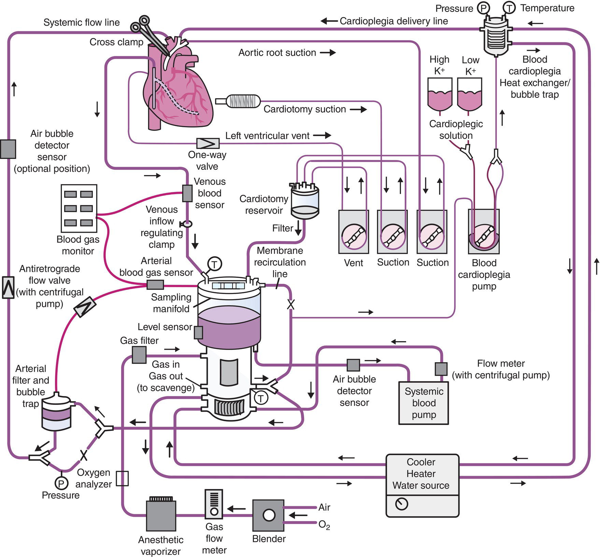

[**Figure 11.1**](#R_c11-fig-0001) Schematic diagram of a cardiopulmonary bypass circuit. This scheme depicts a membrane oxygenator with an integral hard‐shell venous reservoir and an external cardiotomy reservoir. Many circuits have the cardiotomy reservoir, venous reservoir, and oxygenator integrated into one single unit. The systemic blood pump may be either a roller or centrifugal pump. Most pediatric venous cannulations are bicaval with two separate venous cannulas instead of the single venous cannula depicted here. Carbon dioxide can also be added to the inspired gas to facilitate pH‐stat blood gas management. Arrows indicate the direction of flow; P, pressure sensor; T, temperature sensors; X, placement of tubing clamps.

(Source: Hessel et al. \[7\]. Reproduced with permission of Wolters Kluwer.)

[**Table 11.1**](#R_c11-tbl-0001) Differences between adult and pediatric cardiopulmonary bypass

| Parameter | Adult | Pediatrics |
| --- | --- | --- |
| Temperature | Rarely below 32 °C | Commonly 18–20 °C |
| Deep hypothermic circulatory arrest (DHCA) | Rare | Common for arch repair (HLHS, IAA) |
| Pump prime | Crystalloids | Blood components and albumin |
| Dilution | 25–33% | Up to 200% |
| Perfusion pressure | 50–80 mmHg | 30–50 mmHg |
| Flow rates | 2.5 L/min/m2 or 50–65 mL/kg/min | 0–250 mL/kg/min |
| pH management | Alpha‐stat | pH‐stat |
| Hypoglycemia | Rare, only in hepatic injury | Common due to low hepatic glycogen stores |
| Hyperglycemia | Frequent increases mortality | Less common, may be protective |
| Cannulation techniques | Standardized, mostly ascending aorta and single‐stage venous cannula | Variable, including ductus, aorta, main pulmonary artery; mostly bicaval venous cannulation |
| Ultrafiltration | Rare | Standard modified ultrafiltration or conventional ultrafiltration |

HLHS, hypoplastic left heart syndrome; IAA, interrupted aortic arch.

### Cannulation and tubing

The selection of cannulas occurs on the basis of flow requirements and anatomic relations. Single‐stage venous cannulation is rare and selective superior and inferior vena cava cannulation plus additional cannulation of a left persistent superior vena cava are routine. Thus, the infant patient routinely has an aortic cannula and two venous cannulas. A second aortic cannula may be used for cases of interrupted aortic arch to perfuse the descending aorta ([Figure 11.2](#c11-fig-0002)). Particular care must be observed during inferior vena cava (IVC) cannulation, as obstruction or malposition into a hepatic vein can occur. The addition of a small cannula for venting the systemic ventricle places significant demand on the surgeon to manage the position of the multiple cannulae in the small pericardial space of neonates and young infants. Venting the heart through an existing patent foramen ovale or atrial septal defect (ASD) or creating a small atrial communication is the preferred method for many congenital cardiac surgeons, instead of a cannula in a superior pulmonary vein, to avoid damage to these delicate structures.

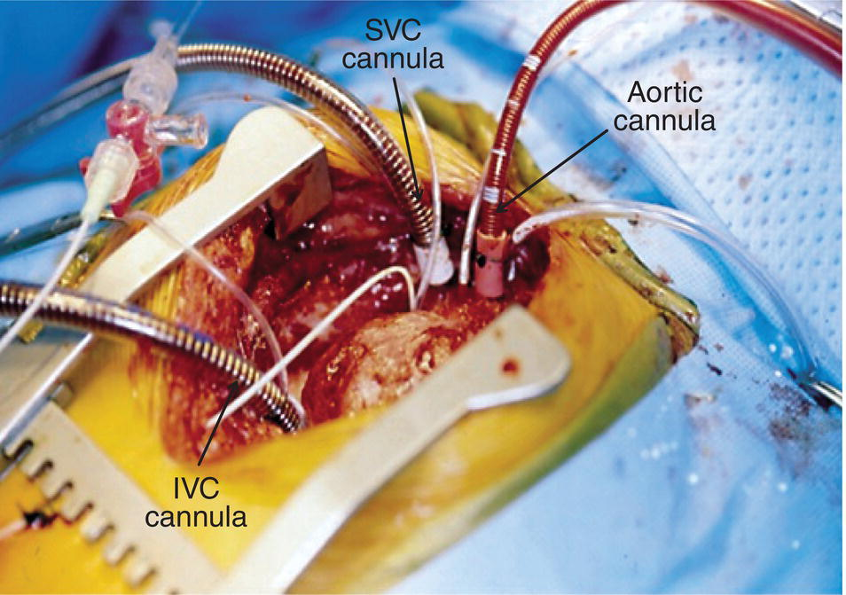

[**Figure 11.2**](#R_c11-fig-0002) Aortobicaval cannulation in a neonate. IVC, inferior vena cava; SVC, superior vena cava.

In daily clinical practice, the amount of systemic venous return on CPB is directly correlated with the amount of pump flow and vice versa. Venous drainage is often limited by the small size of the cannula and tubing as well as individual characteristics, the circuit used, and the use of accessory systems. Generally, venous drainage is obtained by gravity, placing the venous reservoir of the CPB circuit about 30 cm lower than the level of the heart; in this way, a negative pressure equivalent to about 20–25 mmHg is obtained. This is adequate for the vast majority of adult patients undergoing conventional procedures. In pediatric patients, however, where relatively small‐size cannulas and tubing of the venous circuit are used to reduce the pump‐priming volume, vacuum‐assisted venous return is most often used. In this system, a constant vacuum (up to 80 mmHg) is created in the airtight venous reservoir, allowing more blood to be drained from the patient via the venous line. This system allows the performance of surgical procedures on CPB, even in small infants, without the need for large‐size venous tubing and, therefore, without increasing the volume of the pump priming \[11, 12\]. The major potential limit in the clinical application of this system is the risk of generating gaseous microemboli in the venous circuit. If the arterial pump is stopped for various reasons and the vacuum source is left on the venous reservoir, microbubble transgression can occur from the gas compartment to the liquid compartment of the oxygenator, creating another source of gaseous microemboli as soon as the arterial pump is turned on again \[9, 12\].

Arterial cannulation is usually via the ascending aorta. Exceptions, however, are frequent in the newborn with malformation of the ascending aorta (e.g. interrupted aortic arch and hypoplastic left heart syndrome \[HLHS\]). In that scenario, the ductus arteriosus is primarily cannulated to maintain body perfusion on bypass and the pulmonary arteries are snared to prevent runoff until an anatomic correction takes place.

The clinician must also be aware that femoral cannulation is not feasible in small children _<_15 kg because of the small vessel size. Thus, on repeat sternotomy, this method of establishing CPB is usually not an option and careful retrosternal dissection must take place.

[**Table 11.2**](#R_c11-tbl-0002) Cardiopulmonary bypass tubing volumes

| Tubing diameter (in.) | Volume per meter length (mL/m) |
| --- | --- |
| 1/2 |  126 |
| 3/8 |  71 |
| 1/4 |  33 |
| 3/16 |  18 |

[**Table 11.3**](#R_c11-tbl-0003) Cardiopulmonary bypass tubing sizes

| Arterial and venous tubing sizes | Patient weight |
| --- | --- |
| 3/16 in. arterial line, 1/4 in. venous line |   _<_10 kg |
| 1/4 in. arterial line, 3/8 in. venous line |   _<_20 kg |
| 3/8 in. arterial line, 3/8 in. venous line |   _<_50 kg |

The aortic cannula represents the smallest diameter in the pediatric CPB circuit. The bypass tubing is responsible for the large foreign surface area and priming volume. The strategic selection of tubing dimensions can reduce the volume effectively ([Tables 11.2](#c11-tbl-0002) and [11.3](#c11-tbl-0003)). For example, in a 3.5 kg newborn with an approximate blood volume of 300 mL, the addition of a cardiotomy suction line of 6.3 mm (1/4 in.) diameter and with a total length of 250 cm would require approximately one third of the patient's blood volume (82.5 mL) before reaching the reservoir.

Malposition of cannulas is particularly problematic in pediatric perfusion. Systemic perfusion may be adversely impacted when placement of either venous or arterial cannulas is not ideal. If a venous obstruction occurs, the consequences are magnified because of low perfusion pressures. If the IVC cannula causes venous obstruction in the splanchnic bed, increased hydrostatic pressure causes ascites, and reduced perfusion pressure results in significant renal, hepatic, and gastrointestinal dysfunction. Obstruction of the superior vena cava (SVC) may produce an increase in intracranial pressure and result in decreased cerebral perfusion pressure and cerebral edema. It is possible to observe preferential flow to one side of the cerebral circulation or down the distal aorta ([Figure 11.3](#c11-fig-0003)). Transcranial Doppler monitoring of cerebral flow velocity or cerebral oximetry can provide an early warning of altered flow patterns caused by cannula misplacement \[11\]. Cooling patterns demonstrating rectal cooling preceding nasopharyngeal cooling may suggest a disproportionate amount of pump flow being directed away from the cerebral circulation \[13\].

### Pumps

The two pumps most commonly used for CPB are roller pumps and centrifugal pumps. Roller pumps have the advantages of simplicity, low cost, ease and reliability of flow calculation, and the ability to pump against high resistance without reducing flow. Disadvantages include the need to assess occlusiveness, spallation of the inner tubing surface, which potentially produces particulate arterial emboli, the capability of pumping large volumes of air, and the ability to create large positive and negative pressures. Centrifugal pumps offer the advantage of lesser air pumping capabilities, less ability to create large positive and negative pressures, less blood trauma, and virtually no spallation. Disadvantages include higher cost, the lack of occlusiveness (creating the possibility of accidental patient exsanguination), and afterload‐dependent flow requiring constant flow measurement. In the setting of short‐term CPB for cardiac surgery, it remains uncertain whether the selection of one pump over another is of clinical significance; most institutions employ roller pumps for congenital heart surgery.

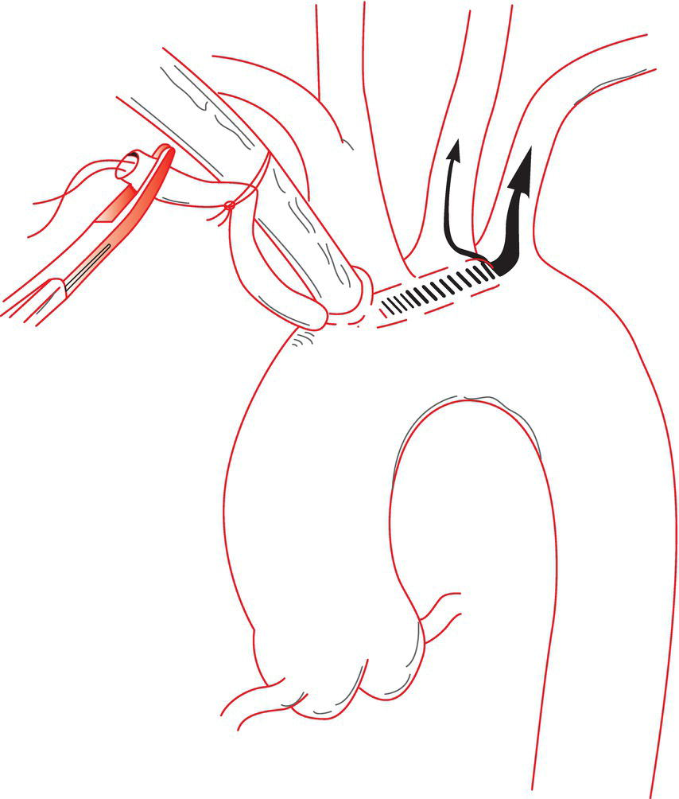

[**Figure 11.3**](#R_c11-fig-0003) Malposition of the aortic cannula high in the ascending aorta. This cannulation technique is helpful for any surgery on the ascending aorta. Particular attention is needed to avoid preferential perfusion of the left cerebral hemisphere. Note the obstruction of flow to the innominate artery in this case.

(Source: Gottlieb et al. \[11\]. Reproduced with permission of John Wiley & Sons.)

### Oxygenator

The efficiency of gas exchange in the natural lung is mainly attributable to the large surface area generated by the airway and circulatory networks and the low resistance to diffusion. These same features are essential to the design of an efficient artificial lung. Other necessary features of an ideal oxygenator include minimal trauma to blood, thromboresistance, minimal reaction with blood components, minimal generation of gaseous microemboli, the ability to maintain performance over long periods, low prime volume, consistent physical properties, reliability, ease of use, and low cost. The efficiency of a membrane oxygenator is two to three times less than that of the natural lung at rest, and about eight times less than the natural lung under conditions of maximal exercise. The primary limiting factor to efficient gas exchange in membrane oxygenators appears to be blood phase resistance to both O2 and CO2 diffusion. A second factor that has limited the use of microporous membranes in situations of long‐term extracorporeal support is the progressive decrease in gas exchange function. The most common microporous membrane oxygenator design in clinical use is the hollow‐fiber type in which the polypropylene membrane is formed into fibers that are bundled or woven together. The fibers are 200–250 μm in diameter and 10–15 cm long, and the membrane thickness is 25–50 μm. Although the existence of micropores in the membrane significantly increases the gas exchange of membrane oxygenators, long‐term use results in the progressive wetting of the surface, plasma leakage through the pores, and subsequent deterioration of membrane performance, thus limiting its use to acute CPB procedures. The newest oxygenators incorporate an arterial line filter to reduce priming volumes.

### Priming

Bypass prime composition and volume are adapted to the particular requirements of the patient. The composition, however, is often a matter of opinion and differences are as great as the number of pediatric heart centers. If there is a consensus, it is probably only with regard to reducing volumes to a minimum to reduce transfusion requirements and dilutional effects of the patient \[8, 14\].

Despite recent advances made in technology, the majority of neonates and infants still require perioperative transfusion of homologous blood components. The lower the body weight of the patient, the more banked blood products need to be added to the prime. To maintain colloid osmotic pressure and a minimal amount of coagulation factors, albumin and fresh frozen plasma (FFP) are added. The most suitable priming in neonates seems to be the combination of albumin or FFP and red blood cells in such proportions so as to maintain the hematocrit (Hct) at about 28–30% during normothermia. A few centers are still able to obtain fresh whole blood (<48 hours after donation) for neonates, but outcomes of studies using this technique vs. “reconstituted” whole blood (FFP plus packed red blood cells \[PRBCs\] from the same or different donors) are conflicting \[10, 15, 16\]. Albumin is reported to maintain colloid osmotic pressure (COP; normally around 20–25 mmHg) and to reduce fluid accumulation \[8, 10, 17, 18\] while adding FFP to the prime maintains COP increases the level of coagulation factors and reduces intraoperative transfusion requirements in complex neonatal and cyanotic cases \[12, 19\]. However, postoperative transfusion requirements are not affected despite higher fibrinogen concentrations and better thrombelastographic values at the end of CPB \[9, 20\]. The level of ionized calcium is adjusted, as all blood products contain significant amounts of citrate. This can lead to acute hypocalcemia and cardiac arrest with the initiation of bypass. In addition, added erythrocyte concentrates should be as fresh as possible (<3–5 days old) to avoid hyperkalemia and hyperlactatemia as side effects. The reasons for this suggestion are that the level of 2,3‐diphosphoglycerate in stored red blood cells decreases, metabolic load increases (potassium and lactate levels by the end of the second day are up to 7–25 mmol/L \[11, 21\]), and the risk of complications with bypass is higher. The risk is particularly high in infants <5 kg if the prime contains irradiated blood \[13, 22\]. If the red blood cells (RBCs) in the prime are older than 5 days, a prime blood gas should be checked and corrected. Circulating and filtrating the prime for 20 minutes alleviates most of these problems. Alternatively, processing PRBCs via a cell saver is reasonable and may add additional benefits such as the avoidance of hyperglycemia, high citrate levels, and hyperkalemia \[14–16, 23, 24\]. In addition, lactate levels are reduced and microaggregates >20 μm are eliminated. Care must be taken to avoid using normal saline as a washing solution, as a hyperchloremic metabolic acidosis can be induced in newborns and infants. In addition, the use of cell‐saving devices during pediatric cardiac surgery provides another means of reducing banked blood exposure \[25\]. A desirable practice is to adjust the prime composition in neonates and small infants to the patient's blood, with pH, Na+, K+, Ca2+ and temperature within narrow ranges.

PRBC requirements can be calculated on the basis of weight and starting Hct. The change in Hct, ΔHct, is calculated as follows:

where HctPAT is patient hematocrit, BVPAT is the patient blood volume (see [Table 11.4](#c11-tbl-0004)) and PV is the priming volume. The transfusion requirement is calculated as:

![StartLayout 1st Row upper P upper R upper B upper C left-parenthesis m upper L right-parenthesis equals upper H c t Subscript upper D upper E upper S upper I upper R upper E upper D Baseline times left-parenthesis upper B upper V Subscript upper P upper A upper T Baseline plus upper P upper V right-parenthesis 2nd Row normal normal normal normal minus StartFraction left-parenthesis upper B upper V Subscript upper P upper A upper T Baseline times upper H c t Subscript upper P upper A upper T upper I upper E upper N upper T Baseline right-parenthesis Over 60 percent-sign EndFraction EndLayout](images/c11-disp-0002.png)

where 60% is the average Hct of stored PRBCs. After initial prime composition, an Hct on the prime can be measured, and a further adjustment before CPB is made to achieve Hct in the goal range. In newborns, a goal Hct on the pump of 30–35% is maintained. Older patients or special circumstances (e.g., severe hypoxia) may require adjustments to a lower limit of around 25% or higher than 30% (severe hypoxia), even though both limits are controversial. Historically, many centers permitted marked hemodilution on CPB to avoid transfusion. Recent studies question this approach and provide evidence of improved neurological function when higher Hcts are maintained during CPB. A randomized controlled clinical study in infants undergoing CPB demonstrated adverse perioperative and developmental outcomes with extreme hemodilution \[26\]. This issue remains controversial, although the clinical data in support of higher Hcts of at least 25% are compelling \[27, 28\]. Also, hemostasis may be improved by higher Hct levels.

An interesting strategy described in recent years is utilizing a neonate's own umbilical cord blood (UCB) for prenatally diagnosed patients undergoing cardiac surgery with bypass \[29\]. UCB is collected in a sterile fashion in the delivery room, and with milking of the umbilical cord, 50–140 mL of UCB can be obtained. After sterile processing, the UCB can be utilized as whole blood, or separated into packed RBC and fresh frozen plasma components. UCB contains stem cells and other progenitor cells, growth factors, and cytokines, in addition to RBC. Theoretical advantages of UCB are lack of immunogenicity, high concentration of fetal hemoglobin to facilitate unloading of oxygen into the tissues, and potential benefits of the progenitor cells. Half of the collected blood can be used to prime the bypass machine, and half can be used for post‐bypass transfusion. Drawbacks to UCB include complexity of collection, bacterial contamination, and limited storage time. Small single‐center studies from a few institutions are the only data available, but UCB appears to be safe. Larger studies with a more careful assessment of the fate of all of the cell types are needed before wider use of UCB for neonatal surgery.

[**Table 11.4**](#R_c11-tbl-0004) Estimated patient blood volumes by weight

| Weight (kg) | Estimated blood volume (mL/kg) |
| --- | --- |
| _<_3 (neonate) | 90 |
| 3–10 | 85 |
| 10–20 | 80 |
| 20–30 | 75 |
| 30–50 | 70 |
| \>50 | 65 |

* * *

### KEY POINTS: BASIC BYPASS CIRCUIT SETUP

-   The basic bypass circuit consists of the venous reservoir, the oxygenator/heat exchanger unit, roller pumps for perfusion, suction, and cardioplegia and the connecting tubing, cannulae, as well as monitoring and alarm devices.
-   The oxygenator contains an integrated arterial filter.
-   Priming for children <10 kg includes either fresh whole blood or reconstituted blood prime with PRBCs and/or FFP.
-   Target hematocrits on bypass are >25% with a goal of >35% for neonates and complex cyanotic lesions or >28% for acyanotic lesions.

* * *

### Differences between pediatric and adult CPB

Major differences need to be considered when dealing with the pediatric patient on CPB ([Table 11.1](#c11-tbl-0001)). These include the degree of hemodilution, flow rates and perfusion pressure, temperature, cannulation, prime and blood gas management, ultrafiltration, hemodynamic management, and, in certain cases, the presence of aortopulmonary collaterals.

### Hemodilution

Recent efforts to minimize circuit volumes have led to the development of smaller circuit elements. However, there continues to be a gross degree of hemodilution realized in the neonatal patient. This can be as much as three to 15 times the amount of hemodilution seen in an adult. For example, in a 3 kg child given 85 mL/kg, an estimated blood volume (EBV) of 255 mL contrasts with an average circuit prime volume of 300–400 mL. Thus, a prime : EBV ratio can exceed >2–3 : 1, or >100–150% of a neonate's blood volume.

In the average adult circuit, only a 25–33% dilution rate is realized. This degree of dilution necessitates the addition of donor blood up to a body weight of approximately 10 kg to maintain an adequate Hct for optimal oxygen delivery on bypass.

### Perfusion pressures

Management of the pediatric patient undergoing CPB is made difficult by competing hemodynamic goals for the brain, heart, and viscera. The brain is protected from hypoperfusion by systemic vasoconstriction and pressure autoregulation. Optimal mean arterial pressure targets are not uniform. They depend on cerebral autoregulation and vasoreactivity. This varies by age and underlying conditions. Patients with prematurity, previous brain injury, underlying congenital heart disease, hypothermia, or patients on ECMO can have abnormal cerebral autoregulation which makes it difficult to optimize the brain perfusion pressures. Invasive measurements of cerebral blood flows are not feasible, but non‐invasive continuous monitoring of pressure autoregulation may be performed using near‐infrared spectroscopy (NIRS) as a surrogate of CBF by using the hemoglobin volume index (HVx). The HVx is a moving correlation between arterial blood pressure and blood volume measured by cerebral oximetry and is able to evaluate individual autoregulatory thresholds \[30\]. See [Chapter 14](c14.xhtml) for additional detail.

Perfusion pressures in the neonate can be quite low, less than 30 mmHg. This is often due to the lack of reactivity of the neonatal vasculature or the presence of a shunt like a patent ductus arteriosus (PDA). With meticulous management of blood gases, Hct, temperature, and flow rates, the goal should be the minimal use of vasoconstricting agents (i.e. phenylephrine) to maintain ideal blood pressure. As a rule of thumb, perfusion pressure (MAP \[mean arterial pressure\] – CVP \[central venous pressure\]) goals in the neonate are 35–45 mmHg, and over the first 2 years of life, the target perfusion pressure increases to 45–50 mmHg. Although not yet validated by neurologic outcome studies, the lower limit of autoregulation as measured by the HVx in neonates averages about 30 mmHg in the first week of life and increases to about 40 mmHg by 30 days, with considerable variation \[31\]. At best, normal flow rates are combined with reasonable perfusion pressures to reach all tissue beds, including those that require a certain opening pressure for function (kidney, brain, splanchnic bed). One should also keep in mind that the lower limit of myocardial perfusion pressure is around 15 mmHg, calculated as MAP – CVP. This is relevant for diastolic pressures below 30 mmHg.

### Flow rates

The flow rates for neonates are quite variable, ranging from 0 to 200 mL/kg/min. Deep hypothermic circulatory arrest (DHCA) is at one end of the spectrum, contrasted with high metabolic demands, vent return, circuit shunts, or patient collaterals, all of which contribute to the necessity of high flow rates at the other end. This can often exceed a cardiac index of 3 L/min/m2. The flow rates are calculated on the basis of weight, but the perfusionist must adapt flows according to the individual case and to meet the demands. One strategy is to employ standard full flow rates in neonates and infants up to 10 kg of 150 mL/kg/min. With hypothermia and decreased metabolic demands, many centers will reduce flows to 80–100 mL/kg/min to reduce venous return to the field, lowering flows further to 25–50 mL/kg/min during deep hypothermia for intracardiac complex repairs.

Recent data has demonstrated the feasibility of goal‐directed, personalized CPB flow rates utilizing parameters such as mixed venous oxygen saturation (MVO2) measured continuously in line from the CPB circuit, cerebral and somatic oxygen saturation measured by near‐infrared spectroscopy, arterial blood gases, hemoglobin, and lactate concentration. Goals such as cerebral oxygen saturation (rSO2) above 50%, maintaining somatic rSO2 values higher than cerebral rSO2, MVO2 >70%, and lactate less than 2.5 mmol/L have been reported \[32\]. Bojan and colleagues retrospectively reviewed 180 neonatal surgeries and serum lactate values, and calculated oxygen delivery (DO2, mL/min/m2) utilizing CPB flow rates, hemoglobin concentrations, and PaO2. \[33\] They determined a minimum DO2 to maintain aerobic metabolism, indicated by a peak lactate concentration after aortic cross clamp removal <2.5 mmol/L, at normothermia and different levels of hypothermia. The average minimum DO2 at 37 °C was 340 mL/min/m2, a value significantly higher than older children and adults. Minimum DO2 decreased linearly with temperature ([Figure 11.4](#c11-fig-0004)). The same group published a retrospective study of somatic to cerebral rSO2 difference during CPB in 24 neonates, and reported that there was a predictable increase in lactate concentration when the somatic to cerebral rSO2 difference decreased or became negative \[34\] ([Figure 11.5](#c11-fig-0005)). Although potentially more complex than a standard flow rate specified according to weight or body surface area, combined with temperature, this approach of varying CPB flow according to oxygen demand may balance minimum oxygen delivery needs with the need to reduce flows to decrease blood return to the surgical field. More data, along with outcome studies, are needed to determine whether the goal‐directed approach has any advantage over current methods.

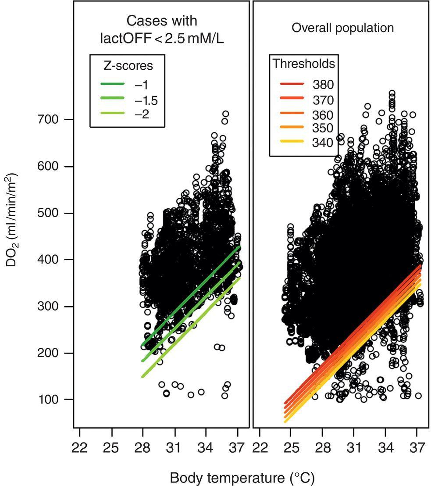

[**Figure 11.4**](#R_c11-fig-0004) Oxygen delivery as a function of body temperature during aortic crossclamping. In the left panel are shown the observed oxygen deliveries (DO2) in patients with first lactate after aortic crossclamp was removed (lactOFF) <2.5 mM, and the estimated −1, −1.5, and −2 DO2 Z scores, as a function of body temperature. In the right panel are the observed DO2 values in the overall population, as a function of temperature, and several DO2 thresholds tested for associations with lactate production. These were empirical thresholds chosen in an attempt to refine the −2 Z score. DO2 threshold of 357 mL/min/m2 was identified in the lactOFF <2.5 subgroup and found to be linked with lactate production. The final analysis revealed that the lowest threshold linked with lactate production and thought to represent the lowest suitable DO2 during normothermic neonatal bypass was 340 mL/min/m2.

(Source: Bojan et al. \[33\]. Reproduced with permission of Elsevier.)

[**Figure 11.5**](#R_c11-fig-0005) The somatic‐cerebral NIRS gradient, lactate concentrations, and temperature during cardiopulmonary bypass in a neonate. For each time interval between two lactate measurements, the lactate concentration variation and the somatic‐cerebral rSO2 gradient were calculated. The somatic‐cerebral rSO2 gradient was the sum of all positive and negative areas resulting from excursions of the somatic rSO2 above and below the cerebral rSO2 and was calculated aby the trapezoidal method. rSO2, regional oxygen saturation.

(Source: Bojan et al. \[34\]. Reproduced with permission of Oxford University Press.)

#### Blood gas management

It is the current practice in some institutions to employ pH‐stat management in all cases in which temperatures are taken to hypothermic levels. In this temperature‐corrected strategy, the PCO2 remains unchanged from 37 °C (40 mmHg). This strategy allows for cerebral vasodilation and more even cooling. The corrected PCO2 ranges at 37 °C can be >80–100 mmHg.

### Aortopulmonary collaterals

Uncommon in adults, but fairly common in patients with chronic cyanosis with decreased pulmonary blood flow, aortopulmonary collaterals can be a challenge. It can be difficult to empty the heart. Flow rates are frequently affected, and temperatures may need to be lowered substantially to accommodate lower bypass flows to reduce blood return to the operative field. Flows may need to be decreased in conjunction with the use of vasodilating agents. Phentolamine 0.1 mg/kg and nitroglycerine are the drugs of choice during cooling and rewarming, titrated to effect. Phenylephrine is contraindicated and would only enhance collateral flow.

### Temperature ranges

As a very basic comparison, there is a trend toward conducting adult cases at tepid or normothermic temperatures while many neonatal cases are still utilizing cold temperatures with or without DHCA. However, more and more neonatal cases are performed at mild hypothermia. The perfusion considerations are multiple, and this topic is discussed in a separate section on hypothermia and DHCA.

### Glucose management

It is of utmost importance to maintain euglycemia in the neonate. Although there are increased glycogen stores in the neonatal myocardium, there are low hepatic glycogen stores. Exogenous glucose may be necessary in the early neonatal period to maintain normal glucose levels and should be continued into the pre‐bypass period.

Perfusion considerations on CPB are directed at efforts to maintain normal glucose levels such as washing packed cells or minimizing glucose content in cardioplegia or intravenous (IV) fluids. When glucose levels are greater than 300 mg/dL, a saline hemodilutional washout with the hemoconcentrator is utilized. Frequent monitoring is recommended. Levels should be maintained at approximately 150 mg/dL just prior to DHCA.

Hyperglycemia worsens neurological injury, as elevated glucose levels result in the increased anaerobic metabolism of glucose and increased lactic acidosis. This leads to further depletion of ATP. Hypoglycemia alone can be treated but coupled with hypothermia, cerebral blood flow may be compromised by altering autoregulation. This can be further exacerbated with hyperventilation, as this may occur in weaning a patient with pulmonary hypertension from CPB. Overall, tight glycemic control (blood glucose level in the range of 80–110 mg/dL) is not indicated in children as the outcome was not any different from standard care in the intensive care unit (ICU) \[35\]. Hyperglycemia was not associated with lower neurodevelopmental outcomes at 8 years of age in the Boston Circulatory Arrest Study. However, lower glucose measurements below 90–100 mg/dL after CPB were associated with a higher risk of electroencephalogram (EEG) seizures. The authors speculate that limiting glucose as an important energy substrate for the neonatal brain, which may have increased requirements under conditions of low CPB flows or DHCA, may be a reason for this association \[36\]. In a more contemporary study of 93 neonates undergoing the arterial switch operation, patients with more than 50% of the intraoperative and early postoperative periods spent at glucose values between 80 and 110 mg/dL had more perioperative complications than those with >200 mg/dL more than 50% of the time \[37\]. The practice of many pediatric cardiac anesthesiologists is to maintain plasma glucose levels in the 100–200 mg/dL range for neonates and small infants.

#### Equipment

One circuit size for the adult patients at a given institution can adequately provide flows for patients from 50 kg and more. Most pediatric centers employ two or three circuits on the basis of the patient's weight, procedure, and flow requirements.

#### Ultrafiltration

Utilization of ultrafiltration in some form, whether it be conventional or modified, is seen in >90% of our neonatal and pediatric cases. Several system modifications may be necessary to allow for these options.

* * *

### KEY POINTS: DIFFERENCES BETWEEN PEDIATRIC AND ADULT CPB

-   The major differences between pediatric and adult CPB are the degree of hemodilution, flow rates, and perfusion pressures.
-   Hemodilution is exaggerated and can reach more than 150% of the patient's blood volume.
-   Flow rates are in the range of up to 200 mL/kg/min or an equivalent cardiac index of 3.0 L/min/m2 and higher can be found in the neonate.
-   Aortopulmonary collaterals can be a challenge during bypass and should be managed with vasodilators and increased flow rates.
-   pH‐stat is the preferred method of blood gas management during cooling in pediatric cases using deep hypothermic circulatory arrest.
-   Glucose management with targets of 100–200 mg/dL is desirable.

* * *

## Management of pediatric CPB

### Stages of CPB

Cardiac cases using CPB can be divided into several basic phases: pre‐bypass period and anticoagulation, bypass period with initial cooling, cross‐clamping and myocardial protection, reperfusion of the heart, separation from CPB, modified ultrafiltration and hemostasis, and, lastly, sternal closure and transfer to the ICU.

### Pre‐bypass period

The pre‐bypass period begins with surgical incision and lasts through to initial dissection and preparation for cannulation. During this period, transesophageal echocardiography (TEE) is performed to confirm the diagnosis and establish a basis for post‐bypass comparison. Baseline activated clotting time values are obtained and metabolic abnormalities are corrected. Cannulation of the great vessels just prior to CPB can often precipitate arrhythmias, hypotension, and arterial desaturation, especially in small infants and children. Ventilation may need to be limited to minimize lung excursion to allow precise cannulation in small infants. Coordination with the surgeon is particularly important. Hemodynamic stability is maintained by cautious fluid administration and small boluses of vasopressors, as deemed necessary. After placement of the aortic cannula, pressure in the aortic root is measured by the perfusionist through the cannula _in situ_ and should be close to the MAP of the patient. A small volume infusion of 2–5 mL/kg is often used at that point to ensure unobstructed aortic cannula flow before bypass. If the aortic cannula is already in place, it is common practice to coordinate the administration of volume between the anesthesiologist and perfusionist while the surgeon completes cannulation.

### Anticoagulation and hemostatic management

Development of the coagulation system is incomplete at birth and continues in the postnatal period until the age of about 6 months. This increases the risk of bleeding disproportionately in the neonatal and infant group up to 1 year or approximately 8 kg of weight \[38–40\]. Coagulation in cyanotic infants may be particularly impaired secondary to polycythemia, lower fibrinogen levels, low platelet count and abnormal platelet function \[41\], decreased concentrations of factors V, VII, and VIII, and increased fibrinolysis \[42, 43\].

Of particular importance is the role of antithrombin (AT) levels that do not reach adult values until 3–6 months. This low level of AT may reduce the ability of heparin to provide anticoagulation adequate to prevent thrombin generation during CPB in infants \[38, 42, 44–46\] and an exaggerated inflammatory response may occur \[38, 42, 43, 47, 48\]. Infants may require an initial heparin dose of 400 units/kg or higher. Manlhiot and colleagues reported AT levels and heparin consumption in 90 infants <1 year undergoing CPB surgery.\[49\] Baseline AT levels were strongly dependent on age, with lower levels in neonates ([Figure 11.6](#c11-fig-0006)). Lower AT levels were also associated with lower heparin response as measured by anti‐factor Xa levels and higher heparin consumption ([Figure 11.7](#c11-fig-0007)A and B). It has also recently been shown that in infants with CHD, levels of other thrombin inhibitors are depressed compared with healthy infants. This may partially explain the high levels of thrombin generation during infant CPB. The coagulopathy induced by CPB affects children more profoundly than adults. There are many factors implicated, including hemodilution, contact activation, and initiation of a systemic inflammatory response. Despite large doses of heparin during CPB, heparin does not block thrombin generation completely but partially inhibits thrombin after it is produced. Thrombin is continuously generated, and a consumptive coagulopathy is initiated \[44, 46\]. The lower potential of newborn plasma to generate thrombin might, in part, downregulate thrombin markers during CPB. This, however, does not seem significant enough to completely prevent the subsequent reperfusion‐induced thrombin peak \[42, 43, 47–48, 50\]. Thromboelastography (TEG) has actually shown that neonates and infants develop faster and stronger clots than adults \[38–40, 51\]. In addition, acquired coagulation defects in 58% of non‐cyanotic and 71% of cyanotic infants have been reported \[41, 52–54\]. If thrombin formation could be completely inhibited during CPB, the consumption of coagulation proteins and platelets could largely be prevented. Initial heparin doses range from 300–400 units/kg bolus before cannulation to 200–400 units/kg in the circuit, and to 50–100 units/kg ongoing administration every 30–120 minutes. Heparin's peak therapeutic effect occurs within 2 minutes. CPB may delay the peak effect by 10–20 minutes from hypothermia or hemodilution. Plasma binds 95% of heparin with some uptake by the extracellular fluid, alveolar macrophages, splenic/hepatic endothelial cells, and vascular smooth muscle. The plasma half‐life is dose‐dependent (i.e. 126 ± 24 minutes at a dose of 400 units/kg vs. 93 ± 6 minutes at a dose of 200 units/kg) \[38–40, 55\]. Heparin is metabolized by the reticuloendothelial system and is eliminated by the kidneys. Hypothermia and renal impairment, but not hepatic impairment, delay elimination. A roughly linear relationship exists between heparin dose and the activated clotting time (ACT) if certain criteria are maintained \[41, 56\], namely normal ATIII and factor XII activities, normothermia, near‐normal platelet function, a platelet count >50,000/dL, and fibrinogen concentration >100 mg/dL. However, in children, the correlation is rather poor \[42, 43, 57\]. An ACT is measured before heparinization and repeated a minimum of 3 minutes after giving heparin. CPB is not initiated until an adequate ACT or heparin level is confirmed.

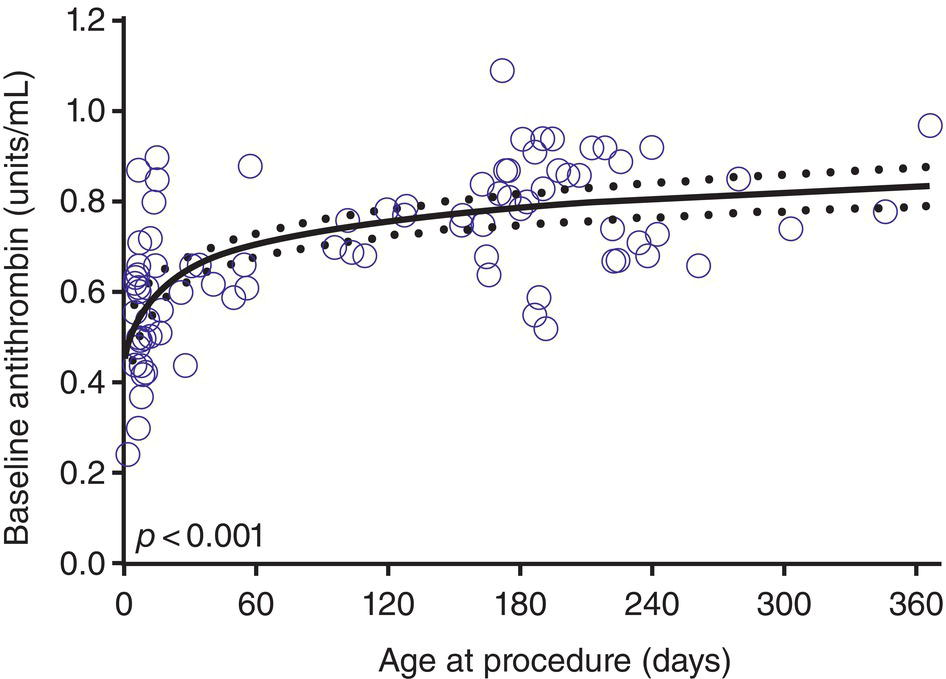

[**Figure 11.6**](#R_c11-fig-0006) Antithrombin levels by age at surgery. Blue circles represent individual patient values; solid lines show the estimates from regression models, and dotted lines are the 95% confidence interval. Manlhiot et al. \[49\] / Reproduced with permission of Elsevier.

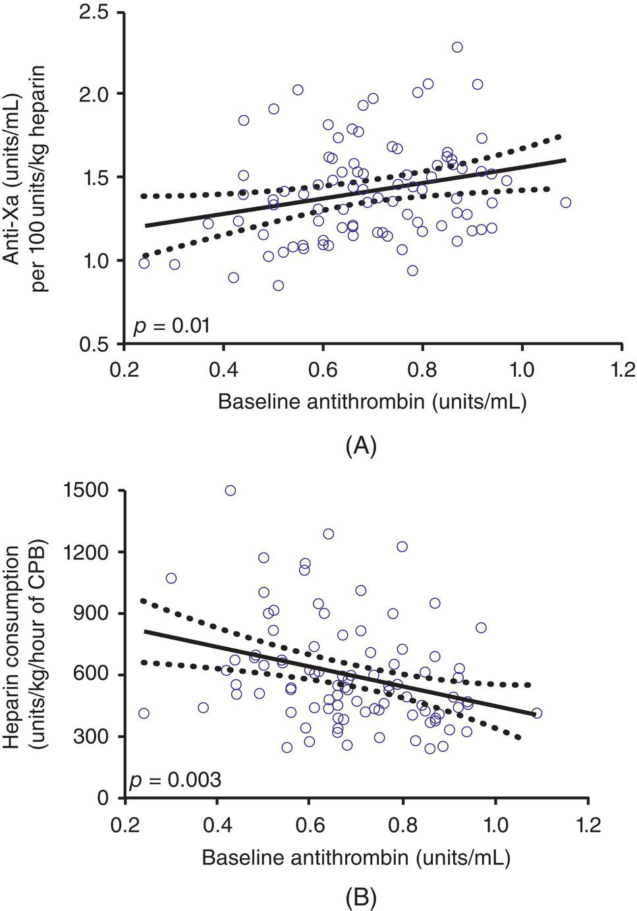

[**Figure 11.7**](#R_c11-fig-0007) (A) Association between preoperative AT level, and heparin response as measured by anti‐factor Xa level per 100 units/kg heparin. (B) CNEW. Association between preoperative AT level, and heparin dose throughout CPB, indexed for weight and duration of CPB. Blue circles represent individual patient values; solid lines show the estimates from regression models, and dotted lines are the 95% confidence interval.

(Source: Manlhiot et al. \[49\] / Reproduced with permission of Elsevier.)

Given the variability in the ACT, heparin concentration can also be measured directly. A two‐point (straight line) dose‐response curve assists in judging how much additional heparin to administer. Acceptable levels during CPB are 2–4 units/mL, and in the newborn population up to 6 units/mL. This regimen increases required heparin doses on CPB but results in lower protamine doses and less blood loss \[45, 58\]. The optimum method of assessing adequate anticoagulation during CPB in children has thus not yet been defined and much work is required in this area. The use of heparin‐coated biocompatible perfusion circuits is probably helpful in reducing the degree of activation of the coagulation system in children \[47, 48, 59, 60\], but it is rather expensive and has not gained wide acceptance.

The optimal ACT for CPB is controversial. Although the minimum recommended ACT is 400 seconds, other authors recommend 480 seconds \[44, 46, 61\], as heparin only partially inhibits thrombin formation. This is done to minimize the consumptive coagulopathy that may result from barely adequate anticoagulation. Failure to achieve a satisfactory ACT may be due to inadequate heparin or low concentrations of ATIII, or “heparin resistance.” \[49, 62\]. Increases in acute‐phase reactant proteins such as factor VIII and fibrinogen commonly shorten the APTT and may appear as heparin resistance. If 500 units/kg of heparin fail to achieve an adequate ACT, ATIII deficiency becomes more likely and FFP or recombinant ATIII (30 IU/kg) \[50, 55\] is necessary to increase antithrombin concentration.

Heparin dosing, ACT targets, and protamine reversal dosing were first established in the 1950s and published in a landmark paper by Keats, Cooley, and Telford from Texas Children's Hospital \[63\]. Today more than 60 years later, this approach is still used in most congenital heart surgery centers. The need for alternatives to heparin for bypass anticoagulation has been discussed for years, in part because of not only the problem of heparin‐induced thrombocytopenia predominantly seen in the adult population but also the ongoing issue of bleeding and thrombosis with heparin in pediatric cardiac surgery despite many advances in monitoring and treatment of coagulopathy. Direct thrombin inhibitors such as bivalirudin can be utilized for pediatric cardiopulmonary bypass; the drawbacks with this drug are several and include that there is no reversal agent and it has a half‐life of approximately 25 minutes, so a loading dose and infusion are necessary. In addition, bivalirudin lacks a widely available point‐of‐care test. The ecarin clotting time for bivalirudin is primarily a research tool. The ACT is used as a rough guide to anticoagulation, along with a viscoelastic method of coagulation assessment. Hasija and colleagues published a randomized, controlled safety and efficacy study of bivalirudin vs. heparin in 50 acyanotic patients aged 1–12 years who were undergoing corrective cardiac surgery with bypass\[64\]. Furthermore, 400 units/kg of heparin plus pump prime, vs. 1 mg/kg bilvalirudin bolus followed by 2.5 mg/kg/hour, and a pump prime dose, was studied. Using a 480 second ACT goal, 1 of 25 heparin patients required extra dosing as compared to 13 of 25 bivalirudin patients. ACT returned to baseline after protamine in the heparin group but remained elevated for an average of 2 hours in the bivalirudin group. With viscoelastic testing, heparin prolonged the onset of clotting, decreased the rate and strength of clot formation, and inhibited platelet function to a greater degree than bivalirudin. Duration of surgery was longer in the bivalirudin group, but chest tube drainage and transfusion were similar. No adverse events occurred.

More pediatric cardiac patients are arriving in the operating room (OR) because cardiac surgery is being anticoagulated with direct thrombin inhibitors. Patients on ventricular assist support achieve better and more accurate anticoagulation with these agents, namely bivalirudin, and this agent is now standard of care in many programs for a ventricular assist device (VAD), and even some ECMO patients \[65, 66\]. Bivalirudin infusion is usually discontinued prior to or on arrival to the OR. It is not thought to affect anticoagulation or hemostasis with heparin on bypass because of its relatively short half‐life, but increased bleeding may occur with surgical dissection prior to bypass.

### Initiation of CPB and flow requirements

After heparinization and cannulation, CPB is initiated by opening the venous outflow cannula to the reservoir. Slow decompression of the heart and maintaining a minimal output of the beating heart reduce the drop in blood pressure due to the hemodilution. Based on weight or body surface area, a flow requirement is calculated. The cardiac index is approximately 25–50% greater than that of an adult. For newborns, a flow of 2.6–3.2 L/min/m2 is recommended, and for infants, a flow of 2.4–2.6 L/min/m2 is sufficient. If normothermic CPB is chosen, flow rates in the range of 3.0–3.5 L/min/m2 are required \[51–53, 67\]. This can be reduced during hypothermia ([Figure 11.8](#c11-fig-0008)) \[68\]. Infants have a much more compliant vasculature, which results in lower perfusion pressures on CPB. Causes of severe hypotension after initiation of bypass can be the presence of hemodynamically relevant shunts (e.g. major aortopulmonary collateral arteries) previously placed systemic to pulmonary artery (PA) shunt or a PDA, which both lead to a circulatory steal in the systemic circulation, requiring higher flows and possibly early control by the surgeon. Increased bronchial and non‐coronary collateral flow draining into the left atrium can be a particular problem, especially in cyanotic children, with a resultant significant negative impact on myocardial protection during periods of aortic cross‐clamping. Because of the small and easily obstructed vena cavae in infants, careful assessment for venous obstruction is carried out immediately after initiation of bypass. The patient's head and face are assessed for signs of venous obstruction, including plethora and cyanosis of the scalp and face, distended fontanelle, and decrease in cerebral oxygen saturation to levels below the baseline. If a central venous catheter has been placed with its tip in the SVC, pressures should be low (i.e. <5 mmHg) and at times are negative if the placement is adjacent to the SVC cannula. Venous return judged by the volume in the venous reservoir is continually monitored by the perfusionist, with a sudden decrease prompting communication with the surgeon to investigate the cause.

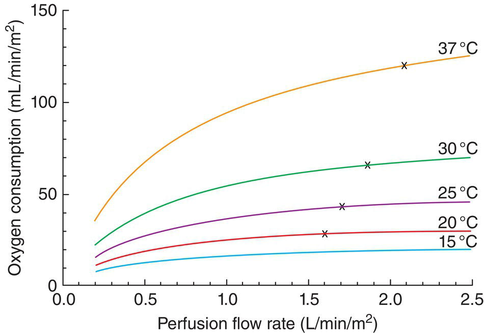

[**Figure 11.8**](#R_c11-fig-0008) Nomogram relating oxygen consumption to perfusion flow rate and temperature. X indicates clinical flow rates used by Kirklin and Barrett‐Boyes \[68\].

(Source: Kirklin and Barrett‐Boyes \[68\]. Reproduced with permission of Elsevier.)

The adequacy of perfusion is monitored by the usual parameters. These are MAP, the in‐line measurement of mixed venous saturation, pH, base excess, and the regular testing of blood for heparin levels and lactate and other indices of end‐organ perfusion (e.g., urine output, somatic and cerebral oxygenation values \[NIRS for example\]). (See above under flow)

### Cooling and temperature management

Systemic cooling is often utilized for myocardial, cerebral, and other end‐organ protection. Hypothermia is usually classified as mild (32–36 °C), moderate (24–32 °C), or deep (18–24 °C). In general, lower temperatures are used for more complex operations that carry a greater potential for requiring periods of low‐flow bypass or circulatory arrest. Cooling is primarily achieved through the heat exchanger in the bypass circuit, although surface cooling with lower ambient air temperatures or forced‐air warming systems set to lower temperatures is used in some institutions. Infants have a high ratio of surface area to body weight. Infants also have an immature thermal autoregulatory center. Because of these factors, wide fluctuations in body temperature occur easily. Warming and cooling on bypass occur much more readily. If the clinician is not careful, cooling can occur too rapidly, and deep brain structures may become dangerously cold. There is evidence to suggest that cooling too rapidly is deleterious to neurological function. Thus, it is important to cool slowly, evenly, and completely, and most investigators recommend at least 20 minutes of cooling if circulatory arrest is used (i.e., no faster than 1 °C/min) \[69\]. The opposite is also true. It is very easy to warm too rapidly and for hyperthermic overshoot to occur. Recent data suggest that hyperthermia can be very damaging, and temperature differences of even 1 or 2 °C are highly significant \[70\]. Monitoring should include nasopharyngeal, rectal, and arterial inflow temperatures. Rewarming the patient should occur at less than 8 °C temperature difference between the heat exchanger and patient blood temperature, with maximal inflow temperatures of 37.0 °C to avoid the formation of any micro air bubbles \[71–73\]. Special bypass techniques such as regional cerebral perfusion (see later) have been developed to avoid the necessity of using DHCA and may also be performed during this time.

In recent years, a number of centers have reported normothermic or mildly hypothermic bypass for a variety of congenital cardiac operations including some more complex neonatal surgeries such as the arterial switch operation \[74\]. Theoretical advantages include time saved by avoiding cooling and rewarming, improved coagulation and hemostasis, better oxygen and glucose transport in the neonatal brain, cellular membrane stability, better ATP production and utilization, and preservation of cerebral autoregulation. Despite the theoretical advantages, a meta‐analysis of seven randomized controlled trials in pediatric patients revealed no differences in duration of CPB or aortic crossclamp, or in lactate or creatinine concentrations \[75\]. Corno and colleagues published a retrospective review of 99 patients <2 years of age undergoing normothermic (>35 °C) vs. hypothermic (28–34 °C) bypass, matched for cardiac lesion and surgical procedure \[76\]. They reported earlier extubation, shorter ICU stay, and lower transfusion requirement in the OR and ICU in the normothermic patients. Limitations of this study were its retrospective single‐center nature, imperfect matching of patient groups, and small sample size. Neurodevelopmental follow‐up of the cohort at 2–3 years after surgery revealed no differences between groups across multiple tested domains \[77\]. From the data reported so far about normothermic bypass for a variety of congenital operations, this approach would appear to be safe, but not to consistently lead to improved early clinical outcomes or shorter operating times.

### Aortic cross‐clamping, myocardial ischemia, and protection

Repair of most congenital heart lesions is becoming more feasible. Perioperative myocardial damage remains the most common cause of morbidity and mortality after successful surgical repair. Thus, effective myocardial protection assumes an even greater role than in the adult, as perioperative insults are less well tolerated and more difficult to treat. Neonatal hearts may be difficult to protect because of immaturity, cyanosis, hypertrophy of the right ventricle, complex coronary artery pattern, and duration of ischemia to achieve a good repair.

The neonatal heart is ultrastructurally immature. Myofibrils are arranged in a disorderly fashion and have a smaller percentage of contractile proteins than do those in adults (30 vs. 60%) \[78\]. The immature heart shows fewer mature mitochondria and a lower oxidative capacity \[79\]. Control of myocardial contractility in infants depends more on adrenal function and circulating catecholamines than on direct autonomic influences. There are also differences in myocardial calcium metabolism. In the mature myocardium, the sarcoplasmic reticulum is the predominant source of calcium ion for excitation‐contraction coupling, but the sarcoplasmic reticulum is poorly developed in the immature heart (see [Chapter 9](c09.xhtml)). Because the neonatal myocardial cell is deficient in T‐tubules, it is incapable of internal release and reuptake of calcium for contraction and instead depends heavily on transmembrane calcium transport for myocardial contraction. These differences in calcium handling by the cell provide some explanation for the clinical observation that newborns require greater serum ionized calcium levels for optimal myocardial contractility. Experimental evidence suggests that the newborn myocardium tolerates ischemia and reperfusion better than the adult heart. However, in practice, pediatric patients undergoing cardiac surgery have a greater incidence of low cardiac output postoperatively than adults. The discrepancy between the experimental evidence and the clinical experience may be related to the cardiac anomalies involved. Ventricular hypertrophy and cyanosis are common, and the hypertrophied heart has been found to have decreased subendocardial blood flow \[80\] and lower concentrations of high‐energy phosphates before arrest. Chronic cyanosis has been associated with a decreased threshold for anaerobic metabolism during stress \[81\], diminished myocardial reserve \[82\], asynchronous left ventricular wall motion \[83\], and downregulation of β‐adrenergic receptors \[84\]. Reoxygenation injury with the release of oxygen free radicals upon initiation of CPB can further exacerbate the pre‐existing injury \[85\]. The abrupt increase in oxygen levels on bypass in chronically hypoxic infants leads to the loss of antioxidant reserve capacity and subsequent loss of myocardial function. Preventive measures include leukodepletion of blood prime, use of in‐line arterial filters, and normoxic management (PaO2 of 80–100 mmHg) initiating bypass. Over the course of 10–20 minutes, the fraction of inspired oxygen ratio (FiO2) can be increased to obtain PaO2 levels in the usual 100–150 mmHg range. As blood is fully oxygenated at such levels, further increases in oxygen levels only confer minimal increases in the oxygen content of the blood.

Finally, many congenital cardiac procedures require an incision of the ventricular muscle, which markedly changes the geometry of the chamber and induces focal edema.

The cornerstone of myocardial protection in pediatric cardiac surgery is hypothermia. Systemic hypothermia is, to some degree, used in nearly all congenital cardiac repairs. It is particularly important in cyanotic infants with increased non‐coronary collateral flow to the heart.

Myocardial protection can be problematic in these cases because of cardioplegia washout and rewarming of the myocardium. Because systemic hypothermia allows reduced flow rates, it decreases myocardial collateral flow. Blood cardioplegia is often used in adults, but its advantages may be lost in infants undergoing deep hypothermia. However, if greater cardioplegic temperatures are used (warm cardioplegia), there is a clear advantage to the use of blood cardioplegia \[86\]. The optimal electrolyte composition of cardioplegia for pediatric patients is controversial. There is great institutional variation among solutions used. A certain amount of calcium is necessary in the solution to prevent the severe injury that may result from calcium paradox \[87\]. However, excessive amounts are deleterious. The addition of magnesium, a natural calcium antagonist, may solve this dilemma. Increasing the ionized magnesium level has been shown to improve postoperative rhythm stability and reduce calcium‐induced mitochondrial dysfunction during reperfusion. Thus, in the absence of magnesium enrichment, hypocalcemic cardioplegia results in adequate myocardial protection in stressed hypoxic hearts. Magnesium was particularly beneficial during normocalcemic cardioplegia solution \[88\].

In addition to the specifics of cardioplegia administration reviewed in the following, a multifaceted approach to myocardial protection is taken by many institutions. For example, bypass prime composition is adjusted to closely match the patient's blood with regard to pH, serum Na+, K+, Ca2+, and temperature. Initiation of bypass in a neonatal heart with cold, acidemic, hypocalcemic, hyperkalemic prime is a significant stress‐increasing risk of inadequate myocardial protection. Gentle surgical handling of the heart by the primary surgeon and assistants is also felt to play a role, with excessive traction felt to disrupt the delicate fibrous skeleton of the heart, rendering less efficient the coupling of the myofibrils to mechanical force transduction of the heart. Gentle handling of the myocardium also lessens the risk of arrhythmia such as ventricular fibrillation, which on bypass represents an ischemic state of the heart. Monitoring carefully for the return of any cardiac electrical activity is important, giving consideration to more frequent cardioplegia dosing. Aggressively treating ventricular tachycardia, especially fibrillation, on bypass is very important. Meticulously maintaining venous drainage with proper cannula size selection and positioning, as well as venting of the left side of the heart prevents ventricular distension and subendocardial ischemia. Maintaining cold myocardial temperatures with ice slush application is also utilized to preserve a low‐energy consumption state.

There is some evidence that volatile anesthetics can provide a degree of myocardial preconditioning when administered before CPB, in the setting of adults undergoing coronary bypass surgery. The cellular mechanisms are complex but are demonstrated to include mitochondrial and sarcolemmal potassium‐ATP channel opening, transcription factors (NF‐KB, HIF‐1 alpha), new proteins (iNOS, COX‐2), and mediators (NO, PGE, neutrophil inhibition). There is limited pediatric data, and no clinical studies have been published; hence, it is not clear whether this strategy is effective for neonatal and infant myocardial protection \[89\].

### Induction and maintenance of cardioplegic cardiac arrest

Two basic methods of cardioplegic arrest are used: blood cardioplegia or crystalloid cardioplegia. The superiority of either method is still controversial \[90\]. Histidine‐tryptophan‐ketoglutarate (HTK), an intracellular crystalloid solution, has been widely used clinically for cardioplegic arrest during cardiac surgery. The HTK solution can offer sufficient cardiac protection to the neonatal heart for up to 2 hours of ischemia and provide equivalent myocardial protection to multidose cold blood cardioplegia with reduced transfusion requirements \[91\]. However, clinically significant hyponatremia can occur and severe fluctuations in sodium concentration should be corrected \[92\]. During induction, some institutions use warm blood cardioplegia with amino acid supplementation in stressed, hypoxic hearts to recover the intracellular energy stores before arrest \[93\]. This results in complete preservation of myocardial function, particularly in the chronic, hypoxic heart that might become ischemic under situations of stress.

Del Nido Cardioplegia solution has been increasingly used in congenital heart surgery in the past decade \[94\]. It is a 1 : 4 by volume blood: Crystalloid (Plasmalyte‐A) solution containing potassium (~26 mEq/L), mannitol (~3.3 g/L), magnesium (~2 g/L), sodium bicarbonate (~13 mEq/L), and lidocaine (~130 mg/L). This solution is cooled and delivered at 8–12 °C, producing myocardial hypothermia to reduce oxygen consumption and promote myocardial preservation. The 20% by volume fully oxygenated patient blood supports aerobic metabolism for a finite period and also supports anaerobic glycolysis by providing buffering properties. Mannitol scavenges oxygen free radicals, reduces myocardial edema, and promotes osmotic diuresis. Magnesium acts as a calcium channel blocker, preventing the intracellular accumulation of calcium and diastolic dysfunction. Sodium bicarbonate and the Plasmalyte‐A solution maintain neutral intracellular pH. The high potassium concentration produces a reliable depolarized diastolic arrest, and lidocaine acts as a sodium channel blocker and increases the refractory period of the cardiac myocyte.

Del Nido cardioplegia solution is administered antegrade as a single dose (20 mL/kg) during aortic clamping and has shown to provide safe myocardial protection with a longer period of arrest of up to 90 minutes. A dose of 10 mL/kg can be used for shorter crossclamp times of 30–45 minutes. Some centers re‐dose at 60 minutes with a full or half dose, depending on the anticipated duration of crossclamping. This allows a bloodless operative field with less interruption compared to intermittent multidose cardioplegia. Single dose cardioplegia has been shown to have a higher rate of return to spontaneous rhythm, but no significant improvement in morbidity or lower requirement in inotropic support. Surgeon preference, anticipated aortic crossclamp duration, and case complexity should determine the selection of cardioplegia when planning procedures.

After aortic cross‐clamping and sequestration of the coronary circulation, cardioplegia is generally administered in an antegrade fashion into the aortic root. As the neonatal heart lacks stenotic lesions, adequate distribution is not an issue. Perfusion pressures should be in the normal range of diastolic blood pressures and should not be higher than 30–50 mmHg. Higher pressures can lead to myocardial edema, particularly in the neonatal hypoxic heart \[95\]. The need for multidose cardioplegia in infants is controversial \[96\].

Myocardial collaterals are more important in neonatal hearts and can quickly lead to rewarming of the myocardium. Profound hypothermia or the reduction of flow can only provide limited additional protection, as other vital organs can be compromised (brain, kidney). Periodic reapplication of blood cardioplegia at intervals of 10–20 minutes counteracts non‐coronary collateral washout.

Retrograde cardioplegia is utilized by some surgeons in selected situations, including cases that include an open aortic root and coronary artery translocations or transfers \[97\]. These include Ross procedures, arterial switch operations, and aortic root replacements. Retrograde cardioplegia is also used in some cases of severe aortic insufficiency where the ability to arrest the heart with standard aortic root cardioplegia is impaired. A small cannula, i.e. 6 Fr., is placed under direct vision into the coronary sinus, and cardioplegia is infused at pressures not exceeding about 50 mmHg. Because pediatric patients rarely have coronary stenosis, retrograde cardioplegia is used infrequently, and many surgeons prefer to avoid it altogether. Instead, the aortic root is opened immediately after cross‐clamping, and cardioplegia solution is infused directly into each individual coronary artery ostia with special cannulae.

### Reperfusion

Reperfusion is considered the phase when the coronaries are reperfused with regular systemic blood flow after cross‐clamp removal and the patient is fully warmed. A few minutes before cross‐clamp removal, lidocaine and magnesium sulfate may be administered to reduce the incidence of ventricular arrhythmias often seen after unclamping. Before aortic cross‐clamp removal, TEE can be used to assist the surgeon in de‐airing maneuvers, which may include manipulation of the heart and “milking” any intraventricular air through the aortic valve and out of the cardioplegia cannulation site. The patient may be positioned in Trendelenburg position before cross‐clamp removal to avoid air bubbles being ejected into the cerebral circulation. This period is an important time in the course of cardioplegic arrest, as many mechanisms of cellular damage are completed during reperfusion. Optimally, normal sinus rhythm and myocardial contractility are restored during this time, while the patient is slowly rewarmed. In adults, reperfusion with warm blood before unclamping the aorta improved metabolic and functional recovery. Substrate‐enriched reperfusion with the amino acids aspartate and glutamate, however, results in full recovery of function in infants \[98\]. Depending on the total ischemic time of the heart (aortic cross‐clamp time), the heart requires time to restore the ATP stores in the myocardium. In general, 10–15 minutes are considered the minimum time requirement. For longer cross‐clamp times, 25% of the time is considered appropriate as reperfusion time at our institution. Some centers administer calcium chloride 5–10 mg/kg into the CPB circuit 10–15 minutes after aortic unclamping to counteract the effect of higher magnesium concentrations from cardioplegia washout. The release of the cross‐clamp often leads to a drop in blood pressure due to the higher release of anaerobic metabolites from the heart which causes vasodilation to a greater degree compared with the adult. This hypotension should not be treated by the administration of calcium at this point to reduce the risk of immediate reperfusion injury. In addition, at this time air can be ejected into the right coronary artery, resulting in acute ischemia with ST‐segment elevation and poor myocardial contractility; this is best treated with higher perfusion pressures and adequate time on CPB to allow passage of air through the coronary system and recovery of the myocardium. Calcium chloride 10–20 mg/kg can be administered to the CPB circuit or to the patient immediately before separating from bypass to correct the slight hypocalcemic state of CPB and improve myocardial contractility, but it should be avoided during the first 10–15 minutes of reperfusion of the heart. Additional doses of calcium are added to maintain normal levels of ionized calcium after bypass in neonates and infants, particularly as calcium and other electrolytes are lost quickly through the use of modified ultrafiltration and the infusion of citrate‐rich blood products.

### Separation from CPB and post‐bypass phase

During rewarming, surgery is completed, and inotropic and vasoactive agents are started, but only after the ECG and myocardial contractility have improved to near normal. The rationale is that increasing myocardial oxygen demand too early in the post‐ischemic heart may be detrimental. Ventilation commences after manual ventilation lung recruitment maneuvers, administration of nebulized β‐agonist agents, if indicated, and thorough suctioning. The lungs are inspected visually if the pleura have been opened for complete inflation and deflation and any areas of atelectasis are addressed with inspiratory holding breaths near the patient's vital capacity. Severe ventilation problems may rarely need to be assessed with fiberoptic bronchoscopy for accurate assessment of endotracheal tube placement, and further suctioning of secretions. Hemofiltration and blood transfusion are used to achieve the desired Hct. Pressure transducers are re‐zeroed and leveled. Left atrial and/or PA monitoring lines, if indicated, are placed at this time, as are temporary atrial and/or ventricular pacing wires. Forced air warming devices, circulating water mattresses, and ambient temperature are adjusted to desired levels. If the patient is incompletely rewarmed before separation from CPB, a significant temperature drop with the precipitous post‐bypass reduction in core body temperature can occur (“after‐drop”). This may lead to vasoconstriction, shivering, increased oxygen consumption, and acidosis. However, post‐ischemic hyperthermia can lead to delayed neuronal cell death and predispose to arrhythmias such as junctional ectopic tachycardia \[99\]. Mild degrees of hypothermia and certainly the avoidance of hyperthermia are essential in the perioperative period \[100\]. In the pediatric patient group, rectal temperature mostly reflects the peripheral temperature. Several endpoints have been proposed, such as nasopharyngeal temperatures greater than 35.0 °C, bladder temperature greater than 36.2 °C \[101\] or skin temperatures greater than 30 °C \[102\]. We use an endpoint of 35.5 °C rectal temperature, which is supported by the literature \[103\]. Cardiac rhythm is carefully assessed, and if the desired sinus rhythm at an adequate rate has not been achieved, atrial and/or ventricular pacing are instituted. If arrhythmias occur that have the potential to compromise hemodynamic status after CPB, they are treated before separation with pharmacologic approaches or internal cardioversion.

Finally, blood gas values are measured before weaning from CPB to optimize electrolytes and Hct. Once the patient is ventilated, warm and in a stable rhythm, in addition to all the post‐CPB requirements being met, weaning is initiated by slowly decreasing the venous return. Arterial perfusion is continued until the appropriate filling is reached. If all parameters are stable, modified ultrafiltration is started. The heart is observed carefully during this process to avoid overfilling or to recognize right heart failure early on. Also, radial artery pressure may not be accurate following CPB and tends to underestimate both the systolic and mean central aortic pressures. A questionable pressure should be confirmed with central aortic pressure measured from the aortic cannula. A pulse oximeter waveform appearing immediately after termination of CPB is a sign of good peripheral perfusion and adequate rewarming. There may be a larger arterial–alveolar gradient between end‐tidal carbon dioxide and arterial carbon dioxide tension at the end of bypass due to ventilation‐perfusion mismatch. A rapidly increasing area under the curve of the capnograph and increasing end‐tidal CO2 are signs of good cardiac output and the pulmonary status during the termination of CPB. TEE and/or epicardiac echocardiography are essential to evaluate the cardiac repair. TEE is used prior to separation to assist in de‐airing the heart. After separation from bypass, it has become standard of care for most institutions and operations to evaluate heart function, assess the repair and any residual lesions prior to removing the cannulas. The recently published Residual Lesion Score (RLS) Study evaluated 1,149 infants undergoing five common procedures: tetralogy of Fallot, complete atrioventricular canal (CAVC), arterial switch, coarctation or arch interruption with ventricular septal defect (VSD), and Norwood stage I palliation \[104\]. RLS was assessed on postoperative echo and graded as 1 (trivial or no residual lesions), 2 (minor residual lesions), or 3 (major residual lesions with/without reintervention before discharge). RLS 3 was present in 15–35% of patients depending on the operation. Patients with RLS 3 for any lesion were significantly more likely to suffer adverse outcomes than RLS 1 (fewer days alive and out of hospital), and other major outcomes were worse with RLS3 for all lesions except TOF. (Total ventilation time, total ICU stay, major medical events including cardiac arrest, ECMO cannulation, neurologic event, and others) ([Figure 11.9](#c11-fig-0009)A). This important study emphasizes the importance of the immediate post‐bypass TEE/epicardial echo, and the contributions of the entire intraoperative team to decision making about immediate reinstitution of bypass and revision of the surgical repair. See [Chapter 15](c15.xhtml) for further details about TEE and epicardial echocardiography.

### Conventional ultrafiltration and modified ultrafiltration

The application of the CPB machine in children leads to a significant capillary leak more often than is the case in adults. This is caused by the relatively larger foreign surface area exposure and the resulting greater inflammatory response.

Hemofiltration has been defined as ultrafiltration with the return of intravascular replacement fluids to compensate for losses. In contrast, ultrafiltration simply removes fluid through a convective process involving filtration across membranes. Conventional ultrafiltration (CUF) during CPB or modified ultrafiltration (MUF) after the end of bypass both reduce levels of proinflammatory cytokines and total interstitial body water after extracorporeal circulation. CUF and/or MUF are therefore standard procedures in all pediatric perfusion systems. The most commonly used procedure is MUF first described by Naik et al. \[105, 106\]. In this case, the bypass circuit is modified, and the flow is reversed at the end of CPB before protamine is given. Blood from the aortic cannula is directed through a hemofilter (blood flow rate of 100–300 mL/min) and infused back into the right atrium after warming and oxygenation. The ultrafilter pump is run at 10–30 mL/kg/min ultrafiltrate removal, with a vacuum on the ultrafilter. Replacement intravascular volume is infused from the venous reservoir as necessary. A steal phenomenon has been described whereby excessive flow rates divert blood from the aorta to the hemofilter, leading to cerebral and systemic deoxygenation. Several different methods of deciding when to terminate MUF are employed; some surgeons simply use a cutoff time of 15–20 minutes and others stop when the circuit volume has become diluted or when the desired Hct has been reached. Frequently, the surgeon's patience is the limiting factor. Filtering also will be stopped if the patient becomes hemodynamically unstable. Multiple beneficial effects can be observed (see [Table 11.5](#c11-tbl-0005)); particularly important are the increase in Hct, the reduction of cytokines, improved myocardial perfusion, and a reduction in pulmonary vascular resistance (PVR) with the improvement of right heart function. Disadvantages of MUF are a delay in heparin reversal and decannulation of approximately 10–20 minutes, as well as the possibility of hemodynamic instability if preload is not adequately maintained by the perfusionist. However, surgical hemostasis can be carried out during this time period. The combination of MUF after CPB with zero balance conventional ultrafiltration (ZBUF) on bypass can eliminate additional unnecessary volume from cardioplegia or irrigation. The use of filtration during CPB (as conventional, dilutional, or zero balance ultrafiltration) also removes inflammatory mediators and vasoactive substances \[107, 108\]. Studies \[109\] have shown that compared with control patients, patients who have modified ultrafiltration after bypass have substantially less increase in total body water, have less interleukin‐8 (IL‐8) and complement in their bloodstream \[110, 111\], require less blood transfusion \[112, 113\], show improved coagulation factors \[114, 115\] and faster recovery of systolic blood pressure \[105\], pulmonary function \[116\], and cerebral metabolic activity \[117\] ([Table 11.5](#c11-tbl-0005)). Modified ultrafiltration performed after CPB reverses hemodilution and decreases tissue edema and thereby accelerates postoperative recovery \[118\]. The combined use of ultrafiltration of prime solution, zero‐balance ultrafiltration on bypass, and MUF strategy seems to be the most effective method, even though the principal clinical outcomes are similar between modalities \[119\]. A recent review of 90 clinical studies of the various forms of ultrafiltration concluded that MUF resulted in improved myocardial function, reduced fluid overload, and reduced bleeding and transfusion complications \[120\]. Zero‐balance ultrafiltration (ZBUF) has been consistently associated with a reduction in inflammatory cytokines and improved pulmonary function and compliance. There is mixed evidence that any UF approach can reduce ventilation time and ICU stay. Because of the heterogeneity of the studies, no single approach was recommended.

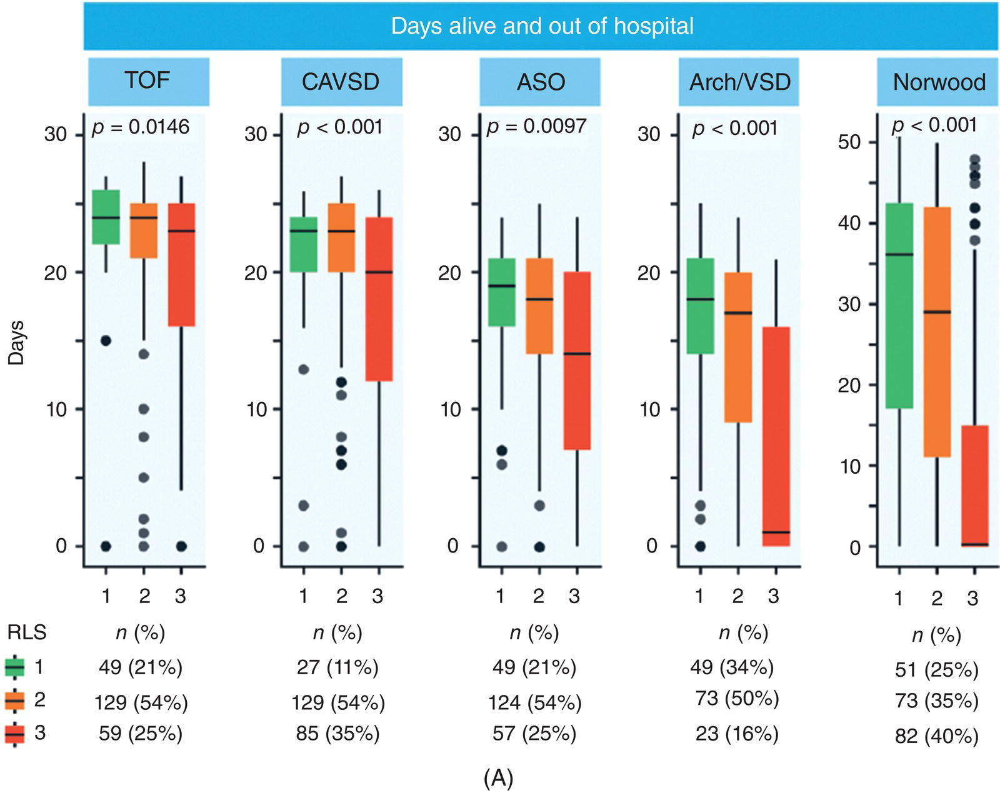  
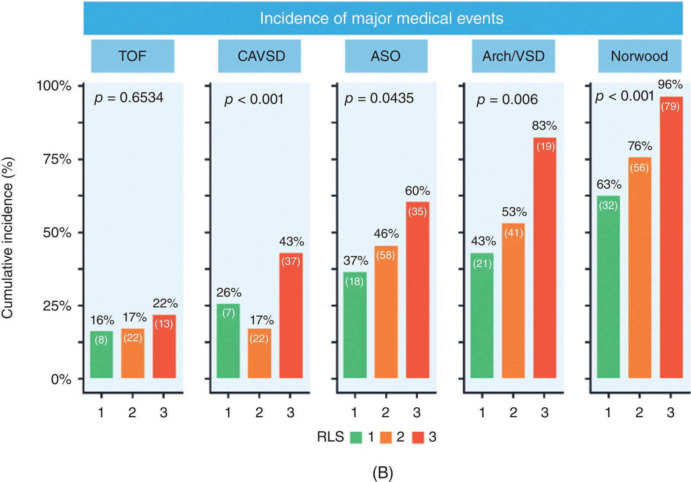

[**Figure 11.9**](#R_c11-fig-0009) (A) Boxplot of days alive and out of hospital by RLS Score (higher number is better). The p values are from the Kruskal‐Wallis Test. The number and percentage of patients in the 3 RLS classes are provided below the boxplot. TOF, tetralogy of Fallot; CAVSD, complete atrioventricular septal defect; ASO, arterial switch operation; Arch/VSD, aortic arch repair with ventricular septal defect; Norwood, Norwood stage I palliation. (B) Incidence of major medical events. P values are from Fisher's exact test. Includes mortality or heart transplant, cardiac arrest, ECMO cannulation, cardiac failure, mediastinitis, bleeding, neurologic event, renal failure, necrotizing enterocolitis, diaphragm or vocal cord paralysis, prolonged ventilation, sepsis, multisystem organ failure, noncardia operation, hemothorax, and readmission.

(Source: Nathan et al. \[104\]. Reproduced with permission of Elsevier.)

[**Table 11.5**](#R_c11-tbl-0005) Effects of modified ultrafiltration

Source: Elliott et al. \[109\]. Reproduced with permission of Elsevier.

| Parameter | Effect |
| --- | --- |
| PVR, PAP | Decreases due to oxygenation and warming |
| Stroke volume, CO | Left ventricular stroke volume increases secondary to improved pulmonary blood flow |
| SVR, blood pressure | Increases due to the reduction of vasoactive substances (interleukins, bradykinin, etc.) |
| Hemoglobin, hematocrit | Increases due to hemoconcentration |
| Interstitial body and lung water | Decreases secondary to water removal |
| Improved gas exchange \[79\] | Improved V/Q mismatch |

CO, cardiac output; PAP, pulmonary artery pressure; PVR, pulmonary vascular resistance; SV, single ventricle; SVR, systemic vascular resistance; V/Q, ventilation‐perfusion.

### Failure to separate from CPB

Occasionally, despite escalating inotropic support, a child is unable to maintain adequate cardiac output and systemic oxygen delivery and therefore a return to CPB must be considered. An assessment of arterial blood gas and Ca2+ values, and whether intended inotropes are infusing correctly is important. Immediate TEE evaluation should be performed for the possibility of residual defects that require surgical attention. If no further surgical intervention is warranted, the source of the difficulty in weaning from CPB should be sought and other therapies must be considered. Is the Hct level adequate for this child? Too much hemodilution can lead to decreased systemic vascular resistance (SVR). The ideal Hct depends on the pathology and is probably in the range of 35–45% for complex repairs. Is the SVR too low? In children with low SVR who are either non‐responsive to catecholamine infusions or who are experiencing adverse effects due to catecholamine therapy, arginine vasopressin has been shown to be a potent vasoconstrictor, with infusions resulting in increased MAPs and decreased catecholamine dependence. Its use in children appears promising when cardiac function is adequate \[121, 122\]. Fixed doses of 0.01–0.04 units/kg/hour of vasopressin are used. Exposure to endotoxin and cytokines as on CPB can trigger a _de novo_ synthesis of the inducible, calcium‐dependent isoform of nitric oxide synthase. Methylene blue inhibits this process by decreasing intracellular cyclic guanosine monophosphate concentrations through guanylate cyclase inhibition, thus blocking its vasodilator properties. It increases arterial pressure, SVR, and left ventricular stroke work, but does not increase cardiac output, oxygen delivery, or oxygen consumption. Methylene blue in a dose of 2 mg/kg followed by 1 mg/kg/hour has been used successfully in the setting of perioperative vasoplegia in adults \[123\], and neonatal sepsis \[124\], and in a case report of infective endocarditis in a 10‐year‐old girl \[125\]. Side‐effects are rare in doses _<_2 mg/kg, but pulmonary hypertension and other side‐effects can occur with repeat doses \[126\]. Is the right heart failing? Pulmonary hypertension with resultant right heart failure may occur post‐CPB, either as a result of long‐standing increases in PA pressures or PVR, now exacerbated by the effects of CPB or as a result of acute increases in PA pressures or PVR secondary to protamine administration. Management has been challenging, as IV medications often affect both SVR and PVR. Selective pulmonary vasodilatation became possible with the introduction of inhaled nitric oxide (iNO), an endothelium‐derived vasodilator that is rapidly deactivated by hemoglobin \[127\]. Several groups of patients have been shown to potentially benefit from iNO administration post‐CPB \[128, 129\]. Patients with single‐ventricle physiology undergoing total cavopulmonary anastomosis (Fontan procedure) with elevated PVR post‐CPB, as well as children with elevated pulmonary venous pressures secondary to total anomalous pulmonary venous connection or congenital mitral stenosis, frequently show improvement with administration of iNO. For patients on iNO, caution should be exercised when transporting from the operating room to the ICU in order to avoid interruption of therapy, as rebound pulmonary hypertension and rapid clinical deterioration may occur. Other options to lower PVR include sildenafil 0.5 mg/kg through a nasogastric tube \[130\], IV sildenafil, or nebulized prostacyclin \[131\]. If severe left or right ventricular dysfunction persists in the absence of residual anatomic defects that can be surgically corrected, consideration may be given to continued mechanical support of the circulation. Currently, immediate pediatric options for mechanical circulatory support are extracorporeal membrane oxygenation or short‐term left ventricular assist device in neonates, infants, and children. These techniques are most useful when recovery of ventricular function is expected within 24–72 hours, or when cardiopulmonary support is unavoidable. Cannulation configurations are shown in [Figure 11.10](#c11-fig-0010) \[132\]. A recent review of postcardiotomy veno‐arterial ECMO of more than 40 studies reporting more than 3,000 patients from 1990–2018 indicated a post‐ECMO survival to hospital discharge of 40–60% in most studies \[132\]. Duration of ECMO support for survivors tended to be 3–5 days, and major complications included bleeding (13–69%), neurologic morbidity (11–51%), sepsis (10–50%), and renal failure (9–56%). Greater than 95% of reports of postcardiotomy mechanical support are ECMO. Veno‐venous ECMO can be utilized for isolated respiratory failure. Another approach is short‐term VAD support; Poh and colleagues reported 55 single ventricle patients supported with centrifugal VAD for postcardiotomy failure \[133\]. Median support was 3.5 days, and 53% were weaned off support, but only 33% survived hospital discharge. See [Chapter 37](c37.xhtml) for further details about mechanical support.

### Heparin reversal and transfusion management

During modified ultrafiltration, cardiac function and the quality of the surgical repair are assessed via TEE, and if found to be satisfactory, protamine is administered to neutralize residual heparin after completing MUF. In small infants and palliated anatomies, the goal Hct separating from bypass should be 40–45%. This improves hemodynamic stability and allows immediate correction of coagulation disorders by infusion of blood products.

Protamine 1–1.5 mg/kg is given for each 100 units of the initial heparin dose to reverse its effect. This assumes that any further doses are given to maintain a heparin level and prevent overdosing of protamine with its associated effects on platelet function (reduction of the interaction of the glycoprotein Ib receptor with von Willebrand factor) \[134\]. If the ACT is still elevated or CPB prime (heparinized) blood is reinfused into the patient, an additional 25% of the initial dose of protamine is added and the ACT rechecked. However, particularly in infants, the administration of protamine and the persistent treatment of a suspected incomplete heparin reversal should not distract and delay the treatment of other commonly associated post‐bypass coagulopathies such as thrombocytopenia, platelet dysfunction, and other coagulation factor deficiencies \[135–138\]. Individualized management of anticoagulation and its reversal results in less activation of the coagulation cascade, less fibrinolysis, and reduced blood loss and need for transfusions \[58\], while improving the clot stability as assessed by thromboelastography. However, care should be taken not to overdose the total amount of protamine \[139, 140\]. After one‐third to one‐half of the planned protamine dose is administered, blood from the surgical field must not be returned to the cardiotomy reservoir to avoid circuit thrombosis in case it is necessary to reinstitute bypass. An ACT or heparin level confirms adequate heparin neutralization. More protamine (0.5–1 mg/kg) can be given if either test remains prolonged and bleeding is a problem. Hypotensive protamine reactions can occur when protamine complexes with heparin because complement is released. This is much less common in children than in adults. Hypotension can be attenuated by adding calcium chloride (2 mg/mg protamine). Pediatric protamine reactions are rare, occurring in 1.7–2.8% of patients undergoing CPB \[141\]. Life‐threatening reactions to protamine represent true allergic or pulmonary hypertensive reactions. Protamine reactions should be treated with epinephrine as the first‐line agent and careful volume resuscitation as required. For severe reactions, it may be necessary to readminister heparin and resume CPB. Hemostatic management can be guided by thrombelastography. Newer devices allow a full “point‐of‐care” functional assessment of the coagulation within 10–15 minutes \[142\]. A recent retrospective study of 100 infants assessed before and after a heparin–protamine titration system (Hepcon®, Medtronic Corp. Minneapolis, MN, USA) reported that more limited protamine dosing neutralized heparin but also prevented anticoagulation effects (prolonged R values on thromboelastography \[TEG\]) caused by excessive protamine \[139\]. Further details can be found in [Chapter 16](c16.xhtml).

### Antifibrinolytic therapy

Bleeding is more common in pediatric cardiac surgery patients than in adults. Both qualitative and quantitative abnormalities in coagulation proteins have significant functional sequelae, which influence the hematologic responses to CPB. Cyanotic CHD itself is associated with coagulation abnormalities, including platelet abnormalities and fibrinolysis. There is extensive published research on the use of aprotinin and lysine analog antifibrinolytics to modify the adverse effects of CPB in adults, but for pediatrics, their dose and effects are much less clear.

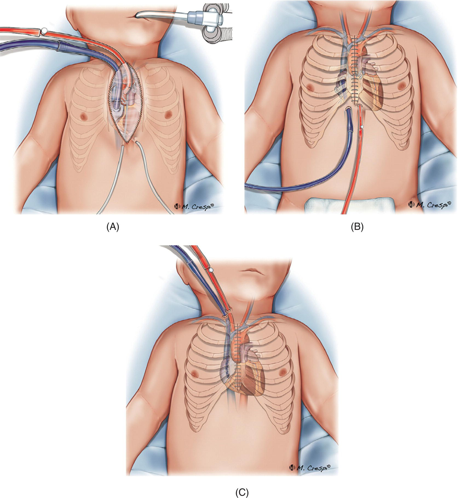

[**Figure 11.10**](#R_c11-fig-0010) (A) Central ECMO cannulation via aorta and right atrium with the open sternum. (B) central cannulation via the aorta and right atrium with closed sternum and subxiphoid cannulae exit. (C) Peripheral ECMO cannulation via carotid artery and internal jugular vein with the closed sternum. Left atrial decompression may also be required with direct left atrial cannulation, atrial septostomy, or other methods. Also, if systemic to pulmonary artery shunt is present, it is usually partially occluded with a clip to limit pulmonary blood flow as in (A) and (B).

(Source: Lorusso et al. \[132\]. Reproduced with permission of Elsevier.)

Two agents are currently available to modify the hemostatic response to CPB: ε‐aminocaproic acid (EACA) and tranexamic acid (TA). Aprotinin, a serine protease inhibitor with anti‐inflammatory properties, was withdrawn from the market in 2007 due to safety concerns in adult patients and will not be discussed further.

#### Epsilon‐aminocaproic acid (EACA) and tranexamic acid (TA)

Both EACA and TA appear effective in reducing bleeding and transfusion in cyanotic patients, provided an adequate dose is administered. Their efficacy in other high‐risk and mixed populations is not as well established. These drugs seem to lack significant clinical anti‐inflammatory efficiency beyond their effects on coagulation \[143, 144\]. Suppression of excessive plasmin activity may play an important role in the generation of proinflammatory cytokines during and after CPB \[145\]. For an excellent and detailed recent review, please refer to Eaton \[146\].

##### _Tranexamic acid dosing_

Chauhan et al. \[147\], in a dose‐ranging study of TA published in 2004, found the most effective dosing scheme of the four studied to be a 10 mg/kg load, 10 mg/kg in the pump prime, and 10 mg/kg after protamine. More recent pharmacokinetic studies have shown effective concentrations of 20 μg/mL \[148\] using a dosing schedule with 6.4 mg/kg followed by 2–3.1 mg/kg, depending on weight \[149\]. Another pharmacokinetic‐based scheme specifies for neonates 0–2 mo.: 15 mg/kg bolus; 20 mcg/mL of CPB prime; 2.5 mg/kg/hour infusion; for infants 2–12 mo.: 9 mg/kg bolus; 20 mcg/mL of CPB prime; 2 mg/kg/hour infusion; and children >12 mo.: 4 mg/kg bolus; 20 mcg/mL of CPB prime; 2 mg/kg/hour infusion \[150\]. Continuous and discontinuous doses of TA effectively inhibit fibrinolysis \[151\]. A high‐dose regimen leading to blood concentrations greater than that required for D‐dimer inhibition may be more efficient than lower dosages \[152\]. Previous studies have described TA doses of up to 100 mg/kg as a loading dose in infants and children; reports of seizures associated with high dose TA in adults combined with the pharmacokinetic data cited above argue against these doses and they should not be used in children. \[153\]

##### _EACA dosing_

Based on a pharmacokinetic study \[154\], in neonates, an initial loading dose of 40 mg/kg, an infusion of 30 mg/kg/hour, and a pump prime dose of 0.1 mg/mL of prime will maintain plasma concentrations above 50 mg/L in 90% of neonates. In older patients, the initial loading dose is 75 mg/kg, a pump‐priming dose of 75 mg/kg followed by an infusion of 75 mg/kg/hour to establish and maintain a therapeutic plasma concentration (130 μg/mL) in 95% of patients \[155\].

Rapid IV injection of TA or EACA may cause hypotension. We infuse loading doses over approximately 20 minutes before the surgical incision. Some institutions delay antifibrinolytic dosing until the institution of bypass in patients who have systemic to pulmonary artery shunts, citing the risk of thrombosis.

#### Comparison studies of antifibrinolytics

With the considerable variability among studies of the three drugs under consideration in terms of design, dose, and outcomes, it is difficult to draw any conclusions about relative efficacy from the literature. There are a few published comparison studies. Chauhan et al. \[156\] compared low‐dose aprotinin, EACA, and the combination in 300 cyanotic patients undergoing cardiac surgery. There was no difference between EACA‐treated and aprotinin‐treated patients in any measured variable. The same group compared TA and EACA in a placebo‐controlled study of 150 patients with cyanotic CHD \[147\]. Both drugs were superior to placebo, but there were no significant differences between the treated groups with respect to 24 hours blood loss, transfusion, or re‐exploration rate. Finally, the effects of aprotinin and TA were compared in 100 children, evenly divided into four groups: placebo, TA, aprotinin, and a combination of the two drugs \[157\]. Again, all treatment groups fared better than placebo in 24 hours blood loss and transfusion, with no significant differences among the three treated groups. Thus, the limited comparative evidence would suggest that the three drugs are equivalent in efficacy for reduction of bleeding and transfusion, at least with the doses and patients studied, and there is little or no advantage to combination therapy.

In summary, evidence supports the efficacy of the lysine analog antifibrinolytics EACA and TA, and aprotinin to decrease bleeding and transfusion in pediatric patients undergoing cardiac surgery involving CPB. This benefit is likely to be more significant in high‐risk groups, such as cyanotic patients, newborns, complex surgeries, and reoperations. Aprotinin seems to have the strongest anti‐inflammatory capacity of the antifibrinolytics \[158\]. The safety profile of these drugs is not fully understood, but each may have significant side effects that require further research in the future \[159–161\]. Further discussion of antifibrinolytic therapy is presented in [Chapter 16](c16.xhtml).

* * *

### KEY POINTS: MANAGEMENT OF PEDIATRIC CPB

-   Pre‐bypass, 300–400 units/kg heparin are injected to reach a target ACT >400 seconds.
-   Two methods of cardioplegic arrest are used: hyperkalemic blood cardioplegia or hyponatremic crystalloid cardioplegia.
-   Reperfusion after unclamping should be at least 8–10 minutes or 25% of the total cross‐clamp time.
-   Separation from bypass is initiated after the resumption of ventilation and reduction of venous outflow to fill the heart.
-   Conventional ultrafiltration during CPB and modified ultrafiltration after CPB are commonly employed.
-   Afterwards, heparin reversal is achieved with protamine, and coagulation disturbances are corrected with platelets and other coagulation products, guided by ACT and/or laboratory diagnostics (e.g., TEG).
-   The antifibrinolytics TA and EACA are effective and used in most surgeries with an increased risk of bleeding.

* * *

## Effects of CPB on organ systems

Cardiopulmonary bypass‐induced systemic inflammatory response syndrome (SIRS) is a host response to the exposure of blood components to the foreign surface of the CPB circuit and initiation of the complement cascade. The early inflammation phase is triggered as soon as blood comes into contact with the synthetic circuit by activation of F‐XII (coagulation factor) and C3 (immune factor) \[162–164\], and the late phase, following the release of the aortic cross‐clamping, is driven by ischemia‐reperfusion and endotoxemia. As a consequence, pro‐ and anti‐inflammatory mediators are released into the circulation and the balance between these two groups of mediators is probably more important than the absolute levels of any of them \[163–169\]. Hypothermia and transfusion, frequently associated with pediatric CPB, are also two non‐specific factors activating the inflammatory response \[163–165, 167, 169–172\]. Hypothermia modifies the metabolism of inflammation biomarkers by delaying, rather than decreasing, inflammatory systemic response \[162–165, 167, 168, 173, 174\]. Furthermore, genetic factors are involved in the inflammatory response and may account for inter‐patient variability \[163–174\]. Although the lungs are often the primary organ targeted, SIRS after CPB may be severe enough to affect other end‐organ function. One of the major challenges is how to modulate the systemic inflammatory response, not only to control the drawbacks of inflammation but also to preserve a level of inflammation needed for host defense and wound healing. This should be the goal of further research.

Currently, there are a number of strategies being employed targeting the prevention of SIRS and multisystem organ failure, including the use of corticosteroids, protease inhibitors, thromboxane inhibitors or antagonists, prostacyclins, complement inhibitors, and cytokine inhibitors, including monoclonal antibodies and IL‐1 receptor antagonist. With the exception of corticosteroids, all of these other approaches are experimental and thus far have not shown a beneficial effect on clinical outcomes, even though some have shown the intended effect on their molecular targets.

Multiple studies in children on corticosteroids have consistently shown a reduction in the inflammatory response, with some demonstrating improvement in clinical outcome \[164–175\]. A limiting factor in some studies using corticosteroids has been the lack of effect on clinical outcome and the higher incidence of postoperative infections and renal dysfunction with increasing cumulative corticosteroid exposure \[166, 157, 170, 176–180\]. The routine prophylactic use of steroids therefore cannot be recommended and may only be indicated in high‐risk patients (DHCA, arterial switch operation) \[176, 177\]. A 2020 Cochrane review performed a meta‐analysis of pooled data from eight randomized controlled trials in 478 patients \[181\]. Conclusions were as follows: (i) Moderate certainty of evidence that corticosteroids do not change the risk of in‐hospital mortality (RR 0.83, 95% CI 0.33–2.07); (ii) high certainty that they do reduce the duration of mechanical ventilation (mean 11.39 hours lower, 95% CI 20.29–2.45). In addition, there was high certainty that corticosteroids made no difference in ICU stay, and moderate certainty of no difference in the hospital stay. The STRESS study is underway and will randomize 1,200 infants less than 1 year in multiple centers to methylprednisolone 30 mg/kg in the CPB prime vs. placebo in a blinded fashion \[182\]. Primary outcome is a global rank score of death, major morbidities, and hospital length of stay.

There is also evidence that pulsatile CPB flow significantly decreases endotoxin levels. An explanation could be the improved microcirculation and end‐organ perfusion during pulsatile perfusion \[178, 179\]. However, there is a paucity of clinical studies demonstrating an outcome difference with this technique, and therefore, it has not been widely adopted in pediatric perfusion practice. For further details on the mechanism of end‐organ dysfunction and treatment, refer to [Chapter 12](c12.xhtml).

### Neurological injury and protection

Brain injury in children with CHD has been documented before and after surgery for CHD. Some complications are apparent soon after the operation, such as seizures, stroke, and coma, whereas others appear long after the operation, such as cognitive deficits and psychomotor delay. Radiological and pathological studies have described a spectrum of brain lesions after pediatric cardiac surgery, located mainly in the neocortex, periventricular white matter, and basal ganglia, corresponding to the neurological deficits seen clinically \[180, 183\]. These subtle defects manifest as a developmental signature that includes cognitive and intellectual impairment, attention and executive function deficits, visual‐spatial and visual‐motor skill deficiencies, speech and language delays, and behavioral difficulties. The spectrum of lesions is consistent with hypoxic–ischemic injury, contrary to mostly embolic events in the adult population. When this injury occurs – before, during, or after the operation – remains uncertain. Adverse neurological outcomes after neonatal cardiac surgery are multifactorial and related to both fixed and modifiable mechanisms. Fixed factors include known genetic syndromes, structural central nervous system malformations (an incidence of up to 29% in HLHS) \[183\], multiple surgeries (leading to multiple insults), blood flow patterns _in utero_, preoperative cerebral hypoxia, embolic events occurring during the balloon atrial septostomy procedure \[184\], socioeconomic status, and a poorly defined genetic predisposition. Potentially modifiable factors include preoperative hypoxia–ischemia, intraoperative use of DHCA, neuroinflammation of the brain \[185–187\], and postoperative cardiopulmonary derangements \[188\]. Some interventions that may limit brain injury from DHCA include preoperative steroids, hyperoxygenation before DHCA, allowing at least 20 minutes of cooling to ensure adequate cerebral protection, packing the head in ice, intermittent cerebral perfusion between 15 and 20 minute periods of DHCA ([Figure 11.11](#c11-fig-0011)), and modified ultrafiltration after CPB. Other modifiable factors of CPB management include optimal flow at all temperatures \[189, 190\], the avoidance of extreme hemodilution \[27\] and emboli \[191\], pH‐stat management \[192, 193\], and modulation of the inflammatory response by the use of ultrafiltration and steroids \[164\]. According to a recent meta‐analysis, the only intervention supported by a high degree of evidence is the avoidance of extreme hemodilution to Hct below 25% \[194\]. Whereas myocardial protection and systemic oxygen delivery are continuously monitored during neonatal CPB, adequate cerebral perfusion has traditionally been evaluated by surrogate markers such as perfusion pressure, mixed venous oxygen saturation, or base deficit and lactate levels. However, there are now real‐time intraoperative cerebral monitoring devices available for clinical use, the potential benefits of which are becoming recognized \[195\]. The most widely used technologies include NIRS, transcranial Doppler, raw and processed electroencephalography, and serum measurement of S100B protein. Real‐time technologies allow immediate interventions upon interruption of optimal cerebral flow and may improve outcome \[196\]. Improved strategies to prevent injury in these arenas are much needed \[197\]. For an extensive discussion of neurological monitoring and outcomes, see [Chapter 14](c14.xhtml).

### Pulmonary effects

Post‐bypass lung injury may be a result of ischemia‐reperfusion injury or may be associated with the systemic inflammatory response caused by extracorporeal circulation \[198\]. Alveolar injury is also associated with cyclic closing and opening of alveoli, with shear injury to the alveolar‐capillary interface causing increased permeability and pulmonary edema with a significant pulmonary inflammatory reaction \[199\]. Etiologies of postoperative pulmonary dysfunction after CPB include a decrease in total lung capacity, functional residual capacity, atelectasis, pulmonary edema, increased inspiratory oxygen, and ventilation‐perfusion mismatch \[200\]. Administration of a FiO2 of 1.0 during CPB may lead to absorption atelectasis and oxygen toxicity. Lung injury could be prevented in a piglet model using continuous pulmonary perfusion on CPB \[201\]. In a study by Pizov et al. \[202\], lung function improved later postoperatively in patients ventilated with 100% oxygen during CPB. Several studies have assessed modes of ventilation on bypass and their effects. Continued ventilation throughout CPB is associated with superior postoperative respiratory function in certain clinical scenarios, possibly due to attenuation of the ischemia–reperfusion injury, but this technique has yet to gain wider acceptance. Maintaining ventilation and PA perfusion during CPB has shown some benefits in limiting pulmonary platelet and neutrophil sequestration, and attenuating thromboxane B2 response after CPB \[203, 204\]. To date, the evidence favoring continuous ventilation alone during CPB on cardiopulmonary function is inconsistent, with most studies showing no benefit \[205–207\]. At our institution, we prefer continued ventilation at low tidal volumes, room air, and low positive end‐expiratory pressure (PEEP) settings in patients undergoing simple procedures without cross‐clamping like a right ventricle–conduit exchange, etc. if tolerated by the surgeon. Many surgeons will require total lung collapse to allow complete access to the heart, without movement, for neonatal and infant patients with limited intrapericardial space. In more complex cases, we start ventilation after thorough pulmonary toilet and suctioning with a recruitment maneuver. This is usually done in the context of de‐airing and aortic clamp removal. Afterward, we continue ventilation at low settings with approximately 2 mL/kg and a PEEP setting of 5–8 cm H2O with a FiO2 of 0.21. Full ventilation is resumed just before weaning from bypass, usually in a pressure‐regulated, volume‐controlled mode to maintain minute ventilation with stable tidal volumes. The pressure limit is carefully monitored and set 5 cmH2O above the upper inspiratory pressure.

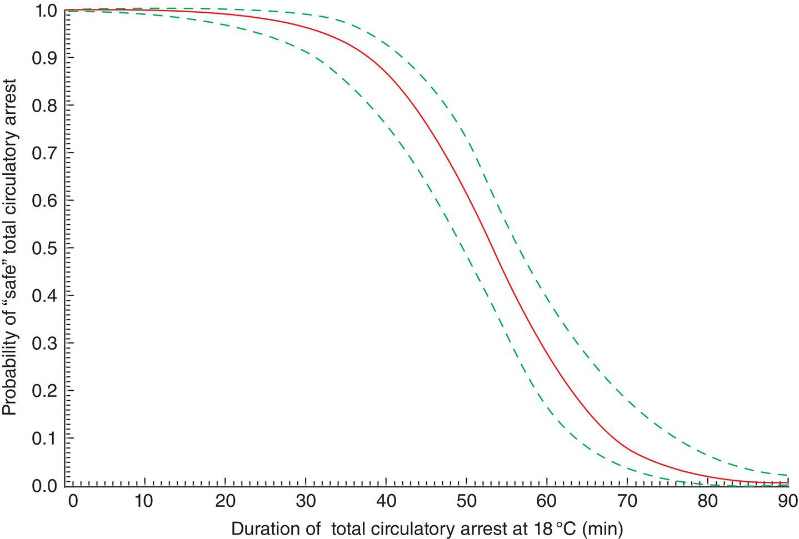

[**Figure 11.11**](#R_c11-fig-0011) Probability of “safe” deep hypothermic circulatory arrest. At 18 °C, the likelihood of neurological injury becomes exponentially greater beyond 45 minutes of circulatory arrest.

(Source: Kirklin and Barrett‐Boyes \[68\]. Reproduced with permission of Elsevier.)

### Renal, hepatic, and gastrointestinal effects

Little is known about the epidemiology and risk factors for the development of acute renal failure in children post‐CPB for cardiac surgery. The incidence of acute renal dysfunction complicating open‐heart surgery in children is significant, at 11–17% \[208, 209\]. Low cardiac output was a significant predictor of developing a renal injury. Other risk factors include young age, the preoperative need for mechanical ventilation, use of milrinone, gentamicin and furosemide, the duration of CPB and anesthesia and multiple cross‐clamp times as well as the transfusion of blood products \[210\]. This is often related to the complexity of the operation. Unexpectedly, DHCA was not a predictor of postoperative renal dysfunction. On the one hand, better and more sophisticated surgical and CPB techniques are available, while on the other, children with more complicated cardiac lesions requiring longer CPB time are operated on today. There is also evidence that the neonatal kidney is more vulnerable to conditions of hemodynamic stress \[209\] with loss of autoregulation leading to blood pressure‐dependent renal blood flow and ischemia‐induced renal injury. All of these conditions render the neonate more prone to complications of ischemia than the older infant or child. Renal replacement therapy is required in 1.6–7.7% of patients. In children, the mortality rate in those requiring dialysis following CPB is reported to range from 46 to 67%. However, renal failure is often temporary. Among those who recover, 93–100% of survivors of renal replacement therapy after CPB surgery have normal renal function at discharge from the hospital \[211, 212\]. Peritoneal dialysis (PD) is a safe and effective treatment for children after CPB surgery and should be initiated early in the course of acute renal injury \[213–217\]. Peritoneal dialysis is also utilized in some centers routinely after complex neonatal and infant surgery, to counteract the frequent low urine production from antidiuretic hormone release and acute renal ischemic effects \[215\]. Peritoneal dialysis also effectively filters inflammatory mediators, and the overall result is to limit fluid accumulation and shorten the time of mechanical ventilation \[218\]. Kwiatkowski and colleagues randomized 73 patients <6 months who had oliguria after CPB surgery to PD vs. furosemide for prevention of fluid overload \[219\]. The furosemide group had a three‐fold higher risk of 10% fluid overload and was more likely to have prolonged ventilator and inotrope use, and higher electrolyte abnormality scores. There were no differences in mortality, or ICU or hospital stay. There were no serious complications of PD. Plasma and urine neutrophil gelatinase‐associated lipocalin thresholds are early predictive biomarkers for AKI \[220\]. A recent review of AKI after CPB in infants reinforces the conclusions noted above; despite some promising research on biomarkers of renal injury, none has become clinically available; the principles of supporting cardiac output and instituting renal replacement therapy early when AKI is recognized are emphasized \[221\].

Several investigations provide evidence that intestinal organ function is altered during CPB. Splanchnic, but not systemic, oxygen extraction increases during normothermic, non‐pulsatile CPB. Splanchnic blood flow is not significantly affected by normothermic or hypothermic CPB at normal pump flows compared with the pre‐bypass condition \[222, 223\]. The increase in splanchnic oxygen extraction during hypothermia, indicating a splanchnic oxygen supply/demand mismatch, was, therefore, most likely caused by a decrease in splanchnic oxygen delivery, in turn, caused by a decrease in hemoglobin concentration secondary to hemodilution. The splanchnic region might be more susceptible to a decrease in oxygen delivery by hemodilution, compared with other organs. Normothermic CPB leads to a loss of gastrointestinal (GI) barrier function independent of the duration of CPB. Current data indicate that intestinal mucosal autoregulation is maintained during CPB within the pressure range 50–75 mmHg \[224\]. Improving pump flow rather than infusing vasoconstrictive drugs to increase aortic pressure can improve both splanchnic and renal perfusion \[225\], and improve the postoperative course in children \[226\]. Although GI complications may have a low incidence (0.3–3%), they are associated with high mortality (13–63%) \[227, 228\]. Several risk factors (e.g., use of vasopressors, pre‐existing comorbidities, perioperative hypotensive episodes, and valve surgery) have been evaluated for the development of alterations in GI organ function. Liver dysfunction rarely occurs after CPB.

### Endocrine and metabolic response to CPB

In children, hypoalbuminemia and hyperchloremia are the predominant acid‐base abnormalities after CPB, whereas lactic acidosis and wide ion gap acidosis are rare \[229\]. Hyperchloremia following CPB appears to be a benign phenomenon. By contrast, hypoalbuminemia, an alkalinizing force, was associated with a prolonged requirement for intensive care.

* * *

### KEY POINTS: EFFECTS OF CPB ON ORGAN SYSTEMS

-   A SIRS is the natural response of the body to contact with the circuit, surgery, and the disturbance of homeostasis.
-   Multiple interventions have been attempted with minimal success except for the avoidance of blood transfusion and the minimization of the contact surface.
-   All major organs are affected, from neuroinflammation to acute lung, GI tract, and kidney injury, as well as metabolic and endocrine disturbances.

* * *

## Special CPB management issues

### Warm CPB

Hypothermic CPB associated with cold myocardial protection is commonly used for neonatal cardiac surgery. The rationale is to protect the brain in case of failure of oxygen delivery ([Figure 11.12](#c11-fig-0012)). In addition, hypothermic bypass helps to complete cold myocardial protection by delaying myocardial rewarming and maintaining a low metabolic state. There is a growing body of evidence demonstrating that hypothermia also induces deleterious effects, which may culminate in end‐organ dysfunction. The benefits of hypothermia are balanced by its drawbacks, including impaired hemostasis \[230\], microcirculatory dysfunction, capillary leakage, endotoxin release, disturbed glucose metabolism \[231\], and decreased myocardial contractility \[232\]. Hypothermia delays the recovery of the mechanical function of the myocardium and reduces basal metabolism. This reduction has only a minimal impact on oxygen needs. Less well understood is the deleterious effect of hypothermia on the myocardium. Reactivity of the microcirculation is impaired after deep hypothermia, as are many cellular functions. The lungs are very sensitive to CPB, and hypothermia may increase the capillary leakage more than normothermia by inducing microcirculatory dysfunction and impairing endothelial responses \[233\]. By reducing oxygen demand, hypothermia is effective in protecting the brain, but it impairs vasomotor and cerebral oxygen regulation \[234\], alters energy metabolism \[235\], and increases intracranial pressure, and overshoot during rewarming may induce neurological injury \[236\]. Furthermore, the protective effect of hypothermia on the inflammatory reaction and neurological recovery may have been previously overestimated \[237\]. The inflammatory reaction induced by CPB seems to be delayed rather than diminished by hypothermia \[238\]. Finally, with prolonged DHCA, long‐term follow‐up has shown impaired neurodevelopmental outcomes \[239\]. Therefore, normothermic CPB, already commonly used in adult cardiac surgery, has been promoted and progressively extended into pediatric practice \[240\]. Favorable surgical results have been achieved with normothermic bypass for even complex operations such as the arterial switch operation \[241\]. See the section above under Cooling and Temperature Management for more details.

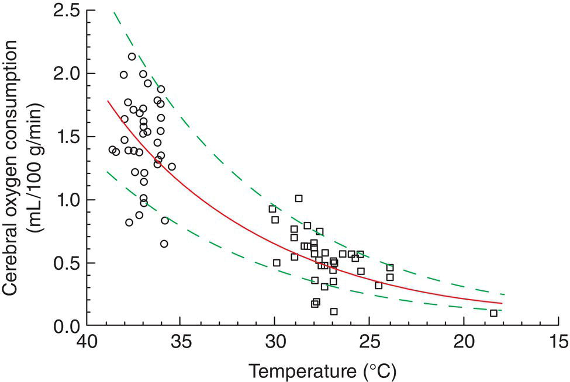

[**Figure 11.12**](#R_c11-fig-0012) Relationship between cerebral oxygen consumption and nasopharyngeal temperature during bypass at a flow of 2 L/min/m2.

(Source: Kirklin and Barrett‐Boyes \[68\]. Reproduced with permission of Elsevier.)

Temperature is not the only characteristic of normothermic CPB. Other factors to be considered are flow and Hct. The flow generally used for mild hypothermic CPB is 2.0–2.4 L/min/m2 ([Figure 11.8](#c11-fig-0008)). In normothermic CPB, pump flow is maintained throughout the procedure at 3.0–3.5 L/min/m2. In terms of hemodilution on CPB, Hct is maintained above 30% during the procedure, with 40% by the end of CPB for normothermic CPB. Thus, normothermic CPB is better characterized by “normothermic, high‐flow, high‐ hematocrit CPB” \[57\].

### Deep hypothermic circulatory arrest

Hypothermia has been utilized since the early days of CPB to allow reduced flows in order to improve intracardiac surgical exposure. Bigelow et al. were the first to demonstrate in 1950 that hypothermia decreases the metabolic rate \[242\] ([Figure 11.12](#c11-fig-0012)). It decreases blood loss \[240\], provides myocardial protection \[243\], and, most importantly, is neuroprotective \[244\]. This mostly relates to the decrease in the metabolic rate by 64%, by cooling from 37 to 27 °C. Also, at a given temperature, the amount of gas in the solution increases proportionally to the decrease in temperature (ideal gas law). In CPB, this translates to cooling the patient not only to lower the metabolic rate but also to obtain a higher solubility of oxygen in blood and tissues. Pearl et al. \[245\] were able to show that the use of hyperoxia with a pH strategy led to the lowest production of acids during 60 minutes of DHCA. This is probably related to increased tissue oxygen loading pre‐arrest.

The disadvantages of hypothermia include disruption of cerebral autoregulation ([Figure 11.13](#c11-fig-0013)) prolongation of CPB, and a greater tendency toward postoperative bleeding \[246\]. Postoperative recovery, however, is not prolonged by hypothermia \[247\]. Also, the wound infection rate does not seem to be influenced by hypothermic bypass \[248\]. Hypothermia during cardiac surgery only gained widespread use after the development of a heat exchanger that could be integrated into the CPB machine \[249\].

[**Figure 11.13**](#R_c11-fig-0013) Cerebral blood flow velocity vs. cerebral perfusion pressure at different bypass temperatures. During normothermia, a normal pressure‐flow velocity relationship is observed; during moderate or profound hypothermia, autoregulation is affected, and blood flow velocity is proportional to cerebral perfusion pressure in a linear relationship.

(Source: Hillier et al. \[234\]. Reproduced with permission of Wolters Kluwer Health, Inc.)

Deep hypothermic circulatory arrest involves cooling the patient's body temperature to 17–18 °C, stopping the bypass machine, draining the blood from the patient into the venous reservoir, and removing the cannulas from the heart. After the first reports of DHCA in the 1960s, this technique gained popularity in the 1970s and 1980s, because of the perfectly bloodless field it provided. This facilitated complex intracardiac and aortic repairs in newborns and small infants \[250\], as well as reducing edema. However, it soon became evident that DHCA was associated with neurological morbidity. Choreoathetosis, seizures, coma, and hemiparesis were all noted, especially with prolonged DHCA (>60 minutes) \[251\]. Clinical and experimental evidence suggests that DHCA preferentially damages the basal ganglia, which control tone and movement. The main input of the basal ganglia is the striatum, a highly dopaminergic region of the brain. Increases in free dopamine levels as an indicator of brain damage and cell disruption occur earlier in prolonged DHCA than in low‐flow bypass strategies \[252\], and about 15 minutes earlier using alpha‐stat versus pH‐stat management \[253\]. It is interesting to note that the incidence of these acute morbidities seemed to increase when alpha‐stat management became the accepted standard in many centers. Long‐term adverse neurodevelopmental outcomes have also been associated with long periods of DHCA, including abnormalities in mental development \[194\], and in fine and gross motor skills. The Boston Circulatory Arrest Study is a remarkable achievement in which 180 newborns undergoing the arterial switch operation from 1988 to 1992 were studied, with follow‐up now complete to the age of 16 years \[254, 255\]. The CPB protocol in those years included alpha‐stat management, routine hemodilution to a Hct of 20%, and the absence of an arterial filter on the CPB circuit. A DHCA time of greater than 41 minutes was associated with a significant increase in long‐term neurodevelopmental problems. The effect of longer DHCA times was diminished, although still present at age 16 years with an association with lower visual‐spatial scores and executive functioning. In the same patient cohort at age 16 years, shorter cooling time and higher nadir temperature were associated with impaired microstructural development of deep subcortical white matter when assessed with quantitative magnetic resonance imaging (MRI) \[256\]. In a recent study from a cohort of neonates undergoing surgery from 2004 to 2008, a longer duration of DHCA was also associated with a higher incidence of white matter injury on postoperative MRI \[257\].

Although the 41 minute cutoff is now a well‐accepted limit in congenital heart surgery, multiple changes have subsequently been made to bypass protocols. Results from animal experiments utilizing a neonatal piglet model of DHCA, as well as data from the Boston Circulatory Arrest Study, led to the following recommendations for increasing the patient's safety margin when utilizing DHCA:

-   Hematocrit of 25–30% should be the target \[258\].
-   Systemic hypothermia should be achieved slowly, over no less than 20 minutes ([Figure 11.14](#c11-fig-0014)).
-   pH‐stat blood gas management should be used, at least for cooling, to improve tissue oxygen loading and more even cerebral cooling ([Figure 11.15](#c11-fig-0015)) \[259, 260\]. Core body temperatures of 17–18 °C should be utilized, and ice bags should be applied to the head \[261\]. Hyperoxia immediately before DHCA improves tissue oxygen loading \[247\].
-   DHCA should be divided into periods of no longer than 20–30 minutes, allowing a reperfusion period of at least 2 minutes between each segment of DHCA, to improve neurological outcome \[262\].
-   Low‐flow CPB (at greater than 40–50 mL/kg/min) offers greater cerebral protection than DHCA \[263\]; regional cerebral perfusion may be better than low‐flow CPB (see later).
    
    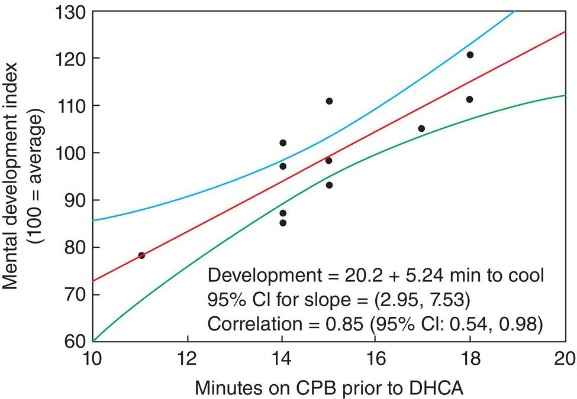
    
    [**Figure 11.14**](#R_c11-fig-0014) Cognitive development following neonatal repair of transposition of the great arteries using deep hypothermic circulatory arrest (DHCA) at 18 °C. Minutes on cardiopulmonary bypass (CPB) prior to DHCA = cooling time. Cooling times _<_20 minutes were associated with lower neurodevelopmental outcome scores at age 12 months. CI, confidence interval.
    
    (Source: Bellinger et al. \[69\]. Reproduced with permission of American Academy Of Pediatrics.)
    
    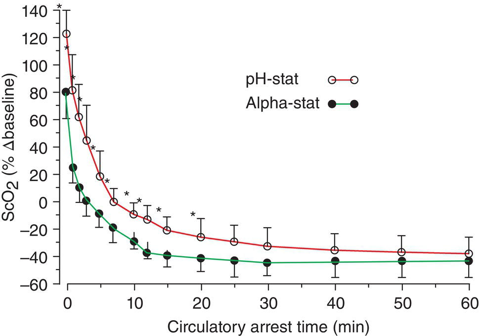
    
    [**Figure 11.15**](#R_c11-fig-0015) Decline in cerebral oxygen saturation (ScO2) during deep hypothermic circulatory arrest in piglets. pH‐stat management resulted in higher ScO2 during the first 20 minutes of circulatory arrest.
    
    (Source: Kurth et al. \[259\]. Reproduced with permission of Wolters Kluwer Health, Inc.)
    
-   Cold normoxemic reperfusion of the brain after DHCA for 5–10 minutes may be beneficial to restore cerebral autoregulation and wash out accumulated metabolites before adding the metabolic burden of rewarming to the brain \[264\]. Controlled reoxygenation was also associated with reduced myocardial damage, oxidative stress, and cerebral and hepatic injury in cyanotic children despite similar inflammatory responses to hyperoxia \[265\].
-   Normoxemia should be maintained to decrease exacerbation of brain injury after DHCA \[266\]. Neurological monitoring is useful in the individual patient to aid in determining the safe duration of DHCA \[259, 267\] ([Figure 11.5](#c11-fig-0005)).

Although there are situations where DHCA must be utilized, many surgeons are avoiding it whenever possible, by minimizing its duration and dividing the periods of its use, or using alternative methods, such as regional cerebral perfusion.

In the current era, DHCA is used by some surgeons for the following indications:

-   Surgery for interrupted aortic arch
-   Stage 1 palliation for hypoplastic left heart syndrome (HLHS)
-   Obstructed total anomalous pulmonary venous drainage (TAPVD) (especially with a small pulmonary venous confluence)
-   Repeat surgery for recurrent pulmonary vein obstruction in TAPVD
-   Surgery on low‐birth‐weight neonates <2 kg

### Regional cerebral perfusion

In order to avoid the use of DHCA, several novel CPB techniques have been developed over the past 15–20 years to allow perfusion of only the brain during critical periods of surgery, such as aortic reconstruction during the Norwood operation, interrupted aortic arch repair with ventral septal defect (VSD), coarctation with VSD, or cases requiring the Damus–Kaye–Stansel procedure \[268, 269\]. These techniques are collectively referred to as regional cerebral perfusion (RCP). Other terms for this technique are regional low‐flow cerebral perfusion, selective cerebral perfusion, antegrade cerebral perfusion, and selective regional cerebral perfusion. Several different techniques have been described on the basis of the primary description by Pigula et al. \[268\]. One variation of RCP utilizes a small Goretex graft of 3–4 mm sewn onto the innominate artery prior at the initiation of CPB, and this is then used as the aortic cannula during CPB. A pre‐CPB test occlusion by the surgeon of the innominate artery with bilateral rSO2 monitoring can serve as a functional test of an intact circle of Willis. If there is a significant and reproducible decline in rSO2 on the side of the innominate occlusion, a non‐intact circle of Willis (up to 5% of neonates) is assumed and a different CPB strategy (i.e., DHCA) can be planned. Other options for cannulation include a high cannulation technique of the innominate artery with a small 6 or 8 Fr. aortic cannula, which is advanced cephalad further distal into the innominate artery during RCP \[270\] ([Figure 11.16](#c11-fig-0016)). During aortic reconstruction, snares are placed around the brachiocephalic vessels and CPB flow is decreased, with only the brain receiving perfusion via the right carotid artery during this period. In this way, a bloodless operative field can be achieved, just as if DHCA was being performed, yet the brain is still receiving blood flow and oxygen, in theory increasing protection from hypoxic‐ischemic brain injury ([Figure 11.17](#c11-fig-0017)). Another potential advantage of this technique is seen in newborns who have extensive arterial collaterals between the proximal branches of the aorta and the lower body via the internal mammary and long thoracic arteries. In this instance, the use of RCP also provides some blood flow to the lower body, potentially protecting renal, hepatic, and GI systems from ischemic damage as well \[232, 271, 272\]. Preliminary results are promising and support the notion of improved cerebral protection \[270, 273\], even at mild hypothermic temperatures \[272, 274\]. Neurological monitoring has been used to aid in determining how much flow is necessary during RCP \[275\]. Approximately 40–50% of full flow is used (starting at 40 mL/kg/min) and adjusted according to brain saturation and/or transcranial Doppler measurements, maintaining baseline saturation in the range before the onset of RCP (90–95% range). Average flows of 50–65 mL/kg/min during RCP are required to maintain baseline cerebral blood flow velocities, rSO2, and pressures to overcome vessel resistances and capillary opening pressures \[273, 276\]. Flows _<_40 mL/kg/min over time are unable to maintain rSO2 greater than 40% after DHCA \[277\]. If the left regional saturation rSO2 falls to more than 10% below the right, flow is increased further, assuming that the circle of Willis could be variant or incomplete, as all flow to the left cerebral hemisphere needs to traverse the circle. If a left radial arterial line or a femoral arterial line/umbilical artery catheter is in place, abdominal perfusion pressures of >12 mmHg, correlating to radial artery pressures of 25–30 mmHg, are maintained \[271\].

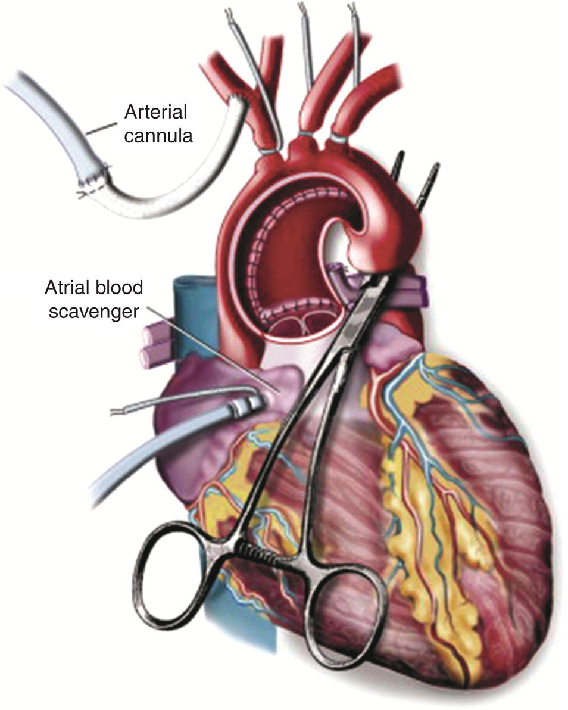

[**Figure 11.16**](#R_c11-fig-0016) Regional cerebral perfusion during aortic arch reconstruction for hypoplastic left heart syndrome. A polytetrafluoroethylene graft is sewn to the right innominate artery as the aortic cannula inflow. Brachiocephalic vessels and descending aorta are snared, and perfusion to the brain occurs, leaving a bloodless operative field.

(Source: Pigula et al. \[268\]. Reproduced with permission of Elsevier.)

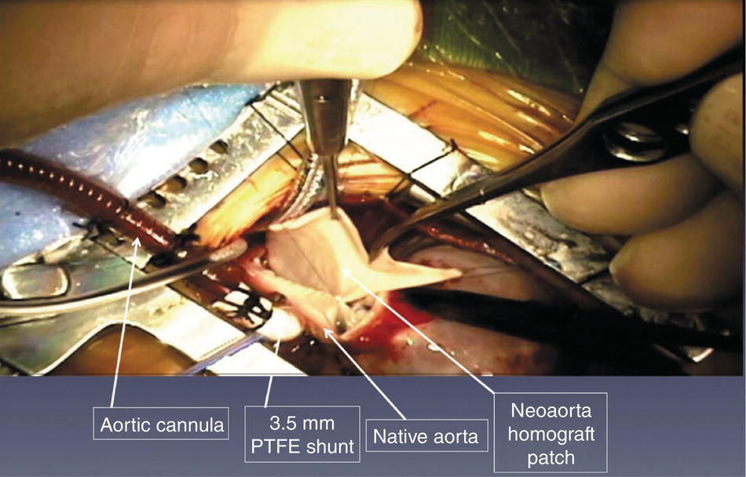

[**Figure 11.17**](#R_c11-fig-0017) Regional cerebral perfusion. Note the bloodless operative field and the position of the graft and cannula.

Despite these theoretical advantages, and a study demonstrating that selective cerebral perfusion does provide oxygenated blood flow to both cerebral hemispheres \[273\], longer‐term neurodevelopmental outcome studies to date have not demonstrated clear superiority of RCP vs. DHCA for aortic arch reconstruction in neonates. Andropoulos et al. reported 12 month neurodevelopmental outcomes of a cohort of 34 neonates after RCP using the Bayley Scales of Infant Development III and found the mean cognitive score equal to the reference population norm, while the language and motor scores were both 0.8 standard deviations below norms \[278\]. Later outcomes at 3 years of age after RCP in this cohort revealed Cognitive, Language, and Motor scores averaging 95 (0.33 standard deviation below norms). At 5 years, when more comprehensive testing is possible, IQ domains and language scores averaged 97–98; motor skills 90, and visual‐motor integration 92 \[31\]. The study was not controlled and used the newest version of the Bayley test, preventing direct comparison with earlier studies by Goldberg (57 patients) \[279\] and Visconti (29 patients) \[280\], which demonstrated no neurodevelopmental outcome difference between RCP and DHCA, with both mental and motor scores significantly lower than population norms at 12 months. Algra et al. \[281\] randomized 36 HLHS patients undergoing Norwood stage I operation to DHCA vs. RCP and performed postoperative brain MRI. The overall incidence of new brain injury was significant at 76% and not different between groups, although the RCP patients were the only ones with new infarctions in deep brain structures. Significantly, RCP flow rates were higher in the Andropoulos et al. study \[278\] than in the other three, and theirs was also the only one to employ neurological monitoring to adjust RCP flows. Xie and colleagues reported a retrospective study of two ventricle infants undergoing aortic arch repair with DHCA at 18–20 °C (_n_ = 53) compared to RCP at moderate hypothermia at 25 °C \[282\]. The RCP group had a lower rate of acute neurologic complications 3/61 vs. 10/53, _p_ < 0.05), and a shorter duration of mechanical ventilation and ICU stay. Hoffman and colleagues reported long‐term neurodevelopmental outcomes of 178 neonates followed out to 36 months of age \[283\]. Furthermore, 51 were single ventricle patients employing an RCP protocol with neuromonitoring and higher flows. Cognitive scores averaged 100, Language 95, and Motor 101 on the Bayley III, and were not different from the two‐ventricle patients. Outcome studies of RCP must be interpreted with caution and the details of the technique must be assessed \[273–283\]. The differences in the various neurodevelopmental tests as new versions are developed also need to be taken into account \[284\]. The two studies employing neuromonitoring and higher RCP flows \[31, 283\] report neurodevelopmental outcome studies with most domains in the normal range at 3–5 years, in contrast to studies with lower flows and no neuromonitoring.

Alternative cannulation strategies for neonatal aortic arch reconstruction have been described to provide perfusion to the brain as in RCP, but utilize one or two additional cannulae to perfuse the descending aorta and subdiaphragmatic viscera, and aortic root to perfuse the myocardium while allowing a bloodless field \[285–287\]. In these studies, operating time was reduced, postoperative serum lactate concentrations were lower and fewer days were required for sternal closure. Kulyabin and colleagues randomized 15 infants undergoing aortic arch reconstruction to DHCA at 18–20 °C, RCP at 23–25 °C, and flows of 30–50 ml/kg/min, or RCP plus descending aorta cannulation at 28–30 °C \[288\]. Mortality was not different between groups, although 5 patients died early postoperatively. The risk of new postoperative MRI findings was higher in the DHCA group; 12/15 vs. 5/15 in both of the other groups (_p_ = 0.019). The composite of all unfavorable events was lower in the RCP plus descending aorta cannulation group (_p_ = 0.041).

In summary, there is no prospective, randomized controlled published evidence that demonstrates the superiority of any of these cannulation or bypass techniques in terms of quality of surgical reconstruction and hospital mortality. Since the Boston Circulatory Arrest Trial there has been a definite trend toward employing continuous CPB and minimizing DHCA for most pediatric cardiac procedures.

### Blood gas management: pH‐stat vs. alpha‐stat

Some degree of hypothermia is utilized for nearly every cardiac operation in order to slow the metabolism and oxygen consumption of all organs, particularly the brain and heart \[289\]. During cooling, the carbon dioxide contained in blood becomes more soluble and its partial pressure decreases. The PaCO2 sensed by the body therefore decreases as body temperature decreases, with the result that at a core temperature of 17–18 °C, if pH and PaCO2 have not been corrected for temperature, the body is experiencing a pH of about 7.6 and PaCO2 of 15–18 mmHg \[290\] ([Figure 11.18](#c11-fig-0018)). This very low PaCO2 causes cerebral vasoconstriction, particularly during the cooling phase of bypass, which in turn leads to lower cerebral blood flow, less efficient brain cooling, and consequently less cerebral protection at a given temperature \[259\]. Since blood samples are heated to 37 °C prior to measurement of pH, PaCO2, and PaO2, the use of pH‐stat management necessitates that blood gases are being corrected for the patient's actual body temperature by increasing the PaCO2 on bypass as it is measured at 37 °C, so that the body experiences a PaCO2 of approximately 40 and a pH of 7.4 at all temperatures. Conversely, alpha‐stat management means not correcting the blood gases for temperature, as if the patient's blood was always at 37 °C, with the goal of a pH of 7.4 and PaCO2 of 40 mmHg. In the early history of CPB, pH‐stat was utilized to preserve cerebral blood flow \[291\]. Randomized controlled studies in the 1970s and 1980s on adults undergoing CPB confirmed that acute, post‐CPB neurological problems were worsened with the use of pH‐stat management \[292\]. Alpha‐stat management was, therefore, adopted for both adult and pediatric CPB. However, recent animal studies in a neonatal piglet model have challenged this conclusion, proving that neurological outcome, both behavioral and neuropathological, is significantly worse when alpha‐stat management is used \[259, 260\].

Advantages of pH‐stat CPB have been shown to include:

-   a decreased brain metabolic rate
-   an increased rate of brain cooling and reperfusion \[293\], thereby providing better protection through more even and faster cooling and rewarming secondary to increased CBF \[293, 294\].
-   molecular effects of altered arterial PO2 and pH, including changes in cerebral oxygenation and brain enzyme activity as well as decreased brain electrical activity \[295–296\].
-   improved oxygen delivery through decreased oxyhemoglobin affinity \[297\] by counteracting the pH and hypothermia‐associated leftward shift in the oxyhemoglobin dissociation curve
-   increased cortical oxygenation before arrest (through hypercapnic capillary vasodilation \[298\]) and decreased oxygen metabolic rate providing slower deoxygenation compared to alpha‐stat management (10 vs. 7 minutes) \[259\] ([Figure 11.15](#c11-fig-0015)). Cortical anoxia occurs at 36 vs. 24 minutes for alpha‐stat management, a safety margin of 50%.

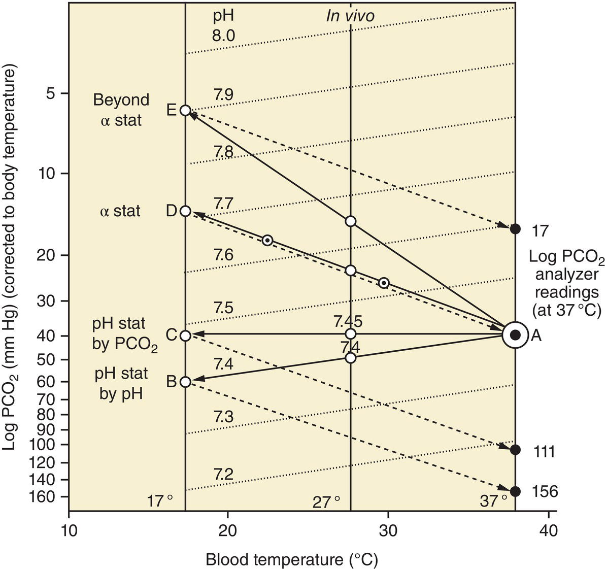

[**Figure 11.18**](#R_c11-fig-0018) pH and PCO2 change when blood temperature is varied between 17 and 37 °C. Point A is the starting point with pH 7.4 and PCO2 of 40 at 37 °C. Points B, C, D, and E are the conditions the brain experiences at 17 °C with various blood gas management strategies. pH‐stat management (correcting the pH and PCO2 for temperature) results in an acid‐base environment that is neutral, whereas α‐stat management (not correcting for temperature) results in a very alkalotic environment at 17 °C. Warming the blood sample (as is done for blood gas measurement) results in very high PCO2 values when pH‐stat is used. The pH of blood becomes slightly more alkalotic with cooling owing to the decreased dissociation of hydrogen ions.

(Source: Jonas \[290\]. Reproduced with permission of Taylor & Francis.)

In cyanotic infants with aortopulmonary collaterals, pH‐stat management results in significantly improved brain oxygenation as measured by near‐infrared cerebral oximetry \[299\]. A retrospective study of 16 patients revealed worse neurodevelopmental outcomes with alpha‐stat management \[257\]. In a randomized prospective trial of pH vs. alpha‐stat management in 182 infants _<_9 months of age, there was a strong trend toward improved outcomes with pH‐stat management, including the earlier return of EEG activity, fewer seizures, and improved psychomotor development index \[193\]. Bellinger et al. \[300\], in their landmark study, examined the effects of alpha‐stat and pH‐stat on developmental and neurological outcomes after deep hypothermic CPB in infants. The Psychomotor Development Index scores of 110 patients did not differ significantly between the groups (_P_ = 0.97). Bellinger et al. concluded that the use of alpha‐stat or pH‐stat strategy is not consistently associated with improved or impaired early neurodevelopmental outcomes in infants undergoing deep hypothermic CPB \[300\].

One reason for the differing results between pediatric and adult studies is that the increased cerebral blood flow produced by pH‐stat management leads to a greater number of cerebral emboli in adults. Emboli occur much less frequently in children, and the primary etiology of neurological injury from CPB in pediatric patients is hypoxic‐ischemic \[301\]. Thus, the increased cerebral blood flow observed on CPB with pH‐stat management lessens this risk in children. Interestingly, this putative mechanism has been recently challenged by a study involving a controlled microembolic load and DHCA in pigs that revealed that pH‐stat was still associated with improved outcomes when compared with alpha‐stat \[302\]. Recent studies have also revealed a decrease in peak postoperative troponin levels, reduced ventilator dependence, and reduced ICU stays with pH‐stat as compared with alpha‐stat \[303\].

Currently, the preferred technique in adults is the alpha‐stat method because it is believed that cell function and autoregulation are better preserved by maintaining neutral pH according to the temperature of the cell. In pediatric cardiac surgery, however, unlike adults, pH‐stat enhances cerebral and systemic protection during DHCA. Most congenital heart surgery programs have reverted to pH‐stat management. This necessitates careful attention to PaCO2 during all phases of bypass, potentially reducing the sweep gas flow to decrease the efficiency of CO2 removal, and often adding inspired CO2 to the sweep gas of the bypass circuit, particularly in small infants.

### Sickle cell disease

Sickle cell disease is an inherited hemoglobinopathy in which a mutation in the β‐globin gene on chromosome 11 causes the sixth amino acid of the β‐globin chain to be changed from valine to glutamic acid. The disease is inherited in an autosomal recessive pattern, with a homozygous form (Hgb SS) and a heterozygous form, or sickle cell trait (Hgb AS). The sickle cell gene is most commonly observed in African populations, with 1 in 500 African Americans having Hgb SS, and 1 in 12 with sickle cell trait \[304\]. In the United States and most developed countries, there is now universal newborn screening for hemoglobinopathies, and sickle cell disease is, therefore, usually diagnosed at that time. After the normal postnatal decline in fetal hemoglobin (Hgb F) in the first 6 months, Hgb SS patients have Hgb S concentrations of 70–98%, and Hgb AS patients have Hgb S concentrations of 30–50%. Hgb S causes sickling of red cells, leading to chronic hemolytic anemia and impaired microvascular perfusion. This can result in end‐organ dysfunction and permanent injury, including painful bony crises, splenic sequestration and autoinfarction, acute chest syndrome with hypoxemia, retinopathy, renal failure, pulmonary hypertension, and stroke. Hypoxemia, acidosis, cold temperature, hypovolemia, and microvascular stasis all promote sickling. Other less common forms of sickle cell disease are sickle cell‐hemoglobin C disease (Hgb SC), and sickle cell‐thalassemia variants. The reader is referred to excellent recent reviews for further detailed information about these disorders \[304, 305\]. Modern treatment for Hgb SS now includes chronic transfusion therapy to maintain the Hgb S at <30%, with Hgb levels of 9–10 g/dL. In addition, hydroxyurea is now commonly used in sickle cell disease because of its ability to increase the production of Hgb F, reduce Hgb S, and decrease the severity of disease manifestations. Hydroxyurea can substantially reduce the Hgb S percentage, and so this should be considered in the preoperative planning for these patients. The conditions commonly encountered for CPB – hypothermia, low flow, acidosis, and hypoxemia – all predispose to sickling, and a careful strategy is required to optimize outcomes in these patients \[306, 307\]. Although no universally accepted guidelines have been published, recent data and reviews provide important guidance. Careful consultation with the patient's hematologist and surgeon, and a clear strategy devised with the perfusionist, are essential when planning for CPB.

Exchange or straight transfusion has been used successfully for CPB surgery in homozygous sickle cell disease, either preoperatively, or in the operating room with the initiation of CPB \[308, 309\]. Preoperative exchange transfusion is cumbersome, expensive, and usually not necessary. If preoperative straight transfusion is utilized, the goals are to achieve an Hgb of 10 g/dL, with Hgb SS _<_30%. Other common approaches include a partial exchange transfusion performed at the time of initiation of CPB. CPB prime volume is increased to two to three times the patient's blood volume, with PRBCs and colloid or crystalloid calculated to achieve a Hct of 30% and Hgb S well below 30% on CPB. In addition, 25–33% of the patient's blood volume is diverted from the venous return upon initiation of CPB, and discarded instead of draining into the venous reservoir, further diluting Hgb S. Other recommendations for CPB are to perform the surgery at normothermia whenever possible and to limit hypothermia to mild (>32 °C) if it is needed. \[307, 309\]. If deeper levels of hypothermia are required, a more extensive exchange transfusion is necessary with Hgb S _<_10%. In addition, frequent arterial blood gases are measured on CPB with a goal of full arterial oxygen saturation (PaO2 >100 mmHg), and mixed venous blood gases are also assessed with the goal of SvO2 >75–80%. Maintaining full CPB flows at 2.4–3.2 L/min/m2 or above, and perfusion pressures in the high normal range are also important. Finally, cardioplegia strategies may be altered, with some authors recommending only crystalloid cardioplegia, with an initial “warm” dose at 26–32 °C, to wash out any red cells from the coronary arteries before cold cardioplegia is given \[307, 309\]. As noted earlier, sickle cell trait (Hgb AS) patients may still have Hgb S concentrations of 30–50% at baseline, and, although asymptomatic under normal conditions, are at risk for sickling with CPB. Therefore, sickle trait patients should be approached in the same manner as homozygous sickle cell disease patients for CPB cases \[309\]. Using these CPB recommendations, Yousafi et al. reported outcomes for 21 pediatric and 26 adult patients with sickle cell disease or trait \[309\]. No patient had a perioperative sickling crisis; however, two patients had a stroke, and two had renal failure postoperatively. Chacon‐Portillo and colleagues retrospectively reviewed 46 patients median age 1.3 years (range 3 days to 38 years) with sickle cell trait (80%), or sickle‐beta thalassemia (20%‐no homozygous Hgb SS patients) undergoing CPB surgery \[310\]. Exchange transfusion immediately before instituting CPB was accomplished in 65% of patients to achieve a targeted‐on pump Hgb S of <30%. Four patients (9%) developed sickle cell complications, including two with acute chest syndrome, one with ischemic stroke, and one immune hemolysis. Three of four had exchange transfusion, and two of four had on bypass hematocrit slightly above 30%. Although numbers were small, the authors concluded that exchange transfusion did not alter the outcomes in this cohort. Regardless of the ultimate protocol for CPB management for the sickle cell patient, close vigilance in the postoperative period is critical, especially for acute chest syndrome with hypoxemia, the most common perioperative sickling complication \[304\]. Renal failure and stroke are also threats in the perioperative period after CPB surgery. Recommendations for sickle cell disease and CPB are summarized in [Table 11.6](#c11-tbl-0006). Published data about other hemoglobinopathies such as thalassemia are scant, and the anesthesiologist should consult with the patient's hematologist and surgeon when planning strategies for this rare situation \[305\]. The decision about whether to perform exchange transfusion should but subject to multidisciplinary discussion among the surgeon, anesthesiologist, hematologist, and perfusionist, and take into account the patient's baseline Hgb S%, and complexity of the planned operation, duration of bypass, and degree of hypothermia.

### Cold agglutinins

Cold agglutinin disease in pediatric patients is most commonly observed after _Mycoplasma pneumoniae_ infection, in as many as 55% of patients in the first 2 weeks of this disease \[307\]. Antibody levels peak in the third week and decrease significantly by 2–3 months after infection. Cold agglutinins are usually immunoglobulins of the IgM class and are characterized by reaction at cold temperatures with surface red blood cell antigens, causing activation of the complement pathway, with agglutination and hemolysis. Reported adverse effects during hypothermic CPB include massive hemagglutination, microvascular thrombosis and hemolysis, with coronary thrombosis, inability to deliver cardioplegia, and oxygenator failure. Typically, cold agglutinin disease is characterized by high antibody levels at 4 °C and low levels at normothermic temperature; however, the level of hypothermia at which agglutination occurs can vary, and when cold agglutinin disease is diagnosed preoperatively it is important to define the temperature range at risk. The true incidence of cold agglutinin disease in pediatric patients is not known, but it appears to be very low. Elective cases in the face of post‐_Mycoplasma_ cold agglutinin disease should be postponed. When the thermal threshold is defined, CPB temperatures are maintained well above that threshold. Patients with high titers and a warm temperature threshold are at the greatest risk, and consideration can be given to high‐volume plasmapheresis preoperatively if surgery must proceed. Maintaining normothermia pre‐ and post‐CPB is also important, as is a consideration for warm crystalloid cardioplegia. Occasionally cold agglutinins may only be suspected intraoperatively when agglutination occurs during hypothermic CPB. Rapid testing can be performed by most blood banks and clinical laboratories; increasing the temperature to the highest tolerable level should be done emergently in this situation. Recommendations for the management of cold agglutinins are summarized in [Figure 11.19](#c11-fig-0019) \[307\].

[**Table 11.6**](#R_c11-tbl-0006) Recommendations for homozygous (Hgb SS) or heterozygous (Hgb AS) sickle cell disease and cardiopulmonary bypass (CPB)

| Preoperative | Intraoperative CPB | Postoperative |
| --- | --- | --- |
| Maintain euvolemia with IV hydration Avoid hypoxemia, hypothermia, acidosis Consider straight transfusion to Hgb >10 g/dL and Hgb S <30% Exchange transfusion rarely indicated | Partial exchange transfusion with CPB: prime volume two to three times blood volume with PRBCs; target Hct on CPB >30%, Hgb S <30%  
Avoid hypothermic bypass, temperature  
\>32 °C if needed  
Warm crystalloid cardioplegia for first dose  
Full flow CPB at all times >2.4 L/min/m2  
Avoid hypoxemia: PaO2 >100 mmHg  
SvO2 >75–80%  
Avoid hypotension  
Temperature corrected pH 7.35–7.45 | Avoid hypoxemia; SpO2 >95% at all times  
Maintain euvolemia  
Avoid hypothermia, maintain core temperature 36–37 °C  
Avoid acidosis: pH >7.35  
Maintain Hgb >10 g/dL and Hgb S <30% |

Hct, hematocrit; Hgb, hemoglobin; IV, intravenous; PRBCs, packed red blood cells; SpO2, pulse oximeter saturation; SvO2, mixed venous oxygen saturation.

### Leukoreduction and irradiation of blood products

Leukoreduction of blood products (PRBCs, platelets, and whole blood) has been described in attempts to reduce the inflammatory response to CPB from leukocyte reduction, by employing leukocyte‐reducing blood filters either before or during CPB. However, in the two controlled trials in pediatric patients, there were no clinical outcome differences in leukoreduced patients \[311\]. More commonly, leukoreduction is performed to provide “cytomegalovirus (CMV)‐safe” blood products, as this virus is contained entirely in white blood cells \[312\]. Leukoreduction for all units of PRBCs, platelets, and whole blood has become standard practice in many hospitals because of the high prevalence (35–65%) of seropositivity for CMV in donated blood units. Despite this practice, 0.02–0.25% of blood units still test positive for CMV, and so transmission is still possible \[312\]. Patients who are or who may become transplant recipients may require CMV‐negative blood confirmed by donor serology; local policies vary and need to be well understood by the anesthesiologist.

Irradiation of blood products (PRBCs, platelets, FFP, whole blood) prevents graft‐versus‐host disease from transfused leukocytes. This is a rare but serious complication and has resulted in uniform irradiation policies for high‐risk groups, which include premature neonates and young infants in the first 3 months of life, immunosuppressed patients such as some transplant recipients, and those who have had blood donated by relatives \[313, 314\]. Irradiation causes several changes due to hemolysis of PRBCs, including potassium release, acidosis, increased lactate, increased free hemoglobin, and decreased glucose \[315\]. Hyperkalemia with K+ levels over 20 mmol/L is common even with irradiated PRBC units less than 7 days after donation. Irradiated PRBC units should be checked for K+ levels, and consideration should be given to washing the units before CPB, especially in neonates.

* * *

### KEY POINTS: SPECIAL CPB MANAGEMENT ISSUES

-   Warm or tepid temperatures are successfully used in pediatric cardiac surgery.
-   DHCA remains a cornerstone of neuroprotection for complex cases involving aortic reconstructions, such as the Norwood procedures.
-   Deep hypothermia involves complex management issues in respect of the maintenance of hematocrit, even cooling of the brain over 20 minutes using a pH‐stat strategy, cold, normoxemic reperfusion, and the avoidance of hyperthermia postoperatively.
-   RCP was developed in an attempt to provide continuous cerebral perfusion throughout the repair. A minimal flow of 40 mL/kg/min is required.
-   To date, there is no proven superiority of one method over the other.

* * *

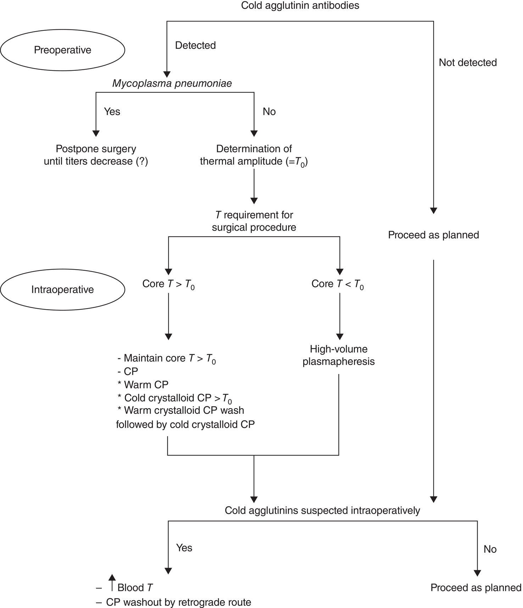

[**Figure 11.19**](#R_c11-fig-0019) Perioperative management algorithm for cold agglutinin disease. _T_0, cold agglutinin induction temperature; _T_, temperature on cardiopulmonary bypass (CPB); CP, cardioplegia.

(Source: Daaboul et al. \[307\]. Reproduced with permission of SAGE Publications.)

## Monitoring anticoagulation during and after CPB

Since the landmark 1959 paper by Keats and colleagues from Texas Children's Hospital, heparin reversal by protamine, and its assessment using the ACT has been the standard approach for confirming anticoagulation with heparin, and reversal of the heparin by protamine \[63\]. The celite ACT test with a target time of 400–480 seconds has remained the standard for initiation and maintenance of anticoagulation on CPB in many institutions for over 50 years. Reversal of the heparin effect is achieved with protamine, and return to baseline ACT serves as a confirmation of neutralization of this heparin effect. ACT is a point‐of‐care test performed by the perfusionist on a device often mounted on the CPB machine, and its rapid turnaround is unmatched by other tests. However, the ACT is only a gross measure of the initiation of clotting, will be affected by many factors other than heparin (e.g., thrombocytopenia or platelet dysfunction), and does not measure fibrinolysis or other aspects of clot persistence (clot strength). Several other point‐of‐care heparin and coagulation monitors will be discussed here; the reader is referred to [Chapter 13](c13.xhtml) for additional details.

Point‐of‐care heparin–protamine titration systems for the measurement of plasma heparin concentrations (Hepcon, HMS Plus®; Medtronic, Inc., Minneapolis, MN, USA) perform an _in vitro_ bedside assay to determine plasma heparin concentrations. Plasma heparin levels of 3.0 units/mL are considered adequate anticoagulation for CPB, and the use of this system is effective to titrate additional heparin doses during bypass. In a study of 44 patients under the age of 6 months undergoing CPB, Guzzetta et al. compared ACT, Hepcon, and direct plasma heparin concentration using an antifactor Xa chromogenic substrate assay \[316\]. ACT showed no correlation with plasma heparin concentration after the initial heparin bolus or during CPB; there was a modest correlation with one of the ACT methods just before termination of CPB. Hepcon demonstrated a good correlation with direct plasma heparin level measurement, as well as an acceptable bias by Bland–Altman analysis, with Factor Xa heparin levels higher by 0.49–0.67 units/mL than Hepcon heparin levels. Gautam et al. reported on 100 patients aged 1 month–5 years who had two different methods of protamine dosing compared, the first based on estimated blood volume of the patient plus CPB prime volume and the second based on patient blood volume alone \[317\]. Hepcon, ACT, and TEG (see later) were measured in both groups, and although protamine neutralization of heparin was successful by both methods, the authors concluded that the protamine dose calculated by Hepcon resulted in lower plasma protamine concentrations; excess protamine prolonged the clotting time (R value; see later) as measured by TEG. Therefore, heparin–protamine titration may result in more accurate maintenance of desired heparin levels during bypass, as well as avoiding excessive protamine dosing after neutralization.

Thromboelastography (TEG®; Medtronic, Inc.) and thromboelastometry (ROTEM®; TEM International GmbH, Munich, Germany) are related methods that measure clot initiation and maintenance of clot integrity and therefore provide a more complete profile of the coagulation system. TEG uses the shear elasticity of a 0.36 mL blood sample, measured by the constraint of rotation of a cup and pin as fibrin strands and then a platelet‐fibrin clot forms, attached to a torsion wire transduced to an electronic signal that displays a plot \[318\] ([Figure 11.20](#c11-fig-0020)). Time to initiation of the clot, maximum clot strength, and breakdown as a result of fibrinolysis are measured. Heparinase can be added to the sample to eliminate the heparin effect, and kaolin to speed the initiation of clot formation to make TEG more of a real‐time point‐of‐care test. Despite this, a minimum of 10–15 minutes are required to acquire data about the time of initiation, and the speed of initiation of clot, and 45–60 minutes to acquire a full profile that includes fibrinolysis. Data in the adult population demonstrates that TEG can guide the anesthesiologist as to what blood product (platelets, FFP, cryoprecipitate) and what dose to administer. TEG studies have demonstrated that the method is sensitive to reduced platelet number and fibrinogen concentration and that these parameters, especially maximum amplitude, correlated well with post‐bypass bleeding \[319\]. Platelet count <120,000 L−1 and fibrinogen concentration of <100 mg/dL were predictive of bleeding and abnormal TEG results. More recent studies in high‐risk pediatric cardiac patients have also demonstrated that a low maximum amplitude (MA) on the TEG is associated with an increased risk for bleeding \[319, 320\].

Thromboelastometry (ROTEM) is similar to TEG in that a small blood sample in a cup is rotated around a pin, but instead of a torsion wire, the formation of a clot (constraint of rotation of cup) is detected by an optical light‐emitting diode detection system. This feature, and better fixation of the rotating pin, may make ROTEM more resistant to vibration and small movements, to make it more suitable for point‐of‐care testing in the operating room. The ROTEM tracing and parameters are similar to TEG ([Figure 11.21](#c11-fig-0021)) \[321\]. In addition to heparinase, cytochalasin D can be added to the test to discern fibrin polymerization early, with clot strength at 10 minutes having a strong correlation to clot strength at 30 minutes (_r_ = 0.91–0.97, _P_ < 0.001) \[322\]. This allows the test to be done during CPB with results that can be interpreted after about 15 minutes. The post‐bypass ROTEM maximum clot firmness parameter correlated with bleeding in one small study \[323\]. A comparison of TEG and ROTEM parameters is given in [Table 11.7](#c11-tbl-0007) \[324\].

Because platelet defects, both in number and function due to activation from the bypass components and procedure, are the most common and serious cause of post‐bypass coagulopathy in young infants \[325\], point‐of‐care platelet function tests have been proposed to guide the administration of platelets (Sonoclot®, Sienco, Inc., Boulder CO, USA; TEG PlateletMapping®, Medtronic, Inc.). Data are very limited in pediatric cardiac surgery, and to date these tests cannot be recommended as part of routine care \[326, 327\].

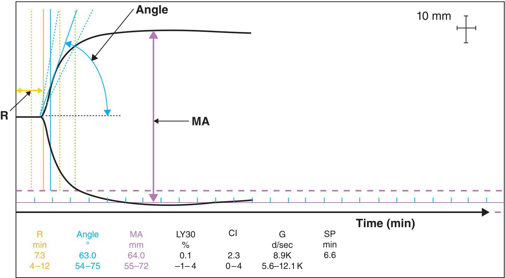

[**Figure 11.20**](#R_c11-fig-0020) Normal thromboelastography tracing. R, reaction time (in minutes until first detectable levels of fibrin clot formation). Sensitive to heparin and coagulation factor levels. Angle – reflects fibrinogen activity, but it does not always correlate with direct measurements. MA, maximum amplitude – clot strength, the combination of platelet count and function plus fibrinogen activity. LY30, percent clot lysis after 30 minutes – measurement of fibrinolysis. G, clot firmness in dynes/second (d/sec): CI, coagulation index: complilation of R, K, angle, and A; SP (split point): time from sample placement (or activation with an exogenous procoagulant) until the earliest detectable resistance.

(Source: Chen and Teruya \[318\]. Reproduced with permission of Elsevier.)

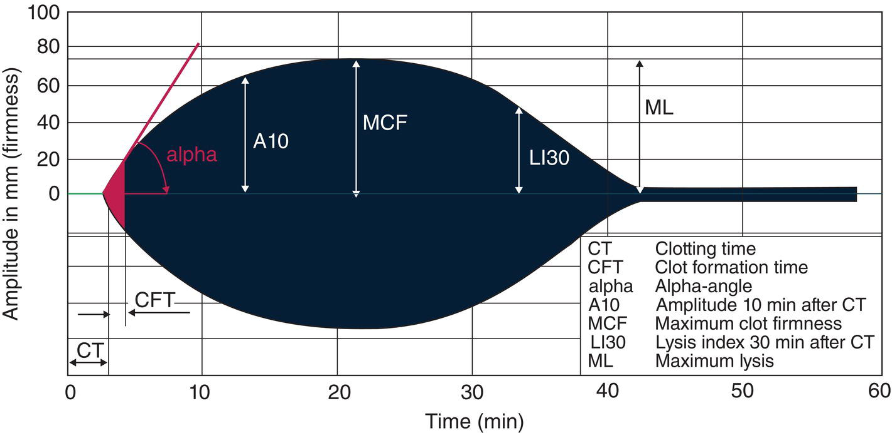

[**Figure 11.21**](#R_c11-fig-0021) Normal ROTEM tracing.

(Source: Rotem \[321\]. Reproduced with permission of Tem International GmbH.)

[**Table 11.7**](#R_c11-tbl-0007) Variables measured by the thromboelastography (TEG) and ROTEM

Source: A Practical Guide to Laboratory Hemostasis \[324\]. Reproduced with permission of Elsevier.

| Variable | TEG | ROTEM |
| --- | --- | --- |
| Measurement period | — | Reaction time (RT) |
| Time from start to when the waveform reaches 2 mm above baseline | R | Clotting time (CT) |
| Time from 2 mm above baseline to 20 mm above baseline | K | Clot formation time (CFT) |
| Alpha angle (°) | α (slope between R and K) | α (angle of tangent at 2 mm amplitude) |
| Maximum angle | — | CRF |
| Maximum strength | Maximal amplitude (MA) | Maximal clot firmness (MCF) |
| Time to maximum strength | — | MCF‐t |
| Amplitude at a specific time | A30, A60 | A5, A10 |
| Clot elasticity | G | MCE |
| Maximum lysis | — | CLF |
| Clot lysis (CL) at a specific time (min) | CL30,CL60 | LY30, LY45, LY60 |
| Time to lysis | 2 mm from MA | CLT (10% difference from MCF) |

CLF, clot lysis fraction; CLT, clot lysis time; MCE, maximal clot elasticity.

Each institution must develop an approach to monitoring coagulation for CPB cases to reduce unnecessary blood transfusion while achieving prompt hemostasis, and avoiding inappropriate protamine dosing, particularly for neonatal and other complex cases at high bleeding risk. The available evidence suggests that a heparin–protamine titration system to ensure accurate heparin dosing and reversal, combined with point‐of‐care clot formation and integrity tests such as TEG or ROTEM, may be best able to achieve this \[328\]. Irrespective of the testing regimen, recent data have confirmed the classical papers demonstrating that platelets are the primary defect, followed by hypofibrinogenemia, in complex cardiac surgery in infants \[329\]. See [Chapter 16](c16.xhtml) for an extensive discussion of bleeding and hemostasis.

* * *

### KEY POINTS: MONITORING ANTICOAGULATION DURING AND AFTER CPB

-   For over 60 years the standard method has been heparin administration and protamine neutralization monitored by ACT.
-   Heparin–protamine titration systems allow for more accurate heparin and protamine dosing.
-   TEG and thromboelastometry allow more accurate blood product administration after bypass.

* * *

## Complications and safety

The most frequent causes of death or injury related to CPB mishaps have been arterial embolism and consumptive coagulopathies. Other life‐threatening events include thrombus in the extracorporeal circuit, inadequate pressures and flows, aortic dissections, separation of extracorporeal lines, drug administration errors, protamine administration during CPB, heparin overdose, transfusion reactions, negative pressure complications (principally air entrainment), electrical failure, and failure to provide gas exchange. The incidence of fatal accidents in recent surveys of adult and pediatric perfusion is in the range of 1 in 1,300 to 1 in 4,900 procedures. Serious or permanent injury is reported in 1 in 1,139 to 1 in 2,500 cases. Near misses or incidents occur in approximately 1 in 138 to 1 in 198 cases \[330–332\]. Pre‐bypass checklists, vigilance on the part of all members of the team, and the use of standard perfusion monitors and devices will minimize catastrophes.

The most common problems in pediatric practice are inadequate pressures or flow from either poor venous return (most often due to cannula placement) or problems at the arterial cannulation site (malposition of the aortic cannula, e.g., in the innominate artery with preferential perfusion of the right carotid; dissection or hematoma).

Most situations can be controlled by rapid recognition, correction, or – in rare cases – separation from bypass and restoration of normal circulation unless the aorta has been ruptured. A great deal of suspicion and good communication amongst the team are vital in this respect.

## Emergency cardiopulmonary bypass

Patients at high risk for cardiopulmonary collapse during anesthesia induction or during surgical dissection should be prepared for emergent cannulation for cardiopulmonary bypass. Preoperative identification of these patients is critically important. Multidisciplinary planning among cardiac surgery, anesthesia, nursing and perfusion teams is important to resuscitate these patients. Other preoperative measures such as ultrasound or CT imaging of the femoral blood vessels to delineate their size and patency is important in case femoral cannulation is required. Cannulation strategy with appropriate femoral or other bypass cannulae available is essential. Early blood priming the bypass circuit before induction of anesthesia, presence of surgeon and perfusionist in the operating room, and having instruments and nursing and scrub personnel prepared are all essential preparations.

## Conclusions and future perspectives

In summary, pediatric CPB is challenging as it extends the spectrum of extracorporeal circulation in many aspects. Familiarity with differences to adult bypass circuits and management is of the utmost importance and the team, consisting of cardiac surgeon, perfusionist, and anesthesiologist has to work very closely together to reach the goal of good perfusion practice. The results of this hard work are rewarding, however, and offer many children a better perspective and greater life expectancy. There are myriad variations in bypass technique, specific to each institution and often to each individual surgeon within an institution. No one technique has been conclusively proven to be superior to others with regard to myocardial and clinical outcomes; better neurological outcomes have been demonstrated with avoidance of extreme hemodilution and prolonged DHCA. Future directions lead towards a “goal‐directed perfusion management” with special emphasis on organ protection and further technical advances in miniaturization of the CPB circuit size to reduce the use of blood transfusions and the inflammatory response. Together with the determination of a safe Hct limit, this may render the asanguineous neonatal CPB possible. A checklist approach is useful in developing the individual anesthesiologist's approach to CPB in children (see [Table 11.6](#c11-tbl-0006)).

## Selected references

_A full reference list for this chapter is available at:_

[http://www.wiley.com/go/andropoulos/congenitalheart](http://www.wiley.com/go/andropoulos/congenitalheart)

1.  27 Newburger JW, Jonas RA, Soul J, et al. Randomized trial of hematocrit 25% versus 35% during hypothermic cardiopulmonary bypass in infant heart surgery. J Thorac Cardiovasc Surg 2008; 135:347–54. Randomized trial demonstrating that higher hematocrit on bypass is associated with improved neurodevelopmental outcomes.
2.  31 Andropoulos DB, Easley RB, Gottlieb EA, Brady K. Neurologic injury in neonates undergoing cardiac surgery. Clin Perinatol 2019; 46:657–71. An updated review of potentially modifiable factors for neurologic injury in the perioperative period that the anesthesiologist can influence.
3.  49 Manlhiot C, Gruenwald CE, Holtby HM, et al. Challenges with heparin‐based anticoagulation during cardiopulmonary bypass in children: impact of low antithrombin activity. J Thorac Cardiovasc Surg 2016; 151:444–50. A comprehensive study of antithrombin levels and their effect on heparin response and consumption. Neonates and young infant less than 6 months of age hage variable baseline antithrombin levels and heparin response.
4.  94 Matte GS, del Nido PJ. History and use of del nido cardioplegia solution at boston children's hospital. J Extra Corpor Technol 2012; 44:98–103. A comprehensive review of the rationale, composition, and technical aspects of preparing and delivering del Nido cardioplegia solution, which is increasingly used in congential heart surgery centers.
5.  104 Nathan M, Levine JC, Van Rompay MI, et al. Impact of major residual lesions on outcomes after surgery for congenital heart disease. J Am Coll Cardiol 2021; 77:2382–94. A major study of over 1,000 infants undergoing common repairs including tetralogy of Fallot, arterial switch operation, complete atrioventricular canal, VSD with arch reconstruction, and Norwood stage I palliation. Residual lesions diagnosed by echocardiography that were major or required reintervention were associated with significantly higher rate of adverse outcomes including days alive and out of hospital, and time on ventilator, ICU stay, and major complications including cardiac arrest ECMO cannulation, and neurologic morbidity.
6.  109 Elliott MJ. Ultrafiltration and modified ultrafiltration in pediatric open heart operations. Ann Thorac Surg 1993; 56:1518–22. Classic article describing techniques and uses of conventional and modified ultrafiltration.
7.  132 Lorusso R, Raffa GM, Kowalewski M, et al. Structured review of post‐cardiotomy extracorporeal membrane oxygenation: part 2‐pediatric patients. J Heart Lung Transplant. 2019; 38:1144–61. A comprehensive review of post‐cardiotomy ECMO – indications, cannulation strategies, outcomes including survival to hospital discharge, and complications.
8.  153 Faraoni D, Rahe C, Cybulski KA. Use of antifibrinolytics in pediatric cardiac surgery: where are we now? Paediatr Anaesth 2019; 29:435–40. A contemporary review of antifibrinolytic strategy in pediatric cardiac surgery in the post‐aprotinin era, with updated data on pharmacokinetics and dosing of epsilon‐aminocaproic acid and tranexamic acid.
9.  254 Wypij D, Newburger JW, Rappaport LA. The effect of duration of deep hypothermic circulatory arrest in infant heart surgery on late neurodevelopment: the Boston circulatory arrest trial. J Thorac Cardiovasc Surg 2003; 126:1397–403. The classic article demonstrating that prolonged circulatory arrest over about 41 minutes is associated with lower neurodevelopmental scores at age 4 years after the neonatal arterial switch operation.
10.  273 Fraser C, Andropoulos DB. Principles of antegrade cerebral perfusion during arch reconstruction in newborns/infants. Semin Thorac Cardiovasc Surg Pediatr Card Surg Ann 2008; 11:61–8. A presentation of the technical aspects of regional cerebral perfusion, and their effect on cerebral physiology as measured by cerebral oxygen saturation and transcranial Doppler cerebral blood flow velocity measurements.