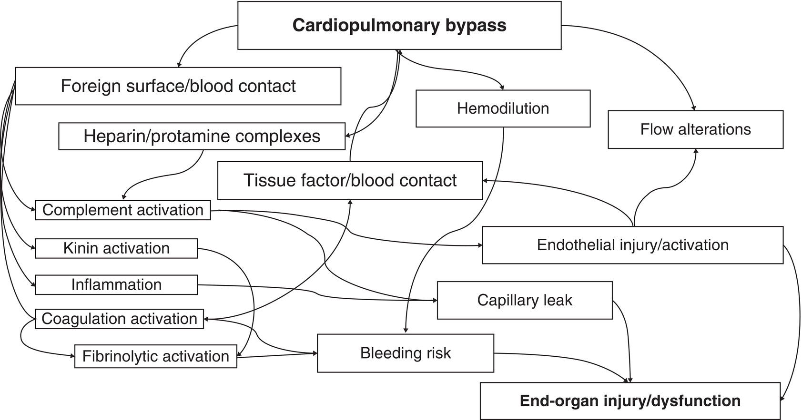
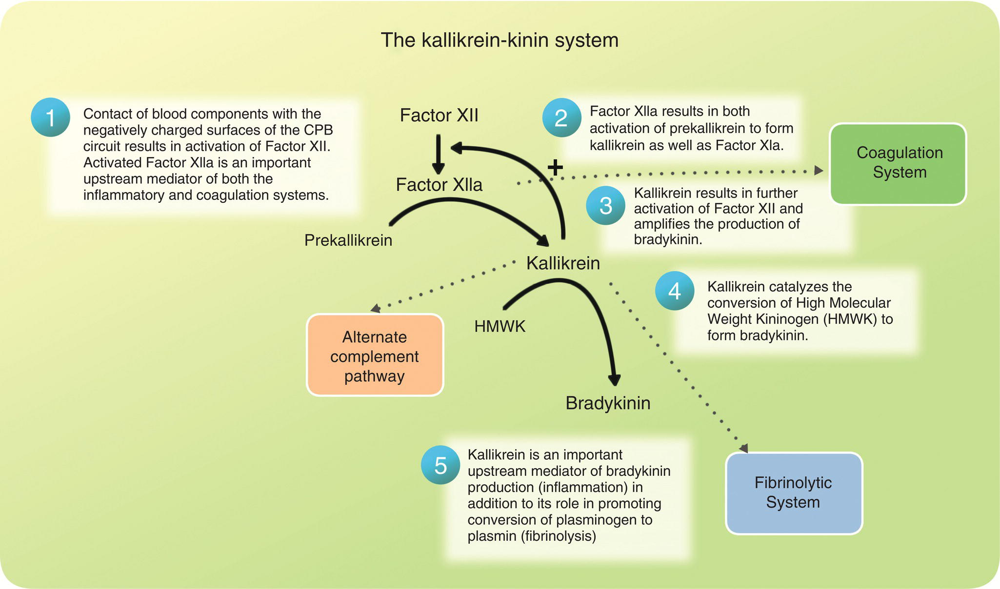
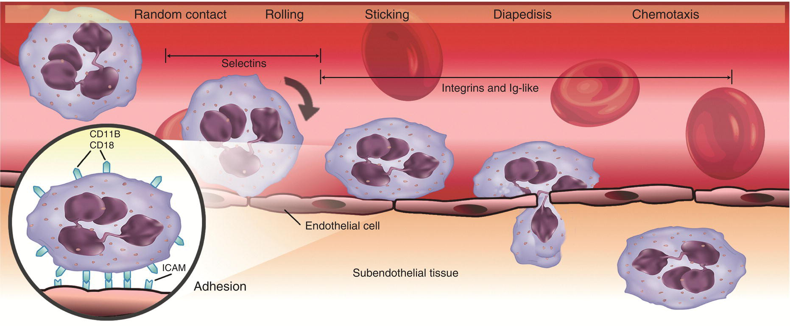
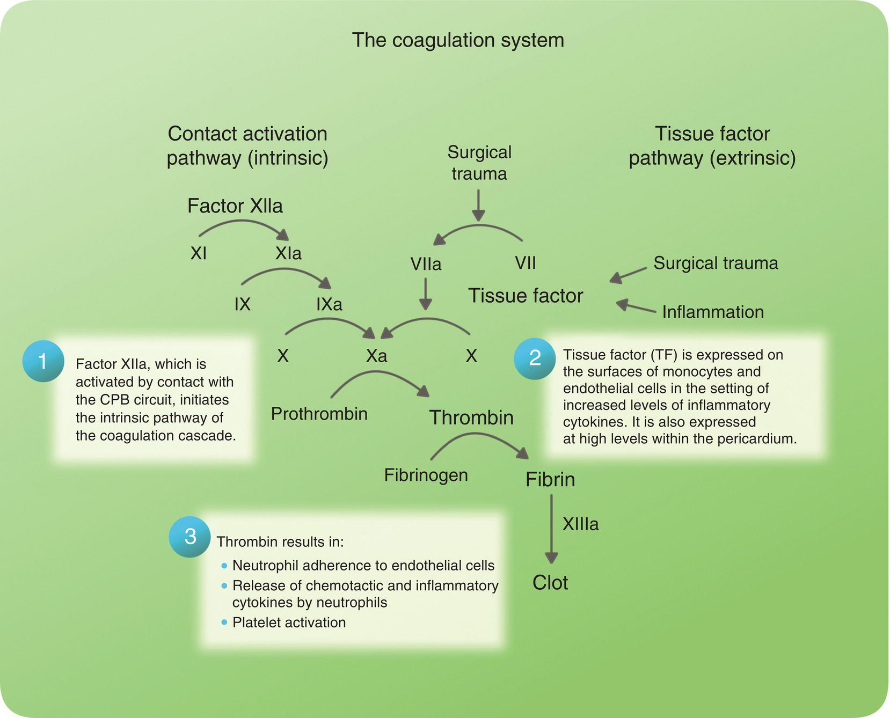
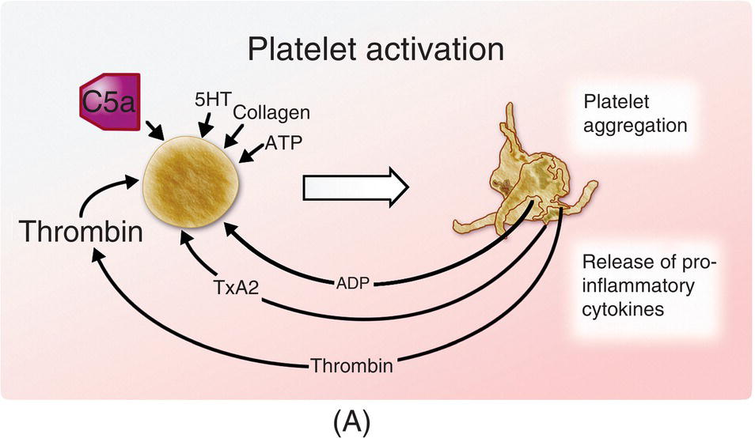
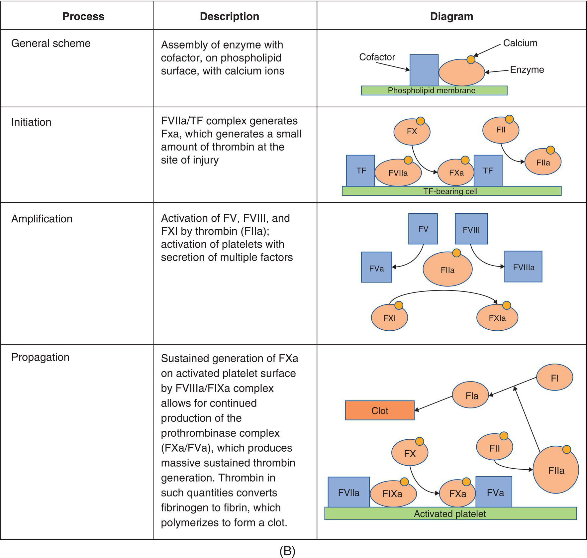
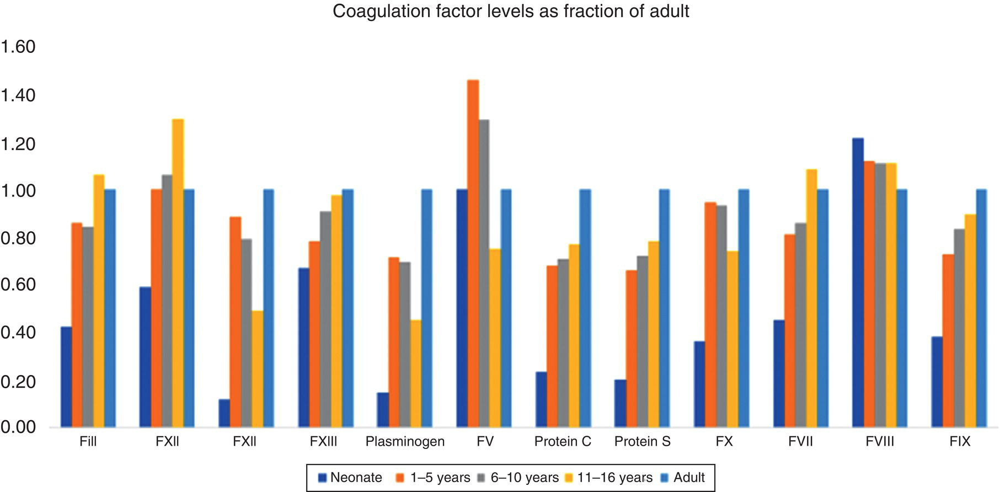
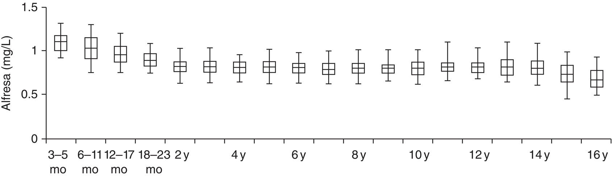
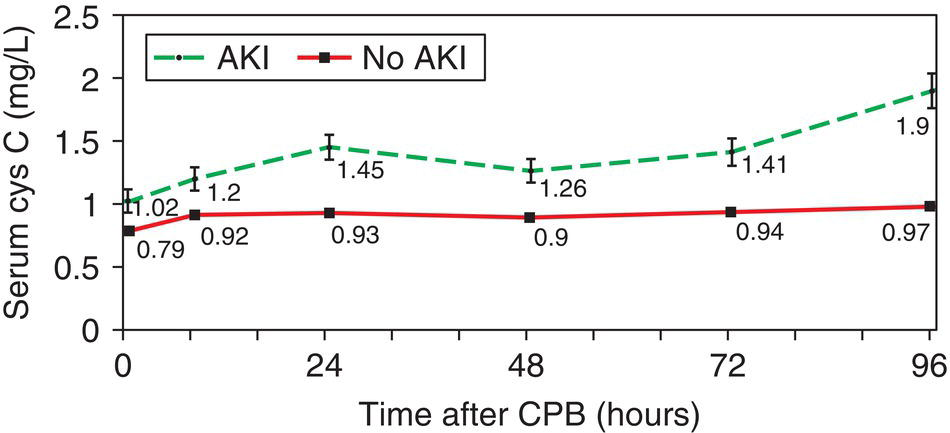
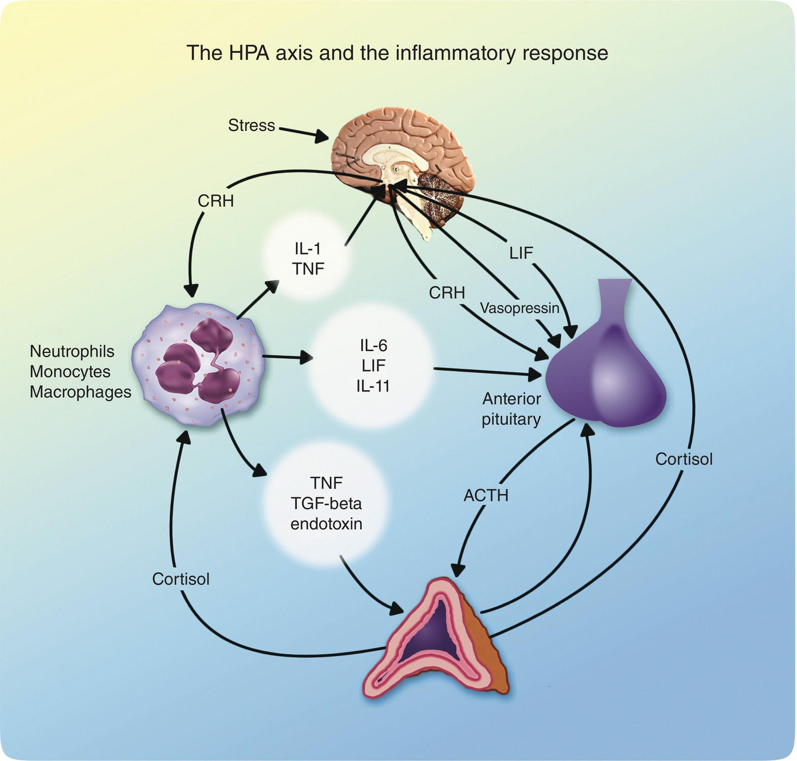

CHAPTER 12 Multiorgan Effects of Congenital Cardiac Surgery 

# CHAPTER 12  
Multiorgan Effects of Congenital Cardiac Surgery

_Gina Whitney1, Nicholas Houska1, Megan Albertz1, Brian Donahue2, and Suanne Daves3_

1 Division of Pediatric Cardiac Anesthesiology, University of Colorado School of Medicine and Children’s Hospital Colorado, Aurora, CO, USA

2 Division of Pediatric Cardiac Anesthesiology, Vanderbilt University School of Medicine, Nashville, TN, USA

3 Department of Anesthesiology, University of Oklahoma College of Medicine, Oklahoma City, OK, USA

* * *

-   [**Introduction**](#head-2-115)
-   [**The systemic response to congenital cardiac surgery**](#head-2-116)
    -   [Systems mediating the systemic inflammatory response to CPB](#head-3-126)
-   [**Mitigating the deleterious effects of CPB**](#head-2-117)
    -   [Corticosteroids](#head-3-127)
    -   [Modified ultrafiltration](#head-3-128)
    -   [Protease inhibitors](#head-3-129)
    -   [Biocompatible CPB circuits](#head-3-130)
-   [**Clinical effects of congenital heart surgery on hemostasis and thrombosis**](#head-2-118)
    -   [Unique aspects of pediatric coagulation](#head-3-131)
    -   [Hemostasis in congenital heart disease](#head-3-132)
    -   [Risk factors for hemorrhagic complications in pediatric cardiac surgery](#head-3-133)
-   [**Transfusion, inflammation, and outcomes**](#head-2-119)
    -   [Transfusion in pediatric cardiac surgery](#head-3-134)
    -   [Antifibrinolytics in pediatric cardiac surgery](#head-3-135)
    -   [MUF in pediatric cardiac surgery](#head-3-136)
    -   [Other methods to minimize transfusion](#head-3-137)
    -   [Other hemostatic agents](#head-3-138)
    -   [Thrombosis in pediatric cardiac surgery](#head-3-139)
    -   [Risk factors for thrombosis in children with CHD](#head-3-140)
-   [**Pulmonary effects of congenital heart surgery**](#head-2-120)
    -   [Neonatal and pediatric pulmonary physiology: a compromised state](#head-3-141)
    -   [Effects of CPB on pulmonary physiology in children](#head-3-142)
    -   [CPB and lung parenchyma](#head-3-143)
    -   [Techniques to improve respiratory function](#head-3-144)
-   [**Renal effects of congenital heart surgery**](#head-2-121)
    -   [Introduction, incidence, and definition of the problem](#head-3-145)
    -   [Emerging biomarkers of renal dysfunction](#head-3-146)
    -   [Association of renal injury with clinical outcomes](#head-3-147)
    -   [Renal failure and renal replacement therapy following cardiac surgery in children](#head-3-148)
-   [**GI and hepatic consequences of cardiac surgery in children**](#head-2-122)
    -   [Splanchnic circulation](#head-3-149)
-   [**Endocrine response and pediatric cardiac surgery**](#head-2-123)
    -   [Critical illness‐related corticosteroid insufficiency](#head-3-150)
    -   [Stress hyperglycemia](#head-3-151)
    -   [The risk of hypoglycemia](#head-3-152)
    -   [Thyroid hormone](#head-3-153)
-   [**Selected references**](#head-2-124)

* * *

## Introduction

The diagnosis and surgical management of congenital cardiac disease in the pediatric patient present a profound challenge to a developmentally immature physiology. Associated congenital syndromes, chronic abnormalities in hemodynamics, and immature developmental physiology of the young child all result in the potential for multisystem aberration. The exposure of a patient in this relatively tenuous state to the systemic challenges associated with cardiopulmonary bypass (CPB) results in both short‐ and long‐term challenges in the management of these children.

## The systemic response to congenital cardiac surgery

CPB triggers complex cellular and humoral inflammatory responses designed to respond to noxious stimuli ([Figure 12.1](#c12-fig-0001)). Children are particularly prone to the effects of this response, due to the large relative surface area of bypass circuit, increased metabolic demand requiring higher flows, and developing organ systems particularly prone to injury \[1\]. These consequences of CPB predispose the pediatric patient to end‐organ injury and multisystem organ failure (MSOF). The management of this end‐organ dysfunction, which includes coagulopathy, pulmonary and myocardial dysfunction, renal insufficiency, and diffuse capillary leak, represents a major challenge in postoperative management.

Activation of complement, the kinin–kallikrein–bradykinin system, and the coagulation system results in a systemic response that is both highly redundant and multisystemic ([Figure 12.2](#c12-fig-0002)). These events are triggered immediately upon contact of the patient’s blood with the foreign surfaces of the CPB circuit. Further activation occurs as a result of mechanical stress on blood components, hypotension, nonpulsatile perfusion, hypothermia, intestinal hypoperfusion, and systemic reperfusion following the release of the aortic cross‐clamp. Additionally, the administration of heparin and protamine during the course of cardiac surgery results in an increase in cellular and humoral processes that contributes to systemic inflammation and end‐organ injury \[1\].

[**Figure 12.1**](#R_c12-fig-0001) Summary of the multiple systemic pathways involved in the physiologic response to cardiopulmonary bypass (CPB). Activation of the contact system by elements of the CPB circuit produces an array of physiologic humoral activations. Dilution of coagulation elements by crystalloid solutions decreases coagulability of blood and contributes to bleeding risk. Alterations in flow, such as ischemia–reperfusion injury, and nonpulsatile flow produce changes in endothelial function, such as expression of tissue factor and disordered endothelial‐dependent relaxation. Inflammatory cells, platelets, complement fragments, and cytokines mediate many of these pathways.

[**Figure 12.2**](#R_c12-fig-0002) Diagram showing the initiation of the inflammatory cascades produced by contact of blood with nonbiologic elements of the CPB circuit. Note the central role of kallikrein.

### Systems mediating the systemic inflammatory response to CPB

#### Complement pathway activation

Exposure of blood to the components of the CPB circuit results in rapid activation of complement via the alternate pathway and initiates inflammation. While this component of the complement system is designed to respond to microbial cell‐surface components and mediate the body’s defense against microorganisms, it may also be activated by exposure of blood to foreign surfaces, endotoxin, and kallikrein \[2\]. This activation results in conversion of C5 and C3 to C5a and C3a, respectively. C3a and C5a are potent anaphylatoxins that activate and degranulate neutrophils and mast cells and initiate platelet aggregation. C5a and C3a also act directly on endothelium, producing increased vascular permeability and smooth muscle contraction. C5a primes monocytes and macrophages to greatly increase the production of tumor necrosis factor alpha (TNF‐alpha) in the presence of endotoxin. This initial increase in TNF‐alpha may represent an early central event in the upregulation of the systemic inflammatory response \[3\].

In addition to the activation of the alternate complement pathway by contact with foreign surfaces, the classical complement pathway further contributes to the systemic inflammatory response when activated by heparin–protamine complexes. Their presence results in generation of C4a and further increases in C3a production, resulting in increasing vascular permeability. These processes (C5a and C3a activation, TNF‐alpha production) result in successive surges in humoral mediators of the inflammatory response: toxic oxygen metabolites, pro‐inflammatory cytokines (interleukin‐1 \[IL‐1\], TNF‐alpha, IL‐6, IL‐8, and lipopolysaccharide \[LPS\]), and anti‐inflammatory cytokines, which limit systemic inflammation (IL‐4, IL‐10). The TNF‐alpha levels increase dramatically following the initiation of CPB and peak at 2 hours and 18–24 hours postoperatively \[4\]. The levels of C5a and C3a are directly related to the duration of CPB, and infants exhibit a more dramatic increase than neonates \[5\]. Despite the known physiologic effects of these inflammatory mediators, attempts to correlate clinical outcomes with the degree of complement activation (using C3a and C5a plasma levels as markers) have led to inconsistent results \[6, 7\].

#### Activation of the kinin system

Kinins are polypeptides generated from kininogens following tissue injury or noxious stimulation. Their functions are incompletely understood, but are known to be involved in blood pressure regulation and mediation of inflammation through activation of G‐protein–coupled B1 and B2 receptors. Kinins are potent vasodilators, which also increase vascular permeability, smooth muscle contraction, and neutrophil chemotaxis. While B2 receptors are constitutively expressed in most tissues, B1 receptors are induced and functionally expressed in the presence of inflammatory cytokines, endotoxin, and following tissue injury. The generation of kinins depends upon the contact of blood with the negatively charged surfaces of the CPB circuit and subsequent activation of factor XII (FXII) to FXIIa. FXIIa results in the production of kallikrein from prekallikrein, which then results in further activation of FXII and the production of bradykinin from high‐molecular‐weight kininogen (HMWK). This positive feedback loop amplifies the production of bradykinin, a potent mediator of both acute and chronic inflammation. Bradykinin, in turn, results in further generation of inflammatory cytokines and the endothelial release of nitric oxide and tissue‐plasminogen activator.

#### Activation of inflammation

The response to CPB is also mediated by various cytokines, which facilitate communication between components of the immune and inflammatory systems. They are polypeptide hormones of low molecular weight (5–20 kDa) produced by macrophages, monocytes, lymphocytes, fibroblasts, and endothelium. They modulate humoral and cellular immunity in addition to the maturation and activation of immune cells. The plasma concentration of cytokines at baseline is in picomolar concentrations (10–12) and may increase up to 1,000‐fold in the setting of injury or infection. Data regarding the degree of cytokine release following CPB and the ratio of pro‐inflammatory versus anti‐inflammatory cytokines are often conflicting owing to inconsistencies in the source, technique, and the timing of sampling. It is clear, however, that identifiable waves of cytokine release characterize the inflammatory response to CPB and that important clinical and laboratory consequences of this response are observable in the perioperative period. Additionally, the functions of individual cytokines are highly redundant and pleiotropic, which presents a significant challenge to those looking to mitigate their downstream effects for clinical benefit.

##### _Endothelial injury_

Normal endothelium is an important custodian of smooth muscle, producing vasoactive mediators such as nitric oxide and prostacyclin, which fine‐tune microcirculatory function. Injury to this critical monolayer decreases the production of these vasodilatory mediators and increases the release of vasoconstrictors endothelin and thromboxane A2 \[8\]. Endothelin probably mediates increased pulmonary vascular resistance, as higher plasma levels are found in patients who develop pulmonary hypertension. In a swine model of renal injury following CPB, an endothelin‐1 (ET‐1) receptor antagonist reversed many changes associated with endothelial dysfunction and renal injury \[9\].

The pulmonary endothelium is responsible for breakdown of several potent vasoconstrictors: angiotensin, catecholamines, and eicosanoids. Its injury therefore results in sustained increases in pulmonary vascular resistance following CPB. Endothelial dysfunction results in increases in capillary permeability and interstitial edema in addition to microcirculatory dysfunction. Efforts to improve pulmonary flow during CPB \[10, 11\], or supplement the NO pathway with L‐arginine \[12, 13\], may contribute to minimizing post‐CPB pulmonary pathology.

[**Figure 12.3**](#R_c12-fig-0003) Neutrophil adhesion, diapedesis, transendothelial migration and chemotaxis. ICAM, intercellular adhesion molecule.

##### _Neutrophil activation and sequestration_

Neutrophil activation plays a pivotal role in ischemia–reperfusion injury and destruction of the extracellular endothelial cell matrix. CPB produces widespread activation of neutrophils and increased expression of adhesion molecules on neutrophils and endothelium. Activated neutrophils adhere to endothelium and migrate across interendothelial junctions to produce their effects in subendothelial tissues. Selectins, integrins, and immunoglobulins mediate neutrophil adhesion, migration, and chemotaxis ([Figure 12.3](#c12-fig-0003)). Notably, selectin expression increases substantially following CPB in pediatric patients and may be associated with clinical outcomes \[14, 15\]. Additionally, IL‐1 and TNF‐alpha result in increased ELAM‐1 (endothelial leukocyte adhesion molecule‐1) expression on endothelium, facilitating further the binding of neutrophils to the endothelium. Additionally, IL‐8 promotes interaction of activated neutrophils with endothelial ICAM‐1 receptors and results in further neutrophil migration to the extravascular space.

##### _Endotoxemia_

CPB decreases gastric mucosal pH and intestinal perfusion and increases intestinal permeability. Endothelial dysfunction decreases the release of nitric oxide and prostacyclin, thus increasing the vascular resistance in splanchnic beds. The resulting intestinal hypoperfusion allows translocation of predominantly Gram‐negative bacteria. Endotoxin, the LPS component of the bacteria outer cell membrane, binds macrophages and monocytes and triggers further release of inflammatory mediators. Endotoxin is present in the circulation of 96% of children following CPB \[16\].

Endotoxin is a recognized prologue of inflammation in the setting of enteric pathology. Circulating endotoxin and inflammatory mediators (IL‐1, IL‐1beta, and IL‐8**)** correlate with the severity of necrotizing enterocolitis (NEC) in newborns \[17\]. Children with greater endotoxin burden have higher serum levels of IL‐6, more hemodynamic instability, and greater mortality \[16\]. Data suggest that milrinone may improve GI blood flow and thereby reduce endotoxemia and IL‐6 levels in adults undergoing CPB \[18\]. Additionally, hypothermia during CPB has been associated with increased levels of endotoxin \[19\].

#### Activation of the coagulation system

Hemostasis is extensively altered during cardiac surgery. CPB produces widespread perturbations in platelet function, thrombin activation, endothelial function, and inflammatory cells.

##### _Old and new models of coagulation_

The familiar “coagulation cascade” ([Figure 12.4](#c12-fig-0004)) has served for years as an important educational paradigm in many respects. It has led to the development of our common coagulation tests, which have been useful in identifying deficiencies in the coagulation pathways. It has also been useful in identifying coagulation inhibitors. Yet, while abundantly referenced formally and discussed informally, the traditional cascade model does not explain some essential observations. For example, patients with FXII or prekallikrein deficiency typically do not have bleeding problems, a conclusion unlikely to be drawn by tracing the pathways of the cascade. Likewise, patients with FVIII or FIX deficiencies (hemophilias A and B) have severe coagulopathies, also unexplained directly by the cascade. The cascade model does not account for the roles of cells and tissues where the coagulation reactions occur.

Consequently, pedagogy in coagulation has shifted toward the _cell‐based model of coagulation_, originally proposed by Hoffman and Monroe in 2001 \[20\] ([Figure 12.5](#c12-fig-0005)A and B). It is useful to carefully step through the cell‐based model, because doing so will explain the abovementioned limitations in the traditional cascade model. In this revised model, coagulation proceeds by the processes of _initiation, amplification, and propagation_ \[20–22\]. In the _initiation_ phase, elements of the intrinsic pathway (FXII, FXI, prekallikrein, HMWK), which are important for the generation of kinins as mentioned above and for initiating coagulation in a laboratory glass vessel, are not essential for the initiation of coagulation _in vivo_. Rather, the _initiation phase_ begins when FVIIa contacts tissue factor (TF) at the site of vascular injury. The resulting TF–FVIIa complex activates FX and FIX. The resulting FXa is sufficient to generate a small amount of thrombin (FIIa), localized to the site of injury, since FIIa diffusing away from the site is significantly dampened by antithrombin (AT), and the FVIIa–TF–FX complex is rapidly inhibited by tissue factor pathway inhibitor (TFPI).

[**Figure 12.4**](#R_c12-fig-0004) The familiar coagulation cascade model showing intrinsic and extrinsic pathways. Rectangles denote enzymes or their corresponding zymogens, and ovals represent cofactors. As mentioned in the text, this model has provided much utility in the past, but fails to account for some simple clinical observations. Examples include failure to fully explain why contact factor deficiencies are not associated with significant bleeding and why factor VIII and IX deficiencies are associated with severe bleeding.

In the _amplification phase_, the thrombin that is present activates FV and FVIII, important cofactors for FXa and FIXa, which form complexes on platelet surfaces to increase further generation of thrombin. Platelet activation results in a proliferative increase in phospholipid surface rich in phosphatidylserine, essential for these enzymatic complexes to bind and function, and produces secretion of additional coagulation factors (FV, FVIII, von Willebrand factor \[vWF\]) from platelet granules \[23\]. Thrombin also provides an important positive feedback loop by activating FXI, which also generates additional FIXa.

Once these elements are in place (activated platelets, activated cofactors FVa and FVIIIa, thrombin, and FXa and FIXa), the _propagation phase_ is marked by sustained thrombin generation provided by the prothrombinase complex (FXa–FVa). The success of this phase depends mostly on activity of the tenase complex (FVIIIa–FIXa), which generates continued amounts of FXa. The endpoint of coagulation is this local, sustained generation of thrombin, which catalyzes conversion of fibrinogen into fibrin monomer, spontaneously polymerizing into fibrin strands to form a stable clot. Thrombin also activates FXIII, which cross‐links and stabilizes fibrin clot, increases neutrophil adherence to endothelium, and stimulates neutrophil release of chemotactic and inflammatory cytokines.

Coagulation is normally confined to the region of injury by several mechanisms. Inactivated platelets do not express significant levels of phosphatidylserine on the plasma surface of their membranes and, therefore, do not support coagulation factor activity very well. Upon activation, the platelet outer membrane expresses phosphatidylserine and serves as a platform for the formation of coagulation complexes. Normal endothelium does not express TF, nor does it contain appreciable amounts of exposed phosphatidylserine and, therefore, does not support coagulation. Therefore, any FVIIIa–FIXa or FVa–FXa that diffuse away from the site of injury will not generate thrombin. AT and heparin cofactor II rapidly attenuate any stray FIIa. Thrombin also forms a complex with thrombomodulin on endothelial surfaces, activating protein C, an important control element that cleaves FVa and FVIIIa into inactive fragments.

  

[**Figure 12.5**](#R_c12-fig-0005) (A) Widespread platelet activation is triggered in the setting of cardiopulmonary bypass (CPB) by the activity of c5a, thrombin, and the secretion of platelet activating factor (PAF) by endothelium. Platelet activation results in a dramatic change in platelet morphology, exocytosis of dense granules and alpha granules, and aggregation. Aggregation is mediated by von Willebrand factor (vWF) and glycoprotein IIb/IIIa receptors that bind fibrinogen. The phospholipid surface of the platelet is the site of assembly of enzyme complexes essential to clot formation. (B) The revised model of coagulation, the cell‐based model. Essential to understanding this pathway is the assembly of enzyme complexes on phospholipid surfaces with the requirement for calcium ions. The pathway consists of three overlapping phases: initiation, amplification, and propagation. In the _initiation_ phase, exposure of blood to tissue factor (TF) produces a small amount of activated factor X (FXa). This, with FV results in the formation of a small amount of local thrombin (FIIa). In the _amplification_ phase, this amount of thrombin is insufficient to produce significant fibrin clot, but it activates FV and FVIII, greatly increasing their activity, and activates FXI, which provides a positive feedback loop by activating FIX. Platelets are activated by contact with the site of injury and provide a massively greater phospholipid surface for the assembly of the complexes in the _propagation_ phase. Here, sustained thrombin generation is maintained by continued generation of the FVIIIa/FIXa complex and the prothrombinase complex (FVa/FXa).

##### _CPB and the coagulation system_

CPB produces profound alterations in coagulation factor levels and activities, which are quantitatively different in children when compared to adults \[24–27\]. Because of the large relative pump‐prime volume, hemodilution is a much greater cause of decreased factor levels after CPB in children \[27\]. Dilution and consumption of coagulation factors is the major cause of post‐CPB coagulopathy in children \[28\].

Despite high levels of heparin during CPB, thrombin is generated \[25, 29\]. It is tempting to assign thrombin generation during CPB to activation of the contact pathway, since blood is exposed to the nonbiologic surfaces of the CPB system. However, patients with contact factor deficiencies (FXII, prekallikrein, FXI) still manifest thrombin generation during CPB \[30, 31\], indicating that the contact pathway is not driving coagulation during CPB. Rather, exposure of blood to TF is likely the cause. Inflammatory cytokines produce TF expression on endothelium and monocytes, and contact of blood with the nonendothelialized tissues in the mediastinal cavity and elsewhere produces thrombin activation \[32\]. Thrombin then perpetuates both inflammatory and thrombotic processes. This prothrombotic state may persist for several hours postoperatively, even in the setting of clinical bleeding. In infants, TF expression may extend into the postoperative period \[32\].

Platelets are activated during CPB and extrude their contents \[1, 24\]. Glycoprotein receptors become expressed on the platelet surface. Released factors include platelet factor‐4, beta‐thromboglobulin, and vWF from alpha granules, while the platelet surface expresses adhesion molecules such as P‐selectin. Platelet activation and adhesion to endothelium results in additional expression of transmembrane receptors that mediate binding and transmigration of activated neutrophils. This results in additional recruitment of neutrophils to the extravascular space. Furthermore, platelets of young infants are generally less reactive than those of older children and adults, and decreased platelet activation, as measured by changes in adhesive receptor density, has been observed following CPB in infants \[33\].

Recent attention has been paid to acquired von Willebrand disease (aVWD), represented by loss of high‐molecular‐weight vWF multimers, in children with congenital heart defects. Reportedly, aVWD is common in this population, both before and after surgery \[34–36\], but interestingly did not seem to correlate with clinical evidence of bleeding, possibly since endothelial secretion of vWF occurs during surgery due to the stress response \[35–37\], thus attenuating the effect of a preexisting aVWD. The frequency of aVWD among pediatric patients on other means of extracorporeal circulation, such as _extracorporeal membrane oxygenation_ (ECMO) or ventricular assist device (VAD), has been reported at 100% \[38\], potentially implicating the role of shear stress on blood components as a possible contributor to loss of the high‐molecular‐weight multimers of vWF. See [Chapters 11](c11.xhtml) and [16](c16.xhtml) for further discussion of bleeding and coagulation.

## Mitigating the deleterious effects of CPB

Practitioners have sought to develop effective means of mitigating the systemic response following CPB in children. Practices include perioperative corticosteroids, modified ultrafiltration (MUF), protease inhibitors, and biocoating of CPB circuitry. Although many such strategies achieve reduction in the levels of various inflammatory markers, studies demonstrating improvement in relevant clinical outcomes show more modest results. Two methods commonly in use include perioperative glucocorticoids and MUF. It is clear that effective modulation of the systemic inflammatory response to CPB in clinically meaningful ways remains elusive.

### Corticosteroids

Perioperative corticosteroids are often intended to reduce the systemic inflammatory response and its deleterious effects. Corticosteroids act through nuclear transcription factors, whose binding to promoter regions decreases expression of pro‐inflammatory mediators. While studies have demonstrated reductions in inflammatory mediator expression, there is little consensus on the clinical benefits of steroid administration in this setting. Furthermore, there is tremendous heterogeneity among the patient management regimens, and sample sizes are often small. These issues complicate the efforts of systemic reviews and limit their utility.

Thus, a comprehensive review of steroids to minimize the impact of CPB is beyond the scope of any one chapter. With this in mind, however, it is possible to summarize some common themes in our current understanding. In 2012, Pasquali et al. conducted an analysis of data from the Pediatric Health Information Systems (PHIS) and Society of Thoracic Surgeons Congenital Heart Surgery (STS‐CHS) Databases \[39\]. They reported results from 30 pediatric cardiac centers across the United States from 2004 to 2008, comparing outcomes of neonates receiving methylprednisolone on the day prior to or on the day of surgery. The study population included 3,180 neonates from 25 centers. They found no difference in mortality or length of hospital or intensive care unit (ICU) stay between the methylprednisolone and control groups. More recently, Bronicki and colleagues \[40\] published their findings from a meta‐analysis of randomized prospective trials involving steroid treatment to mitigate the impact of inflammation in pediatric CPB. Their findings showed a significant heterogeneity between trials, necessitating the use of a random‐effect model. Nonetheless, the authors observe a significant improvement on short‐term fluid balance associated with steroid treatment, but no measurable impact on infection or mortality. Likewise, a recent Cochrane review \[41\] reported findings from a meta‐analysis of current pediatric steroid trials, showing that steroid therapy may decrease the duration of mechanical ventilation, but did not show a measurable impact on mortality. Such recent data regarding the lack of clinical effectiveness of perioperative steroids is leading many centers to reconsider their routine use.

### Modified ultrafiltration

Hypothermia, hemodilution, and the profound inflammatory response to CPB result in widespread capillary leak and increase in total body water. Dilution of plasma proteins, particularly in the smallest patients, results in further increase in interstitial fluid. Management of total body fluid overload can be especially challenging in the postoperative period due to concomitant myocardial dysfunction and renal immaturity often seen in the pediatric patient. MUF removes water, low‐molecular‐weight solutes, and inflammatory mediators via filtration immediately following CPB. It also allows return of the contents of the CPB circuit to the patient in a concentrated form \[42\]. MUF has been shown in an animal model to attenuate pulmonary‐derived inflammatory markers (based on reductions in IL‐6 and IL‐8 concentrations obtained by bronchoalveolar lavage) seen following bypass. In this model, MUF reduced pulmonary vascular resistance \[43\]. MUF has been shown to be effective in reducing weight gain during CPB, decreasing levels of activated complement C3a and C5a, and reducing concentrations of pro‐inflammatory cytokines \[44\]. While some studies have shown little appreciable difference in the levels of inflammatory mediators following MUF, others have shown increase in plasma concentrations of IL‐6, IL‐8, and neutrophil elastase \[45\].

Clinically, MUF reduces total body water, decreases transfusion requirement, reduces postoperative coagulopathy, and decreases inflammatory marker levels after CPB \[46\]. A 2011 survey of international pediatric perfusion practice found that 71% of centers reported using some form of MUF \[47\]. While the clinical outcome differences associated with MUF are not dramatic, the beneficial effects of MUF may be more easily demonstrated in neonatal patients requiring a longer duration of CPB \[48\].

### Protease inhibitors

Protease inhibitors are a class of drugs whose primary role is inhibition of various signaling pathways. Aprotinin, originally marketed as a kallikrein and plasmin inhibitor, decreases transfusion requirements following CPB, but also has substantial anti‐inflammatory effects \[49, 50\]. Two randomized trials have shown decreased hospital stay and cost associated with aprotinin \[51, 52\]. Another blinded, controlled, randomized, prospective trial in 60 children weighing under 10 kg reported decreased ventilator time \[53\]. Both aprotinin and tranexamic acid (not a protease inhibitor) reduce expression of pro‐inflammatory genes and increase expression of anti‐inflammatory proteins \[54\].

Since 2006, aprotinin use has severely declined, and aprotinin is now unavailable in many countries, including the United States. The departure of aprotinin has been driven mostly by epidemiologic evidence for renal failure in adults \[55–58\]. Whether the same risk transfers to the pediatric population is unclear: Three retrospective studies did not identify aprotinin as an independent risk factor for perioperative renal failure in children \[59–61\]. However, another retrospective pediatric study reported an association between aprotinin and perioperative renal failure when compared with aminocaproic acid, after controlling for confounding variables \[62\].

### Biocompatible CPB circuits

Efforts to improve CPB circuit biocompatibility are often anticipated to decrease activation of cellular and humoral inflammation and attenuate end‐organ injury associated with CPB. Although the initial rationale for heparin coating of CPB circuitry was related to the anti‐thrombotic effects of heparin, the use of heparin‐coated CPB circuit components has reduced complement activation, cytokine production, and improved pulmonary function \[63–65\]. Heparin‐coated circuits also appear to adsorb lipoproteins, which may create a circuit surface that approximates that of cell membranes \[66\]. A recent small randomized study of perfusion circuits coated with a novel ternary polymer (SEC‐1) showed significantly decreased inflammatory markers and improved preservation of multiple coagulation elements \[67\].

Though definitive data on clinical outcomes in children regarding heparin‐bonded circuits are lacking, adult data suggest that biocompatible circuits are associated with reduction in RBC transfusion, re‐sternotomy, duration of mechanical ventilation and ICU length of stay, and inflammatory response following CPB \[68, 69\]. The clinical impact of biocompatible perfusion circuitry in children warrants further study, particularly in high‐risk patients.

* * *

### KEY POINTS: THE SYSTEMIC INFLAMMATORY RESPONSE AND CONGENITAL CARDIAC SURGERY

-   Cardiac surgery and bypass induce complex cellular and humoral inflammatory responses.
-   Inflammatory events are initiated by contact of blood with foreign surfaces, heparin–protamine complexes, endotoxin, and transfusion.
-   Endothelial damage induces diffuse capillary leakage and coagulation system activation.
-   Platelet activation results in coagulation system activation and recruitment of additional inflammatory cells.
-   Activated neutrophils cause proteolytic tissue injury, capillary leak, and increased pulmonary vasoconstrictor response.
-   Cardiac beta‐adrenergic receptors decrease in number and efficiency during bypass.
-   Evidence for use of glucocorticoids is equivocal.
-   MUF removes free water and inflammatory mediators after CPB.
-   Heparin‐bonded circuits improve laboratory markers of inflammation, with modest or equivocal improvements in clinical outcomes.

* * *

## Clinical effects of congenital heart surgery on hemostasis and thrombosis

These major physiologic disturbances of the inflammatory and coagulation pathways produce significant morbidity in the form of hemorrhagic and thrombotic complications. Perioperative risk of bleeding and thrombosis increases in both severity and frequency with decreasing age of the child \[26, 70–73\]. Infants under 1 year of age experience average blood losses within the first 24 hours after surgery of about 40 cc/kg, which is about half of the patient’s blood volume \[73\]. Perioperative thrombosis is also associated with significant morbidity, sometimes severe \[74–78\]. Venous thrombosis in children is a potentially devastating complication of congenital heart surgery and is reported to occur in as many as 16% of cases \[79–81\]. Central venous thrombosis and massive thrombotic disease in multiple organs occur with highest frequency in the youngest children and can yield catastrophic sequelae \[33, 82, 83\].

### Unique aspects of pediatric coagulation

It is important to understand that, like many other organ systems, the hemostatic system of young infants differs significantly from that of older children and adults \[21, 84, 85\], giving rise to a concept known as “developmental hemostasis” ([Figure 12.6](#c12-fig-0006)). Healthy infants exhibit levels of the contact factors (FXII and FXI, HMWK, prekallikrein) that are 40–50% of adult levels at birth, and approach adult levels by 6 months of age. This profile is also followed by the vitamin K‐dependent factors (FII, FVII, FIX, and FX) \[84, 86–88\]. FV, FVIII, and vWF reach adult levels more rapidly, and, as is the case for vWF, can exceed adult levels. Coagulation inhibitors (AT‐III, C1 inhibitor, heparin cofactor II, protein C, and protein S) again follow the pattern of the contact and vitamin K‐dependent factors \[84\]. Fibrinogen and plasminogen, although present at nearly adult levels in the term newborn, exist in forms that differ in their post‐translational modification \[89, 90\]. Accordingly, laboratory reference ranges need to be based on age‐matched samples from normal children.

### Hemostasis in congenital heart disease

Congenital heart disease (CHD) imposes additional modifications on pediatric hemostasis ([Table 12.1](#c12-tbl-0001)). In cyanotic children, polycythemia further dilutes coagulation factors. Decreased levels of FV, FVII, and FVIII and increased fibrinolysis, thrombocytopenia, and abnormal platelet function are frequently present and correlate with the degree of cyanosis \[91\]. Thrombocytopenia resulting from decreased platelet survival and fibrinogen dysfunction complicate the hemostatic picture and contribute to increased risk for bleeding \[92, 93\]. Children with CHD have increased incidence of heritable coagulopathies \[94, 95\] and combined deficiencies or partial deficiencies of FVIII, FXI, and FXII \[96\]. As mentioned above, loss of high‐molecular‐weight vWF multimers, representing a form of aVWD, is often observed in children with cardiac defects \[97\].

[**Table 12.1**](#R_c12-tbl-0001) Effects of cyanosis on coagulation physiology

<table border="1"><tbody class="tdcolor3"><tr><td class="char">Thrombocytopenia Decreased platelet survival Acquired von Willebrand disease Fibrinogen dysfunction Low‐grade consumptive coagulopathy Decreased coagulation factor levels Accelerated fibrinolysis</td></tr></tbody></table>

Hemostatic anomalies of cyanosis are widespread and complex, and involve multiple elements of the coagulation and fibrinolytic systems \[92, 93\].

### Risk factors for hemorrhagic complications in pediatric cardiac surgery

Numerous studies have identified clinical risk factors for hemostatic complications after pediatric cardiac surgery. In their classic study of over 500 pediatric patients, Williams et al. found that postoperative bleeding is associated with higher hematocrit, complex surgery, lower platelet count, and duration of circulatory arrest, but younger age was the most significant contributor \[98\]. Since then, other multivariate analyses have revealed that hypothermia, surgical complexity, high preoperative hematocrit, low platelet count, and decreased platelet function were highly correlated with blood loss and transfusion \[70, 73, 98–101\]. Some evidence suggests postoperative bleeding risk may vary among different ethnic groups \[102\]. [Box 12.1](#c12-fea-0001) summarizes coagulation system changes in pediatric cardiac surgery.

[**Figure 12.6**](#R_c12-fig-0006) Developmental hemostasis. Factor levels in infants and younger children are generally lower than those of adults and evolve with age. Laboratory factor measurements and assays of coagulation need to be standardized for appropriate age groups.

(Source: Data from Attard et al. \[84\].)

* * *

### [Box 12.1](#R_c12-fea-0001) Coagulation system and cardiac surgery

-   Coagulation system of infants and children is unique
    -   Lower levels of many factors
    -   Expression of differently processed forms of some factors
-   Congenital heart disease imposes changes on coagulation system:
    -   Frequent concurrent deficiencies of many factors
    -   Cyanosis‐induced decreases in factors V, VII, and VIII
    -   Increased fibrinolysis
    -   Low‐grade disseminated intravascular coagulation (DIC)
    -   Decreased platelet number and function
-   Cardiac surgery imposes changes on the coagulation system of children:
    -   Hemodilution
    -   Fibrinolysis
    -   Platelet dysfunction
    -   Thrombin generation and factor consumption

* * *

## Transfusion, inflammation, and outcomes

Transfusion alone appears to exacerbate the systemic inflammation of cardiac surgery. Transfusion following cardiac surgery is associated with various markers of inflammation \[103\], and with clinical outcomes such as longer ventilator times \[104–106\]. Univariate analyses show that red cell transfusion is associated with nearly every complication of congenital heart surgery, and transfusion is strongly associated with infectious complications, after controlling for confounding variables in a propensity analysis \[107\]. The authors have argued transfusion‐related immunologic responses alone are good reasons to optimize transfusion management \[105, 106, 108\].

### Transfusion in pediatric cardiac surgery

The rational approach to a bleeding pediatric cardiac surgery patient represents a significant clinical challenge for which the literature often provides limited prospective data. In a study with 75 children, platelet transfusion was most effective for post‐CPB bleeding in patients under 8 kg. Continued bleeding was improved with cryoprecipitate but was made worse by plasma in this study \[70\]. Plasma is often ineffective in children probably because higher doses are required than the usual 10–15 mL/kg \[109, 110\]. Plasma added to the bypass prime may be beneficial, but the effect seems confined to the smallest patients \[111, 112\]. Fibrinogen concentrate has been proposed as an alternative for cryoprecipitate, but efficacy appears to be best for the adult cardiac surgery population \[113–117\], as data in children do not currently support its use \[118\].

While transfusion is frequently required in children in order to maintain adequate oxygen delivery, efforts should be made to reduce the volume of transfusion required. In a recent systematic review \[119\] of 299 studies of transfusion optimization from 22 countries, the authors concluded that the following efforts have merit in managing perioperative bleeding: antifibrinolytic drugs, objective transfusion guidelines, point‐of‐care testing, MUF, and circuit optimization. A large amount of heterogeneity regarding end point definition, patient population, and management schema and frequently small trial sizes made definitive conclusions difficult.

Still unclear is the issue of liberal versus restrictive transfusion thresholds. Although the literature on transfusion thresholds in adults is rapidly expanding, similar studies in children with CHD are fewer and less conclusive. Cholette \[120\] provides a recent summary of the pediatric cardiac surgery literature on restrictive versus liberal transfusion thresholds, summarizing the four existing studies \[121–124\] at the time. Despite concerns regarding exclusion criteria and small study size, the authors concluded that a more restrictive transfusion regimen (target hemoglobin 7 g/dL for biventricular repairs, 9 g/dL for cavopulmonary surgeries) may be well tolerated or even advantageous in these populations. They issue caution, however, that these results need to be validated and reproduced in larger trials and by other investigators before practice guidelines can be issued.

Objective, laboratory‐guided transfusion algorithms have shown significant benefit in adult cardiac surgery \[125\], but it is difficult to extrapolate these conclusions to children, since adult and pediatric cardiac surgery are qualitatively different \[126, 127\]. Furthermore, not all reports of transfusion algorithms in children have shown positive results \[128\]. To be clinically useful, laboratory‐guided protocols must rely on some reproducible, widely accessible metric. Routine coagulation tests, thromboelastography (TEG), and platelet count can predict postoperative bleeding in children after CPB \[129, 130\], which assists clinicians somewhat in identifying patients at risk. The use of TEG to specifically guide transfusion practice in pediatric cardiac surgery has been reported, with generally favorable results \[28, 117, 131, 132\]. A 2‐year retrospective study of an objective transfusion algorithm in pediatric cardiac surgery has shown a significant savings of red cells, cryoprecipitate, and plasma and a 75% reduction in mortality following implementation of the algorithm \[133\]. In a recent review, the authors summarize a very broad literature, which includes the use of factor concentrates, but continue to emphasize the recurring observations that algorithms need to be institution‐specific and that a transfusion‐guided algorithm is superior to non‐algorithm‐guided transfusion \[134\].

### Antifibrinolytics in pediatric cardiac surgery

Thrombin generation during CPB, and kinin activity from kallikrein activation, produce plasmin and thus activation of the fibrinolytic pathway. Accordingly, antifibrinolytic drugs (aprotinin, aminocaproic acid, and tranexamic acid) have long been useful adjuvants for limiting blood loss due to cardiac surgery. In general terms, their efficacy in children has been less consistent than in adults. Unlike adults, most children do not exhibit profound fibrinolytic activity after CPB \[33, 72\], and consequently, efforts to reduce bleeding by the use of antifibrinolytic drugs are usually less effective in children than in adults \[52, 135–139\]. Some evidence in children suggests that fibrinolysis alone does not correlate with blood loss or transfusion in children \[72\]. The literature on antifibrinolytics for pediatric cardiac surgery is very broad, with much heterogeneity in end point definition and treatment protocols; therefore, the interested reader is referred to an excellent recent review \[140\].

When it was still available, aprotinin has been used in pediatric cardiac surgery, despite lack of the Food and Drug Administration (FDA) approval for pediatric use. Endpoints of blood losses and transfusion appear not as striking as those for adults, and a wide range of dosing schemes has been reported. Many prospective pediatric trials report hemostatic benefits with aprotinin \[141–143\], but most show equivocal results \[52, 135–138, 144–146\]. One of these studies \[146\] was terminated early by the FDA due to growing safety concerns in adults \[55–58\]. Nevertheless, beneficial effects of aprotinin in children extend beyond hemostasis. As mentioned previously, decreased hospital stay, shorter ventilator time, and decreased cost have been associated with aprotinin in children \[51–53\]. These improvements are likely a result of the anti‐inflammatory effects of aprotinin, producing improved organ preservation and suppressed response to extracorporeal circulation.

The lysine analogs (aminocaproic acid and tranexamic acid) have been the only antifibrinolytics in clinical use since 2006. The lysine analogs probably do have efficacy in children, but less than that of aprotinin \[147–149\]. As with aprotinin, the efficacy of lysine analogs in children has been inconsistently reported, and differs between subgroups. Pediatric use of aminocaproic acid has been reported, but many of these studies were performed in the 1960s and 1970s, when surgical, anesthetic, and perfusion techniques were quite different than they are today \[150, 151\]. Williams et al. compared aminocaproic acid versus placebo control in a nonrandomized study involving 140 children and demonstrated nonsignificant decreases in blood losses and transfusion requirements \[152\]. Tranexamic acid has shown efficacy in children undergoing redo cardiac procedures \[139\], both in cyanotic and noncyanotic patients \[153\]. An earlier study of pediatric use of tranexamic acid was only able to demonstrate a reduction in postoperative blood loss in a subset of cyanotic children \[154\]. In a nonblinded trial, both aminocaproic acid and tranexamic acid were found to be equally beneficial in 150 cyanotic children \[155\]. The overall conclusion regarding the currently available antifibrinolytics (lysine analogs) is that these agents are safe and effective in the pediatric population \[140\].

### MUF in pediatric cardiac surgery

As mentioned previously, MUF concentrates hemostatic factors and removes inflammatory mediators, thus reducing postoperative coagulopathy \[156\]. MUF appears to be most effective at improving hemostasis for the smallest infants \[48, 157, 158\]. Bando et al. compared MUF after CPB against conventional ultrafiltration and observed a 2.5‐fold decreased risk of red cell transfusion and 6‐fold decreased risk of coagulation factor transfusion with MUF \[48\]. Other investigators have shown similar improvements in post‐CPB coagulopathy or transfusion requirements with MUF \[159–163\]. Additional benefits include improved hemodynamics and cardiac performance \[159, 160, 163–165\], decreased ventilatory support \[48, 163\], and shortened hospital stay \[44, 162, 163\] ([Table 12.2](#c12-tbl-0002)). These effects have not been reported in all studies \[157, 166\]. A meta‐analysis of eight MUF studies showed improved hematocrit and hemodynamics compared with standard ultrafiltration, but later end points were equivocal \[167\].

[**Table 12.2**](#R_c12-tbl-0002) Reported benefits of modified ultrafiltration

<table border="1"><tbody class="tdcolor3"><tr><td class="left">Concentration of red cells and coagulation factors Decreased red cell and coagulation factors Decreased need for inotropic support Shorter ventilator times Shorter ICU stay Shorter hospital stay</td></tr></tbody></table>

Modified ultrafiltration after CPB improves not only hemostasis and transfusion, but has benefit in other organ systems, possibly due to decreased levels of inflammatory mediators, decreased capillary leak, and improved myocardial performance \[156\].

### Other methods to minimize transfusion

Investigators have reported successful use of alterations in perfusion techniques, some of which avoid transfusion altogether, even in very small infants. Minimizing the volume of the pump prime \[168–171\], or use of a miniaturized bypass circuit \[171, 172\], has shown efficacy for reducing transfusion in small children. Alterations in pump composition such as a remote pump head resulted in no transfusion for 122 of 178 infants under 5 kg \[173\]. Use of washed red cells \[174\], fresh whole blood \[71, 170, 175\], heparin‐coated circuits \[176\], use of an autologous blood prime \[177\], and anticoagulation management based on heparin concentration rather than ACT \[178\] have all reported efficacy in the pediatric population. However, practice guidelines have yet to be issued for most of these techniques often due to small study size, heterogeneity of end point definition and patient management protocol, possibility of publication bias, and lack of reproducibility of the results.

### Other hemostatic agents

Recombinant activated factor VII (rFVIIa) has been used with increasing frequency as a rescue hemostatic agent in cardiac surgery for about the past two decades. Case reports of its use in pediatric cardiac surgery abound \[179–183\]. Serious concern exists regarding perioperative thrombosis, but the anecdotal nature of case reports and small case series makes it difficult to evaluate thrombotic risk associated with this agent, since it is typically administered to patients in dire need, who are likely to be at increased risk for thrombosis. To deal with this issue of confounding, a recent propensity analysis of 143 subjects receiving rFVIIa matched 1 : 2 with controls was reported by Downey and colleagues \[184\], who observed significant morbidity associated with the use of rFVIIa, including an independent risk for thrombosis. The rational use of rFVIIa in pediatric cardiac surgery has been reviewed \[185, 186\]; the authors emphasize the need for randomized trials to clarify efficacy, subgroup analysis of population at risk, and the realistic assessment of thrombotic complications. Furthermore, a Task Force has been formed by the Congenital Cardiac Anesthesia Society, assigned to monitor the literature and issue recommendations as data become available \[186\].

Low antithrombin‐3 (AT3) levels may place very young children at increased risk for bleeding, since such deficiency decreases the efficacy of heparin and therefore results in greater coagulation activation during CPB, with corresponding increase in coagulation factor consumption. Recent investigations have identified low AT3 as an independent risk factor for transfusion following cardiac surgery \[29, 187\], and a prospective trial of recombinant AT3 has reported efficacy specifically for small infants when this deficiency can be identified preoperatively \[188\]. Supplemental AT3 has also shown efficacy in the setting of ECMO \[189\].

Desmopressin has minimal hemostatic effects in adult cardiac surgery, and its specific impact in the pediatric population is probably also modest at best \[190–193\]. The use of other factor concentrates (fibrinogen concentrate, prothrombin complex concentrate) in pediatric cardiac surgery has been recently reviewed \[118, 194\]. These agents, initially proposed as rescue treatments for refractory hemorrhage, are now appearing in transfusion algorithms as standard treatments. The authors emphasize the need for high‐quality studies of safety and efficacy, with standardized definitions of outcomes, prior to issuing any evidence‐based recom‐mendations.

### Thrombosis in pediatric cardiac surgery

Thrombosis is frustratingly common in children with CHD since it is associated with significant morbidity \[74–78\]. In a series of single ventricle patients, systemic‐to‐pulmonary shunt occlusion accounted for 9% mortality during a 6‐year follow‐up \[195\]. Other authors report a 14% post‐discharge mortality in a similar series, 81% of which was sudden and unexpected. Aspirin did not alter risk in this population \[196\]. In long‐term studies, thrombosis has been identified as the first \[197\] or second \[198\] most common cause of late mortality in Fontan patients. Echocardiographic evidence of thrombus exists in as many as a third of asymptomatic children following the Fontan operation \[74\], with venous thromboembolism and stroke occurring in 19% of these patients \[78\]. The vascular access necessary for catheterization procedures is associated with a high rate of thrombosis \[78\], and post‐thrombotic syndrome frequently complicates the clinical course \[199\]. Furthermore, reported incidence rates of thrombosis vary widely between institutions \[74, 200–203\], complicating comparisons between studies and interpretations of their results.

### Risk factors for thrombosis in children with CHD

Thrombosis has some identifiable risk factors. Petaja et al. describe thrombotic events heralded by hypofibrinolysis in a small series of 10 neonates undergoing cardiac operations \[33\]. In this study, central venous thrombosis was associated with increased PAI‐1, AT3, and protein C levels. In another case series of children with thrombosis and CHD, both acquired and inherited risk factors were found to be significant \[200\]. Some of these factors included multiple cardiac catheterization procedures, presence of a central venous line, pulmonary stenosis, aortic coarctation, and systemic infection. However, this study identified only 59 subjects with thrombosis and CHD, and an analysis of the interaction between environmental and genetic variables was not performed. Steen and colleagues recently confirmed the strong contribution of a central venous line to thrombosis risk in their cohort of 851 critically ill children \[204\]. Other risk factors identified in their cohort included longer ventilator times and ICU stay, low cardiac output syndrome, sepsis, catheter‐associated blood stream infection, and cardiac catheterization. Interestingly, CPB was observed to have a protective role in thrombosis in this population.

Ali and colleagues recently reported thrombosis outcomes from their cohort of 369 pediatric subjects, 18% of whom experienced thrombosis \[205\]. Thrombosis in their population was associated with cyanosis, neonatal surgery, preoperative antiplatelet or anticoagulant therapy, and post‐CPB transfusion. Transfusion was also identified as a thrombotic risk factor in a previous study of 138 children \[206\]. In other reports, markers of inflammation such as elevated free heme \[207\] or C‐reactive protein levels \[75\] may also predict risk. Recent evidence is emerging that red cells probably contribute to coagulation activity \[208\], and some studies report that red cell transfusion increases thrombosis risk in pediatric surgery \[208–212\].

The role of genetic thrombophilias, such as FV Leiden (FVL), as a risk factor in this population has been evaluated, but the findings are difficult to interpret \[81, 83\]. Petaja’s group reported central venous thrombosis in 20 of 1,591 pediatric patients undergoing CPB \[83\]. Of these, 12 were tested for activated protein C resistance, and 2 were positive. Ong et al. \[81\] screened a group of 200 consecutive pediatric cardiac surgery patients for FVL, but found the mutation not to be significantly associated with thrombotic risk. Protein C sensitivity, the laboratory coagulation phenotype which is reduced in the presence of the FVL mutation, has been associated with the degree of cyanosis in children with CHD, independent of FVIII levels and the presence of FVL \[213\], suggesting that cyanotic children are at decreased risk for thrombosis. [Box 12.2](#c12-fea-0002) summarizes risk factors for thrombosis.

* * *

### [Box 12.2](#R_c12-fea-0002) Risk factors for thrombosis in children with congenital heart disease

-   Presence of a central venous line
-   Multiple intravascular interventions
-   Pulmonary or aortic stenotic lesions
-   Cyanosis
-   Polycythemia
-   Cavopulmonary anastomosis

* * *

* * *

### KEY POINTS: EFFECTS OF CONGENITAL HEART SURGERY ON COAGULATION, HEMOSTASIS, AND THROMBOSIS

-   Coagulation in cyanotic CHD is altered by cyanosis and surgery overlaid upon normal developmental coagulation.
-   Bypass induces activation of the coagulation and fibrinolytic systems, placing cyanotic, thrombocytopenic infants at the greatest risk for postoperative hemorrhage.
-   Lysine analogs have efficacy in bypass, especially cyanotic or resternotomy patients.
-   Aprotinin improves hemostasis and hemodynamics and reduces inflammatory response and ICU stay.
-   MUF improves hemostasis and other clinical outcomes.
-   Thrombosis is a source of significant morbidity, and it is incompletely understood.
-   Although treatment guidelines have been issued, primary prevention of thrombosis in children with CHD suffers from lack of strong supporting data.

* * *

## Pulmonary effects of congenital heart surgery

### Neonatal and pediatric pulmonary physiology: a compromised state

All physiologic systems carry an inherent amount of reserve, which is the capacity to increase their function to maintain homeostasis in the setting of a physiologic compromise. The pulmonary system is indeed able to compensate for injury by increasing ventilation and redistributing pulmonary flow. However, there are numerous features of the pediatric pulmonary system that place infants and children at increased risk of pulmonary failure in the setting of systemic injury ([Table 12.3](#c12-tbl-0003)).

_**_Metabolic compromise_** :_ The demands placed on the respiratory system of children are greater at baseline than those of adults, because of the increased metabolic rate of childhood \[214\]. Infants and young children, being in the active phases of growth and development, consume two to three times as much oxygen on a per kilogram basis, and generate correspondingly more carbon dioxide than do older children or adults \[215\]. Furthermore, hypoxic and hypercapnic drive of ventilation is attenuated in infants compared with older children or adults \[216, 217\]. Compromise of ventilation will therefore lead to respiratory failure sooner, and failure will accelerate faster in children, especially infants.

[**Table 12.3**](#R_c12-tbl-0003) Respiratory physiology in neonates and small infants

<table border="1"><tbody class="tdcolor3"><tr><td class="left"><ul id="c12-list-0008"><li id="c12-li-0037">Increased physiologic demands due to growth and development</li></ul></td></tr><tr><td class="left"><ul id="c12-list-0009"><li id="c12-li-0038">Mechanical compromise of chest bellows</li></ul></td></tr><tr><td class="left"><ul id="c12-list-0010"><li id="c12-li-0039">Metabolic compromise of diaphragm</li></ul></td></tr><tr><td class="left"><ul id="c12-list-0011"><li id="c12-li-0040">Decreased total lung capacity and functional residual capacity (FRC)</li></ul></td></tr><tr><td class="left"><ul id="c12-list-0012"><li id="c12-li-0041">Closure of smaller airways at FRC</li></ul></td></tr><tr><td class="left"><ul id="c12-list-0013"><li id="c12-li-0042">Atelectasis from surfactant deficiency</li></ul></td></tr><tr><td class="left"><ul id="c12-list-0014"><li id="c12-li-0043">Shunting due to retained lung fluid</li></ul></td></tr><tr><td class="left"><ul id="c12-list-0015"><li id="c12-li-0044">Decreased 2,3‐diphosphoglycerate shift of fetal hemoglobin</li></ul></td></tr><tr><td class="left"><ul id="c12-list-0016"><li id="c12-li-0045">Pulmonary vascular disease from lesions with pulmonary overcirculation</li></ul></td></tr></tbody></table>

_**_Mechanical compromise_** :_ Air movement in and out of the lungs is driven by muscular actions on the bony structures of the chest. The diaphragm is the principal muscle of ventilation, but intercostals, scalenes, sternocleidomastoid, and even pectorals can be recruited in sequence as respiratory function demands. In children, the horizontal positioning of the ribs, and the increased compliance of nonossified bone, renders the intercostals and other accessory muscles at a distinct mechanical disadvantage \[218\]. Hence, the diaphragm must assume a greater share of respiratory work, and recruitment of accessory muscles offers less of an advantage.

The diaphragm of the infant, however, is less able to sustain increased aerobic work than that of the older child. Small children are also less able to increase their tidal volumes and therefore must increase minute ventilation by increasing in respiratory rate. The diaphragm and intercostal muscles of young infants have fewer of the type I, slow‐twitch fibers than do the corresponding muscles of older children or adults \[219\]. These fibers are uniquely capable of higher oxidative capacity and offer a degree of insurance against fatigue when ventilatory demands are increased.

_**_Ventilatory compromise_** :_ The resting ventilation of infants and young children differs markedly from that of older children in its classic spirometry. Because total lung capacity (TLC) is an effort‐driven parameter, the TLC of an adult on a weight basis is much greater than that of a small child. Functional residual capacity (FRC) is defined as the lung capacity at which the elastic recoil forces of the lung and the passive recoil of the chest wall are equal and represents the volume in the lungs at the time of end expiration during quiet breathing. For infants and small children, FRC is significantly reduced; hence, a hypoventilating or apneic infant sequesters a disproportionally smaller reserve of intrapulmonary oxygen than an older child, leading to a more rapid development of hypoxemia \[220, 221\].

The closing volume of an infant’s smaller airways is within the range of the infant’s normal tidal volume \[217, 220\]. This means that during normal ventilation, some of the smaller airways close, resulting in air trapping. A specific lung volume is therefore not in communication with extrapulmonary air, possibly leading to atelectasis, ventilation–perfusion mismatching, and hypoxemia. Awake infants can re‐establish their lung volumes by crying, deep vital capacity breathing, sighing, and movement, all of which are diminished or ablated by iatrogenic interventions such as anesthesia and sedation.

While small airway resistance contributes about 20% to the total airway resistance of the adult airway, these smaller airways contribute about half of the total airway resistance in infants \[222–224\]. Therefore, inflammatory injury to the lung, which results in small airway edema and lumen narrowing, makes a greater contribution to obstructive airway disease in smaller children. In the cardiac setting, this is highly relevant, as the inflammation associated with CPB and edema resulting from volume overload or increased pulmonary venous pressures are common.

The lungs of children have not finished growing. Although the major parts of the bronchial tree are formed during gestation, expansion of the alveolar population continues into the eighth year of life. Pulmonary vessel growth follows the development of alveoli. Smooth muscle development in pulmonary arteries of normal lungs is complete in adolescence.

_**_Compromise of neonatal oxygen delivery_** :_ Very young infants can experience transpulmonary shunting, hypoxemia, and impaired oxygen delivery for other reasons. A newborn infant’s lungs occasionally retain residual lung fluid, which contributes to transient tachypnea of the newborn \[225\]. This is often, but not always, self‐limiting. Atelectasis in the first few days of life in term neonates or in preterm infants due to surfactant deficiency can also contribute to shunting \[226\]. Fetal hemoglobin has a significantly attenuated shift of its oxygen affinity in the presence of increased 2,3‐diphosphoglycerate, which can compromise neonatal oxygen delivery in the setting of anemia or tissue hypoxia states \[227\].

_**_Compromise arising from CHD_** :_ CHD further imposes another set of unique compromises to the pediatric pulmonary system. Pulmonary hypertension, most often arising from preexisting pulmonary vascular disease (PVD), is a frequent and often predictable sequela of pulmonary overcirculation, and portends significant perioperative morbidity \[228–230\]. PVD develops as increased pulmonary flow produces a recognized histologic pattern of pulmonary vascular remodeling. PVD increases in severity with both the duration and magnitude of excessive pulmonary blood flow.

In normal neonates, pulmonary vascular endothelium and vascular smooth muscle continue to develop into their mature phenotypes after birth and throughout the first years of childhood. When pulmonary flow is excessive, a different developmental trajectory is followed, with histologic evidence of medial hypertrophy, intimal hyperplasia, and decreased numbers of interacinar arteries being evident within months \[231\]. A histologic grading system, known as the Heath–Edwards classification, is used to assign a severity score to these changes (on a scale of 1–6). The Heath–Edwards grade predicts reversibility of PVD changes upon correction of excessive pulmonary flow. Pulmonary resistance is increased in PVD, and pulmonary vessels in PVD have increased sensitivity to vasoconstrictive stimuli of hypoxemia, hypercarbia, and acidosis, placing the patient with PVD at significant risk for perioperative cardiac failure \[232\]. Indeed, pulmonary hypertension, regardless of cause, continues to be a major risk factor for heart failure and other cardiac complications in patients with CHD. However, as hemodynamic data from the catheterization laboratory correlates with histologic grade, and lung biopsy carries significant risk, biopsy is not routinely used to assess prognosis in univentricular heart surgery \[231, 233–236\].

Cardiac performance significantly impacts pulmonary function. Increased pulmonary venous pressure, whether from arrhythmia, valve dysfunction, systolic dysfunction, or obstructive lesions, results in increased lung water and interstitial edema \[237\]. In the cardiac surgical setting, this can have disastrous effects on pulmonary compliance and gas exchange, elevating the work of breathing for what is often an already compromised patient. This is discussed in greater detail below. Cardiac surgeries which result in alterations of thoracic venous or lymphatic drainage (i.e. cavopulmonary connection or thoracic duct injury) may result in pleural effusion and/or chylothorax, which is exacerbated by the endothelial dysfunction associated with CPB. Postoperative prolonged pleural effusions are a significant source of prolonged mechanical ventilation and hospital stay \[238–240\].

Pediatric cardiac surgical patients often have impaired nutritional status, an often under‐appreciated aspect of clinical care \[241\]. Approximately one in four children with CHD meets the criteria for failure to thrive within the first year of life, and half of those with single ventricle physiology require supplemental tube feeding \[242\]. The consequences of delayed growth and suboptimal nutrition for the cardiorespiratory system are not simply a matter of size \[243\]. Respiratory muscle drive and cardiac performance are measurably impaired in malnutrition \[70, 244–246\]. Both humoral and cell‐mediated immune suppression render the malnourished child susceptible to perioperative infection \[246–248\]. Growth failure in the congenital heart surgery population has been associated with longer hospital length of stay, increased risk for infection, worse neurodevelopmental outcome, and mortality \[242\].

Children with congenital heart malformations often have other associated anomalies of the head, neck, mandible, teeth, and upper airway, both congenital and acquired. CHARGE, VACTERL, and Trisomy 21 frequently have associated malformations, which can make it difficult to secure the airway by the standard means of direct laryngoscopy \[249–253\]. With many children with CHD undergoing numerous cardiac surgeries, acquired respiratory tract disorders are increasingly common. Recent retrospective studies have shown a rate of acquired airway abnormality of 6.7%. The most common acquired airway abnormalities were vocal cord paralysis, bronchomalacia, and subglottic stenosis. All of these disorders can complicate airway management with many children having a combination of acquired and congenital airway abnormalities \[254\]. When these difficulties are appreciated, alternative approaches of airway management can be considered. If such difficulties are not appreciated, these associated anomalies may lead to prolonged apnea and failure to oxygenate or ventilate. When extubation is planned in the operating room, a greater degree of ventilatory performance is probably prudent to prevent the urgent need for reintubation under hurried circumstances.

It is therefore no surprise that children with CHD face a perioperative course fraught with potential pulmonary complications. Indeed, pulmonary complications represent significant sources of perioperative morbidity and mortality, increasing in severity and frequency with the decreasing age of the child \[255–258\]. In a study of nearly 700 children with CHD, preoperative respiratory insufficiency predicted the longest postoperative length of ICU stay \[259\].

### Effects of CPB on pulmonary physiology in children

#### CPB and pulmonary vascular resistance

The obligatory mechanical support of the circulation during repair of congenital heart lesions is by no means a benign intervention. The coagulation system is severely attenuated while the entire blood volume of the patient is circulated in an elaborate system of plastic polymers and uncoated steel for an unspecified duration, during which time the entire patient is intentionally cooled to nonphysiologic temperatures. During much of this time, there is often no coronary flow, pulmonary flow is almost completely arrested, and perfusion to the remaining vital organs loses the pulsatile waveform under which these organs have thrived and evolved. Blood in contact with TF‐bearing surfaces is often returned directly to circulation, and hemolysis is generated from suctioning and blood–air contact. Reperfusion and rewarming release the heralded cascade of ischemia–reperfusion responses, and post‐bypass transfusion brings a flood of transplanted cells and proteins from a genetically distinct host. The lungs, now receiving 100% of the cardiac output (in a two‐ventricle repair), bearing a massive area for gas exchange in a delicate capillary bed, and having an exquisitely sensitive arterial tree, respond profoundly to these perturbations, both local and remote.

Increased PVR, therefore, frequently complicates the postoperative care of pediatric cardiac surgery patients and represents a major risk factor for morbidity \[260–262\]. In various pediatric cardiac populations, increased PVR is associated with prolonged duration of ICU stay, prolonged duration of mechanical ventilation, and increased postoperative mortality \[259, 260, 263–266\]. It is a gross simplification to attribute the important postoperative increase in PVR to a single vasoactive mediator or process. Direct causes of increased PVR in the postoperative patient are quite numerous and include increased reactivity of the pulmonary vasculature, duration of CPB, hypothermia, acidosis, endothelial dysfunction, and preexisting PVD \[260\].

The endothelium is a pivotal tissue in the pathophysiology of elevated PVR following cardiac surgery. Through its secretion of vasorelaxant prostanoids and nitric oxide, the endothelium guards against unopposed vasoconstriction mediated by catecholamines, angiotensin, and endothelin \[267\]. This relaxant function is acutely disrupted by CPB \[10, 268–270\]. Although the cellular and subcellular mechanisms responsible for CPB‐induced endothelial dysfunction have not been completely characterized, pulmonary ischemia–reperfusion injury is thought to be crucial in its etiology, despite early conjectures that the bronchial circulation provided adequate maintenance of pulmonary perfusion during CPB \[10, 271\]. Continuous perfusion of the lungs during CPB has been shown to improve oxygenation and decrease duration of postoperative mechanical ventilation in children \[11, 272\]. In fact, the perfusate need not even be blood; in a small prospective trial, lung perfusion with blood‐free organ preservation solution during CPB resulted in improved oxygenation and decreased inflammatory response \[272\]. Laboratory studies have provided evidence for calpain and NF‐κB as molecular mediators responsible for this ischemia‐related increase in PVR \[273, 274\] ([Table 12.4](#c12-tbl-0004)).

[**Table 12.4**](#R_c12-tbl-0004) Effects of cardiac surgery on lung physiology in children

<table border="1"><tbody class="tdcolor3"><tr><td class="left"><ul id="c12-list-0017"><li id="c12-li-0046">Ischemia–reperfusion injury<ul id="c12-list-0018" class="circle"><li id="c12-li-0047">Impaired endothelial‐dependent relaxation</li><li id="c12-li-0048">Increased vasoreactivity of pulmonary vasculature</li><li id="c12-li-0049">Increased lung water</li></ul></li><li id="c12-li-0050">Impaired gas exchange</li><li id="c12-li-0051">Reduced lung compliance</li><li id="c12-li-0052">Decreased surfactant production and quality<ul id="c12-list-2018" class="circle"><li id="c12-li-0053">Atelectasis of lung segments or lobes</li><li id="c12-li-0054">Transpulmonary shunting</li></ul></li><li id="c12-li-0055">Loss of lung volumes from deflation during cardiopulmonary bypass or presence of devices</li></ul></td></tr></tbody></table>

#### Management of post‐CPB pulmonary hypertension

Because CPB‐induced increase in PVR is the result of a complex interplay of inflammation, reperfusion, and endothelial dysfunction, clinicians have successfully intervened with therapies directed toward a multitude of cellular and physiologic pathways. General measures include optimization of hematocrit, pH, ionized calcium and other electrolytes, temperature, adequate ventilation, high‐dose narcotic, neuromuscular blockade, and treatment of arrhythmias. Pulmonary vasodilators (nitric oxide and its donors, phosphodiesterase inhibitors (PDEIs), and prostaglandin analogs) and inotropic support constitute the mainstay of specific therapy, as discussed below \[275\]. Additional adjunctive treatments involving anti‐inflammatory agents \[276\], antioxidants, and protease inhibitors have shown some usefulness. In practice, pulmonary hypertension and right ventricular failure often involve multimodal management with a variety of agents and therapies \[274, 277, 278\].

Soon after the discovery of nitric oxide as the fundamental endothelial‐derived vasodilator, inhaled nitric oxide (iNO) was employed as an agent to treat pulmonary hypertension \[279, 280\]. Nitric oxide is a small molecule that diffuses rapidly across membranes and has a biological half‐life of only a few seconds owing to its rapid binding and inactivation by hemoglobin. It binds reversibly to and activates soluble guanylate cyclase, which catalyzes the conversion of guanosine 5′‐triphosphate (GTP) to cyclic guanosine monophosphate (cGMP). This subsequent messenger activates cGMP‐dependent protein kinase, which phosphorylates various proteins and causes vasodilation in multiple vascular beds \[281\]. Because the duration of action of nitric oxide is so short, inhaled NO (iNO) has the advantage of selectively dilating pulmonary arteries.

Clinical use of iNO has expanded dramatically since its discovery, because of its relatively low toxicity at doses less than 20 ppm, selectivity of the pulmonary vascular bed, efficacy in numerous settings, and ease of administration in ventilated patients \[282–284\]. In pediatric cardiac surgery, iNO has shown efficacy in reducing pulmonary pressures and improving oxygenation and right ventricular function \[285–287\]. Patients most likely to respond to iNO appear to be those with elevated preoperative PVR, although some with the highest PVR may be unresponsive \[288, 289\]. However, despite the efficacy of iNO in improving pulmonary resistance and hemodynamics in the acute postoperative setting, there are limited data from prospective, randomized trials \[290\]. A Cochrane review was inconclusive, owing to heterogeneity of populations, inherent publication bias, and lack of quality data \[291\]. Because the cost of administration of iNO is high (approximately $3,000 USD/day), large‐scale, multicenter studies are needed to better define the congenital heart population most likely to experience long‐term benefit \[292\]. A recent review of children undergoing heart surgery who did and did not have pulmonary hypertension found that administration of iNO after pediatric cardiac surgery increases length of stay and billed charges, while not providing improved inpatient mortality in either group, and may be detrimental to those without pulmonary hypertension \[293\].

Toxicity of iNO is very low at clinically relevant concentrations. Methemoglobinemia is a potential problem if high doses (>80 ppm) are administered for an extended time, or for patients with genetic deficiency of methemoglobin reductase. Peroxynitrite results from the reaction of nitric oxide with superoxide and is a potent oxidant and pulmonary irritant. In high concentrations, peroxynitrite can damage DNA, induce apoptosis, and impair the vasorelaxant function of endothelium \[294\]. iNO also increases ET‐1 secretion, which may account for some of the rebound pulmonary hypertension observed when iNO is discontinued \[295\].

Nitric oxide donors and precursors have been employed in the treatment of increased PVR in the postoperative setting. Nitric oxide is a product of arginine, an amino acid in the urea cycle. Since low levels of urea cycle intermediates have been observed in CHD patients following CPB, investigators have successfully prevented postoperative pulmonary hypertension in children by supplementation with both oral and intravenous citrulline, lending further evidence to the pivotal role of the pulmonary endothelium \[296–298\]. Nitroglycerin is a potent nitric oxide donor with a very short half‐life and has been useful in pediatric cardiac surgery \[299\]. However, nitroglycerin is a nonspecific vasodilator and preferentially dilates the venous circulation, potentially leading to decreased preload and decreased cardiac output.

Inhaled epoprostenol (prostacyclin) is a prostaglandin analog with nonspecific vasodilating properties. It acts via specific membrane receptors to increase intracellular cAMP and, therefore, activate cAMP‐dependent protein kinases. Long‐term management of pulmonary hypertension, related or unrelated to CHD, often involves intravenous infusion of epoprostenol. Prostacyclin has shown efficacy for both adults and children with pulmonary hypertension related to CHD \[284, 300, 301\]. Inhaled prostacyclin shares the advantage of iNO, in that both treatments are very selective for the pulmonary vasculature and have little, if any, effect on systemic vascular resistance. In the post‐transplant cardiac surgery population, a large randomized trial found no difference in efficacy between iNO and prostacyclin \[302\]. In an uncontrolled case series of post‐CPB pediatric patients, inhaled prostacyclin was effective at decreasing pulmonary pressure, but one‐third of the subjects required norepinephrine as a systemic vasoconstrictor agent, indicating that this agent is somewhat less selective for the pulmonary vasculature than iNO \[303\].

PDEIs represent another pharmacological approach to increased PVR. These agents increase the intracellular levels of cyclic nucleotides (cAMP and cGMP) by inhibiting enzymes responsible for their breakdown. PDEIs selective for PDE‐5 inhibit breakdown of cGMP and are therefore vasodilatory, with sildenafil being the agent in most frequent clinical use. Sildenafil has been useful for managing both idiopathic pulmonary hypertension and pulmonary hypertension associated with CHD in children \[304\]. In laboratory models of pulmonary hypertension, PDEIs have shown efficacy both alone and in combination with other agents \[305, 306\]. Because of their favorable safety profile, PDEI use has expanded, especially in the pediatric population \[307–311\]. However, the quality of the evidence for many of these studies is suboptimal, relying on retrospective associations and prospective studies with small sample size or in limited populations, making it difficult to extrapolate their findings to other populations or practices.

ET‐1 is a vasoconstrictive peptide released from endothelium. In the pulmonary circulation, ET‐1 binds to specific ET(A) receptors on smooth muscle and initiates protein kinase C activation and increased intracellular calcium levels, producing vasoconstriction. Specific ET(A) receptor antagonists have been effective for the treatment of pulmonary hypertension, specifically in the post‐CPB setting \[312, 313\]. As in the case for PDEIs, ET(A) receptor antagonists were first used in outpatients for the management of idiopathic pulmonary hypertension, and their clinical application expanded from there into the cardiac surgery, transplant, and ICU settings \[300, 314–318\]. Also, as in the case for PDEIs, extrapolation of the findings from many of these studies may be hampered by small sample sizes and lack of appropriate controls.

MUF is a nonpharmacologic technique that has multiple salutary effects on pediatric organ systems in the post‐CPB period \[319\]. Most of the pulmonary benefits of MUF appear to result from improved hemodynamics (vascular tone, ventricular function) and decrease in lung edema. MUF in animal models decreases pulmonary resistance \[320\]. MUF in a study of infants with transposition of the great arteries and in a mixed population of CHD showed improved oxygenation and hemodynamics \[321, 322\]. Bando et al. identified neonates and patients with preoperative pulmonary hypertension as a specific subgroup that experiences greater benefit from MUF, albeit in a noncontrolled, retrospective analysis \[48\].

### CPB and lung parenchyma

The compromised state of gas exchange for infants and small children is further impaired after CPB. Lung injury in this setting arises from several concurrent insults: the inflammatory response to CPB, oxidative pulmonary injury, loss of surfactant production, increased lung edema, atelectasis, and loss of lung volumes. As any pediatric intensive care practitioner can attest, the inability to separate from mechanical ventilation is a major contributor to prolonged ICU stay \[259\].

Pulmonary capillary leak following CPB produces accumulation of interstitial lung water, which is the central pathophysiologic process mostly responsible for impaired gas exchange and decreased pulmonary compliance. Although some pulmonary edema occurs in nearly all patients, a small fraction of patients experience respiratory distress syndrome following CPB, characterized by severe lung edema, and an associated high morbidity and mortality \[323\]. As mentioned in detail in the previous section, CPB activates neutrophils, which then translocate across pulmonary capillaries. Once in tissues, activated neutrophils release free radicals and proteolytic enzymes, which further disrupt the integrity of the pulmonary capillaries \[324, 325\]. Pulmonary ischemia and reperfusion also contribute to impaired postoperative ventilatory function. Reduced ventilation and decreased total lung compliance correlate significantly with markers of oxidative injury in infants following cardiac surgery \[326\].

Deflation of the lungs during CPB produces large areas of atelectasis, and accumulation of secretions can prolong airway collapse and loss of lung volumes. These effects are magnified in small infants, where decreased pulmonary surfactant production may be further impaired by CPB \[327, 328\]. Accumulation of blood or fluid in the pleural spaces, or the presence of chest tubes or other devices, can contribute to lobar or segmental collapse.

Transfusion‐related acute lung injury (TRALI) occasionally complicates the postoperative course of children with CHD. TRALI is often a diagnosis of exclusion, being an uncommon cause of pulmonary edema. Because TRALI is most likely caused by donor antibodies directed against recipient leukocytes, plasma is often the cause, although identity of the offending blood unit is not part of the case definition \[329\]. In pediatric cardiac surgery, transfusion of blood products is significantly associated with postoperative morbidity, including pulmonary complications, but it is unclear what role immunologically identified TRALI may have in this association, and to what extent blood transfusion is simply a marker for case complexity. TRALI appears to be less common in children than in adults, although part of this observation may be a result of under‐reporting or under‐recognition \[330\].

### Techniques to improve respiratory function

Multiple strategies have been proposed for improving gas exchange and lung compliance; these largely focus on controlling two processes: reduction of lung water and prevention of atelectasis \[331, 332\].

As pulmonary edema is a result of inflammation, reperfusion, and oxidative injury, efforts to control or reduce pulmonary edema have focused on these pathophysiologic processes. Although activated neutrophils directly disrupt the pulmonary capillary barrier, leukocyte depletion of circulating blood has shown modest or inconsistent results and depends significantly on the population being studied \[333–335\]. Leukocyte depletion has been reported for the CPB pump prime, residual pump blood, or continuous leukofiltering during CPB \[336–342\]. Interestingly, improved respiratory function has been achieved in this setting with the use of neutrophil elastase inhibitors \[343\]. Many of these studies report data from experimental animal models or adult patients; therefore, extrapolation to children may not necessarily be valid, although one author has identified children as a population most likely to benefit \[335\].

Pulmonary perfusion during CPB avoids reperfusion injury, and therefore, lung edema, by omitting a period of lung ischemia. Apparently bronchial circulation is insufficient alone to meet metabolic demands of the lung for a sustained period of time. Lung water and markers of inflammation can be significantly attenuated by pulmonary perfusion during CPB, either with blood or with a protectant solution \[10, 11, 272, 344, 345\]. Improved oxygenation is also achieved by maintaining lung perfusion during CPB.

Pulmonary injury and dysfunction resulting from TRALI can be prevented by minimizing transfusion, especially of plasma and cryoprecipitate. Efforts to optimize blood transfusion are discussed earlier in this chapter. Supportive care is the mainstay of treatment, consisting of oxygen supplementation, noninvasive or invasive ventilation, positive end‐expiratory pressure (PEEP), and diuresis \[346\]. Notification of the blood bank is prudent when TRALI is suspected, as donor identification may prevent future cases \[347\].

MUF, mentioned previously for its benefits in attenuating pulmonary vasoreactivity following pediatric CPB, has shown benefit for the removal of lung water, resulting in increased lung compliance and improved gas exchange, with the effect being most notable within the first 6 hours postoperatively \[348–352\]. MUF also decreases the duration of mechanical ventilation following congenital heart surgery, with the youngest infants most likely to benefit \[353–355\].

Atelectasis in small infants is often due to deficient or dysfunctional surfactant. Surfactant is a physiologic necessity for maintaining airway and alveolar patency during ventilation, and CPB has deleterious effects on measures of surfactant activity \[301, 302, 331, 332\]. A retrospective study of exogenous surfactant for infants with respiratory distress syndrome after cardiac surgery reported an improvement in oxygenation index and shorter duration of mechanical ventilation and hospital stay when compared with historical controls \[356\]. Other authors have reported benefits of pulmonary surfactant supplementation in children with CHD during ECMO or in respiratory distress outside the perioperative period \[357–359\].

Optimization of mechanical ventilation parameters in the post bypass period is critical in maintaining oxygenation and ventilation, but attention should also be given to the effects on cardiopulmonary interactions and pulmonary vascular resistance. Ventilation at or near FRC results in the lowest PVR. Volumes below FRC lead to atelectasis, while higher volumes lead to pulmonary vessel compression, thus increasing PVR. While most advocate for a lung‐protective strategy of lower tidal volumes and optimal PEEP, this must be balanced with the specific cardiac physiology and how mean airway pressure will affect preload and afterload \[360\].

For surgeries at risk for postoperative pleural effusions, and the Fontan in particular, there is recent evidence that management protocols may reduce duration of pleural drainage and hospital stay \[361, 362\]. These protocols typically include a combination of pharmacologic therapies including anticoagulation, fluid and dietary management, and respiratory therapy, which may or may not be initiated in the operating room \[363, 364\].

The routine practice of suspending ventilation during CPB results in near‐total atelectasis by the end of CPB. Recruitment of collapsed alveoli and maintenance of ventilation are necessary for separation from CPB. While a sustained inflation (recruitment maneuver) alone is probably ineffective for maintaining open alveoli, it can effectively prevent atelectasis well into the postoperative period when followed by maintenance of PEEP \[365, 366\]. But these findings are based on adult data and have not been duplicated in children. However, a randomized study of dornase alpha (a mucolytic agent) after pediatric CPB reported significantly improved radiographic atelectasis scores and oxygenation as compared with controls receiving chest physiotherapy \[367\].

* * *

### KEY POINTS: PULMONARY EFFECTS OF CONGENITAL HEART SURGERY

-   Ventilation in infants is physiologically compromised, compared with older children.
-   PVD results from increased pulmonary blood flow, causing increased vascular resistance, increased sensitivity to vasoconstrictor stimuli, and histologic changes.
-   Multiple factors increase PVR following CPB: ischemia–reperfusion injury, endothelial dysfunction, and preexisting PVD.
-   Management of post‐CPB PVR is with vasodilators: iNO, prostanoids, and PDEIs.
-   The direct effects of pulmonary capillary leak are decreased pulmonary compliance and decreased gas exchange.
-   Avoidance of ischemia–reperfusion, use of MUF, and recruitment of atelectatic lung segments decrease clinical impact of pulmonary capillary leak.

* * *

## Renal effects of congenital heart surgery

### Introduction, incidence, and definition of the problem

Renal injury is a well‐known complication of the surgical management of CHD. Depending on the outcome definition, and the population under study, acute kidney injury (AKI) affects up to 64% of children requiring CPB \[368–370\]. The incidence is difficult to quantify accurately due to the range of definitions of acute renal failure (ARF) and significant institutional variability in the institution of renal replacement therapy \[371, 372\]. The kidneys are exposed to a range of insults associated with the surgical management of CHD and renal injury is thought to be the result of hypotension, systemic inflammatory response, and perioperative use of nephrotoxic medications \[368, 369, 373\].

Several studies have identified perioperative factors that increase the risk to the kidney. Younger age, smaller size, duration of CPB and aortic cross‐clamp, intraoperative transfusion, early postoperative hypotension, 24‐hour postoperative lactate levels, duration of mechanical ventilation, and vasopressor use have all been associated with renal injury \[368, 370, 372–375\]. Genetic factors have also been identified \[376\]. Renal injury co‐associates with many risk factors for postoperative low cardiac output syndrome (LCOS), so the association of renal injury with inotropic support may represent an epiphenomenon. The PRIMACOR study, in fact, found no independent association of reduced postoperative creatinine clearance with the use of milrinone \[377\]. In a retrospective study examining the risk of ARF after cardiac surgery preceded by cardiac catheterization, young age, amount of iodinated contrast received, and the presence of LCOS were identified as risk factors. Age less than 2 years was associated with a 20‐fold increase in the risk of perioperative AKI in children who underwent preoperative cardiac catheterization \[378\].

Younger children are particularly prone to renal injury, as the kidney of an infant functions less effectively until approximately 2–3 years of age \[379\]. Infants have decreased glomerular filtration rate (GFR) due to increased renal vascular resistance in the setting of low mean arterial pressure. When decreased GFR is considered in the setting of immature tubular cell function, tubular reabsorption is substantially impaired when compared with adult patients. Given that many challenging cardiac operations occur in the newborn period, it is little surprise that an increased incidence of renal dysfunction is seen in the youngest patients, independent of immature renal function.

One operational cause of our inability to understand or predict the occurrence of AKI following congenital heart surgery has been the lack of a consistent definition of AKI across studies. In 2001, the Acute Dialysis Quality Initiative Group proposed the adult RIFLE (risk, injury, failure, loss, and end‐stage renal disease), which aimed to standardize the definition of AKI and stratify kidney injury based on the degree of elevation of serum creatinine, decrease in estimated GFR, or prolonged oliguria. The pediatric modification of the RIFLE score (pRIFLE) detects acute renal injury in critically ill children and is a predictor of length of stay and mortality, independent of the Pediatric Risk of Mortality (PRISM) score \[380, 381\]. Pediatric RIFLE scoring stratifies renal dysfunction based on reduction in estimated creatinine clearance, elevation in serum creatinine above baseline, or reduction in urine output ([Table 12.5](#c12-tbl-0005)). The Acute Kidney Injury Network (AKIN) has devised a similar score, the AKIN score, which appears to correlate well with pRIFLE \[369, 380\]. Late renal failure (pRIFLE categories L and E), however, remains difficult to define in the postoperative congenital cardiac population, due to wide variation in postoperative use of peritoneal dialysis (PD) \[382\]. Small increases in serum creatinine in the early postoperative period predict kidney injury using the pRIFLE criteria, and more severe renal injury predicts worse clinical outcomes. Recently, the Kidney Disease Improving Global Outcomes (KDIGO) classification systems integrated the pRIFLE and AKIN classification systems. Importantly, while progress has been made in the staging and characterization of renal dysfunction, many studies also vary in their postoperative observation window, accounting for some variability in reported incidence. In comparing the various scoring systems, pRIFLE is more sensitive for the detection of mild degrees of renal dysfunction, KDIGO is applicable to both adult and pediatric patients and does not limit the diagnostic time frame, and AKIN does not require knowledge of the patient’s height or baseline creatinine clearance. KDIGO is thought to be the most inclusive classification of renal injury by those investigators who focus in this area \[383\] ([Table 12.5](#c12-tbl-0005)).

### Emerging biomarkers of renal dysfunction

Serum creatinine is most commonly used to estimate GFR, the volume of filtrate entering the renal tubules at the glomerulus per unit of time. Estimates of GFR using serum creatinine measurements may be insensitive indicators; serum creatinine often does not rise until GFR falls below 80 mL/min/1.73 m2. Because creatinine is also secreted by the proximal tubule, GFR may be reduced by up to 50% before elevations in serum creatinine are observed \[384\].

[**Table 12.5**](#R_c12-tbl-0005) Staging of acute kidney injury in children

| AKI staging | Criteria – eGFR or SCr | Criteria – urine output (UOP) |
| --- | --- | --- |
| pRIFLE  
Stage 1 (Risk)  
Stage 2 (Injury)  
Stage 3 (Failure)  
Stage 4 (Loss)  
Stage 5 (End‐stage) |   
eGFR decreased by 25%  
eGFR decreased by 50%  
eGFR decreased by 75%  
Persistent failure >4 weeks  
ESRD, Persistent failure >3 months |   
UOP < 0.5 mL/kg/hour for 8 h  
UOP < 0.5 mL/kg/hour for 16 h  
UOP < 0.3 mL/kg/hour for 24 h or anuria >12 h |
| AKIN  
Stage 1  
Stage 2  
Stage 3 |   
SCr increased by 50% or 0.3 mg/dL  
SCr increased by 100%  
SCr increased by 200% |   
UOP < 0.5 mL/kg/hour for 6 h  
UOP < 0.5 mL/kg/hour for 12 h  
UOP < 0.3 mL/kg/hour for 24 h or anuria >12 h |
| KDIGO  
Stage 1  
Stage 2  
Stage 3 |   
SCr increased by 50% or 0.3 mg/dL  
SCr increased by 100%  
SCr increased by 200% or eGFR <35 mL/min/1.73 m2 (age <18 years) |   
UOP < 0.5 mL/kg/hour for 6–12 h  
UOP < 0.5 mL/kg/hour for > 12 h  
UOP < 0.3 mL/kg/hour for 24 h or anuria >12 h |

AKIN, Acute Kidney Injury Network; eGFR estimated glomerular filtration rate (estimated using the Schwartz method); ESRD, end‐stage renal disease; KDIGO, Kidney Diseases Improving Global Outcomes; pRIFLE, pediatric RIFLE; SCr, serum creatinine; UOP, urine output.

There is substantial interest in other potential indicators of renal dysfunction, which are more sensitive to declining GFR, and reflect renal function in real time. Biomarkers are often studied in children undergoing cardiac surgery as most pediatric patients lack significant renal comorbidities and the time of the renal insult is relatively well defined. These biomarkers offer the potential ability to detect tubular injury prior to a rise in serum creatinine or a reduction in urine output. Cystatin C and neutrophil gelatinase‐associated lipocalin (NGAL) are the two markers in clinical use today.

Cystatin C is a cysteine protease inhibitor produced by nucleated cells throughout the body at a constant rate. It is filtered at the glomerulus and not secreted by tubules, and its levels are independent of gender, muscle mass, and fluid overload. Normal levels of cystatin C are somewhat higher in neonates and small infants ([Figure 12.7](#c12-fig-0007)) \[385\]. Serum cystatin C levels show stronger correlation with measured GFR than do serum creatinine levels in young children and adolescents \[386\]. Cystatin C has emerged as a highly sensitive indicator of renal dysfunction in children following cardiac surgery, and serum elevation of cystatin C occurs within hours of injury to the kidney ([Figure 12.8](#c12-fig-0008)) \[386–388\]. Cystatin C concentrations correlate with the severity of AKI (defined by pRIFLE criteria) beginning 2 hours after CPB. Interestingly, half of the patients included in this study were less than 2 years of age. The first postoperative cystatin C levels and the postoperative cystatin C changes from baseline value were independently associated with duration of mechanical ventilation in this study, whereas serum creatinine levels were not \[387\].

NGAL is a marker of tubular injury and its levels rise early following a given insult and levels correlate both with the degree and severity of AKI \[389, 390\]. The diagnostic utility of NGAL in AKI has been reviewed extensively \[391\]. Because NGAL is useful in risk prediction, NGAL levels have been used as a measure of renal injury in clinical trials. The ability to detect renal tubular injury that does not result in an increase in serum creatinine makes NGAL a useful measure of subclinical AKI. In studies of both adult and pediatric patients, NGAL elevation in the absence of increased creatinine was associated with a two‐ to three‐fold increase in risk of death or dialysis \[392\].

### Association of renal injury with clinical outcomes

In adult cardiac surgery, even mild renal dysfunction is associated with greater length of hospital stay, cost, and mortality. It is unclear to what degree these associations also exist for children. Many authors have studied this question using retrospective data and have reported associations between poor clinical outcomes and mild renal dysfunction. Some studies, however, are small or do not control for sufficient covariates.

[**Figure 12.7**](#R_c12-fig-0007) Serum cystatin C in children aged 3 months (mo) to 16 years (y). The box plot extends from the 25th percentile to the 75th percentile, with the horizontal line at the median, and the whiskers show the central 95% of the data for the Alfresa assay.

(Source: Yata et al. \[357\]. Reproduced with permission of Springer Nature.)

[**Figure 12.8**](#R_c12-fig-0008) Serum cystatin C levels in patients with and without acute kidney injury (AKI) over the study period. Cystatin (cys) C levels displayed as least square means (±SE). _P_‐values obtained using differences of least square means after Tukey–Kramer adjustment.\*_P_‐value <0.05.

(Source: Hassinger et al. \[360\]. Reproduced with permission of Wolters Kluwer Health, Inc.)

Although some studies do suggest that subclinical AKI may portend significant clinical consequences for children, it is clear that the more severe forms of perioperative AKI are significant harbingers of poor outcome. Tóth et al., using propensity‐matching, observed AKI in 32% of patients, with 11.5% meeting criteria for risk, 1.7% for injury, and 18.7% for failure by pRIFLE \[393\]. They further reported an association between AKI, increased length of ICU stay, and mechanical ventilation, but not in‐hospital mortality in their 1,510 patient cohort. Morgan et al. studied the neonatal population for a follow‐up of 2 years and found AKI in 64% of subjects, as defined by AKIN criteria. AKI was associated with duration of mechanical ventilation, length of ICU stay, and length of hospital stay after accounting for covariates by regression \[370\]. They observed an increase in 2‐year mortality in patients with AKIN stage 2 or higher \[370, 394\]. In a retrospective cohort of 409 children undergoing congenital cardiac surgery, early AKI by pRIFLE criteria was observed in 20% of subjects and was associated with length of ICU stay, duration of mechanical ventilation, and mortality \[395\]. In another retrospective cohort of 693 postoperative cardiac patients, investigators observed a 15% incidence of AKI (11% mild, 3% moderate, 1% severe), by AKIN criteria. These investigators observed that only moderate and severe AKI were associated with prolonged postoperative recovery \[375\].

### Renal failure and renal replacement therapy following cardiac surgery in children

The use of renal replacement therapy for postoperative renal failure is difficult to determine given the wide variability in practice patterns across institutions. In patients with severe hemodynamic instability, continuous veno‐venous hemofiltration (CVVH) may provide the optimal means of renal replacement therapy. Most patients, however, will tolerate the initiation of PD as a means of augmenting the function of failing kidneys, as a method of avoiding volume overload, or as a means of modulating the inflammatory response seen post‐CPB in these children. Duration of AKI prior to the initiation of renal replacement therapy was associated with increased mortality in children following cardiac surgery \[396, 397\].

#### Peritoneal dialysis

PD is frequently used in postoperative management of patients following cardiac surgery. Although initial application in this population was intended for the management of postoperative renal failure, its indications have expanded to include fluid overload, optimization of cardiac loading conditions, decompression of the abdominal cavity, and mitigation of the inflammatory sequelae of CPB. Peritoneal drainage catheters (PDCs) can be used as either a passive drain in the abdominal cavity or a means of initiating PD for active fluid and electrolyte management. An analysis of data from 2006 and 2009 in the Kids’ Inpatient Database in this population found that young age, higher Risk Adjustment for Congenital Heart Surgery (RACHS‐1) score, ARF, CPB, nonelective admission, and hospital region in the south or west were associated with increased rates of PD catheter placement. There is widespread variability in the indications and frequency for PD in pediatric cardiac surgical patients across institutions, although those patients undergoing PDC placement represent a relatively high‐risk subset within the postoperative population \[382\].

PD carries some risk. In a review of 1,128 patients undergoing congenital cardiac surgery who underwent PDC placement, 130 developed complications. Most events were minor and included leakage and mechanical dysfunction, 6.2% developed severe complications (hydrothorax, hemoperitoneum, bowel perforation, and peritonitis). However, mortality in patients with PD complications was not significantly different than those without PD complications \[398\].

##### _PD in the management of postoperative fluid overload_

Fluid overload is often seen in young patients following CPB. As outlined extensively in this chapter, capillary leak associated with CPB, transfusion, administration of crystalloid, myocardial dysfunction, and activation of the renin–angiotensin–aldosterone system all contribute to postoperative fluid overload. Reduced GFR and medullary concentrating ability in young children also predispose to fluid overload. Fluid overload can delay sternal closure, prolong duration of mechanical ventilation, and limit the ability of the GI tract to process enteral nutrition properly. Fluid overload as measured by daily weight is associated with worse clinical outcome among infants undergoing cardiac surgery \[399\].

The use of PDCs allows for the safe and effective removal of fluid during the postoperative period. It improves early postoperative hemodynamics and ICU outcomes \[400–402\]. In two different observational studies of children undergoing congenital cardiac surgery, early PD was associated with a significantly negative fluid balance \[402, 403\]. In a 2017 study, infants who were oliguric in the early postoperative period were randomized to furosemide or PD. Those who underwent PD were three times less likely to develop fluid overload and less likely to require postoperative mechanical ventilation. They did not find, however, a reduction in time until delayed sternal closure, duration of mechanical ventilation, hospital length of stay, or mortality \[404, 405\].

##### _PD for the mitigation of the systemic inflammatory response_

PD can mitigate the inflammatory response to CPB. In congenital heart surgery, serum IL‐6 levels have been associated with AKI and duration of mechanical ventilation, and PD removes pro‐inflammatory cytokines IL‐6 and IL‐8 \[406, 407\]. In an observational study comparing passive peritoneal drainage and diuresis with PD, the latter was associated with earlier sternal closure (24 vs. 63 hours), lower mean inotropic scores, shorter duration of mechanical ventilation (71 vs. 125 hours), and greater net negative fluid balance \[408\]. A propensity‐matched study compared early (within 6 hours of CPB) or late initiation of PD and found substantial reduction in adverse events in the early PD initiation group. The decision to initiate PD was at the discretion of the patient’s care team \[409\]. This area would most certainly benefit from randomization of patients in more highly protocolized trials to further clarify the potential benefits of this intervention.

#### Continuous veno‐venous hemofiltration

Hemodialysis allows for volume and solute management using ultrafiltration and diffusion across a semi‐permeable membrane. When done intermittently, it results in rapid shifts of solute and solvent, and a large extracorporeal volume burden, which makes it an unpopular choice in the postoperative population. CVVH is thought to be a better‐tolerated means of volume management used in postoperative cardiac surgery patients. Anticoagulation is necessary to maintain patency of CVVH systems, and complications can arise related to vascular access for CVVH. In the event that more aggressive solute clearance is required, continuous veno‐venous hemodialysis may be required, in which case dialysis fluid is introduced into the hemofiltration cartridge, which increases electrolyte clearance. Hypokalemia is frequently seen during this procedure, and potassium may be added to the dialysis solution to avoid this complication.

* * *

### KEY POINTS: RENAL EFFECTS OF CONGENITAL HEART SURGERY

-   Impaired renal function is common after bypass and is most frequent and severe in infants undergoing complex operations.
-   Studies of perioperative renal injury in children are contradictory because of differences in end point definition and monitoring windows.
-   Perioperative renal injury is associated with poor clinical outcomes – duration of mechanical ventilation, length of ICU and hospital stay, and mortality – with worse injury associated with worse outcome.
-   Use of PD can improve early postoperative hemodynamics, but not necessarily mortality or other long‐term outcomes.
-   Continuous veno‐venous hemodialysis is a form of renal replacement therapy which can avoid rapid fluid and solute shifts associated with intermittent dialysis.

* * *

## GI and hepatic consequences of cardiac surgery in children

### Splanchnic circulation

#### Mesenteric Ischemia and NEC

Bowel ischemia has been reported in adults following CPB \[410–413\]. Reported risk factors include age, atherosclerosis, heart failure, renal failure, use of vasoconstrictors, prolonged mechanical ventilation, and use of intra‐aortic balloon counterpulsation \[412, 414–416\]. Reports of mesenteric ischemia are very rare in the pediatric population. The single exception is gut ischemia seen after use of intra‐aortic balloon pumps \[417, 418\].

NEC is a common and devastating disease in the neonate. The pathogenesis of NEC is not clearly defined and is likely multifactorial with a complex interplay of altered intestinal microbiota, genetic polymorphisms, an immature intestinal barrier, and an exaggerated inflammatory response \[419\]. Primarily a disease of the premature infant, especially those with very low birth weight (i.e. <1,500 g), 10% of infants affected are term or near‐term neonates \[420\]. The incidence of NEC in the neonate with CHD ranges from 2.5 to 7.8%, and this population accounts for most of the term infants with the disease \[420–425\]. In a large, retrospective analysis of term infants with CHD, McElhinney et al. found that diagnosis of hypoplastic left heart syndrome, truncus arteriosus, and aortopulmonary window were independently associated with NEC, with hypoplastic left heart syndrome conveying the highest risk \[425\]. In the Single Ventricle Reconstruction trial examining 549 neonates with single ventricle physiology across 15 centers, the incidence of NEC was 2.5% as defined by pneumatosis intestinalis or free air on radiographs \[426\]. In a retrospective study of neonates who underwent a hybrid procedure (bilateral pulmonary artery banding, ductal stenting, possible atrial septal stent), the incidence of NEC was 11%, but neonates who developed NEC were significantly younger than hybrid neonates who did not develop NEC \[423\].

NEC in the neonate with CHD may be a distinct disease process from that in the neonate without CHD. Vascular insufficiency rather than gut immaturity could be the underlying cause of bowel ischemia in this population. Episodes of hypoperfusion, shock, and diastolic flow reversal in the aorta and superior mesenteric artery have been associated with NEC in the CHD population \[427–431\]. Mechanisms of intestinal ischemia may be related to physiologic steal that can occur in a parallel circulation. Clinical presentation tends to occur earlier in the neonate with CHD. In a retrospective look at 202 CHD patients with NEC, 48% were diagnosed before medical or surgical intervention on the cardiac lesion \[432\]. In the CHD population, NEC lesions are typically found in the colon, as opposed to lesions in children without CHD where the jejunum and ileum are most often affected \[433\]. Several studies have found that infants with CHD had decreased risk of perforation, strictures, need for a stoma, sepsis, and short gut syndrome compared with infants without CHD \[425, 432, 434, 435\]. While mortality in neonates with CHD and NEC does not appear to be higher than that of cardiac neonates without NEC, morbidity is adversely affected. The diagnosis of NEC extends critical care and hospital length of stay significantly and increases the financial burden of care by $95,600–$316,000 \[436–438\].

Although a great deal has been learned about the pathogenesis of NEC, progress with respect to prevention and early detection has been slow, with radiographic imaging still the current standard. Gastric tonometry, abdominal ultrasound/Doppler, and a variety of biomarkers have not been successful in the early detection or prevention of NEC. Near‐infrared spectroscopy (NIRS), a noninvasive technology that measures regional oxygen saturation, has been investigated as an early warning device for evolving tissue hypoxia. In 2011, Gay et al. described how abdominal NIRS probes were able to rapidly detect changes in mesenteric blood flow in an animal model of NEC \[439\]. A number of case reports describe changes in abdominal NIRS values in neonates with NEC \[440, 441\]. In an interesting study by Fortune et al., the authors found that the cerebral–splanchnic oxygen ratio (CSOR) could be more predictive of abdominal pathology than splanchnic NIRS alone. The authors demonstrated that a CSOR value of less than 0.75% predicted splanchnic ischemia with a positive predictive value of 0.75 and a negative predictive value of 0.96 \[442\].

In summary, neonates with CHD are at increased risk for NEC. Mortality does not appear to increase with this diagnosis in the CHD population, although hospital and critical care unit length of stay is prolonged. NIRS shows promise as a tool for early prediction of mesenteric ischemia, but further investigation is needed.

#### Hepatic dysfunction

Acute hepatic failure has been described in the postoperative course of infants and children following cardiac surgery, but the relationship to the intraoperative course is uncertain. In a prospective observational study of 232 patients at a single institution, liver dysfunction was noted in 9.3% of patients, as defined by a scoring system calculated using alanine amino transferase, total bilirubin, and prothrombin time. Shock in the postoperative period was the most important predisposing factor for hepatic dysfunction \[443\]. Previous retrospective studies link low cardiac output and elevated right atrial pressures as risk factors for hepatic failure \[444, 445\].

Authors reviewed 16 cases of acute hepatic failure in the setting of MSOF in children after cardiac surgery at a single institution spanning a 4‐year period. Over this time period, 3.5% of patients developed MSOF in the postoperative period. All patients underwent surgical correction using either deep hypothermic cardiac arrest (DHCA) or low‐flow CPB (25% of initial flows). DHCA was always less than 60 minutes at 16 °C. Duration of low‐flow CPB was not described. Hepatic failure occurred in all 16 patients as defined by a serum glutamic oxaloacetic transaminase (SGOT) >500 IU/L and a prothrombin time prolonged by at least 50%. SGOT values decreased after 48 hours in both survivors and nonsurvivors and normalized by 1 week in all survivors. Central venous pressures ranged, respectively, from 3 to 17 mmHg and 8 to 17 mmHg at 4 and 24 hours postoperatively. Hepatic perfusion pressures ranged, respectively, from 35 to 67 mmHg and from 21 to 66 mmHg at 4 and 24 hours postoperatively. The most striking aspect of the perioperative course was the dose of epinephrine used. Doses ranged from 0.05 to 1.19 μg/kg/min with a mean of 0.43 μg/kg/min and were administered for a poorly contracting myocardium \[446\] There are anecdotal reports of hepatic failure and MSOF following cannula malposition of the inferior caval cannula in bicaval cannulation for CPB.

#### Effects of chronically elevated systemic venous pressure

While the Fontan palliation results in a near‐normal systemic arterial saturation, elevated systemic venous pressure results. Because portal venous blood comprises 75% of hepatic arterial blood flow, normal blood flow within the liver is dependent upon portal venous pressure exceeding that of the hepatic vein draining the liver parenchyma. The GI system in particular is vulnerable to the adverse consequences of chronic elevations in systemic venous pressure by virtue of its reliance on a pressure gradient between two low‐pressure venous systems in series. In the setting of reduced cardiac output for any reason, blood flow is diverted away from the GI tract in favor of the cerebral and coronary systems. Chronic liver injury in these patients is the expected consequence, and care of these patients should include regular monitoring of hepatic function. Protein losing enteropathy (PLE) is another potentially devastating consequence of the Fontan circulation, though its consequences may be more severe. Although its etiology is not clearly understood, chronic elevations in systemic venous pressure resulting in increased lymphatic pressure is thought to result in protein loss in the GI tract \[447\].

Chronic elevations in systemic venous pressure and hypoxemia result in dilatation of hepatic sinusoids and hepatocyte necrosis and may progress to varying degrees of fibrosis of the tissues adjacent to the hepatic veins. This fibrosis may progress to cirrhosis. As the body begins to compensate for reductions in portal venous flow by increasing the arterial component of hepatic blood flow, focal nodules of hepatocyte regeneration may result \[448, 449\].

#### Feeding and nutrition

Feeding difficulties and weight gain are commonly seen in children with CHD. Poor oral feeding, intolerance of enteral feeds, and an increased risk of NEC all complicate the recovery of many neonates and infants following cardiac surgery. Vocal cord dysfunction, prolonged need for narcotic or sedative infusions, prolonged mechanical ventilation, oropharyngeal aspiration, and intestinal ischemia have all been postulated to be contributory. Need for prolonged mechanical ventilation was associated with an increased time to full enteral feeds and was also associated with the need for nonoral feeds at the time of discharge \[450\]. In a single‐center study of patients undergoing surgical gastrostomy following cardiac surgery, the authors found a higher incidence of feeding intolerance in cardiac surgical patients (18.8 vs. 5.6% in noncardiac surgical patients) and a longer time to achieve full enteral nutrition targets. In this cohort, 58% of children were able to wean from gastrostomy tube feedings by 12 months following placement \[451\].

A retrospective analysis of data from the National Pediatric Cardiology Quality Improvement Collaborative data registry examined the data from patients who underwent Stage 1 palliation of hypoplastic left heart syndrome from 2008 to 2016 was examined to determine factors associated with feeding outcomes. Factors associated with increased time to full enteral feeding included earlier gestational age, need for arch reintervention, multiple repeat procedural interventions, and GI anomaly \[452\]. Some studies have shown that the use of institutional feeding protocols has been correlated with decreased time to full enteral feeds and with decreased rates of NEC, but other studies have been unable to demonstrate this \[453, 454\].

## Endocrine response and pediatric cardiac surgery

### Critical illness‐related corticosteroid insufficiency

The acute stress response to critical illness and surgical stress is the result of activation of the hypothalamic–pituitary–adrenal (HPA) axis and sympathoadrenal system. During stress, the HPA axis typically responds by enhancing the release of cortisol ([Figure 12.9](#c12-fig-0009)). Approximately 85% of cortisol in the circulation is bound to corticosteroid‐binding globulin (CBG) and 10% is bound to albumin. The remaining portion, free cortisol, is thought to be that which is biologically active \[455\]. Cortisol exerts its effects by binding to intracellular glucocorticoid receptors, which play an important role in glucose metabolism, adrenergic receptor function, maintenance of endothelial integrity, and the systemic inflammatory response. CBG serves as a reservoir for protein‐bound cortisol and is increasingly thought to play a role in facilitation of the activities of cortisol \[456\]. In critical illness, the HPA response to stress may be inadequate and result in persistent and profound inflammatory processes and hemodynamic insufficiency. It may result from either inadequate adrenal steroid production or decreased peripheral sensitivity to glucocorticoids. This dysfunction of the HPA axis in critical illness is usually temporary, can occur without structural insult to the hypothalamus, pituitary, or adrenal glands, and is termed critical illness‐related corticosteroid insufficiency (CIRCI).

#### Diagnosis of CIRCI

CIRCI, also known as relative adrenal insufficiency, has been defined as an inadequate level of serum cortisol relative to the severity of the patient’s illness and has been hypothesized to be associated with LCOS following cardiac surgery in children \[457\]. The diagnosis of CIRCI in children following congenital heart surgery remains difficult. Studies in this patient population report an incidence of 17–47%, but there is little agreement on the definition of CIRCI and the studies vary widely in the diagnostic criteria used \[458–462\]. In 2007, Menon et al. found no consensus among pediatric intensivists or endocrinologists as to the incidence or definition of adrenal insufficiency. Pediatric endocrinologists commonly use a cortisol level <18.1 μg/dL following a corticotropin stimulation test, whereas pediatric intensivists made the diagnosis most commonly when a baseline serum cortisol was less than 5 μg/dL. Similarly, there is wide practice variability as to the patients who receive steroids, dosing, and what type of corticosteroid is administered \[463\].

[**Figure 12.9**](#R_c12-fig-0009) Activation of the hypothalamic–pituitary–adrenal (HPA) axis by a stressor and the interaction with the inflammatory response. ACTH, adrenocorticotropic hormone; CRH, corticotropin‐releasing hormone; IL‐6, interleukin‐6; IL‐11, interleukin‐11; LIF, leukemia inhibitory factor; TGF‐beta, transforming growth factor‐beta; TNF, tumor necrosis factor.

(Source: Adapted from Marik et al. \[487\]).

There is substantial debate as to whether total cortisol (bound and unbound fractions) is an adequate reflection of the activity of the HPA axis when only the unbound fraction is thought to be biologically active. In a study whose purpose was to examine the effect of CPB on the HPA axis in children undergoing cardiac surgery, Wald et al. looked at the correlation of postoperative free and total cortisol levels and CBG levels with clinical outcomes. Interestingly, in their cohort of 51 patients, CBG levels varied widely and decreased from 28.8 ± 9.8 to 22 ± 8.4 mg/L following separation from bypass. Postoperative CBG levels <19 mg/L correlated with increased length of stay and greater inotrope scores, even when adjusted for age and bypass duration. CBG levels were also independent predictors of inotrope score and fluid requirement in the first 24 hours postoperatively using multivariate analysis \[464\]. Building upon their previous study, Wald et al. measured several markers of endocrine function (total cortisol, free cortisol, ACTH, and CGB) in infants undergoing cardiac surgery who received dexamethasone and the hormonal response to cosyntropin at three different time points: immediately before CPB, at arrival in the ICU, and 24 hours after surgery. There was a significant decline in all aspects of the HPA axis; however, these low values did not correlate with clinical outcomes. However, patients with an inadequate response to cosyntropin (<9 mg/dL) during the postoperative period required increased fluid resuscitation and had longer lengths of stay \[464\]. In a prospective observational study of adrenal function in children undergoing Norwood palliation or interrupted arch with ventral septal defect (VSD) repair, Mackie et al. found that higher total cortisol levels correlated with lower cardiac index and higher atrial filling pressures at 48 hours postoperatively \[459\]. Although some postoperative patients have laboratory evidence of suspected CIRCI, there is conflicting evidence of a link to clinical outcomes in the first postoperative days \[459–461, 465\].

#### Management of CIRCI

Annane et al. published a trial in which corticosteroid supplementation was found to reduce mortality in adult patients with septic shock \[466\]. Subsequently, a larger prospective trial of corticosteroid administration in adult septic shock failed to demonstrate the same mortality benefit \[467\]. Several studies have recently been published examining the effect of steroid supplementation in children following congenital cardiac surgery. A Cochrane review published in 2020 reviewed the available studies to determine the usefulness of prophylactic administration of steroids for children undergoing cardiac surgery. Methylprednisolone, hydrocortisone, and dexamethasone were the steroids investigated. Based on analyses, it was found that corticosteroids do not change the risk of mortality for children undergoing heart surgery utilizing CPB. While corticosteroids were found to reduce the duration of mechanical ventilation, they did not result in shortened length of intensive care or hospital stay \[41\].

The administration of corticosteroids in the setting of suspected CIRCI in the postoperative period has been associated with improved hemodynamics \[457, 468, 469\]. Millar et al. reviewed the hemodynamic effects of corticosteroid administration. In those children who had undergone cardiac surgery, 41% demonstrated a greater than 20% increase in mean arterial pressure within 24 hours of steroid administration \[470\]. A positive hemodynamic response to steroids did not correlate with random total cortisol levels. A summary of the studies to date evaluating the effects of postoperative glucocorticoid administration is summarized in [Table 12.6](#c12-tbl-0006) \[471\].

Corticosteroid administration is associated with well‐known risks. Infection, altered glucose metabolism, difficulty with wound healing, elevation in white blood cell count, and adrenal suppression are among these risks. Certainly, the short‐term hemodynamic benefits may outweigh these risks in the most critically ill subset of patients following congenital cardiac surgery. Most of the studies examining the administration of corticosteroids in this patient population reported no increase in hyperglycemia or white blood cell count \[457, 458\]. There is some evidence to suggest that an increase in mediastinal infection may be seen in those receiving perioperative steroids in low‐risk surgical patients or in those with the highest number of days of corticosteroid exposure \[472\]. In a retrospective review of children less than 5 years of age undergoing cardiac surgery at a single center, cumulative days of corticosteroid exposure were independently associated with risk of infection \[429, 472\]. Additionally, there is increasing concern regarding the negative long‐term cognitive and neuromotor consequences of steroid exposure during the neonatal period \[473\]. Given the current data, it is important to carefully consider the routine treatment of low total cortisol with exogenous glucocorticoids.

There is no consensus on the use of corticosteroids in pediatric patients undergoing cardiac surgery, and there is a wide variability in practice. More recently, there are several collaborative efforts to perform randomized, double‐blind, placebo‐controlled multicenter trials. The DECISION trial was performed in four centers (Brazil, China, and Russia) and administer placebo or dexamethasone in children less than 1 year of age undergoing cardiac surgery utilizing CPB. Dexamethasone did not significantly reduce major complications or mortality at 30 days \[474, 475\]. Currently, the STeroids to REduce Systemic inflammation after infant heart Surgery (STRESS) trial is a multicenter study ongoing in the United States. The study will evaluate patients less than 1 year of age undergoing cardiac surgery with CPB and look at several end points, including operative mortality, death or major complication, hospital length of stay, LCOS, or need for additional steroid administration in the first 72 hours after surgery \[476\].

[**Table 12.6**](#R_c12-tbl-0006) Use of steroid therapy postoperatively in children with congenital heart disease

Original Source: Data from Green and Koch \[471\].

| Study | Design | Patients | Intervention | Outcome | Notes |
| --- | --- | --- | --- | --- | --- |
| Shore et al. \[468\] | Retrospective review | _<_1 year old 38% patients not postoperative | Compared patients treated with high‐dose epinephrine with those who received high‐dose epinephrine and hydrocortisone | Significant decrease in epinephrine within 12 hours of hydrocortisone. Hydrocortisone‐treated patients required longer duration of inotropic support |  |
| Suominen et al. \[457\] | Retrospective review | Neonates with LCOS who received hydrocortisone | Hydrocortisone for 5 days | Hydrocortisone significantly increased mean and systemic blood pressure, significant weaning of epinephrine within 24 hours of hydrocortisone |  |
| Ando et al. \[458\] | Prospective RCT | Neonates undergoing biventricular repair | Placebo vs. hydrocortisone for 72 hours followed by 4‐day wean | Hydrocortisone group had improved hemodynamics, less positive fluid balance, less body edema, improved oxygenation, shorter duration of mechanical ventilation |  |
| Millar et al. \[470\] | Retrospective review of patients who received steroids for hypotension | 35% of patients not postoperative | 28.4% hydrocortisone, 17.6% dexamethasone, 3.9% methylprednisolone | 41% had improvement in blood pressure, all patients with response survived. 20% mortality in nonresponders | 27.4% nosocomial infections, no GI bleeding |
| Robert et al. \[469\] | Double‐blind randomized control trial | Neonates undergoing cardiac surgery with cardiopulmonary bypass | Placebo vs continuous hydrocortisone infusion tapered over 5 days | Prophylactic hydrocortisone infusion reduced low cardiac output syndrome, improved fluid balance and urine output |  |

GI, gastrointestinal; LCOS, low cardiac output syndrome; RCT, randomized controlled trial.

### Stress hyperglycemia

Collectively, hyperglycemia, insulin resistance, and glucose intolerance in the setting of acute illness are referred to as stress hyperglycemia \[477\]. Studies have shown both a strong correlation between stress hyperglycemia and poor outcomes and a linear relationship between the degree of hyperglycemia and disease severity \[478, 479\]. Many clinicians and investigators have assumed this relationship is causal and critical care units have embarked upon protocols targeting various levels of glycemic control. However, studies examining strict glycemic control have not shown improved outcomes \[480–482\].

Several investigators have suggested that stress hyperglycemia is an adaptive response \[483\]. Stress hyperglycemia and insulin resistance are phylogenetically preserved responses that allow organisms to survive during stress \[484, 485\]. The HPA axis, sympathoadrenal system, and pro‐inflammatory cytokines work collectively to induce hyperglycemia during stress by increasing gluconeogenesis. Glucose transport from the bloodstream to the cellular membrane depends on two mechanisms: a glucose concentration gradient across the interstitial space and a complex regulation among plasma membrane glucose transporters (GLUTs) that facilitate non‐insulin‐mediated glucose uptake across the lipid cell membrane \[486\]. In order for glucose to reach cells with reduced blood flow, stress hyperglycemia increases the glucose diffusion gradient and promotes glucose delivery to the cell. During infection, the regulation of GLUTs may play a role in redistributing glucose away from peripheral tissues and toward immune cells and the nervous system \[483\]. Hyperinsulinemia, severe acute hyperglycemia, and acute fluctuations in glucose concentrations have been implicated in endothelial cell dysfunction through an exaggerated oxidative stress response, which would support more moderate glucose levels versus tight glycemic control (TGC) \[477\].

**Outcome studies in the pediatric population**: Hyperglycemia has been associated with perioperative morbidity and mortality in adult patients undergoing cardiac surgery \[487–489\]. In the pediatric population, retrospective studies linking hyperglycemia and outcome have yielded mixed results \[332, 490–494\]. To date, three randomized controlled trials in the critically ill pediatric population have been published \[495–497\]. In 2009, a randomized controlled trial of 700 critically ill pediatric patients, three‐quarters of whom were admitted after cardiac surgery, demonstrated that TGC led to a reduction in vasoactive support, infection rate, ICU length of stay, and mortality compared with usual care \[450\]. Subset analysis of cardiac patients was not done. In the TGC group, investigators targeted glucose levels of 50–80 mg/dL in infants and 70–100 mg/dL in children aged 1–16 years. The prevalence of hypoglycemia was 25% (70 infants, 17 children), with possible symptoms of hypoglycemia noted in only three patients \[497\].

In 2012, the Safe Pediatric Euglycemia after Cardiac Surgery (SPECS) study published results of 980 patients younger than 36 months of age who underwent CPB. This was a two‐center, randomized controlled trial with patients randomized into either a TGC (glucose levels of 80–110 mg/dL) or a standard care group. In order to minimize the risks of hypoglycemia, a subcutaneous sensor was inserted prior to sternal incision in the TGC group. This sensor was wirelessly paired with a continuous glucose monitor that displayed blood glucose levels every 5 minutes and alarmed if a glucose level dropped below manually set limits. Healthcare‐associated infection, organ dysfunction, length of stay, and mortality were no different between the groups. The rate of hypoglycemia (<60 mg/dL) was 19% in the TGC group compared with 9% in the standard care group \[495\].

Macrae et al. conducted a randomized controlled trial involving children admitted to 13 pediatric critical care units in England \[496\]. Patients between 36 weeks corrected gestational age and 16 years of age were eligible if they had an arterial catheter in place and were on mechanical ventilation and vasoactive drugs with an anticipated duration of treatment of at least 12 hours. A total of 1,369 children were assigned to either the TGC group with targeted glucose levels of 72–126 mg/dL or the conventional treatment group in which glucose levels exceeding 216 mg/dL were treated until they fell below 180 mg/dL. Two‐thirds of patients in this study were admitted to the critical care units following cardiac surgery, and these patients underwent subset analysis. The 30‐day primary outcome was the number of children alive and free from mechanical ventilation. Secondary outcomes included ICU and hospital length of stay, duration of mechanical ventilation and receipt of vasoactive drugs, need for renal replacement therapy, incidence of bloodstream infection, use of antibiotics for more than 10 days, number of red cell transfusions, Paediatric Logistic Organ Dysfunction (PELOD) score, rate of readmission to the ICU, and costs. TGC was associated with a smaller proportion of patients receiving renal replacement therapy, yet authors did not report the significance of this in the cardiac population. No difference in other outcomes was found between the TGC and the conventional treatment groups in the cardiac population, yet hospital length of stay and costs were significantly lower in the noncardiac population. Hypoglycemia occurred more often in the TGC group, with an incidence of 15.9% in the TGC group vs. 3.7% in the conventional treatment group \[496\].

### The risk of hypoglycemia

Support for TGC in the pediatric cardiac population remains elusive and is probably due to the feared impact of hypoglycemia on the developing brain. Both hyperglycemia and hypoglycemia have been associated with neurologic damage \[498, 499\]. Although the major oxidative fuel of the brain is glucose, fetal and neonatal brains also have the capacity to oxidize ketone bodies, lactate, and perhaps amino acids \[500–503\]. With regard to neurocognitive and developmental outcomes, Mesotten et al. performed extensive neurologic testing in the infants and children in the previously described study by Vlasselaers in which there was a prevalence of hypoglycemia of 25% \[497\]. At 3‐year follow‐up, these investigators found that TGC was associated with improved motor coordination and cognitive flexibility and that hypoglycemia was not associated with worse neurocognitive outcome \[504\]. Alternatively, a 1‐year follow‐up study by the SPECS group did not find a difference between TGC and standard care on neurodevelopmental outcomes. It did, however, raise concern that patients who had recorded moderate (40–49 mg/dL) to severe (<40 mg/dL) hypoglycemia at times during the study may have worse neurodevelopmental outcomes \[505\].

In conclusion, there are no clear guidelines for glycemic control following pediatric cardiac surgery and CPB. While hyperglycemia in the early postoperative period is universally seen, it is usually limited and can be attenuated by limiting glucose administration in the intraoperative and immediate postoperative periods \[506–508\]. Perhaps patients who have persistent hyperglycemia or who fail to convalesce as expected are the subset most likely to reveal the appropriate strategy of glycemic management in future studies \[492\].

### Thyroid hormone

Thyroid hormone has a range of direct and indirect effects on the cardiovascular system that is mediated by genomic and nongenomic mechanisms \[509–512\]. Administration of triiodothyronine (T3) is associated with a decrease in systemic vascular resistance, an increase in the force of ventricular contraction, and more rapid diastolic relaxation \[513–515\].

Cardiac surgery, both with and without CPB, is associated with depression of thyroid hormone levels in adults and children. In 1978, Zucker et al. first measured low levels of thyroid hormone and low thyroid‐stimulating hormone (TSH) in 19 children undergoing CPB, five of whom were on dopamine infusions that had previously been shown to depress TSH levels in healthy volunteers \[516\]. Bettendorf et al. measured plasma TSH, thyroxine (T4), T3, and thyroglobulin (Tg) in 132 children undergoing heart surgery before and up to 21 days postoperatively \[517\]. In addition to 85 patients placed on dopamine infusions, betadine solution was used for operative skin preparation and found to cause low thyroid levels in the neonate. Linder et al. found that postoperative levels of TSH were lowest at day 1, while T3 and T4 were at their lowest on day 2. TSH typically increased to levels above those obtained preoperatively at day 5. Patients on dopamine infusions had the most striking changes in thyroid hormone levels. There was also a significant correlation between postoperative urinary iodine excretion and lowest T3 levels. Investigators also noted longer periods of mechanical ventilation and oxygen supplementation as well as higher inotrope use in patients with T3 levels <0.6 nmol/L \[518\].

Of interest in these studies was the decrease in TSH levels suggesting changes at the hypothalamic–pituitary–thyroid axis. This pattern is also seen in nonthryoidal illness syndrome, once called “sick euthyroid syndrome,” a condition often seen in the setting of critical illness. It is unclear whether nonthryoidal illness syndrome is an adaptive response to critical illness that lowers oxygen consumption and catabolic burden or is maladaptive, potentially resulting in LCOS and organ failure. If maladaptive, could T3 infusions improve cardiovascular performance and improve outcomes?

In adults undergoing coronary bypass surgery, parental T3 repletion improves postoperative cardiac index and lowers the incidence of atrial fibrillation in select patients \[519–522\]. In pediatric patients undergoing cardiac surgery, three randomized, placebo‐controlled trials of T3 supplementation demonstrated the safety of T3 infusions in the perioperative period but were underpowered to detect differences in clinical outcome. Chowdhury et al. found no difference in inotrope scores, day on mechanical ventilation, or postoperative length of stay, although there was a trend in clinical improvement in neonates \[523\]. Mackie et al. performed a randomized, double‐blind, placebo‐controlled pilot trial of T3 in neonates undergoing the Norwood procedure or arch repair with VSD closure \[524\]. Primary endpoints were a composite clinical score composed of time until negative fluid balance, time until sternal closure, and time until first extubation. No differences were seen in the composite score between the treatment and placebo groups. The authors pointed out that the single variable of time until first negative fluid balance was shorter by half a day in the treatment group (_P_ = 0.27). Bettendorf et al. did observe an improvement in cardiac index as measured by echocardiography \[525\]. A 2004 Cochrane review concluded that there was insufficient evidence regarding risk or benefit from T3 supplementation in the pediatric cardiac surgery population \[526\].

In 2010, results from the Triiodothryonine Supplementation in Infants and Children Undergoing CPB (TRICC) trial were published \[527\]. This study was a prospective, multicenter, double‐blind, randomized, placebo‐controlled trial examining T3 repletion versus placebo in children less than 2 years of age undergoing cardiac surgery. No difference was found between the groups in the primary end point of time from aortic cross‐clamp removal to extubation. However, subgroup analysis showed a significant interaction between age and treatment effects. In children less than 5 months of age, T3 repletion shortened time to extubation to a median of 55 hours, compared with 98 hours in the placebo group. In children greater than 5 months of age, there was a small but significant delay to extubation in the T3 group (20 hours in the T3 group, 16 hours in the placebo group). The risk of adverse events was similar between the two treatment groups \[527\].

In 2012, investigators published results of additional analysis from the TRICC trial examining the relationship between postoperative cytokine and T3 levels \[528\]. Studies in healthy adults had previously shown that infusion of recombinant IL‐6 appeared to decrease T3 levels at 24 hours after the infusion \[485\]. In 1996, a study by Saatvedt and Lindberg demonstrated a significant inverse correlation between postoperative T3 and IL‐6 levels in children following CPB \[529\]. In the TRICC subgroup, investigators found that postoperative cytokine levels were predictive of T3 levels at 6, 12, 24, and 72 hours. These authors suggested that preoperative screening of certain cytokines might help to risk‐stratify patients at risk for prolonged intubation and determine which patients might benefit from postoperative T3 supplementation.

A meta‐analysis completed by Flores et al. reviewed 9 studies and included 711 pediatric patients. Dosing and administration of T3 varied widely between 0.4 and 5 mg/kg and a single dose to continued hormone replacement during the ICU stay. The group receiving thyroid replacement required less inotropic support; however, there was no difference in duration of mechanical ventilation, ICU stay, hospital length of stay, and mortality between groups \[530\]. Ultimately, the effects of CPB on thyroid hormone are well known; however, the clinical significance of thyroid replacement remains equivocal.

* * *

### KEY POINTS: GASTROINTESTINAL, HEPATIC, AND ENDOCRINE CONSEQUENCES OF CARDIAC SURGERY IN CHILDREN

-   Hepatic dysfunction is noted in up to 9% of patients, with shock in the postoperative period being the most frequent risk factor.
-   CIRCI can be observed after bypass; diagnosis is clinical and by ACTH stimulation test. It is managed using stress dose corticosteroids.
-   Hyperglycemia is common after bypass surgery and does not appear to have a major effect on short‐ or long‐term outcomes in the cardiac population.
-   Bypass is associated with decreased conversion of T4 to T3, and supplementation of T3 in infants is associated with shorter time to extubation.

* * *

## Selected references

_A full reference list for this chapter is available at:_

[http://www.wiley.com/go/andropoulos/congenitalheart](http://www.wiley.com/go/andropoulos/congenitalheart)

1.  21 Achey MA, Nag UP, Robinson VL, et al. The developing balance of thrombosis and hemorrhage in pediatric surgery: clinical implications of age‐related changes in hemostasis. Clin Appl Thromb Hemost 2020; 26:1–12. Another detailed presentation of the cell‐based coagulation model, but with practical significance directed toward developmental hemostasis. Specifically, the authors emphasize how children respond to extracorporeal circulation, major surgery, transplant, and other significant physiologic perturbations.
2.  22 Ho KM, Pavey W. Applying the cell‐based coagulation model in the management of critical bleeding. Anaesth Intensive Care 2017; 45(2):166–76. The authors present a detailed explanation of the cell‐based model of coagulation. They make the model highly relevant to our practice by presenting a practical approach to the bleeding patient.
3.  85 Kenet G, Barg AA, Nowak‐Gottl U. Hemostasis in the very young. Semin Thromb Hemost 2018; 44(7):617–23. The authors provide a detailed explanation of developmental hemostasis and its relevance for clinical management.
4.  98 Williams GD, Bratton SL, Ramamoorthy C. Factors associated with blood loss and blood product transfusions: a multivariate analysis in children after open‐heart surgery. Anesth Analg 1999; 89(1):57–64. This classic study of risk factors for perioperative bleeding is still relevant today and is worthy of review.
5.  120 Cholette JM, Faraoni D, Goobie SM, et al. Patient blood management in pediatric cardiac surgery: a review. Anesth Analg 2018; 127(4):1002–16. A detailed review of the literature on pediatric blood management following cardiac surgery. A critical review of the type and quality of evidence supporting various interventions is presented, and consensus guidelines are critically evaluated. Finally, the authors review the existing trials on restrictive versus liberal transfusion thresholds in pediatric cardiac surgery.
6.  134 Machovec KA, Jooste EH. ediatric transfusion algorithms: coming to a cardiac operating room near you. J Cardiothorac Vasc Anesth 2019; 33(7):2017–29. A very practical, detailed review of transfusion algorithms in pediatric cardiac surgery. Attention is paid to developing an institution‐specific algorithm that considers surgical complexity and overall perioperative risk.
7.  140 Faraoni D, Rahe C, Cybulski KA. Use of antifibrinolytics in pediatric cardiac surgery: Where are we now? Paediatr Anaesth 2019; 29(5):435–40. A brief but important review of antifibrinolytics in pediatric cardiac surgery, with emphasis on the varying protocols in the literature.
8.  188 Jooste EH, Scholl R, Wu YH, et al. Double‐blind, randomized, placebo‐controlled trial comparing the effects of antithrombin versus placebo on the coagulation system in infants with low antithrombin undergoing congenital cardiac surgery. J Cardiothorac Vasc Anesth 2019; 33(2):396–402. Recent investigations have identified low AT3 as an independent risk factor for transfusion following cardiac surgery, and this prospective trial of recombinant AT3 has reported efficacy specifically for small infants when this deficiency can be identified preoperatively.
9.  208 Weisel JW, Litvinov RI. Red blood cells: the forgotten player in hemostasis and thrombosis. J Thromb Haemost 2019; 17(2):271–82. Do red cells participate in coagulation? We probably did not pay much attention to this question in our training, but the answer is probably yes, and we are just beginning to understand this potentially important issue. The authors unpack a very broad range of laboratory and clinical evidence; this article will make you think.
10.  210 Donahue BS. Red cell transfusion and thrombotic risk in children. Pediatrics 2020; 145(4):35. Recent evidence is emerging that red cells probably contribute to coagulation activity, and this, along with several other recent studies, reports that red cell transfusion increases thrombosis risk in pediatric surgery.