CHAPTER 13 Vascular Access and Monitoring 

# CHAPTER 13  
Vascular Access and Monitoring

_Kenji Kayashima1, Shoichi Uezono2, Maricarmen R. Rodriguez3, Koichi Yuki3, and Dean B. Andropoulos4_

1 Department of Anesthesiology, Japan Community Health Care Organization, Kyushu Hospital, Fukuoka, Japan

2 Department of Anesthesiology, Jikei University, Tokyo, Japan

3 Department of Anesthesiology, Critical Care and Pain Medicine, Harvard Medical School, Boston Children’s Hospital, Boston, MA, USA

4 Department of Anesthesiology, Texas Children’s Hospital, Baylor College of Medicine, Houston, TX, USA

* * *

-   [**Introduction**](#head-2-127)
-   [**Venous access**](#head-2-128)
    -   [Peripheral venous access](#head-3-154)
    -   [Central venous access](#head-3-155)
-   [**Arterial access**](#head-2-129)
    -   [Radial artery](#head-3-156)
    -   [Femoral artery](#head-3-157)
    -   [Brachial artery](#head-3-158)
    -   [Axillary artery](#head-3-159)
    -   [Umbilical artery](#head-3-160)
    -   [Temporal artery](#head-3-161)
    -   [Dorsalis pedis/posterior tibial arteries](#head-3-162)
    -   [Ulnar artery](#head-3-163)
    -   [Arterial cutdown](#head-3-164)
-   [**Ultrasound guidance for vascular access in congenital heart surgery**](#head-2-130)
    -   [Sonoanatomy](#head-3-165)
    -   [Ultrasound‐guided peripheral vein access](#head-3-166)
    -   [Ultrasound‐guided central vascular access](#head-3-167)
    -   [Ultrasound‐guided arterial catheterization](#head-3-168)
-   [**Percutaneous PA catheterization**](#head-2-131)
-   [**Interpretation of intravascular pressure waveforms**](#head-2-132)
    -   [Arterial pressure waveform](#head-3-169)
    -   [Central venous and left atrial waveforms](#head-3-170)
-   [**Newer techniques in pediatric intravascular monitoring**](#head-2-133)
    -   [Cardiac output monitoring](#head-3-171)
    -   [Central venous oxygen saturation monitoring](#head-3-172)
-   [**Complications of vascular access**](#head-2-134)
    -   [Incidence and risk factors](#head-3-173)
    -   [Thrombosis](#head-3-174)
    -   [Infection](#head-3-175)
    -   [Malposition/perforation](#head-3-176)
    -   [Pneumothorax/hemothorax](#head-3-177)
    -   [Cardiac tamponade](#head-3-178)
    -   [Inadvertent arterial puncture or catheter placement](#head-3-179)
    -   [Arrhythmias](#head-3-180)
    -   [Systemic venous air embolus](#head-3-181)
    -   [Foreign bodies](#head-3-182)
    -   [Complications related to intracardiac catheters](#head-3-183)
    -   [Other complications](#head-3-184)
-   [**Conclusions**](#head-2-135)
-   [**Selected references**](#head-2-136)

* * *

## Introduction

Vascular access is an essential part of anesthetic management in children undergoing cardiac surgery. In children with congenital heart disease (CHD), particularly neonates, it may be extremely difficult to obtain secure vascular access, and thorough knowledge of pediatric vascular anatomy, as well as the skills to cannulate the vessels, is mandatory. Traditional techniques of catheter placement rely mainly on anatomic landmarks, can be time‐consuming, and often involve serious risks. Higher rates of successful catheter insertion and lower rates of complications can be obtained with recently introduced ultrasound‐guided techniques if properly applied during catheterization. Some complications can be life‐threatening, and therefore, many institutions around the world recommend, and sometimes mandate, the use of ultrasound guidance to enhance patient safety, especially in cases of central venous catheter (CVC) placement. Positive outcomes and maximum benefits can only be gained if meticulous attention is paid to every aspect of catheter placement and maintenance. Hence, risk–benefit assessments should always be performed and indications considered. Large‐bore peripheral venous catheters are required to administer fluids and blood products with minimal resistance to flow, arterial catheters are used for continuous blood pressure monitoring and blood sampling, and central catheters for direct infusion of vasoactive drugs and bolus administration of resuscitative drugs. Hemodynamic assessment via invasive monitoring is also crucial for understanding and responding in a timely manner to the pathophysiologic processes associated with patients’ underlying cardiac conditions and associated surgical procedures. This chapter describes techniques of vascular access for children with CHD, emphasizing ultrasound guidance for successful placement of venous and arterial catheters, and reviews the interpretation of data obtained from invasive monitoring and strategies for avoiding complications.

## Venous access

### Peripheral venous access

Peripheral venous cannulation in pediatric cardiac patients can usually be accomplished with few complications. Ideally, a large cannula is inserted into a large vein of the arm or leg, but if this is anticipated as initially difficult, another practical approach can be adopted. A small superficial vein at any site is cannulated with a small catheter (24 or 22 gauge \[ga\]) before induction or during inhalation induction of anesthesia. Once the airway is secured and the patient immobile, larger‐bore venous access can be attempted. Cannula sizes appropriate for intraoperative use are selected according to the patient’s weight as follows: _<_3 kg, 24 ga; 3–10 kg, 22 ga; 11–20 kg, 20 ga; 21–30 kg, 18 ga; > 30 kg, 16 ga. Typical locations for peripheral venous access include tributaries of the cephalic and basilic veins and dorsal metacarpal veins at the dorsum of the hands; basilic, cephalic, and median cubital veins of the forearm; the great saphenous vein at the ankle; the dorsal venous arch of the foot; and the lateral malleolus vein of the lower extremities.

Once the patient is cannulated and in the surgical position, it is important to make sure that each intravenous (IV) line is functioning without abnormal flow resistance before draping is commenced. If flow of the infused fluid in the line is in some way affected by body position (e.g. wrist flexion or extension), cautious monitoring of the catheter during surgery is necessary to avoid extravasation. Only a large‐bore, short catheter in a large vein with flow unaffected by positional change should be used for rapid infusion of more viscous colloids or packed red blood cells \[1\]. Extravasation of these fluids can lead to compartment syndrome and the need for fasciotomy and permanent loss of limb function in severe cases.

Commonly selected locations for this purpose include the saphenous vein at the ankle, the cephalic or basilic vein of the forearm, and the external jugular vein (EJV). When the vein can be successfully punctured but advancement of the catheter to its full length is impossible, a spring‐wire guidewire 0.018″ (for 22 ga) or 0.015″ in size may be used to facilitate cannulation \[2\].

Peripheral vein cannulation in pediatric patients is not always an easy task; therefore, sufficient planning and preparation often help to overcome anticipated difficulties. One of the useful tools for prediction is the difficult intravenous access (DIVA) score, which consists of four variables to which numbered scores are assigned: three points are given for prematurity; three for age less than 1 year and one point for age 1–2 years; two points for vein not palpable; and two for vein not visible. One study has shown that the first attempt at IV line placement is unsuccessful in more than 50% of children with a DIVA score of 4 or more \[3\]. The DIVA score has been refined and validated, and three predictors, including history of stay in the newborn intensive care unit (ICU), operator’s inexperience, and skin color, have been incorporated \[4\]. Recognition of a child with a high DIVA score should warn anesthesiologists and prompt them to prepare a backup plan for anticipated difficult peripheral venous access. In the face of unanticipated DIVA, calling for the help of an experienced and skilled anesthesiologist, if available, is far more important than multiple attempts and hope for successful cannulation. Each consecutive puncture and failed cannulation increase difficulty of subsequent attempts and risk of complications.

New technologies have been developed in the past several years to facilitate venous access in children, with variable results \[5–9\]. Among them, ultrasound and illumination techniques are promising, particularly in children with anticipated cannulation difficulties. Ultrasound‐guided methods for peripheral IV access will be discussed in detail later in this chapter. With respect to illumination techniques, a few commercially available vein locator devices can be used. The AccuVein® AV300 or AV400 (AccuVein Inc., Huntington, NY, USA) is a vein illumination device that operates by projecting infrared light, which is absorbed by hemoglobin, and making the veins visible through a viewfinder. The VeinViewer® (Luminetx Corp., Memphis, TN, USA) uses near‐infrared light and projects a real‐time image of the vein pattern directly onto the patient’s skin. Neither obesity \[5\] nor skin color \[6\] interferes with vein visibility. Although the efficacy and use of these devices under routine and anticipated difficult IV access conditions have not been validated in large‐scale studies of pediatric patients, further evaluation would be beneficial because they are easy to operate, non‐invasive, and portable.

**Technique.** Venipuncture is simple and common for all peripheral veins. For veins of the dorsum of the hand, holding the hand in place with the wrist fully flexed while stretching the dorsum of the hand with one’s thumb and index finger makes the dorsal metacarpal veins easier to cannulate ([Figure 13.1](#c13-fig-0001)A). If the vein is visible or palpated, the puncture is straightforward. If the vein is not visible or cannot be palpated, blind insertion attempts have traditionally been made based on typical anatomic locations. However, new devices, such as the VeinViewer, may visualize the vessel and facilitate successful cannulation ([Figure 13.1](#c13-fig-0001)B, C). Even if blood flow is not observed in the cannula, it may be advanced into the vessel and cannulation can be confirmed by an infusion trial with a small amount of infusate. Lack of signs of local extravasation indicates successful cannulation.

### Central venous access

Central venous access is often necessary during surgery for congenital heart defects to measure central venous pressure (CVP), deliver vasoactive drugs or high‐osmolarity solutions into the central circulation, and to repeatedly sample blood to monitor venous oxygen saturation and other metabolic parameters. To achieve these goals, multi‐lumen catheters are recommended. The largest distal lumen should be used for pressure monitoring, whereas proximal lumen(s) should be used for other purposes including administration of vasoactive medications. Because large‐size catheters in small vessels are associated with higher rates of thrombosis, the size of the catheter should be the smallest acceptable.

In patients with single‐ventricle physiology who have undergone palliative cavopulmonary anastomosis surgery, a catheter inserted via the upper limb or neck veins \[10\] can be used to measure pulmonary artery pressure, which may be important to assess. If access is required only for inotrope infusion, it would be prudent to insert the line elsewhere because thrombosis or occlusion of the superior vena cava (SVC) would limit pulmonary blood flow \[11, 12\]. Catheters inserted from below the diaphragm should reach the inferior vena cava (IVC) for accurate assessment of atrial pressure \[13\]. In patients with single‐ventricle physiology and adequate atrial septectomy, monitored pressure reflects systemic ventricular diastolic pressure. If complete atrial or ventricular mixing is observed, line flushing or bolus administration of drugs should be performed with care, because clots or inadvertent air infusion can result in paradoxical systemic embolism.

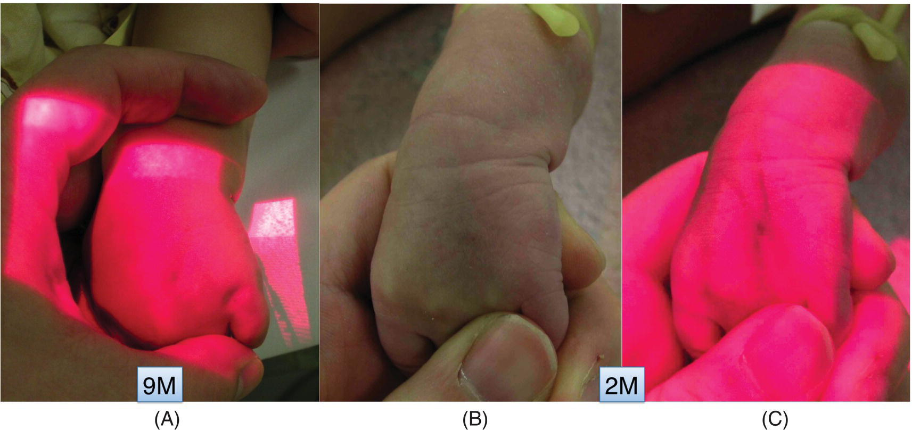

[**Figure 13.1**](#R_c13-fig-0001) Peripheral venous access with the VeinViewer. (A) The VeinViewer could not show the left dorsal metacarpal vein in a patient aged 9 months. (B, C) The VeinViewer clearly showed the left dorsal metacarpal vein in another patient aged 2 months.

#### Percutaneous central venous access

Among various available approaches to central venous access, the percutaneous approach has become standard practice at many institutions. This has been particularly true because of the development and widespread use of portable ultrasound devices for ultrasound‐guided catheter insertion (see later). Common sites for percutaneous central venous access include the internal jugular, subclavian, and femoral veins. Various central catheters are commercially available. Recommended sizes and lengths for each insertion site are listed in [Table 13.1](#c13-tbl-0001).

Full barrier precautions are mandatory upon catheter placement. Sterile technique with gowns and wide draping should be applied during all percutaneous central cannulations to reduce the risk of catheter‐associated infection. After sterile skin preparation with chlorhexidine‐containing solution or iodine, wide draping is performed, preferably with a clear, fluid‐impermeable, adhesive and aperture drape so that the underlying anatomy is clearly visible. The Seldinger technique is the standard approach. The basic principle is to place a guidewire into the target vessel and then thread a large‐bore catheter over the guidewire. For guidewire placement, either an introducer needle or an angiocatheter (catheter‐over‐needle) may be used. The authors’ preference is to use an angiocatheter in infants weighing less than 10 kg (see [Figure 13.2](#c13-fig-0002)). In these patients, a 4 Fr central catheter is routinely used. A 0.015″ or 0.018″ guidewire should be used for cannulation. The wire is first threaded into a 24 ga catheter to enter the vessel. Using this small, 24 ga angiocatheter to puncture the vessel may minimize hematoma formation should inadvertent artery puncture occur, and reduce damage of the vessel should the needle penetrate its posterior wall. Once the catheter is placed in the vein, a short extension tube can be attached and used as a manometer to verify venous access. This verification is extremely important in patients with cyanotic lesions, because the color of blood aspirated from the catheter is not a reliable indicator of correct venous placement. One advantage of an introducer needle is that threading the outer catheter over the inner needle is not necessary. Disadvantages include the necessity to use a large needle (20 ga for a 0.018″ or 0.021″ guidewire) and the possibility of damaging the guidewire if improperly inserted, which can lead to serious complications. Because the tip of the needle may damage the structure of the thin guidewire, attention should be paid not to retract the guidewire through the needle while it is still in the vessel if there is any resistance at all; they should be removed simultaneously to avoid breaking the guidewire and a fragment being retained intravascularly. Guidewires with straight, slightly curved (angled), or J‐shaped tips are available. The shape of the tip may be one of the causes of unsuccessful threading \[14\], particularly in neonates or small infants. The radius of the curvature of the wire’s J‐shaped tip is often identical to or larger than the diameter of the infant’s vessel (~5 mm) \[15, 16\]. Our preference is to use the straight end of the guidewire in this patient population (see [Figure 13.2](#c13-fig-0002)). After the desired vein is punctured, the guidewire is carefully advanced into the SVC. The resistance to the wire’s passage should be minimal; if any resistance is encountered, the wire must be carefully withdrawn. Forcing a guidewire in the presence of resistance can lead to significant complications. The electrocardiogram (ECG) should be observed carefully as the guidewire is slowly advanced. Premature atrial contractions (PACs) are usually observed as the first guidewire‐induced dysrhythmias, signifying atrial location. If no PACs occur, the guidewire is most likely not in the atrium. Premature ventricular contractions, especially if multifocal in nature and occurring as the first observed dysrhythmia, indicate that the guidewire is probably in the ventricle and should be immediately withdrawn. Insertion of a transesophageal echocardiography (TEE) probe before attempting central venous access may facilitate visualization of the guidewire and confirmation of its correct location \[17\].

[**Table 13.1**](#R_c13-tbl-0001) Recommended central venous catheter sizes and lengths

| Patient height (cm) | Internal jugular/subclavian vein | Femoral vein |
| --- | --- | --- |
| _<_60 | 20 ga, single lumen, 8 cm | 20 ga, single lumen, 12 cm |
|  | 3–4 Fr, double lumen, 8 cm | 3–4 Fr, double lumen 12 cm |
| 60–80 | 4 Fr, double lumen, 8 cm | 4 Fr, double lumen, 12 cm |
| 80–130 | 4 Fr, double lumen, 12 cm | 4 Fr, double lumen, 12–15 cm |
| 130–160 | 5 Fr, double lumen, 12–15 cm | 5 Fr, double lumen, 15 cm |
| 160–170 | 7 Fr, double lumen, 15 cm | 7 Fr, double lumen, 20 cm |
| \>170 | 8 Fr, double lumen, 16 cm | 8 Fr, double lumen 20 cm |

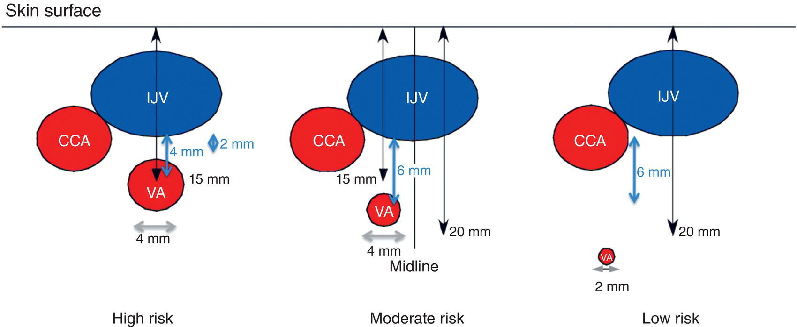

[**Figure 13.2**](#R_c13-fig-0002) Schematic representation of risk classification for vertebral artery puncture. The width, depth from the skin, the distance from the IJV of the VA, and the overlapping between the IJV and VA are illustrated using out‐of‐plane Doppler color flow imaging. In high‐risk cases, the vertebral artery (VA) is wide (>4 mm), locates shallow (_<_15 mm from the skin), near the internal jugular vein (IJV) (_<_2 mm), and overlaps with the IJV. In low‐risk cases, the VA is small (_<_2 mm), locates deep (>20 mm from the skin), distant from the IJV (>6 mm), and does not overlap with the IJV. The common carotid artery (CCA) does not affect the classification.

After guidewire placement, a very small incision is made followed by careful dilation and catheter cannulation. Dilators included in prepackaged CVC kits are often one size larger than the catheters (e.g. a 5 Fr dilator for a 4 Fr catheter). This might not be optimal with small infants; passage of the catheter without dilation or use of a dilator of the same size as the catheter would be preferable. This allows for the smallest possible entry into the vein, to minimize bleeding and trauma to the vessel wall, both of which can lead to thrombosis or vascular insufficiency. In small infants, attention should be paid to blood loss during the catheterization procedure; direct compression of bleeding puncture sites with the heel of the non‐dominant hand should be applied while threading dilators or catheters. Difficult catheterization often requires more hands, and assistance should be requested accordingly. Once the catheter is advanced to the desired depth, it should be secured with sutures and dressing.

##### _Internal jugular vein_

The internal jugular vein (IJV) originates from the jugular foramen at the base of the skull. The right IJV is large and lateral to the common carotid artery (CCA) along most of its length (termed the carotid sheath) and is the most common site for central venous access in pediatric patients undergoing cardiac surgery. The IJV provides a direct route to the right atrium (RA) and is an optimal site for catheterization. In patients with supracardiac‐type total anomalous pulmonary venous return (TAPVR), the vertical vein draining blood from the common chamber to the brachiocephalic vein and the left IJV and left subclavian vein (SCV) usually contains oxygen‐rich blood. Oxygen‐rich blood can be drawn while puncturing the left IJV, and it is sometimes difficult to distinguish whether the blood is from an artery or a vein. We recommend use of a pressure transducer for confirmation. Some surgeons discourage the use of the left veins in TAPVR. The right IJV, right SCV, or femoral veins (FVs) can be used instead of the left IJV and/or SCV.

Some simulated models have shown that penetration of the posterior wall of the IJV is unavoidable \[18, 19\]. Inadvertent CCA puncture can occur unless its exact location is known. The CCA and IJV overlap area differs among studies from various countries and approaches \[20–23\]. Both the lower approach (at the junction of the two heads of the sternocleidomastoid muscle) and the higher approach (at the cricoid cartilage) provide a similar pattern of overlap ([Table 13.2](#c13-tbl-0002)). The overlap between the IJV and the CCA increases with head rotation to either side \[24\]. In addition, the right IJV is preferred to the left because of a smaller overlap area with the CCA on the right side and its more lateral position \[24\]. Greater head rotation (more than 30°) to the left should be avoided, because this increases the right IJV and CCA overlap and risk of carotid puncture. Positive inspiratory pressure, but not the Trendelenburg position, can increase the cross‐sectional area of the IJV \[25\]. Use of combination of the Trendelenburg position, liver compression, and simulated Valsalva maneuver can effectively increase the diameter of the IJV \[26\]. Gentle skin traction can also improve the success rate of catheterization \[27\]. An anchoring maneuver using a pilot needle facilitates IJV catheterization at its entry in the majority of infants. If the pilot needle is left in the IJV, and the IV catheter (22 or 24 ga) is passed just posterior to the puncture point of the pilot needle to track the pilot needle path at a 10–20° angle to the skin, a natural tumbling movement of the pilot needle helps to anchor the anterior wall of the IJV and facilitate puncture with the catheter needle \[28\]. The bevel‐down approach to the right IJV may decrease the incidence of posterior venous wall damage and hematoma formation compared with the bevel‐up approach \[29\].

[**Table 13.2**](#R_c13-tbl-0002) The overlapping of the right common carotid artery (CCA) and internal jugular vein (IJV) in pediatric patients

|  |  | 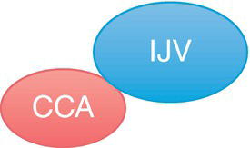 | 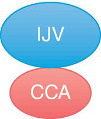 |
| --- | --- | --- | --- |
| Higher approach (_n_ = 130) | 43.1% | 43.8% | 13.1% |
| Lower approach (_n_ = 216) | 35.2% | 53.2% | 11.6% |

The CCA and IJV are at the cricoid cartilage in the higher approach and at the junction of the two heads of the sternocleidomastoid muscle in the lower approach. Schematic representation of CCA and IJV as imaged by ultrasound with operator standing at patient’s head. Results are combined from studies \[19–22\].

**Technique.** With a landmark approach, the location of the clavicle, sternocleidomastoid muscle, and cricoid cartilage should be confirmed by visually observing and palpating the neck. After disinfecting the insertion site, the skin is usually punctured midway between the mastoid process and the sternal notch in the “high” approach, at the junction of the two heads of the sternocleidomastoid muscle or at the level of the cricoid cartilage in the “middle” approach, or near the jugular notch in the “low” approach ([Figure 13.3](#c13-fig-0003)). After aspiration of dark‐colored blood from the punctured vessel, the Seldinger technique should be used for guidewire and catheter placement (described earlier). If the artery is inadvertently punctured, compress the puncture site for several minutes to ensure hemostasis. Ultrasound‐guided puncture will be discussed in detail later in the chapter.

[**Figure 13.3**](#R_c13-fig-0003) Sites for central venous cannulation of the superior vena cava (SVC). 1, high approach, midway between mastoid process and sternal notch; 2, 3, middle approach using apex of muscular triangle or cricoid cartilage; 4, low approach using jugular notch; 5, lateral approach to subclavian venipuncture. RA, right atrium.

(Source: Andropoulos et al. \[30\]. Reproduced with permission from Wolters Kluwer Health, Inc.)

##### _Subclavian vein_

Subclavian central venous catheterization is a relatively safe procedure, with minimal complications in pediatric patients \[31–35\]. The SCV is an extension of the axillary vein at the outer border of the first rib, lies under the clavicle, and runs in the subclavian groove on the first rib. The SCV joins the IJV to form the brachiocephalic vein. It lies anterior to the anterior scalene muscle, and the subclavian artery lies posterior to the anterior scalene muscle. Catheterization of the SCV has several advantages, including its relatively constant position in reference to surface landmarks in patients of all ages, comfort for the awake patient, and less tip migration and greater stability with patient movement. Disadvantages include risk of pneumothorax and the potential inability to dilate the space between the clavicle and the first rib. There is also a possibility that a subclavian catheter will enter the contralateral brachiocephalic vein or ipsilateral IJV instead of the SVC.

**Technique.** For right‐side subclavian venous puncture, positioning with the patient’s right upper arm abducted 0° maximizes clavicle and SCV overlap. In the 5°–10° head‐down tilt position, puncture the skin near the clavicle at the midpoint or just lateral to the clavicle. Advance the tip of the needle to contact the clavicle. The tip should then be advanced underneath the clavicle with the needle kept in the horizontal position to avoid puncturing the subclavian artery or the lung. When no blood return is obtained, withdraw the needle gently while pulling back the plug with the syringe attached to the angiocatheter. After obtaining dark‐colored blood return without pulsation, cautiously advance the guidewire and then the dilator.

##### _External jugular vein (EJV)_

The course of the EJV can be readily seen on either side of the patient’s neck. The EJV can also be used as a peripheral vein that provides rapid and easy vascular access. Inadvertent arterial puncture is extremely rare with this approach. Although the EJV is a viable site for central venous access with a low complication rate, the EJV has positional concerns because of its angle relative to entry to the SCV, which may hinder the passage of a guidewire into the SVC. This is particularly true in younger patients. Success rates of percutaneous central catheterization via the EJV vary from 54 to 90% \[36–40\].

**Technique.** With the patient’s head extended, the central portion of the EJV compressed, and the EJV stretched peripherally, puncture the skin with an angiocatheter (<10 kg, 22 ga; 10–20 kg, 20 ga; >20 kg, 18 ga) and insert a curve‐tipped guidewire after obtaining dark‐colored blood. A small incision with a 25–27 ga needle at the insertion point can aid angiocatheter insertion.

##### _Femoral vein_

Another major site of access to the central circulation is the FV. The FV is the most commonly accessed central route in pediatric patients outside the operating room (OR) because of the relatively high rate of success and low incidence of complications \[41, 42\]. Once thought to be associated with an increased risk of infection, studies have since concluded that cannulation of the FV is of no greater risk than other sites \[43, 44\]. Several studies \[13\] have reported that mean CVP measured in the IVC below the diaphragm is identical to that measured in the RA in patients with or without CHD (in the absence of increased intra‐abdominal pressure or IVC obstruction). Agreement of IVC and RA pressures in patients with an interrupted IVC with azygos vein continuation into the SVC, commonly seen in heterotaxy syndrome, have not been evaluated; however, the catheter can be used for other purposes such as drug or fluid infusion.

**Technique.** The patient should be positioned with a rolled towel placed under the hips to obtain moderate extension. The puncture site should be 1–2 cm inferior to the inguinal ligament and 0.5–1 cm medial to the femoral artery impulse, with the needle pointed toward the umbilicus. Ultrasound guidance is useful for identifying important anatomic structures to aid in successful, uncomplicated placement (see later). It is important to puncture the vessel below the inguinal ligament to minimize the risk of retroperitoneal bleeding. Once cannulated, the Seldinger technique should be used as for IJV cannulation. The tip of the catheter should be located in the mid‐IVC.

#### Umbilical vein

In neonates, a catheter can be placed in the umbilical vein for emergency access when peripheral venous access is not readily available \[45, 46\]. This vessel can be cannulated at the umbilical stump up to a week after birth. Therefore, umbilical line placement is often performed by physicians in the neonatal ICU.

At some institutions, umbilical catheters are routinely used in neonates with cardiac disease for whom surgery is planned in the first 2 weeks of life \[47\]. Catheters (5 Fr double‐ or triple‐lumen umbilical venous catheters) are used to infuse volume and vasoactive drugs as well as to concomitantly monitor CVP. One benefit of using the umbilical vein is that it spares the femoral, jugular, and subclavian veins from the risk of thrombosis and permanent occlusion. This is particularly important in neonates with specific diseases in whom multiple interventions are inevitable as they grow older. One caveat is that if the ductus venosus closes after birth, the umbilical catheter does not pass into the IVC, often ending with the catheter tip in branches of the hepatic vein. If on radiography the tip of the catheter is located at sites other than the IVC, the catheter should not be used as a central line.

**Technique.** With the sterile technique and after placing a loose tie of vessel tape around the umbilical base, the two thick‐walled umbilical arteries and the single thin‐walled umbilical vein can be readily identified. While dilating with a hemostat, the catheter can be passed easily without a guidewire. If resistance is minimal, the catheter can be advanced to a premeasured distance (usually 7–12 cm). Catheter tip position should be determined radiographically as early as possible to confirm its passage through the ductus venosus and into the IVC.

#### Direct transthoracic intracardiac vascular access

Intracardiac catheters are generally inserted by the surgeon under direct visualization into the right or left atrium \[48, 49\] and secured by a purse‐string suture \[50\]. Pulmonary artery (PA) catheters can be located high in the right ventricular outflow tract through the pulmonary valve, or in the main PA. Continuous monitoring of mixed venous saturation in the PA or SVC with an oximetric catheter can be performed with this procedure \[48\]. Monitoring of continuous SVC oxygen saturation has been shown to be very useful in the post‐bypass management of neonates undergoing the Norwood procedure for hypoplastic left heart syndrome \[51\]. Intracardiac catheters are usually placed during the rewarming phase on cardiopulmonary bypass (CPB) and may be used for pressure monitoring or administration of vasoactive drugs. The benefits of this approach include less time spent on CVC placement, assurance of the location of the catheter tip, and no potential harm to the vessel. Disadvantages include unavailability of central access in the pre‐bypass period and a higher risk of cardiac tamponade after catheter removal. Due to this potential risk of post‐removal bleeding, mediastinal drainage tubes are usually left in place until all intracardiac lines are removed. This may also be considered a disadvantage, because removal of the lines may leave the patient without central venous access or may delay discharge from the ICU.

A left atrial catheter is often indicated if ventricular dysfunction, coronary artery perfusion abnormalities, or mitral valve dysfunction is anticipated postoperatively. Pulmonary artery catheters are particularly useful in the management of patients with preoperatively known or postoperatively anticipated pulmonary hypertension (e.g., obstructive TAPVR, complete atrioventricular canal, severe mitral valve disease). A PA catheter may be indicated for infants with pulmonary hypertension and patients with residual right ventricle outflow tract obstruction because pull‐back of the catheter can provide a pressure gradient between the right ventricle (RV) and the PA.

#### Tunneled percutaneous or intracardiac lines

In patients with difficult venous access and an anticipated prolonged postoperative course, a tunneled silicone catheter may be used to ensure long‐term central venous access. Hickman and Broviac are brands of single‐ and double‐lumen catheters that provide external access. These catheters can be placed percutaneously in standard fashion as mentioned in the previous section, or placed transthoracically into the SVC or RA, as with a standard transthoracic catheter but with a subcutaneous tunnel separating the skin exit several centimeters from the chest wall entry site. Compared with standard polyurethane transthoracic catheters, these catheters preserve other access sites for possible future interventions and are less thrombogenic.

#### Ascertainment of correct position of upper body central catheters

Proper placement of CVCs is necessary to prevent complications and to provide accurate CVP measurements. Some experts recommend that the CVC tip should be in the SVC, above the pericardial reflection, to make sure that it is located outside the pericardium. This will minimize the risk of cardiac tamponade should perforation occur. If the CVC tip is located in the more proximal SVC, the risk of thrombosis increases, and the catheter could migrate into other vessels such as the azygos vein, where pressure monitoring will no longer represent CVP. Others recommend that the CVC tip be positioned in the SVC, just above the SVC–RA junction. This will reduce the risk of thrombosis, malposition, and tip perforation and increase the longevity of the catheter. Various methods have been proposed to determine proper placement and will be discussed below. In the OR setting, TEE‐guided catheter tip positioning is a reliable and safe method and thus can be considered the gold standard \[17\].

##### _Echocardiography_

Transesophageal echocardiography is used for many congenital heart operations. Catheter tips and guidewires are easily imaged with TEE, and one study using TEE‐guided CVC placement demonstrated a 100% success rate for correct placement in the SVC when TEE was used, as compared with 86% when surface anatomical landmarks were used in infants and children undergoing congenital heart surgery \[17\]. The TEE probe is placed before CVC attempts are made, and the SVC–RA junction in the 90° plane is imaged. When the vessel is punctured and the guidewire passed, it should be visualized passing from the SVC into the RA. Then the catheter is passed to its full length, the guidewire removed, and the tip of the CVC identified. Flushing the CVC with saline creates an easily visible stream of contrast which identifies the tip. The CVC is then pulled back until it is above the RA, in the distal SVC 1–2 cm above the crista terminalis. Using this technique, immediate, accurate confirmation of placement is obtained before final securing, and before the surgery. The proximal SVC, which is more than 2 cm above the RA, is difficult to image using TEE, so this method is most accurate in placing CVC in the distal SVC. Also, the commonly accepted radiographic SVC–RA junction is often higher than the SVC–RA junction noted by TEE \[17\].

Transthoracic echocardiography can also be utilized for SVC catheter placement. Park et al. reported 106 right IJV catheter placements in 2‐ to 12‐month‐old infants undergoing cardiac surgery \[52\]. TTE was 96.2% successful at identifying the crista terminalis and allowing placement of the CVC tip within 10 mm above this structure. A 4–10 MHz wide band linear echo probe with standard cardiac ultrasound machine was used in transverse plane at the right second, third or fourth intercostal space. Cross‐sectional images of the ascending aorta, PA, and SVC were obtained, and then the probe was rotated 90° clockwise to obtain images of the SVC–RA junction. The catheter tip was advanced to the desired location, with saline flush aiding in identifying the tip. Two‐thirds of the catheters could be visualized using the longitudinal view; the others could be visualized using the transverse short axis view with the catheter identified as a white dot in the SVC, and placed at the level of the PA bifurcation.

##### _Radiography_

The chest radiograph is still considered the gold standard to confirm proper placement of the catheter \[53\]; however, post‐insertion chest radiography before surgical incision merely to confirm placement of the catheter tip may not be justified in the OR in terms of time, cost, and radiation exposure to the patient. A chest radiograph should be routinely obtained immediately after surgery to reconfirm catheter tip location; the catheter tip should be seen in the area from the level of the first rib to above the pericardial reflection. Based on studies on embalmed and fresh cadavers, the carina is an easily recognizable radiographic landmark in pediatric patients and can be used to confirm that the catheter tip is outside the cardiac chamber \[54\]. The caveat is that the commonly accepted radiographic SVC–RA junction is often higher than that noted by TEE \[55\]. Therefore, the catheter tip located within the atrial silhouette on the chest radiograph can be outside the atrium as documented by TEE. Furthermore, an SVC catheter directed posteriorly down the azygos vein may not be detected by anteroposterior chest radiography alone.

##### _Electrocardiographically guided placement_

Intravascular ECG may be used in children to guide correct CVC placement \[56, 57\]. A normal or hyperosmolar (3%) saline‐filled lumen with a special ECG adaptor or a guidewire within the lumen attached to a sterile alligator clip serves as an exploratory electrocardiographic electrode. Prepackaged CVC sets are commercially available to allow intracardiac ECG monitoring \[58\]. A sudden increase in P‐wave size (P atriale) occurs as the catheter enters the RA. The catheter tip can then be pulled back 1–2 cm to the desired position within the SVC. Because this method requires special equipment not always available in the OR, TEE can be used as a sufficient substitute.

##### _Height‐ and weight‐based formulae_

In the absence of TEE guidance or intravascular ECG, CVC tip position may not be confirmed until postoperative chest radiography, allowing for any potential malpositioning to persist undetected. One study proposed formulae to predict the depth of CVC insertion, with the aim of preventing inadvertent catheter tip placement in the RA \[30\]. Using a large database of CVC placement data in children, the following formulas were developed for catheter insertion via the right IJV or SCV, with the targeted location of the catheter tip at the radiographically determined SVC–RA junction:

The authors also provided a weight‐based formula for length of CVC insertion via the right IJV or SCV. Use of these formulae should result in CVC placement in the mid‐SVC in more than 95% of patients. Caveats of these simplified formulae are that for the IJV, the puncture site is high, precisely midway between the mastoid process and the sternal notch. For the SCV, the puncture site is 1–2 cm lateral to the clavicle midpoint. The formulae must be adjusted if different puncture sites are desired. In addition, the formulae were developed for targeting of the catheter tip to the radiographic SVC–RA junction. As mentioned earlier, the radiographic SVC–RA junction is usually higher than the TEE‐confirmed SVC–RA junction. A more recent study \[53\] used a smaller number of pediatric patients to provide height‐based formulae for determining the depth of the right internal jugular catheter ([Table 13.3](#c13-tbl-0003)). They used TEE or intracardiac ECG to precisely guide the catheter tip to slightly above the SVC–RA junction and measured the depth of the CVC at the site of right internal jugular catheterization. The formulas listed here have not been validated for accuracy in a prospective fashion and therefore should be used with caution.

[**Table 13.3**](#R_c13-tbl-0003) Recommended lengths for central venous catheter insertion

|  | Andropoulos et al. \[30\] | Yoon et al. \[53\] |
| --- | --- | --- |
| Formula | (Ht/10 − 1) cm if Ht ≤ 100  
(Ht/10 − 2) cm if Ht > 100 | (0.07 × Ht) + 1.7 |
| --- | --- | --- |
| Ht (cm) | IJV/SCV | IJV |
| --- | --- | --- |
| 40 | 3.0 | 4.5 |
| 50 | 4.0 | 5.2 |
| 60 | 5.0 | 5.9 |
| 70 | 6.0 | 6.6 |
| 80 | 7.0 | 7.3 |
| 90 | 8.0 | 8.0 |
| 100 | 8.0 | 8.7 |
| 110 | 9.0 | 9.4 |
| 120 | 10.0 | 10.1 |
| 130 | 11.0 | 10.8 |
| 140 | 12.0 | 11.5 |
| 150 | 13.0 | – |
| 160 | 14.0 | – |
| 170 | 15.0 | – |

Ht, height; IJV, internal jugular vein; SCV, subclavian vein.

In two‐lumen catheters, the second orifice is usually at 1.5–2 cm from the tip of the catheter. Catheters should be placed more than 4.5–5 cm from the skin. Insertion points differ among patients, especially in the IJV; thus, it is necessary to adjust 0.5–1 cm from the standard lengths.

#### Peripherally (percutaneously) inserted central catheters

Given its safety and reliability as a method to efficiently obtain central access, the peripherally inserted central catheter (PICC) has emerged as a favorable percutaneously inserted central line in pediatric patients with acute or chronic illness. The PICC line is a thin, soft, and long catheter that can be used for long‐term IV antibiotics, nutrition or medications, and blood draws. In use for more than a decade \[59\], PICCs are routinely used in newborns expected to require prolonged venous access. The complication rate for these catheters is very low \[60, 61\], and they are generally easy to insert into the central circulation via the antecubital, saphenous, hand, axillary, or wrist veins. Because of the increased popularity of PICCs for IV access in children, many institutions have adopted a team approach for pediatric PICC placement. Most important for successful placement is early access, before the large, visible, superficial veins are exposed to injury from attempts at peripheral IV placement. In critically ill newborns with CHD, it is best to insert a PICC line soon after hospital admission. Commercially available PICCs are 1–5 Fr, single or double lumen, 6–65 cm, and made from polyurethane or silicone. For a newborn, a 2 or 3 Fr PICC line is often used \[62\]. Centrally delivered medications or fluids are administered through a PICC line; however, these are often inadequate as the sole pre‐bypass access for cardiac surgery. Despite the primary intention of PICCs to be placed centrally, only half are successful; however, non‐centrally (mid‐clavicle and more distal) placed PICCs can still be used safely and reliably for the administration of medications and isotonic fluids. Insertion of PICCs should follow the techniques described for peripheral venous access and central line insertions.

* * *

### KEY POINTS: VENOUS ACCESS

-   Obtaining venous access in infants and children undergoing surgery for CHD can be very challenging. A backup plan should be instituted in the case of anticipated or unanticipated difficult IV access.
-   Selection of the catheter size and its insertion site should be tailored to patient characteristics/needs and the nature of the surgical procedure. A strategic approach is necessary to preserve access sites in small infants with single‐ventricular physiology.
-   For central venous access, the use of full barrier precautions and the Seldinger technique are standard practice.
-   Correct position of the CVC tip is important to avoid serious complications. Various methods are available to ascertain proper placement, and understanding the advantages and disadvantages of each method is crucial.

* * *

## Arterial access

Arterial catheters are necessary during congenital heart surgery to monitor beat‐to‐beat changes in arterial pressure and to draw intermittent blood samples. Common sites for arterial line placement include the radial, femoral, brachial, axillary, dorsalis pedis, and posterior tibial arteries. [Table 13.4](#c13-tbl-0004) displays recommended catheter sizes for arterial access based on site and patient weight. Percutaneous entry is often possible, particularly with the aid of ultrasound, but on occasion a cutdown technique may be required to expedite artery access. Ultrasound‐guided insertion techniques are discussed later in this chapter. In the study involving brachial, radial, ulnar, umbilical, femoral, and pedal arteries, vascular complications were highest in femoral arterial access in the perioperative setting \[63\].

[**Table 13.4**](#R_c13-tbl-0004) Recommended catheter sizes and lengths for arterial access based on site and patient weight

| **Weight** | **Radial/dorsalis pedis/posterior tibial arteries** | **Brachial artery** |
| --- | --- | --- |
| _<_2 kg | 24 ga | Not recommended |
| 2–5 kg | 22 ga | 24 ga |
| 5–30 kg | 22 ga | 22 ga |
| \>30 kg | 20 ga | 22 ga |
| **Weight** | **Femoral/axillary arteries** |  |
| _<_10 kg | 2.5 Fr, 5 cm |  |
| 10–50 kg | 3 Fr, 8 cm |  |
| \>50 kg | 4 Fr, 12 cm |  |

### Radial artery

This is the most commonly accessible location for initial arterial cannulation in most infants and children. Before cannulation, the Allen’s test can be considered to verify sufficient collateral ulnar circulation \[64\]. Cannulation ipsilateral to an existing or planned systemic‐to‐PA shunt should be avoided.

**Technique.** Secure the patient’s hand gently to an armboard, with the wrist slightly dorsiflexed and with a small roll underneath it ([Figure 13.4](#c13-fig-0004)). Prepare the skin with antiseptic solution. Use palpation to identify the artery. Alternatively, audio Doppler or ultrasound guidance can be helpful if the pulse is weak. Lighter anesthesia during catheterization may provide a stronger pulse and increase the success rate. Use a 24 or 22 ga angiocatheter flushed with heparinized saline to optimize the flow of blood into the needle hub. The first attempt offers the greatest chance of success; therefore, conditions, such as lighting, positioning, and vessel identification should be optimized. Puncture of the artery is indicated by brisk flashback. Advance the needle and catheter 1–2 mm into the artery to ensure intraluminal placement and attempt to thread the catheter over the needle its full length into the artery. Alternatively, the artery can be transfixed, the needle pulled back, and the cannula gently withdrawn until brisk flashback is observed ([Figure 13.4](#c13-fig-0004)D). The cannula can then be advanced into the artery ([Figure 13.4](#c13-fig-0004)F, G) or a small 0.015″ intravascular guidewire can be inserted into the artery and the cannula advanced over the wire. Either way, minimal resistance signifies successful threading. If the first attempt is unsuccessful, additional attempts can be made at the same site or slightly proximal to it, to avoid areas of arterial spasm, thrombosis, or dissection. Circulation distal to the catheter should be determined by inspection of the color and capillary refilling time of the fingertips and nailbeds and pulse quality as determined by pulse oximetry. We recommend that the catheter be secured with clear adhesive dressing and tape, to ensure that the insertion site and catheter hub are visible.

### Femoral artery

The common or superficial femoral artery is large and easily accessible in most patients and is a logical choice when radial arterial access is not available. Our practice is to avoid the femoral artery for prolonged catheterization, when alternative sites are available, because of potential vascular damage of the involved leg. However, if the patient experiences extreme hypotension or peripheral vasoconstriction when no other major vessels are easily palpable, the femoral artery may represent the only viable choice for arterial catheterization. Left‐sided femoral artery catheterization is preferred if future cardiac catheterization is anticipated.

**Technique.** Place a small towel under the patient’s hips to extend the leg slightly to a neutral position. Positioning can be aided by slight external rotation with the knees restrained by taping to the bed. After sterile preparation and draping, palpate the course of the superficial femoral artery and puncture the vessel 1–2 cm inferior to the inguinal ligament to avoid puncturing the artery above the pelvic brim, where a retroperitoneal hematoma could form. Audio Doppler or ultrasound can be used to identify the course of the vessel if the pulse is weak. Various puncture techniques are available: direct puncture with an angiocatheter; an introducer needle supplied with a commercially prepackaged kit; or a 21 ga butterfly needle with the extension tube removed. The needles should be flushed with heparinized saline to increase flashback. Use a small, flexible, 0.015″ or 0.018″ guidewire. Threading a polyethylene catheter over the guidewire can often be done without making a skin incision. Importantly, a dilator should not be used because it could cause arterial spasm, dissection, or bleeding if the puncture site is large. Secure the catheter by suturing around the entry site and suturing wings around the hub. Distal perfusion should be assessed immediately, and a pulse oximetry probe should be placed on the foot for continuous monitoring and early warning of poor arterial perfusion.

### Brachial artery

The brachial artery has been used successfully as an arterial access site in neonates and small children \[65\]. However, this site may have theoretical concerns because it has poor collateral circulation compared with the radial, femoral, and axillary arteries, though this has not been proved by any studies to date. The present consensus is that the brachial artery should be reserved for situations when other options are limited, for example, when a right upper‐extremity arterial line is necessary to monitor pressure during cross‐clamping for repair of coarctation of the aorta, CPB for aortic arch hypoplasia, or interruption.

**Technique.** A 24 ga catheter should be used in patients weighing less than 5 kg. Restrain the arm in a neutral position on an armboard, and identify the arterial pulse above the elbow crease, above the bifurcation into the radial and ulnar arteries. The method of cannulation is the same as for radial arterial catheterization. Again, distal perfusion should be monitored continuously by pulse oximetry. The catheter should be replaced postoperatively with a catheter at a site that has better collateral circulation as soon as possible.

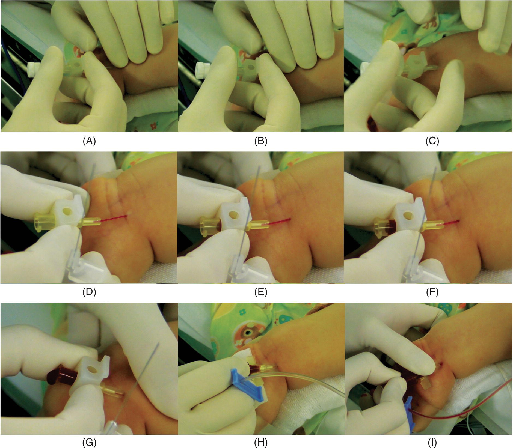

[**Figure 13.4**](#R_c13-fig-0004) Radial artery puncture and catheterization with a 24 ga angiocatheter without ultrasound guidance in a child aged 27 months. The angiocatheter is placed at approximately 10° to the skin (A, B). Blood return cannot be obtained while puncturing (C). When bright‐colored blood is obtained from the inner needle of the angiocatheter while withdrawing (D), advance the outer cannula beneath the skin to enter the cannula into the artery (E, F) and confirm continuous blood return (G). A connector is attached to the catheter (H), and arterial blood is aspirated (I).

### Axillary artery

The axillary artery is large and well collateralized. Several studies have shown this artery to be a viable option for critically ill children when other sites are not accessible \[66–68\]. In addition, the complication rate is low. However, given the potential for arm and hand ischemia and intrathoracic bleeding, the axillary artery should be a site of last resort when other options are not available.

**Technique.** Abduct the arm 90° and extend it slightly at the shoulder. Palpate the artery high in the axilla, puncture with an angiocatheter, and exchange over a guidewire for a longer catheter. A short catheter may be pulled out of the vessel with shoulder extension. Therefore, longer catheters (e.g., 5 cm) are recommended. As with the brachial artery, distal perfusion should be assessed and carefully monitored for potential upper‐extremity ischemia. Catheter tip position located outside the first rib should also be confirmed by chest radiography. Because the axillary artery is close to the brachiocephalic artery, it is imperative to flush the catheter gently by hand after blood draws, thereby preventing air bubbles or clots from being introduced into the circulation and minimizing the risk of retrograde cerebral embolization.

### Umbilical artery

The umbilical artery can be cannulated in a newborn during the first 72 hours of life and is the site of choice in newborns requiring surgery within a week after birth. Umbilical artery catheterization entails potential risks regardless of the position of the catheter; placement of the catheter with its tip at the seventh to eighth thoracic segment may be associated with fewer complications than placement at lower positions \[69, 70\]. Umbilical arterial lines have an uncertain link with necrotizing enterocolitis. A neonate with ductus‐dependent circulation, low diastolic pressure, and subsequent systemic steal can be at increased risk of this complication. Umbilical catheters are generally inserted in the delivery room or in the neonatal ICU shortly after birth. Lower‐extremity emboli, vascular insufficiency, and renal artery thrombosis have been reported with this site; however, the overall risk is low, and the site is highly desirable because it is a large central artery, which allows for accurate pressure monitoring throughout surgery, while preserving other sites for potential future arterial access.

**Technique.** Prepare the umbilical stump in a sterile manner and transect. Two small muscular‐walled arteries and a larger thin‐walled vein are easily identified on the umbilical cord cutoff. Insert a 3.5 Fr catheter blindly into the artery after dilating the vessel. The catheter tip should be placed at the level of the diaphragm or low in the descending aorta, and its position should be confirmed radiographically as soon as possible.

### Temporal artery

The superficial temporal artery was widely used, particularly in premature babies. However, it is now avoided because of potentially severe cerebral thromboembolic complications \[71, 72\]. The exception is when brachiocephalic pressure must be measured during surgery for an aberrant subclavian artery (e.g., corrections for coarctation of the aorta, aortic arch interruption or hypoplasia with an aberrant right subclavian artery arising distal to the obstruction); the only way to measure pressure during cross‐clamping or bypass is via direct aortic pressure. This site should be used only during surgery, and the catheter must be removed immediately after operation.

**Technique.** Use a 24 ga catheter for newborns. Palpate the artery just anterosuperior to the tragus of the ear, just superior to the zygomatic arch. The artery should be approached with a very superficial approach angle (e.g., 10°–15°). Cannulation is performed in the same manner as with the radial artery.

### Dorsalis pedis/posterior tibial arteries

Peripheral vasoconstriction and vasomotor instability during the early post‐CPB period make the superficial arteries in the lower extremities less suitable as sites for arterial cannulation than the radial artery. An accurate arterial pressure waveform cannot be obtained during the early post‐bypass period. These arteries may be indicated for non‐bypass surgeries or for continuous pressure monitoring in the ICU.

**Technique.** For the dorsalis pedis artery, position the foot in slight plantar flexion to straighten the course of the artery, which can be palpated between the second and third metatarsals. For the posterior tibial artery, dorsiflex the foot to expose the artery between the medial malleolus and Achilles tendon. The artery is often deep to the puncture site and may require a steeper puncture angle. Fix the patient’s ankle with the arterial line to a board (3) so that the line is not accidentally removed as it is covered by surgical drapes ([Figure 13.5](#c13-fig-0005)).

### Ulnar artery

The ulnar artery is only considered when attempts with the radial artery have been unsuccessful or the vessel has thrombosed due to past interventions. It should be used as the last resort, when other options are not available. There is a high risk of ischemia of the hand if both radial and ulnar artery perfusions are severely compromised. However, one study of 18 ulnar artery catheters in a pediatric ICU reported an ischemia rate of 5.6%, no different from those associated with radial and femoral artery catheters \[73\].

[**Figure 13.5**](#R_c13-fig-0005) A posterior tibial arterial catheter. (A) The posterior tibial artery is catheterized with a 24 ga angiocatheter. (B) The patient’s ankle with the artery line has been fixed to a board to prevent movement when the line is covered by surgical drapes.

### Arterial cutdown

Cutdown of the radial artery is a reliable and efficient method for establishing arterial access during congenital heart surgery. This method is used as the first and primary method of securing arterial access in some institutions, whereas others only resort to it when all other attempts fail. Despite the speed and ease of access for cutdown, the existing literature indicates that a percutaneous approach is favorable to cutdown in terms of complications (e.g., bleeding, infection, failure, distal ischemia, long‐term vessel occlusion).

**Technique.** Position the arm as for percutaneous radial catheterization. After preparation and draping for surgery, make an incision at the proximal wrist crease, between the styloid process and the flexor carpi radialis tendon. Isolate the exposed artery with a heavy silk suture, vessel loop, or right‐angle forceps. It is no longer considered necessary to ligate the artery distally to prevent bleeding; the artery can remain patent after cutdown if not distally ligated. The simplest technique is to directly cannulate the exposed artery with an angiocatheter, in the same manner as for placement of a percutaneous radial artery catheter. Suture the catheter to the skin at its hub and close the incision with nylon sutures on either side of the catheter. To remove, cut the suture at the hub of the catheter, remove the catheter, and apply pressure for a few minutes until bleeding stops. The remaining skin sutures can be removed later.

* * *

### KEY POINTS: ARTERIAL ACCESS

-   In most cases of congenital heart surgery, the radial artery is the preferred site for arterial pressure monitoring, with the second choice being the femoral artery.
-   Like venous access, a strategic approach is necessary for selecting the site of arterial access for univentricular patients.
-   With a few exceptions, temporal artery cannulation should be avoided because of the risk of devastating cerebroembolic complications.
-   Despite theoretical concerns, brachial artery cannulation has been successfully performed in neonates and infants and may be a candidate cannulation site after failure of radial artery catheterization.

* * *

## Ultrasound guidance for vascular access in congenital heart surgery

Ultrasound‐guided vascular access can increase the success rate of line insertion and decrease complication rates associated with catheterization. Ultrasound guidance has been used in many institutions to enhance patient safety, especially during central venous line placement. Understanding the anatomic relations of tissues on sonographically obtained images is essential for safe catheter placement. Fundamental knowledge of the physical principles of ultrasound waves and equipment is necessary for understanding the sonoanatomy of the visualized tissues. Various studies have reported increased success rates and safety of vascular access with the ultrasound guidance.

### Sonoanatomy

The differentiation of veins from arteries or muscle can be accomplished with ultrasonography, and it also allows detection of peripheral veins in children. Muscles are moderately echogenic, and adipose tissue is relatively hyperechoic compared with the inner side of a vein filled with low blood echogenicity. Veins are easily compressed, and their lumens are not visible when under compression; thus, they are usually distinguished from muscle or adipose tissue by visual contrast of echogenicity. Another method is to use a low‐velocity color Doppler signal (5–20 cm/s), which can be observed as intraluminal color flow. All three layers of a vein wall cannot be distinguished on ultrasonographic images. When the vein is in spasm, the inner layer of the smooth muscle becomes thicker and more visible.

For pediatric vascular access, a linear probe with 5–15 MHz frequency and 1–5 cm depth settings is ideal and adequate in most cases. Higher‐frequency ultrasound with 50 MHz can visualize more superficial structures \[74\]. Various types of portable linear probes are commercially available. Portable ultrasound machines equipped with linear probes are more favorable for pediatric central vein access than larger multifunctional ultrasound imaging systems equipped with TEE probes due to limited space in the OR. A hockey stick‐type, 30‐mm‐wide, small probe might be optimal for vessel imaging, especially in neonates and infants; however, it is sometimes difficult to hold such small probes stably on the tiny necks of neonates and infants. The beveled needle tip produces two echoes, which are obtained when the needle tip reaches the vessel lumen \[75\]. The distal echo is more intense than the proximal one. The echogenic polymer‐coated needle is better visualized than Teflon‐coated, etched‐tip, echogenic polymer‐coated, or untreated needles \[76\]. Ultrasound also facilitates venous puncture of the great saphenous vein. Direct visualization via ultrasound is a promising technique for the establishment of venous access of the great saphenous vein at the level of the medial malleolus in infants \[77\].

### Ultrasound‐guided peripheral vein access

Ultrasound guidance can improve the success rate of peripheral venous access in children with difficult venous access compared with the blind technique \[78\] and is a promising method. Ultrasound‐assisted catheterization saves time spent in the OR when a difficult access scenario is encountered and can, in fact, circumvent this very scenario when chosen as a primary method after adequate patient evaluation. Common veins used include cephalic, basilic, saphenous and brachial veins. The basilic vein is suitable for ultrasound guided peripheral venous puncture because it runs on the convex portion of the foream, making it easy to visualize, especially in lean patients.

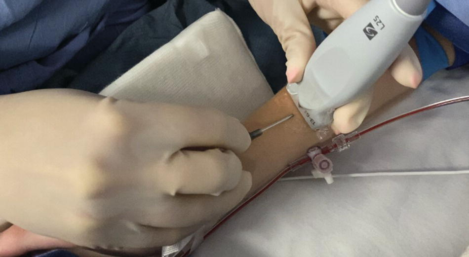

[**Figure 13.6**](#R_c13-fig-0006) Positioning of the ultrasound probe for cannulation of the cephalic vein.

**Technique.** Once a vein has been chosen, search for a long straight portion. During an ultrasound guided approach, it is important to scan the length of the vessel to determine patency and trajectory. The most common technique used is the short axis or out‐of‐plane approach. The long axis or in‐plane approach is preferred by more experienced practitioners, as it allows for dynamic visualization of the needle tip. For the short‐axis, out‐of‐plane technique, place the ultrasound probe at an angle of 60°–80° angle to the skin ([Figure 13.6](#c13-fig-0006)). Sweep or swing the probe along the arm and place it perpendicular to the vein. The vein should be kept continuously in the middle of the visualized field without moving the probe to the side in the perpendicular position. Puncture the skin and visualize the tip of the needle at the center of the anterior wall of the vein. The probe can be moved along the vein while maintaining the probe position perpendicular to the vein. Penetrate the anterior wall with the inner needle of the angiocatheter at an angle of 5°–10° to the skin. Carefully advance the needle, paying attention not to penetrate the posterior wall of the vein. Two high‐echoic enhancements from the needle tip placed inside the vessel are observed in the out‐of‐plane image ([Figure 13.7](#c13-fig-0007)). After obtaining venous blood return from the inner needle, an approximate 2 mm advancement of a 24 ga angiocatheter is required to penetrate the anterior wall by the outer catheter of the angiocatheter. Penetration of the inner needle and outer catheter beyond the anterior wall of the vein is more visible in plane than out of plane. Blood pressure cuff inflation can increase the lumen of the vein in adults and potentially in children.

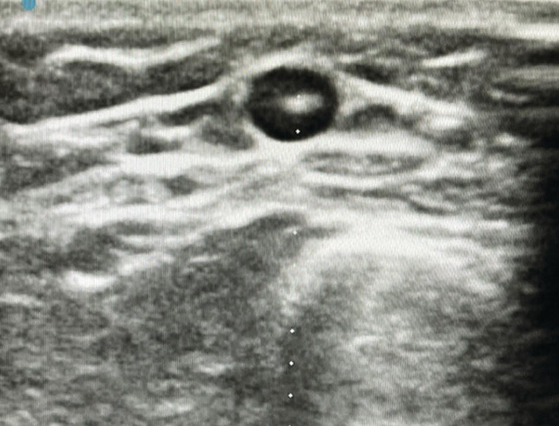

[**Figure 13.7**](#R_c13-fig-0007) Out‐of‐plane ultrasound image of the cephalic vein with the needle tip as the high echoic signal within the vessel.

After placement of a peripheral venous catheter, if there is a question about whether the catheter is properly sited within the vein, blood return may be elicted with gentle aspiration with larger catheters, and rapid flush of 3–5 mL of saline should be performed. The ultrasound probe can be utilized, especially in small children and infants, to obtain a subxiphoid four chamber view of the heart while saline is rapidly injected into the peripheral catheter. The appearance of saline contrast in the right atrium is confirmation of intravascular placement.

### Ultrasound‐guided central vascular access

Ultrasound‐guided central vascular access has become routine in many institutions, although superiority of either the real‐time ultrasound‐guided approach or the anatomic landmark approach for locating the IJV has been a matter of debate. The use of ultrasound guidance has been questioned for central catheterization in children; however, many researchers support its application \[79–82\]. Ultrasound is particularly useful for assisting access to the IJV and FVs in all age groups and the SCV in infants. Randomized studies \[80, 83–88\] have shown that arterial puncture rates during central catheterization are higher with landmark than with ultrasound guidance ([Table 13.5](#c13-tbl-0005)). The use of real‐time ultrasound increases insertion success, has higher overall success, reduces access time, and reduces arterial puncture; however, ultrasound‐assisted central vein catheterization is not totally reliable. A video analysis reported accidental artery catheterization in five CCAs and one femoral artery despite the use of real‐time ultrasonographic guidance, probably due to penetration of the posterior wall of the IJV \[89\]. Simulated models have indicated that penetration of the posterior wall of the IJV is unavoidable in certain cases \[18, 19\]. The available evidence tends to support the use of two‐dimensional ultrasound to augment the landmark technique for pediatric catheter placement, but more studies are needed \[81, 87, 88, 90\]. The use of ultrasound during central catheter placement in adults and children remains limited, not universally adhered to, and is most strongly associated with the availability of equipment. Trained anesthesiologists can insert IJV lines safely using the landmark technique \[90\], and ultrasound‐guided insertion techniques require education, training, and practice even when working with the adult patient population. Despite the widespread use of ultrasound in children, formal training for this technique is typically lacking. Trainees may benefit more than experienced operators from the use of ultrasound for central catheterization \[91, 92\].

[**Table 13.5**](#R_c13-tbl-0005) Arterial puncture rates for ultrasound guidance vs. landmark method during pediatric central venous catheter placement

| Author | Arterial puncture (_n_)/attempts (_n_) |
| --- | --- |
|  | Ultrasound | Landmark |
| --- | --- | --- |
| Verghese et al. \[83\] | 0/43 | 13/52 |
| Grebenik et al. \[84\] | 7/59 | 4/65 |
| Arai et al. \[85\] | 0/39 | 1/42 |
| Leyvi et al. \[86\] | 2/47 | 3/102 |
| Chuan et al. \[80\] | 1/32 | 8/30 |
| Froehlich et al. \[87\] | 10/119 | 18/93 |
| Bruzoni et al. \[88\] | 3/66 | 7/84 |
| Total | 23/405 (5.7%) | 54/468 (11.5%) |

The inadvertent arterial puncture rate is lower with ultrasound guidance than with the landmark method (_P_ = 0.0026).

#### Ultrasound‐guided IJV puncture

The IJV is frequently used for ultrasound‐guided or ultrasound‐assisted vascular access in children ([Figure 13.8](#c13-fig-0008)). Ultrasound can be used to place central catheters in the IJV even in neonates and infants. Ultrasonographic localization of the IJV is likely superior to the landmark technique in terms of overall success, speed, and decreased incidence of carotid artery puncture \[83\]. Both audio Doppler and ultrasound are useful for access to the IJV in children older than 1 year of age \[84\]. Ultrasound may be more useful than audio Doppler in infants and neonates. Location of the IJV with static ultrasonography and the anatomic landmark approach or combining pre‐procedural ultrasonographic assessment with real‐time ultrasound‐guided venipuncture is recommended for central vein catheterization \[79, 93, 94\].

In pediatric patients, anatomic structures of the vertebral, thyrocervical trunk, suprascapular, transverse cervical, and inferior thyroid arteries, as well as the CCA, can be observed by ultrasonography including Doppler color flow imaging ([Figure 13.8](#c13-fig-0008)). The brachiocephalic artery divides into the right subclavian artery and the right CCA. The right vertebral artery branches from the subclavian artery. The thyrocervical trunk bifurcates from the subclavian artery next to the vertebral artery and into mainly three arteries, the suprascapular, transverse cervical, and inferior thyroid arteries. Numerous variations have been reported for the vessels arising from the aortic arch \[95\], with different origin variants of the right vertebral artery and some variants of the thyrocervical trunk and its branches \[96\]. The vertebral artery usually lies under the CCA and enters the vertebral column at the fifth or sixth vertebra; however, it sometimes lies under the IJV. The relationships between the IJV and the vertebral artery can be seen in out‐of‐plane images ([Figure 13.9](#c13-fig-0009)A) and in‐plane images ([Figure 13.9](#c13-fig-0009)B) with Doppler color flow ultrasound, even in neonates and infants. The depth from the skin to the vertebral arteries, the width of the vertebral arteries, and the distance from the IJVs to the vertebral arteries ([Figure 13.2](#c13-fig-0002)), as well as the extent of overlap between the IJVs and vertebral arteries, with scores of zero to three for each measurement, should be checked \[97\]. The summed scores are categorized as low risk (0–3), moderate risk (4–7), or high risk (8–10). High risk is approximately 13% for accidental puncture of the vertebral arteries. From the thyrocervical trunk ([Figure 13.10](#c13-fig-0010)A), the suprascapular, transverse cervical ([Figure 13.10](#c13-fig-0010)B), and inferior thyroid arteries arise, in that order. Inexperienced practitioners can mistake these arteries for the vertebral artery with ultrasound imaging of this vessel \[98\]. In some cases, such as anomalous origin of the vertebral artery or IJV spasm, the relationship between the vertebral artery and the IJV may be more clearly understood with in‐plane imaging \[99\].

[**Figure 13.8**](#R_c13-fig-0008) Schematic of the anatomic relations among the common carotid artery (CCA), internal jugular vein (IJV), vertebral artery (VA), thyrocervical trunk (TCT), subclavian artery (SCA), subclavian vein (SCV), suprascapular artery (SSA), transverse cervical artery (TCA), and inferior thyroid artery (ITA).

**Technique.** For right‐side IJV puncture, the ultrasound instrument may be placed on the right side of the patient. Before catheterization of the IJV, the pulsation of the carotid artery should be confirmed by palpation at the middle of the patient’s neck. ([Figure 13.11](#c13-fig-0011)A2). Under the IJV, the pulsatile vessel, possibly the vertebral artery, can sometimes be felt to be obviously different from the carotid artery. The relationship between the vertebral artery and the IJV, in addition to the relationship between the carotid artery and the IJV, should be assessed by ultrasound imaging out of plane ([Figure 13.11](#c13-fig-0011)B1) and in plane ([Figure 13.11](#c13-fig-0011)B2). Images of other arteries around the IJV, such as the subclavian artery, thyrocervical trunk ([Figure 13.10](#c13-fig-0010)A), transverse cervical artery ([Figure 13.10](#c13-fig-0010)B), and inferior thyroid artery, are sometimes obtained. After disinfecting the puncture site, place the probe with sterilized cover perpendicular to the IJV using the swing or sweep technique to keep the probe perpendicular to the vein in the ultrasound‐guided, out‐of‐plane technique. Before puncturing the skin under real‐time ultrasound guidance, depress the targeted skin surface puncture point above the IJV with the tip of a dull, metal, sterilized instrument, such as a hemostat, to simulate puncture without puncturing the skin surface. Obtain an ultrasound image of the intended needle on the screen to confirm the accurate point of puncture at the midpoint between the outer and inner wedges of the IJV. The IJV should be continuously kept in the middle of the monitor without moving the probe to the side and maintaining its perpendicular position. The tip of a 24 ga angiocatheter may be placed at a precalculated angle to the skin ([Figure 13.12](#c13-fig-0012)). Puncture the skin and visualize the tip of the needle at the center of the anterior wall of the IJV. The probe can be moved along the IJV, maintaining it perpendicular to the vein. Bear in mind that the probe is 12–16 mm thick in its short axis, which hinders the proper advancement of the needle. By inserting the needle 3–5 mm below the skin and then placing the probe near the needle, one can avoid hindrance by the probe – considering the relationship between the depth from the skin and the angle of the probe. Continue observing the tip of the needle on ultrasound throughout the procedure. The tip can be observed at the anterior wall of the IJV ([Figure 13.11](#c13-fig-0011)C1). Two bright echo enhancements of the tip may be seen inside the IJV ([Figure 13.11](#c13-fig-0011)C2). Additional needle advancement is necessary to penetrate the anterior wall with the outer catheter. The distance from the tip of the inner needle and the tip of the outer catheter is approximately 2 mm for a 24 ga angiocatheter. After obtaining dark‐colored non‐pulsatile blood return ([Figure 13.11](#c13-fig-0011)D1), the slightly curved guidewire should be carefully inserted into the IJV ([Figure 13.11](#c13-fig-0011)D2). When any resistance is encountered during guidewire advancement, advancement must be stopped, and the blood return should be reconfirmed. The course of the guidewire should be confirmed by ultrasound ([Figure 13.12](#c13-fig-0012)) or fluoroscopic imaging before inserting dilators. If there is no blood return, the needle should be withdrawn, and re‐puncture is required. If inadvertent artery puncture occurs, press on the puncture site for several minutes to aid in hemostasis. After smooth insertion of the guidewire, the outer catheter must be advanced carefully into the IJV ([Figure 13.11](#c13-fig-0011)D3), and dark‐colored blood return should be reconfirmed ([Figure 13.11](#c13-fig-0011)D4) to avoid artery catheterization. As discussed earlier, once the catheter is placed in the vein, a short extension tube can be connected to the catheter, which can then be used to verify venous access. Carefully insert the dilator along the guidewire so as not to damage vessels or the guidewire while confirming the smooth movement of the guidewire. If any resistance is felt during dilator insertion, stop the advancement and confirm the smooth movement of the guidewire in the IJV. Use fluoroscopy if necessary. Guidewire deformation may suggest complications such as vein or artery perforation. Confirmation of an in‐plane, long‐axis image of the guidewire ([Figure 13.13](#c13-fig-0013)) is useful in most patients \[100\]. Careful insertion of dilators is mandatory to avoid serious complications.

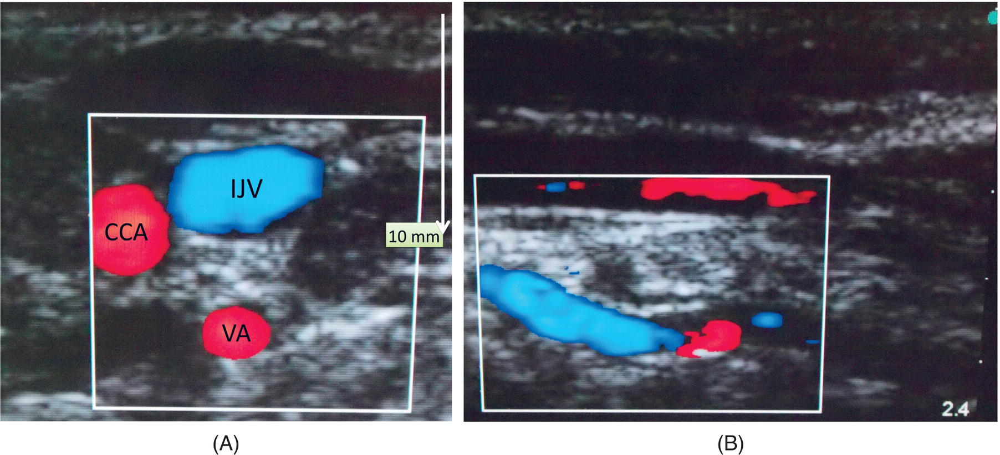

[**Figure 13.9**](#R_c13-fig-0009) Out‐of‐plane (A) and in‐plane (B) Doppler color flow imaging of the common carotid artery (CCA), internal jugular vein (IJV), and vertebral artery (VA) in a 5‐month‐old infant.

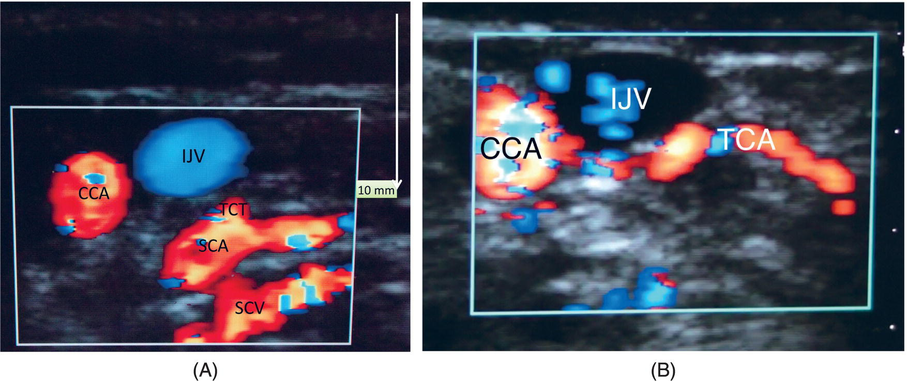

[**Figure 13.10**](#R_c13-fig-0010) Out‐of‐plane Doppler color‐flow imaging of the neck vessels. (A) Out‐of‐plane Doppler color‐flow imaging of the common carotid artery (CCA), internal jugular vein (IJV), subclavian artery (SCA), thyrocervical trunk (TCT), and subclavian vein (SCV) in a 5 month‐old infant. The image was obtained near the clavicle. (B) Imaging of the CCA, IJV, and transverse cervical artery (TCA) in an 11‐month‐old infant. The image was obtained at a site slightly caudal from the mid‐portion of the neck, above the clavicle.

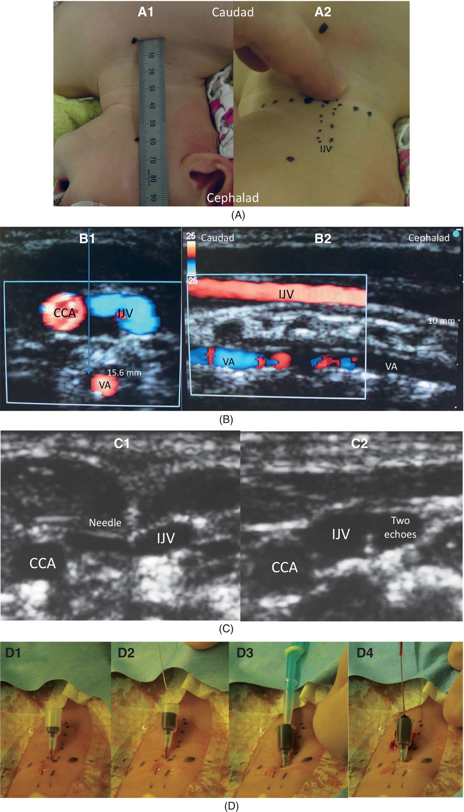

[**Figure 13.11**](#R_c13-fig-0011) Internal jugular vein (IJV) puncture under real‐time ultrasound guidance. (A) The distance from the clavicle and the angle of the mandible is approximately 60 mm (A1). The common carotid artery (CCA) and the IJV are outlined and palpated (A2). (B) The CCA and the IJV are visualized by ultrasound Doppler color flow out‐of‐plane (B1) and in‐plane (B2) (VA, vertebral artery). The tip of the angiocatheter is advanced into the IJV and positioned at the anterior wall of the IJV (C1). Two bright echo enhancements are seen at the tip of the needle (C2). Blood return is obtained through the 24 ga angiocatheter; dark‐colored and non‐pulsatile blood return is obtained (D1). Blood return has increased (D2). The guidewire is inserted and the needle is advanced (D3). We always suspect that the guidewire might possibly advance into arteries behind the IJV. Dark‐colored blood return is obtained again; this blood is believed to be venous (D4).

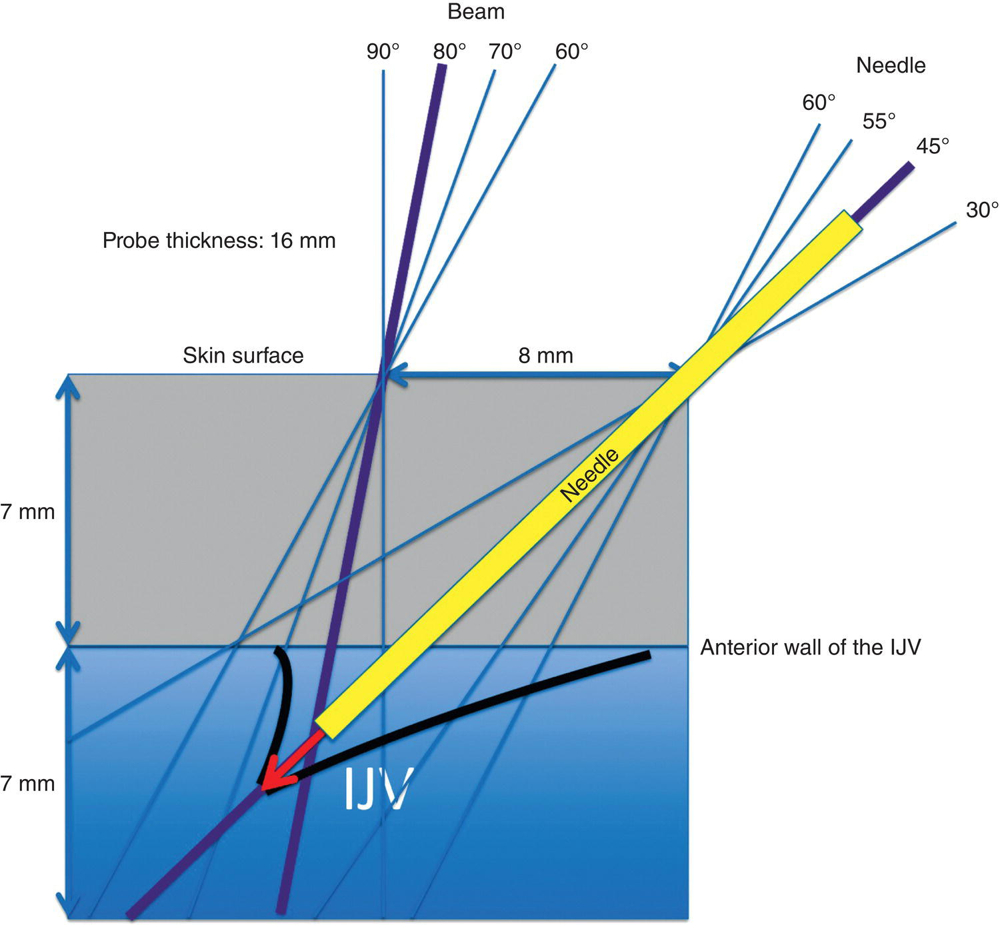

[**Figure 13.12**](#R_c13-fig-0012) The relationship between ultrasound beam and needle angles. To effectively obtain an image of the needle tip on the monitor, the ultrasound beam and needle angles should be as parallel to each other as possible. More than an 8 mm distance between the center of the needle and the puncture site on the skin surface is required when a 16 mm‐thick ultrasound probe is used. When the internal jugular vein (IJV) with a 7 mm anterior‐posterior length is located 7 mm beneath the skin, the optimal beam angle is 70°–80° to obtain a good image of the needle tip in the IJV while advancing the needle at a 45° angle to the skin. When the beam angle is 60° to the skin, the optimal angle of the needle is approximately 30° angle to the skin. Adjust the angle according to the probe thickness and IJV depth.

#### Ultrasound‐guided SCV puncture

Central catheters can be placed via the SCV under ultrasound guidance \[82, 101–103\]. The SCV, in addition to the IJV, carotid artery, clavicle, and its shadow can be identified by transectional scanning ([Figure 13.14](#c13-fig-0014)). An ultrasound‐guided supraclavicular approach for SCV puncture is now possible for central venous catheterization in small infants, offering all of the advantages of SCV catheterization without the risk of “pinch‐off” syndrome \[100\]. Supraclavicular ultrasound‐guided catheterization of the SCV in the pediatric and neonatal ICU appears to be a promising technique in the emergency context \[101\]. It is safe and reliable, with few early complications. Furthermore, owing to the low level of sedation needed for its placement, it does not compromise the airway of the patient.

**Technique.** The principle of the ultrasound‐guided approach for SCV catheterization is to place the ultrasound probe at the supraclavicular level to obtain a longitudinal view of the SCV and to gain access to the vein via the usual infraclavicular route for cannulation. Place the ultrasound probe on the mid‐portion of the neck. Slide the probe caudally, and lean 45°–60° to the skin. Both the subclavian artery and vein are first visualized transversely under the IJV, and then a longitudinal view of the brachiocephalic vein, beginning at the junction of the IJV–SCV, can be obtained. After reaching the IJV–SCV junction, rotate the ultrasound probe laterally and caudally to obtain longitudinal images of the SCV and the brachiocephalic vein. With in‐plane imaging, place the needle under the probe to simultaneously observe the SCV and the needle tip. Puncture the mid‐portion of the venous anterior wall. After obtaining dark‐colored venous blood, insert the guidewire, and advance the procedure as for ultrasound‐guided IJV catheterization.

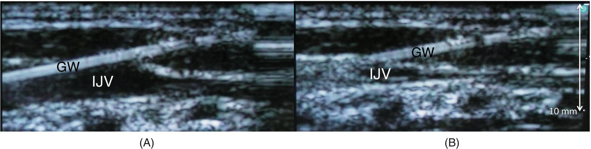

[**Figure 13.13**](#R_c13-fig-0013) In‐plane ultrasound images of the guidewire (GW) in a 6‐month‐old infant. (A) The GW is seen in the internal jugular vein (IJV). (B) The IJV is compressed, and the inner portion of the IJV cannot be seen.

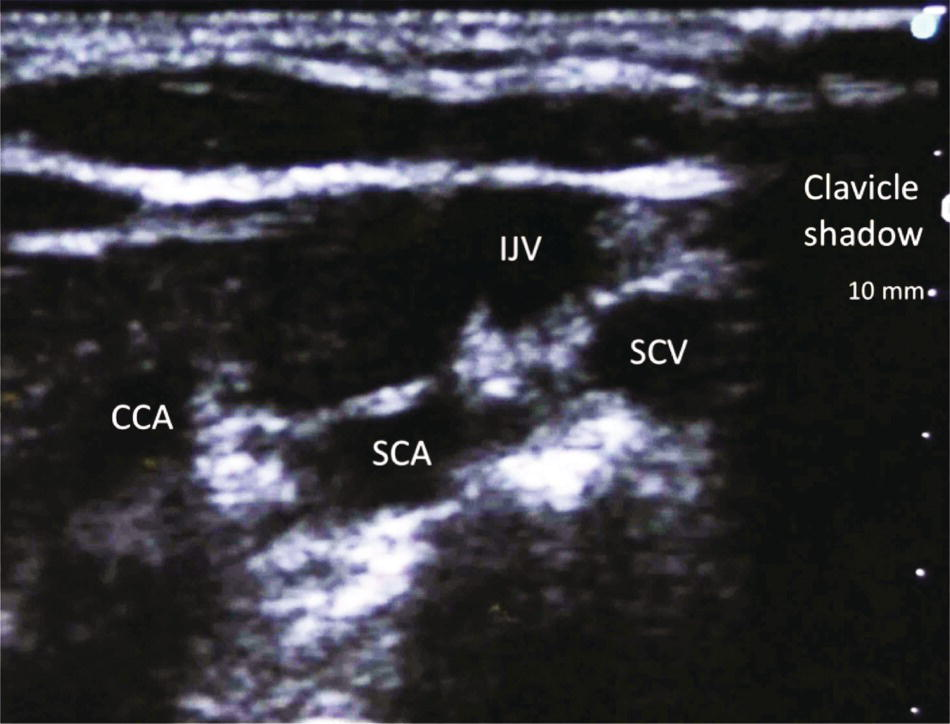

[**Figure 13.14**](#R_c13-fig-0014) The subclavian vein (SCV), internal jugular vein (IJV), common carotid artery (CCA), and clavicle. In a 5‐month‐old infant, the SCV, IJV, CCA, and the clavicle and its shadow can be identified by transectional scanning. SCA, subclavian artery.

#### Ultrasound‐guided brachiocephalic vein puncture

Ultrasound‐guided supraclavicular catheterization of the brachiocephalic vein is now possible for central venous line placement in small children. Place the broadband linear array ultrasound probe in the supraclavicular region to obtain a longitudinal view of the brachiocephalic vein, beginning at the junction of the IJV and SCV. Using the in‐plane technique, direct the needle under ultrasound guidance into the brachiocephalic vein. This provides good needle guidance with no disturbing ultrasound shadow caused by bony structures. The success rate of central catheterization via the brachiocephalic vein in children appears to be very high \[104\].

#### Ultrasound‐guided EJV puncture

The EJV can often be seen on the lateral side of the patient’s neck. Ultrasound imaging facilitates confirmation of its course; however, safety and success rates of the conventional surface anatomic landmark technique and the ultrasound‐guided technique are similar for inexperienced trainees \[105\].

#### Ultrasound‐guided FV puncture

The FV is an optimal site for ultrasound guidance, and the infection rate does not appear to be high, as mentioned earlier.

**Technique.** As described earlier, the patient is positioned with a rolled towel under the hips for moderate extension. For right‐side FV puncture, place the ultrasound monitor on the patient’s left side. The practitioner may stand on the patient’s right side in order to see the monitor over the patient. Check to ensure that the femoral artery and FV are 1–2 cm from the inguinal ligament by palpation, and then use the ultrasound. The femoral artery is located on the left, lateral side and runs toward the practitioner with a pulsatile, Doppler red‐colored flow. The FV is located on the right medial side and runs away from the practitioner with a non‐pulsatile, blue‐colored flow. Before insertion, check the course of the vessels, and place the probe perpendicular to the FV using the swing or sweep technique. The FV in children is located 7–22 mm from the skin \[106\], which is usually deeper than the IJV and enables one to obtain an ultrasound image more easily than for the IJV. After sterilization, puncture the skin 1–2 cm from the inguinal ligament according to the probe thickness as described for ultrasound‐guided IJV puncture.

### Ultrasound‐guided arterial catheterization

Ultrasound‐guided radial artery catheterization can be useful even in neonates and infants. Radial artery insertion by ultrasound is often selected after the failure of radial artery catheterization by palpation. Ultrasound can visualize the course of the small radial artery even in difficult cases in neonates and infants. Highly successful catheterization can often be achieved when ultrasound images of the tip of the puncture needle and the radial artery are obtained in the same screen under the skin. Ultrasound guidance can improve the success rate of artery catheterization in infants. Fewer attempts with the ultrasound technique are required compared with the traditional technique \[107, 108\]. Ultrasound‐guided radial artery catheterization in infants and small children can provide a greater chance of success at the first attempt compared with the Doppler‐assisted technique \[109\]. Serious complications, such as permanent ischemic damage, are infrequently observed in with ultrasound‐guided arterial catheterization for perioperative and intensive care monitoring. However, ultrasound guidance may not facilitate faster catheterization of the radial artery in children.

**Technique.** Prepare the patient’s hand position as described for the palpation method (see earlier). Before catheterization of the radial artery, the course of the radial artery can be palpated and then confirmed with ultrasound Doppler color flow. Once the radial artery has been located by ultrasound, the pulsation of the radial artery becomes easier to capture visually on the monitor, even in neonates and infants. After disinfecting the skin, place the probe with sterilized cover directed perpendicular to the radial artery using the swing or sweep technique to keep the probe directed perpendicular to the artery using the ultrasound‐guided, out‐of‐plane technique. Obtain the ultrasound image of the intended needle on the screen to confirm the accurate point for puncture ([Figure 13.15](#c13-fig-0015)). The radial artery image should be continuously maintained in the middle of the monitor. When bright‐colored, brisk flashback is obtained from the inner needle while puncturing, advance the catheter 1–2 mm to enter the artery. When the artery is transfixed, withdraw the needle and gently withdraw the catheter until brisk flashback is observed. The catheter can then be advanced into the artery. Alternatively, when the tip of the needle is visualized inside the artery at the center, the needle and catheter together can be advanced fully into the artery, keeping the tip of the needle in ultrasound view in the center of the artery during advancement. There is no need to watch for a flashback in the hub of the needle with this method. This technique has the advantage of lessening risk of puncture or damage to the back wall of the artery. Remove the needle when the catheter is advanced to the hub. Connect the catheter to the pressure tubing, paying close attention to avoiding air in the line. Place a cushion between the skin and the catheter with the connector to avoid skin necrosis and cover the catheter with the connector with sterile tape. We often obtain non‐pulsatile, bright‐colored blood from a 24 ga angiocatheter just after catheterization. Pulsatile blood inside the connected needle can be obtained after connecting to the pressure monitor line. Because of the small radial arterial size in small children, subcutaneous nitroglycerin injection (0.5 μg/kg in 0.5 mL saline) prior to the ultrasound guided radial arterial access significantly increased the diameter of the radial artery. This led to an increase in the success rate of the first attempt, a decrease in the number of cannulation attempts, and cannulation related complications \[110\].

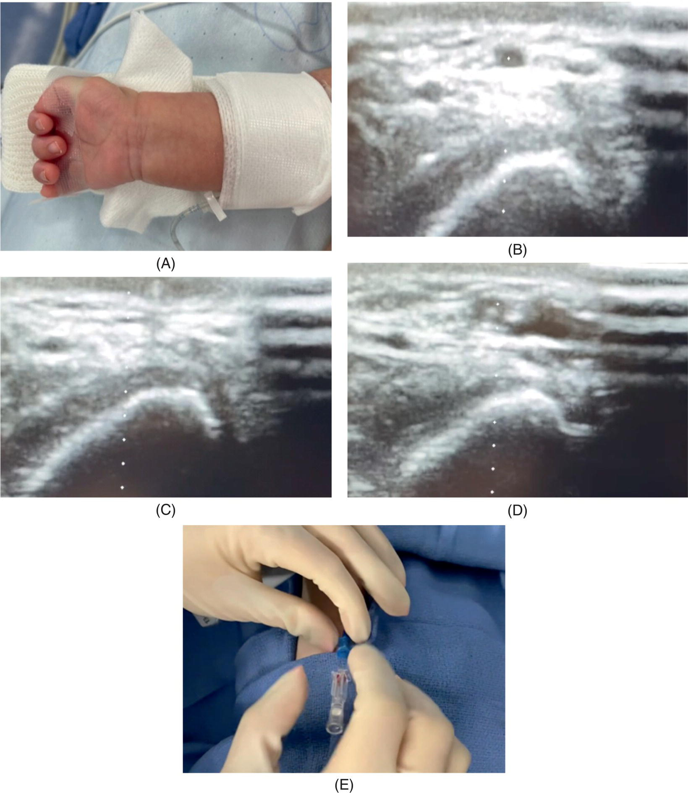

[**Figure 13.15**](#R_c13-fig-0015) (A–E) Ultrasound‐guilded radial arterial cannulation. See text for details.

An alternative ultrasound technique is to image the radial artery in the longitudinal plane and visualize the entire length of the needle and catheter inserted into the vein \[111\]([Figure 13.16](#c13-fig-0016)). A controlled study of short axis vs. long axis ultrasound imaging for radial artery catheterization in 97 infants and children revealed no difference in success rate (94% short axis vs. 98% long axis), time to cannualtion, or complications. The incidence of puncturing the posterial arterial wall was higher in the short axis group; (96 vs. 18%, p < 0.001).\[112\]

* * *

### KEY POINTS: ULTRASOUND‐GUIDED VASCULAR ACCESS

-   Ultrasound‐guided vascular access can increase the success rate of catheter insertion and decrease complication rates associated with catheterization.
-   The use of real‐time, ultrasound‐guided IJV puncture increases first‐insertion success, reduces access time, has greater overall success, and reduces inadvertent arterial puncture.
-   An ultrasound‐guided supraclavicular approach for SCV puncture is now possible for central venous catheterization in small infants.

* * *

## Percutaneous PA catheterization

Although multi‐lumen, flow‐directed PA catheters have long been used widely in adult practice, great controversy has arisen during the past several decades \[113–117\], and their use has decreased significantly, especially in children, and become rare in infants \[118\]. The Pulmonary Artery Catheter Consensus Conference published a consensus statement regarding the use of PA catheters in pediatric patients \[119\]. It recommends that PA catheters should only be used in selected patients, such as those with pulmonary hypertension and shock refractory to standard fluid resuscitation and vasoactive agents \[120\]. In patients undergoing congenital heart surgery, PA pressure monitoring may be indicated for reasons related to the cardiac condition of the patient or the nature of surgery. Patients undergoing surgery on left‐sided lesions and who do not have intracardiac shunting, those who are at risk of left ventricular dysfunction, and those with pulmonary hypertension may have indications for PA catheterization. Examples of surgical procedures include aortic surgery, aortic valve surgery or replacement, subaortic resection or myomectomy for hypertrophic cardiomyopathy, and mitral valve repair or replacement. However, PA catheterization has a limited role, if inserted percutaneously, for several reasons. First, adequately sized catheters and sheaths are not available in sizes small enough for the smallest pediatric patients. Secondly, most of these patients have intracardiac shunting, and standard thermodilution cardiac output (CO) measurements, and mixed venous oxygen saturation (SvO2) measurements are unreliable. In addition, a PA catheter in the right side of the heart may interfere with the surgical field. Thus, when PA pressure or SvO2 monitoring is indicated, transthoracic PA lines placed under direct visualization at the end of CPB surgery are the most commonly used approach.

Percutaneous PA catheterization is used less frequently in children than in adults, mainly due to greater difficulty in gaining access because of patient size and the unavailability of small‐sized PA catheters; however, if the patient is large enough to insert a 5 or 6 Fr introducer sheath in the FV or IJV, percutaneous PA catheter insertion may be feasible.

Pulmonary artery catheters are available in various sizes (4–8 Fr) for different functions, such as pressure monitoring, thermodilution measurement of intermittent or continuous CO, continuous measurement of venous saturation, and cardiac pacing. Commonly used sizes for pediatric patients are 4 Fr (non‐balloon‐tipped, two‐lumen, oximetry catheter), 5 Fr (balloon‐tipped, four‐lumen, thermodilution catheter), 5.5 Fr (balloon‐tipped, four‐lumen, oximetry and thermodilution catheter), and 7.5 and 8 Fr (balloon‐tipped, three‐lumen, oximetry and thermodilution catheter).

It must be stressed that a PA catheter should be used as a diagnostic and hemodynamic monitoring tool and not as a therapeutic intervention; interpretation of the data derived from a PA catheter and subsequent management decisions are crucial to benefit patients fully, requiring attending physician‐level expertise. Efficacy studies supporting the use of PA catheterization in children undergoing congenital heart surgery are scarce in the existing literature. Therefore, risks incurred by PA catheter placement should be well taken into account.

**Technique.** The previously mentioned consensus statement, as well as the guidelines set by the American Society of Anesthesiologists task force, recommends that PA catheters should only be used by suitably experienced personnel to minimize complications, thus requiring adequate supervision throughout the procedure \[121\] The selection of PA catheter should be based on clinical need and patient size. To obtain maximal benefits, a PA catheter with oximetry and thermodilution CO measurement capabilities is desirable. Commercially available catheters equipped with these functions are 5.5 or 7.5 Fr in size and thus require a 6 or 8 Fr introducer sheath, respectively. A 5.5 Fr PA catheter should be used in patients up to approximately 40 kg in weight. Because of the direct path and curvature of the catheter, appropriate sites of insertion are the right IJV, left SCV, and FVs.

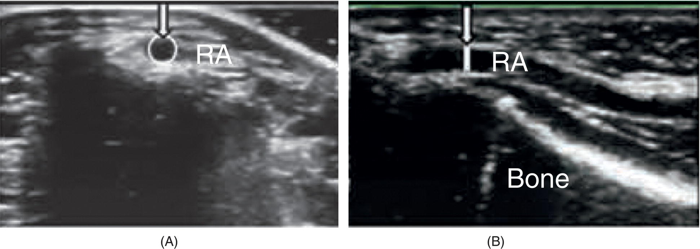

[**Figure 13.16**](#R_c13-fig-0016) (A) Radial artery in short axis view. (B) radial artery in long‐axis view.

(Source: Kim et al \[111\]. Reproduced with permission from Wolters Kluwer Health, Inc.)

After full barrier precautions are taken and using the Seldinger technique following guidelines described earlier for percutaneous central catheter insertion, insert an introducer sheath into a central vein. The balloon integrity should be tested before insertion by inflating the recommended volume of air. Insert a flexible sterile sleeve before placement to protect the PA catheter outside the body and to allow for sterile repositioning later. Connect, flush, and calibrate the PA and CVP ports before insertion. Advance the catheter as far as the RA with the balloon deflated, then inflate the balloon and advance the catheter into the PA while observing the pressure tracing. The catheter’s advancement toward the tricuspid valve is signified by enlarging V waves on the CVP tracing. The catheter passes through the tricuspid valve during diastole and the characteristic RV trace becomes visible on the PA tracing, with no dicrotic notch and moderate diastolic pressure. Hasten advancement of the catheter through the RV because of the propensity for dysrhythmias. The diastolic pressure increases and the dicrotic notch becomes apparent as the catheter tip passes through the pulmonary valve. Gently advance the catheter until a pulmonary capillary wedge pressure (PCWP) tracing is obtained, at which point the balloon should be deflated so that the PA tracing returns. It may be necessary to reduce or remove any redundant length or loop in the RA or RV by slowly withdrawing the catheter 1–2 cm. The balloon can then be reinflated to determine the minimum inflation volume necessary to obtain a wedge pressure tracing. The best position for the catheter tip is where the full or near‐full inflation volume (0.5–1.5 mL) produces a wedge pressure tracing. Advancement of the catheter to the PA should be relatively rapid because prolonged manipulation may result in loss of catheter stiffness, thereby causing coiling in the RV or difficulties in catheter advancement. When difficulty advancing the catheter through the pulmonary valve is encountered, counter‐clockwise rotation of the catheter, along with positioning the patient with the right side down, may result in successful placement. Alternatively, TEE may be used to visualize and guide the PA catheter. The PA pressure should always be monitored with the waveform displayed on the monitor so that migration of the catheter into the distal PA or RV can be detected immediately. Leaving the catheter in the wedged position undetected can lead to particularly serious complications such as PA rupture or pulmonary infarction. The catheter should be withdrawn several centimeters during the bypass period to reduce the risk of PA perforation.

Specific information that can be gathered with regular PA catheters includes PA pressure (systolic, diastolic, and mean), PCWP, RA pressure, mixed venous gases, and CO by thermodilution. Measurement of the PCWP is important because it is a reasonable estimate of left atrial pressure (LAP), which in turn is an estimate of left ventricular end‐diastolic pressure (LVEDP). The assumption that PCWP reflects LAP is only valid if patency of vascular channels between the distal port of the PA catheter and the left atrium is ensured. This will occur only in dependent portions of the lung (West’s zone 3), where pulmonary venous pressure exceeds alveolar pressure. Fortunately, with the patient in the supine position, a large portion of the lung is functioning in zone 3, and PA catheters will preferentially float into zone 3. To avoid erroneous readings, the PCWP should be measured at end expiration. The PCWP may not accurately reflect LVEDP in the presence of pulmonary venous or arterial hypertension, mitral valve disease, or positive end‐expiratory pressure. The LVEDP is an index of left ventricular end‐diastolic volume, the classic measure of left ventricular preload. The relation between left ventricular end‐diastolic pressure and volume is best described by the left ventricular compliance curve, which is non‐linear and is affected by many factors, such as ventricular compliance. Because TEE can provide more precise information regarding ventricular volume status, the usefulness of measuring PCWP becomes questionable.

Cardiac output can be measured with the standard thermodilution technique. In brief, a thermodilution PA catheter is connected to a CO monitor, a known amount of solution (injectate) of known temperature is rapidly injected into the proximal lumen of the catheter, this cooler‐than‐blood temperature solution mixes with the surrounding blood, the temperature is measured downstream in the thermistor on the PA catheter, and a decrease in temperature is recorded. The magnitude of the temperature change depends on the amount of blood that mixes with the injectate, and hence CO. The CO computer constructs a time–temperature curve to calculate CO from the area under the curve (AUC). When CO is low, more time is required for the temperature to return to baseline, producing a larger AUC. In contrast, with high CO, the injectate is carried more quickly through the heart, and the temperature returns to baseline faster, producing a smaller AUC. Thus, CO is inversely proportional to the AUC. Several factors may affect bolus CO determination: inaccurate temperature and volume of the injectate, rapid intravascular volume infusion during measurement, timing during the respiratory cycle, inaccurate computation constant, and thermal instability during the immediate post‐bypass period. In addition, the presence of an intracardiac shunt can lead to erroneous CO values. For example, a left‐to‐right intracardiac shunt will cause recirculation of the injectate and create a larger AUC (decreased peak height and slower return to baseline), providing an erroneously low CO reading. A right‐to‐left shunt will have the opposite effect, providing an erroneously high CO reading. Therefore, the presence of an intracardiac shunt precludes the use of the thermodilution method to calculate CO. Technologic advances have produced PA catheters for continuous thermodilution CO monitoring using thermal indicators. Whereas the intermittent bolus technique uses cold injectate as the indicator, the new technology uses small energy impulses (warming of blood), which are emitted from a thermal filament directly into the bloodstream as the indicator; no fluid injection is required. These pulses of thermal energy emitted in a random on‐off pattern change blood temperature, which is then detected by the thermistor at the tip of the PA catheter. Using a proprietary algorithm to analyze the thermal signal measured at the thermistor, a time–temperature curve is generated to calculate CO from the AUC. Typically, the displayed value for CO is updated every 30 seconds and represents the average CO over the previous 3–6 minutes. In this sense, this technology provides continual, frequently updated CO values.

Once CO is measured, systemic and pulmonary vascular resistances can be calculated. According to Ohm’s law, vascular resistance equals the pressure drop (pressure difference between the upstream and downstream circulation) divided by blood flow (CO). This equation is based on the assumptions that blood flow is steady‐state, continuous, and laminar, and blood vessels are rigid conduits. This may be unrealistic for the pulmonary circulation, because pulmonary blood flow may cease at end diastole and pulmonary vessels are distensible \[122\]. Therefore, pulmonary vascular resistance calculated by PA catheters may have limited value, although it is widely used; interpretation should be performed with caution. Other hemodynamic parameters \[123–128\] that can be calculated by PA catheter are listed in [Table 13.6](#c13-tbl-0006).

In addition to calculated hemodynamic variables, PA catheters can also provide important information regarding oxygen delivery and consumption, which may be used to guide therapy in critically ill children with low‐CO syndrome. Because the arterial oxygen content is relatively constant under conditions of regular gas exchange, the major reflection of alterations in tissue oxygen extraction is SvO2 \[129\]. If oxygen delivery is compromised to the periphery, tissues will increase their extraction of oxygen to compensate for reduced oxygen delivery. This will result in a decrease in SvO2. Therefore, SvO2 is an indirect indicator of the adequacy of tissue oxygenation, or a reflection of the balance between oxygen requirement and oxygen delivery. The relation between SvO2 and CO can be shown by the modified Fick equation:

where SaO2 is the arterial oxygen saturation, VO2 is the rate of oxygen consumption, and Hb is the hemoglobin concentration. From this equation, it is apparent that SvO2 varies directly with CO, Hb, and SaO2 and indirectly with metabolic rate (oxygen consumption).

A fiberoptic‐equipped PA catheter allows for continuous monitoring of SvO2 to guide timely therapeutic interventions during the perioperative period. Interpretation of SvO2 may become difficult under conditions of intracardiac shunt, peripheral arterial venous shunt, sepsis, and cirrhosis.

* * *

### KEY POINTS: PULMONARY ARTERY CATHETERIZATION

-   A PA catheter should only be indicated in selected patients with CHD. Experienced physicians should directly supervise PA catheterization and its maintenance to avoid serious complications and erroneous interpretation of the data.
-   Available sizes of PA catheter are a limiting factor for percutaneous insertion in children.
-   In addition to hemodynamic parameters derived from the PA catheter, oxygen wellness should be calculated to direct therapy in ill children with low CO.

* * *

## Interpretation of intravascular pressure waveforms

The information derived from intravascular catheters exceeds that of merely monitoring an absolute number; it is enhanced by observing the waveforms themselves. Accurate interpretation of the waveforms requires some understanding of the mechanical and electronic technical components of pressure monitoring. Pressure waves in the arterial and venous systems represent the transmission of forces generated in the ventricles. Measurement of these forces requires their transmission to a device that converts mechanical energy into electrical signals, which are processed and displayed. A system for intravascular pressure monitoring consists of intravascular catheters, fluid‐filled tubing, connectors, transducers, amplifiers, and display devices. Understanding this system is a prerequisite for interpreting pressure waveforms. Although the use of commercially available, disposable transducer kits is common practice these days, the shortest possible, large‐bore, stiff, plastic tubing should be tailored to the patient’s size. Minimization of the number of stopcocks and connections will improve the fidelity of the transmitted pressure wave \[130\]. It is imperative that the tubing system be thoroughly flushed before use to eliminate air bubbles or clots. In addition, it is important to recalibrate at the RA level (mid‐axillary line) periodically to correct for transducer “drift.” Ringing and damping are two common sources of erroneous data acquisition from pressure monitoring and are associated with problems of dynamic accuracy \[131–133\]. Because a pressure monitoring system has resistance, inertia, and compliance, it can oscillate or “ring,” that is, overestimate the systolic pressure and underestimate the diastolic pressure. A system that is ringing (underdamped) results in higher systolic pressure and lower diastolic pressure. In contrast, a damped system provides lower systemic pressure and higher diastolic pressure. In the face of either ringing or damping, mean pressure is preserved and provides an accurate number. If the dynamic response of a system is in question, mechanical devices (e.g. a Resonance OverShoot Eliminator \[ROSE™\]; Argon Medical Devices, Inc., Plano TX, USA; Accudynamic®, Abbott Critical Care Systems, Abbott Park IL, USA) can be incorporated to alter the resonance frequency and/or damping factor of the transducer system \[134, 135\]. The resonance frequency can be tested by flushing the system with a pressurized bag of heparinized saline, stopping abruptly, and observing the number and amplitude of oscillations required to return to baseline waveform (dynamic response) \[136\]. Proper damping is indicated by one oscillation below and one oscillation above the mean before returning to normal.

[**Table 13.6**](#R_c13-tbl-0006) Normal values of hemodynamic and oxygen parameters

|  | Formula | Neonate/infant | Children | Adolescent/Adult | Unit | Source |
| --- | --- | --- | --- | --- | --- | --- |
|  |  |  | Toddler | Preschool | School Aged |  |  |  |
| --- | --- | --- | --- | --- | --- | --- | --- | --- |
| **HR** |  | 100–180 | 93–160 | 70–140 | 62–140 | 60–100 | min−1 | \[119–121\] |
| **LVCO** | HR × SV | 0.8–5.0 | 1.7–3.8 | 1.3–5.4 | 3.2–6.3 | 4.0–8.0 | L/min | \[120\] |
| **LVCI** | LVCO/BSA | 2.0–4.0 | 3.5–6.5 | 3.0–7.1 | 3.3–6.9 | 2.8–4.2 | L/min/m2 | \[120, 122\] |
| **RVCI** | RVCO/BSA | 3.0–4.4 |  | 3.6–5.8 |  |  | L/min/m2 | \[121\] |
| **LVSV** | LVEDV − LVESV or CO/HR | 5–13 | 18–32 | 13–60 | 47–65 | 60–130 | mL/beat | \[120, 121, 123\] |
| **LVSVI** | LVSV/BSA | 40–75 | 31–55 | 37–70 | 42–76 | 30–65 | mLbeat/m2 | \[121, 122\] |
| **LVEF** | LVSV × 100/LVEDV | 45–81 |  | 46–71 | 47–77 | 47–78 | % | \[120, 123, 124\] |
| **RVEF** | RVSV × 100/RVEDV | 59–73 | 39–63 | 55–73 |  |  | % | \[118, 121, 122\] |
| **LVSWI** | (MAP − PCWP) × SVI × 0.0136 | 20–40 |  | 30–62 |  | 45–60 | g/beat/m2 | \[120\] |
| **SVR** | (MAP − CVP) × 80/CO | 2,800–4,000 |  | 1,200–2,800 |  | 800–1,200 | dyne‐sec/cm5 | \[120, 122\] |
| **PVR** | (PAP − PCWP) × 80/CO | <2,000–3,200 |  | < 40–320 |  | <250 | dyne‐sec/cm5 | \[122\] |
| **RVEDV** |  | 31–47 |  | 57–83 |  | 100–160 | ml | \[121\] |
| **Arterial O**2 content (CaO2) | 1.34 × Hb × SaO2 + 0.0031 × PaO2 | 15–18 |  | 16–18 |  | 18–20 | mL/dL | \[122\] |
| **Mixed venous O**2 content (CvO2) | 1.34 × Hb × SvO2 + 0.0031 × PvO2 | 11–14 |  | 12–14 |  | 13–16 | mL/dL | \[122\] |
| **Arterial‐venous oxygen difference** | CaO2 − CvO2 | 4–7 |  | 4–6 |  | 4–5.5 | mL/dL | \[122\] |
| **Pulmonary capillary O**2 content (CcO2) | 1.34 × Hb × SCcO2 + 0.0031 × PcO2 | 16–19 |  | 17–19 |  | 19–21 | mLdL | \[122\] |
| **Pulmonary shunt fraction** (Qs/Qt) | 100 × (CcO2 − CaO2)/(CcO2 − CvO2) |  |  | 2–8 |  |  | % | \[122\] |
| **O**2 delivery index (DO2I) | CO × CaO2 × 10/BSA | 450–750 |  | 450–700 |  | 450–640 | mL/min/m2 | \[122\] |
| **O**2 consumption index (VO2I) | (CaO2 − CvO2) × CI × 10 | 150–200 |  | 120–200 |  | 85–170 | mL/min/m2 | \[122\] |

CI, cardiac index; CO, cardiac output; EDV, end‐diastolic volume; HR, heart rate; LV, left ventricle; PVR, pulmonary vascular resistance; RV, right ventricle; SV, stroke volume; SVI, stroke volume index; SVR, systemic vascular resistance; SWI, stroke work index

### Arterial pressure waveform

Regular cardiac rhythm and the presence of CO can be confirmed by observation of the waveform on the monitor display. This is useful when prolonged use of electrocautery disturbs the ECG trace. Steep upstroke of the waveform implies good ventricular function, whereas slow upstroke may indicate poor contractility, left ventricular outflow tract obstruction, or peripheral vasoconstriction. The area under the systolic portion of the pressure curve is proportional to the stroke volume \[137\]. The position of the dicrotic notch is associated with changes in peripheral vascular resistance. In infants, a normal dicrotic notch is found in the upper half of the pressure wave. A dicrotic notch located high on the downslope of the arterial waveform may indicate increased systemic vascular resistance, whereas one located lower on the downslope may indicate low resistance. A low‐placed dicrotic notch with a steeper diastolic downslope is also observed in hypovolemic patients. A decrease in both peak systolic pressure and pulse pressure, which is accentuated by positive pressure ventilation, is an early indicator of hypovolemia or cardiac tamponade. Aortic stenosis will result in a pressure waveform with a slow‐rising upstroke, delayed peak, and narrow pulse pressure, whereas aortic regurgitation will result in a steep upstroke, bifid peak, widened pulse pressure, and low diastolic pressure. Low diastolic blood pressure can also reflect excessive distal “run‐off,” as in patients with large patent ductus arteriosus. A sudden increase in diastolic pressure occurs on ligation of the ductus because diastolic run‐off into the PA ceases.

The systolic pressure is higher in the more distal arteries due to the wave‐reflection phenomenon \[138\]. As the pressure wave passes down the arterial tree, it is modified by arterial narrowing, loss of arterial elastic tissue, and the addition of reflected waves, until it reaches the distal catheter. With distal progression, pulse wave amplification will produce a higher peaked pressure wave with a slightly higher systolic pressure. This is most pronounced in the arteries of the foot, where the systolic pressure may be 5–15 Torr higher than in the ascending aorta ([Figure 13.17](#c13-fig-0017)) \[139\]. Diastolic and mean pressures change very little with progression. This concept is important for interpreting arterial pressure tracings. The post‐bypass arterial tracing is frequently damped with catheters in small distal arteries (e.g., radial or foot arteries), probably due to vasoconstriction induced by CPB \[140\]. This usually does not last long after bypass; however, it can be troubling to observe, particularly during potentially critical periods of weaning from bypass. For long and difficult surgeries with long bypass or cross‐clamp times, it may be prudent to place catheters in larger, more central arteries (e.g., femoral or umbilical) or to ask the surgeon to measure pressure directly in the aortic root from the aortic cannula immediately after bypass to obtain an accurate arterial pressure.

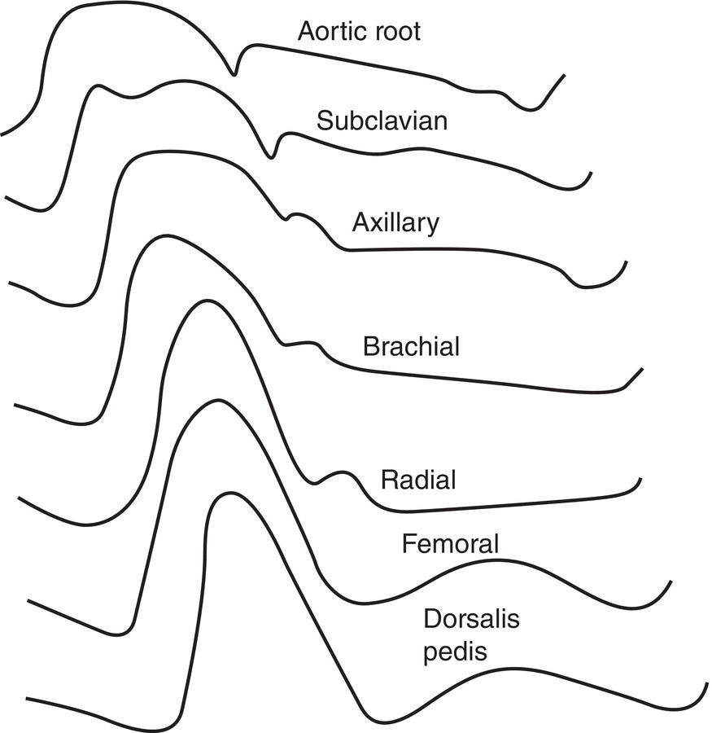

[**Figure 13.17**](#R_c13-fig-0017) Progression of the arterial pressure tracing from the root of the aorta to more peripheral arteries. Pulse‐wave amplification produces a higher systolic peak and slightly lower diastolic pressure in the smaller distal arteries, especially the dorsalis pedis.

(Source: Reich et al. \[139\]. Reproduced with permission of Elsevier.)

Failure of arterial pressure monitoring during congenital heart surgery is possible. Reasons for failure can include arterial spasm, kinking or clotting of the catheter, compression of an aberrant right subclavian artery by a TEE probe, or compression of the axillary artery by a sternal retractor. A back‐up manual blood pressure cuff should be always available. Alternatively, placement of a femoral artery catheter may be performed by the surgeon.

### Central venous and left atrial waveforms

The usual sites of filling pressure measurement are the CVP (right atrial pressure) and LAP. In the presence of normal tricuspid and mitral valves, the CVP and LAP reflect their respective ventricular end‐diastolic pressures. Normal atrial pressure traces have three positive waves, A, C, and V, corresponding to atrial contraction, closure of tricuspid or mitral valve, and ventricular contraction ([Figure 13.18](#c13-fig-0018)). The right atrial V wave is normally lower in amplitude than the A wave; however, in patients with atrial septal defect, the higher LAP may be transmitted to the RA during atrial filling, causing the right atrial A and V waves to be equal in amplitude. Changes in the components of atrial pressures may indicate pathologic ventricular function and cardiac rhythm. For example, a large V wave in the CVP may be caused by severe tricuspid regurgitation, which may reflect right heart failure, pulmonary hypertension, or right ventricular ischemia. Similarly, a large V wave in the LAP indicates mitral valve regurgitation. Disappearance of the A wave with appearance of an enlarged V wave indicates lack of atrial contraction because of loss of atrioventricular synchrony, as in junctional ectopic tachycardia, supraventricular tachycardia, atrial fibrillation, or atrial flutter ([Figure 13.19](#c13-fig-0019)). This is particularly important in discerning pathologic tachyarrhythmia from sinus tachycardia. In the face of rapid heart rate, the P wave of the ECG is often indiscernible, making cardiac rhythm from ECG difficult to determine. In contrast, the presence of an A wave in atrial pressure waveforms assures atrioventricular synchrony.

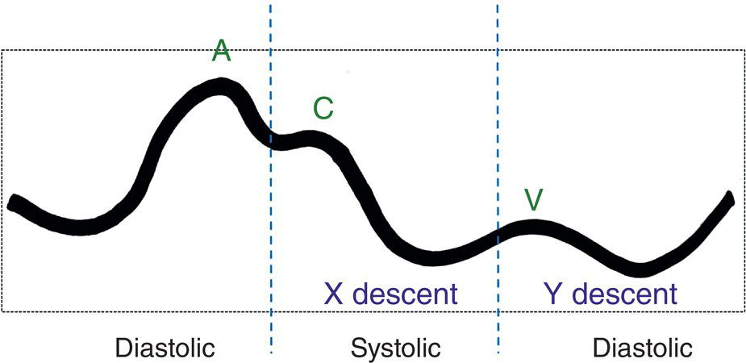

[**Figure 13.18**](#R_c13-fig-0018) Central venous pressure waveform. The A wave represents increased atrial pressure. The C wave represents closure of the tricuspid valve. Downward movement of the ventricle during systolic contraction forms the X descent. The V wave arises from the pressure produced when the blood filling the right atrium comes up against a closed tricuspid valve. Opening of the tricuspid valve in diastole, with blood flowing into the right ventricle, produces the Y descent.

The transducer position is particularly important for accurate measurement of atrial pressure, and it is usually set at the level of the RA. Slight position changes can easily provide erroneously high or low numbers because both the CVP and LAP measure low pressures of several cmH2O. Constant vigilance is necessary to keep the transducer level in the correct position and accurately calibrated.

* * *

### KEY POINTS: INTERPRETATON OF INTRAVASCULAR PRESSURE WAVEFORMS

-   Observation of the pressure waveform _per se_ can provide additional diagnostic information and should be displayed continuously during pressure monitoring.
-   Common errors made in data acquisition from arterial catheters include calibration error, improper calibration (gain), underdamping, and overdamping.
-   In the presence of normal tricuspid and mitral valves, the CVP and LAP reflect their respective ventricular end‐diastolic pressures.

* * *

## Newer techniques in pediatric intravascular monitoring

### Cardiac output monitoring

Because traditional percutaneous, balloon‐tipped PA catheterization is limited in small children, and those with intracardiac shunting, several other recently derived methods invented for adults to measure CO and oxygen delivery in patients with CHD have been applied to infants and children \[141\]. Lithium dilution CO (LiDCO) uses a standard central line in the SVC or even a peripheral IV catheter, and a special femoral artery catheter equipped with a lithium‐detecting electrode. A dilute solution of lithium chloride is injected into the vein, and arterial blood is withdrawn into the lithium electrode. The cardiac index is related to the AUC of the change of lithium concentration. This method has been demonstrated to have reasonable correlation with thermodilution CO in children after congenital heart surgery. In a study of 48 measurements in 17 patients weighing 2.6–34 kg, the correlation between LiDCO and thermodilution CO was good (_r_2 = 0.96), and the mean bias was −0.1 ± 0.31 L/min \[142\].

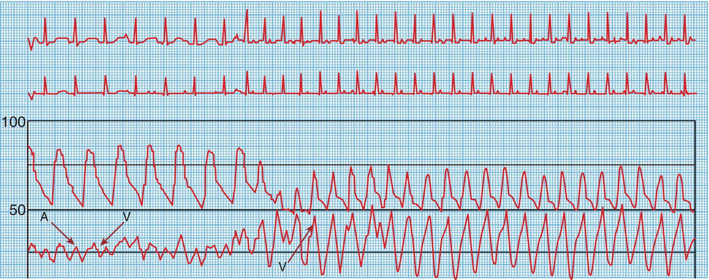

[**Figure 13.19**](#R_c13-fig-0019) Electrocardiogram demonstrating normal sinus rhythm in the first third of the panel, with onset of supraventricular tachycardia. Note the arterial pressure tracing with a 12–15 Torr decrease in systolic pressure, and the loss of the A wave on the central venous pressure tracing, with the appearance of large V waves with a systolic pressure increase from 10 to 16 mmHg.

Transpulmonary thermodilution CO uses a similar principle as LiDCO, except with temperature as the indicator instead of lithium concentration. Cold saline is injected into a CVC, and via a thermistor placed in a femoral artery, a time–temperature curve is derived, which correlates reasonably well with standard thermodilution CO as measured by a standard PA catheter \[143\]. Both lithium and any thermodilution method are limited to patients without any intracardiac shunting, significantly restricting their use in CHD.

Yet another newer method is pulse contour analysis of the arterial waveform (PiCCO,Pulsion Medical Systems, Gettinge AB, Feldkirche, Germany), which relates the contour and AUC of the systolic portion of the arterial waveform to the stroke volume, and thus the CO. This continuous method is periodically calibrated using the transpulmonary thermodilution CO as described above (again making the method invalid with intracardiac shunting) and demonstrates a good correlation with standard thermodilution with a PA catheter in a study of 24 pediatric patients after cardiac surgery (_r_2 = 0.86, mean bias 0.05 ± 0.4 L/min/m2) \[144\]. A standard central venous catheter is used for injection; and a special femoral arterial catheter, minimum size 3 Fr, are utilized with the PiCCO system ([Figure 13.20](#c13-fig-0020) A‐D). Stroke volume variation (SVV) and pulse pressure variation (PPV) can be calculated using the arterial waveform (see above), and fluid responsiveness can be assessed. SVV/PPV of 10% or less can be an indicator of adequate intravascular volume status. The PiCCO system will also derive a systemic vascular resistance index, stroke volume index, global end‐diastolic index (a measure of preload), and contractility parameters. None of these parameters has published data pertaining to congenital heart disease patients. In 15 pediatric patients averaging 22.9 kg, with septic or cardiogenic shock without CHD, 49 cardiac index measurements by PiCCO had close correlation with echocardiographically derived cardiac index by the volume‐time integral method (_r_\= 0.94, _R_2 = 0.89, _p_ < 0.01) \[145\] In this same patient cohort, global end‐diastolic index derived with PiCCO had significant correlations with CVP, and echocardiographically‐derived inferior vena cava collapsibility index in spontaneously ventilating patients, and the IVC distensibility index in mechanically ventilated patients. \[146\] There are no published pediatric outcome studies, and although a comprehensive review concludes that both lithium dilution and transpulmonary thermodilution methods have good correlation with standard thermodilution CO, these methods have not yet found their place in pediatric cardiac surgical care \[147\]. A 2018 survey of 97 pediatric cardiac intensivists from 62 international centers revealed that only 4% used PiCCO for diagnosis and to guide therapy in low cardiac output syndrome after cardiac surgery. \[148\]

### Central venous oxygen saturation monitoring

Monitoring of intravascular oxyhemoglobin saturation using reflectance catheters has been used in the umbilical artery, PA, and adult‐sized CVCs for a number of years, but only recently have standard pediatric sized 4 and 5 Fr, double‐ and triple‐lumen CVCs become available for routine use to measure central venous oxygen saturation (ScvO2) in pediatric patients. The advantage of this method is that it is a measure of oxygen delivery that is independent of intracardiac shunting, and thus may have better utility in the CHD patient. In 16 pediatric patients undergoing cardiac surgery, Liakopoulos et al. demonstrated good correlation between ScvO2 as measured with the catheter and with blood co‐oximetry (_r_2 = 0.88, bias −0.03 ± 4.72%, precision −8.02 to +8.09%) \[149\]. Three more recent studies in 75 critically ill infants and children undergoing cardiac or other major surgery report a wider range of correlation (_r_2 = 0.28 to 0.93), bias (−1.1 to +2.6%), and precision (−18 to +23%) \[150–152\]. Outcome data are lacking for this technique, but it has been useful as an adjunct for continuous trend monitoring of oxygen delivery in major cases.

## Complications of vascular access

### Incidence and risk factors

Central catheterization remains a mandatory procedure in many critically ill pediatric patients. Notwithstanding its certain advantages (e.g. large‐bore catheters, monitoring, drug administration), central catheterization carries risks of serious complications. These can be categorized into mechanical or insertion‐related complications (e.g. inadvertent arterial puncture, malposition, arterial catheterization, arrhythmia, hematoma, pneumothorax, hemothorax, cardiac tamponade) and maintenance‐related complications (e.g. obstruction, occlusion, systemic venous air embolization, infection). If detected promptly, minor complications can be readily corrected; however, some (pneumothorax, hemothorax, cardiac tamponade) may be life‐threatening. Sufficient knowledge and preparation, diligent technique, skill, and experience are obligatory.

The incidence of all vascular access‐related complications is difficult to ascertain from published research, but numerous case reports and studies have addressed this issue. Among early mechanical complications, the most frequent are arterial puncture, malposition, artery catheterization, and hematoma. The most frequent life‐threatening complications are pneumothorax, cardiac tamponade, and hemothorax. The most frequent catheter maintenance‐related complications are obstruction, occlusion, and sepsis.

The relationship between insertion site and complications has been well studied \[153–155\]. The SCV approach is anatomically more prone to early insertion‐related complications \[156\] than IJV or FV catheterizations; however, significantly more maintenance‐related problems develop in children with indwelling femoral catheters \[155\].

Operator experience appears to influence the rate of complications. In one study, resident anesthesiologists caused significantly more complications, both common and rare, than their senior colleagues; however, when closely supervised, the rates of acute mechanical complications \[90\], deep vein thrombosis (DVT), and infection were lower. Lower complication rates and higher success rates were obtained after sufficient training in landmark and ultrasound‐guided techniques \[91\].

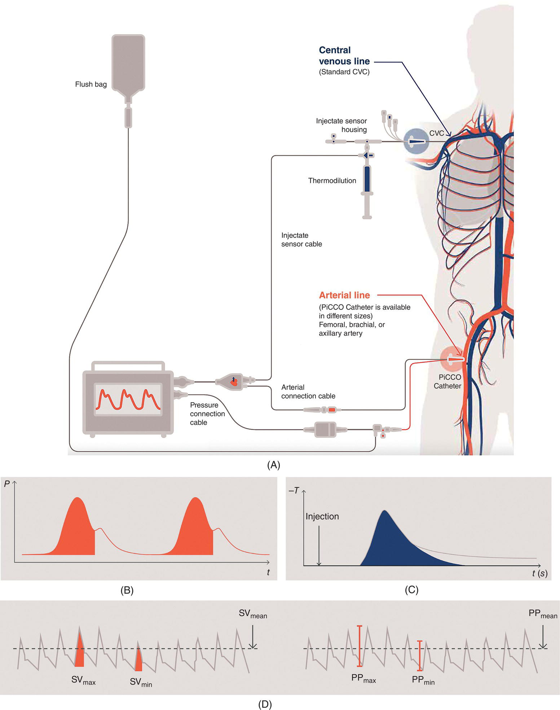

[**Figure 13.20**](#R_c13-fig-0020) (A) Schematic of system: Cold saline is injected into a CVP port and transits the pulmonary circulation and is injected into the aorta; temperature change is measured by a sensitive thermistor in a specially designed femoral artery catheter. (B) Arterial waveform analysis: the area under the curve of the systolic portion of the arterial waveform (red shading) is calculated continuously, as a measure of stroke volume. (C) Transpulmonary thermodilution: The area under the curve correlates with cardiac output, much like standard thermodilution cardiac output with a thermistor in the pulmonary artery. (D) Stroke volume variation (SV) and pulse pressure variation (PP). Percent variation during inspiration and expiration around the mean values can be calculated as a measure of intravascular volume status.

(Source: Figures courtesy of Pulsion Medical Systems, Gettinge AB, Feldkirche, Germany.)

In general, risk factors for central venous catheterization‐related complications include previous unsuccessful insertion attempts, more than two punctures, inexperience, body mass index _<_20 and >30, previous catheterizations, previous catheterization attempts, previous operations, radiotherapy, severe dehydration or hypovolemia, and large catheter size \[155\]. In neonates, catheter insertion can be challenging due to anatomic difficulties \[156\]. In older children, insertion‐related problems appear not to be associated with age; however, maintenance‐related complications are more commonly observed in younger children \[151\]. Similar to the adult population, duration of catheterization is closely related to frequency of maintenance‐related complications in pediatric patients \[155\].

Totally implantable central catheters (ports), PICCs, and tunneled external central catheters (e.g., Broviac catheters) have been used more often in critically or chronically ill pediatric patients. In a study summarizing implanted catheter‐related issues, the overall rate of reported complications was 31%; leakage was a specific problem necessitating reinsertion or repair. Infections were observed in 6% of patients with implanted central catheters and developed more than 30 days after catheterization \[157\]. When Broviac and clampless valved catheters were compared, malfunction was more frequently observed in the former group, whereas catheter displacement was more commonly found in the latter \[158\].

### Thrombosis

Catheter thrombotic occlusions and catheter‐related thrombosis in pediatric patients have become increasingly prevalent. The incidence of central catheter‐related DVT has been reported to be 0.13/1,000 catheter‐days \[159\]. This is one of the most frequent complications, especially among infants. Central venous thrombosis is reported to occur in 5.8% of neonatal patients, 10 times that of older patients; 40–50% of central venous thrombosis in this group occurs after congenital heart surgery \[160\]. A recent study examining the incidence of asymptomatic CVC‐related DVT in pediatric ICU patients revealed that age was independently associated with DVT; children aged more than 13 years were more likely to develop DVT than those aged less than 1 year \[161\].

Factors contributing to the risk of thrombosis include large‐bore catheters in small vessels (i.e., larger than 4 Fr in small infants), duration of cannulation exceeding 7 days, venous stasis due to extreme fluid restriction or low CO, infusion of high‐osmolarity fluids, and hypercoagulable states.

Indwelling central catheters act as additional foci for clot formation, and migrating clots can obstruct pulmonary, coronary, and cerebral vessels, leading to life‐threatening events. Rare conditions, such as arteriovenous malformations, may serve as sources of emboli; the brain is at particular risk of paradoxical embolism, further facilitated by the presence of right‐to‐left intracardiac shunts and pulmonary vascular abnormalities \[162\].

Immediate consequences of SVC thrombosis include SVC syndrome \[12\] with increased intracranial pressure and chylothorax due to ineffective drainage of the thoracic duct. Thrombosis of the IVC results in renal and intestinal dysfunction, ascites, and edema of the lower abdomen and extremities \[153\]. Assess carefully for signs of thrombosis; suspicion of thrombosis should be evaluated by ultrasound examination \[163\].

A wide range of options is available for the management of catheter‐related thromboembolism. These include removing the catheter, heparinization, administration of thrombolytic agents such as tissue plasminogen activator and urokinase, antithrombin III replacement, and surgical thrombectomy. In children, 5,000 IU of intraluminal urokinase was reported to be as effective as 25,000 IU in resolving withdrawal occlusion in partially implanted central catheters \[164\]. Systemic urokinase may rescue a significant proportion of central catheters refractory to intraluminal urokinase or those apparently completely occluded.

Prevention of SVC thrombosis is crucial and avoiding SVC catheterization in patients weighing less than 4 kg is often preferable. In children undergoing superior cavopulmonary anastomosis, EJV catheterization reliably predicts IJV and pulmonary arterial pressures and may obviate the risk of life‐threatening cavopulmonary thrombosis \[39\]. Thrombosis is also associated with higher rates of infection \[165, 166\]. Heparin‐bonded catheters can decrease the rate of thrombosis and do not increase the risk of bleeding \[165, 167\]. In patients with occlusion of central veins due to previous catheters, magnetic resonance venography can be useful in identifying patent veins for future interventions \[168\].

Thrombosis or dissection of an artery is a serious complication that must be treated immediately.\[169, 170\] It is important to inspect the distal extremity after catheter placement, comparing it with the contralateral extremity, assessing capillary refill, and to palpate distal pulses. Place a pulse oximetry probe distal to the catheter to serve as a continuous monitor for potential vascular insufficiency. Transient compromise of perfusion immediately after placement of a catheter, due to arterial spasm or during low output states, may be observed. If perfusion of an extremity is significantly compromised, ultrasound examination, removal of the catheter, use of vasodilators, warming the extremity, administration of heparin or thrombolytics, surgical consultation, thrombectomy, or surgical reconstruction is indicated. Microsurgical repair with a saphenous vein graft rather than simple thrombectomy is preferred by some groups for repair of small arteries with dissection or other significant injury. \[171, 172\]

Neonatal arterial thrombosis has become more common with the use of umbilical artery catheters \[173\]; however, catheter‐induced aortic thrombosis is rare. In a study of approximately 4,000 infants with an inserted umbilical artery catheter, 44 developed major thromboembolic problems requiring varying degrees of surgical management \[174\]. The most common location of arterial thrombosis associated with umbilical artery catheterization in neonates is the abdominal aorta \[173\].

It is possible to use ultrasound to measure the diameter of arteries before cannulation; generally, the largest diameter artery is preferable. Previous cardiac catheterization is often via the right femoral artery, potentially reducing its diameter. In the case of the femoral artery, puncture of the common femoral artery above the bifurcation into superficial and profunda femoris arteries is preferable because of the larger diameter at that level. The smallest catheter size (see above) should be utilized to minimize the risk of thrombosis. In a prospective study of 400 cardiac catheterization patients aged 0–4 years, a femoral artery diameter of less than 3 mm was associated with a significantly increased risk of loss of pedal pulses after the procedure \[174\] ([Figure 13.21](#c13-fig-0021)). NEW Similarly, ultrasound examination of the diameter of femoral veins pre‐cannulation can be effective at choosing the larger vessel and increasing cannulation success and decreasing risk of thrombosis.

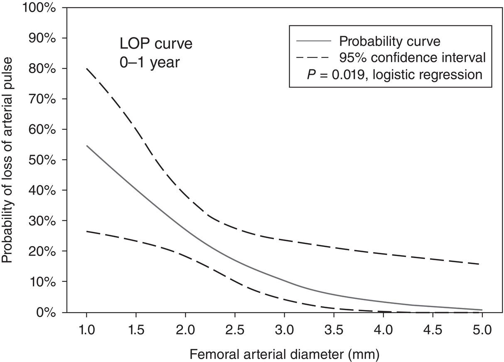

[**Figure 13.21**](#R_c13-fig-0021) Probability curve for loss of palpable pedal pulse (LOP) at the end of the cardiac catherization procedure in which the femoral artery was accessed in children between the age of 0–1 year. A significant increase occurred with artery diameter less than 3 mm.

(Source: Tadphale et al. \[174\]. Reproduced with permission from Springer Nature.)

In a report by Kamyscek and colleagues of institution of routine postcatheterization ultrasound within 4 hours, in the 349 patients less than 6 months of age, incidence of detection of femoral arterial thrombosis increased from 8.3 to 23.4% with routine ultrasound.(_p_ = 0.006) Risk factors included lower weight, larger arterial sheath size, and longer procedure duration. Treatment was with unfractionated, or low molecular weight heparin and was successful in all cases. This data suggests that clinical signs and symptoms of femoral artery thrombosis are less sensitive than ultrasound due to collateral flow; and that high index of suspicion for arterial thrombosis in small patients should trigger early formal ultrasound examination to facilitate successful non‐invasive therapy. \[175\]

### Infection

Catheter‐related sepsis can result in significant morbidity, increased mortality, prolonged ICU stay, and increased expense. Numerous studies have described the incidence of, risk factors for, and management of catheter‐related infections. Sepsis was reported in 5.8–7.6% of pediatric patients, and the rate of catheter‐related bloodstream infections (CRBSIs) was 0.1–6.4 infections/1,000 catheter‐days \[44, 176, 177\]. The incidence of arterial catheterization‐related infections in the pediatric population is very low; the calculated rate is 6.2% \[178\]. The pathogen mainly responsible is _Staphylococcus epidermidis_, and its colonization is not dependent on the catheter insertion site \[155\].

Risk factors for CRBSIs include weight less than 8 kg, cardiac failure, cancer, silicone catheters, guidewire exchange catheterization, obstructed catheters, and more than 12 days of catheter placement \[179\]. A higher incidence of central line‐associated bloodstream infections was found in children between 1 and 2 years of age \[180\]. The safe period for an indwelling CVC is 3 days in infants less than 12 months old and 6 days in older children; the infection rate increases if catheters are left in place for more than 10 days \[180\]. The number of catheter lumens does not appear to influence the rate of this complication \[44\].

Several strategies may be used to reduce catheter‐related infections \[181\]. First is the use of full barrier precautions (e.g., sterile gown, mask, gloves, and careful aseptic technique during insertion). Second, a potent antiseptic solution should be used for skin scrubbing and during redressing of the insertion site every 3–7 days. In addition, systemic antibiotic administration or antibiotic bonding to the resin of the catheter may be advantageous ([Box 13.1](#c13-fea-0001)).

Chlorhexidine has been shown to be superior to other antiseptic solutions and is being used more frequently for catheter insertion‐related antisepsis. Novel chlorhexidine‐impregnated dressings or chlorhexidine‐impregnated sponges are safe and effective in preventing CRBSIs and non‐catheter‐related bloodstream infections in neonates requiring prolonged central venous access, and their use significantly reduces the rates of central catheter colonization in infants and children after cardiac surgery \[182–184\]. Although it provides effective skin protection, chlorhexidine may cause contact dermatitis, particularly in low‐weight infants, and some cases of anaphylactic reaction to chlorhexidine‐impregnated catheters have also been reported \[185\].

### [Box 13.1](#R_c13-fea-0001): Central line catheter care bundles

**Insertion bundle**

-   Use full sterile barrier precautions: gown, cap, mask, gloves, wide sterile draping
-   Wash hands before the procedure
-   For all children aged ≥2 months, use chlorhexidine gluconate to scrub the insertion site for 30 seconds for all areas except the groin, which should be scrubbed for 2 minutes. Scrubbing should be followed by 30–60 seconds of air drying
-   No iodine skin prep or ointment is used at the insertion site
-   Use a sterilized prepackaged tray with catheter that contains all necessary equipment and supplies including full sterile barriers
-   Create an insertion checklist, which empowers staff to stop a non‐emergent procedure if it does not follow sterile insertion practices
-   Use only polyurethane or Teflon cathetersa
-   Conduct insertion training for all care providers, including sides and video

**Maintenance bundle**

-   Assess daily whether catheter is needed
-   Catheter‐site care
    -   No iodine ointment
    -   Use a chlorhexidine gluconate scrub to sites for dressing changes (30 seconds scrub, 30 seconds air‐dry)
    -   Change gauze dressings every 2 days unless they are soiled, dampened, or loosened_a_
    -   Change clear dressings every 7 days unless they are soiled, dampened, or loosened_a_
    -   Use a prepackaged dressing‐change kit or supply area
-   Catheter hub, cap, and tubing care
    -   Replace administration sets, including add‐on devices, no more frequently than every 72 hours unless they are soiled or suspected to be infected
    -   Replace tubing that is used to administer blood, blood products, or lipids within 24 hours of initiating infusion_a_
    -   Change caps no more often then 72 hours (or according to manufacturer recommendations); however, caps should be replaced when the administration set is changed[a](#c13-note-0006)
    -   The prepackaged cap‐change kit, or supply area elements to be designated by the local institution

[a](#R_c13-note-0006) These procedures are according to the Centers for Disease Control and Prevention recommendations.

The use of antibiotics for prevention of central catheterization‐related infections has not yet been supported by strong evidence. Although vancomycin added to the solution used for total parenteral nutrition effectively reduced catheter‐related sepsis in a neonatal ICU and offered potential benefits (e.g. fewer catheters, earlier weight gain), its widespread implementation has not been recommended \[186\]. The addition of vancomycin to heparin flush solutions did not reduce bacteremia with vancomycin‐susceptible organisms \[187\]. In a meta‐analysis of 21 randomized controlled trials comparing the incidence of specific bacterial and fungal species colonization on minocycline/rifampicin‐impregnated catheters, the proportion of all colonized antibiotic‐impregnated catheters found to harbor _Candida_ species was greater than the proportion of all colonized non‐impregnated standard catheters \[188\]. Commercially available antimicrobial catheters may become colonized with distinct microbial flora, probably related their antimicrobial spectrum of activity \[188\].

Suspected CRBSI should be addressed by peripheral blood culture and blood culture from the central catheter. Remove the catheter when possible and send the tip for bacterial culture. Design antibiotic therapy empirically against the most common institution‐specific pathogens and provide coverage for _S_. _epidermidis_. Proper education may also reduce infection frequency; in a quasi‐experimental study designed to improve the quality of clinical practice in a neonatal ICU, the rate of CRBSIs decreased from 8.4 to 1.28 cases/1,000 central line‐days \[189\].

### Malposition/perforation

Perforation of a vein or the heart can occur during CVC placement or any time thereafter. The cause of perforation can be a needle, guidewire, dilator, or the catheter itself. Malpositioning of the CVC may not necessarily lead to complications _perse_, but a catheter tip in the RA \[190, 191\] or not parallel to the SVC clearly predisposes to subsequent complications. Other predisposing factors for CVC perforation include a left‐sided approach, use of a guidewire end without a flexible tip, a stiffer catheter, and “long‐arm” CVC inserted in the basilic or cephalic veins. With left‐sided lines, the catheter tip is frequently at a 45°–90° angle to the SVC or atrium. Models have shown that this position is more likely to lead to great vessel perforation \[192\]. Up to 5–10% of patients with CHD have a left SVC \[193\], which drains most often into the coronary sinus or left atrium; both of these sites are undesirable for catheterization. An ideal position is in the mid‐SVC, with the tip parallel to the vein wall. Long‐arm CVCs tend to be more mobile than other CVCs, thus increasing the possibility of the catheter tip migrating into the RA with arm movement. The material of which catheters are made may also be associated with incidence of this complication; soft polyurethane or silicone catheters are much less likely to perforate than stiffer polyethylene catheters \[194\].

Inability to consistently aspirate blood, abnormal waveform, or signs or symptoms of pericardial tamponade or hemothorax indicate perforation. Treatment involves aspiration of as much blood as possible through the catheter and establishment of alternate access; intravascular volume replacement; and drainage of the pericardial or pleural blood by needle or surgical exploration. Confirmation of catheter tip location with an anteroposterior radiograph after insertion is obligatory.

The mid‐SVC, above the pericardial reflection, is the recommended position for the catheter tip; however, positioning a multi‐lumen catheter too cephalad in the SVC may result in a situation in which one of the proximal ports is not inside the jugular vein, leading to extravascular extravasation of important or caustic drugs or fluids. Many studies of catheter placement in children have shown that the internal jugular route results in tip placement in the SVC or RA 98–100% of the time, whereas the subclavian route results in a 5–15% rate of catheter malposition (i.e., across the midline in the contralateral brachiocephalic vein or up the ipsilateral IJV).

Accurate CVP measurements are generally obtained with IVC catheters, whether placed above or below the diaphragm. Umbilical venous catheters should be placed above the diaphragm at the IVC–RA junction, but not in the RA, to ensure passage through the ductus venosus and a parallel position to the IVC wall \[195\].

Some rare, inadvertent, CVC placement locations have been reported. Catheters may pass into the superior intercostal, thymic, azygos, or ascending lumbar veins or even into the liver parenchyma, depending on the insertion site \[196–198\]. Dural puncture, intrathecal catheterization, or extradural catheter insertion have also been reported \[199–202\]. In a case report, neurologic complications (paraplegia, urine retention, and milky cerebrospinal fluid) developed after abnormal placement of a catheter into the lumbar venous plexus via the left saphenous vein \[198\]. If malposition is strongly suspected, the catheter must be removed, and the patient assessed for other complications.

### Pneumothorax/hemothorax

Pneumothorax occurs in 7% of central venous catheterization cases \[203\], being most frequent with the subclavian approach (2.6%) \[204\], but it may also occur with the IJV approach (0.38%) \[87\], especially with low puncture sites. In four reported cases of hemothorax \[205–208\], the complication resulted in a fatal outcome in all cases. Perforation of the punctured vein, leading to pneumo‐ or hemothorax, may be caused not only by the advancing needle (as in the Seldinger technique), but also by guidewires, dilators, or relatively rigid catheters.

Pneumothorax and hemothorax can be avoided by cautious advancement of needles, guidewires, dilators, and catheters. An ultrasound guidance system greatly facilitates catheter insertion when used properly. The following tips may also be helpful:

-   In the subclavian approach, it is important to advance the needle only during expiration.
-   A very shallow approach, with the needle directed just posterior to the clavicle and at the sternal notch, is recommended.
-   For the IJV, a higher puncture site and limit of caudad advancement of the needle to stop above the clavicle are preferable.
-   Continuous aspiration with a saline‐filled syringe should be performed as the needle is advanced.
-   If air is aspirated, stop puncture attempts immediately and monitor carefully for compromise of ventilation and hemodynamics. Chest radiography should be performed, and pleural drainage should be initiated if indicated. After sternotomy, the pleura can be opened on the side where the pneumothorax is suspected or diagnosed.

### Cardiac tamponade

Cardiac tamponade is a severe complication of central venous catheterization and is closely related to catheter malposition and vessel perforation during puncture or placement. The incidence of cardiac tamponade after pediatric cardiac surgery ranges from 0.04 to 7% \[209\]. Catheter characteristics (rigid polyethylene catheters are more likely to cause tamponade than flexible silicone or polyurethane catheters \[192\]) and vessel wall tear caused by an abnormally placed catheter might be associated with increased risk of tamponade, but detailed studies have not been carried out. Age‐associated difficulties with catheter insertion may also be related to a higher risk. In a study of 10 children with cardiac tamponade, 7 were infants, and most complications occurred during needle advancement, with symptoms developing within minutes to up to 12 hours after the procedure \[210\].

### Inadvertent arterial puncture or catheter placement

Inadvertent puncture of the CCA during IJV catheterization is a well‐recognized complication; however, other arteries, including the subclavian, vertebral, transverse cervical, and thyroid inferior arteries, are occasionally located behind the IJV and are at risk of perforation \[208, 211, 212\]. Some authors suggest identifying the presence of vertebral arteries to avoid accidental puncture during IJV catheterization in pediatric patients \[96, 98\].

Inadvertent arterial puncture can nearly always be prevented by the use of ultrasound guidance. The presence of potential anatomic variations should be confirmed with ultrasound Doppler color flow imaging, and real‐time, ultrasound‐guided venipuncture should follow a preprocedural ultrasonographic assessment \[96, 98\].

If this complication occurs, the following principles may be useful. After needle puncture, remove the needle immediately, elevate the area, and hold firm pressure for 5–10 minutes. A small‐bore needle puncture of the carotid or femoral artery (e.g., 20 ga or smaller) is not usually an indication to cancel surgery. If a larger hole is created (i.e., a dilator and catheter have been placed), pressure transduction can be used to confirm the location. In this case, a discussion with the surgeon must ensue. Normally, the catheter can be removed, and pressure held without consequences, unless a very large catheter was used (e.g., introducer sheath or large‐bore CVP catheter), in which cases surgical exploration and repair should be undertaken. In most cases of elective cardiac surgery, it is prudent to postpone the surgery if a large hole has been made in the artery. Surgery can usually be performed safely 24 hours later, if no bleeding has occurred. If surgery must proceed after an unintended arterial puncture with a large needle or catheter, sterile preparation of the site and inclusion in the surgical field are prudent to facilitate direct observation and access for repair during the surgery if indicated.

### Arrhythmias

Central catheters and guidewires can cause arrhythmias. Too deep advancement of the catheter or guidewire has been associated with ectopic atrial tachycardia, especially with the catheter tip in the RA mechanically stimulating and potentially injuring the conduction system of the heart. Atrial fibrillation is also associated with CVC placement. Arrhythmias occur more commonly with passage of the guidewire. These include isolated PACs, supraventricular tachycardia, and, if the guidewire is advanced into the RV, premature ventricular contractions or even ventricular tachycardia or fibrillation.

For prevention, a marked guidewire should be used for IJV catheterization. Extreme care must be taken when passing a guidewire to stop advancement if significant arrhythmias are encountered, and when advancing the catheter over the wire. Guidewires must be advanced at as shallow an angle as possible, and in accordance with the body size of the patient. Pediatric patients at particular risk of arrhythmia are those with a known history of arrhythmia, cardiomyopathy, or RV hypertrophy \[213\]. Cardioversion is effective when atrial fibrillation or life‐threatening supraventricular tachycardia develops \[213, 214\].

### Systemic venous air embolus

Systemic air embolus is a constant threat for patients with central or peripheral venous catheters and intracardiac shunting, particularly those with two ventricles and right‐to‐left shunting and infants with a single ventricle and obligate mixing of systemic and pulmonary venous return in the systemic ventricle. Air may lodge in the coronary arteries, especially the right, the PA, or the brain, leading to potentially serious consequences. The incidence of venous air embolization caused by central or peripheral IV catheters has not been studied in detail, and it is possible that this complication is vastly underestimated or even neglected \[215\].

Large air emboli can be observed by TEE or transcranial Doppler ultrasound, but prevention is most important. Extreme attention must be paid to avoid the introduction of air into the systemic venous circulation. Careful preparation of venous infusions includes the following: thorough de‐airing of all infusions before connection; de‐airing of continuous‐flush central venous lines; air filters on continuous infusions; and careful technique when injecting drugs and fluids, which involves holding the syringe upright, flushing fluid from the proximal IV tubing, and aspirating and tapping the syringe before injection \[216\]. Constant vigilance, the use of TEE to monitor for intracardiac air and transcranial Doppler for systemic arterial air, and meticulous technique of catheter removal may reduce the risk of air embolus.

### Foreign bodies

Embolization of catheter or guidewire fragments sheared off during difficult insertion procedures, and disrupted catheter fragments in response to repeated mechanical compression between the clavicle and the ipsilateral first rib have been reported \[217, 218\]. The latter, known as “pinch‐off” syndrome, develops occasionally after a long period of catheter indwelling (1 month to 3 years) and poses many treatment difficulties \[218\]. Prevention includes selection of alternative techniques (percutaneous supraclavicular or IJV approaches or ultrasound‐guided catheterization of the axillary vein). If resistance is encountered when withdrawing the guidewire, the guidewire and the needle, or the catheter and the needle, must be withdrawn completely from the vessel together as a unit. Before insertion of long‐term indwelling catheters (e.g., for home parenteral nutrition), information should be provided to patients and/or their caregivers regarding possible complications related to catheter shearing.

### Complications related to intracardiac catheters

This category is unique to children undergoing congenital heart surgery because intracardiac catheters are rarely used in other situations. In a large retrospective study of 6,690 transthoracic intracardiac catheters in 5,666 pediatric cardiac patients over a 10 year period, there was an overall 0.6% incidence of serious complications, defined as significant bleeding or catheter retention \[49\]. The risk was greatest for PA catheters (1.1%, with three cases of severe cardiac tamponade and one death for 1,680 catheters) followed by left atrial catheters, then right atrial catheters. The authors concluded that the benefits of intracardiac catheters far outweigh associated risks if care is exercised in placing and removing them and if complications are recognized rapidly and managed aggressively. However, another study reported a relatively high complication rate (37%) of bleeding in 523 transthoracic intracardiac catheters (276 right atrial, 155 left atrial, 68 common atrial, and 24 RV or PA catheters), with the highest rate (47%) in left atrial catheters \[219\]. These bleeding events required intervention in 8.3% of the patients and caused hemodynamic compromise in 2.6%.

More recent single center studies report similar intracardiac catheter complication rates. Stein and colleagues reported 176 transthoracic catheters in 124 neonates, of which 37% were right atrium, 27% common atrium, and 34% left atrium, with only one PA catheter. 20% of patients received packed red blood cell transfusions after line removal, but there were no deaths, cardiac arrests, or ECMO cannulations \[220\]. Beham and colleagues reported 115 intracardiac catheters in 112 patients; 45 were RA, 68 LA, and 2 PA catheters \[221\].

Serious complications occurred in 5.1% of patients, with bleeding requiring transfusion in 3.5%, cardiac tamponade resulting in death in one patient, and tension pneumothorax in one patient. These outcome studies suggest that PA catheters are associated with the highest risk of adverse events; they are used less frequently in more recent reports. Although intracardiac lines are a common vascular access modality with low risk of serious adverse events, a well‐established protocol for their removal, with corrected coagulation, mediastinal drainage tube in place, adequate patient sedation, packed red blood cells available, and emergency response surgical team available, is important to minimize adverse outcomes. To date, there have been no outcome studies available comparing transthoracic and percutaneous catheters.

### Other complications

Chylothorax \[222\], phrenic nerve injury \[223, 224\], vertebral arteriovenous fistula \[225\], brachial arteriovenous fistula \[226\], Horner’s syndrome \[227–229\], and tracheal puncture \[230\] have also been described. These complications can be prevented by skilled personnel and the use of ultrasound‐guided techniques to accurately identify vessel location.

* * *

### KEY POINTS: COMPLICATIONS OF VASCULAR ACCESS

-   Complications associated with vascular access can be categorized into catheter insertion‐ and maintenance‐related complications. The most common are arterial puncture and catheter obstruction, respectively.
-   The most frequent life‐threatening complication of central catheterization is pneumothorax.
-   Insertion‐related complications occur more frequently with the subclavian approach than with the IJV or femoral approach.
-   Appropriate training in pediatric central catheterization, especially in ultrasound‐guided techniques, can reduce complications.
-   To avoid serious or life‐threatening outcomes, risk factors for central catheterization‐related complications in children and those for central catheterization‐related bloodstream infections should be taken into consideration when planning the procedure.

* * *

## Conclusions

Vascular access in children undergoing surgery for CHD can be challenging and presents a difficult task for pediatric anesthesiologists. Each needs to gain experience and proper technique to develop his or her own approach to vascular access. No one approach has been shown to be superior to another. However, there is accumulating data favoring ultrasound‐guided catheter insertion and we believe this technique will become a standard practice for percutaneous central venous access because the importance of decreased complication rates, insertion time, and expense cannot be overemphasized. Attention to the details of vascular access is important for enhancing patient safety. This, along with a strategy to preserve access sites in small infants with single‐ventricle physiology and who may need multiple cardiac surgeries, ultrasound‐guided line placement and the use of antibiotic‐impregnated catheters will improve the outcome of vascular access procedures.

## Selected references

_A full reference list for this chapter is available at:_

[http://www.wiley.com/go/andropoulos/congenitalheart](http://www.wiley.com/go/andropoulos/congenitalheart)

1.  3 Yen K, Riegert A, Gorelick MH. Derivation of the DIVA score: a clinical prediction rule for the identification of children with difficult intravenous access. Pediatr Emerg Care 2008; 24:143–7. The DIVA score uses four variables: history of prematurity, patient age, vein palpability, and vein visibility, and may predict failed first IV attempt in pediatric patients.
2.  17 Andropoulos DB, Stayer SA, Bent ST, et al. A controlled study of transesophageal echocardiography to guide central venous catheter placement in congenital heart surgery patients. Anesth Analg 1999; 89:65–70. In the cardiac OR setting, TEE‐guided central venous catheterization results in 100% correct placement in pediatric patients.
3.  65 Shindler E, Kowald B, Suess H, et al. Catheterization of the radial or brachial artery in neonates and infants. Pediatr Anaesth 2005; 15:677–82. Using a relatively large retrospective dataset, this study demonstrates safety profiles of brachial artery catheterization using small catheters (24 or 22 ga) in neonates and small children.
4.  79 Lamperti M, Bodenham AR, Pittiruti M, et al. International evidence‐based recommendations on ultrasound‐guided vascular access. Intensive Care Med 2012; 38:1105–17. This article provides a condensed version of the formal recommendations by acknowledged experts on ultrasound guidance during vascular access in both adults and children.
5.  80 Chuan WX, Wei W, Yu L. A randomized‐controlled study of ultrasound prelocation vs anatomical landmark‐guided cannulation of the internal jugular vein in infants and children. Paediatr Anaesth 2005; 1:733–8. A two‐dimensional ultrasound prelocation technique using an intraoperative transesophageal echocardiography probe can increase cannulation success rate and reduce the incidence of complications of central venous catheterization in infants and children.
6.  81 Hosokawa K, Shime N, Kato Y, et al. A randomized trial of ultrasound image‐based skin surface marking versus real‐time ultrasound‐guided internal jugular vein catheterization in infants. Anesthesiology 2007; 107:720–4. An ultrasound‐guided skin‐marking method can enhance procedural efficacy and safety of internal jugular catheterization in neonates and infants.
7.  82 Byon HJ, Lee GW, Lee JH, et al. Comparison between ultrasound‐guided supraclavicular and infraclavicular approaches for subclavian venous catheterization in children – a randomized trial. Br J Anaesth 2013; 111:788–92. The supraclavicular approach during SCV catheterization under ultrasound guidance can yield a shorter puncture time and decrease the incidence of guidewire misplacement compared with the infraclavicular approach in pediatric patients.
8.  91 Malbezin S, Gauss T, Smith I, et al. A review of 5434 percutaneous pediatric central venous catheters inserted by anesthesiologists. Pediatr Anesth 2013; 23:974–9. A prospectively collected large dataset that revealed a very high success rate for CVC via the IJV (99.5%) and a low immediate complication rate (1.3%) when inserted by trained anesthesiologists using the landmark technique.
9.  108 Ishii S, Shime N, Shibasaki M, et al. Ultrasound‐guided radial artery catheterization in infants and small children. Pediatr Crit Care Med 2013; 14:471–3. In infants and small children undergoing congenital cardiac surgery, ultrasound‐guided radial artery cannulation increases success rate, shortens the time for successful placement, and reduces complication rates compared with the traditional palpation method.
10.  112 Song IK, Choi JY, Lee JH, et al. Short‐axis/out‐of‐plane or long‐axis/in‐plane ultrasound‐guided arterial cannulation in children: a randomised controlled trial. Eur J Anaesthesiol 2016; 33:522–7. A controlled study of short axis vs. long axis ultrasound imaging for radial artery catheterization in 97 infants and children revealed no difference in success rate (94% short axis vs. 98% long axis), time to cannualtion, or complications. The incidence of puncturing the posterial arterial wall was higher in the short axis group; (96 vs. 18%, _p_ < 0.001).
11.  182 O’Grady NP, Alexander M, Dellinger EP, et al. Healthcare infection control practices advisory committee. Guidelines for the prevention of intravascular catheter‐related infections. Infect Control Hosp Epidemiol 2002; 23:759–69. These guidelines provide evidence‐based recommendations for preventing catheter‐related infections, emphasizing education and training, maximal sterile barrier precautions, skin antisepsis, and antibiotic‐impregnated CVC.