CHAPTER 14 Neurological Monitoring and Outcome 

# CHAPTER 14  
Neurological Monitoring and Outcome

_Kenneth M. Brady1, Chandra Ramamoorthy2, R. Blaine Easley3, and Dean B. Andropoulos3_

1 Division of Cardiac Anesthesia Regenstein Cardiac Care Unit, Gracias Family Professor in Cardiac Critical Care, Department of Anesthesiology and Pediatrics, Lurie Children’s Hospital of Chicago, Northwestern University Feinberg School of Medicine, Chicago, IL, USA

2 Department of Anesthesiology, Perioperative and Pain Medicine, Lucille Packard Children’s Hospital, Stanford University School of Medicine, Stanford, CA, USA

3 Department of Anesthesiology, Perioperative and Pain Medicine, Department of Anesthesiology, Baylor College of Medicine, Texas Children’s Hospital, Houston, TX, USA

* * *

-   [**Introduction**](#head-2-137)
-   [**Cerebrovascular physiology during cardiac surgery**](#head-2-138)
    -   [Cooling and rewarming](#head-3-185)
    -   [pH‐stat vs. alpha‐stat blood gas management](#head-3-186)
    -   [Hemodilution and transfusion practices during CPB](#head-3-187)
    -   [Temperature management](#head-3-188)
    -   [Glucose management](#head-3-189)
    -   [Circulatory arrest](#head-3-190)
    -   [Selective cerebral perfusion](#head-3-191)
    -   [Selective cerebral perfusion and flow rates](#head-3-192)
-   [**Neurological monitoring during congenital heart surgery**](#head-2-139)
    -   [Electroencephalographic technologies](#head-3-193)
    -   [Transcranial Doppler ultrasound](#head-3-194)
    -   [Monitors of cerebral oxygenation](#head-3-195)
    -   [Monitors of cerebral autoregulation](#head-3-196)
-   [**Anesthetic and sedative neurotoxicity**](#head-2-140)
    -   [Longer term neurodevelopmental testing outcomes after congenital heart surgery](#head-3-197)
    -   [Boston circulatory arrest study](#head-3-198)
    -   [Children’s hospital of Philadelphia cohort](#head-3-199)
    -   [Western Canadian study](#head-3-200)
    -   [Hearts and minds study](#head-3-201)
    -   [Milwaukee cohort](#head-3-202)
    -   [Texas children’s hospital cohort](#head-3-203)
    -   [Single ventricle reconstruction trial](#head-3-204)
    -   [International cardiac collaborative on neurodevelopment (ICCON) investigators cohort](#head-3-205)
    -   [Zurich cohort](#head-3-206)
-   [**Conclusions**](#head-2-141)
    -   [Does a neuroprotective strategy during CPB improve outcome?](#head-3-207)
-   [**Selected references**](#head-2-142)

* * *

## Introduction

Operative management of the child with congenital heart disease (CHD) was largely refined to its current state in the decades prior to the year 2000, during which operative mortality improved substantially. Data from the metropolitan Atlanta congenital defects program showed a profound increase in 1‐year survival of the most critical heart defects, including hypoplastic left heart syndrome (HLHS), truncus arteriosus, pulmonary atresia, tricuspid atresia, and Tetralogy of Fallot from 67% (1979–1993) to 83% (1994–2005) \[1\]. Predictably, the increased expectation of survival is accompanied by willingness to perform surgery on increasingly complex patients. A multi‐institution comparison of survival rates by case complexity using the Risk Adjustment for Congenital Heart Surgery (RACHS) showed a shift of fewer RACHS category 1 cases (low complexity) and more RACHS category 3, 4, and 6 cases (higher complexity) between 1996 and 2004. Further, mortality of RACHS category 6 (predominantly Norwood stage I palliation for HLHS) cases decreased from 48% in 1996 to 17% in 2004 \[2\]. The most common neonatal operations in the Society of Thoracic Surgeons’ Congenital Heart Surgery Database are Norwood stage 1 palliation at 10.2% and arterial switch operation without ventricular septal defect (VSD) at 6.9%, and the surgical mortality of these lesions has decreased to 13.8%, and 2.0%, respectively, as of 2019 \[3\].

Despite these remarkable gains, survivors of complex CHD are at risk of having a characteristic array of neurodevelopmental deficits. These include poor impulse control, attention deficit/hyperactivity, mild language and cognitive deficits, and limited executive functioning ability \[4–8\]. Often appearing outwardly normal, children with such deficits perform poorly in academics and lack employability; they suffer high rates of depression and poor quality of life \[9–14\]. In addition to potentially modifiable factors, the presence of genetic syndromes and increasing complexity of the cardiac lesion are associated with a higher incidence of neurodevelopmental disability ([Figure 14.1](#c14-fig-0001)) \[15\]. The relative role of modifiable (acute neurologic injuries) and nonmodifiable factors contributing to the neurologic abnormalities seen in patients with CHD is a subject of study and debate. This chapter, written for the anesthesiologist, has an understandable bias toward discussion of the potentially modifiable perioperative factors that have been associated with neurologic injury. The pediatric cardiac anesthesiologist should be familiar with acute, perioperatively acquired neurologic injuries in this population and proposed strategies to avoid them.

Acute neurologic injury in the perioperative period has been quantified using magnetic resonance imaging (MRI) technology. Preoperative neurologic injuries visible by MRI occur with an incidence between 20 and 40% in newborns with critical heart defects \[8, 16–18\]. After surgery, 35–75% of patients will have a new lesion \[19\]. Despite differences in nomenclature of MRI findings, it is clear that the preponderance of _new_ injuries seen after cardiac surgery in the infant occurs in the white matter (see [Figure 14.2](#c14-fig-0002)) \[16, 17, 19–23\]. Most studies further specified the preponderant white matter lesion as periventricular leukomalacia, an injury that has been extensively described in preterm infants exposed to extrauterine life (see [Figure 14.3](#c14-fig-0003)). In the preterm population, periventricular leukomalacia is associated with reduction in brain growth and neurodevelopmental impairments with deficits similar to those described in children with critical heart lesions \[24, 25\]. Current understanding of the pathogenesis of preterm periventricular leukomalacia posits that the preterm brain is susceptible to ischemia due to an incomplete redundancy of penetrating arterioles in the deep white matter, combined with a population of developing oligodendrocyte precursors with enhanced ischemic sensitivity \[26–28\]. This pattern of injury in the patient with CHD suggests that oxygen deprivation is the leading cause of intraoperative injury, not embolic or hemorrhagic injury as is more commonly seen in adults.

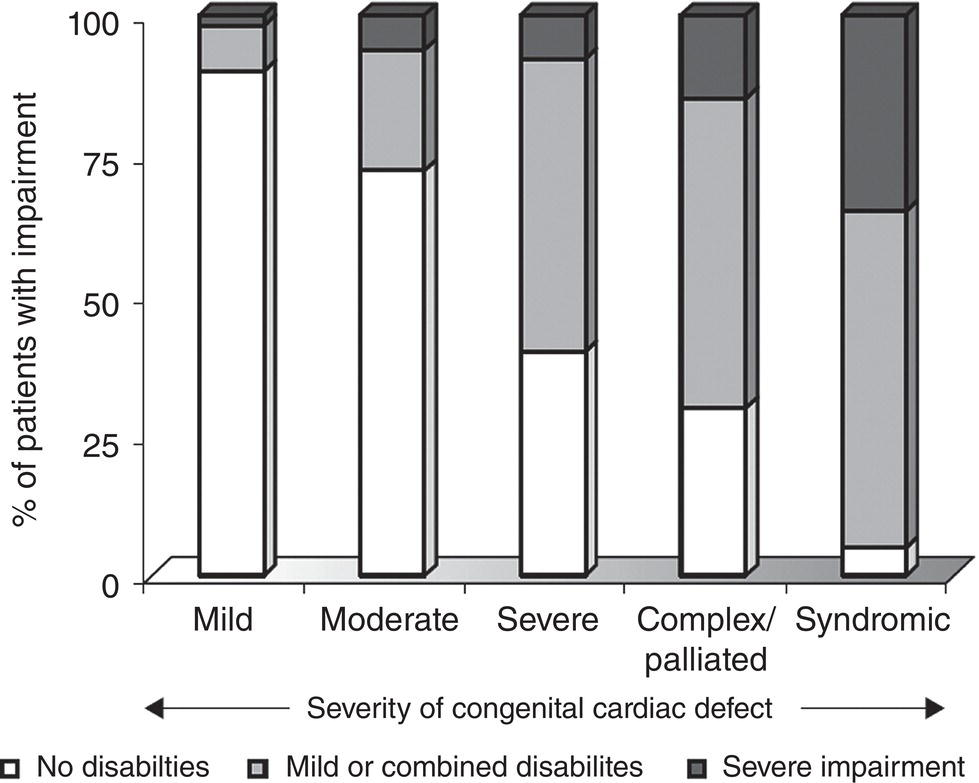

[**Figure 14.1**](#R_c14-fig-0001) Schematic presentation of neurodevelopmental abnormalities in children with congenital heart disease (CHD). Children with milder forms of CHD (e.g., ventricular septal defect without an associated genetic syndrome) have a low incidence, and more than mild abnormalities are rare. Increasingly complex forms of CHD (e.g., transposition or total anomalous pulmonary venous connection) are associated with increasing risk of neurodevelopmental deficits. Only the minority of children with very complex CHD (e.g., functionally univentricular heart, hypoplastic left heart syndrome) are completely normal in all respects. CHD associated with chromosomal abnormalities (e.g., Down’s and DiGeorge syndromes) or multiple congenital anomalies (VACTERL, CHARGE associations) are nearly always associated with neurodevelopmental abnormalities, in many cases severe.

(Source: Wernovsky \[15\]. Reproduced with permission from Cambridge University Press.)

It has been assumed that improvements in hemodynamic management during cardiac surgery have the potential to mitigate neurologic injuries in children who require cardiopulmonary bypass (CPB). However, the management of CPB for infants and children has been challenging to study clinically due to wide practice variability and lack of intercenter consensus. Pump prime, flow rate, cardioplegia solutions and administration intervals, vasodilator therapy, steroid use, cooling and rewarming practices, blood gas management, hematocrit goals, electrolyte control, ultrafiltration techniques, and the use of deep hypothermic circulatory arrest (DHCA) are all integral aspects of a complex practice that forms the protocol at a given institution. Each of these can impact cerebral perfusion, but no standardization exists for any of these parameters. Therefore, understanding the consequence of altering a single aspect of bypass care is unclear, and demonstrating the optimal combination of bypass parameters is prohibitively difficult.

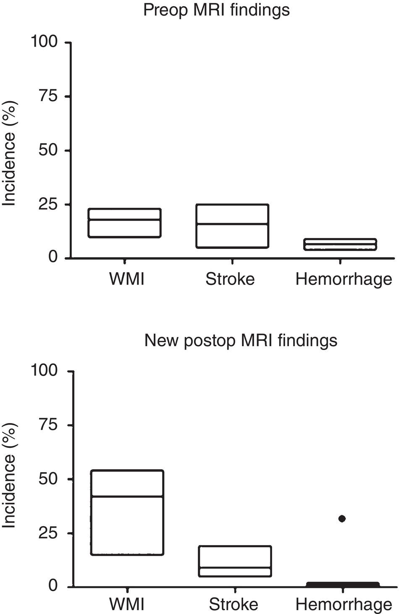

[**Figure 14.2**](#R_c14-fig-0002) The incidence of preexisting and new postoperative neurologic injuries diagnosed by brain magnetic resonance imaging (MRI) observed in neonates subjected to cardiopulmonary bypass. The findings are compiled from six reports, seven centers, and 400 subjects. Median and range are shown with on outlier. WMI, white matter injury. Data are from references \[16–23\].

Due to the pressing need to improve neurocognitive outcome and poor guidance afforded by evidence‐based approaches to bypass management, effort and expense have been directed toward developing perioperative neuromonitoring strategies for children who require cardiac surgery and CPB. The monitoring technologies described in this chapter have been in routine use for more than a decade, but there is no universal consensus regarding their usefulness or validity, and there is no standard of care neuromonitoring practice for the patient with CHD. This chapter reviews cerebrovascular physiology and the impact of CPB on cerebral hemodynamics, available neuromonitoring modalities, and proposed strategies for improving neurodevelopmental outcomes after congenital heart surgery.

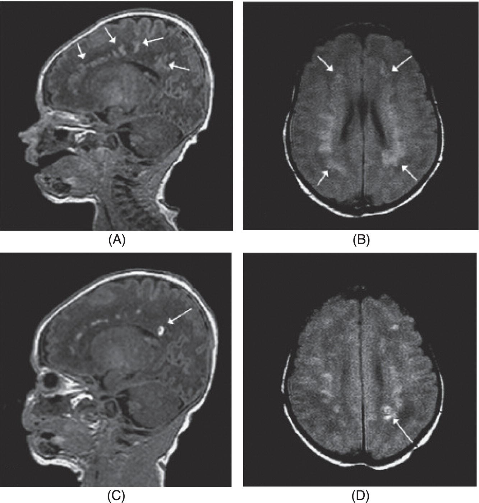

[**Figure 14.3**](#R_c14-fig-0003) (A) Preoperative sagittal T1‐weighted magnetic resonance image (MRI) of a 35‐week gestational age infant with hypoplastic left heart syndrome. Significant white matter injury (WMI) is present in the periventricular areas (arrows). (B) Preoperative axial proton‐density T2‐weighted image. Again note the extensive WMI (arrows). (C) Seven‐day postoperative T1 sagittal MRI after Norwood stage I palliation. Note the slight improvement to the WMI, but new intraparenchymal/intraventricular hemorrhage and infarction in the atrium near the body of the left lateral ventricle (arrow). (D) Proton‐density T2‐weighted image. Again note the WMI and new hemorrhage (arrow).

* * *

### KEY POINTS: MRI‐DIAGNOSED BRAIN INJURY IN NEONATAL CARDIAC SURGERY

-   Preoperative neurologic injuries occur in 20–40% of newborns with critical heart defects.
-   After surgery, 35–75% of these patients will have a new brain injury.
-   The most common brain lesion visible in the MRI of infants after congenital heart surgery is white matter injury (WMI), similar to periventricular leukomalacia seen in preterm infants.

* * *

## Cerebrovascular physiology during cardiac surgery

Understanding cerebral perfusion and how it is affected by CPB is necessary to understand normal and abnormal neuromonitoring results during cardiac surgery. In health, cerebral perfusion regulation is known to be a finely tuned, multilayered servo control of several homeostatic mechanisms, each acting independently with regard to stimulus and frequency, but in concert at the point of action: mediating cerebral vascular resistance. These mechanisms include neurovascular coupling (also known as metabolic autoregulation), CO2 reactivity, pressure autoregulation, hypoxic vasodilatation, hypoglycemic vasodilatation, and the uneven action of systemic vasoconstrictors to cerebral relative to noncerebral vasculature. Physiologic changes of the cerebral vasculature during bypass were largely defined by a series of studies performed in the 1980s and 1990s. Cerebral blood flow (CBF) was measured using the Kety–Schmidt technique, and CBF velocity was measured with transcranial Doppler (TCD) in both human infant and animal model studies. These efforts have highlighted the effects of extreme hypothermia and circulatory arrest on vascular tone, CBF, and oxygen delivery and utilization within the brain.

### Cooling and rewarming

During the cooling phase of CPB, CBF is reduced, and cerebral metabolism is reduced, presumably due to neurovascular coupling, which matches CBF to metabolism. However, during deep hypothermia, cerebral metabolism is exponentially reduced, while CBF is reduced linearly with reduction in temperature \[29\] (see [Figure 14.4](#c14-fig-0004)). This results in a state of “luxury perfusion” during hypothermia \[30–33\]. As shown another way, at normothermic bypass between 35.5 °C and 37 °C, the ratio of CBF (in mL/100 g/min) to cerebral metabolic rate for oxygen consumption (CMRO2, in mL/100 g/min) is normal (20 : 1). At 30 °C, the ratio increases to 30 : 1, and at 18 °C, it increases to 75 : 1, indicating uncoupling of brain metabolism and vascular tone (see [Figure 14.5](#c14-fig-0005)) \[29\]. Based on the measured decrease in CMRO2 in children during deep hypothermic bypass, Greeley et al. famously estimated a duration of ischemia that could be safely tolerated between 39 and 65 minutes \[31\]. When rewarmed after hypothermia in the absence of circulatory arrest, there is a return to normal CBF and metabolism with normal flow/metabolism coupling.

It is generally stated that cooling ablates pressure autoregulation as well as metabolic autoregulation. The two mechanisms are distinct processes that occur at distinct frequencies. Neurovascular coupling (metabolic autoregulation) is mediated by a neurovascular unit comprising an astrocyte bridge between neuronal synapses and penetrating arterioles. Neurovascular coupling is spatially specific and rapidly active, effecting vascular changes within 1 second of local neuronal activation \[34\]. By contrast, pressure autoregulation responds to sustained changes in cerebral perfusion pressure lasting 30 seconds or longer and causes more global changes in CBF \[35\]. The conclusion that hypothermia also ablates pressure autoregulation comes from two independent investigations, one using TCD and the other using the Kety–Schmidt technique with xenon washout during infant bypass \[31, 33, 36\]. However, in both data sets, the measurements of flow or flow velocity are taken at lower cerebral perfusion pressures than those taken at normothermia, and most of the hypothermic measurements are taken below the apparent limit of autoregulation evident in the normothermic plots \[37\].

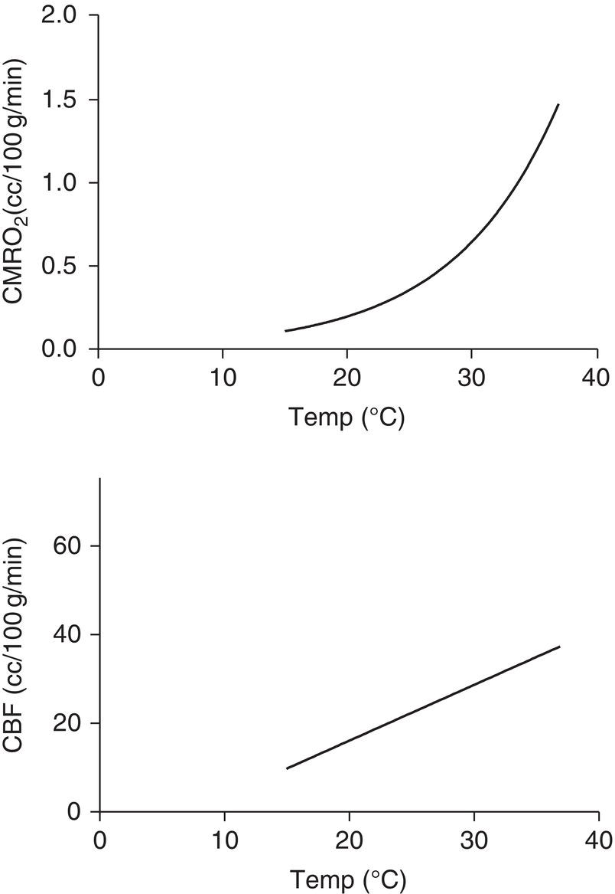

[**Figure 14.4**](#R_c14-fig-0004) Cooling results in a linear decrease in cerebral blood flow and an exponential decrease in cerebral metabolic rate for oxygen consumption (CMRO2).

(Source: Adapted from Kern et al. \[29\].)

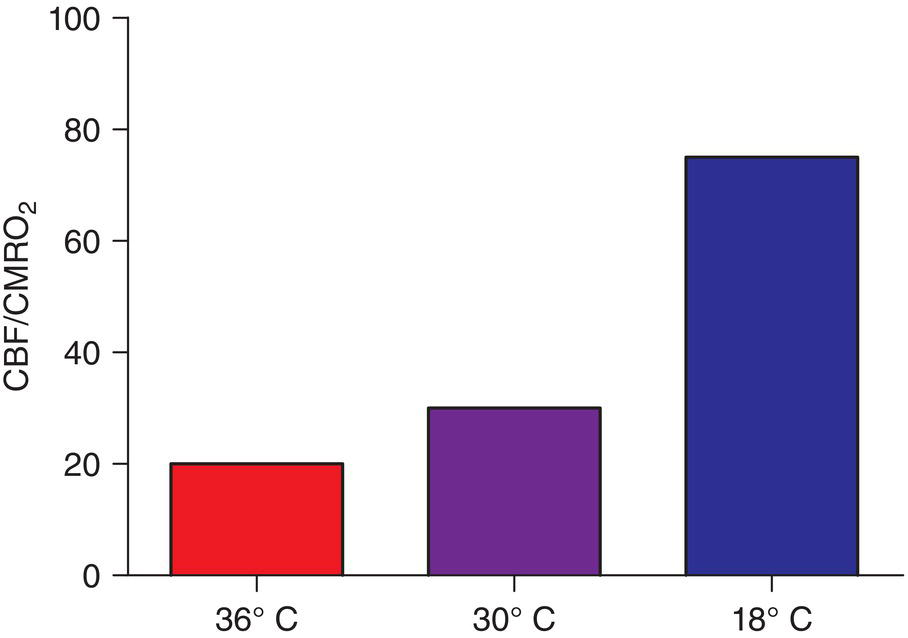

[**Figure 14.5**](#R_c14-fig-0005) Metabolic autoregulation is attenuated with progressive hypothermia during cardiopulmonary bypass in infants. With decreasing temperature, the ratio of cerebral blood flow (CBF) to cerebral metabolic rate for oxygen consumption (CMRO2) increases, yielding a luxury perfusion during hypothermia.

(Source: Adapted from Kern et al. \[29\].)

More recent preclinical and clinical data challenges the assumption that cooling ablates pressure autoregulation. A piglet model was used to more directly assess the relationship between deep hypothermia and pressure autoregulation. Piglets with normal arterial blood pressure demonstrated intact autoregulation, even during deep hypothermia. \[38\] When neonates were studied using dynamic autoregulation measurements during hypothermic bypass, the state of impaired autoregulation was accompanied, in all cases, by arterial blood pressure below the limit of autoregulation \[39\]. It is reasonable to conclude from this combined data that pressure autoregulation is not ablated by deep hypothermia, but rather it is impaired by the hypotensive state that frequently accompanies deep hypothermic bypass.

### pH‐stat vs. alpha‐stat blood gas management

pH‐stat management corrects blood gas values for temperature during CPB, which results in a higher arterial CO2 tension during hypothermia than is achieved with alpha‐stat blood gas management. Obviously, regardless of the measurement technique used for determining the amount of CO2 in the blood, removing less CO2 or adding CO2 to the sweep gas with the oxygenator during bypass results in a higher arterial CO2 tension. CO2 diffuses freely across the blood–brain barrier, acidifying cerebrospinal fluid, which exerts a potent cerebral vasodilatory effect. The cerebrospinal fluid slowly returns to normal pH after exposure to high CO2 levels by increased activity of carbonic anhydrase in the choroid plexus, replacing reabsorbed acidic spinal fluid with spinal fluid having a higher concentration of bicarbonate buffer. Driving CBF changes by manipulation of arterial CO2 tension is, therefore, time limited by the rate of spinal fluid absorption and production. Spinal fluid production is slower in infants than in adults, but in adults, the entire spinal fluid volume is produced three to four times per day. Not surprisingly, then, animal models have shown that sustained changes in arterial CO2 tension cause CBF changes that last approximately 1 day \[40, 41\]. In addition to increasing CBF, arterial hypercapnia shifts the oxyhemoglobin dissociation curve to the right, facilitating oxygen unloading \[42\]. Thus, in most pediatric centers, pH‐stat (hypercapnia) strategy is favored for perceived neuroprotection.

In animal models of DHCA, neurologic outcome is improved when pH‐stat is used. This has been more difficult to demonstrate in human infants, although a trend toward a lower death rate, fewer seizures, and greater hemodynamic stability has been observed \[43\]. Long‐term neurologic follow‐up at 4 years of age has not shown a difference between pH‐stat or alpha‐stat blood gas management, and this has only been studied retrospectively in a pediatric setting \[42, 44\].

### Hemodilution and transfusion practices during CPB

Traditionally, profound anemia was used during deep hypothermic CPB to offset the effect of cooling on blood viscosity. This practice, rooted in theory, was challenged by demonstration of increased neurologic injury in a piglet model of hypothermic circulatory arrest using a target hematocrit of 30% when compared with a target of 20% \[45\]. More convincing was a randomized study of hematocrit goals at Boston Children’s Hospital. The combined data from two trials at Boston included the neurodevelopmental outcomes of 271 infants at 1 year of age. The Psychomotor Development Index (PDI) increased linearly with hematocrit up to 23.5%. The Mental Development Index (MDI) did not exhibit an association with hematocrit. The overall conclusion of this analysis was that although a hematocrit higher than 24% improved outcome, the effects of hemodilution vary according to age and other parameters of perfusion, especially pH management, precluding delineation of a universally optimal hematocrit \[46\].

* * *

### KEY POINT: HEMODILUTION DURING BYPASS

-   The optimal hematocrit target for hemodilution during CPB is unknown, but hematocrit less than 24% during hypothermic bypass is associated with developmental abnormalities in the motor domain and should be avoided.

* * *

### Temperature management

Hypothermia remains the cornerstone of brain protection for ischemic injury. Cerebral hyperthermia frequently develops after congenital heart surgery with CPB. The metabolic rate and oxygen consumption of the brain are raised during a period when oxygen delivery may be compromised due to hypotension. This places vulnerable watershed areas and partially injured brain tissue at risk for injury extension \[47\]. Bissonnette and colleagues measured temperatures in the jugular bulb, tympanic membrane, lower esophagus, and rectum during and after surgery in 15 infants and showed that the jugular bulb temperature continued to rise for at least 6 hours postoperatively \[48\]. The authors found that rectal temperature does not reflect cerebral temperature in the perioperative period. Other investigators further showed that nasopharyngeal and not tympanic temperature best reflects brain temperature \[47\]. However, Cottrell and colleagues were unable to show any association between neurocognitive performance and postoperative temperature in a cohort of 329 infants who underwent cardiac surgery \[49\].

In some patients, brain metabolism is not adequately suppressed during rapid cooling to deep hypothermic levels. In a study of infants undergoing cooling to 15 °C, 6 of 17 had low jugular venous bulb saturation when this temperature was achieved (87 ± 6% vs. 98 ± 1% in subjects with apparently normal cooling), suggesting ongoing oxygen consumption that outstripped delivery of oxygen to the brain \[50\]. There is general concern that uneven or inefficient cooling of the brain may lead to neurologic deficits. Rapid cooling times have been associated in pilot studies with developmental delay and the rare complication of choreoathetosis \[51, 52\]. There is little debate about the benefits of cooling during CPB, yet there is also insufficient data to suggest that any cooling strategy leads to better patient outcome \[44\].

Normothermic or mildly hypothermic CPB has gained popularity in recent years. Hannon and colleagues retrospectively studied 78 patients undergoing normothermic (35 °C or greater) vs. hypothermic bypass (28–34 °C) \[53\]. Patients were less than 2 years of age (median 7 months), and operations requiring deep hypothermia for DHCA or aortic arch reconstruction were excluded, and follow‐up was 2–3 years after surgery. For both groups, the odds ratios for neurodevelopmental delay in one or more areas ranged from 2–8 times that of a normal population. After multivariable adjustment, including for genetic conditions (Trisomy 21, DiGeorge syndrome, 22q11.2 deletion syndromes), there was no difference in the incidence of neurodevelopmental delay between the groups.

### Glucose management

In the Boston Circulatory Arrest Study (BCAS), hyperglycemia was not associated with worse neurologic outcome and does not appear to be a risk factor for infants and children \[54\]. Intraoperative glucose concentrations were not related to developmental scores up to 8 years of age, but low glucose concentrations were associated with subclinical seizure activity \[55\]. In a study of 188 neonates and infants younger than 6 months undergoing surgery with CPB, mean intensive care unit (ICU) admission glucose was 328 mg/dL, maximum was 340 mg/dL, and 89% of patients had at least one value greater than 200 mg/dL. In that cohort, hyperglycemia was not associated with lower neurodevelopment scores at 1 year of age \[56\]. Krueger and colleagues assessed neurodevelopmental outcomes at age 4 years in 167 infants undergoing cardiac surgery with bypass as infants \[57\]. Fourteen percent had hyperglycemia (>145 mg/dL) in the postoperative period, and insulin was administered if the glucose value was above 216 mg/dL. Higher postoperative glucose levels were not associated with lower neurodevelopmental scores across multiple domains. Tight glucose control is not indicated by evidentiary review in children who require CPB and is likely to be harmful in this population \[44\].

### Circulatory arrest

For infants who require reconstruction of the aortic arch, a bloodless field cannot be achieved with standard cannulation techniques. When DHCA is employed for this scenario, a profound cerebrovascular derangement occurs that persists into the rewarming and postoperative recovery periods. This cerebrovascular injury has been characterized by low CMRO2 that fails to return to baseline values, low CBF (with a normal CBF:CMRO2 ratio), and a distinctive TCD flow velocity pattern showing absent or reversed flow during diastole (see [Figure 14.6](#c14-fig-0006)) \[58–61\]. These derangements have been shown to be reduced in incidence by the use of low‐flow CPB instead of circulatory arrest, delayed rewarming, the use of pH‐stat blood gas management during cooling, modified ultrafiltration, thromboxane A2 antagonism, and the administration of nitric oxide donors \[59, 62–66\]. Although these therapies mitigate the post‐circulatory arrest physiologic derangement of the cerebral vasculature, there is no evidence that they change the incidence of periventricular leukomalacia, nor is it proven that these techniques improve the neurocognitive performance of patients with CHD.

* * *

### KEY POINTS: DHCA

-   DHCA in infants is associated with a profound cerebrovascular disturbance characterized by low CMRO2 and low CBF that is absent or reversed in diastole.
-   This condition persists into the postoperative period.

* * *

### Selective cerebral perfusion

Selective cerebral perfusion (also termed regional low‐flow cerebral perfusion, antegrade cerebral perfusion, or regional cerebral perfusion) is the surgical response to concerns that circulatory arrest causes neurologic injury. A variety of techniques achieve the same goal of delivering bypass flow to the cerebral vasculature while leaving a bloodless aortic arch for surgical repair. In one version of the technique, a polytetrafluoroethylene graft is sewn into the innominate artery and subsequently cannulated for bypass, in lieu of the traditional cannulation at the aortic root. When selective perfusion is desired, the great vessels are snared, and flow is continued at a reduced rate, now entirely directed to the circle of Willis (see [Figure 14.7](#c14-fig-0007)) \[67\]. It seems evident that circulatory arrest and impaired neurovascular recovery after circulatory arrest would cause neurologic injury, but there is no agreement that circulatory arrest should be replaced with either low‐flow bypass or newer techniques of selective antegrade cerebral perfusion.

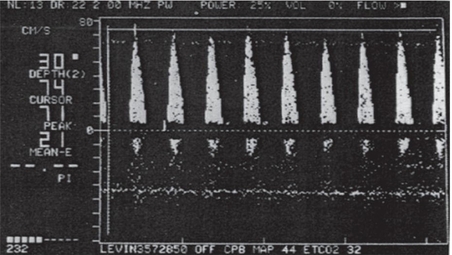

[**Figure 14.6**](#R_c14-fig-0006) After cardiopulmonary bypass with deep hypothermia and a period of circulatory arrest, there is an absence of cerebral blood flow during diastole. This pattern of flow velocity measured with transcranial ultrasound is indicative of high cerebrovascular resistance.

(Source: Jonassen et al. \[58\]. Reproduced with permission from Elsevier.)

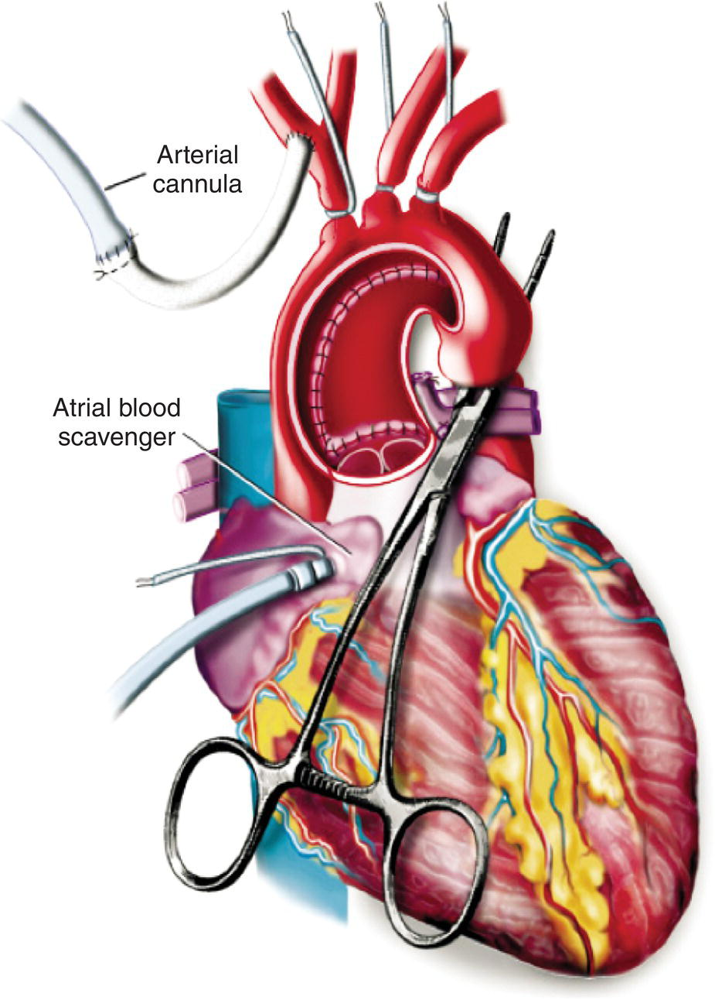

[**Figure 14.7**](#R_c14-fig-0007) Selective cerebral perfusion performed by sewing a graft to the innominate artery and snaring the great vessels.

(Source: Pigula et al. \[67\]. Reproduced with permission from Elsevier.)

For instance, neurocognitive testing of a 238‐subject cohort at 4 years of age following surgery in infancy at the Children’s Hospital of Philadelphia showed that the duration of hypothermic circulatory arrest was not associated with a poor performance in any category of the neurodevelopmental test \[68\]. Gaynor and colleagues argued with this result that nonmodifiable factors such as genetic anomaly, socioeconomic status, maternal education, and gestational age were overwhelmingly responsible for poor results on neurocognitive testing and that circulatory arrest is not a contributor to poor neurologic outcome. This result and interpretation contradict the most popular reading of studies related to the Boston circulatory arrest trial, which showed increased seizures and lower development scores in multiple functional domains at 1, 4, and 8 years of follow‐up in subjects who underwent circulatory arrest as a randomized intervention \[4, 6, 54, 69, 70\]. With later testing in the teenage years of the same cohort, differences between arrest and nonarrest groups are less apparent \[71\]. Although the Boston circulatory arrest trial is one of the most widely studied and cited research efforts on the topic of neurologic injury and circulatory arrest, it is difficult to compare contemporary practice with the bypass strategy from 1990, which included deliberate hemodilution to a hematocrit of 20% \[72\].

More recently, the “Hearts and Minds” study performed in Auckland, New Zealand, and Melbourne, Australia, found that longer periods of circulatory arrest were associated with a significant increase in the severity of periventricular WMI \[22\] (see [Figure 14.8](#c14-fig-0008)). In the Hearts and Minds study, many nonmodifiable characteristics were more significantly associated with WMI than the use of circulatory arrest. These included the nature of the cardiac lesion and the brain maturity score. The presence of WMI was not associated with 2‐year neurocognitive performance in that cohort.

Two trials comparing circulatory arrest with selective cerebral perfusion found no difference in neurocognitive outcomes at 1 year. Visconti and colleagues studied 29 subjects with HLHS who received either selective cerebral perfusion or circulatory arrest without randomization for the Norwood procedure \[73\]. Goldberg and colleagues studied 77 subjects with the same condition, randomized for the two bypass strategies \[74\]. Neither study showed significant improvements with the selective perfusion technique, but it has been argued that neurodevelopmental scores in both groups were lower than expected.

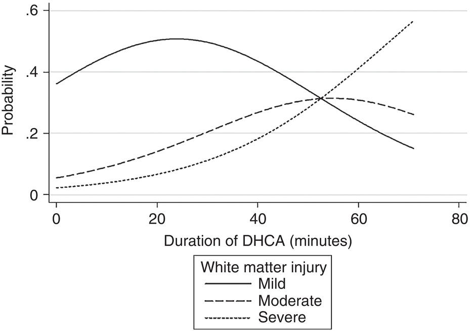

[**Figure 14.8**](#R_c14-fig-0008) Data from the Hearts and Minds study showed that longer circulatory arrest times were associated with an increase in the severity of white matter injury. DHCA, deep hypothermic circulatory arrest.

(Source: Beca et al. \[22\]. Reproduced with permission from Wolters Kluwer Health, Inc.)

Another randomized trial of selective cerebral perfusion vs. circulatory arrest was done with 37 neonates requiring arch reconstruction. More than 70% of subjects in both groups of that study had a new MRI injury. WMI was the most common new lesion in both groups, but 33% of the subjects in the selective perfusion group had a deep embolic stroke on the side used for selective perfusion \[75\]. This high rate of an unusual neurologic injury is contrasted with a cohort of 57 neonates with high‐risk lesions, all undergoing selective cerebral perfusion from Texas Children’s Hospital. In that observational cohort, a 40% incidence of new injury was seen, with WMI being the most common, and none had evidence of unilateral embolic load, despite a high flow rate during selective perfusion (56 ± 10 mL/kg/min). In the Texas cohort, the duration of selective perfusion was not associated with poor neurocognitive outcome, but the duration of circulatory arrest was associated with significant worsening in the cognitive domain at 1‐year follow‐up \[8\].

### Selective cerebral perfusion and flow rates

Adding to the debate over whether to use hypothermic circulatory arrest or selective cerebral perfusion is the problem of choosing a flow rate when perfusing the circle of Willis directly. In the normal state of perfusion, the brain is protected from over‐ and under‐perfusion, specifically by the mechanism of pressure autoregulation. There is evidence that pressure autoregulation is entirely pressure‐driven and that cardiac output (or pump flow rates) is not relevant to cerebral perfusion as long as perfusion pressure is within the limits of autoregulation \[76–78\]. However, the ability of the cerebral vasculature to increase and decrease flow is at least conceptually dependent on a parallel vascular connection with the rest of the systemic circulation from which it can draw flow when vasodilating and to which it can push flow when vasoconstricting. With the great vessels snared and flow directed to the carotid artery, there is an unknown narrowing of the range of flow rates that yield pressures acceptable for cerebral perfusion. Inconceivably wide ranges of selective perfusion flow rates have been published, from 10 to 100 mL/kg/min \[79, 80\].

Experimental work in piglets has addressed this question. DeCampli, Myung and colleagues, and Sasaki and colleagues independently studied similarly aged infant piglets with selective perfusion techniques at different flow rates \[81–83\]. By recording arterial blood pressure at the limb ipsilateral to the cannulation site, it was possible to see the relationship between flow rates and resultant pressure directed to the cerebral vasculature (see [Figure 14.9](#c14-fig-0009)). Published reports of neonates studied during selective cerebral perfusion have recorded the right radial arterial blood pressure during right innominate cannulation, which allows for the same relationship to be described in humans (see [Figure 14.9](#c14-fig-0009)) \[16, 80, 84–87\]. Although the piglet data suggests a safe range of flow rates between 20 and 30 mL/kg/min, examination of the human data clearly shows that the piglet data cannot be translated in this manner. The human infant achieves a lower cerebral perfusion pressure for the same flow rates when compared with the piglet during selective perfusion. Further, the use of pH‐stat blood gas management in the human infant increases the required flow rate, whereas pH‐stat blood gas management in the piglet does not seem to change flow rate requirements during selective perfusion.

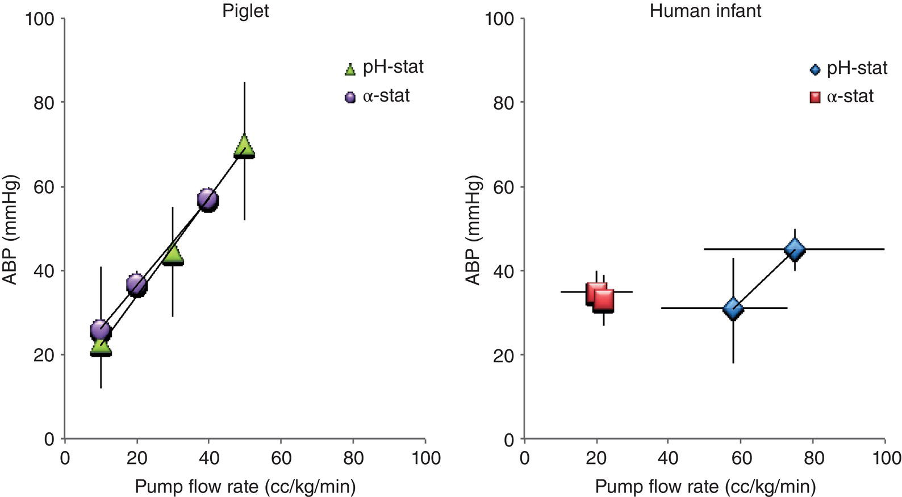

[**Figure 14.9**](#R_c14-fig-0009) The relationships between arterial blood pressure (ABP) and pump flow rates are shown for the piglet model of selective cerebral perfusion and the human infant for two blood gas management strategies.

[**Table 14.1**](#R_c14-tbl-0001) Human vs. neonatal piglet models of selective cerebral perfusion

| Study subject | Brain weight (g) | Body weight (kg) | PaCO2 Mgt | CBF/brain wt  
(mL/100 g/min) | CBF/body wt  
(mL/kg/min) |
| --- | --- | --- | --- | --- | --- |
| **Piglet** | 60 | 3 | α‐stat | 25 | 5 |
| **Piglet** | 60 | 3 | pH‐stat | 60 | 12 |
| **Human infant** | 450 | 3 | α‐stat | 12 | 18 |
| **Human infant,** | 450 | 3 | pH‐stat | 20 | 30 |

The translation of piglet studies of cerebral perfusion is best understood after comparing the relative mass of the piglet and human brain, the relative body mass of the piglet and human infant, and cerebral blood flow expressed in standard units (mL/100 g/min), and in units relevant to perfusion (mL/kg/min). The effect of blood gas management is also shown. The human brain under pH‐stat management is predicted to require six times the pump flow rate of a piglet under α‐stat management. The effect of noncerebral tissue vasculature remains unknown.

The translation of selective perfusion data from piglet to human would require accounting for differences in brain size (60 g piglet brain, 450 g human infant brain), brain development (the piglet is born ambulating with myelinated white matter, with different metabolic requirements and CBF), as well as the ratio of cerebral to collateral systemic circulation that occurs due to anatomic differences. Given the observed response to blood gas management changes shown in [Figure 14.9](#c14-fig-0009), one can argue that the ratio of cerebral to noncerebral perfusion in the human during selective perfusion is much higher than the piglet model of selective perfusion. The basis of this argument is that CO2 tension changes in the blood affect cerebral vascular tone, but leave noncerebral vascular tone relatively unchanged. If the piglet had a large percentage of CBF to total blood flow during selective perfusion, the pressure would drop with pH‐stat management, as it does in human infants.

CBFs during bypass have been measured in piglets and human infants under both alpha‐stat and pH‐stat blood gas management and are summarized in [Table 14.1](#c14-tbl-0001) to facilitate comparison of the human infant with the piglet model \[33, 83, 88–92\]. The piglet has a higher CBF/100 g of tissue, but pump flows are determined by body weight, not brain size. Therefore, the CBF rates/kg body weight are much smaller. These differences limit the applicability of piglet studies of selective perfusion to clinical practice.

An alternative approach has been to rely on neuromonitoring of individual patients to determine selective perfusion flow rates. The TCD is used to determine flow velocities in the middle cerebral artery after cooling, but before selective perfusion. With initiation of selective perfusion, flows are gradually increased from zero until the flow velocities are equal to the preselective perfusion values \[80\]. This technique results in a wide interpatient variability in flow rates, with a mean flow rate of 56 ± 10 mL/kg/min. Of 57 high‐risk patients reported with this technique, 23 (40%) had a new MRI‐detected brain lesion after surgery. Most lesions were WMI, and the lesions were evenly divided between ipsilateral and contralateral hemispheres with respect to the cannulation site. Nonrandomized neurodevelopmental outcomes using the Bayley Scales of Infant Development at 12 months yielded cognitive domains on a par with population norms, and language and motor domains 0.8 and 0.9 standard deviations (SDs) lower than population norms \[8\].

* * *

### KEY POINTS: SELECTIVE CEREBRAL PERFUSION

-   During selective perfusion, with the great vessels snared and flow directed to the carotid, there is an unknown narrowing of the range of flow rates that yield pressures acceptable for cerebral perfusion.
-   Flow rates for selective perfusion have ranged from 10 to 100 mL/kg/min.
-   A TCD and near‐infrared spectroscopy (NIRS)‐guided flow protocol with mean 56 mL/kg/min has been published, yielding a low rate of new MRI injury and good 12‐month neurodevelopmental outcomes.

* * *

## Neurological monitoring during congenital heart surgery

> If a man will begin with certainties, he shall end in doubts: but if he will be content to begin with doubts, he shall end in certainties.
> 
> Francis Bacon, 1605 \[93\]

Empiricism, inductive reasoning, and the scientific method have converted medicine from mysticism to an evidence‐based practice. The randomized controlled clinical trial is not new to medical science, but the modern ability to assimilate the vast catalog of medical data has been transformative \[94\]. The contemporary concept of evidence‐based medicine by meta‐analysis is a rigorous, methodical scoring of available evidence that provides a common platform for the standardization of practice \[95\]. Neuromonitoring has been reviewed with this matrix. In the case of all three neuromonitors presented in this chapter (electroencephalography, TCD ultrasonography, and reflectance NIRS), the final evidentiary scores were level III, i.e., no demonstrable benefit \[44\]. The antithesis of evidence‐based practice includes two categories of offense: nonconformity to practices shown to be beneficial and adherence to practices not shown to be beneficial. While no monitoring device has been shown by this evidentiary standard to be beneficial, the American Society of Anesthesiologists continues to recommend a standard, minimum acceptable intraoperative monitoring platform to include pulse oximetry, blood pressure, and electrocardiography \[96\]. This breach of evidence‐based practice is most pointed for the pulse oximeter, which is a mandatory intraoperative monitor despite failure of research to show any outcome benefit after randomization of nearly 23,000 subjects \[97\]. The universal refusal of practitioners to disbelieve the apparent benefit provided by pulse oximetry casts doubt on the ability of the randomized trial to demonstrate benefit for any monitoring modality \[98\]. For similar reasons, final conclusions in meta‐analyses of intraoperative neuromonitoring, including those described hereafter in this chapter, are commonly upgraded in tone from “not indicated” to “may be considered,” despite the inability to support this conclusion with data \[44, 99\].

* * *

### KEY POINTS: EVIDENCE‐BASED MEDICINE AND PHYSIOLOGICAL MONITORING OUTCOME STUDIES

-   The pulse oximeter is a mandatory intraoperative monitor despite failure of research to show any outcome benefit after randomization of nearly 23,000 subjects.
-   The universal refusal of practitioners to disbelieve the apparent benefit provided by pulse oximetry casts doubt on the ability of the randomized trial to demonstrate benefit for any monitoring modality.

* * *

### Electroencephalographic technologies

The standard electroencephalogram (EEG) with 2–16 channels has been utilized in congenital heart surgery \[100\]. The EEG has a primary clinical purpose of detecting and diagnosing seizure activity. More recently, it has been used as a guide of anesthetic depth and to document electrocerebral silence before circulatory arrest \[101\]. EEG is affected by several factors, including anesthetic agents, temperature, and CPB. Impracticalities associated with intraoperative EEG include electrical signal interference, complexity of placement, and interpretation. Newer devices using processed EEG technology are more user‐friendly and have been extensively reviewed \[102, 103\]. Although the value of perioperative EEG monitoring has better rationale in recent years (see below), there is conflicting outcome data. For example, neonates after stage I repair of HLHS had normal perioperative EEG findings when postoperative MRI scans showed ischemic injuries \[20\].

The Bispectral (BIS™) Index Monitor (Covidien, Inc., Mansfield, MA, USA) is currently promoted to guide the depth of anesthesia. BIS sensors are applied to the forehead and temple, producing a frontotemporal montage, which connects to a processing unit. The device is easy to use, and the monitor requires no calibration. The proprietary algorithm of Covidien (originally Aspect Medical Systems) renders the BIS index from one‐channel processing of the EEG \[104\]. The BIS index ranges from 0 (isoelectric EEG) to 100 (awake), with mean awake values in the 90–100 range in adults, infants, and children \[105\]. While awareness is a concern with surgery requiring CPB in adults, there is a scarcity of data in the literature regarding this problem in children requiring heart surgery \[106, 107\]. The BIS monitor also reports a burst suppression ratio, which would, in theory, be useful to see the effect of cooling on suppression of electrical activity in the brain. However, the literature has only case reports describing this practice in pediatrics \[108, 109\].

In a cohort of children undergoing open heart surgery with an anesthetic tailored for “fast tracking,” BIS scores increased during rewarming, a period considered at risk for awareness under anesthesia \[110\]. However, in that study and a similar study of infants younger than 1 year, BIS did not correlate with biochemical surrogates of light anesthesia, including stress hormones.

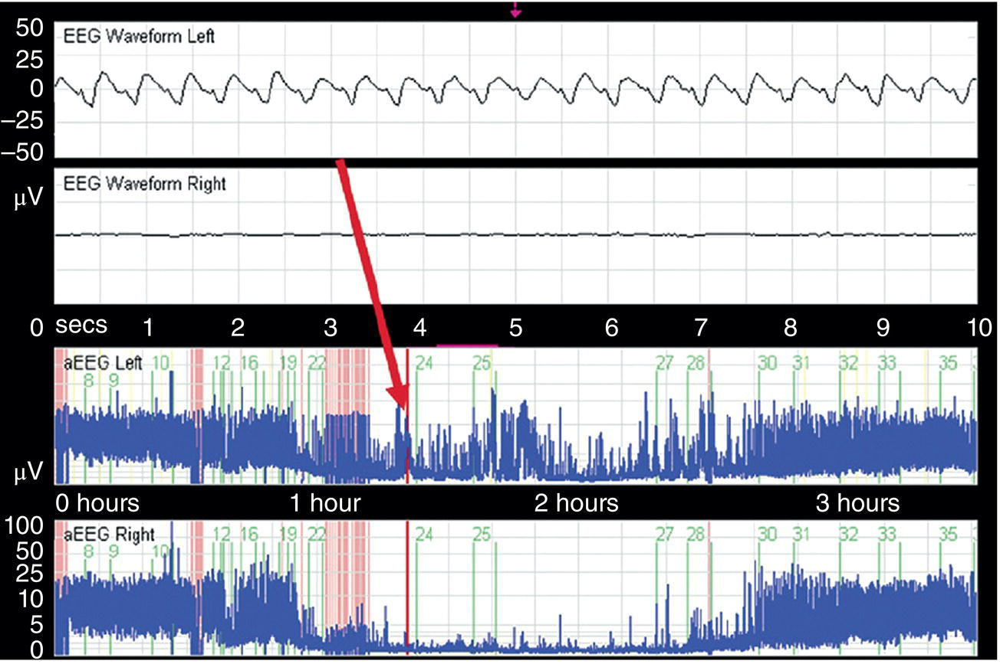

[**Figure 14.10**](#R_c14-fig-0010) Intraoperative aEEG recording with repetitive ictal pattern indicating left‐sided seizure on the raw EEG trace (top row) and corresponding to the left compressed trace (third row) highlighted by the red arrow.

(Source: Gunn et al. \[113\]. Reproduced with permission from Elsevier.)

Andropoulos and colleagues reported a cohort of 68 neonates undergoing single ventricle (SV) and two‐ventricle (2V) repairs who underwent full 11‐lead neonatal EEG monitoring for 6 hours preoperatively and 72 hours postoperatively \[111\]. High‐flow bypass with neuromonitoring including NIRS with a treatment protocol for rSO2 <50% was utilized. Selective cerebral perfusion with transcranial Doppler‐guided flow rates were also employed, and DHCA was minimized. There were no preoperative EEG seizures identified. In the 72‐hour postoperative period, one patient experienced two brief EEG seizures for a total of 125 seconds; for an overall incidence of 1.5% (95% confidence interval 0.3–7.9%). This EEG seizure incidence is lower than most other cohorts (see below), and the discussion focused on targeted management of CBF and oxygenation and the fact that significant doses of benzodiazepines were administered intraoperatively and postoperatively in this population (median of about 2 mg/kg midazolam in the perioperative period), which could suppress seizures. This report emphasizes the importance of specifying anesthetic/sedative and bypass and neuromonitoring protocols when reporting EEG seizure incidence.

Amplitude‐integrated EEG (aEEG) has been utilized in neonatal intensive care for two decades and has prognostic outcome value for term neonates with hypoxic–ischemic encephalopathy (HIE) and who undergo therapeutic hypothermia \[112\]. Four needle or adhesive electrodes plus a reference electrode are applied to yield a two‐channel EEG, from two parietal and two frontal locations. The raw EEG signal is smoothed, rectified, amplitude integrated, and displayed at the bedside. The aEEG signal is evaluated for background pattern, ictal discharges, burst suppression, low voltage, or an isoelectric EEG, allowing real‐time assessment and treatment. Reports of intraoperative use of aEEG for infant cardiac surgery are limited. Gunn and colleagues studied 39 neonates undergoing Norwood stage I palliation for HLHS with selective cerebral perfusion and reported intraoperative seizures in 9 (23%), predominately occurring at hypothermia of 20–24 °C \[113\] ([Figure 14.10](#c14-fig-0010)). Of note, NIRS was not utilized in this study nor was the CPB flow rate during selective cerebral perfusion specified (see above). Eighteen percent of this cohort experienced seizures in the early postoperative period. Seizures were not associated with later neurodevelopmental impairment at 2 years, but were associated with increased early mortality. Failure of the background aEEG pattern to return to normal by 48 hours was associated with increased early mortality and lower motor scores at 2 years. In other cohorts, postoperative abnormal aEEG patterns, consisting of seizures, abnormal background activity, and abnormal sleep–wake cycles, have been associated with new postoperative MRI brain injury after cardiac surgery in neonates and lower IQ but not motor scores at age 4 years \[112, 114\].

Pittet and colleagues reported 31 neonates with conventional 13‐ or 19‐lead video EEG monitoring before cardiac surgery, and 5 (16%) experienced EEG seizures, with no clinical correlate \[115\]. All neonates with preoperative seizures had significant brain injury on MRI, including acute stroke, watershed injury, intracerebral hemorrhage, and WMI. Of the 157 recorded seizures, 62% were in the same area as MRI brain injury.

In a 2021 systematic review and meta‐analysis of DHCA and EEG monitoring in the perioperative period for pediatric cardiac surgery, Alkhatip and colleagues reviewed 19 studies with 1,267 patients \[116\]. The event rate of EEG seizures was 14.9%, and seizures were associated with acute neurological findings, MRI abnormalities, and lower IQ and PDI scores on longer term follow‐up. Longer DHCA times were associated with a higher incidence of EEG seizures.

While intraoperative utilization of either conventional or aEEG monitors remains limited due to complexity and space constraints, postoperative EEG monitoring for high‐risk neonates and infants undergoing cardiac surgery is increasingly common, and the American Clinical Neurophysiological Society recommends continuous EEG monitoring in this patient group \[117\]. It seems intuitive to treat EEG seizures since they are clearly a manifestation of brain injury, and many centers are now doing this; whether seizure treatment and suppression will improve longer term neurodevelopmental outcomes needs to be further studied \[118\].

* * *

### KEY POINTS: EEG TECHNOLOGIES

-   EEG seizures occur in 10–25% of high‐risk patients in the perioperative period in most studies.
-   Most studies associate EEG seizures with adverse long‐term neurodevelopmental outcomes.
-   Postoperative EEG monitoring for high‐risk patients is increasingly practiced.
-   Outcome studies of seizure treatment are lacking.

* * *

### Transcranial Doppler ultrasound

TCD ultrasonography is a sensitive, real‐time monitor of CBF velocity and embolic events during congenital heart surgery. Currently available instruments utilize pulsed‐wave ultrasound at 2 MHz frequency, which is range‐gated, emits a power of 100 mW and has a sample volume length up to 15 mm. Typically, the middle cerebral artery is insonated during cardiac surgery, either across the fontanel or through the temporal bone window. Systolic, mean, and diastolic flow velocities are easily measured, as well as the pulsatility index, which is equal to the peak (systolic) velocity minus the end‐diastolic velocity divided by the mean velocity \[119\].

The most challenging aspect of TCD use is setting the proper angle and depth to reliably interrogate flow velocity in the middle cerebral artery. This is facilitated by the presence of pulsatile blood flow and is therefore best done before initiation of bypass. Once located, small movements will require ongoing adjustments during the monitoring period to optimize the angle and depth of insonation. Cerebral vessels are not visualized by the ultrasound used, but are recognized by the patterns of flow velocity generated. When the temporal window is used, the bifurcation of the middle and anterior cerebral arteries is recognized in the Doppler signal by a maximal antegrade signal emanating from the middle cerebral artery and a similar magnitude retrograde signal emanating from the anterior cerebral artery. Insonation of the same vessel is necessary to effectively use the TCD during surgery, and the use of the middle and anterior cerebral arteries bifurcation allows the same region to be identified due to the simultaneous bidirectional flow signal (see [Figure 14.11](#c14-fig-0011)). The anterior fontanelle window can also be utilized in young infants, taking care to insonate the bifurcation of the anterior and middle cerebral arteries on the desired side, usually the right, and recognizing that the depth of insonation is significantly greater through this location.

TCD ultrasonography has been used extensively in pediatric cardiac surgical research to examine the cerebral physiologic responses to CPB, hypothermia, low‐flow bypass, regional perfusion techniques, and circulatory arrest. These studies are discussed in the section on “cerebrovascular physiology during cardiac surgery.” TCD monitoring can also be used to detect cerebral emboli, but the embolic load detected with this method has not been shown to correlate with acute postoperative neurologic deficits \[120\] or long‐term neurodevelopmental outcomes \[121\]. The number of emboli detected by TCD is greatest after removal of the aortic cross‐clamp, suggesting de‐airing maneuvers guided by echocardiography, with Trendelenburg position; lung inflation to promote movement of air out of the pulmonary veins; and venting of the aortic root as strategies for mitigation \[122\]. In addition, TCD monitoring can be used to detect cannula malposition at either the superior vena cava or aortic sites, which is seen as an abrupt decrement in the middle cerebral artery flow velocity \[123\].

### Monitors of cerebral oxygenation

#### Jugular venous bulb oximetry

Jugular bulb venous oximetry (SjvO2) has been used in children with CHD since the late 1980s. It is considered the gold standard for the assessment of global cerebral oxygenation, against which reflectance NIRS monitors were validated. The catheter can be placed in the jugular bulb by retrograde cannulation of the right internal jugular vein, with or without fluoroscopic confirmation of catheter tip placement \[91\]. Alternatively, the superior vena cava can be cannulated in the surgical field after exposure \[124\]. SjvO2 is conceptually a measure of the ratio of oxygen delivery to consumption in the brain. During bypass in adults, low SjvO2 has been associated with low cerebral perfusion pressure and low PaCO2, whereas high SjvO2 is associated with low temperature \[125\]. The limited data available for SjvO2 monitoring are not likely to be augmented in the future because the method is invasive and time‐consuming when compared with reflectance NIRS, which renders a physiologically similar variable.

#### Near‐infrared spectroscopy

In 1977, Frans Jobsis envisioned a neuromonitor for critically ill preterm neonates based on reflectance NIRS \[126\]. The “NIRO‐SCOPE” he developed was first used in 1985, in the neonatal ICU at Duke University and led to the claim that \[127\]:

For effective measurement of cerebral oxygen sufficiency in a sick newborn, an instrument should be noninvasive, be adaptable at the bedside, not interfere with patient care, and give continuous rapid information. The signals should directly assess brain oxygen delivery and utilization and be sensitive to small changes. The NIRO‐SCOPE appears to fulfill these basic requirements.

The technology developed by Jobsis and his colleagues has evolved into at least eight US Food and Drug Administration (FDA)‐approved devices: INVOS™ 5100C and 7100 (Medtronic/Covidien, Mansfield, MA, USA), Fore‐Sight® (CASMED®/Edwards, CAS Medical Systems, Inc., Branford, CT, USA), Equanox™ 3‐ and 4‐wavelength versions (Nonin Medical Inc., Plymouth, MN, USA), CerOx™ (Ornim Inc., Dedham, MA, USA), NIRO®‐200NX (Hamamatsu Photonics, Hamamatsu City, Japan), and O3 Regional Oximetry (Massimo, Irvine, CA, USA), of which all except the CerOx are currently also approved for pediatric use. All devices utilize similar technology and are susceptible to similar artifacts and pitfalls \[128\].

Cerebral oximeters include a sensor placed on the forehead below the hairline. Near‐infrared light penetrates human tissues, including bone, without ionization. Light in this spectrum is, however, absorbed by specific biologic chromophores (i.e., hemoglobin and cytochrome oxidase AA3), with molar absorptivity that is dependent on the state of oxidation of the chromophore (see [Figure 14.12](#c14-fig-0012)).

[**Figure 14.11**](#R_c14-fig-0011) (A) The bifurcation of the middle and anterior cerebral arteries is insonated by transcranial Doppler through the temporal bone window.

(Source: Runeaaslid / Wikipedia / CC BY 3.0, [https://commons.wikimedia.org/wiki/File:Transcranial\_doppler.jpg](http://en.wikipedia.org/wiki/File:Transcranial_doppler.jpg))

(B) Transcranial Doppler waveform pre‐bypass. Note in the biphasic pattern, the flow velocity above zero baseline is toward the transducer (middle cerebral artery) and the velocity below zero is away from the transducer (anterior cerebral artery). Mean and peak velocities in cm/s are displayed. The panels on the right of screen are multigating patterns at different depths of insonation. (C) Flow velocity on full flow bypass at 150 mL/kg/min. Note the nonpulsatile flow. (D) Flow velocity during selective cerebral perfusion at 60 mL/kg/min. Note the quasi‐pulsatile flow pattern synchronous with revolution of the roller pump head. HR, heart rate.

When near‐infrared light, whether originating from a laser or a light‐emitting diode, is applied to the human forehead, it passes through tissue in all directions, refracting off various tissue interfaces such that a portion of the light returns to the surface where it can be detected. In the laboratory, using a cuvette and spectrophotometer, the Beer–Lambert equation is used to calculate the concentration of a single chromophore based on absorbance (_A_). Absorbance is calculated from the relative intensities of recovered (_I_) and incident (_I_0) light passing through a cuvette in a spectrophotometer:

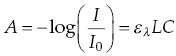

where _A_ is absorbance, ελ is the molar absorptivity of the chromophore at the specified wavelength of light, _L_ is the path length of light, and _C_ is the concentration of the chromophore in the cuvette. Naturally, hemoglobin does not occur within cuvettes in the brain, and the path length of reflected light encountering the cerebral cortex from the forehead can only be estimated. However, when multiple wavelengths of light are used, the ratio of oxygenated hemoglobin concentration to total hemoglobin concentration can be calculated, effectively cancelling unknown and estimated factors. Proprietary variations on these principles exist to account for scattering of light outside the interoptode arc, absorption by nonhemoglobin species, and extracranial (noncerebral) absorption for each of the marketed devices.

Regional cerebral oximetry is thought to describe the oxygen saturation of frontal cortical blood that is 70% venous, 5% capillary, and 25% arterial. Thus, cerebral oximetry is venous weighted, but with some arterial contribution making it consistently higher than, but trending with, jugular venous oximetry \[129–131\]. In piglets during CPB including hypothermic circulatory arrest, the correlation between jugular venous oximetry and cerebral oximetry was strong (_r_ = 0.91) \[132\]. Clinical replication of this data was significant, albeit less robust \[131, 133, 134\]. Critics of cerebral oximetry have not challenged the evidence that cortical oxygenation can be measured with reflectance NIRS. Rather, the relevance to outcome, potential to misguide management, and justification of cost have been the questions raised by evidentiary review \[44\]. Some highlights of the numerous observational studies showing an association between low cerebral oximetry and neurologic injury or neurocognitive outcome are discussed below. [Figure 14.13](#c14-fig-0013) displays bilateral regional cerebral oxygen saturation (rSO2) intraoperatively in a neonate undergoing stage I palliation for HLHS.

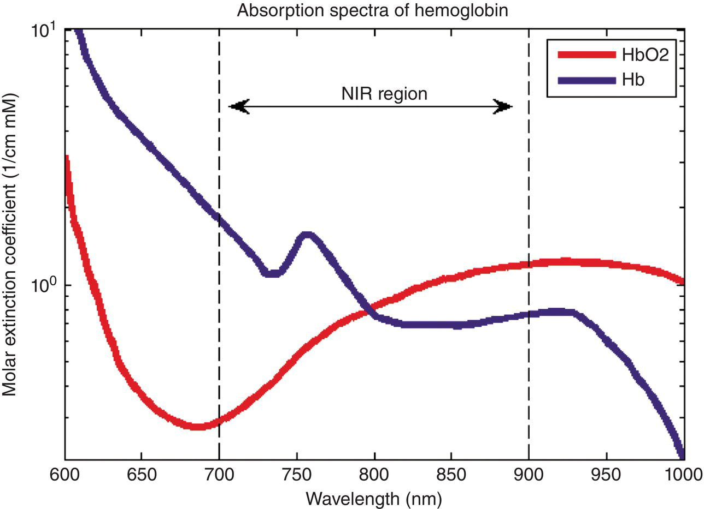

[**Figure 14.12**](#R_c14-fig-0012) The absorption spectra of hemoglobin and oxyhemoglobin in the near‐infrared (NIR) range. At the isosbestic wavelength of 805–810 nm, hemoglobin and oxyhemoglobin have similar absorption. Above this wavelength, oxygenated hemoglobin has greater absorption, and below this wavelength, hemoglobin has greater absorption.

(Adrian Curtin / Wikimedia Commons / CC BY‐SA 3.0, [https://commons.wikimedia.org/wiki/File:Oxy\_and\_Deoxy\_Hemoglobin\_Near‐Infrared\_absorption\_spectra.png](http://creativecommons.org/licenses/by-sa/3.0).)

A prospective study of 250 children with EEG, TCD, and cerebral oximetry monitoring during cardiac surgery showed that cortical desaturation (cerebral oximetry reductions of 20% from baseline) was the most common monitoring event. Postoperative neurologic abnormalities, including seizures, speech, movement, and visual disturbances, occurred in 26% of subjects with neuromonitoring abnormalities that were not treated. By comparison, neurologic sequelae were observed in only 6% of subjects with monitoring events that were treated and in 7% of subjects with no monitoring abnormalities \[98\]. Pre‐ and post‐Norwood procedure brain MRI data from 22 subjects showed an association between new lesions and prolonged cortical desaturation \[20\]. Another cohort of 53 neonates with diverse congenital heart lesions showed an association between cortical desaturation and new brain lesions detected by MRI \[135\]. Using a mixed outcome metric combining length of ICU stay, need for extracorporeal membrane oxygenation (ECMO), and death, an association was found between 48‐hour mean cerebral oximetry measurements and poor outcome in 50 neonates after Norwood for HLHS \[136\].

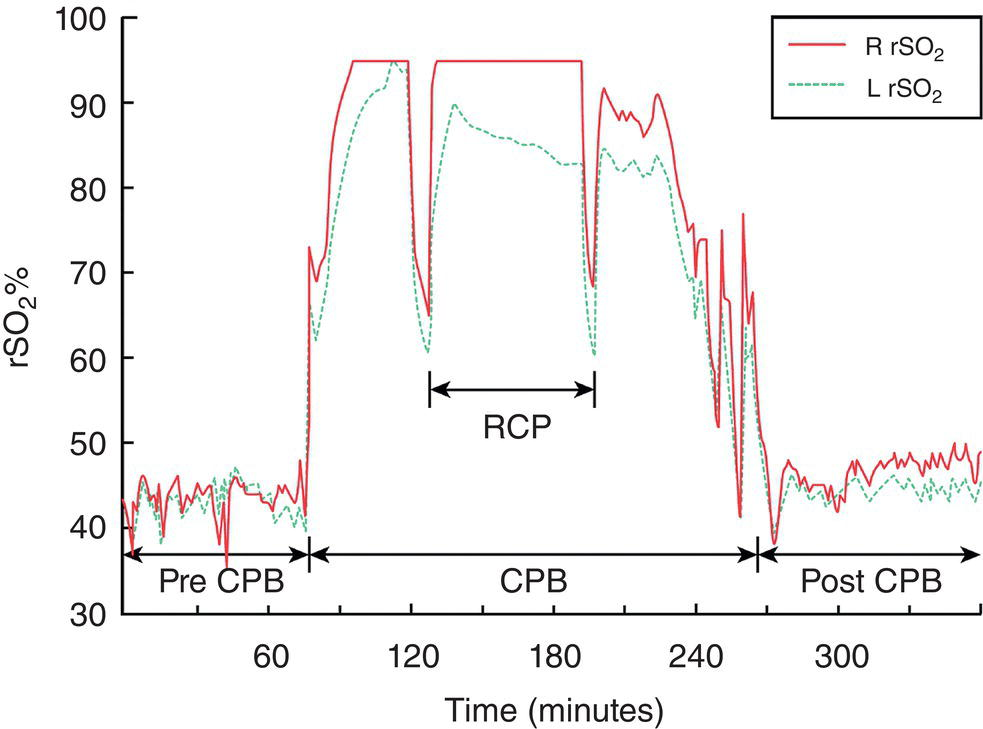

[**Figure 14.13**](#R_c14-fig-0013) Bilateral regional cerebral oxygen saturation (rSO2) in a neonate during stage I palliation for hypoplastic left heart syndrome. During pre‐cardiopulmonary bypass (CPB) the baseline rSO2 is low at 40–50% and similar in both frontal cerebral hemispheres. During CPB, cooling rSO2 increases to greater than 90% bilaterally, decreasing briefly to 60–70% during deep hypothermic circulatory arrest (DHCA) for the atrial septectomy and increases again with left rSO2 lower that right during regional cerebral perfusion (RCP). A brief period of DHCA to transfer the aortic cannula to the neoaorta is followed by increase to rSO2 >85% and then decrease during rewarming on bypass. After bypass, rSO2 is 45–50%.

Recent publications report additional surgical cohorts that associate low perioperative NIRS values with later decrements in neurodevelopmental outcomes. Carra and colleagues studied 87 infants with median age of 4 months undergoing cardiac surgery with bypass and found that higher “dose” of cerebral desaturation below rSO2 of 65% (% below 65% × minutes) in the first 24 hours after surgery was associated with lower IQ scores 2 years later \[137\]. In a cohort of 56 neonates with SV and 2V lesions studied by Andropoulos and colleagues, multivariable analysis of risk factors reported an association of lower preoperative rSO2 values with lower cognitive and motor scores at 12 months \[138\]. Hoffman and colleagues reported that among 178 children undergoing SV or 2V cardiac surgery as neonates, lower baseline rSO2, but not pulse oximeter‐derived SpO2, measured at the time of neurodevelopmental assessment, was a risk factor for lower motor scores from 6 to 36 months of age \[139\]. Aly and colleagues report 75 SV and 2V neonates who had Bayley Scales of Infant Development‐II (BSID‐II) testing at 6, 15, and 21 months after surgery. Patients with poor outcomes (death or a BSID‐II score more than 2 SD below norms) had lower cerebral tissue oxygenation index at 60 minutes (48 vs. 58%, _p_ = 0.003) and 24 hours after bypass (49 vs. 59%, _p_ < 0.01) \[140\].

Monitoring and supporting cortical oxygenation during cardiac surgery are conceptually similar to “goal‐directed therapy,” used for shock management in the ICU \[141, 142\]. Recognition of cortical desaturation promotes interventions that increase oxygen delivery; thus, cerebral oximetry monitoring acts as a unidirectional influence on bypass practices toward higher hematocrit, higher flow rates, higher cerebral perfusion pressure, higher arterial carbon dioxide tension (pH‐stat management), and the use of selective perfusion techniques \[96\]. [Table 14.2](#c14-tbl-0002) shows abnormalities associated with cortical desaturations and interventions performed at Texas Children’s Hospital for cortical desaturation events.

[**Table 14.2**](#R_c14-tbl-0002) Causes and treatments of cortical desaturation used at Texas Children’s Hospital

| Abnormality | Principle | Intervention |
| --- | --- | --- |
| **Cerebral perfusion pressure** | The brain is perfused by pressure, not cardiac output. However, our preference is to treat low pressure with cardiac output support, to avoid excessive vascular resistance and hypoperfusion of the noncerebral vascular beds. | During CPB: Increase flow rate and maintain afterload reduction. Vasopressor only if excessive vasoplegia is suspected. Check SVC and aortic cannulae.  
  
Off CPB: Administer volume judiciously with monitoring of atrial filling pressures. Inotropic support to improve stroke volume. Pacing for bradycardia. Vasopressors when excessive vasoplegia is suspected, and judiciously when volume is not tolerated and/or arrhythmia precludes beta agonist therapy. |
| **Anemia** | Low oxygen carrying capacity increases vulnerability to watershed white matter injury. The infant heart has low tolerance for the volume administration of transfusion immediately after bypass. | Avoid excessive hemodilution during hypothermia, typically 30–35%. Blood transfusion and hemofiltration during cardiopulmonary bypass to a hematocrit greater than 40% at separation. Higher hematocrit at separation allows for a volume‐neutral exchange transfusion of platelets if needed. |
| **Fever** | High brain temperatures increase CMRO2. High global extractions yield low mixed venous oxygen saturations, affecting arterial saturation in infants with mixing lesions. | Fevers are treated with antipyretics. Cooling is easily controlled on CPB. After separation and in the ICU, cooling can be accomplished to normothermia when needed with adequate sedation. |
| **Hypoxia** | Arterial hypoxia in the infant with a mixing lesion must be addressed systematically. Reflex administration of oxygen in this setting can result in systemic hypoperfusion. | Lung ventilation and perfusion: tracheal suction, recruitment maneuvers.  
Pulmonary to systemic flow ratio: evaluate for shunt occlusion, pulmonary vascular tone elevation.  
Mixed venous desaturation: see below |
| **Mixed venous desaturation** | Infants with mixing lesions are especially vulnerable to decrements of mixed venous oxygen content. Systemic vascular tone is the most common cause. Excessive work of breathing, agitation, shivering, and fever can contribute to low mixed venous saturation. | Alpha blockade is used for infants during cardiopulmonary bypass. Afterload reduction with milrinone, nipride, or ACE‐inhibitors is a preferred first‐line therapy after separation from CPB. Intubation, sedation, or paralysis may be necessary in the ICU depending on the acuity. Pressure support trials causing low mixed venous oxygen saturation and cortical desaturation should be terminated. |
| **Hypocarbia** | Arterial CO2 diffuses freely into the CSF while soluble buffers do not. Cerebral blood flow is increased by acidic CSF (increased CO2) and decreased by basic CSF (decreased CO2). CSF buffering over several hours compensates acute changes cerebral blood flow caused by arterial CO2 tension. | Whether pH‐stat or α‐stat methods of measuring arterial CO2 tension are used, low cerebral blood flow can be mitigated during cardiopulmonary bypass by permissive hypercapnia. |

#### Frequency‐domain NIRS and diffuse correlation spectroscopy

Frequency‐domain NIRS combined with diffuse correlation spectroscopy (DCS) extends the capabilities of standard NIRS monitoring and can be utilized to measure cerebral oxygenation and hemodynamics noninvasively. CBF, cerebral blood volume (CBV), cerebral oxygen saturation (rSO2), cerebral oxygen extraction fraction (OEF), and an estimation of cerebral metabolic rate for oxygen (CMRO2) can be derived. Although primarily a research tool, its portable nature could potentially make it a clinical bedside/operating room modality, augmenting or replacing the NIRS monitors currently in use. Technical explanations of the FD‐NIRS/DCS approaches are contained in recent reviews \[143\]. CBF measured by DCS also correlates with bypass pump flow, and TCD measured CBF velocity during full‐flow bypass, low‐flow bypass, selective cerebral perfusion, and DHCA \[144\].

Cheng and colleagues studied 31 CHD neonates (7 two‐ventricle, 11 transposition of the great arteries (TGA), 13 SV) preoperatively and postoperatively and compared cerebral oxygenation and hemodynamics to 13 control neonates \[145\]. Preoperatively, all three CHD groups exhibited lower rSO2 than normal controls, and the TGA and SV groups had increased OEF. The SV group had lower CBF than normal controls. Postoperatively, TGA patients had higher rSO2 and lower CBF, OEF, and CMRO2. The 2V patients had lower CBF, and the SV patients had lower rSO2 ([Figure 14.14](#c14-fig-0014)). The same group utilized FD‐NIRS/DCS to assess CBF and CMRO2 during bypass in neonates and demonstrated that this noninvasive method documented the same uncoupling of CBF and CMRO2 during deep hypothermia, as Greeley and colleagues measured over 30 years previously using invasive techniques (see above) \[146\] ([Figure 14.15](#c14-fig-0015)).

* * *

### KEY POINTS: MONITORS OF CEREBRAL OXYGENATION

-   NIRS technology is a well‐established accurate monitor of cortical oxygen saturation.
-   Accumulating data associates low rSO2 in the perioperative period with worse neurodevelopmental outcomes.
-   FD‐NIRS/DCS is a noninvasive method used to assess cerebrovascular hemodynamics and CMRO2.

* * *

### Monitors of cerebral autoregulation

As described above, cerebral pressure and flow autoregulation is abnormal both during and after CPB in neonates and infants. Abnormal cerebrovascular pressure autoregulation in premature neonates and pediatric brain trauma patients is associated with further cerebral injury and poor outcomes \[147, 148\]. Outcome studies of cerebral pressure autoregulation in neonates and infants undergoing cardiac surgery with bypass are lacking, but recent developments may allow real‐time bedside autoregulation monitoring and thus allow treatment strategies and facilitate outcome studies. NIRS can measure a blood volume index, which is the mathematical inversion of the optical density of light at 805 nm wavelength measure from the NIRS monitor (1‐OD 805 nm). This parameter correlates with the total hemoglobin, i.e., blood volume, in the light path \[149\]. When correlated with mean arterial pressure derived from an arterial catheter, the hemoglobin volume index, HVx, can be derived to measure cerebral pressure autoregulation in real time, and this parameter demonstrates strong correlation with other measures of cerebral autoregulation, including laser Doppler and transcranial ultrasound Doppler blood flow, in experimental animals \[150\]. HVx has a value of −1 to +1, and when autoregulation is functional, HVx has a value near zero or negative, because blood pressure and CBV are either poorly or negatively correlated. When blood pressure is outside the limits of autoregulation (either too high or too low), HVx is increasingly positive and approaches +1 because blood volume is pressure‐passive, i.e., increases with increasing blood pressure and decreases with decreasing blood pressure. Because the blood volume index is already measured by NIRS monitors, efforts are under way for the FDA and other regulatory agencies to approve this monitoring modality; the advantage of this method is that no new monitoring equipment is needed, only the computer software to integrate the signals and display the HVx.

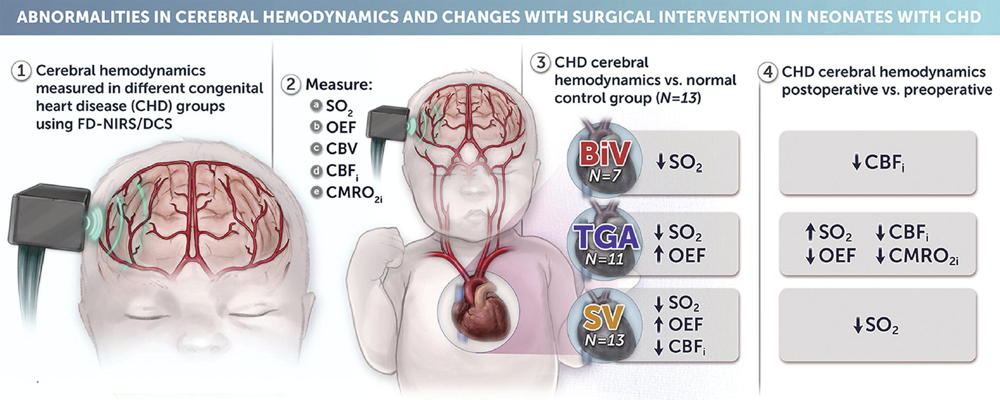

[**Figure 14.14**](#R_c14-fig-0014) Noninvasive measures of cerebral hemodynamics and oxygenation FD‐NIRS/DCS technology show significant differences between controls and CHD groups. Significant diagnosis‐specific changes existed between preoperative and postoperative states. CHD, congenital heart disease; FD‐NIRS, frequency‐domain near‐infrared spectroscopy; DCS, diffuse correlation spectroscopy; SO2, cerebral oxygen saturation; OEF, cerebral oxygen extraction fraction; CBV, cerebral blood volume; CBFi, cerebral blood flow index; CMRO2i, ceragram metabolic rate for oxygen index; Bi‐V, two‐ventricle heart disease without transposition; TGA, D‐transposition of the great arteries; SV, single ventricle.

(Source: Cheng et al. \[145\]. Reproduced with permission from Elsevier.)

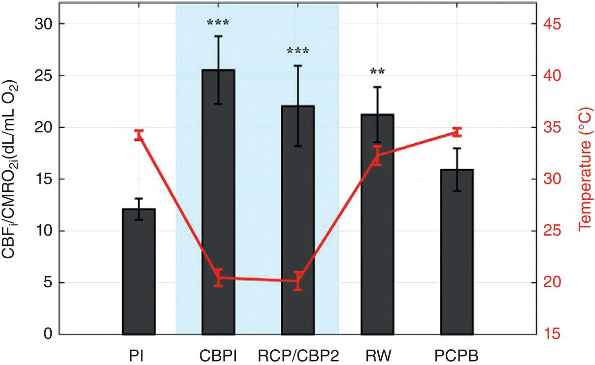

[**Figure 14.15**](#R_c14-fig-0015) Coupling between cerebral blood flow and oxygen consumption during cardiac surgery. Mean nasopharyngeal temperature is overlaid at each stage. Note considerable increase in the CBFi/CMRO2i ratio, or decrease in oxygen extraction, during deep hypothermia relative to the PI period. Error bars represent standard error of the mean values, blue shaded region are measurements during deep hypothermia, and red line is temperature. Asterisks denote significant differences from baseline. PI, postinduction; CBP1, first bypass period; RCP/CPB2, regional cerebral perfusion/second bypass period; RW, rewarming; PCPB, post bypass period.

(Source: Ferradal et al. \[146\] / Springer Nature / CC BY 4.0.)

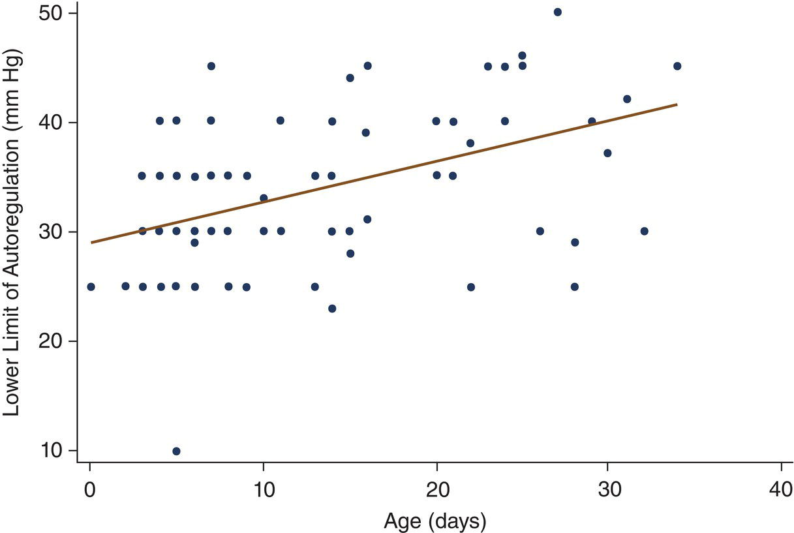

[**Figure 14.16**](#R_c14-fig-0016) The upward trend in the first month of life for the average lower limit of autoregulation during cardiopulmonary bypass.

(Source: Andropoulos et al. \[151\]. Reproduced with permission from Elsevier.)

Smith and colleagues evaluated cerebral pressure autoregulation utilizing the HVx in 72 neonates undergoing surgery with bypass and assessed this parameter at different levels of hypothermia down to 18 °C \[39\]. Although HVx could be derived in all patients and dysautoregulation was demonstrated in all patients at hypothermia, this was confounded by the fact that mean arterial pressure decreased and exhibited collinearity with low temperature; thus, the effect of hypothermia on autoregulation could not be definitively established. In these patients, the lower mean arterial pressure limit of autoregulation ranged from 25 to 45 mmHg, with a trend upward in the first month of life \[151\] ([Figure 14.16](#c14-fig-0016)). Easley and colleagues measured HVx in 57 patients undergoing surgery with bypass aged from neonate to 17 years and demonstrated cerebral pressure dysautoregulation in many patients during CPB with an average lower limit of autoregulation of about 40 mmHg \[149\] ([Figure 14.17](#c14-fig-0017)). Patients with the highest peak glial fibrillary acidic protein (GFAP) (a marker of cerebral injury) values had higher peak values of the HVx, demonstrating a correlation between dysautoregulation and this marker of brain injury. Cabrera and colleagues studied 16 infants undergoing bidirectional cavopulmonary connection and reported that hypertension and elevated pulmonary artery pressure were associated with elevated HVx (cerebral pressure dysautoregulation) \[152\].

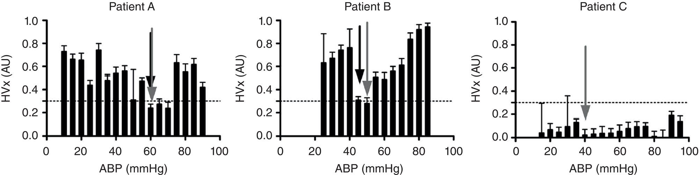

[**Figure 14.17**](#R_c14-fig-0017) Examples of individual autoregulation curves for three different patients, one in each panel. In each graph, binned averages of the hemoglobin volume index (HVx) are plotted against arterial blood pressure (ABP) with their standard errors. The horizontal line at 0.3 for the HVx indicates the suspected threshold for loss of autoregulation. Patients were randomly selected to illustrate the identification of the lower limit of autoregulation (LLA) and the optimal arterial blood pressure (ABP opt) from the autoregulation curve. LLA is indicated with a black arrow and ABP opt with a gray arrow on each curve, as applicable. Patient A: A 7‐month‐old infant with Tetralogy of Fallot (TOF) undergoing complete repair. The figure demonstrates an individual’s HVx curves that meet criteria for determining both an LLA and ABP opt. On the basis of the curve, the patient maintained autoregulation to an ABP of 60 mmHg, but then lost autoregulatory function with a further drop in ABP to 55 mmHg. The lowest HVx value (ABP opt) was also at 60 mmHg. Patient B: A 2‐year‐old child with heterotaxy undergoing bidirectional cavopulmonary shunt. The HVx curve demonstrates both LLA at 45 mmHg and ABP opt at 50 mmHg. Patient C: 3‐month‐old infant with TOF undergoing complete repair. This patient’s HVx curve fails to meet criteria for demonstrating an LLA as all measurements demonstrate intact autoregulation. ABP opt was 40 mmHg.

(Source: Easley et al. \[149\]. Reproduced with permission from Cambridge University Press.)

These studies demonstrate the potential to monitor real‐time cerebral pressure autoregulation during pediatric cardiac surgery and make possible interventional outcome studies. A maneuver as simple as increasing or decreasing mean arterial pressure until intact autoregulation occurs can be compared in a randomized prospective trial to usual clinical management without autoregulation monitoring. Short‐term outcomes such as neurological morbidity, MRI findings, and biomarkers of brain injury and long‐term outcomes such as neurodevelopmental outcomes, can be studied. In the adult cardiac surgery population, a retrospective study demonstrated that increasing time with blood pressure below the lower limit of autoregulation was associated with major postoperative morbidity, including stroke and mortality \[153\]. Such a controlled trial has been performed in adults and demonstrates that when blood pressure is personalized to achieve cerebral pressure autoregulation, that postoperative delirium and memory dysfunction is reduced, although acute neurologic injury such as stroke, MRI change, and coma were not different \[154\]. The appeal of personalizing blood pressure to achieve autoregulation and improve outcomes is intuitive, but significant research must be done to determine whether this approach will improve neurological outcomes in infants and children \[155\].

* * *

### KEY POINTS: MONITORS OF CEREBRAL AUTOREGULATION

-   The HVx derived from NIRS can monitor pressure autoregulation in real time.
-   The lower limit of autoregulation can be determined from HVx.
-   Personalized blood pressure management can improve autoregulation.
-   Outcome studies of autoregulation management are lacking.

* * *

## Anesthetic and sedative neurotoxicity

More than 20 years ago, preclinical animal model data about neurotoxic effects of anesthetic and sedative agents that bind _N_‐methyl‐D‐aspartate (NMDA) receptors as antagonists, and gamma‐aminobutyric acid (GABA) receptors as agonists, was published \[156, 157\]. Increased neuroapoptosis in the developing nervous system is the predominant mechanism of injury, and this effect has been demonstrated in hundreds of preclinical publications in animal species ranging from nematodes, to rodents, to non‐human primates \[158\]. Functional deficits in behavior, memory, and cognition have also been demonstrated. While the animal data is convincing, human data is mixed, with some observational and retrospective studies demonstrating neurodevelopmental deficits, while others do not. The recent GAS, PANDA, and MASK studies did not demonstrate a cognitive deficit (e.g., IQ) with volatile general anesthesia vs. controls for noncardiac surgery, but there were subtle decrements in behavior and executive function with a single brief exposure, and differences in processing speed and executive function with multiple anesthetic exposure \[159–162\].

Primarily based on the preclinical animal data, the FDA issued a Drug Safety Communication (DSC) in 2016 warning that “repeated or lengthy (>3 hours) use of general anesthetic and sedation drugs during surgeries or procedures in children younger than 3 years … . may affect the development of children’s brains” \[162\]. The labeling of all common anesthetic and sedative drugs, including volatile anesthetics, benzodiazepines, propofol, barbiturates, and ketamine, was updated to reflect this warning. Although this DSC has been controversial for many researchers and clinicians because of perceived paucity of human data, many congenital heart surgery patients are included this patient category of prolonged anesthesia at a young age. In addition, many patients receive prolonged sedation with GABA‐ and/or NMDA‐binding agents postoperatively in the ICU. Dexmedetomidine has a different mechanism of binding as a presynaptic alpha‐2 agonist and does not cause the same degree of neuroapoptosis at clinically relevant dose levels in the majority of animal studies, including non‐human primates \[163\]. However currently, there are no published studies in infants and children to validate this experimental observation.

Data from three congenital heart surgery cohorts has been published to address the issue of anesthetic and sedative exposure and neurodevelopmental outcomes. The Texas Children’s cohort of 59 neonates undergoing both SV and 2V repairs reported an association of larger total volatile anesthetic dose (MAC‐hours) with lower neurodevelopmental scores at age 1 and 3 years \[138\]. The Children’s Hospital Philadelphia cohort of 96 HLHS patients demonstrated an association with larger volatile anesthetic dose and lower full‐scale IQ (FSIQ) and verbal IQ at 4 years \[164\]. Finally, the Western Canadian cohort of 95 neonatal cardiac surgery patients who underwent a comprehensive battery of neuropsychological tests at 4 years in multiple domains reported the number of days on chloral hydrate was associated with lower performance IQ and cumulative dose of benzodiazepines with lower visual motor integration scores \[165, 166\]. This study is limited primarily by the fact that drug exposure was calculated only for the first 6 weeks of life.

The large number of risk factors and the high incidence of neurodevelopmental deficits in the congenital heart surgery population make it difficult to design trials or studies of anesthetic and sedative neurotoxicity in this group because of the many confounders present in each of these patients. Whether alternative drug strategies, i.e., dexmedetomidine, would be associated with improved neurodevelopmental outcome, has yet to be studied. Despite its complexities, this area of research needs additional studies as potentially modifiable factors to improve neurodevelopmental outcome.

* * *

### KEY POINTS: ANESTHETIC AND SEDATIVE NEUROTOXICITY

-   GABA‐ and NMDA‐binding sedatives and anesthetics cause neurodegeneration in animal models.
-   Brief human noncardiac anesthetic exposures do not cause cognitive deficits, but have some associations with behavioral changes in some studies.
-   There are two studies associating higher volatile anesthetic exposure in infancy with adverse neurodevelopmental outcomes in CHD.
-   More data is needed, and the CHD population is difficult to study because of the multiple confounding factors.

* * *

### Longer term neurodevelopmental testing outcomes after congenital heart surgery

The preceding discussion has focused on cerebrovascular physiology and neuromonitoring methods and acute or short‐term neurological injury and outcomes. A number of longer term studies, e.g., 12 months to 16 years, have been published in the CHD population. These data are mostly generated from single‐center cohorts of neonates and young infants studied prospectively after complex congenital heart surgery. There are several recent multicenter or combined studies that provide new data. These cohorts provide important insights into risk factors for the lower neurodevelopmental scores observed in 30–50% of neonates undergoing cardiac surgery, as they reach school age and beyond. The neurodevelopmental characteristics of this population often include deficits in cognitive, memory, language, fine motor, behavior, attention, and executive functioning domains, with a neurodevelopmental signature similar to that observed in former preterm infants \[167\]. Gross neurological deficits such as hemiparesis, choreoathetosis, and profound developmental delay are observed infrequently in the modern era \[168, 169\].

### Boston circulatory arrest study

The BCAS is a landmark study initiated in the late 1980s that has set the standard for study of long‐term neurodevelopment in a substantial cohort from a single center, with detailed neuropsychiatric testing and MRI brain imaging now reported in 16‐year‐old in the study. A total of 170 neonatal dextro‐transposition of the great arteries (D‐TGA) patients undergoing the arterial switch operation from 1988 to 1992 were enrolled and randomized to DHCA or low‐flow CPB (50 mL/kg/min) as the predominant strategy. Alpha‐stat management was used, and hematocrits were maintained at about 20%. The main immediate postoperative findings were a higher risk of clinical seizures (odds ratio 11.4), EEG seizures (odds ratio 2.5), longer recovery time to EEG reappearance, and higher creatine kinase brain isoform levels \[54\]. A total of 155 of these infants were tested at age 12 months with the Bayley Scales of Infant Development‐I (Bayley‐I), MDI (105.1 ± 15.0) (normal 100, SD ± 15), and PDI (95.1 ± 15.5). The use of DHCA was associated with a 6.5‐point deficit on the MDI, and PDI was inversely proportional to the duration of DHCA \[170\]. EEG seizures were associated with lower PDI scores. At age 8 years, when multiple domains are testable, the 155 returning subjects had overall scores on the Wechsler Intelligence Scale for Children‐III as follows: FSIQ, 97.1 ± 15.3; performance IQ, 94.9 ± 14.3; and verbal IQ, 99.8 ± 16.6. The presence of a VSD was associated with lower verbal IQ scores. Academic achievement scores were generally in the normal range, although 37% were receiving remedial academic services and 10% had repeated a grade \[6\]. Performance on these tests was decreased when DHCA duration was >41 minutes (95% lower confidence limit, 32 minutes). The cohort as a whole was below expectations in terms of academic achievement, fine motor function, visual–spatial skills, working memory, attention, and higher order language skills. Of these subjects, 139 returned at age 16 years for further neuropsychological testing and brain MRI \[71\]; 65% of these adolescents utilized some form of specialized educational services, and most scores of academic achievement, memory, executive functions, visual–spatial skills, attention, and social cognition tests were all below reference population norms, mostly in the mid‐90th percentile, with no association with DHCA vs. low‐flow bypass group. Multivariable analysis revealed associations of parental IQ, DHCA duration, and EEG seizures with one or more neuropsychiatric outcomes. Structural MRI abnormalities, mostly evidence of remote ischemic hemorrhage, were present in 33% of the 111 subjects scanned. On quantitative MRI imaging, the arterial switch operation group as a whole demonstrated reduced fractional anisotropy in bilateral cerebral hemispheric, brainstem, and cerebellar white matter, signifying impaired microstructural development. Shorter cooling duration, higher nadir temperature, longer total ICU length of stay, and need for subsequent operations were all associated with impaired white matter development \[171\].

The wealth of information gleaned from the BCAS data set the standard for all subsequent single‐center studies. The uniform patient group (all D‐TGA, no genetic abnormalities) receiving a single corrective surgery is important for minimizing subsequent confounders. The prospective, randomized controlled intervention design, EEG, MRI, and careful serial neurodevelopmental outcomes in a large group with a high follow‐up rate are unparalleled thus far in subsequent studies. BCAS also raises the issue that bypass management (i.e., alpha‐stat management, rapid cooling, prolonged DHCA, hematocrit 20%) has changed significantly in many centers since the cases were done, and the long‐term findings may not be the same with contemporary approaches. The infant outcome tests (e.g., Bayley Scales of Infant Development) have undergone revision and are now in their third version; there is no reliable method to translate results between versions.

### Children’s hospital of Philadelphia cohort

Gaynor and colleagues enrolled 550 neonates and infants _<_6 months of age undergoing complex CHD surgery from 1998 to 2003 in a prospective study of apolipoprotein E (APOE) genotype and neurodevelopmental outcomes \[172\]. APOE is important in neuronal repair and previously had been demonstrated to affect outcome in Alzheimer’s disease. This cohort has yielded important information about not only APOE but also a number of other risk factors for impaired neurodevelopmental outcomes through school age. A variety of cardiac diagnoses were enrolled, including a substantial group of HLHS patients. In all 359 subjects tested at 1 year, MDI on the Bayley‐II was 90 ± 15, and PDI was 78 ± 18 \[173\]. The APOE _ε_2 allele was associated with significantly lower MDI and PDI scores after multivariable adjustment. Other risk factors were lower birth weight, preoperative intubation, lower hematocrit on CPB, longer postoperative length of stay, additional CPB operations, and genetic syndromes including chromosome 22q11.2 deletion syndromes. The use of DHCA was not associated with lower Bayley‐II scores. At age 4 years, neurodevelopmental outcomes were tested in 381 subjects using a battery of standard tests; overall scores in the eight domains tested were within normal ranges; however, more patients had severe impairment in at least one domain than the general population. Cardiac diagnosis was demonstrated to be associated with outcomes, with HLHS patients performing worse than TGA, tetralogy of Fallot, or VSD patients without chromosomal anomalies in unadjusted analyses; these differences were less apparent after multivariable adjustment. In a separate report, EEG seizures in the perioperative period, which occurred in 11% of the cohort, were associated with worse executive function and impaired social interactions \[174\]. In another report of 92 of these infants who underwent DHCA, with a median of 36 minutes (range 1–132), DHCA was not associated with worse neurodevelopmental outcomes compared with those infants who had not undergone DHCA \[175\]. Finally, younger gestational age in this cohort was associated with worse outcomes, with 39–40 weeks’ gestational age at birth performing better in multiple domains at age 4 years than those born at less than 39 weeks \[176\]. In a very important and novel report from this cohort, 21.6% of patients had hearing loss at age 4 years, an incidence 20‐fold higher than expected in a normal population \[177\]. Hearing loss was associated with younger gestational age, genetic syndromes, and longer duration of hospital stay. The presence of hearing loss was associated with worse cognition, language, and attention. Possible causative factors included environmental noise in the ICU and ototoxic medications such as furosemide.

### Western Canadian study

The Western Canadian Complex Pediatric Therapies Follow‐up Group started prospective data collection of neonates and infants _<_6 weeks of age undergoing complex cardiac surgery in 1996–1999; this group has reported additional cohorts having surgery as late as 2003–2006. A variety of cardiac diagnoses were enrolled, including about one‐third with HLHS and one‐third with D‐TGA. Their initial report of 85 infants included 67 survivors assessed at age 18–24 months with the Bayley‐II \[178\]. The entire cohort has mean MDI of 84 ± 17 and PDI of 80 ± 22; chromosome anomaly conferred a major risk factor and was found in 10 of 67 patients, with mean MDI of 67 ± 16 and PDI of 61 ± 17. Twenty‐two percent of the population had profound mental delay (MDI < 70), and 30% profound motor delay (PDI _<_ 70). Associated factors in the multivariable analysis included duration of preoperative ventilation, chromosome anomaly, duration of DHCA and CPB, and low arterial pH and high serum lactate, all associated with significant delay on Bayley‐II. This group also assessed 16 subjects with deletion of chromosome 22q11.2 (DiGeorge syndrome), matched for cardiac lesion, socioeconomic status, and year of operation, with 16 patients without 22q11.2 deletion \[179\]. The 22q11.2 deletion patients (six interrupted aortic arch, six truncus arteriosus, four tetralogy of Fallot) had lower MDI (66.1 ± 10.6 vs. 86.3 ± 14.6, _P_ < 0.001) and PDI (55.5 ± 9.4 vs. 82.3 ± 14.3, _P_ < 0.001). In a separate report of this cohort in 61 patients at age 5 years, FSIQ was 89 ± 20, verbal IQ was 90 ± 20, performance IQ was 90 ± 20, and visual motor integration (VMI) was 87 ± 17 \[180\]. The MDI as assessed at 18–24 months strongly predicted the FSIQ at 5 years (_r_ = 0.817).

The Western Canadian Group has also reported on a later cohort, with complex cardiac surgery _<_6 weeks of age from 2003 to 2006, associating sedative, anesthetic, and analgesic drug exposure and neurodevelopmental outcomes \[165, 166\]. They calculated the cumulative dose during the first 6 weeks of life for volatile anesthetics, opioids, benzodiazepines, ketamine, and chloral hydrate. At age 18–24 months, they administered Bayley‐II or Bayley‐III (Bayley‐III after July 2004), and adaptive behavior and language were also assessed by parent questionnaire. Multivariable analysis with the drug exposure variables, as well as a number of patient and surgical variables, was performed, with primary outcome being significant mental or motor delay _<_70 on the Bayley scales, vocabulary delay _<_15th percentile, and adaptive behavior scores. In all, 135 subjects were enrolled in the study; 19 died, 16 had chromosomal anomalies, and five were lost to follow‐up, leaving 95 with neurodevelopmental assessments. Forty‐eight percent of patients were D‐TGA having undergone arterial switch, 24% were HLHS patients, and the remainder were other 2V complete repairs. The overall cohort had mental and motor scores below the population norms but within 1 SD of normals; 11% had mental delay and 7% motor delay (in the normal population this is 2.5%), while 31% had vocabulary delay (normal is 15%). All patients received volatile agents, benzodiazepines (median 16 days), and opioids (median 15 days); 73% received chloral hydrate, and 56% received ketamine. There was no association with anesthetic or sedative drug dose and profound delays. Increasing days of ventilation, older age at surgery, lowest PaO2, use of DHCA, and lower maternal education were all associated with significant delays.

### Hearts and minds study

The Heart and Minds Study is a prospective longitudinal cohort study of infants _<_8 weeks of age undergoing cardiac surgery with or without CPB between 2005 and 2008 in Australia and New Zealand \[22\]. Subjects had preoperative and postoperative brain MRI, and there was data collection and 2‐year neurodevelopmental outcome testing using the Bayley‐III. About half of the patients were SV palliations, and half were complete 2V repairs. The overall neurodevelopmental scores of the 122 subjects with follow‐up at age 2 years were as follows: cognitive, 94 ± 15; language, 94 ± 16; motor, 97 ± 12. The primary aim of the study was to determine the association of WMI with patient and surgical characteristics, and neurodevelopmental outcome. There was no association of WMI with Bayley‐III scores; however, structural brain immaturity on MRI was associated with lower neurodevelopment.

### Milwaukee cohort

Hoffman and colleagues reported on a cohort of HLHS patients undergoing stage I palliation in 2002–2005, and then neurodevelopmental assessment at age 4–5 years \[181\]. The primary aim of the study was to determine the association of perioperative regional cerebral oxygen saturation (rSO2), measured by NIRS, with neurodevelopmental outcomes. Of 51 patients entering the study, 21 had complete neurodevelopmental assessment (48% of survivors). The composite neurodevelopmental outcome of cognition, language, attention, and VMI was 97.6 ± 9.6, was within normal population ranges, and with low performance frequencies also not different from reference population ranges. Patients demonstrating low or abnormal VMI had lower rSO2 (63.6 ± 8.1 vs. 67.8 ± 8.1, _P_ = 0.026) in the first 48 postoperative hours. They also spent more time at rSO2 _<_ 55 and 45% levels than those with normal VMI. Peripheral oxygen saturation (SaO2) was also lower in these patients; however, other physiological variables (mean arterial pressure,41, SvO2, central venous pressure, hemoglobin, blood gas parameters) were not different. The breakpoint for lower VMI score in the multivariate model was an rSO2 of 55%. This team also reported 178 children from their institution followed for 36 months with the BSID‐III performed at 6‐month intervals after neonatal surgery. At 6 months, SV and 2V patients had Cognitive and Language scores in the normal range, with means below population norms, and these scores remained relatively constant through 36 months. Motor scores started at 0.5–1 SD below normal at 6 months but increased progressively for both SV and 2V patients and were in the normal range at 36 months. In contrast, patients with a genetic syndrome started 1–2 SD below normal in all three domains at 6 months; their Cognitive and Language scores decreased, and Motor scores were constant. By 36 months, all three means were about 2 SD below population norms \[139\] ([Figure 14.18](#c14-fig-0018)).

### Texas children’s hospital cohort

The Texas Children’s Hospital cohort of neonates undergoing complex cardiac surgery at less than 30 days of age between 2005 and 2011 has been the subject of several neurodevelopmental outcomes publications \[8, 18, 138, 182, 183\]. Of 93 subjects entering two separate prospective studies, 59 (71%) survivors underwent 12‐month Bayley‐III testing; 47% of these patients had HLHS. Cognitive score was 102.1 ± 13.3, language score was 87.8 ± 12.5, and motor score was 89.6 ± 14.1. The major findings in these reports after multivariable analyses were as follows:

-   Longer duration of regional cerebral perfusion was not associated with lower Bayley‐III scores, but longer DHCA was associated with lower scores.
-   New postoperative MRI brain injury, longer ICU length of stay, lower preoperative rSO2, and chromosome anomalies were associated with lower Bayley‐III scores.
-   Larger volatile anesthetic agent exposure was associated with lower cognitive scores.

By age 36 months, Bayley‐III testing of this cohort revealed Cognitive, Language, and Motor score means within normal ranges, with SV patient means for Motor still normal but about 5 points lower. By 5 years, on a full battery of tests, the mean IQ, language, and behavior scores were in the normal range; motor skills for SV patients were about 2/3 SD below normal means, and VMI about ½ SD below normal means \[183\].

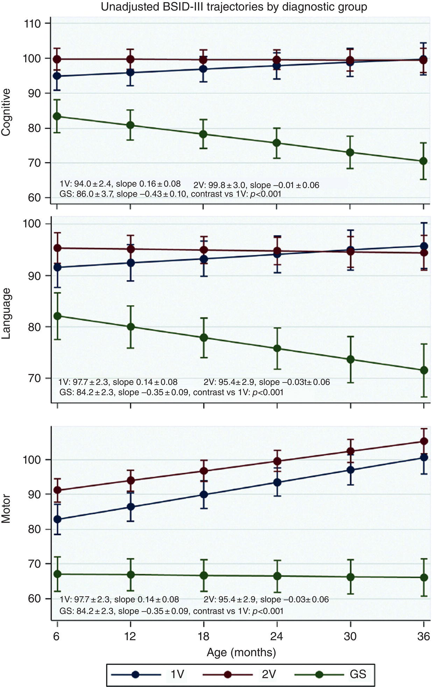

[**Figure 14.18**](#R_c14-fig-0018) Change in Bayley Scales of Infant and Toddler Development, 3rd Edition (BSID‐III) score over time by patient diagnostic category of 1 ventricle (1V, blue), two‐ventricles (2V, red), and genetic syndrome (GS, green). The linear mixed‐effect model parameter estimates and 95% confidence intervals are shown as symbols and range bars.

(Source: Hoffman et al. \[139\]. Reproduced with permission from Elsevier.)

### Single ventricle reconstruction trial

The Single Ventricle Reconstruction (SVR) Trial is a multicenter study of stage I palliation for HLHS randomizing surgery to systemic to pulmonary artery shunt vs. right ventricle to pulmonary artery shunt \[184\]. Operations were performed between 2005 and 2008 in 15 centers. Neurodevelopmental outcomes were assessed with the Bayley‐II at a mean of 14.3 ± 1.1 months of age. In all, 314 patients were assessed at that time (86% of transplant‐free survivors), and mean MDI was 89 ± 18 and PDI was 74 ± 19, both profoundly lower than reference population norms. Multivariable regression models determined that site of surgery, birth weight less than 2,500 g, longer length of stage I hospitalization, and greater number of complications were associated with lower PDI scores. Lower MDI scores were associated with lower birth weight, genetic syndrome or other anomalies, lower maternal education level, longer days on ventilation, and greater number of complications. Intraoperative variable data collection was limited, but none of these variables (DHCA vs. regional cerebral perfusion, alpha‐stat vs. pH‐stat, hematocrit) were associated with Bayley‐II outcomes. By age 3 years, mean scores for each domain on a parental questionnaire of neurodevelopment were significantly lower than those of the normal control population. The percentage of children with delayed scores (>2 SD below the mean) was 20% for the Communication Scale, 30% for the Gross Motor Scale, 35% for the Fine Motor Scale, 24% for the Problem Solving Scale, and 17% for the Personal‐Social Scale (about 2% would be expected in a normal population). Delay was detected in at least one area for 51% of the cohort \[185\].

An assessment of behavioral outcomes at 6 years in the SVR cohort reported approximately three times higher risk of impaired adaptive behavior skills and that lower socioeconomic status was associated with lower fine motor, problem‐solving, adaptive behavior, communication, and functional status \[186, 187\]. It should be noted that of 555 subjects entered into the SVR trial, 41% had died by age 6 years, and another 4% required cardiac transplantation; emphasizing the high‐risk nature of this patient population for ongoing threats to normal neurodevelopment. Type of shunt does not appear to have any effect on any long‐term clinical or neurodevelopmental outcome.

### International cardiac collaborative on neurodevelopment (ICCON) investigators cohort

The ICCON Investigators group was recently formed and has pooled early neurodevelopmental outcomes results for complex neonatal and young infancy cardiac surgery with operations occurring between 1996 and 2009 \[188\]. Data were analyzed from 23 institutions utilizing Bayley‐II testing performed on patients aged 6–30 months. The mean age of assessment was 14.5 ± 3.7 months, and the overall scores for the 1,770 patients were MDI 88.2 ± 16.7 and PDI 77.6 ± 18.8. Important findings were that cardiac class IV (SV patients with aortic arch obstruction, e.g., HLHS) was significantly more common in the later years of the studies. In the multivariable analysis, patient factors were evaluated, and cardiac diagnosis (class IV), genetic anomaly, lower maternal education, male gender, and lower birth weight were all associated with lower scores. After this adjustment, mean Bayley‐II scores did increase significantly over time, with mean MDI and PDI scores increasing by approximately 0.4 points/year over the 14 years represented in the study ([Figure 14.19](#c14-fig-0019)). Longer total support time (CPB, DHCA, and SCP), use of ECMO, need for cardiopulmonary resuscitation (CPR), and longer duration of ICU stay were all associated with lower MDI and PDI scores.

### Zurich cohort

Latal and colleagues describe a single‐center cohort of 233 patients undergoing SV and 2V surgery with bypass at median age 3–4 months, who had neurodevelopmental assessments at age 6 years \[189\]. Of these, 64 (27%) patients had a recognizable genetic syndrome, including trisomy 21, microdeletion of chromosome 22q11.2, VACTERL association, CHARGE syndrome, and others. Median total IQ for nongenetic disorder group was 95 (range 47–135), and for the genetic disorder group was 55 (range 17–115), _p_ < 0.01. Median scores on tests of language, reasoning, processing speed, and number recall were in the normal range for nongenetic syndrome patients, and 0.6–1.2 SD below norms for the genetic syndrome patients, with all findings significantly different. In multivariable analysis, genetic syndrome, longer ICU stay, lower birth weight, postoperative seizures, and lower socioeconomic status were associated with poor neurodevelopmental outcomes.

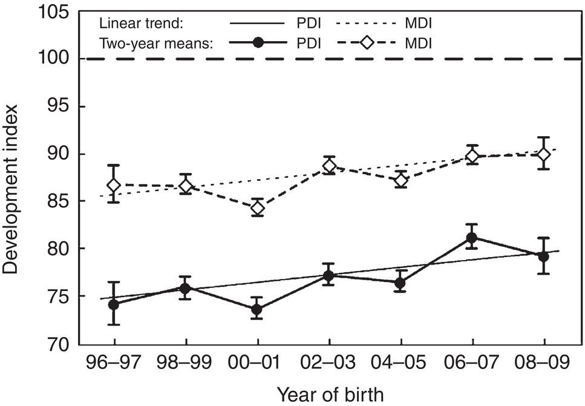

[**Figure 14.19**](#R_c14-fig-0019) Standardized Psychomotor Development Index (PDI) and the Mental Development Index (MDI) using the Bayley Scales of Infant Development, 2nd Edition, from the ICCON Study. Means are displayed by year of birth category. The standardized means plot predicted PDI and MDI and standard error bars based on a model with year of birth category adjusting for center, patient and preoperative factors, operative management factors, and postoperative events at the mean value of the covariates. Overlaid are standardized means plots based on continuous year of birth. The dotted line represents the normative mean of 100 for both PDI and MDI.

(Source: Gaynor et al. \[188\]. Reproduced with permission from Elsevier.)

The studies reviewed in this section give an emerging, if incomplete, picture of risk factors for the now very well‐established lower neurodevelopmental outcomes in infants undergoing congenital heart surgery. Many recent reports emphasize significantly lower testing scores during infancy in most all cohorts; however, there are now more reports at age of school entry or later. These reports at older ages give a profile of the preschool or school‐aged child with subtle impairment in a number of domains, including executive functioning, language, attention, fine motor function, VMI, and reasoning. As noted earlier, this profile is not dissimilar to the premature neonate. Both groups have in common structural and microstructural brain immaturity and a propensity to brain injury, with WMI being the most common. Comparison of outcomes over time is difficult because of different testing strategies utilized in different cohorts, \[190\] but there appears to be a trend of improving early outcomes, albeit in a patient population increasingly skewed toward more complex SV lesions. Debate is ongoing about the proportion of risk accrued to nonmodifiable (i.e., innate) patient factors vs. modifiable ones (i.e., CPB techniques, neurological monitoring, anesthetic and sedative techniques, and ICU strategies). Interesting new data about association of potentially neurotoxic compounds in the perioperative environment (cyclohexanone, phthalates in plastics) with lower neurodevelopment scores after infant cardiac surgery bears further consideration \[191, 192\]. Finally, the effect of early childhood intervention and a stimulating home environment has begun to be studied as a means to take advantage of the potential for neuroplasticity in these infants \[193, 194\].

The multivariable models all have significant limitations, and the majority explain only 20–40% of the variation in the neurodevelopmental outcome scores; only a few models explain >50%. Further complicating the concepts of nonmodifiable factors may be emerging strategies for fetal intervention, by both catheter and medical interventions, that could improve both the cardiac and cerebral abnormalities observed in neonates with CHD. The very strong risk factor that most genetic syndromes confer for adverse neurodevelopmental outcomes is increasingly clear. This becomes more important as cardiac surgery is offered to a broader population of patients with genetic syndromes, i.e., trisomy 13 and 18; and as sophisticated genetic testing (whole exome and genome sequencing) uncovers additional abnormalities associated with neurodevelopmental problems \[195\]. (See [Chapter 8](c08.xhtml), Genetic Syndromes). Newer approaches to modeling the many complex risk factors include artificial intelligence/machine learning algorithms that may be able to better account for small sample sizes with multiple risk factor variables \[196\]. Small single‐center studies are still the predominant publication type for neurodevelopmental outcomes. The pitfalls of drawing conclusions from multivariable analyses, i.e., frequency of Type I and Type II errors, from small data sets, are evident. Multicenter databases, combined analyses, meta‐analyses, and multicenter prospective studies with much larger sample sizes, and standardized outcome measures will be important to move this field forward with higher quality evidence to support beneficial treatment strategies. [Table 14.3](#c14-tbl-0003) summarizes data from the cohorts reviewed earlier, and [Table 14.4](#c14-tbl-0004) presents the modifiable vs. nonmodifiable risk factors published in the studies reviewed here, and lists possible strategies for intervention, where applicable \[197, 198\].

* * *

### KEY POINTS: COHORT STUDIES OF NEURODEVELOPMENTAL OUTCOMES

-   Most single‐center cohort studies demonstrate decrements in motor performance which improves over time.
-   Cognitive deficits are less severe, but performance is not normal in most cohorts.
-   Language, executive function, and behavior are also not normal in most cohorts.
-   Genetic syndromes are a significant risk factor for neurodevelopmental problems.
-   Larger patient populations and standardized outcomes are needed to improve data quality.

* * *

## Conclusions

> Truth in medicine is an unattainable goal, and the art as described in books is far beneath the knowledge of an experienced and thoughtful physician.
> 
> Muhammad Ibn Zakariya Al‐Razi, _c_. 900 BCE

The neurologic vulnerability of children with CHD has been well characterized. White matter lesions suggestive of impaired oxygen delivery to watershed regions of the brain are the most common perioperative‐acquired injury seen on MRI. The neurodevelopmental abnormalities of children with CHD are often subtle disorders of intellect, attention, impulsivity, and executive functioning, which impact the quality of life of survivors of critical heart disease in infancy. The principles of CBF and oxygen delivery are equally well characterized, but the strategies to optimize these parameters during CPB are a subject of vigorous debate. A summary of the advantages and disadvantages of the neuromonitoring modalities discussed in this chapter is given in [Table 14.5](#c14-tbl-0005).

### Does a neuroprotective strategy during CPB improve outcome?

Scientific investigation has failed to delineate an evidence‐based neuroprotective practice for many of the most basic aspects of care during cardiac surgery and CPB, including the use of circulatory arrest or selective cerebral perfusion, and whether and how to monitor the brain during and after CPB. The perspective presented in this chapter emphasizes the physiologic principles relevant to neuroprotection, which are often the only available rationale for decisions that have to be made for critically ill children with CHD.

Single‐center studies of cerebral oximetry where goal‐directed therapy with cerebral oximetry monitoring is either embraced or rejected cannot show the effect of these practice shifts for lack of a comparison group. Outcomes from the Texas Children’s Hospital for neonates requiring cardiac surgery have been studied for both MRI‐detected injury and neurocognitive performance. The CPB strategy at Texas Children’s Hospital is highly standardized to the use of goal‐directed oxygen delivery support and selective perfusion techniques guided by multimodal neuromonitoring, including both reflectance NIRS and TCD insonation \[199\]. The rates of new neurologic injuries after surgery with this practice compare favorably with published studies of similar outcome measures. A varied critical lesion infant cohort, including HLHS, TGA, truncus arteriosus, and interrupted aortic arch, demonstrated a 36% new MRI injury rate, with only 16% showing new WMI (see [Figure 14.2](#c14-fig-0002) for comparison data) \[17\]. For the highest ‐risk neonates requiring arch reconstruction, the duration of CPB and duration of selective perfusion were both free from association with low 12‐month developmental score in any of the three domains tested: cognitive, motor, and language. The duration of circulatory arrest was, however, significantly associated with decreased cognitive performance at 12 months \[8\]. Thus, the goal‐directed strategy, utilizing neuromonitoring, is a safe option for the management of CPB in neonates, but has not been shown to be superior to either circulatory arrest or nonmonitored management in a randomized setting.

[**Table 14.3**](#R_c14-tbl-0003) Summary of major neurodevelopmental outcomes Cohorts after complex infant cardiac surgery

| Cohort (references) | N | Single (S) or multi‐ center (M) | Years of surgery | Age at follow‐up | ND outcomes | Major associations |
| --- | --- | --- | --- | --- | --- | --- |
| Boston circulatory arrest study \[6, 54, 71, 170, 171\] | 155 | S | 1988–1992 | 1, 8, 16 years | MDI 105, PDI 95 (1); FSIQ 97, PIQ 95, VIQ 100; adolescents with most scores mid‐90th percentile | Prolonged DHCA with outcomes at 1 and 4 years; parental IQ, DHCA duration, EEG seizures at 16 years |
| Philadelphia APOE study \[172–177\] | 381 | S | 1998–2003 | 1, 4 years | MDI 90, PDI 78; 92–105 on 8 domains at 4 years, mean 97 | APOE ε2 allele; lower BW, pre‐op intubation, lower CPB hct, LOS, additional CPB operations, chromosome/genetic anomaly, EEG seizures, younger GA, cardiac diagnosis (HLHS), hearing loss; DHCA use not associated |
| Western Canadian Outcomes Group I \[178–180\] | 61 | S | 1996–1999 | 18–24 months, 4–5 years | MDI 84, PDI 80; FSIQ 89, VIQ 90, PIQ 90, VMI 87 | Chromosome anomaly, pre‐op ventilation, duration of DHCA and CPB, acidosis, lactate |
| Western Canadian Outcomes Group II  
\[165, 166\] | 95 | S | 2003–2006 | 18–24 months, 4–5 years | MDI 86, Cog 98; PDI 85, Motor 95 | Days of ventilation, older age, low PaO2, use of DHCA, lower parental education; days of chloral hydrate, cumulative dose benzodiazepines |
| Hearts and minds study \[22\] | 122 | M (2) | 2005–2008 | 2 years | Cog 94, Lang 94, Motor 97 | Brain immaturity |
| Milwaukee HLHS cohort \[181\] | 21 | S | 2002–2005 | 4–5 years | Cognitive IQ 95, attention 107, language 95, VMI 93 | rSO2, SaO2 |
| Milwaukee cohort II‐SV, 2V, genetic syndromes \[139\] | 178 | S | 2007–2012 | 6–36 months | 36 months outcomes: SV/2V Cog 100, Lang 94–95, Motor 100–105; Genetic Syndrome: Cog 70, Lang 72, Motor 67 | rSO2 |
| Texas children’s hospital cohort  
\[8, 18, 151, 182, 183\] | 59 | S | 2005–2011 | 12 months, 36 months, 5 years | 12 months: Cog 102, Lang 88, Motor 90;  
36 months: Cog 97, Lang 95, Motor 98; 5 years: IQ 98, Lang 98, Motor 94, behavior 96 | Volatile anesthetic exposure, ICU LOS, chromosome anomaly, MRI brain injury, rSO2, DHCA; longer RCP not associated |
| Single ventricle reconstruction trial  
\[184–187\] | 314 | M (15) | 2005–2008 | 14 months, 3 years, 6 years | MDI 89, PDI 74;  
3–6 years: 10–15× higher percentage of delayed language, motor, problem‐solving, social problems | BW, site of surgery, LOS, complications, chromosome anomaly, parental education, medical complications, SES |
| International cardiac collaborative on neurodevelopment \[188\] | 1,770 | M(23) | 1996–2009 | 6–30 months | MDI 88, PDI 78 | Later year of surgery, cardiac class, genetic anomaly, lower BW, parental education |
| Zurich cohort \[189\] | 233 | S | 2004–2009 | 5–7 years | IQ 95 nongenetic, 55 genetic;  
Verbal, language, reasoning, processing speed: 93–103 nongenetic, 96–91 genetic | Longer ICU LOS, lower BW, seizures, lower SES |

MDI, Bayley Scales of Infant Development‐II Mental Development Index; PDI, Bayley Scales of Infant Development‐II Psychomotor Development Index; Cog, Lang, Motor, Bayley Scales of Infant Development‐III cognitive, language, and motor composite scores. (1) BCAS used Bayley‐I. ICU, intensive care unit; LOS, length of stay: MRI, magnetic resonance imaging; EEG, electroencephalogram; rSO2, regional cerebral oxygen saturation; BW, birthweight; GA, gestational age; VMI, visual motor integration; FSIQ, full‐scale intelligence quotient; VIQ, verbal intelligence quotient; PIQ, performance intelligence quotient; DHCA, deep hypothermic circulatory arrest; RCP, regional cerebral perfusion; SES, socioeconomic status.

[**Table 14.4**](#R_c14-tbl-0004) Modifiable and Nonmodifiable Published Risk Factors for Lower Neurodevelopmental Outcome Scores after Infant Congenital Heart Surgery

<table border="1"><tbody class="tdcolor5"><tr><td class="left" rowspan="8">Nonmodifiable Factors</td><td class="left">Factor (Example)</td><td class="left">Potential interventions</td></tr><tr><td class="left">Cardiac diagnosis (HLHS)</td><td class="left">??Fetal catheter intervention; maternal O2 administration</td></tr><tr><td class="left">Genetic anomaly (22q11.2)</td><td class="left"></td></tr><tr><td class="left">Parental education/SES</td><td class="left"></td></tr><tr><td class="left">Birthweight</td><td class="left"></td></tr><tr><td class="left">Prematurity</td><td class="left"></td></tr><tr><td class="left">Brain immaturity</td><td class="left">??Maternal progesterone [197, 198]</td></tr><tr><td class="left">Gender</td><td class="left"></td></tr><tr><td class="left" rowspan="12">Modifiable factors</td><td class="left"></td><td class="left"></td></tr><tr><td class="left">Use and duration of DHCA</td><td class="left">Avoid/limit DHCA duration [6]</td></tr><tr><td class="left">Use of RCP</td><td class="left">Use RCP in lieu of DHCA [199]</td></tr><tr><td class="left">CPB hematocrit</td><td class="left">Maintain &gt;24% [46]</td></tr><tr><td class="left">Low rSO2</td><td class="left">Intervene &lt;50%</td></tr><tr><td class="left">MRI brain injury</td><td class="left">Avoid/limit DHCA duration [22]</td></tr><tr><td class="left">Elective delivery &lt;39 weeks GA</td><td class="left">Avoid [176]</td></tr><tr><td class="left">ICU LOS</td><td class="left">Early extubation; minimize sedation [182]</td></tr><tr><td class="left">Seizures</td><td class="left">Benzodiazepines [111]</td></tr><tr><td class="left">Anesthetic technique</td><td class="left">Limit volatile anesthetic exposure, ??dexmedetomidine [182]</td></tr><tr><td class="left">Low cardiac output/acidosis/lactate</td><td class="left">Surgical, anesthetic, ICU strategies</td></tr><tr><td class="left">Low PaO2</td><td class="left">Oxygen delivery strategies; early surgical intervention</td></tr></tbody></table>

Nonmodifiable factors could potentially be modifiable; experimental interventions are listed. HLHS, hypoplastic left heart syndrome; 22q11.2, partial deletion chromosome 22; SES, socioeconomic status; DHCA, deep hypothermic circulatory arrest; RCP, regional cerebral perfusion; rSO2, regional cerebral oxygen saturation; MRI, magnetic resonance imaging; GA, gestational age; ICU, intensive care unit; LOS, length of stay.

[**Table 14.5**](#R_c14-tbl-0005) Practical advantages and disadvantages of specific neuromonitoring modalities

| Monitor | Advantages | Disadvantages |
| --- | --- | --- |
| **Electroencephalograph** | Detects subclinical seizures and confirms electrical silence during deep hypothermia. | Requires expertise for interpretation; cumbersome array of electrodes. |
| **Transcranial Doppler** | Allows for assessment of cerebral blood flow (velocity) during critical stages of cardiopulmonary bypass, especially selective perfusion. | Technically challenging; flow velocities are dependent on the angle of insonation, which can be difficult to stabilize. |
| **Jugular venous oximetry** | Gold standard measurement of cerebral venous oxygen content. | Requires expertise to place the catheter in the jugular bulb; invasive to the cephalad venous drainage system in pre‐Glenn patients. |
| **Near‐infrared spectroscopy (NIRS)** | Noninvasive measure of cortical blood oxygenation; technically easy to apply with a stable signal. Most widely used and familiar neuromonitor in the cardiac patient. | Practical limitations are rare; disposable sensors are costly. Most centers that do not use reflectance NIRS do so for lack of level III outcome evidence. |

## Selected references

_A full reference list for this chapter is available at_:

[http://www.wiley.com/go/andropoulos/congenitalheart](http://www.wiley.com/go/andropoulos/congenitalheart)

1.  6 Bellinger DC, Wypij D, duPlessis AJ, et al. Neurodevelopmental status at eight years in children with dextro‐transposition of the great arteries: the Boston Circulatory Arrest Trial. J Thorac Cardiovasc Surg 2003; 126:1385–96. The 8‐year follow‐up study of neonates undergoing circulatory arrest or low‐flow bypass for arterial switch operation. Cutoff for lower neurodevelopmental scores is 41 minutes of circulatory arrest.
2.  16 Mahle WT, Tavani F, Zimmerman RA, et al. An MRI study of neurological injury before and after congenital heart surgery. Circulation 2002; 106:I109–14. First neonatal MRI study before and after cardiac surgery, demonstrating a high incidence of WMI present even before surgery, with a significant incidence of new injury after surgery.
3.  21 Miller SP, McQuillen PS, Hamrick S, et al. Abnormal brain development in newborns with congenital heart disease. N Engl J Med 2007; 357:1928–38. A landmark study documenting abnormal microstructural brain development in neonates with congenital heart disease.
4.  31 Greeley WJ, Kern FH, Ungerleider RM, et al. The effect of hypothermic cardiopulmonary bypass and total circulatory arrest on cerebral metabolism in neonates, infants, and children. J Thorac Cardiovasc Surg 1991; 101:783–94. One of a series of classic studies laying the foundation for modern understanding of cerebral physiology during and after cardiopulmonary bypass.
5.  39  Smith B, Vu E, Kibler K, et al. Does hypothermia impair cerebrovascular autoregulation in neonates during cardiopulmonary bypass? Paediatr Anaesth. 2017; 27:905–10. A study of cerebral pressure autoregulation utilizing the hemoglobin volume index in 72 neonates undergoing surgery with bypass and assessed this parameter at different levels of hypothermia down to 18 °C. The lower mean arterial pressure limit of autoregulation ranged from 25 to 45 mmHg, with a trend upward in the first month of life. Demonstrated that this noninvasive NIRS‐based method has the potential to monitor autoregulation in real time.
6.  46 Wypij D, Jonas RA, Bellinger DC, et al. The effect of hematocrit during hypothermic cardiopulmonary bypass in infant heart surgery: results from the combined Boston hematocrit trials. J Thorac Cardiovasc Surg 2008; 135:355–60. An important randomized controlled trial demonstrating that extreme hemodilution on bypass is associated with lower neurodevelopmental outcome status at age 12 months.
7.  80 Andropoulos DB, Stayer SA, McKenzie ED, Fraser CD Jr., Novel cerebral physiologic monitoring to guide low‐flow cerebral perfusion during neonatal aortic arch reconstruction. J Thorac Cardiovasc Surg 2003; 125:491–9. A study describing the technique of transcranial Doppler monitoring of cerebral blood flow velocity during selective cerebral perfusion to ensure adequate but not excessive cerebral blood flow when adjusting bypass flow rate during this technique.
8.  100 Austin EH 3rd, Edmonds HL Jr, Auden SM, et al. Benefit of neurophysiologic monitoring for pediatric cardiac surgery. J Thorac Cardiovasc Surg 1997; 114:707–17. Retrospective study in 250 neonates, infants, and children undergoing cardiac surgery demonstrating the ability of multimodality neuromonitoring to reduce acute neurological injury. Near‐infrared spectroscopy was the most important monitor.
9.  116  Alkhatip AAAMM, Kamel MG, Farag EM, et al. Deep hypothermic circulatory arrest in the pediatric population undergoing cardiac surgery with electroencephalography monitoring: a systematic review and meta‐analysis. J Cardiothorac Vasc Anesth 2021: Online ahead of print. A systematic review and meta‐analysis of 19 studies and 1267 pediatric patients undergoing cardiac surgery with DHCA and EEG monitoring. The event rate for EEG seizures was 14.9%; and seizures were associated with acute neurological findings, MRI abnormalities, and lower IQ and PDI scores on long‐term follow‐up. Longer DHCA times were associated with a higher incidence of EEG seizures.
10.  137 Carra G, Flechet M, Jacobs A, et al. Postoperative cerebral oxygen saturation in children after congenital cardiac surgery and long‐term total intelligence quotient: a prospective observational study. Crit Care Med. 2021. Online ahead of print. A study of 87 infants with median age 4 months undergoing cardiac surgery with bypass and found that higher “dose” of cerebral desaturation below rSO2 of 65% (% below 65% × minutes) in the first 24 hours after surgery was associated with lower IQ scores 2 years later.
11.  139 Hoffman GM, Brosig CL, Bear LM, et al. Effect of intercurrent operation and cerebral oxygenation on developmental trajectory in congenital heart disease. Ann Thorac Surg 2016; 101:708–16. A study of 178 children followed for 36 months with the Bayley Scales‐III performed at 6‐month intervals after neonatal surgery. At 6 months, SV and 2V patients had Cognitive and Language scores in the normal range, with means below population norms, and these scores remained relatively constant through 36 months. Motor scores started at 0.5–1 SD below normal at 6 months but increased progressively for both SV and 2V patients and were in the normal range at 36 months. In contrast, patients with a genetic syndrome started 1–2 SD below normal in all three domains at 6 months; Cognitive and Language scores decreased, and Motor scores were constant; by 36 months, all three means were about 2 SD below population norms. Lower baseline rSO2, but not pulse oximeter‐derived SpO2, measured at the time of neurodevelopmental assessment, was a risk factor for lower motor scores from 6 to 36 months of age.
12.  146 Ferradal SL, Yuki K, Vyas R, et al. Non‐invasive assessment of cerebral blood flow and oxygen metabolism in neonates during hypothermic cardiopulmonary bypass: feasibility and clinical implications. Sci Rep 2017; 7:44117. A small study of frequency‐domain NIRS/DCS demonstrating that this noninvasive method measures the uncoupling of cerebral blood flow and CMRO2 during deep hypothermia, with closely similar results to the invasive methods used by Greeley and colleagues more than 30 years previously.