CHAPTER 15 Transesophageal and Epicardial Echocardiography in Congenital Heart Disease 

# CHAPTER 15  
Transesophageal and Epicardial Echocardiography in Congenital Heart Disease

_Annette Vegas1 and Wanda C. Miller‐Hance2,3_

1 Department of Anesthesia and Pain Management, Toronto General Hospital, Toronto, Ontario, Canada

2 Department of Anesthesiology, Perioperative and Pain Medicine, Arthur S. Keats Division of Pediatric Cardiovascular Anesthesiology, Baylor College of Medicine and Texas Children’s Hospital, Houston, TX, USA

3 Department of Pediatrics, Section of Cardiology, Baylor College of Medicine and Texas Children’s Hospital, Houston, TX, USA

* * *

-   [**Introduction**](#head-2-143)
-   [**Indications for TEE in CHD**](#head-2-144)
-   [**Contraindications to TEE**](#head-2-145)
-   [**TEE hardware**](#head-2-146)
    -   [Echocardiographic system](#head-3-208)
    -   [TEE imaging probes](#head-3-209)
-   [**TEE examination in CHD**](#head-2-147)
    -   [Structural examination](#head-3-210)
    -   [Three‐dimensional TEE](#head-3-211)
    -   [Functional assessment](#head-3-212)
    -   [Hemodynamic evaluation](#head-3-213)
    -   [Applications of TEE in CHD](#head-3-214)
    -   [TEE safety and complications](#head-3-215)
-   [**Evaluation of selected congenital heart defects before and after intervention**](#head-3-216)
    -   [Atrial septal defects](#head-3-217)
    -   [Ventricular septal defects](#head-3-218)
    -   [Atrioventricular septal defects](#head-3-219)
    -   [LV outflow obstruction](#head-3-220)
    -   [RV outflow obstruction](#head-3-221)
    -   [Tetralogy of Fallot](#head-3-222)
    -   [Double‐outlet right ventricle](#head-3-223)
    -   [Transposition of the great arteries](#head-3-224)
    -   [Congenitally corrected transposition of the great arteries](#head-3-225)
    -   [Truncus arteriosus](#head-3-226)
    -   [Single ventricle](#head-3-227)
-   [**Applications of TEE during mechanical support**](#head-2-148)
-   [**Epicardial echocardiography**](#head-2-149)
-   [**Summary**](#head-2-150)
-   [**Acknowledgments**](#head-2-151)
-   [**Selected references**](#head-2-152)

* * *

## Introduction

Currently, most institutions use a combination of imaging modalities, including echocardiography, cardiac catheterization and angiography, computed tomography (CT), and cardiac magnetic resonance (CMR), for the comprehensive diagnostic evaluation of patients with congenital heart disease (CHD). Transesophageal echocardiography (TEE) has evolved over time to become a critically important cardiovascular imaging modality that has major benefits, particularly in the perioperative setting.

Since the introduction of TEE in the late 1980s, it has proven useful as a diagnostic and monitoring tool in adult patients during cardiac and noncardiac surgery. Until the early 1990s, intraoperative TEE in infants and small children was not feasible, as TEE probes of a suitable size were unavailable. Advances in ultrasonography technology, specifically the miniaturization of imaging probes, have since permitted the safe use of TEE in these patients.

Most cardiac centers currently consider TEE to be the standard of care for assessing the adequacy of surgical interventions in children and adults with CHD. This imaging approach can immediately detect suboptimal surgical results, thus improving clinical outcomes by avoiding subsequent reoperations and reducing overall morbidity, mortality, and costs. The use of TEE in environments such as the cardiac catheterization laboratory, electrophysiology suite, and intensive care unit (ICU) also significantly facilitates the management of patients with CHD. Although TEE is not commonly used for purely diagnostic indications in children, many adults with CHD and challenging images benefit significantly from this use of TEE.

Epicardial echocardiography (E‐echo), which directly places the probe on the heart surface, provides an option to image the heart when TEE is unavailable or contraindicated, or when this modality can provide information that complements the TEE findings in the operating room or ICU.

This chapter focuses on the use of TEE and E‐echo for monitoring and assessment in CHD patients, highlighting these modalities’ many benefits and roles in clinical practice. The emphasis is on intraoperative use, as this is the most common application of the technology in CHD patients.

## Indications for TEE in CHD

Echocardiography is the preferred imaging modality for the initial diagnostic assessment and serial follow‐up of patients with CHD. Transthoracic echocardiography (TTE) provides excellent definition of cardiovascular anatomy in most patients. In fact, the exceptionally high resolution of TTE imaging in infants and young children with CHD is often sufficient to plan medical and surgical management. Published standards exist for the echocardiographic assessment of pediatric and adult patients with CHD, including TTE, TEE, quantification, and 3D imaging \[1–5\].

Despite the merits of TTE, its technical limitations result in suboptimal imaging in patients with poor windows caused by obesity, mechanical ventilation, and prior or recent cardiac surgery. TEE overcomes many of these limitations and can be extremely helpful when other imaging approaches, including TTE, provide insufficient information or there is a need to answer important diagnostic questions. The portability of TEE makes it easy to perform in various settings. TEE in the patient with CHD is often an adjunct to other diagnostic studies and, as such, should complement, but not substitute for, a complete TTE examination.

Several professional societies in North America and other countries have proposed indications for the use of TEE \[3, 6–9\]. Guidelines published by the American Society of Echocardiography (ASE) in 2005 and 2019 address specific indications for TEE in pediatric patients and in all patients with CHD \[5, 10\]. These documents describe three major categories of indications for TEE in CHD patients: diagnostic assessment, perioperative evaluation, and related to percutaneous interventions ([Table 15.1](#c15-tbl-0001)).

Outpatient TEE is a routine diagnostic tool used in many centers that care for adult patients with cardiovascular disease, including CHD, because transthoracic imaging becomes more challenging and less revealing as patients reach adulthood \[11\]. The TEE modality plays an important role in this setting, as congenital anomalies are highly variable in presentation. The benefits of TEE include the detailed evaluation of primary structural malformations, secondary compensatory cardiovascular changes, associated complications, and functional and hemodynamic consequences. The proximity of the imaging probe to the back of the heart provides optimal visualization of cardiovascular structures. Overall, TEE is superior to TTE for diagnosing specific pathologies involving the aorta (Ao) and left atrial appendage (LAA) and for evaluating prosthetic heart valves, native valve masses, and complications resulting from endocarditis, including vegetations, abscesses, and fistulae \[3\]. It is the imaging approach of choice to exclude thrombus before performing elective cardioversion in most patients with atrial rhythm disturbances. The TEE imaging approach is also useful in evaluating potential cardiac sources of embolism, such as a patent foramen ovale (PFO) \[12\]. The modality can also enhance the assessment of intracardiac or extracardiac baffles in patients who have undergone Fontan, Senning, or Mustard procedures \[13, 14\].

Intraoperative evaluation represents a frequent application of TEE and has the following goals \[15\]:

-   Confirm and refine the preoperative diagnosis
-   Detect new or unsuspected pathology
-   Adjust the anesthetic and surgical plan
-   Assess the results of the surgical intervention

[**Table 15.1**](#R_c15-tbl-0001) Indications for transesophageal echocardiography (TEE) in the patient with congenital heart disease (CHD)

Source: Puchalski et al. \[5\]. Reproduced with permission of Elsevier.

<table border="1"><tbody class="tdcolor6"><tr><td class="left"><b>Diagnostic indications</b><ul id="c15-list-0001"><li id="c15-li-0001">Patient with suspected CHD and nondiagnostic transthoracic echocardiography (TTE)</li><li id="c15-li-0002">Presence of patent foramen ovale (PFO) with and without agitated saline contrast and direction of shunting as possible etiology for stroke</li><li id="c15-li-0003">Evaluation for cardiovascular source of embolus with no identified noncardiac source</li><li id="c15-li-0004">Evaluation of intracardiac or extracardiac baffles after the Fontan, Senning, or Mustard procedure</li><li id="c15-li-0005">Suspected acute aortic pathology, including, but not limited to, dissection/transection (e.g., Marfan syndrome, bicuspid aortic valve, coarctation of the aorta)</li><li id="c15-li-0006">Intracardiac evaluation for vegetation or suspected abscess</li><li id="c15-li-0007">Evaluation for intracardiac thrombus prior to cardioversion for atrial flutter/fibrillation and/or radiofrequency ablation</li><li id="c15-li-0008">Pericardial effusion or cardiac function evaluation and monitoring postoperative patient with open sternum or poor acoustic windows</li><li id="c15-li-0009">Evaluating status of prosthetic valve in the setting of inadequate TTE images</li><li id="c15-li-0010">Reevaluation of prior TEE finding for interval change (e.g., resolution of thrombus after anticoagulation, resolution of vegetation after antibiotic therapy) </li></ul> <b>Perioperative indications</b><ul id="c15-list-1001"><li id="c15-li-0011">Immediate preoperative definition of cardiac anatomy and function</li><li id="c15-li-0012">Postoperative surgical results and function</li><li id="c15-li-0013">Intraoperative monitoring of ventricular volume and function</li><li id="c15-li-0014">Monitoring of intracardiac/intravascular air and adequacy of cardiac de‐airing </li></ul><b>TEE‐guided interventions</b><ul id="c15-list-1002"><li id="c15-li-0015">Guidance for placement of occlusion device (e.g., septal defect, Fontan or intra‐atrial baffle fenestration)</li><li id="c15-li-0016">Guidance for blade or balloon atrial septostomy</li><li id="c15-li-0017">Guidance for creation/stenting of interventricular communication</li><li id="c15-li-0018">Guidance during percutaneous valve interventions</li><li id="c15-li-0019">Guidance during radiofrequency ablation procedure</li><li id="c15-li-0020">Assessment of results of minimally invasive surgical incision or video‐assisted cardiac procedure</li><li id="c15-li-0021">Guidance during placement of catheter‐based cardiac assist device (e.g., Impella heart pump)</li></ul></td></tr></tbody></table>

A summary of the indications in both adults and children with CHD includes \[5\]:

-   All open‐heart and most thoracic aortic surgical procedures
-   Surgical repair of most congenital heart lesions that require cardiopulmonary bypass (CPB)
-   Surgery to treat significant residual abnormalities, such as outflow tract obstruction, valve regurgitation or stenosis, or intracardiac communications

TEE may provide significant benefits in patients with CHD undergoing cardiac catheterization procedures, such as device closure of intracardiac communications (atrial septal defects \[ASDs\] or ventricular septal defects \[VSDs\]), balloon valvuloplasty, perforation of the atretic pulmonary valve, and atrial septostomy \[16–19\]. Likewise, TEE can be extremely useful during electrophysiologic procedures by guiding catheter placement and assisting with ablation therapies \[20, 21\]. In these various applications, TEE can offer valuable information that facilitates planning, refinement, and, upon completion of the intervention, real‐time assessment of the results.

Despite its considerable merits, TEE has inherent limitations, including the following:

-   Imaging constraints within the gastrointestinal tract, resulting, in some cases, in suboptimal evaluation of structures or Doppler angles of interrogation
-   Reduced far‐field imaging of anterior structures compared with TTE
-   Semi‐invasiveness, often necessitating sedation or general anesthesia, with associated risks
-   Suboptimal examination conditions related to patient or environmental factors, such as limited time to perform a comprehensive study, ambient lighting, and electrocautery interference

* * *

### KEY POINTS: INDICATIONS FOR TEE

-   TTE adequately characterizes congenital cardiovascular malformations in most patients, particularly in children.
-   TEE overcomes many of the limitations of TTE imaging, including suboptimal windows caused by obesity, mechanical ventilation, and previous cardiac surgery.
-   The main indications for TEE include diagnostic assessment, perioperative evaluation, and guiding percutaneous interventions.
-   Perioperative use represents the most common application of TEE in the patient with CHD.
-   In the patient with CHD, TEE should complement, not replace, a complete TTE examination.

* * *

## Contraindications to TEE

Before using transesophageal imaging, it is prudent to carefully consider the indications, exclude contraindications, obtain informed consent, and completely review relevant clinical information, including all available echocardiographic studies and other diagnostic data. Given the potential risks associated with this semi‐invasive procedure, the need for TEE requires judicious decision‐making for every patient. In any clinical situation in which safety concerns exist, one should consider alternate imaging modalities such as E‐echo, discussed later in this chapter.

General contraindications to TEE include esophageal pathology, severe respiratory decompensation, and inadequate control of the airway ([Table 15.2](#c15-tbl-0002)) \[3, 5\]. The risk‐to‐benefit ratio for TEE warrants cautious assessment in patients with cervical spine injury or deformity and those with severe coagulopathy. The presence of a gastrostomy feeding tube often necessitates deferring the transgastric (TG) and deep transgastric (DTG) examinations. Although there is no established timing for safe esophageal instrumentation after esophageal surgery, anecdotally, many children have undergone TEE imaging several months or years later without notable ill effects.

[**Table 15.2**](#R_c15-tbl-0002) Contraindications to transesophageal echocardiography

Source: Puchalski et al. \[5\]. Reproduced with permission of Elsevier.

<table border="1"><tbody class="tdcolor6"><tr><td class="left"><b>Absolute</b><ul id="c15-list-0006"><li id="c15-li-0038">Unrepaired tracheoesophageal fistula</li><li id="c15-li-0039">Esophageal obstruction or stricture</li><li id="c15-li-0040">Perforated hollow viscus</li><li id="c15-li-0041">Active gastric or esophageal bleeding</li><li id="c15-li-0042">Poor airway control</li><li id="c15-li-0043">Severe respiratory depression</li><li id="c15-li-0044">Uncooperative, unsedated patient</li></ul> <b>Relative</b><ul id="c15-list-0007"><li id="c15-li-0045">History of esophageal or gastric surgery</li><li id="c15-li-0046">History of esophageal cancer</li><li id="c15-li-0047">Esophageal varices or diverticulum</li><li id="c15-li-0048">Recent gastrointestinal bleeding</li><li id="c15-li-0049">Active esophagitis or peptic ulcer disease</li><li id="c15-li-0050">Vascular ring or aortic arch anomaly with or without airway compromise</li><li id="c15-li-0051">Oropharyngeal pathology</li><li id="c15-li-0052">Severe coagulopathy</li><li id="c15-li-0053">Significant thrombocytopenia</li><li id="c15-li-0054">Cervical spine injury or anomaly</li><li id="c15-li-0055">Post‐gastrostomy or fundoplication surgery limits imaging to esophageal windows</li></ul></td></tr></tbody></table>

* * *

### KEY POINTS: CONTRAINDICATIONS TO TEE

-   TEE is a semi‐invasive procedure with associated risks.
-   The use of TEE requires considering the indications and contraindications, reviewing all available patient data, and obtaining informed consent.
-   One should consider the absolute and relative contraindications for TEE and perform it only after a careful risk–benefit assessment.

* * *

## TEE hardware

Using echocardiography requires knowing the science of ultrasound and the many important principles involved. The application of TEE assumes a thorough understanding of the instrumentation needed to perform the examination. This chapter cannot address these aspects of echocardiography and TEE practice, even in an abbreviated form; the interested reader is referred to detailed resources on the subject \[22–28\].

### Echocardiographic system

Ultrasonography machines suitable for echocardiography incorporate multiple modalities for image and signal processing during interrogation of the heart and vasculature. Modern systems integrate components such as a high‐resolution display, a console with hard keys, connection ports for transducers, ports for physiologic monitors (e.g., electrocardiogram), and a computer with software for processing data and network ports.

Controls and their layout on the machine vary by manufacturer; nonetheless, some common features among systems merit a basic understanding of their function. By manipulating various knobs, one can adjust image quality, activate different modes, record images, and perform other functions. Understanding how the machine operates is essential for acquiring images of diagnostic quality. Discussions of these important aspects of echocardiography are available in print \[25, 26\] and in a number of web‐based resources.

### TEE imaging probes

Several TEE probes are commercially available for clinical use ([Table 15.3](#c15-tbl-0003)). In general, probes are not interchangeable among different echocardiographic systems and may not even be compatible between machines across the same platform. Using a TEE probe in a particular system requires not only appropriate hardware compatibility but also specific software to interface the imaging device with the echocardiography machine.

The evolution of transducer technology has produced TEE probes that have higher resolution than the first probes, as well as enhanced image plane options and additional modes to better assess the cardiovascular system. These advances represent major improvements in our ability to evaluate complex disease comprehensively.

Early _monoplane_ (single‐plane) TEE probes provided imaging only in the transverse orientation or horizontal plane (0°) \[29\]. _Biplane_ probes incorporated a second scanning crystal that enabled, in addition, imaging in the longitudinal orientation or vertical plane (90°), thereby providing information in planes perpendicular to each other (i.e., orthogonal planes) \[30–34\]. The introduction of _multiplane_ (omniplane) probes permitted interrogation of cardiovascular anatomy in any plane between 0° and 180° \[35–38\]. These flexible devices all contain phased‐array transducers that produce “pie‐shaped” or sector images. Sophisticated multiplane probes with many imaging planes to visualize most cardiac structures have largely replaced monoplane and biplane devices ([Figure 15.1](#c15-fig-0001)).

_Three‐dimensional_ (_3D_) _volume_ TEE and TTE scanning involves using a specialized matrix array probe to display a selected volume of the heart as a real‐time 3D data set \[39\]. Manipulating the data in real time can display anatomy from any perspective, including the surgical orientation \[40, 41\]. This latest advance replaces previously available 3D technology, which relied on off‐line reconstruction of sequentially acquired two‐dimensional (2D) image planes, thus limiting its use in the operating room.

#### Device selection

Unlike the almost “one‐size‐fits‐all” approach to selecting a TEE probe in an adult, choosing among available TEE devices adds another layer of complexity and sometimes even inconvenience to imaging pediatric patients ([Figure 15.2](#c15-fig-0002)). Two parameters guide the selection of an appropriate probe in the pediatric age group: patient weight and probe size ([Table 15.4](#c15-tbl-0004)).

At this time, it is rare to use monoplane and biplane TEE probes, as these may no longer be serviced by their respective manufacturers. However, several centers worldwide, mainly in countries with limited resources, still perform biplane and even monoplane TEE imaging in infants and children.

The _pediatric multiplane probe_ (_mini‐multiplane_) has allowed safe TEE imaging for many years in infants and small children weighing more than 3 kg. The availability of an even smaller device, a neonatal _micro‐multiplane probe_, allows the use of this imaging modality in tiny neonates weighing as little as 2.5 kg \[42\]. These TEE probes incorporate full 2D and Doppler capabilities \[43\]. In clinical practice, the use of both pediatric and neonatal TEE probes occurs in even smaller patients than recommended by the equipment manufacturers \[44, 45\]. In older children, the preference is to use multiplane imaging with an adult‐sized TEE probe, if feasible. Current 3D TEE probes have slightly larger dimensions than available adult 2D TEE probes, rendering them unsuitable for use in most young children. Although manufacturers suggest a patient weighing greater than 25 kg to use an adult 2D TEE probe or greater than 30 kg for a 3D TEE probe, in clinical practice, the usage of these devices often occurs in children weighing less than this. In general, these probes have more piezoelectric crystals than equivalent pediatric devices, and their larger size may improve contact with the esophagus; both features enhance the overall image resolution.

[**Table 15.3**](#R_c15-tbl-0003) Currently available multiplane transesophageal echocardiography (TEE) probes for clinical use

| TEE device | Tip dimensions (W × H × L, in mm) | Shaft dimensions (W × L, mm × cm) | Number of elements | Imaging frequencies (MHz) |
| --- | --- | --- | --- | --- |
| **Philips** |
| Neonatal or micro‐multiplane (S8‐3t) | 7.5 × 5.5 × 18.5 | 5.2 × 88 | 32 | 3.0–8.0 |
| Pediatric or mini‐multiplane (S7‐3t) | 10.7 × 8.0 × 27 | 7.4 × 70 | 48 | 3.0–7.0 |
| Adult 2D multiplane (S7‐2t) | 15.0 × 12.5 × 35 | 10.0 × 90 | 64 | 2.0–7.0 |
| Adult 3D (X8‐2t) | 17.0 × 13.4 × 38 | 10.0 × 100 | 2,500 matrix | 2.0–8.0 |
| **Siemens** |
| Pediatric multiplane (V7M) | 10.7 × 8 × 36\* | 7.0 × 70 | 48 | 4.0–8.0 |
| Adult multiplane (V5M) | 14.5 × 11.5 × 45 | 10.5 × 110 | 64 | 3.5–7.0 |
| Adult 3D/4D (Z6Ms) | 15.0 × 12.0 × 40 | 10.2 × 100 | 2,304 matrix |  |
| **General Electric** |
| Neonatal or micro‐multiplane (10T‐D) | 7.6 × 5.6 × 16 | 5.6 × 90 | 32 | 3.3–10.0 |
| Pediatric micro‐multiplane (9T, 9Tc, 9T‐RS) | 10.9 × 8.4 × 35.2 | 7.0 × 70 | 48 | 3.0–10 |
| Adult multiplane (6T, 6Tc, 6Tc‐RS)) | 14.0 × 12.5 × 45 | 10.5 × 110 | 64 | 3.0–8.0 |
| Adult 3D/4D (6VT‐D) | 14.3 × 12.7 × 44.8 | 10.5 × 110 | 2,500 matrix | 3.0–8.0 |

_Abbreviations: H_ height; _L_ length; _W_ width

Probe specification information provided by respective companies.

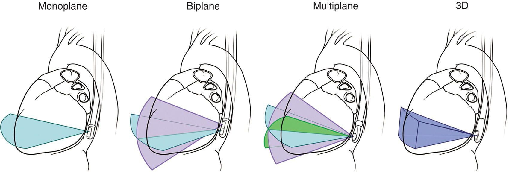

[**Figure 15.1**](#R_c15-fig-0001) _Evolution of TEE imaging hardware_. The graphic displays the evolution of TEE imaging technology from monoplane to biplane, to multiplane, to 3D devices.

(Source: Texas Children’s Hospital. Reproduced with permission.)

[**Figure 15.2**](#R_c15-fig-0002) _TEE multiplane probes_. The photograph shows four currently available TEE multiplane imaging devices. (A) Neonatal probe; (B) pediatric probe; (C) “adult” 2D probe; (D) “adult” 3D probe.

[**Table 15.4**](#R_c15-tbl-0004) Manufacturer recommendations for multiplane transesophageal echocardiography (TEE) probe selection according to patient weight

| TEE multiplane probe | Minimum patient weight (kg) |
| --- | --- |
| Neonatal | 2.5 |
| Pediatric | 3.5 |
| Adult (2D) | 25 |
| Adult (3D) | 30 |

_2D_ two‐dimensional; _3D_ three‐dimensional

Intracardiac echocardiography (ICE) catheters (8–10 F) inserted via the transesophageal approach can provide 2D imaging in a single, longitudinal plane in neonates and small infants \[46–48\]. Although these catheters are not formally marketed for this specific application, reports indicate that they deliver clinically useful information in some cases, albeit with several limitations.

#### Probe insertion

In the operating room, TEE probe insertion occurs after induction of general anesthesia, endotracheal intubation, and arterial catheter placement. Although aspirating gastric contents is standard anesthetic practice in many centers, it does not reliably enhance TEE image quality \[49\]. In pediatric patients, some providers prefer nasal rather than oral endotracheal intubation to better stabilize the endotracheal tube (ETT), which reduces the risk of inadvertent extubation or movement during TEE probe manipulation. This practice, however, is variable. Regardless of the intubation route, securely taping the ETT should minimize the risk of displacement.

Blind positioning of the lubricated probe tip in the oropharynx with gentle advancement into the esophagus should occur with the patient’s head in the midline position. The probe control for transducer tip flexion should remain unlocked at this time to allow free movement.

Slight anterior flexion of the probe tip, forward thrusting of the mandible, and device guidance with a gloved finger can aid advancement of the probe along the contour of the posterior pharynx, thereby minimizing trauma. Alternatively, laryngoscopy can be used initially with direct visualization during probe insertion or after a difficult blind probe insertion \[50\].

In children, positioning the head to the side may facilitate the probe’s passage, as this position reportedly results in closure of the ipsilateral pyriform sinus, where the probe may encounter obstruction \[51\]. After placing the transducer behind the heart, repositioning the patient’s head avoids interference with the surgical field during probe manipulation. Independent factors that render probe insertion difficult in infants weighing 4 kg or less include lower weight, abnormal craniofacial anatomy, prematurity, a diagnosis of 22q11 deletion \[52\], and, possibly, Down syndrome.

Probe placement is an essential skill in the practice of TEE. Distinguishing expected from excessive resistance requires thorough expertise and ongoing experience with the technique \[53\]. Although esophageal intubation requires some degree of effort, it is important never to force the probe against resistance. Manufacturers recommend insertion of the TEE probe through a bite block (also referred to as bite guard), which is positioned between the patient’s teeth to provide safe passage through the patient's mouth, prevent damage to the TEE probe, and maintain the probe warranty. In clinical practice, this is more commonly used when imaging is done under sedation than with general anesthesia and more likely to be used in adults versus children.

Probe insertion and manipulation can be significantly stimulating and requires an adequate level of patient sedation or anesthesia and even neuromuscular blockade in most children before placement. These maneuvers can also elicit clinically significant hemodynamic and/or respiratory changes, particularly in patients with specific anomalies with known significant potential risks of TEE (e.g., anomalous pulmonary venous drainage, vascular rings or slings); thus, vigilance is imperative \[54\]. In the event of acute hemodynamic or airway compromise, the probe should be repositioned or removed immediately.

Outpatient TEE is performed often in adults but rarely in children, because the excellent image quality of TTE in the pediatric population provides adequate information as previously noted. In most cases, TEE is used to address a specific question, such as assessing for a thrombus in the LAA. A combination of oropharyngeal topical anesthesia and intravenous sedation may be sufficient for TEE imaging in the adolescent or adult. In younger patients, some adolescents, and a few adults, deep sedation or general anesthesia with endotracheal intubation may be necessary to overcome lack of cooperation, avoid respiratory compromise, and provide adequate time for a complete study.

The facility where TEE occurs should be equipped with oxygen, suction capabilities, drugs, and equipment for cardiopulmonary resuscitation and other emergency therapies. Standard cardiorespiratory monitoring during the procedure includes intermittent blood pressure measurements, electrocardiography, pulse oximetry, and capnography. Patients with CHD may have significant hemodynamic alterations with marginal compensation, requiring the judicious, titrated administration of pharmacologic agents \[55\]. Patients with cyanotic heart disease are at additional risk for paradoxical air embolism during the administration of intravenous fluids or drugs. Decreases in systemic vascular resistance associated with a sedative or anesthetic agent can worsen right‐to‐left shunting and exacerbate underlying systemic arterial desaturation, necessitating careful observation of drug responses.

#### Instrument manipulation and probe controls

Manipulating the TEE probe in several directions aids in imaging cardiovascular structures relative to the sagittal plane ([Figure 15.3](#c15-fig-0003)). The probe shaft can be pushed in (advanced) or pulled back (withdrawn) and can be turned to the right (clockwise) or to the left (counterclockwise). Wheel controls on the probe handle manipulate the probe tip, which can be flexed anteriorly (anteflexed) or posteriorly (retroflexed) and to the right or left ([Figure 15.4](#c15-fig-0004)). Pediatric TEE probes may lack the right‐to‐left flexion control, seldom a limitation, because only minimal adjustments in the probe’s position are needed to navigate from view to view. The imaging plane of a stationary, multiplane transducer can be rotated between angles of 0° and 180°, without the maneuvers required by monoplane and biplane devices to obtain equivalent views \[56\]. The control to change the multiplane angle in adult devices is electronic, whereas it can be either mechanical or electronic in pediatric devices ([Figure 15.5](#c15-fig-0005)).

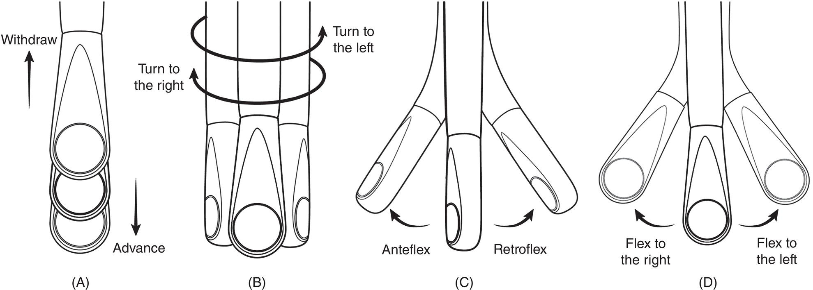

[**Figure 15.3**](#R_c15-fig-0003) _TEE probe manipulation_. The graphic displays the terminology corresponding to the various TEE probe manipulation options. (A) Advance/withdraw; (B) turn to the right/left; (C) anteflex/retroflex; and (D) flex to the right/left. Note that the first two maneuvers (shown in panels A and B) require movement of the entire probe shaft, while performing the second two (depicted in panels C and D) is by special controls that move only the probe tip.

(Source: Texas Children’s Hospital. Reproduced with permission.)

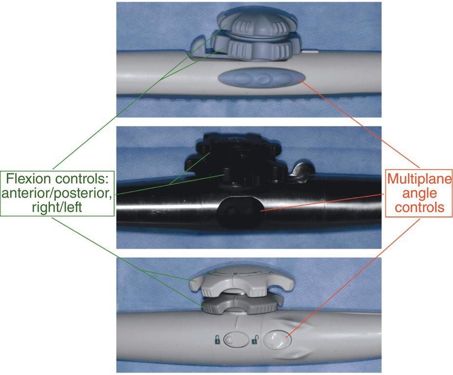

[**Figure 15.4**](#R_c15-fig-0004) _Adult multiplane TEE probe controls_. This photograph shows three different types of commercially available multiplane TEE adult probes with their respective flexion (anterior/posterior, right/left) and multiplane angle controls.

* * *

### KEY POINTS: TEE HARDWARE

-   The TEE technology has evolved from monoplane, to biplane, to multiplane, to recent 3D‐live imaging devices.
-   Currently, there are four available multiplane probes for TEE imaging in patients with CHD (i.e., neonatal, pediatric, adult 2D, and adult 3D TEE probes).
-   All multiplane probes include 2D, M‐mode, spectral Doppler, and color Doppler capabilities.
-   Two main factors guide device selection: probe size and patient weight.

* * *

## TEE examination in CHD

### Structural examination

The echocardiographic evaluation of the patient with CHD presents many challenges because of factors such as the wide spectrum of lesions; the myriad of anatomic variants, each with specific physiologic alterations; the frequent presence of coexistent pathologies; and the complexity of many defects \[1\]. Compounding these considerations is the need to be able to reconstruct the 3D anatomy of the congenitally malformed heart while relying primarily, and in most instances exclusively, on 2D imaging. Despite these challenges, TEE permits excellent visualization of cardiovascular structures and provides significant benefits.

A comprehensive TEE examination in the patient with CHD can employ different approaches. Each approach has specific advantages and some potential disadvantages, as described briefly in the sections that follow.

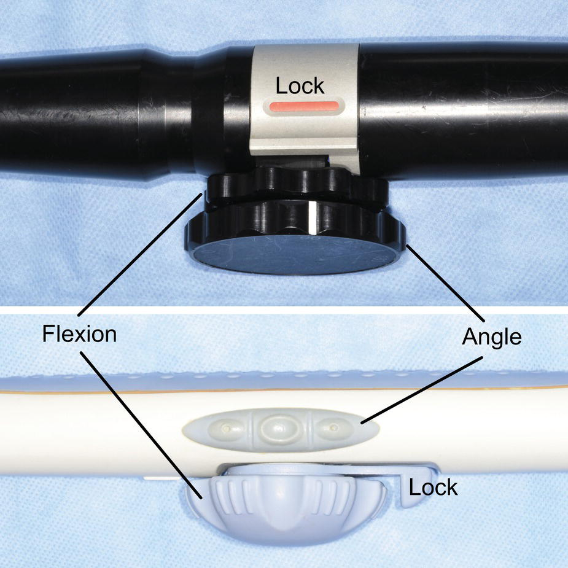

[**Figure 15.5**](#R_c15-fig-0005) _Pediatric multiplane TEE probes_. The photograph displays two commercially available pediatric multiplane TEE probes to highlight differences in the multiplane angle control (mechanical in top panel vs. electronic in lower panel), the wheel control for flexion (anteflexion/retroflexion), and the probe tip locking mechanism.

#### View‐based approach

The “view‐based” TEE examination relies on obtaining several specific predefined cross sections by moving the probe to various locations within the esophagus or stomach. Initial guidelines by the ASE and Society of Cardiovascular Anesthesiologists (SCA) suggested a set of 20 TEE views for a comprehensive examination. This widely adopted approach became standard practice for the TEE examination of the adult patient with an anatomically normal heart \[57\]. Subsequently, updated recommendations incorporated 8 additional cross sections, for a total of 28 TEE views ([Figure 15.6](#c15-fig-0006)) \[3\]. Recent ASE TEE guidelines specifically addressing children and all patients with CHD recommend 28 views for a comprehensive examination \[5\]. Most of these views are the same described for imaging of the adult heart, but a few were added in recognition of the need for examination of specific structures or pathologies commonly seen in the pediatric age group or the congenital population ([Figure 15.7](#c15-fig-0007)). Selected adult TEE views were correspondingly excluded to maintain the same overall number of cross sections. A more detailed description of views useful in imaging CHD appears in the subsequent sections. During a complete TEE examination, obtaining most or all these views, regardless of sequence, provides comprehensive anatomic, functional, and hemodynamic information. This approach helps the practitioner learn the basic principles of TEE and represents an excellent foundation on the subject. The reader is referred to the outstanding web‐based educational resources of the Toronto General Hospital ([www.pie.med.utoronto.ca/TEE/](http://www.pie.med.utoronto.ca/TEE/)) for interactive modules on the standard adult TEE examination.

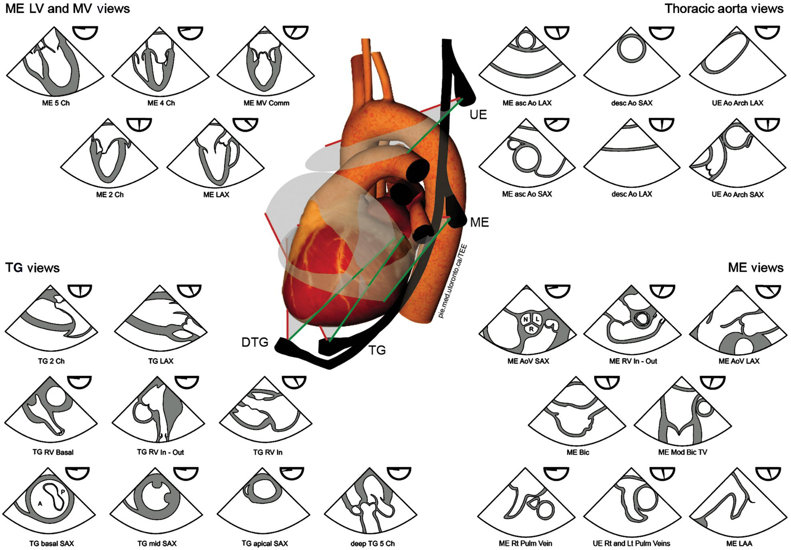

[**Figure 15.6**](#R_c15-fig-0006) _TEE views in the comprehensive adult examination_. This graphic displays the suggested 28 views in the adult guidelines for a comprehensive TEE examination \[3\]. The TEE probe positioned at the upper esophageal (UE), midesophageal (ME), transgastric (TG), and deep transgastric (DTG) levels can attain these cross sections. The grouping of the views in this graphic is by the structures being interrogated or the specific TEE window. The reader is referred to this publication for a detailed description of each of these views. _A_ anterior; _L_ left coronary cusp; _LV_ left ventricle; _MV_ mitral valve; _N_ con coronary cusp; _P_ posterior; _R_ right coronary cusp.

(Source: Ms. Willa Bradshaw. Reproduced with permission.)

The view‐based TEE examination has substantial benefits, not only as a standardized method of performing the evaluation but also in terms of facilitating teaching, archiving, and reporting of the study, as well as quality assurance. Familiarity with these views, including the nomenclature, where and how to obtain each, the structures displayed by each, and the information derived, enhances one’s ability to perform a detailed examination and to communicate the findings to others.

However, this approach has several limitations. The most recent pediatric and congenital TEE guidelines highlight two of them. First, the suggested TEE views were aimed primarily at the intraoperative interrogation and excluded views that may be necessary in nonoperative settings. Second, the outlined TEE examination was not diagnosis based, potentially excluding important views in the evaluation of specific cardiac conditions. These limitations are particularly relevant to the assessment of CHD, because a strict view‐based approach is inadequate for the detailed evaluation of structural abnormalities in many patients. Standard TEE views may not allow imaging of the complex anatomic relationships that characterize congenital pathology. Of critical relevance is that comprehensively evaluating many structural anomalies requires not only single views but also sweeps between multiple planes, some modified or nonstandard, aimed at building a 3D construct of the anatomic abnormalities.

#### Structure‐based approach

The “structure‐based” examination focuses on detailed TEE imaging of cardiovascular structures of interest by using complementary views to permit their in‐depth examination. Specific structural imaging in the adult has been described, for example, in the detailed evaluation of cardiac valves, the Ao, and the LAA, among other regions \[3, 58–64\]. A similar type of approach has been extremely helpful in characterizing specific anatomic and functional abnormalities in the patient with CHD, such as defects that involve the atrial or ventricular septum, pulmonary veins, and other structures \[65–67\].

This type of image‐acquisition paradigm may be preferable when, for various reasons, a focused TEE examination needs to address only a specific pathology of concern. One potential limitation of this approach in CHD is that by targeting only particular cardiac structures or pathologies, one may overlook relevant coexisting abnormalities or anatomic variants. However, by examining all relevant structures, this is the favored examination approach in CHD \[5\].

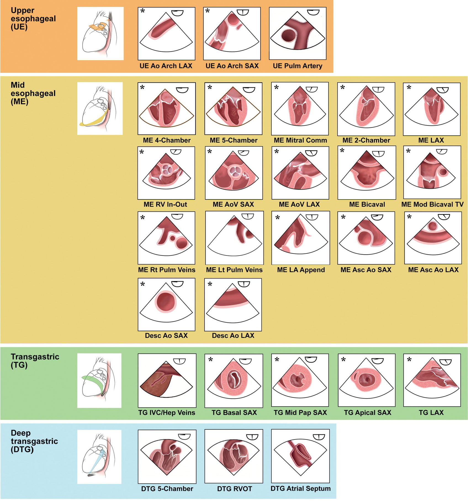

[**Figure 15.7**](#R_c15-fig-0007) _TEE views in the comprehensive pediatric and congenital TEE examination_. The graphic displays the 28 recommended TEE views as a starting point in the guidelines addressing the comprehensive examination in children and all patients with CHD \[5\]. The grouping of the views in this figure is by the specific TEE window that the views can be obtained. The reader is referred to this publication for a detailed description of each of these views.

(Sources: Texas Children’s Hospital. Reproduced with permission; panels marked by asterisk from Hahn et al. \[3\]. Reproduced with permission of Elsevier.)

#### Sequential segmental approach

The “sequential segmental” analysis has been proposed as the foundation of complete anatomic assessment in CHD \[68–71\]. This approach involves a well‐organized, methodical interrogation of the three major cardiac segments (i.e., atria, ventricles, and great arteries) and their relationships to each other (connections or alignments between the segments), to define a patient’s anatomy and any abnormalities ([Figure 15.8](#c15-fig-0008); also refer to [Chapter 7](c07.xhtml)). The incorporation of this type of analysis into many diagnostic imaging modalities in CHD is key in echocardiographic assessment (TTE and fetal imaging) \[72–75\].

The fundamental principle of this methodology is the identification of specific cardiac chambers by their characteristic morphologic properties, rather than by their positions within the body. The suggested practice examines the arrangement of the thoracoabdominal organs or situs, atrial structures, ventricles, and great arteries, as well as the connections between the segments, namely, the atrioventricular (AV) and ventriculoarterial (VA) connections \[76, 77\]. This approach has significant merit as congenital heart lesions can have normal or abnormal relationships among chambers, valves, and vessels (refer to [Chapter 7](c07.xhtml)).

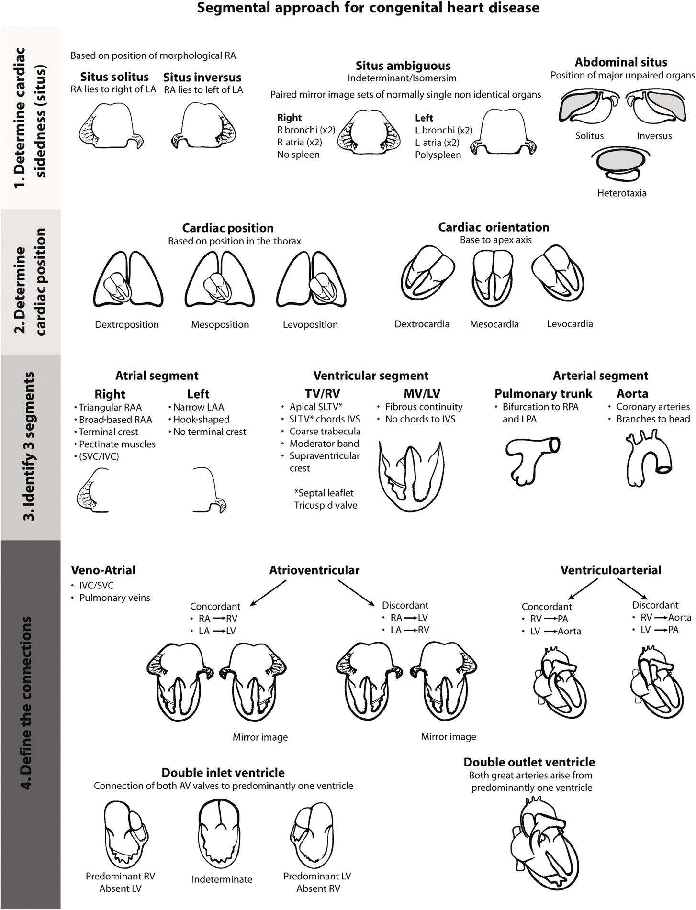

[**Figure 15.8**](#R_c15-fig-0008) _Sequential segmental analysis_. The graphic illustrates the steps involved in the diagnostic analysis of CHD. The approach examines the following: cardiac situs; position of heart in the thorax and base to apex orientation; all segments and connections; and the cardiac defects. _AV_ atrioventricular; _IVC_ inferior vena cava; _IVS_ interventricular septum; _L_ left; _LA_ left atrium; _LAA_ left atrial appendage; _LPA_ left pulmonary artery; _LV_ left ventricle; _MV_ mitral valve; _PA_ pulmonary artery; _R_ right; _RA_ right atrium; _RAA_ right atrial appendage; _RPA_ right pulmonary artery; _RV_ right ventricle; _SVC_ superior vena cava; _TV_ tricuspid valve.

(Source: Figure courtesy of Ms. Willa Bradshaw.)

The sequential segmental analysis overcomes the limitations of a purely structure‐based approach, as careful interrogation and identification of all cardiovascular structures ensures a thorough TEE assessment. Despite these advantages, for those unfamiliar with segmental anatomy, the methodology involved may be less intuitive and more time‐consuming. However, this approach is very useful, particularly in a preoperative study performed to characterize or confirm the anatomic abnormalities.

#### The TEE examination

Guidelines and recommendations exist for the application of TTE and TEE imaging in CHD \[1, 3, 5–8\]. Previous publications have addressed applications of TEE in CHD \[10, 78\], with the most recent guidelines outlining in detail the comprehensive and systematic examination in these patients \[5\]. Providing details of the TEE examination in CHD is beyond the scope of this chapter, so we review only selected aspects, and the reader should look to other publications for an exhaustive discussion on the subject \[5, 28, 79, 80\].

Although there is no predetermined sequence for the order of acquisition of information during a TEE examination in CHD, and one should not be inferred from the following outline, it is valuable for individuals to develop their own organized approach to performing a complete and expeditious interrogation. Unique patient conditions or specific circumstances, such as hemodynamic instability or respiratory impairment by TEE probe manipulation, may shorten the examination.

The sections that follow on imaging windows and planes provide a brief overview of selected TEE views frequently obtained during CHD evaluation. The examination assumes levocardia (heart in the left thoracic cavity with apex pointing to the left) and normal segmental anatomy: in other words, visceroatrial situs solitus (stomach on the left, liver on the right, and normal atrial arrangement), concordant AV and VA connections, normal ventricular topology, and great artery spatial orientation. It may not be possible to obtain all views in all patients, nor will the planes and angles of interrogation necessarily conform to each patient’s unique anatomy. The variety of structural cardiovascular malformations dictates a modified scheme in many cases.

The comprehensive TEE examination in CHD includes detailed 2D imaging and meticulous spectral and color‐flow Doppler interrogation. Contrast echocardiography using an injection of agitated saline or 5% albumin into a peripheral or central vein can detect small intracardiac shunts, further delineate anatomy (e.g., persistent left superior vena cava \[SVC\]–to–coronary sinus connection), and identify pathology such as atrial baffle leaks \[81, 82\].

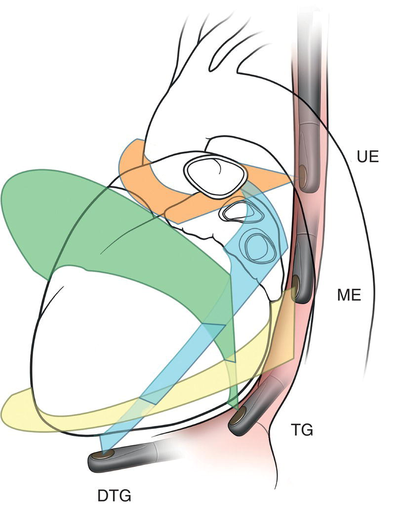

[**Figure 15.9**](#R_c15-fig-0009) _TEE imaging windows_. The standard TEE imaging windows and representative imaging planes are shown. _DTG_ deep transgastric; _ME_ midesophageal; _TG_ transgastric; _UE_ upper esophageal positions.

(Source: Texas Children’s Hospital. Reproduced with permission.)

##### _Imaging windows_

During a TEE examination in CHD, imaging of the heart and related vascular structures occurs at multiple levels: upper esophageal (UE), midesophageal (ME), TG, and DTG ([Figure 15.9](#c15-fig-0009)). Different transducer angles are used to obtain specific cross sections. These diverse TEE windows complement each other and provide information that is not otherwise obtainable in some views. The TG and DTG views, for example, provide favorable alignment of the Doppler angle of interrogation to the outflow tracts, optimizing spectral Doppler signals and the assessment of gradients.

##### _Multiplane imaging views_

The guidelines for performing a comprehensive TEE examination in children and all patients with CHD describe in detail the recommended 28 tomographic views, acquisition protocol, and structures imaged in each of these cross sections ([Figure 15.7](#c15-fig-0007)). The reader is referred to this document for further information \[5\]. [Table 15.5](#c15-tbl-0005) highlights how these multiplane TEE views can be obtained (note that this is a succinct guide, as there are several approaches), structures displayed, and relevant features of each. As emphasized in the guidelines document, these views are only a starting point, as additional, modified, nonstandard cross sections may be necessary to define the anatomy of a given patient. This is particularly important in patients with complex anatomy, such as seen in heterotaxy, and in patients with cardiac malpositions, for whom the multiplane transducer angles for the standard views may need to be significantly altered.

[**Table 15.5**](#R_c15-tbl-0005) Transesophageal echocardiography (TEE) views for a comprehensive examination in children and all patients with congenital heart disease

| View (_abbreviation_) | Acquisition details | Structures imaged and assessment |
| --- | --- | --- |
| **_Midesophageal views_** |
| ME Four‐chamber view  
(_ME 4‐Ch_) | Neutral probe position, transducer angle of ~0°–10°  
Equivalent to TTE apical 4‐Ch view | All four cardiac chambers, AV valves, atrial and ventricular septa, CS |
| ME Five‐chamber view  
(_ME 5‐Ch_) | From ME 4‐Ch view probe tip anteflexion or probe withdrawal | In addition to structures in the ME 4‐Ch view, LVOT, proximal Ao |
| ME Mitral valve view  
(_ME Mitral_) | From ME 4‐Ch view increase transducer angle to ~50°–70° | LA, LV, MV (segments, commissures), tensor apparatus, papillary muscles, CS |
| ME Two‐chamber view  
(_ME 2‐Ch_) | From ME 4‐Ch view increase transducer angle ~80°–100°  
Orthogonal to the ME 4‐Ch view | LA, LAA, MV, LV, CS |
| ME Long‐axis  
(_ME LAX_) | From ME 4‐Ch view increase transducer angle to ~120°–140° | LA, LV, RVOT, LVOT, MV, AoV, prox Asc Ao aorta |
| ME Aortic valve long‐axis  
(_ME AoV LAX_) | From ME LAX view reduce image depth | Focused view of LVOT, AoV, prox Asc Ao |
| ME Aortic valve short‐axis  
(_ME AoV SAX_) | From ME 5‐Ch view keep Ao root in focus, withdraw probe, adjust transducer plane to 25°–45°  
Orthogonal to ME AoV LAX view | AoV morphology (number of cusps, commissures), function, localization of pathology (stenosis, regurgitation) |
| ME Ascending aorta long‐axis  
(_ME Asc Ao LAX_) | From ME LAX view withdraw probe, adjust transducer angle to ~90°–110° | Asc Ao in long axis, RPA  
Allows for assessment of proximal to mid ascending aortic pathology |
| ME Ascending aorta short‐axis  
(_ME Asc Ao SAX_) | From ME Asc Ao LAX view decrease transducer angle to ~0°–30°  
Orthogonal to ME Asc Ao LAX view | Prox Asc Ao (short axis), MPA (long axis), RPA, SVC  
Allows for Doppler assessment of MPA |
| ME Right ventricular inflow‐outflow  
(_ME RV In‐Out_) | From ME 4‐Ch, ME 5‐Ch, or ME AoV SAX anteflex probe tip, rotate transducer angle to ~50°–70°  
Mimics inverted TTE parasternal SAX view at base of heart | RA, LA, IAS, TV, PV, AoV, MPA, inflow and outflow of RV  
Useful to assess VSDs, TR jets, RV size, function, and obstruction |
| ME Bicaval view  
(_ME Bicaval_) | Transducer angle of 90°–110°  
Orthogonal to ME 4‐Ch view | SVC and IVC entry to RA, RAA, IAS; useful to assess IAS, central catheter tip position |
| ME Modified Bicaval tricuspid valve  
(_ME Mod Bicaval TV_) | Transducer angle of 50°–70° or from ME Bicaval view turn probe to the right | TV (anatomy, regurgitation severity, regurgitant Doppler peak velocity), LA, RA |
| ME Left atrial appendage view  
(_ME LAA_) | Transducer angle of ~90°–110°  
LAA also seen in ME 4‐Ch view with LA centered and probe shaft turned to left | LAA, variable anatomy of LAA requires multiple views for a detailed examination |
| ME Right pulmonary veins  
(_ME Rt Pulm veins_) | From ME 4‐Ch view, turn probe shaft to right at transducer angle 0°, adjusting to 30°–50° may display all right‐sided pulmonary veins  
Alternate approach is to turn the probe to the right from the ME Bicaval view | Right pulmonary veins, SVC, Mid Asc Ao |
| ME Left pulmonary veins  
(_ME Lf Pulm veins_) | After centering LA in screen rotate transducer angle to 90°–110° and turn probe shaft to the left  
Alternate approach is from the ME 4‐Ch view to turn probe to the left to image the LAA, and slowly advance–withdraw the probe | Left pulmonary veins, LPA |
| **_Transgastric views_** |
| TG Basal short‐axis  
(_TG Basal SAX_)  
TG Mid‐papillary short‐axis  
(_TG Mid Pap SAX_)  
TG Apical short‐axis  
(_TG Apical SAX_) | Gently advance TEE probe into the lower esophagus/stomach, with slight anteflexion at transducer angle of ~0°–20° | Multiple cross‐sectional short‐axis views of LV at basal, mid‐papillary, and apical levels  
TG Mid Pap SAX view extremely helpful in evaluating LV function (global and segmental), LV preload |
| TG Long‐axis  
(_TG LAX_) | From TG Mid Pap view increase transducer angle to ~120°–140° | LV (long axis), LVOT, AoV  
Useful for Doppler evaluation of Ao outflow |
| TG Inferior vena cava/Hepatic veins  
(_TG IVC/Hep veins_) | From ME Bicaval view advance probe into the distal esophagus or upper gastric region at transducer angle of ~80°–100° | IVC, hepatic veins, RA  
Useful to assess situs and evaluate flow in venoatrial connection (IVC–RA), hepatic veins, anomalous pulmonary veins |
| **_Deep transgastric views_** |
| DTG Five‐chamber view  
(_DTG 5‐Ch_) | Advance probe further into stomach with transducer angle of 0°–20° and variable degrees of tip anteflexion  
LV is displayed from base at top to apex at bottom of image (in contrast to standard adult TEE view)  
Nearly equivalent to ME 5‐Ch view | Ventricles, LVOT, Ao root, IVS, MV |
| DTG Right ventricular outflow tract  
(_TG RVOT_)  
Not a standard view in the adult TEE guidelines | From DTG 5‐Ch view rotate transducer angle to ~50°–90°  
At times, rightward probe shaft rotation can be helpful | Ventricles, RVOT, MPA, IVS, MV |
| DTG Atrial septal  
(_TG Atr Sept_)  
Not a standard view in the adult TEE guidelines | From the DTG RVOT view turn probe shaft right with a transducer angle to ~80°–90°  
Simulates TTE subcostal bicaval view | Excellent delineation of IAS and systemic venous connections  
Visualizing the IVC may require a transducer angle of ~100°–120°) |
| **_Upper esophageal views_** |
| UE Pulmonary artery view  
(_UE PA_)  
Not a standard view in the adult TEE guidelines | From ME 4‐Ch view withdraw TEE probe, anteflex tip, turn shaft left at a transducer angle of ~0°–20°  
Alternatively, from ME RV In‐Out view withdraw probe and adjust transducer angle | MPA and branches  
Useful to assess main PA, bifurcation, proximal branches, and to perform Doppler exam  
Interposition of left mainstem bronchus, makes imaging LPA difficult |
| UE Aortic arch long‐axis  
(_UE Ao Arch LAX_) | Position probe in upper esophagus with transducer angle of ~0°–10° | Aortic arch (long axis), innominate vein |
| UE Aortic arch short‐axis  
(_UE Ao Arch SAX_) | From UE Ao Arch LAX increase transducer angle to ~70°–90°  
Orthogonal to UE Ao Arch LAX | Aortic arch (short axis), innominate vein, PV, MPA and branch PAs (with probe shaft rotation) |
| **_Aorta views_** |
| Descending aorta in short‐axis  
(_Desc Ao SAX_) | From ME 4‐Ch view rotate probe shaft left to display the left‐sided pulmonary veins and LAA, turning probe further posteriorly shows the Desc Ao SAX at a transducer angle ~0°–10° | Desc Ao (short axis) |
| Descending aorta in long‐axis  
(_Desc Ao LAX_) | From desc Ao SAX view increase transducer angle to ~90°–100° (orthogonal to Desc Ao SAX view) | Desc Ao (long axis) |

_Abbreviations_: _Ao_ aorta; _AV_ atrioventricular; _Asc_ ascending; _CS_ coronary sinus; _Desc_ descending; _IAS_ interatrial septum; _IVC_ inferior vena cava; _IVS_ interventricular septum; _LA_ left atrium; _LAA_ left atrial appendage; _LPA_ left pulmonary artery; _LV_ left ventricle; _LVOT_ left ventricular outflow tract; _MPA_ main pulmonary artery; _MV_ mitral valve; _PA_ pulmonary artery; _PV_ pulmonary valve; _Prox_ proximal; _RA_ right atrium; _RAA_ right atrial appendage; _RPA_ right pulmonary artery; _RV_ right ventricle; _RVOT_ right ventricular outflow tract; _SVC_ superior vena cava; _TR_ tricuspid regurgitation; _TTE_ transthoracic echocardiography; _TV_ tricuspid valve; _VSD_ ventricular septal defect

In general, the views can be considered as follows:

###### ME views

A significant amount of TEE imaging takes place in the ME region; in fact, this window allows acquisition of more than half of the suggested views (15/28) for a comprehensive pediatric or adult CHD examination. The _ME four‐chamber view (ME 4‐Ch)_ is considered the starting view or “home base,” as it acts as a reference point for obtaining other views by manipulating the probe (tip or shaft adjustments) or adjusting the transducer angle on a multiplane probe.

###### TG views

The TG views include five cross sections of the heart. Transverse plane imaging shows the ventricles in short axis at various levels from base to apex. Longitudinal plane imaging shows the left ventricle (LV) and right ventricle (RV) and the inferior cavoatrial region.

###### DTG views

Advancing the probe into the fundus of the stomach obtains the three DTG views. Up‐down inversion displays the TEE images in an anatomic orientation (base of the heart at the top of the sector and apex at the bottom), which assists tremendously in the understanding of complex disease and correlates to TTE imaging and other diagnostic modalities. This convention is not applied to standard adult TEE DTG imaging, or to equivalent apical or subcostal views obtained by surface imaging in the adult patient. The DTG views of the semilunar valves or ventricular outflow tracts provide excellent angles of spectral Doppler interrogation, thereby allowing optimal alignment of the cursor parallel to the direction of blood flow. These views also significantly contribute to the evaluation of VA connections in CHD.

###### UE views

These three views allow imaging of vascular structures (e.g., pulmonary artery \[PA\], aortic arch, variants or anomalies).

###### Aortic views

The views of the thoracic descending Ao can be obtained at various levels by withdrawing and advancing the imaging probe. The level of the Ao in these views can be difficult to interpret because of the lack of landmarks.

### Three‐dimensional TEE

Ease of acquisition with rapid online display of detailed dynamic images has increased the use of real‐time 3D TEE in the perioperative period to assess cardiac anatomy and function \[4, 40, 41, 83–85\]. Special matrix array ultrasonography probes acquire raw data by volume scanning, and integrated ultrasonography machine software processes the 3D data sets. These TEE probes perform all standard 2D functions, include motion mode (M‐mode) and all Doppler modalities (e.g., spectral, color, tissue), and have the additional feature of multiplane mode (X‐plane) to simultaneously display independent 2D scanning planes during the same heartbeat. Single‐button activation of specific 3D imaging modes for both TEE and TTE matrix array probes include live, zoom, full volume, and color Doppler full volume, allowing for real‐time imaging of cardiac structures ([Table 15.6](#c15-tbl-0006)). Using these modes, one can define a specific region of interest to obtain a 3D volume of varying sizes. Newer software can display all 3D data sets in real time, such that moving the probe will immediately affect the 3D volume on the display.

Currently, all real‐time 3D imaging modes appear as a volume‐rendered 3D object with full details of the surface and inner structure. The free rotation of any rendered 3D object on the screen allows its display from any orientation, including the surgeon’s perspective.

Cropping permits a “virtual dissection” of the 3D object that examines all its details. The 3D technology has proven superior to 2D echocardiography for assessing the LV (volume, ejection fraction \[EF\], mass, and dyssynchrony) and the mitral valve (MV) \[86\]. _En face_ views of the MV, for example, when displayed in the surgeon’s orientation viewed from the left atrium (LA), show the anatomical details of the leaflets and define leaflet pathology of prolapse, clefts, and perforations \[87, 88\]. Thus, the use of this modality has become well accepted for adult patients undergoing cardiothoracic surgical interventions and catheter‐based procedures. The excellent detail of 3D imaging provides more information about cardiac anatomy and spatial relationships than 2D echocardiography, clearly a merit of the technology in evaluating CHD. Real‐time 3D TEE can better show the intricate relations of cardiac structures in patients with complex CHD. While multiple 2D views were previously necessary to assess pathology, 3D imaging can show the entire heart in a single screen display. In assessing CHD, 3D TEE has a major role in evaluating defects in both the atrial and ventricular septum and valvular pathologies of the MV and aortic valve (AoV) \[4, 89\]. Current recommendations for 3D TEE imaging in CHD appear in [Table 15.7](#c15-tbl-0007) \[5\].

Although experience with real‐time 3D TEE in children with CHD is limited by the lack of suitable imaging devices, applications of the technology have shown extremely favorable results \[4, 21, 65, 66, 89–95\], mirroring the reported 3D TTE experience in CHD \[96, 97\]. It is reasonable to consider this modality in cases for which a 3D perspective may offer additional benefits over routine 2D TEE in the patient suitable for 3D TEE imaging with currently available devices.

Similar to 2D TEE, structures closest to the probe are easily imaged in 3D, enabling the evaluation of clinically relevant issues in real time. The thin interatrial septal (IAS) and distant structures (AoV and pulmonary valve \[PV\]) remain difficult to image by 3D TEE in some patients. Despite recommendations for 3D echocardiographic image acquisition and display, a consensus statement on 3D imaging in CHD, and the reported clinical use of 3D TEE in the pediatric and CHD TEE guidelines, there remains no standardized protocol for the use of intraoperative real‐time 3D TEE in everyday practice \[4, 5, 83\]. Although 3D image acquisition is rapid, processing the 3D data sets with analytical software can be time‐consuming and challenging in the hectic intraoperative environment.

[**Table 15.6**](#R_c15-tbl-0006) Real‐time three‐dimensional transesophageal echocardiography imaging

| Structure | 2D view for 3D acquisition | 3D mode | Clinical utility |
| --- | --- | --- | --- |
| Mitral valve | ME 4‐Ch (0°), ME MV Comm (60°), ME 2‐Ch (90°), ME LAX (120°); ± CD for all views | Zoom, FV | Morphology, function, quantification (effective regurgitant orifice area, MV area) |
| Aortic valve | ME AoV SAX (30°–60°), ME AoV LAX (120°); ± CD for all views | Zoom | AoV area, TAVI |
| Tricuspid valve | ME 4‐Ch (0°–30°), TG (40°); ± CD for all views | Zoom | Unstudied |
| Pulmonary valve | UE Ao Arch SAX (90°) ± CD | Zoom | TEE has limited views |
| Interatrial septum | ME 4‐Ch (0°), ME Bic (90°); ± CD for all views | Zoom, FV | ASD |
| Left ventricle | ME 4‐Ch (0°), ME 2‐Ch (90°), ME LAX (120°) | FV | Volume, mass, ejection fraction, dyssynchrony |
| Right ventricle | ME 4‐Ch (0°), ME 2‐Ch (90°), ME LAX (120°) | FV | Volume, ejection fraction |
| Left atrial appendage | ME 4‐Ch (0°), ME MV Comm (60°), ME 2‐Ch (90°), ME LAA (110°) | Live, Zoom | Thrombus |

The standard 2D transesophageal echocardiography (TEE) view is used with different 3D imaging modes to scan a region of interest and obtain a volume of tissue. This volume or block of tissue can be cropped, rotated, and displayed in any orientation to show normal and pathologic findings.

_Abbreviations: 2D_ two‐dimensional; _3D_ three‐dimensional; _AoV_ aortic valve; _ASD_ atrial septal defect; _Bic_ bicaval; _CD_ color Doppler; _Comm_ commissural; _FV_ full volume; _LAA_ left atrial appendage; _LAX_ long‐axis; _ME_ midesophageal; _MV_ mitral valve; _SAX_ short‐axis; _TAVI_ transcatheter AoV implantation; _TG_ transgastric; _UE Ao Arch_ upper esophageal aortic arch; _2‐Ch_ two‐chamber; _4‐Ch_ four‐chamber

[**Table 15.7**](#R_c15-tbl-0007) Clinical use of three‐dimensional (3D) transesophageal echocardiography (TEE) in congenital heart disease

Source: Reproduced from Puchalski et al. \[5\], with permission Elsevier.

<table border="1"><tbody class="tdcolor6"><tr><td class="left"><b>3D TEE has been recommended for</b><ul id="c15-list-0010"><li id="c15-li-0063">ASD device closure guidance</li><li id="c15-li-0064">VSD device closure guidance</li><li id="c15-li-0065">Visualization of catheters, delivery systems, and devices</li><li id="c15-li-0066">Measurement of defects visualized in <i>en face</i> views</li><li id="c15-li-0067">Analysis of the anatomy and function of atrioventricular valves</li><li id="c15-li-0068">Visualization of the aortic valve and left ventricular outflow tract</li></ul>  <b>3D TEE has been used effectively during</b><ul id="c15-list-0011"><li id="c15-li-0069">Fontan fenestration closure</li><li id="c15-li-0070">Ruptured sinus of Valsalva aneurysm device closure</li><li id="c15-li-0071">Coronary artery fistula device closure</li><li id="c15-li-0072">Prosthetic valve paravalvular leak device closure</li><li id="c15-li-0073">Atrial switch baffle leak device closure and baffle obstruction stenting</li><li id="c15-li-0074">Atrial septum transseptal puncture during various procedures</li><li id="c15-li-0075">Biventricular pacemaker synchrony assessment and lead placement guidance</li></ul></td></tr></tbody></table>

_Abbreviations_: _ASD_ atrial septal defect; _VSD_ ventricular septal defect

### Functional assessment

Assessment of ventricular function is an important component of a comprehensive TEE examination. While it is common to evaluate systolic function, evaluating diastolic function is an area of growing interest because there is increasing recognition of the role that diastolic dysfunction plays in clinical outcomes \[98\].

The ventricles differ in geometry, systolic contraction pattern, and load conditions, requiring different methods to assess each chamber. Quantitative assessment of LV systolic function by echocardiography relies on geometric models that may not be applicable to the unusual ventricular geometries typical of CHD \[2, 99\]. In patients with CHD, the extents of RV enlargement and deterioration of function often determine the need for clinical intervention \[100\]. Currently, CMR is the gold standard for assessing RV systolic function \[101\], whereas real‐time 3D echocardiography is comparable to CMR in assessing LV function \[83\].

Newer echocardiographic techniques can quantify subtle changes in regional and global ventricular function, independent of ventricular morphology, and are less affected by loading conditions \[102\]. _Tissue Doppler imaging_ (TDI), also referred to as _Doppler tissue imaging_, provides a reproducible, clinically valid, and easily obtainable nongeometric quantitative method to assess both systolic and diastolic ventricular function \[103\]. _Strain_ and _strain rate imaging_ can provide global and regional assessment of ventricular function that is independent of geometry and less affected by loading conditions \[104–106\]. Improved ultrasonography technology has simplified techniques such as TDI, 3D EF, and tissue tracking for strain and strain rate to better quantify systolic function in the operative setting \[107, 108\]. For many of these techniques, there are reference values for normal adults and children, most often established by TTE \[2, 99, 109, 110\]. These values vary greatly according to age and lack validation by TEE. The discussion that follows highlights general concepts regarding selected approaches for assessing ventricular function by echocardiography.

#### LV systolic function

Normal LV function involves complex 3D movements during the cardiac cycle. Systolic function depends on heart rate, myocardial contractility, and loading conditions. Typically, quantitative echocardiographic assessment of LV function measures changes in LV volume by calculating stroke volume (SV), LV ejection fraction (LVEF), and cardiac output (CO). However, these quantitative measures are time‐consuming, limited by loading conditions, and affected by alterations in geometric shape. Technical concerns when using TEE, such as chamber foreshortening and poor endocardial definition, further complicate the acquisition of quantitative information. Thus, intraoperative ventricular systolic performance is often assessed qualitatively, most commonly by “eyeballing” and at times by using methods such as simple linear (shortening fraction \[SF\]) and area (fractional area change \[FAC\]) measurements.

“Eyeballing” of wall motion and thickening in the ME 4‐Ch, TG Mid Pap SAX, and TG LAX views (refer to [Figure 15.7](#c15-fig-0007) and [Table 15.5](#c15-tbl-0005)) can be used to qualitatively assess ventricular systolic function. Although used ubiquitously, this subjective technique lacks standardization, depends on experience, and has significant inter‐ and intra‐observer variability. The TG Mid Pap SAX view is often used but examines only a portion of the LV (six segments) and may not reflect global systolic function in hearts with an abnormal geometric shape or regional wall motion abnormalities.

SF estimates LV systolic function from linear measures of end‐diastolic diameter (LVEDD) and end‐systolic diameter (LVESD) by using M‐mode in a TG Mid Pap SAX view of the LV ([Figure 15.10](#c15-fig-0010)A). The superior temporal resolution of M‐mode echocardiography can capture the movement of structures over time. The SF as a percentage (normal: 26–45%) is determined by the following formula:

FAC estimates global LV systolic function by using area measurements; thus, it differs from the LVEF, as it is not a volume measurement. Tracing the LV endocardial border obtains an area at end‐diastole (LVEDA) and end‐systole (LVESA) from LAX (ME view) or SAX (TG view) LV cross sections ([Figure 15.10](#c15-fig-0010)B). The LVFAC expressed as a percentage (normal: 45%) is determined by the following formula:

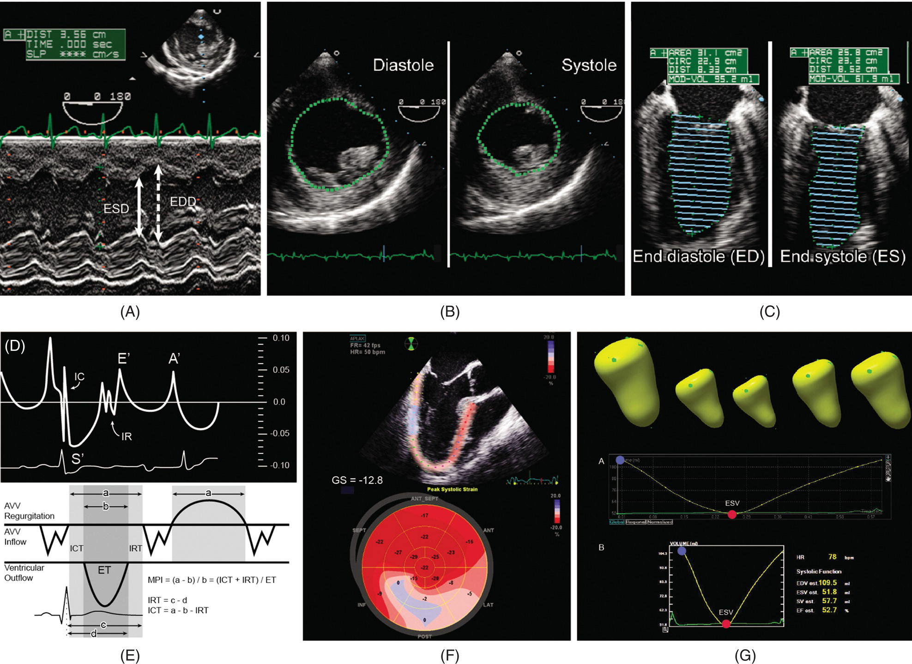

[**Figure 15.10**](#R_c15-fig-0010) _Echocardiographic evaluation of left ventricular (LV) function_. This graphic displays the assessment of LV function using different techniques. (A) _Shortening fraction_ estimates systolic function using linear measurements of LV end‐diastolic (_EDD_) and end‐systolic (_ESD_) chamber dimensions from a TG Mid Pap SAX view. (B) _Fractional area change_ measures LV EDD and ESD chamber areas from a TG Mid Pap SAX view. (C) _Ejection fraction_ measurement with Simpson’s method of discs uses ME 4‐Ch and/or ME 2‐Ch views to trace the LV endocardium at _EDD_ and _ESD_. Integrated machine software divides the LV into slices to calculate the volume.

(Sources for A–C: Vegas \[111, 112\]. Reproduced with permission of Springer Nature.)

(D) _Tissue Doppler imaging_ of the lateral mitral valve annulus demonstrates a systolic velocity (_S_′) and two opposite‐directed velocities, in early diastole (_E_′) and late diastole (_A_′) (graphic representation from a midesophageal window). The S′ wave velocity provides an estimate of LV ejection fraction. _IC_ isovolumetric contraction; _IR_ isovolumetric relaxation. (E) _Myocardial performance index_ is measured using spectral Doppler of the aortic outflow and mitral inflow as described in the text. (F) _Speckle tracking_ can easily measure strain and strain rate (shown here for a ME LAX view) and peak systolic strain displayed in a bull’s‐eye format. (G) _3D assessment_ of an endocardial cast derived from a 3D data set can be analyzed to estimate LV volumes and ejection fraction.

(Source: Vegas \[112\]. Reproduced with permission of Springer Nature.)

_ESV_ end‐systolic volume.

EF represents the most common measure of ventricular systolic function by echocardiography. The calculation of LVEF as a percentage (normal range: 56–78%) is as follows:

The end‐diastolic volume (EDV) and end‐systolic volume (ESV) of the LV can be determined by using 2D geometric methods and, more recently, from 3D volumes. The _Simpson method of discs_ (MOD) in the ME 4‐Ch and ME 2‐Ch views (single or biplane method) divides the LV into slices of known thickness, whereby the sum of the slices represents the LV volume. The technique requires tracing the LV cavity at end diastole and end systole and determining the LV length through the apex ([Figure 15.10](#c15-fig-0010)C). The ultrasonography machine software automatically determines the LV volumes, SV, and LVEF.

A full volume data set acquired by 3D imaging can assess LV volume using two methods: 3D‐guided biplane analysis and direct volumetric analysis. The 3D‐guided biplane method minimizes foreshortening of the LV by positioning two perpendicular 2D planes accurately through the LV apex, thereby creating ideal ME 4‐Ch and ME 2‐Ch views. The LV volumes, LVEF, and mass are calculated by applying the modified Simpson biplane MOD. Direct volumetric analysis, performed with specialized software available on the ultrasonography system, measures LV volume throughout the cardiac cycle from a 3D surface‐rendered cast of the LV cavity ([Figure 15.10](#c15-fig-0010)G). The software measures the EDV and ESV and calculates the SV and LVEF. This method accurately measures LV volumes, particularly in patients with an abnormal ventricular shape or regional wall motion abnormalities. The benefit of this analysis technique relates to better alignment of imaging planes through the cardiac apex, inclusion of more endocardial surface during the analysis, and the lack of geometric shape assumption. LV and RV volumes measured by 3D TTE are comparable to 2D TTE, CMR, and CT techniques. Assessing ventricular function with 3D technology is of great benefit in CHD, particularly in patients with single ventricle anatomic variants.

_Doppler estimation_ of _SV and CO_ uses the spectral Doppler mode. Any intracardiac site where recording both the cross‐sectional area (CSA) and the flow velocity time integral (VTI) can be used to determine SV, as SV = CSA × VTI. An easy application of this method involves measuring the diameter of the AoV annulus (ME AoV LAX view) and flow through the valve (DTG 5‐Ch view). Because the CSA of the AoV annulus does not usually change, serial monitoring of SV (and CO) mirrors changes in the VTI. The product of SV and heart rate represents the CO.

_TDI_ records and displays pulsed‐wave Doppler signals produced by the low‐velocity movement of tissue. Positioning the sample volume at the lateral or septal mitral annulus measures and displays peak myocardial velocity ([Figure 15.10](#c15-fig-0010)D). Obtaining an optimal spectral trace depends on parallel Doppler alignment and tissue devoid of artifacts from reverberation, side lobes, or dropout. The TDI spectral display of the mitral annulus comprises a systolic velocity (S′) and two opposite‐directed velocities recorded in early diastole (E′) and late diastole (A′). The S′ velocity is an estimate of LVEF, but not specifically a measure of contractility. Normal values for TDIs in pediatric and adult patients differ with heart rate, age, ventricular morphology, and loading conditions. These velocities are now routinely part of ventricular functional assessment by transthoracic imaging \[109\].

The _myocardial performance index (MPI)_, or _Tei index_, is a Doppler‐derived measure of global ventricular function. It incorporates both systolic and diastolic time intervals and thus represents both systolic and diastolic performance \[113\]. The MPI is defined as the sum of isovolumic contraction time (ICT) and isovolumic relaxation time (IRT) divided by ejection time (ET):

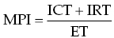

The longer the isovolumic times, the higher the MPI and the worse the ventricular performance.

Pulsed‐wave Doppler interrogation of the respective AV valve and outflow tract can easily measure components of the index for either the LV or the RV ([Figure 15.10](#c15-fig-0010)E). TDI derives the MPI over a single cardiac cycle, making it more accurate than the conventional Tei index. Studies have established normal MPI values for both adults and children (normal values in adults: LV, 0.39 ± 0.05 and RV, 0.28 ± 0.04; normal values in children: LV, 0.35 ± 0.03 and RV, 0.32 ± 0.03) \[114, 115\]. This index has been applied to the assessment of LV and RV function in patients with CHD, as well as to the evaluation of complex ventricular geometries \[115–117\]. It has also been used in the intraoperative setting to study the cardiovascular effects of anesthetic agents in children with CHD \[118\].

_Strain and strain rate imaging_ are newer echocardiographic modalities that offer an enhanced approach to evaluating regional myocardial contraction and relaxation. During systole, the actual volume of myocardial tissue remains unchanged, but the myocardium changes in shape or deforms in three dimensions: longitudinal (shortening), radial (thickening), and circumferential (shortening and torsion). Strain and strain rate analyze ventricular deformation to quantify global and regional ventricular function more accurately than other functional indexes \[104, 105, 110, 119–121\]. Strain is a single, dimensionless (%) parameter that examines the motion deformation between two points in the myocardial wall. Total deformation in all dimensions represents a percentage change from the initial length. Negative strain implies that the fibers shorten (circumferential plus longitudinal) or thin (radial), whereas positive strain indicates that the fibers lengthen (circumferential plus longitudinal) or thicken (radial). End‐systolic strain estimates LVEF. Strain rate is the speed of deformation or the change in strain over time (1/s). Peak systolic stain rate is a measure of contractility.

Two methods can assess myocardial deformation: TDI and speckle tracking. _Speckle tracking_ of myocardium from a standard 2D image quantifies myocardial deformation without the limitations of angle dependence associated with TDI. Speckle tracking involves frame‐by‐frame analysis of the movement of a region of speckles of the myocardium to derive their direction and velocity (shift over time) of tissue movement relative to each other. Speckle tracking is less influenced by artifacts, although reverberations and dropout of myocardial tissue are problematic. Speckle tracking displays peak strain as an average value for each regional wall. Averaging these peak strain values provides the _global longitudinal peak systolic strain_ (GLPSS), a measure of global systolic function. A colorized bull’s‐eye format displays the distribution of regional peak systolic and global systolic strain ([Figure 15.10](#c15-fig-0010)F). The analysis of myocardial deformation has been applied to various cardiovascular diseases, including cardiomyopathy, myocarditis, and valve pathology, among many other conditions. The use of TEE for this purpose has been extended to the perioperative setting, but experience with this application remains limited \[106, 107\].

#### Regional wall motion

Dividing the LV into segments better describes regional wall motion abnormalities and correlates them with coronary artery anatomy. Analysis of LV segmental function is based on a qualitative visual assessment for motion or thickening of a segment during systole. The ASE and SCA use a _17‐segment LV model_ that divides the basal and mid‐levels into six segments each and the apex into four; the 17th segment is an apical cap (devoid of LV cavity) \[99, 122\]. TG SAX views show one LV level at a time, but these views have the advantage of simultaneously showing portions supplied by all major coronary arteries (right, left anterior descending, and circumflex vessels). Using other ME TEE views complements this assessment by showing additional LV wall segments ([Figure 15.11](#c15-fig-0011)).

Regional wall motion abnormalities detected by TEE in pediatric patients, like those in adult patients, have been considered markers of compromised myocardial blood flow \[124, 125\]. Segmental abnormalities can occur from surgical manipulations that alter coronary blood flow, either from coronary dissection, interventions involving the Ao or coronary arteries, intracoronary air, or localized reperfusion injury during cardiac surgery.

#### RV systolic function

The echocardiographic assessment of RV systolic function is complicated by the nongeometric, asymmetric, crescent shape of the ventricle, which precludes easy application of quantitative methods \[126, 127\]. Despite these challenges, several echocardiographic approaches can assess RV function \[128–130\]. The most commonly used of these approaches are _RV FAC_ and _tricuspid annular plane systolic excursion (TAPSE)_. Tissue Doppler and strain echocardiography following the same principles described earlier can evaluate the RV as well as the LV \[131\]. Doppler measurement of the _RV myocardial performance index_ (RV MPI) can augment the qualitative assessment of RV size and function. As previously mentioned, CMR is the current reference standard for assessing RV volume and systolic function.

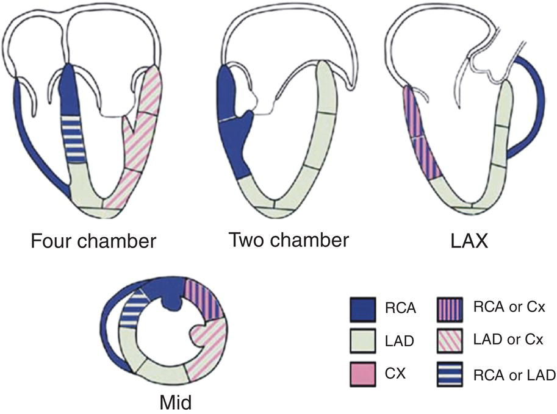

[**Figure 15.11**](#R_c15-fig-0011) _Myocardial blood supply and corresponding TEE views_. The typical distributions of the right (_RCA_), left anterior descending (_LAD_), and circumflex (_CX_) coronary arteries as assessed by TEE imaging is shown. The coronary arterial distribution varies among patients. Some segments have variable coronary perfusion.

(Source: Reeves et al. \[123\]. Reproduced with permission of Elsevier).

The _RV FAC_ is computed with a formula of area measurements like that for the LV FAC; these measurements are made by tracing the endocardial border of the RV during systole and diastole from the ME 4‐Ch view. The normal range of values for RV FAC is 35–60%; values of 25–35% indicate mild dysfunction, 18–24% moderate dysfunction, and _<_17% severe dysfunction.

_TAPSE_ is the distance of systolic excursion of the lateral tricuspid valve (TV) annulus in a longitudinal plane, often measured by using M‐mode. It is a surrogate measure of global RV function (normal: 16–30 mm in adults) that correlates with angiography, biplane MOD, and FAC. Unlike TTE, TEE does not easily achieve parallel alignment in the ME 4‐Ch view for this M‐mode assessment; as an alternative, the TG RV Inflow view (a cross section included in the adult but not pediatric and congenital comprehensive TEE guidelines) may offer better alignment.

#### Evaluation of diastolic function

Diastolic dysfunction plays a major role in cardiovascular disease and is a risk factor for adverse clinical outcomes in all patients, including pediatric and adult patients with CHD \[132\]. The literature and ASE guidelines extensively detail the echocardiographic assessment of diastolic function \[133–136\]. The evaluation of LV diastolic function uses transmitral inflow Doppler indices (E, A, deceleration time) and tissue Doppler diastolic mitral annular velocities (E′, A′) at the lateral mitral annulus \[137\]. Combining these values, along with other Doppler echocardiographic variables (e.g., pulmonary venous flows), can classify patterns of diastolic dysfunction and assess disease progression. In a similar way, evaluating RV diastolic function involves TDI of tricuspid annular velocities.

Unfortunately, evaluating diastolic function in pediatric patients is complicated by the many confounding variables that influence Doppler assessment and interpretation of findings \[138\]. Although reports exist of the perioperative evaluation of diastolic function in adult patients undergoing cardiac surgery \[137, 139–141\], concerns remain about applying values derived from TTE performed in awake patients to TEE performed on patients under general anesthesia \[142\]. To the best of our knowledge, no formal studies have extensively explored diastolic function with TEE in children or, specifically, in the CHD population.

### Hemodynamic evaluation

Echocardiography is an excellent noninvasive tool to obtain semiquantitative and quantitative hemodynamic information in CHD \[143\]. Doppler assesses blood flow and displays it as color superimposed over a 2D image (color Doppler) or as a spectral graph of velocity over time (spectral Doppler). Information obtained from Doppler can derive measures of pressure, volume, and flow \[144\].

Spectral Doppler measures the velocity of blood at a specific position, using a sample volume of _pulsed‐wave Doppler_ or along a sample line with _continuous‐wave Doppler_. Doppler measurements require adequate alignment of spectral Doppler sampling to the direction of blood flow to minimize underestimation. Tracing the spectral Doppler display yields values for peak and mean velocities and the area under the curve (i.e., the flow VTI). The display of Doppler waveforms at a sweep speed of 100–150 mm/s can help identify temporal changes in the velocity flow profile, particularly in children with fast heart rates.

The complete _Bernoulli equation_ is a complex formula that incorporates Doppler velocity measurements, flow acceleration, and viscous friction (blood viscosity) to estimate the _peak instantaneous pressure gradient_ (PG) across an orifice. In clinical practice, a simplified version of the Bernoulli equation is sufficient in most cases to estimate the PG from the measured peak velocity (_V_) as follows:

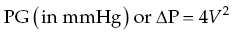

Good correlation exists between Doppler estimates of PGs and direct pressure measurements. Preoperative PG estimates obtained when patients are awake or lightly sedated may differ from those obtained in the operating room under general anesthesia and conditions that may influence ventricular loading and systolic function.

No echocardiographic technique measures intracardiac pressures directly. Instead, it is necessary to use Doppler velocity measurements of regurgitant jets or across structures and apply the modified Bernoulli equation 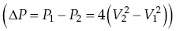 to determine the pressure drop or gradient. In most cases, _V_2 is much higher than _V_1, so one can usually neglect the _V_1 component of this equation. This technique is particularly valuable for estimating RV systolic pressure (RVSP), which should reflect the PA systolic pressure (PASP) in the absence of obstruction to RV outflow and which can be used to identify pulmonary hypertension. Estimating RVSP uses measurements of the peak velocity of the tricuspid regurgitant (_V_TR) jet along with an estimate of right atrial pressure (RAP) in the following equation:

Color Doppler facilitates the detection of abnormal flows and, along with other parameters, can assess disease severity ([Table 15.8](#c15-tbl-0008)). Measurements of the jet area, vena contracta, and the region of flow acceleration can be combined to grade the severity of regurgitant valvular lesions \[145–147\]. In the operative setting, however, most of this evaluation is qualitative.

_Shunt fractions_ can be calculated by measuring flow (Q) through the pulmonary (Qp) and systemic (Qs) circulations. Typically, measurement of flow is across the PV and AoV from the Doppler‐derived VTI and the CSA of each arterial root as:

TEE is a reliable monitor of LV filling (preload) changes in all age groups. In pediatric patients, experienced echocardiographers can identify with high sensitivity and specificity mild reductions in blood volume by changes in LVEDA by using TEE in the TG Mid Pap SAX view \[148\]. A marked decrease in both EDA and ESA suggests hypovolemia. Patients with conditions such as arterial vasodilatation, severe aortic regurgitation, mitral regurgitation, and VSD may have a reduced ESA but typically have a normal‐to‐increased EDA in this TEE view.

* * *

### KEY POINTS: TEE EXAMINATION IN CHD

-   TEE plays a critical role in CHD not only in characterizing the structural abnormalities but also in the functional and hemodynamic evaluation.
-   The TEE examination in CHD requires navigating different windows in the esophagus and stomach to obtain cross‐sectional images of structures in multiple planes.
-   The examination in children and all patients with CHD should include, in most cases, the 28 views suggested in the TEE guidelines addressing these patient populations and additional modified planes as necessary.
-   There is no specific recommended sequence for the TEE examination in the patient with CHD.
-   In addition to the interrogation in specific 2D views, the comprehensive examination in the patient with CHD requires the use of sweeps between various planes to allow a 3D reconstruction of the anatomy and related abnormalities by the examiner.
-   3D TEE provides more information about cardiac anatomy and spatial relationships than 2D TEE; however, the size of the current adult devices limits their use to older children.
-   Benefits of the real‐time 3D TEE technology include the ability to freely rotate a volume‐rendered 3D object in the display to be viewed from any orientation with the possibility for dissection to provide detailed information.

* * *

[**Table 15.8**](#R_c15-tbl-0008) Doppler parameters in severe valvular disease (Adult Values)

|  | Aortic | Mitral | Tricuspid | Pulmonic |
| --- | --- | --- | --- | --- |
| **Severe regurgitation** |
| CW Doppler signal strength | Dense | Dense | Dense | Dense |
| JA mapping (cm2) or JA/LVOT area (%)[\*](#c15-note-0011) | \>60 | \>10 | \>10 |  |
| JA/atrial area or JH/LVOT height (%)[\*\*](#c15-note-2011) | \>65 | \>40 |  | Large |
| Doppler flow reversal | Desc aorta | S pulmonary vein | S hepatic vein | PA |
| Regurgitant volume (ml) | ≥60 | ≥60 | ≥60 | ≥60 |
| Regurgitant fraction (%) | ≥50 | ≥50 | ≥50 | ≥50 |
| Vena contracta width (mm)[a](#c15-note-1011) | 6 | ≥7 | \>7 |  |
| Effective regurgitant orifice area (cm2) | ≥0.30 | ≥0.4 | ≥0.4 |  |
| PISA radius (mm)[b](#c15-note-0012) |  | \>10 | \>9 |  |
| PHT (ms) | _<_200–300 |  |  |  |
| **Severe stenosis** |
| Velocity (m/s) | \>4 | \>3 | \>1.5 | \>4 |
| Mean pressure gradient (mmHg) | \>40 | \>10 | \>5 | See note |
| Valve area (cm2) | _<_1 | _<_1 | _<_1 | _<_0.5 |
| PHT (ms) |  | \>220 | \>195 |  |

The severity of valve regurgitation or stenosis can be assessed by using different spectral and color Doppler modalities. Adult values for severe disease of different cardiac valves are shown. _Valvular regurgitation_: color Doppler can be used to map the area of a regurgitant jet, measure the vena contracta or narrowest region of the regurgitant jet (corresponds to the diameter of the regurgitant orifice area), and determine the PISA radius (based on the principle of a flow convergence zone corresponding to regurgitant flow). Spectral Doppler of the regurgitant jet signal strength by CW, systolic flow reversal in major vessels, and PHT (time needed for the peak transvalvular pressure gradient to fall to half its value) can be evaluated to assess severity. The regurgitant volume, fraction, and effective regurgitant orifice area can be calculated. _Valvular stenosis_: spectral Doppler allows assessment of velocity and pressure gradient, calculation of valve area, and measurement of PHT.

_CW_ continuous‐wave; _desc_ descending; _JA_ jet area; _JH_ jet height; _LVOT_ left ventricular outflow tract; _PA_ pulmonary artery; _PISA_ proximal iso‐velocity surface area; _PHT_ pressure half‐time. Note: For the pulmonic (pulmonary) valve, peak pressure gradient (mmHg) >64.

Nyquist limits:

[a](#R_c15-note-1011) 50–60 cm/s

[b](#R_c15-note-0012) 40 cm/s

[\*](#R_c15-note-0011) JA mapping (cm2) applies to the mitral and tricuspid valves and JA/LVOT area (%) to the aortic valve.

[\*\*](#R_c15-note-2011) JA/atrial area applies to the mitral valve and JH/LVOT height (%) to the aortic valve

### Applications of TEE in CHD

#### Intraoperative setting

The benefits of using TEE during surgery for CHD include monitoring, assessing the adequacy of cardiac de‐airing, detecting complications, and guiding the placement of intravascular or intracardiac catheters \[149–151\]. TEE also influences anesthetic management in CHD by guiding changes in inotropic strategy and volume replacement \[152, 153\].

Intraoperative TEE influences surgical management in 3–15% of cases; the results alter the preoperative diagnosis in 3–5% of cases and prompt a return to CPB in 3–7% \[153–155\]. A report on intraoperative TEE during congenital heart surgery in a wide range of patients (aged 2 days to 85 years) stated that using TEE resulted in major changes to treatment in 13.8% of the patients \[156\]. These changes were most frequent during reoperations, valve repairs, and complex outflow tract reconstructions.

A critical role of intraoperative TEE is assessing the adequacy of the surgical intervention and detecting residual abnormalities that may require immediate revision \[29, 157–163\]. This feature represents a major benefit of intraoperative TEE, as it can positively influence clinical patient outcomes. In return‐to‐CPB situations, factors such as the level of inotropic support, loading conditions of the ventricle, and myocardial function can influence the echocardiographic findings, potentially underestimating or overestimating the hemodynamic severity of the condition. Consequently, decisions regarding return to CPB should be interpreted in this context and in consideration of the overall risk‐to‐benefit ratio.

In a study of TEE in 230 patients, detecting and surgically revising residual abnormalities improved outcomes, whereas the patient’s course was suboptimal if the residual defect remained \[161\]. In addition to the patient benefits afforded by this imaging modality, routine TEE during congenital and pediatric heart surgery appears to be cost‐effective \[164, 165\]. The experience regarding the value of intraoperative TEE has been so compelling that, at many centers, it has become the standard of care.

#### Cardiac catheterization laboratory

During the past several decades, transcatheter‐based therapies and interventional procedures have become increasingly used in the nonsurgical management of congenital cardiovascular anomalies. Many of these approaches have extended from the cardiac catheterization laboratory to the operating room (and vice versa) as combined efforts of interventional cardiologists and cardiothoracic surgeons. TEE allows safer and more effective application of these interventions by decreasing radiation exposure, reducing the amount of contrast agents administered, and limiting the duration of the procedure \[166\]. As with intraoperative TEE, major benefits include acquisition of detailed anatomic and hemodynamic data before and during the procedure; real‐time evaluation of catheter and device placement across structures while assisting in procedural guidance; immediate assessment of the intervention; and monitoring for procedural complications. The high success rate and low incidence of complications with these procedures are a testament to the refinement of interventional techniques coupled with advances in TEE \[21\].

#### Intensive care unit

Echocardiography remains an important diagnostic tool in the ICU to manage postoperative cardiac surgical patients \[167\]. Bandages, chest tubes, mediastinal air, positive pressure ventilation, and even an open sternum frequently render TTE imaging challenging and, at times, infeasible. Thus, alternate imaging approaches such as TEE or, at times, epicardial imaging in patients with an open sternum may be the preferred imaging modality to address important clinical questions, particularly in ventilated patients \[48, 168\]. In the hemodynamically unstable patient in the ICU, TEE can help identify problems related to preload, myocardial function, afterload, and cardiac tamponade. In the absence of the classic clinical finding of tamponade, TEE can diagnose localized cardiac compression from a loculated collection or even “dry” tamponade. New findings related to outflow tract obstruction, significant native or prosthetic valve dysfunction, or regional wall motion abnormalities may prompt surgical reintervention. Additional applications of TEE in the ICU include investigating possible occult shunts, evaluating mechanical circulatory support devices, and facilitating support weaning.

* * *

### KEY POINTS: APPLICATIONS OF TEE IN CHD

-   For CHD patients, TEE is most likely to be used in the operating room, cardiac catheterization or electrophysiology laboratory, and critical care setting.
-   Preoperative TEE permits the baseline evaluation of anomalies, confirms preoperative diagnoses, identifies new or different pathology, excludes defects, and refines the surgical and anesthetic plans.
-   Major roles of postoperative TEE include assessing the adequacy of the intervention, guiding the revision of the repair if necessary, and identifying problems associated with weaning from CPB.
-   Several factors can influence the echocardiographic findings, potentially underestimating or overestimating the severity of the condition, which warrants their consideration in return‐to‐CPB decisions.
-   TEE facilitates procedures in the catheterization or electrophysiology laboratory, may enhance their safety, and limits the duration of the intervention.
-   In the ICU, TEE can address important clinical questions when other imaging modalities cannot be used or cannot provide the required information; in the hemodynamically unstable patient, TEE can help identify the cause of the instability.

* * *

### TEE safety and complications

Although complications related to transesophageal instrumentation occur at a rate of 1–3%, extensive clinical experience indicates that serious TEE complications are rare \[169–172\]. Probe manipulation can affect hemodynamic and respiratory parameters; this requires attentiveness, particularly in small infants \[173, 174\]. Aortic compression can influence blood pressure readings, depending on the location of the arterial monitoring line.

In the patient with an aberrant origin of a subclavian artery with a retroesophageal course, the arterial pressure monitoring line should be placed in an extremity not supplied by the anomalous vessel, as the pressure tracing may be lost with insertion or manipulation of the TEE probe. This occurs because the probe compresses the vessel as it courses behind the esophagus. In fact, placing a TEE probe occasionally detects this vascular anomaly \[175, 176\]. TEE is of little benefit in the surgical management of isolated vascular malformations, such as vascular rings, and it may in fact be risky, as probe insertion can significantly compromise respiratory function \[177\]. In infants with anomalous pulmonary venous connections, compression of a posteriorly located pulmonary venous confluence by the TEE probe can cause detrimental hemodynamic effects ([Figure 15.12](#c15-fig-0012)) \[54\]. In such patients, inserting the TEE probe after sternotomy may be safer \[178\].

Respiratory compromise can result from displacement of the ETT or accidental extubation. Capnography can help identify these complications. If desaturation occurs acutely, the position of the TEE probe tip should be immediately adjusted to neutral, and the position of the ETT should be checked. During removal of the TEE probe, holding the ETT firmly prevents inadvertent extubation. Airway compression during manipulation of the imaging probe can also result in ventilatory difficulties.

TEE can cause dysphagia, resulting from mild mucosal injury detectable by flexible esophagoscopy in some patients \[179–181\]. Unrecognized esophageal perforation during intraoperative TEE has been reported in a small infant \[182\]. Inadvertent laceration of the stomach has been described from the surgical incision extending into the xyphoid region, while the abdominal wall protruded anteriorly during TG imaging \[169\]. These cases underscore the need to exercise meticulous care during the insertion and manipulation of TEE probes, particularly in the critically ill neonate.

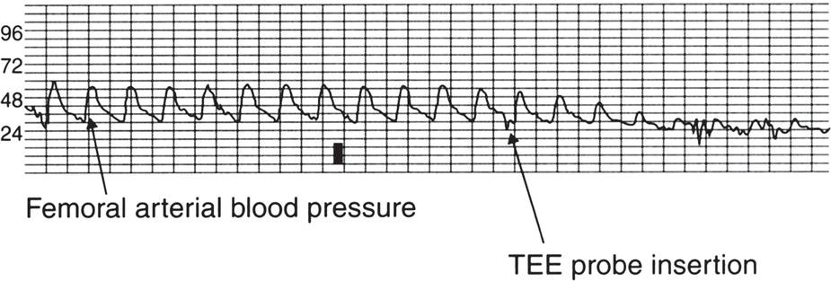

[**Figure 15.12**](#R_c15-fig-0012) _Hemodynamic changes related to TEE probe_. The figure displays an acute decrease in systemic arterial blood pressure, as recorded from a femoral arterial line, related to TEE probe insertion in a neonate with total anomalous pulmonary venous return. The hypotension was likely the result of probe compression of the pulmonary venous confluence.

Endocarditis has been temporally related to TEE examination. However, the incidence of positive bacterial blood cultures immediately after TEE is extremely low and within the expected rate of false‐positive results. The American Heart Association guidelines do not recommend administering antibiotics solely to prevent endocarditis in patients who undergo gastrointestinal tract procedures, which would include TEE \[183\].

* * *

### KEY POINTS: TEE SAFETY AND COMPLICATIONS

-   Serious complications related to TEE have been reported, but these are fortunately rare.
-   Infants are at elevated risk of TEE complications, including respiratory and hemodynamic compromise.
-   Anomalies such as vascular rings and anomalous pulmonary venous drainage may preclude TEE imaging.
-   When TEE imaging is planned, the ETT should be well secured to prevent dislodgement or inadvertent tracheal extubation.
-   A low threshold to adjust the TEE probe position, pause or discontinue imaging, or remove the device is warranted in cases of acute arterial desaturation or potentially adverse hemodynamic changes.

* * *

## Evaluation of selected congenital heart defects before and after intervention

In the perioperative setting, echocardiographic assessment during the pre‐CPB period confirms the presence of the operative lesion(s), documents associated findings, and assesses cardiac function. Post‐CPB evaluation focuses on determining the adequacy of the repair, mainly by identifying residual intracardiac shunts, outflow tract obstructions, and valvular regurgitation and by assessing ventricular performance \[159, 161, 184\]. Numerous educational resources provide comprehensive reviews on TEE imaging and hemodynamic assessment in CHD \[28, 80, 184–186\]. The following sections present an overview of pertinent TEE findings in selected anomalies and a summary of relevant aspects of the pre‐ and post‐CPB examination ([Table 15.9](#c15-tbl-0009)). The reader should refer to other chapters throughout this textbook that address in further detail each of the highlighted congenital lesions which follow.

[**Table 15.9**](#R_c15-tbl-0009) Transesophageal echocardiography examination (TEE) in selected congenital heart defects

|  | Pre–cardiopulmonary bypass TEE | Post–cardiopulmonary bypass TEE |
| --- | --- | --- |
| **Aortic stenosis** | 
-   Define aortic valve anatomy
-   Evaluate location (subvalvular, valvular, supravalvular) and severity of the obstruction
-   Characterize the pathology
-   Evaluate for aortic regurgitation
-   Determine presence of LV hypertrophy and assess function | -   Assess for residual outflow obstruction
-   Evaluate for aortic regurgitation
-   Examine for the presence of new VSD
-   Examine for mitral regurgitation
-   Assess ventricular function
-   Evaluate prosthetic valve function (if applicable)
-   After a Ross procedure, assess autograft and RV‐to‐PA conduit

 |
| **Atrial septal defect (ASD)** | 

-   Define location and size of defect
-   Examine defect rims for catheter‐based interventions
-   Assess AVV regurgitation
-   Determine RA and RV sizes
-   Assess baseline ventricular function
-   Estimate RVSP (PASP) from TR jet velocity
-   Identify associated anomalies
    -   MV prolapse
    -   Cleft AVV
    -   Partial anomalous venous drainage

 | _After repair of all ASDs_:

-   Assess for residual shunting
-   Evaluate ventricular function

  
_After repair of secundum and primum defect:_

-   Examine for AVV regurgitation

  
_After repair of sinus venosus defect:_

-   Evaluate for SVC obstruction
-   Assess for pulmonary venous obstruction (if associated anomalous pulmonary venous return)

 |
| **Atrioventricular septal defect (AVSD)** | 

-   Define location, size, and type of defects
-   Characterize shunting across defects
-   Evaluate for additional septal defects
-   Assess AVVs
    -   Rastelli type in complete defect
    -   AVV regurgitation
    -   Relation of valvular structures to ventricles
    -   Balanced vs. dominant type
    -   Valvular support apparatus
-   Interrogate ventricular outflows (obstruction)
-   Assess baseline ventricular function
-   Estimate RVSP/PASP

 | _After repair of all AVSDs:_

-   Assess for residual shunts
-   Evaluate for LVOT obstruction
-   Evaluate ventricular function

  
_After repair of partial AVSD/cleft MV closure:_

-   Evaluate for residual or new AVV regurgitation (mild regurgitation may be acceptable)
-   Examine for mitral inflow obstruction (if mitral cleft closed)

  
_After repair of complete AVSD:_

-   Examine for AVV stenosis (particularly if annuloplasty or left‐sided cleft closure performed) and regurgitation

 |
| **Congenitally corrected transposition (L‐TGA)** | 

-   Confirm anatomy
-   Confirm AV and ventriculoarterial relationships
-   Evaluate AVV function
-   Assess ventricular sizes and function | -   Assess for AVV regurgitation
-   Examine outflow tracts for patency/obstruction
-   Determine adequacy of the intervention (PA banding, classic repair, or double switch operation)
-   Assess ventricular function

 |
| **Double‐outlet right ventricle** | 

-   Evaluate septal defects (size, location, shunt direction)
-   Assess relation of VSD to great arteries
-   Assess physiology from anatomic findings (i.e., VSD, transposition or Taussig‐Bing, tetralogy type)
-   Determine great artery relationship (normal, malposed)
-   Evaluate for outflow tract obstruction
-   Evaluate ventricular sizes and function
-   Evaluate associated defects | -   Evaluate for residual intracardiac shunts
-   Assess for outflow tract obstruction
-   Examine AVVs and semilunar valves for regurgitation/stenosis
-   Depending on the procedure interrogate LV‐to‐Ao baffle and RV‐to‐PA conduit function as applicable
-   Assess ventricular function

 |
| **Pulmonary stenosis** | 

-   Define pulmonary valve anatomy
-   Evaluate location (subvalvular, valvular, supravalvular) and severity of the obstruction
-   Characterize the nature of the pathology
-   Determine size of the PAs
-   Evaluate for intracardiac shunts
-   Evaluate for RV hypertrophy and function | -   Examine for residual outflow obstruction
-   Assess for pulmonary regurgitation
-   Investigate for new VSD
-   Examine for TR
-   Assess ventricular function
-   Assess conduit or prosthetic valve function as applicable

 |
| **Tetralogy of Fallot** | 

-   Define size and location of septal defects
-   Examine for additional VSDs or associated anomalies
-   Evaluate RVOT (subvalvular, valvular, supravalvular regions)  
    Define morphology, obstruction, gradients
    -   Determine size of pulmonary arteries
-   Assess Ao override/ root size, AoV competence
-   Identify origin and course of coronary arteries
-   Evaluate baseline ventricular function | -   Evaluate for residual VSD
-   Assess RVOT velocity/gradient
-   If there is residual obstruction, define type (fixed vs. dynamic) and severity
-   Evaluate for pulmonary regurgitation
-   Estimate RVSP (from TR jet)
-   Evaluate RV and LV function
-   Examine conduit or prosthetic valve function in pulmonary position

 |
| **Transposition of great arteries (D‐TGA)** | 

-   Confirm anatomy and ventriculoarterial relationships
-   Assess intracardiac shunts (location, size, flow direction, relation to outflows)
-   Assess for outflow tract obstruction
-   Evaluate AVVs and semilunar valves
-   Identify origin and course of the coronary arteries
-   Assess ventricular sizes and function
-   Assess septal geometry (indicator of ventricular pressures)

 | _After the arterial switch operation (Jatene procedure):_

-   Interrogate the neoaortic and pulmonary anastomoses (for stenosis)
-   Evaluate for semilunar valve competence
-   Assess patency of outflow tracts
-   Assess for AVV regurgitation
-   Evaluate for residual intracardiac shunts
-   Examine coronary blood flow
-   Assess global and segmental LV function

 |
| **Truncus arteriosus** | 

-   Assess the truncal valve (for morphology, stenosis, and regurgitation)
-   Identify septal defects (size, location)
-   Determine the origin of the pulmonary arteries
    -   Type of truncus
    -   Pulmonary blood flow
-   Assess ventricular function | -   Examine the truncal (aortic valve) for stenosis and regurgitation
-   Evaluate the RV‐to‐PA conduit (for stenosis or regurgitation)
-   Evaluate for residual VSD shunting
-   Assess for AVV regurgitation
-   Estimate RVSP (PASP) from TR jet
-   Assess ventricular function, including segmental wall motion (coronary arteries)

 |
| **Single ventricle** | 

-   Evaluate morphologic type
-   Assess AVVs and semilunar valves, inflows, and outflows
-   Assess adequacy of the interatrial communication
-   Evaluate prior surgical interventions
-   Assess ventricular function

 | _After Fontan or Glenn procedure:_

-   Flow in Fontan or Glenn connections
-   Evaluate Fontan fenestration, if performed
-   AVV regurgitation
-   Atrial septal shunting for evidence of obstruction (if stenosis or atresia of AVV)
-   Assess ventricular function

 |
| **Ventricular septal defect (VSD)** | 

-   Determine location and size of defect(s)
-   Evaluate for additional intracardiac shunts
-   Investigate for associated pathology:
    -   AVV regurgitation
    -   Aortic valve cusp herniation or prolapse
    -   Aortic regurgitation
    -   Subaortic membrane
    -   Pulmonary valve stenosis
    -   Double‐chamber RV
-   Assess baseline ventricular function
-   Estimate RVSP (PASP) from TR jet or VSD peak velocity

 | _After repair of all VSDs:_

-   Evaluate for residual shunting (tiny patch leaks are acceptable)
-   Estimate RVSP from TR jet
-   Assess ventricular function

  
_After repair of perimembranous defect:_

-   Evaluate for AVV regurgitation (TR in particular)
-   Assess for aortic regurgitation

  
_After repair of supracristal (subarterial, doubly committed) defect:_

-   Evaluate for new aortic regurgitation
-   Evaluate for pulmonary regurgitation

  
_After repair of muscular or inlet defect:_

-   Evaluate for AVV regurgitation

 |

_Abbreviations_: _Ao_ aorta; _AoV_ aortic valve; _AV_ atrioventricular; _AVV_ atrioventricular valve; _LV_ left ventricle; _LVOT_ left ventricular outflow tract; _MV_ mitral valve; _PA_ pulmonary artery; _PASP_ pulmonary artery systolic pressure; _RA_ right atrium; _RV_ right ventricle; _RVOT_ right ventricular outflow tract; _RVSP_ right ventricular systolic pressure; _SVC_ superior vena cava; _TR_ tricuspid regurgitation

### Atrial septal defects

#### Anatomic and physiologic features

Interatrial communications allow blood to flow between the atria. By definition, a true ASD is a gap in the IAS tissue that permits shunting of blood between the atrial chambers. Other types of atrial communication do not necessarily result from a deficiency of IAS tissue. Typically, ASDs are classified into four types, although not all represent a “true” ASD. The defect location defines each type, which may be associated with other cardiac anomalies.

An _ostium secundum defect_ (80% of ASDs) is a tissue defect that arises at or near the center of the IAS in the region of the fossa ovalis (septum primum). The defect usually has a complete surrounding rim of septal tissue, although portions of the tissue rim(s) are deficient in some cases. A secundum ASD can coexist with other congenital heart lesions and, in 30% of cases, with MV prolapse. An _ostium primum defect_ (15% of ASDs) is a tissue defect in the inferior aspect of the IAS near the AV valves and is part of the spectrum of atrioventricular septal defects (AVSDs). The _sinus venosus defect_ (5% of ASDs) is a tissue deficiency in the sinus venosus septum that occurs near the caval veins (superior vena cava and inferior vena cava \[IVC\] types). Sinus venosus defects are associated with partial anomalous pulmonary venous connection (PAPVC) or drainage. A _coronary sinus defect_ is a rare atrial communication that frequently includes the coronary sinus orifice. This defect is a deficiency in the common wall that separates the coronary sinus from the LA. Left‐to‐right shunting occurs most commonly from the LA to the right atrium (RA) through the partially or completely unroofed coronary sinus, but the direction of shunting may be variable as influenced by atrial hemodynamics. These defects are frequently associated with persistent drainage of a left‐sided SVC (LSVC) into the coronary sinus. A _PFO_ represents a flap that arises from failure of the septum primum to adhere to the limbus of the septum secundum. There is no deficiency in septal tissue, though this interatrial communication can cause shunting under certain conditions.

The clinical manifestations of an ASD primarily relate to the magnitude of atrial‐level shunting, which depends on the defect size, ventricular compliances, and PA pressures. An ASD, particularly a small defect, may represent an incidental finding on echocardiography. A large defect causes pulmonary overcirculation that results in symptoms of right‐sided volume overload. Over time, atrial arrhythmias and heart failure can develop. Although older patients can have evidence of elevated PASP, they rarely have severe pulmonary hypertension.

#### Highlights of the TEE examination

Multiple ME views are necessary to completely assess the relatively thin IAS \[187\]. The perpendicular alignment of the imaging plane in the ME Bicaval view most reliably images the IAS. In the ME 4‐Ch view, the imaging plane is parallel to the IAS; hence, a false “absence of tissue” may occur from dropout. Other helpful views include the DTG Atr Sept view. Measuring the gap in the septal tissue determines the size of the atrial communication. Communications at the atrial level as displayed by TEE appear in [Figure 15.13](#c15-fig-0013).

Color and spectral Doppler interrogation can easily detect abnormal blood flow across the IAS. Left‐to‐right shunting is usual in an isolated ASD, but it may be right‐to‐left or bidirectional in patients with certain conditions (e.g., pulmonary hypertension) or coexistent defects. The peak velocity across the defect is inversely proportional to the defect’s size, with a larger defect having lower velocity laminar flow. If there is a tricuspid regurgitation (TR) jet, it can estimate the PASP, as previously discussed.

TEE with saline contrast is the most sensitive method to detect interatrial shunts that are not evident by 2D or Doppler techniques. A contrast study involves vigorously agitating saline (3–10 mL) with _<_1 mL of air and injecting it rapidly into a central or arm vein. A better alternative may be aspirating the patient's blood and mixing it with saline or albumin. A negative study reveals no flow of bubbles across the IAS. A positive study indicates right‐to‐left shunting, with microbubbles present in the LA within five heartbeats of injection. A false‐positive study can result from pulmonary arteriovenous malformations. Additionally, the appearance of noncontrasted blood in the contrast‐filled RA can help identify left‐to‐right shunting. Saline contrast improves PFO detection, both at rest and with raised RAP \[188\]. A Valsalva maneuver can enhance the recognition of a small or intermittent right‐to‐left interatrial shunt. In the intubated patient, sustained lung inflation to a positive inspiratory pressure of about 25 mmHg for approximately 10 seconds can simulate a Valsalva maneuver.

The _preoperative TEE_ examination for an ASD should confirm the location of the defect, its size, and the direction of the shunt. Guided by the specific type of defect, the TEE study should evaluate for existing or potential MV prolapse (secundum defect), cleft MV (primum defect), PAPVC (sinus venosus defect), and LSVC‐to‐coronary sinus connection (coronary sinus defect). Additional aspects of the TEE study in all defects include evaluating AV valve competence, associated anomalies, and ventricular function. Atrial communications with significant left‐to‐right shunting can cause right atrial and RV enlargement and diastolic flattening with paradoxical motion of the interventricular septum (IVS). The _postsurgical TEE_ examination should evaluate the IAS for residual shunting, valvular competence, ventricular function, and flow across the systemic and pulmonary veins, depending on the defect and the type of intervention undertaken.

Transcatheter closure with an occluding device may be an option for selected secundum defects \[19\]. TEE assists in patient selection, procedural guidance, and immediate assessment of success and complications. Essential components of the TEE examination that contribute importantly to decision‐making include determining the size and location of the defect, characterizing the orifice (single vs. multiple), evaluating the dimensions and adequacy of septal rims, and assessing the relationship of the defect to surrounding structures \[189–193\]. Advocates suggest routinely using 3D TEE during transcatheter closure when the patient’s size allows it.

_Postdeployment TEE_ assesses the device (integrity, position, and stability) and possible residual shunt, and identifies complications ([Figure 15.14](#c15-fig-0014)) \[19, 194\]. Placing a device can affect surrounding structures, resulting in compromised inflow from the caval veins, coronary sinus, or pulmonary veins; interference with valve function; and pericardial effusion.

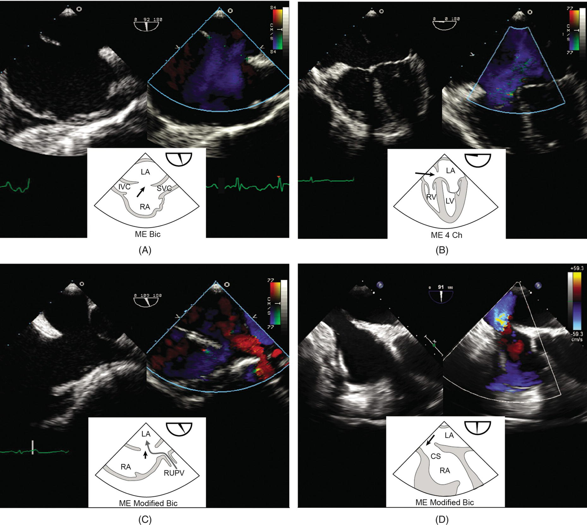

[**Figure 15.13**](#R_c15-fig-0013) _Atrial septal defects (ASDs)_. (A) _Secundum ASD_. ME Bic view depicts a centrally located septal deficiency in this defect within the region of the fossa ovalis (_arrow_) and adjacent interatrial septal (IAS) rims. Comprehensive septal rim assessment requires multiple views. (B) _Ostium primum ASD_. ME 4‐Ch view shows the inferior communication in the IAS in this defect (_arrow_). Note insertion of both atrioventricular valves (AVVs) into the interventricular septum at the same level. A cleft or commissure in the anterior mitral valve leaflet, also referred to as zone of apposition of the left AVV, is best seen in the TG Basal SAX view. The assessment of mitral regurgitation can be performed in the ME 4‐Ch, ME 2‐Ch, ME Mitral Comm, and ME LAX views. Mitral valve chordal attachments to the interventricular septum, when present, can be defined in the ME 5‐Ch, ME LAX, TG LAX, and DTG 5‐Ch views and assessed for related left ventricular (_LV_) outflow tract obstruction.

(Source: Vegas \[112\]. Reproduced with permission of Springer Nature.)

(C) _Sinus venosus ASD_. The ME Bic or modified views with slight probe withdrawal optimally images the superior type of defect (_small arrow_) and the superior vena cava (_SVC_) as it drains into the right atrium (_RA_). Anomalous drainage of the right upper pulmonary vein (_RUPV_) in the SVC‐type defect (_long arrow_) results from unroofing of the wall that separates the RUPV from the left atrium (_LA_) as shown by color Doppler of pulmonary venous flow. Advancing the probe to the TG IVC/Hep Veins view in an inferior defect displays the atrial communication and region where the inferior vena cava (_IVC_) joins the RA. (D) _Coronary sinus ASD_. The examination of the coronary sinus (_CS_) is optimal in views that display this structure in both its long and short axes. A dilated CS is best imaged by probe retroflexion in the ME 4‐Ch view or slight advancement towards the lower esophagus. Unroofing of the CS in this defect is demonstrated by echo dropout in the wall that separates the LA from the CS in the ME (4‐Ch, 2‐Ch, MV Comm, and LAX) views. Probe angulation between 90° and 120° assisted by color‐flow Doppler in a modified ME Bic view depicts the defect and flow from the CS into the RA in the inferior portion of the atrium (_arrow_) as shown. A persistent left SVC, if present, appears in the ME MV Comm view as a wedge‐shaped echo‐free space between the left upper pulmonary vein and left atrial appendage or at the level of the AV junction in the ME 4‐Ch and ME 2‐Ch views. _RV_ right ventricle.

Diagrams courtesy of Ms. Willa Bradshaw.

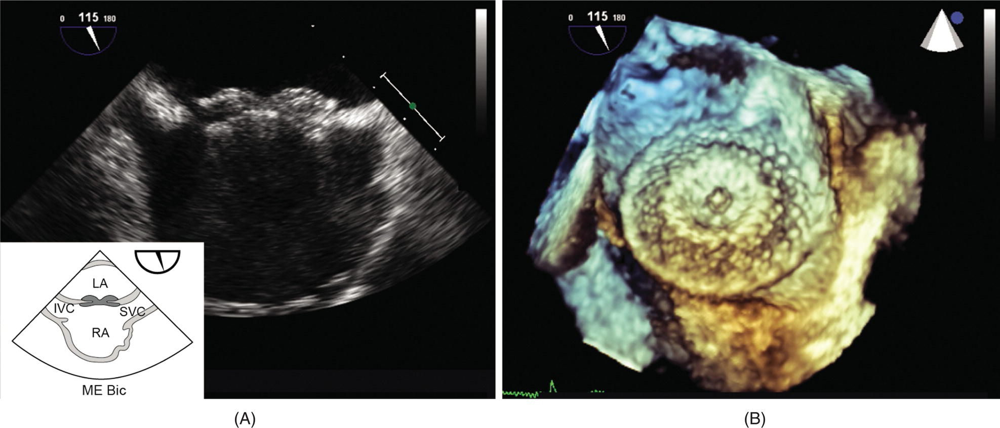

[**Figure 15.14**](#R_c15-fig-0014) _Device occlusion of secundum atrial septal defect (ASD)_. (A) ME Bic view depicts an Amplatzer™ ASD occluder device well positioned across the interatrial septum. (B) 3D TEE view from the right atrium (_RA_) depicts the details of the device in an _en face_ perspective. _IVC_ inferior vena cava; _LA_ left atrium; _SVC_ superior vena cava.

(Source: Vegas et al. \[41\]. Reproduced with permission of Springer Nature.) Diagram courtesy of Ms. Willa Bradshaw.

### Ventricular septal defects

#### Anatomic and physiologic features

The ventricular septum is a complex 3D structure formed by morphologically distinct subunits that can have tissue deficiencies that result in defects. The categorization of VSDs has been the subject of ongoing debate \[195\]. In this chapter, we use the classification scheme based on the location of the defect within the ventricular septum as follows: membranous, muscular, inlet, or subarterial. _A perimembranous defect_ (70% of VSDs), also referred to as membranous, paramembranous, conoventricular, or infracristal, involves the thin membranous portion of the IVS adjacent to the TV and AoV. _A muscular defect_ (20% of VSDs) can occur anywhere in the trabecular septum (mid, apical, anterior, and posterior regions) and is bound entirely by muscle. Single or multiple defects can be present. An _inlet defect_ (5% of VSDs), also referred to as the “canal type of defect,” results from incomplete formation of the central fibrous body or AV canal septum (see AVSD below). This communication is located at the crux of the heart, adjacent to the MV and TV annuli. An _outlet defect_ (5% of VSDs), also described as infundibular, conal, subpulmonary, supracristal, doubly committed, or subarterial, occurs in the muscular portion of the septum that separates the outflow tracts. The various types of VSDs frequently overlap, as they can extend from one primary region to another. Associated lesions are identified in some cases, including patent ductus arteriosus (PDA; 6%) and coarctation of the Ao (CoA; 5–10%).

#### Highlights of the TEE examination

Systematically interrogating the entire IVS requires multiple TEE views \[196\]. The use of 2D imaging can identify each type of VSD ([Figure 15.15](#c15-fig-0015)), although small defects may require superimposed color Doppler to define their location and optimize spectral Doppler alignment. Contrast injection can be helpful to detect a defect that may be otherwise difficult to identify. In isolated defects, spectral Doppler interrogation shows systolic left‐to‐right shunting across the ventricular septum, with a peak jet velocity inversely proportional to defect size. Turbulent color Doppler flow characterizes a small restrictive VSD, with a high peak velocity consistent with a ventricular gradient. A large, unrestrictive VSD equalizes pressures between the ventricles and elevates PASP. A significant left‐to‐right shunt causes left‐sided volume overload, dilatating the LA and LV. _Eisenmenger syndrome_, rarely seen today, results from unrestricted interventricular shunting that alters the pulmonary vasculature and thereby increases arteriolar resistance and reverses the shunt direction from left‐to‐right to right‐to‐left. The peak velocities of the TR or VSD jets can provide an estimate of RVSP (or PASP).

The _preoperative TEE_ examination should, in all cases, confirm the location, size, and number of defects; assess the chamber and PA sizes; and evaluate ventricular function \[196\]. Spectral Doppler interrogation can determine shunt direction and magnitude and the degree of pressure restriction and provide an estimate of PA pressures. The examination should also assess for associated cardiac anomalies, valvular competence, and outflow tract obstruction. The _post‐CPB TEE_ study focuses on evaluating residual shunting, PASP, and ventricular function \[197\]. One should note that a large proportion of residual VSD shunts are trivial and resolve spontaneously \[198\]. The type of VSD suggests the need for further evaluation for associated pathology, such as outflow tract obstruction, valvular regurgitation, and the adequacy of the intervention for concomitant lesions. TEE is also helpful for monitoring, guiding, and documenting the appropriate position of transcatheter muscular VSD occluder devices in the cardiac catheterization laboratory and during periventricular interventions ([Figure 15.16](#c15-fig-0016)). In fact, a recent report describes the exclusive use of TEE without fluoroscopy during transcatheter occlusion procedures \[200\].

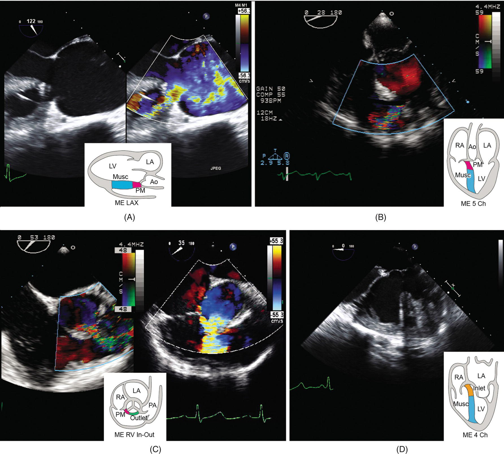

[**Figure 15.15**](#R_c15-fig-0015) _Ventricular septal defects (VSDs)_. (A) _Perimembranous_ (_PM_) _VSD_. The defect appears in cross sections that display the tricuspid valve (TV) and/or aortic valve (AoV) at the level of the midesophagus, such as ME 5‐Ch, ME AoV LAX (shown), ME LAX, and right ME RV In‐Out views. Associated TV abnormalities may be present (aneurysmal septal tissue partially occluding the VSD), AoV cusp prolapse, or subaortic stenosis requiring additional views for evaluation. (B) _Muscular_ (_Musc_) _VSD_. The examination for this defect uses sweeps of the entire ventricular septum to identify deficiencies surrounded exclusively by muscle rims. The ME 4‐Ch (shown), ME LAX, and the TG/DTG views best display this communication. Color Doppler may be necessary to demonstrate small serpiginous or, on occasion, multiple adjacent muscular defects (“Swiss cheese septum”). (C) _Outlet VSD_. The ME RV In‐Out view is particularly helpful in determining the type of VSD, as a septal deficiency close to the pulmonary valve indicates an outlet VSD (_left panel_), in contrast to a PM defect located near the TV valve (_right panel_). An outlet VSD may potentially result in AoV cusp prolapse (usually of the right coronary cusp) with associated regurgitation. This is optimally examined in the ME AoV LAX view by 2D imaging and color‐flow mapping.

(Source: Vegas \[112\]. Reproduced with permission of Springer.)

(D) _Inlet VSD_. The identification of this defect in the superior aspect of the muscular septum is optimal in a ME 4‐Ch view that shows the region where the atrioventricular valves would normally join the interventricular septum (crux of the heart) as shown. Inlet defects are located more superiorly in the muscular septum than posterior muscular VSDs. _Ao_ aorta; _LA_ left atrium; _LV_ left ventricle; _PA_ pulmonary artery; _RA_ right atrium.

(Source: Diagrams courtesy of Ms. Willa Bradshaw.)

### Atrioventricular septal defects

#### Anatomic and physiologic features

The characteristics of AVSDs, also referred to as _common AV canal_ or _endocardial cushion_ defects, relate to deficiencies of the AV septum and abnormalities of the AV valves. Although a well‐known classification scheme recognizes only two categories of AVSDs, i.e., the complete and partial forms \[201\], the description of additional forms may lead to confusing nomenclature \[202\]. The various categories are as follows:

-   _Complete defect_, characterized by a single valve annulus, common AV valve with usually five leaflets, and contiguous communications at the atrial (primum ASD) and ventricular (inlet VSD) levels
-   _Intermediate defect_, described as having a primum ASD, large nonrestrictive VSD, and common AV valve annulus separated by a “tongue” of tissue into two valvular orifices
    
    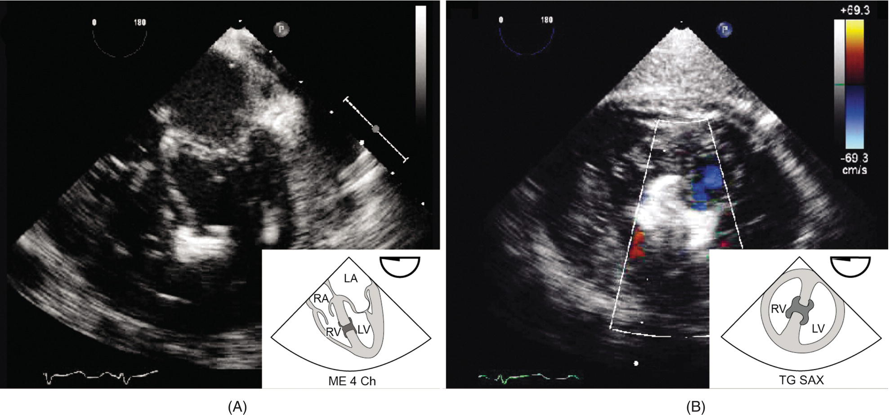
    
    [**Figure 15.16**](#R_c15-fig-0016) _Device occlusion of muscular ventricular septal defect (VSD)_. (A) ME 4‐Ch image depicts the appearance of a muscular VSD occluder device in the mid septum. (B) TG Mid Pap SAX complementary image demonstrates the position of the occluder device. _LA_ left atrium; _LV_ left ventricle; _RA_ right atrium; _RV_ right ventricle.
    
    (Source Motta and Miller‐Hance \[199\]. Reproduced with permission of Wolters Kluwer Health, Inc.). Diagrams courtesy of Ms. Willa Bradshaw.
    
-   _Partial defect_, consisting of a primum ASD and cleft in the left AV valve (MV). An alternative term for the cleft is the “zone of apposition.”
-   _Transitional defect_, having in addition to a primum ASD a small inlet VSD due mostly to obliteration by right‐sided or TV valve chordal attachments to the ventricular septum

Complete defects are usually associated with significant intracardiac shunting, resulting in pulmonary overcirculation and left‐sided volume overload. Intermediate defects physiologically resemble the complete form of the defect. Partial and transitional defects essentially behave as an ASD. Associated defects in the patient with an AVSD may include tetralogy of Fallot (TOF), double‐outlet RV (DORV), and total anomalous pulmonary venous drainage or pulmonary atresia in more complex, heterotaxy‐type defects.

#### Highlights of the TEE examination

The ME 4‐Ch view best shows these types of defects ([Figure 15.17](#c15-fig-0017)). The comprehensive _pre‐CPB TEE_ assessment of these anomalies uses multiple planes of interrogation and a combination of all Doppler modalities for a detailed evaluation \[203, 204\]. Initial experience has shown real‐time 3D TEE to be extremely helpful in revealing the anatomic features of AVSDs \[92\]. The _post‐CPB TEE_ examination should evaluate for residual intracardiac shunts, AV valve dysfunction (regurgitation or stenosis), subaortic obstruction, PASP elevation, and ventricular function.

### LV outflow obstruction

#### Anatomic and physiologic features

Obstruction along the LV outflow tract (LVOT) can occur at the subvalvular, valvular, or supravalvular levels, or it can be more distally situated (as in CoA or aortic arch interruption). _Subvalvular aortic stenosis_ arises from a discrete membrane, fibromuscular ring, or muscular tunnel obstruction, with associated lesions such as CoA and MV abnormalities. Shone complex consists of a subaortic membrane, bicuspid AoV (BAV), supravalvular mitral ring, and CoA. _Valvular aortic stenosis_ can arise in association with a BAV from valve thickening or progressive calcification. Coexisting lesions can include PDA, CoA, and other left‐sided obstructive pathology. BAV is associated with the potential for valvular regurgitation or aortic root dilatation from an ascending aortopathy. _Supravalvular aortic stenosis_ involves narrowing of the ascending Ao at the sinotubular junction, a pathology most commonly afflicting children with Williams syndrome. An obstructive arteriopathy can affect various regions of the Ao, aortic arch vessels, and even the coronary arteries in some cases. The physiological repercussions of any form of LVOT obstruction relate to impedance of LV ejection, resulting in elevation of systolic pressure, a gradient between the proximal and distal regions across the obstruction, increased myocardial force, and LV wall stress.

#### Highlights of the TEE examination

2D and real‐time 3D TEE can adequately characterize anatomy and identify pathology in the outflow tract, AoV, and aortic root \[205–209\]. Alternate imaging modalities such as CMR or CT may be needed to define the anatomy of the Ao and its branches more precisely in selected cases. Regardless of the specific cause of the obstruction, the TEE examination should include assessment of AoV morphology and function, aortic annulus and root size, and the LV to determine its size, wall thickness, and function ([Figure 15.18](#c15-fig-0018)). Depending on the type of obstructive pathology, details of relevance in the TEE examination include the presence and severity of associated aortic annular or root hypoplasia, aortic root dilation (poststenotic or otherwise), and other coexisting lesions. Cross sections in the mid‐ and upper esophagus facilitate the examination of the mid‐ascending Ao (ME Asc Ao LAX) and aortic arch (UE Ao Arch LAX and SAX views). Transgastric (TG LAX) and DTG (DTG 5‐Ch) imaging is extremely useful in assessing outflow tract gradients as these windows allow Doppler interrogation parallel to the direction of flow.

[**Figure 15.17**](#R_c15-fig-0017) _Atrioventricular septal defect (AVSD)_. (A) _Septal defects_. ME 4‐Ch views depict a primum atrial septal defect and an inlet ventricular septal defect in an AVSD (_arrows_). Additional aspects of the evaluation should include determination of shunt flow by color Doppler, morphology and function of valvular structures, and ventricular size and function. (B) _Subaortic stenosis_. Left ventricular (_LV_) outflow tract obstruction may be caused by atrioventricular valve (AVV) attachments to the interventricular septum or elongation of the outflow related to LV inlet–outlet disproportion. This is best displayed in the ME 5‐Ch, ME LAX (shown), TG LAX, and DTG 5‐Ch views. (C) _Left AVV cleft_. An _en face_ view clearly displays a cleft in the left AVV by 3D TEE imaging. Superimposed color Doppler permits characterization of associated regurgitant jets. (D) _Post–cardiopulmonary bypass examination_. The postrepair evaluation focuses on the assessment of AVV function to exclude significant regurgitation or stenosis and the presence of residual intracardiac shunts. A ME 4‐Ch image depicts a tiny LV to right atrial (_RA_) shunt and a trivial amount of regurgitation at the septal aspect of the left AVV (base of the cleft). _Ao_ aorta; _LA_ left atrium; _RV_ right ventricle.

Diagrams courtesy of Ms. Willa Bradshaw.

The interventions for LVOT pathology involve a variety of approaches that aim to alleviate the obstruction. The specific intervention, operation, or catheter‐based procedure dictates how the TEE examination is performed, but it often consists of determining the residual severity of any outflow obstruction and evaluating AoV competency \[161\]. After a subaortic resection, it is important to exclude the presence of an iatrogenic VSD or damage to the MV. In the case of autologous PV replacement of a diseased AoV (Ross procedure), relevant aspects of the examination include assessing graft function (autograft and PV allograft) and analyzing segmental wall motion to identify complications related to coronary reimplantation. A similar approach is warranted for Ao root replacement. Evaluating prosthetic valve function and excluding paravalvular leakage are essential after AoV replacement.

### RV outflow obstruction

#### Anatomic and physiologic features

As in the case of LVOT obstructive lesions, those that affect the RV outflow tract (RVOT) may be isolated to the subvalvular, valvular, or supravalvular levels, or they may concomitantly involve multiple regions. Pulmonary (or pulmonic) valve stenosis (PS) is the most common lesion and is characterized by leaflet thickening or fusion resulting in valvular narrowing. The variable size of the valvular orifice accounts for the severity of the obstruction. Less frequently, valvular dysplasia causes the stenosis. Associated defects include ASD, VSD, and obstructive subpulmonary hypertrophy.

Obstruction of the RVOT results in an elevated RVSP and wall hypertrophy, usually proportional to the degree of obstruction. Severe pressure loads can, in some cases, result in RV dilation and failure.

#### Highlights of the TEE examination

The best views for examining the malformation that causes severe valvular PS include the ME RV In‐Out, ME PA, ME Asc Ao SAX, and UE Ao Arch SAX views ([Figure 15.19](#c15-fig-0019)). Typical findings include valvular doming and reduced systolic leaflet excursion. Color Doppler shows turbulent antegrade flow at the level of the valve and, depending on associated pathology, in adjacent subvalvular or supravalvular regions \[210\]. Pulmonary regurgitation can also be present. Pulsed‐wave Doppler can establish the level, and continuous‐wave Doppler can determine the pressure gradient across the obstruction. As in the case of LVOT obstruction, TG and DTG views may permit better Doppler alignment, particularly if the UE views are unobtainable. Estimating RVSP from the peak velocity of the TR jet provides another parameter to determine the severity of the obstruction. Severe PS causes RV hypertrophy, as detected in the ME 4‐Ch and ME RV In‐Out views and in cross sections that display the RV in the TG and DTG windows. Systolic interventricular septal flattening appears in most cases of severe valve obstruction with preserved RV function. Poststenotic dilatation of the main PA may be present.

In most cases, catheter interventions can manage isolated valvular PS. Real‐time 3D TEE can enhance monitoring during percutaneous valvuloplasty in anesthetized patients \[211\]. In those undergoing surgery for pathology that affects the valve itself, adjacent regions, or multiple levels, after the obstruction is relieved, the _post‐CPB TEE_ examines the residual outflow PG, determines the severity of any pulmonary regurgitation, identifies new pathology (VSD, TR), and assesses biventricular function. The need to address associated lesions guides any additional applications of TEE.

### Tetralogy of Fallot

#### Anatomic and physiologic features

In the classic lesion, the four components of TOF consist of a large VSD, RVOT obstruction, aortic override, and RV hypertrophy. The diverse clinical manifestations in this lesion relate to its variable anatomic features, particularly the severity of the RVOT obstruction. Associated findings may include an atrial‐level communication (PFO or ASD), additional VSDs, an LSVC‐to‐coronary sinus connection, coronary artery anomalies, and variants of aortic arch sidedness or branching pattern. Concomitant lesions such as an AVSD (colloquially referred to as “tet‐canal” defect) are found in some cases. Pulmonary atresia with a VSD represents a severe form of disease in TOF.

#### Highlights of the TEE examination

The abnormalities that comprise the TOF spectrum are easily identifiable by TEE ([Figure 15.20](#c15-fig-0020)) \[199\]. The TEE examination requires detailed interrogation of the RVOT and the main and proximal branch PAs from the UE, ME, and DTG levels. Spectral and color Doppler are essential for determining the level and severity of the obstruction. Examining the ventricular septum requires multiple views that display the VSD and excludes additional communications at the ventricular level as described in the prior section on VSDs. The ME 4‐Ch, TG, and DTG views can assess RV size, chamber hypertrophy, and function. Additional TEE planes of interrogation are necessary to assess associated defects.

_Postoperative TEE_ after complete repair of TOF evaluates for residual RVOT obstruction, PV competence, VSD patch leak, and ventricular function \[79, 212–214\]. Patients who have undergone TOF repair in infancy or childhood present most often in late adolescence or adulthood with pulmonary regurgitation and the effects of chronic volume overload to the right heart. In some cases, the RV and even the LV have detectable systolic impairment. Residual RVOT obstruction and intracardiac shunts should be explored by using similar TEE views to those used to evaluate the uncorrected lesion.

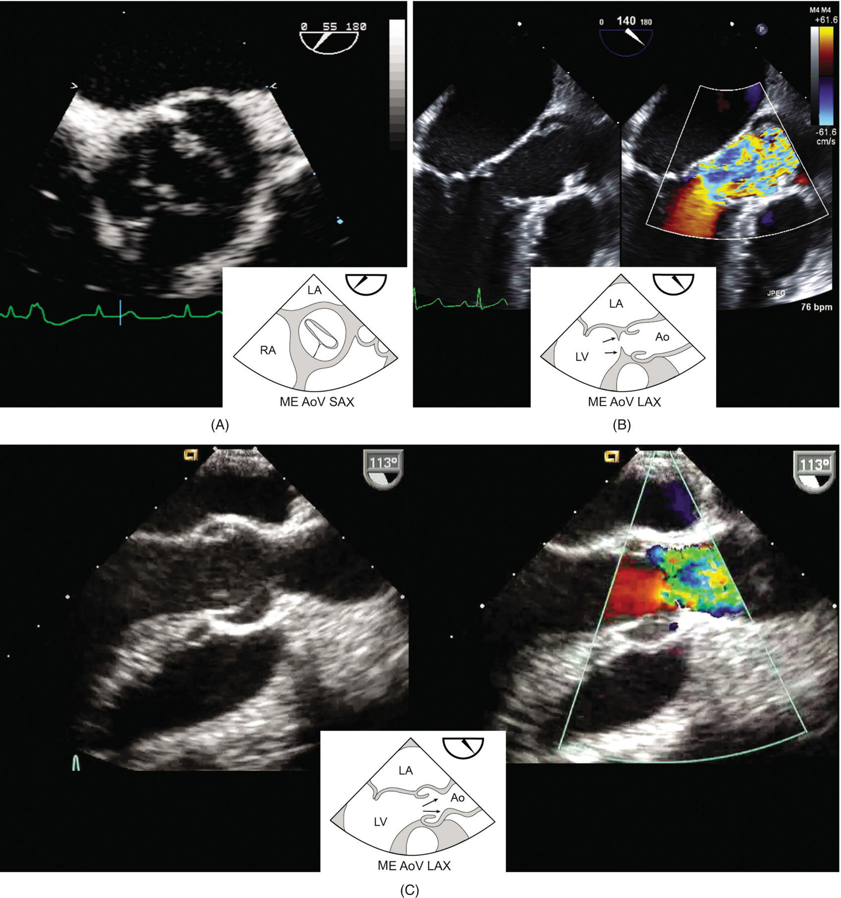

[**Figure 15.18**](#R_c15-fig-0018) _Left ventricular outflow tract (LVOT) obstruction_. (A) _Valvular aortic stenosis_. In aortic valve (AoV) stenosis, the number and mobility of the leaflets and the qualitative severity of the obstruction are best appreciated in the ME AoV SAX and ME AoV LAX views. The ME AoV SAX image shows a systolic frame of a functionally bicuspid AoV; note the presence of commissural fusion. (B) _Subaortic stenosis_. 2D and color Doppler interrogation of a fibromuscular membrane (_arrows_) causing subaortic stenosis in the ME AoV LAX view. This cross section, in addition to the ME 5‐Ch, TG LAX, and DTG 5‐Ch views, is essential in defining the level and nature of the obstruction in any of the lesions that affect the LVOT. Superimposed color‐flow Doppler demonstrates turbulence at the level of the obstruction (as shown) and permits evaluation of AoV function. Continuous‐wave Doppler interrogation in the TG and DTG views can determine the pressure gradient across the region, whereas pulsed‐wave Doppler defines the level of obstruction. Abnormal AoV systolic closure and/or fluttering of the valvular cusps, if present, are best shown in the ME AoV SAX and LAX views.

(Source: Vegas et al. \[41\]. Reproduced with permission of Springer Nature.)

(C) _Supravalvular aortic stenosis_. The typical hourglass deformity (_arrows_) at the Ao sinotubular junction appears in the ME AoV LAX view (as shown) by 2D imaging and color‐flow Doppler (note the site of color aliasing). Dilation of the coronary arteries may result from exposure to high left ventricular (_LV_) pressures (best seen in the ME AoV SAX and ME AoV LAX views with multiplane angle adjustments). The potential for myocardial ischemia from compromised coronary blood flow in this lesion can manifest on TEE as segmental wall motion abnormalities and requires a combination of views that display the various regions of the myocardium (refer to [Figure 15.11](#c15-fig-0011)). _Ao_ aorta; _LA_ left atrium; _RA_ right atrium.

Diagrams courtesy of Ms. Willa Bradshaw.

[**Figure 15.19**](#R_c15-fig-0019) _Right ventricular outflow tract (RVOT) obstruction_. (A) _Valvular pulmonary stenosis (PS)_. Stenosis of the pulmonary valve (PV) can be due to valvular thickening, commissural fusion, and/or valvular dysplasia. The malformation is best examined in the ME RV In‐Out, UE PA, ME Asc Ao SAX, and UE Ao Arch SAX views. Typical findings include valvular doming and reduced systolic leaflet excursion. The zoomed view shown in a ME In‐Out view depicts a thickened PV and associated poststenotic dilation of the main pulmonary artery (_PA_) in a patient with valvular stenosis. (B) _Subvalvular PS_. Muscular hypertrophy of the subvalvular pulmonary region can occur in isolation or may be present in association with valvular PS. The narrowing of this region of the right ventricle (_RV_) can be fixed or dynamic in nature. The ME RV In‐Out image displays severe subvalvular narrowing. (C) _Supravalvular PS_. Discreet narrowing of the supravalvular region occasionally occurs in association with valvular PS or the pathology can be found in isolation. This is best examined in views that display the pulmonary outflow tract in its long axis, as shown in a modified ME RV In‐Out view (_arrows_). (D) _Estimation of right ventricular systolic pressure_ (_RVSP_). Moderate‐to‐severe RVOT obstruction is frequently associated with some degree of tricuspid regurgitation (TR). The peak velocity of the TR jet, as shown, allows estimation of the RVSP, providing another parameter to assess the severity of the outflow obstruction. In this example, the RVSP, as derived from the simplified Bernoulli equation, is ~48 mmHg calculated as follows: \[(3.09)2 + right atrial (_RA_) pressure (assumed ~10 mmHg)\]. The RVSP in this case does not reflect the pulmonary artery systolic pressure. (E) _Spectral Doppler_. Interrogation using spectral Doppler from the DTG RVOT view depicts the late systolic, “dagger‐shaped” signal, that characterizes dynamic obstruction. (F) _Continuous‐wave_ (_CW_) _Doppler_. The image depicts the optimal cursor alignment for spectral Doppler interrogation that can be obtained from DTG imaging. In this example, CW Doppler measures the peak systolic pressure gradient between the RV and the PA (58 mmHg) and is able to estimate the severity of the RVOT obstruction. _LA_ left atrium; _LV_ left ventricle.

Diagrams courtesy of Ms. Willa Bradshaw.

### Double‐outlet right ventricle

#### Anatomic and physiologic features

A DORV refers to a VA connection in which there is near or complete alignment of both great arteries to the RV. The exact diagnostic criteria for DORV are controversial. It does not represent a single disease but rather a spectrum of pathologies that may share features with other lesions such as TOF and transposition \[215\]. A VSD is almost always present. The location of the VSD and its relation to the great vessels play a critical role in the physiology and can be subaortic (most commonly), subpulmonary (i.e., Taussig‐Bing anomaly), doubly committed, or noncommitted (remote). The spatial orientation of the great vessels is frequently abnormal and can be side by side or in the configuration of D‐transposition of the great arteries (D‐TGA). The physiologic manifestations are variable and can mimic those of an isolated VSD, TOF, D‐TGA, or single ventricle. Lesion heterogeneity necessitates careful preoperative assessment and surgical planning.

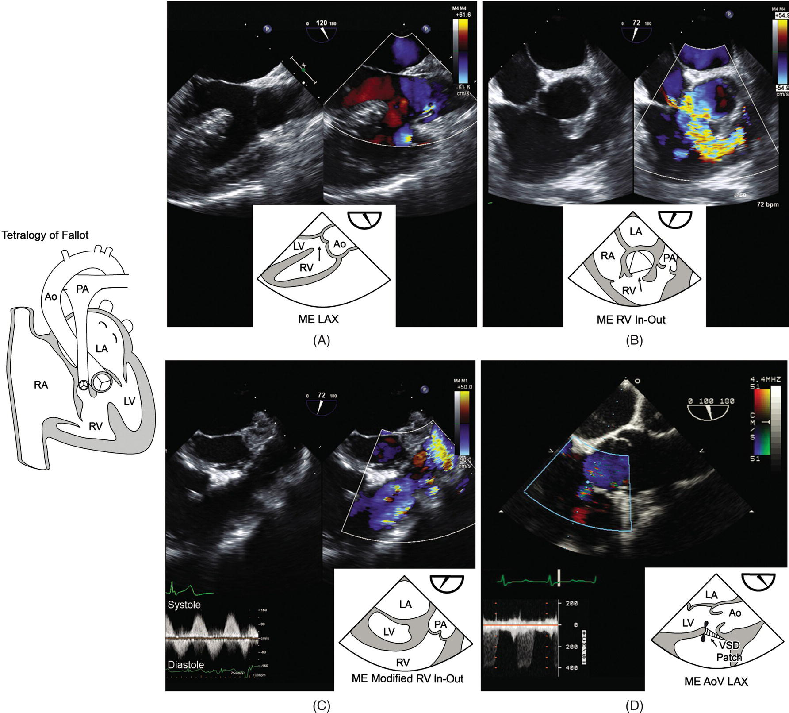

[**Figure 15.20**](#R_c15-fig-0020) _Tetralogy of Fallot (TOF)_. (A) _Conoventricular ventricular septal defect_ (_VSD_). The large VSD in TOF (_arrow_) is optimally displayed in the ME LAX (shown), ME 5‐Ch, ME RV In‐Out; panel B), and DTG views. These same views display the aortic (_Ao_) override over the VSD. Color Doppler facilitates assessment of defect size and direction of shunting. (B) _Right ventricular outflow tract_ (_RVOT_) _obstruction_. The RVOT (subvalvular, valvular, and supravalvular areas) is best evaluated in the ME RV In‐Out view. The typical anterior and leftward deviation of the conal or infundibular septum that causes subpulmonary muscular dynamic obstruction, as well as the VSD (_arrow_), can be optimally displayed in this view as shown. (C) _Pulmonary regurgitation_. Transannular patch repair in TOF resulting in pulmonary regurgitation is best evaluated in views that display the RVOT in long axis as shown. Note the blue color Doppler jet representing flow into the right ventricle (_RV_) during diastole and the to‐and‐fro flow across the RVOT by spectral Doppler. (D) _VSD patch leak_. Assessment of residual ventricular level shunting is an important component of the postrepair TEE examination after corrective surgery and during subsequent reoperations in TOF. The ME AoV LAX view shown depicts a VSD patch (_arrow_) with a small leak by color Doppler and associated high‐velocity left‐to‐right shunting by spectral Doppler. _LA_ left atrium; _LV_ left ventricle; _PA_ pulmonary artery; _RA_ right atrium.

Diagrams courtesy of Ms. Willa Bradshaw.

#### Highlights of the TEE examination

_Preoperative TEE_ evaluates the location and size of the VSD and its relationship to the great arteries ([Figure 15.21](#c15-fig-0021)). The spectral and color Doppler modalities are important in assessing flow out of the LV and across the VSD when the defect is subaortic in location. These modalities are essential in evaluating the severity of associated outflow tract obstruction (right and left) and valvular function (stenosis or regurgitation).

In most instances for which a biventricular repair is feasible, surgery aims to restore normal anatomy by establishing continuity between the ventricles and corresponding great arteries using various surgical techniques. In cases involving pulmonary stenosis, distinguishing this anomaly from TOF is important. Although the physiology of the two lesions is similar, a subaortic conus in the patient with TOF‐like DORV represents a substrate for subaortic stenosis after the repair, a rare occurrence in TOF. All TEE views that display the pathway of the blood flow between the LV and the Ao (e.g., ME 5‐Ch, ME LAX, TG LAX, and DTG 5‐Ch) should explore this potential problem. In addition, _postrepair TEE_, depending on the details of the anatomy and type of the intervention, should exclude residual intracardiac shunting, evaluate for any other forms of outflow tract obstruction and valvular regurgitation, and assess ventricular function.

### Transposition of the great arteries

#### Anatomic and physiologic features

In D‐TGA, the AV connections are concordant and the VA connections are discordant. The segmental anatomy as per the Van Praagh short‐hand notation in most cases is that of {S,D,D}, meaning normal visceroatrial arrangement or visceroatrial situs solitus, D‐loop ventricles, and D‐transposition (denoting the position and relationship of the great arteries). Whereas in the normal heart the Ao is posterior and rightward of the anterior and leftward PA, in this arrangement the Ao originates from the RV anteriorly and to the right of the posterior and leftward PA. Separate parallel circulations characterize the physiology. A communication, usually an ASD or a PDA, is essential for intercirculatory mixing and to allow partially oxygenated blood to reach the systemic circulation. In most cases, the ventricular septum is intact, but VSDs of various sizes can be present. Associated findings can include pulmonary outflow obstruction, coronary artery variants, and aortic arch anomalies.

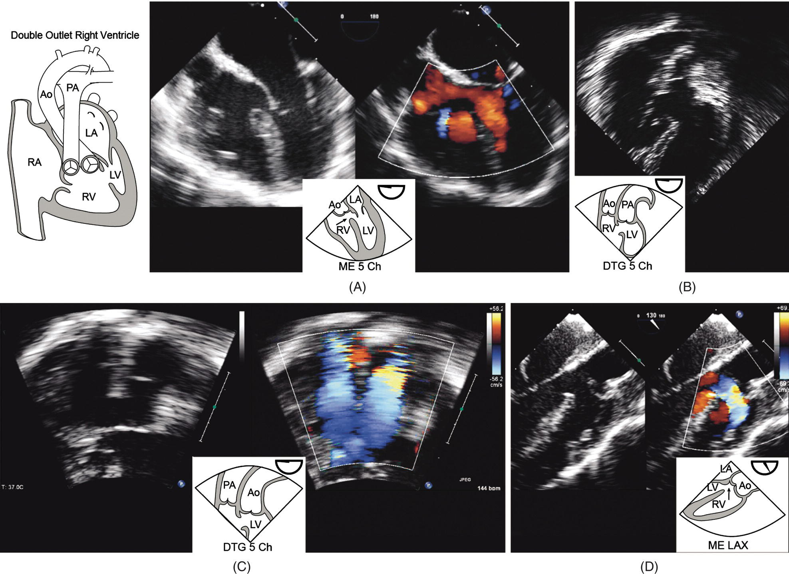

[**Figure 15.21**](#R_c15-fig-0021) _Double‐outlet right ventricle (DORV)_. (A) _Subaortic ventricular septal defect (VSD)_. _Left panel_: ME 5‐Ch view depicting the most common variant of DORV with a malalignment VSD in subaortic location. Note the ventricular communication (_arrow_), the abnormal relationship of the aorta (_Ao_) over the right ventricle (_RV_), and the presence of a muscular conus resulting in mitro‐aortic discontinuity. Color and spectral Doppler in the ME views (4‐Ch, 5‐Ch, LAX) outline the direction and pattern of shunting across the VSD. R_ight panel_: the unusual long pathway of blood flow from the left ventricle (_LV_) to the Ao, as shown by color Doppler, represents a substrate for potential subaortic stenosis after the repair. (B) _Subpulmonary VSD_. DTG 5‐Ch view in the Taussig‐Bing anomaly depicting the relationship of the great arteries in this defect and the subpulmonary location of the VSD accounting for preferential flow of LV blood into the pulmonary artery (_PA_) and the physiology of D‐transposition of the great arteries. (C) _Side‐by‐side great arteries_. The abnormal side‐by‐side spatial orientation of the great arteries in DORV (patient with a subaortic VSD) is noted in these zoomed 2D and color Doppler images. This relationship contrasts with their crisscross orientation in the normal heart. (D) _VSD flow_. ME LAX view in same patient as in panel C with DORV depicting the relationship of the VSD to the Ao and evaluation of VSD flow by color‐flow Doppler (_arrow_). _LA_ left atrium; _RA_ right atrium.

Diagrams courtesy of Ms. Willa Bradshaw.

#### Highlights of the TEE examination

The TEE evaluation in the patient with D‐TGA requires proper 2D identification of cardiac chambers and connections ([Figure 15.22](#c15-fig-0022)). Additional indispensable TEE information includes confirming the segmental venoatrial connections (ME Bicaval, TG IVC/Hep veins); evaluating the AV valves, ventricular septum, and ventricular function (ME views: 4‐Ch, 2‐Ch, 5‐Ch, LAX; TG views: Basal SAX, Mid Pap SAX, Apical SAX); assessing the LVOT and PV (ME views: LAX, 5‐Ch, AoV SAX, and AoV LAX; TG LAX; DTG 5‐Ch); examining the RVOT and AoV (ME RV In‐Out and DTG RVOT views); and interrogating the IAS (ME 4‐Ch, ME Bicaval, and DTG Atr Sept). In addition to the 2D evaluation, the examination should include interrogation of the outflow tracts for obstruction, the semilunar valves for stenosis or regurgitation, and the origin of the coronary arteries. A comprehensive assessment of the aortic arch may not be feasible with TEE, but a combination of views at the UE and ME levels may offer limited interrogation. If necessary, epicardial imaging can provide additional views.

Surgical correction of D‐TGA aims to restore the proper sequence of blood flow. The favored surgical approach is the _arterial switch operation_ (ASO), an anatomic correction that restores the normal VA relationships. It involves transecting and anastomosing the great arteries to their respective appropriate ventricles and translocating the coronary arteries. TEE can reveal immediate complications after the ASO, including anastomotic site stenosis causing supravalvular obstruction in the PA or Ao \[216\]; ASD or VSD patch leaks, valve regurgitation, and ventricular dysfunction \[216\]. Coronary complications should be suspected if global systolic function is impaired or segmental wall motion abnormalities are present \[124, 125\]. Both TEE and E‐echo have been shown to be of benefit in evaluating segmental wall motion abnormalities and coronary artery patency \[125, 217, 218\]. Excellent agreement has been reported between TEE and E‐echo coronary Doppler flow patterns, as importantly, abnormalities have been correlated with adverse myocardial events \[219\]. The atrial switch (Senning and Mustard operation) provides physiologic correction by using intra‐atrial baffles to allow deoxygenated blood to reach the PAs and the ejection of oxygenated blood into the Ao ([Figure 15.23](#c15-fig-0023)). It is no longer the surgical intervention of choice because the morphologic RV remains as the systemic pump for life. Most patients who have undergone this procedure are adult survivors of CHD. In patients with prior _Rastelli‐type operation_s, which route the LV output to the Ao across a baffle and place an RV‐to‐PA conduit, color and spectral Doppler can assess outflow obstruction, pulmonary or aortic regurgitation, and residual VSD and estimate PASP.

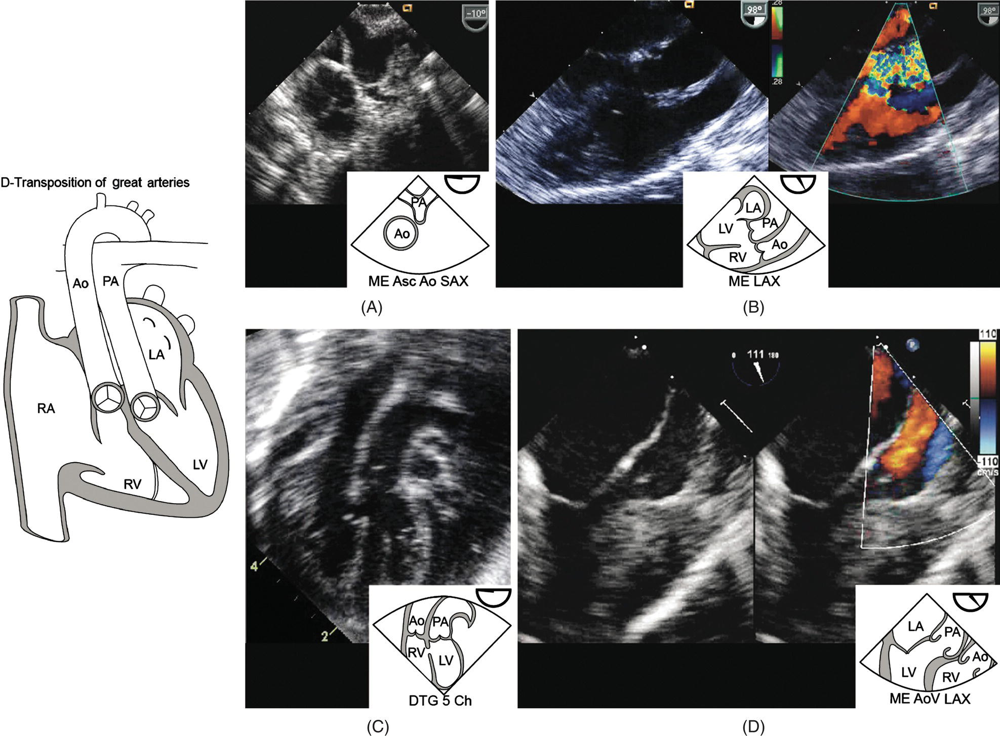

[**Figure 15.22**](#R_c15-fig-0022) _D‐Transposition of the great arteries (D‐TGA)_. (A) _Orientation of the great arteries_. ME Asc Ao SAX view displaying the anterior and rightward aorta (_Ao_) with respect to the posterior and leftward bifurcated pulmonary artery (_PA_) in D‐TGA. (B) _Ventricular septal defect_ (_VSD_). 2D and corresponding color Doppler images in the ME LAX view in an infant with D‐TGA and associated VSD. Note the abnormal parallel orientation of the great arteries (in contrast to their normal crisscross relationship) and flow from the higher pressure right ventricle (_RV_) across the VSD into the left ventricle (_LV_) and PA (red flow). (C) _Ventriculoarterial_ (_VA_) _connections_. DTG 5‐Ch view depicting the discordant VA connections in D‐TGA (Ao from the RV and PA from the LV). A perimembranous VSD is readily appreciated in this 2D image. This view permits optimal spectral Doppler alignment across the outflow tracts and great vessels for assessment of patency/obstruction. (D) _Patent ductus arteriosus (PDA)_. ME LAX 2D and color Doppler images displaying the outlet of the LV into the PA. Note the PDA flow (blue signal away from the transducer) into the PA. _LA_ left atrium; _RA_ right atrium.

Diagrams courtesy of Ms. Willa Bradshaw.

### Congenitally corrected transposition of the great arteries

#### Anatomic and physiologic features

In congenitally corrected transposition of the great arteries (CCTGA), also referred to as physiologically corrected transposition, the AV and VA connections are both discordant (double discordance). The ventricles and great vessels are malpositioned, with inversion of the ventricles and transposition of the great arteries. Although the anatomy is variable, in most cases, it consists of levocardia and visceroatrial situs solitus, with systemic veins draining into a right‐sided RA connected to a right‐sided morphologic LV that ejects across a rightward and posterior PA; the pulmonary veins drain into a left‐sided LA, which is connected to a left‐sided morphologic RV (L‐ventricular loop that ejects across a leftward and anterior Ao (L‐positioned great arteries). This segmental anatomy is referred to as {S,L,L} or simply as L‐TGA. In this malformation, the morphologic LV represents the venous, pulmonary ventricle, and the morphologic RV functions as the arterial, systemic ventricle. The physiology is correct as desaturated blood reaches the pulmonary circulation and saturated blood enters the systemic circulation. Associated anomalies can include a VSD, pulmonary stenosis or obstruction to morphologic LV outflow, and abnormalities of the TV (Ebstein‐like anomaly and others). The patient with CCTGA may present late in adulthood with TR and systemic RV failure or complete heart block.

#### Highlights of the TEE examination

Diagnosis of CCTGA relies on the accurate identification of cardiac chamber morphology ([Figure 15.24](#c15-fig-0024)). In addition to confirming the anatomy, an important role of TEE in this defect is assessing TV competence (systemic or left‐sided AV valve), evaluation of associated defects, and determination of the functional status of the RV.

Depending on the type of surgical intervention for this lesion (e.g., conduits, baffles, and switches), TEE assists in the _post‐CPB_ assessment by excluding hemodynamically significant residual lesions that may necessitate revision and evaluating AV and semilunar valve competence, outflow tract obstruction, and ventricular function.

### Truncus arteriosus

#### Anatomic and physiologic features

Truncus arteriosus refers to the anomaly that has a single arterial trunk from which both the PA and the Ao (with coronary arteries) originate. Both ventricles have a single, common outlet, and the truncal root overrides a VSD. Hypoxemia results from complete admixture of deoxygenated and oxygenated blood. Various classification schemes describe this lesion. Classification of this defect into three types (i.e., I, II, and III) in the Collet and Edwards scheme is based on the origin of the PAs from the truncal root. The clinical manifestations of this lesion depend largely on the status of the pulmonary vascular resistance and the presence of any intrinsic stenosis in the PAs. Associated findings can include truncal valve anomalies, right aortic arch, interrupted aortic arch, and coronary ostial anomalies.

#### Highlights of the TEE examination

The common arterial trunk has a single semilunar valve that can have variable cusp number and morphology and can be stenotic or regurgitant ([Figure 15.25](#c15-fig-0025)). A comprehensive _pre‐CPB TEE_ examination includes assessing truncal valve function and other coexistent lesions.

Corrective surgery for this lesion involves closing the VSD, detaching the main PA segment or individual branches from the truncal root and repairing the wall defect, and establishing continuity between the RV and the PA, usually by placing a conduit. Interventions on the truncal valve may be necessary during the initial operation or subsequently. _Post‐CPB TEE_ excludes residual VSD shunting and assesses the function of the truncal valve, the RV‐to‐PA conduit, and both ventricles. Coronary artery perfusion may be compromised preoperatively and postoperatively, resulting in global or regional wall motion abnormalities. The RV may dilate and underperform in the face of increased PASP as assessed from estimates of RVSP. In the long term, issues associated with conduit stenosis or regurgitation or truncal valve problems may lead to reoperation. The role of TEE in this scenario, in addition to assessing the specifics of the intervention, is similar to its role immediately after the initial corrective procedure.

### Single ventricle

#### Anatomic and physiologic features

The single ventricle (univentricular heart) spectrum comprises lesions with an atretic AV valve (MV or TV), hypoplastic ventricle (e.g., hypoplastic left heart syndrome and double‐inlet LV), and others for which physiologically a biventricular repair is not feasible or desirable (e.g., functional single ventricle). Frequently, a characteristic of this broad group of lesions is complete admixture of systemic and pulmonary venous blood at the atrial or ventricular level. Another common finding is systemic or pulmonary outflow obstruction.

#### Highlights of the TEE examination

A complete and systematic TEE examination should be the goal in all cases. However, considering the many defects that fit into the single ventricle category, the evaluation should be aimed at the structural abnormalities and associated hemodynamic and functional alterations. Although rarely diagnostic, an essential aspect of the examination is including views that confirm the anatomic abnormalities. Occasionally, this interrogation reveals new findings or modifies previous ones. Depending on the morphologic substrate, the TEE examination should show the anatomic or functional features that merit a single ventricle management strategy, such as a hypoplastic ventricle with an atretic or severely stenotic inflow or outflow, or a single (common or rudimentary) ventricle with two separate atria that may communicate through an ASD ([Figure 15.26](#c15-fig-0026)). The morphology of the often‐enlarged single ventricle may be right, left, or indeterminate. The ME level is suitable for evaluating most of these features. An initial useful cross section is the ME 4‐Ch view, which serves as a reference point from which adjusting the multiplane angle optimizes visualization of the various structures of interest. If a patient with a two‐ventricle heart is unable to undergo a biventricular repair but instead has a single ventricle management strategy, the examination should identify features of the anatomy that indicate this approach.

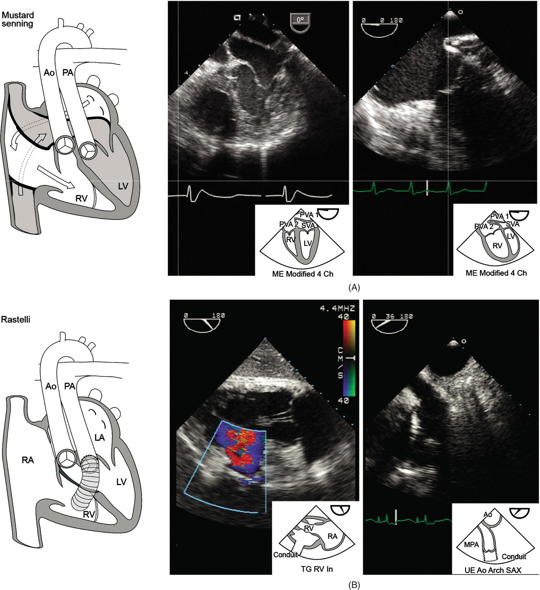

[**Figure 15.23**](#R_c15-fig-0023) _D‐Transposition of the great arteries (D‐TGA) post‐Senning and post‐Rastelli operations_. (A) _D‐TGA after Senning procedure_. TEE assessment of atrial pathways requires multiple views and sweeps between several planes to trace the course of the blood flows and provide information about atrial anatomy and the presence of baffle pathology (leak or obstruction). _Left panel_: modified ME 4‐Ch view depicts the systemic venous atrium (_SVA_), which receives the systemic veins (not shown), and the region of the pulmonary venous atrium where the pulmonary veins drain (_PVA 1_). Note the portion of the baffle that separates the SVA from the PVA 1. _Right panel_: as the TEE probe shaft is turned rightwards, the pathway of pulmonary venous flow can be examined to exclude obstruction from PVA 1 to the region of the pulmonary venous atrium above the tricuspid valve (_PVA 2_). In patients who have undergone atrial baffle procedures, these views in combination with additional TEE cross sections assist in the assessment of systemic right ventricular (_RV_) function, grading severity of tricuspid regurgitation, and evaluating potential intracardiac thrombus related to rhythm abnormalities or pacing leads. (B) _D‐TGA post‐Rastelli operation_. In the patient with D‐TGA and associated ventricular septal defect (VSD) and pulmonary stenosis, a Rastelli‐type repair may be favored, where the left ventricular (_LV_) output is re‐routed to the aorta (_Ao_) across a VSD patch that serves as a baffle, and an extracardiac conduit is placed between the RV and main pulmonary artery (MPA). _Left panel_: TG RV In view (adult TEE cross section) with color Doppler displays the proximal conduit. _Right panel_: UE Ao Arch SAX view as shown is particularly helpful in the examination of the distal conduit. A combination of TEE modalities that may include 2D, 3D, color, and spectral Doppler in multiple views can assess outflow obstruction, conduit/aortic regurgitation, residual VSD, and estimate RV systolic pressure in the postoperative patient. _LA_ left atrium; _PA_ pulmonary artery; _RA_ right atrium.

Diagrams courtesy of Ms. Willa Bradshaw.

  
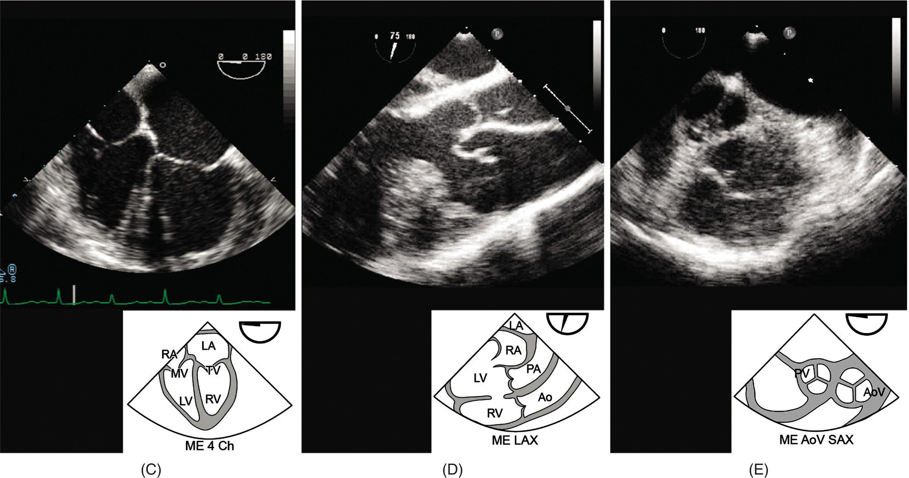

[**Figure 15.24**](#R_c15-fig-0024) _Congenitally corrected transposition (CCTGA)_. (A) _Ventriculoarterial_ (_VA_) _discordance_ (_left ventricle_ \[_LV_\] _to pulmonary artery_ \[_PA_\] _connection_). The DTG views are essential in the TEE evaluation of CCTGA (also referred to as L‐transposition of the great arteries \[L‐TGA\]). The examination requires not only single views but sweeps between planes to assess ventricular morphology, their arrangement, and connections between these and the arterial trunks. The discordant connection between the smooth‐walled LV and PA are shown in a DTG view. (B) _VA discordance_ (_right ventricle \[RV\] to aorta_ \[_Ao_\] _connection_). DTG view with anterior probe angulation in the same patient depicted in panel A displays the origin of the Ao from the trabeculated left‐sided RV. The smooth‐walled LV is to the right of the morphologic RV. (C) _Atrioventricular_ (_AV_) _discordance_. Evaluating ventricular morphology and AV connections in CCTGA requires imaging in multiple views at the ME, TG, and DTG levels. As displayed in this ME 4‐Ch image, the discordant AV connections are evident as the left atrium (_LA_) opens into a chamber of RV morphology and the right atrium (_RA_) drains into the LV. The identification of the RV is by its trabeculated endocardial surface, the presence of a moderator band, and a septophilic tricuspid valve (_TV_) that is more apically positioned on the interventricular septum relative to the mitral valve (_MV_). The subpulmonary ventricle displays a smooth surface and two papillary muscles (not shown). Various cross sections allow examination of the RV, which often dilates and functions poorly over time, resulting in TV regurgitation.

(Source: Vegas \[112\]. Reproduced with permission of Springer Nature.)

(D) _Orientation of the great arteries_. The parallel orientation of the great arteries, with the Ao more anterior, is confirmed in cross sections that display the outflow tracts in their long axes (ME LAX, ME 5‐Ch, DTG 5‐Ch, and DTG RVOT views). The ME LAX image shown displays this parallel orientation. Note associated pulmonary stenosis (small posterior valvular annulus, stenotic doming leaflets) and the presence of a ventricular septal defect in this case. (E) _Coplanar semilunar valves_. This cardiac lesion makes the aortic valve (_AoV_) and pulmonary (pulmonic) valve (_PV_) appear coplanar (both valves in their short axes seen at the same level), with the PA spatially positioned posteriorly and to the right (in the center of the image), relative to the anterior and leftward Ao. This abnormal orientation is best seen in the ME AoV SAX (shown), ME Asc Ao SAX), and ME RV In‐Out views. In this example, the PV appears to have possible commissural fusion.

Diagram courtesy of Ms. Willa Bradshaw.

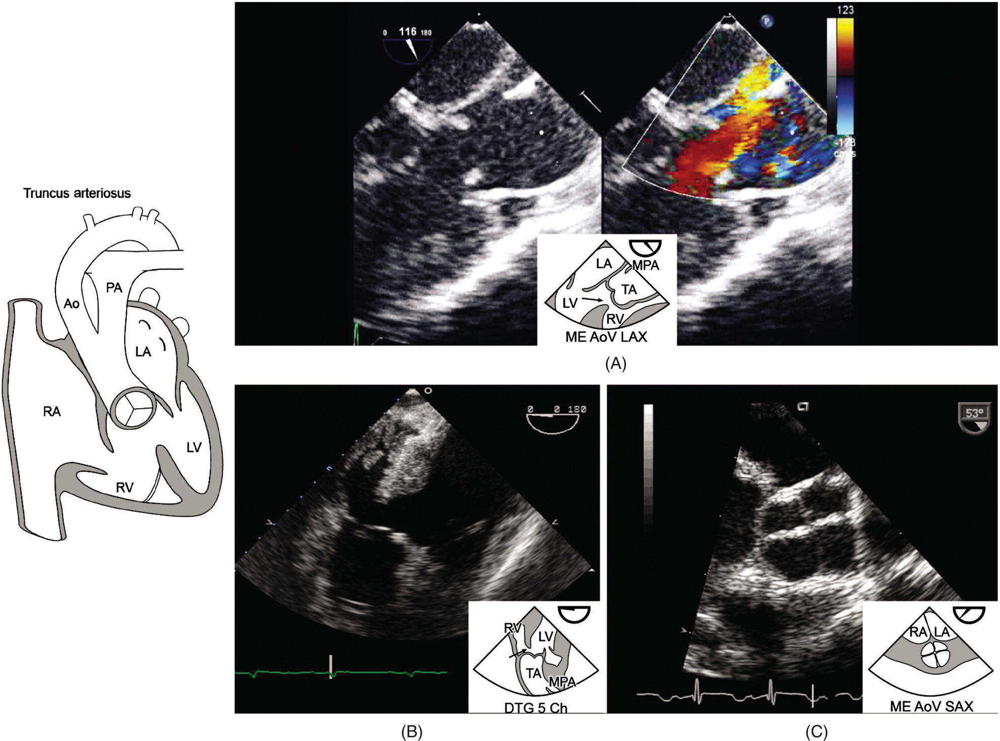

[**Figure 15.25**](#R_c15-fig-0025) _Truncus arteriosus (TA)_. (A) _Truncal root_. The origin and proximal course of the pulmonary arteries (_PAs_) from the arterial trunk can be defined by 2D imaging and color‐flow Doppler by adjusting the TEE probe position in the ME Asc Ao SAX, ME Asc Ao LAX (shown), UE PA, and modified UE views. The ventricular septal defect (_arrow_) can also be examined in ME views. (B) _Single outlet_. The assessment of this lesion requires a combination of planes that display the truncal root in short and long axes (ME AoV SAX and LAX), and DTG views. These same cross sections may allow for evaluation of shunting by color and spectral Doppler across the ventricular septal defect. Characteristically a single outlet is identified as displayed in this DTG 5‐Ch view (note the nonstandard anatomic orientation of this TEE image with the ventricular apex at the top of the image display and outflow tract at the bottom). (C) _Truncal valve_. Evaluating truncal valve morphology and presence/severity of stenosis and/or regurgitation are important components of the examination. Frequently, a quadricuspid truncal valve is present as shown in this ME AoV SAX view. _Ao_ aorta; _LA_ left atrium; _LV_ left ventricle; _MPA_ main pulmonary artery; _RA_ right atrium; _RV_ right ventricle.

Diagram courtesy of Ms. Willa Bradshaw.

In single ventricle variants and two‐ventricle hearts not amenable to a biventricular repair, the evaluation of ventricular morphology, size, and function is facilitated by 2D imaging in the ME 4‐Ch and ME 2‐Ch views, cross sections at the TG and DTG levels, and, if helpful, UE views. Assessment of the AV valves determines their type as single, double, or common and their relationship to the ventricles (straddling and override), patency, and functionality (stenosis or regurgitation). This interrogation is best performed at the ME (4‐Ch, 2‐Ch, RV In‐Out, and Mod Bicaval TV) level. Evaluation of the outflows examines the relation between the ventricles and the arterial roots, their patency, and the semilunar valves. This assessment requires multiple views and sweeps obtained at the ME (5‐Ch, LAX, AoV LAX, AoV SAX, Asc Ao SAX), TG (LAX), and DTG (5‐Ch and RVOT views) levels. The adequacy of systemic or pulmonary venous admixture or drainage (ME 4‐Ch, ME Bicaval, ME Rt Pulm veins, ME Lf Pulm veins, TG IVC/Hep veins, and DTG Atr Sept views) should also be established. This comprehensive evaluation in the single ventricle patient also requires the use all available Doppler modalities.

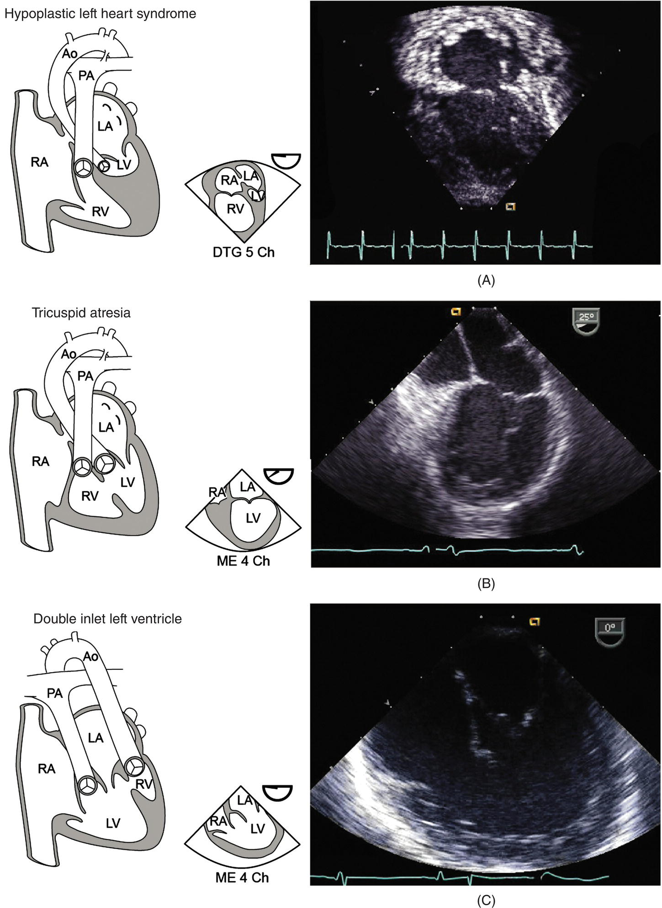

[**Figure 15.26**](#R_c15-fig-0026) _Single ventricle variants_. (A) _Hypoplastic left heart syndrome_ (_HLHS_). DTG 5‐Ch view showing the characteristic features of HLHS. Note the nonexistent left ventricular (_LV_) cavity, small mitral valve, and tiny left atrium (_LA_). An atrial communication is also seen. (B) _Tricuspid atresia_. ME 4‐Ch view displaying the atretic valve in tricuspid atresia and hypoplastic right ventricle (_RV_).

(Source Motta and Miller‐Hance \[199\]. Reproduced with permission of Wolters Kluwer Health, Inc.).

(C) _Double‐inlet left ventricle_ (_DILV_). ME 4‐Ch view depicting two atrioventricular valves opening into a large ventricular chamber, consistent with the diagnosis of DILV. _Ao_ aorta; _PA_ pulmonary artery; _RA_ right atrium; _RV_ right ventricle.

Diagrams courtesy of Ms. Willa Bradshaw.

Single ventricle surgical management often involves sequential palliative stages. Depending on the anatomy, _stage I palliation_ may consist of a surgical technique aimed at providing for or improving systemic (e.g., Norwood procedure) or pulmonary blood flow (e.g., systemic to pulmonary artery shunt) or limiting pulmonary overcirculation (i.e., PA banding) to balance pulmonary and systemic blood flows. The _preoperative TEE_ examination confirms the anatomy by evaluating the AV and VA connections; AV valve morphology and function; the degree of outflow tract obstruction; size, morphology, and function of the ventricle; and adequacy of the interatrial communication. The _post‐CPB TEE_ examines the adequacy of the specific intervention, AV valve competence, and ventricular function. _Stage II palliation_ usually consists of a bidirectional superior cavopulmonary connection (Glenn shunt or hemi‐Fontan procedure). _Postoperative TEE_ evaluates patency of the anastomosis, AV valve competence, and ventricular function. The last step or the _stage III operation_ is the _Fontan procedure_ or _total cavopulmonary connection_ using either an intracardiac lateral tunnel or an extracardiac conduit to route blood from the IVC into the PA ([Figure 15.27](#c15-fig-0027)). Creating a fenestration allows blood from the venous system to enter the systemic circulation to maintain CO without depending on passage through the pulmonary circulation. In addition to the anatomic and functional assessment previously mentioned for earlier palliative stages, the _post‐CPB TEE_ evaluates the Fontan circuit for obstruction, leaks, and patency of any fenestration \[14, 220, 221\]. There should be low‐velocity phasic flows into the PAs and across the Fontan pathway as shown in the ME and DTG views. Spontaneous contrast often appears in the Fontan circuit and represents slow flow along this venous pathway. TEE is particularly helpful in identifying thrombus formation along the Fontan pathway and during cardiac catheterization procedures aimed at creating, enlarging, or occluding a fenestration \[222\]. Adult patients who have undergone prior Fontan procedures may need revision of the intervention for either thrombotic complications or other problems. The Fontan conversion procedure aims for a more favorable hemodynamic modification.

* * *

### KEY POINTS: EVALUATION OF SELECTED CONGENITAL HEART DEFECTS BY TEE

-   The TEE evaluation of CHD assumes an understanding of the anatomic abnormalities and physiologic repercussions of the various defects.
-   The review of information obtained in all prior diagnostic studies, but particularly the TTE findings, is critical before undertaking TEE.
-   The comprehensive TEE evaluation in CHD requires the use of all modalities that include 2D and, in selected cases, real‐time 3D imaging, spectral Doppler, and color‐flow interrogation.
-   The examination benefits from the use of multiple TEE planes in all available windows.
-   The intraoperative assessment of any defect aims to characterize the abnormalities in question, assess disease severity, and evaluate functional aspects related to the AV valves, semilunar valves, and myocardium, which may affect the clinical course.

* * *

## Applications of TEE during mechanical support

The options for mechanical circulatory support as a bridge to transplant, and to a lesser extent destination therapy, are growing in CHD populations as experience with these devices increase \[223–228\]. The spectrum of mechanical support ranges from full support with extracorporeal membrane oxygenation (ECMO) to supporting one or both ventricles with intracorporeal or paracorporeal ventricular assist devices. In addition, some patients with congenital or acquired cardiovascular conditions may benefit from the use of temporary assist devices while cardiac function recovers. Echocardiography plays important roles in the selection, intraprocedural insertion of the device, perioperative management, and postprocedural monitoring in patients with mechanical support \[15, 229–236\]. Important aspects of the examination are noted in [Table 15.10](#c15-tbl-0010).

## Epicardial echocardiography

Currently, E‐echo is mostly reserved for patients in whom TEE probes cannot be used because of contraindications to esophageal instrumentation (see [Table 15.2](#c15-tbl-0002)), size constraints, or the potential for hemodynamic or respiratory compromise, or when TEE hardware is not available. Additional indications for an epicardial study include difficult patient anatomy, poor TEE image quality, and inability to adequately image structures \[237–241\]. Therefore, E‐echo should be considered complementary to TEE in most cases.

Intraoperative E‐echo also provides an alternative technique to image the heart during cardiac surgery and can aid surgical decision‐making. Critically ill pediatric patients with an open chest and those on ECMO may also benefit from E‐echo in the ICU. In the recent era of the coronavirus disease pandemic, E‐echo has been proposed as a possible safer alternative to TEE because it avoids (i) aerosolization, (ii) direct contact between the imaging probe and body fluids (if a probe protective cover is not used), and (iii) the need for special preparation \[242\].

This technique uses a standard TTE probe placed in a sterile sheath with acoustic gel like that used for percutaneous line insertion \[243\]. These are lower frequency probes, with good tissue penetration. Image quality can be improved by filling the field with saline or using a saline‐filled sterile glove to provide a stand‐off between the probe and the structure being imaged. Directly placing the probe on anterior structures like the pulmonary valve provides better image quality than TEE does.

The surgeon or operator manipulates the probe directly on the surface of the heart and great vessels ([Figures 15.28](#c15-fig-0028) and [15.29](#c15-fig-0029)). In 2007, the ASE, in conjunction with the SCA, published guidelines for performing a comprehensive E‐echo examination and recommended seven views for this examination \[244\]. The standard views obtained are analogous to standard transthoracic views. In most cases when using this modality in CHD, the imaging examination focuses on addressing specific issues or questions and additional views may be used ([Figure 15.30](#c15-fig-0030)). The freehand manipulation of the probe by the operator permits off‐axis imaging to evaluate the anatomic variations unique to each CHD patient. Color‐flow Doppler can assess the surgical result. Visualizing all four chambers and valves of the heart, as well as the great vessels, is feasible in most patients, although apical views may not be obtainable. Structures that are particularly well imaged with E‐echo include the aortic arch, branched pulmonary arteries, and coronary vessels. Recent reports suggest that 3D epicardial imaging is beneficial in CHD \[245\].

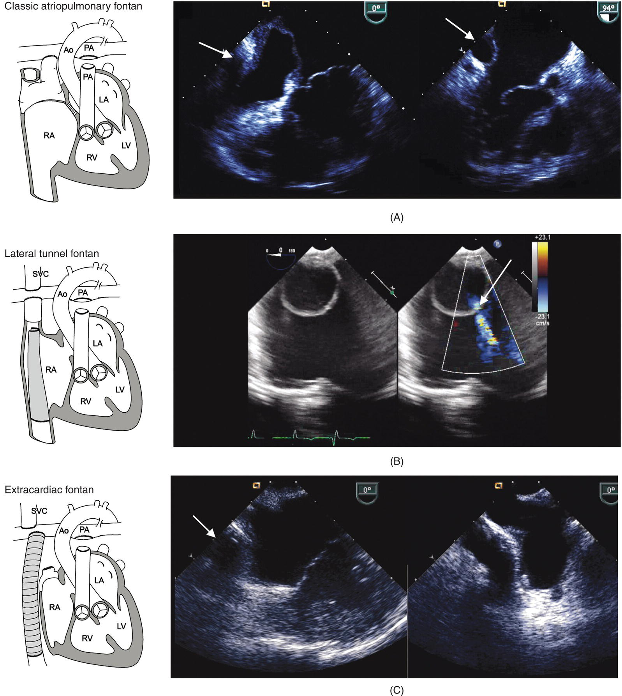

[**Figure 15.27**](#R_c15-fig-0027) _Modifications of the Fontan procedure_. (A) _Classic atriopulmonary connection_. _Left panel_: ME 4‐Ch view displays an atriopulmonary Fontan connection in an adult patient with tricuspid atresia depicting a large thrombus (_arrow_) along the free wall of the right atrium (_RA_). Note the RA dilation and bulging of the interatrial septum towards to left atrium (_LA_). _Right panel_: ME 2‐Ch view in the same patient showing a dilated coronary sinus (_arrow_) due to high RA pressures. (B) _Lateral tunnel Fontan connection_. _Left panel_: zoomed ME 4‐Ch view of a lateral tunnel Fontan connection (circular structure in the atrium). _Right panel_: corresponding color Doppler image depicting right‐to‐left shunting across the Fontan fenestration (arrow). By allowing for venous blood to enter the common atrium, this maintains cardiac output at the expense of arterial desaturation. (C) _Extracardiac Fontan connection_. _Left panel_: ME 4‐Ch view shows the extracardiac conduit (_arrow_) allowing inferior vena cava blood to enter the pulmonary artery (_PA_) in a patient after a prior Glenn procedure, thereby achieving a total cavopulmonary connection. _Right panel_: as the TEE probe is rotated rightwards, the extracardiac conduit can be further displayed longitudinally in a zoomed image. Obstruction to flow across the right‐sided pulmonary veins, related to the conduit, should be excluded after Fontan completion. _Ao_ aorta; _LV_ left ventricle; _RV_ right ventricle; _SVC_ superior vena cava.

Diagrams courtesy of Ms. Willa Bradshaw.

[**Table 15.10**](#R_c15-tbl-0010) Parameters to be evaluated by transesophageal echocardiography during ventricular assist device surgery

| LVAD | RVAD |
| --- | --- |
|   **Pre‐insertion (STARR criteria)**
-   Intracardiac **S**hunts
-   Intracardiac **T**hrombi
-   Ascending Aorta Pathology
-   **A**ortic Regurgitation (≥ mild)
-   Mitral Stenosis (≥ mod)
-   T**R** (≥ mod), TS (> mild)
-   **R**ight Ventricular Function

 |   **Post‐insertion**  
_During weaning_

-   Intracardiac air
-   RV function
-   LV decompression
-   IVS position

  
_After weaning_

-   Inflow cannula
-   Outflow cannula
-   Intracardiac shunts
-   Aortic valve opening
-   Aortic insufficiency
-   Tricuspid regurgitation
-   RV Function

 | **Pre‐insertion**

-   Pulmonary regurgitation
-   LV function
-   Thrombi (RA, RV, PA)

  
**Post‐insertion**

-   Inflow cannula
-   Outflow cannula
-   Pulmonary regurgitation
-   RV decompression
-   LV size and function

 |

_Abbreviations_: _IVS_ interventricular septum; _LV_ left ventricle; _LVAD_ left ventricular assist device; _PA_ pulmonary artery; _RA_ right atrium; _RV_ right ventricle; _RVAD_ right ventricular assist device; _TR_ tricuspid regurgitation

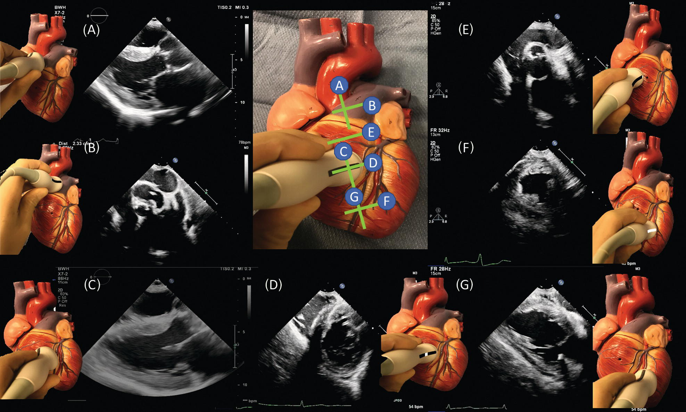

[**Figure 15.28**](#R_c15-fig-0028) _Standard epicardial echocardiography views_. Similar to transthoracic echocardiography, for epicardial imaging the probe is positioned on the surface of the heart with the probe marker pointing cephalad or to the left of the patient. Most views are orthogonal to each other, so obtaining a long‐ or short‐axis view and rotating the probe 90° shows the other view at the same heart level. Slight tilting and rotation of the probe can help optimize each view. (A) _Aortic valve (AoV) long‐axis (LAX) view_. The probe position aligns parallel to the long axis of the ascending aorta with the marker pointing cephalad. This view shows the AoV and left ventricular outflow tract (LVOT) permitting color and spectral Doppler interrogation. (B) _AoV short‐axis (SAX) view_. The probe is rotated 90° clockwise from the AoV LAX view with the probe marker to the patient’s left. This view shows the short axis of the aortic root at the level of the aortic sinuses. (C) _Left ventricular (LV) LAX view_. The probe is positioned in the middle of the right ventricular (RV) free wall aligned with the long axis of the Ao with the marker pointing cephalad. This view shows the entire LV in long axis and mitral valve. (D) _LV basal SAX view_. The probe is rotated 90° clockwise from the LV LAX view with the probe marker pointing leftward, until the MV leaflets appear in short axis (“fish‐mouth” view) and the RV is in the near‐field with the tricuspid valve on the left of the image. (E) _RV inflow‐outflow view_. The probe is positioned over the RV outflow tract (RVOT) with superior angulation and the probe marker to the left. The RVOT appears in the near‐field, the AoV in the center, the pulmonary valve (PV) in long axis on the screen right, and the proximal main PA below. This view allows for color‐flow Doppler assessment of the PV and depending on angle alignment, may facilitate measurements of RVOT and PV gradients. (F) _LV mid‐SAX_. From the LV basal SAX view, angulation or moving the probe inferiorly with the probe marker to the left, displays the LV in SAX at the level of the papillary muscles. (G) _LV two‐chamber_ view. The probe is rotated 90° counterclockwise from the LV mid‐SAX view with the probe marker pointing cephalad, shows the long axis of the LV.

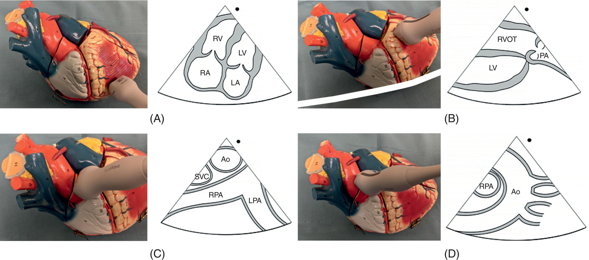

[**Figure 15.29**](#R_c15-fig-0029) _Additional epicardial echocardiography views in congenital heart surgery_. (A) _Subxiphoid equivalent modified apical four‐chamber view_. By positioning the probe over the inferior border of the right ventricle (RV) with slight clockwise rotation and the marker pointing to the left, a modified four‐chamber view is obtained as shown allowing for visualization of the RV, left ventricle (LV), left atrium (LA), right atrium (RA), interatrial septum, a portion of the interventricular septum, as well as assessment of atrioventricular valve function. (B) _RV outflow tract view_. The probe is positioned over the RV outflow with the marker pointing to the patient’s left shoulder. The view shows the right ventricular outflow tract (RVOT), pulmonary valve, main pulmonary artery (PA), and a portion of the LV. (C) _Branch PA view_. The probe is positioned over the ascending aorta or main pulmonary artery bifurcation, with the marker pointed to the left shoulder. The view images the main and branch pulmonary arteries. (D) _Aortic arch view_. The probe is positioned over the distal ascending aorta (Ao) aligned along the long axis of the aortic arch with the marker pointed to the patient's left. This view shows the aortic arch and arch vessels. _LPA_ pulmonary artery; _RPA_ right pulmonary artery; _SVC_ superior vena cava.

Drawbacks of E‐echo relate to the risk of infection and the consequent need for sterility, limited windows of interrogation, interruption or distraction from the surgical procedure, and the need for a skilled operator. Furthermore, compression of structures during E‐echo can cause arrhythmias and hemodynamic instability. In the operating room, a second, unsterile operator is needed to operate the ultrasonography machine and archive the images. Cooperation among the operative team is essential for the safe incorporation of this practice into the procedural workflow.

## Summary

Over the years, TEE has become a valuable adjunct to surgical, hemodynamic, and anesthetic management in the patient with CHD. In the intraoperative setting, TEE confirms the diagnosis, facilitates planning or refinements of the intervention, and immediately evaluates the operative results. TEE can detect suboptimal surgical results or complications, thereby often preventing the need for subsequent reoperations and reducing overall morbidity, mortality rates, and costs. The contributions of TEE to anesthetic care include real‐time monitoring of ventricular filling and cardiac function, ensuring adequate cardiac de‐airing, and facilitating the optimization of hemodynamic management strategies. In the cardiac catheterization laboratory, TEE provides guidance of interventional procedures, assesses the success of the intervention, identifies complications, and enhances overall patient safety.

The overview presented in this chapter regarding the contributions of TEE in patients with CHD reflects the impact of the technology on clinical care and its positive influence on outcomes. Most centers consider the TEE imaging approach as the standard for intraoperative assessment during cardiac surgery and many interventions in the cardiac catheterization laboratory. As TEE technology continues to evolve, additional applications and contributions will probably be recognized for both children and adults with CHD. Epicardial imaging is now a well‐established intraoperative option in patients in whom TEE is not feasible or when additional information is necessary by using this imaging approach as a complement to TEE.

## Acknowledgments

We would like to acknowledge Ms. Willa Bradshaw, BSc, MScBMC, and Ms. Elizabeth (Beth) E. Sumner, MA, medical illustrators, for their outstanding graphic contributions to this chapter. We also thank Stephen N. Palmer, PhD, ELS, of the Department of Scientific Publications at the Texas Heart Institute for his editorial assistance.

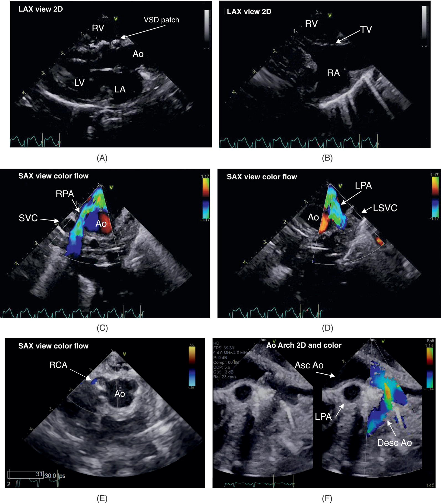

[**Figure 15.30**](#R_c15-fig-0030) _Epicardial imaging in congenital heart disease_. (A) Long‐axis (LAX) 2D view showing the left ventricle (LV), left atrium (LA), right ventricle (RV), and aorta (Ao) after pericardial patch closure of ventricular septal defect (VSD; arrow). (B) Interrogation of the right ventricular inflow in a long‐axis (LAX) view, as the transducer is angulated rightward and inferiorly with respect to the view shown in panel A, shows the right atrium (RA), right ventricle (RV), and tricuspid valve (TV). (C) and (D) Branch pulmonary artery view (note short‐axis \[SAX\] views of aortic root) obtained following an arterial switch operation in a neonate with transposition of the great arteries display draping of the right pulmonary artery (RPA) and left pulmonary artery (LPA) over the Ao in the respective images. Note the relationship of the superior vena cava (SVC) to the right of the Ao and persistent left superior vena cava (LSVC) to the left. (E) In the same patient as shown in panels C and D, the graphic displays the right coronary artery (RCA) after being translocated to the neoaorta (Ao) as interrogated by color‐flow Doppler. (F) 2D and color Doppler imaging of the Ao arch following coarctation repair.

## Selected references

_A full reference list for this chapter is available at:_

[http://www.wiley.com/go/andropoulos/congenitalheart](http://www.wiley.com/go/andropoulos/congenitalheart)

1.  3 Hahn RT, Abraham T, Adams MS, et al. Guidelines for performing a comprehensive transesophageal echocardiographic examination: recommendations from the American Society of Echocardiography and the Society of Cardiovascular Anesthesiologists. J Am Soc Echocardiogr 2013; 26:921–64. Updated and most recently published ASE‐SCA guidelines for performing a comprehensive TEE examination. The publication focused on the adult patient with a structurally normal heart.
2.  4 Simpson J, Lopez L, Acar P, et al. Three‐dimensional echocardiography in congenital heart disease: an expert consensus document from the European Association of Cardiovascular Imaging and the American Society of Echocardiography. Eur Heart J Cardiovasc Imaging 2016; 17:1071–97. Comprehensive document reviewing applications, image orientation, and technical considerations of 3D imaging in congenital heart disease.
3.  5 Puchalski MD, Lui GK, Miller‐Hance WC, et al. Guidelines for performing a comprehensive transesophageal echocardiographic examination in children and all patients with congenital heart disease: recommendations from the American Society of Echocardiography. J Am Soc Echocardiogr 2019; 32:173–215. Guidelines document by the ASE outlining indications, safety issues, and training requirements for the performance of a TEE examination in the patient with CHD.
4.  15 Nicoara A, Skubas N, Ad N, et al. Guidelines for the use of transesophageal echocardiography to assist with surgical decision‐making in the operating room: a surgery‐based approach: from the American Society of Echocardiography in Collaboration with the Society of Cardiovascular Anesthesiologists and the Society of Thoracic Surgeons. J Am Soc Echocardiogr 2020; 33:692–734. Outstanding recently published document that outlines in systematic manner the use of TEE in specific surgical settings.
5.  28 Wong PC, Miller‐Hance WC. Transesophageal Echocardiography for Pediatric and Congenital Heart Disease. 2nd ed. London: Springer, 2021, p. 826. Comprehensive contemporary textbook that focuses exclusively on the clinical applications of TEE in children and the pediatric and adult population with CHD.
6.  83 Lang RM, Badano LP, Tsang W, et al. EAE/ASE recommendations for image acquisition and display using three‐dimensional echocardiography. J Am Soc Echocardiogr 2012; 25:3–46. This publication provides a practical guide on using 3D echocardiography and addresses the limitations of the technique, as well as current and potential clinical applications.
7.  112  Vegas A. Perioperative Two‐Dimensional Transesophageal Echocardiography: A Practical Handbook, 2nd ed. Cham, Switzerland: Springer, 2018, p. 338. A compact, practical handbook that serves as a portable guide for the use of perioperative TEE.
8.  123 Reeves ST, Finley AC, Skubas NJ, et al. Basic perioperative transesophageal echocardiography examination: a consensus statement of the American Society of Echocardiography and the Society of Cardiovascular Anesthesiologists. J Am Soc Echocardiogr 2013; 26:443–56. This paper describes the role of a basic TEE examination in the care and treatment of an unstable patient in the intraoperative setting.
9.  186 Williams T, Lluri G, Boyd EK, Kratzert WB. Perioperative echocardiography in the adult with congenital heart disease. J Cardiothorac Vasc Anesth. 2019; 34:1292–308. Review article focusing on current international consensus recommendations on echocardiographic imaging of adults with CHD.