CHAPTER 16 Coagulation, Cardiopulmonary Bypass, and Bleeding 

# CHAPTER 16  
Coagulation, Cardiopulmonary Bypass, and Bleeding

_Laura A. Downey1 and David Faraoni2_

1 Departments of Anesthesiology and Pediatrics, Emory University School of Medicine, and Children’s Healthcare of Atlanta, Atlanta, GA, USA

2 Department of Anesthesiology, Perioperative and Pain Medicine, Texas Children’s Hospital, and Baylor College of Medicine, Houston, TX, USA

* * *

-   [**Introduction**](#head-2-153)
-   [**Coagulation**](#head-2-154)
    -   [Mechanisms of hemostasis](#head-3-228)
    -   [Developmental hemostasis](#head-3-229)
    -   [Influence of congenital heart disease on coagulation](#head-3-230)
-   [**Preoperative considerations**](#head-2-155)
    -   [Predictors of bleeding post‐CPB](#head-3-231)
    -   [Preoperative laboratory testing](#head-3-232)
    -   [Preoperative anemia](#head-3-233)
    -   [Autologous donation](#head-3-234)
-   [**CPB‐associated coagulation changes**](#head-2-156)
    -   [Exposure to CPB circuit](#head-3-235)
    -   [Hemodilution and CPB prime](#head-3-236)
    -   [Dilutional anemia](#head-3-237)
    -   [Dilution of coagulation factors](#head-3-238)
    -   [Composition of CPB prime](#head-3-239)
    -   [Anticoagulation](#head-3-240)
    -   [Heparin‐induced thrombocytopenia and alternative to heparin](#head-3-241)
    -   [Ultrafiltration](#head-3-242)
-   [**Management of bleeding**](#head-2-157)
    -   [Cell salvage](#head-3-243)
    -   [Use of coagulation tests and transfusion algorithms](#head-3-244)
-   [**Blood transfusion**](#head-2-158)
    -   [Whole blood](#head-3-245)
    -   [Red blood cells](#head-3-246)
    -   [Platelet transfusion](#head-3-247)
    -   [Fibrinogen supplementation](#head-3-248)
    -   [Recombinant factor VIIa](#head-3-249)
    -   [Factor concentrates](#head-3-250)
-   [**Pharmacologic therapies**](#head-2-159)
    -   [Antifibrinolytics](#head-3-251)
    -   [Desmopressin](#head-3-252)
-   [**Sickle cell disease**](#head-2-160)
-   [**Summary**](#head-2-161)
-   [**Selected references**](#head-2-162)

* * *

## Introduction

Pediatric cardiac surgery is associated with a substantial risk of bleeding, frequently requiring the administration of allogeneic blood products. The anemia and coagulopathy observed in neonates and children perioperatively are complex and multifactorial. Efforts to optimize preoperative hemoglobin, understand and correct coagulopathy, and incorporate blood conservation strategies to reduce bleeding are integral parts of pediatric cardiac anesthesiology and surgery. In this chapter, we will begin by reviewing the coagulation pathway, its maturation, and alterations associated with the pathophysiology of congenital heart defects (CHD). We will address preoperative optimization and blood conservation techniques, issues involved with the management of the coagulation system during and after cardiopulmonary bypass (CPB), and modalities for treating coagulopathy and bleeding in the perioperative period.

## Coagulation

### Mechanisms of hemostasis

Hemostasis is a complex physiologic process that regulates the formation and dissolution of a fibrin network through (i) platelet activation and aggregation, (ii) thrombin generation and fibrin clot formation, and (iii) fibrinolysis. The normal hemostatic mechanism that is triggered after vascular injury initiates a complex cascade of biochemical signaling and interactions between platelets, coagulation proteins, proteolytic enzymes, and fibrinolytic mechanisms. All of these actions are tightly regulated so that clotting occurs only at the site of vascular injury while maintaining blood flow in other parts of the circulation. The three phases of hemostasis are (i) primary hemostasis (formation of the platelet plug), (ii) secondary hemostasis (coagulation), (iii) tertiary hemostasis (fibrinolysis) ([Figure 16.1](#c16-fig-0001)).

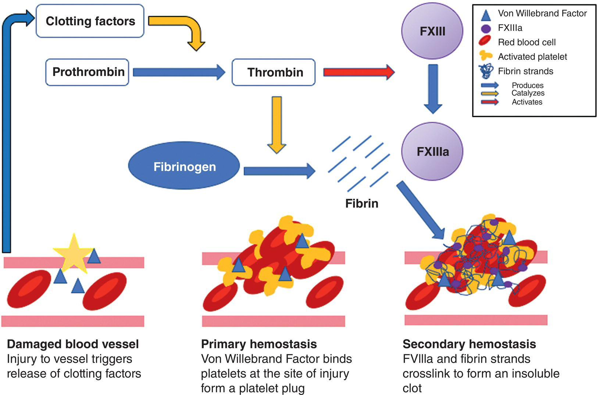

[**Figure 16.1**](#R_c16-fig-0001) Simplified mechanisms of hemostasis including primary hemostasis and secondary hemostasis.

#### Primary hemostasis

Primary hemostasis reduces bleeding after vessel damage by inducing vasoconstriction at the site of injury and initiating platelet adhesion, activation, and aggregation to form a platelet plug. First, damage to the blood vessel walls exposes subendothelial collagen, which then binds circulating von Willebrand factor (vWF). Platelets _adhere_ to the exposed vWF via glycoprotein 1b (GPIb) receptor on platelet surfaces. The binding of platelets to the subendothelial collagen‐vWF complex triggers platelet _activation_. Upon activation, platelets release thromboxane A2 (TXA2) and adenosine diphosphate (ADP) from their granules. These hemostatic mediators strengthen interactions between adherent platelets and promote the recruitment of additional circulating platelets to the growing platelet plug. Subsequently, negatively charged phospholipids are expressed on the surface membrane of activated platelets, which create an active surface on which coagulation proteins interact. Finally, the platelet glycoproteins GpIIb/IIa are converted to the active form and bind both fibrinogen and vWF to promote aggregation. The process of platelet _aggregation_ is further modulated by the microenvironment. At low shear rates, platelet aggregation occurs predominately via (alpha)IIbß3 integrin and fibrinogen interactions, while at higher shear rates, platelets aggregate increasingly in a vWF‐dependent manner. Further aggregation and platelet plug development occur as surrounding platelets are activated by serotonin, TXA2, and ADP released by other platelets \[1\]. This local process is tightly controlled to prevent the propagation of the platelet plug beyond the site of injury by power platelet aggregation inhibitors and vasodilators produced by non‐injured endothelial cells.

#### Secondary hemostasis

Secondary hemostasis leads to the formation of a fibrin clot by sequentially activating circulating coagulation factors to finally form insoluble fibrin. Our understanding of this “coagulation cascade” has evolved from the traditional description of independent “intrinsic” and “extrinsic” pathways being activated in plasma to a “cell‐based” concept of coagulation factors interacting on the surface of tissue factor (TF)‐bearing cells and activated platelets at the site of vascular injury \[2\].

The cell‐based model describes three overlapping phases of coagulation: _initiation_ of coagulation factors on TF‐bearing cells, _amplification_ of coagulation by thrombin generated on these TF‐bearing cells, and _propagation_ of thrombin generation on platelet surfaces. TF, exposed in the vascular sub‐endothelium after injury, is the primary physiologic initiator of coagulation \[2\].

_Initiation_ of coagulation occurs when plasma factor VII (FVII) binds tightly to TF and is rapidly activated to FVIIa. This FVIIa‐TF complex catalyzes the activation of coagulation factors, FX and FIX. The FXa on the surface of TF‐bearing cells binds with FVa to produce small amounts of thrombin (II). This initial amount of thrombin, though insufficient to initiate fibrin formation, plays an important role in subsequently activating platelets and FVIII during the amplification phase \[2\].

During the _amplification_ phase, the small amount of thrombin generated on TF‐bearing cells amplifies the initial procoagulant signal by enhancing platelet adhesion, activating platelets, and activating factors V, VIII, and XI. Thus, thrombin acts on the platelet surface to “set the stage” for procoagulant complex assembly \[2\]. On the activated platelet surface, FIXa joins with FVIIIa to form the “tenase” complex (FVIIa/FIXa). The complex activates large amounts of FXa which joins with its cofactor, FVa, to form the “prothrombinase” complex (FXa/FVa). During the _propagation_ phase, the “tenase” and “prothrombinase” complexes are assembled on the platelet surface to generate a large‐scale conversion of prothrombin into thrombin. Unlike the small amount of thrombin produced in the initiation phase, this quantity of thrombin is sufficient to cleave fibrinogen to fibrin strands that are necessary for clot formation \[2\].

#### Tertiary hemostasis

The final phase of hemostasis, termed _fibrinolysis_, involves fibrin clot maturation and fibrinolysis. Activated factor XIII cross‐links the fibrin monomers and acts as “mortar” that cements the platelet plug to form a stable clot. After clotting has occurred and bleeding has stopped, activation of the fibrinolytic system breaks down the thrombus in order to re‐establish normal blood flow. Circulating plasminogen binds to fibrin within the clot. Tissue plasminogen activator (tPA) released from endothelial cells also complexes with fibrin and converts the bound plasminogen to its active form, plasmin, leading to the enzymatic dissolution of the thrombus. This stage is critical to maintaining and restoring the patency of the involved blood vessel so that blood flow can be restored, and wound healing can proceed.

#### Hemostatic homeostasis

The hematological system constantly balances the ability to keep blood flowing through undamaged vessels with the ability to stop bleeding from damaged blood vessels. Under normal circumstances, blood vessels are non‐thrombogenic because of intact endothelial surfaces and circulating activated protein C, with its cofactor protein S inactivating any circulating FVa and FVIIIa to attenuate thrombin generation. Antithrombin (AT) neutralizes circulating FXIa, FXa, FXIa, and thrombin to prevent fibrin formation. Circulating nitric oxide and prostacyclin inhibit platelet activity and release tPA to promote fibrinolysis. Thus, clot formation is prevented in undamaged blood vessels while vascular damage disrupts these homeostatic mechanisms to create an environment conducive to clot formation. Furthermore, when vascular damage does occur, the coagulation process is restricted only to the injured vessels because the coagulation process‐inducing TF is expressed on damaged vessels and also because a host of circulating anticoagulants keeps the actions circulating activated coagulation factors in check. Under normal conditions, coagulation and fibrinolysis occur only where they are needed and are prevented from becoming pathological generalized problems by procoagulant and anticoagulant factors that delicately balance the system.

* * *

### KEY POINTS: MECHANISMS OF HEMOSTASIS

-   Primary hemostasis involves platelet adhesion, activation, and aggregation to form a platelet plug at the site of injury.
-   Secondary hemostasis involves coagulation factor activation and fibrin clot formation.
-   Tertiary Hemostasis involves cross‐links of fibrin strands and break down of the clot through fibrinolysis.

* * *

### Developmental hemostasis

Like most organ systems in the newborn, the hematologic system is not fully developed at birth but matures over the first year of life. In the late 1980s, Dr. Maureen Andrew termed the age‐related changes of the hemostatic system _developmental hemostasis_ \[3\]. This parallel maturation of the coagulation and fibrinolytic systems maintains the delicate hemostatic balance between thrombosis and bleeding in healthy neonates and infants. An understanding of these changes in the coagulation system is critical for practitioners involved in caring for pediatric cardiac patients.

Although maternal coagulation factors do not cross the placenta, the synthesis of coagulation proteins begins at approximately 11 weeks gestation. Levels of coagulation factors are dependent on the gestational age of the neonate, with major increases in both procoagulant and anti‐coagulant factors occurring between 30 and 40 weeks of gestation and reaching adult levels by 1 year of age \[3–5\]. In contrast, levels of fibrinogens, FV, VIII, FXIII, vWF, and platelet counts are comparable to adult values on the first day of life. In addition to these quantitative differences, recent studies have demonstrated qualitative differences in several hemostatic components, which manifest throughout the three stages of hemostasis ([Table 16.1)](#c16-tbl-0001).

Platelet counts in neonates are similar to those found in older children and adults, but neonatal platelets show a qualitative decrease in function for the first 2–4 weeks of life. However, the literature regarding neonatal platelet function is conflicting, with some studies demonstrating platelet hyporeactivity and others demonstrating accelerated coagulation \[6–13\]. The _in vitro_ activation of neonatal platelets is decreased to a variety of standard agonists including epinephrine, ADP, collagen, and thrombin \[10, 14\]. This hyporeactivity manifests in several ways: (i) a decrease in platelet granule secretion; (ii) decreased expression of fibrinogen‐binding sites on platelet surfaces; (iii) deficiencies in neonatal phospholipid and calcium metabolism that impair platelet activation; and (iv) immature signal transduction pathways and reduced platelets surface receptors that impair platelet aggregation \[6, 15\]. As such, Caparros‐Peres and colleagues report _reduced_ platelet adhesion and aggregation in a plasma‐free medium \[11\]. Despite the impaired function in _in vitro_, most _in vivo_ assays of platelet function show adequate neonatal platelet function. For example, bleeding time (BT) and platelet closure time (PFA‐100) have been shown to be shorter than adults, suggesting _increased_ adhesion and aggregation \[12\]. Similarly, viscoelastic testing often demonstrates normal or accelerated coagulation in this population \[7\]. Interestingly, when adult platelets were placed into neonatal blood, bleeding times were dramatically shorter when compared with adult platelets added to adult blood \[13\]. These _in vivo_ assays may be explained by the prominent role that plasma proteins play in neonatal hemostasis. In fact, neonates have a higher concentration of plasma vWF and a greater percentage of the ultra‐large vWF necessary for improved platelet adhesion. Despite these conflicting studies, primary hemostasis appears to remain intact in healthy neonates and children.

[**Table 16.1**](#R_c16-tbl-0001) Differences in coagulation components between neonates and adults

Source: Adapted from Anderson et al. \[3–5\].

| Component | Neonatal versus adult levels |
| --- | --- |
| Primary hemostasis | ←→ Platelet Count  
↑ vWF |
| Coagulation factors | ↓ FII, FVII, FIX, FX  
↓ FXI, FXII  
↓ to ←→ FVI, FXIII  
←→ Fibrinogen  
↑ FVIII, vWF |
| Anticoagulation factors | ↓ PC, PS, AT, TFPI  
↑ alpha2M |
| Fibrinolysis | ↓ Plasminogen  
↓ to ←→ PAI |

vWF = von Willebrand factor; F = factor; TFPI = Tissue factor pathway inhibitor; AT = antithrombin; PC = Protein C; PS = Protein S; alpha2M = alpha2‐macroglobulin; PAI = Plasminogen activator inhibitor.

At birth, many of the coagulation factors involved in secondary hemostasis are quantitatively lower than adults. In newborns, mean levels of the vitamin K‐dependent procoagulant factors (II, VII, IX, X) and contact factors (XI, XII, PK, and HMWK) are about 70% of adult levels ([Figure 16.2](#c16-fig-0002)) \[3\]. This can be attributed to the immature fetal liver, which has reduced ability to provide the gamma‐carboxylation needed to produce vitamin K‐dependent factors \[16\]. This is partially counterbalanced by higher levels of vWF and ultra‐large vWF, which improve adherence between platelets and injured vessels \[17\] ([Figure 16.3](#c16-fig-0003)). Neonatal hemostasis is balanced by having concurrent lower levels of the anticoagulants antithrombin (AT), Protein C, and Protein S, and fibrinolytic factors (plasminogen and tPA) ([Figure 16.4](#c16-fig-0004)) \[3–5\]. The higher levels of thrombin inhibitor alpha2‐macroglobulin counteract lower levels of other anticoagulants. In the presence of these quantitative and qualitative factor deficiencies, neonates tend to generate significantly less thrombin than adults.

In addition to lower levels of clotting factors, the existence of neonatal forms of clotting proteins has been described. Most notably, Brown and colleagues demonstrated an immature form of fibrinogen \[18\], which has differing phosphorus and sialic acid content than adult fibrinogen \[19\]. These differences lend unique properties to the differences in clot formation between neonatal and adult fibrinogen \[18, 20\]. Clots formed from adult fibrinogen display higher fiber density and significant three‐dimensional branching structure. In contrast, clots formed from neonatal fibrinogen display a more linear, two‐dimensional structure with increased porosity and less branching \[18\]. Clots formed from neonatal fibrinogen display a significantly faster degradation rate than their adult fibrinogen counterparts \[18\]. However, when adult and neonatal fibrinogen are mixed, simulating a transfusion event, neonatal and adult fibrinogen do not integrate completely during the process of fibrin formation ([Figure 16.5](#c16-fig-0005)). Even more concerning, these mixed clots have a slower degradation time than clots formed from neonatal fibrinogen alone. This data suggests neonatal clots may be more susceptible to fibrinolysis, but differences in the neonatal fibrinolytic proteins may help maintain the hemostatic balance.

Tertiary hemostasis mainly involves the breakdown of the fibrin clot by plasmin. Neonatal plasminogen levels are about 25–50% of adult levels until about 6 months of age \[21, 22\]. Since plasminogen’s _in vivo_ activator, tPA, is comparably low in neonates, the rate of conversion from plasminogen to plasmin is also decreased in neonates relative to adults. In contrast, the activity of plasminogen activator inhibitor type 1 (PAI‐1), the major inhibitor of plasminogen activation, is similar in neonates and adults \[22\]. Due to these imbalances and a qualitatively dysfunctional form of plasminogen, plasmin is generated at much slower rates in neonates \[21\]. Overall, the balance of factors favors a reduction in fibrinolytic activity.

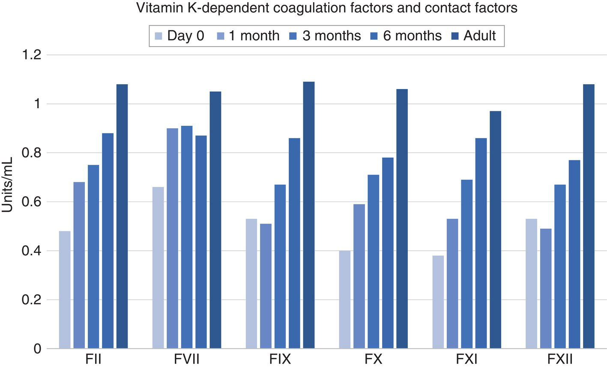

[**Figure 16.2**](#R_c16-fig-0002) **Vitamin K‐dependent coagulation factors and contact factors in full‐term infants through adulthood.** F = factor.

(Source: Adapted from Andrew et al. \[5\].)

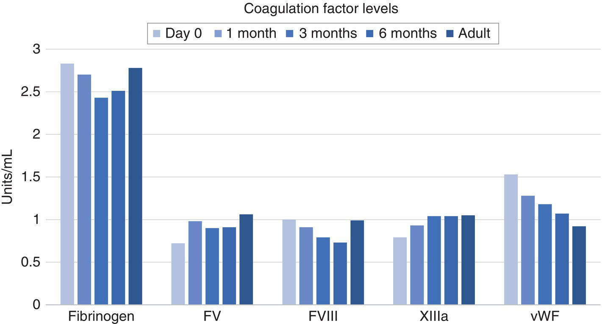

[**Figure 16.3**](#R_c16-fig-0003) **Coagulation factors in full‐term infants through adulthood.** F = factor; vWF = von Willebrand Factor.

(Source: Adapted from Andrew et al. \[5\].)

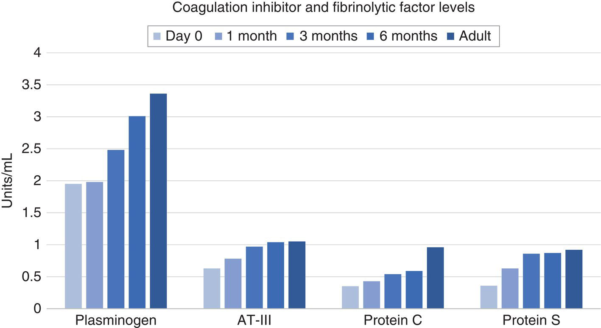

[**Figure 16.4**](#R_c16-fig-0004) **NEW Vitamin K‐dependent coagulation factors and contact factors in full‐term infants through adulthood.** AT‐III = Antithrombin III.

(Source: Adapted from Andrew et al. \[5\].)

In spite of these quantitative and qualitative differences in neonatal hemostasis, healthy neonates rarely suffer from spontaneous hemorrhage or thrombosis. This suggests that the maturation of procoagulants and anti‐coagulant factors maintain a relative balance in healthy neonates. However, thrombotic complications are more common in neonates, and thromboelastography (TEG) has shown that neonates and infants actually clot faster and have increased clot strength compared with adults \[7\]. For patients undergoing cardiac surgery, this balance can be easily disrupted and these patients can be placed at risk for both bleeding and thrombotic complications.

* * *

### KEY POINTS: DEVELOPMENTAL HEMOSTASIS’ EFFECT ON COAGULATION

-   At birth, many pro‐ and anti‐coagulation factors are quantitatively and quality deficient, but reach adult levels and function by 1 year of age.
-   The parallel maturation of coagulation and coagulation inhibitors maintain the delicate balance between thrombosis and bleeding in infants.

* * *

### Influence of congenital heart disease on coagulation

In addition to the age‐related effects on coagulation factor levels and function, children with congenital heart disease (CHD) have complex alternations in their whole blood composition and coagulation profile, even more so in the presence of long‐standing hypoxemia. Since the current practice of pediatric cardiac surgery is to perform corrective procedures in infancy, most of the studies on the effects of long‐standing hypoxemia are several decades old. However, children with delayed surgical repair or single ventricle physiology (SVP) who live with chronic hypoxemia will develop cardiac pathophysiology‐induced coagulation abnormalities that affect the hematologic, endothelial, and hemostatic systems. These patients are at increased risk for perioperative bleeding and clotting due to the complex interplay of coagulation abnormalities including secondary erythrocytosis, thrombocytopenia, impaired platelet function, deficiency of vWF multimers, and a range of clotting deficiencies.

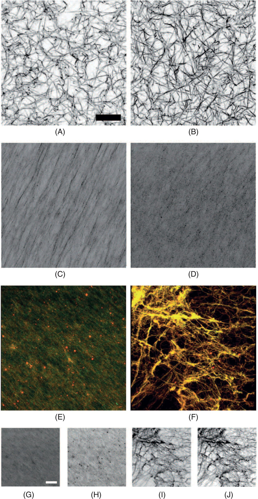

[**Figure 16.5**](#R_c16-fig-0005) Confocal microscopy analysis of clots constructed from both purified neonatal and adult fibrinogen. Clots were formed from purified adult (A, B) or neonatal (C, D) fibrinogen at a concentration of 2.5 (A, C) or 3.5 mg/mL (B, D) fibrinogen in the presence of 10 μg/mL thrombin. Clots were also formed by combining neonatal and adult fibrinogen in a 2.5 : 1 (E, G, H) or 1 : 2.5 (F, I, J) ratio to create clots simulating conditions observed after transfusion with a total fibrinogen concentration of 3.5 mg/mL in the presence of 10 μg/mL thrombin. Neonatal fibrinogen was labeled with Alexa‐Flour 488 (green) to allow for separate visualization of adult and neonatal fibrinogen labeled with Alexa‐Flour 555 (red). Representative images are presented. For combined fibrinogen samples, overlaid neonatal and adult fibrinogen channels (E, F) and corresponding individual neonatal (G, I) and adult fibrinogen (H, J) channels are presented. Scale bar = 20 μm.

(Source: Brown et al. \[18\]. Reproduced with permission of Wolters Kluwer Health, Inc.)

#### Erythrocytosis and hemostasis

Irrespective of the primary cardiac lesions, patients with chronic hypoxemia often develop _secondary erythrocytosis_, which refers to an isolated increase in red blood cells (RBCs). This is in contrast to polycythemias that result in a marked increase in all three blood cell lines (RBCs, white blood cells, and platelets). In cyanotic heart disease, long‐standing hypoxemia and reduced tissue oxygenation stimulate the kidneys to produce erythropoietin (EPO). This secondary erythrocytosis is an adaptive physiologic mechanism designed to compensate for inadequate oxygenation. However, in the presence of a persistent right‐to‐left shunt causing chronic hypoxemia, tissue oxygenation cannot improve beyond a certain point. Nevertheless, the kidneys continue to secrete EPO, leading to a further increase in red cell mass and blood viscosity. As blood viscosity increases with the higher number of hematocrits, blood flow may become sluggish and increase the risk of thrombosis and infarction. In fact, the increased mass has been linked with an increased risk of cerebrovascular events in neonates and infants with cyanotic heart disease \[23\].

In addition to secondary erythrocytosis, many patients with CHD demonstrate abnormal hemostatic profiles. While this is multi‐factorial, qualitative and quantitative deficiencies in both platelets and fibrinogen are implicated. Patients with hematocrits above 60–65% often have decreased platelet counts. The thrombocytopenia seen in CHD patients is due to both decreased platelet production and increased peripheral destruction due to platelet activation from the high shear stress generated by increased blood viscosity \[24\]. Recent studies using TEG suggest that despite normal to elevated fibrinogen concentration, the fibrinogen function may be impaired. Cui and colleagues found that baseline tracings in patients with preoperative hematocrits >54% have decreased peak amplitude on TEG and TEG‐functional fibrinogen when compared to normal patients \[25\]. Similarly, Jensen and colleagues demonstrated that patients with a preoperative hematocrit >57% have a smaller angle (alpha), primarily representative of the fibrinogen contribution to clot formation \[26\]. In addition, many patients with CHD have reduced levels of vitamin K‐dependent factors (II, V, VII, X) likely due to chronic hypoxia and chronic passive congestion of the liver \[27\]. Finally, these patients appear to have accelerated fibrinolysis based on increased levels of D‐dimers and elevated plasminogen activator inhibitor type **1 (**PAI‐1). However, it is unclear if the accelerated fibrinolysis is due to low‐grade intravascular thrombosis, increased fibrinolysis, or increased turnover of fibrinogen \[28\].

[**Table 16.2**](#R_c16-tbl-0002) Coagulation factor levels (mean ± SD) over time for the subgroup of 17 patients who had complete samples drawn at each stage

Adapted from Odegard and colleagues \[29\]

| Variable | Stage I | Pre‐BDG | Pre‐Fontan | Post‐Fontan |
| --- | --- | --- | --- | --- |
| Fibrinogen (mg/L) | 200.5 ± 70 | 203.5 ± 86 | 292.8 ± 76 | 350.5 ± 93 |
| Antithrombin (%) | 36.8 ± 12 | 75.4 ± 18[a](#c16-note-0003) | 93.1 ± 16[b](#c16-note-0004) | 56.9 ± 15 |
| Protein C (%) | 17.7 ± 9 | 43.2 ± 12[a](#c16-note-0003) | 60.2 ± 16[b](#c16-note-0004) | 56.9 ± 15 |
| Protein S (%) | 34.1 ± 17 | 81.3 ± 16[a](#c16-note-0003) | 71.1 ± 18 | 76.3 ± 19 |
| Factor II (%) | 37.5 ± 14 | 64.7 ± 15[a](#c16-note-0003) | 77.8 ± 13 | 81.9 ± 11 |
| Factor V (%) | 67.9 ± 19 | 79.1 ± 15 | 86.9 ± 21 | 71.8 ± 19 |
| Factor VII (%) | 32.7 ± 14 | 49.3 ± 13[a](#c16-note-0003) | 57.9 ± 15 | 49.2 ± 14 |
| Factor VIII (%) | 50.3 ± 21 | 63.5 ± 26 | 90.9 ± 36 | 175.5 ± 89[c](#c16-note-0005) |
| Factor IX (%) | 32.5 ± 14 | 47.2 ± 17 | 62.9 ± 13 | 72.5 ± 18 |
| Factor X (%) | 33.2 ± 9 | 63.6 ± 15[a](#c16-note-0003) | 71.5 ± 13 | 72.4 ± 16 |

Data are mean ± SD. BDG, Bidirectional Glenn. The following symbols denote significant changes (_P_ < 0.005) between selected stages:

[a](#R_c16-note-0003) Stage I to pre‐BDG;

[b](#R_c16-note-0004) Pre‐BDG to pre‐Fontan;

[c](#R_c16-note-0005) Pre‐Fontan to post‐Fontan.

While chronic hypoxemia affects multiple aspects of the coagulation system, a prospective longitudinal study of coagulation factors in 20 neonates with hypoplastic left heart syndrome (HLHS) at each stage of their palliation highlighted the complexity of hemostatic changes in congenital cardiac patients. In these children, significantly decreased levels of fibrinogen, vitamin K‐dependent factors (II, VII, XI, and X), factors V and VII, as well as anti‐coagulation factors (anti‐thrombin, Protein C, Protein S, and plasminogen) were noted after initial palliation. These abnormalities persist through the bidirectional cavopulmonary anastomosis and just prior to the Fontan completion. Even after Fontan completion, many of these abnormalities persist, with the exception of an increase in FVIII levels and activity ([Table 16.2](#c16-tbl-0002)). It is likely that the imperfect balance of procoagulant and anti‐coagulant factors contributes to the significant incidence of thrombotic events that occur in these patients \[29\].

In summary, the hemostatic abnormalities in patients with CHD are complex and include secondary erythrocytosis, thrombocytopenia, impaired fibrinogen function, and multiple coagulation factor deficiencies. Despite our best efforts at minimizing the effects of cardiac surgery on hemostasis, the underlying qualitative and quantitative hemostatic changes related to CHD itself predispose these patients to both bleeding and thrombosis.

* * *

### KEY POINTS: INFLUENCE OF CONGENITAL CARDIAC PATHOPHYSIOLOGY ON COAGULATION

-   Children with CHD have complex alterations in their coagulation profile due to long‐standing hypoxemia and liver congestion.
-   Children with chronic hypoxemia develop secondary erythrocytosis which results in elevated hematocrit levels, decreased platelet count and function, and impaired fibrinogen function.
-   Coagulation abnormalities persist in children with single‐ventricle anatomy and physiology through all stages of palliation.

* * *

## Preoperative considerations

### Predictors of bleeding post‐CPB

Bleeding in the perioperative period of cardiac surgery is associated with increased incidence of postoperative complications and mortality, both from the direct effects of bleeding and from the therapies deployed to restore hemostasis. As an example, blood transfusion has been shown to be associated with a dose‐dependent increased risk of postoperative infection and mortality in pediatric surgical patients \[30\]. Several studies have suggested that the increased bleeding risk observed in patients with CHD may be attributable to multiple contributing factors including both quantitative and qualitative differences in coagulation factors, relative immaturity of the coagulation system, endothelial dysfunction, intrinsic risk of surgical procedures, associated comorbidities (e.g., liver dysfunction), and iatrogenic factors (e.g., anticoagulation therapies, central venous access) \[26, 31, 32\]. Among children with CHD undergoing surgery, those with cyanotic heart disease (e.g., single ventricle physiology) are considered at higher risk for both intraoperative bleeding and postoperative thrombotic complications \[29, 33\]. Although the exact mechanisms for bleeding and thrombotic risks in children with CHD remain poorly understood, a complex multifactorial etiology including modifiable and non‐modifiable factors is hypothesized.

[Figure 16.6](#c16-fig-0006) summarizes the risk factors reported in the literature and that are discussed throughout this chapter. Patient‐risk factors are mainly related to the age of the patient at the time of surgery. Several authors have reported a strong association between age and the incidence of bleeding, with the highest risk of hemorrhage being reported in neonates \[35, 36\]. Age at the time of surgery is also associated with surgery‐specific risk factors as neonates often require complex surgical procedures involving prolonged CPB duration sometimes associated with deep hypothermic cardiac arrest (DHCA) \[37\]. Another surgery‐related risk factor is the timing for surgery (i.e., need for urgent or emergent surgery) which often mean hemodynamic instability (i.e., heart failure sometimes requiring extracorporeal membrane oxygenation \[ECMO\]), high requirement of ventilatory or inotropic support, and presence of multiple organ failure (i.e., acute kidney injury, liver failure, pulmonary edema). As discussed above, different bleeding risks have been reported according to the type of CHD. The presence of cyanosis will have an impact on coagulopathy, fibrinogen polymerization, and platelet function \[26, 38\]. Patients with cyanotic heart disease often require multiple surgical procedures, also increasing the bleeding risk.

Although several authors have studied the predictive values of preoperative coagulation testing (i.e., standard laboratory tests, viscoelastic tests, thrombin generation, or platelet function), none of these tests have been shown to accurately predict perioperative bleeding, a testimony to the complexity and the multifactorial nature of perioperative bleeding \[39, 40\].

Although most risk factors are non‐modifiable, it is important to estimate the risk before surgery in order to choose the appropriate tools to monitor and treat coagulopathy using a standardized and targeted transfusion algorithm that we will discuss later in this chapter.

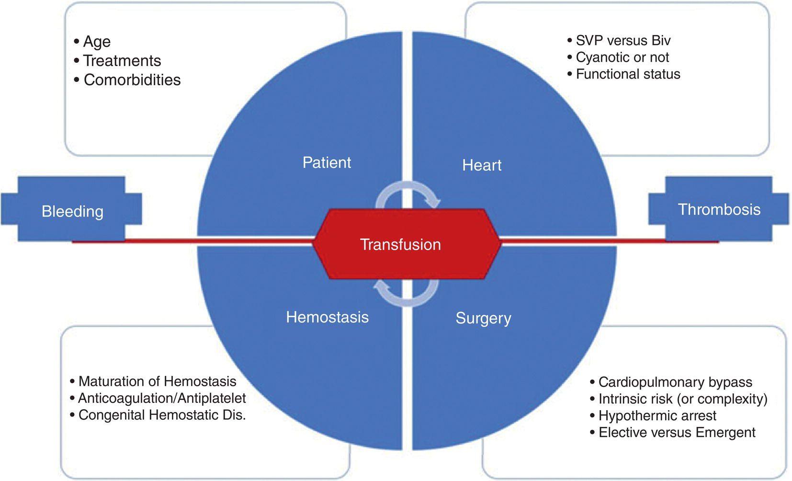

[**Figure 16.6**](#R_c16-fig-0006) **Factors affecting perioperative hemostasis in pediatric cardiac surgical patients.**

(Source: Cohen et al. \[34\]. Reproduced with permission of Cambridge University Press.)

* * *

### KEY POINTS: PREDICTORS OF BLEEDING POST‐CPB

-   Bleeding in the perioperative period of cardiac surgery is associated with an increased incidence of postoperative complications and mortality.
-   Although the exact mechanisms for bleeding and thrombotic risks in children with CHD remain poorly understood, a complex multifactorial etiology including modifiable and non‐modifiable factors is hypothesized.
-   Preoperative coagulation tests have not been shown to accurately predict perioperative bleeding.

* * *

### Preoperative laboratory testing

During the preoperative evaluation of patients coming for cardiac surgery, practitioners should perform a complete history and physical examination to determine what laboratory testing is necessary. Patients with cyanotic heart disease may have secondary erythrocytosis, thrombocytopenia, abnormal levels of fibrinogen, and other coagulation factors. In addition, these children often have abnormal liver function tests secondary to systemic hypoperfusion, heart failure, hypoxemia, and hyperviscosity. Because the detection of these abnormalities and correction may help minimize the risk of bleeding during the intraoperative period, it is recommended that a basic electrolyte panel, complete blood cell count with differential, coagulation profile, a type and crossmatch, and liver function tests be obtained \[41\]. Practitioners should also question the patient and family members about bleeding or thrombotic events to determine if further hematology work up is necessary.

For outpatients with acyanotic heart disease, several institutions have adopted strategies aimed at minimizing preoperative laboratory testing to reduce patient stress related to blood draws, minimize the risk of iatrogenic anemia, and reduce additional costs. In a survey of 12 congenital cardiac surgical programs, 11 institutions still send most baseline laboratory testing. However, many practitioners reported that in the year following the original survey, no cases were canceled or their management changed because of these laboratory results. While most practitioners agreed that a type and screen and complete blood count would be sufficient to manage outpatients, only one institution has implemented these changes thus far \[42\].

* * *

### KEY POINTS: PREOPERATIVE LABORATORY TESTING

-   A complete blood count, a basic electrolyte panel with liver function tests, coagulation profile and a type and cross are recommended for most patients presenting for cardiac surgery.
-   A thorough history and physical examination will determine if additional laboratory testing is necessary to screen for potential bleeding or thrombosis risks.

* * *

### Preoperative anemia

One of the cornerstones of modern Patient Blood Management protocols is the identification and the treatment of preoperative iron deficiency with or without anemia. Pediatric cardiac surgical patients can range from newborns to adolescents, suffering from cyanotic or non‐cyanotic cardiac defects, which result in varying baseline hemoglobin (Hb) concentrations and ferritin levels. The optimal preoperative Hb values for pediatric cardiac surgery remain to be determined as the World Health Organization (WHO) definition of anemia for pediatric patients does not apply to neonates and children with variable degrees of cyanosis and secondary erythrocytosis. However, one could argue that any pediatric cardiac surgical patient with a preoperative Hb below 11 g/dL should be considered anemic and might be suitable for preoperative anemia study and therapy. Higher thresholds might be worth consideration, especially in children with cyanotic heart defects. If a Hb of 11 g/dL is chosen as a threshold for intervention, up to 50% of patients with CHD would be diagnosed with preoperative anemia and should therefore be started on iron therapy before their procedure. In neonates and children undergoing noncardiac surgery, preoperative anemia was associated with an increased risk of mortality and postoperative complications \[43, 44\]. In cardiac patients, preoperative anemia was associated with an increased risk of perioperative acute kidney injury (AKI) in a retrospective cohort study of 220 patients undergoing cardiac surgery \[45\]. In addition, preoperative anemia has been shown to increase the risk of allogeneic transfusion in children undergoing noncomplex cardiac surgery (i.e., repair of ventricular or atrioventricular septal defects) \[46\]. Therefore, similar to adult patients, assessment of preoperative anemia and appropriate treatment should be recommended to avoid complications associated with perioperative and reduce the need for avoidable allogeneic blood transfusions.

Iron deficiency is present in an estimated 70–80% of pediatric patients with inflammatory bowel disease and has been shown to impair health‐related quality of life \[47\]. Iron deficiency is also common in patients with chronic kidney disease and renal failure and is associated with increased all‐cause and cardiovascular mortality \[48\]. Iron deficiency was recently studied in children with heart failure \[49\]. In this cohort, the authors found that 56% of children with heart failure presented with iron deficiency. They also found that iron deficiency was associated with greater risks of ventricular assist device implantation, heart transplantation, or death. In adults, iron deficiency has been repeatedly shown to be associated with greater cardiovascular and all‐cause mortality, poorer functional capacity, lower health‐related quality of life, and greater readmission rates in patients with chronic heart failure. Multiple randomized controlled trials have shown that treating iron deficiency with intravenous iron improves each of these outcome measures \[50, 51\].

Keeping that in mind, preoperative treatment of iron deficiency anemia is recommended in some adult and pediatric guidelines for the management of heart failure \[52\] or blood conservation in adults and pediatric cardiac surgical populations \[53, 54\]. In children undergoing cardiac surgery, the optimal approach for preoperative treatment of iron deficiency anemia has never been appropriately studied. For the preoperative administration of iron, only a very limited number of studies exist, most of them looking at oral iron supplementation \[55\]. The largest study using intravenous iron has been published by Hassan and colleagues in 2017 in which the authors demonstrated that Ferumoxytol was effective in treating iron‐deficiency anemia in a small retrospective cohort of 54 patients \[56\]. The members of this group pointed out that a slow infusion rate and close monitoring allowed early detection of the infrequent adverse drug reactions. Although the concomitant administration of EPO has sometimes been suggested, data supporting the efficacy and safety of EPO in pediatric cardiac patients is sparse. In a small retrospective study, Shimpo and colleagues demonstrated that the administration of up to 300 IU/kg EPO was effective as an adjuvant therapy for open‐heart surgery \[57\]. However, the appropriate dosing regime has not been determined thoroughly. Appropriately designed studies are urgently needed to define the optimal treatment strategy (oral vs. intravenous iron), the dose, the duration, and to understand whether the addition of EPO would sometimes be beneficial.

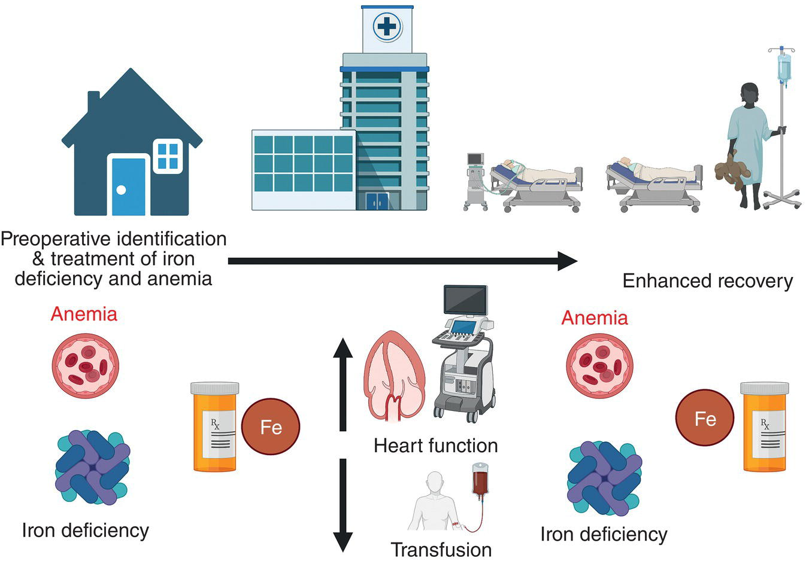

[**Figure 16.7**](#R_c16-fig-0007) Integration of iron deficiency and anemia management into guidelines for enhanced recovery following pediatric cardiac surgery.

(Source: made in ©BioRender ‐ biorender.com.)

Although one of the challenges often reported for preoperative assessment and treatment of anemia in adult cardiac surgical patients is the short window between the initial patient assessment and the time of surgery, this is often not an issue in infants and children who usually have to wait weeks, sometimes months, before their surgical procedure. We should therefore take advantage of the wait time to correct iron deficiency and anemia. In addition, postoperative iron deficiency and hospital‐acquired anemia are also important issues that require our attention, and efforts should be undertaken to reduce unnecessary blood sampling and treatment of iron deficiency anemia should be initiated or resumed in the postoperative period before hospital discharge. The development of enhanced recovery after surgery (ERAS) protocols, as recently emphasized by the members of the American Association of Thoracic Surgeons’ Cardiac Clinical Practice Standards Committee \[58\], is an excellent opportunity to integrate perioperative management of iron deficiency and anemia integrated into the multimodal protocol to optimize enhanced recovery following pediatric cardiac surgery ([Figure 16.7](#c16-fig-0007)).

* * *

### KEY POINTS: PREOPERATIVE ANEMIA

-   Preoperative anemia and iron deficiency are prevalent in the pediatric cardiac surgical population.
-   Anemia and iron deficiency should be evaluated and treated preoperatively.
-   The optimal therapeutic strategy (e.g., oral vs. intravenous iron, with or without EPO) remains to be determined.

* * *

### Autologous donation

Preoperative autologous donation (PAD) refers to the collection and anticoagulation of whole blood from a patient for anticipated perioperative transfusion. The amount of blood collected from a single donation is limited to about 10% of the patient’s total blood volume. While it may eliminate the risk of blood‐borne infections and may diminish immune modulation, PAD remains controversial due to issues with safety, cost, logistics around surgical scheduling, and the potential pathophysiologic effects on a child with complex CHD. Therefore, this practice is generally reserved for relatively healthy adolescent patients with simple cardiac anomalies.

In contrast, autologous intraoperative blood collection and retransfusion have become more popular in order to minimize the risks associated with PAD. Acute normovolemic hemodilution (ANH) is the removal of whole blood from the patient before CPB while maintaining normovolemia through the infusion of crystalloids or colloids and then transfusing the blood after CPB. Patient selection depends on baseline hematocrit and hemodynamic stability, the composition of the CPB prime, and the targeted hematocrit on CPB. A retrospective study of 209 pediatric patients undergoing cardiac surgery (with ANH when appropriate), showed that 59.6% of patients >6 kg did not receive any blood transfusions, while all patients under 6 kg received a blood transfusion. Another study of 36 patients <10 kg matched 1:1 for intraoperative autologous blood collection and retransfusion vs. standard practice, demonstrated that patients in the study group received fewer blood products overall (47 mL/kg vs. 68 mL/kg) without increased 24 hours chest tube output, mechanical ventilation, or intensive care units (ICU) length of stay. Of note, platelet count and fibrinogen levels were significantly lower in the study group compared to the control group. While these studies show that the practice is relatively safe, this practice does not necessarily reduce overall blood transfusions in patients under 18 kg \[59–61\].

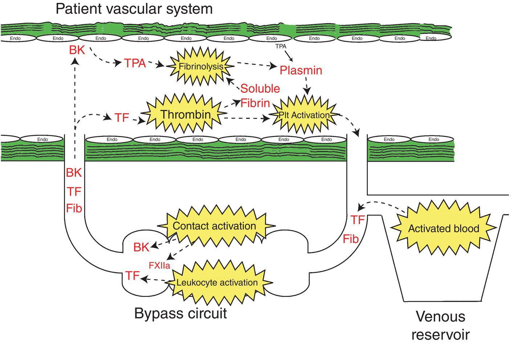

[**Figure 16.8**](#R_c16-fig-0008) **Summary of hemostatic activation mechanisms on cardiopulmonary bypass.** BK = bradykinin; FXIIa = activated factor XII; TF = tissue factor; TPA = tissue plasminogen activator; Plt = platelets; Fib = fibrin degradation products; Endo = endothelium.

(Source: Sniecinski et al. \[62\]. Reproduced with permission of Wolters Kluwer Health, Inc.)

* * *

### KEY POINTS: AUTOLOGOUS DONATION

-   PAD is the collection and anticoagulation of whole blood from a patient for anticipated perioperative transfusion.
-   While PAD has fallen out of favor, intraoperative autologous blood collection and re‐transfusion may reduce blood transfusions in patients >6 kg without increased risks.

* * *

## CPB‐associated coagulation changes

### Exposure to CPB circuit

Cardiopulmonary bypass (CPB) is a unique scenario when the patient’s blood is exposed to non‐endothelial/non‐physiologic surfaces leading to a widespread activation of the coagulation, fibrinolytic, and inflammatory systems ([Figure 16.8](#c16-fig-0008)).

Several mechanisms are involved in the hemostatic activation induced by CPB \[62, 63\]. The contact system (bradykinin system) is activated immediately when blood is in contact with the CPB artificial surfaces. In addition, factor XII auto‐cleaves itself upon contact with a variety of anionic surfaces leading to activated FXII, which converts prekallikrein into active kallikrein. Plasma kallikrein creates a positive feedback loop by producing more activated FXII, as well as producing bradykinin from high‐molecular‐weight kininogen (HMWK) \[64\]. Bradykinin levels increase 10‐fold due to increased HMWK cleavage as well as reduced lung clearance secondary to minimal pulmonary blood flow \[65\]. This has important implications for fibrinolysis because elevated bradykinin levels induce secretion of tPA. The role of thrombin generation during CPB is well‐documented, even in the presence of adequate anticoagulation \[66\]. The activation of the contact system, as well as the exposure of TF on the membrane of traumatized cells by aspiration of the surgical field and CPB, expression of TF due to inflammation and due to the generated thrombin will promote a vicious circle of activation of the hemostatic and fibrinolytic system. Endothelial cells release tissue‐type plasminogen activator (tPA), a major activator of plasminogen leading into fibrin‐degrading plasmin. In the setting of CPB, soluble and circuit‐bound fibrin provides a huge surface for plasminogen activation to occur. There is a 10‐ to 100‐fold increase in plasmin generation shortly after the commencement of CPB, and plasmin generation, along with fibrin degradation, remains increased 10‐ to 20‐fold throughout the duration of CPB \[67\]. During CPB, fibrin formation and degradation rates are nearly equal, indicating that much of the fibrin degradation is not at the sites of vascular injury. This hyperfibrinolytic state consumes fibrinogen, leaving less available for coagulation postoperatively. After CPB, platelet adhesion is decreased to the destruction of GPIb receptors by plasmin and by the shear stress. In addition, platelet aggregation is also decreased by thrombin, plasmin, and fibrin degradation products. Altogether, these processes lead to a quantitative and qualitative consumption of coagulation factors and platelets during CPB.

Because coagulation and immune systems are associated, inflammation has multiple mediators that can create profound amplification in coagulopathy. A sepsis‐like clinical picture, named systemic inflammatory response syndrome (SIRS), often results from CPB and can be linked to the close relationship between inflammation and coagulation. Leukocytes, including neutrophils and monocytes, bind to and are activated by the surface of the CPB, which leads to an increase in tissue expression, procoagulant activation, and thrombin generation. The generation of inflammatory cytokines leads to increased vascular permeability, neutrophil infiltration into the tissue, and production of acute‐phase proteins.

In addition, CPB needs to be primed with blood, fluid, or a combination leading to a variable degree of hemodilution promoting even more than coagulopathy.

### Hemodilution and CPB prime

Postoperative hemostasis is greatly influenced by the degree of hemodilution that occurs as a result of CPB. The effect of dilution depends on the patient’s blood volume, the baseline blood concentrations (hematocrit, coagulation factors, platelets), and the volume and components of the CPB circuit prime. In children, hemodilution is an independent predictor of increased transfusions. As a result, smaller circuits have become more popular in order to minimize hemodilution, reduce the inflammatory response induced by CPB components, and decrease overall blood transfusions. Miniaturizing the CPB circuit is achieved by the elimination of non‐essential components, using small‐volume circuit components (oxygenator, filters, cannulae), decreasing the length and diameter of circuit tubing, using a remote pump head, assisted venous drainage, retrograde autologous circuit priming, and microplegia techniques \[68\]. As a result, some institutions report prime volumes of 95–110 mL for infants <5 kg. However, efforts to reduce the prime volumes require careful planning and meticulous management of bypass to mitigate risks.

### Dilutional anemia

Originally, hemodilution during hypothermic CPB was used to reduce the use of blood products, promote microcirculatory flow and improve tissue perfusion. However, concerns emerged about postoperative cognitive impairment from reduced perfusion pressure, decreased oxygen‐carrying capacity, and increased cerebral blood flow causing an increased risk for cerebral microemboli. Subsequent studies have demonstrated that for infants undergoing biventricular repair, a hematocrit ~ 24% or higher at the onset of low‐flow CPB is associated with higher Psychomotor Development index scores at 1 year, reduced lactate levels, and improved fluid balance \[69\]. Some studies suggest that lower hematocrit levels are safe if mixed venous oxygen saturation, near‐infrared spectroscopy cerebral oxygen saturation, and lactate levels are maintained within the normal range \[70\]. Unfortunately, most of the studies evaluating lower hematocrits on CPB contain a small heterogeneous population and the nadir hematocrit was ~22%. In summary, due to differences in diagnosis, age at operation, and CPB management, it is unlikely that hematocrit alone can indicate when the benefits of RBC transfusion outweigh the risks of hemodilution.

### Dilution of coagulation factors

In addition to dilutional anemia, many coagulation factors have been noted to decrease at the initiation of CPB. Brown and colleagues demonstrated a decrease in both fibrinogen and FXIII due to hemodilution, which were restored to baseline levels after the transfusion of cryoprecipitate \[18\]. Of particular importance, the hemodilutional effects of CPB in neonates and infants often result in low fibrinogen levels that lead to impaired fibrin formation, inadequate clot formation, and increased risk of post‐CPB bleeding \[18, 71–73\] ([Figure 16.9](#c16-fig-0009)).

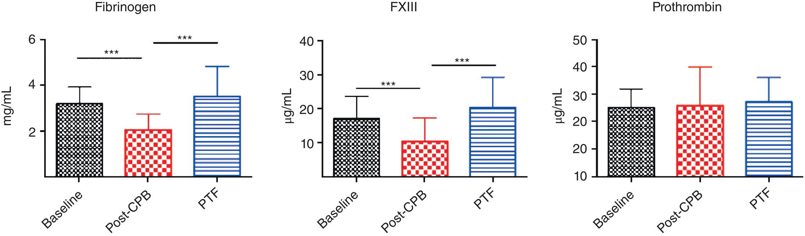

[**Figure 16.9**](#R_c16-fig-0009) **Effects of hemodilution on coagulation factors in neonates undergoing cardiopulmonary bypass.** Post‐CPB = cardiopulmonary bypass, F = Factor; PTF = Post Transfusion.

(Source: Brown et al. \[18\]. Reproduced with permission of Wolters Kluwer Health, Inc.)

### Composition of CPB prime

In addition to miniaturizing the circuit volumes for pediatric patients, the prime composition is often adapted to the particular requirements of the patient and the operation. That being said, the majority of institutions still use a blood prime for infants and neonates. The lower the blood volume and hematocrit of the patient, the more banked blood needs to be added into the prime. While several institutions have access to fresh whole blood (<48 hours after donation), the majority of institutions use reconstituted whole blood (fresh frozen plasma (FFP) plus RBCs). Advocates for fresh whole blood prime believe that it reduces coagulopathy and also CPB‐mediated inflammation. However, Mou and colleagues performed a randomized trial in children <1 year of age comparing fresh whole blood with reconstituted blood. The authors found that patients who received fresh whole blood had increased ICU length of stay and more fluid overload \[74\]. In contrast, several other studies have demonstrated that patients receiving whole blood received fewer transfusions, significantly less chest tube output, and shorter length of mechanical ventilation and ICU stays \[75–77\]. Furthermore, adequately powered studies performed in the context of the current multimodal strategy to manage coagulopathy are required before the safety and efficacy of fresh whole blood can be determined.

While most institutions still use RBCs and FFP in the CPB prime for neonates, there is little high‐grade evidence to support its use in older patient populations. Some institutions use albumin to maintain oncotic pressure and reduce fluid accumulation, while proponents of FFP argue that in addition to maintaining oncotic pressure, FFP increases the level of coagulation factors and reduces intraoperative transfusion requirements in complex neonatal and cyanotic patients. In a study of 60 patients weighing 7–15 kg randomized to FFP or crystalloid prime, Dieu and colleagues did not report any significant differences in median postoperative blood loss or transfusion requirements \[78\]. Other studies have demonstrated that patients with FFP prime have higher fibrinogen concentrations and improved TEG values at the end of CPB, but this was not associated with a decrease in postoperative transfusions. Unfortunately, the composition of the prime is often a matter of opinion and institutional practice and differs widely across institutions. The only consensus regarding CPB prime is minimizing transfusion requirements and hemodilution. Additional pediatric‐specific trials are needed to determine the optimal CPB prime composition.

* * *

### KEY POINTS: HEMODILUTION AND CPB PRIME

-   Significant hemodilution of hematocrit and coagulation factors due to the CPB circuit contributes to post‐bypass coagulopathy in patients undergoing congenital cardiac surgery.
-   The degree of hemodilution depends on the patient’s blood volume, baseline hematocrit, and the volume of the CPB circuit and its components.
-   Due to significant hemodilution in neonates, many institutions still use either whole blood or reconstituted blood (FFP and RBCs) in their circuit prime.

* * *

### Anticoagulation

Anticoagulation during CPB is necessary to prevent thrombin formation and subsequent clotting as blood comes into contact with the non‐endothelial CPB surfaces. Unfractionated heparin is the primary anticoagulant used to inhibit not only the formation of thrombin but also the activity of circulating thrombin through its binding to AT \[79\]. Unfractionated heparin is usually administered at the dose of 300–400 IU/kg. The administration of 400 U/kg of heparin has been shown to produce adequate prolongation of activated clotting times (ACT) >480 s. However, a word of caution is required for neonates where standard weight‐based doses have been shown to inadequately suppress thrombin generation and activity. Consequently, some centers have adopted patient‐specific heparin concentration‐based heparin management protocols in infants aged <6 to 12 months \[80–82\]. Individualized heparin doses based on heparin dose‐response analysis have been used in some studies \[83\]. However, in a recent large cohort of children who received unfractionated heparin for CPB, Nakamura and colleagues found that heparin responsiveness before CPB was not reliably predicted by either _in vitro_ heparin dose‐response slopes estimated by the HMS Plus System (Medtronic, Minneapolis, MN) or regression models using commonly available preoperative clinical and laboratory data \[84\]. The strength of the correlation between predicted and observed heparin responsiveness was found to be at best moderate for young children <5 years. Different techniques have been used to monitor anticoagulation intraoperatively. Standard whole blood clotting time is still routinely used to monitor anticoagulation in children undergoing cardiac surgery. However, some centers have recommended monitoring heparin concentration along with the ACT as a more accurate guide for the administration of heparin to infants during CPB \[85\].

Despite the use of anticoagulation monitoring, anticoagulation using unfractionated heparin remains challenging in neonates and infants. Differences between commercialized heparin manufacturers and others have also been reported, which highlights the need for appropriate monitoring of anticoagulation.

Another reason for the difference in heparin sensitivity in the pediatric population may be related to the anticoagulation activity of AT, which can be influenced by age, heart failure, liver dysfunction, and inflammation. In a study by Manlhiot and colleagues, low circulating AT activity was associated with lower heparin efficacy, which ultimately leads to a decreased ability to suppress thrombin generation during CPB \[86\]. Determination of risk factors for heparin resistance, and potentially, AT supplementation, may individualize and improve anticoagulation treatment. In the presence of AT deficiency, FFP is usually administered because of its frequent availability in the operating room. Even though AT concentrate has sometimes been used in children supported with ECMO, there is a paucity of studies assessing the efficacy and safety of AT supplementation in neonates and children undergoing cardiac surgery. In a small cohort of infants and children with an inadequate response to heparin, Lopez and colleagues reported that 50 ± 6 U/kg of AT was effective in achieving adequate anticoagulation \[87\]. AT levels are sometimes included as part of the preoperative laboratory testing. Because of the low prevalence of congenital AT deficiency, routine measurement of AT levels is not recommended. However, preoperative measurement of AT level should be considered in the presence of risk factors (e.g., neonates exposed to preoperative heparin infusion).

After a patient is weaned off CPB, protamine is administered to neutralize the effect of heparin. The protamine dose is usually based on the total amount of heparin administered during CPB. However, both residual heparin and protamine overdose are associated with increased postoperative bleeding. Most centers use a protamine‐to‐heparin ratio of 1:1. Based on the pharmacokinetic of heparin, a 1:1 ratio could lead to protamine overdose and bleeding; it is often recommended to use a protamine‐to‐heparin ratio of 1:2 ratio. Protamine dose can also be estimated based on heparin concentration monitoring \[81, 83\].

* * *

### KEY POINTS: ANTICOAGULATION

-   ACT is a whole blood test, and the clotting time obtained from an ACT is not specific to anticoagulation and any prolongation could be explained by the underlying coagulopathy.
-   The baseline ACT, although routine in most cardiac programs, is of little value as it has never been shown to predict heparin resistance.
-   After protamine, ACT returning to the baseline value does not make sense due to the non‐specificity of ACT. The ideal method to assess the presence of residual heparin is through the use of heparinase tests and the ratio between clotting time with and without heparinase. This could be achieved using ACT or viscoelastic tests \[88\]. It is usually accepted that a difference of >10% between clotting times with and without heparinase is subjective of residual heparinization.
-   The optimal protamine‐to‐heparin ratio remains to be determined, but 1:1 increases the risk of overdosage and bleeding.

* * *

### Heparin‐induced thrombocytopenia and alternatives to heparin

Prolonged administration of heparin can lead to heparin‐induced thrombocytopenia (HIT). HIT is an immune‐mediated syndrome manifesting as a drop in platelet count to >50% and life‐threatening vascular thromboses (incidence: 30–75%) and can even be associated with mortality in 20–30% of cases. HIT has been reported in adults undergoing cardiac surgery, as well as in children and neonates. [Figure 16.10](#c16-fig-0010) summarizes the pathogenesis of HIT. The central concept if the formation of heparin‐dependent IgG that activates platelets after binding to multimolecular complexes of heparin and platelet factor 4 (PF4) leading to a self‐perpetuating cycle of platelet activation, thrombin generation, and further release of PF4 from platelet granules. Endothelial cells and monocytes are also activated by the antiheparin/PF4 IgG resulting in the expression of circulant TF further promoting thrombin generation. The diagnosis of HIT relies on a combination of clinical signs and laboratory criteria. Clinical criteria include thrombocytopenia with a ≥50% platelet count drop or a platelet count decreases <150,000/mm3, with or without venous or arterial thromboses. Laboratory criteria include the detection of antibodies to heparin/PF4 complexes and positive functional tests of platelet activation or aggregation.

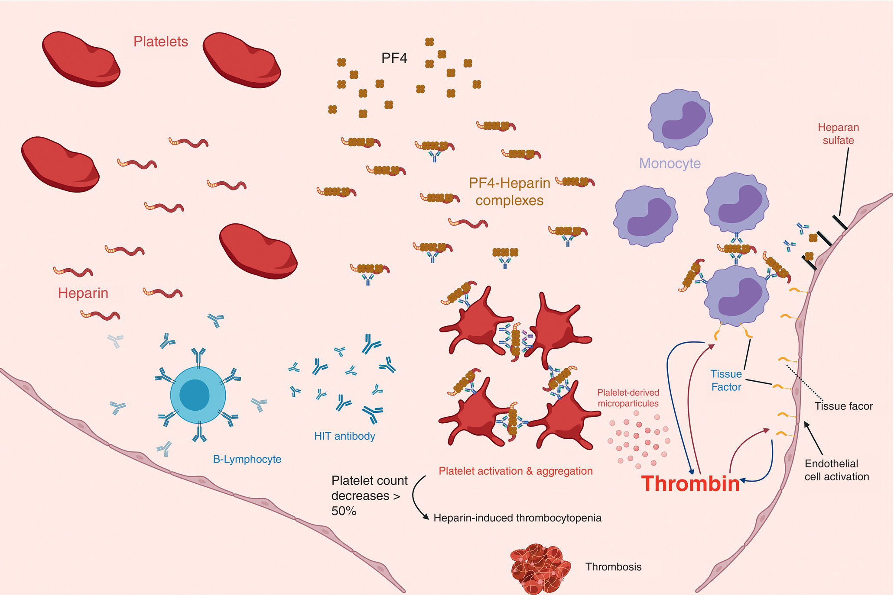

[**Figure 16.10**](#R_c16-fig-0010) Heparin‐induced thrombocytopenia.

(Source: made in ©BioRender ‐ biorender.com.)

In the pediatric population, the incidence of HIT is around 2–3% of patients receiving heparin anticoagulation. The main risk factor in the pediatric population is the use of intravascular catheters and heparin flushes in neonates and infants.

Three scenarios have been described for HIT. The “typical” onset HIT is seen in about two‐thirds of cases and presents about 5 to 10 days after the initiation of heparin administration. The “rapid” onset HIT is seen in about 30% of the cases when HIT develops within hours or the first day of heparin administration. The pathophysiology of the “rapid” onset HIT is thought to be explained by the presence of preexisting heparin/PF4 antibodies due to previous exposure to heparin within 100 days. Finally, “delayed” onset HIT is rare but presents up to 3 weeks after discontinuation of heparin. The pathophysiology is explained by the presence of persistent antibodies that can activate platelets without the presence of heparin.

When HIT is suspected, the assessment begins with the calculation of the pretest probability using the “four Ts”: thrombocytopenia, the timing of platelet drop, thrombosis, and other causes of thrombocytopenia ([Table 16.3](#c16-tbl-0003)) \[89\]. In the pediatric cardiac surgical population, the number of etiologies for thrombocytopenia are numerous. It is therefore important to dissociate HIT with other causes of thrombocytopenia. Based on the scoring system in [Table 16.3](#c16-tbl-0003), the decision to proceed with only antigen testing (score 6–8), a positive antigen and functional assays (score 4–5), no laboratory testing when the probability of HIT is low (score 0–3). Antigen assays are used to detect the presence of IgG antibodies to heparin/PF4 complexes, as well as IgA and IgM. Although IgA and IgM can be detected, it seems unlikely that HIT can be developed without the presence of IgG which explains the discrepancy between the presence of detectable heparin/PF4 antibodies in adults treated with heparin (±50%) but only 1–5% develop HIT. Functional tests detect the ability of the heparin/PF4‐IgG complex to activate platelets and cause thrombosis. Functional assays are time‐consuming, require donor platelets, and are performed only in reference laboratories.

The treatment of clinically suspect HIT requires the interruption of any exposure to heparins, which not only includes unfractionated heparin but also LMWH and heparin‐coated materials. The administration of non‐heparin anticoagulants is recommended, like direct thrombin inhibitors (bivalirudin or argatroban) or direct Xa inhibitors (fondaparinux).

In contrast to heparins that require antithrombin (AT) to inhibit thrombin, argatroban and bivalirudin are direct thrombin inhibitors (DTIs) that bind to thrombin independent of antithrombin. DTIs, unlike unfractionated heparin (UFH), inhibit both plasma and fibrin‐bound thrombin ([Figure 16.11](#c16-fig-0011)). Fibrin‐bound thrombin activates platelets in the forming thrombus for clot stabilization. DTIs inhibit clot‐bound thrombin, decrease clot stabilization, and promote thrombolysis.

In addition, recent data indicate that argatroban and bivalirudin increase the fibrin network permeability, rendering it less resistant to fibrinolysis. However, in conjunction with the lack of a reversal agent, these effects may contribute to potentially severe bleeding complications within the context of high‐dose administration as used during cardiac surgery. There are limited data with regard to the use of argatroban during cardiac surgery, particularly during CPB. Bivalirudin has been studied in a few randomized controlled trials in adults undergoing cardiac surgery. Argatroban and bivalirudin are important anticoagulation alternatives for patients with HIT who require urgent surgery and/or perioperative anticoagulation. Although both argatroban and bivalirudin being employed for more than a decade in the complex setting of cardiac surgery, scientific data are limited to a restricted number of smaller prospective and retrospective, mostly single‐center studies, and rarely involving pediatric patients. The unique pharmacokinetics of bivalirudin makes this agent an interesting option, particularly for a short‐term, high‐dose anticoagulant effect, as needed during cardiac surgery. However, limitations are the lack of a standardized reliable point‐of‐care monitoring during CPB, as well as a reversal agent. The use of bivalirudin was recently studied in a small randomized controlled trial and compared to heparin in children with non‐cyanotic heart disease undergoing cardiac surgery \[91\]. In the absence of a recommended safe dose for children, the adult dose regimen of 1 mg/kg followed by 2.5 mg/kg/hour infusion was used for all children, although 54% of children required an escalation in the dose to maintain an ACT of >480 seconds. The dose required to maintain ACT >480 seconds was 1.7 ± 0.2 mg/kg followed by 3.0 ± 0.7 mg/kg/hour infusion. Bivalirudin did not increase postoperative bleeding and transfusion requirement. In a recent research report, Wolstencroft and colleagues suggested that bivalirudin infusion in children should be started after a loading dose at rates greater than those used in adults \[92\]. Dose in neonates remains undefined because neither pharmacokinetics nor coagulation pharmacodynamics has been adequately characterized. An infusion rate of 4.5 mg/kg/hour in a 10 kg infant, 4 mg/kg/hour in a 20 kg child, and 3.5 mg/kg/hour in a 30–40 kg child will target an activated clotting time slower than 400 seconds. Adult regimens could be used in those children heavier than 50 kg. In a review article published in 2019, Zaleski and colleagues from Boston Children’s Hospital summarized their experience with bivalirudin in the context of HIT \[93\]. The authors described their dose regimen as well as modifications required when the DTI is used. The authors suggest starting with a loading dose of 1 mg/kg followed by an infusion of 2.5 mg/kg/hour. They also recognized the need for close monitoring with repeated ACTs and dose adjustments with additional boluses of 0.5–1 mg/kg and increases in continuous infusion. That includes the following changes in CPB. The anesthesiologists must be aware that the bypass cannulas and pump suckers will be removed within a set timeframe after the discontinuation of bivalirudin. This is done to minimize the chance of blood stagnation that would lead to bivalirudin proteolysis and result in thrombosis. Because of this, blood products (cell salvage or otherwise) must be readily available for transfusion in the period immediately after separation from CPB. Modified ultrafiltration (MUF) has been safely used in several of the reported cases and should be considered when clinically appropriate; care must be taken to prevent blood stasis in the hemoconcentrator once incorporated. When used for cardiac catheterization, the authors suggest starting with a loading dose of 0.75 mg/kg followed by an infusion of 1.75 mg/kg/hour. It is also important to remember that although ACT is frequently used to monitor anticoagulation with DTIs, sensitivity‐improving modifications are available either as point‐of‐care tests (e.g., Ecarin–thromboelastography) or quantitative, drug‐calibrated assays (e.g., ecarin clotting time, dilute thrombin time, and chromogenic anti‐IIa assays). However, these tests and assays have not been validated in the pediatric population for this application and thus should be used with caution, if at all.

[**Table 16.3**](#R_c16-tbl-0003) Estimating the Pretest Probability of Heparin‐Induced Thrombocytopenia: the “four Ts”

|  | 2 | 1 | 0 |
| --- | --- | --- | --- |
| **Thrombocytopenia** | \>50% platelet fall (nadir ≥ 20,000/mm3) | 30–50% platelet fall (or >50% fall due to surgery) or nadir 10–19,000/mm3 | <30% platelet fall or nadir <10,000/mm3 |
| **Timing of platelet count fall or thrombosis** | Clear onset between days 5 and 10 or ≤1 day (if heparin exposure within the past 30 days) | Consistent with day 5–10 fall, but not clear (e.g., missing platelet count) or ≤1 day (heparin exposure within the past 31–100 days) or platelet fall after day 10 | Platelet count fall ≤4 days without recent preceding heparin exposure |
| **Thrombosis or other sequelae (e.g., skin lesion)** | New thrombosis, skin necrosis, post heparin bolus acute systemic reaction | Progressive recurrent thrombosis, erythematous skin lesions, suspected thrombosis not yet proven | None |
| **Other causes of thrombocytopenia not evident** | No explanation (besides HIT) for platelet count is evident | Other possible cause is evident | Definite, other cause present |

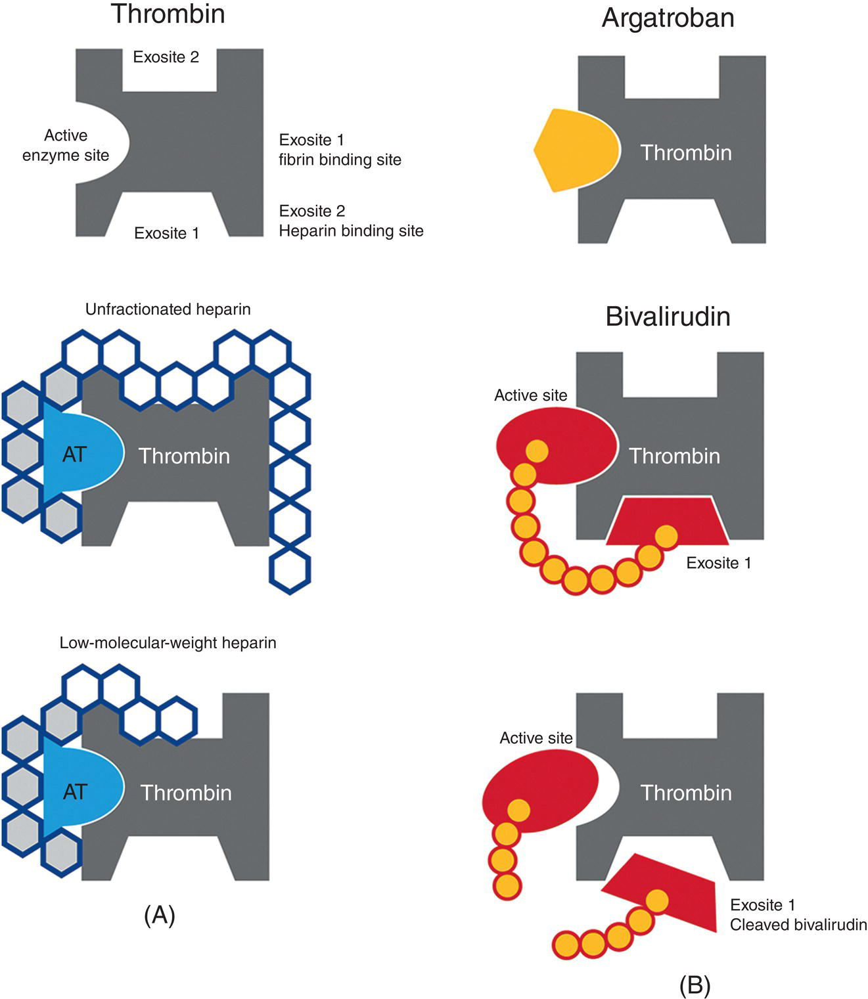

[**Figure 16.11**](#R_c16-fig-0011) **Mechanism of action of argatroban and bivalirudin.** (A) Indirect inhibition of thrombin by antithrombin, which is activated via unfractionated or low molecular weight heparin. (B) Direct inhibition of thrombin by argatroban and bivalirudin. Bivalirudin is cleaved by thrombin via proteolysis. This represents the major elimination mechanism of bivalirudin. AT = antithrombin.

(Source: Koster et al. \[90\]. Reproduced with permission of Wolters Kluwer Health, Inc.)

In case a patient with a history of HIT requires an elective surgery, all efforts should be made to postpone the surgery until the heparin/PF4 antibody levels have become negative (±85 days). Although some experts advise not to expose those patients again to heparin, most suggest that it is safe to use heparin again due to the limited immune memory in HIT.

* * *

### KEY POINTS: HEPARIN‐INDUCED THROMBOCYTOPENIA

-   HIT is an immune‐mediated syndrome manifesting as a drop in platelet count >50% and life‐threatening vascular thromboses (incidence: 30–75%)
-   Clinical criteria include thrombocytopenia with a ≥50% platelet count drop or a platelet count decreases <150,000/mm3, with or without venous or arterial thromboses.
-   The treatment of clinically suspect HIT requires the interruption of any exposure to heparins, which not only includes unfractionated heparin but also LMWH and heparin‐coated materials. Bivalirudin is a frequently used alternative.
-   Most authors suggest that it is safe to use heparin again due to the limited immune memory in HIT.

* * *

### Ultrafiltration

Ultrafiltration has been used in neonates and children undergoing cardiac surgery for many year and has been designed to minimize fluid overload, decrease the need for blood product transfusion, and reduce the plasmatic concentration of inflammatory mediators \[94\]. Ultrafiltration is a hemofiltration technique that passes blood through a semipermeable membrane filter and, according to a transmembrane pressure gradient, removes water, electrolytes, and other substances of small molecular size. Conventional ultrafiltration (performed during CPB) in children is associated with a statistically significant, but clinically modest, increase in the concentrations of fibrinogen and other coagulation factors \[95\]. MUF, which is performed after weaning from CPB, has been demonstrated to increase plasma protein concentrations and decrease postoperative bleeding and transfusion requirements \[96, 97\]. The efficacy of the two techniques has been discussed in a good number of articles \[98–101\]. In 2006, Williams and colleagues first compared clinical outcomes after heart surgery between three groups of infants with CHD that received dilutional conventional ultrafiltration, MUF, or a combination of both \[102\]. This study reported that the combination of MUF and dilutional conventional ultrafiltration afforded no additional benefit in terms of patient outcome relative to either dilutional conventional ultrafiltration or MUF alone. A meta‐analysis of the currently available randomized controlled trials that examined the clinical benefits of MUF over conventional ultrafiltration in pediatric cardiac surgery indicated that MUF resulted in significantly higher post‐CPB hematocrit levels and higher mean arterial blood pressure \[103\]. However, the analysis failed to show a positive impact of MUF on postoperative clinical parameters, including postoperative blood loss, ventilator time, and ICU time. These findings suggested that both MUF and conventional ultrafiltration could improve clinical conditions in the immediate post‐CPB period. The benefit of MUF over continuous ultrafiltration on patient overall outcome might not be significant. In a more recent prospective randomized study, MUF was applied to all patients following the termination of CPB for either 10, 15, or 20 minutes \[104\]. In that study, MUF acutely improved the pulmonary compliance and gas exchange in all three groups and when lasting longer than 10 minutes acutely increased hematocrit levels and blood pressure measurements. However, there were not any additional contributions to the pulmonary, hemodynamic, and clinical measurements in the intensive care unit. Most recent guidelines recommend conventional ultrafiltration or ≥10 minutes of MUF to maximize hemoconcentration and facilitate early modification of systemic inflammatory response syndrome for neonates and infants undergoing cardiac surgery with CPB \[54\].

* * *

### KEY POINTS: ULTRAFILTRATION

-   Conventional ultrafiltration or ≥10 minutes of MUF to maximize hemoconcentration and facilitate early modification of systemic inflammatory response syndrome for neonates and infants undergoing cardiac surgery with CPB.

* * *

## Management of bleeding

### Cell salvage

Blood shed intraoperatively can be collected into an automated centrifuged‐based blood salvage instrument that produces a heparin‐free suspension of washed and concentrated RBCs. This technique can also be used to process the blood left in the CPB circuit after separation from CPB. Several meta‐analyses have been published, clearly suggesting the utility of cell salvage in reducing perioperative transfusion needs in adult cardiac surgery \[105, 106\]. In pediatric cardiac surgery, technical limitations prevented cell salvage in smaller patients for many years. Due to the low blood volumes harvested during pediatric cardiac surgery, many commercialized cell salvage devices failed to process this low amount of blood adequately. However, recent technical advancements have made cell savers feasible for the small volume requirements of neonates and infants; therefore, cell salvage devices are now routinely used in pediatric cardiac surgery. Two randomized clinical trials have been published and they have demonstrated the clinical utility of cell salvage in pediatric cardiac surgery through a reduction in perioperative transfusion needs \[107, 108\]. In addition, cell salvage has also been found to be cost‐effective in pediatric cardiac surgery \[109\].

In clinical practice, the most common indications for the use of cell salvage are patients undergoing surgery with a high bleeding risk (e.g., re‐sternotomy) and patients in which allogeneic blood transfusion is not an option (e.g., Jehovah’s Witness). Some programs use cell salvage routinely and take advantage of the cell salvage technology to process CPB blood left after CPB separation. This approach is attractive as the blood at the end of CPB is usually poor‐quality heparinized blood with a relatively low level of hematocrit. Processing blood with the cell salver will therefore concentrate the RBCs to higher hematocrit and eliminate heparin allowing the reinfusion of concentrated RBCs. It is however important to keep in mind that fibrinogen, platelets, and other coagulation factors will be lost in the process and will have to be replaced using the appropriate products or factor concentrates. Cell salvage can also be used to wash irradiated RBCs to reduce potassium and lactate loads and prevent hyperkalemia during CPB \[110\]. However, since the use of irradiated blood has been declining due to the effectiveness of leukocyte depletion, this indication has become less important during the past years.

### Use of coagulation tests and transfusion algorithms

Intraoperative monitoring of hemostasis before, during, or after CPB has been studied for over 60 years. Several assays have been used either to predict bleeding or to treat coagulopathy in bleeding patients. Standard coagulation assays (e.g., activated partial thromboplastin time, aPTT; partial thromboplastin time, PTT; international normalized ratio, INR) were developed originally for the diagnosis of congenital factor deficiencies, and later the INR was formatted to guide the administration of vitamin K antagonists in both adults and children \[111\]. Although considered the “gold standard” of coagulation tests, these tests were not designed to monitor perioperative coagulopathy, nor to guide the administration of hemostatic agents in bleeding situations. As it usually takes 30–45 minutes to organize testing to be performed in the local hemostasis laboratory, limited information is obtained from these tests in the context of acute bleeding. In addition, standard laboratory tests are performed on platelet‐poor plasma (PPP) and do not allow for a global assessment of coagulation (e.g., do not assess platelet function and fibrinolysis). Over the past decade, viscoelastic hemostatic tests have been increasingly used in different clinical conditions and are now integrated into all recent guidelines for management in adults during CPB \[112–114\]. Viscoelastic hemostatic assays are point‐of‐care tests that allow for a global assessment of coagulation at the bedside using whole blood. The technology to allow this assessment has evolved from the original thromboelastography (TEG®, Haemonetics Corp. Boston, MA) to now include thromboelastometry (ROTEM®, Instrumentation Laboratory, Bedford, MA), and, most recently, the Quantra® Hemostasis Analyzer (Hemosonics Corp., Charlottesville, VA).

In the TEG system, a cylindrical cup containing a 340 microliter whole blood sample oscillates under constant force. A pin on a torsion wire is suspended in the blood. As the viscoelastic strength of the clot increases progressively more rotation is transmitted to the torsion wire and this is detected by an electromagnetic transducer. The TEG 6s uses resonance‐frequency viscoelasticity measurements and a disposable multichannel microfluidic cartridge, which decreases vulnerability to vibration and reduces user errors ([Figure 16.12](#c16-fig-0012)). In addition to the standard Global Hemostasis Cartridge, TEG 6s also includes a TEG PlateletMapping cartridge. Although the use of TEG PlateletMapping may be considered a useful supplement to the existing platelet function tests (e.g., PFA‐100®, Seimens Medical Solutions, Malvern, PA; VerifyNow System™, Instrumentation Laboratory, Bedford, MA: Multiplate® Electrode Aggregometry, Roche Diagnostics, Indianapolis, IN) \[115\], further clinical validations will be required to define the clinical applications of TEG PlateletMapping \[116\].

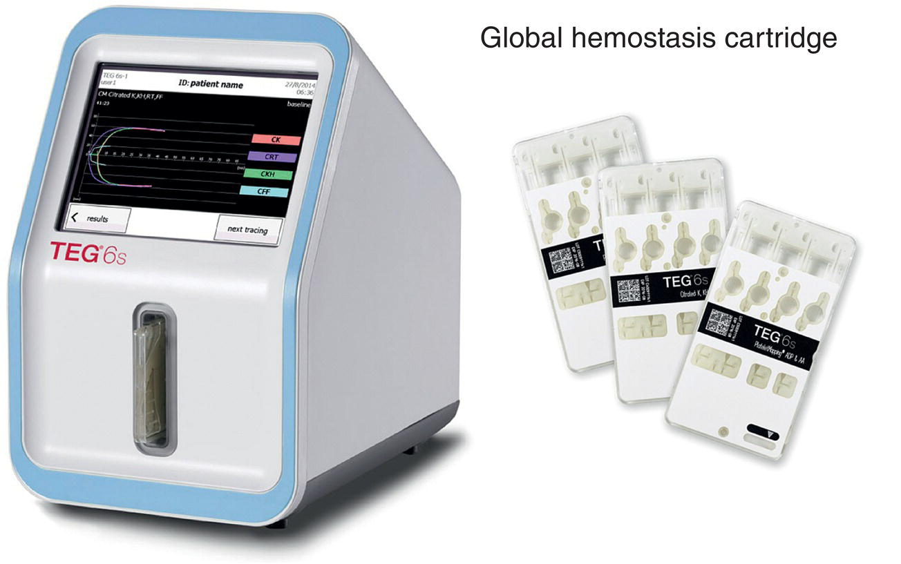

[**Figure 16.12**](#R_c16-fig-0012) **TEG® 6s device and cartridge.** The Global Hemostasis Cartridge includes: Kaolin TEG: intrinsic activated assay, Kaolin TEG with heparinase: intrinsic activated assay with heparinase, Rapid TEG: intrinsic and extrinsic activation, TEG Functional Fibrinogen: extrinsic pathway activated assay uses a GP IIb/IIIa platelet inhibitor to restrict platelet activity.

Courtesy of Haemonetics Corp. Boston, MA.

ROTEM® uses a pin suspended on a ball bearing mechanism in which the pin oscillates through the application of a constant force. As the viscoelastic strength of the clot increases the rotation of the pin is progressively impeded and this is detected optically using a charge‐coupled device (CDD) image sensor system. Different tests can be conducted simultaneously on each of the four channels of the analyzer ([Table 16.4](#c16-tbl-0004)). The most recent analyzer, ROTEM® Sigma, and cartridges that contain different reagents in freeze‐dried pellet form are represented in [Figure 16.13](#c16-fig-0013).

The Quantra® QPlus System is a cartridge‐based device consisting of the Quantra® Hemostasis Analyzer and single‐use cartridges (QPlus Cartridge and QStat Cartridge) ([Figure 16.14](#c16-fig-0014)) \[117\]. The device measures shear modulus expressed in units of hectopascals (hPa) as a metric of clot viscoelastic properties during the coagulation process. This is accomplished using ultrasound generation and detection of resonance using the non‐contact method of SEER (Sonic Estimation Elasticity via Resonance) Sonorheometry \[118, 119\]. An ultrasound pulse is sent into the blood sample causing it to resonate generating a shear wave. As the clot vibrates during resonance, returning ultrasound tracking pulses are used to measure the sample motion and create a time–displacement curve every 4 seconds. As the clot progressively stiffens the frequency of oscillations increases. The time–displacement curve at a specific point in time can be compared to theoretical models to determine the actual shear modulus.

[**Table 16.4**](#R_c16-tbl-0004) ROTEM® assays and their clinical indications

| Assay | Activators | Clinical indications |
| --- | --- | --- |
| **EXTEM** | CaCl2 and tissue factor | Deficiency of the factors of the extrinsic pathway. |
| **FIBTEM** | CaCl2, tissue factor, and cytochalasin D | Fibrin polymerization, fibrinogen level |
| **APTEM** | CaCl2, tissue factor, and aprotinin | Diagnosis of fibrinolysis when compared to EXTEM |
| **INTEM** | CaCl2 and ellagic acid | Deficiency of factors of the intrinsic pathway; heparin anticoagulation |
| **HEPTEM** | CaCl2, ellagic acid, and heparinase | Degree of (residual) heparinization when compared to INTEM |

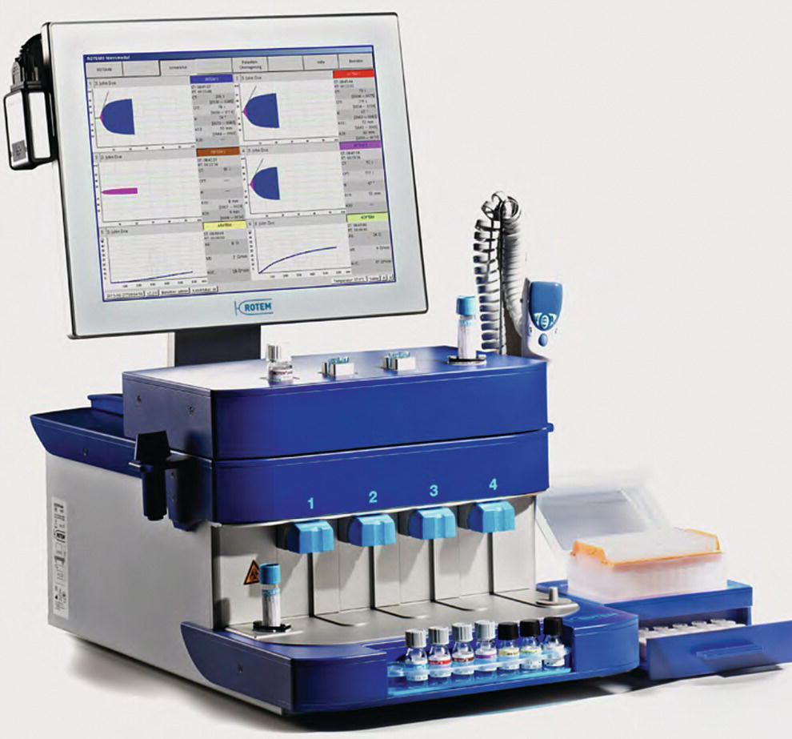

[**Figure 16.13**](#R_c16-fig-0013) **ROTEM® Sigma and cartridges.**

Courtesy of Instrumentation Laboratory, Bedford, MA.

[Figure 16.15](#c16-fig-0015) offers a schematic representation of the TEG® and ROTEM® trace and the definition of the most important parameters are summarized in [Table 16.5](#c16-tbl-0005). Viscoelastic tests are available at the bedside and the use of TEG (TEG®, Haemonetic, Boston, MA) or ROTEM (ROTEM®, Instrumentation Laboratory, Bedford, MA) early parameters (as soon as 5 minutes after clotting time) allows for an implementation of early goal‐directed hemostatic therapy in bleeding children \[121\]. A good correlation between viscoelastic tests and standard coagulation assays has been demonstrated in children undergoing cardiac surgery \[73, 122, 123\].

Diagnosis and treatment algorithms incorporating viscoelastic hemostatic tests for bleeding patients in a variety of clinical situations have now been developed. In adult cardiac surgical patients, Karkouti and colleagues conducted a pragmatic multicenter stepped‐wedge cluster randomized controlled trial of a point‐of‐care–based transfusion algorithm in consecutive patients undergoing cardiac surgery with CPB at 12 Canadian hospitals from October 6, 2014, to May 1, 2015 \[124\]. In their study, the authors found that implementation of point‐of‐care hemostatic testing within the context of a simple, integrated transfusion algorithm across 12 hospitals reduced RBC transfusions, platelet transfusions, and major bleeding following cardiac surgery. These findings suggest that the use of point‐of‐care hemostatic testing improves the management of coagulopathy in cardiac surgery and support their broader adoption into clinical practice.

However, it is recognized that children, especially neonates and infants, pose different hemostatic problems on CPB when compared to adults. Of note, critical levels of hypofibrinogenemia and thrombocytopenia have been seen in infants and children, whereas this is rare in adult cardiac surgery. The efficacy of viscoelastic tests to predict bleeding in children undergoing cardiac surgery has been assessed in retrospective studies \[39, 40, 125–130\]. Overall, the value of intraoperative monitoring of hemostasis in predicting perioperative bleeding is weak and the vast majority of studies have failed to establish a correlation between intraoperative hemostasis parameters and the incidence of perioperative bleeding. The absence of predictive value can easily be explained by the multifactorial etiology of coagulopathy and bleeding in infants and children undergoing cardiac surgery as well the heterogeneity in terms of perioperative management, patients' co‐morbidities, surgical complexity, and surgeons’ individual skills and experience. The use of viscoelastic tests integrated into a well‐defined algorithm to guide the use of blood products has been shown to significantly reduce blood product transfusion \[131, 132\]. To date, however, the efficacy of viscoelastic testing has only been studied in one prospective randomized study \[133\]. In this study, the authors randomized 100 children to be managed using a conventional transfusion protocol based on routine practice (_n_ = 50) or a ROTEM®‐based algorithm specifically designed in that center (_n_ = 50). The authors demonstrated that the application of a ROTEM®‐based algorithm was associated with a significant reduction in the total amount of chest tube drainage measured at 12 hours (_p_ < 0.001) and 24 hours (_p_ = 0.002) after intensive care admission, and a significant reduction of the intraoperative amount of FFP and platelet concentrate administered. The authors concluded that hemostatic therapy for pediatric patients based on post‐CPB thromboelastometry measurements reduced postoperative blood loss and blood product transfusion.

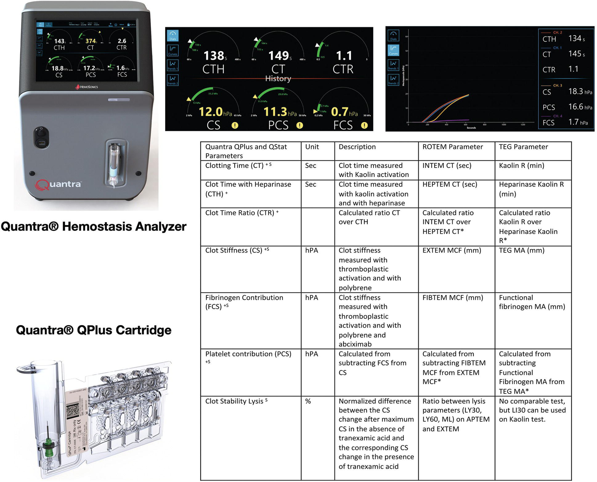

[**Figure 16.14**](#R_c16-fig-0014) **Quantra® Hemostasis Analyzer, QPlus cartridge, and parameters.** + QPlus cartridge provides measures of Clot Time (CT), Clot Stiffness (CS), Fibrinogen and Platelet Contributions to clot stiffness (FCS and PCS), Clot Time Ratio (CTR), and Clot Time with Heparinase (CTH). This cartridge is indicated for cardiac and major orthopedic surgery and is FDA approved in the United States. S QStat cartridge provides measures of Clot Time (CT), Clot Stiffness (CS), Fibrinogen and Platelet Contributions to clot stiffness (FCS and PCS), and Clot Stability to Lysis (CSL). The cartridge is intended for trauma and liver transplant surgery and is currently only available outside the United States.

Courtesy of Hemosonics Corp., Charlottesville, VA.

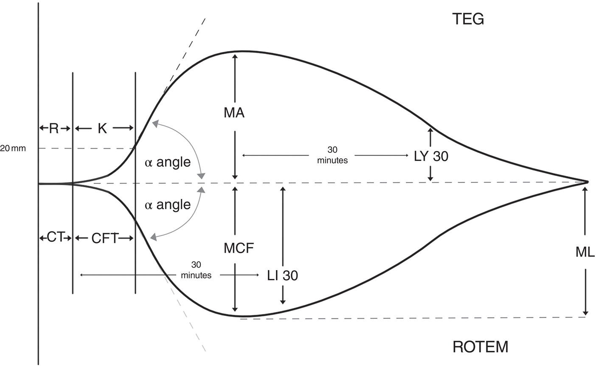

[**Figure 16.15**](#R_c16-fig-0015) **ROTEM® and TEG® trace.**

(Source: Haas et al. \[120\]. Reproduced with permission of John Wiley & Sons.)

[**Table 16.5**](#R_c16-tbl-0005) Definition of the most important ROTEM® and TEG® parameters

|  | TEG® | ROTEM® | Interpretation |
| --- | --- | --- | --- |
| **Clot initiation** | R (Reaction time) in minutes. | CT (clotting time) in seconds. | Anticoagulation, coagulation factors deficiency |
| **Clot kinetics** | K (kinetic time) in minutes  
ɑ (angle) in degrees | CFT (clot formation time) in seconds  
α (angle) in degrees | Anticoagulation, coagulation factors, fibrinogen, platelets deficiency |
| **Clot strength** | MA (maximum amplitude) in mm | MCF (maximum clot firmness) in mm | Platelets and fibrinogen |
| **Clot lysis** | LY30 (lysis 30 minutes after MA) in % of MA | LI30 (lysis index (residual clot firmness)  
30 minutes after CT) in % of MCF  
ML (maximum lysis during run time) in % of MCF | Fibrinolysis |

Only a few studies have looked at platelet function assays \[9, 10, 134–137\] and thrombin generation \[138–140\] in children undergoing cardiac surgery. None of those studies were adequately designed to assess the relationship between the intraoperative determination of platelet dysfunction or decrease in thrombin generation and transfusion or bleeding in neonates and children. Although the development of point‐of‐care devices to monitor platelet function (e.g., TEG® PlateletMapping cartridge) and thrombin generation could be a promising addition for intraoperative monitoring of hemostasis, further well‐designed studies will be required to determine if the integration of those parameters into current transfusion algorithms could help improve perioperative management of coagulopathy and bleeding in infants and children undergoing cardiac surgery.

In the presence of ongoing bleeding, it is recommended to use intraoperative monitoring of hemostasis to guide the administration of blood products. Viscoelastic tests are better alternatives to standard coagulation assays for intraoperative bleeding management because (i) results can be obtained at the bedside within 5–10 minutes and (ii) they allow for a global assessment of clot activation, firmness, and stability \[54\]. Institutional algorithms should be designed based on the tests available and the availability of blood products and coagulation factor concentrates \[120\]. Overall, the concept of targeted therapy resides in the assessment of three components of the coagulopathy:

1.  _Clot initiation_ is assessed by the R time of TEG, the clotting (CT) of ROTEM®, or CT of Quantra®. Clotting times in the presence of heparinase can be used on the three devices (heparinase TEG®, HEPTEM for ROTEM®, and Clotting Time with Heparinase (CTH) of Quantra® QPlus cartridge. Those parameters can be used to estimate clotting factor deficiency and the degree of anticoagulation, including residual heparinization.
2.  _Clot strength_ is assessed by the clot amplitude obtained from any of those devices. The amplitude on EXTEM provides an estimate of the platelet count and fibrinogen level, the amplitude of FIBTEM provides an estimate of the fibrinogen level, and the difference between clot amplitude on EXTEM and FIBTEM provides an estimate of the platelet count. The same can be obtained from TEG® and functional fibrinogen TEG®, and the Clot Stiffness (CS) and the fibrinogen to clot stiffness (FCS) on the Quantra®.
3.  _Clot lysis_ can be assessed using the lysis parameters on TEG® (LY30) and ROTEM® (LI30, LI60, ML). For the Quantra®, The QStat cartridge will be needed to obtain the Clot Stability Lysis (CSL). The latter is being validated in a trauma patient \[141\]. It is, however, important to note that TEG® and ROTEM® are sensitive enough to detect the physiologic degree of fibrinolytic activation \[142, 143\], and therefore not to guide the administration of antifibrinolytic agents.

* * *

### KEY POINTS: TRANSFUSION ALGORITHMS

-   Although considered the “gold standard,” standard coagulation tests were not designed to monitor perioperative coagulopathy, nor to guide the administration of hemostatic agents in bleeding situations.
-   Viscoelastic hemostatic assays are point‐of‐care tests that allow for a global assessment of coagulation at the bedside using whole blood.
-   Viscoelastic tests are better alternatives to standard coagulation assays for intraoperative bleeding management because (i) results can be obtained at the bedside within 5–10 minutes and (ii) they allow for a global assessment of clot activation, firmness, and stability.
-   Institutional algorithms should be designed based on the tests available and the availability of blood products and coagulation factor concentrates.

* * *

## Blood transfusion

The current standard of care for post‐bypass bleeding includes the transfusion of adult blood products to restore hemostasis, such as packed RBCs, FFP, cryoprecipitate, and platelets. While whole blood is available in some institutions, the transfusion of individual coagulation components is the primary treatment for post‐CPB coagulopathies at most centers.

### Whole blood

Historically, fresh whole blood (collected less than 24–48 hours) was used to correct the coagulopathies associated with CPB. While this practice has mostly been replaced by component therapy, there is some evidence that whole blood may be superior to component therapy in controlling bleeding after complex cardiac surgeries in children under 2 years old \[35\]. However, access to whole blood has been made increasingly difficult due to the techniques aimed at separating units into different components to maximize the impact of each unit. Other barriers are the logistics of timely acquiring, testing, and transporting fresh whole blood so that it is available within 48 hours of its collection.

### Red blood cells

RBC transfusions are indicated for the treatment of decreased oxygen‐carrying capacity causing end‐organ dysfunction. This is particularly relevant for patients with congenital cardiac disease due to chronic hypoxemia (right‐to‐left shunting), elevated cardiac output (Qp>Qs), elevated metabolic rates, and finally the effects of surgery and CPB including hemodilution and surgical bleeding. In fact, RBC transfusions in children undergoing cardiac surgery account for more than half of all perioperative RBC transfusions.

Although RBC transfusions can be lifesaving, many studies have demonstrated an increase in morbidity and mortality associated with increasing blood transfusions. Increasing transfusions are associated with increased respiratory complications, prolonged ICU and hospital stays, decreased graft survival, increased acute kidney injury, increased thrombotic events, and immune modulation \[144–148\]. However, the optimal hemoglobin values for congenital cardiac surgery are not known and likely vary depending on age, degree of cyanosis, and complexity of the surgical procedure. Multiple studies have demonstrated that a restrictive transfusion practice does not increase morbidity or mortality in pediatric ICU patients, congenital cardiac patients, and preterm neonates \[149–152\]. However, many of the studies exclude neonates or patients with single ventricle physiology. One of the few studies examining the impact of a restrictive (hemoglobin 11.1 g/dL) vs. liberal (13.9 g/dL) RBC transfusion strategy in children with single‐ventricle physiology after cavopulmonary anastomosis found no difference between the two study groups \[149\].

### Platelet transfusion

Thrombocytopenia and platelet dysfunction are common causes of post‐bypass coagulopathies and significantly increase the risk of bleeding and transfusion requirements in pediatric patients undergoing cardiac surgery. Platelet count and function in infants and children undergoing cardiac surgery are affected by CPB duration and degree of hemodilution \[9, 10, 137, 153\], whereas hypothermia correlates with platelet dysfunction alone \[137\]. A few studies suggest that the effect of CPB on platelet count and function may be age‐related, with great platelet dysfunction (either activation or hypoactivity) in neonates and younger children compared with older children ([Figure 16.16](#c16-fig-0016)).

Few studies have assessed the effect of platelet transfusion on post‐operative bleeding, although Romlin and colleagues completed a prospective study of 100 patients undergoing cardiac surgery comparing thromboelastography‐guided transfusions versus standard management. These authors concluded that routine use of thromboelastography reduced RBC and FFP transfusions, though the rates of platelet and fibrinogen increased \[131\], suggesting that the primary post‐CPB coagulopathies are related to platelet dysfunction. No studies to date have compared different volumes and types of platelet transfusions (e.g., concentrated or cold platelets) on post‐operative bleeding. Thus, the recommendations for platelet transfusion are mainly expert consensuses, taking into account adult cardiac and pediatric transfusion guidelines \[54\].

### Fibrinogen supplementation

A growing body of literature suggests that fibrinogen is the first coagulation factor to decrease during massive bleeding and that critically low levels are associated with post‐operative blood loss and transfusion requirement in infants and children undergoing cardiac surgery \[73\]. During CPB, fibrinogen levels decrease up to 40% below baseline levels. However, no pediatric studies have identified the minimal plasma concentration required for adequate hemostasis. A retrospective study by Faraoni and colleagues demonstrated that plasma fibrinogen concentrations <150 mg/dL and a maximal clot firmness (MCF) on FIBTEM <3 mm predicted post‐operative bleeding pediatric cardiac surgery patients \[73\]. Fibrinogen can be supplemented by the administration of cryoprecipitate or fibrinogen concentrate.

Although FFP can be used to replenish coagulation factors, large volumes (up to 15–30 mL/kg) are required to increase coagulation factors by as little as 20%. Such a large volume load is often not tolerated immediately after CPB in small children and may compound the coagulopathy due to further dilution of hemoglobin and platelets. As such, FFP does not contain enough fibrinogen to raise a low fibrinogen concentration to an adequate level in a child.

Cryoprecipitate is prepared by controlled thawing of FFP to precipitate and extract the coagulation factors. Cryoprecipitate contains fibrinogen (~150–700 mg/unit) as well as FVIII, FXIII, fibronectin, and vWF and has been the preferred option for fibrinogen replacement in the United States and the United Kingdom. Typically, one unit of cryoprecipitate is transfused per 5 kg of body weight and should increase the fibrinogen level by approximately 100 mg/dL \[154\]. In older children, 1 unit/10 kg should increase the fibrinogen concentration by approximately 50–70 mg/dL \[155\]. Although the risk of viral transmission is low with a single unit, the cumulative exposures needed to raise the fibrinogen level increases this risk.

An alternative to cryoprecipitate is fibrinogen concentrate (FC), a purified form of fibrinogen derived from pooled human plasma, which undergoes pasteurization to minimize the risk of immunologic and allergic reactions. In pediatric patients, FC may have several advantages over cryoprecipitate: (i) small volume, (ii) accurate dosing, (iii) immediately available, (iv) lower infectious risk, and (v) reduced allergic or immunologic reactions ([Table 16.6](#c16-tbl-0006)).

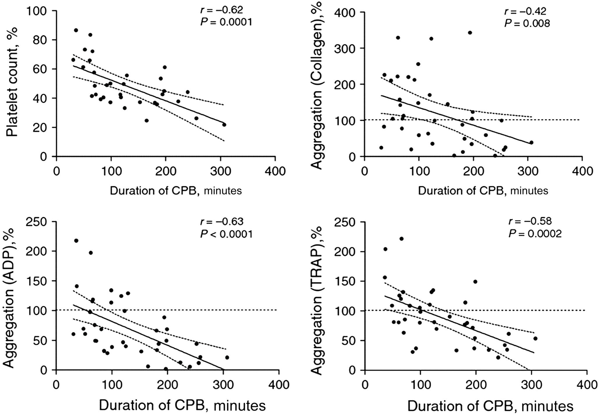

[**Figure 16.16**](#R_c16-fig-0016) **Platelet count and function decrease with increasing CPB time in pediatric patients having cardiac surgery.** Platelet count and platelet aggregation after cardiopulmonary bypass. Postbypass platelet count and aggregation are plotted as a percentage of the baseline value and displayed as a function of cardiopulmonary bypass duration. a) linear regression line with 95% CI and Spearman's statistics are shown. CI: confidence interval CPB: cardiopulmonary bypass, r: rho.

(Source: Andreasen \[129\]. Reproduced with permission of Cambridge University Press.)

[**Table 16.6**](#R_c16-tbl-0006) Comparison between cryoprecipitate and fibrinogen concentrate

|  | Cryoprecipitate | Fibrinogen concentrate |
| --- | --- | --- |
| Fibrinogen content | 300–450 mg per unit | 900–1100 mg/vial |
| Volume per unit | ~300–450 mg/20 mL unit | 1 g fibrinogen per 50 mL |
| Contents | Fibrinogen  
Factor VIII  
Factor XIII  
vWF | Fibrinogen |
| Preparation process | Stored Frozen and requires thawing ~15–17 minutes | Lyophilized powder, reconstituted with 50 mL diluent |
| ABO blood group Matching | Required | Not required |
| Viral Transmission Risks | Dependent on donor testing, no viral inactivation | Heat‐treated for viral inactivation |
| Immune reaction risk | High – contains Immunoglobins, cytokines, cell debris | Low – Minimal immunoglobulins (low TRALI risk) |

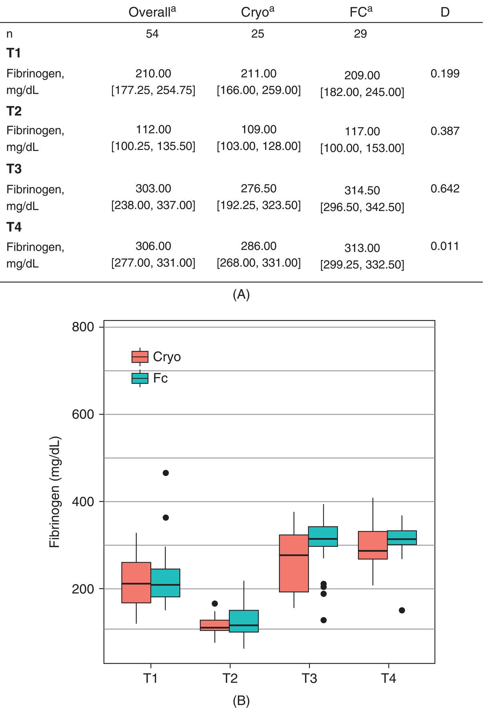

[**Figure 16.17**](#R_c16-fig-0017) Summary of fibrinogen levels. (A) Fibrinogen levels at different time points in each study group. (B) Box plot with distribution of fibrinogen levels in each study group at different time points. aMedian (IQR) = (25th–75th percentile). Cryo indicates cryoprecipitate arm; D, standardized difference (a measure of the difference between the distribution of the characteristic in the 2 arms expressed in units of standard deviations); FC, fibrinogen concentrate arm; IQR, interquartile range; INR, international normalized ratio; PP, per protocol.

(Source: Adapted from Downey et al. \[72\].)

Currently, FC is being used off‐label to replace low fibrinogen levels associated with bleeding in adult and pediatric surgical patients. Two small studies have investigated the efficacy and safety of FC. In a small pilot study, Galas and colleagues randomized 63 pediatric patients with a median age of 3.5 months \[1–51.6 months\] to receive either fibrinogen concentrate (60 mg/kg) or cryoprecipitate (10 mL/kg) after weaning from bypass if the fibrinogen levels were less than 100 mg/dL. Neither the median amount of blood loss in the first 48 hours after surgery nor the amount of allogenic blood product transfusions was significantly different between the two groups \[72\]. In another prospective study, Downey and colleagues randomized 60 patients <12 months undergoing cardiac surgery with CPB to receive either cryoprecipitate (2 units) or fibrinogen concentrate (target fibrinogen level ~300 mg/dL). This study demonstrated that the use of fibrinogen concentrate reduced donor exposures by 1.79 units (95% CI, 0.64–2.93) in the intent‐to‐treat population and 2.67 units (95% CI, 1.75–3.59) in the per‐protocol analysis without a significant difference in adverse events, length of stay, post‐operative thrombosis, or death. The authors suggest that FC may be an adequate alternative to cryoprecipitate for pediatric patients undergoing cardiac surgery ([Figure 16.17](#c16-fig-0017)) \[71\]. Subsequently, the FIBRES study, involving 11 Canadian institutions, demonstrated that FC was non‐inferior to cryoprecipitate in adults undergoing cardiac surgery \[156\].

Recommendations

-   In bleeding neonates and children, guidelines recommend hypofibrinogenemia (diagnosed by either Clauss method (<150 g/dL) or viscoelastic testing) should be treated either with cryoprecipitate or FC.
-   FC can be dosed in two ways:
    
    -   70 mg/kg or
    -   Using the package insert equation to reach a target fibrinogen level:
    
     
    

-   Guidelines suggest that FFP should be considered for treating hypofibrinogenemia in bleeding neonates and children only when cryoprecipitate or FC is not available.

### Recombinant factor VIIa

Recombinant VIIa (rFVIIa; NovoSeven® RT, Novo Nordisk, Bagsvaer, Denmark) is U.S. FDA approved for the treatment of hemophiliac patients who develop antibodies to clotting factors VII and IX. Administration of rFVIIa enhances thrombin generation at the site of injury to facilitate the formation of a stable fibrin clot \[157\]. Since rFVIIa is not derived from human blood products, it has been an attractive therapeutic option for treating excessive bleeding. In fact, rFVIIa has been used “off‐label” to treat excessive bleeding in a variety of clinical scenarios, including cardiac surgery.

In adults, the perioperative administration of rFVIIa after cardiac surgery has been shown to increase the risk of arterial thrombotic events \[158\] and in‐hospital mortality \[159\]. In pediatric patients, rFVIIa was primarily utilized as a rescue for excessive blood loss following CPB. However, no controlled trials have been performed to assess the safety and efficacy of rFVIIa use in pediatric patients. The Congenital Cardiac Anesthesia Society organized a task force to review the literature with the intent to determine the indications for use, efficacy, safety, and appropriate dosing. Despite this large systematic review of more than 40 studies, the task force found insufficient evidence to support the use of prophylactic or routine use of rFVIIa in this patient population \[160\]. While rFVIIa is still used for rescue therapy at some institutions, its significant cost and lack of an established safety profile limit this appeal.

The major risk associated with rFVIIa administration is thromboembolic events. Theoretically, enhanced thrombin generation after rFVIIa is limited to the sites of vascular injury, but the thrombotic rates after “off‐label” rFVIIa administration are up to 57% \[160–162\]. In a retrospective propensity‐matched study of congenital cardiac surgery patients, those who received rFVIIa had a significantly higher thrombotic rate than those who did not (20% vs 8%) ([Figure 16.18](#c16-fig-0018)) \[161\]. Due to this increased risk, most guidelines recommend that the administration of rFVIIa should be restricted to rescue therapy when traditional options have been exhausted.

Recommendations

-   Expert consensus recommends caution when using the administration of rFVIIa due to the thromboembolic risk.
-   The recommended dosing regimen is up to two doses of 90 ug/kg administered two hours apart. Others have reported efficacy with lower doses \[160, 163\].

### Factor concentrates

Prothrombin Complex Concentrates (PCCs) are derived from human plasma and contain coagulation factors to promote thrombin generation. They enhance coagulation by increasing the _in vivo_ content of coagulation factor(s), particularly prothrombin or FII. There are approximately 15 different PCCs manufactured worldwide, but there are two main categories of PCC: 4‐factor (4F) (II, VII, XI, and X) and 3‐factor (3F) (II, XI, X, and very low FVII) PCC. The specific composition and amount of each clotting factor will depend on the manufacturer ([Table 16.7](#c16-tbl-0007)). PCCs are approved for coagulation factor replacement therapy in patients with congenital or acquired coagulation factor deficiencies, but similar to rFVIIa, these products have been used “off‐label” to manage post‐CPB bleeding in pediatric cardiac patients.

In the 2005 update on oral anticoagulation guidelines, the British Committee for Standards in Hematology recommended 4F‐PCC as preferential to FFP for reversing anticoagulation in patients with major bleeding \[164\]. In 2013, the FDA approved and recommended 4F‐PCC (K‐Centra, CSL Behring, King of Prussia, PA), for the reversal of vitamin K antagonists. While a few observational studies are reporting reduced bleeding and transfusion requirements after CPB in adult cardiac surgery patients, there are few studies examining this in pediatric cardiac patients. In 2020, Sisti and colleagues reported a retrospective study of 27 patients with a ventricular assist device (VAD) comparing FFP to 4F‐PCC for warfarin reversal in pediatric patients undergoing orthotopic heart transplantation. The authors report that patients who received 4F‐PCC pre‐CPB received less PRBC and FFP transfusions than the control group with no difference in overall chest tube output or length of stay \[165\].

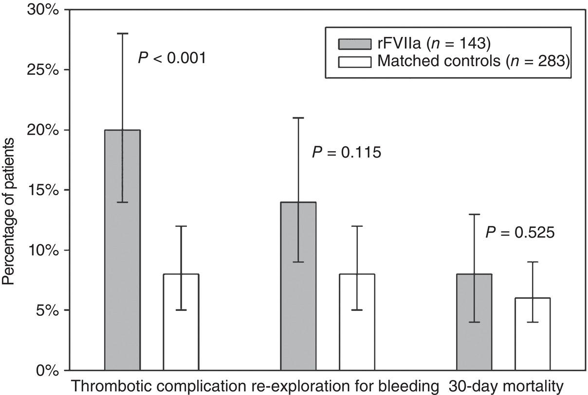

[**Figure 16.18**](#R_c16-fig-0018) **Recombinant Factors VIIa is associated with increased thrombotic complications in pediatric cardiac surgery patients**. Risks of thrombotic complications, re‐exploration for bleeding, and 30‐day mortality. Outcome variables were compared using logistic regression analysis based on GEE to adjust for matched pairs and are reported as incidence (%) with 95% CI. _P_ < 0.05 was considered significant. CI = confidence interval; GEE, generalized estimating equations.

(Source: Downey et al. \[161\]. Reproduced with permission of Wolters Kluwer Health, Inc.)

[**Table 16.7**](#R_c16-tbl-0007) Prothrombin complex concentrates and their components available in the United States

| Prothrombin Complex Concentrate | FXII | FVII | FIX | FX | Heparin | Antithrombin | Protein C | Protein S |
| --- | --- | --- | --- | --- | --- | --- | --- | --- |
| **Bebulin**  
(Baxter International, Deerfield, IL) | **+** | **−** | **+** | **+** | **+** | **−** | **−** | **−** |
| **FEIBA** [a](#c16-note-0003)  
(Takeda Pharmaceutical Coumpany, Lexington, MA) | **+** | **+** [a](#c16-note-0003) | **+** | **+** | **−** | **−** | **−** | **−** |
| **KCentra, Beriplex, Confidex**  
(CSL Behring, Marburg, Germany) | **+** | **−** | **+** | **+** | **+** | **+** | **+** | **+** |
| **Profilnine**  
(Grifols Biologicals, Los Angeles, CA) | **+** | **−** | **+** | **+** | **−** | **−** | **−** | **−** |
| **NovoSeven**  
(Novo Nordisk, Plainsboro, NJ) | **−** | **++** [a](#c16-note-0006) | **−** | **−** | **−** | **−** | **−** | **−** |

[a](#R_c16-note-0006) NovoSeven and FEIBA contain activated prothrombin complex concentrate available in the United States.

FII = Factor II, FVII = Factor VII, FIX = Factor IX, FX = Factor X, FEIBA = Factor Eight Inhibitor Bypassing Activity.

3F‐PCC was originally approved for the repletion of factor IX in patients with hemophilia B, Factor VIII inhibitor bypassing activity (FEIBA) is a 4F‐PCC with small amounts of activated FVII that was developed for hemophilia patients who developed antibodies to FVIII and FIX. Two _ex vivo_ studies have looked at the effect of PCCs on optimizing thrombin generation in neonatal plasma \[140, 166\]. They report that 3F‐PCC significantly shortened the time to initiate thrombin generation (lag time) and increased the peak amount of thrombin generated better than rFVIIa \[140\]. In a second study, thrombin generation in neonatal plasma was augmented by the addition of two 4F‐PCC preparations (one non‐activated and one activated (FEIBA)). Both PCC formulations enhanced the rate and peak amount of thrombin generation, but only activated 4F‐PCC was capable of restoring lag time back to baseline values \[166\]. Despite these promising _ex‐vivo_ studies, little is known regarding the efficacy and safety of PCC use as a hemostatic agent in pediatric cardiac patients.

Although PCCs may offer several advantages, including small volumes, less immune modulation, decreased infectious risk, and improved clot formation, there are only a few published studies evaluating their clinical use in pediatric patients after CPB. In 2014, Giorni and colleagues compared the effect of PCC administered in 14 infants younger than 1 year with non‐surgical post‐CPB bleeding with 11 matched controls \[167\]. The authors showed that PCC reduced post‐operative bleeding and decreased RBC transfusions without major post‐operative complications. In a small case series published by Jooste et al., 3F‐PCC was administered to six infants as rescue therapy for excessive post‐CPB bleeding. The authors reported that PCC subjectively reduced clinically evident bleeding \[168\]. In 2020, Harris and colleagues published a retrospective propensity‐matched study, evaluating adverse effects in patients who received 3F‐PCC versus matched controls. These authors found no significant difference in the incidence of thrombosis, ECMO, or mortality. They demonstrated that platelets and cryoprecipitate administered were significantly less after the administration of 3F‐PCC \[169\]. While all of these studies report a positive effect, questions remain regarding appropriate dosing regimens, efficacy, and safety concerns. Further clinical studies are needed before their use can be recommended in this population.

_Recommendations_:

-   4F‐PCC should be used to reverse vitamin K antagonists in the setting of urgent or emergent surgery. Dosing regimens should follow the package insert.
-   3F‐ and 4F‐PCC should be used for patients with congenital or acquired factor deficiencies requiring cardiac surgery with hematology consultation.
-   3F‐ and 4F‐PCC should be used with caution in congenital cardiac surgery due to the thrombotic risk. Reported doses start at 5 mg/kg, with average doses ~10–20 mg/kg.

* * *

### KEY POINTS: MANAGEMENT OF BLEEDING AFTER CPB

-   Hypofibrinogenemia and platelet dysfunction are the most common causes of post‐CPB bleeding.
-   Treatment of post‐CPB coagulopathies includes platelet transfusions and fibrinogen replacement with either cryoprecipitate or fibrinogen concentrate.
-   Restrictive RBC transfusion strategies limit donor exposures and may reduce morbidity and mortality.
-   rFVIIa is used off‐label to enhance thrombin generation and clot formation in patients with post‐CPB bleeding with anecdotal success.
-   rFVIIa may be associated with an increased risk of thromboembolic events and should be used with caution.
-   PCCs contain vitamin K‐dependent coagulation factors in different concentrations.
-   Other PCCs are being used off‐label to treat excessive post‐CPB bleeding, but little published data are available concerning their safety and efficacy.

* * *

## Pharmacologic therapies

### Antifibrinolytics

The activation of the fibrinolytic pathway plays an important role in the coagulopathy observed during and after cardiac surgery and has prompted the prophylactic administration of antifibrinolytic agents in neonates and children undergoing cardiac surgery with CPB. During cardiac surgery, a large amount of thrombin is generated which promotes fibrinogen polymerization and thrombus formation. Thrombin also causes a conformational change such that factor XIII, α2‐plasminogen inhibitor, and tissue‐type plasminogen activator (t‐PA) become attached to fibrin. Fibrin stimulates t‐PA synthesis by endothelial cells and urokinase plasminogen activator (u‐PA) synthesis by monocytes, macrophages, and fibroblasts. Both t‐PA and u‐PA activate plasminogen. Plasminogen can also be activated by the factor XIIa formed during the contact phase of coagulation. Plasmin is an endopeptidase that cleaves both fibrinogen and fibrin, disrupting them into fibrin degradation products (FDPs) without clotting ability. Plasmin also interacts with the inflammatory system stimulating the complement and kallikrein pathways. Fibrinolysis is inhibited by PAI 1 and PAI 2, and by thrombin binding to thrombomodulin to release and activate thrombin‐activatable fibrinolysis inhibitor ([Figure 16.19](#c16-fig-0019)). Thrombin‐activatable fibrinolysis inhibitor (TAFI) is the precursor of an enzyme (TAFIa) with basic carboxypeptidase activity that attenuates the lysis of fibrin clots by removal of the C‐terminal lysine residues from partially degraded fibrin that mediates positive feedback in the fibrinolytic cascade \[170\]. Activation of fibrinolysis at CPB initiation is mainly limited to FXIIa‐induced activation caused by contact of the patient’s blood with the non‐endothelial CPB surfaces. Fibrinolysis then becomes activated by the release of t‐PA from the vascular walls. Overall, CPB results in an increase in t‐PA, D‐dimer, t‐PA–PAI‐1 complexes and a decrease in PAI‐1 levels, indicating an activation of the fibrinolytic pathway and the consumption of its natural inhibitors. The degree of fibrinolytic activation is significantly correlated to the degree of thrombin generation, suggesting a strong interaction between activation of the coagulation and fibrinolytic pathways. In addition to thrombin, inflammatory markers such as cytokines and endotoxin are also able to promote the activation of plasminogen and its inhibitors. Because both plasmin and t‐PA are known to interact with platelets, and vice versa, fibrinolytic activation is also associated with platelet activation \[171\].

Overall, fibrinolysis can be considered as a protective physiologic response that limits clot growth within a physiologic range. However, after major tissue damage and activation of CPB‐induced coagulopathy, fibrinolytic activation may partially contribute to bleeding. Understanding the importance of the fibrinolytic system in CPB‐induced coagulopathy and bleeding is crucial because agents capable of inhibiting fibrinolysis are available and can be administered prophylactically to avoid initiation of the fibrinolytic activation.

Antifibrinolytic agents include aprotinin and the lysine analogs (𝜀‐aminocaproic acid \[EACA\] and tranexamic acid \[TXA\]). Aprotinin is a protease inhibitor isolated from the bovine lung that is structurally similar to a tissue factor pathway inhibitor. Aprotinin is a broad‐spectrum protease inhibitor that reversibly complexes with the active serine residue in various proteases in plasma (e.g., trypsin, kallikrein, plasmin, elastase). Aprotinin offers the most complete and potent fibrinolytic inhibition. Apart from these direct effects on the plasmatic coagulation system, aprotinin also inhibits the protease‐activated receptor 1 thrombin receptor involved in both coagulation and inflammation. Lysine analogs, TXA and EACA, are currently the most extensively used antifibrinolytic agents. Activation of plasminogen by endogenous plasminogen activators results in plasmin, which causes degradation of fibrin. The binding of plasminogen to fibrin makes this process more efficient and occurs through lysine residues on fibrin that bind to the lysine‐binding site on plasminogen. In the presence of lysine analogs, these lysine‐binding sites are occupied which results in an inhibition of fibrin binding to plasminogen and endogenous fibrinolysis. Because plasmin generation after tissue injury can induce many other responses, including thrombin generation, complement activation, and activation of monocytes, neutrophils, and platelets, attenuation of these pathophysiologic responses with lysine analogs might provide additional benefits in restoring hemostatic balance, plasmin generation, and fibrinolysis.

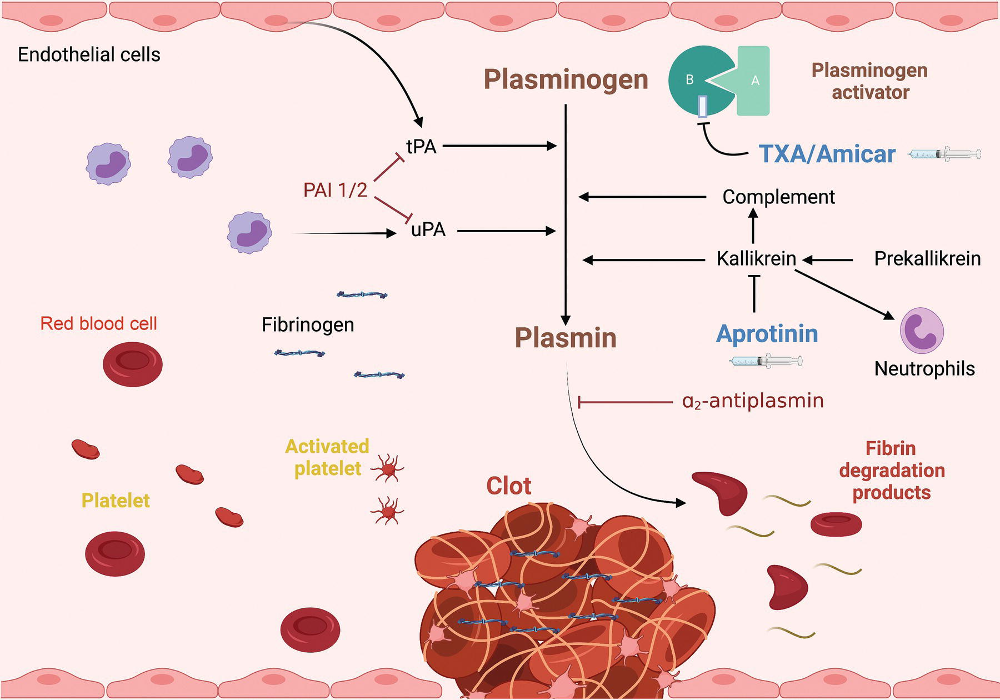

[**Figure 16.19**](#R_c16-fig-0019) – Fibrinolysis.

(Source: made in ©BioRender ‐ biorender.com.)

Until 2007, aprotinin was the most frequently used antifibrinolytic agent. In 2007, the efficacy of aprotinin and other lysine analogs was summarized in a Cochrane systematic review and meta‐analysis \[172\]. When compared to placebo, both aprotinin (77 studies), TXA (29 studies), and EACA (10 studies) significantly reduced the exposure to allogeneic blood products in adults undergoing cardiac surgery. Even though a trend in favor of aprotinin was observed, no statistical difference was reported when aprotinin was compared to TXA. No difference in terms of adverse events was reported when antifibrinolytic agents were compared to placebo or to each other, but none of the studies were actually designed to assess the safety of the drugs. Prospective studies that assessed the efficacy and safety of aprotinin in neonates and children undergoing cardiac surgery are rare. In a meta‐analysis published by Schouten and colleagues in 2009, 18 studies were identified but only one study compared the efficacy of aprotinin and EACA \[173\]. Other authors have compared TXA and aprotinin in children but failed to demonstrate the superiority of one drug among the other.

In 2007, the results of the Blood Conservation Using Antifibrinolytics in a Randomized Trial (BART) study, a prospective study performed in high‐risk patients undergoing cardiac surgery, were published \[174\]. This study reported an increased incidence of mortality associated with aprotinin (6% 30‐day mortality for aprotinin) when compared to lysine analogs (3.9% for TXA and 4% for EACA). The publication of the study was followed by an FDA warning and in November 2007, Bayer Health‐ care (Leverkusen, Germany) announced the withdrawal of aprotinin from the market.

Several respective studies looked at the effect of aprotinin on the incidence of postoperative renal dysfunction or mortality in neonates and children. Among all those studies, two large retrospective analyses failed to demonstrate any evidence of increased mortality or renal failure in children undergoing cardiac surgery. While aprotinin appeared to be non‐superior to EACA, TXA was shown to be superior to aprotinin in terms of transfusion with less morbidity. The safety of aprotinin was re‐evaluated in several retrospective studies in adult cardiac surgery with conflicting results, but the overall impression is that the risk of adverse events is essentially observed when aprotinin was administered in a subset of the cardiac population and that the drug remains beneficial when used in patients undergoing procedures with high bleeding risk. In September 2011, Health Canada and in February 2012, the European Medicines Agency (EMA) lifted the suspension of aprotinin from the market. Aprotinin should only be given during primary coronary artery bypass grafting surgery and should be avoided in patients with pre‐operative renal dysfunction due to increased risks of postoperative renal failure and the requirement for renal replacement therapy. To date, no decision has been taken regarding the use of aprotinin in neonates and children undergoing complex cardiac surgery. However, in the absence of evidence regarding the safety of the drug in the pediatric cardiac population, lysine analogs should be preferred.

The efficacy of prophylactic administration of the lysine analogs in neonates and children undergoing cardiac surgery with CPB has been studied in several small prospective studies. In a systematic review and meta‐analysis that compared TXA to placebo, prophylactic administration of TXA reduced the need for blood product transfusion \[175\]. All the prospective studies published to date have included a relatively small number of patients presenting with heterogeneous congenital heart diseases and undergoing procedures of variable complexities. Significant variability in dosages has been reported, with some centers using three boluses of 10 to 100 mg/kg, while others used a 10 to 100 mg/kg loading dose followed by a continuous infusion. Another important limitation of the current literature is the absence of safety assessment when sometimes large doses of antifibrinolytics are administered. To date, adverse reactions have only been reported in small retrospective studies while none of the prospective studies were designed or powered to look at the incidence of side effects. If no risk of thrombotic complication has been reported in the adult or pediatric literature, an increased risk of clinical seizures has been described following the administration of high‐dose TXA. Lecker and colleagues showed that TXA inhibits neural glycine receptors, whereas inhibition of the inhibiting neurotransmitter glycine is an established cause of seizures \[176\]. Viewing the similarities in the chemical structures of TXA, gamma‐aminobutyric acid (GABA), and glycine, it is conceivable that the interaction of TXA with both GABA and glycine receptors contributes to the increase in clinical seizures observed when TXA is given. Interestingly, the TXA peak concentration observed in the cerebral spinal fluid was reached approximately 5 hours after the plasma peak concentration ([Figure 16.20](#c16-fig-0020)), which might explain the delay reported between TXA administration and the development of clinical seizures after cardiac surgery. Similar concerns have also been described with equipotent concentrations of EACA, which might be explained by the fact that EACA is a competitive agonist of glycine receptors. Understanding pharmacology is crucial, and the use of a pharmacokinetic/pharmacodynamic‐based dose regimen should be promoted.

[**Figure 16.20**](#R_c16-fig-0020) **TXA concentrations measured in the serum and CSF of patients who underwent cardiopulmonary bypass and major vascular surgery.** (A) Time‐dependent plot of TXA concentration in the serum and CSF of one patient. The timeline at the bottom of the figure represents key surgical events. (B) Average TXA concentration in the serum and CSF during key surgical events (_n_ = 4). Data are mean ± SEM.

(Source: Lecker et al. \[176\]. Reproduced with permission.)

The gap in our understanding of the pharmacokinetics of lysine analogs in neonates and children has been partially filled by the publication of a few pharmacokinetic studies \[177\]. In 2002, Ririe and colleagues studied the pharmacokinetics of EACA in 8 patients aged between 9 months and 4 years \[178\]. As a result, the authors suggested a dosing regimen of 75 mg/kg over 10 minutes, 75 mg/kg on CPB, and 75 mg/kg/hour infusion started at the end of the initial bolus. This regimen was derived and simulated to maintain serum concentration at two times the serum levels to produce 95% efficacy (260 μg/mL). In 2015, Eaton and collaborators studied the PK of EACA in 10 neonates undergoing cardiac surgery with CPB \[179\]. Simulations were performed to maintain plasmatic concentrations of 50 μg/mL, leading to the recommendation of a 40 mg/kg loading dose followed by a 30 mg/kg/hour infusion. The authors suggested the administration of 10 mg of EACA per liter of CPB prime. Those two dosing regimens demonstrated the large variability in targeted plasma concentrations (50 μg/mL vs. 260 μg/mL) and the need for further studies to determine the optimal plasma concentration to be targeted to safely inhibit fibrinolytic inhibition using EACA in neonates and children. One of the first pediatric cardiac TXA PK studies was published by Grassin‐Delyle and colleagues in 2013 \[180\]. In their study, the authors randomized 21 patients to receive either a continuous infusion (10 mg/kg followed by a 1 mg/kg/hour with 10 mg/kg at CPB initiation) or discontinuous infusion (10 mg/kg, then 10 mg/kg into the CPB and 10 mg/kg/hour initiated at the end of CPB). From their pharmacokinetic modeling, the authors determined the most appropriate dosing scheme to obtain a given target concentration of 20 μg/mL in children weighing 5 to 40 kg. The recommended 6.4 mg/kg loading dose is identical for all children, whereas the infusion rate decreases with weight from 3.1 mg/hour/kg to 2.0 mg/hour/kg for children between 5 and 40 kg, respectively. In 2015, the second pharmacokinetics (PK) study was published by Wesley and colleagues \[181\]. In their study, the authors included 55 patients ranging from 2 days to 4 years old and categorized them into three groups: children less than 2 months old, infants 2 months to 1 year old, and children greater than 1‐year‐old and weighing up to 20 kg. The authors described three different dose regimens based on targeted plasmatic concentrations (e.g., 20, 60, or 150 μg/mL). In order to maintain a plasmatic concentration of 60 μg/mL, a loading dose of 50 mg/kg followed by a continuous infusion of 7 mg/kg/hour was suggested in neonates and infants <2 months of age, a loading dose of 26 mg/kg followed by a continuous infusion of 6 mg/kg/hour was suggested in infants aged from 2 to 12 months, and a loading dose of 13 mg/kg followed by a continuous infusion of 5.5 mg/kg/hour was suggested in children >12 months and ≤20 kg. An additional bolus of 60 mg/mL of prime volume was also suggested ([Table 16.8](#c16-tbl-0008)).

Despite the major advances made in the understanding of lysine analogs PK in neonates and children undergoing cardiac surgery, the readers will appreciate the persisting variability among the different PK‐based dose regimens. This variability is mainly explained by the lack of knowledge regarding the minimal concentration required to inhibit fibrinolytic activation in children undergoing cardiac surgery with CPB. On the basis of the initial investigations published in the 1970s, two basic target concentrations have been identified. A lower concentration of approximately 10–20 μg/mL, which is thought to inhibit approximately 80% of fibrinolysis, and a high concentration of approximately 100 μg/mL, which should completely inhibit fibrinolysis. For several reasons, and in particular the difficulty of accurately measuring fibrinolytic activation in‐vivo, those plasmatic concentrations have never been clinically validated. To date, only _ex‐vivo_ t‐PA‐activated models of hyperfibrinolysis have been used to estimate the plasmatic concentration required to completely inhibit fibrinolytic activation in neonates and children \[182, 183\]. If the plasmatic concentrations obtained from those _ex‐vivo_ models appeared to be significantly lower than the one described in the 1970s (<20 μg/mL), further studies are needed to further validate the findings in neonates and children undergoing cardiac surgery.

[**Table 16.8**](#R_c16-tbl-0008) Summary of the dose regimens suggested in pharmacokinetics studies

| Study | Population | Targeted concentration | Loading dose | Infusion | CPB |
| --- | --- | --- | --- | --- | --- |
| **1\. ε‐aminocaproic acid** |
| Eaton \[179\] | 2.7–3.7 kg | 50 μg/mL | 40 mg/kg | 30 mg/kg/hour | 10 mg/L |
| Ririe \[178\] | 9 months–4 years | 260 μg/mL | 75 mg/kg | 75 mg/kg/hour | 75 mg/kg |
| **2\. Tranexamic acid** |
| Grassin‐Delyle \[180\] | 5–40 kg | 20 μg/mL | 6.4 mg/kg | 2.0 to 3.1 mg/kg/hour | NA |
| Wesley \[181\] | 0–2 months | 20 μg/mL | 15 mg/kg | 2.5 mg/kg/hour | 20 mg/L |
| 2–12 months | 20 μg/mL | 9 mg/kg | 2 mg/kg/hour | 20 mg/L |
| \>12 months (Max 20 kg) | 20 μg/mL | 4 mg/kg | 2 mg/kg/hour | 20 mg/L |
| 0–2 months | 60 μg/mL | 50 mg/kg | 7 mg/kg/hour | 60 mg/L |
| 2–12 months | 60 μg/mL | 26 mg/kg | 6 mg/kg/hour | 60 mg/L |
| \>12 months (Max 20 kg) | 60 μg/mL | 13 mg/kg | 5.5 mg/kg/hour | 60 mg/L |

Based on the existing literature, a TXA loading dose of 30 mg/kg followed by a continuous infusion of 10 mg/kg/hour can be used in children <1 year of age, while loading dose of 10 mg/kg followed by a continuous infusion of 10 mg/kg/hour can be used afterward. For EACA, a loading dose of 40 mg/kg followed by a 30 mg/kg/hour infusion is recommended \[54\].

### Desmopressin

Desmopressin (DDAVP) is a vasopressin analog that increases circulating levels of coagulation factor VIII and von Willebrand factor (vWF) by stimulating the release of stored vWF from the Weibel Palade bodies in the endothelium. It has been hypothesized that DDAVP favors the hemostatic process not only by inducing the release of vWF from endothelial cells but also by enhancing the procoagulant activity of platelets \[184\]. When platelets encounter a damaged vessel wall, they immediately recognize and adhere to exposed collagen and other subendothelium proteins. The adherent platelets become activated and recruit other platelets to the site of vascular injury. Meanwhile, the initiation of the coagulation cascade generates thrombin, which further activates platelets. By the combined action of thrombin and collagen, platelets express on their surface a number of specific molecules that promote both thrombin formation and cell‐cell interactions (COAT platelets). It has been suggested that desmopressin infusion enhances the formation of COAT platelets and thus improves the hemostatic activity of platelets \[185\].

Desmopressin is used mainly to improve hemostasis in patients with von Willebrand disease, hemophilia A and certain inherited disorders of platelet function. In a recent Cochrane review, 39 studies were identified in the adult cardiac population where DDAVP was administered after cardiopulmonary bypass. In adults undergoing cardiac surgery, the reduction in the volume of RBCs transfused and total blood loss was small and was unlikely to be clinically important \[186\]. The efficacy of desmopressin in reducing bleeding and transfusion in children undergoing cardiac surgery has only been assessed in 3 studies \[187–189\]. The administration of DDVAP was not associated with a significant reduction in blood loss or blood product transfusion. However, the studies published to date preferred a prophylactic administration of DDAVP without estimation of the bleeding risk, the platelet count, vWF levels, and platelet function. Further studies are needed to study the effect of DDAVP administration post‐CPB in children with normal platelet count (≥150 × 109/L) but with decreased platelet function and/or in patients with acquired vWF deficiency.

* * *

### KEY POINTS: PHARMACOLOGIC THERAPIES

-   Prophylactic administration of antifibrinolytic drugs helps decrease bleeding and transfusion in pediatric cardiac surgery.
-   High doses should be avoided to decrease the risk of side effects, especially clinical seizures with TXA.
-   Further studies are needed to study the effect of DDAVP administration post‐CPB in children with normal platelet count (≥150 × 109/L) but with decreased platelet function and/or in patients with acquired vWF deficiency.

* * *

## Sickle cell disease

Sickle cell disease (SCD) is a genetic disorder of hemoglobin and is characterized by hemolysis and recurrent vaso‐occlusive episodes that cause severe pain “crises” and lead to progressive organ dysfunction. Patients with SCD only produce Hemoglobin S (HbS), which contains abnormal beta chains. Unlike normal adult Hemoglobin A (HbA), HbS is unstable in hypoxic conditions and polymerizes into the long helical strands that give affected RBCs the “sickled” appearance. These sickled RBCs have a shorter life span (10–12 days) than normal RBCs (120 days), which leads to chronic hemolytic anemia. During periods of dehydration, physical exertion, infection, or the stress of surgery can precipitate a sickle cell crisis. These “sickled” RBCs occlude blood flow to organs and lead to vaso‐occlusive events (pain crises) and end‐organ damage. Long‐term complications from SCD include chronic anemia, pulmonary hypertension, or ischemic strokes.

Cardiac surgery presents numerous challenges that require special consideration for SCD patients due to hypothermia, CPB circuit primes, and prolonged NPO times. However, cardiac surgery with CPB has been undertaken successfully in SCD patients. Patients scheduled for cardiac surgery should have an outpatient visit with a hematologist 2–4 weeks prior to the procedure for evaluation and transfusion planning.

Preoperative laboratory studies should include at least a CBC and type and screen. In addition to a type and screen, consider obtaining an RBC genotype testing for extended antigen matching, as it can be challenging to find appropriate blood products for patients receiving chronic transfusions. Prior to surgery, it is important to communicate to ensure that appropriate blood is available for the procedure. Some institutions will send hemoglobin electrophoresis and reticulocyte count. Patients with an HbS ≥30% or a total hemoglobin <10 g/dL, these patients may require preoperative admission for hydration and an exchange transfusion.

The goal of intraoperative management is to avoid conditions that would result in sickling of the RBCs, such as hypoxia, hypothermia, or emotional stress. The goal is to minimize the percentage of HbS to ≤30% to reduce the risk of sickling. Therefore, patients with elevated HbS may require an exchange transfusion at the initiation with cardiopulmonary bypass. Prior to the exchange transfusions, it is important to maintain adequate oxygenation and maintain normothermia. Other considerations to minimize RBC trauma include maintaining bypass flow, minimizing pump sucker trauma, and vasodilating the patients with isoflurane or phentolamine as tolerated. Although systemic hypothermia and cold cardioplegia have been used, normothermia is preferred when possible. Finally, adequate post‐operative pain management is critical but can be challenging in SCD patients. A multi‐modal approach that includes opioids, acetaminophen, and Non‐steroidal anti‐inflammatory drugs (NSAIDs) should be employed. Consider regional anesthesia if possible.

* * *

### KEY POINTS: SICKLE CELL PATIENTS FOR CARDIAC SURGERY

-   SCD is a genetic disorder of hemoglobin (homozygous HbS) that is characterized by vaso‐occlusive episodes that result in pain crises and end‐organ damage.
-   Dehydration, hypoxia, infection, physical exertion, hypothermia, or the stress of surgery can all precipitate a sickle cell crisis.
-   For patients coming for cardiac surgery, the goal of management is to avoid or minimize factors that may precipitate a sickle cell crisis. Patients may require an exchange transfusion to decrease the percentage of HbS ≤30%.
-   These patients often present with preoperative anemia; it may be difficult to find cross‐matched blood due to chronic transfusions and alloimmunization.

* * *

## Summary

Perioperative management of coagulopathy and hemostasis in neonates and children undergoing cardiac surgery is complex. Preoperative optimization of RBC mass should be promoted, as well as the implementation of blood conservation techniques. Maintenance of adequate anticoagulation during CPB, rapid assessment of coagulopathy, and the implementation of transfusion institutional algorithms based on monitoring of coagulopathy and the use of targeted therapy are keys. Despite the progress made in the last decades, further clinical studies are urgently needed to assess the safety and efficacy of the most recent diagnostic and therapeutic options.

## Selected references

_A full reference list for this chapter is available at:_

[http://www.wiley.com/go/andropoulos/congenitalheart](http://www.wiley.com/go/andropoulos/congenitalheart)

1.  18 Brown AC, Hannan RT, Timmins LH, et al. Fibrin network changes in neonates after cardiopulmonary bypass. Anesthesiology 2016; 124(5):1021–31. The authors examine the sequential changes in clotting components and resultant clot structure in a small sample of neonates undergoing cardiac surgery and cardiopulmonary bypass.
2.  29 Odegard KC, Zurakowski D, DiNardo JA, et al. Prospective longitudinal study of coagulation profiles in children with hypoplastic left heart syndrome from stage I through Fontan completion. J Thorac Cardiovasc Surg 2009; 137(4):934–41. The authors describe changes in coagulation factors over time in children with hypoplastic left heart syndrome.
3.  41 Zabala LM, Guzzetta NA. Cyanotic congenital heart disease (CCHD): focus on hypoxemia, secondary erythrocytosis, and coagulation alterations. Paediatr Anaesth 2015; 25(10):981–9. This review summarizes the coagulopathy of cyanotic congenital heart disease with a specific focus on hypoxemia and secondary erythrocytosis.
4.  42 Jones SE, Jooste EH, Gottlieb EA, et al. Preoperative laboratory studies for pediatric cardiac surgery patients: a multi‐institutional perspective. Anesth Analg 2019; 128(5):1051–4. This statement published by the members of the hemostasis interest group (HIG) of the congenital cardiac anesthesia society (CCAS) discuss variability in prative when it comes to preoperative laboratory testing.
5.  54 Faraoni D, Meier J, New HV, et al. Patient blood management for neonates and children undergoing cardiac surgery: 2019 NATA guidelines. J Cardiothorac Vasc Anesth 2019; 33(12):3249–63. Guidelines published for blood management and blood conservation in neonates and children undergoing cardiac surgery.
6.  71 Downey LA, Andrews J, Hedlin H, et al. Fibrinogen concentrate as an alternative to cryoprecipitate in a postcardiopulmonary transfusion algorithm in infants undergoing cardiac surgery: a prospective randomized controlled trial. Anesth Analg 2020; 130(3):740–51. Prospective randomized study assessing the efficacy of fibrinogen concentrate versus cryoprecipiate for fibrinogen supplementation in children undergoing cardiac surgery.
7.  78 Dieu A, Rosal Martins M, Eeckhoudt S, et al. Fresh frozen plasma versus crystalloid priming of cardiopulmonary bypass circuit in pediatric surgery: a randomized clinical trial. Anesthesiology 2020; 132(1):95–106. In this prospective randomized study, the authors demonstrated that the use of fresh frozen plasma in the cardiopulmonary bypass prime did not reduce bleeding and transfusion when compared to crystalloids in children weighting 7–15 kg.
8.  134 Nakayama Y, Nakajima Y, Tanaka KA, et al. Thromboelastometry‐guided intraoperative haemostatic management reduces bleeding and red cell transfusion after paediatric cardiac surgery. Br J Anaesth 2015; 114(1):91–102. Prospective randomized study of the effect of the implementation of a ROTEM‐based transfusion algorithm in children undergoing cardiac surgery.
9.  167 Downey L, Brown ML, Faraoni D, et al. Recombinant factor VIIa is associated with increased thrombotic complications in pediatric cardiac surgery patients. Anesth Analg 2017; 124(5):1431–6. Propensity matched analysis highlighting the increased risk of thrombotic complications assiciated with the use of rFVIIa.
10.  188 Wesley MC, Pereira LM, Scharp LA, et al. Pharmacokinetics of tranexamic acid in neonates, infants, and children undergoing cardiac surgery with cardiopulmonary bypass. Anesthesiology 2015; 122(4):746–58. Pharmacokinetic study of tranexamic acid in neonates and infants undergoing cardiac surgery with suggestions for dose regimen based on three targeted plasma concentrations.