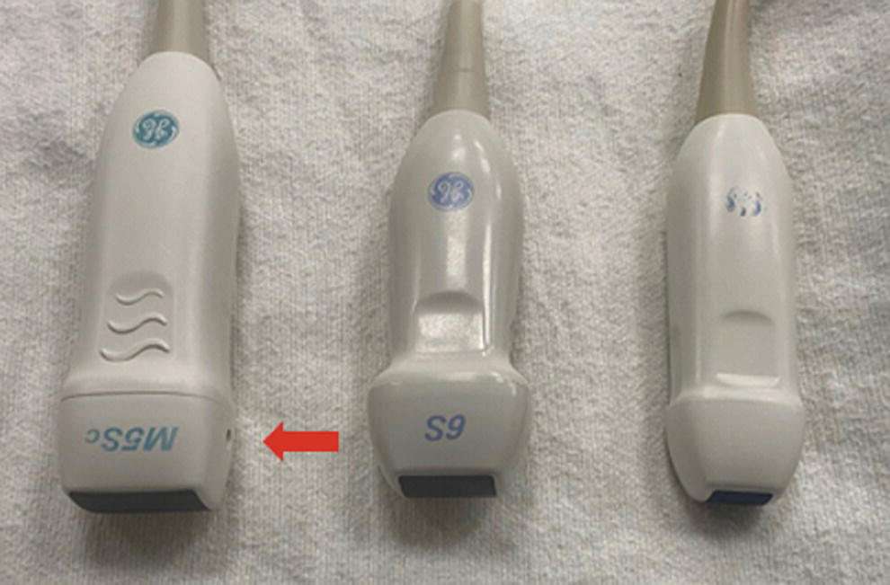
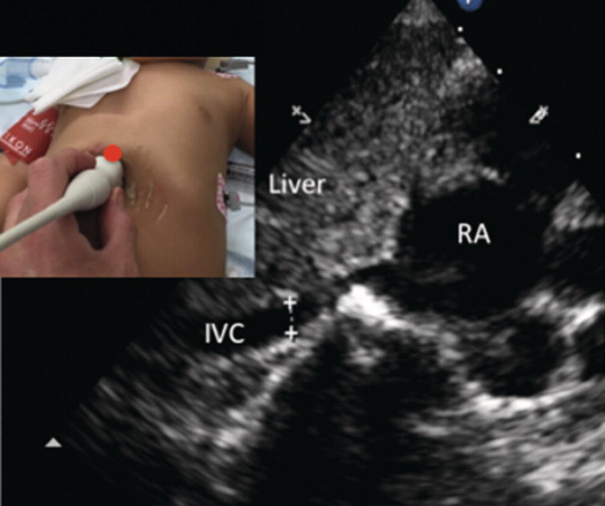
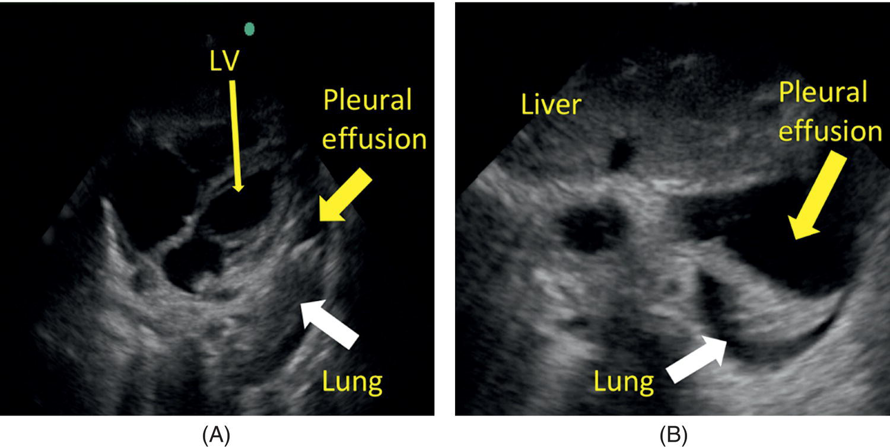
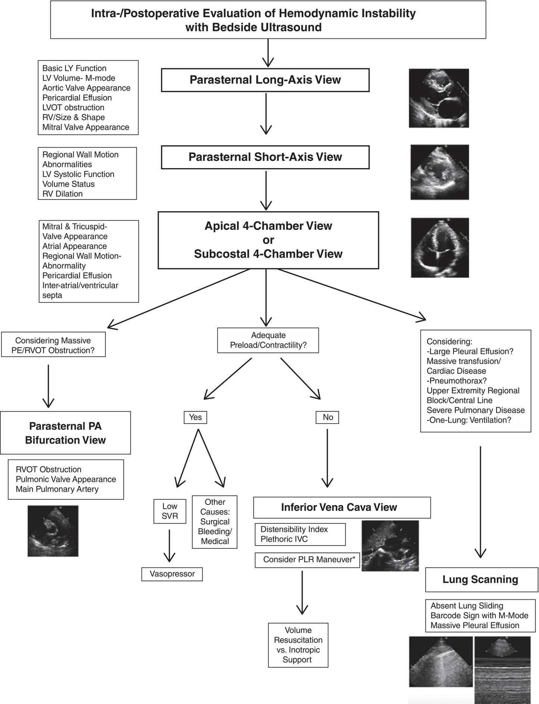
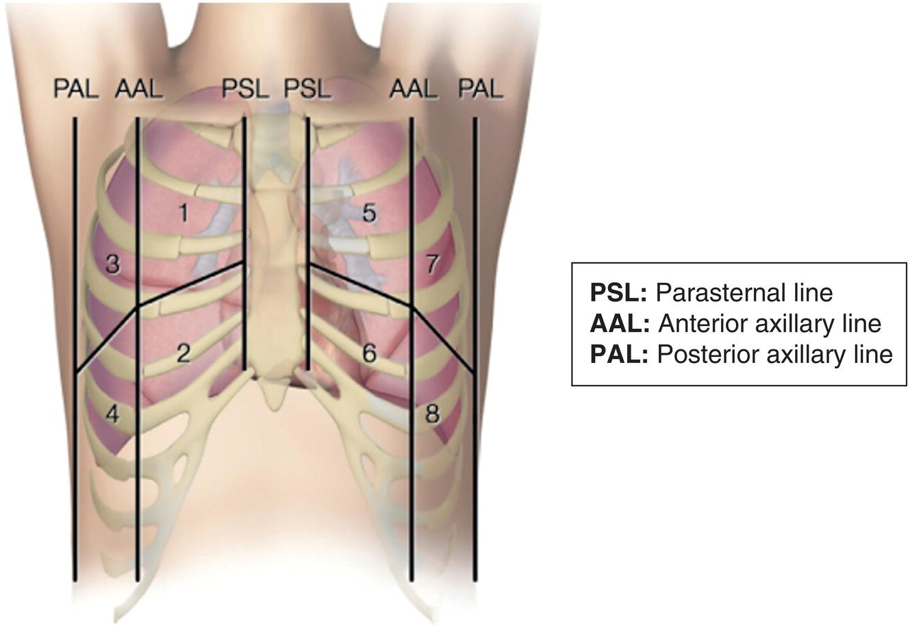
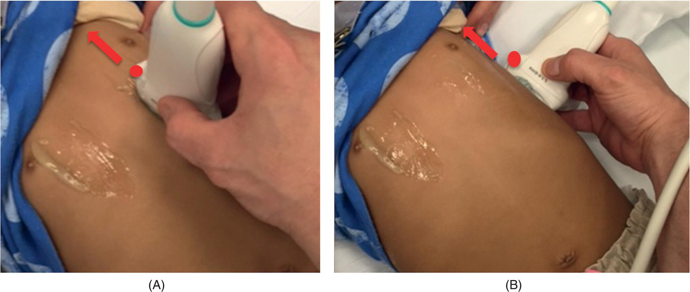
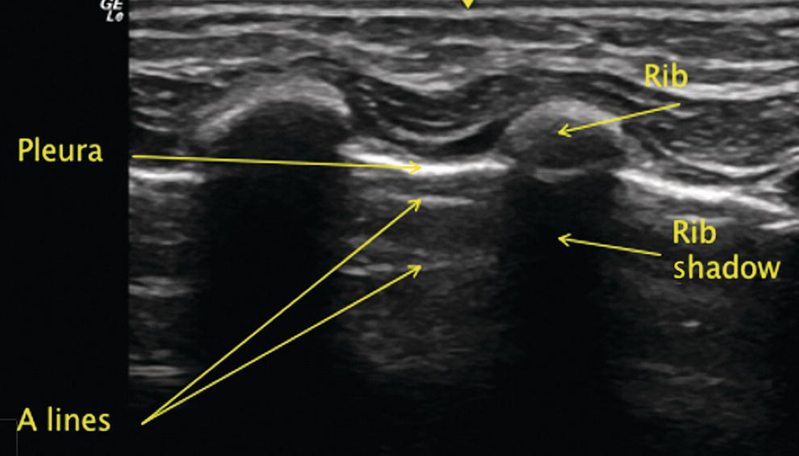
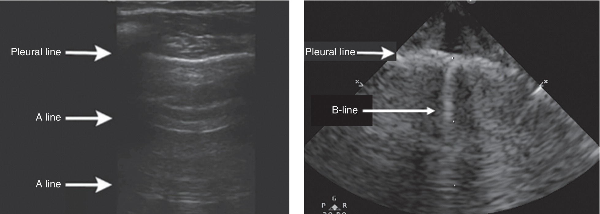
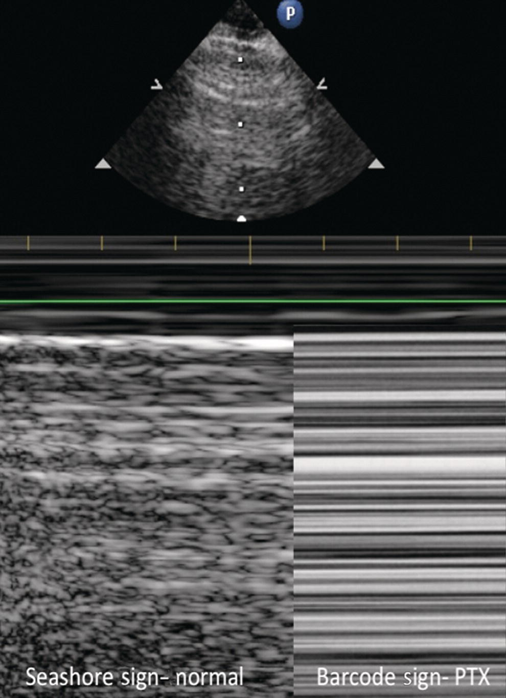
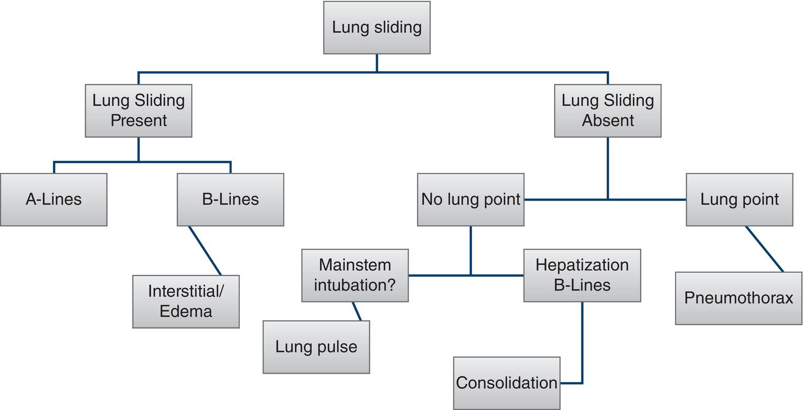

CHAPTER 17 Point‐of‐Care Ultrasound for Congenital Heart Disease Patients 

# CHAPTER 17  
Point‐of‐Care Ultrasound for Congenital Heart Disease Patients

_Alan F. Riley1, Kriti Puri2, and Adam C. Adler3_

1 Assistant Professor of Pediatrics, Division of Cardiology, Associate Director of the Cardiac Patient Care Unit, Texas Children’s Hospital, Baylor College of Medicine, Houston, TX, USA

2 Assistant Professor of Pediatrics, Sections of Pediatric Critical Care Medicine and Cardiology, Department of Pediatrics, Baylor College of Medicine, Houston, TX, USA

3 Associate Professor of Anesthesiology, Department of Anesthesiology, Perioperative and Pain Medicine, Texas Children’s Hospital, Baylor College of Medicine, Houston, TX, USA

* * *

1.  [**Introduction**](#head-2-163)
2.  [**What is POCUS?**](#head-2-164)
3.  [**Pediatric cardiac POCUS**](#head-2-165)
4.  [**Basic physics of POCUS**](#head-2-166)
5.  [**Performing cardiac POCUS**](#head-2-167)
    1.  [Parasternal long‐axis view](#head-3-253)
    2.  [Parasternal short‐axis view](#head-3-254)
    3.  [Apical four‐chamber view](#head-3-255)
    4.  [Subcostal four‐chamber and inferior vena cava views](#head-3-256)
6.  [**Individual structure assessment using cardiac POCUS**](#head-2-168)
    1.  [Assessment of the left ventricle](#head-3-257)
    2.  [Assessment of the right ventricle](#head-3-258)
    3.  [Assessment of pericardial space and early tamponade physiology](#head-3-259)
    4.  [Assessment of the atria and valves](#head-3-260)
    5.  [Assistance during cardiac arrest](#head-3-261)
    6.  [Assistance during central line placement](#head-3-262)
7.  [**Specific clinical situations and corresponding limitations**](#head-2-169)
    1.  [POCUS during assessment of shock](#head-3-263)
        1.  [Hypotension or shock due to right ventricular failure](#head-4-113)
        2.  [Position of cannulae or device for patients on mechanical support](#head-4-114)
8.  [**Performing lung POCUS**](#head-2-170)
    1.  [Structures by artifact visualization](#head-3-264)
9.  [**Incorporation of lung ultrasound into anesthesia practice**](#head-2-171)
10.  [**POCUS training and credentialing**](#head-2-172)
11.  [**Selected references**](#head-2-173)

* * *

## Introduction

Use of point‐of‐care ultrasound (POCUS) in acute care practice has expanded to include a variety of applications from ultrasound‐assisted physical examination to assessment of hemodynamic states as well as guidance for procedures. Within anesthesia practice, POCUS may be used to guide management at all stages of perioperative care \[1\]. While the list of applications for POCUS within anesthesia practice is growing, this chapter focuses on the cardiac and lung POCUS with an emphasis on patients with congenital heart disease (CHD). See [Chapter 13](c13.xhtml) for a discussion of ultrasound‐guided vascular access and [Chapter 24](c24.xhtml) for a presentation of ultrasound‐guided regional anesthesia.

## What is POCUS?

POCUS is the systematic application of ultrasound performed at the bedside to evaluate specific structures, generally using a limited number of ultrasound views \[2\]. Clarity of language is paramount when describing the various ultrasound modalities examining the heart. Ultrasound evaluation of the heart has become a continuum of imaging devices and strategies ranging from limited evaluations with miniaturized handheld devices to comprehensive imaging of the heart with large cart‐sized devices on wheels with the highest resolution medical ultrasound technologies \[3\]. Some consider the very limited evaluations of the ultrasound of the heart to be more like an extension of the physical examination rather than a stand‐alone imaging test \[4\]. In many ways, these distinctions are still being created in modern cardiac imaging, but standard echocardiography remains the most comprehensive ultrasound‐based evaluation of cardiac anatomy and function \[5\]. Cardiac POCUS and focused cardiac ultrasound seem to be the best terms, which are currently being used interchangeably to describe more targeted cardiac ultrasound evaluations. For consistency, the authors are using the term cardiac POCUS.

During this imaging strategy, a bedside clinician (most often a noncardiologist) uses ultrasound to examine the heart in a limited fashion with a goal to identify a limited number of specific ultrasonographic signs that are which could be associated with the clinical situation of interest or a specific pathology \[6\]. While cardiac POCUS is almost always performed with a smaller, more portable ultrasound machine with limited functionality, it should be defined by the imaging technique rather than the machine used \[7, 8\]. Since cardiac POCUS has narrowed diagnostic targets with focused questions, it is important to clearly distinguish it from comprehensive standard echocardiography during medical documentation or communication between providers. Confusion can be created if ambiguous terms, such as “bedside echo or limited echo,” are used to describe clinician‐performed cardiac POCUS. The term echocardiography (or similar forms) should be reserved for more comprehensive evaluations, usually performed by a cardiac sonographer and often include quantitative measurements. Whereas cardiac POCUS should be limited to a few predefined views where the clinician can make qualitative assessments. With non‐precise language, the assumptions of broader diagnostic targets or evaluations can occur creating misunderstanding or false reassurances. See [Chapters 15](c15.xhtml) and [18](c18.xhtml) for further discussion of comprehensive echocardiography.

## Pediatric cardiac POCUS

The evidence supporting the accuracy of cardiac POCUS by noncardiologists in pediatrics comes predominantly from small single center studies with mostly structurally normal hearts \[9–13\]. The identification of severely depressed systolic function and larger effusions are the most reliable findings \[14\]. Given how cardiomyopathy and severely depressed ventricular systolic function can present in pediatrics with insidious onset and/or with misleading chief complaints, cardiac POCUS seems to have a valuable role to play in the early identification of severely depressed left ventricular systolic function \[15\]. However, borderline systolic dysfunction is the area of significant weakness \[9, 16\]. Some argue that borderline systolic dysfunction may be out of the scope of pediatric cardiac POCUS \[13\]. Users of pediatric cardiac POCUS should be keenly aware of this weakness of the modality. This is particularly important in pediatrics since borderline depressed function in a previously healthy child is often a harbinger of rapidly progressive cardiogenic shock, especially in infectious myocarditis or inflammatory disorders \[17, 18\]. There is scant evidence supporting cardiac POCUS in more complex CHD, and its use in this population should be limited to those with extensive training and experience in CHD training and/or pediatric echocardiography. Additionally, the use of cardiac POCUS as _a screening tool_ for CHD is likely counterproductive and it is likely contraindicated for this purpose \[14\].

The diagnostic targets for pediatric cardiac POCUS are typically limited to the assessments of ventricular size, qualitative ventricular systolic function, right ventricular systolic pressure, and the pericardial space \[14\]. Evaluation of diagnostic targets is performed in a qualitative or semiquantitative manner, typically using an “eyeball” method \[2, 8, 14\]. These assessments are usually binary, i.e., is there pathology present or is there not? Declaration of uncertainty is often the correct approach in POCUS if the diagnostic targets are not well visualized, particularly given the inherent nature of POCUS. Cardiac POCUS image acquisition and interpretation are performed rapidly (less than 5 minutes) and usually in suboptimal imaging conditions. Quality improvement work in pediatric transthoracic echocardiography has shown that the conditions in which POCUS is performed – incomplete examinations outside the echocardiography laboratory, in poor ambient light conditions via lower end machines with increased acoustic artifacts – are the exact setup for diagnostic errors \[19\]. Therefore, a low threshold for referral for standard echocardiography seems reasonable when using cardiac POCUS to clarify equivocal imaging or to evaluate persistent symptoms after an unrevealing cardiac POCUS. Inability to diagnose disease using substandard imaging equipment in suboptimal imaging conditions does not prove the absence of disease.

## Basic physics of POCUS

The ultrasound technology for POCUS is based on the same principles of physics as routine ultrasonography. The top of the ultrasound probe contains crystals (piezoelectric crystals) in various configurations based on the type of probe and its intended clinical use. The ultrasound machine transmits an electrical impulse, which results in vibration of these crystals. It is this vibration that emits a sound wave that travels into the adjacent tissue. Sound is absorbed, scattered, and reflected by the tissues. Sound reflected by the tissues returns to the probe where it results in vibration of the crystals. This mechanical vibratory energy is converted to electrical energy, which is processed to create an image.

Ultrasonic waves are refracted and reflected differently by tissues based on their various densities. The speed at which these sound waves are traveling when returning to the probe is converted to an image that is color coded in grayscale. The depth of the structure is determined by the time it takes from the wave transmission until the reflected sound wave returns. Image color may be darkened or lightened using the gain function of the machine. In contrast, air does not conduct sound waves (including ultrasonic waves) well. This limits the abilities of cardiac POCUS during situations involving pneumomediastinum or pneumothorax. Additionally, lung ultrasound relies more on observing artifacts and scatter from lung structures that generate certain ultrasonographic signs indicative of normal and pathologic conditions.

Most modern machines are equipped with complex software that is designed to reduce artifacts which is of benefit when scanning solid structures (e.g., the heart and liver). However, when scanning lung tissue, this feature should be turned off as artifact is vital to image interpretation. Many machines have pre‐settings in which image quality is optimized for the structure of interest.

Ultrasound machines have probes of different configurations, sizes, and with a wide range of frequencies. The frequency of the ultrasonic wave emitted is inversely proportional to the amplitude of the wave and hence the resolution. Therefore, a higher frequency probe, with a lower amplitude, is able to delineate structures more finely. On the other hand, waves with higher amplitude attenuate more slowly as they travel through tissue. Therefore, a higher frequency, lower amplitude probe is able to penetrate to a lower depth in the body, while a lower frequency probe is able to penetrate to a greater depth, e.g., in obese habitus or deeper structures. Depending on the brand of ultrasound equipment, a range of frequencies may be available with capabilities between 3 and 8 Hz. Cardiac POCUS is typically performed using a phased array probe while lung POCUS relies on a linear array probe ([Figures 17.1](#c17-fig-0001) and [17.2](#c17-fig-0002)). Providers should consider the size (space between ribs) of the patients and object of interest (e.g., lung or heart) when selecting a probe.

## Performing cardiac POCUS

Basic cardiac POCUS relies on four main views. These are generally performed while the patient is supine with the exception of the apical four‐chamber view that benefits from left lateral decubitus positioning. Each ultrasound machine has a specific method for indicating the probe side also known as the orientation marker, which is located on the side of the probe.

### Parasternal long‐axis view

The parasternal long‐axis (PLAX) view is obtained with the probe in the second left intercostal space with the orientation marker facing toward the patient’s right shoulder (10 o’clock position). The top of the screen depicts the anterior aspect, and the right and left of the screen are directed toward the feet and head of the patient, respectively. Visualized in this view are left atrium, left and right ventricles, aortic and mitral valves, and left ventricular and a portion of the right ventricular outflow tracts ([Figure 17.3](#c17-fig-0003)).

[**Figure 17.1**](#R_c17-fig-0001) Varying sizes of phased‐array probes for use in cardiac point‐of‐care ultrasound. Arrows indicating the orientation marker.

### Parasternal short‐axis view

The parasternal short‐axis (PSAX) view is obtained by rotating the probe 90° clockwise from the PLAX view, so the orientation marker points toward the patient’s left shoulder (2 o’clock). This view may be optimized by moving the probe up or down one rib space. Visualized in this view are the right and left ventricles, the cardiac apex, and the mitral valve ([Figure 17.4](#c17-fig-0004)).

### Apical four‐chamber view

The apical four‐chamber view is obtained by placing the probe in the fourth or fifth intercostal space along the anterior axillary line with the orientation marker facing toward the left (3 o’clock position). Visualized in this view are the right and left atria and ventricles and the atrioventricular valves ([Figure 17.5](#c17-fig-0005)).

### Subcostal four‐chamber and inferior vena cava views

The subcostal four‐chamber view is obtained with the probe in the subxiphoid space, with the probe facing the patient’s left axilla and orientation marker on the oriented at 2–3 o’clock position ([Figure 17.6](#c17-fig-0006)). To obtain the inferior vena cava (IVC) view, the probe is rotated counterclockwise, so that it is vertical with the orientation marker facing straight up. Visualized in the subcostal four‐chamber view are the right and left atria and ventricles and the atrioventricular valves. Visualized on the IVC view is the liver, intrahepatic IVC with entrance into the right atrium as well as the hepatic veins ([Figure 17.7](#c17-fig-0007)).

[**Figure 17.2**](#R_c17-fig-0002) Linear‐array probes for use in lung point‐of‐care ultrasound. Arrows indicating the orientation marker.

[**Figure 17.3**](#R_c17-fig-0003) Demonstration of the parasternal long‐axis view including probe placement (upper left) with red dot denoting orientation marker, scanning plane (upper right) and accompanying diagram (bottom left) and ultrasonographic appearance (bottom right). RV = right ventricle, LA = left atrium, LV = left ventricle, MV = mitral valve, TV = tricuspid valve, AV = aortic valve, Ao = aorta, LVOT = left ventricular outflow tract, RVOT = right ventricular outflow tract. Dao = descending aorta. Illustration by A. Adler, MD.

## Individual structure assessment using cardiac POCUS

In the following section, the common structures evaluated during cardiac POCUS are discussed. A key requirement of POCUS, and specifically cardiac and lung assessments, is for the provider to recognize normal from abnormal. This requires deliberate training and review of images, so that the sonographer is able to distinguish and identify ultrasonographic signs of pathology from normal sonoanatomy.

### Assessment of the left ventricle

_Systolic dysfunction—_Perhaps, the most common use of POCUS in children, including those with CHD, involves the assessment of systolic function. This may be prompted by new onset hypotension in the perioperative period, presentation in shock and concern for cardiogenic etiology, or new onset ventricular arrhythmias. This assessment permits further clinical decision‐making including choice of vasoactive agent, next steps of resuscitation, possible need for activation of mechanical support team, or need for further advanced investigations. All typical cardiac POCUS views can be employed to assess left ventricular systolic function, but PSAX and PLAX views are more commonly employed views to utilize eyeball or quantitative methods. It is important to note that children who have undergone ventricular septal defect repair with patch will have dyskinesis of the part of the interventricular septum that is composed of patch material. The nuances of this cannot be worked out on cardiac POCUS and would need a formal echocardiogram. Also, operators must recognize that cardiac POCUS will give information only about systolic dysfunction and is not intended for diastolic dysfunction.

Qualitative or eyeball method assessment via ultrasound is best supported for the evaluation of left ventricular size and systolic function. While the method is inherently subjective, it compares quite well with more objective parametric measures of left ventricular systolic function when employed by experienced users \[20\]. For the novice user, the qualitative assessment of ventricular systolic function can be broken down into the evaluation of how well the ventricular walls are thickening and how well the ventricular walls are symmetrically moving towards the center of the cavity \[21\]. Precise estimation or quantification of ventricular ejection fraction is out of scope for cardiac POCUS, but novel users should know when evaluating the ventricular wall “squeeze” toward the center that the left ventricle normally ejects about 55–70% of its contents with each contraction. The decrease in chamber size is largely created by the thickening of ventricular walls during contraction. Making sure that the ventricular walls are actually contracting is important, because there can be misleading scenarios with poor imaging windows where the heart is moving or “rocking” on the screen, but there is ineffectual ventricular wall contraction and the chamber size decrease is difficult to evaluate.

[**Figure 17.4**](#R_c17-fig-0004) Demonstration of the parasternal short‐axis view including ultrasonographic appearance at the level of the mitral valve (upper left) with accompanying diagram (middle left) and at the level of the papillary muscles (upper right) with accompanying diagram (middle right) as well as probe placement (bottom left) with orientation marker (red dot) and suggested fanning planes (red arrows) and corresponding scanning lines (bottom right). RV = right ventricle, LV = left ventricle, PM = papillary muscle, ALPM and PMPM = anterolateral and posterior medial papillary muscles respectively. Illustration by A. Adler, MD.

[**Figure 17.5**](#R_c17-fig-0005) Demonstration of the apical four‐chamber view including probe placement (upper left) with red dot denoting orientation marker, scanning plane (upper right) and accompanying diagram (bottom left), and ultrasonographic appearance (bottom right). RA = right atrium, RV = right ventricle, LA = left atrium, LV = left ventricle, MV = mitral valve, TV = tricuspid valve, Ao = aorta. Illustration by A. Adler, MD.

While tracking the ventricular wall motion, it can be helpful to note that the left ventricle normally employs a relatively even combination of longitudinal, circumferential, and radial wall motions, resulting in a fundamental twisting and untwisting type of ventricular wall movements \[22\]. Accurate tracking of the types of wall motion is out of the scope of cardiac POCUS and is used in higher order echocardiography image packages, namely, speckle tracking or strain imaging. However, the user should be generally aware of the how left ventricular walls move in this coordinated fashion during normal contractions.

POCUS assessments of left ventricular systolic function should be limited to whether systolic function is normal, abnormal, or unclear. There may be value in identifying somewhat depressed left ventricular systolic function in pediatrics, but it is not clear at this point if this is a reliable POCUS practice. Repeated exposure to variable degrees of left ventricular systolic function via image libraries can help novice users improve their proficiency diagnosing ventricular dysfunction \[22\]. Quantification (e.g., shortening fraction, ejection fraction, E‐point separation) during POCUS is generally avoided since incorrect measurements are common in rapid image acquisition and can potentially solidify false impressions of cardiac size or performance \[8\].

### Assessment of the right ventricle

The right ventricle’s anterior position below the chest wall and its complex geometric shape with thin walls are the main challenges to interrogate it via transthoracic ultrasound \[22\]. Therefore, the assessment of the right ventricle in cardiac POCUS is typically more limited than other structures and, at times, is not possible.

Right ventricular enlargement often accompanies right ventricular strain or pressure or volume loading, therefore can be helpful if present to identify right heart pathology \[22\]. But, the absence of right ventricular dilation by cardiac POCUS does not suggest the absence of right heart pathology, likely since large portions of the right ventricle may not be adequately visualized and pathologic dilation can be missed \[23\]. Qualitative assessment of right ventricular size is based mostly on the comparison of size to adjacent structures (assuming the absence of pathology of the adjacent structures, such as left ventricular dilation). In the PLAX views, a portion of the right ventricle body can be seen just below the transducer. As a general rule of thumb, the diameters of the right ventricular body, aortic root, and left atrium in the PLAX view should roughly be the same. In PSAX and apical four chamber views, the right ventricle should appear about 1/3 to ½ the size of the left ventricle \[23\].

[**Figure 17.6**](#R_c17-fig-0006) Demonstration of the subcostal four‐chamber view including probe placement (upper left) with red dot denoting orientation marker, scanning plane (upper right) and accompanying diagram (bottom left), and ultrasonographic appearance (bottom right). RA = right atrium, RV = right ventricle, LA = left atrium, LV = left ventricle, MV = mitral valve, TV = tricuspid valve. Illustration by A. Adler, MD.

Even with experienced echocardiographers, eyeball assessment of right ventricular systolic function by ultrasound has been shown to be less reliable as compared to the left ventricular systolic function evaluation \[23\]. Some limited evaluations of the right ventricular systolic function are possible employing a similar approach to evaluating the left ventricle, again, based on how well the ventricular walls are thickening and how the ventricular walls are moving toward the center of the cavity. When evaluating ventricular wall motion, it is important to note that the right ventricle systolic contractions have more longitudinal wall motion (annulus to apex) than the left ventricle \[23\]. This longitudinal wall motion of right ventricular contraction is typically best seen from apical four‐chamber views when the tricuspid valve moves toward the apex and transducer. Additionally, parasternal and subcostal views offer limited assessment of right ventricular wall contractions. Subcostal views of the right ventricle can be valuable, if available, in critically ill patients who do not have adequate apical or parasternal views because they cannot be repositioned on their side.

Interventricular septal configuration can be evaluated by POCUS and used as a correlate of right ventricular health and pressures \[14\]. Interventricular septal configuration reflects the relative pressure between the two ventricles throughout the cardiac cycle and thus provides qualitative insight to right ventricular pressure estimates. In general, when the right ventricle pressures are less than ½ of the left ventricular pressure, the interventricular septal configuration should have a rounded appearance with the convex aspect directed into the lower pressure right ventricle \[23\]. Flattening of the interventricular septal configuration is suggestive that the right ventricular pressures are greater than ½ of the left ventricular pressures at that moment of the cardiac cycle. Diastolic flattening of the interventricular septal configuration typically represents a right ventricular volume load or an elevated right ventricular end‐diastolic pressure \[23\]. Systolic flattening of the interventricular septal configuration represents a right ventricular pressure load or an elevated right ventricular systolic pressure. The differential diagnoses for flattening of the interventricular septal configuration can be narrowed by timing of flattening, but it remains broad, e.g., pulmonary hypertension, CHD, and pulmonary embolism. Most POCUS exams will not utilize simultaneous ECG readings; therefore, pinpointing the timing of the septal flattening within the cardiac cycle can be difficult, particularly during live scanning in critical scenarios. Additionally, false appearance of interventricular septal flattening can be easily created during off‐angle PSAX views. For these reasons, we recommend that any flattening of the interventricular septal configuration should therefore prompt referral for standard echocardiography and more in‐depth cardiac evaluation.

[**Figure 17.7**](#R_c17-fig-0007) Demonstration of the inferior vena cava (IVC) view including ultrasonographic appearance and probe placement (insert) in which the IVC can be visualized entering the right atrium (RA).

### Assessment of pericardial space and early tamponade physiology

The early diagnosis of pericardial effusions in children is a valuable aspect of pediatric cardiac POCUS \[14\]. Physical examination is insensitive to the condition and chest radiograph is unable to make the final diagnosis. A pericardial effusion resulting in tamponade physiology impervious to medical therapy should prompt referral to a skilled interventionalist \[23\].

The pericardium is typically visible in ultrasound evaluations of the heart, recognizable by the bright echogenic line surrounding and closely abutting the myocardium in physiologic conditions. With buildup of excessive pericardial fluid, an echo‐lucent or black area can be seen via ultrasound beginning to build between the myocardium and pericardium. It is important to evaluate whether that the effusion is within the pericardial space since adjacent pleural effusions can be present or coexist ([Figure 17.8](#c17-fig-0008)). Subcostal views can help differentiate these potential spaces and identify concomitant issues such as other effusions ([Figures 17.8](#c17-fig-0008) and [17.9](#c17-fig-0009)). On PLAX views, evaluating the relationship of the echo‐lucent fluid collection between the pericardium and the descending aorta can provide good information of the location. The descending thoracic aorta is a structure outside the pericardium; therefore, some pleural effusions can be in continuity with the descending aorta seen in its short axis behind the cardiac mass. On the other hand, no pericardial effusions will be in continuity with descending aorta \[23\].

[**Figure 17.8**](#R_c17-fig-0008) POCUS imaging demonstrating (A) large pleural effusion with lung consolidation (red stars) and fibrinous exudate (yellow arrows) and (B) apical four‐chamber view with large circumferential pericardial effusion (red arrow) and right atrial collapse (white arrow).

(Source: Adler et al. \[32\]. Reproduced with permission from Springer Nature.)

[**Figure 17.9**](#R_c17-fig-0009) (A & B): Subcostal four‐chamber view with large pleural effusion and lung consolidation, LV = left ventricle.

(Source: Adler et al. \[40\]. Reproduced with permission from John Wiley & Sons.)

The pericardium is composed of elastic fibers and collagen into visceral and parietal layers. The pericardial sac is able to slowly expand with chronic effusions, but it is inextensible beat‐to‐beat and during rapid accumulation of pericardial fluid. Therefore, a rapid accumulating, even relatively small, pericardial effusion is more likely to result in an inward force and eventual tamponade physiology as compared to a slowly evolving pericardial effusion seen in some medical diseases \[23\]. Pericardial pressure is negligible in physiologic conditions. But, as a pericardial effusion enlarges, pericardial pressure will eventually begin to elevate. As pericardial pressure rises, it can begin to overcome intracardiac pressures during certain nadirs in the chambers’ cardiac cycles, resulting in partial collapse or indentation, which can be seen via cardiac POCUS. The right heart chambers that tend to have lower pressure in general, therefore, are the first chamber to demonstrate collapse with worsening pericardial effusion. The right atrium will most likely start to show collapse during ventricular systole, as this is the typical nadir of the right atrial pressure during the cardiac cycle. The right ventricle will most likely start to show collapse during ventricular diastole, as this is its nadir \[23\]. These early phases imply impaired cardiac filling and onset of tamponade physiology. Therefore, one of the earliest physiologic responses to a significant pericardial effusion is tachycardia due to the inadequate preload. There is the caveat of coexisting pathologic arrhythmias, such as sinus node dysfunction. True tamponade is when the pericardial pressures overcome all cardiac pressures and blood is unable to circulate through the cardiopulmonary system despite normal ventricular systolic and diastolic function. Medical therapies and chest compressions are essentially useless in this scenario, with needle compression being the definitive therapy \[23\]. Therefore, again, timely diagnosis prior to frank tamponade is of paramount importance and concerns for large or hemodynamically significant effusions diagnosed by cardiac POCUS should prompt urgent formal echocardiographic and/or interventionalist evaluation.

It is important to remember that not all pericardial effusions are circumferential. They can be loculated or localized in certain areas of the pericardial space, potentially impacting adjacent heart chambers. Localized, particularly rapidly accumulating pericardial effusions can be just as hemodynamically active as a larger circumferential effusion. This is can be seen in postoperative or postprocedural situations or if there are adhesions within the pericardial space. Careful assessment of the whole pericardial space via long sweeps of the heart is important in cardiac POCUS, particularly if there is clinical concern for hemodynamically significant pericardial effusion. The best long sweeps to assess for effusions in cardiac POCUS are usually obtained in subcostal views, sweeping either posterior to anterior (coronal views) or left to right (short axis).

### Assessment of the atria and valves

A qualitative view of the atria should be appreciated when performing cardiac POCUS. Most notably, providers should observe that the atria do not appear large or compressed. Similar to ventricular assessment, the provider should attempt to distinguish atria as normal or abnormal. Additionally, the presence of a large thrombus can be identifiable, even to the novice sonographer. However, small thrombi that may be clinically significant can be missed.

With regard to valvular assessment, the atrioventricular and semilunar valves may be observed for obvious structural deformity, stenosis, or regurgitation. While not typically part of basic cardiac POCUS, limited assessment using color Doppler can aid an overall assessment of stenosis or regurgitation. Assessments should be limited, qualitative in nature, and should attempt to discern if a clinically significant pathology is present. Ruling out pathologic atrioventricular valve dysfunction is likely out of the scope of POCUS.

[**Figure 17.10**](#R_c17-fig-0010) Subcostal four‐chamber view showing a large volume of air microemboli after inadvertent injection of air during cardiac catheterization in a 4‐month‐old with hypoplastic left heart syndrome, resulting in arterial desaturation, hypotension, bradycardia, and ST‐segment elevation. The patient recovered after 2 boluses of epinephrine of 1 mcg/kg and fluid bolus of 20 mL/kg.

(Source: Adler \[34\]. Reproduced with permission from Elsevier.)

### Assistance during cardiac arrest

POCUS is valuable during cardiac arrest in identifying reversible causes of cardiopulmonary collapse as well as assessing the likelihood for achieving return of spontaneous circulation (absence of intrinsic cardiac function). The subcostal four‐chamber view can be performed during cardiopulmonary resuscitation at times where chest compressions are paused for pulse checks. In this view, the provider can identify intrinsic cardiac function and presence of large pericardial effusions. The chest may also be scanned to evaluate for pneumothoraces which may be under tension and the case of the cardiopulmonary arrest. In addition, intracardiac air can be easily visualized as a cause of hemodynamic instability or cardiac arrest ([Figure 17.10](#c17-fig-0010)) \[24\].

### Assistance during central line placement

The use of modified cardiac POCUS has been described for assistance with central line placement and positioning in children. Park YH et al. described the use of POCUS to guide central line depth in infants undergoing congenital heart surgery \[25\]. Specifically, they describe the use of longitudinal images of the right atrium and superior vena cava in addition to obtain a pulmonary bifurcation view allowing for imaging of the right atrium \[25\]. Alternatively, the right ventricular inflow view can also serve to aid in the visualization of proper central line positioning. While these views do not fall within basic POCUS, this highlights the ability for deliberate expansion of this modality to aid in the care of patients.

## Specific clinical situations and corresponding limitations

As described above, cardiac POCUS can yield key information in several clinical scenarios for children. While systolic dysfunction and pericardial effusion are the most common indications for performing cardiac POCUS, specific indications emerging in the pediatric heart disease and pediatric cardiac critical care settings include right ventricular failure and position evaluation for mechanical circulatory support devices. The latter are indications that would be applicable only to centers taking care of patients with advanced pulmonary hypertension or advanced heart failure and cardiogenic shock. Additionally, utilization of the cardiac POCUS is an evolving use and may be particularly helpful in elucidating shock states \[26\]. [Figure 17.11](#c17-fig-0011) summarizes the approach to cardiac and lung POCUS evaluation of unexplained hemodynamic instability in the intraoperative or postoperative settings \[1\].

### POCUS during assessment of shock

There are varying etiologies of shock (e.g., cardiogenic, hypovolemic, septic). POCUS, in addition to traditional methods for elucidating the type of shock, such as physical examination and hemodynamic parameters (e.g., cardiac output, heart rate, central venous pressure), can be tremendously helpful particularly for guiding fluid therapy and vasoactive medications. The surviving sepsis campaign international guidelines suggest the use of POCUS of advanced echocardiography in tailoring therapy for children with sepsis \[27\].

#### Hypotension or shock due to right ventricular failure

A patient with a clinical picture concerning for new pulmonary embolism – syncope, hypotension, ECG changes, and/or desaturation – may be a scenario for a cardiac POCUS while awaiting laboratory results. The presence of severely depressed right ventricular function may suggest right ventricular failure due to an embolic event. The right ventricular systolic function can be assessed in the PLAX, PSAX, and apical four‐chamber views. Final diagnostic studies with echocardiogram and chest computed tomography (CT) scan are still needed; however, a cardiac POCUS performed by a credentialed team that shows these findings may be a criterion for activating surgical and/or mechanical support teams.

A patient with underlying pulmonary hypertension (idiopathic, genetic, or secondary to CHD) may present with signs and symptoms concerning for episodes of right ventricular failure, e.g., worsening hypotension, ST segment changes, and/or desaturations. An assessment of the position of the interventricular septum on cardiac POCUS can yield important clues to the best next step for management. Diagnosis of worsening pulmonary hypertension by POCUS can lead to the early initiation of additional or new pulmonary vasodilators. Additionally, a septum bowing into the left ventricle with preserved left ventricular function suggests that vasoconstrictor agents (vasopressin or norepinephrine) may be beneficial to increase the left ventricular afterload to optimize ventriculo‐ventricular interactions by shifting the interventricular septum over toward the right ventricle and into a more neutral position. This can permit better left ventricular preload and function to improve cardiac output. This assessment is best performed in the PSAX view to assess the interventricular septum as well as the relative left and right ventricular sizes.

[**Figure 17.11**](#R_c17-fig-0011) Perioperative anesthesia ultrasound evaluation approach for intraoperative/postoperative bedside ultrasonography during unexplained periods of hemodynamic instability. LV, left ventricle; PE, pulmonary embolism; LVOT, left ventricular outflow tract; RVOT, right ventricular outflow tract; PTX, pneumothorax; PA, pulmonary artery; SVR, systemic vascular resistance; IVC, inferior vena cava; PLR, passive leg raise.

(Source: Adler et al. \[1\]. Reproduced with permission from Elsevier.)

[**Figure 17.12**](#R_c17-fig-0012) Diagram indicating suggested scan planes for lung point‐of‐care ultrasound.

(Source: Diaz‐Gomez et al. \[30\]. Reproduced with permission from Elsevier.)

#### Position of cannulae or device for patients on mechanical support

An evolving use of cardiac POCUS is the assessment of position of mechanical circulatory support devices; particularly, the positioning of venous cannula in venous‐arterial extracorporeal membrane oxygenation (ECMO) cannulation or the dual‐lumen cannula (e.g., Avalon cannula) is utilized for venovenous ECMO cannulation \[28\]. At the time of initial cannulation, the positioning of the venous cannula, particularly for venovenous ECMO, is typically performed under formal echocardiogram guidance \[29\]. However, if there is an urgent change in oxygen saturations or concern for worsening recirculation, cardiac POCUS in the subcostal views can be utilized by credentialed operators to assess the position of the outflow and inflow ports. When a dual‐lumen cannula is utilized for venovenous cannulation, the tip of the cannula is positioned in the IVC with the outflow port in the superior one‐third of the right atrium with flow directed toward the tricuspid valve.

The Impella® device is increasingly used for mechanical support in pediatric patients in cardiogenic shock. The positioning of the Impella® requires device‐specific distance between the aortic valve and the tip of the device as well as between the mitral valve and the device. Repositioning of the device may be needed in case of any movement or migration, as malposition can cause suction events, inadequate support, or worsening hemolysis. Although not yet well investigated in pediatrics, a cardiac POCUS may be helpful in these situations to help reposition the device with the assistance of the interventional cardiologist. The most useful views for this purpose would be a PLAX view as well as the apical four‐chamber view, to evaluate the device in the long axis.

It is important to note that these device‐specific uses of cardiac POCUS require technical knowledge of the technology being evaluated. This is ideally suited to institutions with formal cardiac POCUS protocols for these specific indications as well as cohorting of these technologies, patients, and their providers. This will allow the relevant operators to be familiar with the appropriate positioning of the mechanical support devices as well as allow them case volumes to maintain competence of their skills in performing these assessments.

## Performing lung POCUS

Basic lung POCUS relies on scanning of two to three planes and is generally performed while the patient is supine. The chest can be divided into segments to ensure that the provider scans all portions of the chest. The provider should scan long the anterior and posterior axillary lines and along the parasternal line ([Figure 17.12](#c17-fig-0012)) \[30\]. Scanning of these planes ensures that all lung segments are evaluated in a brief but systematic way. Similar to all diagnostic modalities, lung ultrasound is operator dependent and requires deliberate training to ensure that the sonographer is able to recognize the ultrasonographic signs indicative of pathology.

Scanning is performed using the linear array probe with the orientation marker in the 12 o’ clock position and should proceed systematically ([Figure 17.13](#c17-fig-0013)) \[31\].

### Structures by artifact visualization

<table border="1"><tbody><tr><td class="left"><i>A‐lines</i></td><td class="left"><ul id="c17-list-0007"><li id="c17-li-0026">Motionless artifacts that are reverberation reflections of the pleural line</li><li id="c17-li-0027">Appear at repeated and fixed intervals from the pleural line (<a href="#c17-fig-0014" id="R_c17-fig-0014">Figure 17.14</a>)</li><li id="c17-li-0028">Normal finding in the presence of pleural sliding (<a href="#c17-fig-0015" id="R_c17-fig-0015">Figure 17.15</a>)</li></ul></td></tr><tr><td class="left"><i>B‐lines</i></td><td class="left"><ul id="c17-list-0008"><li id="c17-li-0029">Hyperechoic laser‐like projections extending from the pleural line to the bottom of the screen (<a href="#c17-fig-0015">Figure 17.15</a>)</li><li id="c17-li-0030">Typically obliterate A‐lines</li><li id="c17-li-0031">Usually indicative of increased lung parenchymal density as seen with pulmonary edema</li></ul></td></tr><tr><td class="left"><i>Lung Sliding</i></td><td class="left"><ul id="c17-list-0009"><li id="c17-li-0032">Shimmering motion artifact representing normal movement of the opposing visceral and parietal pleura during the respiratory cycle</li></ul></td></tr><tr><td class="left"><i>Seashore Sign</i></td><td class="left"><ul id="c17-list-0010"><li id="c17-li-0033">Granular and homogenous pattern visualized on M‐mode below the pleural line (<a href="#c17-fig-0016" id="R_c17-fig-0016">Figure 17.16</a>)</li><li id="c17-li-0034">Normal finding indicative of the interface between the chest wall and the mobile lung</li></ul></td></tr><tr><td class="left"><i>Barcode Sign</i></td><td class="left"><ul id="c17-list-0011"><li id="c17-li-0035">Sonographic sign of absent lung sliding using M‐Mode (<a href="#c17-fig-0016">Figure 17.16</a>)</li><li id="c17-li-0036">Change in appearance from a Seashore to a Barcode appearance below the pleural line</li><li id="c17-li-0037">Pathognomonic for pneumothorax</li></ul></td></tr><tr><td class="left"><i>Spine Sign</i></td><td class="left"><ul id="c17-list-0012"><li id="c17-li-0038">Visualization of the thoracic vertebral bodies</li><li id="c17-li-0039">Indicative of fluid (effusion, hemothorax, and consolidation) enhancing the ultrasound waves allowing for deeper penetration to visualize the spine</li></ul></td></tr><tr><td class="left"><i>Lung Point</i></td><td class="left"><ul id="c17-list-0013"><li id="c17-li-0040">Distinct area of transition between normal lung sliding and absent lung sliding</li><li id="c17-li-0041">Pathognomonic for pneumothorax</li></ul></td></tr><tr><td class="left"><i>Lung Pulse</i></td><td class="left"><ul id="c17-list-0014"><li id="c17-li-0042">intermittent pulsation of the pleural line (without lung sliding) synchronous with the heartbeat</li><li id="c17-li-0043">Occur with increased lung density (atelectasis) or in the absence of ventilation (without pneumothorax) such as during contralateral one lung ventilation</li></ul></td></tr></tbody></table>

[**Figure 17.13**](#R_c17-fig-0013) Probe positioning for lung ultrasound in the parasternal line (A) and posterior axillary line (B). Red dot indicates location of orientation marker.

(Source: Adler et al. \[1\]. Reproduced with permission from Elsevier.)

[**Figure 17.14**](#R_c17-fig-0014) Lung ultrasound imaging demonstrating the appearance and location of the pleural line, ribs, and ensuing shadowing as well as A‐line reflections of the pleural line.

Performance of lung ultrasound should occur systematically across all regions of the chest with the intent on observing specific sonographic signs above to identify normal lung from pathology \[30\] ([Figure 17.17](#c17-fig-0017)).

## Incorporation of lung ultrasound into anesthesia practice

The majority of reports using lung ultrasound perioperatively has been limited to case reports and series \[32–34\]. While lung ultrasound can be useful in identifying etiologies for pulmonary‐related issues, it is likely that the fully utility of this modality has yet to be realized within anesthesia practice. Lung ultrasound has been successful in guiding airway management, particularly the assessment of one lung ventilation \[35, 36\]. Additionally, lung ultrasound has been shown to assist ventilatory management in patients undergoing congenital heart surgery. Song et al. performed a randomized controlled study using ultrasound guided lung recruitment to rescue intra and postoperative desaturation as well as mechanically ventilatory times in children undergoing congenital heart surgery \[37\].

Comparative analysis conducted by Wu et al. assessed the diagnostic ability of perioperative lung ultrasound for identification of excessive pulmonary blood flow (detection of pleural fluid and pulmonary edema as indicated by B‐lines) as often seen in children with CHD \[38\]. Specifically, they evaluated the diagnostic abilities of lung ultrasound in comparison with preoperative chest X‐ray (CXR) and CT \[38\]. This study demonstrated the sensitivity and specificity of lung ultrasound (96 and 95%, respectively) to be similar to chest CT and far superior to CXR (74 and 50%, respectively) for the detection of excessive pulmonary blood flow and interstitial edema \[38\].

[**Figure 17.15**](#R_c17-fig-0015) Lung point‐of‐care ultrasound demonstrating the presence of the pleural line and A‐lines (left panel) and B‐lines (right panel)

[**Figure 17.16**](#R_c17-fig-0016) Lung point‐of‐care ultrasound (Motion Mode: M‐Mode) demonstrating the change of appearance from normal aerated lung (left) with a seashore sign to appearance with presence of a pneumothorax (PTX‐right) and a barcode sign.

(Source: Adler et al. \[1\]. Reproduced with permission from Elsevier.)

## POCUS training and credentialing

Again, while POCUS specific machines have fewer controls and cardiac POCUS imaging protocols are simpler than standard echocardiography, cardiac imaging remains a complex task and one should not believe that cardiac POCUS training is a simple endeavor. Short weekend or day‐long POCUS crash courses or workshops may be able to provide some fundamental knowledge to begin POCUS training. However, experts consistently recommend that the best approach to teach POCUS is multifaceted, including longitudinal training programs which emphasize and demonstrate learner competency \[8, 39, 40\]. Published pediatric POCUS training programs tend to be multidisciplinary in nature, drawing upon expertise of subspecialists in order to cover the POCUS imaging cores \[11, 23, 41\]. For cardiac POCUS, collaboration with cardiology subspecialists and the institutional echocardiography laboratory provides invaluable access to expert operators and cardiac pathology exposure \[23, 42\].

The basic cardiac POCUS curriculum components typically include didactics, cardiac ultrasound image library, and supervised hands‐on scanning; ultrasound simulators or cardiac phantoms may also be used to complement patient scanning experiences \[8\]. Dedicated faculty with interest in cardiac POCUS and education is needed to create the didactics and image library or to curate free online medical education materials. Faculty mentorship for learner bedside scanning supervision or remote image review is critical, but this is more time‐consuming and can be challenging to maintain.

Didactics for cardiac POCUS should include fundamentals of ultrasound physics, including artifacts and the fundamentals of machine use. Typically, this also includes instruction of terminology and basic probe orientation. While there are fewer options for image optimization and probe selection with POCUS machines to review, the imaging limitations of these machines compared to standard echocardiography should be emphasized. Additionally, the scope of practice of cardiac POCUS as compared to standard echocardiography should be reviewed, particularly related to the limited diagnostic targets in POCUS and the concerns regarding its use in CHD \[14\]. Optimal method or modality of didactics is not established, but asynchronous or online methods can be an attractive solution to teach medical personnel with busy clinical schedules. Additionally, online teaching can be viewed repeatedly by users and potentially provide the opportunity for a learning forum for discussion or interactivity with other learners and experts \[43\].

[**Figure 17.17**](#R_c17-fig-0017) Suggested algorithm for approaching lung point of ultrasound for the anesthesia provider.

Development of competent cardiac POCUS psychomotor skills requires a component of hands‐on training, of which at least some should be directly proctored by an expert user \[8, 44\]. This can be accomplished in different manners, including dedicated standardized patient workshops or in clinical scenarios with a mentor. Weekend workshops provide opportunities for scanning on multiple standardized patients with variable quality of imaging windows. If designed well, the workshop should have ample time for expert feedback on the technical aspects of imaging acquisition. However, given the nature of standardized patients or volunteers, there will likely be a paucity of pathology. Proctored scanning in clinical scenarios can provide opportunities for pathology exposure, but caution is recommended regarding clinical integration of learner scan findings. This can be ameliorated by the usage of clear terminology (POCUS vs. standard echocardiography) and proctors aware of the clinical scenario as well as the scope of practice for POCUS and standard echocardiography.

In pediatric centers, even large ones, cardiac pathology can be relatively rare and exposing a number of POCUS learners to enough pathology in clinical scenarios in a finite period of time can be difficult. POCUS image libraries can provide avenues to improve learners’ competency to recognize cardiac disease, particularly recognizing the variety of ventricular systolic dysfunction \[23\]. Again, there are multiple free online medical education resources (mostly adult medicine centric) to draw from. These image libraries can also be created locally drawn from institutional POCUS and standard echocardiography images ([http://learn.pocustraining.com](http://learn.pocustraining.com)). These libraries can also be used track users’ progress and provide feedback (individually or via expert comments on specific POCUS images).

Teaching POCUS with a goal of competency is the optimal approach and it can provide a pathway for a local credentialing process. Assessment of cardiac POCUS competency is an evolving science but seems to be based on a combination of number of scans performed and an expert assessment of the quality of the acquired images. Conlon et al published that a minimum of 25 certified cardiac POCUS scans as the criteria for credentialing purposes in their pediatric critical care medicine division \[11\]. Mechanisms for expert feedback on adequacy and quality images are important for credentialing, but also for ongoing quality assurance programs. Some POCUS imaging reporting systems provide quality assurance packages. There are also available cardiac POCUS assessment tools available to provide richer feedback for both teaching and ongoing quality assurances purposes \[45\]. Cardiology consultation is likely helpful to build and maintain cardiac POCUS credentialing and quality assurance processes, but both the American Medical Association and American Council of Emergency Physicians recommend that credentialing processes remain internal within the subspecialty \[46, 47\]. This recommendation is likely due, in part, that POCUS scope of practice within a subspecialty is best ultimately determined by the subspecialists themselves.

## Selected references

_A full reference list for this chapter is available at:_

[http://www.wiley.com/go/andropoulos/congenitalheart](http://www.wiley.com/go/andropoulos/congenitalheart)

1.  1 Adler AC, Greeley WJ, Conlin F, Feldman JM. Perioperative anesthesiology ultrasonographic evaluation (PAUSE): a guided approach to perioperative bedside ultrasound. J Cardiothorac Vasc Anesth 2016; 30:521–9. An early review of POCUS in anesthesiology with well‐organized flowcharts for preoperative, and intra/postoperative assessment of abnormal hemodynamic states using a differential diagnosis approach.
2.  3 Narula J, Chandrashekhar Y, Braunwald E. Time to add a fifth pillar to bedside physical examination: inspection, palpation, percussion, auscultation, and insonation. JAMA Cardiol 2018; 3:346–50. A well‐written review arguing that bedside ultrasound techniques, including cardiac POCUS, lead to more accurate diagnoses than physical examination alone. The significant advances in miniaturizing the bedside technology are also presented.
3.  5 Kimura BJ. What is an echo machine? J Am Soc Echocardiogr 2010; 23:1238–41. An interesting opinion piece warning that the disruptive technology and wide availability of bedside echocardiography may come at the cost of resolution and accuracy of imaging, and emphasizing the limitations of POCUS for cardiac imaging.
4.  14 Singh Y, Tissot C, Fraga MV, et al. International evidence‐based guidelines on point of care ultrasound (POCUS) for critically ill neonates and children issued by the POCUS Working Group of the European Society of Paediatric and Neonatal Intensive Care (ESPNIC). Crit Care 2020; 24:65. A comprehensive review of the evidence, and the recommendations for use of POCUS in neonates and children, along with levels of evidence for cardiac, lung, and other modalities. A total of 41 clinical scenarios is evaluated; about half were deemed to have quality of evidence rated A or B on an A through D scale.
5.  24 Adler AC. Perioperative point‐of‐care ultrasound in pediatric anesthesiology: a case series highlighting intraoperative diagnosis of hemodynamic instability and alteration of management. J Cardiothorac Vasc Anesth 2018; 32:1411–4. A case series including air embolus, pleural effusion, pericardial tamponade, and ventricular dysfunction, which has well‐defined images of each scenario as well as on line supplementary material with the corresponding videos.
6.  28 Bautista‐Rodriguez C, Sanchez‐de‐Toledo J, Da Cruz EM. The role of echocardiography in neonates and pediatric patients on extracorporeal membrane oxygenation. Front Pediatr 2018; 6:297. A well‐written review of POCUS for ECMO in neonatal and pediatric patients, including cannula position, pericardial tamponade, intracardiac thrombus, and ventricular dysfunction. Includes figures with examples of all of these clinical scenarios.
7.  32 Adler AC, Matisoff AJ, DiNardo JA, Miller‐Hance WC. Point‐of‐care ultrasound in pediatric anesthesia: perioperative considerations. Curr Opin Anaesthesiol 2020; 33:343–53. An up to date summary of POCUS in pediatric anesthesia; includes a review of cardiac, lung, airway, and gastric ultrasound, along with their limitations.
8.  37 Song IK, Kim EH, Lee JH, et al. Utility of perioperative lung ultrasound in pediatric cardiac surgery: a randomized controlled trial. Anesthesiology 2018; 128:718–27. A randomized controlled study using ultrasound guided lung recruitment to rescue intra and post‐operative desaturation as well as mechanically ventilatory times in children undergoing congenital heart surgery. Lung POCUS was effective in improving atelectasis and oxygenation, and reduced time on mechanical ventilation compared to standard therapy.
9.  39 Fagley RE, Haney MF, Beraud AS, et al. Critical care basic ultrasound learning goals for American Anesthesiology Critical Care Trainees: recommendations from an Expert Group. Anesth Analg 2015; 120:1041–53. Recommendations from a group of experts emphasizing that the best approach to teach POCUS is multifaceted, including longitudinal training programs which emphasize and demonstrate learner competency over time; rather than short training courses.
10.  42 Kirkpatrick JN, Grimm R, Johri AM, et al. Recommendations for echocardiography laboratories participating in cardiac point of care cardiac ultrasound (POCUS) and critical care echocardiography training: report from the American Society of Echocardiography. J Am Soc Echocardiogr 2020; 33:409–22.e4. Recommendation for training in cardiac POCUS, which include collaboration with cardiology subspecialists and the institutional echocardiography laboratory, which provides invaluable access to expert operators and cardiac pathology exposure.