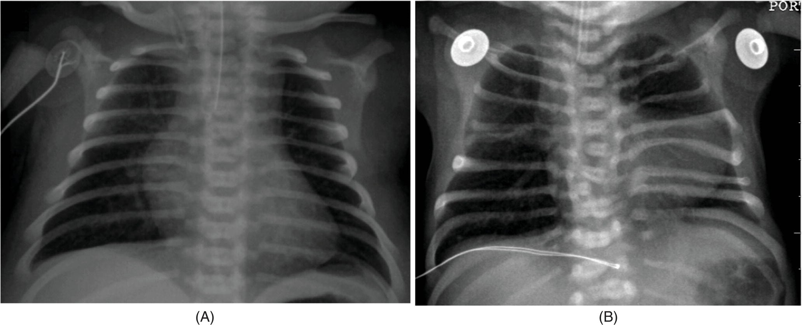
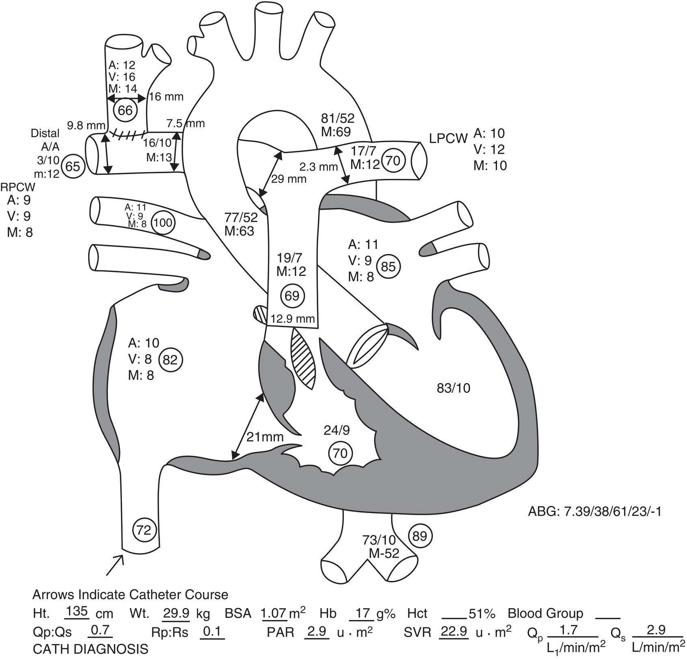
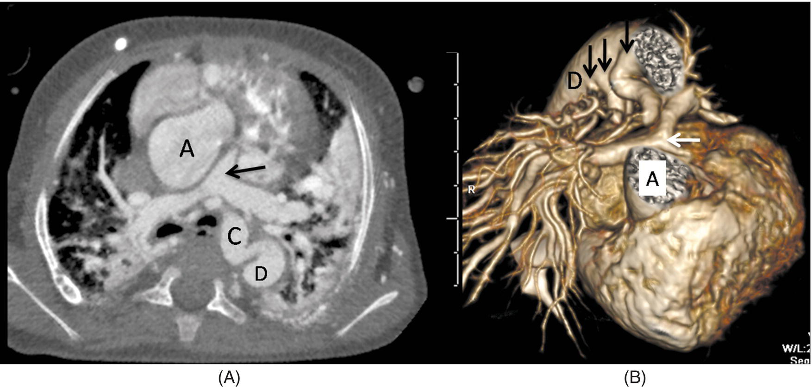
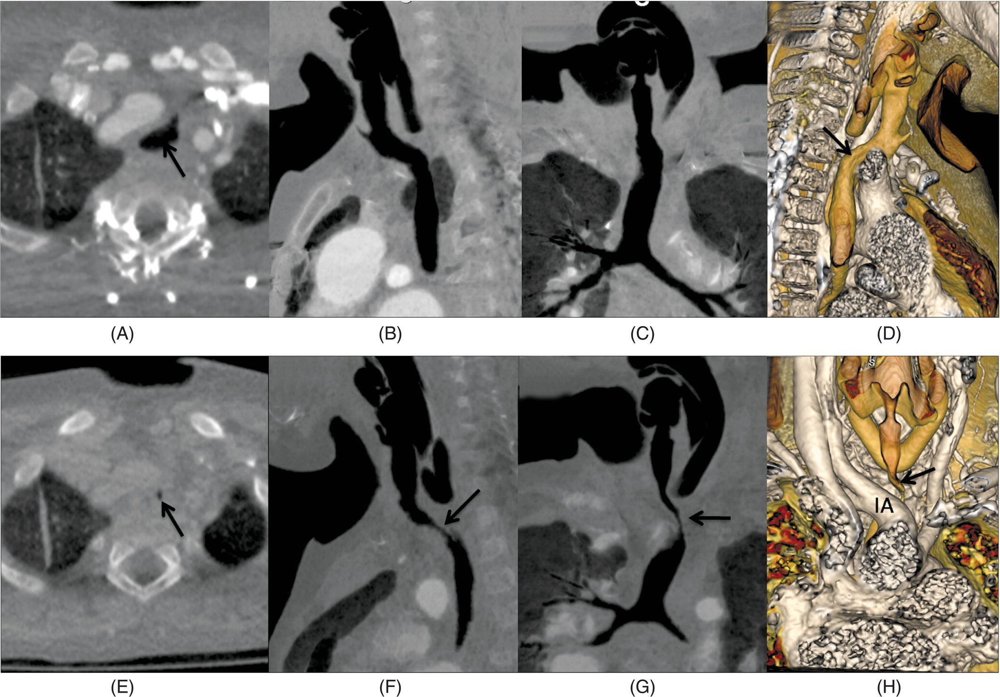
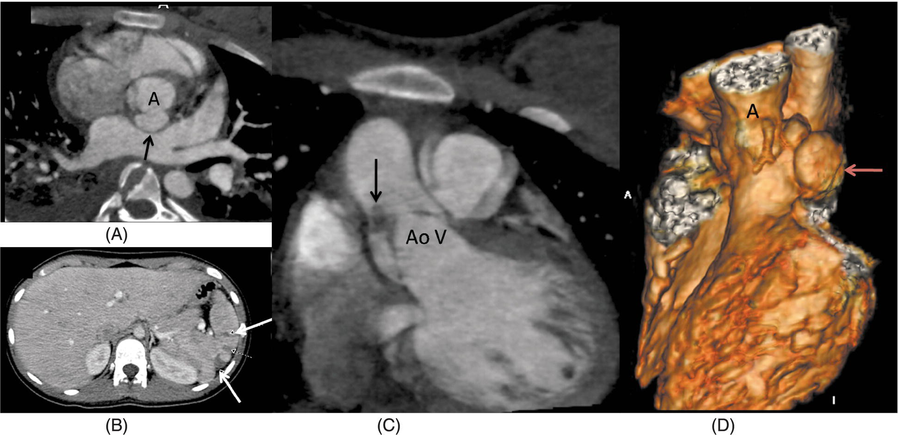

CHAPTER 18 Preoperative Evaluation and Preparation 

# CHAPTER 18  
Preoperative Evaluation and Preparation

_Emad B. Mossad1, Rahul Baijal2, and Rajesh Krishnamurthy3_

1 Arthur S. Keats Division of Pediatric Cardiovascular Anesthesiology, Vice Chief for the Heart Center, Department of Anesthesiology, Texas Children’s Hospital, Baylor College of Medicine, Houston, TX, USA

2 Staff Anesthesiologist, Department of Anesthesiology, Texas Children’s Hospital, Baylor College of Medicine, Houston, TX, USA

3 William E. Shiels Chair of Radiology, Clinical Professor of Radiology, Nationwide Children's Hospital, Ohio State University, Columbus, OH, USA

* * *

-   [**Introduction**](#head-2-174)
    -   [The patient with congenital heart disease](#head-3-265)
    -   [Terminology and classification](#head-3-266)
    -   [Multidisciplinary approach](#head-3-267)
    -   [Consent](#head-3-268)
-   [**Preoperative evaluation**](#head-2-175)
    -   [History and physical examination](#head-3-269)
    -   [Congestive heart failure](#head-3-270)
    -   [Pulmonary arterial hypertension](#head-3-271)
    -   [The neonate and premature infants](#head-3-272)
    -   [Medications](#head-3-273)
    -   [Electrocardiographic evaluation, pacemakers, and defibrillators](#head-3-274)
-   [**Laboratory evaluation**](#head-2-177)
-   [**Preoperative imaging studies**](#head-2-178)
    -   [Chest radiography](#head-3-275)
    -   [Echocardiography](#head-3-276)
    -   [Cardiac catheterization](#head-3-277)
    -   [Magnetic resonance imaging](#head-3-278)
    -   [Computed tomography](#head-3-279)
    -   [Choice of echocardiography, CT, or MRI for non‐invasive assessment of CHD](#head-3-280)
    -   [Head ultrasound and other brain imaging modalities](#head-3-281)
-   [**Preoperative preparation**](#head-2-179)
    -   [Preoperative fasting](#head-3-282)
    -   [Preoperative psychological preparation and premedication](#head-3-283)
    -   [Infective endocarditis antibiotic prophylaxis](#head-3-284)
    -   [Sickle cell disease](#head-3-285)
-   [**Risk stratification**](#head-2-182)
-   [**Selected references**](#head-2-183)

* * *

## Introduction

Congenital heart defects (CHD) are the most common of all congenital anomalies. Every day in the United States, 11,500 babies are born; of whom 450 have a congenital anomaly, of which 87 (20%) are congenital heart defects \[1\]. The incidence of CHD has remained consistent over the years and is similar across various geographic, racial, and ethnic groups. Although there is a suggested increase in the prevalence of specific lesions in certain regions, the incidence is mostly 7–10/1,000 live births \[2, 3\].

### The patient with congenital heart disease

The demographics of patients with CHD are changing as screening methods evolve, diagnostic tools improve, and interventions change. Although CHD is frequently considered a disease of childhood, the population of adults with CHD is growing at the rate of 5% every year, and by the end of this decade, there will be more adults than children with CHD. The congenital cardiac anesthesiologist thus must be prepared to evaluate and care for adults as well as children with heart defects. However, there remains a significant population of neonates and infants with critical CHD who require care in their first days or months of life. In an epidemiologic study, 15% of all infants with CHD had significant physiological compromise (metabolic acidosis, seizures, cardiac arrest, or evidence of renal or hepatic injury) that required an invasive intervention in the first few weeks of life \[4\]. Many lesions are diagnosed prenatally, and fetal interventions to improve the outcome and progress of patients are increasingly applied \[5\]. The interventions are also changing rapidly, and an anesthesiologist must include in the preoperative evaluation an understanding of the planned procedure, the location, and the coordination needed between various teams. Many centers have adopted a hybrid approach to many defects, especially hypoplastic left heart syndrome \[HLHS\]) and multiple ventricular septal defects (VSDs). These procedures will require an up‐to‐date understanding and preparation for those ever‐changing interventions \[6, 7\].

### Terminology and classification

The primary step in the preoperative anesthetic evaluation of the patient with CHD is an understanding of the terminology and nomenclature used for these defects. The communication between various chambers and vessels is described in terms of concordance and/or discordance. Sidedness and morphology of chambers, valves, and vessels also follow a standard description approach. To understand the nomenclature of a specific lesion, the anesthesiologist carefully considers:

-   Systemic and pulmonary venous drainage
-   The outlet/drainage of the atrial and ventricular chambers (e.g., a double inlet left ventricle \[DILV\] has both right and left atria draining into the left ventricular chamber; in a double outlet right ventricle \[DORV\] the right ventricle communicates directly to both the systemic and pulmonary outlets)
-   Atrioventricular and ventriculoarterial communication (e.g., in congenitally corrected transposition of the great arteries \[CCTGA\] there is atrioventricular and ventriculoarterial discordance)
-   The morphology of the atrioventricular and semilunar valves
-   Systemic and pulmonary arterial morphology and branching.

Following an interpretation of the nomenclature and terminology, the anesthesiologist has to understand the physiologic implications of various lesions. The most practical approach is to follow a physiologic classification for all CHDs ([Table 18.1](#c18-tbl-0001)). Many CHDs that present in the neonatal period requiring urgent care are ductal‐dependent lesions where a patent ductus arteriosus is essential to maintain either systemic or pulmonary flow. Defects presenting later in life or requiring later care are classified according to the presence and direction of shunting, pulmonary blood flow, and obstruction. Although there are numerous CHDs, the majority will be classified into one of four categories, with the incidence of the most commonly seen defects representing one of each of those categories \[8, 9\]. [Chapter 4](c04.xhtml) has a detailed presentation of the terminology and nomenclature of different CHDs.

### Multidisciplinary approach

The preoperative period is the appropriate time to consider all the variables that can impact the preparation, planning, and conduct of the perioperative care for the child with CHD. The majority of congenital cardiac centers have a set weekly conference to discuss patients scheduled for surgical as well as catheter interventions. In that multidisciplinary conference, the history and condition of the patients are discussed, imaging studies are reviewed, and plans for any further consults or tests are investigated. The goal of the conference and the preoperative evaluation is to bring all the necessary expertise to understand the lesion, optimize the condition of the patient, and plan the best approach or intervention to the patient.

### Consent

The preoperative visit is an essential phase in preparing children with CHD and their families for the upcoming intervention. Parental knowledge, whether provided verbally or in written or visual form has been shown to improve the parents’ involvement and effectively reduce their anxiety \[10\]. The purpose of the preoperative visit and the consent process is not the delivery of information and significant potential risks, but to provide the necessary knowledge to the parents (and potentially the child) of the specifics of the anesthetic procedures, the common risks and the plans to prevent or mitigate them, and the role of the various caregivers. The consent process should bring the physicians and the family together as partners with the same purpose: the best care possible and the least risk acceptable for the care of the child. Well‐informed parents are able to participate in educating their children and preparing them for the intervention through therapeutic play interventions, establishing a rapport and connection with the anesthesiologist. Children whose parents are better educated and informed, and who are involved in the preparation process are less anxious and more prepared for the interventions \[11\].

[**Table 18.1**](#R_c18-tbl-0001) Classification of congenital heart defects

| Category | Shunt direction | PBF | Most common examples |
| --- | --- | --- | --- |
| **Ductal‐dependent lesions (neonatal period)** |
| DDL for PBF | L‐to‐R | Decreased | Pulmonary atresia, tricuspid atresia, TOF with severe PS, Critical PS |
| DDL for SBF | R‐to‐L | Increased | HLHS, Preductal coarctation, IAA, Critical AS |
| **Common CHD** |
| Acyanotic shunt lesions | L‐to‐R | Increased | **VSD** (**20%**), ASD (16%), PDA (12%), P/CAVC (4%) |
| Cyanotic shunt lesions | R‐to‐L | Decreased | **TOF** (**7%**), Ebstein anomaly, PA‐VSD‐MAPCA |
| Obstructive lesions | No shunting | Normal | **Coarctation** (**6.8%**), AS, PS, cor triatriatum, MS |
| Mixing lesions | L ↔ R | Variable | **d‐TGA** (**3.6%**), Truncus Arteriosus, TAPVR |
| Regurgitant lesions | No shunting | Normal | MR, TR, AI, PI (most post‐surgical repairs) |
| Others | Variable shunting | Variable | Vascular rings, anomalous coronary lesions (ALCAPA), tumors, cardiomyopathy (IDCM, HCM) |

DDL, ductal‐dependent lesion; PBF, pulmonary blood flow; L, R, left and right; TOF, tetralogy of Fallot; PS, pulmonary stenosis; SBF, systemic blood flow; HLHS, hypoplastic left heart syndrome; IAA, interrupted aortic arch; AS, aortic stenosis; VSD, ventricular septal defect; ASD, atrial septal defect; PDA, patent ductus arteriosus; P/CAVC, partial or complete atrioventricular canal defect; PA‐VSD‐MAPCA, pulmonary atresia with a ventricular septal defect and multiple aortopulmonary collaterals; MS, mitral stenosis; d‐TGA, dextro‐transposition of the great arteries; TAPVR, total anomalous pulmonary venous return; MR, mitral regurgitation; TR, tricuspid regurgitation; AI, aortic insufficiency; PI, pulmonary insufficiency; ALCAPA, Anomalous origin of the left coronary artery from the pulmonary artery; IDCM, idiopathic dilated cardiomyopathy; HCM, hypertrophic cardiomyopathy.

* * *

### KEY POINTS: APPROACH IN PATIENTS WITH CHD

-   CHD is the most common birth defect requiring intervention, and survivors have increasingly complex CHD.
-   Venous drainage, outlets of atria and ventricles, atrioventricular and ventriculoarterial communication, the morphology of the cardiac valves, and arterial branching are crucial components of classification and nomenclature of CHD.
-   A multidisciplinary planning conference for surgical patients that includes surgeons, anesthesiologists, cardiologists, intensivists, and radiologists is a key component of the perioperative care of the patient with CHD.

* * *

## Preoperative evaluation

### History and physical examination

An initial pre‐anesthetic evaluation includes reviewing accessible medical records, ordering appropriate preoperative tests, requesting appropriate consultations, and performing a thorough history and physical examination. Although most children have undergone a thorough evaluation by their pediatric cardiologist and cardiac surgeon, the history should not only address cardiopulmonary reserve but also other multisystem co‐morbidities that may affect anesthetic management. A review of the child’s medical record should assess the child’s underlying congenital heart pathology and whether that pathology is repaired or palliated; previous surgery, anesthetic experiences and complications, and diagnostic and therapeutic interventions; current medications and medication history; and drug or food allergies.

A child’s functional status will reveal information about their cardiopulmonary reserve. Functional status is assessed differently at different ages. Feeding difficulties with associated tachypnea, dyspnea, and diaphoresis with subsequent growth abnormalities and frequent pulmonary infections indicate limited cardiopulmonary reserve in the neonate and infant. School‐aged children may exhibit decreased activity level or exercise intolerance with an inability to keep up with their peers, whereas older children may not only display fatigue, dyspnea, and orthopnea but may also verbalize chest pain, palpitations, and pre‐syncope or syncope. Furthermore, recent changes in baseline activity indicate a further decline in cardiopulmonary reserve.

Recent upper (URI, upper respiratory infections) and lower respiratory tract infections (RTI) should be noted, as both may affect airway reactivity for 2–8 weeks \[12\]. RTI may additionally affect pulmonary vascular resistance (PVR), which may be poorly tolerated in those children with bidirectional cavopulmonary anastomosis (Glenn procedure), total cavopulmonary anastomosis (Fontan), underlying pathology, shunt physiology, or pulmonary vascular disease. The increased risk of breath‐holding, airway obstruction, and laryngospasm with subsequent changes in ventilation and oxygenation poses an increased risk to children with limited cardiopulmonary reserve.

The recent COVID‐19 pandemic has heightened our awareness of the potential risk of proceeding with elective procedures in the face of a URI, even in asymptomatic patients, and the need to protect healthcare providers as well as other patients when planning unavoidable procedures on such patients \[13\]. Even in the asymptomatic SARS‐COVID‐19 polymerase‐chain‐reaction (PCR) positive patient, the incidence and degree of respiratory complications are higher than in children with other UTIs. Careful screening, identification of at risk‐patient, selective scheduling, and safe practice with protective personal equipment for the care providers are essential lessons learned from this pandemic that will be applicable and useful for any future similar viral pandemics \[14\].

Laboratory tests are available to potentially confirm the diagnosis of an RTI. Nasopharyngeal swabs or aspirates may detect common viral infections, but, depending on the phase of the infection, they may offer limited sensitivity. White blood cell counts are a poor indicator of infection, especially in neonates and children with immature or impaired immune systems. Chest radiograph findings typically lag behind the presentation of clinical symptoms in children with lower RTIs and are often of little utility. Children with URIs undergoing cardiac surgery have an increased incidence of postoperative complications when compared with children without a URI. The recommended period for recovery from a URI and avoiding perioperative respiratory adverse events is a 4‐ to 6‐week period for the recovery of mucosal and ciliary function in children scheduled for cardiac surgery or catheterization, especially if airway instrumentation is planned \[15, 16\]. Children with underlying congestive heart failure (CHF) who present with a URI pose a dilemma for the perioperative team. It may be challenging to distinguish baseline CHF symptoms as noted earlier from URI symptoms. Furthermore, although decreased respiratory reserve in children with a respiratory tract infection may place the child at risk for perioperative complications, the need for surgical expediency given the CHF may obviate the URI symptoms, and it may be prudent to proceed with surgery to prevent further progression of the CHF.

The physical examination further assesses the child’s general condition. Observation of the child during the pre‐anesthetic evaluation may be the most valuable component of the physical examination. Is the child active, playful, age‐appropriate, lethargic, or in failure to thrive compared with similarly aged children? Vital signs, including weight and height, heart rate, respiratory rate, blood pressure, and oxygen saturation (SpO2) should be recorded. Failure to thrive with reduced weight and height indicates limited cardiopulmonary reserve and functional status. Blood pressure variation between extremities suggests an unexpected coarctation of the aorta. Tachypnea is one of the earliest signs of CHF. Cyanosis is usually recognized when the SpO2 is 85% or lower and is associated with unrepaired or palliated CHD from decreased pulmonary blood flow and right‐to‐left shunting, but children with left‐to‐right shunting may also have desaturation from pulmonary edema \[17\]. Progressive cyanosis or frequent cyanotic episodes suggest the potential for rapid cardiopulmonary decompensation intraoperatively. Pre‐ductal and post‐ductal oxygen saturations should be recorded in an infant with an unrepaired defect. If the pre‐ductal (right arm) saturation is higher than the post‐ductal saturation, deoxygenated blood from the pulmonary circulation enters the descending aorta through a patent ductus arteriosus (PDA). This differential cyanosis may occur with persistent pulmonary hypertension of the newborn and left‐heart abnormalities, such as aortic arch hypoplasia, interrupted aortic arch, critical coarctation of the aorta, and critical aortic stenosis.

The remainder of the physical examination should be a detailed evaluation of the airway, chest, and heart, with any changes from baseline noted. Wheezing and rales on lung auscultation indicate not only reactive airway disease, chronic lung disease, or an acute pulmonary infection but also CHF. Auscultation of the heart should ideally be performed in a quiet setting with the child being calm and cooperative. Heart sounds, pathologic murmurs, particularly a different murmur from previously documented, gallop rhythms, and the presence of a thrill representing a palpable murmur should be noted. Hepatomegaly, jugular venous distension, and peripheral edema indicate CHF, from either left‐ or right‐sided pathology. Jugular venous distension is of limited value in neonates and infants but may provide qualitative information about central venous pressure in older children \[18\]. Heart sounds and murmurs are influenced by patient position during auscultation as well as the period of the respiratory cycle during which the heart sound or murmur is being evaluated. Repositioning the child from supine to sitting decreases venous return suddenly and improves the auscultation of heart sounds and murmurs. Innocent murmurs increase in intensity in the supine position. Diminished peripheral pulses and delayed capillary refill indicate reduced systemic perfusion. The peripheral pulse will be reduced in the arm in which the subclavian artery to pulmonary artery shunt (Blalock–Taussig shunt) was constructed; the blood pressure will also be reduced in that ipsilateral arm. Finally, clubbing may indicate long‐standing cyanosis. New or different physical examination findings from baseline necessitate further evaluation, which may include a chest radiograph, electrocardiogram (ECG), or echocardiogram.

Current and potential vascular access sites should be assessed, as it is frequently difficult to obtain access in children with CHD. Parents often have insight and knowledge about previous vascular access that can facilitate the selection of sites for potential vascular access. Children with CHD often have multiple previous arterial and venous cannulations that may result in trauma or thrombosis to those vessels. That information is additionally valuable when considering what potential sites to access. Arterial access should be avoided on the side where a Blalock–Taussig shunt was constructed as peripheral pulses and blood pressure will be reduced in that ipsilateral arm.

The airway evaluation is an essential component of the preoperative evaluation of children with CHD, particularly those with chromosomal abnormalities and syndromes. Airway evaluation should include a history of noisy breathing that may indicate airway compression from supraglottic or subglottic obstruction; for example, children with aortic arch obstruction have a 27% incidence of subglottic airway compression that becomes more symptomatic postoperatively following an end‐to‐side aortic arch reconstruction \[19\]. Previous airway history also includes previous airway interventions and complications and previous surgery to the face and neck. Airway physical examination includes assessing body mass index, patency of nares, degree of mouth opening, tongue size, palate shape and size, mandibular size, and neck mobility. Mandibular size with micrognathia and retrognathia is associated with difficult mask ventilation and intubation \[20\]. Many chromosomal abnormalities and syndromes that are associated with CHD, including trisomy 13, 18, and 21, DiGeorge syndrome and Turner syndrome, have an abnormal airway examination that may indicate possible difficult mask ventilation or intubation. Patients with conotruncal abnormalities, including pulmonary atresia, truncus arteriosus, and interrupted aortic arch are at increased risk for DiGeorge syndrome or velocardiofacial syndrome (partial deletion of chromosome 22q11.2). All neonates and infants with reduced functional residual capacity and increased oxygen consumption require a patent airway to prevent cardiorespiratory decompensation, but children with cyanotic CHD or pulmonary vascular disease are particularly at risk of inadequate ventilation and oxygenation from a compromised airway. Previous anesthetic records should always be reviewed for any potential difficulty in mask ventilation and/or intubation along with any airway adjuncts used during mask ventilation, intubation, or extubation.

Children with trisomy 21 frequently present for surgical and other interventions at various stages of life. As these children’s age progresses, the risk of hypotonia, atlanto‐axial instability, and spinal cord compression increases \[21\]. Many centers have adopted an algorithm to approach these patients and decide on the imaging needed and the best approach to the airway \[22\]. The algorithm applies standard cervical spine series with flexion and extension views in older trisomy 21 patients, or patients with any signs or symptoms of atlanto‐axial instability. An atlanto‐dens interval >4.5 mm or a neural canal width <14 mm provides indirect evidence of cervical spine instability and will require confirmation by magnetic resonance imaging (MRI). If confirmed, these findings in the preoperative period are significant for a high risk of atlanto‐axial instability and the need for a neurosurgical consult, potential surgical fusion, or, at a minimum, a modification of airway management and intraoperative positioning.

The finding of poor laryngoscopic view, reported as a Cormack and Lehane \[23\] grade III or IV, is significantly higher in children with CHD, with a reported incidence of 3.5%, twice as high as the general pediatric population. This incidence was higher in patients below 1 year of age (5.6%) and in those with concomitant chromosomal and genetic abnormalities \[24\].

Approximately 25–40% of children with CHD may have associated anomalies, which may include neurologic, airway, gastrointestinal, hematologic, endocrine, syndrome, or chromosomal abnormalities \[25\]. Approximately 5–10% of children with CHD have a known chromosomal abnormality – the most common abnormalities associated with congenital heart disease are listed in [Table 18.2](#c18-tbl-0002). (see [Chapter 8](c08.xhtml) for further discussion of genetic syndromes and CHD).

### Congestive heart failure

Similar to adults, children can have significant cardiac decompensation, resulting in poor peripheral perfusion and the inability to adequately support vital organ function. Unlike adults, where CHF is most commonly caused by myocardial ischemia and dysfunction, children may have CHF despite normal myocardial vascularity and function. This may occur in the presence of significant volume overload (in shunt lesion) or pressure overload (in obstructive lesions), and frequently in patients with single‐ventricular physiology, especially those with a systemic right ventricular morphology. CHF is characterized by reduced cardiac output and increased venous pressure in the systemic and/or pulmonary venous systems, often secondary to an abnormality in the myocardium. Cardiomyopathy is an abnormality of the myocardium. Cardiomyopathies are classified as dilated, restrictive, hypertrophic, arrhythmogenic, or unclassified \[26\]. Other causes of CHF in children include volume overload secondary to large left‐to‐right shunts, valvar regurgitation, and obstructive pathology. The classification of heart failure focuses primarily on the severity of illness. The New York Heart Association classification, which ranges from I (asymptomatic) to IV (heart failure with symptoms at rest), was designed for adults but may also be used for older children. The Ross Heart Classification Scale also ranges from I to IV but may be used in infants (see [Table 18.3](#c18-tbl-0003)). Accurate assessment and grading of CHF in children require consideration of age, activity, and compensatory mechanisms. Thus the revised Ross Classification has five different age groups with the scaling system (0–2) evaluating different activities and findings per age group \[27\]. The Canadian Cardiovascular Society has established recent guidelines for the age‐appropriate diagnosis of CHF, using commonly encountered symptoms, with recommendations for further investigations (brain natriuretic peptide \[BNP\], endomyocardial biopsy) and a stepwise introduction for medical therapy to optimize children with CHF prior to surgery and intervention \[28\].

[**Table 18.2**](#R_c18-tbl-0002) Chromosomal and genetic defects, syndromes and congenital heart disease

| Chromosome, genetic, or phenotypic abnormality | Incidence | Associated CHD | Extracardiac anomalies |
| --- | --- | --- | --- |
| **Common chromosomal defects** |
| Trisomy 21 (Down syndrome) | 1 : 650 | CAVC, primum ASD, VSD | Mid‐facial and mandibular hypoplasia, micrognathia, macroglossia, epicanthal folds, simian creases, pronounced hypotonia, atlanto‐axial subluxation |
| Trisomy 13 (Patau syndrome) | 1 : 7,500 | VSD, PDA, BAV | Mid‐facial hypoplasia, cleft lip, microphthalmia, microcephaly, developmental delay |
| Trisomy 18 (Edward syndrome) | 1 : 7,000 | Malalignment VSD, TOF, DORV | Prominent occiput, short neck, low set ears, small mandible, clenched fists |
| Monosomy X (XO‐Turner syndrome) | 1 : 2,500 | BAV, AS, coarctation | Triangular facies with slanting palpebral fissure, short stature, webbed neck, difficult airway, lymphedema |
| 22q11 deletion (DiGeorge–velocardiofacial syndrome) | 1 : 4,000 | Conotruncal anomalies, IAA, truncus arteriosus | Thymic hypoplasia, hypoparathyroidism, immunodeficiency, hypocalcemia, renal anomalies, learning disability |
| 7q11 deletion spectrum (Williams syndrome | 1 : 20,000 | Valve and supravalvular AS, coronary ostial anomalies, peripheral PS | Elfin facies, friendly “cocktail” personality, developmental delay, short stature, hypercalcemia |
| **Common genetic defects** |
| Noonan syndrome (12q22 single gene defect) | 1 : 2,000 | HCM, PS, ASD, TOF, coarctation | Short webbed neck, micrognathia, dental malocclusion, cognitive delay, vertebral anomalies, pectus excavatum |
| Ehler–Danlos syndrome (variable gene mutation COL5A1) | 1 : 5,000 | AV/MV prolapse, aortic dissection | Temporomandibular joint dislocation, hyperextensibility of skin and joints, poor wound healing |
| Marfan syndrome (FBN1 single fibrillin gene defect) | 1 : 5,000 | Aortic root dilation/aneurysm, MVP | Airway abnormalities (high arched palate), pectus excavatum, scoliosis, joint dislocations |
| Duchenne muscular dystrophy (absent dystrophin gene Xp21) | 1 : 3,500 | Cardiomyopathy, conduction abnormality | Progressive respiratory failure, severe scoliosis, muscle wasting |
| **Syndromic Associations** |
| VACTERL | **V**ertebral, **A**nal, **C**ardiac (VSD, TOF), **T**racheoesophageal, **R**enal, and **L**imb defects |
| CHARGE | **C**oloboma, **H**eart defect (TOF, Truncus), **C**hoanal atresia, **R**etardation, **G**enitourinary, **E**ar abnormalities |

CAVC, complete atrioventricular canal defect; ASD, atrial septal defect; VSD, ventricular septal defect; PDA, patent ductus arteriosus; BAV, bicuspid aortic valve; TOF, tetralogy of Fallot; DORV, double outlet right ventricle; AS, aortic stenosis; IAA, interrupted aortic arch; PS, pulmonary stenosis; HCM, hypertrophic cardiomyopathy, AV, aortic valve; MV, mitral valve; MVP, mitral valve prolapse.

The prevalence of heart failure‐related hospitalization for children <18 years has not changed with time, amounting to 11,000–14,000 admissions annually. In a retrospective analysis of the largest pediatric admissions database, the Healthcare Cost and Utilization Project Kids’ Inpatient Database, between 1997 and 2006, pediatric heart failure‐related admissions were at the rate of 14.5–17.9/100,000 children. Although the prevalence has not changed significantly, the overall mortality is 7%, significantly higher than the overall expected mortality of 0.4% for all pediatric admissions with no, or compensated, heart disease. The hospital length of stay is significantly longer, and the outcome is clearly influenced by co‐morbid conditions \[29\].

[**Table 18.3**](#R_c18-tbl-0003) Ross classification of congestive heart failure in children

(Source: Ross \[27\]. Reproduced with the permission of Springer Nature.)

| Stage | Presentation |
| --- | --- |
| A | Intact function but recognized to have a risk factor for the development of heart failure, e.g., exposure to cardiotoxic chemotherapy or a valvular abnormality that imposes a volume or pressure overload on the ventricle |
| B | Presymptomatic state where there is discernible myocardial dysfunction, including chamber enlargement or reduced systolic function. Never had signs or symptoms of heart failure |
| C | Present or past state of symptomatic heart failure. Includes patients with New York Heart Association (NYHA) class II and III disease as well as patients who have had signs or symptoms but are asymptomatic by virtue of heart failure treatment |
| D | Advanced heart failure requires specialized therapy such as intravenous inotropes or mechanical circulatory support |

Children with limited cardiopulmonary reserve should be identified preoperatively as those children at the highest risk of perioperative morbidity and mortality. Preoperative evaluation should include the degree and progression of symptoms and heart failure therapy. The anesthesiologist should communicate directly with the treating cardiologist to assess the child’s functional and clinical status. Additionally, strategies and decisions for escalation of care should be discussed with the child’s parents, cardiologists, anesthesiologists, and/or intensivists. This might include the potential need for extracorporeal membrane oxygenation or other circulatory support devices. Infants with CHF often have difficulty feeding, diaphoresis with feeding, inadequate growth, and frequent pulmonary infections. Older children with CHF have symptoms similar to adults, including dyspnea at rest or exertion, orthopnea, angina, and peripheral edema. The clinical findings are similar to those seen in adults, with some variations specific to children. Common findings include tachycardia, shortness of breath, difficulty feeding, and lethargy. Hepatomegaly is frequently a characteristic sign of right‐sided CHF, with edema seen in the sacral area (especially in babies) as well as the lower extremities. Left‐sided CHF is manifested with pulmonary congestion, gallop on auscultation, and poor peripheral perfusion with cold and clammy skin. Children with CHF have low baseline blood pressure from the combination of diuretic therapy, angiotensin‐converting enzyme (ACE) inhibitors, and beta‐blocker therapy. Preoperative volume status should be assessed, as these children often have intravascular hypovolemia that is exacerbated by preoperative fasting. Children with CHF who are in‐patients often have disease progression with increased perioperative risk. Those children who are treated with inotropes, vasodilators, and inodilators have the potential to deteriorate significantly with anesthetic exposure, and the ability to escalate support to maintain cardiac output is limited. B‐type natriuretic peptide (BNP) is a hormone that is synthesized and released into the circulation by the ventricular myocytes in response to volume expansion and increases in myocardial wall stress. The marker is useful for assessing the functional status and cardiac function in those children with CHF. BNP is age‐ and gender‐dependent, so higher BNP values are found in older female patients \[30, 31\]. Hypoxemia directly increases BNP production and is elevated in uncorrected or palliated single‐ventricle patients.

### Pulmonary arterial hypertension

Children with CHD and pulmonary hypertension (PAH) are at significant risk for perioperative cardiac complications, whether in the cardiac operating room, the catheterization laboratory or for non‐cardiac procedures or imaging studies \[32\]. The preoperative assessment can be done using the clinical presentation, imaging studies, and, most importantly, cardiac catheterization information that reports the pulmonary/systemic pressure ratio and the reactivity of the pulmonary vascular bed \[33\]. Important information preoperatively is the response of the pulmonary vascular bed to oxygen, hyperventilation and inhaled nitric oxide and intravenous (IV) dilators. It is essential to consider the medical regimen for managing the patient, the potential benefit of additional therapy, and the safest interventions \[34\]. The preoperative use of single or combination therapy, including prostacyclin analogs (Treprostinil/Remodulin), endothelin receptor antagonists (Bosentan), and phosphodiesterase inhibitors (Sildenafil) even for a short period can have significant impact on intraoperative risk and postoperative outcomes, especially in patients with severe PAH \[35, 36\]. Children on multiple therapies may be unsafe to proceed with an intervention without a period of optimization, or a procedure may preferably be done at the bedside, avoiding the triggering effects of motion, temperature change, and stimulation on pulmonary vascular resistance (PVR). [Chapter 33](c33.xhtml) has a comprehensive review of the assessment, therapy, and potential outcomes for children with CHD and PAH.

### The neonates and premature infants

Neonates and premature infants continue to present the most critically ill group of patients with CHD requiring preoperative evaluation and urgent interventions. Early recognition and appropriate preparation result in a significant improvement in outcome. The American Heart Association (AHA) thus recommends routine oximetry screening on all neonates prior to discharge to prevent delayed diagnosis of critical CHD. The estimated sensitivity for detection is 70% and the risk of false‐positive screening oximetry that results in further evaluation is only 0.035% of infants screened within 24 hours of birth \[37\].

There is a significant negative linear relationship between perioperative mortality of preterm and near‐term infants with CHD and gestational age, decreasing significantly for the same lesion as gestational age approaches 40 weeks \[38\]. It is also evident that the neurodevelopmental outcome, studied as various domains of language, cognition, and visual or fine motor skills up to 4 years of age, is improved in infants and children with various CHDs when delivery (spontaneous or elective/induced) is at 39–40 weeks’ gestation \[39\]. The preoperative preparation and multidisciplinary discussion should examine the gestational age of the fetus with CHD and the best timing and location of delivery for a neonate with critical CHD \[40\].

Although small for gestational age and low birth weight are strong independent predictors of mortality in the first year of life following repair of CHD \[41\], delay of interventions neither compromises nor improves the outcome. For neonates <2 kg, survival following surgical or interventional repair of CHD was determined by prenatal diagnosis (improved), type of cardiac lesion (worse), with defects including pulmonary venous malformations, and associated extracardiac defects \[42\].

### Medications

Children with CHD are often taking numerous medications, including diuretics, angiotensin‐converting enzyme (ACE) inhibitors, angiotensin receptor blockers (ARBs) beta‐blockers, anti‐arrhythmics, and digoxin. These medications should be continued preoperatively until the time of the surgical procedure. Reports in the adult literature suggest that ACE inhibitors and ARBs may cause prolonged hypotension during anesthetic induction and should be discontinued at least 24 hours prior to the surgical procedure \[43\]. Digoxin is discontinued 24 hours prior to the surgical procedure, as serum levels may be potentially toxic postoperatively \[44, 45\]. The American College of Chest Physicians recently published guidelines for antithrombotic therapy in children \[46\]. Children with systemic‐to‐pulmonary artery shunts, a history of shunt or conduit thrombosis, mechanical or biological prosthetic heart valves, transcatheter interventions or device placement, treatment of Kawasaki disease, and risk factors for the thromboembolic phenomenon, such as bicaval pulmonary anastomosis, are often taking antithrombotic therapy. No specific guidelines exist for discontinuation of antithrombotic medications prior to elective surgery in children. Aspirin irreversibly inhibits cyclooxygenase for the life of the platelet, approximately 10–14 days \[47\]. Clopidogrel also irreversibly inhibits platelet aggregation. A child taking preoperative aspirin and/or clopidogrel to maintain shunt patency should continue these medications, as the risk of shunt thrombosis is greater than that of perioperative bleeding. Immediately discontinuing aspirin preoperatively does not reduce the risk of perioperative bleeding, given aspirin’s long half‐life. There should be a discussion with the child’s cardiologist, surgeon, and anesthesiologist regarding the optimal timing for stopping these medications. Children who are taking warfarin for their antithrombotic medication should discontinue the warfarin 3–5 days prior to the surgical procedures. The international normalized ratio will usually fall below 2.0 in approximately 2–3 days and will normalize in 4–6 days \[48\]. Patients should be admitted 2–3 days prior to the surgical procedure to start a bridging regimen of IV heparin. Cessation of the IV heparin 3–6 hours prior to the surgical procedure does not increase the risk of perioperative bleeding \[49\].

Prostaglandin E1 (Alprostadil) maintains ductal patency in ductal‐dependent lesions, such as pulmonary atresia with or without VSD, tricuspid atresia, HLHS, interrupted aortic arch, or severe coarctation of the aorta. The dose, usually between 0.0125 and 0.1 μg/kg, is adjusted to maintain appropriate oxygenation without signs of over‐circulation, decreased systemic diastolic blood pressure, and appropriate acid‐base status. Common side effects of prostaglandin E1 infusion include apnea, fever, flushing, tachycardia or bradycardia, and platelet dysfunction; rarely, cardiac arrest can occur, with the prostaglandin being a contributing factor.

* * *

### [Box 18.1](#R_c18-fea-0001): Examples of pre‐anesthetic medication instructions

_Medications to be continued until the procedure:_

-   Beta‐blockers
-   Anti‐arrhythmics (unless instructed by electrophysiology to hold)
-   Anti‐seizure medications
-   Pulmonary hypertensive therapy
-   Thyroid replacement
-   Asthma and COPD medications

_Medications to be held the morning of the procedure:_

-   Diuretics
-   Hydralazine
-   Nifedipine
-   Oral hypoglycemics

_Medications to be held 12–24 hours prior to the procedure:_

-   ACE‐inhibitors and angiotensin receptor blockers
-   Theophylline

_Medications that may be held for several days and require a discussion:_

-   Anticoagulants (coumadin, antiplatelet agents, heparin related agents)
-   Herbal medications

_Medications that need planning relative to start time on the day of the procedure:_

-   Insulin infusions and insulin pumps
-   Heparin infusions

* * *

Children who have undergone heart or lung transplantation are often taking multiple immunosuppressive medications that should be continued through the perioperative period to reduce the risk of acute rejection. Finally, children who are taking other medications, such as those for reactive airway disease, gastroesophageal reflux, and seizure disorder, should continue these medications until the surgical procedure ([Box 18.1](#c18-fea-0001)).

### Electrocardiographic evaluation, pacemakers, and defibrillators

Children with CHD frequently have rhythm disturbances that require anti‐arrhythmic therapy and are manifest on a preoperative ECG. A 12‐lead ECG with adequate length of lead II recording for diagnosis of arrhythmias and assessment of changes from baseline is an important component in the evaluation for cardiac surgery. Even if it is “normal” (i.e., normal sinus rhythm without any evidence of chamber enlargement or repolarization abnormalities, etc.), the formal 12‐lead ECG serves as a comparison to the postoperative state if ECG changes are suspected and thus should be obtained before any cardiac surgery. If the patient has a history of significant arrhythmia or suspicion for changing rhythm status, a 24‐hour Holter monitor is an extremely valuable test to assist in planning for the management of cardiac rhythm during the procedure. [Chapter 22](c22.xhtml) presents an extensive discussion on ECG and arrhythmia analysis and treatment.

Pacemakers and implantable cardioverter defibrillators, collectively referred to as cardiac rhythm management devices (CRMDs), are commonly used in children with CHD due to either congenital, acquired, or iatrogenic rhythm disturbances. These devices may be placed temporarily (postoperatively) or as permanent due to intrinsic heart disease (common with CCTGA and cardiomyopathies) or they may be acquired following cardiac operations due to scarring, patches, and morphologic chamber changes (as with repaired tetralogy of Fallot). The preoperative period is a critical time to prepare the child with a CRMD for a safe perioperative period. The primary step is to obtain a detailed history of the indication, timing, and type of device placed. Devices have a standard nomenclature established by the North American Society of Pacing and Electrophysiology (NAPSE). An understanding of the position/nomenclature used is essential: I, chamber (s) paced; II, chamber(s) sensed; III, response to sensing; IV, rate modulation; V, multi‐site pacing capability. It is important to obtain an ECG to identify pacer spikes and rate, and a chest radiograph to examine the location of the generator and the pacing leads/wires. The CRMD should be interrogated by a programmer, a manufacturing consultant, or an electrophysiologist and its battery life examined \[50\]. Children are more vulnerable than adults to faster battery generator utilization (due to heart rate) or dislodged/fractured leads (growth changes) or to receiving inappropriate shocks, as shown in a large pediatric CRMD series \[51\]. The CRMD should be reprogrammed for elective surgery to an asynchronous mode at a rate appropriate for the age and metabolic demands of the patient and the planned procedure, with all anti‐tachycardia function turned off. The location of the generator must be clearly marked and noted to plan the necessary approach to avoid or limit electromagnetic interference intraoperatively \[52\]. For urgent or emergency procedures, a magnet may be placed on a CRMD to revert the device to a fixed rate, asynchronous pacing mode where no cardiac activity is sensed. Caution must be used when applying a magnet, as the preset rate may not be sufficient for the metabolic demands and may be dependent on the battery voltage and life of the generator. A regular 90 Gauss magnet will deactivate the anti‐tachycardia function of an implantable cardioverter‐defibrillator, but not reset an asynchronous pacing mode. Thus, for all children with a CRMD, whether the device is reprogrammed or a magnet is used, perfusion must be monitored with a waveform monitoring device (pulse oximeter or arterial line wave) throughout the operative procedure until the magnet is removed or the device is interrogated and reprogrammed \[53\]. [Chapter 22](c22.xhtml) contains a detailed discussion of the management of CRMDs.

* * *

### KEY POINTS: PREOPERATIVE EVALUATION

-   A detailed history of cardiac symptoms, diagnostic and therapeutic procedures, and complications is crucial for peri‐anesthetic planning.
-   Non‐cardiac problems, such as genetic or dysmorphic syndromes leading to difficult airway management, are frequently encountered in the CHD population.
-   CHF, PAH, neonatal and premature patients, medication management, and pacemakers and defibrillators all deserve special attention in CHD patients.

* * *

## Laboratory evaluation

Standard laboratory testing for all children undergoing cardiac interventions must include an assessment of the hematologic status, coagulation testing, serum electrolytes, and kidney function tests (creatinine and blood urea nitrogen \[BUN\]). Liver function tests (bilirubin, aspartate aminotransferase, and alanine aminotransferase) are assessed when there is suspicion of hepatic dysfunction. Preparation of components for blood transfusion is essential and will require antibody screening and cross‐matching. The hemoglobin concentration may reveal anemia and necessitate priming of the cardiopulmonary bypass (CPB) circuit with red blood cells. Children with chronic hypoxemia have significant hematological consequences. Chronic hypoxemia increases erythropoietin activity, increasing hematocrit, hemoglobin, and viscosity, and allow increased oxygen delivery without a sustained increase in cardiac output. However, oxygen delivery can be reduced from red cell rigidity if the hematocrit exceeds 65% \[54\]. Hyperviscosity is associated with cerebral arterial and sinovenous thromboses, particularly in those children who are dehydrated, have fever, or have iron deficiency. All children with chronic cyanosis should have preoperative hemoglobin and hematocrit. Hematocrit >60% is an indication for preoperative IV fluid therapy. Preoperative phlebotomy is not advocated unless the child is experiencing severe symptoms of hyperviscosity syndrome, such as headaches, dizziness, impaired mental status, visual disturbances, muscle weakness, or paresthesias in the absence of dehydration or iron deficiency \[55\]. Repeat phlebotomies have been shown to increase the risk of cerebrovascular accidents by causing chronic iron deficiency, resulting in microcytosis and increased blood viscosity. Volume resuscitation and iron replacement therapy should be started prior to elective phlebotomy. Approximately 20% of children with polycythemia have other abnormal hematologic laboratory tests, including prolonged prothrombin and thromboplastin time, thrombocytopenia, platelet dysfunction, hypofibrinogenemia, and accelerated fibrinolysis \[29\]. Furthermore, all children with CHD undergoing CPB are at risk for intraoperative and postoperative hemostatic derangements. A baseline platelet count, prothrombin time, partial thromboplastin time, and fibrinogen level should be evaluated preoperatively in all children. A screen for antibodies and a crossmatch for RBCs should be performed to ensure that compatible blood is available, particularly for a child who may have had prior exposure to blood products and developed serum antibodies.

Serum electrolytes should be evaluated in children taking diuretics or ACE inhibitors, as both may result in a significant imbalance in the metabolic state. Neonates and infants are at risk for both hypoglycemia and hypocalcemia \[56\]. This is more prevalent in patients with specific syndromes (as Beckwith–Wiedemann) and those receiving parenteral nutrition. Signs and symptoms of hypoglycemia and hypocalcemia are subtle in neonates and infants, including jitteriness, fussiness, tachypnea, and tachycardia. Children with DiGeorge syndrome, with abnormal parathyroid gland dysfunction, are at risk for perioperative hypocalcemia and should have a preoperative calcium level evaluated. They are also at risk for infections due to immune deficiency and will require irradiated blood products whenever needing a transfusion. Children with Down syndrome have an approximately 10% incidence of congenital or acquired thyroid dysfunction and should have preoperative thyroid function tests performed \[57\]. Preoperative arterial blood gases may reflect the degree of cardiopulmonary reserve. An arterial PaO2 of 30–40 mmHg and peripheral O2 saturation <70% indicate poor cardiopulmonary reserve. Metabolic acidosis, assessed from base status, anion gap, and lactate, reflects maldistribution of cardiac output, particularly in those children with ductal‐dependent systemic circulation and CHF. Preoperative BUN and creatinine should be assessed in children who are at risk for reduced systemic perfusion and perioperative renal impairment.

* * *

### KEY POINTS: LABORATORY EVALUATION

-   Hemoglobin level is a key preoperative laboratory value, with elevated levels indicating compensatory response to chronic hypoxemia.
-   Platelet count, prothrombin and partial thromboplastin times, and fibrinogen level should be obtained before cardiac surgery.
-   Electrolytes and BUN/creatinine should be assessed in patients on diuretic therapy.
-   Other laboratory tests are guided by signs/symptoms, and previous history of organ dysfunction (e.g., hepatic, hypoglycemia, hypocalcemia).
-   A 12‐lead ECG is an important diagnostic tool before cardiac surgery.

* * *

## Preoperative imaging studies

Imaging is essential to identify subjects with CHD to establish the need for treatment and the optimal mode of treatment, define anatomy and hemodynamics for treatment planning, monitor for complications after treatment, and determine the appropriate timing of repeat intervention. In the preoperative period, imaging is required to assess pulmonary vascularity, clarify hemodynamic status, confirm cardiovascular anatomy, determine airway patency, assess the position of vital catheters and tubes, and screen for acute conditions such as hemorrhage, edema, or infection.

Commonly used imaging modalities include chest radiography, echocardiography, cardiac catheterization, MRI, and computed tomography (CT). There are some overarching considerations for imaging utilization in the setting of CHD. Chest radiographs provide essential preoperative information about pulmonary vascularity and physiology of CHD as well as the status of the vital lines and tubes. Transthoracic echocardiography (TTE) is the most important preoperative diagnostic imaging tool in the majority of situations but is less reliable with poorer acoustic windows as patients age and in the postoperative state. Cardiac catheterization is used less frequently for diagnosis but is essential to determine pulmonary to systemic blood flow, and saturations and pressures in cardiac chambers and vessels in complex lesions. Cardiac MR (CMR) is a noninvasive modality that is excellent for a comprehensive assessment of cardiac morphology and function but requires sedation or anesthesia in young children. Cardiac CT is excellent for extracardiac anatomy and is a brief study that requires minimal to no sedation. The choice among cardiac catheterization, echocardiography, CT, or MRI for diagnostic anatomic information frequently benefits from the multidisciplinary discussion. All imaging modalities have a role in preoperative evaluation, preparation, and decision‐making, and their relative utility depends on the specific disease and natural history. A good example is the assessment of the child with CHD and pulmonary hypertension, where all investigative procedures contribute important complementary information for the evaluation of the cause, degree, reactivity, and prognosis of pulmonary hypertension \[58\].

### Chest radiography

In an era of advanced technology and continuous refinement of imaging modalities for greater safety, efficiency, and accuracy, the role of the humble chest radiograph may be questioned. However, a careful review of a preoperative chest radiograph is essential for the best preparation of a patient with CHD scheduled for cardiac intervention.

The chest radiograph provides pertinent information about the cardiac size and chamber enlargement. A significant increase in the cardiothoracic ratio (>0.5) reflects cardiomegaly, which can be due to increased volume load to a cardiac chamber, valve regurgitation, or poor function with cardiac dilatation. A careful examination of the bronchovascular markings and lung fields can differentiate between children with a significant increase in pulmonary blood flow and those with obstruction to flow due to either anatomic or physiologic etiology \[59\] ([Figure 18.1](#c18-fig-0001)).

The chest radiograph also provides information on the airway, especially in patients with risk of vascular mediated airway compromise (vascular ring, pulmonary sling, enlarged pulmonary arteries, aneurysmal aortic dilation) \[60\].

The surgical and anesthesia teams must review the chest radiograph prior to any repeat sternotomy, to prepare for the potential risk of vascular structure injury during dissection. A narrow retrosternal space on lateral radiograph reflects an adherent vascular anatomy with risk of injury to the innominate vein, right ventricle, or a pulmonary artery conduit \[61\].

Similarly, chest radiographs provide information on the location of vascular lines (especially umbilical catheters in neonates), which can help them with the decision to use them during the procedure for valid pressure monitoring and various medication infusions. Umbilical venous lines located in the hepatic silhouette may not have passed through the ductus venosus and carry the risk of portal vein thrombosis \[62\]. Using umbilical artery catheters for blood pressure monitoring and blood gas sampling carries significant risks of renal artery thrombosis and lower extremity emboli, if present at or below the renal arteries, and should ideally be identified at the level of the third lumbar vertebra on chest radiography \[63, 64\].

[**Figure 18.1**](#R_c18-fig-0001) Chest radiography. (A) Newborn with dextro‐transposition of the great arteries, the egg‐on‐string appearance of the cardiac silhouette and increased pulmonary vascularity. (B) Newborn female with tetralogy of Fallot, ventricular septal defect, pulmonary atresia, ductal‐dependent pulmonary blood flow, and decreased pulmonary vascularity. Note the skeletal abnormalities (VACTERL syndrome).

### Echocardiography

TTE has long been considered the reference standard in evaluating neonates and children with CHD prior to cardiac interventions. The feasibility of obtaining clear images with multiple acoustic windows, easy access, minimal need for sedation, and low‐risk results in TTE are the most common imaging tool in the preoperative period. Most anatomic diagnoses can be obtained confidently with TTE, and the reporting process has become well‐standardized to provide the anesthesiologist in the preoperative period with information on structural abnormalities, function, chamber size as well as physiologic parameters.

The anesthesiologist should consider the echocardiographic parameters to evaluate a specific lesion preoperatively, to clearly understand the anatomy and the degree of decompensation, and to plan the best approach for intraoperative care. Following a stage I repair of HLHS, infants are at risk for recoarctation of the aorta (in 20% of patients) at subsequent stages of repair. There are useful TTE parameters for evaluating recoarctation, including peak isthmus velocity >2.5 m/s and coarctation index (ratio of the narrowest region of the descending thoracic aorta to the distal descending aorta diameter) <0.7, which can guide the preoperative risk assessment \[65\].

A review of TTE to evaluate ventricular function is important, especially in the presence of confounding variables that can bias the estimation of function, such as valvular regurgitation with a large ejection fraction. In patients with significant mitral regurgitation, ventricular dysfunction may be difficult to assess in the preoperative evaluation. Useful echocardiography tools include attention to the regurgitant fraction, the effective ejection fraction, and a higher E/E ratio (ratio of mitral peak velocity to early diastolic velocity of the mitral annulus), which are associated with increased mortality and adverse outcome \[66\].

[**Figure 18.2**](#R_c18-fig-0002) Echocardiography: 3‐year‐old with the hypoplastic right ventricle, small tricuspid annulus, and an atrial septal communication (RV, right ventricle; LV, left ventricle; ASD, atrial septal defect; RA, right atrium; LA, left atrium, TV, tricuspid valve).

An understanding of the morphologic parameters that identify a borderline left or right ventricle is important in the preoperative evaluation of children with CHD. In children with a hypoplastic tricuspid valve, and a borderline right ventricular chamber, parameters including atrioventricular valve index (right‐to‐left atrioventricular valve area <0.5) and right/left ventricular length ratio (<0.7) are useful in the preoperative preparation ([Figure 18.2](#c18-fig-0002)) \[67, 68\].

However, although a reliable tool in many circumstances, TTE has its limitations. Inter‐observer variability in the interpretation of echocardiographic findings affects agreement on anatomic as well as functional data and can significantly impact the planned intervention as well as the extent of anesthetic preparation. Echocardiographic prenatal diagnosis of CHD can have up to 50% variability of anatomic detection of defects \[69\]. The interpretation of function can also vary significantly among investigators using current guidelines. In a study of 175 children with dilated, hypertrophic and restrictive cardiomyopathy, agreement among investigators on the grading of diastolic dysfunction was poor (<36%) due to the large range of normal pediatric reference values \[70\]. The diagnosis of left ventricular endocardial fibroelastosis (EFE) and left ventricular non‐compaction (LVNC) can also be challenging. In a series of 104 children with LVNC preoperatively, the agreement between observers on the number and degree of trabeculations was <60%, and on the absolute diagnosis of EFE/LVNC was <67% \[71\]. [Chapter 15](c15.xhtml) has a complete review of echocardiography applications and limitations in CHD.

### Cardiac catheterization

Cardiac catheterization is described in detail in [Chapter 34](c34.xhtml). This discussion will focus on the interaction of cardiac catheterization with other imaging modalities for the diagnosis of CHD, and the role of anesthesiologists in facilitating combined non‐invasive and invasive diagnostic evaluations in the same patient encounter.

In the current era, it is rare to use cardiac catheterization for the primary diagnosis of CHD or for evaluation after surgery. The majority of catheterizations in children are performed for planned interventions, or to complete and complement a difficult diagnosis, providing additional diagnostic information to other imaging modalities. Many children with single‐ventricle physiology can undergo staged repair without cardiac catheterization \[70\], with reliance on information from less invasive studies such as echocardiography, CT, and MRI. However, there remains a small subset of children in whom evaluation of the branch pulmonary arteries, reconstructed aortic arch, or coronary arteries is insufficient with TTE, CT, or MRI, and cardiac catheterization is integral in the preoperative evaluation \[72\].

Similarly, the evaluation of children with idiopathic or CHD‐related pulmonary hypertension is critical in the preoperative preparation of these patients. The anesthesiologist should review the catheterization report for the degree of increased PVR, the ratio of right/left ventricular pressure, and the response to pulmonary vascular dilators, most importantly oxygen and nitric oxide inhalation. Patients presenting with catheterization data showing a pulmonary artery pressure >50% of systemic arterial pressure, a PVR of >4 Wood units, and a failure to respond to vasodilator therapy have a significant risk in the perioperative period \[73\].

The anesthesiologist must review the catheterization report to learn information regarding the complete anatomic diagnosis, associated anomalies, shunt direction and degrees, pressures and gradients, and ventricular function \[74\]. A demonstration of the value of a catheterization report is presented in [Figure 18.3](#c18-fig-0003) showing a child with pulmonary atresia and intact ventricular septum who had undergone several staged repairs. The catheterization report can identify important preoperative information, including tricuspid annular size, presence of right ventricular dependent coronary fistulae, and bidirectional Glenn pressure, all of which have prognostic value. The degree and direction of shunting across the atrial septum can be assessed from the stepwise changes of saturation between chambers provided in the catheterization report.

There is an increasing trend towards combining non‐invasive imaging like sedated echo, CT, or MR with cardiac catheterization under a single anesthesia encounter. In addition to decreasing the risks related to repeat induction/recovery for separate procedures, this approach also allows complementary information from CT/MR vascular anatomy or MR flow assessment to abbreviate the catheterization protocol accordingly, thereby reducing the need for prolonged sedation or unnecessary radiation exposure. Interventional CMR is also becoming available in more institutions due to recent technological advances with low‐field CMR, and MR compatible guidewires and catheters, and will also benefit from a similar hybrid information‐gathering approach \[75\]

A complete review of cardiac catheterization indications, interpretation, and anesthetic management is presented in [Chapter 34](c34.xhtml).

### Magnetic resonance imaging

MRI plays an important complementary role to echocardiography in the evaluation of cardiac morphology and function in children with CHD in the preoperative and postoperative periods. Recent technological advancements including free‐breathing capabilities, improved image resolution, ultra‐short imaging time, and real‐time imaging, along with a burgeoning trained user‐base, increasing accessibility to MRI scanners, a steady stream of clinical validation studies, and the lack of ionizing radiation have all combined to significantly expand the indications for MRI in pediatric cardiovascular disease over the past several years. Most patients under the age of 8 years who undergo a cardiac MRI study will need either IV sedation or general anesthesia with endotracheal intubation. Endotracheal intubation, often with pharmacologically induced muscle relaxation, is needed if breath‐holding is desirable. IV sedation is a preferred alternative to intubation among parents and many anesthesiologists have two important requirements: anesthesiologists experienced in administering IV sedation in patients with CHD; and the ability to modify the MRI sequences for free‐breathing acquisition.

Cardiac MRI is a dynamic user‐dependent examination, and changes to the protocol will be needed based on real‐time evaluation of the initial sequences. The pulse sequences used include \[76\]:

-   _Black‐blood sequences_ – These sequences provide multi‐slice static images, with an excellent spatial resolution with thin slices even in neonates. They provide an overview of vascular anatomy, spatial chamber relationships, airway morphology, and abdominal visceral anatomy, and form an important part of the preoperative evaluation.
-   _Bright‐blood sequences_ – These sequences have an excellent temporal resolution, allowing multi‐phase evaluation across the cardiac cycle, and optimal myocardial and blood pool contrast. They are used for ventricular functional assessment and to evaluate valvar morphology and intracardiac morphology, to determine veno‐atrial connections, and to track the course of the extracardiac vasculature. Alternatively, free‐breathing whole‐heart coverage utilizing a three‐dimensional steady‐state free precession (3D SSFP) sequence with respiratory navigator gating has been used to provide comprehensive static, high‐resolution morphologic bright‐blood evaluation of intracardiac morphology and extracardiac vascular anatomy in one sequence.
    
    
    
    [**Figure 18.3**](#R_c18-fig-0003) Cardiac catheterization diagram of the patient in [Figure 18.2](#c18-fig-0002) showing anatomy, pressure, and resistance measurements. BSA, body surface area; Hb, hemoglobin; Hct, hematocrit; Qp: Qs, pulmonary to systemic blood flow ratio; Rp: Rs; pulmonary to systemic resistance ratio; PAR, pulmonary artery resistance, Wood units; SVR, systemic vascular resistance; Qp, pulmonary blood flow; Qs, systemic blood flow; ABG, arterial blood gas. A, atrial A‐wave pressure; V, atrial V‐wave pressure; M–mean pressure. RPCW, right pulmonary capillary wedge pressure (mmHg); LPCW, left pulmonary capillary wedge pressure (mmHg). Circled numbers are measured oxyhemoglobin saturations, uncircled numbers are pressures in mmHg. Numbers followed by mm are diameter measurements.
    
-   _Flow velocity mapping_ – This sequencing is accomplished by a gradient echo‐based pulse sequence known as phase contrast. Phase‐contrast imaging is based on the principle that moving protons, such as those in flowing blood, when experiencing a specific bi‐polar gradient, will accumulate a predictable phase shift that is proportional to their velocity. Phase‐contrast imaging can be used to quantify stroke volume, valvar regurgitation, Qp/Qs, differential pulmonary artery flow, venous return, coronary flow, and pressure gradients across stenoses using the modified Bernoulli equation.
-   _Magnetic resonance angiography_ – The most common sequence used is the contrast‐enhanced magnetic resonance angiography (CEMRA) performed in dynamic fashion following bolus injection of gadolinium; this provides a high‐resolution three‐dimensional (3D) dataset, with its main application being the evaluation of the extracardiac thoracic vasculature, including the pulmonary arteries, pulmonary veins, aorta, systemic veins, and collateral blood supply to the lungs. Techniques of post‐processing include multi‐plane reformatting, maximum‐intensity projection, volume rendering, and virtual angioscopy. Gadolinium contrast agent has recently been discovered to be associated with the development of nephrogenic systemic fibrosis, predominately in adult patients with acute or chronic renal failure. Therefore, thoughtful determination of the benefits and risks in children with CHD is essential.
-   Recently, accelerated time‐resolved 3D phase‐contrast MRI techniques (4D flow) using ECG gating and advanced navigator respiration control have been increasingly used for comprehensive morphological, functional, and flow evaluation of large vascular geometries. With the addition of blood pool contrast agents to enhance the signal, it is possible to exploit the information in the acquired flow‐sensitive 4D data to derive angiographic and functional information, although most sites also perform additional high‐resolution angiographic sequences for morphology. Such techniques offer the potential to perform unsupervised free breathing 10–15 minute examinations of children with CHD, requiring minimal or no sedation \[77\]

[**Figure 18.4**](#R_c18-fig-0004) A 4‐year‐old male child with a history of hypoplastic left heart syndrome, status post‐stage 3 palliations with an extracardiac Fontan, with a questionable thrombus within the Fontan circuit on echocardiography, for which magnetic resonance imaging was performed. (A) Bright blood image. (B) Delayed enhancement image showing a widely patent Fontan conduit (F) without any intraluminal filling defects to suggest thrombosis. V, ventricle. (C) Anterior projection of a three‐dimensional volume rendering demonstrating the entire fat plane from the hepatic veins to the right pulmonary artery, as well as the Damus–Kaye–Stansel anastomosis after a Norwood procedure (black arrow). (D) Sagittal image from a contrast‐enhanced magnetic resonance angiogram demonstrating mild neoaortic dilatation and an unobstructed aortic arch after Norwood repair. A, ascending aorta.

The use of MRI has primarily been to define anatomy that is problematic to image using two‐dimensional echocardiography, including stenotic branch pulmonary arteries, abnormal pulmonary venous drainage, aortic coarctation, complicated 3D interrelationships, and vascular rings. MRI is the non‐invasive gold standard for measurement of ejection fraction, ventricular volumes, regurgitant fraction, differential pulmonary blood flow, and Qp/Qs. The major benefit of MRI compared with other imaging modalities is the complete avoidance of ionizing radiation. Image quality for echocardiography is also limited in older children due to less optimal ultrasound windows because of larger distances with growth; many children have also had previous cardiac surgery, which may affect images due to scar tissue and distortion of anatomic relationships. Particularly in older children or adults who do not require sedation, MRI can be another option for imaging, often adding important benefits beyond echocardiography. Unlike echocardiography, MRI is not done to determine the initial cardiac anatomy but is utilized for the imaging of regions that are more problematic to quantitatively evaluate with echocardiography, including right ventricular ejection fraction and flow into the pulmonary circulation. The perioperative utility of MRI includes an important role in determining the timing of surgery for some lesions. Repeated measurement of right ventricular volume, ejection fraction, and pulmonary regurgitant fraction is now an important tool in decision‐making regarding the timing of pulmonary valve replacement after tetralogy of Fallot repair; a right ventricular volume of 170 mL/m2 or more is an indication for valve replacement used by many institutions \[78\]. Before superior cavopulmonary anastomosis and Fontan operations ([Figure 18.4](#c18-fig-0004)). MRI is becoming essential for non‐invasive imaging of the status of the right and left pulmonary arteries, pulmonary veins, aortic arch, atrioventricular valves, and ventricular function apart from venous and aortopulmonary collaterals \[79\]. If interventional catheterization procedures are not required before these operations, MRI is increasingly used in lieu of cardiac catheterization to obtain anatomic information as well as some functional data to plan the surgery.

### Computed tomography

Congenital heart disease is one of the areas that has benefited tremendously from advances in CT technology. The scientific literature of the 1980s and early 1990s describes the use of helical CT mainly for anomalies involving the great vessels, including diagnosis of pulmonary and systemic venous anomalies, coarctation, and vascular rings. Today, ECG‐gated multi‐detector CT is the non‐invasive gold standard for coronary artery imaging and has been used for evaluation of cardiovascular morphology, myocardial wall motion and function, valvular morphology and function, myocardial perfusion and viability, vessel wall characterization, postoperative changes and stent patency \[80\]. It is considered an important complementary modality to echocardiography and MRI for all forms of heart disease.

The latest advances in CT scanner technology including dual‐source scanner, wide‐detector scanner, higher x‐ray tube power, high‐efficiency detectors, and improved image processing have further consolidated the role of cardiovascular CT in children, particularly in unsedated patients with higher heart rates. The increased scanning speed could be traded, if desired, for improved longitudinal resolution, increased volume of coverage, or improved image quality. This allows for considerable flexibility in CT protocols, especially in small children who cannot lie still, or cannot suspend respiration.

Sedation is rarely required with current CT scanners, in contrast to MRI, which requires at least sedation, and often general anesthesia in young children. Short scan times have documented utility in critically ill patients, and pediatric patients who are unable to breathe‐hold. These techniques have obviated the need for breathe‐holding and sedation for most indications even in neonates and infants. However, some indications still require intubation and breath‐holding in children who are unable to cooperate, including assessment of coronary CT stenosis, RV dependent coronary circulation, or coronary hooding in William syndrome. The main concerns regarding CT are that ionizing radiation exposure occurs in all cases, and IV contrast is necessary in most. Although the risk posed by radiation from CT is minimal, it is real and must be balanced against the benefits of the examination. When performed for appropriate indications with proper technical parameters, especially in newer generation scanners, the benefits far exceed the very small individual risk. It is important to think in terms of what needs to be seen, rather than what can be seen. The term used for this low‐risk approach is “As Low As Reasonably Achievable” (ALARA). Based on the clinical indication, the size of the patient, and the anatomical region of interest, a number of parameters may be adjusted in CT to achieve a high‐quality study with the lowest radiation exposure possible. Besides strictly limiting the indications for pediatric CT to those in which diagnostic information cannot be obtained from an alternative non‐radiation imaging modality such as echocardiography or MRI, there are several means of decreasing the radiation dose, including confining the study to the anatomical region of interest, using a volumetric technique rather than a helical technique, using a larger pitch, decreasing the tube current (mA) to a minimum, shielding of sensitive areas such as the breast, thyroid, gonads, bone marrow and the eye, avoiding the need for repeat examinations by attention to meticulous technique, including use of proper immobilization and sedation, and restricting the dose‐intensive retrospective ECG‐gated approach to a few indications which require such a technique, such as coronary artery stenosis imaging. Most questions in pediatric cardiac imaging can be answered with prospectively ECG triggered or un‐gated studies, which have significantly lower radiation exposure than retrospectively gated studies.

A number of new applications, covering almost every part of the body, have evolved based on the major advantages offered by the multi‐detector scanners: improved volume coverage, temporal resolution, and spatial resolution. Some of these applications include coronary imaging, evaluation of aortopulmonary collaterals in pulmonary atresia ([Figure 18.5](#c18-fig-0005)), ventricular function, high‐resolution imaging of the lungs, and dynamic airway imaging ([Figure 18.6](#c18-fig-0006)) \[81\].

[**Figure 18.5**](#R_c18-fig-0005) One‐day‐old female with tetralogy of Fallot and pulmonary atresia. A contrast‐enhanced computed tomography (CT) scan was ordered to evaluate the status of the pulmonary arteries after echocardiography showed non‐confluent branch pulmonary arteries. (A) Transverse image at the level of the branch pulmonary arteries. (B) Right anterior oblique projection of a three‐dimensional volume rendering from an unsedated and ungated CT. They clearly demonstrate the confluence of the branch pulmonary arteries (black arrow on A and white arrow on B), and multiple major aortopulmonary collaterals (black arrows on B) arising from the descending aorta (D). Labels: A, ascending aorta; C, largest collateral from the descending aorta.

[**Figure 18.6**](#R_c18-fig-0006) A 3.5‐year‐old female with a history of bilateral lung transplant secondary to filamin A deficiency, presenting with severe stridor related to innominate artery compression of the trachea. Dynamic computed tomography (CT) imaging was performed in inspiration (images A–D), and in expiration (images E–H). (A, E) Axial images at the level of the innominate artery crossing the trachea in inspiration and expiration, respectively, demonstrating a widely patent lumen in inspiration, and near‐complete collapse in expiration. (B, F), (C, G) and (D, H) are similar paired inspiratory/expiratory images in the sagittal, coronal, and volume‐rendered projections, respectively, showing dynamic narrowing of the trachea (black arrow) at the level of the innominate artery (IA).

### Choice of echocardiography, CT, or MRI for non‐invasive assessment of CHD

Echocardiography plays a central role in the non‐invasive delineation of CHD at all ages. The failure rate with echocardiography increases in the postoperative setting and in older children, when acoustic windows diminish. In the preoperative period, there are numerous examples involving the _extracardiac vasculature_, in which the lack of optimal acoustic windows results in the inadequate characterization of pathology by echocardiography. These include aortic coarctation, anomalous pulmonary veins, scimitar syndrome, systemic venous anomalies, branch pulmonary artery stenosis, and anomalous coronaries. The role of MRI and CT in characterizing the extracardiac vasculature in such patients is well established \[82\]. On the other hand, echocardiography is quite successful, in the vast majority of cases, in delineating the _intracardiac pathology_, including atrial, ventricular and great arterial situs, the segmental connections, ventricular function, the status of the atrial and ventricular septum and the cardiac valves. But, even in expert hands, some intracardiac defects remain difficult to diagnose by echocardiography. There are an increasing number of papers in the literature addressing the role of MRI as a troubleshooting modality in such situations. A good example is decision‐making regarding single‐ vs. biventricular repair in children with borderline hypoplasia of the left ventricle, in which ventricular volumetry using MRI complements the assessment of intracardiac anatomy by echocardiography. In a series of 154 neonates with left‐sided obstructive lesions and a borderline left ventricular volume that underwent an acceptable biventricular repair, only 8% had echocardiographic inclusion criteria to have a good long‐term outlook after repair \[83\]. Echocardiography consistently underestimates left ventricular volume, compared with MRI, and may unfairly preclude some patients from a biventricular repair pathway \[84\].

Imaging with MRI and CT plays an important role in the postoperative setting when echocardiography windows typically diminish. Examples include tetralogy of Fallot, complex two‐ventricle repair, and single‐ventricle repair. The goals of postoperative imaging are assessment of ventricular and valvular function, surveillance of grafts, conduits and baffles, early detection of complications, and determination of timing of repeat surgical intervention.

MRI enjoys a clear superiority over CT for evaluation of intracardiac anatomy, flow, and function. But in situations where the clinical question is restricted to the morphology of the extracardiac vasculature, including the coronaries, pulmonary arteries, aorta, and pulmonary or systemic veins, CT is comparable to MRI ([Figure 18.7](#c18-fig-0007)). Examples of indications appropriate for CT include, but are not limited to, evaluation of total or partial anomalous pulmonary venous return, pulmonary vein stenosis, systemic and pulmonary venous anatomy in heterotaxy, branch pulmonary artery stenosis, confluence and size of branch pulmonary arteries and presence of systemic‐pulmonary arterial collaterals in pulmonary atresia, vascular rings, anomalous coronaries, and the presence and severity of coarctation. While MRI provides a more comprehensive evaluation of cardiac form and function in these patients, including calculation of ventricular volumes and function, Qp/Qs, differential pulmonary flow, gradient estimation, and quantification of valvular regurgitation, it is uncertain if the additional information provided by MRI alters clinical decision‐making.

[**Figure 18.7**](#R_c18-fig-0007) Electrocardiogram‐gated computed tomography (CT) angiography of the heart in an 18‐year‐old female with infective endocarditis of the aortic valve and left ventricular outflow tract (LVOT) pseudoaneurysm. (A) Transverse image at the level of the LVOT below the aortic valve demonstrating a 25 × 24 mm wide mouth and extending into the mitral‐aortic intervalvular fibrosa. A, ascending aorta. (B) Axial contrast‐enhanced image of the upper abdomen demonstrating multiple wedge‐shaped hypodensities within the spleen, representing small embolic infarcts. (C) Coronal LVOT view demonstrating thickened aortic valve leaflets (Ao V) and bulky irregular rotations involving the right leaflet. (D) Lateral projection from a three‐dimensional volume rendering demonstrating the large subvalvular pseudoaneurysm of the LVOT (pink arrow). CT is helpful for evaluation of the emergent conditions, offering high‐resolution imaging of the heart and vasculature without the need for sedation or breath‐holding in most cases, and reduces to time spent in the imaging suite. A, ascending aorta.

There are a few instances where CT is indispensable, as in the presence of pacemakers, aneurysm clips, vascular coils, clips, stents, and thoracic scoliosis rods. CT has the potential to assess the patency of stents or metallic prostheses placed across pulmonary arteries, baffles, coronary arteries, and aortic branches. The spatial resolution of CT is superior to MRI, with the ability to reconstruct up to 0.3 mm in the _z_‐axis. Studies have shown that CT is superior to MRI for the evaluation of coronary artery stenosis. One important advantage of CT angiography, when compared with contrast angiography, or even magnetic resonance angiography, is the ability to visualize the vessel wall. CT also provides better delineation of the airway, mediastinal abnormalities, and the pulmonary parenchyma. Other advantages of CT include a reduced need for sedation in young patients, a very short procedure time, and the widespread availability of CT scanners and trained personnel.

In situations where there is a need for serial evaluation, as in the monitoring of aortic root dilatation in tetralogy of Fallot or after a Ross procedure, size of coronary aneurysms in Kawasaki disease, or aortic wall thickness in familial hypercholesterolemia, MRI may be a better choice than CT because of the risk of cumulative radiation dose associated with MRI.

With an increase in awareness of the long‐term side effects of sedation, and the advent of new generation CT scanners which freeze respiratory and cardiac motion, decrease radiation exposure by 70 to 80% in children compared with 64 slice scanners, interactive display techniques, and post‐processing tools, including 3D printing, and quantitative myocardial and lung perfusion, there has been a significant shift in practice pattern favoring CT over MR for major indications in the setting of CHD.

A comparison between CT and MRI in CHD is given in [Table 18.4](#c18-tbl-0004).

### Head ultrasound and other brain imaging modalities

The risk of neurodevelopmental impairment is the most significant concern following repair of CHD, especially in the vulnerable neonatal period. The presence of preoperative neurologic injury increases the risk of extension of the deficit postoperatively and in the long term. However, the most reliable imaging tool to use for neonates to detect brain injury remains controversial. Although head ultrasound (HUS) continues to be a routine tool in many pediatric cardiac centers, a recent report clearly showed that HUS was not indicated especially in asymptomatic patients. In a series of 167 near‐ or full‐term infants scheduled for cardiac surgery, HUS had evidence of brain injury in 3% of patients compared with 26% on MRI. More importantly, 80% of the HUS findings were false positives \[85\]. Similar to other reports, abnormal preoperative brain MRI findings are seen in 25–40% of infants with CHD, and correlated with short‐ and long‐term neurodevelopmental impairment. The most common abnormalities seen were white matter injuries, intraventricular hemorrhage, and stroke \[86\]. Thus, whether there are no symptoms or suspicion of a preoperative injury, routine HUS is not the preferred screening tool, and brain MRI is a more reliable modality. It is important to state that the presence of clinically silent preoperative brain injury on MRI has a low risk of progression and should not delay or preclude clinically indicated and urgent cardiac surgery \[87\].

[**Table 18.4**](#R_c18-tbl-0004) Computed tomography (CT) and magnetic resonance imaging (MRI) in congenital heart diseases

|  | CT | MRI |
| --- | --- | --- |
| Need for sedation | With new generation scanners, sedation is needed only in a minority of cases, but with 64‐slice or older scanners, most children <5 years need sedation | Required in almost all patients <8 years, and most patients <11 years |
| Duration of sedation | Very short | Long |
| Intravenous contrast | Excellent safety record, but the risk of an allergic reaction, renal dysfunction, extravasation | No risk of allergic reaction or renal dysfunction  
Small risk of nephrogenic systemic fibrosis in patients with moderate to severe renal insufficiency |
| Spatial resolution | Better. True isotropic resolution | Good. Near isotropic resolution |
| Temporal resolution | Good | Better |
| Dynamics on angiogram | Multiple dynamics are possible, but not preferred in children due to radiation risk | Multiple dynamics routinely performed, with separation of right‐sided, left‐sided, and venous structures |
| Flow | No flow quantification is possible | Flow quantification possible, including stroke volume, Qp: Qs, regurgitant fraction, a gradient across the stenosis |
| Function | Quantitation of ventricular function possible, but less temporal resolution, along with increased radiation | Quantitation of biventricular function with an excellent temporal resolution |
| Duration of study | Very short (less than 1 minute) | Long (30–60 minutes) |
| Contraindications | Acute renal failure, anaphylaxis to iodinated contrast | Pacemakers, AICD |
| Compatibility with coils, stents and metallic prostheses | Compatible. Metal causes only minimal artifact. Best non‐invasive means of evaluating stent patency | Stents and prostheses cause local loss of signal. Hence, stent patency cannot be reliably assessed. Steel coils can cause a large artifact, resulting in a non‐diagnostic study. Platinum coils cause less artifact |
| Health risks | Radiation | Overheating of the body |
| Ideal indications | Coronary stenosis imaging, anomalous coronaries, emergent studies like aortic dissection or occluded BT shunt, vessel wall evaluation, airway evaluation, need to avoid sedation | Conditions requiring serial studies, screening studies, or conditions requiring evaluation of flow, valvular and ventricular function, and chamber morphology |

AICD, automatic implantable cardioverter‐defibrillator; BT shunt, Blalock–Taussig shunt; Qp: Qs, pulmonary: systemic blood flow.

* * *

### KEY POINTS: PREOPERATIVE IMAGING STUDIES

-   Chest radiographs are essential preoperative information and play an important role in determining the physiology of CHD.
-   Transthoracic echocardiography is the mainstay of preoperative diagnostic imaging but is less reliable with poorer windows as patients age and in the postoperative state.
-   Cardiac catheterization is used less frequently for diagnosis but is essential to determine pulmonary to systemic blood flow, PVR, and saturations and pressures in cardiac chambers and vessels in complex lesions.
-   Cardiac MRI is a non‐invasive modality that is excellent for extracardiac anatomy but requires sedation or anesthesia in young children.
-   Cardiac CT is excellent for extracardiac anatomy and is a brief study that requires minimal to no sedation, but it does expose developing patients to ionizing radiation.
-   The choice among cardiac catheterization, echocardiography, CT, or MRI for diagnostic anatomic information is complicated and deserves multidisciplinary discussion, including with the anesthesiologist.

* * *

## Preoperative preparation

### Preoperative fasting

The American Society of Anesthesiologists published revised preoperative fasting guidelines in 2017 \[88\]. These guidelines until recently were the same for children with CHD \[89\]. Preoperative fasting remains liberalized to allow oral hydration with clear fluids up to 2 hours prior to the surgical procedure. No increase in gastric volume or acidity has been shown in children with CHD with these liberalized guidelines \[90\]. Liberal oral hydration is particularly important in children who are cyanotic, polycythemic, those children with outflow tract obstruction, such as hypertrophic cardiomyopathy and aortic stenosis, bicaval pulmonary anastomosis, and shunt‐dependent physiology. Children allowed clear liquids on the morning of the surgery were found to be less clinically dehydrated as measured by dry mucous membranes and delayed capillary refill \[91\]. Preoperative dehydration may be reduced by pre‐admitting high‐risk children, such as those mentioned earlier, and starting IV hydration until the procedure. If a surgical procedure is delayed, children should be allowed clear oral hydration through the delay. Additionally, liberal oral hydration reduces the risk of hypoglycemia in high‐risk children, particularly infants less than 6 months of age who have impaired glycogenolysis and gluconeogenesis and immature glycogen stores. Finally, despite the liberalization of clear oral hydration, _nil per os_ (NPO) times should still be verified to reduce the risk of gastric aspiration.

Recently, the need for a minimal period of 2 hours of fasting, and the risk of pulmonary aspiration in children was challenged \[92\]. Reports have consistently shown the safety of extending clear fluid intake in small children, and even adults to an hour or less prior to the scheduled procedures. Using ultrasound examination of gastric volume, and study of gastric pH, have shown a better physiologic state with less acidosis and accumulation of ketones, more stable hemodynamics at induction and no change in the incidence of aspiration with a liberal approach to fluid intake \[93–95\]. In addition, the incidence of nausea and vomiting, as well as emergence delirium, is significantly improved. Consequently, multiple societies, including the Society for Pediatric Anesthesia, Association of Pediatric Anesthetists of Great Britain, European Society of Pediatric Anesthetists, and others have endorsed this approach of liberal fluid intake (5 mL/kg) up to 1 hour prior to procedures \[96\].

### Preoperative psychological preparation and premedication

The goal of premedication is to decrease preoperative anxiety, facilitate parental separation, improve cooperation at induction, and reduce sympathetic response at induction. Premedication should be integrated as part of the preoperative assessment. Premedication should not be the rescue solution to the lack of proper preoperative preparation and interaction with the child and family. Preoperative assessment begins with the psychological preparation of the child and the family by developing a rapport with the child and the family. Young children, children with high baseline anxiety, and those with previous negative interactions are at high risk for extreme preoperative anxiety \[97\]. Pharmacologic premedication is one aspect of multimodal therapies, such as behavioral preparation programs, parental presence at induction, and distraction techniques. Many children have had multiple previous non‐cardiac procedures, cardiac surgery, or cardiac catheterizations, and their concerns may be different from the child who has not had been previously anesthetized.

There are multiple benefits to premedication. It eases parental separation and facilitates induction by reducing the amount of inhalational or IV agents necessary for induction. Cyanotic CHD is not a contraindication to premedication. Premedication not only decreases oxygen consumption and increases oxygen saturation in cyanotic children but also achieves sedation and anxiolysis with minimal hemodynamic or respiratory effects. However, respiratory depression with impaired ventilation and oxygenation may occur with multimodal therapy or overdose. An anesthesiologist should be immediately available during and after premedication to monitor ventilation and oxygenation.

Numerous sedative‐hypnotics have been used as premedications. Midazolam is the most commonly administered premedication and may be administered by different routes (intranasally 0.3 mg/kg, orally 0.5–1 mg/kg, rectally 0.5–1.0 mg/kg, IV 0.05 mg/kg). The oral route is the most well‐tolerated and easily administered. Although increasing doses of 0.75 and 1 mg/kg of oral midazolam are also efficacious, increased ataxia, diplopia, and dysphoric reactions were observed at these higher doses \[98\]. The nasal route is uncomfortable secondary to the burning sensation and bitter taste. The rectal route has largely been abandoned because the absorption and plasma concentrations are unpredictable. Reliable sedation and anxiolysis were achieved in more than 75% of children at 7.7 ± 2.4, 12.5 ± 4.9, and 16.3 ± 4.2 minutes after intranasal, oral, and rectal administration, respectively \[99\]. IV midazolam 0.05–0.2 mg/kg is an effective premedication with minimal hemodynamic and respiration effects in those children with an _in situ_ IV access.

Intramuscular ketamine 2–5 mg/kg also provides rapid and effective premedication in 5–20 minutes, particularly in those children who are unwilling to accept an oral premedication, secondary to behavioral problems or cognitive issues, or who do not have IV access. Oral ketamine 2–10 mg/kg may also be combined with oral midazolam 0.5 mg/kg to decrease the incidence of adverse events with ketamine and shorten the onset time of anxiolysis. Intranasal sufentanil 2–4 μg/kg is also effective but is used infrequently in children as it may precipitate chest wall rigidity.

Most recently, intranasal dexmedetomidine 0.5–1 μg/kg has been used as a premedication although the onset of action is delayed at 45 minutes \[100\]. In a meta‐analysis of 11 randomized controlled trials, nasal dexmedetomidine was more effective than oral or nasal midazolam as a pre‐procedural sedative with a safe profile and no respiratory depression \[101\]. Dexmedetomidine has been successfully used as a sole agent for sedated transthoracic echocardiography, with a nasal atomizer dose of 1.5–3 mcg/kg in children with cyanotic or acyanotic heart defects, and no desaturation events \[102\].

### Infective endocarditis antibiotic prophylaxis

Infective endocarditis (IE) remains a significant risk for patients with CHD, with a cumulative incidence of 1.1–6/1,000 children, compared with 1.7–6.2/100,000 in the general population. In a large, population‐based cohort study of the Quebec CHD Database from 1988 to 2010, the highest risk was with cyanotic lesions, endocardial cushion defects and left‐sided obstructive lesions \[103\]. Invasive dental procedures, cardiac surgery within 6 months and age <3 years also increased IE incidence and outcome. The AHA revised the indications for bacterial endocarditis prophylaxis in 2007 \[104\]. The AHA does not recommend prophylaxis for children undergoing routine gastrointestinal, urologic, and genitourinary procedures with no infected tissue involvement. The indications for bacterial endocarditis prophylaxis have been narrowed significantly compared with previous guidelines and are shown in [Box 18.2](#c18-fea-0002) and the antibiotic regimens are listed in [Box 18.3](#c18-fea-0003). [Chapter 35](c35.xhtml) presents additional information about IE prophylaxis.

* * *

### [Box 18.2](#R_c18-fea-0002): Indications for infective endocarditis prophylaxis

-   Prosthetic cardiac valve
-   History of infective endocarditis
-   Unrepaired cyanotic congenital heart defect, including palliative shunts and conduits
-   Completely repaired congenital heart defect with prosthetic material or device, whether placed by surgery or by catheter intervention, during the first 6 months after the procedure
-   Repaired congenital heart defect with residual defects at the site or adjacent to the site of a prosthetic patch or prosthetic device (which inhibits endothelialization)
-   Cardiac transplantation recipients with cardiac valvular disease

(Source: Adapted from Wilson et al. \[104\].)

* * *

### Sickle cell disease

The primary clinical manifestations of sickle cell disease are associated crises, including vaso‐occlusive, pulmonary dysfunction (acute chest syndrome), and aplastic; infection from splenic dysfunction; and chronic organ damage from chronic sickling, including sickle cell nephropathy, cerebral vascular accidents, and pulmonary hypertension.

* * *

### [Box 18.3](#R_c18-fea-0003): Treatment regimens for infective endocarditis

**Standard general prophylaxis**

_Amoxicillin_

Adult dose: 2 g per os (PO)

Pediatric dose: 50 mg/kg PO; not to exceed 2 g/dose

**Unable to take oral medication**

_Ampicillin_

Adult dose: 2 g intravenous/intramuscular (IV/IM)

Pediatric dose: 50 mg/kg IV/IM; not to exceed 2 g/dose

**Allergic to penicillin**

_Clindamycin_

Adult dose: 600 mg PO

Pediatric dose: 20 mg/kg PO; not to exceed 600 mg/dose

**Allergic to penicillin**

_Cephalexin or other first‐ or second‐generation oral cephalosporin in equivalent dose_ (do not use cephalosporins in patients with a history of immediate‐type hypersensitivity penicillin allergy, such as urticaria, angioedema, anaphylaxis)

Adult dose: 2 g PO

Pediatric dose: 50 mg/kg PO; not to exceed 2 g/dose

_Azithromycin or clarithromycin_

Adult dose: 500 mg PO

Pediatric dose: 15 mg/kg PO; not to exceed 500 mg/dose

**Allergic to penicillin and unable to take oral medication**

_Clindamycin_

Adult dose: 600 mg IV

Pediatric dose: 20 mg/kg IV; not to exceed 600 mg/dose

(Source: Adapted from Wilson et al. \[104\].)

* * *

There is a concern that CPB may cause sickling and complications such as hemolysis and vaso‐occlusive crises from the combined effects of a stressful insult, cooling, and slow red blood cell transit time through the pump. Subsequently, preoperative exchange transfusion is often recommended. There are reports of intraoperative exchange transfusion with the CPB circuit to reduce the sickle cell load \[105, 106\]. The preoperative transfusion in Sickle Cell Disease Study Group randomized children between an aggressive preoperative exchange transfusion (lowering hemoglobin S to <30%) and a less aggressive simple transfusion (raising hemoglobin to >10 g/dL). Complications related to transfusion were twice as common in the exchange transfusion arm, with no difference in perioperative complications \[107\]. The exact safe percentage of sickle cell hemoglobin for CPB had never been calculated, but a value of <30%, as with other forms of surgery on these children, has been suggested \[108\]. [Chapter 11](c11.xhtml) presents additional information about sickle cell disease and CPB.

* * *

### KEY POINTS: PREOPERATIVE PREPARATION

-   Preoperative fasting guidelines are identical for CHD and non‐CHD patients; however, CHD patients with systemic‐to‐pulmonary shunts, cyanosis, and left ventricular outflow tract lesions must not be allowed to become hypovolemic preoperatively.
-   Standard premedications, including midazolam, ketamine, and dexmedetomidine, may be used safely in CHD patients, but they must be monitored closely for respiratory depression and desaturation.
-   Infective endocarditis prophylaxis is an important consideration in CHD, and the patient’s cardiac condition and procedural indication must be assessed to avoid unnecessary antibiotic administration.

* * *

## Risk stratification

There is an increased risk of perioperative cardiac arrest in children with CHD undergoing both cardiac and non‐cardiac surgery and diagnostic procedures. The Pediatric Perioperative Cardiac Arrest (POCA) registry reported that 34% of perioperative cardiac arrests over an 11‐year period occurred in children with CHD \[109\]. More than half (54%) of the cardiac arrests in these children were in the general operating rooms, compared with 26% in the cardiac operating rooms and 17% in the cardiac catheterization laboratory. The highest incidence of intraoperative cardiac arrest occurred in children with single‐ventricle physiology, and arrests in children with severe aortic stenosis and cardiomyopathy were associated with the highest mortality rates. Three‐quarters of the perioperative cardiac arrests in children with CHD were in children less than 2 years of age, and approximately 75% of the perioperative deaths in children with CHD occurred in children with severe aortic stenosis, cardiomyopathy, and single‐ventricle physiology. Additional large databases have also confirmed an increased risk of perioperative cardiac arrest and mortality in children undergoing non‐cardiac procedures \[110, 111\]. Although there are multiple published reports for the management of children with CHD, there is no established methodology to address the magnitude of incremental risk conferred by the degree of severity and compensation of the heart disease \[112–118\]. The methods available for predicting risks in children with CHD, such as the Risk Adjustment for Congenital Heart Surgery (RACHS‐1) score, the Aristotle Basic Complexity (ABC) Score, the original Society of Thoracic Surgeons and the European Association for Cardiothoracic Surgery Mortality score (STS‐EACTS score), and the more recently developed Society of Thoracic Surgeons STAT Score are limited to children undergoing only cardiac surgery. These scores risk‐stratify children on the complexity of the cardiac surgical procedure rather than the underlying pathophysiology and child’s degree of clinical compensation \[119–121\]. The Risk Adjustment in Congenital Heart Surgery‐**1** (RACHS‐1) stratifies anatomic diversity into six categories based on age, type of surgery, and in‐hospital mortality, using in‐hospital mortality as the outcome measure. Category 1 has the lowest in‐hospital mortality and category 6 has the highest ([Table 18.5](#c18-tbl-0005)). The RACHS‐1 method was developed to adjust for baseline case‐mix differences for comparing discharge mortality, using a combination of judgment‐based and empirical methodologies. The ABC Score assigns a score to each operation, ranging from 1.5 to 15 (with 15 the most complex, based on the primary procedure of the operation). Each procedure is next assigned an index level, which is an integer range of 1 through 4, based on the initial basic score. The ABC Score provides a broad generalization of complexity by dividing surgical procedures from complexity levels. The fundamental principle of the ABC Score is to define the complexity as a constant for the challenge presented by a given surgical procedure. The complexity is the sum of three factors or indices: the potential for operative mortality, the potential for operative morbidity, and the technical difficulty of the operation. The score further discriminates by incorporating two patient modifiers: procedure‐dependent factors, including anatomic factors, associate procedures, and age at procedure; and procedure‐independent factors, including general factors such as weight. Mortality is calculated on the basis of admission, but only the index operation is analyzed, with the index operation defined as the first operation of the admission that is of operation type “CPB” or “No CPB cardiovascular.” The numerator is the number of index operations performed during hospitalizations in which children died before discharge, and the denominator is the number of index operations. The ABC Score classifies more operations, whereas the RACHS‐1 discriminates better at the higher end of complexity. The primary objective of the Aristotle Basic Complexity Score is to evaluate and compare surgical management and performance and not predict operative mortality for an individual patient. A recent abstract reported the perioperative complications of children with CHD undergoing non‐cardiac procedures using the RACHS‐1 score in one tertiary care pediatric cardiac center \[122\]. The original STS‐EACTS estimated procedure‐specific mortality that accounted for procedures with a sample size but converted these procedure‐specific mortality estimates into a scale from 1.0 to 5.0. The procedures with similar mortality estimates were then grouped into five smaller homogenous categories to minimize within category variation and maximizing between‐category variation, allowing for meaningful interpretation of procedures with potentially small sample size. The subsequent STAT CHDS incorporated these STAT mortality categories to identify “positive” and “negative” institutional outliers with identification of centers with similar, higher, and lower center‐level mortality rates relative to aggregate rates within each category \[123\] These comparisons with the revised STAT CHDS can aid in quality assessment and quality improvement initiative ([Table 18.6](#c18-tbl-0006)). Unfortunately, these scores are a surgical risk stratification score used to compare inter‐institutional perioperative morbidity and mortality following cardiac surgery rather than risk‐stratifying children for non‐cardiac surgery and diagnostic procedures.

[**Table 18.5**](#R_c18-tbl-0005) Risk adjustment for congenital heart surgery score (RACHS‐1)

(Source: Adapted Jenkins et al. \[119\].)

| Category | Procedure |
| --- | --- |
| **1** | PDA >30 days |
|  | Coarctation >30 days |
|  | ASD |
| **2** | VSD |
|  | TOF |
|  | Vascular ring |
|  | Coarctation <30 days |
|  | AP Window |
| **3** | ASO |
|  | TOF/PA |
|  | Ross |
|  | ALCAPA |
|  | DORV repair |
|  | Coarctation/VSD |
|  | BTS |
|  | CAVC |
|  | PAB |
| **4** | Truncus arteriosus repair |
|  | Double switch |
|  | Hypoplastic arch repair |
|  | Unifocalization |
|  | Rastelli |
|  | ASO/VSD |
|  | Konno |
| **5** | TV repositioning in Ebstein’s anomaly <30 days |
|  | Truncus/IAA |
| **6** | Norwood Procedure |
|  | DKS |

PDA, patent ductus arteriosus; ASD, atrial septal defect; VSD, ventricular septal defect; TOF, tetralogy of Fallot; AP, aortopulmonary; ASO, arterial switch operation; TOF/PA, tetralogy of Fallot with pulmonary atresia; ALCAPA, anomalous left coronary artery from the pulmonary artery; DORV, double outlet right ventricle; BTS, Blalock‐Taussig shunt; CAVC, complete atrioventricular canal; PAB, pulmonary artery banding; TV, tricuspid valve; IAA, interrupted aortic arch; DKS, Damus‐Kaye‐Stansel procedure.

[**Table 18.6**](#R_c18-tbl-0006) STAT mortality categories

(Source: Adapted from O’Brien et al. \[123\].)

| STAT mortality category | Procedures |
| --- | --- |
| 1 | 
-   Atrial septal defect repair
-   Vascular ring repair
-   Ventricular septal defect
-   Pacemaker generator change

 |
| 2 | 

-   Bi‐directional Glenn
-   Coarctation of aorta repair
-   Coronary artery origin anomaly repair
-   Fontan
-   New pacemaker implantation
-   Tetralogy of Fallot repair
-   Valve replacement

 |
| 3 | 

-   Arterial switch operation for transposition of the great arteries
-   AV septal defect/AV canal repair
-   Conduit placement
-   Rastelli procedure

 |
| 4 | 

-   Double outlet right ventricle repair
-   Interrupted aortic arch repair
-   Shunt procedures, systemic to pulmonary artery (central or modified Blalock‐Taussig)
-   Total anomalous pulmonary venous connection (TAPVC) repair
-   Transplant, heart
-   Truncus arteriosus repair

 |
| 5 | 

-   Damus‐Kaye‐Stansel procedure
-   Norwood procedure
-   Transplant, heart and lung

 |

Preoperative risk assessment of adults with acquired heart disease has helped to identify patients at risk for perioperative complications following non‐cardiac surgery. Several risk scoring systems have been developed and validated to identify high‐risk adult patients undergoing cardiac and non‐cardiac surgery, including those by the AHA and the American College of Cardiology (ACC), the EUROSCORE, and the Cleveland Clinic score \[123, 124\]. The AHA/ACC system risk stratifies clinical predictors of increased preoperative risk into major, intermediate, and minor predictors. These clinical predictors place adults undergoing non‐cardiac surgery into high (>5%), intermediate (1–5%), and low (<1%) risk for perioperative complications. Risk adjustment for adult heart disease is potentially easier than pediatric heart disease as there is less variation in anatomy and pathophysiology.

Risk stratification of children with CHD is challenging due to the smaller number of patients and the higher number of procedure types. Six primary requirements are needed to facilitate meaningful multi‐institutional analysis of outcomes: common language; mechanism of data collection; the mechanism for evaluating case complexity; the mechanism to ensure and verify completeness and accuracy of the data; collaboration between medical and surgical subspecialties; and mechanism to obtain longitudinal follow‐up data. The development of a risk stratification scoring system for children with CHD undergoing non‐cardiac procedures may not only help identify children at increased risk for perioperative complications but also aid in resource utilization. For example, it can be used to determine whether the procedure can be performed safely in an outpatient surgery center or whether it needs to be performed in a tertiary center with cardiothoracic surgery and intensive care back‐up based on the child’s score. Does a poorly compensated child with a high‐risk score need to see their cardiologist to optimize medical management prior to their elective procedure? Does that child need additional diagnostic tests or cardiac interventions prior to the procedure? Adult literature on preoperative conditioning has greatly improved outcomes for adults undergoing cardiac and non‐cardiac surgery. Simple maneuvers, such as smoking cessation, starting beta‐blockers, statins, aspirin, or an exercise program, can mitigate risk. A scoring system may also be valuable for children with CHD. Can we take certain steps to change a child with a high‐risk score to a lower score?

Recent studies have attempted to identify high‐risk children with CHD for non‐cardiac surgery. Faraoni et al. identified predictors for in‐hospital mortality in children with CHD following non‐cardiac surgery and developed a risk stratification score that can help decision‐making and the development of perioperative management guidelines. Eight preoperative markers were strong predictors of in‐hospital mortality, including status as an emergency procedure, severe CHD (e.g., children with uncorrected CHD, children with documented pulmonary hypertension, children with ventricular dysfunction requiring medications, or children listed for heart transplant), single ventricle physiology, surgery within 30 days after initial surgery, need for inotropic support, history of pre‐operative CPR, acute or chronic kidney injury, and pre‐operative mechanical ventilation \[124\] Scores ≤ 3 were associated with low risk of mortality, scores ranging from 4 to 6 associated with medium risk, and scores ≥ 7 associated with high risk ([Table 18.7](#c18-tbl-0007)). Even though this study did identify high‐risk children, in‐hospital mortality following non‐cardiac surgery is a rare event. Although this cohort reported in‐hospital mortality of 4.7%, children with minor CHD were excluded from the analysis, making the true in‐hospital mortality rate likely much lower \[125\] Previous studies have reported an in‐hospital mortality rate of 1.06–1.3% in children with CHD following non‐cardiac surgery \[126\]. Furthermore, the data from this cohort was obtained from the administrative database of the ACS NSQIP Pediatric rather than a prospective robust CHD‐focused clinical database. Faraoni et al. further attempted to estimate the surgical risk of non‐cardiac surgery on the 30‐day mortality in children with CHD. The procedure were defined as either low‐surgical risk (quartiles 1–3) or high surgical risk (quartile 4) ([Table 18.8](#c18-tbl-0008)). Integration of high‐surgical risk in the previously above noted factors did not improve prediction of 30‐day mortality beyond patient comorbidities and the severity of the cardiac lesion \[127\]. Lee et al. identified high‐risk children for perioperative cardiovascular and respiratory events \[128\]. Cardiovascular events were defined as inotropic use, cardiac arrest, pulmonary hypertensive crisis, and arrhythmias whereas respiratory events were defined as bronchospasm, laryngospasm, failed intubation/extubation, and oxygen desaturation. The incidence of cardiovascular events was 11.5% and of respiratory events was 4.7%. Age, ASA score ≥ 3, emergency procedure, major and severe CHD, single‐ventricle physiology, and mild‐severe ventricular function were associated with an increased incidence of perioperative cardiopulmonary complications. These studies have attempted to identify children with CHD at risk for significant perioperative cardiopulmonary complications. A further enhanced risk stratification tool would further identify the degree of pathophysiologic derangement or compensation, helping determine if it is appropriate for the anesthetic to be administered by an anesthesiologist who usually takes care of adults, a pediatric anesthesiologist, or even someone whose practice is limited to pediatric cardiac cases. A score incorporating more detailed patient factors could potentially provide crucial information to the child, the child’s family, and the entire perioperative team, including the anesthesiologist, the surgeon, the cardiologist, and the pediatrician. A sample, but not validated scoring system, may have the advantage of simple application and the ability to quickly identify children with decompensated or high‐risk CHD, incorporating various aspects of the child’s pathophysiologic condition ([Table 18.9](#c18-tbl-0009)).

[**Table 18.7**](#R_c18-tbl-0007) Multivariate risk stratification score to predict postoperative mortality

(Source: Adapted from Faraoni et al. \[127\].)

| Emergency procedure | Risk score |
| --- | --- |
| Severe SHD | +1 |
| Single Ventricle Physiology | +1 |
| Surgery within 30 days | +1 |
| Inotropic Support | +1 |
| Preoperative CPR | +2 |
| Acute or Chronic kidney injury | +3 |
| Mechanical Ventilation | +4 |

[**Table 18.8**](#R_c18-tbl-0008) Classification of surgeries with high‐intrinsic surgical risk

(Source: Faraoni et al. \[127\]. Reproduced with permission of Wolters Kluwer Health, Inc.)

| Classification | List of surgeries |
| --- | --- |
| Gastrointestinal | 
-   Esophageal gastric, enteric, colon (resection/anastomosis)
-   Pancreatic
-   Hepatobiliary (resection/anastomosis)
-   Correction of malrotation (Ladd procedure)
-   Correction of large omphalocele/gastroschisis
-   Paraesophageal hiatal hernia repair (including fundoplication)
-   Imperforate anus repair
-   Protectomy
-   Drainage of peritoneal abscess or localized peritonitis

 |
| Otorhinolaryngologoy | 

-   Thyroidectomy
-   Cervical lymphadenectomy

 |
| Neurology | 

-   Craniotomy for craniosynostosis
-   Craniotomy for excision of a brain tumor or AVM (infratentorial or posterior fossa)
-   Repair of myelomeningocele
-   Craniotomy trephination

 |
| Urology | 

-   Cystectomy (partial or complete)
-   Nephrectomy (partial or complete)
-   Pyeloplasty
-   Ureteroneocystostomy

 |
| Thoracic | 

-   Segmentectomy
-   Pneumonectomy
-   Thymectomy

 |
| Orthopedic | 

-   Arthrodesis (anterior/posterior
-   Laminectomy
-   Osteotomy of large bones

 |

[**Table 18.9**](#R_c18-tbl-0009) Sample risk stratification score for children with congenital heart disease

|  | 0 | 1 | 2 |
| --- | --- | --- | --- |
| CHD | Simple | Moderate (ASD/PS) | Complex (TOF/d‐TGA) |
| Repaired CHD | Repaired with no residual | Repaired with residual | Palliated or unrepaired |
| Obstruction (right‐ or left‐sided) | None | Mild (gradient <40 mmHg) | Moderate/severe (gradient >40 mmHg) |
| Ventricle | 2 | 1 | 1 (or 2) |
|  | LV systemic | LV systemic | RV systemic |
| Systemic ventricular dysfunction | Mild | Moderate | Severe |
| PVR | Mild | Moderate | Severe |
|  | 2 WU | 2–4 WU | \>4 WU |
|  | PAP <1/2 systemic | PAP ≥ 1/2 and less < systemic | PAP ≥ systemic |
| SpO2 | \>90% | 75–90% | <75% |
| HCT% | 30–45% | 25–30% and 45–65% | <25% or >65% |
| Arrhythmias | Rare | Atrial | Ventricular |
|  | Not requiring therapy |  | Pacemaker/ICD |
| Drugs (anticoagulants, anti‐arrhythmics, diuretics, inotropes, others) | 1–2 categories | 2–4 categories | \>4 categories |
| Surgical Severity | Minor (non‐invasive or diagnostic) | Intermediate (peripheral) | Major (intracavitary) |
| Surgical urgency | Elective | Urgent (<24 hours) | Emergent |

ASD, atrial septal defect; PS, pulmonary stenosis; TOF, tetralogy of Fallot; LV, left ventricle; RV, right ventricle; SBF, systemic blood flow; HLHS, hypoplastic left heart syndrome; IAA, interrupted aortic arch; AS, aortic stenosis; VSD, ventricular septal defect; d‐TGA, dextro‐transposition of the great arteries; PVR, pulmonary vascular resistance; SpO2, pulse oximeter saturation; HCT, hematocrit; WU, Wood units; PAP, pulmonary artery pressure; ICD, implantable cardioverter‐defibrillator.

* * *

### KEY POINTS: RISK STRATIFICATION

-   CHD patients are significantly more likely to suffer cardiac arrest during anesthesia than patients without heart disease; over 50% of arrests occur outside the cardiac operating room or catheterization laboratory.
-   There are several risk stratification methods for hospital mortality after cardiac surgery
-   Children at high risk for significant perioperative cardiopulmonary morbidity and mortality following non‐cardiac surgery include those undergoing emergency procedures, severe CHD, single‐ventricle physiology, previous surgery within 30 days, preoperative inotropic support, preoperative CPR, preoperative acute or chronic kidney injury, or preoperative mechanical ventilation.
-   An enhanced risk assessment strategy for CHD would additionally take into account the degree of pathophysiologic derangement or compensation.

* * *

## Selected references

_A full reference list for this chapter is available at:_

[http://www.wiley.com/go/andropoulos/congenitalheart](http://www.wiley.com/go/andropoulos/congenitalheart)

1.  6 Bacha EA, Hijazi ZM, Cao QL, et al. Hybrid pediatric cardiac surgery. Pediatr Cardiol 2005; 26:315–22. Excellent review of the advances in the care for infants with CHD, the various options and the process of collaborative and multidisciplinary care.
2.  10 Franck LS, Spencer C. Informing parents about anesthesia for children’s surgery: a critical literature review. Patient Educ Couns 2005; 59:117–25. A discussion of the scope of information delivered to parents and the impact on anxiety, preparation of family and child.
3.  28 Kantor PF, Lougheed J, Dancea A, et al. Presentation, diagnosis, and medical management of heart failure in children: Canadian Cardiovascular Society Guidelines. Can J Cardiol 2013; 5:1535–52. An important review on the best approach to preoperatively assess cardiac function and the degree of decompensation in children with heart disease.
4.  32 Carmosino MJ, Friesen R, Doran A, et al. Perioperative complications in children with pulmonary hypertension undergoing noncardiac surgery or cardiac catheterization. Anesth Analg 2007; 104:521–7. A detailed discussion on the high‐risk group of children with pulmonary hypertension and the approach to preoperative preparation and optimization.
5.  50 Navaratnam M, Dubin A. Pediatric pacemakers and ICD’s: how to optimize perioperative care. Pediatr Anesth 2011; 21:512–1. Detailed review of perioperative care of children with pacemakers and defibrillators. An excellent reference list for other studies and reports.
6.  75 Brown DW, Gauvreau K, Powell AJ, et al. Cardiac magnetic resonance versus routine cardiac catheterization before bidirectional Glenn anastomosis in infants with functional single ventricle: a prospective randomized trial. Circulation 2007; 116(23):2718–25. An interesting report demonstrating the changes in imaging studies for children with staged single‐ventricle repair.
7.  81 Valente AM, Cook S, Festa P, et al. Multimodality imaging guidelines for patients with repaired tetralogy of Fallot: a report from the American society of Echocardiography: developed in collaboration with the society for cardiovascular magnetic resonance and the society for pediatric radiology. J Am Soc Echocardiogr 2014; 27(2):111–41. An up‐to‐date review of all imaging modalities, selection criteria and interpretation of the different tools for children with CHD.
8.  103 Rushani D, Kaufman JS, Ionescu‐Ittu R, et al. Infective endocarditis in children with congenital heart disease: cumulative incidence and predictors. Circulation 2013; 128:1412–9. An update on the risk of infective endocarditis and the indications and medications for prophylaxis in children with CHD.
9.  121 O’Brien S, Clarke D, Jacobs J, et al. An empirically based tool for analyzing mortality associate with congenital heart surgery. J Thorac Cardiovasc Surg 2009; 138:1139–53. Demonstration of the surgical approach for risk stratification in congenital heart disease as a template for an anesthesia‐related risk stratification scoring system.
10.  123 O’Brien SM, Clarke DR, Jacobs JP, et al. An empirically based tool for analyzing mortality associated with congenital heart surgery. J Thorac Cardiovasc Surg 2009; 138(5):1139–53. Another enhanced risk‐based tool for analyzing mortality in congenital cardiac surgery.
11.  124 Faraoni D, Vo D, Nasr VG, et al. Development and validation of a risk stratification score for children with congenital heart disease undergoing noncardiac surgery. Anesth Analg 2016; 123(4):824–30. A new risk stratification scoring system.
12.  128 Lee S, Reddington E, Koutsogiannaki S, et al. Incidence and Risk Factors for Perioperative Cardiovascular and Respiratory Adverse Events in Pediatric Patients With Congenital Heart Disease Undergoing Noncardiac Procedures. Anesth Analg 2018; 127(3):724–9. An updated study of risk factors for perioperative cardiovascular and respiratory event in children with CHD undergoing noncardiac surgery.