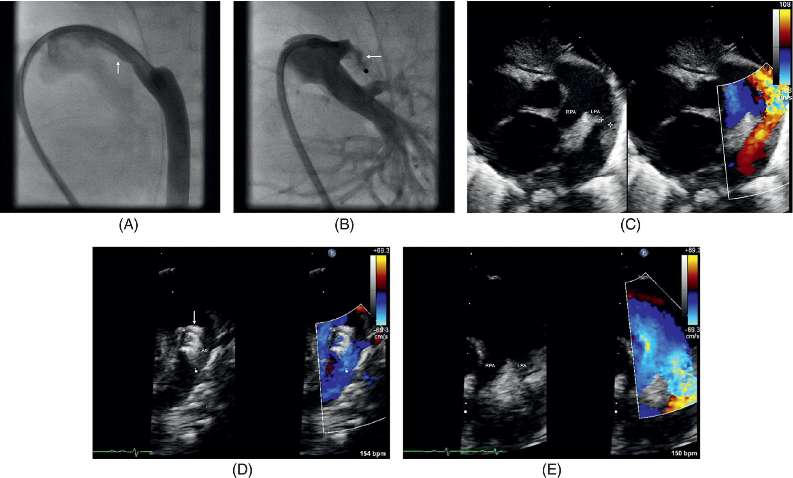
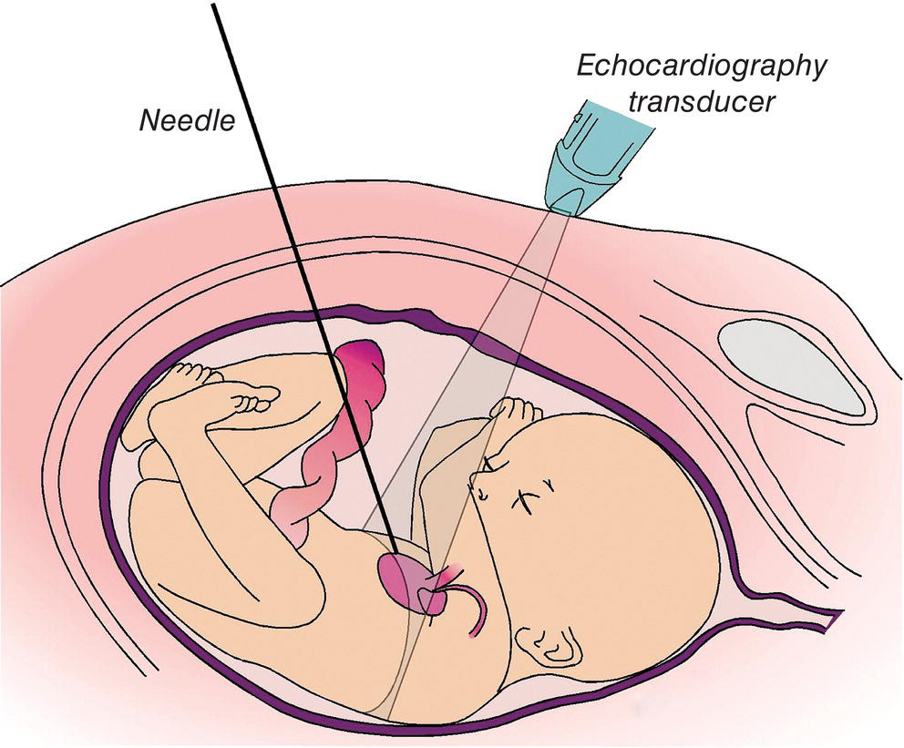

CHAPTER 19 Approach to the Fetus, Premature, and Full‐Term Neonate 

# CHAPTER 19  
Approach to the Fetus, Premature, and Full‐Term Neonate

_Lee P. Ferguson1, Annette Y. Schure2, Peter C. Laussen3, and Kirsten C. Odegard4_

1 Associate in Cardiac Anesthesia, Department of Anesthesiology, Critical Care and Pain Medicine, Boston’s Children’s Hospital, Harvard Medical School, Boston, MA, USA

2 Senior Associate in Cardiac Anesthesia, Department of Anesthesiology, Critical Care and Pain Medicine, Boston’s Children’s Hospital, Harvard Medical School, Boston, MA, USA

3 Executive Vice President of Health Affairs, Boston’s Children’s Hospital, Harvard Medical School, Boston, MA, USA

4 Senior Associate in Cardiac Anesthesia, Department of Anesthesiology, Critical Care and Pain Medicine, Boston Children’s Hospital, Harvard Medical School, Boston, MA, USA

* * *

-   [**Introduction**](#head-2-183)
-   [**Approach to treatment in the neonate**](#head-2-184)
    -   [Early palliation](#head-3-286)
    -   [Systemic‐to‐pulmonary artery shunt](#head-3-287)
    -   [Transcatheter ductus arteriosus stent](#head-3-288)
    -   [Banding of the pulmonary artery](#head-3-289)
    -   [The case for early complete repair](#head-3-290)
-   [**Special considerations for the neonate**](#head-2-185)
    -   [Limited physiologic reserve](#head-3-291)
    -   [Stress response](#head-3-292)
    -   [Systemic inflammatory response to CPB](#head-3-293)
    -   [Neurologic injury](#head-3-294)
-   [**Premature infants and low birth weight neonates**](#head-2-187)
    -   [Pulmonary function](#head-3-295)
    -   [Cardiac function](#head-3-296)
    -   [Necrotizing enterocolitis](#head-3-297)
    -   [Intraventricular hemorrhage](#head-3-298)
    -   [Outcome after congenital heart surgery](#head-3-299)
-   [**Patent Ductus arteriosus occlusion in premature neonates**](#head-2-188)
-   [**Fetal cardiac intervention**](#head-2-189)
    -   [Transplacental pharmacotherapy of the fetus](#head-3-300)
    -   [Open fetal cardiac interventions](#head-3-301)
    -   [Catheter‐based fetal cardiac interventions](#head-3-302)
-   [**Delivery room emergencies in complex congenital heart disease**](#head-2-190)
-   [**Selected references**](#head-2-191)

* * *

## Introduction

The advances in pediatric cardiology and cardiac surgery over the past 35 years have resulted in a substantial decrease in morbidity and mortality associated with congenital heart disease (CHD). Most congenital heart lesions are now amenable to either anatomical or physiological repair early in infancy. Opinion regarding the optimal timing of corrective surgery for infants with symptomatic CHD regardless of their age or weight has undergone radical change over the past several decades. Rather than the previous strategy of initial palliation followed by correction in early childhood, the current approach favors complete repair within days to weeks of birth, if feasible. Advances in diagnostic and interventional cardiology, the evolution of surgical techniques, management of cardiopulmonary bypass (CPB), as well as refinements in postoperative care have all contributed to the successful strategy of early corrective two‐ventricle repair. Most recently, this approach has been extended to include premature and low birthweight (LBW) neonates also. However, the low mortality achieved with two‐ventricle repairs has not been the experience in LBW neonates undergoing palliation for single‐ventricle defects, such as hypoplastic left heart syndrome (HLHS).

Cardiac surgery in the premature and very LBW neonate presents additional challenges for the anesthesiologist. As for any pediatric cardiac procedure, a thorough understanding of the pathophysiology of the heart defect and planned surgical procedure and anticipation of specific postoperative problems are essential. There are further considerations, however, when providing anesthesia to the premature and LBW neonates: immaturity of the airway, lungs, cardiovascular system, liver, kidney, and central nervous system makes these infants more susceptible not only to surgical but also to anesthetic complications. Finally, as the limits for managing CHD continue to be extended, fetal cardiac interventions (FCIs) emerge as the next challenging frontier.This chapter will describe general principles relevant to anesthesia for the newborn, including the premature and LBW neonate with CHD. The impact of prematurity, the outcome of cardiac surgery in the premature and LBW neonate, and new directions with transcatheter ductus arteriosus stenting and FCIs will be discussed.

## Approach to treatment in the neonate

### Early palliation

In the early days of cardiac surgery for neonates, particularly those born prematurely, initial palliation or medical management of congenital cardiac defects was preferred. With technical limitations for various surgical techniques and relatively high risks associated with CPB in small babies, a successful repair often required a certain size or weight. Although the actual “target” weight that a neonate should achieve before the repair was never well documented, newborns with a weight of less than 2.5 kg were considered at higher risk.

The goal of palliative procedures is to control pulmonary blood flow sufficiently to allow for growth, whilst avoiding excessive blood flow to the pulmonary circulation that impairs systemic perfusion and volume overloads in the systemic ventricle. Nevertheless, palliation with a pulmonary artery (PA) band or a modified systemic‐to‐pulmonary artery shunt, such as a modified Blalock–Taussig (BT) shunt, can be technically demanding procedures in neonates and tend to be even more problematic in those with LBW (see [Table 19.1](#c19-tbl-0001)).

* * *

### KEY POINTS: EARLY PALLIATION

-   This was the classical approach in the early days of pediatric cardiac surgery due to technical limitations.
-   Typical procedures are pulmonary artery banding or systemic‐to‐pulmonary artery shunt.
-   The goal is adequate control of pulmonary blood flow to allow for growth without pulmonary overcirculation, cyanosis, inadequate systemic perfusion, or volume load on the ventricle.
-   It is often technically challenging and is associated with many potential early and late complications.
-   Recent advances with catheter‐based intervention have allowed stenting of the ductus arteriosus to become an alternative to the modified BT shunt in selected patients.

* * *

### Systemic‐to‐pulmonary artery shunt

While the originally described BT shunt directly connected the subclavian to the pulmonary artery, in contemporary practice a modified version of the procedure is used with an interposition polytetrafluoroethylene (PTFE) (Gore‐Tex) graft between the subclavian or innominate artery and pulmonary artery. The size and length of the tube graft as well as the site selected for the proximal anastomosis are critical. A relatively large shunt may lead to excessive pulmonary blood flow, congestive heart failure (CHF), and possible pulmonary vascular obstructive disease (PVOD). Conversely, a small shunt can result in inadequate pulmonary blood flow, lower arterial oxygen saturation (SaO2), possible shunt thrombosis, and poor growth of the pulmonary arteries making further repair more challenging. Assuming a normal cardiac output and hematocrit, absence of pulmonary venous desaturation and unrestricted mixing of systemic and pulmonary venous return in the atrium, an ideal SaO2 between 80 and 85% indicates a relatively balanced circulation with a pulmonary to systemic blood flow ratio (Qp: Qs) close to 1:1.

[**Table 19.1**](#R_c19-tbl-0001) Complications of palliative surgery

|  | Early complications | Late complications |
| --- | --- | --- |
| Systemic‐to‐pulmonary artery shunt | Excessive pulmonary blood flow  
Heart failure | Distortion of pulmonary arteries |
|  | Inadequate pulmonary blood flow  
Cyanosis  
Shunt obstruction:  
Thrombus  
Mechanical | Asymmetrical growth of the pulmonary arteries  
Pulmonary vascular obstructive disease |
| Pulmonary artery banding | Band too loose: excessive pulmonary blood flow | Complications at band site:  
Distortion and residual stenosis after repair  
Aneurysm |
|  | Band too tight: inadequate pulmonary blood flow | Complications proximal to band site:  
Right ventricular hypertrophy  
Subaortic stenosis  
Pulmonary valve stenosis  
Complications distal to the band: pulmonary artery stenosis |

A further problem of a small shunt is the likelihood of outgrowing the shunt size causing progressive cyanosis and requiring earlier surgical intervention. On the other hand, if a larger shunt size (i.e., ≥4.0 mm) is used in a newborn, the excessive pulmonary blood flow may compromise systemic perfusion, cause ventricular volume overload, heart failure, and prolonged postoperative recovery. In our experience, a shunt of 3.5 mm is the optimal size to use in a neonate weighing between 3 and 4 kg. If a 3.0 mm long shunt is used, the risk for acute thrombosis in the early postoperative period is increased, even in LBW neonates. The introduction of anticoagulation with heparin is important once hemostasis has been secured after surgery. Early platelet inhibition with an intravenous glycoprotein IIb/IIIa inhibitor may help reduce the risk of early thrombosis \[1\]. The mortality rate after neonatal modified BT shunt remains high, particularly for infants weighing less than 3 kg. A large multicenter study from the Society of Thoracic Surgeons Congenital Heart Surgery Database reported an in‐hospital mortality rate of 7.2% with a 13% rate of serious morbidity in neonates undergoing modified BT shunt placement without concomitant procedures \[2\]. Patients weighing <2.5 kg had a four‐fold increase in odds of death.

* * *

### KEY POINTS: SYSTEMIC‐TO‐PULMONARY ARTERY SHUNT (E.G., MODIFIED BT SHUNT)

-   Shunt geometry is critical.
-   If the shunt is too large, there is a risk of pulmonary overcirculation, CHF, and the development of PVOD.
-   If the shunt is too small, the risk is of inadequate pulmonary blood flow and cyanosis, shunt thrombosis, and early surgery.
-   Late complications are distortion and/or asymmetrical growth of pulmonary arteries, and PVOD.

* * *

### Transcatheter ductus arteriosus stent

Recent advances in transcatheter techniques and device technology have allowed stenting of the ductus arteriosus to be a successful alternative to surgically placed modified BT shunt in patients with ductus‐dependent cyanotic CHD. Although patients undergoing ductal stenting have a higher reintervention rate, retrospective multicenter cohort studies support an early survival advantage and shorter ICU stay for infants with ductal stenting \[3, 4\]. Ductal stent additionally avoids potential operative complications of modified BT shunt placement including vocal cord paralysis, chylothorax, and surgical site infection.

Attention to the ductal morphology is critically important in planning ductal stent placement. CT imaging, in addition to echocardiography, is helpful to delineate ductal anatomy and plan the access site to achieve the straightest trajectory to the ductus. A ductus off the underside of the aortic arch may be successfully approached with left carotid or axillary artery access. While in the past access to these vessels would usually occur via surgical cutdown, there are increasing reports of the safety of percutaneous access \[5, 6\]. Technical success can be achieved even with a highly tortuous ductus \[7\]. Prostaglandin E1 is typically discontinued 6–12 hours prior to the procedure to ensure the ductus is restrictive prior to stenting. Ductal stenting is not without some risk. Complications include ductal spasm, dissection, thrombosis, and stent embolization. Appropriate surgical and extracorporeal membrane oxygenation (ECMO) backup is essential. Drug‐eluting stents may decrease reintervention rates and in‐stent stenosis \[8\]. Although immunosuppressive levels of sirolimus may occur for a prolonged period following neonatal stent implantation, negative outcomes related to immunosuppression have not been reported yet \[9\]. Dual antiplatelet therapy is commonly used to reduce the risk of stent thrombosis.

### Banding of the pulmonary artery

Banding of the main PA to reduce pulmonary blood flow can also be a challenging palliative procedure. If the band is too tight, severe cyanosis may occur, and if the band is too loose, the increase in pulmonary blood flow will contribute to CHF and possible PVOD. Distortion of the pulmonary artery secondary to migration of the band may contribute to both proximal and distal artery stenoses and complicate later repair, but can also lead to right ventricular hypertrophy, subaortic stenosis and pulmonary valve stenosis, depending on the relationship of the great arteries to the ventricular outflow tract. Determining the correct size of a band at the time of surgery is difficult. There are no accurate formulas for band size, and the hemodynamic changes at the time of band placement must be closely observed. Ideally, the banded PA will result in an increase in systemic systolic blood pressure of approximately 20%, and, depending on the underlying pathology, a fall in SaO2 to around 85% breathing room air. The pressure gradient across the band can also be directly measured. Usually, a pressure difference of approximately 50% proximal to the distal across the band is sufficient. Monitoring hemodynamic changes at the time of PA band placement is essential, and anesthetic techniques that could decrease ventricular function or cardiac output are best avoided. Therefore, an opioid technique is most often necessary, and extubation should be delayed until the hemodynamic effect of the band is determined as the patient emerges from anesthesia and starts to wean from mechanical ventilation.

* * *

### KEY POINTS: BANDING OF THE MAIN PULMONARY ARTERY

-   Difficult intraoperative adjustment with constant monitoring of hemodynamic changes requires a stable anesthetic technique with minimal negative effects on ventricular function.
-   The goals are an increase in systemic blood pressure by 20%, a decrease in SaO2 to 85% on room air, and a pressure gradient of 50%.
-   Late complications are migration of the band, distortion, stenosis or aneurysms of pulmonary arteries, right ventricular hypertrophy, subaortic stenosis, and pulmonary valve stenosis.

* * *

### The case for early complete repair

As noted previously, whenever possible, early two‐ventricle repair of congenital cardiac defects is the preferred approach in the modern era. Avoiding the long‐term consequences of excessive volume and pressure overload on the ventricles and pulmonary vasculature as well as the potentially detrimental effect of chronic hypoxia, early repair allows for more normal growth and development. The considerable advances in cardiac surgery and CPB techniques have contributed to a dramatic reduction in mortality following cardiac surgery in newborns \[10–12\], but these patients nevertheless remain at risk for significant end‐organ impairment, particularly neurological injury \[13\].

Medical management alone, with the goal of controlling pulmonary blood flow and volume overload on an immature myocardium, is often extremely difficult and unsuccessful. Long‐term effects associated with pulmonary overcirculation, chronic volume and/or pressure load on the ventricles, and cyanosis may substantially alter growth and development and lead to myocardial and pulmonary injury which will influence the outcome of subsequent repairs. In most newborns with a large left‐to‐right shunt, the imbalance between pulmonary and systemic blood flow will increase as pulmonary vascular resistance (PVR) falls in the first few weeks of life and the physiologic nadir in hematocrit is reached. The clinical manifestations of an infant with CHF are shown in [Box 19.1](#c19-fea-0001). Tachypnea and the additional work of breathing, secondary to an increase in pulmonary blood flow and total lung water, raise the metabolic demand and the percentage of the total cardiac output directed toward respiratory muscle work (most notably, the diaphragm). This essentially diverts cardiac output from other metabolically active functions, particularly from the splanchnic circulation and absorption of enteral nutrition. The abnormal circulatory physiology is unable to meet metabolic needs and patients fail to achieve normal growth.

### [Box 19.1](#R_c19-fea-0001): Symptoms and signs of congestive heart failure in neonates and infants

**Low cardiac output**

-   Tachycardia
-   Poor extremity perfusion
-   Cardiomegaly
-   Hepatomegaly
-   Gallop rhythm

**Increased respiratory work**

-   Tachypnea
-   Grunting
-   Flaring of alae nasi
-   Chest wall retraction

**Increased metabolic work**

-   Failure to thrive
-   Poor weight gain

* * *

### KEY POINTS: EARLY COMPLETE REPAIR

-   The current strategy of choice is early two‐ventricle repair within days to weeks after birth.
-   This is possible with recent advances in diagnostic imaging, surgical and CPB techniques, anesthesia, and postoperative intensive care.
-   It avoids the long‐term detrimental effects of volume and pressure load on immature ventricles as well as chronic hypoxia and polycythemia on growth and development.

* * *

## Special considerations for the neonate

Although the risk for early mortality in neonates undergoing cardiac surgery may be increased, randomized and prospective studies comparing early surgery versus medical management in hopes of weight gain in neonates with critical lesions have not been performed. Such has been the nature of many of the advances in CHD management. For example, infants with an increased pulmonary blood flow who undergo delayed surgical intervention often fail to thrive and are at risk of recurrent respiratory infections. Their work of breathing and energy expenditure is significantly increased, and cardiomegaly with hyperinflated lung fields is evident on chest radiograph. Cardiac surgery and CPB may be delayed because of concerns for intercurrent infection and the risk of exacerbation or reactivation of inflammatory lung processes, which in turn may cause intrapulmonary shunting and severe hypoxemia, pulmonary hypertension, and prolonged mechanical ventilation. The early repair or palliation of defects to limit pulmonary overcirculation and volume load on the systemic ventricle will often avoid these complications.

The optimal timing of delivery of neonates with CHD is now felt to be at 39–40 weeks’ gestation. The former practice of elective delivery at earlier gestational ages (e.g., 36–37 weeks) is associated with higher mortality and should be avoided unless there are clear maternal or fetal indications \[14, 15\].

The management of neonates in the immediate postoperative period after a two‐ventricle repair can be a challenge, but with substantially improved outcomes, mortality alone is no longer a reliable index against which to measure or compare new or alternative treatments in this group of patients. The focus should rather shift to long‐term quality of life, ongoing need for reintervention, and hospital admissions. Survival after palliative procedures in patients with complex single‐ventricle defects remains lower, although there has been a steady improvement in mortality and longer‐term outcomes \[16\].

### Limited physiologic reserve

Care of the critically ill neonate requires an appreciation of the special structural and functional features of immature organs. The neonate appears to respond more quickly and extremely to physiologically stressful circumstances; this may be expressed in terms of rapid changes in, for example, pH, lactic acid, glucose, and temperature \[17\].

The physiology of the preterm and full‐term neonate is characterized by a high metabolic rate and oxygen demand (two‐ to three‐fold increase compared with adults), which may be compromised at times of stress because of limited cardiac and respiratory reserve. The myocardium in the neonate is immature: contractile tissue constitutes only 30% of the myocardial mass, compared with 60% in mature myocardium. In addition, neonates have a lower velocity of shortening, a diminished length–tension relationship, and a reduced ability to respond to afterload stress \[18, 19\]. Because the compliance of the myocardium is reduced, the stroke volume is relatively fixed, cardiac output is heart rate‐dependent, and the Frank–Starling relationship is functional only within a narrow range of left ventricular end‐diastolic pressure compared with the mature myocardium. The cytoplasmic reticulum and T‐tubular system are underdeveloped, and the neonatal heart is dependent on the trans‐sarcolemmal flux of extracellular calcium both to initiate and sustain contraction. It is important to note that much of this information is derived from animal data.

Cardiorespiratory interactions are important in neonates and infants. In simple terms, ventricular interdependence refers to the fact that a relative increase in ventricular end‐diastolic volume and pressure causes a shift of the ventricular septum and diminishes the diastolic compliance of the opposing ventricle \[20\]. This effect is particularly prominent in the immature myocardium. Therefore, a volume load from an intracardiac shunt or valve regurgitation, and a pressure load from ventricular outflow obstruction or increased vascular resistance, may lead to biventricular dysfunction. For example, in neonates with tetralogy of Fallot and severe outflow obstruction, hypertrophy of the ventricular septum may contribute to diastolic dysfunction of the left ventricle and an increase in end‐diastolic pressure. This does not improve immediately after repair in the neonate as it takes some time for the myocardium to remodel. A persistent volume load to the left ventricle following surgery, such as from a residual ventricular septal defect (VSD), may further exacerbate this situation.

The mechanical disadvantage of an increased chest wall compliance and reliance on the diaphragm as the main muscle of respiration limits ventilatory capacity in the neonate. The diaphragm and intercostal muscles have fewer type I muscle fibers (slow‐contracting, high‐oxidative fibers for sustained activity) and this contributes to early fatigue when the work of breathing is increased. In the newborn, only 25% of fibers in the diaphragm are type I, reaching a mature proportion of 55% by 8–9 months of age \[21\]. The diaphragmatic function may be significantly compromised by raised intra‐abdominal pressure such as from gastric distension, hepatic congestion, and ascites.

The tidal volume of full‐term neonates is between 4 and 6 mL/kg and, because of the above mechanical limitations, minute ventilation is dependent on respiratory rate. The resting respiratory rate of the newborn infant is between 30 and 40 breaths/min, which provides the optimal alveolar ventilation to overcome the work of breathing and match the compliance and resistance of the respiratory system. When the work of breathing increases, such as with parenchymal lung disease, airway obstruction, cardiac failure, or increased pulmonary blood flow, a larger proportion of total energy expenditure is required to maintain adequate ventilation. Infants, therefore, fatigue readily and fail to thrive.

The neonate has a reduced functional residual capacity (FRC); FRC is determined by the balance between the chest wall and lung compliance. Closing capacity is increased in newborns with airway closure occurring during normal tidal ventilation \[22\]. Neonates have reduced oxygen reserve, and in conjunction with the increased basal metabolic rate and oxygen consumption that is two to three times adult levels, are at risk for hypoxemia. Atelectasis and hypoxemia do not occur in the healthy neonate because FRC is maintained by dynamic factors including tachypnea, breath stacking (early inspiration), expiratory breaking (expiratory flow interrupted before zero flow occurs), and from laryngeal breaking (auto positive end‐expiratory pressure). The propensity of the neonatal capillary system to leak fluid out of the intravascular space is especially pronounced in the neonatal lung \[23\], in which the pulmonary vascular bed is almost fully recruited at rest and the increases in lymphatic flow required to handle elevated mean capillary pressures (due to augmented pulmonary blood flow) are limited \[24\].

The glomerular filtration rate is generally low at birth but normalizes over the first few months of life. Urinary sodium excretion increases slowly during the first 2 years of life, and the inability of immature kidneys to concentrate urine and to excrete acute water and sodium loads makes fluid management in neonates, especially preterm infants, difficult. Urinary acidification capability is limited in neonates and the bicarbonate threshold is reduced. Thus, premature infants have decreased serum bicarbonate levels and lower serum pH (a non‐anion gap acidosis). Neonates tolerate fluid restriction poorly, so fasting should be kept to a minimum and intravenous (IV) fluid started early; however, excessive fluid administration (as after CPB) is also poorly tolerated.

Drug pharmacodynamics and kinetics may be different in the newborn because of immature hepatic and renal function. In addition to altered drug metabolism, protein binding and clearance, the drug volume of distribution is affected by the increase in total body water of the neonate compared with the older patient. The dosing of drugs that mainly depends on renal excretion will have to be reduced and, if possible, the plasma concentration should be closely assessed to avoid accumulation and side effects. Larger doses of furosemide are needed to induce diuresis in neonates compared with adults.

The caloric requirement for neonates, especially preterm neonates, is high (100–150 kcal/kg/24 hours) \[25\]. Supplying adequate nutrition can be a difficult task, especially if the total amount of fluid, administered either parenterally or enterally, must be restricted, as is the case in premature neonates with CHD. Hyperosmolar feedings have been associated with an increased risk of necrotizing enterocolitis (NEC) in the preterm neonate or in the full‐term neonate who has decreased splanchnic blood flow of any cause (e.g., left‐sided obstructive lesions).

* * *

### KEY POINTS: LIMITED PHYSIOLOGIC RESERVE

-   The immature myocardium has fewer contractile elements, poor compliance, fixed stroke volume, heart rate‐dependent cardiac output, and an immature T‐tubular system.
-   There is also ventricular interdependence.
-   Limited ventilatory capacity results in early respiratory muscle fatigue. Closing capacity is increased.
-   Immature hepatic and renal function leads to altered drug pharmacokinetics and pharmacodynamics.
-   There is a high metabolic demand (100–150 kcal/kg/day) and oxygen demand (6–8 mL/kg/min).

* * *

### Stress response

In general terms, the “stress response” is a systemic reaction to injury, with hemodynamic, endocrinologic, and immunologic effects ([Box 19.2](#c19-fea-0002)). Stress and adverse postoperative outcomes have been linked in critically ill newborns and infants. This is not surprising given their precarious balance of limited metabolic reserve and increased resting energy demand. Metabolic derangements, such as altered glucose homeostasis, acidosis, salt and water retention, and a catabolic state contributing to protein breakdown and lipolysis, are commonly seen following major stress in sick neonates and infants \[17\]. This complex of maladaptive processes may be associated with prolonged mechanical ventilation and intensive care unit (ICU) stay as well as with increased morbidity and mortality.

The neuroendocrine stress response is activated by afferent neuronal impulses from the site of injury, traveling via sensory nerves through the dorsal root of the spinal cord to the medulla and hypothalamus. Anesthesia can therefore have a substantial modulating effect on this neuroendocrine pathway by virtue of providing analgesia and loss of consciousness. Outcomes after major surgery in neonates and infants may be improved when the stress response is attenuated. This was initially reported in two controlled, randomized trials comparing N2O/O2/curare anesthesia with or without fentanyl in neonates undergoing patent ductus arteriosus (PDA) ligation \[17\], and with or without halothane in neonates undergoing general surgery \[26\]. Fentanyl doses as low as 10 μg/kg may be sufficient for effective baseline anesthesia in neonates, although larger doses are necessary for prolonged anesthesia \[27\].

* * *

### [Box 19.2](#R_c19-fea-0002): Systemic response to injury

**Autonomic nervous system activation**

-   Catecholamine release
-   Hypertension, tachycardia, vasoconstriction

**Endocrine response**

-   Anterior pituitary: ↑ ACTH, GH
-   Posterior pituitary: ↑ vasopressin
-   Adrenal cortex: ↑ cortisol, aldosterone
-   Pancreas: ↑ glucagon, insulin resistance
-   Thyroid: ↓/→ T4/3

**Metabolic response**

-   Protein catabolism
-   Lipolysis
-   Glycogenolysis/gluconeogenesis
-   Hyperglycemia
-   Salt and water retention

**Immunologic responses**

-   Cytokine production
-   Acute‐phase response
-   Granulocytosis

ACTH, adrenocorticotropic hormone; GH, growth hormone; T4, thyroxine; T3, triiodothyronine.

* * *

It is important to distinguish between suppression of the endocrine response and attenuation of hemodynamic response to stress. Because of their direct effects on the myocardium and vascular tone, anesthetic agents can readily suppress the hemodynamic side‐effects of the endocrine stress response. However, the postoperative consequences of the endocrine stress response, in particular fluid retention and increased catabolism, remain unabated. Relying on hemodynamic variables to assess the level of “stress” is therefore often inaccurate. Metabolic indices such as hyperglycemia and lactic acidosis are also indirect markers of “stress”, particularly as they are influenced by other factors such as cardiac output and catecholamine levels.

The effect of surgical stress has been specifically evaluated in neonates and infants undergoing cardiac surgery. Wood et al. first demonstrated a substantial increase in epinephrine and norepinephrine levels in response to profound hypothermia and circulatory arrest in infants \[28\]. The hormonal and metabolic response was further characterized by Anand et al. and noted such response to be more extreme and distinct from that seen in adults \[29\]. In addition to an increase in catecholamine, glucagon, endorphin, and insulin levels, hyperglycemia and hyperlactatemia persisted into the postoperative period. In an important subsequent study, Anand and Hickey compared a high dose sufentanil technique with halothane/morphine anesthesia in 45 neonates undergoing cardiac surgery and deep hypothermic CPB \[30\]. They reported a significant attenuation of hormonal and metabolic responses to surgery and bypass in the sufentanil group, with less postoperative morbidity and mortality. A conclusion from these studies supported the notion that reducing the stress response with high‐dose opioid anesthesia and extending this into the immediate postoperative period is important to reduce the morbidity and mortality associated with congenital heart surgery in neonates.

These studies were performed over two decades ago. During the intervening period, there have been substantial changes in the perioperative care of infants with heart disease as well as in the management of CPB in general; along with these changes, outcomes have considerably improved. Changes in surgical practice, especially the timing of surgery, have altered the perioperative course of numerous defects and reduced the incidence of certain pathophysiologic consequences. Currently, it is less likely to see neonates in the immediate post‐bypass period with extensive peripheral edema, anasarca, or other associated complications such as impaired ventricular function, reactive pulmonary hypertension, and substantial alterations in lung compliance and airway resistance. For example, just one or two decades ago, postoperative pulmonary hypertensive crises were relatively common events in infants who had been exposed to weeks or months of high pulmonary pressure and flow, such as truncus arteriosus, complete atrioventricular canal defects, and the transposition of the great arteries with VSDs. High‐dose opioids were an important management component for patients at risk for pulmonary hypertensive crises. In current practice, however, these patients are operated upon at an earlier age and are therefore less likely to have significant or irreversible changes in the pulmonary vascular bed. Consequently, a strategy of high‐dose opioid anesthesia to blunt the stress response may be a less critical determinant of outcome.

Further, it has been well demonstrated that high‐dose opioid anesthetic techniques do not consistently block the endocrine stress response to cardiac surgery. The dose of sufentanil used by Anand and Hickey was extremely high and difficult to translate to the more common practice of fentanyl‐based anesthesia. More recent studies in neonates, infants, and older children undergoing cardiac surgery have demonstrated attenuation of the pre‐bypass endocrine and hemodynamic response to surgical stimulation with a variety of anesthetic techniques. These studies have included high‐dose fentanyl (50 μg/kg) either by bolus or infusion \[31, 32\], high‐dose bolus fentanyl (25–150 μg/kg) with or without low‐dose isoflurane \[33\], remifentanil infusions at various rates (0.25–5 μg/kg/min) \[34\], and more recently low‐dose fentanyl (10‐25 μg/kg) with dexmedetomidine \[35, 36\]. Based upon the lack of significant stress responses reported in these studies, it is reasonable to conclude that there was appropriate neuraxial inhibition in these patients and that they were adequately anesthetized during the surgery. It is not possible to conclude, however, that one technique is superior to another. No specific dose‐response between plasma opioid level and level of hormone or metabolic stress response has been established, nor has a specific benefit been demonstrated for the method or route of opioid administration, i.e., bolus or continuous infusion.

The use of lower doses of opioids may reduce the duration of mechanical ventilation and ICU length of stay by avoiding the resulting respiratory depression from a high‐dose opioid technique \[37\]. Recent studies have described successful early extubation of neonates undergoing heart surgery involving CPB with general anesthesia using low‐dose fentanyl, volatile anesthetic agent and dexmedetomidine, administered as a continuous infusion without loading \[37–39\].

* * *

### KEY POINTS: STRESS RESPONSE

-   Systemic response to injury from surgical trauma includes autonomic nervous system activation, endocrine, metabolic and immunologic effects
-   Can be associated with prolonged mechanical ventilation, ICU stay, and increased morbidity and mortality
-   High dose opioid strategies do not consistently block neuroendocrine stress response during bypass but remain the main component of anesthetic management of neonates undergoing cardiac surgery

* * *

### Systemic inflammatory response to CPB

Besides the surgical stimulus, additional factors contributing to the stress response include the effects of CPB, i.e., hypothermia, contact activation, hemodilution, and non‐pulsatile flow \[40–42\]. It is well recognized that the exposure of blood elements to the non‐endothelial surfaces of the CPB circuit, along with ischemia–reperfusion injury, induces a systemic inflammatory response with activation of numerous signaling cascades including complement, thrombotic, fibrinolytic, proinflammatory cytokine and oxygen‐free radical pathways. These effects are magnified in neonates due to the higher bypass circuit surface area and priming volume relative to patient blood volume.

Cytokines stimulate the production of acute‐phase proteins in the liver (i.e., C‐reactive protein, fibrinogen, α2‐macroglobulin, and other anti‐proteinases), stimulate the adhesion molecule cascade, increase protein catabolism, and augment the release of adrenocorticotropic hormone from the anterior pituitary \[43, 44\]. In contrast to the effect of anesthesia in the pre‐bypass phase, anesthesia techniques have not been demonstrated to consistently obtund the stress responses to bypass \[30, 32, 45\]. This is primarily because CPB introduces a second mechanism for triggering the stress response independent of surgical stimulation. The inflammatory response and its clinical manifestation are even more pronounced in very LBW and premature newborns, in part due to the immaturity of the responding systems, low receptor density, and low vascular tone. The immature myocardium is more vulnerable to reactive oxygen species due to developmental differences compared to the adult heart, and additionally because of depleted antioxidant reserve in those with cyanotic heart disease \[46\].

The endothelial glycocalyx plays a key role in vascular integrity. The glycocalyx is vulnerable to several perioperative insults including ischemia‐reperfusion, inflammation, and hypervolemia. Shedding of the glycocalyx in infants undergoing CPB is increased following aortic clamping (ischemia of the heart and lungs) and greatest with global ischemia during deep hypothermic circulatory arrest (DHCA) \[47\]. Diminution of the endothelial glycocalyx increases capillary permeability to water, solutes, and colloids, leading to tissue edema and potential multi‐organ dysfunction. Total lung water is increased with an associated decrease in lung compliance and an increase in the alveolar‐to‐arterial O2 gradient. Myocardial edema leads to impaired ventricular systolic and diastolic function. A secondary fall in cardiac output by 20–30% is common in neonates in the first 6–12 hours following surgery, contributing to decreased renal function and oliguria \[48\]. Sternal closure may need to be delayed due to mediastinal edema and associated cardiorespiratory compromise when the closure is attempted. Ascites, hepatic congestion, and bowel edema may affect mechanical ventilation, cause ileus, and delay feeding.

In recent years, numerous strategies have evolved to limit the effect of the endothelial injury resulting from the systemic inflammatory response to CPB. Significant advances in circuit miniaturization and reducing blood‐contacting surfaces have been made \[49\]. A variety of anti‐inflammatory treatment modalities have been studied, including leukocyte depletion, neutrophil adhesion blockade, and heparin coating of the CPB circuit to reduce complement and leukocyte activation. To date, no single treatment has been shown to attenuate the endothelial reaction and clinical response following CPB in neonates and infants. The most important strategy remains limiting both the time spent on bypass and the use of DHCA. This is clearly dependent, however, upon surgical expertise, experience, and patient anatomy and size. Recent advances in perfusion technology allow lower body perfusion during arch reconstruction by direct cannulation of the innominate artery and descending aorta with the full flow at mild hypothermia. These techniques should reduce splanchnic and renal ischemia‐reperfusion injury; however, further clinical research is needed to demonstrate improved patient outcomes \[50\].

Attenuation of the stress response with deep anesthesia and hypothermia, the use of antioxidants such as mannitol, perioperative treatment with anti‐inflammatory agents such as corticosteroids, adjustments in prime composition to maintain hematocrit and oncotic pressures, and finally ultrafiltration during rewarming or immediately after bypass are all attempts to further limit the clinical consequences of the inflammatory response. Corticosteroids are routinely given to infants undergoing cardiac surgery with CPB to ameliorate the inflammatory response but are of uncertain benefit \[51\]. In a recent multicenter trial, 1 mg/kg of dexamethasone after anesthesia induction was found to have little or no effect on mortality or major complication among 394 randomized infants (median age, 6 months) undergoing cardiac surgery with CPB \[52\]. A larger placebo‐controlled study is currently enrolling 1,200 infants to investigate the safety and efficacy of methylprednisolone administered into the CPB pump prime \[53\].

Conventional CPB delivers hyperoxic perfusion. Normoxic management of CPB may reduce oxidative stress, particularly in cyanotic infants \[54\]. The addition of nitric oxide to sweep gas during CPB may have a myocardial protective effect following ischemia‐reperfusion. A randomized controlled trial showed a lower incidence of low cardiac output state with the delivery of nitric oxide to the CPB circuit, with the benefit most marked in children less than 6 weeks of age \[55\]. Multicenter trials of these interventions delivered individually or in combination are needed to confirm improvements in clinical outcomes, whilst accounting for significant inter‐ and intra‐hospital heterogeneity in practice \[56\].

An increase in glucagon levels, insulin resistance, and steroid administration may contribute to significant hyperglycemia following bypass in neonates. Tight glycemic control can be achieved with a low hypoglycemia rate after cardiac surgery in children, but it does not significantly change the infection rate, mortality, length of stay, or neurodevelopmental outcome, as compared with standard care \[57, 58\]. The use of insulin must be undertaken with caution, and frequent measurement of glucose levels is essential because of the risk of unintended hypoglycemia. In addition to the activation of stress hormones during CPB, triiodothyronine (T3) levels have been shown to be low in neonates after CPB and may remain low for up to 48 hours after surgery, particularly if a sick euthyroid state develops and there is decreased conversion of thyroxine to the active T3 in peripheral tissues \[59\].

Hemofiltration has become a technique commonly used to hemoconcentrate and possibly remove inflammatory mediators (complement, endotoxin, and cytokines) during or after CPB \[60–63\]. Hemofiltration techniques include “modified ultrafiltration” whereby the patient’s blood volume is filtered after completion of the bypass, “conventional hemofiltration” whereby both the patient and circuit are filtered during rewarming on bypass, and “zero‐balance ultrafiltration” in which high‐volume ultrafiltration essentially washes the patient and circuit blood volumes during the rewarming process \[64\]. High flow rates during modified ultrafiltration have been shown to transiently decrease the cerebral circulation in young infants compared with lower blood flow rates; this could be important in newborns after CPB who may have altered cerebral autoregulation \[65\].

Early clinical experience suggested improved systolic and diastolic pressures after modified ultrafiltration, as well as improved pulmonary function with reductions noted in PVR and total lung water \[60, 61\]. While modified ultrafiltration post‐bypass has been shown to improve early hemodynamic and pulmonary function, the initial increase in pulmonary compliance may not be sustained beyond the immediate post‐ultrafiltration period \[66\]. These techniques are useful to hemoconcentrate and remove total body water, but they do not prevent the inflammatory response. The advantages of hemofiltration may be less relevant with developments in CPB circuit miniaturization \[67\].

Peritoneal dialysis has been recommended to treat total body fluid overload, particularly during low output states following infant cardiac surgery. Recent studies have reported successful prevention of fluid overload with continuous peritoneal dialysis, without significant morbidity and hemodynamic effects \[68, 69\]. In addition to decompressing the abdomen, which may, in turn, improve respiratory mechanics and requirements for mechanical ventilation, peritoneal dialysis also assists with postoperative fluid balance and may have the potential benefit of removing proinflammatory cytokines \[70\].

* * *

### KEY POINTS: SYSTEMIC INFLAMMATORY RESPONSE TO CPB

-   It is triggered by exposure of blood elements to non‐endothelial surfaces of the bypass circuit.
-   There is an activation of numerous signaling cascades: complement, thrombosis, fibrinolysis, cytokines, and oxygen‐free radical pathways.
-   There is an exaggerated response in neonates due to relatively large CPB circuit surface and prime volume as well as immature organ systems.
-   Clinical manifestations are increased lung water, decreased lung compliance, capillary leak, myocardial edema and decreased cardiac output, bowel edema, and ascites.
-   There are various preventive strategies, but no single treatment has proven to be fully effective yet. Strategies include limiting bypass and DHCA times, attenuation of the stress response, corticosteroids, antioxidants, ultrafiltration, and peritoneal dialysis.

* * *

### Neurologic injury

Neurodevelopmental and behavioral disabilities remain prevalent in survivors after neonatal congenital heart surgery. The etiology is multifactorial regarding timing and mechanisms. Brain magnetic resonance imaging (MRI) data performed both before and after newborn cardiac surgery using hypothermic bypass demonstrates a disturbing incidence of white matter injury and the development of periventricular leukomalacia (PVL) \[71–79\]. Pathogenesis of PVL in premature infants relates to three interacting factors. There is an incomplete development of the vascular supply of the cerebral white matter, impairment in cerebral blood flow regulation, and thirdly, the maturation‐dependent vulnerability of the oligodendroglial precursor cell to ischemia‐reperfusion injury \[80\]. Term neonates with CHD may share similar vulnerabilities to white matter injury with hypoxia/ischemia. Elevations of brain lactate on MR spectroscopy, indicating impaired cerebral metabolism, are found in over half of patients with CHD before neonatal surgery \[81\]. In neonates with transposition of the great arteries, preoperative brain injury is associated with hypoxemia and a longer time to surgery \[71\].

Adverse neurological outcomes are multifactorial after bypass and may be secondary to the duration of CPB \[82, 83\], rate and depth of cooling \[84–86\], perfusion flow rate \[87\], duration of circulatory arrest, pH management on bypass \[10\], hematocrit \[11, 88–90\], and embolic events. Strategies to optimize cerebral protection during deep hypothermic bypass, with or without circulatory arrest, include longer duration of cooling (>20 minutes), the use of the pH‐stat strategy of blood gas management (addition of CO2 to the oxygenator), and maintenance of a higher hematocrit (>25%) \[91, 92\].

Deep hypothermia (_≤_18 °C) with circulatory arrest or antegrade cerebral perfusion may be necessary for selected neonates undergoing cardiac surgery to facilitate the surgical procedure, e.g., reconstruction of the aortic arch. In the past, DHCA was associated with a high incidence of obvious neurological injury manifesting as postoperative seizure activity and choreoathetosis. While there may be no optimal “safe” duration of DHCA, the accepted limit has been reduced over the years from approximately 60 minutes to 30 minutes at temperatures _<_20°C \[12, 93\]. Multiple studies have compared neurological outcomes in neonates undergoing aortic arch reconstruction using either DHCA or antegrade cerebral perfusion and found no difference in neurodevelopmental outcome or new postoperative MRI injury \[93–98\]. It remains debatable whether more prolonged use of antegrade cerebral perfusion is as safe as a short run of DHCA.

The risk of brain injury in newborns is clear and supports the use of routine perioperative neurologic monitoring with technology such as near‐infrared spectroscopy (NIRS), transcranial Doppler assessment of cerebral blood flow velocity, and continuous EEG \[91, 99, 100\]. Multiple studies of infants undergoing cardiac surgery have found associations between diminished cerebral oxygen delivery, as indicated by NIRS monitoring, and worse neurodevelopmental outcome and/or increased white matter injury on MRI \[101–103\]. Yet prospective studies on the effects of interventions in response to low cerebral oximetry measurements on neurologic outcomes are lacking.

With improvements in neurologic protection over recent years, the incidence of perioperative clinical seizures has declined substantially. However, subclinical seizures remain common with as many as 7% of postoperative neonates experiencing electroencephalographic only seizures (69% focal; 62% electrographic status epilepticus) \[104\]. Recognition of the incidence of subclinical seizures has led to increasing consensus on the benefit of routine use of continuous EEG monitoring after neonatal cardiac surgery. Data demonstrating a beneficial effect of aggressive management of perioperative electrographic seizures on long‐term neurodevelopment outcomes are lacking.

Given the known risks associated with complex CHD, regular neurodevelopmental assessment throughout childhood and targeted multidisciplinary therapy are critical to optimizing outcomes and quality of life of patients \[105\]. The plasticity of the immature nervous system is such that it responds well to well‐timed, family‐centered high‐quality early intervention \[106, 107\]. See [Chapter 14](c14.xhtml) for an extensive discussion of neurological monitoring, risk factors, and outcomes.

* * *

### KEY POINTS: NEUROLOGICAL INJURY

-   Long‐term neurodevelopment is an important outcome marker for pediatric cardiac surgery.
-   The causes of neurological injury are multifactorial; it can happen _in utero_, as pre‐, intra‐, and post‐operative events, or as a result of CPB management strategy.
-   There is no “safe” duration of DHCA, and the accepted limit is now ~30 minutes at _<_20 °C.
-   Cerebral protection during DHCA involves slow cooling (>20 minutes), higher hematocrit (>25%), and pH‐stat management.
-   There has been a change in practice toward antegrade cerebral perfusion as an alternative to DHCA.

* * *

## Premature infants and low birth weight neonates

For term newborns with a weight >2.5 kg, positive outcomes after cardiac surgery and CPB are well established, and early complete repair is currently considered the standard of care. More recently, the improving survival of premature and LBW neonates has added a new dimension to the management of CHD. Although the technical aspects of CPB in small neonates are challenging, recent surgical advances allow routine corrective repair of complex heart disease in neonates weighing less than 2,000 g. In our experience, neither gestational age nor patient size precludes successful complete repair of lesions such as tetralogy of Fallot, truncus arteriosus, and transposition of the great arteries.

In addition to the physiologic limitations previously described for any newborn, the effects of the underlying cardiac disease and the implications of the surgical interventions, typical complications of prematurity must be considered. The management of respiratory distress syndrome, fluid overload, NEC, and intraventricular hemorrhage can be extremely challenging in premature babies with CHD. Many of these complications can influence the timing and achievability of complete surgical repairs. Even with technically successful repairs in premature and LBW neonates, the effects on future development and the potential need for re‐interventions have not been established and will require further investigations and long‐term follow‐up \[108, 109\]. [Table 19.2](#c19-tbl-0002) summarizes the major challenges in the perioperative management of premature infant \[110\].

### Pulmonary function

The immature airway and lungs of premature and very LBW neonates predispose them to hypoxia and ventilation difficulties. Lung compliance is reduced because the alveoli are primarily composed of thick‐walled saccular spaces. The very compliant chest wall results in a significant mechanical disadvantage with lower FRC and O2 reserve, and early respiratory muscle fatigue. Dead space ventilation as a proportion of tidal volume is increased. Production of surfactant begins between 23‐ and 24‐weeks’ gestation and may be inadequate until 36‐weeks’ gestation \[111\]. Respiratory distress syndrome (RDS) from surfactant deficiency results in low lung volumes and poor compliance, increased intrapulmonary shunt, and ventilation/perfusion (V/Q) mismatch, leading to severe hypoxia. Immature respiratory drive, increased pulmonary edema due to patent ductus arteriosus, pulmonary infections, ventilator‐associated lung injury, atelectasis, and secondary surfactant deficiency contribute to respiratory failure \[112\]. Invasive ventilation and high concentration oxygen give rise to bronchopulmonary dysplasia (BPD) by inducing heterogenous lung injury with regions of atelectasis and other regions of hyperinflation, airway smooth muscle hyperplasia, interstitial fibrosis and pulmonary vascular remodeling.

With the introduction of antenatal steroids and intratracheal surfactants, both morbidity and mortality of RDS and BPD have decreased \[112\]. Standard of care has shifted to initial treatment with non‐invasive ventilatory support in preterm infants without cardiorespiratory failure at birth. Less invasive surfactant administration methods show potential in improving long‐term outcomes \[113\]. A target SpO2 of 90‐95% in infants with gestational age <28 weeks until 36 weeks’ postmenstrual age is recommended based on three large clinical trials that showed a lower SpO2 range had a greater rate of mortality \[114\]. The demographic profile of BPD has shifted to earlier preterm infants (<29 weeks gestational age). The effect of BPD on the outcome of cardiac surgery in the current era is unknown.

[**Table 19.2**](#R_c19-tbl-0002) Physiologic challenges for management of the premature neonate with congenital heart disease

| System | Physiologic challenges | Considerations for perioperative management |
| --- | --- | --- |
| RDS, apnea of prematurity | 
-   RDS may contribute to poor oxygenation.
-   Oxygenation goals not well defined in preterm
-   Permissive hypercapnia reduces BPD in preterm infants but may alter hemodynamics in CHD patient
-   Premature neonates at risk for apnea | -   Intubation and surfactant/positive pressure ventilation may be necessary
-   SUPPORT trial found lower oxygenation goals reduced BPD and ROP but increased mortality.
-   Consider ventilator strategies utilizing permissive hypercapnia.
-   Utilize caffeine for apnea due to improved survival without neurodevelopmental impairment in VLBW infants. Aminophylline prevents apnea in term neonates on prostaglandin but not studied in premature neonates.

 |
| Preoperative genetic testing | 

-   Genetic abnormalities more common in infants with CHD (especially trisomy 13, 18, 21, and 22q11.1 deletions)
-   DiGeorge syndrome occurs in 12% of infants with CHD; common in conotruncal lesions | -   Karyotype and/or specific testing for 22q11.2 deletion (DiGeorge syndrome) may be warranted.

 |
| Neurologic Imaging | 

-   Up to 50% with preoperative white matter injury or stroke
-   Risk factors are hypoxemia and time to surgery. | -   Obtain early cranial ultrasound.
-   Preoperative MRI when indicated/feasible

 |

The potential for RDS is another important consideration for premature infants undergoing CPB. Lung injury post‐cardiac surgery is triggered by shear forces and contact of blood with the non‐endothelial surfaces of the extracorporeal circuit, resulting in activation of a systemic inflammatory response \[115\]. In addition, significant depletion of surfactant may occur \[116\], and when combined with endothelial injury, can contribute to pulmonary hypertension and altered lung compliance in the immediate postoperative period. Except for individual case reports and small single‐center studies \[117, 118\], there are no data to support prophylactic use of surfactant, pre‐ or post‐CPB.

Excessive pulmonary flow from certain cardiac defects will increase total lung water and prevent or delay weaning from ventilatory support in the LBW or premature newborn. Although RDS with increased PVR will limit pulmonary blood flow initially, as the lung injury resolves and the PVR decreases, pulmonary blood flow will substantially increase. For premature infants without RDS, the pulmonary vascular tone is typically low, and pulmonary blood flow may be extremely high in cardiac defects with a large left‐to‐right shunt, such as truncus arteriosus. Medical management with mechanical ventilation, diuretics, inotropic support, and afterload reduction is often ineffective in treating systemic hypoperfusion due to significant run‐off to the pulmonary circulation. As a result, continuing conservative treatment while waiting for an appropriate weight gain is often not a reasonable option, and surgical intervention is the only alternative. Palliation with a pulmonary artery band to limit pulmonary blood flow is technically challenging in LBW or premature newborns, and subsequent distortion of the pulmonary arteries may severely complicate future surgical procedures. Therefore, early complete surgical repair may be indicated to provide optimal conditions for growth and development.

A similar problem arises in cyanotic LBW or premature neonates with ductus‐dependent pulmonary blood flow. A longer‐term infusion of prostaglandin E1 may be considered, but may result in unwanted inherent side‐effects (apnea, edema, gastric outlet obstruction). In addition, the run‐off across a large ductus is difficult to control and systemic hypoperfusion may develop. Low concentrations may be used (0.01 μg/kg/min), but a clear dose‐response relationship between ductal size and PGE1 concentration has not been demonstrated. Palliation with a modified BT shunt or ductal stent is possible, but potential problems are a distortion of the pulmonary arteries, thrombosis or stenosis and reduced pulmonary blood flow, or, on the other hand, excessive flow across the shunt, resulting in systemic hypoperfusion and cardiac failure from volume overload. Therefore, the side‐effects of palliation could further impair growth and development, and the best alternative may be early surgical repair. Successful repair in LBW and premature infants with tetralogy of Fallot has been reported \[119, 120\]. The postoperative course of these patients is often prolonged and characterized by restrictive right ventricular physiology. Nevertheless, if complete repair has been accomplished without significant residual lesion, this early anatomic correction provides the best option for longer‐term survival and growth.

Premature and LBW infants with single‐ventricle physiology are difficult to manage, and an adequate balance between the ductus‐dependent pulmonary or systemic flow may not be achieved. Systemic hypoperfusion (NEC, renal hypoperfusion) and feeding intolerance are commonly encountered. In general, size limitations are a considerable problem in newborns who require stage I palliation for conditions such as HLHS. Balancing systemic and pulmonary blood flow in an LBW newborn after a Norwood operation can be challenging. The hybrid procedure is an alternative to the Norwood palliation that may be preferable in the LBW neonate. The hybrid technique is performed in the catheterization laboratory or a special angiography operating room suite. After exposure through a median sternotomy, both pulmonary arteries are banded and the patents ductus arteriosus is stented via the main pulmonary artery under fluoroscopic guidance. The hybrid procedure does not require CPB, thereby avoiding the potential cannulation problems and risk for additional neurologic injury \[121, 122\]. Retrospective studies suggest a survival benefit of the hybrid procedure in premature and LBW neonates, but prospective randomized studies are lacking \[123–126\]. A novel, nonsurgical palliation for newborns with HLHS using endoluminal pulmonary banding and duct stenting has recently been described \[127\].

* * *

### KEY POINTS: PULMONARY FUNCTION IN PREMATURE AND VERY LBW NEONATES

-   There is a mechanical disadvantage (reduced lung compliance, increased chest wall compliance, low FRC), surfactant deficiency, increased V/Q mismatch, and early fatigue of respiratory muscles.
-   BPD and RDS may complicate management and preclude early extubation.
-   There is pulmonary edema and increased work of breathing due to increased pulmonary blood flow with certain types of CHD.

* * *

### Cardiac function

Fetal cardiac myocytes are morphologically different from those of adults. The fetal myocyte is smaller, has only one nucleus and fewer myofibrils, which are less well organized \[128\]. In the third trimester, a period of rapid cardiac growth, primarily driven by cardiomyocyte hyperplasia occurs. Birth results in a switch in the growth of the myocardium from the fetal hyperplastic to the adult hypertrophic pattern \[128\]. Preterm birth necessitates abnormal myocyte hypertrophy to achieve a normal postnatal cardiac mass \[129\]. At birth, the preterm heart tends to be more globular. Clinically stable preterm infants have a normal left ventricular systolic function but altered diastolic function, with greater dependence on atrial contraction \[130, 131\]. Echocardiography data suggests the left ventricular systolic performance in premature infants during early life is preserved in the setting of a lower afterload \[132\]. Altered diastolic dysfunction persists at 3 months of age in preterm infants \[129\]. The morphological and functional cardiac impairments in individuals born preterm are apparent in neonatal life persist across childhood and into young adulthood \[133\]. This population may be more vulnerable to cardiovascular disease as they age \[134\].

### Necrotizing enterocolitis

CHD is an important predisposing factor for developing NEC \[135\]. The incidence of NEC in neonates undergoing cardiac surgery is around 2‐4% \[136–138\]. Epidemiologic evidence suggests that the most common form of NEC in the premature neonate is triggered by inflammatory and microbial processes and not by a preceding ischemic event \[139\]. In contrast, NEC in term infants with CHD appears to be a clinically distinct entity and is due primarily to intestinal ischemic injury \[135, 139\]. CHD lesions with the highest risk of NEC are those with significant systemic to pulmonary circulation runoff, specifically HLHS, aortopulmonary window, truncus arteriosus, and patients with episodes of poor systemic perfusion \[137\]. Persistent diastolic flow reversal in the abdominal aortic Doppler profile is associated with an increased risk of NEC in term infants with CHD \[140\].

Clinical signs of NEC include abdominal distension, feeding intolerance, temperature, and glucose instability, heme‐positive or frank blood in the stool, abdominal guarding, and tenderness. Abdominal radiographic examinations may demonstrate distension or an abnormal gas pattern, pneumatosis, portal venous gas, or intraperitoneal air consistent with perforation. Thrombocytopenia and leukocytosis are usually evident on blood examination. If NEC results in perforation or severe bowel ischemia, the neonate may develop sepsis with hypotension, capillary leak, poor perfusion, and edema. On most occasions, patients can be treated medically with antibiotics, vasoactive support, and parenteral nutrition; less frequently, laparotomy and bowel resection may be necessary \[141, 142\]. The key to management is to improve perfusion and O2 delivery to the splanchnic system. Therefore, once hemodynamically stable without clinical signs of sepsis, early cardiac surgical intervention to improve splanchnic perfusion is preferable. In a single‐center retrospective study, Cheng et al. found patients with proven NEC (without perforation) who underwent early cardiac surgery had a higher survival rate than those managed medically and with delayed surgery (75% vs. 44%) \[143\].

NEC is associated with increased hospital length of stay, worse neurodevelopmental outcomes and higher mortality \[136, 144, 145\]. Recent research has focused on earlier recognition and risk stratification. Splanchnic NIRS and biomarkers, such as intestinal fatty acid‐binding protein, show early promise \[146–148\]. Little evidence exists to guide safe feeding and considerable variation exists in feeding practices, particularly in neonates with duct‐dependent lesions. Unfortified human milk feeding and standardized feeding protocols may reduce the risk of NEC.

* * *

### KEY POINTS: NECROTIZING ENTEROCOLITIS

-   There is an increased frequency of NEC in patients with CHD, with a run‐off to the pulmonary circulation and poor systemic perfusion leading to mesenteric ischemia.
-   NEC is associated with increased mortality and prolonged hospitalization.
-   Early cardiac surgery in a patient with proven NEC can improve survival.

* * *

### Intraventricular hemorrhage

Intraventricular hemorrhage (IVH) results from bleeding into the lateral ventricle following rupture of fragile microvessels within the subependymal germinal matrix \[149\]. The risk of intraventricular hemorrhage (IVH) decreases with increasing gestational age. The incidence of severe IVH (grade 3 and 4) from a NICHD Neonatal Research Network study was 38%, 26%, and 7% of infants born at 22, 24, and 28 weeks of gestation, respectively \[150\]. Antenatal corticosteroids and delayed cord clamping decrease the risk \[151, 152\]. Nearly all cases of IVH in preterm infants occur within the first 5 days of postnatal life \[153\]. Morbidity due to IVH is related to severity grade. Grade 1 and 2 IVH generally have a favorable prognosis, whilst up to 60% of infants with grade 3 or 4 IVH develop cerebral palsy or cognitive delay \[154, 155\]. Post‐hemorrhagic hydrocephalus complicates 1%, 4%, 25% and 28% of cases of grades 1 through 4 IVH, respectively \[156\].

The pathogenesis relates to developmental immaturity of the germinal matrix and impairment of cerebral autoregulation \[157, 158\]. The fragility of the thin‐walled capillaries makes them more prone to rupture spontaneously or because of inadequate cerebral autoregulation to stressors, such as hypoxia, hypercarbia, or hypotension \[158\]. There are no prospective data suggesting an increased risk for IVH in LBW infants if they undergo early repair and CPB \[159, 160\]. Nevertheless, there is increasing data from MRI examinations of the newborn brain in the perioperative period that support the notion that the immature brain is vulnerable to injury related to cardiac surgery and CPB, particularly in watershed distributions \[81, 161, 162\]. It is unknown whether the premature or LBW neonate has an even higher risk.

The diagnosis of IVH before surgery is important, because of the potential for extension of the hemorrhage with surgical stress, CPB, anticoagulation and changes in blood pressure. As a baseline, we routinely perform a cranial ultrasound in all premature (_<_35 weeks’ gestation) neonates prior to cardiac surgery. There are no clear guidelines regarding the management of premature neonates with IVH prior to surgery. Delaying surgery is prudent to lower the risk of extension of the bleed and additional neurologic injury. This may not be possible for all defects; however, in general, our practice is to wait approximately 7–10 days before undergoing surgery with CPB.

* * *

### KEY POINTS: INTRAVENTRICULAR HEMORRHAGE IN PREMATURE AND VERY LBW NEONATES

-   Risk of IVH decreases with increasing gestational age.
-   IVH in the premature infant results from the immaturity of the germinal matrix blood vessels and impairment of cerebral autoregulation.
-   There is concern regarding the expansion of pre‐existing IVH with surgical stress, CPB, anticoagulation, increased fibrinolytic activity and sudden changes in cerebral perfusion pressure.
-   Preoperative cranial ultrasound in premature neonates is recommended.

* * *

### Outcome after congenital heart surgery

Several early studies evaluated the overall outcome of preterm and very LBW infants undergoing congenital heart surgery \[119, 120, 159, 163–166\]. Prematurity and low birth weight were shown to be independent risk factors for increased morbidity and mortality. Data from the Society of Thoracic Surgeons Congenital Heart Surgery Database showed significantly increased operative mortality in infants weighing less than 2.5 kg compared with infants weighing 2.5–4 kg following both two‐ventricle repairs and single‐ventricle palliation \[163\]. Lower weight at the time of surgery remained strongly associated with mortality risk after stratifying the population by Risk Adjustment for Congenital Heart Surgery (RACHS) score and Aristotle Basic Complexity levels. More recent data have shown mortality rates have remained higher for LBW infants than for normal‐weight infants, even after considering the effects of confounders \[109, 167–171\].

Hickey et al. found that in infants requiring cardiac intervention, the relationship between birthweight and survival is non‐linear with an inflection point at 2.0 kg, below which there is a marked decline in survival \[109\]. Increasingly, surgeons have moved toward 2.0 kg as the cut‐off to define low weight for cardiac surgery. Low birthweight infants are at a higher risk of death, even in the absence of CHD. Anderson et al. used epidemiologic modeling to describe the additive risk of performing cardiac surgery in 118 neonates with birth weight ≤2.0 kg after accounting for baseline risks of low birth weight \[168\]. Cardiac surgery was estimated to increase the risk of mortality by around 10% when compared to similar‐weight infants not requiring surgery. Approximately half of the risk of mortality in the low‐weight surgical cohort could be explained by the infant’s birth weight alone.

It is difficult to separate out the impact of preterm birth from LBW on outcome in neonates born with a congenital heart defect. In a single‐center study that included 146 patients weighing <2.5 kg at the time of surgery, Kalfa et al. found that gestational age <36 weeks at birth was an independent risk factor for early mortality \[171\]. Using outcome data from the Single Ventricle Reconstruction trial, Miller et al. found that preterm delivery, but not LBW, was independently associated with an increased risk of death at age 6 years. They concluded that preterm birth and LBW, although often concomitant, are not equivalent, impacting outcomes after the Norwood procedure through mechanisms independent of perioperative course \[169\]. Of note, LBW was associated with worse neurodevelopment outcomes despite the similar length of stay and complications.

While it is preferable to correct congenital cardiac defects early after birth to promote normal growth and development, this may be difficult to achieve in the premature and very LBW neonate \[119, 120, 159, 164\]. The causes are multifactorial and include technical issues related to small cardiac structures and cannulation requirements for CPB, the immaturity of organ systems (especially the lungs, myocardium, and germinal matrix in the brain), increased risk of bleeding from coagulopathy after CPB, and an immature stress response that may increase the risk for infection and promote a catabolic state in a newborn with limited nutritional reserves. All these factors contribute directly to the increased mortality risk as well as longer duration of mechanical ventilation, intensive care, and hospital stay for the premature and LBW newborn undergoing cardiac surgery. However, intentional delay to achieve weight gain and maturation in patients with congenital heart defects requiring intervention does not appear to improve survival rate \[109\].

Despite advances in surgical and CPB techniques and improved outcomes, LBW neonates remain a challenging population for both surgeons and anesthesiologists. A reasonable conclusion from the later studies described here is 2.0 kg is an important cutoff point, with LBW and premature newborns _<_ 2.0 kg having a higher risk for mortality and morbidity regardless of the surgical procedure. In addition to size limitations, end‐organ immaturity, co‐morbidities, and chromosomal anomalies are important contributing factors to adverse outcomes. Careful attention to detail is essential, and optimal management requires the close collaboration of a multidisciplinary perioperative team.

* * *

### KEY POINTS: OUTCOME OF CARDIAC SURGERY IN PREMATURE AND VERY LBW NEONATES

-   Successful cardiac surgery can be performed in premature and very LBW neonates but with increased risk due to immaturity. There is no survival benefit with medical management and delayed surgery.
-   There is increased mortality for neonates weighing _≤_2.0 kg for two‐ventricle repair and single‐ventricle palliation.
-   End‐organ immaturity, type of cardiac lesion, co‐morbidities, and chromosomal anomalies are all contributing factors to adverse outcomes.

* * *

## Patent Ductus arteriosus occlusion in premature neonates

In recent years the availability of devices for transcatheter PDA occlusion in premature neonates has made this the approach of choice in many institutions, rather than surgical PDA ligation performed at the bedside in the neonatal ICU, or in the operating room \[172, 173\]. One such device is the Amplatzer Piccolo Occluder (Abbott, Abbott Park, IL) which is U.S. FDA approved for patients as small as 700 g. There are published reports of PDA occlusion in patients weighing as little as 600 g. This procedure is done via a transvenous approach with a 4 Fr sheath in the femoral vein, without any arterial access due to the high risk of occlusion in these small patients. The procedure is performed as a combination angiographic and transthoracic echocardiography (TTE) imaging approach, and a long sheath is advanced through the right atrium, right ventricle, and pulmonary artery into the PDA, where the occluder is deployed ([Figure 19.1](#c19-fig-0001)). Before deploying the device, fluoroscopy, angiography, and TTE are utilized to ensure proper placement, avoiding occlusion of the descending aorta, or branch pulmonary arteries. Although there have been no prospective controlled trials directly comparing transcatheter PDA occlusion vs. surgical PDA ligation in premature infants, retrospective comparison studies report faster improvement in respiratory function with the transcatheter approach. Case series of PDA occlusion in infants report successful occlusion rates of over 90%, with failures most often due to the encroachment of the device into the branch pulmonary arteries or descending aorta, resulting in the removal of the device and referral for surgical PDA ligation. Major complications are reported in 5‐10% of infants <2 kg \[174, 175\]. In a report of 100 patients 700–2,000 g undergoing PDA occlusion with the Piccolo device, the success rate was 99% \[176\]. Five patients had worsening tricuspid regurgitation without clinical manifestations, two had intraprocedural and one postprocedural device migration, there were two cases of aortic obstruction, and two major hemorrhages and one case of hemolysis.

Anesthetic considerations include transport from the NICU to the catheterization laboratory in a heated isolette to maintain patient temperature, catheterization laboratory heated to 80° F and forced‐air warming and other temperature maintenance strategies. A neonatal ventilator may be required for small patients, and a large leak around the endotracheal tube is often present. Packed red blood cells need to be available, which should be less than 7 days old or checked for K+ <8 meq/L. Arterial monitoring is not usually employed unless an arterial catheter is already present. Potential complications include severe tricuspid regurgitation with sheath passage, atrioventricular block, and device embolization. Flushing of the sheath is minimized to reduce the risk of volume overload, and heparin is typically not utilized in the flush. Pressure on the thorax or abdomen from the TTE probe may affect respiratory or hemodynamic stability in these tiny patients. There are also reports of PDA occlusion performed at the bedside with portable fluoroscopy and TTE.

## Fetal cardiac intervention

Advances in fetal echocardiography have improved accuracy in the diagnosis and evaluation of CHD, which has in turn led to improved counseling and perinatal management. Studies have shown, specifically for HLHS and transposition of the great arteries, that prenatal diagnosis results in an improved preoperative condition and possibly decreased mortality \[177, 178\]. However, there are few studies that document the natural history of cardiac growth and physiological changes in individual fetal cardiac malformations or the timing of their impact during fetal growth. Unfortunately, there is no specific animal model of cardiac malformations that is like the human fetus to provide insights into pathophysiology and effects on development or to aid in developing management strategies. Nonetheless, we know that the normal development of the heart and great vessels in the fetus requires normal blood flow patterns. For example, changes in ventricular growth and function can be seen on serial fetal echocardiograms in a fetus with aortic or pulmonary valve stenosis \[179\], leading to ventricular hypoplasia, fibrosis, and often abnormalities of the coronary arteries, systemic arterial and pulmonary venous morphology \[180\]. In a worst‐case scenario, fetal critical aortic stenosis may progress to HLHS in a proportion of cases, resulting in univentricular circulation. One of the major reasons for interventions in the fetus, therefore, is to enhance blood flow patterns to allow for better _in utero_ development of the heart and improve postnatal outcomes. This “flow theory” is based on the concept that normal flow across the foramen ovale, atrioventricular and semilunar valves contributes to normal growth of the ventricles. Obviously, other motives for FCI include improving survival in fetuses at high risk of prenatal or neonatal death and to allow recovery under the most supportive _in utero_ conditions with periods of enhanced wound healing and myocyte proliferation \[181, 182\]. The recognition that certain CHDs can evolve _in utero_ and that early intervention may improve outcomes has led to the evolution of FCIs ([Table 19.3](#c19-tbl-0003)).

[**Figure 19.1**](#R_c19-fig-0001) Ductus arteriosus closure in a premature infant. (A) Descending aortic angiogram through a 4‐Fr‐long sheath that has been advanced transvenously through the ductus arteriosus (_arrow_) of a 2‐month‐old, ex‐30‐week premature infant weighing 1.2 kg. Note that no arterial access was obtained in the patient, in order to avoid the risk of arterial trauma. (B) Angiogram in the main pulmonary artery after device positioning, but before full release showing the good position of a 4‐mm AVP II device (Abbott, Abbott Park, IL) (_arrow_) in the ductus arteriosus. (C) Transthoracic echocardiography (2D and corresponding color images) performed in the cardiac catheterization laboratory before ductus arteriosus device deployment showing the large ductus arteriosus (between markers). The right pulmonary artery (RPA) and left pulmonary artery (LPA) are also visualized. (D) Transthoracic echocardiography (2D and corresponding color images) performed in the cardiac catheterization laboratory after ductus arteriosus device deployment (_arrow_) showing unobstructed flow in the descending aorta (Ao). (E) Transthoracic echocardiography (2D and corresponding color images) performed in the cardiac catheterization laboratory after ductus arteriosus device deployment showing unobstructed flow in right pulmonary artery (RPA) and left pulmonary artery (LPA).

(Source: Eilers et al. \[172\]. Reproduced with permission from Springer Nature.)

### Transplacental pharmacotherapy of the fetus

Historically, the first FCIs were pharmacological interventions to treat fetal tachyarrhythmia or heart block. In 1975, Eibschitz et al. described the use of propranolol, given to the mother, to treat fetal ventricular tachycardia \[184\]. Digoxin and many other antiarrhythmic medications (sotalol, amiodarone, flecainide) followed over the years \[185–189\]. This transplacental pharmacotherapy is usually effective in the non‐hydropic fetus. Still, fetal deaths occur in approximately 10% of all fetal arrhythmia patients, and at a higher rate in fetuses with hydrops. Fetal AV block has been treated with transplacental sympathomimetic agents and/or dexamethasone (for autoimmune‐related cases) \[190–193\]; however, the impact on outcome is not well defined. Fetal pacing has been attempted where the fetus is too premature to be delivered and other medical therapies have failed to control heart failure and hydrops \[194–196\], but so far there has been no successful medium‐ or long‐term outcome in humans.

Prenatal non‐steroidal anti‐inflammatory drug (NSAID) therapy has recently been described to achieve ductus arteriosus constriction and reduce circular shunt physiology in fetuses with severe Ebstein anomaly and pulmonary regurgitation \[197\]. Circular shunt, due to unrestricted ductal flow in presence of significant pulmonary and tricuspid regurgitation, is a major risk factor for perinatal mortality. Early results of NSAIDs are encouraging; prolonging gestation and improving survival where ductal constriction is achieved.

[**Table 19.3**](#R_c19-tbl-0003) Congenital heart conditions that can potentially be treated with fetal cardiac intervention (FCI)

(Source: McElhinney et al. \[183\]. Reproduced with permission of Wolters Kluwer Health, Inc.)

| Condition | Actual or possible FCI |
| --- | --- |
| **Risk for _in utero_ progression** |
| Fetal AS and evolving HLHS | Balloon aortic valvuloplasty |
| PA/IVS and evolving HRHS | Pulmonary valvuloplasty |
| Premature closure of PDA and pulmonary hypertension | Ductal stenting |
| Absent pulmonary valve with evolving bronchomalacia | Pulmonary arterioplasty and/or valvuloplasty |
| **Risk for fetal or early neonatal death** |
| Fetal tachycardia with hydrops | Maternal antiarrhythmic therapy |
| Anomalies causing hydrops | Maternal digoxin |
| Congenital heart block | Maternal sympathomimetic therapy, pacemaker |
| Severe Ebstein malformation | Maternal NSAID therapy |
| Severe congenital MS with AS and intact atrial septum | Balloon aortic valvuloplasty, atrial septoplasty |
| HLHS with intact atrial septum | Atrial septoplasty/stenting |
| TAPVR with obstruction | Stenting of obstructed vertical vein |

FCI, fetal cardiac intervention; AS, aortic stenosis; HLHS, hypoplastic left heart syndrome; PA, pulmonary atresia; IVS, intact ventricular septum; HRHS, hypoplastic right heart syndrome; PDA, patent ductus arteriosus; MS, mitral stenosis; TAPVR, total anomalous pulmonary venous return, NSAID, non‐steroidal anti‐inflammatory drug.

### Open fetal cardiac interventions

Open FCIs involve surgical incisions into the uterus or access via a surgical trocar ≥3 mm in diameter as in most fetoscopic approaches. Unfortunately, incisions of this size or larger seem to be associated with an extremely high incidence of preterm labor (80%) \[198\]. Over the past 25 years, experimental cardiac surgery in fetal lamb and other animal models has resulted in increased knowledge of the cardiovascular and placental response to extracorporeal circulatory bypass. Fetal bypass, using the placenta as an oxygenator, leads to significant post‐bypass placental dysfunction with impaired fetal gas exchange, reduction in uterine blood flow, and significant fetal stress response \[199–201\]. Despite many problems, these models have shown that cardiac surgery on the lamb fetus with survival to full term is technically possible. So far, open fetal heart surgery in humans has only been attempted a few times \[183\].

### Catheter‐based fetal cardiac interventions

Ultrasound‐guided, percutaneous, catheter‐based FCI is a technique that allows for _in utero_ treatment of a small subset of CHD. The potential candidates for FCI fit into one of two categories: diseases that progress from the time of mid‐gestation diagnosis to birth; and diseases that carry a high risk of demise _in utero_ or perinatally \[202\]. To date, the main target lesions for FCI are aortic stenosis with evolving HLHS, HLHS with an intact or restrictive atrial septum, and pulmonary atresia with the intact ventricular septum (PA/IVS) with concern for worsening right ventricular hypoplasia. Careful patient selection is crucial. Currently, there is still a significant risk of fetal demise, unknown long‐term outcomes, and a potential risk for the mother \[202\].

An FCI program must be multidisciplinary, with collaboration between neonatologists, obstetricians (specialized in prenatal diagnosis and fetal medicine), pediatric cardiologists, and anesthesiologists (fetal and obstetric) \[203\]. The procedures are performed in the hospital where the mother is the patient, to offer the best care for the pregnant woman. Various anesthesia techniques have been described for the management of the mother during fetal procedures, including IV sedation with local anesthesia, spinal or epidural anesthesia, general anesthesia, and combined techniques \[204\]. In the current era, maternal conscious sedation with epidural anesthesia or local anesthesia by injection of lidocaine along the planned needle trajectory from the skin to the uterine wall is used for FCI \[203–205\]. With greater awareness of the fetal stress response and pain perception \[206–209\], all fetuses now receive analgesia with 20–50 μg/kg fentanyl, administered intramuscularly or into the umbilical vein \[210, 211\]. A muscle relaxant is administered to the fetus to facilitate positioning and achieve immobility.

Monitoring of the fetus is usually limited to heart rate and basic contractility via ultrasound or echocardiography. Under continuous ultrasound guidance, a special 18‐ or 19‐gauge cannula is passed through the maternal abdomen, uterine wall, and fetal chest wall into the fetal heart (either LV, RV or RA, depending on the procedure to be performed) (see [Figure 19.2](#c19-fig-0002)). Balloon positioning for inflation is based on external measurements and ultrasound imaging, and it is inflated when in the correct position ([Figure 19.3](#c19-fig-0003)). Procedural outcomes for FCI have improved since the procedures were initially attempted in the early 1990s, for example, the technical success rate for fetal aortic valvuloplasty is currently around 94% \[203\]. Intraoperative fetal cardiac complications remain common. Especially during procedures requiring ventricular access, fetal hemodynamic changes including bradycardia and ventricular dysfunction may occur before balloon insertion, during inflation, or even after the instruments have been removed \[212\]. Fetal resuscitation drugs must be immediately available. Intracardiac, or less commonly, intramuscular administration of epinephrine and/or atropine are used for sustained fetal bradycardia. Hemopericardium is another common problem during FCIs. Hemodynamically significant hemopericardium should be drained promptly as the effusion has the tendency to coagulate within a few minutes \[203\]. Fetal demise rates of 4 to 17% have been reported following FCI \[205, 213, 214\]. Most recent data suggests that FCI has a low risk of maternal complication and a negligible impact on the further course of pregnancy and delivery \[205, 213, 214\].

[**Figure 19.2**](#R_c19-fig-0002) Ideal fetal position for fetal intervention. The fetal left chest is anterior and the pathway from the maternal abdomen to left ventricular apex is unobstructed.

(Source: Dr. A. Marshall. Reproduced with permission.)

[**Figure 19.3**](#R_c19-fig-0003) Needle in the fetal left ventricle. The fetus is supine, and the mother’s abdominal wall is at the top of the image. LV, left ventricle, AoV, aortic valve.

(Source: Dr. A. Marshall. Reproduced with permission.)

Fetal aortic valvuloplasty for aortic stenosis with evolving HLHS is the most commonly performed FCI. Successful valvuloplasty leads to improvement in left heart hemodynamics, specifically antegrade aortic arch flow and bidirectional patent foramen ovale flow, in ~50% of fetuses \[202\]. In the Boston Children’s Hospital cohort, improved technical success rate and modified selection criteria have led to an increased likelihood of biventricular circulation. In the recent era, 59% of liveborn patients that underwent fetal aortic valvuloplasty had a biventricular outcome \[214\]. Among those who achieved biventricular circulation, the vast majority required further surgical and/or catheter‐based interventions after birth, including interventions on the aortic valve, mitral valve and aortic arch, and endocardial fibroelastosis resection. Medium‐ and long‐term survival and LV function data are not yet available.

Fetuses with membranous pulmonary atresia, intact ventricular septum, and evolving hypoplastic right heart can also be candidates for FCI. The _z_‐score (number of standard deviations below normal for gestational age) of the fetal tricuspid annulus and qualitative assessment of RV size are used to predict the potential growth of the RV and therefore chances for a biventricular circulation \[215, 216\]. Fetuses with technically successful fetal pulmonary valvuloplasty have stable z‐scores of right heart structures, in contrast to fetuses with unsuccessful fetal pulmonary valvuloplasty who experience progressive RV and tricuspid valve hypoplasia \[202\]. In the largest published experience from the International Fetal Cardiac Registry, 31% of 16 fetuses with pulmonary atresia or severe pulmonary stenosis had postnatal biventricular circulation after fetal pulmonary valvuloplasty \[213\].

For fetuses with HLHS and intact or restrictive atrial septum, FCI has been used to prevent severe neonatal hypoxia and death, and to reduce the lung disease that accompanies chronic _in utero_ pulmonary venous hypertension \[202\]. FCI on the atrial septum is typically performed at 24–30 weeks’ gestation in selected fetuses, selected based on abnormal pulmonary vein Doppler profile, a sensitive and specific predictor of severe neonatal distress. The atrial septum is commonly thickened, and most centers attempt to maintain patency of the atrial communication by placing an atrial septal stent. No survival benefit to date has been demonstrated from fetal FCI on the atrial septum \[217\]. Many of the atrial communications become smaller in late gestation and significant lung disease has already developed in most of these fetuses by midgestation \[202\].

In summary, FCIs are technically feasible and can improve short‐term outcomes in selected patient groups but are associated with a significant risk of fetal demise (~10%) and the potential for maternal harm. Long‐term benefits are still to be determined, and the discussion regarding biventricular repair at all costs vs. univentricular palliation is ongoing. Further advances in imaging and equipment technology will allow better patient selection and earlier, possibly even more complex, interventions. Multi‐center efforts to collect short‐ and long‐term outcome data will be important to assess the effectiveness and safety of FCIs.

* * *

### KEY POINTS: FETAL CARDIAC INTERVENTIONS AND SURGERY

-   Fetal cardiac interventions can be classified into pharmacological, open, and catheter‐based interventions.
-   The rationale for FCI is the prevention of fetal demise or early neonatal death and/or ventricular hypoplasia in cases of critical aortic stenosis or pulmonary atresia by restoration of more normal blood flow patterns.
-   Currently, percutaneous closed interventions, using 18‐ or 19‐gauge access cannulas, guidewires, and balloon catheters, are mainly used to treat selective patient groups with documented short‐term benefits:
    -   Fetal aortic stenosis with evolving HLHS
    -   Fetal PA/IVS with evolving right heart hypoplasia
    -   Fetal HLHS with intact or highly restrictive atrial septum.
-   Catheter‐based FCI is associated with a 45% risk of significant intraoperative hemodynamic instability requiring fetal resuscitation and a ~10% risk of fetal demise.

* * *

## Delivery room emergencies in complex congenital heart disease

Because of the increasing frequency of accurate prenatal diagnosis of CHD, and improved outcomes when infants with complex CHD are born in a cardiac surgical center, a multidisciplinary approach to emergent post‐delivery resuscitation and operative or catheter treatment is crucially important in the highest risk patients \[218, 219\]. Although the cardiovascular anesthesiologist is not usually present in the delivery room, they must be involved in collaborative planning for the delivery, and preparations for emergent catheter, operative, or bedside intervention. The logistics of resuscitation in the delivery room, vs. transport to the site of interventional care should be planned as far in advance as possible. [Tables 19.4](#c19-tbl-0004) and [19.5](#c19-tbl-0005) present CHD lesions and strategies for immediate postdelivery resuscitation and treatment \[220\]. Not surprisingly, several of the highest risk lesions post‐delivery are also candidates for fetal therapy (see above). These include HLHS with an intact or restrictive atrial septum, obstructed TAPVR, severe Ebstein anomaly, and congenital complete heart block. Delivery in a cardiac center as close to the site of intervention as possible, i.e., catheterization laboratory or cardiac operating room, is essential. In some cases, direct transfer is indicated; cesarean delivery in an adjacent OR for the highest risk patients has been described. The _ex‐utero_ intrapartum therapy (EXIT) procedure has been reported in the management of HLHS with an intact atrial septum, either as sole support while surgical atrial septectomy is performed before full delivery of the infant, or as a bridge to the institution of CPB for the atrial septectomy \[221, 222\].

[**Table 19.4**](#R_c19-tbl-0004) Emergent neonatal cardiac intervention (ENCI) classification system

| ENCI risk |  | Level | Emergent neonatal cardiac intervention | PGE dependent | Mode of delivery an issue | NICU acuity level | Neonatologist present in DR | Critical care transport needed | Cardiology, CT surgery, CTICU, OR/Cath lab on standby | Examples of CHD |
| --- | --- | --- | --- | --- | --- | --- | --- | --- | --- | --- |
| I |  | Low risk | No | No | No | Low | No | No | No | ASD, VSD, mild PS |
| II |  | Intermediate risk | No | No | No | Mid | Possibly | Possibly | No | CAVC, TOF/PS, Truncus Arteriosus |
| III |  | Moderate risk | Possibly | Likely | Possibly | High | Yes | Yes | Possibly | HLHS, TOF/PA, PA/IVS |
| IV |  | High risk | Likely | Likely | Yes | High | Yes | Yes | Yes | D‐TGA/RAS, HLHS/RAS, obstructed TAPVR |

ASD, Atrial Septal Defect; CAVC, complete atrioventricular canal defect; Cath, catheterization; CT, Cardiothoracic; CTICU, Cardiac Intensive Care Unit; DR, Delivery Room; D‐TGA, D‐transposition of the great arteries; HLHS, hypoplastic left heart syndrome; NICU, Neonatal Intensive Care Unit; OR, Operating room; PA/IVS, pulmonary atresia with intact ventricular septum; PGE, Prostaglandin E1; PS, pulmonary stenosis; RAS. restrictive atrial septum; TAPVR, Total Anomalous Pulmonary Venous Return; TOF, tetralogy of Fallot; VSD, Ventricular Septal Defect.

[**Table 19.5**](#R_c19-tbl-0005) Delivery room management recommendations for ENCI level 4 cardiac lesions

| Cardiac lesion | DR preparation | DR resuscitation |
| --- | --- | --- |
| D‐TGA with restrictive/intact atrial septum | PGE availableIV and UV catheter setupInhaled nitric oxide if ductal flow abnormalNotify cardiology, cath lab | Initiate PGE via umbilical or peripheral lineIntubation, mechanical ventilation (SPO2 goal 75–85%)Consider inhaled nitric oxide if ductal flow abnormalImmediate transfer to cath lab for balloon atrial septostomy |
| HLHS with restrictive/intact atrial septum | PGE availableIV and UV catheter setupNotify cardiology, cath lab and/or CT surgery | Initiate PGE via umbilical or peripheral lineIntubation, mechanical ventilation (SPO2 goal 75–85%)Immediate transfer to cath lab or OR for intervention to open atrial septum |
| Severe Ebstein anomaly | PGE availableIV and UV catheter setupAntiarrhythmics if concern for tachyarrhythmia | Initiate PGE via umbilical or peripheral lineIntubation, mechanical ventilation (SPO2 goal > 90%)Consider 100% FiO2 and inhaled nitric oxide to lower PVRTransfer to ICU when stabilized |
| TOF/APV | IV and UV catheter setupNotify cardiology | Consider 100% FiO2Prone positioning, try to avoid intubation if possible (risk of air trapping)Intubation and mechanical ventilation if necessary, consider higher PEEP (SPO2 goal > 90%)Transfer to ICU when stabilized |
| Obstructed TAPVR | PGE availableIV and UV catheter setupNotify cardiology, CT surgery | Initiate PGE via umbilical or peripheral lineIntubation, mechanical ventilation (SPO2 goal 75–85%)Consider ECMOImmediate transfer to OR for surgical repair |
| Tachyarrhythmias | Cardiac Monitor available for rhythm analysisIV and UV catheter setupAdenosine and antiarrhythmics availableDefibrillator and neonatal pads availableNotify cardiology | Cardioversion if unstableRapid administration of adenosine via umbilical or peripheral line, if concern for SVTTransfer to cardiac center with electrophysiology when stable ECG, initiation of antiarrhythmic |
| CHB with HR <55 bpm | Cardiac Monitor available for rhythm analysisIV and UV catheter setupIsoproterenol and/or epinephrinePacer/defibrillator available (set to pacing mode)Temporary pacing padsNotify cardiology, CT surgery | Initiate chronotropic agent via umbilical or peripheral line, if HR <55 bpmTranscutaneous pacing, if HR <55 bpmIntubation, mechanical ventilation, if hydrops or myocardial dysfunction (SPO2 goal > 90%)Immediate transfer to ICU, possibly to OR for temporary vs permanent pacing wires |

CHB = complete heart block; CT = cardiothoracic; DR = delivery room; D‐TGA = transposition of the great arteries; ECG = electrocardiogram; ECMO = extracorporeal membrane oxygenation; HLHS = hypoplastic left heart syndrome; HR = heart rate; ICU = intensive care unit; OR = operating room; PGE = prostaglandin E1; PVR = pulmonary vascular resistance; SPO2 = arterial oxygen saturation; TAPVR = total anomalous pulmonary venous return; TOF/APV = tetralogy of Fallot absent pulmonary valve.

## Selected references

_A full reference list for this chapter is available at_: [http://www.wiley.com/go/andropoulos/congenitalheart](http://www.wiley.com/go/andropoulos/congenitalheart)

1.  3 Glatz AC, Petit CJ, Goldstein BH, et al. Comparison between patent ductus arteriosus stent and modified Blalock‐Taussig shunt as palliation for infants with ductal‐dependent pulmonary blood flow: insights from the congenital catheterization research collaborative. Circulation 2018; 137:589–601. Multicenter comparison of palliative PDA stent and BT shunt for infants with ductal‐dependent pulmonary blood flow supporting PDA stent as a reasonable alternative to BT shunt in select patients.
2.  12 Wypij D, Newburger JW, Rappaport LA, et al. The effect of duration f deep hypothermic circulatory arrest in infant heart surgery on late neurodevelopment: the Boston Circulatory Arrest Trial. J Thorac Cardiovasc Surg 2003; 126:1397–403. Landmark paper in which the authors found a non‐linear relation between the duration of DHCA and worsening neurodevelopmental outcomes. An absolute “safe” duration could not be established.
3.  17 Anand KJ, Sippell WG, Aynsley‐Green A. Randomised trial of fentanyl anaesthesia in preterm babies undergoing surgery: effects on the stress response. Lancet 1987; 1(8527):243–8. Classic study demonstrating that preterm babies undergoing ligation of PDAs can mount significant stress responses with negative impact on the postoperative course. Anesthesia with 10 μg/kg fentanyl may diminish this response and improve postoperative outcomes.
4.  19 Baum VC, Palmisano BW. The immature heart and anesthesia. Anesthesiology 1997; 87:1529–48. Comprehensive review article describing the functional, metabolic, and cytoarchitectural characteristics of the immature heart.
5.  98 Algra SO, Jansen NJG, van der Tweel I, et al. Neurological injury after neonatal cardiac surgery: a randomized, controlled trial of 2 perfusion techniques. Circulation 2014; 129:224–33. Randomized, controlled trial comparing DHCA and antegrade cerebral perfusion during aortic arch reconstruction in 37 neonates. New cerebral injury was evident on MRI at 1 week in three‐quarters of patients, irrespective of perfusion technique. There was no difference in motor or cognitive outcomes at 24 months.
6.  109 Hickey EJ, Nosikova Y, Zhang H, et al. Very low‐birth‐weight infants with congenital cardiac lesions: is there merit in delaying intervention to permit growth and maturation? J Thorac Cardiovasc Surg 2012; 143:126–36. Single center study of 1618 neonates admitted for a congential heart defect demonstrating the relationship between birthweight and survival, with an inflection point at 2.0 kg. Imposed delays to surgery for growth and maturation were found to neither compromise nor improve survival.
7.  112 Voynow JA. “New” bronchopulmonary dysplasia and chronic lung disease. Paediatr Respir Rev 2017; 24:17–8. Concise review of BPD and chronic lung disease in the era of antenatal glucocorticoids, postnatal surfactant and noninvasive ventilatory support.
8.  158 Khwaja O, Volpe JJ. Pathogenesis of cerebral white matter injury of prematurity. Arch Dis Child Fetal Neonatal Ed 2008; 93:F153–61. Comprehensive review of the pathogenesis of periventricular leukomalacia in the premature infant and discussion of potential preventive interventions.
9.  202 Friedman KG, Tworetzky W. Fetal cardiac interventions: Where do we stand? Arch Cardiovasc Dis 2020; 113:121–8. Comprehensive review of indications, technique and procedural outcomes of catheter‐based FCIs.
10.  209 Brusseau R, Mizrahi‐Arnaud A. Fetal anesthesia and pain management for intrauterine therapy. Clin Perinatol 2013; 40:429–42. General review of anesthesia for fetal interventions describing key aspects of the fetal physiology, anesthetic options, routes for fetal drug delivery, monitoring, and methods of intrauterine fetal resuscitation.