CHAPTER 20 Anesthesia for Adults with Congenital Heart Disease 

# CHAPTER 20  
Anesthesia for Adults with Congenital Heart Disease

_Jane Heggie1, Catherine Ashes2, Andrea Girnius3, and Pablo Motta4_

1 Medical Director Cardiovascular Intensive Care Unit, Peter Munk Cardiac Center, Staff Cardiovascular Anaesthesiologist, Toronto General Hospital, University of Toronto, Toronto, Ontario, Canada

2 Consultant Anesthetist, St. Vincent’s Hospital, Sydney, New South Wales, Australia

3 Assistant Professor of Clinical Anesthesiology, Division Director, Obstetric Anesthesia, University of Cincinnati Medical Center, Program Director, Obstetric Anesthesia Fellowship, University of Cincinnati College of Medicine, Cincinnati, OH, USA

4 Staff Cardiovascular Anesthesiologist Service Lead, Adult Congenital Cardiac Anesthesiology, Arthur S. Keats Division of Pediatric Cardiovascular Anesthesiology, Texas Children’s Hospital, Associate Professor of Anesthesiology, Department of Anesthesiology, Baylor College of Medicine, Houston, TX, USA

* * *

1.  [**Introduction**](#head-2-192)
2.  [**Noncardiac sequelae of CHD**](#head-2-193)
    1.  [Pulmonary sequelae](#head-3-303)
    2.  [Hematological sequelae](#head-3-304)
    3.  [Renal sequelae](#head-3-305)
    4.  [Neurological sequelae](#head-3-306)
    5.  [Hepatic sequelae](#head-3-307)
3.  [**Vascular access considerations**](#head-2-195)
4.  [**Unrestricted shunts**](#head-2-196)
5.  [**Pregnancy**](#head-2-197)
    1.  [Relevant physiologic changes during pregnancy](#head-3-308)
    2.  [Cardiac risk assessment before and during pregnancy](#head-3-309)
    3.  [Maternal obstetric and fetal risks](#head-3-310)
    4.  [Care during pregnancy](#head-3-311)
    5.  [Cardiac procedures during pregnancy](#head-3-312)
    6.  [Delivery planning](#head-3-313)
6.  [**Adults with down syndrome**](#head-2-198)
7.  [**Psychological issues**](#head-2-199)
8.  [**Cardiac lesions**](#head-2-200)
    1.  [Atrial septal defects and Shunts](#head-3-314)
    2.  [Ventricular septal defect (VSD)](#head-3-315)
    3.  [Patent ductus arteriosus](#head-3-316)
    4.  [Coarctation of the Aorta](#head-3-317)
    5.  [Pulmonary valve stenosis (PS)](#head-3-318)
    6.  [Tetralogy of Fallot](#head-3-319)
    7.  [Pulmonary atresia](#head-3-320)
    8.  [Congenitally corrected transposition of the great arteries](#head-3-321)
    9.  [Dextro‐transposition of the great arteries (D‐TGA)](#head-3-322)
    10.  [Ebstein’s anomaly](#head-3-323)
    11.  [Single‐ventricle anatomy/Fontan physiology](#head-3-324)
9.  [**Heart failure in ACHD**](#head-2-201)
10.  [**Noncardiac surgery in the adult with CHD**](#head-2-202)
11.  [**Conclusions**](#head-2-203)
12.  [**Selected references**](#head-2-204)

* * *

## Introduction

The adult congenital heart disease (ACHD) population is in constant growth due to improvements in diagnosis and treatment. In the last 70 years, the survival rate improved five times from 15% in the early 50s to more than 90% in the current era \[1, 2\]. In a comprehensive prevalence study in the province of Quebec, the median age of all individuals with severe congenital heart disease (CHD) in 1985 was 11 years and increased to 17 years in 2000. At that time, the ACHD population exceeded for the first time the children living with severe CHD. Currently, the ratio continues to rise in favor of the adult populations \[3\]. Worldwide the estimated prevalence of CHD population has also increased by 18% from 1990 to 2017 \[4\]. This increase is mostly due to increased survival rate in middle to higher income countries since the prevalence rates of CHD at birth has changed modestly.

The are several challenges facing the anesthesiologist taking care of patients with ACHD. First, the ACHD population requires anesthesia often to treat residual cardiac defects, arrhythmias, and heart failure since most of these patients have sequelae from their initial repair or palliation or the natural progression of the CHD. Second, access to medical information and previous surgical intervention is challenging since the transition of care from pediatric to adult service is not seamless \[5, 6\]. Finally, ACHD patients with moderate‐to‐severe disease by anatomic and or physiological criteria have an increased perioperative risk in cardiac and in noncardiac surgery \[7, 8\]. Risk stratification is key to optimize high risks patients perioperatively and define the best setting for treatment and recovery \[9\].

The perioperative risk of patients with ACHD is related to the anatomical complexity of CHD, physiologic status and acquired comorbidities. The 2018 American Heart Association (AHA)/American College of Cardiology (ACC) Guideline for the Management of ACHD adds the patient’s present physiological condition to the classic anatomical classification of CHD \[10\]. Traditional severe anatomical conditions include cyanotic CHD (unrepaired or palliated), double‐outlet ventricle, interrupted aortic arch, mitral atresia, single ventricle, pulmonary atresia, transposition of the great arteries (TGA), and truncus arteriosus. From the physiological standpoint, higher risk patients include those in symptomatic heart failure (New York Heart Association Functional Class III–IV), severe aortic enlargement (diameter ≥ 5.0 cm), arrhythmias refractory to treatment, severe hypoxemia (saturation at rest <85%), and severe pulmonary hypertension (systemic or supra‐systemic, Eisenmenger syndrome) and/or refractory end‐organ dysfunction. Certainly, acquired comorbidities affect patients with ACHD more commonly than the general population. These include metabolic syndrome (central obesity, dyslipidemia, hypertension, and diabetes mellitus), renal dysfunction, liver failure, restrictive lung disease, developmental delays, and acquired neurological injury \[11–15\]. Despite a higher incidence of metabolic syndrome coronary artery disease prevalence is similar to the overall population. Restrictive lung disease is not only related to CHD but also to the number of thoracotomies \[16\].

There is no well‐defined pathway to treat patients with ACHD. The treatment options are two, adult hospitals or children’s hospitals without a clear best choice. Adult hospitals carry the expertise of treating adult patients with acquired disease but lack the CHD knowledge. Alternatively, children’s hospitals have the skills to treat CHD, but they do not have the experience to treat adult‐acquired disease \[17\]. Independently of the type of facility successful ACHD centers use a team approach with a wide variety of providers including pediatric, and ACHD cardiologists, surgeons, and pediatric cardiovascular anesthesiologists. Currently, in the United States, there are only 41 Adult Congenital Heart Association (ACHA) accredited programs in a total of 25 states to treat over a million patients. ACHA accredited programs have better outcomes than those without that expertise. ACHD programs need to develop a transitional program to decrease the attrition to follow‐up. A comprehensive survey of patients with ACHD in North America identified that 42% of patients (mean age 19 ± 9.1 years) had gaps in the care of more than 3 years. This survey excluded adults cognitively incapable of responding directly to the survey and probably underestimates the gaps in care. The most common reasons cited for gaps in care were “feeling well,” “changing or losing insurance,” and “financial problems” for severe cardiac lesions. Many patients with ACHD perceive themselves as normal individuals who have had a heart problem in the past that is “fixed,” and fail to appreciate the need for follow‐up \[18\].

The goals of this chapter are to analyze the noncardiac sequelae of CHD and review the ACHD pregnancy consideration and the more prevalent cardiac lesions. Finally, the chapter will address the ACHD heart failure management (e.g., ventricular assist device and transplantation) and the management of the patient with ACHD for cardiac and noncardiac surgery.

## Noncardiac sequelae of CHD

### Pulmonary sequelae

Pediatric patients who undergo cardiothoracic operations are at increased risk of developing scoliosis \[19\]. The described risk factors include female gender, developmental delay, and presence of genetic syndrome (e.g., Down’s or DiGeorge’s). Traditionally thoracotomy has been described as a risk factor for developing scoliosis but newer rib sparing surgical approaches had challenged this concept \[20\]. The mechanism of this predisposition is probably multifactorial including surgical injury, diaphragmatic palsy, chest remodeling due to cardiomegaly, and asymmetric growth post‐thoracotomy or sternotomy. Consequently, restrictive lung function is prevalent in surgically repaired CHD patients, and up 50% of these patients have restrictive spirometry testing profiles \[21\]. Patients with ACHD have decreased exercise tolerance based on oxygen consumption (VO2) index, diminished forced expiratory volume in 1 second (FEV1) and forced vital capacity (FVC), and significant restriction compared with normal ([Figure 20.1](#c20-fig-0001)) \[22\]. A diminished pulmonary function may have consequences postoperatively either in the recovery room or intensive care unit (ICU), and the ability to wean from the ventilator and needs to be addressed in the preoperative visit \[23\]. Moderate‐to‐severe impairment of FVC is a predictor of mortality in ACHD \[24\]. [Figure 20.2](#c20-fig-0002) shows a representative patient with severe pulmonary sequelae.

#### Pulmonary arterial hypertension

Pulmonary arterial hypertension (PAH) is a major perioperative risk factor in ACHD and is defined as an increase in mean pulmonary arterial pressure (PAPm) ≥25 mmHg at rest as assessed by right heart catheterization \[25, 26\]. PAH associated with ACHD can be classified into four groups:

1.  _Systemic‐to‐pulmonary shunt with increased pulmonary vascular resistance (PVR)_. These shunts may be unrestricted atrial septal defects (ASDs), ventricular septal defects (VSDs), patent ductus arteriosus (PDA), or surgically created shunts such as the Blalock–Taussig (BT), Waterston, and Potts’ shunts. A long‐standing left‐to‐right shunt with a pulmonary‐to‐systemic flow ratio (Qp:Qs) exceeding 2:1 creates shear stresses and changes in the endothelium, and subsequent hypertrophy of the smooth muscle potentially causing PH. These defects are amenable to closure if the PVR index is <4 WU.m2. If the PVR is higher than 4 but <8 WU.m2 fenestrated closure could be attempted if there is a good response to disease‐targeting therapy (DTT).
2.  _Eisenmenger syndrome_. Long‐standing systemic to pulmonary shunts leads to systemic pulmonary pressures and shunt reversal to right‐to‐left, and cyanosis will ensue. Defect closure is contraindicated and supportive therapy with anticoagulation and DTT is indicated.
3.  _Primary pulmonary hypertension attributed to CHD, and yet the CHD lesion is quite mild_. Minor defects, such as a small ASD, and not considered the cause of PH. The clinical course of this type of PAH is like idiopathic PAH. The management is like Eisenmenger syndrome refraining from closing the defects and starting DTT.
4.  _Pulmonary hypertension due to left heart disease_. Causative lesions include a regurgitant or stenotic systemic atrioventricular (AV) valve, aortic insufficiency (AI), or a failing systemic ventricle.

The anesthetic management of PH and weaning from cardiopulmonary bypass must be tailored to avoid vasoconstrictive triggers, minimizing PVR by optimal oxygenation, alkaline pH, and the use of the pulmonary vasodilators (e.g., nitric oxide, NO). In ICU, DTT should be started before attempting to wean ventilatory support and iNO. The DTT includes three pathophysiological pathways: the endothelin pathway (endothelin‐1 receptor antagonists), NO pathway (phosphodiesterase type‐5 inhibitors), and prostacyclin pathway (prostanoids). Bosentan an endothelin‐1 receptor antagonist has shown long‐term symptomatic benefits in exercise capacity in ACHD patients with PH \[27\]. Phosphodiesterase type 5 inhibitors besides the vasodilatory effect in pulmonary vasculature have a beneficial effect at a microcirculatory level in patients with ACHD \[28\]. Iloprost, a prostanoid, produces pulmonary vasodilation through the prostacyclin pathway, improves right ventricular function and exercise capacity in Eisenmenger patients \[29\].

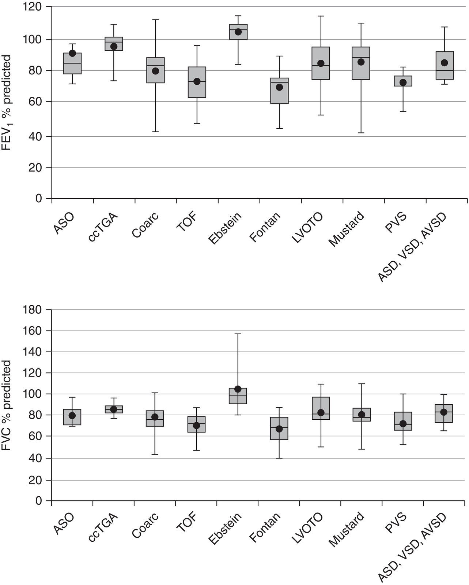

[**Figure 20.1**](#R_c20-fig-0001) Spirometry profiles in adults with congenital heart disease. Abbreviations: FEV1, forced expiratory volume in 1 second; FVC, forced vital capacity. ASO, arterial switch operation; ccTGA, congenitally corrected transposition of the great arteries; Coarc, coarctation of the aorta; TOF, tetralogy of Fallot; LVOTO, left ventricular outflow tract obstruction; PVS, pulmonary valve stenosis; ASD, atrial septal defect; VSD, ventricular septal defect; AVSD, atrioventricular septal defect.

(Source: Ginde et al \[22\]. Reproduced with permission of John Wiley & Sons)

Eisenmenger syndrome is a challenge, as the anesthesiologist must deal with both PH and the potential to exacerbate the right‐to‐left shunt, resulting in worsening cyanosis. It is more likely to present in patients with large and complex septal defects. The median survival after diagnosis of Eisenmenger syndrome is reported to be 35–60 years \[30\]. Patients with Eisenmenger syndrome will present for heart‐lung transplantation, but outside of this context, interaction with an anesthesiologist will be limited to diagnostic investigations and noncardiac surgery. Generally, Eisenmenger patients are easier to manage than patients with primary PH, as the right ventricle (RV) is robust and accustomed to a high afterload. Bennet et al. showed that hypotension is common during induction of Eisenmenger’s patients regardless of the agent used. The use of preemptive use vasopressor is recommended \[31–33\]. Manes et al. presented the survival data of ACHD patient with PH. The patients with small or corrected defects have the worse outcomes \[34\]. [Chapter 33](c33.xhtml) contains an extensive discussion of PAH.

### Hematological sequelae

Patients with cyanotic heart disease have erythrocytosis, an increase in the red cell line in response to hypoxia. Relative to the red cells there is a deficiency in vitamin K‐dependent clotting factors, fibrinogen, and platelets \[35\]. Particularly single ventricles or cyanotic patients have an increased risk of thrombosis yet are frequently coagulopathic intraoperatively \[36, 37\]. Phlebotomy is inappropriate unless there are extreme symptoms of hyperviscosity, as iron deficiency with microcytosis is an independent risk factor for stroke, thrombosis, and hemoptysis \[38\].

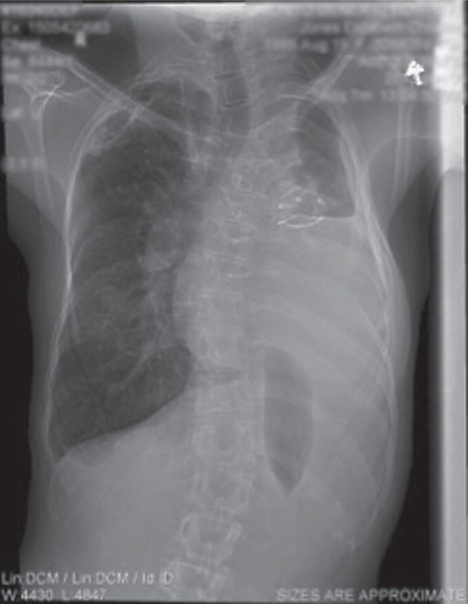

[**Figure 20.2**](#R_c20-fig-0002) 26‐year‐old with pulmonary atresia and right ventricle (RV) to pulmonary artery (PA) conduit. The patient’s weight is 45 kg, and the previous history includes pneumonectomy at age 16 years, paralyzed vocal cord, asthma, bronchiectasis, kyphoscoliosis. Forced expiratory volume in 1 second (FEV1) is 600 mL (20% of normal). The patient has RV–PA conduit obstruction with an RV pressure of 48/25 mmHg, and elevated pulmonary vascular resistance at 8–10 Wood units.

### Renal sequelae

Impaired renal function, as in patients with acquired heart disease, is a significant predictor of morbidity and length of stay in ACHD surgery \[39\]. Kwiatkowski et al. in a retrospective study described the principal risk factors for developing acute kidney injury after ACHD surgery \[40\]. Older age (≥35 years), preoperative left ventricular (LV) dysfunction, preoperative arrhythmia, longer bypass time, and vancomycin use were significant risk factors. The Acute Dialysis Quality Initiative Group has defined the range of renal dysfunction using the so‐called “RIFLE classification system” ([Box 20.1](#c20-fea-0001)), which has been endorsed by the Multi‐societal Database Committee for Pediatric and Congenital Heart Disease and further subdivided into renal insufficiency and renal dysfunction \[41\]. A total of 1,102 adult patients attending the Royal Brompton Hospital in London over a period between 1999 and 2006 had a serum creatinine measured and a glomerular filtration rate calculated. Renal dysfunction was mild in 41% of patients and moderate or severe in 9%. Not surprisingly, severe renal impairment correlated with increased mortality over the 4‐year follow‐up period \[42\].

* * *

### [Box 20.1](#R_c20-fea-0001): The RIFLE classification system

-   Risk (R)––1.5‐fold increase in serum creatinine, >25% decrease in glomerular filtration rate, or urine output _<_0.5 mL/kg/hour for 6 hours
-   Injury (I)––two‐fold increase in serum creatinine, >50% decrease in glomerular filtration rate, or urine output _<_0.5 mL/kg/hour for 12 hours
-   Failure (F)––three‐fold increase in serum creatinine, serum creatinine >4 mg/dL, >75% decrease in glomerular filtration rate, urine output _<_0.3 mL/kg/hour for 24 hours, or anuria for 12 hours
-   Loss (L)––persistent acute renal failure defined as the need for renal replacement therapy for >4 weeks
-   End‐stage renal disease (E)––need for renal replacement therapy for >4 weeks.

Source: Welke et al. \[43\]. Reproduced with permission of Cambridge University Press.

* * *

### Neurological sequelae

Surgical, perfusion and interventional strategies allow early intervention in the neonatal period, with improved survival but with a concerning incidence of neurodevelopmental complications in survivors \[44\]. In CHD the lifetime impact of cardiovascular disease on neurovascular disease changes. In early childhood, neurodevelopmental disorders are the central issue but with age epilepsy, stroke and dementia become more prevalent \[45\]. Interestingly, the increased risk of epilepsy is also seen in nonsurgical CHD patients indicating the presence other neurodevelopmental factors unrelated with the perioperative period \[46\].

Patients with ACHD have an elevated risk of ischemic and hemorrhagic stroke \[47\]. Lanz et al. in a retrospective, population‐based cohort study showed that almost 8% of patients with ACHD will experience a stroke in adulthood \[48\]. The risk of stroke was to 9–12 times higher in younger patients (<55 years old) up and only double older patients (55–64 years old). Severe ACHD and left‐sided lesions carry the highest risk of stroke. The greatest predictors of ischemic stroke in patients with ACHD are heart failure, diabetes mellitus, and recent myocardial infarction. The thirty‐day mortality after stroke is comparable to the general population.

Early‐onset dementia is more prevalent in patients with ACHD, and the burden of this disease is likely to increase with the growing population \[49\]. Patients with ACHD carry several risk factors for dementia including genetic disorders (e.g., Down syndrome), stroke, heart failure, atrial fibrillation, and diabetes mellitus. ACHD centers must acknowledge and accommodate some aspects of the pediatric anesthesia practice. Inhalational inductions are less practical, and premedication with hypnotics, and occasionally intramuscular ketamine, may be necessary. Patients’ impressions made on the first anesthetic encounter at the adult facility will influence future attitudes toward anesthetic care, and compliance with future visits.

### Hepatic sequelae

ACHD is associated with liver dysfunction. The mechanism of liver failure is multifactorial secondary to CHD, surgical repair or palliation, or blood transfusion \[50\]. Liver dysfunction is caused by passive venous congestion (e.g., central venous hypertension) or low‐output cardiac syndrome (LCOS). Tricuspid insufficiency and right ventricular failure cause liver failure by passive venous congestion. ACHD linked with passive venous congestion are repaired tetralogy of Fallot (TOF) with pulmonary insufficiency, Ebstein’s anomaly, single ventricle physiology (e.g., Fontan and Glenn), TGA with atrial switch repairs (e.g., Mustard‐Senning). Elevation of indirect bilirubin and prolonged international normalized ratio (INR) without affecting of the aminotransferases is typical in central venous hypertension. CHD conditions that cause LCOS, such as aortic coarctation or LV outflow tract obstruction, cause hepatic ischemia and eventually fibrosis. The ischemic burden is worse in the presence of an increased hepatic sinusoidal pressure. Acute ischemic hepatitis caused by LCOS is characterized by marked early rises of transaminases, followed by later increases in bilirubin and prothrombin time.

Fontan patients are the highest ACHD risk group to develop liver failure with an incidence of over 40%, 30 years after the initial procedure \[51\]. Failing Fontan physiology patients are prone to develop liver fibrosis earlier due to the continuous back pressure on the sinusoids secondary to elevated non‐pulsatile central venous pressure (CVP). There is a strong correlation between hepatic fibrosis and high hepatic venous pressures, low cardiac index, and ventricular function. The gold standard for diagnosis of Fontan associated liver disease is the percutaneous liver biopsy under ultrasound guidance. Transvenous biopsies can be obtained at the time of the cardiac catheterization and transhepatic gradient can be measured. An elevated hepatic venous pressure gradient >5 mmHg is indicative of parenchymal liver disease. Gradients over 10 mmHg are associated with portal hypertension complications (e.g., ascites and variceal hemorrhage) \[52, 53\].

Model for End‐stage Liver Disease (MELD‐XI) scores, excluding INR scores, is used to classify the severity of liver disease in ACHD. The advantage of the MELD‐XI score is that the INR is excluded, and many patients with Fontan circulation are taking warfarin. In addition, there is a statistically significant correlation between MELD‐XI values and hepatic total fibrosis scores \[52\]. Once a Fontan patient is diagnosed with cirrhosis, close surveillance for hepatocellular carcinoma and esophageal varices assessment is recommended.

There is no specific treatment for Fontan‐associated liver disease. Medical treatment should optimize Fontan physiology by increasing cardiac output (e.g., afterload reduction) and decreasing CVP (e.g., diuretics). Additional etiologies of liver injury should be avoided with immunization (e.g., hepatitis A and B) and limiting other toxins (e.g., alcohol or obesity). Combined heart and liver transplant is the ultimate treatment of failing Fontan physiology with associated liver disease. Hofer et al. recently reviewed the anesthetic management of combined heart–liver transplantation in patients with Fontan‐associated liver disease. The authors recommend keeping the transpulmonary pressure gradient close to 5 mmHg by optimizing preload, reducing PVR, and preserving single ventricular function \[54\]. [Chapter 30](c30.xhtml) contains additional discussion of heart‐liver transplantation.

* * *

### KEY POINTS: NONCARDIAC SEQUELAE OF CHD

-   Patients with ACHD can experience a wide range of noncardiac sequelae:
    -   Pulmonary––restrictive lung disease and PAH
    -   Hematological––erythrocytosis, polycythemia, and coagulopathy
    -   Renal dysfunction––mild in 41%, moderate or severe in 9%
    -   Neurological sequelae––developmental delay, cerebral abscess, stroke, and early dementia
    -   Hepatic sequelae––hepatic congestion, dysfunction, and cirrhosis from right heart failure or elevated cavopulmonary pressures.

* * *

## Vascular access considerations

Patients with ACHD undergo multiple interventions during infancy and childhood so by the time the reach adulthood the central and peripheral vascular access may be compromised. The use of ultrasound for vascular access is recommended in potential difficult intravenous access patients such as the ACHD population \[55\]. Chue et al. describe a 3.6% incidence of complications after femoral cannulation for percutaneous interventions in patients with ACHD \[56\]. The complications included hematoma and pseudoaneurysm.

The preoperative visit should include examining the extremities for cut‐down scars and measuring blood pressure in all extremities. Planning for major cardiac surgery should consist of venous Doppler or magnetic resonance imaging (MRI) of the femoral vessels, central veins and arterial and venous studies. Computed tomography or MRI of the chest is essential to delineate the intrathoracic anatomy and the relationship between the heart and great vessels to the sternum \[57\]. The anesthesiologist should discuss plans for emergent cannulation of the femoral vessels in the event of a cardiac injury at sternotomy. Cardiac or vascular injury upon resternotomy in ACHD is more common in patients with extracardiac conduits and dilated structures (e.g., aorta, RV, or right atrium) \[58\]. One of the approaches to high‐risk sternotomy patients is establishing cardiopulmonary bypass through peripheral cannulation before sternotomy \[59\].

## Unrestricted shunts

There are two types of unrestricted shunts. First, simple shunts, such as ASDs, VSDs, large PDAs, and aortopulmonary collaterals have a left‐to‐right shunt in the presence of normal or low PVR, and pulmonary blood flow may exceed systemic blood flow. Second, complex congenital lesions palliated with systemic‐to‐pulmonary artery shunt (e.g., BT, Waterston–Cooley, or Potts’ shunt) to augment pulmonary blood flow who may develop unilateral PAH. The Australian National registry for PAH in ACHD found that, of the first 50 registrants, 47 had systemic‐to‐pulmonary artery shunts \[60\]. At rest, breathing room air, these patients may have a 2:1 or as much as a 3:1 shunt ratio of pulmonary to systemic blood flow. The anesthesiologist should avoid 100% oxygen ventilation since it will lower the patient’s PVR, converting a 2:1 shunt to a 4–5:1 shunt, causing metabolic acidosis from diminished systemic oxygen delivery. Unrestricted left‐to‐right shunts can reverse with a profound decrease in systemic vascular resistance (SVR). The coronary circulation is dependent on the diastolic pressure and will compete with the run‐off into the pulmonary circulation when the PVR decreases by hyperventilation and 100% oxygen. After induction, baseline conditions should be targeted, maintaining the patient on a FiO2 that recreates their room air oxygen saturations at rest to avoid increasing the shunt fraction and coronary ischemia. Ventilation should be at lung volumes close to functional residual capacity (FRC) and maintain a normal PaCO2.

## Pregnancy

The increase in adults living with CHD also reflected in the obstetrical population, with increasing numbers of women with ACHD needing pregnancy care. For example, in one analysis, the number of women with ACHD presenting for delivery increased from 6.4 to 9.0 per 10,000 delivery hospitalizations \[61\]. Effective communication among the care team is essential, and anesthesiologists play a crucial role in assuring appropriate care for women with ACHD during pregnancy, labor, and delivery. Anesthesiologists must understand the effect of pregnancy on the cardiovascular system, the unique physiology of each patient’s cardiac lesion or surgical repair, and the cardiovascular impact of various anesthetic techniques used on labor and delivery.

### Relevant physiologic changes during pregnancy

A growing fetus requires increased oxygen delivery to the uteroplacental unit. Cardiac output increases by approximately 50% during pregnancy by increasing heart rate and stroke volume to keep up with the demand. Plasma volume significantly increases during pregnancy, reaching its peak around the early third trimester. Sympathetic tone increases in the first trimester ([Figure 20.3](#c20-fig-0003)) \[62\]. Transthoracic echocardiography (TTE) demonstrates increased cardiac performance and progressive LV remodeling. LV mass and LV end‐diastolic diameter increase, while LV strain decreases. These values return to normal in the postpartum period \[63\]. Systemic and PVRs both decrease. Mean arterial blood pressure decreases before returning to near‐normal values at the end of the third trimester \[64\]. Central filling pressures typically remain normal. Pregnancy is also associated with dilutional anemia. It is a hypercoagulable state with increases of most coagulation factors, a decrease in Protein S activity, and acquired Protein C resistance \[65\].

Labor and delivery bring additional cardiovascular demands that place stress on the heart. Autotransfusion from uterine contractions increases plasma volume and cardiac output up to 50% more than the pregnancy baseline throughout labor. In addition, painful contractions increase heart rate and SVR. During delivery, there is a large autotransfusion from uterine involution. This autotransfusion increases the circulating volume up to 100% over the baseline pregnant state, potentially overwhelming an already fragile circulation. As a result, it is a typical time for heart failure to occur \[66, 67\].

### Cardiac risk assessment before and during pregnancy

Cardiac and fetal risk during pregnancy and the postpartum period depends on the nature of the patient’s cardiac lesion, pre‐pregnancy functional status, and general health. Simple lesions, such as a repaired ASD or mild pulmonic stenosis, do not carry a significantly increased risk over the general population. However, complex ACHD, such as a Fontan circulation or unrepaired cyanotic heart disease, poses a greater risk to the patient and may become life threatening \[68\].

Ideally, patients with ACHD should plan their pregnancy after consultation at a tertiary care center with a cardio‐obstetric team. The team should consist of a high‐risk obstetrician, cardiologist, and obstetric anesthesiologist, all of whom have experience caring for patients with ACHD. Other experts should be consulted as necessary and include a cardiac anesthesiologist, cardiothoracic surgeon, cardiovascular intensivist, geneticist, neonatologist, hematologist, and others. In addition, preconception counseling should give the woman a clear understanding of the risks of pregnancy for her and her child. In some cases, additional testing and procedures may be warranted before it is deemed safe to embark upon pregnancy. Exercise testing is a valuable tool to aid in maternal and fetal risk stratification. Lack of a chronotropic response to exercise is predictive of both maternal and neonatal events \[69\]. Once pregnancy is confirmed, high‐risk patients should be referred to a tertiary care program with expertise in pregnancy in ACHD.

Estimation of maternal and fetal risk during pregnancy and the postpartum period considers the mother’s underlying cardiac condition and the presence or absence of risk factors. The modified WHO (mWHO) pregnancy classification is regarded as the most accurate risk classification \[64\]. However, multiple risk scores are based on studies that have examined maternal and fetal risk in patients with cardiac disease. The mWHO classification is presented in [Table 20.1](#c20-tbl-0001) \[68\]. Its assessment of risk is based purely on underlying cardiac condition, assuming the mother is otherwise optimized.

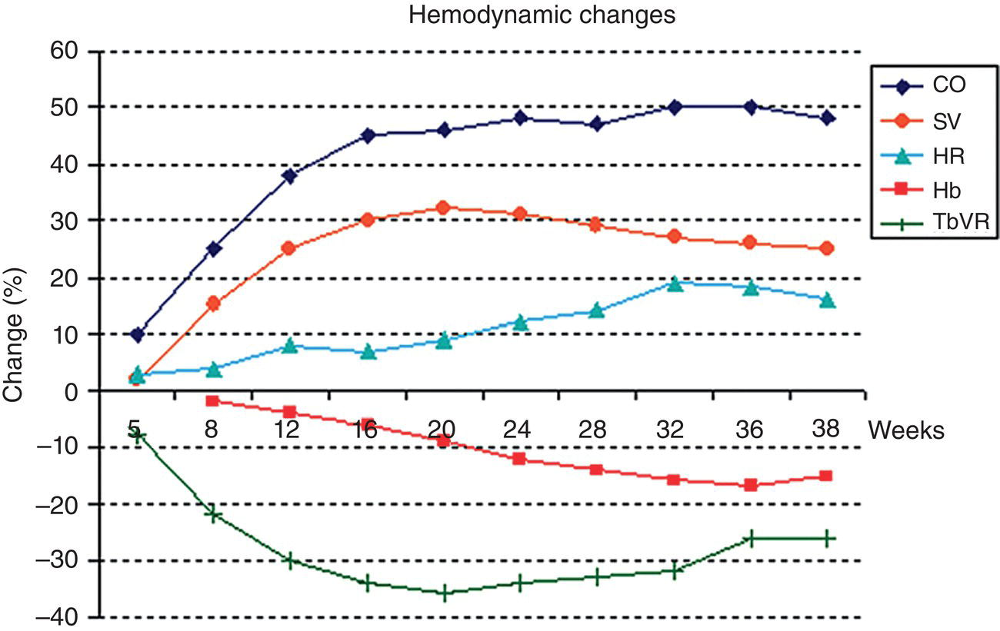

[**Figure 20.3**](#R_c20-fig-0003) Hemodynamic changes in pregnancy. CO, cardiac output; SV, stroke volume; HR, heart rate; Hb, hemoglobin; TPVR, total peripheral vascular resistance.

(Source: Ruys et al \[62\]. Reproduced with permission of Elsevier).

In 2001, a large prospective observational trial examined 599 pregnancies in women with CHD (74%), acquired heart disease (22%) and arrhythmia (4%). A primary cardiac event occurred in 80 pregnancies (13%). Everyday cardiac events included heart failure and arrhythmia. They proposed four predictors of maternal cardiac complication (the CARPREG I score): prior cardiac event or arrhythmia, NYHA class >II or cyanosis, left heart obstruction, and systemic ventricular dysfunction \[70\]. An updated risk index, CARPREG II, was published in 2018. It included 1938 pregnancies in women with congenital (63.7%) and acquired (22.9%) heart disease. The new score incorporates different risk elements, including lesion‐specific variables, patient‐specific variables, and one process of care variable. It is outlined in [Table 20.2](#c20-tbl-0002) and [Figure 20.4](#c20-fig-0004) \[67\]. The maternal complication rate was 16%, unchanged from their 2001 study. Arrhythmia (9.3%) and heart failure (6.2%) remained the most common cardiac events. Arrhythmias were most likely to occur in the antepartum period, where heart failure was most observed in the third trimester or the early postpartum period \[67\].

[**Table 20.1**](#R_c20-tbl-0001) Modified WHO classification of maternal cardiovascular risk

Source: Adapted from Canobbioet al \[68\].

|  | mWHO I | mWHO II | mWHO  
II‐III | mWHO III | mWHO IV |
| --- | --- | --- | --- | --- | --- |
| Diagnosis (if otherwise well and uncomplicated | Uncomplicated, small or mild
-   PS
-   PDA
-   MVP

  
Successfully repaired simple lesions (ASD, VSD, PDA, APVR).  
Atrial or ventricular ectopic beats, isolated | Unoperated ASD or VSD  
Repaired TOF  
Most arrhythmias | Mild LV impairment  
HOCM  
Native or tissue valvular heart disease not considered WHO I or IV  
Marfan syndrome without aortic dilatation  
Aorta <45 mm in aortic disease associated with bicuspid aortic valve  
Repaired coarctation | Mechanical valve  
Systemic RV  
Fontan circulation  
Cyanotic heart disease (unrepaired)  
Other complex congenital heart disease  
Aortic dilatation 40–45 mm in Marfan syndrome  
Aortic dilatation 45–50 mm in aortic disease associated with bicuspid aortic valve | PHTN of any cause  
Severe systemic ventricular dysfunction (LVEF <30%, NYHA III–IV)  
Previous peripartum cardiomyopathy with any residual impairment of left ventricular function  
Severe mitral stenosis, severe symptomatic aortic stenosis  
Marfan syndrome with aorta dilated >45 mm  
Aortic dilatation >50 mm in aortic disease associated with bicuspid aortic valve  
Native severe coarctation |
| Risk | No detectable increased risk of maternal mortality and no/mild increase in morbidity. | Small increased risk of maternal mortality or moderate  
increase in morbidity | Intermediate increased risk of maternal mortality or moderate‐to‐severe increase in morbidity | Significantly increased risk of maternal mortality or severe morbidity. Expert counselling required.  
If pregnancy is decided upon, intensive specialist  
cardiac and obstetric monitoring needed throughout  
pregnancy, childbirth, and the puerperium | Extremely high risk of maternal mortality or severe morbidity; pregnancy contraindicated. If pregnancy occurs termination should be discussed. If pregnancy continues, care as for class III. |
| Maternal cardiac event rate | 2.5–5% | 5.7–10.5% | 10–19% | 19–27% | 40–100% |

Abbreviations: PS, pulmonary stenosis; PDA, patent ductus arteriosus; MVP, mitral valve prolapse, ASD, atrial septal defect; VSD, ventricular septal defect, APVR, anomalous pulmonary venous return; HOCM, hyperthrophic obstructive cardiomyopathy; RV, right ventricle

[**Table 20.2**](#R_c20-tbl-0002) CARPREG II risk stratification index

Source: Adapted from Silversides et al \[67\].

| PREDICTOR | SCORE |
| --- | --- |
| Prior cardiac events or arrhythmias | 3 |
| Baseline NYHA III‐IV or cyanosis | 3 |
| Mechanical valve | 3 |
| Ventricular dysfunction | 2 |
| High‐risk left‐sided valve disease/left ventricular outflow tract obstruction | 2 |
| Pulmonary hypertension | 2 |
| Coronary artery disease | 2 |
| High‐risk aortopathy | 2 |
| No prior cardiac intervention | 1 |
| Late pregnancy assessment | 1 |

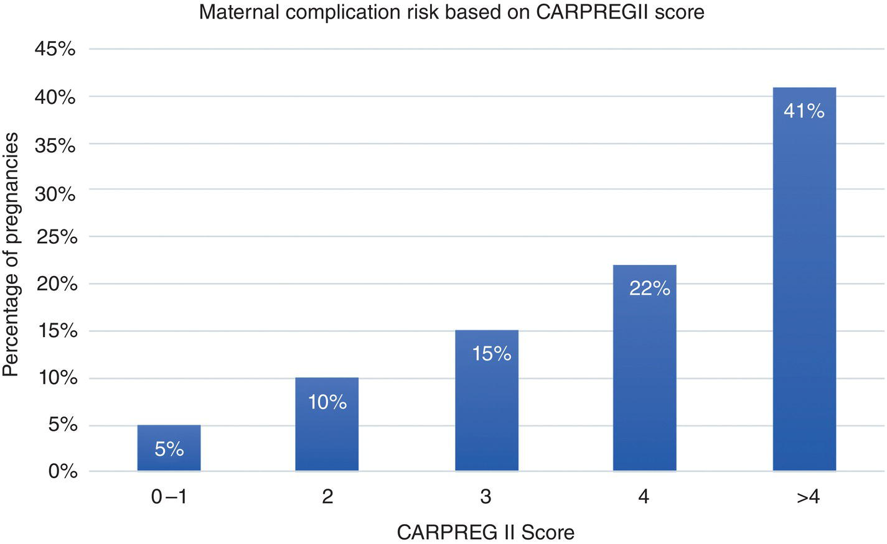

[**Figure 20.4**](#R_c20-fig-0004) Maternal complication risk based on CARPREGII score.

(Source: Silversides et al \[67\]. Reproduced with permission of Elsevier).

In a more extensive retrospective review from the ZAHARA group, 1802 pregnancies were observed in women with ACHD. The maternal cardiac complication rate was 7.6%. The most common maternal cardiac complications were arrhythmias (4.7%) and heart failure (1.6%). They confirmed several risk factors from the CARPREG studies. In addition, they identified further risk factors: the use of cardiac medication before pregnancy and systemic and pulmonic AV valve regurgitation in the context of complex ACHD \[71\]. A smaller study, examining 90 pregnancies in women with ACHD, identified two additional risk factors: impaired sub pulmonary ventricular systolic dysfunction and severe pulmonary regurgitation \[72\]. Single ventricle physiology was a risk factor for maternal cardiac events in a ACHD population \[73\].

External validation and comparison of the CARPREG I, ZAHARA, and mWHO risk classification systems in a ACHD population was undertaken in 2014. The mWHO score was best able to discriminate risk for cardiovascular events. In addition, a combination of the mWHO score, the total number of cardiovascular predictors, and disease complexity further improved prediction \[74\].

### Maternal obstetric and fetal risks

The most common fetal complications in women with ACHD include premature birth (12–19%) and small for gestational age (SGA) birth weight. In addition, neonatal death occurred at a higher rate than the general population, ranging from 2.8–5%. There was also a higher observed incidence of intrauterine growth restriction (IUGR), neonatal intensive care (NICU) admission, and neonatal CHD \[70–74\]. The increase in premature births has two causes: preterm labor and iatrogenic premature delivery due to maternal health status or decompensation. Risk factors for fetal complications include maternal NYHA class >II, cyanosis, maternal anticoagulation, left heart obstruction, mechanical valve, cardiac medications during pregnancy, single ventricle physiology, severe pulmonary hypertension, smoking, and multiple gestations.

Patients with ACHD are at elevated risk for preeclampsia and postpartum hemorrhage (PPH). Risks for preeclampsia included nulliparity, systemic lupus erythematosus (SLE), and aortic coarctation \[61\]. In addition, several studies have identified CHD as an independent risk factor for PPH, and patients with Fontan circulation had a particularly elevated risk \[75–77\]. Peripartum anticoagulation and cyanosis are other identified risk factors for PPH \[70\].

### Care during pregnancy

#### Anticoagulation

While anticoagulation during pregnancy is a risk factor for PPH and neonatal complications, for some conditions, the additional thrombotic risk conferred by pregnancy and the catastrophic effect of a thrombus in these conditions is significant. These conditions include a Fontan circulation or the presence of a mechanical valve \[78–81\]. The balance of risk and benefit for anticoagulation in pregnant patients with ACHD is an individualized decision.

Low‐molecular‐weight heparin (LMWH) is the preferred anticoagulant during pregnancy. Neither unfractionated heparin (UFH) nor LMWH crosses the placenta. LMWH is the anticoagulant of choice over UFH due to its reliability and relative ease of dosing. It is also associated with fewer injection site reactions and carries a lower risk of heparin‐induced thrombocytopenia (HIT). However, the longer half‐life LMWH and the inability to completely reverse its anticoagulant effect may limit the ability to provide neuraxial anesthesia. Warfarin is typically avoided during pregnancy as it is associated with well‐known fetal malformations, particularly with exposure in the first trimester. Alternatives to warfarin should be used if clinically feasible. Direct oral anticoagulants have gained popularity for anticoagulation for several indications. However, there is scant data for use during pregnancy, and they are not recommended \[82\].

The presence of a mechanical valve is a known risk factor for cardiac complications \[64, 67, 71\]. The main risks are valve thrombosis and bleeding complications related to anticoagulation. In a 2015 study, women with a mechanical valve only had a 58% chance of having an event‐free pregnancy, 4.7% experienced valve thrombosis, which carried a 20% mortality rate. Hemorrhage occurred in 23% of patients, usually around the time of delivery \[83\]. Management of anticoagulation in this population is a challenge. Multiple studies have shown an increased risk of thrombosis in mechanical valve patients treated with LMWH vs. warfarin \[83–86\]. Warfarin is optimal for thrombosis prevention and is recommended for use during pregnancy in patients with a mechanical valve despite the risk of embryopathy. Patients may remain on warfarin during their entire pregnancy, or warfarin can be changed to LMWH or UFH for the first trimester and again after 36 weeks \[64\].

### Cardiac procedures during pregnancy

Patients may present in pregnancy for cardiac interventional procedures or cardiac surgery. Ideally, cardiac procedures will occur in the second trimester when organogenesis is complete, and the risk of premature labor is still low. The uterus must be double shielded from radiation exposure during catheterization. Appropriate fetal monitoring is indicated both for intervention if the fetus is viable and to optimize hemodynamics in response to fetal distress. Discussion with the obstetric team should take place on the response to the diagnosis of fetal distress. The anesthesiologist should be cardiac trained with ACHD expertise. Cardiac surgery and perfusion should be on standby, and appropriate ICU resources available for the mother and fetus. Maternal cardiac surgery should only be performed during pregnancy if it is urgent, as in LV obstruction with symptoms at rest, or emergent, as in aortic dissection or a thrombosed mechanical systemic AV valve. Cardiac surgery during pregnancy and the use of cardiopulmonary bypass carries a high risk of fetal mortality. Normothermic perfusion, mean arterial pressure (MAP) >70 mmHg, minimal CPB times, and bypass pump flows >2.5 L/min/m2 are optimal to minimize fetal risk. Hypocapnia, which ordinarily may be used for patient’s dependent on a low PVR (TOF, Ebstein’s anomaly, and Fontan circulation), has adverse effects causing uteroplacental vasoconstriction and fetal hypoxia and should therefore be avoided. If the fetus is viable, a caesarean section (C‐section) may precede the urgent cardiac surgery \[69, 87, 88\].

### Delivery planning

Multidisciplinary collaboration is essential to planning a safe delivery for mother and baby. Thoroughly assessing each patient’s risk and anticipated complications allow mobilization of appropriate resources and determining who needs to be involved in the patient’s delivery. Additional teams consulted may include ICU, cardiac surgery, cardiac anesthesia, and others. The team should also determine the optimal delivery mode, location, timing, and anesthetic plan.

The delivery hospital must have the necessary resources to care for the patient and handle any likely complications. This level of care depends on the estimate of the patient’s risk and severity of her condition. For example, low‐risk patients, mWHO class I and II, estimated cardiac event risk <10%, could safely be delivered at a local hospital. Patients with an intermediate risk (mWHO class II‐III, calculated risk 10–19%) should deliver at a higher‐level referral enter, while extraordinary risk patients (mWHO class II or IV) should refer to a tertiary care center experienced in the care of patients with ACHD \[64, 89\].

The mode of delivery determines birth location within the hospital, need for invasive monitoring, access to the escalation of care, and ability to perform emergency surgery quickly. The team should determine what resources and monitoring are necessary for delivery and then decide which location in their hospital best fulfill those needs. For example, if a C‐section is planned, the operating room should be equipped to accommodate standard C‐section needs in addition to possible contingencies, including demand for emergent ECMO cannulation or transesophageal echocardiography (TEE) and neonatal resuscitation.

Vaginal delivery is preferred in patients with ACHD unless an obstetric indication for C‐section is present. Elective C‐section based on maternal cardiac disease is not recommended, as it does not confer maternal benefit but may carry increased neonatal risk \[90\]. Vaginal delivery is associated with decreased blood loss and a lower risk of venous thromboembolism. For certain patients, an assisted vaginal delivery minimizes Valsalva and has beneficial hemodynamic effects. C‐section recommendations include acute intractable heart failure, patients presenting in labor on oral anticoagulants, aggressive aortopathy, and severe pulmonary hypertension \[64\].

During labor, painful contractions can lead to tachycardia, hypertension, and hyperventilation. Early labor epidural placement can mitigate these unwanted effects. Sympathectomy associated with epidural local anesthetic administration causes vasodilation and can lead to hypotension. Therefore, cautious administration of a pre‐load or co‐load of IV fluid before or during epidural placement is beneficial. If the plan is to assist the second stage, good sacral nerve root coverage is required. The use of a combined spinal‐epidural (CSE) or dural puncture epidural (DPE) technique achieves good sacral coverage. Opioid‐only intrathecal injection (10 mcg Fentanyl) should be used in CSE to minimize the extent of sympathectomy and prevent hypotension. For patients with intracardiac shunts, consider using saline rather than air for the loss of resistance technique to minimize inadvertent air injection into a blood vessel during epidural placement. We do not advise the use of epinephrine in the epidural test dose. The intravascular injection of epinephrine could be detrimental to patients at high risk of arrhythmia. An alternative test dose is epidural fentanyl 50–100 mcg \[91\].

For patients undergoing C‐section, neuraxial anesthesia is preferred over general anesthesia. In [Figure 20.5](#c20-fig-0005), the advantages, and disadvantages of each are outlined. The selection of neuraxial technique depends on the physiology and severity of the patient’s cardiac lesion. Spinal anesthesia produces a quick onset, reliable, dense surgical block. However, it is also accompanied by a rapid sympathectomy which causes an acute decrease in preload and afterload. Preload‐dependent patients or severe (mWHO III‐IV) lesions will not tolerate the sympathectomy. Epidural anesthesia can be titrated to ensure a slower onset and slow start sympathectomy but may produce a less dense or unilateral block that is inadequate for surgical anesthesia. A CSE with intrathecal opioids or a sequential CSE, in which a small dose of local intrathecal anesthetic (2.5–5 mg 0.75% hyperbaric bupivacaine) is given and then supplemented with a local epidural anesthetic, can provide the balance between a reliable, dense block and the need for slow titration to avoid rapid sympathectomy, decreased SVR, and hypotension. Neuraxial anesthetic dosing recommendations for cesarean delivery are summarized in [Table 20.3](#c20-tbl-0003).

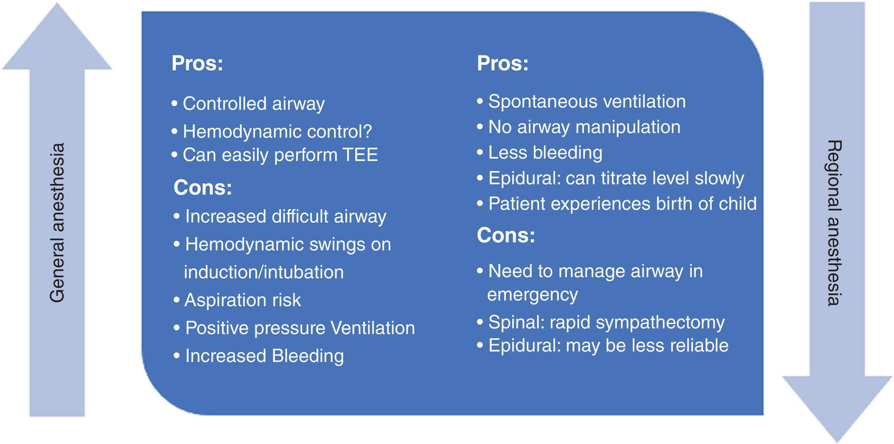

[**Figure 20.5**](#R_c20-fig-0005) Advantages, and disadvantages of the administration of general vs. neuraxial anesthesia for cesarean section.

Anticoagulated patients require general anesthesia, and those unable to lay flat, critically ill requiring mechanical ventilation, or emergent delivery. Induction and maintenance of anesthesia should balance obstetric and cardiac considerations. In obstetric patients, increased aspiration risk leads to the use of rapid sequence induction. One should avoid opioids before delivery due to concern for neonatal sedation and respiratory depression. However, patients with high‐risk cardiac lesions may require a slower induction to prioritize hemodynamic stability. Therefore, the administration of opioids to blunt the hypertensive response to laryngoscopy may be reasonable.

Adequate monitoring for the patient during delivery, whether vaginal or C‐section, is vital for early recognition of maternal warning signs. For vaginal delivery, intermittent noninvasive blood pressure and pulse oximetry are essential for cardiac patients. Telemetry during and after delivery is mandatory for patients at risk for arrhythmia. For patients at higher risk of decompensation, invasive arterial blood pressure or CVP monitoring can be considered. Point of care TTE can be helpful to serially monitor cardiac function in patients with depressed systemic ventricular ejection fraction. For C‐sections, standard monitors are sufficient for low and intermediate‐risk patients. High‐risk patients will likely require invasive arterial blood pressure or CVP monitoring and possibly pulmonary artery (PA) catheter placement. In patients who are under general anesthesia, TEE can be used.

Patients with ACHD need an individualized transfusion plan before delivery since they have an elevated risk of PPH. Most uterotonic medications have cardiovascular effects and need to be administered with caution. The hemodynamic results of commonly used uterotonic drugs are summarized in [Table 20.4](#c20-tbl-0004) \[92\]. Tranexamic acid (TXA) reduced PPH mortality in the WOMAN trial, which included over 20,000 women worldwide. There was no difference in cardiac failure, thromboembolism, or seizure between the TXA and placebo groups \[93\].

* * *

### KEY POINTS: PREGNANCY IN ACHD

-   Pregnancy in ACHD is associated with a 7–16% incidence of adverse cardiac events.
-   Assess the cardiac pregnancy risk using the mWHO classification.
-   High‐risk conditions include
    -   Severe systemic ventricular dysfunction
    -   Fontan circulation
    -   Cyanosis
    -   Pulmonary hypertension
    -   Left heart obstruction
    -   Mechanical valve.
-   Premature birth, neonatal death, preeclampsia, and PPH are more common in patients with ACHD.
-   Multidisciplinary planning, fetal monitoring, and backup plans for maternal or fetal instability are necessary for anesthesia during pregnancy.
-   Bypass cases should maintain MAP >70 mmHg and high flows for fetal protection.
-   Anticoagulation during pregnancy is problematic, with LMWH preferable to warfarin
-   Vaginal delivery is preferred; neuraxial techniques can be utilized with careful titration and hemodynamic monitoring.

* * *

[**Table 20.3**](#R_c20-tbl-0003) Neuraxial anesthetic dose recommendations for cesarean delivery in CHD patients

|  | Mild‐moderate CHD | Severe CHD (mWHO III‐IV) |
| --- | --- | --- |
|  | Spinal/CSE | Epidural  
In‐situ | CSE | Epidural  
In‐situ |
| --- | --- | --- | --- | --- |
| **Local Anesthetic** | 12 mg (1.6 mL 0.75%) hyperbaric bupivacaine | 2% lidocaine with 1:200,000 epinephrine and sodium bicarbonate (total 20 mL)[a](#c20-note-0003) | _Intrathecal_: None, or up to 5 mg 0.75% hyperbaric bupivacaine  
_Epidural_: 2% lidocaine with 1:200,000 epinephrine and sodium bicarbonate (total 20 mL) | 2% lidocaine with 1:200,000 epinephrine and sodium bicarbonate (total 20 mL) |
| **Local anesthetic administration** | Single shot | Bolus 5 mL increments of LA until a T4 level obtained (may take 15–20 mL) | Bolus 2–3 mL increments of LA every few minutes with careful attention to hemodynamics until a T4 level obtained (may take 15–20 mL) | Bolus 2–3 mL increments of LA every few minutes with careful attention to hemodynamics until a T4 level obtained (may take 15–20 mL) |
| **Opioid** | 10–15 mcg Fentanyl, 0.15 mg PF morphine (Intrathecal) | 100 mcg Fentanyl (with initial bolus)  
2–3 mg PF morphine (after delivery) | 10–15 mcg Fentanyl, 0.15 mg preservative free morphine (Intrathecal) | 100 mcg Fentanyl (with initial bolus)  
2–3 mg PF morphine (after delivery) |
| **Fluids** | Preload or co‐load with 1L warm crystalloid | As clinically indicated during surgery | Use caution with pre‐load or co‐load. If given, consider lower volume (250–500 mL) given over 30–60 minutes | As clinically indicated during surgery |
| **Pressor/inotrope** | Phenylephrine infusion 0.5 mcg/kg/min at time of intrathecal injection. Can be weaned off after baby is delivered | Phenylephrine bolus as needed | 
-   If intrathecal LA used: phenylephrine infusion 0.5 mcg/kg/min at time of intrathecal injection.

  

-   In patients with severely reduced EF, consider epinephrine or dobutamine (2–3 mcg/kg/min) at the time of delivery. Can be weaned off by the end of surgery | -   Phenylephrine or epinephrine bolus as needed.

  

-   In patients with severely reduced EF, consider epinephrine or dobutamine (2–3 mcg/kg/min) at the time of delivery. Can be weaned off by the end of surgery

 |

Abbreviations: LA= Local anesthetic; PF= preservative free; EF= Ejection fraction

[a](#R_c20-note-0003) In a 20 mL syringe, mix 18 mL 2% lidocaine + 2 mL bicarb (1 meq/mL) + 100 mcg epinephrine (0.1 mL of 1 mg/mL epi)

[**Table 20.4**](#R_c20-tbl-0004) Hemodynamic effects of common uterotonic medications

|  | Class | CV effect | Special considerations |
| --- | --- | --- | --- |
| **Oxytocin** | n/a | With rapid IV bolus:
-   Vasodilation
-   Hypotension
-   Tachycardia
-   Myocardial ischemia (rare)

 | Safest when given as a slow bolus (<2 units/min) or a continuous infusion (18–36 units/hour) |
| **Methergine** | Ergot alkaloid that increases smooth muscle contraction | 

-   Hypertension
-   Coronary vasospasm (rare)
-   Myocardial ischemia (rare) | -   Dose: 0.2 mg IM
-   Avoid in patients with hypertension, preeclampsia, severely reduced systemic ventricular function, aortopathy, L→R shunts

 |
| **Carboprost** | Prostaglandin F2 alpha analogue | 

-   Bronchoconstriction
-   Increased pulmonary artery pressure | -   Dose: 0.2 mg IM
-   Avoid in patients with reactive airway disease, shunt lesions, right heart dysfunction, pulmonary hypertension

 |
| **Misoprostol** | Prostaglandin E1 analogue | None | 

-   Safe for patients with CHD
-   Administered via sublingual, rectal, or vaginal routes

 |
| **Tranexamic acid** | Antifibrinolytic | 

-   None shown over control groups in WOMAN trial | -   Dose: 1 g over 10 minutes, repeat in 30 minutes if bleeding continues

 |

Abbreviations: IM = intramuscular

## Adults with down syndrome

Down’s syndrome is the most common chromosomal disorder, with an incidence of 1 in 700 live births in the United States each year \[94\]. Due to advances in congenital heart surgery and respiratory disease care, most Down’s patients reach adulthood, with a median life expectancy of 58 years \[95\]. de Graaf et al. estimated the Down’s syndrome population in the United States to be about 200,000 with a growing adult component and stabilized pediatric due to elective terminations. Around 40–50% of Down’s syndrome patients have CHD, most commonly AV canal defects (37%) \[10\]. Hospitalization rates in the United States, using the Nationwide Inpatient Sample from 1998 to 2009 for adults with and without Down syndrome aged 18–64 years, revealed that 11.5% of all hospital admissions (9,088/78,793) for CHD were patients with Down syndrome. Patients with Down syndrome had higher in‐hospital mortality (odds ratio 1.8) and were less likely to have cardiac procedures or surgery (odds ratio 0.3) \[96\]. Down syndrome patients in this study were also more likely to have cyanosis, secondary polycythemia, heart failure, and pulmonary hypertension. Co‐morbidities include deficiencies in cognition and a tendency toward infection. Dementia may occur as early as 40 years, and the prevalence of dementia is 50–70% at 60 years. Other issues include acquired mitral valve disease, atlanto‐axial instability, obstructive sleep apnea syndrome (OSAS), hearing loss, diabetes, osteoporosis, and epilepsy \[97\].

The preoperative visit must include a thorough history, assessment of atlanto‐axial instability with recent flexion and extension views of the cervical spine and risk assessment for OSAS. Increasingly, the indication for intervention is the decrease in functional capacity, and the cardiac function should have an objective assessment to ascertain whether the cause is cardiac or onset of dementia. In the normal population, the onset of dementia is heralded by a change in memory, whereas in Down syndrome, it is often a behavior change. The plan for induction and emergence of anesthesia should involve caregivers available and interested. In patients with the unstable cervical spine, videolaryngoscopy is beneficial since it produces less upper cervical spine motion \[98\]. The disposition should be to areas that advanced respiratory support can be provided, such as continuous positive airway pressure (CPAP) \[99\].

## Psychological issues

As outlined in the introduction, many patients with ACHD are lost to follow‐up because they feel well and perceive themselves as an average person who had heart problems in childhood that were “fixed.” In addition, many patients will have parents in attendance who are well versed in the history of their adult child’s health and may have difficulty taking a secondary supportive role in decision‐making. This issue is genuine if a spouse is designated as the substitute decision‐maker for the patient, should they encounter a prolonged length of stay in the cardiovascular ICU. While empowering the patients with ACHD, sensitivity to these issues is an essential consideration in discussing high‐risk procedures.

There is a wealth of literature addressing the psychological well‐being, quality of life, and life satisfaction of adults living with CHD. In a prevalence study, Khanna et al. showed that 33% of the patients with ACHD were diagnosed with a mental illness. The most common conditions were mood disorders (13%), anxiety disorders (13%), and substance‐related disorders (6%) \[100\]. More complex lesions requiring more interventions, and the presence of a congenital syndrome increased the likelihood of mental illness.

When the quality of life is measured about psychosocial, occupational, and environmental aspects, they are as happy as, or happier than, the public \[101\]. Another study found that patients with ACHD were more resilient than the general population \[102\]. Interestingly, quality of life does not correlate to CHD subtype, cyanosis, personal resources, or family environment \[68\]. These studies are done in an outpatient setting and not in the context of hospital admission with a change in health status. One in four patients with ACHD will die from heart failure. Diminished quality of life in patients with heart failure correlates with female sex and younger age, and it seems reasonable to experience depression and frustration at not being able to do activities \[103\]. As more patients with ACHD present for transplant or palliation, this will need to be addressed by ACHD multidisciplinary teams.

The anesthesiologist‐intensivist, as a multidisciplinary team member, must ensure that the patient has a clear understanding of the anesthetic risks and the implications for their quality of life. In addition, the patient needs to have realistic expectations of how the intervention will improve their activities of daily living and exercise tolerance and over what time frame. Frank and explicit discussion of the role of the substitute decision‐maker in the presence of the patient and the substitute decision‐maker should ideally occur in advance of the procedure, with an opportunity to review questions should they arise before the morning of the intervention or surgery. At times, psychological counselling may be offered to help the patient through this process and support them in communicating their wishes for limits of care to their families.

## Cardiac lesions

Lesions in this section are discussed in detail in individual chapters but are focused on pediatric congenital cardiac patients. This section will concentrate on the unique consideration for the patient with ACHD in both cardiac surgery and noncardiac surgery, starting with general reviews followed by lesion‐specific discussions. There will be a brief discussion of the anesthetic issues unique to the adult for each of these lesions: ASDs, levo‐transposition of the great arteries (L‐TGA), and Ebstein’s anomaly. Bicuspid aortic valve and the associated aortopathies are managed in adult practices independent of referral ACHD centers and will not be described here

### Atrial septal defects and Shunts

#### Patent Foramen Ovale (PFO)

The foramen ovale is an essential component of fetal circulation. Generally, there is an abrupt reversal of the interatrial pressure gradient at the time of birth, allowing functional closure of the foramen ovale. Thus, anatomic closure occurs during infancy in most populations, but in up to 25%, closure is incomplete, and a potential inter‐atrial communication exists into adulthood. It is possible to miss a PFO only by color flow Doppler. A contrast study (agitated normal saline injection, or agitated blood: saline in a 1:10 ratio) increases the sensitivity of TEE. The contrast medium injected during the Valsalva maneuver is released when contrast is visualized within the right atrium to exploit the reversal of inter‐atrial pressure gradients maximally. To further increase the sensitivity of the test injecting via a lower‐body vein, the Eustachian valve preferentially directs blood from the inferior vena cava (IVC) toward the inter‐atrial septum. The surgeries in which intraoperative closure of the PFO is almost mandatory are right‐sided open‐heart surgery on the beating heart and those clinical scenarios in which altered loading conditions produce a significant right‐to‐left shunt postoperatively. Those settings include heart transplantation, where right atrial pressure increases significantly, and implantation of a left ventricular assist device (LVAD) considerably offloads the left heart \[104\]. Thus, a PFO at cardiac surgery is not unique to congenital cardiac anesthesia, although it is a remnant of the fetal circulation.

#### Atrial Septal Defects (ASDs)

An ASD is one of the most common forms of CHD, representing 7% of CHD in childhood and 30–40% in adulthood. There are four types of ASDs. These are well described in [Chapter 26](c26.xhtml) but warrant discussion as ASD is one of the lesions commonly present in the adult.

1.  Secundum ASD is the most common type of defect, representing 75% of ASDs. It may be associated with mitral valve prolapse.
2.  Ostium primum type ASDs are considerably less common, comprising 15% of cases. They are considered a form of AV canal defect and may be associated with a cleft anterior left AV valve leaflet or, less commonly, a cleft in the septal leaflet of the right AV valve.
3.  Sinus venosus defect represents 10% of septal lesions. The superior vena cava (SVC) type of sinus venosus defect is considerably more common than the IVC type, and both types are associated with partial anomalous pulmonary venous return (PAPVR). Pulmonary venous drainage results in a left‐to‐right shunt. Chronic right‐sided volume overload may lead to pulmonary hypertension, which is more common in patients with two veins with anomalous return or other associated conditions, such as ASD \[105\].
4.  Coronary sinus type ASD is rare and results from unroofing the coronary sinus into the left atrium (LA), such that blood may drain from the LA to the RA via the coronary sinus. It is essential to identify an associated left‐sided SVC, because of the risk of inadvertent systemic delivery of retrograde cardioplegia and the possibility of a relatively small SVC and its implications for bicaval cannulation.

Unrepaired ASDs first presenting in adulthood is associated with new‐onset fatigue, arrhythmias, cerebrovascular events, or an incidental murmur during routine physical examination. Secundum ASDs represent the most common form of ASD, and large shunts (Qp: Qs >1.5:1) require closure unless severe pulmonary hypertension has developed. The contraindication for closure is the systolic PA pressure >2/3 of systemic systolic pressure or PVR >2/3 of SVR. Percutaneous device closure is the preferred technique, although significant defects or without an adequate septal rim need surgical closure. At specialized ACHD centers, nonsecundum ASDs should be repaired. A large single center series of 784 patients having ACHD surgery over a period 2004–2015 had 167 patients with septal lesions repaired, and none experienced the composite adverse outcome of death, acute kidney injury and or prolonged ICU stay, and survival to 1 year was 100% \[106\].

#### Created shunts and fenestrations

Many adults underwent Potts and Waterston shunting during childhood. The Potts shunt extends from the descending aorta to the left PA, while the Waterston shunt extends from the ascending aorta to the right PA. These shunts increase blood flow to the ipsilateral lung, over time leading to unilateral pulmonary hypertension that cannot be estimated with a simple TR jet to calculate RV systolic pressure. The original BT and modified BT shunt with a Dacron conduit from the subclavian artery to the ipsilateral PA can also cause unilateral pulmonary hypertension and differential left and right lung flow. BT and modified BT shunts decrease arterial pressure, which may, in turn, lead to diminished growth in the ipsilateral arm. Removal of the shunt during repair procedures in childhood often leads to restoring blood flow to the arm. When assessing a patient with a prior systemic artery to PA shunt for noncardiac surgery, remember to consider the patient's position while asleep, thoracotomy, nephrectomy, prone, and whether there is differential blood flow to each of the lungs. Ask the patient if they prefer to sleep in one position, check the blood pressure in both arms, assess the patient in the surgery position for 5 to 10 minutes with oximetry. Examples of surgically created fenestrations include defects in the interatrial septum during Ebstein's anomaly repair or in a Fontan tunnel wall or conduit wall. These “pop‐off” valves shunt when there is inadequate RV function/compliance. However, they are also potential sources of right‐to‐left shunting and paradoxical emboli.

Noncardiac Surgery in Septal Lesions

The size and direction of the shunt depend on the balance between PVR and SVR. Reducing PVR (hyperoxygenation and hyperventilation) and increasing SVR (vasopressor use) can increase left‐to‐right shunting, leading to pulmonary overperfusion and reduced systemic blood flow. Although such changes do not lead to cyanosis, patients will exhibit reduced cardiac output. Conversely, in patients with cyanosis, increasing PVR or decreasing SVR will exacerbate the right‐to‐left shunt and worsen hypoxemia without decreasing systemic cardiac output. Thus, the anesthesiologist must be adept at manipulating PVR and SVR. Generally, one should strive to maintain the patient’s baseline oxygen saturation level, heart rate, and blood pressure in their ambulatory life when they are well.

* * *

### KEY POINTS: ATRIAL SEPTAL DEFECT, SHUNTS, AND PAPVR

-   PFO should be closed if symptomatic and during surgery for other defects.
-   Secundum ASD is the most common type; pulmonary vascular disease is rare
-   PAPVR is commonly associated with sinus venosus ASD and must be repaired by patch‐baffle at the time of ASD surgery.
-   Assess patients with systemic to PA shunts with a mind to the surgical positioning and differential pulmonary blood flow.

* * *

### Ventricular septal defect (VSD)

A VSD is the most common congenital cardiac lesion in the adult population, excluding the bicuspid aortic valve, with a prevalence of 0.3 per 1,000, representing around 10% of ACHD. The anatomical considerations and classification of VSDs are described in detail in [Chapter 26](c26.xhtml). Briefly,

1.  Membranous defects, located in the membranous septum, are associated with TOF and abnormalities of the septal leaflet of the tricuspid valve. They are the most common defects (70%).
2.  Inlet VSD is located between the mitral and tricuspid valves and represents a form of endocardial cushion defect, and as such, may be associated with primum ASD and cleft mitral valve.
3.  Outlet, supracristal, or infundibular lesions are located just below the semilunar valves and are associated with prolapse of the right coronary cusp of the aortic valve and AI.
4.  Muscular VSDs may be congenital or acquired, single or multiple, and minor defects frequently close spontaneously in childhood.

The hemodynamic significance of a VSD depends on several factors: the size of the defect, the pressure gradient across the VSD, and the PVR. An isolated VSD will initially facilitate left‐to‐right shunting, which will significantly increase pulmonary blood flow in those VSDs with higher shunt volumes. Over time, this increased flow may result in changes in the pulmonary vasculature, which may lead to elevations of PVR, and eventually shunt reversal and Eisenmenger physiology. The anesthetic considerations for these various hemodynamic concerns are discussed in [Chapter 26](c26.xhtml). The risk of endocarditis for all patients is not insignificant, even those with minor defects, and patients should receive prophylaxis according to current guidelines \[10\].

Outside of the developing world, most patients who reach adulthood with unrepaired VSDs have small lesions of little hemodynamic significance. Indications for repairing these lesions include Qp:Qs >1.5–2:1, evidence of LV volume overload, elevated PVR, or abnormalities of surrounding structures (such as aortic regurgitation in an outlet or infundibular VSD). Surgical correction traditionally occurs via a right ventricular approach, and, as such, conduction disturbances are common postoperatively. Multiple “Swiss cheese”‐type muscular VSDs may be technically challenging repair and present for PA banding or hybrid approach instead \[107\].

### Patent ductus arteriosus

A small PDA may present in adulthood for the first time with a left‐to‐right shunt and subsequent LV volume overload, dilation, and failure. General principles relating to patients with left‐to‐right shunts should be applied, as discussed earlier. Eisenmenger syndrome may eventually develop, resulting in the disappearance of the classical “machinery” murmur and differential clubbing and cyanosis of the lower limbs only \[108\].

### Coarctation of the Aorta

Aortic coarctation is frequently associated with the bicuspid aortic valve, PDA, and mitral valve abnormalities. LV pressure overload results in concentric LV hypertrophy and diastolic dysfunction. Arterial hypertension occurs in the upper limbs, with relative hypotension in the lower limbs. More severe coarctation may result in the development of collateral vessels to maintain distal perfusion. In addition, long‐standing hypertension results in accelerated coronary artery disease, risk of stroke, and aortic dissection.

Although aortic coarctation is frequently stented or repaired in childhood, it may recur in adulthood. Aneurysm formation may also be a late complication of repair. Less commonly, a patient may present for the first time in adolescence with upper body hypertension. Over the past decade, stenting is the technique of choice for primary, recurrent coarctation in adults and, in some instances of aneurysms \[109, 110\]. Guidelines suggest intervention when the gradient exceeds 20 mmHg or when proximal hypertension is explained by the narrowing, even if the gradient is _<_20 mmHg. In some cases, open repair is required. The approach is via left thoracotomy and requires lung isolation and collapse of the left lung. The presence of well‐developed collaterals will prevent excessive proximal hypertension on clamping of the aorta. Left heart bypass or circulatory arrest is needed to intervene in the aorta. This procedure requires detailed planning and a team accustomed to lung isolation. Postoperatively, hypertension is common and may persist. Open repair of coarctation or aneurysm that is periductal is well within the skill set of a cardiac anesthesiologist in adult‐acquired practice where acquired thoracic aneurysms are repaired.

### Pulmonary valve stenosis (PS)

Pulmonary stenosis is a relatively common lesion, representing approximately 8–10% of all CHD lesions. It may occur as an isolated phenomenon, associated with other defects such as ASD, VSD, or PDA, or as part of the constellation of features of TOF (see later). The stenosis is most commonly at the valve level but may also be supravalvular or subvalvular. Valvular PS is associated with Noonan syndrome. Supravalvular PS may occur in association with Noonan, DiGeorge, and congenital rubella syndromes.

Although many patients with more severe lesions present and are treated in the neonatal period or early childhood, a proportion of patients with the milder disease will remain asymptomatic until adulthood. In these patients, indications for intervention include right ventricular outflow tract (RVOT) gradient >64 mmHg, symptomatic PS, decreased RV function, double‐chambered RV (RV chamber divided in two by anomalous muscle bands), significant arrhythmias, ASD or VSD with right‐to‐left shunting \[111\]. Balloon valvuloplasty is generally the first‐line treatment. However, patients with more complex anatomy, infra‐valvular stenosis, or additional associated defects require surgical repair. Open repair typically takes the form of open valvulotomy with or without a transannular patch. Valve replacement rarely is the initial surgical treatment.

In adulthood, patients who have previously had interventions for PS frequently present either recurrent stenosis or hemodynamically significant pulmonary regurgitation (see [Figure 20.6](#c20-fig-0006)). Therefore, intervention is indicated in all cases of symptomatic pulmonary regurgitation and an objective decrease in exercise capacity, progressive RV dilatation, RV systolic dysfunction, tricuspid regurgitation, or sustained atrial or ventricular dysfunction arrhythmias.

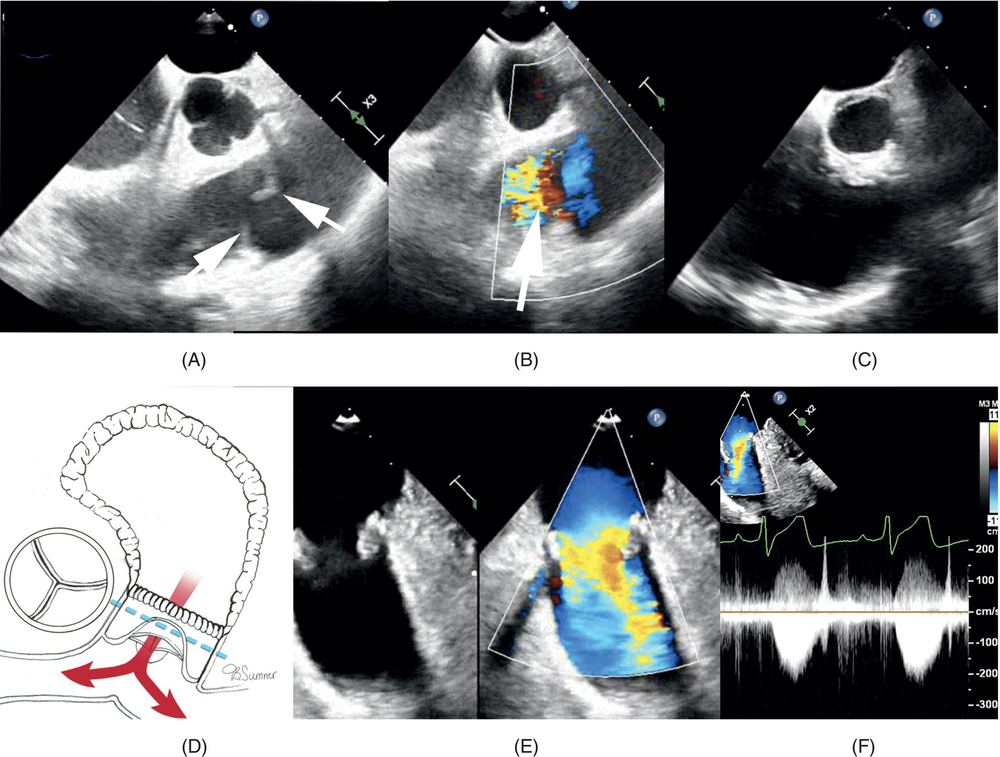

[**Figure 20.6**](#R_c20-fig-0006) Preoperative TEE of an adult patient with congenital PS post balloon dilation palliation as an infant presenting with severe PI for PV replacement; (A) Mid esophageal RV inflow and outflow view showing dysplastic pulmonary valves with lack of coaptation (white arrow); (B) same view with color flow Doppler displaying free PI (white arrow); (C) post CPB RV inflow outflow view with poor visualization of the PV; (D) illustration exhibiting the replaced pulmonary valve in caudal view; (E) epicardial echocardiography showing the PV replacement with 29 mm Epic St. Jude tissue valve 2‐D and color flow Doppler; (F) same view color flow Doppler displaying mild flow acceleration across the pulmonary valve, peak 2.2 m/s and trivial regurgitation. Abbreviations: TTE, transesophageal echocardiography; PS, pulmonary stenosis; PI, pulmonary insufficiency; RV, right ventricle; CPB, cardiopulmonary bypass. Source: Reproduced with permission from Texas Children’s Hospital.

#### Percutaneous pulmonary valve replacement or transcatheter pulmonary valve implantation

Percutaneous pulmonary valve replacement was introduced in the early 2000s with the original case reported by Bonhoeffer in a 12‐year‐old with a stenotic RV to PA conduit \[112\]. Initial indications were in dysfunctional RVOT and RV to PA conduits. It has expanded to patients with PS or PI with previous transannular patches in their original repair and valve in valve stented tissue bioprosthetic valves. There are two commonly available balloon‐expandable valves, the Melody® valve (Medtronic, Minneapolis, MN, USA), a bovine internal jugular valved conduit sewn over a bare metal platinum–iridium stent, and the Sapiens valve (Edwards Lifesciences Corp., Irvine CA, USA), a bovine pericardial valve mounted on a cobalt‐chromium alloy frame. Although the morbidity and mortality for surgical pulmonary valve replacement is less than 1% in most series, the mortality is far less in the percutaneous approach, albeit with an increase in post‐procedural right‐sided endocarditis \[113–115\]. [Table 20.5](#c20-tbl-0005) describes the transcatheter heart valve size recommendations and clinical cases are showed in [Figures 20.7](#c20-fig-0007) and [20.8](#c20-fig-0008).

TOF, pulmonary atresia with an RA to PA conduit, and pulmonary homograft dysfunction post‐Ross procedure are all common reasons for a TPVRI. Although the patients have a much‐reduced length of stay in the hospital, there is a need for careful planning, assessment of comorbidities, a contingency plan for urgent open repair, and a post‐procedural monitored environment. Deep anesthesia with muscle relaxation while deploying the percutaneous valve is desirable to avoid coughing with balloon dilation causing pulmonary hemorrhage, manifesting as a pulmonary hemorrhage, or mal‐deployment/embolization. Complications also include fracture of the conduit/stent, failure to deploy due to too large an annulus, and damage to the tricuspid valve. The pulmonary valve annulus is close to the left main coronary artery, and compression can manifest with ventricular ectopy, ischemic changes in the electrocardiogram, and wall motion abnormality \[116, 117\].

[**Table 20.5**](#R_c20-tbl-0005) Transcatheter Heart Valve size recommendations are based on native valve annulus size, as measured by transesophageal echocardiography, or computed tomography

| Transcatheter valve type | THV Size (mm) | Native valve annulus size by TEE/CT (mm) |
| --- | --- | --- |
| **Melody valve (Medtronic)** | 20 | Up to 20 |
| 22 | Up to 22 |
| **SAPIEN 3 (Edwards)** | 20 | 16–19 |
| 23 | 18–22 |
| 26 | 21–25 |
| 29 | 24–28 |

**Abbreviations: THV, Transcatheter Heart Valve; TEE, transesophageal echocardiography; CT, computed tomography.**

### Tetralogy of Fallot

TOF is the most common repaired cyanotic defect in the ACHD population, and these patients frequent the electrophysiology laboratory, urgent and emergent cardioversion lists, interventional suite for percutaneous valve and branch PA dilatation, and the operating room for pulmonary valve replacement, RVOT plication/remodeling and tricuspid valve repair/annuloplasty. Rarely does an adult present for primary correction in the developed world. Most older adults will present for a re‐intervention or surgery, having had a palliative systemic‐to‐ PA shunt for cyanosis followed by a repair as a child. Younger adults were likely diagnosed in utero and had medical therapy in the first few weeks to months of life and subsequent correction at 3–6 months \[118, 119\]. Most patients will have had a transannular patch to widen the RVOT at the time of repair, and over time they will develop pulmonary insufficiency, RV dilatation, and eventually tricuspid regurgitation due to RV dilatation. A smaller percentage of adults will have restriction of their RVs, which correlates with having had a transannular patch, elevated troponins immediately after repair, inotropic requirements, and prolonged time in the ICU. The restriction appears to protect the RV from ventricular dilatation due to pulmonary insufficiency \[120\]. The optimal timing of a pulmonary valve replacement with or without an RV plication and a tricuspid valve annuloplasty has been challenging to define, but a consensus amongst reference centers is forming. Intervening before RV end‐diastolic volumes of 160 mL/m2 or end‐systolic volumes of 80 mL/m2 and before QRS duration reaching 180 ms suggest improving RV remodeling and reducing the risk of sustained ventricular tachycardia, atrial arrhythmias, and sudden death \[121\].

The burden of arrhythmias for adult TOF is substantial, both atrial and ventricular, along with a lifelong risk of sudden death. A multi‐institutional cross‐sectional study found at least one type of clinically sustained arrhythmia in 79% of TOF patients >18 years with a median age of 36 \[120\]. Atrial arrhythmias, flutter, and fibrillation, correlate with tricuspid regurgitation and older age of repair. Ventricular arrhythmias and sudden death correlate with increased QRS duration and repair at an older age. The assessment of RV function and mass by magnetic resonance is now the gold standard. A multicenter registry, the INDICATOR cohort, of TOF adults has shown that RV hypertrophy, RV dysfunction, and LV dysfunction are defined by magnetic resonance correlate with sustained ventricular tachycardia \[122\]. Similarly, a report from the INDICATOR cohort post adult pulmonary valve replacement found 8% patients experienced sudden death or sustained ventricular tachycardia post pulmonary valve replacement with a median follow‐up of 6.5 years, older age at PVR and pre‐PVR RV hypertrophy, and dysfunction was predictive of shorter time to postoperative death and sustained VT \[122\].

[**Figure 20.7**](#R_c20-fig-0007) Fluoroscopic images of percutaneous pulmonary valve replacement; (A) ACHD patient with TOF and significant RV‐PA conduit stenosis and regurgitation underwent RV‐PA conduit stenting and then Melody® valve (Medtronic, Minneapolis, MN, USA) placement in the RV‐PA conduit, a wide RV‐PA conduit can be seen with no significant regurgitation through the Melody® valve (white arrow); (B) Another ACHD patient with significant pulmonary regurgitation and right ventricle volume overload underwent placement of an Edwards Sapien 3 transcatheter heart valve (Irvine, CA) with no significant regurgitation seen after valve deployment (white arrow).

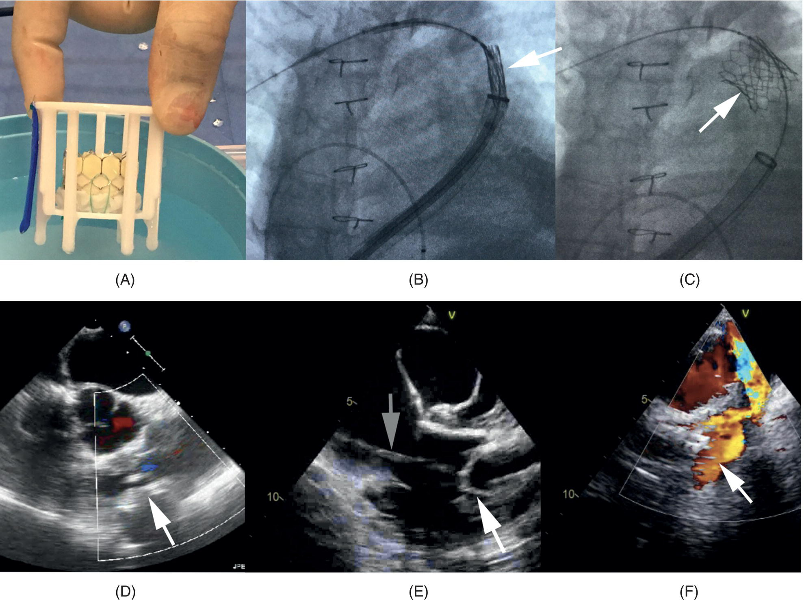

[**Figure 20.8**](#R_c20-fig-0008) Images of the percutaneous insertion of an Edwards Sapien 3 PV transcatheter heart valve (Edwards Lifesciences Corp., Irvine, CA, USA); (A) Edwards sapiens 3 valve size 26 mm; (B) anteroposterior fluoroscopic view pre valve deployment visualizing the valve on the deploying sheath (white arrow); (C) same fluoroscopic observation with the deployed PV in the RVOT (white arrow); (D) post deployment TEE mid esophageal RV inflow and outflow view showing competent PV with trivial PR (white arrow); (E) same TEE window showing a prolapsed percutaneous pulmonary valve in the RV (white arrow) and the deployment sheath through the TV (gray arrow); (F) Color flow Doppler of the prolapsed PV with severe PR (white arrow). Abbreviations: PV, pulmonary valve; RVOT, right ventricular outflow tract; TTE, transesophageal echocardiography; RV, right ventricle; PR, pulmonary regurgitation.

#### Arrhythmia, electrophysiology, and diagnostic procedures

Symptomatic atrial arrhythmias, ventricular tachycardia, and catastrophic ventricular tachycardia/ventricular fibrillation are essential to the anesthesiologist as the hemodynamic considerations of TOF. The adult cardiac anesthesiologist will experience an increasing exposure to TOF patients for electrophysiological mapping, ablation, and insertion of prophylactic defibrillators. The management of hemodynamics depends on the predominance of stenosis or regurgitation of the pulmonary outflow tract. Patients with hypokinetic dilated RV due to pulmonary regurgitation will benefit from spontaneous ventilation and afterload reduction. Those with residual outflow tract gradients will need adequate preload.

#### Cardiac surgery

Management of the adult TOF patient for a pulmonary valve replacement with or without RV plication, tricuspid valve annuloplasty, or cryoablation is the most common surgical procedure in the Society of Thoracic Surgeons’ database with a low <1%, 30‐day mortality in a referral center for ACHD surgery. The hemodynamic goals must focus on maintaining RV contractility, minimizing PVR, and avoiding arrhythmogenic triggers. Intravenous and inhalational agents that diminish contractility have minimal effects on the PVR and minimal arrhythmogenic potential. Ventilation should be at or close to FRC, with minimal positive end‐expiratory pressure (PEEP), and converted to a spontaneous ventilation mode, when possible, once in the postoperative or ICU setting. Along with recognizing the detrimental effects of long‐term pulmonary insufficiency and RV dilatation due to transannular incisions, adult anesthesiologists will see an increasing number of young adults with residual stenosis and outflow tract obstruction for both the operating room and catheterization laboratory. Anticipation of and a treatment plan for both atrial and ventricular arrhythmias is essential \[123\].

In developed nations, adults who have unrepaired TOF frequently come from developing countries and have anatomy favorable to surviving as an adult. They will have all the anesthetic considerations of living with cyanotic heart disease, as well as the co‐morbidities described previously in this chapter. The anesthetic management of an unrepaired TOF patient for definitive repair is described in [Chapter 28](c28.xhtml). There are a few special considerations for the adult patients \[124\]. Patients who survive will likely have aortopulmonary collaterals that can be problematic in the operating room and postoperative ICU management. Preoperative coil embolization of extensive collaterals will reduce the run‐off of aortopulmonary collaterals, which will lower MAP on bypass. However, the pulmonary vasculature may not be well developed, and patients will have less lung reserve. Postoperatively, the pulmonary vasculature will have a total cardiac output and additional left‐to‐right shunting from pulmonary collaterals, and there will be a risk of life‐threatening pulmonary hemorrhage, which may require lung isolation and definitive management in the interventional suite or operating room.

#### Non‐cardiac surgery

Management for the adult repaired TOF for noncardiac surgery will be tailored to the predominant pathology of the RV and pulmonary outflow tract as stated in the discussion of the arrhythmia, electrophysiology, and diagnostic procedures. Comorbidities resulting from living with a dilated and pressure or volume‐loaded right heart such as congestive cirrhosis are needed to be evaluated in the preoperative period. Arrhythmias, both atrial and ventricular, are common, and a preemptive drill with the intraoperative surgical and nursing team at the start of the case is warranted and includes suitable placement of defibrillator pads and a test of contact before prepping. Inotropes to assist with RV dysfunction and pulmonary vasodilators may be necessary. Anesthetic techniques and post‐anesthetic pain management should be mindful of keeping the PVR low. Appropriate postoperative monitoring in an ICU setting for heart failure and arrhythmia is critical.

### Pulmonary atresia

Pulmonary atresia is a heterogeneous diagnosis and has three broad categories. Pulmonary atresia is the absence of direct communication between the ventricular chamber/s and the pulmonary vasculature \[125\]. It is classifieds as:

1.  Pulmonary atresia with an intact ventricular septum is an extreme form of TOF. With an adequately sized ventricle, an intervention is an RV to PA conduit or a “two ventricle repair.”
2.  Pulmonary atresia with VSD patients shares the intracardiac anatomy of TOF without direct communication between the RV and the PA. These patients may have a “two ventricle repair” with the closure of the VSD and an RA to PA conduit.
3.  There is a 3rd group of pulmonary atresia, VSD, and complex univentricular anatomy types with additional defects not suitable for biventricular repair. Patients may have an absence of the main PA, and extensive aortopulmonary collaterals supply the pulmonary vasculature.

The Royal Brompton group reported their experience of a large population of patients labeled as Pulmonary atresia, 227 patients, mean age 25.5 ± 8.7 years, over a median follow‐up of 8.8 years. The patients represented the full spectrum described above and were categorized in one of the three groups above based on original anatomy, and group 1 was subdivided into repaired (a) and unrepaired (b). Interestingly all three groups had no difference in survival (78%) and, there was no significant difference in survival between groups between repaired and unrepaired patients \[125\].

Anesthetic management will depend on the anatomy and type of repair the patient has or has not had in childhood. Many will be managed like TOF with an RV to PA conduit and. Others may be complex single ventricles with aortopulmonary collaterals and segmental pulmonary hypertension and unrepaired or palliated with a Fontan circulation.

* * *

### KEY POINTS: PULMONARY STENOSIS, TETRALOGY OF FALLOT, PULMONARY ATRESIA

-   PS is common and may be asymptomatic until adulthood when right heart failure occurs.
-   TOF is the most common ACHD repaired cyanotic defect; pulmonary valve replacement and arrhythmia treatment are common procedures
-   Pulmonary Atresia is a heterogenous diagnosis and should be managed based on the original anatomy and the surgical intervention (_two ventricle repair_ or Fontan)

* * *

### Congenitally corrected transposition of the great arteries

L‐TGA is also called congenitally corrected transposition of the great arteries (ccTGA), and this is also called congenitally corrected or L‐transposition of the great vessels, terms that confuse many. The term implies that the patients are “born corrected or physiologically compatible with life.” These patients have both AV discordance and ventricular‐great artery (VA) discordance; the RA connects to the morphological LV that is subpulmonic; the LA connects to a morphological RV which is subaortic. L‐TGA is one of the rare CHD with adult presentation that on echocardiography appears erroneously as a normal four‐chamber heart; however, the RV and LV (the tricuspid valve is more apically placed).

Most of these patients have VSDs (60–80%), sub‐valvular or valvular pulmonic stenosis (30–50%), and abnormalities of the systemic AV valve (up to 90%) that is described as Ebstein’s‐like with moderate‐to‐severe systemic AV valve regurgitation \[126\].

In the absence of associated anomalies, these patients present in the second and third decades of life with systemic AV valve regurgitation and symptoms of heart failure. Arrhythmia is a frequent presentation, including complete heart block with increasing age and atrial arrhythmias, usually a symptom or consequence of a more significant problem such as a failing systemic RV with tricuspid regurgitation. Much like the Mustard and Senning patients (see later), they are managed like a patient with dilated cardiomyopathy and likely have a degree of PAH and may be on a transplant or mechanical assist pathway (see [Figure 20.9](#c20-fig-0009)).

Surgical interventions depend primarily on the associated anomalies. The patients with PS who have subpulmonic LVs are trained for systemic pressures and may be candidates for an atrial and arterial “double switch” operation. Patients without subpulmonic obstruction can be considered for sequential PA banding to train the LV for a potential “double switch.” It is a staged process that requires multiple surgical interventions, and many patients improve with the PA band alone, which causes a septal shift due to increased LV pressures and improvement in the systemic RV geometry with less tricuspid regurgitation. This palliation may be a destination on its own, or the patient can proceed to a combined Mustard/Senning with either an arterial switch or a Rastelli procedure \[127, 128\]. Additional details about surgical approaches to L‐TGA are presented in [Chapter 29](c29.xhtml).

### Dextro‐transposition of the great arteries (D‐TGA)

#### D‐TGA mustard or senning baffle

Dextro‐transposition of the great arteries (D‐TGA) patients has atrial–ventricular concordance and ventricular–great artery discordance (see [Figure 20.10](#c20-fig-0010)). The RV is the subaortic and systemic ventricle. Although rarely done now, many adults live with atrial baffle repairs, which redirect the atrial blood to the opposite ventricle (see [Figure 20.11](#c20-fig-0011)). The Senning and Mustard operations were the standard of care, often with a prior temporizing systemic‐to‐pulmonary artery shunt, until the mid‐1980s when the arterial switch became the preferred method. Retrospective reviews reveal the good quality of life until the fourth decade with 25‐year survival rates of 91% in Senning) and 76% in Mustard \[129\]. The drawback is that the RV remains as the systemic ventricle \[129\]. Patients with a Mustard or Senning repair frequently have baffle leaks, obstruction or narrowing of the SVC, IVC or pulmonary veins, atrial sinus arrhythmias, sick sinus syndrome, and inevitably systemic ventricular failure with systemic (tricuspid valve) AV valve regurgitation \[130\].

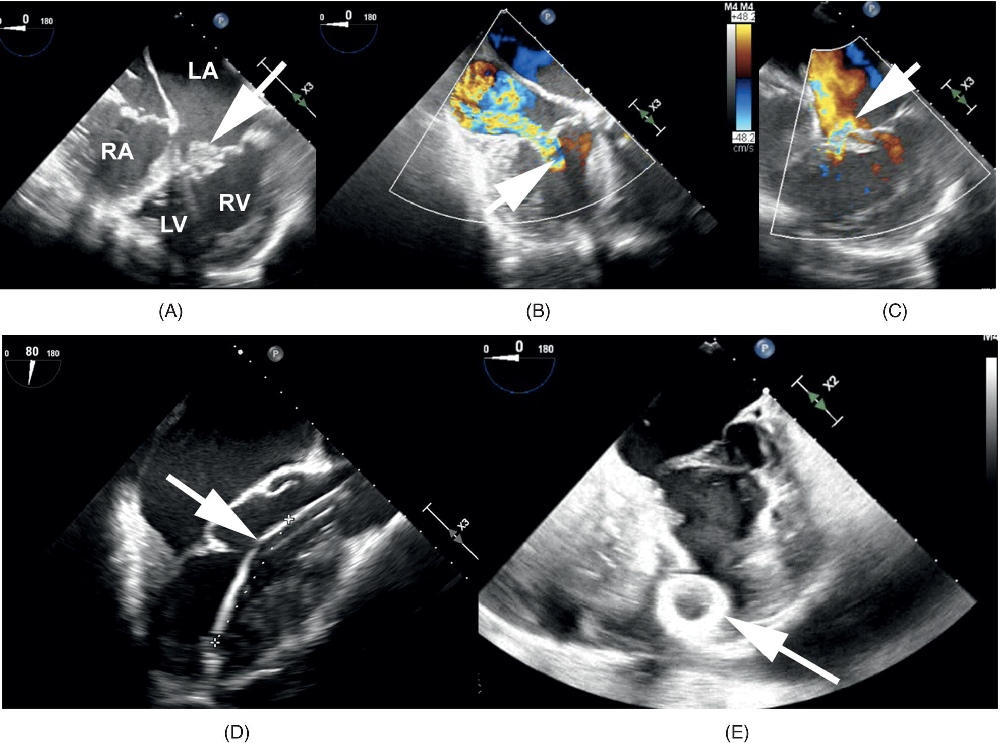

[**Figure 20.9**](#R_c20-fig-0009) TEE images of an L‐TGA patient with end stage heart failure; (A) Mid esophageal four‐chamber views showing the apical displacement of the Ebstenoid TV (Systemic AV valve; (B) Same view focusing on the MV (Pulmonary AV valve) with severe MR (white arrow); (C) Identical window concentrating on the Ebstenoid TV (Systemic AV valve) with moderate TR (white arrow); (D) Mid esophageal long axis view illustrating the Impella percutaneous ventricular assist device in the 6.5 in the LV chamber (white arrow); (E) Mid esophageal four‐chamber view post Heart Mate 3 ventricular assist device implantation visualizing the outflow cannula in the LV cavity (white arrow). Abbreviations: L‐TGA, levo‐transposition of the great arteries; RA, right atrium; RV, right ventricle; LA, left atrium; LV, left ventricle.

![Schematic illustration of the three types of D-TGA presentation; (A) D-TGA with intact interventricular septum; (B) D-TGA with ventricular septal defect; (C) D-TGA with left ventricular outflow obstruction; (D) CT of an ACHD patient with unrepaired D-TGA with large ventricular septal defect and Eisenmenger syndrome, notice the anterior aorta arising from the RV and the dilated main pulmonary artery appearing posteriorly from the LV; (E) CT three-dimensional reconstruction showing the same findings.](images/c20f010.jpg)

[**Figure 20.10**](#R_c20-fig-0010) Illustrations of the three types of D‐TGA presentation; (A) D‐TGA with intact interventricular septum; (B) D‐TGA with ventricular septal defect; (C) D‐TGA with left ventricular outflow obstruction; (D) CT of an ACHD patient with unrepaired D‐TGA with large ventricular septal defect and Eisenmenger syndrome, notice the anterior aorta arising from the RV and the dilated main pulmonary artery appearing posteriorly from the LV; (E) CT three‐dimensional reconstruction showing the same findings. Abbreviations: D‐TGA, dextro‐transposition of the great arteries; ASD, atrial septal defect; RA, right atrium; RV, right ventricle; LA, left atrium; LV, left ventricle; PDA, patent ductus arteriosus; Ao, aorta; MPA, main pulmonary artery; RPA, right pulmonary artery; LPA, left pulmonary artery. Source: Reproduced with permission from Texas Children’s Hospital.

The anatomy can appear complicated; however, there is a physiological correction. A red cell will traverse the cardiopulmonary circulation in an appropriate sequence but with reversed roles of the ventricles. Central venous access can be challenging, as the catheters may get caught up in the baffle or make an abrupt turn from the LV back to the PA. The patients are frequently pacemaker‐dependent with multiple central vein manipulations in the past and narrowed SVC. Hemodynamically, D‐TGA with a subaortic RV repair presents like a dilated cardiomyopathy with a failing systemic ventricle with AV valve regurgitation. Agents to promote contractility and systemic afterload reduction are the goals.

Case reports of PA banding in adults to train the subpulmonic LV for systemic pressure and subsequent take‐down of the Mustard baffle and arterial switch had mixed success, with significant morbidity and mortality \[131\]. Adult patients may present for revision of an obstructed baffle. Far more frequently they are scheduled for pacemaker, defibrillator, and electrophysiology procedures. Cardiac transplantation is technically challenging and may not be possible due to PAH.

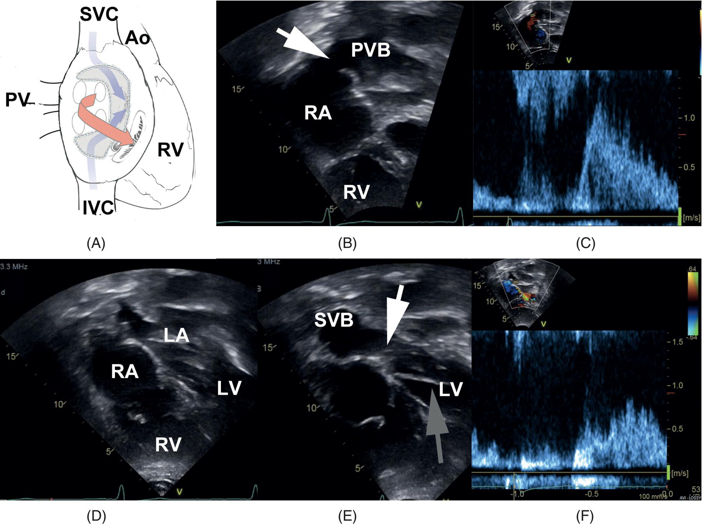

[**Figure 20.11**](#R_c20-fig-0011) (A) Illustration of the Mustard procedure with pulmonary venous baffle to the RV (red arrows) and systemic venous baffle to the LV (blue arrows); (B) TTE echocardiography apical four‐chamber view showing the pulmonary venous baffle to the RA (white arrow); (C) Pulse wave Doppler displaying unobstructed pulmonary vein baffle flow; (D) same window exhibiting moderately dilated and hypertrophied systemic RV; (E) identical view focusing in the systemic venous baffle (white arrow) with a transvenous pacemaker through the baffle (gray arrow); (F) open by pulse wave Doppler. Abbreviations: TTE, transthoracic echocardiography; PV, pulmonary veins; SVC, superior vena cava; Ao, aorta; RV, right ventricle; IVC, inferior vena cava; PVB, pulmonary venous baffle; RA, right atrium; RV, right ventricle; LA, left atrium; LV, left ventricle; SVB, systemic venous baffle.

#### D‐TGA with an arterial switch

In the late 1970s and early in the 1980s, CHD pediatric centers moved from the Senning, and Mustard repairs to the Jatene or arterial switch operation \[132\]. These patients have yet to reach adult centers in large numbers. Still, complications include coronary artery perfusion defects and aneurysms of the neo‐aortic root \[133\]. The advantage is that the LV is the systemic ventricle, with AV and VA synchrony restoration.

#### D‐TGA with VSD and PS and a Rastelli repair

Patients with D‐TGA, VSD, and PS in childhood are amenable to Rastelli repair. This procedure entails an LV tunnel through the VSD to the aorta and extracardiac conduit that connects the RV to the central PA. The systemic ventricle is the LV; however, these patients return for obstruction of their conduits. These are surgical cases with considerable risk of entry into the conduit on sternotomy in the past. Still, increasingly these patients are dealt with in the interventional suite for TPVRI and balloon dilatation of the conduit. Freedom from death or transplant at 20 years is disappointing in this population at 58% \[134\].

* * *

### KEY POINTS: TRANSPOSITION OF THE GREAT ARTERIES

-   L‐TGA may be asymptomatic until adulthood; arrhythmia, including heart block and heart failure, are the usual presenting signs.
-   D‐TGA patients' historical treatment was Mustard or Senning intra‐atrial baffling until the 1980s; problems include frequent arrhythmias and systemic RV failure.
-   The arterial switch became the standard treatment for D‐TGA in the late 1980s; adults may have coronary artery perfusion defects and neo‐aortic aneurysms.

* * *

### Ebstein’s anomaly

Ebstein’s anomaly is a rare anomaly, less than 1% of all CHD, characterized by apical displacement of the septal and posterior leaflets of the TV ([Figure 20.12](#c20-fig-0012)). These leaflets may lack chordae and are therefore attached directly to the ventricular wall. The anatomic change results in tricuspid regurgitation, and atrialization, and reduced functional size of the RV. The anterior leaflet of the tricuspid valve may be large and redundant, resulting in RVOT obstruction. Ebstein’s anomaly is frequently associated with other cardiac anomalies, particularly ASD. Secundum ASD occurs in over 90% of individuals \[135\].

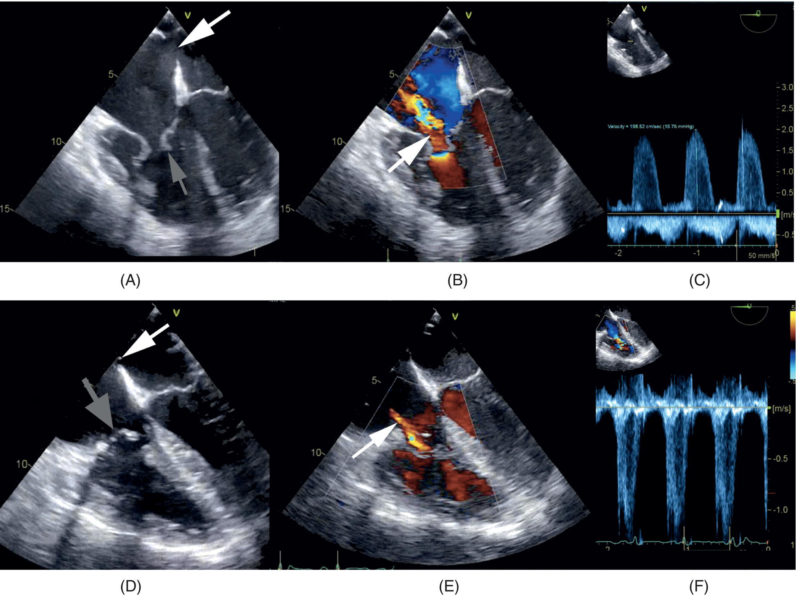

[**Figure 20.12**](#R_c20-fig-0012) Pre‐operative TEE of Ebstein’s anomaly showing mid esophageal four‐chamber view (A) Ebsteinoid/dysplastic tricuspid valve with apical displacement of the septal leaflet (gray arrow), lack of leaflets coaptation and large ASD (white arrow); (B) Color flow Doppler of the same view compatible with moderate‐to‐severe TR (white arrow); (C) Continuous wave Doppler displaying a dense jet with a peak velocity of 2.0 m/s confirming moderate‐to‐severe TR; Postoperative TEE post TV repair, ring annuloplasty and ASD closure at the mid esophageal four‐chamber view (D) annuloplasty ring (gray arrow), small ASD (pop‐off); (E) Continuous wave Doppler with trivial TF jet (white arrow); (F) Pulse wave Doppler of the TV inflow revealing mild stenosis (mean gradient of 5 mmHg) Abbreviations: TEE, transesophageal echocardiography; ASD, atrial septal defect; TR, tricuspid regurgitation; TV, tricuspid valve.

Those with relatively milder disease may present for the first time in adulthood, often presenting as new onset of an atrial arrhythmia. The context may be surgical (e.g., acute cholecystitis, appendicitis) or labor and delivery. The degree of abnormality lies on a broad spectrum of natural history and severity, depending on the degree of displacement of the tricuspid valve leaflets, and the degree of shunting across a PFO or secundum ASD. The first presentation beyond the fifth decade is rare; however, patients may present as late as the eighth decade \[136\]. Older patients most commonly present with arrhythmias, but paradoxical embolus may occur in those with ASD or PFO.

#### Arrhythmia, electrophysiology, and diagnostic procedures

A European multicenter study reported 32 patients (mean age 24 ± 15 years) with atrial arrhythmia of which re‐entry tachycardia was the most common (69%), previous surgery in 9 (32%), prior catheter based ASD closure in 3 (9%). More than 60% of the patients had been on a median of 2 (range 1–4) antiarrhythmics and had a median of 2 (range 1–26) previous cardioversions \[137\].

Several factors must consider in the management of Ebstein's. First, the amount of RV dysfunction followed by shunting at the atrial septum level. The latter could cause paradoxical emboli or reverse shunting and hypoxemia. Ideally, light conscious sedation with oxygen supplementation and avoidance of elevated PaCO2.

In DC cardioversions, pre‐oxygenate the patient and hyperventilate before administering hypnotics. Wait for spontaneous ventilation rather than assist positive breath manual ventilation. Be mindful that the circulation time to render the patient unconscious may be prolonged and resist the temptation to supplement with additional doses. A small dose of benzodiazepines may reduce the total quantity of propofol and lessen the drop in systemic blood pressure and the risk of shunting.

#### Cardiac surgery

The Cone repair was introduced by Da Silva and colleagues and adopted throughout the cardiac surgical community \[138\]. The repair is not exclusive to pediatrics or adults. Two recent series from the Mayo Clinic (USA) and the Institute Jacques‐Cartier (Massey, France) had patient populations with median ages of 19 years and 34 years \[139, 140\]. There is not a reliable predictor of right heart failure post repair. In the Mayo clinic series, 24% of patients had a bidirectional cavopulmonary anastomosis or “one and half” ventricular repair. Also, 13% had an early re‐operation for re‐repair or valve replacement.

A concurrent anti‐arrhythmia procedure, such as the Maze procedure, is frequently performed. In addition, the RV function might be inadequate post‐repair and need support with milrinone and epinephrine. The aim is to minimize PVR and support systemic blood pressure. Conversion to spontaneous ventilation and early extubation is desirable. A relatively fast sinus rhythm appropriate for the age and judicious volume administration is critical. Good communication between the operative and ICU team with a goal for early spontaneous ventilation is vital. [Chapter 28](c28.xhtml) contains an extensive discussion of Ebstein’s anomaly and surgical approaches.

#### Noncardiac surgery

Ebstein’s anomaly is high risk and merits referral to a cardiac reference center for management. Ideally, for elective procedures, a consultation with the multidisciplinary ACHD team and, in emergent cases, contact with the ACHD cardiology team and a congenital cardiac anesthesiologist.

A quarter of the patients had a bidirectional cavopulmonary (Glenn) shunt in the Mayo series \[139\]. The SVC anastomosed to the confluence of the left and right PAs. Care should be taken when placing central lines in these patients, as trauma may occur with the introducer, the wire, or the line itself, and a non‐congenital cardiac anesthesiologist may miss this nuance and not appreciate that the line will transduce PA pressures.

As with TOF and failing hypokinetic RVs, patients with Fontan or total cavopulmonary connection will benefit from spontaneous ventilation techniques where possible. If positive pressure ventilation is indicated, it should be at a volume close to FRC. The RV might need support with milrinone, epinephrine or dobutamine, or a combination. For patients that have high right atrial pressures or cavopulmonary pressure, the head‐down position can exacerbate it. MAP may have to be supported to ensure an adequate cerebral perfusion pressure.

Reversal of left to right shunt can occur even in the presence of device closure of an ASD. Many anesthetic agents, both intravenous and inhalational, are vasodilators that, in conjunction with positive pressure ventilation and insufflation of air or CO2 into a body cavity, can raise intrathoracic pressure and PVR consequence, cause shunt reversal.

### Single‐ventricle anatomy/Fontan physiology

In an adult practice, patients with Fontan and Glenn shunt with single‐ventricle physiology have been, for the most part, patients with tricuspid atresia, pulmonary atresia, and double inlet left ventricle, with morphological LVs as their systemic ventricles. However, increasingly, cardiac anesthesiologists see adults with hypoplastic left heart syndrome (HLHS) and systemic RVs. Fontan and Baudet first described the surgical correction of tricuspid atresia in 1971 \[141\]. There have been subsequent modifications to the procedure, all of which are present in adults followed in ACHD programs (see [Figure 20.13](#c20-fig-0013)) \[142\]. Most ACHD programs converted to either the lateral tunnel or the total cavopulmonary connection in the mid‐1990s. Patients with a Fontan circulation will present for various interventions, including conversion of an RA to PA Fontan to a cavopulmonary connection, cardioversion, epicardial pacemakers, mapping, and ablation, and, in some cases, transplant.

The Australian New Zealand Fontan Registry has reported 413/1428 (29%) survivors of the Fontan procedure that underwent a late cardiothoracic reintervention (median 4.2 years, 30 days to 33 years) post‐Fontan \[143\]. Excluding transplants and extracardiac Fontan conversions (ECFC), the proportion of patients with a dominant LV was consistent at 58% in both the late reintervention group and the no late intervention group. The prevalence of the atriopulmonary Fontan is diminishing and at the time of publication was 15% (see [Table 20.6](#c20-tbl-0006)). Forty‐nine patients underwent Fontan conversion to ECFC at a median time of 18 years (range 5–29 years), and 31 patients underwent a heart transplant post‐Fontan with a median time of 8 years (range 3 months–33 years)

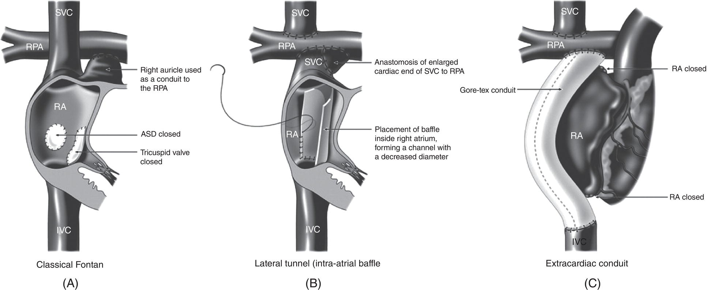

[**Figure 20.13**](#R_c20-fig-0013) Various techniques of the Fontan procedure. (A) Atriopulmonary connection; (B) Lateral tunnel total cavopulmonary connection (TCPC); (C) Extracardiac conduit TCPC. Abbreviations: IVC, inferior vena cava; RA, right atrium; RPA, right pulmonary artery; and SVC, superior vena cava.

(Source: d’Udekem et al. \[142\]. Reproduced with permission from Wolters Kluwer Health, Inc).

[**Table 20.6**](#R_c20-tbl-0006) Late reinterventions excluding transplantation and conversion

Source: Adapted from Daley et al. \[143\].

|  | Overall, n (%) or median (IQR)  
_N_ = 1428 | No late interventions, n (%) median (IQR) _N_ = 1034 | Late interventions, n (%) median (IQR) _N_ = 394 | P – value |
| --- | --- | --- | --- | --- |
| **Dominant LV** | 832 (58) | 602 (58) | 230 (58) | 0.958 |
| **Fontan type** |
| Atriopulmonary | 218 (15) | 116 (11) | 102 (26) | <0.001 |
| Lateral tunnel | 277 (19) | 179 (17) | 98 (25) | <0.001 |
| ECC | 926 (65) | 735 (71) | 191 (48) | <0.001 |
| **Fenestration** | 523 (37) | 340 (24) | 183 (46) | <0.001 |

Abbreviations: IQR, interquartile range; LV, left ventricle; ECC, extracardiac conduit

Catheter‐based interventions occurred in 220/413 (53%), of which fenestration closure was the most common (32%) median age 1.7 years (1 month–23 years) followed by catheter‐based ablation of arrhythmia (13%) median age 20 years (3–31 years). Late re‐operations occurred in 209 patients with pacemaker‐related procedures occurring in 176 patients at a median age of 8.2 years (3.5–18 years). The remaining surgical interventions were in a pediatric age group with median ages less than 8 years and ranged into the late adolescent age. All late interventions described are markers for increased mortality \[143\].

The Mayo Clinic published their admissions experience of Fontan patients 18+ years over 25 years 1990–2015. There were 853 hospital admissions in 367 patients median age 31y +/− 7 years with a Fontan circulation, of which 259 (71%) had an atriopulmonary Fontan. Most of the admissions were arrhythmia‐related 282 (33%), management, cardioversion, mapping, ablation, or heart failure‐related 169 (20%). A minority had either cardiac 133 (16%) or noncardiac surgery 51 (9%)\[144\] (see [Table 20.7](#c20-tbl-0007)).

[**Table 20.7**](#R_c20-tbl-0007) Procedures and outcomes of inpatient Fontan patients

Source: Adapted from Egbe et al. \[144\]

|  | N | LOS (d) | In‐hospital mortality |
| --- | --- | --- | --- |
| **Fontan conversion/revision** | 78 (9%) | 6 (4–9) | 10 (13%) |
| **Valve replacement/repair** | 41 (7%) | 5 (4–8) | 5 (12%) |
| **Epicardial pacemakers/defibrillators** [_a_](#c20-note-0007) | 14 (2%) | 3 (2–5) | 0 |
| **Non cardiac procedures requiring GA** | 51 (9%) | 3 (2–6) | 1 (2%) |

[_a_](#R_c20-note-0007) Include surgical lead/generator implantation or revision.

Abbreviations: LOS, length of stay; d, days; GA, general anesthesia

Most anesthetic encounters will be for nonsurgical interventions. Still, there will be cardiac and noncardiac surgical care in adults, rarely for a Fontan conversion/revision &/or transplant (see [Figures 20.14](#c20-fig-0014) and [20.15](#c20-fig-0015)). The physiological considerations are the same for the encounters but increasing complexity when the procedure conflicts with the physiological goals. A standard same‐day procedure frequently will require in‐hospital postoperative admission.

#### Arrhythmia, electrophysiology, and diagnostic procedures

The is no direct vascular access to the heart in lateral tunnel Fontan or a total cavopulmonary connection challenging the anesthesiologists. Challenges exist for cardioversion, mapping, and atrial ablation arrhythmias. Cardioversion of the adult Fontan can be safe but requires planning \[145\].

Arrhythmia is a significant complication of the original Fontan conversion and often signals the beginning of failing Fontan circulation and subsequent decreases in quality of life. Medical management is usually ineffective at preventing arrhythmia recurrence, and the required electrophysiological studies are complex and time‐consuming but less so than a Fontan conversion. Early referral for radiofrequency ablation or Fontan conversion is essential as a longer duration of arrhythmia is a risk factor for arrhythmia recurrence \[146\].

The goals in an electrophysiology intervention are to maintain spontaneous ventilation without inadvertently raising the PaCO2 of the patient and adversely affecting the PVR and diminishing trans pulmonary blood flow. Trans‐conduit mapping is possible with radiofrequency transeptal techniques. Fenestrations to the atrium from the lateral tunnel or the conduit of the cavopulmonary connection are a restricted window for the electrophysiologist, akin to painting an interior room of a house through a small window in an exterior wall while standing on a ladder. Remote magnetic navigation uses retrograde access; however, it is a costly setup and not widely available \[147\]. The procedures are lengthy for both the anesthesiologist and the patient. The patient must not be too sedated so that the electrophysiologist physician can map the arrhythmia and yet should be comfortable to remain still for several hours. Conversion to a spontaneously breathing technique with a supraglottic airway is an option. Recovery in a monitored environment is essential. A checklist for cardioversion in the Fontan patient is presented in [Table 20.8](#c20-tbl-0008).

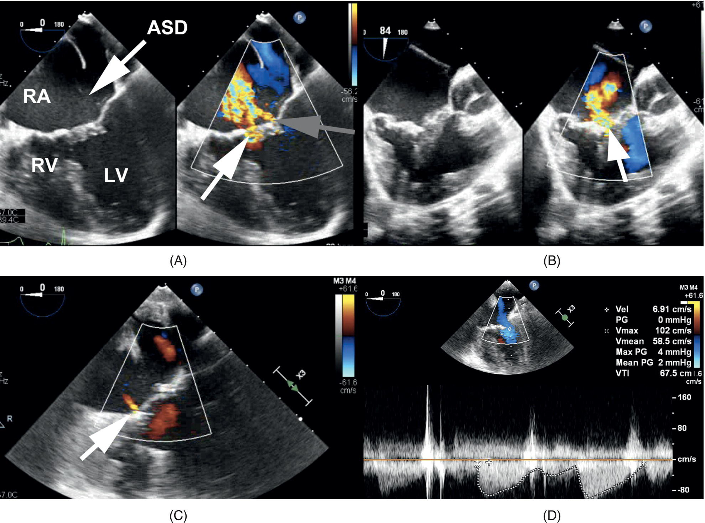

[**Figure 20.14**](#R_c20-fig-0014) TEE images of a Fontan patient with unbalanced CAVC Rastelli type 3 (hypoplastic RV) with an unrestrictive primum ASD (white arrow) and severe AVV regurgitation who underwent AVV repair; (A) Mid esophageal four‐chamber view showing a complex AVV regurgitation jet with two different components, a bigger jet along commissures between the superior bridging, inferior bridging, and right lateral leaflets (white arrow) and a smaller regurgitant jet between the superior bridging and inferior bridging leaflets (gray arrow); (B) Mid esophageal two‐chamber view displaying the complex AVV regurgitation (arrow); (C) Mid esophageal four‐chamber view exhibiting trivial regurgitation post AVV repair; (D) Pulse wave Doppler at the same window without evidence of AVV stenoses with a mean gradient of 2 mmHg. Abbreviations: RA, right atrium; RV, right ventricle; ASD, atrial septal defect; LV, left ventricle; AVV, atrioventricular valve.

#### Fontan conversion

Several centers have published successful case series of Fontan conversion with concomitant arrhythmia surgery. The median age varies from late teens to early adulthood \[148, 149\]. The goal is to improve hemodynamic and loss of energy in the blood flowing into the PA, lessen the risk of thrombo‐embolic events, and prevent atrial dilatation and subsequent arrhythmias. A recent publication of a multicenter study of 522 adult patients found atrial arrhythmias were substantially lower with a total cavopulmonary connection Fontan compared to atrio‐pulmonary Fontan. The median duration of follow‐up was 11.6 years. Forty of the 522 patients underwent conversion from an atrio‐pulmonary Fontan \[25\] or a lateral tunnel \[12\], and three had the transformation of an intracardiac to an extracardiac circulation \[150\].

Fontan conversions are a high‐risk surgical procedure due to the complex anatomy and multiple previous operations. The anesthetic and ICU goals are to use agents and ventilation strategies that minimize PVR. Intraoperative or early ICU extubation is the goal. Conversion to an ECFC may improve quality of life and lessen the arrhythmia burden, but it is uncertain if this will translate to improved mortality. An extensive follow‐up cohort in Boston found no difference in long‐term survival between RA to PA connection Fontan and total cavopulmonary connections \[150\]. An analysis of 683 adult survivors in the Australian New Zealand Fontan registry found survival at 30 years of age was 86% for patients with atriopulmonary Fontan versus 93% for patients with an extracardiac Fontan. The differences in survival may be due to an era effect rather than technique, and the most common mode of death was cardiac failure. Only 9/683 had a conversion, and it is uncertain if conversion at an adult will translate to improved survival \[151\].

#### Noncardiac surgery and the patient with a Glenn Shunt, Hemi‐Fontan, or Fontan

Reference centers cannot meet the demands of obstetrical and noncardiac of all patients with complex CHD. However, those with single ventricles, Glenn with a “One and a Half” ventricle repair, and those with Fontan palliation must be reviewed by a multidisciplinary team or referred for management. Patient preference is a significant driver of choosing to go to a reference center rather than stay in the community. The Mayo Clinic group analyzed 538 noncardiac procedures in 154 Fontan patients (mean age, 30 years) from 1990 to 2015. A broad range of procedures and anesthetics were included, except for neurosurgical/intracranial. Fifty‐one (9%) of the patients required general anesthesia. Overall, hypoxia was the most common intraoperative and postoperative complication, followed by hypotension and arrhythmia \[152\].

[**Figure 20.15**](#R_c20-fig-0015) (A) Illustration of the Fontan circulation in HLHS; (B) TEE short axis view showing an immobile echo density visualized in the posterior wall of the Fontan baffle (white arrow); (C) TEE long axis view displaying another immobile echo density in the anterior medial wall of the Fontan baffle (white arrow). Abbreviations: RA, right atrium; RV, right ventricle; LA, left atrium; LV, left ventricle; HLHS, hypoplastic left heart syndrome. Source: Reproduced with permission from Texas Children’s Hospital.

[**Table 20.8**](#R_c20-tbl-0008) Check list for cardioversion in the fontan patient

<table border="1"><tbody class="tdcolor6"><tr><td class="left"><ol class="decimal" id="c20-list-0029"><li id="c20-li-0105">Pacing pads on A‐P</li></ol></td><td>□</td></tr><tr><td class="left"><ol id="c20-list-0030"><li value="2" id="c20-li-0106">Central location in the hospital</li></ol></td><td>□</td></tr><tr><td class="left"><ol id="c20-list-0031"><li value="3" id="c20-li-0107">Notification of an experienced colleague to call for assistance.</li></ol></td><td>□</td></tr><tr><td class="left"><ol id="c20-list-0032"><li value="4" id="c20-li-0108">Resuscitation drugs, epinephrine, calcium, immediately available</li></ol></td><td>□</td></tr><tr><td class="left"><ol id="c20-list-0033"><li value="5" id="c20-li-0109">Large gauge iv</li></ol></td><td>□</td></tr><tr><td class="left"><ol id="c20-list-0034"><li value="6" id="c20-li-0110">Avoid positive pressure ventilation, pre‐oxygenate prior to the electrical stimulus.</li></ol></td><td>□</td></tr><tr><td class="left"><ol id="c20-list-0035"><li value="7" id="c20-li-0111">“Light” use of hypnotics and patience in waiting for the circulation and loss of consciousness.</li></ol></td><td>□</td></tr><tr><td class="left"><ol id="c20-list-0036"><li value="8" id="c20-li-0112">A plan for treating bradyarrhythmia post conversion.</li></ol></td><td class="left">□</td></tr></tbody></table>

Multidisciplinary team consultation assessing the procedure’s impact on single ventricle physiology patients must be evaluated by an interdisciplinary team. For example, a college student living away from home, with good systemic ventricular function and free of arrhythmias, needing dental extractions can be managed in a regional hospital setting with clear lines of referral to the reference center if required. Alternatively, a patient with decreased single ventricular function needing an urgent intrabdominal procedure will need care in a tertiary center. Neurosurgical patients (e.g., spinal instrumentation) merit both a cardiac anesthesiologist and a subspecialty neurosurgical anesthesiologist.

A classic Glenn shunt is an SVC directly anastomosed to the right PA. A bi‐directional Glenn shunt is the SVC anastomosed to the confluence of the left and right PAs. When placing central lines in patients with Glenn shunts; trauma may occur with the introducer, the wire, or the line itself. Fontan patients have no “pump” for systemic venous return to get to the LA. For successful management, they must have adequate right‐sided filling pressures, low PVR, unobstructed pulmonary vein inflow to the LA, AV synchrony, a competent systemic AV valve with laminar inflow, no outflow tract obstruction, and reduced afterload for the systemic ventricle. Patients may have had a fenestration from the Fontan connection to the systemic or common atrium, and precautions for venous emboli to the systemic circulation will be needed. Conversion to the spontaneous breathing mode of ventilation and early extubation are the objectives at the end of surgery.

* * *

### KEY POINTS: SINGLE‐VENTRICLE/FONTAN ANATOMY

-   Early Fontan palliations due to right heart failure and arrhythmias necessitate conversion to lateral tunnel or extracardiac connections in some adults.
-   Treatment of HLHS with the Fontan operation since the 1980s has created a growing population of young adults with failure of the systemic RV.
-   Avoidance of prolonged positive pressure ventilation and hypovolemia are important anesthetic considerations.
-   Arrhythmia procedures, mapping/ablation, pacemakers, and cardioversion are frequent in the adult Fontan and require careful planning and backup during emergencies.

* * *

## Heart failure in ACHD

End‐stage heart disease (ESHD) is particularly prevalent in single ventricle physiology (e.g., Fontan), systemic RV (d‐TGA after Mustard/Senning or L‐TGA), severe PAH (e.g., Eisenmenger‐Syndrome), and severe valvular heart disease (e.g., post‐CAVC repair) \[153\]. Traditionally, the treatment of ESHD is an orthotropic heart transplant. Patients with ACHD listed for transplant spend more time in the waiting list due to antibody sensitization to red cell antigens, and complex anatomy requiring specific graft allocation (e.g., need for extensive PA or aortic reconstruction). Formerly rare, patients with ACHD are now increasingly supported with VAD. Earlier use of VAD before the development of multiorgan failure increases survival in the ACHD population \[154\]. Only 5% of the adult heart transplant population are patients with ACHD \[155\]. Failing Fontan patients due to the high incidence of liver and renal failure need to be listed early even though multi‐solid organ transplantation has been performed successfully \[156\]. Patients with Fontan circulation, complex anatomy, and PAH have a higher surgical risk \[157\].

## Noncardiac surgery in the adult with CHD

Congenital cardiac anesthesiologists and intensivists have an exceptional understanding of ACHD patient’s unique physiology. They must play a leadership role, providing care directly or advising colleagues in the community how best to provide care for these patients and when it is necessary to transfer care. This expertise is not limited to the operating room but should also be available in preoperative optimization and planning, postoperative monitoring, and pain management \[158–161\]. There are patient factors that will bias toward management at the tertiary referral center (see [Table 20.9](#c20-tbl-0009)). Should an event occur in an ACHD center, there is much more latitude in the deployment of staff to assist in a hemodynamic or volume resuscitation.

Laparoscopic and video‐assisted is becoming the standard for general surgical, gynecological, and urological operations. For example, thoracic surgery utilizes air insufflation, as the chest wall is rigid, and CO2 is not needed. PVR will rise if the lung is atelectatic during one‐lung ventilation but not from absorption insufflated CO2. Similarly, in robotic surgery, insufflation of air with mechanical tenting of the abdominal wall is used. Insufflation of CO2 might affect the PVR, but minimally invasive approaches improve postoperative recovery. Patient positioning (e.g., prone, lateral, Trendelenburg, or reverse Trendelenburg) may exacerbate or alleviate this conflict. The team should have a clear plan for conversion to an open procedure. Although challenging for the anesthesiologist, the patient benefits from a closed procedure and avoids the complications of a large incision. Additional benefits include less intravenous opioid use and will be less likely to have chest splinting, atelectasis, and elevated PaCO2.

[**Table 20.9**](#R_c20-tbl-0009) Red flags for referral to a reference center

<table border="1"><tbody class="tdcolor6"><tr><td class="left">Cyanosis or a deterioration in oxygenation from baseline</td><td>□</td></tr><tr><td class="left">Single ventricle</td><td>□</td></tr><tr><td class="left">Glenn or Fontan palliations</td><td>□</td></tr><tr><td class="left">Pulmonary hypertension</td><td>□</td></tr><tr><td class="left">New onset of arrhythmia or difficult rate control in an established atrial arrhythmia</td><td>□</td></tr><tr><td class="left">Systemic hypotension in relation to the patient’s baseline</td><td>□</td></tr><tr><td class="left">Systemic ventricle dysfunction</td><td>□</td></tr></tbody></table>

Head and neck and upper airway surgery with either a controlled airway or suspension laryngoscopies for glottic and subglottic complications of prolonged intubation are not unusual cases in patients with ACHD. It is not the choice of anesthesia agents but the maintenance of physiologic goals that is the challenge. Spontaneous ventilation in a PVR dependent patient will eliminate the concerns of positive pressure ventilation impeding blood flow from the vena cavae and right to the LA. Laryngoscopy and bronchoscopy with jet ventilation are challenging procedures in single ventricle, PAH, and shunt physiology patients.

Major spine surgery in the prone position is demanding in ordinary circumstances and, more so in patients with ACHD. Retrospective single‐center reviews of complex CHD adolescent patients highlight multidisciplinary team planning and perioperative management \[162, 163\]. Pulmonary function evaluation preoperatively is indicated \[164\]. In larger, multi‐level cases, considerable blood loss can occur, and blood conservation strategies are required. In addition, the technical challenges of spinal instrumentation in patients with complex cardiac disease merit a multidisciplinary anesthesia team (e.g., cardiac and neuro anesthesia). The one teaching hospital death in a long series of Eisenmenger syndrome adults for noncardiac surgery was an inpatient who had come in for spinal instrumentation \[165\].

Many patients will be receiving ongoing monitoring and support in an established ACHD center; however, frequently, a surgeon will be the patient’s first contact with a specialist physician in several years of having been lost to follow‐up. Community anesthesiologists and surgeons are in a unique situation to identify a patient at risk and, in addition to pre‐, intra‐, and postoperative care, reconnect them to an ACHD team for subsequent care. The consultant ACHD anesthesiologist can facilitate the surgery and act as a resource for the noncardiac anesthesiologist \[158\].

## Conclusions

The survivor ACHD patient of a pediatric intervention or presenting for the first time as an adult may need anesthesia care for diagnostic, therapeutic, noncardiac surgery, cardiac surgery, and ICU management. The skills, knowledge, and career experience of a congenital cardiac anesthesiologist are vital to the care of this unique patient population. In addition, as the proportion of adults living with CHD continues to dominate the congenital cardiac population increasing resources at reference centers and the ability to support patients in the community setting with outreach and referral lines is essential to the well‐being of these patient populations.

## Selected references

_A full reference list for this chapter is available at:_

[http://www.wiley.com/go/andropoulos/congenitalheart](http://www.wiley.com/go/andropoulos/congenitalheart)

1.  10 Stout KK, Daniels CJ, Aboulhosn JA, et al. 2018 AHA/ACC guideline for the management of adults with congenital heart disease: a report of the American College of Cardiology/American Heart Association Task Force on Clinical Practice Guidelines. Circulation \[Internet\] 2019 \[cited 2021 May 16\]; 139(14). [https://www.ahajournals.org/doi/10.1161/CIR.0000000000000603](https://www.ahajournals.org/doi/10.1161/CIR.0000000000000603). AHA/ACC is a detailed, evidence‐based practice guideline for the Management of Adults with Congenital Heart Disease. It discussed the role of the cardiac anesthesiologist in the perioperative period.
2.  33 Favoccia C, Constantine AH, Wort SJ, Dimopoulos K. Eisenmenger syndrome and other types of pulmonary arterial hypertension related to adult congenital heart disease. Exp Rev Cardiovasc Ther 2019; 17(6). This paper is an overview of Eisenmenger syndrome and other types of pulmonary arterial hypertension related to ACHD. In addition, the authors described the medical management in tertiary centers, emphasizing comorbidities and complications.
3.  52 Gordon‐Walker TT, Bove K, Veldtman G. Fontan‐associated liver disease: a review. J Cardiol 2019; 74(3). This comprehensive review article tackles all the liver disorders secondary to Fontan physiology. It is well written and has didactic illustrations.
4.  64 Regitz‐Zagrosek V, Roos‐Hesselink JW, Bauersachs J, et al. 2018 ESC Guidelines for the management of cardiovascular diseases during pregnancy. Eur Heart J 2018; 39(34):3165–241. [https://doi.org/10.1093/eurheartj/ehy340](https://doi.org/10.1093/eurheartj/ehy340). The European Society of Cardiology (ESC) summarizes and evaluates all available evidence of acquired and congenital cardiovascular diseases during pregnancy. In addition, the ACHD section analyses the implication of each congenital lesion individually through pregnancy.
5.  68 Canobbio MM, Warnes CA, Aboulhosn J, et al. Management of pregnancy in patients with complex congenital heart disease: a scientific statement for healthcare professionals from the American Heart Association. Circulation 2017; 135(8):e50–e87. [https://doi.org/10.1161/CIR.0000000000000458](https://doi.org/10.1161/CIR.0000000000000458). The scientific statement by the AHA addresses the management of preconception counseling, evaluation of maternal‐fetal risk and pregnancy referral, and treatment.
6.  92 Arendt KW, Lindley KJ. Obstetric anesthesia management of the patient with cardiac disease. Int J Obstet Anesth 2019; 37. [https://doi.org/10.1016/j.ijoa.2018.09.011](https://doi.org/10.1016/j.ijoa.2018.09.011). The authors published a review article on the obstetric anesthesia management of the patient with acquired and congenital heart disease. In addition, didactic tables present the pregnancy effects and anesthetic goals for each cardiovascular disease in pregnancy.
7.  121 Mongeon F‐P, ben Ali W, Khairy P, et al. Pulmonary valve replacement for pulmonary regurgitation in adults with tetralogy of Fallot: a meta‐analysis – a report for the Writing Committee of the 2019 Update of the Canadian Cardiovascular Society Guidelines for the Management of Adults With Congenital Heart Disease. Can J Cardiol 2019; 35(12). The consensus paper highlights the evolution of Tetralogy of Fallot repair over time and how different eras have varying outcomes for the adult patients. It also highlights the way forward for the ACHD community is participation is international registries examine disease specific lesions.
8.  125 Montanaro C, Merola A, Kempny A, et al. The outcome of adults born with pulmonary atresia: high morbidity and mortality irrespective of repair. Int J Cardiol 2019; 280. This article demonstrates the complexity and heterogeneity of Pulmonary atresia. Anaesthetic management must be tailored to the individual patient's anatomy.
9.  143 Daley M, du Plessis K, Zannino D, et al. Reintervention and survival in 1428 patients in the Australian and New Zealand Fontan Registry. Heart 2020; 106(10). This article highlights the evolution of the Fontan procedure since introduction in 1971 and the nuances in managing the mature Fontan patients.
10.  157 Bryant III R, Morales D. Overview of adult congenital heart transplants. Ann Cardiothorac Surg 2018; 7(1). The authors present a review article with the current challenges of the ACHD end‐stage population. They describe the scope of ACHD transplantation, mechanisms of ventricular dysfunction in ACHD, and the indications and potential contraindications for transplant.