CHAPTER 21 Hemodynamic Management 

# CHAPTER 21  
Hemodynamic Management

_Mirela Bojan1 and Philippe Pouard2_

1 Department of Anesthesiology, Congenital Cardiac Unit, Hôpital Marie Lannelongue, Groupe Hospitalier Paris‐Saint Joseph, Le Plessis Robinson, France

2 Head of Intensive Care, Anaesthesia and Perfusion Unit, Reference Center for Complex Congenital Heart Disease, University Hospital Necker Enfants Malades, René Descartes University, Paris, France

* * *

-   [**Introduction: Hemodynamic management following congenital heart disease surgery: a goal‐directed approach**](#head-2-205)
-   [**The VO2/DO2 balance following CHD surgery**](#head-2-206)
    -   [Mechanisms underlying increases in VO2 following CHD surgery](#head-3-325)
    -   [Mechanisms underlying reduced DO2 following CHD surgery](#head-3-326)
-   [**Improving postoperative oxygen transport balance: preventive and therapeutic interventions**](#head-2-210)
-   [**Inotropic agents**](#head-2-211)
    -   [Vasoconstrictors](#head-3-328)
    -   [Systemic vasodilators](#head-3-329)
    -   [Pulmonary vasodilators](#head-3-330)
    -   [Other strategies to improve circulatory function](#head-3-331)
    -   [Current practices](#head-3-332)
    -   [Inotropic and vasoactive scores](#head-3-333)
    -   [Individualized perioperative hemodynamic management](#head-3-334)
-   [**Cardiopulmonary interactions**](#head-2-212)
    -   [Effects of changes in intrathoracic pressure](#head-3-335)
    -   [Individualized management of the ventilation parameters and cardiopulmonary interactions](#head-3-336)
-   [**Monitoring**](#head-2-213)
    -   [Clinical hemodynamic variables and standard perioperative monitoring](#head-3-337)
    -   [Assessment of cardiac output](#head-3-338)
    -   [Near infra‐red spectroscopy](#head-3-339)
    -   [Mixed venous saturation](#head-3-340)
    -   [Blood lactate](#head-3-341)
    -   [Central venous to arterial CO2 difference](#head-3-342)
    -   [Current practices](#head-3-343)
-   [**Conclusion**](#head-2-215)
-   [**Selected references**](#head-2-216)

* * *

## Introduction: Hemodynamic management following congenital heart disease surgery: a goal‐directed approach

Guidelines delineate limits within which decisions can be made regarding the management of specific clinical problems to improve outcome. A more prescriptive approach often takes the form of “goal‐directed” therapy, and the key to the success of any goal‐directed therapy is the selection of the specific goal \[1\]. A meta‐analysis of randomized studies of adult patients \[2\] in various postoperative settings demonstrated a strong relationship between the duration and magnitude of oxygen debt and outcomes in high‐risk patients. There was a significant improvement in survival when pulmonary artery catheter goal‐directed therapy was administered early or prophylactically (within 12–24‐hour postsurgery or before organ failure occurred) to increase the cardiac index and oxygen delivery (DO2). The aim of this goal‐directed therapy was intervention before hemodynamic compromise or critical organ system compromise occurred, because no amount of extra oxygen would rescue irreversible oxygen debt, organ failure, or cell death. Maintaining adequate tissue oxygenation, which is accomplished by optimizing oxygen transport balance, i.e., maintaining systemic DO2 and minimizing oxygen consumption (VO2), should prevent oxygen debt and improve outcome. In complex and high‐risk situations, such as following congenital heart disease (CHD) surgery, the use of evidence‐based clinical guidelines and associated goal‐directed therapy has the potential to improve clinical outcomes. Preventing oxygen debt is probably the ultimate goal when treating children who have undergone surgery for CHD.

## The VO2/DO2 balance following CHD surgery

In 1995, Wernovsky et al. published a prospective study comparing deep hypothermic circulatory arrest and continuous low‐flow cardiopulmonary bypass in neonates undergoing the arterial switch operation \[3\]. The perfusion strategy assignment was not associated with the postoperative hemodynamics. However, the hemodynamic measurements performed on 122 patients revealed that during the first postoperative night, the cardiac index decreased by average 30% in almost one quarter of patients. Consequently, much effort has been put into augmenting CO, and the PRIMACORP study \[4\] demonstrating the benefit of the preventive use of a potent vasodilator to increase CO was a milestone in the field. Later on, using continuous respiratory mass spectroscopy to measure oxygen consumption, arterial, superior vena cava (SVC), and pulmonary venous saturations to measure DO2 in 14 neonates undergoing the Norwood procedure, Li et al. \[5\] reported low CO and systemic DO2 during the first 12 postoperative hours; VO2 was high postoperatively and progressively decreased over the first 24 hours. The decrease in VO2 during the first 24 h was the main contributor to improving the VO2/DO2 balance, pointing to the rationality of postoperative strategies to decrease VO2 in critical cases.

A pathologic imbalance between VO2 and DO2 is thought to be the mechanism underlying anaerobic metabolism, multisystem organ failure, and death. The oxygen extraction rate (OER), calculated as

[(21.1)](#R_c21-disp-0001)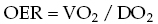 

might best reflect the oxygen consumption/delivery balance. The normal ratio of four to five times the amount of DO2 to VO2 suggests considerable reserve, and decreasing this factor (or increasing the OER) reflects less cardiovascular reserve. At high DO2, VO2 remains both stable and oxygen supply independent. During periods of reduced DO2, aerobic metabolism is maintained initially through increased oxygen extraction by the tissues. Through this mechanism, VO2 remains independent of DO2 until a critical OER is reached. At that point, which is generally thought to correspond to an OER between 0.5 and 0.6, \[6\], VO2 becomes oxygen supply‐dependent and drops linearly to zero if DO2 decreases further. An OER above 0.5 has a positive predictive value of 74% for postoperative death in infants following CHD surgery \[7\]. The inflection point between the two slopes of the DO2 curve indicates the critical level of DO2. An illustration of these relationships is shown in [Figure 21.1](#c21-fig-0001).

The relationship is altered further when VO2 increases. When VO2 increases, which is common in the postoperative period, the critical DO2 also increases, as shown in [Figure 21.1](#c21-fig-0001), meaning that a VO2/DO2 imbalance occurs at higher DO2 levels. Therefore, it follows that one of the postoperative strategies is to increase DO2 to delay the point at which a VO2/DO2 imbalance may occur.

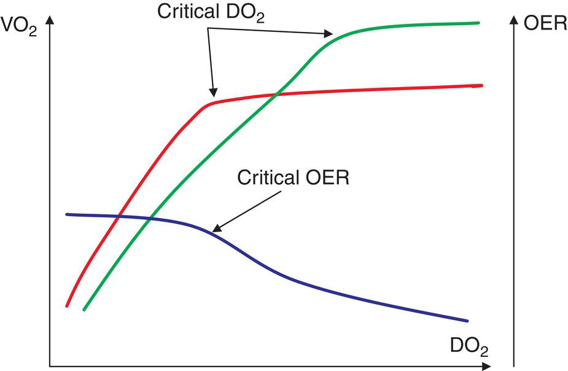

[**Figure 21.1**](#R_c21-fig-0001) Pathophysiological changes in the relationship between oxygen consumption (VO2) and oxygen delivery (DO2).

(Source: Squara \[8\]. Reproduced with permission of Springer Nature.)

The Fick equation states that

(21.2)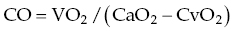 

where CO is the cardiac output, and CaO2 and CvO2 are the oxygen content of arterial and venous blood, respectively. At steady state, on the basis of the law of mass conservation, oxygen consumption and delivery must be equal.

(21.3)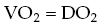 

In the setting of CHD, DO2 is a resultant of several factors.

In the absence of intracardiac shunting, CO is equivalent to the systemic output (QS) and the pulmonary output (QP).

(21.4) 

and systemic DO2 is a linear function of CO and CaO2:

[(21.5)](#R_c21-disp-0005)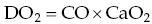 

These indexes change slightly in patients with univentricular physiology, as described below \[9, 10\].

Following the first stage of the Norwood palliation, the systemic and pulmonary circulations become parallel, and the single ventricle assumes both the systemic and the pulmonary output:

(21.6)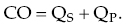 

If making the assumption that the pulmonary oxygen uptake equals VO2, then one can write separately:

(21.7)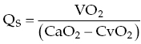 

and

(21.8)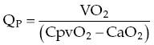 

where CpvO2 is the pulmonary venous blood oxygen content.

We can combine these equations as follows:

[(21.9)](#R_c21-disp-0009) 

which shows that DO2 is a complex function of CO, pulmonary venous oxygen content, VO2 and QP/QS ratio \[9\].

Following the bidirectional Glenn anastomosis, the blood that normally drains into the right atrium (RA) from the SVC is redirected to the pulmonary artery, and forms a combined upper systemic and pulmonary circulation, which is in parallel with the lower systemic circulation. The overall CO is a sum of the upper and lower systemic output:

(21.10) 

Since QP = QSVC, it results that

(21.11) 

On the other hand,

(21.12)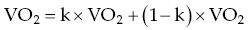 

states that the whole‐body VO2 is the sum of the upper body oxygen consumption (k × VO2) and that of the lower body \[(1 − k) × VO2\], where k is the fraction consumed by the upper body.

If making the assumption that oxygen uptake through the pulmonary circulation equals VO2, then one can write separately:

(21.13) 

and

(21.14) 

We can combine these equations as follows:

[(21.15)](#R_c21-disp-0015)![upper D upper O 2 equals upper C upper O times upper C p v upper O 2 minus left-parenthesis 1 plus normal upper Q Subscript upper S upper V upper C Baseline slash normal upper Q Subscript upper I upper V upper C Baseline right-parenthesis times StartFraction left-parenthesis left-parenthesis 1 minus normal k right-parenthesis times upper V upper O 2 right-parenthesis Over left-parenthesis normal upper Q Subscript upper S upper V upper C Baseline slash normal upper Q Subscript upper I upper V upper C Baseline right-parenthesis EndFraction](images/c21-disp-0015.png) 

which shows that DO2 is a complex function of cardiac output, pulmonary venous blood oxygen content, lower body oxygen consumption and QSVC/ QIVC ratio \[10\].

To resume, albeit in a majority of patients, the postoperative DO2 is a linear function of CO and CaO2, there are cases where DO2 is a complex function of several other factors. Thus, if the goal is to balance postoperative VO2/DO2, then focusing on CO alone is probably not the right strategy.

Changes in systemic oxygen balance have been well‐documented in adults and children undergoing surgery with cardiopulmonary bypass (CPB) \[5, 11, 12\], with VO2 increasing and DO2 decreasing within the first 8–12 hours postoperatively. Fortunately, increases in VO2 are usually closely paralleled by changes in DO2, and OER varies little in patients with stable cardiac function postoperatively \[11\].

### Mechanisms underlying increases in VO2 following CHD surgery

Evidence suggests that 50% of the postoperative increase in VO2 in adults is due to inflammatory responses, and that variations in VO2 are strongly correlated with the circulating levels of endotoxin, tumor necrosis factor and interleukin‐6 concentrations \[12\].

Alterations in pulmonary function following cardiac surgery result in increased work of spontaneous breathing, which may require the redistribution of up to 15–20% of CO away from other organs \[13\]. Additionally, even when sedation and neuromuscular blockade was maintained to obviate the confounding effects of spontaneous ventilation, movements, agitation, and pain on VO2, Li et al. \[11\] demonstrated a mean 14.7% increase in VO2 within 4 hours of CHD surgery. The main determinants of this increase were a low age and an increase in central temperature, with an approximate 11% rise in VO2 per degree of increase in central temperature following hypothermic CPB \[11\].

* * *

### [Box 21.1](#R_c21-fea-0001) Factors responsible for a postoperative increase in oxygen consumption

-   Systemic inflammatory response
-   Fever
-   Spontaneous breathing
-   Consciousness, pain anxiety
-   Catecholamines: endogenous and exogenous
-   Enteral nutrition

Source: Adapted from Bronicki et al. \[18\].

* * *

The increase in VO2 is more substantial in children than in adults for several additional reasons. First, young infants have greater resting VO2 and experience greater inflammatory responses when compared with older patients with CPB. Deep hypothermia is more frequently used during pediatric cardiac operations, and active rewarming restores only 65% of the heat loss, with muscles and subcutaneous fat remaining hypothermic at the end of CPB \[14\]. Strong biochemical and hormonal stress responses occur in young children following cardiac surgery, further increasing VO2 \[15\].

Finally, treatments used in an effort to improve CO may have complex or even adverse effects. Catecholamines augment cardiac contractility and DO2 and also stimulate VO2 through their effect on myocardial work and metabolic rate \[16\]. If the increase in DO2 is greater than the increase in VO2, then catecholamines will improve overall balance of tissue oxygenation. In neonates, however, catecholamines have additional thermogenic actions through their effect on brown adipose tissue \[17\], resulting in an exaggerated increase in VO2 ([Box 21.1](#c21-fea-0001)).

### Mechanisms underlying reduced DO2 following CHD surgery

[Equation (21.5)](#c21-disp-0005) shows that DO2 decreases are a result of a reduction in CaO2, or a reduction in CO. [Equation (21.5)](#c21-disp-0005) can be rewritten as:

(21.16) 

The main determinants of CaO2 are the hemoglobin concentration and SaO2. The ideal hemoglobin concentration and management of perioperative transfusions largely depend on age and on the underlying CHD and will not be discussed further. Postoperative bleeding is a major risk factor of low cardiac output syndrome (LCOS), through on the other hand, hypoxemia following cardiac surgery is multifactorial. CPB and reperfusion result in an intense generalized inflammatory reaction and diffuse endothelial damage accompanied by an increased vascular permeability, both of which induce pulmonary injury. Alveolar and interstitial edema, which may or may not be clinically apparent, reduce dynamic lung compliance and increase the ventilation/perfusion mismatch. A reduction in functional residual capacity (FRC) after anesthesia and thoracic surgery may result in worsening of hypoxia.

However, the major driver of a low postoperative DO2 is LCOS. LCOS is a common complication following CHD surgery in infants. Wernovsky et al. reported that 25% of neonates following the arterial switch operation showed a decline in cardiac index to <2 L/min/m2, which typically occurred between 6 and 18 hours after surgery \[3\]. The prevalence of LCOS in other studies was even higher, reaching 40% \[19, 20\]. This fall in the cardiac index was associated with an increase in systemic vascular resistance (SVR) of approximately 25%, and an increase in pulmonary vascular resistance (PVR) of nearly 40% over baseline values \[3\]. These findings were confirmed experimentally, showing a 15% decrease in CO occurring 2–4 hours after CPB in piglets \[21\]. The decrease in CO was concomitant with a 19% increase in PVR and an equivalent increase in systemic arterial elastance, both reversed by the preventive use of milrinone and levosimendan (which are systemic and pulmonary vasodilators).

It appears that, by contrast with most of the adults, neonates and infants develop LCOS with high SVR and PVR following CPB. Under normal circumstances, increased afterload is accompanied by a compensatory increase in ventricular contractility to maintain the stroke volume, known as ventriculovascular coupling. During experimental postcardiac surgery LCOS, it has been shown that there is a lack of compensatory increase in ventricular contractility \[21\], and that therapeutic interventions aiming at reducing afterload actually prevented a reduction in CO. [Figure 21.2](#c21-fig-0002) shows ventricular pressure–volume loops while varying afterload, preload, and inotropy. It shows that an increased afterload results in a decrease in the stroke volume and an increase in the workload, and thus VO2, of the ventricle. However, several myocardial stresses occur during cardiac surgery, including ischemia–reperfusion injury, inflammatory response, cardioplegia, and oxidative stress, and will invariably cause some degree of postoperative myocardial oxygen debt and dysfunction. Thus, an increase in the afterload creates a challenging situation, where the myocardium has to cope with an increased VO2 while recovering from oxygen debt.

Evidence suggests that even patients undergoing atrial septal defect closure with short CPB and cross‐clamping durations suffer from left ventricle (LV) systolic dysfunction, with a decrease in end‐systolic elastance by 40% ([Figure 21.3](#c21-fig-0003)); this occurs independently of the type of cardioplegia and age \[22\]. Myocardial function is further impaired in patients undergoing complex repairs requiring ventriculostomies and large pericardial patches, in whom myocardial stunning is common. Myocardial dysfunction in neonates may be even more pronounced; neonates are known to have a relatively fixed stroke volume and their CO is known to be highly dependent on heart rate. They have diminished myocardial reserves to increase contractility, due to the immaturity of the neonatal myocardium: greater noncontractile component of myocardium, decreased norepinephrine stores, lower sarcoplasmic reticulum content, and high reliance on extracellular calcium regulation. In univentricular hearts, these reserves are marginal, and efforts to improve DO2 by intropic agents, which increase the myocardial VO2, are more likely to be associated with adverse effects.

CPB results in early dysfunction of the pulmonary endothelium and an increase in PVR \[23\]. Endothelial dysfunction is a consequence of the systemic inflammatory responses, alongside ischemic insult to the parenchyma itself, which occurs as a consequence of exclusive bronchial perfusion during bypass. Bronchial perfusion is further reduced in deeply cyanosed patients, or in those who have major aortopulmonary collaterals, in whom a significant backflow from the aorta to the branch pulmonary arteries via the pulmonary circulation is observed. Endothelial dysfunction is accompanied by sequestration of activated neutrophils within the pulmonary microcirculation, capillary leak and increased extravascular water levels, reduced surfactant function, atelectasis, and an increased pulmonary shunt. Additional postoperative factors, such as pain, hypoxia, hypercarbia, and acidosis, may cause an increase in PVR, particularly in neonates. Increased PVR can be particularly problematic in neonates, in whom PVR is already high, and in young infants with increased preoperative pulmonary blood flow. Right ventricular (RV) failure due to acute pulmonary hypertension (PHT) is often associated with LCOS and hypotension which, added to the increased RV pressure, reduces the RV coronary perfusion pressure, and may further reduce RV contractility. Even transient pulmonary pressure overload may induce persistent RV failure.

[**Figure 21.2**](#R_c21-fig-0002) Ventricular pressure volume loops and effect of varying afterload, preload or inotropy on the stroke volume and work load. An increased afterload, as seen in post‐CHD surgery in infants, results in a decrease in the stroke volume and an increase in the workload of the ventricle, a challenging postoperative situation. Decreasing the afterload results in an increased stroke volume and an equivalent work load of the ventricle. Both the increase in preload and inotropy result in an augmented stroke volume, with a concomitant increase, however, in the workload of the ventricle. It appears that, in the context of post‐CHD surgery LCOS in infants, vasodilators increase the stroke volume without affecting myocardial oxygen demand, and represent, therefore, the most effective option. A: aortic valve closes, B: mitral valve opens, C: mitral valve closes, D: aortic valve opens.

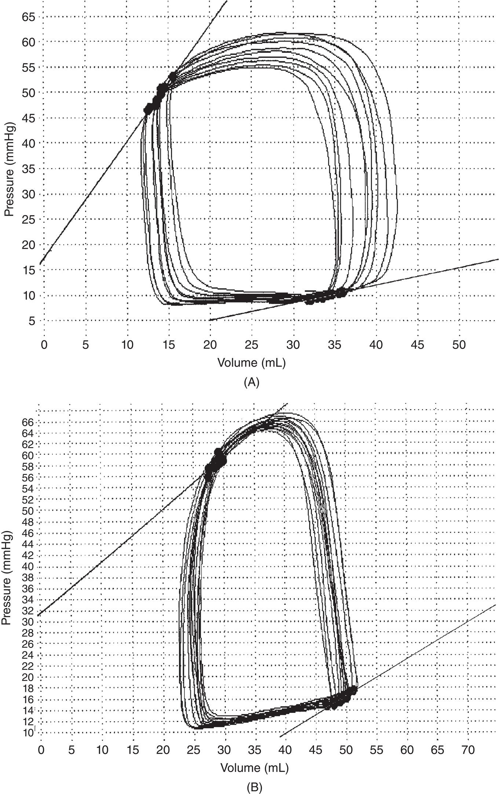

[**Figure 21.3**](#R_c21-fig-0003) Left ventricular pressure–volume loops from infants and children undergoing closure of atrial septal defect with short bypass and cross‐clamping durations. (A) Pre‐bypass; (B) post‐bypass

(Source: Chaturvedi et al. \[22\]. Reproduced with permission of Elsevier.)

Finally, LCOS may develop due to various reasons specific to the underlying CHD and to the surgical procedure. Coronary diastolic perfusion may be decreased following a systemic–pulmonary anastomosis as seen following the Norwood procedure, and results in dysfunction of the single ventricle. Nearly, 50% of patients undergoing repair of tetralogy of Fallot have isolated diastolic RV dysfunction \[24\], and may develop LCOS due to insufficient preload of the LV. High PVR results in dysfunction of the cavo‐pulmonary anastomosis following a bidirectional Glenn or a Fontan procedure, to a decrease of the single‐ventricle preload, and to LCOS (Boxes [21.2](#c21-fea-0002) and [21.3](#c21-fea-0003)).

* * *

### [Box 21.2](#R_c21-fea-0002) : Factors responsible for a postoperative decrease in DO2

-   LCOS due to:
    -   Increased LV and/or RV afterload
    -   Myocardial stunning
    -   Pulmonary endothelium dysfunction
    -   Underlying CHD‐specific causes
-   Hypoxemia
-   Anemia

* * *

* * *

### [Box 21.3](#R_c21-fea-0003) : Limitations of the cardiovascular reserve in neonates

-   Decreased contractile reserve
-   Cardiomyocyte contains fewer and poorly organized proteins
-   Immature sarcoplasmic reticulum
-   Decreased myocardial compliance
-   Increased circulatory demands due to greater oxygen consumption

Source: From \[18\].

* * *

* * *

### KEY POINTS: THE VO2/DO2 BALANCE FOLLOWING CHD SURGERY

-   Pathologic imbalance between VO2 and DO2 is the mechanism of anaerobic metabolism, multiorgan failure, and death.
-   VO2 commonly increases after CHD surgery mainly due to inflammation and postoperative stress response.
-   DO2 commonly decreases after CHD surgery mainly due to LCOS, a result of inflammation, myocardial stunning, and pulmonary dysfunction.

* * *

## Improving postoperative oxygen transport balance: preventive and therapeutic interventions

As mentioned before, the goal of the postoperative hemodynamic manipulation is the optimization of the VO2/DO2 balance. Sedation and analgesia lead to substantial falls in postoperative VO2 \[11\], which could suffice to maintain the VO2/DO2 balance in critical situations where it is not possible to further increase the DO2. Treatment of hyperthermia reduces the VO2 by 11% for every degree of reduction in body temperature \[11\]. Anti‐inflammatory strategies have been reported to have similar effects, probably by acting on both the inflammatory state and hyperthermia \[25\]. In addition, mechanical ventilation with muscle relaxation reduces VO2 by more than 20%, and as well as stabilizing pulmonary gas exchange, it can preserve the limited DO2 for other vital organs \[13\]. On the other hand, blood transfusions cause a significant increase in DO2; transfusion thresholds are specific to age and dependent upon the underlying CHD; and limitations are due to increases in blood viscosity and PVR.

The major priorities, nevertheless, both intra‐ and postoperatively, are the prevention and early treatment of the LCOS, and this section will focus on the pharmacological treatment of LCOS. The pharmacologic optimization of CO in children with cardiac surgery involves the manipulation of systolic and diastolic myocardial function, preload, SVR, and PVR.

The prospective study published by Wernovsky et al. in 1995 \[3\], including invasive hemodynamic measurements in 122 neonates undergoing the arterial switch operation, demonstrated an average 30% drop in cardiac index in almost one quarter of patients, while PVR and SVR increased. The lowest measurement typically occurred 9–12 hours after surgery. Evidence supporting preventive drug therapy for LCOS is derived primarily from the landmark PRIMACORP study \[4\], which reported a 55% reduction in the risk of postoperative LCOS after administration of high‐dose milrinone. As a result, preventive drug therapy for LCOS in at‐risk patients has become common practice, as revealed by two recent international surveys among pediatric cardiac centers \[26, 27\].

The ventricular pressure–volume loops shown in [Figure 21.2](#c21-fig-0002) illustrate the possible therapeutic options to increase the stroke volume in case of a reduced CO with increased afterload. Increasing preload results in an increase in the stroke volume according to the Frank–Starling law, with a concomitant increase, however, in the workload of the ventricle. Ischemia–reperfusion injury and myocardial edema resulting from aortic cross‐clamping aggravates the physiological stiffness of the neonatal myocardium, and it follows that the beneficial potential of volume administration is limited by an excessive increase in the atrial pressure. Inotropic agents augment the stroke volume too, however, their benefit is limited by the concomitant increase in the workload, and thus VO2, of the ventricle. By contrast, vasodilators increase the stroke volume without affecting myocardial oxygen demand, and represent, therefore, the most effective option in the setting of postcardiac surgery LCOS in infants.

In the pediatric cardiac setting, the use of cardiovascular drugs is often based on extrapolating the underlying pathophysiology and pharmacodynamics from adult studies, and on anecdotal experience. In 2008, Pasquali et al. published a survey on the use of off‐label cardiovascular medications in children as assessed by the Pediatric Health Information System \[28\]. The study included observations from 31,432 patients, median age 10.4 months, and reported that 78% of all patients received at least one cardiovascular drug off‐label. The risk of a neonate receiving at least one drug off‐label was 11% higher than that of an older patient. The most common cardiovascular drugs used off‐label were furosemide, epinephrine, dopamine, lidocaine, and milrinone. It is also important to note that there are no clinical trials that have produced recommendations with regards to dosing. Therefore, the suggested dose ranges here should be considered as “guides.”

The drugs currently used for the acute hemodynamic management of CHD patients have inotropic, chronotropic, lusitropic, vasoconstrictor, systemic, and/or pulmonary vasodilator effects. Most of the cardiovascular drugs have mixed and dose‐dependent effects, therefore, a functional classification has been proposed, according to their inotropic and peripheral vascular effects into: inodilators, inoconstrictors, vasodilators, and vasoconstrictors \[29\]. The most commonly used agents are displayed in [Table 21.1](#c21-tbl-0001) and [Figure 21.4](#c21-fig-0004), according to their potencies and dose‐dependent hemodynamic effects.

Most cardiovascular agents in clinical use exert their cardiovascular effects by interacting with adrenergic receptors in the heart and vessels. Vascular α1‐adrenergic receptors increase SVR by constricting the mesenteric, skin, and renal arterioles while redistributing blood flow from the peripheral veins into the arterial circulation. Myocardial β1 receptors, and to a lesser extent, β2‐adrenergic receptors, increase HR and cardiac contractility. Vascular β2 receptors, and to a lesser extent, β1 receptors, oppose the vasoconstrictive effects of α1 receptors and reduce vascular tone, especially in the skeletal muscle. The location and effects of adrenergic receptors are shown in [Table 21.2](#c21-tbl-0002). Vasopressin 1a receptors (V1a) mimic and augment the vasoconstrictive effect of α1 receptors.

[**Table 21.1**](#R_c21-tbl-0001) Classification of the most popular inotropic and vasoactive agents

(Source: Adapted from Jentzer et al. \[29\].)

| Peripheral vascular effect | Inotropic effect |
| --- | --- |
|  | **Yes** | **No** |
| --- | --- | --- |
| **Vasoconstriction** | **Inoconstrictors** | **Vasoconstrictors** |
|  | Epinephrine | Norepinephrine |
|  | Dopamine | Vasopressin |
|  |  | Phenylephrine |
| **Vasodilation** | **Inodilators** | **Vasodilators** |
|  | Milrinone | Nitroglycerin |
|  | Dobutamine | Nitroprusside |
|  | Levosimendan | Phenoxybenzamine |

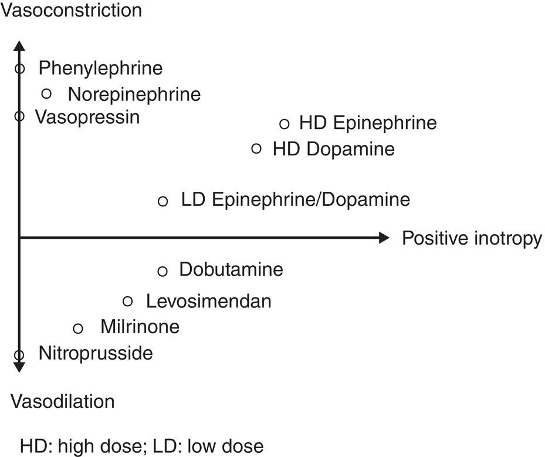

[**Figure 21.4**](#R_c21-fig-0004) Hemodynamic responses to vasoactive and inotropic drugs.

(Source: Adapted from Jentzer et al. \[29\].)

## Inotropic agents

The most commonly used inotropic agents are β‐adrenergic agonists (catecholamines) and phosphodiesterase type 3 inhibitors. These agents exert positive inotropic and chronotropic effects by increasing the intracellular calcium concentration via an increase in cyclic adenosine monophosphate (c‐AMP) and activation of the protein kinase pathway in cardiac myocytes, as shown in [Figure 21.5](#c21-fig-0005). c‐AMP, in turn, activates calcium channels and lead to increased cytosolic calcium, which improves the contractility of the actin–myosin system through its binding with troponin C. A newer class of inotropes is calcium sensitizers, which binds cardiac troponin C, stabilizes calcium‐induced conformational changes, and increases contractility by promoting a prolonged interaction between actin and myosin filaments. They do not increase cytosolic calcium concentrations.

[**Table 21.2**](#R_c21-tbl-0002) Adrenergic receptor sites and physiologic actions

(Source: From Latifi et al. \[30\].)

| Receptor | Receptor location site | Action |
| --- | --- | --- |
| α1 | Vascular smooth muscle | Arterial vasoconstriction |
| Heart | ↑ inotropic activity |
| α 2 | Vascular smooth muscle | Vasoconstriction of venous capacitance vessels |
| Presynaptic sympathetic nerve terminals | Local feedback, inhibition of norepinephrine release |
| β1 | Heart | ↑ inotropic and chronotropic activity  
↑ atrio‐ventricular node conduction velocity |
| β2 | Vascular smooth muscle | Vasodilation peripheral vasculature |
| Bronchial smooth muscle | Bronchodilation |
| D1 | Vascular smooth muscle (renal, splanchnic, cerebral) | Vasodilation |
| Renal tubules | ↓ Na reabsorption |
| D2 | Presynaptic sympathetic nerve terminals | ↓ norepinephrine release |

#### β‐adrenergic receptor agonists

Catecholamines play an important role in the management of LCOS after cardiac surgery. Endogenous catecholamines, such as dopamine, epinephrine, and norepinephrine, are synthesized from tyrosine, which undergoes several transformations to yield dopamine. A portion of the dopamine is then transported into vesicles from the cytoplasm where it is converted to norepinephrine, the main neurotransmitter in the human nervous system. The final step in the pathway, which converts norepinephrine to epinephrine, occurs in the adrenal medulla. Endogenous catecholamines are hormones and neurotransmitters that influence a multitude of physiological functions; however, synthetic catecholamines, such as dobutamine and isoproterenol, target‐specific receptors resulting in selective effects ([Table 21.3](#c21-tbl-0003)). The half‐life of catecholamines is approximately 2–5 min, which allows for rapid titration. Since the breakdown of catecholamines by the catechol‐O‐methyl‐transferase and monoamine oxidase is ubiquitous, dosage adjustments are not necessary, even in patients with renal, hepatic, or any other organ dysfunction.

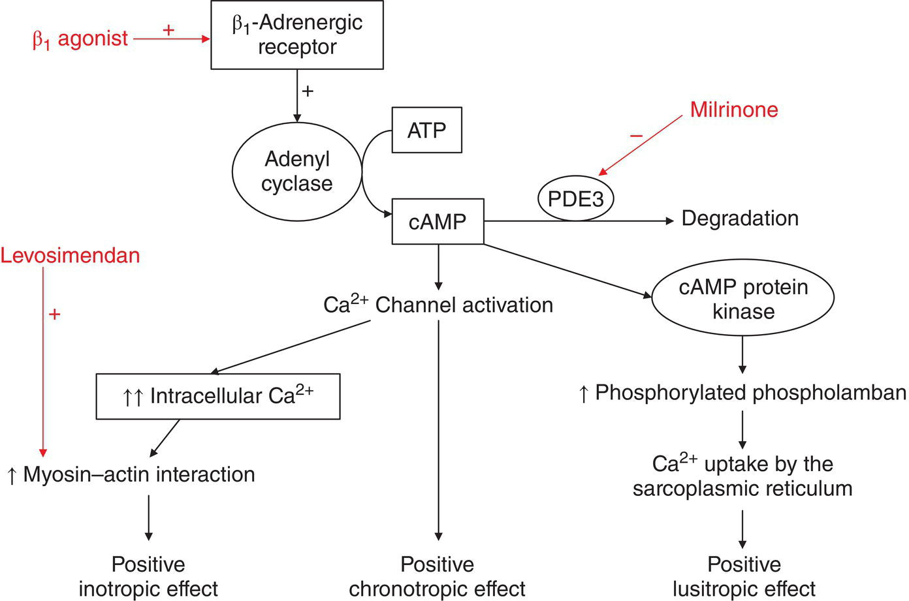

[**Figure 21.5**](#R_c21-fig-0005) Schematic representation of the postulated mechanism of action of β1‐agonists, milrinone and levosimendan in the myocardial cell.

(Source: Gillies et al. \[31\]. Reproduced with permission of Springer Nature.)

[**Table 21.3**](#R_c21-tbl-0003) Hemodynamic effects of the most popular vasoactive and inotropic drugs

| Drug | Receptors | Inotropy | Chronotropy | SVR | PVR | Renal vascular resistance | Cardiac output |
| --- | --- | --- | --- | --- | --- | --- | --- |
| Epinephrine < 0.1 μg/kg/min  
\>0.1 μg/kg/min | β**1**, β**2** > α**1** (agonist)  
α**1** > β**1**, β**2** | ↑  
↑ | ↑  
↑ | ↔ ↓  
↑ | ↔ ↓  
↑ | ↓  
↑ | ↑↑  
↑ |
| Dopamine < 3 μg/kg/min  
4–8 μg/kg/min  
\>8 μg/kg/min | D**1**, D**2** (agonist)  
β**1**, β**2** > α**1**  
α**1** > β**1**, β**2** | ↔  
↑  
↑ | ↔  
↑  
↑ | ↔  
↔ ↓  
↑ | ↔  
↔  
↑ | ↓  
↔  
↑ | ↔  
↑  
↔ |
| Dobutamine | β**1** > β**2**, α**1** (agonist) | ↑ | ↑ | ↓ | ↓ | ↔ | ↑↑ |
| Milrinone | PDE3 inhibitor | ↑ | ↑ | ↓ | ↓ | ↓ | ↑ |
| Levosimendan | Troponin C, ATP‐dependent K channel | ↑ | ↑ | ↓ | ↓ | ↓ | ↑ |
| Norepinephrine | α**1** > β**1**, β**2** (agonist) | ↔ ↑ | ↓ | ↑↑ | ↑ | ↑↑ | ↔ ↓ |
| Vasopressin | V1a (agonist) | ↔ | ↓ | ↑ | ↑ | ↑ | ↔ ↓ |
| Phenylephrine | α**1** (agonist) | ↔ | ↓ | ↑ | ↔ | ↑ | ↔ ↓ |
| Nitroglycerine  
Nitroprusside | Guanylate cyclase activator | ↔ | ↔ ↑ | ↓ | ↓ | ↓ | ↑ |
| Phenoxybenzamine | α**1**, α**2** (antagonist) | ↔ | ↔ ↑ | ↓ | ↓ | ↓ | ↑ |
| Inhaled Nitric oxide | Guanylate cyclase activator | ↔ | ↔ | ↔ | ↓↓ | ↔ | ↔ ↑ |
| Sildenafil | PDE5 inhibitor | ↔ | ↔ | ↔ | ↓↓ | ↔ | ↔ ↑ |

ATP: adenosine triphosphate; c‐AMP: cyclic adenosine monophosphate; PDE3: phosphodiesterase type 3; PDE5: phosphodiesterase type 5; PVR: pulmonary vascular resistance; SVR: systemic vascular resistance.

#### Epinephrine

Epinephrine has a potent agonist of α1‐, β1‐, and β2‐adrenergic receptors ([Table 21.3](#c21-tbl-0003)), approximately 100‐fold more potent as an inotrope than dobutamine or dopamine. Low epinephrine doses (0.01–0.1 μg/kg/min) are used to increase stroke volume and to a lesser extent HR through a β2‐adrenergic effects. Combined with afterload reduction through peripheral vasodilatation, low epinephrine doses increase CO, and is therefore recommended in patients with severe systolic dysfunction. At somewhat higher concentrations, β1‐adrenergic receptors are activated resulting in increased myocardial conduction, increased sinoatrial node discharge, increased force of contraction, and increased rate of rise of the intramural pressure. High concentrations of epinephrine may produce serious atrial and ventricular dysrhythmias if the myocardium is sensitized by infarction, surgery, or myocarditis. Higher epinephrine doses (>0.1 μg/kg/min) produce increasing α1‐receptor‐mediated vasoconstriction. This results in increased afterload and increase the myocardial workload, which are undesirable early after CPB, and may be detrimental in infants with functionally univentricular circulation. Even though epinephrine constricts renal and cutaneous arterioles, renal function and skin perfusion may improve due to increased CO. However, high infusion rates (>1–2 μg/kg/min), conditions in which the α1‐adrenergic responses predominate, may exacerbate multiorgan system failure.

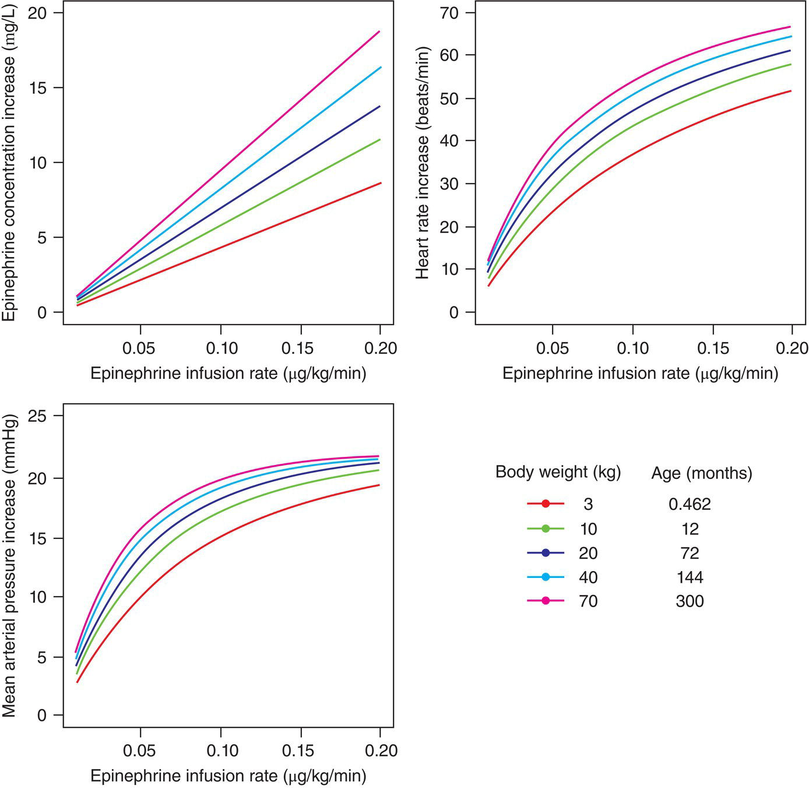

[**Figure 21.6**](#R_c21-fig-0006) Simulation of the relationship between different epinephrine concentrations and hemodynamic responses in children with different ages and weights.

(Source: Oualha et al. \[33\]. Reproduced with permission of Springer Nature.)

Epinephrine is largely used in the postoperative management of CHD \[26, 32\], although evidence‐based data are currently lacking, and dosing regimens are extrapolated from adult studies. However, the amplitude of the hemodynamic response to epinephrine is difficult to predict. Although the effect of epinephrine is primarily dependent on the plasma concentration, a recent report shows that both age and body weight may play a role in the large between‐subject pharmacokinetic and pharmacodynamic variability observed in children undergoing CHD surgery \[33\]. The smaller the patient, the smaller the increase in heart rate and blood pressure for a given epinephrine concentration and severity of illness, as shown in [Figure 21.6](#c21-fig-0006) \[33\]. It is likely that the postnatal development of the myocardial contractility is associated with changes in the modulatory effects of β‐adrenergic receptor signaling.

During cardiopulmonary resuscitation, the α1‐adrenergic‐mediated vasoconstriction induced by epinephrine increases aortic diastolic pressure and, thus, coronary perfusion pressure, which is a critical determinant of successful resuscitation from cardiac arrest. The American Heart Association‐recommended dose of epinephrine for children experiencing bradycardia, asystole, or pulseless arrest is 0.01 mg/kg intravenously, which may be repeated at 3–5‐min intervals, up to 1 mg per dose \[34\].

#### Dopamine

Dopamine stimulates the dopaminergic D1 (postsynaptic) and D2 (presynaptic) receptors located in several vascular beds; it also binds α‐ and β1‐adrenergic receptors, although with lower affinity ([Table 21.3](#c21-tbl-0003)) doses (> 8 μg/kg/min) induce vasoconstriction via α1‐adrenergic receptor stimulation. Increased PVR has been reported with dopamine doses higher than 7.5 μg/kg/min.

The sensitivity of infants to dopamine is controversial, and neonates may exhibit a clinical response to doses as low as 0.5–1 μg/kg/min \[30\]. Li et al. \[35\] studied the effects of 5 μg/kg/min of dopamine in neonates undergoing the Norwood procedure. Dopamine did not increase DO2 and seemed to cause an increase in myocardial VO2. A dopamine infusion of 5 μg/kg/hour had a significant thermogenic effect, and termination of the infusion was associated with a substantial 20% reduction in the total VO2 \[35\].

#### Dobutamine

Dobutamine is administered as a racemic mixture of two compounds, namely, a strong β1‐agonist, and a weak α and β2 agonist. The end result is a drug with broad receptor specificity, a strong dose‐dependent increase in stroke volume, heart rate and CO, and a variable effect on arterial pressure ([Table 21.3](#c21-tbl-0003)). It modestly lowers the SVR, except at high doses (> 10–15 μg/kg/min) when dose‐dependent α1‐adrenergic receptor agonism may become more prominent. Low doses, up to 5 μg/kg/min, increase stroke volume without significant tachycardia, however, doses above 10 μg/kg/min produce worsening tachycardia with minimal further increase in CO due to declining stroke volume from decreased diastolic filling time. Dobutamine significantly increases the myocardial VO2 and is frequently used to stress the myocardium.

Comparison with phosphodiesterase inhibitors demonstrates similar improvement in stroke volume, although dobutamine induces a more profound decrease in LV filling pressures and vascular resistance \[36\]. Dobutamine induces a greater increase in heart rate than milrinone, and the beneficial increase in coronary blood flow may be outweighed by an increase in myocardial VO2 \[36\]. Higher doses of dobutamine (>15 μg/kg/min) can predispose to the development of atrial or ventricular arrhythmias. Despite its widespread use, the exact role of dobutamine in pediatric therapeutics remains unclear, and its use following cardiac surgery remains controversial because of excessive tachycardia, arrhythmias, and variable effect on SVR.

#### Norepinephrine

Norepinephrine is a potent α1‐receptor agonist and mild β1‐agonist with minimal β2 activity. Increasing doses of norepinephrine may increase CO in some patients through augmentation of venous return, however, it may reduce CO due to the strong increase in afterload in patients with cardiac dysfunction. Norepinephrine reduces myocardial VO2, due to a reflex reduction in heart rate. By increasing diastolic pressure, norepinephrine increases coronary perfusion. Norepinephrine is mainly used as a vasopressor and will be discussed later.

#### Side effects of catecholamines

The use of catecholamines comes at a price, namely to place continual stress on an organ that is already failing, and placing an increased demand for oxygen at a time when supply is critically limited. Catecholamines increase the myocardial VO2 through their inotropic and chronotropic effects and induce arrhythmogenesis. These are due to an increase in intracellular calcium concentration, produced by an increase in c‐AMP. This is particularly problematic in the neonatal myocardium, in which the functional reserve is limited and which operates under already maximal adrenergic stimulation. If such an increase is not accompanied by a proportional increase in coronary blood flow, a mismatch between myocardial VO2 and DO2 may result.

When inotropes are used for the management of adults with acute heart failure, there is an increase in in‐hospital mortality when compared with management without inotropes \[37\]. Results from the European Society of Cardiology Heart Failure Long‐term registry have shown a detrimental association between the use of inotrope and/or vasopressor and both in‐hospital and long‐term mortality \[38\]. Both dopamine and epinephrine were associated with the highest risk of death in adults \[38, 39\]. The recent guidelines of the European Society of Cardiology for the treatment of acute heart failure restrict the use of inotropic agents to patients with symptomatic hypotension and poor perfusion \[40\].

For many years, it has been acknowledged that chronic exposure to catecholamines can exert a toxic effect on the myocardium and increase apoptosis. _In vitro_ studies in cultured cardiac myocytes show that tonic exposure to norepinephrine increases the number of apoptotic myocytes via stimulation of the β1‐adrenergic receptor pathway \[41\]. Although the link between myocardial apoptosis and myocardial failure remains to be proven, these observations provide a rational to limit the use of β1‐agonists following cardiac surgery. In addition, the variability in the pharmacologic effect of β‐agonists in neonates makes their use very challenging in this age group. Studies of myocardial biopsies identified an adult‐like myocardium, with low‐density and high‐affinity β‐adrenergic receptors, and a fetal‐like myocardium, with high‐density and low‐affinity β‐adrenergic receptors \[42\]. Neonates had the highest density and the lowest affinity β‐adrenergic receptors of all, and they have lower affinity β receptors in the LV when compared with the RV (whereas immature and adult hearts did not have ventricular differences) \[42\]. Additionally, experimental studies demonstrated downregulation of the LV β‐adrenergic receptors during chronic hypoxemia \[43\].

Long‐term exposure of myocardial β‐adrenergic receptors to circulating endogenous or exogenous catecholamines leads to receptor desensitization, which is mediated by uncoupling of the receptor–effector system and by a decrease in receptor density. In patients with severe cardiac failure, β1‐adrenergic receptor density is selectively reduced due to exposure to endogenous norepinephrine. It has been shown that the severity of the left‐to‐right shunt and of PHT is correlated with norepinephrine levels in pediatric CHD patients \[44\]. Consistently, children with severe CHD were found to have an up to 50% reduction in the number of right auricle β‐adrenergic receptors, with the lowest receptor densities found in critically ill neonates with congenital aortic stenosis and transposition of the great arteries \[45\].

Catecholamines increase the overall metabolic rate, which manifests as an increase in the overall VO2. β1, β2, and particularly β3‐adrenergic receptors, as well as dopaminergic receptors are densely expressed at high levels in brown adipose tissue, which is abundant in human neonates, where it plays a crucial role in nonshivering thermogenesis. Catecholamines, especially norepinephrine and dopamine, simulate heat production by stimulating fatty acid oxidation and uncoupling the respiratory chain from adenosine triphosphate (ATP) synthesis; thus, neonates may be particularly susceptible to the metabolic effects of catecholamines, which may increase VO2 to much higher levels than in older patients. Catecholamines also accelerate aerobic glycolysis and induce insulin resistance, a phenomenon that is exacerbated in younger patients, resulting in a concentration‐dependent increase in glycemia and lactate production, as shown in [Figure 21.7](#c21-fig-0007) \[33\].

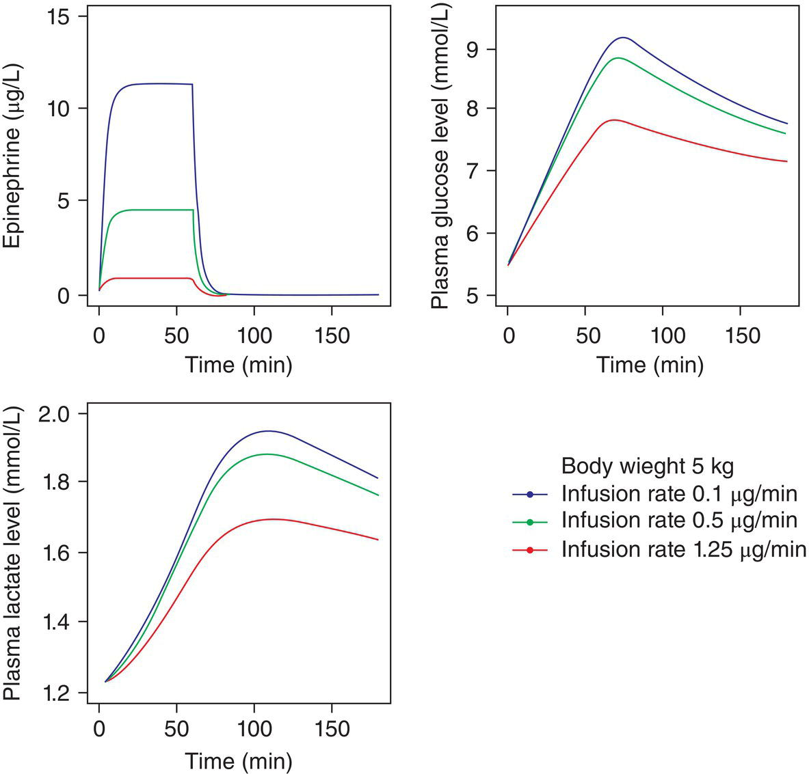

[**Figure 21.7**](#R_c21-fig-0007) Time‐course simulations of epinephrine concentration, plasma glucose and lactate levels following 0.02–0.25μg/kg/min epinephrine infusions in a child weighting 5 kg.

(Source: Oualha et al. \[33\]. Reproduced with permission of Springer Nature.)

In view of the aforementioned challenges, the use of β‐adrenergic receptor agonists for the prevention and/or management of LCOS following CHD surgery should be questioned, particularly considering that the evidence of their use is based solely on pharmacological action rather than an assessment of meaningful clinical outcomes.

#### Inhibitors of phosphodiesterase type 3

Bipyridines were developed in the 1980s to improve myocardial contractility in the chronically failing ventricle. They selectively inhibit intracellular cardiac phosphodiesterase type 3, thereby slowing the degradation of c‐AMP. This results in a positive inotropic effect through increased intracellular calcium levels during excitation–contraction coupling, and a positive lusitropic effect through faster sequestration of calcium that is released into the sarcoplasmic reticulum due to the concomitant activation of phospholamban ([Figure 21.5](#c21-fig-0005)). Vasodilation occurs in both arterial and venous vessels, via increased c‐AMP and opening ATP‐sensitive potassium channels in vascular smooth muscle cells ([Figure 21.8](#c21-fig-0008)). Arrhythmogenicity is mediated by an increase in intracellular c‐AMP and calcium levels. No tachyphylaxis is observed.

#### Amrinone

Amrinone, the prototype bipyridine, acts mainly as a vasodilator, and has some inotropic effects \[47–49\]. Amrinone is metabolized in the liver via N‐acetylation and is then excreted in the urine; slow acetylators show a two‐fold increase in the half‐life, compared with that of rapid acetylators \[50\]. The half‐life is about 2 hours, and clearance is reduced in patients with hepatic and renal failure. Reversible dose‐dependent thrombocytopenia is common during prolonged therapy. The common dosage is 5–10 μg/kg/min. Amrinone is now rarely used since milrinone became available.

#### Milrinone

Milrinone is the most popular bipyridine drug, and it is the one that has been subjected to careful evaluation in the placebo‐controlled multicenter PRIMACORP trial \[4\]. It has a half‐life of about 1 hours, which decreases linearly with age and increases in the presence of renal failure \[51\].

The drug shows inotropic and vasodilatory effects, although it appears that the increase in CO is mainly related to the vasodilatory effect \[52\]. Chang et al. reported that, when given to neonates with LCOS, milrinone increased the cardiac index from 2.1 to 3.1 mL/min/m2, concomitant with a reduction in filling pressures, in SVR by approximately 30%, and in PVR by about 25% \[53\]. These improvements in global hemodynamics were associated with an improvement in the myocardial VO2/DO2 ratio \[53\]. The multicenter PRIMACORP trial \[4\], including 238 neonates and infants demonstrated that the prophylactic administration of high‐dose milrinone (i.e., a bolus of 75 μg/kg, followed by an infusion of 0.75 μg/kg/min) decreased the incidence of LCOS from 25.9% to up to 11.7%, whereas a low dose (a 25 μg/kg/min bolus followed by a 0.25 μg/kg/min infusion) had no effect, when compared with placebo.

In an experimental study under constant ventricular leading conditions, milrinone only very slightly increases heart rate and stroke volume \[52\]. Thus, unlike dopamine, milrinone does not increase myocardial VO2 \[36\] nor myocardial OER (17). Instead, milrinone reduces coronary vascular resistance, suggesting that it exerts a protective effect on the myocardium. Furthermore, the positive lusitropic properties make milrinone a useful drug when LCOS results from diastolic ventricular dysfunction.

The pulmonary vasodilator effect of milrinone has been demonstrated in infants with PHT, and it is largely dependent on the degree of pre‐existing PHT and the severity of ventricular dysfunction \[53\]. Milrinone induces pulmonary vasodilatation by increasing pulmonary vascular c‐AMP levels, and, possibly, by attenuating the release of inflammatory cytokine \[54\].

Hypotension is a commonly reported side effect, occurring particularly during the administration of the loading dose. Ensuring an adequate preload can minimize it. The incidence of tachyarrhythmia increases up to three‐fold when using common dosing regimens of milrinone (a loading dose of 50 μg/kg, followed by a 0.25–1 μg/kg/min continuous infusion), independent of the concomitant use of catecholamines and of disease severity. As a result, many centers use milrinone without a loading dose, and begin the infusion by the end of CPB. However, a recent pharmacokinetic study of milrinone in a wide pediatric age range demonstrated that age, disease, and surgery differently impact the pharmacokinetics of milrinone, and that current milrinone dosing for LCOS is suboptimal to maintain the therapeutic target range across the entire pediatric age range \[55\]. It is likely that hypotension and arrhythmogenesis are responsible for the huge variability in the dosing regimens used at different centers \[32\]. Thrombocytopenia is less common (4%) and is seen when the infusion duration exceeds 3 days \[56\].

Milrinone is the drug most commonly used for the prevention and treatment of LCOS in CHD surgery \[26, 27, 32\]. However, the recent Cochrane meta‐analysis on its prophylactic use following CHD surgery \[57\] yielded a very disappointing conclusion indicating a lack of evidence of effectiveness on the incidence of LCOS and on mortality. For methodological reasons, the meta‐analysis excluded many valuable reports, and included only 393 participants from a mixed population aged 0–12 years. However, because of their specific physiology, including noncompliant ventricles and a high baseline sympathetic tone \[58\], neonates and young infants are the most likely to develop LCOS with high SVR and PVR, and to benefit from prophylactic milrinone.

#### Calcium sensitizers

Levosimendan, a pyridazinone–dinitrile, binds cardiac troponin C and stabilizes calcium‐induced conformational changes, which, in turn, promotes the prolonged interaction between actin and myosin filaments during systole, and increases myocardial contractility, as shown in [Figure 21.5](#c21-fig-0005) \[59\]. The resulting increase in contractility is unmatched by milrinone \[21\]. Levosimendan has vasodilatory effects, which are mediated by opening ATP‐sensitive potassium channels in the systemic, pulmonary, and coronary vascular smooth muscle cells \[59–61\]. In adult patients, levosimendan is responsible for a 45% increase in the coronary blood flow and a 9% reduction in myocardial oxygen extraction \[62\]. The impact of levosimendan on mitochondrial functions prevents calcium overload during ischemia–reperfusion injury and protects the myocardium against damage \[63\]. Levosimendan reduces the time constant for diastolic relaxation and improves diastolic function \[21\]. By improving the diastolic function, it is of particular interest when LCOS is due to LV or RV diastolic dysfunction, a common finding in patients with residual obstruction of the left or right outflow tract. It is also of particular interest in neonates in whom the ventricles are less compliant. Levosimendan has weak pulmonary vasodilator effects in the normal circulation \[64\], but has a potent effect in preconstricted pulmonary circulation \[60\]. In addition, it may attenuate endothelin‐1‐induced vasoconstriction, which would be of particular relevance in the post‐CPB setting \[61\]. Experimental work demonstrated an increase in the RV myocardial efficiency when levosimendan was used to treat RV hypertrophy and failure \[65\], and it has been proposed for the treatment of RV failure in patients with PHT \[66\]. When given after cardiac surgery in adults, levosimendan is associated with an approximately 50% reduction of the risk of acute kidney injury and renal replacement therapy \[67\]. Finally, levosimendan improves the recovery of diaphragmatic dysfunction and increases the chances of successful weaning from mechanical ventilation \[68\].

The pharmacokinetic profile of levosimendan, which is unaffected by age, makes it highly attractive for clinical use. The recommended dosage is an intravenous (i.v.) bolus of 12 μg/kg over 10 min, followed by a 2 μg/kg/min continuous infusion. Its biotransformation in the intestinal tract gives rise to an intermediate metabolite, OR 1,855, which is inactive, and which is further metabolized in the liver by acetylation into OR 1,896. OR 1,896 is a long‐lasting active metabolite whose concentration peaks at 36 hours after a 24‐hour infusion and remains stable up to Day 8; it is still detectable up to 12 days after levosimendan withdrawal \[69\]. Dosing adjustments are not required in patients with mild hepatic or renal failure.

A randomized controlled study of milrinone and levosimendan conducted in neonates \[69\] showed that patients in the milrinone group had a greater requirement for other inotropes during the first hours postsurgery. Cerebral regional saturation monitoring suggested that both drugs caused a time‐dependent improvement in blood flow and oxygen availability, but infants on levosimendan showed significantly higher peripheral intravascular oxygenation and a lower difference in the central‐to‐peripheral temperature gradient \[69\]. Another randomized controlled trial in neonates undergoing complex surgeries reported an almost 40% decrease in the incidence of LCOS when compared with more conventional milrinone and epinephrine infusions, along with a significant reduction in lactate concentrations 6 hours postoperatively \[70\]. In patients younger than 5 years undergoing cardiac surgery, levosimendan given postoperatively was at least as efficacious as milrinone, and did not increase myocardial VO2 at 24 and 48 hours postoperatively \[71\]. Troponin values were significantly lower in the levosimendan group, suggesting a cardioprotective effect \[71\].

Because levosimendan does not increase the intracellular c‐AMP and calcium concentrations, tachycardia and hypotension are less severe than that reported for milrinone, although common during the loading dose \[69, 71\]. In contrast to those of catecholamines, the effects of levosimendan are not attenuated in patients with chronic heart failure, in whom β‐adrenergic receptors are downregulated, or by concomitant use of β‐blockers. The development of tolerance has not been reported to date.

There are currently no official indications regarding the use of levosimendan in patients less than 18 years of age. As a matter of fact, the drug has been studied and used as a rescue therapy both in the pediatric intensive care unit (PICU) and the operating room. The pediatric experience with levosimendan given prophylactically for cardiac surgery in children less than 5 years was summarized in a recent meta‐analysis \[72\], which, for methodological reasons, only included five randomized controlled trials with a total of 212 participants. Compared with standard inotrope treatments, levosimendan did not reduce mortality or the incidence of LCOS; however, levosimendan significantly reduced time to extubation and length of stay and reduced the risk of circulatory support and of heart transplantation. Levosimendan has potential appeal in children with CHD and may prove to have an important role in the prevention and early treatment of LCOS in high‐risk patients after cardiac surgery; however, its application warrants more detailed investigation.

### Vasoconstrictors

#### Norepinephrine

Norepinephrine has potent α‐ and β1‐adrenergic receptor agonist activity, but little β2 activity, as shown in [Table 21.3](#c21-tbl-0003). Therefore, infusion of norepinephrine results in increased SVR because the α‐adrenergic stimulation is not opposed by β2‐adrenergic stimulation. As a vasopressor, norepinephrine is 100‐fold more potent than dopamine and three to five times more potent than epinephrine.

Norepinephrine is used in the pediatric setting of shock with profound hypotension; it should be administered after intravascular volume repletion, and its use is best guided by knowledge of the CO and SVR. Although more commonly used in adults, a vasodilatory inflammatory response to CPB may be present in some children early after surgery and is often responsive to norepinephrine. Norepinephrine may also enhance coronary flow in patients with diastolic run‐off after systemic‐to‐pulmonary shunt. The dosage is usually titrated to mean or diastolic arterial pressure, and low doses (0.01–0.05 μg/kg/min) should be sufficient for hemodynamic stabilization.

However, injudicious use of norepinephrine compromises blood flow within organs, for example, renal, splanchnic, and hepatic blood flow is reduced in healthy individuals. Infusion of norepinephrine may increase blood pressure, and yet not improve clinical indices of perfusion, and this type of poor clinical response is usually associated with a persistent low cardiac index. Importantly, the pharmacokinetics of norepinephrine in children is not well known. Norepinephrine should be titrated and used at the lowest dose to maintain the mean arterial pressure; doses > 0.5–1 μg/kg/min are considered very high.

#### Arginine vasopressin

Arginine vasopressin (AVP) plays a vital role in the maintaining normal arterial blood pressure by regulating venous capacitance and arterial resistance. Vasopressin acts on V1a receptors in the peripheral vasculature to cause intense vasoconstriction through activation of protein kinase C ([Table 21.3](#c21-tbl-0003)), ultimately leading to an influx of intracellular calcium. The rationale behind the use of exogenous AVP in the critically ill patients is that neurohypophyseal stores of AVP may become exhausted, leading to vasodilatory shock \[73\]. Another theoretical advantage of AVP is that it does not rely on adrenergic receptors, which may be downregulated in the presence of chronically elevated catecholamines. Also, signal transmission via adrenergic receptors may be impaired under conditions of metabolic acidosis. AVP depletion following CHD surgery has also been reported in children \[74\], as well as good response to the vasopressor AVP infusion ranging from 0.0001 to 0.002 U/kg/min in neonates, infants, and children with low postoperative blood pressure and adequate cardiac function \[74, 75\]. More recently, it has been suggested that lower doses of AVP 0.0003 U/kg/min initiated in the operating room could be beneficial in neonates with complex surgeries, such as the Norwood procedure or the arterial switch operation, to decrease the requirement for fluid resuscitation and catecholamines, and shorten the duration of intensive care stay \[76\].

A recent meta‐analysis showed that AVP did not confer a survival advantage in adults suffering from vasodilatory shock \[77\]. Also, safety data for AVP are lacking; a prospective randomized study of critically ill children requiring prolonged mechanical ventilation showed that AVP was associated with an increased incidence of oliguria and hyponatremia \[78\].

#### Phenylephrine

Phenylephrine is a pure peripheral α1‐adrenergic receptor agonist, as shown in [Table 21.3](#c21-tbl-0003), and is used as a bolus or infusion to treat acute cases of low systemic blood pressure or SVR. The pure α1 effects can result in reflex slowing of the heart rate, although this is not as pronounced in young infants as it is in adults. Its main use in CHD is to acutely raise SVR in cases where either ventricle is compromised by outflow obstruction. Such is the case of tetralogy of Fallot, where low SVR lead to increased right‐to‐left intracardiac shunting and cyanosis, and in hypertrophic cardiomyopathy or other left‐sided lesions, in which the gradient across the obstruction is increased by low SVR. A bolus dosing of phenylephrine, such as used on CPB to increase perfusion pressure, is 0.5–5 μg/kg, whereas infusion doses range from 0.02 to 0.3 μg/kg/min.

### Systemic vasodilators

The tolerance of systemic vasodilators is affected by the intravascular status, or by any actual or potential outflow tract obstruction; in such cases, systemic vasodilatation may have disastrous consequences. Careful imaging should be performed to exclude outflow tract obstruction in case of a doubt, prior to administering the vasodilator, and a very low dose or a short acting agent should be given first.

#### Nitric oxide donors: nitroglycerin and sodium nitroprusside

Nitric oxide donors mimic the effect of endogenous NO, and by activating guanylate cyclase they lead to increased cyclic guanosine monophosphate (c‐GMP) production and vasodilation ([Table 21.3](#c21-tbl-0003)). Low‐to‐moderate doses of nitroglycerin (3 μg/kg/min) increase venous capacitance without affecting the arterial resistance vessels \[79\]. As a result, ventricular filling pressures fall, whereas the stroke volume is unaffected. High‐dose nitroglycerin and nitroprusside increase venous capacitance and reduce SVR; thus, filling pressures fall and the stroke volume and CO rise significantly. Major indications for the use of nitroglycerin include myocardial ischemia, systemic hypertension, volume overload, congestive heart failure, and pulmonary edema. The net effect is usually an improvement in the myocardial VO2/DO2 ratio. Efficacy has been demonstrated following CHD surgery \[80\].

Tolerance occurs after more than 24 hours of i.v. therapy, and abrupt weaning after prolonged i.v. infusions may result in rebound hypertension. Extremely rare side effects are methemoglobinemia and cyanide toxicity, which result from the release of nitrite ions when the drug is metabolized.

#### Phenoxybenzamine

Phenoxybenzamine is a long acting α1‐ and α2‐adrenergic receptor blocker, as shown in [Table 21.3](#c21-tbl-0003), and is advocated by some groups for the routine perioperative management of infants undergoing cardiac surgery involving hypothermic CPB. It has gained popularity for infants undergoing the Norwood operation, in whom systemic vasoconstriction occurs additionally in response to failing systemic perfusion (such as seen at SaO2 > 80%). Such a situation was traditionally managed by manipulating the medical gases to increase PVR and lower SVR. Hoffman et al. carried out a prospective study of phenoxybenzamine use following the Norwood operation \[81\], where patients received 0.25 mg/kg phenoxybenzamine at the start of CPB, followed by 0.25 mg/kg/24 hours for up to 48 hours postoperatively if the target SvO2 > 50% and target QP/QS ratio of 0.8–1.2 were not reached. There was no evidence of hemodynamic deterioration at high SaO2 \[81\], suggesting that α‐adrenergic receptor blockade is an effective approach to modifying the intense sympathetically mediated vasomotor responses in these infants. However, the irreversible α‐receptor blockade and prolonged effect has limited its popularity.

#### Phentolamine

Phentolamine is a reversible α‐adrenergic receptor blocker. Its use is justified by the observation of elevated plasma catecholamine concentrations and increased SVR following CPB. A randomized trial of phentolamine in CHD surgery reported that administration of 0.2 mg/kg of phentolamine during cooling and rewarming for cardiac surgery reduced plasma lactate levels, indicating better tissue perfusion; in addition, the nasopharyngeal–rectal temperature gradient decreased four‐fold, whereas systemic VO2 increased \[82\].

#### Hydralazine

Hydralazine dilates precapillary arterioles. Most studies of hydralazine were performed in the 1980s, in which the drug was used to treat hypertension following CPB in adults. Hydralazine can be used to treat postoperative hypertension in children (1–5 μg/kg/min), or in other situations that require a reduction in preload, such as severe myocardial dysfunction and extracorporeal membrane oxygenation (ECMO). However, the vasodilatory effect is limited by reflex tachycardia; therefore, β‐adrenergic receptor blockers and sodium nitroprusside are preferred.

#### Nesiritide

Nesiritide is a recombinant form of human B‐type natriuretic peptide, which is normally produced by the ventricular myocardium. It binds with the A‐ and B‐type natriuretic peptide receptors of the vascular endothelium and smooth muscle, which leads to increased c‐GMP production and vasodilation. It increases the glomerular filtration rate and inhibits sodium reabsorption, exerting a strong diuretic effect. Nesiritide was first believed to be beneficial for the treatment of acute decompensated congestive heart failure. Although it has also been found beneficial for the prevention of acute kidney injury following cardiac surgery in adults \[83\], the results of the largest study performed to date showed that nesiritide does not affect mortality or prevent rehospitalizations in adults \[84\]. No major hemodynamic effect has been reported when used after CHD surgery \[85\], but an improved urine output. The recommended dose range for infusion in infants and children with heart disease is 0.01–0.03 μg/kg/min.

### Pulmonary vasodilators

In the early 1990s, PHT was a major cause of post‐CHD surgery mortality \[86\]. Overall survival has improved since then and the reported incidence of severe PHT (defined as a ratio of pulmonary‐to‐systemic arterial pressure >1) has dropped to 2% \[87\], most likely due to a better understanding of the pathophysiology of PHT, earlier surgical correction in patients at high risk of PHT, and refinement of intraoperative techniques, including ultrafiltration.

It is accepted that an important pathological characteristic of pulmonary vascular reactivity in patients with CHD is dysfunction of the pulmonary endothelium \[88\]. Such dysfunction suppresses the intrinsic endothelium‐dependent vasodilatory mechanisms, including the nitric oxide c‐GMP system. c‐GMP is generated by the interaction between NO and guanylate cyclase, and it is the final messenger in the pathway that mediates vascular smooth muscle relaxation. It is metabolized by the phosphodiesterase type 5, which is the major phosphodiesterase in the lung; phosphodiesterase type 5 expression is upregulated in patients with PHT and after CPB, causing increased turnover of c‐GMP. A schematic representation of the mechanism of action of pulmonary vasodilators is shown in [Figure 21.8](#c21-fig-0008).

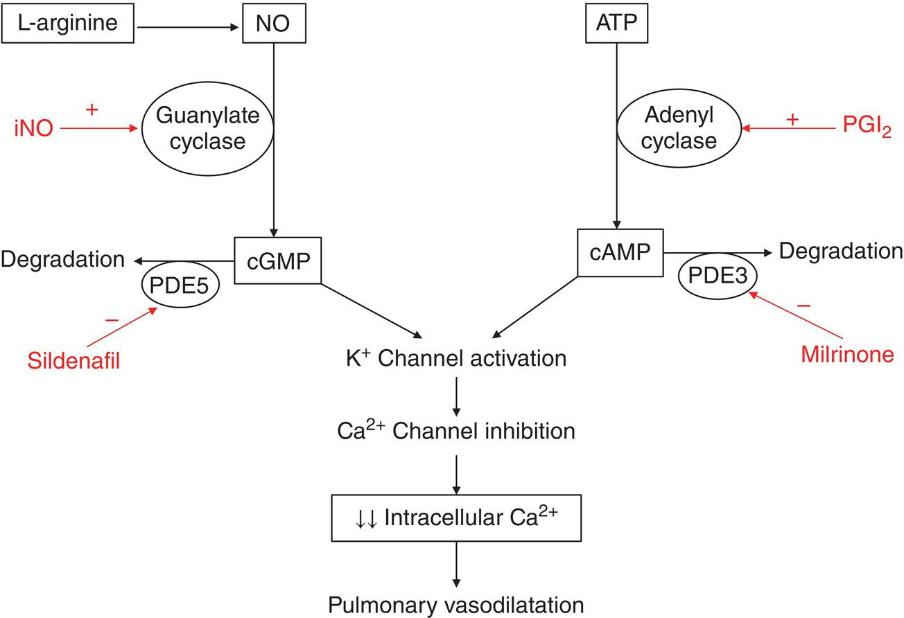

[**Figure 21.8**](#R_c21-fig-0008) Schematic representation of the postulated mechanism of action of pulmonary vasodilators in the endothelial cell.

(Source: Adapted from Ghofrani et al. \[46\].)

Pulmonary vasodilators are commonly used to lower PVR and to treat acute postoperative PHT in patients with preoperative pulmonary overcirculation, or pulmonary venous obstruction. In addition, children undergoing cavopulmonary connections for single‐ventricle lesions require low PVR for surgical success. Finally, pulmonary vasodilators are used to reduce the RV afterload, which is often increased following heart transplantation \[89\]. Historically, the standard therapy for lowering PVR included the induction of respiratory alkalosis due to the known effects of pH on pulmonary artery pressure and PVR; however, although hyperventilation reduces PVR, this comes at the expense of a subsequent increase in SVR and reduction in CO \[90\]. Other factors are used to lower PVR, including sedation, lung recruitment to improve oxygenation, and metabolic alkalosis.

#### Inhaled nitric oxide

Inhaled nitric oxide (iNO) has been used for more than two decades to selectively reduce PVR. iNO produces pulmonary vasodilation in ventilated lung regions by activating endothelial guanylate cyclase, resulting in increased levels of c‐GMP, which, in turn, relaxes pulmonary vascular smooth muscle. iNO crosses the alveolar–capillary membrane leading to immediate pulmonary vasodilation. High‐affinity binding and immediate inactivation of iNO activity by hemoglobin limits the action of the drug in the pulmonary circulation.

An early study by Miller et al. reported that iNO concentrations as low as 2 ppm reduced PVR by approximately 40%, and improved CO by approximately 15% \[91\]. The pulmonary/systemic artery pressure ratio predicts the response to iNO, with a greater response seen in those with a high ratio (≥0.50). The use of iNO has become more common, and a randomized double‐blinded study demonstrated its usefulness as a prophylactic treatment in patients at risk of PHT: patients treated with iNO suffered fewer PHT episodes and could be extubated more quickly \[92\]. Morris et al. \[90\] demonstrated that iNO was as effective as hyperventilation for reducing PVR; however, unlike hyperventilation, iNO did not increase SVR or reduce CO. iNO significantly improves oxygenation, lowers the transpulmonary gradient by 40–50%, and reduces central venous pressure by 15–20% in hypoxic patients undergoing Fontan‐type procedures \[93\].

There are inherent problems with iNO, which may limit its use. These include a suboptimal response in some patients, the development of rebound PHT upon withdrawal after even relatively short periods of use, and the mode of delivery, which generally, though not necessarily, requires endotracheal intubation. Moreover, the individual responses to iNO are variable. Abrupt withdrawal of iNO or rapid reductions in the dose may lead to rebound PHT \[94\], even in patients with no pre‐existing PHT. Rebound is due to the downregulation of endogenous NO synthase in the pulmonary vascular endothelium and a reduction in guanylate cyclase activity. Rebound PHT responds to reinstitution of iNO; however, an interesting pharmacological solution is the addition of sildenafil, a selective inhibitor of phosphodiesterase type 5, which prevents the breakdown of c‐GMP until c‐GMP levels become naturally replete. As such, a single i.v. dose of 0.4 mg/kg sildenafil before weaning from iNO prevents rebound PHT in neonates and infants \[95\].

iNO has few side effects. However, the binding of NO to hemoglobin gives rise to methemoglobin; therefore, methemoglobin levels should be routinely monitored particularly in patients receiving prolonged therapy. Nitrogen dioxide is a byproduct of NO administration and can injure the lung parenchyma; therefore, its concentrations should be maintained below 5 ppm. The initial dose of iNO is usually set at 20 ppm, and reasonable attempts to wean the patient off it should be made every 12–24 hours.

iNO has had an undisputed impact on the management of PHT, and it continues to warrant consideration as adjunctive therapy for some of the more severe patients. However, a recent meta‐analysis concluded that iNO does not reduce short‐term mortality \[96\]. It also concluded that there was insufficient information to determine whether it has an impact on neurodevelopmental outcome, long‐term mortality and length of hospital stay \[96\]. iNO is not specifically approved by the US Food and Drug Administration (FDA) for the treatment of post‐surgical PHT, although it is approved for the treatment of persistent PHT in term neonates.

**Arginine and citrulline** are substrates for NO synthase. In addition, arginine, an essential amino acid due to the inability to increase its _de novo_ synthesis, plays a central role in cell proliferation, protein synthesis, energy metabolism, and ammonia detoxification, and the question of its relationship with postoperative inflammation and organ dysfunction has been raised. Arginine depletion has been reported after CPB, together with increased expression of arginase, and a fall in both citrulline and glutamine; the mechanism remains uncertain, however, plasma arginine concentrations recovered after day 5 and initiation of enteral feeding \[97\]. Although the link with NO synthesis has been made, research in the domain of oral arginine or citrulline supplementation has remained inconclusive, with a consequent increase in the plasma concentrations but no impact on the occurrence of PHT postoperatively \[98\].

#### Sildenafil

Sildenafil is a selective inhibitor of phosphodiesterase type 5, which increases c‐GMP levels in the pulmonary vascular endothelium, as shown in [Figure 21.8](#c21-fig-0008). When administered orally to healthy subjects, the bioavailability of sildenafil is only approximately 40%. Also, critically ill children may show unpredictable enteral absorption, therefore, i.v. sildenafil may be more appropriate in such cases. Sildenafil is metabolized in the liver, and it has a half‐life of about 4 hours. Oral pediatric doses are between 1 and 5 mg/kg, but the greater bioavailability of the i.v. preparations allows effective doses of 0.5 mg/kg.

Sildenafil is at least as effective as iNO for reducing increased PVR in children with CHD \[99\], and it enhances the pulmonary vasodilator effects of iNO \[100\]. The use of sildenafil facilitates the successful weaning of patients off iNO \[95\]. Nevertheless, unlike iNO, because sildenafil is relatively nonselective, systemic administration is associated with a significant increase in intrapulmonary shunting and a clinically nonsignificant fall in arterial blood pressure \[99, 100\], which may sometimes outweigh its benefits. Intrapulmonary shunting is caused by vasodilatation of the pulmonary arterioles supplying nonventilated areas of the lung, and results in hypoxia.

Although currently approved for use in adults with PHT, sildenafil is extensively used off‐label to treat neonates, infants, and children with PHT since 2005. A recent randomized controlled trial of sildenafil for the long‐term therapy of children with PHT (STARTS‐1) \[101\], including idiopathic PHT, and PHT associated with connective tissue disease and CHD, demonstrated a decrease in pulmonary artery pressure and PVR with medium and high‐dose sildenafil, and no significant change with low‐dose sildenafil. However, in the long‐term extension study (STARTS‐2) \[102\], there was increased mortality noted at 3 years associated with high‐dose sildenafil in children with idiopathic PHT, but not in those with CHD‐related PHT. Review of these data by the FDA and European Medicines Agency resulted in contradictory recommendations; sildenafil was approved in Europe in 2011 with a later warning on avoidance of the use of high‐dose sildenafil, and the FDA released warnings against the use of sildenafil in pediatric patients aged 1–17 years. In view of the limitations of the START‐2 extension study and in view of the Pediatric Pulmonary Hypertension Network consensus, the FDA warning was later revised to add that health care providers should consider the risk and benefits of sildenafil for the individual patient. Tadalafil and vardenafil are two other phosphodiesterase type 5 inhibitors that are currently under investigation.

#### Prostaglandins

Prostaglandins (PGs) are the main metabolites of the arachidonic acid pathway. They are generated and released by the endothelium, bind to receptors on the underlying arterial smooth muscle, thereby activating adenyl cyclase, increasing c‐AMP levels, and inducing smooth muscle relaxation as shown in [Figure 21.8](#c21-fig-0008). Although PGs are rapidly metabolized by the pulmonary circulation, doses large enough to induce pulmonary vasodilation also induce systemic vasodilation. Inhaled PGs show more selective vasodilator properties than i.v. preparations and, like iNO, they prevent a ventilation/perfusion mismatch by redistributing blood flow to the ventilated aerosol‐accessible regions.

PGE1 was the first PG to be isolated. It is used extensively to maintain the patency of the ductus arteriosus in neonates whose systemic or pulmonary circulation is dependent on ductal patency. In addition, i.v. PGE1 has been used to treat PHT. Side effects occur in 20–40% of patients treated with higher doses (0.05–0.1 μg/kg/min), but they are reversible upon reverting to a low dose or discontinuing the drug. Nevertheless, the most common side effects, that is, hypotension, apnea, and hyperpyrexia, may complicate the postoperative course and outweigh any potential benefits.

Prostacyclin (PGI2) was first identified in 1976, and early studies of the use of i.v. PGI2 in children suggest that it induces highly selective pulmonary vasodilation within the pulmonary vascular bed, where it is inactivated during a single circulation time. However, the efficacy and pulmonary selectivity of the i.v. PGI2 formulation, epoprostenol, following CHD surgery is similar to that of i.v. PGE1 \[103\]. The inhaled formulation, iloprost, also shows good pulmonary selectivity. It also has a longer half‐life (25 min), although repeated inhalation is needed for optimum clinical effectiveness. Iloprost may be used as routine therapy of PHT in countries where iNO is not available because of its prohibitive cost \[104\], since it has been shown to have similar efficacy to iNO in children with CHD \[105\]. Finally, iloprost may be useful in children who do not respond to iNO therapy or as a rescue therapy when other treatments have failed \[104\]. Other PGI2 analogues, such as treprostinil (inhaled), or beraprost (oral) may have potential utility for the treatment of postoperative PHT in children.

### Other strategies to improve circulatory function

#### Corticosteroids

The actions of corticosteroids on the cardiovascular system are mediated via both genomic and nongenomic effects: they exert anti‐inflammatory effects by modulating the transcription of RNA and the subsequent synthesis of proinflammatory proteins, and they represent an adjunct therapy that reduces the need for high doses of inotropes by decreasing the reuptake of norepinephrine.

High‐dose corticosteroids have strong anti‐inflammatory effects and are largely used in the perioperative period \[91\]. Corticosteroid treatment is associated with lower hyperthermia‐related increases in VO2, reduced fluid requirement, a shorter length of hospital stay \[20\], and improves myocardial protection \[106\]. Altogether, modulation of CPB‐mediated inflammation by corticosteroids seems clinically beneficial in pediatric patients, especially when targeted to younger and more complex patients. Although the dosing regimen used in children was empirically set at 30 mg/kg prior to CPB, followed by 30 mg/kg at the start of CPB, a recent survey of 36 cardiac surgery centers showed that administration and dosing regimens were mainly based on provider preferences \[107\].

On the other hand, corticosteroids inhibit norepinephrine uptake by non‐neuronal cells, thereby increasing norepinephrine concentration at α‐adrenergic receptor sites; additionally, by inhibiting the catechol‐O‐methyltransferase enzyme, they lead to increases in the plasma norepinephrine concentrations. Corticosteroids also increase cytosolic calcium availability in myocardial and vascular smooth muscle cells and improve capillary integrity in patients with capillary leak syndrome. Finally, they inhibit PGI2 production and the induction of NO synthase, thereby limiting the pathologic vasodilation associated with the inflammatory response. Corticosteroids can be considered for children with LCOS; however, a formal definition of adequate steroid dosing is required.

Interestingly, the use of low doses (100 mg/m2/day of a hydrocortisone equivalent) may be sufficient for use as a rescue protocol in children with LCOS \[108\]. A recent randomized trial in neonates demonstrated that a prophylactic 50 mg/m2 bolus at the end of CPB, followed by a 50 mg/m2/day continuous infusion reduced the incidence of LCOS \[109\]. Therefore, adrenal insufficiency has often been invoked in patients with postoperative LCOS following CPB, which might be similar to what is seen in patients with septic shock, and which can be reversed by the administration of a “substitutive” dosage range. Recent work reported a significant decline in the cortisol response to adrenocorticotropic hormone stimulation throughout the first 24 hours following CPB in infants, associated with increased fluid resuscitation and longer length of stay \[110\]. Another hypothesis is the suppression of the hypothalamic–pituitary–adrenal axis due to exposure to high‐dose perioperative corticosteroids \[111\], which brings additional arguments against the extensive use of high dosages.

Controversy regarding the perioperative use of corticosteroids is ongoing, and the most recent randomized trials of corticosteroids in neonates with CPB reported no improvement in postoperative outcomes with, however, an improvement in fluid balance and shortening of time to extubation \[112–114\]. Similar conclusions were drawn from the most recent meta‐analysis of the prophylactic use of corticosteroids in CHD surgery \[115\]. By contrast, a very large study based on data obtained from the Pediatric Heath Information Systems Database, including 46,730 children from 38 US centers from 2003 to 2008, was able to show that the use of corticosteroids was associated with a greater risk of infection, a greater postoperative requirement for insulin, and, finally, longer length of hospital stay (96). The association with morbidity was more prominent in the low‐risk group. Similar conclusions were drawn from a subset study restricted to neonates \[116\].

#### Thyroid hormone

Thyroid hormone levels are depressed after CPB. Tri‐iodothyroxine (T3) supplementation has been used in an attempt to increase cardiac index postoperatively with encouraging initial results (99,100): increased cardiac index, decreased inotropic requirement, better fluid balance and shorter time to extubation. Recent meta‐analysis of T3 trials evaluated the impact on clinical outcomes in children and infants with CHD surgery \[117, 118\]. They reported a very wide variability of dosages, ranging from 0.4 to 5 μg/kg over a 24‐hour period, and a wide variation in the duration of therapy, ranging from a single dose at the end of CPB to continued hormone therapy for the duration of intensive care unit (ICU) stay. The inotrope scores were significantly lower in the T3 group; however, there was no difference in cardiac index, the duration of mechanical ventilation, ICU stay or mortality. No adverse events or delay in the postoperative recovery of thyroid function were reported either.

#### Beta‐adrenergic receptor antagonists

β‐adrenergic receptor blockers are beneficial for the management of chronic heart failure in both children and adults because they improve functional status. Patients with chronic heart failure show a downregulation of β‐adrenergic receptors due to increased sympathetic tone; β‐blockers, such as propranolol, metoprolol, and carvedilol increase the number of myocardial β‐adrenergic receptors and improve myocardial function.

In the acute setting of CHD surgeries, β‐blockers reduce the effects of increased sympathetic tone on the RV infundibulum and heart rate in patients with tetralogy of Fallot, thereby improving RV filling. Esmolol, a short‐acting β1‐receptor selective antagonist, is well suited for the perioperatively treatment of tetralogy of Fallot patients \[119\]. Esmolol (100–700 μg/kg/min) controls postoperative hypertension following coarctation repair \[120\] and avoids reflex tachycardia that results from the use of selective vasodilators.

#### Calcium

Administration of calcium in the form of calcium chloride or calcium gluconate helps improve the inotropic function of the heart in patients with hypocalcemia. This is especially important in neonates, in whom plasma membrane Na–Ca exchange and calcium influx channels play a greater role than the sarcoplasmic reticulum in regulating intracellular calcium concentrations; therefore, neonates are highly dependent on extracellular calcium. Neonates receive significant amounts of citrated blood products; however, citrate binds calcium and causes hypocalcemia. Calcium is also a major role in excitation–contraction coupling in smooth muscle, and functions as a vasoconstrictor.

However, routine administration of calcium salts upon termination of CPB is a subject of debate. Elevated intracellular calcium levels are associated with injury and cell death during ischemia and reperfusion \[121\]. This is further aggravated in the neonatal myocardium, where the sarcoplasmic reticulum is underdeveloped and does not insure calcium uptake in the case of an elevation in intracellular calcium levels.

#### Sodium bicarbonate

Buffering acidosis is essential in patients with, or at risk of, high PVR. The deleterious effect of acidosis on PVR, particularly in hypoxemic conditions, was demonstrated experimentally more than 50 years ago \[122\], and the patterns of PVR variations as a response to changes in pH are shown in [Figure 21.9](#c21-fig-0009). More recently, it has been shown that the administration of sodium bicarbonate to increase pH in infants with increased PVR reduces PVR by approximately 50% and increases cardiac index by approximately 35%, even if hypercapnia is present \[123\]. This agrees with a previous study showing that pH plays a major role in regulating PVR, and that metabolic alkalosis is as effective as respiratory alkalosis for treating hypoxia‐induced pulmonary vasoconstriction \[124\].

Lactic acid levels increase due to cellular hypoxia, and lactic acidosis is an adaptive mechanism that enables an organism to survive hypoxic conditions. Lactic acidosis moves the dissociation curve for hemoglobin to the right, thereby allowing improved oxygen transfer to the tissues. Therefore, while extreme values of acidemia (pH < 7.2) interfere with myocardial performance and responses to catecholamines, and should be buffered, a pH lower than normal is essential for adaptation. Bicarbonate buffering has several side effects, including paradoxical intracellular acidosis and further impairment of cardiac function \[125\], a risk of hypernatremia, the creation of a hyperosmolar state, and a risk of intraventricular hemorrhage in neonates.

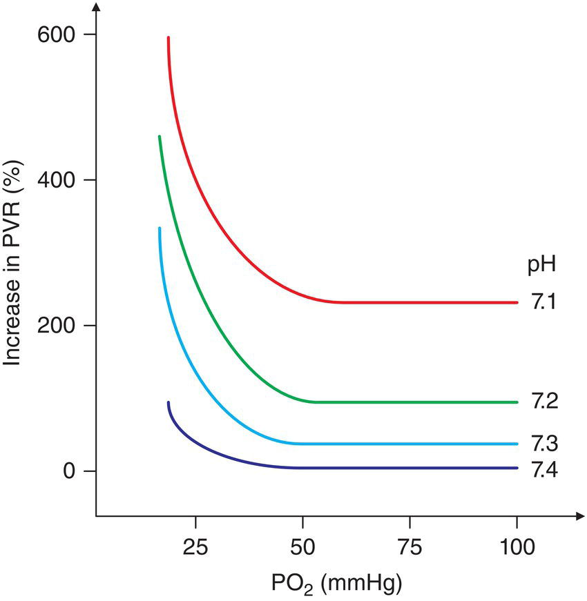

[**Figure 21.9**](#R_c21-fig-0009) Patterns of pulmonary vascular responses to changes in pH and PO2.

(Source: Rudolph & Yuan \[122\]. Reproduced with permission of The American Society for Clinical Investigation.)

#### Isoproterenol

Isoproterenol, a nonselective β‐adrenergic receptor agonist, is a synthetic derivative of norepinephrine. Isoproterenol has more chronotropic than inotropic effects and lowers the SVR. It is used to treat hemodynamically significant bradycardia and during cardiac anesthesia in the denervated heart immediately after transplantation. High doses of isoproterenol can be arrhythmogenic, and it is often used in electrophysiologic studies. Isoproterenol induces an increase in myocardial VO2, whereas DO2 decreases as a result of reduced coronary diastolic filling; this may exacerbate or induce ischemia. Therefore, patients receiving isoproterenol should be volume replete.

#### Fenoldopam

Fenoldopam is a selective D1‐receptor agonist that shows potent vasodilatory effects, particularly in the renal, mesenteric, coronary, and skeletal muscle vascular beds. Fenoldopam maintains adequate renal perfusion while reducing blood pressure at the same time. Few data are available regarding its use following CHD surgery. Small, albeit randomized, studies show that it is safe in neonates and has a beneficial effect on kidney function following CPB when high doses are used (1 μg/kg/min) \[126, 127\].

### Current practices

Two recent surveys describe the current international practice variation: the EuLoCOS‐Ped European survey \[27, 32\], completed in 2009, collecting information from 90 centers from 31 European countries, and the survey of the Pediatric Cardiac Intensive Care Society (PCICS) \[26\], completed in 2015, reporting practices in 62 centers, 69% of whom were North American. Medical treatment of LCOS is constrained by a lack of appropriate drug and dosing guidance as acknowledged by the respondents of the European survey \[27, 32\]. Overall, the EuLoCOS survey alone reports 24 different drug regimens to prevent LCOS, and 39 drug regimens to treat LCOS \[27, 32\]. Besides, as mentioned before, 78% of all patients receive at least one cardiovascular drug off‐label, with surgical CHD patients receiving a median of three drugs off‐label \[28\]. Dobutamine alone is licensed for use as inotropic support in children with LCOS in Spain and Germany \[128\], although, efficacy data are lacking in neonates.

Preventive LCOS therapy is a common practice, reported in 77.8% of all pediatric cases in the EuLoCOS survey. However, there is a large variability in the choice of drugs being used, as shown in [Table 21.4](#c21-tbl-0004). The distribution of the timing of administration is different as well. In 64% of all cases, milrinone in prophylactically administered in European centers to prevent LCOS, however, the dosage and duration of administration differ substantially among hospitals: the bolus dose varies from 20 to 300 μg/kg, the maintenance infusion ranges from 0.2 to 1 μg/kg/min, and the duration varies between 6 and 168 hours. The dose of milrinone appears to be less than that recommended by PRIMACORP \[4\], which may be due to concerns about the potential side effects, particularly hypotension and age‐specific pharmacokinetic differences in drug elimination \[51\]. In 32% of cases, milrinone is associated with a catecholamine in the EuLoCOS survey: dopamine, dobutamine, epinephrine, and levosimendan are used in about 16% of cases each, with a large variety of dosages. Of the PCICS respondents, 97% use milrinone to prevent LCOS, most of the time in association with a catecholamine: epinephrine in 43%, dopamine in 36%, dobutamine in 11% and levosimendan in 11% of cases. The high percentage of centers using catecholamines as a preventive therapy, 32% in EuLoCOS and 94% in the PCICS survey, is surprising in view of their serious side effects mentioned before.

[**Table 21.4**](#R_c21-tbl-0004) Current practices for the management of low cardiac output syndrome after congenital heart surgery

| EuLoCOS survey | PCICS survey |
| --- | --- |
| **LCOS prophylactic drug regimen** | **%** | **LCOS prophylactic drug regimen** | **%** |
| Milrinone  
Milrinone + dopamine  
Milrinone + epinephrine  
Milrinone + dobutamine  
Milrinone + levosimendan  
Levosimendan | 25  
12  
11  
9  
7  
7 | Milrinone  
Epinephrine  
Dopamine  
Dobutamine  
Levosimendan | 97  
45  
38  
11  
5 |
| **Timing of administration** | **%** | **Timing of administration** | **%** |
| Intra‐ and postoperatively  
Pre‐, intra‐, and postoperatively  
Intraoperatively  
Postoperatively  
Preoperatively  
Pre‐ and intraoperatively | 57  
21  
8  
8  
4  
1 | Preoperatively  
After anesthetic induction  
When on CPB  
While coming off CPB  
In the Intensive Care Unit | 1  
1  
42  
63  
29 |
| **Treatment of LCOS**  
**with elevated SVR** | **%** | **Treatment of LCOS**  
**with elevated PVR** | **%** | **Treatment of LCOS** | **%** |
| Initial treatment
-   Milrinone
-   Milrinone + dobutamine
-   Milrinone + dopamine

  
First add‐on

-   Epinephrine
-   Milrinone
-   Nitroprusside

  
Second add‐on

-   Epinephrine
-   Levosimendan
-   Dobutamine

 |   
34  
8  
8  
  
24  
11  
9  
  
22  
22  
12 | Initial treatment

-   Milrinone
-   iNO + milrinone
-   iNO

  
First add‐on

-   iNO
-   Epinephrine
-   Sildenafil

  
Second add‐on

-   Prostacyclin derivatives
-   iNO
-   Sildenafil

 |   
17  
13  
10  
  
20  
11  
11  
  
22  
14  
14 | First choice

-   Milrinone
-   Epinephrine
-   Dopamine
-   Dobutamine

  
Second choice

-   Epinephrine
-   Milrinone
-   Corticosteroids
-   Dopamine

 |   
42  
36  
15  
2  
  
39  
15  
10  
9 |

LCOS: low cardiac output syndrome, PVR: pulmonary vascular resistance, SVR: systemic vascular resistance

Results from the EuLoCOS survey 2009 (left) \[27, 32\] and from the Pediatric Cardiac Intensive Care Society (PCICS) survey 2015 (right) \[26\].

The therapeutic strategies to treat LCOS, such as reported by the EuLoCOS and PCICS surveys, are shown in [Table 21.4](#c21-tbl-0004). In keeping with the European survey \[32\], the six drugs that constitute 90% of total drug use to treat LCOS in children are milrinone, dopamine, dobutamine, epinephrine, levosimendan, and methylprednisolone. Milrinone monotherapy was the preferred drug regimen for the initial treatment of LCOS with elevated SVR, epinephrine was the preferred first add‐on drug and levosimendan was added as the next step. Milrinone monotherapy was the treatment of choice for the initial treatment of LCOS with elevated PVR, the first and second add‐on drugs were iNO and PGI2 derivatives. The PCICS survey revealed milrinone being used as a first choice in only 42% of cases with LCOS, whereas catecholamines (epinephrine and dopamine) were used in 51% of cases. This, again, is surprising in the context of postcardiac surgery LCOS, where the major therapeutic objectives are the decrease of LV and RV afterload, and avoidance of myocardial oxygen debt.

### Inotropic and vasoactive scores

Inotropic and vasoactive scores are derived from summing the maximum dose rates, using correction factors to account for differential units of measurement of inotropes and vasopressor medications administered in the first 24 hours after cardiac surgery. The inotropic score (IS) was first proposed in the Boston Circulatory Arrest Study \[3\] to quantify the pharmacologic cardiovascular support given postoperatively. Later on, it has often been used as a measure of illness severity following cardiac surgery in children even though the score was not created for this purpose. Gaies et al. \[129\] proposed expanding the IS to include other commonly used vasoactive medications, such as milrinone, vasopressin, and norepinephrine, and called it the vasoactive‐inotrope score (VIS). The scores are calculated as:

(21.17) 

(21.18) 

In the absence of a specific pediatric cardiac scoring system for the prediction of postoperative outcome, the VIS has been adopted by many centers as an estimator of the severity of critical illness. A multicenter analysis of data reported to the Pediatric Cardiac Critical Care Consortium \[130\] showed that the maximum VIS calculated in the first 24 hours after cardiac intensive care unit (CICU) admission was strongly and significantly associated with morbidity and mortality, and a maximum VIS ≥ 20 predicted an increased likelihood of clinical outcomes, such as mechanical circulatory support, cardiac arrest, renal replacement therapy, neurologic injury, or mortality. Furthermore, when comparing the predictive ability of LCOS, as defined by clinical parameters, and of the VIS for postoperative outcomes, it appeared that clinically derived LCOS was not associated with early postoperative outcomes, whereas the VIS was correlated with durations of mechanical ventilation, ICU stay, and total hospital charges \[19\]. Our inability to diagnose LCOS based on clinically available parameters alone is acknowledged \[131\], therefore, the VIS has the opportunity to be considered for inclusion into scoring systems as a metrics or diagnostic criterion to improve current definitions of LCOS.

### Individualized perioperative hemodynamic management

In the large majority of cases, children undergo biventricular repair and develop variable degrees of myocardial stunning due to CPB‐related injury. Most often, they require either a so‐called “hands‐off” approach, with minimal intervention and careful observation, or a gentle inodilation therapy. However, the ideal therapeutic approach for one type of circulatory physiology may be detrimental in another, therefore, it is difficult to provide general guidelines for hemodynamic management. An excellent educational review published by Shekerdemian in 2009 \[132\] highlights the need for an individualized strategy, based on a sound knowledge of the underlying physiologies. Examples of individualized hemodynamic management strategies are shown in [Table 21.5](#c21-tbl-0005).

**Abnormalities of diastolic function following right heart surgery.** After repair of tetralogy of Fallot, an LCOS is seen in nearly 50% of patients, as a result of RV diastolic failure \[24\]. This is most likely the result of the exposure of the hypertrophied RV to CPB and reperfusion injury. RV function may further alter due to right ventriculostomy, and especially when the incision is extended across the pulmonary annulus. Transannular patches result in massive pulmonary regurgitation and RV volume overload. In addition, if the pulmonary arteries are hypoplastic, than the RV afterload is increased too. Finally, there is invariably some degree of right bundle branch block after surgery, causing ventricular asynchrony.

Because systolic function is intact, inotropic agents are of little benefit. LCOS results from inadequate RV filling, which is compounded by a reduction in the effective compliance of the LV. During diastole, the hypertensive RV alters the normal trans‐septal pressure gradient, causing the ventricular septum to bow into the LV \[24\]. Spontaneous ventilation, or negative pressure ventilation if the patient’s clinical status does not allow extubation, have been shown to improve hemodynamics \[133, 134\]. Fluid administration is of some benefit; however, the benefit is limited because volume load increases the RV end‐diastolic pressure and volume, and rapidly results in RV dilation, tricuspid regurgitation and further decrease in RV output. Therefore, fluid administration should be careful and rapidly relayed by low‐dose vasoconstrictors.

**Early palliation for functionally univentricular circulation.** In infants with a functionally univentricular heart, the total CO is distributed from a single ventricular stroke volume to the systemic and pulmonary circulations, and the relative distribution of flow is dictated by their respective vascular resistances. In these patients, it is usually necessary to maintain a well dilated systemic vasculature, while controlling the PVR.

Using computer simulations to study the single‐ventricular circulation, Barnea et al. \[9\] demonstrated that high values of QP/QS are always associated with low DO2, which is only partially compensated by increases in CO. Ideally, QP/QS should be kept below 1.5, and a QP/QS ratio between 0.8 and 1.2 with a SvO2 > 50% have become the targets of postoperative managements following the Norwood procedure \[81\]. Li et al. \[5\] demonstrated that the largest amount of DO2 variability is due to QS and RVS, and vasodilation of the systemic circulation is acknowledged as a major contributor to the improvement of DO2. Manipulations of the pulmonary circulation have only minor effects \[5\]. Accordingly, Hoffman et al. \[81\] demonstrated that the most effective approach to improve the inefficiency of the single‐ventricle circulation is to alter the intense sympathetically mediated systemic vasoconstriction using potent α‐adrenergic receptor blockers, such as phenoxybenzamine.

Following the Norwood procedure with a systemic‐to‐pulmonary anastomosis for hypoplastic left heart syndrome, the neonate has a unique convergence of several physiologic vulnerabilities: myocardial dysfunction following ischemia, reperfusion, and CPB, potential limitations of a morphologically right single ventricle and potential aorto‐coronary flow limitation. Because of the risk of additional myocardial ischemia due to a drop in diastolic arterial pressure, excessive systemic vasodilation and hypotension should be avoided and/or treated. The Sano modification has proven to increase very short‐term survival by improving the coronary perfusion of the single ventricle \[135\]; however, long‐term results did not improve.

[**Table 21.5**](#R_c21-tbl-0005) Examples of individualized postoperative hemodynamic management

(Source: Adapted from Shekerdemian \[132\].)

| Underlying physiology | Hemodynamic considerations | Target effect | Current recommendations |
| --- | --- | --- | --- |
| Biventricular circulation early after CPB | Increased afterload  
± Myocardial dysfunction | None  
Vasodilation or inodilation  
Gentle inotropic stimulation | None  
Milrinone  
Low‐dose epinephrine or dobutamine |
| Severe systolic dysfunction | Myocardial dysfunction  
Increased afterload | Increased inotropy  
Vasodilation | Low‐dose epinephrine or dobutamine  
Milrinone  
Levosimendan  
Consider CPS |
| Diastolic dysfunction | Good systolic function  
Hypertrophied and noncompliant ventricle | Preload increase  
Slight vasoconstriction | None  
Careful fluid administration  
Low‐dose norepinephrine |
| Univentricular circulation, early palliation | QP/QS ratio dictated by their respective vascular resistances | Favor QS through afterload reduction Gentle inotropic stimulation if needed | Phenoxybenzamine  
Dobutamine or low‐dose epinephrine  
Milrinone |
| Systemic‐to‐pulmonary artery anastomosis | Systolic function is usually good  
Myocardial ischemia due to diastolic runoff | Inodilation to increase systemic perfusion  
Minimal vasoconstriction to maintain diastolic perfusion pressure  
Stable PVR | Low‐dose epinephrine  
Norepinephrine |
| Postop. Fontan | Systolic function is usually good  
Passive pulmonary blood flow | Pulmonary vasodilation | Oxygen, iNO  
Milrinone |
| Postop. bidirectional cavopulmonary anastomosis | Systolic function is good  
Pulmonary blood flow is passive and equals SVC flow | Pulmonary vasodilation has little effect | None |
| Residual outflow tract obstruction | Good systolic function | Preload increase  
Vasoconstriction | Careful fluid administration  
Norepinephrine |

CPB: cardiopulmonary bypass, CPS: cardiopulmonary support; iNO: inhaled nitric oxide; PVR : pulmonary vascular resistance; QP/QS: Pulmonary blood flow / systemic blood flow ratio, SVC = superior vena cava

**Fontan operations and bidirectional cavopulmonary (Glenn) anastomosis.** LCOS is the main cause of morbidity and mortality in this group. After the Fontan operation, QP is a passive diastolic flow, extremely sensitive to changes in intrathoracic pressure. Therefore, the key to optimising CO often lies in achieving early extubation, as advocated by Fontan himself. Besides, oxygenation is significantly improved by pulmonary vasodilators, which facilitate passive flow into the pulmonary arteries and increase QP. When given in hypoxic patients after Fontan operations, iNO lowers transpulmonary gradient by 40–50% and decreases central venous pressure by 15–20% \[93\]. In such situations, the addition of 0.5 μg/kg/min of milrinone to the regimen results in a synergistic effect, with a further fall in the transpulmonary gradient and a significant improvement in the oxygenation indices \[136\]. Other factors may alter oxygenation, and are less susceptible to medical therapy: pulmonary venous admixture, systemic venous collaterals, and pulmonary arterio‐venous malformations.

As in the case of Fontan circulation, the pulmonary flow following a Glenn anastomosis is passive diastolic and sensitive to changes in the intrathoracic pressure, and keep the upper body elevated, as well as early extubation are key strategies to optimize CO. As shown in [equation (21.15)](#c21-disp-0015), following the Glenn anastomosis DO2 is a complex function of CO and QSVC/QIVC ratio, where QSVC equals QP. Thus, cerebral and pulmonary circulations are connected exclusively in series with each other, and the cerebral and pulmonary autoregulatory mechanisms are in direct competition with each other. There are limited pharmacological options to increase QP in this situation, and oxygen or pulmonary vasodilators have only marginal effect; because cerebral autoregulatory feedback loops override the pulmonary ones, the main factor to increase cerebral blood flow, and as a consequence QP and global CO, is hypercarbia \[137\]. This will be discussed in detail later on.

**Residual obstruction to systemic or pulmonary outflow.** In a minority of children, an LCOS can be directly attributable to residual anatomic lesions. They do not generally respond to medical treatment, and most often require invasive intervention.

In case of significant residual obstruction of the systemic outflow, as seen after relief of aortic stenosis, or after double outlet right ventricle repair, or of the pulmonary outflow, as seen after tetralogy of Fallot repair, reoperation is needed in order to fully relieve the obstruction. However, until this is achieved, a reduction of the preload or afterload with vasodilators is generally not desirable, as it may result in an acute fall in cardiac output. An active inotrope‐oriented strategy is not desirable either, since inotropes may increase the outflow obstruction, and the best strategy is to maintain ventricular preload plus low‐dose vasoconstrictors.

* * *

### KEY POINTS: IMPROVING POSTOPERATIVE OXYGEN TRANSPORT BALANCE

-   Inodilators are the most effective and the most commonly used drugs in the setting of CHD surgery, both for the prevention and treatment of LCOS.
-   Milrinone and epinephrine are the preferred drugs; however, levosimendan has desirable properties and is a promising alternative.
-   Catecholamines have significant metabolic side effects, increase myocardial VO2, and may have variable effects in CHD patients due to variability in receptor function.
-   The pharmacological agents used to improve oxygen transport balance should be chosen based on the underlying pathophysiology.

* * *

## Cardiopulmonary interactions

Mechanical ventilation plays a crucial role in the hemodynamic management of patients following CHD surgery \[138\]. It is easy to underestimate the effects of ventilation on the cardiovascular system or to misinterpret cardiopulmonary interactions as primary cardiovascular events. Both spontaneous and mechanical ventilation induce changes in intrapleural, intrathoracic pressure, and in lung volume, which can independently affect the key determinants of cardiovascular performance. In 1948, Cournand et al. \[139\] showed that CO was reduced in patients receiving intermittent positive pressure ventilation via a mask. This study, one of the first to investigate cardiopulmonary dynamics during mechanical ventilation, showed that CO was inversely correlated with RV filling pressure, which was, in turn, directly influenced by the ventilator settings.

A reduction of FRC after anesthesia and thoracic surgery may cause atelectasis, hypoxia, and respiratory failure. CPB and reperfusion injury result in an intense general inflammatory reaction and diffuse endothelial damage with an increase in vascular permeability. Alveolar and interstitial edema, which may or may not be clinically apparent, reduces dynamic lung compliance (the ratio of the tidal volume to peak inspiratory pressure) and increases the ventilation/perfusion mismatch \[138\]. Mechanical ventilation reverses the inevitable reduction in FRC caused by anesthesia and thoracic surgery, but high mean airway pressures may be necessary to provide equivalent gas exchange in less compliant lungs. This can result in a decrease in CO. Four decades ago, Jenkins et al. \[140\] demonstrated the cardiopulmonary effects of stopping mechanical ventilation after open‐heart surgery in 17 children: FRC, pH, and PaO2 were significantly reduced, whereas RV stroke index significantly increased. The mean FRC on spontaneous ventilation was below normal levels, despite continuous positive airway pressure, and there was a significant increase in PVR in patients with an FRC that fell below 22 mL/kg while on spontaneous ventilation.

### Effects of changes in intrathoracic pressure

#### Effects of changes in intrathoracic pressure on the left heart

The aortic transmural pressure (aortic pressure–intrathoracic pressure) increases during spontaneous inspiration, due to the fall in pleural pressure. As such, the afterload of the LV increases, which may cause pulmonary edema in patients with poor LV function when weaning from mechanical ventilation. Conversely, positive pressure ventilation decreases the afterload of the LV by decreasing the transmural pressure of the LV, and improves VO2/DO2 indirectly, by reducing the work of breathing and the negative inspiratory swings in intrathoracic pressure. LV failure and pulmonary edema are also associated with an increased intrathoracic blood volume. By limiting venous return, a positive intrathoracic pressure, or even simply the use of positive end‐expiratory pressure, can improve the hemodynamic.

#### Effect of changes in intrathoracic pressure on the right heart

In the absence of a left‐to‐right shunt, the CO is equivalent to the systemic venous return. The systemic venous return depends on the pressure gradient between the extrathoracic veins and the RA pressure. Spontaneous inspiration induces a negative intrapleural pressure and increases the RA transmural pressure (RA pressure–intrathoracic pressure). As a result, the RA increases in size and the RA pressure falls. This favors venous return and increases RA filling. Conversely, during positive pressure inspiration, the RA transmural pressure decreases, the size of the RA decreases and the RA pressure increases, thereby lowering the gradient for venous return, and causing it to decelerate. This phenomenon is aggravated in case of hypovolemia and of gas trapping associated with obstructive airway disease. Circulatory reflexes (adrenergic‐mediated reductions in venous capacitance and renin‐angiotensin‐aldosterone system induced volume expansion) increase the circulatory filling pressure in an attempt to maintain the pressure gradient for venous return. Volume loading and ventilatory strategies to reduce the intrathoracic pressure can be used to compensate and augment venous return.

#### Effects of changes in intrathoracic pressure on PVR

PVR is the main determinant of RV afterload and is directly affected by changes in lung volume. PVR depends on the balance between the vascular tone of the alveolar vessels, and that of the extra‐alveolar or parenchymal vessels. PVR can increase at either extreme of lung volume, as shown in [Figure 21.10](#c21-fig-0010) \[138\]. When the lung is inflated above the FRC, the alveolar vessels become compressed due to alveolar distension. As the lung volume falls towards the residual volume, the terminal airways collapse, which in turn causes alveolar collapse; this ultimately results in hypoxic pulmonary vasoconstriction. When ventilating near “normal FRC,” the impact on PVR and RV afterload is minimal. High‐frequency oscillatory ventilation allows lung volume to be maintained near FRC and avoids the detrimental effects of large wings in lung volume on PVR.

#### Delayed sternal closure

Leaving the sternum open causes a substantial increase in the total respiratory system compliance. Pericardial and sternal closures produce constrictive effects and may interfere with efficient mechanical ventilation after cardiac operations. This is important for infants in whom considerable capillary leak and edema may develop after CPB, and in whom cardiopulmonary interactions have a significant impact on immediate postoperative recovery. Delayed closure is also used electively in high‐risk neonates, as a means of maintaining hemodynamic and respiratory stability during the initial postoperative period \[141\]. Delayed sternal closure is not associated with an increased risk of surgical site infections. Significant hemodynamic changes are seen at the time of sternal closure: atrial pressure and heart rate increase, and mechanical ventilation requirements increase as a result of reductions in total respiratory system compliance, tidal volume, and expired CO2, as shown in [Figure 21.11](#c21-fig-0011) \[142\]. Significant increases in the fraction of inspired oxygen, peak inspiratory pressure and ventilatory rate may be required to maintain tidal volume and gas exchange. After a sustained negative fluid balance is achieved, the sternum can be successfully closed within a couple of days; a retrospective study performed at a large tertiary care center suggested a mean of 3–4 days \[141\].

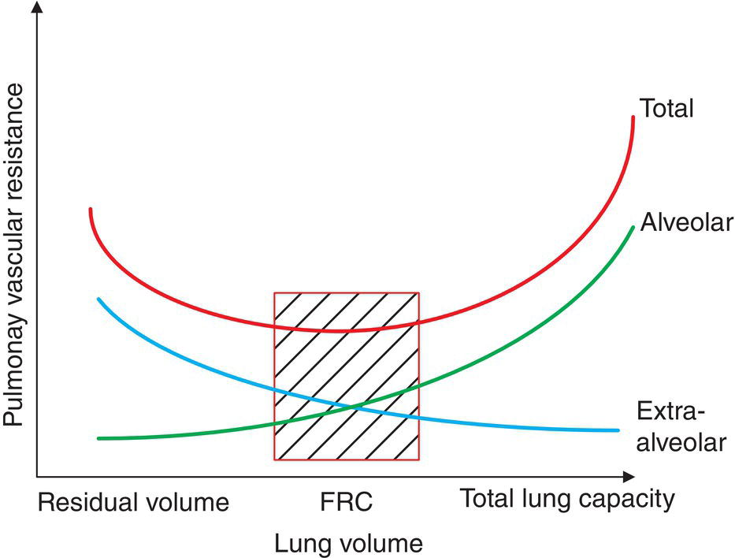

[**Figure 21.10**](#R_c21-fig-0010) Schematic representation of the relation between lung volume and the pulmonary vascular resistance.

(Source: Shekerdemian & Bohn \[138\].)

### Individualized management of the ventilation parameters and cardiopulmonary interactions

As with cardiovascular drugs, appropriate ventilation for one child may be unsuitable for another, depending on the underlying physiology and circulatory status. An illustration of the variability in the ventilation targets according to the underlying pathology is shown in [Table 21.6](#c21-tbl-0006).

**Systolic LV dysfunction**. Patients with systolic LV dysfunction benefit from positive pressure ventilation. This is particularly so in infants with transposition of the great arteries and an intact ventricular septum being operated late after birth, and in those after repair of the anomalous left coronary artery from the pulmonary artery. Elective continuous positive airway pressure ventilation should be considered routinely after tracheal extubation.

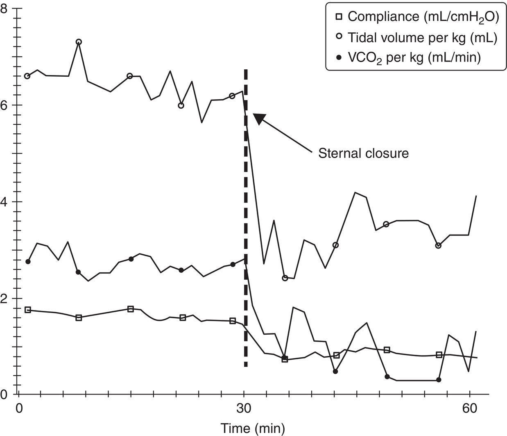

[**Figure 21.11**](#R_c21-fig-0011) Sixty‐minute trend in recorded data during sternal closure in a 2‐week‐old (3.3 kg) infant.

(Source: Main et al. \[142\]. Reproduced with permission of Wolters Kluwer Health, Inc.)

[**Table 21.6**](#R_c21-tbl-0006) Examples of individualized postoperative management of cardiopulmonary interactions

(Source: Adapted from Shekerdemian \[132\].)

| Underlying physiology | Spontaneous respiration | Positive pressure ventilation | Guide for routine ventilation |
| --- | --- | --- | --- |
| Systolic dysfunction early after CPB | Negative intrapleural pressure increases LV afterload | Reduced work of breathing  
Reduces LV afterload and RV preload through avoiding negative swing in pleural pressure | Positive pressure ventilation is beneficial  
Consider extubating to CPAP |
| Tetralogy of Fallot with restrictive RV | Negative intrapleural pressure increases RV preload and diastolic pulmonary artery flow | Reduced RV preload and diastolic pulmonary artery flow | Low airway pressures early after surgery  
Early extubation |
| Postop. Fontan | Negative intrapleural pressure improves pulmonary flow, which is passive | Reduced preload and pulmonary flow | Low airway pressures early after surgery  
Early extubation |
| Postop. bidirectional cavopulmonary anastomosis | Negative intrapleural pressure improves pulmonary flow, which is passive | Reduced pulmonary flow  
Increased cavopulmonary pressures | Keep upper body elevated  
Mild respiratory acidosis while ventilated  
Early extubation |
| Systemic‐to‐pulmonary artery anastomosis | Preoperative tachypnea may result in respiratory alkalosis, pulmonary overcirculation and systemic hypoperfusion | Enables pre‐ and postoperative control of the pulmonary flow | Stable PVR, maintain normal PaCO2 and pH  
Little role for hypoxic gas mix |

CPAP: continuous positive airway pressure; CPB: cardiopulmonary bypass, LV: left ventricle; PaCO2: partial arterial carbon dioxide tension; RV: right ventricle

**Diastolic RV dysfunction and Fontan circulation**. Patients with RV diastolic impairment have responses to positive pressure ventilation, which are very different from those with systolic dysfunction. Isolated RV diastolic dysfunction is seen in nearly 50% of patients with a tetralogy of Fallot repair \[24\] and can result in LCOS due to impediment of the pulmonary blood flow. If the patient’s clinical status allows, a method of ventilation that permits patient‐initiated breathing will result in a lower intrathoracic pressure than if all breaths are ventilator derived. It is also suggested that negative pressure ventilation, which increases pulmonary blood flow by up to 67% in patients suffering from RV diastolic dysfunction, might be a useful hemodynamic tool in such cases \[134\]. Postoperative care should include the use of conservative airway pressure aiming for early extubation.

A very similar situation is seen in patients following the Fontan operation. Pulmonary blood flow in the Fontan circulation is predominantly passive, and depends on adequate venous return to a low resistance, unobstructed pulmonary circulation. The pulmonary blood flow is very dependent on a low intrathoracic pressure, and augmented by a negative intrathoracic pressure, such as seen during spontaneous respiration. During positive pressure ventilation, the pulmonary blood flow is compromised, and therefore, early extubation is often the key to optimizing CO. Negative pressure ventilation has been tried in Fontan patients with an LCOS in whom early extubation was not possible: pulmonary blood flow increased by 42% and CO improved by an increase in stroke volume \[143\].

**Bidirectional cavopulmonary (Glenn) anastomosis**. There are similarities between the pulmonary circulation of patients after bidirectional cavopulmonary anastomosis and those with the Fontan circulation, in that the QP is preload‐dependent and relies upon a low resistance and unobstructed pulmonary bed. Similar to Fontan patients, they should be ventilated with conservative airway pressures, aiming early extubation. A consequence of circulation following Glenn anastomosis is that cerebral and pulmonary circulations are connected exclusively in series with each other. Thus, the cerebral and pulmonary autoregulatory mechanisms are in direct competition with each other: the brain vasculature dilates in response to hypercarbia, and the lung vasculature vasoconstricts, and the opposite holds true for hyperoxia \[144\]. The result is that the cerebral autoregulatory feedback loops override the pulmonary one, and hypercarbia markedly increases cerebral blood flow, and as a consequence QP, oxygenation indices and the global CO. A prospective observational study in infants undergoing the Glenn anastomosis showed that when increasing PaCO2 from 35 to 45 and 55 mmHg, cerebral blood flow and QP increased, as did CO. It was also suggested that the effect of CO2 on global oxygenation was not the result of selective cerebral vasodilatation, but rather a consequence of an increase in QS and decrease in SVR \[137\]. Both oxygen and iNO, which are potent pulmonary vasodilators, have little impact \[145\], and hyperventilation with alkalosis does not improve systemic oxygenation after the Glenn anastomosis \[146\].

**Postoperative PHT**. Postoperative PHT may complicate the recovery of infants after repair of obstructed pulmonary venous drainage, or after closure of large left‐to‐right shunts. Ventilatory targets should include low/normal PaCO2, the absolute avoidance of hypoxia and of agitation or stress, and sedation boluses should be routinely considered before endotracheal suction in high‐risk patients.

**Systemic‐to‐pulmonary artery anastomosis**. In patients with hypoplastic left heart syndrome before or after a systemic‐to‐pulmonary artery anastomosis, ventilation was used to induce pulmonary vasoconstriction through deliberate acidosis and hypoxia, with the intention of decreasing pulmonary perfusion and increasing systemic perfusion. This, however, is now questioned, since it has been shown that the main driver of an improvement in systemic DO2 is systemic vasodilation; modest additional inspired oxygen, a normal PaCO2, and a normal acid–base balance result in further improvement of the systemic DO2 \[5\].

* * *

### KEY POINTS: CARDIOPULMONARY INTERACTIONS

-   PPV can compromise RV function by decreasing venous return (preload).
-   PPV can improve LV function by decreasing ventricular transmural pressure gradient (afterload).
-   PPV near normal FRC has the least effect on PVR.
-   Sternal closure exacerbates cardiopulmonary interactions.
-   The management of cardiopulmonary interactions depends on the pathophysiology of the underlying CHD.

* * *

## Monitoring

Estimating the adequacy of DO2 in pediatric patients with CHD is challenging. In addition to findings on physical examination, parameters derived from electronic monitoring have become a major quantitative description of patient state. There are no specific recommendations for the monitoring following pediatric cardiac surgery. The European Society of Pediatric and Neonatal Intensive Care (ESPNIC) has established recommendations for the monitoring of critically ill children based upon expert consensus \[147\]. There is a strong agreement upon the fact that there is no single clinical parameter that allows evaluation of the global hemodynamic status in children, and that hemodynamic therapy should not be titrated solely based on clinical signs. The periodical evaluation and serial longitudinal assessment of clinical and hemodynamic monitoring parameters is also strongly recommended, in order to assess response to therapy.

### Clinical hemodynamic variables and standard perioperative monitoring

Although clinical hemodynamic variables, such as heart rate, capillary refill, core peripheral temperature gap and fluid balance are the mainstay of critical care management in CHD patients, they are poor predictors of adverse outcomes. Standard and routinely perioperative monitoring parameters include invasive blood pressure, central venous pressure, pulse oximetry, and continuous capnography in intubated patients.

Invasive blood pressure monitoring is indicated during cardiac surgery with CPB. Although it does not provide direct information about CO, evidence point to the utility of the quantification of respiratory variation in blood pressure as an indicator of preload responsiveness \[148\]. Central venous pressure is commonly placed for the perioperative period of CHD surgery, and it is thought to be a surrogate for RV preload, although sensitive to ventricular compliance. Many centers additionally monitor left atrial pressure through a left atrial line placed intraoperatively. It is an indicator of the LV preload, although the relationship between left atrial pressure and LV preload varies with changes in LV compliance, which are common following CPB. Left atrial lines are mostly used in neonates, in patients with hypoplasia and/or outflow obstruction of the LV, and in those with mitral surgeries; they also allow for the calculation of the transpulmonary gradient in patients who undergo staged single‐ventricle palliation.

Pulse oximetry is a standard of care in pediatric anesthesia since the 1990s, and has greatly reduced the incidence of perioperative hypoxic injury. There are, nevertheless, important sources of error inherent to pulse oximetry, such as movement, dyshemoglobinemia, tissue pigment, and LCOS; it is acknowledged that it tends to overestimate arterial saturation as the arterial saturation decreases.

Capnography, an indicator of PaCO2, identifies endotracheal tube displacement, airway obstruction, and is an indicator of pulmonary perfusion during resuscitation. However, the end‐tidal PCO2–PaCO2 gradient widens with a reduction in pulmonary blood flow, such as seen in LCOS, obstruction to pulmonary blood flow or pulmonary hypertensive crisis.

Despite of their widespread adoption, none of these parameters quantifies DO2, and the identification of inadequate DO2 before hypoxic–ischemic insult occurs relies on the ability of the clinician to interpret these parameters. Such a limitation can be illustrated by taking the postoperative period following the Norwood operation as an example. Using simulations of the single‐ventricle circulation, Barnea et al. \[9\] demonstrated a nonlinear relationship between DO2 and SaO2 ([Figure 21.12](#c21-fig-0012), panel A). As SaO2 increases, DO2 increases, reaches a peak, and then decreases rapidly. Peak DO2 occurs at QP/QS < 1. However, following the Norwood operation, QP/QS is commonly about 1.5. When QP/QS > 1, slight increases in SaO2 are associated with large decreases in DO2.

Another illustration of these limitations is fluid balance, another commonly monitored clinical parameter. A positive fluid balance has a detrimental impact on organ function in critically ill children, as shown by the dose–response relationship between increasing degrees of fluid overload and the length of mechanical ventilation and PICU stay \[149\]. However, factors, such as bleeding and hypovolemia, use of perioperative ultrafiltration, use of diuretics, and postoperative acute kidney failure can bias fluid balance in the setting of CHD surgery. On the other hand, the most critically ill patients require more initial fluid resuscitation; thus, it is unclear whether fluid balance is simply the result of the severity of illness or is an independent contributor to multiorgan dysfunction. Furthermore, the most important challenge is likely to be the assessment of acute fluid redistribution which is a consequence of the inflammatory response to CPB, variable degrees of capillary leak syndrome, and concomitant organ dysfunction.

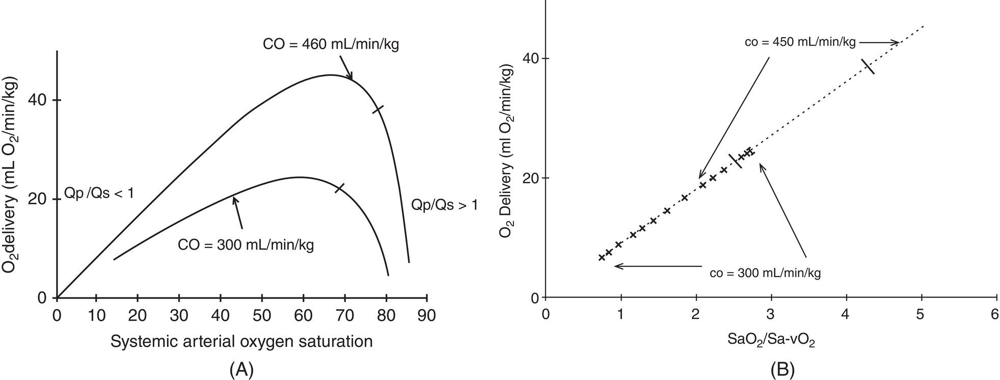

[**Figure 21.12**](#R_c21-fig-0012) Simulations of the relationship between oxygen‐derived parameters and systemic oxygen delivery (DO2) following the Norwood operation. The curves shown in panel A were generated by setting the cardiac output (CO) at 300 and 450 mL/min/kg and varying the QP/QS ratio from 0.2 to 10. The short line on each curve represents the point at which QP/QS = 1. Note that similar low and high DO2 can be generated with several combinations of CO and SaO2. As an example, at a SaO2 of 70%, DO2 can range between 21.9 and 45 mL O2/min/kg, depending on CO. Note that in the region of the curves, where QP/QS > 1, small variations in SaO2 result in large changes in DO2. As an example, for the curve generated by setting CO at 450 mL/min/kg, increasing SaO2 from 80 to 85%, decreases DO2 from 34.1 to 14.6 mL/min/kg. By contrast, as shown in panel B, the oxygen excess factor (Ω = SaO2/(SaO2‐SvO2)) is independent from the CO, whether 300 mL/min/kg (light dashed line with Xs) or 450 mL/min/kg (heavy dashed line), and it has a linear relationship with the systemic DO2.

(Source: From Barnea et al. \[9\]. Reproduced with permission of Wolters Kluwer Health, Inc.)

In the postoperative setting of CHD surgery, ultrasonography has become a standard diagnostic and monitoring tool. Although there are no specific recommendations in the CHD surgery setting, the international Euro‐American panel of pediatric and neonatal experts in Point‐of‐care ultrasound of the ESPNIC has recently reviewed the literature and established guidelines for the ultrasound‐based monitoring of critically ill children \[150\]. Ultrasonography is an excellent tool to obtain hemodynamic information and aid clinical decision making by assessment of preload, of fluid responsiveness, of pulmonary artery pressure along with diagnosis of pericardial effusion and qualitative assessment of cardiac function. Lung ultrasonography may also be helpful to detect pneumonia, pneumothorax, or pleural effusions, and particularly to evaluate lung edema in the context of heart failure \[151\].

### Assessment of cardiac output

In current practice, direct measurement of cardiac output is rare. However, our ability to accurately estimate CO, based on clinical parameters, is poor \[131\]. The clinical estimate of CO is even more challenging in single‐ventricle patients with parallel circulation. The assumption that objective measurement, and hence manipulation, of hemodynamic variables may improve outcome, supports the need for a safe, accurate and repeatable technique for measurement of cardiac index in critically ill children. Unfortunately, the use of invasive techniques, such as percutaneous insertion of pulmonary artery catheters, may be judged to have an unfavorable risk/benefit ratio in children, despite their ability to provide information relevant to optimizing CO. The main technologies and devices used to monitor CO following CHD surgery in children are listed in [Table 21.7](#c21-tbl-0007). They are all based by on the estimation of the stroke volume. Thus, the sinus rhythm is required to derive an accurate CO estimate.

#### Systems for monitoring cardiac output

Intermittent thermodilution through a pulmonary artery catheter has been the gold standard method for CO monitoring since the late 1960s. This method is, nevertheless, invasive, so that, the use of the pulmonary artery catheter decreased in the 1990s. Development of the less invasive monitoring of CO using the transesophageal Doppler started in the 1990s. The ESPNIC recommendations for the monitoring of critically ill children \[147\] propose ultrasound‐based methods for the initial assessment of unstable patients. Thermodilution techniques are reserved for cases in which reliable absolute CO measurements are deemed necessary, and for which it is recommended to use an invasive and, if possible, continuous CO monitoring \[147\].

**Transpulmonary dilution methods.** Transpulmonary thermodilution (TPTD) was developed in the 1990s. Although less invasive than the initial thermodilution method through a pulmonary artery catheter, a dedicated central venous line and a central arterial line are required. In contrast to the pulmonary artery catheter method, cold saline is injected in a central vein instead of the RA, and blood temperature is measured in a systemic artery instead of the pulmonary artery. TPTD estimates CO through the analysis of the arterial thermodilution curve, and, according to the Stewart–Hamilton equation, CO is inversely proportional to the area under the indicator time curve. TPTD has the unique advantage of being able to estimate at the bedside extravascular lung water, which quantifies the volume of pulmonary edema and quantifies the degree of a pulmonary capillary leak. The new Vigilance II monitor (Edwards Lifescience, Irvine, CA) uses thermal energy emitted by a filament located on the catheter to continuously calculate cardiac output using the thermodilution principle. TPTD is implemented and serves for the external calibration of several pulse contour analysis monitors.

[**Table 21.7**](#R_c21-tbl-0007) Nonexhaustive list of the available cardiac output monitoring systems validated in children with congenital cardiac operations

(Source: Adapted from Ramsingh et al. \[152\] and van Wijk et al. \[153\].)

| Technology | System | Invasiveness | Mechanism | Advantages | Clinical issues |
| --- | --- | --- | --- | --- | --- |
| **Transpulmonary dilution methods** | Vigilance II® (Edwards Lifescience, Irvine, CA, USA) | ++ | TPTD | Gold standard for continuous CO monitoring.  
Continuous pulmonary pressure and SvO2 monitoring | Requires a dedicated central venous catheter and a femoral artery catheter. |
| COstatus®  
(Transonic Systems Inc, Ithaca, NY, USA) | ++ | Transpulmonary ultrasound dilution with saline | Uses an existing central venous and arterial catheter  
Quantification of intracardiac shunts. | Intermittent CO estimation.  
Sensitive to changes in vasomotor tone |
| **Ultrasound‐based methods** | CardioQP®  
(Deltex Medical; Irving, Texas, USA) | 0/+ | Transesophageal Doppler ultrasound | Continuous CO monitoring  
Minimally invasive | Requires manipulation for proper position  
Operator‐dependent |
| USCOM®  
(USCOM Ltd, Sydney, New South Wales, Australia) | 0 | Suprasternal Doppler ultrasound | Noninvasive CO measurement | Intermittent CO estimation  
Operator‐dependent |
| **Pulse contour analysis** | PICCO®  
(Pulsion, Feldkirchen, Germany) | ++ | Pulse contour analysis  
Calibration by TPTD | Continuous CO monitoring.  
Continuous SvO2 monitoring.  
Good accuracy. | Requires a central venous catheter and a specific femoral artery catheter.  
Requires periodic external calibration by TPTD. |
| FloTrac/Vigileo®  
(Edwards Lifescience, Irvine, CA, USA) | + | Pulse contour analysis | Continuous CO monitoring.  
Self‐calibration. | Requires a dedicated arterial catheter. Sensitive to changes in vasomotor tone. |
| Mobil‐O‐Graph® (I.E.M GmbH, Stalberg, Germany) | 0 | Pulse contour analysis through a cuff placed around the arm. | Continuous CO monitoring.  
Self‐calibration. | Only investigated in patients > 10 years |
| ClearSite®  
(Edwards Lifescience, Irvine, CA, USA) Formerly known as Nexfin® | 0 | Pulse contour analysis through a finger cuff with infrared photoplethysmography | Continuous CO monitoring.  
Self‐calibration. | Motion artefacts |
| **Thoracic bioimpedance** | ICON®  
(Cardiotronic/Osypka Medical, Inc, La Jolla, CA, USA) | 0 | Bioimpedance  
In small infants: 4 electrodes placed on the left leg, chest, neck and cheek or forehead  
In older children: 4 electrodes placed on the left chest and left side of the neck | Continuous CO monitoring | Reliable in critically ill patients 1 day to 19 years old |
| Aesculon® (Osypka, Medical GmbH, Berlin, Germany and San Diego, CA, USA) | 0 | Bioimpedance  
4 electrodes placed on the left chest and left side of the neck | Continuous CO monitoring | Underestimates CO in children |
| PhysioFlow® (Neumedx, Philadelphia, PA, USA) | 0 | Bioimpedance  
6 electrodes placed on the thorax and left side of the neck | Continuous CO monitoring | Underestimates CO in children |
| **Bioreactance** | NICOM® (Cheetah Medical, Wilmington, Delaware, USA) | 0 | Bioreactance  
4 double electrodes placed on the thorax. | Continuous CO monitoring | Reliable CO values in patients > 10 kg with normal heart anatomy  
CO values not reliable in patients with cardiac defects |

CO: Cardiac output; TPTD: Transpulmonary thermodilution; ++: Invasive; +: Minimally invasive; 0: Noninvasive

COstatus (Transonic Systems Inc., Ithaca, NY, USA) is a novel monitoring device, which uses an extra‐corporeal arterio‐venous loop and two ultrasound sensors, one on each side of the loop. The changes in the transit time of the ultrasound beam, crossing the loop when body temperature saline is injected, are used to calculate CO via the Stewart–Hamilton equation. COstatus is considered an accurate CO monitor in infants \[154\].

To obtain a reliable measurement of CO using transpulmonary dilution methods, the following conditions must be met: (i) constant blood flow; (ii) minimal loss of the indicator; (iii) complete mixing of the indicator in the blood; and (iv) a single passage of the indicator. Several of these conditions are violated after CHD surgery. The blood flow is not constant in the presence of valvular regurgitations. Left‐to‐right intra‐ or extracardiac shunting (collaterals) result in loss of the indicator. Finally, there is always a degree of recirculation of the indicator, which increases in the presence of a right‐to left intracardiac shunting. In such situation, continuous CO monitoring is still feasible, although it should be viewed as a method that measures a trend rather than an absolute value. In a very original manner, using data from the aforementioned artifacts, the COstatus monitor can detect shunts and estimate the QP/QS ratio of the intracardiac shunts \[155\].

**Ultrasound‐based methods** quantify the stroke volume (and hence the CO) by measuring the aortic or pulmonary valve velocity time integral, and the valve annulus diameter. The technique requires a trained operator and can be performed using transthoracic and transesophageal echocardiography. Transesophageal Doppler probes have been designed specifically to assess descending aortic flow and to calculate CO, with either a built‐in nomogram or M‐mode measurement to calculate the aortic diameter. Decreasing probe sizes allow placement in pediatric patients of ≥3 kg. Major biases, however, may prevent the correct estimation of CO using transesophageal Doppler \[156\]. Errors are due to the angle of insonation, the assumption of specific flow profiles across the vessels when calculating average flows, and to the measurement of the cross‐sectional area of the vessel being imaged. Additionally, the assumption is made that there is a constant flow between the ascending and the descending aorta, which is not always the case in the setting of CHD. Finally, the measurement is highly operator‐dependent because the device requires manual positioning of the probe for optimum signal acquisition. The reported accuracy of ultrasound‐based methods is controversial; when compared with TPTD, minimally invasive techniques like the CardioQP esophageal Doppler monitor underestimates CO \[157, 158\], whereas the ultrasonic cardiac output monitor (USCOM) appears reliable in children when operated by trained users \[159\]. Normal ranges of the cardiovascular parameters measured using the USCOM have recently been published for a large age range \[160\].

**Pulse contour analysis of intra‐arterial blood pressure waveform** is used by mini‐invasive systems aiming to estimate CO continuously. The arterial pressure waveform is a complex physiological signal that is determined by the interaction of LV stroke volume, SVR, and vascular compliance. Thus, the CO estimate is highly dependent on vasomotor tone and vascular compliance, and, because of the nonlinear pressure–volume relationship within the arterial circulation, requires repeated recalibration by a compliance independent system. The pulse contour analysis monitors are more or less invasive, depending on the arterial pressure measurement method: dedicated arterial catheter or external sensor/finger cuff, and on the calibration method: external calibration by TPTD or self‐calibration. Minimally invasive devices require an arterial catheter, whereas noninvasive devices use the volume clamp method by a finger cuff, or applanation tonometry by a sensor placed on the skin over the radial artery. External calibration uses TPTD, whereas self‐calibration is based on the compensation for aortic compliance using demographic and biometric data, and on the estimation of the vascular tone from the mean arterial pressure. Relatively little and somewhat disappointing data are available in the setting of CHD surgery. The PICCO® (Pulsion, München, Germany) device has been validated in CHD surgery, and found to be as accurate as TPTD \[161\]. Frequent recalibration is required when the vasomotor tone changes, which is the case in the postoperative cardiac setting. The Mobil‐O‐Graph® (I.E.M GmbH, Stolberg, Germany) device has been used in patients older than 10 years; at low CO values, however, the monitor overestimated the CO when compared with echocardiography measurements \[162\]. In children with cardiac transplant, cardiomyopathies or PHT undergoing cardiac catheterization, the FloTrac®‐estimated CO showed poor agreement with TPTD \[163\].

**Bioimpedance cardiometry** measures changes in thoracic electrical bioimpedance during the cardiac cycle via electrodes placed on the skin. The change in orientation of the red blood cells in the aorta, from random during diastole to an aligned or parallel orientation during systole, causes changes in electrical conductivity and electrical impedance. Electrovelocimetry relates the maximum rate of change of impedance to peak aortic blood acceleration during the cardiac cycle to estimate stroke volume. Reported accuracy of these devices on pediatric populations is controversial. In an observational study, the ICON® device provided real‐time hemodynamic information regarding developing hemodynamic events and successfully tracked the rapid response to interventions in children 1 day–19 years old \[164\]. The Aesculon® monitor (Osypka Medical, Berlin, Germany and San Diego, CA, USA) is one of the most studied in CHD surgery setting. It provides CO estimates which showed good agreement with those derived from the direct Fick‐oxygen principle in children undergoing diagnostic heart catheterization \[165\]. In neonates undergoing the arterial switch operation, it provides similar estimates to those derived by transthoracic Doppler‐estimated CO \[166\]. However, the same device underestimated the CO when compared with transthoracic echocardiography in older infants \[157\], and underestimates the CO when compared with TPTD \[167\]. Similar results were reported with the PhysioFlow® device (NeuMeDx, Philadelphia, PA) during cardiac catheterization in children with CHD \[168\]. Arrhythmia and pleural effusions may limit its use.

**Bioreactance cardiometry** is the analysis of the variation in the frequency spectra of a delivered oscillating current that occurs when the current traverses the thoracic cavity. The NICOM® monitor (Cheetah Medical, Wilmington, Delaware, USA) provided CO values which showed a good correlation with echocardiography‐estimated CO in pediatric patients > 10 kg with normal heart anatomy, but underestimated CO in patients with ventricular septal defects \[169\].

Despite lots of efforts to implement them, the reliability of such mini‐ or noninvasive devices is under question. A meta‐analysis of CO monitoring devices in adults found that no noninvasive device or technology was interchangeable with TPTD: the percentage of error was 42% for bioimpedance and 45% for noninvasive pulse contour analysis, where a maximum of 30% error is considered acceptable \[170\]. A meta‐analysis of mini‐invasive CO monitors in children showed that bioimpedance cardiometry provided the smallest bias and lowest percentage error when compared with TPTD \[171\].

### Near infra‐red spectroscopy

Near‐infrared spectroscopy (NIRS) provides real time information regarding regional tissue oxygenation (rSO2) and oxygen uptake/consumption balance in a volume of tissue to a depth of approximately 2.5–3 cm. The parameter displayed is a relative number calculated using an algorithm calibrated from _in vivo_ and _in vitro_ models. In children with CHD requiring CPB, prolonged perioperative cerebral desaturation < 45%, as assessed by NIRS, has been associated with reduced DO2 and/or increased extraction rate of the brain, abnormal brain magnetic resonance findings, and worsened neurodevelopmental outcomes \[172, 173\]. Phelps et al. reported that a cerebral rSO2 value below 55% in the first 48 hours after surgery had been highly predictive of an adverse outcome in 50 infants who had undergone the Norwood procedure \[174\]. Therefore, cerebral NIRS monitoring has become a standard in many pediatric cardiac centers.

Despite significant efforts during the last two decades aiming at the definition of normal ranges and lower safety margins, consensus regarding these important targets has not yet been reached. Pediatric anesthesiologists have adopted common adult patient intervention limits like an absolute value <55% or a 20% drop from baseline. These thresholds have been recently questioned, since it has been shown that a decrease in perioperative cerebral rSO2 of less than 20% is associated with negative behavioral changes on postoperative day 7 in noncardiac pediatric patients \[175\].

However, an NIRS monitoring strategy focusing exclusively on the brain is inappropriate to assess the amount of O2 available to organs with perfusion regulated by different neurohormonal mechanisms, and the concept extended from the initial purpose of cerebral monitoring. Multisite NIRS monitoring is a new trend, with some initial evidence of its capability to detect early stage LCOS. Several authors showed that the linear combination of postoperative somatic and cerebral rSO2 is a reliable indicator of postoperative LCOS, lactate concentration, morbidity and mortality \[176, 177\]. Averaged cerebral and renal rSO2 < 65% predicted a lactate level > 3 mmol/L within 24 hours of CHD surgery \[176\].

Hoffman et al. \[177\] designed an original two‐site method using cerebral and somatic probes. Oxygen extraction by the brain is high (about 35%), and flow–metabolism coupling is achieved by an autoregulatory mechanism. By contrast, the oxygen extraction of the kidney is low (10–15%), and renovascular resistance is under tight sympathetic control. Under normal conditions, renal rSO2 is 15–20% higher than brain rSO2. In the early stage of LCOS, the vascular resistance increases, and flow is redistributed to preserve cerebral blood flow at the expense of somatic perfusion: the perfusion of the kidney and renal rSO2 are expected to drop dramatically, whereas cerebral rSO2 remains high, and the gradient narrows or becomes negative. According to Hoffman et al. \[177\], the somatic–cerebral rSO2 gradient below 10%, can be used to assess shock and the risk of anaerobic metabolism, as suggested in [Figure 21.13](#c21-fig-0013). In infants at rest, somatic sensors provide similar rSO2, regardless of whether they are positioned on the kidney, arm, or thigh; however, renal rSO2 has the largest variability in response to flow and pressure variations \[178\], suggesting that monitoring of renal rSO2 may provide the largest amount of information with regard to somatic perfusion.

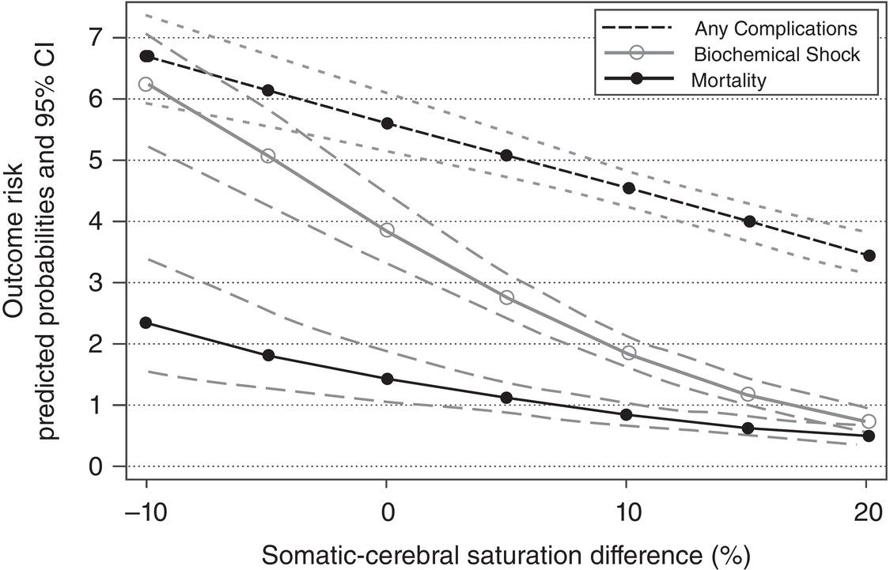

[**Figure 21.13**](#R_c21-fig-0013) The somatic–cerebral saturation gradient estimates the adequacy of DO2 and is associated with outcome. Data from the Children’s Hospital of Wisconsin hypoplastic left heart syndrome stage I perioperative database comparing the probability of complications and postoperative somatic–cerebral saturation gradient assessed hourly for 48 hours.

(Source: From Tweddel et al. \[177\]. Reproduced with permission of Elsevier.)

NIRS measures of hemoglobin saturation are heavily venous‐weighted, correlate with regional venous saturation, and can, therefore, be used as a noninvasive surrogate for regional SvO2. This enables the calculation of another increasingly used parameter, fractional regional tissue oxygen extraction:

(21.19)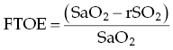 

This composite parameter reflects the regional DO2/consumption balance, and represents an estimation of end‐organ perfusion. Because different organs have different flow–metabolism relationships, estimation of global oxygen economy is improved by probing fractional tissue oxygen extraction (FTOE) from multiple organ beds. NIRS is currently the best available tool to continuously and noninvasively measure regional tissue‐oxygenation and perfusion.

Several factors may interfere with the NIRS measurements. Those that are specific to its use as a cerebral monitor include PaCO2, cerebral autoregulation, and extracerebral contamination of the signal, while others include light contamination, interference between the two probes, dark skin, the arterio‐venous ratio in the tissue, and drugs that modify vasomotricity. The use of the somatic–cerebral rSO2 gradient avoids the variability of the NIRS signal related to cyanosis.

### Mixed venous saturation

Mixed venous saturation (SvO2) provides an estimate of global oxygen balance by measuring the postextraction systemic O2 saturation, and it is therefore more directly related to tissue oxygenation than to CO measurement.

If we ignore dissolved oxygen, then [equation (21.1)](#c21-disp-0001) can be rewritten as

(21.20)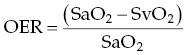 

Thus

(21.21)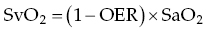 

and since SaO2 is often kept > 0.9, one can roughly estimate that

(21.22) 

This simple relationship indicates that SvO2 is directly related to OER \[179\]. The critical OER level defined by the onset of anaerobic metabolism is approximately 0.5–0.6. Therefore, it follows that the critical SvO2 is approximately 40–50%. SvO2 levels less than 50% should be carefully considered and acted upon and SvO2 levels between 50 and 70%, therefore, low, must be interpreted in the context of the adequacy of tissue oxygenation \[18\].

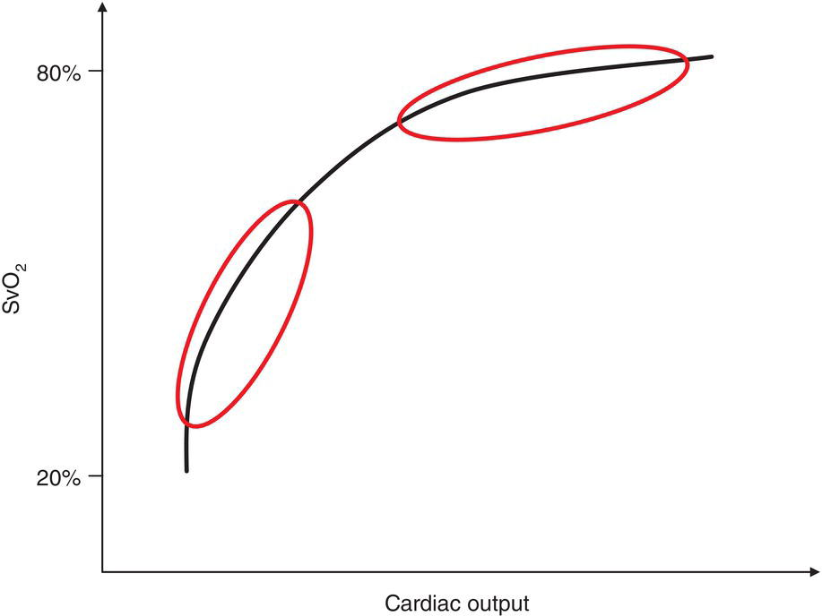

[**Figure 21.14**](#R_c21-fig-0014) The relationship between mixed venous saturation (SvO2) and cardiac output, based on the Fick equation.

(Source: Adapted from Walley \[179\].)

The O2 extraction and, thus, venous saturation levels vary across various organs and SvO2 is a mix of venous saturation of all organs. As CO falls, blood flow is redistributed to maintain vital organ perfusion. Oxygen saturation falls first in the IVC, and it is accompanied by a less severe drop in SvO2. As CO falls further, the SVC and jugular saturations begin to decrease. [Figure 21.14](#c21-fig-0014) illustrates the relationship between CO and SvO2 according to the Fick equation, and suggests that when CO is high, minor variations in CO are related to large variations in SvO2, and that when CO is low, large variations in CO are related to minor variations in SvO2. Thus, SvO2 measurements perform poorly when SvO2 is clinically irrelevant (high CO) but perform well in clinically relevant situations where DO2 may be inadequate.

A true SvO2 should reflect complete mixing of the returning systemic venous blood, making the pulmonary artery the most accurate sampling site. The difference between the venous saturation when drawn from a thoracic central line with the tip placed in the RA or SVC (ScvO2) and SvO2 is primarily due to mixing of less saturated blood from the coronary sinus in the RA. However, the heterogeneity of flow and metabolic demand within and between organs under critical conditions, and decreased cerebral oxygen uptake during sedation, also play a role. Nevertheless, there is an excellent correlation between SvO2 and the ScvO2.

ScvO2 has the potential to predict adverse events following CHD surgery \[180\]. A ScvO2 drop to 40% for more than 18 min, or below 50% for more than 35 min, were highly predictive of multiorgan failure, reoperation or reopening of the chest, and a need for extracorporeal support \[180\]. Following the Norwood operation, reductions in SvO2 reflected tissue hypoxia despite apparently normal hemodynamic parameters, and continuous SvO2 monitoring has the potential to improve survival \[181\]. Data from continuous ScvO2 monitoring demonstrated that only 32% of the SvO2 variance could be explained by SaO2 variations following the Norwood operation, and that the main driver of DO2 improvement was intense afterload reduction \[81\].

The interpretation of SvO2 following early palliation with systemic‐to‐pulmonary anastomosis in infants with a functionally univentricular hearts require some special attention. Traditionally, SaO2 has been used as a rough index of QP/QS ratio, and systemic vasoconstriction has been reported in response to failing systemic perfusion at SaO2 above 80%. It has also been suggested that SvO2 levels as low as 55% may represent ideal hemodynamics for a patient with a single ventricle \[182\] due to complete mixing of the arterial and venous blood. Using computer simulations to study the single‐ventricular circulation, Barnea et al. \[9\] provided a subtle interpretation of the oxygenation parameters. The total CO is distributed from a single ventricular stroke volume to the systemic and pulmonary circulations. The relative distribution of flow is dictated by their respective vascular resistances. Slight increases in SaO2 may be associated with large decreases in DO2, as shown in [Figure 21.12](#c21-fig-0012), panel A. Also, high values of the QP/QS ratio are always associated with low DO2, which is only partially compensated by increases in CO. Ideally, the QP/QS ratio should be kept below 1.5, therefore, a QP/QS ratio between 0.8 and 1.2 and SvO2 > 50% have been provided as targets for hemodynamic optimization \[81\]. However, taken alone, SaO2, SvO2, or the QP/QS ratio cannot be used to maximize DO2, and [equation (21.9)](#c21-disp-0009) shows that DO2 is a complex function of both the CO and the QP/QS ratio. The index that should best guide therapy to increase DO2 is the oxygen excess factor:

(21.23)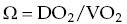 

If dissolved oxygen is ignored, then this can be rewritten as

(21.24) 

A linear relationship has been demonstrated between Ω and DO2, irrespective of the CO, as shown in [Figure 21.12](#c21-fig-0012), panel B \[9\]. The normal ratio is of 4 to 5 times the amount of DO2 to VO2. It is commonly accepted that Ω should be beyond 3.5 following the Norwood procedure, and any intervention that increases Ω is considered beneficial ([Box 21.4](#c21-fea-0004)).

The interpretation of SvO2 following CHD surgery can be overestimated in the presence of residual left‐to‐right shunting. Also, because sympathetic tone increases vascular resistance in splanchnic‐mesenteric beds as CO falls, the relative contribution of desaturated blood from those regions to the measured SvO2 level is reduced and critical regional ischemia may occur in the absence of a critical reduction in whole‐body SvO2.

* * *

### [Box 21.4](#R_c21-fea-0004) : Oxygen extraction ratio and mixed venous oximetry

Oxygen extraction ratios based on mixed venous oximetry

-   25% – normal
-   30–40% – increased
-   40–50% – impeding shock
-   50–60% – shock, elevated lactate levels

Normal oxygen extraction ratios for central venous oximetry

-   Right atrium – 25%
-   Jugular vein – 35%
-   Superior vena cava – 30%
-   Inferior vena cava – 20%

Source: Adapted from Bronicki et al. \[18\].

* * *

### Blood lactate

The majority of the ATP pool is produced via oxidative phosphorylation, which generates 36 molecules of ATP/molecule of glucose. The first stage of oxidative phosphorylation is the conversion of glucose to pyruvic acid, which occurs in the cytoplasm. The second stage is the oxidation of pyruvic acid into acetyl coenzyme A, which occurs in the mitochondria as part of the Krebs cycle. Lactate is generated by the reaction between pyruvic acid and reduced nicotinamide adenine dinucleotide (NAD) and requires either oxygen for reconversion into pyruvic acid or energy for conversion to glucose. The normal lactate/pyruvate ratio is approximately 10:1.

Oxidative phosphorylation can only occur when the mitochondrial PO2 is > 1 mmHg (normally in the order of 4–20 mmHg). Connett et al. \[183\] defined the thresholds of cell hypoxia 40 years ago. The first threshold is crossed when cell oxygen decreases, but ATP production is maintained at a level sufficient to match ATP demand by metabolic adaptation: increase in glycolysis and changes in the phosphorylation state of the mitochondria. The second threshold is crossed when the steady state of ATP turnover can only be maintained by supplementary production of ATP via anaerobic glycolysis. This is a low efficiency pathway which results in only two molecules of ATP per molecule of glucose and leads to rapid ATP depletion in high energy‐consuming organs, such as the brain, liver, and kidney. At this stage, ATP production becomes oxygen limited, a state that defines dysoxia.

During hypoxia, the consumption of glucose increases to 90% of the total substrate consumed. It follows, therefore, that excess lactate accumulates under anaerobic conditions. The normal reference value for lactate in critically ill patients is traditionally considered to be <2 mmol/L. Lactic acidosis develops when the lactate concentration exceeds 5 mmol/L. The rapid increase in lactate production following exposure to hypoxia has been demonstrated experimentally: when PaO2 decreased from 100 to 40 mmHg, lactate levels increased from 2 to 6 mmol/L within 15 min, reaching 10 mmol/L within 30 min \[184\]. Likewise, restoration of normal DO2 results in a rather prompt return to normal levels \[185\]; the half‐life of lactate in the blood is less than 10 min.

For many years, blood lactate levels have been seen as a surrogate marker of CO and used to predict outcomes in high‐risk patients \[186, 187\]. Charpie et al. found that increased initial lactate levels or an increase in lactate of 0.75 mmol/L per hour after complex CHD surgeries were associated with a poor outcome \[186\]. Rossi et al. incorporated serial lactate measurements into a therapeutic algorithm during the postoperative period aiming to increase the DO2 and/or decrease the VO2; blood lactate levels that continued to increase or remained persistently high (>10 mmol/L) despite maximal medical therapy were taken to indicate a requirement for mechanical cardiopulmonary support, as shown in [Figure 21.15](#c21-fig-0015) \[187\]. The result was a three‐fold reduction in mortality in high‐risk patients \[187\]. Unlike SvO2, lactate levels have the same significance in single‐ventricle patients as they do in patients with biventricular physiology. A persistent lactate concentration >10 mmol/L always indicates severe physiologic derangement and increased risk for mortality.

There are several biases in the interpretation of mild hyperlactatemia. The use of epinephrine creates a disparity between the rate of peripheral glycolysis and mitochondrial oxidative capacity through increased muscular and hepatic glycogenolysis (via a β2‐adrenergic stimulation), through inhibition of glycogen synthesis, and through limitation of the rate at which pyruvic acid enters the Krebs cycle. As it accumulates, pyruvic acid is converted into lactate so as to preserve intracellular supplies of NAD and ATP. Lactate also accumulates if hepatic and renal clearance is impaired. Lactate delivery via red blood cell transfusions may also result in mild hyperlactatemia \[188\].

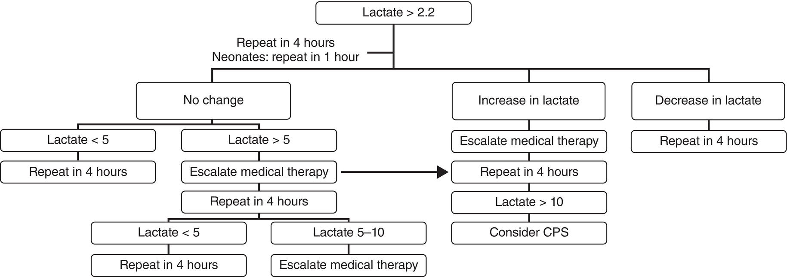

[**Figure 21.15**](#R_c21-fig-0015) Example of algorithm for the postoperative management of patients based on serial lactate determinations.

(Source: Rossi et al. \[187\]. Reproduced with permission of Springer Nature.)

### Central venous to arterial CO2 difference

Venous to arterial CO2 partial pressure difference (AVCO2) measures the circulatory clearance of tissue CO2 and is correlated with CO. Under aerobic conditions, CO2 is the end product of all energy production pathways. Under anaerobic conditions, there is an extra CO2 production which results from the buffering of lactic acidosis by bicarbonate. CO2 is extremely diffusible and its elimination through the lungs is not impaired during LCOS, therefore, PaCO2 will remain normal even in the case of profound acidosis, whereas the venous CO2 will increase. Widening of AVCO2 represents an imbalance between CO and tissue CO2 production. The potential to detect acidosis through capnography is well known, however, exhaled CO2 is multifactorial and difficult to monitor in patients on spontaneous ventilation. Importantly, the correlation between AVCO2 and CO is not influenced by pulmonary venous desaturation, intracardiac shunting and anemia, which may decrease DO2 independent of CO, and which impact oxygen‐derived parameters, such as ScVO2. For the same reason, AVCO2 measurements are valid in patients with single ventricle, and have a stronger correlation with CO compared with oxygen‐derived parameters. An observational study in patients < 90‐day old undergoing cardiac surgery reported an independent association between AVCO2 at admission to the cardiac PICU and postoperative mortality \[189\]. Patients with poor outcome had a median AVCO2 of 8.3 mmHg upon admission, whereas those with a good outcome had a median 5.4 mmHg. Importantly, AVCO2 increased over the hours following PICU admission and peaked after 12–24 hours at a median of 10.5 mmHg: this evolution over time may mirror the presence of postoperative LCOS.

### Current practices

Monitoring practices vary worldwide. Among the respondents at the 2014 PCICS survey \[26\] 99% reported monitoring lactate and 89% reported monitoring SvO2; only 25% of the respondents, however, reported using multisite NIRS and only 32% exploited the core peripheral temperature gap. Among pediatric cardiac anesthesiologists in the United States, a larger percentage (78%) are reported to routinely use multisite NIRS monitoring in combination with serial lactate measurements \[190\]. The PCICS respondents used echocardiography routinely as a tool for hemodynamic monitoring in 53% of cases and used minimally invasive CO monitoring or Doppler hemodynamic CO monitoring in 3% of cases. An Italian survey among pediatric cardiac centers revealed the availability of pulmonary arterial catheter and TPTD in 43% of the centers, and pulse contour methods in 29% of the centers \[191\], although the percentage of cases in which these tools were indeed used to monitor patients was not reported.

It appears, nevertheless, that the estimation of the VO2/DO2 balance relies more on surrogate markers than on more accurate and invasive measurement methods. This is coherent, knowing that even accurate CO measurements might be misleading during the postoperative period: a normal CO might be inadequate at times of increased oxygen demand, and a lower CO may be sufficient during times of lower oxygen demand. Besides, intracardiac shunting and small patient size make techniques, such as thermodilution CO monitoring difficult. Surrogate markers, such as SvO2 and lactate concentration are predictors of adverse clinical outcomes. Nevertheless, the inability to readily and reliably assess global and regional tissue perfusion remains a challenge in this patient group. Therefore, the use of NIRS measured regional saturations might become a central parameter.

* * *

### KEY POINTS: MONITORING

-   Invasive and noninvasive CO monitors have limited utility in CHD surgery and to date have not been demonstrated to improve outcome.
-   NIRS is the best monitor to date for tissue oxygenation, can predict low CO and poor outcome.
-   Mixed venous saturation and blood lactate concentration are excellent and very popular surrogate estimators of the VO2/DO2 balance, their serial measurements can predict poor outcome.

* * *

## Conclusion

The fundamental requirement of postoperative hemodynamic management is to match oxygen consumption and delivery, in order to prevent oxygen debt and sustain cellular metabolism. Although the quest for new therapeutic possibilities is ongoing, it is likely that one of the greatest opportunities comes from using existing therapies more effectively. The indicators used to achieve the desired therapeutic goal must be easy to obtain and safe, and invasive techniques may be judged to have an unfavorable risk/benefit ratio in children. Nevertheless, it is unwise to focus on maximizing DO2 and/or minimizing consumption alone, while ignoring regional and tissue perfusion. Therefore, hemodynamic monitoring requires a paradigm shift towards tissue oxygenation, away from more conventional parameters. Finally, our therapeutic interventions must be associated with an improved outcome; as such, the impact on surrogate physiological endpoint is insufficient evidence of clinical efficacy.

## Selected references

_A full reference list for this chapter is available at:_

[http://www.wiley.com/go/andropoulos/congenitalheart](http://www.wiley.com/go/andropoulos/congenitalheart)

1.  3 Wernovsky G, Wypij D, Jonas RA, et al. Postoperative course and hemodynamic profile after the arterial switch operation in neonates and infants. A comparison of low‐flow cardiopulmonary bypass and circulatory arrest. Circulation 1995: 92(8):2226–2235. The classic paper using thermodilution cardiac output measurements in infants, describing the predictable postoperative decline in cardiac output in the first 24 hours after surgery.
2.  4 Hoffman TM, Wernovsky G, Atz AM, et al. Efficacy and safety of milrinone in preventing low cardiac output syndrome in infants and children after corrective surgery for congenital heart disease. Circulation 2003; 107(7):996–1002. The first report of the randomized, blinded trial of milrinone in pediatric cardiac surgery reporting that high‐dose milrinone prevents LCOS.
3.  5 Li J, Zhang G, McCrindle BW, et al. Profiles of hemodynamics and oxygen transport derived by using continuous measured oxygen consumption after the Norwood procedure. J Thorac Cardiovasc Surg 2007; 133(2):441–8. A study of hemodynamic and oxygen transport balance after the Norwood operation, providing important insights into desirable goals for management in the realy postoperative period.
4.  33 Oualha M, Urien S, Spreux‐Varoquaux O, et al. Pharmacokinetics, hemodynamic and metabolic effects of epinephrine to prevent post‐operative low cardiac output syndrome in children. Crit Care 2014; 18(1):R23. An important study of epinephrine pharmacokinetics, pharmacodynamics, and metabolic effects in children, including a new dosing model.
5.  81 Hoffman GM, Tweddell JS, Ghanayem NS, et al. Alteration of the critical arteriovenous oxygen saturation relationship by sustained afterload reduction after the Norwood procedure. J Thorac Cardiovasc Surg 2004; 127(3):738–45. An important hemodynamic study after the Norwood stage I palliation demonstrating the benefits of afterload reduction to improve DO2.
6.  92 Miller OI, Tang SF, Keech A, et al. Inhaled nitric oxide and prevention of pulmonary hypertension after congenital heart surgery: a randomised double‐blind study. Lancet 2000; 356(9240):1464–9. A landmark trial for the preventive use of inhaled nitric oxide following cardiac surgery in patients at righ risk of pulmonary hypertension.
7.  122 Rudolph AM, Yuan S. Response of the pulmonary vasculature to hypoxia and H+ ion concentration changes. J Clin Invest 1966; 45(3):399–411. The classical paper demonstrating that increasing pH, whether by increasing minute ventilation or decreasing hydrogen ion concentration, will lower pulmonary vascular resistance.
8.  132 Shekerdemian L. Perioperative manipulation of the circulation in children with congenital heart disease. Heart 2009; 95(15):1286–96. An excellent review of the hemodynamic management and of cardiopulmonary interactions, highlighting the need for an individualized strategy, based on the pathophysiology of each type of CHD.
9.  138 Shekerdemian L, Bohn D. Cardiovascular effects of mechanical ventilation. Arch Dis Child 1999; 80(5):475–80. An excellent review article presenting the effects of positive perssure ventilation on the cardiovascular system.
10.  173 Kussman BD, Wypij D, Laussen PC, et al. Relationship of intraoperative cerebral oxygen saturation to neurodevelopmental outcome and brain magnetic resonance imaging at 1 year of age in infants undergoing biventricular repair. Circulation 2010; 122(3):245–54. An important study demonstrating the neurodevelopmental impact of intraoperative cerebral desaturation.
11.  174 Phelps HM, Mahle WT, Kim D, et al. Postoperative cerebral oxygenation in hypoplastic left heart syndrome after the Norwood procedure. Ann Thorac Surg 2009; 87(5):1490–4. An important study demonstrating that cerebral oxygenation is a potential surrogate of global oxygen transport balance, and that low saturation is associated with cardiac arrest and ECMO cannulation.
12.  180 Crowley R, Sanchez E, Ho JK, et al. Prolonged central venous desaturation measured by continuous oximetry is associated with adverse outcomes in pediatric cardiac surgery. Anesthesiology 2011; 115(5):1033–43. An important study demonstrating the utility of continuous central venous oxygen saturation monitoring in high‐risk pediatric CHD patients.
13.  186 Charpie JR, Dekeon MK, Goldberg CS, et al. Serial blood lactate measurements predict early outcome after neonatal repair or palliation for complex congenital heart disease. J Thorac Cardiovasc Surg 2000; 120(1):73–80. A study that laid the foundation for the current use of serial lactate measurement in neonatal cardiac surgery.