CHAPTER 22 Arrhythmias 

# CHAPTER 22  
Arrhythmias: Diagnosis and Management

_Santiago O. Valdes1, Jeffrey J. Kim1, and Wanda C. Miller‐Hance2,3_

1 Department of Pediatrics, Section of Cardiology, Electrophysiology and Pacing, Texas Children’s Hospital, Houston, TX, USA

2 Department of Anesthesiology, Perioperative and Pain Medicine, Arthur S. Keats Division of Pediatric Cardiovascular Anesthesiology, Baylor College of Medicine and Texas Children’s Hospital, Houston, TX, USA

3 Department of Pediatrics, Section of Cardiology, Baylor College of Medicine and Texas Children’s Hospital, Houston, TX, USA

* * *

-   [**Introduction**](#head-2-217)
-   [**Cardiac rhythm disturbances**](#head-2-218)
    -   [Sinus bradycardia](#head-3-344)
    -   [Low atrial rhythm](#head-3-345)
    -   [Sinus node dysfunction](#head-3-346)
    -   [Sinus tachycardia](#head-3-347)
    -   [Junctional rhythm](#head-3-348)
    -   [Conduction disorders](#head-3-349)
    -   [Supraventricular arrhythmias](#head-3-350)
    -   [Ventricular arrhythmias](#head-3-351)
-   [**Pharmacologic therapy of cardiac arrhythmias**](#head-2-220)
    -   [Class I agents](#head-3-352)
        -   [Class IA agents](#head-3-353)
    -   [Class II agents](#head-3-354)
    -   [Class III agents](#head-3-355)
    -   [Class IV agents](#head-3-356)
    -   [Other agents](#head-3-357)
-   [**Pacemaker therapy in children**](#head-2-221)
    -   [Pacemaker nomenclature](#head-3-358)
    -   [Permanent cardiac pacing](#head-3-359)
    -   [Temporary cardiac pacing](#head-3-360)
    -   [External cardiac (transcutaneous) pacing](#head-3-361)
    -   [Transesophageal overdrive pacing](#head-3-362)
    -   [Implantable cardioverter‐defibrillators](#head-3-363)
-   [**Summary**](#head-2-225)
-   [**Selected references**](#head-2-226)

* * *

## Introduction

The practice of pediatric cardiovascular anesthesiology has evolved significantly over the years, expanding beyond the operative setting to many non‐surgical environments. Anesthetic care for infants, children, and adolescents who have or are at risk for, cardiac rhythm disturbances is now provided at various locations, including operating rooms, critical care units, emergency facilities, treatment rooms, and cardiac catheterization/electrophysiology laboratories. The same is true for other patients with congenital heart disease (CHD) beyond childhood. General knowledge of arrhythmia diagnosis and management is essential for anesthetic care in any of these settings, although in some cases, consultation with a specialist is required. This chapter provides a practical approach to pediatric cardiac arrhythmias and rhythm disturbances most commonly affecting patients with CHD, focusing on the diagnosis, mechanisms, and acute management strategies. A brief review of anti‐arrhythmic drug (AAD) therapies and the basic principles of cardiac pacing in children, as applicable to the practice of anesthesia, is also presented.

## Cardiac rhythm disturbances

### Sinus bradycardia

Sinus bradycardia is characterized by a heart rate below the norm for the patient’s age and by a normal, sinus P wave. Slow heart rates can be observed during sleep or may be secondary to a high vagal tone. During significant sinus bradycardia, an escape rhythm may arise from the atrium, junction, or ventricle. In otherwise healthy children, this is usually a benign rhythm with no hemodynamic consequences. Patients with certain forms of CHD, however, are more prone to slow heart rhythms that may indeed be clinically significant. Those with heterotaxy syndromes are included in this category because of the absence, displacement, or hypoplasia of the true sinus node in these patients \[1\].

Intraoperatively, sinus bradycardia can result from vagal stimulation during induction of anesthesia, laryngoscopy, endotracheal intubation, or tracheal suctioning. Sinus bradycardia may also be related to drug administration (e.g., opioids) or other mechanisms of increased parasympathetic activity. This type of sinus bradycardia rarely results in significant hemodynamic compromise and can usually be treated by removing the stimulus or by administering a chronotropic agent such as atropine or epinephrine (See [Box 22.1](#c22-fea-0001)). Slow sinus rates can be seen during cardiac surgical manipulations around the sinus node or after interventions such as the closure of atrial septal defects (ASDs) and cardiac transplantation.

Sinus bradycardia can also be due to hypoxemia, hypothermia, hypotension, drugs, acidosis, electrolyte abnormalities, or increased intracranial pressure. Hypoxemia‐related bradycardia should be treated promptly with oxygenation and ventilation as appropriate. The approach to other forms of secondary sinus bradycardia should focus on addressing the underlying cause. For worrisome low heart rates, particularly in small infants, drugs such as atropine or glycopyrrolate, should be considered. Ongoing bradycardia with clinical evidence of compromised cardiac output requires immediate escalation of therapy that, in most cases, includes epinephrine administration, cardiopulmonary resuscitation, and consideration of temporary pacing.

### Low atrial rhythm

A low atrial rhythm is characterized by atrial activation that spreads upward from a focus on the low atrium. The electrocardiogram (ECG) shows inverted P waves in the inferior leads (II, III, and aVF). A slow atrial rhythm implies that another region of the heart has assumed the pacemaker activity of the sinus node. Although this rhythm may be associated with conditions that affect sinus node function intraoperatively, it is most commonly the result of surgical manipulation ([Figure 22.1](#c22-fig-0001)). In most individuals, this is a normal variant and rarely has a hemodynamic consequence.

* * *

### [Box 22.1](#R_c22-fea-0001) : Acute therapy of bradycardia

-   Treat primary causes – hypoxemia, hypothermia, acidosis, hypotension, anemia, hypoglycemia, hypothyroidism
-   Consider causative drugs – opioids, beta‐blockers, digoxin
-   Consider potential effect from cardiac surgical manipulation
-   Drug therapy
    -   Atropine – 0.02–0.04 mg/kg IV (minimum dose 0.1 mg; maximum dose 0.5 mg \[child\], 1.0 mg \[adolescent\])
    -   Epinephrine – 1 μg/kg IV bolus (lower dose may also be effective); infusion, start at 0.02 μg/kg/min, may increase to 2.0 μg/kg/min
    -   Isoproterenol – infusion, 0.01–2.0 μg/kg/min
-   Temporary atrial pacing – transcutaneous, transesophageal, intracardiac, epicardial

* * *

### Sinus node dysfunction

Sinus node dysfunction often termed sick sinus syndrome, encompasses a spectrum of disorders characterized by slow or irregular heart rates that have a variety of escape rhythms and that frequently alternate with the periods of tachycardia. The respondent's tachycardia may be atrial tachycardia, atrial flutter, or atrial fibrillation. The term tachycardia‐bradycardia syndrome is frequently used to characterize this association. The surgical interventions most likely to be associated with sinus node dysfunction include extensive atrial baffling procedures, such as Mustard and Senning operations, and the Fontan procedure. The management of symptomatic patients may include pacemaker implantation, pharmacological therapy for tachyarrhythmias, atrial anti‐tachycardia pacing (ATP), and, in some cases, transcatheter or surgical ablation.

### Sinus tachycardia

Sinus tachycardia is more commonly seen in the perioperative period than sinus bradycardia. It is often the result of painful stimuli or stress, hypovolemia, anemia, medications (e.g., inotropic agents), a high catecholamine state, surgical manipulation, or fever. Sinus tachycardia can often be differentiated from pathologic supraventricular arrhythmias by its variability in rate and its normal P‐wave axis. Treatment is directed at the underlying cause. Prolonged periods of sinus tachycardia may impair diastolic filling time, limit ventricular preload, and compromise systemic cardiac output. Patients at higher risk of hemodynamic compromise have substantial ventricular hypertrophy or non‐compliant (“stiff”) ventricles with associated diastolic dysfunction, such as in certain types of cardiomyopathies or obstructive outflow lesions (e.g., tetralogy of Fallot).

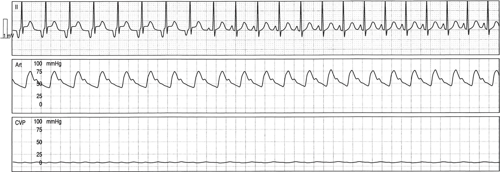

[**Figure 22.1**](#R_c22-fig-0001) _Low atrial rhythm_. Intraoperative tracing depicting a single electrocardiographic lead (lead II), arterial blood pressure tracing (ART), and central venous pressure (CVP) waveform. Note the negative P‐wave morphology in the first portion of lead II, consistent with atrial activation arising from the low atrium. The second half of the recording shows a change in the P‐wave morphology (positive) and a slightly faster heart rate as the atrial impulse later originates from the high atrium (likely the sinus node).

### Junctional rhythm

Junctional rhythm is characterized by QRS complexes with a morphology identical to that of sinus rhythm without preceding P waves. This arrhythmia is thought to originate in the bundle of His. It often occurs in patients with sinus bradycardia or with sinus node dysfunction. In this rhythm, there is normal atrioventricular (AV) nodal conduction, but it is sometimes difficult to determine if the junctional beats are slightly faster than the atrial beats or there is 1 : 1 ventriculoatrial (V:A) conduction retrograde through the AV node. During surgery, this may occur as a result of cardiac manipulation and dissection around the right atrium. In addition to the ECG features described above, the arterial and venous pressure waveforms can change during junctional rhythm ([Figure 22.2](#c22-fig-0002)). The central venous pressure tracing may show a tall _a_ wave, termed as _cannon a wave_, which is due to late atrial contraction against a closed tricuspid valve. An associated decrease in stroke volume and cardiac output, resulting from the absence of the normal atrial systolic contribution to ventricular filling, may manifest as a reduction in systemic arterial blood pressure. Temporary atrial pacing at 10–20 beats/min (bpm) above the junctional rate can be used to document normal AV nodal conduction, and it frequently restores AV synchrony.

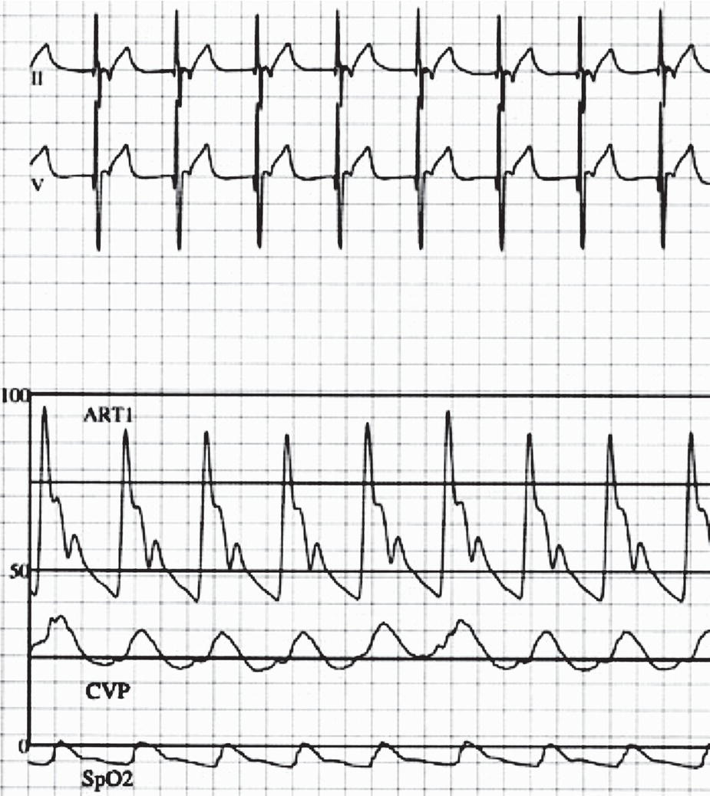

[**Figure 22.2**](#R_c22-fig-0002) _Junctional rhythm_. Intraoperative recording showing the features of a junctional rhythm. Note the retrograde (negative) P wave after each QRS complex. The central venous pressure tracing shows prominent cannon _a_ waves corresponding to right atrial contraction against increased resistance from a closed tricuspid valve. This may result in decreased ventricular filling and reduced cardiac output. ART1, systemic arterial blood pressure (scale 0–100 mmHg); CVP, central venous pressure (scale 0–60 mmHg); SpO2, arterial oxygen saturation by pulse oximetry.

* * *

### KEY POINTS: CARDIAC RHYTHM DISTURBANCES

-   Sinus bradycardia may be due to vagal stimulation or drugs; it is important to exclude hypoxemia, hypothermia, hypotension, acidosis, electrolyte abnormalities, or increased intracranial pressure as potential etiologies.
-   Low atrial rhythm is usually due to surgical manipulation.
-   Sinus node dysfunction is more commonly seen after Mustard, Senning, and Fontan operations.
-   Sinus tachycardia may be due to painful stimuli/stress, hypovolemia, anemia, medications, a high catecholamine state, surgical manipulation, or fever; treatment should be directed at the underlying cause.
-   Junctional rhythm may occur due to surgical manipulation/dissection around the atrium; the central venous pressure tracing characteristically displays a tall _a_ wave, and blood pressure may decrease due to loss of the atrial kick.

* * *

### Conduction disorders

#### Bundle branch block

In an unoperated patient, bundle branch block is an uncommon ECG finding. An incomplete right bundle branch block (RBBB) pattern or intraventricular conduction delay can be seen in patients with right ventricular volume overload (e.g., ASDs, anomalous pulmonary venous drainage). In rare cases, an RBBB can be congenital and idiopathic. An RBBB pattern is frequently seen in postoperative patients after interventions for lesions such as tetralogy of Fallot, right ventricular outflow tract pathology, and AV septal defect (AVSD; also referred to as AV canal or endocardial cushion defect). This conduction abnormality may be related to a ventriculotomy incision, resection of infundibular muscle, damage to the moderator band, or, in some cases, closure of a ventricular septal defect (VSD). A left bundle branch block (LBBB) pattern is uncommon but may be found after surgical procedures involving the left ventricular outflow tract.

#### Atrioventricular block

##### _First‐degree AV block_

First‐degree AV block is characterized by a prolonged PR interval beyond what is considered normal for age. Each P wave is followed by a conducted QRS complex. This type of rhythm disturbance can be a normal variant in healthy individuals but can also be seen in a variety of disease states (e.g., structural heart defects associated with stretching of the atria, rheumatic fever). In general, a prolonged PR interval in an otherwise healthy child is a benign condition and requires no treatment.

##### _Second‐degree AV block_

There are four types of second‐degree AV block. The two predominant types, Mobitz type I (Wenckebach) and Mobitz type II, involve a periodic failure to conduct atrial impulses to the ventricle. In _type I second‐degree AV block_, the PR interval lengthens progressively until the next atrial impulse cannot be conducted to the ventricle. These failures of conduction manifest on the surface ECG as P waves without associated QRS complexes and concomitant shortening of the RR intervals ([Figure 22.3](#c22-fig-0003)). This rhythm disturbance can occur during periods of high vagal tone and is generally considered a benign phenomenon that requires no therapy.

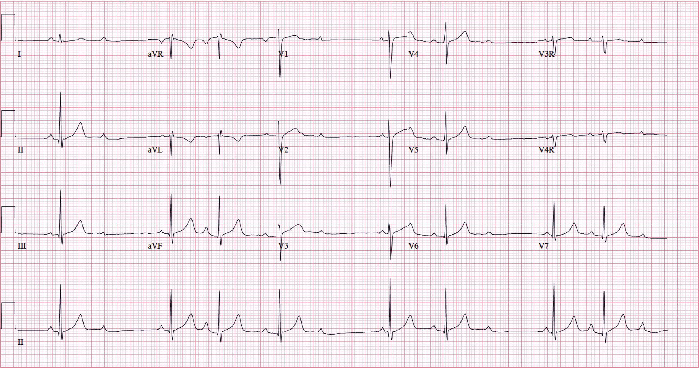

[**Figure 22.3**](#R_c22-fig-0003) _Mobitz type I second‐degree atrioventricular block (Wenckebach)_. The tracing shows progressive lengthening of the PR interval and eventual failure of an atrial impulse to conduct.

In the less frequent _type II second‐degree AV block_, there is a constant PR interval before an atrial impulse that suddenly fails to conduct. This conduction abnormality is more concerning because of its potential for progression. It can be seen in patients after surgery for CHD and is thought to be due to damage to the His bundle or distal conduction system.

The third type of second‐degree AV block is _two to one AV block_ (_2_:_1_). In 2:1, every second P wave is blocked. In most cases, this is a type of Mobitz type I or Wenckebach block and is secondary to high vagal tone. It is rare for 2:1 to progress to a higher degree of AV block or to require treatment.

The fourth type of second‐degree AV block is a _high‐grade AV block_, which is evidenced by two or more non‐conducted P waves in succession that would normally be expected to conduct. Temporary pacing and close patient observation may be warranted because hemodynamically significant bradycardia or continued progression of the conduction deficit may ensue.

##### _Third‐degree (complete) AV block_

Third‐degree AV block is characterized by the total failure of atrial impulses to be conducted to the ventricles. There is complete dissociation of the electrical activity between the atria and ventricles, and the ventricular rate is usually slow and regular. In third‐degree AV block, the ventricular escape rate may be narrow (if originating from the perinodal region) or wide (if originating from within the ventricle). The diagnostic feature on the ECG is that all atrial impulses that should be conducted to the ventricle fail to do so ([Figure 22.4](#c22-fig-0004)).

Complete AV block may be either congenital or acquired. Congenital complete AV block in infants with otherwise structurally normal hearts may be due to intrauterine exposure to maternal antibodies associated with collagen vascular diseases (e.g., lupus). Patients at high risk of complete AV block include those with congenitally corrected transposition (L‐transposition of the great arteries with ventricular inversion) and those with polysplenia (left atrial isomerism) \[1\]. Acquired postoperative AV block is thought to result from damage to the compact AV node or bundle of His and may be transient or permanent. The surgical procedures most commonly associated with the onset of complete AV block include repair of AVSD, closure of VSD, resection of obstructive subaortic tissue, and interventions in patients with congenitally corrected transposition \[2\]. In children, reported incidences of surgical AV block are as high as 2–4%. Normal conduction eventually recovers in more than 60% of patients, usually within the first 10 postoperative days \[3, 4\]. Acute treatment includes temporary pacing (either AV sequential pacing or ventricular pacing only). If the rate of the junctional escape rhythm is high enough to support stable hemodynamics, temporary pacing can be set as a backup with close monitoring of the underlying cardiac rhythm. Important considerations in patients with surgical AV block include careful surveillance for the return of AV conduction and frequent evaluation of temporary pacing wire thresholds. The ventricular output of the temporary pacemaker should be set well above the capture threshold to increase the margin of safety (please refer to the section on temporary pacing). Permanent cardiac pacing is generally indicated in patients who do not recover from complete AV block within 10–14 days after surgical intervention. A small minority of patients have late recovery of their native AV nodal conduction after surgically acquired complete AV block \[3, 4\].

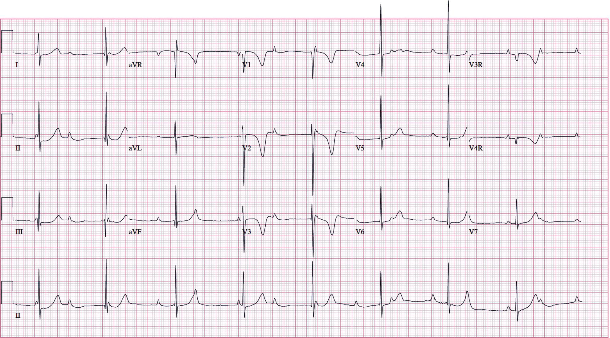

[**Figure 22.4**](#R_c22-fig-0004) _Complete atrioventricular block_. Surface electrocardiogram showing complete dissociation between the atria and ventricles, related to inability of the atrial impulses to be propagated to the ventricular myocardium. Note that the ventricular rate is regular.

When providing anesthetic care to a patient with complete AV block but no implanted pacemaker, the following should be considered:

-   _Drugs and resuscitation equipment_. Immediate availability of emergency agents such as isoproterenol and epinephrine, in addition to resuscitation equipment, is essential.
-   _Transcutaneous cardiac pacing_. Equipment (pacing pads and unit) should be available in case extracardiac pacing becomes necessary. Placing the pacing pads before anesthetic induction may be prudent.
-   _Access to temporary transvenous pacing_. Although insertion of a temporary pacing catheter before anesthetic care has been suggested in children with complete AV block, a retrospective study of this approach showed that using this catheter routinely had no benefit \[5\].

* * *

### KEY POINTS: CONDUCTION DISORDERS

-   First‐degree AV block and Mobitz type I second‐degree AV block are usually benign and do not require therapy.
-   Mobitz type II and advanced second‐degree AV block may progress and require pacemaker therapy.
-   Patients with complete AV block with and without pacemakers require special anesthetic and surgical considerations.

* * *

### Supraventricular arrhythmias

#### Premature atrial contractions

Isolated premature atrial contractions (PACs) are relatively common in infants and small children. The early P waves frequently have an abnormal axis and morphology and are typically followed by a normal QRS complex. Atrial bigeminy is characterized by a PAC that follows every sinus beat ([Figure 22.5](#c22-fig-0005)). On occasion, the PACs block at the AV node or conduct aberrantly, displaying an abnormally wide QRS. Blocked PACs can mimic bradycardia, and aberrantly conducted PACs can resemble ventricular ectopy. Most PACs are benign, requiring no therapy. An investigation may be warranted in cases of symptomatic, frequent, or complex (multifocal) PACs. This type of rhythm can be the result of irritation from a central venous catheter or other type of intracardiac line. Radiographic or echocardiographic assessment of catheter/wire tip position should be considered because appropriate adjustments can eliminate the atrial ectopy.

#### Supraventricular tachycardia

Supraventricular tachycardia (SVT) is the most common clinically significant arrhythmia in infants and children. This rhythm disturbance is characterized by a narrow or “usual” complex QRS morphology and can occur in structurally normal hearts, as well as in various forms of CHD. “Usual” complex describes a QRS morphology in tachycardia similar to that seen during normal sinus rhythm. This is important because patients with CHD often have abnormalities on their baseline ECG, including a bundle branch block pattern. On occasion, widening of the QRS duration in SVT can be due to aberrancy in the right or left bundle branches or to the tachycardia mechanism itself (i.e., antidromic SVT; refer to the discussion later in this chapter). When the QRS complex is wide, distinguishing between supraventricular and ventricular tachycardia can be challenging.

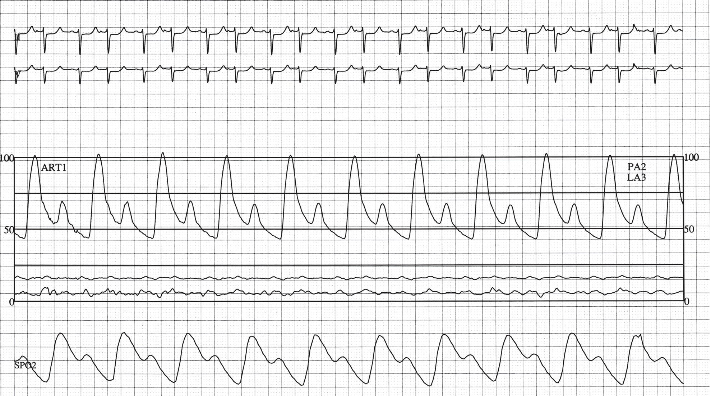

[**Figure 22.5**](#R_c22-fig-0005) _Atrial bigeminy_. Intraoperative recording obtained from a child after creation of a Glenn anastomosis, showing a premature atrial contraction after each sinus beat during atrial bigeminy. Note that the premature atrial complexes have a different P‐wave morphology from that of the sinus beats, because the premature complexes originate from a region of the atrium other than the sinus node. The variability in the arterial blood pressure shown in the tracing is due to the shortened diastolic filling time during the premature beats. ART1, systemic arterial blood pressure (scale 0–100 mmHg); LA3, left atrial pressure (scale 0–100 mmHg); PA2, pulmonary artery pressure (scale 0–100 mmHg); SpO2, arterial oxygen saturation by pulse oximetry.

Two general categories of SVT are recognized: _automatic and reentrant_. These can be differentiated by evaluating characteristics of the tachycardia ([Table 22.1](#c22-tbl-0001)). The most common mechanisms of SVT and their ECG features are noted in [Table 22.2](#c22-tbl-0002). Evaluation of a tachyarrhythmia usually includes a surface 15‐lead ECG and a continuous rhythm strip to document onset, termination, and response to medications (e.g., adenosine) or pacing maneuvers. Strips obtained from the bedside or transport monitors are helpful for determining tachycardia rate, but they are usually not sufficient for definitive diagnosis or to distinguish among tachycardia mechanisms.

##### _Atrial electrogram_

In the postoperative patient, an atrial electrogram (AEG) can be useful in both diagnosis and management of rhythm problems. This type of ECG recording is obtained from the temporary atrial wires placed toward the end of surgery ([Figure 22.6](#c22-fig-0006)). Typically, atrial wires emerge on the right side of the chest wall and ventricular wires on the left side, although this configuration may vary. Although both a standard 15‐lead ECG and an AEG record the same electrical cardiac activity, these electrical sequences display distinctly different configurations in different leads. On an AEG, the P waves are larger in amplitude, making them easily recognizable because the recording is obtained from wires attached directly to the atrial myocardium. Therefore, in situations in which P waves are not clearly identified on a surface ECG, an AEG may assist in defining atrial activity and the relationship between atrial and ventricular depolarization ([Figure 22.7](#c22-fig-0007)). Such recordings can help clinicians to differentiate between atrial and junctional arrhythmias \[6\]. For example, during junctional tachycardia, the AEG displays P waves that are either superimposed on the R waves or dissociated from them. In most reentrant SVTs, the PR interval is longer than the RP interval, whereas in sinus rhythm, the PR interval is shorter than the RP interval. An AEG is also helpful in defining the type of an AV block if present and can facilitate the differential diagnosis of sinus node dysfunction vs. various degrees of AV block.

AEGs can be obtained from bedside monitors ([Figure 22.6](#c22-fig-0006)) or standard 15‐lead ECG machines \[7\]. With a bedside or operating room monitor, it is best to use a rhythm strip with two or more channels so that AEG and ECG recordings can be viewed simultaneously. There are various ways to obtain an AEG along with a standard tracing, depending on various equipment‐related factors (e.g., the recorder, epicardial wires, lead configuration).

The following methods of obtaining an AEG require the use of a standard 15‐lead ECG machine:

-   If _two atrial wires_ are present, each lead is attached to the connectors that usually correspond to the right and left arm leads (an alligator clip can be used, if necessary). This allows for a bipolar AEG (large deflection of atrial depolarization with trivial or no signal representative of ventricular activity) to be recorded in lead I. The chest (precordial) leads provide ECG standard tracings. By evaluating the atrial activity as displayed by the AEG (lead I) and the ventricular impulses represented by the QRS complexes on the chest leads (V1–V6), the electrical sequence of cardiac events can be assessed.
    
    [**Table 22.1**](#R_c22-tbl-0001) Characteristics of supraventricular tachycardia mechanisms
    
    | Features of the tachycardia | Automatic | Reentrant |
    | --- | --- | --- |
    | Onset and termination | “Warm‐up” at initiation, “cool‐down” at termination | Abrupt |
    | Mode of initiation | Spontaneous | Premature beats |
    | Ability to initiate/terminate with timed premature beats | No | Yes |
    | Variation in tachycardia rate | Wide | Narrow |
    | Response to catecholamines | Increased rate | None or slight rate increase |
    | Response to adenosine | None | Termination |
    | Response to drugs that increase refractoriness | Variable | Slowing or termination |
    | Response to overdrive pacing | Transient suppression, quick resumption | Termination |
    | Response to cardioversion | None | Termination |
    
    [**Table 22.2**](#R_c22-tbl-0002) Mechanisms and electrocardiographic features of supraventricular tachycardia
    
    | Diagnosis | Electrocardiographic features |
    | --- | --- |
    | **Automatic tachycardias** |  |
    | Ectopic atrial tachycardia or atrial ectopic tachycardia | Atrial rates of 90–330 bpm  
    Incessant rhythm  
    From atrial focus distinct from the sinus node  
    Abnormal P‐wave morphology and/or axis  
    Distinct P waves preceding QRS complexes  
    No influence of AV block on tachycardia |
    | Junctional ectopic tachycardia | Narrow QRS tachycardia  
    Incessant rhythm  
    AV dissociation (often)  
    Atrial rate slower than the ventricular rate  
    Capture beats frequently seen (QRS complexes slightly earlier than expected from antegrade conduction of normal sinus impulses) |
    | **Reentrant tachycardias** |  |
    | Atrial flutter | Sawtooth pattern or more discrete undulating P waves (leads II, II, aVF)  
    Variable rates of AV conduction seen (1:1, 2:1, 3:1, or 4:1) |
    | Atrioventricular reentrant tachycardia (accessory pathway‐mediated from concealed bypass tract or Wolff‐Parkinson‐White syndrome) | P waves immediately following the QRS complex, on ST segment or T wave  
    AV block results in termination of tachycardia |
    | Atrioventricular nodal reentry tachycardia | P waves buried within QRS and not discernible  
    AV block results in termination of tachycardia |
    
    AV, atrioventricular
    
-   If only a _single atrial lead_ is available, this can be attached to one of the chest leads to obtain a corresponding AEG. In this case, the limb leads can be used to provide a reference for ventricular activity ([Figures 22.6](#c22-fig-0006) and [22.7](#c22-fig-0007)).
-   An _alternate lead configuration_ may utilize a single atrial lead and a skin lead as a substitute for the arm leads to obtain an atrial tracing in lead I, and other leads serve as a reference. A rhythm strip should be printed out so that the recordings can be examined.

In addition to assisting in arrhythmia diagnosis and the selection of appropriate treatment, temporary atrial wires can be used for rapid atrial pacing in attempts to terminate SVT due to reentrant mechanisms or to overdrive suppress an automatic focus.

##### _General management principles for SVT_

Management of SVT depends on the clinical status of the patient, the type of tachycardia, and the precise electrophysiologic mechanism that is causing SVT ([Table 22.3](#c22-tbl-0003)). If the tachyarrhythmia is associated with significant hemodynamic compromise, emergent therapy is indicated. Synchronized direct‐current cardioversion (0.5–1.0 J/kg) should be considered for a patient with any acute tachyarrhythmia associated with low cardiac output, recognizing that this approach does not always restore normal sinus rhythm.

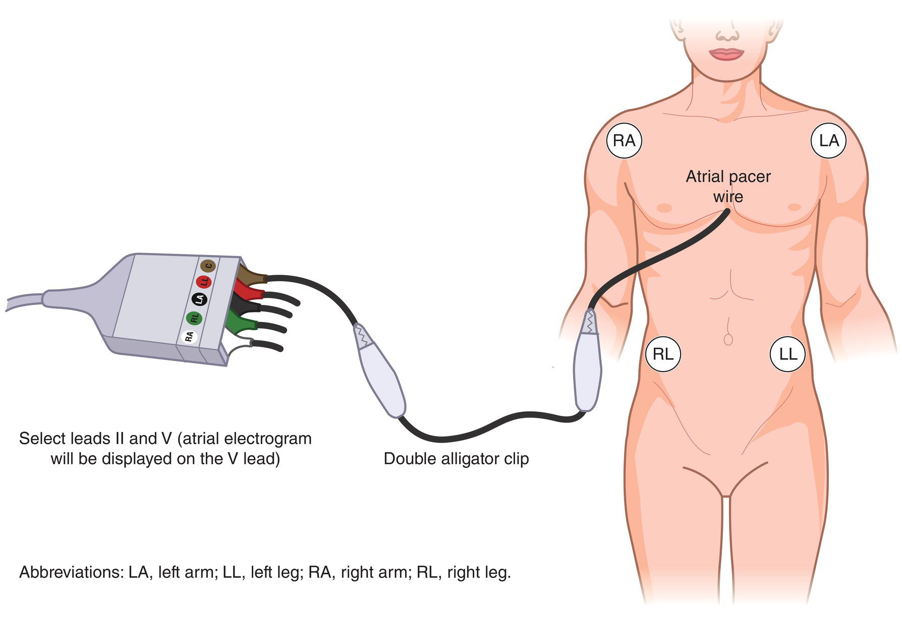

[**Figure 22.6**](#R_c22-fig-0006) _Procedure to obtain an atrial electrogram_. Setup for recording an atrial electrogram by using a bedside (or operating room) monitor and a double alligator clamp to connect the atrial temporary pacing wire to the chest (C) or V lead (brown‐colored). Alternate lead configurations may be used as described in the text to obtain equivalent tracings.

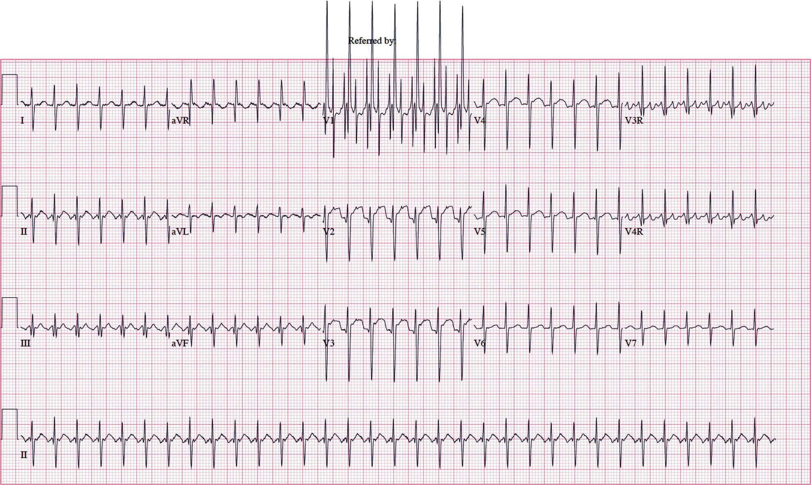

[**Figure 22.7**](#R_c22-fig-0007) _Atrial electrogram_. Full electrocardiographic tracing with an atrial electrogram in lead V1. Note the easily discernible P waves in the atrial electrogram, which confirm that the rhythm is that of atrial flutter with 2:1 conduction.

[**Table 22.3**](#R_c22-tbl-0003) Acute therapy of perioperative arrhythmias without evidence of hemodynamic compromise

| Rhythm disturbance | Treatment considerations |
| --- | --- |
| Sinus bradycardia | See [Box 22.1](#c22-fea-0001) |
| Sinus tachycardia | Correct underlying cause |
| Premature atrial contractions | Evaluate the position of a central venous line or intracardiac catheter Assess/correct electrolyte disturbances (e.g., hypokalemia) |
| Focal (ectopic) atrial tachycardia or atrial ectopic tachycardia | Correct fever, electrolyte abnormalities  
Adequate sedation  
Consider the potential detrimental role of inotropes/vagolytics  
ß‐blockers – use with caution if depressed cardiac function  
Digoxin  
Procainamide  
Amiodarone  
Sotalol  
Flecainide  
Propafenone  
Ivabradine |
| Multifocal (chaotic) atrial tachycardia | As in ectopic atrial tachycardia  
Goals are rate control and decreased automaticity |
| Accelerated junctional rhythm | Correct fever  
Consider the potential detrimental role of inotropes/vagolytics  
Temporary atrial pacing |
| Junctional ectopic tachycardia | Correct fever and electrolyte abnormalities  
Consider the potential detrimental role of drugs (e.g., inotropes)  
Adequate sedation (dexmedetomidine)  
Surface cooling to 34–35 °C  
Temporary atrial pacing (for JET rates _<_180 bpm)  
Amiodarone  
Hypothermia plus procainamide  
Sotalol  
Ivabradine |
| Atrial flutter | Adenosine to confirm the diagnosis  
Atrial overdrive pacing  
Digoxin  
Procainamide  
Amiodarone  
Sotalol  
Propafenone |
| Atrial fibrillation | Digoxin (except in Wolff–Parkinson–White syndrome)  
ß‐blockers  
Procainamide  
Quinidine  
Amiodarone  
Sotalol |
| Atrioventricular reentrant tachycardia or atrioventricular nodal reentrant tachycardia | Consider vagal maneuvers  
Adenosine  
Atrial overdrive pacing  
Procainamide  
Amiodarone  
Sotalol |
| Premature ventricular contractions | Identify and treat underlying cause  
Lidocaine |
| Ventricular tachycardia | Lidocaine  
Amiodarone  
Procainamide  
Sotalol  
Magnesium (for _torsades de pointes_)  
ß‐blockers  
Phenytoin (for digitalis toxicity) |
| Ventricular fibrillation | Lidocaine (adjunct to defibrillation/prevent recurrence)  
Amiodarone (adjunct to defibrillation/prevent recurrence) |

##### _Atrial tachycardias_

The automaticity of atrial tissue accounts for the majority of supraventricular arrhythmias in this group \[8\]. In general, these rhythm disorders are more recalcitrant and difficult to treat than reentrant ones.

###### Focal atrial tachycardia

Focal atrial tachycardia (AT) originates from a single focus in the atrium outside of the sinus node. In the past, this rhythm disturbance was thought to be due solely to enhanced automaticity. Thus, it was often referred to as an automatic or ectopic AT (EAT; also known as atrial ectopic tachycardia, or AET). In rare cases, however, focal AT is triggered or microreentrant in origin and is not due to a true ectopic focus. These forms of AT cannot be easily differentiated on the basis of the surface ECG alone. The clinical characteristics of EAT follow those outlined in [Table 22.1](#c22-tbl-0001) for automatic tachycardias. EAT may be incessant or episodic. The diagnosis is made by identifying abnormal P‐wave morphology, axis, or both on a surface ECG or rhythm strip ([Figure 22.8](#c22-fig-0008)). Also, the PR interval may differ from that in sinus rhythm. Atrial rates in EAT are faster than usual sinus rates for the age and physiologic state of the patient. If the atrial rates are very rapid, some of the atrial impulses may not be conducted to the ventricles because of AV node refractoriness.

Ectopic AT is relatively rare and is generally found in two different clinical scenarios \[9, 10\]. A child with a structurally normal heart can develop EAT as a primary phenomenon. In older children, EAT can be incessant and, on rare occasions, lead to the development of ventricular systolic impairment or result in dilated cardiomyopathy due to the chronicity of the tachycardia. In neonates and infants, EAT often follows a more benign course and frequently resolves spontaneously early in life. A patient with CHD can also develop EAT in the postoperative period after cardiac surgery. In such cases, EAT tends to be episodic and transient, usually resolving within days. It has been reported that postoperative patients who developed EAT tended to have a lower preoperative oxyhemoglobin saturation, increased inotropic support both pre‐ and postoperatively, and a previous atrial septostomy \[11\]. No specific cardiac repair has been associated with the development of EAT.

##### _Management principles for postoperative EAT_

-   _General considerations_. The management of postoperative EAT includes the treatment of fever if present, adequate sedation, correction of electrolyte abnormalities, and the withdrawal of medications that cause sympathetic stimulation (e.g., inotropic agents) or have vagolytic properties.
-   _Anti‐arrhythmic therapy_. The institution of pharmacologic treatment is based on overall heart rate, the duration of the tachycardia, and the hemodynamic status of the patient. Treatment relies on clinical judgment and is influenced by ventricular function. There are no large studies on anti‐arrhythmic drug efficacy in postoperative EAT. Medications such as esmolol, procainamide, and amiodarone can be effective in slowing the tachycardia rate \[12\]. Oral agents (class I, II, and III drugs) can also be of benefit. Digoxin has a minimal effect on the atrial focus but can decrease the ventricular response by slowing AV conduction \[13\].
    
    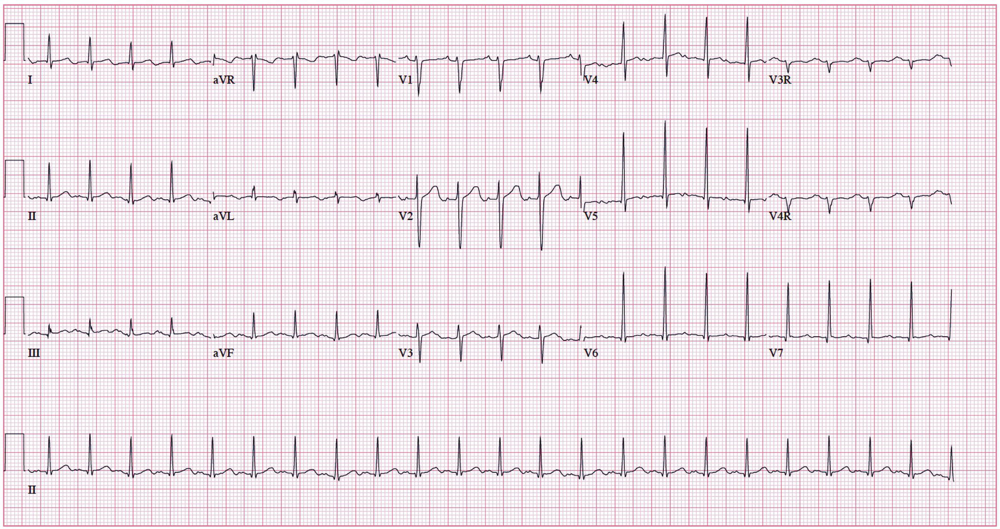
    
    [**Figure 22.8**](#R_c22-fig-0008) _Ectopic atrial tachycardia_. Fifteen‐lead electrocardiogram in a 6‐year‐old child with ectopic atrial tachycardia. The characteristic features of the tachycardia are shown, including a faster‐than‐expected heart rate for age and an abnormal P‐wave axis (left atrial focus).
    
-   _Ablation therapy_. In very few postoperative patients, EAT can be incessant and life‐threatening, and consideration should be given to transcatheter ablation of the atrial focus \[14\]. It has been reported that propofol anesthesia may not be appropriate for children undergoing catheter ablation of EAT, because administering this drug may terminate the tachycardia and prevent it from being induced by isoproterenol infusion (See [Chapter 34](c34.xhtml)) \[15\].
-   _Other modalities_. Atrial pacing and cardioversion are unlikely to resolve EAT.

###### Multifocal atrial tachycardia

Multifocal atrial tachycardia (MAT), also known as chaotic atrial rhythm, is an uncommon atrial arrhythmia characterized by multiple (at least three) P‐wave morphologies \[16\]. These different morphologies correspond to multiple foci of automatic atrial activity. Characteristic ECG features include variable PP, RR, and PR intervals and typical atrial rates that exceed 100 bpm. MAT can be seen in young infants without structural heart disease, in postoperative CHD patients, and in children with non‐cardiac medical conditions \[17, 18\]. Treatment focuses on ventricular rate control or decreasing automaticity, or both. Drugs such as digoxin, procainamide, flecainide, amiodarone, and propafenone have been found to be successful in converting MAT to sinus rhythm in children \[19\]. Adenosine, pacing, and direct‐current cardioversion are usually ineffective.

##### _Junctional tachycardias_

The automaticity of junctional tissue accounts for the majority of supraventricular arrhythmias in this group \[8\]. These rhythm disorders tend to be somewhat resistant to standard pharmacological therapy.

###### Accelerated junctional rhythm

Accelerated junctional rhythm is an arrhythmia that arises from the AV junction. Characteristics of this automatic rhythm include a narrow or “usual” QRS pattern with no preceding P wave. There is either VA dissociation, with ventricular rates faster than atrial rates, or the presence of 1 : 1 VA conduction retrograde via the AV node. Temporary atrial pacing at a rate of 10–20 bpm faster than the junctional rate often re‐establishes AV synchrony and effectively suppresses the automatic junctional rhythm. Changes in the patient’s physiologic state (including fever), chronotropic agents, and endogenous catecholamines can stimulate the automatic junctional focus, increasing junctional rates. This rhythm is usually well‐tolerated and is easily managed with temporary pacing and control of the patient’s underlying physiologic state.

###### Junctional ectopic tachycardia

Junctional ectopic tachycardia (JET) is another automatic rhythm that arises from the AV junction. It is a narrow or “usual” complex tachycardia without preceding P waves. It is distinguishable from accelerated junctional rhythm on the basis of the patient’s heart rate and hemodynamic status. This tachyarrhythmia has been classically defined by heart rates above 160 or 170 bpm with resultant hemodynamic compromise \[20\]. The diagnosis of JET has also been considered if the junctional rate exceeds the 95th percentile of heart rate for age \[21\]. There is either VA dissociation with ventricular rates faster than atrial rates or the presence of 1:1 VA conduction ([Figure 22.9](#c22-fig-0009)). If 1:1 VA conduction is identified, a trial of adenosine or rapid atrial pacing may be beneficial to differentiate JET from other reentrant forms of SVT on an AEG.

This type of tachycardia typically occurs in the immediate postoperative period and usually results in hemodynamic instability and significant morbidity and may contribute to mortality \[22–24\]. It occurs most commonly after surgical intervention for tetralogy of Fallot, VSD, AVSD, transposition of the great arteries, and total anomalous pulmonary venous return \[25\]. Other risk factors for the development of JET are long ischemic cross‐clamp and cardiopulmonary bypass times, young age, and the need for inotropic support \[26, 27\]. Excessive retraction of tissues to allow for intracardiac surgical exposure anecdotally has also been linked to JET. Several strategies have been used to decrease the incidence of postoperative JET. The administration of magnesium during cardiopulmonary bypass decreases the incidence of postoperative JET, its use appears to be more effective in higher complexity surgeries \[28, 29\]. Another strategy that has shown promise in the reduction of postoperative JET is the use of dexmedetomidine in the perioperative period \[30, 31\].

##### _Management principles for postoperative JET_

Numerous therapies have been advocated for JET \[23, 24, 26, 32\]. Strategies for acute care include the following:

-   _General considerations_. Core temperature cooling (to 33–35 °C) in the younger patient by the use of cooling blankets, fans, or cold compresses has been shown to be of benefit in reducing the tachycardia rate \[33–35\]. Shivering, if significant, should be minimized to prevent potentially detrimental increases in oxygen consumption. Additional suggested approaches include withdrawing or decreasing vagolytic agents and any medications associated with catecholamine stimulation and correcting abnormal levels of electrolytes, especially magnesium, potassium, and calcium.
-   _Atrial pacing_. Temporary atrial pacing at heart rates 10–20 bpm above the JET rate establishes AV synchrony and often improves hemodynamics. However, if the JET rate is faster than 180 or 190 bpm, overdrive atrial pacing often confers a little benefit.
-   _Anti‐arrhythmic medications_. The two most widely used drugs for JET are amiodarone and procainamide \[26, 32, 36–38\]. _Amiodarone_ has a longer onset of action and a longer half‐life than procainamide. The drug has been shown to reduce the heart rate in JET patients during the initial bolus infusion \[36, 37\]. Core cooling is often continued but is not generally needed for efficacy. Administering amiodarone may be a way to avoid having to evaluate clinical signs reflecting the adequacy of cardiac output (distal peripheral perfusion, skin temperature) in a patient with hypothermia and tachycardia. Amiodarone does not directly influence ventricular function and is generally thought to cause less likelihood of hypotension during the initial bolus infusion than procainamide does. However, the drug should be administered with caution, given its potential adverse events (hypotension, bradycardia, AV block). The benefits of _procainamide_ are that it has a faster onset of action and a shorter half‐life than amiodarone. However, procainamide appears to be effective mainly when used with core cooling. It may also cause a decrease in systemic vascular resistance, with resultant hypotension, particularly during bolus infusions. Procainamide can also have negative inotropic properties. Usually, a fluid bolus or other volume expander should be given before or during procainamide therapy to maintain adequate hemodynamics. Both amiodarone and procainamide have been shown to be effective in the treatment of JET in published retrospective studies; however, the main determinant of drug selection in clinical practice is influenced by physician/institutional preference. Because amiodarone and procainamide can each cause QT prolongation and proarrhythmic side effects, these two drugs should not be administered concomitantly. Intravenous _sotalol_ has been shown in case reports to be of use in the management of post‐operative JET. Further studies are needed to determine the safety and efficacy of _sotalol_ in the management of postoperative JET \[39\]. Another novel anti‐arrhythmic agent that has shown promise in the management of JET is _ivabradine_ (alone and in combination with amiodarone) \[40–43\]. _Ivabradine_ is available only for oral administration, so its use is limited to patients that can tolerate oral medications. Anecdotal evidence suggests that digoxin loading can slow the JET rate, but this has not been well documented in the literature. ß‐blockers and calcium‐channel blockers can depress myocardial contractility, a feature that may limit their use in the immediate postoperative period. In this regard, a short‐acting agent such as _esmolol_ may offer a larger margin of safety. The use of intravenous (IV) class IC agents such as _propafenone_ and _flecainide_ has been reported, but these drugs have not been studied extensively for JET \[44–46\]. The natural history of perioperative JET is that it resolves within 2–5 days after the surgical intervention. Long‐term anti‐arrhythmic therapy is usually not necessary. Rarely, extracorporeal membrane oxygenator (ECMO) support may be necessary for incessant hemodynamically significant JET not responding to other therapies.
    
    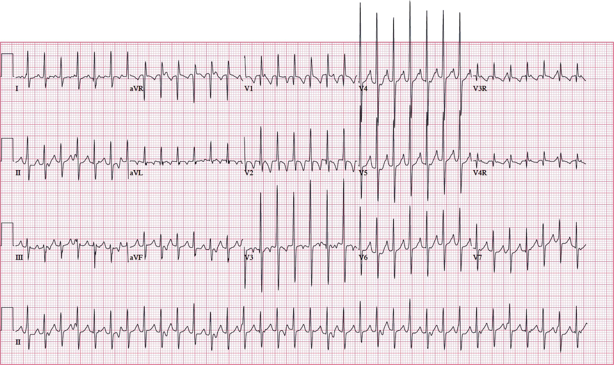
    
    [**Figure 22.9**](#R_c22-fig-0009) _Junctional ectopic tachycardia_. Fifteen‐lead electrocardiogram in a postoperative patient with junctional ectopic tachycardia after corrective surgery for tetralogy of Fallot. The tachyarrhythmia is characterized by a narrow QRS complex and atrioventricular dissociation.
    
-   _Cardioversion_ is generally considered ineffective in terminating JET.
-   _Catheter ablation_ of the junctional focus should be considered only as a last resort, because it can result in complete AV block, given that postoperative JET is usually transient \[47, 48\].

##### _Reentrant supraventricular tachycardias_

Reentry, also known as “circus” movement or reciprocation, implies that a single stimulus or excitation wave front returns and reactivates the same site or tissue from which it originated. Reentrant forms of SVT may or may not involve accessory pathways.

###### Atrial flutter

Atrial flutter is a rhythm disturbance confined to the atrial myocardium. The electrophysiologic basis for this arrhythmia involves reentry within the atrium itself. The typical or classic form of atrial flutter is characterized by a negative sawtooth P‐wave pattern and atrial rates that exceed 300 bpm ([Figure 22.10](#c22-fig-0010)). This form of atrial flutter is occasionally seen in otherwise healthy neonates but is relatively uncommon in children. In patients with CHD, slower atrial rates and varying P‐wave morphologies are more frequently seen than in those without CHD. This is due to anatomic abnormalities related to suture lines, scars, or fibrosis from a previous surgery involving atrial tissue. This form of “scar flutter” is commonly termed intra‐atrial reentrant tachycardia (IART) \[49\]. It is one of the most common arrhythmias in postoperative patients with structural heart disease and is considered the cause of significant morbidity after certain types of surgical interventions \[50\]. Procedures that involve extensive atrial suture lines, such as atrial redirection procedures (Senning or Mustard operations) and those associated with atrial dilation (Fontan surgery) pose a particularly high risk of atrial flutter. The possibility of atrial flutter is suggested by the abrupt onset of a rapid atrial rhythm that remains relatively regular over time. AV nodal conduction accounts for variability in the ventricular response rate. Rapid clinical deterioration is likely; fast ventricular rates frequently require prompt intervention.

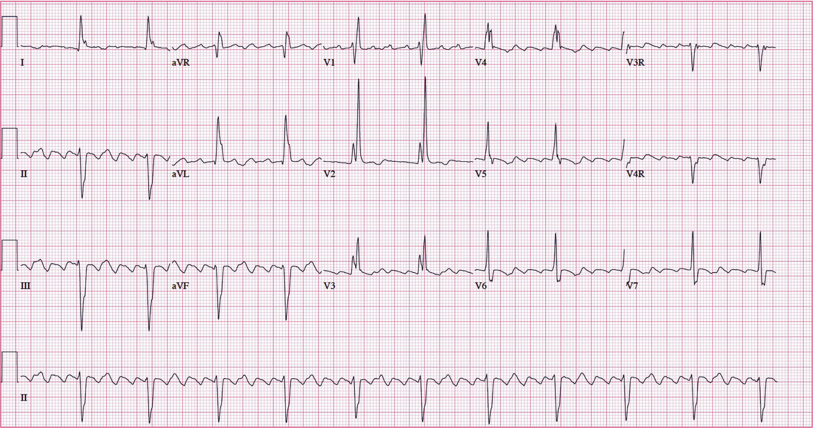

[**Figure 22.10**](#R_c22-fig-0010) _Atrial flutter_. Surface electrogram showing the typical features of atrial flutter: sawtooth flutter waves and 4:1 atrioventricular conduction.

##### _Management principles for atrial flutter_

-   _Adenosine_ will not terminate tachycardia but may assist in confirming the diagnosis by uncovering flutter waves during AV block.
-   _Atrial overdrive pacing_ is a safe and effective way to rapidly terminate atrial flutter by using a transesophageal or transvenous pacing catheter or epicardial wires \[51\]. After the atrial cycle length is assessed, rapid atrial stimulation is performed in short bursts to attempt an interruption of the reentry circuit.
-   _Synchronized cardioversion_ is the treatment of choice in any patient with unstable hemodynamics. Placement of the cardioversion pads over the front and back of the hemithorax may be necessary to provide a shock vector through the entire atrium, which is usually thickened in patients with CHD.
-   _Pharmacologic agents_ such as digoxin, procainamide, sotalol, and amiodarone can be used in urgent situations. Drugs for controlling the ventricular response in atrial flutter include ß‐blockers and calcium‐channel blockers. Important considerations regarding drug selection are patient age, underlying ventricular function, and whether there is sinus node dysfunction (a concomitant problem in patients with recurrent atrial flutter). Ibutilide and sotalol are available for rapid termination of atrial flutter and have been used in postoperative pediatric and adult patients with CHD \[52–55\].
-   _Long‐term drug therapy_ is frequently necessary in patients with CHD because of the potential for recurrence and associated rapid AV conduction.
-   _Pacemaker therapy_, _atrial anti‐tachycardia pacing_, and _radiofrequency ablation_ are additional modalities often used for long‐term management of atrial flutter.

###### Atrial fibrillation

Atrial fibrillation is a complex arrhythmia that can be due to either multiple reentrant circuits or focal points within the pulmonary veins. In the majority of cases, it originates in the left atrium (in contrast to atrial flutter, which is generally considered a disease of the right atrium). In children, this tachyarrhythmia is less frequent than atrial flutter. The atrial rates are rapid and irregular, ranging from 400 to 700 bpm. Ventricular response rates are variable but generally range between 80 and 150 bpm. Patients at potential risk for atrial fibrillation include those with an enlarged left atrium (e.g., rheumatic heart disease, severe AV valve regurgitation), pre‐excitation syndromes, structural heart disease (Ebstein anomaly, tricuspid atresia, ASDs), and cardiomyopathies.

##### _Management principles for atrial fibrillation_

-   Its management principles are similar to those for atrial flutter except that atrial overdrive pacing is not effective in terminating the arrhythmia.
-   _Cardioversion_ is more likely to be required, and higher amounts of energy may be needed. As in the case of atrial flutter, the placement of cardioversion pads should be optimized by using a front and back configuration over the chest. Anticoagulation and consideration of transesophageal echocardiography for evaluating intracardiac thrombi are recommended before cardioversion if atrial fibrillation has been present more than 48 hours \[56, 57\].

###### Atrioventricular reentrant tachycardia and atrioventricular nodal reentrant tachycardia

_Atrioventricular reentrant tachycardia_ (AVRT) is the most common type of SVT in infancy and childhood. It is mediated by an accessory pathway between the atrium and ventricle. The tachycardia circuit typically consists of conduction from the atrium, down the AV node, through the bundle of His and ventricles, and then up the accessory connection back to the atrium. This form of SVT is referred to as _orthodromic SVT_ and occurs in patients with Wolff–Parkinson–White syndrome (WPW; [Figure 22.11](#c22-fig-0011)), concealed accessory pathways, and permanent junctional reciprocating tachycardia. In contrast, in _antidromic SVT_, conduction travels from the atrium, down the accessory connection, through the ventricles, up the AV node, and back to the atrium. The QRS complex in this form of SVT is wide. Antidromic tachycardia can occur in patients with WPW and other pre‐excitation variants (Mahaim tachycardia).

_Atrioventricular nodal reentrant tachycardia_ (AVNRT), or reentry within the AV node, is most likely in adolescents or young adults. In AVNRT, the AV node has two physiologically distinct components, designated the “slow” and “fast” AV nodal pathways. The typical form of AVNRT consists of antegrade conduction (from the atrium to the ventricle) via the slow pathway, followed by retrograde conduction (back to the atrium) via the fast pathway.

Both AVRT and AVNRT have clinical characteristics typical of reentrant tachycardia mechanisms as listed in [Table 22.1](#c22-tbl-0001). The two can often be distinguished by closely evaluating the surface ECG during sinus rhythm and tachycardia. In orthodromic AVRT, the P wave can be seen immediately after the QRS complex or in the ST segment or T wave ([Figure 22.12](#c22-fig-0012)). The reason for this P‐wave location is that a set time is necessary for conduction to proceed from the ventricles through the accessory pathway back to the atrium. In contrast, in AVNRT, the P wave is buried in the QRS complex and is often not discernible ([Figure 22.13](#c22-fig-0013)). This is the case because the tachycardia circuit is within the AV node, and the atria and the ventricles are activated almost simultaneously. Patients with structurally normal hearts, as well as those with CHD, can have either AVRT or AVNRT. Ebstein malformation of the tricuspid valve is frequently associated with AVRT secondary to one or multiple accessory pathways. The accessory connections in this condition are usually right‐sided. Congenitally corrected transposition can be associated with an Ebstenoid left‐sided AV valve, and left‐sided accessory pathways can be identified in a subset of patients.

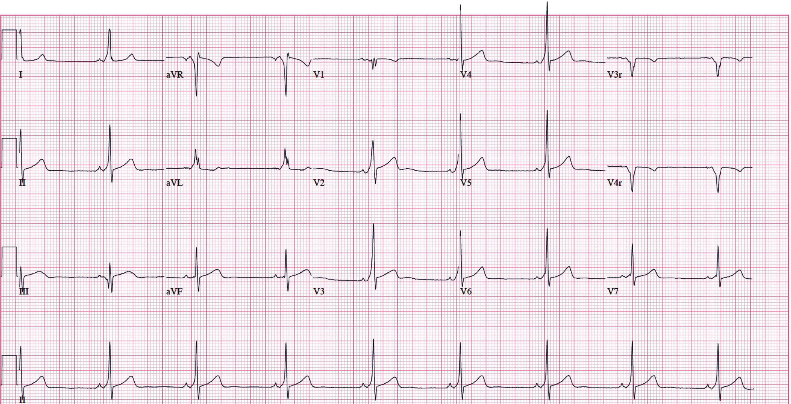

[**Figure 22.11**](#R_c22-fig-0011) _Wolff–Parkinson–White syndrome_. Surface electrocardiogram depicting the shortened PR interval and characteristic delta wave (slurring and slow rise of the initial upstroke of the QRS complex) in the Wolff–Parkinson–White pre‐excitation syndrome during normal sinus rhythm.

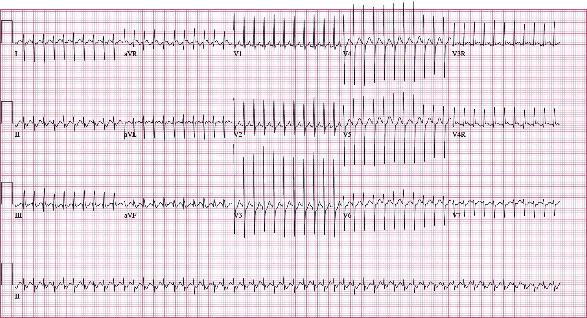

[**Figure 22.12**](#R_c22-fig-0012) _Atrioventricular reentrant tachycardia_. Electrocardiogram showing a narrow‐complex tachycardia with a regular rate and a distinct retrograde P wave approximately 80 ms after the QRS complex.

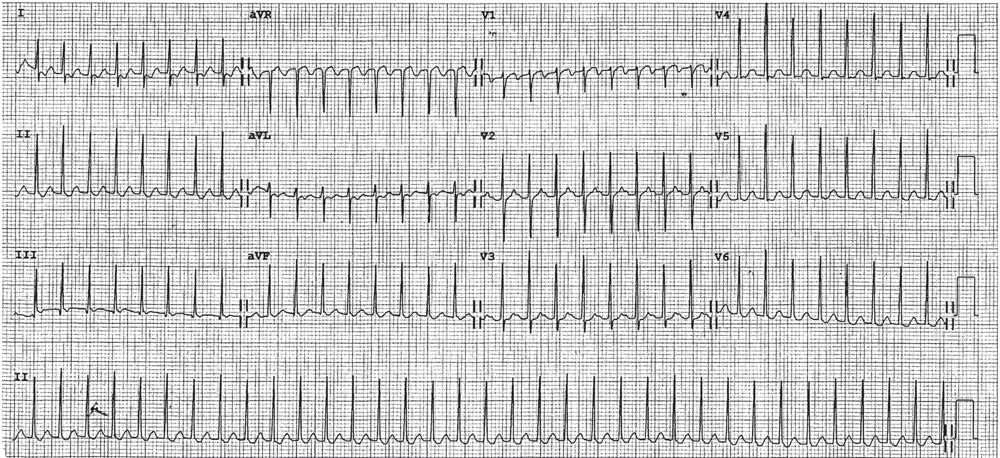

[**Figure 22.13**](#R_c22-fig-0013) _Atrioventricular nodal reentrant tachycardia_. Electrocardiogram showing a narrow‐complex tachycardia. There is no evidence of a retrograde P wave because it is obscured by the QRS complex, secondary to simultaneous atrial and ventricular activation.

##### _Management principles for AVRT or AVNRT_

-   _Direct current synchronized cardioversion_ (0.5–1.0 J/kg) should be performed in hemodynamically unstable patients. A lower energy setting is adequate if paddles are used directly on the heart (epicardial paddles). Cardioversion should also be considered in stable patients when potential rapid clinical deterioration is anticipated or after an unsuccessful conventional therapy.
-   In stable patients, tachycardia can be rapidly terminated with _vagal maneuvers_ (Valsalva maneuver, coughing, gag reflex stimulation, ice to the face, Trendelenburg position), which enhance parasympathetic influences \[58\].
-   _Adenosine_ is the first‐line drug therapy for SVT \[59–62\]. Other agents (digoxin, edrophonium, ß‐blockers, calcium‐channel blockers, phenylephrine, dexmedetomidine, sotalol) have been used in acute treatment with variable results; however, serious adverse effects can be seen. Continuous ECG monitoring is recommended, as well as the availability of atropine and other emergency drugs is ensured, because transient bradycardia may follow tachycardia termination ([Figure 22.14](#c22-fig-0014)). During short‐term pharmacologic therapy, backup pacing may be appropriate, depending on the drug and clinical status of the patient.
    
    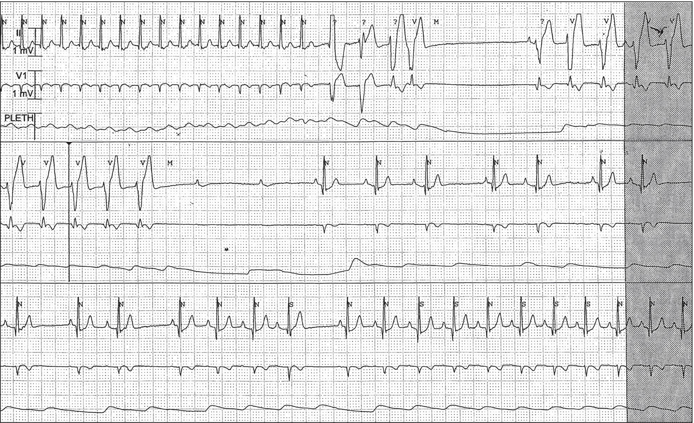
    
    [**Figure 22.14**](#R_c22-fig-0014) _Adenosine treatment of supraventricular tachycardia_. Tracings showing effects of an adenosine bolus administered during supraventricular tachycardia (_upper panel_). Upon termination of the tachycardia, several ventricular beats are seen (right half of upper panel), followed by just atrial beats (_middle panel_) and restoration of sinus rhythm (_lower panel_).
    
-   _Rapid atrial pacing_ can be performed with a transesophageal electrode catheter or via temporary atrial pacing wires. Beforehand, one must ensure that there is no ventricular capture by the catheter or temporary wires at the desired output site. Rapid atrial pacing is performed by pacing the atrium at 10–20% faster than the SVT rate for a period of up to 15 seconds, which typically terminates the tachycardia. In a patient with a high catecholamine state, SVT can be successfully terminated but rapid recurrence is possible. In this case, a higher level of patient sedation and limiting catecholamine stimulation should be considered.
-   _Anti‐arrhythmic medication_ can be instituted once the tachycardia has terminated or if it terminates and then reinitiates. For perioperative patients unable to take oral medications, parenteral therapy may include procainamide, sotalol, or amiodarone. β‐blockers and calcium‐channel blockers may be less desirable in such cases because of their negative effects on myocardial contractility; a short‐acting agent, such as esmolol, may offer a larger margin of safety.
-   _Transcatheter ablation_ may be warranted in patients with a history of SVT who would prefer not to take medications, or in those with incessant tachycardia that cannot be controlled with medications. Success rates for transcatheter ablation exceed 95%.

* * *

### KEY POINTS: SUPRAVENTRICULAR ARRHYTHMIAS

-   Premature atrial contractions can be due to irritability from an intracardiac wire/catheter, therefore, tip position should be evaluated.
-   SVT is the most common clinically significant arrhythmia in the pediatric age group; it is characterized by a narrow or “usual” complex QRS morphology.
-   SVTs are categorized into automatic and reentrant types; these can be differentiated by evaluating features of tachycardia.
-   Atrial electrograms facilitate the diagnostic assessment of tachyarrhythmias and can be obtained using bedside/operating room monitors or full ECG recordings.
-   The management of postoperative JET includes consideration of overdrive temporary atrial pacing to restore AV synchrony, sedation, mild hypothermia, and drugs.
-   Any acute rhythm disturbance requires prompt evaluation of hemodynamics.
-   In the stable patient, vagal maneuvers, drug therapy, and rapid atrial pacing may be considered to terminate a supraventricular arrhythmia.
-   Synchronized cardioversion is first‐line therapy for unstable reentrant supraventricular arrhythmias.
-   A wide QRS tachycardia should always be considered of ventricular origin until proven otherwise.

* * *

### Ventricular arrhythmias

Ventricular arrhythmias are rhythm disorders that arise distal to the bifurcation of the common His bundle. These are relatively rare in young children and more common in patients with underlying genetically abnormal cardiac sodium or potassium channels and in adolescents or young adults with previously operated CHD. Patients with ventricular rhythm abnormalities may have few or no symptoms, or they may be gravely ill. Evaluation should include reviewing the medical history for findings suggestive of associated cardiovascular pathology or potential cause of the arrhythmia, analyzing the ECG, and, most importantly, assessing the hemodynamic state.

#### Premature ventricular contractions

Premature ventricular contractions (PVCs) are premature beats that originate in the ventricular myocardium. These are characterized by the following: premature QRS complexes not preceded by premature atrial activity; a QRS morphology that differs from that in sinus rhythm; a long QRS duration for the patient’s age (a frequent but not universal finding); and abnormalities of repolarization. In patients with a structurally normal heart, PVCs of a single QRS morphology (uniform) without associated symptoms are generally considered benign. Premature ventricular contractions that merit further investigation include those that have multiple morphologies (multiform) on ECG, occur with moderate frequency, and are associated with symptoms or occur in a patient with an abnormal heart.

Ventricular ectopy in the perioperative period can be secondary to myocardial irritation from intracardiac catheters or direct surgical stimulation. Additional causes include respiratory (hypoxemia), electrolyte (hypokalemia), and metabolic derangements (acidosis). Isolated PVCs can also be due to pharmacologic agents (e.g., recreational drugs), myocardial injury, poor hemodynamics, and prior complex surgical intervention.

#### Ventricular tachycardia

Ventricular tachycardia (VT) is defined as three or more consecutive ventricular beats occurring at a rate greater than 120 bpm in adults, or more than 20% greater than the preceding sinus rate. The QRS morphology in VT is different from that in sinus rhythm and is usually wide for the patient’s age. Electrocardiographic features that support this diagnosis include AV dissociation; intermittent fusion (i.e., a QRS complex of intermediate morphology occurring between two other QRSs with distinctly different morphologies); QRS morphology of VT similar to that of isolated PVCs; and tachycardia rate in children usually below 250 bpm. An RBBB QRS morphology is most common in infants with VT, whereas in older children, an LBBB pattern is more frequent with wider QRS morphologies.

Various qualifiers have been proposed to further characterize VT. The classification of VTs as monomorphic (one QRS morphology) or polymorphic (multiple QRS morphologies) is based on the evaluation of the QRS pattern in multiple ECG leads. VT is considered to be sustained or non‐sustained if it lasts more or less than 30 seconds, respectively.

Acute onset of VT in pediatric patients may be due to hypoxia, acidosis, electrolyte imbalance, or metabolic problems. In the perioperative or immediate postoperative setting, the onset of VT can suggest myocardial ischemia or coronary artery injury, or both. This arrhythmia can also occur in patients with depressed myocardial function, poor hemodynamics, prior surgical interventions, myocardial tumors, cardiomyopathies (hypertrophic, dilated, left ventricular non‐compaction, arrhythmogenic right ventricular dysplasia), myocarditis, acute injury (trauma), and primary sodium or potassium channel abnormalities (long QT syndrome, Brugada syndrome; see sections that follow). Among patients with CHD and ventricular arrhythmias, those at higher risk include older patients who have undergone tetralogy of Fallot repair and individuals with significant residual hemodynamic abnormalities. In patients with structural heart disease, the following potential causes of ventricular ectopy have been proposed: inadequate myocardial protection during the surgical procedure, chronic pressure or volume loads, residual or recurrent pathology, and scar formation at the ventriculotomy site.

##### _Monomorphic VT_

Although occasionally seen in patients with otherwise normal hearts, monomorphic VT is more common in those with underlying cardiac abnormalities. In the abnormal heart, tachycardia is thought to originate from a reentrant focus in scarred or damaged myocardial tissue. The ECG findings include a wide regular QRS rhythm of uniform morphology ([Figure 22.15](#c22-fig-0015)).

##### _Polymorphic VT_

###### Torsades de pointes

_Torsades de pointes_, or torsades (“twisting of the peaks”), refers to a form of polymorphic VT. The characteristic ECG feature is a varying QRS morphology manifested as positive and negative oscillations of the QRS direction that twists around an isoelectric baseline ([Figure 22.16](#c22-fig-0016)). Polymorphic VT may occur in long QT syndromes, can be secondary to drug therapy or neurologic pathology, or can result from myocardial ischemia. Torsades may terminate spontaneously or degenerate into ventricular fibrillation (VF).

##### _Long QT syndromes_

Long QT syndrome (LQTS) is an electrical disturbance that affects ventricular repolarization and predisposes children to arrhythmias such as _torsades de pointes_, VT, VF, and bradyarrhythmias \[63–65\]. The disorder is associated with a propensity for syncope, cardiac arrest, and sudden death.

LQTS can be congenital (inherited) or acquired. The congenital varieties are predominantly the result of genetic defects in the sodium or potassium channels responsible for maintaining electrical homeostasis in the heart. The incidence of LQTS is not clearly known, but it is estimated that one in 5,000 individuals are gene carriers of the congenital form. The autosomal dominant variety, Romano–Ward syndrome, represents the most common form of congenital LQTS. The Jervell and Lange–Nielsen syndrome has an autosomal recessive pattern of inheritance and, in addition to QT prolongation, is characterized by deafness. Genetic testing is commercially available for LQTS‐causing defects. Although efforts to develop gene‐specific therapy are underway, all patients with LQTS are treated similarly at present.

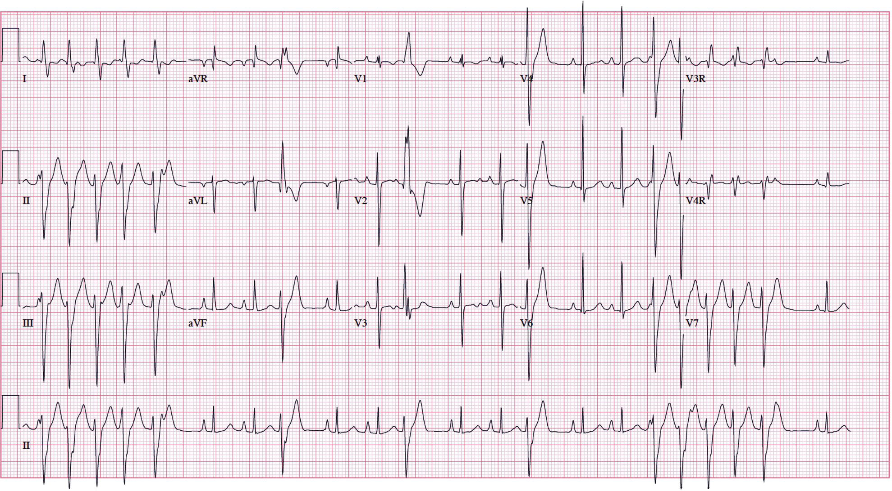

[**Figure 22.15**](#R_c22-fig-0015) _Monophorphic ventricular tachycardia_. Electrocardiogram showing runs of a uniform wide‐complex rhythm consistent with non‐sustained ventricular tachycardia. The runs are separated by a few beats of normal sinus rhythm.

[**Figure 22.16**](#R_c22-fig-0016) _Torsades de pointes_. The typical positive and negative oscillations of the QRS complexes in torsades are shown in this tracing (left panel). Because the arrhythmia was sustained and associated with significant hemodynamic compromise, cardioversion was performed, which terminated the tachyarrhythmia (right panel).

Suggested clinical diagnostic criteria for LQTS are based on ECG findings, clinical history, and family history \[66\]. The hallmark of the disorder is the prolongation of the corrected QT interval (QTc) on the resting ECG ([Figure 22.17](#c22-fig-0017)). It should be noted, however, that individuals with LQTS may not display the repolarization abnormality manifested as QT interval prolongation. Several equations can be used to determine the QTc, the most common one being Bazett’s formula:

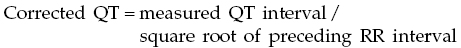

A QTc >0.47 seconds is considered abnormal regardless of the patient’s age.

##### _Management principles in LQTS_

-   _ß‐adrenergic blockade_. An important aspect of perioperative management is ensuring adequate ß‐adrenergic blockade and minimizing sympathetic stimulation, because this may trigger tachyarrhythmias. Premedication with midazolam can minimize anxiety and pain, which can also trigger arrhythmias.
    
    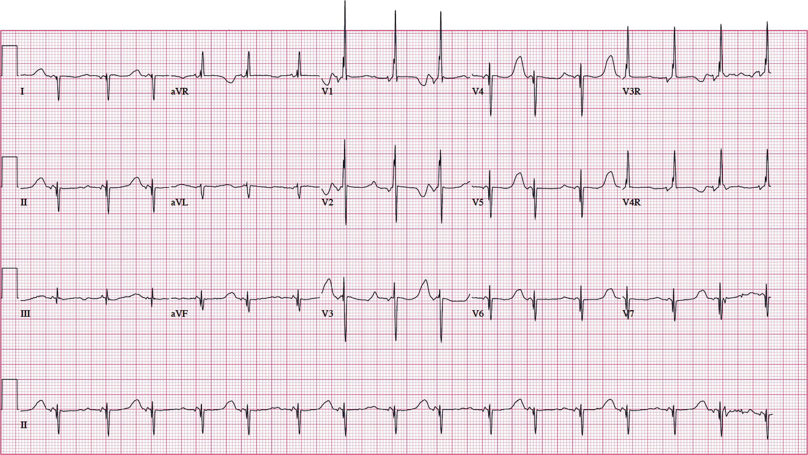
    
    [**Figure 22.17**](#R_c22-fig-0017) _Long QT syndrome_. Electrocardiographic recording from a child with long QT syndrome. The corrected QT interval is 0.58 seconds. Note the presence of T‐wave alternans (alternating T‐wave morphologies), a classic but uncommon finding in patients with long QT syndrome.
    
-   _Perioperative management_. Conditions and drugs associated with QT interval prolongation should be avoided \[67\]. Electrolyte abnormalities (e.g., hypokalemia, hypocalcemia, hypomagnesemia) should be corrected before surgery. Intravenous lidocaine (1.5 mg/kg) given before laryngoscopy and intubation has been shown to prevent QT prolongation that can be seen during the time of airway instrumentation and can be considered \[68\]. Intraoperative tachyarrhythmias can be treated with additional doses of ß‐blockers and magnesium. Other beneficial drugs include phenytoin and lidocaine. Although several agents routinely used in anesthetic practice increase the QT interval (IV medications and volatile agents), in most cases these drugs are administered without untoward effects. Care should be taken in managing postoperative nausea because some antiemetics can cause QT prolongation and can increase the risk of arrhythmias. A study in children with LQTS documented an increased risk of adverse events (2.6%) during anesthetic emergence in those who received both neuromuscular blockade reversal drugs anticholinergic/anticholinesterase medication) and ondansetron. One event was described as torsades and was treated successfully \[69\]. These observations suggest an increased vulnerability during periods of enhanced sympathetic activity (emergence) and after the administration of drugs associated with QT interval prolongation. A comprehensive list of drugs that prolong the QT interval or may induce torsades can be found in the frequently updated and highly valuable website of The Arizona Center for Education and Research on Therapeutics ([https://crediblemeds.org/index.php/login/dlcheck](https://crediblemeds.org/index.php/login/dlcheck)).
-   _Postoperative care_. Patients should be closely monitored until they emerge from anesthesia and their QTc returns to preoperative values. Adequate pain control should be provided to minimize adrenergic responses that can trigger arrhythmias.

Acquired forms of long QT may result from electrolyte disturbances (hypokalemia, hypocalcemia, hypomagnesemia), drug therapy (anti‐arrhythmic agents, antipsychotic drugs), and neurologic or endocrine abnormalities. Therapy in such cases should focus on correcting the underlying cause.

##### _General management principles for VT_

-   A wide QRS tachycardia should always be considered to be of ventricular origin until proven otherwise, although some atypical forms of supraventricular arrhythmias may mimic VT.
-   A critical aspect of caring for patients with an acute ventricular rhythm abnormality is promptly evaluating their hemodynamics. In general, sustained ventricular arrhythmias are poorly tolerated and deserve immediate attention. Unstable patients require cardiopulmonary resuscitation and electrical cardioversion.
-   Pharmacological therapy may be indicated in stable patients to treat VT or to prevent its recurrence. Recommended agents include amiodarone, lidocaine, procainamide, sotalol, and ß‐blockers. The choice of an agent depends on the associated clinical scenario.
-   Electrical cardioversion in _torsades de pointes_ should be performed only if the arrhythmia is sustained. In patients with frequent but non‐sustained runs of torsades, cardioversion is of no benefit and may be detrimental. Magnesium sulfate is considered the first‐line drug and lidocaine may also have a role in therapy. Procainamide and amiodarone are relatively contraindicated because they can cause QT prolongation.
-   Pacing and isoproterenol may be considered for polymorphic VT associated with acquired QT prolongation such as that related to the proarrhythmic effects of certain drugs, particularly in the setting of long pauses in the cardiac cycle.

##### _Brugada syndrome_

Brugada syndrome (BrS) is a genetically determined disease characterized by a distinct ECG pattern (RBBB with coved‐ or saddle‐shaped ST elevation in leads V1–V3) ([Figure 22.18](#c22-fig-0018)) \[70\]. Various genetic defects that lead to abnormalities in sodium and calcium currents have been identified in affected patients \[71\]. The inheritance pattern is usually autosomal dominant, although there is vast genetic heterogeneity. The genetics of this condition has been linked to phenotype severity \[72\]. This syndrome has rarely been reported in children \[73\]. It had been shown that infants with rapid VT and conduction abnormalities, but no cardiac or metabolic abnormalities, are likely to have disease‐causing mutations in genes for the cardiac depolarizing channels in regions with BrS \[74\].

Clinically, the importance of BrS is related to its strong propensity for ventricular arrhythmias. It is thought to be responsible for 5–20% of all sudden deaths in people with structurally normal hearts. It probably remains underdiagnosed and has a national prevalence of approximately 5 in 10,000 individuals. The ECG features are often concealed or transient. In patients with suspected BrS and a normal ECG pattern, administering a sodium‐channel blocker can unmask the classic pattern. Anti‐arrhythmic medications appear to have limited efficacy in preventing recurrences of ventricular arrhythmias and prolonging survival in patients with BrS. Only patients with implantable cardioverter‐defibrillators (ICDs) appear to be protected from sudden death. A promising new therapeutic option for patients with BrS is the possibility of epicardial ablations in the region of the right ventricular outflow tract. Epicardial ablations have been shown to eliminate the ECG findings in BrS as well as ventricular arrhythmia inducibility at the time of the study. Further data are needed to determine whether epicardial ablations prevent ventricular arrhythmias in the long term. This can potentially decrease the need for ICD in this patient population \[75–77\]. From the standpoint of anesthetic care, it is of note that many events in patients with BrS occur during rest or sleep, implicating sedation and anesthesia as the time of risk. Perioperative considerations also include factors associated with further intraventricular conduction delay or ST‐segment elevation potentially leading to arrhythmias (drugs, electrolyte abnormalities, and fever) \[78\]. In particular, sodium channel blockade should be avoided. For an updated list of drugs to be avoided in BrS, refer to [www.brugadadrugs.org](http://www.brugadadrugs.org).

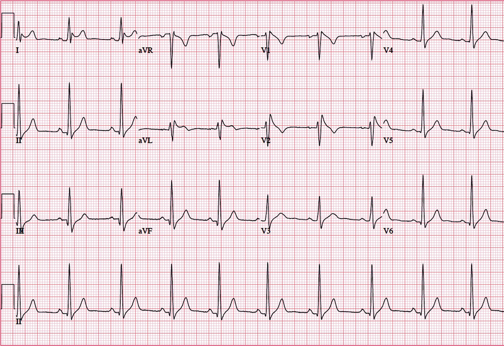

[**Figure 22.18**](#R_c22-fig-0018) _Brugada syndrome_. Surface electrocardiogram from a child with Brugada syndrome. Note the characteristic findings of right bundle branch QRS morphology and ST‐segment elevation in the right precordial leads.

##### _Catecholaminergic polymorphic ventricular tachycardia_

Catecholaminergic polymorphic ventricular tachycardia (CPVT) is an inherited cardiac channelopathy characterized by polymorphic VT triggered by adrenergic stimulation. It can be caused by a mutation in the ryanodine receptor 2 (_RYR2_) or in the cardiac calsequestrin (_CASQ2_) genes. It has an incidence of approximately 1 in 10,000. It usually presents as syncope precipitated by exercise, but it can also present as sudden death. Pharmacological therapy is provided primarily with ß‐blockers, particularly nadolol \[79\]. Several studies have also shown benefits from using flecainide in conjunction with ß‐blockade \[80–82\], and currently, many patients are started on dual therapy. In select patients, the placement of an ICD may be warranted. This form of therapy has to be used judiciously because shocks can trigger an electrical storm secondary to the adrenergic surge that follows a discharge. Left cervical sympathetic denervation can be considered in patients who are not able to tolerate ß‐blockers, who have recurrent arrhythmias despite maximal medical therapy, or who meet the criteria for ICD placement but in whom ICD cannot be placed \[83\].

##### _Management principles for CPVT_

-   _Adrenergic surges_. Patients undergoing surgical procedures or other interventions associated with a high level of stimulation have special considerations. Extreme care should be taken to minimize adrenergic surges because the latter can trigger ventricular arrhythmias in such patients. Adequate anxiolysis and pain control should be achieved during any surgical or nonsurgical procedure that may be stimulating.

#### Ventricular fibrillation

VF is an uncommon arrhythmia in children. It is characterized by chaotic, asynchronous ventricular depolarizations that fail to generate an effective cardiac output. The ECG in VF shows low‐amplitude, irregular deflections without identifiable QRS complexes. A loose ECG electrode may mimic these surface ECG features; therefore, immediate clinical assessment of cardiac output (i.e., checking for a pulse) should be performed and adequate ECG pad contact ensured when VF is suspected.

##### _Management principles for VF_

-   _Immediate defibrillation_ (initial dose of 2–4 J/kg for the transthoracic approach) is the definitive therapy because VF is lethal if left untreated. If the first shock is unsuccessful, a second shock should be delivered at double the energy dose. Infant paddles are generally recommended for those weighing less than 10 kg. Adult paddles are suggested for children weighing over 10 kg in order to reduce impedance and maximize current flow.
-   _Adequate airway control_ (_oxygenation_, _ventilation_) _and chest compressions_ should be rapidly instituted during preparation for defibrillation or between shocks if several defibrillation attempts are needed.
-   _Adjunctive pharmacologic agents_ for VF include amiodarone and lidocaine. The American Heart Association’s current guidelines for cardiopulmonary resuscitation and emergency cardiac care recommend using amiodarone or lidocaine as the first‐line anti‐arrhythmic drugs for refractory shock, pulseless VT, and VF \[62, 84, 85\].
-   _Additional therapies_ such as mechanical circulatory support should be considered.

The most widely accepted management strategies for perioperative ventricular rhythm disturbances without associated hemodynamic compromise are summarized in [Table 18.3](c18.xhtml#c18-tbl-0003).

* * *

### KEY POINTS: VENTRICULAR ARRHYTHMIAS

-   Premature ventricular contractions of uniform QRS morphology are generally benign in the structurally normal heart and in asymptomatic patients; however, they may also result from myocardial irritation or other serious causes.
-   VT is characterized by QRS morphology that is different than that in sinus rhythm and is usually wide.
-   VT requires prompt evaluation of hemodynamic status, as it may rapidly convert to VF, resulting in cardiac arrest.
-   In LQTS, perioperative ß‐blockade is essential and although caution must be exercised with drugs and conditions that prolong the QT, in most cases anesthetic management is uneventful.
-   VF requires the institution of cardiopulmonary resuscitation and immediate defibrillation; a loose ECG electrode should be excluded.

* * *

## Pharmacologic therapy of cardiac arrhythmias

Anti‐arrhythmic drugs exert their effects primarily by blocking sodium, potassium, or calcium channels, or by altering the adrenergic tone. These drugs are generally classified according to their presumed mechanisms of action and electrophysiologic effects. The well‐known drug classification scheme introduced by Vaughan Williams ([Table 22.4](#c22-tbl-0004)) and modified over the years is frequently used \[86\]. Although an oversimplification, this classification may help predict response to therapy. Appropriate drug selection requires an understanding of the mechanism of the arrhythmia and the putative effects of the agent. This section discusses pharmacologic therapy for arrhythmias, focusing on the agents that are most frequently used for acute management in children ([Table 22.5](#c22-tbl-0005)) \[87\]. It is emphasized that perioperative consultation with a specialist should be considered while caring for patients with rhythm disturbances or those receiving chronic anti‐arrhythmic therapy as necessary.

[**Table 22.4**](#R_c22-tbl-0004) Classification of anti‐arrhythmic agents

| Class and action | Drugs |
| --- | --- |
| _Class I_: sodium‐channel blockers. Drugs may be subclassified into IA, IB, and IC categories |  |
|  IA agents – moderately depress phase zero upstroke of the action potential, slow conduction, and prolong repolarization. Effectively slow conduction in atria, ventricles, and accessory connections | Procainamide  
Quinidine  
Disopyramide |
|   IB agents – shorten action potential duration and result in minimal alteration of conduction. These agents are usually not effective in the treatment of supraventricular tachycardia | Lidocaine  
Mexiletine  
Phenytoin |
|  IC agents – significantly depress phase zero upstroke, with marked slowing of conduction but little change in refractoriness | Flecainide  
Propafenone |
| _Class II_: β‐adrenergic receptor blockers. Anti‐arrhythmic effects result from slowing conduction and decreasing automaticity, particularly in the sinoatrial and atrioventricular nodes | Esmolol  
Atenolol  
Metoprolol  
Propranolol |
| _Class III_: potassium‐channel blockers. Primarily prolong action potential duration, with resultant prolongation of refractoriness | Amiodarone  
Sotalol  
Bretylium  
Ibutilide |
| _Class IV_: calcium‐channel blockers with predominant sites of action in the sinoatrial and atrioventricular nodes. | Verapamil  
Diltiazem |
| _Others_ | Atropine  
Digoxin  
Adenosine  
Ivabradine  
Magnesium sulfate |

### Class I agents

The largest group of anti‐arrhythmic drugs are sodium‐channel blockers. The relatively large size of this class of agents has led to its subclassification into IA, IB, and IC groups on the basis of each drug’s cellular actions. Group IC consists of oral drugs only and is not discussed in this chapter.

### Class IA agents

The class IA drugs include procainamide, quinidine, and disopyramide. Their predominant electrophysiologic effect is the prolongation of both myocardial repolarization (QT interval) and the action potential. The mechanism of action is primarily related to the inhibition of the fast sodium channels. The anticholinergic (vagolytic) properties of these drugs account for their more pronounced effects at fast heart rates.

#### Procainamide

Procainamide is a potent sodium‐channel blocker and, to a lesser extent, a potassium‐channel blocker. This drug slows atrial conduction (prolongs the PR interval) and lengthens the QRS duration and QT interval. Procainamide is useful in the management of both atrial and ventricular arrhythmias \[26, 38, 88, 89\]. The suppression of abnormal automaticity accounts for its usefulness in the treatment of EAT, JET, and VT. The drug is generally more effective than lidocaine in acutely terminating sustained VT.

[**Table 22.5**](#R_c22-tbl-0005) Intravenous anti‐arrhythmic agents

| Agent | Dosing |  |
| --- | --- | --- |
| Adenosine |  | 100 μg/kg rapid bolus, increase by 50 μg/kg every 2 minutes, up to 300 μg/kg maximum |
| Amiodarone | Load | 5 mg/kg over 30–60 minutes |
|  | Infusion | 5–10 μg/kg/min |
| Digoxin | Load | 20–30 μg/kg (divide as 1/2, 1/4, 1/4 every 8 hours), dose is age‐dependent |
|  | Maintenance | 7–10 μg/kg/day divided every 12 hours orally |
| Diltiazem | Load | 0.25 mg/kg up to 20 mg bolus over 2 minutes |
|  | Infusion | 0.1–0.3 mg/kg/hr, may increase up to 15 mg/hour |
| Esmolol | Load | 500 μg/kg over 1–2 minutes |
|  | Infusion | 50 μg/kg/min starting dose, may increase gradually to 400 μg/kg/min |
| Flecainide (not available in the United States) |  | 1–2 mg/kg over 5–10 minutes |
| Magnesium sulfate |  | 25–50 mg/kg (up to 2 g) over 20–30 minutes |
| Lidocaine | Load | 1 mg/kg every 5 minutes up to three times |
|  | Infusion | 20–50 μg/kg/min |
| Phenytoin |  | 1–3 mg/kg over 10–15 minutes |
| Procainamide | Load | 10–15 mg/kg over 30 to 45 minutes |
|  | Infusion | 40–50 μg/kg/min |
| Propafenone (not available in US) | Load | 1 mg/kg over 10 minutes |
|  | Infusion | 4–7 μg/kg/min |
| Propranolol |  | 0.05–0.15 mg/kg over 5 minutes |
| Sotalol | Load  
Infusion | 1 mg/kg over 1 hour or 30 mg/m2 over 15–30 minutes  
120 mg/m2/day may increase up to 200 mg/m2/day |
| Verapamil |  | 0.05–0.30 mg/kg over 3–5 minutes, maximum 10 mg, not under 12 months of age |

Procainamide can be administered via the oral, IV, or intramuscular routes. For the treatment of acute arrhythmias, IV loading (doses of 10–15 mg/kg) over a period of 30–45 minutes is usually required. The lower end of the loading dose spectrum is suggested for younger patients. Continuous ECG monitoring and frequent blood pressure assessments are recommended during the loading phase. This drug is rapidly distributed after IV injection. After the loading dose is administered, an infusion is frequently initiated at the rate of 30–50 μg/kg/min. Monitoring plasma levels is advisable, and the maintenance infusion rate should be adjusted as needed to achieve therapeutic levels between 4 and 8 μg/mL. The drug is eliminated by the kidneys (50–60%) and through hepatic metabolism (10–30%). Hepatic acetylation generates N‐acetylprocainamide (NAPA), a metabolite with anti‐arrhythmic (class III) properties.

Potential side‐effects of procainamide include hypotension due to blocking of alpha‐adrenergic receptors and decreased systemic vascular resistance during rapid IV administration. Significant QT prolongation and proarrhythmia are also well described. Additional non‐therapeutic effects include negative inotropy and AV block. Gastrointestinal symptoms, a lupus‐like syndrome, and blood dyscrasias can also occur.

#### Class IB agents

Class IB drugs include lidocaine, mexiletine, phenytoin, and tocainide. These drugs inhibit fast sodium channels and shorten both the action potential duration and the refractory period.

##### Lidocaine

Lidocaine is a short‐acting agent with primary effects on the ventricular myocardium. It is one of the anti‐arrhythmic drugs that are more commonly used in operating rooms and intensive care units. It is effective for suppressing frequent ventricular ectopy and warning arrhythmias and for preventing the recurrence of VT and VF \[90–93\].

An initial IV bolus of 1 mg/kg is recommended that can be repeated after several minutes if ineffective. The maintenance infusion rate ranges between 20 and 50 μg/kg/min. Lidocaine is rapidly metabolized in the liver by microsomal enzymes. Therefore, drugs associated with altered microsomal enzyme activity and conditions that can potentially reduce hepatic blood flow (e.g., severe congestive heart failure) may impair drug metabolism. Monitoring drug levels is advisable during continuous infusion.

Lidocaine toxicity from excessive plasma concentrations can result from poor cardiac output or from hepatic or renal failure. Elevated plasma levels beyond the therapeutic range can cause gastrointestinal symptoms (nausea and vomiting), central nervous system pathology (paresthesias, tremor, confusion, seizures), and, in rare instances, hemodynamic perturbations.

### Class II agents

The class II drugs (esmolol, atenolol, metoprolol, and propranolol) block ß‐adrenergic receptors to variable extents (receptor selectivity and intrinsic sympathomimetic activity) depending on the specific agent. Anti‐arrhythmic effects result from slowing conduction and decreasing automaticity, particularly in the sinoatrial and AV nodes. These drugs universally decrease sympathetic activity through the ß‐receptor blockade.

#### Esmolol

Esmolol is a predominant ß1‐selective (cardioselective) adrenergic receptor‐blocking agent with a rapid onset and a very short duration of action. The drug’s primary electrophysiologic effect is inhibiting sinoatrial and AV conduction. Esmolol’s brief elimination half‐life after IV injection (approximately 9 minutes) has made this drug desirable for use in perioperative and intensive care settings. Esmolol is commonly used to control heart rate and blood pressure and to manage a variety of tachyarrhythmias (supraventricular and ventricular) \[94, 95\].

An IV loading dose of 100–500 μg/kg (over 1–2 minutes) can be administered. This is followed by a continuous infusion, starting at 50–100 μg/kg/min and titrated to effect. Because of esmolol’s short half‐life, blood levels of the drug can be rapidly altered by increasing or decreasing the infusion rate, and the drug can be rapidly eliminated by discontinuing the infusion.

Most of the reported adverse effects related to esmolol therapy have been mild and transient. Reported cardiovascular side effects include bradycardia, sinus pauses, AV block, hypotension, and negative inotropy. These are most likely to be seen during bolus therapy.

### Class III agents

The class III drugs (amiodarone, sotalol, bretylium, ibutilide) block potassium channels and increase action potential duration and refractoriness in atrial and ventricular muscle and in Purkinje fibers. These agents should be avoided in patients with LQTS.

#### Amiodarone

Amiodarone has a wide spectrum of actions with multiple and complex electrophysiologic effects that encompass all four anti‐arrhythmic drug classes. Class I drug actions include inhibition of fast sodium channels. Class II and IV effects result in depression of sinus node automaticity and function and slowing of AV and His–Purkinje system conduction. As a class III agent, amiodarone delays repolarization and increases action potential duration, thereby prolonging refractoriness in all cardiac tissues and accessory connections if present. In addition to blocking potassium channels, amiodarone has vagolytic properties, weakly blocks calcium channels, and noncompetitively blocks α‐ and ß‐adrenergic receptors. The efficacy of this agent has been documented against many supraventricular (EAT, atrial flutter and fibrillation, reentrant arrhythmias involving accessory pathways, JET), and ventricular arrhythmias (VT and VF) \[37, 96–98\]. The usefulness of this drug in the treatment of life‐threatening tachyarrhythmias accounts for its expanding role in emergency cardiovascular management. In patients with an ICD, amiodarone may affect defibrillation thresholds.

Intravenous therapy requires a loading dose because of amiodarone’s rapid plasma disappearance during the distribution phase. The suggested dose in children is 5 mg/kg over 1 hour (may be given rapidly for life‐threatening arrhythmias; max. dose 300 mg). The same dose is then infused over 12 hours and repeated if necessary. Amiodarone binds extensively to most tissues, which explains its extremely prolonged elimination and thus its unusually long half‐life (average 58 days).

Amiodarone administration can result in sinus bradycardia and AV block. Hypotension and cardiovascular collapse is another potential complication of IV therapy and is probably due to calcium chelation \[99\]. Electrocardiographic effects include PR, QRS, and QTc prolongation. There are significant drug interactions while using amiodarone that merit discussion. Co‐administration with other anti‐arrhythmic agents (digoxin, procainamide, flecainide, quinidine, phenytoin) can result in increased levels of these drugs. The concomitant use of the drug with ß‐blockers or calcium‐channel antagonists should raise concerns about potential synergistic effects on conduction tissue. Several adverse effects have been reported with long‐term oral therapy in children. These include skin discoloration, corneal microdeposits, alterations in hepatic and thyroid function, pulmonary fibrosis, and neurologic disturbances.

#### Sotalol

Sotalol is another class III anti‐arrhythmic that also has some weak beta‐blocker effects. Its main anti‐arrhythmic effect is by prolonging repolarization, thereby prolonging refractoriness in cardiac tissue. Intravenous sotalol has shown promise in the acute termination of supraventricular arrhythmias (EAT, atrial flutter, reentrant arrhythmias involving accessory pathways) and ventricular arrhythmias \[39, 53–55, 100, 101\]. When given for acute termination of arrhythmia the suggested dose for intravenous sotalol is 1 mg/kg over 1 hour or 30 mg/m2 over 15 minutes. Sotalol has also been shown to be safe and effective in the chronic management of both supraventricular and ventricular arrhythmias \[102\]. Close monitoring of the QTc interval and telemetry is needed, particularly during initiation of therapy, as _torsades de pointes_ is a potential adverse effect, particularly in patients with associated CHD. In rare cases, hypoglycemia has been reported in patients with poor oral intake \[103\].

#### Ibutilide

Ibutilide is a class III agent approved in the adult population for acute intravenous therapy of atrial flutter and fibrillation of recent onset (_<_90 days) \[104–106\]. Like other drugs that prolong ventricular repolarization, this agent can cause excessive QT prolongation and polymorphic VT, which necessitates careful patient selection and monitoring during drug administration. The clinical experience with ibutilide in pediatric patients is extremely limited \[107, 108\].

### Class IV agents

The class IV drugs, also known as calcium‐channel blockers (verapamil, diltiazem, nifedipine), inhibit the slow inward calcium current.

#### Verapamil

The actions of this drug are mediated through the prolongation of conduction time and refractory period in nodal tissue. Verapamil has been shown to be effective for managing SVT and certain types of VT \[109–111\].

Verapamil should not be used in young children (_<_1‐year‐old) because of its potential to cause severe hemodynamic compromise (refractory hypotension, myocardial depression, asystole and cardiovascular collapse) \[112, 113\]. The detrimental effects are related to calcium‐channel blockade and uncoupling of excitation‐contraction in myocardial cells. In older children (>1‐year‐old), verapamil is infused in a dose of 0.1 mg/kg. The concomitant use of verapamil and ß‐blocking agents can result in serious cardiovascular side‐effects and is therefore not recommended. In patients with WPW syndrome, verapamil can enhance the ventricular response rate of atrial fibrillation and lead to hemodynamic compromise.

### Other agents

#### Atropine

Atropine sulfate, an antimuscarinic, parasympatholytic drug, accelerates sinus or atrial pacemakers and enhances AV conduction. Atropine is recommended for the treatment of symptomatic bradycardia caused by increased vagal activity or AV block, such as vagally mediated bradycardia during intubation. Atropine may be considered in the treatment of bradycardia associated with poor perfusion or hypotension; however, epinephrine is probably more effective for this condition. Efforts to ensure adequate oxygenation and ventilation and to exclude hypothermia should precede pharmacologic therapy of bradycardia.

The recommended dose is 0.02 mg/kg, with a minimum single dose of 0.1 mg and a maximum single dose of 0.5 mg in a child and 1.0 mg in an adolescent or young adult. The dose can be repeated 5 minutes later, to a maximum total dose of 1.0 mg in a child and 2.0 mg in an adolescent. In the absence of IV access, atropine (0.02 mg/kg) can be administered tracheally or intramuscularly, although with less reliable absorption than through the IV route. Small doses can be associated with transient heart rate slowing. Atropine can also rarely cause cardiac arrhythmias.

#### Digoxin

Digitalis glycosides have been used for many years in the management of certain arrhythmias. The electrophysiologic effects of digoxin are the result of its direct effects on cardiac tissues (through inhibition of the sarcolemmal sodium pump) and indirect effects via the autonomic (parasympathetic) nervous system. Digoxin increases the refractory period and decreases the conduction velocity of the specialized cardiac conduction system, slows the sinus rate (primarily by enhancing vagal discharge), and shortens the refractory period in atrial and ventricular muscle.

Digoxin can be effective in the treatment of a wide spectrum of supraventricular arrhythmias, such as SVT, atrial flutter, atrial fibrillation, and chaotic AT. In patients with WPW syndrome, digoxin is not recommended because it may alter the conduction properties of the accessory pathway and lead to malignant arrhythmias (VT and VF) during atrial flutter or fibrillation.

Digoxin can be administered orally or parenterally. Given that the onset of its effect may be delayed (up to 5 hours), this drug is less than ideal for treating acute symptomatic tachycardias. Despite this limitation, digitalis glycosides remain useful in controlling the ventricular response in atrial tachyarrhythmias, particularly during atrial flutter or fibrillation. A common loading algorithm uses a total oral digitalizing dose of 30–50 μg/kg. Half of this amount is given initially, followed by two doses at 6‐hour intervals of 25% of the total dose. For IV use, the total digitalizing dose is reduced to 75% of the total oral dose given following a similar scheme. Maintenance doses of digoxin are 7–10 μg/kg/day. Digoxin binds tightly to peripheral tissue proteins, and drug excretion is via the kidneys. Dose adjustments are indicated in cases of renal impairment or congestive heart failure.

The co‐administration of digoxin with other anti‐arrhythmic agents (amiodarone, quinidine, verapamil) requires an adjustment (reduction) in the digoxin dose and monitoring of plasma levels. Toxic manifestations of digitalis therapy can be classified as cardiac and non‐cardiac. Digoxin toxicity can cause virtually any type of cardiac rhythm disturbance. Non‐cardiac manifestations of digitalis toxicity include gastrointestinal problems (nausea, vomiting, anorexia), neurologic symptoms (headache, lethargy, weakness, confusion, seizures), and visual disturbances. Although non‐specific, non‐cardiac symptoms are the earliest manifestations of digitalis toxicity.

#### Adenosine

Adenosine is a purine agonist, with effects mediated by the activation of the A1 adenosine receptor, leading to activation of adenylate cyclase and intracellular cyclic adenosine monophosphate (cAMP) production. The electrophysiologic effects are secondary to an increase in potassium conductance and depression of the slow inward calcium current, resulting in transient sinus slowing or AV nodal block. This accounts for its therapeutic value in terminating arrhythmias that involve the AV node. Adenosine is the drug of choice for acute treatment of SVT \[59, 60, 62, 114–116\]. Adenosine can also aid the diagnosis of atrial tachyarrhythmias and may be useful in the differentiation of wide QRS tachycardias \[116\].

To terminate SVT, a bolus of IV adenosine is rapidly injected, preferably into a central vein, at initial doses of 100–150 μg/kg, followed by a rapid normal saline flush. The dose can be doubled up to a maximum of 300 μg/kg (or an adult dose of 6–12 mg). The effects of the drug are seen within 10–20 seconds. It is extremely useful to obtain an ECG recording during its administration because the response to adenosine may provide an insight into the mechanism of tachycardia. Adenosine is rapidly metabolized by erythrocytes and endothelial cells, accounting for its extremely short half‐life (_<_10 seconds).

Cardiac side‐effects include sinus pauses, sinus bradycardia, AV block, atrial and ventricular arrhythmias, and reflex sinus tachycardia. These effects are generally transient and may only necessitate supportive care. However, the availability of temporary pacing and an external defibrillator may be prudent. Adenosine should be used with caution in patients who have undergone cardiac transplantation because the electrophysiologic effects of this agent are increased in the denervated heart. Other unwanted effects are transient and generally well tolerated. These include flushing, shortness of breath, bronchospasm, and chest pressure. On very rare occasions, hypotension may occur.

#### Ivabradine

Ivabradine is a novel anti‐arrhythmic drug that works by selectively inhibiting the pacemaker or “funny” current (If) in both the sinus and AV node. The If current is generated by a nonselective, hyperpolarization‐activated cyclic nucleotide‐gated transmembrane channel that allows for sodium influx into the cell and potassium efflux from the cell. By inhibiting this channel, ivabradine causes a decrease in the slope of diastolic depolarization and thus causes a reduction in heart rate. One of its benefits is that it causes a reduction in heart rate without affecting cardiac inotropy or systemic vascular resistance \[41\]. Its use was initially in adult patients with heart failure but applications in pediatric automatic arrhythmias are growing. Small case series and case reports have demonstrated good early results in the management of junctional and atrial ectopic tachycardias. For postoperative junctional tachycardias in pediatric patients, ivabradine has been used alone or in combination with amiodarone with promising results \[40, 42, 43\]. At this time the drug is only FDA approved for oral use and therefore limited to patients in which the oral route is available. Ivabradine’s cardiac side effects include bradycardia, and atrial fibrillation, and its most common noncardiac effect is visual disturbances. Ivabradine is metabolized by CYP3A4 so its use should be avoided in conjunction with CYP3A4 inhibitors as they can increase toxicity \[41\].

#### Magnesium sulfate

Magnesium is a major intracellular cation, a co‐factor in multiple enzymatic reactions, and an important regulator of numerous cardiovascular processes. Magnesium sulfate therapy is indicated as adjunct management for arrhythmias in patients with documented hypomagnesemia or _torsades de pointes_ \[117\]. Magnesium deficiency is frequently seen in patients with other electrolyte abnormalities (hypokalemia and hypocalcemia). Rhythm disturbances associated with hypomagnesemia resemble those with hypokalemia or digitalis toxicity.

In _torsades de pointes_, IV infusion (over several minutes) of 25–50 mg/kg (up to 2 g) is recommended. Approximately 70% of plasma Mg2+ is ultrafiltered by the kidney, and the remainder is bound to protein. Side‐effects associated with drug administration include flushing, diaphoresis, muscle weakness, and central nervous system depression. Magnesium levels well above the therapeutic range can lead to serious morbidities, such as cardiac conduction defects, respiratory depression, and circulatory collapse.

#### Dexmedetomidine

Dexmedetomidine is an α2‐adrenoceptor agonist with primarily sedative properties recently shown to have anti‐arrhythmic effects as well. The exact mechanism of these effects is not well understood. It appears that central α2‐ adrenoceptor‐mediated enhancement of vagal neural activity plays a potential role \[118\]. A prospective observational study showed that during the perioperative period after cardiac surgery, receiving a continuous infusion of dexmedetomidine lowered patients’ risk of ventricular and supraventricular arrhythmias \[30\]. Other studies have also shown that the drug has a high success rate in the conversion of SVT \[119, 120\].

* * *

### KEY POINTS: PHARMACOLOGIC THERAPY OF CARDIAC ARRHYTHMIAS

-   Anti‐arrhythmic agents suppress abnormal rhythms or restore normal rhythm and conduction by their effects on blocking sodium, potassium, or calcium channels, or by altering the adrenergic tone.
-   Agents are usually categorized based on their mechanism of action into five main classes (Vaughan Williams classification).
-   Some drugs have multiple sites of action, complicating the classification of these pharmacologic agents.
-   Class III drugs should be avoided in patients with LQTS.
-   The co‐administration of certain anti‐arrhythmic agents can result in increased levels of these drugs and potential synergistic effects on conduction.

* * *

## Pacemaker therapy in children

### Pacemaker nomenclature

Pacemaker nomenclature as established by the North American Society of Pacing and Electrophysiology and the British Pacing and Electrophysiology Group is detailed in [Table 22.6](#c22-tbl-0006) \[121\]. The generic pacemaker (NBG) code has five positions. The first position or letter of the code refers to the chamber(s) paced, the second to the chamber(s) sensed, the third to the pacemaker’s response to sensing, and the fourth to programmability and rate modulation. The fifth position is restricted to anti‐tachycardia function and is used infrequently.

### Permanent cardiac pacing

Advances in pacemaker technology, including enhancements in programmability and miniaturization of units, have resulted in the increasing use of these devices in infants and children \[122\]. Guidelines for device‐based therapy of cardiac rhythm abnormalities have been published by various organizations and modified over the years \[123–126\]. [Box 22.2](#c22-fea-0002) lists indications for children, adolescents, and patients with CHD for which there is general agreement that a pacemaker should be implanted (class I) and for which these devices are used frequently but diverging opinions exist regarding benefits (class II). The recommendations for bradycardia management for adult CHD were subsequently revised as noted in [Box 22.3](#c22-fea-0003).

* * *

### [Box 22.2](#R_c22-fea-0002) : Recommendations for permanent pacing in children, adolescents, and patients with congenital heart disease

**Class I (indicated; benefit****\>>>>****risk)**

-   Advanced second‐ or third‐degree AV blocks associated with symptomatic bradycardia, ventricular dysfunction, or low cardiac output
-   Sinus node dysfunction with correlated symptoms during age‐inappropriate bradycardia. The definition of bradycardia varies with the patient’s age and expected heart rate
-   Postoperative advanced second‐ or third‐degree AV block that is not expected to resolve or that persists at least 7 days after cardiac surgery
-   Congenital third‐degree AV block with a wide QRS escape rhythm, complex ventricular ectopy, or ventricular dysfunction
-   Congenital third‐degree AV block in an infant with a ventricular rate _<_55 bpm or with congenital heart disease and a ventricular rate _<_70 bpm

**Class IIa (reasonable; benefit ≫̸ risk)**

-   Prevention of recurrent episodes of IART in patients with CHD and sinus bradycardia; sinus node dysfunction may be intrinsic or secondary to anti‐arrhythmic therapy
-   Congenital third‐degree AV block beyond the first year of life with an average heart rate _<_50 bpm, abrupt pauses in the ventricular rate that are two or three times the basic cycle length, or associated with symptoms due to chronotropic incompetence
-   Sinus bradycardia, complex CHD, and either a resting heart rate _<_40 bpm or pauses in ventricular rate >3 seconds
-   CHD and hemodynamic impairment due to sinus bradycardia or loss of AV synchrony
-   Syncope that remains unexplained after careful evaluation of possible causes in a patient with prior CHD surgery complicated by transient complete heart block and residual fascicular block

**Class IIb (may be considered; benefit ≥ risk)**

-   Transient postoperative third‐degree AV block that reverts to sinus rhythm with residual bifascicular block
-   Congenital third‐degree AV block in asymptomatic children or adolescents with an acceptable rate, narrow QRS complex, and normal ventricular function
-   Asymptomatic sinus bradycardia after biventricular repair of CHD with a resting heart rate _<_40 bpm or pauses in ventricular rate >3 seconds

AV, atrioventricular; CHD, congenital heart disease; IART, intra‐atrial reentrant tachycardia.

Source: Epstein et al. \[124\]. Reproduced with permission of Elsevier.

* * *

In general terms, potential indications for pacemaker implantation can be listed as follows.

-   Symptomatic sinus bradycardia
-   Recurrent bradycardia‐tachycardia syndromes
-   Congenital complete AV block
-   Advanced second‐ or third‐degree AV block

An important consideration in patients with CHD is the correlation of symptoms with recommended criteria for pacemaker placement in view of the physiologic alterations associated with structural heart disease or postoperative intervention(s). The use of these devices in young patients and those with CHD presents unique challenges and considerations, some of which are highlighted in the sections that follow \[127, 128\].

[**Table 22.6**](#R_c22-tbl-0006) Generic pacemaker code

Source: Bernstein et al. \[121\]. Reproduced with permission of John Wiley & Sons.

| Position I | Position II | Position III | Position IV | Position V |
| --- | --- | --- | --- | --- |
| Chamber(s) paced | Chamber(s) sensed | Response to sensing | Programmability, rate modulation | Anti‐tachyarrhythmic function(s) |
| --- | --- | --- | --- | --- |
| O, none | O, none | O, none | O, none | O, none |
| A, atrium | A, atrium | I, inhibited | P, simple programmable | P, pacing |
| V, ventricle | V, ventricle | T, triggered | M, multiprogrammable | S, shock |
| D, dual (A +V) | D, dual (A +V) | D, dual (I + T) | C, communicating  
R, rate modulation | D, dual (P + S) |

* * *

### [Box 22.3](#R_c22-fea-0003):

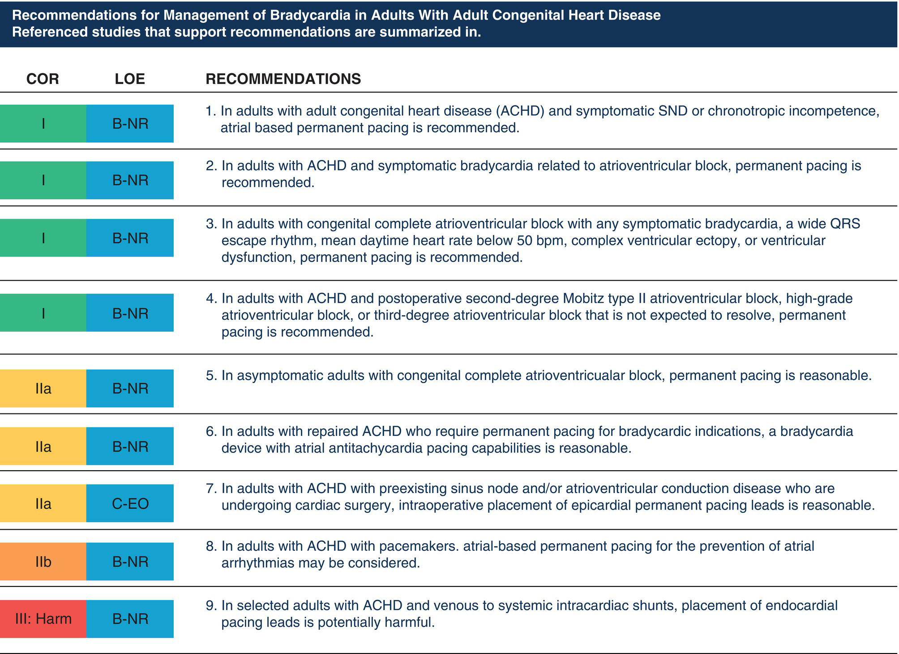

Abbreviations: _COR_ class (strength) of recommendation); _LOE_ (quality) of evidence; _B‐NR_ level b, nonrandomized; _C‐EO_ level c, consensus of expert opinion.

Source: Kusumoto et al. \[126\]. Reproduced with permission from Elsevier.

* * *

#### Implantation techniques

Permanent pacemaker implantation is performed via either the transvenous or the epicardial approach. These procedures usually take place under sterile conditions in the cardiac catheterization laboratory/electrophysiology suite, or in the operating room. In most infants and small children, the procedure requires a general anesthetic. In a select group of patients, mainly composed of older adolescents and adults, and depending on several factors, these types of procedures can be performed under local anesthesia with supplemental IV sedation.

The transvenous technique uses the subclavian vein as the most common site for access \[129\]. Under fluoroscopic guidance, pacing leads are advanced into the right atrium or ventricle, or both, and are fixed to the endocardium. After adequate lead sensing, capture thresholds, and impedances are documented, and the leads are attached to a generator, which is typically positioned in the pectoral region. The following are considered contraindications to transvenous pacing: intracardiac communication with the potential for right‐to‐left shunting, prosthetic tricuspid valve, unsuitable anatomy for transvenous access to cardiac chambers, and small patient size (_<_10 kg). Advantages of the transvenous route include greater generator longevity (because of lower pacing thresholds) and lower incidence of lead fractures, particularly in active children \[130\]. The disadvantages are potential narrowing or thrombosis of venous pathways, lead dislocation, risk of systemic embolization in patients with an intracardiac shunt, and possible endocarditis.

For epicardial implantation, the leads are attached to the epimyocardial surface of the heart. After appropriate testing, the leads are tunneled to the generator pocket \[131\]. This approach requires a subcostal, subxiphoid, thoracotomy, or sternotomy incision. Advantages of epicardial implantation include the ability for placement independent of cardiovascular pathology and avoidance of lead‐related venous complications. Disadvantages include the invasiveness of the approach, higher incidence of lead failure, and early generator‐battery depletion.

Leadless pacemakers have recently become available and have been used in adults with promising results \[132\]. The leadless pacemakers consist of a fully contained system that is placed via a transvenous approach in the right ventricle. Initial devices were limited to ventricular pacing, ventricular sensing and ventricular inhibition only (VVI setting), but newer devices have capabilities of ventricular pacing, dual chamber sensing and dual chamber inhibition (VDD) programming allowing for AV synchrony. Their use in the pediatric population is limited to small series. Although encouraging results have been demonstrated, several limitations exist for their widespread use in the pediatric population. These include the large size of the delivery sheath (27 French) and risk for vascular complications, and the limit of single‐chamber pacing. Even with the new devices with VDD capabilities, the maximum track rate is 115 bpm which significantly limits its ability to provide AV synchrony in the pediatric population. Another concern is that although the leadless pacemakers are theoretically retrievable, long‐term experience and data on retrievability are limited \[133–135\]. Thus, leadless pacemakers are mostly used for patients that require limited backup pacing.

#### Hardware selection and programming of devices

A variety of hardware options are available for cardiac pacing in infants and children. The selection of a particular generator system, a mode for pacing, and type of pacing leads is influenced by several factors, including patient size, indications for pacing, the requirement for specific programmability options, underlying cardiac pathology, and anticipated need for generator longevity.

Both single‐ and dual‐chamber units are commercially available for permanent pacing in pediatric patients. Dual‐chamber devices provide the benefit of AV synchrony, thereby allowing for the maintenance of the atrial contribution to ventricular filling, enhancing cardiac output, and lowering atrial pressures.

Cardiac resynchronization therapy (CRT) requires placing two separate pacing leads in the right and left ventricles (biventricular pacing). The leads are implanted using a transvenous (left ventricular pacing accomplished via lead in the coronary sinus) or epicardial approach. The goal is to allow for electrical and mechanical synchrony in patients with intraventricular conduction delays in order to improve hemodynamics. This type of therapy is being increasingly used in pediatric patients. The most common indication is ventricular dyssynchrony related to a variety of cardiac diagnoses \[136–144\]. A recent single‐center study has shown that for pediatric patients with symptomatic heart failure and electrical dyssynchrony, the use of CRT therapy has led to improved heart transplant‐free survival and decreased mortality compared to a control group \[145\].

#### Pacemaker malfunction

Pacemaker malfunction is most frequently caused by complications related to lead placement and integrity, failure to pace, failure to capture, under‐or oversensing, phrenic nerve stimulation, and pacemaker‐mediated tachycardia \[146\]. Pacemaker troubleshooting usually requires a 15‐lead ECG, a rhythm strip, device interrogation to determine pacing and sensing thresholds, lead impedances, generator battery status and magnet rate, and a chest radiograph.

Children are considered to be at higher risk for lead failure and fracture than adults. These problems result in inappropriate pacemaker sensing or capture (underpacing or overpacing) and the potential need for pacemaker revision. Adjusting pacemaker settings can temporarily remedy these issues.

#### Perioperative considerations

Patients with cardiac rhythm devices require special perioperative considerations ([Box 22.4](#c22-fea-0004)). The preoperative assessment of the patient with a pacemaker should include a complete history, with emphasis on indications for initial implantation, pacemaker dependency and underlying rhythm, coexistent cardiovascular pathology (structural or acquired), the functional status of the patient, and symptomatology. In addition, a focused physical examination should be performed that includes planned or existent pocket generator location \[147\]. Preoperative testing should be undertaken as indicated, including a chest radiograph that shows the number, position, and integrity of the pacing leads. If pacemaker details are needed but are not available, the device may have a code that can be read on a chest radiograph and used to identify the unit’s manufacturer/model.

Device interrogation should be part of a complete preoperative evaluation in all patients with implanted pacemakers who are scheduled for surgical intervention (cardiac or non‐cardiac) \[147–150\]. Consultation with a pediatric cardiologist/electrophysiologist to obtain details of unit type, settings, date of and indications for implantation, and underlying rhythm is highly recommended. The patient’s pacemaker card, if available, may also provide relevant information. Results of a recent 15‐lead ECG should also be reviewed. Reprogramming may be necessary before the planned procedure to avoid potential problems with pacemaker malfunction related to electromagnetic interference (EMI), such as that produced by electrocautery or radiofrequency ablation. If there is a significant risk of EMI and the patient is pacemaker‐dependent, it is recommended that the pacemaker be reprogrammed to asynchronous mode \[116\]. The introduction of bipolar leads, improved filters, and circuit shields has made modern devices less susceptible to EMI. The rate‐responsive mode, if turned on, should be deactivated, as should anti‐tachycardia modes. Several case reports suggest that incomplete perioperative evaluations can lead to adverse outcomes \[151, 152\]. Pacemaker dysfunction has been found in up to 12% of patients undergoing preoperative interrogation before undergoing non‐cardiac surgery, highlighting the importance of preoperative assessment \[153\].

* * *

### [Box 22.4](#R_c22-fea-0004) : Perioperative management of patients with cardiac rhythm devices

**Preoperative preparation**

-   Determination of the type of device and indication for pacing/ICD
-   Assessment of underlying rhythm and pacemaker dependency
-   Evaluation of device function (pacemaker check, ECG, CXR)
-   Consideration of reprogramming to the asynchronous pacing mode
-   Deactivation of rate‐adaptive functions
-   Disabling of anti‐tachycardia function/defibrillation mode as appropriate

**Intraoperative management**

-   Intraoperative monitoring (continuous ECG, monitoring of effective cardiac output; e.g., pulse oximetry, cuff blood pressure, arterial line)
-   Availability of backup temporary pacing and cardioversion‐defibrillation equipment
-   Immediate availability of drugs (isoproterenol, emergency agents)
-   Avoidance of electromagnetic interference (bipolar electrocautery preferable; place grounding pad so current passes far away from the pacemaker and leads)
-   Availability of magnet (not to replace preoperative evaluation or to be used instead of reprogramming device)

**Postoperative considerations**

-   Continuous ECG monitoring, pulse oximetry, cuff pressure, or arterial line
-   Immediate availability at all times of backup pacing and cardioversion‐defibrillation equipment
-   Interrogation of the device, reprogramming as needed
-   Reactivation of special modes (anti‐tachycardia, defibrillation mode for ICDs, and others)

CXR chest radiograph, ECG electrocardiogram, ICD implantable cardioverter‐defibrillator.

* * *

Regarding intraoperative management, it should be considered that unipolar electrocautery can interfere with pacemaker function, so bipolar electrocautery is preferred. The diathermy grounding pad should have good skin contact and be placed as far away from the device as possible. In addition to routine perioperative monitoring, which includes ECG and pulse oximetry, other modalities that confirm pulse generation during pacing, such as manual pulse palpation, auscultation (via precordial or esophageal stethoscope), and invasive arterial blood pressure monitoring, should be considered. Chronotropic agents and alternate pacing modalities (transcutaneous, transvenous, transesophageal, epicardial) should be readily available in the event of pacemaker malfunction and inadequate underlying heart rate. If defibrillation is required, the current should not be applied to or passed directly through the pulse generator, because this may damage the device circuitry.

A magnet should always be accessible to allow for transient asynchronous pacing if required. Most generators respond to magnet application by pacing asynchronously at a fixed rate (atrium paced, no atrial sensing or inhibition \[AOO\], ventricle paced, no ventricular sensing or inhibition \[VOO\], or dual chamber paced, no dual chamber sensing or inhibition \[DOO\]). It should be emphasized, however, that the settings of the asynchronous programmed stimuli for magnet mode vary among pacemaker units. Furthermore, at the generator end of life, the pacing rate on magnet application may differ (i.e., be slower) from the pre‐specified magnet rate or cause pacing to stop altogether. In some cases, the application of a magnet over a programmable pacemaker during EMI (i.e., cautery) may result in generator reprogramming \[154\]. Therefore, a magnet should never be considered a substitute for preoperative pacemaker interrogation or programming, nor should it be used routinely over a pacemaker generator during surgery or to offset potential EMI. After the procedure is completed, the device should be retested and programmed to baseline settings as appropriate.

For further depth on this topic, the reader is referred to the updated report by the American Society of Anesthesiologists Task Force on Perioperative Management of Patients with Cardiac Implantable Electronic Devices published in 2020 \[147\].

### Temporary cardiac pacing

The transvenous and epicardial routes are commonly used for temporary pacing, although the transthoracic (transcutaneous) and transesophageal approaches are also suitable in some cases. Indications for temporary cardiac pacing are not as clearly defined as those for permanent pacing \[155\]. The literature suggests that there is no need for the routine placement of temporary epicardial pacing wires after congenital heart surgery \[156–158\]. However, in patients who undergo surgical interventions such as the Fontan operation or procedures performed under circulatory arrest, or who have intraoperative arrhythmias, postoperative temporary pacing has been shown to improve hemodynamics; thus, such patients may benefit from the placement of epicardial pacing wires at the time of surgery \[159\].

Temporary pacing is achieved by placing special wires in the atrial and/or ventricular epimyocardium toward the completion of the surgical procedure and before sternal closure \[6, 155, 160\]. As previously stated, atrial wires usually exit to the right of the sternum and ventricular wires to the left. Wires should be clearly labeled to prevent confusion if there is no institutional convention. Pacing in the atrium and ventricle is termed AV sequential pacing. During pacing, the electrical impulse originates at the pulse generator – in this case, a temporary pacing box – and then flows through the wires. Unipolar and bipolar epicardial pacing leads are available. A unipolar lead is a single wire conductor (electrode at the tip), whereas a bipolar lead has two conductors within a single wire. During unipolar pacing, the electrical current flows from the electrode in contact with the heart (cathode, negatively charged) to a wire placed in the subcutaneous tissue that serves as the electrode (anode, positively charged) receiving the electrical impulse after the cardiac tissue is depolarized. In bipolar pacing, the electrical current flows through the electrode at the distal tip of the lead wire (negative cathode), and after stimulation of the heart, the signal returns to the more proximal electrode (positive anode). Bipolar systems tend to require less energy for pacing, and there is less electrical interference during sensing. The negative cathode (the epicardial wire in unipolar systems; the distal epicardial wire in bipolar units) should be clearly labeled; this is the wire that should be connected to the negative terminal of the pulse generator.

Several programmable settings are available in the external temporary pulse generator (single‐ or dual‐chamber device). Depending on the unit, these include pacing rate, atrial or ventricular output amplitude (milliamperes, mA), atrial or ventricular sensitivity (mV) or asynchronous mode, A‐V interval (milliseconds), post‐ventricular atrial refractory period, and upper rate tracking. The most important parameters to be adjusted are rate, chamber output, and pacing mode. Adjustments in optimal sensing and pacing parameters are guided by the testing of thresholds. The following is a brief overview of pacemaker settings and how these parameters are adjusted:

-   _Rate_. This should be set at a physiological rate for age, or to provide adequate cardiac output during the postoperative state. If overdrive suppression of an arrhythmia is needed, the rate is usually set 10–20% higher than the arrhythmia rate.
-   _Sensitivity_. The sensing threshold represents the _minimum electrical activity that the pacemaker is able to sense_. The lower the sensitivity setting, the less electrical activity is required by the pacemaker to sense, or greater sensitivity. To determine sensitivity, the pacemaker rate is set lower than the underlying rate in a synchronous pacing mode (AAI, VVI or DDD). The sensitivity number is then increased (lowering sensitivity) until the sense indicator on the generator stops flashing (this implies that the mode is being changed to asynchronous pacing; see below). The sensitivity setting (number) on the generator is then decreased (increasing sensitivity) until the sense indicator flashes with each cardiac depolarization. This setting represents the sensing threshold. Sensitivity is then set at half of the sensing threshold. Typically, if no underlying rhythm is present, sensitivity is set at 2 mV. It should be emphasized that setting the sensitivity to a higher number renders the pacemaker insensitive, meaning that the mode is changed from demand to asynchronous or fixed‐rate pacing. Conversely, using a very low sensitivity setting could make the pacemaker oversensitive, potentially risking pacemaker inhibition (failure to pace) by inappropriate sensing of events that are interpreted as electrical cardiac activity.
-   _Capture thresholds_. This parameter indicates the minimum amount of energy (current intensity) required to stimulate the action potential in the myocardium. To determine this setting, the pacemaker rate should be set above the underlying rate so that the pacemaker is consistently pacing the chamber being tested. The output is then slowly decreased until there is no longer capture of this chamber. _The minimum output at which capture is still present is the capture threshold_. _The output should be set at twice the capture threshold to increase the margin of safety_. Setting the output too high results in a higher incidence of inflammation and fibrosis at the lead connection and higher capture thresholds. Care should be taken during capture threshold testing in patients with no underlying rhythm.
-   _AV delay_. This represents the PR interval. In most cases, this parameter is set automatically according to rate or to between 100 and 150 ms.

Temporary pacing may be necessary for maintaining adequate cardiac output in patients with bradyarrhythmias, abnormal AV conduction, AV asynchrony, and inadequate heart rates for the physiologic state \[161\]. It may also be helpful in individuals at risk of high‐degree AV block and can be used to suppress, overdrive, or terminate tachyarrhythmias. As previously discussed, atrial recordings obtained through temporary pacing wires can also provide diagnostic information in certain types of rhythm disorders. In the care of patients who depend on temporary pacing for maintenance of adequate hemodynamics, it is extremely important to be attentive to pacemaker settings and capture thresholds, which should be interrogated on a daily basis \[160\]. Testing should include determining underlying rhythm, whether ongoing pacing is needed, and the battery status of the temporary pacemaker. It is preferred to lower the pacing rate until the endogenous rhythm comes through to determine the underlying rhythm, rather than decreasing the output until capture is lost, pausing or turning off the pacemaker, or detaching the leads. Alternate means of pacing should be available in the event of lead or pacemaker failure or malfunction. A second pulse generator and the battery should be available at all times. Temporary pacing can be discontinued when the indication for pacing resolves or when the transition to a permanent pacing system is required.

### External cardiac (transcutaneous) pacing

In the mid‐1980s, a transcutaneous external cardiac pacing system was patented and introduced by Dr. Paul Zoll \[162\]. Over the ensuing years, there was renewed interest in the field and further enhancements in the technology. Most devices currently available for transcutaneous pacing combine defibrillation/cardioversion capabilities and external pacing features. In children, emergency transthoracic pacing can be considered as a temporizing measure for symptomatic bradycardia (secondary to abnormal sinus node function or to complete AV block) \[163\]. Because transcutaneous pacing results in simultaneous atrial and ventricular activation, it should be recognized that optimal hemodynamics may not be achievable. This pacing modality has not been found to be effective in the treatment of asystole in children.

Transcutaneous pacing electrodes (pads) are selected according to patient size (smaller ones for children _<_15 kg). When gel pads are applied prophylactically, an ECG tracing obtained directly from the pads confirms adequate skin contact and proper cable attachment to the unit in case pacing is required. Device settings for pacing typically include heart rate and current output (mA). Most available models provide the option for demand or fixed pacing mode. After the desired heart rate and pacing modality are selected, the output is increased until capture is achieved. In emergency situations, pacing should be initiated at or near the maximum current output, and once the capture is documented, pacing can be gradually decreased to 5–10 mA above the capture threshold. Sedation may be necessary to improve pacing tolerance in the awake patient because this mode of pacing can be associated with discomfort (burning skin sensation, contraction of skeletal muscles). Prolonged periods of transcutaneous pacing can result in serious burns or skin trauma in infants and young children. In addition to monitoring for pacemaker capture by an ECG, ongoing clinical assessment of pulse, blood pressure, and adequacy of cardiac output should be undertaken.

### Transesophageal overdrive pacing

An esophageal catheter can be used for atrial sensing, which provides diagnostic information and enables discrimination between supraventricular tachyarrhythmias. Using the esophageal route also allows for overdrive pacing of a variety of supraventricular rhythm disorders (e.g., atrial flutter, SVT). For this purpose, an electrode catheter is inserted into the esophagus and advanced to a location that corresponds roughly to the region behind the atrial mass, and an AEG is obtained to better position the catheter. Local anesthesia of the nasopharynx or oropharynx and/or sedation is generally necessary for introducing the catheter and preventing discomfort during atrial pacing. Standard cardiorespiratory monitoring should be performed throughout the procedure, and airway support should be provided as necessary. Emergency drugs and cardioversion/defibrillation equipment should be made readily available.

### Implantable cardioverter‐defibrillators

The primary purpose of an ICD is to prevent sudden death in patients at high risk. Although sudden cardiac death is uncommon in pediatric patients, those with certain conditions are at sufficiently high risk to make them suitable candidates for ICD implantation. These conditions include hypertrophic cardiomyopathy, arrhythmogenic right ventricular cardiomyopathy, LQTS, BrS, and a history of near sudden death events \[164, 165\]. Placement of an ICD may also be warranted in pediatric patients with operated CHD or a history of malignant arrhythmias.

Device implantation involves lead and generator placement. An issue of concern is the high rate of lead failure, which is reportedly 21% in children and young adults \[166\]. A subcutaneous ICD that does not require transvenous lead placement is also available but does not provide any pacing capabilities except for temporary post‐shock pacing \[167, 168\]. At present, experience in the pediatric age group with ICD devices, in general, is limited but growing, and is reported mostly in a retrospective fashion \[168–174\]. Prospective trials are required to establish guidelines for use, address safety concerns, and evaluate long‐term issues specific to children.

Anesthetic considerations in patients with ICDs relate primarily to potential surgical EMI (from electrocautery) and the need for an available external cardioverting/defibrillating device. Perioperative consultation with a specialist is therefore essential. In most cases, the device must be deactivated or adjusted before surgery. The application of a magnet temporarily deactivates most, not all devices; thus, it is not a substitute for reprogramming and should only be considered in emergencies. Careful evaluation and device programming are advisable at the conclusion of the surgical intervention to ensure patient safety.

* * *

### KEY POINTS: PACEMAKER THERAPY IN CHILDREN

-   Indications for permanent pacing in children in most cases relate to symptomatic sinus bradycardia, recurrent bradycardia‐tachycardia syndromes, congenital complete AV block, and advanced second‐ or third‐degree AV block.
-   Patients with implanted cardiac rhythm devices require special perioperative considerations during anesthetic care.
-   Temporary pacing wires are placed toward the end of surgery in patients who may require or potentially benefit from pacing perioperatively; the wires also serve to assist in arrhythmia recognition/treatment.
-   The most important settings for temporary cardiac pacing are heart rate, chamber output, and pacing mode.
-   Temporary pacemaker settings and thresholds should be interrogated on a daily basis in the postoperative period.
-   A magnet should never be used as a replacement for preoperative pacemaker interrogation or reprogramming, nor should it be used intraoperatively to offset potential EMI.

* * *

## Summary

A significant portion of cardiac anesthesia practice involves caring for patients affected by cardiac rhythm disturbances or who may develop perioperative or periprocedural arrhythmias. It is well recognized that patients with CHD, both children and adults, represent a subgroup who are particularly vulnerable to the negative hemodynamic consequences associated with alterations of cardiac rhythm. Adequate knowledge of cardiovascular diseases affecting cardiac rhythm, arrhythmia mechanisms, diagnosis, drug therapy, and alternative therapeutic options is essential for optimal patient care and limiting related morbidity.

## Selected references

A full reference list for this chapter is available at:

[http://www.wiley.com/go/andropoulos/congenitalheart](http://www.wiley.com/go/andropoulos/congenitalheart)

1.  6 Batra AS, Balaji S. Post operative temporary epicardial pacing: When, how and why? Ann Pediatr Cardiol 2008; 1:120–5. The review describes indications for temporary pacing, as well as technical considerations, complications, and current practice related to this mode of pacing.
2.  21 Saul JP, Scott WA, Brown S, et al. Intravenous amiodarone for incessant tachyarrhythmias in children: a randomized, double‐blind, anti‐arrhythmic drug trial. Circulation 2005; 112:3470–7. Report of a double‐blind, randomized, multicenter, dose–response study of the safety and efficacy of intravenous amiodarone in 61 children. The efficacy of the drug was found to be dose‐related; adverse events were common and were also found to be dose‐related.
3.  27 Batra AS, Chun DS, Johnson TR, et al. A prospective analysis of the incidence and risk factors associated with junctional ectopic tachycardia following surgery for congenital heart disease. Pediatr Cardiol 2006; 27:51–5. Prospective study designed to evaluate the incidence of, and risk factors for, postoperative junctional ectopic tachycardia after surgery for congenital heart disease.
4.  65 Bar‐Cohen Y, Silka MJ. Management of postoperative arrhythmias in pediatric patients. Curr Treat Options Cardiovasc Med 2012; 14:443–54. A review addressing the management of postoperative arrhythmias after pediatric cardiac surgery.
5.  67 O’Hare M, Maldonado Y, Munro J, et al. Perioperative management of patients with congenital or acquired disorders of the QT interval. Br J Anaesth 2018; 120:629–44. A review addressing important aspects of the congenital long QT syndrome, including definition, congenital LQTS versus acquired QT prolongation, clinical features, treatment, and anesthesia implications. Suggestions are given for anesthetic management.
6.  126 Kusumoto FM, Schoenfeld MH, Barrett C, et al. 2018 ACC/AHA/HRS guideline on the evaluation and management of patients with bradycardia and cardiac conduction delay: a report of the American College of Cardiology/American Heart Association Task Force on Clinical Practice Guidelines and the Heart Rhythm Society. Circulation 2019; 140:e382–482. Most recent guidelines addressing, among other subjects, recommendations for management of bradycardia in adults with CHD.
7.  147 American Society of Anesthesiologists Task Force on Perioperative Management of Patients with Cardiac Rhythm Management Devices. Practice advisory for the perioperative management of patients with cardiac implantable electronic devices: Pacemakers and implantable cardioverter‐defibrillators 2020: an updated report by the American Society of Anesthesiologists Task Force on Perioperative Management of Patients with Cardiac Implantable Electronic Devices. Anesthesiology 2020; 132:225–52. A comprehensive statement by the American Society of Anesthesiologists regarding the perioperative management of patients with cardiac rhythm devices. The guidelines are intended to facilitate safe and effective perioperative care of patients with these devices and to reduce the incidence of adverse patient outcomes.