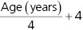
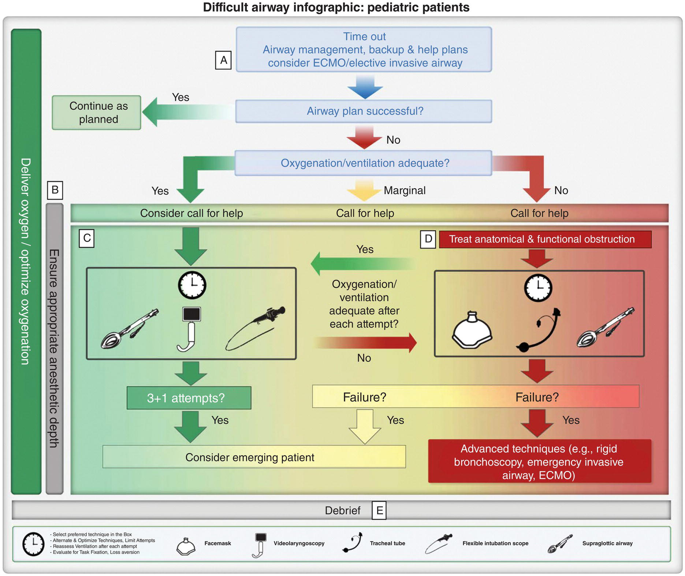
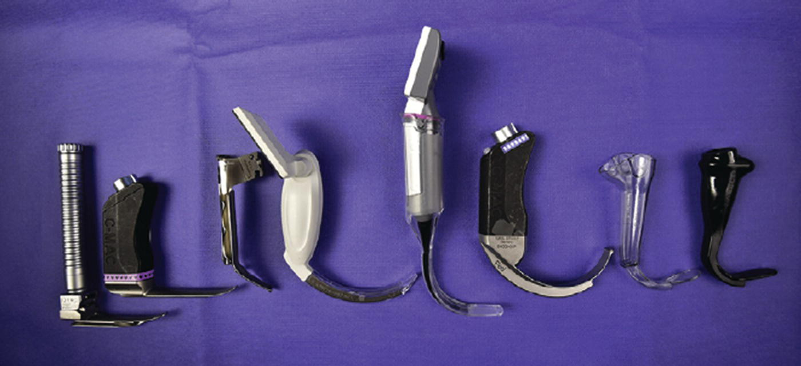
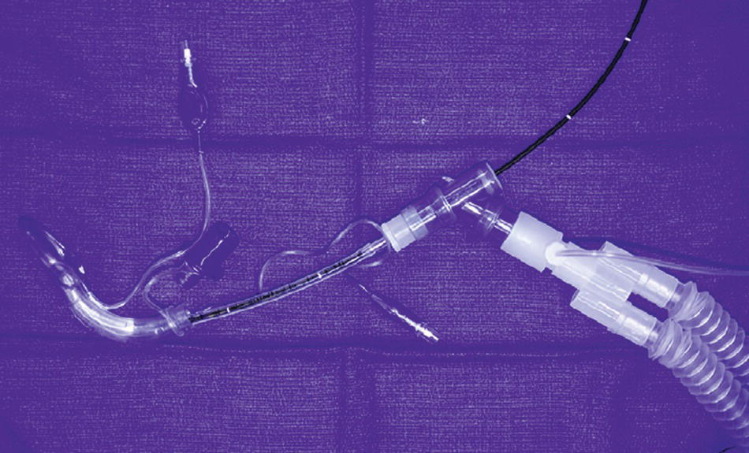
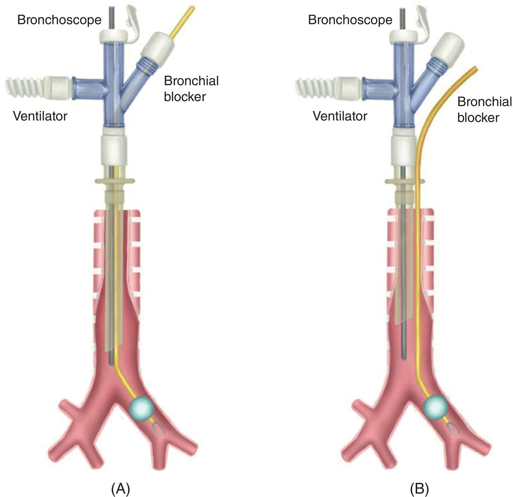
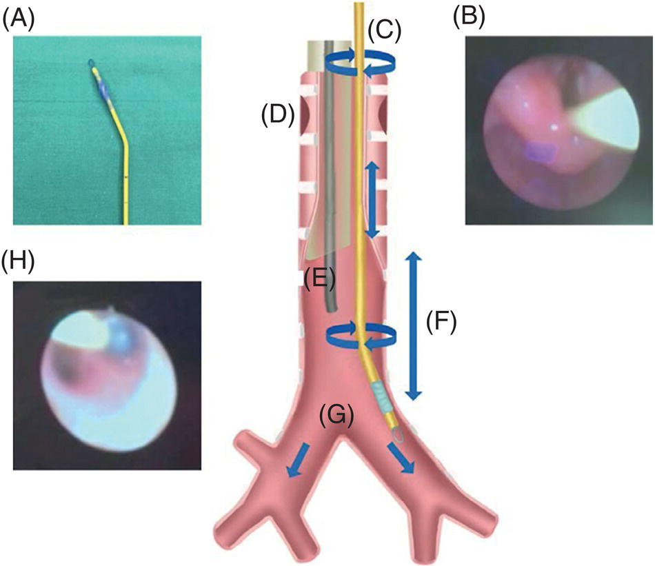
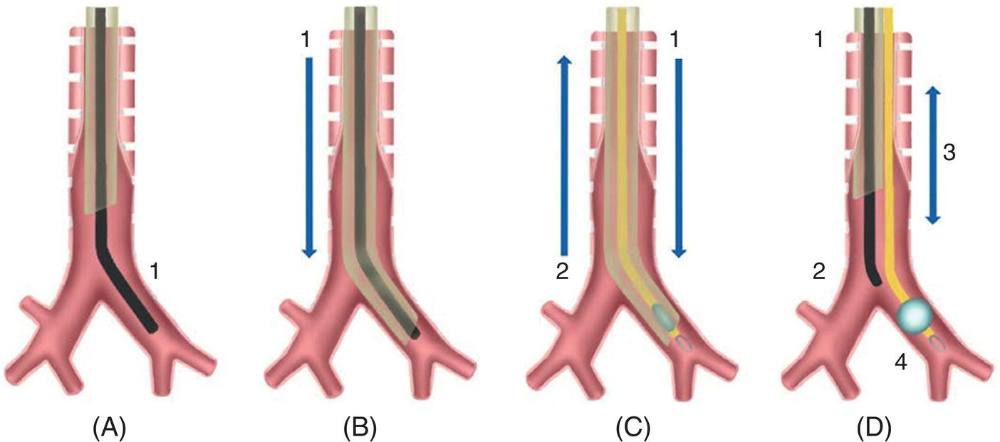
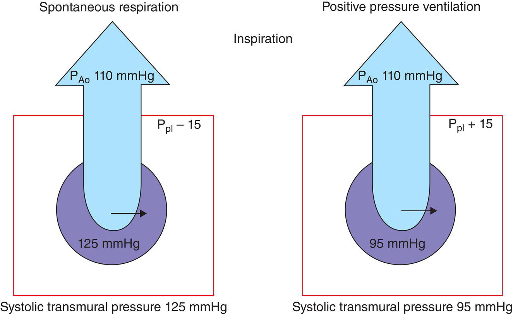

CHAPTER 23 Airway and Ventilatory Management 

# CHAPTER 23  
Airway and Ventilatory Management

_Loren D. Sacks1, Gregory B. Hammer2, and Stephen A. Stayer3, 4_

1 Attending Physician, Cardiovascular Intensive Care Unit, Lucile Packard Children’s Hospital, Clinical Assistant Professor, Department of Pediatrics, Stanford University School of Medicine, Stanford, CA, USA

2 Cardiovascular Intensive Care Unit and Pediatric Cardiac Anesthesia, Lucill Packard Children’s Hospital, Professor of Anesthesiology, Perioperative and Pain Medicine, Professor of Pediatrics ‐Critical Care, Stanford University School of Medicine, Stanford, CA, USA

3 Department of Anesthesiology, Perioperative and Pain Medicine, Texas Children’s Hospital and Baylor College of Medicine, Houston, TX, USA

4 Department of Pediatrics and Anesthesiology, Baylor College of Medicine, Arthur S. Keats Division of Pediatric Cardiovascular Anesthesiology, Texas Children’s Hospital, Houston, TX, USA

* * *

-   [**Introduction**](#head-2-227)
-   [**Choosing the appropriate endotracheal tube (ETT)**](#head-2-228)
    -   [Orotracheal vs. nasotracheal intubation](#head-3-364)
-   [**The difficult airway**](#head-2-229)
    -   [Intubation of the patient with a difficult airway](#head-3-365)
    -   [Fiberoptic‐guided tracheal intubation](#head-3-366)
    -   [Emergency cricothyrotomy](#head-3-367)
    -   [The difficult extubation](#head-3-368)
-   [**Airway and ventilatory management for thoracic surgery**](#head-2-230)
    -   [Ventilation / perfusion in the lateral decubitus position](#head-3-369)
    -   [Single‐lung ventilation (SLV)](#head-3-370)
        -   [Single lumen endotracheal tube (ETT)](#head-4-190)
        -   [Balloon tipped bronchial blockers](#head-4-191)
        -   [Univent tube](#head-4-192)
        -   [Double lumen tubes (DLTs)](#head-4-193)
        -   [Recent data concerning bronchial diameters and single lung ventilation in small children](#head-4-194)
    -   [Ventilatory management during thoracic surgery](#head-3-371)
-   [**Changes in lung function in children with CHD**](#head-2-231)
    -   [Changes in lung function from CPB](#head-3-372)
    -   [Cardiopulmonary interactions](#head-3-373)
-   [**Mechanical ventilation for children with CHD**](#head-2-232)
    -   [Lung management during CPB](#head-3-374)
    -   [Volume control vs. pressure control ventilation](#head-3-375)
    -   [Monitoring ventilation](#head-3-376)
    -   [Anesthesia ventilators](#head-3-377)
    -   [Operating room to ICU transition](#head-3-378)
-   [**Specialized problems**](#head-2-233)
    -   [Hypoxic gas mixture and inspired CO2](#head-3-379)
    -   [Nitric oxide](#head-3-380)
-   [**Tracheostomy in congenital heart disease**](#head-2-234)
    -   [Placement of tracheostomy tubes](#head-3-381)
    -   [Cardiac surgery in patients with pre‐existing tracheostomy](#head-3-382)
-   [**Summary**](#head-2-235)
-   [**Selected references**](#head-2-236)

* * *

## Introduction

Airway and ventilatory management of infants and children with congenital heart disease (CHD) during diagnostic and therapeutic procedures presents unique challenges to the anesthesiologist. This is a consequence of the interplay of a range of congenital airway abnormalities, cardiopulmonary interactions, and adverse effects of surgery and cardiopulmonary bypass on the respiratory system. Few other clinical situations will tax the skills of an anesthesiologist as the management of a child with CHD and a difficult airway. Children with cardiovascular disease may be intolerant of the myocardial depressant effects of many anesthetics, limiting the options available in managing their airway and circulation during induction of anesthesia. Children with cyanotic congenital heart disease experience rapid oxygen desaturation during periods of apnea associated with tracheal intubation. Moreover, in patients with single‐ventricle disease, the very use of positive‐pressure ventilation may limit pulmonary blood flow, leading to rapid decompensation. Developing a plan that allows safe airway and ventilatory management without hemodynamic compromise requires preparation, skill, and familiarity with a range of techniques of tracheal intubation and mechanical ventilation.

## Choosing the appropriate endotracheal tube (ETT)

The narrowest portion of a child's larynx is at the level of the cricoid cartilage, as opposed to adult patients whose limiting airway diameter is at the level of the vocal cords (rima glottidis). Uncuffed ETTs have traditionally been used in young children because a seal may be created between the tracheal mucosa and the tube at the level of the cricoid cartilage so that a cuff may not be needed to create a seal \[1\]. A disadvantage of uncuffed ETTs is that the placement of an ETT with a gas leak at low inflating pressures (e.g., <15 cm H2O) results in excessive leak around the endotracheal tube when lung compliance is poor. This is particularly important for thoracic or cardiovascular surgery because lung compliance may be reduced as a result of surgical traction, pulmonary edema, or atelectasis related to cardiopulmonary bypass (CPB). This results in a greater percentage of gas leak around the ETT. Gas leakage representing more than 50% of tidal volume has been demonstrated in the setting of decreasing lung compliance \[2\]. Associated decreases in minute ventilation may lead to hypoxemia due to atelectasis and intrapulmonary shunt as well as dangerous elevations in PaCO2 related to decreased alveolar ventilation. [Table 23.1](#c23-tbl-0001) presents a scheme for selection of ETT size in infants and children.

[**Table 23.1**](#R_c23-tbl-0001) Endotracheal tube sizes used in pediatric patients

| Age | Size (mm ID) |
| --- | --- |
| Preterm |  |
|  <1000 gm | 2.5 |
|  1000–2500 gm | 3.0 |
| Term Neonate – 6 months | 3.5 |
| 6 months to 1 year | 4.0 |
| 1–2 years | 4.0–5.0 |
| Beyond 2 years |   |

In addition to the risk of inadequate alveolar ventilation, there are other hazards associated with placement of a loose fitting ETT. Lung function measurements are commonly used to guide mechanical ventilation in the postoperative period. A variable leak around the ETT results in inaccurate measurements of exhaled tidal volumes, lung compliance, and airway resistance. A significant gas leak around the ETT also results in environmental pollution from either inhaled anesthetic agents or nitric oxide \[3\]. Lastly, an inadequate seal around the ETT may increase the risk of pulmonary aspiration should gastric contents be regurgitated during positive pressure ventilation.

Traditional airway management has included the use of uncuffed ETTs in children under the age of 8 years. However, there is limited scientific evidence to support this practice. Since the mid‐1990s, advancements in the materials used in the ETT cuff, the shape of the cuff itself, and the relative outer diameter of the inflated cuff have lowered the risk for airway injury with the use of cuffed ETT’s \[4–6\]. Cuffed endotracheal tubes are now routinely placed in infants and children, and the incidence of clinically significant airway complications is very low \[7\]. The use of cuffed ETTs during anesthesia reduces the need for repeated laryngoscopy and tracheal intubation, allows use of lower fresh gas flows, and limits environmental contamination with anesthetic gases \[2\]. There is no difference in the incidence of airway complications in pediatric patients intubated with cuffed vs. uncuffed endotracheal tubes during anesthesia or in pediatric intensive care units \[7, 8\]. However, the need to exchange endotracheal tubes is significantly greater when using uncuffed ETTs. Decreased lung compliance from the effects of cardiopulmonary bypass may increase the leak around the endotracheal tube in children after heart surgery, and a cuffed ETT may be partially deflated to compensate for such changes. In a retrospective review of 809 children <2 years old undergoing cardiac surgery over a 4‐year period, the incidence of subglottic stenosis (17/809 or 1.08%) was not affected by the use of uncuffed vs. cuffed ETTs. The most important risk factors for subglottic stenosis were younger age and prolonged (>96 hours) postoperative intubation \[9\]. There is some evidence suggesting that children with CHD require larger endotracheal ETTs regardless of the duration of surgery \[10\]. Given this information, the pediatric patient requiring lengthy surgical intervention for congenital heart disease and/or a significant period of post‐operative mechanical ventilation will generally benefit from the use of a cuffed endotracheal tube.

A disadvantage of using cuffed ETTs is that their outer diameter is approximately 0.3–0.5 mm larger than uncuffed ETTs with the same inner diameter. As a result, a tube with an inner diameter one size (i.e., 0.5 mm ID) smaller is recommended when a cuffed ETT is placed. The reduction in ETT internal diameter results in greater resistance to gas flow and an increased risk of occlusion of the ETT with blood and tracheal secretions. While a reduction of the tracheal tube diameter by only 0.5 mm might not be expected to effect a clinical change, gas flow resistance increases exponentially at smaller tube diameters. While a reduction in tracheal tube size from 8.0 mm ID to 7.5 mm ID increases airway resistance by 29%, a change from a size 4.0 mm ID to a 3.5 mm ID tube results in an increase of 71%, and a change from a 3.5 mm ID tube to a 3.0 mm ID tube increases resistance by 85%. The increase in resistance is even more profound if turbulent airflow occurs in smaller tracheal tubes. In addition, use of ETTs with a smaller internal diameter may result in the need to use smaller suction catheters, limiting the ability to effectively clear blood and secretions from the airways.

The Microcuff® endotracheal tube (Kimberly Clark; Roswell, GA) has been developed for pediatric patients. This ETT includes a true high‐volume / low‐pressure cuff, eliminates the Murphy eye in order to optimize cuff position at the tip of the endotracheal tube, and includes an ultrathin cuff that provides an outer diameter‐to‐inner diameter ratio similar to uncuffed endotracheal tubes. The Microcuff® ETT may decrease the incidence of micro‐aspiration around the ETT cuff. While conventional PVC cuffs create folds and channels when inflated that allow fluid to leak past the cuff, the cuff on the Microcuff® ETT is designed to minimize those channel openings to create a more effective tracheal seal. The cuff length and shape of Microcuff® ETTs are also designed for better contact with tracheal contours to increase protection against fluid leakage. Of note, the lack of a Murphy eye eliminates a channel for gas exchange in the case of an ETT placed too distally in the trachea or in the right mainstem bronchus.

Two studies including 575 patients age 0–5 years have found a low incidence of post‐extubation stridor, and a tracheal tube exchange rate of <3% when cuffed ETTs are used in children \[11, 12\]. A combined analysis of 3 controlled randomized trials of cuffed vs. uncuffed ETTs in 2804 children less than 8 years of age concluded that there was no difference the incidence of post‐extubation stridor requiring treatment with racemic epinephrine or corticosteroids, or of the need for reintubation or need for ICU care \[13\]. In patients who underwent surgery for congenital heart disease and were managed with Microcuff® ETTs, a retrospective review of 208 patients weighing less than 5 kg found no cases of tracheal stenosis. However, 20.9% of patients developed stridor requiring treatment with racemic epinephrine and 2 patients had severe stridor requiring reintubation \[14\].

### Orotracheal vs. nasotracheal intubation

While orotracheal intubation is performed more commonly than nasotracheal intubation for most surgery in children, many centers routinely place nasal ETTs in children undergoing cardiac surgery. Intraoperative transesophageal echocardiography (TEE) may cause dislodgement of an oral ETT, although a low incidence of airway complications during pediatric TEE among children who were orally intubated has been reported \[15\]. Of the 1650 patients studied, 3 (0.2%) developed a right mainstem advancement of the ETT and 8 (0.5%) were inadvertently extubated. Nasal ETTs are more readily secured to the face, and movement of the ETT is less likely during manipulation of the TEE probe. While nasal intubation may minimize risk of pressure injury from the ETT to the lips, there is a greater risk of damage to nasal alae and, in older children, of sinusitis from long‐term nasotracheal intubation \[16–18\]. These risks may increase if nasotracheal intubation is utilized infrequently and care providers in the post‐operative phase (e.g., respiratory therapists, bedside nurses, etc.) are unaware of the need to monitor for such complications. Therefore, for patients whose operative course predicts a lengthy ICU stay, institutional familiarity with nasotracheal intubation should be considered in advance. The risk of bleeding from nasal mucosal or adenoidal trauma is especially problematic in the fully anticoagulated patient. This risk is minimized by the routine use of topical vasoconstrictor drugs (e.g., oxymetazoline), adequate lubrication, and warming of the ETT prior to placement. Excessive pressure should not be used during advancement of the tube through the nose and nasopharynx. Prior to advancing the ETT into the nasopharynx, a soft, lubricated, tapered suction catheter can be affixed to the tip of the ETT and advanced through the nasopharynx; it can be gently pulled through the mouth using a laryngoscope and Magill forceps, guiding the ETT into the oropharynx. The catheter acts as a guide permitting easier passage of the nasal ETT through the nasal passages and nasopharynx. The catheter is then removed from the ETT, allowing placement of the ETT into the trachea using the laryngoscope and Magill forceps \[19\].

Because ETTs can be placed more easily and rapidly via the oral route, oral intubation is preferred for rapid sequence intubation or during emergencies. Once adequate ventilation and oxygenation have been provided and the stomach is suctioned, the ETT may be exchanged for a nasal tube under direct visualization. In general, the nasal passages of children will accommodate the same size ETT as would be used for oral intubation.

An analysis of 26,754 cardiac surgery cases from the multicentered Congenital Cardiac Anesthesia Society database compared the outcome of patients who had oral vs. nasal endotracheal intubation \[20\]. Nasal intubation was performed in 41% of neonates, 38% of infants, 15% of school aged children, and 2% of adolescents; about 80% of neonates and infants had cuffed ETT. There were fewer accidental extubations in neonates who were nasally intubated (0% vs. 0.37%). However, after 12 months of age nasal intubation was associated with an increased risk of infection (mediastinitis, wound infection, pneumonia, septicemia). The duration of mechanical ventilation and hospital stay were not different between groups.

## The difficult airway

The incidence of noncardiac congenital airway anomalies is believed to be greater among children with congenital heart disease than in the general population. Certain genetic disorders are clearly associated with both airway anomalies and congenital heart disease, including CHARGE and velocardiofacial (DiGeorge) syndrome (22q11 deletion). Children with these anomalies should have a complete airway examination, including endoscopic subglottic examination, by an otolaryngologist prior to cardiac surgery. In older, cooperative patients, the airway should be examined as with adult patients, including mouth opening, dentition, mandibular size, hyomental distance, and neck mobility. Studies in adults have shown that examination of the airway can help predict difficulty of intubation and mask ventilation \[21\]. No such studies have been performed in infants and children, and it is not known whether assessing mouth opening using a tongue depressor in a nonverbal child is predictive of difficulty with intubation. Assessment of an infant's airway should include an assessment of neck mobility and the appearance of the mandibular size when viewed in profile. Children with micro‐ or retrognathia are more likely to manifest difficult mask ventilation and/or difficult intubation.

The incidence of difficult intubation is higher among children with CHD. A study of 11,219 children from the population at large undergoing general anesthesia found 1.35% of patients had difficult intubation, defined as a Cormack‐Lehane view of Grade 3 or higher \[22\]. The incidence for cardiac surgical patients was 3.6%, a higher incidence than any other group surgical group, including craniofacial surgery. Neonates and infants had a higher incidence of difficult intubation, 2.5% for the general population and 6.9%, for the cardiac surgical group. These same authors reported a detailed analysis of 1,177 pediatric cardiac surgery cases \[23\]. Interestingly, Trisomy 21 was not associated with difficult intubation; however, 9 of 29 patients (31%) with other genetic/dysmorphic syndromes were found to have difficult intubation ([Table 23.2](#c23-tbl-0002)) \[23\]. They again found a higher incidence associated with younger age; difficult intubation was found in 5.6% of patients less than 12 months vs. 1.7% for older children.

A separate retrospective database review of 4,797 patients with CHD from a single center undergoing 8,657 anesthetics for cardiac and non‐cardiac procedures found the incidence of difficult intubation to be about the same as that reported for the general pediatric population ‐ 53 (1.1%) of the patients had a Cormack‐Lehane grade 3 or higher \[24\]. In this report, 16.7% of patients had a genetic or dysmorphic syndrome, including Trisomy 21 (6%), velocardiofacial syndrome (3.6%), and CHARGE association (3%). Altogether 2.4% of patients required 3 or more intubation attempts. Video laryngoscopy was utilized in 7.7% of patients and fiberoptic bronchoscopy in only 4 patients (0.1%). A significant percentage (18.2%) of patients had a congenital or acquired upper or lower airway anomaly ([Tables 23.3](#c23-tbl-0003) and [23.4](#c23-tbl-0004)).

[**Table 23.2**](#R_c23-tbl-0002) The number of patients with concomitant congenital syndromes and laryngoscopy grade \[23\]

| Syndrome | CML I, II | CML III, IV |
| --- | --- | --- |
| Microdeletion 22q11 / DiGeorge | 6 | 4 |
| VACTERL / CHARGE syndrome | 5 | 3 |
| Ullrich‐Turner syndrome | 5 | 0 |
| Goldenhar syndrome | 0 | 1 |
| Pierre Robin sequence | 0 | 1 |
| Marfan syndrome | 4 | 0 |

Abbreviation: CML, Cormack and Lehane classification

During embryologic development, the tracheobronchial tree and the pulmonary vasculature develop together, and therefore, abnormalities of the pulmonary vasculature are often associated with abnormalities of the airway. This was confirmed in a review of 564 patients with tetralogy of Fallot/pulmonary atresia/major aortopulmonary collateral arteries (TOF/PA/MAPCAs) where 37% of the patients had velocardiofacial syndrome. Difficult intubation was noted in 5% of patients, and the incidence was not different among those with or without a chromosome anomaly \[25\]. Over 40% of the patients had perioperative bronchoscopy and/or chest CT scan and half of these patients had an upper or lower airway abnormality.

[**Table 23.3**](#R_c23-tbl-0003) Incidence of congenital and acquired airway abnormalities

Source: Reproduced with permission from Foz et al. \[24\].

| Patients | _n_ = 4797_n_ (%) |
| --- | --- |
| Airway abnormality |  |
| Acquired airway abnormality | 463 (9.7) |
|  Vocal paralysis unilateral partial | 179 (3.7) |
|  Vocal paralysis unilateral total | 137 (2.9) |
|  Bronchomalacia | 103 (2.1) |
|  Subglottic stenosis | 73 (1.5) |
|  Vocal paralysis bilateral partial | 15 (0.3) |
|  Vocal paralysis bilateral total | 2 (0.05) |
| Congenital airway abnormality | 408 (8.5) |
|  Laryngomalacia | 227 (4.7) |
|  Bronchomalacia | 223 (4.6) |
|  Laryngeal cleft | 199 (4.1) |
|  Subglottic stenosis | 171 (3.6) |
|  Tracheomalacia, tracheal stenosis, tracheal disease | 134 (2.8) |
|  Agenesis of lung | 48 (1.0) |

[**Table 23.4**](#R_c23-tbl-0004) Patient demographics and intubation details

Source: Reproduced with permission from Foz et al. \[24\].

| Variable | Median (IQR) or _n_ (%) |
| --- | --- |
| N (patients) | 4,797 |
| Age (y) | 1.3 (0.2–6.0) |
| Weight (kg) | 9.2 (4.3–19.2) |
| Sex |  |
|  Female | 2,156 (45) |
|  Male | 2,638 (55) |
| Prematurity (≤36 weeks) | 1,141 (23.8) |
| Airway (_n_ = 8,657 patient‐encounters) |  |
| Airway in situ | 1,724 (20.0) |
| Tracheostomy | 29 (0.3) |
| Natural airway | 46 (0.5) |
| Intubated at time of the procedure | 6,858 (79.2) |
| Intubation attempts (_n_ = 6,139 intubated patient‐encounters) |  |
|  1 | 5,359 (87.3) |
|  2 | 628 (10.2) |
|  3 | 119 (1.9) |
|  4 | 20 (0.3) |
|  5+ | 13 (0.2) |
| Intubation technique |  |
|  Direct laryngoscopy | 5,567 (92.3) |
|  Video laryngoscopy | 462 (7.7) |
|  Flexible fiberoptic | 4 (0.1) |
| Outcomes |  |
|  Difficult intubation | 53/4,797 (1.1) |

Abbreviations: IQR, interquartile range.

Efficient airway management with minimal periods of interrupted oxygenation and ventilation is of the utmost importance in infants and children with heart disease. Especially at risk are patients with cyanotic lesions, poor ventricular function (systolic and/or diastolic), and pulmonary hypertension. In children with cyanotic heart disease, the oxygen saturation of coronary blood is decreased. Additional oxygen desaturation during airway management may result in critically diminished oxygen delivery to cardiac myocytes. Coupled with the increase in plasma catecholamines associated with airway maneuvers, causing increased myocardial oxygen demand, significant myocardial ischemia may ensue. Children with low cardiac output have compromised coronary blood flow at baseline, and a decrease in oxygen saturation in coronary blood occurring while oxygen demand is increased during airway management may also result in severe myocardial hypoxia‐ischemia. In children with pulmonary hypertension, a similar increase in plasma catecholamine concentrations coupled with any rise in PaCO2 may cause an acute exacerbation in pulmonary vascular resistance and cardiac arrest. While anesthetic agents may prevent marked increases in sympathetic response to laryngoscopy and tracheal intubation, they may also cause myocardial depression and systemic hypotension, resulting in reduced coronary blood flow causing ischemia. Given these elevated risks for decompensation, and the relatively high frequency of airway anomalies, robust pre‐operative airway assessment and the preparation for a potential difficult intubation (e.g., ensuring availability of a video laryngoscope) is recommended.

### Intubation of the patient with a difficult airway

A modification of the American Society of Anesthesiologists algorithm for the management of the patient with a difficult airway can be applied to children \[26\] ([Figure cssStyle=" cssStyle="font-family:monospace" 23.1](#c23-fig-0001)). Specialized airway equipment should be prepared, checked and available in the operating room. [Box 23.1](#c23-fea-0001) lists recommendations for equipping a difficult airway cart. In addition to equipment, additional personnel skilled in airway management should be immediately available for assistance.

When the difficult airway is recognized prior to the induction of anesthesia, control of the airway can be performed with the patient awake, following sedation, or after the induction of anesthesia with inhalation agents. Awake, non‐sedated, direct laryngoscopy can be accomplished in neonates but may be difficult, traumatic, and have significant adverse hemodynamic consequences. Placement of a supraglottic airway (SGA) after application of topical anesthesia to the airway in an awake infant has been described as an alternative to awake direct laryngoscopy \[27\]. Fiberoptic‐guided intubation of the older, cooperative patient using topical anesthesia and intravenous sedation is a safe and effective alternative. Maintaining oxygenation via nasal cannula, nasopharyngeal airway with 15 mm connector, modified Ring‐Adair‐Elwyn ETT, or heated humidified high‐flow nasal cannula should be considered during difficult airway management \[28\].

[**Figure 23.1**](#R_c23-fig-0001) Difficult airway infographic: Pediatric patient example. (A) Time Out for identification of the airway management plan. A team‐based approach with identification of the following is preferred: the primary airway manager and backup manager and role assignment, the primary equipment and the backup equipment, and the person(s) available to help. Contact an ECMO team/otolaryngologic surgeon if noninvasive airway management is likely to fail (e.g., congenital high airway obstruction, airway tumor, etc.). (B) Color scheme. The colors represent the ability to oxygenate/ventilate: green, easy oxygenation/ventilation; yellow, difficult or marginal oxygenation/ventilation; and red, impossible oxygenation/ventilation. Reassess oxygenation/ventilation after each attempt and move to the appropriate box based on the results of the oxygenation/ventilation check. (C) Nonemergency pathway (oxygenation/ventilation adequate for an intubation known or anticipated to be challenging): deliver oxygen throughout airway management; attempt airway management with the technique/device most familiar to the primary airway manager; select from the following devices: supraglottic airway, videolaryngoscopy, flexible bronchoscopy, or a combination of these devices (e.g., flexible bronchoscopic intubation through the supraglottic airway); other techniques (e.g., lighted stylets or rigid stylets may be used at the discretion of the clinician); optimize and alternate devices as needed; reassess ventilation after each attempt; limit direct laryngoscopy attempts (e.g., one attempt) with consideration of standard blade videolaryngoscopy in lieu of direct laryngoscopy; limit total attempts (insertion of the intubating device until its removal) by the primary airway manager (e.g., three attempts) and one additional attempt by the secondary airway manager; after four attempts, consider emerging the patient and reversing anesthetic drugs if feasible. Clinicians may make further attempts if the risks and benefits to the patient favor continued attempts. (D) Marginal/emergency pathway (poor or no oxygenation/ventilation for an intubation known or anticipated to be challenging): treat functional (e.g., airway reflexes with drugs) and anatomical (mechanical) obstruction; attempt to improve ventilation with facemask, tracheal intubation, and supraglottic airway as appropriate; and if all options fail, consider emerging the patient or using advanced invasive techniques. (E) Consider a team debrief after all difficult airway encounters: identify processes that worked well and opportunities for system improvement and provide emotional support to members of the team, particularly when there is patient morbidly or mortality. Developed in collaboration with the Society for Pediatric Anesthesia and the Pediatric Difficult Intubation Collaborative: John E. Fiadjoe, M.D., Thomas Engelhardt, M.D., Ph.D., F.R.C.A., Nicola Disma, M.D., Narasimhan Jagannathan, M.D., M.B.A., Britta S. von Ungern‐Sternberg, M.D., Ph.D., D.E.A.A., F.A.N.Z.C.A., and Pete G. Kovatsis, M.D., F.A.A.P \[26\].

* * *

# [Box 23.1](#R_c23-fea-0001) : Suggested contents of difficult airway management cart

Rigid laryngoscope blades of alternate design and size from those routinely used.

Endotracheal tubes of assorted size. Nasal and oral airways of assorted sizes

Endotracheal tube guides and tube exchangers. Examples include (but are not limited to) semi‐rigid stylets with or without a hollow core for jet ventilation and light wands.

Jet Ventilation Equipment

Fiberoptic intubation equipment.

Laryngeal mask airways of assorted size.

Equipment suitable for emergency surgical airway access (e.g., percutaneous cricothyrotomy).

Size 3.5, 4.0, 6.0

An exhaled CO2 detector.

* * *

Inhalation induction of anesthesia using sevoflurane with maintenance of spontaneous ventilation is commonly performed in infants and children with a difficult airway. Intravenous access is established prior to mask induction. If the patient develops airway obstruction during the induction of anesthesia, immediate attempts are made to relieve the obstruction by head extension, jaw thrust, use of continuous positive airway pressure, and insertion of an oropharyngeal or nasopharyngeal airway. Oropharyngeal airway use may be of particular benefit in patients with glossomegaly such as those with Trisomy 21. If mask ventilation is inadequate and not improved with the above maneuvers, insertion of an SGA should be attempted. If positive pressure ventilation can be delivered via the SGA, the SGA can be used as a guide for insertion of an ETT or can be exchanged for an ETT with the use of a fiberoptic bronchoscope (FOB). If an SGA fails to provide a patent airway, preparations should be made for an emergency cricothyrotomy (see below). If mask ventilation is possible with either a face mask or SGA, neuromuscular relaxation can be used in order to optimize laryngoscopy. Recent data indicates that neuromuscular blockade can facilitate difficult mask ventilation and successful tracheal intubation. Moreover, with the ability of sugammadex at 16 mg/kg dose to reverse even profound neuromuscular blockade from non‐depolarizing drugs, this approach can now be utilized with more confidence \[3\].

If mask ventilation is possible, but tracheal intubation is not readily achieved, one should optimize head and neck positioning and consider use of an alternate laryngoscope blade or video‐laryngoscope to better visualize the larynx (the latter is often utilized as a primary device when difficult intubation is anticipated). Repeated attempts at direct laryngoscopy may lead to swelling and/or bleeding in the airway and the inability to perform adequate mask ventilation. After 3 failed attempts at direct laryngoscopy, the use of an SGA should be considered. For the majority of pediatric patients, insertion of an SGA provides a patent airway, a method of delivering positive pressure ventilation, and facilitates fiberoptic intubation.

For the patient with the known difficult airway requiring endotracheal intubation (e.g., those with predictably lengthy OR courses or predicted to require mechanical ventilation after surgery), visualization of the airway may be aided by video laryngoscopy. Devices such as the Glidescope

video laryngoscope (Verathon Medical, Bothwell, WA, USA) provide a highly angulated blade with a distal camera lens. The curve of this blade is designed to visualize structures “behind” the anatomic curve of the larynx, thereby aiding practitioners in obtaining a meaningful view of the vocal cords. The device is available in a wide range of pediatric sizes and some clinical studies demonstrating reduced time to intubation through its use \[29\]. However, the curve of this device requires a unique placement technique and not all practitioners may be familiar with its use. In addition, the disposable plastic blade cover is bulky and may interfere with passage of the ETT. The C‐MAC (Karl Storz Endoscopy, Tuttlingen, Germany) couples standard Miller and Macintosh blades of multiple sizes with a distal fiberoptic lens. This allows for both direct laryngoscopy and/or video laryngoscopy using one device. Moreover, the angulation and distal position of the fiberoptic lens can provide an improved view of the difficult airway. Several studies have demonstrated improved pediatric intubation times with the use of this device \[30\].

Video laryngoscopy has become an essential tool in the management of the difficult intubation in patients of all ages, and a number of devices are available. Recent studies report the first attempt success rate is significantly higher with a video larygoscope than standard direct laryngoscopy in infants with normal airways \[31\]. In addition, a standard‐blade video laryngoscope has a higher success rate on the first attempt (and eventual successful intubation) compared to a hyper‐angulated blade video laryngoscope among infants less than 5 kg \[32\] ([Figure 23.2](#c23-fig-0002)).

### Fiberoptic‐guided tracheal intubation

The development of FOBs with small diameters has facilitated the use of fiberoptic‐guided intubation in infants and young children. The FOBs designed for use with a 3.5 mm ID ETT or smaller do not have an associated suction channel. Fiberoptic guided tracheal intubation can be performed via the nose, mouth, or LMA under sedation and topical anesthesia or under general anesthesia. The nasal route may be preferred because it tends to maintain the scope in the midline, facilitating visualization of the larynx. Repeated practice in children with normal airways is recommended in order to acquire and maintain the skills essential to be proficient with the use of the FOB.

Fiberoptic‐guided tracheal intubation can also be performed through a supraglottic airway device (SGA)([Figure 23.3](#c23-fig-0003)) \[28\]. This technique is reported to have higher first attempt success rate than video‐laryngoscopy (54% vs. 36%) in infants less than 1 year of age with difficult intubations; with no difference at older ages \[33\]. Once the SGA is appropriately positioned, the FOB is passed through the opening of the SGA into the trachea. An ETT is passed into the trachea over the FOB, which is then used to confirm appropriate positioning. When a standard ETT is used, only a short length of the ETT remains outside the SGA, making maintenance of ETT position and removal of the LMA difficult. A variety of techniques have been described to facilitate safe removal of the LMA while maintaining the ETT in place. First, a specially designed, long ETT can be placed over the FOB. Second, a tracheal tube exchange catheter (Cook Critical Care, Inc., Bloomington, IN) can be passed through the ETT into the trachea after which both the ETT and SGA are removed. An ETT is passed over the exchange catheter into the trachea. Third, the ETT can be made temporarily longer by wedging a half size smaller ETT into the proximal end, or by cutting the 15 mm adapter and using it to connect two ETTs of the same size together. After placement of the combined ETTs through the SGA, the SGA and proximal ETT are removed and the 15 mm adapter is replaced. Lastly, long forceps typically used for rigid bronchoscopy, can be used to hold the ETT while the SGA is removed. An alternative to fiberoptic intubation through the SGA, is “blind” passage of the ETT through the SGA into the trachea. Intubating SGAs have been developed for this purpose and are now available as smaller sizes. In younger children, the epiglottis frequently folds inside the SGA \[34\]. While this may not cause airway obstruction, traumatic injury to the epiglottis may occur from blind passage of an ETT.

[**Figure 23.2**](#R_c23-fig-0002) Direct laryngoscopy and video laryngoscopy blades demonstrating different angulations. From left to right: Miller 1 DL blade, Stortz C‐Mac Miller 1VL blade (standard blades); Truview EVO, McGrath series 5 Mac 3 blade, King Vision VL blade, Storz C‐Mac Pedi‐D blade, Glidescope Cobalt AVL sheath, Glidescope Spectrum blade (all hyperangulated).

(Source: Peyton et al. \[32\]. Reproduced with permission from Elsevier.)

[**Figure 23.3**](#R_c23-fig-0003) Supraglottic airway with endotracheal tube, bronchoscopic swivel adapter, and anesthesia circuit.

(Source: Hsu & Fiadjoe \[28\]. Reproduced with permission from Cambridge University Press.)

Several other methods for controlling the airway of patients with a difficult airway have been described. These include the use of a lighted stylet, Combitube **®** (esophageal tracheal airway), retrograde transtracheal intubation, blind nasal intubation, use of other specialized laryngoscopes with or without video capability, and digital (tactile) techniques. The reader is referred to a textbook of general pediatric anesthesiology for more detailed descriptions of these alternative techniques for intubation.

### Emergency cricothyrotomy

In the rare instance in which mask ventilation and placement of an SGA do not provide adequate oxygenation and ventilation and tracheal intubation cannot be performed, percutaneous cricothyrotomy may be lifesaving. Percutaneous tracheotomy kits are available (Cook Critical Care, Inc., Bloomington, IN) that are designed to facilitate pediatric tracheotomy tube placement through the cricoid membrane using the Seldinger technique \[35\].

### The difficult extubation

Tracheal extubation of patients with risk factors for difficult reintubation presents a challenge to the anesthesiologist and intensive care physician. Infants and children with congenital heart disease are at a high risk for adverse consequences associated with oxygen desaturation, hypercapnia, and hemodynamic instability prior to or during attempted reintubation. Respiratory distress signaling the need for reintubation may develop at a time when a physician with the greatest expertise in airway management is not immediately available, e.g., late at night. This can occur in the recovery room or intensive care unit, where equipment and other conditions may be less optimal than those encountered in the operating room. In addition, reintubation may be technically more difficult than the initial intubation due to airway edema, bleeding, secretions, and poor patient cooperation. Fiberoptic intubation or other alternative techniques may be extremely difficult or impossible under these circumstances.

Practice guidelines set forth by the American Society of Anesthesiologists Task Force for the Management of the Difficult Airway recommend that anesthesiologists have a preformulated strategy for extubating patients with a difficult airway \[36\]. This may include placement of a device through the indwelling ETT that serves as a stent over which the ETT can be replaced if the patient fails extubation. Accordingly, tracheal extubation of patients with a difficult airway has been performed over a guidewire, FOB, gum‐elastic bougie, and a jet stylet \[37–40\].

Because of their relatively large outer diameter, airway exchange catheters are not suitable for use in infants or small children for maintenance of airway access following tracheal extubation. The smallest available Cook Airway Exchange Catheter (CAEC, Cook Medical, Bloomington, IN), for example, has a 3.0 mm outer diameter \[41\]. In infants, this may severely limit gas flow around the catheter during spontaneous breathing. For young children, the use of a 0.018″ guidewire for maintenance of airway access following tracheal extubation has been reported \[44\]. The guidewire used was TeflonTM‐coated and had a floppy, curved tip designed to minimize tissue trauma during placement. This guidewire facilitates placement of the smallest CAEC over which a 3.5 mm ID ETT may be advanced, a method similar to previously described reports \[42, 43\].

## Airway and ventilatory management for thoracic surgery

### Ventilation / perfusion in the lateral decubitus position

Several pediatric cardiovascular surgical procedures are performed in the lateral decubitus position, including patent ductus arteriosus (PDA) ligation, insertion of a systemic to pulmonary shunt, repair of coarctation of the aorta, and unifocalization of the pulmonary arteries. Significant ventilation‐perfusion (V/Q) abnormalities may occur in this position under general anesthesia. During awake spontaneous breathing, ventilation is normally distributed preferentially to dependent regions of the lung so that there is a gradient of increasing ventilation from the most non‐dependent to the most dependent lung segments. Because of gravitational effects, perfusion normally follows a similar distribution, with increased blood flow to dependent lung segments. Therefore, ventilation and perfusion are normally well matched. During thoracic surgery, several factors may act to adversely affect V/Q matching. First, general anesthesia, neuromuscular blockade, and mechanical ventilation cause a decrease in functional residual capacity of both lungs. In addition, compression of the dependent lung in the lateral decubitus position may cause atelectasis. In certain circumstances (e.g. patients with cardiomegaly and/or dextroposition of the heart), simple positioning in the decubitus position can cause the myocardial mass to compress or obstruct the airways. Meanwhile, retraction and/or single lung ventilation result in collapse of the operative lung. Hypoxic pulmonary vasoconstriction (HPV), which acts to divert blood flow away from the under‐ventilated lung, thereby minimizing V/Q mismatch, may be diminished by inhalational anesthetic agents and other vasodilating drugs. These factors apply equally to infants, children, and adults.

The overall effect of the lateral decubitus position on V/Q mismatch, however, is unique in infants. In adults with unilateral lung disease, oxygenation is optimal when the patient is placed in the lateral decubitus position with the healthy lung dependent (“down”) and the diseased lung non‐dependent (“up”) \[44\]. This is presumably related to an increase in blood flow to the dependent, healthy lung and a decrease in blood flow to the non‐dependent, diseased lung due to the hydrostatic pressure (or gravitational) gradient between the two lungs. This phenomenon optimizes V/Q matching in the adult patient undergoing thoracic surgery in the lateral decubitus position.

In infants with unilateral lung disease, however, oxygenation is improved with the healthy lung “up.” \[49\]. Several factors account for this discrepancy between adults and infants. Infants have a soft, easily compressible rib cage that cannot fully support the underlying lung. Therefore, functional residual capacity is closer to residual volume, making airway closure likely to occur in the dependent lung even during tidal breathing \[45\]. When the adult is placed in the lateral decubitus position, the dependent diaphragm has a mechanical advantage, since it is “loaded” from abdominal pressure. This pressure is reduced in infants, thereby reducing the functional advantage of the dependent diaphragm. The infant's small size also results in a reduced hydrostatic pressure gradient between the non‐dependent and dependent lungs. Consequently, the favorable increase in perfusion to the dependent, ventilated lung is reduced in infants. This may be especially true for infants with systemic‐to‐pulmonary artery shunts, e.g., modified Blalock‐Taussig, PDA, or multiple aorto‐pulmonary collateral arteries (MAPCAs), in whom systemic pressure may be maintained in the pulmonary arterial circulation.

Finally, infants have increased oxygen consumption compared to adults, predisposing them to hypoxemia. Infants normally consume 6–8 mL of oxygen per kg/min compared with 2–3 mL/kg/min in the adult \[46\]. The functional residual capacity of the lung serves as an oxygen reservoir when ventilation ceases. An infant will more rapidly consume oxygen from the diminished oxygen reservoir that is produced during surgery in the lateral decubitus position. Infants with cyanotic congenital heart disease are at an increased risk of life‐threatening oxygen desaturation during thoracic surgery.

### Single‐lung ventilation (SLV)

Prior to 1995, nearly all thoracic surgery in children was performed by thoracotomy. However, today many thoracic procedures can be performed using video‐assisted thoracoscopic surgery (VATS). Reported advantages of VATS include smaller chest incisions, reduced postoperative pain, and more rapid postoperative recovery compared with thoracotomy \[47–49\]. VATS is now being utilized for PDA occlusion in some centers. Open thoracotomy is generally performed for more complex procedures, including repair of coarctation of the aorta and pulmonary artery unifocalization.

Single lung ventilation (SLV) is desirable during VATS as well as open thoracotomy because lung deflation improves visualization of thoracic contents and may reduce lung injury caused by the use of retractors. Because of the technical challenges and potential time‐consuming nature of achieving SLV, especially in small children and infants, a discussion with the surgeon is important to determine whether SLV is necessary. May cardiothoracic operations can be accomplished successfully with a “pack and retract” technique that allows access to the posterior mediastinum and vascular structures, e.g., aorta and PDA. When SLV is deemed necessary, there are several different techniques that can be used in children.

#### Single lumen endotracheal tube (ETT)

The simplest means of providing SLV is to intentionally intubate the non‐surgical mainstem bronchus with a conventional single lumen ETT. When the left bronchus is to be intubated, the bevel of the ETT is rotated 180° and the head turned to the right \[50\]. The ETT is advanced into the bronchus until breath sounds on the operative side disappear. A FOB may be passed through or alongside the ETT to confirm or guide placement. When a cuffed ETT is used, the distance from the tip of the tube to the proximal cuff must be shorter than the length of the bronchus so that the cuff is entirely in the bronchus \[51\]. This technique is simple and requires no special equipment other than a FOB and may be the preferred technique of SLV in emergency situations such as airway hemorrhage or contralateral tension pneumothorax.

Problems can occur when using a single lumen ETT for SLV. If a smaller, uncuffed ETT is used, it may be difficult to provide an adequate seal of the intended bronchus. This may prevent the operative lung from collapsing adequately, or fail to protect the healthy, ventilated lung from contamination by purulent or bloody material from the contralateral lung. It is not possible to suction the operative lung using this technique. Hypoxemia may occur due to obstruction of the upper lobe bronchus, especially when the short right mainstem bronchus is intubated. Microcuff® endotracheal tubes (Kimberly Clark, Roswell, GA) have a thinner walled cuff positioned near the tip of the endotracheal tube and therefore may be advantageous for use in SLV.

Variations of this technique have been described, including intubation of both bronchi independently with small ETTs \[52–55\]. One mainstem bronchus is initially intubated with an ETT, after which another ETT is advanced over a FOB into the opposite bronchus.

#### Balloon tipped bronchial blockers

A Fogarty embolectomy catheter or an end‐hole, balloon wedge catheter may be used for bronchial blockade to provide single lung ventilation \[56–59\]. Placement of a Fogarty catheter is facilitated by bending the tip of its stylette toward the bronchus on the operative side. A FOB may be used to position the catheter and confirm appropriate placement. An example of a method for placing an end‐hole catheter outside the ETT is intentional intubation of the bronchus on the operative side with an ETT. A guidewire is then advanced into that bronchus through the ETT. The ETT is removed and the blocker is advanced over the guidewire into the bronchus. An ETT is then reinserted into the trachea alongside the blocker catheter. The catheter balloon is positioned in the proximal mainstem bronchus under fiberoptic visual guidance or fluoroscopy. With an inflated blocker balloon the airway can be completely sealed, providing more predictable lung collapse and better operating conditions than with an ETT in the bronchus.

A potential problem with this technique is dislodgement of the blocker balloon into the trachea. The inflated balloon will then block ventilation to both lungs and/or prevents collapse of the operated lung. The balloons of most catheters currently used for bronchial blockade have low volume, high pressure properties and over‐distension can damage or even rupture the airway \[60\]. It has been reported, however, that bronchial blocker cuffs produced lower “cuff to tracheal” pressures than double lumen tubes \[61\]. When closed tip bronchial blockers are used, the operative lung cannot be suctioned and continuous positive airway pressure (CPAP) cannot be provided to the operative lung if needed.

Adapters are available that facilitate ventilation during placement of a bronchial blocker through an indwelling ETT \[62, 63\]. A 5 French endobronchial blocker that is suitable for use in children with a multiport adapter and FOB is commercially available (Cook Critical Care, Inc., Bloomington, IN) \[64\]. The risk of hypoxemia during blocker placement is diminished and repositioning of the blocker may be performed with fiberoptic guidance during surgery. Even with use of an FOB with a diameter of 2.2 mm, however, the indwelling ETT must be at least 4.5 mm ID to allow passage of the catheter and FOB. The use of this technique, therefore, is generally limited to children over the age of 18 months. Even in toddlers and children, passage of a suction catheter alongside the blocker catheter may be difficult.

#### Univent tube

The UniventTM tube (Fuji Systems Corporation, Tokyo, Japan) is a conventional ETT with a second lumen containing a small tube that can be advanced into a bronchus \[65–67\]. A balloon located at the distal end of this small tube serves as a blocker. UniventTM tubes require a FOB for successful placement. UniventTM tubes are available in sizes as small as a 3.5 and 4.5 mm ID for use in children over six years of age \[68\]. Because the blocker tube is firmly attached to the main ETT, displacement of the UniventTM blocker balloon is less likely than when other blocker techniques are used. The blocker tube has a small lumen which allows egress of gas and can be used to insufflate oxygen or suction the operated lung, but this feature is only present in size 6.0 and larger UniventTM tubes.

A disadvantage of the UniventTM tube is the large amount of cross sectional area occupied by the blocker channel, especially in the smaller size tubes which have a disproportionately high resistance to gas flow \[69\]. The UniventTM tube's blocker balloon has low volume, high pressure characteristics so mucosal injury can occur during normal inflation \[70, 71\].

#### Double lumen tubes (DLTs)

All DLTs are essentially two tubes of unequal length molded together. The shorter tube ends in the trachea and the longer tube in the bronchus. DLTs for older children and adults have cuffs located on the tracheal and bronchial lumens. The tracheal cuff, when inflated, allows positive pressure ventilation. The inflated bronchial cuff allows ventilation to be diverted to either or both lungs and protects each lung from contamination from the contralateral side.

The smallest cuffed DLT is 26 Fr (Rusch, Duluth, GA), and may be used in children as young as 8 years old. The lumens of this DLT are small in diameter, and therefore, passage of a FOB or suction catheter is limited. DLTs are also available in sizes 28 and 32 Fr (Mallinckrodt Medical, Inc., St. Louis, MO) suitable for children 10 years and older.

DLTs are inserted in children using the same technique as in adults \[72\]. The tip of the tube is inserted just past the vocal cords and the stylet is withdrawn. The DLT is rotated 90 degrees to the appropriate side and then advanced into the bronchus. In the adult population the depth of insertion is directly related to the height of the patient \[73\]. No equivalent measurements are yet available in children. If fiberoptic bronchoscopy is used to confirm tube placement, a scope with a small diameter and sufficient length must be available \[74\].

A DLT offers the advantage of ease of insertion as well as the ability to suction and oxygenate the operative lung with CPAP. Left DLTs are preferred to right DLTs because of the shorter length of the right main bronchus \[75\]. Right DLTs are more difficult to position accurately because of the greater risk of right upper lobe obstruction.

DLTs are safe and relatively easy to use. There are very few reports of airway damage from DLTs in either adult or pediatric patients. Their high volume, low pressure cuffs should not damage the airway if they are not overinflated with air or distended with nitrous oxide while in place. In a study of 30 children aged 5 months‐18 years with a median weight of 28 kg undergoing SLV with various devices including DLTs and bronchial blockers, the intracuff pressures in the tracheal and bronchial cuffs were measured \[76\]. Median tracheal cuff pressure was 32 cm H2O (range 11–90), median bronchial cuff pressure 44 cm H2O (range 10–100), and 65% of tracheal cuffs and 70% of bronchial cuffs had pressure exceeding the recommended 30 cm H2O. A higher rate of overinflation was seen with bronchial blockers, vs. DLT or selective bronchial intubation. There were no clinical complications in the study, but the authors advised inflating the cuffs carefully and considering pressure monitoring of inflated cuffs.

Guidelines for selecting appropriate tubes (or catheters) for SLV in children are shown in [Table 23.5](#c23-tbl-0005). There is significant variability in overall size and airway dimensions in children, particularly in teenagers. The recommendations shown in [Table 23.5](#c23-tbl-0005) are based on average values for airway dimensions. Larger DLTs may be safely used in large teenagers.

#### Recent data concerning bronchial diameters and single lung ventilation in small children

In recent years, additional data about bronchial diameters in young children have become available through high resolution CT scanning and have informed selection criteria for sizes of bronchial blockers, double lumen ETTs, and other devices. One scheme is displayed in [Table 23.6](#c23-tbl-0006) \[77\]. In smaller children less than 2 years of age, extraluminal placement of a bronchial blocker is the only viable technique (besides endobronchial intubation) to provide SLV because of the small diameter of the ETT relative to the blocker catheter and FOB utilized for placement. Larger children who can accept a 5.0 mm ID ETT or larger are candidates for intraluminal blocker placement ([Figure 23.4](#c23-fig-0004)). Approaches to place the extraluminal bronchial blocker in small children include the “bending the rules” approach ([Figure 23.5](#c23-fig-0005)), and the intra‐to extraluminal approach ([Figure 23.6](#c23-fig-0006)).

[**Table 23.5**](#R_c23-tbl-0005) Tube selection for single‐lung ventilation in children

| Age (years) | ETT (ID mm)[a](#c23-note-0003) | BB[b](#c23-note-0004) (Fr) | Univent™[c](#c23-note-0005) | (ID mm) DLT (Fr)[d](#c23-note-0006) |
| --- | --- | --- | --- | --- |
| 0.5–1 | 3.5–4.0 | 5 |  |  |
| 1–2 | 4.0–4.5 | 5 |  |  |
| 2–4 | 4.5–5.0 | 5 |  |  |
| 4–6 | 5.0–5.5 | 5 |  |  |
| 6–8 | 5.5–6 | 6 | 3.5 |  |
| 8–10 | 6.0 cuffed | 6 | 3.5 | 26 |
| 10–12 | 6.5 cuffed | 6 | 4.5 | 26–28 |
| 12–14 | 6.5–7.0 cuffed | 6 | 4.5 | 32 |
| 14–16 | 7.0 cuffed | 7 | 6.0 | 35 |
| 16–18 | 7.0–8.0 cuffed | 7 | 7.0 | 35 |

[a](#R_c23-note-0003) Sheridan Tracheal Tubes, Kendall Healthcare, Mansfield, MA, USA.

[b](#R_c23-note-0004) Arrow International Corp., Redding, PA, USA.

[c](#R_c23-note-0005) LMA North America, San Diego, CA, USA.

[d](#R_c23-note-0006) 26 Fr (Rusch, Duluth, GA, USA); 28–35 Fr (Mallinckrodt Medical, Inc., St. Louis, MO, USA).

ID, internal diameter in mm, Fr, French size, DLT, double‐lumen tube.

[Table 23.7](#c23-tbl-0007) summarizes the strategies for SLV in infants and young children, with the advantages and disadvantages of each method \[80\].

### Ventilatory management during thoracic surgery

During two‐lung ventilation, tidal volumes of 6–8 mL/kg are typically used at a respiratory rate that provides normocapnia. When one lung is ventilated, the delivered tidal volume should be reduced to 4–5 mL/kg, and the respiratory rate increased in order to avoid excess inspiratory pressure to the ventilated lung. Pressure control ventilation can also be used, in which case attention must be directed at tidal volumes, which may be decreased with manipulation of the thoracic contents. Pulse oximetry and capnography reflect trends in the changes in oxygenation and ventilation but monitoring of arterial blood gas tensions is important to accurately determine PaO2 and PaCO2 during single lung ventilation in infants and children with congenital cardiac disease. Hypercapnia and hypoxemia may cause a reduction in cardiac output, as may hyperinflation of the ventilated lung.

Hypoxemia is commonly encountered during thoracic surgical procedures, especially in children with CHD and pre‐existing hypoxemia, impaired myocardial function, and/or pulmonary hypertension. Hypoxemia develops from one or more possible mechanisms. The conducting passages of the operative lung are intentionally obstructed during single‐lung ventilation and/or from surgical retraction and compression of the operative lung. Secretions in the airways as well as surgical and hydrostatic compression may also compromise gas flow through the conducting passages of the dependent lung. The reduction in ventilation to the operative lung produces regional hypoxemia that induces hypoxic pulmonary vasoconstriction (HPV), which will reduce ventilation/perfusion (V/Q) mismatch. However, HPV may be impaired in children with CHD. It has been shown in a dog model that HPV is impaired by elevated pulmonary arterial pressure and by low mixed venous oxygen tension, both of which are commonly encountered among children with CHD \[78, 79\]. Retraction of the operative lung may compress the mediastinum, impairing cardiac filling and reducing cardiac output These changes, in turn, cause a decrease in mixed venous oxygen concentration and exacerbate hypoxemia from intracardiac and/or intrapulmonary shunting.

[**Table 23.6**](#R_c23-tbl-0006) Age and device selection for OLV in infants and young children

Source: Reproduced with permission from Templeton et al. \[77\].

| Age | Mainstem Bronchus Diameter (mm) [a](#c23-note-0010) | Standard UC ETT Size for Endobronchial Intubation (OD mm) [b](#c23-note-0011) | Standard C ETT Size for Endobronchial Intubation (OD mm) [b](#c23-note-0011) | 5F Arndt | 7F Arndt | 9F Arndt | 3F | 4F | 5F | 9F | EZ‐ | 3.5 | 4.5 | 26F |
| --- | --- | --- | --- | --- | --- | --- | --- | --- | --- | --- | --- | --- | --- | --- |
|  | R | L | R | L | R | L | BB | BB | BB | Fogarty | Fogarty | Fuji | Fuji | Blocker | Univent | Univent | DLT |
| --- | --- | --- | --- | --- | --- | --- | --- | --- | --- | --- | --- | --- | --- | --- | --- | --- | --- |
| 0–3 months | 4.4[a](#c23-note-0010) | 3.6[a](#c23-note-0010) | 3.0 (4.2) | 2.5 (3.6) | 3.0 (4.3) | ‐ | E | ‐ | ‐ | E | E | E | ‐ | ‐ | ‐ | ‐ | ‐ |
| 3–6 months | 4.7[a](#c23-note-0010) | 3.9[a](#c23-note-0010) | 3.0 (4.2) | 2.5 (3.6) | 3.0 (4.3) | ‐ | E | ‐ | ‐ | E | E | E | ‐ | ‐ | ‐ | ‐ | ‐ |
| 6–12 months | 5.4[a](#c23-note-0010) | 4.2[a](#c23-note-0010) | 3.5 (4.9) | 3.0 (4.2) | 3.5 (4.9) | 3.0 (4.3) | E | ‐ | ‐ | E | E | E | ‐ | ‐ | ‐ | ‐ | ‐ |
| 1–2 years | 5.4[c](#c23-note-0012) | 5.6[c](#c23-note-0012) | 4.0 (5.5) | 3.5 (4.9) | 4.0 (5.6) | 3.5 (4.9) | E | ‐ | ‐ | E | E | E | ‐ | ‐ | ‐ | ‐ | ‐ |
| 2–4 years | 7.5[c](#c23-note-0012) | 6.6[c](#c23-note-0012) | 4.5 (6.2) | 3.5 (4.9) | 4.5 (6.2) | 3.5 (4.9) | E/l | E | ‐ | E/l | E/l | E/l | ‐ | ‐ | ‐ | ‐ | ‐ |
| 4–6 years | 8.3[c](#c23-note-0012) | 7.3[c](#c23-note-0012) | 4.5 (6.2) | 4.0 (5.5) | 4.5 (6.2) | 4.0 (5.6) | E/l | E | ‐ | E/l | E/l | E/l | ‐ | ‐ | ‐ | ‐ |  |
| 6–8 years | 8.9[c](#c23-note-0012) | 7.8[c](#c23-note-0012) | 5.5 (7.5) | 5.0 (6.9) | 5.5 (7.5) | 5.0 (6.9) | E/l | E/l | ‐ | ‐ | ‐ | E/l | ‐ | E | + | ‐ | ‐ |
| 8–10 years | 9.9[c](#c23-note-0012) | 8.8[c](#c23-note-0012) | ‐ | ‐ | 6.0 (8.2) | 5.0 (6.9) | ‐ | E/l | E/l | ‐ | ‐ | ‐ | E/l | E/l | + | + | + |

Summary of bronchial diameters and recommended lung isolation device or ETT size for lung isolation. ETT outer diameters can vary significantly by manufacturer, so care must be taken to evaluate the outer diameter of a given ETT when planning to use it for endobronchial intubation and OLV.

Abbreviations: BB, bronchial blocker; C, cuffed; CT, computerized tomography; DLT, double‐lumen tube; E, extraluminal; ETT, endotracheal tube; Fuji, Fuji Uniblocker; I, intraluminal; L, left; OD, outer diameter; OLV, one‐lung ventilation; R, right; UC, uncuffed.

[a](#R_c23-note-0010) Median bronchial diameter measured by high resolution CT (Downard MG, Johnson AL, Heald CJ, Anthony EY, Singh J, Templeton TW, unpublished data, April 2019).

[b](#R_c23-note-0011) Measurement of outer diameter is for Shiley endotracheal tubes.

[c](#R_c23-note-0012) Median bronchial diameter measured by high resolution CT.

[**Figure 23.4**](#R_c23-fig-0004) Intraluminal versus extraluminal approach to bronchial blocker placement. A, Intraluminal approach with fiberoptic scope and bronchial blocker inserted through the multiport adapter with both devices present within the endotracheal tube. B, Extraluminal bronchial blocker with blocker present outside of the endo‐ tracheal tube within the airway and the fiberoptic scope inserted through the multiport adapter and endotracheal tube to facilitate placement.

(Source: Templeton et al. \[82\]. Reproduced with permission from Wolters Kluwer Health, Inc.)

Severe hypoxemia should be treated immediately by increasing the FiO2 to 1.0 and by confirming patency of the ETT. A suction catheter should be passed through the ETT to clear secretions and/or blood from the lumen. Irrigation with sterile saline may be beneficial. If the ETT remains occluded, an FOB may be used to determine the site of obstruction and to reestablish patency of the ETT. The surgeon should be informed, and compression of the lung and/or mediastinum should be minimized. Administration of intravenous fluids may improve cardiac output and improve V/Q matching by increasing perfusion pressure to the lungs. Application of continuous positive airway pressure (CPAP) with 100% O2 to the non‐dependent lung will reduce intrapulmonary shunt and improve oxygenation during SLV. If hypoxemia persists despite these maneuvers, the operative lung should be re‐inflated with 100% oxygen. Although nitric oxide might be expected to increase pulmonary blood flow to the ventilated lung and improve oxygenation, two studies in adults failed to show benefit from nitric oxide during SLV \[80, 81\].

Some degree of hypoxemia is expected during SLV. In a study of 52 children without CHD undergoing SLV during VATS, a decrease in SpO2 occurred in 40% of patients in whom a bronchial blocker was used \[82\]. The bronchial blockers used did not have lumens for administration of CPAP/ O2. Forty percent of patients in this study also had PaCO2 values >50 mmHg, although the clinical significance of hypercarbia was not documented. In another study of 12 pediatric patients in whom VATS was performed for closure of patent ductus arteriosus, CO2 insufflation and hypercarbia (PaCO2 50–70 mmHg) were not associated with circulatory impairment \[83\]. In fact, the authors reported that hypercarbia was associated with increased cardiac output and central venous and arterial O2 tension in these patients. The specific mechanism of these effects of hypercarbia, e.g., changes in Qp:Qs, were not described.

## Changes in lung function in children with CHD

Ventilation may be impaired in children with increased pulmonary blood flow due to left‐to‐right shunts. Both decreased lung compliance and increased airway resistance have been demonstrated in these children. Two studies in infants and young children with CHD found strong correlation between echocardiographic evidence of pulmonary artery engorgement and decreased lung compliance \[84, 85\]. A study of neonatal patients undergoing thoracotomy for Blalock‐Taussig (BT) shunt placement or repair of coarctation of the aorta \[86\] determined that lung compliance decreased and airway resistance significantly increased after surgery. The return to baseline pulmonary function was prolonged after BT shunt placement when compared with coarctation repair, suggesting that an increase in pulmonary blood flow worsens pulmonary mechanics \[86\]. Some infants develop substantial increases in total lung resistance following heart surgery, the severity of which can be predictive of postoperative respiratory failure \[87\]. Acute increases in pulmonary artery pressure also produce significant changes in lung mechanics. One study demonstrated that airway resistance increases 43% and compliance decreases 11% during periods of acute pulmonary hypertension \[88\]. In this study, lung biopsy specimens from patients with the greatest increase in pulmonary artery pressure had increased bronchial smooth muscle mass, suggesting that the same local mediators that affect increases in pulmonary arterial pressure also may cause bronchospasm. Changes in lung mechanics correlate better with the magnitude of pulmonary vascular engorgement than with pulmonary artery hypertension. During cardiac catheterization, the degree of increased pulmonary blood flow is proportionate to increases in respiratory resistance among infants who are mechanically ventilated \[89\]. Infants with CHD and pulmonary overcirculation have reduced dynamic compliance and increased respiratory resistance that often improves following surgery \[90\].

[**Figure 23.5**](#R_c23-fig-0005) Summary of “Bending the Rules” approach for extraluminal placement for bronchial blocker placement. (A) Arndt bronchial blocker prepared with 30°–45° bend. (B) Extraluminal 5F Arndt bronchial blocker in glottis before placement of endotracheal tube. (C) Bronchial blocker is manipulated using a twisting motion at the oral aperture to direct the distal tip. (D) Sealing pressure at cricoid should be between 17 and 24 cm H2O to allow for cephalad/caudad translocation of the bronchial blocker. (E) Endotracheal tube with fiberoptic scope inside. (F) Note the increased distance from end of endo tracheal tube to carina to facilitate visualization and manipulation of blocker within the airway. (G) Bronchial blocker is advanced into the desired mainstem bronchus distal to the carina. (H) Bronchial blocker occlusive balloon is infated under direct vision once patient is in the final position.

(Source: Templeton et al. \[82\]. Reproduced with permission from Wolters Kluwer Health, Inc.)

Extrinsic compression of larger airways by the heart and vascular structures can also affect lung function in children with CHD. Both left and right mainstem bronchial compression have been described from enlarged pulmonary arteries. An enlarged left atrium can compress the left mainstem bronchus, and bronchial compression can occur from extrinsic compression by a right ventricle‐to‐pulmonary artery conduit \[91\].

[**Figure 23.6**](#R_c23-fig-0006) Schematic summary of intra‐ to extraluminal approach to bronchial blocker placement. (A) 1: Fiberoptic scope passed through the endotracheal tube into the left mainstem bronchus. (B) 1: Endotracheal tube railroaded over flexible fiberoptic into the desired mainstem bronchus. (C) 1: Bronchial blocker threaded into the endotracheal tube. 2: Endotracheal tube removed leaving the bronchial blocker in place. (D) 1: Repeat direct laryngoscopy and second endotracheal tube placed adjacent to the bronchial blocker in the glottis. 2: Fiberoptic scope inserted into endotracheal tube. 3: Bronchial blocker depth adjusted. 4: Occlusive balloon is inflated under direct vision in the left mainstem bronchus.

(Source: Templeton et al. \[82\]. Reproduced with permission from Wolters Kluwer Health, Inc.)

[**Table 23.7**](#R_c23-tbl-0007) Summary of strategies for SLV in infants and young children

Source: Templeton et al. \[82\]. Reproduced with permission from Wolters Kluwer Health, Inc.

| Strategy for OLV | Appropriate Age | Advantages | Disadvantages |
| --- | --- | --- | --- |
| Endobronchial intubation | <5 years | 
-   Easy to perform | -   Difficult to change to two‐lung ventilation

 |
| 

-   No special blocker or tube required

-   Can be performed blindly, with fiberoptic assistance or under fluoroscopy

-   Good quality isolation

-   Technique of choice in young children with a difficult airway | -   ETT can become occluded with blood and/or secretions

-   Easy to occlude right upper lobe bronchus with right‐sided endobronchial intubation

-   Inability to suction nonventilated lung or apply CPAP

 |
| Bronchial blocker | All age groups | 

-   High quality of isolation | -   Can be technically challenging to position

 |
| 

-   Rapidly change from OLV to two‐lung ventilation | -   CPAP to nonventilated lung may be ineffective

-   Can be easily dislodged as a result of surgical manipulation

 |
| 

-   Appropriate for all ages depending on size and type of blocker

 |  |
| 

-   Intra or extraluminal use

 |  |
| 

-   Appropriate for children with a tracheostomy

 |  |
| 

-   Can be used in combination with a supraglottic airway

 |  |
| Univent tube | \>8 years | 

-   High quality of isolation | -   Appropriate for children ≥8 years of age

 |
| 

-   May be more positionally stable than a bronchial blocker | -   Smaller ventilating lumen relative to patient size may lead to increased resistance

 |
| 

-   Easy to change from OLV to two‐lung ventilation

 |  |
| Double lumen tube | \>8 years | 

-   Usually straight forward to position | -   Appropriate for children ≥8 years of age

 |
| 

-   High quality of isolation

 |  |
| 

-   Positionally stable

 |  |
| 

-   Easy to change from OLV to two‐lung ventilation | -   Potentially increased rates of glottic or tracheal injury

 |
| 

-   Can suction and apply CPAP to nonventilated lung | -   Not appropriate in most children with a difficult airway

 |

CPAP, continuous positive airway pressure; ETT, endotracheal tube; OLV, one lung ventilation.

### Changes in lung function from CPB

Pulmonary dysfunction is common after cardiac surgery \[92\]. Children with increased pulmonary blood flow due to left‐to‐right shunting may develop up to a three‐fold increase in lung water in the immediate post‐operative period, the degree of which appears to be related to the presence of pulmonary hypertension \[93, 94\]. In addition, both quantitative and qualitative differences in surfactant have been described in children after CPB \[95\]. Others have found that the most common adverse pulmonary effect of CPB is the development of atelectasis, reported to be as high as 82% among children undergoing CPB \[96\]. Both noncardiogenic pulmonary edema and acute bronchospasm have also been reported following CPB in children and adults, \[97, 98\] although the incidence of these complications in children is unknown. Some authors found correlation between the duration of CPB and the severity of lung injury while others found only minor changes in pulmonary mechanics related to CPB \[90, 99–101\]. These differences may be related to improvements in CPB management over the past decade. A study of over 100 infants undergoing heart surgery found no correlation between the duration of CPB, the duration of aortic cross clamp, the use of deep hypothermic circulatory arrest, and pulmonary outcomes \[102\].

### Cardiopulmonary interactions

Positive intrathoracic pressure typically has adverse hemodynamic effects on the right ventricle and variable hemodynamic effects on the left ventricle in patients with normal cardiac anatomy and function. Intrathoracic pressure is transmitted to the thin‐walled, compressible superior and inferior venae cavae, reducing venous blood return to the right atrium and leading to a decrease in right ventricular filling \[103\]. In addition, right ventricular output will decrease if pulmonary vascular resistance (PVR) increases from hyperinflation of the lungs. With acute rises in PVR, the right ventricle may become dilated, resulting in decreased left ventricular filling as the intraventricular septum is displaced to the left \[104\].

PVR is affected by mechanical factors, chemical factors, and local humoral factors. PVR is optimal when the resting lung volume is at functional residual capacity (FRC) and becomes elevated when lung volumes are above or below FRC. As lung volume decreases below FRC extra‐alveolar (large) blood vessels are compressed. In addition, atelectasis develops when lung volume decreases, leading to hypoxic pulmonary vasoconstriction with associated elevation in PVR. When lung volumes exceed FRC, alveolar distension causes compression of smaller arterioles and capillaries, also resulting in an increase in PVR \[105\] ([Figure 23.2](#c23-fig-0002)). Both oxygen tension and pH have significant effects on PVR \[106\], with alveolar hypoxemia and acidemia causing an increase in PVR; alkalemia causes a reduction in PVR. Local pH has the greatest effect on pulmonary vascular tone, and PVR is reduced by producing either respiratory or metabolic alkalemia. Finally, lung expansion from positive pressure ventilation causes a local release of prostaglandins, leading to pulmonary vasodilation. This may explain the decrease in PVR associated with the onset of hyperventilation that occurs before CO2 is reduced \[106\].

[**Figure 23.7**](#R_c23-fig-0007) The effect of positive pressure ventilation on systemic ventricular transmural pressure. PAo, aortic pressure; Ppl, pleural pressure.

Changes in pleural pressure also affect left ventricular function. Ventricular output is affected by changes in afterload of the ventricle from transmitted intrathoracic pressure to the ventricular wall. The left ventricle lies within the thoracic cavity whereas most of the systemic arterial tree lies outside the thoracic cavity. Therefore, changes in pleural pressure affect the left ventricle and not the systemic vasculature. Afterload is affected by the ventricular transmural pressure i.e., the intracavitary pressure minus the pleural pressure. During spontaneous ventilation, negative intrapleural pressure is transmitted to the ventricular wall. During systole, the ventricle must overcome systemic vascular resistance and pleural pressure; therefore, afterload is increased when negative pleural pressure develops as occurs during spontaneous ventilation. With positive pressure ventilation, systemic vascular resistance is unchanged, but afterload to the ventricle is reduced because positive intrapleural pressure reduces ventricular transmural pressure \[107–109\] ([Figure 23.7](#c23-fig-0007)).

## Mechanical ventilation for children with CHD

Changes in pleural pressure during inspiration have a variety of hemodynamic effects on patients with cardiac and/or pulmonary disease. In healthy individuals, spontaneous inspiration augments venous return and increases right ventricular output while increasing left ventricular afterload and decreasing left ventricular output. The net effect on total cardiac output is minor, and the conversion to positive pressure ventilation will have minimal effects on cardiac output. However, in hypovolemic patients cardiac output decreases from positive pressure ventilation because the decrease in right ventricular preload produces the predominant hemodynamic effect.

In patients with significant right heart dysfunction, mechanical ventilation parameters should be selected that will minimize intrathoracic pressure, maintain lung volume at FRC, avoid hypoxemia, and optimize pH in order to minimize PVR. Intrathoracic pressure should be minimized by avoiding excess positive end‐expiratory pressure (PEEP) and excessively large tidal volumes. Again, it should be emphasized that lung volumes _below FRC_ will also lead to an increase in PVR. Thus, PEEP should be titrated to achieve physiologic FRC throughout the operative case. Pressure volume loops can be used to optimize pulmonary mechanics ([Figure 23.8](#c23-fig-0008)). Hyperventilation is the traditional maneuver performed to reduce PVR because the associated hypocarbia produces alkalemia. However, both metabolic and respiratory alkalosis reduce pulmonary vascular resistance \[106, 110\]. Local tissue pH is the most significant factor affecting tone in pulmonary vessels. Because hyperventilation requires an increase in minute ventilation, greater intrathoracic pressure must be used which may reduce right ventricular preload. Creating a metabolic alkalosis through the administration of sodium bicarbonate will produce the same beneficial effect on reducing PVR without interfering with right ventricular filling. Inhaled nitric oxide or high concentrations of inhaled oxygen may further reduce PVR in patients with pulmonary hypertension and will improve right heart output.

Acute increases in PVR often produce profound systemic hypotension because left ventricular filling is significantly impaired from both a reduction in preload (right heart output) and a leftward shift of the intraventricular septum as the right heart dilates. Diastolic hypotension reduces coronary perfusion to a stressed myocardium which may rapidly result in cardiovascular collapse.

[**Figure 23.8**](#R_c23-fig-0008) Relationship of lung volume to pulmonary vascular resistance. FRC, functional residual capacity.

Positive pressure ventilation improves cardiac output among patients with left ventricular systolic failure \[111, 112\]. As the left ventricle fails and begins to dilate, left atrial pressure is increased, leading to pulmonary venous congestion and decreased lung compliance. Work of breathing is increased and greater negative pressure is generated during spontaneous ventilation, which, in turn, increases left ventricular afterload. Positive pressure ventilation may decrease the work of breathing and thereby decrease oxygen consumption. In addition, positive intrathoracic pressure will reduce ventricular afterload, enhancing cardiac output. However, patients with diastolic ventricular dysfunction will have small stroke volumes as their stiff, hypertrophied myocardium does not adequately relax. The reduction in preload from positive pressure ventilation produces the predominant effect on cardiac output. Studies on patients with tetralogy of Fallot, who commonly have right ventricular diastolic dysfunction, show that cardiac output increases with negative pressure ventilation \[113\].

Patients with non‐pulsatile pulmonary blood flow (e.g., following bidirectional cavopulmonary anastomoses and Fontan procedures) show the most dramatic interactions between alterations in intrathoracic pressure, pulmonary blood flow, and cardiac output. Because they lack pulsatile flow in their pulmonary arteries, positive intrathoracic pressure interferes with pulmonary blood flow in these patients. Likewise, elevations in PVR reduce pulmonary blood flow. Reductions of pulmonary blood flow impair ventricular filling and reduce cardiac output. Maintenance of physiologic FRC and use of small tidal volumes is critical in these patients. PEEP is commonly avoided in Glenn and Fontan patients in order to diminish intrathoracic pressure. However, atelectasis and lung volumes below FRC will increase PVR and these changes can be minimized through the use of PEEP. Delivering the appropriate amount of PEEP during mechanical ventilation of patients with single ventricle physiology is warranted.

Negative pressure ventilation produces a significant improvement in stroke volume and pulmonary blood flow over that of conventional positive pressure ventilation \[114\]. High‐frequency jet ventilation effectively reduces PaCO2 at a lower mean airway pressures than conventional mechanical ventilation and has been shown to improve cardiac output when compared to conventional ventilation in postoperative Fontan patients \[115\].

In patients with lung disease associated with collapsed or fluid filled alveoli (atelectasis, pulmonary edema, pneumonia, ARDS) gas exchange improves when FRC is re‐established through the use of PEEP. The application of PEEP has variable cardiovascular effects depending on lung compliance. Even high levels of PEEP have limited effect on cardiac output when lung compliance is reduced, because the higher airway pressures are not transmitted to the heart and pulmonary vasculature \[116\]. Some congenital heart defects such as tetralogy of Fallot with absent pulmonary valve are associated with small and large airway compression from engorged pulmonary arteries. These patients develop airway collapse during exhalation and typically manifest hyperinflation of some lung segments and atelectasis in other areas \[117\]. Such children benefit from a ventilatory strategy that increases exhalation time, i.e., a slower ventilatory rate. Optimal levels of PEEP can be determined by pressure‐volume and flow‐volume loops ([Figure 23.8](#c23-fig-0008)). Similarly, patients with left‐sided obstructive lesions such as mitral valve stenosis, hypertrophic/obstructive cardiomyopathy, and/or aortic stenosis are at risk for the development of significant pulmonary edema secondary to left atrial hypertension. Increased left atrial pressure can limit pulmonary venous drainage, prompting hydrostatic extrusion of fluid into the pulmonary interstitium and air spaces. While ventilatory strategies may not completely relieve the left‐sided obstruction, patients will benefit both from the restoration of FRC through the use of PEEP and from the reduction in left ventricular afterload with carefully titrated positive pressure ventilation.

### Lung management during CPB

Studies performed in animal models and adult patients have compared use of continuous mechanical ventilation, intermittent sigh breaths, and CPAP during CPB. Most studies show improvement in postoperative gas exchange with CPAP; however, this difference appears to be short‐lived \[118, 119\]. No such studies have been performed in children. Because closing capacity is higher in infants, maintaining airway patency through the application of CPAP would theoretically be beneficial. Lung inflation from CPAP, however, may interfere with adequate surgical access to the heart and complete lung collapse is usually required. An FiO2 of 0.21 versus 1.0 has the theoretical benefit of diminishing absorption atelectasis during CPB, although this also has not been studied in children. Before weaning from CPB and after confirmation of the absence of air in the left atrium and ventricle, vital capacity breaths should be administered in order to re‐establish patency of collapsed airways and alveoli \[120\] and to mobilize retained secretions. The tracheal tube should be suctioned prior to weaning from CPB to assure patency of the tracheal tube and large airways, but care must be taken in order to avoid tracheal mucosal injury producing hemorrhage in a fully anticoagulated patient. Inhaled beta‐2 agonists are often administered before weaning from CPB in order to decrease airway reactivity; however, the efficacy of this practice has not been proven.

### Volume control vs. pressure control ventilation

Volume‐limited (volume control) ventilation delivers a relatively constant tidal volume despite changes in total pulmonary compliance. During volume‐controlled ventilation the peak inspiratory pressure varies and is dependent on the set tidal volume, PEEP, gas flow rate, gas flow resistance, and respiratory system compliance. The presence of high inflation pressures signals decreased pulmonary compliance or conductance (e.g., offset of neuromuscular blockade, bronchospasm) or obstruction of the breathing circuit (e.g., occluded ETT). Disadvantages of volume‐limited ventilation include the potential to produce very high inflating pressures and increase the risk of barotrauma. With proper monitoring of inspiratory pressure, including the use of appropriate limits and alarms, changes in the patient's pulmonary mechanics can be observed and the risk of barotrauma minimized. Because of technical difficulties in accurately delivering very small tidal volumes (e.g., <100 cc), volume‐limited ventilators have been primarily used in patients over 10 kg body weight. More recently, however, ventilators have been introduced that may safely be used in a volume‐limited mode for smaller patients, i.e., with a low incidence of hypoventilation as well as volutrauma \[121, 122\].

In the neonate and infant, anesthesia ventilators that are pressure‐limited and time‐cycled are commonly used. These ventilators offer the advantages of avoiding excessive inflating pressures and barotrauma. However, a decrease in the compliance or conductance of the patient's respiratory system, ventilator circuit, or tracheal tube will cause a reduction in delivered tidal volume. An increase in compliance, conversely, will result in an increased tidal volume and the risk of volutrauma. Pressure limited or pressure control ventilation (PCV) is frequently applied to infants and children receiving mechanical ventilatory support in which severe pulmonary pathology dictates the need for rapid respiratory rates or high inflating pressures. Advantages of this mode of ventilation include limiting the peak inflating pressure delivered by the ventilator, thereby limiting the trans‐alveolar pressure and ventilator‐induced lung injury \[123\]. The decelerating flow used during PCV is thought to improve the distribution of gas flow to the lungs \[124\]. When compared with volume control ventilation there is a more rapid improvement in lung compliance and oxygenation with PCV \[125\]. Older anesthesia ventilators may not deliver small tidal volumes accurately because of the proportionately large compression volume loss in the ventilator and circuit \[126\]. Therefore, setting an anesthesia ventilator in pressure control mode will deliver more consistent ventilation to infants when the anesthesia machine cannot compensate for compression volume loss in the entire circuit \[122\]. Modern anesthesia ventilators are capable of delivering accurate tidal volumes down to 20 mL.

### Monitoring ventilation

Ventilation is the tidal exchange of gas between lungs and the atmosphere and is reflected in the concentration of CO2 in arterial blood (PaCO2). In the operating room, the most common non‐invasive method of measuring CO2 is capnography, which closely reflects changes in PaCO2 among patients without lung or heart disease. Capnography is less accurate in infants when there is a leak around the ETT and when CO2 is measured at the Y piece due to fresh gas washout of the small volume of gas sampled \[127\]. Another measurement of alveolar ventilation is the measurement of exhaled tidal volumes (VT). Exhaled VT is usually measured by a spirometer located at the end of the expiratory limb. This measurement overestimate actual VT because it reflects the patient’s exhaled VT as well as the compression volume in the breathing circuit. However, modern anesthesia ventilators subtract the compression volume and provide a VT measurement that is accurate unless there is a large leak in the circuit. A leak around the ETT will produce an underestimate the actual exhaled gas volume. As stated earlier in the chapter, the use of cuffed endotracheal tubes allows safer, more accurate delivery and assessment of mechanical ventilation in infants. Because end‐tidal CO2 may significantly underestimate arterial CO2 due to dead space ventilation, particularly in patients with reduced pulmonary blood flow, blood gases should be measured frequently in order to assure adequate ventilation and to monitor changes in acid‐base status.

### Anesthesia ventilators

When using volume‐controlled ventilation, the goal of modern ventilator designs is to deliver a volume to the patient that is as close as possible to the volume set to be delivered. To achieve this goal, the ventilator must be able to compensate for both the compliance of the breathing system and the influence of fresh gas flow on tidal volume, independent of changes in lung compliance. Modern bellows ventilators (e.g., Aestiva®, Avance®, and Aisys® from GE Healthcare, Madison, WI) utilize a flow sensor at the inspiratory limb to control the volume delivered by the ventilator. The ventilator output is controlled by the flow sensor such that the set volume is delivered to the breathing circuit independent of changes in fresh gas flow or the compliance of the system between the ventilator and the flow sensor. Piston anesthesia ventilators (e.g., Fabius GS®, Apollo® and Perseus® A500 from Draeger Medical, Telford, PA) measure the compliance of the breathing system during the pre‐use checkout. The compliance measurement is then used to determine how much additional volume must be added to each breath to deliver the set volume to the patient. The influence of fresh gas on delivered volume is eliminated in the piston design by altering the configuration of the circle system and including a valve that prevents fresh gas from entering the patient circuit during mechanical inspiration. In addition, the exhaled volume measurement is corrected using the circuit compliance measurement.

Newer generation anesthesia ventilators that compensate for breathing circuit compliance and for fresh gas flow are able to deliver small tidal volumes accurately under conditions of normal and low lung compliance during volume‐controlled ventilation. Anesthesiologists should be aware that long, compliant circuits reduce the efficiency of ventilator performance, and increasing the circuit compliance by extending a collapsible circuit will reduce tidal volume delivery \[129\]. When providing ventilation for an infant with poor lung compliance, using a fixed length circuit with smaller hoses that are less compliant will optimize the anesthesia ventilator performance. Also, dead space ventilation can be reduced by eliminating the Y‐piece and using a low‐dead space heat and moisture exchanger that contains a gas sampling port. Despite significant improvements in anesthesia ventilator technology for smaller infants, an “ICU‐type” ventilator may deliver better performance in terms of intended tidal volumes and ventilating pressures in small infants with poor lung compliance. These ventilators are capable of higher working gas flows, have lower dead space, and precisely control of all ventilatory parameters through advanced microprocessor designs. Assistance from a respiratory therapist may be advised in this situation because of the lack of familiarity with this equipment for most anesthesiologists.

### Operating room to ICU transition

Depending upon the type and length of procedure, the patient’s age and size, and any intraoperative complications, many patients will require continued mechanical ventilatory support in the postoperative period. When transitioning from the operating room to the intensive care unit, respiratory management should continue to focus upon the maintenance of FRC. This “open lung” strategy is designed to minimize PVR, optimize left ventricular afterload, and reduce any ongoing lung injury following the same principles described earlier in this chapter. Adjustment of PEEP based on flow‐volume loops and the post‐operative chest radiograph are traditionally tools in used to optimize the “open lung” strategy. Many ICU ventilator models allow for the use of novel forms of ventilatory management to attain and maintain physiologic FRC.

First described in adults in 1987 \[130\], airway pressure release ventilation (APRV) is a form of inverse‐ratio ventilation generally used during spontaneous breathing. In this form of ventilation, patients spend the majority of the mechanical respiratory cycle at the set peak pressure (PHi), allowing for continual recruitment of alveoli. Spontaneous respirations oscillate around this PHi and patient effort is supplemented by “release breaths” in which the ventilator pressure is allowed to drop to a low pressure (PLow). The mode is time‐cycled and designed to provide sufficient time in the exhalatory phase to allow ~70% reduction of the lung volume \[131\]. While the continuous air‐space recruitment of this mode is attractive, data in pediatric patients are mixed. At least one randomized, controlled study required early termination due to increased mortality in patients supported with APRV \[132\]. Moreover, the cardio‐pulmonary interactions of APRV are, to date, inadequately described in the literature.

Another common form of non‐conventional, high‐pressure ventilation, high‐frequency oscillatory ventilation (HFOV), is used in pediatric intensive care units in patients with refractory hypoxemia. Multiple recent trials and meta‐analyses have shown no significant reduction in mortality, length of stay, or duration of mechanical ventilation with the use of HFOV compared with conventional ventilation \[133–135\]. Accordingly, many ICU providers will opt to continue conventional ventilation and utilize high PEEP levels up to 12–14 cm H2O to maintain alveolar recruitment rather than initiate HFOV in postoperative cardiac patients.

Application of relatively high levels of PEEP to maintain alveolar patency is especially important following cardiac surgery in infants and children. In addition to the impact of cardio‐pulmonary interactions on postoperative care, developments such as pulmonary hemorrhage, pulmonary edema, and/or mechanical airway compression related to swelling of the heart and adjacent structures may all necessitate higher PEEP settings. Should lung compliance be noted to decline in the OR, or if intraoperative events predict the evolution of poor lung compliance, consideration should be given to delaying sternal closure after completion of the operative course. Leaving the chest open for 24–48 hours may reduce mechanical compression of the heart and lungs and mitigates chest wall restriction of the circulation and the respiratory system. If lung compliance is very poor following surgery, extra‐corporeal membrane oxygenation (ECMO) may be considered to allow lung recovery while minimizing airway pressure and its effects on ventricular function.

## Specialized problems

### Hypoxic gas mixture and inspired CO2

Infants and children with single ventricle physiology and excess pulmonary blood flow (e.g., those with hypoplastic left heart syndrome) may benefit from a ventilatory strategy designed to increase PVR and diminish pulmonary blood flow. Hypoxic gas mixtures (i.e., FiO2 < 0.21) or inhaled CO2 have been used to accomplish this. Among neonatal patients with single ventricle physiology, 3% inhaled carbon dioxide improves cerebral oxygen saturation, mean arterial pressure, and oxygen delivery when compared with 17% inspired oxygen \[128, 136\]. However, both of these therapies are rarely applied today because of the added difficulty and risk of safely providing stable mechanical ventilation with adequate oxygenation. Infants with elevated Qp:Qs ratios are more safely managed via agents designed to reduce systemic vascular resistance (e.g., milrinone, clevidipine, sodium nitroprusside) or through surgical reduction in Qp (i.e., partial clipping of the aortopulmonary shunt).

### Nitric oxide

Nitric oxide (iNO) is an endothelium‐derived smooth muscle relaxant that has been used in neonates with persistent pulmonary hypertension \[137, 138\] and in infants and children with pulmonary hypertension related to congenital heart disease \[139, 140\]. iNO has also been used in adult and pediatric patients with severe hypoxemic respiratory failure due to acute lung injury \[141–145\]. Inhaled NO selectively reduces PVR and may decrease intrapulmonary shunting. As a result, oxygenation is improved in patients with acute lung injury due to increased perfusion of relatively well‐ventilated lung units and resultant improvement in V/Q matching. Pulmonary vascular resistance and oxygenation are improved to a similar extent by doses between 10 and 60 ppm in children with acute lung injury \[146\]. In one study, infants with pulmonary hypertension after cardiac surgery had a decrease in pulmonary artery pressures and a 30% increase in oxygenation from the use of as little as 3 to 5 ppm of iNO with no further benefit from increasing iNO to as high as 80 ppm \[147\]. However, other studies have failed to show sustained improvements in PVR, oxygenation, or outcome with the use of iNO \[148, 149\]. Despite a lack of high quality evidence demonstrating outcome improvements, iNO has become a mainstay of intraoperative and postoperative therapy in congenital heart disease, particularly in two‐ventricle patients with known pulmonary hypertension receiving chronic vasodilators, single ventricle patients with increased PVR, those with left ventricular assist devices, who often have elevated PVR, and cardiac transplant patients with elevated PVR \[150–153\].

## Tracheostomy in congenital heart disease

Upper and lower airway anomalies are common in infants and children with CHD. Chronic lung disease occurs in premature infants with CHD a well as those with long‐standing pulmonary edema, and may result in the need for prolonged mechanical ventilation following cardiac surgery. Tracheomalacia due to vascular rings often require months to improve after reparative surgery. CHD patients may suffer perioperative neurological insults and require long term mechanical ventilation for airway protection or due to airway obstruction. In these patients tracheostomy may provide a stable airway, allow for a reduction in the need for sedation, and improve the ability for infants and children to move and interact with their surroundings. This, in turn, can lead to better physical rehabilitation, more beneficial neurodevelopmental interventions, and better facilitation of discharge to chronic care units or to home. Criteria for tracheostomy vary between institutions and generally are more conservative than for adult indications. However, mechanical ventilation for greater than 30 days and/or failure of multiple ventilation weaning attempts, with limited prospects for improvement in the near future, are common indications.

An analysis of the Society of Thoracic Surgeons’ Database cases from 2000 to 2014 found that of 211,408 cardiac operations, 648 (0.31%) underwent postoperative tracheostomy \[154\]. The median age at tracheostomy was 2.5 months, and prematurity (26%), genetic abnormalities (46%), and preoperative mechanical ventilation (43%) were common risk factors. Postoperative adverse events after the cardiac operation were also commonly associated factors, including cardiac arrest in 20%, the use of ECMO in 13%, phrenic or laryngeal nerve injury in 18%, and neurological injury in 8%. Postoperative cardiac mortality in patients with tracheostomy was 25%. The incidence of tracheostomy increased from 0.11% in early years of the study to a peak of 0.76% in 2012. The primary diagnosis and surgical procedures in patients undergoing tracheostomy are displayed in [Table 23.8](#c23-tbl-0008). Higher volume centers (>350 cardiac surgeries annually) had a 50% lower postoperative tracheostomy rate than lower volume centers (0.34% vs. 0.61%). In a Pediatric Health Information System Database study of 5,721 hypoplastic left heart syndrome patients, 2.2% underwent postoperative tracheostomy \[155\]. In a separate study of the same database, 2.8% of orthotopic heart transplant patients underwent postoperative tracheostomy \[156\]. Tracheostomy was not associated with an increased incidence of mediastinitis.

[**Table 23.8**](#R_c23-tbl-0008) Most common primary diagnoses and procedures for patients requiring tracheostomy after operation for congenital heart disease, January 2010 to June 2014

| Diagnoses and procedures | n (%) [a](#c23-note-0014) | Mortality, n (%) [b](#c23-note-0015) |
| --- | --- | --- |
| Primary diagnosis |  |  |
| Hypoplastic left heart syndrome | 62 (9.6) | 25 (44) |
| Other single‐ventricle lesions | 50 (7.7) | 13 (26) |
| Atrioventricular septal defect, complete | 44 (6.8) | 8 (19) |
| Ventricular septal defect, type 2 | 29 (4.5) | 2 (7) |
| Patent ductus arteriosus | 25 (3.9) | 6 (24) |
| Pulmonary atresia, ventricular septal defect | 20 (3.1) | 6 (32) |
| Tetralogy of Fallot, absence of pulmonary valve | 20 (3.1) | 6 (33) |
| Truncus arteriosus | 19 (2.9) | 3 (17) |
| Coarctation of aorta | 17 (2.6) | 1 (7) |
| Tetralogy of Fallot | 14 (2.2) | 2 (14) |
| Primary procedure |  |  |
| Norwood procedure | 47 (7.3) | 15 (33) |
| Pulmonary artery banding | 33 (5.1) | 7 (23) |
| Atrial septal defect creation/enlargement | 30 (4.6) | 5 (17) |
| Ventricular septal defect repair, patch | 30 (4.6) | 9 (32) |
| Atrioventricular septal defect repair, complete | 29 (4.5) | 4 (14) |
| Patent ductus arteriosus closure, surgical | 25 (3.9) | 5 (21) |
| Aortic arch repair | 21 (3.2) | 3 (16) |
| Transplantation, heart | 20 (3.1) | 4 (22) |
| Modified Blalock‐Taussig shunt | 19 (2.9) | 4 (24) |
| Pulmonary atresia, reconstruction | 17 (2.6) | 3 (18) |

[a](#R_c23-note-0014) Data are represented as absolute counts with percentages of total patients in study, _N_ = 648.

[b](#R_c23-note-0015) Data are represented as absolute counts with percentages of patients with each underlying diagnosis or primary procedure.

### Placement of tracheostomy tubes

Tracheostomy tube (TT) designs have advanced significantly in recent years, and there are many varieties of TT that feature cuffs that can be air filled or water‐filled and can be custom‐made based on the patient’s unique anatomy, i.e., long‐segment tracheal stenosis. Multidisciplinary preoperative planning with the otolaryngology and ICU teams is important to ensure that the anesthesiologist is familiar with the TT being placed. Standard surgical and ICU protocols for TT placement include the type of incision and “stay” sutures as well as plans for postoperative sedation and first tracheostomy change by otolaryngology team; reduced variation in post‐TT care promotes risk reduction during the postoperative course \[157\]. The operative plan needs to be well understood and communicated before the surgery. The surgical and anesthesia team should discuss plans for electrocautery ‐ lower inspired oxygen concentrations reduce the risk of intraoperative airway fire. Important aspects of anesthetic care during TT placement also include management of the large air leak that will occur when the trachea is incised. Meticulous attention to withdrawal of the indwelling ETT to prevent inadvertent extubation during insertion of the TT is important. Other potential complications that may occur during TT placement include pulmonary overcirculation due to use of a high FiO2 as well as the risk of a pulmonary hypertension crisis due to inadequate ventilation and/or light anesthesia. Rapid confirmation of correct TT placement in the trachea with capnography, lung auscultation, and the measurement of adequate tidal volumes are crucial. When transferring the patient to the ICU, the plans for managing the airway should the TT become dislodged should be clearly communicated.

### Cardiac surgery in patients with pre‐existing tracheostomy

Use of a TT during cardiac surgery with median sternotomy presents incremental risk due to lack of access to the airway for suctioning and TT replacement in the event that the TT becomes dislodged. In addition, airway secretions from the TT site may contaminate the chest. In most cases, after induction of anesthesia, the patient’s trachea is intubated from above via the oral or nasal route. The TT is carefully removed as the trans‐laryngeal ETT is advanced. The tracheal stoma must be completely sealed. An otolaryngologic surgeon can assist with packing the stoma with petrolatum or iodoform gauze and suturing the stoma closed in some cases. A clear adhesive dressing is then placed to prevent any air leak. Plans are made to replace the TT, usually at bedside in the ICU, several days after surgery by the otolaryngology team.

## Summary

Neonates, infants, and children with CHD present numerous challenges to the anesthesiologist. These patients commonly have increased myocardial oxygen consumption (e.g., left‐to‐right shunts, valvar stenosis) and/or decreased myocardial oxygen supply (e.g., cyanosis). CPB has adverse effects on heart and lung function. Less than optimal airway management, oxygenation and/or ventilation can lead to further impairment of oxygen delivery to the heart and other organs with associated injury or death. Patients undergoing thoracic surgery may require single lung ventilation in order to optimize surgical conditions. Accordingly, the pediatric cardiovascular anesthesiologist must have advanced knowledge and expertise in managing the airway and ventilation during cardiothoracic surgery.

## Selected references

_A full reference list for this chapter is available at:_

[http://www.wiley.com/go/andropoulos/congenitalheart](http://www.wiley.com/go/andropoulos/congenitalheart)

1.  27 Foz C `,` Peyton J`,` Staffa SJ`,` et al. `Airway abnormalities in patients with congenital heart disease: incidence and associated factors` `.` J Cardiothorac Vasc Anesth 2021; 35:139–44. A comprehensive single center review of all airway anomalies, both congenital and acquired, along with risk factors for airway anomalies, and incidence of difficult intubation.
2.  30 Hsu G, Fiadjoe JE. The pediatric difficult airway: updates and innovations. Anesthesiol Clin 2020; 38:459–75. A contemporary review of progress in the approach to the difficult pediatric airway, with excellent illustrations. Video‐laryngoscopy is emphasized as a newer technique with high success even in small infants.
3.  34 Garcia‐Marcinkiewicz AG, Kovatsis PG, Hunyady AI, et al. First‐attempt success rate of video laryngoscopy in small infants (VISI): a multicentre, randomised controlled trial. Lancet 2020; 396:1905–13. A randomized controlled trial reporting that first attempt success is significantly higher with a videolarygoscope technique, than standard direct laryngoscopy, in infants with normal airways.
4.  36 Burjek NE, Nishisaki A, Fiadjoe JE, et al. Video‐laryngoscopy versus fiber‐optic intubation through a supraglottic airway in children with a difficult airway: an analysis from the multicenter pediatric difficult intubation registry. Anesthesiology 2017; 127:432–40. A registry review of fiberoptic guided tracheal intubation performed through a supraglottic airway device. This technique was reported to have higher first attempt success rate than video‐laryngoscopy (54% vs. 36%, _p_ = 0.042) in infants less than 1 year of age with difficult intubations; with no difference at older ages.
5.  61 Hammer GB, Manos SJ, Smith BM. Single‐lung ventilation in pediatric patients. Anesthesiology 1996; 84:1503–6. The classic paper laying out a systematic approach to one‐lung ventilation in children of all sizes, utilizing all techniques available at the time.
6.  82 Templeton TW, Piccioni F, Chatterjee D. An update on one‐lung ventilation in children. Anesth Analg 2021; 132:1389–99. An excellent updated review of new techniques of achieving one‐lung ventilation, especially in small children <2 years of age, with excellent illustrations and summary tables.
7.  95 Stayer SA, Diaz LK, East DL, et al. Changes in respiratory mechanics among infants undergoing heart surgery. Anesth Analg 2004; 98: 49–55. A study of respiratory mechanics in 106 infants undergoing cardiac surgery with bypass; finding that total respiratory resistance decreased in infants undergoing corrective surgery for lesions that increased pulmonary blood flow, and was most pronounced in neonates. Among infants with normal or reduced pulmonary blood flow preoperatively, total dynamic compliance decreased after surgery.
8.  119 Shekerdemian LS, Bush A, Shore DF, et.al. Cardiopulmonary interactions after Fontan operations: augmentation of cardiac output using negative pressure ventilation. Circulation 1997; 96(11):3934–42. An important study demonstrating that negative pressure ventilation produces a significant improvement in stroke volume and pulmonary blood flow over that of conventional positive pressure ventilation.
9.  145 Roberts JD, Polaner DM, Lang P, Zapol WM. (1992) Inhaled nitric oxide in persistent pulmonary hypertension of the newborn. Lancet 1992; 340:818–9. The classic paper laying the groundwork for the approval of inhaled nitric oxide for persistent pulmonary hypertension of the neonate; and its subsequent in children with congenital heart disease, and pulmonary hypertension.
10.  164 Fuller C, Wineland AM, Richter GT. Update on pediatric tracheostomy: indications, technique, education, and decannulation. Curr Otorhinolaryngol Rep 2021; 9:1–12. Online ahead of print. A well‐referenced contemporary review of standardized approaches to tracheostomy in children.